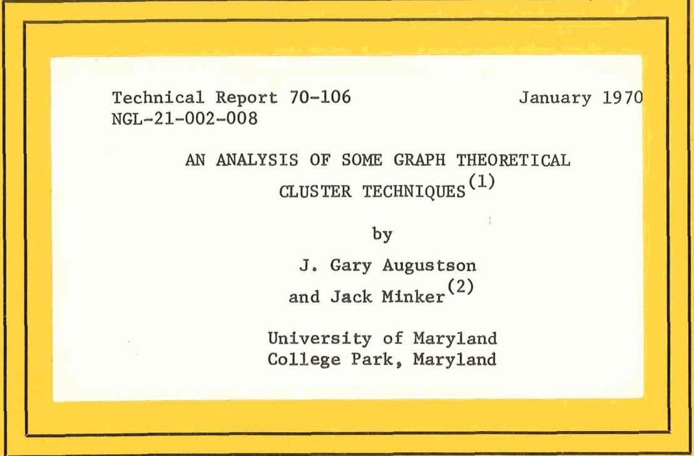
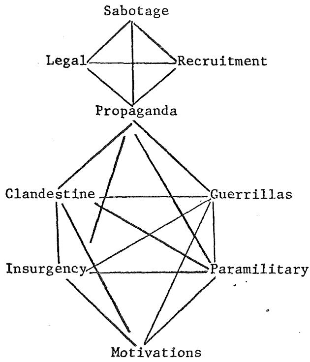
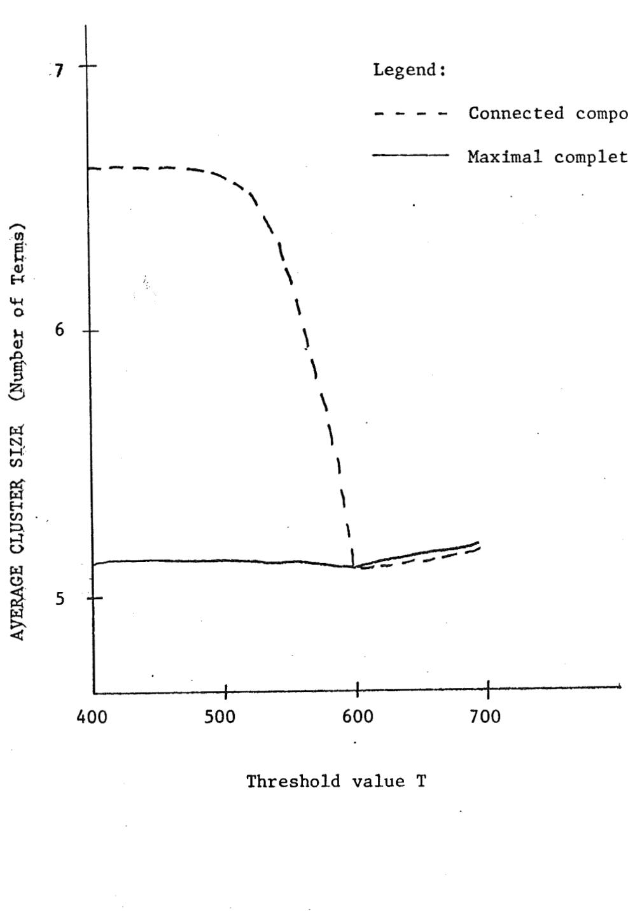
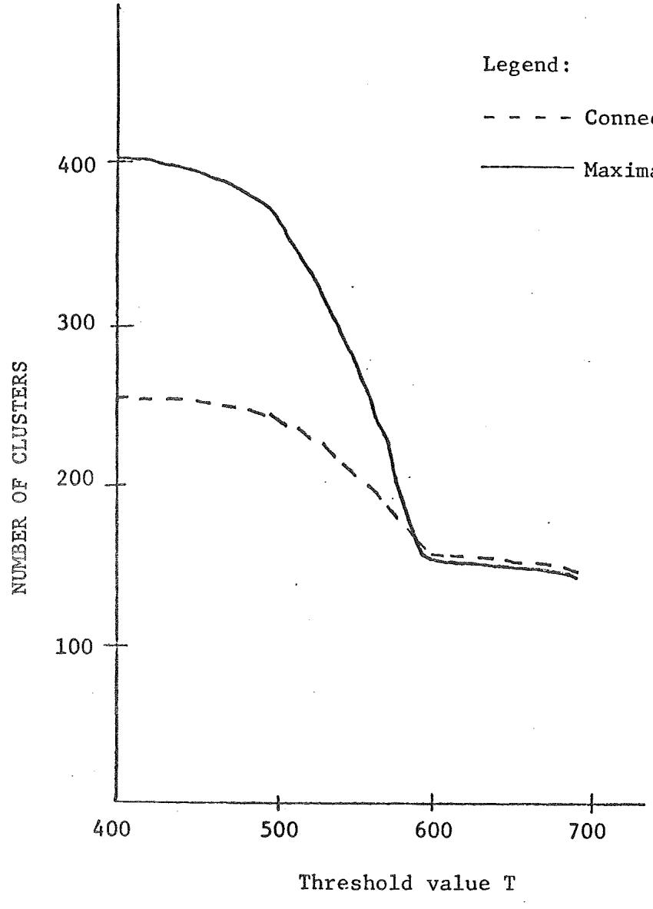

# UNIVERSITY OF MARYLAND COMPUTER SCIENCE CENTER COLLEGE PARK, MARYLAND

# by

J. Gary Augustson and Jack Minker(2)

University of Maryland College Park, Maryland

(1) The computer time for this paper was supported by National Aeronautics and Space Administration Grant NGL-21-002-008 to the Computer Science Center of the University of Maryland. Part of the work was sponsored under National Bureau of Standards contract No. CST-821-5-69.

(2) The authors wish to express their appreciation to Mr. H. Edmund Stiles who generously made the corpus available to us in machine readable form. We also wish to express our appreciation to Prof. C. C. Gotlieb of the University of Toronto for calling our attention to the Bierstone algorithm described in this paper.

This paper explores several graph theoretic cluster techniques aimed at the automatic generation of thesauri for information retrieval systems. Experimental cluster analysis is performed on a sample corpus of 2267 documents. A term-term similarity matrix is constructed for the 3950 unique terms used to index the documents. Various threshold values, T, are applied to the similarity matrix to provide a series of binary threshold matrices. The corresponding graph of each binary threshold matrix is used to obtain the term clusters.

Three definitions of a cluster are analyzed:

1. The connected components of the threshold matrix.   
2. The maximal complete subgraphs of the connected components of the threshold matrix.   
3. A cluster of the maximal complete subgraphs of the threshold matrix, as described by Gotlieb and Kumar [15].

Algorithms are described and analyzed for obtaining each cluster type. The algorithms are designed to be useful for large document and index collections. Two algorithms have been tested that find maximal complete subgraphs. An algorithm developed by Bierstone [6] offers a significant time improvement over one suggested by Bonner [7].

For threshold levels, $\texttt { T } \geq \ 0 \ . 6$ , basically, the same clusters are developed regardless of the cluster definition used. In such situations one need only find the connected components of the graph to develop the clusters.

# TABLE OF CONTENTS

Chapter

Page

1. Introduction..

2. Related Work in Cluster Analysis... 2

2.1 General Cluster Techniques.... 2   
2.2 Graph Theor $^ { \circ }$ tical Cluster Techniques... 3

3. Experimental System... 4 i.3 Selection of a Similarity Measure.... 8

4 Creation of the Threshold Matrix.... 9

5 Construction of the Connected Components...... 9

3.6 Development of the Maximal Complete Sets...... 10

3.6.1 Imp $\ddagger$ ementation of the Bierstone Algorithm for Producing Maximal Complete Subgraphs...... 11   
3.6.2 An Alternative Implementation of Bierstcne's Algorithm to Conserve Storage Space..... 16   
3.6.3 Experimentation with Bonner's Method for Cluster Production.... 17

4. Analysis and Comparison of Bierstone's and Bonner's Algorithm 20

5. Refinement of Clusters via Gotlieb and Kumar Algorithm....... 24

6. Experimental Results.. 26

6.1 Structural Composition of Clusters... 27   
6.2 Summary of Major Conclusions... 29

APPENDIx 1 - Bierstcne's Algorithm for Finding Maximal Complete Subgraphs.... 34

APPENDIx 2 - Bonner's Cluster-Building Algorithm... 36

APPENDIx 3 - Structural Composition of Threshold Matrices... 38

BIBLIOGRAPHY. 39

# KEY WORDS AND PHRASES

Cluster analysis, graph-theoretic, connected component, maximal complete subgraph, clique, binary threshold matrix, information storage and retrieval, similarity matrix, term-term matrix.

One of the major problems concerning a user of present day information systems is how to extract information pertinent to his needs. The rare individual who knows exactly what he wants, and is aware of what the system contains, will encounter few problems. The majority of users, however, are usually unable to define all items of interest to them, and are not intimately familiar with their collection. Even if an adequate description of the type of information desired can be specified, most users are not sufficiently familiar with the document collection to assure the retrieval of documents relevant to their needs.

In most information systems, whether automated or not, some relationship can be established between the various terms used to index documents. Extensive experimental work has been undertaken in orler to develop statistically determined term associations. However, work performed by Salton [35] and Lesk [23] on a limited sample document collection indicates that a well constructed thesaurus may prove to be the best method of exhibiting term associations. If this observation, based on a small corpus, proves to be true, the problem remains that, even though a relationship between index terms generally exists, very few thesauri of index terms are available. How, then, shall such a thesaurus be generated?

One approach is to compile a thesaurus manually, as for example, the thesaurus for the EURAToM nuclear energy document collection. The result is a well structured thesaurus represented in both list and graphical form [14]. The construction of such a thesaurus is a complex, time consuming operation. Highly skilled subject-area specialists must be used in order to insure proper construction. For document collections larger and more general in nature than the EURATOM collection, subject-area specialists covering a wide variety of fields must be used. Problems may be encountered in subdividing the document collection into subsets that will be meaningful to the individual experts. The use of such a wide range of specialists may be not only impractical economically. but physically impossible. During the time required to construct such a thesaurus, the user of the information system will suffer due to the lack of information about the document collection which is available.

Experimentation in the field of cluster analysis is aimed at providing the user of an information system with an automatically generated thesaurus. The thesaurus produced could provide a two-fold purpose. First, it could constitute a reasonable representation of the interrelatedness of the index terms that could be used to query the document collection. Second, if a better thesaurus is desired, the term relations established by a clustering scheme could provide an original partition of the terms which subject-area specialists could then refine. Many of the tedious and time consuming problems of thesaurus construction for large, general, document collections thereby could be avoided.

An automatic, or semi-automatic generation scheme should prove valuable for large, general, document collections about which little information concerning the specific contents is known. It is to this problem that this paper is addressed.

2. Related Work in Cluster Analysis

# 2.1 General Cluster Techniques

Many individuals have made substantial contributions to the field of cluster analysis. Ball [4], surveys many of these efforts. In this section, we briefly note some of the previous contributions to developing clusters of terms in a document collection. Tanimoto, [34, 43], in the late $1 9 5 0 \mathrm { : : } \mathrm { s }$ , studied aspects of this problem. We use Tanimoto's similarity measure in this study.

In 1960, Borko [8] used the principle of factor analysis to develop clusters for a $9 0 \texttt { x } 9 0$ correlation matrix. Stiles and Salisbury [42], have developed a so-called B-coefficient, to subdivide terr-profiles into distinct sets. Baker, [3], in 1962, suggested the use of latent class analysis to develop clusters.

Needham [25], has experimented with cluster finding techniques usirg what he calls arithmetic cohesion, and terms his process 'clump' finding. SparckJones [39], at the Cambridge Language Research Unit has extended Needham's work, and has experimented with a set of 64l terms.

Recently, Dattola [13], has developed a cluster method based on an adaptation of a technique suggested by Doyle [14]. Dattola's technique assures that his method will converge to a set of clusters, whereas Doyle's approach need not terminate.

# 2.2 Graph Theoretical Cluster Techniques

The original suggestion to use graph theoretical definitions of a cluste was made, perhaps, by Kuhns [22] in December 1959. Kuhns, in his paper, defines the maximal complete subgraph of a graph as a cluster. A maximal complete subgraph of a graph is a subgraph in which every pair of nodes in the subgraph is connected by an edge of the graph. Kuhns does not provide experimental results in his paper.

Parker-Rhodes and Needham [27,30,31] have defined what is called a G-R clump, an iterative procedure having some graph theoretical relations. Dale and Dale [12] have experimented with this technique.

Sparck-Jones [37] has reported on an extension of clustering work performed by herself and Needham. Clusters were produced from a data base of 712 terms using four definitions of a cluster, which she terms (l) strings, (2) stars, (3) cliques (which are termed maximal subgraphs in this paper), and (4) clumps.

Gotlieb and Kumar [15] also use the concept of maximal complete subgraphs for defining clusters. They employ the Library of Congress Subject Heading list to develop clusters of terms rather than a document collection from which one develops a term-term matrix. An important aspect of their work is the suggestion to form clusters of the clusters. We experiment with this approach in this paper.

Other work in cluster analysis is referenced in the bibliography.

# 3. Experimental System

# 3.1 Overview of the Experimental System

The experimental work reported on in this paper is presented in a more extensive paper [2]. The work consisted of the development of a data base, consisting of a set of documents and a set of terms used to index the documents. A similarity matrix is constructed from the document-term matrix to show the interrelatedness of the various index terms. The similarity matrix has entries between O and 1 in the matrix. Various threshold values are applied to the similarity matrix to produce the threshold matrices upon which the clustering process is performed. The connected components(1) of the threshold matrices provide the weakest definition of a cluster; the maximal complete subgraphs of the threshold matrices provide the strictest definition of a cluster. (Fig. 1 illustrates a typical cluster graph, and the definitions used for a cluster.) Some combining of the maximal complete subgraphs is performed in order to provide a definition of a cluster intermediate between the connected components of a graph and the maximal complete set of the graph.

A corpus consisting of 2267 documents and 3950 unique index terms, and concerning a wide variety of topics was used for the study. A term-term similarity matrix, consisting of elements $a _ { \mathrm { i j } }$ , using the Tanimoto [34] similarity measure, was then constructed.The elment ${ \mathsf { a } } _ { \mathrm { i j } }$ of the term-term matrix represents the degree to which terms i and $\textbf { j }$ of the document collection are interrelated. A series of binary threshold matrices were constructed from the resultant similarity matrix for values of $\begin{array} { r } {  { \mathrm { ~ T ~ } } = \ 0 . 1 , \  { \mathrm { ~ T ~ } } = \ 0 . 2 , \  { \mathrm { ~ T ~ } } = \ 0 . 3 , } \end{array}$ . $\mathrm { ~ T ~ } = \ 0 , 4 , \ \mathrm { ~ T ~ } = \ 0 , 5 , \ \mathrm { ~ T ~ } = \ 0 . 6$ ,and $\mathrm { ~ T ~ } = \mathrm { ~ 0 ~ . ~ 7 ~ }$ . If the entries $a _ { \mathrm { i j } }$ of the similarity matrix were greater than the threshold value T, then the corresponding entry of the threshold matrix was set to one; otherwise, it was set to zero. The binary symmetric threshold matrix is equivalent to an undirected graph where the terms are the nodes of the graph, and where an edge exists between nodes nd dh  e position. Algorithms developed by Bonner [7] and Bierstone [6] were modified and implemented to find the maximal complete subgraphs of the connected components of the threshold matrices. Maximal complete subgraphs were produced from threshold matrices for $\texttt { T } = \ 0 . 4 , \texttt { T } = \ 0 . 5 , \texttt { T } = \ 0 . 6$ and $\mathrm { ~ T ~ } = \mathrm { ~ 0 ~ . ~ } 7$ due to the large size of the connected components found for values of $\tau { < } 0 , 4$

Bombers Strategic Missiles

1. The graph has two connected components - the components: {Bombers, Strategic, Missiles} and {Legal, Sabotage, Recruitment, Propaganda, Clandestine, Guerrilla, Insurgency, Paramilitary and Motivations}

2. The graph has four maximal complete sets: {Bombers, Missiles, Strategic}, {Legal, Sabotage, Recruitment, Propaganda}, {Propaganda, Clandestine, Guerrillas, Insurgency, Paramilitary}, {Motivations, Clandestine, Guerrillas, Insurgency, Paramilitary}.

3. The graph has three grouped maximal complete sets: {Bombers, Strategic, Missiles}, {Sabotage, Legal, Recruitment, Propaganda}, {Propaganda, Clandestine, Guerrillas, Insurgency, Paramilitary, Motivations}..

Using the procedure suggested by Gotlieb and Kumar [16], those maximal complete subgraphs which had a significant number of common terms were grouped together to form new clusters. These clusters provide an intermediate definition between the clusters defined by the connected components of the threshold matrices and those defined by the maximal complete subgraph of the connected components.

The clusters produced from the several threshold matrices and the three cluster definitions were analyzed and compared as to general composition and content.

# 3.2 Description of the Corpus

The corpus used for this study consists of 2267 documents composed basically of research, development, test and evaluation information from 22 broad subjects fields of science covering a five year period from 1963 to 1968. The majority of the documents are from the fields of mathematics; physics, and communication. For each document, the author, title, abstract, and descriptors were available. For the work reported on in this paper, we are concerned only with the title and the descriptors.

Approximately $90 \%$ of the documents were assigned descriptors at composition time by the author. The remaining documents were indexed by nonsubjectmatter-oriented individuals with the aid of a master descriptor dictionary. Nearly one-fourth of the contributing authors had access to this master descriptor dictionary while indexing their own documents. Regardless of who performed the initial indexing of the documents, all indexed documents were post-edited by library personnel prior to insertion into the collection in order to assure proper indexing. The authors of this paper were not in

volved in this process, but merely use the results of the above efforts.

As this corpus was already in machine readable form, the tedious work of gathering and encoding a representative set of documents was avoided. The corpus is a subset of a much larger collection composed of documents from the same subject areas. Though no previous experimental work had been performed on this particular set, it was possible to consult with individuals who were better acquainted with the contents of the entire collectior to determine if the clusters produced were meaningful.

# 3.3 Selection of a Similarity Measure

Some measure of the relatedness between terms used to index the documents of the data set must be established in order to perform cluster analysis. Several different similarity measures have been proposed [7,12, 18,21,41,43]. Since in-depth comparisons and evaluations concerning various similarity measures have been conducted before by other authors [18,21,36], only one similarity measure was studied. Sparck-Jones [37], in particular, comments that the several similarity definitions used in her cluster production experiments did not appear to give radically different results.

The Tanimoto [34] similarity measure was used for this work. Tanimoto defines the similarity measure between two index terms i and j to be:

$$
\mathrm { s ( \mathbf { i } , \mathbf { j } ) ~ = ~ \underbrace { \mathrm {  ~ \alpha ~ } _ { i j } ^ { \mathrm { \tiny ~ \alpha ~ } } } _ { \mathrm {  ~ \alpha ~ } _ { i \dot { \mathbf { 1 } } } ^ { } \mathrm { ~ + ~ \alpha _ { j \dot { \mathbf { j } } } ^ { } ~ - ~ \mathrm {  ~ \alpha ~ } _ { i j } ^ { } ~ } } ~ }
$$

where αij represents the number of documents in which both i and j occur as index terms, and αii represents the number of documents in which term i is used as an index term.

# 3.4 Creation of the Threshold Matrix

To find clusters according to the three definitions considered, it was $\mathrm { ~ C ~ } = \mathrm { ~ \small ~ [ ~ C _ { i , j } ~ ] ~ } \mathrm { ~ r e - - \small ~ [ ~ \Omega ~ + ~ \Gamma ~ { ~ \Omega ~ } ~ ] ~ }$ presents the document-term matrix (1) 9 then $\mathrm { c } ^ { \mathrm { T } }$ .C is the term-term matrix(2). When the term-term matrix is suitably normalized as, for example, suggested by Tanmoto, the entris the normlized term-ter matri(3 have values between 0 and 1. By applying a cut-off value of $\mathfrak { T }$ to the similarity matrix, whereby two terms are considered associated if the entries in the similarity matrix are 2 T, this matrix is converted into a binary matrix' termed the threshold matrix.

The actual production of the term-term matrix was achieved by a series of programs which avoided the problem of multiplying large matrices. A description of this program is given in [2]. The program is applicable to large matrices and is unrestrained by the size of the data set.

# 3.5 Construction of the Connected Components

In developing term clusters for large document collection, it is helpful to first reduce the graph in question to its connected components. Since elements of clusters must be interrelated to one another, it would be wasteful to attempt to find clusters between terms in separate connected components. By reducing a graph to its connected components and handling each component as a distinct graph, term relations of large document collections can be reduced to a size that is manageable within the core limits of a conventional computer. The connected components are further required since they provided our weakest definition of a cluster.

An algorithm was developed which produced the connected components of an input graph and was dependent only upon the number of nodes in the input graph. The output connected components provided both resultant clusters and distinct divisions of the data set for input to the maximal complete subgraph algorithms. The algorithm developed is described in [2]. It is an adaptation of the algorithm developed by Galler and Fisher and described in [19], p. 353.  The adaptation permits one to find connected components in large graphs. A graph with 2084 nodes and 6630 edges developed 475 connected components in l.87 minutes. This time includes the time required to input the graph from magnetic tape, and output the connected components onto magnetic tape. For all graphs discussed in this paper, the times required to find the connected components in the graphs are given in Appendix 3.

# 3.6 Development of the Maximal Complete Sets

Several algorithms have been developed for generating maximal complete subgraphs of a graph. These algorithms were introduced by Harary and Ross, Bierstone [6], and Bonner [7]. Apparently, the Harary-Ross algorithm was the first developed; however, it involves the computation and manipulation of large matrices for large input graphs. The Bierstone and Bonner algorithms are more adaptable to cluster analysis for large data sets and, as a result, were implemented for our work. Both the Bierstone and the Bonner algorithms as reported in the literature were not complete. The algorithms are described in this section and presented in detail in the appendix. Inpui to the two algorithms consisted of the connected components of the threshold

# 3.6.1 Implementation of the Bierstone Algorithm for Producing Maximal Complete Subgraphs

The following algorithm, developed by Bierstone [6], was used to promodification in order for it to work. To the best of our knowledge, the algorithm has not been implemented and used on an actual data set previousiy. It was selected as the major cluster producing algorithm for this paper.

The representation of a graph is input to the algorithm with each of the nodes $\mathfrak { p } _ { \mathbf { j } } , \ \mathfrak { ( j = 1 , \dots , n ) }$ , assigned a unique number used in all operations in place of the actual nodes. For each node ${ \mathfrak { p } } _ { \mathbf { j } }$ , there is associated a set $\mathtt { M _ { j } }$ , where

={

It is crucial to the operation of the algorithm that $\mathbb { M } _ { \mathrm { j } }$ contain only nodes ${ \mathfrak { p } } _ { \mathtt { k } }$ where $\texttt { k } > \texttt { j }$ (i.e. - if node number 7 were connected to nodes 3, 5, 9, 11, and 13, the corresponding $\mathfrak { s } _ { \mathtt { j } }$ entry would be $\mathbb { M } _ { 7 } ~ = ~ \{ 9 , ~ 1 1 , ~ 1 3 \} )$ . The sets M, correspond to the upper triangular form of a matrix.

We further note that the same algorithm can be used to find the maximal complete set of an acyclic directed graph; that is, a directed graph without cycles. One first performs a topological sort (see [19], p. 259 for an algorithm to develop a topological sort) on the directed graph. Nodes are then numbered in order of their appearance in the topological sort.

To conserve storage space, the entries, $\mathtt { M _ { j } }$ , are represented in the computer as binary vectors where bit i is one in entry $\mathtt { M _ { j } }$ if the input edge (j,i) i > j, exists; otherwise, bit i is zero. The number of bits required for entries of M is determined by the size of the largest connected component in the entire data set being processed.

The algorithm utilizes a set of elements C (each of which is in the form of a binary vector) where the maximal complete subgraphs are built up. During the operation of the algorithm, nodes are added to the various complete subgraphs contained in C, until, upon termination, all of the $\mathrm { c } _ { \mathrm { k } }$ $( \mathrm { k } { = } 1 , \ldots , \mathrm { n } )$ represent maximal complete subgraphs of the input set.

The algorithm takes the set of nodes represented by the set $\{ \mathfrak { p } _ { \mathfrak { j } } \} \cup \mathbb { M } _ { \mathfrak { j } }$ $\mathrm { ( M _ { j } } \ne 0 )$ and attempts to find maximal complete subgraphs of this set which can be combined with the set of complete subgraphs $\mathrm { c } _ { \mathrm { k } }$ that have already been developed, or can be introduced as new unique complete subgraphs of the data set. The following provides a brief description of the algorithm.

Originally, i is set to zero and j is set equal to the number of nodes in the input graph. The value of j is decremented by one until a non-zero M, is found. At this point, for each ${ \tt p } _ { \tt k }$ contained in $^ { \mathtt { M } } { } _ { \mathtt { j } }$ , i is incremented by one and the pair $\{ \mathfrak { p } _ { \mathtt { j } } , \mathfrak { p } _ { \mathtt { k } } ^ { \mathtt { \_ { j } } } \}$ is placed into $\mathrm { c } _ { \mathrm { i } }$ , This establishes a set of distinct elements ${ \mathfrak { C } } _ { \mathtt { k } } \ ( \mathtt { k } { = } 1 , \mathtt { \ldots } , \mathtt { i } )$ , each consisting of node ${ \mathfrak { p } } _ { \mathbf { j } }$ and one of the nodes to which ${ \mathfrak { p } } _ { \mathbf { j } }$ is connected, as the original set of complete subgraphs upon which to build.

Iterative processing begins by decrementing j by one until a non-zero $\mathbb { M } _ { \mathbf { j } }$ is found. When j becomes zero, the algorithm is finished and the elements of the array $\mathrm { c } _ { \mathrm { k } }$ represent the maximal complete subgraphs of the input graph.

A temporary storage location $\mathbb { W }$ , used to keep track of those nodes of $\mathbb { M } _ { \mathrm { j } }$ which are not added to some $\mathrm { c } _ { \mathrm { k } }$ , is set equal to $^ \mathrm { { M } } { } _ { \dot { \mathrm { ~ j ~ } } }$ . The value of L is set equal to i (the number of complete subgraphs produced so far by the system) and k is set to zero so iteration through all $\mathrm { C _ { \mathrm { k } } }$ can begin. The value of $\mathrm { k }$ is increased by one, and if it is greater than L, then all current complete subgraphs $\cdot \mathrm { c } _ { \mathrm { _ k } } ^ { \mathrm { ~ } } \left( \mathrm { k } \mathrm { ~ } ^ { \circ } \mathrm { ~ } ^ { \mathrm { ~ 1 ~ } , \dots , \mathrm { L } } \right)$ have been searched to determine wher elements of $\mathfrak { M } _ { \mathrm { j } }$ can be inserted(Any noes stil remaining in W hav ot been inserted in the set of complete subgraphs C.Since ${ \mathrm { { } ^ { p } j } }$ , by definition, is connected to all such nodes, the pairs of items $\{ \mathfrak { p } _ { \mathrm { j } } , \mathfrak { p } _ { \mathrm { k } } \}$ for all $\boldsymbol { \mathrm { p } } _ { \mathrm { k } }$ contained in $\mathtt { w }$ must be inserted into the system as complete subgraphs of degree two. For each such pair, i is incremented by one and a new complete subgraph  = {pj,Pk) is constructed (i.e. - if W contains nodes 10, and 13, $j = 4$ , and $\mathrm { ~ i ~ } = \mathrm { ~ 6 ~ }$ , then $\mathsf C _ { 7 } = \{ 4 , \mathsf \Delta 1 0 \}$ and $C _ { 8 } = \{ 4 , 1 3 \} )$ . Control then returns back to continue decrementing j in order to introduce a new set $\mathtt { M _ { j } }$ .

If $\mathbf { k }$ is not greater than $\mathtt { I }$ , a temporary storage location T is set equal to those elements common to $\mathrm { c } _ { \mathrm { k } }$ and ${ ^ \mathrm { M } } _ { \mathrm { j } }$ . By definition, elements of T are contained within the complete subgraph $\mathrm { c } _ { \mathrm { k } }$ . Thus, all elements of T must be interconnected and since, by definition, all are connected to ${ \mathfrak { p } } _ { \mathrm { j } }$ , the set of nodes $\mathbb { T } \backslash \mathcal { J } \{ \mathfrak { p } _ { \mathbf { j } } \}$ form a complete subgraph. If T is empty, no meaningful match with $\mathrm { c } _ { \mathrm { k } } \circ \mathrm { r } \ \mathrm { M } _ { \mathrm { j } }$ can be make in future steps, so it is futile to continue. If T contains only one node, the most that can be accomplished by executing the following series of complex steps would be to introduce the set $\{ \mathfrak { p } _ { \mathrm { j } } \} ^ { \mathrm { ~ T ~ } }$ as a complete subgraph of degree two. A Simple process, utilizing $\mathtt { W }$ , was defined previously for this purpose. Therefore, if T contains fewer than two nodes, control is returned to compare ${ ^ \texttt { M } } _ { \mathrm { j } }$ with the values of the next entry of C. If T contains more than two nodes, the nodes of T are deleted from W as they will be inserted in the following steps into the set C.

Depending upon the values of $\mathbb { T } , \ \mathbb { M } _ { \mathtt { j } }$ ,and $\mathrm { c } _ { \mathrm { k } }$ , one of the following three alternatives will be used to introduce the elements of T into the set of complete subgraphs C. If $\mathrm { ~  ~ T ~ } = \mathrm { ~ \boldsymbol ~ c ~ } _ { \mathrm { \boldsymbol k } }$ , Altermative (I) will be taken; if $\mathrm { ~ T ~ } \neq \mathrm { ~ C _ { k } ~ }$ but $\mathrm { ~ T ~ } = \mathrm { ~ M ~ } _ { \mathrm { j } }$ ,t livell  a $\mathrm { ~ T ~ } \neq \mathrm { ~ C ~ } _ { \mathrm { k } }$ and $\mathrm { ~ T ~ } \not = \mathrm { ~ M ~ } _ { \mathrm { j } }$ then Alternative (III) will be used.

Alternative (I). $\mathrm { ~ \textit ~ { ~ T ~ } ~ } = \mathrm { \nabla C _ { k } }$ means that the present node under consideration is connected to all elements of the complete subgraph $\mathrm { c } _ { \mathrm { k } }$ . Then, $\mathrm { { ^ p } j }$ must be connected to all elements of $\mathrm { c } _ { \mathrm { k } }$ and can be added to the complete subgraph $\mathrm { c } _ { \mathrm { k } }$ . Due to the iterative nature of the algorithm, the remaining ${ \mathsf { C } } _ { \mathsf { q } } ^ { } \ { \mathsf { \Omega } } ( \mathsf { q } _ { \mathsf { \Omega } } = \mathsf { k } _ { \mathsf { \Omega } } + \mathsf { \Omega } _ { 1 } ^ { } , \ldots , \mathsf { i } _ { \mathsf { \Omega } } )$ must be searched to see if any are subsets of the just altered $\mathrm { c } _ { \mathrm { k } }$ . If any are found, they must be deleted from the set C. Bierstone omits this step from his algorithm. The corrected Bierstone algorithm is detailed in Appendix 1.

After the above process is completed, T is compared to $\mathtt { M } _ { \mathtt { j } }$ . If the two are equal, this means, since $\{ \mathtt { p } _ { \mathtt { j } } \} \cup \mathbb { T } = \mathbb { C } _ { \mathtt { k } } { : }$ that $\{ \mathtt { p } _ { \mathtt { j } } \} ( { \mathrm { / ~ } } \mathtt { M } _ { \mathtt { j } } = { \mathtt { C } } _ { \mathtt { k } }$ and that any further processing for this $\mathfrak { M } _ { \mathtt { j } }$ will only produce subgraphs of the just altered complete subgraph $\mathrm { c } _ { \mathrm { k } }$ . As a result, control will return to the point $\texttt { T } \not \equiv \mathbb { M } _ { \mathfrak { g } }$ this means that there are alement of ${ \mathfrak { M } } _ { \mathfrak { j } }$ not in the newly altered complete Subgraph $\mathrm { c } _ { \mathrm { k } }$ and there may still be other ${ \texttt { C } } _ { \texttt { q } } ( { \texttt { q } } = { \texttt { k } } + 1 , \ldots , \mathrm { { L } } )$ which contains two or more nodes of $\mathtt { M _ { j } }$ , thus introducing more new complete subgraphs. If this is the case, control will return to increment k to proceed with comparing $\mathbb { M } _ { \mathbf { j } }$ with the remaining $\mathtt { C _ { q } }$ .

Alternative (II). If, at the point of constructing $\boldsymbol { \mathrm { \tt ~ T } } = \boldsymbol { \mathrm { \tt ~ C _ { \mathrm { k } } ~ } } ^ { \mathrm { \normalsize ~ \hat { \mu } ~ M } } \mathrm { \ddot { j } }$ , T is found to be not equal to $\mathrm { c } _ { \mathrm { k } }$ , but $\texttt { T } = \texttt { M } _ { \mathfrak { j } }$ , this means that, although all nodes of $\mathbb { M } _ { \mathfrak { j } }$ are contained within the complete subgraph $\mathrm { c } _ { \mathrm { k } }$ , there exists at least one node in $\mathrm { c } _ { \mathrm { k } }$ to which ${ \mathfrak { p } } _ { \mathbf { j } }$ is not connected. However, as previously established, the elements of T $\mathsf { \Omega } ^ { \mathrm { \backslash } \{ \mathsf { p } _ { \mathrm { j } } \} }$ form a complete subgraph and therefore l  the  .s uli  mn by e is set equal to the set $\texttt { T } _ { \perp } ^ { ' } \{ \mathfrak { p } _ { \mathtt { j } } \}$ . Since $\mathtt { M _ { j } } = \mathtt { T }$ , effectively, the set $\{ \mathfrak { p } _ { \mathbf { j } } \} _ { : } \mathfrak { M } _ { \mathbf { j } }$ has been inserted as a complete subgraph and any further processing of this $\mathtt { M _ { j } }$ will only produce subgraphs of this set. Therefore, control will $\mathfrak { s } _ { \mathtt { j } }$ .

Alternative (III). It is possible to have produced originally a T which contains two or more nodes but is not identical with either Ck or M,. When such a situation arises, all Cq (A = 1,...,k - 1, k + 1,...i) must be searched to see if any which contain ${ \mathfrak { p } } _ { \mathrm { j } }$ also contain all elements of T. If one is found, this means that the present set of element T $\{ \mathfrak { p } _ { \mathfrak { j } } \}$ already belongs to a complete subgraph and no further processing is necessary. Control will be returned to check $\mathtt { M _ { j } }$ against the next entry of C. If no such $\mathtt { c } _ { \mathtt { q } }$ is found, a temporary location S is set equal to the set T $\mathrm { : \{ p _ { j } \} }$ . If the elements of some Cq (q = L + 1,..,i)(1) are contained within S, then $\mathtt { C _ { q } }$ is set equal to S. This has the effect of increasing the elements of the complete subgraph $\mathtt { c _ { q } }$ to include all elements contained in S. Any other ${ \mathsf { C } } _ { \mathtt { r } } \ { \mathsf { \Omega } } ( { \mathtt { r } } \ = \ { \mathsf { q } } \ + \ { \mathsf { 1 } } \ , \ \ldots , { \mathsf { i } } )$ which is contained in S must be deleted from the set C to avoid allowing a complete subgraph that is a subgraph of the complete subgraph S. If there is no $\mathtt { c _ { q } }$ which is totally contained in S, then i is incremented by one and ${ \mathrm { c } } _ { \mathbf { i } }$ is set equal to the complete subgraph S. Regardless of which course of action has been taken in this processing step, all elements of ${ ^ \texttt { M } } _ { \mathfrak { j } }$ have not been placed into the same complete subgraph and contr must be returned to process $\mathbb { M } _ { \mathtt { j } }$ for the next entry.

An alteration can be made to Bierstone's algorithm which can allow one to deal with input data sets quite large in size. If the input data is organized such that the values of $\texttt { M } _ { \mathtt { j } } \left( \mathtt { j } \ = \ 1 , \ldots , \mathtt { n } \right)$ enter the system in descending order Mn-1,..,M), then only the elements of M for the present value of j need be in the computer at any one time. This leaves the set C as the only data item requiring core storage space. If each $c _ { \mathrm { k } }$ entry were represented internally as a binary vector, sizable input sets could be handled. For example, the input graph represented by the threshold matrix produced for $\texttt { T } = \texttt { 0 . 3 }$ of our data set, included one connected component of 1150 nodes. It would have been impossible to operate the algorithm, as presented by Bierstone, on this set, as each of the l150 entries for ${ ^ \texttt { M } } _ { \mathrm { j } }$ would have required thirty-two 36 bit words even to be represented as a binary vector. This would have exceeded the core storage space of the IBM $7 0 9 4$ without having allocated any space for the building up of complete subgraphs in C. However, if only one entry of M were needed in core at any one time, effectively 20,000 to 25,000 starage locations (approximately that amount of core left after the system and needed programs are loaded) could be allocated to elements of $\mathrm { c } _ { \mathrm { k } }$ . This would allow for approximately 600 to 800 elements of $\mathrm { c } _ { \mathrm { k } }$ (each being a binary vector 32 words in length) to be used to create the maximal complete subgraphs. This would appear to be sufficient space to handle the data set.

Such an alteration to the algorithm greatly increases the size of the data input set which can be processed. Space limitation problems would occur only when the number of nodes in the input connected component becomes

$\mathrm { c } _ { \mathrm { k } }$ $( \mathbf { k } \ = \ 1 , \ldots , \mathtt { n } )$ as a binary vector becomes so large that the maximum allowable value of n becomes smaller than the number of complete subgraphs in the system at any one time. It should be noted that in our particular data set, this limitation point approaches quickly once the threshold used to define the input graph drops below $\tau = \ 0 . 3$ . For $\mathrm { ~ T ~ } = \mathrm { ~ 0 ~ . ~ 2 ~ }$ , the largest connected component contains 2,797 nodes; 78 thirty-six bit words would be required to represent each entry of C. This would handle approximately 300 complete subgraphs of the graph. Since, by applying a threshold value of $\texttt { T } = \texttt { O } . 4$ to the same data set, we introduced 329 additional connected components into the graph, many of which contained several maximal complete subgraphs, it would be realistic to think that the input set for $\mathrm { ~ T ~ } = \ 0 . 2$ would contain more than the allowable 300 maximal complete subgraphs.

Regardless of the fact that the above alteration to Bierstone's algorithm quickly approaches a limiting point, the algorithm does describe how to find the maximal complete subgraphs of large data sets. Unfortunately, due to the structure of our input data, we did not experiment with the suggested change in the algorithm.

# 3.6.3 Experimentation with Bonner's Method for Cluster Production

Bonner [7] has reported on some extensive research in term clustering which included the introduction of a new algorithm for producing the maximal complete subgraphs (referred to as 'tight clusters' by Bonner) of an input data set. The Bonner algorithm as published in [6] is incorrect. We have corrected the algorithm and programmed it in FORTRAN IV and MAP for the IBM $7 0 9 4$ , and applied it to our corpus.

Input to Bonner's algorithm is in the form of a threshold matrix T. We have applied the Bonner algorithm to the threshold matrix produced by applying a value of $\mathrm { ~ T ~ } = \mathrm { ~ 0 ~ . ~ 4 ~ }$ to the similarity matrix of our data base.

Bonner asserts that, due to storage limitations imposed by the machine he used (an IBM 7090 with a memory size of 32 K words), the maximum allowable sample size the algorithm can handle is 350 input terms. Bonner does not subdivide the input threshold matrix into a series of disjoint threshold matrices, (Bonner's examples show that the elements may be disjoint), thereby permitting each of the disjoint matrices to be treated as separate input data sets. Assuming there are disjoint sets, this could enable an appreciable increase in the maximum allowable sample size. As an example, for the threshold value $\mathrm { ~ T ~ } = \mathrm { ~ 0 ~ . ~ 4 ~ }$ our data set which consists of 2,084 unique index terms, subdivided into $4 7 5$ disjoint threshold matrices (each corresponding to a connected component of the representative graph). Each of the sets was then used as input to Bonner's algorithm with no proble arising concerning storage space.

The Bonner algorithm builds clusters one at a time while keeping several push-down lists. Index terms of the document collection are assigned unique numbers which are used as representative forms within the lists for all operations. The lists developed during the operation of the algorithm are as follows:

1. The list A - contains items that are in a cluster at step i.   
.The list C - contains elements which could be added to cluster $\mathsf { A } _ { \mathbf { \vec { \tau } } \mathbf { \vec { \tau } } ^ { \vec { \tau } } }$ at step i.   
3. The list Li - contains the number of the last item of C, to be considered for addition to the cluster $\mathsf { A } _ { \mathrm { i } }$ .

Originally, the candidate list $\mathrm { c } _ { 1 }$ contains all items of the input data set, $\mathsf { A } _ { \exists }$ is empty, and the item $\mathtt { L _ { j } }$ to be considered for addition to cluster $\mathrm { A _ { 1 } }$ is set to 1.

The algorithm operates as follows. $\mathrm { c } _ { \mathbf { i } }$ is searched to see if it contain the element represented by $\mathtt { L _ { i } }$ . If the element is present, $\mathrm { L _ { \mathrm { \frac { i } { \hbar } } } }$ is logically 'or'-ed with the elements of $\mathsf { A } _ { \mathbf { i } }$ and placed in $\mathrm { \bf A } _ { \mathrm { i + 1 } } . \mathrm { \bf ~ c } _ { \mathrm { i } }$ is then logically 'and'-ed with the row of the threshold matrix corresponding to the value of $\mathtt { L _ { i } }$ and the result is placed in $\mathrm { c } _ { \mathrm { i + 1 } } . \mathrm { ~ \mathrm { ~ L ~ } } _ { \mathrm { i } }$ is deleted from $\mathrm { c } _ { \mathbf { i } + 1 }$ and then incremented by 1 and placed in $\mathtt { L } _ { \mathtt { i } + 1 }$ . Now, i is incremented by 1, and the process is repeated for the new value of i. What, in effect, has happened, is that the term represented by $\mathtt { L _ { i } }$ has been added to the cluster $\mathtt { A _ { i } }$ and the elements of $\mathrm { c } _ { \mathrm { i } }$ have been changed to reflect all those elements in the data set that are connected to, but not contained within, the cluster $\mathtt { A _ { i } }$ . This process continues until there are no elements left in $\mathrm { c } _ { \mathrm { i } }$ for consideration for addition to the cluster $\mathbf { A _ { i } }$ which have a numerical value larger than the last element added to the cluster. If at any point in the above iteration, $\mathrm { c } _ { \mathrm { i } }$ is found not to contain the element corresponding to the value of $\bar { \mathbf { L } } _ { \mathbf { i } } , \mathbf { L } _ { \mathbf { i } }$ is incremented by 1 and the process is repeated for the new value of $\mathtt { L _ { i } }$ . When no element of ${ \tt c } _ { \tt i }$ is larger than $\mathtt { L _ { i } }$ , a cluster has been found. Due to the iterative nature of the algorithm, if the candidate list $\mathrm { c } _ { \mathrm { i } }$ has not been exhausted, the cluster found has either been found before or it is a subset of a cluster found before,and it is ignored. If $\mathrm { c } _ { \tt i }$ is empty, the cluster (maximal complete subgraph) is unique,and it is saved. Regardless of the contents of $\mathrm { \mathsf { c } } _ { \mathrm { i } } , \mathrm { \mathsf { A } } _ { \mathrm { i } }$ is saved in a temporary location T. A backwards search of the previously stored elements $( \mathbb { A } _ { \mathbf { i } } , \mathbb { C } _ { \mathbf { i } } , \mathbb { L } _ { \mathbf { i } } )$ is initiated by decrementing i until a $\mathrm { c } _ { \mathrm { i } }$ is found which has elements greater than the value of the corresponding $\mathtt { L _ { \mathtt { j } } }$ which do not form a subset of T. By making this check at this point, some processing time is saved as some complete subgraphs of the maximal complete subgraph just found are rejected without having to regenerate the entire cluster and then reject it because ${ \mathrm { c } } _ { \mathbf { i } }$ is not null. When a C meeting the above criteria is found, the forward processing of the data set begins again using the previously stored values of A, C, and L for the present value of i. Originally, i is set to l and the algorithm will terminate when i becomes 0.

If, after finding a point to begin forward processing following the production of a cluster, the value of $\mathtt { L _ { i } }$ is not incremented before processing is reinitiated, the Bonner algorithm will infinitely loop producing over and over the same cluster. Incrementing $\mathtt { L _ { i } }$ corrects the algorithm. The corrected version of Bonner's algorithm appears in Appendix 2.

# 4. Analysis and Comparison of Bierstone's and Bonner's Algorithms

Bonner claims that his algorithm offers an improvement over previous methods [22,27] since he does not output the same cluster repeatedly or continually print out subsets of clusters already found. Indeed, this offers an improvement in the type of output produced, but its saving in processing time does not appear to be that great. In this study, the larger clusters of the data sets were produced by Bierstone's algorithm in significantly less time than it took for Bonner's algorithm. An analysis of Bonner's algorithm shows that, although each cluster is output only once with none of its subsets output, many such subsets and duplicate clusters are found by the algorithm and rejected only when $\mathrm { c } _ { \mathbf { i } }$ was found to be not empty after complete production of the cluster (Step 6 of the algorithm).

Since clusters are built up one item at a time, beginning with the first index term, the production of clusters is dependent upon the numerical values originally assigned to the input terms. The time involved in finding all clusters varies according to the location of the clusters with respect to the numbering scheme. This fact was most evident in the results produced by this algorithm for our data base. A timing algorithm was utilized to determine how long it took Bonner's algorithm to produce the resultant set of clusters from each input set. These results were compared with the time needed by Bierstone's algorithm to produce the exact same clusters. Figure 2 shows the comparative results.

In several instances, Bonner's algorithm worked as fast or faster than Bierstone's. However, such figures are misleading as most all of these input sets contained only from one to three small clusters. The most indicative comparative results are reflected by those input sets which contained several clusters of varying size. In all but one case, Bierstone's algorithm was at least twice as fast as Bonners'.

In the two largest input sets, Bierstone's algorithm proved to be much faster. One large and highly connected input set consisting of 72 terms was found to have three maximal complete subgraphs of 64 terms each and five smaller maximal complete subgraphs of six terms each. Bierstone's algorithm took O.133 seconds to develop the clusters. Bonner's algorithm needed 2.183 seconds to produce the same results. A somewhat smaller input set (67 terms) was found to have five maximal complete subgraphs of 47 terms each and six additional maximal complete subgraphs of 3 or 4 terms each in 0.733 seconds by Bierstone's algorithm (this was the most processing time required of all the input sets). Bonner's algorithm, in processing the same

<table><tr><td rowspan=1 colspan=1>ComparativeTime</td><td rowspan=1 colspan=1>Number ofApplicableData Sets</td></tr><tr><td rowspan=1 colspan=1>B&lt;A</td><td rowspan=1 colspan=1>111)</td></tr><tr><td rowspan=1 colspan=1>B = A</td><td rowspan=1 colspan=1>38(2)</td></tr><tr><td rowspan=1 colspan=1>B = 1.5A</td><td rowspan=1 colspan=1>4</td></tr><tr><td rowspan=1 colspan=1>B = 2A</td><td rowspan=1 colspan=1>31</td></tr><tr><td rowspan=1 colspan=1>B = 3A</td><td rowspan=1 colspan=1>.12</td></tr><tr><td rowspan=1 colspan=1>B = 4A</td><td rowspan=1 colspan=1>1</td></tr><tr><td rowspan=1 colspan=1>B = 5A</td><td rowspan=1 colspan=1>3</td></tr><tr><td rowspan=1 colspan=1>B = 10A</td><td rowspan=1 colspan=1>1</td></tr><tr><td rowspan=1 colspan=1>B = 17A</td><td rowspan=1 colspan=1>1</td></tr><tr><td rowspan=1 colspan=1>B &gt;250 &gt; A</td><td rowspan=1 colspan=1>1</td></tr></table>

# Legend:

$\textsf { \textbf { A } } =$ Time required for Biersone's algorithm to find the maximal complete subgraph clusters in an input set.   
$\texttt { B } =$ Time required for Bonner's algorithm to find the same maximal complete subgraph clusters in the same data set.

Of these:

Of these:

8 contained one cluster   
1 contained two clusters   
2 contained three clusters

15 contained one cluster 14 contained two clusters 5 contained three clusters

# FigUre 2. COMPARATIVE RESULTS OF TIME REQUIREMENTS FOR THE

data set, worked for nearly two minutes without producing final results. The activities of Bonner's algorithm were carefully analyzed by means of detailed debug printouts which related the contents of the lists A, C, L, and T at various stages within the algorithm. It was discovered that the five large clusters were found quickly and then the algorithm proceeded to spend the rest of its time rejecting subsets of these clusters in an attempt to work itself back through the data set to find the other clusters.

The failure of the Bonner algorithm to produce results for the above data set, while having relatively little trouble in finding the maximal complete subgraphs of a larger and more complex input set, demonstrates the fact that processing time for the algorithm is highly dependent upon the original numerical values assigned to the data terms. In the first of the two examples above, the original numbering scheme was such that the vast majority of the complete subgraphs of the large clusters already found were rejected without having to completely reproduce the new cluster (step 8 of the algorithm). However, in the second example, due to the location of the nodes which caused the distinction between the five large clusters, a larger percentage of the complete subgraphs of the larger maximal complete subgraphs had to be completely produced by the algorithm and finally rejected only when it was discovered that, upon producing the cluster, the candidate list $\mathrm { c } _ { \mathrm { i } }$ was not empty (Step 6 of the algorithm).

For a maximal complete subgraph containing n nodes, the number of complete subgraphs contained within it becomes excessive when $\mathfrak { n }$ is large. For any maximal complete subgraph containing n nodes, we can produce $( n - 1 ) ^ { \frac { n } { \rho _ { Ḋ } \mathrm { Ḋ } Ḍ } } \mathrm { e o m p l e t }$ subgraphs containing $\mathtt { n } { - } 1$ nodes; we also can find $\binom { \mathtt { n } } { \mathtt { n } - 2 }$ complete subgraphs with $\mathtt { n } \mathtt { - } 2$ nodes. By continuing this procedure, one can see that the total number of complete subgraphs contained in any maximal complete subgraph of n terms is $y = 3 ^ { \prime } y ^ { \prime }$ From the binomial theorem, we know that $2 ^ { \mathfrak { n } } = \underbrace { \mathfrak { n } } _ { \mathbf { j } = 0 _ { \mathrm { ~ j ~ } } } \mathtt { n }$ : Therefor, the total number of complete subgraphs of a maximal complete subgraph f gree n is equal to $2 ^ { 1 } - 2 - n - \frac { n ( n - 1 ) } { 2 }$ . In the case where $\mathrm { ~ n ~ } = \ 3 7$ , as was found in the above data set, we therefore have 1.37 x 1011 complete subgraplis that may be tested by Bonner's algorithm. Therefore, any significant decrease in the number of subgraphs eliminated at Step 8 of the algorithm could cause the processing time of an involved input set to get out of hand. This cannot happen with the Bierstone algorithm.

5. Refinement of Clusters via Gotlieb and Kumar Algorithm

Clusters formed by maximal complete subgraphs may overlap for highly connected input sets. For example, one of the larger data sets processed by Bierstone's algorithm was found to have three maximal complete subgraphs of 64 terms, each of which had 63 terms in common with the other two maximal complete subgraphs. An additional five smaller maximal complete subgraphs of the same input set were found to contain 6 terms each, 5 of which were common to all five maximal complete subgraphs. As was previously discussed, the maximal complete subgraphs form our strictest definition of a cluster. It is evident from the above example that such a definition may not be desirable in a system whose aim is to produce a concise set of clusters of highly related terms. In the above example, three distinct clusters of 64 terms are formed due to the fact that three nodes, all of which are connected to 63 common nodes, have no interconnections. It would seem that the number of common connections these nodes possess should override the fact that the nodes are not directly related.

Gotlieb and Kumar [16], have developed a procedure for combining such clusters into diffuse classes of index terms. They form a cluster - cluster defined as

$$
\mathrm { d } _ { \bf i \mathrm { j } } = 1 - \frac { \mathrm { c } _ { \bf i } \ \wedge \mathrm { c } _ { \bf j } } { \mathrm { c } _ { \bf i } \ \cup \mathrm { c } _ { \bf j } }
$$

where $| \mathrm { ~ c ~ } _ { \mathrm { i } } \cap \mathrm { c } _ { \mathrm { j } } \mathrm { ~ } |$ is equal to the number of terms the two maximal complete sets have in common, and $| \mathrm { ~ c ~ } _ { \mathrm { i } } \cup \mathrm { c } _ { \mathrm { j } } \mathrm { ~ } |$ is equal to the total number of unique terms contained in cluster $\mathrm { c } _ { \mathbf { i } }$ and in cluster $\mathrm { c } _ { \mathrm { j } }$ , The values ${ \bf d } _ { \bf i j }$ represent the proportion of terms contained jointly in the two clusters. As with the term-term similarity, we set a threshold level δ for the cluster-cluster similarity matrix, the resulting binary matrix again represents a graph.

The entries ${ \bf d } _ { \bf i j }$ are essentially the set theoretic representation of the Tanimoto measure. (It is actually one minus the Tanimoto measure. The entries are used to be consistent with Gotlieb and Kumar's paper.) Clusters of the clusters may now be found by considering the matrix D as our input graph. Any of the criteria for determining clusters of an input graph can be selected for producing clusters of the input maximal complete subgraphs. Gotlieb and Kumar state that clusters should be the maximal complete sets, (1) that is, the same definition as he uses to form the clusters between terms For our application, we require that the elements of the second generation clusters form a connected component. The clustering of clusters is repeated, with the values of ${ \bf { \dot { d } } } _ { \bf { \dot { 1 } } \dot { 3 } }$ computed from the resultant clusters of the previous iteration, until a point is reached where no combinations of the elements can be made.

Results were obtained for the threshold levels $\delta \ = \ 0 . 5$ and $\delta \ = \ 0 . 7$ .

Rather than find the diffuse concepts by means of a separate pass on the resultant maximal complete subgraphs output by Bierstone's algorithm, Gotlieb's combining scheme was incorporated as part of Bierstone's algorithm. This additional processing roughly doubled the required execution time for producing clusters. The diffuse concepts produced from the known maximal complete subgraphs appear, on a subjective basis, to be quite good. For example, both of the δ values combined the above sample data set into two diffuse concepts, one consisting of 66 nodes (containing the 63 common nodes plus the three nodes which were not inter-connected) and the other consisting of six nodes (containing the five common nodes plus the five nodes which were connected to these nodes in the original maximal complete subgraphs).

# 6. Experimental Results

The clustering procedure using the Bierstone algorithm was applied to several different threshold matrices of the original term-term matrix. Threshold matrices for values of $\texttt { T } = \ 0 . 4 , \texttt { T } = \ 0 . 5 , \texttt { T } = \ 0 . 6$ and $\mathrm { ~ T ~ } = \mathrm { ~ 0 ~ . ~ } 7$ were generated. Each of these threshold matrices was then divided into a set of disjoint threshold matrices (representing the connected components of the corresponding graph) and used as input to the Bierstone algorithm. Threshold matrices were constructed for values of $\tau = \ 0 . 1$ ; $\tau = 0 . 2$ , and $\texttt { T } = \thinspace 0 . 3$ but, since each matrix contained one connected component of at least 1150 terms, the Bierstone algorithm was not applied. It was found that the number of nodes contained in the largest connected component of the graph described by the threshold matrix varies the greatest between the threshold matrices of $\tau = \hphantom { - } 0 . 3$ (1150 nodes) and $\texttt { T } = \texttt { 0 } . 4$ (72 nodes). The fact that the size of

the largest connected component in the threshold matrices for $ { \mathrm { ~ T ~ } } =  { \mathrm { ~ O ~ } } ,  { \mathrm { ~ 4 ~ } }$ , $\mathrm { ~ T ~ } = \mathrm { ~ 0 ~ . ~ } 5$ (69 nodes), $\mathrm { ~ T ~ } = \mathrm { ~ 0 ~ . 6 ~ }$ (67 nodes), and $\tau = \ 0 . 7$ (66 nodes) remains fairly constant, while the same values for $\mathrm { ~ T ~ } = \ 0 . 1$ (3,783 nodes), $\mathrm { ~ T ~ } = \mathrm { ~ 0 ~ . ~ 2 ~ }$ (2,797 nodes), and $\mathrm { ~ T ~ } = \ 0 . 3$ varies so greatly, tends to indicate that some stablization of the threshold matrix occurs around a threshold value of $\mathrm { ~ T ~ } = \mathrm { ~ 0 ~ . ~ 4 ~ }$ .

For $\mathrm { ~ T ~ } = \mathrm { ~ 0 ~ . ~ 4 ~ }$ , two additional clustering procedures were applied. In these two cases, naximal complete subgraphs of a connected component were combined via the clustering technique described by Gotlieb and Kumar. These grouped maximal complete subgraphs were considered as the resultant clusters. Threshold values of $\delta \ = \ 0 . 5$ and $\delta \ : = \ : 0 . 7$ were used.

# 6.1 Structural Composition of Clusters

For values of $\tau = 0 . 4$ and $\texttt { T } = \ 0 \cdot 5$ , the average size of the clusters defined by the connected components was 6.5 terms. Clusters defined by the maximal complete subgraphs of the connected components had an average of 5.1 terms per clusters. However, the maximal complete subgraphs of the connected components introduced approximately $60 \%$ more clusters. This was to be expected as many of the connected components contained several maximal complete subgraphs consisting of some of the terms of the connected component

For values of $\textrm { T } = \ 0 . 6$ and $\mathrm { ~ T ~ } = \mathrm { ~ 0 ~ . ~ 7 ~ }$ , very little change in the average size of clusters was detected between clusters defined by connected components and clusters defined by maximal complete subgraphs of connected components. The total number of clusters defined by maximal complete subgraphs was one less than those defined by connected components for both $\mathrm { ~ T ~ } = \mathrm { ~ 0 ~ . 6 ~ }$ and $\mathrm { ~ T ~ } = \ 0 . 7$ . The reason for each of the preceding results can be determined by considering the composition of the two threshold matrices for these values of T. In each case, an extremely high percentage of the connected components were also maximal complete subgraphs ( $9 7 . 3 \%$ for $\tau = \ 0 . 6$ and $9 9 . 2 \%$ for $\mathrm { ~ T ~ } = \ 0 . 7 \cdot$ ), and the greater majority of the terms of the input data set were contained in those maximal complete subgraphs ( $. 9 1 . 6 \%$ for $\mathrm { ~ T ~ } = \ 0 . 6$ and $9 3 . 3 \%$ for $\mathbb { T } \ = \ 0 . 7 \cdot$ ). Thus, very few additional clusters were produced by searching for maximal complete subgraphs in the small number of connected components which were not themselves maximal complete subgraphs. Those found had very little effect on the average size cluster produced. The total number of clusters was reduced because fewer clusters were added by the discovery of connected components which contained maximal complete subgraphs than were deleted by the presence of connected components which contained no maximal complete subgraphs.

As was to be expected, when the Gotlieb and Kumar algorithm was used to combine maximal complete subgraphs found in the threshold matrix for $\mathrm { ~ \bf ~ T ~ } =$ 0.4, the total number of resultant clusters was reduced. However, interestingly enough, the average size of the clusters produced decreased only slightly. This apparently was due to the fact that a good number of maximal complete subgraphs of two elements, previously not considered as clusters, combined to form clusters of three and four terms. This same reason could be given to explain why the number of clusters produced for $\delta \ = \ 0 . 7$ was $4 \%$ greater than the number produced for $\delta \ = \ 0 . 5$ . Conceptually, it would seem that clusters produced for a larger δ value, which induces more combining of clusters, would produce fewer and larger clusters. The clusters produced for $\delta \ = \ 0 . 7$ were slightly larger on the average than those produced for δ $\approx 0 . 5$ .

One further point of interest is that the average size of the clusters defined by maximal complete subgraphs was approximately constant for all values of T. (See Figs. 3 & 4) At the same time, the number of clusters produced for the lower values of T was significantly greater than the number produced for the larger values of T. For example, for $\mathrm { ~ \mathfrak ~ { ~ T ~ } ~ } = \mathrm { ~ 0 ~ . ~ 4 ~ }$ , $4 0 2$ clusters were found, nearly three times the 148 found for $\mathrm { ~ T ~ } = \mathrm { ~ 0 ~ . ~ 7 ~ }$ . Apparently, the threshold value applied does not affect the average size of the clusters produced, but more directly affects the number of clusters produced. Admi tedly, all the clusters produced were results of the same data base, but it seems that this is a fair conclusion to make from the work conducted in this study. It would be of interest to apply the techniques of this study to other data sets to determine if similar results would be obtained.

# 6.2 Summary of Major Conclusions

The following list summarizes the major conclusions of the study.

1. The Bierstone algorithm, which develops maximal complete subgraphs for an input graph, appears to be the most efficient one presently available. It avoids the problems of repeatedly outputting the same maximal complete subgraph and of outputting complete subgraphs which are not maximal. At the same time, it operates significantly faster than recent algorithms proposed by Bonner [7] and Sparck-Jones [39].

2. Threshold matrices produced for values of $\mathrm { ~ T ~ } \geq \mathrm { ~ 0 ~ . ~ 6 ~ }$ yield basically the same clusters regardless of which of the three cluster definitions is used. This is substantiated by the data in Appendix 3 which shows the large percentage of connected components which are also maximal complete subgraphs for large values of T. This observation, if found to be valid for

other data bases, could save considerable computer time by permitting the use of only the algorithm to find the connected components of the graph.

3. The average size of the clusters defined by the maximal complete subgraphs does not appear to be dependent upon the threshold value applied. However, the total number of clusters produced increases significantly as the threshold value decreases.

4. Clusters defined by connected components of the threshold matrix for small values of T < 0.5 may be large in size and contain highly related subgraphs which have little, if any, interrelatedness. Such subgraphs may become part of the same connected component cluster through the existence of general terms which are strongly related to the content terms of several unrelated subsets of the connected component.

5. Clusters defined by maximal complete subgraphs of the connected components of the threshold matrix for values of $\texttt { T } \leq \ 0 \ . 5$ , tend to subdivide the connected component into highly related and overlapping clusters. Such overlapping clusters will generally reflect specific aspects of the same general area of interest.

6. Clusters defined by grouped maximal complete subgraphs tend to combine highly overlapping clusters into one general cluster. Such clusters usually are composed of the elements contained in the union of the overlapping clusters.

7. Clusters produced from the threshold matrices for values of T > 0.6 tend to divide the terms into sets of disjoint clusters which are small in size and general in nature. For overlapping maximal complete subgraphs found for lower values of T, the representative clusters for higher values of T will generally correspond to the intersection of the elements contained in the overlapping maximal complete subgraphs.

It is important to note that the conclusions and evaluations presented in this paper are based on three different cluster definitions produced from four different threshold matrices on one data base. The evaluation of a cluster and the determination of its relevance to the data set can be a function of what clusters are considered. It is clear from this study that no single threshold value or cluster definition can be guaranteed to produce worthwhile clusters regardless of the input data set. Rather, several different threshold values and cluster definitions should be tested to de termine which produces the best results for the particular data set. The user can gain greater insight into the structure of the data base by viewing such alternative clusters. The decision of what parameters to use in defining clusters of a data set should be dependent upon how the clustering process is to be implemented and, in light of this, what type clusters will provide the most meaningful results. This will be explored in a companion paper.

- - - Connected component clusters

Maximal complete subgraph clusters - - - - Connected component clusters

  
Figure 3. Average Cluster Size

Maximal complete subgraph clusters

  
Figure 4 Total Number of Clusters

The following notation is used by the algorithm:

\$_\$ An array containing those nodes greater than j that the jn node is connected to.   
$\mathfrak { p } _ { \mathtt { k } }$ : The k nodes of the data set.   
: A set of arrays in which maximal complete subgraphs are built up.   
W : A temporary storage location which contains those nodes of the $\mathfrak { s } _ { \mathfrak { j } }$ being processed which have not yet been put into some member of

S,T: Temporary storage locations.

# Operation of the Algorithm

Step 1. $\mathrm { ~ \bf ~ j ~ } = \mathrm { ~ 0 ~ }$

${ \dot { \textbf { j } } } =$ number of nodes in the input data

Step 2. ${ \dot { \textbf { j } } } = { \dot { \textbf { j } } } - \textbf { 1 }$

Step 3. If $\mathtt { M _ { j } } = 0 \ \mathtt { \Gamma } \mathtt { \sim } \ \mathtt { g o }$ to Step 2. Otherwise, continue to Step 4.

Step 4. For each $\mathfrak { p _ { k } } ^ { \texttt { \in M } } _ { \mathbf { j } }$ increase i by l and put $\mathsf { C } _ { \bf i } = \{ { \tt p } _ { \bf j } , { \tt p } _ { \bf k } \}$

Step 5. ${ \bf j } ~ = ~ { \bf j } ~ - ~ { \bf 1 }$

Step 6. If $\dot { \mathrm { ~ \scriptsize ~ j ~ } } = \mathrm { ~ \scriptsize ~ 0 ~ }$ we are finished and the set of arrays C represents the nodal sets of all maximal complete subgraphs of the input set. If $\texttt { j } \neq 0$ , continue to Step 7.

Step 7. I $\pounds _ { \mathrm { ~ \tt ~ j ~ } } = \ 0$ , go to Step 5. Otherwise, set W = Mj $\begin{array} { l } { { \mathbb { W } \ = \ \mathbb { M } } } \\ { { \mathbb { L } \ = \ \mathbf { i } } } \\ { { \mathbb { k } \ = \ 0 } } \end{array}$ and continue to Step 8.

Step 8. $\textbf { k } = \textbf { k } + \textbf { 1 }$

Step 9. If $k = I + I$ , go to Step 17.

Step 10. $\mathrm { ~ T ~ } = \mathrm { ~ C _ { k } / ^ { \gamma _ { i } } \hat { H } _ { j } ~ }$ If T contains fewer than 2 nodes, go to Step 8; otherwise, delete from $\mathbb { W }$ all nodes common to T and W and continue to Step 11.

Step 11. If $\texttt { T } = \texttt { C } _ { \mathrm { k } }$ go to Step 15.

Step 12. If $\texttt { T } = \texttt { M } _ { \mathtt { j } }$ , $\textbf { i } = \textbf { i } + \textbf { l }$ $\mathsf C _ { \dot { \textbf { i } } } = \mathtt { T } ^ { \{ \} \{ \mathtt { p } _ { \mathtt { j } } \} }$ and go to Step 5; otherwise, continue to Step 13.

Step 13. Is T a subset of any $\begin{array} { r } { \mathsf { C } _ { _ { \ P } } ^ { \phantom { } } \left( \mathsf { q } _ { } \ = \ 1 , \ldots , \mathsf { k } { - } 1 , \mathsf { k } { + } 1 , \ldots , \dot { \mathtt { i } } \right) } \end{array}$ that contains ${ \tt p } _ { \bf j } ?$ If yes, go to Step 8; otherwise, set $\mathrm { \bf S } = \mathrm { \mathbb { T } } \cup \{ { \tt p } _ { { \bf j } } \}$ and continue to Step 14.

Step 14. Is some $\mathbb { C } _ { \mathtt { q } } \ \left( \mathtt { q } \ = \ \mathtt { L } \mathbf { + } \mathtt { 1 } , \dots \ \mathtt { e } \ , \mathtt { i } \right)$ a subset of S? If $\mathbf { \varepsilon } _ { S O , } \texttt { p u t } \mathbf { \varepsilon } _ { \mathrm { ~ q ~ } } = \texttt { S }$ and delete any $\mathrm { C } _ { \tt _ { \vec { r } } } \mathrm { ~ \left( ~ r ~ = ~ \tt _ { q } + 1 ~ , ~ \tt _ { e } ~ \ldots ~ , ~ { \vec { \bot } } \right) ~ }$ which is also a subset of S; If not, set $\textbf { i } = \textbf { i } + \textbf { 1 }$ $\mathrm { C } _ { \underline { { \ i } } } ~ \equiv ~ \mathrm { \sf S }$ Go to Step 8.

Step 15. Put node ${ \mathfrak { p } } _ { \mathbf { j } }$ into $\mathtt { C _ { k } }$ Delete any C q $( \mathfrak { q } = \mathfrak { k } + 1 , \dots , \bar { \mathfrak { i } } )$ that is a subset of the altered Ck Continue to Step 16.

Step 16. If $\texttt { T } = \texttt { M } _ { \mathbf { j } }$ , go to Step 5; otherwise, go to Step 8.

Step 17. For each ${ \mathfrak { p } } _ { \mathfrak { n } }$ remaining in $\mathbb { W }$ , increase i by l and put $\mathrm { { C _ { \bf { i } } } } = \{ { \bf { p _ { \bf { j } } } } , { \bf { p _ { \mathrm { { n } } } } } ^ { \} \colon }$ Go to Step 5.

# BONNER'S CLUSTER-BUILDING ALGORITHM

This algorithm builds up a cluster one object at a time, keeping track of items at each level i of the buildup. The following items are used by the algorithm:

1. A, - An Array representing the set of objects in the cluster at this point.   
2. Ci - An array representing the set of objects which could possibly be added to $\mathsf { A } _ { \mathbf { i } }$ to further increase the cluster.   
3. Li Ans ary of um $\mathsf { c } _ { \mathbf { i } }$ ta whee the $\mathbf { i } ^ { \mathrm { t h } }$ e lemn reresents the   
4. S,i - The input threshold matrix where $\mathsf { s } _ { \mathtt { L } ^ { \mathtt { j } } }$ represents the set of all members related to object Li.

Elements for A, C, and L are stored for each i which is smaller than or equal to the present i. The algorithm proceeds as follows:

Step 1. Set: $\mathrm { ~ \bf ~ i ~ } = \mathrm { ~ \bf ~ 1 ~ }$ ${ \begin{array} { l } { \mathrm { { \vec { C } } } _ { \mathrm { { \dot { \perp } } } } ~ = ~ \mathrm { a 1 1 ~ \ o b j e c t s } } \\ { ~ \mathrm { { \dot { A } } } _ { \mathrm { { \dot { \perp } } } } ~ = ~ \mathrm { n o ~ \ o b j e c t s } } \\ { ~ \mathrm { { \dot { L } } } _ { \mathrm { { \dot { \bf { i } } } } } ~ = ~ 1 } \end{array} }$

Step 2. Consider ${ \tt c } _ { \tt i }$ for the presence of object Li: If it is present go to Step 3; if not, add 1 to $\texttt { L }$ and go to Step 5.

Step 3. Store objects common to $\mathrm { c } _ { \mathbf { i } }$ and ${ \tt S } _ { \tt L }$ , i as $\mathrm { c } _ { \mathrm { i + 1 } }$ , deleting $\mathsf { L } _ { \overset { . } { 1 } } \ ( \mathsf { f r o m } \ \mathsf { c } _ { \overset { . } { 1 } + \ 1 } )$ : Store objects in $\mathbf { A _ { i } }$ plus $\mathtt { L _ { i } }$ as set $\mathbf { A } _ { \mathbf { i } \Phi + \mathbf { \ell } 1 } .$

Step 4. Add 1 to $\mathtt { L _ { i } }$ and store as $\mathbb { L } _ { \textbf { i } + 1 }$ $\textbf { i } = \textbf { i } + \textbf { 1 }$

Step 5. If $\mathtt { L _ { i } }$ is greater than the number of the last possible object, go to Step 6; otherwise, go to Step 2.

Step 6. Set T = Ai. If $\mathrm { { c _ { \mathbf { i } } } }$ is empty, store $\mathsf { A } _ { \mathbf { \vec { \lambda } _ { i } } }$ as a cluster. If $\mathrm { { c _ { \underline { { i } } } } }$ is not empty this means either the cluster $\mathrm { A _ { \frac { \partial } { \partial _ { i } } } }$ has been found before or it is a subset of a cluster found before.

Step 7. $\textbf { i } = \textbf { i } - \textbf { i }$ If $\dot { \mathrm { ~ \small ~ \mathscr ~ { ~ 1 ~ } ~ } } = \mathrm { ~ \small ~ \mathscr ~ { ~ 0 ~ } ~ }$ , all clusters have been found--stop; otherwise, go on to Step 8.

Step 8. Form the set of all objects in $\mathrm { { c _ { \pm } } }$ with numbers greater than $\mathbb { L } _ { \mathbf { j } } \mathbf { \Pi } _ { ^ { \circ } } ^ { \circ }$ If these are not a subset of T, go to Step 9. If they are a subset of T, it means that the cluster found from these objects would only be a subset of T; therefore, go to Step 7.

Step 9. $\mathbb { L } \left( \textbf { i } \right) ~ = ~ \mathbb { L } \left( \textbf { j } \right) ~ + ~ \mathbb { j }$ Go to Step 2.

<table><tr><td rowspan=1 colspan=1>T(1)</td><td rowspan=1 colspan=1>Edges</td><td rowspan=1 colspan=1>(2)Nodes</td><td rowspan=1 colspan=1># of(3)C.C.</td><td rowspan=1 colspan=1>N.N.(4)</td><td rowspan=1 colspan=1>% Nodes(5)in MCS</td><td rowspan=1 colspan=1>% C.C.(6).own MCS</td><td rowspan=1 colspan=1>(7Time(min.)</td></tr><tr><td rowspan=1 colspan=1></td><td rowspan=1 colspan=1></td><td rowspan=1 colspan=1></td><td rowspan=1 colspan=1></td><td rowspan=1 colspan=1></td><td rowspan=1 colspan=1></td><td rowspan=1 colspan=1></td><td rowspan=1 colspan=1></td></tr><tr><td rowspan=1 colspan=1>0.1</td><td rowspan=1 colspan=1>22,993</td><td rowspan=1 colspan=1>3,848</td><td rowspan=1 colspan=1>24</td><td rowspan=1 colspan=1>3,783</td><td rowspan=1 colspan=1>1.3</td><td rowspan=1 colspan=1>87.5</td><td rowspan=1 colspan=1>1.07</td></tr><tr><td rowspan=1 colspan=1>0.2</td><td rowspan=1 colspan=1>12,476</td><td rowspan=1 colspan=1>3,255</td><td rowspan=1 colspan=1>146</td><td rowspan=1 colspan=1>2,797</td><td rowspan=1 colspan=1>9.1</td><td rowspan=1 colspan=1>82.2</td><td rowspan=1 colspan=1>.68</td></tr><tr><td rowspan=1 colspan=1>0.3</td><td rowspan=1 colspan=1>8,542</td><td rowspan=1 colspan=1>2,603</td><td rowspan=1 colspan=1>349</td><td rowspan=1 colspan=1>1,150</td><td rowspan=1 colspan=1>22.5</td><td rowspan=1 colspan=1>68.8</td><td rowspan=1 colspan=1>1.58</td></tr><tr><td rowspan=1 colspan=1>0.4</td><td rowspan=1 colspan=1>6,630</td><td rowspan=1 colspan=1>2,084</td><td rowspan=1 colspan=1>475</td><td rowspan=1 colspan=1>72</td><td rowspan=1 colspan=1>41.6</td><td rowspan=1 colspan=1>69.1</td><td rowspan=1 colspan=1>1.87</td></tr><tr><td rowspan=1 colspan=1>0.5</td><td rowspan=1 colspan=1>6,532</td><td rowspan=1 colspan=1>2,001</td><td rowspan=1 colspan=1>450</td><td rowspan=1 colspan=1>69</td><td rowspan=1 colspan=1>41.1</td><td rowspan=1 colspan=1>68.0</td><td rowspan=1 colspan=1>1.80</td></tr><tr><td rowspan=1 colspan=1>0.6</td><td rowspan=1 colspan=1>4,772</td><td rowspan=1 colspan=1>1,314</td><td rowspan=1 colspan=1>411</td><td rowspan=1 colspan=1>67</td><td rowspan=1 colspan=1>91.6</td><td rowspan=1 colspan=1>97.3</td><td rowspan=1 colspan=1>1.85</td></tr><tr><td rowspan=1 colspan=1>0.7</td><td rowspan=1 colspan=1>4,696</td><td rowspan=1 colspan=1>1,222</td><td rowspan=1 colspan=1>379</td><td rowspan=1 colspan=1>66</td><td rowspan=1 colspan=1>93.3</td><td rowspan=1 colspan=1>99.2</td><td rowspan=1 colspan=1>1.48</td></tr></table>

(1) T - The threshold level.

(2) Nodes - The number of nodes that are connected to at least one other node. The total number of terms (nodes) in the data set was 3950.

(3)  of C.C. - The number of connected components in the graph.

(4) N.N. - The number of nodes in the largest connected component.

(5) % Nodes in MCS - The percentage of nodes contained in connected components which form maximal complete subgraphs.

(6) % C.C. on MCS - The percentage of the connected components which form maximal complete subgraphs.

(7) Time - The time in minutes required to find all connected components of the graph.

1. Abraham, C. T. Graph-theoretic techniques for the organization of linked data. In Some Problems in Information Science, M. Kochen, The Scarecrow Press, New York, 1965.   
2 Augustson, J. G. Experiments with Graph Theoretical Clustering Techniques. Thesis submitted to the Faculty of the Graduate School of the University of Maryland on partial fulfillment of the requirements for the degree of Master of Science 1969.   
3 Baker, F. B. Information retrieval based on latent class analysis, J. ACM 9 (1962), Pp.512-521.   
40 Ball, G. H. Data analysis in the social sciences: What about details. PrOc. FJCC, 1965, Pp.533-559.   
5 Berge, C. and Ghouila-Houri, A. Programming, Games, and Networks, John Wiley and Sons, New York, 1965.   
6. Bierstone, E. Cliques and generalized cliques in a finite linear graph Unpublished report.   
7 Bonner, R. E. On some clustering techniques. IBM Journal of Research and Development 8, 1 (Jan. 1964), pp.22-32.   
8 a Borko, H. The construction of an empirically based mathematically derived classification system. Rept. No. SP-585, System Development Corp., Santa Monica, California, October 26, 1961. Borko, H. Research in document classification and file organization. Rept. No. SP-1423, System Development Corp., Santa Monica, California, 1963.   
10. Borko, H. and Bernick, M. D. Automatic document classification; Part II - additional experiments. Tech. Memo TM-771/0ol/00, System Development Corp., Santa Monica, California, October 18, 1963.   
11. COSATI Subject Category List (DoD - Modified). AD-624 000, Defense Documentation Center, Defense Supply Agency, October 1965.   
12 Dale, A. G. and Dale, N. Some clumping experiments for information retrieval. LRC 64-WPIl, Linguistic Research Center, University of Texas, February, 1964.   
13. Dattola, R. T. A fast algorithm for automatic classification. In Information Storage and Retrieval, Scientific Rept. No. ISR-14, Chpt. V, Cornell University, Ithaca, New York, October, 1968.

14. Doyle, L. B. Breaking the cost barrier in automatic classification. Rept. No. SP-2516, System Development Corp., Santa Monica, California, July 1966.

15. EURATOM-Thesaurus: Keywords Used Within EURATOM'S Nuclear Energy Documentation Project. Directorate "Dissemination of Information", Center for Information and Documentation, 1964.

16. Gotlieb, C. C. and Kumar, S. Semantic clustering of index terms, J. ACM 15, 4 (0ct. 1968), pp.493-513.

17. Giuliano, V. E. and Jones, P. E. Linear associative information retrieval.' In Vistas in Information Handling, Vol. 1, P. W. Howerton (Ed.), Spartan Books, Washington, D. C., 1963.

18. Ivie, E. L. Search Procedures Based on Measures of Relatedness Between Documents. Ph.D. Thesis presented at M.I.T., May 1966.

19. Knuth, D. E. The Art of Computer Programming: Volume 1, Fundamental Algorithms, Addison-Wesley, Reading, Mass., 1968.

20. Kochen, M. and Wong, E. Concerning the possiblity of a cooperative information exchange. IBM Journal of Research and Development 6, 2 (Apri1 1962), pp.270-271.

2l. Kuhns, J. L. The continuum of coefficients of association. In Statistical Association Methods for Mechanized Documentation, M. E. Stevens, V. E. Giuliano, and L. B. Heilprin (Eds.), U.S. Dept. of Commerce, Washington, D. C., December, 1965.

22. Kuhns, J. L. Mathematical analysis of correlation clusters. In Word Correlation and Automatic Indexing, Appendix D, Progress Report No. 2, C82-OUl, Ramo-Wooldridge, Canoga Park, California, December, 1959.

23. Lesk, M. E. Word-word association in document retrieval systems. In Information Storage and Retrieval, Scientific Rept. No. ISR-l3, Section IX, Cornell University, Ithaca, New York, January 1968.

24. Meetham, A. R. Graph separability and word grouping. Proc. 2lst National Conf. of ACM, Thompson Book Co., Washington, D. C., 1966.

25. Needham, R. M. A method for using computers in information classification. In Information Processing, 1962, Proc. of the IFIP Congress 62, North-Holland Publishing Co., Amsterdam, 1962, pp.284-287.

26. Needham, R. M. The termination of certain iterative processes. Memorandum RM-5188-PR, The Rand Corp., Santa Monica, California, November 1966.

27. Needham, R. M. The theory of clumps II. Rept. No. ML-139, Cambridge Language Research Unit, Cambridge, England, March 1961.

28. Ogilvie, J. C. The distribution of number and size of connected components in random graphs of medium size. IFIP Congress 1968, Booklet H, Applications 3, North Holland Publishing Co., Amsterdam, August 1968, pp.H89-H92.

29. Ore, O. Graphs and Their Use. Random House, New York, 1963.

30. Parker-Rhodes, A. F. Contributions to the theory of clumps: The usefulness and feasibility of the theory. Report No. ML 138, Cambridge Language Research Unit, Cambridge, England, March 1961.

31. Parker-Rhodes, A. F. and Needham, R. M. The theory of clumps. Rept. No. NL 126, Cambridge Language Research Unit, Cambridge, England, February 1960.

32. Price, N. and Schiminovich, S. A clustering experiment: First step towards a computer-generated classification scheme. Information Storage and Retrieval 4, 3 (August 1968), pp.271-280.

33. Rocchio, J. J., Jr. Document retrieval system - optimization and evaluation. Scientific Rept. No. ISR-10, The Computation Laboratory, Harvard University, Cambridge, Mass., 1966.

34. Rodgers, D. and Tanimoto, T. A computer program for classifying plants Science 132 (0ctober 1960) pp.1115-1118.

35. Salton, G. Automatic Information Organization and Retrieval. McGrawHill, New York, 1968.

36. Shepard, M. J. and Willmott, A. J. Cluster analysis on the Atlas computer. Computer J. 11, 1 (May 1968), pp.57-62.

37 Sparck-Jones, K. Automatic term classification and information retrieval. IFIP Congress 1968, Booklet G, Applications 2, North Holland Publishing Co., Amsterdam, August 1968.

38. Sparck-Jones, K. Mechanized semantic classification. Paper 25 in 1961 International Conference on Machine Translation of Language and Applied Language Analysis, National Physics Laboratory Symposium No. 13, Volume II, 1962, Pp.417-435.

39. Sparck-Jones, K. and Jackson, D. Current approaches to classification and clump-finding at Cambridge Language Research Unit. Computer J. 10, 1 (May 1967), pp.29-37.

40. Stevens, M. E. Automatic Indexing: A State of the Art Report. NBS Monograph 91, U.S. Dept. of Commerce, Washington, D. C., March 1965.

41. Stiles, H. E. The association factor in information retrieval. J. ACM 8 (1961), pp.271-279.

42. Stiles, H. E. and Salisbury, B. A. The use of the B-coefficient in information retrieval. Unpublished report, September 1967.   
43. Tanimoto, T. An Elementary Mathematical Theory of Classification and Prediction. IBM Corporation Rept. 1958.   
44. Vaswani, P. K. T. A technique for cluster emphasis and its application to automatic indexing. IFIP Congress 1968, Booklet G, Applications 2, North Holland Publishing Co., Amsterdam, August 1968.

