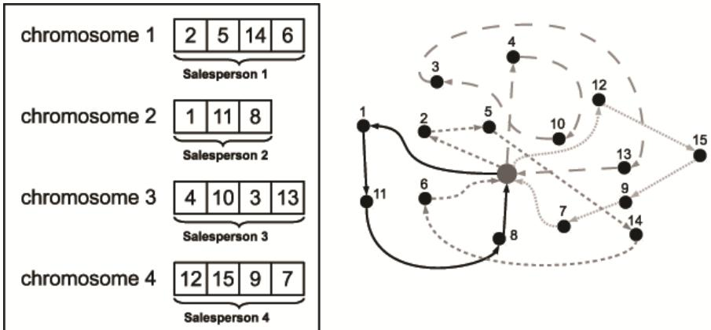
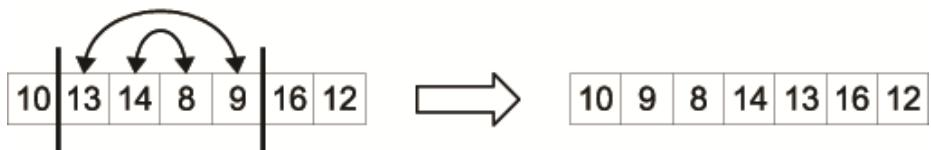
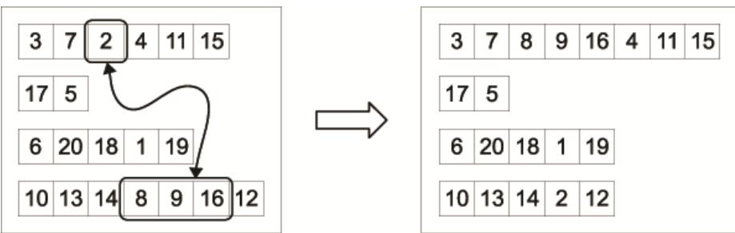
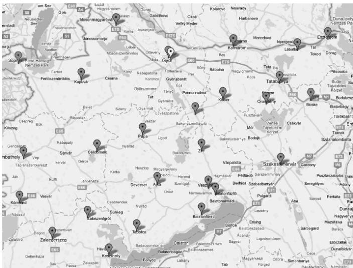
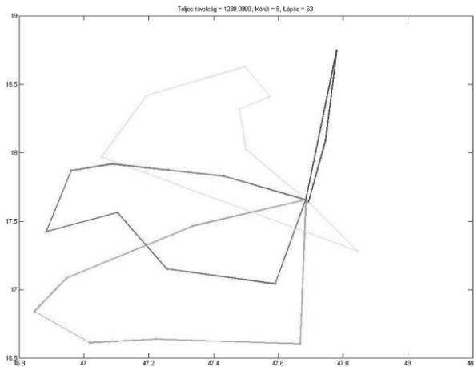
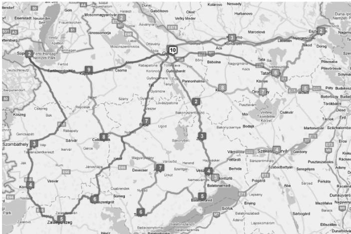
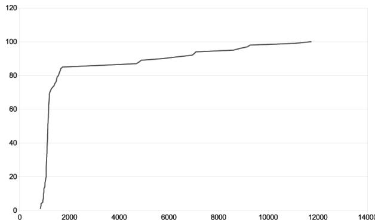

# A Novel Approach to Solve Multiple Traveling Salesmen Problem by Genetic Algorithm

András Király, János Abonyi

University of Pannonia, Department of Process Engineering, P.O. Box 158. Veszprém H-8200, HUNGARY, e-mail: kiralya@fmt.uni-pannon.hu

Abstract The multiple Traveling Salesman Problem (mTSP) is a complex combinatorial optimization problem, which is a generalization of the well-known Traveling Salesman Problem (TSP), where one or more salesmen can be used in the solution. The optimization task can be described as follows: given a fleet of vehicles, a common depot and several requests by the customers, find the set of routes with overall minimum route cost which service all the demands. Because of the fact that TSP is already a complex, namely an NP-complete problem, heuristic optimization algorithms, like genetic algorithms (GAs) need to take into account. The extension of classical GA tools for mTSP is not a trivial problem, it requires special, interpretable encoding to ensure efficiency. The aim of this paper is to review how genetic algorithms can be applied to solve these problems and propose a novel, easily interpretable representation based GA.

Keywords: mTSP, VRP, genetic algorithm, multi-chromosome, optimization

# 1 Introduction

In logistics, the main goal is to get the right materials to the right place at the right time, while optimizing some performance measure, like the minimization of total operating cost, and satisfying a given set of constraints (e.g. time and capacity constraints). In logistics, several types of problems could come up; one of the most remarkable is the set of route planning problems. One of the most studied route planning problem is the Vehicle Routing Problem (VRP), which is a complex combinatorial optimization problem that can be described as follows: given a fleet of vehicles with uniform capacity, a common depot, and several requests by the customers, find the set of routes with overall minimum route cost which service all the demands. The complexity of the search space and the number of decision variables makes this problem notoriously difficult.

The relaxation of VRP is the multiple traveling salesman problem (mTSP) [3], which is a generalization of the well-known traveling salesman problem (TSP)

[10], where one or more salesman can be used in the solution. Because of the fact that TSP belongs to the class of NP-complete problems, it is obvious that mTSP is an NP-hard problem thus it's solution require heuristic approach.

In this paper tools developed for a modified mTSP related to the optimization of one to many distribution systems will be studied and a novel genetic algorithm based solution will be proposed.

In the case of mTSP, a set of nodes (locations or cities) are given, and all of the cities must be visited exactly once by the salesmen who all start and end at the single depot node. The number of cities is denoted by $n$ and the number of salesman by $m$ . The goal is to find tours for all salesmen, such that the total travelling cost (the cost of visiting all nodes) is minimized. The cost metric can be defined in terms of distance, time, etc. Some possible variations of the problem are as follows:

• Multiple depots: If there exist multiple depots with a number of salesmen located at each, a salesman can return to any depot with the restriction that the initial number of salesmen at each depot remains the same after all the travel.   
• Number of salesmen: The number of salesmen in the problem can be a fixed number or a bounded variable.   
• Fixed charges: If the number of salesmen is a bounded variable, usually the usage of each salesman in the solution has an associated fixed cost. In this case the minimization of this bounded variable may be involved in the optimization.   
• Time windows: Certain cities must be visited in specific time periods, named as time windows. This extension of mTSP is referred to as multiple Traveling Salesman Problem with Time Windows (mTSPTW).   
• Other restrictions: These additional restrictions can consist of the maximum or minimum distance or travelling duration a salesman travels, or other special constraints.

mTSP is more capable to model real life applications than TSP, since it handles more than one salesmen. An overview of application areas can be found in [3] and in [10]. In the paper, an mTSPTW problem will be optimized with a novel approach, where the number of salesmen is an upper bounded variable, and there exist additional constraints, like the maximum travelling distance of each salesman.

Usually, mTSP is formulated by integer programming formulations. One variation is presented in equations (1.1)-(1.7). The mTSP problem is defined on a graph $G = ( V \lrcorner A )$ , where $V$ is the set of n nodes (vertices) and $A$ is the of arcs (edges). Let $\mathbf { C } = ( c _ { i j } )$ be a cost (distance) matrix associated with $A$ . The matrix C is symmetric if $c _ { i j } = c _ { j i } , \forall ( i , j ) \in A$ and asymmetric otherwise. Here $x _ { i j } \in \{ 0 , 1 \}$ is a binary variable used to represent that an arch is used on the tour and $c _ { m }$ represents the cost of the involvement of one salesman in the solution. Further mathematical representations can be found in [3].

$$
\operatorname* { m i n } \sum _ { i = 1 } ^ { n } \sum _ { j = 1 } ^ { n } c _ { i j } x _ { i j } + m c _ { m }
$$

so that

$$
\begin{array} { l } { \displaystyle \sum _ { j = 2 } ^ { n } x _ { 1 j } = m } \\ { \displaystyle \sum _ { j = 2 } ^ { n } x _ { j 1 } = m } \\ { \displaystyle \sum _ { i = 1 } ^ { n } x _ { i j } = 1 , \quad j = 2 , . . . , n } \\ { \displaystyle \sum _ { j = 1 } ^ { n } x _ { i j } = 1 , \quad i = 2 , . . . , n } \end{array}
$$

$^ +$ subtour elimination constratins

$$
x _ { i j } \in \{ 0 , 1 \} , \forall ( i , j ) \in A
$$

# 2 Literature review

In the last two decades the traveling salesman problem received quite big attention, and various approaches have proposed to solve the problem, e.g. branch-andbound [7], cutting planes [17], neural network [4] or tabu search [9]. Some of these methods are exact algorithms, while others are near-optimal or approximate algorithms. The exact algorithms use integer linear programming approaches with additional constraints.

The mTSP is much less studied like TSP. [3] gives a comprehensive review of the known approaches. There are several exact algorithms of the mTSP with relaxation of some constraints of the problem, like [15], and the solution in [1] is based on Branch-and-Bound algorithm.

Due to the combinatorial complexity of mTSP, it is necessary to apply some heuristic in the solution, especially in real-sized applications. One of the first heuristic approach were published by Russell [23] and another procedure is given by Potvin et al. [20]. The algorithm of Hsu et al. [12] presented a Neural Networkbased solution.

More recently, genetic algorithms (GAs) are successfully implemented to solve TSP [8]. Potvin presents a survey of GA approaches for the general TSP [21].

# 2.1 Application of genetic algorithms to solve mTSP

Lately GAs are used for the solution of mTSP too. The first result can be bound to Zhang et al. [25]. Most of the work on solving mTSPs using GAs has focused on the vehicle scheduling problem (VSP) ([16, 18]). VSP typically includes additional constraints like the capacity of a vehicle (it also determines the number of cities each vehicle can visit), or time windows for the duration of loadings. Recent application can be found in [4], where GAs were developed for hot rolling scheduling. It converts the mTSP into a single TSP and apply a modified GA to solve the problem.

A new approach of chromosome representation, the so-called two-part chromosome technique can be found in [5] which reduces the size of the search space by the elimination of redundant solutions. According to the referred paper, this representation is the most effective one so far.

There are several representations of mTSP, like one chromosome technique [20], the two chromosome technique [16, 18] and the latest two-part chromosome technique. Each of the previous approaches has used only a single chromosome to represent the whole problem, although salesmen are physically separated from each other. The novel approach presented in the next chapter use multiple chromosomes to model the tours.

# 3 The proposed GA-based approach to solve the mTSP

GAs are relatively new global stochastic search algorithms which based on evolutionary biology- and computer science principles [11]. Due to the effective optimization capabilities of GAs [2], it makes these technique suitable solving TSP and mTSP problems.

# 3.1 The novel genetic representation for mTSP

As mentioned in the previous chapter, every GA-based approach for solving the mTSP has used single chromosome for representation so far. The new approach presented here is a so-called multi-chromosome technique, which separates the salesmen from each other thus may present a more effective approach.

This approach is used in notoriously difficult problems to decompose complex solution into simpler components. It was used in mixed integer problem [19], a usage of routing problem optimization can be seen in [18] and a lately solution of a symbolic regression problem in [6]. This section discusses the usage of multichromosomal genetic programming in the optimization of mTSP.

  
Fig. 1 Example of the multi-chromosome representation for a 15 city mTSP with 4 salesmen.

Fig. 1 illustrates the new chromosome representation for mTSP with 15 locations $( \mathrm { n } { = } 1 5 )$ and with 4 salesperson $( \mathrm { m } { = } 4 )$ . The figure above illustrates a single individual of the population. Each individual represents a single solution of the problem. The first chromosome represents the first salesman itself so each gene denotes a city (depot is not presented here, it is the first and the last station of each salesman). This encoding is so-called permutation encoding. It can be seen in the example that salesperson 1 visits 4 cities: city 2,5,14 and 6, respectively. In the same way, chromosome 2 represents salesperson 2 and so on. This representation is much similar to the characteristic of the problem, because salesmen are separated from each other "physically".

# 3.2 Special genetic operators

Because of our new representation, implementation of new genetic operators became necessary, like mutation operators. There are two sets of mutation operators, the so-called In-route mutations and the Cross-route mutations. Only some example of the newly created operators are given in this section. Further information with several examples about the novel operators can be found in [13].

In-route mutation operators work inside one chromosome. An example is illustrated on Fig. 2. The operator chooses a random subsection of a chromosome and inverts the order of the genes inside it.

  
Fig. 2 In-route mutation – gene sequence inversion.

Cross-route mutation operates on multiple chromosomes. If we think about the distinct chromosomes as individuals, this method could be similar to the regular crossover operator. Fig. 3 illustrates the method when randomly chosen subparts of two chromosomes are transposed. If the length of one of the chosen subsections is equal to zero, the operator could transform into an interpolation.

  
Fig. 3 Cross-route mutation – gene sequence transposition.

# 3.3 Genetic algorithm

Every genetic algorithm starts with an initial solution set consists of randomly created chromosomes. This is called population. The individuals in the new population are generated from the previous population’s individuals by the predetermined genetic operators. The algorithm finishes if the stop criteria is satisfied.

Obviously for a specific problem it is a much more complex task, we need to define the encoding, the specific operators and selection method. The encoding is the so-called permutation encoding (see previous section). Detailed description of the related operators can be found in [14] and an example can be seen in the previous section.

# 3.3.1 Fitness function

The fitness function assigns a numeric value to each individual in the population. This value define some kind of goodness, thus it determines the ranking of the individuals. The fitness function is always problem dependent.

In this case the fitness value is the total cost of the transportation, i.e. the total length of each round trip. The fitness function calculates the total length for each chromosome, and summarizes these values for each individual. This sum is the fitness value of a solution. Obviously it is a minimization problem, thus the smallest value is the best.

# 3.3.2 Selection

Individuals are selected according to their fitness. The better the chromosomes are, the more chances to be selected they have. The selected individuals can be presented in the new population without any changes (usually with the best fitness), or can be selected to be a parent for a crossover. We use the so-called tournament selection because of its efficiency.

In the course of tournament selection, a few (tournament size, min. 2) individuals are selected from the population randomly. The winner of the tournament is the individual with the best fitness value. Some of the first participants in the ranking are selected into the new population (directly or as a parent).

# 3.4 Complexity analysis

Using the multi-chromosome technique for the mTSP reduces the size of the overall search space of the problem. Let the length of the first chromosome be $\mathbf { k } _ { 1 }$ , let the length of the second be $\mathbf { k } _ { 2 }$ and so on. Of course $\sum _ { i = 1 } ^ { m } k _ { i } = n$ . Determining the genes of the first chromosome is equal to the problem of obtaining an ordered subset of $\mathbf { k } _ { 1 }$ element from a set of n elements. There are $\frac { n ! } { ( n - k _ { 1 } ) ! }$ distinct assignment. This number is $\frac { ( n - k _ { 1 } ) ! } { ( n - k _ { 1 } - k _ { 2 } ) ! }$ for the second chromosome, and so on. Thus, the total search space of the problem can be formulated as equation (3.1). ${ \frac { n ! } { ( n - k _ { 1 } ) } } * { \frac { ( n - k _ { 1 } ) ! } { ( n - k _ { 1 } - k _ { 2 } ) ! } } * \cdots ^ { * } { \frac { ( n - k _ { 1 } - \ldots - k _ { m - 1 } ) ! } { ( n - k _ { 1 } - \ldots - k _ { m } ) ! } } = { \frac { n ! } { ( n - n ) ! } } = n !$ (3.1)

It is necessary to determine the length of each chromosome too. It can be represented as a positive vector of the lengths $( \mathbf { k } _ { 1 } , \mathbf { k } _ { 2 } , . . . , \mathbf { k } _ { \mathrm { m } } )$ that must sum to $\mathbf { n }$ . There are $\begin{array} { r } { \left( { n - 1 } \right) } \\ { m - 1 } \end{array}$ distinct positive integer-valued vectors that satisfy this requirement [22]. Thus, the solution space of the new representation is $n ! { \binom { n - 1 } { m - 1 } } .$ It is equal with the solution space in [5], but this approach is more similar to the characteristic of the mTSP, so it can be more problem-specific therefore more effective.

# 4 Implementation issues

To analyze the new representation, a novel genetic algorithm using this approach was developed in MATLAB. This novel approach was compared with the most effective one so far (the two-part chromosome) which is available on MATLAB Central1. The novel algorithm can optimize the traditional mTSP problems, furthermore, it is capable to handle the additional constraints and time windows (see Sect. 1).

It requires two input sets, like the coordinates of the cities and the distance table which contains the travelling distances between any pair of cities. Naturally, the determination of the constraints, time windows and the parameters of the genetic algorithms are also necessary.

The fitness function simply summarizes the overall route lengths for each salesman inside an individual. The selection is tournament selection, where tournament size i.e. the number of individuals who compete for survival is 8. Therefore population size must be divisible by 8. The winner of the tournament is the member with the smallest fitness, this individual is selected for new individual creation, and this member will get into the new population without any modification.

The penalty of the too long routes (over the defined constraint) instead of a proportionally large fitness value assignment is implemented by a split operator, which separates the route into smaller routes, which do not exceed the constraints (but the number of salesmen is incremented). Because there exists a constraint for the number of the salesmen, the algorithm involves the minimization of this amount, hence this penalty has a remarkable effect in the optimization process.

Further information about the implemented algorithm can be found in [14].

# 5 Illustrative example

Although the algorithm was tested with a big number of problems, only an illustrative result is presented here. As it was mentioned earlier, the algorithm has implemented in MATLAB, tiny refinements in constraints are in progress. The exmaple represents a whole process of a real problem’s solution. The initial input is given in a Google Maps map, and the final output is a route system defined by a Google Maps map also.

The first step is the determination of the distance matrix. The input data is given by a map as it can see on Fig. 4 and a portion of the resulted distance table is shown on Table 1. It contains 25 locations (with the depot). The task is to determine the optimal routes for these locations with the following constraints: the maximum number of salesmen is 5 and the maximum travelling distance of each salesman is $4 5 0 \mathrm { k m }$ .

Fig. 4 The map of the example application (initial input).   
Table 1 Example distance table - kilometers.   

<table><tr><td>Kilometers</td><td>Adony Celldömölk Kapuvár</td></tr><tr><td>Adony</td><td>0 169.81 147.53</td></tr><tr><td>Celldömölk 169.41 0</td><td>44.42</td></tr><tr><td>Kapuvár</td><td>146.56 44.43 0</td></tr></table>

After distance table determination, the optimizer algorithm can be executed to determine the optimal routes using the novel representation. The GA ran with a population size 320 and it did 200 iterations. The result of the optimization is shown on Fig. 5. It resulted that 4 salesman is enough to satisfy the constraints. After the optimization, we can visualize the results on a Google Maps map, as it is shown on Fig. 6. The length of the routes are $3 6 4 ~ \mathrm { k m }$ , $4 2 4 ~ \mathrm { k m }$ , $3 9 8 ~ \mathrm { k m }$ and 149 km respectively, i.e. they satisfy the constraints, thus the algorithm provided a feasible solution of the problem.

In every case, the running time was between 1 and 2 minutes. The genetic algorithm has made 200 iterations, because experiences have shown that this number is sufficient for the optimization.

  
Fig. 5 The result of the optimization by MATLAB.

  
Fig. 6 Result of the optimization on a Google Maps map for 25 locations with at most 5 salesmen and at most $4 5 0 \mathrm { k m }$ tour length per salesman.

Obviously the algorithm is highly sensitive for the number of iterations. The running time is directly proportional to the iteration number, but the resulted best solution can’t get better after a specific time. If the constraints become tighter, the duration time will increase slightly. With 500 maximal tour lengths, it is about 90 seconds, and with 450 it is about 110 seconds. The maximal tour length (or equivalently the maximal duration per tour) has a big effect of the number of salesman needed. The tighter the constraints are, the bigger the number of salesman we need. However narrower restrictions forth more square round trips. Furthermore, the resulted optima can depend on the initial population. On Fig. 7 it can be seen that the algorithm can find a near optimal solution in more than $80 \%$ of the cases. The effectiveness of the calculation can be enhanced by applying additional heuristics. Obviously these results can be further improved by executing more iteration also.

  
Fig. 7 Results of the optimization from different initial values.

# 6. Conclusions

In this paper a detailed overview was given about the application of genetic algorithms in vehicle routing problems. It has been shown that the problem is closely related to the multiple Traveling Salesman Problem. A novel representation based genetic algorithm has been developed to the specific one depot version of mTSPTW. The main benefit is the transparency of the representation that allows the effective incorporation of heuristics and constrains and allows easy implementation. Some heuristics can be applied to improve the effectiveness of the algorithm, like the appropriate choice of the initial population. After some final touches, the supporting MATLAB code will be also available at the website of the authors.

Acknowledgments The financial support from the TAMOP-4.2.2-08/1/2008-0018 (Élhetőbb környezet, egészségesebb ember - Bioinnováció és zöldtechnológiák kutatása a Pannon Egyetemen, MK/2) project is gratefully acknowledged.

# Список литературы

[1] Ali AI, Kennington JL (1986) The asymmetric m-traveling salesmen problem: a duality based branch-and-bound algorithm. Discrete Applied Mathematics 13:259–276   
[2] Back T (1996) Evolutionary algorithms in theory and practice: evolution strategies, evolutionary programming, genetic algorithms. Oxford University Press   
[3] Bektas T (2006) The multiple traveling salesman problem: an overview of formulations and solution procedures. Omega, 34:209–219   
[4] Bhide S, John N, Kabuka MR (1993) A boolean neural network approach for the traveling salesman problem. IEEE Transactions on Computers 42(10):1271   
[5] Carter AE, Ragsdale CT (2006) A new approach to solving the multiple traveling salesperson problem using genetic algorithms. European Journal of Operational Research 175:246–257   
[6] Cavill R, Smith S, Tyrrell A (2005) Multi-chromosomal genetic programming. In: Proceedings of the 2005 conference on Genetic and evolutionary computation, ACM New York, NY, USA, pp 1753–1759   
[7] Finke G, Claus A and Gunn E (1984) A two-commodity network flow approach to the traveling salesman problem. Congressus Numerantium, 41:167–178   
[8] Gen M, Cheng R (1997) Genetic algorithms and engineering design. Wiley-Interscience   
[9] Glover F (1990) Artificial intelligence, heuristic frameworks and tabu search. Managerial and Decision Economics 11(5)   
[10] Gutin G, Punnen AP (2002) The Traveling Salesman Problem and Its Variations. Combinatorial Optimization, Kluwer Academic Publishers, Dordrecht, The Nederlands   
[11] Holland JH (1975) Adaptation in natural and artificial systems. The University of Michigan Press   
[12] Hsu CY, Tsai MH, Chen WM (1991) A study of feature-mapped approach to the multiple travelling salesmen problem. IEEE International Symposium on Circuits and Systems 3:1589–1592   
[13] Király A, Abonyi J (2009) Optimization of multiple traveling salesmen problem by a novel representation based genetic algorithm. In 10th International Symposium of Hungarian Researchers on Computational Intelligence and Informatics, Budapest, Hungary   
[14] Király A, Abonyi J (excepted to 2010) Optimization of multiple traveling salesmen problem by a novel representation based genetic algorithm. In M. Koeppen, G. Schaefer, A. Abraham, and L. Nolle, editors, Intelligent Computational Optimization in Engineering: Techniques & Applications, Advances in Intelligent and Soft Computing. Springer   
[15] Laporte G, Nobert Y (1980) A cutting planes algorithm for the m-salesmen problem. Journal of the Operational Research Society 31:1017–1023   
[16] Malmborg CJ (1996) A genetic algorithm for service level based vehicle scheduling. European Journal of Operational Research 93(1):121–134   
[17] Miliotis P (1978) Using cutting planes to solve the symmetric travelling salesman problem. Mathematical Programming 15(1):177–188   
[18] Park YB (2001) A hybrid genetic algorithm for the vehicle scheduling problem with due times and time deadlines. International Journal of Productions Economics 73(2):175–188   
[19] Pierrot HJ, Hinterding R (1997) Multi-chromosomal genetic programming, Lecture Notes in Computer Science, vol 1342/1997, Springer Berlin / Heidelberg, chap Using multichromosomes to solve a simple mixed integer problem, pp 137–146   
[20] Potvin J, Lapalme G, Rousseau J (1989) A generalized k-opt exchange procedure for the mtsp. INFOR 21:474–481   
[21] Potvin JY (1996) Genetic algorithms for the traveling salesman problem. Annals of Operations Research 63(3):337–370   
[22] Ross SM (1984) Introduction to Probability Models. Macmillian, New York   
[23] Russell RA (1977) An effective heuristic for the m-tour traveling salesman problem with some side conditions. Operations Research 25(3):517–524   
[24] Tanga L, Liu J, Rongc A, Yanga Z (2000) A multiple traveling salesman problem model for hot rolling scheduling in shangai baoshan iron & steel complex. European Journal of Operational Research 124:267–282   
[25] Zhang T, Gruver W, Smith M (1999) Team scheduling by genetic search. Proceedings of the second international conference on intelligent processing and manufacturing of materials 2:839–844