# A Recognition Method of the Printed Alphabet By using Nonogram Puzzle

Young-Sun Sohn, Kabsuk Oh and Bo-Sung Kim

Department of Information & Communications Engineering

TongMyong University, Yongdang-Dong, Nam-Gu, Busan, Korea

Email: {yssohn,oks} $\textcircled{4}$ tu.ac.kr , kbs8580@hotmail.com

Abstract—In this paper, we realize a system that converts the character images of the printed alphabet of two types into editable text documents by using a black and white CCD camera. We binarize the image of the printed English sentences, and divide a line of printed characters by the horizontal projection of the histogram method and abstract a character by the vertical projection of the method. We normalize the character by converting the height of it to 48 pixels. We cover a normalized character with a quadrangle, which is composed of a series of pixels. From this state, we get the numerical information of the character by applying the principle of the Nonogram puzzle reversely to the normalized characters and, recognize an abstracted character by comparing the standard patterns of alphabet. We get the recognition rate of 100 percent by testing 2609 characters of Batang type and 1475 characters of Dodum type.

Key Words : Character Recognition, Binary Tree Structure, Histogram, Nonogram(Japanese Puzzle)

# I. INTRODUCTION

With a large capacity of hard disk and the better performance of a computer, man has tried to use it with ease by developing many input devices. The former input devices, keyboard, mouse, and tablet, etc., are hard to process massive document information. So, many automatic character recognition systems have developed to solve the problem. Representative methods are, circular pattern vector method[1], structural method[2], statistical method[3], neural network method[4], etc..

the editable word processor.

This paper is organized as follows. Some explanation about Nonogram puzzle is presented in Section 2. In Section 3, a recognition method of the printed alphabet by using Nonogram puzzle is proposed. Section 4, experimental results will be explained. Finally we will discuss conclusion and further studies.

# II. WHAT IS THE NONOGRAM PUZZLE?

Nonograms are a type of hidden-picture logic puzzle originating in Japan and now popular around the world. Each Nonogram puzzle is based on a grid of squares of two different colors, which may or may not form a picture.

In this paper, we propose a character recognition algorithm by using a kind of puzzle, Nonogram, as follows. At first we input a document with a white and black CCD camera and converge it into black-and-white. We extract a character from input image by the histogram method and normalize it with fixed size. We apply the puzzle to the normalized character and translate the image information to the numerical information. We recognize a character by applying the numerical information of input character with it of the standard pattern. Finally we output the recognized character to

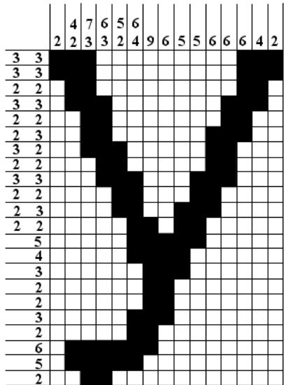  
Fig. 1. An Example of Nonogram Puzzle.

The aim is to reveal the pattern from the number clues provided. Next to each row and column is a list of numbers representing the black squares in that line. Each number represents a group of black squares so, for example, $" 3 ~ 2 "$ means that on this line there is a group of 3 black squares to the left of a group of 2 black squares, with one or more white squares in between. The numbers are always in order, so $" 3 2 "$ means the group of 3 black squares appears to the left of the group of 2. Basically, solving them consists of crossreferencing the across and down clues to build up your available information gradually [5]. Fig. 1 shows a Nonogram puzzle example.

# III. PROPOSAL ALGORITHM

In this section, we propose a new method for recognition of the printed character by using numerical information of the Nonogram puzzle shown in Fig. 2 shows overall scheme of the recognition method.

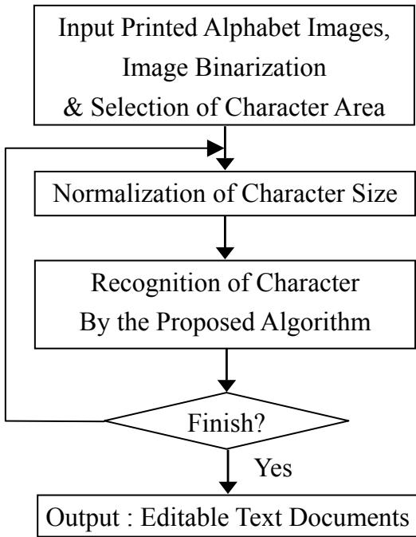  
Fig. 2. Proposed Recognition Algorithm.

A. Image Binarization and Selection of Character Area

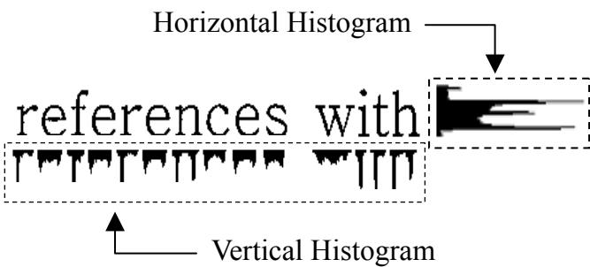  
Fig. 3. Application Example of the Histogram Method.

We binarize the image which is inputted the text document image of $6 4 0 { \times } 4 8 0$ sizes from the CCD camera. Then we divide a line of printed characters by the horizontal projection of the histogram method and abstract a character by the vertical projection of the method. Fig. 3 shows an application example of the histogram method on binary image. When these individual characters apply to the horizontal histogram method again, we can get the squares region of individual character such as Fig. 4 and can obtain the horizontal and vertical pixels information of the character.

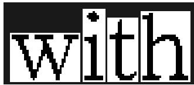  
Fig. 4. Decision of Character Area.

# B. Size normalization

We need to normalize to the standard size, because of the inputted character image has various sizes. In the region of individual character, we normalize the character by converting the height of it to 48 pixels and by substituting the ratio of equation (1) then the results apply to the equation (2). It can cover a normalized character with a quadrangle, which is composed of a series of pixels.

$$
s = 4 8 / \nu
$$

$$
( x ^ { \prime } , y ^ { \prime } ) = s ( x , y )
$$

Here, the $s$ is the ratio of the original size, $\nu$ is height pixels of the original image, $( x , \ y )$ is pixel coordination on the original character image and $( x ^ { \prime } , y )$ is normalized mapping coordination by $s$ .

Fig. 5 shows the size normalization process of the capital W size of 40 pixels by 32. In this case, the ratio is 1.5 by equation (1) and the normalized image size is $6 0 \mathrm { x } 4 8$ pixels by equation (2). The pixels not being selected during the mapping process will be complemented by linear interpolation [6].

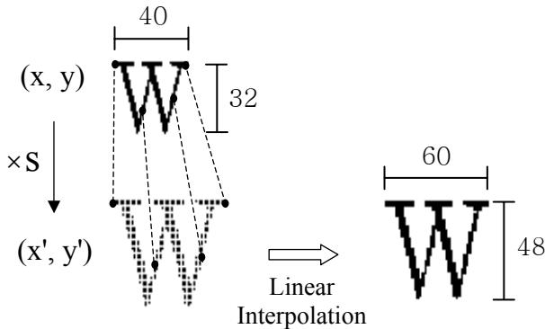  
Fig. 5. Size Normalization of Capital W.

C. Recognition method by using Nonogram numerical information

From this state, we get the numerical information of the character by applying the principle of the Nonogram puzzle reversely to the normalized characters and, recognize an abstracted character by comparing the standard patterns of the alphabet. Fig. 6 shows the numerical information, which is the vertical and horizontal Nonogram of the letter capital W. The Nonogram numerical information of the character is expressed in four patterns such as as $\left( \mathfrak { p } _ { 1 } \right)$ , $\left( \mathfrak { p } _ { 1 } , \mathfrak { p } _ { 2 } \right)$ , $( { \mathsf { p } } _ { 1 } , { \mathsf { p } } _ { 2 } , { \mathsf { p } } _ { 3 } )$ , and $( { \mathfrak { p } } _ { 1 } , { \mathfrak { p } } _ { 2 }$ , ${ \mathfrak { p } } _ { 3 } , { \mathfrak { p } } _ { 4 } )$ .

<table><tr><td rowspan=1 colspan=6>①</td></tr><tr><td rowspan=2 colspan=1>2</td><td rowspan=2 colspan=3></td><td rowspan=1 colspan=1>[35] - ( 4, 2, 4, 2 )</td><td rowspan=1 colspan=1>[23]-(1,7)</td></tr><tr><td rowspan=1 colspan=1>[36] - ( 4, 2, 5, 1 )</td><td rowspan=1 colspan=1>[24]-(1,7)</td></tr><tr><td rowspan=1 colspan=5>[37] - 4, 2, 4, 2)</td><td rowspan=1 colspan=1>[25] - (1,7)</td></tr><tr><td rowspan=1 colspan=1>①</td><td rowspan=1 colspan=3>①Horizontal Projection</td><td rowspan=1 colspan=1>[38] - 4, 2, 4, 2)</td><td rowspan=1 colspan=1>[26] - (1,7)</td></tr><tr><td rowspan=1 colspan=1>[1]</td><td rowspan=1 colspan=3>[1] - (17, 17, 14)</td><td rowspan=1 colspan=1>[39]-(7,7)</td><td rowspan=1 colspan=1>[27] - (2,7)</td></tr><tr><td rowspan=1 colspan=1>[2]</td><td rowspan=1 colspan=3>[2] - (8, 8, 7)</td><td rowspan=1 colspan=1>[40]-5,6)</td><td rowspan=1 colspan=1>[28] - (2,7)</td></tr><tr><td rowspan=1 colspan=1>[3]</td><td rowspan=1 colspan=3>[3] - ( 5, 5, 3 )</td><td rowspan=1 colspan=1>[41]-(5,5)</td><td rowspan=1 colspan=1>[29] - (4,7)</td></tr><tr><td rowspan=1 colspan=1>[4]</td><td rowspan=1 colspan=3>[4] - 4, 5, 3)</td><td rowspan=1 colspan=1>[42] - 5,5)</td><td rowspan=1 colspan=1>[30] -15 )</td></tr><tr><td rowspan=1 colspan=1>[5]</td><td rowspan=1 colspan=3>[5] - 4, 4,2)</td><td rowspan=1 colspan=1>[43]-4,4)</td><td rowspan=1 colspan=1>[31]-(11)</td></tr><tr><td rowspan=1 colspan=1>[6]</td><td rowspan=1 colspan=3>[6] -4, 4,2)</td><td rowspan=1 colspan=1>[44]-3,3)</td><td rowspan=1 colspan=1>[32]-14 )</td></tr><tr><td rowspan=1 colspan=1>[7]</td><td rowspan=1 colspan=3>[7] - 5, 4, 2)</td><td rowspan=1 colspan=1>[45] -3,3)</td><td rowspan=1 colspan=1>[33]-18 )</td></tr><tr><td rowspan=1 colspan=1>[8]</td><td rowspan=1 colspan=3>[8] - 4, 5, 1)</td><td rowspan=1 colspan=1>[46]-3,2)</td><td rowspan=1 colspan=1>[34] - 2,15)</td></tr><tr><td rowspan=1 colspan=4>[9] - 4, 5, 2)</td><td rowspan=1 colspan=1>[47]-1,2)</td><td rowspan=1 colspan=1>[35] - (1,15)</td></tr><tr><td rowspan=1 colspan=4>[10] - (4, 5,2)</td><td rowspan=1 colspan=1>[48] - 1, 1)</td><td rowspan=1 colspan=1>[36] -(1,15)</td></tr><tr><td rowspan=1 colspan=4>[11]-4, 6,2)</td><td rowspan=1 colspan=1></td><td rowspan=1 colspan=1>[37] - (1,15)</td></tr><tr><td rowspan=1 colspan=4>[12] - (4, 2, 4, 1 )</td><td rowspan=1 colspan=1>Vertical Projection</td><td rowspan=1 colspan=1>[38] - ( 1,15)</td></tr><tr><td rowspan=1 colspan=4>[13] -4, 2, 4, 2)</td><td rowspan=1 colspan=1>[1]-(1)</td><td rowspan=1 colspan=1>[39] - (1,16)</td></tr><tr><td rowspan=1 colspan=4>[14] - 5, 2, 4, 2)</td><td rowspan=1 colspan=1>[2]-1</td><td rowspan=1 colspan=1>[40]-15)</td></tr><tr><td rowspan=1 colspan=4>[15] - ( 4, 2, 4, 1 )</td><td rowspan=1 colspan=1>[3]-1)</td><td rowspan=1 colspan=1>[41]-16)</td></tr><tr><td rowspan=1 colspan=4>[16] - 4, 2, 4, 2)</td><td rowspan=1 colspan=1>[4]-1)</td><td rowspan=1 colspan=1>[42]-13 )</td></tr><tr><td rowspan=1 colspan=2>[17]</td><td rowspan=1 colspan=2>[17] - 4, 2, 4, 2)</td><td rowspan=1 colspan=1>[5]-2)</td><td rowspan=1 colspan=1>[43]-(7)</td></tr><tr><td rowspan=1 colspan=2>[18]</td><td rowspan=1 colspan=1>[18] -4,2, 5,2)</td><td rowspan=1 colspan=1></td><td rowspan=1 colspan=1>[6]-2</td><td rowspan=1 colspan=1>[44]-6</td></tr><tr><td rowspan=1 colspan=2>[19]</td><td rowspan=1 colspan=1>[19]-4, 2, 4,2)</td><td rowspan=1 colspan=1></td><td rowspan=1 colspan=1>[7]-(3)</td><td rowspan=1 colspan=1>[45]-(7)</td></tr><tr><td rowspan=1 colspan=2>[20]</td><td rowspan=1 colspan=1>[20] - 4, 2, 4, 2)</td><td rowspan=1 colspan=1></td><td rowspan=1 colspan=1>[8]-(7)</td><td rowspan=1 colspan=1>[46]-6)</td></tr><tr><td rowspan=1 colspan=2>[21]</td><td rowspan=1 colspan=1>[21] - ( 5, 2, 4, 2 )</td><td rowspan=1 colspan=1></td><td rowspan=1 colspan=1>[9]-10)</td><td rowspan=1 colspan=1>[47] - (1,7)</td></tr><tr><td rowspan=1 colspan=2>[22]</td><td rowspan=1 colspan=1>[22] - (4, 2, 5, 1 )</td><td rowspan=1 colspan=1></td><td rowspan=1 colspan=1>[10]-14)</td><td rowspan=1 colspan=1>[48] -(1,6)</td></tr><tr><td rowspan=1 colspan=2>[23]</td><td rowspan=1 colspan=1>[23] - (4, 2, 4, 2 )</td><td rowspan=1 colspan=1></td><td rowspan=1 colspan=1>[11]-17)</td><td rowspan=1 colspan=1>[49] - 1,7)</td></tr><tr><td rowspan=1 colspan=2>[24]</td><td rowspan=1 colspan=1>[24] - 4, 2, 4, 2)</td><td rowspan=1 colspan=1></td><td rowspan=1 colspan=1>[12]-(2,15)</td><td rowspan=1 colspan=1>[50] -(1,6)</td></tr><tr><td rowspan=1 colspan=2>[25]</td><td rowspan=1 colspan=1>[25] - (4, 2, 5, 2 )</td><td rowspan=1 colspan=1></td><td rowspan=1 colspan=1>[13]-1,14)</td><td rowspan=1 colspan=1>[51]-(2,6)</td></tr><tr><td rowspan=1 colspan=2>[26]</td><td rowspan=1 colspan=1>[26] - ( 4, 2, 4, 2 )</td><td rowspan=1 colspan=1></td><td rowspan=1 colspan=1>[14]-(1,15)</td><td rowspan=1 colspan=1>[52]-2,6)</td></tr><tr><td rowspan=1 colspan=2>[27]</td><td rowspan=1 colspan=1>[27] - ( 4, 2, 4, 2 )</td><td rowspan=1 colspan=1></td><td rowspan=1 colspan=1>[15] -(1,15)</td><td rowspan=1 colspan=1>[53]-(11)</td></tr><tr><td rowspan=1 colspan=2>[28]</td><td rowspan=1 colspan=1>[28] - (5, 2, 4, 2 )</td><td rowspan=1 colspan=1></td><td rowspan=1 colspan=1>[16]-(1,15)</td><td rowspan=1 colspan=1>[54]-7)</td></tr><tr><td rowspan=1 colspan=2>[29]</td><td rowspan=1 colspan=1>[29] - ( 4, 2, 5, 1 )</td><td rowspan=1 colspan=1></td><td rowspan=1 colspan=1>[17]-(1,15)</td><td rowspan=1 colspan=1>[55]-4)</td></tr><tr><td rowspan=1 colspan=2>[30]</td><td rowspan=1 colspan=1>[30] -4, 2, 4, 2)</td><td rowspan=1 colspan=1></td><td rowspan=1 colspan=1>[18]-(15 )</td><td rowspan=1 colspan=1>[56]-2)</td></tr><tr><td rowspan=1 colspan=2>[31]</td><td rowspan=1 colspan=1>[31] - ( 4, 2, 4, 2 )</td><td rowspan=1 colspan=1></td><td rowspan=1 colspan=1>[19]-(15 )</td><td rowspan=1 colspan=1>[57]-2)</td></tr><tr><td rowspan=1 colspan=2>[32]</td><td rowspan=1 colspan=1>[32] - ( 5, 2, 5, 2 )</td><td rowspan=1 colspan=1></td><td rowspan=1 colspan=1>[20] - (13 )</td><td rowspan=1 colspan=1>[58]-1)</td></tr><tr><td rowspan=1 colspan=2>[33]</td><td rowspan=1 colspan=1>[33] - (4, 2, 4, 2 )</td><td rowspan=1 colspan=1></td><td rowspan=1 colspan=1>[21]-(8)</td><td rowspan=1 colspan=1>[59]-1)</td></tr><tr><td rowspan=1 colspan=5>[34] - 4, 2, 4, 2)          [22]-7</td><td rowspan=1 colspan=1>[60]-1)</td></tr></table>

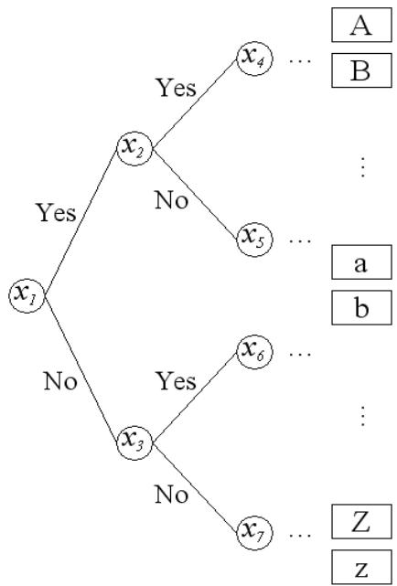  
Fig. 6. Nonogram Numerical Information of a Capital W.   
Fig. 7. Binary Tree Structure.

In the binary tree structure shown in Fig. 7, if the classification conditions of the standard pattern are decided to the each node $( x _ { I } , x _ { 2 } , x _ { 3 } , \cdots , x _ { n } )$ then it can be recognizes the characters by comparing patterns of inputted characters. In each node, a binary tree that has the constant depth of each leaf node can be represented if the number of right and left child node is the same. Therefore, the classification conditions of the standard pattern stored in the node set the ration between the numbers of the right node to the left as almost the same.

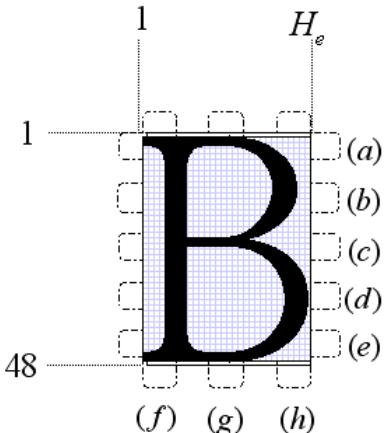  
Fig. 8. Specific Segment Region.

First of all, the classification conditions of the node $( x _ { I } )$ seeks all the possible cases of the two subdivided groups by applying the numbers of 8 sectors as shown in Fig. 8 of pixels to the all the characters. Then the conditions can be selected when the numbers of element is closest to the 1:1. The Table 1 is the classification condition decided in the node $( x _ { I } )$ .

TABLE 1. The Classification condition of node $( x _ { I } )$ .   

<table><tr><td rowspan=1 colspan=1>Sector</td><td rowspan=1 colspan=1>ClassificationConditions</td><td rowspan=1 colspan=1>Element number(Yes, No)</td></tr><tr><td rowspan=1 colspan=1>(f), (g),(h)</td><td rowspan=1 colspan=1>If 1 &gt; 3 then YesElse No</td><td rowspan=1 colspan=1>(29:23)</td></tr></table>

The rest of the node $( x _ { 2 } , \ x _ { 3 } , \cdots , \ x _ { n } )$ for the classification condition is decided with same method as shown above.

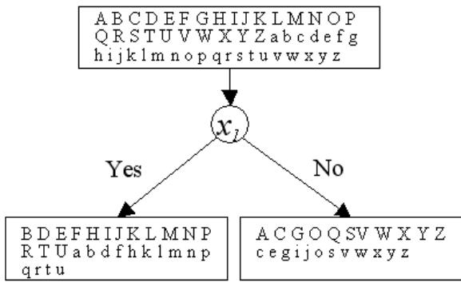  
Fig. 9. Classification Method.

In Fig. 9, the 52 alphabet group is divided by the two groups by the condition of the node $( x _ { I } )$ .

TABLE 2. The Classification condition of the root to the leaf of the capital B.   

<table><tr><td rowspan=1 colspan=1>Node</td><td rowspan=1 colspan=1>Sector</td><td rowspan=1 colspan=1>Classification Conditions</td><td rowspan=1 colspan=1>Estimation</td></tr><tr><td rowspan=1 colspan=1>x1</td><td rowspan=1 colspan=1>(f)(g)(h)</td><td rowspan=1 colspan=1>If p1&gt;40 then YesElse No</td><td rowspan=1 colspan=1>Yes-&gt; X2No-&gt;x3</td></tr><tr><td rowspan=1 colspan=1>x2</td><td rowspan=1 colspan=1>(b)</td><td rowspan=1 colspan=1>If p1&gt;3 then YesElse No</td><td rowspan=1 colspan=1>Yes-&gt; x4No-&gt; x5</td></tr><tr><td rowspan=1 colspan=1>x5</td><td rowspan=1 colspan=1>(g)</td><td rowspan=1 colspan=1>If p1&gt;3 then YesElse No</td><td rowspan=1 colspan=1>Yes-&gt; x10No-&gt; X11</td></tr><tr><td rowspan=1 colspan=1>x11</td><td rowspan=1 colspan=1>(c)</td><td rowspan=1 colspan=1>If p1&gt;15 then YesElse No</td><td rowspan=1 colspan=1>Yes-&gt; X22No-&gt; x23</td></tr><tr><td rowspan=1 colspan=1> 22</td><td rowspan=1 colspan=1>(g)</td><td rowspan=1 colspan=1>If p1&gt;3 &amp; p2&gt;3 then YesElse No</td><td rowspan=1 colspan=1>Yes-&gt; x33No-&gt;&#x27;B&#x27;</td></tr></table>

The Table 2 shows the classification condition of the root to the leaf nodes in the binary tree decides the capital $\mathrm { \Delta ^ { * } B ^ { \prime } }$ shown in Fig. 10. Likewise, we decide the classification condition of each node to allocation each character in the tree leaf.

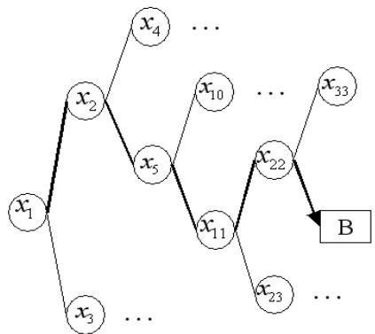  
Fig. $1 0 \mathrm { A }$ binary tree of capital B.

# IV. EXPREMENT RESULT

We implement a system that converts a character image of the printed text document into editable text documents by using a black and white CCD camera. Hardware and Software used for experiment is shown in Table 3 and the system configuration is shown in Fig. 11.

To verify the effectiveness of the proposed method, we have experimented with two types of characters that the 2609 characters of Batang type and the 1475 characters of Dodum type. Each normalized character is inputted, the system seeks the specific area with classification condition of tree structure final character can be recognized. In this experiment, we used only English Alphabet and the size of target character is up to 30 pixels.

TABLE 3 The System Environment.   

<table><tr><td>1. Hardware</td></tr><tr><td>CPU : Pentium-4 Intel 3.0GHz Video Board : DT3155 Peripheral Device : - Panasonic CCTV Camera[No.WV-BP334]</td></tr><tr><td>- AVENIR TV ZOOM LENS 12.5 - 75mm F1.8 2. Software</td></tr><tr><td>OS : Window XP Frame Capture Program : DT  Acquire</td></tr></table>

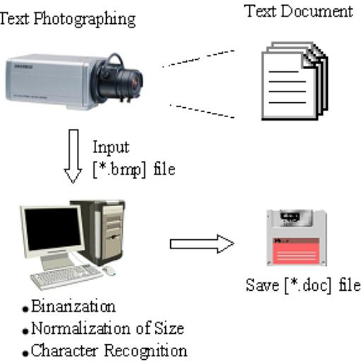  
Fig. 11. System Configuration.

The Batang type has serif decorated at the edge of the stroke, and the Dodum type is a sans serif font so the two fonts have different characters. Therefore, this system has a recognition capability with the two different fonts in the same input. The experiment result is generated as shown in Fig. 13 with the input BMP file image shown in Fig. 12, and the output is editable in the word processor.

# V. CONCLUSION

In this paper, we implemented a character automatic input system with a black and white CCD camera by using the Nonogram game principle. The proposed system can recognize the input character image by 6 to 8 steps of the character classification. Each step is defined in each node in the binary tree. In the experiment results, we got the recognition rate of 100 percent out of 2609 characters composed of Batang type and 1475 characters of Dodum type.

For the future, we will study the method, which recognizes the symbols and numerals in the documents.

# Список литературы

[1] J. H. Kim, K. K. Kim and S. I. Chien, Korean and English Character Recognition System Using Hierarchical Classification Neural Network, IEEE International Conference on System, Man and Cybernetics, vol. 1, pp.   
759-764, 1995 [2] E. J. Lee, Car License Plate Extraction and Recognition Using Vertical/Horizontal Intensity Variation and Circular Pattern Vector, The KIPS Transactionsty, vol. 8-b, no. 2, pp. 195-200, 2001 [3] Z. Y. Lin, and P. Liu, Structural Attribute Feature Code Representation and Recognition of Multi-font Printed Chinese Characters, International journal of pattern recognition and artificial intelligence, vol. 15, no. 2, pp.   
218-310, 2001 [4] K. C. Jung and H. J. Kim, Korean character recognition using a TDNN and an HMM, Pattern recognition letters, vol. 20, no. 6, pp. 551-563, 1999 [5] http://www.nonosweeper.com/aboutnonograms.html [6] D.J.Kang and E.J.Ha, Visual $C + +$ / Image Processing, SciTech, pp. 184－194, 2003

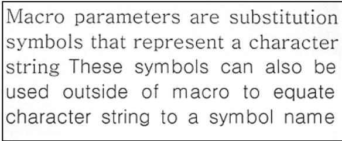  
Fig. 12. Original Text Image.

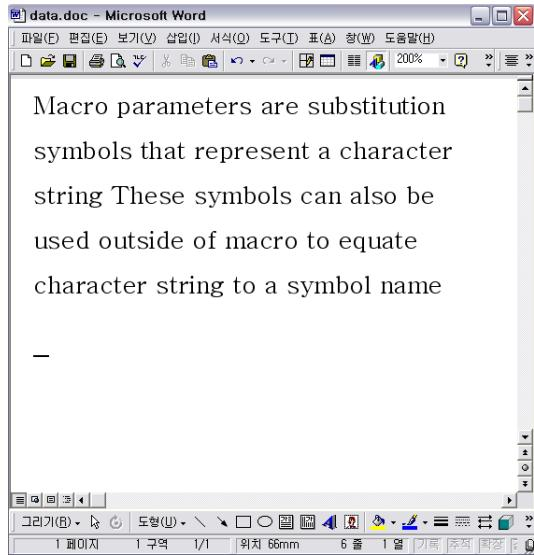  
Fig. 13. The Output of The Word Editor.