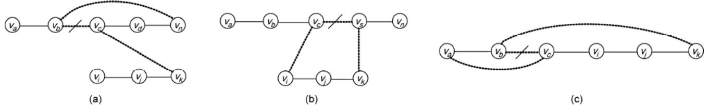
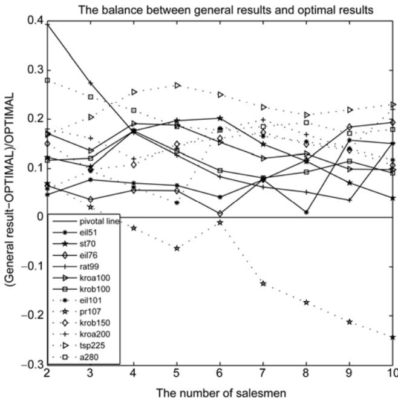
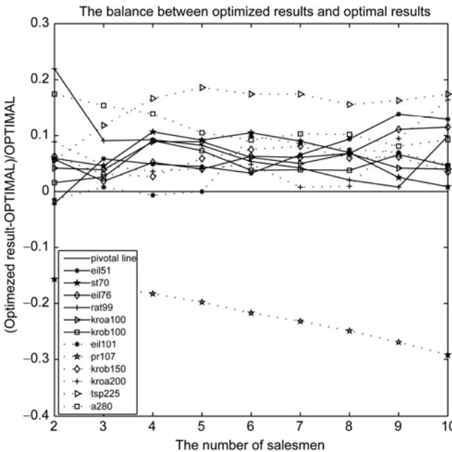

# A novel method for solving the multiple traveling salesmen problem with multiple depots

HOU MengShu\* & LIU DaiBo

School of Computer Science and Engineering, University of Electronic Science and Technology of China, Chengdu 610054, China

Received December 15, 2011; accepted March 23, 2012

Multi-traveling salesman problem (MTSP) is an extension of traveling salesman problem, which is a famous NP hard problem, and can be used to solve many real world problems, such as railway transportation, routing and pipeline laying. In this paper, we analyze the general properties of MTSP, and find that the multiple depots and closed paths in the graph is a big issue for MTSP. Thus, a novel method is presented to solve it. We transform a complicated graph into a simplified one firstly, then an effective algorithm is proposed to solve the MTSP based on the simplified results. In addition, we also propose a method to optimize the general results by using 2-OPT. Simulation results show that our method can find the global solution for MTSP efficiently.

# combinatorial optimization, traveling salesman problem, MTSP, algorithm

Citation: Hou M S, Liu D B. A novel method for solving the multiple traveling salesmen problem with multiple depots. Chin Sci Bull, 2012, 57: 18861892, doi: 10.1007/s11434-012-5162-7

The traveling salesman problem (TSP) is a typical combinatorial optimization problem. A generalization of the TSP is the multiple traveling salesmen problem (MTSP), which determines a set of routes enabling multiple salesmen to start at and return to depots.

The TSP consists of finding the shortest closed route to visit all cities. Several methods based on heuristics have been proposed to solve it, including classical search maps [1], simulated annealing [2], artificial neural networks (NNs) (Kohonen-type self-organizing maps [3], Hopfield-type NNs [4]), genetic algorithms (GAs) [5], evolutionary programming [6], ant colony optimization [7], tabu search [8], fine-tuned learning [9], etc.

Although the TSP has received a great deal of attention, research on the MTSP is limited. Bektas [10] introduced comprehensive formulations and solution procedures for the MTSP, and indicated that exact algorithms [11,12] could always obtain degenerated results when solving the MTSP. Heuristic algorithms, neural network-based methods, and ant systems have all been proposed to solve the MTSP.

Heuristic algorithms are the preferred method, while neural network-based methods are widely used to solve path planning [13], robotic systems [14] and authentication [15]. Ryan et al. [16] used tabu search to solve the MTSP, while Qu et al. [17] used a competition-based neural network to solve a minmax MTSP. Thus far, GAs have been applied to a wide range of application areas, including solving the MTSP. Liaw et al. [18] proposed a hybrid genetic algorithm, which is based on tabu search, to solve the MTSP. Carter et al. [19] researched chromosome representation and related genetic operators to find an applicable method for solving the MTSP. Additionally, the ant system, which was proved by [7], is a perfectly acceptable meta-heuristic for a number of NP-hard problems. In [20], an ant system is applied to the MTSP.

The MTSP seems to be more appropriate than the TSP for practical applications and can be used to simulate many everyday applications such as transportation logistics, job planning, vehicle scheduling, and so on. Some reported applications are presented in [10]. The main applications include print press scheduling [21], crew scheduling [22], school bus routing [23], mission planning [24], and the design of global navigation satellite surveying system networks [25]. Moreover, the MTSP can be used to solve the problem of multiple traveling robots [26,27], and can be considered as a relaxation of the vehicle routing problem (VRP) [28] with the capacity restrictions removed. This means that all the formulations and solution approaches proposed for the VRP are also valid and applicable to the MTSP, by assigning sufficiently large capacities to the salesmen.

The MTSP can be extended to many variations [10]. As far as the number of depots and the target paths are concerned, it includes a single depot and multiple depots, as well as closed and open paths. A closed path starts and ends at the same depot, whereas an open path does not require returning to the original depot. This paper presents a novel method for solving a heterogeneous MTSP which allows salesmen to start from different depots and end their tours at the original depots.

# 1 Definition of the MTSP

Given a set of nodes and $M$ salesmen located at each depot, the MTSP aims to find $M$ routes for each salesman starting from a set of depots, and ending at the original depots, so that each intermediate node is visited exactly once and the total cost is minimized.

Let $G = ( V , \ E , \ W )$ be a connected graph, where $V { = } \{ \nu _ { 1 } ,$ , $\textstyle \nu _ { 2 } , . . . , \nu _ { n } \}$ is a set of cities, and $E { = } \{ { < } \nu _ { i } , \nu _ { j } > \mid \nu _ { i } , \nu _ { j } \in V , i \ne j \}$ is an edge set with a non-negative cost matrix $W { = } \{ w _ { i j } |$ the weight of ${ < } { \nu } _ { i } { , } { \nu } _ { j } { > }  \}$ . The graph is said to be symmetric if any $< \nu _ { i } , \nu _ { j } > \in E$ satisfies $w _ { i j } = w _ { j i }$ . In this paper, we only consider symmetric graphs that satisfy the triangle inequality.

Definition 1: $w ( \nu _ { i } , \ \nu _ { j } )$ is the distance or side length between $\nu _ { i }$ and $\nu _ { j } ,$ denoted by $w _ { i j }$ .

Definition 2: $\mathbf { \chi } _ { \cdot } \ d ( i )$ and $\mathrm { s u b } { \bf D } ( i )$ denote the number of edges connecting to $\nu _ { i }$ in a given graph.

Definition 3: A path denotes a route between two endpoint nodes with degree 1.

Definition 4: A tour denotes a route that starts at one node and ends at the same node.

Definition 5: The edges connected to home depots in the final result are called primal edges.

# 2 Simple model

A simple model, referred to as the SModel, is used to simplify an initial graph, $G$ . The detailed operations and related restrictive conditions are described below.

All edges belonging to $E$ are sorted in descending order according to weight and stored in the edge set, SortEdgeArray. Then, all sorted edges are checked by eq. (1) once only. If $< \nu _ { i } , \nu _ { j } >$ satisfies

$$
\left\{ { \begin{array} { l } { d ( i ) > 2 , } \\ { d ( j ) > 2 , } \end{array} } \right.
$$

it is deleted from SortEdgeArray, and $d ( i )$ and $d ( j )$ are reduced by 1. Once all edges have been checked, the left edges together with all nodes constitute one or more sub-graphs. The statistical data for the degree of each node is given in Table 1. The first column lists all possible degrees, while the second column gives the percentage of nodes with each degree. The number of nodes with degree greater than 2 accounts for about $1 6 . 5 \%$ of all the nodes. It is worth noting that the computational complexity of generating an SModel is $O ( e l n ( e ) )$ , where $e$ is the number of edges.

# 3 New solution for the MTSP

The SModel is proposed to implement the new method, MDCP (multiple depots and closed paths). After it has been generated, the subsequent workings of the MDCP are based on the model.

# 3.1 Generating an SModel and deleting redundant edges

The MDCP first generates an SModel, and then deletes all redundant edges in the model and reorganizes isolated paths. According to the given statistics, about $1 6 . 5 \%$ of the nodes have a degree greater than 2 in the SModel, which means that there must be redundant edges in the model. We refer to those edges connected to nodes with a degree greater than 2 as redundant candidate edges. For each redundant candidate edge $< \nu _ { i } , \nu _ { j } >$ , if the condition

$$
d ( i ) > 2 \quad \mathrm { ~ o r ~ } \quad d ( j ) > 2
$$

is satisfied, it is deleted from SortEdgeArray. All redundant candidate edges are checked in descending order according to weight. Once all of these have been checked by eq. (2), no degree of a node is greater than 2. We denote the resulting graph as $G _ { 0 }$ .

# 3.2 Testing paths

$S _ { 1 }$ and $S _ { 2 }$ are two node sets used to record the endpoint nodes of paths, rings, and isolated nodes in $G _ { 0 }$ . If MDCP discovers a node with degree 0, the node is stored in an entry of $S _ { 2 }$ . If MDCP discovers a ring, the maximal weighted edge of the ring is deleted and the two endpoint nodes are stored in an entry of $S _ { 1 }$ . The endpoints of left paths are also stored in $S _ { 1 }$ .

Table 1 Statistical data for the degree of all nodes after the selection action   

<table><tr><td>Degree</td><td>Percentage</td></tr><tr><td>2</td><td>83.5%</td></tr><tr><td>3</td><td>11%</td></tr><tr><td>4</td><td>4%</td></tr><tr><td>≥5</td><td>≤1.5%</td></tr></table>

# 3.3 Generating $\mathbf { \nabla } m$ routes

Based on the elements of $S _ { 1 }$ and $S _ { 2 }$ , the number of paths can be determined and the following operations, corresponding to the relation between the numbers of salesmen and paths, would differ.

(i) Examining the number of paths. The number of paths is, in fact, the sum of the number of entries in $S _ { 1 }$ and $S _ { 2 }$ . We denote the number of paths as $P s$ and the number of salesmen as $M$ .

$P s < M$ , if $P s$ is less than $M$ , MDCP selects some paths and divides each of them into multiple paths by deleting the maximum weighted edges of each selected path until $P s$ is no less than $M$ , and then continues to examine the number of paths as explained below.

$P s = M$ , if $P s$ is equal to $M$ , MDCP generates $M$ tours by linking the two endpoint nodes of each path. If two endpoint nodes of a path are not connected to each other, the operation proceeds to that given in section 3.4. Additionally, if $M$ tours are generated successfully, MDCP optimizes the final result using the method presented in section 3.5.

$P s > M$ , if $P s$ is greater than $M$ , the subsequent operation is described as follows.

(ii) Path connections. MDCP generates a sub-graph from all the endpoint nodes, denoted as $G _ { \mathrm { s u b } } { = } ( V _ { \mathrm { s u b } } , ~ E _ { \mathrm { s u b } } )$ . Vsub includes all the endpoint nodes stored in $S _ { 1 }$ and $S _ { 2 }$ , while $E _ { \mathrm { s u b } }$ is an edge set whose elements are connected to the nodes stored in $V _ { \mathrm { s u b } } . \ \mathrm { s u b } { D } ( i )$ denotes the degree of $\nu _ { i }$ in $G _ { \mathrm { s u b } }$ . MDCP continues to check each edge stored in $E _ { \mathrm { s u b } }$ . For each $< \nu _ { i } , \nu _ { j } >$ , if any one of the following three conditions is satisfied, $< \nu _ { i } , \nu _ { j } >$ is deleted from $E _ { \mathrm { s u b } }$ , and $\mathrm { s u b } D ( i )$ and $\mathrm { s u b } D ( j )$ are decreased by 1.

(a) $d ( i ) { = } 1 , d ( j ) { = } 1$ , $\mathrm { s u b } D ( i ) { \sim } 1$ and $\mathrm { s u b } D ( j ) { \mathord { > } } 1$ ;   
(b) $d ( i ) { = } 0 , d ( j ) { = } 1$ , $\mathrm { s u b } D ( i ) { > } 2$ and $\mathrm { s u b } D ( j ) { \mathord { > } } 1$ ;   
(c) $d ( i ) { = } 1 , d ( j ) { = } 0$ , $\mathrm { s u b } D ( i ) { \sim } 1$ and $\operatorname { s u b } D ( j ) { > } 2$ .

According to the above three conditions, it is guaranteed that there is at least one edge connected to each node in $S _ { 1 }$ and at least two edges connected to each node in $S _ { 2 }$ . Furthermore, the left edges of Esub are checked by the following three conditions. If $< \nu _ { i } , \nu _ { j } >$ satisfies any one of these, it is deleted from $E _ { \mathrm { s u b } }$ , and $\mathrm { s u b } D ( i )$ and $\mathrm { s u b } D ( j )$ are decreased by 1.

(a) $d ( i ) { = } 1$ , $d ( j ) { = } 1$ , $\mathrm { s u b } D ( i ) { \sim } 1$ ; or $d ( i ) { = } 1$ , $d ( j ) { = } 1$ , $\mathrm { s u b } D ( j ) { \mathord { > } } 1$ ; (b) $d ( i ) { = } 0 , d ( j ) { = } 1$ , $\mathrm { s u b } D ( i ) { > } 2$ ; or $d ( i ) { = } 0 , d ( j ) { = } 1$ , $\mathrm { s u b } D ( j ) { \mathord { \left/ { \vphantom { \mathrm { s u b } } } \right. \kern - delimiterspace } } > 1$ (c) $\cdot d ( i ) { = } 1 , d ( j ) { = } 0 , { \mathrm { s u b } } D ( i ) { > } 1$ ; or $d ( i ) { = } 1 , d ( j { = } 0 , \mathsf { s u b } D ( j ) { > } 2$ .

Irrespective of whether the $M$ tours are generated successfully by the operations described above, MDCP converges. The number of iterations is no greater than the sum of the number of entries in $S _ { 1 }$ and $S _ { 2 }$ .

In other words, if the left edge connects two paths that are stored in $S _ { 1 }$ and $S _ { 2 }$ , respectively, MDCP joins the node stored in $S _ { 2 }$ to the path stored in $S _ { 1 }$ and removes the corresponding entry in $S _ { 2 }$ . If the left edge connects two nodes in $S _ { 2 }$ , MDCP links the two nodes together, stores the new generated path in $S _ { 1 }$ , and removes the related entries stored in $S _ { 2 }$ . Similarly, if the left edge connects two nodes in $S _ { 1 }$ MDCP merges the two paths into one and deletes the entry that is not used to represent the new path stored in $S _ { 1 }$ . The number of entries is thus always reduced. So, the number of iterations is no more than the sum of the number of entries in $S _ { 1 }$ and $S _ { 2 }$ . If $G$ is not a complete graph, the $M$ tours may not be generated successfully by the method described above, and then the operation proceeds to that described in Section 3.4.

# 3.4 Related remedial methods

Definition 6. If $G$ is a simple graph, $N$ is the number of nodes, and $\delta$ denotes the minimum connectivity which is the minimum degree of all nodes divided by $N$ .

If the number of paths whose endpoint nodes are not connected to each other is $\theta$ and the number of endpoint nodes is $\overline { { \theta } }$ , then the number of isolated nodes is ${ \overline { { \theta } } } - 2 \theta$ . The largest possible number of edges connected to endpoint nodes is $\overline { { { \theta } } } ( \overline { { { \theta } } } - 1 )     / 2$ , and the maximum possibility, $\kappa ,$ that all the endpoint nodes are not connected to each othe is $( 1 - \delta ) ^ { \gamma }$ . If $\delta$ is 0.5 and $\bar { \theta }$ is 5, the probability is less than 0.001.

Two remedial methods are proposed for merging paths or converting a path into a tour.

(i) Merging two paths into one. This method is used to link two paths. Two models are proposed to implement it.

Model 1: The first model for merging two paths into one is shown in Figure 1(a). Nodes $\nu _ { a } , \nu _ { n } , \nu _ { i } ,$ and $\nu _ { k }$ are endpoint nodes that are not connected to each other, and $\nu _ { b }$ is adjacent with $\nu _ { c }$ . The MDCP tries to connect $\nu _ { k }$ to $\nu _ { c } ,$ and then connects a neighbor of $\nu _ { b }$ to $\nu _ { n }$ which is on the other side of $\nu _ { c }$ . It is worth noting that the dotted lines denote the newly added edges, while the dotted line with a slash through it denotes the edge that will be deleted from the model.

The infeasibility probability of this method, denoted as $\rho _ { 1 }$ , is $( 1 - 2 \delta ( 1 - ( 1 - \delta ) ^ { \bar { \theta } - 2 } ) ) ^ { N - \bar { \theta } - \theta _ { 1 } } ( 1 - \delta ( 1 - \delta ( 1 - \delta ) ^ { \bar { \theta } - 2 } ) ) \theta _ { 1 }$ , where $\theta _ { 1 }$ is the number of paths containing only 3 nodes.

Model 2: The second model for merging two paths into one is shown in Figure 1(b). $\nu _ { i }$ and $\nu _ { k }$ are two endpoint nodes of a path, while two adjacent nodes, $\nu _ { c }$ and $\nu _ { s } ,$ are intermediate nodes of the other path. If $\nu _ { i }$ and $\nu _ { k }$ are connected to $\nu _ { c }$ and $\nu _ { s } ,$ respectively, the two paths can be merged into one. Similarly, the infeasibility probability of this method, denoted as 2, is 2 1 2 2 ((1 2 ) (1 ) )      N         .

The objective of the two models is the same. The probability that any two of the paths can be merged into one is no less than $1 - \kappa \rho _ { 1 } \rho _ { 2 }$ .

(ii) Converting a path into a tour. The model for converting a path into a tour is shown in Figure 1(c). As before, $\nu _ { b }$ is adjacent to $\nu _ { c } . \nu _ { a }$ and $\nu _ { k }$ are two endpoint nodes on the path. If $\nu _ { a }$ is connected to $\nu _ { c }$ and $\nu _ { k }$ is connected to $\nu _ { b }$ , the path can be transformed into a tour by deleting $< \nu _ { b } , \nu _ { c } >$ and adding $< \nu _ { a } , \nu _ { c } >$ and ${ < } \nu _ { b }$ , $\nu _ { k } >$ . The feasibility probability that a path with $N$ nodes can be transformed into a tour is $1 - ( 1 - \delta ) ( 1 - 2 \delta ^ { 2 } ) ^ { N - 4 } ( 1 - \delta ^ { 2 } ) ^ { 2 }$ .

# 3.5 Optimization

MDCP optimizes each of the generated tours by replacing two edges of a tour with a better strategy. Differing from 2-OPT [29], MDCP adds a serial number to each node of the tour and implements the optimization method by checking the serial numbers. The rules are given below:

(i) Any two adjacent nodes are assigned adjacent serial   
numbers. (ii) Serial numbers are assigned to nodes in ascending   
order. (iii) Four endpoint nodes of two paths can be linked to  
gether by two strategies satisfying theorem 1. (iv) If the edge connecting the node with the first serial   
number to the node with the last serial number is fixed, the  
orem 2 is used to change the topology of the previous tour.

Theorem 1: For two new edges $e _ { i j }$ and $e _ { u \nu }$ , if the sum of the serial numbers of $\nu _ { i }$ and $\nu _ { j }$ is not equal to that of $\nu _ { u }$ and $\nu _ { \nu } .$ the two fixed edges can be replaced by the new edges.

Theorem 2: Let the serial number of $\nu _ { i }$ be 0 and that of $\nu _ { j }$ be n-1 and $< \nu _ { u } , \nu _ { \nu } >$ be one of the two selected edges. If the serial number of $\nu _ { u }$ is greater than the serial number of $\nu _ { \nu }$ , $< \nu _ { i } , \nu _ { j } >$ and $< \nu _ { u } , \nu _ { \nu } >$ can be replaced by ${ < } { \nu } _ { i }$ , $\nu _ { u } >$ and ${ < } \nu _ { j } , \nu _ { \nu } { > }$ .

# 4 Experiments and computational results

Since there are no open-source benchmarks for testing the algorithms of the MTSP, we computed some instances presented in TSPLIB [30], which is the standard public library for the TSP. Although the MTSP is different to the TSP, typical instances and optimal results of these can reflect the performance of MDCP to a great extent.

The instances tested were Euclidean, two-dimensional symmetric problems with different node-scales. The relation between TSP and MDCP is as follows: if the total number of nodes is $n$ , the TSP solution is a connected graph with $n$ edges and the degree of all nodes equal to 2, while the

MDCP solution consists of $M$ $M$ is the number of salesmen) connected graphs with $n$ edges and the degree of all nodes equal to 2.

To the best of our knowledge, no other method has previously been proposed for solving the same problem. To evaluate the performance of MDCP, we compared the computational results with the optimal results presented in TSPLIB. Although these results cannot be compared per se, the optimal results can confirm the level of performance of MDCP to a large extent. Additionally, all computational results were optimized by the method proposed in section 3.5.

# 4.1 Computational results

An analysis of the general results of MDCP is presented in Table 2. The column Instance gives the names of the tested instances; column Num lists the node-scale of the tested instances; and column OPT denotes the optimal result presented in TSPLIB for each tested instance. MDCP solves all the given instances with the number of salesmen varying from 2 to 10. The average time cost for each run is listed in column $T$ in ms. Irrespective of the number of salesmen used by MDCP, the number of edges for MDCP is equal to that of the TSP for a certain instance. As shown in Table 2, it is obvious that the results obtained differ for different numbers of salesmen. Although the calculated results are affected by the number of salesmen, there is no obvious rule to determine how many salesmen should be used to obtain the best result. For example, the result for eil51 tested using 6 salesmen is the best of all the results for this instance, and likewise, the result for st70 using 10 salesmen is the best of all the results for this instance. It is, however, a certainty that the topology of the fixed instance affects the computational result with different numbers of salesmen. The advantage of MDCP is that it converges quickly.

The values for the difference between the calculated results and the optimal results are plotted in Figure 2. For each result, the difference is computed by the following formula:

$$
\mathrm { { d i f f } = \frac { g e n e r a l \ r e s u l t - O P T I M A L } { O P T I M A L } . }
$$

The bold line denotes the pivotal line, and markers linked by other lines denote the difference of different instances tested by eq. (3). Obviously, the majority of the tested results

  
Figure 1 The two remedial models (a) and (b) are used to merge two paths into one, while (c) is used to generate a tour from a path.

Table 2 The general results of MDCP. Num is the node-scale of each instance, OPT is the optimal result presented in TSPLIB, $M$ is the number of salesmen, $T$ is the average time cost for each instance with different numbers of salesmen   

<table><tr><td>Instance</td><td>Num</td><td>OPT</td><td>=2</td><td>=3</td><td>=4</td><td>M=5</td><td>=6</td><td>=7</td><td>=8</td><td>=9</td><td>=10</td><td>T(ms)</td></tr><tr><td>Eil51</td><td>51</td><td>426</td><td>446</td><td>459</td><td>456</td><td>454</td><td>444</td><td>459</td><td>471</td><td>493</td><td>490</td><td>1.3</td></tr><tr><td>St70</td><td>70</td><td>675</td><td>758</td><td>745</td><td>794</td><td>808</td><td>812</td><td>776</td><td>753</td><td>723</td><td>702</td><td>3.5</td></tr><tr><td>Eil76</td><td>76</td><td>538</td><td>573</td><td>558</td><td>569</td><td>568</td><td>580</td><td>580</td><td>601</td><td>637</td><td>642</td><td>4.5</td></tr><tr><td>Rat99</td><td>99</td><td>1211</td><td>1687</td><td>1543</td><td>1421</td><td>1365</td><td>1312</td><td>1290</td><td>1274</td><td>1254</td><td>1396</td><td>7.3</td></tr><tr><td>Kroa100</td><td>100</td><td>21282</td><td>24934</td><td>24180</td><td>25353</td><td>25294</td><td>24555</td><td>23870</td><td>24049</td><td>23399</td><td>23379</td><td>13.2</td></tr><tr><td>Krob100</td><td>100</td><td>22141</td><td>24752</td><td>24829</td><td>26042</td><td>25149</td><td>24273</td><td>23943</td><td>24211</td><td>24705</td><td>24165</td><td>13.0</td></tr><tr><td>Eil101</td><td>101</td><td>629</td><td>685</td><td>689</td><td>668</td><td>648</td><td>743</td><td>733</td><td>726</td><td>717</td><td>703</td><td>12.6</td></tr><tr><td>Pr107</td><td>107</td><td>44303</td><td>47428</td><td>45242</td><td>43365</td><td>41509</td><td>39690</td><td>38360</td><td>36622</td><td>34884</td><td>33512</td><td>18.9</td></tr><tr><td>Krob150</td><td>150</td><td>26130</td><td>30051</td><td>28704</td><td>28976</td><td>30028</td><td>30337</td><td>30665</td><td>30028</td><td>29718</td><td>28944</td><td>25.4</td></tr><tr><td>Kroa200</td><td>200</td><td>29368</td><td>51875</td><td>51281</td><td>50372</td><td>49413</td><td>50959</td><td>50127</td><td>49877</td><td>49498</td><td>50605</td><td>60.6</td></tr><tr><td>Tsp225</td><td>225</td><td>3916</td><td>4505</td><td>4432</td><td>4275</td><td>4355</td><td>4501</td><td>4574</td><td>4460</td><td>4351</td><td>4656</td><td>82.3</td></tr><tr><td>A280</td><td>280</td><td>2579</td><td>3014</td><td>3106</td><td>3239</td><td>3274</td><td>3225</td><td>3158</td><td>3117</td><td>3144</td><td>3174</td><td>139.5</td></tr><tr><td>Lin318</td><td>318</td><td>42029</td><td>53790</td><td>52380</td><td>51193</td><td>49821</td><td>49515</td><td>49839</td><td>50178</td><td>49220</td><td>49558</td><td>154.6</td></tr></table>

  
Figure 2 The differences between the general results and optimal results. The bold line denotes the pivotal line.

are worse than the optimal results, but the results for pr107 are better.

# 4.2 Optimized results

The optimization proposed in section 3.5 was used to optimize all the computational results presented in Table 2. Compared to the corresponding results in Table 2, the optimized results are much better. The values for the difference between the optimized results and the optimal results are plotted in Figure 3. Almost all differences, calculated by eq. (4)

  
Figure 3 The differences between the optimized results and optimal results. The bold line denotes the pivotal line.

are below 0.2, with the majority between 0 and 0.1.

$$
\mathrm { { d i f f } = \frac { \ o p t i m i z e d \ r e s u l t - O P T I M A L } { O P T I M A L } . }
$$

However, optimizing the computational results increases the time cost. The calculation formula for the increment in time cost is expressed as

$$
{ \mathrm { t i m e ~ c o s t ~ i n c r e m e n t } } = { \frac { \mathrm { c o s t 1 - c o s t 2 } } { \mathrm { c o s t 2 } } } \times 1 0 0 \% ,
$$

where cost1 is the time cost of the optimization, and cost2 is

Table 3 Comparison of total cost for general results of MDCP and optimized results. The total cost decrease denotes the percentage difference in cost between the general results and the optimized results, and time cost increase denotes the percentage increase in time cost   

<table><tr><td rowspan="2">Instance</td><td rowspan="2">Num</td><td rowspan="2">OPT</td><td colspan="10">The total cost decrease (%)</td><td rowspan="2">Time cost increase (%)</td></tr><tr><td>M=2</td><td>=3</td><td>=4</td><td>M=5</td><td>M=6</td><td>M=7</td><td>M=8</td><td>M=9</td><td>M=10</td></tr><tr><td>Eil51</td><td>51</td><td>426</td><td>6.8</td><td>1.9</td><td>2.1</td><td>2.1</td><td>0.9</td><td>1.2</td><td>1.2</td><td>1.9</td><td>2.1</td><td>69.2</td></tr><tr><td>St70</td><td>70</td><td>675</td><td>6.4</td><td>14.3</td><td>6.9</td><td>10.5</td><td>9.8</td><td>5.9</td><td>4.6</td><td>4.6</td><td>3.1</td><td>60</td></tr><tr><td>Eil76</td><td>76</td><td>538</td><td>0.7</td><td>1.8</td><td>0.6</td><td>1.5</td><td>1.5</td><td>1.6</td><td>4.8</td><td>7.2</td><td>7.8</td><td>40</td></tr><tr><td>Rat99</td><td>99</td><td>1211</td><td>17.3</td><td>10.1</td><td>8.1</td><td>4.4</td><td>2.9</td><td>2.3</td><td>3.1</td><td>2.7</td><td>5.4</td><td>287</td></tr><tr><td>Kroa100</td><td>100</td><td>21282</td><td>12.9</td><td>9.6</td><td>10.2</td><td>9.9</td><td>9.2</td><td>7.1</td><td>6.2</td><td>5.7</td><td>5.6</td><td>92.4</td></tr><tr><td>Krob100</td><td>100</td><td>22141</td><td>10.2</td><td>9.5</td><td>8.5</td><td>6.2</td><td>5.8</td><td>4.1</td><td>5.5</td><td>4.9</td><td>4.5</td><td>120.7</td></tr><tr><td>Eil101</td><td>101</td><td>629</td><td>10.3</td><td>8.7</td><td>6.8</td><td>3.0</td><td>8.2</td><td>7.9</td><td>7.9</td><td>7.0</td><td>7.0</td><td>188</td></tr><tr><td>Pr107</td><td>107</td><td>44303</td><td>22.7</td><td>19.1</td><td>16.1</td><td>13.4</td><td>11.3</td><td>9.8</td><td>9.6</td><td>5.6</td><td>4.8</td><td>81.4</td></tr><tr><td>Krob150</td><td>150</td><td>26130</td><td>8.7</td><td>6.7</td><td>8.1</td><td>8.9</td><td>8.6</td><td>9.2</td><td>8.8</td><td>7.4</td><td>6.5</td><td>125</td></tr><tr><td>Kroa200</td><td>200</td><td>29368</td><td>16.1</td><td>10.6</td><td>7.3</td><td>6.7</td><td>6.6</td><td>5.3</td><td>5.1</td><td>4.4</td><td>5.5</td><td>180</td></tr><tr><td>Tsp225</td><td>225</td><td>3916</td><td>8.9</td><td>11.1</td><td>7.7</td><td>9.0</td><td>9.7</td><td>9.9</td><td>9.7</td><td>4.8</td><td>5.4</td><td>67</td></tr><tr><td>A280</td><td>280</td><td>2579</td><td>11.3</td><td>8.6</td><td>8.9</td><td>8.7</td><td>7.6</td><td>6.8</td><td>4.6</td><td>4.5</td><td>4.9</td><td>195.6</td></tr><tr><td>Lin318</td><td>318</td><td>42029</td><td>10.5</td><td>9.1</td><td>7.8</td><td>8.0</td><td>8.5</td><td>8.3</td><td>9.1</td><td>8.9</td><td>8.7</td><td>178</td></tr></table>

the time cost of generating the general results listed in Table 2. All the time cost increments are listed in Table 3.

# 4.3 Differences in results

To visually compare the general results listed in Table 2 with the optimized results, we calculated the percentage difference in total cost of the general results and optimized results for each tested instance. The larger the difference is, the better is the optimal degree. As shown in Table 3, the column labeled total cost decrease denotes the optimal degree. Most of the results listed in Table 2 decrease by $2 \% - 1 0 \%$ . On the whole, the optimized results are much better than the general results. The calculation formula for the percentage difference is expressed as:

# 5 Conclusions

This paper proposed a new method known as the MDCP to solve a heterogeneous MTSP with multiple depots and closed paths. A simple model was introduced to implement MDCP. The model can transform a complicated graph into a simplified one. Based on the model, the subsequent workings of MDCP involve merely linking paths together. Based on SModel, the greatest advantage of MDCP is that it can find a global solution efficiently.

An optimization method that is similar to 2-OPT was used to optimize the general results. Serial numbers were used to label nodes. It was experimentally verified that the optimization method can decrease the total cost of MDCP to a large extent.

This work was supported by the National Natural Science Foundation of China (61073177).

1 Gu J, Huang X. Efficient local search with search space smoothing: A case study of the traveling salesman problem (TSP). IEEE Trans Syst Man Cybern, 1994, 24: 728–735   
2 Chen Y W, Lu Y Z, Chen P. Optimization with extremal dynamics for the traveling salesman problem. Physica A, 2007, 385: 115–123   
3 Tarzjan S, Khademi M, Akbarzadeh T M, et al. A novel constructive-optimizer neural network for the traveling salesman problem. IEEE Trans Syst Man Cybern Part B, 2007, 37: 754–770   
4 Qu H, Yi Z, Tang H J. Improving local minima of columnar competitive model for TSPs. IEEE Trans Circuits Syst Part I, 2006, 53: 1353–1362   
5 Katayama K, Narihisa H. An efficient hybrid genetic algorithm for the traveling salesman problem. Electr Commun Jpn, 2001, 84: 76–83   
6 Fogel D B. Applying evolutionary programming to selected traveling salesman problems. Cybern Syst, 1993, 24: 27–36   
7 Dorigo M, Maniezzo V, Colorni A. Ant system: Optimization by a colony of cooperating agents. IEEE Trans Syst Man Cybern Part B, 1996, 26: 29–41   
8 Misevicius A, Smolinskas J, Tomkevicius A. Using iterated tabu search for the traveling salesman problem. Inf Technol Control, 2004, 3: 29–40   
9 Coy S P, Golden B L, Runger G C, et al. See the forest before the trees: Fine-tuned learning and its application to the traveling salesman problem. IEEE Trans Syst Man Cybern Part A, 1998, 28: 454–464   
10 Bektas T. The multiple traveling salesman problem: An overview of formulations and solution procedures. Omega, 2006, 34: 209–219   
11 Laporte G, Nobert Y. A cutting planes algorithm for the m-salesmen problem. J Oper Res Soc, 1980, 31: 1017–1023   
12 Ali A I, Kennington J L. The asymmetric m-traveling salesmen problem: A duality based branch-and-bound algorithm. Discrete Appl Math, 1986, 13: 259–276   
13 Howard L, Simon X Y, Yevgen B. Neural-network-based path planning for a multirobot system with moving obstacles. IEEE Trans Syst Man Cybern Part C, 2009, 39: 410–419   
14 Barreto G A, Araujo A F, Ducker C, et al. A distributed robotic control system based on a temporal self-organizing neural network. IEEE Trans Syst Man Cybern Part C, 2002, 32: 347–357   
15 Wang S H, Wang H. Password authentication using hopfield neural networks. IEEE Trans Syst Man Cybern Part C, 2008, 38: 265–268   
16 Ryan J L, Bailey T G, Moore J T, et al. Reactive tabu search in unmanned aerial reconnaissance simulations. In: Proceeding of the 30th IEEE Conference on Winter Simulation. California: IEEE Press, 1998, 1: 873–882   
17 Qu H, Yi Z, Tang H J. A columnar competitive model for solving multi-traveling salesman problem. Chaos Soliton Fract, 2007, 31: 1009–1029   
18 Liaw C F. A hybrid genetic algorithm for the open shop scheduling problem. Eur J Oper Res, 2000, 124: 28–42   
19 Carter E, Ragsdale C T. A new approach to solving the multiple traveling salesperson problem using genetic algorithms. Eur J Oper Res, 2006, 175: 246–257   
20 Pan J J, Wang D W. An ant colony optimization algorithm for the multiple traveling salesmen problem. In: Proceeding of 1st IEEE Conference on Innovative Computing, Information and Control. Washington: IEEE Press, 2006, 1: 210–213   
21 Gorenstein S. Printing press scheduling for multi-edition periodicals. Manage Sci, 1970, 16: 373–383   
22 Svestka J A, Huckfeldt V E. Computational experience with an msalesman traveling salesman algorithm. Manage Sci, 1973, 19: 790–798   
23 Angel R D, Caudle W L, Noonan R, et al. Computer assisted school bus scheduling. Manage Sci, 1972, 18: 279–288   
24 Brummit B, Stentz A. Dynamic mission planning for multiple mobile robots. In: Proceeding of the IEEE International Conoference on Robotics and Automation. IEEE Press, 1996, 3: 2396–2401   
25 Saleh H A, Chelouah R. The design of the global navigation satellite system surveying networks using genetic algorithms. Eng Appl Artif Intel, 2004, 17: 111–122   
26 Talay S S, Erdogan D R, Dept N. Multiple traveling robot problem: A solution based on dynamic task selection and robust execution. IEEE/ASME Trans Mechatronics, 2009, 14: 198–206   
27 Qu H, Yang S X, Willms A R, et al. Real-time robot path planning based on a modified pulse-coupled neural network model. IEEE Trans Neural Networks, 2009, 20: 1724–1739   
28 Lau H C, Chan T M, Tsui W T, et al. Application of genetic algorithms to solve the multidepot vehicle routing problem. IEEE Trans Autom Sci Eng, 2010, 7: 383–392   
29 Croes G A. A method for solving traveling salesman problems. Oper Res, 1958, 6: 791–812   
30 Reinelt G, TSPLIB: A traveling salesman problem library. ORSA J Comput, 1991, 3: 376–384