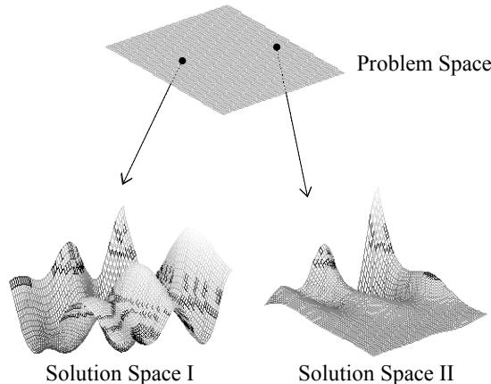
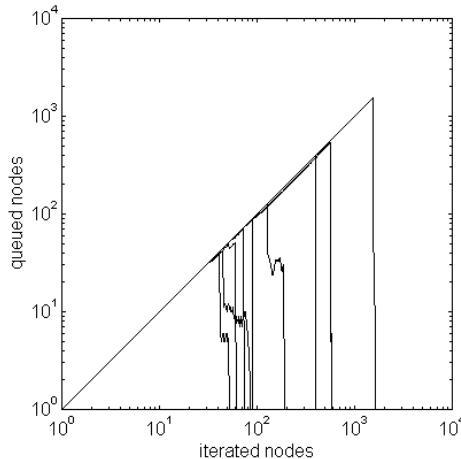
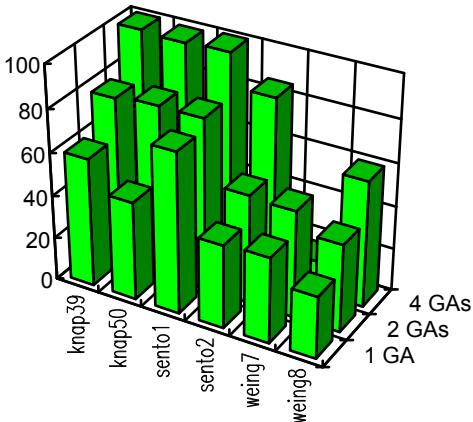
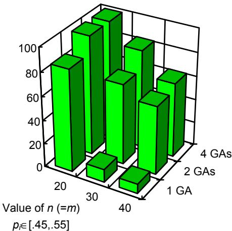

# A Hybrid Genetic Algorithm for the 0-1 Multiple Knapsack Problem

Carlos Cotta, José Mª Troya

Departamento de Lenguajes y Ciencias de la Computación Complejo Politécnico (2.2.A.6), Campus de Teatinos 29071 - Málaga (SPAIN)

{ccottap, troya}@lcc.uma.es

Abstract. A hybrid genetic algorithm based in local search is described. Local optimisation is not explicitly performed but it is embedded in the exploration of a search metaspace. This algorithm is applied to a NP-hard problem. When it is compared with other GA-based approaches and an exact technique (a branch & bound algorithm), this algorithm exhibits a better overallperformance in both cases. Then, a coarse-grain parallel version is tested, yielding notably improved results.

# 1 Introduction

Genetic algorithms have been traditionally considered as robust techniques, easily applicable to almost any domain. This robustness is not only an advantage, but also a major point of weakness. As shown in recent research, (the so-called No Free Lunch Theorem [1]) no algorithm can be expected to outperform any other one (including random search) when averaged over all possible problems. In other words, an algorithm is as good for a problem (or problem domain) as the problem-dependent knowledge it incorporates.

For that reason, hybrid genetic algorithms (i.e., genetic algorithms using specialised non standard mechanisms) have been often defined to deal with problems that would be very hard for a blind black-box search algorithm. These hybrid algorithms have been proved to be very effective tools in many situations (see [2]). Problem-dependent knowledge is incorporated by means of appropriate representations and specialised operators. In that sense, the use of operators performing local search is a widely used technique. These operators frequently play an essential rôle (e.g., in Mühlenbein’s parallel genetic algorithm [3]). In this work, we study a genetic algorithm based in local search. Unlike other hybrid approaches, local optimisation is not achieved via an improvement heuristic (like hill climbing) but by means of a construction heuristic. This implies that the search does not take place in the solution space but in a solution metaspace (the problem space).

# 2 Problem-Space Search

Problem-space exploration was first suggested by Storer et al. [4]. In short, it consists in the intelligent generation of different starting points for a construction heuristic. Since a construction heuristic H is a function that returns a feasible solution for a given problem instance, every new starting point defines a new problem instance for which a solution is generated (see Figure 1). All these solutions the heuristic provides are evaluated with respect to original data. Thus, the alternative problem instances are only used to appropriately modify the behaviour of the heuristic.

New problem instances are generated perturbing original data by means of an appropriate problemspecific procedure. This procedure is parameterized by a perturbation vector D that indicates how to modify each problem datum. Assuming that the heuristic H provides good solutions for the class of problems being solved, it is expected that the magnitude $\| \mathbf { D } \|$ of the perturbation vector D needed to find the optimum be not very large.

  
Fig. 1. Every point in the Problem Space defines a different solution space. The goal is to find a fitness landscape that optimally matches the requirements of a given heuristic.

Notice that, strictly speaking, the search is done in an auxiliary space (the perturbation space) that yields a problem space when composed with original data.

# 3 The 0-1 Multiple Knapsack Problem

The 0-1 Multiple Knapsack Problem (the 0-1 MKP after this) is a well-known member of the NP-hard class [5]. It is also referenced as the 0-1 integer programming problem or the 0-1 linear programming problem.

# 3.1 Definition of the Problem

The 0-1 MKP is a generalisation of the 0-1 simple Knapsack problem. In the latter, a set of objects $O =$ $\{ O _ { I } , ~ . ~ . ~ . , ~ O _ { n } \}$ and a knapsack of capacity C are given. Each object $o _ { i }$ has an associated profit $p _ { i }$ and weight $w _ { i }$ . The objective is to find a subset $S \subseteq O$ such that the weight sum over the objects in $S$ does not exceed the knapsack capacity and yields a maximum profit. The 0- 1 MKP involves $m$ knapsacks of capacities $c _ { I } , . . . . , c _ { m }$ Every selected object must be placed in all $m$ knapsacks. Moreover, the weight of an object $o _ { i }$ is not fixed, but it has a different value in each knapsack. Again, the goal is to obtain the maximum profit.

# 3.2 A Construction Heuristic

The greedy approach is a typical construction heuristic for the 0-1 simple Knapsack problem. This algorithm first calculates the profit density $\delta _ { i } = { \mathbf \nabla } p _ { i } / w _ { i }$ of every object and sorts them by decreasing values of this ratio. Then, objects are successively taken and included in the knapsack if they fit in it. To generalise this heuristic for the 0-1 MKP, the profit density of every object in every knapsack is calculated, and only the lowest value for each object is considered (i.e., $\delta _ { i } = m i n ( c _ { j } { p _ { i } } / { w _ { i j } } ) = =$ $p _ { i } / m a x ( w _ { i j } / c _ { j } )$ , $I \leq j \leq m )$ . This is better than taking $\delta _ { i } { = } a \nu g ( c _ { j } { \cdot } p _ { i } / w _ { i j } )$ since the latter could hide extreme values of the weight ratio $c _ { j } / w _ { i j }$ for a certain knapsack.

# 4 The Hybrid Genetic Algorithm

A genetic algorithm for the 0-1 MKP performing problem-space search may be designed using the greedy construction algorithm described above. Each individual in the population represents a perturbation vector defining a new problem instance.

# 4.1 Perturbing data

New problem instances may be obtained from a given one modifying the profit $p _ { i }$ of each object. This is an appropriate procedure because all instances generated this way have the same set of feasible solutions, although the evaluation of every solution is different. Thus, each perturbation vector $\mathrm { D }$ is a list of $n$ numbers $\{ d _ { I } , . . . . d _ { n } \}$ defining a problem instance in which the object $o _ { i }$ has a profit of $p _ { i } { + } d _ { i }$ and the same original weights. The magnitude of the perturbation is problemdependent and must be large enough to allow the optimum to be generated. Let $\xi$ be the amount of profit that has to be added to the object with lowest profit density so it becomes the one with the highest ratio. Taking $d _ { i }$ from $[ - \xi , ~ + \xi ]$ suffices to ensure that any feasible solution may be generated by the heuristic.

# 4.2 Experimental results

Experiments have been carried out with an elitist generational genetic algorithm, using a population size of $\mu { = } 1 0 0$ , a crossover rate of ${ \dot { p } } _ { c } { = } 0 . 9$ , a mutation rate of $p _ { m } { = } 0 . 0 1$ and proportional selection. The crossover operator is Radcliffe’s $n$ -dimensional $\mathrm { R } ^ { 3 }$ operator [6], i.e., it picks at each locus a random value in the range defined by the corresponding parents’ alleles. The mutation operator replaces a component of $\mathrm { D }$ by a random value.

For comparison purposes with [7] we have chosen a benchmark composed of nine problems taken from the OR-Library by Beasley [8]. Each run of the genetic algorithm involves $2 { \cdot } 1 0 ^ { 4 }$ evaluations, and a total number of 100 runs are executed for each test problem. Results are shown in table 1.

Table 1. Experimental results obtained by the GA.   

<table><tr><td rowspan=1 colspan=1>Problem</td><td rowspan=1 colspan=1>n</td><td rowspan=1 colspan=1>m</td><td rowspan=1 colspan=1>Optimum</td><td rowspan=1 colspan=1>Avg.</td><td rowspan=1 colspan=1>%Opt.ffound</td></tr><tr><td rowspan=1 colspan=1>Knap15</td><td rowspan=1 colspan=1>15</td><td rowspan=1 colspan=1>10</td><td rowspan=1 colspan=1>4015</td><td rowspan=1 colspan=1>4015.0</td><td rowspan=1 colspan=1>100%</td></tr><tr><td rowspan=1 colspan=1>Knap20</td><td rowspan=1 colspan=1>20</td><td rowspan=1 colspan=1>10</td><td rowspan=1 colspan=1>6120</td><td rowspan=1 colspan=1>6119.4</td><td rowspan=1 colspan=1>94%</td></tr><tr><td rowspan=1 colspan=1>Knap28</td><td rowspan=1 colspan=1>28</td><td rowspan=1 colspan=1>10</td><td rowspan=1 colspan=1>12400</td><td rowspan=1 colspan=1>12400.0</td><td rowspan=1 colspan=1>100%</td></tr><tr><td rowspan=1 colspan=1>Knap39</td><td rowspan=1 colspan=1>39</td><td rowspan=1 colspan=1>5</td><td rowspan=1 colspan=1>10618</td><td rowspan=1 colspan=1>10609.8</td><td rowspan=1 colspan=1>60%</td></tr><tr><td rowspan=1 colspan=1>Knap50</td><td rowspan=1 colspan=1>50</td><td rowspan=1 colspan=1>5</td><td rowspan=1 colspan=1>16537</td><td rowspan=1 colspan=1>16512.0</td><td rowspan=1 colspan=1>46%</td></tr><tr><td rowspan=1 colspan=1>Sento1</td><td rowspan=1 colspan=1>60</td><td rowspan=1 colspan=1>30</td><td rowspan=1 colspan=1>7772</td><td rowspan=1 colspan=1>7767.9</td><td rowspan=1 colspan=1>75%</td></tr><tr><td rowspan=1 colspan=1>Sento2</td><td rowspan=1 colspan=1>60</td><td rowspan=1 colspan=1>30</td><td rowspan=1 colspan=1>8722</td><td rowspan=1 colspan=1>8716.5</td><td rowspan=1 colspan=1>39%</td></tr><tr><td rowspan=1 colspan=1>Weing7</td><td rowspan=1 colspan=1>105</td><td rowspan=1 colspan=1>2</td><td rowspan=1 colspan=1>1095445</td><td rowspan=1 colspan=1>1095386.0</td><td rowspan=1 colspan=1>40%</td></tr><tr><td rowspan=1 colspan=1>Weing8</td><td rowspan=1 colspan=1>105</td><td rowspan=1 colspan=1>2</td><td rowspan=1 colspan=1>624319</td><td rowspan=1 colspan=1>622048.1</td><td rowspan=1 colspan=1>29%</td></tr></table>

These results clearly improve those referenced in [7] (using a binary encoding and a graded penalty term in the fitness function). They are much better not only in average but also in the number of times the optimum is found. For example, the larger instances (Sento1,

Sento2, Weing7, Weing8) are solved to optimality at least five times more often (with the number of evaluations being a factor of ten lower).

# 5 The Exact Solution: Branch & Bound

An exact method has been applied to the above test problems to obtain a measure of the effort that it is required to optimally solve them. Since the search space is composed of $2 ^ { \mathfrak { n } }$ points for a problem with $n$ objects (the number of knapsacks does not enlarge it but may make the feasible region be smaller) a simple Branch & Bound (B&B) algorithm (as described in [9]) is unable to solve most of the problems above. Therefore, a more sophisticated version of the algorithm using the linear-programming relaxation [10] has been considered. This B&B algorithm solves the LP-relaxed version of the problem and then branches on the object with highest profit that has a fractional value, generating two subproblems in which that object is forced to be included/excluded respectively.

As shown in Figure 2, ${ \sim } 1 0 ^ { 3 }$ subproblems must be solved to obtain the optimal solution for the most difficult problem (Sento2). This is not a very high value, suggesting that the above problems are relatively easy. For that reason, harder problem instances were generated as shown in [9], i.e. randomly picking the weights $w _ { i j }$ from the interval [0,1], setting all knapsack capacities to $n / 3$ and using object profits to define three levels of difficulty (from easiest to hardest): $p _ { i } \in [ 0 , 1 ] ,$ $p _ { i } { \in } \left[ . 4 5 , . 5 5 \right]$ , and $p _ { i } { = } . 5$ . Results are shown in table 2.

  
Fig. 2. Queued vs. Iterated nodes (OR-Library problems).

Table 2. B&B results for the generated problems.   

<table><tr><td rowspan=1 colspan=1>n (=m)</td><td rowspan=1 colspan=1> [0,1]</td><td rowspan=1 colspan=1>p [.45,.55]</td><td rowspan=1 colspan=1>=.5</td></tr><tr><td rowspan=1 colspan=1></td><td rowspan=1 colspan=3>Iterations</td></tr><tr><td rowspan=1 colspan=1>20</td><td rowspan=1 colspan=1>67</td><td rowspan=1 colspan=1>6925</td><td rowspan=1 colspan=1>37373</td></tr><tr><td rowspan=1 colspan=1>30</td><td rowspan=1 colspan=1>90</td><td rowspan=1 colspan=1>37259</td><td rowspan=1 colspan=1>295210</td></tr><tr><td rowspan=1 colspan=1>40</td><td rowspan=1 colspan=1>80</td><td rowspan=1 colspan=1>&gt;250000</td><td rowspan=1 colspan=1>-</td></tr><tr><td rowspan=1 colspan=1></td><td rowspan=1 colspan=3>Max. queue length</td></tr><tr><td rowspan=1 colspan=1>20</td><td rowspan=1 colspan=1>64</td><td rowspan=1 colspan=1>2163</td><td rowspan=1 colspan=1>7383</td></tr><tr><td rowspan=1 colspan=1>30</td><td rowspan=1 colspan=1>89</td><td rowspan=1 colspan=1>6997</td><td rowspan=1 colspan=1>50872</td></tr><tr><td rowspan=1 colspan=1>40</td><td rowspan=1 colspan=1>77</td><td rowspan=1 colspan=1>&gt;150000</td><td rowspan=1 colspan=1>-</td></tr></table>

It can be seen that the B&B algorithm is unpractical for homogeneous $( p _ { i } { = } . 5 )$ or nearly homogeneous $( p _ { i } \in [ . 4 5 , . 5 5 ] )$ problems of size around 30-40.

# 6 A Distributed Version of the Hybrid GA

Finally, a coarse-grain parallel version of the hybrid genetic algorithm following the island model [12] (i.e., $k$ genetic algorithms running in parallel, periodically interchanging some individuals) is tested. This model is used to study the improvement that can be achieved in both the easy and hard problem instances discussed above.

The experiments carried out so far have been realised with 2 and 4 genetic algorithms. The population size is $\scriptstyle \mu = 1 0 0 / k$ and one individual migrates every 20 generations to a random subpopulation (no fine tuning has been attempted). As shown in Figures 3 and 4, the quality of the results (in terms of how often the optimum is found) is notably improved.

  
Fig. 3. Number of times the optimum was found using a distributed genetic algorithm (results for the OR-Library problems).

G.D. Smith, N.C. Steele, R.F. Albrecht (eds.) Artificial Neural Nets and Genetic Algorithms 3 Springer-Verlag Wien New York 1998 pp. 250-254

  
Fig. 4. Number of times the optimum was found using a distributed genetic algorithm (results for the randomly generated problem instances).

It must be noted that the B&B-hard instances were solved to optimality in 100 out of 100 runs both for the easiest $( p _ { i } \in [ 0 , 1 ] )$ and the homogeneous case $( p _ { i } { = } . 5 )$ with a sequential genetic algorithm. Thus, a genetic algorithm seems to be more appropriate than B&B for this kind of problems.

# 7 Conclusions

A hybrid genetic algorithm using problem-space search has been presented and applied to the 0-1 Multiple Knapsack Problem. This technique is appropriate when a problem-dependent construction heuristic and a perturbing algorithm are available. The resulting hybrid algorithm performs better than other GA-based approaches on problems taken from the literature. Moreover, it consistently solves to optimality randomly-generated problem instances that are very hard for an exact (and specialised) technique.

Two important advantages of this method can be stressed: on the one hand, the results are assured to be at least as good as those of the construction heuristic as long as a null perturbation vector is inserted into the initial population. On the other hand, perturbation vectors are usually points in a $n$ -dimensional numerical domain. This allows using techniques oriented to continuous parameter optimisation (e.g., evolution strategies [13]) for the resolution of discrete-domain problems without needing to define artificial encodings. Furthermore, the use of the construction heuristic avoids needing to handle unfeasible solutions.

# Список литературы

[1] Wolpert D H and Macready W G, “No Free Lunch Theorems for Search”, Sante Fe Institute Technical Report SFI-TR-95-02-010, 1995   
[2] Davis L (ed.), “Handbook of Genetic Algorithms”, Van Nostrand Reinhold Computer Library, NY, 1991 [3] Mühlenbein H, “Parallel genetic algorithm, population dynamics and combinatorial optimization”, Proceedings of the Third International Conference on Genetic Algorithms, Schaffer H (ed.), Morgan Kaufmann, San Mateo, 1989, pp. 416-421   
[4] Storer R H, Wu S D and Vaccari R, “New search spaces for sequencing problems with application to job shop scheduling”, Management Science, 38, 1992, pp. 1495-1509   
[5] Garey M and Johnson D, “Computers and intractability: A guide to the theory of NPCompleteness”, Freeman and Co., San Francisco, 1979 [6] Radcliffe N J, “Forma Analysis and Random Respectful Recombination”, Proceedings of the Fourth International Conference on Genetic Algorithms, Belew R K and Booker L B (eds.), Morgan Kaufmann Pub., San Mateo CA, 1991, pp. 222-229   
[7] Khuri S, Bäck T and Heitkötter J, “The Zero/One Multiple Knapsack Problem and Genetic Algorithms”, Proceedings of the ACM Symposium of Applied Computation, ACM Press, 1993   
[8] Beasley J E, “OR-Library: Distributing Test Problems by Electronic Mail”, Journal of Operational Research Society, 41(11), 1990, pp. 1069-1072   
[9] Horowitz E and Sahni S, “Fundamentals of Computer Algorithms”, Computer Science Press, 1978 [10] Wiston W L, “Operations Research. Applications and algorithms”, Duxbury Press, Belmont CA, 1993 [11] Peterson C and Södeberg B, “Artificial Neural Networks”, Modern heuristic techniques for combinatorial problems, Reeves C R (ed.), Advanced Topics in Computer Science, Oxford Scientific Publications, 1993, pp. 197-242   
[12] Chipperfield A and Fleming P, “Parallel Genetic Algorithms”, Parallel and Distributed Computing Handbook, Zomaya A Y (ed.), McGraw-Hill Series on Computing Engineering, 1996, pp. 1118-1143   
[13] Rechember I, “Evolutionsstrategie: Optimierung technischer Systeme nach Prinzipien der biologischen Evolution”, Frommann-Holzboog Verlag, Stuttgart, 1973