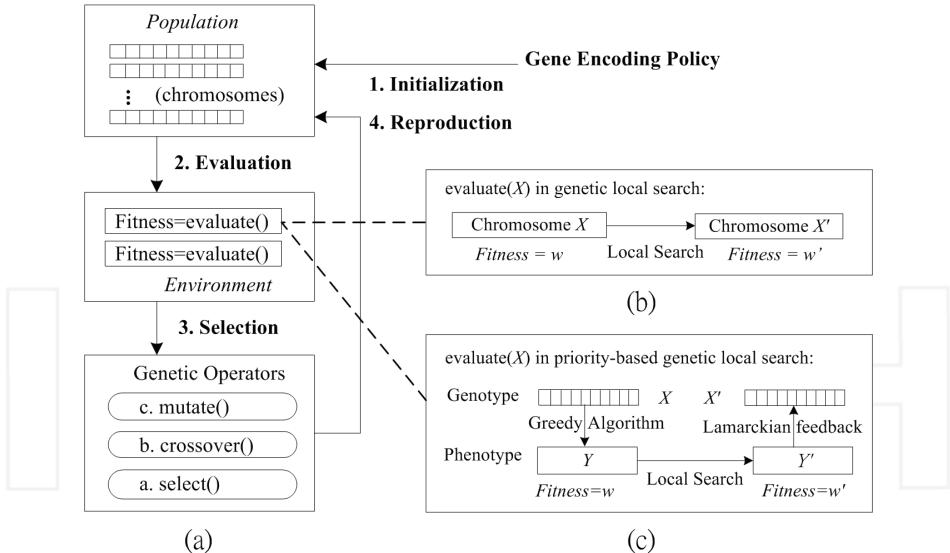
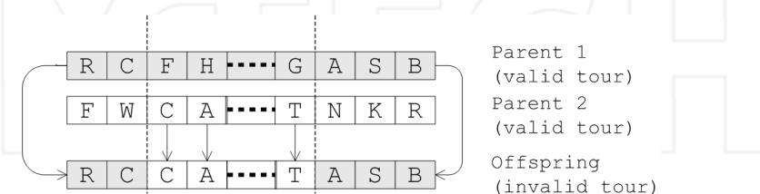
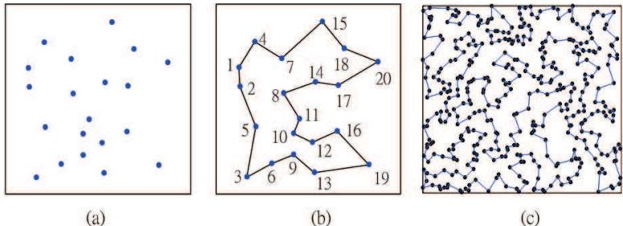
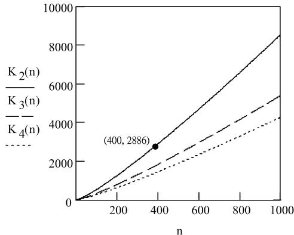

# Approaches to the Travelling Salesman Problem Using Evolutionary Computing Algorithms

Jyh-Da Wei Chang-Gung University Taiwan

# 1. Introduction

Genetic algorithms (GAs) were developed as problem independent search algorithms (Goldberg, 1989; Holland, 1975; Man et al., 1999), which simulate the biological evolution to search for an optimal solution to a problem. Figure 1(a) shows the main processes of genetic algorithms. When developing a genetic algorithm, we analyze the properties of the problem and determine the " gene encoding" policy - Several parameters are chosen as genes and the parameter set is regarded as a chromosome, which reflects an individual. Following the gene encoding policy, we scatter many individuals in a population, and then repeatedly evaluate the individuals' fitness values and select the fittest ones to reproduce the offspring by crossover and mutation operators. Genetic algorithms follow the criterion of "survival of the fittest" to develop increasingly fit individuals.

Hybrid with local search heuristics, Genetic Local Search (GLS) is an upgraded version that replaces each individual with its local optimal neighbour. As shown in Fig. 1(b), a local search process is launched in evaluation. GLS is thereby regarded as a method to mimic the cultural evolution instead of biological evolution, and also referred to as Mimetic Algorithm (MA) or Lamarckian Evolutionary Algorithm (Digalakis & Margaritis, 2004).

Using these "evolutionary computing algorithms" for combinatorial optimization problems has been a well-studied problem-solving approach. The benefit of evolutionary computing is not only its simplicity but also its ability to obtain global optima. Many research findings have indicated that a well-adapted genetic local search algorithm can acquire a near-optimal solution better than those found by simply local searching algorithms (Goldberg, 1989; Pham & Karaboga, 2000). Therefore, numerous results on evolutionary optimization have been published in recent years (Larranaga et al., 1999; Man et al., 1999; Mohammadian et al., 2002). Using genetic algorithms to solve the travelling salesman problem (TSP) is one of the popular approaches (Larranaga et al., 1999).

The TSP is a classical NP-hard combinatorial optimization problem which has been extensively studied. Given $n$ cities and the distances (costs) between each pair of cities, we want to find a minimum-cost tour that visits each city exactly once. Assuming that $d _ { i , j }$ is the cost traveling from city $i$ to city $j ,$ the TSP is formulated as to find a permutation $\pi$ of $\{ 1 , 2 ,$ $\cdots , n \}$ that minimizes

$$
C ( \pi ) = \sum _ { i = 1 } ^ { n - 1 } d _ { \pi ( i ) , \pi ( i + 1 ) } + d _ { \pi ( n ) , \pi ( 1 ) }
$$

  
Figure 1. Genetic Algorithm (GA) and Genetic Local Search (GLS). (a) GA flowchart; (b) GLS is a combination of GA and local search heuristics; (c) Priority-Based GLS (PB-GLS) uses a greedy algorithm and a Lamarckian feedback process to alternate between genotype and phenotype.

In the symmetric TSP (STSP), $d _ { i , j }$ is equal to $d _ { j , i }$ for any two cities $i$ and $j ,$ while in the asymmetric TSP (ATSP) this condition might not hold. The Euclidean TSP is a special case of STSP, where the cities are located in $R ^ { m }$ space for some $m _ { \ast }$ , and the cost function satisfies the triangle inequality, i.e., $d _ { i , k } + d _ { k , j }$ is greater than or equal to $d _ { i , j }$ for distinct $i , j$ and $k$ The twodimensional Euclidean TSP is the most popular version studied in the literature.

According to Rego and Glover's classification, the heuristic local search algorithms for the TSP are divided into two categories (Rego & Glover, 2002). Tour construction procedures build a tour by sequentially adding a new node into the current partial tour. Some instances of these procedures include nearest neighbour, nearest insertion, and shortest edge first algorithms (Johnson & McGeoch, 2002). On the other hand, tour improvement procedures start with an initial tour and iteratively seek a better one to replace the current tour. The $k \mathrm { \cdot }$ . opt and LK (Lin & Kernighan, 1973; Rego & Glover, 2002) algorithms are examples of these procedures. Subsequently developed algorithms for the TSP also include stochastic search methods, such as Tabu search (Fiechter, 1994; Zachariasen & Dam, 1995), simulated annealing (Kirkpartrick et al., 1983; Moscato & Norman, 1992), ant colony (Dorigo & Gambardella, 1997; Gambardella & Dorigo, 1995) and artificial neural networks (Miglino et al., 1994; Naphade & Tuzun, 1995).

As convenient and powerful searching tools, evolutionary computing algorithms have been applied to the TSP. Genetic algorithms and GLS algorithms are characterized by their population-based global searching, and often find a near-optimal solution better than most previously known methods. However, the TSP requires that each city be visited exactly once. This critical requirement puts a great constraint for us to encode the genes. Directly encoding cities into the chromosomes (the order representation to be given in more detail in the next section) may not work altogether with traditional crossover methods. As Fig. 2 shows, the offspring becomes an illegal tour if we use traditional crossover operators.

To overcome this difficulty, new crossover operators built upon detection and repair procedures have been developed. Although these operators make evolutionary computing algorithms applicable to the TSP, they are ad hoc and lose generality in problem solving. In Section 2, we provide a relevant survey of developing particular crossover operators for the TSP. Then in Section 3, we present a priority-based encoding scheme instead. This alternative method not only maintains the general-purpose characteristics of evolutionary computing, but also acquires remarkable searching results. In Section 4, we discuss the experimental results, and we give conclusions in Section 5.

  
Figure 2. Directly encoding cities into the chromosomes does not work altogether with traditional crossover methods. The offspring may become an invalid TSP tour.

# 2. Specialized crossover operators for the TSP

Traditional genetic evolution appears to contradict the TSP definition. Therefore, we need additional operators to assist genetic algorithms. Many of these operators depend on the tour representation in the algorithms, such as the order, adjacency and locus representations.

Order representation: The order representation is the most natural to represent a tour since the TSP is a permutation problem. This tour representation encodes the cities in the chromosome as gene values. For example, the partially matched crossover (PMX) (Goldberg & Lingle, 1985; Goldberg, 1989) adopts two crossover points to enclose a crossover interval. The genes (cites) within the crossover intervals are exchanged to intiate the offsring chromosome, and then an automaton is established to transform the genes duplicated outside the intervals.

Adjacency list representation: The adjacency list can also represent a tour. In this representation, recording city $j$ in position i reflects travelling from city $i$ to city $j$ Because adjacency lists might yield illegal tours, detection and repair procedures are also necessary. For example, the greedy crossover (GX) (Boukreev, 2007; Julstrom, 1995) iteratively selects the shortest edge from the parents to extend the current subtour. If this edge causes a cycle that is not a complete tour, we need to choose another edge connecting to the current subtour.

Adjacency matrix representation: Instead of adjacency lists, the matrix crossover (MX) (Homaifar et al., 1992; Homaifar et al., 1992) uses adjacency matrix to represent the tour. In this binary matrix, the element $m _ { i , j }$ is 1, if city $j$ is visited after city $i ;$ otherwise the value is 0. Based on this encoding method, the MX exchanges columns of two parents to generate offspring matrix. If the offspring matrix is infeasible due to duplicate adjacency or disconnected cycles, repair procedures are also invoked.

Locus representation: The locus representation regards the graphic image itself of a tour as a chromosome. This representation retains geographical relationships among the cities, but does not embody a gene-encoding method. Therefore, geometrical computations might be necessary in the crossover operators. The natural crossover (NX) published in 2002 (Jung & Moon, 2002) used the locus representation. This crossover operator randomly generates curves to partition the chromosomal space. Cities in some regions inherit the paths from one parent, and those in other regions inherit the paths from the other parent. Finally, repair procedures are also needed to reconnect the subtours.

Other representation-independent approaches: There are genetic operators independent of tour representations. These operators directly analyze the parent tours to create the offspring. Edge-recombination crossover (ERX) (Whitley et al., 1989; Whitley et al., 1991) collects the adjacency information from the parent tours and generates a new tour from this information. Distance preserving crossover (DPX) (Freisleben & Merz, 1996) generates an offspring satisfying the condition that the numbers of differences between the two parents and the offspring are all the same. By doing so, this crossover operator allows $\mathrm { \Delta } ^ { \prime \prime } \mathrm { j u m p s } ^ { \prime \prime }$ in the search space. Although these approaches are representation independent, they also act according to the principle that the offspring must inherit the characteristics of the two parents.

The renowned approaches listed above can improve genetic algorithms to solve the TSP. However, these approaches have some drawbacks. The order and adjacency list representations do not ensure a unique representation for a TSP tour. This situation usually retards the evolutionary process. The adjacency matrix representation is time-consuming and does not have a significant performance. The locus representation is not general enough even for an STSP case; and it can only perform on the Euclidean TSP. Most importantly, these crossover operators are specialized mainly for the TSP and involve repair procedures to generate a valid tour. In contrast with the original intention of genetic algorithms, these operators are short of general practical values. In the next section, we present a Genetic Local Search method with Priority-Based encoding, dubbed the $\mathrm { { } ^ { \prime \prime } P B - G L S ^ { \prime \prime } }$ model (Wei & Lee, 2004; Wei & Lee, 2006). This model retains generality in applications, supports schema analysis during searching process, and has been empirically proven to gain remarkable search results for the travelling salesman problem.

# 3. Priority-based genetic local search

For a combinatorial optimization problem for which a near-optimal solution can be obtained by using a greedy algorithm, certain entities, such as the nodes of the dMsT and TSP problems (Freisleben & Merz, 1996; Zeng & Wang, 2003) and the jobs in the flowshop scheduling (Arroyo & Armentano, 2005) are selected step by step. Herein, the links between two consecutively selected entities are called "consecutive selections". The priority-based encoding policy assigns priorities to all the links between entities and it is expected to set high priority to the correct consecutive selections. The greedy algorithm employed remains the same, except that we select the next entity in consideration of the link priority prior to the original ranking key. By doing so, the greedy algorithm leads to a valid solution and the priority encoding makes it possible to follow traditional genetic evolutions. This approach does not lose generality in applications because we only need to provide a chromosome conformation that is simply a priority assignment.

# 3.1 Priority-based encoding with local search method

As Fig. 1(c) shows, the priority-based encoding is based on Mendelian inheritance that distinguishes genotype and phenotype in inheritance process. A greedy algorithm plays the role as the biochemical process that transfers the genotype encoding to the phenotype of each individual. The PB-GLS model further conducts a local search method to improve this phenotype. After that, we need a Lamarckian feedback process for encoding the local optimal solution and converting it back to its genotype. This process can be done if we enable all consecutive selections in the given solution by assigning them with higher priorities and disable potentially incorrect links by setting lower priorities. The range of priorities can be determined experimentally, although two priority levels are sufficient in any case.

# 3.2 Characteristics of the priority-based GLS

The priority-based genetic local search has three main features, i.e., broad applicability, problem transformation, and simulation of Mendelian inheritance theory.

Broad applicability: The priority-based encoding policy suits to any problem whose optimal solution can be approximated by a greedy algorithm, because the greedy algorithm is characterized by two features, i.e., (a) the candidate entities are selected one after another sequentially, and (b) the selected entities are not discarded thereafter.

Problem transformation: The PB-GLS transforms combination and permutation problems into priority assignment problems. This problem transformation suggests a new direction to tackle the given problems. Imagine that the perfect optimal solution contains some crucial consecutive selections of problem entities (e.g. crucial edges in the TSP). Assigning higher priorities to these links leads to a near-optimal solution. Naturally, priority-based encoding allows us to analyze searching schema during the search process.

Simulation of Mendelian inheritance theory: We use greedy algorithms to simulate chemical processes, and use the priority-based encoding policy to simulate the gene codes in inheritance procedure. These priorities control the biochemical processes to "enable" and "disable" some biological functions, and finally develop a phenotype that fits the definition of the genotype.

# 3.3 Using the priority-based GLS to solve the TSP

A greedy algorithm known as double-ended nearest neighbour (DENN) is used to demonstrate using the PB-GLS model to solve the TSP. Let E(A,B) denote the edge between city A and city $\mathrm { B } ,$ and assume E(A,B) is identical to E(B,A) for any two distinct cities A and B. The DENN algorithm is described as follows:

Step 1 Sort the edges by their costs into a sequence $S$ .

Step 2 Initialize a partial tour $T = \{ S [ 1 ] \} $ Let $S [ 1 ] = E ( A , B )$ be the current subtour from $A$ to $B$ .

Step 3 Suppose the current subtour is from $X$ to Y . We trace the sequence $S$ to find the first edge $E ( P , Q )$ that could extend the subtour at either end city $X$ or city $Y$ without creating a cycle, i.e., a complete tour that does not visit all the cities.

Step 4 If the above edge $E ( P , Q )$ is found, add it into $T$ to extend the current subtour and repeat step 3; otherwise, add $E ( Y , X )$ into $T$ and return $T$ as the searching result.

Note that the current state is extended by adding new nodes (cities) repeatedly. We now add priorities to the edges and change the sorting step by considering priorities of these edges first and then their costs in the first step. This change never affects the validity of tours, because the other steps of this greedy algorithm remain unchanged. The most concerned question is whether any tour can be represented by this encoding method. Considering that a greedy algorithm never discards an object once this object is selected, we can construct any given tour $^ { \prime \prime } T ^ { \prime \prime }$ by a greedy algorithm as the following formula describes:

$$
( \forall ~ ( \mathtt { r } , \mathtt { s } , \mathtt { t } , \mathtt { k } , | \{ \mathtt { r } , \mathtt { s } , \mathtt { t } , \mathtt { k } \} | = 4 ) ~ ( ~ \{ \mathrm { E } ( \mathtt { r } , \mathtt { s } ) , \mathrm { E } ( \mathtt { s } , \mathtt { t } ) \} \subseteq \mathrm { ~ T ~ } \wedge
$$

$$
\begin{array} { r l } & { \mathrm { C ( k , s ) } \le \operatorname* { m i n } \left\{ \mathrm { C ( r , s ) } , \mathrm { C ( s , t ) } \right\} \Rightarrow \mathrm { P ( k , s ) } > \operatorname* { m a x } \left\{ \mathrm { P ( r , s ) } , \mathrm { P ( s , t ) } \right\} \mathrm { ) } } \\ & { \Rightarrow \mathrm { T h e ~ g r e e d y ~ a l g o r i t h m ~ c o n s t r u c t s ~ \mathrm { T } , } } \end{array}
$$

where $C ( { \boldsymbol { a } } , { \boldsymbol { b } } )$ and $P ( a , b )$ are the cost and priority of edge $E ( a , b )$ respectively, and a lower priority value $P ( a , b )$ reflects a higher priority of edge $E ( a , b )$ to be included in the tour.

The above description implies that the priority-based encoding can be used to search the global optimal solution. Two levels of priorities are sufficient to guarantee such an optimal solution. Formula (2) is also used in the Lamarckian feedback process of the PB-GLS model. We apply the LK heuristic (Lin & Kernighan, 1973) as the local search method in the following experiments.

# 3.4 Complexity analysis

It is well-known that an exhausted search for a TSP has an exponential time complexity. Suppose that $n$ is the number of vertices. An exact solution takes $O ( n ! )$ time, which is prohibitively long. Therefore, polynomial-time heuristic search approaches are proposed. Heuristic or local search algorithms have complexities ranging from $O ( n ^ { 2 } )$ (e.g., nearest neighbour, double ended nearest neighbour, and nearest insertion), $O ( n ^ { 2 } l o g ( n ) )$ (e.g., shortest edge first) to $O ( n ^ { 2 . 2 } )$ (e.g., LK) or higher order (e.g., $\mathbf { k }$ -opt).

The genetic algorithms with specialized crossover operators have time complexity $O ( k m n ^ { 2 } ) ,$ . where $k$ is the generation number and $m$ is the population size. The $n ^ { 2 }$ factor is due to the fact that all the repair procedures need to scan all the possible pairs of the vertices which is $O ( n ^ { 2 } )$ . If we combine genetic algorithms with a local search algorithm, the latter affects the time complexity. For example, the genetic local search algorithm incorporating the DPX operator with the LK heuristic (Freisleben & Merz, 1996) has time complexity $O ( k m n ^ { 2 . 2 } )$ . This model, referred to as DPX-LK model, is currently known as the most powerful model and will be compared with the PB-GLS model in the next section.

The time complexity of the PB-GLS model depends on the selected greedy algorithm, the Lamarckian feedback process, and the local search heuristic. When the DENN algorithm and LK heuristic are used, the PB-GLS needs $O ( n ^ { 2 } )$ time to crossover the parent chromosomes and $O ( n ^ { 2 } + n ^ { 2 . 2 + } n ^ { 2 } )$ time to construct the tour, search the local optimum, and feedback the upgraded gene information. Therefore, the total time complexity is also $O ( k m n ^ { 2 . 2 } )$ .

# 4. Experimental results

In this section, we conduct three parts of experiments applying PB-GLS to solve the TSP. The first part used our own data to demonstrate how priority encoding is used and how it supports schema analysis. The second part used benchmark instances released by the TSPLIB (http://www.iwr.uni-heidelberg.de/groups/comopt/software/tsplib9) and proved that the PB-GLS model can find near-optimal solutions identical to the best known results, in cases where the number of cities was no more than 400. In the last part, we generated sparsely connected maps from the TSPLIB data instance and compared the experimental results between the PB-GLS model and the currently most efficient DPX-LK hybrid searching model. The PB-GLS model in these experiments uses Holland's simple genetic algorithm model with the uniform crossover operator and conducts the LK heuristic for local searching every five generation. To reduce the searching space and simplify the result discussion, priority encoding in these experiments used only two-level priority, i.e., the high priority was 1 and the low priority was 2. The population size and mutation rate were set as 100 and 0.2 respectively.

Table 1. Cities in the first part of experiments   

<table><tr><td>city</td><td>coordinates</td><td></td><td>city coordinates</td><td></td><td>city</td><td>coordinates</td><td></td><td>city</td><td>coordinates</td></tr><tr><td>1</td><td>0.047</td><td>0.692 6</td><td>0.259</td><td>0.085</td><td>11</td><td>0.436</td><td>0.367</td><td>16 0.684</td><td>0.292</td></tr><tr><td>2</td><td>0.054</td><td>0.577</td><td>0.326</td><td>0.748</td><td>12</td><td>0.525</td><td>0.222</td><td>17 0.694</td><td>0.585</td></tr><tr><td>3</td><td>0.095</td><td>0.004</td><td>0.336</td><td>0.530</td><td>13</td><td>0.534</td><td>0.031</td><td>18 0.732</td><td>0.811</td></tr><tr><td>4</td><td>0.146</td><td>0.855</td><td>0.399</td><td>0.143</td><td>14</td><td>0.542</td><td>0.602</td><td>19 0.891</td><td>0.082</td></tr><tr><td>5</td><td>0.157</td><td>0.319 10</td><td>0.399</td><td>0.275</td><td>15</td><td>0.586</td><td>0.982</td><td>20 0.946</td><td>0.728</td></tr></table>

  
Figure 3. Experimental results of the TSP. (a) map of the cities of Table 1; (b) near-optimal solution of the above listed cities; (c) near-optimal solution of the rd400 data instance.

<table><tr><td></td><td>cost</td><td></td><td>adjacency p1 p2</td><td></td><td></td><td>p3</td><td>p4</td><td></td><td>T</td><td></td><td>cost</td><td>adjacency p1 p2 p3</td><td></td><td></td><td></td><td></td><td>p4</td><td>T</td></tr><tr><td>1</td><td>0.100</td><td>10</td><td></td><td>11</td><td>1</td><td>1</td><td>1</td><td>1</td><td>Yes</td><td>41</td><td>0.295</td><td>16</td><td>19</td><td>1</td><td>2</td><td>1</td><td>1</td><td>Yes</td></tr><tr><td></td><td>2</td><td>0.115</td><td>1</td><td>2</td><td>1</td><td>1</td><td>1</td><td>1</td><td>Yes</td><td>42</td><td>0.299</td><td>5</td><td>9</td><td>2</td><td>2</td><td>2</td><td>1</td><td></td></tr><tr><td></td><td>3</td><td>0.132</td><td>9</td><td>10</td><td>2</td><td>2</td><td>2</td><td>2</td><td>−</td><td>43</td><td>0.299</td><td>6</td><td>12</td><td>2</td><td>2</td><td>1</td><td>2</td><td>−</td></tr><tr><td>4</td><td>0.137</td><td></td><td>10</td><td>12</td><td>1</td><td>1</td><td>1</td><td>1</td><td>Yes</td><td>44</td><td>0.301</td><td>13</td><td>16</td><td>1</td><td>2</td><td>1</td><td>1</td><td></td></tr><tr><td></td><td>5</td><td>0.149</td><td>9</td><td>12</td><td>2</td><td>2</td><td>2</td><td>2</td><td>-</td><td>45</td><td>0.320</td><td>3</td><td>5</td><td>1</td><td>1</td><td>1</td><td>1</td><td>Yes</td></tr><tr><td></td><td>6</td><td>0.151</td><td>6</td><td>9</td><td>1</td><td>1</td><td>1</td><td>1</td><td>Yes</td><td>46</td><td>0.321</td><td>2</td><td>7</td><td>2</td><td>2</td><td>2</td><td>1</td><td></td></tr><tr><td></td><td>7</td><td>0.152</td><td>14</td><td>17</td><td>1</td><td>1</td><td>1</td><td>1</td><td>Yes</td><td>47</td><td>0.322</td><td>9</td><td>16</td><td>1</td><td>2</td><td>2</td><td>1</td><td></td></tr><tr><td></td><td>8</td><td>0.170</td><td>11</td><td>12</td><td>2</td><td>2</td><td>2</td><td>2</td><td></td><td>48</td><td>0.331</td><td>1</td><td>8</td><td>2</td><td>2</td><td>2</td><td>2</td><td></td></tr><tr><td></td><td>9</td><td>0.174</td><td>12</td><td>16</td><td>1</td><td>1</td><td>1</td><td>1</td><td>Yes</td><td>49</td><td>0.333</td><td>6</td><td>11</td><td>2</td><td>2</td><td>1</td><td>2</td><td>−</td></tr><tr><td></td><td>10</td><td>0.176</td><td>9</td><td>13</td><td>1</td><td>1</td><td>1</td><td>1</td><td>Yes</td><td>50</td><td>0.334</td><td>3</td><td>9</td><td>1</td><td>1</td><td>1</td><td>2</td><td></td></tr><tr><td></td><td>11</td><td>0.183</td><td>3</td><td>6</td><td>1</td><td>1</td><td>1</td><td>2</td><td>Yes</td><td>51</td><td>0.337</td><td>11</td><td>17</td><td>1</td><td>2</td><td>1</td><td>1</td><td>−</td></tr><tr><td></td><td>12</td><td>0.190</td><td>8</td><td>11</td><td>1</td><td>1</td><td>1</td><td>1</td><td>Yes</td><td>52</td><td>0.340</td><td>14</td><td>16</td><td>1</td><td>2</td><td>2</td><td>1</td><td></td></tr><tr><td></td><td>13</td><td>0.191</td><td>1</td><td>4</td><td>1</td><td>1</td><td>1</td><td>1</td><td>Yes</td><td>53</td><td>0.350</td><td>7</td><td>15</td><td>1</td><td>1</td><td>1</td><td>1</td><td>Yes</td></tr><tr><td></td><td>14</td><td>0.191</td><td>12</td><td>13</td><td>2</td><td>1</td><td>1</td><td>2</td><td>−</td><td>54</td><td>0.351</td><td>11</td><td>13</td><td>1</td><td>1</td><td>1</td><td>2</td><td>,</td></tr><tr><td></td><td>15</td><td>0.209</td><td>4</td><td>7</td><td>1</td><td>1</td><td>1</td><td>1</td><td>Yes</td><td>55</td><td>0.357</td><td>10</td><td>14</td><td>2</td><td>1</td><td>1</td><td>2</td><td></td></tr><tr><td></td><td>16</td><td>0.218</td><td>8</td><td>14</td><td>1</td><td>1</td><td>1</td><td>1</td><td>Yes</td><td>56</td><td>0.361</td><td>8</td><td>12</td><td>2</td><td>1</td><td>1</td><td>1</td><td></td></tr><tr><td>17</td><td></td><td>0.218</td><td>7</td><td>8</td><td>2</td><td>1</td><td>1</td><td>2</td><td>−</td><td>57</td><td>0.361</td><td>13</td><td>19</td><td>1</td><td>1</td><td>1</td><td>1</td><td>Yes</td></tr><tr><td>18</td><td></td><td>0.225</td><td>15</td><td>18</td><td>1</td><td>1</td><td>1</td><td>1</td><td>Yes</td><td>58</td><td>0.361</td><td>8</td><td>17</td><td>2</td><td>1</td><td>2</td><td>2</td><td>−</td></tr><tr><td>19</td><td></td><td>0.228</td><td>9</td><td>11</td><td>1</td><td>1</td><td>2</td><td>2</td><td>−</td><td>59</td><td>0.376</td><td>4</td><td>8</td><td>2</td><td>1</td><td>2</td><td>1</td><td></td></tr><tr><td></td><td>20</td><td>0.230</td><td>17</td><td>18</td><td>2</td><td>2</td><td>2</td><td>2</td><td>-</td><td>60</td><td>0.380</td><td>12</td><td>14</td><td>2</td><td>2</td><td>2</td><td>1</td><td>-</td></tr></table>

Table 2. Searching results of the first part experiment (partially listed). The edges are sorted by their costs. Columns from $p 1$ to $p 4$ are the converged priorities on four distinct chromosomes.

Table 1 lists the locations of the cities in the first part of experiments. These cities were randomly generated in the $[ 0 , 1 ] \times [ 0 , 1 ]$ square. Figure 3(a) and (b) show the city map and the near-optimal solution respectively, found by both the DPX-LK hybrid model and the PBGLS model within 100 generations. According to repeated experimental results, we believe that this tour with $\cos t { = } 4 . 3 5$ is very close to the optimal tour. Table 2 lists the searching results of gene values partially, and the edges by their costs in ascending order. Columns from $p 1$ to $p 4$ are four converged near-optimal chromosomes. All these chromosomes can develop the near-optimal TSP tour that is shown in Fig. 3(b). The final column denotes whether the edge under consideration is selected to be part of the tour.

Edges E(3, 5), E(7, 15) and E(13, 19) in the 45th, $5 3 r d ,$ and $5 7 t h$ rows are the longest three edges contained in the tour. We can observe that they all receive a high priority. They are likely the crucial edges in the optimal tour. Interestingly, the three edges excluded from the tour, i.e., $E ( 9 , 1 0 ) .$ $E ( 9 , 1 2 )$ and $E ( 1 1 , 1 2 )$ , are also remarkable because they are quite short and all receive a low priority. This result demonstrates that priority encoding allows schema explanation in searching optimal TSP tours. This schema is also likely to be useful when the number of cities increases or decreases.

  
Fig 4. Assuming $p$ priority levels are used for searching in a sparsely connected map with $k$ edges and $n$ cities, $K _ { p } ( n ) { = } l o g _ { p } ( n ! )$ represents the highest tolerable values of $k$ to ensure the searching space of PB-GLS less than that of the DPX-LK model, i.e., $p ^ { k } < n !$ .

Table 3. Applying DPX-LK and PB-GLS models to find TSP tours in sparsely connected rd400 maps   

<table><tr><td rowspan=1 colspan=1></td><td rowspan=1 colspan=2>DPX-LK</td><td rowspan=1 colspan=2>Priority-based GLS</td></tr><tr><td rowspan=1 colspan=1>#(Edges)</td><td rowspan=1 colspan=1>Generations</td><td rowspan=1 colspan=1>CPU time (sec)</td><td rowspan=1 colspan=1>Generations</td><td rowspan=1 colspan=1>CPU time (sec)</td></tr><tr><td rowspan=2 colspan=1>60005000</td><td rowspan=2 colspan=1>268205</td><td rowspan=1 colspan=1>11768</td><td rowspan=1 colspan=1>695</td><td rowspan=1 colspan=1>20949</td></tr><tr><td rowspan=1 colspan=1>8933</td><td rowspan=1 colspan=1>389</td><td rowspan=1 colspan=1>11663</td></tr><tr><td rowspan=1 colspan=1>4000</td><td rowspan=1 colspan=1>144</td><td rowspan=1 colspan=1>6357</td><td rowspan=1 colspan=1>207</td><td rowspan=1 colspan=1>6195</td></tr><tr><td rowspan=1 colspan=1>3000</td><td rowspan=1 colspan=1>93</td><td rowspan=1 colspan=1>4102</td><td rowspan=1 colspan=1>74</td><td rowspan=1 colspan=1>2203</td></tr><tr><td rowspan=1 colspan=1>2000</td><td rowspan=1 colspan=1>35</td><td rowspan=1 colspan=1>1512</td><td rowspan=1 colspan=1>27</td><td rowspan=1 colspan=1>804</td></tr></table>

In the second part of experiments, we used the instances released on the TSPLIB website to test the PB-GLS method. Experimental results reveal that the PB-GLS can find near-optimal solutions in maps with no more than 400 cities, such as the st70, ch150, $a 2 8 0$ and $r d 4 0 0$ data instances. The solutions obtained are identical to the presently best known results. For example, Fig. 3(c) is the experimental result for the rd400 data instance with the tour cost equal to 15281.

The time complexity of the PB-GLS model is described in the previous section as $O ( k m n ^ { 2 . 2 } ) ,$ where $k ,$ m and $n$ are respectively the generation number, population size and city size. The running time increases quickly as more cities are added. For the first part of experiments, the searching result converged within 100 generations and took less than 3 seconds running on Sun's Ultra SPARC III Workstation with 750-MHz clock rate. In case of 400 cities, it takes an average of $6 2 1 6$ generations and almost 3000-minute CPU time before the evolution converges to the best known solution.

If we do not want to enlarge the population size and the generation number, it could be necessary that we prune the longest edges from the chromosomes to improve the performance for a large scale TSP. The pruning is reasonable because fully connected maps are eventually not usual in the real word. In the third part of experiments, we generated sparsely connected maps from rd400 data instance. In addition to the 400 edges in the bestknown optimal tour, another 1600, 2600, 3600, 4600, and 5600 edges were randomly selected and added into the testing bed. We then conducted five experiments using these 2000, 3000, 4000, 5000 and 6000 edges as the test data respectively; these 400 nodes each had 10, 15, 20, 25 and 30 adjacent nodes in average. The PB-GLS model was compared with the DPX-LK hybrid model.

Assuming the $p$ priority levels are used for testing a data instance with $k$ edges and $n$ nodes, the searching spaces of the PB-GLS model and the DPX-LK hybrid model are of sizes $p ^ { k }$ and $n !$ respectively. The condition to let $p ^ { k } < n !$ can be derived as

$$
p ^ { k } < n ! \iff k < \log _ { p } ( n ! ) = \sum _ { \nu = 1 } ^ { n } ( \log _ { p } \nu )
$$

Figure 4 draws the right part of formula (3), denoted as function $K _ { p } ( n )$ with $n \in \{ 1 , 2 , . . . , 1 0 0 0 \}$ and $p \in \{ 2 , 3 , 4 \}$ Given $p = 2$ and $n = 4 0 0 , k$ must be less than 2886 to ensure search space $p ^ { k } < n !$ However, the experimental results listed in Table 3 reveal that the PB-GLS model converged efficiently than the DPX-LK model even with $k = 4 0 0 0$ This result implies that using permutation based algorithms in search sparsely connected maps may suffer an overhead that does not occur when we use priority-based algorithms.

# 5. Conclusion

Genetic algorithms and genetic local search are population based general-purpose search algorithms that have been examined to search efficiently for the near-optimal solutions to certain combinatorial optimization problems, such as the constraint satisfaction problem (Marchiori & Steenbeek, 2000), flowshop scheduling problem (Arroyo & Armentano, 2005), constraint minimum spanning tree problem (dMsT) (Zeng & Wang, 2003), and travelling salesman problem (TSP) (Freisleben & Merz, 1996). Notably, these optimization problems usually have critical requirements that have forced researchers to develop new genetic operators. For example, for the dMST we have an upper bound on the node degrees and for the TSP we require that each city be visited exactly once.

Previous results made use of specialized genetic operators to enhance the GA and GLS. Alternatively, we have presented another approach to the TSP using evolutionary computing algorithms, i.e., the priority-based encoding method in conjunction with greedy algorithms. This coding policy encodes link priorities as chromosomes, and then uses the underlying greedy algorithms to construct the corresponding solution as the phenotype. By doing so, traditional genetic algorithms can be exploited as usual.

Priority-based encoding supports not only broad applications but also schema analysis. In addition, the priority-based genetic local search is empirically tested to achieve remarkable searching results for the TSP by iteratively converging to crucial edges. According to experimental results, this model found near-optimal solutions to TSPLIB instances - in cases where the number of cities is no more than 400, the results are identical to the best previously known results. Experimental results also reveal that the permutation-based algorithms using specialized GA operators have an overhead in searching sparsely connected maps. This overhead does not occur when we use priority-based algorithms, because it is not necessary to encode the disconnected links into the chromosome.

# 6. Acknowledgements

This work was supported in part by the Taiwan National Science Council under the Grants NSC95-2221-E-001-016-MY3 and NSC-95-2752-E-002-005-PAE.

# 7. References

Arroyo, J. & Armentano, V. (2005): Genetic local search for multi-objective flowshop scheduling problems, European Journal of Operational Research, Vol. 167, 717738   
Boukreev, K. (2007): Genetic algorithms and the traveling salesman problem, The Code Project Website, (http:/ /www.codeproject.com/cpp/tspapp.asp)   
Digalakis, J. & Margaritis, K. (2004): Performance comparison of memetic algorithms, Applied Mathematics and Computation, Vol. 158, 237252   
Dorigo, M. & Gambardella, L. M. (1997): Ant colony system: A cooperative learning approach to the traveling salesman problem, IEEE Transactions on Evolutionary Computation, Vol. 1, 5366   
Fiechter, C. N. (1994): A parallel tabu search algorithm for large traveling salesman problems, Discrete Applied Mathematics and Combinatorial Operations Research and Computer Science, Vol. 51, 243267   
Freisleben, B. & Merz, P. (1996a): A genetic local search algorithm for solving symmetric and asymmetric traveling salesman problems, Procedings of the 1996 IEEE International Conference on Evolutionary Computation, pp. 616621   
Freisleben, B. & Merz, P. (1996b): New genetic local search operators for the traveling salesman problem, Proceedings of the Fourth Conference on Parallel Problem Solving from Nature,Vol. 1141, (1996) pp. 890899, Springer, Berlin   
Gambardella, L. M. & Dorigo, M.: Ant-Q (1995): A reinforcement learning approach to the traveling salesman problem, Proceedings of International Conference on Machine Learning, pp. 252260   
Goldberg, D. E. & Lingle, R. (1985): Alleles, loci, and the traveling salesman problem, Proceedings of an International Conference on Genetic Algorithms and Their Applications, pp. 154159, Pittsburgh, PA   
Goldberg, D. E. (1989): Genetic Algorithms in Search, Optimization, and Machine Learning, Addison-Wesley   
Holland, J. H. (1975): Adaptation in Nature and Artificial Systems, The University of Michigan Homaifar, A.; Guan, S. & Liepins, G. (1992): Schema analysis of the traveling salesman problem using genetic algorithms, Complex Systems, Vol. 6, 533552 Homaifar, A. & Guan, S., Liepins, G. (1993): A new approach on the traveling salesman problem by the genetic algorithms, Proceedings of the Fifth International Conference on Genetic Algorithms, pp. 460466, San Mateo, CA, Morgan Kaufman Johnson, D. S. & McGeoch, L. A. (2002): Experimental analysis of heuristics for the STSP, In: Gutin, G. & Punnen, A. P. (Eds), The Traveling Salesman Problem and Its Variations,   
369-443, Kluwer Academic Publishers, Dordrecht, Netherlands Julstrom, B. A. (1995): Very greedy crossover in a genetic algorithm for the traveing salesman problem, Proceedings of the 1995 ACM symposium on Applied computing, pp.   
324-328 Jung, S. & Moon, B.R. (2002): Toward minimal restriction of genetic encoding and crossovers for the two-dimensional Euclidean TSP. IEEE Transactions on Evolutionary Computation, Vol. 6, 557565 Kirpartrick, S. Gelatt Jr.C. D.Vecchi M.P. ): Optiization bysiulatea Science, Vol. 220, 671680 Larranaga, P.; Kuijpers, C. M. H.; Murga, R. H.; Inza, I. & Dizdarevic, S. (1999): Genetic algorithms for the travelling salesman problems: A review of representations and operators, Artificial Intelligence Review, Vol. 13, 129-170 Lin, S. & Kernighan, B. (1973): An effective heuristic algorithm for the traveling salesman tours, Operations Research, Vol. 21, 498516 Man, K. Ta . &o S. 9): GeeAgori:nct anDes r, London Marchiori, E. & Steenbeek, A.(2000): A genetic local search algorithm for random binary constraint satisfaction problems, SAC Vol. 1, 458462 Miglino, O.; Menczer, D & Bove, P. (1994): A neu-etholgicalaprc for the TSP: Chang methaphors in connectionist models, Journal of Biological Systems, Vol. 2, 357366 Mohammadian, M.; Sarker, R. & Yao, X. (2002): Evolutionary Optimization, Kluwer Academic Publishers, Boston Moscato, P. & Norman, M.G. (1992): A "memetic" approach for the traveling salesman problem implementation of a computational ecology for combinatorial optimization on message-passing systems, In: Valero, M.; Onate, E.; Jane, M.; Larriba, J. L.& Suarez, B. (Eds), Parallel Computing and Transputer Applications, 177-   
186, Amsterdam IOS Press Naphade, K.. & Tuzu, D. (1995): Initlizing the Hopfield-tank network for the TS uig a convex hull: A computational study, Proceedings of the Artificial Neural Networks in Engineering conference, Vol. 5, pp. 399404, St. Louis Pham, D. T. & Karaboga, D. (2000): Intelligent Optimization Techniques: Genetic Algorithms,Tabu Search, Simulated Annealing and Neural Networks, Springer, London Rego, C. & Glover, F. (2002): Local search and metaheuristics, In: Gutin, G. & Punnen, A. P. (Eds.), The Traveling Salesman Problem and Its Variations, 309368, Kluwer Academic Publishers, Dordrecht, Netherlands Wei, J. D. & Lee, D. T. (2004): A new approach to the traveling salesman problem using genetic algorithms with priority encoding, Proceedings of the 2004 IEEE Congress on Evolutionary Computation, pp. 1457-1464   
Wei, J. D. & Lee, D. T. (2006): Priority-based genetic local search and it's application to the traveling salesman problem, Lecture Notes in Computer Science, No. 4274, 424-432   
Whitley, D.; Starkweather, T. & Fuquay, D. (1989): Scheduling problems and traveling salesman: the genetic edge recombination, Procedings of the third international conference on Genetic algorithms, pp. 133140   
Whitley, D.; Starkweather, T. & Shaner, D. (1991): The traveling salesman and sequence scheduling: Quality solutions using genetic edge recombination; In: Davis, L. (Ed.), Handbook of Genetic Algorithms, 350-372, Van Nstrand Reinhold, New York   
Zachariasen, M. & Dam, M. (1995): Tabu search on the geometric traveling salesman problem, Proceedings of Metaheuristics International Conference, pp. 571587, Colorado   
Zeng, Y. & Wang, Y. P. (2003): A new genetic algorithm with local search method for degree-constrained minimum spanning tree problem, Proceedings of the Fifth International Conference on Computational Intelligence and Multimedia Applications, pp. 218-222   
ISBN 978-953-7619-10-7   
Hard cover, 202 pages   
Publisher InTech   
Published online 01, September, 2008   
Published in print edition September, 2008

The idea behind TSP was conceived by Austrian mathematician Karl Menger in mid 1930s who invited the research community to consider a problem from the everyday life from a mathematical point of view. A taelleanasaeec   theeueome.H saleman can take Inthis book the problemfndingalgorithmictechnique leadinggoodoptimal soluns for TSP (or or some otherstricly related problems) is considered. TSP is a very attractive problem r te rearch community because arises s a natural subprobleminmany applications concerning he evey dy lI hitlow thetoal cos  luin deteied by diguhe cost  om tossielysan e modelled as a TSP instance. Thus, studying TSP can never be considered as an abstract research with no real importance.

# How to reference

In order to correctly reference this scholarly work, feel free to copy and paste the following:

Jyh-Da Wei (2008). Approaches to the Travelling Salesman Problem Using Evolutionary Computing   
Algorithms, Traveling Salesman Problem, Federico Greco (Ed.), ISBN: 978-953-7619-10-7, InTech, Available   
from:   
http://www.intechopen.com/books/traveling_salesman_problem/approaches_to_the_travelling_salesman_prob   
lem_using_evolutionary_computing_algorithms

# INTECH

# InTech Europe

University Campus STeP Ri Slavka Krautzeka 83/A 51000 Rijeka, Croatia Phone: $\mathtt { + 3 8 5 }$ (51) 770 447 Fax: $\mathtt { + 3 8 5 }$ (51) 686 166 www.intechopen.com

# InTech China

Unit 405, Office Block, Hotel Equatorial Shanghai   
No.65, Yan An Road (West), Shanghai, 200040, China   
65405   
Phone: +86-21-62489820   
Fax: $+ 8 6$ -21-62489821