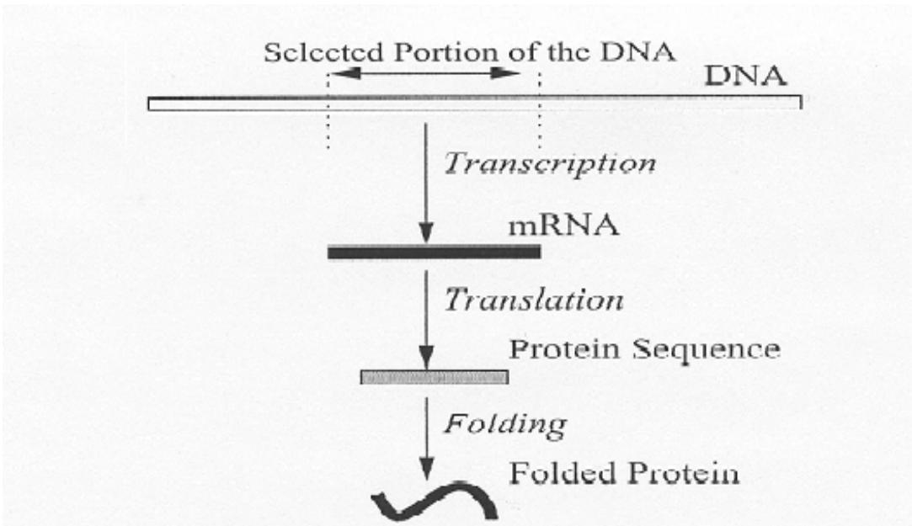
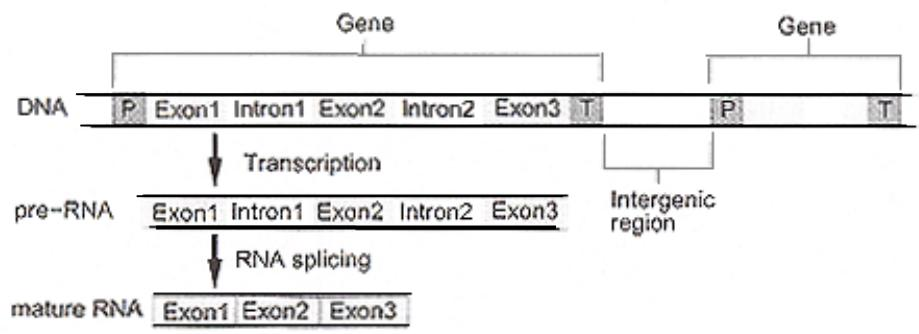
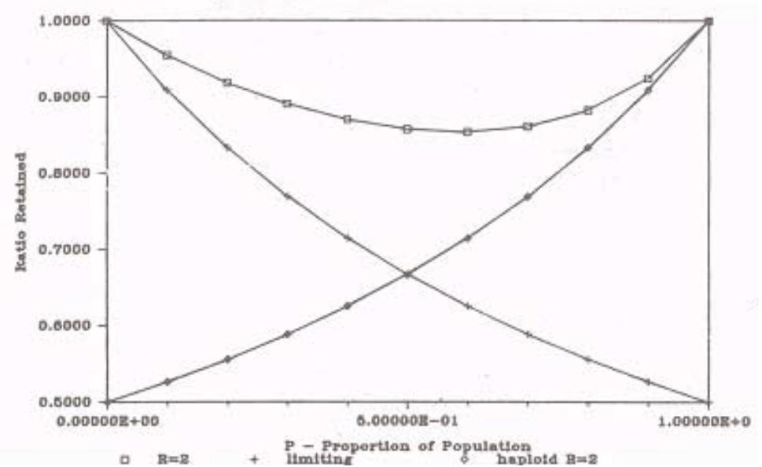

# Giving Genes their Voice: A Survey of Information Expression Mechanisms in Genetic Algorithms

Abhishek Singh   
Department of Civil and Environmental Engineering University of Illinois, Urbana-Champaign   
4146 NCEL, MC –250, 205 N. Mathews Avenue Urbana, IL 61820 asingh8@uiuc.edu

March 2002

Abstract. Advances in the theory of GAs have led to an understanding of their underlying behavior as well as the problems faced by such algorithms, leading to efforts to effectively deal with such challenges. It is indeed remarkable how many of the mechanisms tackling such issues have their metaphors in nature. These mechanisms can be broadly classified into information processing (ways to process and generate GA information to make good evolutionary decisions) and information expression (ways to represent and express information within a GA to guide the information processing) mechanisms. This review aims at collecting, organizing, and presenting some of the salient work done in the latter. This includes the phenomenon of non-functional coding, information redundancy, dominance, gene expression, pleiotropy, and polygeny among others. This survey attempts to look at all of these under the seemingly vast rubric of genetic information expression. One of the attempts of this study is to reveal the underlying connections between these phenomena and to present them in a practical problem-solving framework vis- $\grave { \mathbf { a } }$ -vis GA practice and theory.

# 1. Introduction

Since their inception, genetic algorithms (Holland, 1975) have looked to nature and biology for inspiration. Although the exact utility of many of the evolutionary mechanisms we see in nature is open to debate, the advantages they offer in artificial search, optimization, and machine learning have not only been practically demonstrated but also theoretically analyzed. However, as is often the case with complex phenomena practice often belies expectation, and sometimes surprising (often disappointing) results are seen on directly implementing natural paradigms in artificial environments. Genetic Algorithms, on the other hand, is one area where such natural paradigms have turned out to be a great success. Even though GAs are a simplification of natural genetics they have proven to be robust over varying degrees of difficulty. This does not detract from the fact that there are still unresolved issues in GA research, which need to be answered in feasible and efficient ways.

GAs that solve hard problems quickly, reliably, and accurately are often termed ‘competent’ genetic algorithms. Many of these, competent GAs have used natural paradigms to resolve GA difficulties (Goldberg, Deb, & Horn, 1992). The basis of attacking such problems is Holland’s schema theorem (Holland, 1975) and the design decomposition proposed by Goldberg (Goldberg, 1991). Both of these emphasis that effective genetic algorithms parallely search for and combine short, low order, highly fit schemas to produce even fitter higher order schemas.

This is often referred to as the building block hypothesis (Holland, 1975; Goldberg, 1989; Forrest & Mitchell, 1992) and is surprisingly similar to the exon-shuffling hypothesis (Blake, 1978; Gilbert, 1985; Gilbert, 1986; Gilbert, 1987; Gilbert 1991) from natural genetics that proposes that natural organisms evolve by ‘shuffling’ partial protein-coding genetic subunits (exons).

A different (though consistent) perspective to the problem decomposition is provided by Kargupta (Kargupta, 1997), wherein any black-box search that has to perform better than tablelookup, is viewed as a ‘SEARCH’ (Search Envisioned As Relational and Class Hierarchizing) in relational and class spaces, which is driven through sampling. Kargupta emphasizes that such a mechanism would need to search for good relations between solution samples, within which it would then search for good classes (instances of relations), which would finally contain the optimum solution samples (instance of classes). We do not belabor the point here, but leave the discussion for a later section. Kargupta argued that for a GA to be successful it is imperative that it has a good gene expression mechanism that maps its genotypic space to the sampled phenotype. Once this is achieved, it is important that the right operators are used to process the expressed information to generate new information. Thus, the GA search can be viewed as a composed of these two fundamental steps – Information expression and Information processing. This study presents the instances, results and possibilities of using natural information expression mechanisms in particular to design reliable, robust, efficient and accurate genetic algorithms.

This paper is organized under six sections. The first deals with some basic concepts from evolutionary and molecular biology, which are needed to fully understand how genes communicate with their selection environment. We start our discussion in section three with an unlikely candidate; genes that do not express themselves (introns). Section four is devoted to information overlap and how it is resolved and used, while the fifth section deals with explicit gene expression and genotypic/phenotypic mapping. We briefly discuss some of the trends in incorporating biological paradigms in GA research and end with a summary and conclusions.

# 2. How they speak: Basic Genetics

Before we go on to investigate how GAs have incorporated natural gene expression mechanisms it is useful to briefly review some of the latest findings from molecular biology and genomics, to better understand this complex process. There are some fundamental differences in the way GAs process and express genomes (genetic information of an organism) and the way nature does the same. These have been enumerated (Burke, De Jong, Grefenstette, Ramsey, & Wu, 1998) as:

• Biological genomes vary in length during evolution Biological genomes are independent of position Biological genomes may contain non-coding regions Biological genomes contain duplicative and competing genes Biological genomes have over-lapping reading frames

We add another item to this to complete the entire picture. This is:

• Biological genomes have complex transcription and translation phenomena to express their genotypic information

GAs with dynamic string length and position independence have been studied and implemented (Goldberg, Deb, Korb, 1989; Ramsey, De Jong, Grefenstette, Wu, Burke, 1998). Although these concepts are important and useful, they do not directly relate to information expression. We thus briefly review the last three issues raised by Burke and the final aspect of gene expression. For a more detailed study the reader is referred to (Masum et al, 2000) and (Wu & Lindsay, 1996a).

Genetic information (in the form of DNA and RNA) is a sequence of four nucleotides (Adenine, Guanine, Thymine, Cytosine along with Uracil which replaces thymine in RNAs). These nucleotides can preferentially and uniquely bond with each other (A with T or U, and G with C). This along with various interactions within the DNA components leads to complex spatial folding and duplication (when complementary bases from two strands bond to make the DNA a double stranded structure) of the information sequences. In most cases, DNA exists as double helices of complementary nucleotide chains, while the RNA is single stranded and folded over itself. Permutations of three nucleotides (codons) code for proteins in an almost identical manner for all life forms, coding for specific amino acids, which in turn form the building blocks for proteins. Thus, the total 64 $( 4 ^ { 5 } )$ codons possible, code for all the known 20 amino acids along with start and stop sequences to demarcate the genes. It is evident that the codon to amino acid mapping is such that more than one codon can code for the same amino acid. This redundancy of information may be useful in minimizing the effect of harmful mutations.

DNA has a very complex three-dimensional structure, with winding and folding at five different length scales. The shape of the DNA is crucial to the phenotypic expression of the DNA and genes, which are spatially close, are known to affect each others expression mechanisms. Thus unlike the linear information coding used in GAs, natural information codes are complicated and multi-layered. In many life forms, the DNA sequences are attached to proteins and exist as pairs of almost identical chromosomes. The DNA codes for the RNA, an intermediate in protein synthesis. The process of decoding the DNA (only one strand is used) to give its complementary RNA is known as transcription. The actual process takes place through the sequential ‘uncoiling’ of the DNA, such that the gene sequences are read one by one to polymerize the RNA molecule.

  
Figure 1. Different Steps to Gene Expression. (Kargupta, 1999)

Each gene has an initiation site (consisting of regulator and promoter genes) and a terminator site that allow the polymerizing protein to recognize the start and end of each gene, respectively. There are several types of RNA products – messenger RNA (mRNA), transfer RNA (tRNA), and ribosomal RNA (rRNA). Of these, the first two are involved directly in protein synthesis, through the process of translation (see Figure 1). The information flow of $\mathrm { \dot { D } N A } \to \mathrm { \dot { R } N A } \to$ Proteins is believed to be inviolable and forms the Central Dogma of Molecular Biology.

However, it is also known that information can flow from $\mathrm { R N A } {  } \mathrm { D N A }$ through the process of reverse-transcription. The gene to protein mapping is anything but simple. Interactions are more the norm than the exception. It is possible for many genes to effect the formation of a single protein, a phenomena known as polygene, as is also possible for one gene to effect the production of several protein, a phenomena known as pleiotropy.

Finally, biological genomes have different levels of redundancy. This could be within the string, where there are nucleotide sequences that do not code for any protein (these are often collectively referred to as introns, though there are other types too), or through redundancy in the chromosomal pairs. When two genes in the corresponding chromosome are different then a dominance mechanism is used to resolve the conflict. It is also noteworthy to add that biological genomes appear to have different mutation and crossover probabilities in different areas. It is speculated that such components of gene expression and processing as differential mutation rates, and dominance mechanisms have co-evolved with the genome.

With the basics behind us, we can now begin to look at how the complex communication between the genotypic and phenotypic spaces has been applied and adapted to artificial evolutionary algorithms.

# 3. The Silent Ones: Non Coding Sequences

It has been known for a long time that not all genes are expressed. The question of why a competitive mechanism would maintain redundant information has puzzled biologists for quite some time. Work in the area has revealed that there are sequences of nucleotides within the DNA that are spliced out progressively in the process of transcription and translation. For a comprehensive survey of the research done in the field, the reader is referred to (Wu & Lindsay, 1996a). In brief, the DNA consists of three types of non-coding sequences (figure 2).

Intergenic regions: Regions between genes that are ignored during the process of transcription Intragenic regions (or Introns): Regions within the genes that are spliced out from the transcribed RNA to yield the building blocks of the genes, referred to as Exons Pseudogenes: Genes that are transcribed into the RNA and stay there, without being translated, due to the action of a nucleotide sequence.

  
Figure 2. Non-coding sequences of the DNA: Intragenic regions and Introns (Wu & Lindsay, 1996b)

The question of the exact selective advantage conferred by non-coding sequences is a topic of hot debate. The Exon Theory of genes (Blake, 1978) proposes that genes are made up of combinations of building blocks called exons, which are shuffled around to yield different gene sequences. The exon shuffling hypothesis (Gilbert, 1978; Gilbert, 1985; Gilbert, 1986; Gilbert, 1987) goes on to suggest that introns increase the rate of recombination by allowing exons to move around and create more genes. Introns thus separate the building blocks of protein synthesis and make evolution easier and faster as compared to building proteins one nucleotide at a time.

In his study on intron-based GA techniques Levenick (Levenick, 1991) tested a GA with and without introns placed between pre-identified building blocks. This was tested on an evolutionary problem similar to the Royal Road Function (Forest & Mitchell, 1992). His results showed that introns improved the performance of the GA on the particular fitness function. His explanation was that introns enhanced BB growth and mixing, by allowing for more crossover sites that would leave building blocks undisrupted while also facilitating their recombination.

The effect of non-coding sequences was quantified by Mayer (Mayer, 1999), who showed that for a string of length $l$ and 1 point crossover, the ratios of probability of disruption of building blocks in strings with no introns to one with $i$ introns $P ^ { [ l , i ] }$ is as given below.

$$
\frac { P ^ { [ 1 , 0 ] } } { P ^ { [ 1 , i ] } } = 1 + \frac { i ^ { \prime } } { e ^ { \prime } - 1 / l }
$$

For $e ^ { \prime } { > } { > } 1 / l$ this is approximated to:

$$
\Rightarrow \frac { P ^ { [ 1 , i ] } } { P ^ { [ 1 , 0 ] } } = 1 - i ^ { \prime }
$$

Where i' and $\mathbf { e } ^ { \gamma }$ are the ratios of introns and exons to the string length. For $k$ point crossover this was extended to the equation given below.

$$
\frac { P ^ { [ k , i ] } } { P ^ { [ k , 0 ] } } = \frac { 1 - ( 1 - e ^ { \prime } P ^ { [ 1 , 0 ] } ) ^ { k } } { 1 - ( 1 - P ^ { [ 1 , 0 ] } ) ^ { k } }
$$

For $P < < 1$ this can be approximated to:

$$
\Rightarrow \frac { P ^ { [ k , i ] } } { P ^ { [ k , 0 ] } } = 1 - i ^ { \prime }
$$

Thus, the disruption due to crossover reduces almost linearly with the number of introns in the string, irrespective of their specific distribution.

Taking Levenick’s work as a starting point Wu (Wu & Lindsay, 1995) did a thorough empirical study of the different effects of non-coding sequences on GA performance. Experiments were carried out with and without introns on a test suite comprising of Levenick’s fitness function and Royal Road Functions (RRF), the latter scaled both exponentially and uniformly. Wu hypothesized the following about the effect of introns on GA behavior:

Introns would enhance the re-combinatorial mechanism of GAs by allowing for more crossover points for combining building blocks Introns would reduce the disruptive effect of crossover by potentially providing more sites where a crossover would leave existing building blocks undisturbed. This would

obviously depend very strongly on the placement of introns, and the type of crossover operator used.   
(The above two points can be expressed as one – introns help in tight linkage formation which leads to enhanced GA performance in keeping with the schema theorem.)   
Introns would reduce the hitchhiking effect (Forrest & Mitchell, 1992) which causes nonoptimal bits to survive by attaching to highly fit schemas (in the ‘no-care’ regions). Introns would separate building blocks due to which sub-optimal bits attached in-between would have higher probability of being disrupted.   
Introns would maintain variation within the DNA by accumulating mutations in the noncoding regions due to the absence of any selection pressure on them.

Wu’s and Lindsay’s findings were consistent with Levenick’s (although they did differ on certain counts), but did not perform quite as well on the royal road functions. Experimenting on the original RRF, they found that GAs with non-coding sequences between building blocks found the optima more slowly than those without. However, introns consistently managed to increase the variation of the genetic material independent of problem definition or scaling. The reason cited for the first result, was that introns, by providing ‘non-disruptive’ crossover sites also reduced mixing within building blocks thus thwarting the chances of discovering optimal building blocks (from sub-optimal schemas) through crossover. This led to a slow down in the discovery and spread of the good solutions. The results were much better for RRF’s with more levels and higher scaling, where there was a large increase in fitness when the GA found another level of the royal road function. Since the hitchhiking effect is more pronounced in these very types of problems, the improved performance implied that non-coding sequences had a positive effect on hitchhiking. The exact effect of introns was thus problem dependent.

Wu and Lindsay then extended this work to include GAs with floating building block representation (Wu & Lindsay, 1996b). The positionaly independent Genes were tagged with a starting point and were of fixed length (needing no termination sequence). This was admittedly closer to reality and more consistent with the exon-shuffling hypothesis. They hypothesized that floating representation would add important advantages to the GA process by allowing a more flexible search, while lessening the severity of mistakes. Floating BB GAs also led to preservation of diversity by maintaining several copies of genes within the same DNA. GA performance increased dramatically with the increase in genome length for floating BB representation. This was attributed to the fact that a floating BB GA had an additional task of arranging its building blocks (along with discovering them), which was a non-trivial task for small genome length, and became easier with increasing lengths. The addition of introns naturally aided this process and helped enhance the performance of the GA. These results were validated on a real life symbolic regression problem to show the practical implications of their work.

Wu and Lindsay showed that the beneficial effect of introns was to a large extent dependent on where they were placed. However, both Levenick and Wu assumed previous knowledge of the building block structure to strategically place introns. Such a structure did lead to improvement in performance but was still practically infeasible since in normal applications neither the building block size nor the position is known. A more powerful mechanism would be to allow the introns to evolve their locations conferring the advantages cited here.

This ideal was realized by Harik (Harik, 1997) who used self-evolving introns in his novel linkage learning genetic algorithms (LLGA). This GA employed many of the biological concepts that we have mentioned. These include the positional independence (proven effective by Wu and Lindsay) and gene redundancy of another competent algorithm – the messy GA (Goldberg, Deb, & Korb, 1989). In addition, it used to great advantage, non-coding sequences, and a nondisruptive crossover operator to evolve tight linkage over tough exponentially scaled problems. The non-coding sequences were proven to facilitate the propagation of BBs and formation of linkage. In fact, the number of non-coding sequences necessary for linkage learning was shown to grow exponentially with problem size (Lobo et al, 1998). To make the problem tractable for larger problems a novel concept of compressed introns was introduced (Lobo et al, 1998). With this mechanism instead of physically representing the intron sequences, a single bit specified the number of contiguous introns present, leading to a marked improvement in the storage complexity of the algorithm. One weakness of the LLGA was that it could not solve for uniformly scaled building blocks, a result which is strikingly similar to the experiments conducted by Wu and Lindsay on flatly scaled royal road functions (Wu and Lindsay, 1995). It would be worthwhile to look into the literature for possible similarities in the failure of both of these.

Another effort towards self-adaptive introns was the ptGA (Mayers, 1999), which sought to evolve tightly linked building blocks (exons) using promoter/terminator sequences to demarcate exons from introns. The ptGA did not assume knowledge of the size, location, or the number of building blocks. Surprisingly the ptGA was conceptually very similar to the LLGA, since it used a similar abstraction of the DNA representation and crossover operator. The crossover operator of ptGAs was non-disruptive, and allowed crossover to take place only where both parents had introns in their genome. This technique proved to be useful over the test suite on which the ptGA was tested.

An application of non-coding regions was carried out in rather different context, when Levenick came up with the swapper-GA (Levenick, 1999). Here introns were not just silent by-standers. By introducing a low – probability swapping mechanism between the non-coding and coding region Levenick sought to improve performance of the simple GA on non-stationary problems. Swapping was thought to improve and possibly preserve diversity within a string. Swapping exons and introns was shown to be a useful mechanism for dynamic environment, improving the diversity over a simple GA. However, this diversity could not be preserved over the entire run of the GA since the selection pressure inevitably caused convergence in the non-coding sequence through the action of transfer of exons into introns. Levenick proposed increasing the mutation rate of the introns such that it could keep pace with the selection pressure. Experimentation verified that this mechanism could prolong diversity though still not preserve it indefinitely. Strictly speaking, this mechanism is closer to the phenomenon of dominance within redundant information sequences, which leads us to the following section.

# 4. Dealing with conflicts: Dominance and Diploidy

The earliest understanding of genetics can be traced back to the $1 9 ^ { \mathrm { t h } }$ century Central European monk, with a side interest in horticulture! Thus, it is not surprising that some of the earliest genetic algorithms tried to incorporate the Mendelian principles of dominance and diploidy. It has been known that the genome of many organisms consists of a set of paired chromosomes. Each of the chromosomes contains genes for identical functionalities and these are often the same in both. However, it is often the case that there is a small difference between the genes causing them to have different phenotypic expressions. This redundancy of information is termed as diploidy (multiploidy, when there are more than two redundant information sequences) and the conflict is resolved through the mechanisms of Dominance, where one of the genotypes is preferentially expressed over the others, or Partial Dominance, where both genes are expressed to give a combined phenotype. How exactly nature decides which gene dominates and when, is a question that has not been answered satisfactorily, but many evolutionists theorize that this too is fitness driven. It is widely recognized that this redundancy of information is characteristic of more complex life forms, especially Eukaryotes. Dominance and diploidy have been long thought to confer a selective advantage for such creatures by conferring a long-term adaptive memory that can be used when the fitness landscape (or survival environment) changes. Thus, not surprisingly the investigation of this information expression mechanism has been mostly undertaken by researchers interested in non-stationary function optimization.

From a GA point of view the basic issue is the exploitation/exploration tradeoff. Until the GA converges, this tradeoff is maintained, and the GA adapts to the fitness landscape by searching for and combining building blocks. However in non-stationary optimization this search is either thrown off tracks when the fitness changes, or is stalled due to the loss of diversity due to convergence in the previous fitness landscape. It has been proposed that by shielding genes from selection pressure dominance and diploidy lead to a preservation of useful diversity which can be used as a memory to recall previously fit solutions (that might be fit again), or as a starting point for further exploration. This forms the basis of most of the work done in this area. For details on non-stationary optimization, the reader is referred to specific studies on this topic (Branke, 1999; Trojanowski & Michelewicz, 1999).

Some of the earliest GA models incorporated dominance and diploidy mechanisms with different dominance schemes to resolve the conflict in genetic information. Bagley (Bagley, 1967) used a variable dominance map, which was part of the chromosome itself, which unfortunately, led to the fixation of dominance to arbitrary values. Hollstein’s (Hollstein, 1971) proposed adaptive dominance schemes, wherein an extra modifier gene (with values m and $M$ ) at a homologous locus was used to resolve dominance (a zero with a $M$ was dominant). An extension of this was the triallelic dominance scheme where the genes could take three values (0,1,2), with 2 being the dominant version of 1. This scheme was later analyzed at steady state by Holland (Holland, 1975). Dominance shift, which led to partial recall of the shielded memory, was implemented by mapping a 2 to a 1 (effectively swapping the dominance values). Later studies (Goldberg & Smith, 1987; Smith, 1987) compared the performance of a GA with dominance/diploidy with one without these mechanisms, on the commonly known non-stationary knapsack problem. This consists of maximizing the number of objects $( \bar { \nu } _ { i } )$ with some weight $\bar { ( w _ { i } ) }$ to be placed within a sack, constrained to one or more maximum weight constraints $( \mho )$ . Mathematically this can be represented as

The non-stationary version is when one of the parameters (either the weights or number of objects or the constraint is changed over the length of the run. It was shown that where haploid GAs could not track the oscillating optima, the diploid GAs were more capable of switching to and fro from one optima value to the other. Analyzing the diploid and haploid scheme based on the schema theorem it was shown (Goldberg & Smith, 1987) that the difference was in the way schema grew for both of these. For the diploid case, schema growth was related to its average expressed fitness, due to which diploid schemes with low repressed fitness (and high expressed fitness) values were shielded from being selected out of the population. Considering the simple case with just two competing schemas, it was proved that the proportion $( P )$ of recessive genes for a diploid GA with a mutation loss constant $\scriptstyle { \dot { K } } .$ , and ratio of dominant fitness value to recessive fitness value $r _ { \mathrm { { ; } } }$ , grew as:

$$
P ^ { t + 1 } = P ^ { t } K \Bigg [ \frac { P ^ { t } + r ( 1 - P ^ { t } ) } { ( 1 - r ) P ^ { t } \cdot P ^ { t } + r } \Bigg ]
$$

While, for a haploid scheme this grew as:

$$
P ^ { t + 1 } = P ^ { t } { \Bigg [ } { \frac { k } { P ^ { t } + r ( 1 - P ^ { t } ) } } { \Bigg ] }
$$

The growth $( P ^ { t + I } / P ^ { t } )$ of the recessive gene when plotted against their proportion is shown in figure 3, showing that the dominance mechanism effectively saves high proportions of the recessive genes (better than haploid schemes), which might prove to be useful ‘to fight another day without excessive sampling, without excessive selection’ (Goldberg, 1989).

  
Figure 3. Ratio of recessive genes retained versus proportion of recessive genes for haploid $( \mathbf { r } = 2 )$ , diploid $( \mathbf { r } = 2 )$ , and limiting diploid $( \mathrm { r } = \infty )$ ). (Goldberg & Smith, 1987)

Experiments were also performed with a number of self-constructed dominance schemes by Brindle (Brindle, 1981). She considered six different dominance schemes, ranging from random, fixed, and global dominance, to adaptive dominance (controlled by the fitness values or a third haploid structure that contains adaptive dominance maps). Although Brindle’s ‘dominance suite’ was a good starting point, her test functions have been questioned, since she restricted herself to only stationary functions.

More recently, Dominance schemes were also proposed by other researchers $\mathrm { ( N g }$ & Wong, 1995; Ryan, 1996). Ryan’s scheme in particular was similar to partial dominance since he took the additive effect of the genes to express both values (0 and 1) in an unbiased manner. For example, he worked with an alphabet of cardinality 4 (A, B, C, D) and assigned them values 2, 3, 7, and 9 respectively, with any value greater than 10 being mapped to 1, and the rest to 0. Dominance shift was later incorporated (Lewis, Hart, & Ritchie, 1998) in the additive scheme by the demotion or promotion of the alphabets by a single grade $( \mathbf A \to \mathbf B$ , or $\mathrm { C } \to \mathrm { B }$ , etc). Using the above dominance mechanisms (Wong’s and Ryan’s), a comparison was made between mutation driven adaptive behavior as compared to dominance and diploidy driven adaptation (Lewis, Hart, & Ritchie, 1998) on an oscillating knapsack problem. A haploid GA was adapted by applying a 3/8-mutation rate whenever the fitness fell below a specified level of $\Delta$ (termed ‘responsive’ mutation). A fall in fitness value below this level also triggered the Dominance shift in the diploid GA. As expected the simple haploid GA and the non-adaptive diploid GA did not perform well on the test case, but it was surprising to note that the adaptive haploid GA outperformed the adaptive additive diploid GA. However, $\mathrm { N g }$ and Wong’s scheme (which was an unbiased version of Hollstein’s modifier dominance) outperformed both and showed a clear ‘learning curve’ such that each successive fitness value was consistently mapped with progressively decreasing timescales. When the same GAs were tested on a knapsack problem with randomly changing optima’s, the haploid GA with adaptive mutation outperformed both.

The results clearly pointed out that although memory could help in adaptation to repetitive fitness landscapes changes, non-repetitive changes required the preservation of diversity, which was accomplished better by responsive mutation (often referred to as hypermutation) as compared to explicit memory usage. The conclusion of the study was that depending on the kind of dominance mechanism used, the dominated structure is expected to drift to some representation, which would be different from the optimal. This memory proves to be useful if the fitness value returns to these optima again. However, since dominance cannot effectively maintain diversity (as demonstrated in Lewis, et al) it does not prove to be very helpful in tracking random fitness changes.

Instead of predetermined dominance maps, self-adaptive dominance through the use of modifier or meta-genes has also been investigated (Calabretta, Galbiati, Nolfi, Parisi, 1997; Gaspar & Collard, 1999). Here evolvable gene sequences at the beginning of chromosomes specify dominance between the diploid structures. Using this dominance scheme Calabretta’s work concentrates on the effect of mutation on the adaptive behavior of such diploid GAs. Although the approach is mostly empirical and the deduction is intuitive, this study reiterates the utility of dominance mechanisms in changing environment. Importantly diploid GAs are shown to be more ‘responsive’ to change when the fitness function changes rapidly. The study also demonstrates the detrimental effect of excessive mutation on the performance and adaptability of the diploid GA. Based on the results, it is postulated that by changing rapidly the fitness function prevents the dominated structure to drift to a fixed value due to which diversity is consistently maintained helping in tracking the fitness change better. Gaspar’s work used a similar dual GA (Gaspar & Collard, 1997) and tested it on a non-stationary function. They however realized that the existing dual structure was not sufficient for diversity preservation and thus implement an explicit sharing mechanism. This combination is shown to perform well especially on gradually changing environments compared the simple GA and the dual GA.

Competent genetic algorithms like the messy GA (Goldberg, Korb, Deb, 1989) and the LLGA (Harik, 1997) implicitly incorporate dominance and polyploidy. Due to the nature of their representation, messy GAs have over-specification (and under-specification) of genes. Instead, of evolving complex dominance mechanisms, messy GAs stick to a simple first-come-first-serve tiebreaker. This is also seen in the LLGA where redundancy is introduced to slow down convergence so as to allow linkage to evolve before the solution converges sub-optimally. Of note in the LLGA is the fact that the addition of redundant genes within the DNA, causes the mapping from genotype to phenotype to change from a straightforward deterministic process to a more flexible probabilistic mechanism. Harik calls this the probabilistic expression mechanism and this forms the basis of the LLGA’s linkage learning ability.

A novel approach to modeling information redundancy and interaction within the DNA was Dasgupta’s structured genetic algorithm (Dasgupta, 1992a; Dasgupta, 1992b). This employs a more complex mechanism by modeling the dominance mechanism through different layers of genes that are interpreted hierarchically. Genes at higher levels can activate or deactivate genes at lower level. Dasgupta asserts that with this mechanism it is easier to maintain neutral regions of diversity while also allowing for massive phenotypic jumps with small genotypic changes. Dasgupta argues that such abilities are essential in better adapting to dynamic environments for the two reasons given below.

The neutral dominated regions maintain diversity which would help the GA find new optimum solutions   
The actual genotypic sequence can quickly adapt to large changes in phenotypic space by relatively fewer perturbations at higher levels

While the presence of exploitable diversity is imperative for an adaptive GA, it is not immediately clear how the second point may be an advantage unless we use a mutation driven search for the non-stationary problem. Dasgupta demonstrated the efficiency of the structured GA over the traditional non-stationary knapsack problem (Dasgupta, 1992b). However there were many issues left unresolved, the most important being the methodology to select the level of layers and interaction needed for the best functioning of the structured GA.

Finally, all such mechanisms aim at establishing an implicit memory that can be effectively shielded from selection and drift, remembering good solutions, and a maintaining a certain level of diversity within the GA. The several approaches described above achieved these objectives to varying degree.

# 5. Understanding how they speak: Gene Expression

The genetic information contained within the organism forms its genotype, and a unit of this information is the gene. Similarly, the set of expressed features that influence the organism’s survival can be thought of as the phenotype, with a single feature referred to as the phene. In all this discussion, it is clear that the mapping of evolutionary search from the phenotypic to the genotypic space is a non-trivial issue. There are various factors to be considered, some of which have already been looked into. The most important mode of information expression within the cell is the mechanism of gene expression, wherein the genetic information undergoes the process of transcription and translation to yield proteins that (through the organism) structurally and functionally respond to the survival environment.

This transformation of the genotype to the phenotype is referred to as Morphogenesis and has been formally analyzed (Angeline, 1995). This study considers an evolutionary process as process that carries out the following transform.

$$
\overline { { \nu } } ^ { \prime } { = } \beta ( \overline { { \nu } } , \Gamma ( \overline { { \nu } } ) )
$$

Where $\bar { \nu }$ is the genome vector space, $\Gamma$ is the fitness function, and $\beta$ is the reproduction function that produces the new genome $\overline { { \nu } } ^ { \prime }$ from the old genome. However, Angeline shows that there is an additional step $\Delta$ that converts the genotypic space such that a chosen $\beta$ may effectively evolve the population. Thus, the previous equation can be re-written as below.

$$
\overline { { \sigma } } ^ { \prime } = \beta ^ { \prime } ( \overline { { \sigma } } , \Gamma ( \Delta ( \overline { { \sigma } } ) ) )
$$

Where $\Delta ,$ is the converting function on the genotype $( \Delta { \cdot } \sigma {  } \nu )$ . This transformation (referred to as the development function) may have important advantages such as given below.

A good transform would result in a more ‘evolvable’ genotype (Angeline, 1995; Marrow, 1999; Wagner & Altenberg, 1996). Transforms allow for the evolution of large complex structures by allowing the compaction of the complexity.

A recent study $\mathbf { \nabla } ^ { \left[ \mathrm { { O } ^ { \prime } } \right. }$ Neill & Ryan, 2000) incorporating gene expression mechanisms on an automated grammatical evolution problem, reported similar advantages. Some of the salient ones are given below.

• Preservation of genetic diversity through the separation of genotypic and phenotypic spaces Preservation of functionality while allowing continuation of search Degenerate encodings within the gene representation could be useful to implement neutral mutations (Barnett 1998; Newman & Engelhardt, 1998).

Compression of representation – complex mapping could allow for a small genotype coding for a larger phenotypic space.

Most early GAs employed a simple linear mapping between the genotype and the phenotype. Among many things, this caused the GA’s performance to be dependent on the representation. One of the paving stones for the design of the competent GAs was the separation of these two spaces, and the recognition that a bad transformation from the genotype to phenotype could thwart evolutionary search (Kargupta, 1995). With respect to crossover, loose linkage proved to be a critical issue for selecto-recombinative GAs (Goldberg, Deb, Thierens, 1993), where in phenotypically related sub-solutions were spatially distant due to which it was difficult to mix them and come up with higher order optimum schemas. It was recognized that the representation of the problem was important, and there was a need to change the gene structure so as to better suit it to the exploratory and exploitative mechanisms used by the GA. This led to the ‘messy’ representations, where the genes had positional independence and an initial primordial phase was applied to get the structure (or linkage) of the DNA right. The LLGA (Harik, 1997) also accomplished the same, though not through a separate ‘linking’ phase.

Kargupta in his doctoral dissertation (Kargupta, 1995) delineated the importance of gene expression through the perspective of SEARCH (search envisioned as a relation and class hierarchizing), where he split evolutionary search into hierarchically interacting searches for good relations, classes, and samples. Kargupta hypothesized that there are analogies to this decomposition in natural evolution, when he compared the partial sequences of the DNA in the mRNA as the class space, and the gene expression mechanism as the relational transform from the genotype to phenotypic space (Kargupta, 1997). With this decomposition he went on to develop the gene expression messy GA (GEMGA) which explicitly went through a primordial gene expression and linking phase (Kargupta, 1996; Kargupta, 1998). Unlike the messy GA that started with a primordial pool of building block instances and then linked them together, the GEMGA performed explicit operations on groups of genes to detect their linkages. These efforts were continued through more sophisticated techniques like linkage detection through nonlinearity/non-monotonicity detection (Munetumo & Goldberg, 1999a; Munetumo & Goldberg, 1999b), and weighted linkage matrices (Bandyopadhyay, Kargupta, & Wang, 1998).

More complex phenomena of gene interaction like pleiotropy (where one gene can affect many protein formations) and polygeny (where many genes can affect a single protein formation) have also been incorporated into GAs. One way this has been achieved is by linearly combining the effects of different genes through a matrix of evolvable weights (Kwasnicka, 1998). The initial tests of this algorithm on De Jong’s test suite and several other multi-modal functions have proved to be positive. It is postulated that modeling pleiotropy and polygene may be a good way to capture the interactions between problem parameters.

The underpinning in all of the above is the genotype to phenotype transform. For selectorecombinative GAs this is expressed through the need for a tightly linked representation. For hill-climber and mutation-based GAs it is critical that the genotypic search space be consistent with the phenotypic space. In either case if the mapping from gene to phene is complex and nonlinear, there is a need for an expression mechanism to do this mapping, which would better suit the search space to the set of operators being used. The fact that a genotype-processing step is an essential component of competent GAs is strong evidence in favor of the need for a good development function.

Coming back to the definition of development or transformation functions (Angeline, 1995), it is possible to identify three basic types.

• Translative transforms: These are trivial or non-trivial ‘packing’ mechanisms similar to linkage evolving processes.

Generative transforms: These consist of creating recursive definitions for the evaluated structure similar to Lindenmayer-systems (Lindenmayer, 1968) or production rules that work on compressed codes to come up with the required optimizable information.

Adaptive transforms: These dynamically create transform functions during evolution. This is similar to one of the latest breed of competent GAs - the Bayesian optimization algorithm (Pelikan, Goldberg, & Cantu-Paz 1999) - which use Bayesian networks to estimate the probability distribution of promising solutions in order to generate new candidate solutions, thus incorporating the reproduction and development functions within its regenerative framework.

For any evolutionary algorithm, the important issue is that of evolvability (Marrow, 1999; Wagner & Altenberg, 1996) or the capacity of the search space to evolve using the current exploratory and exploitative operators, and how transforms on the search space may lead to such enhancements. It has been shown that even a simple translation of the genotype by Gray-coding the alleles brings about important evolvability advantages (Hollstein, 1971). Research in genetic algorithms has amply demonstrated the need for transforming the genotype to a tightly linked structure for better mixing and evolution (Goldberg, Deb, & Thierens, 1993). As stated earlier getting tight linkage is an example of a translative transform. Many other complex transforms have been used and analyzed in evolutionary research. An interesting study about genetic transformations was conducted by Kargupta (Kargupta, 1999). He showed there exist a geneticcode like transformations (following the same process of transcribing, and translating codons or sequences of three alleles) that can represent a Fourier representation of the fitness function where the low order coefficients are exponentially more significant than the higher order coefficients. This allowed polynomial approximations to exponentially long function representations. Kargupta pointed out that this would be helpful in constructing a concise, decomposable description of the fitness function, which could be then searched efficiently in polynomial time. Some other representative examples of morphogenic transforms that have been effectively used to solve evolutionary challenges include - converting a variable length string to a neural network (Harp, et al, 1989), using recursive growth rules to evolve classifier systems (Wilson, 1989), and dynamically adjusting global phenotype based on diversity of population (this includes the vast menagerie of crowding (Mahfoud, 1992), sharing (Goldberg & Richardson, 1987), and other schemes being used in multi-objective GA practice), among others.

In conclusion, it is worthwhile to note that Angeline (Angeline, 1999) talks of an important trade-off between the two advantages conferred through use of a transform on the genome. Development functions that allow for the compaction of large complex structure would presumably lose the ability to exploit some of the information for fine-tuning the search and aiding evolution. This is the classical tradeoff seen in modeling, between model size and accuracy. The inclusion of non-linearity and noise in such transforms is another area with exciting possibilities.

# 6. Some Trends

Many researchers have argued that GAs should be modeled more closely to real genetics (Luke et al, 1999), and many of them have gone ahead and done so (Burke, De Jong, Grefenstette, Ramsey, & Wu, 1998; Masum et al, 2000). There have been others who have been much more selective in this process and have added things in response to specific issue. Recent advances in molecular biology and evolutionary genetics continue to affect the state of the art of genetic algorithms. There have been efforts to incorporate relatively new findings like Kimura’s Neutral theory of evolution (Kimura, 1989) in GA theory and practice. This theory suggests that evolution takes place by drifting along connected networks of selectively neutral genotypes (Barnett, 1998). The K-Model (Kwasnicka, 1998) incorporates many high level genetic concepts like pleiotropy, polygeny, macro-mutation (sudden sweeping genetic changes), gene redundancy, inter-chromosomal transitions, and recrudescence (highly mutable sub-populations).

There are various other mechanisms that may prove useful for genetic and evolutionary methods, however the ultimate question is the utility of such model building. One must be aware that genetic algorithms take their inspiration from nature and effectively utilize natural paradigms to their benefit. This does not mean that genetic algorithms need to be identical to their natural counterpart. Even though a purely utilitarian approach may be deemed to unscientific, an engineering approach to this issue is perhaps the most practical. Let us tread this path of evolving evolutionary techniques in a guided and yet creative way, and maintain an intelligent balance between exploring techniques and exploiting them.

# 7. Summary and Conclusions

Evolution proceeds through the effective expression and processing of genetic information. With new inroads made in molecular biology and evolutionary genetics, there is a vast array of possibilities open for the GA practitioner to enhance the power of existing algorithms. This survey takes a look at some of the efforts made in understanding, modeling, and enhancing the expressiveness of genetic information. It discussed the expression of genetic information under three basic headings – Non-coding sequences, Dominance and polyploidy and advanced gene expression mechanisms. It was seen that each of these could be used to serve different purposes for an artificial evolutionary algorithm. Non-coding sequences prove to be beneficial for mixing and growth of building blocks, dominance and diploidy can function as effective memory mechanisms to better respond to dynamic environments, and advanced gene expression mechanisms were seen to be critical in enhancing the evolvability of the search space. One of the purposes of this survey was to effectively collate the results and studies in this area with current knowledge of GA behavior and challenges. It is hoped that better understanding of these mechanisms will pave the way for even better design of evolutionary operators and algorithms in the near future.

# 8. References

Angeline, P. J., (1995) Morphogenic Evolutionary Computations: Introduction, Issues and Examples. In The Fifth Annual Conference on Evolutionary Programming, 387-401.

Bagley, J. D., (1967). The behavior of adaptive systems which employ genetic and correlation algorithms. Doctoral Dissertation, University of Michigan, Ann Arbor, Michigan. Dissertation Abstracts International, 28(12), 5106B.

Bandyopadhyay, S. & Kargupta, H., & G. Wang, (1998). Revisiting The GEMGA: Scalable evolutonary optimization through linkage learning. In Proceedings of the IEEE International Conference on Evolutionary Computation, 603-608.

Bartnett, L., (1998). Tangled Webs: Evolutionary Dynamics on Fitness Landscape with Neutrality. Masters Dissertation, University of East Sussex, Brighton.

Blake, C. C. F., (1978) Do genes in pieces imply proteins in pieces? Nature, 273:267.

Branke, J., (1999). Evolutionary Approaches to Dynamic Optimization Problems: A Survey. In Jurgen Branke and Thomas Back, editors, Evolutionary Algorithms for Dynamic Optimization Problems, 134 – 137.

Brindle, A., (1981). Genetic Algorithms for Function Optimization. Unpublished doctoral dissertation, University of Alberta, Edmonton.   
Burke, D. S., De Jong, K. A., Grefenstette, J. J., & C. L. Ramsey, (1998), Putting more Genetics into Genetic Algorithms. Evolutionary Computation 6(4), 387-410.   
Calabretta, R., Galbiati, R., Nolfi, S., & D. Parisi, (1997). Investigating the Role of Diploidy in Simulated Populations of Evolving Individuals, Electronic Proceedings of the 1997 European Conference on Artificial Life.   
Dasgupta, D., & McGregor, D. R., (1992a). sGA: Structured Genetic Algorithm. University of Strathclyde, Technical Report no. IKBS-8-92.   
Dasgupta, D., & McGregor, D. R. (1992b). Nonstationary Function Optimization using the Structured Genetic Algorithm. In Proceedings of Parallel Problem Solving from Nature Conference. 145-154.   
Forrest, S. & M. Mitchell, (1992), Relative Building Block fitness and the Building Block Hypothesis. In Proceedings of the Foundations of Genetic Algorithms Workshop.   
Gasper, A., & P. Collard, (1999). There is A Life beyond Convergence: Using a Dual Sharing to Adapt in Time Dependent Optimization. Proceedings of the 1999 Congress on Evolutionary Computation. 1867-1874.   
Gilbert, W., (1978). Why gene in pieces? Nature, 271-501.   
Gilbert, W., (1985). Genes-in-pieces Revisited. Science, May, 228:823-824.   
Gilbert, W., (1986). The RNA Worlde. Nature, February, 319:618.   
Gilbert, W., (1987). The Exon Theory of Genes. Cold Spring Harbor Symposia on Qualitative Biology, Science, 52: 901-905.   
Gilbert, W., (1991). Genes Structure and Evolution Theory. In New Perspective on Evolution, 155 – 163, Wiley-Liss.   
Goldberg, D. E., (1989) Genetic Algorithms in Search, Optimization, and Machine Learning, Addison Wessley, New-York, 1989.   
Goldberg, D. E., (1991). Six steps to GA happiness. Theory tutorial presented at the Fourth International Conference on Genetic Algorithms.   
Goldberg, D.E., Deb, K., & J. Horn, (1992). Massive multimodality, deception, and genetic algorithms. Parallel Problem Solving from Nature, 2, 37 – 46.   
Goldberg, D. E., Deb, K. & B. Korb, (1989). Messy Genetic Algorithms: Motivation, analysis, and first results. Complex Systems, vol. 3, no. 5, 493-530.   
Goldberg, D. E., Deb, K., & Thierens, D. (1993). Toward a better understanding of mixing in genetic algorithms. Journal of the Society of Instrument and Control Engineers, 32(1), 10-16.

Goldberg, D.E., & Richardson, J., (1987). Genetic Algorithms with Sharing for Multimodal function optimization. In Proceedings of First International Conference on Genetic Algorithms and their Applications, 41-49.

Goldberg, D. E., & R.E. Smith, (1987). Non-stationary Function Optimization using Genetic Algorithms with Dominance and Diploidy. Genetic Algorithms and their Applications: Proceedings of the Second International Conference on Genetic Algorithms, 217-223.

Harik G., (1997). Learning Gene Linkage to Efficiently Solve Problems of Bounded Difficulty using Genetic Algorithms. Doctoral Dissertation, University if Michigan, Ann Arbor, Michigan. Also IlliGAL report 99010.

Harp, S.A., Samad, T, & A. Guha, (1989) Genetic synthesis of Neural Network Architecture. In Handbook of Genetic Algorithms, 202-221

Holland J.H., (1975). Adaptation in Natural and Artificial Systems. University of Michigan Press, Ann Arbor.

Hollstein, R. B., (1971). Artificial Genetic adaptation in computer control systems. Doctoral Dissertation, University of Michigan, Ann.

Kargupta, H., (1995). SEARCH, polynomial complexity, and the fast messy genetic algorithm. Doctoral Dissertation, University of Illinois, Urbana-Champaign, Illinois. Also IlliGAL report 95008.

Kargupta, H., (1996). The Gene Expression Messy Genetic Algorithm. In Proceedings of the International Conference on Evolutionary Computation, 814-819

Kargupta, H., (1997). SEARCH, Computational Processes in Evolution, and Preliminary Development of Gene Expression Messy Genetic Algorithm. Complex Systems, 11(4), 233-287.

Kargupta, H., (1998). Revisiting the GEMGA: Scalable evolutionary optimization through linkage learning. In Proceedings of 1998 IEEE International Conference on Evolutionary Computation, 603-608.

Kargupta, H., (1999) A striking property of genetic code-like transformations, Technical Report EECS-99-004, Department of Electrical Engineering and Computer Science, Washington State University.

Kimura, M., (1983). The Neutral Theory of Genetic Evolution. Cambridge University Press, Cambridge, UK.

Kwasnicka, H., (1998). K-MODEL: An Evolutionary Algorithm with New Schema of Representation. In Proceedings of CIMAF'99 Symposium on Artificial Intelligence.

Levenick, J. R., (1991). Inserting Introns Improves Genetic Algorithms Success Rate: Taking a cue from Biology. In Belew, R. K. and Booker, L. B., editors, Proceedings for the fourth International Conference on Genetic Algorithms, 123–127, University of California, San Diego, Morgan Kaufmann.

Levenick, J. R., (1999). Swappers: Introns promote flexibility, diversity, and invention.   
Proceedings of the Genetic and Evolutionary Computation Conference, 361-368.

Lewis, J., Hart, E., & Graeme Ritchie, (1998). A Comparison of Dominance Mechanisms and Simple Mutation on Non-Stationary Problems. Proceedings of the ${ 5 } ^ { t h }$ International Conference Parallel Problem Solving from Nature, 139-148.

Lindenmayer, A., (1968). Mathematical models for cellular interactions in development I & II. Journal of Theoretical Biology

Lobo, F. G., Deb, K., Goldberg, D. E., Harik, G., & L Wang (1998). Compressed Introns in a Linkage Learning Genetic Algorithm. In Proceedings of the Symposium on Genetic Algorithms SGA – 98.Also IlliGAL report 97010.

Luke S., Hamahashi S., H. Kitano, (1999). “Genetic” Programming, In Proceedings of Genetic and Evolutionary Conference - GECCO, 1999, 1098 –1105.

Mahfoud, S.W., (1992). Crowding and Preselection revisited. In Parallel Problem Solving from Nature II (PPSN-II), 27-36

Marrow P. (1999): Evolvability: Evolution, Computation, Biology. In Proceedings of the 1999 Genetic and Evolutionary Computation Conference Workshop Program, 30-33.

Masum H, Oppacher F., G. Carmody, (2000) Genomic Algorithms: Metaphors from Molecular Genetics. In Workshop Proceedings of Genetic and Evolutionary Conference - GECCO, 2000, 173-178.

Mayers, H. A., (1999). PtGAs – Genetic Algorithms Evolving Non-Coding Segments by Promoter/Terminator Sequences. Evolutionary Computation, 6(4), 361 - 386

Munetomo, M. & Goldberg, D. E. (1999a). Identifying linkage groups by nonlinearity/nonmonotonicity detection. In Proceedings of the Genetic and Evolutionary Computation Conference – GECCO, 1999, 433-440.

Munetomo, M. & Goldberg, D. E. (1999b). Linkage identification by non-monotonicity detection for overlapping functions. Evolutionary Computation 7(4), 377-398.

Newman, M.E.J & R. Engelhardt, (1998). Effects of Neutral Selection on the Evolution of Molecular Species. In Proceedings of R. Soc. of London B., 265, 1333-1338.

Ng, K.P., & K.C. Wong, (1995). A New Diploid Scheme and Dominance Change Mechanism for Non-Stationary Function Optimization. In Proceedings of the Sixth International Conference on Genetic Algorithms.

O'Neill M., & C. Ryan (2000). Incorporating Gene Expression Models into Evolutionary Algorithms. In Proceedings of the 2000 Genetic and Evolutionary Computation Conference Workshop Program 167-172.

Pelikan, M, Goldberg, D.E., Erik Cantu-Paz, (1999). BOA: The Bayesian Optimization Algorithm. In Proceedings of Genetic and Evolutionary Conference - GECCO, 1999, Volume 1, 525-532.

Ryan, C., (1996). The Degree of Oneness. In Proceedings of the ECAI workshop on Genetic Algorithms

Smith, R. E. (1987). Diploid Genetic Algorithms for Search in Time Varying Environments. Proceedings of the $2 5 ^ { t h }$ Annual Southeast Regional Conference of the ACM, 175-178   
Trojanowski, K., & Z. Michalewicz (1999), Evolutionary Algorithms for Non-Stationary th Environments. In Proceedings of the ${ { \boldsymbol { \vartheta } } ^ { t h } }$ Workshop: Intelligent Information System, 229 - 240 Wagner, G.P. & Altenberg, L. (1996). Complex Adaptation and Evolution of Evolvability. Evolution 50, 967-976   
Wilson, S. W. (1989), "The Genetic Algorithm and Simulated Evolution", In Langton, C. G., editor, Artificial Life, 157-165   
Wu, A. S., & R. K. Lindsay, (1995). Emperical Studies of the Genetic Algorithm with noncoding sequences. Evolutionary Computation, 3(2), 121-147   
Wu, A. S., & R. K. Lindsay, (1996a). A Survey of Intron Research in Genetics. In Proceedings of the $\boldsymbol { 4 } ^ { t h }$ Conference of on Parallel Problem Solving from Nature.   
Wu, A. S., & R. K. Lindsay, (1996b) A Comparison of fixed and floating building block representation in the Genetic Algorithms. Evolutionary Computation, 4(2), 169-193