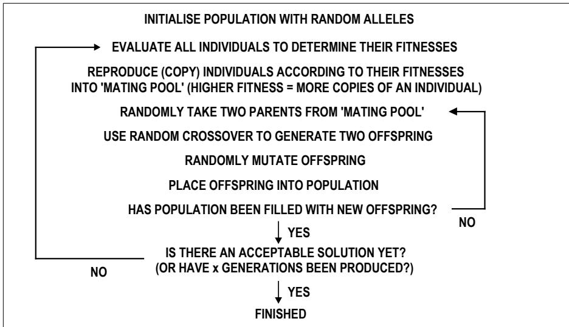
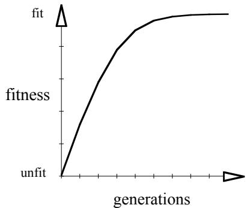

# The Revolution of Evolution for

# Real-World Applications

Peter Bentley

Intelligent Systems Group, Department of Computer Science University College London, Gower St., London WC1E 6BT, UK. P.Bentley@cs.ucl.ac.uk

Abstract. This paper describes an evolutionary search method known as the genetic algorithm (GA) and examines its application to real-world problems. A description of the algorithm itself and its history is provided. A general review of GA theory and analysis is given, and many of the newer, more advanced types of GA are introduced. Some of the hundreds of different applications tackled by GAs are then described. Two more detailed case-studies are included, to outline how GAs can be applied to real-world applications, and to illustrate some of the difficulties such problems present to the designers of GA-based systems. The paper concludes that the GA is a highly significant and useful tool, suitable for a variety of different applications.

# 1 Introduction

In Computer Science, search algorithms define a computational problem in terms of search, where the search-space is a space filled with all possible solutions to the problem, and a point in that space defines a solution (Kanal and Cumar, 1988). The problem of improving the values of parameters for an application is then transformed into the problem of searching for better solutions elsewhere in the space of allowable parameter values. There are many types of search algorithm in existence, of which evolutionary search is a recent and rapidlygrowing sub-set.

Evolutionary search algorithms are inspired by and based upon evolution in nature. These algorithms typically use an analogy with natural evolution to perform search by evolving solutions to problems. Hence, instead of working with one solution at a time in the searchspace, these algorithms consider a large collection or population of solutions at once.

Evolution-based algorithms have been found to be some of the most flexible, efficient and robust of all search algorithms known to Computer Science (Goldberg, 1989). Because of these properties, these methods are now becoming widely used to solve a broad range of different problems (Holland, 1992). This review paper concentrates on perhaps the most popular and prolific of these evolutionary techniques: the genetic algorithm, and explores its application to real-world problems.

# 2 Genetic Algorithms

# 2.1 A Summary

Natural evolution acts through large populations of creatures which reproduce to generate new offspring that inherit some features of their parents (because of random crossover in the inherited chromosomes) and have some entirely new features (because of random mutation). Natural selection (the weakest creatures die, or at least do not reproduce as successfully as the stronger creatures) ensures that, on average, more successful creatures are produced each generation than less successful ones.

Using this simple process, evolution has produced some astonishingly varied, yet highly successful forms of life. These organisms can be thought of as good 'solutions' to the problem of life. In other words, evolution optimises creatures for the problem of life.

In the same way, within a genetic algorithm (GA) a population of solutions to the problem is maintained, with the 'fittest' solutions (those that solve the problem best) being favoured for 'reproduction' every generation, during an otherwise random selection process. 'Offspring' are then generated from these fit parents using random crossover and mutation operators, resulting in a new population of fitter solutions (Holland, 1975).

Genetic algorithms differ from traditional algorithms in four ways (Goldberg, 1989):

1. GAs usually work with a coding of the parameter set, not the parameters themselves.   
2. GAs search from a population of points, not a single point.   
3. GAs use payoff (objective function) information, not derivatives or other auxiliary   
knowledge.   
4. GAs use probabilistic transition rules, not deterministic rules.

Coded parameters are normally referred to as genes, with the values a gene can take being known as alleles. A collection of genes in one individual of the population is held internally as a string, and is often referred to as a chromosome. The entire coded parameter set of an individual (which may be anything from a single gene to a number of chromosomes) is known as the genotype, while the solution that the coded parameters define is known as the phenotype.

The simple or canonical GA is summarised in figure 1. Typically, populations are initialised with random values. The main loop of the algorithm then begins, with every member of the population being evaluated and given a fitness value according to how well it fulfils the objective or fitness function. These scores are then used to determine how many copies of each individual are placed into a temporary area often termed the 'mating pool' (i.e. the higher the fitness, the more copies that are made of an individual). Two parents are then randomly picked from this area. Offspring are generated by the use of the crossover operator which randomly allocates genes from each parent to each offspring. For example, given two parents: 'ABCDEFG' and 'abcdefg', and a random crossover point of, say, 4, the two offspring generated by the simple GA would be: 'ABCDefg' and 'abcdEFG'. Mutation is then occasionally applied (with a low probability) to offspring. When it is used to mutate an individual, typically a single allele is changed randomly. For example, an individual '111111' might be mutated into '110111'. Using crossover and mutation, offspring are generated until they replace every parent in the population. This entire process of evaluation and reproduction then continues until either a satisfactory solution emerges or the GA has for run a specified number of generations. (Holland 1975, Goldberg 1989, Davis 1991, Fogel 1995).

  
Fig. 1 The simple genetic algorithm.

The simple GA is just that - very simple and a little naive. This GA is favoured by those that try to theoretically analyse and predict the behaviour of genetic algorithms, but in reality, typical GAs are usually more advanced. Common features include: more realistic natural selection, ability to detect when evolution ceases, and overlapping populations or elitism (where some fit individuals can survive for more than one generation) (Davis, 1991). Because of this improved analogy with nature, the term reproduction is normally used as it is in biology to refer to the entire process of generating new offspring, encompassing the crossover and mutation operators. (This is in contrast to the somewhat confusing use of the word 'reproduction' to mean an explicit copying stage within the simple GA).

# 2.2 GA Theory

The genetic algorithm is perhaps the most well-known of all evolution-based search algorithms. GAs were developed by John Holland over twenty-five years ago in an attempt to explain the adaptive processes of natural systems and to design artificial systems based upon these natural systems (Holland 1973, 1975). Whilst not being the first algorithm to use principles of natural selection and genetics within the search process (others include Evolutionary Programming: Fogel, 1963 and Evolutionsstrategie: Rechenberg, 1973), the genetic algorithm is today the most widely used. More experimental and theoretical analyses have been made on the workings of the GA than any other evolutionary algorithm. Moreover, the genetic algorithm (and enhanced versions of it) resembles natural evolution more closely than most other methods.

Having become widely used for a broad range of optimisation problems in the last ten years (Holland, 1992), the GA has been described as being a "search algorithm with some of the innovative flair of human search" (Goldberg, 1989). GAs are also very forgiving algorithms - even if they are badly implemented, or poorly applied, they will often still produce acceptable results (Davis, 1991). GAs are today renowned for their ability to tackle a huge variety of optimisation problems (including discontinuous functions), for their consistent ability to provide excellent results, and for their robustness (Holland 1975, Goldberg 1989, Davis 1991, Fogel 1995).

For a search algorithm to be robust, it must be capable of producing good solutions to a broad range of problems. In his book, Goldberg compares traditional search methods (calculus-based, enumerative, and random) with genetic algorithms (Goldberg, 1989). He concludes: "while our discussion has been no exhaustive examination of the myriad methods of traditional optimisation, we are left with a somewhat unsettling conclusion: conventional search methods are not robust." (Goldberg, 1989, p.5). The general view of many researchers appears to be in agreement with this, although it is often debated exactly which algorithm would give the best results for specific problems. Typically, it is argued that a traditional algorithm designed specifically for a problem will provide better results for that problem than a GA could, but that a GA will provide good solutions for a much broader selection of problems, compared to such problem-specific methods (Fogel, 1995).

Whilst there is no formal proof that the GA will always converge to an acceptable solution to a given problem, a variety of theories exist (Holland 1975, Kargupta 1993, Harris 1994), the most accepted of these being Holland's Schema Theorem and the Building Block Hypothesis (Holland 1975).

Briefly, a schema is a similarity template describing a set of strings (or chromosomes) which match each other at certain positions. For example, the schema $^ { * } 1 0 1 0 1$ matches the two strings $\{ 1 1 0 1 0 1 , 0 1 0 1 0 1 \}$ (using a binary alphabet and a metasymbol or don't care symbol \*). The schema $^ { * } 1 0 1 ^ { * }$ describes four strings {01010, 11010, 01011, 11011}. As Goldberg (1989) elucidates, in general, for alphabets of cardinality (number of alphabet characters) $k _ { : }$ , and string lengths of l characters, there are $( k + 1 ) ^ { l }$ schemata.

The order of a schema is the number of fixed characters in the template, e.g. the order of schema $^ { * } 1 ^ { * } 1 1 0$ is 4, and the order of schema $* * * * * * 0$ is 1. The defining length of a schema is the distance between the first and last fixed character in the template, e.g. the defining length of $1 ^ { * * * * } 0$ is 5, the defining length of $1 ^ { * } 1 ^ { * } 0 ^ { * }$ is 4, and the defining length of $0 ^ { \ast \ast \ast \ast \ast \ast \ast }$ is 0.

Holland's Schema Theorem states that the action of reproduction, crossover and mutation within a genetic algorithm ensures that schemata of short defining length, low order and high fitness exponentially increase within a population (Holland, 1975). Such schemata are known as building blocks.

The building block hypothesis suggests that genetic algorithms are able to evolve good solutions by combining these fit, low order schemata with short defining lengths to form better strings (Goldberg, 1989). However, this still remains an unproven (though widely accepted) hypothesis.

# 2.3 GA Analyses

Experimental results show that for most GAs (initialised with random values), evolution makes extremely rapid progress at first, as the diverse elements in the initial population are combined and tested. Over time, the population begins to converge, with the separate individuals resembling each other more and more (Davis, 1991). Effectively this results in the GA narrowing its search in the solution-space and reducing the size of any changes made by evolution until eventually the population converges to a single solution (Goldberg, 1989). When plotting the best fitness value in each new population against the number of generations, a typical curve emerges, fig 2 (Parmee and Denham, 1994).

  
Fig. 2 Typical curve of evolving fitness values over time.

Theoretical research to investigate the behaviour of the various varieties of GAs for different problems is growing rapidly, with careful analyses of the transmission of schemata being made (De Jong 1975, Kargupta 1993). The use of Walsh function analysis (Deb et. al. 1993) and Markov Chain analysis $\mathrm { H o r n } \ 1 9 9 3$ , Mahfoud 1993a, 1993b) has led to the identification of some 'deceptive' and 'hard' problems for GAs (Deb and Goldberg 1992, 1993).

# 2.4 Advanced Genetic Algorithms

When applying GAs to highly complex applications, some problems do arise. The most common is premature convergence where the population converges early onto non-optimal local minima (Davis, 1991). Problems are also caused by deceptive functions, which are, by definition, 'hard' for most GAs to solve. In addition, noisy functions (Goldberg et. al. 1992a, 1992b) and the optimisation of multiple criteria within GAs can cause difficulties (Fonseca and Fleming, 1995a). In an attempt to overcome such problems, new, more advanced types of GA are being developed (Goldberg, 1994). These include:

Parallel GAs, where multiple processors are used in parallel to run the GA (Adeli and Cheng 1994, Levine 1994).

Distributed GAs, where multiple populations are separately evolved with few interactions between them (Whitley and Starkweather 1990)   
GAs with niching and speciation, where the population within the GA is segregated into separate 'species' (Horn 1993, Horn and Nafpliotis 1993, Horn et. al. 1994).   
Messy GAs (mGA), which use a number of 'exotic' techniques such as variablelength chromosomes and a two-stage evolution process (Deb 1991, Deb and Goldberg, 1991).   
Multiobjective GAs (MOGAs), which allow multiple objectives to be optimised with GAs (Schaffer 1985, Srinivas and Deb 1995, Bentley and Wakefield 1997). Hybrid GAs (hGAs), where GAs are combined with local search algorithms (George 1994, Radcliffe and Surrey 1994a).   
Structured GAs (sGAs), which allow parts of chromosomes to be switched on and off using evolveable 'control genes' (Dasgupta and McGregor 1992, Parmee and Denham 1994).   
GAs with diploidy and dominance, which can improve variation and diversity in addition to performance (Smith & Goldberg, 1992b).   
Mutation-driven GAs, such as Harvey's SAGA (Harvey, 1997), which uses converged populations modified primarily by mutation to allow the constant 'incremental evolution' of new solutions to varying fitness functions.

# 3 Some Applications of Genetic Algorithms

The genetic algorithm has only become popular for optimisation problems in the last ten or fifteen years (Holland 1992, Goldberg 1994). However, in that time, literally thousands of different problems in many different areas have had solutions successfully optimised by GAs:

Machine learning (Goldberg 1989, Goldberg et. al. 1992b, Holland 1992, Smith and Goldberg 1992a, Horn et. al. 1994). Strategy acquisition (Greffenstette, 1991). Ordering problems (Kargupta et al. 1992, Schaffer & Eshelman 1995).   
Control systems (Husbands et al. 1996).   
− Fault-tolerant systems (Thompson, 1995).   
Scheduling (Yamada and Nakano, 1995).   
. Data mining (Radcliffe and Surrey 1994b).   
Set covering and partitioning (Levine 1994). Signal timing (Foy et. al., 1992). Composition of music (Horner and Goldberg, 1991) Evolution of engineering designs (Bentley & Wakefield, 1996a,b)

In each of these areas, a large variety of different problems have been solved. For example, in engineering design, GAs have been used to optimise:

Adaptive antenna arrays and radar absorbers (Chambers et. al., 1995).   
Airfoil and aircraft geometries (Husbands, Jermy, McIlhagga, & Ives 1996). Analogue filters (Reeves et al., 1994). Building heating systems (Dickinson and Bradshaw, 1995).   
• Floorplans (Koakutsu et al., 1992). Sizes of gas pipes (Boyd, 1994). Hydraulic networks (Donne et al., 1994). Microwave absorbing materials (Tennant and Chambers, 1994).   
• Satellite Booms (Keane and Brown, 1996).   
• Servo and micro motors (Hameyer and Belmans, 1996).   
• Spacecraft systems (Garipov et. al., 1994).   
• Structural topology (Rozvany and Zhou 1994). Transmission towers (Cai and Thierauf, 1996). VLSI layouts (Schnecke and Vornberger 1995).

Many of these systems have been used with considerable success to optimise real-world problems. For example, as described by Holland (1992), a design of a high-bypass jet engine turbine was typically optimised in eight weeks by an engineer; a genetic algorithm optimised the design in only two days, "with three times the improvements of the manual version".

To give some idea of the problems faced by the designers of GA-based systems trying to use a computer to solve such difficult problems, there follows two case studies. The first describes the use of a GA to automatically improve the algorithmic control parameter values for a computer vision system. The second describes the application of a GA as part of a machine-learning system, being developed in order to allow the automatic detection of fraudulent home insurance claims.

# 4 Case Study 1: The Optimisation of Algorithmic Control Parameters for Computer Vision

Computer vision systems are becoming more widespread as surveillance cameras are installed to monitor all aspects of our daily lives. These computer programs are beginning to take over the role of observer, and are designed to extract significant features from real-time imaging systems automatically.

One example of such a system (currently available in high-street electronics stores) uses a network of cameras placed on bridges over motorways throughout Britain to automatically monitor traffic flow. A recent enhancement to the system is the development of automatic number-plate identification, where the number plates of passing traffic are located and read, to be subsequently used as a measure of the speed of individual vehicles.

As with most such commercially available products, the fear of unfair competition by other companies prevents the publication of details of the computer vision algorithms used to locate, extract, read and correlate number-plates. However, regardless of how these algorithms actually work, this computer system does have numerous parameters that modify its ability to perform various aspects of the vision analysis process. Indeed, this application has over thirty of such algorithmic control parameters, with the values of most of them set by intuition or trial-and-error.

Since this system must be able to successfully read number-plates in a variety of different weather conditions, and of a variety of different styles, colours and sizes, optimising the values of these control parameters becomes an important factor in increasing reliability and accuracy. Hence, a simple genetic algorithm was implemented (see fig. 1) in an attempt to automatically perform this complex optimisation task.

This GA manipulates a population of coded individual solutions, where each solution consists of a set of algorithmic control values for the vision system. Each value is coded using a simple 1's complement binary notation, to allow modification by crossover and mutation. The population was initialised with random values. To calculate the fitness of each individual in the population, the performance of the vision system using the control parameter values in that individual was calculated, by applying a set of 1000 test images for analysis (these test images are actual images of real vehicles, captured under a variety of different conditions).

As is typical with such real-world applications, the evaluation of solutions being evolved by the GA was found to take some time. However, in this case the large amount of calculations needed to analyse images resulted in an unusually long run-time of about two weeks of continuous processing (on a Pentium $2 0 0 \mathrm { P C }$ ). Despite the fact that the benefits of a vision system with permanently improved efficiency probably outweigh the disadvantage of this once-only, but long computation time, it was decided that a reduction in the run-time was necessary.

This was achieved by reducing the number of test images considered by the vision software at early stages of evolution, then increasing this number (up to a maximum of 1000) as evolution progressed. (The number of images processed $= 9 + 3 \times$ the number of generations.) The appropriate number of images were selected randomly from the 1000 total each time.

The disadvantage of such a technique is that it introduces random noise into the evaluation process. However, as mentioned previously, the GA is capable of dealing with noisy functions, and because the degree of noise was reduced as the population of solutions converged over the generations, this did permit the GA to find good solutions to the problem using considerably less computation time. Indeed, run-times were reduced from two weeks, to two or three days.

Another typical problem was also encountered with this application: some parameter values generated by the GA caused the vision system to fail (crashing the computer). This was caused by poor error-checking in the vision analysis software, but because of the size and complexity of this software, it was found to be impractical to add such necessary errorchecking. Instead, some additional constraints were added to the GA (e.g. parameter 5 must never have a value above 20 when parameter 2 equals 0). This prevented the GA from generating parameter values with such unfortunate effects, and permitted evolution to continue uninterrupted.

Results were good: the GA was able to improve on the parameter values set by an expert and increase the accuracy of the vision system (correctly reading number-plates) from $9 4 - 9 5 \%$ to $9 6 . 5 \%$ .

# 5 Case Study 2: The Identification of 'Suspicious' Insurance Claims

Whether they admit it or not, all banks, building societies and insurance companies have had, are having, or will have problems with fraud. In an attempt to tackle this expensive problem, Lloyds/TSB have recently begun collaborating with UCL and Searchspace Ltd., in a project to use GAs to automatically detect 'suspicious' home insurance claims.

For legal reasons, the use of the words 'potentially fraudulent' is inadvisable when describing such 'suspicious' insurance claims. However the training data kindly provided by Lloyds/TSB does represent claims that have been investigated because of their unusual nature - as identified by human experts.

To allow a GA to identify certain features of data items and permit their classification, it must evolve not parameter values, but rules or sets of rules. Such GAs are known as genetic-based machine learning systems (GBMLs), or Classifier Systems (Goldberg, 1989). Put simply, they consist of an expert system which has its internal rules evolved automatically by the GA.

The system in development at UCL will use a selection of more advanced techniques to improve the accuracy and reliability of the rules evolved. These will include the use of an advanced multiobjective GA with variable-length chromosomes, and also the use of fuzzy logic within the rules. The system will evolve sets of fuzzy rules (each individual in the population being a variable number of coded fuzzy rules). Each individual will be evaluated by applying its fuzzy rules to a mixture of 'suspicious' and 'ordinary' insurance claims, and calculating the extent to which the rules can distinguish one type from the other. As evolution progresses, the quality of these rules should improve until they should be able to identify 'suspicious' claims with some accuracy. Because fuzzy logic is a part of this work, it is conceivable that the use of the GA to simultaneously evolve fuzzy membership functions for the rules may be desirable.

As is common with such real-world applications, there are some major problems with the quality of the data available to test the system on. Whilst data describing many thousands of 'ordinary' insurance claims is available, the training data describing 'suspicious' claims is very limited in quantity and quality (i.e. the number of data items and the number of useful fields is low). This is mainly because far fewer 'suspicious' claims are ever identified, and still fewer are actually explicitly stored on computer as such. In addition, various extremely useful fields (such as names and addresses) have currently not been made available by Lloyds/TSB for legal reasons.

Since most human experts often use details such as names and addresses of claimants as one of the most important factors in identifying 'suspicious' insurance claims, these deficiencies in the data may limit the success of any type of identification system. However, GAs are known for their ability to cope with poor data quality and noise, so the use of a genetic-based fuzzy classifier system should maximise the chances of success.

Results are not yet available as this work is on-going, but the author is confident that this system will be able to evolve rules of equivalent or better accuracy compared to rules created by a human, for the data provided.

In recent years, evolutionary search has been found to be a remarkably effective way of using computers to solve difficult problems. In particular, the use of the genetic algorithm has undergone something of a revolution, with hundreds, possibly thousands, of different problems solved by GAs.

With new theoretical analyses being performed constantly, it will not be long before the mechanism by which solutions are consistently evolved is understood. In the meantime, new varieties of GA, often 'borrowing' more features from nature, are constantly showing new potentials of evolutionary search.

The two case studies given in this paper briefly demonstrate how GAs can be applied to real-world tasks. Although such applications do cause difficulties, these problems are not insurmountable, and the GA is capable of finding improved solutions where other techniques would struggle.

The genetic algorithm is one of the most effective and generic of all search algorithms known. Experience has shown that it is a highly significant and useful tool, suitable for a variety of real-world applications.

# Acknowledgements

The use of a GA for algorithmic control parameter optimisation was performed for the former Pro:Technica Consultants Ltd (PTCL) as part of the product TrafficMasterTM. The use of a GA to identify fraudulent insurance claims is an on-going project, funded by the EPSRC and in collaboration with Searchspace Ltd.and Lloyds/TSB.

# Список литературы

1. Adeli, H. & Cheng, N., (1994). Concurrent Genetic Algorithms for Optimization of Large Structures. ASCE Journal of Aerospace Engineering v7:3, 276-296.   
2. Bentley, P. J. & Wakefield, J. P. (1996a). The Evolution of Solid Object Designs using Genetic Algorithms. In Rayward-Smith, V. (ed) Modern Heuristic Search Methods. Ch. 12, John Wiley & Sons Inc., 199-215.   
3. Bentley, P. J. & Wakefield, J. P. (1996b). Conceptual Evolutionary Design by Genetic Algorithms. Engineering Design and Automation Journal $\nu 2 { : } 3$ , John Wiley & Sons, Inc.   
4. Bentley, P. J. & Wakefield, J. P. (1997). Finding Acceptable Solutions in the ParetoOptimal Range using Multiobjective Genetic Algorithms. In Proceedings of the 2nd On-line World Conference on Soft Computing in Engineering Design and Manufacturing (WSC2), 23-27 June 1997. To appear as a chapter in: Soft Computing in Engineering Design and Manufacturing. Springer Verlag London Limited, 1997.   
5. Boyd, I. D., (1994). Constrained Gas Network Pipe Sizing with Genetic Algorithms. (Submitted to) Parallel Problem Solving From Nature.   
6. Cai, J. & Thierauf, G. (1996). Structural Optimization of a Steel Transmission Tower by using Parallel Evolution Strategy. In Proceedings of Adaptive Computing in Engineering Design and Control - '96, (pp. 18-25).   
7. Chambers, B. et. al. (1995). Application of genetic algorithms to the optimisation of adtaptive antenna arrays and radar absorbers. In Genetic Algorithms in Engineering Systems: Innovations and Applications (GALESIA '95), Sheffield, (pp. 94-99).   
8. Dasgupta, D. and McGregor, D. R. (1992). Nonstationary Function Optimization using the Structured Genetic Algorithm. In Parallel Problem Solving from Nature 2, Brussels, Belgium. Elsevier Science Pub. (pp. 145-154)   
9. Davis, L. (1991). The Handbook of Genetic Algorithms. Van Nostrand Reinhold, New York.   
10. Deb, K. (1991). Binary and Floating Point Function Optimization using Messy Genetic Algorithms. Illinois Genetic Algorithms Laboratory (IlliGAL), report no. 91004.   
11. Deb, K. & Goldberg, D. E., (1991). mGA in C: A Messy Genetic Algorithm in C. Illinois Genetic Algorithms Laboratory (IlliGAL), report no. 91008.   
12. Deb, K. & Goldberg, D. E., (1992). Sufficient Conditions for Deceptive and Easy Binary Functions. Illinois Genetic Algorithms Laboratory (IlliGAL), report no. 92001.   
13. Deb, K. et. al., (1993). Multimodal Deceptive Functions. Complex Systems 7:2, 131-   
153.   
14. Deb, K. & Goldberg, D. E., (1993). Analyzing Deception in Trap Functions. In Foundations of Genetic Algorithms 2, Morgan Kaufmann Pub.   
15. De Jong, K. A., (1975). An Analysis of the Behaviour of a Class of Genetic Adaptive Systems. (Doctoral dissertation, University of Michigan), Dissertation Abstracts International.   
16. Dickinson, S. J. & Bradshaw, A., (1995). Genetic Algorithm Optimisation and Scheduling for Building Heating Systems. In Genetic Algorithms in Engineering Systems: Innovations and Applications (GALESIA '95), Sheffield, (pp. 106-111).   
17. Donne, M. S., Tilly, D. G. and Richards, C. W., (1994). Adaptive Search and Optimisation Techniques in Fluid Power System Design. Proceedings of Adaptive Computing in Engineering Design and Control - '94, (pp.67-76).   
18. Fogel, L. J., (1963). Biotechnology: Concepts and Applications. Englewood Cliffs, NJ: Prentice Hall.   
19. Fogel, D. B., (1995). Evolutionary Computation: Towards a New Philosophy of Machine Intelligence. IEEE Press.   
20. Fonseca, C. DM, & Fleming, P. J. (1995a). An Overview of Evolutionary Algorithms in Multiobjective Optimization. Evolutionary Computation v3:1, 1-16.   
21. Foy, M. D., et al. (1992). Signal Timing Determination using Genetic Algorithms. Transportation Research Record #1365, National Academy Press, Washington, D.C.,   
108-113.   
22. Garipov, V., Diakov, E., Semenkin, E. and Vakhtel, S., (1994). Adaptive Search Methods in Spacecraft Systems Optimal Design. Proceedings of Adaptive Computing in Engineering Design and Control - '94, (pp.194-201).   
23. George, F. (1994). Hybrid Genetic Algorithms with Immunisation to Optimise Networks of Car Dealerships. Edinburgh Parallel Computing Centre.   
24. Goldberg, D. E., (1989). Genetic Algorithms in Search, Optimization & Machine Learning. Addison-Wesley.   
25. Goldberg, D. E. et al. (1992a). Genetic Algorithms, Noise, and the Sizing of Populations. Complex Systems 6, 333-62.   
26. Goldberg, D. E. et al. (1992b). Accounting for Noise in the Sizing of Populations. In Foundations of Genetic Algorithms 2, Morgan Kaufmann Pub., (pp.127-140).   
27. Goldberg, D. E. (1994). Genetic and Evolutionary Algorithms Come of Age. Communication of the ACM, v.37:3, 113-119.   
28. Greffenstette, J. J. (1991). Strategy Acquisition with genetic Algorithms. Ch. 12 in The Handbook of Genetic Algorithms. Van Nostrand Reinhold, New York, 186-201.   
29. Hameyer, K. & Belmans, R. (1996). Stochastic Optimisation of Mathematical Models for Electric and Magnetic Fields. In Proceedings of Adaptive Computing in Engineering Design and Control - '94, (pp. 139-144).   
30. Harris, R. A., (1994). An Alternative Description to the Action of Crossover. In Proceedings of Adaptive Computing in Engineering Design and Control - '94, (pp. 151-   
156).   
31. Holland, J. H., (1973). Genetic Algorithms and the optimal allocations of trials. SIAM Journal of Computing 2:2, 88-105.   
32. Holland, J. H., (1975). Adaptation in Natural and Artificial Systems. The University of Michigan Press, Ann Arbor.   
33. Holland, J. H., (1992). Genetic Algorithms. Scientific American, 66-72.   
34. Horn, J., (1993). Finite Markov Chain Analysis of Genetic Algorithms with Niching. In Proceedings of the Fifth International Conference on Genetic Algorithms, Morgan Kaufmann Pub., (pp. 110-17).   
35. Horn, J. & Nafpliotis, N. (1993). Multiobjective Optimisation Using the Niched Pareto Genetic Algorithm. Illinois Genetic Algorithms Laboratory (IlliGAL), report no.   
93005.   
36. Horn, J. et. al., (1994). Implicit Niching in a Learning Classifier System: Nature's Way. Illinois Genetic Algorithms Laboratory (IlliGAL), report no. 94001.   
37. Horner, A. & Goldberg, D. E. (1991). Genetic Algorithms and Computer-Assisted Music Composition. In Fourth Internation Conference on Genetic Algorithms, (pp.437-   
41).   
38. Harvey, I. (1997). Artificial Evolution for Real Problems. 5th Intl. Symposium on Evolutionary Robotics, Tokyo April 1997. Invited paper. In: Evolutionary Robotics: From Intelligent Robots to Artificial Life (ER'97), T. Gomi (ed.). AAI Books, 1997   
39. Husbands, P., Harvey, I, Cliff, D., Thompson, A. & Jakobi, N. (1996). The Artificial Evolution of Robot Control Systems. In Proc. of the 2nd Int. Conf. on Adaptive Computing in Engineering Design and Control - '96. University of Plymouth, UK, (pp. 41-49).   
40. Husbands, P., Jermy, G., McIlhagga, M., & Ives, R. (1996). Two Applications of genetic Algorithms to Component Design. In Selected Papers from AISB Workshop on Evolutionary Computing. Fogarty, T. (ed.), Springer-Verlag, Lecture Notes in Computer Science, (pp. 50-61).   
41. Kanal, L. and Cumar, V. (Eds) (1988). Search in Artificial Intelligence. Spring-Verlag Pub.   
42. Kargupta, H., (1993). Information Transmission in Genetic Algorithm and Shannon's Second Theorem. Illinois Genetic Algorithms Laboratory (IlliGAL), report no. 93003.   
43. Keane, A. J. & Brown, S. M., (1996). The Design of a Satellite Boom with Enhanced Vibration Performance using Genetic Algorithm Techniques. In Proceedings of Adaptive Computing in Engineering Design and Control - '96, (pp. 107-113).   
44. Koakutsu, S. et al., (1992). Floorplanning by Improved Simulated Annealing Based on Genetic Algorithm. IEE Transactions of the Institute of Electrical Engineers of Japan, Part C v112-C:7, 411-417.   
45. Levine, D, (1994). A Parallel Genetic Algorithm for the Set Partitioning Problem. D. Phil dissertation, Argonne National Laboratory, Illinois, USA.   
46. Mahfoud, S. W. (1993a). Finite Markov Chain Models of an Alternative Selection Strategy for the Genetic Algorithm. Complex Systems 7, 155-70.   
47. Mahfoud, S. W. (1993b). Simple Analytical Models of genetic Algorithms for Multimodal Function Optimisation. In Fifth international Conf. on Genetic Algorithms, (pp.643).   
48. Parmee, I C & Denham, M J, (1994). The Integration of Adaptive Search Techniques with Current Engineering Design Practice. In Proc of Adaptive Computing in Engineering Design and Control -'94, Plymouth, (pp. 1-13).   
49. Radcliffe, N. J. & Surry, P. D., (1994a). Formal Memetic Algorithms. Edinburgh Parallel Computing Centre.   
50. Radcliffe, N. J., Surry, P. D. (1994b). Co-operation through Hierarchical Competition in Genetic Data Mining. (Submitted to) Parallel Problem Solving From Nature.   
51. Rechenberg, I., (1973). Evolutionsstrategie: Optimierung Technisher Systeme nach Prinzipien der Biologischen Evolution. Stuttgart: Fromman-Holzboog Verlag.   
52. Reeves, C. Steele, N. and Liu, J., (1994). Tabu Search and Genetic Algorithms for Filter Design. Proceedings of Adaptive Computing in Engineering Design and Control - '94, (pp. 117-121).   
53. Rosvany, G. I. N., & Zhou, M., (1994). Optimality criteria methods for large discretized systems. In Adeli, H. (ed) Advances in Design Optimization. Ch. 2, Chapman & Hall, 41-108.   
54. Schaffer, J. D., (1985). Multiple Objective Optimization with Vector Evaluated Genetic Algorithms. In Genetic Algorithms and Their Applications: Proceedings of the First International Conference on Genetic Algorithms, (pp. 93-100).   
55. Schaffer, J. D. and Eshelman, L. (1995). Combinatorial Optimization by Genetic Algorithms: The Value of Genotype/Phenotype Distinction. In Proc. of Applied Decision Technologies (ADT '95), April 1995, London, (pp. 29-40).   
56. Schnecke, V. and Vornberger, O., (1995). Genetic Design of VLSI-Layouts. In Genetic Algorithms in Engineering Systems: Innovations and Applications (GALESIA '95), Sheffield, (pp.430-435).   
57. Smith, R. E. & Goldberg, D. E. (1992a). Reinforcement Learning with Classifier Systems. Applied Artificial Intelligence v6, 79-102.   
58. Smith, R. E. & Goldberg, D. E. (1992b). Diploidy and Dominance in Artificial Genetic Search. Complex Systems 6, 251-285.   
59. Srinivas, N. & Deb, K. (1995). Multiobjective Optimzation Using Nondominated Sorting in Genetic Algorithms. Evolutionary Computation, v2:3, 221-248.   
60. Tennant, A. and Chambers, B., (1994). Adaptive Optimisation Techniques for the Design of Microwave Absorbers. In Proceedings of Adaptive Computing in Engineering Design and Control - '94, (pp. 44-49).   
61. Thompson, A. (1995). Evolving Fault Tolerant Systems. In Genetic Algorithms in Engineering Systems: Innovations and Applications, IEE Conf. Pub. No. 414, (pp. 524-   
529).   
62. Whitley, D. & Starkweather, T., (1990). GENITOR II: a distributed genetic algorithm. Journal of Experimental and Theoretic Artificial Intelligence v2:3, 189-214.   
63. Yamada, T. & Nakano, R. (1995). A genetic algorithm with multi-step crossover for job-shop scheduling problems. In Genetic Algorithms in Engineering Systems: Innovations and Applications, IEE Conf. Pub. No. 414, (pp. 146-151).