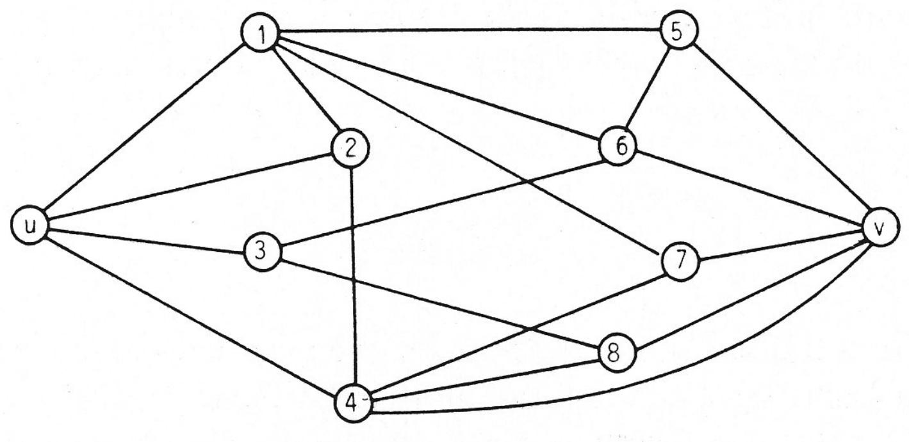
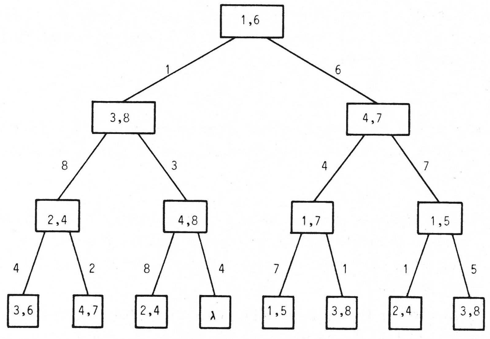
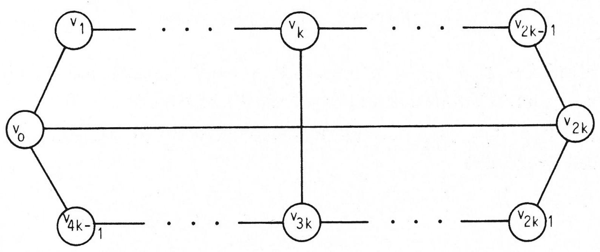
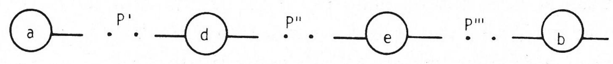
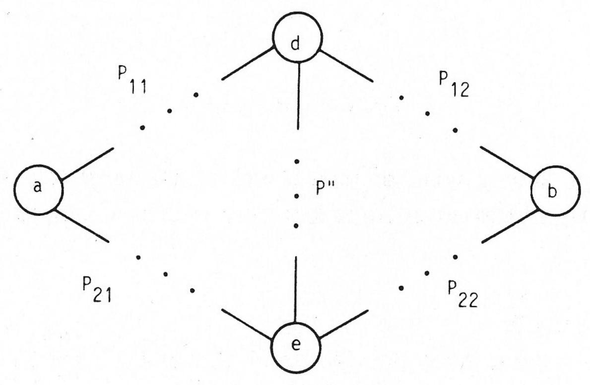

# HOW TO FIND LONG PATHS EFFICIENTLY

B. MONIEN

Universität Paderborn

We study the complexity of finding long paths in directed or undirected graphs. Given a graph $\mathbf { \boldsymbol { G } } = ( \mathbf { \boldsymbol { V } } , \mathbf { \boldsymbol { E } } )$ and a number k our algorithm decides within time $0 ( \mathbf { k } ! \cdot | \mathbf { V } |$ IEIfor all ${ \mathfrak { u } } , { \mathfrak { v } } \in { \mathfrak { V } }$ whether there exists some path of length $\mathbf { k }$ from $\mathbf { u }$ to v. The complexity of this algorithm has to be compared with $0 ( | \mathbf { v } | ^ { \widetilde { \mathbf { k } } - 1 } \cdot | \mathbf { E } | )$ which is the worst case behaviour of the algorithms described up to now in the literature. We get similar results for the problems of finding a longest path, a cycle of length $\mathbf { k }$ or a longest cycle, respectively.

Our approach is based on the idea of representing certain families of sets by subfamilies of small cardinality. We also discuss the border lines of this idea.

# 1. Introduction

In this paper we study the problem of determining a path of length k in a directed or undirected graph ${ \bf G } = ( { \bf V } , { \bf E } )$ .This problem is closely related to the longest path problem and to some other problems which we will describe later. By a 'path' we always mean a 'simple path' (see [5]), i.e. we do not allow that a vertex appears on a path more than once. Without this restriction (i.e. by allowing a vertex to appear more than once on a path) or for graphs without cycles the problems is wellknown (see [10]) to be solvable in polynomial time whereas the problem of determining a simple path of length k, k arbitrary, is NP-complete. One can consider this problem as a single-source and single-destination problem (i.e. as the problem to decide for fixed $\mathbf { u } , \mathbf { v } \ \epsilon \ \mathbf { V }$ whether there exists a path of length $\mathbf { k }$ from u to v) or as the more general problem to decide for all ${ \mathfrak { u } } , { \mathfrak { v } } \ { \mathfrak { e } } \ { \mathfrak { V } }$ whether there exists a path of length k from u to v. We will study here the second approach. That is we want to compute a matrix $\mathbf { D } ^ { ( \mathbf { k } ) } = ( \mathrm { d } _ { \mathbf { i j } } ^ { ( \mathbf { k } ) } )$ , $1 \leq \mathrm { i } , \mathrm { j } \leq \mathrm { n }$ where ${ \mathrm { d } } _ { \mathrm { i j } } ^ { \left( \mathrm { k } \right) }$ b $\overset { \mathbf { \phi } } { \mathbf { k } }$ ifsrcha  path exiasts, ${ \bf d } _ { \bf i j } ^ { ( \bf k ) }$ $\lambda$ from i to j of length k.

The straightforward algorithm which enumerates all sequences of length $\mathbf { k } + \mathbf { l }$ solves the problem within time $0 ( | \mathbf { V } | ^ { \mathbf { k } + 1 } )$ . It has to consider for every pair of nodes (i, j) and for any sequence $\mathrm { u } _ { 1 } , . . . , \mathrm { u } _ { \mathrm { k } - 1 }$ of nodes

$$
\mathbf { i } , \mathbf { u } _ { 1 } \ , \ \dots \ . \ . \ . \ \mathbf { u } _ { \mathbf { k } - 1 } \ , \ \mathbf { j }
$$

whether $\mathbf { i }  \mathbf { u } _ { 1 }  \mathbf { u } _ { 2 }  . . .  \mathbf { u } _ { \mathbf { k } - 1 }  \mathbf { j }$ holds. We get the slightly better time bound $0 ( | \bar { \mathbf { V } } | \ \mathbf { k } - 1$ if we take into account that we have only to consider nodes $\mathrm { u } _ { 1 }$ with $( \mathfrak { i } , \mathfrak { u } _ { 1 } ) \epsilon \mathrm { ~ E ~ }$ In the case ${ \tt k } = 2$ the problem can be solved also by squaring the adjacency matrix of G (which leads to an estimation $0 ( \mathbf { \epsilon } | \mathbf { V } | \mathbf { \epsilon } \alpha )$ with $\alpha < 3$ , see [1]). To our knowledge no algorithm solving this problem for arbitrary $\mathbf { k }$ in less than 0( |V| ${ \bf K } - { \bf I }$ . .E| ) time has been published.

The algorithm of Latin Multiplication which is described above all in the literature (see [10])for solving this problem computes for $1 \leq \mathtt { p }$ . $\leq { \bf k }$ (or for $\mathfrak { p } = 1$ , 2, 4, .., k, respectively) the matrices containing all paths of length p. This algorithm also has a worst case complexity of the above order.

We have seen that for any fixed k we have a polynomial time algorithm to solve this problem but its computational behaviour is terrible if the numbers k and IV| are not very small. In this paper we will describe an algorithm whose behaviour is much better and which will solve the problem for small k rather efficiently.

Theorem 1: Let $\mathrm { G } = ( \mathrm { V } , \mathrm { E } )$ be any graph and let k e N . The matrix $\mathrm { D } ^ { ( \mathbf { k } ) }$ (G) can be computed within time $0 ( C _ { \mathbf { k } } \cdot \mathcal { N } |$ : El ), where $\mathrm { C _ { k } } =$ k!.

Note that we have replaced the time bound O( |V| $\mathbf { k } \mathbf { - } \mathbf { 1 }$ |Eby $0 ( \mathbf { C } _ { \mathbf { k } } \cdot \mathbf { \partial } | \mathbf { V } | \cdot \mathbf { \partial } | \mathrm { E } | \mathbf { \partial } )$ , $\mathbf { C } _ { \mathbf { k } } = \mathbf { k } ! .$ Estimations of this kind can also be found for other problems. We want to mention here the vertex cover problem ([12], time bound $0 ( 2 ^ { \mu / 2 } + | \mathbf { E } |$ ), where $\mu$ is the cardinality of the solution) and the feedback vertex set problem for undirected graphs (unpublished result of the author, time bound $0 ( 2 ^ { \mu } \cdot ( \log \mu ) ^ { \mu }$ . |V| . E| ) where again $\mu$ is the cardinality of the solution). Our new algorithm allows to compute the solution for instances, e.g. $| \mathbf { V } | = 2 0$ and $\mathrm { ~ \bf ~ k ~ } = \mathrm { ~ \bf ~ 7 ~ }$ which were outside the computational practicability before.

The estimation of our algorithm depends on the one side on k and on the other side on $\lvert \mathbf { V } \rvert$ and |E| . The dependence on $\mathbf { k }$ (i.e. $\mathrm { C } _ { \mathrm { k } } = \mathrm { k } !$

is not optimal. The reader will notice that we do not estimate very sharp in our proof. We will discuss this topic again at the end of section 2. On the other hand the behaviour in IV| and |E| seems to be close to optimal, i.e. an improvement of this behaviour would lead to improved algorithms also for other wellknown problems. Note that already in order to compute the matrix of all paths of length 2 we need 0( |V| · |El ) time (at least this is our present knowledge) if we are not willing to use one of the algorithms for fast matrix multiplication. A similiar observation can be made when we are faced with the problem of deciding whether there exists a cycle of length k in the given graph G. This problem can be solved by computing first the matrix $\mathbb { D } ^ { ( \mathtt { k } - 1 ) }$ (G) and then comparing $\mathrm { D } ^ { ( \mathrm { k - 1 } ) }$ G) with E, i.e. for every (i, j) $\epsilon \mathrm { ~ E ~ }$ we look whether there exists a path of length $\ k - 1$ form j to i. Therefore we can compute in time $0 ( \mathbf { C } _ { \mathrm { k - 1 } } \cdot | \mathbf { V } | \cdot | \mathbf { E } |$ ) whether a graph $\mathrm { G } = ( \mathrm { V } , \mathrm { E } )$ has a cycle of length $\mathbf { k }$ The problem of determining whether a graph has a triangle (i.e. the case ${ \bf k } = 3$ )has been studied carefully, since for undirected graphs there exists a $\mathrm { n } ^ { 2 }$ -reduction from the problem of determining a shortest cycle to the problem of determining a triangle, [8]. Also for the problem of determining a triangle only algorithms of time complexity 0( |V| · |El ) and the algorithms for fast matrix multiplication are known, [8]. Therefore it is likely that the time bound 0( IV| . |El ), which holds for any fixed $\mathbf { k }$ ,is rather sharp.

Note that as a simple corollary of Theorem 1 we have proved above the following theorem.

Theorem 2: Let ${ \bf G } = ( { \bf V } , { \bf E } )$ be any graph and let k e N . We can decide within time $0 ( \mathbf { C } _ { \mathrm { k - 1 } } \cdot | \mathbf { V } | \cdot | \mathbf { E } | \cdot$ , ${ \mathrm { C } } _ { \mathrm { k } } = \mathrm { k ! }$ , whether G has a cycle of length $\mathbf { k }$ and compute such a cycle if it exists.

We will show in Section 4 that we can use Theorem 1 also to find a longest path and a longest cycle efficiently (for finding a longest cycle we can apply our method only if the graph is undirected).

Theorem 3: Let $\mathbf { G } = ( \mathbf { V } , \mathbf { E } )$ be any graph. We can compute a longest path of $\mathbf { G }$ within time $0 ( \mathrm { c } _ { \mu + 1 }$ . IV|.IEI), $\mathrm { C } _ { \mu } = \mu !$ ,where $\mu$ is the length of the longest path of G.

Theorem 4: Let $\boldsymbol { \mathrm { G } } = ( \boldsymbol { \mathrm { V } } , \boldsymbol { \mathrm { E } } )$ be an undirected graph. We can compute a longest cycle of $\mathbf { G }$ within time $0 ( \mathbf { C } _ { 2 \mu - 1 } \cdot \mathbf { \nabla } | \mathbf { V } | \cdot | \mathbf { E } | \cdot$ , $\mathrm { C } _ { \mu } = \mu !$ ,where $\mu$ is the length of the longest cycle of $\dot { \mathbf { G } }$

It was shown before, [7], that a longest cycle in an arbitrary graph $\boldsymbol { \mathrm { G } } = ( \boldsymbol { \mathrm { V } } , \boldsymbol { \mathrm { E } } )$ can be found within time $0 ( \mathbf { \partial } \left| \mathbf { V } \right| \mathbf { \partial } ^ { \mu } \cdot \mathbf { \partial } \left| \mathbf { E } \right|$ where $\mu$ is the length of the longest cycle of G. Both problems, determining a longest path as well as determining a longest cycle, are well known and well studied and are important in many applications (see [13]).

Before we start to prove our theorems we want to give an idea about the method we use. We feel that this method is quite general and should have further applications.

Let a graph $\mathbf { G } = ( \mathbf { V } , \mathbf { E } )$ , $\mathbf { V } = { \Big \{ } 1 , . . . , \ n { \Big \} }$ , and a number k be given. The first consideration is very simple. We start from the set of edges and then we compute successively for all $\mathfrak { p }$ , $2 \le \mathtt { p } \le \mathtt { k }$ , and for all i, j $\epsilon \textbf { V }$ all the paths of length $\mathfrak { p }$ from i to j. If we have already computed for all i, $\mathrm { j } \in \mathrm { V }$ all the paths from i to j of length $\mathfrak { p }$ , then we can use this information to compute the paths of length $\texttt { p } + 1$ by Latin Multiplication (see [10]). This approach is very time consuming since the number of paths of length p can be very large. We overcome this difficulty by considering instead of the family of all paths of some given length between two nodes some subfamily which we really need in order to compute finally paths of length k. We call this subfamily a representative for the family of all paths.

We will describe this idea in the next section and we will also give a close upper bound for the cardinality of the optimal representatives (Theorem 5). In section 3 we show how representatives can be computed efficiently and prove theorem 1. There is still a rather large gap between the cardinality of the representatives we get in section 3 and the optimal ones. In section 4 we prove theorem 3 and theorem 4.

# The use of representatives

Our first step is to consider instead of paths (i.e. sequence of nodes) the sets of nodes lying on a path, i.e. we don't distinguish between paths running over the same set of nodes. From now on we will use in our proof only these sets. In an implementation of our algorithm one should encode such a set as a sequence of nodes which form a path in $\mathbf { G }$ in order to have really paths available when the algorithm stops.

Let us set for $1 \leq \mathrm { i } , \mathrm { j } \leq \mathrm { n } , 0 \leq \mathrm { p } \leq \mathrm { n } - 1$ of length p from i to j }.

Here $\mathrm { P _ { p - l } } ( \mathrm { n } )$ denotes the family of all subsets of $\left\{ 1 , . . . , n \right\}$ of cardinality $\mathrm { p - } \mathrm { i }$ Let us consider as an example the graph $\mathbf { G }$ given by figure 2.1.

  
Figure 2.1: The graph G

$$
\begin{array} { r l } { \mathrm { F } _ { \mathrm { u v } } ^ { 2 } = } & { { } \big \{ \big \{ 2 , 4 \big \} , \big \{ 1 , 5 \big \} , \big \{ 1 , 6 \big \} , \big \{ 1 , 7 \big \} , \big \{ 3 , 6 \big \} , \big \{ 3 , 8 \big \} , \big \{ 4 , 8 \big \} , \big \{ 4 , 7 \big \} \big \} . } \end{array}
$$

Now let us define the notion of a representative. Let $\mathrm { ~ \mathsf ~ { ~ q ~ } ~ } \epsilon \mathrm { ~ \mathsf ~ { ~ N ~ } ~ }$ with $0 \leq \mathtt { q } < \mathtt { n }$ and let $\mathrm { F }$ be any family of sets over $\left\{ 1 , . . . , \mathrm { n } \right\}$ . A q-representative $\hat { \mathrm { F } }$ for $\mathrm { F }$ is defined in such a way that if we consider any set $\mathrm { ~ T ~ c ~ } \{ 1 , . . . , \mathrm { ~ n ~ } \}$ of cardinality at most q and ask whether $\boldsymbol { \mathrm { F } }$ contains a set $\mathbf { U }$ with TO ${ \bf U } = \boldsymbol \rho$ then we get the correct answer also by looking only through $\hat { \mathrm { F } }$ .

Definition: Let $\boldsymbol { \mathrm { F } }$ be a family of sets over $\left\{ 1 , . . . , n \right\}$ and let $\mathrm { ~ q ~ } \epsilon \mathrm { ~ N ~ }$ , $0 \leq \mathfrak { q } < \mathfrak { n }$ A subfamily $\hat { \mathrm { ~ \sf ~ F ~ C ~ } } \mathrm { ~ \sf ~ F ~ }$ is called a q-representative of $\mathrm { F }$ if the following condition holds:

For every $\mathrm { ~ T ~ } \epsilon \ : \mathbb { P } { \le } { \mathrm { q } }$ (n), if there exists some $\mathrm { ~ U ~ } \epsilon \mathrm { ~ F ~ }$ with $\mathbf { T } \cap \mathbf { U } = \emptyset$ then there exists also some $\hat { \mathrm { ~ U ~ } } \epsilon \hat { \mathrm { ~ F ~ } }$ with $\mathrm { ~ T ~ } \cap \hat { \mathrm { ~ U ~ } } = \emptyset$ .

Let us consider again the above example. ${ \hat { \mathrm { F } } } \colon = \left\{ \left\{ 2 , 4 \right\} , \left\{ 1 , 5 \right\} \right\}$ is a 1-representative for $\mathrm { F } _ { \mathrm { u v } } ^ { 2 }$ Since $\hat { \mathrm { F } }$ cais  oi ${ \mathrm { ~ T ~ c ~ } } \{ 1 , . . . , { \mathrm { ~ n ~ } } \}$ with $| \Upsilon | = 1$ the family $\hat { \mathrm { F } }$ contains a set $\hat { \textbf { U } }$ with $\mathbf { T } \cap { \hat { \mathbf { U } } }$ . = 0. Because of the analogous reason F: = {{2,4} , {1.5}, {3,6}}is a 2-representative for $\mathrm { F } _ { \mathrm { u v . } } ^ { 2 }$ is ot fiult ${ \hat { \Gamma } } : = \left\{ \left\{ { \hat { 2 } } , 4 \right\} \right.$ , $\{ 1 , 5 \} , \{ 3 , 6 \} , \{ 1 , 7 \} , \{ 3 , 8 \} , \{ 4 , 8 \} \}$ is a 3-representative for $\mathrm { F } _ { \mathrm { u v } } ^ { 2 }$

We have said that we will use the idea of the representative to compute the matrix $\mathbb { D } ^ { ( \mathbf { k } ) }$ Let u,v e V be two nodes. We have to decide whether there exists a path of length k from u to v. What do we have kno

A path from u to v of lenght $\mathbf { k }$ consists of an edge $\left\{ \mathrm { u , i } \right\} \in \mathrm { E , i \ne v , }$ and a path from i to v of length $\mathbf { k } { - } 1$ from i to v which does not contain u.

Therefore it is sufficient to know for every $\mathrm { ~ i ~ } \epsilon \mathrm { ~ V ~ }$ whether there exists a path from i to v of length k-1 not containing u. This information is given by a l-representative for $\mathrm { F } _ { \mathrm { i v } } ^ { \mathrm { k - 2 } }$ W  a observation in the following way:

Assume that we know 1-representatives for $\mathrm { F _ { i i } ^ { k - 2 , ~ 1 } \leq i , ~ j \leq n . }$ Then we can compute 0-representatives for Fk-, $1 ^ { \prime } { \le } \mathrm { i } , \mathbf { j } \le \mathbf { n }$ .

Note that for any family $\mathbf { F }$ a 0-representative $\hat { \mathbf { F } }$ of $\mathbb { F }$ is empty iff F is empty and it has to contain only one arbitrary set from F if F is not empty.

We can easily generalize the above observation and get the following lemma which we will call the main lemma because of its importance for this paper.

Main lemma: Let p,q be numbers with $0 \leq \mathfrak { p } < \mathfrak { n }$ and $1 \leq \mathrm { q } \leq \mathrm { n }$ . Assume that we know q-representatives for Fp , $1 \leq \mathrm { i } , \mathrm { j } \leq \mathrm { n }$ , but not necessarily the sets FP itself. Then we can compute (q-1)-representatives for all thefamilis $\mathrm { F _ { i j } ^ { p + 1 } } , 1 \le \mathrm { i } , \mathrm { j } \le \mathrm { n } .$

We can use the idea of the main lemma by computing first (k-2)- representatives for F1 , $1 \leq \mathrm { i } , \mathrm { j } \leq \mathtt { n }$ , and then (k-3)-representatives for $\mathrm { F _ { i j } ^ { 2 } , 1 \le i , j \le n , \cdots , }$ , until we reach 0-representatives for I $\mathrm { F _ { i j } ^ { k - 1 } } , 1 \leq$ $\mathrm { i } , \mathrm { j } \leq \mathrm { n }$ We will show in the next section that we can do this computation efficiently. Closely related with the complexity of this computation is the maximum number of sets which may belong to a representative. Therefore we define

$$
\alpha \mathrm { ( p , q , n ) { = } m a x } \atop { \mathrm { F C P _ { \mathfrak { p } } ( n ) } } \operatorname* { m i n } \left\{ | \hat { \mathrm { F } } | \ ; \hat { \mathrm { F } } \mathrm { i s } \mathrm { a } \mathrm { q \mathrm { - } r e p r e s e n t a t i v e } \mathrm { f o r } \ \mathrm { F } \right\}
$$

It is remarkable that we know this function explicitely. Results from [4, 9] imply that $\alpha ( \mathbf { p } , \mathbf { \ p } , \mathbf { n } ) = ( \mathbf { \mathtt { p } } _ { \mathtt { p } } ^ { + } )$ for ${ \mathfrak { n } } \geq { \mathfrak { p } } + { \mathfrak { q } }$ Note that no proper subset of $\mathrm { F = \mathrm { P _ { p } \left( p + q \right) } }$ is a q-representative of $\mathrm { F }$ and therefore $\alpha ( \mathfrak { p } , \mathfrak { q } , \mathfrak { n } ) \geq ( \mathfrak { p } _ { \mathfrak { p } } ^ { + } \mathfrak { q } )$ In r  prove the oherdiion we have to introduce some new definitions.

Let $\operatorname { F } \subset \operatorname { \mathbb { P } } _ { \mathfrak { p } }$ (n). A set $\mathrm { ~ T ~ C ~ } \{ 1 , . . . , \mathrm { { n } } \}$ is called a hitting set of $\mathrm { F }$ if U $\cap \mathrm { ~ T ~ } \neq \mathrm { ~ } \emptyset$ for all $\mathrm { ~ U ~ } \epsilon \mathrm { ~ F ~ }$ .

F is called q-minimal if for every $\mathrm { ~ U ~ } \epsilon \mathrm { ~ F ~ }$ the family $\boldsymbol { \mathrm { F } } - \left\{ \boldsymbol { \mathrm { U } } \right\}$ has a hitting set of cardinality q which is not a hitting set of $\boldsymbol { \mathrm F }$ .

It is clear that $\hat { \mathrm { ~ F ~ } } ( \mathrm { ~ F ~ }$ is a q-representative of $\mathbf { F }$ iff every hitting set of $\hat { \mathrm { F } }$ of cardinality at most q is also a hitting set of $\boldsymbol { \mathrm F }$ . This implies that every family ${ \mathrm { F } } \subset { \mathbf { P } } _ { \mathrm { p } } ( \mathrm { n } )$ has a q-representative which is q-minimal.

It was conjectured in [3] and shown in [4] and [9] (see also [2]), that every family $\mathrm { ~ F ~ } \subset \ \mathrm { P _ { p } }$ (n) which is q-minimal contains at most $( \mathfrak { p } _ { \mathfrak { p } } ^ { + } \mathfrak { q } )$ sets. Therefore we get the following theorem:

Theorem 5: $\alpha ( \mathrm { p , q , n } ) = ( \mathrm { p + q } )$ for $\mathrm { n } \geq \mathrm { q } + \mathrm { q } .$

This theorem does not imply that we can compute a q-representative with cardinality $\leq ( \mathrm { { p } _ { p } ^ { + } \ { ^ { \mathrm { q } } } ) }$ efficiently. The method which we will use in the next section leads only to q-representatives of cardinality $\displaystyle \mathbf { i } _ { \equiv 1 } ^ { \mathbf { q } } \mathbf { p } ^ { \mathbf { i } } .$ T $\mathbf { C } _ { \mathbf { k } } { = } \mathbf { k } !$ in our Theorem 1 is close to be optimal. Note that a lower bound for $\mathbf { C _ { k } }$ using the method of representatives is given by

$$
\sum _ { \mathrm { { p } = 1 } } ^ { \mathrm { { k } - 1 } } \alpha ( \mathrm { { p } , \mathrm { { k } \mathrm { { - } \mathrm { { p } - 1 } , n } ) = \sum _ { \mathrm { { p } = 1 } } ^ { \mathrm { { k } - 1 } } ( \mathrm { { k } \mathrm { { - } \mathrm { { p } - 1 } ) = \sum _ { \mathrm { { r } = 0 } } ^ { \mathrm { { k } - 2 } } \binom { \mathrm { { k } \mathrm { { - } 1 } } } { \mathrm { { r } } } = 2 ^ { \mathrm { { k } \mathrm { { - } 1 } } } \mathrm { { - 1 } } . } } } }
$$

It was alrcdynotiee in (3 that $\alpha ( { \mathfrak { p } } , { \mathfrak { q } } , { \mathfrak { n } } ) \leq _ { \mathrm { i } } ^ { \mathfrak { q } } { \underline { { \underline { { \mathrm { { p } } } } } } } ^ { \mathrm { i } } { \mathfrak { p } } ^ { \mathrm { i } }$

The author realized the connections between the work of [3, 4, 9] and the work presented here only during the last stage of preparing this paper.

# 3. Proof of theorem 1:

We want to copte the mat $\mathbf { D } ^ { ( \mathbf { k } ) } = ( \mathbf { d } _ { \mathrm { i } \mathrm { i } } ^ { ( \mathbf { k } ) } )$ d(k) is some is someme. $\mathbf { k } .$ ${ \bf d } _ { \mathrm { i j } } ^ { \mathrm { ( k ) } } = \lambda$ As we described in the introduction we have to compute (k-p-1)-representatives for all the sets $\mathrm { F _ { i i } ^ { p } , i , j \in V , } 1 \le \mathtt { p } \le \mathtt { k } - 1$

Actually we define trees "whose nodes are labelled with the sets from $\mathrm { F _ { i j } ^ { p } }$ such that the family of all the sets which occur as node labels in this" tree form a (k-p-1)-representative of $\mathrm { F _ { i j } ^ { p } }$ The tree structure enables us to do the computations, described by the main lemma, efficiently. We will call such a tree a (k-p-1)-tree for $\mathrm { F _ { i j } ^ { p } }$ .

Definition: Let $\mathrm { ~ F ~ C ~ P _ p ~ }$ (n) be a family of sets. Let q be some natural number. A q-tree for $\dot { \bar { \mathrm { F } } }$ is a p-nary node labelled and edge labelled tree of height at most q which satisfies the following conditions:

(i)Its nodes are labelled with sets from $\boldsymbol { \mathrm { F } }$ or with the special symbol λ. Its edges are labelled with elements from $\left\{ 1 , . . . , \mathfrak { n } \right\}$ .   
(ii) If a node is labelled with some set $\mathrm { ~ U ~ } \in \mathrm { ~ F ~ }$ and if its depth is less than q, then it has p sons and each of the $\mathfrak { p }$ elements of $\mathbf { U }$ occurs as a label of one of the edges connecting this node with its sons.   
(iii) If a node is labelled with the special symbol $\lambda$ or if its depth is equal to q, then it has no sons.   
(iv) Between the labels of the nodes and the edges the following relation holds: For any node $\xi$ of this tree, if $\operatorname { E } ( \xi )$ is the set of elements from $\left\{ \begin{array} { l l } { 1 , . . . , n } \end{array} \right\}$ occurring as edge labels on the path from the root of this tree to $\xi$ , then either label $( \xi ) \in \operatorname { F }$ and label $( \xi )$ $\cap \ \operatorname { E } ( \xi ) = \varnothing$ or label $( \xi ) = \lambda$ and there exists no U $\epsilon \mathrm { ~ F ~ }$ with $\textrm { U } \cap$ $\operatorname { E } ( \xi ) = \varnothing$ .

As an example (see figure 3.1) we want to describe a 3-tree for the set F2 which we considered in the introduction, i.e. for $\mathrm { F } = \mathrm { F } _ { \mathrm { u v } } ^ { 2 } =$ $\left\{ \left\{ 2 , 4 \right\} , \left\{ 1 , 5 \right\} , \left\{ 1 , 6 \right\} , \left\{ 1 , 7 \right\} , \left\{ 3 , 6 \right\} , \left\{ 3 , 8 \right\} , \left\{ 4 , 8 \right\} , \left\{ 4 , 7 \right\} \right\}$ Note that for $0 \leq \mathrm { q } \leq 2$ , the first q levels of this tree form a q-tree for the family $\mathrm { F }$ .

  
e 3.1

Lemma 1: Let $\operatorname { F } \subset \operatorname { \mathbb { P } } _ { \mathfrak { p } }$ (n) be a family of sets, let q be some natural number and let B be some q-tree for F. Then the family $\hat { \mathrm { F } }$ consisting of all sets which occur as node labels in B form a q-representative of F. Furthermore we can decide for every $\mathrm { ~ T ~ } \epsilon \mathrm { ~ P _ { \mathrm { q } } ~ }$ . $\mathbf { \eta } ^ { ( \mathrm { n } ) }$ in $0 ( { \mathfrak { p } } \cdot { \mathfrak { q } } )$ steps whether there exists some U $\epsilon \mathrm { ~ } \mathrm { ~ F ~ }$ with $\mathrm { ~ T ~ } \cap \mathrm { ~ U ~ } = \emptyset$ and compute such a U if it exists.

Proof: We will prove the second assumption first. Consider the following algorithm:

procedure Disjoint-Set ( $\xi$ : node of B; T: element of ${ \bf P } _ { \le \mathrm { q } }$ (n))   
begin if label $( \xi ) \neq \lambda$ and label $( \xi ) \cap \mathbb { T } ^ { } ^ { } \dag \emptyset$ then begin Let $\hat { \pmb \xi }$ be some son of $\xi$ such that the edge from $\xi$ to $\hat { \pmb \xi }$ is labelled with some element a e label (ξ) ∩ T; call Disjoint-Set $( \xi$ ,T)   
end else   
If label $( \xi ) = \lambda$ then write (There exists no U $\epsilon \mathrm { ~ \bf ~ F ~ }$ with ${ \mathrm { ~ U ~ } } \cap { \mathrm { ~ T ~ } } = \emptyset { \mathrm { ~ } }$   
else if label $( \xi ) \cap \mathrm { ~ T ~ = ~ } \emptyset$ then write $\mathbf { U } =$ label $( \xi )$ fullfills $\mathrm { U } \in \mathbb { F }$ $a n d \mathbf { U } \cap \mathbf { T } = \emptyset )$ ;

end;

Initially we call this procedure with Disjoint-set (root of B, T) and we have to show that it always produces the correct output. We observe three facts:

1.) If the algorithm finds a node $\xi$ with Label $( \xi ) \cap \mathrm { ~ T ~ = ~ } \emptyset$ then clearly ${ \mathbf U } =$ label $( \xi )$ has the property that $\mathrm { ~ U ~ } \epsilon \mathrm { ~ F ~ }$ and ${ \bf U } \cap { \bf T } = \emptyset$ . since every node label either is the special symbol $\lambda$ or a set belonging to F.   
2.) Now assume that the algorithm reaches a node $\xi$ with label $( \xi )$ . $= \lambda$ . Let $\operatorname { E } ( \xi )$ be defined as in the definition of the q-tree. This definition implies that there exists no $\mathrm { ~ U ~ } \epsilon \mathrm { ~ F ~ }$ with $\mathbf { U } \cap \mathbb { E } ( \xi ) = \emptyset .$ . But because of our algorithm $\operatorname { E } ( \xi ) \subset \operatorname { T }$ and therefore there exists no U e F with ${ \mathrm { ~ U ~ } } \cap { \mathrm { ~ T ~ } } = \emptyset$ .   
3.) There still is to show that always one of the write-statements is reached. If $\xi$ is a node of depth q, $\hat { \mathsf { q } } < \mathsf { q }$ , then either we reach a write-statement or we call the procedure again with some node . $\hat { \pmb \xi }$ of depth $\hat { \mathrm { ~  ~ q ~ } } + 1$ . If $\xi$ is a node of depth q, then $| \operatorname { E } ( \xi ) | = { \mathfrak { q } }$ and since on the other hand $\operatorname { E } ( \xi ) \subset \operatorname { T }$ and $| \neg \negmedspace \mathrm { T } | = \mathrm { q }$ we can conclude that in this case $\mathrm { E } ( \boldsymbol { \xi } ) = \mathrm { T }$ Therefore if label $( \xi ) \neq \lambda$ then label $( \xi ) \cap \mathbf { T } = \emptyset$ and we reach a write-statement since the condition of the while-statement is not fullfilled.

We have shown now that our algorithm computes a set $\mathrm { ~ U ~ } \epsilon \mathrm { ~ F ~ }$ with $\mathrm { ~ T ~ } \cap \mathrm { ~ U ~ } = \emptyset$ if such a set exists. The computation needs $0 ( \mathtt { q } \cdot \mathtt { p } )$ steps, since the number of calls of the procedure is bounded by the depth of the tree B (and this depth is bounded by q) and since during every call two sets of size p have to be compared (which needs O(p) steps).

Thus our second assumption is proved. The first assumption follows directly from the above consideration since the above algorithm computes for every $\Gamma \in \mathbb { P } _ { \leq \mathrm { q } }$ (n) some set $\mathrm { ~ U ~ } \epsilon \mathrm { ~ F ~ }$ with $\mathrm { ~ T ~ } \cap \mathrm { ~ U ~ } = \emptyset$ if such a set U exists. Furthermore this set U occurs as a node label of tree B and therefore it belongs to $\hat { \mathrm { F } }$ Thus $\hat { \mathrm { F } }$ is a q-representative of $\mathbf { G }$ .

Being a p-nary tree of depth at most q, B has at most $( \mathrm { p } ^ { \mathrm { q } + 1 } - 1 ) /$ . (p-1) nodes and therefore the cardinality of the representative $\hat { \mathbf { F } }$ is bounded by $( \mathsf { p } ^ { \mathsf { q } + 1 } - 1 ) / ( \mathsf { p } - 1 )$ .

Now we want to show that if q-trees for all the sets $\mathrm { F } _ { \mathrm { i i } } ^ { \mathrm p } \ 1 \leq \mathrm { i } , \mathrm { j } \leq \mathrm { n } .$ . are given, then we can compute efficiently (q-1)-trees for the sets $\mathrm { F _ { i j } ^ { p + 1 } }$

Lemma 2: Let $0 \leq \mathfrak { p } \leq \mathfrak { n }$ b $1 \leq \mathsf { q } \leq \mathsf { n }$ .Assume that q-trees $\mathbb { B } _ { : } ^ { \mathfrak { p } . }$ for $\mathrm { F _ { i j } ^ { p } }$ , $1 \leq \mathrm { i } , \mathrm { j } \leq \mathrm { n }$ , have already been computed. For $\mathrm { u , v } \ \in \ \left. 1 , . . . , \mathrm { n } \right. ^ { 1 , }$ we can compute a $\left( \mathsf { q } \cdot \mathsf { l } \right)$ -tree for $\mathrm { F _ { u v } ^ { p + 1 } }$ in time $0 ( \mathbf { q } { \cdot } ( \mathbf { p } + \mathbf { l } ) ^ { \mathbf { q } }$ . degree (u)), where degree (u) is the degree of u in the graph $\mathbf { G }$ .

Proof: We compute the node labels and the edge labels of the (q-1)- tree B for $\mathrm { F _ { u v } ^ { p + 1 } }$ and the labels of the edges leaving the root. After having computed the labels for all the nodes of depth i and all the edges connecting nodes of depth i with nodes of depth $\mathrm { i } + \mathrm { l }$ , we determine the labels for the nodes of depth $\mathrm { i } { + } 1$ .

Now let $\xi$ be some node of depth $\mathrm { i } + \mathrm { l }$ . Let $\operatorname { E } ( \xi ) \subset \left\{ 1 , . . . , \mathrm { n } \right\}$ be the set of edge labels on the path from the root to $\xi$ .Note that all these edge labels have already een computed. We have to find a st U  Fp+1 with $\mathbf { U } \cap \mathbf { E } ( \pmb { \xi } ) = \pmb { \emptyset }$ (if it exists).

Note that every path from u to v of length $\tt p + 2$ consists of one edge . $( \mu , \ w ) \epsilon \mathrm { ~ E ~ }$ b $\mathbf { w } \neq \mathbf { v }$ , and a path from w to v of length $\mathfrak { p } { + } \mathbb { 1 }$ which does not contain the node u. Therefore there exists a set $\mathbf { U } = \emptyset$ $\epsilon \left\{ 1 , \ldots \mathrm { n } \right\} - \left\{ \mathrm { v } \right\}$ $\mathbb { U } \in \mathbb { F } ^ { \mathsf { p } + 1 }$ with with $( \mu , \ w ) \epsilon \mathrm { \bf E }$ $\operatorname { E } ( \xi ) \cap$ and some U $\epsilon \mathrm { F } _ { \mathrm { w } } ^ { \mathfrak { p } }$ with ${ \hat { \mathrm { ~ U ~ } } } \cap \ ( \operatorname { E } ( \xi ) \cup \left\{ { \mathrm { u } } \right\} ) = \varnothing$ But for every w $\epsilon \textbf { V }$ with (u, w) $\epsilon \textbf { E }$ we can decide because of lemma 1 in $0 ( \mathfrak { p } \cdot \mathfrak { q } )$ steps whether there exists a set $\hat { \mathrm { ~ U ~ } } \epsilon \mathrm { ~ F _ { w v } ^ { p } ~ }$ with ${ \hat { \mathbf { U } } } \cap ( \operatorname { E } ( \xi ) \cup \left\{ { \mathbf { u } } \right\} ) = \varnothing .$ Since we do this computation at most degree (u) times, we can compute one node label in time $0 ( \mathtt { p } \cdot \mathtt { q } \cdot$ degree (u)). Computing the labels of the edges leaving this node takes no additional time. The lemma follows since B has at most $\frac { ( { \mathfrak { p } } + 1 ) ^ { \mathfrak { q } } } { \mathfrak { q } }$ nodes.

Note that $\mathrm { F _ { i j } ^ { 0 } }$ contains exactly the empty set if (i,j) $\epsilon \mathrm { ~ E ~ }$ and it is the empty family if (i,j) ¢ E. Therefore a q-tree for F0 has the form $\varnothing ,$ if $( \mathrm { i } , \mathrm { j } ) \epsilon \mathrm { E }$ and the form $\lambda$ , if $( \mathrm { i } , \mathrm { j } ) \notin \mathrm { E }$ .

We have to compute the matrix $\mathbf { D } ^ { ( \mathbf { k } ) }$ which we get because of Lemma 1, if we know all the O-trees for $\mathrm { F _ { i j . } ^ { k - 1 } }$ , $1 \leq \mathrm { i } , \mathrm { j } \leq \mathrm { n }$ We start from the (k-1)-trees for $\mathrm { F _ { i j } ^ { o } }$ b $1 \leq \mathrm { i } , \mathrm { j } \leq \mathrm { n }$ , (which we don't have to compute since these 'trees' are given by the set of edges E) and then we compusuccessively the (k-2-rees r $\mathrm { F _ { i , j } ^ { 1 } } \mathrm { ~ , ~ } 1 \le \mathrm { i , j } \le \mathtt { n } _ { \mathrm { } }$ , the (k-3)-trees for $ { \mathrm { F } } _ { \mathrm { i j } } ^ { 2 } , 1 \le \mathrm { i } , \mathrm { j } \le \mathtt { n }$ , and so on. All these computations can be performed because of Lemma 2 within the time.

$$
\begin{array} { r } { \underset { \mathfrak { p } = 1 } { \mathrm { k - 1 } } { \mathrm { k - 1 } } { \mathrm { \mathbb { k } } } \mathrm { \mathbb { k } } \mathrm { \mathbb { - p } } \cdot ( \mathrm { k } \mathrm { \mathbf { - p } } ) \cdot | \mathbf { V } | \cdot | \mathrm { E } | \leq \mathrm { c } \cdot ( \mathrm { k } \mathrm { - } 1 ) \cdot \underset { \mathfrak { p } = 1 } { \mathrm { \mathbb { L } } } { \mathrm { \mathbb { k } } } \mathrm { \mathbb { - p } } \cdot | \mathbf { V } | \cdot | \mathrm { E } | . } \end{array}
$$

It can be shown easily by induction that $\sum \limits _ { \mathfrak { p } = 1 } ^ { \mathrm { k } - 1 } \mathfrak { p } ^ { \mathrm { k } - \mathfrak { p } } \le ( \mathrm { k } - 1 ) !$ pk-p ≤ (k-1)! for k ≥ 5.   
Thus we have proved Theorem 1.

Theorem 1: Let $\mathrm { G } = ( \mathrm { V } , \mathrm { E } )$ be any graph and let k e N . The matrix $\mathrm { D } ^ { ( \mathbf { k } ) }$ can be computed within time $0 ( \mathbf { C _ { k } } \cdot | \mathbf { V } | \cdot | \mathbf { E } | )$ , where $\mathrm { C _ { k } } =$ k!.

# 4. Proof of theorem 3 and theorem 4

It is clear that we find a longest path by computing successively the matrices $\mathbf { D } ^ { ( 1 ) }$ b $\mathtt { D } ^ { ( 2 ) }$ b $\mathbf { D } ^ { ( 3 ) }$ until we reach for the first time a matrix $\mathbb { D } ^ { ( \ell ) }$ whos n el l to $\lambda$ Then the matrix $\mathrm { { D } } ^ { ( \ell - 1 ) }$ has some entry which is not equal to $\lambda$ and this entry is a longest path. The computation of $\mathbf { D } ^ { ( 1 ) } , \mathbf { \bar { D } } ^ { ( 2 ) } , . . . , \mathbf { D } ^ { ( \ell ) }$ needs no more time than the computation of only $\mathrm { D } ^ { ( \ell ) }$ This is true since when we have computed some $\mathbf { \bar { D } ^ { ( k ) } }$ and have to compute $\mathbf { \nabla } _ { \mathbf { D } } ( \mathbf { k } + 1 )$ then all the trees which have been constructed while computing $\mathbf { D } ^ { ( \mathbf { k } ) }$ can be used and have to be enlarged by one level.

Theorem 3: Let $\mathrm { G } = ( \mathrm { V } , \mathrm { E } )$ be any graph and let $\mu$ be the length of the longest path of G. We can compute a longest path of $\mathbf { G }$ within time $0 ( \mathbf { C } _ { \mu + 1 } \cdot \mathsf { W } | \cdot | \mathbf { E } | ) , \mathbf { C } _ { \mu } = \mu ! .$ .

The application of our method for computing a longest cycle is not so obvious. We are able to do so only for undirected graphs. In the case of undirected graphs there is some relationship between the length of the longest path and the length of the longest cycle. It was shown in [11] that in any k-connected graph with a longest path of length & the length of the longest cycle is at least 2k-4 . .We will not use this result here but use some simple lemma.

Lemma 3: Let G be an undirected graph and let $\triangle$ be the diameter of G. Suppose there exists a cycle C with $| \mathbf { C } | \geq 2 \cdot \Delta + 2 .$ Then there exists also a cycle $\mathrm { \hat { C } }$ with $\frac { 1 } { 2 } \vert c \vert < \vert \hat { \mathbf { C } } \vert < \vert \mathbf { C } \vert$ .

As usually the diameter denotes the maximum distance in G.

Before we prove the lemma we want to show that it gives a sharp estimation. Consider the graph $\mathbf { G }$ given by figure 4.1.

  
Figure 4.1: The graph G

This graph has a cycle of length 4k, its diameter is $\Delta = \textbf { k } + 1$ and besides its Hamiltonian cycle it has only cycles of length $2 \mathbf k + 1$ and 2k $+ 2$ .

# Proof of lemma 3:

Let C be a cycle with $| \mathbf { C } | ~ \geq 2 ~ \Delta + 2 . \mathbf { S e t } ~ \mathbf { k } = ~ \left\lfloor { \frac { \left\lfloor \mathbf { C } \right\rfloor } { 2 } } \right\rfloor$ .Then $k > \Delta$ holds. Let a,b be two nodes on C such that both paths from a to b on C have length at least $\mathbf { k }$ .Let $\mathbf { P } _ { 1 } , \mathbf { P } _ { 2 }$ be the two paths on C from a to b. Then $| { \bf P } _ { 1 } |$ $| \mathbf { P } _ { 2 } | \geq \mathbf { k }$ . Let $\mathbf { P }$ be a shortest path from a to b in $\begin{array} { r } { \mathrm { G } , \left| \mathbf { P } \right| \leq \Delta < \bar { \mathbf { k } } . } \end{array}$ .

We have to consider two cases.

(i) Except for the endpoints $\mathbb { P }$ and ${ \bf P } _ { 1 }$ (or $\mathbb { P }$ and ${ \bf P } _ { 2 }$ , respectively) are vertex-disjoint. Then $\hat { \mathbf { C } } = \mathbf { P } \mathbf { P } _ { 1 }$ (or $\hat { \mathbf { C } } = \mathbf { p } \mathbf { P } _ { 2 }$ , respectively) fulfills the conditions of the lemma.

(ii) Besides a,b the path $\mathbb { P }$ contains some further node from ${ \bf P } _ { 1 }$ and some further node from $\boldsymbol { \mathrm { P } } _ { 2 }$ Then we can assume that there exist d and e such that the path $\mathbf { P }$ has the from described by figure 4.2 and the following conditions hold:

  
Figure 4.2: Partition of the path P

d belongs to $\mathbb { P } _ { 1 } \cdot \{ \mathrm { a } \}$ , e belongs to $\mathbb { P } _ { 2 } - \left\{ \mathrm { b } \right\}$ , $\mathbb { P } ^ { \prime }$ contains no inner point from ${ \bf P } _ { 2 }$ and $\mathbb { P } ^ { \prime \prime }$ contains no point from ${ \bf P } _ { 1 }$ or from ${ \bf P } _ { 2 }$ .

Let ${ \bf P } _ { 1 1 } , { \bf P } _ { 1 2 } , { \bf P } _ { 2 1 } , { \bf P } _ { 2 2 }$ be the subpaths of $\mathbf { P } _ { 1 } , \mathbf { P } _ { 2 }$ defined by d and e (see figure 4.3).

  
Figure 4.3: Cycle C, path P"

Since $\mathbb { P }$ is the shortest path from a to b we know that $| { \bf P } ^ { \prime \prime } | \leq | { \bf P } _ { 1 2 } |$ . and $| \mathbf { \nabla } \mathbf { P } ^ { \prime \prime } | \leq | \mathbf { P } _ { 2 1 } |$ holds. Let $\mathrm { C } _ { 1 }$ denote the cycle ${ \bf P } _ { 1 1 } { \bf P } ^ { \prime \prime } { \bf P } _ { . 2 1 }$ and let $\mathrm { { C } } _ { 2 }$ . denote the cycle $\mathbf { P } _ { 1 2 } \mathbf { P } ^ { \prime \prime } \mathbf { P } _ { 2 2 }$ Then $| \mathbf { C } _ { 1 } | + | \mathbf { C } _ { 2 } | = | \hat { \mathbf { C } } | + | \bar { \mathbf { P } } ^ { \bar { \prime } } | > | \mathbf { C } |$ and $| { \bf C } _ { 1 } | < | { \bf C } |$ (because of $| \mathbf { P } ^ { \prime \prime } | < | \mathbf { P } _ { 1 2 } | )$ and $| \mathbf { C } _ { 2 } | < | \mathbf { C } |$ (because of $| \mathbf { P ^ { \prime \prime \prime } } |$ . $< | { \bar { \bf P } } _ { 2 1 } | \ .$ ). Therefore the longer one of the two cycles $\mathbf { C } _ { 1 } , \mathbf { C } _ { 2 }$ fulfills the conditions of the lemma.

We use this lemma in order to compute a longest cycle. We can assume that the graph is biconnected (otherwise we compute the biconnected components, this needs time O( |El ), see [1,5]). Then we compute the diameter $\triangle$ of $\mathbf { G }$ and for two nodes a,b with distance $\triangle$ we determine two vertex-disjoint paths from a to b, i.e. we compute a cycle of length k, k ≥ 2Δ (this computation needs time O(|V|. IE| ), see [1,5]. Then we compute successively $\mathrm { D } ^ { \ell }$ for $\ell = \mathbf k$ . $\mathrm { ~ k ~ } + 1 , \ldots$ . By comparing $\mathrm { D } ^ { \ell }$ with E we check whether there exists a cycle of length + 1. We stop when we have reached for the first time some D2°-1 such that there exists no cycle of length $\mu$ for $\ell < \mu \leq 2 \ell$ Because of Lemma 3 we know that in this case the length of the longest cycle is equal to &.

Theorem 4: Let G be an undirected graph and let $\mu$ be the length of the longest cycle of G. We can compute a longest cycle of $\mathbf { G }$ within time $0 ( \mathbf { C } _ { 2 \mu - 1 } \cdot | \mathbf { V } | \cdot | \mathbf { E } | ) , \mathbf { C } _ { \mu } =$ .

Acknowledgement: The author wants to thank R. Schulz, E. Speckenmeyer and 0. Vornberger for the many discussions we had during the preparation of this paper.

# Список литературы

[1] Aho, A.V., J.E. Hopcroft and J.D. Ullman: The Design and Analysis of Computer Algorithms, Addison-Wesley, 1974   
[3] Berge, C: Graphs and Hypergraphs, North Holland-American Elserier, 1973 Erdös, P, and T. Gallai: On the Minimal Number of Vertices Representing the Edges of a Graph, Publ. Math. Inst. Hung. Ac. Sc. (Mag. Tud. Akad.) 6(1961), 181 - 203   
[4] Erdös, P., A. Hajnal and J. Moon: A problem in Graph Theory, Math. Notes, Am. Math. Monthly 71(1964), 1107 - 1110   
[6] Even, S.: Graph Algorithms, Pitman Publishing Limited, 1979 Garey, M.R. and D.S. Johnson: Computers and Intractability, Freeman and Company, 1979   
[7] Hsu, W., Y. Ikura and G.L. Nemhauser: A polynomial algorithm for maximum weighed vertex packings on graphs without long odd cycles, Math. Progr. 2o(1981, 225 - 232.   
[8] Itai, A. and M. Rodeh: Finding a Minimum Circuit in a Graph, Proc. 1977 ACM Symp. Theory of Computing, 1 - 10   
[9] Jaeger, F. and C. Payan: Détermination du nombre maximum d'åretes d'un hypergraphe T-critique, C.R. Acad. Sc. Paris 273(1971), 221 - 223   
[10] Kaufmann, A. : Graphs, Dynamic Programming and Finite Games, Academic Press, 1967   
[11] Locke, S.C.: Relative Lengths of Paths and Cycles in k-Connected Graphs, J. Comb. Th. B 32(1982), 206 - 222

