# A Study of Generalization Techniques in Evolutionary Rule Learning

A thesis submitted in partial fulfillment of the requirements for the degree of Master of Science at George Mason University

By

Jeffrey K. Bassett Bachelor of Science Rensselaer Polytechnic Institute, 1987

Director: Kenneth De Jong Department of Computer Science

Fall 2002 George Mason University Fairfax, Virginia

# Table of Contents

# Page Abstract vii

#

1 Introduction

1.2 Rule Learning using Evolutionary Computation 1.1 An Introduction to Evolutionary Computation 23 1.2.1 Generalization 1.3 Research Goals . . 5

Background

# 2.1 Michigan Approach . . .

2.1.1 Holland 78   
2.1.2 Partial Matching   
2.1.3 Generalization

2.2 Pitt approach

2.2.1 Concept Learning . 12   
2.2.2 Agents and Robotics 14

2.3 Review of the Research Goals 15

3 Methods . . . 17

3.1 Architecture . 17

3.2.1 Selection 19   
3.2.2 Representation 19   
3.2.3 Operators 21

3.3 Rule Interpreter . . . . 25

3.3.1 Rule Matching 25   
3.3.2 Conflict resolution 28

Problem Domains . 28

3.4.1 Concept Learning . . 28   
3.4.2 Robotics 29

Concept Learning Domain . . 30

4.1 Cars Database 30313333   
4.2 Encoding   
4.3 Fitness . .   
4.4 Results . .   
4.4.1 Sensitivity Study 333437   
4.4.2 Wildcards   
4.4.3 Partial Matching   
4.4.4 Hybrid 37

4.5 Comparison . . . . . . . 37

5 Micro Air Vehicle Domain 43

# 5.1 Simulator 43

5.1.1 Sensors and Actions 45   
5.1.2 Fitness 46

.2 Testing Generalization 47

5.3 Results . . 47

5.3.1 Sensitivity Study 47   
5.3.2 Wildcards 48   
5.3.3 Partial Matching 48   
5.3.4 Hybrid 52   
5.3.5 Comparison . . 52

6 Search for an Explanation . . . 57

6.1 Wildcard Bias 5762   
6.2 Landscape   
6.3 Inductive Bias 63   
6.3.1 Conceptualizing the different methods 66   
6.3.2 Validating the Inductive Bias Hypothesis 69

7 Conclusions . . 73

7.1 Contributions to the Field 75   
7.2 Future Work . 75

Bibliography . . 78

Curriculum Vitae 82

# List of Tables

Table Page   
4.1 Car database attributes 31   
4.2 Car database statistics 31   
4.3 Car database rule structure 32   
4.4 Car database feature encoding 32   
4.5 Parameters for mutation rate sensitivity study in the concept learning domain 35   
4.6 Parameters for wildcard bias sensitivity study in the concept learning domain 36   
4.7 Parameters for wildcard experiment in the concept learning domain 38   
4.8 Parameters for partial matching experiment in the concept learning domain 39   
4.9 Parameters for hybrid experiment in the concept learning domain 40   
5.1 Sensitivity study for the number of simulation runs per evaluation in the   
MAV domain. 49   
5.2 Parameters for wildcard bias sensitivity study in the MAV domain 50   
5.3 Parameters for wildcard experiment in the MAV domain 51   
5.4 Parameters for partial matching experiment in the MAV domain 53   
5.5 Parameters for hybrid experiment in the MAV domain 54   
6.1 Parameters for experiments in the generated concept learning problem 70

# List of Figures

Figure Page   
3.1 Learning system architecture 18   
3.2 Example individual 20   
3.3 Example rule 21   
4.1 Results of mutation rate sensitivity study in the concept learning domain 35   
4.2 Results of wildcard bias sensitivity study in the concept learning domain 36   
4.3 Results of wildcard experiment concept learning domain 38   
4.4 Results of partial matching experiment in the concept learning domain 39   
4.5 Results of hybrid experiment in the concept learning domain 40   
4.6 Comparison plots of training and testing results for all three generalization   
techniques in the concept learning domain 42   
5.1 Screenshot of the MAV simulator . 44   
5.2 Results of sensitivity study exploring the number of simulation runs per   
evaluation 49   
5.3 Results of wildcard bias sensitivity study in the MAV domain 50   
5.4 Results of wildcard experiment in the MAV domain 51   
5.5 Results of partial matching experiment in the MAV domain 53   
5.6 Results of hybrid experiment in the MAV domain 54   
5.7 Comparison plots of training and testing results for all three generalization   
techniques in the MAV domain 56   
6.1 Learning results using different wildcard biases in the concept learning and   
MAV domains. 58   
6.2 Wildcard bias plotted as coverage 61   
6.3 Fitness gradients for the concept learning domain 64   
6.4 Fitness gradients for the MAV domain 65   
6.5 The inductive bias for wildcards can be thought of as rectangles. 67   
6.6 The inductive bias for partial matching is like a Voronoi diagram. 68   
6.7 Results for the generated concept learning problem 71

# ABSTRACT

# A STUDY OF GENERALIZATION TECHNIQUES IN EVOLUTIONARY RULE LEARNING

Jeffrey K. Bassett, M.S.

George Mason University, 2002

Thesis Director: Dr. Kenneth A. De Jong

Generalization is an important aspect of all machine learning algorithms. Without it, learning can only occur in the simplest of problem domains. The most interesting domains tend to be more complex though. As we scale-up our algorithms to work in these complex domains, an understanding of the different generalization techniques available and the trade-offs between them becomes increasingly important.

This thesis is primarily concerned with rule learning using evolutionary algorithms. We examine two commonly used generalization techniques called wildcards and partial matching, as well as a third which is a hybrid of these two. We demonstrate that the wildcards are more effective at generalizing in some domains, and partial matching is more effective in others. It is our hypothesis that the hybrid will be the more robust of the three techniques. In other words, the hybrid will generalize as well, or almost as well, as the better of the other two in a variety of domains.

Two very different domains were chosen as testbeds for our experiments. The first is a concept learning domain, which tends to favor wildcards. The second is a multi-agent robotics task, where partial matching is more effective. When the hybrid was tested in these environments, the results show that it was either equivalent or superior to the other two techniques, thus verifying our hypothesis.

Finally we attempt to find an explanation for these results that will help predict behavior in other domains. We examine how these generalization techniques alter the inductive bias of the learning algorithm. The analysis demonstrates weaknesses in both wildcards and partial matching. It also suggests that the weaknesses of each technique is offset by the strength of the other, thus allowing the hybrid to be more effective.

An attempt was made to verify the inductive bias explanation. We use this knowledge to devise a concept learning problem which will favor partial matching instead of wildcards. But the results of this experiment show that the most accurate classifiers were produced using the wildcard generalization mechanism. The inductive bias hypothesis is clearly helpful for understanding some of the behaviors observed in the learning algorithm. None the less, further study will be required to understand a problem as complex as this one fully.

# 1. Introduction

Developing decision making agents that can learn and adapt to their environments is one of the more interesting applications in computer science to date. Several different algorithms have been used successfully for this task, including Reinforcement Learning (Mitchell, 1997), and Evolutionary Computation (EC) (Goldberg, 1989; Michalawicz, 1996). Early success on simple problems gave researchers confidence that these techniques would also work on more and more complex problems. Unfortunately this has not always been the case. The inability to scale up has been one of the most notorious road blocks to the success of Artificial Intelligence.

Lets consider the simplest form of learning, namely memorization, also known as rote learning. An agent can easily learn that “When I see A, I should do B”. This will be enough if our agent is working in a very simple environment. But as we scale our system up to deal with environments which are closer to those encountered in the real world, we discover a problem. It cannot possibly learn what to do in every possible situation, there are just too many. Yet people can still manage in these complex environments. We draw on previous experiences which were similar to the one we are in now, and infer that a similar action may be appropriate. In other words, we use specific information more generally. We generalize.

A number of representations can be used to incorporate generalization into an agent, including artificial neural networks, decision trees, and rules. This thesis is concerned primarily with using evolutionary computation to evolve rule systems. More specifically, we compare three commonly used generalization mechanisms in a class of rule learning systems called Pitt approach systems.

# 1.1 An Introduction to Evolutionary Computation

The field of Evolutionary Computation encompasses several similar, but originally separate branches of research. The most well known is the Genetic Algorithm (GA) (Goldberg, 1989), but also included are Evolutionary Programming (EP) (Fogel et al., 1966), Evolution Strategies (ES) (Back, ¨ 1996) and Genetic Programming (GP) (Koza, 1992). While most of these originated independent of one another, they all share similar concepts and goals.

The basic idea of an Evolutionary Algorithm (EA) is to use Darwin’s ideas of reproductionwith-variation and survival-of-the-fittest in order to simulate evolution within a computer. Most of the time EC is used to evolve solutions to problems. There have been a number of success stories where EC has found surprisingly good solutions to some very difficult problems. Often though, an EA can be outperformed in any given domain by an algorithm designed specifically for that domain. Hence, EAs are usually best applied in domains where no good algorithm exists.

The terminology surrounding the field of EC is full of analogies to natural evolution. Each potential solution to the problem is called an individual. Each individual is made up of genes (often just a set of numbers), and is assigned a fitness which is a measure of its quality. A special fitness function must be written to evaluate an individual. A group of individuals, called a population, is stored and modified with each iteration of the algorithm. Iterations are referred to as generations.

The algorithms themselves vary slightly, but there is always one common theme: a limited resource. There is either a limitation on the number of individuals which can reproduce, or on the number that will survive. In either case, the selection of these individuals is based on their fitness. Individuals in each new generation carry forward genes from the previous generations, and the individuals which are more fit will tend to survive and reproduce.

It is important to note that reproduction involves more than just making an exact duplicate of an individual. Some variation is necessary as well. Some forms of EC simulate sexual reproduction by taking genes from two or more individuals and recombining them. This is called crossover. Most EAs simulate genetic mutation either by occasionally making random copy errors, or by slightly perturbing some or all of the genes. Some systems use custom made genetic operators which work well in specific problem domains.

Up to this point I have left the issue of how individuals are represented fairly vague. That is because many different representations are possible. While much of the early work focused on fixed length strings of numbers, some of the more interesting research in the field involves alternative representations. A variety of different representations have been used successfully, including finite state machines (Fogel et al., 1966), neural networks (Harvey et al., 1993), LISP s-expressions (Koza, 1992), and rule sets (Holland and Reitman, 1978; Smith, 1980).

All of the representations listed above were used with the same goal in mind: to evolve something capable of performing computation. The rest of this thesis focuses on one specific representation, namely sets of rules. In the next section I will describe how rule sets can be evolved.

# 1.2 Rule Learning using Evolutionary Computation

There are two main approaches to doing rule learning using EC, the Michigan approach (Holland and Reitman, 1978) and the Pittsburgh approach (Smith, 1983), both named after the universities where they were first introduced. The biggest distinguishing feature between the two is that in the Michigan approach (also referred to as Learning Classifier Systems) an individual is a single rule and the entire population cooperates in order to perform a given task, whereas in the Pittsburgh (or Pitt) approach each individual represents an entire rule-set, and is evaluated separately from the other individuals.

The Michigan approach has the advantage that it requires less memory and fewer evaluations, but the downside is that a credit assignment algorithm must be implemented in order to apportion fitness to each of the rules. The Pitt approach, on the other hand, avoids the credit assignment issue entirely, since evaluation only needs to occur at the rule-set level. The Pitt approach does have the added complexity of a variable length representation though. This can be looked at as both an advantage and a disadvantage. The variable length representation is flexible in that the size of the individuals can grow or shrink until an appropriate number of rules are available to solve the problem at hand. The downside is that rule sets tend to grow uncontrollably unless some mechanism is put in place to discourage this growth. The work in this thesis was done entirely using a Pitt approach system.

Rule learning systems can be applied to a variety of problem domains. Some examples of successful applications include game playing (Smith, 1980), autonomous robot control (Grefenstette, 1988) and concept learning (Janikow, 1993). Although these domains are often very different from each other, the internal workings of a system often remain relatively unchanged from one domain to the next. In the next section I will briefly discuss what generalization means in a rule learning system, and a few approaches that can be used to implement it.

# 1.2.1 Generalization

The Merriam-Webster dictionary defines generalization as “the act or process whereby a response is made to a stimulus similar to but not identical with a reference stimulus.” It is based on the assumption that when one is in a situation that is similar to one that was encountered previously, the same action that was successful then will probably be successful now. Of course, the way that we define similarity can be very important.

But how does one implement generalization in a rule? A rule which covers only one situation is said to be very specific, whereas one which covers many situations is general. A generalization mechanism is anything which allows a rule to cover more than one instance.

I will be studying three commonly used generalization mechanisms, all of which has been used in both Michigan and Pitt approach classifiers. The first, and most common, is wildcards. Given a binary representation, wildcards are implemented by adding a third symbol to the gene alphabet, the “#” symbol. This acts as a “don’t care” symbol and when it is in the condition section of a rule it will match both zeros and ones. Wildcards can have two effects. First, they can allow a term to be dropped from the condition when every bit is a wildcard. Second, they can specify ranges for some terms when only some of the bits are wildcards.

The second generalization mechanism is called partial matching. Given a sensor input, a match score is calculated for each rule by counting the number of bits which match the bits in the condition section of that rule. The rule with the highest match score is the winner. This is essentially the same as choosing the rule whose condition is closest to the sensor input in hamming space. Because of this, it is similar to nearest neighbor learning algorithms.

The final generalization mechanism I will explore is a hybrid of the two approaches just described. There are some important issues to consider when combining these approaches which will need to be explored in the process. First though, there is another issue related to generalization which should be discussed.

# 1.3 Research Goals

The goal of this research is to understand generalization and generalization mechanisms at a deeper level. There are a number of issues to consider when evaluating these generalization mechanisms.

One issue I will explore is the effect that these mechanisms have on the quality of the answer. Are wildcards able to represent a solution better than partial matching can, or vice versa? Of course I will not be able to get a definitive answer to this question. In fact, the answer is almost certainly dependent on the problem domain being explored.

Learning time is another important aspect to consider. If one approach takes 10 times as long to evolve a solution than the other, that can greatly affect ones decision about which to use in their system. I would like to know what impact these generalization mechanisms have here.

Another issue which is tangentially related to generalization is the compactness of the solution. Everything else being equal, a solution which contains fewer rules will be more desirable. A limiting factor in our ability to compact a rule set will be the generalization mechanism used. So our ability, or inability to generate compact rule sets will at least give us some insight into the differences between generalization mechanism.

The first set of experiments will demonstrate that wildcards and partial matching each work well in some domains, and not others. My hypothesis is that a combination of these approaches, the hybrid, will still be robust in these domains. In addition, I will attempt to create a model which will explain, and perhaps predict the results we see in the various domains.

In chapter 2 I will present a background of similar research, followed by a description of the system architecture in chapter 3. Chapters 4 and 5 describe the results from two separate problem domains. The concept learning domain favors wildcards as a generalization mechanism, whereas the robotics micro air vehicle domain favors partial matching. Chapter 6 contains a search for an explanation of the results, concluding with chapter 7 which summarizes the findings of the thesis.

# 2. Background

This chapter reviews related research into evolutionary rule learning. As discussed in the introduction, there are two major categories of systems, namely the Michigan and the Pitt approaches. Both approaches have many of the same issues to deal with when it comes to generalization, therefore I will be discussing them both.

# 2.1 Michigan Approach

# 2.1.1 Holland

Holland was probably the first to suggest rules as a representation that could be evolved effectively. In his paper, Holland (1971) first described classifier systems (a rule is referred to as a classifier) and proposed a progression of systems to be developed in four phases. The first phase (prototype I) was a simple stimulus-response system. Each phase added more complexity to the model, working up to the last phase (prototype IV) which contained internal memory and adaptable sensors and effectors. He even went on to devise a rule language that would be computationally complete (Holland, 1975), although no one has ever implemented it. The first implementation of any evolutionary rule learning system was Holland’s classifier system (Holland and Reitman, 1978).

Classifier systems differ significantly from the typical genetic algorithm in the sense that an individual does not contain the entire solution. Instead, each individual is part of the solution and the entire population together makes up the total solution. This has some interesting consequences. It means that during selection the individuals are in competition with each other, but during evaluation they must cooperate. Also, since the population is evaluated as a whole, some mechanism must be put in place which divides up the evaluation result, and doles it out to each of the rules (as fitness) depending on how much they contributed to the final result. This is generally referred to as credit assignment.

Some of the details of a typical classifier system will be described presently. Each individual is a single rule, and consists of a fixed number of genes. The gene alphabet is $\{ 0 , 1 , \# \}$ , where the $^ { \mathfrak { c c } } \# ^ { \mathfrak { d } } { } ^ { \mathfrak { d } }$ symbol is a “don’t care” symbol. Rules consist of two parts, the condition and the action. During evaluation, the condition section of each rule is matched with input coming from the environment. This is where the “#” symbol comes into play, because it will match both a 0 or a 1. All the rules that match the input are placed into a match set $S$ . At this point, some sort of conflict resolution mechanism needs to be used to decide either which rule to fire, or which action to take. Holland used a bidding system which was closely related to his conflict resolution mechanism, the bucket brigade. Each rule had a strength associated with it, which was equivalent to the rule’s fitness. The strength determined how much a rule was allowed to bid in determining which action to take. Over time, the bucket brigade would adjust the strength of the rules depending on the relative success of the outcome.

This new view of the population as a solution required some modifications to the evolutionary algorithm also. Early on, GA’s were typically implemented using a generational model. In other words, at each generation a new set of children is created which completely replaces the parent generation. In a classifier system, this approach would be too destructive. Instead, many of the parents are preserved, creating a significant amount of overlap between generations. This insures that successive populations are at least similar to the previous ones.

# 2.1.2 Partial Matching

Booker (1982) did some early work with classifier systems for his dissertation. He noted that Holland’s original system was brittle under certain circumstances, and would sometime have trouble learning. In particular he noted that when none of the rules in the population matched the input, there was no information available to the GA to help guide its search towards rules that did match. When in this situation, the algorithm was essentially reduced to doing random search.

In order to remedy this problem, he suggested an improvement: partial matching. He implemented a match score, which indicated how close each of the rules had come to matching the input. Rules which had come closer to matching received a higher fitness, and so the search would be focused in their direction.

Holland’s original solution to this problem had been to seed the initial population with many more wildcards, the idea being that these very general rules would cover most of the input and then eventually settle down to the appropriate level of generalization. Booker used a classification problem to demonstrate that with partial matching, his system could find better solutions in most cases. It did particularly well when the population was not seeded with a large number of wildcards.

# 2.1.3 Generalization

Wilson was involved with classifier systems from an early point. Much of his early work focused on agents in 2-D animat worlds, but in (Wilson, 1994) he decided to re-examine the whole classifier approach by creating the Zeroth Order Classifier (ZCS). The idea was to create the simplest possible classifier system which still functioned. This would allow him to determine which components were essential and which were not. From this simple starting point, he would be able to gradually add components to the system and watch their effects, providing the opportunity to examine how all the components interact.

Wilson’s next step was to create XCS (Wilson, 1995). This system was built on the information gained from ZCS, but is a more full featured classifier system. One of its most interesting innovations is the way rule strengths are determined. Instead basing strength on contribution to the final fitness of the population, strength is instead based on the accuracy.

In (Wilson, 1998), Wilson examined generalization in XCS. He showed that XCS will create a minimal set of maximally general rules which allow an animat to reach a food source in a simulation environment. The mechanism for generalization works as follows. Since classifier fitness is based on accuracy, rules which are more accurate (e.g. have the appropriate level of generalization) will reproduce more quickly. This will eventually push less accurate rules out of the population, and therefore only rules with the appropriate level of generalization will remain.

Lanzi (1999) followed up on Wilson’s generalization research. He showed that in situations where the animat did not evenly sample all locations in the environments, the generalization mechanism Wilson described broke down and created over generalized rules. Lanzi devised the “Specify” operator to counteract this problem. This operator essentially breaks general rules down into more specific rules in order to give them a chance to gain a foothold in the population again.

# 2.2 Pitt approach

Stephen Smith developed the Pitt approach as part of his dissertation (Smith, 1980) at the University of Pittsburgh. The Pitt approach is similar to the Michigan approach in many ways, including the basic form of the rules and the ternary gene alphabet. The main difference between these approaches is in the form of the individual. In the Michigan approach, an individual is a single rule and the population must cooperate to solve a problem. The Pitt approach is much more like a standard EA. Each individual is defined as a set of concatenated rules, and represents the total solution to the problem. Individuals never attempt to cooperate. They only compete for resources, the way they do in a standard EA.

The language Smith defined for his system was very rich, and somewhat complex. It included mechanisms for internal memory, a “not” operator, and a way to carry information through from the condition to the action. For his experiments though, he simplified the language to something a little more tractable, similar to the way Holland defined different levels of classifier systems. And as with classifier systems, no one has managed to build a system which takes advantage of all the complexity of the original description.

Smith’s research was aimed at evolving game playing agents. The first domain he experimented with was a maze traversal problem. This was basically used as a simple test case for tuning parameters. The final goal was to evolve a poker playing agent. He had to face some of the hurdles that any game playing learner has to face. Most importantly, since it was always pitted against the same expert program, it soon learned to exploit the weaknesses of that program. This caused it to play in ways that a human observer would consider to be inappropriate. Smith solved this problem by adding a critic which evaluated game play by a more human standard, instead of just basing fitness on the number of games won. All in all, his research served to validate the usefulness of his approach.

One of the additional complexities that the Pitt approach adds to the mix is a variable length representation. Smith defined special crossover operators which could create children which were potentially smaller or larger than the original parents. The hope was that this would give the algorithm the ability adapt the size of the individuals to the appropriate size needed to solve the problem. Unfortunately this is not usually what happens in practice. Instead, the individuals tend to grow uncontrollably, well beyond what is necessary for a solution. This phenomenon is very common among all variable length representations, and is often referred to as bloat. This phenomenon has received a great deal of study within the Genetic Programming community (Nordin and Banzhaf, 1995; Soule et al., 1996; ?; Luke, 2000).

In order to deal with bloat, Smith (1980) introduced a mechanism that applied a penalty to the fitness of longer individuals. In other words, the fitness was a weighted sum of the raw fitness and the length of the individual. This approach has become very common, and is now typically referred to as parsimony pressure. Smith found in his experiments that a penalty which is on the order of $10 \%$ of the raw fitness was appropriate for controlling bloat in his system.

# 2.2.1 Concept Learning

The domain of concept learning has received a lot of attention from the EA rule learning community, particularly from researchers using the Pitt approach.

One of these systems, called GABIL, was developed by De Jong et al. (1993). GABIL was very similar to Smith’s system, except for the representation. GABIL used a binary representation, but it didn’t use wildcards or partial matching. Instead, rules were represented in disjunctive normal form (DNF) This representation provides an alternative generalization mechanism, and one which is perhaps more appropriate for concept learning tasks. GABIL also introduced a 2-point crossover operator very similar to the 1-point crossover used by Smith.

For his dissertation, Janikow (1993) implemented another concept learning system called GIL. GIL also used a DNF representation, but differentiated itself from GABIL in two interesting ways. First, Janikow implemented a number of specialized operators specifically designed for doing concept learning. Some of the operators were designed to do generalization and others were designed to do specialization. For example, one of the generalizing operators would take two rules and construct a third rule which was the maximally specific generalization of the first two rules. The original two rules would then be replaced by this new rule.

The second interesting aspect of GIL was the way that it controlled bloat. The system was set up so that it would begin by favoring the generalization operators. This would tend to create overly general solutions, so gradually more and more of the positive examples would be classified correctly, but the negative examples would be classified incorrectly. Then the system would gradually switch over to preferring the specialization operators. This would bring the solutions back to the point where they classified the negative examples correctly also. The interesting side effect was that this also controlled the bloat. With the generalizing operators the individuals tended to grow, then the specializing operators would cause the individuals to shrink. In the end, the individuals were very reasonable in size, while still very accurate in their classifications.

The REGAL system (Giordana and Saitta, 1994; Giordana and Neri, 1996) is described by the authors as being a hybrid of the Michigan and Pitt approaches, although in many ways it is really more like the Michigan. Each individual is a single rule, and some (though not necessarily all) of them cooperate to form a solution. A specially designed selection operator encourages breeding between similar individuals, causing speciation to occur. This allows the system to more accurately cover multi-modal concepts. The representation is similar to the ones used by GABIL and GIL, but with the addition of the “not” operator, although it could only be used in a limited way.

Sandip Sen and his students also did some concept learning research using Pitt approach systems. His work was focused on using a floating point rather than a binary representation and developing concept learning systems which could classify real valued data.

For example, Corcoran and Sen (1994) implemented a system in which the rules used ranges as a generalization mechanism. For each input variable, the condition section of the rule contained a (low, high) pair. If all the input values fell within each of the range pairs in a given rule, then that rule would fire. In addition, if the low value was greater than the high value, it was treated as a “don’t care”, and the value of that variable was ignored. This approach is essentially the phenotypic analogy of wildcards. The spaces that these rules cover will tend to be very rectangular in shape.

If ranges are the phenotypic analogy of wildcards, then the approach taken in the PLEASE system (Knight and Sen, 1995) is the analogy of partial matching. In this system, a rule is really just an exemplar. In other words, a rule defines a point in the input space, along with an additional field indicating what class it belongs to. The input can then be classified by finding the closest exemplar using a nearest neighbor approach, and returning its class. This has the effect of covering the space in a very different way. Instead of boundaries between classes cutting orthogonally along each dimension (e.g. vertically and horizontally), the boundaries can cut at a variety of angles. The resulting areas look much

like those in a Voronoi diagram.

Carse and Fogarty (1994) developed a Pitt approach system which learned fuzzy rules. Their representation was based on a similar Michigan fuzzy classifier system (Parodi and Bonelli, 1993). Each condition in the rules defined a triangular membership function, and was described by a real valued center and a width. The system was applied to a function identification learning task.

# 2.2.2 Agents and Robotics

The SAMUEL system (Grefenstette, 1988, 1989; Schultz and Grefenstette, 1992), arguably one of the most successful rule evolving systems, uses an interesting hybrid of the Michigan and Pitt approaches. Individuals are implemented as rule-sets, but SAMUEL also uses a rule bidding and credit assignment mechanism similar to those found in a classifier system. Credit assignment is not used for assigning fitness, or affecting selection though. It is instead used to guide the operators toward making better individuals. During crossover, the best rules from both individuals are combined, and the worst rules are discarded. The credit assigned to a rule is also an indication of rule strength, and is used to resolve conflicts during the matching phase.

The representation is much more phenotypic than the previously described EA rule systems. Instead of using binary strings, rules are represented in a much more human readable syntax. Variables can be represented in a number of formats, including floating point numbers, integers and symbols. The condition section of a rule can contain several clauses, and those clauses might test some sensor values and not others. Each clause can test relationships between sensor values and constants using more familiar operators such as “equal to” or “less than”.

This representation allows for generalization in a number of ways. First, the comparison operators that I just mentioned offer one mechanism for generalizing rules. Also, SAMUEL has a way of handling “don’t care” situations that is perhaps more natural than using wildcards. SAMUELS rules can be constructed so that they ignore the values of certain sensors just by leaving out any clause that would test for them. This is what we naturally do in speech as well. For example, we would not be likely to create the following rule in English: “IF you see an obstacle in front of you AND it does not matter whether there is something next to you or not THEN turn right.” Instead you would be more likely to create this rule: “IF you see and obstacle in front of you THEN turn right.”

SAMUEL actually does partial matching as well. When none of the rules match a given sensor input, the rule which has the largest number of matching clauses is fired.

Bull et al. (1995a) did some research with co-evolving cooperating Pitt approach systems. The idea was to evolve separate components of one larger computational system, something like a subsumption architecture. The rule system they used was very simple. Individuals contained a fixed number of rules, and standard uniform crossover was used. Generalization was implemented using wildcards.

In contrast to SAMUEL, one of the simpler implementations of a Pitt approach rule learner was created by Wu et al. (1999) for the purposes of controlling multiple micro air vehicles in a surveillance task. All experiments were done in simulation, and the research never reached the point of being tested on real aircraft. The system was homogeneous, meaning all the agents in the simulation used the same rule-set as their control program. The agents were evaluated based on their performance as a team, not on individual performance. Because all the agents used the same rule set, assigning fitness was a relatively straight forward task.

Their implementation used a binary representation with partial matching only, no wildcards. This demonstrated that partial matching can be used as a viable alternative to wildcards, and not just an augmentation. Other systems that inherit from this one include the one described in (Collins et al., 2000) and (Bassett and De Jong, 2000).

# 2.3 Review of the Research Goals

Before moving on to a description of the system architecture, it may be useful to review the research goals in the context of previous research. The main goal of this thesis is to get a deeper understanding of generalization in these types of learning systems. In order to accomplish this, I will compare three commonly used generalization mechanisms: wildcards, partial matching and a hybrid of the two. Three aspects in particular are important to compare. The first is the quality of the final solutions. Another aspect is the time required to do the learning. And finally, the size or compactness of the final solution is important as well.

Ultimately though, we would like to get some sort of deeper insight so that we can understand the results. For an example, let us refer back to some of Booker’s work. When he combined partial matching with wildcards he saw an improvement in the quality of the results. The explanation he proposed for this was that the partial matching offered clues to the algorithm which guided it toward more optimal solutions.

There is another possibilities to consider though. I noted in the introduction that partial matching has characteristics which are similar to nearest neighbor learning algorithms. Combining wildcards and partial matching allows rule sets to cover the input space in a fundamentally different way. In machine learning parlance, the inductive bias of each of the three generalization mechanisms is different. This could help explain differences between results also.

# 3. Methods

This chapter outlines the system architecture used for evolving and evaluating rule sets. It also gives a brief overview of the problem domains which will be used for running experiments.

The design of the system has been guided by one overarching strategy. Namely, to keep things simple. The less complex the system is, the less likely it is that interacting components will create unexpected side effects.

With simplicity in mind, I have chosen to implement a Pitt approach system. In Pitt approach systems credit assignment can be implicitly handled by the evolutionary process, and therefore does not require that special credit assignment code be written. Additionally, the bidding and conflict resolution processes tend to be simpler, in part because there is less information available to make these decisions.

# 3.1 Architecture

The architecture of this system consists of two major components, the Evolutionary Algorithm (EA) and the evaluation environment. See Figure 3.1 for an illustration. The evolutionary algorithm is essentially the learning component. The learning that occurs is generally referred to as off-line learning (Mitchell, 1997). This is because the individuals do not learn anything while evaluations are occurring. In other words they cannot learn anything while they are in the environment. Learning only occurs after the fact.

To understand the evaluation environment, it is helpful to use a specific example. Imagine that the problem domain is some sort of physical environment with a robot in it. Information comes from the environment into the robot in the form of sensor input. The robot looks over all the rules it has, and finds one (or more) in which the “if” condition matches the current input. It then chooses and fires one of these rules, which means that it takes the “then” part of the rule and sends it to the robot actuators, thus performing some action. In the case of the robot domain, we might do this repeatedly until the robot attains some sort of goal, or until some time limit is passed.

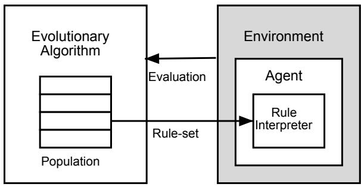  
Figure 3.1: Learning system architecture

The robot can then be evaluated based on how efficiently it performed its task, or if it failed, how close it came to actually achieving its goal. This evaluation is then given back to the EA, and becomes the fitness of the rule-set. It is preferable to perform this evaluation in simulation since many thousands of individuals may need to be evaluated.

The module which matches the rules to the input is called the rule interpreter. A rule interpreter acts as the control system for the agent, and the rule-set is essentially the program that the rule interpreter uses.

The rule interpreter has the advantage that it is somewhat independent of the problem domain being used. In other words, it is portable. The same rule-interpreter can be taken and placed in a completely different type of agent in a completely different problem with relatively little effort. Of course the rule sets that would be successful in this new environment are likely to be completely different.

# 3.2 Evolutionary Algorithm

The Evolutionary Algorithm that I am using is a fairly typical generational model. The population of parents give birth to an equal number of children. In subsequent generations, all the parents die, and the children become the new parent population.

In previous work (Bassett and De Jong, 2000) I used a more elitist approach, allowing parents to survive from one generation into the next. Although this seemed to work reasonable well, I am concerned about some undesirable side effects that may occur in noisy environments. For example, in a noisy environment an individual may receive an uncharacteristically high fitness score. This “lucky” individual might then stay in the population with little chance of being deposed except by another lucky individual.

My concern is that this situation could slow the search down significantly while the EA hovered around this artificial local optimum. While there are many possible ways of dealing with this problem, the simplest for now seems to be to use a generational model.

# 3.2.1 Selection

As for selection operators, most Pitt approach systems tend to use proportional selection. I have instead chosen tournament selection for two main reasons. First, tournament selection is much easier to implement, and second it still maintains a high selection pressure toward the end of a run without having to use fitness scaling techniques.

# 3.2.2 Representation

Although a large variety of representations have been used in these types of systems, the majority of researchers have tended to use binary representations with wildcards. This is probably because both the Michigan and Pitt approaches grew out of the Genetic Algorithms communities, which have always favored a binary representation.

The argument generally made for preferring a binary representation over a more phenotypic representation is that it is more portable (?). Just about any type of problem can be converted into binary form. Once the conversion is done, the rest of the algorithm is in place. No extra work is needed. With a phenotypic representation, on the other hand, other changes often need to be made to the algorithm and especially to the genetic operators. The extra effort can be worth it though, typically resulting in a better performing algorithm.

One classic example of where the binary representation can have some problems is with hamming cliffs (Goldberg, 1989). A Gaussian mutation or a creep mutation on an integer or real valued number is likely to result in a new number which is not very different from original one. In the majority of the problems we tend to deal with, this is the kind of behavior we would like to see. But with a binary representation, the integer 7, for example, is represented as the bit string $^ { , } 0 1 1 ^ { \circ }$ . In order to get an 8 (’100’) we would need three simultaneous bit-flip mutations. Researchers have been able to mitigate against this problem using Grey coding, but the results are often not as effective as using a phenotypic representation.

Is a binary representation better or worse than a phenotypic representation? I have no intention of addressing this issue. But the fact is that many researchers still use binary representations for legitimate reasons. Therefore I have chosen to use a binary representation for my research as well, at least as a starting point.

I will be running a number of experiments with and without wildcards, in order to compare the different generalization mechanisms. When using wildcards, the gene alphabet for the condition section of rules will be the following set: $\{ 0 , 1 , \# \}$ . Otherwise the genes will just be binary numbers. Aside from this difference, the structure of the individuals will be basically unchanged from experiment to experiment.

<table><tr><td>rule1</td><td>rule2</td><td>rule3</td></tr><tr><td></td><td></td><td></td></tr></table>

An individual is composed of a set of concatenated rules. Therefore it’s length will always be an even multiple of the rule length. In most Pitt approach systems the size of individuals is allowed to vary, with the crossover operator being the mechanism by which size changes. Some researchers (Bull and Fogarty, 1994) have opted for a simpler approach, using a fixed length representation and standard crossover operators. This eliminates many of the complications that come with the variable length representation, the worst of which is probably the issue of bloat.

For the sake of simplicity I have decided to do the same. In all my experiments I will fix the size of the individuals and use standard 2-point crossover.

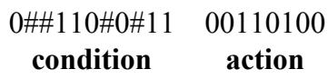  
Figure 3.3: Example rule

A rule consists of two parts, a condition section and an action section. For any given problem, a specific rule size will be chosen, and all the rules in the system will be that size. The condition section will be equal in length to all the sensor input, and the action section will contain whatever components are necessary in order to give action information back to the environment. In the figure 3.3, the condition consists of 11 genes and the action consists of 8 genes. Therefore the rule length is 19.

# 3.2.3 Operators

# Length-based Bit-flip Mutation

In some situations a pure binary representation without wildcards will be used. Typically in this situation one would use bit-flip mutation. My expectation is to run experiments using a variety of different genome length, in order to test the compactness of the rule sets. It was noticed in early experiments that that the appropriate mutation rates always tended to be close to $1 / \mathrm { L }$ , where L is the length the the genome. This seemed to the true for many different values of L.

Instead of constantly calculating the appropriate mutation rate for each genome length, I have chosen to create a mutation operator which will do the job for me. I created the length-based bit-flip mutation operator which allows me to specify mutation rates in terms of mutations per individual instead of mutations. It takes a parameter called $E _ { m u t }$ , which defines the expected number of mutations per individual. The term “expected” is used since there is no guarantee of exactly how many mutations will occur per individual.

This mutation operator is simply a wrapper around the standard bit-flip mutation operator. First, the standard mutation rate is calculated using the following formula:

$$
P _ { m u t a t e } = \frac { E _ { m u t } } { l }
$$

where $P _ { m u t }$ is the probability of mutating a gene, $E _ { m u t }$ is the expected number of mutations per individual, and $l$ is the genome length. Then the standard bit-flip mutation operator is called using $P _ { m u t }$ as the probability of mutation.

# Wildcard Mutation

There is also a special mutation operator for use with wildcards. In this system, wildcards can only exist in the condition section of rules. Many classifier systems allow wildcards in the action part of the rule as well as the condition. In some systems, such as Smith’s, these were used to pass data bit-for-bit through from the sensors to the actuators. Other systems use random values to specify values of wildcards in the action sections of rules.

While each of these different approaches may turn out to be useful for solving certain types of problems, none of them are likely to help answer the questions posed here about generalization. And because they tend to make the interactions in these systems more complex, this system does not allow them. Therefore the wildcard mutation operator defaults to bit-flip mutation when operating on a gene in the action part of a rule. The same mutation rate is used in both cases.

Another issue that must be dealt with when it comes to wildcard generalization is coverage area. If a concept covers a large area of the input space, then the corresponding rule will need a large number of wildcards in order to cover that space properly. Given our three character gene alphabet $\{ 0 , 1 , \# \}$ , if mutation is just as likely to result in a $" \# \ ? ) \}$ as it is a 0 or a 1, then it may take some time to reach the appropriate level of generality. This of course assumes that some path exists to reach that more general rule.

The classifier community has developed a couple of solutions to this problem. The first is to seed the initial population with a large number of wildcards. The hope is that enough evolution will occur before mutation dilutes the gene pool with too many 0’s and 1’s. The second solution is an additional operator which creates a new rule whenever an input is discovered which does not match any of the existing rules. The condition section of the new rule typically consists of the unmatched input, with some wildcards thrown in.

The solution I have chosen is to create a mutation operator with a bias. This bias can be used to increase or decrease the likelihood that a gene will mutate to a wildcard. The wildcard bias is a number between 0 and 1, and it represent the probability that a mutation will result in the gene being set to a wildcard. So, for example, if the wildcard bias is set to 0.9, then $90 \%$ of all mutations will result in a wildcard. This allows me to inject more wildcards into the system when appropriate. Of course this parameter needs to be adjusted on a problem by problem basis.

When a gene in a rule condition is selected to be mutated, the value will be set to a wildcard using the wildcard bias as the probability. Probabilities for setting the gene to a 0 or a 1 are both $( 1 - b i a s ) / 2$ . Unlike bit-flip mutation, there is a chance that the gene will remain unchanged after the operation. Both this feature and the bias make it difficult to compare mutation rates between wildcard and bit-flip mutation. This is why another version of the wildcard mutation was also created.

# Length-based Wildcard Mutation

As mentioned in the description of length-based bit-flip mutation, there are some advantages to specifying the mutation rate as mutations per individual rather than mutations per gene. In particular, a consistent measure can be used between experiments using different genome lengths.

The length-based wildcard mutations operator is intended to be the wildcard equivalent of length-based bit-flip mutation. The mutation rate is indirectly specified by indicating the expected number of mutations per individual, on average. Unfortunately, this is not quite as simple to calculate given the wildcard mutation operator described above. Because a mutation may not actually change the gene, we have to factor this into our calculations as follows:

$$
P _ { m u t } = \frac { E _ { m u t } } { l * P _ { c h a n g e } }
$$

where $P _ { c h a n g e }$ is the probability that the mutation will actually cause a the gene to change value.

Now we need to calculate $P _ { c h a n g e }$ . In truth we can only estimate, its value, and my estimate is based on one assumption which is not completely reliable. I assume that the number of wildcards in any given genome is equal to the wildcard mutation bias. This is a somewhat risky assumption. Over time, the evolutionary process may either favor or disfavor wildcards in the population, and their number may increase or decrease over time. None the less, if we allow that this is a reasonable assumption, the calculation looks like this:

$$
P _ { c h a n g e } = b i a s ( 1 - b i a s ) + ( 1 - b i a s ) \left( 1 - { \frac { 1 - b i a s } { 2 } } \right)
$$

The first term calculates the probability that a wildcard will change to another value, while the second term does a similar calculation for both zeros and ones.

# 3.3 Rule Interpreter

The rule interpreter is an essential part of the fitness evaluation of a rule set. The interpreter executes the rule set as if it were a program of sorts, and is the component which makes the decisions for the agent interacting with the simulated environment (see figure 3.1). The rule interpreter is an important part of rule generalization, since this is where all the generalization mechanisms are ultimately implemented. There are two main components of the rule interpreter, rule matching and conflict resolution.

# 3.3.1 Rule Matching

If we take the view fitness evaluation as an agent interacting with an environment, the agent will make a series of decisions, perhaps in discrete timesteps, ultimately trying to attain some sort of goal. The agent will receive an evaluation based on how close it comes to reaching that goal, or how efficient it was in reaching the goal.

At each timestep a number of sensors will record information from the environment and send it as input into the rule interpreter. The first thing the rule interpreter needs to do is search the rule set for a rule, or perhaps a set of rules, which match the current input. This is called rule matching, also known as the matching phase. The subset of rules which match the input are referred to as the match set, or $S$ .

There is rarely a one to one mapping of input strings to rules. Usually a single rule will map to number of input strings. This one-to-many mapping is accomplished using various generalization mechanisms, as we have already discussed. At the risk of being repetitious, the generalization mechanisms used in this system will now be described in detail.

# Partial Matching

Partial matching is probably the easiest generalization to implement. Until recently (Wu et al., 1999), partial matching was really just viewed as a way to enhance generalization

using wildcards.

When using partial matching alone, the representation is strictly binary. There are no ’#’ characters. The condition section of each rule is compared to the input, and the number of bits which match are counted. This match score is assigned to each rule. The rule which has the highest match score is placed in the match set $S$ . In the case of ties, all the rules which tie for the highest score are placed in $S$ .

# Wildcards

When wildcard matching is used, the condition section of the rules will contain genes with the $\overrightarrow { \# } ^ { \mathbf { \Gamma } }$ character. Matching rules are found by again comparing the conditions of the rules with the input string. In this case, only rules which have an exact match with the input will be added to $S$ , but the ’#’ character will match both zeroes and ones.

This is consistent with the way Smith (1980) implemented matching in his LS-1 system. Holland and Reitman (1978), on the other hand, implemented an additional conflict resolution mechanism which counted the number of wildcards that were used in order to match the input. Rules which used fewer wildcards were considered more specific, and therefore received precedence.

As a baseline, I have implemented wildcard matching without the additional conflict resolution step. The Hybrid mechanism, described next, can do something similar to this conflict resolution by using partial matching.

# Hybrid

Booker (1985) showed that in a classifier system, a hybrid of these two approaches could outperform a system that used just wildcards. Booker implemented partial matching in two similar, but separate situations. The first situation occurs when there are several rules which match the input string. In this case, a match score is assigned to each matching rule, and it is calculated by counting the number of $0 \mathrm { { ^ { \circ } s } }$ and 1’s (i.e. non-wildcards) in the rule’s condition. I’ll refer to this number as $n _ { 1 }$ . The rationale for this approach is that a rule with fewer wildcards is more specific, and should be more applicable to the situation at hand. This essentially provides a mechanism for allowing exceptions to very general rules.

The second situation where partial matching was implemented is the case where none of the rules matched the input. In this case, the calculation of the match score is slightly more complicated. Two initial calculations are needed. The number $n _ { 2 }$ is determined by counting the number of exact (non-wildcard) matches between the input and the condition, and $n _ { 3 }$ is the number of wildcard matches. The match score is then calculated as

$$
M = \frac { n _ { 2 } + \omega n _ { 3 } } { l ^ { 2 } }
$$

where $\omega$ is a constant between 0 and 1, used to diminish the value of wildcard matches, and $l$ is the length of the condition string. Presumably the $\omega$ constant was included in order to discourage over-generalization. Booker reasoned that $\omega$ should have a value greater than 1/2, since 2 random bits will match about $50 \%$ of the time. He ran experiments with $\omega$ set to 3/4 and 1, and found that a value of 1 was more effective.

In Booker’s system, the match score also contributed to the fitness of a rule. This is why he divided the match score by $l ^ { 2 }$ . He didn’t want a disproportionate amount of fitness being assigned to rules that didn’t actually match the input. Instead he wanted the match score to assert a subtle influence which would guide the EA in the right direction.

In a Pitt approach system, fitness isn’t assigned to the rules, so we don’t need to worry about softening the effects of the match score. Therefore I have removed the $1 / l ^ { 2 }$ component from the calculation. Also, I have chosen to merge the two calculations into one, thus eliminating the distinction between an empty, and a non-empty match set $S$ . Consequently, the match score calculation I will be using in my hybrid system is the following.

$$
M = n _ { 2 } + \omega n _ { 3 }
$$

# 3.3.2 Conflict resolution

Conflict resolution represents the other half of the rule interpreter. Rule matching determines the match set $S$ of rules which matched the current input. The conflict resolution component determines which of those rules will fire.

In Smith’s system (Smith, 1980), all the rules were allowed to fire, and the conflict resolution component needed to determine which action to take. This was done by taking a vote. The action which had the most rules advocating its use was chosen. In the case of ties, the choice was made randomly.

Wu et al. (1999) implemented a simpler approach. When $S$ contained multiple rules, one was just chosen randomly. This has the effect that the result may be non-deterministic though. For some problem domains this may not be a problem, and in fact for some it may even offer a real advantage. For the sake of simplicity, I have chosen this approach for doing conflict resolution as well.

# 3.4 Problem Domains

It is important to find some problem domains to act as testbeds for this research. The main factor used in selecting them was to find domains which were very different from one another, in the hopes that this might highlight important differences in the generalization mechanisms.

# 3.4.1 Concept Learning

Generalization has been a focus of research in the machine learning community for a long time. One class of problem which has been used often for this research is concept learning. The end result of concept learning is a program which can classify items based on a set of features or parameters associated with it. As example, suppose we wanted to classify mushrooms as poisonous or not. We might use features such as height, shape and color to

do so.

An algorithm learns by being fed a series of examples, along with the correct classifications. When learning is finished, the classifier should at least be able to correctly classify the examples it has already seen. Generalization can then be tested by attempting to classify examples which have never been seen before. Chapter 4 deals with applying this EA learner to a concept learning problem.

# 3.4.2 Robotics

A very different type of domain is learning a control system for a robot. Because a robot will need to make many decisions over and over before it reaches it’s goal, the is often referred to as a sequential decision making task. Generalization can play an important role because the robot will be faced with situations it has not seen before, both during and after learning. In chapter 5, the results of this rule learner operating in a simulated robotic domain will be presented.

# 4. Concept Learning Domain

A concept learning domain makes a good testbed for researching generalization for a number of reasons. A great deal of machine learning research has been done on these problems, giving us some idea of how to proceed and what to expect. Also, they are generally less complicated, and much less time consuming than a robotics domain. Hopefully some of the lessons learned here can be applied when moving on to evolving behaviors.

# 4.1 Cars Database

The University of California at Irvine (UCI) maintains a large repository of concept learning problems which are freely available for research. To prevent adding a lot of complexity to the system, I avoided datasets which used real values or incomplete fields. Picking a domain which resulted in rules that were similar in structure and size to the robotics domain was also considered, in the hopes that this would aid in a comparison between the domains. For these reasons, the “Car” database was chosen.

This database was engineered to to validate and expert system learning program. The premise is a rating system for cars based on a number of salient features. This model was developed as an example case for teaching expert system development and was first introduced in (Bohanec and Rajkovic, 1988).

The goal is to categorize cars as to their desirability for purchase based on certain characteristics. Among the characteristics are cost (buying price and maintenance), and safety and comfort (number of doors, trunk size, and number of people that can be carried). Each of these attributes is given a symbol value, such a low, medium or high. These are

Table 4.1: Car database attributes   

<table><tr><td>Feature</td><td>Values</td></tr><tr><td>buying maint doors</td><td>vhigh, high, med, low vhigh, high, med, low 2, 3, 4, 5-more</td></tr><tr><td>persons lug_boot safety</td><td>2, 4, more small, med, big low, med, high</td></tr><tr><td>class</td><td>unacc, acc, good, vgood</td></tr></table>

Table 4.2: Car database statistics. This table indicates the relative number of examples which are associated with each class.   

<table><tr><td>Class</td><td>N</td><td>N[%]</td></tr><tr><td>unacc</td><td>1210</td><td>70.023 %</td></tr><tr><td>acc</td><td>384 69</td><td>22.222 % 3.993 %</td></tr><tr><td>good V-good</td><td>65</td><td>3.762 %</td></tr></table>

summarized in Table 4.1.

The car database contains 1728 examples. This set completely covers all possible values for the features. The number of examples for each class are summarized in Table 4.2.

# 4.2 Encoding

The first steps necessary for implementing this problem is to develop a rule structure and an encoding. The condition section of the rules will contain each of the features, and the action section will be a class (classification). See Table 4.3. Also, all the features and the classes need a binary encoding. Table 4.4 shows the encodings that were chosen.

Table 4.3: Car database rule structure. This table shows how the attribute and class information are laid out in a linear structure to represent a rule.

<table><tr><td rowspan=1 colspan=1>buying maint</td><td rowspan=1 colspan=1>maint</td><td rowspan=1 colspan=1>doors</td><td rowspan=1 colspan=1>persons</td><td rowspan=1 colspan=1>lug_boot</td><td rowspan=1 colspan=1>safety</td><td rowspan=1 colspan=1>class</td></tr></table>

Table 4.4: Car database feature encoding. Each attribute and class are converted into a binary string so that rules can be represented as a binary number.   

<table><tr><td>Feature</td><td>Value</td><td>Encoding</td></tr><tr><td rowspan="4">buying</td><td>vhigh</td><td>11</td></tr><tr><td>high</td><td>10</td></tr><tr><td>med</td><td>01</td></tr><tr><td>low</td><td>00</td></tr><tr><td rowspan="4">maint</td><td>vhigh</td><td>11</td></tr><tr><td>high</td><td>10</td></tr><tr><td>med</td><td>01</td></tr><tr><td>low</td><td>00</td></tr><tr><td rowspan="4">doors</td><td>2</td><td>00</td></tr><tr><td>3</td><td>01</td></tr><tr><td>4</td><td>10</td></tr><tr><td>5more</td><td>11</td></tr><tr><td rowspan="3">persons</td><td>2</td><td>00</td></tr><tr><td>4</td><td>10</td></tr><tr><td>more</td><td>11</td></tr><tr><td rowspan="3">lug_boot</td><td>small</td><td>00</td></tr><tr><td>med</td><td>01</td></tr><tr><td>big</td><td>10</td></tr><tr><td rowspan="3">safety</td><td>low</td><td>00</td></tr><tr><td>med</td><td>01</td></tr><tr><td>high</td><td>10</td></tr><tr><td rowspan="4">class</td><td>unacc</td><td>00</td></tr><tr><td>acc</td><td>01</td></tr><tr><td>good</td><td>10</td></tr><tr><td>vgood</td><td>11</td></tr></table>

# 4.3 Fitness

Calculating fitness of a rule set is fairly straight forward. For each example, the features are given as input to the rule interpreter, and a a classification is returned (if one can be found). For every correct classification, the fitness is incremented by one. If no classification is found, or an incorrect classification is returned, the fitness is not incremented for that example. All results are reported as a percentage of correct classifications.

In order to test the quality of the generalization, the set of examples is broken into two parts, the training set and the testing set. In this case, $2 / 3$ of the examples were randomly chosen and placed in the training set. The remaining 1/3 comprised the testing set. Rule sets were evolved using only the training set. Once evolution is complete, The best individual is validated by classifying all the individuals in the testing set. If a significant difference is seen between the two evaluations, that is often an indication that the generalization is poor.

# 4.4 Results

# 4.4.1 Sensitivity Study

Before performing the experiments, I performed some sensitivity studies to make sure that reasonable values were being used for the parameters. One of the first parameters studied was population size. Although my results are not presented here, I found that 50 seemed to be a reasonable size. Experiments with 25 individuals produced inferior results, whereas results using 100 individuals were comparable to those with 50.

The length-based mutation operators described earlier were developed so that a consistent measure could be used for mutation rate when different genome sizes were used. To validate these operators, a study was done using using individuals containing 10 rules, and individuals containing 100 rules. Experiments were performed using several different values of $E _ { m u t }$ . See table 4.5 for the other parameter settings used. The results are shown in figure 4.1.

An explanation of this graph is in order. Each point on the graph plots the fitness of the best individual found at the end of a run, averaged over 10 runs. Four experiments were run with individuals containing 10 rules, each experiment using a different value for $E _ { m u t }$ . These results for the lower line on the graph. The upper line shows the results for the same set of experiments, but in this case, individuals contained 100 rules. All of these results are only from the training phase.

The import thing to note is that the optimal value for $E _ { m u t }$ is likely the same, even though the genome sizes are quite different. This does indeed provide a consistent measure for different genome sizes. The results using the testing set show similar curves as well. Studies were also done using length-based wildcard mutation, and again the results were similar to figure 4.1.

Another parameter that needs tuning is the wildcard bias in the wildcard mutation operator. Initial experiments have shown that if individuals do not contain enough wildcards, the results are sub-optimal. Of course too many wildcards can have a similar effect because over-general rules will have a difficult time distinguishing between different input. It is important to find the appropriate middle ground.

The parameters in table 4.6 describe the experiment conducted to find the appropriate wildcard bias for this problem domain. Figure 4.2 plots the results of these experiments. Each point in the plot represents the average of 10 runs and the error bars show the $9 5 \%$ confidence intervals. The results show that the best value for wildcard bias appears to be near 0.6. I have chosen this number for use in all further experiments.

# 4.4.2 Wildcards

This next set of experiments were run using wildcards for generalization. A number of genome sizes were used to get an idea of how compact the rule sets can be. The parameters for the wildcard experiments are given in table 4.7. The results in figure 4.3 show that there is probably no advantage in using more than 50 rules. The results on the test set seem the

Table 4.5: Parameters for mutation rate sensitivity study in the concept learning domain   

<table><tr><td>Parameter</td><td>Value</td></tr><tr><td>Population size</td><td>50</td></tr><tr><td>Generations</td><td>2000</td></tr><tr><td>Selection</td><td>Tournament</td></tr><tr><td>Crossover operator</td><td>2-point</td></tr><tr><td>Crossover rate</td><td>0.8</td></tr><tr><td>Mutation operator</td><td>length-based bit-flip</td></tr><tr><td>Emut (expected number of mutations per individual)</td><td>0.25, 0.5, 1.0, 1.5</td></tr></table>

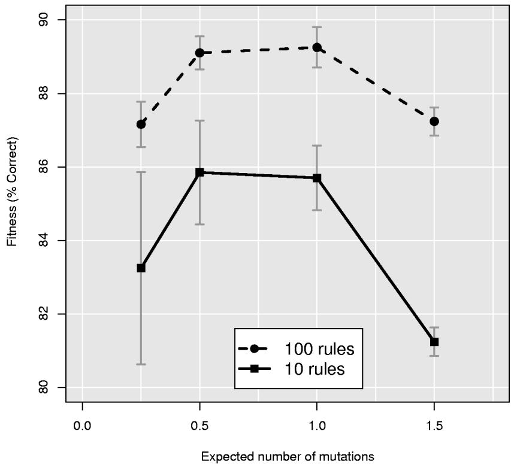  
Mutation Rate Sensitivity using Partial Matching   
Figure 4.1: Results of mutation rate sensitivity study in the concept learning domain. Each point on the graph represents the fitness of the best individual after 2000 generations, averaged over 10 runs. The error bars indicate the $9 5 \%$ confidence interval. Only the training data results are plotted.

Table 4.6: Parameters for wildcard bias sensitivity study in the concept learning domain   

<table><tr><td>Parameter</td><td>Value</td></tr><tr><td>Population size Generations Selection Crossover operator Crossover rate Mutation operator Wildcard bias Emut</td><td>50 2000 Tournament 2-point 0.8 length-based wildcard 0.2, 0.4, 0.6, 0.8, 0.9 1.0</td></tr></table>

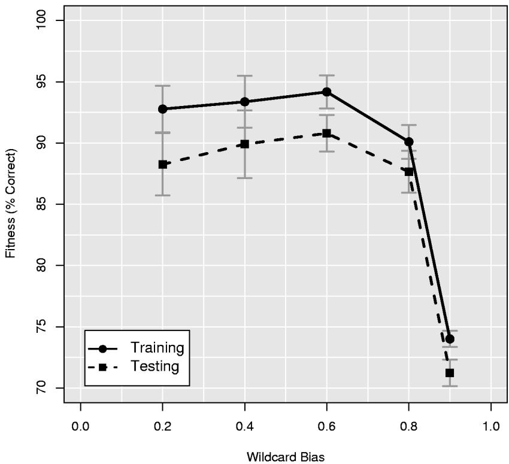  
Sensitivity of Mutation Wildcard Bias   
Figure 4.2: Results of a wildcard bias sensitivity study in the concept learning domain. Each point on the graph represents the fitness of the best individual after 2000 generations, averaged over 10 runs. The error bars indicate the $9 5 \%$ confidence interval.

same as with 50 rules, if not slightly worse.

# 4.4.3 Partial Matching

The parameters for the partial matching experiments are in table 4.8, and the results are shown in the figure 4.4. In this case it appears that no more than 20 rules should be used since the results in the test set start decreasing when more rules are used. This is most likely caused by the rule sets becoming overfit to the training data.

# 4.4.4 Hybrid

The final set of experiments performed in this domain were done using the hybrid matching. Table 4.9 shows the parameters used in the experiments, and the results are shown in figure 4.5. Overall, seem similar in character to those using wildcards. Not much performance can be gained by using more than 50 rules. Perhaps even 20 is enough.

# 4.5 Comparison

Of course, what we are most interested in is comparing these three approaches. Figure 4.6 show the previous results plotted together for easier comparison. The plot on the top is training, and on the bottom is testing. Since we are concerned with generalization, the testing results are really the most interesting.

We see that except for very small rule set, the wildcards outperform the partial matching. Somewhat of a surprise though is that the hybrid actually outperforms them both. To confirm this, a one-way ANOVA was performed on the results from the three techniques. Separate tests were done for each genome length. A Tukey-means post hoc analysis showed that the result for the hybrid were always significantly different from the other two.

My expectations was that the hybrid would never do the better than the best of the other two. This result that it did better than both was somewhat of a surprise to me.

Table 4.7: Parameters for wildcard experiment in the concept learning domain   

<table><tr><td>Parameter</td><td>Value</td></tr><tr><td>Population size Generations Selection Crossover operator Crossover rate Mutation operator Wildcard bias Emut</td><td>50 2000 Tournament 2-point 0.8</td></tr></table>

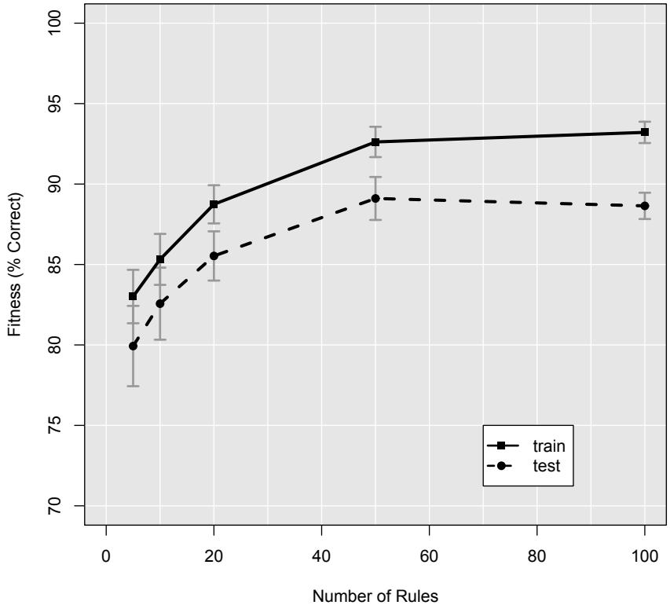  
Cars Concept Domain (Wildcards)   
Figure 4.3: Results of wildcard experiment in the concept learning domain. Each point on the graph represents the fitness of the best individual after 2000 generations, averaged over 20 runs. The error bars indicate the $9 5 \%$ confidence interval.

Table 4.8: Parameters for partial matching experiment in the concept learning domain   

<table><tr><td>Parameter</td><td>Value</td></tr><tr><td>Population size Generations</td><td>50 2000</td></tr><tr><td>Selection</td><td>Tournament</td></tr><tr><td>Crossover operator</td><td>2-point</td></tr><tr><td>Crossover rate</td><td>0.8</td></tr><tr><td>Mutation operator Emut Genome size</td><td>length-based bit-flip</td></tr></table>

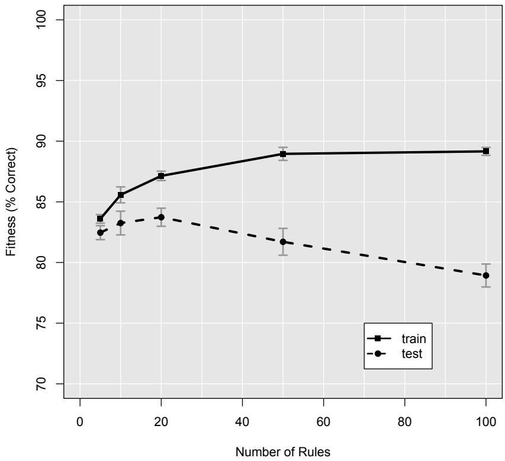  
Cars Concept Domain (Partial Matching)   
Figure 4.4: Results of partial matching experiment in the concept learning domain. Each point on the graph represents the fitness of the best individual after 2000 generations, averaged over 20 runs. The error bars indicate the $9 5 \%$ confidence interval.

Table 4.9: Parameters for hybrid experiment in the concept learning domain   

<table><tr><td>Parameter</td><td>Value</td></tr><tr><td>Population size Generations Selection Crossover operator Crossover rate Mutation operator Wildcard bias ω (wildcard value) Emut Genome size</td><td>50 2000 Tournament 2-point 0.8 length-based wildcard 0.6 0.75 1.0</td></tr></table>

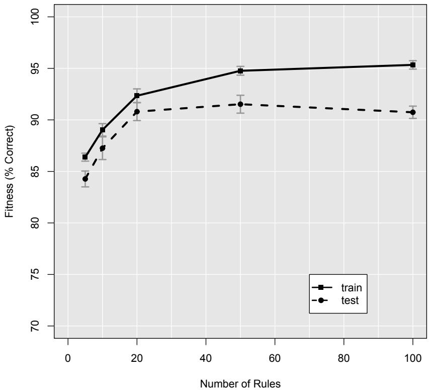  
Cars Concept Domain (Hybrid)   
Figure 4.5: Results of hybrid experiment in the concept learning domain. Each point on the graph represents the fitness of the best individual after 2000 generations, averaged over 20 runs. The error bars indicate the $9 5 \%$ confidence interval.

Regarding the ability of these approaches represent compact solutions, it appears that partial matching has a relatively compact solution at about 20 rules or so. It just isn’t a very good solution compared to the other two. With wildcards, the best solution appears to need on the order of 50 rules. Interestingly, and perhaps not surprisingly, the hybrid inherits some of the ability partial matching to compact a solution. The hybrid can learn quite a good solution (although perhaps not the best) using only 20 rules as well.

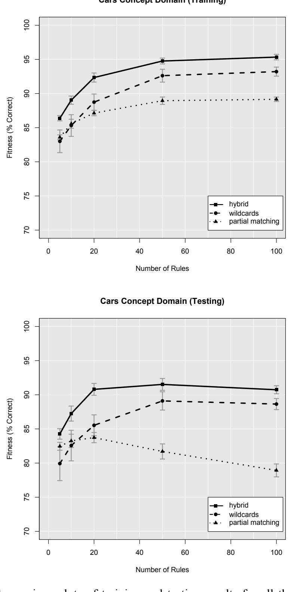  
Figure 4.6: Comparison plots of training and testing results for all three generalization techniques (partial matching, wildcards and hybrid). Each point on the graph represents the fitness of the best individual after 2000 generations, averaged over 20 runs. The error bars indicate the $9 5 \%$ confidence interval.

# 5. Micro Air Vehicle Domain

The second problem domain which used for evaluating these generalization mechanisms is a multi-agent robotics problem involving micro air vehicles (MAVs). This research stems from our involvement in a Navy sponsored project which is attempting to create small autonomous aircraft for use in various surveillance tasks. The EA will evolve control systems for these vehicles which take the form of stimulus-response rules.

Research into multi-agent systems has steadily grown over the past few decades (Mataric, 1994; Bull et al., 1995b; Parker, 2000). These environments provide some interesting opportunities that single agent systems do not, including chances to explore cooperation, competition, agent specialization and distributed problem solving all in a complex changing environment.

# 5.1 Simulator

Currently all of our experiments involve the use of a simple micro air vehicle simulator (See figure 5.1). The simulation is an overhead view of a 2-D environment in which the aircraft can move above the ground, but cannot change altitude. Six identical MAVs are placed into the simulator, and are allowed to move and turn on each timestep. The MAVs must fly at a constant speed, and can only maintain position

over an object by learning to fly in circles. As the MAVs move, they can potentially collide with each other. If they do, they are immediately destroyed and removed from the simulation. MAVs can also fly indefinitely in any direction, leaving the area they are supposed to be covering with little hope of getting back.

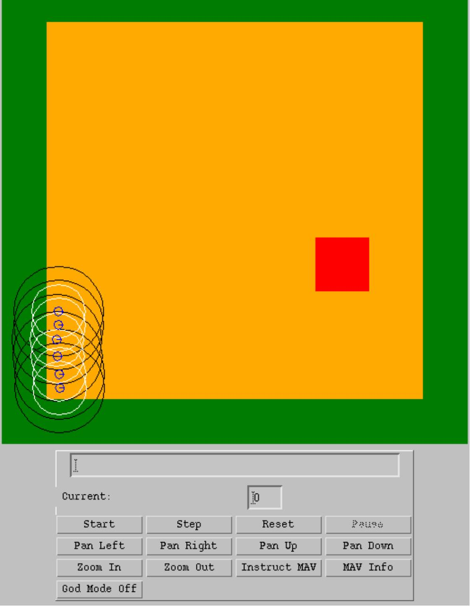  
Figure 5.1: Screenshot of the MAV simulator. The environment consists of a large square with low interest and a smaller square with higher interest placed randomly within it. The MAVs are started at the bottom of the left edge.

The environment contains a large square which is assigned an interest level, in this case 1. There is also a smaller square of interest level 3 somewhere within the large square. It’s location is randomly generated with each run of the simulator. Everything else has an interest level of 0. The interest level is meant to indicate to the MAVs the importance of an object, and the priority that should be attached to observing it.

The MAVs are lined up at the bottom of the left edge. Their initial positions are perturbed slightly with each run in the hopes that they will learn more robust behaviors.

# 5.1.1 Sensors and Actions

Each MAV has 8 sonar sensors placed on the outside of the vehicle and facing outward. These sensors each observe a different part of the space around the vehicle, and none of them overlap. Each sensor has a 45 degree field of view. This has the effect of dividing the area around the vehicle into octants. Each sonar observes a single octant.

The range data from each sonar sensor is encoded using 2 bits, with 00 being the closest and 11 the farthest. If nothing is in range, a 11 is returned. The sensor range can be adjusted as a parameter of the simulation.

The robots also have a downward facing camera facing with which they can observe objects on the ground. Like the sonar data, the camera data is partitioned into octants, indicating what lies in each compass direction from the vehicle. Objects on the ground are assigned an interest level between 0 and 3. This interest level can be recognized by the camera, and is encoded in 2 bits per octant. Therefore the total number of bits the camera returns is 16.

The only action a vehicle can take is to turn. Three bits are used to encode a turn angle between -135 and 135 degrees. A turn angle of $+ / - 1 8 0$ is impossible, and so 0 degrees is encoded twice in order to provide a bias for moving straight ahead. The default behavior, should no rule fire, is also to turn 0 degrees.

With 16 bits from all the range sensors and 16 bits from the camera sensor, the total number of bits for sensor input is 32 bits. This is also the number of bits in the condition section of the rules. Since rules contain 32 bits in the condition section and 3 bits in the action section, a single rule is 35 bits long.

# 5.1.2 Fitness

On each timestep, the team receives credit for all of the interesting areas they observe. The total observed area for each interest level is calculated and then multiplied by that interest level. This means that observing an area of interest level 0 adds nothing the fitness, whereas observing something of interest level 3 contributes 3 times as much value as something of interest level 1. Any area observed by multiple MAVs at the same time is only counted once. Fitness is calculated by averaging all the credit received over all the timesteps.

The objective is to encourage the MAVs to explore the larger square (interest level 1) searching for the most interesting area (interest level 3). Once found, at least one MAV should maintain coverage of that area for as long as possible. The analogy here is to that of a battlefield with some sort of enemy asset on it, such as a tank. We want our surveillance planes to find these targets and keep an eye on them so that they do not surprise us later.

It should be noted that all the MAVs use exactly the same rule set as their control system. In other words, the team is homogeneous. This makes it simple to assign a fitness back to an individual in the EA. An individual in the EA does not represent a single MAV, it represents a team.

Since fitnesses are essentially weighted area calculations, the numbers produced are not easily understood. To make the results more comprehensible, all fitnesses shown as a percentage of an ideal score. The ideal score is the fitness that would result if one of the MAVs were to maintain constant coverage the area with interest level 3, and the others maintained coverage of the interest level 1 area. An individual will never actually be able to achieve this fitness because of how the MAVs are initially placed.

Finally, this domain tends to be much noisier than the concept learning domain. In other words, there are more stochastic elements and so the result of a simulation run vary greatly depending on the initial conditions. The most common way of dealing with this is to run the simulation several times with one individual, and then average the results for the final fitness score.

# 5.2 Testing Generalization

In the concept learning domain it was relatively easy to create a training set and a testing set. This notion is not so easily transferred to a sequential decision making domain. Is it meaningful to identify some input that the robots have never seen before and test their response? How would you decide if the output was correct or not? This question cannot be answered without understanding the context, and the context includes the other rules that are in the rule set.

In order to test generality, we decided test the robustness of the solutions. Rule sets are subjected to a suite of approximately 50 different environments, any or all of which may have already been used during testing. The performance over all of these is average to form the test results.

# 5.3 Results

# 5.3.1 Sensitivity Study

As with any EA experiments, the first step is to perform a few sensitivity studies so that we can feel comfortable with the parameter settings. As mentioned earlier, this domain is noisy so we want to run the simulation several times for any given evaluation of the fitness function. How many times do we run it though? To find out I allotted a fixed number of simulation runs to the EA and then ran several experiments, each with a different number of simulations runs (or episodes) per evaluation. What this means is that when there are fewer episodes per evaluation, there are more generations.

Table 5.1 shows the parameters for the experiments, and the results are plotted in figure 5.2. Ten runs were performed for each experiment, and each point in the graph shows the average fitness of the best (most fit) individuals at the end of these runs. Although the variances can be rather high in some cases, it appears that five episodes per evaluation is appropriate. This

In this domain we again want to find an appropriate value for the wildcard bias parameter which is given to the wildcard mutation operators. The experiments parameters are shown in table 5.2 and figure 5.3 plots the results. Ten runs were performed per experiment. Interestingly the EA does better with even higher values for the wildcard bias then what were used in the concept learning domain. A bias of 0.8 is used both for initialization and mutation for all remaining experiments which use wildcards in this domain.

# 5.3.2 Wildcards

Table 5.3 summarizes the parameters for the experiments using wildcards for generalization. Several genome sizes were used in order to see how much the rule sets can be compacted. It appears that not more than 10 rules are necessary in order to represent a solution.

When we examine the actual behaviors of the best individuals of the run, we see that they do learn to explore, but they are not always very good at maintaining coverage of the target. Sometimes they will see the target, but not change course in order to maintain position over it. Most times they will keep position over the target for much of the time, but will suddenly move away from it for no apparent reason.

# 5.3.3 Partial Matching

The parameters for the partial matching experiments are summarized in table 5.4, and the results of those experiments are plotted in figure 5.5. Here we see an unusual peak in the training and testing results when 10 rules are used. When more rules are added, the quality of the results go down again. A similar pattern was seen in the concept learning domain as

Table 5.1: Sensitivity study for the number of simulation runs per evaluation in the MAV domain.   

<table><tr><td>Parameter</td><td>Value</td></tr><tr><td>Generalization mechanism Population size Simulation runs per evaluation Simulation runs per EA run Selection</td><td>Partial matching 50 1, 5, 10, 20 75000 Tournament</td></tr></table>

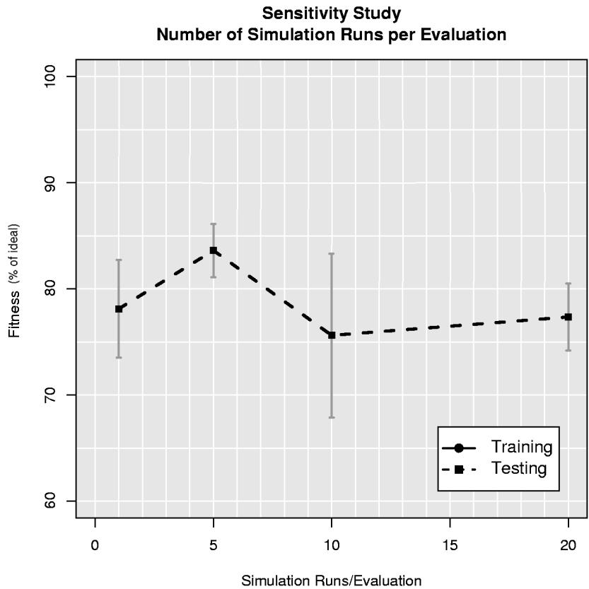  
Figure 5.2: Results of sensitivity study exploring the number of simulation runs per evaluation. Each point on the graph represents the fitness of the best individual after 75000 simulation runs, averaged over 10 runs. The error bars indicate the $9 5 \%$ confidence interval.

Table 5.2: Parameters for wildcard bias sensitivity study in the MAV domain   

<table><tr><td>Parameter</td><td>Value</td></tr><tr><td>Population size</td><td>50</td></tr><tr><td>Simulation runs per evaluation</td><td>5</td></tr><tr><td>Generations</td><td>100</td></tr><tr><td>Selection</td><td>Tournament</td></tr><tr><td>Crossover operator</td><td>2-point</td></tr><tr><td>Crossover rate</td><td>0.8</td></tr><tr><td>Mutation operator Emut</td><td>length-based wildcard</td></tr><tr><td>Wildcard bias (initialization and mutation)</td><td>1.0 0.2, 0.4, 0.6, 0.8, 0.9</td></tr><tr><td>Genome size</td><td>20</td></tr></table>

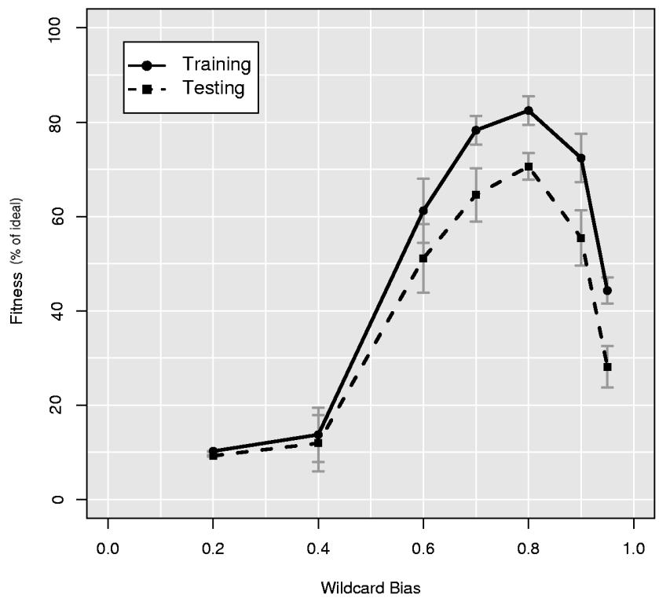  
Sensitivity of Mutation Wildcard Bias   
Figure 5.3: Results of wildcard bias sensitivity study in the concept learning domain. Each point on the graph represents the fitness of the best individual after 100 generations, averaged over 10 runs. The error bars indicate the $9 5 \%$ confidence interval.

Table 5.3: Parameters for wildcard experiment in the MAV domain   

<table><tr><td>Parameter</td><td>Value</td></tr><tr><td>Population size</td><td>50</td></tr><tr><td>Simulation runs per evaluation</td><td>5</td></tr><tr><td>Generations</td><td>100</td></tr><tr><td>Selection</td><td>Tournament</td></tr><tr><td>Crossover operator</td><td>2-point</td></tr><tr><td>Crossover rate</td><td>0.8</td></tr><tr><td>Mutation operator</td><td>length-based wildcard</td></tr><tr><td>Emut</td><td>1.0</td></tr><tr><td>Wildcard bias</td><td>0.8</td></tr><tr><td>Genome size</td><td>5, 10, 20, 50, 100</td></tr></table>

# MAV using Wildcards

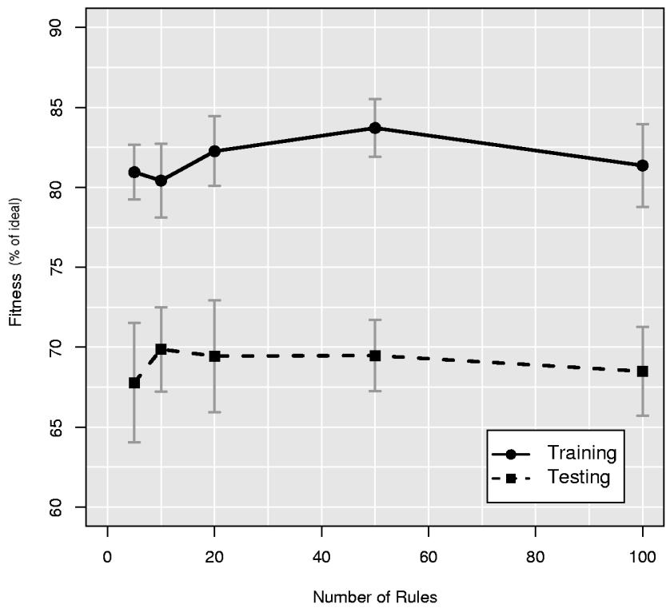  
Figure 5.4: Results of wildcard experiment in the MAV domain. Each point on the graph represents the fitness of the best individual after 100 generations, averaged over 20 runs. The error bars indicate the $9 5 \%$ confidence interval.

well. In that case, the drop off was attributed to overfitting of the rules. Perhaps the same is true here as well.

The behaviors of the results from the 10 rule experiment show improvement over those from the wildcards experiments. The MAVs show good exploration abilities, and almost always acquire the target. The rarely lose sight of the target once it is found.

# 5.3.4 Hybrid

The final set of experiments in this domain were performed using the hybrid generalization. See table 5.5 and figure 5.6 for the parameters and a plot of the results. The results seem to be fairly consistent no matter how many rules are used. This implies that as few as five rules are needed for a representation using this generalization mechanism. There is a slight peak in the testing result with 50 rules, but it is unlikely that this difference is significant.

# 5.3.5 Comparison

Figure 5.7 plots the previous results from the three different mechanism together on two graphs to make comparison easier. The bottom graph shows the testing results, which is our main interest. Here we see that the solutions evolved using partial matching and 10 rules seem to give the best results. A one way ANOVA with a Tukey-means post hoc analysis showed that this difference is significant.

I was surprised to see that the partial matching results were superior to the hybrid when 10 rules were used. I had expected the hybrid to do at least as well. To make sure this was really the case I decided to re-run the 10 rule experiments for all three generalization mechanisms, but this time I ran them for 300 generations instead of 100. In each case, 20 runs were done.

I have not plotted the results here, but I will describe them. I saw little to no improvement in the results for wildcards and for partial matching. The hybrid, on the other hand, showed a dramatic improvement. The average final fitness was now comparable to that

Table 5.4: Parameters for partial matching experiment in the MAV domain   

<table><tr><td>Parameter</td><td>Value</td></tr><tr><td>Population size</td><td>50</td></tr><tr><td>Simulation runs per evaluation</td><td>5</td></tr><tr><td>Generations</td><td>100</td></tr><tr><td>Selection</td><td>Tournament</td></tr><tr><td>Crossover operator</td><td>2-point</td></tr><tr><td>Crossover rate</td><td>0.8</td></tr><tr><td>Mutation operator</td><td>length-based bit-flip</td></tr><tr><td>Emut</td><td>1.0</td></tr><tr><td>Genome size</td><td>5, 10, 20, 50, 100</td></tr></table>

# MAV using Partial Matching

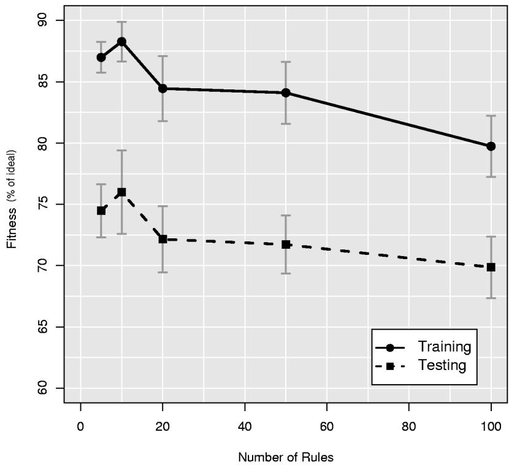  
Figure 5.5: Results of partial matching experiment in the MAV domain. Each point on the graph represents the fitness of the best individual after 100 generations, averaged over 20 runs. The error bars indicate the $9 5 \%$ confidence interval.

Table 5.5: Parameters for hybrid experiment in the MAV domain   

<table><tr><td>Parameter</td><td>Value</td></tr><tr><td>Population size Simulation runs per evaluation Generations</td><td>50 5 100</td></tr></table>

# MAV Using Hybrid

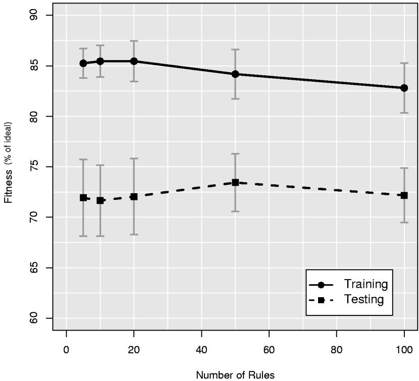  
Figure 5.6: Results of hybrid experiment in the MAV domain. Each point on the graph represents the fitness of the best individual after 100 generations, averaged over 20 runs. The error bars indicate the $9 5 \%$ confidence interval.

of partial matching. Another one-way ANOVA showed no significant difference between partial matching and the hybrid. Wildcards were significantly different from the other two though.

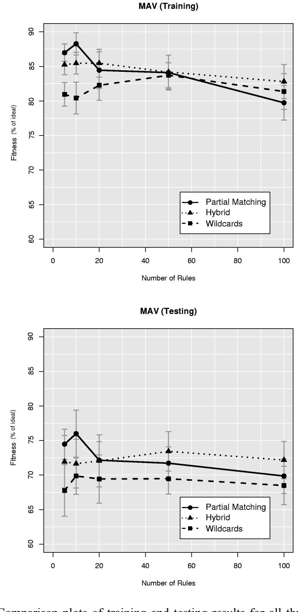  
Figure 5.7: Comparison plots of training and testing results for all three generalization techniques (partial matching, wildcards and hybrid). Each point on the graph represents the fitness of the best individual after 100 generations, averaged over 20 runs. The error bars indicate the $9 5 \%$ confidence interval.

# 6. Search for an Explanation

In this thesis I have set out to answer two questions:

1. Is a hybrid approach to generalization more robust than either wildcards or partial matching on their own?

2. Can we get a deeper understand of why one mechanism is better than another?

In the previous two chapters I have demonstrated that the hybrid method is very robust, at least in two very different domains. In this chapter I will focus on answering the second question.

# 6.1 Wildcard Bias

In order to get some insight into what might be happening, I looked for differences between the concept learning and MAV domains other than which generalization mechanism works better. My thinking was that if I could find something else, it might provide some clues which lead to something more fundamental.

One thing which seemed odd to me was the difference between the profiles for the wildcard bias sensitivity studies. Figure 6.1 reprints the results that were originally shown if figure 4.2 and figure 5.3. As a reminder, each of these plots were generated using wildcards as the generalization mechanism. Each point on the plot is the best fitness found after a fixed number of generations, averaged over 10 runs.

As can be seen from the graphs, the optimal setting for wildcard bias in the concept learning domain is at approximately 0.6, with smaller values still yielding reasonable results. But in the MAV domain the optimal setting is at 0.8, and performance drops off rapidly at lower values.

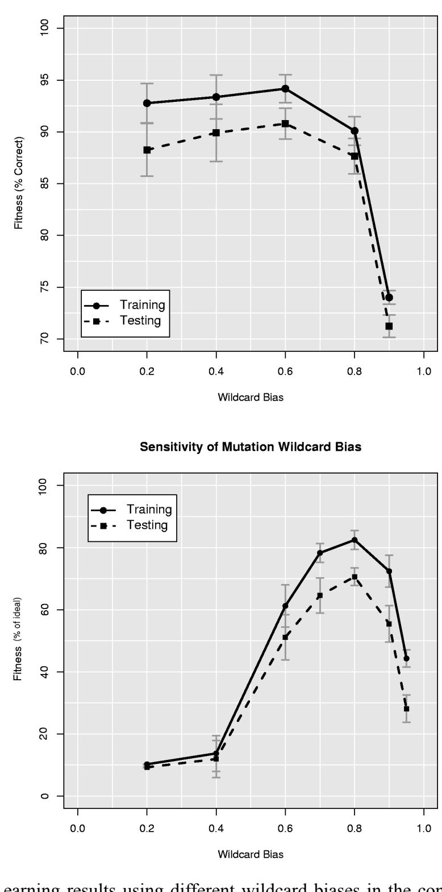  
Sensitivity of Mutation Wildcard Bias   
Figure 6.1: Learning results using different wildcard biases in the concept learning and MAV domains.

A best-so-far curve of the MAV domain using a wildcards bias of 0.2 shows that little to no improvement occurred at all during the run. In other words, no learning was taking place. When the behaviors of these individuals was observed, they were always the same. They flew in a straight line until they flew off the edge of the area of interest. Consequently they all received very low fitness values.

My suspicion was that rules were firing very infrequently, and so the default action (which was set to fly straight) was almost always taking place. To test this hypothesis, I re-instrumented the MAV simulator collect statistics about the number of default actions that were taking place. What I found was that none of the rules were firing, and only default actions were occurring.

This leads to an interesting observation. The number of input examples that are covered by a single rule may be very important. For example, if a rule only covers one set of sensor input values then the system cannot infer what action take when a similar configuration is encountered.

The initial rule sets are randomly. If none of the rules are firing when the simulation is run, then the evaluation is pointless. In retrospect it may have been more useful to make the default action random instead of fixed. This would increase the chances that rules would fire. None the less, rule coverage is important.

One important difference between these two domains is the size of the rules. In the concept learning domain, the condition section of a rule is x bits long, whereas in the MAV domain it is y bits. Could this be a factor in the differences between the two graphs? After all, if we consider a domain where the condition section of a rule contains just two bits, a rule with just one wildcard would cover $50 \%$ of the input space. But in a domain where the condition contains 100 bits, a rule with a single wildcard would cover only $2 \%$ of the input space. For that matter, a rule with 99 wildcards would also cover $50 \%$ of the input space.

Counting the percentage of wildcards in a string is probably not a the best way to measure a rules generality.

Using the following formula we can measure the amount of input space covered by a given rule.

$$
c o v e r a g e = \frac { 2 ^ { w } } { 2 ^ { n } }
$$

The variable $n$ is the number of bits in the condition section of a rule, and $w$ is the number of wildcards in the condition section of the same rule. We can approximate the value of $w$ by multiplying $n$ by the wildcard bias. Figure 6.2 shows figures 4.2 and 5.3 replotted using coverage as the independent variable instead of wildcard bias. It is important to remember that the coverages calculated for figure 6.2 are only for a single rule, not the entire rule-set. Also, they are just estimates based on the wildcard bias, and will vary depending on how many wildcards are actually in the rule.

None the less, we see something interesting here. The plots for the two domains now look very similar. The curve for the concept learning domain peaks somewhere near a coverage of 0.04, whereas the peak of the MAV curve is near 0.02. It is difficult to tell exactly without more data.

This shows that these two domains do not actually qualitatively differ in regards to the wildcard bias. In addition to this, we now have a tool which may help to give us a better idea about how to set the wildcard bias parameter. When working with a new domain, one should choose a wildcard bias which causes rules to have a coverage somewhere between 0.01 to 0.05 (i.e. $1 \%$ to $5 \%$ ) of the input space. Since the total coverage of the rule-set is also important, further research may show that the number of rules in a rule-set also effects the choice of wildcard bias.

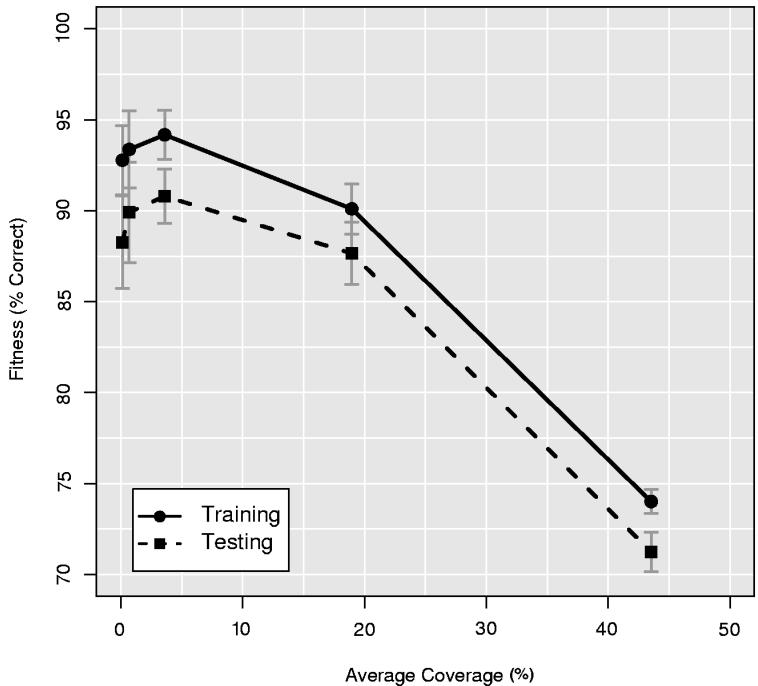

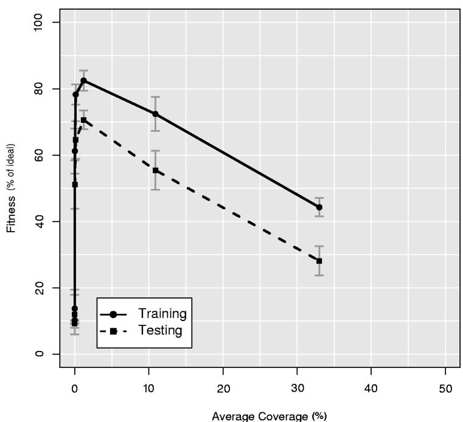  
Fitness vs Average Coverage of a Rule   
Figure 6.2: Wildcard bias plotted as coverage. Using the same data from figure 6.1, the dependent variable has been transformed from wildcard bias to represent the ratio of rule coverage to the total input space.

# 6.2 Landscape

When Booker did his research with hybrid generalization, his working theory was that the wildcards did not have enough of a “gradient” in the fitness landscape for the EA to follow. In other words, there were plateaus in the landscape which caused the GA to stagnate since it provided no clues as to where the optimum was. Booker added partial matching in order to provide a gradient where previously there was none. His results improved when he used this hybrid, lending strength to his theory.

We have already seen some evidence that plateaus may exist in these domains, at least when using only wildcards for generalization. In the MAV domain, when the wildcard bias was reduced to a very low level (e.g. 0.2) learning seemed to cease altogether.

In order to explore this hypothesis further, the following approach was used. A large number of individuals were generated randomly, and the fitnesses are plotted as a histogram. The idea being that if a large plateau exists in the landscape it will show up in the histogram as a large spike. If there is no plateau, the histogram should look much smoother, probably more like a bell curve.

Figure 6.3 shows a number of histograms for the concept learning domain. Each plot was created by generating 100,000 random individuals. Each row demonstrates a different generalization technique. In order from top to bottom they are wildcards, partial matching, and hybrid. Each column indicates a different sized rule-set, where the individuals used for the left column contain 5 rules, and the ones in the right column contain 100 rules.

Of the histograms in figure 6.3, the only one which shows signs of a plateau landscape is the 5 rule wildcard experiment in the upper left hand corner. As we can see, the landscape can be transformed either by adding more rules (upper right corner) or by adding partial matching (lower left corner). This seems to show that the plateaus are caused at least in part by rule sets which don’t cover the complete input space. As we add more rules, we can expect more of the space to be covered. Using the hybrid also guarantees that the entire

input space is covered by a rule set.

The same experiments were performed in the MAV environment as well. Because evaluations are much more time consuming when using the simulation, only 10,000 random individuals were generated. Fitness was calculated averaging five runs of the simulation using randomly generated environments. Figure 6.4 shows the results. Again the experiment using wildcards and a genome length of 5 rules shows the strongest signs of a plateau, although this time the fitness of individuals on the plateau is not zero, but $10 \%$ of the ideal fitness. This corresponds very closely with the fitness that is achieved if all six planes fly straight and never turn. Interestingly, there are indications of a plateau using the other generalization techniques with 5 rules as well. In all cases, adding more rules to the system seems to eliminate the plateau from the landscape.

These results are useful, and serve to back up Booker’s original hypothesis when he introduced partial matching. But they still don’t answer some questions that we might ask. For example, “Why does partial matching seem better suited to the MAV domain than wildcards?” and “Why does the hybrid outperform both of the other approaches in the concept learning domain instead of just doing as well as the best of the two?”

# 6.3 Inductive Bias

The analysis of the fitness landscapes gives some insight into the differences between these generalization approaches, but does not answer all the questions. One possible explanation for these differences is inductive bias. Mitchell (1997) defines inductive bias as follows:

Consider a concept learning algorithm $L$ for the set of instances $X$ . Let $c$ be an arbitrary concept defined over $X$ , and $\boldsymbol { D _ { c } } = \{ \langle x , c ( x ) \rangle \}$ be an arbitrary set of training examples of $c$ . Let $L ( X _ { i } , D _ { c } )$ denote the classification assigned to the instance $x _ { i }$ by $L$ after training on the data $D _ { c }$ . The inductive bias of $L$ is any minimal set of assertions $B$ such that for any target concept $c$ and

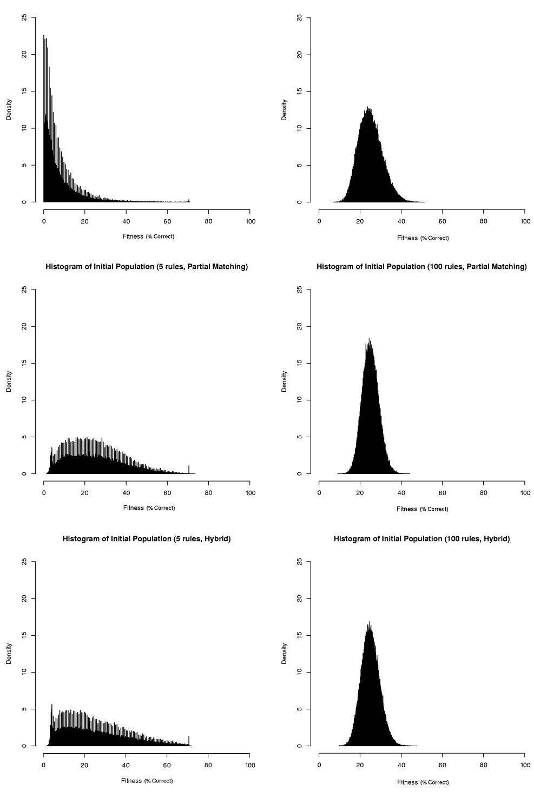  
Figure 6.3: Fitness gradients for the concept learning domain

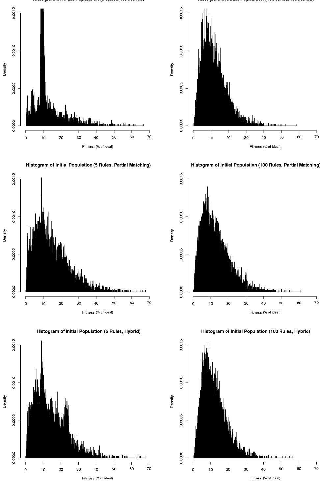  
Figure 6.4: Fitness gradients for the MAV domain

corresponding training examples $D _ { c }$

$$
( \forall x _ { i } \in X ) [ ( B \land D _ { c } \land x _ { i } ) \vdash L ( x _ { i } , D _ { c } ) ]
$$

or less formally

... the inductive bias [of a learning algorithm] is the set of assumptions that, together with the training data, deductively justify the classifications assigned by the learner to future instances.

Each learning algorithm has a different inductive bias, and depending on the learning domain one bias may perform better than another. In regards to this algorithm, each generalization mechanism alters the inductive bias, and this may be responsible for some of the results seen so far.

# 6.3.1 Conceptualizing the different methods

# Wildcards

I will try to characterize the inductive bias of these generalization mechanisms beginning with wildcards. Wildcards are “don’t care” symbols, which means that we can hold one or more variables fixed, while other are allowed to vary. Since each bit is usually part of an encoding for a larger variable though, wildcards have the effect of allowing some of the variables to vary across some subset of the entire range of values.

The effect of this is that rules will tend to cover linear or rectangular areas of the input space. Figure 6.5 illustrates how a number of wildcard rules might cover a 2-dimensional input space. This view of wildcard generalization also highlights one of it’s greatest weaknesses. There are often parts of the space which are not covered by any rule. Recall that this is why Booker originally experimented with adding partial matching to his system.

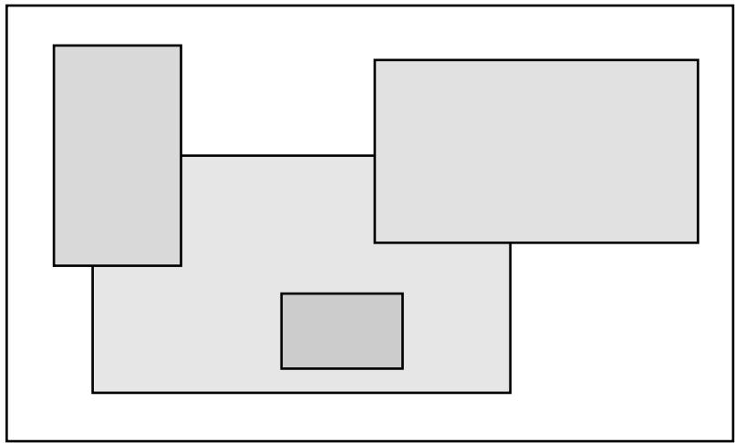  
Figure 6.5: The inductive bias for wildcards can be thought of as rectangles.

# Partial Matching

The inductive bias for partial matching is rather different from the wildcard inductive bias though. Instead of carving the input space into orthogonal chunks, the boundaries between rules fall at the set of points which are equidistant in hamming space from each rule condition. This is very a similar idea to a Voronoi diagram (see figure 6.6). This type of plot shows a Cartesian space divided into sections along boundaries which are equidistant from a set of points. While measuring distance in hamming space is not the same as measuring distance in Cartesian space, this type of plot gives some insight into how partial matching works.

It is important to note that the $\mathrm { k \cdot }$ -nearest neighbor learning algorithm also has a very similar inductive bias. Since nearest neighbor algorithms actually measures distance in Cartesian space though, the inductive bias is accurately illustrated by a Voronoi diagram.

This k-nearest neighbor algorithm has been demonstrated to be a very effective learning algorithm in a variety of domains. It does suffer from one distinct disadvantage though, called the “curse of dimensionality”. When calculating the distance between examples, all the variables making up the coordinate vector are used. If only a few of those variables are important for characterizing a given concept, then two points which are conceptually very similar to each other will have a distance measure which is very large. It seems likely that partial matching suffers from similar problems. Other learning algorithms, such as decision trees, will focus on just a few critical variables, thereby avoiding this problem.

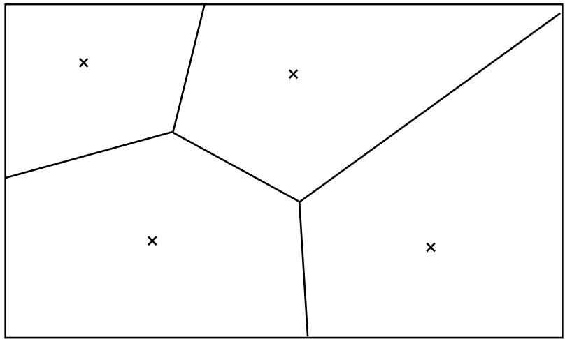  
Figure 6.6: The inductive bias for partial matching is like a Voronoi diagram.

One common solution to the “curse of dimensionality” is to apply weights to the variables during the distance calculation. In essence this stretches the distances along certain axes, emphasizing some variables over others. It is also possible to to stretch distances in local areas by implementing these weights as a function. This is done much less often because it can increase the risk of overfitting. It would not be difficult to apply these techniques to partial matching in rule systems as well.

# Hybrid

The inductive bias of the hybrid is again similar to a Voronoi diagram in hamming space. The main difference is that distances will be calculated from linear regions instead of just points. This has the effect of biasing the regions toward being more rectangular in shape.

Another interesting point to consider is the effect of the wildcard value. Recall that when calculating the match score, wildcards may contribute less weight to the match score than a zero or one. The wildcard value is set at 0.75 in all of my experiments. The rational for this decision was to allow more specific rules to supersede more general ones. The result is somewhat unexpected though. The specific rules actually extend their influence beyond their boundaries and into the general rules. Of course, this is not necessarily a problem.

It is interesting to relate this new bias back to some of the issues we discussed in regards to $\mathrm { k \Omega }$ -nearest neighbor algorithms. The “curse of dimensionality” is caused by irrelevant variables (with regard to a specific concept) contributing to the distance function. Wildcards, on the other hand, serve to specifically exclude variables which are not necessary for the decision making process. The marriage of wildcards and partial matching may in fact be ideal, since in both cases the weakness of one is the strength of the other.

# 6.3.2 Validating the Inductive Bias Hypothesis

We would like to find a way to validate this hypothesis about inductive bias. One idea is as follows. If this hypothesis is true, we should be able to devise a concept learning problem which favors partial matching instead of wildcards.

Assuming this hypothesis is true, wildcards should prefer problems where the variables are independent of one another. Therefore, if we create a concept learning problem which contains relationships between the variables, it should favor partial matching.

# Domain

I created a domain which contained two input variables: a and b. Both are represented in the input space using a 6 bit encoding. The output is a single bit. All the examples were generated using the following simple rule:

$$
f ( a , b ) = { \left\{ \begin{array} { l l } { 1 } & { { \mathrm { i f ~ } } b < a } \\ { 0 } & { { \mathrm { o t h e r w i s e } } } \end{array} \right. }
$$

There were 4096 examples generated, and they were divided up with 2/3 going into the

Table 6.1: Parameters for experiments in the generated concept learning problem   

<table><tr><td rowspan=1 colspan=1>Parameter</td><td rowspan=1 colspan=1>Value</td></tr><tr><td rowspan=1 colspan=1>Population sizeGenerationsSelectionCrossover operator</td><td rowspan=3 colspan=1>502000Tournament2-point0.81.010, 50</td></tr><tr><td rowspan=1 colspan=1>Crossover rate</td></tr><tr><td rowspan=1 colspan=1>EmutGenome size</td></tr><tr><td rowspan=1 colspan=1>Wildcard biasω (wildcard value)</td><td rowspan=1 colspan=1>0.60.75</td></tr></table>

training set and 1/3 into the test set.

# Results

Experiments were run using all three generalization techniques using genome sizes of 10 and 50. There were 20 runs in each. Table 6.1 detail the important parameters for all the experiments.

The results (plotted in figure 6.7 shows results very similar to the cars concept learning problem. In other words, wildcards still outperformed partial matching.

It was considered that the nature of the binary encoding for the variables could have been the source of some of the problems. In other words, hamming cliffs could be altering the nature of the distance calculations. After all, variables which have a non-linear relationship in real space may have a completely different relationship in hamming space, depending on the encoding.

In an attempt to mitigate these effects, the same experiments were performed except that a Grey coding was used for the variables. I have not plotted the results here, but qualitatively they were essentially the same as the previous experiment. Wildcards outperformed partial matching.

It is not clear whether the inductive bias hypothesis was incorrect (or at least not useful for explaining the outcomes seen) or whether these experiments were just poorly formulated. Perhaps running similar experiments using a real valued representation might shed some light on this issue.

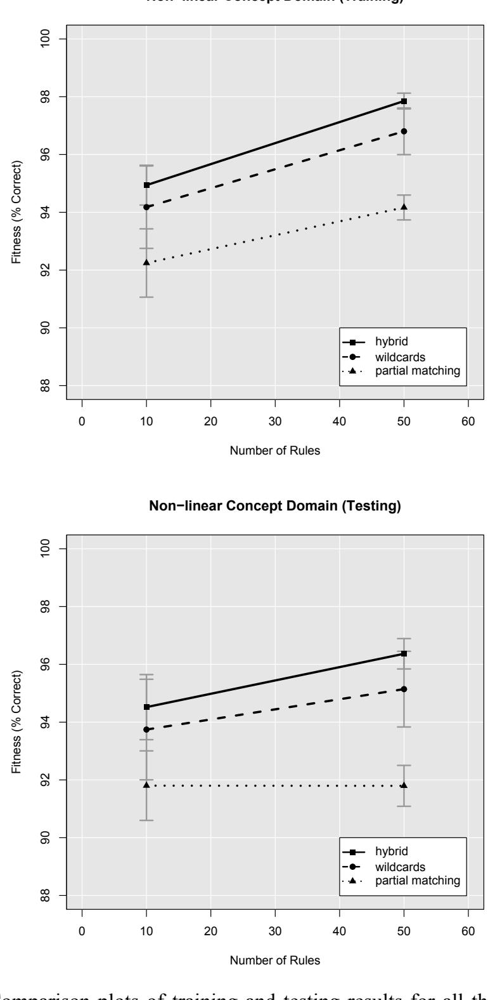  
Figure 6.7: Comparison plots of training and testing results for all three generalization techniques (partial matching, wildcards and hybrid) in the generated concept domain. Each point on the graph represents the fitness of the best individual after 2000 generations, averaged over 20 runs. The error bars indicate the $9 5 \%$ confidence interval.

# 7. Conclusions

The goals of this thesis are to compare three specific generalization mechanisms in a Pitt approach evolutionary rule learning system. Of particular concern are the quality of the results, the learning time needed, and the compactness of the rules sets created. The hopes are that this information could help guide someone implementing such a system in making better design decisions.

The three generalization mechanisms explored were wildcards, partial matching and a hybrid of the two. My hypothesis was that the hybrid would be more robust than the other two when compared in a variety of problem domains. But also of interest is understanding why these approaches behaved better or worse in different environments.

Two problem domains were chosen to test these mechanisms. One was a concept learning domain, and the other a robotics domain which involves a sequential decision making process. The results showed that the wildcards tended to perform better than partial matching in the concept learning domain, but the opposite was true in the robotics domain where the partial matching was clearly the better performer. Somewhat surprisingly, the hybrid was superior to the other two mechanisms in the concept learning domain. In the robotics domain the hybrid performed as well as partial matching, but required more learning time to achieve this level.

These results seem to confirm the hypothesis that the hybrid generalization is the most robust. Of course, running these tests on more domains would increase our confidence that this conclusion is a general one. But what these results do not tell us is what causes some of the differences we see in the two domains. With this in mind, further studies were performed in the hopes of finding an explanation.

In the first part of this study I discovered what appears to be a useful rule of thumb for determining an appropriate bias for seeding individuals with wildcards. Each rule on average should contain enough wildcards to cover somewhere between $1 \%$ and $5 \%$ of the input space. This number may vary depending on the total number of rules in the rule set.

As a next step toward finding an explanation, I attempted to verify Booker’s idea that wildcards inherently form plateaus in the fitness landscape, thus causing evolution to stagnate. To test this, I generated thousands of individuals, and plotting their fitnesses in a histogram, hoping to get a sense of the nature of the problem landscape. A peak in this histogram would likely correspond to a plateau. I did in fact see these peaks when wildcards were used with individuals containing a small number of rules. And as Booker found, adding partial matching seemed to eliminate these plateaus. But I also noticed that the plateaus could be easily eliminated by using larger rule-sets. While Booker’s idea appears to explain some of the result, it does not explain all of them.

Finally, I explored the notion that each generalization mechanism altered the inductive bias of the learning algorithm. I formulated a somewhat intuitive view of the inductive bias of each mechanism. I also identified similarities with other learning algorithms, such as $\mathrm { k \Omega }$ -nearest neighbor. Using this approach I was able to identify possible weaknesses in each mechanism, and show that the hybrid has the potential to solve many of them. This may explain how the hybrid was able to outperform both wildcards and partial matching in the concept learning domain.

An experiment was devised in order to validate this hypothesis. By comparing the inductive biases of these mechanisms, it was observed that wildcards might have more difficulty describing a concept in which contained a relationship between the input variables. A concept learning domain with this characteristic was engineered, and experiments were run using all three generalization mechanisms. Unfortunately, wildcards still outperformed partial matching against our expectations. While the inductive bias analysis is useful for understanding some of the behaviors we see, it cannot explain them all. There are additional complexities will require further study to understand completely.

# 7.1 Contributions to the Field

The common wisdom was that partial matching (added to a system that uses wildcards) transforms the fitness landscape, turning plateaus into smoother gradients, thus making it easier for an EA to perform its search.

I have demonstrated that partial matching appears to have little influence on the fitness gradient, except in cases where the input space is highly underspecified by the rule sets being evolved.

I have also demonstrated that there are domains in which using partial matching alone leads to better performing rules-sets than using wildcards. This seems to imply that another explanation is in order.

By bringing a machine learning perspective to bear on this issue, I have offered an alternative explanation, namely that partial matching and wildcards have different inductive biases. Depending on the domain, one of these mechanisms may be more appropriate than the other.

Finally I have shown that a hybrid of these generalization mechanisms can often do as well or better than either separately. Sometimes this comes at the cost of longer learning time though.

# 7.2 Future Work

I am not completely satisfied with my attempts to explain and model these generalization mechanisms. Does inductive bias account for the differences we saw between the different domains? I would like to continue this research in order to answer this question.

There are a number of other aspects to rule learning systems which have not been adequately explored either, including issues of representation, operators and variable length genomes.

Phenotypic representations have often been shown to be more effective. There are a number of different approaches which can be taken, and very few studies can offer advice about the tradeoffs involved. Different representations require different generalization mechanisms as well. Perhaps studying those will provide new insight to the work done here.

Another aspect of Pitt approach systems which is not well understood is the variable length representation. Since parsimony is an important aspect of generalization, the ability to adapt the size of the solution becomes critical. The biggest issue to deal with here is bloat. There are many variable length representations among evolutionary algorithms, and most of them suffer from bloat. Yet there is no widely accepted explanation for this phenomenon. I am suspicious that issues related to generalization may play a role.

Finally, genetic operators are worth spending more time on. Almost all the systems that exist have used either fairly typical crossover operators, or in the case of SAMUEL, rather complex credit assignment techniques for determining how to exchange genetic material. Are there novel, yet simple operators which encourage search or perhaps discourage bloat?

# Bibliography

# Bibliography

Back, ¨ T. (1996). Evolutionary Algorithms in Theory and Practice: Evolutionary Straegies, Evolutionary Programming, and Genetic Algorithms. Oxford Press.

Bassett, J. K. and De Jong, K. A. (2000). Evolving behaviors for cooperating agents. In Ras, Z., editor, Proceedingsfrom the Twelfth International Symposium on Methodologies for Intelligent Systems, pages 157–165, Charlotte, NC. Springer-Verlag.

Bohanec, M. and Rajkovic, V. (1988). Knowledge acquisition and explanation for multiattribute decision making. In 8th Intl Workshop on Expert Systems and their Applications, pages 59–78, Avignon, France.

Booker, L. B. (1982). Intelligent Behavior as an Adaptation to the Task Environment. PhD thesis, The University of Michigan.

Booker, L. B. (1985). Improving the performance of genetic algorithms in classifier systems. In Grefenstette, J., editor, Proceedings of the First International Conference on Genetic Algorithms (ICGA), pages 80–92. Laurence Erlbaum Associates.

Bull, L. and Fogarty, T. C. (1994). Evolving cooperative communicating classifier systems. In Proceedings of the Third Annual Conference on Evolutionary Programming, pages 308–315.

Bull, L., Fogarty, T. C., and Snaith, M. (1995a). Evolution in multi-agent systems: Evolving communicating classifier systems for gait in a quadruped robot. In Eshelman (1995), pages 382–388.

Bull, L., Fogarty, T. C., and Snaith, M. (1995b). Evolution in multi-agent systems: Evolving communicating classifier systems for gait in a quadrupedal robot. In Eshelman (1995), pages 382–388.

Carse, B. and Fogarty, T. C. (1994). A fuzzy classifier system using the Pittsburgh approach. In Davidor, Y. and Schwefel, H.-P., editors, Proceedings of the Third International Conference on Parallel Problem Solving from Nature (PPSN III), pages 260–269. Springer-Verlag.

Collins, D. J., Agah, A., Wu, A. S., and Schultz, A. C. (2000). The effects of team size on the evolution of distrubuted micro air vehicles. In Pelikan, M. et al., editor, Proceedings of the Genetic and Evolutionary Computation Conference (GECCO) 2000, pages 949– 956. Morgan Kaufmann.

Corcoran, A. L. and Sen, S. (1994). Using read-valued genetic algorithms to evolve rule sets for classification. In Proceedings of the First International Conference on Evolutionary Computation, pages 120–124. IEEE Press.

De Jong, K. A., Spears, W. M., and Gordon, D. F. (1993). Using genetic algorithms for concept learning. Machine Learning, 13:161–188.

Eshelman, L., editor (1995). Proceedings of the Sixth International Conference on Genetic Algorithms (ICGA). Morgan Kaufmann.

Fogel, L., Owens, A., and Walsh, M. (1966). Artificial Intelligence Through Simulated Evolution. John Wiley and Sons, Inc., New York.

Giordana, A. and Neri, F. (1996). Search-intensive concept induction. Evolutionary Computation, 3:375–416.

Giordana, A. and Saitta, L. (1994). Learning disjunctive concepts by means of genetic algorithms. In Proceeding of the Internation Conference on Machine Learning, pages 96–104, New Brunswick, NJ. Morgan Kaufmann.

Goldberg, D. E. (1989). Genetic Algorithms in Search, Optimization, and Machine Learning. Addison Wesley, Reading, MA.

Grefenstette, J. J. (1988). Credit assignment in rule discovery system based on genetic algorithms. Machine Learning, 3(2/3):225–245.

Grefenstette, J. J. (1989). A system for learning control strategies with genetic algorithms. In Schaffer, J. D., editor, Proceedings of the Third International Conference on Genetic Algorithms (ICGA), pages 183–190. Morgan Kaufmann.

Harvey, I., Husbands, P., and Cliff, D. (1993). Issues in evolutionary robotics. In Meyer, J., Roitblat, H. L., and Wilson, S. W., editors, From Animals to Animats II: Proceedings of the Second International Conference on Simulation of Adaptive Behavior, Cambridge, MA. MIT Press-Bradford Books.

Holland, J. (1975). Adaptation in Natural and Artificial Systems. The MIT Press, Cambridge, MA.

Holland, J. H. (1971). Processing and processors for schemata. In Jacks, E. L., editor, Associative information processing. American Elsevier, New York.

Holland, J. H. and Reitman, J. S. (1978). Cognitive systems based on adaptive algorithms. In Waterman, D. A. and Hayes-Roth, F., editors, Pattern-Directed Inference Systems. Academic Press.

Janikow, C. Z. (1993). A knowledge-intensive genetic algorithm for supervised learning. Machine Learning, 13:189–228.

Knight, L. and Sen, S. (1995). PLEASE: A prototype learning system using genetic algorithms. In Eshelman (1995), pages 429–435.

Koza, J. (1992). Genetic Programming: on the Programming of Computers by Means of Natural Selection. MIT Press.

Lanzi, P. L. (1999). An analysis of generalization in the XCS classifier system. Evolutionary Computation, 7(2).

Luke, S. (2000). Issues in Scaling Genetic Programming: Breeding Strategies, Tree Generation, and Code Bloat. PhD thesis, The University of Maryland, College Park, Maryland.

Mataric, M. (1994). Learning to behave socially. In Cliff, D., Husbands, P., Meyers, J., and Wilson, S., editors, From Animals to Animats 3 (Third International Conference on Simulation of Adaptive Behavior), pages 453–462. MIT Press.

Michalawicz, Z. (1996). Genetic Algorithms $^ +$ Data Structures $=$ Evolution Programs. Springer-Verlag, Berlin, 3rd edition.

Mitchell, T. (1997). Machine Learning. McGraw-Hill.

Nordin, P. and Banzhaf, W. (1995). Complexity compression and evolution. In Eshelman (1995), pages 310–317.

Parker, L. (2000). Current state of the art in distributed autnomous mobile robotics. In Proceedings from DARS.

Parodi, A. and Bonelli, P. (1993). A new approach to fuzzy classifier systems. In Forest, S., editor, Proceedings of the Fifth International Conference on Genetic Algorithms (ICGA), pages 223–230, San Mateo, CA. Morgan Kaufmann.

Schultz, A. C. and Grefenstette, J. J. (1992). Using a genetic algorithm to learn behaviors for autonomous vehicles. In Proceedings of the American Institute of Aeronautics and Astronautics Guidance, Navigation and Control Conference, pages 739–749, Hilton Head, SC. AIAA.

Smith, S. F. (1980). A Learning System Based on Genetic Adaptive Algorithms. PhD thesis, The University of Pittsburgh.

Smith, S. F. (1983). Flexible learning of problem solving heuristics through adaptive search. In Kaufman, W., editor, Proceedings of the Eighth International Joint Conference on Artificial Intelligence (IJCAI), pages 422–425, Karlsruche, Germany.

Soule, T., Foster, J. A., and Dickinson, J. (1996). Code growth in genetic programming. In Koza, J. R., Goldberg, D. E., Fogel, D. B., and Riolo, R. L., editors, Proceedings of the First Annual Genetic Programming Conference, pages 215–223. MIT Press.

Wilson, S. W. (1994). ZCS: A zeroth level classifier system. Evolutionary Computation, 1(2).

Wilson, S. W. (1995). Classifier fitness based on accuracy. Evolutionary Computation, 3(2).

Wilson, S. W. (1998). Generalization in the XCS classifier system. In Proceedings of the Third Annual Genetic Programming Conference, pages 429–435. MIT Press.

Wu, A., Schultz, A. C., and Agah, A. (1999). Evolving control for distributed micro air vehicles. In IEEE Conference on Computational Intelligence in Robotics and Automation (CIRA-99).

# CURRIVULUM VITAE

Jeffrey K. Bassett was born on September 14th, 1965, in Rochester, New York, and is an American citizen. He graduated from Ithaca High School, Ithaca, New York, in 1983. He received a Bachelor of Science in Computer Science from Rensselaer Polytechnic Institute in 1987. He was employed as a Software Engineer in various positions in both Ithaca and Northern Virginia. Most of his work focused on high-end computer graphics and computer aided engineering (CAE) applications. He received his Masters of Science in Computer Science from George Mason University in 2002.