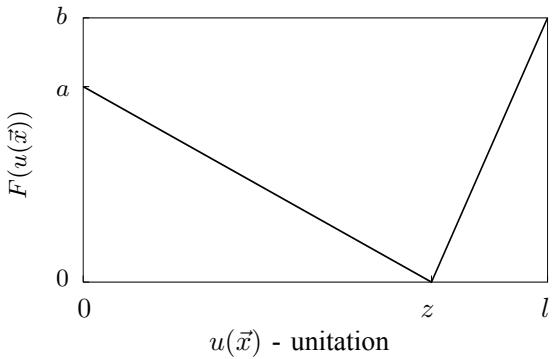
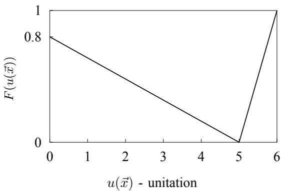
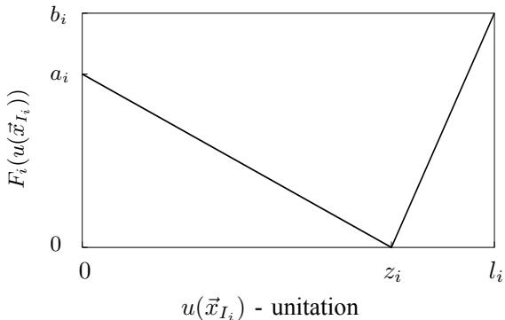
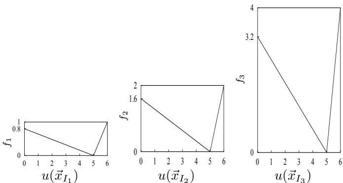
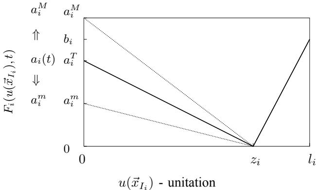
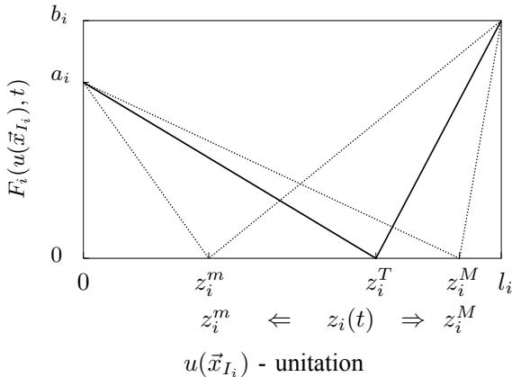
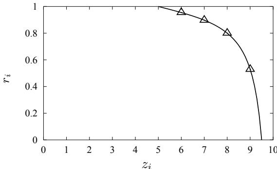
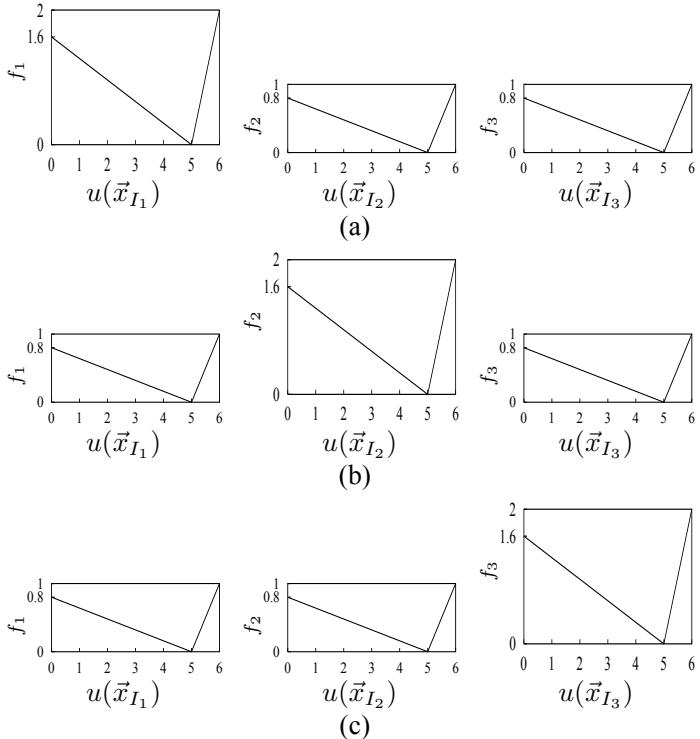
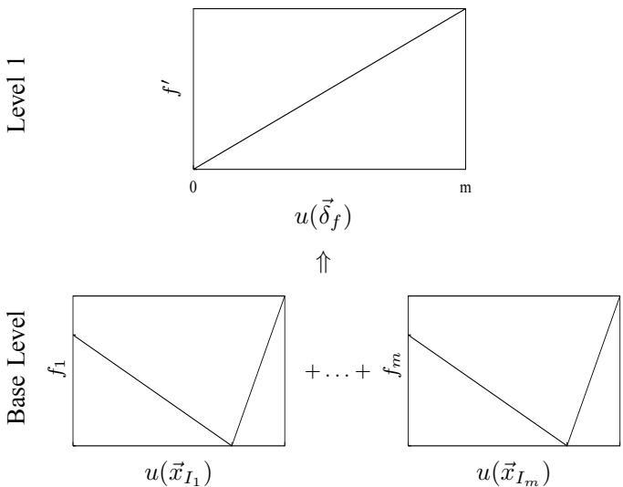
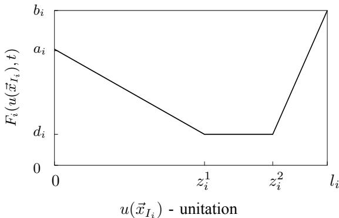

# Constructing Dynamic Test Environments for Genetic Algorithms Based on Problem Difficulty

Shengxiang Yang Department of Computer Science University of Leicester University Road, Leicester LE1 7RH, UK Email: s.yang@mcs.le.ac.uk

Abstract— In recent years the study of dynamic optimization problems has attracted an increasing interest from the community of genetic algorithms and researchers have developed a variety of approaches into genetic algorithms to solve these problems. In order to compare their performance an important issue is the construction of standardized dynamic test environments. Based on the concept of problem difficulty this paper proposes a new dynamic environment generator using a decomposable trap function. With this generator it is posssible to systematically construct dynamic environments with changing and bounding difficulty and hence we can test different genetic algorithms under dynamic environments with changing but controllable difficulty levels.

# I. INTRODUCTION

Due to the robustness of finding good solutions to difficult problems, genetic algorithms (GAs) have been well studied as a kind of optimization and search techniques that are based on natural selection and population genetics. They are widely and usually applied for solving stationary optimization problems where it is assumed that no changes occur with respect to the problems being solved during the course of computation. However, many real-world optimization problems are non-deterministic and subject to changes over time with respect to the objective function, the decision variables, and/or the environmental parameters. For example, in production scheduling problems the scheduling demands and available resources may change over time. For dynamic optimization problems, the goal of an optimization algorithm is no longer to find a (stationary) optimal solution, but to continuously track the changing or moving optimum in the problem space. This presents serious challenge to traditional optimization techniques as well as conventional GAs.

Solving dynamic optimization problems (DOPs) by GAs was first addressed by Goldberg and Smith [10] and has attracted a growing interest from GA’s community in recent years [2], [18]. Researchers have developed many approaches into GAs to address this problem [4], such as the hypermutation scheme [5], [20], the random immigration scheme [13], memory-based methods [16], [21], and multi-population approaches [3]. In order to compare the performance of EAs with different approaches for dynamic optimization problems, on the meanwhile, researchers have developed several dynamic problem generators [4], [19]. Just as that benchmark test problems play an important role in the study of GAs in stationary environments, constructing standardized dynamic environments plays an important role in comparing GAs for DOPs because the performance of GAs for DOPs depends not only on the problem being solved but also significantly on the dynamics of environmental changes.

In this paper a new dynamic environment generator is proposed based on the concept of problem difficulty [12]. In his recent book, Goldberg [12] remotivated and expanded upon Holand’s notation of a schema or building block (BB) [15] to understand the raw material available for genetic search. He justified that the problem difficulty can be decomposed along the lines of BB processing into three core elements: deception for intra-BB difficulty, scaling for inter-BB difficulty, and exogenous noise for extra-BB difficulty. Other elements of problem difficulty, e.g. inter-BB epistasis or crosstalk, can be transformed into one of the above three core elements. Based on this understanding, it is possible to design bounding adversarial problems that represent different dimensions of problem difficulty [12].

In this paper the idea of bounding problem difficulty is generalized to construct dynamic test environments for GAs. A framework of decomposable trap function is proposed as the base to construct different dynamic test environments. From this framework it is possible to systematically construct dynamic test environments of bounded difficulty and hence test the effectiveness of different GAs under these dynamic environments.

# II. REVIEW OF RELEVANT WORK

In order to study the performance of GAs for dynamic optimization problems, researchers have developed a number of dynamic problem generators to create dynamic test environments. In general, these generators have some common characteristics and can be roughly divided into four types.

# A. Characteristics of Dynamic Environment Generators

In order to compare the performance of different GAs in dynamic environments, dynamic problem generators should meet some basic requirements or have some common properties. Some of these properties are listed as follows:

• It should be possible to vary environmental parameters related to different facets of the problem being solved;

• It should be simple to realize different dynamics, such as frequency of change, severity of change, cyclic or not;   
• It should be convenient to adjust the complexity and difficulty of dynamic problems;   
• It should be computationally efficient to realize required dynamic environments;   
• It should be easy to carry out formal analysis.

# B. Classification of Dynamic Environment Generators

In general, dynamic problems are created based on one or more stationary problem(s). Through changing (the parameters of) the stationary problem(s) different dynamic environments can be constructed. There are several criteria along which dynamic environments could be categorized. According to the changing mechanisms dynamic problem generators can be roughly divided into four types, as described below.

1) Switching Fitness Landscapes

This type of dynamic environment generators is quite simple. The environment is just switched between two or more stationary problems or between two or more states of one stationary problem. For example, a number of researchers have tested their algorithms on a time varying knapsack problem where the total weight capacity of the knapsack changes over time, usually oscillating between two or more fixed values [9], [16], [18], [21]. Cobb and Grefenstette [6] constructed a significantly dynamic environments that switches between two predefined different fitness landscapes. The dynamic bitmatching problem [7] aims to maximize the number of bits in a string that matches a given template and the template varies over time. For this type of generator, the dynamics of environmental changes is mainly characterized by the speed of environmental changes. It can be fast or slow relative to EA time and is usually measured in EA generations.

2) Drifting Fitness Landscapes

The dynamic problem generator starts from a fitness landscape $f ( \vec { x } )$ , defined in $n$ -dimensional real space $( \vec { x } \in R ^ { n } )$ ). This fitness landscape is drifted along one or more axes over time while its overall shape (morphology) keeps unchanged. That is, the dynamic environment can be defined as:

$$
f ( { \vec { x } } _ { t } ) = f ( { \vec { x } } _ { t - 1 } + \Delta { \vec { x } } _ { t } )
$$

where the dynamics is realized by defining a “motion algorithm” for the step size $\Delta \vec { x } _ { t }$ , which can be large or small.

3) Reshaping Fitness Landscapes

The third type of dynamic problem generators starts from a predefined fitness landscape, defined in $n$ -dimensional real space [14], [19], [22]. This stationary landscape is composed of a number of component landscapes (e.g., cones), each of which can change independently. Each component has its own morphology with such parameters as peak height, peak slope and peak location. And the center of the highest peak is the optimum of the landscape.

For example, Morrison and De Jong’s generator [19], called $D F 1$ , defines the basic fitness landscape in $n$ -dimensional real

space as follows:

$$
f ( \overrightarrow { x } ) = \operatorname* { m a x } _ { i = 1 , \ldots , m } \left[ H _ { i } - R _ { i } \times \sqrt { \sum _ { j = 1 } ^ { n } ( x _ { j } - X _ { i j } ) ^ { 2 } } \right]
$$

where ${ \vec { x } } \ = \ ( x _ { 1 } , \cdot \cdot \cdot , x _ { n } )$ is a point in the landscape, $m$ specifies the number of cones in the environment, and each cone $i$ is independently specified by its height $H _ { i }$ , its slope $R _ { i }$ , and its center $\vec { X _ { i } } \stackrel { \cdot } { = } ( \dot { X } _ { i 1 } , \cdot \cdot \cdot , \dot { X } _ { i n } )$ . These independently specified cones are blended together by the max function. Based on this stationary landscape dynamic problems can be created through changing the parameters of each component independently or jointly. Typically there exist three kinds of dynamics of environmental changes, described as follows:

• Changing peak height $( H _ { i } )$ . This can result in global optima becoming local optima, vice versa. Changing peak slope $( R _ { i } )$ . This can result in peak(s) being hidden or exposed by the changing peak(s). • Changing peak location $( \breve { \vec { X _ { i } } } )$ .

For this type of generator, the complexity of dynamic environments can be scaled by changing the number of dimensions and/or the number of peaks. And the environmental dynamics is related to the speed of changes (rapid or slow relative to EA time) and the severity of changes for each parameter (the step size may be large or small).

4) Revolving Fitness Landscapes

In [23], [24], a dynamic problem generator is proposed, which can generate dynamic environments from any binaryencoded function. Given a function $f ( \vec { x } )$ defined on $l$ -bit strings $( \vec { x } \in \{ 0 , 1 \} ^ { l } )$ , the fitness landscape changes every $\tau$ generations. The changing mechanism is implemented using an exclusive-or (XOR) operator as follows:

• First, for each environmental change period $k = \lceil t / \tau \rceil$ , we create a binary template $\vec { T } ( k )$ that contains $\rho \times l ~ ( \rho \in$ [0.0, 1.0]) ones randomly or in a controlled way. • Then, a binary mask $\bar { \vec { M } } \in \{ 0 , 1 \} ^ { l }$ for period $k$ can be incrementally generated as follows:

$$
\vec { M } ( k ) = \vec { M } ( k - 1 ) \oplus \vec { T } ( k )
$$

where $^ { \circ \mathfrak { c } } \oplus ^ { \circ \mathfrak { s } }$ is the bitwise exclusive-or operator (i.e., $1 \oplus$ $1 = 0 , 1 \oplus 0 = 1 , 0 \oplus 0 = 0 )$ . For the first period $k = 1$ , $\vec { M } ( 1 )$ is initialized to be a zero vector.

• Finally, an individual $\vec { x }$ at generation $t \in [ ( k - 1 ) \tau , k \tau ]$ can be evaluated as follows:

$$
f ( { \vec { x } } , t ) = f ( { \vec { x } } \oplus { \vec { M } } ( k ) )
$$

With this generator, the fitness landscape can be revolved while certain properties, e.g., the number of optima and their fitness values and distances1, remain unchanged though their locations are shifted. The environmental dynamics can be easily tuned by two parameters: the speed of change $\tau$ and the severity of change determined by $\rho _ { ; }$ , the ratio of ones in $\vec { T }$ . The bigger the value of $\rho$ , the severer the environmental change and the bigger the challenge to GAs. If $\rho = 0 . 0$ , the environment stays stationary while if $\rho = 1 . 0$ the environment undergoes extreme changes in the sense of Hamming space.

# III. A DESIGN APPROACH TO PROBLEM DIFFICULTY

In order to study and compare the performance of GAs, a number of test functions have been designed. A key concern here is given to what constructs a difficult problem for GAs. Among these functions a family of fitness landscapes are called deceptive functions [11], which are developed to challenge the fundamental working mechanism of GAs – Holland’s building block hypothesis [15]. The building block hypothesis suggests that GAs work by combining low-order BBs to form higher-order BBs. However, if in a function the low-order BBs do not combine to form higher-order BBs, GAs may have difficulty in solving this function.

Along the line of BB processing Goldberg [12] claimed that the problem difficulty can be decomposed into three core elements: deception, scaling, and exogenous noise. Other elements of problem difficulty can be transformed into one of the three core elements. In the following sections we briefly review relevant topics with respect to Goldberg’s decomposition of problem difficulty.

# A. Unitation and Trap Functions

The unitation function has been repeatedly used for the purpose of analysis of hard and easy fitness functions for GAs. Let $\vec { x } = ( x _ { 1 } , \ldots , x _ { l } )$ be a binary string of length $l$ . The unitation $u ( \vec { x } )$ of $\vec { x }$ is a function defined as:

$$
u ( \vec { x } ) = u ( x _ { 1 } , \ldots , x _ { l } ) = x _ { 1 } + \cdot \cdot \cdot + x _ { l } = \sum _ { i = 1 } ^ { l } x _ { i }
$$

A trap function $f ( \vec { x } )$ is defined based on $u ( \vec { x } )$ as follows:

$$
f ( \vec { x } ) = F ( u ( \vec { x } ) ) = \left\{ \begin{array} { l l } { \frac { a } { z } ( z - u ( \vec { x } ) ) , \mathrm { i f } u ( \vec { x } ) \le z } \\ { \frac { b } { l - z } ( u ( \vec { x } ) - z ) , \mathrm { o t h e r w i s e } } \end{array} \right.
$$

where $a$ is the local (possibly deceptive) optimum, $b$ is the global optimum, and $z$ is the slope-change location which seperates the attraction basin sizes of the two optima. The schematic of a generalized $l$ -bit trap function is shown in Fig. 1. For the trap function, the parameter setting of $a , b$ and $z$ determines whether it is easy or difficult for GAs to find the global optimum $b$ as opposed to the local optimum $a$ .

# B. Intra-BB Problem Difficulty: Deception

Deceptive functions are a family of functions where there exist low-order BBs that do not combine to form higher-order BBs: instead they form BBs resulting in a deceptive solution that is sub-optimal itself or near a sub-optimal solution [25]. The existence of misleading BBs in deceptive functions presents serious challenge to GAs.

During the early stage deceptive functions were studied and constructed based on trap functions [1]. Deb and Goldberg [8] have shown that for a trap function to be deceptive on average the ratio of the fitness of the local optimum to that of the global optimum $r = a / b$ should be set as follows:

  
Fig. 1. The schematic of a generalized $l$ -bit trap function.

  
Fig. 2. A 6-bit deceptive trap function, shown as a function of the number of ones in the binary string.

$$
r \geq \frac { 2 - 1 / ( l - z ) } { 2 - 1 / z }
$$

For example, Fig. 2 shows a deceptive trap function that is based on 6-bit strings. This function is constructed from the basic trap function in Eq. (6) with $l = 6$ , $z = 5$ , $a = 0 . 8$ , and $b = 1$ . It is easy to see that this function satisfies the condition for full deception of Eq. (7) since

$$
r = { \frac { 0 . 8 } { 1 . 0 } } = 0 . 8 \geq { \frac { 2 - 1 / ( 6 - 5 ) } { 2 - 1 / 5 } } = { \frac { 5 } { 9 } }
$$

# C. Inter-BB Problem Difficulty: Scaling

Scaling problem arises in many functions that consist of several BBs because some BBs are worth more to the solution than others. Disparate scale among different BBs may cause serious difficulty for GAs in that it leads to inaccurate statistical processing of low-salient BBs and temporal delays of processing of low-salient BBs due to genetic drift [12].

Scaling problem can be formulated using additively decomposable functions as follows:

$$
f ( \vec { x } ) = \sum _ { i = 1 } ^ { m } c _ { i } \times f _ { i } ( \vec { x } _ { I _ { i } } )
$$

where $m$ sub-functions (or BBs) are justaposed and summed together. Each sub-function $f _ { i }$ is $| I _ { i } |$ -bit long and is indexed from the bit string $\vec { x }$ by the set $I _ { i }$ , i.e., $\vec { x } = \{ \vec { x } _ { I _ { 1 } } , \dots , \vec { x } _ { I _ { m } } \}$ . For example, given two sub-functions $f _ { 1 }$ and $f _ { 2 }$ of 3 and 4 bits respectively, we have $\vec { x } _ { I _ { 1 } } ~ = ~ x _ { 1 } x _ { 2 } x _ { 3 }$ $( I _ { 1 } = \{ 1 , 2 , 3 \} )$ , $\vec { x } _ { I _ { 2 } } = x _ { 4 } x _ { 5 } x _ { 6 } x _ { 7 }$ $( I _ { 2 } = \{ 4 , 5 , 6 , 7 \}$ ), and ${ \vec { x } } = x _ { 1 } x _ { 2 } \dots x _ { 7 }$ .

The parameter $c _ { i }$ in Eq. (9) is the scaling factor for each sub-function $f _ { i }$ . Through setting the scaling factors synthetic test functions with different BB scalings can be constructed. In general, four types of scaling schemes have been used in test functions: 1). the uniform scaling where $c _ { i } = c$ ( $\scriptstyle { \mathrm { ~ \vec { ~ } { ~ c ~ } ~ } }$ is a constant), e.g., the OneMax [1] and Royal Road [17] functions; 2). the exponential scaling where $c _ { i } \ = \ d ^ { i - 1 }$ $( d \ne 1$ is a constant), e.g., the BinInt problem; 3). the power-law scaling where $c _ { i } = i ^ { d }$ b $d \neq 0$ is a constant); and 4). the mixed scaling where a mixed expression of above schemes is used for $c _ { i }$ .

# D. Extra-BB Problem Difficulty: Noise

In real world many optimization problems have an outside environment and may suffer from environmental noise. The addition of outside noise causes difficulty for GAs because it may affect the statistical processing of information cumulated in the population and hence makes it more difficult for GAs to discriminate one decision alternative from another reliably.

Exogenous noise can be modeled using an additive zeromeaned Gaussian noise as follows:

$$
f ( \vec { x } ) = f ^ { \prime } ( \vec { x } ) + G a u s s ( 0 , \sigma _ { \vec { x } } ^ { 2 } )
$$

where $f ^ { \prime } ( \vec { x } )$ is the exact fitness function being considered. Exogenous noise may be quantified by the fitness variance of the noise source, $\sigma _ { \vec { x } } ^ { 2 }$ . The higher the variance the more difficult the problem will be for GAs.

# IV. CONSTRUCTING BASIC DYNAMIC ENVIRONMENTS BASED ON PROBLEM DIFFICULTY

Based on concepts of problem difficulty, it is possible to design dynamic problems that represent changing but bounded difficulty levels. The aim of this endeavor is to allow us to test different algorithms against a limited number of bounded difficult dynamic problems in such a way that algorithm success against them ensures success against a large class of dynamic problems no harder than the test cases. In this section we describe in detail how to construct dynamic environments that explicitly take problem difficulty into account.

# A. Formulation of Base Decomposable Trap Function (DTF)

Just like many other dynamic problem generators, our proposed generator also starts from a base stationary function. This base function consists of additively decomposable trap functions (DTFs), as defined as follows:

$$
f ( \vec { x } ) = \sum _ { i = 1 } ^ { m } f _ { i } ( \vec { x } _ { I _ { i } } ) = \sum _ { i = 1 } ^ { m } c _ { i } \times F _ { i } ( u ( \vec { x } _ { I _ { i } } ) )
$$

$$
F _ { i } ( u ( \vec { x } _ { I _ { i } } ) ) = \left\{ \begin{array} { l l } { \frac { a _ { i } } { z _ { i } } ( z _ { i } - u ( \vec { x } _ { I _ { i } } ) ) , \mathrm { ~ i f ~ } u ( \vec { x } _ { I _ { i } } ) \leq z _ { i } } \\ { \frac { b _ { i } } { l _ { i } - z _ { i } } ( u ( \vec { x } _ { I _ { i } } ) - z _ { i } ) , \mathrm { ~ o t h e r w i s e } } \end{array} \right.
$$

  
Fig. 3. The schematic of a component trap function $f _ { i }$ in the base Decomposable Trap Function (DTF).

  
Fig. 4. An 18-bit decomposable function consisting of three 6-bit sub-trap functions, which are exponentially scaled.

where $m$ basic trap functions are justaposed and summed together. The schematic of a component trap function $f _ { i }$ is shown in Fig. 3, where $a _ { i } , b _ { i }$ and $z _ { i }$ are the local (deceptive) optimum, the global optimum, and the slope-change location for $f _ { i }$ respectively. Each trap function consists of $l _ { i }$ - bit substring $\vec { x } _ { I _ { i } }$ $\begin{array} { r } { ( l _ { i } \ = \ | I _ { i } | ) } \end{array}$ and the set of substrings $\vec { x } _ { I _ { i } }$ $( i = 1 , \ldots , m )$ forms a disjunctive partition of bit string $\vec { x }$ . The parameter $c _ { i }$ in Eq. (11) is the scaling factor of each trap function $f _ { i }$ , which defines the weight of different BBs (here trap functions). For example, Fig. 4 shows an 18-bit decomposable function consisting of three 6-bit BBs. Each building block $B B _ { i }$ $( i \ = \ 1 , 2 , 3 )$ ) is defined based on a 6- bit trap function according to Eq. (12) with $l _ { i } = 6$ , $z _ { i } = 5$ $a _ { i } = 0 . 8$ , and $b _ { i } = 1$ for all $i = { 1 , 2 , 3 }$ . Here the three BBs are exponentially scaled with $c _ { i } = 2 ^ { i - 1 }$ $( i = 1 , 2 , 3 )$ ).

Based on the above framework different dynamic environments can be constructed by adjusting corresponding parameters. Below we describe several basic dynamic DTF (DDTF) environments that can be constructed from the above framework. As usual in all the following dynamic environments we assume that the environment changes every $\tau$ GA generations.

# B. Dynamic DTF with Changing Deception Difficulty

With trap function designed as the subfunction inside the DTF it is quite simple to construct dynamic environments with changing but bounded deception difficulty. There are three schemes to change the deception difficulty of each trap function, individually or wholly. They are described below.

  
Fig. 5. The illustration of a dynamic trap function $f _ { i }$ with changing heights of optima. The solid curve is the threshold case where $a _ { i } ( t ) = \overset { \vartriangle } { a _ { i } }$ .

1) Changing the Heights of Optima

The first simple scheme of changing the deception difficulty of DTF is to change the peak heights of optima with other parameters set to constant values. The dynamic environment constructed can be represented by the following equations.

$$
f ( \vec { x } , t ) = \sum _ { i = 1 } ^ { m } f _ { i } ( \vec { x } _ { I _ { i } } , t ) = \sum _ { i = 1 } ^ { m } c _ { i } \times F _ { i } ( u ( \vec { x } _ { I _ { i } } ) , t )
$$

$$
{ F } _ { i } ( u ( \vec { x } _ { I _ { i } } ) , t ) = \left\{ \begin{array} { l l } { \frac { a _ { i } ( t ) } { z _ { i } } ( z _ { i } - u ( \vec { x } _ { I _ { i } } ) ) , \mathrm { ~ i f ~ } u ( \vec { x } _ { I _ { i } } ) \leq z _ { i } } \\ { \frac { b _ { i } ( t ) } { l _ { i } - z _ { i } } ( u ( \vec { x } _ { I _ { i } } ) - z _ { i } ) , \mathrm { ~ o t h e r w i s e } } \end{array} \right.
$$

where parameters $a _ { i }$ and $b _ { i }$ may vary over time while other parameters, e.g., $c _ { i }$ and $z _ { i }$ , keep constant.

For the sake of simplicity, we can even fix $b _ { i }$ to a constant, i.e., $b _ { i } ( t ) = b _ { i }$ , while change the value of $a _ { i } ( t )$ . In this case, according to Deb and Goldberg’s deceptive condition of Eq. (7), for the trap function $f _ { i }$ to be deceptive on average we have the following threshold value for $a _ { i }$ , denoted by $a _ { i } ^ { T }$ .

$$
a _ { i } ^ { T } = b _ { i } \times \frac { 2 - 1 / ( l _ { i } - z _ { i } ) } { 2 - 1 / z _ { i } }
$$

For example, given $z _ { i } = 4$ and $l _ { i } = 6$ we have $a _ { i } ^ { T } = 0 . 8 5 7 b _ { i }$ . In order to construct a dynamic environment of varying deception difficulty we can recurrently change the value of $a _ { i } ( t )$ in a chosen range of $[ a _ { i } ^ { m } , a _ { i } ^ { M } ]$ . As shown in Fig. 5, the parameter settings for $a _ { i } ( t )$ should satisfy the condition:

$$
0 \leq a _ { i } ^ { m } < a _ { i } ^ { T } < b _ { i } \leq a _ { i } ^ { M }
$$

Then a typical environmental dynamics can be as follows. Starting from $a _ { i } ^ { m }$ , every $\tau$ generations the value of $a _ { i } ( t )$ is increased by a step size $\Delta$ until it reaches $a _ { i } ^ { M }$ where it will bounce back to decrease. When the value of $a _ { i } ( t )$ reaches $a _ { i } ^ { m }$ it will bounce back to increase again. This way the dynamic environment changes from non-deceptive to deceptive (when $a _ { i } ( t )$ reaches $a _ { i } ^ { T }$ ) to non-deceptive (when $a _ { i } ( t )$ reaches $b _ { i }$ and hence becomes the new global optimum) and then reverse.

  
Fig. 6. The illustration of a dynamic trap function $f _ { i }$ with changing attraction basin sizes of optima. The solid curve is the threshold case where $\tilde { z _ { i } } ( t ) = z _ { i } ^ { T }$

2) Changing the Attraction Basin Sizes of Optima

Another way of changing DTF’s deceptive difficulty is to change the attraction basin sizes of local and global optima while keeping their peak heights constant. In this case, the dynamic environment generated can be formulated by substituting Eq. (14) with the following equation.

$$
{ F } _ { i } ( u ( \vec { x } _ { I _ { i } } ) , t ) = \left\{ \begin{array} { l l } { \frac { a _ { i } } { z _ { i } ( t ) } \big ( z _ { i } ( t ) - u ( \vec { x } _ { I _ { i } } ) \big ) , \mathrm { i f } u ( \vec { x } _ { I _ { i } } ) \leq z _ { i } ( t ) } \\ { \frac { b _ { i } } { l _ { i } - z _ { i } ( t ) } \big ( u ( \vec { x } _ { I _ { i } } ) - z _ { i } ( t ) \big ) , } \end{array} \right.
$$

where $a _ { i } , ~ b _ { i }$ and $c _ { i }$ are constant while $z _ { i }$ changes over time in a range of $[ z _ { i } ^ { m } , z _ { i } ^ { M } ]$ . Similarly, from Eq. (7) we can derive the threshold value for $z _ { i }$ , denoted by $z _ { i } ^ { T }$ , in order for the trap function $f _ { i }$ to be deceptive on average.

$$
z _ { i } ^ { T } = \lceil \frac { \sqrt { [ 2 l _ { i } ( r _ { i } - 1 ) + r _ { i } + 1 ] ^ { 2 } + 8 r _ { i } l _ { i } ( 1 - r _ { i } ) } - r _ { i } - 1 } { 4 - 4 r _ { i } } + \frac { l _ { i } } { 2 } \rceil
$$

where $r _ { i } ~ = ~ a _ { i } / b _ { i }$ and the ceiling function $\lceil y \rceil$ returns the minimum integer that is not less than $y$ for $z _ { i } ^ { T }$ . For example, given $r _ { i } = 0 . 8$ and $l _ { i } = 1 0$ we have $z _ { i } ^ { T } = 8$ . As shown in Fig. 6, the parameter settings for $z _ { i } ( t )$ should satisfy the condition:

$$
0 \leq z _ { i } ^ { m } < z _ { i } ^ { T } < z _ { i } ^ { M } \leq l _ { i }
$$

Similarly, by changing $z _ { i } ( t )$ from $z _ { i } ^ { m }$ to $z _ { i } ^ { T }$ to $z _ { i } ^ { M }$ and then bouncing back, the dynamic environment can be constructed, which changes from non-deceptive (relatively easy) to deceptive (relatively hard) and then reverse.

3) Changing Both the Heights and Basin Sizes of Optima

The third scheme of changing DTF’s deception difficulty is to change the heights and attraction basin sizes of optima at the same time. And the dynamic environment can be formulated by substituting Eq. (14) with the following equation.

$$
{ F } _ { i } ( u ( \vec { x } _ { I _ { i } } ) , t ) = \left\{ \begin{array} { l l } { \frac { a _ { i } ( t ) } { z _ { i } ( t ) } ( z _ { i } ( t ) - u ( \vec { x } _ { I _ { i } } ) ) , \mathrm { i f ~ } u ( \vec { x } _ { I _ { i } } ) \leq z _ { i } ( t ) } \\ { \frac { b _ { i } ( t ) } { l _ { i } - z _ { i } ( t ) } ( u ( \vec { x } _ { I _ { i } } ) - z _ { i } ( t ) ) , } & { \mathrm { o t h e r w i s e } } \end{array} \right.
$$

where all the parameters $a _ { i } , \ b _ { i }$ and $z _ { i }$ may change over time. Now whether the trap function $f _ { i }$ is deceptive depends on the exact values of $a _ { i } ( t ) , b _ { i } ( t )$ and $z _ { i } ( t )$ . In Fig. 7 the threshold relation curve between $r _ { i } ~ = ~ a _ { i } / b _ { i }$ and $z _ { i }$ with respect to deceptionivity is drawn with a 10-bit trap function. When the value pair $( z _ { i } , r _ { i } )$ at time $t$ falls to the right of the curve, $f _ { i }$ will be deceptive on average. Through setting the pair $( z _ { i } , r _ { i } )$ over time appropriately we can bound the deception difficulty of the constructed dynamic environments.

  
Fig. 7. The threshold relation curve between $r _ { i }$ and $z _ { i }$ , shown with a 10-bit trap function. The triangles mark the exact positions in the relation curve.

# C. Dynamic DTF with Changing Scalings of Subfunctions

Due to the intrinsic decomposability of the DTF it is quite simple to construct dynamic environments with time-varying scaling difficulty, which can be represented as follows:

$$
f ( \vec { x } , t ) = \sum _ { i = 1 } ^ { m } f _ { i } ( \vec { x } _ { I _ { i } } , t ) = \sum _ { i = 1 } ^ { m } c _ { i } ( t ) \times F _ { i } ( u ( \vec { x } _ { I _ { i } } ) , t )
$$

$$
{ F } _ { i } ( u ( \vec { x } _ { I _ { i } } ) , t ) = \left\{ \begin{array} { l l } { \frac { a _ { i } } { z _ { i } } ( z _ { i } - u ( \vec { x } _ { I _ { i } } ) ) , \mathrm { ~ i f ~ } u ( \vec { x } _ { I _ { i } } ) \leq z _ { i } } \\ { \frac { b _ { i } } { l _ { i } - z _ { i } } ( u ( \vec { x } _ { I _ { i } } ) - z _ { i } ) , \mathrm { ~ o t h e r w i s e } } \end{array} \right.
$$

where the scaling factor $c _ { i }$ for $f _ { i }$ changes over time while other parameters keep constant.

Through using different dynamics of changing $c _ { i }$ ’s for $f _ { i } ~ ( i { \mathrm { ~ \scriptsize ~ = ~ } } 1 , \ldots , m )$ different dynamic environments can be constructed. For example, similar to the “moving mouse under carpet” scheme in Trojanowski and Michalewicz’s generator [22] we can use a “moving wave” scheme where the $m$ trap functions form a logic cycle: $f _ { 1 } \longrightarrow f _ { 2 } \longrightarrow . . . \longrightarrow f _ { m } \longrightarrow f _ { 1 }$ and the dynamics of changing $c _ { i }$ is defined as follows:

$$
c _ { i } ( t ) = m a x \{ 1 , 2 ^ { k - d ( i , P ( t ) ) } \}
$$

where $P ( t ) \in \{ 1 , \ldots , m \}$ is the index of the randomly or orderly chosen subfunction that lies in the wave peak at time t, $d ( i , P ( t ) )$ is the distance between $f _ { i }$ and $f _ { P ( t ) }$ in the logic cycle, and $k$ is a fixed neighbourhood size. Only those trap functions in the neighbourhood of $f _ { P ( t ) }$ are amplified with the wave peak subfunction $f _ { P ( t ) }$ amplified up to $2 ^ { k }$ fold. Fig. 8 shows a simplified moving wave scheme, called “moving token” scheme, where a token is assigned to each trap function orderly and only the token holder is amplified (doubled).

# D. Dynamic DTF with Changing Noise Environments

In order to investigate the effect of outside environmental noise on GA’s performance we can add time-varying exogen

  
Fig. 8. An 18-bit decomposable function consisting of three 6-bit subtrap functions, which are dynamically scaled according to a “moving token” scheme. The token is on the (a) first, (b) second, and (c) third base trap function in three consecutive environmental changes respectively.

ous noise with zero-meaned Gaussian noise into the DTF. The constructed dynamic environment can be described as follows:

$$
f ( \vec { x } , t ) = f ^ { \prime } ( \vec { x } , t ) + G a u s s ( 0 , \sigma _ { \vec { x } } ^ { 2 } ( t ) )
$$

where $f ^ { \prime } ( \vec { x } , t )$ is the original DTF and the variance of exogenous noise, $\sigma _ { \vec { x } } ^ { 2 } ( t )$ changes over time. By bounding the value of $\sigma _ { \vec { x } } ^ { 2 } ( t )$ the problem difficulty due to outside noise can be bounded. For example, we can adjust the value of $\sigma _ { \vec { x } } ^ { 2 } ( t )$ in a range of $[ \sigma _ { m i n } ^ { 2 } , \sigma _ { m a x } ^ { 2 } ]$ . Starting from the minimum $\sigma _ { m i n } ^ { 2 }$ we can increamaximum $\sigma _ { m a x } ^ { 2 }$ value of and then $\sigma _ { \vec { x } } ^ { 2 }$ by a step size unticrease the value of $\sigma _ { \vec { x } } ^ { 2 }$ reaches the, and so on.

# V. CONSTRUCTING ADVANCED DYNAMIC ENVIRONMENTS

Based on the basic framework described above, there exist many modifications and extensions of constructing more complex dynamic environments. In the following sections we describe several advanced dynamic environments extended from the basic framework respectively.

# A. Constructing Hierarchical Dynamic Environments

A natural extention from above basic dynamic environments is to construct hierarchical dynamic DTF (HDDTF). For example, a two-level HDDTF can be formulated as follows.

$$
\begin{array} { c } { f ( \vec { x } , t ) = \sum _ { i = 1 } ^ { m } f _ { i } ( \vec { x } _ { I _ { i } } , t ) + \sum _ { j = 1 } ^ { n } f _ { j } ^ { \prime } ( f _ { 1 } , \dots , f _ { m } , t ) } \\ { = \sum _ { i = 1 } ^ { m } c _ { i } ( t ) \times F _ { i } ( u ( \vec { x } _ { I _ { i } } , t ) ) + \sum _ { j = 1 } ^ { n } f _ { j } ^ { \prime } ( f _ { 1 } , \dots , f _ { m } , t ) } \end{array} \mathrm { ( ) }
$$

where $c _ { i } ( t )$ can be a variable or a constant and $F _ { i } ( u ( \vec { x } _ { I _ { i } } ) , t )$ can be defined as Eq. (14), Eq. (17), Eq. (20), or Eq. (22). That is, the dynamics for changing the base level trap functions can be any of those described in Section IV. On top of the $m$ base level trap functions $n$ functions $f _ { j } ^ { \prime } \ ( j = 1 \ldots , n )$ are defined and summed into the whole fitness function. These $n$ top level functions can represent different interactive relations between the base level trap functions. For example, Fig. 9 shows a simple two-level hierarchical DTF where in the top level (Level 1) only one function $f ^ { \prime }$ is defined as follows:

  
Fig. 9. The schematic of a two-level hierarchical dynamic decomposable trap function. The unique top level (Level 1) function is a linear function in line with the number of trap functions that have been solved in the base level.

  
Fig. 10. The schematic of a trap function $f _ { i }$ with a plateau in DTF2.

$$
f ^ { \prime } ( f _ { 1 } , \dots , f _ { m } , t ) = d \times u ( \vec { \delta } _ { f } ( t ) ) = d \times \sum _ { i = 1 } ^ { m } \delta _ { f _ { i } } ( t )
$$

where $d$ is a slope factor, $\vec { \delta } _ { f } ( t ) = \delta _ { f _ { 1 } } ( t ) \dots \delta _ { f _ { m } } ( t )$ and the variable $\delta _ { f _ { i } } ( t )$ represents whether the trap function $f _ { i }$ on the base level is solved at time $t$ . That is, it is defined as follows.

$$
\delta _ { f _ { i } } ( t ) = { \left\{ \begin{array} { l l } { 1 , { \mathrm { ~ i f ~ } } f _ { i } ( { \vec { x } } _ { I _ { i } } , t ) = b _ { i } } \\ { 0 , { \mathrm { ~ o t h e r w i s e } } } \end{array} \right. }
$$

Through defining different functions on the top level and applying different dynamics of changing these functions we can construct different hierarchical dynamic DTF environments and investigate the performance of GAs with respect to different interactions between BBs, such as epistasis and hitchhiking. And the formulation in Eq. (25) can be easily generalized to define multi-level HDDTFs.

# B. Constructing Dynamic DTFs with Varying Plateau

An important topic on problem difficulty for GAs is related to neutral values or plateau in the fitness landscape. The DTF framework can be extended to include a plateau for each trap function $f _ { i }$ by replacing Eq. (12) with the following equation.

$$
F _ { i } ( u ( \vec { x } _ { I _ { i } } ) ) = \left\{ \begin{array} { l l } { \frac { a _ { i } } { z _ { i } } \big ( z _ { i } - u ( \vec { x } _ { I _ { i } } ) \big ) , \mathrm { ~ i f ~ } u ( \vec { x } _ { I _ { i } } ) \leq z _ { i } ^ { 1 } } \\ { d _ { i } , \mathrm { ~ i f ~ } z _ { i } ^ { 1 } < u ( \vec { x } _ { I _ { i } } ) < z _ { i } ^ { 2 } } \\ { \frac { b _ { i } } { l _ { i } - z _ { i } } \big ( u ( \vec { x } _ { I _ { i } } ) - z _ { i } \big ) , \mathrm { ~ o t h e r w i s e } } \end{array} \right.
$$

where $a _ { i }$ , $b _ { i }$ and $d _ { i }$ $( \geq 0 )$ are the local, global optimum and plateau height of $f _ { i }$ respectively. And $z _ { i } ^ { 1 }$ and $z _ { i } ^ { 2 }$ are, in the term of unitation, the start and end points of the plateau, which separates the attraction basins of the two optima. The size of the plateau is denoted by $s _ { i } = z _ { i } ^ { 2 } - z _ { i } ^ { 1 }$ . The schematic of the extended DTF, called DTF2, is shown in Fig. 10.

There are two schemes to construct dynamic environments with respect to plateau landscape. The first dynamics is to move the location of the plateau while keep its height and size constant. That is, $z _ { i } ^ { 1 } ( t )$ and $z _ { i } ^ { 2 } ( t )$ slide horizontally with $d _ { i } ( t ) = d _ { i }$ and $s _ { i } ( t ) = z _ { i } ^ { 2 } ( t ) - z _ { i } ^ { 1 } ( t ) = s _ { i }$ . This dynamics aims to investigate GA’s performance with respect to the existence of a plateau under different deception conditions. The second dynamics is to keep the slope of the two optima (hence the deceptive condition) of $f _ { i }$ constant while changing the size and height of the plateau (i.e., moving the plateau vertically). This dynamics aims to investigate GA’s performance with respect to plateau sizing under the same deception condition.

# C. Constructing Revolving Dynamic DTF Environments

The DTF framework can be combined with other generators to construct even more complicated dynamic test environments for GAs. For example, it can be combined with the XOR operator based dynamic problem generator in [23], [24] to construct revolving dynamic DFT environments as follows.

$$
\begin{array} { l l l } { f ( \vec { x } , t ) } & { = } & { f ( \vec { x } \oplus \vec { M } ( t ) , t ) } \\ & { = } & { \sum _ { i = 1 } ^ { m } f _ { i } ( \vec { x } _ { I _ { i } } \oplus \vec { M } _ { I _ { i } } ( t ) , t ) } \\ & { = } & { \sum _ { i = 1 } ^ { m } c _ { i } \times F _ { i } \big ( u ( \vec { x } _ { I _ { i } } \oplus \vec { M } _ { I _ { i } } ( t ) ) , t \big ) } \end{array}
$$

where a binary mask $\vec { M } ( t )$ is randomly or in a controlled way created every time the environment changes and is then XOR-ed together with each individual $\vec { x }$ before evaluating its unitation. The dynamics of changing the base trap function $f _ { i }$ can be any of the schemes described previously.

# D. Constructing Other Advanced Dynamic Environments

Many other advanced dynamic environments can also be constructed from the base DTF framework. For example, we

can dynamically change the number of trap functions in DTFs. This dynamics can be represented as follows:

$$
f ( { \vec { x } } , t ) = \sum _ { i = 1 } ^ { m ( t ) } f _ { i } ( { \vec { x } } _ { I _ { i } } ) = \sum _ { i = 1 } ^ { m ( t ) } c _ { i } \times F _ { i } \big ( u ( { \vec { x } } _ { I _ { i } } ) \big )
$$

where the parameter $m ( t )$ changes over time. By dynamically inserting and deleting trap functions in DTFs we can study such phenomenon as intron on the performance of GAs.

To step further, based on the DTF framwork we can also investigate the effect of building block expanding, shrinking, breaking down and merging on GA’s performance, as summerized in the following formulation.

$$
f ( \vec { x } , t ) = \sum _ { i = 1 } ^ { m ( t ) } f _ { i } ( \vec { x } _ { I _ { i } } , t ) = \sum _ { i = 1 } ^ { m ( t ) } c _ { i } \times F _ { i } ( u ( \vec { x } _ { I _ { i } } ) , t )
$$

$$
{ F } _ { i } ( u ( \vec { x } _ { I _ { i } } ) , t ) = \left\{ \begin{array} { l l } { \frac { a _ { i } ( t ) } { z _ { i } ( t ) } ( z _ { i } ( t ) - u ( \vec { x } _ { I _ { i } } ) ) , \mathrm { ~ i f ~ } u ( \vec { x } _ { I _ { i } } ) \leq z _ { i } ( t ) } \\ { \frac { b _ { i } ( t ) } { l _ { i } ( t ) - z _ { i } ( t ) } ( u ( \vec { x } _ { I _ { i } } ) - z _ { i } ( t ) ) , \mathrm { ~ o t h e r w i s e } } \end{array} \right.
$$

where all of the parameters $m ( t ) , a _ { i } ( t ) , b _ { i } ( t ) , z _ { i } ( t )$ and $l _ { i } ( t )$ may change over time concordantly and simultaneously.

# VI. CONCLUSIONS AND FUTURE WORK

In recent years solving dynamic optimization problems (DOPs) has attracted a growing interest from GA’s community and many approaches have been developed into GAs to address DOPs. In order to compare the performance of different approaches for DOPs, it is important to develop standardized dynamic test environments.

Based on the concept of problem difficulty this paper presents a new dynamic environment generator using a framework of DTF. Based on this framework, this paper describes how to construct several dynamic environments. Comparing with other generators, the proposed dynamic environment generator not only meets the general requirements but has an important property: through adapting the relevant parameters with this generator it is posssible to systematically and explicitly construct dynamic environments with varying and controllable problem difficulties in terms of the main causes of problem difficulty for GAs: deception, scaling and noise. Hence we can test the effectiveness of different GAs under dynamic environments of bounded difficulty levels.

This paper introduces an interesting dynamic environment generator which is presently being used to carry out experimental comparison of the performance of different GAs for DOPs. Based on the new generator it is also possible and important to carry out theoretical analysis of GAs for dynamic optimization problems.

# ACKNOWLEDGMENT

This research was supported by UK EPSRC under Grant GR/S79718/01.

REFERENCES   
[1] D. H. Ackley (1987). A Connectionist Machine for Genetic Hillclimbing. Boston, MA: Kluwer Academic Publishers.   
[2] T. Back ¨ (1998). On the behavior of evolutionary algorithms in dynamic fitness landscape. In Proc. of the 1998 IEEE Int. Conf. on Evolutionary Computation, 446-451. IEEE Press.   
[3] J. Branke, T. Kaubler, C. Schmidt, and H. Schmeck (2000). A multipopulation approach to dynamic optimization problems. In Adaptive Computing in Design and Manufacturing.   
[4] J. Branke (2002). Evolutionary Optimization in Dynamic Environments. Kluwer Academic Publishers.   
[5] H. G. Cobb (1990). An investigation into the use of hypermutation as an adaptive operator in genetic algorithms having continuous, timedependent nonstationary environments. Technical Report AIC-90-001, Naval Research Laboratory, Washington, USA.   
[6] H. G. Cobb and J. Grefenstette (1993). Genetic algorithms for tracking changing environments. In Proc. of the 5th Int. Conf. on Genetic Algorithms, 523-530.   
[7] P. Collard, C. Escazut, and A. Gaspar (1997). An evolutionary approach for time dependent optimization. Int. Journal on Artificial Intelligence Tools, 6(4): 665-695, 1997.   
[8] K. Deb and D. E. Goldberg (1993). Analyzing deception in trap functions. In Foundation of Genetic Algorithms 2, 93-108.   
[9] D. Dasgupta and D. McGregor (1992). Nonstationary function optimization using the structured genetic algorithm. In R. Manner ¨ and B. Manderick (eds.), Proc. of the 2nd Int. Conf. on Parallel Problem Solving from Nature, 145-154.   
[10] D. E. Goldberg and R. E. Smith (1987). Nonstationary function optimization using genetic algorithms with dominance and diploidy. Proc. of the 2nd Int. Conf. on Genetic Algorithms, 59-68.   
[11] D. E. Goldberg (1987). Simple genetic algorithms and the minimal, deceptive problem. In L. Davis (ed.), Genetic Algorithms and Simulated Annealing, 74-88. Morgan Kaufmann Publisher.   
[12] D. E. Goldberg (2002). The Design of Innovation: Lessons from and for Competent Genetic Algorithms. Kluwer Academic Publishers.   
[13] J. J. Grefenstette (1992). Genetic algorithms for changing environments. In R. Manner ¨ and B. Manderick (eds.), Proc. of the 2nd Int. Conf. on Parallel Problem Solving from Nature, 137-144.   
[14] J. J. Grefenstette (1999). Evolvability in dynamic fitness landscapes: a genetic algorithm approach. In Proc. of the 1999 Congress on Evolutionary Computation, Vol. 3, 2031-2038.   
[15] J. H. Holland (1975). Adaptation in Natural and Artificial Systems. Ann Arbor, University of Michigan Press.   
[16] J. Lewis, E. Hart and G. Ritchie (1998). A comparison of dominance mechanisms and simple mutation on non-stationary problems. Proc. of the 5th Int. Conf. on Parallel Problem Solving from Nature, 139-148.   
[17] M. Mitchell, S. Forrest and J. H. Holland (1992). The royal road for genetic algorithms: fitness landscapes and GA performance. Proc. of the 1st European Conf. on Artificial Life, 245-254.   
[18] N. Mori, H. Kita and Y. Nishikawa (1997). Adaptation to changing environments by means of the memory based thermodynamical genetic algorithm. Proc. of the 7th Int. Conf. on Genetic Algorithms, 299-306.   
[19] R. W. Morrison and K. A. De Jong (1999). A test problem generator for non-stationary environments. Proc. of the 1999 Congress on Evolutionary Computation, Vol. 3, 2047-2053.   
[20] R. W. Morrison and K. A. De Jong (2000). Triggered hypermutation revisited. Proc. of the 2000 Congress on Evolutionary Computation, 1025-1032.   
[21] K. P. Ng and K. C. Wong (1995). A new diploids scheme and dominance change mechanism for non-stationary function optimisation. In L. J. Eshelman (ed.), Proc. of the 6th Int. Conf. on Genetic Algorithms.   
[22] K. Trojanowski and Z. Michalewicz (2000). Evolutionary optimization in non-stationary environments. Journal of Computer Science and Technology, 1(2): 93-124.   
[23] S. Yang (2003). Non-stationary problem optimization using the primaldual genetic algorithm. Proc. of the 2003 Congress on Evolutionary Computation, Vol. 4, 2246-2253.   
[24] S. Yang and X. Yao (2004). Experimental study on population-based incremental learning algorithms for dynamic optimization problems. Submitted to Soft Computing.   
[25] L. D. Whitley (1991). Fundamental principles of deception in genetic search. In G. J. E. Rawlins (ed.), Foundations of Genetic Algorithms 1, 221-241. Morgan Kaufmann Publishers.