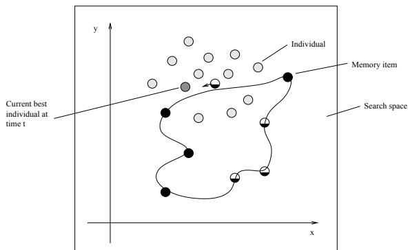
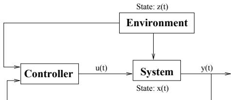
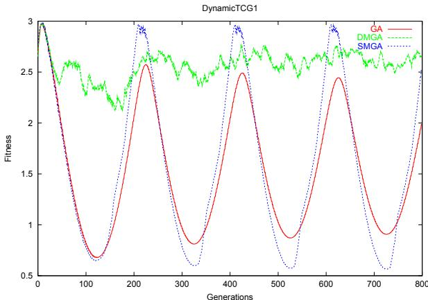
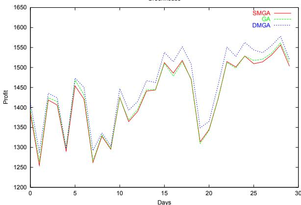
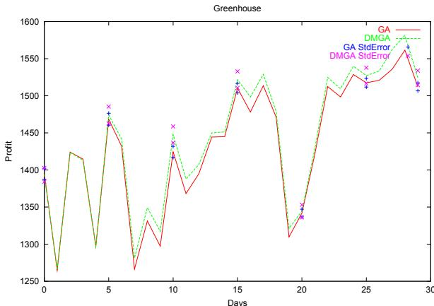

# Dynamic Memory Model for Non-Stationary Optimization

Claus N. Bendtsen EVALife, Department of Computer Science Ny Munkegade, Bldg. 540, University of Aarhus DK-8000 Aarhus C, Denmark www.evalife.dk claus@daimi.au.dk

Thiemo Krink EVALife, Department of Computer Science Ny Munkegade, Bldg. 540, University of Aarhus DK-8000 Aarhus C, Denmark www.evalife.dk krink@daimi.au.dk

Abstract - Real-world problems are often nonstationary and can cause cyclic, repetitive patterns in the search landscape. For this class of problems, we introduce a new GA with dynamic explicit memory, which showed superior performance compared to a classic GA and a previously introduced memorybased GA for two dynamic benchmark problems.

# I. Introduction

In recent years non-stationary optimization has become a growing field of research because of its importance in real-world applications. Industrial applications such as elevator systems or phone-call routing controllers are required to adapt to customers whose behaviour cannot be estimated well in advance. In job shop scheduling new jobs may arrive, machines may break down or wear out. For this type of optimization, an effective evolutionary algorithm (EA) must be able to keep up with the pace of changes or ideally anticipate changes before they occur. This turns out to be a problem for classic GAs, since they can only follow but not anticipate changes in the objective function and, depending on the speed of changes, may lose track of optima in the changing fitness landscape. Many experts in this field suggested extensions of classic GAs, which tackle the latter problem by maintaining or reintroducing diversity. Cobb [3] introduced triggered hyper-mutation to control the mutation rate whenever a change occurs. Other approaches such as random immigrants [9], ageing individuals [7], tag bits [12] and dynamic distributed sub-populations [20] aim to maintain diversity by spreading out the population and keeping track of moving peaks.

In real world problems, dynamic changes are often affected by natural rhythmic patterns, such as day-night, weekly, or seasonal cycles in staff-scheduling problems. In these cases, solutions with a high fitness may happen to reappear at a near optimum at a later stage. Additionally, redundant genome representations can slow down convergence and favour diversity. In previous work, memory has either been modelled implicitly by a redundant genome representation, such as diploid chromosomes [8] or explicitly by storing and retrieving candidate solutions from a separate memory [2]. In this paper, we introduce a new EA model for explicit memory, the socalled dynamic memory EA. In our approach, the memory is adjusted to the dynamic changes by moving externally stored candidate solutions gradually in the search space towards the currently nearest best genomes in the EA population.

The paper is structured as follows: Section II reviews the memory related literature and motivates our approach. Afterwards, we introduce our dynamic memory model in section III and describe the benchmark test-problems and the experimental setup for a performance comparison with other EAs in sections IV and V. Finally, we present the results of these experiments in section V-B and discuss our new approach in section VI.

# II. Memory-based approaches

The following subsection gives a brief review of memory related research with evolutionary computation. For a more comprehensive survey see [1].

# A. Implicit Memory

Perhaps the most prominent approach to redundant representation by memory is to use diploid instead of haploid chromosomes. This was first suggested as an extension of the simple GA by Goldberg and colleagues [8] and further investigated by others, such as Ng and Wong [15]. In these two approaches, the authors used a tri and four allele scheme respectively, in which the genes have recessive and dominant attributes and dominant alleles determine the gene exclusively. Another approach is to use additive diploidy [17], [11], in which all alleles are added and the gene becomes 1 if a certain threshold is exceeded and $0$ otherwise. The results produced by multiploid representations so far indicate that they are useful in periodic environments where it is sufficient to remember a few states and important to be able to return to previous states quickly. Further, as Corne pointed out [4], diploidy can also be useful in stationary landscape in cases where a haploid EA would be likely to irretrievably lose genetic material necessary to find an optimum.

Apart from diploidy, Dasgupta and colleagues introduced an approach with haploid chromosomes and multilayered gene regulation, where high level genes control the activation of a set of low level genes. Here, a single change of the genome can have drastic effects on the phenotype [5].

# B. Explicit Memory

The main idea with explicit memory is that remembering old solutions can turn out to be an advantage later on in a dynamic fitness landscape. It may even allow the population to jump to a different area in the landscape in one step, which would not be possible without a strong hyper-mutation in a classic GA. Compared to hyper-mutation the difference is that with memory the jump is clearly directed whereas hyper-mutation requires numerous trials and errors.

Different approaches have been reported in the literature using explicit memory. Louis and Xu [13] studied scheduling and re-scheduling by means of restarting the EA with individuals evolved by a related problem. Whenever a change occurred, the EA was restarted and the population was initialized with a seed from the old run and the rest randomly. The authors concluded from the experiments that a seed of $5 \mathrm { - } 1 0 ~ \%$ from the old run produced better and faster results than running the EA with a totally randomly initialized population after a change occurred. In this approach, memory was only used to seed a new run of an EA, but not as permanent memory.

Ramsey and Greffenstette [16] introduced an EA model that stored good candidate solutions for a robot controller in a permanent memory together with information about the robot environment. The idea is that if the robot environment becomes similar to a stored environment instance the corresponding stored controller solution is reactivated. For this they used a simulator to train good strategies for robot movement and obstacle avoidance. In the article the authors reported that their technique prevented premature convergence by a higher level of diversity and yielded significant improvements. The only drawback of this approach is that it assumes that the similarity of the robot environment is measurable.

Another approach was introduced by Trojanowski and Michalewicz [18], in which each individual remembers some of its ancestor’s solutions. After a change in the environment, the current solution and the memory solutions are re-evaluated and the best solution becomes the active solution, keeping the other solutions in memory. The size of the memory is fixed and individuals from the first generation start with an empty memory buffer. For each of the following generations the parent solution is stored in memory and if the memory is already full the oldest memory solution is removed.

Further Eggermont and colleagues [6] suggested an EA model, which focuses on a shared memory instead of a local memory, only available to the individual. They implemented the model for a bit representation based on a real numerical representation by Branke [2]. In this approach the best individuals from some of the generations are stored in a shared memory. The memory starts out empty and is filled through out the run. The size of the memory is fixed and different approaches of replacement strategies, when storing individuals, were tested, such as replacing individuals by their age or their contribution to diversity and fitness. Branke [2] and Eggermont et al. [6] found significant improvement compared to approaches without memory on dynamic test problems.

In the following section we will introduce our approach to explicit memory, which is closely related to the just mentioned approach, but instead of storing old solution we let the memory itself keep track of the dynamic changes.

# III. The Dynamic Memory Model (DMM)

When dealing with real-world problems it is rarely the case that the exact same solution will receive the identical fitness at a later stage. However the dynamic change may cause the optima to be in the neighbourhood of an old solution more often. Therefore keeping a static memory of old solutions may, in some cases, turn out to be superfluous and yield no performance improvement.

  
Fig. 1. Movement of memory points. The curve is an example of a dynamic changing optimum. The black circles are the memory points, the light gray scaled circles are the population solutions and the gray circle is the best individual in the population.

In this paper, we introduce a dynamic explicit memory approach. Like in previous work on explicit memory, we keep a fixed number of candidate solutions in an explicit memory. However, instead of replacing memory items with individuals from the current EA population, we keep the same memory items and let them adjust to the changes in the search environment. For the adjustment, the algorithm selects the currently best individual in the EA population and finds the closest (most similar) stored candidate solution. The closest stored candidate solution is then gradually moved towards the currently best individual in the EA population. The result of this iterative process is that the stored candidate solutions close in on the trajectory of moving optima in the changing environment by producing outposts at different locations (see figure 1). If the optima return to the same proximity in the search space the memory points can selfadjust to the translocated optima.

# procedure DMGA

begin initialize population initialize memory evaluate while( not termination-condition ) do begin select recombine mutate evaluate update memory replace worst individual by best memory point end   
end

The model works as follows (see figure 2 and figure 3): The DMGA is based on a classical GA, but differs in the memory handling. In the initialization process an explicit memory of a fixed number of stored candidate solutions is initialized with random candidate solutions. In each iteration the best individual in the population is found and the closest stored candidate solution to the best individual is moved towards the best individual (see figure 1). By movement, we mean movement in the search space. We calculate the direction from the genotypes of the stored candidate solution to the best individual and move in this direction. The movement distance is the actual distance between the two locations multiplied with the absolute value of a Gaussian random number with a mean of zero and a variance of 0.5. The variance has not been tuned, but 0.5 seemed like a reasonable choice. Af

procedure update memory()   
begin for each memory point $i$ do begin if memory point $i$ closest to best individual closest = memory point $i$ end move closest in the direction of best individual for each memory point $i$ do begin if memory point $i$ never been closest to a best individual mutate(memory point $\textit { \textbf { \ i } }$ ) end   
end

terwards the best stored candidate solution is introduced in the search population by replacing the worst individual. Until a stored candidate solution has been affected (moved) by a best individual, it makes small random jumps by a minor mutation to explore the environment. The random jump is implemented by adding a random Gaussian number with a mean of zero and a variance of 0.5 to all the EA parameters.

# IV. Test Problems

In order to investigate how the model could cope with dynamic problems, we have tested it on a simple circular moving peak problem using a non-stationary test-casegenerator (TCG) [14]. We have compared our approach with a classic GA and another explicit memory approach by Branke (see section II-B) [2].

Further, we have tested the performance of our algorithm regarding a more real world like control problem of a greenhouse [10]. The greenhouse model is an implementation of a crop producing greenhouse where the production is controlled by heating, injection of $C O _ { 2 }$ , ventilation, and optional use of artificial light. The objective is to maximize the profit, i.e. to maximize the production while minimizing the expenses of heating, $C O _ { 2 }$ , and electricity.

The greenhouse simulator is based on a controller design shown in figure 4 [19]. The model uses direct control, which means that the on-line evolved controller, that is the best individual at time $t$ , directly controls the system for a time-period and changes the state of the system. This leads to a situation where the search for optimal control affects the changes of the fitness landscape. This is a characteristic property of direct control and can not be modelled with a simplistic dynamic test case generators such as the one by Morrison and colleagues [14]. In addition to control feedback, the system is affected by changes in the surrounding environment.

  
Fig. 4. Model for controller, system, and environment. $\mathbf { x ( t ) }$ represent the internal state of the system at time t, $\mathbf { u ( t ) }$ is the control signal, $\mathbf { z ( t ) }$ is the state of the surrounding environment at time t, and $\mathbf { y } ( \mathbf { t } )$ is the output from the system.

The variables in the greenhouse simulator are categorized into three groups for control, system, and environment variables. Control variables are heating, ventilation, $C O _ { 2 }$ injection and artificial light. System variables are indoor temperature, $C O _ { 2 }$ level in the greenhouse and the amount of harvested crops. The environment variables were based on real weather data including outdoor temperature and sunlight intensity representing a standard March month in Denmark. Additionally prices for crops, heating, $C O _ { 2 }$ gas, and electricity were used as environment variables.

Finally the profit per time-step was modelled as:

$$
\begin{array} { l l l } { { p _ { p r o f i t } } } & { { = } } & { { z _ { p c r o p } \cdot \Delta x _ { c r o p } - ( z _ { p h e a t } \cdot u _ { h e a t } + } } \\ { { } } & { { } } & { { } } \\ { { } } & { { } } & { { z _ { p C O _ { 2 } } \cdot u _ { C O _ { 2 } } + z _ { p e l e c } \cdot u _ { l i g h t } ) } } \end{array}
$$

Where $z _ { p c r o p }$ , $z _ { p h e a t }$ , $z _ { p C O _ { 2 } }$ , $z _ { p e l e c }$ denote the prices, $x _ { c r o p }$ is the current amount of crop and $u _ { h e a t }$ , $u _ { C O _ { 2 } }$ , and $u _ { l i g h t }$ denote the control variables.

To calculate the fitness, eight time steps (2 hours) were simulated and the sum of the profit was used as the objective function:

$$
F i t _ { s u m } ( I ) = \sum _ { i = 1 } ^ { 8 } p _ { p r o f i t } [ i ]
$$

Where $p _ { p r o f i t } [ i ]$ denotes the profit in the $i$ ’th measurement in the simulation.

# V. Experiments

# A. Experimental design

For our experiments, we implemented a classic GA with real-valued encoding, tournament selection, arithmetic crossover, and Gaussian mutation.

We enhanced the classic GA with our Dynamic Memory approach (DMGA) and implemented a static memory scheme by Branke (SMGA)(as mentioned in section IIB) for comparison.

The static memory model adds an explicit memory with a fixed size to the classic GA and in every 10’th iteration the best individual is stored in memory. The memory is initialized empty and filled up throughout the run. If the memory has reached its capacity a new memory point replaces the most similar point of the stored memory

All three algorithms were compared regarding the two benchmark test problems introduced in section IV.

In all experiments, we used a population size of 110 (including memory, when used) and a memory size of 10.

For the fast moving peak problem, we used the following settings: probability of crossover $p _ { c } = 0 . 7$ , probability of mutation $p _ { m } = 0 . 2$ , variance $\sigma = 0 . 5$ , number of generation = 800, and repetitions $= 2 5$ . The 2D search space was defined as - $- 1 0 \leq \mathrm { x } \leq 1 0$ and - $- 1 0 \le \mathrm { y } \le 1 0$ . The peak was moving in a circular motion around (0,0) with a distance of 4. The static period was set to 2 and the speed of the peak was set to 100, i.e. it takes 200 time-steps before the peak return to its origin. The peak was cone shaped, its size was set to a height of 3 and its slope to 3.

For the greenhouse problem, we used the following setting: probability of crossover $p _ { c } = 0 . 9$ , probability of mutation $p _ { m } = 0 . 5$ , and variance $\sigma = 0 . 5$ . The controller was updated between each time-step and the problem was simulated for 28 days, i.e. 2880 generations, for 50 repetitive runs.

Further we investigated the effect of using random jumps in our Dynamic Memory Model by runs with and without random jumps.

# B. Results

The graphs in all figures show the fitness of the best individual averaged over 25 runs in the fast moving peak problem and 50 runs in the greenhouse problem.

Figure 5 shows that only our dynamic memory GA was able to follow the dynamic change of the environment. In contrast the classic GA started out with a near optimum solution, but after a few problem cycles it could not find the optimum anymore and the fitness slowly dropped as a result of premature convergence. Further, the static memory approach quickly found a near optimum and saved this location to memory, but as the environment changed it was not able to follow it. Because of the fixed saved location it always found the near optimum when the environment returned to this location, but the population also tended to converge prematurely.

Figure 6 and 7 show the results accordingly for the greenhouse problem optimization (see table I for standard errors). In the beginning of the runs there were overlaps, as expected, as time progressed there were significant differences, which is in accordance with our expectations, because it takes time to optimize the control performance. Therefore the results clearly show that adding our memory approach to the classic GA produces better results then without. On this problem Branke’s static memory model [2] did not improve the performance at all (see figure 6), but rather yielded worse results then the classic GA.

  
Fig. 5. Fast moving peak problem (average of 25 runs). The GA is the classic GA, the DMGA is the classic GA enhanced with our Dynamic Memory Model and SMGA is the classic GA enhanced with the static memory model [2], which has also briefly been described in this section.

  
Fig. 6. memory with random jump (average of 50 runs). The GA is the classic GA, DMGA is the classic GA enhanced with our Dynamic Memory Model and SMGA is the classic GA enhanced with the static memory approach introduced in [2].

In order to investigate the effect of the random jumps, we performed two different experiments on the greenhouse problem. One with and one without random jumps. Figure 7 shows that even without random jumps

  
Fig. 7. memory without random jump (average of 50 runs). The GA is the classic GA, DMGA is the classic GA enhanced with our Dynamic Memory Model and StdError is the standard error for the respective model.

TABLE I   

<table><tr><td rowspan=1 colspan=1>Model</td><td rowspan=1 colspan=1>Days</td><td rowspan=1 colspan=1>Current profit</td><td rowspan=1 colspan=1>Std.error</td></tr><tr><td rowspan=7 colspan=1>GA</td><td rowspan=1 colspan=1>0</td><td rowspan=1 colspan=1>1394.86</td><td rowspan=1 colspan=1>± 7.37</td></tr><tr><td rowspan=1 colspan=1>5</td><td rowspan=1 colspan=1>1468.34</td><td rowspan=1 colspan=1>± 8.04</td></tr><tr><td rowspan=1 colspan=1>10</td><td rowspan=1 colspan=1>1424.34</td><td rowspan=1 colspan=1>± 7.48</td></tr><tr><td rowspan=1 colspan=1>15</td><td rowspan=1 colspan=1>1510.33</td><td rowspan=1 colspan=1>± 6.35</td></tr><tr><td rowspan=3 colspan=1>202529</td><td rowspan=1 colspan=1>1341.86</td><td rowspan=1 colspan=1>± 5.23</td></tr><tr><td rowspan=1 colspan=1>1517.53</td><td rowspan=1 colspan=1>± 5.78</td></tr><tr><td rowspan=1 colspan=1>1512.02</td><td rowspan=1 colspan=1>± 5.37</td></tr><tr><td rowspan=2 colspan=1>DMGAwith</td><td rowspan=1 colspan=1>0</td><td rowspan=1 colspan=1>1408.46</td><td rowspan=1 colspan=1>± 10.02</td></tr><tr><td rowspan=1 colspan=1>5</td><td rowspan=1 colspan=1>1473.06</td><td rowspan=1 colspan=1>± 9.19</td></tr><tr><td rowspan=5 colspan=1>randomjump</td><td rowspan=1 colspan=1>10</td><td rowspan=1 colspan=1>1446.69</td><td rowspan=1 colspan=1>± 11.55</td></tr><tr><td rowspan=1 colspan=1>15</td><td rowspan=1 colspan=1>1537.62</td><td rowspan=1 colspan=1>± 11.67</td></tr><tr><td rowspan=1 colspan=1>20</td><td rowspan=1 colspan=1>1365.01</td><td rowspan=1 colspan=1>± 10.34</td></tr><tr><td rowspan=1 colspan=1>25</td><td rowspan=1 colspan=1>1544.69</td><td rowspan=1 colspan=1>± 11.62</td></tr><tr><td rowspan=1 colspan=1>29</td><td rowspan=1 colspan=1>1532.12</td><td rowspan=1 colspan=1>± 8.29</td></tr><tr><td rowspan=7 colspan=1>SMGA</td><td rowspan=1 colspan=1>0</td><td rowspan=1 colspan=1>1383.55</td><td rowspan=1 colspan=1>± 7.03</td></tr><tr><td rowspan=1 colspan=1>5</td><td rowspan=1 colspan=1>1453.82</td><td rowspan=1 colspan=1>± 8.00</td></tr><tr><td rowspan=1 colspan=1>10</td><td rowspan=1 colspan=1>1424.93</td><td rowspan=1 colspan=1>± 6.15</td></tr><tr><td rowspan=1 colspan=1>15</td><td rowspan=1 colspan=1>1512.12</td><td rowspan=1 colspan=1>± 6.18</td></tr><tr><td rowspan=1 colspan=1>20</td><td rowspan=1 colspan=1>1344.71</td><td rowspan=1 colspan=1>± 4.43</td></tr><tr><td rowspan=1 colspan=1>25</td><td rowspan=1 colspan=1>1498.25</td><td rowspan=1 colspan=1>± 5.64</td></tr><tr><td rowspan=1 colspan=1>29</td><td rowspan=1 colspan=1>1508.23</td><td rowspan=1 colspan=1>± 5.08</td></tr></table>

Mean and standard error of profit (average of 50 runs), taken from figure 6.

there was a clear improvement compared to not using memory at all. However, a comparison of figure 6 with figure 7 shows that the results are better using random jumps.

# VI. Discussion and Conclusions

In this paper, we have introduced a new approach to enhance evolutionary algorithms with memory. Instead of using a static memory we have used a dynamic memory, where the memory self-adapts to the changes in the environment. We tested the performance of the model regarding two different non-stationary problems, a rather simple fast moving peak problem and a more real-world like control problem simulating a crop producing greenhouse. We compared the results of our new model with a classic GA and another static explicit memory model introduced by Branke [2].

Based on these experiments, we can conclude that on both problem classes our dynamic memory model produced superior results.

In case of the fast moving peak problem, the classic GA and the static memory model were not able to follow the significant changes in the environment. In contrast our dynamic memory model did not prematurely converge and was able to follow the changes in the environment very well.

Also regarding the greenhouse problem we achieved clearly superior results with our model compared to the classic GA and the static memory model. Further we investigated how much additional random jumps contribute to the performance of the DMGA. Our experiments showed that superior results could even be achieved without random jumps. The static memory model, in contrast had a tendency to produce even worse results then the classic GA regarding this benchmark. This might be because old solutions are not useful for future solutions, but require continuous adjustments to the changing fitness landscape.

As mentioned in section III our main idea with the dynamic memory was that the memory points should spread out as outposts in the dynamic environment. From our experiments this is actually what happens, but if the problem domain becomes too large then our current random initialization of the memory may turn out to be inadequate, because too few memory points would be affected. In future work we will look into the initialization process of the memory to overcome this problem. Further we plan to run additional experiments with different problems and compare our approach with other memory approaches.

# Список литературы

[1] Branke, J. (1999) Evolutionary approaches to Dynamic Optimization Problems: A Survey In Evolutionary Algorithms for Dynamic Optimization Problems, pages 134-137. [2] Branke, J. (1999) Memory Enhanced Evolutionary Algorithms for Changing Optimization Problems In Angeline, P.J., Michalewicz, Z., Schoenauer, M., Yao, X., and Zalzala, A., editors, Proceedings of the Congress of Evolutionary Computation, volume 3, pages 1875-1882, Mayflower Hotel, Washington D.C., USA.IEEE Press. [3] Cobb, H. G.(1990) An investigation into the use of hypermutation as an adaptive operator in genetic algorithms having

continuous, time dependent non-stationary environments Technical Report AIC-90-001, Naval Research Laboratory, Washington, USA.   
[4] Corne, D., Collingwood, E. and Ross, P.(1996) Investigating Multiploidy’s Niche In Proceedings of AISB Workshop on Evolutionary Computing.   
[5] Dasgupta, D. and McGregor, D. R. (1992) Nonstaztionary Function Optimization using the Structured Genetic Algorithm In Proceedings of Parallel Problem Solving From Nature (PPSN2) Conference, pages 145-154, 1992.   
[6] Eggermont, J., Lenaerts, T., Poyhonen, S. and Termier, A.(2001) Raising the Dead; Extending Evolutionary Algorithms with a Case-based Memory In Genetic Programming, Proceedings of EuroGP’2001, pages 280-290.   
[7] Ghosh, A., Tsutsui, S. and Tanaka, H. (1998), Function Optimization in Nonstationary Environment using Steady State Genetic Algorithms with Aging of Individuals Proceedings of the 1998 IEEE International Conference on Evolutionay Computation.   
[8] Goldberg, D. E. and Smith, R. E. (1987) Nonstationary function optimization using genetic algorithms with dominance and diploidy Proceedings of the Second International Conference on Genetic Algorithms, pages 59-68. Lawrence Erlbaum Associates, 1987.   
[9] Grefenstette, J. J.(1992) Genetic algorithms for changing environments Proc. Parallel Problem Solving from Nature-2, R. Maenner and B. Manderick (Eds.), North-Holland, 137-144.   
[10] Krink, T. and Ursem, R. K.(2001) Evolutionary Algorithms in Control Optimization: The Greenhouse Problem. In Proceedings of the Genetic and Evolutionary Computation Conference 2001.   
[11] Lewis, J., Hart, E. and Ritchie, G.(1998) A Comparison of Dominance Mechanisms and Simple Mutation on NonStationary Problems In Parallel Problem Solving from Nature (PPSN V), pages 139-148.   
[12] Liles, W. and Jong, K., A., D.(1999) The Usefulness of Tag Bits in Changing Environments. Proceedings of the Congress of Evolutionary Computation 1999, p. 2054-2060.   
[13] Louis, S., J. and Xu, Z.(1996) Genetic Algorithms for Open Shop Scheduling and Re-Scheduling In ISCA 11th Int. Conf. on Computers and their Applications   
[14] Morrison, R. W. and Jong,K. A. D. (1999) A Test Problem Generator for Non-Stationary Environments IEEE   
[15] Ng, K. P. and Wong, K. C.(1995) A new diploid scheme and dominance change mechanism for non-stationary function optimisation In Proceedings of the Sixth International Conference on Genetic Algorithms, 1995   
[16] Ramsey, C. L. and Grefenstette, J. J. (1993) Case-Based Initialization of Genetic Algorithms In Proceedings of the Fifth International Conference on Genetic Algorithms   
[17] Ryan, C.(1996) The Degree of Oneness In Proceedings of the ECAI workshop on Genetic Algorithms. Springer-Verlag, 1996.   
[18] Trojanowski, K. and Michalewicz, Z. (1999) Searching for Optima in Non-stationary Environments In Proceedings of the Congress of Evolutionary Computation 1999, pages 1843-1850.   
[19] Ursem, R. K., Krink, T., Jensen, M. T., and Michalewicz, Z.(2001) Analysis and Modeling of Control Tasks in Dynamic Systems to appear in: IEEE Transactions on Evolutionary Computation.   
[20] Yi, W., Liu, Q., He, Y.(2000) Dynamic Distributed Genetic Algorithms Congress on Evolutionary Computations 2000