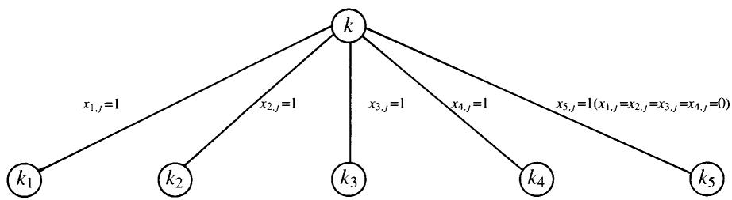
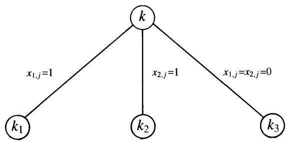
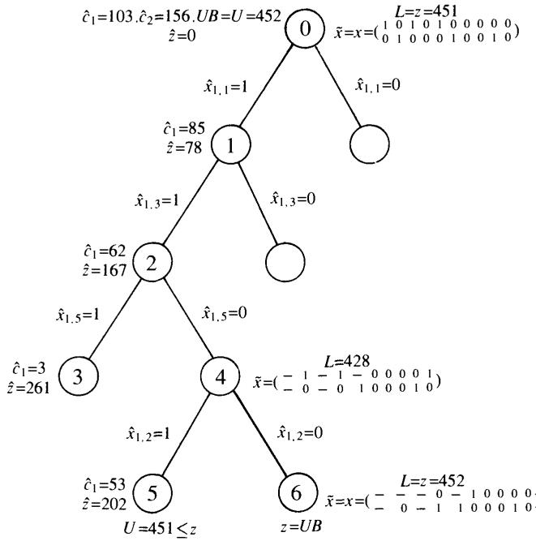

# 0-1 Multiple knapsack problem

# 6.1 INTRODUCTION

The 0-1 Multiple Knapsack Problem (MKP) is: given a set of $n$ items and a set of m knapsacks $( m \leq n )$ , with

$$
\begin{array} { l } { p _ { j } = { p r o f i t ~ \mathrm { o f ~ i t e m ~ } j , } } \\ { \begin{array} { r l } & { \displaystyle { w _ { j } = w e i g h t ~ \mathrm { o f ~ i t e m ~ } j , } } \\ & { \displaystyle { c _ { i } = c a p a c i t y ~ \mathrm { o f ~ k n a p s a c k ~ } i , } } \end{array} } \end{array}
$$

select m disjoint subsets of items so that the total profit of the selected items is a maximum, and each subset can be assigned to a different knapsack whose capacity is no less than the total weight of items in the subset. Formally,

$$
z = \sum _ { i = 1 } ^ { m } \sum _ { j = 1 } ^ { n } p _ { j } x _ { i j }
$$

$$
\sum _ { j = 1 } ^ { n } w _ { j } x _ { i j } \leq c _ { i } , \qquad i \in M = \{ 1 , \dots , m \} .
$$

$$
\sum _ { i = 1 } ^ { m } x _ { i j } \quad \le 1 , \qquad j \in N = \{ 1 , \dots , n \} ,
$$

$$
x _ { i j } = 0 ~ \mathrm { o r } ~ 1 , \qquad i \in M , j \in N ,
$$

where

$$
x _ { i j } = { \left\{ \begin{array} { l l } { 1 } & { { \mathrm { i f ~ i t e m ~ } } j { \mathrm { ~ i s ~ a s s i g n e d ~ t o ~ k n a p s a c k ~ } } i ; } \\ { 0 } & { { \mathrm { o t h e r w i s e } } . } \end{array} \right. }
$$

When $m = 1$ , MKP reduces to the 0-1 (single) knapsack problem considered in Chapter 2.

We will suppose, as is usual, that the weights $w _ { j }$ are positive integers. Hence, without loss of generality, we will also assume that

$p _ { j }$ and $c _ { i }$ are positive integers,

$$
\begin{array} { l l } { w _ { j } \leq \operatorname* { m a x } _ { i \in M } \left\{ c _ { i } \right\} } & { \ \mathrm { f o r } \ j \in N , } \\ { ~ } & \\ { c _ { i } \geq \operatorname* { m i n } _ { j \in N } \left\{ w _ { j } \right\} ~ } & { \ \mathrm { f o r } i \in M , } \\ { ~ } & \\ { \displaystyle \sum _ { j = 1 } ^ { n } w _ { j } > c _ { i } ~ } & { \ \mathrm { f o r } i \in M . } \end{array}
$$

If assumption (6.5) is violated, fractions can be handled by multiplying through by a proper factor, while nonpositive values can easily be handled by eliminating all items with $p _ { j } \leq 0$ and all knapsacks with $c _ { i } \leq 0$ (There is no easy way, instead, of transforming an instance so as to handle negative weights, since the Glover (1965) technique given in Section 2.1 does not extend to MKP. All the considerations in this Chapter, however, easily extend to the case of nonpositive values.) Items $j$ violating assumption (6.6), as well as knapsacks $i$ violating assumption (6.7), can be eliminated. If a knapsack, say $i ^ { * }$ , violates assumption (6.8), then the problem has the trivial solution $x _ { i } { * } _ { j } = 1$ for $j \in N$ . $x _ { i j } = 0$ for $i \in M \backslash \{ i ^ { * } \}$ and $j \in N$ . Finally, observe that if $m > n$ then the $( m - n )$ knapsacks of smallest capacity can be eliminated.

We will further assume that the items are sorted so that

$$
\frac { p _ { 1 } } { w _ { 1 } } \geq \frac { p _ { 2 } } { w _ { 2 } } \geq \ldots \geq \frac { p _ { n } } { w _ { n } } .
$$

In Section 6.2 we examine the relaxation techniques used for determining upper bounds. Approximate algorithms are considered in Sections 6.3 and 6.6 . In Section 6.4 we describe branch-and-bound algorithms, in Section 6.5 reduction techniques. The results of computational experiments are presented in Section 6.7.

# 6.2 RELAXATIONS AND UPPER BOUNDS

Two techniques are generally employed to obtain upper bounds for MKP: the surrogate relaxation and the Lagrangian relaxation. As we show in the next section, the continuous relaxation of the former also gives the value of the continuous relaxation of MKP.

# 6.2.1 Surrogate relaxation

Given a positive vector $( \pi _ { 1 } , \ldots , \pi _ { m } )$ of multipliers, the standard surrogate relaxation, $S ( M K P . \pi )$ , of MKP is

$$
\sum _ { i = 1 } ^ { m } \sum _ { j = 1 } ^ { n } p _ { j } x _ { i j }
$$

$$
\sum _ { i = 1 } ^ { m } \pi _ { i } \sum _ { j = 1 } ^ { n } w _ { j } x _ { i j } \leq \sum _ { i = 1 } ^ { m } \pi _ { i } c _ { i }
$$

$$
\sum _ { i = 1 } ^ { m } x _ { i j } \le 1 , \qquad j \in N ,
$$

$$
x _ { i j } = 0 ~ \mathrm { o r } ~ 1 , \qquad i \in M , j \in N .
$$

Note that we do not allow any multiplier, say $\pi _ { \bar { \imath } } ^ { - }$ , to take the value zero, since this would immediately produce a useless solution $( x _ { \bar { \imath } j } = 1$ for $j \in N$ of value $\scriptstyle \sum _ { j = 1 } ^ { n } p _ { j }$ . The optimal vector of multipliers, i.e. the one producing the minimum value of $z \left( S \left( M K P , \pi \right) \right)$ and hence the tightest upper bound for MKP, is then defined by the following

Theorem 6.1 (Martello and Toth, 1981a) For any instance of MKP, the optimal vector of multipliers for $S ( M K P . \pi ) $ is $\pi _ { i } = k$ ( $k$ any positive constant) for all $i \in M$ .

Proof. Let $\overline { { \iota } } \ = \ \mathrm { a r g \ m i n } \{ \pi _ { i } \ : \ i \ \in \ M \}$ , and suppose that $( x _ { i j } ^ { * } )$ defines an optimal solution to $S ( M K P , \pi )$ . A feasible solution of the same value can be obtained by setting $x _ { i j } ^ { * } = 0$ and $x _ { \overline { { \imath } } j } ^ { * } = 1$ for each $j \in N$ such that $x _ { i j } ^ { * } = 1$ and $i \neq \bar { \iota }$ (since the only effect is to decrease the left-hand side of (6.11)). Hence $S ( M K P , \pi )$ is equivalent to the 0-1 single knapsack problem

$$
\mathrm { m a x i m i z e } \qquad \sum _ { j = 1 } ^ { n } p _ { j } x _ { \bar { \imath } j }
$$

$$
\sum _ { j = 1 } ^ { n } w _ { j } x _ { \overline { { \imath } } j } \leq \left\lfloor \sum _ { i = 1 } ^ { m } \pi _ { i } c _ { i } / \pi _ { \overline { { \imath } } } \right\rfloor ,
$$

$$
x _ { \bar { \imath } j } = 0 \mathrm { o r } 1 , \qquad j \in N .
$$

Since $\begin{array} { r } { \lfloor \sum _ { i = 1 } ^ { m } \pi _ { i } c _ { i } / \pi _ { \overline { { \imath } } } \rfloor \ge \sum _ { i = 1 } ^ { m } c _ { i } } \end{array}$ , the choice $\pi _ { i } ~ = ~ k$ $k$ any positive constant) for all $i \in M$ produces the minimum capacity and hence the minimum value of $z \left( S \left( M K P , \pi \right) \right)$ .

By setting $\pi _ { i } = k > 0$ for all $i \in M$ , and $\begin{array} { r } { y _ { j } = \sum _ { i = 1 } ^ { m } x _ { i j } } \end{array}$ for all $j \in N$ , $S ( M K P , \pi )$ becomes

$$
\sum _ { j = 1 } ^ { n } p _ { j } y _ { j }
$$

$$
\sum _ { j = 1 } ^ { n } w _ { j } y _ { j } \leq \sum _ { i = 1 } ^ { m } c _ { i } ,
$$

$$
y _ { j } = 0 \mathrm { o r } 1 , \qquad j \in N ,
$$

which we denote simply with $S \left( M K P \right)$ in the following. Loosely speaking, this relaxation consists in using only one knapsack, of capacity

$$
c = \sum _ { i = 1 } ^ { m } c _ { i } .
$$

The computation of upper bound $z \left( S \left( M K P \right) \right)$ for MKP has a non-polynomial time complexity, although many instances of the 0-1 knapsack problem can be solved very quickly, as we have seen in Chapter 2. Weaker upper bounds, requiring $O ( n )$ time, can however be computed by determining any upper bound on $z ( S \left( M K P \right) )$ through the techniques of Sections 2.2 and 2.3.

A different upper bound for MKP could be computed through its continuous relaxation, $C ( M K P )$ , given by (6.1), (6.2), (6.3) and

$$
0 \le x _ { i j } \le 1 , \qquad i \in M , \ j \in N .
$$

This relaxation, however, is dominated by any of the previous ones, since it can be proved that its value is equal to that of the continuous relaxation of the surrogate relaxation of the problem, i.e.

# Theorem 6.2 $z \left( C \left( M K P \right) \right) = z \left( C \left( S \left( M K P \right) \right) \right) .$

Proof. It is clear that, by setting $\pi _ { i } = k > 0$ for all $i$ $, C ( S ( M K P ) )$ , which is obtained from (6.10)(6.13) by relaxing (6.13) to (6.15), coincides with $S \left( C \left( M K P \right) \right)$ , which is obtained from (6.1), (6.2), (6.3) and (6.15) by relaxing (6.2) to (6.11). Hence we have $z ( C ( S ( M K P ) ) ) ~ \ge ~ z \left( C \left( M K P \right) \right)$ . We now prove that $z \left( C \left( M K P \right) \right) \ \geq$ $z \left( C \left( S \left( M K P \right) \right) \right)$ also holds.

The exact solution $( \overline { { y } } _ { j } )$ of the continuous relaxation of $S \left( M K P \right)$ can easily be determined as follows. If $\begin{array} { r } { \sum _ { j = 1 } ^ { n } w _ { j } \le c } \end{array}$ ,where $c$ is given by (6.14), then $\overline { { y } } _ { j } = 1$ for $j = 1 , \dots , n$ and $\begin{array} { r } { z \left( C \left( S \left( M K P \right) \right) \right) = \sum _ { j = 1 } ^ { n } p _ { j } } \end{array}$ Otherwise, from Theorem 2.1,

$$
\begin{array} { r l } { \overline { { y } } _ { j } = 1 } & { { } \quad \mathrm { f o r } j = 1 , \ldots , s - 1 , } \\ { } & { { } } \\ { \overline { { y } } _ { j } = 0 } & { { } \quad \mathrm { f o r } j = s + 1 , \ldots , n , } \end{array}
$$

$$
\overline { { y } } _ { s } = \left( c - \sum _ { j = 1 } ^ { s - 1 } w _ { j } \right) / w _ { s } ,
$$

where

$$
s = \operatorname* { m i n } { \left\{ j : \sum _ { k = 1 } ^ { j } w _ { k } > c \right\} } ,
$$

and

$$
z \left( C \left( S \left( M K P \right) \right) \right) = \sum _ { j = 1 } ^ { s - 1 } p _ { j } + \left( c - \sum _ { j = 1 } ^ { s - 1 } w _ { j } \right) p _ { s } \rlap { / } / w _ { s } .
$$

It is now easy to show that there exists a feasible solution $( \overline { { x } } _ { i j } )$ to $C \left( M K P \right)$ for which $\sum _ { i = 1 } ^ { m } { \overline { { x } } } _ { i j } = { \overline { { y } } } _ { j }$ for  all $j \in N$ consecutively inserting items $j = 1 , 2 , \dots$ into knapsack 1 (and setting $\overline { { x } } _ { 1 } { \bf \Phi } _ { j } = 1$ , $\mathit { \Pi } _ { \overline { { X } } _ { i j } } ~ = ~ 0$ for $i \neq 1 \}$ , until the first item, say $j ^ { * }$ , is found which does not fit since the residual capacity $\overline { { c } } _ { 1 }$ is less than $w _ { j } \ast$ . We then insert the maximum possible fraction of $w _ { j }$ • into knapsack 1 (by setting $\overline { { x } } _ { 1 j } \bullet = \overline { { c } } _ { 1 } / w _ { j } \bullet \big )$ and continue with the residual weight $\overline { { { w } } } _ { j } \bullet \ = \ w _ { j } \bullet \ - \ \overline { { { c } } } _ { 1 }$ and knapsack 2, and so on. Hence $z \left( C \left( M K P \right) \right) \ge z \left( C \left( S \left( M K P \right) \right) \right)$ . □

# Example 6.1

Consider the instance of MKP defined by

$$
{ \begin{array} { r l } { n } & { = 6 ; } \\ { m } & { = 2 ; } \\ { ( p _ { j } ) } & { = ( 1 1 0 , 1 5 0 , 7 0 , 8 0 , 3 0 , 5 ) ; } \\ { ( w _ { j } ) } & { = ( \ 4 0 , \ 6 0 , \ 3 0 , 4 0 , 2 0 , 5 ) ; } \\ { ( c _ { i } ) } & { = ( 6 5 , 8 5 ) . } \end{array} }
$$

The surrogate relaxation is the 0-1 single knapsack problem defined by $( p _ { j } ) . ( w _ { j } )$ and $c ~ = ~ 1 5 0$ . Its optimal solution can be computed through any of the exact algorithms of Chapter 2:

$$
( x _ { j } ) = ( 1 , 1 , 1 , 0 , 1 , 0 ) , z ( S ( M K P ) ) = 3 6 0 .
$$

Less tight values can be computed, in $O ( n )$ time, through any of the upper bounds of Sections 2.2, 2.3. Using the Dantzig (1957) bound (Theorem 2.1), we get

$$
s = 4 , ( \overline { { x } } _ { j } ) = ( 1 , 1 , 1 , \frac { 1 } { 2 } , 0 , 0 ) , U _ { 1 } = 3 7 0 \ ( = z ( C \left( M K P \right) ) ) .
$$

This is also the value produced by the continuous relaxation of the given problem since, following the proof of Theorem 6.2, we can obtain, from $( \overline { { x } } _ { j } )$ ,

$$
\begin{array} { r l } & { ( \overline { { x } } _ { 1 , j } ) = ( 1 , \frac { 5 } { 1 2 } , 0 , 0 , 0 , 0 ) , } \\ & { } \\ & { ( \overline { { x } } _ { 2 , j } ) = ( 0 , \frac { 7 } { 1 2 } , 1 , \frac { 1 } { 2 } , 0 , 0 ) . } \end{array}
$$

Using the Martello and Toth (1977a) bound (Theorem 2.2), we get $U _ { 2 } = 3 6 3 ,$ □

# 6.2.2 Lagrangian relaxation

Given a vector $( \lambda _ { 1 } , \ldots , \lambda _ { n } )$ of nonnegative multipliers, the Lagrangian relaxation $L ( M K P . \lambda ) $ of MKP is

$$
\sum _ { i = 1 } ^ { m } \sum _ { j = 1 } ^ { n } p _ { j } x _ { i j } - \sum _ { j = 1 } ^ { n } \lambda _ { j } \left( \sum _ { i = 1 } ^ { m } x _ { i j } - 1 \right)
$$

$$
\sum _ { j = 1 } ^ { n } w _ { j } x _ { i j } \leq c _ { i } , \qquad i \in M ,
$$

$$
x _ { i j } = 0 ~ \mathrm { o r } ~ 1 , \qquad i \in M , j \in N .
$$

Since (6.18) can be written as

$$
\mathrm { m a x i m i z e } \quad \sum _ { i = 1 } ^ { m } \sum _ { j = 1 } ^ { n } { \tilde { p } } _ { j } x _ { i j } + \sum _ { j = 1 } ^ { n } \lambda _ { j } ,
$$

where

$$
\tilde { p } _ { j } = p _ { j } - \lambda _ { j } , \qquad j \in N ,
$$

the relaxed problem can be decomposed into a series of $m$ independent 0-1 single knapsack problems $( K P _ { i } . \ i = 1 , \dots , m )$ , of the form

$$
z _ { i } = \sum _ { j = 1 } ^ { n } \tilde { p } _ { j } x _ { i j }
$$

subject to $\sum _ { j = 1 } ^ { n } w _ { j } x _ { i j } \leq c _ { i } ,$

$$
x _ { i j } = 0 \mathrm { o r } 1 , \qquad j \in N .
$$

Note that all these problems have the same vectors of profits and weights, so the only difference between them is given by the capacity. Solving them, we obtain the solution of $L ( M K P . \lambda )$ , of value

$$
z ( L ( M K P . \lambda ) ) = \sum _ { i = 1 } ^ { m } z _ { i } + \sum _ { j = 1 } ^ { n } \lambda _ { j } .
$$

For the Lagrangian relaxation there is no counterpart of Theorem 6.1, i.e. it is not known how to determine analytically the vector $( \lambda _ { j } )$ producing the lowest possible value of $z \left( L ( M K P , \lambda ) \right)$ . An approximation of the optimum $( \lambda _ { j } )$ can be obtained through subgradient optimization techniques which are, however, generally time consuming. Hung and Fisk (1978) were the first to use this relaxation to determine upper bounds for MKP, although Ross and Soland (1975) had used a similar approach for the generalized assignment problem (see Section 7.2.1), of which MKP is a particular case. They chose for $( \lambda _ { j } )$ the optimal dual variables associated with constraints (6.3) in $C ( M K P )$ . Using the complementary slackness conditions, it is not difficult to check that such values are

$$
\begin{array} { r } { \overline { { \lambda } } _ { j } = \left\{ { p } _ { j } - w _ { j } \frac { p _ { s } } { w _ { s } } \quad \mathrm { i f } \ j < s ; \right. } \\ { 0 \qquad \quad \mathrm { i f } \ j \geq s , } \end{array}
$$

where $s$ is the critical item of $S ( M K P )$ , defined by (6.14) and (6.16). (For $S ( M K P )$ , Hung and Fisk (1978) used the same idea, previously suggested by Balas (1967) and Geoffrion (1969), choosing for $\left( \pi _ { i } \right)$ the optimal dual variables associated with constraints (6.2) in $C ( M K P )$ , i.e. $\overline { { \pi } } _ { i } = p _ { s } / w _ { s }$ for all $i$ Note that, on the basis of Theorem 6.1, this is an optimal choice.)

With choice (6.24), in each $K P _ { i }$ $( i ~ = ~ 1 , \ldots , m )$ we have $\tilde { p } _ { j } / w _ { j } = p _ { s } / w _ { s }$ for $j ~ \leq ~ s$ and $\tilde { p } _ { j } / w _ { j } ~ \le ~ p _ { s } / w _ { s }$ for $j > s$ .It follows that $z ( C ( L ( M K P , { \overline { { \lambda } } } ) ) ) \ =$ $\begin{array} { r } { ( p _ { s } / w _ { s } ) \sum _ { \iota = 1 } ^ { m } c _ { i } + \sum _ { j = 1 } ^ { n } \overline { { \lambda } } _ { j } } \end{array}$

$$
z ( C ( L ( M K P \ : , \overline { { { \lambda } } } ) ) ) = z \left( C \left( S \left( M K P \right) \right) \right) = z \left( C \left( M K P \right) \right) ,
$$

i.e. both the Lagrangian relaxation with multipliers $\overline { { \lambda } } _ { j }$ and the surrogate relaxation with multipliers $\pi _ { i } ~ = ~ k ~ > ~ 0$ for all $i$ , dominate the continuous relaxation. No dominance exists, instead, between them.

Computing $z ( L ( M K P , { \overline { { \lambda } } } ) )$ requires a non-polynomial time, but upper bounds on this value, still dominating $z ( C ( M K P ) )$ , can be determined in polynomial time, by using any upper bound of Sections 2.2 and 2.3 for the $m \ 0 – 1$ single knapsack problems generated.

Example 6.1 (continued)

From (6.24), we get

$$
( \overline { { \lambda } } _ { j } ) = ( 3 0 , 3 0 , 1 0 , 0 , 0 , 0 ) , ( \tilde { p } _ { j } ) = ( 8 0 , 1 2 0 , 6 0 , 8 0 , 3 0 , 5 ) .
$$

By exactly solving $K P _ { 1 }$ and $K P _ { 2 }$ , we have

$$
\begin{array} { r l } & { ( x _ { 1 , j } ) = ( 0 , 1 , 0 , 0 , 0 , 1 ) , z _ { 1 } = 1 2 5 , } \\ & { ( x _ { 2 , j } ) = ( 1 , 0 , 0 , 1 , 0 , 1 ) , z _ { 2 } = 1 6 5 . } \end{array}
$$

Hence $z ( L ( M K P , \overline { { { \lambda } } } ) ) = 3 6 0 .$ ,i.e. the Lagrangian and surrogate relaxation produce the same value in this case.

By using $U _ { 1 }$ or $U _ { 2 }$ (see Sections 2.2.1 and 2.3.1) instead of the optimal solution values, the upper bound would result in 370 $( = 1 3 0 + 1 7 0 + 7 0 )$ .

It is worth noting that feasibility of the solution of $L ( M K P . \lambda )$ for MKP can easily be verified, in $O ( n m )$ time, by checking conditions (6.3) (for the example above, $x _ { 1 6 } + x _ { 2 . 6 } ~ \leq ~ 1$ is not satisfied). This is not the case for $S ( M K P )$ , for which testing feasibility is an NP-complete problem. In fact, determining whether a subset of items can be inserted into knapsacks of given capacities generalizes the bin-packing problem (see Chapter 8) to the case in which containers of different capacity are allowed.

We finally note that a second Lagrangian relaxation is possible. For a given vector $( \mu _ { 1 } , \ldots , \mu _ { m } )$ of positive multipliers, $L ( M K P , \mu )$ is

$$
\sum _ { i = 1 } ^ { m } \sum _ { j = 1 } ^ { n } p _ { j } x _ { i j } - \sum _ { i = 1 } ^ { m } \mu _ { i } \left( \sum _ { j = 1 } ^ { n } w _ { j } x _ { i j } - c _ { i } \right)
$$

$$
\sum _ { i = 1 } ^ { m } x _ { i j } \leq 1 , \qquad j \in N ,
$$

$$
x _ { i j } = 0 \mathrm { o r } 1 , \qquad i \in M , j \in N .
$$

Note that, as in the case of $S \left( M K P , \pi \right)$ , we do not allow any multiplier to take

the value zero, which again would produce a useless solution value. By writing (6.25) as

$$
{ \mathrm { m a x i m i z e } } \sum _ { i = 1 } ^ { m } \sum _ { j = 1 } ^ { n } ( p _ { j } - \mu _ { i } w _ { j } ) x _ { i j } + \sum _ { i = 1 } ^ { m } \mu _ { i } c _ { i } ,
$$

it is clear that the optimal solution can be obtained by determining $i ^ { * } = \arg \operatorname* { m i n } \{ \mu _ { i } :$ $i \in M \}$ , and setting, for each $j \in N : x _ { i * j } = 1$ if $p _ { j } \ - \ \mu _ { i } { * w _ { j } } \ > \ 0$ b $x _ { i ^ { * } j } = 0$ otherwise, and $x _ { i j } = 0$ for all $i \in M \backslash \{ i ^ { * } \}$ .Since this is also the optimal solution of $C \left( L ( M K P , \mu ) \right)$ , we have $z ( L ( M K P , \mu ) ) \ge z ( C ( M K P ) )$ , i.e. this relaxation cannot produce, for MKP, a bound tighter than the continuous one. (Using $\overline { { \mu } } _ { i } = p _ { s } / w _ { s }$ for  all $i \in M$ we have $\begin{array} { r } { z ( L ( M K P \ , \overline { { \mu } } ) ) \ = \ \sum _ { j = 1 } ^ { s - 1 } ( p _ { j } \ - \ ( p _ { s } / w _ { s } ) w _ { j } ) + \ c p _ { s } / w _ { s } \ = \ } \end{array}$ $z ( C ( M K P ) )$ , with $c$ and $s$ given by (6.14) and (6.16), respectively.)

# 6.2.3 Worst-case performance of the upper bounds

We have seen that the most natural polynomially-computable upper bound for MKP is

$$
U _ { 1 } = \left\lfloor z ( C ( M K P ) ) \right\rfloor = \left\lfloor z ( C ( S ( M K P ) ) ) \right\rfloor = \left\lfloor z ( C ( L ( M K P ~ . ~ \overline { { \lambda } } ) ) ) \right\rfloor .
$$

Theorem 6.3 $\rho ( U _ { 1 } ) = m + 1$ .

Proof. We first prove that $\rho ( U _ { 1 } ) \leq m + 1$ , by showing that

$$
z \left( C \left( S \left( M K P \right) \right) \right) \leq ( m + 1 ) z \left( M K P \right) .
$$

Consider the solution of $C ( S ( M K P ) )$ and let us assume, by the moment, that $\textstyle \sum _ { j = 1 } ^ { n } w _ { j } > \sum _ { i = 1 } ^ { m } c _ { i }$ Let $s _ { i }$ denote the critical item relative to knapac $( i \in M )$ defined as

$$
s _ { i } = \operatorname* { m i n } \left\{ k : \sum _ { j = 1 } ^ { k } w _ { j } > \sum _ { l = 1 } ^ { i } c _ { l } \right\} .
$$

Note that, from Theorem 6.2, the only fractional variable in the solution is $\overline { { y } } _ { s }$ , with $s \equiv s _ { m }$ . Hence the solution value can be written as

$$
\begin{array} { l } { { \displaystyle z \left( C \left( S \left( M K P \right) \right) \right) = \sum _ { j = 1 } ^ { s _ { 1 } - 1 } p _ { j } + p _ { s _ { 1 } } + \sum _ { j = s _ { 1 } + 1 } ^ { s _ { 2 } - 1 } p _ { j } + p _ { s _ { 2 } } + \ldots + \sum _ { j = s _ { m - 1 } + 1 } ^ { s _ { m } - 1 } p _ { j } } } \\ { { \displaystyle \qquad + \left( c - \sum _ { j = 1 } ^ { s - 1 } w _ { j } \right) \frac { p _ { s } } { w _ { s } } , } } \end{array}
$$

from which we have the thesis, since

Selecting items $\left\{ s _ { i - 1 } + 1 , \ldots , s _ { i } - 1 \right\}$ (where $s _ { 0 } ~ = ~ 0 )$ for insertion into knapsack i $( i \ = \ 1 , \ldots , m )$ , we obtain a feasible solution for MKP, so $\begin{array} { r } { z ( \bar { M } K P ) \ge \sum _ { i = 1 } ^ { m } \sum _ { j = s _ { i - 1 } + 1 } ^ { s _ { i } - 1 } p _ { j } } \end{array}$

(b) From assumption (6.6), $z ( M K P ) \ge p _ { s _ { i } }$ for all $i \in M$ , hence also $z ( M K P ) \ge$ $\textstyle ( c - \sum _ { j = 1 } ^ { s - 1 } w _ { j } ) p _ { s } / { w _ { s } }$

If $\textstyle \sum _ { j = 1 } ^ { n } w _ { j } \leq \sum _ { i = 1 } ^ { m } c _ { i }$ u hol   .   
null.

To see that $m + 1$ is tight, consider the series of instances with: $n \geq 2 m$ ; $c _ { 1 } =$ $2 k \ ( k \geq 2 ) , c _ { 2 } = . . . = c _ { m } = k$ ; $p _ { 1 } = . . . = p _ { m + 1 } = k$ , $w _ { 1 } = . . . = w _ { m + 1 } = k + 1$ ; $p _ { m + 2 } =$ $\dots = p _ { n } \ = \ 1 , w _ { m + 2 } \ = \ \dots \ = \ w _ { n } \ = \ k$ . We have $s ~ \le ~ m + 1 , z ( C ( S \left( M K P \right) ) ) ~ =$ $( m + 1 ) k ( k / ( k + 1 ) ) , z ( M K P ) ~ = ~ k + ( m - 1 )$ , so the ratio $U _ { 1 } / z ( M K P )$ can be arbitrarily close to $( m + 1 )$ , for $k$ sufficiently large.

Any upper bound $U$ , computable in polynomial time by applying the bounds of Sections 2.2 and 2.3 to $S ( M K P )$ or to $L ( M K P , { \overline { { \lambda } } } )$ , dominates $U _ { 1 }$ , hence $\rho ( U ) \leq m + 1 ,$ Indeed, this value is also tight, as can be verified through counterexamples obtained from that of Theorem 6.3 by adding a sufficiently large number of items with $p _ { j } = k$ and $w _ { j } = k + 1$ .

Finally note that, obviously, $\rho ( U ) \leq m + 1$ also holds for those upper bounds $U$ which can be obtained, in non-polynomial time, by exactly solving $S ( M K P )$ or $L ( M K P , { \overline { { \lambda } } } )$ .

# 6.3 GREEDY ALGORITHMS

As in the case of the 0-1 single knapsack problem (Section 2.4), also for MKP the continuous solution produces an immediate feasible solution, consisting (see (6.26), (6.27)) of the assignment of items $s _ { i - 1 } + 1 , \ldots , s _ { i } - 1$ to knapsack $i$ $( i = 1 , \ldots , m )$ and having value

$$
z ^ { \prime } = \sum _ { i = 1 } ^ { m } \sum _ { j = s _ { i - 1 } + 1 } ^ { s _ { i } - 1 } p _ { j } .
$$

Since $\begin{array} { r } { z ^ { \prime } \leq z \leq U _ { 1 } \leq z ^ { \prime } + \sum _ { i = 1 } ^ { m } p _ { s _ { i } } } \end{array}$ where $z ~ = ~ z ( M K P )$ , the absolute ero of is les than $\sum _ { i = 1 } ^ { m } { p _ { s _ { i } } }$ as shown by the series of instances with $n = 2 m , c _ { i } = k \ge m$ for $i = 1 , \ldots , m .$ $p _ { j } = w _ { j } = 1$ and $p _ { j + 1 } = w _ { j + 1 } = k$ for $j = 1 , 3 , \dotsc , n - 1$ , for which $z ^ { \prime } = m$ and $z = m k$ , so the ratio $z ^ { \prime } / z$ is arbitrarily close to 0 for $k$ sufficiently large.

In this case too we can improve on the heuristic by also considering the solution consisting of the best critical item alone, i.e.

$$
z ^ { h } = \operatorname* { m a x } \left( z ^ { \prime } . \operatorname* { m a x } _ { i \in M } \left\{ p _ { s _ { i } } \right\} \right) .
$$

The worst-case performance ratio of $z ^ { h }$ is $1 / ( m + 1 )$ .Since, in fact, $z ^ { h } \geq z ^ { \prime }$ and $z ^ { h } \geq p _ { s _ { i } }$ for $i = 1 , \ldots , m$ , we have, frrom $z \leq z ^ { \prime } { + } { \sum _ { i = 1 } ^ { m } p _ { s _ { i } } }$ , that $z \le ( m + 1 ) z ^ { h }$ The series of instances with $n = 2 m + 2 , c _ { 1 } = 2 k ( k > m ) , c _ { i } = k$ for $i = 2 , \ldots , m , p _ { j } =$ $w _ { j } \ = \ 1$ and $p _ { j + 1 } = w _ { j + 1 } = k$ for $j = 1 , 3 , \dots , n - 1$ proves the tightness, since $z ^ { \dot { h } } = k + m + 1$ and $\begin{array} { r } { z = ( m + 1 ) k } \end{array}$ , so the ratio $z ^ { h } / z$ is arbitrarily close to $1 / ( m + 1 )$ for $k$ sufficiently large. Notice that the "improved" heuristic solution $z ^ { g } = \operatorname* { m a x } ( z ^ { \prime } , \operatorname* { m a x } _ { j \in N } \left\{ p _ { j } \right\} )$ has the same worst-case performance.

For the heuristic solutions considered so far, value $z ^ { \prime }$ can be obtained, without solving $C ( M K P )$ , by an $O ( n )$ greedy algorithm which starts by determining the critical item $s \equiv s _ { m }$ through the procedure of Section 2.2.2, and re-indexing the items so that $j < s$ (resp. $j > s \dot { }$ i $p _ { j } / w _ { j } > p _ { s } / w _ { s }$ (resp. $p _ { j } / w _ { j } < p _ { s } / w _ { s } )$ . Indices $i$ and $j$ are then initialized to 1 and the following steps are iteratively executed: (1) if $w _ { j } \leq \overline { { c } } _ { i }$ $( \overline { { c } } _ { i }$ the residual capacity of knapsack $i$ ), then assign $j$ to $i$ and set $j = j + 1$ ; (2) otherwise, (a) reject the current item (by setting $j = j + 1$ , (b) decide that the current knapsack is full (by setting $i = i + 1$ ), and (c) waste (!) part of the capacity of the next knapsack (by setting $\overline { { c } } _ { i } = c _ { i } - ( w _ { j - 1 } - \overline { { c } } _ { i - 1 } ) )$ Clearly, this is a "stupid" algorithm, whose average performance can be immediately improved by eliminating step (c). The worst-case performance ratio, however, is not improved, since for the tightness counter-example above we still have $z ^ { g } = k + m + 1$ . Trying to further improve the algorithm, we could observe that, in case (2), it rejects an item which could fit into some other knapsack and "closes" a knapsack which could contain some more items. However, if we restrict our attention to $O ( n )$ algorithms which only go forward, i.e. never decrease the value of $j$ or $i$ , then by performing, in case (2), only step (a) or only step (b), the worst-case performance is not improved. If just $j$ is increased, then for the same tightness counter-example we continue to have $z ^ { g } = k + m + 1 ,$ If just $i$ is increased, then for the series of instances with $n = m + 3 , c _ { 1 } = 2 k$ $( k > 1 )$ , $c _ { i } = k$ for $i = 2 , \ldots , m$ , $p _ { 1 } = w _ { 1 } = p _ { 2 } = w _ { 2 } = k + 1$ and $p _ { j } = w _ { j } = k$ for $j = 3 , \ldots , n$ , we have $z = ( m + 1 ) k$ and $z ^ { g } = k + 1$ .

Other heuristic algorithms which, for example, for each item $j$ perform a search among the knapsacks, are considered in Section 6.6.

# 6.4 EXACT ALGORITHMS

The optimal solution of MKP is usually obtained through branch-and-bound. Dynamic programming is in fact impractical for problems of this kind, both as regards computing times and storage requirements. (Note in addition that this approach would, for a strongly NP-hard problem, produce a strictly exponential time complexity.)

Algorithms for MKP are generally oriented either to the case of low values of the ratio $n / m$ or to the case of high values of this ratio. Algorithms for the first class (which has applications, for example, when $m$ liquids, which cannot be mixed, have to be loaded into $n$ tanks) have been presented by Neebe and Dannenbring (1977) and by Christofides, Mingozzi and Toth (1979). In the following we will review algorithms for the second class, which has been more extensively studied.

# 6.4.1 Branch-and-bound algorithms

Hung and Fisk (1978) proposed a depth-first branch-and-bound algorithm in which successive levels of the branch-decision tree are constructed by selecting an item and assigning it to each knapsack in turn. When all the knapsacks have been considered, the item is assigned to a dummy knapsack, $m + 1$ , implying its exclusion from the current solution. Two implementations have been obtained by computing the upper bound associated with each node as the solution of the Lagrangian relaxation, or the surrogate relaxation of the current problem. The corresponding multipliers, $\bar { \lambda }$ and $\overline { { \pi } }$ , have been determined as the optimal dual variables associated with constraints (6.3) and (6.2), respectively, in the continuous relaxation of the current problem (see Section 6.2.2). The choice of the item to be selected at each level of the decision-tree depends on the relaxation employed: in the Lagrangian case, the algorithm selects the item which, in the solution of the relaxed problem, has been inserted in the highest number of knapsacks; in the surrogate case, the item of lowest index is selected from among those which are still unassigned (i.e., at each level $j$ , item $j$ is selected). The items are sorted according to (6.9), the knapsacks so that

$$
c _ { 1 } \geq c _ { 2 } \geq . . . \geq c _ { m } .
$$

Once the branching item has been selected, it is assigned to knapsacks according to the increasing order of their indices. Figure 6.1 shows the decision nodes generated, when $m = 4$ , for branching item $j$ .

  
Figure 6.1 Branching strategy for the algorithms of Hung and Fisk (1978)

Martello and Toth (1980a) proposed a depth-first branch-and-bound algorithm using a different branching strategy based on the solution, at each decision node, of the current problem with constraints (6.3) dropped out. From (6.18)(6.20) it is clear that the resulting relaxed problem coincides with a Lagrangian relaxation with $\lambda _ { j } = 0$ for $j = 1 , \ldots , n$ . In the following, this is denoted by $L ( M K P . 0 )$ . For the instance of Example 6.1, we obtain: $( x _ { 1 j } ) = ( 0 , 1 , 0 , 0 , 0 , 1 )$ , $z _ { 1 } = 1 5 5$ , $( x _ { 2 , j } ) = ( 1 ,$ . 0, 0, 1, 0, 1), $z _ { 2 } \ = \ 1 9 5$ , so $z ( L ( M K P , 0 ) ) = 3 5 0$ In this case $L ( M K P , 0 )$ gives a better result than $L ( M K P , \ { \overline { { \lambda } } } )$ . It is not difficult, however, to construct examples for which $z ( L ( M K P , \overline { { \lambda } } ) ) < z ( L ( M K P . , 0 ) )$ , i.e. neither of the two choices for $\lambda$ dominates the other. In general, one can expect that the choice $\lambda = \overline { { \lambda } }$ produces tighter bounds. However, use of $\lambda = ( 0 , \ldots , 0 )$ in a branch-and-bound algorithm gives two important advantages:

(a) if no item is assigned to more than one knapsack in the solution of $L ( M K P , 0 )$ , a feasible and optimal solution of the current problem has been found, and a backtracking can be immediately performed. If the same happens for $L ( M K P , \lambda )$ , with $\lambda \neq ( 0 , \ldots , 0 )$ , the solution is just feasible (it is also optimal only when the corresponding value of the original objective function (6.1) equals $z \left( L ( M K P , \lambda ) \right) ,$ ;   
since $( \tilde { p } _ { j } )$ does not change from one level to another, the computation of the upper bounds associated with the decision nodes involves the solution of a lesser number of different 0-1 single knapsack problems.

The strategy adopted in Martello and Toth (1980a) is to select an item for branching which, in solution $( \hat { x } _ { i j } )$ to the current $L ( M K P , 0 )$ , is inserted into $\overline { { m } } > 1$ knapsacks (namely, that having the maximum value of $( p _ { j } / w _ { j } ) \sum _ { i \in M } \hat { x } _ { i j }$ is selected). $\overline { { m } }$ nodes are then generated, by assigning the item in turn to $\overline { { m } } - 1$ of such knapsacks and by excluding it from these. Suppose that, in the case of Figure 6.1, we have, for the selected item $j , \hat { x } _ { 1 . j } = \hat { x } _ { 2 . j } = \hat { x } _ { 3 . j } = 1$ and $\hat { x } _ { 4 , j } = 0$ . Figure 6.2 shows the decision nodes generated.

  
Figure 6.2 Branching strategy for the Martello and Toth (1980a) algorithm

In order to compute the upper bound associated with node $k _ { 1 }$ it is sufficient to solve two single knapsack problems: the former for knapsack 2 with condition $x _ { 2 . j } ~ = ~ 0$ , the latter for knapsack 3 with condition $x _ { 3 . j } ~ = ~ 0$ (the solutions for knapsacks 1 and 4 are unchanged with respect to those corresponding to the father node $k$ ). The upper bound associated with node $k _ { 2 }$ can now be computed by solving only the single knapsack problem for knapsack 1 with condition $x _ { 1 , j } ~ = ~ 0$ , the solution of knapsack 3 with condition $x _ { 3 } { \mathrm { ~ } } _ { j } = 0$ having already been computed. Obviously, no single knapsack need now be solved to compute the upper bound associated with node $k _ { 3 }$ In general, it is clear that $\overline { { m } } - 1$ single knapsacks have to be solved for the first node considered, then one for the second node and none for the remaining $\overline { { m } } - 2$ nodes. Hence, in the worst case ( ${ \overline { { m } } } = m $ , only $m$ single knapsack problems have to be solved in order to compute the upper bounds associated with the nodes which each node generates.

In addition we can compute, without solving any further single knapsack problem, the upper bound corresponding to the exclusion of the branching item $j$ from all the $\overline { { m } }$ knapsacks considered: if this bound is not greater than the best solution so far, it is possible to associate a stronger condition with the branch leading to the mth node by assigning the object to the mth knapsack without changing the corresponding upper bound. In the example of Figure 6.2, condition $x _ { 1 . j } = x _ { 2 . j } = 0$ would be replaced by $x _ { 3 . j } = 1$ .

A further advantage of this strategy is that, since all the upper bounds associated with the $\overline { { m } }$ generated nodes are easily computed, the nodes can be explored in decreasing order of their upper bound values.

# 6.4.2 The "bound-and-bound" method

In Martello and Toth (1981a), MKP has been solved by introducing a modification of the branch-and-bound technique, based on the computation at each decision node not only of an upper bound, but also of a lower bound for the current problem. The method, which has been called bound-and-bound, can be used, in principle, to solve any integer linear program. In the next section we describe the resulting algorithm for MKP. Here we introduce the method for the general 0-1 Linear Programming Problem (ZOLP)

$$
\begin{array} { r l r l } & { \mathrm { a x i m i z e } } & & { \displaystyle \sum _ { j \in N } p _ { j } x _ { j } } \\ & { \mathrm { b j e c t ~ t o } } & & { \displaystyle \sum _ { j \in N } a _ { i j } x _ { j } \le b _ { i } , \qquad i \in M , } \\ & { } & & { \displaystyle } \\ & { } & & { x _ { j } = 0 \mathrm { ~ o r ~ } 1 , \qquad j \in N . } \end{array}
$$

Let us suppose, for the sake of simplicity, that all coefficients are non-negative. We define a partial solution $S$ as a set, represented as a stack, containing the indices of those variables whose value is fixed: an index in $S$ is labelled if the value of the corresponding variable is fixed to 0, unlabelled if it is fixed to 1. The current problem induced by $S , Z O L P ( S )$ , is ZOLP with the additional constraints $x _ { j } = 0$ $( j \in S , j$ labelled), $x _ { j } = 1 \ ( j \in S , j$ unlabelled).

Let $U ( S )$ be any upper bound on $z \left( Z O L P ( S ) \right)$ . Let $\mathrm { H }$ be a heuristic procedure which, when applied to $Z O L P ( S )$ , has the following properties:

a feasible solution $( \tilde { x } _ { j } )$ is always found, if one exists;   
(ii) this solution is maximal, in the sense that no $\tilde { x } _ { j }$ having value 0 can be set to 1 without violating the constraints.

T    pu $\begin{array} { r } { \mathrm { ~ I } , \ L ( S ) \ = \ \sum _ { j \in N } p _ { j } \tilde { x } _ { j } } \end{array}$ , is obviously a lower bound on $z \left( Z O L P ( S ) \right)$ .

A bound-and-bound algorithm for the optimal solution of ZOLP works as follows.

# procedure BOUND_ AND_ BOUND:

input: $N . M . ( p _ { j } ) . ( a _ { i j } ) . ( b _ { i } )$ output: $z \cdot ( x _ { j } )$ ;   
bbegin

1. [initialize] $S : = \emptyset$ $z : = - \infty$ ;

2. [heuristic] apply heuristic procedure H to $Z O L P ( S )$ ; if $Z O L P ( S )$ has no feasible solution then go to 4; if $L ( S ) > z$ then begin $z : = L ( S ) ;$ for each $j \in N$ do $x _ { j } : = \tilde { x } _ { j }$ ; if $z = U ( S )$ then go to 4 end;

3. [define a new current solution] let $j$ be the first index in $N \backslash S$ such that $\tilde { x } _ { j } = 1$ ; if no such $j$ then go to 4 ; push $j$ (unlabelled) on $S$ ; if $U ( S ) > z$ then go to 3;

4. [backtrack] while $S \neq \emptyset$ do begin let $j$ be the index on top of $S$ ; if $j$ is labelled then pop $j$ from $S$ ; else begin label $j$ ; if $U ( S ) > z$ then go to 2 else go to 4 end end   
end.

The main conceptual difference between this approach and a standard depth-first branch-and-bound one is that the branching phase is here performed by updating the partial solution through the heuristic solution determining the current lower bound. This gives two advantages:

For all $S$ for which $L ( S ) = U ( S ) , ( \tilde { x } _ { j } )$ is obviously an optimal solution to $Z O L P ( S )$ , so it is possible to avoid exploration of the decision nodes descending from the current one;

For all $S$ for which $L ( S ) ~ < ~ U ( S ) , ~ S$ is updated through the heuristic solution previously found by procedure $\mathrm { H }$ , so the resulting partial solution can generally be expected to be better than that which would be obtained by a series of forward steps, each fixing a variable independently of the foHowing ones.

On the other hand, in case (b) it is possible that the computational effort spent to obtain $L ( S )$ through $\mathrm { H }$ may be partially useless: this happens when, after few iterations of Step 3, condition $U ( S ) \leq z$ holds.

In general, the bound and bound approach is suitable for problems having the following properties:

(i) a "fast" heuristic procedure producing "good" lower bounds can be found;   
(ii) the relaxation technique utilized to obtain the upper bounds leads to solutions whose feasibility for the current problem is difficult to check or is seldom verified.

# 6.4.3 A bound-and-bound algorithm

Martello and Toth (1981a) have derived from the previous framework an algorithm for MKP which consists of an enumerative scheme where each node of the decisiontree generates two branches either by assigning an item $j$ to a knapsack $i$ or by excluding $j$ from $i$ . For the sake of clarity, we give a description close to that of the general algorithm of the previous section, although this is not the most suitable for effective implementation. Stack $S _ { k }$ $( k = 1 , \ldots , m )$ contains those items that are currently assigned to knapsack $k$ or excluded from it.

Let $\textit { S } = \ \{ S _ { 1 } , \ldots , S _ { m } \}$ . At each iteration, $i$ denotes the current knapsack and the algorithm inserts in $i$ the next item $j$ selected, for knapsack $i$ , by the current heuristic solution. Only when no further item can be inserted in $i$ is knapsack $i + 1$ considered. Hence, at any iteration, knapsacks $1 , \ldots , i - 1$ are completely loaded, knapsack $i$ is partially loaded and knapsacks $i + 1 , \ldots , m$ are empty.

Upper bounds $\begin{array} { r } {  { U } \ = \ U ( S ) } \end{array}$ are computed, through surrogate relaxation, by procedure UPPER. Lower bounds $L ~ = ~ L ( S )$ and the corresponding heuristic solutions $\tilde { x }$ are computed by procedure LOWER, which finds an optimal solution for the current knapsack, then excludes the items inserted in it and finds an optimal solution for the next knapsack, and so on. For both procedures, on input $i$ is the current knapsack and ${ \hat { \mathfrak { c } } } _ { k j } ) \ ( k \ = \ 1 , \ \ldots , i ; \ j \ = \ 1 , \ \ldots , n )$ contains the current solution.

procedure UPPER:

input: $n . m . ( p _ { j } ) . ( w _ { j } ) . ( c _ { k } ) . ( \hat { x } _ { k j } ) . ( S _ { k } ) . i ;$

output: $U$

$$
\begin{array} { l } { \overline { { c } } : = ( c _ { i } - \sum _ { j \in S _ { \iota } } w _ { j } \hat { x } _ { i j } ) + \sum _ { k = i + 1 } ^ { m } c _ { k } ; } \\ { \overline { { N } } : = \{ j : \hat { x } _ { k j } = 0 \mathrm { ~ f o r ~ } k = 1 , \ldots , i \} ; } \end{array}
$$

determine the optimal solution value $\overline { { z } }$ of the 0-1 single knapsack problem defined by the items in $\overline { { N } }$ and by capacity $\overline { { c } }$ ;

$$
\begin{array} { r } { U : = \sum _ { k = 1 } ^ { i } \sum _ { j \in S _ { k } } p _ { j } \hat { x } _ { k j } + \overline { { z } } } \end{array}
$$

end.

procedure LOWER:

input: $n . m . ( p _ { j } ) . ( w _ { j } ) . ( c _ { k } ) . ( \hat { x } _ { k j } ) . ( S _ { k } ) . i$

output: $L _ { \cdot } ( \tilde { x } _ { k j } )$ ;

begin $\begin{array} { r l } & { L : = \sum _ { k = 1 } ^ { i } \sum _ { j \in S _ { k } } p _ { j } \hat { x } _ { k j } ; } \\ & { N ^ { \prime } : = \{ j : \hat { x } _ { k j } = 0 \mathrm { ~ f o r ~ } k = 1 , \dots , i \} ; } \\ & { \overline { N } : = N ^ { \prime } \backslash S _ { i } ; } \\ & { \overline { c } : = c _ { i } - \sum _ { j \in S _ { i } } w _ { j } \hat { x } _ { i j } ; } \\ & { k : = i ; } \end{array}$

# repeat

determine the optimal solution value $\overline { { z } }$ of the 0-1 single knapsack problem defined by the items in $\overline { { N } }$ and by capacity $\overline { { c } }$ , and store the solution vector in row $k$ of $\tilde { x }$ ; $L : = L + { \overline { { z } } }$ ; unt $\begin{array} { l } { { N ^ { \prime } : = N ^ { \prime } \backslash \{ j : \tilde { x } _ { k j } = 1 \} ; } } \\ { { \overline { { N } } : = N ^ { \prime } ; } } \\ { { k : = k + 1 ; } } \\ { { \overline { { c } } : = c _ { k } } } \\ { { { \mathfrak { n } } \ k > m } } \end{array}$ end.

The bound-and-bound algorithm for MKP follows. Note that no current solution is defined (hence no backtracking is performed) for knapsack $m$ since, given $\hat { x } _ { k j }$ for $k = 1 , \ldots , m - 1$ , the solution produced by LOWER for knapsack $m$ is optimal. It follows that it is convenient to sort the knapsacks so that

$$
c _ { 1 } \leq c _ { 2 } \leq \ldots \leq c _ { m } .
$$

The items are assumed to be sorted according to (6.9).

procedure MTM:   
input: $n . m . ( p _ { j } ) . ( w _ { j } ) _ { ; } ( c _ { i } ) ;$   
output: $z _ { \mathbf { \nabla } } . ( x _ { i j } )$ ;   
begin   
1. [initialize]   
for $k : = 1$ to $m$ do $S _ { k } : = \emptyset$ ; for $k : = 1$ to $m$ do for $j : = 1$ to $n$ do $\hat { x } _ { k j } : = 0$ ;   
$z : = 0$ ;   
$i : = 1$ ;   
call UPPER yielding $U$ ;   
$U B : = U$ ;

2. [heuristic] call LOWER yielding $L$ and $\tilde { x }$ ; if $L > z$ then begin $z : = L ;$ for $k : = 1$ to $m$ do for $j : = 1$ to $n$ do $x _ { k j } : = \hat { x } _ { k j }$ ; for $k : = i$ to $m$ do for $j : = 1$ to $n$ do if $\tilde { x } _ { k j } = 1$ then $x _ { k j } : = 1$ ; if $z = U B$ then return; if $z = U$ then go to 4 end;

3. [define a new current solution] repeat $I : = \{ l : \tilde { x } _ { i l } = 1 \} ;$ while $I \neq \emptyset$ do begin $\begin{array} { r l } & { \mathsf { I e t \it \ j = \mathsf { m i n } \{ { l : l \in I } \} ; } } \\ & { I \mathrel { \mathop : } = I \setminus \{ j \} ; } \\ & { \mathsf { p u s h \it j \ o n \ a } \le \mathsf { I } \ h \ h _ { i } ; } \\ & { \hat { x } _ { i j } \mathrel { \mathop : } = 1 ; } \end{array}$ call UPPER yielding $U$ ; if $U \ \leq z$ then go to 4 end; $i : = i + 1$ until $i = m$ ; $i : = m - 1$ ;   
4. [backtrack] repeat while $S _ { i } { \neq } \emptyset$ do begin let $j$ be the item on top of $S _ { i }$ ; if $\hat { x } _ { i j } = 0$ then pop $j$ from $S _ { i }$ ; else begin $\begin{array} { r } { \hat { x } _ { i j } = 0 ; } \end{array}$ call UPPER yielding $U$ ; if $U > z$ then go to 2 end end; $i : = i - 1$ until $i = 0$   
end.

The Fortran implementation of procedure MTM (also presented in Martello and Toth (1985b)) is included in the present volume. With respect to the above description, it also includes a technique for the parametric computation of upper bounds $U$ . In procedures UPPER and LOWER, the 0-1 single knapsack problems are solved through procedure MT1 of Section 2.5.2. (At each execution, the items are already sorted according to (6.9), so there would be no advantage in using procedure MT2 of Section 2.9.3.)

# Example 6.2

Consider the instance of MKP defined by

$$
\begin{array} { r l } { { n } } & { { } { = 1 0 ; } } \\ { { } } & { { } { } } \\ { { m } } & { { = 2 ; } } \end{array}
$$

Applying procedure MTM, we obtain the branch decision-tree of Figure 6.3. At the nodes, $\hat { z }$ gives the current solution value, $( \hat { c } _ { i } )$ the current residual capacities.

  
Figure 6.3 Decision-tree of procedure MTM for Example 6.2

The value of $U$ is not given for the nodes for which the parametric computation was able to ensure that its value was the same as for the father node. The optimal solution is

$$
( x _ { i j } ) \ = \ \left( { 1 \atop 0 } \quad 0 \quad 1 \quad 0 \quad 0 \quad 1 \quad 0 \quad 0 \quad 0 \quad 0 \quad 0 \right) .
$$

z = 452.

A modified version of procedure MTM, in which dominance criteria among nodes of the decision-tree are applied, has been proposed by Fischetti and Toth (1988). Its performance is experimentally better for low values of the ratio $n / m$ .

# 6.5 REDUCTION ALGORITHMS

The size of an instance of MKP can be reduced, as for the O-1 knapsack problem (Section 2.7), by determining two sets, $_ { J 1 }$ and $J 0$ , containing those items which, respectively, must be and cannot be in an optimal solution. In this case, however, only $J 0$ allows one to reduce the size of the problem by eliminating the corresponding items, while $J 1$ cannot specify in which knapsack the items must be inserted, so it only gives information which can be imbedded in an implicit enumeration algorithm.

Ingargiola and Korsh (1975) presented a specific reduction procedure, based on dominance between items. Let $j \mathrm { D } k$ indicate that item $j$ dominates item $k$ , in the sense that, for any feasible solution that includes $k$ but excludes $j$ , there is a better feasible solution that includes $j$ and excludes $k$ . Consequently, if we can determine, for $j = 1 , \ldots , n$ , a set $D _ { j }$ of items dominated by $j$ , we can exclude all of them from the solution as soon as item $j$ is excluded. If the items are sorted according to (6.9), $D _ { j }$ obviously contains all items $k > j$ such that $w _ { k } ~ \ge ~ w _ { j }$ and $p _ { k } \ \leq \ p _ { j }$ , plus other items which can be determined as follows.

procedure IKRM:   
input: $n . \left( p _ { k } \right) . \left( w _ { k } \right) . j$ ;   
output: $D _ { j }$ ;   
begin $D _ { j } : = \{ k : k > j . \ w _ { k } \geq w _ { j } \quad \mathsf { a n d } \ p _ { k } \leq p _ { j } \} ;$ repeat $d : = | D _ { j } |$ . for each $k \in \{ l : p _ { l } / w _ { l } \leq p _ { j } / w _ { j } \} \backslash ( D _ { j } \cup \{ j \} )$ do if 3 $\begin{array} { r } { A \subseteq D _ { j } : w _ { j } + \sum _ { a \in A } w _ { a } \leq w _ { k } } \end{array}$ and $\begin{array} { r } { p _ { j } + \sum _ { a \in A } \overset { \cdot } { p _ { a } } \geq p _ { k } } \end{array}$ then $D _ { j } : = D _ { j } \cup \{ k \}$ until $| D _ { j } | = d$   
end.

The items added to $D _ { j }$ in the repeat-until loop are dominated by $j$ since, for any solution that includes $k$ but excludes $j$ and, hence, all $a \in A$ , there is a better solution that includes $\{ j \} \cup A$ and excludes $k$ . Once sets $D _ { j }$ $( j = 1 , \ldots , n )$ have been determined, if a feasible solution of value, say, $\overline { z }$ is known, a set of items which must be in an optimal solution is

$$
J 1 = \left\{ j : \sum _ { k \in N \backslash ( \{ j \} \cup D _ { f } ) } p _ { k } \leq \overline { { z } } \right\} ,
$$

since the exclusion of any item $j \in J 1$ , and hence of all items in $D _ { j }$ , would not leave enough items to obtain a better solution. Observe now that, for any item $k$ , set

$$
I _ { k } = \left\{ j : j \ : \mathrm { D } k , j \notin J \ : 1 \right\}
$$

contains items which must be included in any solution including $k$ . Hence a set of items which must be excluded from an optimal solution is

$$
J 0 = \left\{ k : w _ { k } + \sum _ { j \in I _ { k } } w _ { j } > \sum _ { i \in M } c _ { i } - \sum _ { j \in J 1 } w _ { j } \right\} .
$$

The time complexity of IKRM is $O ( n ^ { 2 } \varphi ( n ) )$ , where $\varphi ( n )$ is the time required for the search of a suitable subset $A \subseteq D _ { j }$ . Exactly performing this search, however, requires exponential time, so a heuristic search should be used to obtain a polynomial algorithm. In any case, the overall time complexity for determining $J 1$ and $J 0$ is $O ( n ^ { 3 } \varphi ( n ) )$ , so the method can be useful only for low values of $n$ or for very difficult problems.

# 6.6 APPROXIMATE ALGORITHMS

# 6.6.1 On the existence of approximation schemes

Let $P$ be a maximization problem whose solution values are all positive integers. Let length $( I )$ and $m a x ( I )$ denote, for any instance $I \in P$ , the number of symbols required for encoding $I$ and the magnitude of the largest number in $I$ , respectively. Let $z ( I )$ denote the optimal solution value for $I$ . Then

Theorem 6.4 (Garey and Johnson, 1978) If $P$ is NP-hard in the strong sense and there exists a two-variable polynomial $q$ such that, for any instance $I \in P$ ,

$$
z ( I ) < q ( l e n g t h ( I ) , m a x ( I ) ) .
$$

then $P$ cannot be solved by $^ { a }$ fully polynomial time approximation scheme unless $\mathcal { P } = \mathcal { N } \mathcal { P }$ .

Proof. Suppose such a scheme exists. By prefixing $1 / \varepsilon = q ( l e n g t h ( I ) , m a x ( I ) )$ , it would produce, in time polynomial in length $( I )$ and $1 / \varepsilon$ (hence in pseudopolynomial time) a solution of value $z ^ { h } ( I )$ satisfying $( z ( I ) - z ^ { h } ( I ) ) / z ^ { h } ( I ) \le \varepsilon <$ $1 / z ( I )$ ,i.e. $z ( I ) - z ^ { h } ( I ) < 1$ , hence optimal. But this is impossible, $P$ being NPhard in the strong sense. $\boxed { \begin{array} { r l } \end{array} }$ (The analogous result for minimization problems also holds.)

Theorem 6.4 rules out the existence of a fully polynomial-time approximation scheme for MKP, since the problem is NP-hard in the strong sense (see Section 1.3) and its solution value satisfies $z \ < n \ \operatorname* { m a x } _ { j } \big \{ p _ { j } \big \} + 1 .$ Note that the same consideration applies to MKP in minimization form (defined by minimize (6.1), subject to: 6.2with $\leq$ replaced by $\geq , \ : ( 6 . 3 )$ and (6.4)), since its solution value satisfies $z > \mathrm { m i n } _ { j } \{ p _ { j } \} - 1$ .

As for the existence of a polynomial-time approximation scheme, the following general property can be used:

Theorem 6.5 (Garey and Johnson, .1979) Let $P$ be $a$ minimization (resp. maximization) problem whose solution values are all positive integers and suppose that, for some fixed positive integer $k$ , the decision problem "Given $I \in P$ , is $z ( I ) \leq k$ (resp. $z ( I ) \geq k )$ ?" is NP-complete. Then, if $\mathcal { P } \neq \mathcal { N P }$ , no polynomialtime algorithm for $P$ can produce a solution of value $z ^ { h } ( I )$ satisfying

$$
{ \frac { z ^ { h } ( I ) } { z ( I ) } } < 1 + { \frac { 1 } { k } } \quad \left( \mathrm { r e s p . } { \frac { z ( I ) } { z ^ { h } ( I ) } } < 1 + { \frac { 1 } { k } } \right)
$$

and $P$ cannot be solved by a polynomial-time approximation scheme.

Proof. We prove the thesis for the minimization case. Suppose such an algorithm exists. If $z ^ { h } ( I ) \ \leq \ k$ then, trivially, $z ( I ) \ \leq \ k$ .Otherwise, $z ^ { h } ( I ) ~ \geq ~ k + 1$ , so $z ( I ) > z ^ { h } ( I ) k / ( k + 1 ) \geq k$ Hence a contradiction, since the algorithm would solve an NP-complete problem in polynomial time. (The proof for the maximization case is almost identical.)

We can use Theorem 6.5 to exclude the existence of a polynomial-time approximation scheme for MKP in minimization form. We use the value $k = 1$ . Given any instance $\left( w _ { 1 } \ldots \ldots w _ { n } \right)$ of PARTITION (see Section 1.3), define an instance of MKP in minimization form having $p _ { 1 } \ = \ 1 . p _ { 2 } \ = \ . . . = p _ { n } \ = \ 0$ ,an additional item with $p _ { n + 1 } ~ = ~ 2$ and $\begin{array} { r } { \begin{array} { r c l } { w _ { n + 1 } } & { = } & { \sum _ { j = 1 } ^ { n } w _ { j } } \end{array} } \end{array}$ , and two knapsacks with $\begin{array} { r } { c _ { 1 } = c _ { 2 } = \frac { 1 } { 2 } \sum _ { j = 1 } ^ { n } w _ { j } } \end{array}$ . Deciding whether the solution value is no greater than 1 is NP-complete, since the answer is yes if and only if the answer for the instance of PARTITION is yes.

For MKP in maximization form, instead, no proof is known, to our knowledge, for ruling out the existence of a polynomial-time approximation scheme, although no such scheme is known.

# 6.6.2 Polynomial-time approximation algorithms

In Section 6.3 we have examined the worst-case performance of an $O ( n )$ greedy algorithm for MKP. In Section 6.4.3 we have introduced an approximate algorithm (LOWER) requiring exact solution of $m$ single knapsack problems, hence, in the worst case, a non-polynomial running time. A different non-polynomial heuristic approach has been proposed by Fisk and Hung (1979), based on the exact solution of the surrogate relaxation, $S ( M K P )$ , of the problem. Let $X _ { S }$ denote the subset of items producing $z \left( S \left( M K P \right) \right)$ . The algorithm considers the items of $X _ { S }$ in decreasing order of weight, and tries to insert each item in a randomly selected knapsack or, if it does not fit, in any of the remaining knapsacks. When an item cannot be inserted in any knapsack, for each pair of knapsacks it attempts exchanges between items (one for one, then two for one, then one for two) until an exchange is found which fully utilizes the available space in one of the knapsacks. If all the items of $X _ { S }$ are inserted, an optimal solution is found; otherwise, the current (suboptimal) feasible solution can be improved by inserting in the knapsacks, in a greedy way, as many items of $N \backslash X _ { S }$ as possible.

Martello and Toth (1981b) proposed a polynomial-time approximate algorithm which works as follows. The items are sorted according to (6.9), and the knapsacks so that

$$
c _ { 1 } \leq c _ { 2 } \leq \ldots \leq c _ { m } .
$$

An initial feasible solution is determined by applying the greedy algorithm (Section 2.4) to the first knapsack, then to the second one by using only the remaining items, and so on. This is obtained by calling $m$ times the following procedure, giving the capacity $\overline { { c } } _ { i } ~ = ~ c _ { i }$ of the current knapsack and the current solution, of value $z$ , stored, for $j = 1 , \ldots , n$ , in

$$
y _ { j } = { \left\{ \begin{array} { l l } { 0 { \mathrm { ~ i f ~ i t e m ~ } } j { \mathrm { ~ i s ~ c u r r e n t l y ~ u n a s s i g n e d } } ; } \\ { { \mathrm { i n d e x ~ o f ~ t h e ~ k n a p s a c k ~ i t ~ i s ~ a s s i g n e d ~ t o , ~ o t h e r w i s } } } \end{array} \right. }
$$

# procedure GREEDYS:

input: $n . ( p _ { j } ) . ( w _ { j } ) . z . ( y _ { j } ) . i . \overline { { c } } _ { i }$

output: $z \cdot ( y _ { j } )$ ;   
begin for $j : = 1$ to $n$ do if $y _ { j } = 0$ and $w _ { j } \leq \overline { { c } } _ { i }$ then begin $\begin{array} { l } { y _ { j } : = i ; } \\ { \overline { { c } } _ { i } : = \overline { { c } } _ { i } - w _ { j } ; } \\ { z : = z + p _ { j } } \end{array}$ end

end.

After GREEDYS has been called $m$ times, the algorithm improves on the solution through local exchanges. First, it considers all pairs of items assigned to different knapsacks and, if possible, interchanges them should the insertion of a new item into the solution be allowed. When all pairs have been considered, the algorithm tries to exclude in turn each item currently in the solution and to replace it with one or more items not in the solution so that the total profit is increased.

Computational experiments (Martello and Toth, 1981b) indicated that the exchanges tend to be much more effective when, in the current solution, each knapsack contains items having dissimilar profit per unit weight. This, however, is not the case for the initial solution determined with GREEDYS. In fact, for the first knapsacks, the best items are initially inserted and, after the critical item has been encountered, generally other "good" items of smaller weight are selected. It follows that, for the last knapsacks, we can expect that only "bad" items are available. Hence, the exchange phases are preceded by a rearrangement of the initial solution. This is obtained by removing from the knapsacks all the items currently in the solution, and reconsidering them according to increasing profit per unit weight, by trying to assign each item to the next knapsack, in a cyclic manner. (In this way the items with small weight are considered when the residual capacities are small.)

The resulting procedure follows. It is assumed that items and knapsacks are sorted according to (6.9) and (6.29).

procedure MTHM:   
input: $n . m . ( p _ { j } ) . ( w _ { j } ) . ( c _ { i } )$   
output: $z _ { \cdot } ( y _ { j } )$ ;   
begin   
1. [initial solution] $z : = 0$ ; for $j : = 1$ to $n$ do $y _ { j } : = 0$ for $i : = 1$ to $m$ do begin ${ \overline { { c } } } _ { i } : = { c } _ { i } ;$ call GREEDYS end;

?. [rearrangement] $z : = 0$ ; for $i : = 1$ to $m$ do $\overline { { c } } _ { i } : = c _ { i }$ ; $i : = 1$ ; for $j : = n$ to 1 step- $\uparrow$ do if $y _ { j } > 0$ then begin let $l$ be the first index in $\{ i \dots . . . m \} \cup \{ 1 . . . . i - 1 \}$ such that $w _ { j } \leq \overline { { c } } _ { l }$ ; if no such $l$ then $y _ { j } : = 0$ else begin $\begin{array} { r l } & { | ~ y _ { j } : = l ;  } \\ & {  \overline { { c } } _ { l } : = \overline { { c } } _ { l } ~ - w _ { j } ;  } \\ & {  z ~ : = z ~ + p _ { j } ;  } \\ & {  \mathfrak { i f } ~ l < m ~ \mathfrak { t h e n } ~ i : = l + 1 ~ \mathfrak { e l s e } ~ i : = 1 } \end{array}$

end end; for $i : = 1$ to m do call GREEDYS; 3. [first improvement] for $j : = 1$ to $n$ do if $y _ { j } > 0$ then for $k : = j + 1$ to $n$ do if $0 < y _ { k } \ne y _ { j }$ then begin $h : = \mathsf { a r g m a x } \{ w _ { j } , w _ { k } \} ;$ $l : = \mathsf { a r g m i n } \{ \dot { w } _ { j } . { w } _ { k } \} ;$ $d : = w _ { h } - w _ { l }$ . if $d \leq \overline { { c } } _ { y _ { l } }$ and $\overline { { c } } _ { y _ { h } } + d \geq \mathsf { m i n } \{ w _ { u } : y _ { u } = 0 \}$ then begin $t : = \mathsf { a r g m a x } \{ p _ { u } : y _ { u } = 0$ and $w _ { u } \leq \overline { { c } } _ { y _ { h } } + d \}$ ; $\overline { { c } } _ { y _ { h } } : = \overline { { c } } _ { y _ { h } } + d - w _ { t }$ =  − ; \$y_h := y1; \$y_1 :=\$y{}; z := z +pt end end; 4. [second improvement] for $j : = n$ to 1 step- $\Lsh$ do if $y _ { j } > 0$ then begin $\begin{array} { l } { { \overline { { { c } } } : = \overline { { { c } } } _ { y _ { j } } + w _ { j } ; } } \\ { { Y : = \mathcal { O } ; } } \end{array}$ for $k : = 1$ to $n$ do if $y _ { k } = 0$ and $w _ { k } \leq \overline { { c } }$ then begin ${ \begin{array} { r c l } { } & { } & { } \\ { } & { } & { } \\ { } & { } & { } & { } \\ { } & { } & { } & { } \end{array} } \mathrel { \mathop { Y } ^ { } } \cup \{ k \} ;$ end; if $\sum _ { k \in Y } p _ { k } > p _ { j }$ then begin . $\begin{array} { r l } & { \mathbf { f o r \ e a c h } \ k \in Y \ \mathsf { d o } \ y _ { k } : = y _ { j } ; } \\ & { \overline { { c } } _ { y _ { j } } : = \overline { { c } } ; } \\ & { y _ { j } : = 0 ; } \\ & { z : = z + \sum _ { k \in Y } p _ { k } - p _ { j } } \end{array}$ end end end.

No step of MTHM requires more than $O ( n ^ { 2 } )$ time. This is obvious for Steps 1 and 2 (since GREEDYS takes $O ( n )$ time) and for Step 4. As for Step 3, it is enough to observe that the updating of $\operatorname* { m i n } \{ w _ { u } : y _ { u } = 0 \}$ and the search for $t$ (in the inner loop) are executed only when a new item enters the solution, hence $O ( n )$ times in total.

The Fortran implementation of MTHM is included in the present volume. With respect to the above description: (a) at Step 1 it includes the possibility of using, for small-size problems, a more effective (and time consuming) way for determining the initial solution; (b) Step 3 incorporates additional tests to avoid the examination of hopeless pairs; (c) the execution of Step 4 is iterated until no further improvement is found. (More details can be found in Martello and Toth (1981b).)

# Example 6.3

Consider the instance of MKP defined by

$$
\begin{array} { r l } { n } & { = 9 \ ; } \\ { m } & { = 2 \ ; } \\ { ( p _ { j } ) } & { = ( 8 0 , 2 0 , 6 0 , 4 0 , 6 0 , 6 0 , 6 5 , 2 5 , 3 0 ) ; } \\ { ( w _ { j } ) } & { = ( 4 0 , 1 0 , 4 0 , 3 0 , 5 0 , 5 0 , 5 5 , 2 5 , 4 0 ) ; } \\ { ( c _ { i } ) } & { = ( 1 0 0 , 1 5 0 ) . } \end{array}
$$

After Step 1 we have

$$
\begin{array} { r l } { { ( y _ { j } ) } } & { { = ( 1 , 1 , 1 , 2 , 2 , 2 , 0 , 0 , 0 ) , } } \\ { { \phantom { ( y _ { j } ) } } } & { { } { } } \\ { { z } } & { { = 3 2 0 ~ . } } \end{array}
$$

Step 2 changes $( y _ { j } )$ to

$( y _ { j } ) \ = ( 2 , 1 , 2 , 1 , 2 , 1 , 0 , 0 , 0 )$ ,with $( \overline { { c } } _ { i } ) \ = ( 1 0 , 2 0 )$ .

Step 3 interchanges items 1 and 4, and produces

$( y _ { j } ) \ = ( 1 , 1 , 2 , 2 , 2 , 1 , 0 , 2 , 0 )$ , with $( \overline { { c } } _ { i } ) \ = ( 0 , 5 )$ , $\begin{array} { r l } { z } & { { } = 3 4 5 } \end{array}$ .

Step 4 excludes item 5, and produces

$$
\begin{array} { r l } { ( y _ { j } ) \ = \ ( 1 , \ 1 , \ 2 , \ 2 , \ 0 , \ 1 , \ 2 , \ 2 , \ 0 ) , \ \mathrm { w i t h } ( \overline { { c } } _ { i } ) \ = ( 0 , \ 0 ) , \ } & { } \\ { z \ } & { } \\ { z \ = 3 5 0 , } \end{array}
$$

which is the optimal solution.

# 6.7 COMPUTATIONAL EXPERIMENTS

Tables 6.1 and 6.2 compare the Fortran IV implementations of the exact algorithms of the previous sections on randomly generated test problems, using uncorrelated items with

Table 6.1 Uncorrelated items; dissimilar capacities. CDC-Cyber 730 in seconds. Average times over 20 problems   

<table><tr><td>m</td><td>n</td><td>HF</td><td>MT</td><td>MTM</td><td>IKRM + MTM</td></tr><tr><td rowspan="4">2</td><td>25</td><td>0.221</td><td>0.143</td><td>0.076</td><td>0.119</td></tr><tr><td>50</td><td>0.694</td><td>0.278</td><td>0.112</td><td>0.333</td></tr><tr><td>100</td><td>1.614</td><td>1.351</td><td>0.159</td><td>1.297</td></tr><tr><td>200</td><td>6.981</td><td>7.182</td><td>0.223</td><td>6.551</td></tr><tr><td rowspan="4">3</td><td>25</td><td>4.412</td><td>9.363</td><td>0.458</td><td>0.463</td></tr><tr><td>50</td><td>54.625</td><td>17.141</td><td>0.271</td><td>0.472</td></tr><tr><td>100</td><td></td><td></td><td>0.327</td><td>1.542</td></tr><tr><td>200</td><td></td><td></td><td>0.244</td><td>6.913</td></tr><tr><td rowspan="4">4</td><td>25</td><td>time limit</td><td>time limit</td><td>1.027</td><td>0.921</td></tr><tr><td>50</td><td></td><td></td><td>0.952</td><td>1.102</td></tr><tr><td>100</td><td></td><td></td><td>0.675</td><td>1.892</td></tr><tr><td>200</td><td></td><td></td><td>0.518</td><td>7.084</td></tr></table>

Table 6.2 Uncorrelated items; similar capacities. CDC-Cyber 730 in seconds. Average times over 20 problems   

<table><tr><td>m</td><td>n</td><td>HF</td><td>MT</td><td>MTM</td><td>IKRM + MTM</td></tr><tr><td rowspan="4">2</td><td>25</td><td>0.280</td><td>0.141</td><td>0.191</td><td>0.215</td></tr><tr><td>50</td><td>0.671</td><td>0.473</td><td>0.329</td><td>0.490</td></tr><tr><td>100</td><td>1.666</td><td>0.810</td><td>0.152</td><td>1.295</td></tr><tr><td>200</td><td>6.109</td><td>4.991</td><td>0.313</td><td>6.733</td></tr><tr><td rowspan="4">3</td><td>25</td><td>3.302</td><td>1.206</td><td>1.222</td><td>1.101</td></tr><tr><td>50</td><td>44.100</td><td>2.362</td><td>0.561</td><td>0.757</td></tr><tr><td>100</td><td></td><td>6.101</td><td>0.428</td><td>1.622</td></tr><tr><td>200</td><td></td><td>39.809</td><td>0.585</td><td>7.190</td></tr><tr><td rowspan="4">4</td><td>25</td><td>13.712</td><td>6.341</td><td>3.690</td><td>3.351</td></tr><tr><td>50</td><td>time limit</td><td>26.100</td><td>12.508</td><td>9.516</td></tr><tr><td>100</td><td>—</td><td></td><td>3.936</td><td>3.064</td></tr><tr><td>200</td><td></td><td></td><td>9.313</td><td>7.412</td></tr></table>

$p _ { j }$ and $w _ { j }$ uniformly random in [10, 100], and two classes of capacities: dissimilar capacities, having $c _ { i } { \mathrm { ~ u n i f o r m l y ~ r a n d o m ~ i n } } \left[ 0 , \left( 0 . 5 \sum _ { j = 1 } ^ { n } w _ { j } - \sum _ { k = 1 } ^ { i - 1 } c _ { k } \right) \right] { \mathrm { ~ f o r ~ } } i = 1 , \ldots , m - 1 ,$ and similar capacities, having

$$
c _ { i } { \mathrm { ~ u n i f o r m l y ~ r a n d o m ~ i n } } \left[ 0 . 4 \sum _ { j = 1 } ^ { n } w _ { j } / m , \ : 0 . 6 \sum _ { j = 1 } ^ { n } w _ { j } / m \right] { \mathrm { ~ f o r ~ } } i = 1 , \ldots , m - 1 .
$$

For both classes, the capacity of the mth knapsack was set to

$$
c _ { m } = 0 . 5 \sum _ { j = 1 } ^ { n } w _ { j } - \sum _ { i = 1 } ^ { m - 1 } c _ { i } .
$$

Whenever an instance did not satisfy conditions (6.5)(6.8), a new instance was generated. The entries in the tables give average running times, expressed in seconds, comprehensive of the sorting times.

For each value of $m$ and $n$ , 20 instances were generated and solved on a CDCCyber 730. Each algorithm had a time limit of 300 seconds to solve the 80 instances generated for each value of $m$ . When this limit was reached, we give the average time only if the number of solved instances was significant.

Tables 6.1 and 6.2 compare, on small-size problems, the branch-and-bound algorithms of Hung and Fisk (1978) and Martello and Toth (1980a) (Section 6.4.1) and the bound-and-bound algorithm MTM (Section 6.4.3). Three implementations of the Hung and Fisk (1978) algorithm are possible, according to the relaxation used (Lagrangian, surrogate, or a combination of the two). In addition, the algorithm can be run with or without previous application of the Ingargiola and Korsh (1975) reduction procedure IKRM (Section 6.5). Each entry in columns HF gives the lowest of the six average times obtained. Similarly, columns MT give the lowest of the four times obtained for the Martello and Toth (1980a) algorithm (Lagrangian or combination of Lagrangian and surrogate relaxation, with or without the application of IKRM). The last two columns refer to algorithm MTM, without and with the application of IKRM, respectively. For all the algorithms, the solution of the 0-1 single knapsack problems was obtained using algorithm MT1 of Section 2.5.2.

The tables show that MTM is the fastest method, and that use of the reduction procedure generally produces a considerable increase in the total computing time (except for very difficult problems). MT is generally faster than HF. The different capacity generations have little effect on HF and MT. For MTM, instead, problems with dissimilar capacities are considerably easier. This can be explained by observing that the algorithm generates no decision nodes for the last knapsack, so it is at an advantage when one of the capacities is much greater than the others. We used problems with dissimilar capacities to test MTM on larger instances.

Table 6.3 compares the exact algorithm MTM with the approximate algorithm MTHM. In addition, we analyse the behaviour of MTM when used to produce approximate solutions, by halting execution after B backtrackings (with $\mathbf { B } = 1 0$ or 50). For each approximate algorithm we give, in brackets, the average percentage error. The table shows that the time required to find the exact solution increases much more steeply with $m$ than with $n$ and tends to become impractical for $m > 1 0$ .

Table 6.3 Uncorrelated items; dissimilar capacities. CDC-Cyber 730 in seconds. Average times (average percentage errors) over 20 problems   

<table><tr><td>m n</td><td></td><td>MTM exact time</td><td>MTHM time (% error)</td><td>MTM (B = 10) time (% error)</td><td>MTM (B = 50) time (% error)</td></tr><tr><td rowspan="5">2</td><td>50</td><td>0.082</td><td>0.013(0.170)</td><td>0.049(0.028)</td><td>0.070(0.004)</td></tr><tr><td>100</td><td>0.129</td><td>0.031(0.147)</td><td>0.089(0.018)</td><td>0.127(0.000)</td></tr><tr><td>200</td><td>0.153</td><td>0.057(0.049)</td><td>0.143(0.000)</td><td>0.152(0.000)</td></tr><tr><td>500</td><td>0.243</td><td>0.132(0.020)</td><td>0.242(0.000)</td><td>0.242(0.000)</td></tr><tr><td>1000</td><td>0.503</td><td>0.266(0.003)</td><td>0.502(0.000)</td><td>0.502(0.000)</td></tr><tr><td rowspan="5">5</td><td>50</td><td>1.190</td><td>0.018(0.506)</td><td>0.157(0.344)</td><td>0.434(0.312)</td></tr><tr><td>100</td><td>1.014</td><td>0.040(0.303)</td><td>0.268(0.076)</td><td>0.601(0.027)</td></tr><tr><td>200</td><td>1.178</td><td>0.074(0.148)</td><td>0.327(0.018)</td><td>0.687(0.012)</td></tr><tr><td>500</td><td>0.862</td><td>0.186(0.031)</td><td>0.659(0.001)</td><td>0.705(0.001)</td></tr><tr><td>1000</td><td>1.576</td><td>0.391(0.016)</td><td>1.231(0.001)</td><td>1.576(0.000)</td></tr><tr><td rowspan="5">10</td><td>50</td><td>3.852</td><td>0.035(0.832)</td><td>0.162(0.287)</td><td>0.477(0.211)</td></tr><tr><td>100</td><td>7.610</td><td>0.057(0.437)</td><td>0.324(0.174)</td><td>0.950(0.092)</td></tr><tr><td>200</td><td>32.439</td><td>0.106(0.219)</td><td>0.659(0.060)</td><td>1.385(0.039)</td></tr><tr><td>500</td><td>5.198</td><td>0.535(0.078)</td><td>1.760(0.009)</td><td>3.836(0.003)</td></tr><tr><td>1000</td><td>9.729</td><td>0.870(0.031)</td><td>3.846(0.003)</td><td>7.623(0.001)</td></tr></table>

When used as a heuristic, MTM gives solutions very close to the optimum; the running times are reasonable and increase slowly with $n$ and m. MTHM is faster than MTM but its solutions are clearly worse.

Tables 6.4 and 6.5 show the behaviour of approximate algorithms (MTM halted after 10 backtrackings and MTHM) on very large-size instances. The Fisk and Hung (1979) algorithm is not considered, since extensive computational experiments (Martello and Toth, 1981b) showed that it is generally dominated by MTHM. All runs were executed on an HP 9000/840 with option "-o" for the Fortran compiler. We used the same capacity generations as in the previous tables. For all data generations, for $n ~ \geq ~ 5 0 0 0$ the execution of MTHM was halted at the end of Step 3, so as to avoid the most time consuming phase (this is possible through an input parameter in the corresponding Fortran implementation).

Table 6.4 refers to uncorrelated items, obtained by generating $p _ { j }$ and $w _ { j }$ uniformly random in [1, 1000].

The percentage errors were computed with respect to the optimal solution value for $m \le 5$ , with respect to the initial upper bound determined by MTM for larger values. With few exceptions in the case of very large problems, both algorithms require acceptable computing times. The approximation obtained is generally very good. The times of MTM $\mathbf { \nabla B } = 1 0 \mathbf { \Omega }$ ) are one order of magnitude larger than those of MTHM, but the errors produced are one order of magnitude smaller. Computational experiments on weakly correlated items $( w _ { j }$ uniformly random in [1, 1000], $p _ { j }$ uniformly random in $[ w _ { j } - 1 0 0 . w _ { j } + 1 0 0 ] \rangle$ gave similar results, both for computing times and percentage errors.

Table 6.4 Uncorrelated items. HP 9000/840 in seconds. Average times (average percentage errors) over 20 problems   

<table><tr><td rowspan="3">m n</td><td rowspan="3"></td><td colspan="2">Dissimilar capacities</td><td colspan="2">Similar capacities</td></tr><tr><td>MTHM</td><td>MTM (B = 10)</td><td>MTHM</td><td>MTM (B = 10)</td></tr><tr><td></td><td></td><td></td><td></td></tr><tr><td rowspan="6">2</td><td>200</td><td>0.266(0.0694)</td><td>0.131(0.0049)</td><td>0.277(0.0441)</td><td>0.157(0.0081)</td></tr><tr><td>500</td><td>0.085(0.0208)</td><td>0.382(0.0006)</td><td>0.086(0.0197)</td><td>0.387(0.0011)</td></tr><tr><td>1000</td><td>0.177(0.0048)</td><td>0.877(0.0001)</td><td>0.173(0.0059)</td><td>0.728(0.0002)</td></tr><tr><td>2 000</td><td>0.359(0.0017)</td><td>1.354(0.0001)</td><td>0.392(0.0023)</td><td>1.638(0.0000)</td></tr><tr><td>5000</td><td>0.806(0.0009)</td><td>3.716(0.0000)</td><td>0.802(0.0007)</td><td>3.346(0.0000)</td></tr><tr><td>10000</td><td>1.730(0.0004)</td><td>4.962(0.0000)</td><td>1.691(0.0003)</td><td>5.250(0.0000)</td></tr><tr><td rowspan="6">5</td><td>200</td><td>0.418(0.1796)</td><td>0.283(0.0235)</td><td>0.529(0.2152)</td><td>0.328(0.0275)</td></tr><tr><td>500</td><td>0.104(0.0278)</td><td>0.942(0.0037)</td><td>0.109(0.0408)</td><td>1.022(0.0069)</td></tr><tr><td>1000</td><td>0.214(0.0105)</td><td>2.009(0.0014)</td><td>0.203(0.0146)</td><td>1.976(0.0012)</td></tr><tr><td>2000</td><td>0.455(0.0038)</td><td>3.510(0.0003)</td><td>0.409(0.0048)</td><td>3.994(0.0003)</td></tr><tr><td>5000</td><td>0.968(0.0010)</td><td>7.348(0.0000)</td><td>0.888(0.0011)</td><td>9.849(0.0000)</td></tr><tr><td>10000</td><td>1.998(0.0004)</td><td>9.138(0.0000)</td><td>1.843(0.0005)</td><td>23.932(0.0000)</td></tr><tr><td rowspan="6">10</td><td>200</td><td>0.064(0.1826)</td><td>0.500(0.0582)</td><td>0.052(0.3051)</td><td>0.046(0.1024)</td></tr><tr><td>500</td><td>0.154(0.0344)</td><td>1.172(0.0094)</td><td>0.132(0.0762)</td><td>1.373(0.0135)</td></tr><tr><td>1000</td><td>0.300(0.0143)</td><td>2.517(0.0022)</td><td>0.262(0.0189)</td><td>2.561(0.0032)</td></tr><tr><td>2 000</td><td>0.685(0.0041)</td><td>6.608(0.0004)</td><td>0.531(0.0079)</td><td>7.030(0.0008)</td></tr><tr><td>5 000</td><td>1.273(0.0009)</td><td>8.502(0.0000)</td><td>1.143(0.0022)</td><td>14.127(0.0001)</td></tr><tr><td>10 000</td><td>2.527(0.0004)</td><td>15.773(0.0000)</td><td>2.294(0.0007)</td><td>45.760(0.0000)</td></tr><tr><td rowspan="6">20</td><td>200</td><td>0.100(0.1994)</td><td>0.706(0.0865)</td><td>0.088(0.9004)</td><td>0.614(0.2619)</td></tr><tr><td>500</td><td>0.245(0.0471)</td><td>1.671(0.0181)</td><td>0.198(0.1393)</td><td>1.783(0.0327)</td></tr><tr><td>1000</td><td>0.426(0.0136)</td><td>4.285(0.0051)</td><td>0.403(0.0448)</td><td>4.065(0.0075)</td></tr><tr><td>2 000</td><td>0.796(0.0059)</td><td>7.332(0.0012)</td><td>0.754(0.0113)</td><td>11.717(0.0016)</td></tr><tr><td>5000</td><td>1.676(0.0015)</td><td>17.980(0.0002)</td><td>1.659(0.0028)</td><td>27.829(0.0002)</td></tr><tr><td>10000</td><td>3.191(0.0005)</td><td>30.608(0.0000)</td><td>3.466(0.0010)</td><td>84.605(0.0000)</td></tr><tr><td rowspan="6">40</td><td>200</td><td>0.188(0.2865)</td><td>1.218(0.1923)</td><td>0.179(2.4654)</td><td>0.995(1.1246)</td></tr><tr><td>500</td><td>0.446(0.0752)</td><td>3.501(0.0477)</td><td>0.378(0.4732)</td><td>2.748(0.0808)</td></tr><tr><td>1000</td><td>0.910(0.0255)</td><td>7.575(0.0137)</td><td>0.696(0.1219)</td><td>6.049(0.0173)</td></tr><tr><td>2 000</td><td>1.411(0.0081)</td><td>12.689(0.0039)</td><td>1.289(0.0364)</td><td>13.608(0.0041)</td></tr><tr><td>5000</td><td>3.085(0.0022)</td><td>27.718(0.0009)</td><td>2.761(0.0065)</td><td>44.538(0.0004)</td></tr><tr><td>10 000</td><td>5.733(0.0008)</td><td>37.310(0.0004)</td><td>5.364(0.0020)</td><td>124.637(0.0001)</td></tr></table>

Table 6.5 shows the behaviour of MTHM on strongly correlated items, obtained with

$w _ { j }$ uniformly random in [1, 1000],

$$
p _ { j } = w _ { j } + 1 0 0 .
$$

MTM was not run since it requires the exact solution of O-1 single knapsack problems, which is practically impossible for this data generation (see Section 2.10.1). The percentage errors were computed with respect to an upper

bound on the solution value of the surrogate relaxation of the problem (we used upper bound $U _ { 2 }$ of Section 2.3.1). The computing times are slightly higher than for uncorrelated items; the percentage errors are higher for large values of $n$ .

Table 6.5 Algorithm MTHM. Strongly correlated items. HP 9000/840 in seconds. Average times (average percentage errors) over 20 problems   

<table><tr><td></td><td></td><td>Dissimilar capacities</td><td>Similar capacities</td></tr><tr><td>m</td><td>n 200</td><td>0.124(0.0871)</td><td>0.114(0.0803)</td></tr><tr><td rowspan="6">2</td><td>500</td><td>0.829(0.0422)</td><td>0.460(0.0278)</td></tr><tr><td>1000</td><td>1.546(0.0157)</td><td>1.078(0.0138)</td></tr><tr><td>2 000</td><td></td><td></td></tr><tr><td></td><td>5.333(0.0069)</td><td>7.498(0.0083)</td></tr><tr><td>5 000 10000</td><td>0.823(0.0236)</td><td>0.805(0.0191)</td></tr><tr><td></td><td>1.618(0.0144)</td><td>1.571(0.0110)</td></tr><tr><td rowspan="6">5</td><td>200</td><td>0.165(0.1085)</td><td>0.130(0.1061)</td></tr><tr><td>500</td><td>0.683(0.0364)</td><td>0.373(0.0313)</td></tr><tr><td>1000</td><td>1.832(0.0155)</td><td>1.214(0.0133)</td></tr><tr><td>2 000</td><td>3.500(0.0072)</td><td>6.662(0.0076)</td></tr><tr><td>5000</td><td>1.068(0.0272)</td><td>0.917(0.0245)</td></tr><tr><td>10000</td><td>2.173(0.0142)</td><td>1.919(0.0097)</td></tr><tr><td rowspan="6">10</td><td>200</td><td>0.158(0.1466)</td><td>0.091(0.1498)</td></tr><tr><td>500</td><td>0.636(0.0383)</td><td>0.668(0.0443)</td></tr><tr><td>1000</td><td>1.583(0.0167)</td><td>1.217(0.0132)</td></tr><tr><td>2 000</td><td>9.943(0.0090)</td><td>7.862(0.0079)</td></tr><tr><td>5 000</td><td>1.697(0.0278)</td><td>1.214(0.0255)</td></tr><tr><td>10000</td><td>3.246(0.0134)</td><td>2.507(0.0112)</td></tr><tr><td rowspan="6">20</td><td>200</td><td>0.154(0.6698)</td><td>0.194(0.3539)</td></tr><tr><td>500</td><td>0.491(0.0624)</td><td>0.480(0.0558)</td></tr><tr><td>1000</td><td>1.172(0.0187)</td><td>1.833(0.0195)</td></tr><tr><td>2 000</td><td>7.293(0.0091)</td><td>5.728(0.0082)</td></tr><tr><td>5 000</td><td>2.624(0.0237)</td><td>1.802(0.0285)</td></tr><tr><td>10000</td><td>5.307(0.0096)</td><td>3.686(0.0179)</td></tr><tr><td rowspan="6">40</td><td>200</td><td>0.249(4.2143)</td><td>0.446(2.3671)</td></tr><tr><td>500</td><td>0.807(0.4680)</td><td>1.369(0.1365)</td></tr><tr><td>1000</td><td>1.460(0.0491)</td><td>3.477(0.0302)</td></tr><tr><td>2 000</td><td>6.481(0.0137)</td><td>9.776(0.0108)</td></tr><tr><td>5 000</td><td>4.799(0.0241)</td><td>2.986(0.0432)</td></tr><tr><td>10000</td><td>9.695(0.0141)</td><td>6.031(0.0186)</td></tr></table>