# Ky Map HuJ

# KM  IN HX 34 OHIIN

05.13.01   , y  0

I  c y K

H TX HY, neop E.C. CeëH

# OrJaBJeHe:

BBEI. 4

Γ raba I. Pa3pa6oTKa II T aJroputa pmnn X

$\ S$ 1.1. cc e c   
aJropuTma . 9 $\ S$ 1.1.1.   
eT ΓA. 18 $\ S 1 . 1 . 2$ .H   
TEBbIX .. 21 $\ S \ : 1 . 2$ O  aa. 23 $\ S \ 1 . 3$ 27 $\ S \ 1 . 4$ K   
OT Bb6opa ero napameTpoB. 29 BBObI... 35

ΓraBa II. Pa3pa6oTKa I T

$\ S \ : 2 . 1$ A  a B 37 $\ S \ : 2 . 2$ O  aa. 44 $\ S \ : 2 . 3$ a. 47 $\ S \ 2 . 4$ K OT BbI6opa ero napamerpoB. 49 BBOIbI... 55

# I .

$\ S \ 3 . 1$ .One prp ceI.

#

3 $\ S \ O 3 . 2$ Oe p r c 61 $\ S \ 3 . 3$ . O  μ p B  .... 78 $\ S \ 3 . 4$ H p 99 $\ S \ 3 . 5$ p   a. 102 $\ S \ S . 6$ p  a. 103 BBOIbI.. 107 BaKnI0YeHne.... • 109 Chnco JnTeparybI... 110 Ⅱpe.. 122

# BBEI

B , , 6 0 B , 3

O H  π  3 e a   3.Π p  c c   T 3 , 3 ,    1, H  . I   B ,  y , B oty oc06eHHocTb.

HeX JX Hm 0X T  K pT   6   K B   ( B  . O πa,   6ee y p J aJT, T.. TT OT K HJ3T B Π  c    m , p 3 - .

m o    a, H  06 B a B .

pemaeMbIx 3a1a:

-    a TebIx ,

- p  p a ,

- p p    , CTerO cpH Te,

-   p n     c e T ,

- y np, cm e Ha eT p ,  B p   e,

a p  a pe a 3a.

. , , T    , .

H  p  p  B cume.

1. , Ba   p.

2. BπepBe pa3pa6oTaH .

3. BnepBb ycTaHOBJHO CoueTAHnE 3HAYH HapaMeTpoB K ,   T

Ⅲ 3 p π KOHHIM H He amapaToM a, pm , B  p .

noea COupo rIapeo apeo yee I , B y   x p y.

3ape B O e ar  r (N rc. pe 50200400873 o 03.08.2004),  1e ee 10 my .

P Kyp "CuI cT nTeJJKT" I "ATe I " ap yepee, a TKKe πo o6mey Kypy "MeI "  c  "   y, I " a o  K yHuBepcnTeTe.

# O

. O H aT H  a B aJropTbI.

.

3. B , 3a1a4.

II pa6, c K ne B ke aepa [12-24].

A  O "PemTBe " (2003-2004 T.), peJ KepI "Kpac κpa  ocBoe, pa3Be, 1epce" (2003), Kpacc Kpa B Tex   p3pa (2003), Kpa x y " (2,  - " 3 B   y" (-Hee, 24)  - $2 0 0 4 ^ { \circ }$ , a TK H HY- C M aBμ .  (, , 2), (-2 rocyHuBepcuTeTa (2003, 2004).

0 p   109 cI ,   B   3 3 105   .

# I I     K

$\ S \ 1 . 1$ C 3 max (min) $) f ( x ) , x = ( \mathrm { x } _ { 1 } , \mathrm { x } _ { 2 } , . , \mathrm { x } _ { \mathrm { N } } ) \mathrm { u } \mathrm { x } _ { \mathrm { i } } \mathrm { \in } [ \mathrm { a } , \mathrm { b } ] \mathrm { i } = \{ 1 , 2 . . . \mathrm { N } \} ,$ T,   o B I  0 H. MR e (peμ, HpT, c Jm  T..) m      .

pm 3 () 6  B $\mathrm { ~  ~ x ~ } = ~ ( { \mathrm x } _ { 1 } , ~ { \mathrm x } _ { 2 } , . . . , ~ { \mathrm X } _ { \mathrm N } )$ . O p 3 (1) 6  B ${ \mathrm { ~ X } } ^ { * }$ ,m KTpOM )    .

K    p   o06ua1T K-J CBOCTBOM (cBOCTBM):,6, HJ H   [45].K3

C  e p  6 yeJoBeKa cnctem.

16  . , A. O, M.  [5] Jx a, pemmx 3a n. B 1975 r. Ba c x [70], B K 6 . X B M y. Te "re a BBEJI B $1 9 7 5 \ \Gamma .$ I.  [7]. E  c  0 Te a  aJrT, T  B3I o6 reHeex arop - Ja6opaopo IlliGAL B YHepce Urbana Cha m y (. Pexee, Γ.-II. IIee  p.) Ha pa3pa6 Ta Ha3 [5

B pa3HOTpHe pa3BTI B pa6OTax JI. A. PacTpHra [42], a TaKKe I.JI. ByκaToBo [5].

O     c ( 15) [. B   , H B H

a «ececTeHHO> oTpa. OH paOoTaIT c cByMHCTO "OcOe"- π. Kx o o p ee "n" cr TOMy, Hacκoo "xopomo" cooTBeTcTByomee e pemee 3a.

Han6oe BO3MOKHOCTB Heo H oe, ceox B ce6e Hee xpaeKn, . BepOTHOTO cOT BOCION3BT ΠOTOMO, TAK QT Te COTBa, KOTOIMM

,      , 6yT ceT 6ee B cTOe xp, KTMM , H y  H. B  , [.

paax ree aroa. CaIaa cxea reeeoo ara neJ :

1. O  m.   
( o c).   
3.   
4H    .   
5 HOTOMKOB.   
6.  2  5    .

O

1.H p  3 .   
2     .   
3.   y .

M  m    B CXeMBI:

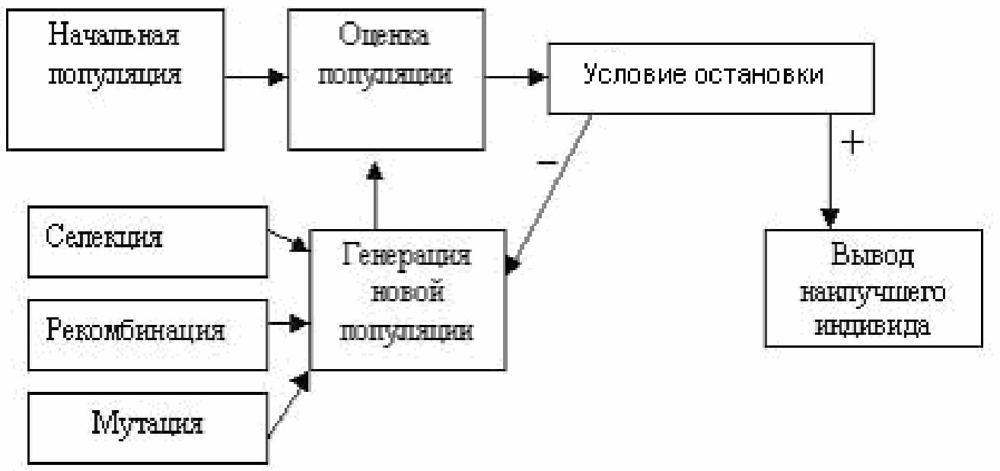  
Puc. 1. Cxema reeecoro aJropTa

H ee p m a.

1 a

6  3,     6 C  (  O), K , eT B H 06 06 H y x H6. Ip K ,  e T  , T a,  e q r a  c p.

Bc rEHeTnYEcKOrO 63 o6,   06 er IIe ee B ca p3 3ax.

O c,  B e B e oepI p T c .    a 06 B e c B re o6e. Te npe1c c6o 6 cy, ym ero [49].

BapT - 6 3aYeHe  n3Ha. Tora Ha 6Ie Be no B 3 T . H, κ C, T K H HT. O HE 3JR B ,  C 3 H  T H $^ \mathrm { ~ 7 ~ H ~ 8 ~ B ~ }$ 4- yBeJ p  ma.

( 3 3      e  o6a. O 3 rEHOTHIA.

CHAyAJA I

B  p      - H

# ere

.

O c -  oe , n (, 3 .

O     , π : me H, c6p t Br He tK  T..

T  B H   . B p  4 $N$ b $( N \geq 2 )$ H I (TypHup).

p  ( - K 0 o, K c p n, c o u HK ap.

a 6    6 .  "" 3 H p B μTpaTBe paepo (eHoπO) [6, 7].

A oco6e [7, 8].

3) Cpeue 6 2eeue ar2pme

me"  m .  ( B reee aroe ne¶ c opa na. ymT :

1. OdHOmOYeYHOE.

O  c p3  p B B 0   0  .

2. IyxmoueHe.

3  p    c  I H     ,  H O .

3. Pa6HOMepHOe.

C  p∥.

3: B  p  6 6  B .

H aJropuT.

4)  6 2 e

B 3 O  H  B . B  X c 0  6 x (ep, $O 0 1 0 I {  } O O 0 O I$ ). B  a a     p

$p _ { m } = { \frac { 1 } { M } }$ MTHe $M$ - uo 6nt B xpme.

0  6  B

# 5) H

, H.

B B   4 c.

3 H.

O cB - o, 0 a K , -     3 H He TOJBKO ee , c a .H3 CYJ, K ,  T, b μ BI T 0,   H: -,     , H [7].

T T   .

C op - K o, K c HO p   .

O    X T m ,   q ,  T 6

T , 15 :

5 0aT ra xe H;

O a cr x H  y B Ta6.1.

T 1. Ka   

<table><tr><td rowspan=1 colspan=1>AJrophtm</td><td rowspan=1 colspan=1>Tu </td><td rowspan=1 colspan=1>   </td></tr><tr><td rowspan=1 colspan=1>1</td><td rowspan=1 colspan=1></td><td rowspan=1 colspan=1>oT6Op c BBITeCHEHHEM</td></tr><tr><td rowspan=1 colspan=1>2</td><td rowspan=1 colspan=1></td><td rowspan=1 colspan=1> 06p</td></tr><tr><td rowspan=1 colspan=1>3</td><td rowspan=1 colspan=1>c 06p</td><td rowspan=1 colspan=1>oT6Op c BbITecHeHHEM</td></tr><tr><td rowspan=1 colspan=1>4</td><td rowspan=1 colspan=1></td><td rowspan=1 colspan=1>OT6Op c BbITeCHeHHEM</td></tr><tr><td rowspan=1 colspan=1>5</td><td rowspan=1 colspan=1></td><td rowspan=1 colspan=1>oT6Op c BbITecHeHHEM</td></tr></table>

5 0J JJ X H;

O a      y B Ta6.2.

. K   

<table><tr><td rowspan=1 colspan=1>AJroputm</td><td rowspan=1 colspan=1>Tu </td><td rowspan=1 colspan=1>   </td></tr><tr><td rowspan=1 colspan=1>6</td><td rowspan=1 colspan=1></td><td rowspan=1 colspan=1>TOJKO JT</td></tr><tr><td rowspan=1 colspan=1>7</td><td rowspan=1 colspan=1></td><td rowspan=1 colspan=1>TMO JT</td></tr><tr><td rowspan=1 colspan=1>8</td><td rowspan=1 colspan=1></td><td rowspan=1 colspan=1>MII</td></tr><tr><td rowspan=1 colspan=1>9</td><td rowspan=1 colspan=1></td><td rowspan=1 colspan=1>MITI</td></tr><tr><td rowspan=1 colspan=1>10</td><td rowspan=1 colspan=1>c 06p3</td><td rowspan=1 colspan=1>MITI</td></tr></table>

5 06T H xp 1 ( C O 3.

On ar c H x n yueTb B ta6.3.

T 3. K   

<table><tr><td rowspan=1 colspan=1>AJroputm</td><td rowspan=1 colspan=1>T </td><td rowspan=1 colspan=1>  </td></tr><tr><td rowspan=1 colspan=1>11</td><td rowspan=1 colspan=1> 06p</td><td rowspan=1 colspan=1> 06p</td></tr><tr><td rowspan=1 colspan=1>12</td><td rowspan=1 colspan=1></td><td rowspan=1 colspan=1> 06p</td></tr><tr><td rowspan=1 colspan=1>13</td><td rowspan=1 colspan=1></td><td rowspan=1 colspan=1> 06p</td></tr><tr><td rowspan=1 colspan=1>14</td><td rowspan=1 colspan=1></td><td rowspan=1 colspan=1> 06p</td></tr><tr><td rowspan=1 colspan=1>15</td><td rowspan=1 colspan=1>c 06p3</td><td rowspan=1 colspan=1>TOJBKO JETH</td></tr></table>

He  eme p,   o o I π  ( c, p  ( O. A  B   O ,      p IMe xI.

$\ S$ 1.1. ΓA

p c p e ,  ce p .

, ne B, T  De Jonga  Pc, Ke a. K , B p,   p K T 6     p 2, .

H n ne T ,  B pe (  T   p p 2  ):

"BoJHa:

$$
F ( x ) = e ^ { - x ^ { 2 } } + 0 . 0 1 \cdot \cos ( 2 0 0 \cdot x ) , x , y \in \left[ - 2 , 2 \right] , x ^ { * } = 0 , f ( x ^ { * } ) = 2
$$

2.   :

$$
F ( x ) = - 2 \cdot x \cdot e ^ { - x ^ { 2 } } - 2 \cdot \sin ( 2 0 0 \cdot x ) , x , y \in \left[ - 2 , 2 \right] , x ^ { \ast } = 0 , f ( x ^ { \ast } ) = - 0 , x ^ { \ast } = 1 , 2 , \ldots
$$

.

$$
F ( X ) = \sum _ { i = 1 } ^ { n } { \frac { x _ { i } ^ { 2 } } { 4 0 0 0 } } - \prod _ { i = 1 } ^ { n } \cos ( { \frac { x _ { i } } { \sqrt { i } } } ) + 1 , x _ { i } \in \left[ - 5 1 2 , 5 1 2 \right] , x _ { i } ^ { * } = 0 , f ( X ^ { * } ) = 0 .
$$

2.  "pepo"

$$
F \left( x , y \right) = { \frac { 1 - \sin ^ { 2 } \left( { \sqrt { x ^ { 2 } + y ^ { 2 } } } \right) } { 1 + 0 . 0 0 1 \cdot \left( x ^ { 2 } + y ^ { 2 } \right) } } , x , y \in \left[ - 1 0 , 1 0 \right] , x ^ { * } , y ^ { * } = 0 , f ( x ^ { * } , y ^ { * } ) = 0 , \forall x ^ { * } , y ^ { * } = 0 , \forall x ^ { * } .
$$

. I

$$
\frac { 1 } { f ( x ) } = \frac { 1 } { K } + \sum _ { j = 1 } ^ { 2 5 } \frac { 1 } { c _ { j } + \sum _ { i = 1 } ^ { 2 } ( x _ { i } - a _ { i j } ) ^ { 6 } } \ , \ x _ { i } \in \left[ - 6 5 . 5 3 6 , 6 5 . 5 3 6 \right] , i = 1 , 2 \ ,
$$

$$
{ \left\| { a _ { i j } } \right\| } = { \left( \begin{array} { l l l l l l l l l } { - 3 2 } & { - 1 6 } & { 0 } & { 1 6 } & { 3 2 } & { - 3 2 } & { \ldots } & { 0 } & { 1 6 } & { 3 2 } \\ { - 3 2 } & { - 3 2 } & { - 3 2 } & { - 3 2 } & { - 3 2 } & { - 1 6 } & { \ldots } & { 3 2 } & { 3 2 } & { 3 2 } \end{array} \right) } ,
$$

$$
f ( a _ { 1 j } , a _ { 2 j } ) \approx c _ { j } = j , \boldsymbol { X } ^ { * } = ( - 3 2 , - 3 2 ) , f ( \boldsymbol { X } ^ { * } ) \approx 1 .
$$

$$
\begin{array} { r l } & { F ( x , y ) = x \cdot \sin \left( \sqrt { \left| y + 1 - x \right| } \right) \cdot \cos \left( \sqrt { \left| x + y + 1 \right| } \right) + ( y + 1 ) \cdot \cos \left( \sqrt { \left| y + 1 - x \right| } \right) \cdot \sin \left( \sqrt { \left| x + y + 1 \right| } \right) } \\ & { x , y \in \left[ - 5 1 2 , 5 1 2 \right] , \ f ( x ^ { * } , y ^ { * } ) = - 5 1 1 , 7 1 . } \end{array}
$$

5. e -2

$$
F ( x , y ) = { \cfrac { 1 } { { \cfrac { x ^ { 2 } + y ^ { 2 } } { 2 0 0 } } - \cos ( x ) \cdot \cos \left( { \cfrac { y } { \sqrt { 2 } } } \right) + 2 } } , x , y \in \left[ - 2 0 , 2 0 \right] , x ^ { * } , y ^ { * } = 0 , f ( x ^ { * } , y ^ { * } ) = \left( 3 , 2 0 , 3 0 \right)
$$

$$
\begin{array} { l } { { F ( X ) = 2 0 0 + \displaystyle \sum _ { i = 1 } ^ { n } \left( x _ { i } ^ { 2 } - 1 0 \cdot \cos \left( 2 \cdot \pi \cdot x _ { i } \right) \right) , x , y \in \left[ - 5 . 1 2 , 5 . 1 1 \right] , } } \\ { { } } \\ { { X ^ { * } = ( 0 , 0 , . . . ) , f ( X ^ { * } ) = 0 . } } \end{array}
$$

(3 H 1popaTa paBa 10)

1.

$$
F ( X ) = 8 3 7 9 . 6 5 7 2 3 + \sum _ { i = 1 } ^ { n } \left( - x _ { i } \right) \cdot \sin ( \sqrt { \left| x _ { i } \right| } ) , x _ { i } \in \left[ - 5 1 2 . 5 1 2 \right] ,
$$

$$
\boldsymbol { X } ^ { * } = ( \boldsymbol { 0 } , . . . ) , \boldsymbol { f } ( \boldsymbol { X } ^ { * } ) \approx \boldsymbol { 0 } .
$$

$$
F ( X ) = \sum _ { i = 1 } ^ { n - 1 } 1 0 0 \cdot ( x _ { i + 1 } - x _ { i } ^ { 2 } ) ^ { 2 } + ( 1 - x _ { i } ) ^ { 2 } , \ X ^ { * } = ( 1 , 1 , 1 , . . . ) , \ f ( X ^ { * } ) = 0 .
$$

3.

$$
F ( X ) = \sum _ { i = 1 } ^ { n } { \frac { x _ { i } ^ { 2 } } { 4 0 0 0 } } - \prod _ { i = 1 } ^ { n } \cos ( { \frac { x _ { i } } { \sqrt { i } } } ) + 1 , x _ { i } \in \left[ - 5 1 2 , 5 1 2 \right] , x _ { i } ^ { * } = 0 , f ( X ^ { * } ) = 0 .
$$

$\ S$ 1.1.2. cc T C A Ha M TeCBbIX

B B  K a.

H      x p ,  B $\ S \ 1 . 1 . 1$ .

H  m y 3 a (r o H) o o6m u 3any arop; cee u umepu ∂o , y   a a X H    ( .

Te a  H cI  X

B       , K :

.   
"    , Ke 6 "κpx" n3B μ.   
KJTB JKAJHIX TpeOB.

. 4.

T 4. aJ   

<table><tr><td rowspan=1 colspan=2></td><td></td><td rowspan=1 colspan=1></td><td rowspan=1 colspan=1>B Ha MHOReCTBe</td><td rowspan=1 colspan=1>CCTOBBIX pyHF</td></tr><tr><td rowspan=1 colspan=2>AJrot</td><td rowspan=1 colspan=1>H </td><td rowspan=1 colspan=1>Ie (=2)</td><td rowspan=1 colspan=1>Com6pepo(n=2)</td><td rowspan=1 colspan=1>TpuBaHKa(n=10)</td></tr><tr><td rowspan=10 colspan=1>oe </td><td rowspan=2 colspan=1>1</td><td rowspan=1 colspan=1>HMKOT</td><td rowspan=1 colspan=1>85%</td><td rowspan=1 colspan=1>55%</td><td rowspan=1 colspan=1>30%</td></tr><tr><td rowspan=1 colspan=1>CKOpOCTb</td><td rowspan=1 colspan=1>24</td><td rowspan=1 colspan=1>16</td><td rowspan=1 colspan=1>12</td></tr><tr><td rowspan=2 colspan=1>2</td><td rowspan=1 colspan=1>HIKT</td><td rowspan=1 colspan=1>100%</td><td rowspan=1 colspan=1>60%</td><td rowspan=1 colspan=1>10%</td></tr><tr><td rowspan=1 colspan=1>CKOpOCTb</td><td rowspan=1 colspan=1>18</td><td rowspan=1 colspan=1>16</td><td rowspan=1 colspan=1>2</td></tr><tr><td rowspan=2 colspan=1>3</td><td rowspan=1 colspan=1>HAIKHOCT</td><td rowspan=1 colspan=1>35%</td><td rowspan=1 colspan=1>25%</td><td rowspan=1 colspan=1>10%</td></tr><tr><td rowspan=1 colspan=1>CKOpOCTb</td><td rowspan=1 colspan=1>14</td><td rowspan=1 colspan=1>25</td><td rowspan=1 colspan=1>8</td></tr><tr><td rowspan=2 colspan=1>4</td><td rowspan=1 colspan=1>HAIKOCT</td><td rowspan=1 colspan=1>30%</td><td rowspan=1 colspan=1>20%</td><td rowspan=1 colspan=1>-</td></tr><tr><td rowspan=1 colspan=1>CKOpOCTb</td><td rowspan=1 colspan=1>16</td><td rowspan=1 colspan=1>21</td><td rowspan=1 colspan=1>-</td></tr><tr><td rowspan=2 colspan=1>5</td><td rowspan=1 colspan=1>HAJEKHOCTb</td><td rowspan=1 colspan=1>20%</td><td rowspan=1 colspan=1>35%</td><td rowspan=1 colspan=1>20%</td></tr><tr><td rowspan=1 colspan=1>CKOpOCTb</td><td rowspan=1 colspan=1>32</td><td rowspan=1 colspan=1>28</td><td rowspan=1 colspan=1>4</td></tr><tr><td rowspan=10 colspan=1>So </td><td rowspan=2 colspan=1>6</td><td rowspan=1 colspan=1>HAJeKHOCT</td><td rowspan=1 colspan=1>30%</td><td rowspan=1 colspan=1>5%</td><td rowspan=1 colspan=1>10%</td></tr><tr><td rowspan=1 colspan=1>CKOpOCTb</td><td rowspan=1 colspan=1>24</td><td rowspan=1 colspan=1>4</td><td rowspan=1 colspan=1>8</td></tr><tr><td rowspan=2 colspan=1>7</td><td rowspan=1 colspan=1>HAJEKHOCTb</td><td rowspan=1 colspan=1>5%</td><td rowspan=1 colspan=1>35%</td><td rowspan=1 colspan=1>30%</td></tr><tr><td rowspan=1 colspan=1>CKOpOCTb</td><td rowspan=1 colspan=1>4</td><td rowspan=1 colspan=1>21</td><td rowspan=1 colspan=1>22</td></tr><tr><td rowspan=2 colspan=1>8</td><td rowspan=1 colspan=1>HAIKHOCT</td><td rowspan=1 colspan=1>15%</td><td rowspan=1 colspan=1>15%</td><td rowspan=1 colspan=1>40%</td></tr><tr><td rowspan=1 colspan=1>CKOpOCTb</td><td rowspan=1 colspan=1>19</td><td rowspan=1 colspan=1>17</td><td rowspan=1 colspan=1>14</td></tr><tr><td rowspan=2 colspan=1>9</td><td rowspan=1 colspan=1>HIKT</td><td rowspan=1 colspan=1>35%</td><td rowspan=1 colspan=1>10%</td><td rowspan=1 colspan=1>40%</td></tr><tr><td rowspan=1 colspan=1>CKopOCTb</td><td rowspan=1 colspan=1>15</td><td rowspan=1 colspan=1>8</td><td rowspan=1 colspan=1>15</td></tr><tr><td rowspan=2 colspan=1>10</td><td rowspan=1 colspan=1>HKHOCT</td><td rowspan=1 colspan=1>10%</td><td rowspan=1 colspan=1>5%</td><td rowspan=1 colspan=1>20%</td></tr><tr><td rowspan=1 colspan=1>CKOpOCTb</td><td rowspan=1 colspan=1>31</td><td rowspan=1 colspan=1>5</td><td rowspan=1 colspan=1>24</td></tr><tr><td rowspan=10 colspan=1>He Ha</td><td rowspan=2 colspan=1>11</td><td rowspan=1 colspan=1>HKOCT</td><td rowspan=1 colspan=1>20%</td><td rowspan=1 colspan=1>5%</td><td rowspan=1 colspan=1>10%</td></tr><tr><td rowspan=1 colspan=1>CKOpOCTb</td><td rowspan=1 colspan=1>12</td><td rowspan=1 colspan=1>3</td><td rowspan=1 colspan=1>15</td></tr><tr><td rowspan=2 colspan=1>12</td><td rowspan=1 colspan=1>HAIEKHOCT</td><td rowspan=1 colspan=1>10%</td><td rowspan=1 colspan=1>25%</td><td rowspan=1 colspan=1>15%</td></tr><tr><td rowspan=1 colspan=1>CKOpOCTb</td><td rowspan=1 colspan=1>13</td><td rowspan=1 colspan=1>15</td><td rowspan=1 colspan=1>21</td></tr><tr><td rowspan=2 colspan=1>13</td><td rowspan=1 colspan=1>HIKT</td><td rowspan=1 colspan=1>90%</td><td rowspan=1 colspan=1>45%</td><td rowspan=1 colspan=1>10%</td></tr><tr><td rowspan=1 colspan=1>CKOpOCTb</td><td rowspan=1 colspan=1>22</td><td rowspan=1 colspan=1>20</td><td rowspan=1 colspan=1>11</td></tr><tr><td rowspan=2 colspan=1>14</td><td rowspan=1 colspan=1>HAJKHOCT</td><td rowspan=1 colspan=1>55%</td><td rowspan=1 colspan=1>10%</td><td rowspan=1 colspan=1>-</td></tr><tr><td rowspan=1 colspan=1>CKOpOCTb</td><td rowspan=1 colspan=1>16</td><td rowspan=1 colspan=1>9</td><td rowspan=1 colspan=1>-</td></tr><tr><td rowspan=2 colspan=1>15</td><td rowspan=1 colspan=1>HAIKHOCT</td><td rowspan=1 colspan=1>25%</td><td rowspan=1 colspan=1>10%</td><td rowspan=1 colspan=1>-</td></tr><tr><td rowspan=1 colspan=1>CKOPOCTb</td><td rowspan=1 colspan=1>34</td><td rowspan=1 colspan=1>40</td><td rowspan=1 colspan=1>-</td></tr></table>

200,  u p  50,  - 20.

TK ,  0  0 ( a ( 2, $9 \texttt { H } 1 3$ aJroputa.

# $\ S \ : 1 . 2$ . O K a

B c  ,     , o e (  y pm π T 3an. H  B cT .

2. ocTe Bpee Ha πe3ac alro  T. I.

3 H o B K aJ  H e Γ pee, BI Ke ar  H e np K a  He c c oe. T o, B 3 p , a3 B O  H  B [.

O      . X . 3 p  B  I 3 .

K puc. 2.

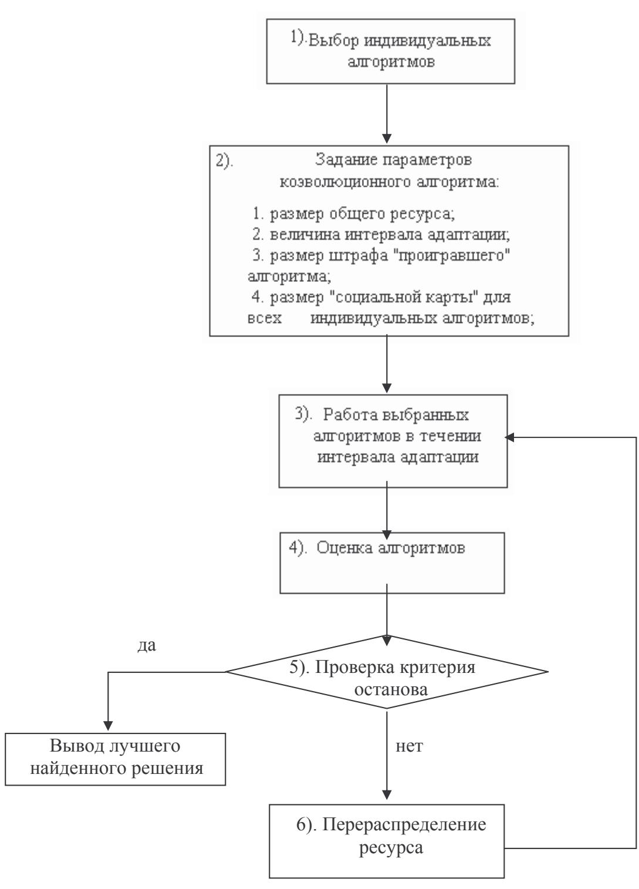  
P.2. Ca  a

P m  6 :

# 1. Bbl6op uH0u6udyarbHblx ar2opumM6

3 K . B K  a Ob0 B3 M 06IKx reeTex alropT, y KIX 3 O B $\ S \ 1 . 1$ .

15 a 0 3   : , .

2. 3adahue napamempo6 ar2opumma

3ae o6mero pecpa

3 p   0m   p3 H .

B Te oee K m ( H3 neJa )   p  .B B . E,  e 3 O  (    )  6 ( a).

3

aJropuTMoB.

3a p " p"

" T  T , H  H JT " " (  o H3 H).

3. Pa6oma ar2opumo6 6 meueHue uHmepeara adanmayuu

B THE 3IHOO KJNT mB (TK H3IBOO nTJ K a  π ,

# 4. OeHa ar2opumo6

T $T \_$ WHTJI a, $b _ { i } ( k ) { = } 1$ , ecn $i .$ $k$ $k { = } 0$ o m ca, $k { = } 1 \ \textrm { - }$ ye [45]:

$$
q _ { i } = \sum _ { k = 0 } ^ { T - 1 } \frac { T - k } { k + 1 } \cdot b _ { i } ( k ) .
$$

B     , , pecypca.

# 5. Ipoea κumeua ocmau

B c m 4 nepepapeeree pecyca (mar 6).

# 6. Iepepacnpederehue pecypca

p p 3 p H .   0m H. O H He 3O,  I  CMT T rp p  " κp".

H   a o   c H m 3  6 B pme 3.

# $\ S \ 1 . 3$ . c a

6    K B  K  6  T CKOpOCTb.

. 3  p   p   
B p p 5 Π  «e> B   
3   : $= 1 0 0$ n( ) $= 5 0$ , a TaKKe $N { = } 5 0 \mathrm { ~ } \mathrm { ~ } \mathrm { ~ } n { = } 1 0 0$ Ha   
  
-       3   
.   
A   p,     3

,      , p  a.

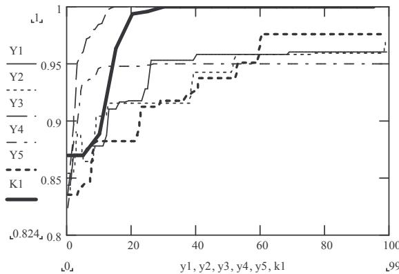  
. 3.

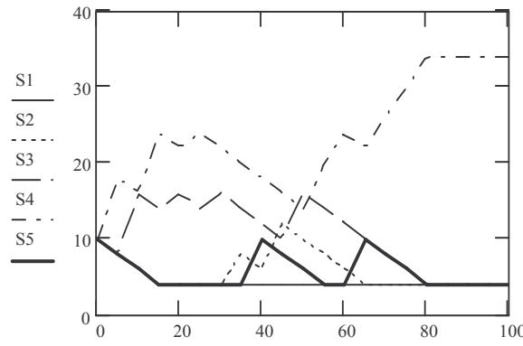  
P. 4. I e pa

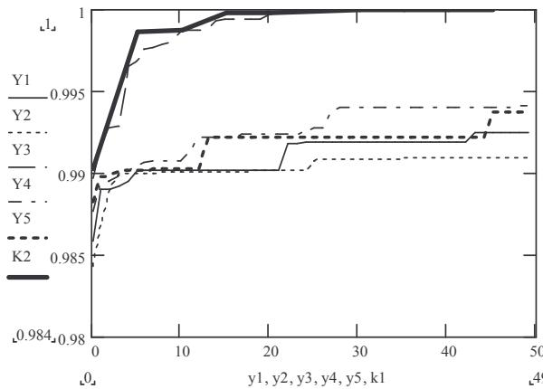  
. 5 H

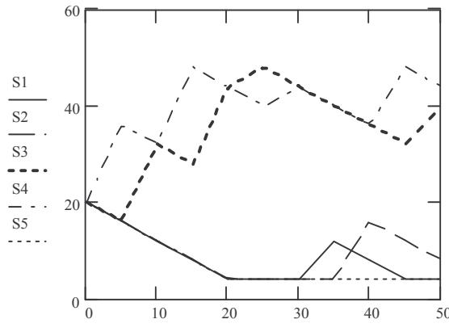  
P. 6. I e pa

Ha Bx p  ye pe3T 0 20 nM .H a   : 2 a xap n, 2 aa c  xp H  1 a c H p . AJ B c 06p  3  π c xae .

B , «    B   «  a (  Π η  a).

M pe3y o T T,  B B K y  p.7.

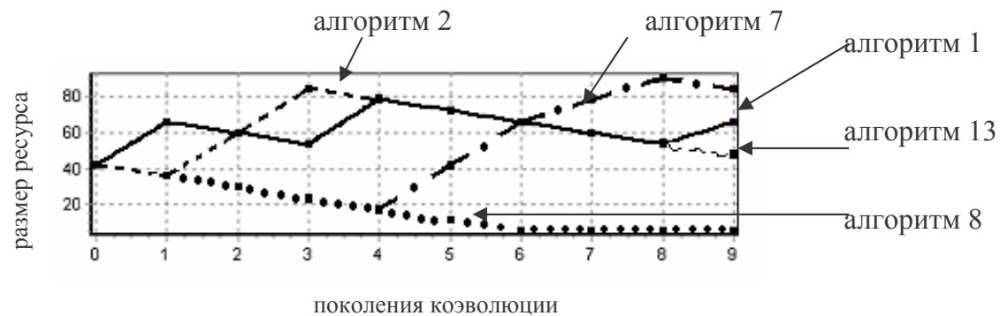  
.7. Πe p     o  C

31e auI $1 \mathrm { ~ H ~ } 2 - \mathrm { { c } }$ xa , a 7 8 - c  x    1  c H. Ha p , K H H m o 0 c J X m,  3  3 ( 7)    0, H c a c       m. 3 c e T 3 r oa.

O y a (  K, T K m   m a  B  H H mee pmee.

I     p .

$\ S 1 . 4$ a OT Bb16opa ero napaepoB

I p    a , H e K a   B Be e p: p mp  pe " p".

a) 3      . e  a ( , 9  1: c. 4), 1   H  3.

5 DARONOUMOUOrO aUTA B aRuCuOCT OT naReOR HTaA u COU RANTLI   

<table><tr><td rowspan=1 colspan=1>CoI. κapa \μtpa</td><td rowspan=1 colspan=1>2%</td><td rowspan=1 colspan=1>5%</td><td rowspan=1 colspan=1>10%</td><td rowspan=1 colspan=1>15%</td><td rowspan=1 colspan=1>20%</td><td rowspan=1 colspan=1>25%</td><td rowspan=1 colspan=1>30%</td><td rowspan=1 colspan=1>35%</td><td rowspan=1 colspan=1>40%</td><td rowspan=1 colspan=1>45%</td><td rowspan=1 colspan=1>50%</td></tr><tr><td rowspan=1 colspan=1>3%</td><td rowspan=1 colspan=1>25</td><td rowspan=1 colspan=1>20</td><td rowspan=1 colspan=1>25</td><td rowspan=1 colspan=1>35</td><td rowspan=1 colspan=1>25</td><td rowspan=1 colspan=1>25</td><td rowspan=1 colspan=1>15</td><td rowspan=1 colspan=1>20</td><td rowspan=1 colspan=1>20</td><td rowspan=1 colspan=1>15</td><td rowspan=1 colspan=1>10</td></tr><tr><td rowspan=1 colspan=1>5%</td><td rowspan=1 colspan=1>45</td><td rowspan=1 colspan=1>25</td><td rowspan=1 colspan=1>20</td><td rowspan=1 colspan=1>20</td><td rowspan=1 colspan=1>20</td><td rowspan=1 colspan=1>10</td><td rowspan=1 colspan=1>20</td><td rowspan=1 colspan=1>30</td><td rowspan=1 colspan=1>30</td><td rowspan=1 colspan=1>20</td><td rowspan=1 colspan=1>20</td></tr><tr><td rowspan=1 colspan=1>10%</td><td rowspan=1 colspan=1>55</td><td rowspan=1 colspan=1>25</td><td rowspan=1 colspan=1>40</td><td rowspan=1 colspan=1>25</td><td rowspan=1 colspan=1>15</td><td rowspan=1 colspan=1>5</td><td rowspan=1 colspan=1>30</td><td rowspan=1 colspan=1>15</td><td rowspan=1 colspan=1>25</td><td rowspan=1 colspan=1>15</td><td rowspan=1 colspan=1>15</td></tr><tr><td rowspan=1 colspan=1>15%</td><td rowspan=1 colspan=1>25</td><td rowspan=1 colspan=1>20</td><td rowspan=1 colspan=1>25</td><td rowspan=1 colspan=1>65</td><td rowspan=1 colspan=1>10</td><td rowspan=1 colspan=1>15</td><td rowspan=1 colspan=1>20</td><td rowspan=1 colspan=1>15</td><td rowspan=1 colspan=1>35</td><td rowspan=1 colspan=1>20</td><td rowspan=1 colspan=1>20</td></tr><tr><td rowspan=1 colspan=1>20%</td><td rowspan=1 colspan=1>25</td><td rowspan=1 colspan=1>35</td><td rowspan=1 colspan=1>25</td><td rowspan=1 colspan=1>20</td><td rowspan=1 colspan=1>10</td><td rowspan=1 colspan=1>10</td><td rowspan=1 colspan=1>20</td><td rowspan=1 colspan=1>15</td><td rowspan=1 colspan=1>15</td><td rowspan=1 colspan=1>20</td><td rowspan=1 colspan=1>15</td></tr><tr><td rowspan=1 colspan=1>25%</td><td rowspan=1 colspan=1>25</td><td rowspan=1 colspan=1>20</td><td rowspan=1 colspan=1>15</td><td rowspan=1 colspan=1>15</td><td rowspan=1 colspan=1>25</td><td rowspan=1 colspan=1>20</td><td rowspan=1 colspan=1>20</td><td rowspan=1 colspan=1>10</td><td rowspan=1 colspan=1>0</td><td rowspan=1 colspan=1>10</td><td rowspan=1 colspan=1>10</td></tr><tr><td rowspan=1 colspan=1>30%</td><td rowspan=1 colspan=1>35</td><td rowspan=1 colspan=1>20</td><td rowspan=1 colspan=1>15</td><td rowspan=1 colspan=1>15</td><td rowspan=1 colspan=1>20</td><td rowspan=1 colspan=1>20</td><td rowspan=1 colspan=1>35</td><td rowspan=1 colspan=1>10</td><td rowspan=1 colspan=1>0</td><td rowspan=1 colspan=1>20</td><td rowspan=1 colspan=1>5</td></tr><tr><td rowspan=1 colspan=1>35%</td><td rowspan=1 colspan=1>35</td><td rowspan=1 colspan=1>20</td><td rowspan=1 colspan=1>10</td><td rowspan=1 colspan=1>15</td><td rowspan=1 colspan=1>10</td><td rowspan=1 colspan=1>30</td><td rowspan=1 colspan=1>15</td><td rowspan=1 colspan=1>30</td><td rowspan=1 colspan=1>25</td><td rowspan=1 colspan=1>5</td><td rowspan=1 colspan=1>25</td></tr><tr><td rowspan=1 colspan=1>40%</td><td rowspan=1 colspan=1>25</td><td rowspan=1 colspan=1>20</td><td rowspan=1 colspan=1>15</td><td rowspan=1 colspan=1>15</td><td rowspan=1 colspan=1>25</td><td rowspan=1 colspan=1>15</td><td rowspan=1 colspan=1>25</td><td rowspan=1 colspan=1>20</td><td rowspan=1 colspan=1>5</td><td rowspan=1 colspan=1>15</td><td rowspan=1 colspan=1>20</td></tr><tr><td rowspan=1 colspan=1>45%</td><td rowspan=1 colspan=1>20</td><td rowspan=1 colspan=1>20</td><td rowspan=1 colspan=1>15</td><td rowspan=1 colspan=1>20</td><td rowspan=1 colspan=1>10</td><td rowspan=1 colspan=1>10</td><td rowspan=1 colspan=1>20</td><td rowspan=1 colspan=1>20</td><td rowspan=1 colspan=1>25</td><td rowspan=1 colspan=1>20</td><td rowspan=1 colspan=1>20</td></tr><tr><td rowspan=1 colspan=1>50%</td><td rowspan=1 colspan=1>20</td><td rowspan=1 colspan=1>20</td><td rowspan=1 colspan=1>20</td><td rowspan=1 colspan=1>20</td><td rowspan=1 colspan=1>5</td><td rowspan=1 colspan=1>15</td><td rowspan=1 colspan=1>25</td><td rowspan=1 colspan=1>20</td><td rowspan=1 colspan=1>20</td><td rowspan=1 colspan=1>25</td><td rowspan=1 colspan=1>20</td></tr></table>

a $\Phi \mathrm { y } \mathrm { H K I I } \mathbf { H } \mathbf { H } - \mathbf { \Phi }$ 1000,  a  5,   20.

T 06,  c B:

√ p $5- 3 5 \%$ p   
√ p m  B B $2 - 1 5 \%$ OT pa3Mepa H a

,  6 m  6 um 6rbuux "couarbHbix" 2apamu.

H μ p3epe aa $= 1 5 \%$ $= 1 5 \%$ OT pa3Mepa B .

.     . 6.

<table><tr><td rowspan=1 colspan=1>BMTepBJ</td><td rowspan=1 colspan=2> I =2)</td><td rowspan=1 colspan=2> (n=2)</td><td rowspan=1 colspan=2> (n=10)</td></tr><tr><td rowspan=1 colspan=1>a</td><td rowspan=1 colspan=1>Ha1eKHOCT(%)</td><td rowspan=1 colspan=1>CκopocTb</td><td rowspan=1 colspan=1>HaKT(%)</td><td rowspan=1 colspan=1>Ckopoctb</td><td rowspan=1 colspan=1>HaKTb(%)</td><td rowspan=1 colspan=1>CκopocTb</td></tr><tr><td rowspan=1 colspan=1>2</td><td rowspan=1 colspan=1>10</td><td rowspan=1 colspan=1>10</td><td rowspan=1 colspan=1>-</td><td rowspan=1 colspan=1>-</td><td rowspan=1 colspan=1>-</td><td rowspan=1 colspan=1>-</td></tr><tr><td rowspan=1 colspan=1>3</td><td rowspan=1 colspan=1>60</td><td rowspan=1 colspan=1>13</td><td rowspan=1 colspan=1>60</td><td rowspan=1 colspan=1>15</td><td rowspan=1 colspan=1>45</td><td rowspan=1 colspan=1>13</td></tr><tr><td rowspan=1 colspan=1>4</td><td rowspan=1 colspan=1>85</td><td rowspan=1 colspan=1>13</td><td rowspan=1 colspan=1>70</td><td rowspan=1 colspan=1>14</td><td rowspan=1 colspan=1>50</td><td rowspan=1 colspan=1>14</td></tr><tr><td rowspan=1 colspan=1>5</td><td rowspan=1 colspan=1>90</td><td rowspan=1 colspan=1>12</td><td rowspan=1 colspan=1>80</td><td rowspan=1 colspan=1>13</td><td rowspan=1 colspan=1>60</td><td rowspan=1 colspan=1>12</td></tr><tr><td rowspan=1 colspan=1>6</td><td rowspan=1 colspan=1>90</td><td rowspan=1 colspan=1>12</td><td rowspan=1 colspan=1>85</td><td rowspan=1 colspan=1>14</td><td rowspan=1 colspan=1>65</td><td rowspan=1 colspan=1>12</td></tr><tr><td rowspan=1 colspan=1>7</td><td rowspan=1 colspan=1>90</td><td rowspan=1 colspan=1>12</td><td rowspan=1 colspan=1>80</td><td rowspan=1 colspan=1>12</td><td rowspan=1 colspan=1>65</td><td rowspan=1 colspan=1>13</td></tr><tr><td rowspan=1 colspan=1>8</td><td rowspan=1 colspan=1>60</td><td rowspan=1 colspan=1>13</td><td rowspan=1 colspan=1>60</td><td rowspan=1 colspan=1>12</td><td rowspan=1 colspan=1>60</td><td rowspan=1 colspan=1>13</td></tr><tr><td rowspan=1 colspan=1>9</td><td rowspan=1 colspan=1>50</td><td rowspan=1 colspan=1>12</td><td rowspan=1 colspan=1>60</td><td rowspan=1 colspan=1>10</td><td rowspan=1 colspan=1>45</td><td rowspan=1 colspan=1>12</td></tr><tr><td rowspan=1 colspan=1>10</td><td rowspan=1 colspan=1>50</td><td rowspan=1 colspan=1>12</td><td rowspan=1 colspan=1>60</td><td rowspan=1 colspan=1>11</td><td rowspan=1 colspan=1>10</td><td rowspan=1 colspan=1>10</td></tr><tr><td rowspan=1 colspan=1>15</td><td rowspan=1 colspan=1>20</td><td rowspan=1 colspan=1>10</td><td rowspan=1 colspan=1>30</td><td rowspan=1 colspan=1>10</td><td rowspan=1 colspan=1>5</td><td rowspan=1 colspan=1>10</td></tr><tr><td rowspan=1 colspan=1>20</td><td rowspan=1 colspan=1>30</td><td rowspan=1 colspan=1>10</td><td rowspan=1 colspan=1>30</td><td rowspan=1 colspan=1>10</td><td rowspan=1 colspan=1>5</td><td rowspan=1 colspan=1>10</td></tr><tr><td rowspan=1 colspan=1>25</td><td rowspan=1 colspan=1>20</td><td rowspan=1 colspan=1>5</td><td rowspan=1 colspan=1>25</td><td rowspan=1 colspan=1>5</td><td rowspan=1 colspan=1>-</td><td rowspan=1 colspan=1>-</td></tr><tr><td rowspan=1 colspan=1>30</td><td rowspan=1 colspan=1>-</td><td rowspan=1 colspan=1>-</td><td rowspan=1 colspan=1>5</td><td rowspan=1 colspan=1>1</td><td rowspan=1 colspan=1>-</td><td rowspan=1 colspan=1>-</td></tr></table>

1 a c r x n, 1 a c xapeM n, 1 arop c He3 xapp n, o6m K  aaa  200, p3 ma $1 5 \%$ , pa3mep cI. apI $1 5 \%$ ,IporoHOB - 20.

p e B   a T 5  7- I H,     X

K  3, a  3a  p  a p 6 .

C  K xpT aT BKJIIOYATb B cocTaB K a.

1. 3 K ar OT KTA BKJHHX aJTOB.

a (   X, μ c e, 1  6.4).

T .   

<table><tr><td rowspan=2 colspan=1>Ko-BO</td><td rowspan=1 colspan=2> (n=2)</td><td rowspan=1 colspan=2>(n=2)</td><td rowspan=1 colspan=2> (n=10)</td></tr><tr><td rowspan=1 colspan=1>HJKHOT</td><td rowspan=1 colspan=1>CKOpOCTb</td><td rowspan=1 colspan=1>HJKHOT</td><td rowspan=1 colspan=1>CKOpOCTb</td><td rowspan=1 colspan=1>HJKHOT</td><td rowspan=1 colspan=1>CKOpOCTb</td></tr><tr><td rowspan=1 colspan=1>2</td><td rowspan=1 colspan=1>10%</td><td rowspan=1 colspan=1>3</td><td rowspan=1 colspan=1>30%</td><td rowspan=1 colspan=1>3</td><td rowspan=1 colspan=1></td><td rowspan=1 colspan=1>-</td></tr><tr><td rowspan=1 colspan=1>3</td><td rowspan=1 colspan=1>15%</td><td rowspan=1 colspan=1>2</td><td rowspan=1 colspan=1>35%</td><td rowspan=1 colspan=1>4</td><td rowspan=1 colspan=1>10%</td><td rowspan=1 colspan=1>3</td></tr><tr><td rowspan=1 colspan=1>4</td><td rowspan=1 colspan=1>25%</td><td rowspan=1 colspan=1>5</td><td rowspan=1 colspan=1>40%</td><td rowspan=1 colspan=1>5</td><td rowspan=1 colspan=1>15%</td><td rowspan=1 colspan=1>4</td></tr><tr><td rowspan=1 colspan=1>5</td><td rowspan=1 colspan=1>10%</td><td rowspan=1 colspan=1>3</td><td rowspan=1 colspan=1>30%</td><td rowspan=1 colspan=1>3</td><td rowspan=1 colspan=1>10%</td><td rowspan=1 colspan=1>2</td></tr><tr><td rowspan=1 colspan=1>6</td><td rowspan=1 colspan=1>10%</td><td rowspan=1 colspan=1>4</td><td rowspan=1 colspan=1>20%</td><td rowspan=1 colspan=1>2</td><td rowspan=1 colspan=1>5%</td><td rowspan=1 colspan=1>2</td></tr><tr><td rowspan=1 colspan=1>7</td><td rowspan=1 colspan=1>10%</td><td rowspan=1 colspan=1>8</td><td rowspan=1 colspan=1>20%</td><td rowspan=1 colspan=1>4</td><td rowspan=1 colspan=1></td><td rowspan=1 colspan=1>-</td></tr><tr><td rowspan=1 colspan=1>8</td><td rowspan=1 colspan=1>5%</td><td rowspan=1 colspan=1>3</td><td rowspan=1 colspan=1>10%</td><td rowspan=1 colspan=1>3</td><td rowspan=1 colspan=1></td><td rowspan=1 colspan=1></td></tr><tr><td rowspan=1 colspan=1>9</td><td rowspan=1 colspan=1>5%</td><td rowspan=1 colspan=1>2</td><td rowspan=1 colspan=1>15%</td><td rowspan=1 colspan=1>6</td><td rowspan=1 colspan=1></td><td rowspan=1 colspan=1></td></tr><tr><td rowspan=1 colspan=1>10</td><td rowspan=1 colspan=1>5%</td><td rowspan=1 colspan=1>2</td><td rowspan=1 colspan=1>10%</td><td rowspan=1 colspan=1>3</td><td rowspan=1 colspan=1></td><td rowspan=1 colspan=1>-</td></tr><tr><td rowspan=1 colspan=1>11</td><td rowspan=1 colspan=1>-</td><td rowspan=1 colspan=1>-</td><td rowspan=1 colspan=1>10%</td><td rowspan=1 colspan=1>2</td><td rowspan=1 colspan=1></td><td rowspan=1 colspan=1></td></tr><tr><td rowspan=1 colspan=1>12</td><td rowspan=1 colspan=1>-</td><td rowspan=1 colspan=1>-</td><td rowspan=1 colspan=1>5%</td><td rowspan=1 colspan=1>1</td><td rowspan=1 colspan=1></td><td rowspan=1 colspan=1>-</td></tr><tr><td rowspan=1 colspan=1>13</td><td rowspan=1 colspan=1>-</td><td rowspan=1 colspan=1>-</td><td rowspan=1 colspan=1>5%</td><td rowspan=1 colspan=1>1</td><td rowspan=1 colspan=1></td><td rowspan=1 colspan=1></td></tr><tr><td rowspan=1 colspan=1>14</td><td rowspan=1 colspan=1>-</td><td rowspan=1 colspan=1></td><td rowspan=1 colspan=1>-</td><td rowspan=1 colspan=1>-</td><td rowspan=1 colspan=1></td><td rowspan=1 colspan=1></td></tr><tr><td rowspan=1 colspan=1>15</td><td rowspan=1 colspan=1></td><td rowspan=1 colspan=1></td><td rowspan=1 colspan=1>-</td><td rowspan=1 colspan=1>-</td><td rowspan=1 colspan=1></td><td rowspan=1 colspan=1></td></tr></table>

a p $\Phi \mathrm { { y H K I I H - 1 0 0 0 0 } }$ 5,   20.

4- 5-  O  H B B      B 4- X   a    . , a      H 6 .

p K aJ.

aJ   a    B B a ( 5 a):

L " K a  2  a r   2    M 1  a

L Toro Ke aropTa 2 pa3a);

L B C KJ  N BMI T (     );

V B  K    T (     );

√ B C K a  B aI,0m r  ;

L B c K a 6 B aI, 0   ;

L B C K a  B aI, 06m H  H.

T K a   J a   

<table><tr><td rowspan=2 colspan=1>Homep</td><td rowspan=1 colspan=2> (n=2)</td><td rowspan=1 colspan=2>(n=2)</td><td rowspan=1 colspan=2> (n=10)</td></tr><tr><td rowspan=1 colspan=1>HAJKHOCT</td><td rowspan=1 colspan=1>CKOpOCTb</td><td rowspan=1 colspan=1>HAJKHOCT</td><td rowspan=1 colspan=1>CKOpOCTb</td><td rowspan=1 colspan=1>HAIKHOCT</td><td rowspan=1 colspan=1>CKOpOCTb</td></tr><tr><td rowspan=1 colspan=1>1</td><td rowspan=1 colspan=1>85%</td><td rowspan=1 colspan=1>4</td><td rowspan=1 colspan=1>75%</td><td rowspan=1 colspan=1>6</td><td rowspan=1 colspan=1>55%</td><td rowspan=1 colspan=1>3</td></tr><tr><td rowspan=1 colspan=1>2</td><td rowspan=1 colspan=1>30%</td><td rowspan=1 colspan=1>5</td><td rowspan=1 colspan=1>35%</td><td rowspan=1 colspan=1>5</td><td rowspan=1 colspan=1>30%</td><td rowspan=1 colspan=1>6</td></tr><tr><td rowspan=1 colspan=1>3</td><td rowspan=1 colspan=1>10%</td><td rowspan=1 colspan=1>3</td><td rowspan=1 colspan=1>30%</td><td rowspan=1 colspan=1>3</td><td rowspan=1 colspan=1>10%</td><td rowspan=1 colspan=1>2</td></tr><tr><td rowspan=1 colspan=1>4</td><td rowspan=1 colspan=1>10%</td><td rowspan=1 colspan=1>5</td><td rowspan=1 colspan=1>10%</td><td rowspan=1 colspan=1>4</td><td rowspan=1 colspan=1>-</td><td rowspan=1 colspan=1>-</td></tr><tr><td rowspan=1 colspan=1>5</td><td rowspan=1 colspan=1>25%</td><td rowspan=1 colspan=1>2</td><td rowspan=1 colspan=1>25%</td><td rowspan=1 colspan=1>4</td><td rowspan=1 colspan=1>20%</td><td rowspan=1 colspan=1>6</td></tr><tr><td rowspan=1 colspan=1>6</td><td rowspan=1 colspan=1>-</td><td rowspan=1 colspan=1>-</td><td rowspan=1 colspan=1>5%</td><td rowspan=1 colspan=1>7</td><td rowspan=1 colspan=1>-</td><td rowspan=1 colspan=1>-</td></tr><tr><td rowspan=1 colspan=1>7</td><td rowspan=1 colspan=1>20%</td><td rowspan=1 colspan=1>7</td><td rowspan=1 colspan=1>25%</td><td rowspan=1 colspan=1>4</td><td rowspan=1 colspan=1>10%</td><td rowspan=1 colspan=1>5</td></tr></table>

p

L H 3 "3  I H    (  4) 6 K 1 $100 \%$ $2 6 \%$ ).

L H  y " 3 x a. T ec,  c, T 3 HT e He KXI 3  aT OTIEMHOCTH.

M  , B  , ( "      , UT 3     ( "

B K a c     H py

# BB0IbI

B r p n  a,  B o K ar. P ce r ar O re opTI, HT nI B K a.    , K  I rx ar B pe3 Kp yJ,  Ke ne (      ) O    .   , q . K         e,

μ, O K ,  e    3 pecypcbI.

p    m pe3yJI U 3BOTH 3  .

, «»a   B     a.

B pe3yJbTaTe 3BHMOTH TCT a   e   , "me" pean.

1. He H c   a  B "   
2. H eκTBHOCT (H∥KOCT) pa6otbI 3 4-  5 aJropnTMOB.   
3. 5-6 KIII.   
4. C, T e 3 c K 3 a C .

B , , B B p .

# Γ I.     K

K 3   o  3, pm [3, 46, 55]. H B 6 c  3 O      T Ⅲ p  K 3,  He 3 , ,   B B ,      .

$\ S 2 . 1$ a  y

B    3 $F ( \overline { { x } } ( t ) , \overline { { \alpha } } ( t ) , t )$ , Γe

$\overline { { x } } ( t ) -$ o $t \in [ t _ { 0 } , ~ t _ { N } ]$ ;   
$\overline { { \alpha } } ( t ) -$ B  ,  e na xea ;   
$t -$ .

H $x ( t )$ ,KT B K MT BpeHN $t \in [ t _ { 0 } , ~ t _ { N } ]$ IHT $\boldsymbol { \Phi }$ $F ( \overline { { x } } ( t ) , \overline { { \alpha } } ( t ) , t )$ O 3:

$$
F ( \overline { { x } } ( t ) , \overline { { \alpha } } ( t ) , t ) \to     \operatorname* { m i n } _ { x ( t ) \in X }
$$

m  3 c , $\overline { { \alpha \mathrm { ~ } } } ( t )$

a B H 3 K B : , p . O p    3 cm 0 3y  ( K a , T H 3,  6 3 y  c   n  (, ( K6e np TeeI, oeme  T.I.).

K    , o O 3 o   ar  B m T 06pa30M, K HyMIIO.

o 3 K  a ,         , T e B 3   H m   o r

BT p, H  H H  pM, pO p       B 3  6 c6 6 J e e H     p.

T ,  e . [76 cum Kca:

,

P   6 :

1. H B p  p o. B p [61]  06p ,    .  B OCHOBHBIX KJACCa:

- , R

K H K I    KEI 3    3 3 3 H , K  K O KT p I Bcex marax reeoro aropa, a Bopo Haop  peec, κo c (  B  a p ye H H , K   , H He o a cx K H pe r. I  m CTI.

B p H B T B, K   B O. HO TK K, KK  ye 3a  pep a. B  p (   . B $\ S \ 1 . 1 .$ ):

,   
(    ).

A     :

OT6op c BbITecHeHHEM, c 06pa3.

T , 3 H    . O a B 9.

T  K   

<table><tr><td rowspan=1 colspan=1>AJroputm</td><td rowspan=1 colspan=1>Tu </td><td rowspan=1 colspan=1>  F</td><td rowspan=1 colspan=1>XapaTep n</td></tr><tr><td rowspan=1 colspan=1>1</td><td rowspan=1 colspan=1>a</td><td rowspan=1 colspan=1>OT6Op c BbITeCHEHHEM</td><td rowspan=1 colspan=1>b</td></tr><tr><td rowspan=1 colspan=1>2</td><td rowspan=1 colspan=1></td><td rowspan=1 colspan=1>MITI</td><td rowspan=1 colspan=1>KI</td></tr><tr><td rowspan=1 colspan=1>3</td><td rowspan=1 colspan=1></td><td rowspan=1 colspan=1> 06p</td><td rowspan=1 colspan=1>HEN3BECTHBI</td></tr></table>

H    p 1e π. C 06y p, me¶y B [61], B 6e e , K, c o  c, B 6 c B , K 0 B   6T 3 H        .

B  p    6 o p ( ). Ip n3 a

Ta K p 6 n 3 e10, T n pe a

1. p . B .   
2. p 6e  ,   3 . B   e

.

T

,   
).

:

oTop c BbITecHeHeM, ca 06pa3.

3 X O   y 10.

T   

<table><tr><td rowspan=1 colspan=1>AJroputm</td><td rowspan=1 colspan=1>Tu </td><td rowspan=1 colspan=1> R</td><td rowspan=1 colspan=1>XapaTep Hca</td></tr><tr><td rowspan=1 colspan=1>1</td><td rowspan=1 colspan=1></td><td rowspan=1 colspan=1>OTOOp c BbITeCHEHHEM</td><td rowspan=1 colspan=1>b</td></tr><tr><td rowspan=1 colspan=1>2</td><td rowspan=1 colspan=1></td><td rowspan=1 colspan=1>MITI</td><td rowspan=1 colspan=1>JOKaJBHBI</td></tr><tr><td rowspan=1 colspan=1>3</td><td rowspan=1 colspan=1>R</td><td rowspan=1 colspan=1> 06p</td><td rowspan=1 colspan=1>HEN3BeCTHBI</td></tr></table>

2   [ 45 [61, 62, 71, 76], T   p,  K, , π [61, 62, 64, 73], 1  m 6ymo p   [5, 6]  .

B  p p  c (  3 p      , I  3 ( 3  3 T  H , 3 H

T I

,   
,   
(    ).

A     :

OT6op c BbITecHeHHEM, c 06pa3.

One aJr K yI B T6. 11.

T . K   

<table><tr><td rowspan=1 colspan=1>AJroputm</td><td rowspan=1 colspan=1>Tu </td><td rowspan=1 colspan=1>  F</td><td rowspan=1 colspan=1>XapaTep H</td></tr><tr><td rowspan=1 colspan=1>1</td><td rowspan=1 colspan=1>a</td><td rowspan=1 colspan=1>OT6Op c BbITeCHEHHEM</td><td rowspan=1 colspan=1>b</td></tr><tr><td rowspan=1 colspan=1>2</td><td rowspan=1 colspan=1></td><td rowspan=1 colspan=1>MITI</td><td rowspan=1 colspan=1>JKbHI</td></tr><tr><td rowspan=1 colspan=1>3</td><td rowspan=1 colspan=1></td><td rowspan=1 colspan=1> 06p</td><td rowspan=1 colspan=1>HEN3BeCTHBI</td></tr></table>

O      o  I 3 O. A  B   O 2 IJe xpOOMI.

$\ S \ 2 . 2$ c  a p 3

I B c ,   T H T ,    B  p B  3,   x e c, a e xpep ea np  , pe m n, r r a, c K 3 pem. O¶, B pe a p6, 6 ,  c p H He Te y, 3y B pae:

1. H    3 O [5, 69 cenyouem Bw.e. $q _ { 1 } ( x , t ) = 1 - e ^ { - 2 0 0 \times ( x - c ( t ) ) }$ , re $c ( t )$ 3a,IaHa kKak $c ( t ) =$ 0.04([t/20]), πpn x [1.000; 2.000]

Ip  3 cCT B T,  H 3E $x$ KOTopOe 6 $q _ { I } ( x , t )$ B MOMEHT BpeMH $t$ .

2. B pe3y e aN c , ,    [76]   :

$$
G ( \vec { x } ) = f _ { k } ( \vec { x } ) , \mathrm { e c J I H } \vec { x } \in D _ { k }
$$

O 6  m n, κ o  p3 o6 Honooro pocpaHcTBa: $D = \prod _ { i = 1 } ^ { n } [ 0 ; 1 )$ , re n  pa3epocTb npocpacBa. Πo $w$ paBHbIX 0,   p3 06 p H $w ^ { n }$ :

$$
f _ { \overline { { \nu } } } ( \overline { { \boldsymbol { x } } } ) = a _ { \overline { { \nu } } } \prod _ { i = 1 } ^ { n } ( r _ { i } - x _ { i } ) ( x _ { i } - q _ { i } ) , \Gamma \mathbb { \pi } \mathrm { e }
$$

$q _ { i }$ $r _ { i }$ $i .$ KOMTe HCO T; $a _ { \scriptscriptstyle \bar { \nu } }$ - I I Kp B Hpe m rey.

T T       ,

H -, aJropuTOB.

T 1. H    -M   

<table><tr><td rowspan=1 colspan=1>HomepN</td><td rowspan=1 colspan=1>HErepy6a</td><td rowspan=1 colspan=1>Brepy6a</td><td rowspan=1 colspan=1>BhIcoTaKcTpeMyMa</td><td rowspan=1 colspan=1>3Hayehne F</td></tr><tr><td rowspan=1 colspan=1>1</td><td rowspan=1 colspan=1>-10</td><td rowspan=1 colspan=1>-2</td><td rowspan=1 colspan=1>0.001</td><td rowspan=1 colspan=1>-1.571</td></tr><tr><td rowspan=1 colspan=1>2</td><td rowspan=1 colspan=1>5</td><td rowspan=1 colspan=1>10</td><td rowspan=1 colspan=1>0.001</td><td rowspan=1 colspan=1>0</td></tr><tr><td rowspan=1 colspan=1>3</td><td rowspan=1 colspan=1>0.1</td><td rowspan=1 colspan=1>0.3</td><td rowspan=1 colspan=1>0.1</td><td rowspan=1 colspan=1>0</td></tr><tr><td rowspan=1 colspan=1>4</td><td rowspan=1 colspan=1>0</td><td rowspan=1 colspan=1>44</td><td rowspan=1 colspan=1>0.0001</td><td rowspan=1 colspan=1>-4.777</td></tr><tr><td rowspan=1 colspan=1>5</td><td rowspan=1 colspan=1>-5</td><td rowspan=1 colspan=1>-1</td><td rowspan=1 colspan=1>0.0001</td><td rowspan=1 colspan=1>-0.024</td></tr></table>

3 B  p a  3 μ   B  . E,     3 6 HITI.

c :   m y (      3 a; ceee o ueu do  p (b) , y u yem 3 a. ).

13.

T 1. H Me T   

<table><tr><td rowspan=2 colspan=2>AJroptI</td><td rowspan=2 colspan=1>HapaerIOHIHKN</td><td rowspan=2 colspan=1>Ocmepan=1</td><td rowspan=1 colspan=3> Muxae</td></tr><tr><td rowspan=1 colspan=1>n=2</td><td rowspan=1 colspan=1>n=6</td><td rowspan=1 colspan=1>n=18</td></tr><tr><td rowspan=6 colspan=1>2020</td><td rowspan=2 colspan=1>1</td><td rowspan=1 colspan=1>HKOT</td><td rowspan=1 colspan=1>100%</td><td rowspan=1 colspan=1>80%</td><td rowspan=1 colspan=1>55%</td><td rowspan=1 colspan=1>30%</td></tr><tr><td rowspan=1 colspan=1>CKOpOCTb</td><td rowspan=1 colspan=1>12</td><td rowspan=1 colspan=1>15</td><td rowspan=1 colspan=1>15</td><td rowspan=1 colspan=1>20</td></tr><tr><td rowspan=2 colspan=1>2</td><td rowspan=1 colspan=1>HJEKHOCT</td><td rowspan=1 colspan=1>80%</td><td rowspan=1 colspan=1>100%</td><td rowspan=1 colspan=1>40%</td><td rowspan=1 colspan=1>40%</td></tr><tr><td rowspan=1 colspan=1>CKOpOCTb</td><td rowspan=1 colspan=1>11</td><td rowspan=1 colspan=1>16</td><td rowspan=1 colspan=1>20</td><td rowspan=1 colspan=1>20</td></tr><tr><td rowspan=2 colspan=1>3</td><td rowspan=1 colspan=1>HIKHOCT</td><td rowspan=1 colspan=1>95%</td><td rowspan=1 colspan=1>85%</td><td rowspan=1 colspan=1>35%</td><td rowspan=1 colspan=1>20%</td></tr><tr><td rowspan=1 colspan=1>CKOPOCTb</td><td rowspan=1 colspan=1>9</td><td rowspan=1 colspan=1>18</td><td rowspan=1 colspan=1>20</td><td rowspan=1 colspan=1>20</td></tr><tr><td rowspan=6 colspan=1>LO20</td><td rowspan=2 colspan=1>4</td><td rowspan=1 colspan=1>HIKHOCT</td><td rowspan=1 colspan=1>65%</td><td rowspan=1 colspan=1>65%</td><td rowspan=1 colspan=1>20%</td><td rowspan=1 colspan=1>20%</td></tr><tr><td rowspan=1 colspan=1>CKOpOCTb</td><td rowspan=1 colspan=1>16</td><td rowspan=1 colspan=1>18</td><td rowspan=1 colspan=1>20</td><td rowspan=1 colspan=1>20</td></tr><tr><td rowspan=2 colspan=1>5</td><td rowspan=1 colspan=1>HKT</td><td rowspan=1 colspan=1>70%</td><td rowspan=1 colspan=1>75%</td><td rowspan=1 colspan=1>35%</td><td rowspan=1 colspan=1>30%</td></tr><tr><td rowspan=1 colspan=1>CKOpOCTb</td><td rowspan=1 colspan=1>15</td><td rowspan=1 colspan=1>19</td><td rowspan=1 colspan=1>20</td><td rowspan=1 colspan=1>19</td></tr><tr><td rowspan=2 colspan=1>6</td><td rowspan=1 colspan=1>HAJKHOCT</td><td rowspan=1 colspan=1>95%</td><td rowspan=1 colspan=1>45%</td><td rowspan=1 colspan=1>30%</td><td rowspan=1 colspan=1>5%</td></tr><tr><td rowspan=1 colspan=1>CKOpOCTb</td><td rowspan=1 colspan=1>18</td><td rowspan=1 colspan=1>20</td><td rowspan=1 colspan=1>20</td><td rowspan=1 colspan=1>20</td></tr><tr><td rowspan=4 colspan=1>HHA</td><td rowspan=2 colspan=1>7</td><td rowspan=1 colspan=1>HIKT</td><td rowspan=1 colspan=1>100%</td><td rowspan=1 colspan=1>90%</td><td rowspan=1 colspan=1>35%</td><td rowspan=1 colspan=1>15%</td></tr><tr><td rowspan=1 colspan=1>CKOpOCTb</td><td rowspan=1 colspan=1>10</td><td rowspan=1 colspan=1>15</td><td rowspan=1 colspan=1>18</td><td rowspan=1 colspan=1>20</td></tr><tr><td rowspan=2 colspan=1>8</td><td rowspan=1 colspan=1>HAJeKHOCTb</td><td rowspan=1 colspan=1>70%</td><td rowspan=1 colspan=1>65%</td><td rowspan=1 colspan=1>55%</td><td rowspan=1 colspan=1>10%</td></tr><tr><td rowspan=1 colspan=1>CKOpOCTb</td><td rowspan=1 colspan=1>15</td><td rowspan=1 colspan=1>15</td><td rowspan=1 colspan=1>17</td><td rowspan=1 colspan=1>20</td></tr></table>

<table><tr><td rowspan=2 colspan=1>9</td><td rowspan=1 colspan=1>HµKHOTb</td><td rowspan=1 colspan=1>60%</td><td rowspan=1 colspan=1>55%</td><td rowspan=1 colspan=1>35%</td><td rowspan=1 colspan=1>30%</td></tr><tr><td rowspan=1 colspan=1>CKOpOCTb</td><td rowspan=1 colspan=1>17</td><td rowspan=1 colspan=1>14</td><td rowspan=1 colspan=1>18</td><td rowspan=1 colspan=1>20</td></tr></table>

: - a 1, 4, 7     , - a 2, 5, 8  0m 6ep H, - a 3, 6, 9   B c  cy.

: 1,    1 2 μ   20,   20.

o  H,  6  , ( 1, 5  7)    a B y

$\ S$ 2.3. O

K a   e n , c  6e, T H c  0. T 06, B3 3 p , a     a

.  m B 3 a, 0 3  x : , JJHM  H3TIM.

6 . B K K c 6   K H  T.

H.

3     p p p 1. H  K B 3T $= 1 0 0$ I n(m KTBO ) $= 1 0 0$ H μ   2

3  . a.

8.      -

2 . H : 2 a, X , H; 2 a  6e n, c r I 1a cxe, c He3BeTM xapaTepoM a.

3 HI H ).

Io x ma epeee,   B c c H ( m ar      ue pme

$\ S 2 . 4$ b 3 pI K ar o e n

3 e H   T  H,

) (   - $( \mathrm { n } { = } 6 )$ ) B I (1, $5 \textup { H } 8$ ).

T B 3  p   . K   

<table><tr><td rowspan=1 colspan=1>Co1I. Kapta\m1tpa</td><td rowspan=1 colspan=1>2%</td><td rowspan=1 colspan=1>5%</td><td rowspan=1 colspan=1>10%</td><td rowspan=1 colspan=1>15%</td><td rowspan=1 colspan=1>20%</td><td rowspan=1 colspan=1>25%</td><td rowspan=1 colspan=1>30%</td><td rowspan=1 colspan=1>35%</td><td rowspan=1 colspan=1>40%</td></tr><tr><td rowspan=1 colspan=1>3%</td><td rowspan=1 colspan=1>15</td><td rowspan=1 colspan=1>25</td><td rowspan=1 colspan=1>35</td><td rowspan=1 colspan=1>35</td><td rowspan=1 colspan=1>25</td><td rowspan=1 colspan=1>25</td><td rowspan=1 colspan=1>15</td><td rowspan=1 colspan=1>20</td><td rowspan=1 colspan=1>10</td></tr><tr><td rowspan=1 colspan=1>5%</td><td rowspan=1 colspan=1>25</td><td rowspan=1 colspan=1>40</td><td rowspan=1 colspan=1>35</td><td rowspan=1 colspan=1>20</td><td rowspan=1 colspan=1>20</td><td rowspan=1 colspan=1>10</td><td rowspan=1 colspan=1>20</td><td rowspan=1 colspan=1>30</td><td rowspan=1 colspan=1>10</td></tr><tr><td rowspan=1 colspan=1>10%</td><td rowspan=1 colspan=1>25</td><td rowspan=1 colspan=1>35</td><td rowspan=1 colspan=1>65</td><td rowspan=1 colspan=1>45</td><td rowspan=1 colspan=1>55</td><td rowspan=1 colspan=1>25</td><td rowspan=1 colspan=1>20</td><td rowspan=1 colspan=1>15</td><td rowspan=1 colspan=1>5</td></tr><tr><td rowspan=1 colspan=1>15%</td><td rowspan=1 colspan=1>25</td><td rowspan=1 colspan=1>20</td><td rowspan=1 colspan=1>55</td><td rowspan=1 colspan=1>80</td><td rowspan=1 colspan=1>70</td><td rowspan=1 colspan=1>30</td><td rowspan=1 colspan=1>25</td><td rowspan=1 colspan=1>10</td><td rowspan=1 colspan=1>5</td></tr><tr><td rowspan=1 colspan=1>20%</td><td rowspan=1 colspan=1>25</td><td rowspan=1 colspan=1>35</td><td rowspan=1 colspan=1>60</td><td rowspan=1 colspan=1>60</td><td rowspan=1 colspan=1>85</td><td rowspan=1 colspan=1>30</td><td rowspan=1 colspan=1>20</td><td rowspan=1 colspan=1>10</td><td rowspan=1 colspan=1>5</td></tr><tr><td rowspan=1 colspan=1>25%</td><td rowspan=1 colspan=1>25</td><td rowspan=1 colspan=1>20</td><td rowspan=1 colspan=1>30</td><td rowspan=1 colspan=1>35</td><td rowspan=1 colspan=1>45</td><td rowspan=1 colspan=1>35</td><td rowspan=1 colspan=1>20</td><td rowspan=1 colspan=1>10</td><td rowspan=1 colspan=1>0</td></tr><tr><td rowspan=1 colspan=1>30%</td><td rowspan=1 colspan=1>35</td><td rowspan=1 colspan=1>20</td><td rowspan=1 colspan=1>15</td><td rowspan=1 colspan=1>15</td><td rowspan=1 colspan=1>20</td><td rowspan=1 colspan=1>20</td><td rowspan=1 colspan=1>35</td><td rowspan=1 colspan=1>10</td><td rowspan=1 colspan=1>0</td></tr><tr><td rowspan=1 colspan=1>35%</td><td rowspan=1 colspan=1>40</td><td rowspan=1 colspan=1>25</td><td rowspan=1 colspan=1>15</td><td rowspan=1 colspan=1>15</td><td rowspan=1 colspan=1>20</td><td rowspan=1 colspan=1>30</td><td rowspan=1 colspan=1>15</td><td rowspan=1 colspan=1>25</td><td rowspan=1 colspan=1>5</td></tr><tr><td rowspan=1 colspan=1>40%</td><td rowspan=1 colspan=1>25</td><td rowspan=1 colspan=1>35</td><td rowspan=1 colspan=1>25</td><td rowspan=1 colspan=1>25</td><td rowspan=1 colspan=1>25</td><td rowspan=1 colspan=1>10</td><td rowspan=1 colspan=1>15</td><td rowspan=1 colspan=1>20</td><td rowspan=1 colspan=1>5</td></tr></table>

1 aJroputma— 5, nporoHob - 20.

Ta 06,  c B:

√ $5- 2 0 \%$ p p   B $5- 2 0 \%$ OT pa3Mepa

a  o ,  6   6 um 6orbuux "couarbHblx" 2apahmu.

K 3 $20 \%$ a p   K   3 pyra.

H μpn p3mepe μaa $= 2 0 \%$ p $= 2 0 \%$ OT pa3mepa

H K B   a  a 0   6   .

B  B p $20 \%$ - $20 \%$ - pa3mep T.

3 H a.

T 1   

<table><tr><td rowspan=3 colspan=1>Pa3mepIHTep-BaJa</td><td rowspan=2 colspan=2> On=1</td><td rowspan=1 colspan=6> -</td></tr><tr><td rowspan=1 colspan=2>n=2</td><td rowspan=1 colspan=2>n=6</td><td rowspan=1 colspan=2>n=18</td></tr><tr><td rowspan=1 colspan=1>Ha1eHOCTb</td><td rowspan=1 colspan=1>CKOpOCTb</td><td rowspan=1 colspan=1>Ha1eHOCTb</td><td rowspan=1 colspan=1>CKOpOCTb</td><td rowspan=1 colspan=1>HAIEKHCT</td><td rowspan=1 colspan=1>CKOpOCTb</td><td rowspan=1 colspan=1>HJKCT</td><td rowspan=1 colspan=1>CKOpOCTb</td></tr><tr><td rowspan=1 colspan=1>2</td><td rowspan=1 colspan=1>10</td><td rowspan=1 colspan=1>10</td><td rowspan=1 colspan=1>20</td><td rowspan=1 colspan=1>16</td><td rowspan=1 colspan=1>5</td><td rowspan=1 colspan=1>17</td><td rowspan=1 colspan=1>5</td><td rowspan=1 colspan=1>20</td></tr><tr><td rowspan=1 colspan=1>3</td><td rowspan=1 colspan=1>60</td><td rowspan=1 colspan=1>13</td><td rowspan=1 colspan=1>55</td><td rowspan=1 colspan=1>17</td><td rowspan=1 colspan=1>10</td><td rowspan=1 colspan=1>15</td><td rowspan=1 colspan=1>5</td><td rowspan=1 colspan=1>16</td></tr><tr><td rowspan=1 colspan=1>4</td><td rowspan=1 colspan=1>85</td><td rowspan=1 colspan=1>13</td><td rowspan=1 colspan=1>65</td><td rowspan=1 colspan=1>11</td><td rowspan=1 colspan=1>45</td><td rowspan=1 colspan=1>13</td><td rowspan=1 colspan=1>45</td><td rowspan=1 colspan=1>14</td></tr><tr><td rowspan=1 colspan=1>5</td><td rowspan=1 colspan=1>85</td><td rowspan=1 colspan=1>12</td><td rowspan=1 colspan=1>65</td><td rowspan=1 colspan=1>12</td><td rowspan=1 colspan=1>45</td><td rowspan=1 colspan=1>13</td><td rowspan=1 colspan=1>55</td><td rowspan=1 colspan=1>13</td></tr><tr><td rowspan=1 colspan=1>6</td><td rowspan=1 colspan=1>80</td><td rowspan=1 colspan=1>12</td><td rowspan=1 colspan=1>75</td><td rowspan=1 colspan=1>13</td><td rowspan=1 colspan=1>60</td><td rowspan=1 colspan=1>12</td><td rowspan=1 colspan=1>55</td><td rowspan=1 colspan=1>13</td></tr><tr><td rowspan=1 colspan=1>7</td><td rowspan=1 colspan=1>80</td><td rowspan=1 colspan=1>12</td><td rowspan=1 colspan=1>65</td><td rowspan=1 colspan=1>11</td><td rowspan=1 colspan=1>55</td><td rowspan=1 colspan=1>12</td><td rowspan=1 colspan=1>40</td><td rowspan=1 colspan=1>12</td></tr><tr><td rowspan=1 colspan=1>8</td><td rowspan=1 colspan=1>60</td><td rowspan=1 colspan=1>13</td><td rowspan=1 colspan=1>55</td><td rowspan=1 colspan=1>14</td><td rowspan=1 colspan=1>40</td><td rowspan=1 colspan=1>14</td><td rowspan=1 colspan=1>45</td><td rowspan=1 colspan=1>12</td></tr><tr><td rowspan=1 colspan=1>9</td><td rowspan=1 colspan=1>50</td><td rowspan=1 colspan=1>12</td><td rowspan=1 colspan=1>50</td><td rowspan=1 colspan=1>11</td><td rowspan=1 colspan=1>30</td><td rowspan=1 colspan=1>11</td><td rowspan=1 colspan=1>25</td><td rowspan=1 colspan=1>11</td></tr><tr><td rowspan=1 colspan=1>10</td><td rowspan=1 colspan=1>45</td><td rowspan=1 colspan=1>12</td><td rowspan=1 colspan=1>35</td><td rowspan=1 colspan=1>13</td><td rowspan=1 colspan=1>20</td><td rowspan=1 colspan=1>10</td><td rowspan=1 colspan=1>20</td><td rowspan=1 colspan=1>10</td></tr><tr><td rowspan=1 colspan=1>15</td><td rowspan=1 colspan=1>25</td><td rowspan=1 colspan=1>10</td><td rowspan=1 colspan=1>30</td><td rowspan=1 colspan=1>10</td><td rowspan=1 colspan=1>20</td><td rowspan=1 colspan=1>10</td><td rowspan=1 colspan=1>20</td><td rowspan=1 colspan=1>10</td></tr><tr><td rowspan=1 colspan=1>20</td><td rowspan=1 colspan=1>20</td><td rowspan=1 colspan=1>10</td><td rowspan=1 colspan=1>15</td><td rowspan=1 colspan=1>10</td><td rowspan=1 colspan=1>20</td><td rowspan=1 colspan=1>3</td><td rowspan=1 colspan=1>10</td><td rowspan=1 colspan=1>5</td></tr><tr><td rowspan=1 colspan=1>25</td><td rowspan=1 colspan=1>10</td><td rowspan=1 colspan=1>5</td><td rowspan=1 colspan=1>10</td><td rowspan=1 colspan=1>4</td><td rowspan=1 colspan=1>-</td><td rowspan=1 colspan=1>-</td><td rowspan=1 colspan=1>-</td><td rowspan=1 colspan=1>-</td></tr><tr><td rowspan=1 colspan=1>30</td><td rowspan=1 colspan=1>-</td><td rowspan=1 colspan=1>-</td><td rowspan=1 colspan=1>-</td><td rowspan=1 colspan=1>-</td><td rowspan=1 colspan=1>-</td><td rowspan=1 colspan=1>-</td><td rowspan=1 colspan=1>-</td><td rowspan=1 colspan=1>-</td></tr></table>

1 K  a  200, p3 m $20 \%$ , pa3ep cOI. KapTI - $20 \%$ ,IporoHoB - 20.

Ⅲ I o e B.  H  H 4- 0 7-  . H,  a   x - K 3 a B 3  p  a p 6 .

B 3   a OT KMTB BKJX aJTOB.

B O   ( c  , π π0 pT , 1  T6. 4).

T 1.   

<table><tr><td rowspan=3 colspan=1>Ko-BO</td><td rowspan=2 colspan=2> On=1</td><td rowspan=1 colspan=6> -</td></tr><tr><td rowspan=1 colspan=2>n=2</td><td rowspan=1 colspan=2>n=6</td><td rowspan=1 colspan=2>n=18</td></tr><tr><td rowspan=1 colspan=1>HK-HOCTb</td><td rowspan=1 colspan=1>CKOpOCTb</td><td rowspan=1 colspan=1>HK-HOCTb</td><td rowspan=1 colspan=1>CKOpOCTb</td><td rowspan=1 colspan=1>H1K-HOCTb</td><td rowspan=1 colspan=1>CKOpOCTb</td><td rowspan=1 colspan=1>HK-HOCTb</td><td rowspan=1 colspan=1>CKOpOCTb</td></tr><tr><td rowspan=1 colspan=1>2</td><td rowspan=1 colspan=1>50%</td><td rowspan=1 colspan=1>13</td><td rowspan=1 colspan=1>30%</td><td rowspan=1 colspan=1>13</td><td rowspan=1 colspan=1>30%</td><td rowspan=1 colspan=1>18</td><td rowspan=1 colspan=1>5%</td><td rowspan=1 colspan=1>20</td></tr><tr><td rowspan=1 colspan=1>3</td><td rowspan=1 colspan=1>65%</td><td rowspan=1 colspan=1>12</td><td rowspan=1 colspan=1>55%</td><td rowspan=1 colspan=1>14</td><td rowspan=1 colspan=1>40%</td><td rowspan=1 colspan=1>16</td><td rowspan=1 colspan=1>20%</td><td rowspan=1 colspan=1>20</td></tr><tr><td rowspan=1 colspan=1>4</td><td rowspan=1 colspan=1>85%</td><td rowspan=1 colspan=1>11</td><td rowspan=1 colspan=1>80%</td><td rowspan=1 colspan=1>11</td><td rowspan=1 colspan=1>80%</td><td rowspan=1 colspan=1>14</td><td rowspan=1 colspan=1>55%</td><td rowspan=1 colspan=1>16</td></tr><tr><td rowspan=1 colspan=1>5</td><td rowspan=1 colspan=1>70%</td><td rowspan=1 colspan=1>13</td><td rowspan=1 colspan=1>60%</td><td rowspan=1 colspan=1>13</td><td rowspan=1 colspan=1>85%</td><td rowspan=1 colspan=1>12</td><td rowspan=1 colspan=1>65%</td><td rowspan=1 colspan=1>15</td></tr><tr><td rowspan=1 colspan=1>6</td><td rowspan=1 colspan=1>40%</td><td rowspan=1 colspan=1>14</td><td rowspan=1 colspan=1>20%</td><td rowspan=1 colspan=1>14</td><td rowspan=1 colspan=1>35%</td><td rowspan=1 colspan=1>17</td><td rowspan=1 colspan=1>40%</td><td rowspan=1 colspan=1>20</td></tr><tr><td rowspan=1 colspan=1>7</td><td rowspan=1 colspan=1>40%</td><td rowspan=1 colspan=1>18</td><td rowspan=1 colspan=1>20%</td><td rowspan=1 colspan=1>16</td><td rowspan=1 colspan=1>20%</td><td rowspan=1 colspan=1>17</td><td rowspan=1 colspan=1>5%</td><td rowspan=1 colspan=1>20</td></tr><tr><td rowspan=1 colspan=1>8</td><td rowspan=1 colspan=1>20%</td><td rowspan=1 colspan=1>20</td><td rowspan=1 colspan=1>10%</td><td rowspan=1 colspan=1>20</td><td rowspan=1 colspan=1>5%</td><td rowspan=1 colspan=1>20</td><td rowspan=1 colspan=1>-</td><td rowspan=1 colspan=1>-</td></tr><tr><td rowspan=1 colspan=1>9</td><td rowspan=1 colspan=1>20%</td><td rowspan=1 colspan=1>20</td><td rowspan=1 colspan=1>15%</td><td rowspan=1 colspan=1>20</td><td rowspan=1 colspan=1>-</td><td rowspan=1 colspan=1>-</td><td rowspan=1 colspan=1>-</td><td rowspan=1 colspan=1>-</td></tr></table>

$\Phi \mathrm { y } _ { \mathrm { H K I I H } } ~ - ~ 2 0 ~$ KJO 1 aJropntma — 5, nporohoB  20.

1   
5  I       y

KOMneTa aJropTOB.

K  H  B a ( 5 a):

L " K a BJJ 2 aT, mX xapaT 1, 2 ara, oax 6ye nT, 1 a,   , c xapaTepo Ha.

L B ,    1  , 1  , r ce (6e3 ya xaa );

L Toro e aropTa 2 pa3a);

B C KJ   J a   H (   y 3, BT B aJr);

B C KJ   BJ T a    (   y 3, BT B aJr);

B C K a  B aI, ;

V B C K a 6 BJ aI, ;

.

T K a  X BJ aT   

<table><tr><td rowspan=2 colspan=1>HomepKM-</td><td rowspan=2 colspan=2> On=1</td><td rowspan=1 colspan=6> -</td></tr><tr><td rowspan=1 colspan=2>n=2</td><td rowspan=1 colspan=2>n=6</td><td rowspan=1 colspan=2>n=18</td></tr><tr><td rowspan=1 colspan=1>H</td><td rowspan=1 colspan=1>HX-HOCTb</td><td rowspan=1 colspan=1>CKOpOCTb</td><td rowspan=1 colspan=1>Hx-HOCTb</td><td rowspan=1 colspan=1>CKOpOCTb</td><td rowspan=1 colspan=1>HIeK-HOCTb</td><td rowspan=1 colspan=1>CKOpOCTb</td><td rowspan=1 colspan=1>H1K-HOCTb</td><td rowspan=1 colspan=1>CKOpOCTb</td></tr><tr><td rowspan=1 colspan=1>1</td><td rowspan=1 colspan=1>95%</td><td rowspan=1 colspan=1>8</td><td rowspan=1 colspan=1>95%</td><td rowspan=1 colspan=1>6</td><td rowspan=1 colspan=1>90%</td><td rowspan=1 colspan=1>11</td><td rowspan=1 colspan=1>90%</td><td rowspan=1 colspan=1>13</td></tr><tr><td rowspan=1 colspan=1>2</td><td rowspan=1 colspan=1>80%</td><td rowspan=1 colspan=1>8</td><td rowspan=1 colspan=1>75%</td><td rowspan=1 colspan=1>9</td><td rowspan=1 colspan=1>50%</td><td rowspan=1 colspan=1>15</td><td rowspan=1 colspan=1>30%</td><td rowspan=1 colspan=1>16</td></tr><tr><td rowspan=1 colspan=1>3</td><td rowspan=1 colspan=1>40%</td><td rowspan=1 colspan=1>12</td><td rowspan=1 colspan=1>40%</td><td rowspan=1 colspan=1>13</td><td rowspan=1 colspan=1>30%</td><td rowspan=1 colspan=1>13</td><td rowspan=1 colspan=1>30%</td><td rowspan=1 colspan=1>18</td></tr><tr><td rowspan=1 colspan=1>4</td><td rowspan=1 colspan=1>30%</td><td rowspan=1 colspan=1>15</td><td rowspan=1 colspan=1>30%</td><td rowspan=1 colspan=1>14</td><td rowspan=1 colspan=1>20%</td><td rowspan=1 colspan=1>14</td><td rowspan=1 colspan=1>10%</td><td rowspan=1 colspan=1>20</td></tr><tr><td rowspan=1 colspan=1>5</td><td rowspan=1 colspan=1>25%</td><td rowspan=1 colspan=1>12</td><td rowspan=1 colspan=1>15%</td><td rowspan=1 colspan=1>13</td><td rowspan=1 colspan=1>10%</td><td rowspan=1 colspan=1>14</td><td rowspan=1 colspan=1>-</td><td rowspan=1 colspan=1>-</td></tr><tr><td rowspan=1 colspan=1>6</td><td rowspan=1 colspan=1>45%</td><td rowspan=1 colspan=1>10</td><td rowspan=1 colspan=1>35%</td><td rowspan=1 colspan=1>17</td><td rowspan=1 colspan=1>40%</td><td rowspan=1 colspan=1>17</td><td rowspan=1 colspan=1>35%</td><td rowspan=1 colspan=1>16</td></tr><tr><td rowspan=1 colspan=1>7</td><td rowspan=1 colspan=1>55%</td><td rowspan=1 colspan=1>7</td><td rowspan=1 colspan=1>35%</td><td rowspan=1 colspan=1>14</td><td rowspan=1 colspan=1>30%</td><td rowspan=1 colspan=1>14</td><td rowspan=1 colspan=1>25%</td><td rowspan=1 colspan=1>19</td></tr><tr><td rowspan=1 colspan=1>8</td><td rowspan=1 colspan=1>60%</td><td rowspan=1 colspan=1>9</td><td rowspan=1 colspan=1>40%</td><td rowspan=1 colspan=1>10</td><td rowspan=1 colspan=1>40%</td><td rowspan=1 colspan=1>16</td><td rowspan=1 colspan=1>35%</td><td rowspan=1 colspan=1>16</td></tr></table>

p

L H "3 H    (  12) B e , HAIEXHCT $100 \%$ ,     3 K 3   ,   B 1   .

V H yc   3  a. T e, 3  I J  6 H  H KI 3 aT H O.

√ I  ,   , H ( " I (       " ) c  p.

# BB0IbI

3 , a μJ pI 3BHHMOTH K     .

3 a B     .

B pe3yb 3ABHMOTH TT K a o  e n 6 , "6me" eea.

1. He  c m  a  B T " 3 3 $20 \%$ p T BJ B  K .

H 5 . 6

3. B a     "  T e 3  K 3 a, X HoncKa.

T   ,  B , K

B KaK , B  p .

# I

# $\ S \ 3 . 1$ . Oe  cI

c eu v2.0 e c e 3 H I B O  ,   e H,   e .

Cnctema CJOKHBIX 3a1a4 C $\mathrm { C } { + + }$ C M Bd $\mathrm { C } { + + }$ Builr ( 6.0) I Borland International Inc [27]. Ipn noepoan cpyκypI norpaMMI 06- π. u v2.0 B o  W'/200.

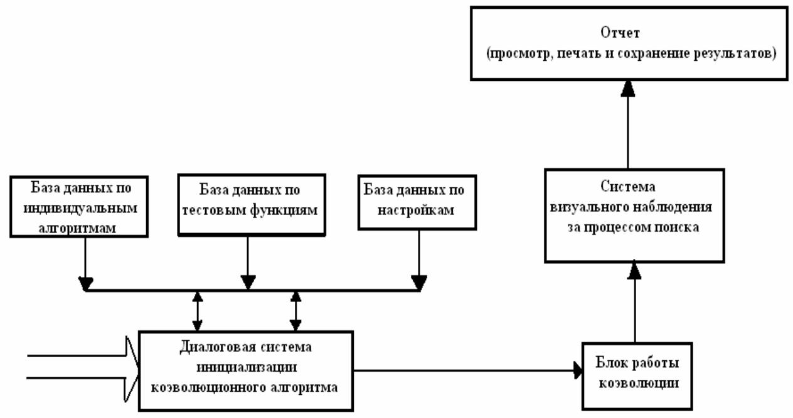  
Pu.9. KoIenabHa cxea ce Ceolution $\mathrm { v } 2 . 0$

K a  v e   X H     B KEJ KT H KT E.

cx

onepa cce ce Mic Windws;

Am :

H   x He Huxe Pentium II 300;

64 M oeT ;

• >;

MeHee 640x480 TOYeK.

HaJ H X I K c6  p He MeHee 11 MBaT.

:

- K,  6  p p.

1. Πpoπeccop Penitum III c uacoo 600 MTπ;   
2. P3 oe π  256 MT.

H    06 W.

IIprpaa ccea Coevolution v.2.0. npoa perpao B Opa  AJr  pora (B p3pa - CH

E.C., Hep rcyapc perpa - 50200400873, aa - 03 aBryca 2004r.).

3 C K ar v v2.0 p B pee  c H (. B pexume.

3a  B  K a. T H    c K pT ca.

H 3an  oe B ar, κ T B B  KJ . 3 HI B paOoTI cceMbI. Cucema Coevolution v2.0 ocymectBrer pemene a o. Pem cI  6 cx B e.

B  H H T -JO  B , K T3paOoTI CTeMbI.

I BKJT (µ  6∥T) H T KI. Bce ) B O   O O ,  T 1TI mTTb B a  B B  , π3T X "36" 3, B c p3  BJ HOBbIX aJropHTMOB.

B I B B    B " OT H HeJTeHe" eT, nm BCM a (,   , y 3T Br cmTT B3T  p6TI B . H,  3 ( .

3 ,   m  . 3 H . A    6y p   B e B  H   T Hm  o6 (:  B  B T. (   p

p    :

( ;   
p   
B K . B a    T pT  3  K 3, e a;   
pI a;   
mponecca "K3HeeTEJHT"   
a;   
"" caT B Te ;   
"

# $\ S 3 . 2$ Oe p r

C  v2.0 T  KK oeJ, T  B C 6e K  c, K pJ 3

v2.0 aJT, 3 H T   3.

O  c u v2.0  6 Ⅲ,  3  ,   B -I 6   X

c.   C B pX y     .

K  c om B  I Coeolutn.exe. B3ya npe1e I nrpI T: H H 3 o By p p   c B C c  J m.  m H .

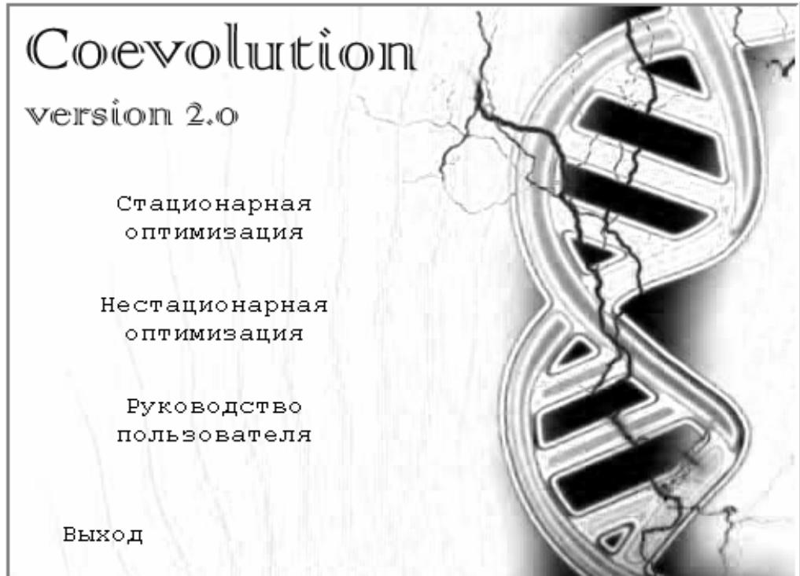  
Puc. 10. InaJoroBoe okHo cnctembI Coevolution v.2.0

3 B O O C, CE BIY H .

1.  .

Hu  o  cI ce K 6 I.

MeHio CepBnc Nomowb

# cro6abH :

# Oncahue Bbiópahhbix asroputmob

asroputm 1   
asroputm 2   
asroputm 3   
asroputm 4   
anronutm 5

# sasbH Ta:

asropum 1   
asroputm 2   
anroput 3   
asropum 4   
aaronutm 5

<table><tr><td rowspan=1 colspan=1>Homep anroput</td><td rowspan=1 colspan=1> a a B mg</td></tr><tr><td rowspan=1 colspan=1>asroputm1</td><td rowspan=1 colspan=1>ayT6pauHr</td></tr><tr><td rowspan=1 colspan=1>asroputm2</td><td rowspan=1 colspan=1>ayT6pauHr</td></tr><tr><td rowspan=1 colspan=1>asroputm3</td><td rowspan=1 colspan=1> opa30</td></tr><tr><td rowspan=1 colspan=1>asroputm4</td><td rowspan=1 colspan=1>Typhup</td></tr><tr><td rowspan=1 colspan=1>asroputm5</td><td rowspan=1 colspan=1>wpauh</td></tr><tr><td rowspan=1 colspan=1>asroputm6</td><td rowspan=1 colspan=1>Typhup</td></tr><tr><td rowspan=1 colspan=1>asroputm7</td><td rowspan=1 colspan=1>wpauh</td></tr><tr><td rowspan=1 colspan=1>asroputm8</td><td rowspan=1 colspan=1>wphauh</td></tr><tr><td rowspan=1 colspan=1>asroputm9</td><td rowspan=1 colspan=1>TypHHp</td></tr><tr><td rowspan=1 colspan=1>asroputm10</td><td rowspan=1 colspan=1>ao6pa30</td></tr><tr><td rowspan=1 colspan=2>                                                                →</td></tr></table>

# C H3e O:

anrophtm 1   
asroputm 3   
asroputm 4   
aaronutm 5

  
. 1. O B

1 , c  .  X , B I   TK B     X (    B p    3

Ta 06p0,  3ancκe porpaMMo CHCTEMBI (a C., HT   , B K H y   I a, H B HHE YACT OKHA.

KHOHKY nATb yCTaKH , OKHO CHCTEMBI.

3 ,         B M  B K  . B T m H  . 12.

  
Puc. 12 . Co6mee 06 ome.

E  e   o,  c c O orpaMMo ceI.

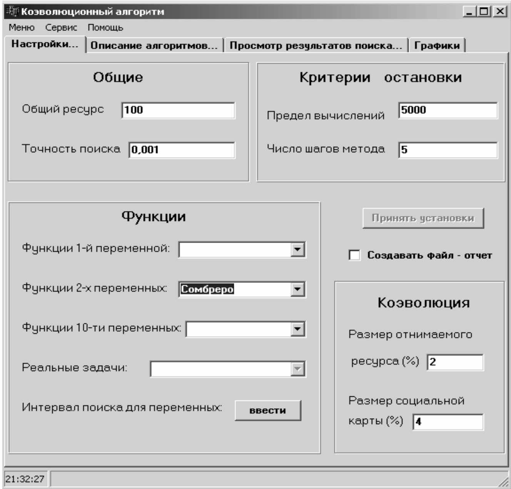  
. 13. O H K a

O   ,  T e y, y o p pe, pa c Kp $( \mathbf { B } \%$ mp $( \mathbf { B } \% )$ ), a T y 3 o  B p).

m 3 , . T, p 1 m  :

<table><tr><td>T</td></tr><tr><td>BonHa</td></tr><tr><td></td></tr><tr><td>E </td></tr></table>

B   p 2 u3 c:

<table><tr><td></td><td></td></tr><tr><td>pBaH Comópepo</td><td></td></tr><tr><td>Wekena</td><td></td></tr><tr><td>Rana</td><td></td></tr><tr><td>DeJong2 PactpruHa</td><td></td></tr></table>

B   pO $1 0 ~ \mathrm { { { H 3 } } }$ cc:

<table><tr><td></td></tr><tr><td>WBeqena PoseHópoKa pa</td></tr></table>

K    (14), T p 3 H  m  p3 x.

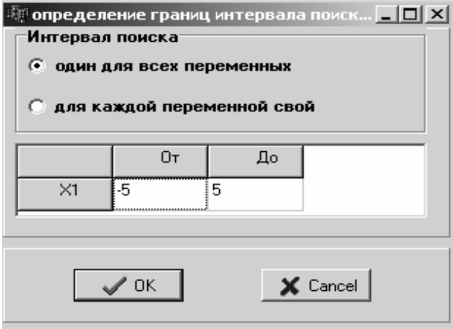  
P. 14. O B TJ H

.     . 1 Co3gaBatb Φan - otyeT aa-oTeTa

H  y , n K  c - Ha puc. 15.

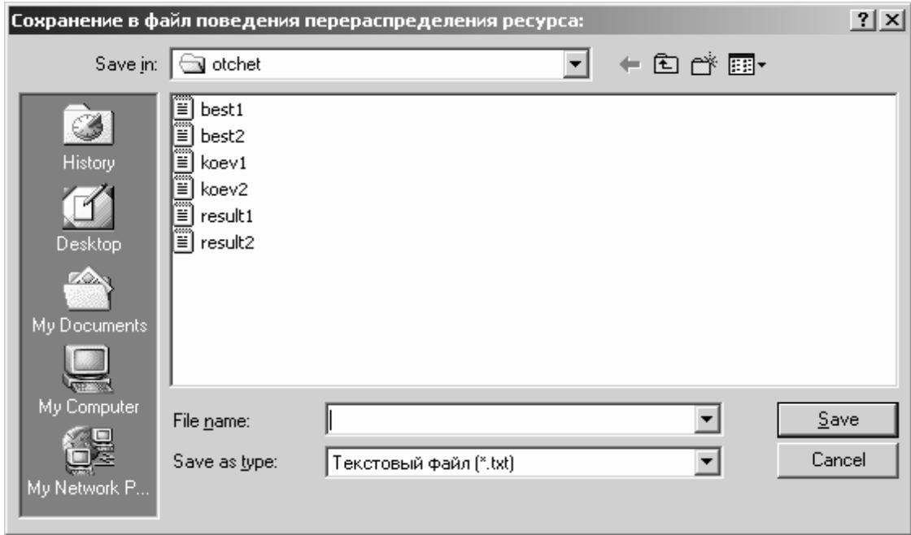  
. 15. I

I  o    n c H nphAtb yctahobkh

3a:  K 6 H   n, H  6T

B c  B 3 - (, 0 p  6 K K BX .

  
. 16. O m 06 e.

  
. 17. O m 06 e.

T      T H  .

HpaeT, BI6  ya napae Te ykμ  T.I. 3aTeM K ,   3 K a.   H H p. 18.

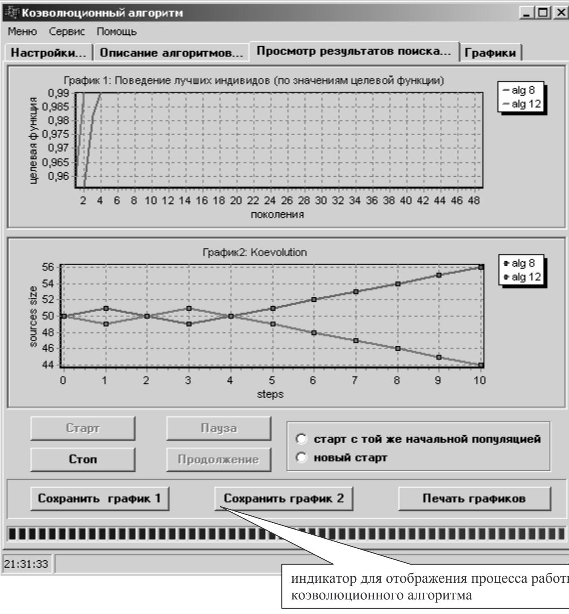  
Pc. 18. OK p3yJb Ha

KHKH Crapt

Hoe yero B pe3ye 1ca Ha rpax B Bepx yac oKHa 1 (   ) K a  , a   2   B n n neeee p. Iea   o6 ra .

H B p3JX T X T BT CoxpaHHTb rpaφ 1 I CoxpaHuTb rpaφ 2

puc. 15.

pa3MepHOTIO 2 6bIa peaJ30BaHa BO3MOKHTb pcOpa pa36pa TeK, Jm e φ (c. p. 19). K y e B nιe pa6 3 H   p .O T  , H p.

<table><tr><td colspan="3">Kobontohb anrot </td></tr><tr><td colspan="3">MeHto CepBnc omowb</td></tr><tr><td></td><td>Hactpokn.…. OnucaHue anroputoB.… IpocmoTp pe3ynbTaToB noucka.…</td><td></td><td>paφuK</td></tr></table>

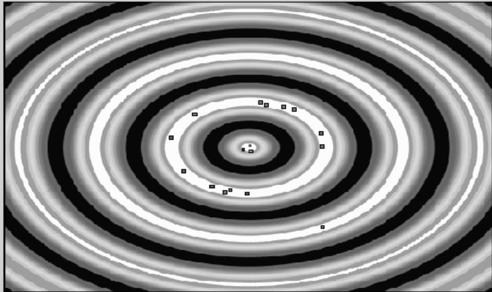  
o g  o ΦyμM

  
. 1. O    p

<table><tr><td>21:33:26</td><td></td></tr><tr><td></td><td></td></tr></table>

.

B . 15.

B .  2.

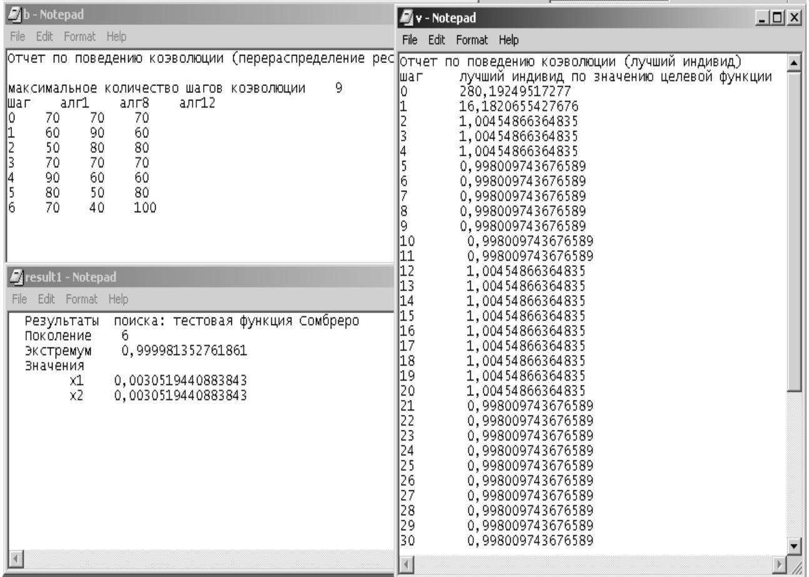  
. 20. B  -

p c c B

HOBIX ycJoB xe H ny HoBb ctapt

B , p  p  (p. 21). I a CepB T    TK y

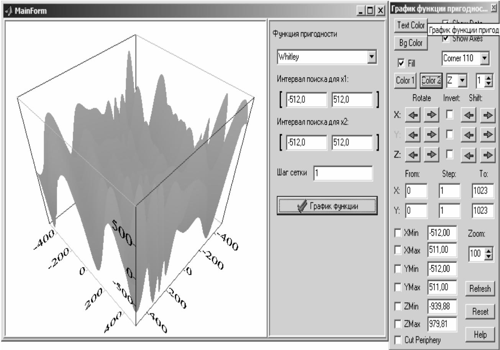  
. 21. M

B   p H  HI $ \mathrm { O }$ μ. B p  , H3He Ha p. 22.

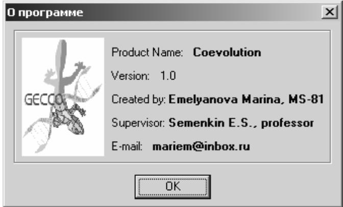  
P. 22. O c  pp cI

B p  3 MeHIO HomomIb . pnc. 23.

Contents Find

Click a topic, and then click Display. Or click another tab, such as Index.

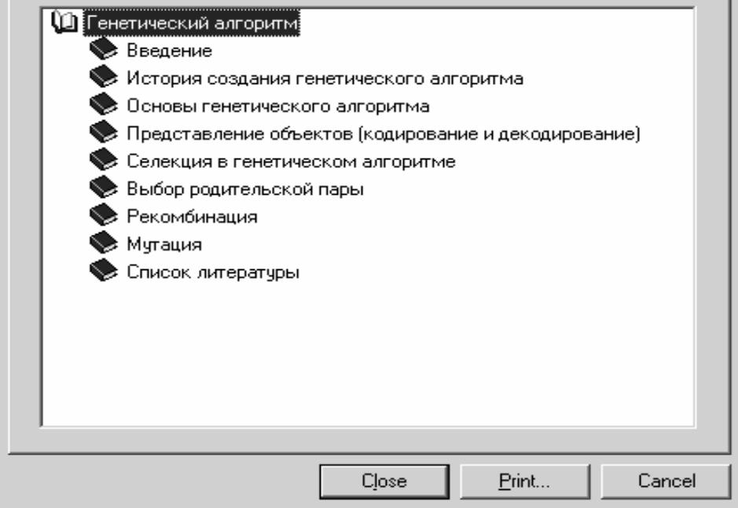  
. 2. O H    a.

H      H 0m,  0 x. Ha 0 ..

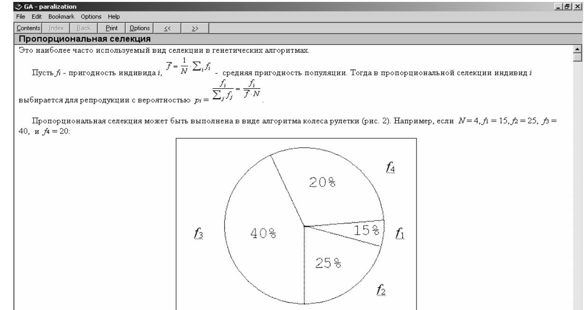  
PhcyHok 2. Koreco pyneTKH.   
. 24. O    3 Π

HH3Ko mpHcNoco6HeHHocTEKO. Ha naKe pynea MoxeT 6hT pegcea BeK v, cocol H3 $\mathcal { M }$ 3MeeHTOB (e mpegenax $\circ \mathbb { r } \ 1 \ \bar { \mu } \circ \ \bar { \mathcal { N } } )$ , H c HK. $\nu ( r )$ BH6pecA npH KaxyoM o6opoe Koeca. HanpHep, B HaeM npHee npH $\displaystyle M = 1 2$ HMeeM $\nu =$ (112233344444). Ecμn renep $r = 6$ B6A H $\nu ( { \boldsymbol { \hat { \ } { \circ } } } ) = 3$ .

Ipo6ea: AceTH3oBHoe npegcTaBeHe $p _ { i }$ (TOHHOCTE 3aBHCHT oT M).

2.H

Hu e o  cI ce K 6T .

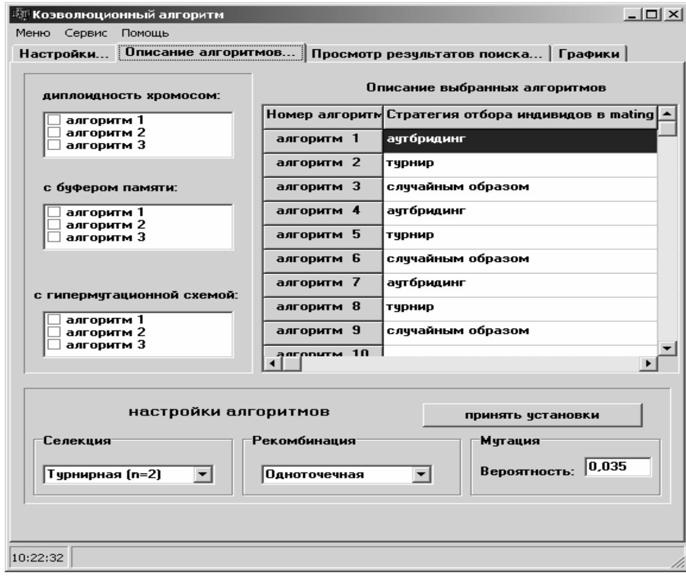  
.

, coppoTb KH .B a C μ  O). T B  O npe pa OX (    B a.

KHOHKY nHATb yCTaHOBKH , OKHO CHCTEMBI.

Ta 0p,  3aπ 1rpa CHCTeMbI (a C, HT   , B K HI y  η  a B HKH ACT OKH.

3 e   K   63 a B K  . B H    . 26.

  
Puc. 26. Co6mee 06 ome

E     o aa (c. p. 13).  o H K aa, y peya, pep c p $( \mathbf { B } \mathbf { \% } )$ $( \mathbf { B } \% )$ , a TaKKe y     3 B   ( e   Ha B p.

(27 p 3  H   p .

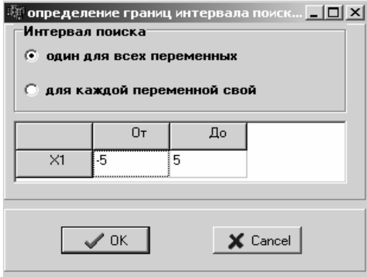  
P. 27. OK B J Ha

, ( 2 I - M BIcTa KcTpeMyMa  T.I.). Bce TO oTpaxeo B oKHe Ha pc. 28.

# -ro

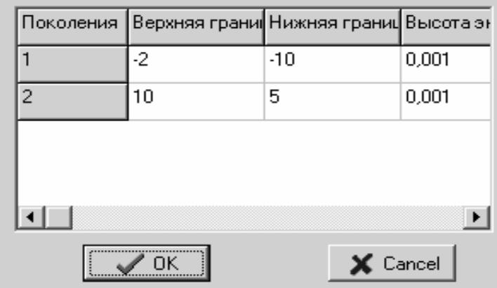  
. 28. O 3

He ,  c  oT K

.     . 1 Cosqaatb an - ot4et   
paa-oTeTa

He  y , - Ha pc. 29.

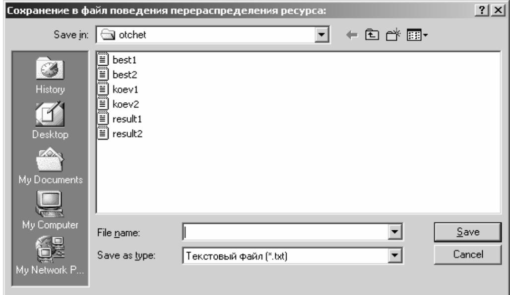

aJ   (   c .  Ee A T  3  3T

T 0  c B, Coevoluin v2.0 061T pyeTB nTepe, oBT BCe cpe Te6 K p3ae r n [22, 30] µ p, q e p  O  A  Π (ep roc. percpa - 50200400873 oT 3 aBryca 2004r., cn¶eeJc 06 pe p3  3710).

$\ S \ 3 . 3$ O   p

H e 6 cY o  . K   y B  [44].

, $\kappa$ Ky neu  c c m pe y K- ( ,   -  B  C HT B BM 3, K C . B  - m K 6 y n (u) . πn,  B px cmemx (aa) ce o HEBO3MOKHO.

Cyme eme o rb o6 - kp Hepa c. H          [44].

B c c  o, 3  p () 0,  y c   3   p y .    μ p - H u me, 6 oe  e u nepeaa 36yκ20 cu2ara 6 up6o 0pe 60 6cex 36ebx 6euamerb20 mpaa - om cyuu ∂o 6urbo eua. Ine pme B  B   p3 c .

H p   B 195 r.  6 H  B B   B BJ - 6 cepe nrp c K, 6 K K CD3 C yep EU B K o6me  pea 3

Te He , c T-AB oT pR H, c KOpX KpH cB 3BX nprpM B 3JOM H6pe (" .  ,    p B  A y H.

NHOE pemeHne μ B   m B -     11 98     30 π ( B 2002 r. H o Bm, a pe Bm m $2 0 0 3 \ \Gamma$ .

H,     , p       , -.

K  3    B , uACTOTHyIO ITIII B3ee nepe norp K x eeeHy 3yuH. TeM H , m HO yT  T,  n KTY 3, cy y   cp 6 μ am y 3a  B3 3,   B .   O p      p 3 6 . -3 3 m, H c I  B , H B. Ha , T B , K K-I.  T O " I 6 aJ 3B" [78, 79, 83].

Ceuac p WHJ3OT aHaJoroBoe p     - I ,      X p, K c 6 y3 3 B c MEG. o  e - y cm aB  6  K .

. A    K 3O  y -I ,    e μ y p.

3 C  , a K K 1970- . XX B. H B ae 6 pax pauamerb cymu crycbl (PBC). Beme 6  B O    C PP IN uAC, H6EE y 3 KTX: 3,4..4,2 Tπ 11,7...12,5 ΓTπ [44].

Me     , π0e B Ham cpae Ha py6ee 1970-1980-x rr. (ce "Op-PB" 6 K 3 r π0 Tepp c B TO K,   6 06 3 COOTBETCTBEHHO $1 2 \mathrm { ~ H ~ 4 ~ M ~ }$ B T    B  . TaK, ca "Op6n-PB" pa6oa uepe3 reocp NC3 "Top3T" ¤ p c 3       e; OHa o6ecπeuaa πepeπay "naκea", coπepamero 10 25 nporpa pa3oo KayecTBa [99].

c a   I c C3 TV-T 2 ¤ D-3 Ke B KX H c T  B  11,9.12,7 ΓTµ. C T K c H I (HI),  3e Ia OT $^ { 0 , 4 \mathrm { ~ M ~ } }$ ( - 0,9 M). T B  Ha H c y a H  p.

ΠepeIaYa 3ByκIx crHaJ B ope DSR o6ecHeuBT KaueTO O p∥ p 3  B .

y  H a, yJ H BTe H B pOB . ,     (  ) c . II   o o6I B yx BT  3a.

B    6   B O , 0 BT 3, p T B H

M  , I, T pemeHnem.

I3 Hn6oJee JX acnekToB μ H   6 p  p . I , y π H 3 c I   0 ( yacTOTaX BIIe $3 0 \mathrm { ~ M F u }$ ,     m 0 cme 6E B cH K y [44].

I  p , MOMIHOCTH.

p 6 , H a   e μ H 3 B  :

mpeo6pa30BaHne ¤ K ( ITH), y 3 B  , B  3 μ    M;

KaHaJ K C K 3    . T , B e, CHCTEM m, 3HUTeJbHMY IX He.

II    6 c Π H Π c K.  p c I B yX T B  (  μ) e 3 m   p;

, μ   6;

a    ;

a   3 m   -  B pAOT IANOe, T  B IANOe 3B CTT (C 110,0);

H     , c c p , 6 o , m ,  y   e .

μ 3 m

,     , , • B3 e 3 ra B y ceeT KK Ⅱ ,     3, 06 π ;

B 3 m n J 6 K 3 m B o 6 ( YX BBe $3 0 ~ \mathrm { M I I } \mathrm { I I }$ 3 0 $1 0 ~ \mathrm { \kappa } \Gamma \mathrm { u }$ ¤ K, m  K  m ( uaCTOTaX HE $3 0 \mathrm { M F u }$ ;

• npea Ha MaJo MOMHOCTH, 5 pe  H/ He e 40  [85]. C  p. 30, Ha K  3 K p∥ (π o /;

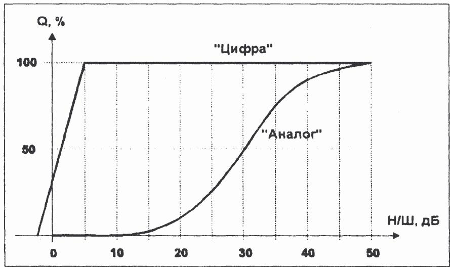  
. 3. 3 o  p   H/II

. T,    c HO r o.

P  H p 3 , c, 3   c3  p6 . IPB B I YT B 30 MTπ (T T-DAB) 3a cT 3NJ 3  ( 6 12 )  y    c, O c p3 B3p  c rI p. O B $45 \%$ p  B  .

B p∥     H Ce B B3HKT  n p3BeT c cHI T-DAB, 6   M B  B3  p.

3   p Tepp P B nepce  6 pe c o6e p B   c (    . , y p B      , pey ca DRM [44].

O     p  , , 0  K m  p. 31. X - Te.

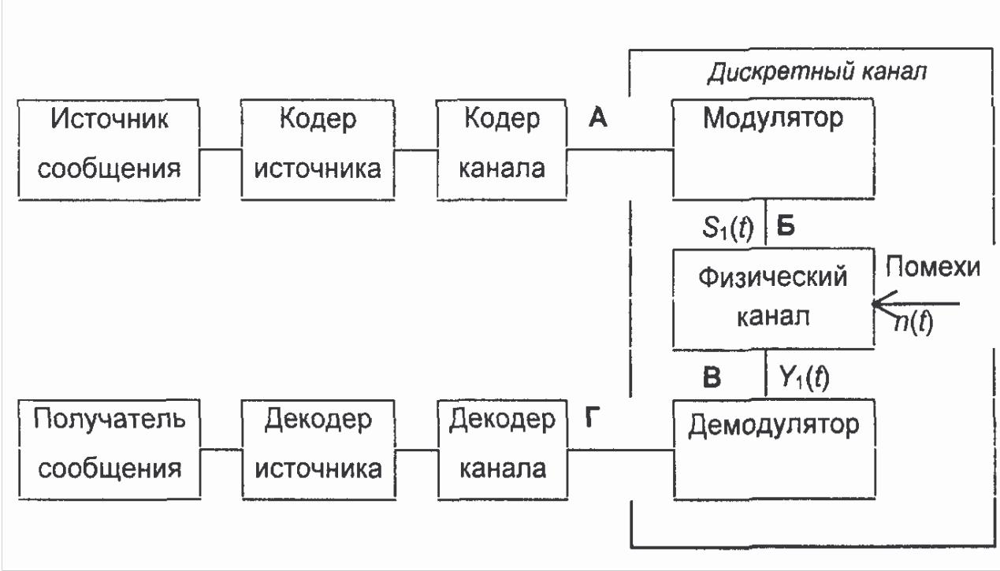  
. 3.

3       B ,     - μ (I   c y 36. II  Bm cr () o Ha c T

Bhe npeee xpa c oro peJ T c. B ,  c c:

T, 3  r Me, T.e. B M KH c MC  ATO;

y c n yaCTOT; , ; o μ

B B H   p  6T T    -  c yu Bx p6ex T6 K c p.

B K       , p e   C. O B pJ  3 c IB OO HACTOTHO (ceKTpabH) I p π ( 3 Be ca. B  oee, acT-Hep

o

THTIO m KOMIAKTHOTO 3ByKOBrO BemaeJHOrO cHrHJa; • e /.

p

• CHCTEMbI H I μ CHCTEMBI, pe   H 30 T1  B I   ; • c Hee (T.e. μ c) IIPB (I) c    p; I, c He IB c. B  c c IB  6I pa K ( -  (, B . H T       .

18 (Iea6p 2002 r.) cceax IPB pa3X uacTx a30  BapaTOB

T 18. C IB    x   

<table><tr><td rowspan=1 colspan=1>HaueHBAHECHCTeMbI</td><td rowspan=1 colspan=3>B </td><td rowspan=1 colspan=1>I30 puuaCTOT</td><td rowspan=1 colspan=1>BO3MOKHOCTbnpuema</td></tr><tr><td rowspan=1 colspan=1></td><td rowspan=1 colspan=1>Ha3eM-HM</td><td rowspan=1 colspan=1>HIIPB</td><td rowspan=1 colspan=1>HCC</td><td rowspan=1 colspan=1></td><td rowspan=1 colspan=1></td></tr><tr><td rowspan=1 colspan=1>T-DAB(Eureka 147/DAB)</td><td rowspan=1 colspan=1>+</td><td rowspan=1 colspan=1></td><td rowspan=1 colspan=1>-</td><td rowspan=1 colspan=1>OBY+yBY (~1,5 ΓTπ)</td><td rowspan=1 colspan=1>ΓapHT</td></tr><tr><td rowspan=1 colspan=1>DRM</td><td rowspan=1 colspan=1>+</td><td rowspan=1 colspan=1></td><td rowspan=1 colspan=1></td><td rowspan=1 colspan=1>H4, C4, BY</td><td rowspan=1 colspan=1>ΓapaHTpoaHa</td></tr><tr><td rowspan=1 colspan=1>AM IBOC DSB</td><td rowspan=1 colspan=1>+</td><td rowspan=1 colspan=1></td><td rowspan=1 colspan=1></td><td rowspan=1 colspan=1>C4</td><td rowspan=1 colspan=1>ΓapaHTpHa</td></tr><tr><td rowspan=1 colspan=1>IBAC  IBOC</td><td rowspan=1 colspan=1>+</td><td rowspan=1 colspan=1></td><td rowspan=1 colspan=1></td><td rowspan=1 colspan=1>OBY</td><td rowspan=1 colspan=1>O</td></tr><tr><td rowspan=1 colspan=1>S-DAB (Media-Star)</td><td rowspan=1 colspan=1>-</td><td rowspan=1 colspan=1>+</td><td rowspan=1 colspan=1>+</td><td rowspan=1 colspan=1>yBy</td><td rowspan=1 colspan=1>O</td></tr><tr><td rowspan=1 colspan=1>World Space</td><td rowspan=1 colspan=1>-</td><td rowspan=1 colspan=1>+</td><td rowspan=1 colspan=1>-</td><td rowspan=1 colspan=1>yBy</td><td rowspan=1 colspan=1>Or</td></tr><tr><td rowspan=1 colspan=1>Sirius Satellite Radio</td><td rowspan=1 colspan=1></td><td rowspan=1 colspan=1>+</td><td rowspan=1 colspan=1>+</td><td rowspan=1 colspan=1>yBy</td><td rowspan=1 colspan=1>OTcyTcTByeT</td></tr><tr><td rowspan=1 colspan=1>XM Satellite Radio</td><td rowspan=1 colspan=1></td><td rowspan=1 colspan=1>+</td><td rowspan=1 colspan=1>+</td><td rowspan=1 colspan=1>yBy</td><td rowspan=1 colspan=1>OrcyTcTByeT</td></tr><tr><td rowspan=1 colspan=1>DSR</td><td rowspan=1 colspan=1></td><td rowspan=1 colspan=1>+</td><td rowspan=1 colspan=1>-</td><td rowspan=1 colspan=1>CB4</td><td rowspan=1 colspan=1>OrcyTcTByeT</td></tr><tr><td rowspan=1 colspan=1>ADR</td><td rowspan=1 colspan=1></td><td rowspan=1 colspan=1>+</td><td rowspan=1 colspan=1></td><td rowspan=1 colspan=1>CBY</td><td rowspan=1 colspan=1>OtcyTcTByeT</td></tr><tr><td rowspan=1 colspan=1>Digital System E</td><td rowspan=1 colspan=1></td><td rowspan=1 colspan=1>+</td><td rowspan=1 colspan=1>+</td><td rowspan=1 colspan=1>yBy</td><td rowspan=1 colspan=1>OTcyTcTByeT</td></tr></table>

Ap c IB (B 0m c, K) 1   32. 3: 1-  y  , 2 - , 3 - 6  , 4 -    5 -  , 6 - CHTHAJOB HC3.

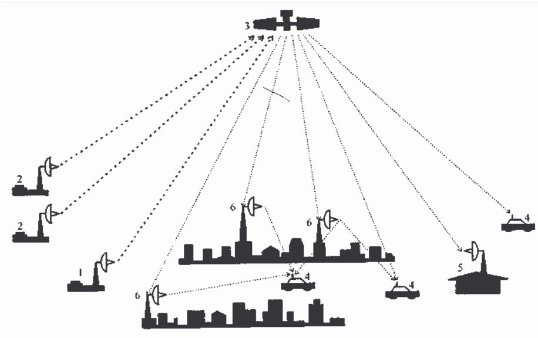  
. 32. B   IPB

DRM (Digial Radio Mondiale) - coBpeMe caHapT Iporo pm p    3  ( B c   p. MapTe $1 9 9 8 \ \Gamma .$ , K R  (   aJb $2 0 0 2 \ \Gamma .$ ) 72  B ;  p   TES (Broadcast & Multimedia) co ma6-kappo  pa.

C H K     6    M ( 30- HepI , Ta 06p, pc. O6m cey DRM πpe yI H p. 33.

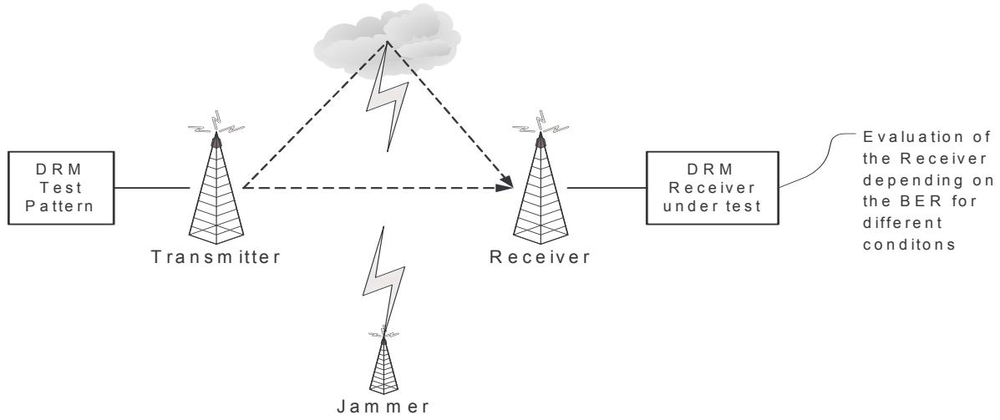  
Pc. 33. Om ce DRM e

B pm , onepaTopI , p   a  - ;   Γ   Γ "T ". I H,     , -  y B I c  O K BJH.

H ,   p p [7, 98] 3

• H (H/F) - 0T 148,5 0 283,5 K™π (μ p 1; );

• ce¶ (/F) - T 526,5 0 1606,5 Kπ (J paOHOB $1 \mathrm { ~ H ~ } 3 \mathrm { ~ H ~ }$ 525 0 1705 π -   );

•B (/ -     B 3 0 27 , 0m   .

p.  B   I B  R C p

E  3 ( a  c , me 6 K  H, T B  -   e m " B  c  3T e .

( B 200-2002 r. B    B P - B

H     I ,  B  I    y p, o  B n  n  He nBmam 10 Kμ, oe cyKo  K 3,      . 0     [44].

B (B TK H 0 I  H 3BO XT O OTIJ ) B K, CBEM c K p. Ip    12 $4 , 5 . . . 5 \ \mathrm { \ K T I I }$ )  (c 1100 oT 4,5 0 $1 0 ~ \mathrm { \bf ~ \kappa ~ } \Gamma \mathrm { \pi }$ ( B om  y H (  ) . e  B B DM- $8 0 ~ { \mathrm { 6 } } \mathrm { u T } / \mathrm { c }$ y, a T   , B 3 c .

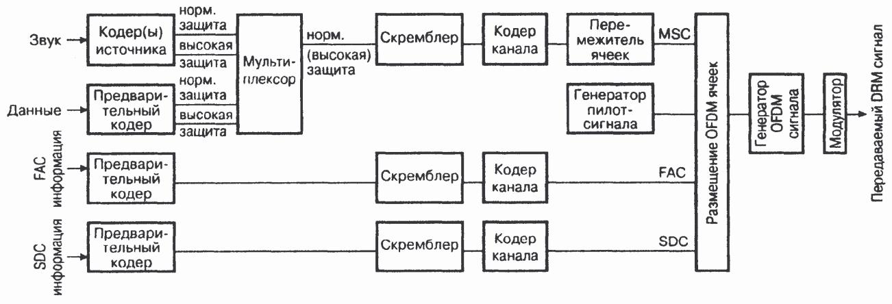  
P. 34. Cpy ce ee  c DRM

A c c e  c  (pc. 33,       . Mp B, T OO CI C T, T B  DRM [44]:

- 2 c  ( ), ;   
• PAC - κahar 6bicmpo2o docmyna (κ pary nepeda6ae.mo -     X, μ, K  pι () B  B  ;   
• H  K T , 1 p y, 3 B om   K M,    B . O a  p (ilst) epe.

Opam K cee Ha p. 34, Jer BIe, qT 31e H BCe I H y   K   K, HeeX (κK  B C DAB - TJ B rBH Ke π , - - 0 T μ  e, 0 B , p  OM ( y, K  cι B  AB). O   ,   .

Kodep ucmouua u nepeκodupyouue ycmpocmea (mpacodepbl) - T aN B  () K cy 3 DRM eT  ex B B ()  3 I y  c   T  p y 3   ( Ham c B "nx" κ. Be yc, pea B 3mμI.

My -  y  3m 3  B  .

pa3emT Ix Ha cee "BpeR-yac", a OFDM curaJ-repTop Π6p3T KAXIOe MHXTO OFDM-cBOB B cOTBTCTByMIO πT 11T OM- (T.e. ODM-) B c 3  .   3 - , 0   c n3.

B c [104] B He  (ell) K 063 p B T H B Ts. Ka OFDM- -  c K - ,  3 3  m ,         B 3 H  O- o T    3 .

I      B p  p πepe 3 $4 . . . 5 \ : 6 \mathrm { { H T / c / \Gamma _ { L } } }$ - .

K  e  o y ()   c B c. B c , Tpe6yeb ypoeHb H OFDM - C (n, cJ, M ODM). T 06,  OM- 0 p3 y H  . p   .  3 H p    B . 19 y  c - p3  OMCHMBOJIOB.

3   , -  [04] H  , peXa nepeIa, Ha3BaHHe cooTBeTcTBeHH: A-ground, B-sky n C-robust.

T 1.  y -   

<table><tr><td rowspan=1 colspan=1> HmC -  T OM -MBOJO</td><td rowspan=1 colspan=1>   </td></tr><tr><td rowspan=1 colspan=1>A</td><td rowspan=1 colspan=1>  </td></tr><tr><td rowspan=1 colspan=1>B</td><td rowspan=1 colspan=1>K  -   </td></tr><tr><td rowspan=1 colspan=1>C</td><td rowspan=1 colspan=1> H B  c 6I A </td></tr><tr><td rowspan=1 colspan=1>D</td><td rowspan=1 colspan=1> H B,  c 3   YaCTOTbI</td></tr></table>

Tu pImeJ K H ux  30 Tπ p 1 9  10 Kµ.  RM T o :

cymem T ma;

B H  H $( 4 , 5 \mathrm { ~ H ~ } 5 \mathrm { ~ \tiny ~ K ~ } \Gamma _ { \mathrm { I I } } )$ - qt0 Bm, c ∥ ;

H   H $( 1 8 ~ \mathrm { ~ \textmu ~ } 2 0 ~ \mathrm { ~ \textkappa ~ } \Gamma \mathrm { { u } } )$ r p     - B  c T IonT  mHE.

I  m y  m,  p  y I 3  o p   :

K c ( KppTOM K  KpaTCTb

napepI OFDM-BJ, STX p p.

3      H  (

I o, c p  B   
NX YACOT H $3 0 ~ \mathrm { \ M T z }$   
  
$8 \ \mathrm { \ K G } _ { \mathrm { \tiny { H T } } } / \mathrm { c }$ (- 0 $2 0 ~ \mathrm { \ K 6 { u r / c } }$ (   72 κ/ (

K.  o o K n T cx B   p aI ( )  (. 35):

MG-4  - c 3 (m) κI y    p;

•MP-4 CE - K pe co cpeCTM , J  B ;

MG-4 HV - κ c  r B - K p, 0    c BBICOKYIO MOO Key neeη pu;

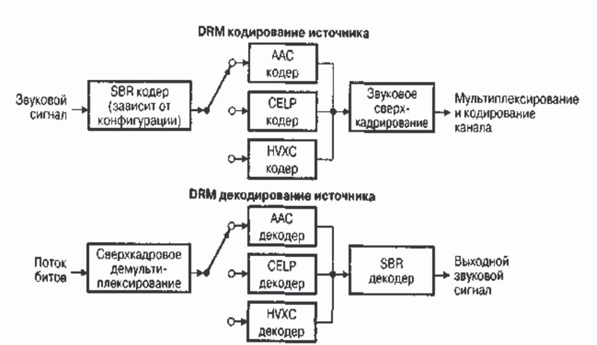  
P. 35. BTI K N

SBR (Spectral Band Replitn) - cea npe (aroT) BT T 3K   H p cO. OH LP.

B c    y 3 ()   (  H. 3 (  3 ().

$\ S \ 3 . 4$ H p   p

3a1a4a C p   p   p npoeκTa "Modeling and optimization of DRM signals" coBMecTHo c nHcTuTyTOM y 0B (Fachhochschule Ulm, Tepana).

KaK oeY Be, npeYa Bx T HX B cE H   3  B e H T  c 6   K 3 K c 3 H n nee c ( 1-  4-x). O B cm 6  ,  p C H  6 H ,  m  ( H H ,    ee 3 , (    3 y y y    .B e pm      2- O  o a 3   (   3 2 1 3   ). cymu op0:

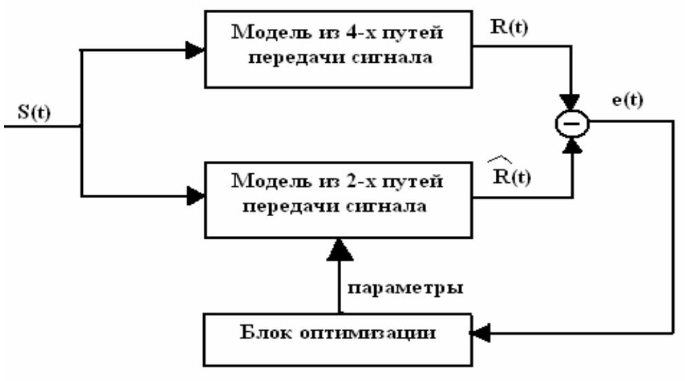  
Pu. 36. Om  3

: S() -  ,

R()  B   "", .

e()

K ,      .

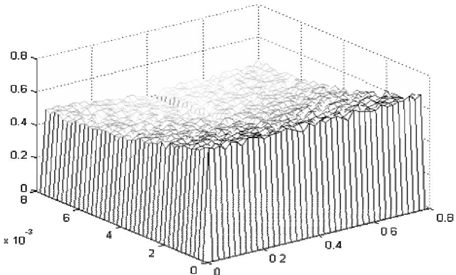

3.     5    X Y

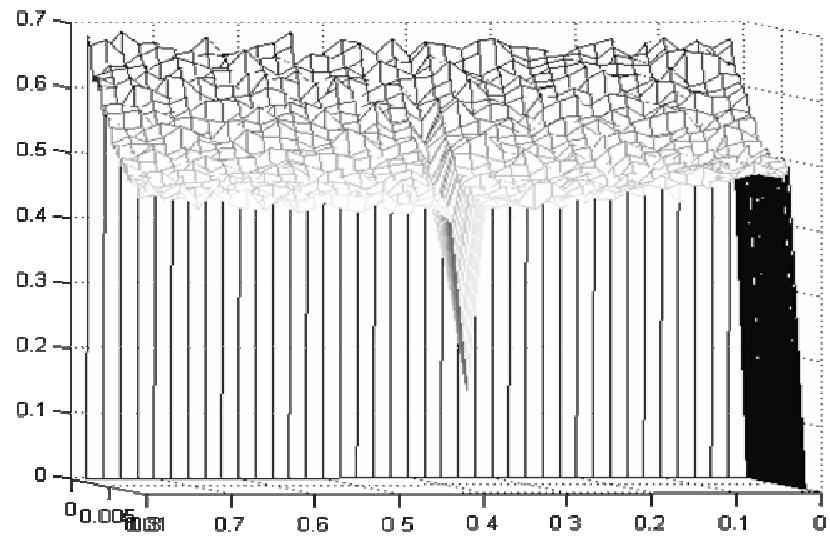

.          X Y

K   E   3 T    ,  I .

B .

.

$\ S \ 3 . 5$ p a

c H    B : ,   y (c. 3 T , mTA.

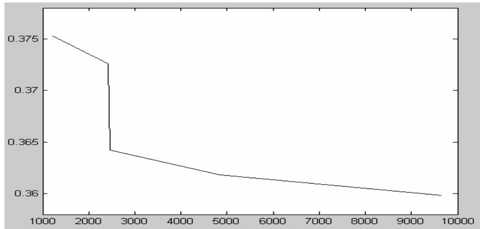  
39. Π   p p B p (  X - p,   -

py I $2 0 \mathrm { ~ H ~ } 2 1$ ( p ye  2-  a).

T $1 , 2 , 4 \mathrm { ~ H ~ } 5$   

<table><tr><td rowspan=2 colspan=1>HomepKaHaJa</td><td rowspan=1 colspan=5>Om6ka (%)</td></tr><tr><td rowspan=1 colspan=1>/0%</td><td rowspan=1 colspan=1>/m70%</td><td rowspan=1 colspan=1>/m50%</td><td rowspan=1 colspan=1>/m40%</td><td rowspan=1 colspan=1>/30%</td></tr><tr><td rowspan=1 colspan=1>1</td><td rowspan=1 colspan=1>0.2967606</td><td rowspan=1 colspan=1>0.3601</td><td rowspan=1 colspan=1>0.433606</td><td rowspan=1 colspan=1>0.443798</td><td rowspan=1 colspan=1>0.455751</td></tr><tr><td rowspan=1 colspan=1>2</td><td rowspan=1 colspan=1>0.3476643</td><td rowspan=1 colspan=1>0.394448</td><td rowspan=1 colspan=1>0.41087</td><td rowspan=1 colspan=1>2.29124</td><td rowspan=1 colspan=1>2.35966</td></tr><tr><td rowspan=1 colspan=1>4</td><td rowspan=1 colspan=1>0.35834</td><td rowspan=1 colspan=1>0.38486</td><td rowspan=1 colspan=1>0.3856</td><td rowspan=1 colspan=1>3.03792</td><td rowspan=1 colspan=1>3.09568</td></tr><tr><td rowspan=1 colspan=1>5</td><td rowspan=1 colspan=1>0.441275</td><td rowspan=1 colspan=1>0.468088</td><td rowspan=1 colspan=1>0.479668</td><td rowspan=1 colspan=1>2.89652</td><td rowspan=1 colspan=1>2.98614</td></tr></table>

T $3 \mathrm { ~ H ~ } 6$   

<table><tr><td rowspan=2 colspan=1>HomepKaHaJa</td><td rowspan=1 colspan=5>Om (%)</td></tr><tr><td rowspan=1 colspan=1>/m0%</td><td rowspan=1 colspan=1>/m70%</td><td rowspan=1 colspan=1>/m50%</td><td rowspan=1 colspan=1>/m40%</td><td rowspan=1 colspan=1>/m30%</td></tr><tr><td rowspan=1 colspan=1>3</td><td rowspan=1 colspan=1>26.7668</td><td rowspan=1 colspan=1>26.82</td><td rowspan=1 colspan=1>26.8668</td><td rowspan=1 colspan=1>27.262</td><td rowspan=1 colspan=1>27.5222</td></tr><tr><td rowspan=1 colspan=1>6</td><td rowspan=1 colspan=1>45.8266</td><td rowspan=1 colspan=1>45.8982</td><td rowspan=1 colspan=1>45.899</td><td rowspan=1 colspan=1>46.338</td><td rowspan=1 colspan=1>47.1288</td></tr></table>

- $0 . 5 \%$ 2-  ( 21)  H 6 m     .

a c c  B , T e   ee    a  y 3. B  , e T,   a T 6  p 3 n 6 T H e ap. TaK o6p, B3HT

K 3 ceTaT B ce6e cpa3y HecOJK reeTueKx aJropT  Mexa3M

$\ S \ 3 . 6$ K a

B a   e   n H  3     6  3 B .

$2 2 \thinspace \mathrm { { H } \ { 2 3 } }$ (mpee p   2-  a).

$1 , 2 , 4 \mathrm { ~ H ~ } 5$   

<table><tr><td rowspan=2 colspan=1>HomepKaHaJa</td><td rowspan=1 colspan=5>Om6ka (%)</td></tr><tr><td rowspan=1 colspan=1>/0%</td><td rowspan=1 colspan=1>/70%</td><td rowspan=1 colspan=1>/50%</td><td rowspan=1 colspan=1>/40%</td><td rowspan=1 colspan=1>a/30%</td></tr><tr><td rowspan=1 colspan=1>1</td><td rowspan=1 colspan=1>0.2967606</td><td rowspan=1 colspan=1>0.3401</td><td rowspan=1 colspan=1>0.3606</td><td rowspan=1 colspan=1>0.443798</td><td rowspan=1 colspan=1>0.455751</td></tr><tr><td rowspan=1 colspan=1>2</td><td rowspan=1 colspan=1>0.3476643</td><td rowspan=1 colspan=1>0.354448</td><td rowspan=1 colspan=1>0.40583</td><td rowspan=1 colspan=1>2.12454</td><td rowspan=1 colspan=1>2.23565</td></tr><tr><td rowspan=1 colspan=1>4</td><td rowspan=1 colspan=1>0.35834</td><td rowspan=1 colspan=1>0.34486</td><td rowspan=1 colspan=1>0.36574</td><td rowspan=1 colspan=1>3.01394</td><td rowspan=1 colspan=1>3.01538</td></tr><tr><td rowspan=1 colspan=1>5</td><td rowspan=1 colspan=1>0.441275</td><td rowspan=1 colspan=1>0.438088</td><td rowspan=1 colspan=1>0.489487</td><td rowspan=1 colspan=1>2.65268</td><td rowspan=1 colspan=1>2.89612</td></tr></table>

T $3 \mathrm { ~ H ~ } 6$   

<table><tr><td rowspan=2 colspan=1>HomepKaHaJa</td><td rowspan=1 colspan=5>Om6a (%)</td></tr><tr><td rowspan=1 colspan=1>/m0%</td><td rowspan=1 colspan=1>/m70%</td><td rowspan=1 colspan=1>/50%</td><td rowspan=1 colspan=1>/m40%</td><td rowspan=1 colspan=1>/m30%</td></tr><tr><td rowspan=1 colspan=1>3</td><td rowspan=1 colspan=1>26.7668</td><td rowspan=1 colspan=1>26.72</td><td rowspan=1 colspan=1>26.7668</td><td rowspan=1 colspan=1>27.262</td><td rowspan=1 colspan=1>27.5222</td></tr><tr><td rowspan=1 colspan=1>6</td><td rowspan=1 colspan=1>45.8266</td><td rowspan=1 colspan=1>45.7982</td><td rowspan=1 colspan=1>45.8266</td><td rowspan=1 colspan=1>46.338</td><td rowspan=1 colspan=1>47.1288</td></tr></table>

B    2, 21  22, 23 c c 3: m K a

H   1-  1     , a 2 4  5  ,   m a. O  3    . K .

2-  ( 23 a,  H m

I B     .

T ,  y B c  a μ ()    p   . H  pm

3 3-x   , c 3 e n I  H   c 6 0 10 .

$2 4 \mathrm { ~ H ~ } 2 5$ (μ p e  20-  a).

T $1 , 2 , 4 \mathrm { ~ H ~ } 5$   

<table><tr><td rowspan=2 colspan=1>HomepKaHaJa</td><td rowspan=1 colspan=5>Om6a (%)</td></tr><tr><td rowspan=1 colspan=1>ca/i0%</td><td rowspan=1 colspan=1>ca/i70%</td><td rowspan=1 colspan=1>/50%</td><td rowspan=1 colspan=1>/i40%</td><td rowspan=1 colspan=1>/30%</td></tr><tr><td rowspan=1 colspan=1>1</td><td rowspan=1 colspan=1>0.1976</td><td rowspan=1 colspan=1>0.2491</td><td rowspan=1 colspan=1>0.2614</td><td rowspan=1 colspan=1>0.449</td><td rowspan=1 colspan=1>0.455</td></tr><tr><td rowspan=1 colspan=1>2</td><td rowspan=1 colspan=1>0.294743</td><td rowspan=1 colspan=1>0.33958</td><td rowspan=1 colspan=1>0.39517</td><td rowspan=1 colspan=1>2.125</td><td rowspan=1 colspan=1>2.265</td></tr><tr><td rowspan=1 colspan=1>4</td><td rowspan=1 colspan=1>0.331234</td><td rowspan=1 colspan=1>0.33986</td><td rowspan=1 colspan=1>0.35874</td><td rowspan=1 colspan=1>3.094</td><td rowspan=1 colspan=1>3.018</td></tr><tr><td rowspan=1 colspan=1>5</td><td rowspan=1 colspan=1>0.401215</td><td rowspan=1 colspan=1>0.41798</td><td rowspan=1 colspan=1>0.44719</td><td rowspan=1 colspan=1>2.668</td><td rowspan=1 colspan=1>2.812</td></tr></table>

T $3 \mathrm { ~ H ~ } 6$   

<table><tr><td rowspan=2 colspan=1>HomepKaHaJa</td><td rowspan=1 colspan=5>Oma (%)</td></tr><tr><td rowspan=1 colspan=1>/m0%</td><td rowspan=1 colspan=1>/m70%</td><td rowspan=1 colspan=1>/50%</td><td rowspan=1 colspan=1>/m40%</td><td rowspan=1 colspan=1>m/30%</td></tr><tr><td rowspan=1 colspan=1>3</td><td rowspan=1 colspan=1>25.7668</td><td rowspan=1 colspan=1>26.21543</td><td rowspan=1 colspan=1>26.00134</td><td rowspan=1 colspan=1>26.99762</td><td rowspan=1 colspan=1>27.12102</td></tr><tr><td rowspan=1 colspan=1>6</td><td rowspan=1 colspan=1>45.2134</td><td rowspan=1 colspan=1>45.19892</td><td rowspan=1 colspan=1>45.52411</td><td rowspan=1 colspan=1>46.13535</td><td rowspan=1 colspan=1>47.10343</td></tr></table>

0 H  H  ( 4- H, a T 63  n a B HX

2-  ( 25), , a    p 3

# BB0IbI

B  r oa p nr c, a,  y, o K op o

K   , .Ha 3 p   p.

P n c nT pm K T, T  ne 3, c c o  c c. p    y 3   6 3HAYH.

A T B r p  H  B  , n  B  M, c n  c c  . Π p p p μ p

T  3 (   . Ⅲ 3 T       B , 2, 4  5     B $40 \mathrm { ~ H ~ } 3 0 \%$ ) p e, e y  peT O  a   J c, a m e p  3 B p   c.

#

pe3y

a TeCx ,

p ,

COTTBmeO cpeH TeGH,

p Ha μ     H ,

y n p ,      , m .

Ta 0p B   p pe 3 a     a, CJOKHBIX CHCTEM.

# Ch J:

1. μ.  M , 1994.   
2. . onTuMu3anμn. URL: http://www.cp.niif.spb.su/inpe/4/gaover/gaover.htm   
3. A .  . , o , T. 2.  . . A. K 1996.   
4. Aaa B.H., KoJac B.B., Hoco B.P. MaTeaTe Teopa K  y. M. B , 1998, 573c.   
5. .   /. K, A.Φ. Tapee, C.B. BacTH, B.B. Pax. M.: M3ηaTeJb MoJrae C.B.: Hmμk, 2001. 496 c.   
6. .      / Ho peμ. Ib M.E.: Yue6. 1ooe. Bopoe, 1995.   
7. ..  . O Hoo reHeecκx alropT. URL: http://saisa.chat.ru/ga/summer 97.html   
8. ..  J.H. T H.B. / MyxBy3. c6op, BΓTY, Bopoe, 1994.   
9. BJ, B.H. OcI Te cce  cce aaJa: Ye6K " 3  y" / B.H. BoJ, A.A. . 2-e 3μ., epe6. I 01. CH6.: M3μ-B0 CH6TTY, 2001. 512 c.

1.  . A      / . ΓaμeB. CΠ6: ΠnTep, 2001. 752 c.

11. e IO. .  a   oe. M.: B , 1996.

12. EmerbrHoa M.H. Decision of some economic optimization problems with help of evolutionary algorithm with coevolution strategy / M.H. EmeJbrHa /  p ocBoeHne, pa3BTe, nepcπekT".- KpacHorpcκ: KpacΓ AY, 2003.- C. 36- 38.

13. E M.H. IpeHeHe auropTa c K cTpaTerne B OHOMNKO-MATEMATYEKOM / .. E // $^ { \mathfrak { s c } } 1 1 ^ { \mathfrak { L } }$ Te 4" / Ka: KTAY, 2003. - C. 12 14.

14. E .. /  .. E .. E.C., Con E.A // BecTK C6npco rocyIapctHoro ap ya . aae M.Φ. Pemee: C6. HayuH. TpyI0.- Kpacpc: Cu6ΓAY, 2003.- C. 1423.

15. E . / A.B. Γy, M.H. EJ, B.A. KeM // Be H CyBT (B. 13): C6. H. Tpy0. KpaRp: HM CyBMT, 2003.— C. 237248.

16. E . H   / E M.. // TexHoJor". - Kpaorp: KTTy, 2003. - C. 69-70.

17. E .. /  .. //   42- - , Cn6ΓAy. - KpacHorpc: Cn6ΓAy, 2004.

18. E M.H. K    B 3    / E . / Be  K (B. 1): C6. H. T. - Kpac: BC PΓYHTI, HH CYBΠT, 2004. - C. 189-198.

19. E .H.     X π B 3   p E .. //    - π κμ <He  2004>.  Kp , 2004. - C. 21-23.

20. E . /  // I - "CncTeMHb J B 1  ymp" - C-He: CIry, 2004. - C. 48-51.

21. E .. aJ / EeJ M.H. Ce E.C. // Be nOo ry a y . aae M.. PemeTHea: C6. HayuH. TpyI0. KpacHorpc: Cu6Γ AY, 2004. - C. 28-34.

22. EeJb M.H. Iprp c Ceolu $\mathbf { V } 1 . 0 ^ { \circ }$ (cucTema a) / EeJ M.H. Ce E.C. / M.: BHTI (N rc. per. 502004008732004). - 12 c.

. O p J a / K M.H.// I y m   K: Cn6TAY, 2004. - C. 31-33.

24. K H. K 3  / K M. //   III B - (TM). - A-: KTy, 2004. - C. 21-22.

25.  C.A.. Ho o reT ax. URL: http://saisa.chat.ru/ga/ga-pop.html#top

26. , BA.    . T H / B.A. Hp, B.H. T. M.: Ha: , 1999.- 288 c.

27.    C  I, Πe. . / P X3  K  K   K.: nacoφt, 2001. 736 c.

28.    C  I, He. . / P X3  K    . K.: nacoφt, 2001. 736 c.

29. KopHeeB B.B., TapeeB A.., BacOT C.B., Pax B.B. Ba3bI IaHHbIX: 0 . . H,  352 c.

30. KpcaeH, T. Perl: Bu6JIoea nporpca / T. Kpca, H. TopκHrOH. CII6.: Πntep, 2001. 736 c.

31. J, B.B.  p3a r ce: MeI, C T / B.B. . M.:   , 1993.- 160 c.

32. Maepc, Γ. Mcκcco Teco orpa / Γ. Maepc; Πep c ar. 110 peμ. E.A. Π3. M.:   cT, 1982. 176 c.

33. O B.A. O o   y. M.: B k, 1969, 296c.

34. Op, .A. Te p  0: Yue6H / C.A. Op10B. CII6.: ΠnTep, 2002. 464 c.

35. OcI  0 c: Kyp  / A.. C, . A. Yax  Ip. - CΠ6.: EXB - MeTepypr, 2003.

36. H, A.B. M  B m  3: 6. 1106ne / A.B. ΠaHTeJee, T.A. JeT0a.- M.: BIcma mkoa, 2002. 544 C.

37. H  K   / . , H.. A6pa, B.. Cn  p. M.: Cuer, 1999. 284 c.

38. .B.  1  0m 3aKepHT / H.B. ΠprJ. M.: ChTer, 2000. 528 c.

39. . B    /. ; - 16 y . B.A. Tp3. M.: Ha, 2003. 428 c.

.  . O     B2 T. 2-e μ, . T.1: AB, .A. Te BpT HJI  / C.A. A, B.C. MX. M.: IOHMTM IAHA, 2001.- 656 c.

11 / B.C. Π. 2-e 3., C.  0π M.: 3T, 2002.- 496 c.   
42. P J. A. A c c. - M.: H, 1980.   
43. aJrp. Oea e ree arpa. URL:http://www.keldysh.ru/BioCyber/Lecture10.html   
44.  C. T. I p. M.   - Te, 2004.   
45. E.. Je B.A. Me 06 a - pecc, 2002.  320 c.   
46. C E.., C O.., Ke C.ⅡI. AT H     I, 1997.355 c.   
47. . T . M $\mathrm { P } \Phi$ ,2000. - 211 c.   
48. 6- : H. c / .  M:   ", 202. 624 c.   
49. CrapukoB A. BaseGroup Labs. TeHernyeckne aJroTbI MaTeatnuecknñ annapaT. URL: http://www.basegroup.ru/genetic/math.htm   
50. C, B. O c 4- : Ie. c . / B. Cr. M.: H3 I0 "BJc", 2002. 848 c.   
51. Taxa, X. B B  o: 6-e e: Iep. c a. / X. Taxa. M: 3η 10 "Bc", 2001. 912 c.   
52.  .     /. TpaxteHrep11. M.: CuHer, 1998. 376 c.   
53. Tpa .A.  B K ypaeex peme / .A. Tpaxerep. M.: Cer, 2001. 256 c   
54. , . s.  c / I. , . Ipeκ. CΠI6.: ΠnTep, 2003. 496 c.   
55.  . Oy . I . cyc e . H   I. II. H . IBaxHeHKo A. Γ. - M.:Mup, 1969.   
56. oc, x. porpae o6ec  ero pa3pa6a Πep. ca./ I. Φ0κc. M.: Mup, 1985. 368 c.   
57. 10e / W.r. UepHpy.- CI6: JaHb, 2001. 384 c.   
58. T. Π c  : 4- : . c . / Γ. IIμ. M.: H3  "B", 2002. 704 c.   
59. . .   . . / . E. TaMH.− K.: O0O "TH "IC", 2002. 736 c.   
60. Banzhaf W., Francone F. D., Nordin P. «The Effect of Extensive Use of the Mutation Operator on Generalization in Genetic Programming" Department of Computer Science, Dortmund University, Germany   
61. Branke J. Memory Enchanced Evolutionary Algorithms for Changing Optimization Problems, Institute AIFB, University of Karlsruhe, 1999.   
62. Branke J. Evolutionary Approaches to Dynamic Optimization Problems. Updated Survey. Institute AIFB, University of Karlsruhe, 1999.   
63. Cramer Nichael Lynn «A representation for the adaptive generation of simple sequential programs> Proceedings of an International Conference on Genetic Algorithms and Their Applications. Hillsdale, NJ: Lawrence Erlbaum Associates 1985.   
64. DeJong K. A. An analysis of the behavior of a class of genetic adaptive systems, doctoral dissertation, University of Michigan, 1975, Dissertation Abstracts International 36(10)5140B.   
65. Eggermont J., Lenaerts T. Non-stationary Function Optimization using Evolutionary Algorithms with a Case-based Memory, Leiden Institute of Advanced Computer Science, Leiden University.   
66. Eiben A. E., Baeck T., Schoenauer M., Schwefel H. P. (Eds.) Fifth International Conference on Parallel Problem Solving from Nature (PPSNV).  Berlin: Springer, 1999.   
67. Goldberg, D. E. Genetic Algorithms in Search, Optimization, and Machine Learning. Reading, Massachusetts: Addison-Wesley, 1989.   
68. Grefenstette J. J. Genetic algorithms for changing environments, Navy center for Applied Research in Artificial Intelligence, Naval Research Laboratory, Washington, DC 20375, USA.   
69. Hemert J. et al. A "Futurist" approach to dynamic environments, 2000.   
70. Holland, J. H. (1992). Adaptation in Natural and Artificial Systems. Cambridge, MA: MIT Press, 1992 (2nd edition).   
71. Koza John R. «Genetic programming tutorial> URL: http://www.geneticprogramming.com/gpanimatedtutorial.html   
72. Koza John R. «Hierarchical genetic algorithms operating on populations of computer programs Proceedings of the $1 1 ^ { \mathrm { t h } }$ International Joint Conference on Artificial Intelligence. San Mateo: Morgan Kaufman, 1989   
73. Oppacher F., Wineberg M. The Shifting Balance Genetic Algorithm: Improving the GA in a Dynamic Environment. Intelligent System Research

Unit, School of Computer Science, Carleton University, Ottawa, Canada,

K1S 5B6.   
74. Poli Riccardo «Exact Schema Theory for Genetic Programming and Variable-Length Genetic Algorithms with One-Point Crossover».  Genetic Programming and Evolvable Machines, 2, 2001.   
75. Schwefel H.-P., R. Maenner (Eds.), Parallel Problem Solving from Nature - Proc. 1st Workshop PPSN, Berlin: Springer.   
76. Trojanowski K., Michalewich Z. Searching for Optima in Non-stationary Environments, Institute of Computer Science, Polish Academy of Science, 1999.   
77. ITU-R Regulations.   
78. AJ C.H. BoH B.A., Ho O.. I πee  0 3 1porpam: Yue6Hoe π0co6e / MHC. - M., 1989, 82 c.   
79. . K M B   - .   M KMMyHa∥>, 2001. - 224 c.   
80. M.A.,  B.T., 3p IO.. HI BI H // eTpoc3b, 2000, N6, c. 18 - 21.   
81. M.A.,  B.., , M.H.  p. P // J 2001, 3, c. 10-15.   
82. 3 craO//JeKTpoB3b, 1991, N2, c. 18-22.   
83. .. I  //   . Cep. CB3b. - M.: BHHMT, 1991, T. 7, c. 80-142.   
84. 0CT 5651-90. Annpara ner 6bI. O6me Texe   
85. .M.  H.H. I e  3 BM. - M.: P∥  C, 1987. - 192 c.   
8.  . K .  pm "- 147" // Pa¶o, 1996, N 8, c.30-32.   
87. .. c  p3  a  0 3 c WJHM KOMIJEKCHOTO . A    y KIN TeXH H. MO, MTY, 2001.   
88. E A.I. I  B p:   / B3NC.-M., 1988.-90c.   
89. 3 A.F. K .. H M.B.  .M. T e c. - M.: Pa∥  cB, 1986. - 304 c.   
90. B A.B., Kpye A.B. Cea MHa KYTa cTe CB3 // BecT C, 2001, N 2, c. 51-56.   
91. BHMH A.H., JTBH C.A., Ho O.., PX C.T. ΦpeKTBOCTb 3  / , 202,  6, c. 7-10.   
92. A.H. P C.T. DRM - c cT I p / B. T  p, (27) Hor6pb 2002, c. 60-64; N8 (28) 1eKa6pb 2002, c. 57-61.   
93.  A., M C. I pIme: c ep // Pa, 1996, N 11, c. 6-7.   
94. K  y c p // , 198,  4, c. 670.

95. Je6 A.3. Inp 3Bye BeMe // eKTo3b, 1993, N9, c. 27 - 29.

96. Π    μ /

A.T. 3, A.H. , H.II. H  p.; Hoμ μ. A.. 310- KO. - M.: Pa  CB3, 1985. - 272 c.

7.  . H . e.  ./  . .. K. - M.: Pa∥  CB3. 2000. - 800 c.

98. PernameHT PoCccko μμ. B.1. YTB. Toe 0 pooa, M., 1999.

.   O       // Ha- KeI. - M., MT, 20. TI 0J, c. 205-206.

10. C c  B: . - 3- 3μ e. . oπ . J.. K. - M.    1997. - 528 c.

101.  P.  A.. A p c μ HT <Te   B > - 13-15 $2 0 0 2 \mathrm { ~ r ~ }$ , M, BbBH T CK>. - TeI 0KJ0B, c. 30-31.

102. T A., Pxe C. Ip pIm B Pc - KaK cITb ? // B. T  p  7 (9) HOR6pb 2001, c. 66-69.

103. Digital Radio: The sound of the Future. The Canadian Vision. Task Force of the Introduction of Digital Radio. Ottawa, Canada. Cat. No Co22- 132/1993e, ISBN 0-662-20678-9.

104. European Telecommunication Standard ETSI TS 101 980 V1.1.1 (2001- 09). Technical Specification. Digital Radio Mondiale (DRM); System Specification.

105. http://www.ibusiness.ru.

# I 1

1. I e B    p3 1

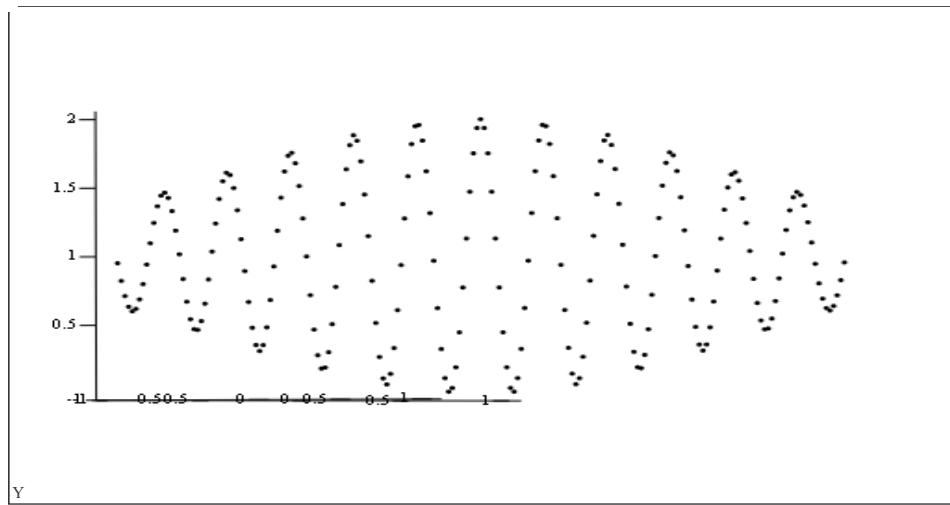  
.    "

2. I      p 2

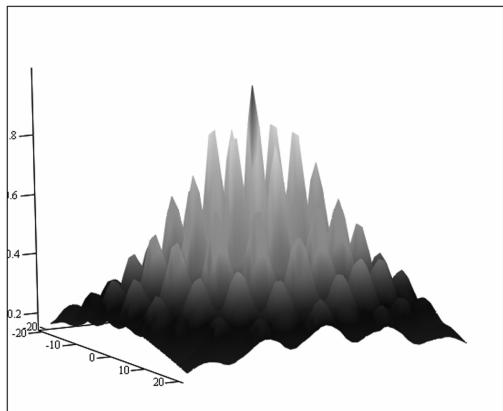  
Pc. 2. y DeJong2

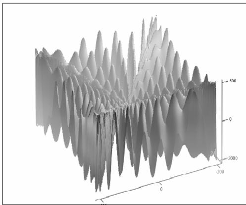  
. 3. Rn

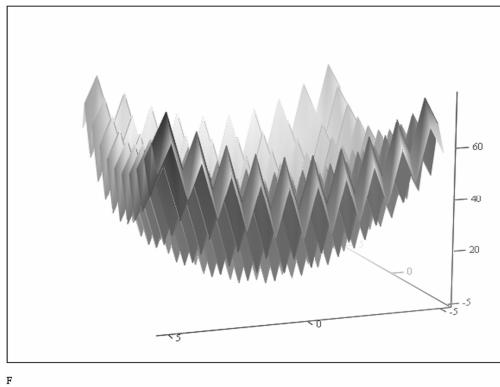  
. 4.

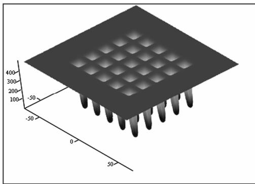  
. 5.

C 10

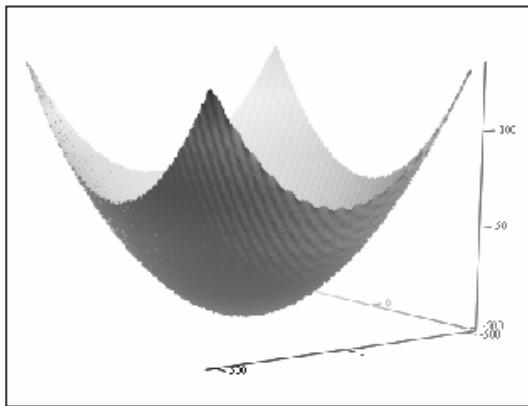

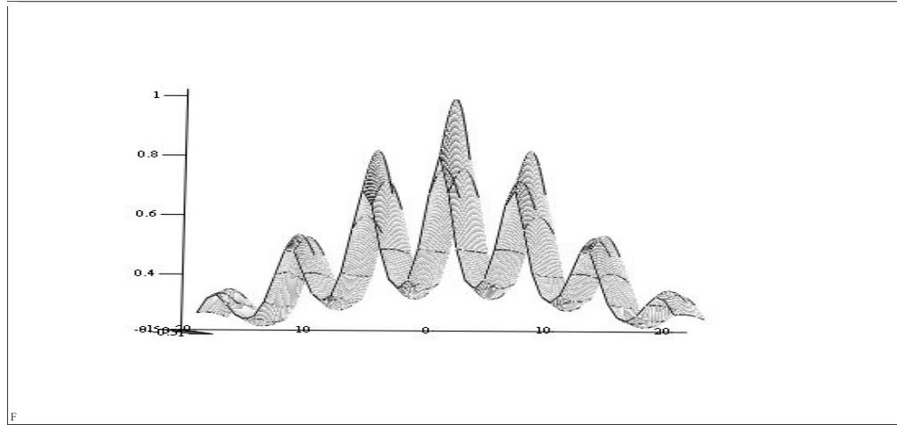  
. 6.    ""   
. 7.   
. 8.  Gerk

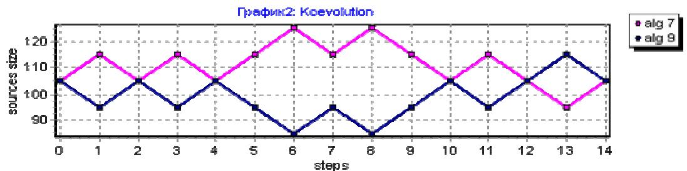  
. 7. H     I

Ha pc. 7 n0aa "6op6a" 2-x aop c J0aJM xapae I I T  3 I     7    " B 30 6 c   , H T.

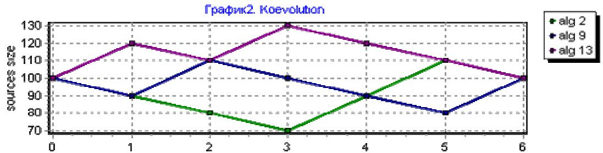  
. 8. e

Ha pc. 8. naa "6p6a" 3-x aJp c r06a, JJM H xp H H  y . Ip 6   6- . ( , 3 H "" H "xe" T ( B c ). B c o  ,    C H    ( 3 ). " 3 .