# C EC’2004 Tutorial

# Evolutionary Computation in Dynamic and Uncertain Environments

Ji n

Honda Research Institute Europe 63073 Offenbach/Main, Germany

# O u t l i n e

B ri ef i ntrod u cti o n to evo l uti o n a ry a l g o rith m s

H a nd l i ng noisy fitn ess fu n ctions

U si ng meta-mod els i n evol utiona ry com putation

Sea rch i ng for robust sol utions

Tracki ng movi ng opti m u ms a nd d ea l i ng with m u lti pl e obj ectives

A u n iform fra mework for u n ce rta i nti es i n evol utiona ry com putation

Re l ated ad d ition a l i nformation

# Introduction to Evolutionary Algorithm

# Introduction to Evolutionary Algorithms

Ge n e ri c stru ctu re evol utiona ry a lgorith ms

P robl e m re prese ntation (e n cod i ng ) Recom b i nation , m utation a nd s F itness eval u ations

Evol utiona ry a lgorith ms

G e n et i c a l g o ri t h m (crossover, mutation, stochastic selection)

Evol ution strateg ies   
(mutation, recombination, deterministic selection, self-adaptation)   
Genetic prog ram m i ng …

P ros a nd cons

Stoch asti   
N o re q u i re m e n t fo r d e ri vat i We l l -ta i l o re d fo r h y b ri d o pt i m i zat i o n   
Popu lation-based search   
o Need large number of fitness evaluations o Not well-suitable for on-line optimization

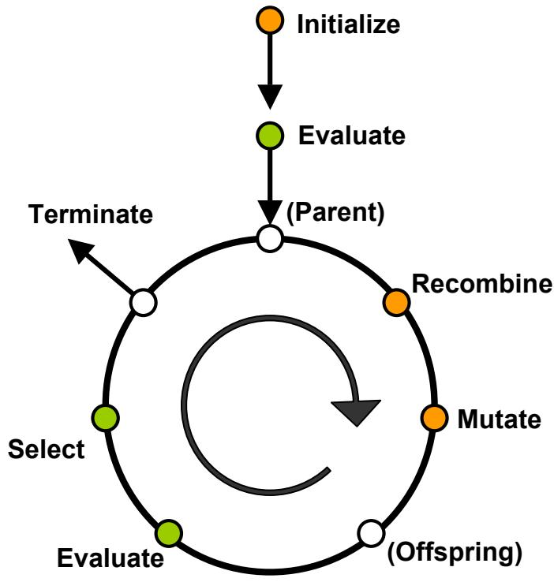

# Handling Noisy Fitness Functions

# Handling Noisy Fitness Functions (l)

Basic assu m ptions

N oise is add itive $\curlyeqsucc$ N o i se i s n o rm a l ly o r u n ifo rm ly d i stri b uted

$\operatorname { F } ( \mathbf { X } ) = \operatorname { f } ( \mathbf { X } ) + \mathbf { z } , \ \mathbf { z } \sim \mathrm { N } ( 0 , \mathbb { \mathbf { C } _ { \mathrm { N } } } ^ { 2 } ) , \mathbb { \mathbf { \sigma } _ { N } } ^ { 2 }$ is va ria n ce of the noise

M ethods

U se a la rger popu lation size to red u ce the i nfl u e n ce of noise Th reshold i ng i n sel ection ( M a rkon et al , 200 1 ) a n opti ma l va l u e for the th reshold is d erived for $( 1 + 1 )$ - E S u n d e r ce rta i n co n d i t i

U s e ave ra g i n g to fi l te r o u t t h e n o i s e ( sa m p l e m u l ti p l e ti m es ( F i tz patri ck a n d G reffe n stette , 1 9 8 8 ) sa m pl e the ne ig h borhood –

recom b i nation is recom me nd ed i n ES (

# Handling Noise in Fitness Functions (II)

Re-sam ple effectively

i ncrease the sam ple size as evol ution proceeds (Aizawa and Wah , 1 994 )   
ad a pt the sa m pl e size based on the proba b i l ity of the i nd ivid u al to be sel ected (Stagge, 1998)   
ad a pt the sa m pl e size based on the esti mated e rror proba b i l ity i n tou rna me nt selection (Branke, 2003)

F itn ess esti mation

esti mate tru e fitn ess usi ng al l h istory d ata , assu m i ng a Ga ussia n d istri bution (Sano and Kita, 2000) esti mate tru e fitn ess usi ng loca l reg ression mod els ( B ra n ke et a l , 200 1 )

# Handling Noisy Fitness Functions (III)

I nfl u e n ce of noise on conve rge n ce converge n ce is slowed down i n (d ete rm i n isti c) tou rna me nt sel ection (Miller and Goldberg, 1995)

$\mu ( \mathsf { t } + 1 ) - \mu ( \mathsf { t } ) = I { \sigma _ { \mathrm { F } } } ^ { 2 } \left( \mathsf { t } \right)$ (without noise) $I$ : selection intensity (effective selection pressure)

$$
\mu ( { \sf t } + 1 ) - \mu ( { \sf t } ) = { \cal I } { \sigma _ { \mathrm { { F } } } } ^ { 2 } ( { \sf t } ) / [ { \sigma _ { \mathrm { { F } } } } ^ { 2 } ( { \sf t } ) + { \sigma _ { \mathrm { { N } } } } ^ { 2 } ( { \sf t } ) ] ^ { 1 / 2 }
$$

$$
\mathrm { t _ { c o n v } / t _ { c o n v } = \sigma _ { F } ^ { 2 } ( t ) / \sigma _ { F } ^ { 2 } ( t ) + \sigma _ { N } ^ { 2 } ( t ) ] ^ { \nu _ { 2 } } }
$$

popu lation sizi ng ( M i l l er a nd Gold berg , 1 996 )

$N { = } T ( \sigma _ { \mathrm { F } } { ^ 2 } + \sigma _ { \mathrm { N } } { ^ 2 } )$ $\boldsymbol { \Gamma }$ : popu lation sizi ng coeffi cie nt

# Fitness Approximation in Evolutionary Computation

# Evolutionary Computation with Approximate Fitness

Basi c assu m ption : F itn ess fu n ction is noisy a nd b iased

$$
\boldsymbol { \mathrm { F } } ( \boldsymbol { \mathrm { X } } ) = \boldsymbol { \mathrm { f } } ( \boldsymbol { \mathrm { X } } ) + \mathbf { z } , \ \mathbf { z } \sim \mathrm { N } ( \mu _ { \mathrm { N } } , \mathbf { \sigma _ { \mathrm { N } } } ^ { 2 } )
$$

Whe n fitness a pproxi mation is necessa ry

N o exp l i cit fitn ess fu n cti o n exi sts   
F itness eval u ation is h ig h ly ti me  
F i t n e s s i s n o i sy (   
F itness is h ig h ly rugged (smooth out the fitn ess l a ndsca pe)   
Sea rch for robust sol utions (based on expected fitn ess or va ria n ce etc. )

H ow to generate meta-models

H ow to use meta-mod els

Approxi mate mod el usi ng m u lti pl e popu lations Approxi mate mod el i n i n itial ization , crossove r a nd m utation Approxi mate mod el i n fitness eval uations

# Approximate Models Using Multiple Populations

I nj e ct i o n i s l a n d m o d e l ( E by et a l , 1 9 9 8 )

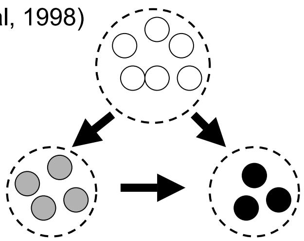

H ie ra rch i ca l mod el (Sefriou i a nd Pe ria ux, 2000 )

Model of lowest complexity

Model of medium complexity

Model of highest complexity

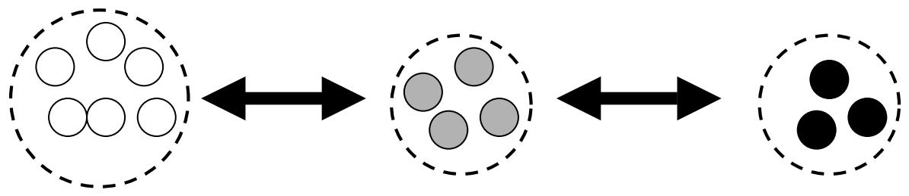

# Reduction of Randomness in Genetic Operators

Ge n e rate a pl u ra l ity of i nd ivid u a ls ra ndom ly a nd choose the best on es accord i ng to the meta-model for the initial population

I nfo rm ed crossove r ( Rasheed and H i rsch , 2000) :

sel ect two i nd ivid u als ra ndom ly   
choose a crossover method ra ndom ly and generate a potential offspri ng   
repeat the above process fo   
$\blacktriangleright$ ra n k the pote ntia l offspri ng i nd ivid u als a nd choose the best according to the meta-model as the offspring

I nformed m utation ( Rasheed a nd H i rsch , 2000 ; Abboud a nd Schoenau er, 2002 ) :

Ge nerate m u lti pl e i nd ivid u als ra ndom ly Choose the best accord i ng to the meta model

# models i n F itness Eval uations

D u e to u navoid a bl e mod el i ng e rrors , a com b i nation of meta-mod el with the original fitness function is necessary (evolution control / model management) (Jin et al, 2000)

generation-based evolution control attractive for parallel computing le s s flexib ility   
individual-based evolution control powerful in model management not the best for parallel computing if the number of controlled individual changes

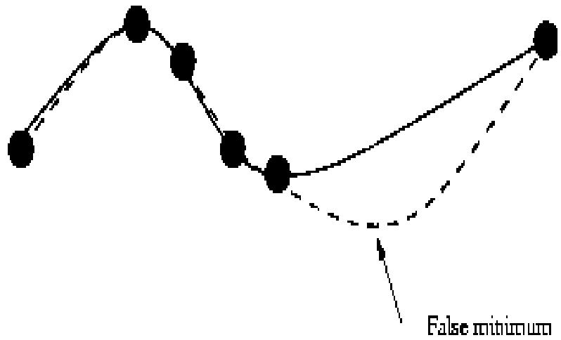

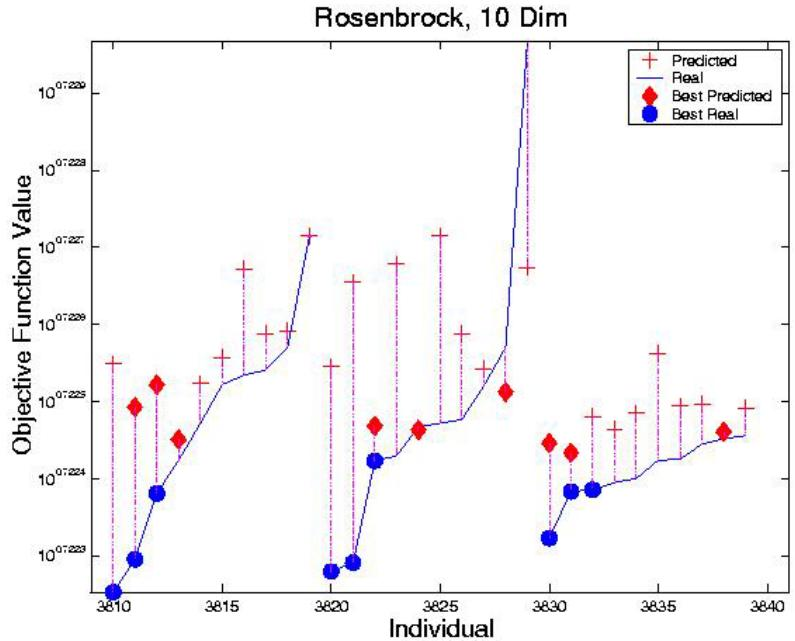

# Generation Based Evolution Control (l)

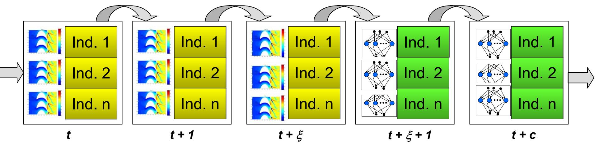

Determine the control frequency heuristically (Bull, 1 999) EA evolves on the meta-model until it converges (Ratle, 1 99 8 ; Ratle 1 999) a bias toward the unexplored region is included (Büche et al, 2003 )

# Generation Based Evolution Control (II)

At evolution cotittol cycle

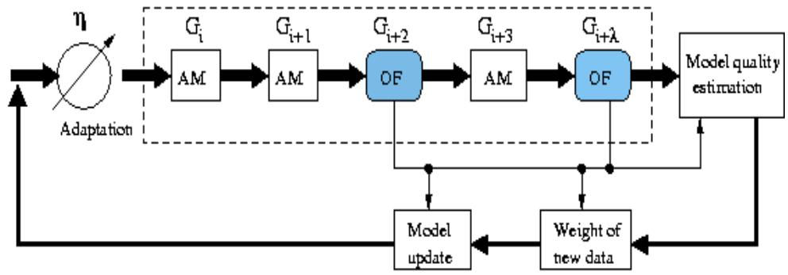

Adaptation of the control frequency based on the model fidelity (Jin et al, 2001; Jin et al, 2002)

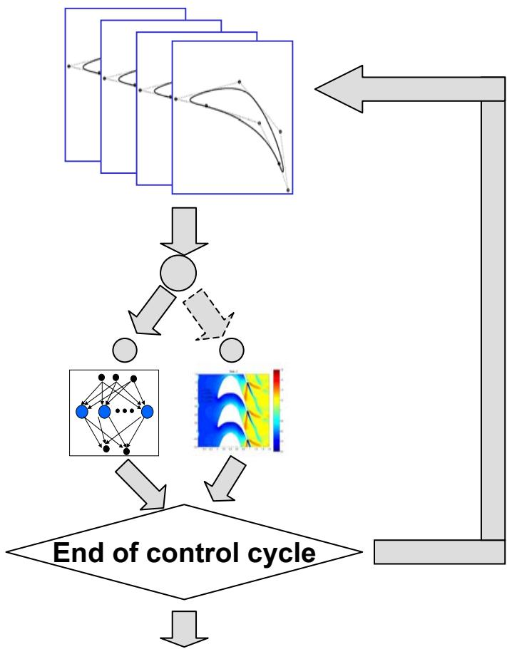

Esti m ati o n of m od e l fi d e l ity Adaptation of control freq uency On - l i ne model u pdate

# I nd ivid ual-based Evol ution Control (I) based Evol ution Control (I)

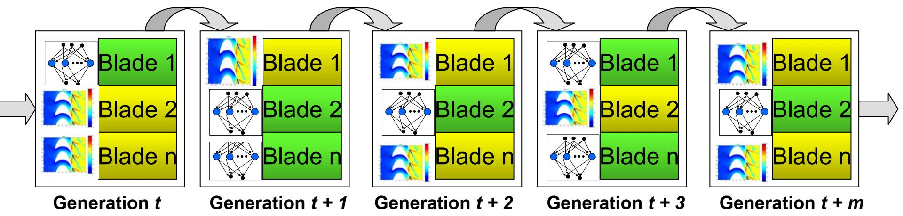

C hoose i nd ivid u a ls ra ndom ly (J i n et a l , 2000 )

C hoose the best i nd ivid u a ls accord i ng to the mod el (J i n et a l , 2000 )

b ias the sel ection towa rd i nd ivid u als with h ig he r u n ce rta i nty ( E m me ri ch et a l , 2002 )

${ \sf f } ( { \sf X } ) = { \underline { { \sf f } } } - { \underline { { \alpha } } } \sf E$ (for minimization) α : a consta nt E : e rro r b o u n d

ad a pt the n u m be r of i nd ivid u a ls to be re-eval u ated ( H ong et a l , 2003 )

C hoose the i nd ivid u a ls with most u n ce rta i n i nd ivid u a ls ( B ra n ke , 2003 ) P re-se l ecti o n ( U l m e r et a l , 2 0 0 3 )

# I nd ivid ual-based Evol ution Control (I I) based Evol ution Control (I I)

1 2- D Ackl ey fu n ction ( 3 , 1 2 ) - E S ave rage ove r 1 0 ru ns

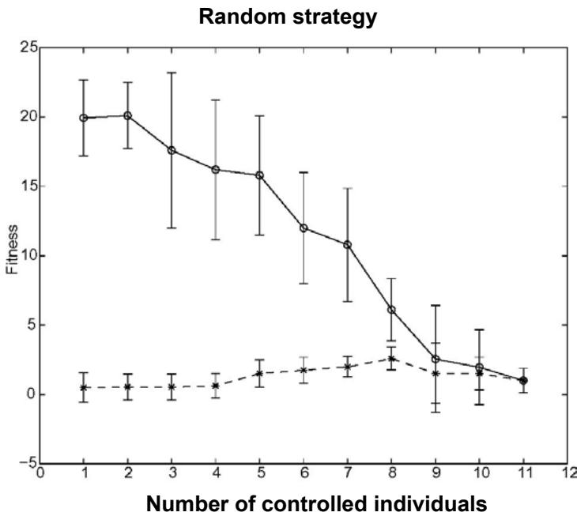

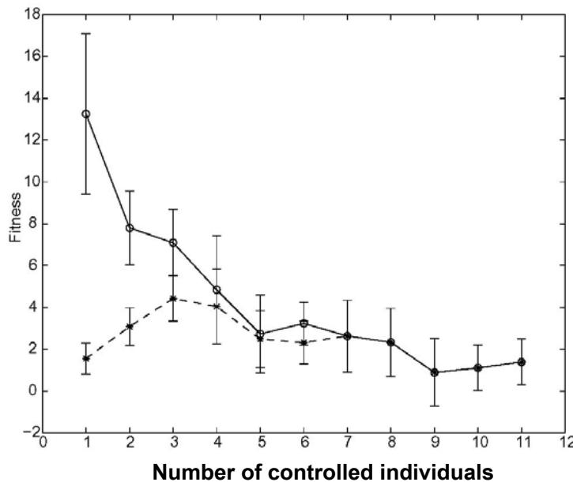  
Best strategy

th e best strategy is more effi cie nt tha n the ra ndom strategy

i n th e best strategy, a bout ha lf of the i nd ivid u al shou ld be control l ed

# I n d iv i d u a l -based Evo l u ti o n C o ntro l ( I I I ) based Evo l u ti o n C o ntro l ( I I I )

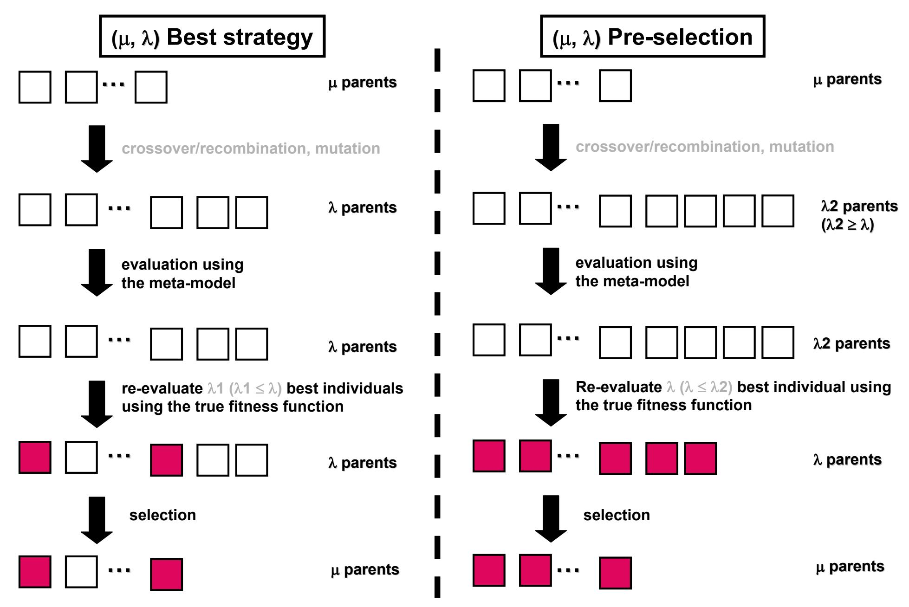

# I nd ivid ual-based Evol ution Control (IV) based Evol ution Control (IV)

Clustering-based Individual Choice (Jin et al, 2004)

G rou p i ng the popu l ation i nto a n u m be r of cl uste rs consisti ng of si m i l a   
individuals   
Eva l u ate the i nd ivid u a l closest to th e cl uste r ce nte r on ly   
Esti mate fitn ess usi ng n eu ra l n etwork e nse m bl es   
esti mate the pred i ction e rror based on the e nse m bl e

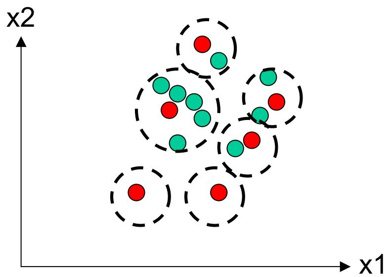

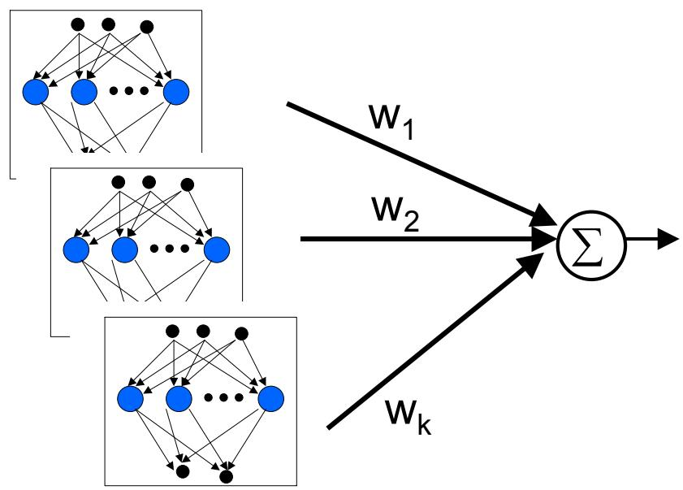

# Meta-models - General

Types of meta-models

polynom ials ( Response su rface methodology)   
n eu ra l n etworks m u lti-layer perce ptrons ( M L Ps) rad ia l-basis-fu n ction n etworks ( RB F N s)   
Gaussian processes , krig i ng mod els ( DAC E )   
su pport vector mach i nes (SVMs)

Com parison of mod els

no esse ntial d iffere n ce i n mod el q u al ity Gaussian processes provid es an error bou nd , usefu l i n mod el management

M od el i ng loca l ly is more practi ca l tha n mod el i ng g loba l ly

S ma l l va ria n ce is more i m porta nt tha n sma l l b ias

E nse m bl e is a practi ca l a nd effective tech n iq u e red u ce bias a nd varia n ce si m u lta neously provid e a n esti mate of pred i ction e rror

# Meta-models - Ensemble Techniques

Bagg i ng – Bootstrap agg regation

Boosti ng

Evol utionary approaches

seq u e ntial ly a nd i nd e pe nd e ntly (d iffe re nt i n itia l stru ctu re a nd pa ra mete rs seq u e ntial ly, negative correlated   
si m u lta neously, negatively correlated   
$\blacktriangleright$ m u lti-objective approach (trade-off between accu racy and com plexity)

# Ensemble Techniques - Bagging

Bootstrap a t o r s

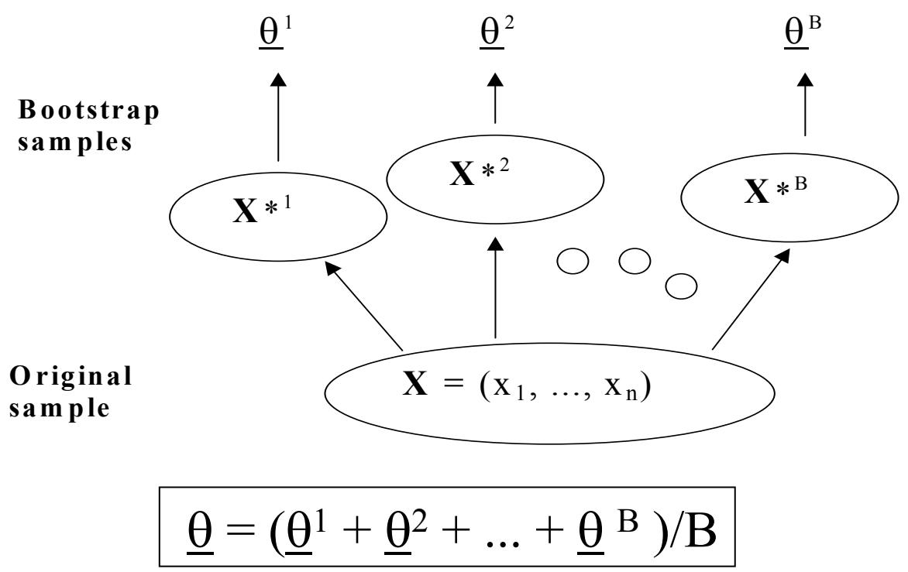

Reduce variance while bias unchanged

Degrade the performance of stable procedures

# Ensemble Techniques - Boosting

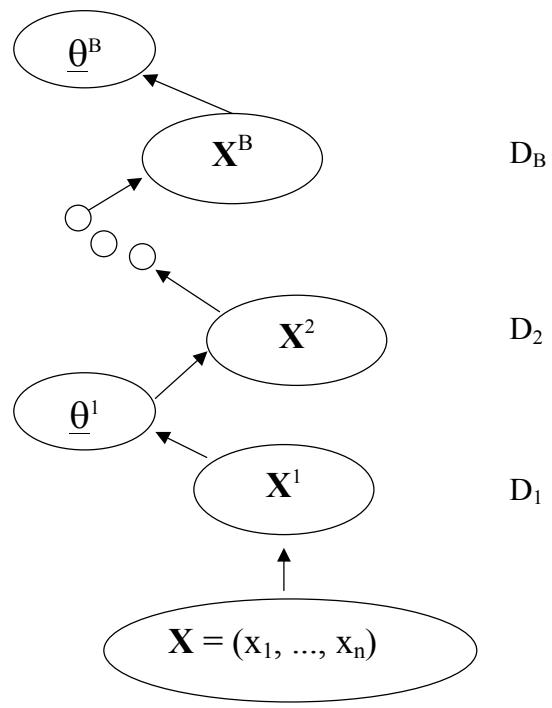

Initialize weights : $\mathrm { D } _ { 1 } ( \mathrm { i } ) = 1 / \mathrm { n } , \mathrm { i } \mathrm { = } 1 , 2 , \ldots , \mathrm { n }$

For $\mathrm { t } { = } 1$ to B :

Fit a model $( \underline { { \theta } } ^ { \textup { t } } )$ to the data using weights $\mathrm { D } _ { 1 }$

Calculate error $\varepsilon _ { \mathrm { t } }$ of model θ t

Compute $\alpha _ { \mathrm { t } } = 1 / 2 \mathrm { l n } [ ( 1 - \varepsilon _ { \mathrm { t } } ) / \varepsilon _ { \mathrm { t } } ]$

Update weight:

$$
\mathrm { D _ { t } ( i ) = D _ { t - 1 } ( i ) \exp [ \alpha _ { t } \ I ( y _ { i } \neq \underline { { { \theta } } } ^ { \ t } ( x _ { i } ) ] }
$$

F inal mo del :

$$
\underline { { \theta } } = ( \mathrm { \alpha _ { 1 } } \underline { { \theta } } ^ { 1 } + \mathrm { \alpha _ { 2 } } \underline { { \theta } } ^ { 2 } + \dots + \mathrm { \alpha _ { B } } \underline { { \theta } } ^ { \mathrm { ~ B ~ } } )
$$

Reduce both variance and bias

Sensitive to noise, large number of bootstrap samples needed

# Ensemble Techniques - Multi-objective Network Evolution

Stru ctu re a nd we ig ht re prese ntation A connection matrix and a weight matrix

Ge neti c operators

node add ition/deletion we ig ht add ition/d el etion Ga ussia n m utation to the we ig hts

L i fe -t i m e l e a rn i n g

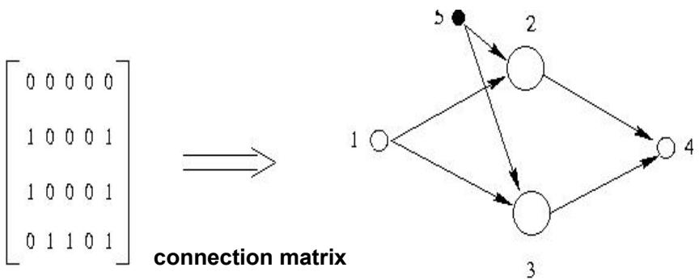

Rprop+ l ea rn i ng algorith m   
e n cod e the cha nge of the we ig hts d u ri ng l ife-ti me l ea rn i ng back to the chromosomes (Lamarckian evolution)

O bjectives

E : m ea n sq u a red e rro r o n tra i n i n g d ata afte r l i fe-ti m e l e a rn i n g : mod el com pl exity (cou nt the n u m be r of con n ections)

Dynam ic weig hted agg regation

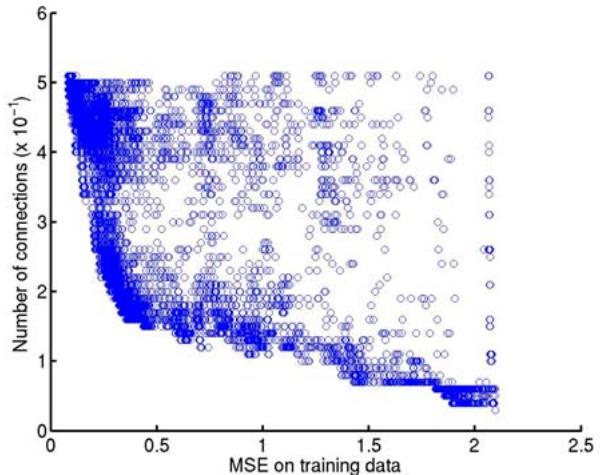

# Comparison of Ensemble Techniques

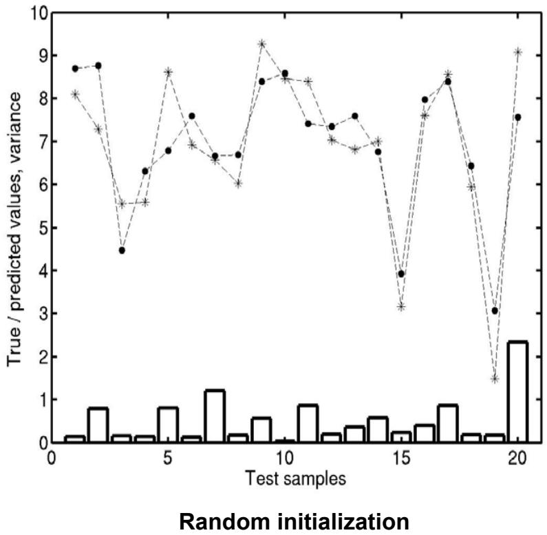

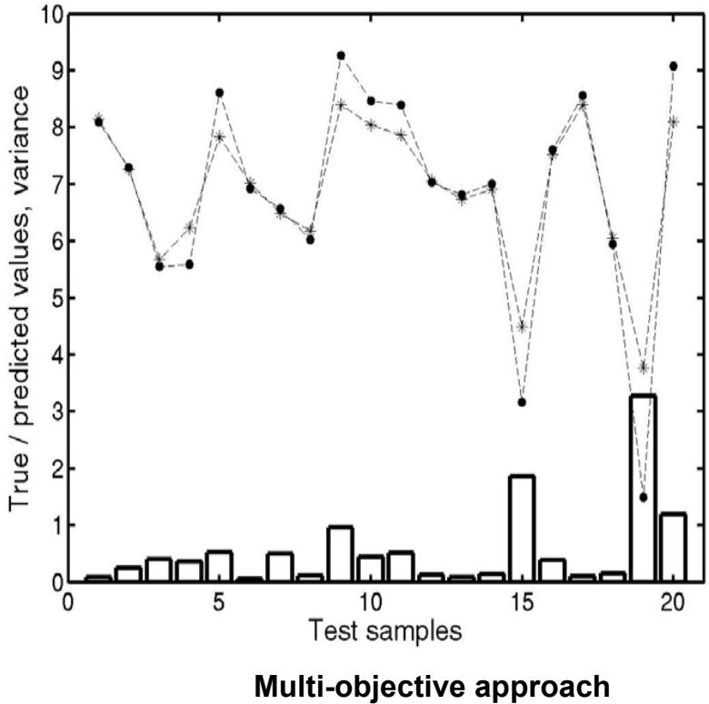

th re e i n p u ts   
8 0 t ra i n i n g d ata   
20 test data   
n o cross-va l i d ati o n i n tra i n i n g

red uced M S E more consiste nt error pred i ction

# Data Sampling Techniques

Desig n of experi me nts

Orthogonal array: $\mathsf { X } ^ { \mathsf { T } } \mathsf { X }$ is diagonal (first-order models)

S i m pl ex d esig n : req u i re $n + 1$ sa m pl es for n varia bl es , so that the a ng l e of a ny two points make with the origin (θ) satisfies:

$\cos ( \theta ) = - 1 / \mathsf { n }$ (first-order models)

Central com posite d esig n (second-ord er polynom ials)

D-opti ma l ity (to maxi m ize the d ete rm i nation of $\mathsf { X } ^ { \mathsf { T } } \mathsf { X }$ equals to minimize the variance of the estimate)

Active l ea rn i n g

M axi m ize i nformation ga i n

Red uce entropy

Red u ce ge neral ization error

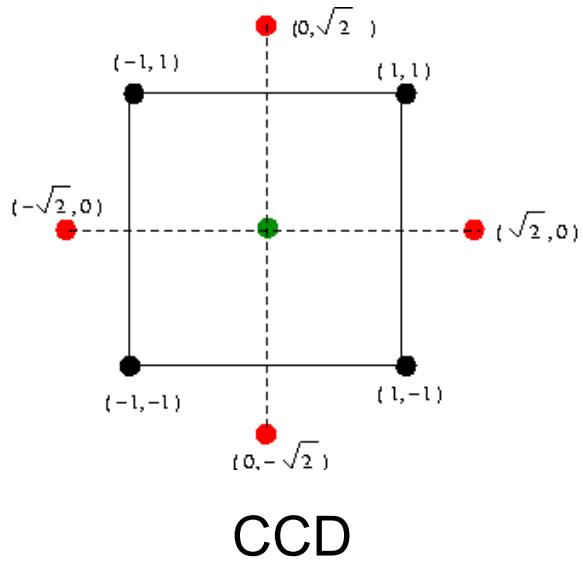

# Optimization Results

(5 , 30)- ES Covariance Matrix Adaptation   
1 0 i n d ivi d u a l s a re co ntro l l ed   
E nsem ble size $= 3$   
ave rage ove r 1 0 ru ns

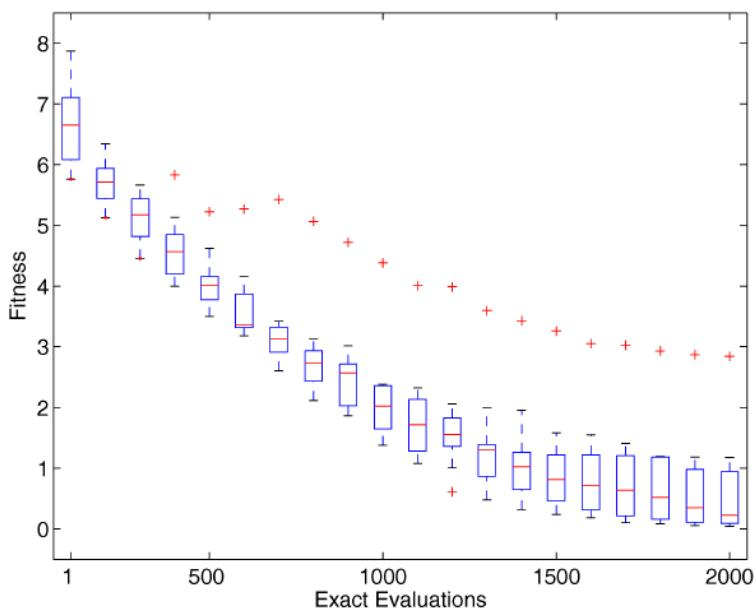

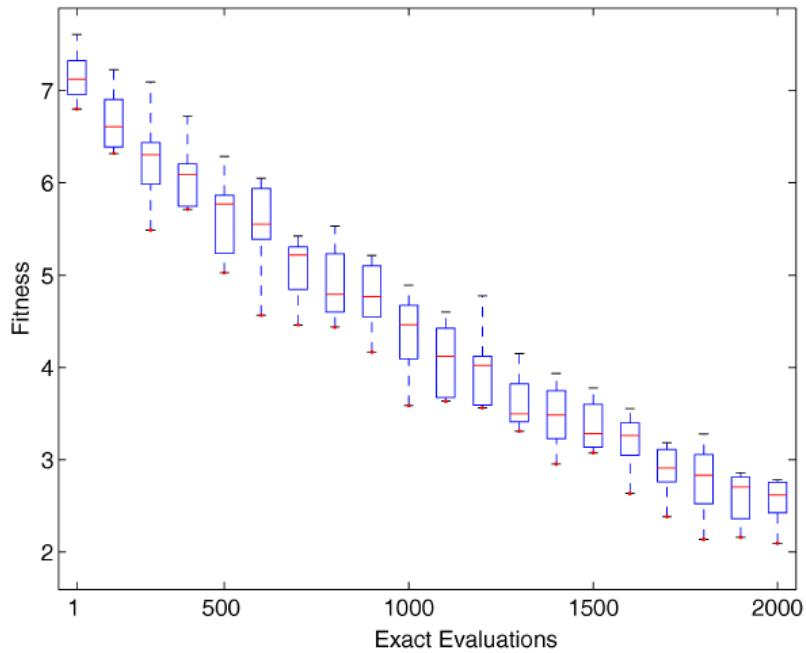

Clustering based strategy

Plain

# Single Neural Network versus Ensembles

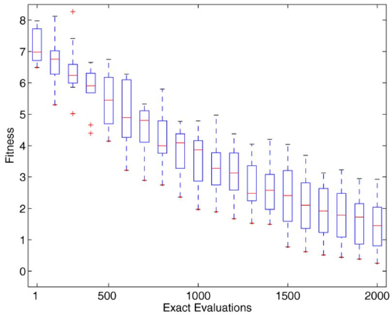  
Single NN

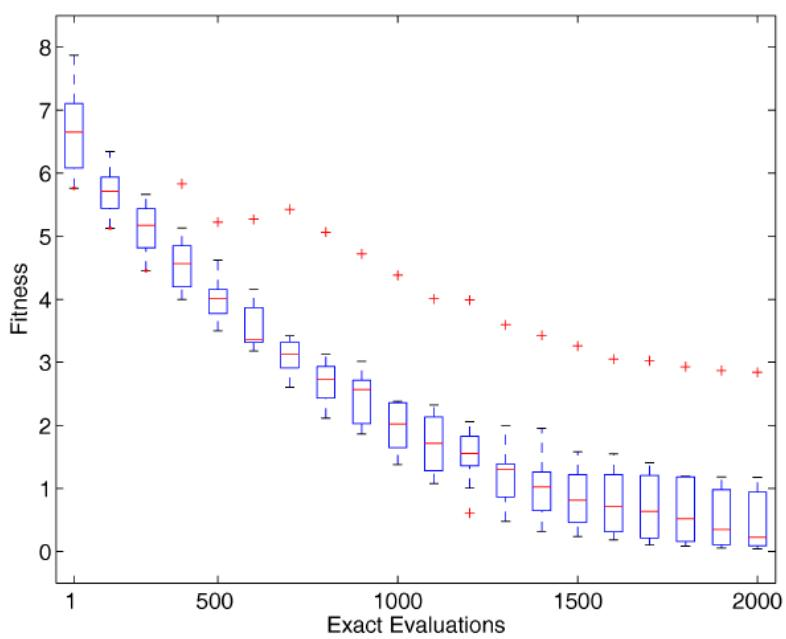  
Network ensemble

# An Example: 2D Blade Design

N on- U n iform Rational B-S pl i ne   
Com putationa l fl u id dynam i cs si m u l ation for fitn ess eval u   
M i n i m ization of pressu re loss +outflow a ng l e d eviation   
M echa n i cal constra i nts   
Evol ution strategy   
N eu ra l n etwork as meta

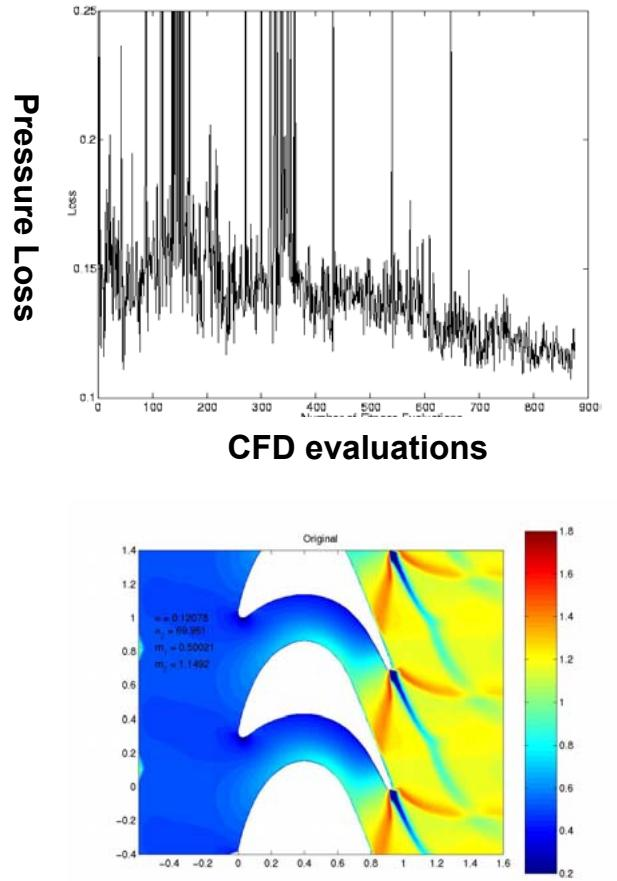

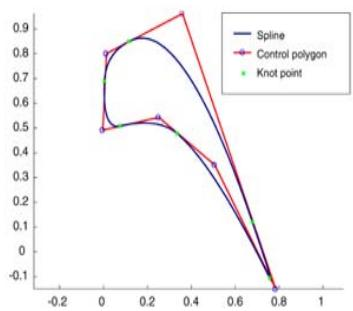

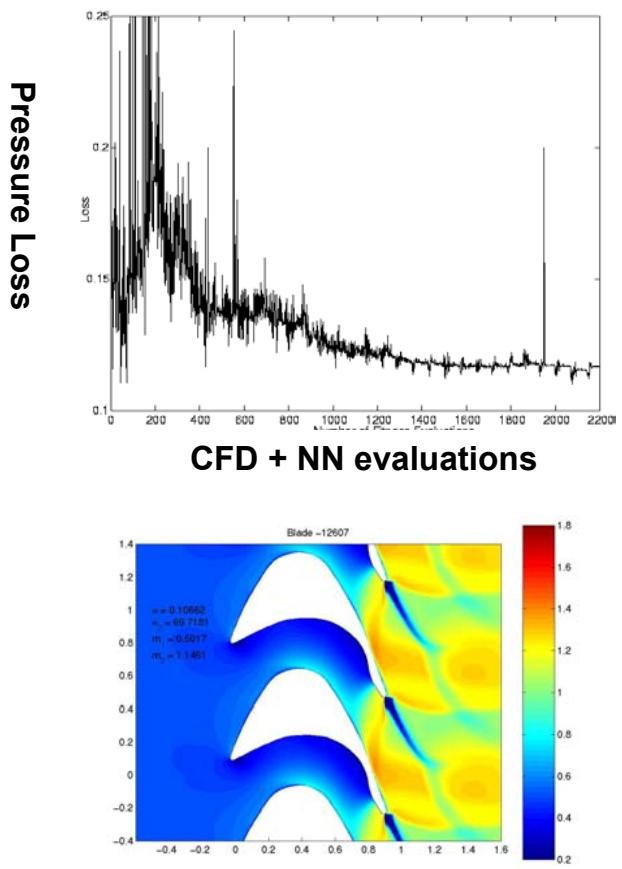

# Search for Robust Optimal Solutions

# Evolutionary Search for Robust Optimal Solutions

Robust to va riations i n d esig n pa ra mete rs (x) Robust to va riations i n e nvi ron me nta l pa ra mete rs (a)

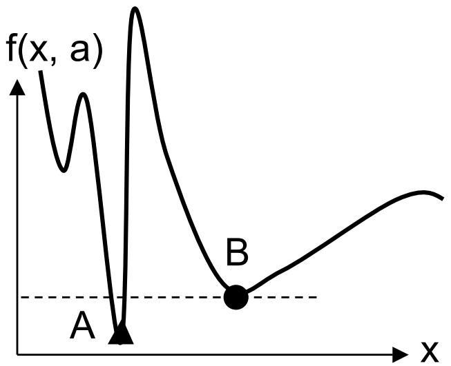

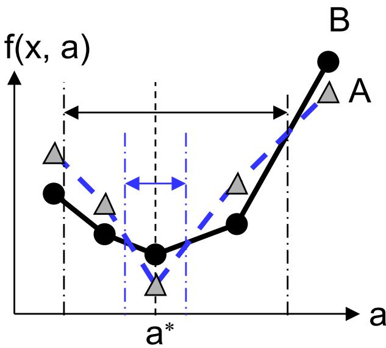

# Expectation Based Approach to Robustness

Averaging based approach:

$$
\mathsf { f } ( \mathsf { x } ) = \sum _ { \mathrm { i } } \mathsf { f } ( \mathsf { x } + \Delta \mathsf { x } _ { \mathrm { i } } ) , \Delta \mathsf { x } _ { \mathrm { i } } { \sim } \mathsf { N } ( 0 , \mathrm { o } ^ { 2 } )
$$

N eed add itional fitness eval uations Use of approxi mate models cou ld al leviate this difficulty

Perturbation based approach:

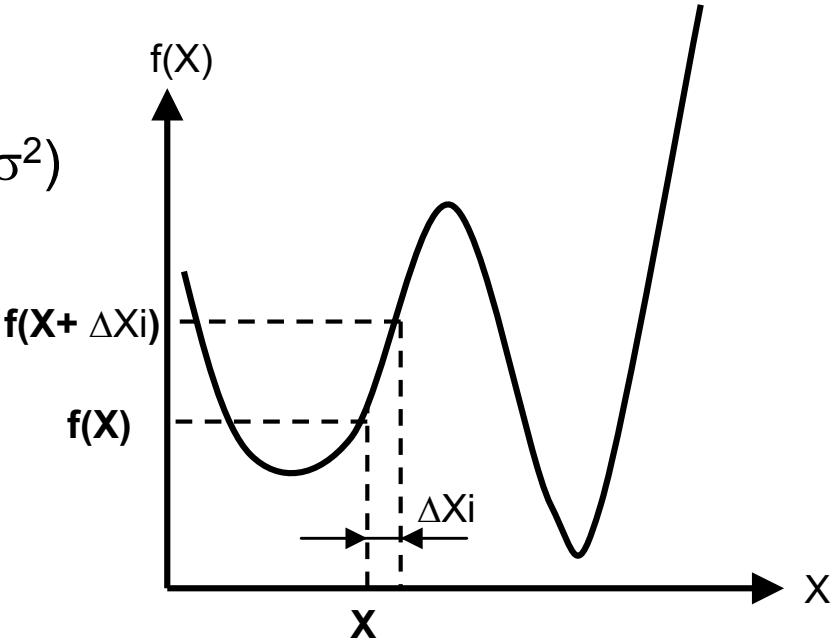

$$
{ \sf f } ( { \sf x } ) = { \sf f } ( { \sf x } + \Delta { \sf x } ( { \sf t } ) ) , \Delta { \sf x } ( { \sf t } ) \sim { \sf N } ( 0 , \sigma ^ { 2 } )
$$

Approxi mation ca n be proved u nd er the assu m ption of a n i nfi n ite population size   
N o add itional fitness eval u ations need ed

# Weaknesses of Expected Fitness Approach

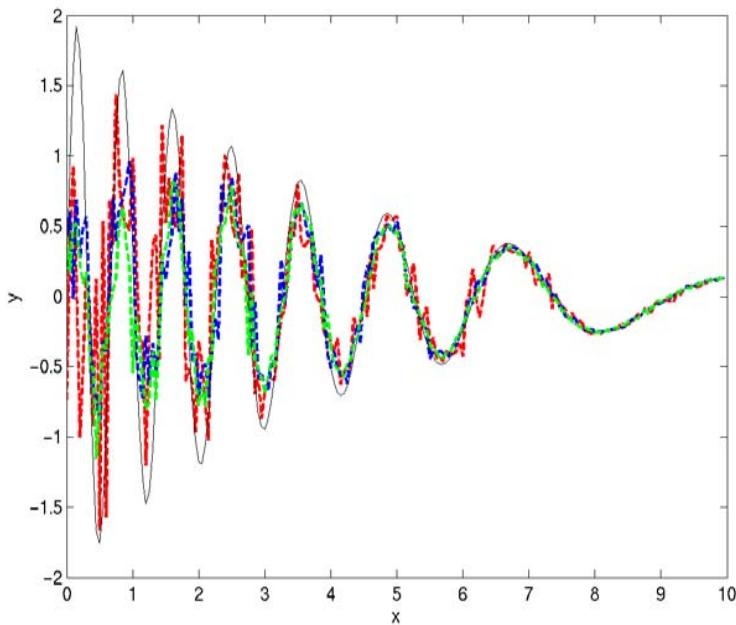

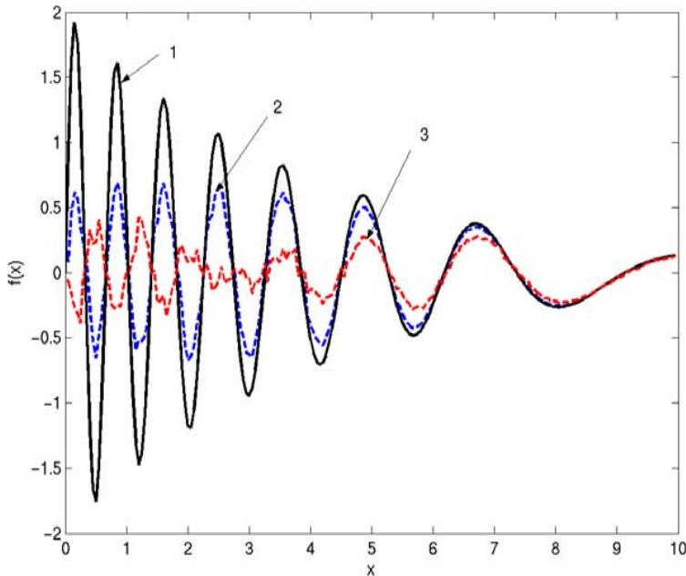

Sea rch resu lt based on the expected fitn ess is se nsitive to the n u m be r of averaging and the variance of averaging   
Sea rch resu lt based on expected fitn ess may fa i l to ca ptu re the between performance and robustness

# Multi-objective Approach to Robustness

Expected fitn ess va l u e (fi rst ord e r mome nt) a nd the orig i na l fitn ess   
H ig he r mome nt of the orig i na l fitn ess (e . g . va ria n ce) a nd the   
original fitness function   
Expected fitn ess a nd va ria n ce of the fitn ess

$$
\mathsf { m i n f } ^ { \mathsf { R } } = \frac { \sigma _ { \mathsf { f } , \mathrm { ~ i ~ } } } { \sigma _ { \mathsf { x } , \mathrm { j } } }
$$

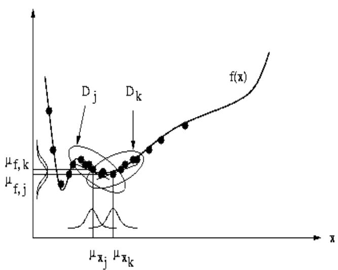

Estimation of function variance without additional fitness calculations.

# An Example for MO0 Approach to Robustness

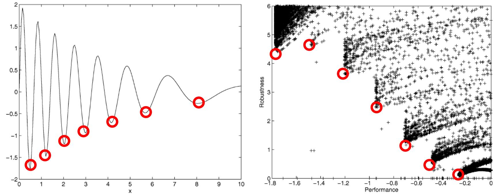

The MOO approach successfully provides a qualitative description of the robustness of different optima.

# Using Meta-models in Search for Robust Solutions (l)

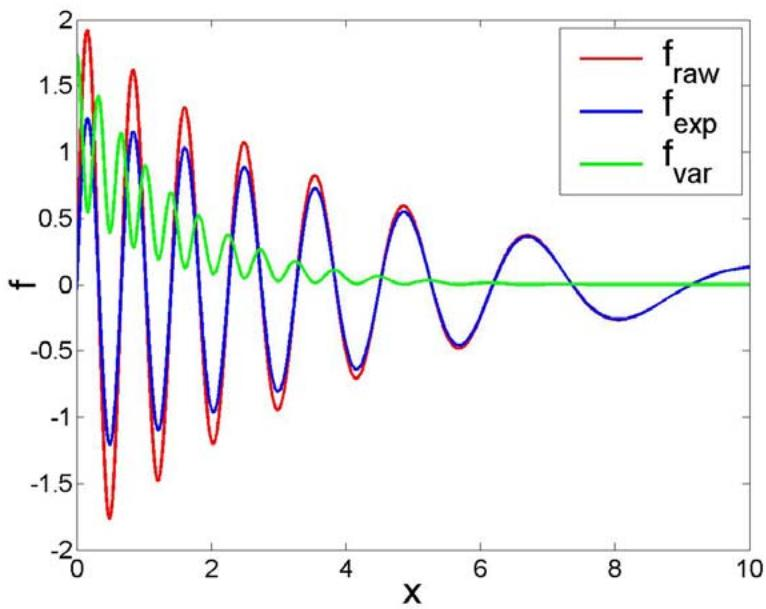

Test function

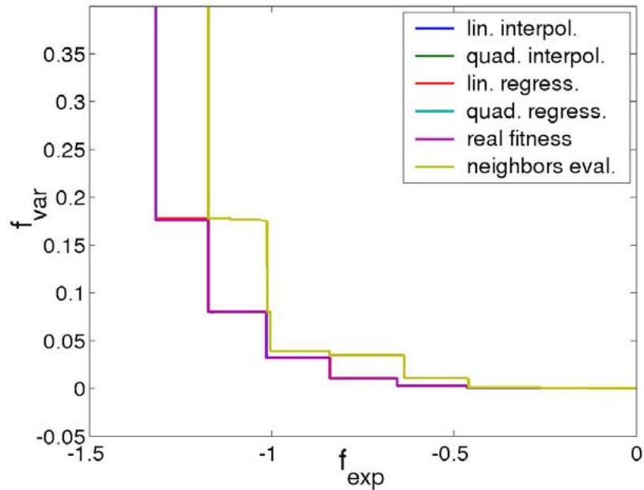

Trade-off between mean and variance

med ia n Pa reto front usi ng meta-mod els as wel l as the rough estimation method

al l approxi mation mod els perform as as good as when the real fitness was used.

# Using Meta-models in Search for Robust Solutions (II)

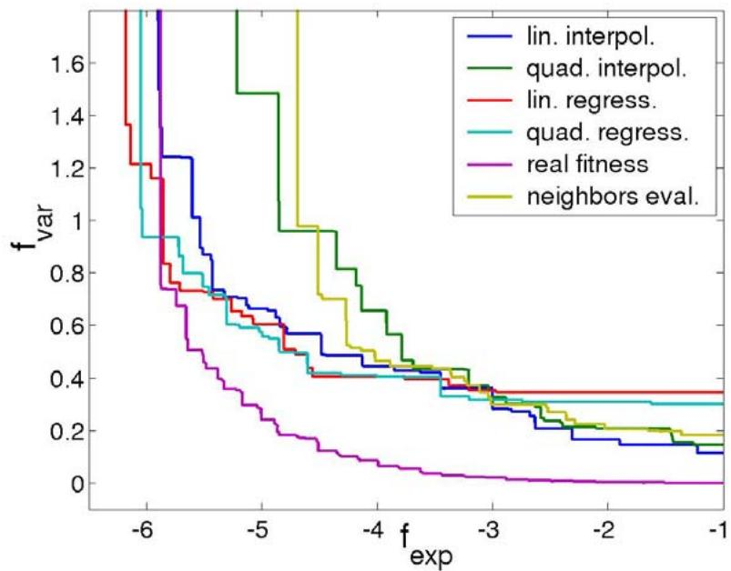

Dimension = 5

# Tracking Moving Optimums and Dealing with Multiple Objectives

# Examples of (Implicit) Dynamic Optimization Problems

Ad a ptive cod i ng i n stru ctu re opti m ization

Extension of Search Space

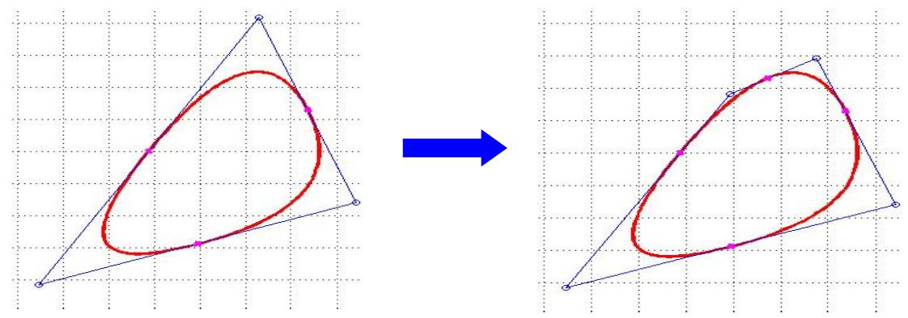

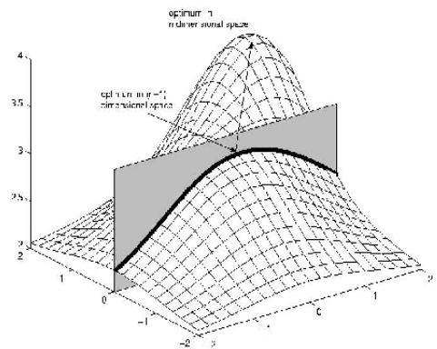

Co-evol ution

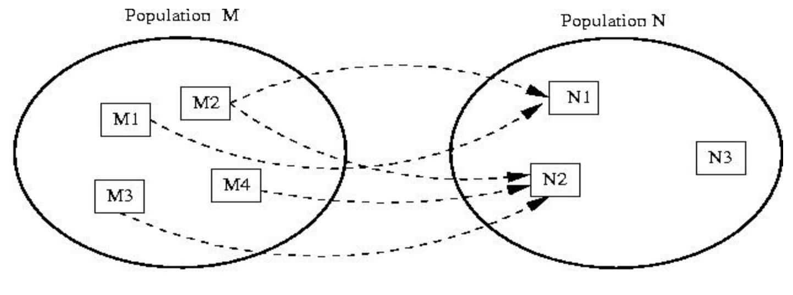

# Dynamic Optimization Problems (DOPs)

O pti m ization probl e ms whose opti ma l sol ution cha nges ove r ti me d u ri ng the optimization, which could result from

cha nge of e nvi ron me ntal pa ra meters   
cha nge of constra i nts   
> change of objectives   
cha nge of probl e m setti ngs (re prese ntations)

Types of dynam ic opti m ization problems the opti m u m moves l i n ea rly/non l i nea rly i n the d esig n space the opti m u m osci l lates period i cal ly a mong a n u m be r of locations $\blacktriangleright$ the opti m u m j u m ps ra ndom ly

Wh at m ay m atte r

$\blacktriangleright$ the speed of cha nge   
$\blacktriangleright$ the seve rity of cha nge   
$\blacktriangleright$ if the change is period ical , does the opti m u m move exactly back to the original location?   
$\blacktriangleright$ is the change observable/detectable or even pred ictable?

# Methods for Dynamic Optimums (l)

M a i nta i n i ng d ive rsity of the popu l ation to preve nt it from conve rg i ng

ad d ra ndom ly ge n e rated i nd ivid u a ls i n GA (G refe nstette , 1 992 )

fitn ess sha ri ng (And e rson , 1 99 1 )

ag i ng of i nd ivid u a ls (G hosh et a l , 1 998)

adaptive chaotic m utation ( N a nayakkara et al , 1 999)

set a lowe r bou nd on ste p-sizes i n ES to preve nt the m from conve rg i ng to zero (Jin et al, 2004)

U si ng expl i cit me mory

store the best sol utions i n h istory a nd ad d the m to the popu l ation is necessary(Mori et al, 1998; Branke, 1999; Bendtsen and Krink, 2002)

store prom isi ng ge n eti c mate ria ls i n a “ge n e l i b ra ry” for re-use (Te kol a nd Acan, 2003)

# Methods for Dynamic Optimums (I)

U s i n g i m p l i cit m e m o ry

m u lti pl e popu lations (O ppacher a bd Wi ne berg , 1 999 ; B ra n ke et el , 2000 ; red u nd a nt cod i ng (S m ith , 1 987 ; Gold berg a nd S m ith , 1 987 ; Dagsg u pta a nd MacGregor, 1992; Ng and Wong, 1995; Lewis et al, 1998)

(Self-)ad a ptation a nd l ea rn i ng

hyper-m utation : i n crease m utation whe n ti me-averaged best performa n ce worsens (Cobb and Grefenstette, 1993)   
self-adaptation - a dou ble-sid e sword (Angel i ne , 1 997 ; Bäck, 1 998 ; Weicker and Weicker,2000)   
l ife-ti me l ea rn i ng (Sasa ki a nd Tokoro , 1 998)

# Tracking Moving Optimum Using Multiple Populations ()

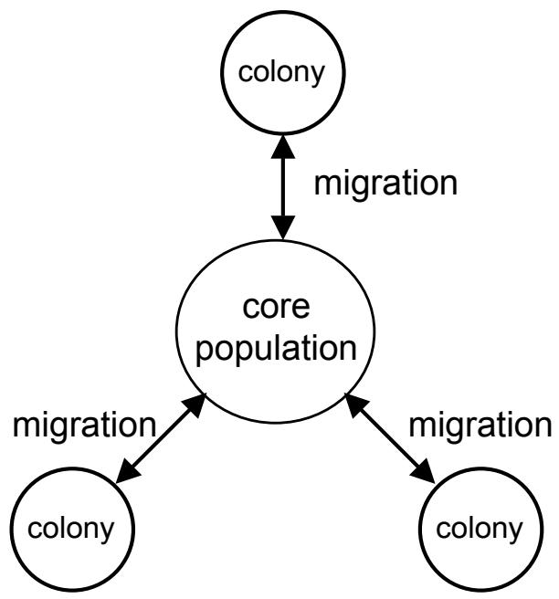

Oppacher and Wi neberg , 1 999 ; 2000

the core popu lation is used to exploit the prom isi ng a rea

a n u m ber of colon ies are used to explore the search space

d ive rsity measu re (d ista n ce to the core popu lation ) is i ncl u d ed i n fitn ess eva l u ations of the colonies

# Tracking Moving Optimum Using Multiple Populations ()

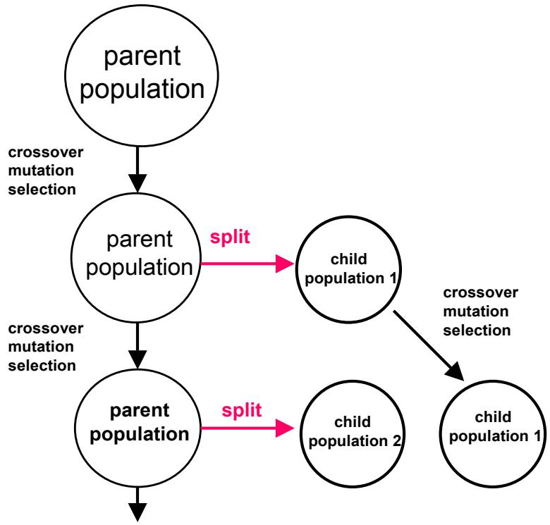

B ra n ke

the parent popu lation explores the search space

a ch i ld popu lation is created wh e n certa i n cond itions a re met

the size of pa re nt a nd ch i ld popu l ation is adj usted

the ch i ld popu lation on ly sea rches a l i m ited ra nge of the sea rch space

# Wh ich for What

Expl i cit me mory a nd red u nd a nt cod i ng a re wel l-su ited for cases i n wh i ch the optimum oscillates periodicaly. Redundant coding approach seems to be effective only if the location of optimums are very limited

M u lti-popu lation a pproach is good for tracki ng com peti ng pea ks . However, the search ability will decrease if too many child populations are created and the size of population is dramatically reduced

D ive rsity of the popu l ation is most effi cie nt for tracki ng conti n uously movi ng optimums

Life-ti me l ea rn i ng for ad a ptation to sma l l but ve ry fast cha nge of the opti m u m

# Performance Indices for Dynamic Optimization

P I s fo r stati o n a ry o pti m i zati o n best-sooff- l i n e p e rfo r o n - l i n e p e rfo r

P I s for dyna m i c opti m ization ad a ptati o n pe rfo r $\mathrm { I } { = 1 / \mathrm { T } \sum } \mathrm { f } _ { \mathrm { b e s t } } ( \mathrm { t } ) / \mathrm { f } _ { \mathrm { o p t } } ( \mathrm { t } )$ T: n u m ber of ge neration fbest(t): best fitness in the population at time t $\mathrm { f _ { o p t } ( t ) } \mathrm { : \Omega }$ global optimum at time t

accu racy (Trojanowski and M ichalewicz, 1 999)

$\begin{array} { r } { \mathrm { A c c } = 1 / \mathrm { K } \sum e r r _ { \mathrm { i } } } \\ { e r r _ { \mathrm { i } } \mathrm { : } } \end{array}$

d iffe re n ce betwee n the cu rre nt best i n the population just before change and the optimum value averaged over the entire run

the ave rage d ista n ce to the opti m u m at each ge neration (We i cker a nd We i cker, 1 999)

best-of-g e n e rati o n ave rag e (

# Dynamic Optimization Test Functions

Ge n e ra l req u i re me nts for constru cti ng dyna m i c opti m ization test probl e ms :

co m p utati o n a l ly effi ci e nt   
d iffe re nt dyna m i c be haviors are real izable   
the com pl exity of the fitn ess la ndsca pe is control la bl e   
th e traj ectory of th e opti m u m ca n be known   
the test probl e m shou ld be some how rel eva nt to real-world a ppl i cations

M a i n a pproaches :

switch i ng betwee n d iffere nt objectives (Cob b a nd G refe nstette , 1 993 ) sh ifti ng stationa ry fu n ctions (Cob b a nd G refe nstette , 1 993 ; Angel i n e , 1 997 ; Fa ri na et al, 2003)

$$
\mathfrak { f } ( \mathbf { x } , \mathfrak { t } ) = \mathfrak { f } ( \mathbf { x } \mathbf { + } \mathbf { d ( t ) } ) ;
$$

com peti ng/movi ng pea ks ( B ra n ke , 1 999 ; M orrison , 1 999)

$$
\mathsf { f } ( \mathbf { x } , \mathrm { t } ) = \mathsf { m a x } _ { \mathrm { \Gamma } _ { \mathrm { i = 1 } , \mathrm { M } } } \{ \mathsf { P } _ { \mathrm { i } } ( \mathbf { x } , \mathrm { t } ) \} ;
$$

ad a pti ng m u lti-obj ective test fu n ctions to dyna m i c opti m ization (J i n et a l , 2004 ) $\begin{array} { r } { \mathsf { f } ( \mathbf { x } , \mathrm { t } ) = \sum _ { \mathsf { \Gamma } _ { \mathrm { i } = 1 , \mathsf { M } } } \mathsf { w } _ { \mathrm { i } } ( \mathrm { t } ) \mathsf { f } _ { \mathrm { i } } ( \mathbf { x } ) } \end{array}$ $\mathsf { w } _ { \mathrm { i } } ( \mathsf { t } )$ time-varying weights for each objective M is number of objectives of the MO0 test functio

# Dynamic Single Objective Optimization

If the we ig ht cha nges ra ndom ly, a nd if M O P_ $\mathsf { F } ( { \boldsymbol { \mathsf { x } } } )$ is convex and continuous, then the optimum of DOP_F(x,t) moves randomly

If the we ig ht cha nges l i n ea rly, a nd if M O P_ $\mathsf { F } ( { \boldsymbol { \mathsf { x } } } )$ is convex, uniform and continuous, the optimum of DOP_ $\boldsymbol { \mathsf { F } } ( \boldsymbol { \mathsf { x } } )$ moves linearly

if M O P F is u n iform with rega rd to th e fitn ess s pace , th e n th e opti m u m moves linearly in the fitness space; if uniform with regard to the parameter space, then the optimum moves linearly in the parameter space

If the we ig hts cha nges l i nea rly a nd M O P $\boldsymbol { \mathsf { F } } ( \boldsymbol { \mathsf { x } } )$ is convex and non-uniform, or if the weight changes non-linearly and MOP_ $\boldsymbol { \mathsf { F } } ( \boldsymbol { \mathsf { x } } )$ is convex and uniform, the optimum of DOP_F(x) moves nonlinearly

If the we ig ht switches a mong a few g ive n val u es , th e opti m u m of DOP_ $\boldsymbol { \mathsf { F } } ( \boldsymbol { \mathsf { x } } )$ oscillates

Remark: When constructing a DOP from an MOP, the weights must not be constrained. In this case, the behavior of the moving optimum becomes more complicated.

# Dynamic Multi-Objective Optimization

A stationa ry th ree-obj ective opti m ization probl e m :

$$
\mathsf { M O O \_ F } ( \mathbf { x } ) = \mathsf { m i n } \left\{ \mathsf { f } _ { 1 } ( \mathbf { x } ) , \mathsf { f } _ { 2 } ( \mathbf { x } ) , \mathsf { f } _ { 3 } ( \mathbf { x } ) \right\}
$$

Refo rm u l ate i t as fo l l ows :

$$
\begin{array} { r l } & { \mathsf { P \_ F } ( \mathbf { x , t } ) = \mathsf { m i n } \{ \mathsf { F _ { \mathrm { 1 } } } ( \mathbf { x , t } ) , \mathsf { F _ { \mathrm { 2 } } } ( \mathbf { x , t } ) \} } \\ & { \mathsf { F _ { \mathrm { 1 } } } ( \mathbf { x , t } ) = \mathsf { w } ( \mathrm { t } ) \mathsf { f _ { \mathrm { 1 } } } ( \mathbf { x } ) + ( 1 \mathrm { - } \mathsf { w } ( \mathrm { t } ) ) \mathsf { f _ { \mathrm { 2 } } } ( \mathbf { x } ) } \\ & { \mathsf { F _ { \mathrm { 2 } } } ( \mathbf { x , t } ) = \mathsf { w } ( \mathrm { t } ) \mathsf { f _ { \mathrm { 1 } } } ( \mathbf { x } ) + ( 1 \mathrm { - } \mathsf { w } ( \mathrm { t } ) ) \mathsf { f _ { \mathrm { 3 } } } ( \mathbf { x } ) } \end{array}
$$

The Pa reto front moves whe n w cha nges ove r ti me .

Remark: w(t) should be constrained so that for any given w, the solution of DMOP is a subset of the solution of the original MOO problem.

# Generating Moving Peaks

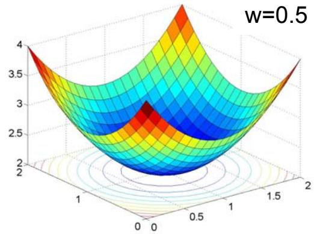

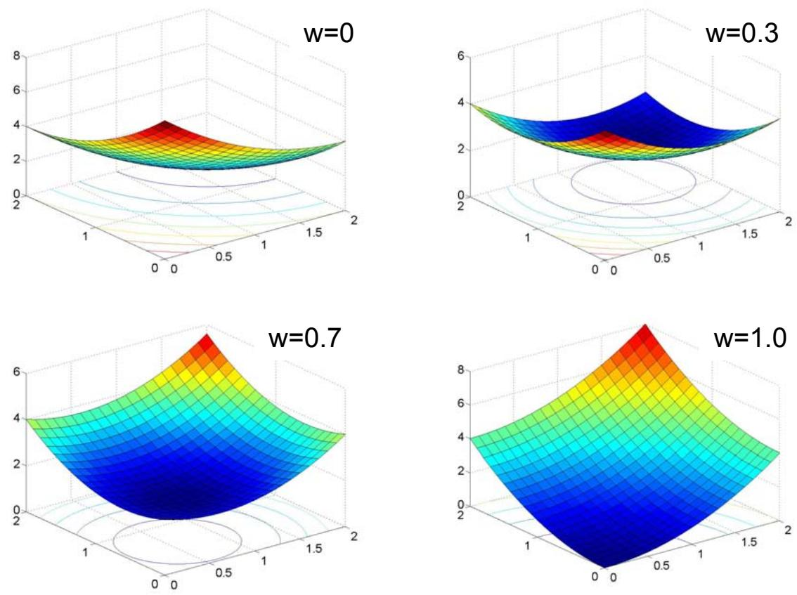

M O P :

Sch affer’ test fu n ction The Pa reto front is convex and uniform Trajectory defi ned by ${ \sf x } _ { 1 } = { \sf x } _ { 2 }$

DOP:

The opti m u m moves l i nea rly from (0,0) to (2,2) if the weight change linearly   
If the we ig ht cha nges   
randomly, the optimum will be located randomly on the curve defined by ${ \sf x } _ { 1 } = { \sf x } _ { 2 }$ between   
(0,0) and (2,2)

# Generating Competing Peaks

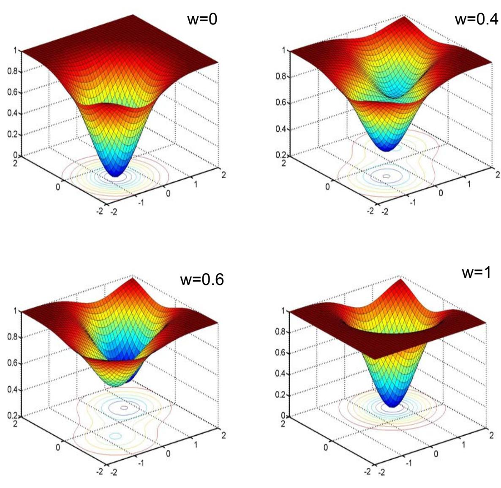

M O P :

Fonseca’s test fu n ction

The Pa reto front is con cave

The two e nds of the Pa reto-front are at (-0.717, -0.717) and (0.717, 0.717)

# DOP

Whe n we ig hts cha nge , M O Ps with a concave Pareto front generate competing peaks

Both the he ig ht a nd the sha pe of the peaks change

The two peaks locate at (-0.717, -0.717) and (0.717, 0.717), and the peak height is 1. The winning peak switches when $\mathtt { w } = 0 . 5$ (the two peaks are of the height for this weight).

# Complexity Control

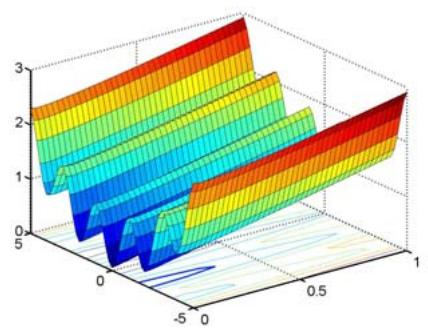

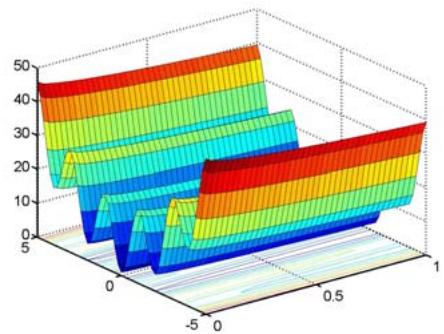  
w=0

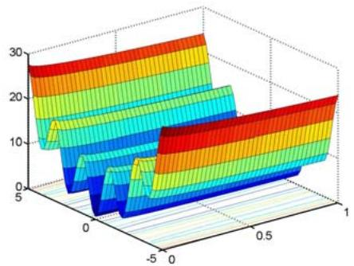  
w=0 .4

w=0 . 8

C o m p l ex i ty , e . g . , m u l t i - m o d a l i ty , deceptiveness can be controlled in constructing MOP. In other words, existing 'hard' MOP test functions can be used for constructing hard DOP test functions.

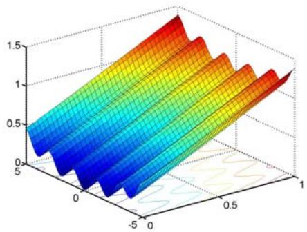  
w=0.8

  
w= 1

# Dynamic Multi-objective Optimization

A moving Pareto front constructed from a three-objective problem

  
Parameter space

  
Objective space

# Multi-modality Introduced by Concave MOPs

I t is wel l-known that the Pa reto-opti ma l sol utions located i n a con cave area of the Pareto-front cannot be obtained using the conventional weighted aggregation method

Geometric explanation

SOO poi nt of vi ew: If a n M OO is con cave , the n the re m ust exist a we ig ht, so that th e aggregated function is multi-modal (finite or infinite)


# Tracking A Slowly Moving Optimum


GA: popsize $\yen 100$ , one-point crossover, rate 0.7, mutation rate $= 1 / |$

E S - C M GA is someth i ng bette r tha n ES


# Tracking A Rapidly Moving Optimum


GA: popsize $\yen 100$ , one-point crossover, rate 0.7, mutation rate $= 1 / |$

N o a l g o ri t h m ca n t ra c k a ra p i ES-C MA has the h ig hest “overshoot”


# Tracking A Randomly Jumping Optimum


GA: popsize $\yen 100$ , one-point crossover, rate 0.7, mutation rate $= 1 / |$

GA tracks but with low speed ES tracks i n some cases E S - C M A fa i l to t ra c k


# Why Evolution Strategies Fail

  
ES: Tracking trajectory

  
ES: Adaptation of Step-sizes

  
ES-CMA: Tracking trajectory

  
ES-CMA: Adaptation of Step-sizes

# Lower-Bound Checking of Step-size

  
ES: Tracking trajectory

  
ES-CMA: Tracking trajectory

  
ES: Adaptation of Step-sizes


# Relationships between Different Dynamic and Uncertain Optimization Problems

# Relationships

Uncertainties in fitness space


# Ad d iti o n a l I nfo rm ati o n

I E E E Com putationa l I ntel l ige n ce Society, Evol utiona ry Com putation Tech n i ca l Committee, Working Group on "Evolutionary Computation in Dynamic and Uncertain Environments"

B i bl iog ra phy on “ F itness Approxi mation i n Evol utiona ry Com putation” ma i nta i ned by Yaochu Jin   
B i bl iog ra phy on “ Evol utiona ry O pti m ization i n Stochasti c a nd Dyna m i c E nvi ron me nts” maintained by Jürgen Branke

Th e 2nd E u ropea n Workshop on “ Evol utiona ry O pti m ization i n Stochasti c a nd Dynamic Environments" to be held in Lousanne, May 2005

I E E E Tra nsactions on Evol utiona ry Com putation , S pecia l I ssu e on “ Evol utiona ry Optimization in the Presence of Uncertainties", 2005

Soft Com puti ng , S pecia l I ssu e on “Ap proxi mation a nd Lea rn i ng i n Evol utiona ry Computation", 2004

Th e 1 st E u ropea n Workshop on “ Evol utiona ry O pti m ization i n Stochasti c a nd Dynamic Environments", Ciombra, Portugal, April 2004. LNCS, Springer, 2004