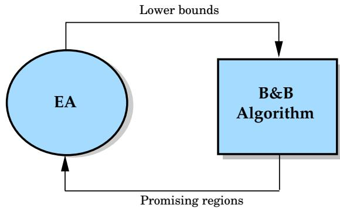
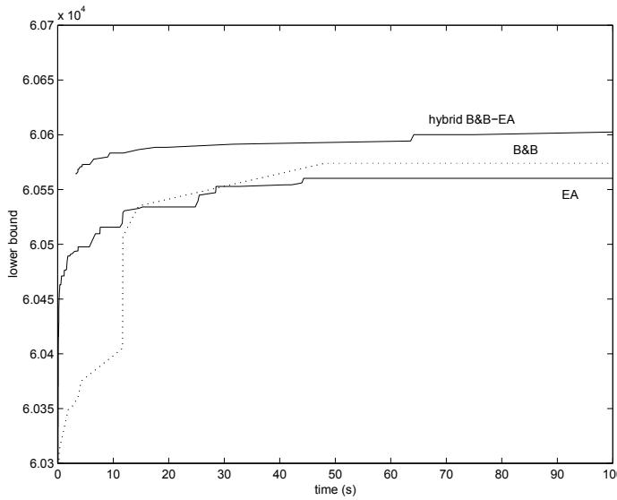
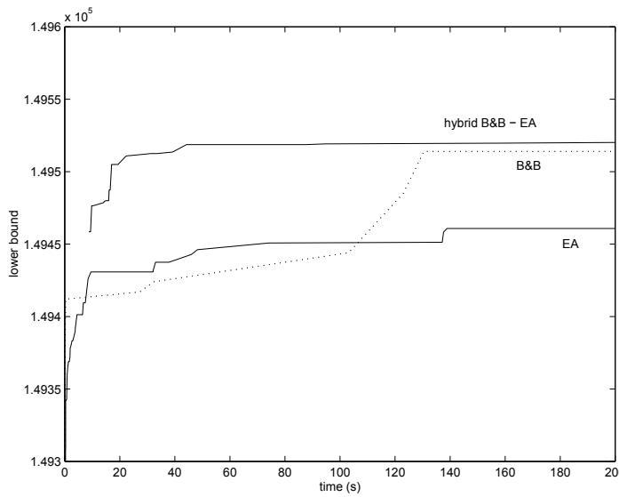

# Решение многомерной задачи о рюкзаке с помощью эволюционного алгоритма, гибридизированного с методом ветвей и границ

Хосе Э. Гальярдо (José E. Gallardo), Карлос Котта (Carlos Cotta) и Антонио Х. Фернандес (Antonio J. Fernández)

Департамент языков и компьютерных наук, Высшая техническая школа информатики, Университет Малаги, Кампус де Театинос, 29071 - Малага, Испания. {pepeg,ccottap,afdez}@lcc.uma.es

Аннотация. В данной статье представлена гибридизация эволюционного алгоритма (ЭА) с методом ветвей и границ (МВГ, B&B). Обе методики взаимодействуют путем обмена информацией: ЭА предоставляет нижние границы, а МВГ — частичные перспективные решения. В качестве тестовой задачи была выбрана многомерная задача о рюкзаке. Более точно, алгоритмы тестировались на крупных экземплярах задач из библиотеки OR-library. Как будет показано, гибридный подход позволяет получать результаты высокого качества, превосходящие те, что получаются с помощью ЭА и МВГ по отдельности.

# 1 Введение

Метод ветвей и границ (B&B) [1] — это алгоритм поиска оптимальных решений комбинаторных задач. По сути, метод формирует сходящиеся нижние и верхние границы оптимального решения, используя схему неявного перебора. Алгоритм начинается с исходной задачи и действует итеративно. На каждом этапе задача разбивается на подзадачи так, что объединение допустимых решений этих подзадач дает полное множество допустимых решений текущей задачи. Подзадачи далее делятся до тех пор, пока они не будут решены, или их верхние границы не окажутся ниже лучшего допустимого решения, найденного на данный момент (здесь предполагается задача максимизации). Таким образом, подход формирует дерево ветвления, в котором каждый узел соответствует задаче, а дочерние узлы представляют подзадачи, на которые она разбивается. Для обхода дерева поиска могут использоваться различные стратегии. Наиболее эффективная состоит в том, чтобы сначала расширять более перспективные (согласно достижимому решению, то есть верхней границе) задачи, однако при этом могут быть исчерпаны ресурсы памяти. Расширение в глубину требует меньше памяти, но, скорее всего, потребует раскрытия значительно большего числа узлов, чем предыдущая стратегия.

Другой подход к оптимизации предоставляют эволюционные алгоритмы [2, 3] (ЭА). Это мощные эвристики для решения задач оптимизации, основанные на принципах естественной эволюции, а именно на адаптации и выживании наиболее приспособленных. Начав со случайно сгенерированной популяции особей (представляющих решения), повторяется процесс, состоящий из отбора (выбираются перспективные решения из популяции), размножения (новые решения создаются путем комбинирования отобранных) и замены (некоторые решения заменяются новыми). Для управления процессом используется функция приспособленности, измеряющая качество решения.

Ключевым аспектом ЭА является робастность, означающая, что они могут применяться к широкому кругу задач. Однако было показано, что для того, чтобы ЭА могли конкурировать с другими методами оптимизации, специфичными для предметной области, в них необходимо внедрять определенные знания об этой области [4–6]. Многообещающим подходом для такого обогащения знаниями является гибридизация с другими (специфичными для предметной области) эвристиками для решаемой задачи оптимизации. В данной статье представлена гибридизация ЭА с МВГ. Цель этой гибридизации — объединить их поисковые возможности синергетическим образом.

Остальная часть статьи организована следующим образом: в разд. 2 представлена многомерная задача о рюкзаке (МЗР, MKP) — эталонная задача, использованная для тестирования нашей гибридной модели, — и описываются как эффективный эволюционный алгоритм, так и две различные реализации МВГ, успешно применяемые для решения МЗР. Затем в разд. 3 обсуждаются связанные работы по гибридизации эволюционных алгоритмов и моделей МВГ; здесь же описывается наш новаторский подход к этой гибридизации. Впоследствии, в разд. 4 показаны и проанализированы эмпирические результаты, полученные при применении каждого из описанных подходов (то есть ЭА, чистых моделей МВГ и гибридной модели) к различным экземплярам эталонной задачи. Наконец, в разд. 5 приведены выводы и очерчены направления будущих исследований.

# 2 Многомерная задача о рюкзаке

Сначала опишем целевую задачу и несколько подходов — как метаэвристических, так и точных — используемых для ее решения.

# 2.1 Описание задачи

Многомерная задача о рюкзаке (MKP) является обобщением классической задачи о рюкзаке, поэтому стоит начать с описания последней. Имеется рюкзак с верхним пределом веса $b$ и набор из $n$ предметов с различными ценностями $p _ { j }$ и весами $r _ { j }$. Задача заключается в выборе набора предметов, который дает максимальную общую ценность без превышения весового лимита рюкзака.

В МЗР необходимо заполнить одними и теми же предметами $m$ рюкзаков с различными весовыми лимитами $b _ { i }$. Кроме того, эти предметы имеют разный вес $r _ { i j }$ для каждого рюкзака $i$. Формально задача может быть сформулирована следующим образом:

$$
\begin{array} { l l } { \text{максимизировать} } & { \displaystyle \sum _ { j = 1 } ^ { n } p _ { j } x _ { j } , } \\ { \text{при ограничениях} } & { \displaystyle \sum _ { j = 1 } ^ { n } r _ { i j } x _ { j } \leq b _ { i } , \quad i = 1 , \ldots , m , } \\ { } & { \displaystyle x _ { j } \in \{ 0 , 1 \} , \quad j = 1 , \ldots , n . } \end{array}
$$

Каждое из $m$ ограничений в уравнении (2) называется ограничением рюкзака, а вектор $x$ определяет, какие объекты выбраны в решении. Задача является NP-трудной [7] и может рассматриваться как универсальная формулировка любой задачи целочисленного программирования с нулями и единицами и неотрицательными коэффициентами. Множество практических задач могут быть сформулированы как экземпляры МЗР, например, задача распределения капитала, выбор проектов и капиталовложений, контроль бюджета и многочисленные задачи загрузки (см., например, [8]).

# 2.2 Эволюционный алгоритм

ЭА использовались в ряде работ для решения МЗР, среди прочего в [9–13]. Насколько нам известно, ЭА, разработанный Чу и Бизли в [11], представляет собой состояние искусства (state-of-the-art) в решении МЗР с помощью эволюционных алгоритмов. Этот конкретный алгоритм имеет дополнительное преимущество: он использует естественное представление решений, то есть $n$-битные двоичные строки, где $n$ — количество предметов в МЗР. Для этого представления значение $0$ или $1$ в $j$-м бите указывает на значение $x _ { j }$ в решении.

Поскольку такое представление допускает недопустимые решения, используется оператор восстановления (repair) для их исправления. Для реализации этого оператора сначала к каждой задаче применяется процедура предварительной обработки для сортировки переменных в порядке убывания их отношений псевдополезности $u _ { j }$ (чем выше отношение, тем больше вероятность того, что соответствующая переменная будет установлена в единицу в решении, подробности см. в [11]). Затем к каждому решению применяется алгоритм, состоящий из двух фаз (см. Рис. 1). На первой фазе переменные рассматриваются в порядке возрастания $u _ { j }$ и устанавливаются в ноль, если нарушается допустимость. На второй фазе переменные рассматриваются в обратном порядке и устанавливаются в единицу до тех пор, пока не нарушается допустимость. Цель первой фазы — получить допустимое решение, тогда как вторая фаза стремится улучшить его приспособленность.

1: инициализировать $\begin{array} { r } { R _ { i } = \sum _ { j = 1 } ^ { n } r _ { i j } x _ { j } , \forall i \in \{ 1 , \cdots , m \} } \end{array}$;   
2: для $\mathbf { j } = \mathbf { n }$ вниз до 1 выполнить $/*$ Фаза DROP $*/$   
3: если $( x _ { j } = 1$ ) и $( \exists i \in \{ 1 , \cdot \cdot \cdot , m \} : R _ { i } > b _ { i } )$, то   
4: установить $x _ { j } \gets 0$;   
5: установить $R _ { i } \gets R _ { i } - r _ { i j } , \forall i \in \{ 1 , \cdot \cdot \cdot , m \}$   
6: конец если   
7: конец цикла   
8: для $\mathrm { j } = 1$ до $n$ выполнить $/*$ Фаза ADD $*/$   
9: если $( x _ { j } = 0$ ) и $( \forall i \in \{ 1 , \cdot \cdot \cdot , m \} : R _ { i } + r _ { i j } \leq b _ { i } )$, то   
10: установить $x _ { j } \gets 1$;   
11: установить $R _ { i } \gets R _ { i } + r _ { i j } , \forall i \in \{ 1 , \cdot \cdot \cdot , m \}$   
12: конец если   
13: конец цикла

Рис. 1. Оператор восстановления.

Ограничивая ЭА поиском только в допустимой области пространства решений, можно использовать простую функцию приспособленности $\textstyle f ( \mathbf{x} ) = \sum _ { j = 1 } ^ { n } p _ { j } x _ { j }$.

# 2.3 Алгоритмы ветвей и границ

Были оценены два алгоритма МВГ. Первый — это простая реализация, которая расширяет дерево поиска путем включения или исключения произвольного предмета в рюкзак до тех пор, пока не будет сгенерировано полное решение. Когда предмет $j$ включается, нижняя граница для задачи увеличивается на соответствующую прибыль $p _ { j }$ (а оставшееся доступное пространство уменьшается на $r _ { i j }$ в каждом рюкзаке $i$), тогда как при исключении предмета верхняя граница уменьшается на $p _ { j }$. Конечно, недопустимые решения отсекаются в процессе. Очередь задач рассматривается способом поиска в глубину, чтобы избежать исчерпания памяти при решении крупных задач. Хотя этот метод очень наивен, он может быть реализован очень эффективно и может быть единственным доступным для других задач, для которых не разработаны сложные эвристики.

Вторая реализация выполняет стандартный поиск по дереву на основе линейного программирования (ЛП). Алгоритм решает линейную релаксацию текущей задачи (то есть допускает дробные значения для переменных решения) и считает задачу решенной, если все переменные в релаксированном решении имеют целые значения. В противном случае он порождает две новые задачи путем включения или исключения предмета со связанным дробным значением (того, чье значение в ЛП-релаксированном решении ближе всего к 0.5). Этот метод более точен, но не очень быстр при рассмотрении крупных задач, так как решение их релаксации может занять некоторое время.

# 3 Гибридные модели

В этом разделе мы представляем гибридную модель, интегрирующую ЭА с МВГ. Наша цель — объединить преимущества обоих подходов и в то же время избежать (или по крайней мере минимизировать) их недостатки при работе по отдельности. Сначала в следующем подразделе мы кратко обсудим некоторые связанные работы, существующие в литературе, касающиеся гибридизации методов МВГ и ЭА.

# 3.1 Связанные работы

Котта и др. [14] использовали специфичный для задачи подход МВГ для задачи коммивояжера, основанный на 1-деревьях и лагранжевой релаксации [15], и применили ЭА для предоставления границ с целью направить поиск МВГ. Более конкретно, они проанализировали два различных подхода к интеграции. В первой модели генетический алгоритм играет роль мастера, а МВГ внедряется как его инструмент. Основная идея заключалась в создании гибридного генетического оператора на основе философии МВГ. Вторая предложенная модель состояла в параллельном выполнении алгоритма МВГ с определенным количеством ЭА, которые генерируют ряд решений различной структуры. Разнообразие, обеспечиваемое независимыми ЭА, способствовало тому, что ребра, подходящие для того, чтобы быть частью оптимального решения, вероятно включались в некоторых особей, а неподходящие ребра с малой вероятностью учитывались. Несмотря на то, что эти подходы показали обнадеживающие результаты, работа в [14] описывала лишь предварительные результаты.

Другое релевантное исследование было проведено Нагаром и др. [16], объединившими поиск по дереву МВГ и ЭА, который использовался для предоставления границ при решении задач составления расписаний для поточной линии. Позже Френч и др. [17] описали гибридный алгоритм, объединяющий генетические алгоритмы и подходы МВГ целочисленного программирования для решения задач MAX-SAT. Этот гибридный алгоритм собирает информацию во время работы алгоритма МВГ на основе линейного программирования и использует ее для построения популяции ЭА. ЭА в конечном итоге активируется, и лучшее найденное решение используется для внедрения новых узлов в дерево поиска МВГ. Гибридный алгоритм работает до тех пор, пока дерево поиска не будет исчерпано, и, следовательно, является точным подходом. Однако в некоторых случаях он может раскрыть больше узлов, чем МВГ в одиночку.

Более недавно Котта и Троя [18] представили рамочную модель для гибридизации, основанную на использовании МВГ в качестве оператора, встроенного в ЭА. Этот гибридный оператор используется для рекомбинации: он интеллектуально исследует возможных потомков рекомбинируемых решений, обеспечивая наилучший возможный результат. Получившаяся гибридная метаэвристика дает лучшие результаты, чем чистые ЭА, в задачах, где полный обход с помощью МВГ на практике нецелесообразен.

# 3.2 Наш гибридный алгоритм

Один из способов интеграции эволюционных методов и моделей МВГ — это прямое сотрудничество, заключающееся в том, чтобы позволить обеим методикам работать параллельно самостоятельно (то есть позволить обоим процессам выполняться независимо), то есть на одном уровне. Оба процесса будут разделять решение. Есть два способа получить выгоду от такого параллельного выполнения:

– МВГ может использовать нижнюю границу, предоставленную ЭА, для очистки очереди задач, удаляя те задачи, верхняя граница которых меньше полученной с помощью ЭА.
– МВГ может внедрять информацию о более перспективных областях пространства поиска в популяцию ЭА, чтобы направить поиск ЭА.

В нашем гибридном подходе (см. Рис. 2) единое решение разделяется между алгоритмами ЭА и МВГ, которые выполняются чередующимся образом. Как только один из алгоритмов находит лучшее приближение, он обновляет решение и передает управление другому алгоритму.

Гибридный алгоритм начинается с запуска ЭА для получения первого приближения решения. На этой начальной фазе популяция инициализируется случайным образом, и ЭА выполняется до тех пор, пока решение не улучшается в течение определенного числа итераций. Это приближение позже может быть использовано алгоритмом МВГ для очистки очереди задач. На этой начальной фазе ЭА информация от алгоритма МВГ не внедряется, чтобы избежать внедрения высокооцененных строительных блоков, которые могли бы повлиять на разнообразие, поляризуя дальнейшую эволюцию.

  
Рис. 2. Гибридный алгоритм.

После этого выполняется алгоритм МВГ. Как только находится новое решение, оно внедряется в популяцию ЭА (заменяя худшую особь), фаза МВГ приостанавливается, и ЭА запускается до стабилизации. Периодически ожидающие узлы в очереди МВГ внедряются в популяцию ЭА. Поскольку это частичные решения, а популяция ЭА состоит из полных решений, они дополняются и корректируются с использованием оператора восстановления. Цель этого перенаправления — направить ЭА в эти области пространства поиска. Напомним, что узлы в очереди представляют подмножество пространства поиска, еще не исследованное. Таким образом, ЭА используется для поиска вероятно хороших решений в этой области. Обнаружив улучшенную нижнюю границу (или при стабилизации ЭА, в случае если улучшение не найдено), управление возвращается МВГ,Hopefully, с улучшенной нижней границей. Этот процесс повторяется до тех пор, пока дерево поиска не будет исчерпано или не будет достигнут лимит времени. Таким образом, гибрид представляет собой алгоритм произвольной остановки (anytime algorithm), который обеспечивает как квазиоптимальное решение, так и указание на максимальное расстояние до оптимума.

# 4 Экспериментальные результаты

Мы проверили наши алгоритмы на задачах, доступных в библиотеке OR-library [19], поддерживаемой Бизли. Мы взяли по два экземпляра из каждого набора задач. Каждый набор задач характеризуется количеством ограничений (или рюкзаков) $m$, количеством предметов $n$ и коэффициентом тесноты $0 \leq \alpha \leq 1$. Чем ближе к 0 коэффициент тесноты, тем более жестко ограничен экземпляр.

Мы решали эти задачи на ПК с процессором Pentium IV (1700 МГц и 256 МБ оперативной памяти), используя ЭА, МВГ и гибридные алгоритмы (все написаны на языке C). Для метода МВГ выполнялся один запуск для каждого экземпляра, тогда как для ЭА и гибридного алгоритма проводилось по десять запусков. Во всех случаях алгоритмы работали 600 секунд. Для ЭА и гибридного алгоритма размер популяции был фиксирован и составлял 100 особей, которые инициализировались случайными допустимыми решениями. Вероятность мутации была установлена на уровне 2 бит на строку, вероятность кроссовера — 0,9, использовался метод бинарного турнирного отбора, а также был выбран стандартный оператор равномерного кроссовера.

Результаты показаны в Таблице 1. Первые три колонки указывают на размеры ($m$ и $n$) и коэффициент тесноты ($\alpha$) для конкретного экземпляра. Следующая колонка содержит результаты для алгоритма МВГ, тогда как последние две колонки показывают лучшее и среднее решения за 10 запусков для ЭА и гибридного алгоритма. Как можно видеть, гибридный алгоритм всегда превосходит исходные алгоритмы. Обратите также внимание, что разница в средних значениях заметно больше соответствующих стандартных отклонений, что подчеркивает значимость результатов.

Таблица 1. Результаты (в среднем за десять запусков) алгоритма МВГ, ЭА и их гибрида для экземпляров задач с различным количеством предметов ($n$), рюкзаков ($m$) и коэффициентом тесноты ($\alpha$).   

<table>
  <tr>
    <td colspan="3"></td>
    <td rowspan="2">B&B</td>
    <td colspan="2">GA</td>
    <td colspan="2">B&B-GA (Гибрид)</td>
  </tr>
  <tr>
    <td>$\alpha$</td>
    <td>$m$</td>
    <td>$n$</td>
    <td></td>
    <td>Лучшее</td>
    <td>Среднее ± стд. откл.</td>
    <td>Лучшее</td>
    <td>Среднее ± стд. откл.</td>
  </tr>
  <tr>
    <td rowspan="8">0.25</td>
    <td rowspan="4">5</td>
    <td>100</td>
    <td>24373</td>
    <td>24381</td>
    <td>24381.0 ± 0.0</td>
    <td>24381</td>
    <td>24381.0 ± 0.0</td>
  </tr>
  <tr>
    <td>250</td>
    <td>59243</td>
    <td>59243</td>
    <td>59211.7 ± 18.0</td>
    <td>59312</td>
    <td>59305.1 ± 20.7</td>
  </tr>
  <tr>
    <td>500</td>
    <td>120082</td>
    <td>120095</td>
    <td>120054.0 ± 25.1</td>
    <td>120148</td>
    <td>120122.0 ± 14.0</td>
  </tr>
  <tr>
    <td rowspan="3">10</td>
    <td>100</td>
    <td>23064</td>
    <td>23064</td>
    <td>23050.2 ± 19.2</td>
    <td>23064</td>
    <td>23059.1 ± 3.2</td>
  </tr>
  <tr>
    <td>250</td>
    <td>59071</td>
    <td>59133</td>
    <td>59068.7 ± 29.1</td>
    <td>59164</td>
    <td>59146.3 ± 11.6</td>
  </tr>
  <tr>
    <td>500</td>
    <td>117632</td>
    <td>117711</td>
    <td>117627.3 ± 64.7</td>
    <td>117741</td>
    <td>117702.4 ± 20.5</td>
  </tr>
  <tr>
    <td rowspan="3">30</td>
    <td>100</td>
    <td>21516</td>
    <td>21946</td>
    <td>21856.1 ± 112.5</td>
    <td>21946</td>
    <td>21946.0 ± 0.0</td>
  </tr>
  <tr>
    <td>250</td>
    <td>56277</td>
    <td>56796</td>
    <td>56606.9 ± 126.6</td>
    <td>56796</td>
    <td>56796.0 ± 0.0</td>
  </tr>
  <tr>
    <td></td>
    <td>500</td>
    <td>115154</td>
    <td>115763</td>
    <td>115619.9 ± 79.7</td>
    <td>115820</td>
    <td>115779.6 ± 18.6</td>
  </tr>
  <tr>
    <td rowspan="9">0.75</td>
    <td rowspan="3">5</td>
    <td>100</td>
    <td>60633</td>
    <td>60633</td>
    <td>60629.7 ± 4.9</td>
    <td>60633</td>
    <td>60633.0 ± 0.0</td>
  </tr>
  <tr>
    <td>250</td>
    <td>154654</td>
    <td>154668</td>
    <td>154626.2 ± -</td>
    <td>154668</td>
    <td>154668.0 ± 0.0</td>
  </tr>
  <tr>
    <td>500</td>
    <td>299904</td>
    <td>299885</td>
    <td>299842.7 ± 26.9</td>
    <td>299904</td>
    <td>299902.3 ± 5.1</td>
  </tr>
  <tr>
    <td rowspan="3">10</td>
    <td>100</td>
    <td>60574</td>
    <td>60593</td>
    <td>60560.9 ± 32.1</td>
    <td>60603</td>
    <td>60603.0 ± 0.0</td>
  </tr>
  <tr>
    <td>250</td>
    <td>149641</td>
    <td>149686</td>
    <td>149622.7 ± 39.6</td>
    <td>149704</td>
    <td>149685.3 ± 8.4</td>
  </tr>
  <tr>
    <td>500</td>
    <td>306949</td>
    <td>306976</td>
    <td>306893.7 ± 56.0</td>
    <td>307027</td>
    <td>307002.7 ± -</td>
  </tr>
  <tr>
    <td rowspan="2">30</td>
    <td>250</td>
    <td>149514</td>
    <td>149514</td>
    <td>149462.8 ± 44.4</td>
    <td>149595</td>
    <td>149528.6 ± 24.4</td>
  </tr>
  <tr>
    <td>500</td>
    <td>300309</td>
    <td>300351</td>
    <td>300218.8 ± 94.5</td>
    <td>300387</td>
    <td>300359.0 ± 21.9</td>
  </tr>
</table>

На Рис. 3 и 4 показана динамика изменения нижней границы в процессе работы для трех алгоритмов. Обратите внимание, как гибридный алгоритм последовательно дает лучшие результаты на протяжении всего времени выполнения. Это подтверждает эффективность гибридной модели как алгоритма произвольной остановки.

В настоящее время мы тестируем вторую реализацию гибридного алгоритма, решающую ЛП-релаксацию задач. Предварительные результаты указывают на то, что нижние границы, полученные этим алгоритмом, не лучше тех, что представлены в данной статье, хотя могут быть достигнуты более точные верхние границы.

  
Рис. 3. Динамика изменения нижней границы в трех алгоритмах во время первых 100 секунд выполнения для экземпляра задачи с $\alpha = . 7 5$, $m = 3 0$, $n = 1 0 0$. Кривые усреднены по десяти запускам в случае ЭА и гибридного алгоритма.

  
Рис. 4. Динамика изменения нижней границы в трех алгоритмах во время первых 100 секунд выполнения для экземпляра задачи с $\alpha = . 7 5$, $m = 3 0$, $n = 2 5 0$. Кривые усреднены по десяти запускам в случае ЭА и гибридного алгоритма.

# 5 Выводы и будущая работа

Мы представили гибридизацию ЭА с алгоритмом МВГ. ЭА предоставляет нижние границы, которые МВГ может использовать для очистки очереди задач, в то время как МВГ направляет ЭА для поиска в перспективных областях пространства поиска.

Получившийся гибридный алгоритм был протестирован на крупных экземплярах задачи МЗР с обнадеживающими результатами: гибридный ЭА выдает результаты лучше, чем составные алгоритмы при тех же вычислительных затратах. Это указывает на синергию данного сочетания, таким образом поддерживая идею о том, что это прибыльный подход для решения сложных комбинаторных задач. В этом смысле дальнейшая работа будет направлена на подтверждение этих выводов на различных комбинаторных задачах, а также на изучение альтернативных моделей гибридизации МВГ с ЭА.

# Благодарности.

Эта работа частично поддержана Испанским министерством науки и технологий (MCyT) и FEDER в рамках контрактов TIC2002-04498-C05-02 и TIN2004-7943-C04-01.

# Список литературы

1. Lawler, E., Wood, D.: Branch and bounds methods: A survey. Operations Research 4 (1966) 669–719   
2. B¨ack, T.: Evolutionary Algorithms in Theory and Practice. Oxford University Press, New York NY (1996)   
3. B¨ack, T., Fogel, D., Michalewicz, Z.: Handbook of Evolutionary Computation. Oxford University Press, New York NY (1997)   
4. Davis, L.: Handbook of Genetic Algorithms. Van Nostrand Reinhold, New York NY (1991)   
5. Wolpert, D., Macready, W.: No free lunch theorems for optimization. IEEE Transactions on Evolutionary Computation 1 (1997) 67–82   
6. Culberson, J.: On the futility of blind search: An algorithmic view of “no free lunch”. Evolutionary Computation 6 (1998) 109–128   
7. Garey, M., Johnson, D.: Computers and Intractability: A Guide to the Theory of NP-Completeness. Freeman and Co., San Francisco CA (1979)   
8. Salkin, H., Mathur, K.: Foundations of Integer Programming. North Holland (1989)   
9. Khuri, S., B¨ack, T., Heitk¨otter, J.: The zero/one multiple knapsack problem and genetic algorithms. In Deaton, E., Oppenheim, D., Urban, J., Berghel, H., eds.: Proceedings of the 1994 ACM Symposium on Applied Computation, ACM Press (1994) 188–193   
10. Cotta, C., Troya, J.: A hybrid genetic algorithm for the 0-1 multiple knapsack problem. In Smith, G., Steele, N., Albrecht, R., eds.: Artificial Neural Nets and Genetic Algorithms 3, Wien New York, Springer-Verlag (1998) 251–255   
11. Chu, P., Beasley, J.: A genetic algorithm for the multidimensional knapsack problem. Journal of Heuristics 4 (1998) 63–86   
12. Gottlieb, J.: Permutation-based evolutionary algorithms for multidimensional knapsack problems. In Carroll, J., Damiani, E., Haddad, H., Oppenheim, D., eds.: ACM Symposium on Applied Computing 2000, ACM Press (2000) 408–414   
13. Raidl, G., Gottlieb, J.: Empirical analysis of locality, heritability and heuristic bias in evolutionary algorithms: A case study for the multidimensional knapsack problem. Technical Report TR 186–1–04–05, Institute of Computer Graphics and Algorithms, Vienna University of Technology (2004)   
14. Cotta, C., Aldana, J., Nebro, A., Troya, J.: Hybridizing genetic algorithms with branch and bound techniques for the resolution of the TSP. In Pearson, D., Steele, N., Albrecht, R., eds.: Artificial Neural Nets and Genetic Algorithms 2, Wien New York, Springer-verlag (1995) 277–280   
15. Volgenant, A., Jonker, R.: A branch and bound algorithm for the symmetric traveling salesman problem based on the 1-tree relaxation. European Journal of Operational Research 9 (1982) 8388   
16. Nagard, A., Heragu, S., Haddock, J.: A combined branch and bound and genetic algorithm based for a flowshop scheduling algorithm. Annals of Operation Research 63 (1996) 397–414   
17. French, A., Robinson, A., Wilson, J.: Using a hybrid genetic-algorithm/branch and bound approach to solve feasibility and optimization integer programming problems. Journal of Heuristics 7 (2001) 551–564   
18. Cotta, C., Troya, J.: Embedding branch and bound within evolutionary algorithms. Applied Intelligence 18 (2003) 137–153   
19. Beasley, J.: Or-library: distributing test problems by electronic mail. Journal of the Operational Research Society 41 (1990) 1069–1072
