# The Asymmetric Traveling Salesman Problem

# Per Mattsson

# Abstract

# The Asymmetric Traveling Salesman Problem

# Teknisk- naturvetenskaplig fakultet UTH-enheten

Besöksadress: Ångströmlaboratoriet Lägerhyddsvägen 1 Hus 4, Plan 0

Postadress: Box 536 751 21 Uppsala

Telefon: 018 – 471 30 03

Telefax: 018 – 471 30 00

Hemsida: http://www.teknat.uu.se/student

Per Mattsson

This thesis is a survey on the approximability of the asymmetric traveling salesman problem with triangle inequality (ATSP).

In the ATSP we are given a set of cities and a function that gives the cost of traveling between any pair of cities. The cost function must satisfy the triangle inequality, i.e. the cost of traveling from city A to city B cannot be larger than the cost of traveling from A to some other city C and then to B. However, we allow the cost function to be asymmetric, i.e. the cost of traveling from city A to city B may not equal the cost of traveling from B to A. The problem is then to find the cheapest tour that visit each city exactly once.

This problem is NP-hard, and thus we are mainly interested in approximation algorithms. We study the repeated cycle cover heuristic by Frieze et al. We also study the Held-Karp heuristic, including the recent result by Asadpour et al. that gives a new upper bound on the integrality gap. Finally we present the result of Papadimitriou and Vempala which shows that it is NP-hard to approximate the ATSP with a ratio better than 117/116.

# Sammanfattning

Titeln p˚a detta examensarbete kan ¨overs¨attas med Det Asymmetriska Handelsresandeproblemet (f¨orkortas h¨arefter med ATSP efter det engelska The Asymmetric Traveling Salesman Problem). Vi t¨anker oss en handelsresande som ska ut och s¨alja n˚agon ny och sp¨annande produkt. Han vill under sin resa bes¨oka ett antal st¨ader, men ocks˚a h˚alla resekostnaderna nere. Problemet g˚ar d¨arf¨or ut p˚a att hitta den billigaste m¨ojliga resv¨agen, som startar i den handelsresandes hemstad, och bes¨oker alla st¨ader f¨or att till slut ˚aterv¨anda till hemstaden. Med asymmetrisk menar vi att kostnaden f¨or att resa fr˚an stad $A$ till stad $B$ inte beh¨over vara densamma som kostanden f¨or att resa fr˚an $B$ till $A$ .

Sj¨alvklart skulle vi vilja hitta den absolut billigaste resv¨agen. Tyv¨arr ¨ar det ofta sv˚arare ¨an man kan tro. En av orsakerna till detta ¨ar att det finns s˚a m˚anga m¨ojliga resv¨agar att v¨alja mellan. Om det te.x ¨ar tio st¨ader som ska bes¨okas s˚a finns det 3.628.800 m¨ojliga resv¨agar att v¨alja mellan, och ¨ar det fler ¨an 60 st¨ader s˚a finns det fler m¨ojliga resv¨agar ¨an antalet atomer i hela den observerbara delen av universum. Av denna anledning s˚a kommer vi i denna rapport i f¨orsta hand att studera m¨ojligheten att hitta approximativa l¨osningar till problemet, dvs vi ¨ar n¨ojda ¨aven om l¨osningen vi hittar inte ¨ar den absolut b¨asta s˚a l¨ange vi kan garantera att den ¨ar hyfsat bra.

Vi kan lite informellt s¨aga att en approximationsalgoritm ¨ar en beskrivning av en metod f¨or att hitta approximativa l¨osningar till ett problem. Allts˚a ¨ar en viktig m˚als¨attning f¨or de som forskar om det h¨ar problemet att hitta den b¨asta m¨ojliga approximationsalgoritmen. S˚a hur ser det ut i dagsl¨aget? Den approximationsalgoritm som idag verkar vara den b¨ast kallas Held-Karp algoritmen, efter upphovsm¨annen Held och Karp. Denna algoritm returnerar ofta l¨osningar som ligger v¨aldigt n¨ara den optimala, och det finns ingen k¨and instans av ATSP d¨ar Held-Karp algoritmen ¨ar mer ¨an en faktor tv˚a ifr˚an den optimala l¨osningen. Men kan vi garantera att denna algoritm aldrig ger ifr˚an sig en l¨osning som ¨ar s¨amre ¨an s˚a? I dagsl¨aget ¨ar svaret p˚a den fr˚agan nej. L˚at oss kalla kostnaden f¨or en optimal resv¨ag $\mathcal { O P T }$ . Det enda vi kan garantera i dagsl¨aget ¨ar att en Held-Karp l¨osning aldrig ¨ar s¨amre $\mathcal { O } \left( \log n / \log \log n \right) \mathcal { O } \mathcal { P T }$ , d¨ar $n$ ¨ar antalet st¨ader[1].

Men ¨aven om vi visste precis hur bra Held-Karp algoritmen var s˚a skulle vi inte veta om detta ¨ar den b¨asta m¨ojliga algoritmen. D¨arf¨or studerar vi ¨aven negativa resultat i denna rapport. Te.x g˚ar det att visa1 att ingen approximationsalgoritm f¨or ATSP kan garantera att l¨osningen aldrig ¨ar s¨amre ¨an $\frac { 1 1 7 } { 1 1 6 } \mathcal { O P T }$ [28].

Helt klart ¨ar att glappet mellan den b¨asta approximationsalgoritmen och det starkaste negativa resultatet ¨ar v¨aldigt stort. Detta inneb¨ar att det fortfarande finns mycket att uppt¨acka n¨ar det g¨aller det asymmetriska handelsresandeproblemet!

# Preface

This thesis is the result of my degree project in Engineering Physics at Uppsala University. This project has been carried out at the Theoretical Computer Science group at CSC, KTH.

The goal of the project was to study and understand what is known about the approximability of the asymmetric traveling salesman problem with triangle inequality (ATSP), and in the process try to improve the results.

When it comes to improving results, most time have been spent trying to improve the lower bounds on the integrality gap, trying to use the unique games conjecture to improve the inapproximability result by Papadimitriou and Vempala [28] and trying to improve the upper bound on the integrality gap for planar instances given in [13]. These efforts have given valuable insights into the problem. However, the ATSP is a well-studied problem and we did not discover any new results during this project.

This thesis is thus a survey on what is known about the approximability of the ATSP. My hope is that an interested reader familiar with some undergraduate mathematics should be able to follow most of it. For this reason we have included a chapter that presents some basic results from graph theory etc.

Finally I would like to thank my supervisor Johan H˚astad and Ola Svensson for their support and many interesting discussions, and Vera Koponen who’s proposals have improved the exposition in this thesis.

# Contents

1 Introduction 5

# 2 Preliminaries 8

2.1 Notation . . . . 8   
2.2 Computational complexity and approximation algorithms . . 8   
2.3 Definition of ATSP with triangle inequality . . . 10

# 2.4 Graph theory . . . . 11

2.4.1 Cuts and bonds . . . 12   
2.4.2 Network flow and circulations . 13   
2.4.3 Planar graphs . . 15   
2.4.4 Eulerian digraphs and shortcuts 16   
2.4.5 Trees . . . 17   
2.4.6 Incidence vectors and the spanning tree polytope . . . 18   
2.5 Linear programming 19

# 3 Repeated cycle cover 20

3.1 Vertex cycle cover 21   
3.2 The algorithm . . . 23

# 4 The Held-Karp heuristic 25

4.1 Using 1-arborescences . . . 26   
4.2 Formulated as a linear program 27   
4.3 Computing the Held-Karp bound . . . 29   
4.4 Lower bounds on the integrality gap 31   
4.4.1 The symmetric case 31   
4.4.2 The integrality gap is at least two . . 32   
4.4.3 Potential improvements . . . 37   
4.5 Upper bounds on the integrality ratio . . 38   
4.5.1 Thin spanning trees . . . 38

4.5.2 Planar graphs . . . . . . 44

# 5 Inapproximability of the ATSP 51

5.1 Linear equations modulo 2 . . . . 51

5.2 The construction . . . 52

5.2.1 The equation gadget . . . 52   
5.2.2 The edge gadget . . 53   
5.2.3 Connecting the edge gadgets 54

5.3 Overview of the proof . . . . 55

6 Conclusions and open problems 58

Bibliography 60

# Chapter 1

# Introduction

Imagine a salesman who is about to go on a tour to sell some new and fancy product. He has to go to several cities during his tour, and of course he prefers to visit each city only once. Besides this he has to take the traveling cost into account. Thus he faces the following problem: find the cheapest tour that, starting at his hometown, visits each city once and then return back to his home. This is the famous traveling salesman problem. It is easy to state and understand, and if the salesman only wants to visit three cities then he could probably find the optimal tour quite easily, since there are only six possible tours to choose between. However, if he wants to visit 10 cities then there exists $1 0 ! = 3 , 6 2 8 , 8 0 0$ possible tours to choose between, and with 60 cities there exists $6 0 ! \approx 8 . 3 { \cdot } 1 0 ^ { 8 1 }$ possible tours! As a comparison it is estimated that the observable universe contains about $8 \cdot 1 0 ^ { 8 0 }$ atoms.

From this we understand that it is infeasible for our salesman to compute the cost of each possible tour and then choose the cheapest one. Thus he wonders if there exists a more efficient way to find the optimal tour. Several researchers have looked into this problem, and there are algorithms that are more efficient than computing the cost of every possible tour. However, the time these algorithms take still grows exponentially in the number of cities, and most researchers believe that there are no exact algorithms that do not have this unpleasant property. So what should our salesman do? Maybe he can settle for a tour that may not be the optimal, but still have a cost that is not to far from optimal? Are there any efficient algorithms that can help him with this?

Of course, in the modern world with computers and the Internet most salesmen prefer to not travel at all, see Figure 1.1. However, the traveling salesman problem is still a very interesting and important problem that gets a lot of attention from researchers. There are several reasons for this, among others

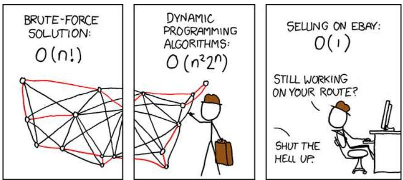  
Figure 1.1: The traveling salesman versus the modern salesman. From http://xkcd.com/399

Many important real-world problems can be reformulated as instances of the traveling salesman problem.   
• It is easy to state but seems to be hard to solve. Finding out the reason for this could shred light on many other combinatorial optimization problems.   
It has a catchy name.

So far we have seen that there is no efficient way to solve the traveling salesman problem (TSP) exactly unless an often made assumption $^ { 1 }$ is false. Therefore this thesis discusses approximation algorithms instead. An approximation algorithm for TSP is an algorithm that efficiently compute a value that in some sense is guaranteed to be close to the cost of an optimal tour. However, under the same assumption as above, it can be shown that there are no approximation algorithms that can guarantee that the value found is at most a constant times the cost of an optimal tour [29]. One way to get around this problem is to impose some restrictions on the cost function. For example, we could say that the cost function must satisfy the triangle inequality. This means that if we want to travel from city $A$ to city $B$ , then it can not be cheaper to make a stopover in some city $C$ than to go straight from $A$ to $B$ . This is a reasonable restriction, since this is true in many real-world instances of the TSP.

We could also say that the cost of traveling from city $A$ to city $B$ must equal the cost of traveling from $B$ to $A$ . Then we get the symmetric traveling salesman problem. This is a well-studied special case of the TSP, and in this case there are approximation algorithms that can guarantee to find a tour of cost at most $3 / 2$ times the cost of an optimal tour [8].

However, in this thesis we study the asymmetric traveling salesman problem with triangle inequality (ATSP). Thus we assume that the triangle inequality holds, but the cost of traveling from city $A$ to city $B$ may not equal the cost of traveling from $B$ to $A$ . What we would like to know is how well the best possible approximation algorithm for the ATSP do. Today we are far from having an answer to this.

The best known heuristic for the ATSP is the Held-Karp heuristic, which we study in Chapter 4. This heuristic often do very well in practice, and there are no known instances of the ATSP where it is more than a factor two off from the cost of an optimal tour. However, the best known upper bound for this heuristic only states that it never is more than a factor $\mathcal { O } \left( \log n / \log \log n \right)$ off, where $n$ is the number of cities [1]. So a major open problem about the ATSP is to find out how well the Held-Karp heuristic actually do in the worst case. One way to get closer to an answer may be to study interesting special cases of the ATSP. We study one such special case in Section 4.5.2, where we consider planar instances and we show that the Held-Karp heuristic in this case never is more than a constant factor off.

However, even if we knew exactly how well the Held-Karp heuristic do in the worst case, it is still possible that there exists another algorithm that does even better. Therefore we also have to study inapproximability results, i.e. results saying something like ”There is no approximation algorithm that does better than this”. We study what is known in this direction in Chapter 5.

# Chapter 2

# Preliminaries

The purpose of this chapter is to minimize the prerequisites needed to read this thesis, and should primarily be used as a reference.

For readers familiar with graph theory and computational complexity, the most important sections are 2.1 which describes some notation and 2.3 where we formally define the asymmetric traveling salesman problem.

# 2.1 Notation

In this section we introduce some notation that helps us simplify some of the mathematical expression in this thesis.

Let $A$ be a set and $S$ a subset of $A$ . For a function $f : A  \mathbb { R }$ we let $f ( S )$ denote the following sum

$$
f ( S ) = \sum _ { a \in S } f ( a )
$$

Throughout this thesis we let log denote the logarithm with base 2, that is $\log x : = \log _ { 2 } x$ .

# 2.2 Computational complexity and approximation algorithms

In the theory of computational complexity we try to classify computational problems according to how hard they are to solve on a computer.

$\mathcal { P }$ versus $\mathcal { N P }$ Two of the most basic and important complexity classes are $_ { \mathcal { P } }$ and $\mathcal { N P }$ . Informally we can say that $\mathcal { P }$ consists of all decision problems1 that can be solved efficiently $^ 2$ on a computer, and $\mathcal { N P }$ consists of all decision problems with the following property: A ”yes” instance of the problem has a succinct certificate (or proof) that can be verified efficiently. As an example, the problem of deciding weather an ATSP instance has a tour of cost at most $B$ or not is a decision problem. Moreover, this problem is in $\mathcal { N P }$ , since a certificate for a ”yes”-instance can be a tour of cost at most $B$ .

Many decision problems that come up in practice are in fact in $\mathcal { N P }$ , so we would like to know if this means that we can solve them efficiently on a computer. This is in fact one of the major open questions in complexity theory and all of mathematics: Is $\mathcal { P } = \mathcal { N P }$ or $\mathcal { P } \neq \mathcal { N P }$ ? This is such an important question that it is one of the Clay Mathematics Institutes Millennium Problems, and the person who solves it will be awarded $\$ 1,000,000$ .

A very important concept in this discussion is the concept of $\mathcal { N P }$ - completeness. We call a problem $\mathcal { N P }$ -complete if it has the property that it can be solved efficiently by a computer if and only if $\mathcal { P } = \mathcal { N P }$ . Thus it is sufficient to show that any $\mathcal { N P }$ -complete problem is (is not) in $\mathcal { P }$ to prove that $\mathcal { P } = \mathcal { N P }$ ( $\mathcal { P } \neq \mathcal { N P }$ ). The work of Cook [9] and Karp [21] in the early 70’s showed that many natural and important decision problems are $\mathcal { N P }$ - complete. After this the list of $\mathcal { N P }$ -complete problems have grown longer and longer. Among the $\mathcal { N P }$ -complete problems are the decision version of the ATSP, with our without triangle inequality. We also call a problem $\mathcal { N P }$ -hard if an efficient algorithm for it would imply $\mathcal { P } = \mathcal { N P }$ . Notice that an $\mathcal { N P }$ -hard problem does not have to be a decision problem, and that this means that ATSP is $\mathcal { N P }$ -hard.

It is generally believed that $\mathcal { P } \neq \mathcal { N P }$ . If this is true, then no $\mathcal { N P }$ - hard problem have an efficient algorithm. So what should we do if we still really want to solve the problem? Sometimes it make sense to search for approximation algorithms instead.

Approximation algorithms In this thesis an approximation algorithm for a given optimization problem is an algorithm with running time polynomial in the input size that returns a value guaranteed to be close to the problems optimal value. If the value returned by the approximation algorithm is guaranteed to never be worse than $\alpha \mathcal { O } \mathcal { P T }$ , where $\mathcal { O P T }$ is the optimal value, then we say that the algorithm gives an $\alpha$ -approximation, or that the approximation ratio is $\alpha$ .

For a problem like the asymmetric traveling salesman problem, there exists two types of approximation algorithms. First we have the constructive algorithms, that returns a tour with cost near the cost of an optimal tour. The second type is the non-constructive algorithms that just returns a value that is close to the cost of an optimal tour, but they do not find any tour. In this thesis we describe a constructive algorithm in Chapter 3 and a nonconstructive algorithm in Chapter 4.

# 2.3 Definition of ATSP with triangle inequality

Formally we define the asymmetric traveling salesman problem (ATSP) the following way

Definition 2.1 In ATSP we are given a set $V$ of cities and a cost function $c : V \times V \to \mathbb { R } ^ { + }$ , and we want to find a minimum cost tour that visits every city exactly once.

In this thesis we call the cost of the optimal tour in a given ATSP instance $\mathcal { O P T }$ , and sometimes we refer to an element in $V$ as a vertex (vertices in plural). Furthermore we use $n$ to denote the number of cities in $V$ , that is $n = | V |$ . We often think of a tour as a set $T \subset V \times V$ , such that $( u , v ) \in T$ if and only if the tour at some point goes from $u$ to $v$ . Thus, using the notation from Section 2.1, we can denote the cost of a tour as

$$
c ( T ) = \sum _ { a \in T } c ( a )
$$

It can be shown that it is $\mathcal { N P }$ -hard to guarantee a $b$ -approximation for the problem in Definition 2.1 for any constant $b$ [29]. However, this may not be true if we put some restrictions on the cost function. Therefore we assume that the triangle inequality holds whenever we talk about an ATSP instance in this thesis. Intuitively the triangle inequality states that if we want to go from city $A$ to city $B$ it can not be cheaper to make a stopover in some city $C$ than to go straight from $A$ to $B$ . This also means that we can relax Definition 2.1 slightly and just say that the tour have to visit each city at least once instead of exactly once, see Section 2.4.4 for a discussion on why this relaxation does not change the cost of an optimal tour when the triangle inequality holds.

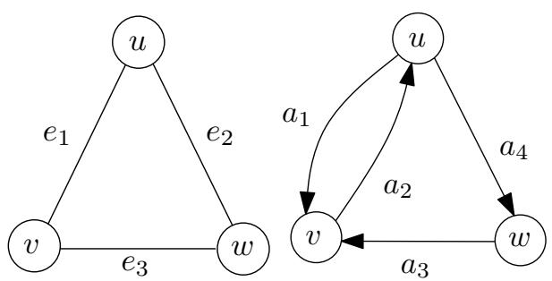  
Figure 2.1: Example of an undirected graph and a digraph

Definition 2.2 That an ATSP instance satisfies the triangle inequality means that the following holds for any three cities $u , v , w \in V$

$$
c ( ( u , w ) ) \leq c ( ( u , v ) ) + c ( ( v , w ) )
$$

To make the notation less cluttered we sometimes use $c _ { u v }$ to mean $c ( ( u , v ) )$ . Thus we can state the triangle inequality as

$$
c _ { u w } \leq c _ { u v } + c _ { v w }
$$

# 2.4 Graph theory

In this thesis we use a lot of notation and theorems from graph theory.

Informally we can say that a (undirected) graph is a collection of points (or circles), with lines connecting some of the points. The points are called vertices (vertex in singular), and the lines are called edges. So a graph $G$ is an ordered pair $( V , E )$ where $V$ is the set of vertices, and $E$ is the set of edges. In this thesis we use $e = \{ u , v \}$ to denote an edge between the vertices $u$ and $v$ .

We are also interested in the situation where the points are connected by directed arrows instead of lines. We call this a directed graph, or a digraph for short, and the arrows are called arcs. Thus a digraph $G$ is an ordered pair $( V , A )$ where $V$ is once again the set of vertices, and $A$ is the set of arcs. Furthermore we use $\boldsymbol { a } = ( u , v )$ to denote an arc that goes from u to $v$ .

Figure 2.1 shows an example of a graph and a digraph. In the undirected graph we have $e _ { 1 } = \{ u , v \}$ , $e _ { 2 } = \{ u , w \}$ and $e _ { 3 } = \{ v , w \}$ . In the digraph we have $a _ { 1 } = \left( u , v \right)$ , $a _ { 2 } = ( v , u )$ , $a _ { 3 } = \left( w , v \right)$ and $a _ { 4 } = ( u , w )$ .

# 2.4.1 Cuts and bonds

Directed graphs Let $G = ( V , A )$ be a digraph and $S$ a subset of $V$ . Then we define the outcut $\delta _ { G } ^ { + } ( S )$ , the incut $\delta _ { G } ^ { - } ( S )$ and $A _ { G } ( S )$ associated with $S$ as follows

$$
\begin{array} { c } { { \delta _ { G } ^ { + } ( S ) : = \{ a = ( u , v ) \in A : u \in S , v \notin S \} } } \\ { { \delta _ { G } ^ { - } ( S ) : = \{ a = ( u , v ) \in A : u \notin S , v \in S \} } } \\ { { A _ { G } ( S ) : = \{ a = ( u , v ) \in A : u \in S , v \in S \} } } \end{array}
$$

When there is no risk for confusion, we sometimes drop the subscript $G$ and just write $\delta ^ { + } ( S )$ , $\delta ^ { - } \mathopen { } \mathclose \bgroup \left( S \aftergroup \egroup \right)$ and $A ( S )$ . Notice that $\delta ^ { + } ( S ) = \delta ^ { - } ( V \backslash S )$ .

To simplify notation we let $\delta ^ { + } ( v ) : = \delta ^ { + } ( \{ v \} )$ and $\delta ^ { - } ( v ) : = \delta ^ { - } ( \{ v \} )$ when $v$ is a vertex in $V$ .

The following theorem, known as Menger’s theorem, is well-known and the proof can be found in most textbooks of graph theory, i.e. [3].

Theorem 2.3 Let $G = ( V , A )$ be a digraph, and let u and v be two vertices in $V$ . Then the number of pairwise arc-disjoint paths from u to $v$ is equal to $\operatorname* { m i n } \{ | \delta ^ { + } ( S ) | : S \subset V , u \in S$ and $v \not \in S \}$ .

We now prove to following useful proposition.

Proposition 2.4 Let $G = ( V , A )$ be a digraph, and $f : A  \mathbb { R }$ a function. If $f ( \delta ^ { + } ( v ) ) = f ( \delta ^ { - } ( v ) )$ for all $v \in V$ , then $f ( \delta ^ { + } ( S ) ) = f ( \delta ^ { - } ( S ) )$ for all subsets $S$ of $V$ .

Proof: Let $S$ be any subset of $V$ , then $A ( S )$ is the set of arcs with both ends in $S$ . Thus

$$
A ( S ) = \left( \bigcup _ { v \in S } \delta ^ { + } ( v ) \right) \backslash \delta ^ { + } ( S )
$$

and also

$$
A ( S ) = \left( \bigcup _ { v \in S } \delta ^ { - } ( v ) \right) \backslash \delta ^ { - } ( S )
$$

Thus

$$
f ( A ( S ) ) = \sum _ { a \in A ( S ) } f ( a ) = \sum _ { v \in S } f ( \delta ^ { + } ( v ) ) - f ( \delta ^ { + } ( S ) )
$$

and

$$
f ( A ( S ) ) = \sum _ { v \in S } f ( \delta ^ { - } ( v ) ) - f ( \delta ^ { - } ( S ) )
$$

Hence

$$
f ( \delta ^ { + } ( S ) ) - f ( \delta ^ { - } ( S ) ) = \sum _ { v \in S } \big ( f ( \delta ^ { + } ( v ) ) - f ( \delta ^ { - } ( v ) ) \big ) = 0
$$

So we can conclude that $f ( \delta ^ { + } ( S ) ) = f ( \delta ^ { - } ( S ) )$ .

Undirected graphs Let $G = ( V , E )$ be an undirected graph, and $S$ a subset of $V$ . $E ( S )$ and the edge cut $\delta _ { G } ( S )$ in $G$ associated with $S$ is then

$$
\begin{array} { r l } & { \delta _ { G } ( S ) : = \{ e = \{ u , v \} \in E : \mathrm { ~ e i t h e r ~ } u \in S , v \not \in S \mathrm { ~ o r ~ } u \not \in S , v \in S \} } \\ & { E _ { G } ( S ) : = \{ e = \{ u , v \} \in E : u \in S , v \in S \} } \end{array}
$$

As in the directed case we sometimes drop the subscript and just write $\delta ( S )$ and $E ( S )$ , and we let $\delta ( v ) : = \delta ( \{ v \} )$ when $v$ is a vertex in $V$ .

A bond $B$ in $G$ is a minimal nonempty edge-cut. This means that $B$ is an edge-cut but no nonempty proper subset of $B$ is an edge-cut.

Proposition 2.5 A subset of $E$ is an edge-cut if and only if it is a disjoint union of bonds.

The proof of this proposition can be found in most textbooks of graph theory, e.g. [3].

# 2.4.2 Network flow and circulations

Network flow A flow network is a digraph $G = ( V , A )$ with an arc capacity $c _ { a } \geq 0$ associated with each arc $a \in A$ . We also have a source vertex $s \in V$ and a sink vertex $t \in V$ . A flow between $s$ and $t$ in this network is a function $f : A  \mathbb { R }$ which satisfy the following conditions:

• Capacity constraints: For each arc $a \in A$ , $0 \leq f ( a ) \leq c _ { a }$ .   
• Flow conservation: For each vertex $v \in V \backslash \{ s , t \} , f ( \delta ^ { - } ( v ) ) = f ( \delta ^ { + } ( v ) )$ .   
• Sink and source constraints: $f ( \delta ^ { - } ( s ) ) = 0$ and $f ( \delta ^ { + } ( t ) ) = 0$ .

Intuitively the capacity constraints says that the flow on an arc $a$ cannot exceed $c _ { a }$ . The flow conservation constraints says that for any vertex, except the source and sink, the flow into that vertex must equal the flow out of it. Finally the sink and source constraints says that the source has no inflow, and the sink has no outflow.

We also define the value of the flow the following way.

$$
v a l ( f ) : = f ( \delta ^ { + } ( s ) ) = \sum _ { a \in \delta ^ { + } ( s ) } f ( a )
$$

The following well-known theorems connects network flow with cuts.

Theorem 2.6 Let $f$ be a flow between s and $t$ , and let $S$ be a subset of $V$ such that $s \in S$ and $t \not \in S$ . Then

$$
v a l ( f ) \le \sum _ { a \in \delta ^ { + } ( S ) } c _ { a } = c ( \delta ^ { + } ( S ) )
$$

Theorem 2.7 Let $f$ be the maximum flow between s and $t$ , and let $S$ be a nonempty proper subset of $V$ that minimize $c ( \delta ^ { + } ( S ) )$ . Then $v a l ( f ) =$ $c ( \delta ^ { + } ( S ) )$ .

The proofs can be found in most textbooks of graph theory or algorithms, e.g. [3, 24].

Circulations The concept of circulations is closely related to network flow. If $G = ( V , A )$ is a digraph, then a circulation in $G$ is a function $f : A  \mathbb { R }$ that satisfy

$$
f ( \delta ^ { + } ( v ) ) = f ( \delta ^ { - } ( v ) )
$$

for all $v \in V$ . We can also assign upper and lower capacities to the arcs in $G$ , that is two functions $l , u : A \to \mathbb { R }$ such that $l ( a ) \leq u ( a )$ for all $a \in A$ . A circulation $f$ in $G$ is called feasible if

$$
l ( a ) \leq f ( a ) \leq u ( a )
$$

for all $a \in A$ . The following theorem is known as Hoffman’s Circulation Theorem, and is proved in [17].

Theorem 2.8 $A$ digraph $G = ( V , A )$ with lower and upper capacities $l$ and u have a feasible circulation if and only if

$$
l ( \delta ^ { - } ( S ) ) \leq u ( \delta ^ { + } ( S ) )
$$

for all subsets $S$ of $V$ . Furthermore, if $l$ and u are integer-valued, then $f$ can be chosen to be integer-valued.

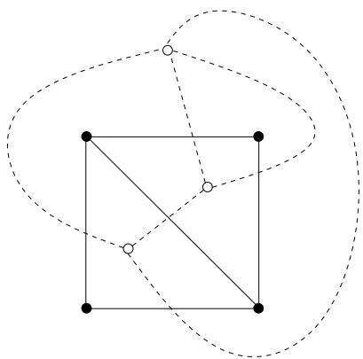  
Figure 2.2: A plane graph and its dual

# 2.4.3 Planar graphs

An undirected graph is planar if it can be drawn in the plane in such a way that the edges only intersect at their ends. We call such a drawing a planar embedding of the graph or simply a plane graph.

Faces A plane graph divides the plane into regions bounded by the edges, we call each such region a face and denote the set of all faces $F$ . $F$ also includes the outer unbounded region.

Duals Given a plane graph $G$ , the dual $G ^ { * }$ of $G$ is defined as follows

For each face $f$ in $G$ there is a vertex $f ^ { * }$ i n $G ^ { * }$ .   
For every edge $e$ in $G$ there is an edge $e ^ { * }$ i n $G ^ { * }$ . $e ^ { * }$ joins the two vertices $f ^ { * }$ and $g ^ { * }$ that corresponds to the faces that are separated by $e$ .

Figure 2.2 shows an example of a plane graph and its dual.

Properties Planar graphs have some properties that makes them interesting. In Section 4.5.2 we study an algorithm by Gharan and Saberi [13] that uses some of these properties to find a constant factor approximation algorithm for a special case of the ATSP. We now state some facts about planar graphs. These are all well-known and the proofs can be found in most textbooks of graph theory, e.g. [3].

In all theorems $G = ( V , E )$ is an undirected plane graph, and $F$ is the set of faces. We start by a famous formula named after an even more famous mathematician, Euler’s formula.

Theorem 2.9 If $G$ is connected, then

$$
| V | - | E | + | F | = 2
$$

The following corollary to Theorem 2.9 can be proved quite easily by noting that $\begin{array} { r } { 2 | E | = \sum _ { v \in V } | \delta ( v ) | } \end{array}$ for all undirected graphs.

Corollary 2.10 If $G$ is simple $^ 3$ and $| V | \geq 3$ , then $\vert E \vert \le 3 \vert V \vert - 6$ . Furthermore, there exist a vertex $v \in V$ such that $| \delta ( v ) | \le 5$ .

For any edge $e \in E$ we define $G \backslash e$ to be the graph we get if we delete $e$ from $G$ . Furthermore we define $G / e$ to be the graph we get if we contract $e$ in $G$ . Contracting an edge $e = \{ u , v \}$ means that we first delete $e$ and then replace $u$ and $v$ with one new vertex $w$ . In the graph $G / e$ all edges that were incident to either $u$ or $\boldsymbol { v }$ in $G$ will instead be incident to $w$ .

The following proposition shows that deleting an edge in $G$ corresponds to contracting an edge in $G ^ { * }$ .

Proposition 2.11 Let e be an edge of $G$ that is not a cut edge, i.e. removing e will not disconnect $G$ . Then $( G \backslash e ) ^ { * } = G ^ { * } / e ^ { * }$ .

Proposition 2.12 If $G$ is connected, then the dual of $G ^ { * }$ is $G$ .

Proposition 2.13 If $B$ is a bond of $G$ , then the edges corresponding to $B$ in $G ^ { * }$ forms a cycle.

# 2.4.4 Eulerian digraphs and shortcuts

A digraph $G = ( V , A )$ is called Eulerian if • $\left. \delta ^ { + } ( v ) \right. = \left. \delta ^ { - } ( v ) \right.$ for all $v \in V$ and, • $| \delta ^ { + } ( S ) \cup \delta ^ { - } ( S ) | \geq 1$ for all nonempty proper subsets $S$ of $V$ .

That is, the number of arcs into a vertex is equal to the number of arcs out of that vertex. Also, the underlying undirected graph is connected.

Now consider an ATSP instance with the set of cities $V$ and cost function $c : V \times V \to \mathbb { R } ^ { + }$ . Assume that we are given an Eulerian digraph $G = ( V , A )$ that spans $V$ . Then there exist a closed walk in this graph that traverses each arc exactly once. The cost of this walk is $c ( A )$ . Now take this walk, and whenever we are about to traverse an arc $( u , v )$ such that $v$ has already been visited we instead go straight to the next unvisited vertex in the walk. Notice that the tour we get by doing this cannot cost more than $c ( A )$ thanks to the triangle inequality. Thus we have found a tour through all the cities with cost at most $c ( A )$ .

This can be useful, since it is sometimes easier to reason about Eulerian digraphs instead of tours.

# 2.4.5 Trees

We say that an undirected graph $G = ( V , T )$ is a tree if it has the following two properties:

• $G$ is connected4. There are no cycles in $G$

The following well-known theorem about trees can easily be proved by a simple induction argument and the proof can be found in most textbooks of graph theory, e.g. [3].

Theorem 2.14 If $G = ( V , E )$ is a tree then $| E | = | V | - 1$ .

Now let $G = ( V , E )$ be an arbitrary connected graph. We say that $T$ is a spanning tree in $G$ if $T \subseteq E$ and $( V , T )$ is a tree.

The following theorem is often called the tree exchange property.

Theorem 2.15 Let $G$ be a connected graph and let $T _ { 1 }$ and $T _ { 2 }$ be two spanning trees. If $e \in T _ { 1 } \backslash T _ { 2 }$ then there exist an edge $f \in T _ { 2 } \backslash T _ { 1 }$ such that both

• $( T _ { 1 } \backslash \{ e \} ) \cup \{ f \}$ and • $( T _ { 2 } \cup \{ e \} ) \backslash \{ f \}$

are spanning trees.

Proof: The graph $\left( V , T _ { 1 } \backslash \{ e \} \right)$ consists of two connected components $S , V \backslash S \subset$ $V$ , and the graph $( V , T _ { 2 } \cup \{ e \} )$ contains one cycle $C$ that includes the edge $e$ . Since a cycle must have an even number of edges in any edge-cut it must be true that

$$
| \delta _ { ( V , C ) } ( S ) | \ge 2
$$

This shows that the set $\delta _ { ( V , T _ { 2 } ) } ( S ) \cap C$ is nonempty, so let $f$ be an edge in this set. Then $f$ cannot be in $T _ { 1 }$ , since $\delta _ { ( V , T _ { 1 } ) } ( S ) = \{ e \}$ and $e \not \in T _ { 2 }$ .

Thus we see that $( T _ { 2 } \cup \{ e \} ) \backslash \{ f \}$ is a spanning tree, since $f$ was part of the only cycle in $( V , T _ { 2 } \cup \{ e \} )$ .

Furthermore $f$ connects the two connected components of $\left( V , T _ { 1 } \backslash \{ e \} \right)$ , thus we see that $( T _ { 1 } \backslash \{ e \} ) \cup \{ f \}$ is connect and hence a spanning tree. ✷

# 2.4.6 Incidence vectors and the spanning tree polytope

Given a digraph $G = ( V , A )$ and a subset $S \subseteq A$ we call the vector $x \in$ $\{ 0 , 1 \} ^ { A }$ where

$$
\left\{ \begin{array} { l l } { x _ { a } = 1 } & { { \mathrm { i f ~ } } a \in S } \\ { x _ { a } = 0 } & { { \mathrm { i f ~ } } a \notin S } \end{array} \right.
$$

the incidence vector for $S$ .

For an undirected graph $G = ( V , E )$ and a subset $S \subseteq E$ we call the vector $z \in \{ 0 , 1 \} ^ { E }$ where

$$
\left\{ \begin{array} { l l } { z _ { e } = 1 } & { { \mathrm { i f ~ } } e \in S } \\ { z _ { e } = 0 } & { { \mathrm { i f ~ } } e \notin S } \end{array} \right.
$$

the incidence vector for $S$ .

The spanning tree polytope Let $G = ( V , E )$ be an undirected graph and let $\boldsymbol { B }$ be the set of all spanning trees in $G ^ { 5 }$ . Then the spanning tree polytope is the convex hull of the incidence vectors to the spanning trees in $\boldsymbol { B }$ . That is, the spanning tree polytope consists of all vectors $z \in \mathbb { R } ^ { E }$ that satisfy the following:

$$
\begin{array} { r l r } { z ( E ) = | V | - 1 } \\ { z ( E ( S ) ) \leq | S | - 1 } & { { } \quad } & { \forall S \subset V } \\ { z _ { e } \geq 0 } & { { } \quad } & { \forall e \in E } \end{array}
$$

A proof of the following well-known theorem can be found in [12].

Theorem 2.16 Given a vector $z$ in the spanning tree polytope we can write $z$ as a convex combination of at most $m \ = \ | E |$ spanning tree incidence vectors. That is, we can write

$$
z = \sum _ { i = 1 } ^ { m } \beta _ { i } z _ { i }
$$

where $z _ { 1 } , \ldots , z _ { m }$ are incidence vectors for spanning trees, $\textstyle \sum _ { i = 1 } ^ { m } \beta _ { i } = 1$ and $\beta _ { i } \geq 0$ for all $i \in \{ 1 , \ldots , m \}$ .

# 2.5 Linear programming

In a linear programming problem we want to maximize or minimize a linear function subject to a set of linear constraints. These constraints can be equalities and/or inequalities.

The function to be optimized is called the objective function, and a vector $x$ that satisfies all linear constraints is called a feasible solution.

It was long unknown if it is possible to solve an arbitrary linear program in polynomial time, but in 1979 the young Soviet researchers Lenoid Khachiyan finally proved that it is indeed possible [22].

# Chapter 3

# Repeated cycle cover

Before the 80’s several heuristics for the ATSP where proposed, and some of them performed quite well in practice. However, in 1982 Frieze, Galbiati and Maffioli showed that a number of these heuristics had worst-case approximation ratio $\Omega ( n )$ [11]. Such an approximation ratio is trivial, since no tour costs more than $n O P T$ when the triangle inequality holds1.

In [11] Frieze, Galbiati and Maffioli also presented a nice and simple $\log n$ -approximation algorithm for the ATSP. This was the first approximation algorithm for the ATSP that was proved to guarantee a nontrivial approximation ratio2.

It took two decades before anyone was able to improve the approximation ratio of the algorithm by Frieze et al. , but in 2002 Bl¨aser was able to decrease the constant in front of $\log n$ , and presented an $0 . 9 9 9 \log n$ -approximation algorithm [2]. The year after that Kaplan et al. presented an algorithm with approximation ratio $^ 3$ $\log _ { 3 } n \approx 0 . 8 4 4 1 2 \log n$ [20]. Recently it was also shown in [1] that the approximation ratio we get from the Held-Karp heuristic studied in Chapter 4 is no worse than $\begin{array} { r } { \mathcal { O } \left( \frac { \log n } { \log \log n } \right) } \end{array}$ and this is currently the best known approximation ratio.

In this chapter we study the algorithm by Frieze et al. . The idea behind this algorithm is to find the cheapest set of disjoint cycles that cover all cities, we call this the vertex cycle cover problem. Then we keep one city from each cycle, and find a disjoint set of cycles that cover this subset of cities. We repeat this procedure until we are left with only one cycle. In the end we will have an Eulerian digraph that spans all cities, and can be shortcut into a tour.

# 3.1 Vertex cycle cover

We define the vertex cycle cover problem (VCC) the following way.

Definition 3.1 Let $V$ be a set of cities, and let $c : V \times V \to \mathbb { R } ^ { + }$ be a cost function. A vertex cycle cover on $V$ is a subset $A$ of $V \times V$ such that $\vert \delta ^ { + } ( v ) \vert = \vert \delta ^ { - } ( v ) \vert = 1$ for all $v \in V$ in the digraph $G = ( V , A )$ . The vertex cycle cover problem is to find a cycle cover $A$ that minimize $c ( A )$ .

When we write cycle cover in this thesis we always mean a vertex cycle cover (as opposed to an arc/edge cycle cover). We notice that, since $\left| \delta ^ { + } ( v ) \right| =$ $| \delta ^ { - } ( v ) | = 1$ for all $v \in V$ , the solution $A$ to VCC must be a set of disjoint cycles. Also notice that $c ( A ) \leq \mathcal { O P T }$ , since a tour through $V$ is a vertex cycle cover with exactly one cycle.

The assignment problem We also mention that Frieze et al. called this problem the assignment problem in [11]. However, the assignment problem usually refers to the following problem:

There are $k$ agents and $k$ tasks. If agent $i$ performs task $j$ the cost is $c _ { i j }$ . The problem is to find an assignment of minimum cost such that each agent performs exactly one task.

We note that it is fairly easy to reduce VCC to the assignment problem.

Solving VCC in polynomial time One way to find an optimal vertex cycle cover is to use the Hungarian method for the assignment problem, this takes time $\mathcal { O } \left( n ^ { 3 } \right)$ . We can also look at the following linear program, that  we call the VCC LP.

$$
\begin{array} { c c } { { \displaystyle \operatorname* { m i n } _ { a \in V \times V } c ( a ) x _ { a } } } \\ { { \mathrm { s u b j e c t ~ t o ~ } x ( \delta ^ { + } ( v ) ) = 1 } } & { { \qquad \forall v \in V } } \\ { { x ( \delta ^ { - } ( v ) ) = 1 } } & { { \qquad \forall v \in V } } \\ { { 0 < x _ { a } < 1 } } & { { \qquad \forall a \in V \times V } } \end{array}
$$

We notice that a feasible solution with $x _ { a } \in \{ 0 , 1 \}$ for all $a \in V \times V$ corresponds to a cycle cover if we let $A = \{ a \in V \times V : x _ { a } = 1 \}$ . Also, if we are given a cycle cover $A$ on $V$ , then we can set $x _ { a } = 1$ if $a \in A$ and $x _ { a } = 0$ otherwise to find a feasible solution to the VCC LP.

The following well-known theorem shows that the optimal solutions to the VCC LP have the property that $x _ { a } \in \{ 0 , 1 \}$ for all $a \in V \times V$ .

Theorem 3.2 The VCC LP has integer extreme points, i.e. $x _ { a } \in \{ 0 , 1 \}$ for all $a \in V \times V$ if $x$ is an extreme point of the VCC LP.

Proof: Assume that there exists an extreme point $x$ to the VCC LP that is non-integral. We now create a bipartite graph $G$ the following way. For each vertex $v \in V$ we put a vertex $v _ { 1 }$ on the left side and a vertex $v _ { 2 }$ on the right side of $G$ . For each $a = ( u , v ) \in V \times V$ such that $x _ { a } > 0$ we add an edge $e = \{ u _ { 1 } , v _ { 2 } \}$ and set $z _ { e } = x _ { a }$ , i.e. for each arc with $x _ { a } > 0$ we add an edge with the left side incident to the vertex corresponding to the arcs tail and the right side incident to the vertex corresponding to the head.

Notice that this means that $z ( \delta _ { G } ( v _ { i } ) ) = 1$ for each vertex $v _ { i }$ in $G$ . From the assumption we know that there is an edge $e = \{ u _ { 1 } , v _ { 2 } \}$ in $G$ such that $z _ { e } < 1$ . This must mean that there is another edge $f = \{ s _ { 1 } , v _ { 2 } \}$ with $z _ { f } < 1$ incident to $v _ { 2 }$ . Thus it follows that there is an edge $g = \{ s _ { 1 } , t _ { 2 } \}$ with $z _ { g } < 1$ . If we continue to walk around the graph like this, only using edges with $z _ { e } ~ < ~ 1$ we must sooner or later get back to a node that we have already visited. Thus we have found a cycle in $G$ with only fractional edges, let $C$ be the set containing the edges in this cycle.

The length of the cycle must be even, since $G$ is bipartite. Thus we can assign each edge $e \in C$ a value $y _ { e } \in \{ - 1 , 1 \}$ by walking around this cycle an alternating give them value 1 and $^ { - 1 }$ . For the edges $e \not \in C$ we set $y _ { e } = 0$ . Thus there will be one $^ { - 1 }$ edge and one 1 edge incident to each vertex in the cycle.

Let $b = \operatorname* { m i n } \{ z _ { e } : e \in C \}$ , $c = \operatorname* { m a x } \{ z _ { e } : e \in C \}$ and $d = \operatorname* { m i n } \{ b , 1 - c \}$ . Now let $z ^ { \prime } = z + d y$ and $z ^ { \prime \prime } = z - d y$ . For each $a = ( u , v ) \in V \times V$ we now set $x _ { a } ^ { \prime } = z _ { \{ u _ { 1 } , v _ { 2 } \} } ^ { \prime }$ and $x _ { a } ^ { \prime \prime } = z _ { \{ u _ { 1 } , v _ { 2 } \} } ^ { \prime \prime }$ .

Since $\begin{array} { r } { z = \frac { 1 } { 2 } ( z ^ { \prime } + z ^ { \prime \prime } ) } \end{array}$ it also follows that $\begin{array} { r } { x = { \frac { 1 } { 2 } } ( x ^ { \prime } + x ^ { \prime \prime } ) } \end{array}$ . Moreover, it is easy to see that $x ^ { \prime }$ and $x ^ { \prime \prime }$ are feasible solutions to the VCC LP. This means that we can write $x$ as a convex combination of two other feasible points, but this contradicts the fact that $x$ is an extreme point. Hence we must conclude that the VCC LP has integer extreme points.

Thus we can conclude that an optimal solution to the VCC LP can be turned into a minimum cost cycle cover. Since we can solve the linear program in polynomial time, this also shows that we can solve VCC in polynomial time.

# 3.2 The algorithm

In Algorithm 3.1 we use VCC to find a tour of cost at most $\log n \cdot O P T$ . We first prove that the running time of the algorithm is a polynomial in the input size.

# Algorithm 3.1 Repeated cycle cover

Require: A set of cities, $V$ , and a cost function, $c : V \times V \to \mathbb { R } ^ { + }$ , that   
satisfies the triangle inequality.   
Ensure: A tour of cost at most $\log n \cdot O P T$ .   
1: $F  \emptyset$   
2: $V ^ { \prime }  V$   
3: while $\vert V ^ { \prime } \vert > 1$ do   
4: Find an optimal cycle cover on $V ^ { \prime }$ , and let $C _ { 1 } , \ldots , C _ { l }$ be the cycles   
5: $V ^ { \prime }  \emptyset$   
6: for all $i \in \{ 1 , \ldots , l \}$ d o   
7: Pick any city $v$ in the cycle $C _ { i }$   
8: $\begin{array} { l } { { V ^ { \prime }  V ^ { \prime } \cup \{ v \} } } \\ { { F  F \cup C _ { i } } } \end{array}$   
9:   
10: end for   
11: end while   
12: Shortcut the spanning Eulerian digraph $G = ( V , F )$ into a tour $T$   
13: return $T$

# Theorem 3.3 The running time of Algorithm 3.1 is polynomial in $n = | V |$

Proof: In each of the cycles on line 5, we must have at least two cities. Thus the size of $V ^ { \prime }$ will at least halve in each iteration of the while-loop. So this loop will iterate at most $\log n$ times. We also know that VCC can be solved in polynomial time, thus the time it takes to get through the whole while-loop is polynomial in $n$ . ✷

Theorem 3.4 Algorithm 3.1 returns a tour of cost no more than $\log n$ · $\mathcal { O P T }$ .

Proof: We first show that the algorithm actually finds a tour. It is easy to see that the graph $G = ( V , F )$ we have after the while-loop is connected. Now consider any city $v \in V$ , and an iteration of the while-loop. If $v \not \in V ^ { \prime }$ , then no arcs incident to $v$ will be added to $F$ . Otherwise, if $v \in V ^ { \prime }$ , then $v$ will be in one cycle $C _ { i }$ , and thus the algorithm will add some arc $a \in \delta ^ { + } ( v )$

and some arc $b \in \delta ^ { - } ( v )$ to $F$ . The result is that after the while loop we will have $\left. \delta ^ { + } ( v ) \right. = \left. \delta ^ { - } ( v ) \right.$ for all $v \in V$ . Thus $G$ is an Eulerian digraph, that can be shortcut into a tour.

Now we show that $c ( F ) \leq \log n \cdot \mathcal { O P T }$ . Consider any iteration of the while-loop. Then

$$
\sum _ { i = 1 } ^ { l } c ( C _ { i } ) \leq \mathcal { O } \mathcal { P } \mathcal { T }
$$

To see this let $T ^ { \prime }$ be an optimal tour over the cities in $V ^ { \prime }$ , and $T ^ { * }$ an optimal tour over the cities in $V$ . Then, using the triangle inequality, we can see that $c ( T ^ { \prime } ) \leq c ( T ^ { * } ) = \mathcal { O P T }$ , since the tour we get if we start with $T ^ { * }$ and then use the triangle inequality to skip all cities not in $V ^ { \prime }$ cannot cost more than $c ( T ^ { * } )$ .

Furthermore we know that $\begin{array} { r } { \sum _ { i = 1 } ^ { l } c ( C _ { i } ) \leq c ( T ^ { \prime } ) } \end{array}$ since VCC is a relaxation of ATSP. Thus $\textstyle \sum _ { i = 1 } ^ { l } c ( C _ { i } ) \leq \mathcal { O P T }$ , i.e. the cost of the arcs added to $F$ in Pany iteration cannot exceed $\mathcal { O P T }$ . We have already seen that the while-loop iterate at most $\log n$ times, thus $c ( F ) \leq \log n \cdot \mathcal { O P T }$ .

# Chapter 4

# The Held-Karp heuristic

In 1970 Held and Karp published a paper that proposed a new heuristics for both the symmetric and asymmetric traveling salesman problem [18]. These heuristics are now known as the Held-Karp heuristics.

The idea behind the heuristic for the ATSP is to use 1-arborescences as relaxations for directed tours, see Section 4.1. In the symmetric case Held and Karp showed that their heuristic gave the same value as a certain linear program. They also noted that their heuristic for the asymmetric case could be turned into a linear program using similar techniques, see Section 4.2. This was later formally proved by Williamson in his master thesis [32].

The Held-Karp heuristic does not construct a tour, it only gives us a lower bound on the cost of an optimal tour. On most practical instances this lower bound is very close to the cost of an optimal tour. We call the value given by the Held-Karp heuristic ${ \mathcal { O P T } } _ { H K }$ . In [19] the authors tested a variety of randomly generated instance of the ATSP, and also some real-world problems, and their result was that $\mathcal { O P T } / \mathcal { O P T } _ { H K }$ on average was 1.008, and they rarely encountered instance where $\mathcal { O P T } / \mathcal { O P T } _ { H K }$ was larger than 1.02.

However, in this thesis we are mainly interested in the worst case ratios, and we call

$$
\mathrm { s u p } \left( { \frac { { \mathcal { O P T } } } { { \mathcal { O P T } } _ { H K } } } \right)
$$

the integrality gap, see Section 4.2. Thus we would like to know how large the integrality gap is. In Section 4.4 we try to bound the integrality gap from below, and we see that the best know lower bound today is 2. In Section 4.5 we instead try to bound the integrality gap from above, and we see the best known upper bound today is $\mathcal { O } \left( \log n / \log \log n \right)$ . As we can see there is a large gap between the best known lower bound and the best known upper bound. This suggest that we are far from understanding how well the Held-Karp heuristic actually perform in the worst case.

# 4.1 Using 1-arborescences

In [18] Held and Karp described a heuristic for the ATSP that uses 1- arborescences. An arborescence is a rooted directed tree in which all arcs point away from the root. More formally, an arborescence on a set $V$ is a digraph $G$ , with a special vertex $r \in V$ called the root, that satisfies the following

• $| \delta ^ { - } ( v ) | = 1$ for every vertex $v \in V \backslash \{ r \}$ • $| \delta ^ { - } ( r ) | = 0$

This means that there are no cycles in $G$ , and there is exactly one path from $r$ to any other vertex in $G$ .

A 1-arborescence on $V$ is an arborescence with one additional arc $( v , r )$ added to $A$ . Thus a 1-arborescence contains exactly one cycle, and this cycle pass through $r$ .

We notice that every tour is a 1-arborescence, and that a 1-arborescence is a tour if $\left| \delta ^ { + } ( v ) \right| = 1$ for every $v \in V$ . Thus, given the cost function $c : V \times V \to \mathbb { R }$ , a minimum cost 1-arborescence cannot cost more than a minimum cost tour. This means that a minimum cost 1-arborescence gives us a lower bound on the cost of an optimal tour. However, this bound cannot be guaranteed to be nontrivial. To get a better bound we define a new cost function.

For any vector $\pi \in \mathbb { R } ^ { V }$ we define the reduced cost function $c _ { \pi }$ as

$$
c _ { \pi } ( ( u , v ) ) : = c ( ( u , v ) ) + \pi _ { u }
$$

The following lemma and corollary are not explicitly proved in [18], but Held and Karp prove a similar lemma for the symmetric version and the proof of that lemma easily carries over to the asymmetric version.

Lemma 4.1 For every $\pi \in \mathbb { R } ^ { V }$ , the minimum cost tour $T ^ { * }$ with respect to the cost function c is also a minimum cost tour with respect to the reduced cost function $c _ { \pi }$ .

Proof: The cost of a tour $T$ with respect to $c$ is

$$
c ( T ) = \sum _ { ( u , v ) \in T } c ( ( u , v ) )
$$

and the cost of the same tour with respect to $c _ { \pi }$ is

$$
\begin{array} { c } { { c _ { \pi } ( T ) = \displaystyle \sum _ { ( u , v ) \in T } \left( c ( ( u , v ) ) + \pi _ { u } \right) = c ( T ) + \displaystyle \sum _ { ( u , v ) \in T } \pi _ { u } = } } \\ { { c ( T ) + \displaystyle \sum _ { u \in V } | \delta ^ { + } ( u ) | \pi _ { u } = c ( T ) + \displaystyle \sum _ { u \in V } \pi _ { u } } } \end{array}
$$

where the last equality follows from the fact that $\vert \delta ^ { + } ( u ) \vert = 1$ for all $u \in V$ if $T$ is a tour. Thus the cost of all tours increase with $\textstyle \sum _ { u \in v } \pi _ { u }$ when we change from $c$ to $c _ { \pi }$ P. Hence a minimum cost tour with respect to $c$ must also be a minimum cost tour with respect to $c _ { \pi }$ .

We note that Lemma 4.1 is not true for 1-arborescences in general. We now define $w ( \pi )$ as

$$
w ( \pi ) : = \sum _ { ( u , v ) \in A ^ { * } } c _ { \pi } ( ( u , v ) ) - \sum _ { u \in V } \pi _ { u }
$$

where $A ^ { * }$ is the minimum cost 1-arborescence with respect to $c _ { \pi }$ .

Corollary 4.2 Let $T ^ { * }$ be the optimum tour with respect to the cost function $c : V \times V  \mathbb { R }$ . Then $w ( \pi ) \leq c ( T ^ { * } )$ for any $\pi \in \mathbb { R } ^ { V }$ .

Proof: Let $A ^ { * }$ be the minimum cost 1-arborescence with respect to $c _ { \pi }$ . Then

$$
w ( \pi ) = c _ { \pi } ( A ^ { * } ) - \sum _ { u \in V } \pi _ { u } \leq c _ { \pi } ( T ^ { * } ) - \sum _ { u \in V } \pi _ { u } = c ( T ^ { * } )
$$

where the last equality follows from the proof of Lemma 4.1

Hence $w ( \pi )$ is a lower bound on the cost of the optimum tour for any $\pi$ . We can now define the value of the Held-Karp heuristic.

Definition 4.3 The value of the Held-Karp heuristic is $\mathcal { O P T } _ { H K } : = \operatorname* { m a x } _ { \pi } w ( \pi )$ .

From this definition and Corollary 4.2 we can see that $O P T _ { H K }$ is a lower bound on $\mathcal { O P T }$ . That it is possible to compute ${ \mathcal { O P T } } _ { H K }$ in polynomial time is shown in Section 4.2 and 4.3.

# 4.2 Formulated as a linear program

In [18] Held and Karp mentioned that ${ \mathcal { O P T } } _ { H K }$ , as defined in Section 4.1, is also the optimum value of a certain linear program. This was formally

proved by Williamson in [32]. Let the Held-Karp LP be the following linear program

$$
\begin{array} { c c c } { { \displaystyle \operatorname* { m i n } _ { a \in V \times V } c ( a ) x _ { a } } } \\ { { \mathrm { s u b j e c t ~ t o ~ } x ( \delta ^ { + } ( v ) ) = 1 } } & { { } } & { { \forall v \in V } } \\ { { x ( \delta ^ { - } ( v ) ) = 1 } } & { { } } & { { \forall v \in V } } \\ { { x ( \delta ^ { + } ( S ) ) \geq 1 } } & { { } } & { { \forall S \subset V } } \\ { { 0 < x _ { a } < 1 } } & { { } } & { { \forall a \in V \times V } } \end{array}
$$

Theorem 4.4 The optimal value of the Held-Karp LP is equal to $O P T _ { H K }$

For a proof of this theorem, see [32]. It is sometimes useful to talk about the support graph of a feasible solution to the Held-Karp LP.

Definition 4.5 Let $x$ be a feasible solution to the Held-Karp LP, and let

$$
A = \{ a \in V \times V : x _ { a } > 0 \}
$$

Then the support graph of $_ { x }$ is $G = ( V , A )$ .

Note that if we add an integrality constraint to the Held-Karp LP, that is $x _ { a } \in \{ 0 , 1 \}$ for all $a \in V \times V$ , then the support graph of a feasible solution $x$ is a tour with cost equal to the value of the Held-Karp LP for this solution. To see this notice that constraints (4.1) and (4.2) ensures that the support graph is a set of node disjoint cycles, and constraint (4.3) ensures that the support graph is connected.

Furthermore we can transform a tour into a feasible solution of the HeldKarp LP with value equal to the cost of the tour the following way. Let $x _ { a } = 1$ if the arc $a \in V \times V$ is traversed by the tour, and let $x _ { a } = 0$ otherwise.

Thus we conclude that the Held-Karp LP with integrality constraints have the same optimal value as the ATSP, and that a feasible solution $x$ then can be seen as an incidence vector for a tour. However, it is $\mathcal { N P }$ -hard to solve the integer programming problem and there are extreme points of the Held-Karp LP that are non-integral. Since we get the Held-Karp LP by relaxing the condition that the solutions must be integral, we call

$$
\mathrm { s u p } \left( { \frac { { \mathcal { O P T } } } { { \mathcal { O P T } } _ { H K } } } \right)
$$

the integrality gap. So if we for example could prove that the integrality gap is bounded from above by $\alpha$ , this would imply that $\mathcal { O P T } _ { H K } \le \mathcal { O P T } \le$ $\alpha \mathcal { O P T } _ { H K }$ for all ATSP instances.

The following theorem shows that we can relax constraints (4.1) and (4.2) slightly without changing the optimal value.

Theorem 4.6 If the cost function c satisfies the triangle inequality, then the optimal value of the Held-Karp $L P$ is the same even if we replace constraints (4.1) and (4.2) with

$$
x ( \delta ^ { + } ( v ) ) = x ( \delta ^ { - } ( v ) ) \qquad \forall v \in V
$$

# 4.3 Computing the Held-Karp bound

It is not obvious that $O P T _ { H K }$ can be computed in polynomial time. First of all, the size of the Held-Karp LP is exponential in $n$ . The problem here is the subtour elimination constraint (4.3), there is one of these constraints for every nonempty proper subset of $V$ , that is $2 ^ { \pi } - 2$ constraints. So just writing the linear program down would take time exponential in $n$ .

One way to get around this problem is to use the ellipsoid method and a separation oracle to solve the linear program in polynomial time [15]. Another way is to find another linear program with size polynomial in $n$ that have the same optimal value as the HK LP.

Let us call the following linear program the Flow LP.

$$
\begin{array} { r l r l } & { \displaystyle { 1 \sum _ { \alpha \in V ^ { 2 } } c ( \alpha ) \alpha _ { \alpha } } } \\ & { \displaystyle { \alpha ( \delta ^ { + } ( \nu ) ) - 1 \qquad } } & & { \forall \sigma \in V } \\ & { \displaystyle { x ( \delta ^ { - } ( \nu ) ) - 1 \qquad } } & & { \forall \sigma \in V } \\ & { \displaystyle { f _ { \alpha ( i ) , j } \leq x _ { i j } \qquad } } & & { \forall \sigma , t , i , j \in V } \\ & { \displaystyle { f _ { \alpha ( i , s ) } - f _ { \alpha ( i , i ) } - 0 \qquad } } & & { \forall s , t , i \in V } \\ & { \displaystyle { \sum _ { j } \int _ { \alpha ( i , j ) } \sum _ { j } \int _ { \alpha ( i , j ) } \qquad } } & & { \forall \sigma , t \in V \mathrm { ~ a n d ~ } i \in V \backslash \{ s , t \} } \\ & { \displaystyle { \sum _ { i } \qquad } } & & { \qquad \quad { 1 \leq t \leq V } } \\ & { \displaystyle { \alpha _ { i j } \qquad } } & & { \forall \sigma , t \in V } \\ & { \displaystyle { x _ { i j } , f _ { i ( i , j ) } \geq 0 \qquad } } & & { \forall \sigma , t , i , j \in V } \end{array}
$$

We now use a network flow argument to show that the Flow LP has optimal value ${ \mathcal { O P T } } _ { H K }$ . If you need to recall the basics of network flow, see Section 2.4.2.

Lemma 4.7 The Flow LP has a feasible solution of value $C$ if and only if the Held-Karp LP has a feasible solution of value $C$ .

Proof: Let $x$ be a feasible solution of the Held-Karp LP. Clearly $x$ satisfy constraints (4.6) and (4.7).

Now choose any $s , t \in V$ , and let $G = ( V , A )$ be the support graph of $x$ . Also let $f$ be the maximum flow between $s$ and $t$ in the digraph $G$ , with the capacity for edge $a \in A$ given by $x _ { a }$ . If we now set $f _ { s t ( i , j ) } = f ( ( i , j ) )$ , then we clearly satisfy constraint (4.8), (4.9) and (4.10). Using Theorem 2.6 we can see that

$$
\sum _ { i } f _ { s t ( s , i ) } = v a l ( f ) = f ( \delta ^ { + } ( s ) ) \leq x ( \delta ^ { + } ( s ) ) = 1
$$

Now let $\delta ^ { + } ( S )$ be the minimum cut in $G$ . From (4.3) and Theorem 2.7 we see that

$$
\sum _ { i } f _ { s t ( s , i ) } = v a l ( f ) = x ( \delta ^ { + } ( S ) ) \geq 1
$$

Together (4.13) and (4.14) shows that $\begin{array} { r } { \sum _ { i } f _ { s t ( s , i ) } = 1 } \end{array}$ , and thus we have Pfound a feasible solution for the Flow LP that clearly have the same value as $x$ .

Conversely we now assume that $y = ( x , f )$ is a feasible solution of the Flow LP. Clearly $x$ satisfy the degree constraints in the Held-Karp LP.

Let $G = ( V , A )$ be the support graph of $x$ , and $S$ be any proper nonempty subset of $V$ . To see that $x$ satisfy the subtour elimination constraint for $S$ , pick any vertex $s \in S$ and any vertex $t \not \in S$ . Let $f ( ( i , j ) ) = f _ { s t ( i , j ) }$ . Clearly $f$ defines a network flow in $G$ with capacities given by $x$ , and value $v a l ( f ) = 1$ . From Theorem 2.6 we see that

$$
x ( \delta ^ { + } ( S ) ) \geq v a l ( f ) = 1
$$

Thus $x$ satisfy the subtour elimination constraint, and we have found a feasible solution to the Held-Karp LP with the same value as $y$ . ✷

Corollary 4.8 The optimal value of the Flow $L P$ is equal to ${ \mathcal { O P T } } _ { H K }$

Proof: Define $\mathcal { O P T } _ { F }$ to be optimal value of the Flow LP. First let $y$ be an optimal feasible solution to the Flow LP. Then Lemma 4.7 shows that there exist a feasible solution to the Held-Karp LP with value ${ \mathcal { O P T } } _ { F }$ . Thus

$$
\mathcal { O P T } _ { H K } \le \mathcal { O P T } _ { F }
$$

Conversely let $x$ be an optimal feasible solution to the Held-Karp LP. Then Lemma 4.7 shows that there exist a feasible solution to the Flow LP with value ${ \mathcal { O P T } } _ { H K }$ . Thus

$$
\mathcal { O P T } _ { F } \le \mathcal { O P T } _ { H K }
$$

Hence we can conclude that $\mathcal { O P T } _ { F } = \mathcal { O P T } _ { H K }$ .

This shows that the Flow LP have the same optimal value as the Held-Karp LP. Furthermore, the number of constraints in the Flow LP is polynomial in $n$ . This and the fact that we can solve linear programming in polynomial time shows that we can compute ${ \mathcal { O P T } } _ { H K }$ in polynomial time.

# 4.4 Lower bounds on the integrality gap

In this section we try to bound the integrality gap from below. For a long time the best-known lower bound for the ATSP was the same as for the symmetric traveling salesman problem, we study this bound in Section 4.4.1. However, in 2004 a construction by Charikar et al. [6] showed that the integrality gap is at least 2, we study their result in Section 4.4.2.

# 4.4.1 The symmetric case

In this section we restrict ourself to the symmetric TSP 1. In this case it was shown by Shmoys and Williamson that the integrality gap is no greater than $\frac { 3 } { 2 }$ [30]. A long standing conjecture has been that the integrality gap for the symmetric case actually is $\begin{array} { l } { { \frac { 4 } { 3 } } } \end{array}$ . In this section we give a well-known example showing that we for any $\epsilon > 0$ can construct a TSP instance such that

$$
\frac { \mathcal { O P T } } { \mathcal { O P T } _ { H K } } \ge \frac { 4 } { 3 } - \epsilon
$$

These instances were also the worst known instances for the ATSP for a long time. There was even conjectures made that would imply an integrality gap of $\textstyle { \frac { 4 } { 3 } }$ for the ATSP, see for example [4]. However, these conjectures where refuted in [6], see Section 4.4.2. Figure 4.1 shows an instance in the family that gives us the $\frac 4 3$ integrality gap. Here the cost of traversing an arc is one. The cost of an arc not shown in the figure is the cost of the shortest path between its endpoints. A solution to the Held-Karp LP could set $\begin{array} { r } { x _ { a } = \frac { 1 } { 4 } } \end{array}$ for the dashed arcs and $\begin{array} { r } { x _ { b } = \frac { 1 } { 2 } } \end{array}$ for the solid arcs. The total cost of this solution would be

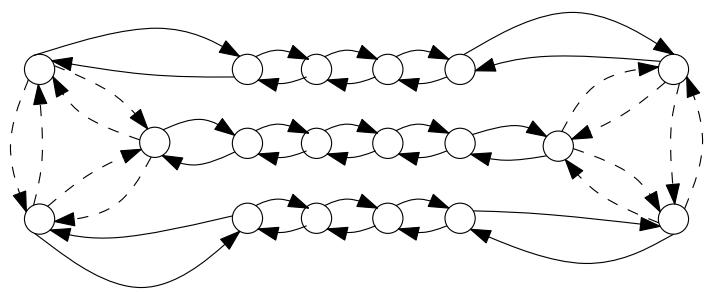  
Figure 4.1: The instance with $k = 4$

$$
c ( x ) = { \frac { 6 ( k + 1 ) } { 2 } } + { \frac { 1 2 } { 4 } } = 3 k + 6
$$

where $k$ is the number of vertices on each of the three bidirected paths with solid arcs in the figure. If we let $k$ be a large number, then a tour will not be able to save much by turning around in the middle of one of these three paths. Thus for large $k$ a tour have to pay for the three bidirected paths at least four times. It also have to traverse three of the dashed arcs. Thus the cost for large $k$ is approximately

$$
4 ( k + 1 ) + 3 = 4 k + 7
$$

Thus we see that

$$
\frac { \mathcal { O P T } } { \mathcal { O P T } _ { H K } } \ge \frac { 4 k + 7 } { 3 k + 6 }
$$

which tends to $\frac 4 3$ when $k \to \infty$

# 4.4.2 The integrality gap is at least two

In 2004 Charikar et al. published a paper [6] that finally improved the lower bound on the integrality gap. They constructed a family of ATSP instances for which the ratio $\frac { \mathcal { O P T } } { \mathcal { O P T } _ { H K } }$ gets arbitrarily close to 2. A year later Boyd et al. found another family that also have a ratio that approaches arbitrarily close to 2 [5], but achieves a higher ratio for smaller $n$ . However, both families of instances have the property that they require a number of vertices exponential in $\frac { 1 } { \epsilon }$ in order to achieve a ratio of $2 - \epsilon$ .

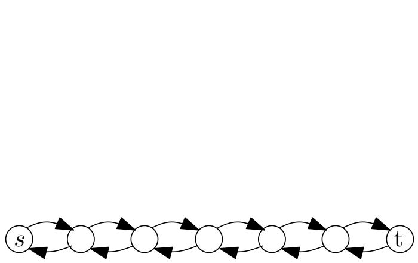  
Figure 4.2: A bidirected path

Both families also have the bidirected path, shown in Figure 4.2, as a cornerstone in their constructions. To see why this is a good idea, set $x _ { a } = 1 / 2$ for all arcs in Figure 4.2. This is not a feasible solution to HeldKarp LP, because the endpoints of the path have $x ( \delta ^ { + } ( s ) ) = x ( \delta ^ { + } ( t ) ) = 1 / 2$ . However, for the moment we let our Held-Karp solution cheat a little, so we accept this. Any tour through this path have to go from $s$ all the way to $t$ and back. Thus a tour have to pay twice the amount that our cheating Held-Karp solution does.

Of course we do not accept that our Held-Karp solution cheats, so we have to take care of the endpoints in some way. In [6] the authors presents a recursive construction that solves this problem. In this section we only study the first level of recursion in their construction, since this is enough to get a feeling for why and how their construction works. This also allows us to skip some technical details in the proofs. However, this means that the proof presented here only gives us a lower bound of $\frac { 3 } { 2 }$ . For the full proof of the 2 lower bound, see [6].

The construction We now describe the construction of our bad instances.   
Let $r$ be an integer greater than 2. We construct $G _ { r }$ the following way.   
Make $r$ vertex distinct copies of the bidirected path with $r + 2$ vertices, label the $s$ and $t$ vertices in the $i$ th copy $s _ { i }$ and $t _ { i }$ respectively. Assign cost $1$ to all arcs.   
• Add arcs $\left( { { s _ { i } } , { s _ { i + 1 } } } \right)$ and $( t _ { i + 1 } , t _ { i } )$ for all $i = 1 , \ldots , r - 1$ , and assign cost $r$ to these arcs.   
Add arcs $( s _ { r } , s _ { 1 } )$ and $( t _ { 1 } , t _ { r } )$ , and assign cost $r$ to these arcs too.

Figure 4.3 shows $G _ { 4 }$ . To turn $G _ { r }$ into an ATSP instance we let $V$ be the set of vertices in $G _ { r }$ , and the costs between two cities $u , v \in V$ is given by the minimum cost path between $u$ and $v$ in $G _ { r }$ .

Looking at Figure 4.3, it seems reasonable that this construction has no tours of low cost since any tour has to visit several cities more than one time. We proceed with a formal proof.

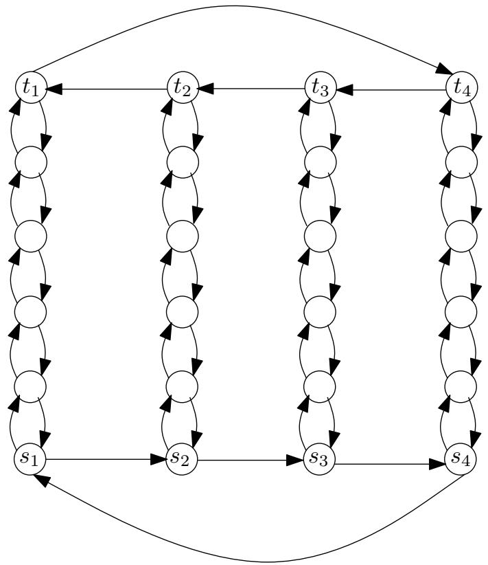  
Figure 4.3: An illustration of $G _ { 4 }$ .

Lemma 4.9 The cost of an Eulerian digraph of the instance described above is at least $3 r ( r - 1 )$ .

Proof: It is enough to consider Eulerian digraphs that only contains arcs from $G _ { r }$ , since the cost function is given by metric completion.

Let $G = ( V , A )$ be any such Eulerian digraph. Furthermore let $F _ { i }$ be $G$ restricted to the $i$ th copy of the bidirected path with $r + 2$ vertices. In this proof we interpret all indices as cyclic, meaning that if we talk about index $r + 1$ we actually mean index 1 and index 0 actually means index $r$ .

Let $p _ { i }$ be the multiplicity of the arc $( s _ { i } , s _ { i + 1 } )$ and $q _ { i }$ be the multiplicity of the arc $\left( t _ { i + 1 } , t _ { i } \right)$ in $G$ . Let

$$
L = \left\{ i \in \mathbb { N } : 1 \leq i \leq r { \mathrm { ~ a n d ~ } } q _ { i - 1 } \neq q _ { i } \right\}
$$

and $l = | L |$ . We now prove a couple of claims.

Claim 4.1 $p _ { i - 1 } + q _ { i } = p _ { i } + q _ { i - 1 }$ for all indices i

To see why this is true, let $i$ be any index, i.e. $1 \leq i \leq r$ . Let $S$ be the set of vertices in $F _ { i }$ . Then $| \delta ^ { + } ( S ) | = p _ { i } + q _ { i - 1 }$ and $| \delta ^ { - } ( S ) | = p _ { i - 1 } + q _ { i }$ . Since $G$ is Eulerian, Proposition 2.4 shows that2 $\left. \delta ^ { + } ( S ) \right. = \left. \delta ^ { - } ( S ) \right.$ , so the claim follows.

Claim 4.2 $l \leq 2 \sum _ { i = 1 } ^ { r } p _ { i }$ and $l \leq 2 \sum _ { i = 1 } ^ { r } q _ { i }$

To see this, first note that if $p _ { i } = 0$ for all $i$ , then it follows from Claim 4.1 that $l = 0$ . Now, if we for some $i$ increase $p _ { i }$ by one, then $l$ can increase by at most two, since we in the worst case have to add both $i$ and $i + 1$ to $L$ . The same is of course true for $q$ . Thus the claim follows.

Claim 4.3 The cost of the arcs in all $F _ { i }$ ’s is at least $2 r ^ { 2 } - l r + l$ .

First let $i$ be any integer in $L$ , and let $v$ be any vertex in $F _ { i }$ except $s _ { i }$ and $t _ { i }$ . Then $| \delta ^ { + } ( v ) | = | \delta ^ { - } ( v ) | \geq 1$ . Since there are $r$ such vertices in $F _ { i }$ , and all arcs in $F _ { i }$ have cost one, this must mean that the arcs in $F _ { i }$ cost at least $r + 1$ . Since $| L | = l$ we have now accounted for $l ( r + 1 )$ of the cost in Claim 4.3.

Now let $i$ be any integer not in $L$ such that $1 \leq i \leq r$ . This means that $q _ { i } = q _ { i - 1 }$ , and from Claim 4.1 it thus follows that $p _ { i - 1 } = p _ { i }$ . Since $G$ is Eulerian, this means that $\left| \delta _ { F _ { i } } ^ { + } ( s _ { i } ) \right| = \left| \delta _ { F _ { i } } ^ { - } ( s _ { i } ) \right|$ and $| \delta _ { F _ { i } } ^ { + } ( t _ { i } ) | = | \delta _ { F _ { i } } ^ { - } ( t _ { i } ) |$ . Thus $\lvert \delta _ { F _ { i } } ^ { + } ( v ) \rvert = \lvert \delta _ { F _ { i } } ^ { - } ( v ) \rvert \geq 1$ for all vertices $v$ in $F _ { i }$ . Hence there must be at least $2 r$ arcs in $F _ { i }$ , each of cost one. Since there are $r - l$ indices not in $L$ , this accounts for $2 r ( r - l )$ of the cost in Claim 4.3. So if we add up to get the total cost for all arcs in all $F _ { i }$ ’s we get

$$
l ( r + 1 ) + 2 r ( r - l ) = 2 r ^ { 2 } - l r + l
$$

and Claim 4.3 follows.

We now look at the cost of the arcs not in the $F _ { i }$ ’s.

Claim 4.4 The cost of the arcs $( s _ { i } , s _ { i + 1 } )$ and $\left( t _ { i + 1 } , t _ { i } \right)$ , i.e. the arcs in $G$ but not in any of the $F _ { i }$ ’s, is at least $r ^ { 2 } + l r - 2 r$

The cost of these arcs is $\textstyle \sum _ { i = 1 } ^ { r } ( p _ { i } + q _ { i } ) r$ . So to prove the claim we have to prove that $\textstyle \sum _ { i = 1 } ^ { r } ( p _ { i } + q _ { i } ) \geq r + l - 2$ . We first note that either $p _ { i } = q _ { i }$ for all indices $i$ P, or for no indices $i$ . To see this, note that if $p _ { i } = q _ { i }$ then by Claim 4.1

$$
p _ { i - 1 } + q _ { i } = p _ { i } + q _ { i - 1 } \Longleftrightarrow p _ { i - 1 } = q _ { i - 1 }
$$

We now have two cases that we study separately. First assume that $p _ { i } = q _ { i }$ for all $i$ . Note that we can have $p _ { j } = 0$ for at most one index $j$ . To see this assume that $p _ { j } = p _ { k } = 0$ and look at the set $S = \cup _ { i = j + 1 } ^ { k } V _ { i }$ . Clearly $\left| \delta ^ { + } ( S ) \right| = 0$ , which is impossible when $G$ S is Eulerian. Thus $p _ { i } \geq 1$ for all $i \in \{ 1 , \ldots , r \}$ except possible one. Thus

$$
\sum _ { i = 1 } ^ { r } ( p _ { i } + q _ { i } ) = 2 \sum _ { i = 1 } ^ { r } p _ { i } \geq 2 ( r - 1 ) \geq r + l - 2
$$

We are left with case where $p _ { i } \neq q _ { i }$ for all $i$ . Notice that this means that either $p _ { i } > q _ { i }$ for all $i$ or $q _ { i } > p _ { i }$ for all $i$ . To see this assume, without loss of generality, that $p _ { i } > q _ { i }$ for some $i$ , then it follows from Claim 4.3 that

$$
p _ { i - 1 } = p _ { i } - q _ { i } + q _ { i - 1 } > q _ { i - 1 }
$$

So now we assume, again without loss of generality, that $p _ { i } - q _ { i } \ge 1$ for all $i$ . Then, using Claim 4.2 we can see that

$$
\sum _ { i = 1 } ^ { r } ( p _ { i } + q _ { i } ) = \sum _ { i = 1 } ^ { r } ( p _ { i } - q _ { i } ) + 2 \sum _ { i = 1 } ^ { r } q _ { i } \geq r + l \geq r + l - 2
$$

Thus Claim 4.4 follows.

From Claim 4.3 and 4.4 it follows that the total cost of the arcs in $G$ i s at least

$$
( 2 r ^ { 2 } - l r + l ) + ( r ^ { 2 } + l r - 2 r ) = 3 r ^ { 2 } + l - 2 r \geq 3 r ^ { 2 } - 2 r > 3 r ^ { 2 } - 3 r
$$

Lemma 4.10 In the ATSP instance we get from $G _ { r } ~ = ~ ( V , A )$ we have $\mathcal { O P T } _ { H K } \leq 2 r ( r + 1 )$

Proof: Set $\begin{array} { r } { x _ { a } = \frac { 1 } { 2 } } \end{array}$ for all $a \in A$ . It is easy to see that all vertices in $G _ { r }$ have indegree and outdegree two, thus $x$ satisfy (4.1) and (4.2). It is also clear that for any pair of vertices $u , v \in V$ there exist two arc-disjoint paths from $u$ to $v$ . Thus, by Theorem 2.3, there must at least be two arcs in any arc cut in $G _ { r }$ . Thus $x$ satisfy (4.3). This shows that $x$ is a feasible solution.

The cost of $x$ is ${ \frac { 1 } { 2 } } c ( A )$ . In $G _ { r }$ we have $r$ bidirected paths, each containing $2 r + 2$ arcs with cost one. Besides this we have $2 r$ arcs with cost $r$ . Thus

$$
\mathcal { O P T } _ { H K } \le \frac { 1 } { 2 } c ( A ) = \frac { 1 } { 2 } ( 4 r ^ { 2 } + 2 r ) = 2 r \left( r + \frac { 1 } { 2 } \right)
$$

Theorem 4.11 For $r \geq 3$ , the ATSP instance given by $G _ { r }$ satisfy

$$
\frac { \mathcal { O P T } } { \mathcal { O P T } _ { H K } } \geq \frac { 3 ( r - 1 ) } { 2 ( r + 1 ) }
$$

Proof: Since any tour through $V$ gives an Eulerian digraph, Lemma 4.9 shows that any tour must cost at least $3 r ( r - 1 )$ . Furthermore, Lemma 4.10 show that $\mathcal { O P T } _ { H K } \leq 2 r ( r + 1 )$ . Thus

$$
\frac { \mathcal { O P T } } { \mathcal { O P T } _ { H K } } \geq \frac { 3 r ( r - 1 ) } { 2 r ( r + 1 ) } = \frac { 3 ( r - 1 ) } { 2 ( r + 1 ) }
$$

Since $\frac { 3 ( r - 1 ) } { 2 ( r + 1 ) }$ tends to $\frac 3 2$ when $r  \infty$ this shows that the integrality gap is at least $\frac { 3 } { 2 }$ . As mentioned above, for any $r$ we can also define a new set of graphs recursively. This is what they do in [6] to show that the integrality gap is at least 2.

# 4.4.3 Potential improvements

One of the major open problems about the Held-Karp heuristic is if we can improve the lower bound given in Section 4.4.2. So we clearly do not know if any such improvements are possible, but is there anything we can say about a potential improvement?

First of all we note that both families of instances discussed in Section 4.4.2 have feasible solutions to the Held-Karp LP that are half-integral, meaning that $x _ { a } \in \{ 0 , { \frac { 1 } { 2 } } , 1 \}$ for all $a \in V \times V$ . Any such solution can easily be turned into a tour by taking the support graph of $2 x$ , which must be an Eulerian digraph of cost $c ( 2 x ) = 2 c ( x )$ . Thus we can conclude that if we want to improve these lower bounds we have two find bad instances for which the Held-Karp solution is not half-integral.

Furthermore we can notice that both families of instances in the previous section are planar. In Section 4.5.2 we show that all planar instances have $\begin{array} { r } { \frac { \mathcal { O P T } } { \mathcal { O P T } _ { H K } } \le 2 2 . 5 } \end{array}$ . So it is still possible that there may exist a planar instance that give a ratio worse than 2, but if we want to prove that the integrality gap is non-constant then we have to find non-planar instances. It should be noted that there exists instances with extreme points that are non-halfintegral and non-planar, we can for example use the construction of Carr and Vempala [4]. However, so far no one has been able to find such an instance that gives $\frac { \mathcal { O P T } } { \mathcal { O P T } _ { H K } } > 2$ .

# 4.5 Upper bounds on the integrality ratio

In this section we study the known upper bounds on the integrality gap. In 1990 Williamson proved that the Held-Karp heuristic is no worse than the bound given by the repeated cycle cover algorithm presented in Chapter 3 [32]. This upper bound was the best known until 2010 when Asadpour et $a l$ . presented an algorithm that shows that the integrality gap is no greater than $\begin{array} { r } { \mathcal { O } \left( \frac { \log n } { \log \log n } \right) } \end{array}$ [1], we present their algorithm in Section 4.5.1.

Since both of these upper bounds are far from the best know lower bound, we also study the special case when the support graph of $x$ is planar in 4.5.2.

# 4.5.1 Thin spanning trees

In a paper published in 2010, Asadpour et al. presented an approximation algorithm that for the first time broke the ${ \mathcal { O } } \left( \log n \right)$ barrier [1]. Their approach is to search for a spanning tree in the support graph, and then use this tree to find an Eulerian graph spanning all vertices. Of course, if this is going to work the spanning tree we find have to have some special properties. In particular we want the spanning tree to be thin with respect to the Held-Karp solution. In the search for thin spanning trees we do not care about the direction of the arcs, so before we define what it means for a spanning tree to be thin with respect to $x$ we make our solution symmetric. Let

$$
z _ { \{ u , v \} } = x _ { u v } + x _ { v u }
$$

for each pair $u , v \in V$ . In the rest of this section, $( V , A )$ represents the support graph of $x$ , and $( V , E )$ represents the support graph of $z$ . We define the cost of an edge $e \in E$ as $c ( e ) = \operatorname* { m i n } \{ c ( a ) : a \in \{ ( u , v ) , ( v , u ) \} \cap A \}$ . We can now define what it means for a tree to be thin.

Definition 4.12 We say that a tree $T \subseteq E$ is $\alpha$ -thin with respect to $x$ if for each $S \subset V$ ,

$$
| T \cap \delta ( S ) | \leq \alpha z ( \delta ( S ) )
$$

Furthermore, we say that $T$ is $( \alpha , s )$ -thin if it is $\alpha$ -thin and

$$
c ( T ) \leq s \mathcal { O P T } _ { H K }
$$

The following theorem uses a circulation argument to show that we can find a tour if we are given a thin spanning tree. If you need to recall the basics of circulations, see Section 2.4.2. The proof given here follows the proof in [1] closely.

Theorem 4.13 Let $x ^ { * }$ be the optimal solution to the Held-Karp $L P$ , and assume that there exist a $( \alpha , s )$ -thin spanning tree $T$ with respect to $x ^ { * }$ . Then there exist a tour through $V$ with cost no more than $( 2 \alpha + s ) \mathcal { O P T } _ { H K }$ .

Proof: We start by orienting the edges in $T$ . For each $\{ u , v \} \in T$ we let the arc $b = \arg \operatorname* { m i n } \{ c ( a ) : a \in \{ ( u , v ) , ( v , u ) \} \cap A \}$ be an element in $\vec { T }$ . By the definition of the edge-costs it follows that $c ( T ) = c ( \vec { T } )$ . Now define the following function

$$
l ( a ) = \left\{ \begin{array} { l l } { 1 } & { a \in \vec { T } } \\ { 0 } & { a \notin \vec { T } } \end{array} \right.
$$

and find a minimum cost circulation $f$ in $( V , A )$ with lower capacities $l$ , i.e.   
$f ( a ) \geq l ( a )$ for all $a \in A$ . We can assume that $f$ is integer-valued.

Let $G ^ { \prime } = ( V , A ^ { \prime } )$ be the digraph we get if we add $f ( u , v ) )$ arcs between $u$ and $v$ for all $u , v \in V$ . Since $f$ satisfy the circulation condition $f ( \delta ^ { + } ( v ) ) =$ $f ( \delta ^ { - } ( v ) )$ for all $v$ , it follows from Proposition 2.4 that $f ( \delta ^ { + } ( S ) ) = f ( \delta ^ { - } ( S ) ) .$ for all subsets $S$ of $V$ . From this and the fact that $f ( a ) \geq 1$ for all $a \in \vec { T }$ we can conclude that $G ^ { \prime }$ must be an Eulerian digraph, that can be shortcut into a tour.

So if we can show that $\begin{array} { r } { c ( A ^ { \prime } ) = \sum _ { a \in V \times V } c ( a ) f ( a ) \le ( 2 \alpha + s ) \mathcal { O P T } _ { H K } } \end{array}$ then we are done. To do this, define

$$
u ( a ) = \left\{ \begin{array} { l l } { 1 + 2 \alpha x _ { a } ^ { * } } & { a \in \vec { T } } \\ { 2 \alpha x _ { a } ^ { * } } & { a \notin \vec { T } } \end{array} \right.
$$

We now show that there exist a feasible circulation in $( V , A )$ with lower and upper capacity $l$ and $u$ . Clearly $l ( a ) \leq u ( a )$ for all $a \in A$ . If we can prove that $l ( \delta ^ { - } ( S ) ) \le u ( \delta ^ { + } ( S ) )$ for all subsets $S$ of $V$ , then the existence of a feasible circulation $g$ follows from Theorem 2.8. This would thus imply that

$$
\begin{array} { r l } & { c ( A ^ { \prime } ) = \displaystyle \sum _ { a \in V \times V } c ( a ) f ( a ) \leq \displaystyle \sum _ { a \in V \times V } c ( a ) g ( a ) \leq \displaystyle \sum _ { a \in V \times V } c ( a ) u ( a ) = } \\ & { \qquad c ( \vec { T } ) + 2 \alpha \displaystyle \sum _ { a \in V \times V } c ( a ) x _ { a } ^ { * } \leq ( 2 \alpha + s ) \mathcal { O P T } _ { H K } } \end{array}
$$

So if we can prove the following claim, then the theorem follows.

Claim 4.5 $l ( \delta ^ { - } ( S ) ) \leq u ( \delta ^ { + } ( S ) )$ for all subsets $S$ of $V$ .

First notice that $x ^ { * } ( \delta ^ { + } ( S ) ) = x ^ { * } ( \delta ^ { - } ( S ) )$ , this follows from the fact that $x ^ { * } ( \delta ^ { + } ( v ) ) = x ^ { * } ( \delta ^ { - } ( v ) )$ for all $v \in V$ and Proposition 2.4. From this fact and Definition 4.12 it follows that

$$
\begin{array} { r l } & { l ( \delta ^ { - } ( S ) ) = | \vec { T } \cap \delta ^ { - } ( S ) | \le | T \cap \delta ( S ) | \le } \\ & { \qquad \alpha z ^ { * } ( \delta ( S ) ) \le \alpha [ x ^ { * } ( \delta ^ { + } ( S ) ) + x ^ { * } ( \delta ^ { - } ( S ) ) ] = 2 \alpha x ^ { * } ( \delta ^ { + } ( S ) ) } \end{array}
$$

Furthermore

$$
2 \alpha x ^ { * } ( \delta ^ { + } ( S ) ) \leq | \vec { T } \cap \delta ^ { + } ( S ) | + 2 \alpha x ^ { * } ( \delta ^ { + } ( S ) ) = u ( \delta ^ { + } ( S ) )
$$

Hence $l ( \delta ^ { - } ( S ) ) \leq u ( \delta ^ { + } ( S ) )$ , and both the claim and theorem follows.

Finding a thin spanning tree We now turn to the problem of finding a thin spanning tree. In [1] the authors uses a maximum entropy sampling approach to find a thin spanning tree with respect to any optimal solution $x ^ { * }$ . Here we instead make use of a result by Chekuri et al. [7] that simplifies the algorithm.

Let $x ^ { * }$ be an optimal solution of the Held-Karp LP and let

$$
z _ { \{ u , v \} } ^ { * } = \frac { n - 1 } { n } ( x _ { u v } ^ { * } + x _ { v u } ^ { * } )
$$

Finally let $G = ( V , E )$ be the support graph of $z ^ { * }$ and let $( V , A )$ be the support graph of $x ^ { * }$ . Notice that we have scaled $z ^ { * }$ down slightly compared to above. However, the proof of Theorem 4.13 works with this $z ^ { * }$ as well. The reason for scaling $z ^ { * }$ down is that $z ^ { * }$ defined this way is in the spanning tree polytope of $G$ , see Section 2.4.6.

Theorem 4.14 If $x ^ { * }$ is an optimal solution to the Held-Karp $L P$ , then $z ^ { * }$ is in the spanning tree polytope.

Proof: We first show that $z ^ { * }$ satisfies (2.3).

$$
z ^ { * } ( E ) = { \frac { n - 1 } { n } } x ^ { * } ( A ) = { \frac { n - 1 } { n } } \sum _ { v \in V } x ^ { * } ( \delta ^ { + } ( v ) ) = n - 1
$$

since $x ^ { * } ( \delta ^ { + } ( v ) ) = 1$ for all $v \in V$ .

Furthermore, for any nonempty proper subset $S$ of $V$ the following holds

$$
z ^ { * } ( E ( S ) ) = \frac { n - 1 } { n } x ^ { * } ( A ( S ) ) < x ^ { * } ( A ( S ) ) = \eqno ( \bigstar )
$$

where the last inequality follows from the fact that $x ^ { * } ( \delta ^ { + } ( v ) ) = 1$ for all $v \in V$ and $x ^ { * } ( \delta ^ { + } ( S ) ) \geq 1$ . Thus we see that $z ^ { * }$ satisfies (2.4). Finally it is obvious that $z ^ { * }$ satisfies (2.5). Hence we can conclude that $z ^ { * }$ is in the spanning tree polytope. ✷

Randomized swap rounding We now present the randomized swap rounding procedure from [7]. From Theorem 2.16 and 4.14 it follows that $z ^ { * }$ can be written as

$$
z ^ { * } = \sum _ { i = 1 } ^ { m } \beta _ { i } z _ { i }
$$

where $m = | E |$ , $z _ { 1 } , \ldots , z _ { m }$ are incident vectors for some spanning trees in $G = ( V , E )$ , $\textstyle \sum _ { i = 1 } ^ { m } \beta _ { i } \ = \ 1$ and $\beta _ { i } \geq 0$ for all $i \in \{ 1 , \ldots , m \}$ . The swap Prounding procedure will in each step merge two spanning trees into one. After $m - 1$ merges we are thus left with one spanning tree.

The algorithm we use to merge two spanning trees uses the tree exchange property described in Theorem 2.15

<table><tr><td colspan="2">Algorithm 4.1 Merge two spanning trees</td></tr><tr><td>Require: β′, T1, β2, T2, where T1, T2 are spanning trees and β′, β′2 ≥ 0</td><td></td></tr><tr><td>Ensure: One spanning tree</td><td></td></tr><tr><td>1: while T′ = T2 do 2:</td><td>Pick e  T1\T2 and find f  T2\T1 such that (T1\{e}) ∪ {f} and</td></tr><tr><td></td><td>(T2 ∪ {e})\{f} are both spanning trees.</td></tr><tr><td>3: 4:</td><td>With probability β1/(β′1 + β2) let T2 ← (T2 ∪ {e})\{f} Otherwise let T1 ← (T1\{e}) U {f}.</td></tr><tr><td>5: end while</td><td></td></tr><tr><td></td><td></td></tr><tr><td>6: return Ti.</td><td></td></tr></table>

That we can find the edges $e$ and $f$ in each iteration follows from Theorem 2.15. Also notice that the set $T _ { 1 } ^ { \prime } \backslash T _ { 2 } ^ { \prime }$ decreases by one in each iteration, and thus the algorithm iterates at most $| T _ { 1 } ^ { \prime } | = n - 1$ times.

# Algorithm 4.2 Swap rounding

Require: $\begin{array} { r } { z ^ { * } = \sum _ { i = 1 } ^ { n } \beta _ { i } z _ { i } } \end{array}$   
PEnsure: One spanning tree   
1: For each $i \in \{ 1 , \ldots , m \}$ let $T _ { i }$ be the spanning tree that corresponds to $z _ { i }$ .   
2: $F _ { 1 }  T _ { 1 }$ .   
3: for $k = 1$ to $m - 1$ do   
4: Use Algorithm 4.1 with $\begin{array} { r } { \beta _ { 1 } ^ { \prime } ~ = ~ \sum _ { i = 1 } ^ { k } \beta _ { i } } \end{array}$ , $T _ { 1 } ^ { \prime } ~ = ~ F _ { k }$ , $\beta _ { 2 } ^ { \prime } ~ = ~ \beta _ { k + 1 }$ and $T _ { 2 } ^ { \prime } = T _ { k + 1 }$ .   
5: Let $F _ { k + 1 }$ be the tree returned by Algorithm 4.1.   
6: end for   
7: return $F _ { m }$ .

Thus the algorithm first merges $T _ { 1 }$ and $T _ { 2 }$ into $F _ { 2 }$ , and then $F _ { 2 }$ and $T _ { 3 }$ into $F _ { 3 }$ and so on. From now on let $T$ be the spanning tree returned by Algorithm 4.2

For each edge $e \in E$ we let $X _ { e }$ be an indicator variable for the event $[ e \in$ $T ]$ . In [7] Chekuri et al. shows that each $X _ { e }$ have expectation ${ \bf E } [ X _ { e } ] = z _ { e } ^ { * }$ , and that the $X _ { e }$ ’s are negatively correlated. From this and a result by Panconesi and Srinivasan [27] we get the following Chernoff-type concentration bound.

Theorem 4.15 For any subset $F$ of $E$ we define $\begin{array} { r } { X ( F ) = \sum _ { e \in F } X _ { e } } \end{array}$ . If $\epsilon \geq 0$ then

$$
\operatorname* { P r } [ X ( F ) \geq ( 1 + \epsilon ) \mathbf { E } [ X ( F ) ] ] \leq \left( { \frac { e ^ { \epsilon } } { ( 1 + \epsilon ) ^ { 1 + \epsilon } } } \right) ^ { \mathbf { E } [ X ( F ) ] }
$$

Proving that the spanning tree is thin The randomized algorithm in [1] is technically more involved than the randomized swap rounding algorithm described above. However, the algorithm in [1] still constructs spanning trees for which the indicator variables satisfies Theorem 4.15. We now prove the existence of thin spanning trees in $G$ . The proofs presented here follows the proofs in Section 5 of [1] closely.

Lemma 4.16 If $n \geq 5$ , then for any $S \subset V$

$$
\operatorname* { P r } [ | T \cap \delta ( S ) | \ge \beta z ^ { * } ( \delta ( S ) ) ] \le n ^ { - 2 . 5 z ^ { * } ( \delta ( S ) ) }
$$

where $\beta = 4 \ln n / \ln \ln n$ , where ln denotes the natural logarithm.

Proof: We know that

$$
\mathbf { E } [ | T \cap \delta ( S ) | ] = z ^ { * } ( \delta ( S ) )
$$

Let $1 + \epsilon = \beta$ , then it follows from Theorem 4.15 that

$$
\begin{array} { r l } & { \operatorname* { P r } [ | T \cap \delta ( S ) | \geq \beta z ^ { * } ( \delta ( S ) ) ] } \\ & { \leq \left( \frac { e ^ { \beta - 1 } } { \beta ^ { \beta } } \right) ^ { z ^ { * } ( \delta ( S ) ) } } \\ & { \leq \left( \displaystyle \frac { e } { \beta } \right) ^ { \beta z ^ { * } ( \delta ( S ) ) } } \\ & { \leq n ^ { - 2 . 5 z ^ { * } ( \delta ( S ) ) } } \end{array}
$$

The last inequality follows from the following:

$$
\begin{array} { l } { \displaystyle \ln \left[ \left( \frac e \beta \right) ^ { \beta } \right] = \beta \left( 1 - \ln \beta \right) = \beta \left( 1 - \ln 4 - \ln \ln n + \ln \ln \ln n \right) \le } \\ { \displaystyle - 4 \ln n \left( 1 - \frac { 1 + \ln \ln \ln n } { \ln \ln n } \right) \le - 4 \left( 1 - \frac 1 e \right) \ln n \le - 2 . 5 \ln n } \end{array}
$$

where we have used the assumption that $n \geq 5$ .

Before we proceed with the main proof, we need the following result of Krager [25].

Theorem 4.17 Let $G = ( V , E )$ be a weighted graph and $k$ any half-integer. Then the number of cuts of weight at most $k$ times the graph min-cut is less than $n ^ { 2 k }$ .

We now let $T _ { 1 } , \dots , T _ { \lceil \log n \rceil }$ be $\lceil \log n \rceil$ spanning trees that independently have been created using the randomized swap rounding procedure. Furthermore let $T ^ { * }$ be the tree among these that minimizes $c ( T _ { j } )$ .

Theorem 4.18 If $n \geq 5$ then $T ^ { * }$ is $( \beta , 2 )$ -thin with high probability, where $\beta = 4 \ln n / \ln \ln n$ .

Proof: Let $T _ { j }$ be any tree created with the randomized swap rounding procedure. From the definition of $z ^ { * }$ we know that for any $S \subset V$ we have

$$
z ^ { * } ( \delta ( S ) ) \geq 2 { \frac { n - 1 } { n } }
$$

Thus it follows from Theorem 4.17 that there are at most $n ^ { k }$ cuts $\delta ( S )$ such that $z ^ { * } ( \delta ( S ) ) \leq k \frac { n - 1 } { n }$ for any integer $k \geq 2$ . Using Lemma 4.16 we can bound the probability that $T _ { j }$ violates a cut of size within $[ ( i - 1 ) ( 1 -$ $1 / n ) , i ( 1 - 1 / n ) ]$ by

$$
n ^ { i } n ^ { - 2 . 5 ( i - 1 ) ( 1 - 1 / n ) } = n ^ { - ( 1 . 5 - 2 . 5 / n ) i + 2 . 5 ( 1 - 1 / n ) } \leq n ^ { - i + 2 }
$$

where the last inequality follows from $n \geq 5$ . Thus we can bound the probability that there exists some cut $\delta ( S )$ such that $| T _ { j } \cap \delta ( S ) | \geq \beta z ^ { * } ( \delta ( S ) )$ by

$$
\sum _ { i = 3 } ^ { \infty } n ^ { - i + 2 } = { \frac { n ^ { 2 } } { n - 1 } } - n ^ { 2 } - n - 1 = { \frac { 1 } { n - 1 } }
$$

The expected cost of $T _ { j }$ is

$$
\mathbf { E } [ c ( T _ { j } ) ] = \mathbf { E } \left[ \sum _ { e \in E } c ( e ) X _ { e } \right] = \sum _ { e \in E } c ( e ) z _ { e } ^ { * } \leq { \frac { n - 1 } { n } } \sum _ { a \in A } c ( a ) x _ { a } ^ { * } \leq { \mathcal { O } } { \mathcal { P } } { \mathcal { T } } _ { H K }
$$

So by Markov’s inequality we have

$$
\mathrm { P r } [ c ( T _ { j } ) > 2 { \cal O } \mathcal { P } T _ { H K } ] \leq \frac { 1 } { 2 }
$$

Since $T ^ { * }$ is the minimum cost tree the probability that $c ( T ^ { * } ) \geq 2 \mathcal { O P T } _ { H K }$ is less than 12log n $\begin{array} { r } { \frac { 1 } { 2 ^ { \log n } } = \frac { 1 } { n } } \end{array}$ .

The previous theorem shows that the spanning tree we find is $\left( \mathcal { O } \left( \log n / \log \log n \right) , 2 \right)$ - thin with respect to $x ^ { * }$ with high probability. This together with Theorem 4.13 shows that $\mathcal { O P T } \le \mathcal { O } \left( \log n / \log \log n \right) \mathcal { O P T } _ { H K }$ .

# 4.5.2 Planar graphs

In [13] Gharan and Saberi studies instances of ATSP where the support graph of the Held-Karp solution have bounded genus. They give an approximation algorithm that finds a tour of cost at most $\mathcal { O } \left( \sqrt { \gamma } \log \gamma \right) \mathcal { O P T } _ { H K }$ when the genus of the support graph is at most $\gamma$ .

In this section we study the special case when the support graph is planar, i.e. when $\gamma = 0$ . For a recap on planar graphs see Section 2.4.3. These instances are interesting for several reasons. First of all we know that the support graphs of $x ^ { * }$ are very sparse $^ 3$ [14, 31], and in many cases they are planar. In the example below we see another reason.

The algorithm given by Gharan and Saberi returns a tour of cost at most $3 0 \mathcal { O P T } _ { H K }$ when the support graph is planar. However, they note that a ”slightly better optimization of parameters and a minor change of” their algorithm decreases the constant to 22.5. In this section we describe their algorithm with this minor change, and thus we get a 22.5-approximation. Our approach here is a little different from the approach in [13], but we basically use the same algorithm.

Example Consider the following situation. We have a set of cities $V$ and a cost function $c ^ { \prime } : A  \mathbb { R }$ , where $A \subseteq V \times V$ , such that $G = ( V , A )$ i s a planar digraph4. We also assume that $G$ is strongly connected, so for any pair of cities $u , v \in V$ there is a path from $u$ to $v$ and a path from $v$ to $u$ i n $G$ .

We can turn this into an ATSP instance by letting $c _ { u v }$ be the cost of the minimum cost path between $u$ and $\boldsymbol { v }$ in $G$ . Then $c$ satisfy the triangle inequality. The next theorem shows that there exist an optimal solution to the Held-Karp LP for this instance that has a planar support graph.

Theorem 4.19 Let $G = ( V , A )$ be a digraph, with a cost function $c ^ { \prime } : A $ $\mathbb { R }$ . Furthermore, let $c _ { u v }$ be the cost of the minimum cost path between u and $v$ in $G$ . Then there exist an optimal solution $x ^ { * }$ to the Held-Karp LP (with constraints (4.2) and (4.1) replaced by (4.5), see Theorem 4.6) with support graph $G = ( V , B )$ where $B \subseteq A$ .

Proof: Let $x ^ { \prime }$ be an optimal solution to the Held-Karp LP that has a support graph $G ^ { \prime } = ( V , A ^ { \prime } )$ with $A ^ { \prime } \neq A$ . We start with setting $x ^ { * } = x ^ { \prime }$ , an d for every arc $( u , v ) \in A ^ { \prime } \backslash A$ we then do the following

• Set $x _ { u v } ^ { * }$ to 0.   
• Find the minimum cost path between $u$ and $v$ in $G$ , and for every arc $a$ in this path we increase $\boldsymbol { x } _ { a } ^ { * }$ with $x _ { u v } ^ { \prime }$ .

Clearly $c ( x ^ { * } ) = c ( x ^ { \prime } )$ , since we defined $c _ { u v }$ to be the cost of the shortest path between $u$ and $v$ . Furthermore $x ^ { * }$ satisfies

• $x ^ { * } ( \delta ^ { + } ( v ) ) = x ^ { * } ( \delta ^ { - } ( v ) )$ for all $v \in V$ • $x ^ { * } ( \delta ^ { + } ( S ) ) \geq 1$ for all proper nonempty subsets $S$ of $V$ if $x ^ { \prime }$ does. Thus, $x ^ { * }$ is a feasible solution to the Held-Karp LP with the same cost as $x ^ { \prime }$ and support graph $( V , B )$ , where $B \subseteq A$ .

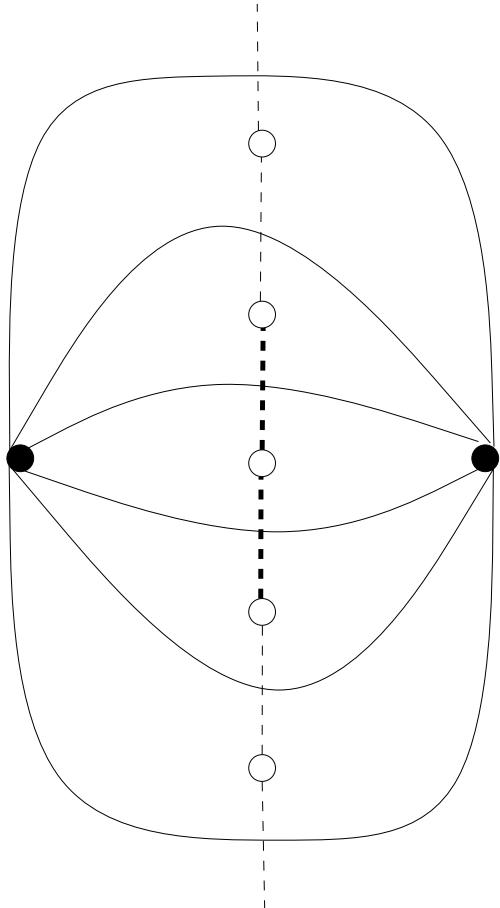  
Figure 4.4: A thread (white vertices and dashed edges) in the dual. The two bold edges are the two middle edges in this thread with six edges.

The algorithm We are now ready to describe the algorithm. Let $x ^ { * }$ be an optimal solution to the Held-Karp LP that has a planar support graph, and let $A$ be the arc set of the support graph. Like in Section 4.5.1 we are now going to find a thin spanning tree for this solution. However, in this section we exploit the fact that $( V , A )$ is planar.

As in Section 4.5.1, we let

$$
z _ { \{ u , v \} } ^ { * } = x _ { u v } ^ { * } + x _ { v u } ^ { * }
$$

for all $u , v \in V$ , and $G = ( V , E )$ be the support graph of $z ^ { * }$ . For each $e = ( u , v ) \in E$ we define the edge cost

$$
c ( e ) : = \operatorname* { m i n } \{ c ( a ) : a \in \{ ( u , v ) , ( v , u ) \} \cap A \}
$$

Now let $k$ be the smallest integer such that $z _ { e } ^ { * }$ is a multiple of $1 / k$ for all $e \in E$ . Then we construct the multigraph $G _ { k } = ( V , E _ { k } )$ with cost function $c _ { k } : E _ { k } \to \mathbb { R }$ as follows. For each $e = \{ u , v \} \in E$ put $k z _ { e } ^ { * }$ edges between $u$ and $\boldsymbol { v }$ in $G _ { k }$ . For each edge $e _ { i }$ between $u$ and $v$ in $G _ { k }$ let $c _ { k } ( e _ { i } ) = c ( \{ u , v \} )$ . Then

$$
c _ { k } ( E _ { k } ) = k \sum _ { e \in E } c ( e ) z _ { e } ^ { * }
$$

Since $G _ { k }$ is planar, we can assume that it is embedded in the plane and let $G _ { k } ^ { * }$ be the dual of $G _ { k }$ . An important part of the algorithm is to find long threads in $G _ { k } ^ { * }$ . We define threads exactly as in [13]

Definition 4.20 A thread in a graph $G$ is a maximal subgraph of $G$ which is

a path whose internal vertices all have degree $\boldsymbol { \mathcal { Z } }$ in $G$ and its endpoints have degree at least 2, or • a cycle in which all vertices except possibly one have degree 2

The following lemma proves the existence of long threads in $G _ { k } ^ { * }$

Lemma 4.21 Let $G$ be a plane $t$ -edge-connected graph, and $G ^ { * }$ the dual of $G$ . Then there is a thread in $G ^ { * }$ that contains at least $\frac { t } { 5 }$ edges.

Proof: Let $G _ { s }$ be $G$ ’s underlying simple graph. By Corollary 2.10, we know that $G _ { s }$ has a vertex $v \in V$ with degree at most five. Thus there is at most five vertices incident to $v$ in $G$ , but $v$ has degree at least $t$ in $G$ . Thus there must exist a vertex $u \in V$ such that there are at least $\frac { t } { 5 }$ edges between $u$ and $v$ . From Figure 4.4 we can deduce that these edges corresponds to a thread in $G ^ { * }$ .

We use the following algorithm to find a spanning tree in $G _ { k }$ that corresponds to a thin spanning tree in $G$ . By the middle $b$ edges in a thread we here mean the $b$ edges that are farthest away from the ends of the thread (when the thread is a cycle, both ends are the node with degree greater than 2), see Figure 4.4 for an example.

<table><tr><td colspan="2">Algorithm 4.3 Find a thin spanning tree</td></tr><tr><td>Require: The plane graph Gk and it&#x27;s dual G*</td><td></td></tr><tr><td>Ensure: A spanning tree in Gk</td><td></td></tr><tr><td>1: F * ← Ø</td><td></td></tr><tr><td>2: while there exists at least one edge in G do</td><td></td></tr><tr><td>3: Find the longest thread P* in G</td><td></td></tr><tr><td>4:</td><td>Let R* be the middle p/3 edges of P*, where p is the length of P*.</td></tr><tr><td>5:</td><td></td></tr><tr><td>6:</td><td>Iteratively delete all vertices with degree one and their incident edges</td></tr><tr><td>7: end while</td><td></td></tr><tr><td>8: Let F be the set of edges in Gk corresponding to F*</td><td>9: return A spanning tree T  F.</td></tr></table>

We now show that there exist a long thread in each iteration of the loop in Algorithm 4.3.

Lemma 4.22 In each iteration of the loop in Algorithm 4.3, there exist a thread of length at least $\frac { 2 k } { 5 }$ in $G _ { k } ^ { * }$ .

Proof: By Proposition 2.12 we know that $G _ { k }$ is the dual of $G _ { k } ^ { * }$ . So by Lemma 4.21 it is enough to prove that $G _ { k }$ is $2 k$ -edge-connected in each iteration of the loop.

We now prove this by induction. First we show that $G _ { k }$ is $2 k$ -edgeconnected when the algorithm starts. Let $S$ be any nonempty proper subset of $V$ , then

$$
z ^ { * } ( \delta ( S ) ) = x ^ { * } ( \delta ^ { + } ( S ) ) + x ^ { * } ( \delta ^ { - } ( S ) ) = x ^ { * } ( \delta ^ { + } ( S ) ) + x ^ { * } ( \delta ^ { + } ( V \backslash S ) ) \geq 2
$$

where the last inequality follows from the fact that $x ^ { * }$ is a feasible solution to the Held-Karp LP. Thus we see that the number of edges between $S$ and $V \backslash S$ in $G _ { k }$ is $k z ^ { * } ( \delta ( S ) ) \geq 2 k$ . Hence we can conclude that $G _ { k }$ is $2 k$ -edgeconnected.

Now assume that $G _ { k }$ is $2 k$ -edge-connected before an iteration of the loop. In the loop we first delete one edge $e ^ { * }$ from $G _ { k } ^ { * }$ . By Proposition 2.11 this corresponds to contracting the edge $e$ in $G _ { k }$ . After this we iteratively delete all vertices with degree one in $G _ { k } ^ { * }$ . This corresponds to deleting all loops in $G _ { k }$ . What happens to $G _ { k }$ in the iteration is thus that we contract an edge $e$ and then remove all the loops this contraction creates. Since contracting an edge cannot reduce the edge-connectivity, $G _ { k }$ is still $2 k$ -edge-connected after this iteration. ✷

We now show that the cost of the tree returned by the algorithm is low.

Lemma 4.23 Let $T$ be the tree returned by Algorithm 4.3, then

$$
c _ { k } ( T ) \leq { \frac { 1 5 } { 2 k } } c _ { k } ( E _ { k } )
$$

Proof: Consider an iteration of the loop, and let $P ^ { * }$ be the thread picked. From Lemma 4.22 we know that the length of this thread is at least $\frac { 2 k } { 5 }$ . The algorithm thus consider the middle $\frac { 2 k } { 1 5 }$ edges of the thread. Let $e ^ { * }$ be the edge picked by the algorithm in this iteration, and $P$ be the set of edges in $G _ { k }$ corresponding to the edges in the thread $P ^ { * }$ . Then

$$
{ \frac { 2 k } { 1 5 } } c _ { k } ( e ) \leq c _ { k } ( P )
$$

because there must be at least $\frac { 2 k } { 1 5 }$ edges in $P$ with cost at least $c _ { k } ( e )$ . Since the cost of all threads picked during all iterations cannot exceed $c _ { k } ( E _ { k } )$ , we can conclude that

$$
\frac { 2 k } { 1 5 } c _ { k } ( T ) \leq c _ { k } ( E _ { k } )
$$

which is the same as saying that

$$
c _ { k } ( T ) \leq { \frac { 1 5 } { 2 k } } c _ { k } ( E _ { k } )
$$

The distance between two edges in $G _ { k } ^ { * }$ is the number of vertices you have pass to get from one of the edges to the other.

Lemma 4.24 After the loop in Algorithm 4.3 the distance between any pair of edges in $F ^ { * }$ is at least $\frac { 2 k } { 1 5 }$ b

Proof: Consider an iteration of the loop. We first pick a thread $P ^ { * }$ of length at least $\frac { 2 k } { 5 }$ . Then we add one of the middle $\frac { 2 k } { 1 5 }$ edges in this thread to $F ^ { * }$ . Finally we delete all edges in $P ^ { * }$ . This means that we have deleted all edges with distance less than $\frac { 2 k } { 1 5 }$ to $e ^ { * }$ . Thus no edge with distance less than $\frac { 2 k } { 1 5 }$ to $e ^ { * }$ will be picked after this.

Also notice that if the distance between two edges increases when we delete the thread, then this must mean that the distance was longer than $\frac { 2 k } { 5 }$ before we dee closer than ted the thread. Thus the distance between two edges thatwill remain the same until one of the edges is deleted, so $\frac { 2 k } { 1 5 }$ only one of them can be added to $F ^ { * }$ .

The next lemma shows why the distance between the edges picked in the algorithm is important.

Lemma 4.25 Let $F$ be a set of edges in $G _ { k } = ( V , E _ { k } )$ and $F ^ { * }$ the corresponding edges in the dual $G _ { k } ^ { * }$ , such that the distance between any two edges in $F ^ { * }$ is at least $b$ in $G _ { k } ^ { * }$ . Then for any nonempty proper subset $S$ of $V$ the following is true

$$
| F \cap \delta _ { G _ { k } } ( S ) | \leq { \frac { 1 } { b } } | \delta _ { G _ { k } } ( S ) |
$$

Proof: From Proposition 2.5 it follows that it is enough to prove this lemma for the case when $\delta _ { G _ { k } } ( S )$ is a bond. In this case it follows from Proposition 2.13 that the edges corresponding to $\delta _ { G _ { k } } ( S )$ forms a cycle $C ^ { * }$ i n $G _ { k } ^ { * }$ . Since the distance between any pair of edges in $F ^ { * }$ is at least $b$ , $C ^ { * }$ can contain at most $| C ^ { * } | / b$ edges from $F ^ { * }$ . Thus

$$
| F \cap \delta _ { G _ { k } } ( S ) | = | F ^ { * } \cap C ^ { * } | \leq \frac { | C ^ { * } | } { b } = \frac { 1 } { b } | \delta _ { G _ { k } } ( S ) |
$$

We are now ready to prove the main theorem of this section.

Theorem 4.26 Let $x ^ { * }$ be the optimal solution of the Held-Karp LP. If the support graph of $x ^ { * }$ is planar, then

$$
\mathcal { O P T } \le \frac { 4 5 } { 2 } \mathcal { O P T } _ { H K }
$$

Proof: Construct the graph $G _ { k }$ as described above and embed it in the plane. Run Algorithm 4.3, and let $T$ be the spanning tree returned.

Now let $T ^ { \prime }$ be the following spanning tree in $G$ (the support graph of $z ^ { \ast }$ ). If there is an edge between $u$ and $\boldsymbol { v }$ in $T$ , then add $\{ u , v \}$ to $T ^ { \prime }$ . We now prove that $T ^ { \prime }$ is $\textstyle { \left( { \frac { 1 5 } { 2 } } , { \frac { 1 5 } { 2 } } \right) }$ -thin with respect to $x ^ { * }$ .

First notice that $c ( T ^ { \prime } ) = c _ { k } ( T )$ since we only add one of the $k z _ { e } ^ { * }$ copies of any edge $e$ to $T$ . Thus it follows from Lemma 4.23 that

$$
c ( T ) = c _ { k } ( T ) \leq { \frac { 1 5 } { 2 k } } c _ { k } ( E _ { k } ) = { \frac { 1 5 } { 2 } } \sum _ { e \in E } c ( e ) z _ { e } ^ { * } \leq { \frac { 1 5 } { 2 } } { \mathcal { O } } { \mathcal { P } } { \mathcal { T } } _ { H K }
$$

Now let $S$ be any nonempty proper subset of $V$ . Notice $| T ^ { \prime } \cap \delta _ { G } ( S ) | =$ $| T \cap \delta _ { G _ { k } } ( S ) |$ . From Lemma 4.24 and 4.25 it follows that

$$
| T ^ { \prime } \cap \delta _ { G } ( S ) | \leq { \frac { 1 5 } { 2 k } } | \delta _ { G _ { k } } ( S ) | = { \frac { 1 5 } { 2 k } } k z ^ { * } ( \delta _ { G } ( S ) ) = { \frac { 1 5 } { 2 } } z ^ { * } ( \delta _ { G } ( S ) )
$$

Thus we can conclude that $T ^ { \prime }$ is $\textstyle { \left( { \frac { 1 5 } { 2 } } , { \frac { 1 5 } { 2 } } \right) }$ -thin with respect to $x ^ { * }$ . Hence $\begin{array} { r } { \mathcal { O P T } \le \frac { 4 5 } { 2 } \mathcal { O P T } _ { H K } } \end{array}$ according to Theorem 4.13.

This theorem thus shows that the integrality gap of planar ATSP instances is at most 22.5.

# Chapter 5

# Inapproximability of the ATSP

As we have seen in previous chapters, there is no approximation algorithm for ATSP that is known to guarantee a constant approximation factor. So a reasonable question to ask is if it is possible to find such an algorithm. The answer to this question is also unknown, but in this chapter we take a look on what is known about the inapproximability of the ATSP.

Of course, if $\mathcal { P } = \mathcal { N P }$ then we can solve the ATSP exactly in polynomial time. Hence we cannot say anything about the inapproximability of the ATSP without also proving that $\mathcal { P } \neq \mathcal { N P }$ . However, since most researchers seems to believe that $\mathcal { P } \neq \mathcal { N P }$ it is still interesting to try to prove something assuming this is true.

In this chapter we study a result by Papadimitriou and Vempala that states, assuming $\mathcal { P } \neq \mathcal { N P }$ , the ATSP with triangle inequality cannot be approximated with a factor better than $\frac { 1 1 7 } { 1 1 6 }$ [28]. To do this, we use a reduction from a problem known as MAX-E3-LIN-2.

The proof in [28] is quite tricky and technically involved. For this reason we will not present all details of the proof here. Hopefully the reader will still get a feeling for how their construction work and why it gives us the inapproximability result.

# 5.1 Linear equations modulo 2

MAX-E3-LIN-2 is the problem of, given a set of linear equations modulo 2 where each equation contains exactly 3 variables, find an assignment of variables that maximize the number of satisfied equations.

In this chapter we assume that each equation is of the form

$$
x + y + z = 0 \mod 2
$$

where $x$ , $y$ and $z$ are literals, i.e. either a variable or the negation of a variable. To see that this assumption is reasonable, notice that we can turn the equation $x + y + z = 1$ mod 2 into $\overline { { x } } + y + z = 0 \mod 2$ .

We also assume that each variable appears the same number of times negated and unnegated. To enforce this we can repeat each equation three extra times, with all possible pairs of literals negated.

MAX-E3-LIN-2 is of course $\mathcal { N P }$ -complete, and the following well-known theorem by H˚astad [16] shows that it is even $\mathcal { N P }$ -hard to find an approximative solution.

Theorem 5.1 For any $\epsilon > 0$ there is an integer $k$ , depending on ǫ, such that it is is $\mathcal { N P }$ -hard to tell weather an instance of MAX-E3-LIN-2 with $p$ equations and at most $k$ occurrences of each variable has an assignment that satisfies $p ( 1 - \epsilon )$ equations, or has no assignment that satisfies more than $p ( \frac { 1 } { 2 } - \epsilon )$ equations.

We now use this theorem to give an inapproximability result for the ATSP.

# 5.2 The construction

To show that it is $\mathcal { N P }$ -hard to approximate the ATSP within ratio $\frac { 1 1 7 } { 1 1 6 } - \epsilon$ for any $\epsilon > 0$ , we do a reduction from MAX-E3-LIN-2. Thus we show that, given any MAX-E3-LIN-2 instance, we can construct an ATSP instance such that any approximation for this ATSP instance gives an approximation for the MAX-E3-LIN-2 instance. The ATSP instance consists of gadgets that captures different properties of the MAX-E3-LIN-2 instance.

# 5.2.1 The equation gadget

Each equation in the MAX-E3-LIN-2 instance is represented by an equation gadget. Figure 5.1 shows the equation gadget for the equation $x + y + z = 0$ mod 2. The solid arcs in the figure all have cost one. The dashed arcs, that represents the literals $x$ , $y$ and $z$ , are actually whole structures that are described in Section 5.2.2.

To connect the equation gadgets we order them in some arbitrary way, and then we identify vertex $v _ { 4 }$ in one gadget with vertex $v _ { 0 }$ in the next. We also identify vertex $v _ { 4 }$ in the last equation gadget with $v _ { 0 }$ in the first.

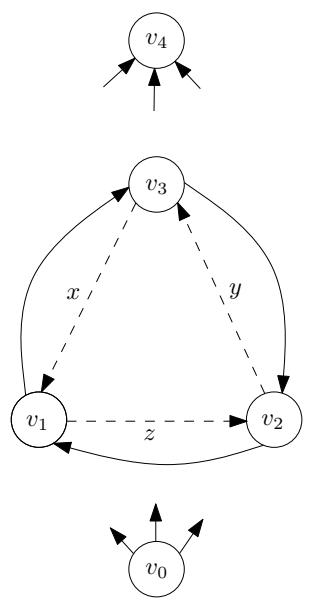  
Figure 5.1: The equation gadget for $x + y + z = 0$ mod 2. The arcs from $v _ { 0 }$ are incident to $v _ { 1 } , v _ { 2 }$ and $\boldsymbol { v } _ { 3 }$ . The same is true for the arcs into $v _ { 4 }$ .

The following lemma show that the equation gadgets in some sense capture the concept of a satisfied/unsatisfied equation.

Lemma 5.2 Let $S$ be any subset of $\{ x , y , z \}$ . Then there exist a path of length 4 from $v _ { 0 }$ to $\boldsymbol { v } _ { 4 }$ that visits all vertices in the gadget and traverses precisely $S$ from among the dashed arcs $x$ , $y$ and $z$ if and only if $| S | = 0$ o r $| S | = 2$ . Otherwise, if $| S | = 1$ or $| S | = 3$ , then the shortest path that visits all vertices and traverses precisely $S$ from among the dashed arcs has length 5.

Thus, if we traverse dashed arcs if and only if the corresponding literal is true, then length four means that the equation is satisfied.

# 5.2.2 The edge gadget

We are not interested in tours that traverse the dashed arcs in an inconsistent way, i.e. traversing the dashed arc corresponding to the literal $x$ in one equation gadget and skip it in another. For this reason all the dashed arcs in Figure 5.1 will be replaced by the edge gadget shown in Figure 5.2, where $v _ { i }$ and $v _ { j }$ are the two vertices connected by the dashed arc in the equation gadget. Each square in the edge gadget represents a bridge, see Figure 5.3. The cost of the arcs are shown in the figures. The bridges contains $L + 2$ arcs, where $L$ is a large integer. Let $d$ be the number of bridges in each edge gadget, in Figure 5.2 we have six bridges and we will in fact let $d = 6$ later, but for now we just consider $d$ to be a constant. We will call the arcs exiting and entering the bridges linking arcs.

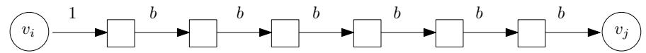  
Figure 5.2: The edge gadget. Each square is in fact a bridge.

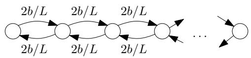  
Figure 5.3: A bridge is a bidirected path with $L + 2$ arcs.

# 5.2.3 Connecting the edge gadgets

Adding the edge gadgets to the construction does not in itself enforce consistency in any way. Now consider a variable $x$ in the original MAX-E3-LIN-2 instance. This variable will occur negated and unnegated the same number of times, say $k$ times. Also remember that each edge gadget correspond to one occurrence of a literal, so there are $k$ edge gadget corresponding to $x$ and $k$ corresponding to $x$ . We will now identify a bridge in an edge gadget corresponding to $x$ with exactly one bridge in an edge gadget corresponding to $x$ . The identification is done so that the endpoints of each bridge will have one entering and one exiting arc, see Figure 5.4.

Now consider a $k \times k$ $d$ -regular bipartite (multi)graph $X = ( V _ { 1 } , V _ { 2 } , E )$ . Let the vertices in $V _ { 1 }$ correspond to the occurrences of $x$ and $V _ { 2 }$ the occurrences of $x$ . Then we identify two bridges if the occurrences of the literals corresponding the the edge gadgets are connected by an edge in $X$ .

If we want this identification process to enforce consistency in some way, the bipartite graph we use must of course have some special properties. In [28] the authors describe a family of bipartite graphs that works and they prove the existence of them. They call these graphs $b$ -pushers. Since we will not present a full proof here, the properties of the $b$ -pushers will not be important, for details see [28] instead.

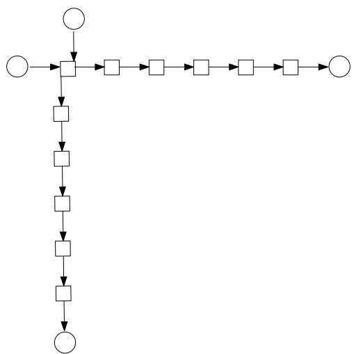  
Figure 5.4: Shows the identification of bridges in two different edge gadgets

# 5.3 Overview of the proof

Given a assignment of the variables in a MAX-E3-LIN-2 instance, we define the standard tour in the ATSP instance constructed the following way: Traverse the equation gadgets in order, and in each gadget traverse exactly the edge gadgets corresponding to literals that are assigned to 1. Notice that this means that a standard tour visits every vertex in our ATSP instance, thanks to the identification process.

We will now divide the cost of a tour into two parts. First we have the bridge cost. This consists of the cost for traversing the arcs in the bridges, and the linking arcs with cost $b$ . Furthermore we let the equation cost be the cost of traversing the arcs with cost one in the equation gadget, including the first linking arc with cost one in the edge gadgets.

Assume that we are given an assignment that satisfies all but $F$ of the $p$ equations. We now consider the cost of the standard tour for this assignment. The ATSP instance will have three edge gadgets for every equation, and $d$ bridges in each gadget. Since each bridge is shared between two edge gadgets, this means that we have 3dp2 bridges. The standard tour have to traverse each bridge one time, including a cost $b$ arc exiting the bridge. Thus the bridge cost of this tour will be

$$
\frac { 3 p d b } { 2 } \left( 2 \frac { L + 2 } { L } + 1 \right)
$$

The tour also have to traverse all equation gadgets. Lemma 5.2 shows that each satisfied equation will add 4 to the equation cost, while the unsatisfied equations add 5. Thus the total cost of a standard tour is

$$
\frac { 3 p d b } { 2 } \left( 2 \frac { L + 2 } { L } + 1 \right) + 4 p + F
$$

The main part of the proof is to show that there exist an assignment of the variables such that the standard tour is an optimal tour. We will not go into details for how to prove this. However, to get a feeling for how to prove it, assume that a tour traverses only parts of one edge gadget. Then there must be a reversal somewhere in it, this means that we have one linking arc that is traversed but either the linking arc before or after is untraversed. Another thing that can happen in a nonstandard tour is that a bridge is traversed more than one time, we call this a double traversal. The following lemma shows why this behavior in some sense is wasteful.

Lemma 5.3 The bridge cost of a tour is larger than that of the standard tour by at least $b ( R + 3 D )$ where $R$ is the number of reversals and $D$ the number of double traversals.

After this we have to show that there is a way to change any tour into a standard tour in such a way that the extra cost we get in the equation gadgets is no more than what we gain from removing all reversals and double traversals. In [28] the authors prove this is indeed possible if $d = 6$ and $b = 2$ . Using these values we can write (5.1) as

$$
1 8 p \left( \frac { 2 ( L + 2 ) } { L } + 1 \right) + 4 p + F
$$

Knowing that there is a standard tour that is optimal, we can prove the following theorem.

Theorem 5.4 For every $\epsilon > 0$ it is $\mathcal { N P }$ -hard to approximate the ATSP within ratio $\frac { 1 1 7 } { 1 1 6 } - \epsilon$ .

Proof: From Theorem 5.1 we know that for any $\epsilon ^ { \prime } > 0$ it is $\mathcal { N P }$ -hard to decide weather there is an assignment that satisfies $p ( 1 - \epsilon ^ { \prime } )$ equations or there is no assignment that satisfies more than $p ( \frac { 1 } { 2 } + \epsilon ^ { \prime } )$ equations. This corresponds to standard tours of cost

$$
1 8 p \left( \frac { 2 ( L + 2 ) } { L } + 1 \right) + p ( 4 + \epsilon ^ { \prime } ) = p \left( 5 8 + \frac { 7 2 } { L } + \epsilon ^ { \prime } \right)
$$

and

$$
1 8 p \left( { \frac { 2 ( L + 2 ) } { L } } + 1 \right) + p \left( { \frac { 9 } { 2 } } - \epsilon ^ { \prime } \right) = p \left( 5 8 . 5 + { \frac { 7 2 } { L } } - \epsilon ^ { \prime } \right)
$$

Thus it follows that it is $\mathcal { N P }$ -hard to approximate the ATSP within

$$
\frac { 5 8 . 5 + { \frac { 7 2 } { L } } - \epsilon ^ { \prime } } { 5 8 + { \frac { 7 2 } { L } } + \epsilon ^ { \prime } }
$$

By taking $L$ large enough we can restate this as: For any $\epsilon > 0$ it is $\mathcal { N P }$ -hard to approximate the ATSP within

$$
\frac { 5 8 . 5 } { 5 8 } - \epsilon = \frac { 1 1 7 } { 1 1 6 } - \epsilon
$$

# Chapter 6

# Conclusions and open problems

In this thesis we have studied the asymmetric traveling salesman problem with triangle inequality, and more specifically we have studied the approximability of this problem. We have seen that a lot of research has been made into this question, but also that we still are far away from knowing the true approximability of the ATSP.

The strongest inapproximability result states that it is $\mathcal { N P }$ -hard to approximate the ATSP within ratio 117116 − ǫ for any ǫ > 0 [28]. The details of this proof are rather tricky, but we still get a modest lower bound. This suggest that either the ATSP has a constant approximation ratio, or we have to search for a new type of construction to find better lower bounds. This conclusion is also supported by the work of Engebretsen and Kaprinski [10]. This does not mean that it is impossible to improve the bound given by Papadimitriou and Vempala slightly with a similar construction, maybe by using the Unique Games Conjecture [23]. However, it does not seem possible to use a construction similar to this to prove non-constant lower bounds.

At the same time the best known approximation algorithm known today can only guarantee that the approximation ratio is $\begin{array} { r } { \mathcal { O } \left( \frac { \log n } { \log \log n } \right) } \end{array}$ in the worst case. Thus we have a very large gap between the best known upper and lower bound, and this is a major open problem about the ATSP: Is it possible to approximate the ATSP to within a constant?

The approximation algorithm that can guarantee the best bound is based on the Held-Karp heuristic. This heuristic gives us another set of interesting and important open problems. We have seen that it does very well most of the time, and that there is no known instance of the ATSP where it gives an approximation that is more than a factor 2 off. This suggest that the Held-Karp heuristic may be a good candidate for an algorithm that gives a constant approximation ratio. However, so far we have not been able to prove any constant upper bound on the integrality gap. In fact, until recently, it was unknown if the Held-Karp heuristic even did better then the simple $\log n$ -approximation algorithm by Frieze et al. [11]. However, during the time that I have spent studying these questions, new and interesting results have been presented. First Asadpour et al. presented an algorithm that for the first time showed that the integrality gap is asymptotically smaller than $\log n$ [1]. Their result also implies that we can find better upper bounds on the integrality gap if we can find thinner spanning trees. In [13] Gharan and Saberi used this results to show that the interesting special case of the ATSP, where the Held-Karp solutions have bounded genus, have constant integrality gap.

Other conjunctures, that we due to time and space constraints have not discussed in this thesis, have been made that would imply a constant integrality gap, e.g. in [4, 26]1. Can we prove any of these conjectures?

In summary we can say that we do not know much about the exact approximability of the ATSP. Recent results give us hope that we at least should be able to improve the known upper bounds on the integrality gap in the near future tough.

# Bibliography

[1] A. Asadpour, M. X. Goemans, A. Madry, S. O. Gharan and A. Saberi, An $\mathcal { O } \left( \log n / \log \log n \right)$ -approximation Algorithm for the Asymmetric Traveling Salesman Problem. SODA 2010, 2010.   
[2] M. Bl¨aser, A New Approximation Algorithm for the TSP with Triangle Inequality. Proceedings of the 14th Annual ACM-SIAM Symposium on Discrete Algorithms, 2002.   
[3] J.A Bondy and U.S.R Murty, Graph Theory. Springer, 2008.   
[4] S. Boyd and S. Vempala, Towards a 4/3 approximation for the Asymmetric Traveling Salesman Problem. Mathematical Programming 100, 2002   
[5] S. Boyd and P. Elliott-Magwood, Computing the integrality gap of the asymmetric travelling salesman problem. Electronic Notes in Discrete Mathematics 19, 2005.   
[6] M. Charikar, M. X. Goemans and H. Karloff, On the Integrality Ratio for Asymmetric TSP. Proceeding of the 45th Annual IEEE Symposium on Foundations of Computer Science, 2004   
[7] C. Chekuri, J. Vondr´ak ad R. Zenklusen, Dependent Randomized Rounding for Matroid Polytopes and Applications. arXiv:0909.4348v2, 2009.   
[8] N. Christofides, Worst-Case Analysis of a New Heuristic for the Traveling Salesman Problem. Technical Report, GSIA, Cranegie-Mellon University, 1976.   
[9] S. A. Cook, The complexity of theorem-proving procedures. Proc. 3rd Annual ACM Symp. Theory of Computing, 1971.   
[10] L. Engebretsen, M. Karpinski, TSP with Bounded Metrics. J. Comput. Syste. Sci. 72, 2006.   
[11] A. Frieze, G. Galbiati and F. Maffioli, On the Worst-Case Performance of Some Algorithms for the Asymmetric Traveling Salesman Problem. Networks, Vol. 12, 1982.   
[12] H. N. Gabow and K. S. Manu, Packing algorithms for arborescences (and spanning trees) in capacitated graphs. Mathematical Programming 82, 1998.   
[13] S. O. Gharan and A. Saberi, The Asymmetric Traveling Salesman Problem on Graphs with Bounded Genus. arXiv:0909.2849v3, 2009.   
[14] M.X. Goemans, Minimum bounded degree spanning trees. FOCS, 2006.   
[15] M. Grotschel, L. Lovasz and A. Schrijver, Geometric algorithms and combinatorial optimization. Springer-Verlag, 1988.   
[16] J. H˚astad, Some optimal inapproximability results. JACM 48(4), 2001.   
[17] A.J. Hoffman, Some recent applications of the theory of linear inequalities to extremal combinatorial analysis. Proc. Sympos. Appl. Math., Vil. 10, 1960.   
[18] M. Held and R. M. Karp, The traveling-salesman problem and minimum spanning trees. Operations Research, Vol. 18, 1970.   
[19] D. S. Johnson, L. A. McGeoch and E. E. Rothberg, Asymptotic Experimental Analysis for the Held-Karp Traveling Salesman Bound. Proceedings of the 7th ACM-SIAM Symposium on Discrete Algorithms, 1996.   
[20] H. Kaplan, M. Lewenstein, N. Shafir and M. Svirdenko, Approximation Algorithms for Asymmetric TSP by Decomposing Directed Regular Multidigraphs. Proceedings of the 44th Annual IEEE Symposium on Foundations of Computer Science, 2003.   
[21] R. M. Karp, Reducibility among combinatorial problems. In R. E. Miller and J. W. Thatcher (eds.) Complexity of Computer Computations, Plenum Press 1972.   
[22] L. G. Khachian, A polynomial algorithm in linear programming (in Russian). Dokl. Akd. Nauk SSSR 244. Translation. Soviet Math. Dokl. 20, 1979.   
[23] S. Khot, On the power of unique 2-prover 1-round games. STOC, 2002.   
[24] J. Kleinberg and Eva Tardos, Algorithm Design. ´ Pearson AddisonWesley, 2006.   
[25] D. R. Krager, Global min-cuts in RNC, and other ramifications of a simple min-cut algorithm. 4th annual ACM-SIAM Symposium on Discrete algorithms, 1993.   
[26] V. Melkonian , LP-based solution methods for the asymmetric TSP. Information Processing Letters, v101 n.6, 2007.   
[27] A. Panconesi and S. Srinivasan, Randomized distributed edge coloring via an extension of the Chernoff-Hoeffding bounds. SIAM Journal on Computing 26, 1997.   
[28] C. H. Papadimitriou and S. Vempala, On the Approximability of the Traveling Salesman Problem. Proceedings of the 32nd Annual ACM Symposium on Theory of Computing, 2000.   
[29] S. Shani and T. Gonzalez, P-complete approximation problems, J. Assoc Comput. Mach. 23, 1976.   
[30] D.B. Shmoys and D.P Williamson, Analyzing the Held-Karp TSP bound: A monotonicity property with application. Inf. Process. Lett 35, 1990.   
[31] S. Vempala and M. Yannakakis, A Convex Relaxation for the Asymmetric TSP. SODA, 1999.   
[32] D. P. Williamson, Analysis of the Held-Karp Heuristic for the Traveling Salesman Problem. Master Thesis MIT, 1990.