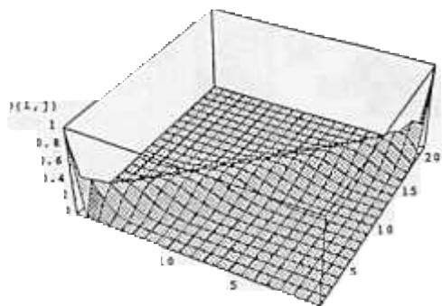
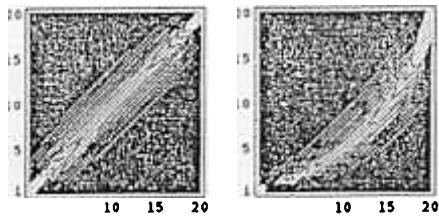
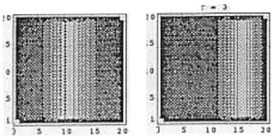
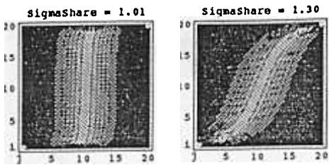
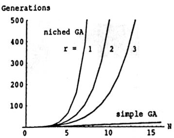
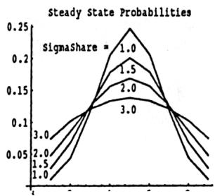
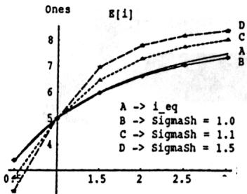
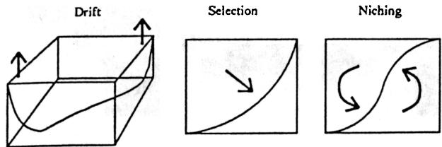

# Finite Markov Chain Analysis of Genetic Algorithms with Niching

Jeffrey Horn Department of Computer Science and The lllinois Genetic Algorithms Laboratory (llliGAL) University of lllinois at Urbana-Champaign 117 Transportation Building, 104 South Mathews Avenue Urbana, lllinois 61801-2996 USA jeHhorn@uiuc.edu

# Abstract

# 1 INTRODUCTION

Finite, discrete-time Markov chain models of genetic algorithms have been used success fully in the past to understand the complex dynamics of a simple GA. Markov chains can exactly model the GA by accounting for all of the stochasticity introduced by various GA operators, such as initialization, selection, crossover, and mutation. Although such models quickly become unwieldy with increasing population size or genome length, they provide initial insights that guide our development of approximate, scalable models. In this study, we use Markov chains to analyze the stochastic effects of the "niching operator" of a niched GA. Specifically, we model the effect of fitness sharing on a singlelocus genome. Without niching, our model is an absorbing Markov chain. With niching, we are dealing with a "quasi-ergodic" Markov chain. Rather than calculating expected times to absorption, we are interested in steady-state probabilities for positive recurrent states. Established techniques for analyzing ergodic Markov chains give us new insights into the dynamic nature of a niched GA. We explore the stability of the expected steady state distribution achieved by the niched GA. We demonstrate the "niching pressure" as a force separate from the forces of selection, drift, and mutation. Through visualization, we gain intuitions of the relationships among these separate forces. These results generalize beyond the fitness sharing algorithm to all types of GA optimization of context dependent functions. In any such function, the GA must find and maintain a diverse population of cooperative individuals rather than converging to the truly steady state of a uniform population.

The genetic algorithm (GA) is a robust, stochastic optimization procedure that has found good solutions to some very hard problems. But GAs are complex systems that have proven difficult to analyze. Most work in GA theory relies on approximate models whose assumptions greatly simplify the operation of the algorithm. In contrast to such approximations, Markov chains can model completely the behaviour of the GA. Unfortunately, the size of the required transition matrix grows exponentially in both population size and genome length. Thus, such exact models of the GA can be used only on a small scale, or in an implicit fashion. Still, even small Markov models have led to important insights into the fundamental forces at work in the GA, such as genetic drift, selection pressure, and mutation. In turn, these insights guide the assumptions we must make for our subsequent approximate models.

Inspired by the high yield of these small models, we introduce another fundamental force to the Markov model: niching pressure. Niched GAs have received attention over the last five years because of their ability to find multiple good, diverse solutions. In a simple GA, (i.e., a GA without niching), selection pressure and genetic drift cause the GA to converge to a uniform population, consisting of copies of the best solution (individual) found. With the addition of some kind of niching mechanism, such as fitness sharing, crowding, preselection, or Boltzman tournament selection, the GA tends to maintain a steady-state population distribution consisting of diverse, high-fitness individuals. The stability of such steady-states is difficult to ascertain. It is the goal of this study to extend the simple, but exact Markov models developed for simple GAs to gain some insight into the stability of these steady-states, the nature of the niching force, and the relationship of this force to the forces of convergence (genetic drift and selection pressure).

Although we focus on GAs with niching, the questions we attempt to answer are pertinent to any type of GA optimization of context dependent junctions. Such functions require that an individual's fitness be evaluated in the context of the current population. That is, individuals affect each other's fitness. This is the case not only with niched GAs, but with learning classifier systems (LOS), immune system models, and artificiallife. All such systems raise fundamental questions which have yet to be addressed, other than empirically:

.Can the GA maintain a steady-state distribution of the population?   
.If so, how long can we expect to be in such a steady-state?   
.How noisy is the steady-state?   
.Can the GA find it?   
.How long until the GA achieves it?   
.What are the probabilities of convergence to competing steady-states?

A simple Markov model will help us answer the first three questions analytically. $\frown$

# 2 BACKGROUND

In this section, we show how previous work has used Markov chains to model the simple GA. We then briefly review the niched GA, which has not yet been modeled by Markov chains.

# MARKOV MODELS OF GAs

Markov chains can exactly model each generation of a GA by combining the effects of the various stochastic sources (such as initial population generation, selec tion, crossover, mutation, and even noisy fitness functions) into a single transition probability matrix. To date, the few studies that have used Markov modeling have necessarily kept to artificially small population sizes and string lengths (e.g., Goldberg & Segrest, 1987), or else have worked with matrix notation only, avoiding the generation and direct manipulation of the matrices themselves (e.g., Nix & Vose, 1992). We discuss the Goldberg and Segrest (1987) model in some detail, as it is their model for a simple GA that we extend to include niching.

# 2.1.1 The Goldberg and Segrest Model

Goldberg and Segrest (1987) kept their model manageable by dealing with only a "single-locus" genome. That is, the genome consists of only one binary position. Thus the only possible individuals are ${ } ^ { \mathfrak { a } _ { 1 } mathfrak { s } }$ and $\mathfrak { e } _ { 0 } { } ^ { \mathfrak { p } }$ . Such a limitation allows for an intuitive numbering of states. Given a fixed population size of N, there are (N + 1) possible states i, where i is the population with exactly i ones and (N -i) zeros. Goldberg and

  
Figure 1: Transition Matrix for a Simple GA with $\pmb { r } = \pmb { 1 }$

  
Figure 2: Contour Plots of Matrices, Simple GA, $\pmb { r = 1 , 3 }$

Segrest defined an $( N + 1 ) X ( N + 1 )$ transition matrix $P [ \bar { i } , j ]$ mapping the current state i to the next state $j$

We repeat here Goldberg and Segrest's calculation of the transition probabilities for their model of a singlelocus, simple GA using proportionate selection with no mutation. Under proportionate selection, we choose a member $\pmb { k }$ of the current population to reproduce (i.e., to be in the next population) with probability proportional to its fitness relative to total fitness of the population. Thus, with probability $f _ { k } / \sum f$ we choose individual $\pmb { k }$ (where $f _ { k }$ is the fitness of $\pmb { k }$ and l-:: 1 is the sum of the fitneSses of all individuals in the current population).

In the generational GA, we replace the entire population each generation, thus making $N$ selections per generation. In our single-locus model, we can write the denominator $\sum f$ M simply $i f _ { 1 } + ( \dot { N } - i ) f _ { 0 }$ where i is the number of ones in the current population, $\pmb { f _ { 1 } }$ is the fitness of ${ \pmb { \mathfrak { s } } } _ { 1 } { \pmb { \mathscr { s } } }$ and $f _ { 0 }$ is the fitness of $\mathfrak { a } _ { 0 } { } ^ { \mathfrak { s } }$ Then the probability of choosing a one for the next generation's population is $\begin{array} { r } { p _ { 1 } = \frac { i f _ { 1 } } { i f _ { 1 } + ( N - i ) f _ { 0 } } } \end{array}$ Letting $\pmb { r }$ be the fitness ratio $\frac { f _ { 1 } } { f _ { 0 } }$ then $\begin{array} { r } { p _ { 1 } = \frac { r i } { r i + ( N - 1 ) } } \end{array}$ The probability of choosing a zero, $\pmb { p 0 }$ is $1 - { \dot { p } } _ { 1 }$ The probability of going from a state with i ones to a state with $\pmb { j }$ ones is $\overrightarrow { p } ( i , j ) = \binom { N } { j } \binom { p _ { 1 } } { p _ { 1 } } ^ { j } \binom { p _ { 0 } } { p _ { 0 } } ^ { N - j }$ Substituting for ${ \pmb p } _ { 1 }$ and $\pmb { p 0 }$ :

$$
p _ { ( i , j ) } = \binom { N } { j } \left( \frac { i r } { i r + \left( N - i \right) } \right) ^ { j } \left( \frac { N - i } { i r + \left( N - i \right) } \right) ^ { N - j } ,
$$

Equation 1 defines a complete transition matrix for any population size $N$ and fitness ratio $\pmb { r }$ In Figure 1 we plot the transition probabilities for a population of size 20, and a fitness ratio of $\pmb { r } \simeq 1$ . On the left of Figure 2 is a contour plot of the surface plot in Figure 1. The centering of the distributions on the main diagonal is due to the fact that $\ r = 1$ . There is no selection pr\~sure toward the all-ones or all-zeros states. With $\ r = 1$ , Equation 1 reduces to the equation for pure genetic drift, a major focus of the Goldberg and Segrest study.

An important feature to note in Goldberg and Segrest's model of selection pressure alone is that the two states 0 and $\pmb { N }$ corresponding to all-zeros and all-ones respectively, are absorbing states, and thus have transition probability rows and columns consisting of a single spike of probability one $\begin{array} { r } { ( p _ { ( \mathfrak { i } , \mathfrak { i } ) } = 1 ) } \end{array}$ . Goldberg and Segrest used Equation 1 to investigate expected times to absorption for the drift case $( r \bar { = } 1 )$ ).

We are interested in visualizing the force of selection when there is a preference $( r \neq 1 )$ , before we add niching pressure. Figure 2, right, shows the transition matrix for $\pmb { r } = 3$ . The ${ { \mathfrak { s i d } } _ { \mathfrak { g } } } { \mathfrak { e } } ^ { \mathfrak { n } }$ of higher probabilities moves off the main diagonal when $\pm 1$ , thus favoring the higher fit individual. The presence of the ridge in the lower or upper triangles of the matrix indicates a pressure toward more or less ones, respectively.

# 2.1.2 Other Markov Models

Two recent papers extended the Goldberg and Seg rest model by allowing genome sizes (string lengths) greater than one (Davis $\&$ Principe, 1991; Nix & Vose, 1992). With string length $\iota$ , the number of possible binary strings is $2 ^ { t }$ and the number of possible states (distributions of a population of size $N$ over such a $2 ^ { l }$ gene space) is $\frac { ( N + 2 ^ { l } - 1 ) ! } { N ! ( 2 ^ { l } - 1 ) ! }$ (Nix & Vose, 1992). This number grows polynomially in $N$ and exponentially in $l _ { i }$ , so that the transition matrix for a realistic GA implementation could not be generated, let alone manipulated and analyzed. However, Nix and Vose worked with the matrix notation directly, rather than generating the actual probabilities. By assuming infinite population sizes and/or genome lengths, they described asymptotic behaviours for a simple GA. Similarly, Davis and Principe were able to develop the outlines of a theoretical proof of convergence for a simple GA. Finally, Mahfoud (1991) adopted the extended models of Nix and Vose, with some simplifying assumptions, such as partitioning the $2 ^ { l }$ gene space into a much smaller number of equivalence classes of similar individuals. Mahfoud then analyzed the selection method known as Boltzmann tournament selection, which achieves some degree of niching.

# 2.2 NICHED GAs

Although we do not yet understand completely how a simple GA works, it is clear that the simple GA does not tap all the power of the schema processing going on in the selection/crossover/mutation cycle. Consequently, many extensions to the GA have been made to exploit the additional information made available with each generation's fitness evaluations. In particular, a number of different GA enhancements are aimed at preserving the information available across a diverse population. These niched GAs avoid the loss of information that results from convergence of the population to a single, high-fitness individual. Rather, the niched GA seeks to maintain several subpopulations, or species, of individuals at different good solutions (niches). When we use a niched GA we are asking the algorithm to tell us more about the fitness landscape than what the best solution is. Niched GAs are particularly useful for finding and maintaining a set of mutually supportive solutions, such as in an LCS, where the GA searches for a set of rules which together implement a successful classification strategy.

A number of niching mechanisms have been proposed and used over the last couple of decades. One of the earliest was Cavicchio's preselection (Cavicchio, 1970; Mahfoud, 1992), in which offspring could only replace one of their parents. DeJong's crowding (DeJong, 1975; Mahfol1d, 1992) had the same flavor, in that new individuals replaced less-fit, but similar, solutions in the old population. Boltzmann tournament selection has also been shown to have niching effects (Mahfoud, 1991), and recently immune system models (Smith, Forrest, &; Perelson, 1992 ) have been gaining attention for maintaining multiple solutions. In this paper, we limit our study to fitness sharing, introduced by Goldberg and Richardson (1987), studied in detail in (Deb, 1989), and challenged by a massively multimodal problem in (Goldberg, Deb, &; Horn, 1992).

Fitness sharing accomplishes niching by degrading the objective fitness (i.e., the unshared fitness) of an individual according to the presence of nearby (similar) individuals. Thus this type of niching requires a distance metric on the phenotype or genotype of the individuals. In this study, we use the Hamming distance between the binary encodings (genotypes) of individuals. We degrade the objective fitness of an individual by first summing all of the share values of individuals within a fixed radius, called $\sigma _ { \Delta h }$ h, of that individual, and then dividing the objective fitness value by this sum, which is known as the niche count for that individual. Thus, if two individuals, hand k, are sepa. rated by Hamming distance $d _ { h k } < \sigma _ { s h }$ h, then we add a share value, $\begin{array} { r } { s h ( d _ { h k } ) = 1 - ( \frac { d _ { h k } } { \sigma _ { \bullet h } } ) ^ { \alpha } } \end{array}$ to both of their niche counts, $m _ { h }$ and $m _ { k }$ . Here, $\pmb { \sigma } _ { \pmb { \mathscr { h } } }$ h is the radius of our estimated niches. Individuals separated by $\pmb { \sigma } _ { \pmb { \mathscr { h } } }$ h, or more, do not degrade each other's fitness $\begin{array} { r } { ( s h ( d _ { h k } ) = 0 } \end{array}$ for $d _ { h k } \ge \sigma _ { \bullet h } ) ^ { 1 }$ . Fod as $\pmb { h }$ niche , where $\mathbf { m } _ { h }$ $\begin{array} { r } { m _ { \hbar } = \sum _ { k = 1 } ^ { N } s \hbar ( d _ { k k } ) } \end{array}$ $\pmb { N }$ $\pmb { h }$ is then given by $f _ { h } / m _ { h }$

Sharing tends to spread the population out over multiple peaks (niches) in proportion to the height of the peaks. GAs with proportionate selection and fitness sharing have been successfully used in solving a variety of multimodal functions (Deb, 1989).

Goldberg and Richardson (1987) note that for fitness sharing to be at equilibrium, it must be true that the shared fitness values of the individuals at each local optima $\pmb { h }$ are equal: $\begin{array} { r } { \frac { f _ { \mathrm { h } } } { m _ { \mathrm { h } } } = \frac { f _ { \mathrm { k } } } { m _ { \mathrm { k } } } , \forall h , k } \end{array}$ . If we assume nonoverlapping niches centered on local optima, a population size $N$ and knowledge of the number and objective fitness of the local optima $f _ { h }$ the above equations allow us to calculate the expected distribution of the population (i.e., the mh) when the niched GA is at equilibrium. For our single-locus model, with $\sigma _ { \bullet h } \leq 1$ $m _ { 1 } = i$ and $m _ { 0 } = N - i$ the steady-state equation reduces to

$$
\frac { f _ { 1 } } { i _ { e q } } = \frac { f _ { 0 } } { N - i _ { e q } } \qquad \Rightarrow \qquad i _ { e q } = \frac { r N } { 1 + r }
$$

Later I we compare ieq, the number of ones at equilibrium predicted by Equation 2, with the distribution shown by Markov models.

# 3 MODELING THE NICHED GA

In this section we add "niching pressure" to the Goldberg and Segrest model. We start out simply, assuming perfect fitness sharing. We then look at various cases of overlapping niches.

# PERFECT FITNESS SHARING

To add in the effect of niching, we must degrade each of the two fitnesses, $\pmb { f _ { 0 } }$ and $\pmb { f _ { 1 } }$ by the existence of nearby individuals. We begin with the simple case of "perfect sharing", such that the niches centered on each kind of individual do not overlap2. Thus, $\sigma _ { \bullet h } \leq 1$ , so that ones do not degrade $f _ { 0 }$ and zeros do not degrade $\pmb { f _ { 1 } }$ And with $\sigma _ { \bullet h } \leq 1 ,$ , we are no longer concerned with a, since for any setting of a, the contribution of an individual to its own niche count is always 1.

With niche counts $\mathbf { \mathscr { m } _ { 1 } } = \mathbf { i }$ and $m _ { 0 } = N - i$ the shared fitness value for the ones is then $f _ { 1 } / \mathfrak { i } ,$ while for the zeros it is $f _ { 0 } / ( N - i )$ If we substitute these shared fitness values for the objective fitness values $f _ { 1 }$ and $f _ { 0 }$ in Equation I, we obtain the transition probabilities3:

  
Figure 3: Transition Matrices for Perfect Fitness Sharing.

$$
p ( i , j ) = \binom { N } { j } * \left( \frac { r } { r + 1 } \right) ^ { j } \left( \frac { 1 } { r + 1 } \right) ^ { N - j }
$$

Let us see how perfect fitness sharing has affected our transition probability matrix. On the left of Figure 3 is the transition probability matrix for a GA with perfect fitness sharing, population size $N = 2 0$ , and fitness ratio $\pmb { r } = 1$ . Interestingly, perfect fitness sharing exactly counters the benefits of quantity bestowed by proportionate selection. Each additional copy of a zero in the population, for example, degrades $f _ { 0 }$ but also increase the probability of selection under proportionate selection, resulting in the elimination of the current state i from the transition probability equation. So the row independence of the matrix for fitness sharing is not due to the removal of a complex force, but rather the addition of a new one (niching) that balances the old (selection/drift). For our simple model at least, perfect sharing combined with proportionate selection yields an ideal restorative force.

From Figure 3 left, we can say that in general, the effect of the niching pressure is to move the population toward the center states, where the number of ones and zeros is balanced. For example, when there are more ones than zeros we are likely to move towards states of lower numbers of ones. Thus we can interpret the niching force as being a stabilizing one, with a point of equilibrium far from the poles toward which selection and drift drive us. The apparent point of equilibrium is at the state $\pmb { \dot { \mathfrak { z } } } = 1 0$ , as we expect given that $\ r = 1$ . What about for other $\pmb { r }$ values? At the right of Figure 3 is the matrix for $\mathfrak { r } = 3$ . Note how the peak of the probability ridge, is where Equation 2 predicts, at $\textit { \textbf { i } } = 1 5$ . Later, we will investigate this potential empirical confirmation of niched GA theory.

3Note that Equation 3 cannot be used where $\dot { \pmb { \mathfrak { r } } } = { \pmb 0 }$ or ${ \bf \chi } _ { \bf \chi } ^ { \prime } = N$ , since one of the quotients $f _ { 1 } / \mathfrak { i }$ or $f _ { 0 } / ( N - i )$ does not exist there. But since these are absorbing states, we know their row of transition probabilities.

  
Figure 4: Transition Matrices for Overlapping Niches.

# 3.2 OVERLAPPING NICHES

It is often the case that niches overlap. In fitness sharing, we easily might estimate O",h to be too large, sometimes on purpose (Goldberg, Deb, and Horn, 1992). In niched GAs and in life, while two species compete to fill a niche, the niches centered on them overlap. In this section, we examine the general case where O",h > 1.

The niche count for ones, ml, is now i + (N -i)(1 - I/O",h) instead of just i, since we have to add in the share value of each zero: 1 -I/O"'h' Similarly, mo = (N -i) + i(l -1/O"'h)' Substituting the new degraded fitnesses h/ml and fo/mo into the equations for Pl and Po, dividing through by fo to obtain r, and after some rearranging, we obtain the new transition probability equation4:

$$
\begin{array} { l } { \displaystyle \mathcal { P } ( i , j ) = } \\ { \displaystyle { \binom { N } { j } \left( \frac { r } { i r + \left( N - i \right) \frac { m _ { 1 } } { m _ { 0 } } } \right) ^ { j } \left( \frac { 1 } { i r \frac { m _ { 0 } } { m _ { 1 } } + \left( N - i \right) } \right) ^ { N - j } } } \end{array}
$$

In Figure 4 we show the transition matrices resulting from Equation 4 for a population size N = 20, fitness ratio r = I, and two different degrees of overlap. For very small overlaps (O".h \~ 1), the niching pressure dominates and the matrix is very similar to that of perfect sharing. As the overlap increases, the effect of niching is diminished, most especially near the absorbing states, and genetic drift comes to dominate. For O".h = 3, our matrix (not shown) appears not significantly different from the case of pure genetic drift. This gradual transition from ideal niching to genetic drift agrees with intuition. When O".h = 1, Equation 4 reduces to Equation 3 for perfect sharing. As O".h -+ 00, the entire search space becomes a. single niche, and we approach the case of genetic drift (or selection pressure, when $r \neq 1 \AA$ ).

If the effect of fitness sharing degrades gracefully with increasing error in O".h (overestimation), does the sta.- bility of our assumed steady state also decay gracefully? To our list of questions about the nature of the supposed equilibrium, we can add this question of how the steady state degenerates as we move away from the ideal niching situation.

# 3.3 ABSORBING MARKOV CHAIN?

Before we can talk about steady states, we must address the absorbing states. In Markov chain analysis, the only steady states of an absorbing chain are absorbing states. Their existence means that eventually the niching force must be overcome, despite its strength made obvious in Figure 3. The GA will be "trapped" into convergence

But in practice we do not wait around for the niched GA to converge to a uniform population. Often, it is a matter of watching the population distribution for many generations and deciding that a run has "converged" to a noisy steady state. Although the transition matrix tells us that this steady state cannot last, we usually do not wait around long enough to see the GA wander far from equilibrium.

So how do we reconcile our experience with our model? How can we talk about steady-states other than absorbing states when we have an absorbing chain? One answer is to ignore the absorbing states and just analyze the transient states. In the well-known partitioning of states of an absorbing Markov chain,

$$
P = { \left( \begin{array} { l l } { Q } & { R } \\ { 0 } & { I } \end{array} \right) }
$$

we take the $\boldsymbol { Q }$ partition to be the entire matrix, ignoring $R , 0 , I ,$ which only consist of two rows and two columns for the two absorbing states. H we normalize the $\pmb { Q }$ matrix so that each row sums to 1, the resulting "matrix, call it $Q _ { n o r m }$ m, is an ergodic Markov chain and allows us to calculate steady-state probabilities for all (non-absorbing) states.

Before proceeding to analyze $Q _ { n o r m }$ , we must justify "chopping off" the absorbing state rows and columns. As an intuitive argument for ignoring the absorbing states, we look at the expected time to absorption. Absorption time is equivalent to the expected first passage time for the absorbing states. Expected absorption times for niched GAs should be much longer than those for the simple GA.

We calculate expected times to absorption from the $\pmb { Q }$ matrix as in (Goldberg & Segrest, 1987). In short, we calculate the visitation matrix $V ^ { ' } = ( I ^ { ' } { - } Q ) ^ { - 1 }$ where $^ { \mathfrak { a } } T ^ { \mathfrak { n } }$ is the identity matrix and $^ { \mathfrak { a } } { } _ { - 1 } { } ^ { \mathfrak { n } }$ is the inverse operator for matrices, and assume a uniformly randomly generated initial population. Goldberg and Segres calculated absorption times for a number of scenarios. For our comparison, we recall only their results for the case where $N = 2 0$ and $\ r = 1$ . In a simple GA, absorption time is a linear function of population $\sin ^ { \circ } { \tt z e } ^ { 5 }$ . We show this relationship as the bottom-most plot in Figure 5.

  
Figure 5: Expected Times to Absorption.

We calculate the expected absorption times for perfect fitness sharing, also using $N = 2 0$ , $\sigma _ { \mathscr { s h } } = 1$ , and random initial populations. In Figure 5, these times are plotted for three different values of $\pmb { r }$ Note how even with $r = 3 ,$ . absorption time appears to grow exponentially with population size. Although not shown, increasing $\sigma _ { \bullet h } > 1$ , while holding r constant, has a similar effect of apparently decreasing the base in the exponential growth of absorption time with population size. Since the absorbing states have no effect on the behaviour of the niched GA until they are entered, then as absorption time becomes arbitrarily large, the transient states appear increasingly like ergodic states to a Markov analysis, or so the intuition goes.

Fortunately, the problem of calculating steady state probabilities for "near-ergodic" absorbing Markov chains has received some attention in the applied probability literature. In (Darroch & Seneta, 1965), the authors examine several alternative approximations to the "effectively ultimate distribution". A thorough treatment of their work in relation to our matrix is beyond the scope of this paper. The interested reader is invited to compare two of their "best" candidate approximations, namely the stationary conditional distribution, ${ \vec { v } } ,$ , and the quasi-stationary probability, WjVj, to the steady states $\vec { P } _ { \mathbf { i } }$ we obtain for $Q _ { n o r m }$ . The stationary conditional distribution for $\boldsymbol { Q }$ is the left eigenvec tor, $\overrightarrow { v } ,$ of $\boldsymbol { Q }$ corresponding to the maximum modulus eigenvalue $\lambda _ { m a x }$ . The quasi-stationary probability is the product of the right and left eigenvectors $\pmb { \mathcal { w } }$ and $\overrightarrow { v }$ , of $\pmb { Q }$ corresponding to $\lambda _ { m a x }$ \~.

We have compared the steady state vector ii of $Q _ { n o r m }$ (calculated in the next section) to $\overrightarrow { v }$ and ${ \pmb w } _ { j } { \pmb v } _ { j }$ . For perfect sharing all three distributions are exactly thes $\sin e ^ { \theta }$ but as $\pmb { \sigma } _ { \pmb { \mathscr { h } } }$ increases beyond 1, the three di

SNote that for any $\pm 1$ , the expected time to absorption (by either absorbing state) will be shorter, assuming a random initial population. So absorption times for ${ \pmb r } = { \pmb 1 }$ are upper bounds for all $\pmb { r }$

8The convergence of the three measures at $\pmb { \sigma _ { \pmb { \mathscr { h } } } } = 1$ follows from the row independence of $\pmb { Q }$ for perfect sharing.

  
Figure 6: Steady State Probability Distributions, it.

verge. The divergence of the three distributions appears to grow very slowly with increasing $\sigma _ { \pmb { \mathscr { n } } } ^ { } $ h. Since fl is in close agreement with the measures from Darroch and Seneta, and because it is much more easily calculated than are eigenvectors and values, we use it in our study of niched GA steady states.

# 3.4 ERGODIC MARKOV CHAIN

We now have an irreducible Markov chain, $Q _ { n o r m }$ with all ergodic states, 1 through $( N - 1 )$ Calculation of the steady-state probabilities is straightforward. We seek the vector of steady state probabilities $\vec { \Pi } = \left\{ \pi _ { 1 } , \pi _ { 2 } , \ldots , \pi _ { N - 1 } \right\}$ , where $\pi _ { j }$ "j is the steady state probability for state $j$ To find $\vec { \pi }$ we solve 7 (ii $\begin{array} { r l r } { Q _ { n o r m } } & { { } = } & { \vec { \Pi } \} } \end{array}$ We can analyze the vector $\vec { \pi }$ to help us understand the behaviour of our niched GA at steady state. Figure 6 plots the steady state distributions for a population size $N = 1 0$ , fitness ratio $\pmb { r } = 1$ , and four different values of $\sigma _ { s h }$ h. We note that even with perfect fitness sharing, our steady state for this small population size is fairly noisy. And as $\sigma _ { \pmb { \mathscr { n } } }$ increases, the steady state distribution flattens. We could perform a number of statistical analyses of the distribution, estimating the total expected amount of time spent within a certain range of states, or the expected recurrence time for returning to a particular level of ones in the population. In particular, these distributions can be approximated by a normal distribution whose variance, $\pmb { \sigma } ^ { 2 }$ , would be an inverse mea.- sure of the stability and noisiness of the steady state. Clearly, $\sigma ^ { 2 }$ is directly related to $\pmb { \sigma } _ { \pmb { \mathscr { h } } }$ h.

For now, we use the steady state distribution to calculate the expected number of ones, ${ \pmb E } [ { \pmb i } ]$ , in the population at steady state, and compare this to the equilibrium prediction $i _ { e q }$ from Equation 2. We can think of $\pmb { { \cal E } } [ \pmb { \imath } ]$ as the number of ones we expect to see in the population at any distant point in the future. To calculate the expected number of ones, we multiply the

11 for a row identical matrix is simply the row vector. The left eigenvector of $\lambda _ { m a x }$ \$ is the same row vector, while the corresponding right eigenvector $\pmb { \mathcal { W } }$ is the a.ll ones vector, so that

7For a unique solution, remember that $\sum _ { i = 1 } ^ { N - 1 } \pi _ { i } = 1$ steady state probability for each state by the index for that state and sum over all states: $\begin{array} { r } { E [ i ] = \sum _ { i = 1 } ^ { N - 1 } i * \pi _ { i } } \end{array}$ "i Figure 7 compares $E [ i ]$ for different degrees of overlapping niches to $i _ { e q }$ using a population size $N = 1 0$ and different values of fitness ratio $\pmb { r }$ . The solid black line is the plot of $\blacktriangle _ { e q }$ q. Note how all three expected value plots agree exactly with $i _ { e q }$ only at $\pmb { r } = 1$ . This agreement is due to the symmetry of every steady state distribution when $f _ { 1 } = f _ { 0 }$ The small difference between $E [ i ]$ for perfect sharing $( \sigma _ { \bullet h } = 1 . 0 )$ ) and $\blacktriangle _ { e q }$ , when $\pm 1 _ { : }$ , is likely due to the asymmetry of the error introduced in normalizing the $\pmb { Q }$ matrix. The larger divergence from $i _ { e q }$ for the overlapping niches, however, stems from the weakening of restorative pressure. The weaker niching force allows preferential selection to bias the steady state toward the more highly fit solution. Note also that for any value of $\sigma _ { \bullet h } > 1$ , increasing $\pmb { r }$ while holding $\pmb { \sigma } _ { \pmb { \mathscr { h } } }$ constant also increases the difference between ${ \pmb E } [ { \pmb i } ]$ 1 and the $i _ { e q }$ . Although not shown, increasing population size $N$ , holding $\pmb { r }$ and $\sigma _ { \bullet h }$ constant, decrease the divergence of any $\bar { E ( i ) }$ from $i _ { e q }$ . Intuitively, degrading the steady state by increasing $\pmb { r } , \pmb { \sigma } _ { \pmb { \mathscr { s h } } }$ or decreasing $\pmb { N }$ allows the asymmetric forces of selection pressure and drift to be felt.

  
Figure 7: Expected Number of Ones at Steady State.

# 4 EXTENSIONS

Although this analysis is based on a single-locus model, its results can be immediately applied to models with arbitrarily long genomes. Imagine the niched GA has "converged" to two niches whose basins of attraction are far enough apart that neither crossover nor mutation allows individuals from one niche to produce offspring near the other. Further imagine that the two niches have much higher fitnesses than nearby regions, so that any offspring falling outside a niche is doomed. If we also assume that the niche radii are much less than $\sigma _ { \Delta h }$ h, then we can approximate our situation by two peaks with no effective mutation or crossover. Normalizing the inter-peak distance to I, and measuring $\pmb { \sigma } _ { \pmb { \mathscr { h } } \pmb { \mathscr { a r e } } }$ in units of this distance, our single-locus exact model becomes an approximate model for longer genomes. The required assumptions are neither unrealistic nor very limiting. In general, mutation and crossover will have only second-order effects on the absorption time and steady state behaviour of the niched GA, compared to the first-order effects of selection and niching. Indeed, the expected absorption time for the single-locus model might be an upper bound for longer-genome models. In addition, the two niche case should provide bounding results for multiple niches8. Of course, once we try to scale our exact-model results to problems of realistic proportions, we must rely upon empirical confirmation.

All of the extensions considered in previous Markov chain analyses of simple GAs could be made to the model for niched GAs, such as using other selection algorithms. It is particularly important to model other niching algorithms, to allow us to generalize these results to context-dependent function optimization. It is also important to look at multiple niches with varied separation. This would allow us to study the tradeoff of quality versus quantity: finding solutions that are good and diverse. Goldberg, Deb, and Horn (1992) have shown that the location, separation, quality, and quantity of local optima (niches) can make life difficult for a niched GA with fixed- $\sigma _ { \pmb { \mathscr { h } } }$ fitness-proportionate sharing.

But the first order of business should be the definition of a steady state characteristic, call it $\pi _ { \mathfrak { c } }$ Clearly, the variance of the steady state distribution, the time to absorption, the deviation from equilibrium prediction, and the time to convergence to steady state are all related. All of these measures "suffer" as we increase $\pmb { r }$ or $\sigma _ { \pmb { \imath } } _ { \pmb { h } }$ , or decrease the population size $N$ It seem worthwhile to seek a $\pi _ { c }$ in terms of which all of the above measures and effects could be expressed. Such a $\pi _ { e }$ would enable us to characterize and compare all steady states for a niched GA.

Finally, from the graphs of the transition matrices, it appears that we can visualize the separate, fundamental forces of genetic drift (one component of the overall selection force), preferential selection (the other component), and niching pressure. Figure 8 shows the speculated general effects of these three forces on the transition matrix. The forces appear to be orthogonal, suggesting that they might be represented by orthogonal tensors. To investigate these intuitions, we should look for the same fundamental forces in other combinations of selection and niching algorithms.\~

# 5 CONCLUSIONS

In this paper we extended the work of Goldberg and Segrest (1987) by modeling a niched GA using finite, discrete-time Markov chains. Although our model was simple, we gained several insights into the nature of the force exerted by the fitness sharing mechanism.

  
Figure 8: Orthogonal Forces?

In particular, we saw how exactly the niching force of fitness sharing balanced the preference and drift effects of proportionate selection. One major effect of fitness sharing is to create exponentially long waiting times to absorption, inducing a quasi-steady-state away from the absorbing states. The steady-state predictions from fitness sharing theory closely predicted the steady state or point of equilibrium, but gave no indication of how noisy or unsteady this state actually is. However, the steady-state probabilities given by our Markov chain, which are approximately normally distributed, provide the data for studying the stability of such dynamic equilibria. For example, we observed evidence for a single characteristic measure of stability by noting the effects of niching parameters on the variance of the steady state distribution. Finally, we had some success in isolating and visualizing some of the fundamental forces at work in a niched GA. It is important to find ways of breaking down the complex dynamics of a simple or niched GA into components that can be better understood in isolation, before studying them in context.

A final comment on methodology: we should build these small, exact models because we can. The larger, more realistic exact models can never be created. Instead, we must learn how to build approximate models for long genomes and large populations. But insights from the tiny models are important to that effort. After all, if these small, exact models continue to surprise we are probably not yet ready to make the correct, simplifying assumptions necessary for constructing approximate models of real GAs.

# Acknowledgements

I thank David E. Goldberg, Department of General Engineering at the University of Illinois at UrbanaChampaign (UIUC), for emphasizing extinction times and for introducing the notion of a characteristic measure of stability. I am also grateful to Mary A. Johnson, Department of Mechanical and Industrial Engineering at UIUC, for pointing me toward the work on quasi-stationary Markov chains. This work was supDorted by NASA under contract number NGT-50873.

References   
Cavicchio, D. J. (1970). Adaptive search using simulated evolution. Unpublished doctoral dissertation, University of Michigan, Ann Arbor.   
Darroch, J. N., & Seneta, E. (1965). On quasistationary distributions in absorbing discretetime finite Markov chains. Journal of Applied Probability, pp. 88-100.   
Davis, T. E., & Principe, J. C. (1991). A simulated annealing-like convergence theory for the simple genetic algorithm. Proceedings of the Fourth ICGA, pp. 174-181.   
Deb, K. (1989). Genetic algorithms in multimodal function optimization. Masters thesis, TCGA Report No. 89002. University of Alabama.   
Deb, K., Horn, J., & Goldberg, D. E. (1992). Multimodal deceptive functions. IlliGAL Report No. 92006 (April 1992), and submitted to Complex Systems (August 1992).   
De Jong, K. A. (1975). An analysis of the behavior of a class of genetic adaptive systems. (Doctoral disseration, University of Michigan). Dissertation Abstracts International, 36(10), 5140B. (University Microfilms No. 76-9381).   
Goldberg, D. E. (1989). Genetic algorithms in search optimization, and machine learning. Reading, MA: Addison-Wesley.   
Goldberg, D. E., Deb, K., & Horn, J. (1992). Massive multimodality, deception, and genetic algorithms. Parallel Problem Solving From Nature, 2. NorthHolland, 1992, pp. 37-46. .   
Goldberg, D. E., & Richardson, J. J. (1987). Genetic algorithms with sharing for multimodal function optimization. Genetic algorithms and their applications: Proceedings of the Second ICGA, pp. 41-49.   
Goldberg, D. E., & Segrest, P. (1987). Finite Mar\~ov chain analysis of genetic algorithms. Genetic algorithms and their applications: Proceedings of the Second International Conference on Genetic Algorithms, pp. 1-8.   
Mahfoud, S. W. (1991). Finite Markov chain models of an alternative selection strategy for the genetic algorithm. IlliGAL Report No. 91007.   
Mahfoud, S. W. (1992). Crowding and preselection revisited. Parallel Problem Solving From Nature, 2. North-Holland, 1992, pp. 27-36.   
Nix, A. E., & Vose, M. D. (1992). Modeling genetic algorithms with Markov chains. Annals of Mathematics and Artificial Intelligence, 5(1).   
Smith, R. E., Forrest, S., & Perelson, A. S. (1992). Searching for diverse, cooperative populations with genetic algorithms. TCGA Report No. 92002. University of Alabama, Thscaloosa.

# PROCEEDINGS OF THE FIFTH INTERNATIONAL CONFERENCE ON

# GENETIC ALGORITHMS

University of Illinois at Urbana-Champaign July 17-21, 1993

Editor/Program Chair: Stephanie Forrest

Supported by; Office of Naval Researc Naval Research Laboratory Philips Laboratory I North American Philips Corporation International Society for Genetic Algorithms