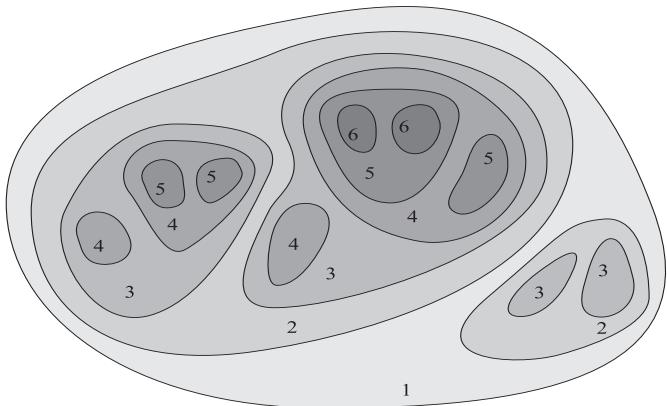
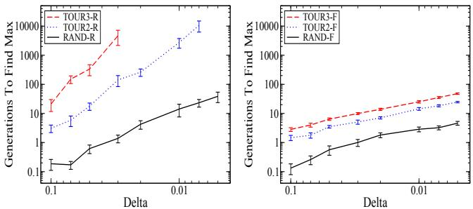
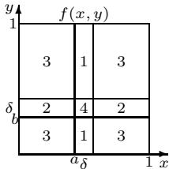
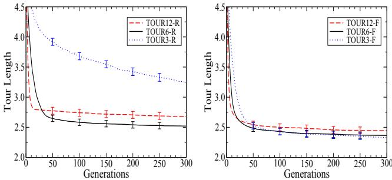
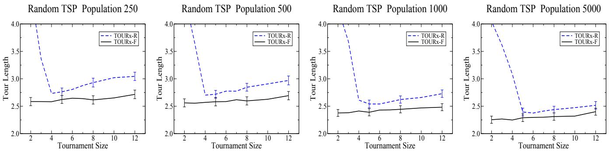
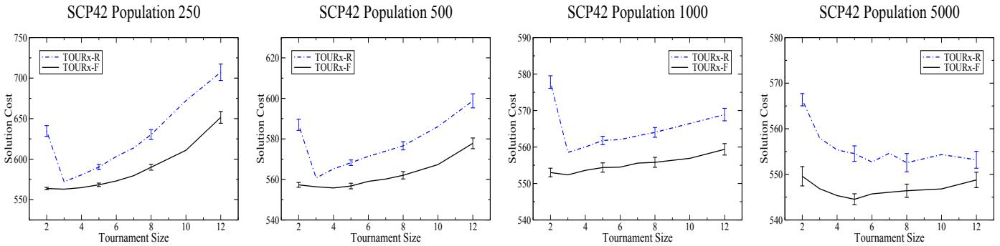
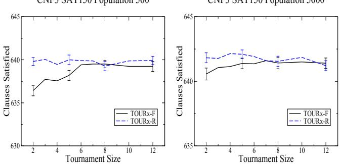
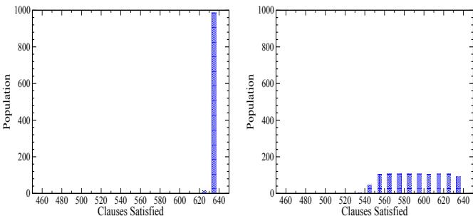
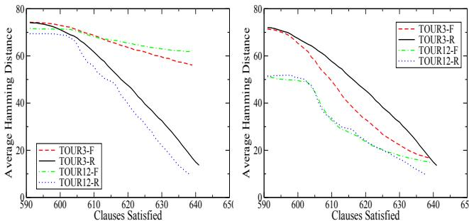

# Fitness Uniform Deletion: A Simple Way to Preserve Diversity

Shane Legg IDSIA, Galleria 2, 6928 Manno-Lugano Switzerland shane@idsia.ch

Marcus Hutter IDSIA, Galleria 2, 6928 Manno-Lugano Switzerland marcus@idsia.ch

# ABSTRACT

A commonly experienced problem with population based optimisation methods is the gradual decline in population diversity that tends to occur over time. This can slow a system’s progress or even halt it completely if the population converges on a local optimum from which it cannot escape. In this paper we present the Fitness Uniform Deletion Scheme (FUDS), a simple but somewhat unconventional approach to this problem. Under FUDS the deletion operation is modified to only delete those individuals which are “common” in the sense that there exist many other individuals of similar fitness in the population. This makes it impossible for the population to collapse to a collection of highly related individuals with similar fitness. Our experimental results on a range of optimisation problems confirm this, in particular for deceptive optimisation problems the performance is significantly more robust to variation in the selection intensity.

# Categories and Subject Descriptors

I.2.M [Artificial Intelligence]: Miscellaneous

# General Terms

Algorithms, Experimentation

# Keywords

Genetic algorithms, population diversity

# 1. INTRODUCTION

Population based optimisation methods often suffer from diversity problems, especially after many generations. In the worst case the whole population can become confined to a local optimum from which it cannot escape, leaving the optimiser stuck. In situations where the population size must be kept small due to resource constraints, or the solution space is deceptive with many large local optima, the loss of population diversity becomes especially significant.

Numerous techniques have been devised to help preserve population diversity. Significant contributions in this direction are fitness sharing [8], crowding [14], local mating [4] and niching [18]. Many of these methods are based on some kind of distance measure on the solution space which is used to ensure that the members of the population do not become too similar to each other. Unfortunately, for many interesting optimisation problems, such as evolving neural networks or genetic programming, just trying to establish whether two individuals are effectively the same can be very difficult as totally different neural networks or programs (genotype) can have identical behaviour (phenotype). In the most general case when the solution space is Turing complete this comparison is impossible even in theory.

While most methods try to measure diversity directly in genotype space, an alternative approach is to measure diversity in phenotype space. An example of this approach is the Fitness Uniform Selection Scheme (FUSS) which was theoretically analysed in [11] and then experimentally investigated in [16]. FUSS works by focusing the selection intensity on individuals which have uncommon fitness values rather than on those with highest fitness as is usually done. In this way a broad range of individuals with many different levels of fitness develop in the population including, hopefully, some individuals of high fitness. While FUSS achieved some interesting results, in particular on highly deceptive problems, it also had difficulties in some situations. By focusing selection on rare individuals within the population there was a tendency for these individuals to fill the population with highly related offspring [16].

Here we take the idea of using fitness to roughly approximate the similarity of individuals but apply it in a different way. Rather than using it to control selection for reproduction, as FUSS does, we instead use it to control selection for deletion, hence the name Fitness Uniform Deletion Scheme or FUDS. The result is an easily implemented, computationally efficient and problem independent approach to population diversity control.

In Section 2 we describe the intuition behind FUDS and its essential properties. Section 3 details the test system and how the tests were performed. In Section 4 we compare FUDS to random deletion on a deceptive 2D optimisation problem. Section 5 examines the performance of FUDS and random deletion for random travelling salesman problems with various selection intensities and population sizes. Section $\it 6$ repeats this comparison for a set covering problem. Section 7looks at CNF3 SAT problems and includes an analysis of population diversity using hamming distance. Finally Section $\boldsymbol { \delta }$ contains a brief summary and possible future work.

# 2. FITNESS UNIFORM DELETION

The intuition behind FUDS is very simple: If an individual has a fitness value which is very rare in the population then this individual almost certainly contains unique information which, if it were to be deleted, would decrease the total population diversity. Conversely, if a large subset of individuals in the population all have the same fitness then we may delete from this set without losing much population diversity. Presumably these individuals are common in some sense and likely exist in parts of the solution space which are easy to reach.

From this simple observation FUDS immediately follows: Only delete individuals which have very commonly occurring fitness. This should help preserve population diversity, even for the most deceptive problems. Indeed it is now simply impossible for the whole population to collapse to a collection of highly related individuals with similar fitness. The technique is simple to understand, easy to implement, computationally efficient and completely independent of both the problem and of the genotype representation being used.

We implement FUDS as follows. Let $f _ { m i n }$ and $f _ { m a x }$ be the minimum and maximum fitness values possible for a problem, or at least reasonable upper and lower bounds. We divide the interval $[ f _ { m i n } , f _ { m a x } ]$ into a collection of subintervals of equal length $\{ [ f _ { m i n } , f _ { m i n } + \varepsilon ) , [ f _ { m i n } + \varepsilon , f _ { m i n } +$ $2 \varepsilon ) , \ldots , [ f _ { m a x } - \varepsilon , f _ { m a x } ] \}$ . We call these intervals fitness levels. As individuals are added to the population their fitness is computed and they are placed in the list of individuals corresponding to the fitness level they belong to. Thus the number of individuals in each fitness level describes how common fitness values within this interval are in the current population. When a deletion is required the algorithm locates the fitness level with the largest number of individuals and then randomly selects an individual that belongs to this level for deletion. In the case of multiple fitness levels having the same size, the lowest fitness level is chosen.

If the number of fitness levels is chosen too low relative to the population size, for example 5 fitness levels with a population of 500, then the resulting model of the distribution of individuals across the fitness range will be too coarse. Alternatively, if a large number of fitness levels is used with a very small population the individuals may become too thinly spread across the fitness levels. While in these extreme cases this could effect the performance of FUDS, in practice we have found that the system is not particularly sensitive to the setting of this parameter. If $_ n$ is the population size then setting the number of fitness levels to be $\sqrt { n }$ is a good rule of thumb. Generally, so long as the population size is in the range of 2 to 50 times the number of fitness levels performance is unaffected. A theoretically better justified solution would be to model the population distribution using (in)finite Bayesian trees [12].

Under FUDS the takeover of the highest fitness level, or indeed any fitness level, is impossible. This is easy to see because as soon as any fitness level starts to dominate, all of the deletions become focused on this level until it is no longer the most populated fitness level. As a by-product, this also means that individuals on relatively unpopulated fitness levels are preserved. This allows the steady creation of individuals on many different fitness levels and makes it relatively easy for the EA to find its way out of local optima as it keeps on exploring evolutionary paths which do not at first appear to be promising.

  
Figure 1: This illustrates the density of individuals over a fitness landscape with FUDS. The numbers represent the fitness of the different regions and the shading represents the density of individuals over the space.

It is instructive to consider how individuals are distributed in the genome space when using FUDS. If we consider a distance semi-metric between individuals $d ( i , j ) : = | f ( i ) - f ( j ) |$ where $f$ is the fitness function, then clearly FUDS attempts to uniformly distribute the individuals according to this metric. However this does not imply that the individuals are uniformly distributed across the genome space. Typically, areas of high fitness are relatively small compared to areas of lower fitness. In this case, if we have the same number of individuals in both regions then the density of individuals in the high fitness region will be much higher due to its smaller size. We illustrate this visually on a fitness landscape in Figure 1. The numbers indicate the fitness of individuals in each region, while the density of individuals is given by how dark the regions are shaded.

Clearly then, uniformity in the fitness distance metric $d$ does have some implications for the distribution of individuals with respect to a metric $g$ on the genome space. This allows us to relate FUDS to other methods of diversity control that require a genome space metric. We say that a fitness function $f$ is smooth with respect to $_ { g }$ , if $g ( i , j )$ being small implies that $| f ( i ) - f ( j ) |$ is also small, that is, $d ( i , j )$ is small. This implies that if $d ( i , j )$ is not small, $g ( i , j )$ also cannot be small. Thus, if we limit the number of $d$ similar individuals, as we do in FUDS, this will also limit the number of $g$ similar individuals, as is done in crowding and niching methods. The advantage of FUDS is that we do not need to know what $g$ is, or to compute its value, something that can be very difficult in some applications. Indeed, the above argument is true for any metric $g$ on the genome space that $f$ is smooth with respect to. On the other hand, if the fitness function $f$ is not smooth with respect to $g$ , then this argument cannot be made. However, in this case the optimisation problem is difficult as small mutations in genome space with respect to $g$ will produce unpredictable changes in fitness.

Because FUDS is only a deletion scheme, we still need to choose a selection scheme which may require us to set a selection intensity parameter. With FUDS however, the performance of the system is less sensitive to the correct setting of this parameter. If the selection intensity is set too high the normal problem is that the population rushes into a local optima too soon and becomes stuck before it has had a chance to properly explore the genotype space for other promising regions. However, with FUDS a total collapse in population diversity is impossible and thus much higher levels of selection intensity may be used.

Conversely, if the selection intensity is too low, the population tends not to explore the higher areas of the fitness landscape at all. Consider a population which contains 1,000 individuals. Under random deletion all of these individuals, including the highly fit ones, will have a 1 in 1,000 chance of being deleted in each cycle and so the expected life time of an individual is 1,000 deletion cycles. Thus if a highly fit individual is to contribute a child of the same fitness or higher, it must do so reasonably quickly. However for some optimisation problems the probability of a fit individual having such a child when it is selected is very low, so low in fact that it is more likely to be deleted before this happens. As a result the population becomes stuck, unable to find individuals of greater fitness before the fittest individuals are killed off. With FUDS, as rare fit individuals are not deleted, we can use much lower selection intensity without the population becoming stuck.

# 3. FUDS TEST SYSTEM

In order to test FUDS we have implemented a simple population based optimiser in Java on a PC running Linux. The full source code for this along with usage instructions, example optimisation problems and test data sets is available from[15]. This zip file also contains directions on where to download the full datasets that were used to produce the results presented in this paper.

Our optimiser uses a “steady state” population rather than the more usual “generational” population. With a steady state population individuals are selected and acted upon one at a time rather than in bulk as under the generational approach. Specifically the following occurs: An individual is first selected according to some selection scheme, then according to the crossover probability a second individual may be selected and the two are crossed to form a child. Then according to the mutate probability a mutation operation may be applied to the child. When a crossover does not occur a mutation always takes place in order to reduce the probability of a clone of an existing individual being added to the population. Finally the deletion scheme selects which individual from the population the new child will replace.

For the selection scheme we implemented the commonly used tournament selection. Under tournament selection a group of individuals is randomly chosen from the population, then the individual with the highest fitness in this set is returned. The size of the group is called the tournament size and it is clear that the larger this group is the more likely we are to select a highly fit individual from the population. In our tests we have used tournament sizes ranging from 2 to 12 in order to examine a wide range of selection intensities.

We consider tournament selection to be roughly representative of other standard selection schemes which favour the fitter individuals in the population; indeed for tournament size 2 it can be shown that tournament selection is equivalent to the linear ranking selection scheme [10, Sec.2.2.4]. For other standard selection schemes we expect the performance of these schemes to be at best comparable to tournament selection when used with a correctly tuned selection intensity.

Good values for the crossover and mutate probabilities depend on the problem and must be manually tuned based on experience as there are few theoretical guidelines on how to do this. For some problems performance can be quite sensitive to these values while in others their values do not make much difference. Our default values are 0.5 for both which has often provided us with reasonable performance.

With steady state optimisers the standard deletion scheme used is simply random deletion. The rational for this is that it is neutral in the sense that it does not skew the distribution of the population in any way. Thus whether the population tends toward high or low fitness etc. is solely a function of the selection scheme and its parameters, in particular the selection intensity. Of course random deletion makes no effort to preserve diversity in the population as all individuals have an equal chance of being removed. Essentially our objective in this paper is to investigate whether FUDS might be a better alternative and under which circumstances.

When reporting test results we will adopt the following notation: TOUR2 means tournament selection with a tournament size of 2. Similarly for TOUR3, TOUR4 and so on. When a graph shows the performance of tournament selection over a range of tournament sizes we will simply write TOURx. To indicate the deletion scheme used, we will add either the suffix -R or -F to indicate random deletion or FUDS respectively. Thus, TOUR10-R is tournament selection with a tournament size of 10 used with random deletion.

For each problem we run the system using tournament selection with the same tournament sizes, the same mutation and crossover rates and the same population size. The only difference is which deletion scheme is used by the code. Thus even if our parameters, mutation operators etc. are not optimal for a given problem, the comparison between the two deletion schemes is still fair. Indeed we will often be deliberately setting the optimisation parameters to nonoptimal values in order to compare the robustness of the system when using the different deletion schemes.

As a steady state optimiser operates on just one individual at a time, the number of cycles within a given run can be high, perhaps 100,000 or more. In order to make our results more comparable to a generational optimiser we divide this number by the size of the population to give the approximate number of generations. Unfortunately the theoretical understanding of the relationship between steady state and generation optimisers is not strong. It has been shown that under the assumption of no crossover the effective selection intensity using tournament selection with size 2 is approximately twice as strong under a steady state GA as it is with a generational GA [20]. As far as we are aware a similar comparison for systems with crossover has not been performed, though we would not expect the results to be significantly different.

In each run of the system we stopped the optimiser after no progress had been recorded for 20 generations. Running the system longer and looking at the graphs it seems that 20 generations is sufficient to identify when the system becomes stuck and further progress is unlikely. In order to generate reliable statistics we ran each test multiple times; typically 50 times. From these runs we then calculated the average performance for each selection scheme. We also computed the sample standard deviation and from this the standard error in our estimate of the mean. This value was then used to generate $9 5 \%$ confidence intervals which appear as error bars on the graphs.

  
Figure 2: Switching from random deletion (left graph) to FUDS (right graph) the number of generations required to find the global optimum falls dramatically, especially when higher selection intensity is used.

# 4. A DECEPTIVE 2D PROBLEM

The first problem we examine is the highly deceptive 2D optimisation problem previously analysed for FUSS in [11]. The space of individuals is the unit square $[ 0 , 1 ] \times [ 0 , 1 ]$ . On this space narrow regions $I _ { 1 } : = [ a , a + \delta ] \times [ 0 , 1 ]$ and $I _ { 2 } : = [ 0 , 1 ] \times [ b , b + \delta ]$ for some $a , b , \delta \in [ 0 , 1 ]$ are defined. Typically $\delta$ is chosen so that it is much smaller than 1 and thus $I _ { 1 }$ and $I _ { 2 }$ do not occupy much of the domain space. The fitness function is defined by the equation,

For this problem we set up the mutation operator to randomly replace either the $_ x$ or $_ y$ position of an individual and the crossover to take the $_ x$ position from one individual and the $_ y$ position from another to produce an offspring. The size of the domain for which the function is maximised is just $\delta ^ { 2 }$ which is very small for small values of $\delta$ , while the local maxima at fitness level 3 covers most of the space. Clearly the only way to reach the global maximum is by leaving this local maxima and exploring the space of individuals with lower fitness values of 1 or 2. Thus, with respect to the mutation and crossover operators we have defined, this is a deceptive optimisation problem as these partitions mislead the EA (see [6] for a definition of “deceptive”).

For this test we set the maximum population size to 1,000 and made 20 runs for each $\delta$ value. With a steady state EA it is usual to start with a full population of random individuals. However for this particular problem we reduced the initial population size down to just 10 in order to avoid the effect of doing a large random search when we created the initial population and thereby distorting the scaling. Usually this might create difficulties due to the poor genetic diversity in the initial population. However due to the fact that any individual can mutate to any other in just two steps this is not a problem in this situation. Initial tests indicated that reducing the crossover probability from 0.5 to 0.25 improved the performance slightly and so we have used the latter value.

  
Figure 3: TOUR3-R converged too slowly while TOUR12-R converged prematurely and became stuck. TOUR6-R appears to be about the correct tournament size for this problem. With FUDS all of the selection schemes performed well.

The first set of results for the selection schemes used with random deletion appear in the left graph of Figure 2. As expected higher selection intensity is a significant disadvantage for this problem. Indeed even with just a tournament size of 3 the number of generations required to find the maximum became infeasible to compute for smaller values of $\delta$ . Be aware that this is a log-log scaled graph and so the different slopes indicate significantly different orders of scaling. In the second set of tests we switch from random deletion to FUDS. These results appear in the right graph of Figure 2. We see that with FUDS as the deletion scheme the scaling improves dramatically for RAND, TOUR2 and TOUR3.

Although this problem was artificially constructed, the results clearly demonstrate how for some very deceptive problems much higher levels of selection intensity can be applied when using FUDS.

# 5. TRAVELLING SALESMAN PROBLEM

A well known optimisation problem is the so called Travelling Salesman Problem (TSP). The task is to find the shortest Hamiltonian cycle (path) in a graph of $N$ vertexes (cities) connected by edges of certain lengths. There exist highly specialised population based optimisers which use advanced mutation and crossover operators and are capable of finding paths less than one percent longer than the optimal path for up to $1 0 ^ { \prime }$ cities [17, 19, 13, 1]. As our goal is only to study the relative performance of selection and deletion schemes, having a highly refined implementation is not important. Thus the mutation and crossover operators we used were quite simple: Mutation was achieved by just switching the position of two of the cities in the solution, while for crossover we used the partial mapped crossover technique [7]. Fitness was computed by taking the reciprocal of the tour length.

We have used randomly generated TSP problems, that is, the distance between any two cities was chosen uniformly from the unit interval [0, 1]. We chose this as it is known to be a particularly deceptive form of the TSP problem as the usual triangle inequality relation does not hold in general. For example, the distance between cities $A$ and $B$ might be 0.1, between cities $B$ and $C$ 0.2, and yet the distance between $A$ and $C$ might be 0.8. The problem still has some structure though as efficient partial solutions tend to be useful building blocks for efficient complete tours.

  
Figure 4: In every situation FUDS was superior to random deletion. The performance with FUDS was also much more stable under variation in the selection intensity.

For this test we used random distance TSP problems with 20 cities and a population size of 1000. We found that changing the crossover and mutation probabilities did not improve performance and so these have been left at their default values of 0.5. Our stopping criteria was simply to let the GA run for 300 generations as this appeared to be adequate for all of the methods to converge and allowed us to easily graph performance versus generations in a consistent way for each combination of selection and deletion scheme.

The first graph in Figure 3 shows each of the selection schemes used with random deletion. We see that TOUR3-R has insufficient selection intensity for adequate convergence while TOUR12-R quickly converges to a local optimum and then becomes stuck. TOUR6-R has about the correct level of selection intensity for this problem and population size.

The second graph in Figure 3 shows the same set of selection schemes but now using FUDS as the deletion scheme. With FUDS the performance for all tournament sizes either stayed the same or improved. In the case of TOUR3 the improvement was dramatic and for TOUR12 the improvement was also significant. This is interesting because it shows that with FUDS performance can improve when the selection intensity is either too high or too low making the GA more robust. With TOUR3-R the selection intensity is low and thus we would expect the population diversity to remain relatively strong. Thus the fact that TOUR3-F was so much better than TOUR3-R shows that FUDS can have performance benefits due to not deleting rare fit individuals, as was predicted earlier in Section 2.

Investigating further it seems that this effect is due to the way that FUDS focuses the deletion on the large mass of individuals which have an average level of fitness while completely leaving the less common fit individuals alone. This helps a system with very weak selection intensity move the mass of the population up through the fitness space. With higher selection intensity this problem tends not to occur as individuals in this central mass are less likely to be selected thus reducing the rate at which new individuals of average fitness are added to the population.

In order to better understand how stable FUDS performance is when used with different selection intensities we ran another set of tests on random TSP problems with 20 cities and graphed how performance varied by tournament size. For these tests we set the GA to stop each run when no improvement had occurred in 40 generations. We also tested on a range of population sizes: 250, 500, 1000 and 5000. The results appear in Figure 4.

In these graphs we can now clearly see how the performance of TOURx-R varies significantly with tournament size. Below the optimal tournament size performance declined quickly while above this value it also declined, though more slowly. Interestingly, with a population size of 5000 the optimal tournament size was about 6 while with small populations this value fell to just 4. Presumably this was partly because smaller populations have lower diversity and thus cannot withstand as much selection intensity. In contrast, for every combination of tournament size and population size the result with FUDS was optimal. Indeed, even with an optimally tuned tournament size FUDS still improved performance.

More tests were run exploring performance with up to 100 cities. Although the performance of FUDS remained much stronger than random deletion for very low selection intensity, for high selection intensity the two were equal. We believe that the reason for this is the following: When the space of potential solutions is very large, finding anything close to a global optimum is practically impossible; indeed it is difficult to even find the top of a reasonable local optimum as the space has so many dimensions. In these situations it is more important to put effort into simply climbing in the space rather than spreading out and trying to thoroughly explore. Thus higher selection intensity can be an advantage for large problem spaces. At any rate, for large problems and with high selection intensity FUDS did not hinder the performance, while with low selection intensity it continued to significantly improve it.

# 6. SET COVERING PROBLEM

The set covering problem (SCP) is a reasonably well known NP-complete optimisation problem with many real world applications. Let $M \in \{ 0 , 1 \} ^ { m \times n }$ be a binary valued matrix and let $c _ { j } > 0$ for $j \in \{ 1 , \ldots n \}$ be the cost of column $j$ . The goal is to find a subset of the columns such that the cost is minimised. Define $x _ { j } = 1$ if column $j$ is in our solution and 0 otherwise. The solution cost is then Pnj=1 cjxj subject to the condition that $\begin{array} { r } { \sum _ { j = 1 } ^ { n } m _ { i j } x _ { j } \ge 1 } \end{array}$ for $i \in \{ 1 , \ldots m \}$ .

Our system of representation, mutation operators and crossover follow that used by Beasley [3] and we compute the fitness by taking the reciprocal of the cost. The results presented here are based on the “scp42” problem from a standard collection of SCP problems [2]. The results obtained on other problems in this test set were similar. We found that increasing the crossover probability and reducing the mutation probability improved performance, especially when the selection intensity was low. Thus we have tested the system with a crossover probability of 0.8 and a mutation probability of 0.2. We performed each test at least 50 times in order to minimise the error bars. Our stopping criteria was to terminate each run after no progress had occurred for 40 generations. The results for this test appear in Figure 5.

  
Figure 5: FUDS produced superior results to random deletion in all situations tested, including when the tournament size was optimally tuned.

Similar to the TSP graphs we again see the importance of correctly tuning the tournament size with TOURx-R. We also see the optimal range of performance for TOURx-R moving to the right as the population sizes increases. This is what we would expect due to the greater diversity in larger populations being able to support more selection intensity. This kind of variability is one of the reasons why the selection intensity parameter usually has to be determined by experimentation.

With FUDS the results were again very impressive. As with the TSP tests; for all combinations of tournament size and population size that we tested, the performance with FUDS was superior to the corresponding performance with random deletion. This was true even when the tournament size was not set optimally. While the performance of TOURx-F did vary with different tournament sizes, the results were more robust than TOURx-R, especially with larger populations. Indeed for the larger two populations we again have a situation where the worst performance of TOURx-F is equal to the best performance of TOURx-R.

# 7. MAXIMUM CNF3 SAT

Maximum CNF3 SAT is a well known NP hard optimisation problem [5] that has been extensively studied. A three literal conjunctive normal form (CNF) logical equation is a boolean equation that consists of a conjunction of clauses where each clause contains a disjunction of three literals. So for example, $( a \lor b \lor \neg c ) \land ( a \lor \neg e \lor f )$ is a CNF3 expression. The goal in the maximum CNF3 SAT problem is to find an instantiation of the variables such that the maximum number of clauses evaluate to true. Thus for the above equation if $a = F$ , $b = T$ , $c = T$ , $e = T$ , and $f = F$ then just one clause evaluates to true and thus this instantiation gets a score of one. Achieving significant results in this area would be difficult and this is not our aim; we are simply using this problem as a test to compare deletion schemes.

Our test problems have been taken from the SATLIB collection of SAT benchmark tests [9]. The first test was performed on the full set of 100 instances of randomly generated CNF3 formula with 150 variables and 645 clauses, all of which are known to be satisfiable. Based on test results the crossover and mutation probabilities were left at the default values. Our mutation operator simply flips one boolean variable and the crossover operator forms a new individual by randomly selecting for each variable which parent’s state to take. Fitness was simply taken to be the number of clauses satisfied. As in previous sections we tested across a range of tournament sizes and population sizes. The results of these tests appear in Figure 6.

We have shown only the population sizes of 500 and 5,000 as the other population sizes tested followed the same pattern. Interestingly, for this problem there was no evidence of better performance with FUDS at higher selection intensities. Nor for that matter was there the decline in performance with TOURx-R that we have seen elsewhere. Indeed with random deletion the selection intensity appeared to have no impact on performance at all. While SAT3 CNF is an NP hard optimisation problem, this lack of dependence of our selection intensity parameter suggests that it may not have the deceptive structure that FUDS was designed for.

With low selection intensity FUDS caused performance to fall below that of random deletion; something that we have not seen before. Because the advantages of FUDS have been more apparent with low populations in other test problems, we also tested the system with a population size of only 150. Unfortunately no interesting changes in behaviour were observed.

We suspected that the uniform nature of the population distribution that should occur with FUDS might be to blame as we only expect this to be a benefit for very deceptive problems which are sensitive to the tuning of the selection intensity parameter. Thus we ran the EA with a population of 1000 and graphed the population distribution across the number of clauses satisfied at the end of the run. We stopped each run when the EA made no progress in 40 generations. The results of this appear in Figure 7.

The first thing to note is that with TOUR4-R the population collapses to a narrow band of fitness levels, as expected. With TOUR4-F the distribution is now uniform, though practically none of the population satisfies fewer than 550 clauses. The reason for this is quite simple: While FUDS levels the population distribution out, TOUR4 tends to select the most fit individuals and thus pushes the population to the right from its starting point.

Given that our goal is to find an instantiation that satisfies all 645 clauses, it is questionable whether having a large percentage of the population unable to satisfy even

  
Figure 6: With low selection intensity TOURx-F performed slightly below TOURx-R, but was otherwise comparable.

600 clauses is of much benefit. While the total population diversity under FUDS might be very high, perhaps the kind of diversity that matters the most is the diversity among the relatively fit individuals in the population. This should be true for all but the most deceptive problems. By thinly spreading the population across a very wide range of fitness levels we actually end up with very few individuals with the kind of diversity that matters. Of course this depends on the nature of the problem we are trying to solve and the fitness function that we use.

With CNF3 SAT problems we can directly measure population diversity by taking the average hamming distance between individuals’ genomes. While this means that the value of the fitness based similarity metric is questionable for this problem, as more direct methods can be applied, it is a useful situation for our analysis as it allows us to directly measure how effective FUDS is at preserving population diversity. The hope of course is that any positive benefits that we have seen here will also carry over to problems where directly measuring the diversity is much more difficult.

For the diversity tests we used a population size of 1000 again. For comparison we used TOUR3 and TOUR12 both with random deletion and with FUDS. In each run we calculated two different statistics: The average hamming distance between individuals in the whole population, and the average hamming distance between individuals whose fitness was no more than 20 below the fittest individual in the population at the time. These two measurements give us the “total population diversity” and “top fitness diversity” graphs in Figure 8.

We graphed these measurements against the number of clauses satisfied by the fittest individual rather than the number of generations. This is only fair because if good solutions are found very quickly then an equally rapid decline in diversity is acceptable and to be expected. Indeed it is trivial to come up with a system which always maintains high population diversity however long it runs, but is unlikely to find any good solutions. The results were averaged over all 100 problems in the test set. Because the best solution found in each run varied, we have only graphed each curve until the point where fewer than $5 0 \%$ of the runs were able to achieve this level of fitness. Thus the terminal point at the right of each curve is representative of fairly typical runs rather than just a few exceptional ones that perhaps found unusually good solutions by chance.

  
Figure 7: With TOUR4-R the population collapses to a narrow band of fitness levels while with TOUR4-F the distribution is flat.

The left graph in Figure 8 shows the total population diversity. As expected the diversity with TOUR3-R and TOUR12-R decline steadily as finding better solutions becomes increasingly difficult and the population tends to collapse into a narrow band of fitness. Also the total population diversity with TOUR3-R is higher than with TOUR12-R as we would expect. Importantly, FUDS significantly improved the total population diversity with both TOUR3 and TOUR12 as desired. However because the maximal solution found by TOUR3-F and TOUR12-F were not better than TOUR3-R and TOUR12-R this indicates that improved total population diversity was not a significant factor for this optimisation problem.

On the right graph we see the diversity among the fitter individuals in the population. TOUR3 has significantly greater diversity than TOUR12 with both deletion schemes. This is expected as TOUR3 tends to search more evolutionary paths while TOUR12 just rushes down a few. Disappointingly FUDS does not appear to have made very much difference to the diversity among these highly fit individuals, though the curves do appear to flatten out a little as the diversity drops below 30, so perhaps FUDS is having a slight impact.

In summary, these results show that while FUDS has been successful in maximising total population diversity, for problems such as CNF3 SAT this in itself is not sufficient. It appears to be more important that the GA maximises the diversity among those individuals which have reasonably high fitness.

# 8. CONCLUSIONS AND FUTURE WORK

We have used tournament selection to test FUDS against random deletion on several optimisation problems with different population sizes, mutation probabilities and crossover probabilities. For the artificial deceptive 2D problem, random distance matrix TSP problems and the SCP problem, FUDS was consistently superior, returning better results than random deletion for every combination of tournament size and population size tested. This is particularly significant given that FUDS is trivial to implement, computational cheap and largely problem independent.

For CNF3 SAT problems however the results were less impressive. While the performance with FUDS was comparable to random deletion for medium to high selection intensity, it was inferior to random deletion for low selection intensities. Investigating further we found that while the total population diversity was improved, as expected, the diversity among the fit individuals was not. However, because the performance of TOURx-R was not reduced with very high selection intensity, this indicates that CNF3 SAT problems do not have the kind of diversity problems that FUDS was designed to overcome. That is, problems with serious population diversity difficulties where greedy exploration is harshly punished.

  
Figure 8: While the total population diversity is improved by FUDS, the diversity among fit individuals is similar to that with random deletion.

In future work FUDS should be tested on more problem classes with an aim to developing a better understanding of what kinds of deceptive optimisation problems it is the most effective.

# Acknowledgements

This work was supported by SNF grant 2100-67712.02.

# 9. REFERENCES

[1] D. Applegate, W. Cook, and A. Rohe. Chained Lin-Kernighan for large traveling salesman problems. Technical report, Department of Computational and Applied Mathematics, Rice University, Houston, TX, 2000.   
[2] J. Beasley. Or-library. mscmga.ms.ic.ac.uk/jeb/orlib/scpinfo.html, 2003.   
[3] J. Beasley and P. Chu. A genetic algorithm for the set covering problem. European Journal of Operational Research, 94:392–404, 1996.   
[4] R. J. Collins and D. R. Jefferson. Selection in massively parallel genetic algorithms. In Proc. Fourth International Conference on Genetic Algorithms, San Mateo, CA, 1991. Morgan Kaufmann Publishers.   
[5] P. Crescenzi and V. Kann. A compendium of NP optimization problems. www.nada.kth.se/∼viggo/problemlist/compendium.html 2003.   
[6] S. Forrest and M. Mitchell. What makes a problem hard for a genetic algorithm? Some anomalous results and their explanation. Machine Learning, 13(2–3):285–319, 1993. [7] D. Goldberg and R. L. Alleles. Loci and the traveling salesman problem. In Proc. International Conference on Genetic Algorithms and their Applications, pages 154–159. Lawrence Erlbaum Associates, 1985.   
[8] D. E. Goldberg and J. Richardson. Genetic algorithms with sharing for multi-modal function optimization. In Proc. 2nd International Conference on Genetic Algorithms and their Applications, pages 41–49, Cambridge, MA, July 1987. Lawrence Erlbaum Associates.   
[9] H. H. Hoos and T. St¨utzle. SATLIB: An Online Resource for Research on SAT. In SAT 2000, pages 283–292. IOS press, 2000.   
[10] M. Hutter. Implementierung eines Klassifizierungs-Systems. Master’s thesis, Theoretische Informatik, TU M¨unchen, 1991. 72 pages with C listing, in German, http://www.idsia.ch/∼marcus/ai/pcfs.htm.   
[11] M. Hutter. Fitness uniform selection to preserve genetic diversity. In Proc. 2002 Congress on Evolutionary Computation (CEC-2002), pages 783–788, Washington D.C, USA, May 2002. IEEE.   
[12] M. Hutter. Fast non-parametric Bayesian inference on infinite trees. In Proc. 15th International Conference on Artificial Intelligence and Statistics (AISTATS-2005), pages 1–8, Barbados, 2005.   
[13] D. S. Johnson and A. McGeoch. The traveling salesman problem: A case study. In E. H. L. Aarts and J. K. Lenstra, editors, Local Search in Combinatorial Optimization, Discrete Mathematics and Optimization, chapter 8, pages 215–310. Wiley-Interscience, Chichester, England, 1997.   
[14] K. Jong. An analysis of the behavior of a class of genetic adaptive systems. Dissertation Abstracts International, 36(10), 5140B, 1975.   
[15] S. Legg. Website. www.idsia.ch/∼shane, 2004.   
[16] S. Legg, M. Hutter, and A. Kumar. Tournament versus fitness uniform selection. In Proceeding of the 2004 Congress on Evolutionary Computation, 2004.   
[17] S. Lin and B. W. Kernighan. An effective heuristic for the travelling salesman problem. Operations Research, 21:498–516, 1973.   
[18] S. W. Mahfoud. Niching Methods for Genetic Algorithms. PhD thesis, University of Illinois at Urbana-Champaign, Urbana, IL, May 1995.   
[19] O. Martin and S. Otto. Combining simulated annealing with local search heuristics. Annals of Operations Research, 63:57–75, 1996.   
[20] A. Rogers and A. Pr¨ugel-Bennett. Modelling the dynamics of a steady-state genetic algorithm. In W. Banzhaf and C. Reeves, editors, Foundations of Genetic Algorithms 5, pages 57–68. Morgan Kaufmann, San Francisco, CA, 1999.