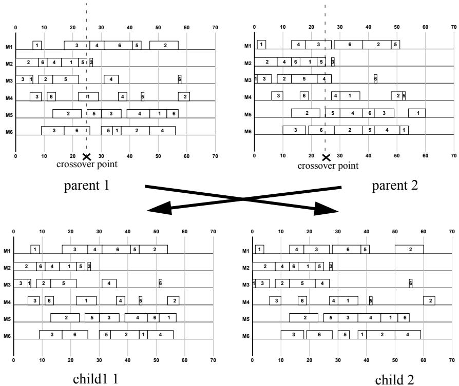
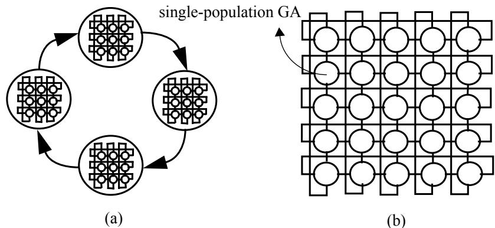
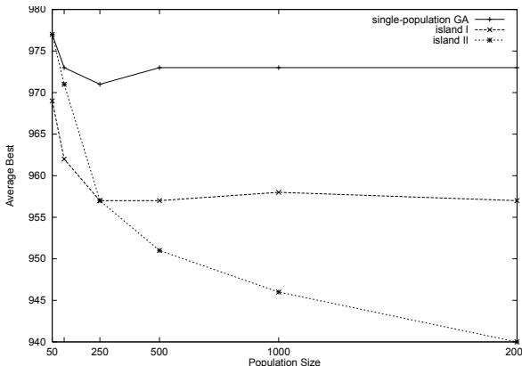
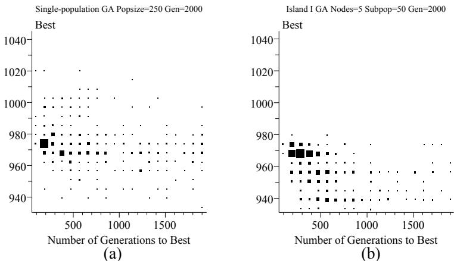
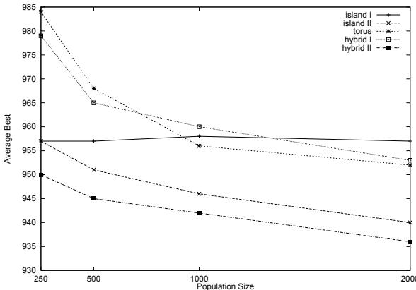

# Investigating Parallel Genetic Algorithms on Job Shop Scheduling Problems

# Shyh-Chang Lin

Erik D. Goodman William F. Punch, III

Genetic Algorithms Research and Applications Group Michigan State University East Lansing, MI 48823 linshyh@egr.msu.edu goodman@egr.msu.edu punch@cps.msu.edu

# Abstract

This paper describes a GA for job shop scheduling problems. Using the Giffler and Thompson algorithm, we created two new operators, THX crossover and mutation, which better transmit temporal relationships in the schedule. The approach produced excellent results on standard benchmark job shop scheduling problems. We further tested many models and scales of parallel GAs in the context of job shop scheduling problems. In our experiments, the hybrid model consisting of coarse-grain GAs connected in a fine-grain-GA-style topology performed best, appearing to integrate successfully the advantages of coarse-grain and fine-grain GAs.

# 1 Introduction

Job shop scheduling problems (JSSP’s) are computationally complex problems. Because JSSP’s are NP-hard -- i.e., they can’t be solved within polynomial time -- brute-force or undirected search methods are not typically feasible, at least for problems of any size. Thus JSSP’s tend to be solved using a combination of search and heuristics to get optimal or near optimal solutions. Among various search methodologies used for JSSPs, the Genetic Algorithm (GA), inspired by the process of Darwinian evolution, has been recognized as a general search strategy and optimization method which is often useful in attacking combinatorial problems. Since Davis proposed the first GA-based technique to solve scheduling problems in 1985 [2], GAs have been used with increasing frequency to solve JSSP’s. In contrast to local search techniques such as simulated annealing and tabu-search, which are based on manipulating one feasible solution, the GA utilizes a population of solutions in its search, giving it more resistance to premature convergence on local minima. The main difficulty in applying GAs to highly constrained and combinatorial optimization problems such as JSSP’s is maintaining the validity of the solutions. This problem is typically solved by modifying the breeding operators or providing penalties on infeasible solutions in the fitness function. Although resistant to premature convergence, GAs are not immune. One approach to reduce the premature convergence of a GA is parallelization of the GA into disjoint subpopulations, which is also a more realistic model of nature than a single population. Currently, there are two kinds of parallel GAs (PGAs) that are widely used: coarse-grain GAs (cgGAs) and fine-grain GAs (fgGAs). Both will be studied in the context of JSSP’s.

Section 2 defines the JSSP studied. Our approach to dealing with invalid solutions is described in Section 3. Section 4 describes PGAs and proposes some new models, and Section 5 details the results of our experiments.

# 2 Job Shop Scheduling Problem

Job shop scheduling, in general, contains a set of concurrent and conflicting goals to be satisfied using a finite set of resources. The resources are called machines and the basic tasks are called jobs. Each job is a request for scheduling a set of operations according to a process plan (or referred to as process routing) which specifies the precedence restrictions. The main constraint on jobs and machines is that one machine can process only one operation at a time and operations cannot be interrupted. Usually we denote the general JSSP as nxm, where $n$ is the number of jobs and $m$ is the number of machines. The operation of job $i$ on machine $j$ is denoted by operation $( i , j )$ . The problem is to minimize some performance criterion. This paper discusses the most widely used criterion, i.e., the time to completion of the last job to leave the system -- the makespan.

One useful model used to describe JSSP’s is the disjunctive graph, $G { = } ( N , A , E )$ , where $N$ is the node set, $A$ is the conjunctive arc set, and $E$ is the disjunctive arc set. The nodes $N$ correspond to all of the operations and two dummy nodes, a source and a sink. The conjunctive arcs $A$ represent the precedence relationships between the operations of a single job. The disjunctive arcs $E$ represent all pairs of operations to be performed on the same machine. All arcs emanating from a node have the processing time of the operation performed at that node as their length. The source has conjunctive arcs with length zero emanating to all the first operations of the job and the sink has the conjunctive arcs

Step $I$

Let $c$ contain the first schedulable operation of each job;

Let $r _ { i j } = 0$ , for all operations $( i , j )$ in $\ b { C }$ $( r _ { i j }$ is the earliest time at which operation $( i , j )$ can start.)

Compute

$$
t ( C ) = \operatorname* { m i n } _ { ( i , j ) \in C } \{ r _ { i j } + p _ { i j } \}
$$

and let $j ^ { * }$ denote the machine on which the minimum is achieved.

$( p _ { i j }$ is the processing time of operation $( i , j ) )$

Step 3:

Let $\pmb { G }$ denote the conflict set of all operations $( i , j ^ { * } )$ on machine $j ^ { * }$ such that

$$
r _ { i j ^ { * } } < t ( C )
$$

Step 4:

Randomly select one operation from $\pmb { G }$ .

Delete the operation from $c$ ; include its immediate successor in $C .$ , update $r _ { i j }$ in $c$ and return to step 2 until all operations are scheduled.

Fig 1. The Giffler and Thompson algorithm

coming from all the last operations. A feasible schedule corresponds to a selection of exactly one arc from each disjunctive arc pair such that the resulting directed graph is acyclic. The problem of minimizing the makespan reduces to finding a set of disjunctive arcs which minimize the length of the longest path or the critical path in the directed graph.

In JSSP’s, two classes of schedules are defined. The first is semi-active schedules, the other is active schedules. Semi-active schedules are feasible schedules in which no operation can be completed earlier without changing the job sequence on any of the machines. Active schedules are feasible schedules in which no operation can be completed earlier by changing the processing sequence on any of the machines without delaying some other operation. Clearly the set of active schedules is a subset of the set of semi-active schedules and optimal schedules are active schedules. Thus, in optimizing makespan, it is sufficient to consider only active schedules. A systematic approach to generate active schedules was proposed by Giffler and Thompson [6]. Because this procedure is closely related to our genetic operators, we give a brief outline of the G&T algorithm in Fig 1. The key condition in the G&T algorithm is the inequality $r _ { i j ^ { * } } < t ( C )$ in Step 3, which generates a conflict set consisting only of operations competing for the same machine. Once one operation is decided, it is impossible to add any operation that will complete prior to $t ( C )$ , making the generated schedule an active schedule.

# 3 Genetic Representation and Specific Operators

“Classical” GAs use a binary string to represent a potential solution to a problem. Such a representation is not naturally suited for ordering problems such as the Traveling Salesperson Problem (TSP) and the JSSP, because no direct and efficient way has been found to map possible solutions 1:1 onto binary strings. Two different approaches have been used to deal with the problem of representation. The first is an indirect representation, which encodes the instructions to a schedule builder. Some examples of an indirect representation are job order permutation and prioritization of scheduling rules. In these schemes, the schedule builder guarantees the validity of the schedules produced. Another approach is to use a direct representation which encodes the schedule itself. Some examples of direct representations use encodings of the operation completion times or the operation starting times. In such a representation, not every encoding corresponds to a valid schedule. If invalid encodings are allowed in the population, repair methods or penalty functions are required to maintain the validity of the schedules. However, use of penalty functions is inefficient for JSSP’s because the space of valid schedules is very small compared to the space of possible schedules. Thus, the GA will waste most of its time on invalid solutions. Another problem with a “classical” GA representation is that simple crossover or mutation on strings nearly always produces infeasible solutions. Previous researchers used some variations on standard genetic operators to address this problem. Well-known examples are sequencing operators devised for the TSP [17].

Our approach uses a direct representation, which encodes the operation starting times. The number of the fields on the chromosome is the number of operations. The genetic operators are inspired by the G&T algorithm. Some related approaches which are G&T-algorithm-based are briefly reviewed. Yamada and Nakano [18] used operation completion times for their representation. They proposed using GA/GT crossover, which ensures assembling valid and active schedules. The GA/GT crossover works as follows: at each decision point in the G&T algorithm (step 4 in Fig 1), one parent is selected randomly. However, in GA/GT crossover, the schedulable operation which has the earliest completion time reported in the parental schedule is chosen to be scheduled next. The effect of GA/GT crossover is the same as applying uniform crossover and using the G&T algorithm to interpret the resulting invalid chromosomes. Dorndorf and Pesch [3] encode the operation starting times and apply the G&T algorithm to decode the invalid offspring which are generated from standard crossover. Other approaches are similar to the two above. The G&T algorithm is used as an interpreter to decode any offspring into an active schedule. Table 1 lists the G&T-algorithm-based GA approaches. These approaches are designed to transmit “useful characteristics” from parents for the creation of potentially better offspring. These “useful characteristics” can be priority rules or job sequences, depending on the representation and crossover methods used. In JSSPs, the temporal relationships among all operations in a schedule are important. Simply working on the chromosome level usually focuses on only a small part of the schedule and overlooks the change of the temporal relationships in the whole schedule. In contrast to previous approaches, which work on the chromosome level, we have designed the time horizon exchange (THX) crossover, which works on the schedule level. THX crossover randomly selects a crossover point just like a standard crossover, but instead of using the crossover point to exchange two chromosomes, THX crossover uses the crossover point as a scheduling decision point in G&T algorithm to exchange information between two schedules. Fig 2shows an example of THX crossover in Fischer and Thompson’s (FT) 6x6 problem. The portion of the child schedule before the crossover point is exactly the same as in one parent. The temporal relationships among operations in the remaining portion are inherited from the other parent to the extent possible (i.e., while maintaining a valid schedule).

Table 1. G&T-algorithm-based GA approaches   

<table><tr><td rowspan=1 colspan=1>reference</td><td rowspan=1 colspan=1>representation</td><td rowspan=1 colspan=1>crossover</td></tr><tr><td rowspan=1 colspan=1>Yamada and Nakano (1992) [18]</td><td rowspan=1 colspan=1>completion time</td><td rowspan=1 colspan=1>uniform</td></tr><tr><td rowspan=1 colspan=1>Storer et al. (1992) [15]</td><td rowspan=1 colspan=1>perturbed processing time</td><td rowspan=1 colspan=1>standard</td></tr><tr><td rowspan=1 colspan=1>Dorndorf and Pesch (1993) [3]</td><td rowspan=1 colspan=1>starting time</td><td rowspan=1 colspan=1>standard</td></tr><tr><td rowspan=1 colspan=1>Dorndorf and Pesch (1995) [4]</td><td rowspan=1 colspan=1>priority rule</td><td rowspan=1 colspan=1>standard</td></tr><tr><td rowspan=1 colspan=1>Kobayashi et al. (1995) [9]</td><td rowspan=1 colspan=1>job order</td><td rowspan=1 colspan=1>subsequenceexchange</td></tr><tr><td rowspan=1 colspan=1>Lin et al.</td><td rowspan=1 colspan=1>starting time</td><td rowspan=1 colspan=1>time horizonexchange</td></tr></table>

Another important operator in GAs is mutation. The THX mutation operator is based on the disjunctive graph of the schedule. Although exchanging a single pair of adjacent tasks which are on the same machine and belong to a critical path can preserve the acyclic property of the directed graph, the number of child schedules that are better than the parent tends to be very limited, as was observed by Grabowski et al. [19]. They defined a block as a sequence of successive operations on the critical path which are on the same machine with at least two operations. The reversal of a critical arc can only lead to an improvement if at least one of the reversed operations is either the first or the last operation of the block. Thus our mutation focuses on the block. Two operations in the block are randomly selected and reversed. After the child is generated, we apply the G&T algorithm to interpret the child. Thus, no cycle detection is needed. Furthermore, the G&T algorithm guarantees that the two selected operations are reversed in the new schedule and that the new schedule is active.

  
Fig 2. An example of THX crossover

# 4 Parallel Genetic Algorithms

Although “classical” GAs can be made somewhat resistant to premature convergence (i.e., inability to search beyond local minima), there are methods which can be used to make GAs even more resistant. PGAs retard premature convergence by maintaining multiple, somewhat separated subpopulations which may be allowed to evolve more independently (or, more precisely, by employing non-panmictic mating). Two fundamental models of PGAs can be distinguished in the literature. The first is fine-grained GAs (fgGAs) [11,13], in which individuals are spatially arrayed in some manner and an individual in the population can interact only with individuals “close” to it. The topology of individuals in the template defining the breeding “neighborhood” determines the degree of isolation from other individuals and therefore strongly influences the diversity of the individuals in the population. All the individuals can be considered to be continuously moving around within their neighborhoods, so that global communication is possible, but not instantaneous. The second is the coarse-grained GAs (cgGAs), also called island-parallel GAs [10,16], in which each node is a subpopulation performing a singlepopulation GA. At certain intervals, some individuals may migrate from one subpopulation to another. The rate at which individuals can migrate globally is typically much smaller than found in fgGAs. In this paper, we use a two-dimensional torus as the neighborhood topology to study the fgGA model and an island GA connected in a ring to study the cgGA model.

  
Fig 3. Examples of the hybrid models

Two hybrid models are also proposed in this paper. One is an embedding of fgGAs into cgGAs. Fig 3(a) shows an example in which each subpopulation on the ring is a torus. The frequency of migration on the ring is much smaller than that within the torus. The other hybrid model is a “compromise” between a $\mathsf { c g G A }$ and a fgGA -- the connection topology used in the cgGA is one which is typically found in fgGAs, and a relatively large number of nodes is used. Fig 3(b) shows an example in which each node of the torus is a single-population GA. The frequency of migration resembles that typically found in cgGAs.

Table 2. Best results obtained by previous approaches on the two FT problems.   

<table><tr><td rowspan=1 colspan=1>reference</td><td rowspan=1 colspan=1>10x10</td><td rowspan=1 colspan=1>20x5</td></tr><tr><td rowspan=9 colspan=1>Baker and McMahon (1985)[22]Adams et al. (1988)[20]Carlier and Pinson (1989) [21]Nakano and Yamada (1991)[14]Yamada and Nakano (1992)[18]Storer et al. (1993)[15]Dorndorf and Pesch (1993)[3]Fang et al. (1993)[5]Juels and Wattenberg (1994)[8]Mattfeld et al. (1994)[12]</td><td rowspan=1 colspan=1>960</td><td rowspan=1 colspan=1>1303</td></tr><tr><td rowspan=1 colspan=1>930</td><td rowspan=1 colspan=1>1178</td></tr><tr><td rowspan=1 colspan=1>930</td><td rowspan=1 colspan=1>1165</td></tr><tr><td rowspan=1 colspan=1>965</td><td rowspan=1 colspan=1>1215</td></tr><tr><td rowspan=1 colspan=1>930</td><td rowspan=1 colspan=1>1184</td></tr><tr><td rowspan=1 colspan=1>954</td><td rowspan=2 colspan=1>11801165</td></tr><tr><td rowspan=1 colspan=1>930</td></tr><tr><td rowspan=2 colspan=1>949937930</td><td rowspan=1 colspan=1>1189</td></tr><tr><td rowspan=1 colspan=1>11741165</td></tr><tr><td rowspan=1 colspan=1>Dorndorf and Pesch (1995)[4]Bierwirth (1995)[1]Kobayashi et al. (1995)[9]Lin et al.</td><td rowspan=1 colspan=1>938936930930</td><td rowspan=1 colspan=1>1178118111731165</td></tr></table>

  
Fig 4. Avg. (100 runs) best indiv. for three test models, various population sizes

# 5 Computational Results

The configurations described have been implemented in GALOPPS [7], a freeware GA development system from the MSU GARAGe, and run on a Sun Ultra 1. As a benchmark, two FT problems, $\mathrm { F T } 1 0 \mathrm { x } 1 0$ and FT20x5, were tested. These two FT problems are of particular interest because almost all JSSP algorithms proposed have used them as benchmarks. Table 2 summarizes the best results obtained by previous approaches for the two FT problems. Except for the first three approaches, which are based on branch and bound methods, the remaining approaches are GA-based methods. By using single-population GAs with our THX operators, we were able to find the global optima for the two problems, which are 930 and 1165, respectively. The $\mathrm { F T 1 0 x 1 0 }$ was also used to evaluate the effectiveness of PGAs and to compare the performance of the various PGA models in the following subsections.

# 5.1 The Effect of Parallelizing GAs

To investigate the effect of parallelizing GAs, we used one single-population GA and two cgGAs with different population sizes on the $\mathrm { F T 1 0 x 1 0 }$ problem. In all runs, the crossover and mutation rates were 0.6 and 0.1 respectively, and offspring replaced their parents, with elitism protecting the best individual from replacement. We varied the total population size in each case to test for its effect. The population sizes used were 50, 100, 250, 500, 1000, and 2000. Both cgGAs, called island I and island II, are connected in a one-way ring. The best individual is migrated to the next neighbor every 50 generations. The number of nodes in the island I GA was fixed at 5, so the subpopulation size is the total size divided by 5. In the island II GA, the subpopulation size is fixed at 50, so the number of nodes is obtained by dividing the total population size by 50.

  
Fig 5. (a) the single-population GA (b) the island I GA

Fig 4 shows the average best results of the three models on various population sizes based on 100 runs. The single-population GA doesn’t show any improvement in performance after the population size 250 mark. The reason is that the single-population GA cannot maintain the diversity in the population as well as the PGA approaches. This loss of diversity causes premature convergence. The problem also appears in the island I GA model. Although premature convergence strongly deters further improvement after the population size 250 mark, the island I GA still outperforms the single-population GA. The island II GA doesn’t suffer as much from premature convergence. The larger the number of subpopulations, the better diversity is maintained. An average best of 940 is reached when the population size is 2000. By considering the average turnaround time of each node to calculate a fixed number of generations, we can analyze the speed-up of PGAs. In general, increasing the number of processors leads to approximately linear speed-up. For example, for a total population size fixed at 1000, the speed-up for numbers of nodes set to 5 and 20 are 4.7 and 18.5, respectively. The degraded performance is due to the communication overhead. In PGAs, we are more interested in the time needed to reach a given solution quality. Fig 5 shows the two-dimensional cell plot of the single-population GA and the island I GA with population size 250, based on 1000 runs. In the figure, we can observe that the distribution of the results moves to the left corner in the island I GA. That is, the parallelization of the GA yields better results using fewer evaluations. Actually, the average number of generations to obtain the best result in the island I GA is 732, compared to 852 for the single-population GA. Because the average best result of the island I GA is better than that of the single-population GA, the speed-up under “time-to-solution” is surely $> 5 . 8$ .

Table 3. The population structures of the PGA models   

<table><tr><td rowspan=1 colspan=1>Popsize</td><td rowspan=1 colspan=1>Island I Island II</td><td rowspan=1 colspan=1>Island I Island II</td><td rowspan=1 colspan=1>torus</td><td rowspan=1 colspan=1>hybrid I</td><td rowspan=1 colspan=1>hybrid II</td></tr><tr><td rowspan=1 colspan=1>250</td><td rowspan=1 colspan=1>50:5</td><td rowspan=1 colspan=1>50:5</td><td rowspan=1 colspan=1>2:25x5</td><td rowspan=1 colspan=1>2:5 islands, each island:5x5 torus</td><td rowspan=1 colspan=1>10:5x5</td></tr><tr><td rowspan=1 colspan=1>500</td><td rowspan=1 colspan=1>100:5</td><td rowspan=1 colspan=1>50:10</td><td rowspan=1 colspan=1>2:25x10</td><td rowspan=1 colspan=1>2:5 islands, each island:10x5 torus</td><td rowspan=1 colspan=1>10:5x10</td></tr><tr><td rowspan=1 colspan=1>1000</td><td rowspan=1 colspan=1>200:5</td><td rowspan=1 colspan=1>50:20</td><td rowspan=1 colspan=1>2:25x20</td><td rowspan=1 colspan=1>2:5 islands, each island:10x10 torus</td><td rowspan=1 colspan=1>10:10x10</td></tr><tr><td rowspan=1 colspan=1>2000</td><td rowspan=1 colspan=1>400:5</td><td rowspan=1 colspan=1>50:40</td><td rowspan=1 colspan=1>2:25x40</td><td rowspan=1 colspan=1>2:5 islands, each island:10x20 torus</td><td rowspan=1 colspan=1>20:10x10</td></tr></table>

  
Fig 6. Average best of the five PGA models with various population size

# 5.2 Comparison of PGA Models

We examine 5 PGA schemes -- the two cgGAs discussed in 5.1, plus one fgGA torus model and two hybrid models. The migration interval in cgGAs is 50 generations (i.e. an exchange between subpopulations every 50 generations). The population structures are shown in Table 3 in a subpopulation_size:connection_topology format. In the torus model, the subpopulation size is fixed at 2. In the hybrid I model, each island on the ring is a torus and the number of islands is fixed at 5.

Fig 6 shows the average best of the five PGA models based on 100 runs. The hybrid I and torus models have similar performance because both models are based on the fgGA model. Although both models are inferior to island I when the population size is less than 1000, their average best result improved for larger population sizes. The island II and hybrid II models are superior to the other approaches. The essential island structure of both models successfully alleviates premature convergence. The connection topology of fgGAs in the hybrid II model supports the diffusion of genetic material to different subpopulations and further enhances its search ability. Thus the excellent results of the hybrid II model are achieved by combining the merits found in cgGAs and fgGAs. Notice that in the hybrid II model at population size 2000, the optimal schedule is found 40 times in 100 runs. The average result is 936, which is within $\mathbf { 0 . 7 \% }$ of the optimum, and the standard deviation is 5.62. Because not all previous researchers reported their means and standard deviations, here we compare our best results with Juels and Wattenberg [8] and Mattfeld et al.[12]. The superiority of our method with the best PGA model is retained at significance levels better than 0.0001 compared with the results of Juels and Wattenberg and the results of Mattfeld et al.

In summary: In this test problem, fgGAs appear to lose genetic diversity too quickly, in comparison to cgGAs. Improvement can be made if a different migration strategy is applied [12]. In cgGAs, increasing the number of islands improves performance more than simply increasing the total population size. Additionally, a good connection topology can further increase the performance. Best results were obtained with the hybrid model consisting of cgGAs connected in a fgGA-style topology.

# 6 Summary and Conclusions

This paper describes a GA based on the G&T algorithm for the JSSP. Our extensions to G&T, the THX crossover and mutation operators, are designed to transmit the temporal relationships in the schedule. For both FT problems, the methods introduced found the optimum. The results show that although the specific operators are difficult to design, if problem-specific knowledge is successfully incorporated into the operators, the GA can work more effectively on the particular problem.

We further compared single-population GAs and PGAs on the FT10x10 problem. The results suggest that the effect of parallelizing the GA was twofold. PGAs not only alleviated the premature convergence problem and improve the results, but also found the solution in a shorter time compared to single-population GAs. We also reported on various PGA models. In cgGAs, the number of islands used in the run had a greater positive effect on performance than simply increasing population size. In the fgGA model, premature convergence was still a problem, since the overlapping subpopulations are susceptible to domination by high-fitness individuals. Finally, the hybrid II model performed best due to the integration of the advantages of cgGAs and fgGAs, and the results are very encouraging when compared to previous approaches.

# Список литературы

[1] Bierwirth, C. “A Generalized Permutation Approach to Job Shop Scheduling with Genetic Algorithms,” OR-Spektrum, Special Issue: Applied Local Search, Pesch, E. and Vo, S. (eds), vol. 17, No. 213, pp. 87-92, 1995.   
[2] Davis, L., “Job-Shop Scheduling with Genetic Algorithms,” Proc. Int’l Conf. on Genetic Algorithms and their Applications, pp. 136-149, Lawrence Erlbaum, Hillsdale, NJ, 1985.   
[3] Dorndorf, U. and Pesch, E. “Combining Genetic- and Local Search for Solving the Job Shop Scheduling Problem,” APMOD93 Proc. Preprints, pp. 142-149, Budapest, Hungary, 1993.   
[4] Dorndorf, U. and Pesch, E. “Evolution Based Learning in a Job Shop Scheduling Environment,” Computers Operations Research, vol. 22, pp. 25-40, 1995.   
[5] Fang, H., Ross, P. and Corne, D., “A Promising Genetic Algorithm Approach to Job-Shop Scheduling, Rescheduling, and Open-Shop Scheduling Problems,” Proc. Fifth Int’l Conf. on Genetic Algorithms, pp. 375-382, Morgan Kaufmann, San Mateo, CA, 1993.   
[6] Giffler, J. and Thompson, G.L., “Algorithms for Solving Production Scheduling Problems,” Operations Research, Vol. 8, pp. 487-503, 1960.   
[7] Goodman, E. D. An Introduction to GALOPPS, Technical Report GARAGe95- 06-01, Genetic Algorithms Research and Applications Group, Michigan State University, 1995.   
[8] Juels, A. and Wattenberg, M. “Stochastic Hillclimbing as a Baseline Method for Evaluating Genetic Algorithms,” Technical Report csd-94-834, University of California at Berkeley, 1994.   
[9] Kobayashi, S., Ono, I., and Yamamura, M. “An Efficient Genetic Algorithm for Job Shop Scheduling Problems,” Proc. Sixth Int’l Conf. on Genetic Algorithms, pp. 506-511, Morgan Kaufmann, San Mateo, CA, 1995.   
[10] Lin, S.-C., Punch, W.F., and Goodman, E.D., “Coarse-Grain Parallel Genetic Algorithms: Categorization and New Approach,” IEEE SPDP, pp. 28-39, 1994.   
[11] Manderick, B. and Spiessens, P. “Fine-Grained Parallel Genetic Algorithms,” Proc. Third Int’l Conf. on Genetic Algorithms, pp. 428-433, Morgan Kaufmann, San Mateo, CA, 1989.   
[12] Mattfeld, D. C., Kopfer, H., and Bierwirth, C. “Control of Parallel Population Dynamics by Social-Like Behavior of GA-Individuals,” Parallel Problem Solving from Nature, 3, pp. 15-24, Springer-Verlag, Berlin, Heidelberg, 1994.   
[13] Muhlenbein, H. “Parallel Genetic Algorithms, Population Genetics and Combinatorial Optimization,” Proc. Third Int’l Conf. on Genetic Algorithms, pp. 416-421, Morgan Kaufmann, San Mateo, CA, 1989.   
[14] Nakano, R. and Yamada, T. “Conventional Genetic Algorithms for Job-Shop Problems,” Proc. Fourth Int’l Conf. on Genetic Algorithms, pp. 474-479, Morgan Kaufmann, San Mateo, CA, 1991.   
[15] Storer, R. H., Wu, S.D., and Vaccari, R. “New Search Spaces for Sequencing Problems with Application to Job Shop Scheduling,” Management Science, vol. 38, pp. 1495-1509, 1992.   
[16] Tanese, R., “Distributed Genetic Algorithms,” Proc. Third Int’l Conf. on Genetic Algorithms, pp. 434-440, Morgan Kaufmann, San Mateo, CA, 1989.   
[17] Whitley, D., Starkweather, T, and Shaner, D., “The Traveling Salesman and Sequence Scheduling: Quality Solutions Using Genetic Edge Recombination,” Handbook of Genetic Algorithms, Davis, L. (ed), pp. 350-372, Van Nostrand Reinhold, New York, NY, 1991.   
[18] Yamada, T. and Nakano, R. “A Genetic Algorithm Applicable to Large-Scale JobShop Problems,” Parallel Problem Solving from Nature, 2, pp. 281-290, NorthHolland, Amsterdam, 1992.   
[19] Grabowski, J., Nowicki, E., and Zdrzalka, S. “A Block Approach for Single Machine Scheduling with Release Date and Due Date,” European J. Oper. Res., vol. 26, pp. 278-285, 1986.   
[20] Adams, J., Balas, E., and Zawack, D. “The Shifting Bottleneck Procedure in Job Shop Scheduling,” Management Science, vol. 34, pp. 391-401, 1988.   
[21] Caelier, J. and Pinson, E., “An Algorithm for Solving the Job-shop Problem,” Management Science, vol. 35, pp. 164-176, 1989.

[22] Baker, J.R. and McMahon, G.B., “Scheduling the General Job-shop,” Management Science, vol. 31, pp. 594-598, 1985.