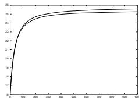
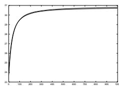
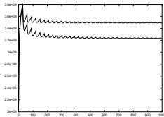
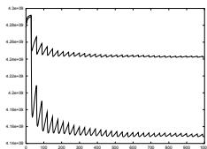

# New Operators and Dominance Scheme for a Diploid GA

Sima Etaner-Uyar Istanbul Technical University, Computer Engineering Dept. Maslak TR-80626 Istanbul, TURKEY etaner@cs.itu.edu.tr

# 1 Introduction

Classical genetic algorithms use a haploid representation for individuals. However, most complex organisms in nature have a diploid chromosome structure, i.e. the organism has two alleles for each characteristic, located on two homologue chromosomes. Even though this seems like redundant information, it's nature's way of keeping a genetic memory and introducing genetic diversity. This way, genetic information which may be useful in the future is not lost but is shielded against harmful selection via a domination mechanism which masks the recessive allele until a future time when it may become useful.

phenotype is called domination. It determines the allele to be expressed in the case where the two alleles for a characteristic are different.

In this study a domination array which is made up of real numbers in [0.0, 1.0] and has the same length as the chromosomes is used in the domination mechanism. Each real number shows the dominance factor of allele 1 over allele 0 for the locus corresponding to its index in the array. The domination array is initialized to have the value 0.5 for all locations which means that either allele is equally likely to be expressed. After each generation, the domination array is recalculated using Equation 1.

# 2 The Diploid Algorithm

In the implementation of this study, each individual is represented by two chromosome arrays which make up the genotype, one phenotype array, a fitness value and an age which shows for how many generations the individual has stayed in the population. The algorithm uses the basic concepts in "Goldberg, (1989)" along with some new operators and a new domination scheme. The pseudocode of the diploid algorithm is given in Algorithm 1.

# Algorithm 1 The diploid genetic algorithm

<table><tr><td>begin</td><td></td></tr><tr><td>initialize;</td><td></td></tr><tr><td>for no. of generation times do</td><td></td></tr><tr><td>select mating pool;</td><td></td></tr><tr><td>meiosis;</td><td></td></tr><tr><td>form offspring;</td><td></td></tr><tr><td>mutation;</td><td></td></tr><tr><td>for each dead parent, form new individual;</td><td></td></tr><tr><td>select next generation;</td><td></td></tr><tr><td>calculate new domination array values; end.</td><td></td></tr></table>

# 2.1 Genotype to Phenotype Mapping

The phenotype of the individual is used in calculating its fitness. The mechanism to map the genotype onto the

$$
D o m [ i ] = \frac { \sum _ { j } p h _ { i j } * f _ { j } } { \sum _ { j } f _ { j } } , i = 1 , 2 , . . , l j = 1 , 2 , . . . s
$$

where $p h _ { i j }$ is the phenotypic value of the $j$ th individual at the $i$ th chromosomal location, $f _ { j }$ is the fitness value of the $j$ th individual, $l$ is the chromosome length and $s$ is the number of individuals.

# 2.2 The Algorithm

The initialization step of the algorithm includes the initialization of the individuals' chromosomes and the domination array. The main loop starts with the selection of individuals using a roulette wheel selection method and the selected individuals are paired off randomly. Each parent goes through a meiotic cell division phase which involves replication of chromosomes and a possible twopoint cross over between homologue pairs. As a result of this, four gametes, two of which are selected randomly to be copied into the genotypes of the two offspring, are formed. Each parent gives one chromosome to each offspring. At the end of reproduction, the size of the population becomes $2 n$ given that it was $n$ before this step. Mutation may occur on the genotype of each of the $2 n$ individuals. Some of the parents may die due to old age and new individuals are initialized randomly to make up for the population size which is constant. The probability of an individual to die is calculated using $k . a g e ^ { 2 }$ where $k$ is a constant in [0.0,1.0] and age is the individual's age. The $n$ individuals to survive into the next generation are selected from among these $2 n$ individuals using a fitness proportional selection mechanism similar to a roulette wheel selection and the age counters of each selected individual is incremented. The new domination array values are calculated and the population is scanned for the individual with the best fitness.

# 3 Test Problems

The proposed diploid algorithm and the standard haploid algorithm are compared using several test functions. The results of only two tests will be given below.

In the first test problem the number of 1s in a 32 bit string is to be maximized. The fitness of each individual is calculated by counting the number of 1s. This is considered to be an easy problem for the haploid algorithm.

In the second test problem the fitness function oscillates every thirty generations between maximizing the decimal value of the binary string and minimizing it. This problem is considered to be hard for the haploid algorithm.

# 4 Results

The online and offine performances "Goldberg, (1989)" for test 1 are given in Fig. 1 and Fig. 2 respectively. In each case the diploid algorithm performs as well as the haploid one. The same for test 2 are given in Fig. 3 and Fig. 4 respectively. In each case, the better plot line belongs to the diploid algorithm.

No. of Steps: 1000, Pop. Size: 250, Cross Over Prob.: 0.9, Mutation Prob.: 0.009, No. of runs: 100, ${ \bf k } = 0 . 0 1$ (diploid GA)

  
Fig. 1 Test1: Online perf. avg'd over 100 runs

  
Fig. 2 Test1: Offline perf. avg'd over 100 runs

  
Fig. 3 Test2: Online perf. avg'd over 100 runs

  
Fig. 4 Test2: Offline perf. avg'd over 100 runs

The mean value of the best fitnesses taken over 100 runs, the standard deviation (sigma) of these best fitnesses, the best and worst fitnesses found in 100 runs and the average step for finding the best fitness are given in the below table for Test 1 and Test 2 cases respectively. The percent value gives the precentage of the standard deviation to the mean fitness value.

<table><tr><td rowspan=1 colspan=1>Tst1 &amp; Tst2.</td><td rowspan=1 colspan=1>Haploid</td><td rowspan=1 colspan=1>Diploid</td><td rowspan=1 colspan=1>Haploid</td><td rowspan=1 colspan=1>Diploid</td></tr><tr><td rowspan=1 colspan=1>Mean Fit.</td><td rowspan=1 colspan=1>32</td><td rowspan=1 colspan=1>32</td><td rowspan=1 colspan=1>4294950144</td><td rowspan=1 colspan=1>4294966272</td></tr><tr><td rowspan=1 colspan=1>Sigma</td><td rowspan=1 colspan=1>0.0</td><td rowspan=1 colspan=1>0.0</td><td rowspan=1 colspan=1>34971.7</td><td rowspan=1 colspan=1>2636.2</td></tr><tr><td rowspan=1 colspan=1>Percent</td><td rowspan=1 colspan=1>0.0</td><td rowspan=1 colspan=1>0.0</td><td rowspan=1 colspan=1>0.000814</td><td rowspan=1 colspan=1>0.000061</td></tr><tr><td rowspan=1 colspan=1>Best Fit.</td><td rowspan=1 colspan=1>32</td><td rowspan=1 colspan=1>32</td><td rowspan=1 colspan=1>4294967296</td><td rowspan=1 colspan=1>4294967296</td></tr><tr><td rowspan=1 colspan=1>Worst Fit.</td><td rowspan=1 colspan=1>32</td><td rowspan=1 colspan=1>32</td><td rowspan=1 colspan=1>4294702080</td><td rowspan=1 colspan=1>4294958080</td></tr><tr><td rowspan=1 colspan=1>Avg. Step</td><td rowspan=1 colspan=1>29</td><td rowspan=1 colspan=1>30</td><td rowspan=1 colspan=1>147.3</td><td rowspan=1 colspan=1>259.5</td></tr></table>

The above results show that in the first test case, the diploid algorithm performs as well as the haploid one. However in the second case, which is considered hard for a haploid algorithm, the diploid one performs better.

# 5 Future Work

The proposed algorithm will be used for dynamically load balancing a network of computers.

# Acknowledgements

This dissertation research is being conducted in the Istanbul Technical Univ., Institute of Science and Technology, under the supervision of Prof. Dr. Emre Harmanci as the thesis advisor.

# Bibliography

Goldberg, D. E. 1989. Genetic Algorithms in Search, Optimization and Machine Learning. Addison Wesley.