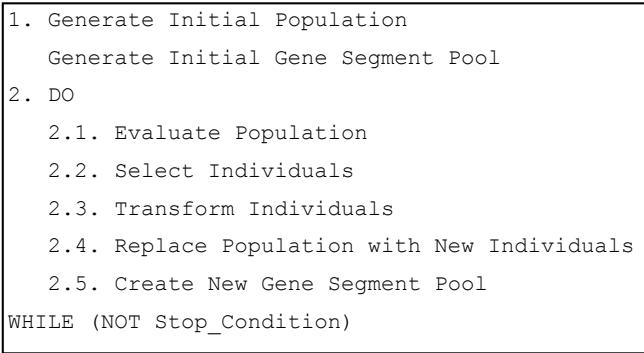
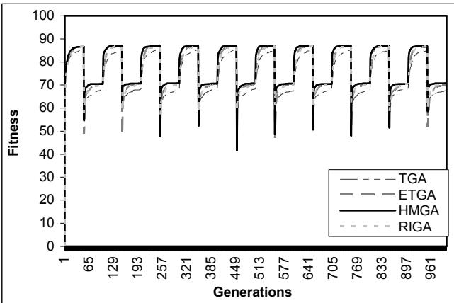
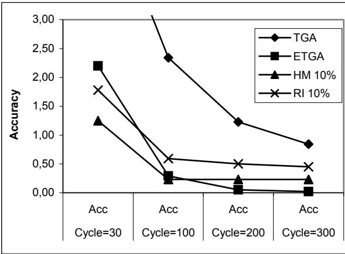
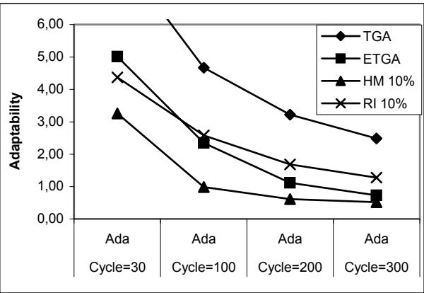
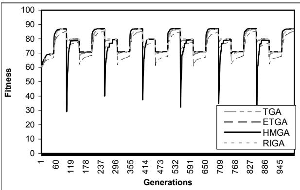
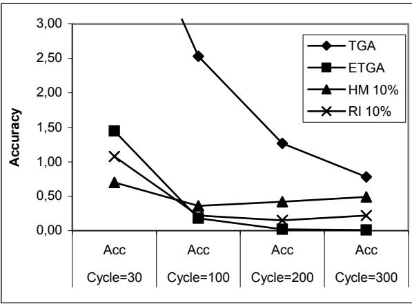
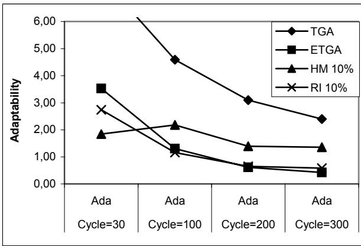
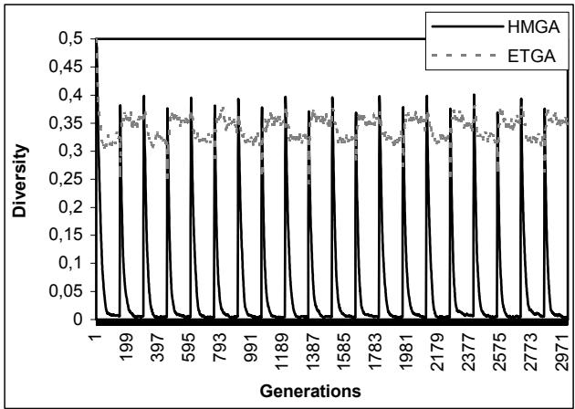
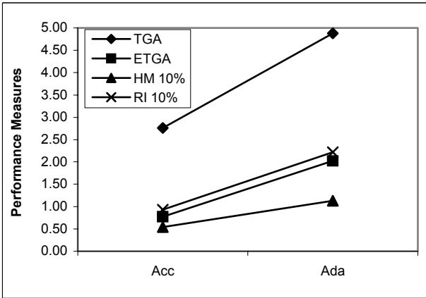
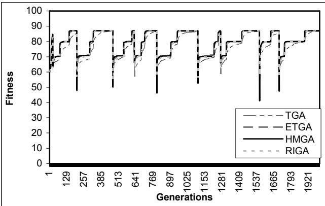

# Using Genetic Algorithms to Deal with Dynamic Environments: A Comparative Study of Several Approaches Based on Promoting Diversity

# Anabela Simões

Department of Informatics and Systems Engineering Coimbra Polytechnic Quinta da Nora, 3030 Coimbra, Portugal abs@isec.pt

# Ernesto Costa

Centre for Informatics and Systems of the University of Coimbra   
Polo II, Pinhal de Marrocos, 3030 Coimbra Portugal ernesto@dei.uc.pt

# Abstract

One of the approaches used in Evolutionary Algorithms (EAs) for problems in which the environment changes from time to time is to use techniques that preserve the diversity in population. We have tested and compared several algorithms that try to keep the population as diverse as possible. One of those approaches applies a new biologically inspired genetic operator called transformation, previously used with success in static optimization problems. We tested two EAs using transformation and two other classical approaches: random immigrants and hypermutation. The comparative study was made using the dynamic 0/1 Knapsack optimization problem. Depending on the characteristics of the dynamic changes, the best results were obtained with transformation or with hypermutation.

# 1 INTRODUCTION

Evolutionary Algorithms (EAs) are often used to solve problems involving a stationary environment and so, the fitness function does not change over the time. When the environment changes over time, resulting in modifications of the fitness function from one cycle to another, we say that we are in the presence of a dynamic environment.

Traditional EAs are not suitable to solve problems facing a dynamic environment, because the population quickly converges to an optimum and when changes do occur, it is very difficult to readapt the solutions to the new conditions. In general, this is a consequence of the lost of the population’s diversity.

Several approaches have been proposed to deal with dynamic environments: approaches based on using an explicit memory (Ramsey et al. 1993; Ng et al. 1995; Hadad et al. 1997; Branke, 1999), approaches based on promoting diversity (Grefenstette, 1992; Cobb et al. 1993; Simões et al. 2001b), or hybrid approaches combining these two aspects.

Solutions that appeal to an explicit memory, does not seem to be the best approach in cases where we can not anticipate the dynamics of the changes (for instance, nonperiodic changes).

In this work we present a comparative study, using three different approaches, all based on promoting diversity in the population, to solve the dynamic 0/1 Knapsack problem (0/1 KP) proposed by Goldberg et al. 1987.

In particular, we will test the effectiveness of these approaches using the technique of the introduction of random immigrants (Grefenstette, 1992), the application of hypermutation (Cobb 1990) and the introduction of a biologically inspired genetic operator called transformation proposed by (Simões et al. 2001a).

In this paper we will use two forms of transformation: the original proposal, based on the application of random parameters, and the enhanced version, proposed by (Simões et al. 2002) that uses a set of optimized parameter setting obtained by an extensive empirical study.

This paper is organized in the following manner. First, in section 2, we briefly explain the transformation mechanism. We will describe its biological functioning and the proposed computational implementation. Section 3, details the characteristics of the experimental environment. In section 4, we report the results using the three approaches. Finally, we present the main conclusions of the work.

# 2 TRANSFORMATION

# 2.1 BIOLOGICAL TRANSFORMATION

Transformation is a process that modify certain bacteria (and occasionally other cells as well) which, when grow in the presence of killed cells, take up foreign DNA from that cells and acquire characters encoded by it (Russell, 1998).

# 2.2 PREVIOUS WORK ON COMPUTATIONAL TRANSFORMATION

We incorporate transformation into the standard genetic algorithm as a new genetic operator that replaces crossover. This modified GA is briefly described in Figure 1. The foreign DNA fragments, consisting of binary strings of different lengths, will form a gene segment pool and will be used to transform the individuals of the population.

  
Figure 1: The Transformation-based GA

The GA starts with an initial population of individuals and an initial pool of gene segments, both created at random. In each generation, we select individuals to be transformed and we modify them using the gene segments in the segment pool. After that, the segment pool is changed, using the old population to create part of the new segments with the remaining being created at random. The segments that each individual will take up from the "surrounding environment" will proceed, mostly, from the individuals existing in the previous generation. In the used experimental setup, we changed the segment pool every generation.

After selecting individuals to a mating pool, we use the transformation mechanism to produce new individuals. In this case, there is no sexual reproduction among the individuals of the population. Each individual will generate a new one through the process of transformation. We can consider this process a form of asexual reproduction.

To transform an individual we execute the following steps: we select a segment from the segment pool and we randomly choose a point of transformation in the selected individual. The segment is incorporated in the genome of the individual, replacing the genes after the transformation point, previously selected. This corresponds to the biological process where the gene segments when integrated in the recipient's cell DNA, replace some genes in its chromosome. For more details about transformation see (Simões et al. 2001a).

# 2.3 THE BASIC VERSION OF TRANSFORMATION-BASED GENETIC ALGORITHM (TGA)

The first application of transformation used a set of parameters chosen without any particular criterion. The gene segment lengths were always defined randomly, the mutation rate was set to $0 . 1 \%$ , the transformation rate was $70 \%$ and the replacement rate, i.e., the percentage of individuals of the previous generation that contributes for the update of the gene segment pool at the present generation, was set to $70 \%$ .

The GA using this primary form of transformation will be referred as Transformation-based Genetic Algorithm (TGA) and was used in the domains of function optimization and combinatorial optimization (static 0/1 KP and dynamic $0 / 1 \mathrm { \textrm { K P } }$ ). Besides the choice of the parameters has been done without any previous study, the obtained results were very promising. In fact, in the domain of function optimization, the TGA achieved much better results than the Standard GA (SGA) using the classical crossover operators.

One of the main conclusions of these studies was the ability of transformation to preserve the diversity in the population during the entire course of computation.

One of the main drawbacks of EA to solve dynamic problems is the fact of, as they converge for the optimum, the population’s diversity is lost and the algorithm cannot continue exploring different areas of the search space. So, the use of transformation in non-stationary problems, seem to be a good idea. We used the TGA in the dynamic 0/1 KP but the obtained results were not compared with another approaches. The results obtained were very promising and are reported in Simões et al. 2001b.

# 2.4 THE ENHANCED VERSION OF TRANSFORMATION-BASED GENETIC ALGORITHM (ETGA)

Analyzing the results obtained by the TGA, it was obvious that if the values of the parameters were adjusted carefully, the algorithm performance could be improved. In order to conclude about those intuitions, we carried out an extensive parametric study to obtain the correct choice of parameters when using transformation in the GA (Simões et al. 2002).

In that study we analyzed four parameters: the gene segment length, the replacement rate, and the mutation and transformation rates.

The main conclusion was that, the random choice for the length of the segments that was made in the TGA deteriorated its performance in a very expressive manner. We fixed the gene segment length in values from 5 to a maximum depending on the chromosome length and it was clear that as we increase the segment length the results became worst. In fact, larger segments introduced a great degree of disruption.

The choice for the replacement rate also influenced the obtained solutions. For this parameter, in the case of function optimization, the best choice was a value superior to $60 \%$ , in the case of the $_ { 0 / 1 }$ KP, the best choice was a value inferior to $50 \%$ .

Analyzing the effects of mutation, we concluded that when using transformation, no mutation in necessary. In fact, using mutation, even with a small rate, the results become worst.

Finally, the transformation rate must be chosen in the interval $50 \%$ to $100 \%$ .

The GA using this improved version of transformation will be denoted as Enhanced Transformation–based Genetic Algorithm (ETGA).

Table 1 reports, for each problem domain, the intervals of each parameters and the best choice in the case of the instances tested.

Table 1: Parameter Choice when using Transformation   

<table><tr><td rowspan=1 colspan=1>Problem</td><td rowspan=1 colspan=1>Parameters</td><td rowspan=1 colspan=1>Interval</td><td rowspan=1 colspan=1>Bestchoice</td></tr><tr><td rowspan=2 colspan=1>Function</td><td rowspan=1 colspan=1>Seg. length</td><td rowspan=1 colspan=1>[5, 15]</td><td rowspan=1 colspan=1>5</td></tr><tr><td rowspan=1 colspan=1>Replac. rate</td><td rowspan=1 colspan=1>[70%, 100%]</td><td rowspan=1 colspan=1>90%</td></tr><tr><td rowspan=2 colspan=1>optimization</td><td rowspan=1 colspan=1>Mut. rate</td><td rowspan=1 colspan=1>[0%, 1%]</td><td rowspan=1 colspan=1>0%</td></tr><tr><td rowspan=1 colspan=1>Transf. rate</td><td rowspan=1 colspan=1>[50%, 100%]</td><td rowspan=1 colspan=1>90%</td></tr><tr><td rowspan=4 colspan=1>Static 0/1 KP</td><td rowspan=1 colspan=1>Seg. length</td><td rowspan=1 colspan=1>[5, 10]</td><td rowspan=1 colspan=1>5</td></tr><tr><td rowspan=1 colspan=1>Replac. rate</td><td rowspan=1 colspan=1>[0%, 50%]</td><td rowspan=1 colspan=1>40%</td></tr><tr><td rowspan=1 colspan=1>Mut. rate</td><td rowspan=1 colspan=1>[0%, 1%]</td><td rowspan=1 colspan=1>0%</td></tr><tr><td rowspan=1 colspan=1>Transf. rate</td><td rowspan=1 colspan=1>[50%, 100%]</td><td rowspan=1 colspan=1>90%</td></tr></table>

# 3 EXPERIMENTAL SETUP

In this section we will explain the characteristics of the dynamic 0/1 KP (DKP), the characteristics of the four algorithms and the performance measures used to compare the studied approaches.

# 3.1 THE ZERO/ONE KNAPSACK PROBLEM

The well-known single-objective $_ { 0 / 1 }$ knapsack problem is defined as follows: given a set of $n$ items, each with a weight W[i] and a profit $P / i J$ , with $i = 1 , . . . , n$ , the goal is

to determine which items to include in the knapsack so that the total weight is less than some given limit (C) and the total profit is as large as possible.

More formally, given a set of weights $W / i J$ , profits P[i] $( \mathrm { i } \mathrm { = } \mathrm { ~ } 1 \mathrm { ~ . ~ . ~ } \mathrm { \Delta } n )$ and capacity C, the task is to find a binary vector $\mathbf { x } = \{ \mathbf { x } [ 1 ] , . . . , \mathrm { x } [ \mathrm { n } ] \}$ , such that:

$$
\sum _ { i = 1 } ^ { n } x [ i ] W [ i ] \leq C { \mathrm { ~ a n d ~ f o r ~ w h i c h ~ } } \rho ( x ) = \sum _ { i = 1 } ^ { n } x [ i ] P [ i ]
$$

is maximum.

The knapsack problem is an example of an integer linear problem that has NP-hard complexity.

In the classical 0/1 knapsack problem, the capacity of the bag is kept constant during the entire run. In the DKP the weight limit can change over time between different values.

# 3.2 THE 0/1 DYNAMIC KNAPSACK PROBLEM

We used as a test function a 17-object $_ { 0 / 1 }$ knapsack problem with oscillating weight constraint, proposed by (Goldberg et al., 1987). The vectors of values and weights used for the knapsack problem are exactly the same as that used by the authors. The penalty function for the infeasible solutions is defined by: $\scriptstyle { P e n = K ( A W ) ^ { 2 } }$ , where $\varDelta W$ is the amount which the solution exceeds the weight constraint and $\mathrm { K } { = } 2 0$ . A solution is considered infeasible if the sum of the weights of the items exceeds the knapsack capacity.

Goldberg and Smith used the DKP to compare the performance of a haploid GA and a diploid GA with fixed dominance map and a diploid GA with a triallelic dominance map. In (Goldberg, 1989) it is referred that their experimentation used variation of the knapsack capacity between two different values every 15 generations.

In this work we enlarged the number of case studies: we used three types of changes in the capacity of the knapsack: periodic changes between two values $\scriptstyle ( C 1 = 1 0 4$ and $C 2 { = } 6 0$ ) and between three values $\mathrm { C l } { = } 6 0$ , $C 2 { = } 1 0 4$ and $\mathrm { C } 3 { = } 8 0$ ) and non-periodic changes between 3 different capacities $\mathrm { C l } { = } 6 0$ , ${ \mathrm { C } } 2 { = } 8 0$ and ${ \mathrm { C } } 3 { = } 1 0 4 { \mathrm { \Omega } }$ ). In each of the periodic experiments we started with a total capacity C1 and after half a cycle the constraint was switched to C2. When using 3 values, after a complete cycle the capacity is changed to the third value C3. Each trial allowed 10 cycles with cycle lengths of 30, 100, 200 and 300 generations.

When the changes in the environment are non-periodic we run the modified GA during 2000 generations and selected randomly several moments of change. In these moments the capacity of the knapsack was altered to a different value chosen among the same three values used in the periodic situation: 60, 80 and 104. The moments when a change occurred and the new chosen knapsack capacity were randomly generated at the beginning of the first run and kept constant for all trials.

# 3.3 THE PARAMETERS OF THE ALGORITHMS

In order to compare the efficiency of the GA using transformation we used two well known techniques also based on promoting diversity in the population: the Triggered Hypermutation GA (HMGA) and the Random Immigrants GA (RIGA). Cobb and Grefenstette proposed those techniques and already used them for problems dealing with dynamic environments.

The GA with hypermutation uses a baseline mutation rate (usually very low) when the algorithm is stable and increases the mutation rate (to a high value) whenever there is a degradation in the performance of the timeaveraged best performance (Cobb, 1990). We implemented this mechanism with a baseline mutation rate of $0 . 1 \%$ and whenever degradation is observed we increased the mutation rate to $10 \%$ , $20 \%$ or $30 \%$ . The best results were achieved by a hypermutation rate of $10 \%$ .

The Random Immigrants mechanism replaces a fraction of a SGA’s population each generation, as determined by the replacement rate, with randomly generated values. This mechanism views the GA’s population as always having a small flux of immigrants that wander in and out of the population from one generation to the next. This strategy effectively concentrates mutation in a subpopulation while maintaining a traditionally low (i.e., 0.001) mutation rate in the remainder of the population (Grefenstette, 1992). We tested the Random Immigrants GA with a replacement rate of $10 \%$ , $20 \%$ and $30 \%$ . The best results were achieved with the value $10 \%$ .

Both HMGA and RIGA were run with one-point crossover with a probability of $70 \%$ .

The TGA used the parameters proposed in the original work (Simões et al. 2001a): mutation rate of $0 . 1 \%$ , transformation rate equal to $70 \%$ , replacement rate of $70 \%$ and the gene segment lengths were defined randomly.

The ETGA was run with the set of parameters obtained by the empirical study presented by Simões et al. 2002. The chosen values were: no mutation rate, transformation rate equal to $90 \%$ , replacement rate of $40 \%$ and gene segment length of size 5.

All the algorithms used population of size 100 individuals and were repeated 30 times. The results reported in the next section are the average values of the 30 runs.

# 3.4 PERFORMANCE MEASURES

In order to evaluate the performance of the four approaches solving the dynamic 0/1 KP, we used two well known measures, usually employed in non-stationary problems. Those measures are the accuracy and the adaptability. They are based on a measure proposed by De Jong (De Jong, 1975), the off-line performance, but evaluate the difference between the value of the current best individual and the optimum value, instead of evaluating just the value of the best individual.

Accuracy (Acc) is the difference between the value of the current best individual in the population of “just before change” generation and the optimum value averaged over the entire cycle. Accuracy measures the capacity to recover to the new optimum before a new modification occurs.

Adaptability (Ada) is the difference between the value of the current best individual of each generation and the optimum value averaged over the entire cycle. Adaptability measures the speed of the recovery.

The smaller measured values for accuracy and adaptability the better results. If the accuracy reaches a zero value it means that the algorithm found the optimum every time before a change occurs. If adaptability is equal to zero it means that the best individual in the population was at the optimum for all generations, i.e., the optimum was never lost by the algorithm.

These two measures can be mathematically defined by:

$$
A c c = \frac { 1 } { K } \sum _ { i = 1 } ^ { K } E r r _ { i , n - 1 }
$$

$$
A d a = \frac { 1 } { K } \sum _ { i = 1 } ^ { K } \Biggl [ \frac { 1 } { r } \sum _ { j = 0 } ^ { r - 1 } E r r _ { i , j } \Biggr ]
$$

where:

K – Number of changes during the run; r – Number of generations between two consecutive changes;

$\mathrm { E r r _ { i , j } }$ – Difference between the value of the current best individual in the population of $\mathrm { j } ^ { \mathrm { t h } }$ generation after the last change ${ \mathrm { ( j } \in [ 0 , \mathtt { r } \mathrm { - } 1 ] \mathrm { ) } }$ and the optimum value for the fitness after the $\mathrm { i } ^ { \mathrm { t h } }$ change $( \mathrm { i } \in [ 0 , \mathrm { K } \cdot 1 ] )$ .

# 4 RESULTS

In this section we report the results obtained with the four studied approaches.

# 4.1 PERIODIC CHANGES BETWEEN TWO VALUES

Changing the capacity of the knapsack between two values, all the algorithms detected the changes, but the readaptation of each one to the new solutions were not quite the same. Figure 2 shows the behavior of the four algorithms in the case of cycle length equal to 100 (changes every 50 generations).

  
Figure 2: Performance of the Algorithms with Cycle Length $= 1 0 0$ in the DKP with Periodic Changes between Two Values

The cycle length had major influence in the obtained results. Table 2 and Figure 3 show the accuracy measured in the four approaches. As we can see, TGA obtained very poor performance that improves as the cycle length is increased. ETGA obtained the best accuracy for larger cycle lengths and HMGA, behave better in situation where the changes were more abrupt, especially when the modifications occur every 15 generations.

Table 2: Accuracy Obtained in Experiments with Periodic Changes between Two Different Values   

<table><tr><td rowspan=1 colspan=1></td><td rowspan=1 colspan=1>TGA</td><td rowspan=1 colspan=1>ETGA</td><td rowspan=1 colspan=1>HMGA</td><td rowspan=1 colspan=1>RIGA</td></tr><tr><td rowspan=1 colspan=1>Cycle = 30</td><td rowspan=1 colspan=1>5.43</td><td rowspan=1 colspan=1>2.20</td><td rowspan=1 colspan=1>1.25</td><td rowspan=1 colspan=1>1.78</td></tr><tr><td rowspan=1 colspan=1>Cycle = 100</td><td rowspan=1 colspan=1>2.34</td><td rowspan=1 colspan=1>0.29</td><td rowspan=1 colspan=1>0.23</td><td rowspan=1 colspan=1>0.59</td></tr><tr><td rowspan=1 colspan=1>Cycle = 200</td><td rowspan=1 colspan=1>1.23</td><td rowspan=1 colspan=1>0.05</td><td rowspan=1 colspan=1>0.23</td><td rowspan=1 colspan=1>0.50</td></tr><tr><td rowspan=1 colspan=1>Cycle = 300</td><td rowspan=1 colspan=1>0.84</td><td rowspan=1 colspan=1>0.02</td><td rowspan=1 colspan=1>0.23</td><td rowspan=1 colspan=1>0.45</td></tr></table>

  
Figure 3: Accuracy solving the Dynamic $0 / 1 \ \mathrm { K P }$ with Periodic Changes between Two Values.

Concerning the adaptability of the algorithms, the HMGA, in this particular case of changes between two values, had better performance. This means that the HMGA had faster adaptation to the new optimum value, every time a change was observed. Table 3 and Figure 4 report the results.

Table 3: Adaptability Obtained in Experiments with Periodic Changes between Two Different Values   

<table><tr><td rowspan=1 colspan=1></td><td rowspan=1 colspan=1>TGA</td><td rowspan=1 colspan=1>ETGA</td><td rowspan=1 colspan=1>HMGA</td><td rowspan=1 colspan=1>RIGA</td></tr><tr><td rowspan=1 colspan=1>Cycle = 30</td><td rowspan=1 colspan=1>8.22</td><td rowspan=1 colspan=1>5.01</td><td rowspan=1 colspan=1>3.26</td><td rowspan=1 colspan=1>4.37</td></tr><tr><td rowspan=1 colspan=1>Cycle = 100</td><td rowspan=1 colspan=1>4.67</td><td rowspan=1 colspan=1>2.35</td><td rowspan=1 colspan=1>0.98</td><td rowspan=1 colspan=1>2.58</td></tr><tr><td rowspan=1 colspan=1>Cycle = 200</td><td rowspan=1 colspan=1>3.22</td><td rowspan=1 colspan=1>1.11</td><td rowspan=1 colspan=1>0.61</td><td rowspan=1 colspan=1>1.68</td></tr><tr><td rowspan=1 colspan=1>Cycle = 300</td><td rowspan=1 colspan=1>2.49</td><td rowspan=1 colspan=1>0.73</td><td rowspan=1 colspan=1>0.52</td><td rowspan=1 colspan=1>1.27</td></tr></table>

  
Figure 4: Adaptability solving the Dynamic $0 / 1 \ \mathrm { K P }$ with Periodic Changes between Two Values.

# 4.2 PERIODIC CHANGES BETWEEN THREE VALUES

The performance of the algorithms when the changes were between three different values was slightly different from the previous case, particularly in the adaptability. Figure 5 shows the behavior of the four algorithms with cycles of length 100.

  
Figure 5: Performance of the Algorithms with Cycle Length $= 1 0 0$ in the DKP with Periodic Changes between Three Values

Concerning the accuracy, the results were similar to the previous case; with changes more abrupt, the HMGA had better accuracy, but with larger cycles, the ETGA had better performance in the accuracy. Table 4 and Figure 6 show the obtained results for the accuracy measure.

Table 4: Accuracy Obtained in Experiments with Periodic Changes between Three Different Values   

<table><tr><td rowspan=1 colspan=1></td><td rowspan=1 colspan=1>TGA</td><td rowspan=1 colspan=1>ETGA</td><td rowspan=1 colspan=1>HMGA</td><td rowspan=1 colspan=1>RIGA</td></tr><tr><td rowspan=1 colspan=1>Cycle = 30</td><td rowspan=1 colspan=1>5.27</td><td rowspan=1 colspan=1>1.45</td><td rowspan=1 colspan=1>0.70</td><td rowspan=1 colspan=1>1.08</td></tr><tr><td rowspan=1 colspan=1>Cycle = 100</td><td rowspan=1 colspan=1>2.53</td><td rowspan=1 colspan=1>0.18</td><td rowspan=1 colspan=1>0.36</td><td rowspan=1 colspan=1>0.22</td></tr><tr><td rowspan=1 colspan=1>Cycle = 200</td><td rowspan=1 colspan=1>1.27</td><td rowspan=1 colspan=1>0.02</td><td rowspan=1 colspan=1>0.42</td><td rowspan=1 colspan=1>0.15</td></tr><tr><td rowspan=1 colspan=1>Cycle = 300</td><td rowspan=1 colspan=1>0.78</td><td rowspan=1 colspan=1>0.01</td><td rowspan=1 colspan=1>0.49</td><td rowspan=1 colspan=1>0.22</td></tr></table>

Table 5: Adaptability Obtained in Experiments with Periodic Changes between Three Different Values   

<table><tr><td rowspan=1 colspan=1></td><td rowspan=1 colspan=1>TGA</td><td rowspan=1 colspan=1>ETGA</td><td rowspan=1 colspan=1>HMGA</td><td rowspan=1 colspan=1>RIGA</td></tr><tr><td rowspan=1 colspan=1>Cycle=30</td><td rowspan=1 colspan=1>7.63</td><td rowspan=1 colspan=1>3.53</td><td rowspan=1 colspan=1>1.84</td><td rowspan=1 colspan=1>2.74</td></tr><tr><td rowspan=1 colspan=1>Cycle=100</td><td rowspan=1 colspan=1>4.59</td><td rowspan=1 colspan=1>1.30</td><td rowspan=1 colspan=1>2.18</td><td rowspan=1 colspan=1>1.16</td></tr><tr><td rowspan=1 colspan=1>Cycle=200</td><td rowspan=1 colspan=1>3.10</td><td rowspan=1 colspan=1>0.61</td><td rowspan=1 colspan=1>1.39</td><td rowspan=1 colspan=1>0.65</td></tr><tr><td rowspan=1 colspan=1>Cycle=300</td><td rowspan=1 colspan=1>2.40</td><td rowspan=1 colspan=1>0.42</td><td rowspan=1 colspan=1>1.35</td><td rowspan=1 colspan=1>0.58</td></tr></table>

  
Figure 6: Accuracy solving the Dynamic $0 / 1 \ \mathrm { K P }$ with Periodic Changes between Three Values.

Analyzing the adaptability of the algorithms, in this case, ETGA obtained better accuracy than HMGA with larger cycle lengths. With cycles of size 30, HMGA achieved better accuracy, just like in the case of changes between two values.

The TGA and RIGA were, once again the worst algorithms.

  
Figure 7: Adaptability solving the Dynamic $0 / 1 \ \mathrm { K P }$ with Periodic Changes between Three Values.

In order to understand why HMGA with larger cycles had worst performance than ETGA we measured the population’s diversity during the entire computation process. As Figure 8 illustrates, with cycles of 300 generations, when the end of each cycle is reached, the population’s diversity in the HMGA achieves very low values. This may be the reason for the high values of accuracy measured. On the other hand, ETGA can preserve the population’s diversity at higher levels, and consequently, the algorithm’s accuracy was better.

  
Figure 8: Population’s Diversity using HMGA and ETGA with Cycle Length $= 3 0 0$

# 4.3 NON PERIODIC CHANGES BETWEEN THREE VALUES

Table 6: Accuracy and Adaptability Obtained in Experiments with Non-Periodic Changes between Three Different Values   

<table><tr><td rowspan=1 colspan=1></td><td rowspan=1 colspan=1>TGA</td><td rowspan=1 colspan=1>ETGA</td><td rowspan=1 colspan=1>HMGA</td><td rowspan=1 colspan=1>RIGA</td></tr><tr><td rowspan=1 colspan=1>Accuracy</td><td rowspan=1 colspan=1>2.76</td><td rowspan=1 colspan=1>0.77</td><td rowspan=1 colspan=1>0.54</td><td rowspan=1 colspan=1>0.93</td></tr><tr><td rowspan=1 colspan=1>Adaptability</td><td rowspan=1 colspan=1>4.88</td><td rowspan=1 colspan=1>2.02</td><td rowspan=1 colspan=1>1.13</td><td rowspan=1 colspan=1>2.22</td></tr></table>

  
Figure 10: Accuracy and Adaptability solving the Dynamic 0/1 KP with Non-periodic changes between Three Values

The third type of change that we tested was non-periodic changes between three different values for the knapsack.

Figure 9 shows the graphical behavior of the four algorithms.

# 5 CONCLUSIONS

  
Figure 9: Performance of the Algorithms in the DKP with Non-Periodic Changes between Three Values

In this paper we compared the performance of three approaches based on promoting diversity in the population solving a classical non-stationary problem. One of the approaches was proposed by us and consists in the use of a new biologically inspired genetic operator called transformation, instead of crossover. A first form of transformation had already been used in dynamic and stationary problems (TGA). In this paper we also used an enhanced version of transformation resulting from the assessment of the used parameter setting (ETGA).

In this case, HMGA obtained the best results for accuracy and adaptability. ETGA had a accuracy values close to HMGA, but the measure adaptability was lower. Table 6 and Figure 10 show the obtained values.

The study compared the performance of the GA using the two forms of transformation with two other wee known techniques based on the preservation of diversity: the triggered Hypermutation GA (HMGA) and the Random Immigrants GA (RIGA).

We used two measures to analyze the efficiency of the algorithms: accuracy and adaptability.

The results showed that making periodic changes with larger cycles, ETGA performed better than the other algorithms. Using smaller cycles, HMGA was the best choice. Observing the population’s diversity we could see that with cycle lengths of 300, the HMGA at the end of each cycle achieves very low values of diversity. This may be the reason for the measured values.

Using the DKP with non-periodic changes, the HMGA was the best approach, but ETGA achieved very close results. RIGA had weak performance, but TGA was the worst of all.

We can also conclude that the new approach based on transformation is a good candidate to be used in situations where the environment is dynamic, particularly in cases where the cycle length is greater than 30.

# Acknowledgements

This work was partially financed by the Portuguese Ministry of Science and Technology under the Program POSI.

# Список литературы

J. Branke (1999). Evolutionary Algorithms for Dynamic Optimization Problems - A Survey. Bericht 387, Februar 1999, AIFB, Universität Karlsruhe.

J. Branke (1999). Memory EnhancedEvolutionary Algorithm for Changing Optimization Problems. In Proceedings of the 1999 Congress on Evolutionary Computation, pp. 1875-1881, IEEE, 1999.

J. J. Grefenstette, C. L. Ramsey (1992) An Approach to Anytime Learning. In D. Sleeman and P. Edwards (eds.), Proceedings of the Ninth International Conference on Machine Learning, pp. 189-195. Morgan Kaufmann, 1992.

B. Hadad, C. Eick (1997). Supporting Poliploidy in Genetic Algorithms using Dominance Vectors. In P. Angeline, R. G. Reynolds, J. R. McDonnell and R. Eberhart (eds.) Proceedings of the Sixth International Conference on Evolutionary programming, vol. 1213 of LNCS. Springer, 1997.

K. P. Ng and K. C. Wong (1995). A New Diploid Scheme and Dominance Change Mechanism for Non-stationary Function Optimization. In Proceedings of the Sixth International Conference on Genetic Algorithms, pp. 159- 166. Morgan Kaufmann, 1995.

H. Cobb, J. J. Grefenstette (1993). Genetic Algorithms for Tracking Changing Environments. In Proceedings of the Fifth International Conference on Genetic Algorithms, pp. 523-530. Morgan Kaufmann, 1993.

C. L. Ramsey and J. J. Grefenstette (1993). Case-based Initialization of Genetic Algorithms. In S. Forrest (ed.), Proceedings of the Fifth International Conference on Genetic Algorithms, pp. 84-91. Morgan Kaufmann, 1993.

H. Cobb (1990). An Investigation into the Use of Hypermutation as an Adaptive Operator in Genetic Algorithms Having Continuous, Time-Dependent Nonstationary Environments. Technical Report AIC-90- 001, 1990.

P. J. Russell (1998). Genetics. 5th edition, AddisonWesley.

K. A. De Jong (1975). Analysis of the Behavior of a Class of Genetic Adaptive Systems. Ph.D. Dissertation, Department of Computer and Communication Science, University of Michigan, 1975.

A. Simões and E. Costa (2001). Using Biological Inspiration to Deal with Dynamic Environments. Proceedings of the Seventh International Conference on Soft-Computing (MENDEL’2001), Brno, Czech Republic, June 2001.

A. Simões and E. Costa (2001). On Biologically Inspired Genetic Operators: Transformation in the Standard Genetic Algorithm. Proceedings of the Genetic and Evolutionary Computation Conference (GECCO’2001), San Francisco, USA, July 2001.

D. E. Goldberg and R. E. Smith (1987). Nonstationary Function Optimization using Genetic Algorithms with Dominance and Diploidy. In J. J. Grefenstette (ed.), Proceedings of the Second International Conference on Genetic Algorithms, pp. 59-68. Laurence Erlbaum Associates, 1987.

D. E. Goldberg (1989). Genetic Algorithms in Search, Optimization and Machine Learning. Addison-Wesley Publishing Company, Inc.

J. J. Grefenstette (1992). Genetic Algorithms for Changing Environments. In R. Maenner, B. Manderick (eds.), Parallel. Problem Solving from Nature 2, pp. 137- 144. North Holland, 1992.

A. Simões and E. Costa (2002). Parametric Study to Enhance Genetic Algorithm’s Performance when Using Transformation. Submitted to GECCO 2002.

K. Trojanowsky, Z. Michalewicz, J. Xiao (1997). Adding Memory to the Evolutionary Planner/Navigator. In IEEE International Conference on Evolutionary Computation, pp. 483-487, 1997.