# PRACTICAL GENETIC ALGORITHMS

SECOND EDITION

Randy L. Haupt Sue Ellen Haupt

The book is printed on acid-free paper. $\circledcirc$

Copyright $^ { © }$ 2004 by John Wiley & Sons, Inc. All rights reserved.

Published by John Wiley & Sons, Inc., Hoboken, New Jersey.   
Published simultaneously in Canada.

No part of this publication may be reproduced, stored in a retrieval system, or transmitted in any form or by any means, electronic, mechanical, photocopying, recording, scanning, or otherwise, except as permitted under Section 107 or 108 of the 1976 United States Copyright Act, without either the prior written permission of the Publisher, or authorization through payment of the appropriate per-copy fee to the Copyright Clearance Center, Inc., 222 Rosewood Drive, Danvers, MA 01923, 978-750-8400, fax 978-646-8600, or on the web at www.copyright.com. Requests to the Publisher for permission should be addressed to the Permissions Department, John Wiley & Sons, Inc., 111 River Street, Hoboken, NJ 07030, (201) 748-6011, fax (201) 748-6008.

Limit of Liability/Disclaimer of Warranty: While the publisher and author have used their best efforts in preparing this book, they make no representations or warranties with respect to the accuracy or completeness of the contents of this book and specifically disclaim any implied warranties of merchantability or fitness for a particular purpose. No warranty may be created or extended by sales representatives or written sales materials. The advice and strategies contained herein may not be suitable for your situation. You should consult with a professional where appropriate. Neither the publisher nor author shall be liable for any loss of profit or any other commercial damages, including but not limited to special, incidental, consequential, or other damages.

For general information on our other products and services please contact our Customer Care Department within the U.S. at 877-762-2974, outside the U.S. at 317-572-3993 or fax 317-572-4002.

Wiley also publishes its books in a variety of electronic formats. Some content that appears in print, however, may not be available in electronic format.

# Library of Congress Cataloging-in-Publication Data:

Haupt, Randy L.

Practical genetic algorithms / Randy L. Haupt, Sue Ellen Haupt.—2nd ed. p. cm. Red. ed. of: Practical genetic algorithms. c1998. “A Wiley-Interscience publication.” Includes bibliographical references and index. ISBN 0-471-45565-2 1. Genetic algorithms. I. Haupt, S. E. II. Haupt, Randy L. Practical genetic algorithms.   
III. Title.   
QA402.5.H387 2004   
519.6¢2—dc22 2004043360   
To our parents   
Anna Mae and Howard Haupt   
Iona and Charles Slagle   
and   
our offspring,   
Bonny Ann and Amy Jean Haupt

# Preface xi

reface to First Edition xiii

List of Symbols xv

# 1 Introduction to Optimization 1

1.1 Finding the Best Solution 1

1.1.1 1.1.2 Root Finding versus Optimization What Is Optimization? 23   
1.1.3 Categories of Optimization 3   
1.2 Minimum-Seeking Algorithms 5   
1.2.1 Exhaustive Search 5   
1.2.2 Analytical Optimization 7   
1.2.3 Nelder-Mead Downhill Simplex Method 10   
1.2.4 Optimization Based on Line Minimization 13

1.3 Natural Optimization Methods 18

1.4 Biological Optimization: Natural Selection 19

Bibliography 24   
Exercises 25

# 2 The Binary Genetic Algorithm

27

2.1 Genetic Algorithms: Natural Selection on a Computer 27

2.2 Components of a Binary Genetic Algorithm 28

2.2.1 Selecting the Variables and the Cost   
Function 30   
2.2.2 Variable Encoding and Decoding 32   
2.2.3 The Population 36   
2.2.4 Natural Selection 36   
2.2.5 Selection 38   
2.2.6 Mating 41   
2.2.7 Mutations 43   
2.2.8 The Next Generation 44   
2.2.9 Convergence 47

2.3 A Parting Look 47   
Bibliography 49   
Exercises 49

# 3 The Continuous Genetic Algorithm

51

.1 Components of a Continuous Genetic Algorithm

3.1.1 The Example Variables and Cost Function   
3.1.2 Variable Encoding, Precision, and Bounds   
3.1.3 Initial Population   
3.1.4 Natural Selection   
3.1.5 Pairing   
3.1.6 Mating   
3.1.7 Mutations   
3.1.8 The Next Generation   
3.1.9 Convergence

3.2 A Parting Look

Bibliography Exercises

# 4 Basic Applications

67

4.1 “Mary Had a Little Lamb” 67   
4.2 Algorithmic Creativity—Genetic Art 71   
4.3 Word Guess 75   
4.4 Locating an Emergency Response Unit 77   
4.5 Antenna Array Design 81   
4.6 The Evolution of Horses 86   
4.5 Summary 92   
Bibliography 92

# 5 An Added Level of Sophistication

95

5.1 Handling Expensive Cost Functions 95   
5.2 Multiple Objective Optimization 97   
5.2.1 Sum of Weighted Cost Functions 99   
5.2.2 Pareto Optimization 99   
5.3 Hybrid GA 101   
5.4 Gray Codes 104   
5.5 Gene Size 106   
5.6 Convergence 107   
5.7 Alternative Crossovers for Binary GAs 110   
5.8 Population 117   
5.9 Mutation 121   
5.10 Permutation Problems 124   
5.11 Selecting GA Parameters 127   
5.12 Continuous versus Binary GA 135   
5.13 Messy Genetic Algorithms 136

5.14 Parallel Genetic Algorithms 137

5.14.1 Advantages of Parallel GAs 138   
5.14.2 Strategies for Parallel GAs 138   
5.14.3 Expected Speedup 141   
5.14.4 An Example Parallel GA 144   
5.14.5 How Parallel GAs Are Being Used 145   
Bibliography 145   
Exercises 148

# 6 Advanced Applications

151

6.1 Traveling Salesperson Problem 151   
6.2 Locating an Emergency Response Unit Revisited 153   
6.3 Decoding a Secret Message 155   
6.4 Robot Trajectory Planning 156   
6.5 Stealth Design 161   
6.6 Building Dynamic Inverse Models—The Linear Case 165   
6.7 Building Dynamic Inverse Models—The Nonlinear Case 170   
6.8 Combining GAs with Simulations—Air Pollution   
Receptor Modeling 175   
6.9 Optimizing Artificial Neural Nets with GAs 179   
6.10 Solving High-Order Nonlinear Partial Differential   
Equations 182   
Bibliography 184

# 7 More Natural Optimization Algorithms

187

7.1 Simulated Annealing 187   
7.2 Particle Swarm Optimization (PSO) 189   
7.3 Ant Colony Optimization (ACO) 190   
7.4 Genetic Programming (GP) 195   
7.5 Cultural Algorithms 199   
7.6 Evolutionary Strategies 199   
7.7 The Future of Genetic Algorithms 200   
Bibliography 201   
Exercises 202

Appendix I Test Functions 205

Appendix II MATLAB Code 211

Appendix III High-Performance Fortran Code 233

# Glossary

243

Index 251

When we agreed to edit this book for a second edition, we looked forward to a bit of updating and including some of our latest research results. However, the effort grew rapidly beyond our original vision. The use of genetic algorithms (GAs) is a quickly evolving field of research, and there is much new to recommend. Practitioners are constantly dreaming up new ways to improve and use GAs. Therefore this book differs greatly from the first edition.

We continue to emphasize the “Practical” part of the title. This book was written for the practicing scientist, engineer, economist, artist, and whoever might possibly become interested in learning the basics of GAs. We make no claims of including the latest research on convergence theory: instead, we refer the reader to references that do. We do, however, give the reader a flavor for how GAs are being used and how to fiddle with them to get the best performance.

The biggest addition is including code—both MATLAB and a bit of HighPerformance Fortran. We hope the readers find these a useful start to their own applications. There has also been a good bit of updating and expanding. Chapter 1 has been rewritten to give a more complete picture of traditional optimization. Chapters 2 and 3 remain dedicated to introducing the mechanics of the binary and continuous GA. The examples in those chapters, as well as throughout the book, now reflect our more recent research on choosing GA parameters. Examples have been added to Chapters 4 and 6 that broaden the view of problems being solved. Chapter 5 has greatly expanded its recommendations of methods to improve GA performance. Sections have been added on hybrid GAs, parallel GAs, and messy GAs. Discussions of parameter selection reflect new research. Chapter 7 is new. Its purpose is to give the reader a flavor for other artificial intelligence methods of optimization, like simulated annealing, ant colony optimization, and evolutionary strategies. We hope this will help put GAs in context with other modern developments. We included code listings and test functions in the appendixes. Exercises appear at the end of each chapter. There is no solution manual because the exercises are open-ended. These should be helpful to anyone wishing to use this book as a text.

In addition to the people thanked in the first edition, we want to recognize the students and colleagues whose insight has contributed to this effort. Bonny Haupt did the work included in Section 4.6 on horse evolution. Jaymon Knight translated our GA to High-Performance Fortran. David Omer and Jesse

Warrick each had a hand in the air pollution problem of Section 6.8. We’ve discussed our applications with numerous colleagues and appreciate their feedback.

We wish the readers well in their own forays into using GAs. We look forward to seeing their interesting applications in the future.

State College, Pennsylvania February 2004

Randy L. Haupt Sue Ellen Haupt

The book has been organized to take the genetic algorithm in stages. Chapter 1 lays the foundation for the genetic algorithm by discussing numerical optimization and introducing some of the traditional minimum seeking algorithms. Next, the idea of modeling natural processes on the computer is introduced through a discussion of annealing and the genetic algorithm. A brief genetics background is supplied to help the reader understand the terminology and rationale for the genetic operators.The genetic algorithm comes in two flavors: binary parameter and real parameter. Chapter 2 provides an introduction to the binary genetic algorithm, which is the most common form of the algorithm. Parameters are quantized, so there are a finite number of combinations. This form of the algorithm is ideal for dealing with parameters that can assume only a finite number of values. Chapter 3 introduces the continuous parameter genetic algorithm. This algorithm allows the parameters to assume any real value within certain constraints. Chapter 4 uses the algorithms developed in the previous chapters to solve some problems of interest to engineers and scientists. Chapter 5 returns to building a good genetic algorithm, extending and expanding upon some of the components of the genetic algorithm. Chapter 6 attacks more difficult technical problems. Finally, Chapter 7 surveys some of the current extensions to genetic algorithms and applications, and gives advice on where to get more information on genetic algorithms. Some aids are supplied to further help the budding genetic algorithmist. Appendix I lists some genetic algorithm routines in pseudocode.A glossary and a list of symbols used in this book are also included.

We are indebted to several friends and colleagues for their help. First, our thanks goes to Dr. Christopher McCormack of Rome Laboratory for introducing us to genetic algorithms several years ago. The idea for writing this book and the encouragement to write it, we owe to Professor Jianming Jin of the University of Illinois. Finally, the excellent reviews by Professor Daniel Pack, Major Cameron Wright, and Captain Gregory Toussaint of the United States Air Force Academy were invaluable in the writing of this manuscript.

Randy L. Haupt Sue Ellen Haupt

Reno, Nevada September 1997

$a _ { N }$ Pheromone weighting   
$\mathbf { A } _ { n }$ Approximation to the Hessian matrix at iteration $n$   
$^ b$ Distance weighting   
$b _ { n }$ Bit value at location $n$ in the gene   
chromosomen Vector containing the variables   
cost Cost associated with a variable set   
costmin Minimum cost of a chromosome in the population   
costmax Maximum cost of a chromosome in the population   
$c _ { n }$ Cost of chromosome $n$   
$C _ { n }$ Normalized cost of chromosome $n$   
$c _ { s }$ Scaling constant   
$e _ { N }$ Unit vectors   
$f ( ^ { * } )$ Cost function   
$\hat { \boldsymbol f }$ Average fitness of chromosomes containing schema   
$\bar { f }$ Average fitness of population   
$G$ Generation gap   
$g _ { m } ( x , y , \dots )$ Constraints on the cost function   
gene[m] Binary version of $p _ { n }$   
$g e n e _ { n }$ $n ^ { t h }$ gene in a chromosome   
H Hessian matrix   
$h i$ Highest number in the variable range   
I Identity matrix   
$J _ { 0 } ( x )$ Zeroth-order Bessel function   
$\Gamma _ { 1 }$ Length of link 1   
$\Gamma _ { 2 }$ Length of link 2   
$l i f e _ { m i n }$ Minimum lifetime of a chromosome   
lifemax Maximum lifetime of a chromosome   
lo Lowest number in the variable range   
ma Vector containing row numbers of mother chromosomes   
mask Mask vector for uniform crossover   
Nbits $N _ { g e n e } \times N _ { p a r }$ . Number of bits in a chromosome   
Ngene Number of bits in the gene   
Nkeep Number of chromosomes in the mating pool   
$\mathbf { N } _ { n } ( 0 , 1 )$ Standard normal distribution $\mathrm { ' m e a n } = 0$ and variance $= 1$   
Npop Number of chromosomes in the population from generat to generation   
$N _ { \nu a r }$ Number of variables   
offspringn Child created from mating two chromosomes   
pa Vector containing row numbers of father chromosomes   
$p a r e n t _ { n }$ A parent selected to mate   
$p _ { d n }$ Continuous variable $n$ in the father chromosome   
$p _ { m n }$ Continuous variable $n$ in the mother chromosome   
$p _ { m , n } ^ { \mathrm { l o c a l } }$ best Best local solution   
$p _ { m , n } ^ { \mathrm { g l o b } }$ al best Best global solution   
$p _ { n }$ Variable $n$   
$p _ { n e w }$ New variable in offspring from crossover in a continuous GA   
$p _ { n o r m }$ Normalized variable   
$p _ { q u a n t }$ Quantized variable   
$p _ { l o }$ Smallest variable value   
$p _ { h i }$ Highest variable value   
$\mathrm { P }$ Number of processors   
$P _ { c }$ Probability of crossover   
$P _ { m }$ Probability of mutation of a single bit   
$P _ { n }$ Probability of chromosome $n$ being selected for mating   
Popt Number of processors to optimize speedup of a parallel GA   
$P _ { t }$ Probability of the schema being selected to survive to the next generation   
$P _ { 0 }$ Initial guess for Nelder-Mead algorithm   
$q _ { n }$ Quantized version of $P _ { n }$   
$Q$ Quantization vector $= [ 2 ^ { - 1 } 2 ^ { - 2 } . . . 2 ^ { - N _ { g e n e } } ]$   
$Q _ { i }$ Number of different values that variable $i$ can have   
$Q _ { t }$ Probability of the schema being selected to mate   
$r$ Uniform random number   
$R _ { t }$ Probability of the schema not being destroyed by crossoveror mutation   
s sin $\varphi$   
$s _ { t }$ Number of schemata in generation $t$   
$T$ Temperature in simulated annealing   
$T _ { c }$ CPU time required for communication   
$T _ { f }$ CPU time required to evaluate a fitness function   
$T _ { 0 }$ Beginning temperature in simulated annealing   
$T _ { N }$ Ending temperature in simulated annealing   
$T _ { P }$ Total execution time for a generation of a parallel GA   
u cos $\varphi$   
$\mathrm { v }$ Number of different variable combinations   
$\nu _ { n }$ Search direction at step $n$   
nm,n Particle velocity   
$w _ { n }$ Weight $n$   
Xrate Crossover rate   
$\hat { x } , \hat { y } , \hat { z }$ Unit vectors in the $x , y$ , and $z$ directions   
$\alpha$ Parameter where crossover occurs   
$\alpha _ { k }$ Step size at iteration $k$   
$\beta$ Mixing value for continuous variable crossover   
$\delta$ Distance between first and last digit in schema   
—f $\begin{array} { l } { \displaystyle { \frac { \partial f } { \partial \boldsymbol { x } } \hat { \boldsymbol { x } } + \frac { \partial f } { \partial \boldsymbol { y } } \hat { \boldsymbol { y } } + \frac { \partial f } { \partial \boldsymbol { z } } \hat { \boldsymbol { z } } } } \\ { \displaystyle { \frac { \partial ^ { 2 } f } { \partial \boldsymbol { x } ^ { 2 } } + \frac { \partial ^ { 2 } f } { \partial \boldsymbol { y } ^ { 2 } } + \frac { \partial ^ { 2 } f } { \partial \boldsymbol { z } ^ { 2 } } } } \end{array}$   
$\nabla ^ { 2 } f$   
e Elite path weighting constant   
gn Nonnegative scalar that minimizes the function in the direction of the gradient   
k Lagrange multiplier   
l Wavelength   
z Number of defined digits in schema   
h $\begin{array} { r } { { \frac { 1 } { 2 } } ( l i f e _ { m a x } - l i f e _ { m i n } ) } \end{array}$   
$\mu$ Mutation rate   
$\sigma$ Standard deviation of the normal distribution   
$\tau$ Pheromone strength   
$\tau _ { m n } ^ { k }$ Pheromone laid by ant $k$ between city $m$ and city $n$   
$\tau _ { m n } ^ { e l i t e }$ Pheromone laid on the best path found by the algorithm to this point   
x Pheromone evaporation constant

# Introduction to Optimization

Optimization is the process of making something better. An engineer or scientist conjures up a new idea and optimization improves on that idea. Optimization consists in trying variations on an initial concept and using the information gained to improve on the idea. A computer is the perfect tool for optimization as long as the idea or variable influencing the idea can be input in electronic format. Feed the computer some data and out comes the solution. Is this the only solution? Often times not. Is it the best solution? That’s a tough question. Optimization is the math tool that we rely on to get these answers.

This chapter begins with an elementary explanation of optimization, then moves on to a historical development of minimum-seeking algorithms. A seemingly simple example reveals many shortfalls of the typical minimum seekers. Since the local optimizers of the past are limited, people have turned to more global methods based upon biological processes. The chapter ends with some background on biological genetics and a brief introduction to the genetic algorithm (GA).

# 1.1 FINDING THE BEST SOLUTION

The terminology “best” solution implies that there is more than one solution and the solutions are not of equal value. The definition of best is relative to the problem at hand, its method of solution, and the tolerances allowed. Thus the optimal solution depends on the person formulating the problem. Education, opinions, bribes, and amount of sleep are factors influencing the definition of best. Some problems have exact answers or roots, and best has a specific definition. Examples include best home run hitter in baseball and a solution to a linear first-order differential equation. Other problems have various minimum or maximum solutions known as optimal points or extrema, and best may be a relative definition. Examples include best piece of artwork or best musical composition.

# 1.1.1 What Is Optimization?

Our lives confront us with many opportunities for optimization. What time do we get up in the morning so that we maximize the amount of sleep yet still make it to work on time? What is the best route to work? Which project do we tackle first? When designing something, we shorten the length of this or reduce the weight of that, as we want to minimize the cost or maximize the appeal of a product. Optimization is the process of adjusting the inputs to or characteristics of a device, mathematical process, or experiment to find the minimum or maximum output or result (Figure 1.1). The input consists of variables; the process or function is known as the cost function, objective function, or fitness function; and the output is the cost or fitness. If the process is an experiment, then the variables are physical inputs to the experiment.

For most of the examples in this book, we define the output from the process or function as the cost. Since cost is something to be minimized, optimization becomes minimization. Sometimes maximizing a function makes more sense. To maximize a function, just slap a minus sign on the front of the output and minimize. As an example, maximizing $1 - x ^ { 2 }$ over $- 1 \leq x \leq 1$ is the same as minimizing $x ^ { 2 } - 1$ over the same interval. Consequently in this book we address the maximization of some function as a minimization problem.

Life is interesting due to the many decisions and seemingly random events that take place. Quantum theory suggests there are an infinite number of dimensions, and each dimension corresponds to a decision made. Life is also highly nonlinear, so chaos plays an important role too. A small perturbation in the initial condition may result in a very different and unpredictable solution. These theories suggest a high degree of complexity encountered when studying nature or designing products. Science developed simple models to represent certain limited aspects of nature. Most of these simple (and usually linear) models have been optimized. In the future, scientists and engineers must tackle the unsolvable problems of the past, and optimization is a primary tool needed in the intellectual toolbox.

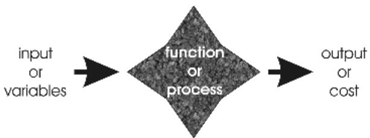  
Figure 1.1 Diagram of a function or process that is to be optimized. Optimization varies the input to achieve a desired output.

# 1.1.2 Root Finding versus Optimization

Approaches to optimization are akin to root or zero finding methods, only harder. Bracketing the root or optimum is a major step in hunting it down. For the one-variable case, finding one positive point and one negative point brackets the zero. On the other hand, bracketing a minimum requires three points, with the middle point having a lower value than either end point. In the mathematical approach, root finding searches for zeros of a function, while optimization finds zeros of the function derivative. Finding the function derivative adds one more step to the optimization process. Many times the derivative does not exist or is very difficult to find. We like the simplicity of root finding problems, so we teach root finding techniques to students of engineering, math, and science courses. Many technical problems are formulated to find roots when they might be more naturally posed as optimization problems; except the toolbox containing the optimization tools is small and inadequate.

Another difficulty with optimization is determining if a given minimum is the best (global) minimum or a suboptimal (local) minimum. Root finding doesn’t have this difficulty. One root is as good as another, since all roots force the function to zero.

Finding the minimum of a nonlinear function is especially difficult. Typical approaches to highly nonlinear problems involve either linearizing the problem in a very confined region or restricting the optimization to a small region. In short, we cheat.

# 1.1.3 Categories of Optimization

Figure 1.2 divides optimization algorithms into six categories. None of these six views or their branches are necessarily mutually exclusive. For instance, a dynamic optimization problem could be either constrained or unconstrained. In addition some of the variables may be discrete and others continuous. Let’s begin at the top left of Figure 1.2 and work our way around clockwise.

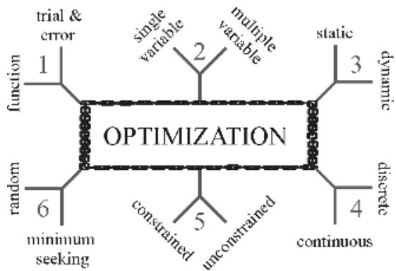  
Figure 1.2 Six categories of optimization algorithms.

1. Trial-and-error optimization refers to the process of adjusting variables that affect the output without knowing much about the process that produces the output. A simple example is adjusting the rabbit ears on a TV to get the best picture and audio reception. An antenna engineer can only guess at why certain contortions of the rabbit ears result in a better picture than other contortions. Experimentalists prefer this approach. Many great discoveries, like the discovery and refinement of penicillin as an antibiotic, resulted from the trial-and-error approach to optimization. In contrast, a mathematical formula describes the objective function in function optimization. Various mathematical manipulations of the function lead to the optimal solution. Theoreticians love this theoretical approach.

2. If there is only one variable, the optimization is one-dimensional. A problem having more than one variable requires multidimensional optimization. Optimization becomes increasingly difficult as the number of dimensions increases. Many multidimensional optimization approaches generalize to a series of one-dimensional approaches.

3. Dynamic optimization means that the output is a function of time, while static means that the output is independent of time. When living in the suburbs of Boston, there were several ways to drive back and forth to work. What was the best route? From a distance point of view, the problem is static, and the solution can be found using a map or the odometer of a car. In practice, this problem is not simple because of the myriad of variations in the routes. The shortest route isn’t necessarily the fastest route. Finding the fastest route is a dynamic problem whose solution depends on the time of day, the weather, accidents, and so on. The static problem is difficult to solve for the best solution, but the added dimension of time increases the challenge of solving the dynamic problem.

4. Optimization can also be distinguished by either discrete or continuous variables. Discrete variables have only a finite number of possible values, whereas continuous variables have an infinite number of possible values. If we are deciding in what order to attack a series of tasks on a list, discrete optimization is employed. Discrete variable optimization is also known as combinatorial optimization, because the optimum solution consists of a certain combination of variables from the finite pool of all possible variables. However, if we are trying to find the minimum value of $f ( x )$ on a number line, it is more appropriate to view the problem as continuous.

5. Variables often have limits or constraints. Constrained optimization incorporates variable equalities and inequalities into the cost function. Unconstrained optimization allows the variables to take any value. A constrained variable often converts into an unconstrained variable through a transformation of variables. Most numerical optimization routines work best with unconstrained variables. Consider the simple constrained example of minimizing $f ( x )$ over the interval $- 1 \leq x \leq 1 .$ The variable converts $x$ into an unconstrained variable $u$ by letting $x = \sin ( u )$ and minimizing $f ( \sin ( u ) )$ for any value of $u$ When constrained optimization formulates variables in terms of linear equations and linear constraints, it is called a linear program. When the cost equations or constraints are nonlinear, the problem becomes a nonlinear programming problem.

6. Some algorithms try to minimize the cost by starting from an initial set of variable values. These minimum seekers easily get stuck in local minima but tend to be fast. They are the traditional optimization algorithms and are generally based on calculus methods. Moving from one variable set to another is based on some determinant sequence of steps. On the other hand, random methods use some probabilistic calculations to find variable sets. They tend to be slower but have greater success at finding the global minimum.

# 1.2 MINIMUM-SEEKING ALGORITHMS

Searching the cost surface (all possible function values) for the minimum cost lies at the heart of all optimization routines. Usually a cost surface has many peaks, valleys, and ridges. An optimization algorithm works much like a hiker trying to find the minimum altitude in Rocky Mountain National Park. Starting at some random location within the park, the goal is to intelligently proceed to find the minimum altitude. There are many ways to hike or glissade to the bottom from a single random point. Once the bottom is found, however, there is no guarantee that an even lower point doesn’t lie over the next ridge. Certain constraints, such as cliffs and bears, influence the path of the search as well. Pure downhill approaches usually fail to find the global optimum unless the cost surface is quadratic (bowl-shaped).

There are many good texts that describe optimization methods (e.g., Press et al., 1992; Cuthbert, 1987). A history is given by Boyer and Merzbach (1991). Here we give a very brief review of the development of optimization strategies.

# 1.2.1 Exhaustive Search

The brute force approach to optimization looks at a sufficiently fine sampling of the cost function to find the global minimum. It is equivalent to spending the time, effort, and resources to thoroughly survey Rocky Mountain National Park. In effect a topographical map can be generated by connecting lines of equal elevation from an interpolation of the sampled points. This exhaustive search requires an extremely large number of cost function evaluations to find the optimum. For example, consider solving the twodimensional problem

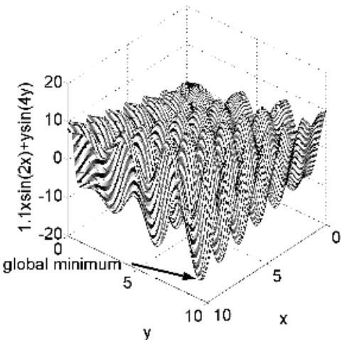  
Figure 1.3 Three-dimensional plot of (1.1) in which $x$ and $y$ are sampled at intervals of 0.1.

$$
0 \leq x \leq 1 0 \quad { \mathrm { a n d } } \quad 0 \leq y \leq 1 0
$$

Figure 1.3 shows a three-dimensional plot of (1.1) in which $x$ and $y$ are sampled at intervals of 0.1, requiring a total of $1 0 1 ^ { 2 }$ function evaluations. This same graph is shown as a contour plot with the global minimum of $- 1 8 . 5 5 4 7$ at $( x , y )$ $= ( 0 . 9 0 3 9 , 0 . 8 6 6 8 )$ marked by a large black dot in Figure 1.4. In this case the global minimum is easy to see. Graphs have aesthetic appeal but are only practical for one- and two-dimensional cost functions. Usually a list of function values is generated over the sampled variables, and then the list is searched for the minimum value. The exhaustive search does the surveying necessary to produce an accurate topographic map. This approach requires checking an extremely large but finite solution space with the number of combinations of different variable values given by

$$
V = \prod _ { i = 1 } ^ { N _ { \nu a r } } Q _ { i }
$$

where

$V =$ number of different variable combinations $N _ { \nu a r } =$ total number of different variables $Q _ { i } =$ number of different values that variable $i$ can attain

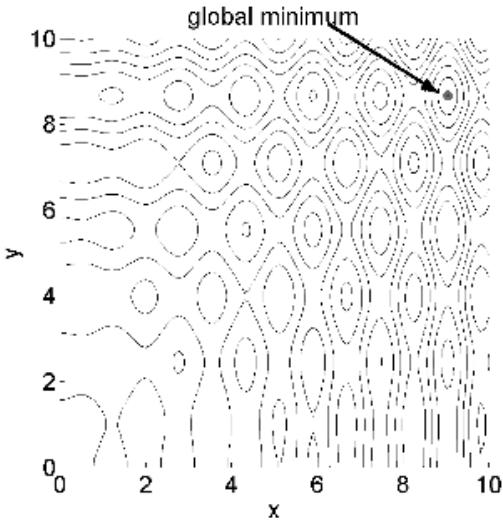  
Figure 1.4 Contour plot of (1.1).

With fine enough sampling, exhaustive searches don’t get stuck in local minima and work for either continuous or discontinuous variables. However, they take an extremely long time to find the global minimum. Another shortfall of this approach is that the global minimum may be missed due to undersampling. It is easy to undersample when the cost function takes a long time to calculate. Hence exhaustive searches are only practical for a small number of variables in a limited search space.

A possible refinement to the exhaustive search includes first searching a coarse sampling of the fitness function, then progressively narrowing the search to promising regions with a finer toothed comb.This approach is similar to first examining the terrain from a helicopter view, and then surveying the valleys but not the peaks and ridges. It speeds convergence and increases the number of variables that can be searched but also increases the odds of missing the global minimum. Most optimization algorithms employ a variation of this approach and start exploring a relatively large region of the cost surface (take big steps); then they contract the search around the best solutions (take smaller and smaller steps).

# 1.2.2 Analytical Optimization

Calculus provides the tools and elegance for finding the minimum of many cost functions. The thought process can be simplified to a single variable for a moment, and then an extremum is found by setting the first derivative of a cost function to zero and solving for the variable value. If the second derivative is greater than zero, the extremum is a minimum, and conversely, if the second derivative is less than zero, the extremum is a maximum. One way to find the extrema of a function of two or more variables is to take the gradient of the function and set it equal to zero, $\nabla f ( x , y ) = 0$ . For example, taking the gradient of equation (1.1) results in

$$
\frac { \partial f } { \partial x } = \sin ( 4 x _ { m } ) + 4 x \cos ( 4 x _ { m } ) = 0 , \qquad 0 \leq x \leq 1 0
$$

and

$$
\frac { \partial f } { \partial y } = 1 . 1 \sin ( 2 y _ { m } ) + 2 . 2 y _ { m } \cos ( 2 y _ { m } ) = 0 , \qquad 0 \le y \le 1 0
$$

Next these equations are solved for their roots, $x _ { m }$ and $y _ { m }$ , which is a family of lines. Extrema occur at the intersection of these lines. Note that these transcendental equations may not always be separable, making it very difficult to find the roots. Finally, the Laplacian of the function is calculated.

$$
\frac { \partial ^ { 2 } f } { \partial x ^ { 2 } } = 8 \cos 4 x - 1 6 x \sin 4 x , \qquad 0 \leq x \leq 1 0
$$

and

$$
\frac { \partial ^ { 2 } f } { \partial y ^ { 2 } } = 4 . 4 \cos 2 y - 4 . 4 y \sin 2 y , \qquad 0 \leq y \leq 1 0
$$

The roots are minima when $\nabla ^ { 2 } f ( x _ { m } , y _ { m } ) > 0 .$ . Unfortunately, this process doesn’t give a clue as to which of the minima is a global minimum. Searching the list of minima for the global minimum makes the second step of finding $\nabla ^ { 2 } f ( x _ { m } ,$ $y _ { m } )$ redundant. Instead, $f ( x _ { m } , y _ { m } )$ is evaluated at all the extrema; then the list of extrema is searched for the global minimum. This approach is mathematically elegant compared to the exhaustive or random searches. It quickly finds a single minimum but requires a search scheme to find the global minimum. Continuous functions with analytical derivatives are necessary (unless derivatives are taken numerically, which results in even more function evaluations plus a loss of accuracy). If there are too many variables, then it is difficult to find all the extrema. The gradient of the cost function serves as the compass heading pointing to the steepest downhill path. It works well when the minimum is nearby, but cannot deal well with cliffs or boundaries, where the gradient can’t be calculated.

In the eighteenth century, Lagrange introduced a technique for incorporating the equality constraints into the cost function. The method, now known as Lagrange multipliers, finds the extrema of a function $f ( x , y , \dots )$ with constraints $g _ { m } ( x , y , \dots ) = 0$ , by finding the extrema of the new function $F ( x , y ,$ , $\dots , \kappa _ { 1 } , \kappa _ { 2 } , \dots . . . ) = f ( x , y , \dots . . ) + \Sigma _ { m = 1 } ^ { M } \kappa _ { m } g _ { m } ( x , y , \dots . . )$ (Borowski and Borwein, 1991).

Then, when gradients are taken in terms of the new variables $\kappa _ { m }$ , the constraints are automatically satisfied.

As an example of this technique, consider equation (1.1) with the constraint $x + y = 0$ . The constraints are added to the cost function to produce the new cost function

$$
f _ { \lambda } = x \sin ( 4 x ) + 1 . 1 y \sin ( 2 y ) + \kappa ( x + y )
$$

Taking the gradient of this function of three variables yields

$$
\frac { \partial f } { \partial x } = \sin ( 4 x _ { m } ) + 4 x _ { m } \cos ( 4 x _ { m } ) + \kappa = 0
$$

$$
\frac { \partial f } { \partial y } = 1 . 1 \sin ( 2 y _ { m } ) + 2 . 2 y _ { m } \cos ( 2 y _ { m } ) + \kappa = 0
$$

$$
\frac { \partial f } { \partial \kappa } = x _ { m } + y _ { m } = 0
$$

Subtracting the second equation from the first and employing $y _ { m } = - x _ { m }$ from the third equation gives

$$
4 x _ { m } \cos ( 4 x _ { m } ) + \sin ( 4 x _ { m } ) + 1 . 1 \sin ( 2 x _ { m } ) + 2 . 2 x _ { m } \cos ( 2 x _ { m } ) = 0
$$

where $\left( x _ { m } , - x _ { m } \right)$ are the minima of equation (1.6). The solution is once again a family of lines crossing the domain.

The many disadvantages to the calculus approach make it an unlikely candidate to solve most optimization problems encountered in the real world. Even though it is impractical, most numerical approaches are based on it. Typically an algorithm starts at some random point in the search space, calculates a gradient, and then heads downhill to the bottom. These numerical methods head downhill fast; however, they often find the wrong minimum (a local minimum rather than the global minimum) and don’t work well with discrete variables. Gravity helps us find the downhill direction when hiking, but we will still most likely end up in a local valley in the complex terrain.

Calculus-based methods were the bag of tricks for optimization theory until von Neumann developed the minimax theorem in game theory (Thompson, 1992). Games require an optimum move strategy to guarantee winning. That same thought process forms the basis for more sophisticated optimization techniques. In addition techniques were needed to find the minimum of cost functions having no analytical gradients. Shortly before and during World War II, Kantorovich, von Neumann, and Leontief solved linear problems in the fields of transportation, game theory, and input-output models (Anderson, 1992). Linear programming concerns the minimization of a linear function of many variables subject to constraints that are linear equations and equalities. In 1947 Dantzig introduced the simplex method, which has been the workhorse for solving linear programming problems (Williams, 1993). This method has been widely implemented in computer codes since the mid-1960s.

Another category of methods is based on integer programming, an extension of linear programming in which some of the variables can only take integer values (Williams, 1993). Nonlinear techniques were also under investigation during World War II. Karush extended Lagrange multipliers to constraints defined by equalities and inequalities, so a much larger category of problems could be solved. Kuhn and Tucker improved and popularized this technique in 1951 (Pierre, 1992). In the 1950s Newton’s method and the method of steepest descent were commonly used.

# 1.2.3 Nelder-Mead Downhill Simplex Method

The development of computers spurred a flurry of activity in the 1960s. In 1965 Nelder and Mead introduced the downhill simplex method (Nelder and Mead, 1965), which doesn’t require the calculation of derivatives. A simplex is the most elementary geometrical figure that can be formed in dimension $N$ and has $N + 1$ sides (e.g., a triangle in two-dimensional space). The downhill simplex method starts at $N + 1$ points that form the initial simplex. Only one point of the simplex, $P _ { 0 }$ , is specified by the user. The other $N$ points are found by

$$
P _ { n } = P _ { 0 } + c _ { s } e _ { n }
$$

where $e _ { n }$ are $N$ unit vectors and $c _ { s }$ is a scaling constant. The goal of this method is to move the simplex until it surrounds the minimum, and then to contract the simplex around the minimum until it is within an acceptable error. The steps used to trap the local minimum inside a small simplex are as follows:

1. Creation of the initial triangle. Three vertices start the algorithm: $A = ( x _ { 1 } , y _ { 1 } ) , B = ( x _ { 2 } , y _ { 2 } )$ , and $C = ( x _ { 3 } , y _ { 3 } )$ as shown in Figure 1.5.

2. Reflection. A new point, $D = \left( x _ { 4 } , y _ { 4 } \right)$ , is found as a reflection of the lowest minimum (in this case $A$ ) through the midpoint of the line connecting the other two points ( $B$ and $C$ ). As shown in Figure $1 . 5 , D$ is found by

$$
D = B + C - A
$$

3. Expansion. If the cost of $D$ is smaller than that at $A$ , then the move was in the right direction and another step is made in that same direction as shown in Figure 1.5. The formula is given by

$$
E = \frac { 3 ( B + C ) } { 2 - 2 A }
$$

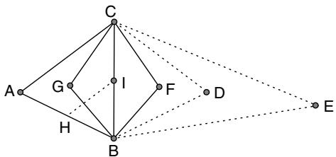  
Figure 1.5 Manipulation of the basic simplex, in the case of two dimensions, a triangle in an effort to find the minimum.

4. Contraction. If the new point, $D$ , has the same cost as point $A$ , then two new points are found

$$
\begin{array} { c } { { F = \displaystyle \frac { 2 A + B + C } { 4 } } } \\ { { { } } } \\ { { G = \displaystyle \frac { 3 ( B + C ) } { 2 - 2 A } } } \end{array}
$$

The smallest cost of $F$ and $G$ is kept, thus contracting the simplex as shown in Figure 1.5.

5. Shrinkage. If neither $F$ nor $G$ have smaller costs than $A$ , then the side connecting $A$ and $C$ must move toward $B$ in order to shrink the simplex. The new vertices are given by

$$
\begin{array} { l } { \displaystyle { H = \frac { A + B } { 2 } } } \\ { \displaystyle { I = \frac { B + C } { 2 } } } \end{array}
$$

Each iteration generates a new vertex for the simplex. If this new point is better than at least one of the existing vertices, it replaces the worst vertex. This way the diameter of the simplex gets smaller and the algorithm stops when the diameter reaches a specified tolerance. This algorithm is not known for its speed, but it has a certain robustness that makes it attractive. Figures 1.6 and 1.7 demonstrate the Nelder-Mead algorithm in action on a bowlshaped surface. Note how the triangle gradually flops down the hill until it surrounds the bottom. The next step would be to shrink itself around the minimum.

Since the Nelder-Mead algorithm gets stuck in local minima, it can be combined with the random search algorithm to find the minimum to (1.1) subject to (1.2). Assuming that there is no prior knowledge of the cost surface, a random first guess is as good as any place to start. How close does this guess have to be to the true minimum before the algorithm can find it? Some simple experimentation helps us arrive at this answer. The first two columns in Table 1.1 show twelve random starting values. The ending values and the final costs found by the Nelder-Mead algorithm are found in the next three columns. None of the trials arrived at the global minimum.

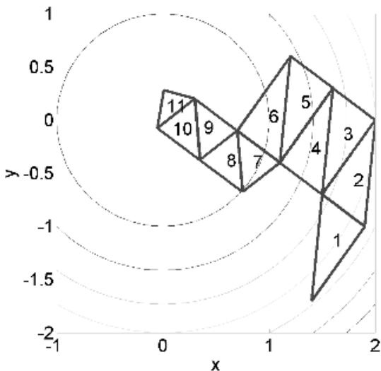  
Figure 1.6 Contour plot of the movement of the simplex down hill to surround the minimum.

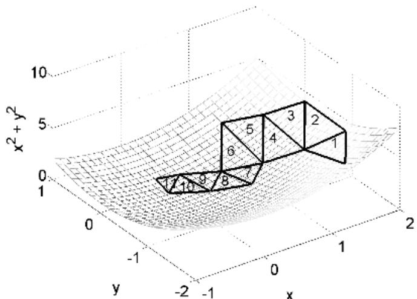  
Figure 1.7 Mesh plot of the movement of the simplex down hill to surround the minimum.

TABLE 1.1 Comparison of Nelder-Meade and BFGS Algorithms   

<table><tr><td colspan="2"></td><td colspan="3">Nelder-Mead</td><td colspan="3">BFGS</td></tr><tr><td colspan="2">Starting Point</td><td colspan="2">Ending Point</td><td></td><td colspan="2">Ending Point</td><td></td></tr><tr><td>X</td><td>y</td><td>X</td><td>y</td><td>cost</td><td>X</td><td>y</td><td>cost</td></tr><tr><td>8.9932</td><td>3.7830</td><td>9.0390</td><td>5.5427</td><td>-15.1079</td><td>9.0390</td><td>2.4567</td><td>11.6835</td></tr><tr><td>3.4995</td><td>8.9932</td><td>5.9011</td><td>2.4566</td><td>8.5437</td><td>5.9011</td><td>2.4566</td><td>8.5437</td></tr><tr><td>0.4985</td><td>7.3803</td><td>1.2283</td><td>8.6682</td><td>-10.7228</td><td>0.0000</td><td>8.6682</td><td>-9.5192</td></tr><tr><td>8.4066</td><td>5.9238</td><td>7.4696</td><td>5.5428</td><td>13.5379</td><td>9.0390</td><td>5.5428</td><td>-15.1079</td></tr><tr><td>0.8113</td><td>6.3148</td><td>1.2283</td><td>5.5427</td><td>-7.2760</td><td>0.0000</td><td>5.5428</td><td>-6.0724</td></tr><tr><td>6.8915</td><td>1.8475</td><td>7.4696</td><td>2.4566</td><td>-10.1134</td><td>7.4696</td><td>2.4566</td><td>-10.1134</td></tr><tr><td>7.3021</td><td>9.5406</td><td>5.9011</td><td>8.6682</td><td>-15.4150</td><td>7.4696</td><td>8.6682</td><td>-16.9847</td></tr><tr><td>5.6989</td><td>8.2893</td><td>5.9011</td><td>8.6682</td><td>-15.4150</td><td>5.9011</td><td>8.6682</td><td>-16.9847</td></tr><tr><td>6.3245</td><td>3.2649</td><td>5.9011</td><td>2.4566</td><td>8.5437</td><td>5.9011</td><td>2.4566</td><td>8.5437</td></tr><tr><td>5.6989</td><td>4.6725</td><td>5.9011</td><td>5.5428</td><td>-11.9682</td><td>5.9011</td><td>5.5428</td><td>11.9682</td></tr><tr><td>4.0958</td><td>0.3226</td><td>4.3341</td><td>0.0000</td><td>4.3269</td><td>4.3341</td><td>0.0000</td><td>4.3269</td></tr><tr><td>4.2815</td><td>8.2111</td><td>4.3341</td><td>8.6622</td><td>13.8461</td><td>4.3341</td><td>8.6622</td><td>13.8461</td></tr><tr><td>Average</td><td></td><td></td><td></td><td>11.2347</td><td></td><td></td><td>11.1412</td></tr></table>

Box (1965) extended the simplex method and called it the complex method, which stands for constrained simplex method. This approach allows the addition of inequality constraints, uses up to $2 N$ vertices, and expands the polyhedron at each normal reflection.

# 1.2.4 Optimization Based on Line Minimization

The largest category of optimization methods fall under the general title of successive line minimization methods. An algorithm begins at some random point on the cost surface, chooses a direction to move, then moves in that direction until the cost function begins to increase. Next the procedure is repeated in another direction. Devising a sensible direction to move is critical to algorithm convergence and has spawned a variety of approaches.

A very simple approach to line minimization is the coordinate search method (Schwefel, 1995). It starts at an arbitrary point on the cost surface, then does a line minimization along the axis of one of the variables. Next it selects another variable and does another line minimization along that axis. This process continues until a line minimization is done along each of the variables.Then the algorithm cycles through the variables until an acceptable solution is found. Figure 1.8 models a possible path the algorithm might take in a quadratic cost surface. In general, this method is slow.

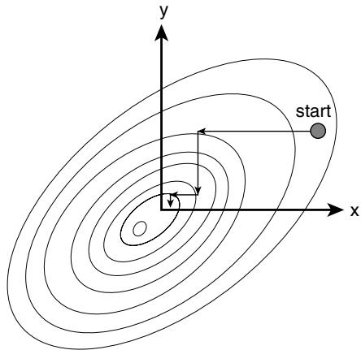  
Figure 1.8 Possible path that the coordinate search method might take on a quadratic cost surface.

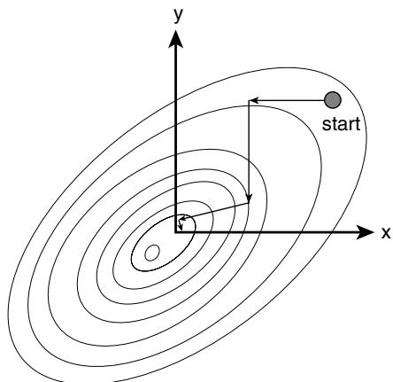  
Figure 1.9 Possible path that the Rosenbrock method might take on a quadratic cost surface.

Rosenbrock (1960) developed a method that does not limit search directions to be parallel to the variable axes. The first iteration of the Rosenbrock method uses coordinate search along each variable to find the first improved point (see Figure 1.9). The coordinate axes are then rotated until the first new coordinate axis points from the starting location to the first point. GramSchmidt orthogonalization finds the directions of the other new coordinate axes based on the first new coordinate axis. A coordinate search is then performed along each new coordinate axis. As before, this process iterates until an acceptable solution is found.

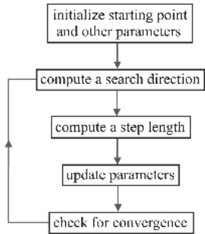  
Figure 1.10 Flowchart for a typical line search algorithm.

A line search finds the optimum in one direction or dimension. For an $n$ - dimensional objective function, the line search repeats for at least $n$ iterations until the optimum is found. A flowchart of successive line search optimization appears in Figure 1.10. All the algorithms in this category differ in how the search direction at step $n$ is found. For detailed information on the three methods described here, consult Luenberger (1984) and Press et al. (1992).

The steepest descent algorithm originated with Cauchy in 1847 and has been extremely popular. It starts at an arbitrary point on the cost surface and minimizes along the direction of the gradient. The simple formula for the $( n + 1 ) \mathrm { t h }$ iteration is given by

$$
{ \left[ \begin{array} { l } { x _ { n + 1 } } \\ { y _ { n + 1 } } \end{array} \right] } = { \left[ \begin{array} { l } { x _ { n } } \\ { y _ { n } } \end{array} \right] } - \gamma _ { n } \nabla f ( x _ { n } , y _ { n } )
$$

where $\gamma _ { n }$ is a nonnegative scalar that minimizes the function in the direction of the gradient. By definition, the new gradient formed at each iteration is orthogonal to the previous gradient. If the valley is narrow (ratio of maximum to minimum eigenvalue large), then this algorithm bounces from side to side for many iterations before reaching the bottom. Figure 1.11 shows a possible path of the steepest descent algorithm. Note that the path is orthogonal to the contours and any path is orthogonal to the previous and next path.

The method of steepest descent is not normally used anymore, because more efficient techniques have been developed. Most of these techniques involve some form of Newton’s method. Newton’s method is based on a multidimensional Taylor series expansion of the function about the point $x _ { k }$ given by

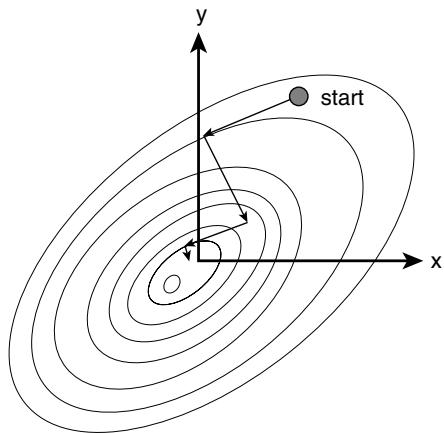  
Figure 1.11 Possible path that the steepest descent algorithm might take on a quadratic cost surface.

$$
f ( \pmb { x } ) = f ( \pmb { x } _ { n } ) + \nabla f ( \pmb { x } _ { n } ) ( \pmb { x } - \pmb { x } _ { n } ) ^ { T } + \frac { \left( \pmb { x } - \pmb { x } _ { n } \right) } { 2 ! } \pmb { { \mathrm { H } } } ( \pmb { x } - \pmb { x } _ { n } ) ^ { T } + \dots
$$

where

$x _ { n } = \operatorname { p o i n t }$ about which Taylor series is expanded   
$x \_ =$ point near $x _ { n }$   
$x ^ { T } =$ transpose of vector (in this case row vector becomes column vector)   
$\mathbf { H } =$ Hessian matrix with elements given by $h _ { m n } = \partial ^ { 2 } f / \partial x _ { m } \partial x _ { n }$

Taking the gradient of the first two terms of (1.15) and setting it equal to zero yields

$$
\nabla f ( { \boldsymbol { x } } ) = \nabla f ( { \boldsymbol { x } } _ { n } ) + ( { \boldsymbol { x } } - { \boldsymbol { x } } _ { n } ) \mathbf { H } = 0
$$

Starting with a guess $x _ { 0 }$ , the next point, $x _ { n + 1 }$ , can be found from the previous point, $x _ { n }$ , by

$$
x _ { n + 1 } = x _ { n } - \mathbf { H } ^ { - 1 } \nabla f ( x _ { n } )
$$

Rarely is the Hessian matrix known. A myriad of algorithms have spawned around this formulation. In general, these techniques are formulated as

$$
x _ { n + 1 } = x _ { n } - \alpha _ { n } { \bf A } _ { n } \nabla f ( x _ { n } )
$$

where

$\alpha _ { n } =$ step size at iteration $n$ ${ \bf A } _ { n } =$ approximation to the Hessian matrix at iteration $n$

Note that when $\mathbf { A } _ { n } = \mathbf { I }$ , the identity matrix (1.18) becomes the method of steepest descent, and when $\mathbf { A } _ { n } = \mathbf { H } ^ { - 1 }$ , (1.18) becomes Newton’s method.

Two excellent quasi-Newton techniques that construct a sequence of approximations to the Hessian, such that

$$
\operatorname* { l i m } _ { n  \infty } \mathbf { A } _ { n } = \mathbf { H } ^ { - 1 }
$$

The first approach is called the Davidon-Fletcher-Powell (DFP) algorithm (Powell, 1964). Powell developed a method that finds a set of line minimization directions that are linearly independent, mutually conjugate directions (Powell, 1964). The direction assuring the current direction does not “spoil” the minimization of the prior direction is the conjugate direction. The conjugate directions are chosen so that the change in the gradient of the cost function remains perpendicular to the previous direction. If the cost function is quadratic, then the algorithm converges in $N _ { \nu a r }$ iterations (see Figure 1.12). If the cost function is not quadratic, then repeating the $N _ { \nu a r }$ iterations several times usually brings the algorithm closer to the minimum. The second algorithm is named the Broyden-Fletcher-Goldfarb-Shanno (BFGS) algorithm, discovered by its four namesakes independently in the mid-1960s (Broyden, 1965; Fletcher, 1963; Goldfarb, 1968; Shanno, 1970). Both approaches find a way to approximate this matrix and employ it in determining the appropriate directions of movement. This algorithm is “quasi-Newton” in that it is equivalent to Newton’s method for prescribing the next best point to use for the iteration, yet it doesn’t use an exact Hessian matrix. The BFGS algorithm is robust and quickly converges, but it requires an extra step to approximate the Hessian compared to the DFP algorithm. These algorithms have the advantages of being fast and working with or without the gradient or Hessian. On the other hand, they have the disadvantages of finding minimum close to the starting point and having an approximation to the Hessian matrix that is close to singular.

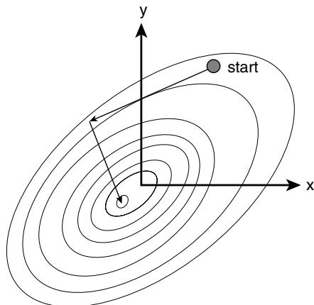  
Figure 1.12 Possible path that a conjugate directions algorithm might take on a quadratic cost surface.

Quadratic programming assumes that the cost function is quadratic (variables are squared) and the constraints are linear. This technique is based on Lagrange multipliers and requires derivatives or approximations to derivatives. One powerful method known as recursive quadratic programming solves the quadratic programming problem at each iteration to find the direction of the next step (Luenberger, 1984). The approach of these methods is similar to using very refined surveying tools, which unfortunately still does not guarantee that the hiker will find the lowest point in the park.

# 1.3 NATURAL OPTIMIZATION METHODS

The methods already discussed take the same basic approach of heading downhill from an arbitrary starting point. They differ in deciding in which direction to move and how far to move. Successive improvements increase the speed of the downhill algorithms but don’t add to the algorithm’s ability to find a global minimum instead of a local minimum.

All hope is not lost! Some outstanding algorithms have surfaced in recent times. Some of these methods include the genetic algorithm (Holland, 1975), simulated annealing (Kirkpatrick et al., 1983), particle swarm optimization (Parsopoulos and Vrahatis, 2002), ant colony optimization (Dorigo and Maria, 1997), and evolutionary algorithms (Schwefel, 1995). These methods generate new points in the search space by applying operators to current points and statistically moving toward more optimal places in the search space. They rely on an intelligent search of a large but finite solution space using statistical methods. The algorithms do not require taking cost function derivatives and can thus deal with discrete variables and noncontinuous cost functions. They represent processes in nature that are remarkably successful at optimizing natural phenomena. A selection of these algorithms is presented in Chapter 7.

# 1.4 BIOLOGICAL OPTIMIZATION: NATURAL SELECTION

This section introduces the current scientific understanding of the natural selection process with the purpose of gaining an insight into the construction, application, and terminology of genetic algorithms. Natural selection is discussed in many texts and treatises. Much of the information summarized here is from Curtis (1975) and Grant (1985).

Upon observing the natural world, we can make several generalizations that lead to our view of its origins and workings. First, there is a tremendous diversity of organisms. Second, the degree of complexity in the organisms is striking. Third, many of the features of these organisms have an apparent usefulness. Why is this so? How did they come into being?

Imagine the organisms of today’s world as being the results of many iterations in a grand optimization algorithm. The cost function measures survivability, which we wish to maximize. Thus the characteristics of the organisms of the natural world fit into this topological landscape (Grant, 1985). The level of adaptation, the fitness, denotes the elevation of the landscape. The highest points correspond to the most-fit conditions. The environment, as well as how the different species interact, provides the constraints. The process of evolution is the grand algorithm that selects which characteristics produce a species of organism fit for survival. The peaks of the landscape are populated by living organisms. Some peaks are broad and hold a wide range of characteristics encompassing many organisms, while other peaks are very narrow and allow only very specific characteristics. This analogy can be extended to include saddles between peaks as separating different species. If we take a very parochial view and assume that intelligence and ability to alter the environment are the most important aspects of survivability, we can imagine the global maximum peak at this instance in biological time to contain humankind.

To begin to understand the way that this natural landscape was populated involves studying the two components of natural selection: genetics and evolution. Modern biologists subscribe to what is known as the synthetic theory of natural selection—a synthesis of genetics with evolution. There are two main divisions of scale in this synthetic evolutionary theory: macroevolution, which involves the process of division of the organisms into major groups, and microevolution, which deals with the process within specific populations. We will deal with microevolution here and consider macroevolution to be beyond our scope.

First, we need a bit of background on heredity at the cellular level. A gene is the basic unit of heredity. An organism’s genes are carried on one of a pair of chromosomes in the form of deoxyribonucleic acid (DNA). The DNA is in the form of a double helix and carries a symbolic system of base-pair sequences that determine the sequence of enzymes and other proteins in an organism. This sequence does not vary and is known as the genetic code of the organism. Each cell of the organism contains the same number of chromosomes. For instance, the number of chromosomes per body cell is 6 for mosquitoes, 26 for frogs, 46 for humans, and 94 for goldfish. Genes often occur with two functional forms, each representing a different characteristic. Each of these forms is known as an allele. For instance, a human may carry one allele for brown eyes and another for blue eyes. The combination of alleles on the chromosomes determines the traits of the individual. Often one allele is dominant and the other recessive, so that the dominant allele is what is manifested in the organism, although the recessive one may still be passed on to its offspring. If the allele for brown eyes is dominant, the organism will have brown eyes. However, it can still pass the blue allele to its offspring. If the second allele from the other parent is also for blue eyes, the child will be blue-eyed.

The study of genetics began with the experiments of Gregor Mendel. Born in 1822, Mendel attended the University of Vienna, where he studied both biology and mathematics. After failing his exams, he became a monk. It was in the monastery garden where he performed his famous pea plant experiments. Mendel revolutionized experimentation by applying mathematics and statistics to analyzing and predicting his results. By his hypothesizing and careful planning of experiments, he was able to understand the basic concepts of genetic inheritance for the first time, publishing his results in 1865. As with many brilliant discoveries, his findings were not appreciated in his own time.

Mendel’s pea plant experiments were instrumental in delineating how traits are passed from one generation to another. One reason that Mendel’s experiments were so successful is that pea plants are normally self-pollinating and seldom cross-pollinate without intervention. The self-pollination is easily prevented. Another reason that Mendel’s experiments worked was the fact that he spent several years prior to the actual experimentation documenting the inheritable traits and which ones were easily separable and bred pure. This allowed him to crossbreed his plants and observe the characteristics of the offspring and of the next generation. By carefully observing the distribution of traits, he was able to hypothesize his first law—the principle of segregation; that is, that there must be factors that are inherited in pairs, one from each parent. These factors are indeed the genes and their different realizations are the alleles. When both alleles of a gene pair are the same, they are homozygous. When they are different, they are heterozygous. The brown-blue allele for eye color of a parent was heterozygous while the blue-blue combination of the offspring is homozygous. The trait actually observed is the phenotype, but the actual combination of alleles is the genotype. Although the parent organism had a brown-blue eye color phenotype, its genotype is for brown eyes (the dominant form). The genotype must be inferred from the phenotype percentages of the succeeding generation as well as the parent itself. Since the offspring had blue eyes, we can infer that each parent had a blue allele to pass along, even though the phenotype of each parent was brown eyes. Therefore, since the offspring was homozygous, carrying two alleles for blue eyes, both parents must be heterozygous, having one brown and one blue allele. Mendel’s second law is the principle of independent assortment. This principle states that the inheritance of the allele for one trait is independent of that for another. The eye color is irrelevant when determining the size of the individual.

To understand how genes combine into phenotypes, it is helpful to understand some basics of cell division. Reproduction in very simple, single-celled organisms occurs by cell division, known as mitosis. During the phases of mitosis, the chromosome material is exactly copied and passed onto the offspring. In such simple organisms the daughter cells are identical to the parent. There is little opportunity for evolution of such organisms. Unless a mutation occurs, the species propagates unchanged. Higher organisms have developed a more efficient method of passing on traits to their offspring—sexual reproduction. The process of cell division that occurs then is called meiosis. The gamete, or reproductive cell, has half the number of chromosomes as the other body cells. Thus the gametes cells are called haploid, while the body cells are diploid. Only these diploid body cells contain the full genetic code. The diploid number of chromosomes is reduced by half to form the haploid number for the gametes. In preparation for meiosis, the gamete cells are duplicated. Then the gamete cells from the mother join with those from the father (this process is not discussed here). They arrange themselves in homologous pairs; that is, each chromosome matches with one of the same length and shape. As they match up, they join at the kinetochore, a random point on this matched chromosome pair (or actually tetrad in most cases).As meiosis progresses, the kinetochores divide so that a left portion of the mother chromosome is conjoined with the right portion of the father, and visa versa for the other portions. This process is known as crossing over.The resulting cell has the full diploid number of chromosomes. Through this crossing over, the genetic material of the mother and father has been combined in a manner to produce a unique individual offspring. This process allows changes to occur in the species.

Now we turn to discussing the second component of natural selection—evolution—and one of its first proponents, Charles Darwin. Darwin refined his ideas during his voyage as naturalist on the Beagle, especially during his visits to the Galapagos Islands. Darwin’s theory of evolution was based on four primary premises. First, like begets like; equivalently, an offspring has many of the characteristics of its parents. This premise implies that the population is stable. Second, there are variations in characteristics between individuals that can be passed from one generation to the next. The third premise is that only a small percentage of the offspring produced survive to adulthood. Finally, which of the offspring survive depends on their inherited characteristics. These premises combine to produce the theory of natural selection. In modern evolutionary theory an understanding of genetics adds impetus to the explanation of the stages of natural selection.

A group of interbreeding individuals is called a population. Under static conditions the characteristics of the population are defined by the HardyWeinberg Law. This principle states that the frequency of occurrence of the alleles will stay the same within an inbreeding population if there are no perturbations. Thus, although the individuals show great variety, the statistics of the population remain the same. However, we know that few populations are static for very long. When the population is no longer static, the proportion of allele frequencies is no longer constant between generations and evolution occurs. This dynamic process requires an external forcing. The forcing may be grouped into four specific types. (1) Mutations may occur; that is, a random change occurs in the characteristics of a gene.This change may be passed along to the offspring. Mutations may be spontaneous or due to external factors such as exposure to environmental factors. (2) Gene flow may result from introduction of new organisms into the breeding population. (3) Genetic drift may occur solely due to chance. In small populations certain alleles may sometimes be eliminated in the random combinations. (4) Natural selection operates to choose the most fit individuals for further reproduction. In this process certain alleles may produce an individual that is more prepared to deal with its environment. For instance, fleeter animals may be better at catching prey or running from predators, thus being more likely to survive to breed. Therefore certain characteristics are selected into the breeding pool.

Thus we see that these ideas return to natural selection.The important components have been how the genes combine and cross over to produce new individuals with combinations of traits and how the dynamics of a large population interact to select for certain traits. These factors may move this offspring either up toward a peak or down into the valley. If it goes too far into the valley, it may not survive to mate—better adapted ones will. After a long period of time the pool of organisms becomes well adapted to its environment. However, the environment is dynamic. The predators and prey, as well as factors such as the weather and geological upheaval, are also constantly changing. These changes act to revise the optimization equation. That is what makes life (and genetic algorithms) interesting.

# 1.5 THE GENETIC ALGORITHM

The genetic algorithm (GA) is an optimization and search technique based on the principles of genetics and natural selection. A GA allows a population composed of many individuals to evolve under specified selection rules to a state that maximizes the “fitness” (i.e., minimizes the cost function). The method was developed by John Holland (1975) over the course of the 1960s and 1970s and finally popularized by one of his students, David Goldberg, who was able to solve a difficult problem involving the control of gas-pipeline transmission for his dissertation (Goldberg, 1989). Holland’s original work was summarized in his book. He was the first to try to develop a theoretical basis for GAs through his schema theorem. The work of De Jong (1975) showed the usefulness of the GA for function optimization and made the first concerted effort to find optimized GA parameters. Goldberg has probably contributed the most fuel to the GA fire with his successful applications and excellent book (1989). Since then, many versions of evolutionary programming have been tried with varying degrees of success.

Some of the advantages of a GA include that it

• Optimizes with continuous or discrete variables,   
• Doesn’t require derivative information,   
• Simultaneously searches from a wide sampling of the cost surface,   
• Deals with a large number of variables,   
• Is well suited for parallel computers,   
• Optimizes variables with extremely complex cost surfaces (they can jump out of a local minimum),   
• Provides a list of optimum variables, not just a single solution,   
• May encode the variables so that the optimization is done with the encoded variables, and   
• Works with numerically generated data, experimental data, or analytical functions.

These advantages are intriguing and produce stunning results when traditional optimization approaches fail miserably.

Of course, the GA is not the best way to solve every problem. For instance, the traditional methods have been tuned to quickly find the solution of a wellbehaved convex analytical function of only a few variables. For such cases the calculus-based methods outperform the GA, quickly finding the minimum while the GA is still analyzing the costs of the initial population. For these problems the optimizer should use the experience of the past and employ these quick methods. However, many realistic problems do not fall into this category. In addition, for problems that are not overly difficult, other methods may find the solution faster than the GA. The large population of solutions that gives the GA its power is also its bane when it comes to speed on a serial computer—the cost function of each of those solutions must be evaluated. However, if a parallel computer is available, each processor can evaluate a separate function at the same time. Thus the GA is optimally suited for such parallel computations.

This book shows how to use a GA to optimize problems. Chapter 2 introduces the binary form while using the algorithm to find the highest point in Rocky Mountain National Park. Chapter 3 describes another version of the algorithm that employs continuous variables. We demonstrate this method with a GA solution to equation (1.1) subject to constraints (1.2). The remainder of the book presents refinements to the algorithm by solving more problems, winding its way from easier, less technical problems into more difficult problems that cannot be solved by other methods. Our goal is to give specific ways to deal with certain types of problems that may be typical of the ones faced by scientists and engineers on a day-to-day basis.

# BIBLIOGRAPHY

Anderson, D. Z. 1992. Linear programming. In McGraw-Hill Encyclopedia of Science and Technology 10. New York: McGraw-Hill, pp. 86–88.   
Borowski, E. J., and J. M. Borwein. 1991. Mathematics Dictionary. New York: HarperCollins.   
Box, M. J. 1965. A comparison of several current optimization methods and the use of transformations in constrained problems. Comput. J. 8:67–77.   
Boyer, C. B., and U. C. Merzbach. 1991. A History of Mathematics. New York: Wiley.   
Broyden, G. C. 1965. A class of methods for solving nonlinear simultaneous equations. Math. Comput. 19:577–593.   
Curtis, H. 1975. Biology, 2nd ed. New York: Worth.   
Cuthbert, T. R. Jr. 1987. Optimization Using Personal Computers. New York: Wiley.   
De Jong, K. A. 1975. Analysis of the behavior of a class of genetic adaptive systems. Ph.D. Dissertation. University of Michigan, Ann Arbor.   
Dorigo, M., and G. Maria. 1997. Ant colony system: a cooperative learning approach to the traveling salesman problem. IEEE Trans. Evol. Comput. 1:53–66.   
Fletcher, R. 1963. Generalized inverses for nonlinear equations and optimization. In R. Rabinowitz (ed.), Numerical Methods for Non-linear Algebraic Equations. London: Gordon and Breach.   
Goldberg, D. E. 1989. Genetic Algorithms in Search, Optimization, and Machine Learning. Reading, MA: Addison-Wesley.   
Goldfarb, D., and B. Lapidus. 1968. Conjugate gradient method for nonlinear programming problems with linear constraints. I&EC Fundam. 7:142–151.   
Grant, V. 1985. The Evolutionary Process. New York: Columbia University Press.   
Holland, J. H. 1975. Adaptation in Natural and Artificial Systems. Ann Arbor: University of Michigan Press.   
Kirkpatrick, S., C. D. Gelatt Jr., and M. P. Vecchi. 1983. Optimization by simulated annealing. Science 220:671–680.   
Luenberger, D. G. 1984. Linear and Nonlinear Programming, Reading, MA: AddisonWesley.   
Nelder, J.A., and R. Mead. 1965.A simplex method for function minimization. Comput. J. 7:308–313.   
Parsopoulos, K. E., and M. N. Vrahatis. 2002. Recent approaches to global optimization problems through particle swarm optimization. In Natural Computing. Netherlands: Kluwer Academic, pp. 235–306.   
Pierre, D. A. 1992. Optimization. In McGraw-Hill Encyclopedia of Science and Technology 12. New York: McGraw-Hill, pp. 476–482.   
Powell, M. J. D. 1964. An efficient way for finding the minimum of a function of several variables without calculating derivatives. Comput. J. 7:155–162.   
Press,W. H., S.A.Teukolsky,W.T.Vettering, and B. P. Flannery. 1992. Numerical Recipes. New York: Cambridge University Press.   
Rosenbrock, H. H. 1960. An automatic method for finding the greatest or least value of a function. Comput. J. 3:175–184.   
Schwefel, H. 1995. Evolution and Optimum Seeking. New York: Wiley.   
Shanno, D. F. 1970. An accelerated gradient projection method for linearly constrained nonlinear estimation. SIAM J. Appl. Math. 18:322–334.   
Thompson, G. L. 1992. Game theory. In McGraw-Hill Encyclopedia of Science and Technology 7. New York: McGraw-Hill, pp. 555–560.   
Williams, H. P. 1993. Model Solving in Mathematical Programming. New York: Wiley.

# EXERCISES

Use the following local optimizers:

a. Nelder-Mead downhill simplex   
b. BFGS   
c. DFP   
d. Steepest descent   
e. Random search

1. Find the minimum of (one of the functions in Appendix I) using (one of the local optimizers).

2. Try different random starting values to find the minimum. What do you observe?

3. Combine 1 and 2, and find the minimum 25 times using random starting points. How often is the minimum found?

4. Compare the following algorithms:

5. Since local optimizers often decrease the step size when approaching the minimum, running the algorithm again after it has found a minimum increases the odds of getting a better solution. Repeat 3 in such a way that the solution is used as a starting point by the algorithm on a second run. Does this help? With which functions? Why?

6. Some of the MATLAB optimization routines give you a choice of providing the exact derivatives. Do these algorithms converge better with the exact derivatives or approximate numerical derivatives?

7. Find the minimum of $f = u ^ { 2 } + 2 \nu ^ { 2 } + w ^ { 2 } + x ^ { 2 }$ subject to $u + 3 \nu - w + x = 2$ and $2 u - \nu + w + 2 x = 4$ using Lagrange multipliers. Assume no constraints. (Answer: $u \ : = \ : 6 7 / 6 9$ , $\nu \ : = \ : 6 / 6 9$ , $w = 1 4 / 6 9$ , $x = 6 7 / 6 9$ with $\kappa _ { \mathrm { 1 } } = - 2 6 / 6 9$ , $\kappa _ { 2 } = - 5 4 / 6 9 . )$

8. Many problems have constraints on the variables. Using a transformation of variables, convert (1.1) and (1.2) into an unconstrained optimization problem, and try one of the local optimizers. Does the transformation used affect the speed of convergence?

# The Binary Genetic Algorithm

# 2.1 GENETIC ALGORITHMS: NATURAL SELECTION ON A COMPUTER

If the previous chapter whet your appetite for something better than the traditional optimization methods, this and the next chapter give step-by-step procedures for implementing two flavors of a GA. Both algorithms follow the same menu of modeling genetic recombination and natural selection. One represents variables as an encoded binary string and works with the binary strings to minimize the cost, while the other works with the continuous variables themselves to minimize the cost. Since GAs originated with a binary representation of the variables, the binary method is presented first.

Figure 2.1 shows the analogy between biological evolution and a binary GA. Both start with an initial population of random members. Each row of binary numbers represents selected characteristics of one of the dogs in the population. Traits associated with loud barking are encoded in the binary sequence associated with these dogs. If we are trying to breed the dog with the loudest bark, then only a few of the loudest, (in this case, four loudest) barking dogs are kept for breeding. There must be some way of determining the loudest barkers—the dogs may audition while the volume of their bark is measured. Dogs with loud barks receive low costs. From this breeding population of loud barkers, two are randomly selected to create two new puppies. The puppies have a high probability of being loud barkers because both their parents have genes that make them loud barkers. The new binary sequences of the puppies contain portions of the binary sequences of both parents. These new puppies replace two discarded dogs that didn’t bark loud enough. Enough puppies are generated to bring the population back to its original size. Iterating on this process leads to a dog with a very loud bark. This natural optimization process can be applied to inanimate objects as well.

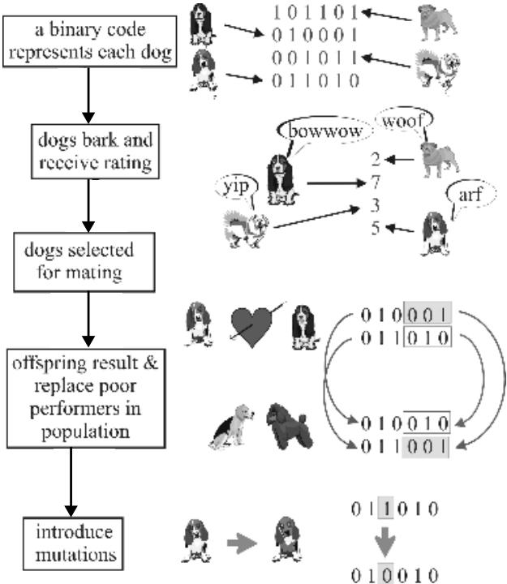  
Figure 2.1 Analogy between a numerical GA and biological genetics.

# 2.2 COMPONENTS OF A BINARY GENETIC ALGORITHM

The GA begins, like any other optimization algorithm, by defining the optimization variables, the cost function, and the cost. It ends like other optimization algorithms too, by testing for convergence. In between, however, this algorithm is quite different. A path through the components of the GA is shown as a flowchart in Figure 2.2. Each block in this “big picture” overview is discussed in detail in this chapter.

In the previous chapter the cost function was a surface with peaks and valleys when displayed in variable space, much like a topographic map. To find a valley, an optimization algorithm searches for the minimum cost. To find a peak, an optimization algorithm searches for the maximum cost. This analogy leads to the example problem of finding the highest point in Rocky Mountain National Park. A three-dimensional plot of a portion of the park (our search space) is shown in Figure 2.3, and a crude topographical map ( $1 2 8 \times 1 2 8$ points) with some of the highlights is shown in Figure 2.4. Locating the top of Long’s Peak (14,255 ft above sea level) is the goal. Three other interesting features in the area include Storm Peak (13,326 ft), Mount Lady Washington (13,281 ft), and Chasm Lake (11,800 ft). Since there are many peaks in the area of interest, conventional optimization techniques have difficulty finding Long’s

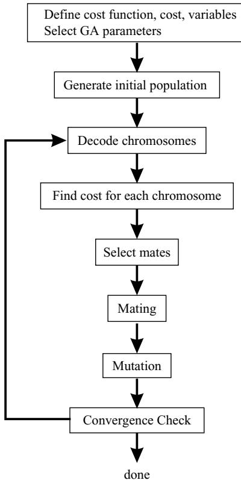  
Figure 2.2 Flowchart of a binary GA.

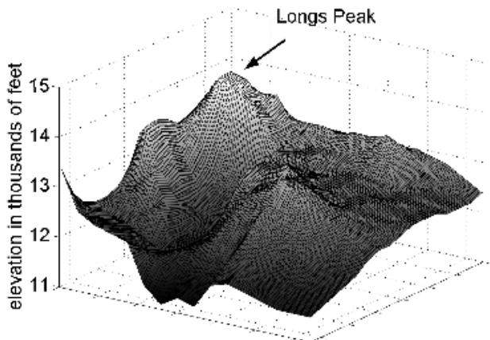  
Figure 2.3 Three-dimensional view of the cost surface with a view of Long’s Peak.

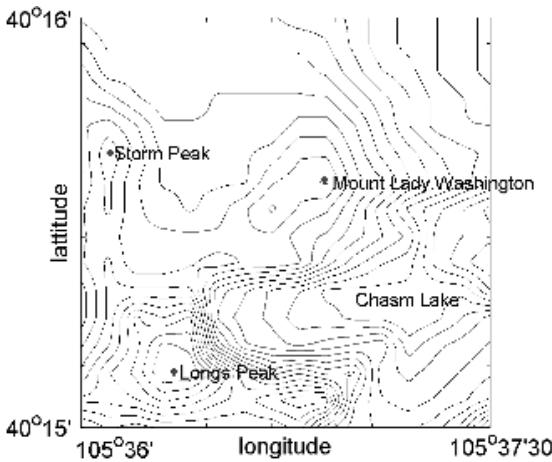  
Figure 2.4 Contour plot or topographical map of the cost surface around Long’s Peak.

Peak unless the starting point is in the immediate vicinity of the peak. In fact all of the methods requiring a gradient of the cost function won’t work well with discrete data. The GA has no problem!

# 2.2.1 Selecting the Variables and the Cost Function

A cost function generates an output from a set of input variables (a chromosome). The cost function may be a mathematical function, an experiment, or a game.The object is to modify the output in some desirable fashion by finding the appropriate values for the input variables. We do this without thinking when filling a bathtub with water. The cost is the difference between the desired and actual temperatures of the water. The input variables are how much the hot and cold spigots are turned. In this case the cost function is the experimental result from sticking your hand in the water. So we see that determining an appropriate cost function and deciding which variables to use are intimately related. The term fitness is extensively used to designate the output of the objective function in the GA literature. Fitness implies a maximization problem. Although fitness has a closer association with biology than the term cost, we have adopted the term cost, since most of the optimization literature deals with minimization, hence cost. They are equivalent.

The GA begins by defining a chromosome or an array of variable values to be optimized. If the chromosome has $N _ { \nu a r }$ variables (an $N _ { \nu a r }$ -dimensional optimization problem) given by $p _ { 1 } , p _ { 2 } , \ldots , p _ { N _ { \nu a r } }$ then the chromosome is written as an $N _ { \nu a r }$ element row vector.

$$
c h r o m o s o m e = \left[ p _ { 1 } , p _ { 2 } , p _ { 3 } , \ldots , p _ { N _ { \nu a r } } \right]
$$

For instance, searching for the maximum elevation on a topographical map requires a cost function with input variables of longitude $( x )$ and latitude $( y )$

$$
c h r o m o s o m e = [ x , y ]
$$

where $N _ { \nu a r } = 2 .$ . Each chromosome has a cost found by evaluating the cost function, $f ,$ at $p _ { 1 } , p _ { 2 } , \ldots , p _ { N _ { \nu a r } }$ :

$$
c o s t = f ( c h r o m o s o m e ) = f ( p _ { 1 } , p _ { 2 } , \dots , p _ { N _ { \nu a r } } )
$$

Since we are trying to find the peak in Rocky Mountain National Park, the cost function is written as the negative of the elevation in order to put it into the form of a minimization algorithm:

$$
f ( x , y ) = - e l e \nu a t i o n \mathrm { a t } \left( x , y \right)
$$

Often the cost function is quite complicated, as in maximizing the gas mileage of a car. The user must decide which variables of the problem are most important. Too many variables bog down the GA. Important variables for optimizing the gas mileage might include size of the car, size of the engine, and weight of the materials. Other variables, such as paint color and type of headlights, have little or no impact on the car gas mileage and should not be included. Sometimes the correct number and choice of variables comes from experience or trial optimization runs. Other times we have an analytical cost function. A cost function defined by $f ( w , x , y , z ) = 2 x + 3 y + z / 1 0 0 0 0 0 + \sqrt { w } / 9 8 7 6$ with all variables lying between 1 and 10 can be simplified to help the optimization algorithm. Since the $w$ and z terms are extremely small in the region of interest, they can be discarded for most purposes.Thus the four-dimensional cost function is adequately modeled with two variables in the region of interest.

Most optimization problems require constraints or variable bounds. Allowing the weight of the car to go to zero or letting the car width be 10 meters are impractical variable values. Unconstrained variables can take any value. Constrained variables come in three brands. First, hard limits in the form of $> , < , \geq$ , and $\leq$ can be imposed on the variables. When a variable exceeds a bound, then it is set equal to that bound. If $x$ has limits of $0 \leq x \leq 1 0$ , and the algorithm assigns $x = 1 1$ , then $x$ will be reassigned to the value of 10. Second, variables can be transformed into new variables that inherently include the constraints. If $x$ has limits of $0 \leq x \leq 1 0$ , then $x = 5 \sin y + 5$ is a transformation between the constrained variable $x$ and the unconstrained variable $y$ . Varying $y$ for any value is the same as varying $x$ within its bounds. This type of transformation changes a constrained optimization problem into an unconstrained optimization problem in a smooth manner. Finally there may be a finite set of variable values from which to choose, and all values lie within the region of interest. Such problems come in the form of selecting parts from a limited supply.

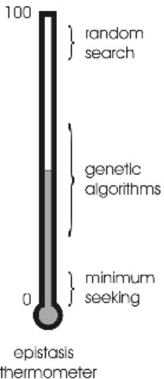  
Figure 2.5 This graph of an epistasis thermometer shows that minimum seeking algorithms work best for low epistasis, while random algorithms work best for very high epistasis. GAs work best in a wide range of medium to high epistasis.

Dependent variables present special problems for optimization algorithms because varying one variable also changes the value of the other variable. For example, size and weight of the car are dependent. Increasing the size of the car will most likely increase the weight as well (unless some other factor, such as type of material, is also changed). Independent variables, like Fourier series coefficients, do not interact with each other. If 10 coefficients are not enough to represent a function, then more can be added without having to recalculate the original 10.

In the GA literature, variable interaction is called epistasis (a biological term for gene interaction). When there is little to no epistasis, minimum seeking algorithms perform best. GAs shine when the epistasis is medium to high, and pure random search algorithms are champions when epistasis is very high (Figure 2.5).

# 2.2.2 Variable Encoding and Decoding

Since the variable values are represented in binary, there must be a way of converting continuous values into binary, and visa versa. Quantization samples a continuous range of values and categorizes the samples into nonoverlapping subranges. Then a unique discrete value is assigned to each subrange. The difference between the actual function value and the quantization level is known as the quantization error. Figure 2.6 is an example of the quantization of a Bessel function $\left( J _ { 0 } \left( x \right) \right)$ using 4 bits. Increasing the number of bits would reduce the quantization error.

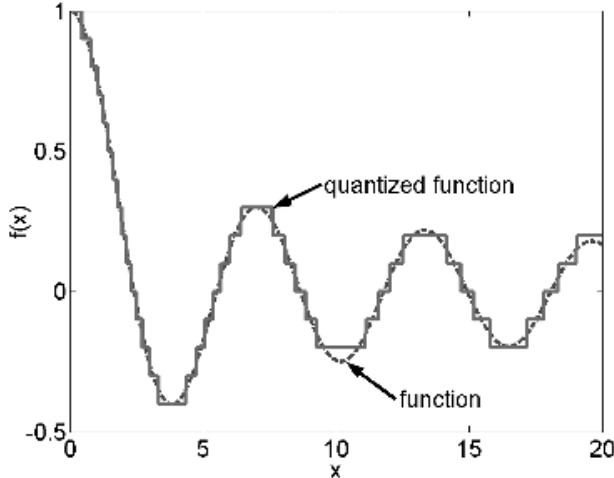  
Figure 2.6 A Bessel function and a 6-bit quantized version of the same function.

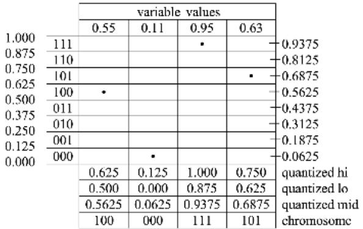  
Figure 2.7 Four continuous parameter values are graphed with the quantization levels shown. The corresponding gene or chromosome indicates the quantization level where the parameter value falls. Each chromosome corresponds to a low, mid, or high value in the quantization level. Normally the parameter is assigned the mid value of the quantization level.

Quantization begins by sampling a function and placing the samples into equal quantization levels (Figure 2.7). Any value falling within one of the levels is set equal to the mid, high, or low value of that level. In general, setting the value to the mid value of the quantization level is best, because the largest error possible is half a level. Rounding the value to the low or high value of the level allows a maximum error equal to the quantization level. The mathematical formulas for the binary encoding and decoding of the nth variable, $p _ { n }$ , are given as follows:

For encoding,

$$
p _ { n o r m } = \frac { p _ { n } - p _ { l o } } { p _ { h i } - p _ { l o } }
$$

$$
g e n e [ m ] = \mathrm { r o u n d } \left\{ p _ { n o r m } - 2 ^ { - m } - \sum _ { p = 1 } ^ { m - 1 } g e n e [ p ] 2 ^ { - p } \right\}
$$

For decoding,

$$
p _ { q u a n t } = \sum _ { m = 1 } ^ { N _ { g e n e } } g e n e [ m ] 2 ^ { - m } + 2 ^ { - ( M + 1 ) }
$$

$$
q _ { n } = p _ { q u a n t } ( p _ { h i } - p _ { l o } ) + p _ { l o }
$$

In each case

$$
\begin{array} { r l } & { p _ { n o r m } \quad \mathrm { ~ \ ~ \ ~ = ~ n o r m a l i z e d ~ v a r i a b l e , ~ } 0 \leq p _ { n o r m } \leq 1 } \\ & { p _ { l o } \quad \quad \mathrm { ~ \ ~ = ~ s m a l l e s t ~ v a r i a b l e ~ v a l u e } } \\ & { p _ { h i } \quad \quad \quad = \mathrm { ~ h i g h e s t ~ v a r i a b l e ~ v a l u e } } \\ & { g e n e [ m ] = \mathrm { b i n a r y ~ v e r s i o n ~ o f ~ } p _ { n } } \\ & { \mathbf { r o u n d } \{ \cdot \} = \mathrm { r o u n d ~ t o ~ n e a r e s t ~ i n t e g e r } } \\ & { p _ { q u a n t } \quad \quad \mathrm { ~ \ ~ = ~ q u a n t i z e d ~ v e r s i o n ~ o f ~ } p _ { n o r m } } \\ & { q _ { n } \quad \quad \quad \quad = \mathrm { q u a n t i z e d ~ v e r s i o n ~ o f ~ } p _ { n } } \end{array}
$$

The binary GA works with bits. The variable $x$ has a value represented by a string of bits that is $N _ { g e n e }$ long. If $N _ { g e n e } = 2$ and $x$ has limits defined by $1 \leq x \leq 4$ , then a gene with 2 bits has $2 ^ { N _ { g e n e } } = 4$ possible values. Those values are the first column of Table 2.1.The bits can represent a decimal integer, quantized values, or qualitative values as shown in columns 2 through 6 of Table 2.1. The quantized value of the gene or variable is mathematically found by multiplying the vector containing the bits by a vector containing the quantization levels:

$$
q _ { n } = g e n e \times Q ^ { T }
$$

where

$$
g e n e = \left[ b _ { 1 } b _ { 2 } \ldots b _ { N _ { g e n e } } \right]
$$

TABLE 2.1 Decoding a Gene   

<table><tr><td>Binary Representation</td><td>Decimal Number</td><td>First Quantized x</td><td>Second Quantized x</td><td>Color</td><td>Opinion</td></tr><tr><td>00</td><td>0</td><td>1</td><td>1.375</td><td>Red</td><td>Excellent</td></tr><tr><td>01</td><td>1</td><td>2</td><td>2.125</td><td>Green</td><td>Good</td></tr><tr><td>10</td><td>2</td><td>3</td><td>2.875</td><td>Blue</td><td>Average</td></tr><tr><td>11</td><td>3</td><td>4</td><td>3.625</td><td>Yellow</td><td>Poor</td></tr></table>

$$
\begin{array} { r l } & { \boldsymbol { b } _ { n } \ = \mathrm { b i n a r y ~ b i t } = 1 \ \mathrm { o r ~ } 0 } \\ & { \boldsymbol { Q } \ = \mathrm { q u a n t i z a t i o n ~ v e c t o r } = [ 2 ^ { - 1 } \ 2 ^ { - 2 } \cdot \cdot \cdot 2 ^ { N _ { g e n e } } ] } \\ & { \boldsymbol { Q } ^ { T } = \mathrm { t r a n s p o s e ~ o f } \ \boldsymbol { Q } } \end{array}
$$

The first quantized representation of $x$ includes the upper and lower bounds of $x$ as shown in column 3 of Table 2.1. This approach has a maximum possible quantization error of 0.5. The second quantized representation of $x$ does not include the two bounds but has a maximum error of 0.375. Increasing the number of bits decreases the quantization error. The binary representation may correspond to a nonnumerical value, such as a color or opinion that has been previously defined by the binary representation, as shown in the last two columns of Table 2.1.

The GA works with the binary encodings,but the cost function often requires continuous variables.Whenever the cost function is evaluated,the chromosome must first be decoded using (2.8).An example of a binary encoded chromosome that has $N _ { \nu a r }$ variables, each encoded with $N _ { g e n e } { = } 1 0$ bits, is

$$
c h r o m o s o m e = [ \underbrace { 1 1 1 0 0 1 0 0 1 } _ { g e n e 1 } \underbrace { 0 0 1 1 0 1 1 1 1 } _ { g e n e 2 } \cdot \cdot \underbrace { 0 0 0 1 0 1 0 0 1 } _ { g e n e _ { N e a r } } ]
$$

Substituting each gene in this chromosome into equation (2.8) yields an array of the quantized version of the variables. This chromosome has a total of $N _ { b i t s } = N _ { g e n e } \times N _ { \nu a r } = 1 0 \times N _ { \nu a r }$ bits.

As previously mentioned, the topographical map of Rocky Mountain National Park has $1 2 8 \times 1 2 8$ elevation points. If $x$ and $y$ are encoded in two genes, each with $N _ { g e n e } = 7$ bits, then there are $2 ^ { 7 }$ possible values for $x$ and $y$ . These values range from $4 0 ^ { \circ } 1 5 ^ { \prime } \leq y \leq 4 0 ^ { \circ } 1 6 ^ { \prime }$ and $1 0 5 ^ { \circ } 3 7 ^ { \prime } 3 0 ^ { \prime \prime } \geq x \geq 1 0 5 ^ { \circ } 3 6 ^ { \prime }$ . The binary translations for the limits are shown in Table 2.2. The cost function translates the binary representation into a decimal value that represents the row and column in a matrix containing all the elevation values. As an example, a chromosome may have the following $N _ { p o p } \times N _ { b i t s }$ binary representation:

TABLE 2.2 Binary Representations   

<table><tr><td>Variable</td><td>Binary</td><td>Decimal</td><td>Value</td></tr><tr><td>Latitude</td><td>0000000</td><td>1</td><td>40°15&#x27;</td></tr><tr><td>Latitude</td><td>1111111</td><td>128</td><td>40°16&#x27;</td></tr><tr><td>Longitude</td><td>0000000</td><td>1</td><td>105°36&#x27;</td></tr><tr><td>Longitude</td><td>1111111</td><td>128</td><td>105°37&#x27;30&quot;</td></tr></table>

$$
c h r o m o s o m e = [ \underbrace { 1 1 0 0 0 1 1 } _ { x } \underbrace { 0 0 1 1 0 0 1 } _ { y } ]
$$

This chromosome translates into matrix coordinates of [99, 25] or longitude, latitude coordinates of $[ 1 0 5 ^ { \circ } 3 6 ^ { \prime } 5 0 ^ { \prime \prime }$ , $4 0 ^ { \circ } 1 5 ^ { \prime } 2 9 . 7 ^ { \prime \prime } ]$ . During the optimization, the actual values of the longitude and latitude do not need to be calculated. Decoding is only necessary to interpret the results at the end.

# 2.2.3 The Population

The GA starts with a group of chromosomes known as the population. The population has $N _ { p o p }$ chromosomes and is an $N _ { p o p } \times N _ { b i t s }$ matrix filled with random ones and zeros generated using

pop $=$ round(rand( $N _ { p o p }$ , $N _ { b i t s }$ ));

where the function $( N _ { p o p } , N _ { b i t s } )$ generates a $N _ { p o p } \times N _ { b i t s }$ matrix of uniform random numbers between zero and one. The function round rounds the numbers to the closest integer which in this case is either 0 or 1. Each row in the pop matrix is a chromosome. The chromosomes correspond to discrete values of longitude and latitude. Next the variables are passed to the cost function for evaluation. Table 2.3 shows an example of an initial population and their costs for the $N _ { p o p } = 8$ random chromosomes. The locations of the chromosomes are shown on the topographical map in Figure 2.8.

# 2.2.4 Natural Selection

Survival of the fittest translates into discarding the chromosomes with the highest cost (Figure 2.9). First, the $N _ { p o p }$ costs and associated chromosomes are ranked from lowest cost to highest cost. Then, only the best are selected to continue, while the rest are deleted. The selection rate, $X _ { r a t e }$ , is the fraction of $N _ { p o p }$ that survives for the next step of mating. The number of chromosomes that are kept each generation is

TABLE 2.3 Example Initial Population of 8 Random Chromosomes and Their Corresponding Cost   

<table><tr><td>Chromosome</td><td>Cost</td></tr><tr><td>00101111000110</td><td>12359</td></tr><tr><td>11100101100100</td><td>-11872</td></tr><tr><td>00110010001100</td><td>-13477</td></tr><tr><td>00101111001000</td><td>-12363</td></tr><tr><td>11001111111011</td><td>-11631</td></tr><tr><td>01000101111011</td><td>-12097</td></tr><tr><td>11101100000001</td><td>-12588</td></tr><tr><td>01001101110011</td><td>-11860</td></tr></table>

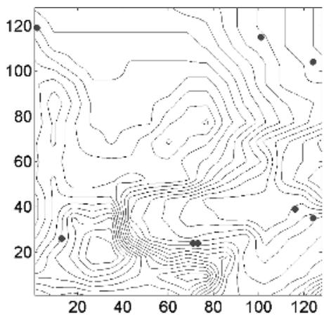  
Figure 2.8 A contour map of the cost surface with the 8 initial population members indicated by large dots.

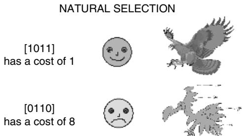  
Figure 2.9 Individuals with the best traits survive. Unfit species in nature don’t survive. Chromosomes with high costs in GAs are discarded.

TABLE 2.4 Surviving Chromosomes after a $5 0 \%$ Selection Rate   

<table><tr><td>Chromosome</td><td>Cost</td></tr><tr><td>00110010001100</td><td>-13477</td></tr><tr><td>11101100000001</td><td>-12588</td></tr><tr><td>00101111001000</td><td>-12363</td></tr><tr><td>00101111000110</td><td>12359</td></tr></table>

$$
N _ { k e e p } = X _ { r a t e } N _ { p o p }
$$

Natural selection occurs each generation or iteration of the algorithm. Of the $N _ { p o p }$ chromosomes in a generation, only the top $N _ { k e e p }$ survive for mating, and the bottom $N _ { p o p } - N _ { k e e p }$ are discarded to make room for the new offspring.

Deciding how many chromosomes to keep is somewhat arbitrary. Letting only a few chromosomes survive to the next generation limits the available genes in the offspring. Keeping too many chromosomes allows bad performers a chance to contribute their traits to the next generation. We often keep $5 0 \%$ $X _ { r a t e } = 0 . 5 )$ ) in the natural selection process.

In our example, $N _ { p o p } = 8$ . With a $5 0 \%$ selection rate, $N _ { k e e p } = 4 $ . The natural selection results are shown in Table 2.4. Note that the chromosomes of Table 2.4 have first been sorted by cost. Then the four with the lowest cost survive to the next generation and become potential parents.

Another approach to natural selection is called thresholding. In this approach all chromosomes that have a cost lower than some threshold survive. The threshold must allow some chromosomes to continue in order to have parents to produce offspring. Otherwise, a whole new population must be generated to find some chromosomes that pass the test. At first, only a few chromosomes may survive. In later generations, however, most of the chromosomes will survive unless the threshold is changed. An attractive feature of this technique is that the population does not have to be sorted.

# 2.2.5 Selection

Now it’s time to play matchmaker. Two chromosomes are selected from the mating pool of $N _ { k e e p }$ chromosomes to produce two new offspring. Pairing takes place in the mating population until $N _ { p o p } - N _ { k e e p }$ offspring are born to replace the discarded chromosomes. Pairing chromosomes in a GA can be as interesting and varied as pairing in an animal species. We’ll look at a variety of selection methods, starting with the easiest.

1. Pairing from top to bottom. Start at the top of the list and pair the chromosomes two at a time until the top $N _ { k e e p }$ chromosomes are selected for mating. Thus, the algorithm pairs odd rows with even rows. The mother has row numbers in the population matrix given by $m a = 1 , 3 , 5 , \ldots$ and the father has the row numbers $\mathrm { \ p a } = 2 , 4 , 6 , \ldots$ This approach doesn’t model nature well but is very simple to program. It’s a good one for beginners to try.

2. Random pairing. This approach uses a uniform random number generator to select chromosomes. The row numbers of the parents are found using

ma $\underline { { \underline { { \mathbf { \Pi } } } } }$ ceil(Nkeep\*rand(1, Nkeep)) pa $\underline { { \underline { { \mathbf { \Pi } } } } }$ ceil( $N _ { k e e p } { } ^ { \star }$ rand(1, Nkeep))

where ceil rounds the value to the next highest integer.

3. Weighted random pairing. The probabilities assigned to the chromosomes in the mating pool are inversely proportional to their cost. A chromosome with the lowest cost has the greatest probability of mating, while the chromosome with the highest cost has the lowest probability of mating.A random number determines which chromosome is selected. This type of weighting is often referred to as roulette wheel weighting. There are two techniques: rank weighting and cost weighting.

a. Rank weighting. This approach is problem independent and finds the probability from the rank, $n$ , of the chromosome:

$$
P _ { n } = \frac { N _ { k e p } - n + 1 } { \sum _ { n = 1 } ^ { N _ { k e e p } } n } = \frac { 4 - n + 1 } { 1 + 2 + 3 + 4 } = \frac { 5 - n } { 1 0 }
$$

Table 2.5 shows the results for the $N _ { k e e p } = 4$ chromosomes of our example. The cumulative probabilities listed in column 4 are used in selecting the chromosome. A random number between zero and one is generated. Starting at the top of the list, the first chromosome with a cumulative probability that is greater than the random number is selected for the mating pool. For instance, if the random number is $r =$ 0.577, then $0 . 4 < r \leq 0 . 7$ , so chromosome2 is selected. If a chromosome is paired with itself, there are several alternatives. First, let it go. It just means there are three of these chromosomes in the next generation.

TABLE 2.5 Rank Weighting   

<table><tr><td>n</td><td>Chromosome</td><td>Pn</td><td>∑&quot; P</td></tr><tr><td>1</td><td>00110010001100</td><td>0.4</td><td>0.4</td></tr><tr><td>2</td><td>11101100000001</td><td>0.3</td><td>0.7</td></tr><tr><td>3</td><td>00101111001000</td><td>0.2</td><td>0.9</td></tr><tr><td>4</td><td>00101111000110</td><td>0.1</td><td>1.0</td></tr></table>

Second, randomly pick another chromosome. The randomness in this approach is more indicative of nature.Third,pick another chromosome using the same weighting technique. Rank weighting is only slightly more difficult to program than the pairing from top to bottom. Small populations have a high probability of selecting the same chromosome. The probabilities only have to be calculated once. We tend to use rank weighting because the probabilities don’t change each generation.

b. Cost weighting. The probability of selection is calculated from the cost of the chromosome rather than its rank in the population. A normalized cost is calculated for each chromosome by subtracting the lowest cost of the discarded chromosomes $( c _ { N _ { k e e p + 1 } } )$ from the cost of all the chromosomes in the mating pool:

$$
C _ { n } = c _ { n } - c _ { N _ { k e e p + 1 } }
$$

Subtracting $c _ { N _ { k e e p + 1 } }$ ensures all the costs are negative. Table 2.6 lists the normalized costs assuming that $c _ { N _ { k e e p + 1 } } = - 1 2 0 9 7 . \ P _ { n }$ is calculated from

$$
P _ { n } = \left| \frac { C _ { n } } { \sum _ { m } ^ { N _ { k e e p } } C _ { m } } \right|
$$

This approach tends to weight the top chromosome more when there is a large spread in the cost between the top and bottom chromosome. On the other hand, it tends to weight the chromosomes evenly when all the chromosomes have approximately the same cost. The same issues apply as discussed above if a chromosome is selected to mate with itself. The probabilities must be recalculated each generation.

4. Tournament selection. Another approach that closely mimics mating competition in nature is to randomly pick a small subset of chromosomes (two or three) from the mating pool, and the chromosome with the lowest cost in this subset becomes a parent. The tournament repeats for every parent needed. Thresholding and tournament selection make a nice pair, because the population never needs to be sorted. Tournament selection works best for larger population sizes because sorting becomes time-consuming for large populations.

TABLE 2.6 Cost Weighting   

<table><tr><td>n</td><td>Chromosome</td><td> =  − eep+1</td><td>Pn</td><td>P =1</td></tr><tr><td>1</td><td>00110010001100</td><td>-13477 + 12097 = -1380</td><td>0.575</td><td>0.575</td></tr><tr><td>2</td><td>11101100000001</td><td>−12588 + 12097 = 491</td><td>0.205</td><td>0.780</td></tr><tr><td>3</td><td>00101111001000</td><td>-12363 + 12097 = -266</td><td>0.111</td><td>0.891</td></tr><tr><td>4</td><td>00101111000110</td><td>−12359 + 12097 = -262</td><td>0.109</td><td>1.000</td></tr></table>

Each of the parent selection schemes results in a different set of parents. As such, the composition of the next generation is different for each selection scheme. Roulette wheel and tournament selection are standard for most GAs. It is very difficult to give advice on which weighting scheme works best. In this example we follow the rank-weighting parent selection procedure.

Figure 2.10 shows the probability of selection for five selection methods. Uniform selection has a constant probability for each of the eight parents. Roulette wheel rank selection and tournament selection with two chromosomes have about the same probabilities for the eight parents. Selection pressure is the ratio of the probability that the most fit chromosome is selected as a parent to the probability that the average chromosome is selected. The selection pressure increases for roulette wheel rank squared selection and tournament selection with three chromosomes, and their probability of selection for the eight parents are nearly the same. For more information on these selection methods, see Bäck (1994) and Goldberg and Deb (1991).

# 2.2.6 Mating

Mating is the creation of one or more offspring from the parents selected in the pairing process. The genetic makeup of the population is limited by the current members of the population. The most common form of mating involves two parents that produce two offspring (see Figure 2.11). A crossover point, or kinetochore, is randomly selected between the first and last bits of the parents’ chromosomes. First, parent1 passes its binary code to the left of that crossover point to offspring1. In a like manner, parent2 passes its binary code to the left of the same crossover point to offspring2. Next, the binary code to the right of the crossover point of $p a r e n t _ { 1 }$ goes to offsprin $g _ { 2 }$ and $p a r e n t _ { 2 }$ passes its code to offspring1. Consequently the offspring contain portions of the binary codes of both parents. The parents have produced a total of $N _ { p o p } - N _ { k e e p }$ offspring, so the chromosome population is now back to $N _ { p o p }$ . Table 2.7 shows the pairing and mating process for the problem at hand. The first set of parents is chromosomes 3 and 2 and has a crossover point between bits 5 and 6. The second set of parents is chromosomes 3 and 4 and has a crossover point between bits 10 and 11. This process is known as simple or single-point crossover. More complicated versions of mating are discussed in Chapter 5.

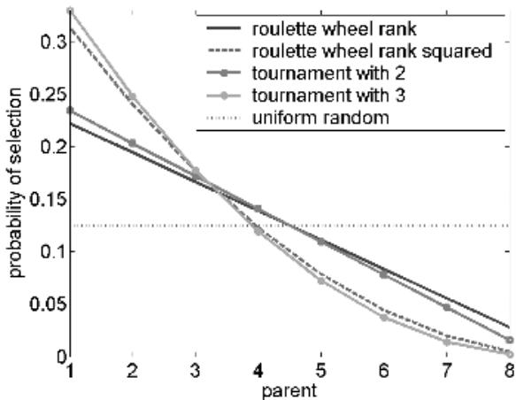  
Figure 2.10 Graph of the probability of selection for 8 parents using five different methods of selection.

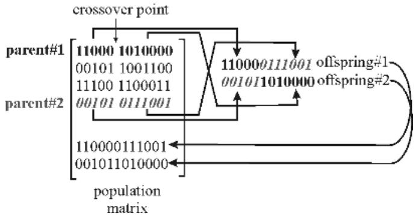  
Figure 2.11 Two parents mate to produce two offspring. The offspring are placed into the population.

TABLE 2.7 Pairing and Mating Process of SinglePoint Crossover   

<table><tr><td>Chromosome</td><td>Family</td><td>Binary String</td></tr><tr><td>3</td><td>ma(1)</td><td>00101111001000</td></tr><tr><td>2</td><td>pa(1)</td><td>11101100000001</td></tr><tr><td>5</td><td>offspring1</td><td>00101100000001</td></tr><tr><td>6</td><td>offspring2</td><td>11101111001000</td></tr><tr><td>3</td><td>ma(2)</td><td>00101111001000</td></tr><tr><td>4</td><td>pa(2)</td><td>00101111000110</td></tr><tr><td>7</td><td>offspring3</td><td>00101111000110</td></tr><tr><td>8</td><td>offspring4</td><td>00101111001000</td></tr></table>

# 2.2.7 Mutations

Random mutations alter a certain percentage of the bits in the list of chromosomes. Mutation is the second way a GA explores a cost surface. It can introduce traits not in the original population and keeps the GA from converging too fast before sampling the entire cost surface. A single point mutation changes a 1 to a 0, and visa versa. Mutation points are randomly selected from the $N _ { p o p } \times N _ { b i t s }$ total number of bits in the population matrix. Increasing the number of mutations increases the algorithm’s freedom to search outside the current region of variable space. It also tends to distract the algorithm from converging on a popular solution. Mutations do not occur on the final iteration. Do we also allow mutations on the best solutions? Generally not. They are designated as elite solutions destined to propagate unchanged. Such elitism is very common in GAs. Why throw away a perfectly good answer?

For the Rocky Mountain National Park problem, we choose to mutate $2 0 \%$ of the population $\mathrm { \Delta } \mu = 0 . 2 0 )$ , except for the best chromosome. Thus a random number generator creates seven pairs of random integers that correspond to the rows and columns of the mutated bits. In this case the number of mutations is given by

$$
\# m u t a t i o n s = \mu \times \left( N _ { p o p } - 1 \right) \times N _ { b i t s } = 0 . 2 \times 7 \times 1 4 = 1 9 . 6 \simeq 2 0
$$

The computer code to find the rows and columns of the mutated bits is

nmut $=$ ceil((Npop - 1)\*Nbits m);   
mrow $: =$ ceil(rand(1, m)\*(Npop - 1))+1;   
mcol $=$ ceil(rand(1, m) $\star N _ { b i t s }$ );   
pop(mrow,mcol) $=$ abs(pop(mrow,mcol)-1);

The following pairs were randomly selected:

$$
\begin{array} { r } { \begin{array} { c c c c c c c c c c c c c c c c c c c c c c c c c c c c c c c c c c c c c c c c c c c c c c c c c c c c c c c c c c c c c c c c c c c c c c c c c c c c c c c c c c c c c c c c c c c c c c c c c c c c c c c c c c c c c c c c c c c c c c c c c c c c c c c c c c c c c c c c c c c c c c c c c c c c c c c c c c c c c c c c c c c c c c c c c c c c c c c c c c c c c c c c c c c c c c c c c c c c c c c c c c c c c c c c c c c c c c c c c c c c c c c c c c c c c c c c c c c c c c c c c c c c c c c c c c c c c c c c c c c c c c c c c c c c c c c c c c c c c c c c c c c c c c c c c c c c c c c c c c c c c c c } } & & & & & & & & & & & & & & & & & & & & & & & & & & & & & & & & & & & & & & & & & & & & & & & & & & & & & & & & & & & & & & & & & \\ { \operatorname* { m c c c c c c c c c c c c c c c c c c c c c c c c c c c c c c c c c c c c c c c c c c c c c c c c c c c c c c c c c c c c c c c c c c c c c c c c c c c c c c c c c c c c c c c c c c c c c c c c c c c c c c c c c c c c c c c c c c c c c c c c c c c c c c c c c c c c c c c c c c c c c c c c c c c c c c c c c c c c c c c c c c c c c c c c c c c c c c c c c c c c c c c c c c c c c c c c c c c c c c c c c c c c c c c c c c c c c c c c c c c c c c c c c c c c c c c c c c c c c c c c c c c c c c c c c c c c c c c } } & & & & & & & & & & & & & & & & & & & & & & & & & & & & & & & & & & & & & & & & & & & & & & & & & & & & & & & & & & & & & & & & & & & & & & & & & & & & & & & & & & & & & & & & & & & & & & & & & & & & & & & & & & & & & & & & & & & & & & & & & & & & & & & & & & & & & & & & & & & & & & & & & & & & & & & & & \end   \end{array} \end{array}
$$

The first random pair is $( 5 , 6 )$ . Thus the bit in row 5 and column 6 of the population matrix is mutated from a 1 to a $\pmb { \theta }$ :

$$
0 0 1 0 1 1 0 0 0 0 0 0 0 1 \Rightarrow 0 0 1 0 1 pm 0 0 0 0 0 0 0 1
$$

Mutations occur 19 more times. The mutated bits in Table 2.8 appear in italics. Note that the first chromosome is not mutated due to elitism. If you look carefully, only 18 bits are mutated in Table 2.8 instead of 20. The reason is that the row column pair (6, 5) was randomly selected three times. Thus the same bit switched from a 1 to a 0 back to a 1 and finally to a 0. Locations of the chromosomes at the end of the first generation are shown in Figure 2.12.

TABLE 2.8 Mutating the Population   

<table><tr><td>Population after Mating</td><td>Population after Mutations</td><td>New Cost</td></tr><tr><td>00110010001100</td><td>00110010001100</td><td>-13477</td></tr><tr><td>11101100000001</td><td>11101100000001</td><td>-12588</td></tr><tr><td>00101111001000</td><td>00101111010000</td><td>-12415</td></tr><tr><td>00101111000110</td><td>00001011000111</td><td>13482</td></tr><tr><td>00101100000001</td><td>00101000000001</td><td>-13171</td></tr><tr><td>11101111001000</td><td>11110111010010</td><td>-12146</td></tr><tr><td>00101111000110</td><td>00100111001000</td><td>-12716</td></tr><tr><td>00101111001000</td><td>00110111001000</td><td>-12103</td></tr></table>

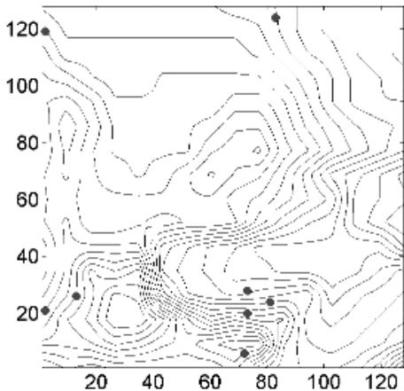  
Figure 2.12 A contour map of the cost surface with the 8 members at the end of the first generation.

# 2.2.8 The Next Generation

After the mutations take place, the costs associated with the offspring and mutated chromosomes are calculated (third column in Table 2.8). The process described is iterated. For our example, the starting population for the next generation is shown in Table 2.9 after ranking. The bottom four chromosomes are discarded and replaced by offspring from the top four parents. Another 20 random bits are selected for mutation from the bottom 7 chromosomes. The population at the end of generation 2 is shown in Table 2.10 and Figure 2.13. Table 2.11 is the ranked population at the beginning of generation 3. After mating, mutation, and ranking, the population is shown in Table 2.12 and Figure 2.14.

TABLE 2.9 New Ranked Population at the Start of the Second Generation   

<table><tr><td>Chromosome</td><td>Cost</td></tr><tr><td>00001011000111</td><td>-13482</td></tr><tr><td>00110010001100</td><td>-13477</td></tr><tr><td>00101000000001</td><td>-13171</td></tr><tr><td>00100111001000</td><td>-12716</td></tr><tr><td>11101100000001</td><td>-12588</td></tr><tr><td>00101111010000</td><td>-12415</td></tr><tr><td>11110111010010</td><td>-12146</td></tr><tr><td>00110111001000</td><td>-12103</td></tr></table>

TABLE 2.10 Population after Crossover and Mutation in the Second Generation   

<table><tr><td>Chromosome</td><td>Cost</td></tr><tr><td>00001011000111</td><td>-13482</td></tr><tr><td>00110000001000</td><td>13332</td></tr><tr><td>01101001000001</td><td>-12923</td></tr><tr><td>01100111011000</td><td>-12128</td></tr><tr><td>10100111000001</td><td>-12961</td></tr><tr><td>10100010001000</td><td>-13237</td></tr><tr><td>00110100001110</td><td>-13564</td></tr><tr><td>00100010000001</td><td>-13246</td></tr></table>

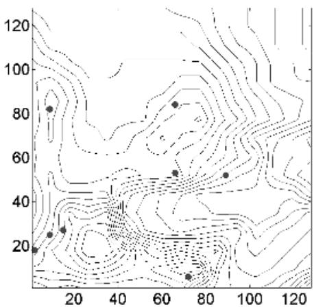  
Figure 2.13 A contour map of the cost surface with the 8 members at the end of the second generation.

TABLE 2.11 New Ranked Population at the Start of the Third Generation   

<table><tr><td>Chromosome</td><td>Cost</td></tr><tr><td>00110100001110</td><td>13564</td></tr><tr><td>00001011000111</td><td>-13482</td></tr><tr><td>00110000001000</td><td>13332</td></tr><tr><td>00100010000001</td><td>-13246</td></tr><tr><td>10100010001000</td><td>-13237</td></tr><tr><td>10100111000001</td><td>-12961</td></tr><tr><td>01101001000001</td><td>-12923</td></tr><tr><td>01100111011000</td><td>-12128</td></tr></table>

TABLE 2.12 Ranking of Generation 2 from Least to Most Cost   

<table><tr><td>Chromosome</td><td>Cost</td></tr><tr><td>00100010100001</td><td>-14199</td></tr><tr><td>00110100001110</td><td>-13564</td></tr><tr><td>00010000001110</td><td>-13542</td></tr><tr><td>00100000000001</td><td>-13275</td></tr><tr><td>00100011010000</td><td>-12840</td></tr><tr><td>00001111111111</td><td>-12739</td></tr><tr><td>11001011000111</td><td>-12614</td></tr><tr><td>01111111011111</td><td>-12192</td></tr></table>

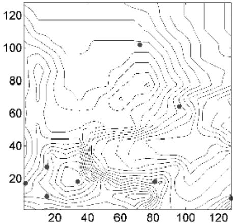  
Figure 2.14 A contour map of the cost surface with the 8 members at the end of the third generation.

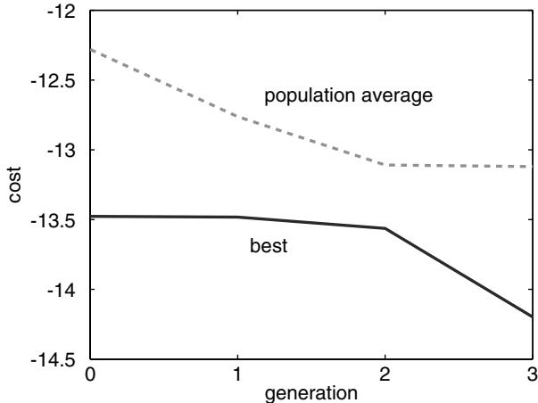  
Figure 2.15 Graph of the mean cost and minimum cost for each generation.

# 2.2.9 Convergence

The number of generations that evolve depends on whether an acceptable solution is reached or a set number of iterations is exceeded. After a while all the chromosomes and associated costs would become the same if it were not for mutations. At this point the algorithm should be stopped.

Most GAs keep track of the population statistics in the form of population mean and minimum cost. For our example, after three generations the global minimum is found to be -14199. This minimum was found in

$$
\underbrace { \underset { \left. \begin{array} { l } { \begin{array} { r } { \big ( \mathrm { \textrm { S } } } \\ { \mathrm { i n i t i a l ~ p o p u l a t i o n } } \end{array} } + \underset { \mathrm { p e r ~ g e n e r a t i o n s } } { \overset { \triangledown } { \bigtriangledown } } \times \underset { \mathrm { g e n e r a t i o n s } } { \overset { \triangledown } { \boldsymbol { \mathfrak { Z } } } } = 2 9 \right.} \end{array} } _ { \mathrm { p e r ~ g e n e r a t i o n s } }  _ { \mathrm { \textrm { N e r a t i o n s } } } = 0 .
$$

cost function evaluations or checking $2 9 / ( 1 2 8 \times 1 2 8 ) \times 1 0 0 = 0 . 1 8 \%$ of the population. The final population is shown in Figure 2.14, where four of the members are close to Long’s Peak. Figure 2.15 shows a plot of the algorithm convergence in terms of the minimum and mean cost of each generation. Long’s Peak is actually 14,255 ft above sea level, but the quantization error (due to gridding) produced a maximum of 14,199.

# 2.3 A PARTING LOOK

We’ve managed to find the highest point in Rocky Mountain National Park with a GA. This may have seemed like a trivial problem—the peak could have easily been found through an exhaustive search or by looking at a topographical map. True. But try using a conventional numerical optimization routine to find the peak in these data. Such routines don’t work very well.

Many can’t even be adapted to apply to this simple problem. We’ll present some much more difficult problems in Chapters 4 and 6 where the utility of the GA becomes even more apparent. For now you should be comfortable with the workings of a simple GA.

$\%$ This is a simple GA written in MATLAB $\%$ costfunction.m calculates a cost for each row or $\%$ chromosome in pop. This function must be provided % by the user.

$\mathtt { N } = 2 0 0$ ; % number of bits in a chromosome   
$\mathrm { { M } } = 8$ ; $\%$ number of chromosomes must be even   
last $= 5 0$ ; % number of generations   
$\mathrm { s e l } { = } 0 . 5$ ; % selection rate   
$\mathrm { M } 2 = 2 ^ { \star }$ ceil(sel $^ { \star } \mathrm { M } / 2$ ); % number of chromosomes kept   
mutrate ${ } = 0$ .01; % mutation rate   
nmuts $=$ mutrate $\star _ { \mathrm { N } } \star$ (M-1); % number of mutations

% creates M random chromosomes with N bits pop $=$ round(rand(M,N)); % initial population

for ib $^ { 1 = 1 }$ :last

cost $=$ costfunction(pop); % cost function $\%$ ranks results and chromosomes   
[cost,ind] $=$ sort(cost);   
pop $=$ pop(ind(1:M2),:);   
[ib cost(1)]

%mate cross $=$ ceil((N-1)\*rand(M2,1));

% pairs chromosomes and performs crossover   
for ic $^ { = 1 }$ :2:M2   
pop(ceil(M2\*rand),1:cross) $=$ pop(ic,1:cross);   
pop(ceil(M2\*rand),cross+1:N) $=$ pop(ic+1,cross+1:N); pop(ceil(M2\*rand),1:cross) $=$ pop(ic+1,1:cross); pop(ceil(M2\*rand),cross+1:N) $=$ pop(ic,cross $^ { + 1 }$ :N); end

%mutate for ic $^ { = 1 }$ :nmuts ix $\displaystyle { \overline { { \mathbf { \Lambda } } } } =$ ceil( $\mathbb { M } ^ { \star }$ rand); iy $\simeq$ ceil( $\mathrm { N } ^ { \star }$ rand); pop(ix,iy) $^ { = 1 }$ -pop(ix,iy); end %ic

end %ib

It’s very simple to program a GA. An extremely short GA in MATLAB is shown in Figure 2.16. This GA uses pairing from top to bottom when selecting mates. The cost function must be provided by the user and converts the binary strings into usable variable values.

# BIBLIOGRAPHY

Angeline, P. J. 1995. Evolution revolution: An introduction to the special track on genetic and evolutionary programming. IEEE Exp. Intell. Syst. Appl. 10:6–10.   
Bäck, T. 1994. Selective pressure in evolutionary algorithms: A characterization of selection mechanisms. In Proc. 1st IEEE Conf. on Evolutionary Computation. Piscataway, NJ: IEEE Press, pp. 57–62.   
Goldberg, D. E., and K. Deb. 1991. A comparative analysis of selection schemes used in genetic algorithms. In Foundations of Genetic Algorithms. San Mateo, CA: Morgan Kaufmann, pp. 69–93.   
Goldberg, D. E. 1993. Making genetic algorithms fly: A lesson from the Wright brothers. Adv. Technol. Dev. 2:1–8.   
Holland, J. H. 1992. Genetic algorithms. Sci. Am. 267:66–72.   
Janikow, C. Z., and D. St. Clair. 1995. Genetic algorithms simulating nature’s methods of evolving the best design solution. IEEE Potentials 14:31–35.   
Malasri, S., J. R. Martin, and L. Y. Lin. 1995. Hands-on software for teaching genetic algorithms. Comput. Educ. J. 6:42–47.

# EXERCISES

1. Write a binary GA that uses:

a. Single-point crossover b. Double-point crossover c. Uniform crossover

2. Write a binary GA that uses:

a. Pairing parents from top to bottom b. Random pairing c. Pairing based on cost d. Roulette wheel rank weighting e. Tournament selection

3. Find the minimum of _ (from Appendix I) using your binary GA.

4. Experiment with different population sizes and mutation rates. Which combination seems to work best for you? Explain.

5. Compare your binary GA with the following local optimizers:

a. Nelder-Mead downhill simplex   
b. BFGS   
c. DFP   
d. Steepest descent   
e. Random search

6. Since the GA has many random components, it is important to average the results over multiple runs. Write a program that will average the results of your GA. Then do another one of the exercises and compare results.

7. Plot the convergence of the GA. Do a sensitivity analysis on parameters such as $\mu$ and $N _ { p o p }$ . Which GA parameters have the most effect on convergence? A convergence plot could be: best minimum in the population versus the number of function calls or the best minimum in the population versus generation. Which method is better?

# The Continuous Genetic Algorithm

Now that you are convinced (perhaps) that the binary GA solves many optimization problems that stump traditional techniques, let’s look a bit closer at the quantization limitation. What if you are attempting to solve a problem where the values of the variables are continuous and you want to know them to the full machine precision? In such a problem each variable requires many bits to represent it. If the number of variables is large, the size of the chromosome is also large. Of course, 1s and 0s are not the only way to represent a variable. One could, in principle, use any representation conceivable for encoding the variables. When the variables are naturally quantized, the binary GA fits nicely. However, when the variables are continuous, it is more logical to represent them by floating-point numbers. In addition, since the binary GA has its precision limited by the binary representation of variables, using floating point numbers instead easily allows representation to the machine precision. This continuous GA also has the advantage of requiring less storage than the binary GA because a single floating-point number represents the variable instead of $N _ { b i t s }$ integers.The continuous GA is inherently faster than the binary GA, because the chromosomes do not have to be decoded prior to the evaluation of the cost function.

The purpose of this chapter is to introduce the continuous GA. Most sources call this version of the GA a real-valued GA. We use the term continuous rather than real-valued to avoid confusion between real and complex numbers. The development here closely parallels the last chapter. We primarily dwell upon the differences in the two algorithms. The continuous example introduced in Chapter 1 is our primary example problem. This allows the reader to compare the continuous GA performance with the more traditional optimization algorithms introduced in Chapter 1.

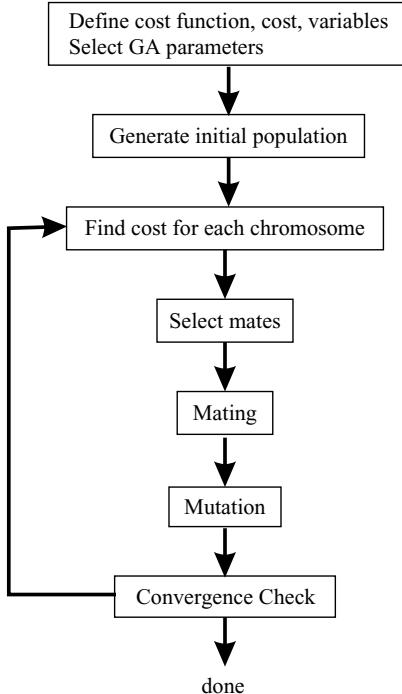  
Figure 3.1 Flowchart of a continuous GA.

# 3.1 COMPONENTS OF A CONTINUOUS GENETIC ALGORITHM

The flowchart in Figure 3.1 provides a “big picture” overview of a continuous GA. Each block is discussed in detail in this chapter. This GA is very similar to the binary GA presented in the last chapter. The primary difference is the fact that variables are no longer represented by bits of zeros and ones, but instead by floating-point numbers over whatever range is deemed appropriate. However, this simple fact adds some nuances to the application of the technique that must be carefully considered. In particular, we will present different crossover and mutation operators.

# 3.1.1 The Example Variables and Cost Function

As we saw in the last chapter, the goal is to solve some optimization problem where we search for an optimal (minimum) solution in terms of the variables of the problem. Therefore we begin the process of fitting it to a GA by defining a chromosome as an array of variable values to be optimized. If the chromosome has $N _ { \nu a r }$ variables (an $N \cdot$ -dimensional optimization problem) given by $p _ { 1 } , p _ { 2 } , . . . , p _ { N _ { \nu a r } }$ then the chromosome is written as an array with $1 \times N _ { \nu a r }$ elements so that

$$
\mathit { c h r o m o s o m e } = [ \mathit { p } _ { 1 } , \mathit { p } _ { 2 } , \mathit { p } _ { 3 } , \ldots , \mathit { p } _ { N _ { \nu a r } } ]
$$

In this case, the variable values are represented as floating-point numbers. Each chromosome has a cost found by evaluating the cost function $f$ at the variables p1, p2, . . . , .pNvar

$$
c o s t = f ( c h r o m o s o m e ) = f ( p _ { 1 } , p _ { 2 } , . . . , p _ { N _ { \nu a r } } )
$$

Equations (3.1) and (3.2) along with applicable constraints constitute the problem to be solved.

Our primary example in this chapter is the continuous function introduced in Chapter 1. Consider the cost function

$$
\begin{array} { c } { { c o s t = f ( x , y ) = x \sin ( 4 x ) + 1 . 1 y \sin ( 2 y ) } } \\ { { . \nonumber } } \\ { { \mathrm { \scriptsize { ~ t o ~ t h e ~ c o n s t r a i n t s : ~ } ~ } 0 \leq x \leq 1 0 \quad \mathrm { a n d } \quad 0 \leq y \leq 1 0 } } \end{array}
$$

Since $f$ is a function of $x$ and $y$ only, the clear choice for the variables is

$$
c h r o m o s o m e = [ x , y ]
$$

with $N _ { \nu a r } = 2$ . A contour map of the cost function appears as Figure 1.4. This cost function is considerably more complex than the cost function in Chapter 2. We see that peaks and valleys dot the landscape of the cost function contour plot. The plethora of local minima overwhelms traditional minimum-seeking methods. Our goal is to find the global minimum value of $f ( x , y )$ .

# 3.1.2 Variable Encoding, Precision, and Bounds

Here is where we begin to see the differences from the prior chapter. We no longer need to consider how many bits are necessary to accurately represent a value. Instead, $x$ and $y$ have continuous values that fall between the bounds listed in equation (3.3). Although the values are continuous, a digital computer represents numbers by a finite number of bits. When we refer to the continuous GA, we mean the computer uses its internal precision and roundoff to define the precision of the value. Now the algorithm is limited in precision to the roundoff error of the computer.

Since the GA is a search technique, it must be limited to exploring a reasonable region of variable space. Sometimes this is done by imposing a constraint on the problem such as equation (3.3). If one does not know the initial search region, there must be enough diversity in the initial population to explore a reasonably sized variable space before focusing on the most promising regions.

# 3.1.3 Initial Population

To begin the GA, we define an initial population of $N _ { p o p }$ chromosomes. A matrix represents the population with each row in the matrix being a $1 \times N _ { \nu a r }$ array (chromosome) of continuous values. Given an initial population of $N _ { p o p }$ chromosomes, the full matrix of $N _ { p o p } \times N _ { \nu a r }$ random values is generated by

$$
\mathtt { p o p } = \mathtt { r a n d } ( N _ { p o p } , \ N _ { v a r } )
$$

All variables are normalized to have values between 0 and 1, the range of a uniform random number generator. The values of a variable are “unnormalized” in the cost function. If the range of values is between $p _ { l o }$ and $p _ { h i } .$ , then the unnormalized values are given by

$$
p = ( p _ { h i } - p _ { l o } ) p _ { n o r m } + p _ { l o }
$$

where

$p _ { l o }$ $=$ highest number in the variable range $\begin{array} { r l } { p _ { h i } } & { { } = } \end{array}$ lowest number in the variable range $p _ { n o r m } =$ normalized value of variable

In our example, the unnormalized values are just $1 0 p _ { n o r m }$

This society of chromosomes is not a democracy: the individual chromosomes are not all created equal. Each one’s worth is assessed by the cost function. So at this point, the chromosomes are passed to the cost function for evaluation.

We begin solving (3.3) by filling a $N _ { p o p } \times N _ { \nu a r }$ matrix with uniform random numbers between 0 and 10. Figure 3.2 shows the initial random population for the $N _ { p o p } = 8$ chromosomes. Population values are listed in Table 3.1. We see widely scattered population members that well sample the values of the cost function. None of the initial guesses are particularly close to the global minimum.

# 3.1.4 Natural Selection

Now is the time to decide which chromosomes in the initial population are fit enough to survive and possibly reproduce offspring in the next generation. As done for the binary version of the algorithm, the $N _ { p o p }$ costs and associated chromosomes are ranked from lowest cost to highest cost. The rest die off. This process of natural selection must occur at each iteration of the algorithm to allow the population of chromosomes to evolve over the generations to the most fit members as defined by the cost function. Not all of the survivors are deemed fit enough to mate. Of the $N _ { p o p }$ chromosomes in a given generation, only the top $N _ { k e e p }$ are kept for mating and the rest are discarded to make room for the new offspring.

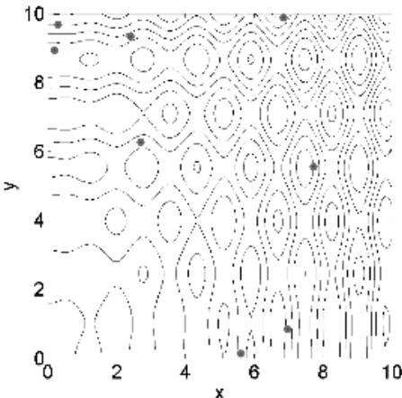  
Figure 3.2 Contour plot of the cost function with the initial population $N _ { p o p } = 8$ ) indicated by large dots.

TABLE 3.1 Example Initial Population of 8 Random Chromosomes and Their Corresponding Cost   

<table><tr><td>X</td><td>y</td><td>Cost</td></tr><tr><td>6.9745</td><td>0.8342</td><td>3.4766</td></tr><tr><td>0.30359</td><td>9.6828</td><td>5.5408</td></tr><tr><td>2.402</td><td>9.3359</td><td>2.2528</td></tr><tr><td>0.18758</td><td>8.9371</td><td>8.0108</td></tr><tr><td>2.6974</td><td>6.2647</td><td>2.8957</td></tr><tr><td>5.613</td><td>0.1289</td><td>2.4601</td></tr><tr><td>7.7246</td><td>5.5655</td><td>9.8884</td></tr><tr><td>6.8537</td><td>9.8784</td><td>13.752</td></tr></table>

TABLE 3.2 Surviving Chromosomes after a $5 0 \%$ Selection Rate   

<table><tr><td>Number</td><td>X</td><td>y</td><td>Cost</td></tr><tr><td>1</td><td>7.7246</td><td>5.5655</td><td>9.8884</td></tr><tr><td>2</td><td>0.1876</td><td>8.9371</td><td>8.0108</td></tr><tr><td>3</td><td>2.6974</td><td>6.2647</td><td>2.8957</td></tr><tr><td>4</td><td>5.6130</td><td>0.12885</td><td>2.4601</td></tr></table>

In our example the mean of the cost function for the population of 8 was -0.3423 and the best cost was $- 9 . 8 8 8 4$ . After discarding the bottom half the mean of the population is $- 5 . 8 1 3 8$ . The natural selection results represented to five significant digits are shown in Table 3.2.

TABLE 3.3 Pairing and Mating Process of SinglePoint Crossover Chromosome Family Binary String Cost   

<table><tr><td rowspan=1 colspan=1>2</td><td rowspan=1 colspan=1>ma(1)</td><td rowspan=1 colspan=1>0.18758</td><td rowspan=1 colspan=1>8.9371</td></tr><tr><td rowspan=1 colspan=1>3</td><td rowspan=1 colspan=1>pa(1)</td><td rowspan=1 colspan=1>2.6974</td><td rowspan=1 colspan=1>6.2647</td></tr><tr><td rowspan=1 colspan=1>5</td><td rowspan=1 colspan=1>offspring1</td><td rowspan=1 colspan=1>0.2558</td><td rowspan=1 colspan=1>6.2647</td></tr><tr><td rowspan=1 colspan=1>6</td><td rowspan=1 colspan=1>offspring2</td><td rowspan=1 colspan=1>2.6292</td><td rowspan=1 colspan=1>8.9371</td></tr><tr><td rowspan=1 colspan=1>3</td><td rowspan=1 colspan=1>ma(2)</td><td rowspan=1 colspan=1>2.6974</td><td rowspan=1 colspan=1>6.2647</td></tr><tr><td rowspan=1 colspan=1>1</td><td rowspan=1 colspan=1>pa(2)</td><td rowspan=1 colspan=1>7.7246</td><td rowspan=1 colspan=1>5.5655</td></tr><tr><td rowspan=1 colspan=1>7</td><td rowspan=1 colspan=1>offspring3</td><td rowspan=1 colspan=1>6.6676</td><td rowspan=1 colspan=1>5.5655</td></tr><tr><td rowspan=1 colspan=1>8</td><td rowspan=1 colspan=1>offspring4</td><td rowspan=1 colspan=1>3.7544</td><td rowspan=1 colspan=1>6.2647</td></tr></table>

# 3.1.5 Pairing

The $N _ { k e e p } = 4$ most-fit chromosomes form the mating pool. Two mothers and fathers pair in some random fashion. Each pair produces two offspring that contain traits from each parent. In addition the parents survive to be part of the next generation. The more similar the two parents, the more likely are the offspring to carry the traits of the parents. We presented some basic approaches to finding two mates in Chapter 2 and refer the reader back to that presentation rather than repeating it.

The example presented here uses rank weighting with the probabilities shown in Table 2.5. A random number generator produced the following two pairs of random numbers: (0.6710, 0.8124) and (0.7930, 0.3039). Using these random pairs and Table 2.5, the following chromosomes were randomly selected to mate:

$$
\begin{array} { r } { \mathtt { m a } = [ 2 \ 3 ] } \\ { \mathtt { p a } = [ 3 \ 1 ] } \end{array}
$$

Thus chromosom $\boldsymbol { l } \boldsymbol { e } _ { 2 }$ mates with chromosome3, and so forth. The ma and pa vectors contain the numbers corresponding to the chromosomes selected for mating. Table 3.3 summarizes the results.

# 3.1.6 Mating

As for the binary algorithm, two parents are chosen, and the offspring are some combination of these parents. Many different approaches have been tried for crossing over in continuous GAs. Adewuya (1996) reviews some of the methods. Several interesting methods are demonstrated by Michalewicz (1994).

The simplest methods choose one or more points in the chromosome to mark as the crossover points. Then the variables between these points are merely swapped between the two parents. For example purposes, consider the two parents to be

$$
\begin{array} { c } { p a r e n t _ { 1 } = \left[ p _ { m 1 } , p _ { m 2 } , p _ { m 3 } , p _ { m 4 } , p _ { m 5 } , p _ { m 6 } , \textrm { . . . } , p _ { m N _ { \nu a r } } \right] } \\ { p a r e n t _ { 2 } = \left[ p _ { d 1 } , p _ { d 2 } , p _ { d 3 } , p _ { d 4 } , p _ { d 5 } , p _ { d 6 } , \textrm { . . . } , p _ { d N _ { \nu a r } } \right] } \end{array}
$$

Crossover points are randomly selected, and then the variables in between are exchanged:

$$
\begin{array} { r } { o f f s p r i n g _ { 1 } = \left[ p _ { m 1 } , p _ { m 2 } , _ { \uparrow } p _ { d 3 } , p _ { d 4 } , _ { \uparrow } p _ { m 5 } , p _ { m 6 } , \dots , p _ { m N _ { \nu a r } } \right] } \\ { o f f s p r i n g _ { 2 } = \left[ p _ { d 1 } , p _ { d 2 } , _ { \uparrow } p _ { m 3 } , p _ { m 4 } , _ { \uparrow } p _ { d 5 } , p _ { d 6 } , \dots , p _ { d N _ { \nu a r } } \right] } \end{array}
$$

The extreme case is selecting $N _ { \nu a r }$ points and randomly choosing which of the two parents will contribute its variable at each position. Thus one goes down the line of the chromosomes and, at each variable, randomly chooses whether or not to swap information between the two parents. This method is called uniform crossover:

$$
\begin{array} { c } { { o f f s p r i n g _ { 1 } = \left[ \begin{array} { l } { { p _ { m 1 } , p _ { d 2 } , p _ { d 3 } , p _ { d 4 } , p _ { d 5 } , p _ { m 6 } , \ldots , p _ { d N _ { \nu a r } } } } \end{array} \right] } } \\ { { o f f s p r i n g _ { 2 } = \left[ \begin{array} { l } { { p _ { d 1 } , p _ { m 2 } , p _ { m 3 } , p _ { m 4 } , p _ { m 5 } , p _ { d 6 } , \ldots , p _ { m N _ { \nu a r } } } } \end{array} \right] } } \end{array}
$$

The problem with these point crossover methods is that no new information is introduced: each continuous value that was randomly initiated in the initial population is propagated to the next generation, only in different combinations. Although this strategy worked fine for binary representations, there is now a continuum of values, and in this continuum we are merely interchanging two data points. These approaches totally rely on mutation to introduce new genetic material.

The blending methods remedy this problem by finding ways to combine variable values from the two parents into new variable values in the offspring. A single offspring variable value, $p _ { n e w }$ , comes from a combination of the two corresponding offspring variable values (Radcliff, 1991)

$$
p _ { n e w } = \beta p _ { m n } + ( 1 - \beta ) p _ { d n }
$$

where

$\begin{array} { r l } { \beta } & { { } = } \end{array}$ random number on the interval [0, 1] $p _ { m n } =$ nth variable in the mother chromosome $p _ { d n } =$ nth variable in the father chromosome

The same variable of the second offspring is merely the complement of the first (i.e., replacing $\beta$ by $1 - \beta )$ . If $\beta = 1$ , then $p _ { m n }$ propagates in its entirety and $p _ { d n }$ dies. In contrast, if $\beta = 0$ , then $p _ { d n }$ propagates in its entirety and $p _ { m n }$ dies. When $\beta = 0 . 5$ (Davis, 1991), the result is an average of the variables of the two parents.This method is demonstrated to work well on several interesting problems by Michalewicz (1994). Choosing which variables to blend is the next issue. Sometimes, this linear combination process is done for all variables to the right or to the left of some crossover point. Any number of points can be chosen to blend, up to $N _ { \nu a r }$ values where all variables are linear combinations of those of the two parents. The variables can be blended by using the same $\beta$ for each variable or by choosing different $\beta ^ { \mathrm { { \bullet } } }$ ’s for each variable. These blending methods effectively combine the information from the two parents and choose values of the variables between the values bracketed by the parents; however, they do not allow introduction of values beyond the extremes already represented in the population. To do this requires an extrapolating method. The simplest of these methods is linear crossover (Wright, 1991). In this case three offspring are generated from the two parents by

$$
\begin{array} { c } { { p _ { n e w 1 } = 0 . 5 p _ { m n } + 0 . 5 p _ { d n } } } \\ { { } } \\ { { p _ { n e w 2 } = 1 . 5 p _ { m n } - 0 . 5 p _ { d n } } } \\ { { } } \\ { { p _ { n e w 3 } = - 0 . 5 p _ { m n } + 1 . 5 p _ { d n } } } \end{array}
$$

Any variable outside the bounds is discarded in favor of the other two. Then the best two offspring are chosen to propagate. Of course, the factor 0.5 is not the only one that can be used in such a method. Heuristic crossover (Michalewicz, 1991) is a variation where some random number, $\beta .$ , is chosen on the interval $[ 0 , 1 ]$ and the variables of the offspring are defined by

$$
p _ { n e w } = \beta ( p _ { m n } - p _ { d n } ) + p _ { m n }
$$

Variations on this theme include choosing any number of variables to modify and generating different $\beta$ for each variable. This method also allows generation of offspring outside of the values of the two parent variables. Sometimes values are generated outside of the allowed range. If this happens, the offspring is discarded and the algorithm tries another $\beta .$ . The blend crossover (BLX- $\alpha$ ) method (Eshelman and Shaffer, 1993) begins by choosing some parameter $\alpha$ that determines the distance outside the bounds of the two parent variables that the offspring variable may lie. This method allows new values outside of the range of the parents without letting the algorithm stray too far. Many codes combine the various methods to use the strengths of each. New methods, such as quadratic crossover (Adewuya, 1996), do a numerical fit to the fitness function. Three parents are necessary to perform a quadratic fit.

The algorithm used in this book is a combination of an extrapolation method with a crossover method. We wanted to find a way to closely mimic the advantages of the binary GA mating scheme. It begins by randomly selecting a variable in the first pair of parents to be the crossover point

$$
\alpha { = } \mathrm { r o u n d u p } \{ \mathrm { r a n d o m } ^ { \ast } N _ { \nu a r } \}
$$

We’ll let

$$
\begin{array} { l } { p a r e n t _ { 1 } = \left[ p _ { m 1 } p _ { m 2 } \ldots p _ { m \alpha } \ldots p _ { m N _ { \nu a r } } \right] } \\ { p a r e n t _ { 2 } = \left[ p _ { d 1 } p _ { d 2 } \ldots p _ { d \alpha } \ldots p _ { d N _ { \nu a r } } \right] } \end{array}
$$

where the $m$ and $d$ subscripts discriminate between the mom and the dad parent. Then the selected variables are combined to form new variables that will appear in the children:

$$
\begin{array} { r } { p _ { n e w 1 } = p _ { m \alpha } - \beta [ p _ { m \alpha } - p _ { d \alpha } ] } \\ { p _ { n e w 2 } = p _ { d \alpha } + \beta [ p _ { m \alpha } - p _ { d \alpha } ] } \end{array}
$$

where $\beta$ is also a random value between 0 and 1. The final step is to complete the crossover with the rest of the chromosome as before:

$$
\begin{array} { r } { o f f s p r i n g _ { 1 } = \left[ p _ { m 1 } p _ { m 2 } \ldots p _ { n e w 1 } \ldots p _ { d N _ { \nu a r } } \right] } \\ { o f f s p r i n g _ { 2 } = \left[ p _ { d 1 } p _ { d 2 } \ldots p _ { n e w 2 } \ldots p _ { m N _ { \nu a r } } \right] } \end{array}
$$

If the first variable of the chromosomes is selected, then only the variables to the right of the selected variable are swapped. If the last variable of the chromosomes is selected, then only the variables to the left of the selected variable are swapped. This method does not allow offspring variables outside the bounds set by the parent unless $\beta > 1$ .

For our example problem, the first set of parents are given by

$$
\begin{array} { c } { { c h r o m o s o m e _ { 2 } = \left[ 0 . 1 8 7 6 , 8 . 9 3 7 1 \right] } } \\ { { } } \\ { { c h r o m o s o m e _ { 3 } = \left[ 2 . 6 9 7 4 , 6 . 2 6 4 7 \right] } } \\ { { } } \end{array}
$$

A random number generator selects $p _ { 1 }$ as the location of the crossover. The random number selected for $\beta$ is $\beta = 0 . 0 2 7 2$ . The new offspring are given by

$$
o f f s p r i n g _ { 1 } = \left[ 0 . 1 8 7 5 8 - 0 . 0 2 7 2 \times 0 . 1 8 7 5 8 + 0 . 0 2 7 2 \times 2 . 6 9 7 4 , 6 . 2 6 4 7 \right]
$$

$$
\mathit { o f f s p r i n g _ { 2 } } = \left[ 2 . 6 9 7 4 + 0 . 0 2 7 2 \times 0 . 1 8 7 5 8 - 0 . 0 2 7 2 \times 2 . 6 9 7 4 , 8 . 9 3 7 1 \right]
$$

Continuing this process once more with a $\beta = 0 . 7 8 9 8$ . The new offspring are given by

$o f f s p r i n g _ { 4 } = \left[ 7 . 7 2 4 6 + 0 . 7 8 9 8 \times 2 . 6 9 7 4 - 0 . 7 8 9 8 \times 7 . 7 2 4 6 , 8 . 9 3 7 1 \right]$ $= [ 3 . 7 5 4 4 , 6 . 2 6 4 7 ]$

# 3.1.7 Mutations

Here, as in the last chapter, we can sometimes find our method working too well. If care is not taken, the GA can converge too quickly into one region of the cost surface. If this area is in the region of the global minimum, that is good. However, some functions, such as the one we are modeling, have many local minima. If we do nothing to solve this tendency to converge quickly, we could end up in a local rather than a global minimum. To avoid this problem of overly fast convergence, we force the routine to explore other areas of the cost surface by randomly introducing changes, or mutations, in some of the variables. For the binary GA, this amounted to just changing a bit from a 0 to a 1, and vice versa. The basic method of mutation is not much more complicated for the continuous GA. For more complicated methods, see Michalewicz (1994).

As with the binary GA, we chose a mutation rate of $2 0 \%$ . Multiplying the mutation rate by the total number of variables that can be mutated in the population gives $0 . 2 0 \times 7 \times 2 \simeq 3$ mutations. Next random numbers are chosen to select the row and columns of the variables to be mutated. A mutated variable is replaced by a new random variable. The following pairs were randomly selected:

$$
\begin{array} { c c c } { { \mathrm { m r o w } = \left[ 4 } } & { { 4 } } & { { 7 \right] } } \\ { { \mathrm { m c o l } = \left[ 1 } } & { { 2 } } & { { 1 \right] } } \end{array}
$$

The first random pair is (4, 1). Thus the value in row 4 and column 1 of the population matrix is replaced with a uniform random number between one and ten:

$$
5 . 6 1 3 0 \Rightarrow 9 . 8 1 9 0
$$

Mutations occur two more times. The first two columns in Table 3.4 show the population after mating. The next two columns display the population after mutation. Associated costs after the mutations appear in the last column. The mutated values in Table 3.4 appear in italics. Note that the first chromosome is not mutated due to elitism. The mean for this population is $- 3 . 2 0 2 $ . The third offspring (row 7) has the best cost due to the crossover and mutation. If the $x$ -value were not mutated, then the chromosome would have a cost of 0.6 and would have been eliminated in the natural selection process. Figure 3.3 shows the distribution of chromosomes after the first generation.

TABLE 3.4 Mutating the Population   

<table><tr><td colspan="2">Population after Mating</td><td colspan="3">Population after Mutations</td></tr><tr><td colspan="2">X y</td><td>x</td><td>y</td><td>cost</td></tr><tr><td>7.7246</td><td>5.5655</td><td>7.7246</td><td>5.5655</td><td>9.8884</td></tr><tr><td>0.18758</td><td>8.9371</td><td>0.18758</td><td>8.9371</td><td>8.0108</td></tr><tr><td>2.6974</td><td>6.2647</td><td>2.6974</td><td>6.2647</td><td>2.8957</td></tr><tr><td>5.613</td><td>0.12885</td><td>9.819</td><td>7.1315</td><td>17.601</td></tr><tr><td>0.2558</td><td>6.2647</td><td>0.2558</td><td>6.2647</td><td>0.03688</td></tr><tr><td>2.6292</td><td>8.9371</td><td>2.6292</td><td>8.9371</td><td>-10.472</td></tr><tr><td>6.6676</td><td>5.5655</td><td>9.1602</td><td>5.5655</td><td>-14.05</td></tr><tr><td>3.7544</td><td>6.2647</td><td>3.7544</td><td>6.2647</td><td>2.1359</td></tr></table>

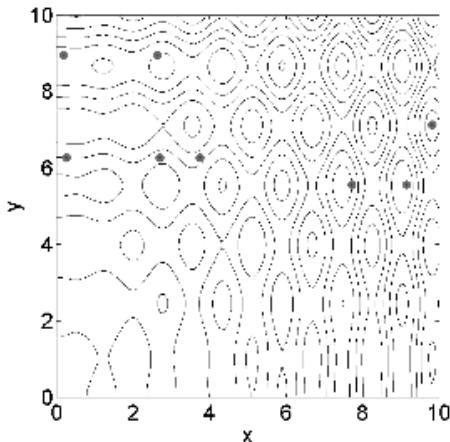  
Figure 3.3 Contour plot of the cost function with the population after the first generation.

Most users of the continuous GA add a normally distributed random number to the variable selected for mutation

$$
p _ { n } ^ { \prime } = p _ { n } + \sigma \mathbf { N } _ { n } ( 0 , 1 )
$$

where

$\sigma =$ standard deviation of the normal distribution $\mathrm { { N } } _ { n } ( 0 , 1 ) =$ standard normal distribution $\mathrm { ' m e a n } = 0$ and variance $= 1$ )

We do not use this technique because a good value for $\sigma$ must be chosen, the addition of the random number can cause the variable to exceed its bounds, and it takes more computer time.

# 3.1.8 The Next Generation

The process described is iterated until an acceptable solution is found. For our example, the starting population for the next generation is shown in Table 3.5 after ranking. The bottom four chromosomes are discarded and replaced by offspring from the top four parents. Another three random variables are selected for mutation from the bottom 7 chromosomes. The population at the end of generation 2 is shown in Table 3.6 and Figure 3.4.Table 3.7 is the ranked population at the beginning of generation 3. After mating, mutation, and ranking, the final population after three generations is shown in Table 3.8 and Figure 3.5.

TABLE 3.5 New Ranked Population at the Start of the Second Generation   

<table><tr><td>X</td><td>y</td><td>Cost</td></tr><tr><td>9.1602</td><td>5.5655</td><td>-14.05</td></tr><tr><td>2.6292</td><td>8.9371</td><td>-10.472</td></tr><tr><td>7.7246</td><td>5.5655</td><td>9.8884</td></tr><tr><td>0.18758</td><td>8.9371</td><td>8.0108</td></tr><tr><td>2.6974</td><td>6.2647</td><td>2.8957</td></tr><tr><td>0.2558</td><td>6.2647</td><td>0.03688</td></tr><tr><td>3.7544</td><td>6.2647</td><td>2.1359</td></tr><tr><td>9.819</td><td>7.1315</td><td>17.601</td></tr></table>

TABLE 3.6 Population after Crossover and Mutation in the Second Generation   

<table><tr><td>X</td><td>y</td><td>Cost</td></tr><tr><td>9.1602</td><td>5.5655</td><td>14.05</td></tr><tr><td>2.6292</td><td>8.9371</td><td>-10.472</td></tr><tr><td>7.7246</td><td>6.4764</td><td>-1.1376</td></tr><tr><td>0.18758</td><td>8.9371</td><td>8.0108</td></tr><tr><td>2.6292</td><td>5.8134</td><td>7.496</td></tr><tr><td>9.1602</td><td>8.6892</td><td>17.494</td></tr><tr><td>7.7246</td><td>8.6806</td><td>13.339</td></tr><tr><td>4.4042</td><td>7.969</td><td>6.1528</td></tr></table>

TABLE 3.7 New Ranked Population at the Start of the Third Generation   

<table><tr><td>X</td><td>y</td><td>Cost</td></tr><tr><td>9.1602</td><td>8.6892</td><td>17.494</td></tr><tr><td>9.1602</td><td>5.5655</td><td>-14.05</td></tr><tr><td>7.7246</td><td>8.6806</td><td>13.339</td></tr><tr><td>2.6292</td><td>8.9371</td><td>-10.472</td></tr><tr><td>0.18758</td><td>8.9371</td><td>-8.0108</td></tr><tr><td>2.6292</td><td>5.8134</td><td>7.496</td></tr><tr><td>4.4042</td><td>7.969</td><td>6.1528</td></tr><tr><td>7.7246</td><td>6.4764</td><td>-1.137</td></tr></table>

TABLE 3.8 Ranking of Generation 3 from Least to Most Cost   

<table><tr><td>X</td><td>y</td><td>Cost</td></tr><tr><td>9.0215</td><td>8.6806</td><td>18.53</td></tr><tr><td>9.1602</td><td>8.6892</td><td>17.494</td></tr><tr><td>9.1602</td><td>8.323</td><td>15.366</td></tr><tr><td>9.1602</td><td>5.5655</td><td>-14.05</td></tr><tr><td>9.1602</td><td>8.1917</td><td>13.618</td></tr><tr><td>2.6292</td><td>8.9371</td><td>-10.472</td></tr><tr><td>7.7246</td><td>1.8372</td><td>4.849</td></tr><tr><td>7.8633</td><td>3.995</td><td>4.6471</td></tr></table>

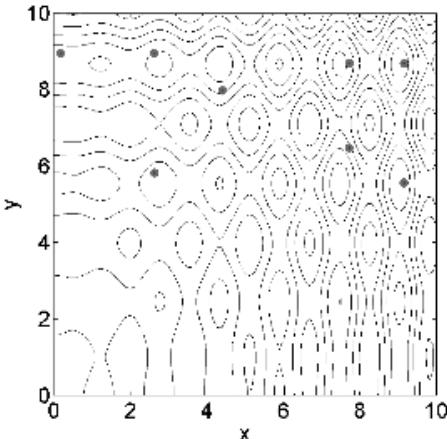  
Figure 3.4 Contour plot of the cost function with the population after the second generation.

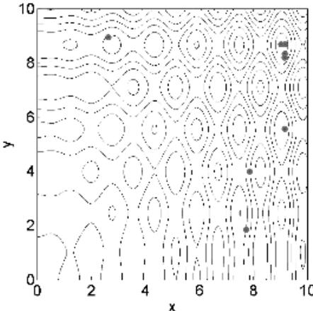  
Figure 3.5 Contour plot of the cost function with the population after the third and final generation.

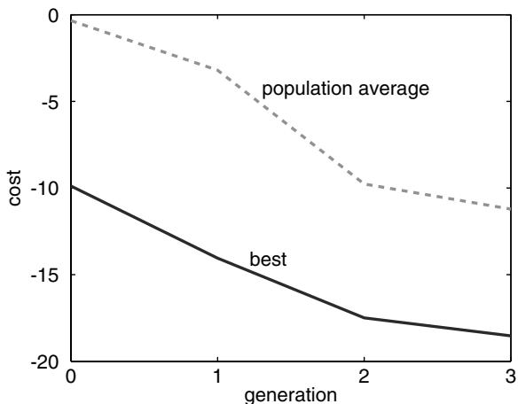  
Figure 3.6 Plot of the minimum and mean costs as a function of generation. The algorithm converged in three generations.

# 3.1.9 Convergence

This run of the algorithm found the minimum cost (-18.53) in three generations. Members of the population are shown as large dots on the cost surface contour plot in Figures 3.2 to 3.5. By the end of the second generation, chromosomes are in the basins of the four lowest minima on the cost surface. The global minimum of $- 1 8 . 5$ is found in generation 3. All but two of the population members are in the valley of the global minimum in the final generation. Figure 3.6 is a plot of the mean and minimum cost for each generation. The GA was able to find the global minimum, unlike the Nelder-Mead and BFGS algorithms presented in Chapter 1.

# 3.2 A PARTING LOOK

The binary GA could have been used in this example as well as a continuous GA. Since the problem used continuous variables, it seemed more natural to use the continuous GA. The next chapter presents some practical optimization problems for both the binary and continuous GAs. Selecting the various GA parameters, such as mutation rate and type of crossover, is still more of an art than a science and will be discussed in Chapter 5.

# BIBLIOGRAPHY

Adewuya, A. A. 1996. New methods in genetic search with real-valued chromosomes. Master’s thesis. Massachusetts Institute of Technology, Cambridge.   
Davis, L. 1991. Hybridization and numerical representation. In L. Davis (ed.), The Handbook of Genetic Algorithms. New York: Van Nostrand Reinhold, pp. 61–71.   
Eshelman, L. J., and D. J. Shaffer. 1993. Real-coded genetic algorithms and intervalschemata. In D. L. Whitley (ed.), Foundations of Genetic Algorithms 2. San Mateo, CA: Morgan Kaufman, pp. 187–202.   
Michalewicz, Z. 1994. Genetic Algorithms + Data Structures $=$ Evolution Programs, 2nd ed. New York: Springer-Verlag.   
Radcliff, N. J. 1991. Forma analysis and random respectful recombination. In Proc. 4th Int. Conf. on Genetic Algorithms, San Mateo, CA: Morgan Kauffman.   
Wright, A. 1991. Genetic algorithms for real parameter optimization. In G. J. E. Rawlins (ed.), Foundations of Genetic Algorithms. San Mateo, CA: Morgan Kaufmann, pp. 205–218.

# EXERCISES

1. Write a continuous GA that uses the following crossover:

a. (3.7) b. (3.8) c. (3.9) d. (3.10) e. (3.14)

2. Write a continuous GA that uses:

a. Pairing parents from top to bottom b. Random pairing c. Pairing based on cost d. Roulette wheel rank weighting e. Tournament selection

3. Find the minimum of _ (from Appendix I) using your continuous GA.

4. Experiment with different population sizes and mutation rates. Which combination seems to work best for you? Explain.

5. Compare your GA with one of the following local optimizers:

a. Nelder-Mead downhill simplex   
b. BFGS   
c. DFP   
d. Steepest descent   
e. Random search

6. Since the GA has many random components, it is important to average the results of several runs. Write a program that will average the results of several GA runs. Now, do another one of the exercises and compare results.

7. Plot the convergence of the GA. Which GA parameters have the most effect on convergence?

8. Compare the performance of the binary and continuous GAs. Which do you prefer and why? Does the type of problem make a difference?

# Basic Applications

The examples in this chapter make use of the GAs introduced in Chapters 2 and 3. Enough details are provided for the user to try the problems themselves, and examples of the cost function are provided in some cases. Remember, the GA uses a random number generator, so the exact results won’t be reproducible. The first five examples are somewhat generic, using methods directly applicable to a wide range of problems. They are specifically designed to show the wide range of applicability of both the binary and the continuous GA. They begin with use of the GA in the arts and games before moving onto a not too difficult mathematical problem. The next example is more arcane in that it deals with an extremely problem-specific cost function. However, the solution method is very straightforward, and the subroutine for the cost function could be replaced to solve many problems in the same vein. The last example demonstrates using a GA to simulate natural evolution of an animal—the horse.

# 4.1 “MARY HAD A LITTLE LAMB”

In the first example, we’ll test the musical talent of the GA to see if it can learn the first four measures of “Mary Had a Little Lamb.” This song is in the key of C with $4 / 4$ time and only has quarter and half notes. In addition the frequency variation of the notes is less than an octave. A chromosome for this problem has $4 \times 4 = 1 6$ genes (one gene for each beat). The binary GA is perfect because there are eight distinct notes, seven possible frequencies, and one hold. The encoding is given in Table 4.1. A hold indicates the previous note is a half note. (It is possible to devote one bit to indicate a quarter or half note. However, this approach would require variable-length chromosomes.) The actual solution only makes use of the C, D, E, and G notes and the hold. Therefore the binary encoding is only $6 2 . 5 \%$ efficient. Since the exact notes in the song may not be known, the inefficiency is only evident in hindsight. An exhaustive search would have to try $8 ^ { 1 6 } = 2 . 8 1 4 7 \times 1 0 ^ { 1 4 }$ possible combinations of notes.

TABLE 4.1 Binary Encoding of the Musical Notes for “Mary Had a Little Lamb”   

<table><tr><td>Code</td><td>Note</td></tr><tr><td>000</td><td>hold</td></tr><tr><td>001</td><td>A</td></tr><tr><td>010</td><td>B</td></tr><tr><td>011</td><td>C</td></tr><tr><td>100</td><td>D</td></tr><tr><td>101</td><td>E</td></tr><tr><td>110</td><td>F</td></tr><tr><td>111</td><td>G</td></tr></table>

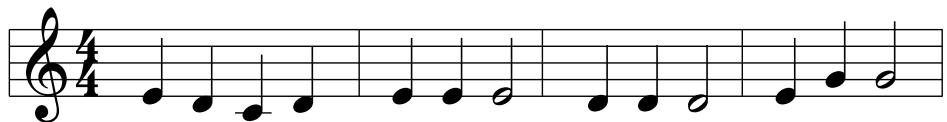  
Figure 4.1 Music to “Mary Had a Little Lamb.”

In this case we know the correct answer, and the notes are shown in Figure 4.1. Putting the song parameters into a row vector yields

[ ] EDCDEEEholdDDDholdEGGhold with a corresponding chromosome encoded as [ ] 101 100 011 100 101 101 101 000 100 100 100 000 101 111 111 000

We’ll attempt to find this solution two ways. First, the computer will compare a chromosome with the known answer and gives a point for each bit in the proper location. This is an objective cost function. Second, we’ll use our ear (very subjective) to rank the chromosomes. This type of cost function is known as interactive.

The objective cost function subtracts the binary chromosome (guess) from the chromosome with the known result (answer) and sums the absolute value of all the digits:

$$
\ c o s t = \sum _ { n = 1 } ^ { 4 8 } \bigl | a n s w e r [ n ] - g u e s s [ n ] \bigr |
$$

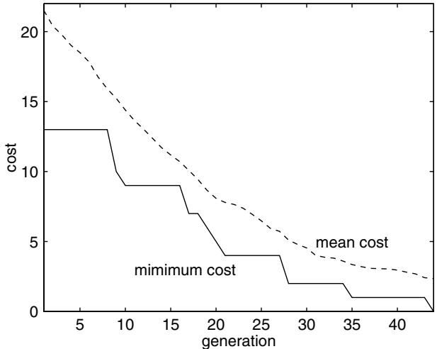  
Figure 4.2 The minimum cost and mean cost as a function of generation when the computer knows the exact answer (all the notes to “Mary Had a Little Lamb”).

When a chromosome and the true answer match, the cost is zero. In this case the GA uses $N _ { p o p } = 4 8$ , $\mathrm { N } _ { \mathrm { k e e p } } = 2 4$ , and $\mu = 0 . 0 5$ . Figure 4.2 shows an example of the cost function statistics as a function of generation. The GA consistently finds the correct answer over many different runs.

The second cost function is subjective and interactive. This is an interesting twist in that it combines the computer with a human response to judge performance. Cost is assigned from a 0 (that’s the song) to a 100 (terrible match). This algorithm wears on your nerves, since some collection of notes must be played and judged for each chromosome. Consequently the authors could only listen to the first two measures and judge the performance. Figure 4.3 shows the cost function statistics as a function of generation. Compare this graph with the previous one. Unlike all other examples, the minimum cost is not monotonically decreasing, even though the GA used elitism.

Subjective cost functions are quite fascinating. A chromosome in the first generations tended to receive a lower cost than the identical chromosome in later generations. This accounts for the increase in the minimum cost shown in Figure 4.3. Many chromosomes produce very unmelodic sounds. Changing expectations or standards is common in everyday life. For instance, someone who begins a regular running program is probably happier with a 10 minute mile than she would be after one year of training. The subjective cost function converged faster than the mathematical cost function because a human is able to evaluate more aspects of the experiment than the computer. Consider the difference between a G note and the C, E, and F notes. The human ear ranks the three notes according to how close they are to G, while the computer only notices that the three notes differ from G by one bit. A continuous parameter GA might work better in this situation.

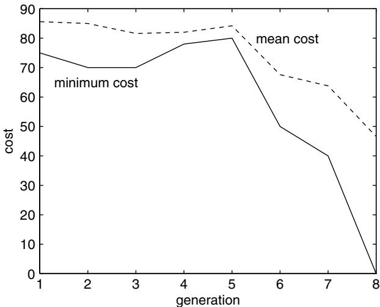  
Figure 4.3 The minimum cost and mean cost as a function of generation when the subjective cost function was used (our judgment as to how close the song associated with a chromosome came to the actual tune of “Mary Had a Little Lamb”).

Extensions to this idea are limitless. Composing music (Biles, 1994; Jacob, 1995) and producing art with a GA are interesting possibilities. Putnam (1994) tried his hand at composing music with a GA. The idea was to construct random pieces of music and rate them for their musical value. Putnam used two approaches. The first combined mathematical functions (like sine and cosine) in the time domain. This approach produced too much noise, and people had difficulty judging the performance (patience and tolerance were difficult). The second approach used notes as in our example. This approach worked better, but listening to many randomly generated music pieces is too difficult for most of us. He concluded:

The primary problems with these programs seem to be those involving the human interface. The time it takes to run the program and listen to the samples combined with the relative dullness of the samples mean that the users rapidly get tired and bored. This means that the programs need to be built to generate the samples relatively quickly, the samples need to be relatively short, the samples need to develop and evolve to be interesting quickly and of necessity the population size must be small.

We have seen a very simple application with a known solution. Despite the difficulties, genetic music is being composed by musicians much more gifted than us. John Biles mentors his GA, GenJam, behind the scenes; then it improvises solos, responding to Biles’s trumpet solos interactively. They have played gigs billed as the “AI Biles Virtual Quintet” at various conferences as well as for weddings and other social functions (Biles, 1994, 2002). Although it specializes in Jazz and Latin tunes, it includes some New Age in its repertoire. Spector and Alpern (1995) trained a neural network on Charlie Parker fragments, and then used that as a fitness function for a genetic programming system.The simplest applications did not produce pleasing melodies, but when more refined methods were used, they began to produce acceptable music fragments. In essence, by defining what makes “good” music, these musicians are coding the process of decision making. Wiggens et al. (1999) trained a GA to generate four-part harmony for given melodies using precoded criteria rather than a human interface. A music professor deemed the results of some very basic trials more successful than most first-year undergraduate music students. Using different encoded composition rules, a GA was also able to produce acceptable solos. However, they concluded that the GA was limited in ability due to the combination of its inherent stochasticity and its inability to structure the reasoning process in the way that human composers can. Are these limitations only due to our current abilities to define the rules that make pleasant music? Or will humans never be surpassed by genetic composers?

The idea of a subjective cost function is closely tied to work with fuzzy sets and logic (Ross, 1995). In classical set theory, an element is either a member or not. In fuzzy set theory, an element can have various degrees of membership. Thus the boundaries between fuzzy sets are vague and ambiguous. Is this piece of art or music good? We’re likely to be fuzzy about our decision and assign a cost between zero and one rather than either a zero or a one. Since the GA carries a list of answers in descending order of preference, it is perfect for fuzzy design applications. These sorts of interactive processes are becoming more a popular as we try to use computers to simulate and interact with human thought processes.

# 4.2 ALGORITHMIC CREATIVITY—GENETIC ART

Let’s build on the artistic creativity of Section 4.1, but now in terms of visual art. Creativity is a right-brained activity and is often considered mutually exclusive of the more left-brained functions like logic and math that are associated with computers. Art is probably one of the most creative human functions. Can a computer actually create or improve a work of art? Improving is equivalent to optimizing. What better optimization tool to use for the creative process than one that is based on natural selection—the GA.

There are currently a plethora of applications of evolutionary algorithms applied to art. The Web is a rich source of information and examples on art creation using GAs, including many sites with galleries for browsing genetic art. Others even include an option to vote for your favorite designs. A brief review of the use of GAs in visual art and music was presented by Johnson and Romero Cardalda (2002). Karl Sims (1991) provided an early demonstration of how effectively evolutionary algorithms could be used to create computer graphics and animation. Todd and Latham (1992) produced

MUTATOR, an algorithm that “breeds” new art forms, sometimes resulting in rather complex pleasing abstract forms. Fractal movies have been made using genetic programming (Angeline, 1996). These movies were generated with judgment input by the user. Other researchers have color-mapped GA convergence to a phase space to create beautiful fractal images (Juliany and Vose, 1993). These images resemble the fractal art generated by applying iterative methods to solving nonlinear equations (Mendelbrot, 1982).

Our own art experiment is rather novice. It creates plots using an iterative function system (IFS) based on the affine transformation:

$$
\begin{array} { r } { \Big [ \pmb { u } ^ { n + 1 } \Big ] = \Big [ \begin{array} { c c c } { c _ { 1 } \cos ( 2 \pi c _ { 2 } ) } & { - \thinspace c _ { 3 } \sin ( 2 \pi c _ { 4 } ) } \\ { \hphantom { c } c _ { 5 } \sin ( 2 \pi c _ { 6 } ) \thinspace c _ { 7 } \cos ( 2 \pi c _ { 8 } ) } \end{array} \Big ] \Big [ \pmb { u } ^ { n } \Big ] + \Big [ \begin{array} { c c c } { c _ { 9 } } \\ { c _ { 1 0 } } \end{array} \Big ] } \end{array}
$$

where $[ u ^ { n } , \nu ^ { n } ]$ are the points to be plotted and the $[ c _ { i } , i = 1 , 1 0 ]$ are the coefficient variables to be optimized. Each plot is composed of iterative points for $n = 1 0 { , } 0 0 0$ . We use a continuous GA with tournament selection, a mutation rate of 0.1, population size of 16, and elitism. Human judgment is the cost function to rate the appeal of the GA created art. The initial 16 art plots are shown in Figure 4.4. The art evaluator assigned cost values based on her personal preference for each form. After 6 iterations the genetic art had evolved to the forms found in Figure 4.5. The evaluator chose number 12 as her favorite creation.Although judging art was not as sanity challenging as the music example of Section 4.1, it was difficult to be consistent over time. A human has the prerogative of changing her mind.

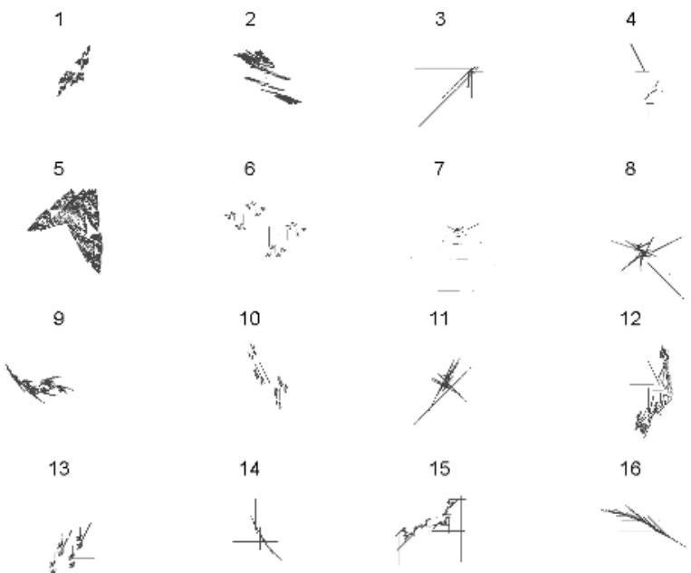  
Figure 4.4 The initial 16 fractal art pieces initialized by the GA.

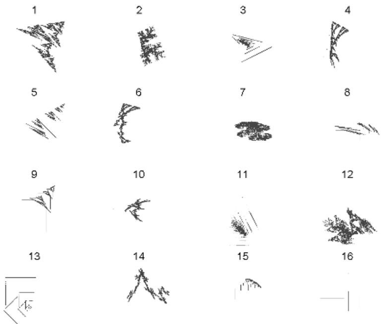  
Figure 4.5 The final 16 fractal art pieces after 6 iterations. Number 12 was chosen as “best”.

We also did a similar experiment using a group vote as a slightly different type of cost function for comparison. This work is reported in Haupt and Haupt (2000). We created plots using the mathematical form: $c _ { I } x \sin { \left( c _ { 2 } x \right) } + c _ { 3 } y$ $\sin \left( c _ { 4 } y \right)$ and filled in color pallets. The variables were the $[ c _ { i } , i = 1 , 4 ]$ . Costs were assigned to the artwork based on the judgment of a group of 38 algorithmic art specialists (a class of students taking Numerical Methods for Engineers). At each iteration, the specialists would be presented with 16 patterns from which to choose. In the early stages of the experiment each person would vote for his or her favorite two pieces of artwork. That vote was used to compute the probability of mating for the chromosome that it represented. After a couple of iterations the cost function was altered. Each person had only one vote. The process was continued for four iterations (when class was over). The winning design had less continuity than when a single evaluator chose. The second place design did not look much like the one that won first place. Personal preference is not at all like an objective measure with a single solution. Most voters preferred a design with a discernable large-scale pattern over those that were more small scale and “noisy.” However, whether one prefers vertical patterns over circular or plaid patterns is a very personal decision. Thus results tend to be quite different when a group vote is taken rather than relying on the judgment of a single person. Which of the patterns in Figure 4.5 do you prefer?

An interesting aspect of these first two examples is seeing how computer calculations can be combined with human judgment. For instance, the European Weather Agency (ECMWF) runs their weather prediction simulations with several slightly differing initial conditions to produce a set of different forecasts (due to sensitivity of initial conditions). Note that for weather forecasting the biggest source of error is usually the assimilation of data from all over the world in initializing the model. This set of forecasts is then presented to skilled human forecasters to make a decision on the most likely scenario. A similar strategy can be used in design. Most people use computers to help design new products. Various parameters, bounds, and tolerances are input to the computer and eventually a design pops out. Perhaps a better approach is to have a closer interaction between the computer and the human designer. A computer calculates and does mundane tasks well, such as sorting a list. However, it is not good at making subjective judgments. If the computer program occasionally stops and presents some options and their associated costs to the designer, then the designer has the ability to add a human element to that design process. Feelings and judgment are hard to quantify, yet they are at the core of the creative thought process. But are they really mutually exclusive from logic? We can use the computer to optimize the weight of a car, but input from human beings is necessary to optimize the style. Putting human judgment into the mathematical formula closely ties the power of the computer in evaluating mathematical expressions and searching long lists of combinations with the opinions that only humans can provide.

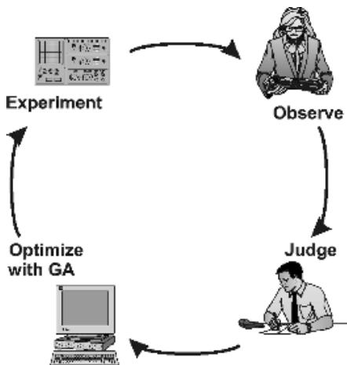  
Figure 4.6 summarizes the combined creative process. An experiment pro  
Figure 4.6 An iterative approach to creativity that combines human judgment with a GA.

duces data that is presented to a human observer. That person judges the appeal (or fitness) of the options. This judgment is then used by the computer (via the GA) to produce the probabilities of mating that will form the next generation of the experiment. The process iterates until the outcome is judged to be good enough.

One more related issue involves a philosophical discussion in the literature of whether the computer becomes the creator. A distinction can be made between the creator and the critic. Some evolutionary art evolves without the judgment step and sometimes results in rather interesting art forms. Does that mean that the creative process was solely algorithmic and no sentient designer was necessary? It may be interesting to ponder, but we point out that somebody wrote the program.

# 4.3 WORD GUESS

We made a word guess game in which the GA is given the number of letters in a word, and it guesses the letters that compose the word until it finds the right answer. In this case we’ll use a GA where each letter is given the integer corresponding to its location in the alphabet $( a = 1 , b = 2$ , etc.). Establishing the rules of the game determines the shape of the cost surface. If the cost is the sum of the squares of the differences between the numbers representing the letters in the chromosome (computer’s guess at the word) and the true answer, then the surface is described by the least mean square difference between the guess and the true answer:

$$
c o s t = \sum _ { n = 1 } ^ { ^ { \# } l e t t e r s } \left( g u e s s [ n ] - a n s w e r [ n ] \right) ^ { 2 }
$$

where

# letters $=$ number of letters in the word guess[n] $=$ letter $n$ in the guess chromosome answer[n] $=$ letter $n$ in the answer

Figure 4.7 shows the cost surface for the two-letter word “he” given the cost function in (4.3). There are a total of $2 6 ^ { 2 } = 6 7 6$ possible combinations to check. For $N$ letters there are $2 6 ^ { N }$ possible combinations. The unknown word that the GA must find is “colorado.” The GA uses $N _ { p o p } = 3 2$ , $N _ { k e e p } = 1 6$ , and $\mu = 0 . 0 4$ . After 27 iterations the GA correctly guesses the word. The guesses as a function of generation are given in Table 4.2.

A slight change to the previous cost function creates a completely different cost surface. This time a correct letter is given a zero, while an incorrect letter is given a one. There is no gray area associated with this cost function.

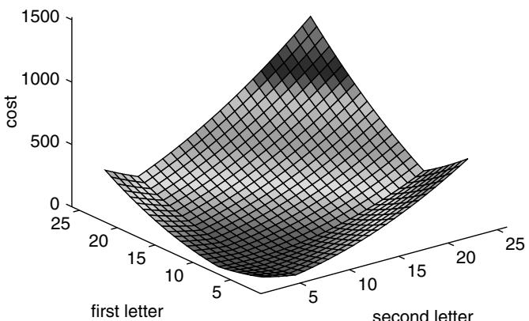  
Figure 4.7 Cost surface for the two-letter word “he” associated with (4.3). There are a total of $2 6 ^ { 2 } = 6 7 6$ possible combinations.

TABLE 4.2 GA’s Best Guess (First Cost Function) after Each Generation   

<table><tr><td rowspan=1 colspan=3>Generation                                  Best Guess</td></tr><tr><td rowspan=1 colspan=3>1                                            dhgmtfbn</td></tr><tr><td rowspan=1 colspan=3>2                                            bmloshjm</td></tr><tr><td rowspan=1 colspan=3>3                                            bmloshjm</td></tr><tr><td rowspan=1 colspan=3>4                                            bmlorfds</td></tr><tr><td rowspan=1 colspan=2>5</td><td rowspan=1 colspan=1>bmlorfds</td></tr><tr><td rowspan=1 colspan=2>6</td><td rowspan=1 colspan=1>bmlorddm</td></tr><tr><td rowspan=1 colspan=2>7</td><td rowspan=1 colspan=1>bmlorddm</td></tr><tr><td rowspan=1 colspan=2>8</td><td rowspan=1 colspan=1>bmlorddm</td></tr><tr><td rowspan=1 colspan=2>9</td><td rowspan=1 colspan=1>bmlosadn</td></tr><tr><td rowspan=1 colspan=2>10</td><td rowspan=1 colspan=1>bmlosadn</td></tr><tr><td rowspan=1 colspan=1>11</td><td rowspan=1 colspan=1></td><td rowspan=1 colspan=1>bmlosadn</td></tr><tr><td rowspan=1 colspan=1>12</td><td rowspan=1 colspan=1></td><td rowspan=1 colspan=1>bmlosadn</td></tr><tr><td rowspan=1 colspan=1>13</td><td rowspan=1 colspan=1></td><td rowspan=1 colspan=1>bmlosadn</td></tr><tr><td rowspan=1 colspan=1>14</td><td rowspan=1 colspan=1></td><td rowspan=1 colspan=1>cmlorbdo</td></tr><tr><td rowspan=1 colspan=1>15</td><td rowspan=1 colspan=1></td><td rowspan=1 colspan=1>cmlorbdo</td></tr><tr><td rowspan=1 colspan=1>16</td><td rowspan=1 colspan=1></td><td rowspan=1 colspan=1>cmlorbdo</td></tr><tr><td rowspan=1 colspan=1>17</td><td rowspan=1 colspan=1></td><td rowspan=1 colspan=1>cmlorbdo</td></tr><tr><td rowspan=1 colspan=1>18</td><td rowspan=1 colspan=1></td><td rowspan=1 colspan=1>cmlorbdo</td></tr><tr><td rowspan=1 colspan=1>19</td><td rowspan=1 colspan=1></td><td rowspan=1 colspan=1>cmlorbdo</td></tr><tr><td rowspan=1 colspan=1>20</td><td rowspan=1 colspan=1></td><td rowspan=1 colspan=1>colorbdo</td></tr><tr><td rowspan=1 colspan=1>21</td><td rowspan=1 colspan=1></td><td rowspan=1 colspan=1>colorbdo</td></tr><tr><td rowspan=1 colspan=1>22</td><td rowspan=1 colspan=1></td><td rowspan=1 colspan=1>colorbdo</td></tr><tr><td rowspan=1 colspan=1>23</td><td rowspan=1 colspan=1></td><td rowspan=1 colspan=1>colorbdo</td></tr><tr><td rowspan=1 colspan=1>24</td><td rowspan=1 colspan=1></td><td rowspan=1 colspan=1>colorbdo</td></tr><tr><td rowspan=1 colspan=1>25</td><td rowspan=1 colspan=2>colorbdo</td></tr><tr><td rowspan=1 colspan=1>26</td><td rowspan=1 colspan=2>colorbdo</td></tr><tr><td rowspan=1 colspan=3>27                                            colorado</td></tr></table>

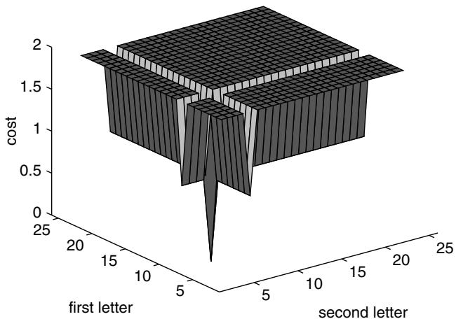  
Figure 4.8 Cost surface for the two-letter word “he” associated with (4.4).

$$
c o s t = \sum _ { n = 1 } ^ { \mathrm { { \# } } \ l e t t e r s } 1 - s g n ( g u e s s _ { n } - a n s w e r _ { n } )
$$

where

$$
s g n ( x ) = { \left\{ \begin{array} { l l } { 1 } & { { \mathrm { w h e n ~ } } x = 0 } \\ { 0 } & { { \mathrm { w h e n ~ } } x \neq 0 } \end{array} \right. }
$$

Figure 4.8 shows the cost surface for the two-letter word “he” with the cost function given by equation (4.4). We now apply this function to the word “colorado.” After 17 generations and $N _ { i p o p } = 6 4 , N _ { p o p } = 3 2 , k e e p = 1 6$ , and $\mu = 0 . 0 4$ , the GA correctly guesses the word (colorado) as shown in Table 4.3. This is quite an accomplishment given that the total number of possible combinations is $2 6 ^ { 8 } = 2 . 0 8 8 3 \times \mathrm { 1 0 ^ { 1 1 } }$ . Part of the reason for the success of the second cost function is that it has a large cost differential between a correct and incorrect letter, while the first cost function assigns a cost depending on the proximity of the correct and incorrect letters. As a result a chromosome with all wrong letters, but whose letters are close to the correct letters, receives a low cost from the second cost function but a high cost from the first cost function. When cost weighting determines the mating pool, the second cost function tends to have parents with more correct letters than the first cost function would.

# 4.4 LOCATING AN EMERGENCY RESPONSE UNIT

An emergency response unit is to be built that will best serve a city. The goal is to provide the minimum response time to a medical emergency that could occur anywhere in the city. After a survey of past emergencies, a map is constructed showing the frequency of an emergency in a given section of the city. The city is divided into a grid of $1 0 \times 1 0 \mathrm { k m }$ with 100 sections, as shown in Figure 4.9. The response time of the fire station is estimated to be $1 . 7 + 3 . 4 r$ minutes, where $r$ is in kilometers. This formula is not based on real data, but an actual city would have an estimate of this formula based on traffic, time of day, and so on. An appropriate cost function is the sum of the distances weighted by the frequency of emergencies or

TABLE 4.3 GA’s Best Guess (Second Cost Function) after Each Generation   

<table><tr><td>Generation</td><td>Best Guess</td></tr><tr><td>1</td><td>pxsowqdo</td></tr><tr><td>2</td><td>pxsowqdo</td></tr><tr><td>3</td><td>pxsowqdo</td></tr><tr><td>4</td><td>bodokado</td></tr><tr><td>5</td><td>bodokado</td></tr><tr><td>6</td><td>bodokado</td></tr><tr><td>7</td><td>bodokado</td></tr><tr><td>8</td><td>dslorado</td></tr><tr><td>9</td><td>dslorado</td></tr><tr><td>10</td><td>dslorado</td></tr><tr><td>11</td><td>dslorado</td></tr><tr><td>12</td><td>dslorado</td></tr><tr><td>13</td><td>cozorado</td></tr><tr><td>14</td><td>cozorado</td></tr><tr><td>15</td><td>cozorado</td></tr><tr><td>16</td><td>cozorado</td></tr><tr><td>17</td><td>colorado</td></tr></table>

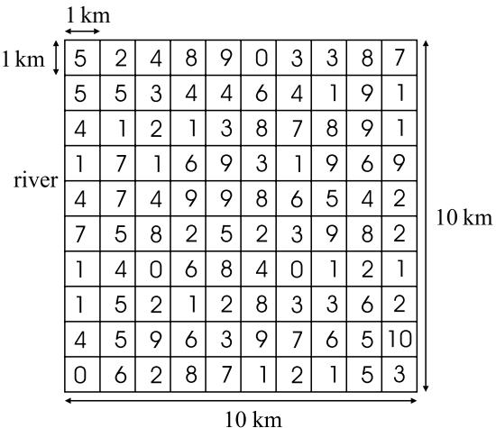  
Figure 4.9 A model of a $1 0 \times 1 0 \mathrm { k m }$ city divided into 100 equal squares.

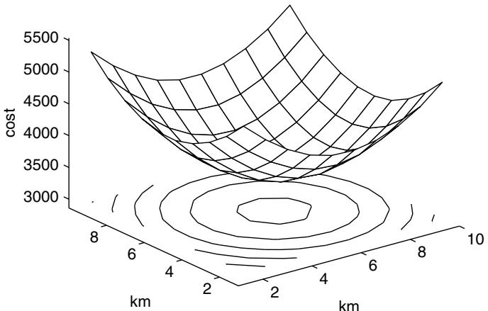  
Figure 4.10 Cost surface associated with the cost function in (4.6).

$$
c o s t = \sum _ { n = 1 } ^ { 1 0 0 } w _ { n } \sqrt { \left( x _ { n } - x _ { f s } \right) ^ { 2 } + \left( y _ { n } - y _ { f s } \right) ^ { 2 } }
$$

where

The cost surface for this problem is shown in Figure 4.10. It appears to be a nice bowl-shaped surface that minimum-seeking algorithms love.The problem for many algorithms is the discrete weighting assigned to the city squares and the small discontinuities in the cost surface that are not apparent from the graph. This example was inspired by an example from a book by Meerschaert (1993) in which the location of a fire station in a community broken into a $6 \times 6$ square grid and with a cost function similar to (4.6) is to be found. The author used a random search algorithm instead of a gradient-based method, because it is not possible to algebraically solve $\nabla c o s t = 0$ even though -cost can be calculated. This problem seemed too easy for the GA, so we increased the grid size and added the constraints.

On the other hand, including some constraints complicates the cost surface, so it would be difficult for a minimum seeking algorithm to find the bottom. Consider adding a river with only two bridges that cross it. The river is located at $y = 6 \mathrm { k m }$ from the bottom and the bridges cross at $y = 1 . 5$ and $6 . 5 \mathrm { k m }$ from the left (as shown in Figure 4.11). This new cost surface has two distinct minima, as shown in Figure 4.12. The solution found by the GA is to place the fire station close to the bridge at $( x , y ) = ( 6 , 6 )$ .

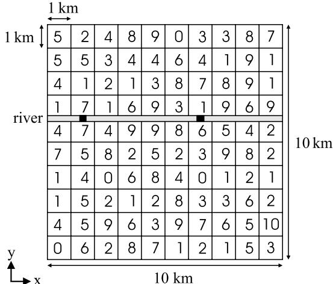  
Figure 4.11 A model of a $1 0 \times 1 0 \mathrm { k m }$ city divided into 100 equal squares with a river and two bridges.

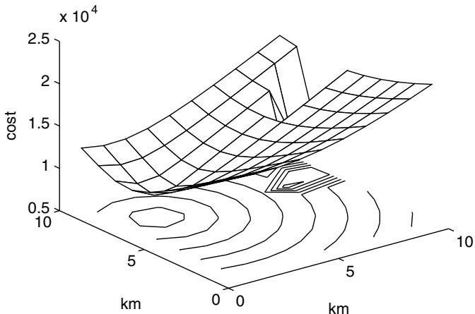  
Figure 4.12 Cost surface associated with the cost function in (4.6) and the added constraint of a river and two bridges.

We used both a binary GA and a continuous GA with $N _ { p o p } = 2 0 , N _ { k e e p } = 1 0$ , and $\mu = 0 . 2$ . Each algorithm was run 20 different times with 20 different random seeds.The average minimum cost of a population as a function of generation is shown in Figure 4.13. The continuous parameter GA outperformed the binary GA by finding a much lower minimum cost over 25 generations. Ultimately, the binary GA only took one more generation to find the minimum than the continuous parameter GA.

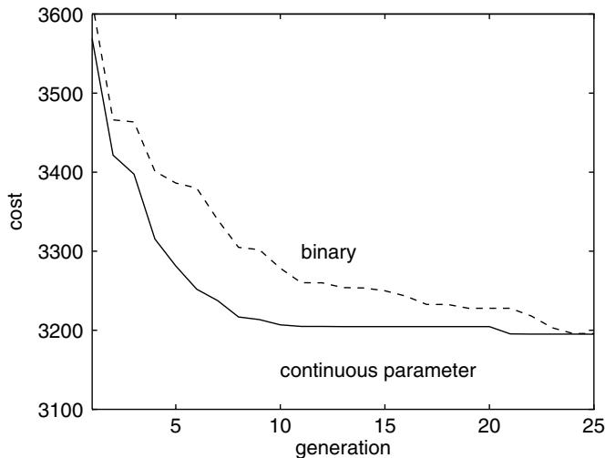  
Figure 4.13 Plot of the minimum of the population as a function of generation for the binary genetic and continuous parameter GAs applied to the emergency response unit problem. These results were averaged over 20 different runs.

# 4.5 ANTENNA ARRAY DESIGN

Satellite communication systems use antennas to receive signals transmitted from a satellite. The antenna has a main beam and sidelobes. The main beam points into space in the direction of the satellite and has a high gain (gain times received signal power equals power sent to the receiver) to amplify the weak signals. Sidelobes have low gains and point in various directions other than the mainbeam. Figure 4.14 shows a typical antenna pattern with a mainbeam and sidelobes. The problem with sidelobes is that strong undesirable signals may enter them and drown out the weaker desired signal entering the mainbeam. Consider a satellite antenna that points its mainbeam in the direction of a satellite. The satellite signal is extremely weak because it travels a long distance and the satellite transmits a low power. If a cellular phone close to the satellite antenna operates at the same frequency as the satellite signal, the phone signal could enter a sidelobe of the satellite antenna and interfere with its desired signal. Thus engineers are motivated to maximize the mainbeam gain while minimizing the sidelobe gain.

One type of satellite antenna is the antenna array. A key feature of this antenna is the ability to reduce the gain of the sidelobes. An antenna array is a group of individual antennas that add their signals together to get a single output. The received signals at each of the antenna elements has an amplitude and phase that is a function of frequency, element positions, and angle of incidence of the received signal.The output of the array is a function of the weighting of the signals at the elements. It is possible to weight the amplitudes of the signals at the elements to reduce or eliminate sidelobes. This example shows how to use a GA to design a low sidelobe antenna array.

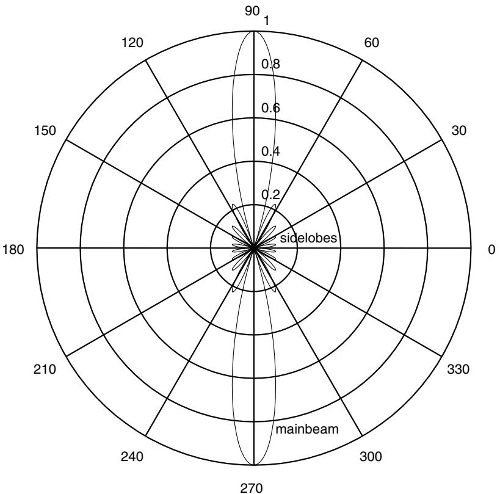  
Figure 4.14 Plot of an antenna pattern (response of the antenna vs. angle) that shows the mainbeam and sidelobes.

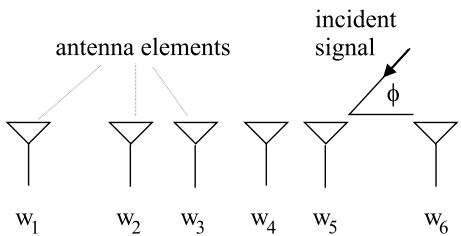  
Figure 4.15 Model of a linear array of antenna elements.

The linear array model has point sources lying along the $x$ -axis (Figure 4.15), and the amplitude taper is symmetric about the center of the array. Its mathematical formulation when the mainbeam points at $9 0 ^ { \circ }$ is given by

$$
A F ( \varphi ) = \sum _ { n = 1 } ^ { N } a _ { n } e ^ { j ( n - 1 ) \Psi }
$$

where

$N =$ number of elements $= 2 N _ { \mathrm { v a r } }$   
Y = kdu = kd cosj   
$a _ { n } =$ array amplitude weight at element $n$ for $a _ { m } = a _ { N + 1 - m }$ for $m = 1 , 2 , \ldots , N / 2$   
$k = 2 \pi / \lambda$   
$\lambda \ : =$ wavelength   
$d \digamma =$ spacing between elements   
$\varphi =$ angle of incidence of electromagnetic plane wave

The goal is to find the $a _ { n }$ in this formula that yield the lowest possible sidelobe levels in the antenna pattern.

There is a solution to this problem that produces sidelobes that are $- \infty$ below the peak of the mainbeam: in other words, no sidelobes at all (Figure 4.16). The analytical solution is called the binomial array, and the amplitude weights are just the binomial coefficients. Thus a five-element array has weights that assume the coefficients of a binomial polynomial with five coefficients. Binomial coefficients of an $( N \mathrm { ~ - ~ } 1 )$ th-order polynomial, or binomial weights of an $N$ element array, are the coefficients of the polynomial $( z + 1 ) ^ { N - 1 }$ given by the Nth row of Pascal’s triangle:

Our first attempt tried to eliminate the sidelobes of a 42-element array with $d = 0 . 5 \lambda$ . Both the binary and continuous parameter GAs failed to find an amplitude taper that produced maximum sidelobe levels less than $- 4 0 \mathrm { d B }$ below the peak of the mainbeam. This result was very disappointing. The problem centers around the cost function formulation. The cost function was the maximum sidelobe level of (4.7) with the parameters being $a _ { n }$ . This formulation is difficult to implement and allows undesirable solutions, such as shoulders on the mainbean, that confuse the GA.

A different cost function worked much better. The new formulation makes a substitution of variables in equation (4.7):

$$
z = e ^ { j \Psi }
$$

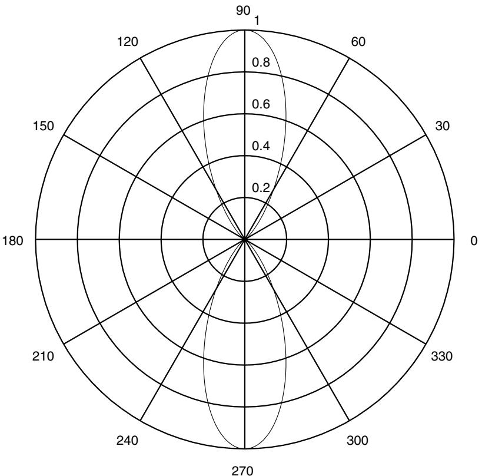  
Figure 4.16 Plot of the binomial array antenna pattern. Note the lack of sidelobes.

This substitution is known as a $z$ -transform and converts equation (4.7) to

$$
A F ( \varphi ) = \sum _ { n = 1 } ^ { N } a _ { n } z ^ { n - 1 } = ( z - z _ { 1 } ) ( z - z _ { 2 } ) \cdots ( z - z _ { N - 1 } )
$$

where $z = e ^ { j k d u _ { m } }$ . The cost function is the maximum sidelobe level of equation (4.10) with $u _ { m } = \cos \varphi _ { m }$ as the parameters. What a difference! As mentioned in Chapter 2, the cost function design is extremely important. Figure 4.17 shows the convergence of the continuous GA with $N _ { \mathrm { v a r } } = 2 1 , N _ { p o p } = 2 0 , N _ { k e e p } = 8$ , and $\mu = 0 . 2$ . This excellent performance is exceeded by the binary GA with $N _ { \mathrm { v a r } } =$ 21, $N _ { g e n e } = 1 0$ , $N _ { p o p } = 2 0$ , $N _ { k e e p } = 8$ , and $\mu = 0 . 2$ (Figure 4.18). Since these algorithms are random, perhaps the binary GA won due to chance. To reduce the impact of chance, both algorithms were run ten times with a different random seed each time. They ran for 75 generations with $N _ { \mathrm { v a r } } = 2 1 , N _ { p o p } = 1 2 8$ , $N _ { k e e p } = 6 4$ , and $\mu = 0 . 2$ . Figure 4.19 shows the results of the average minimum cost at each generation. Again, the binary GA wins.

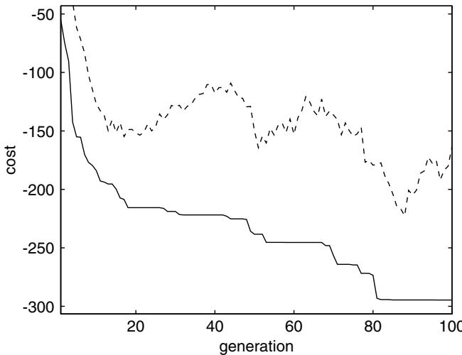  
Figure 4.17 Plot of the mean (dashed) and minimum (solid) of the population as a function of generation for the continuous parameter GA applied to the antenna design problem.

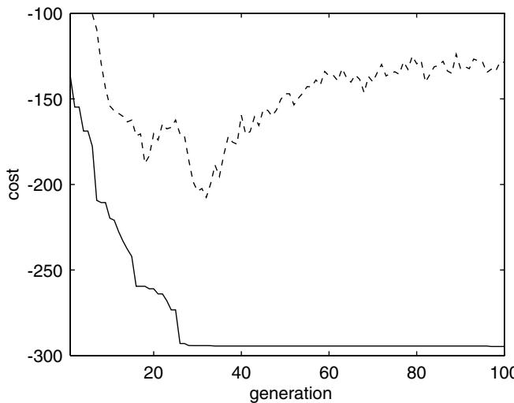  
Figure 4.18 Plot of the mean (dashed) and minimum (solid) of the population as a function of generation for the binary GA applied to the antenna design problem.

Why does the binary GA outperform the continuous parameter GA? Perhaps it is the size of the search space that must be considered. In this example, the binary GA searches over $1 0 ^ { 2 1 }$ possible solutions. This very large number is small compared to the $\infty$ number of possible combinations with the continuous parameter GA. In any event, the large number of variables miffs minimum seeking algorithms. For example, the Nelder-Mead algorithm failed to converge after 4000 iterations and a random starting point.

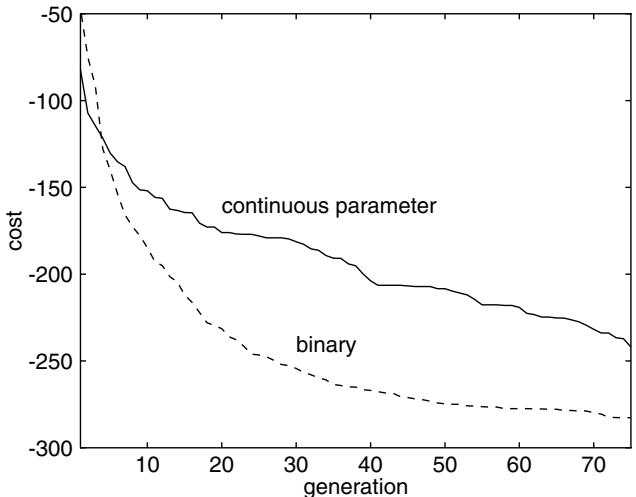  
Figure 4.19 Convergence of the binary and continuous parameter GAs as a function of generation when averaged over ten different runs.

# 4.6 THE EVOLUTION OF HORSES

What could be a more natural application of GAs than to study a natural evolution process? And what more beautiful and well-studied animal than the horse? Since such a problem can capture the imagination of just about any age, this demonstration reports on the science projects of one girl (our daughter) during her eighth and ninth grade years. Thus we will also see how the basics of GAs are easy enough for even a middle school student with an interest in computing to grasp. Although she began with a working binary GA and knew a little bit of programming already, she learned to write her own cost function subroutines and encode the variables in binary.

This example is a bit different than most of the other applications in this book. We aren’t trying to optimize in the same sense as the rest of the problems. Instead, we are observing a search where one parameter is traded off against another one when exploring a large number of variables. Not only are there adaptation factors assigned to each environment, but each environment also assigns weighting factors to the importance of each characteristic. This second factor allows for some “chance” in the evolution. Thus we don’t always observe the horses evolving to a single best individual, but rather see a more diverse evolution. The less important factors are “traded off” in an effort to optimize more important factors.

In the first part of this example, we examine the evolution of traits of horses in carefully defined environments using a GA. This sounds simple enough, but there are enough possible combinations of traits and environments to complicate matters.The first step is to define the environments and the adaptable characteristics.Two sorts of environments are considered.The first is a natural environment in which horse populations might develop. Natural environments considered include deserts, plains, dry mountains (e.g., the Sierra Nevada), northern tundra, pine forests, and the Australian outback. A second type of environment is the type of riding for which people may use a horse. An experienced rider may want different characteristics for her horse than a beginning rider. An English rider doing dressage and jumping may have different expectations of a horse than a western cow handler. Note the distinction between the two types of environment. In the first case, a natural evolution would be expected to take place. In the second type, selection is due to the requirements of a human environment as well as human preferences. In other words, the first is for wild horses while the second assumes the horse has been domesticated.

Horse characteristics considered were breed (or actually the characteristics of that breed), color, hoof hardness, length of mane and tail, the predominance of the fight or flee instinct, whether the horse is spirited or tame, foot markings, facial markings, thickness of the coat, eye color, water requirements, and long versus short distance running ability. These characteristics were coded in binary genes and concatenated to form chromosomes encompassing these particular characteristics. For each environment each characteristic was assigned an adaptation factor, adapti, that denotes the degree to which the ith characteristic is adaptable to that environment. The factors for each color are listed in the MATLAB code below for the sand dune desert environment. Gray and black were assigned low adaptation factors of 0.1 (since black attracts heat and gray are easily sunburned), while most others were deemed neutral and assigned 0.5, meaning that evolution is more by chance.

% color if color( $\mathit { \check { \Psi } } \mathrm { i n d } , \mathit { \Psi } : \mathit { \Theta } ) \ = = \ \left[ 0 \ 1 \ 0 \ 1 \ \right]$ adapt $( 2 ) = 0 . 5$ ; $\%$ Appaloosa $\boldsymbol { \mathrm { e 1 s e i f ~ c o l o r ~ ( \ i n d , : ) ~ } } = \mathrm { ~ [ ~ 0 ~ 1 ~ 1 ~ 0 ~ ] ~ }$ adapt $( 2 ) = 0 . 5$ ; $\%$ Paint elseif color $( \mathrm { i n d } , : ) \ = = \ [ 0 \ 1 \ 0 \ 0 ]$ adapt $( 2 ) = 0 . 5$ ; % Dapple elseif colo $\mathtt { r } ( \mathrm { i n d } , : ) \ = \ \mathtt { l } 0 \ 1 \ 1 \ 1 \mathtt { l } ]$ adapt $( 2 ) = 0 . 5$ ; $\%$ Blue Roan $\mathrm { e 1 s e i f \ c o l o r ( i n { \vec { u } } , : ) \ = = \ [ 0 \ 0 \ 0 \ 1 ] }$ adapt $( 2 ) = 0 . 1$ ; $\%$ Gray elseif color(ind,:) $= = \ [ 0 \ 0 \ 1 \ 0 \ ]$ adapt $( 2 ) = 0 . 1$ ; $\%$ Black elseif color(ind,:) $= = \ [ 0 \ 0 \ 0 \ 0 \ ]$ adapt $( 2 ) = 0 . 6$ ; $\%$ Palomino elseif color( $\mathrm { i n d , : } \ \mathrm { ) \ = = \ [ 1 \ 1 \ 1 \ 1 \ 1 \ ] }$

adapt $( 2 ) = 0 . 6$ ; $\%$ Buckskin elseif color(ind,:) == [0 0 1 1] adapt $( 2 ) = 0 . 5$ ; $\%$ Chestnut elseif color(ind,:) == [1 1 1 0] adapt $( 2 ) = 0 . 5$ ; % Bay elseif color(ind,:) $= = \ [ \ 1 \ 0 \ 0 \ 1 ]$ adapt $( 2 ) = 0 . 5$ ; $\%$ Flaxen Maned Sorrel else adapt $( 2 ) = 0$ ; end

The importance of each characteristic to each environment would be expected to vary. For instance, it may be extremely important for a desert horse to be able to go long periods without water. Yet for a domestic riding horse that is watered regularly, this characteristic may not matter. For horses in the northern tundra a thick coat may be quite important, while it would actually be a detriment in a desert. A horse on the plains would do best with a thick coat in the winter that thins in the summer. Color may not matter much for domesticated horses, while it could be an important adaptation factor for wild horses. The color adaptability, however, is highly dependent on the environment. A white coat would reflect the sunlight and be an advantage in a hot desert environment. However, in a northern tundra a dark coat could be useful for absorbing sunlight. Therefore a weighting function is necessary to define the relative importance of each characteristic in each environment. For instance, the weighting factor for the sand dune desert appears below with the weights being in the same order as the characteristics listed above. We see that hoof hardness, length of mane and tail, number of socks, and facial markings are given weightings of $w t _ { i } = 0 . 1$ , meaning that they are relatively unimportant. In contrast, water requirements are weighted as the most important at 0.9, and coat thickness was next most important at 0.8.

Function cost $=$ sandundes(chrom)   
$\%$ parameter weighting (importance factor) for this environment   
wts $=$ [.5,.6,.1,.1,.3,.4,.1,.1,.8,.6,.9,.5];

The cost function for each horse is then computed as the sum of the products of the adaptation factors of the horse characteristics with the weighting factors of how important each characteristic is for the particular environment considered:

$$
c o s t = - \sum _ { i = 1 } ^ { 1 2 } a d a p t _ { i } \times w t _ { i }
$$

The GA was run for 50 generations for a population of 20 horses. The mutation rate was set at $9 \%$ and pairing was done by rank. The results appear in Tables 4.4 and 4.5. These tables list the characteristics of the horse with the lowest cost after 50 generations. Often the second horse was highly different in the characteristics with low weighting factors. Thus less important characteristics like the number of socks (leg markings) varied widely, just as in real life.

TABLE 4.4 Evolution of Horse Characteristics for Six Natural Environments   

<table><tr><td>Environment/ Characteristic</td><td>Desert</td><td>Plains</td><td>Dry Mountains</td><td>Northern Tundra</td><td>Pine Forest</td><td>Outback</td></tr><tr><td>Breed</td><td>Brumby</td><td>Lipizzan</td><td>Arabian</td><td>Mustang</td><td>Lipizzan</td><td>Mustang</td></tr><tr><td>Color</td><td>Palomino</td><td>Palomino</td><td>Flaxen</td><td>Black</td><td>Chestnut</td><td>Blue</td></tr><tr><td>Hooves</td><td>Soft</td><td>Hard</td><td>sorrel Hard</td><td>Soft</td><td>Hard</td><td>Roan Hard</td></tr><tr><td>Mane/tail</td><td>Short</td><td>Short</td><td>Short</td><td>Short</td><td>Short</td><td>Short</td></tr><tr><td>Fight/flee</td><td>Fight</td><td>Both</td><td>Both</td><td>Fight</td><td>Fight</td><td>Both</td></tr><tr><td>Spirit</td><td>Spirited</td><td>Spirited</td><td>Spirited</td><td>Spirited</td><td>Spirited</td><td>Spirited</td></tr><tr><td>Socks</td><td>1 sock</td><td>3 socks</td><td>None</td><td>2 socks</td><td>3 socks</td><td>4 socks</td></tr><tr><td>Face</td><td>Blaze</td><td>None</td><td>Star</td><td>None</td><td>None</td><td>Blaze</td></tr><tr><td>Coat</td><td>Thin</td><td>Seasonal</td><td>Seasonal</td><td>Thick</td><td>Thick</td><td>Thin</td></tr><tr><td>Eyes</td><td>Blue</td><td>Blue</td><td>Blue</td><td>Brown</td><td>Blue</td><td>Blue</td></tr><tr><td>Water requirements</td><td>High</td><td>High</td><td>High</td><td>High</td><td>Low</td><td>Low</td></tr><tr><td>Running</td><td>Short distance</td><td>Long distance</td><td>Short distance</td><td>Long distance</td><td>Long distance</td><td>Short distance</td></tr></table>

TABLE 4.5 Evolution of Horse Characteristics for Four Types of Riding Environments   

<table><tr><td>Use/ Characteristic</td><td>Beginning Rider</td><td>Experienced Rider</td><td>English Riding</td><td>Western Riding</td></tr><tr><td>Breed</td><td>Tennessee walker</td><td>Irish Hunter</td><td>Tennessee walker</td><td>Tennessee walker</td></tr><tr><td>Color</td><td>White</td><td>Paint</td><td>Dapple</td><td>Black</td></tr><tr><td>Hooves</td><td>Soft</td><td>Hard</td><td>Hard</td><td>Hard</td></tr><tr><td>Mane/tail</td><td>Long</td><td>Long</td><td>Short</td><td>Short</td></tr><tr><td>Fight/flee</td><td>Flee</td><td>Fight</td><td>Flee</td><td>Both</td></tr><tr><td>Spirit</td><td>Tame</td><td>Tame</td><td>Semi</td><td>Semi</td></tr><tr><td>Socks</td><td>1 sock</td><td>3 socks</td><td>3 socks</td><td>4 socks</td></tr><tr><td>Face</td><td>Mask</td><td>Star</td><td>None</td><td>None</td></tr><tr><td>Coat</td><td>Thin</td><td>Seasonal</td><td>Seasonal</td><td>Seasonal</td></tr><tr><td>Eyes</td><td>Blue</td><td>Blue</td><td>Blue</td><td>Blue</td></tr><tr><td>Water</td><td>Low</td><td>Low</td><td>Low</td><td>Low</td></tr><tr><td>requirements</td><td></td><td></td><td></td><td></td></tr><tr><td>Running</td><td>Short distance</td><td>Long distance</td><td>Long distance</td><td>Long distance</td></tr></table>

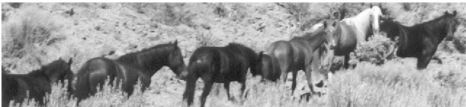  
Figure 4.20 Wild horses near Reno, Nevada.

Although a GA produces interesting results for this case, note that both the adaptation factors and the weighting factors were assigned quantitative values by a qualitative method. Personal judgment of one informed horsewoman determined these weights. In other words, the project was devised to get expected results for the most important factors. Perhaps that explains the predominance of blue-eyed horses in the tables while they are much rarer in real life. Less important factors were left more to chance. The population and iterations were limited so that at least some element of chance remains in the lack of time to evolve to a perfect horse for each environment. So does the natural world. Not only does the adaptive value of a particular characteristic differ for differing environments, but the environment evolves along a parallel (albeit longer) time scale. In particular, the human preference for particular types of horses is quite fickle and depends not only on a horse’s ability to run fast (useful in racing), but also according to color and marking preferences. These choices justify the qualitative setting of adaptation and weighting factors in such cases. Yet horses and other species manage to survive and evolve. Figure 4.20 shows some successful survivors of natural selection in the Sierra Nevada environment.

The second part of this example involves looking at the evolution of horse color more accurately than before (the second science project). The color gene in horses has been mapped rather thoroughly.To understand how the new cost function works, we must touch the surface of the color genes in a brief overview. There are more known genes than we will cover, but for the sake of brevity we will only do a few of the more common ones.

White is a dominant gene. However, there is a twist. If a horse has two positive white genes, then it is called lethal white because a few days after birth the foal dies. The abbreviation for the white gene is W for the positive form and w for the negative. Gray is also a dominant color, so even if one gene is positive for gray the horse will be gray. Gray is shown by the abbreviation of G (positive) and g (negative). However, the white gene holds priority. If the horse has the positive white gene, then it cannot be gray. Black and red are determined by a single gene. If the black/red gene is EE or Ee (at least one positive form), then the horse can form black pigment. However, if it is ee (double negative), then the horse will be red, also known as chestnut or sorrel. Both gray and white hold priority to black/red. If the horse is gray or white, it cannot be red or black. The cream gene is partially dominant. The red of the horse is diluted, but the black is not if the genetics is Crcr. However, if the genetics is $\mathrm { C r C r }$ , then the horse will turn entirely milky white and is called cremello or perlino. The final gene we will consider is the dun gene. The positive dun gene dilutes both the black and the red pigment on the horse, if the genetic coding is DD or Dd. The horse can have both the cream and the dun gene, which merely dilutes the colors more.

In coding the cost function, the dominant genes are coded as 1 while the recessive gene is 0. The color genes were ranked depending on the probability of that gene appearing; for example, the gray or white gene is less likely to show up than the black/red gene. Below is an example for the black/red gene:

%color   
if color(ind,:) = = [11] adapt $( 3 ) = 0 . 5$ ; %EE black coloring   
elseif color(ind,:) $\mathbf { \Phi } = \mathbf { \Phi } [ 1 0 ]$ adapt $( 3 ) = 0 . 5$ ; %Ee black coloring   
elseif color(ind,:) $\mathbf { \Phi } = \mathbf { \Phi } [ 0 1 ]$ adapt $( 3 ) = 0 . 5$ ; %eE black coloring   
else adapt(3) $^ { = 1 }$ .5; %ee red colored   
end

As before, the cost function for each horse is computed as the sum of the products of the adaptation factors of the horse colors with the weighting factors of the probability of each color chromosome. Some of the genes of the final population and the interpretation of the resulting colors are shown in Table 4.6.

The horse described by the fourth row would be buckskin or black because it was a bay with the cream gene diluting the yellow to a creamy color, or black because the cream gene has no affect on black pigment. The fifth row horse has black pigment that is diluted, making a grula, or it could have been a bay whose color was diluted, resulting in a bay dun horse. The most common color found when running the program was red or red with black pigment, which is the most common color found naturally.

TABLE 4.6 Horses of Final Population of Color Study   

<table><tr><td>Coding</td><td>Resulting Color</td></tr><tr><td>00/00/01/00/00</td><td>Bay or black</td></tr><tr><td>11/01/11/01/10</td><td>Lethal white</td></tr><tr><td>00/10/01/00/01</td><td>Gray</td></tr><tr><td>00/00/01/10/00</td><td>Buckskin or black</td></tr><tr><td>00/00/11/00/11</td><td>Grula or bay dun</td></tr></table>

# 4.5 SUMMARY

We’ve shown a variety of applications of the GA.Although the selections were mostly nontechnical, one can imagine technical counterparts. You might think of some interesting applications of the GA too. These problems were solved using the simple GAs introduced in Chapters 2 and 3. The next chapter introduces some analysis of GAs and some fine points for tuning the algorithms for best performance. Many real world problems have very complex models with cost functions that are time-consuming to evaluate. Some of those sorts of problems are included in Chapter 6. Finding the optimum population sizes, mutation rates, and other GA parameters becomes extremely important, the subject of Chapter 5.

# BIBLIOGRAPHY

Angeline, P. J. 1996. Evolving Fractal Movies. Proc. 1st An. Conf. on Genetic Programming, MIT Press, Cambridge, MA, pp. 503–511.   
Biles, J. A. 1994. GenJam: A GA for generating jazz solos. Proc. Int. Computer Music Conf, San Francisco: 131–137.   
Biles, J. A. 2002. GenJam in transition: From genetic jammer to generative jammer, 5th Int. Conf. on Generative Arts, Milan, Italy.   
Haupt, R. L., and S. E. Haupt. 2000. Creativity with a GA. IEEE Potentials 19:26–29.   
Horner, A., and D. Goldberg. 1991. GAs and computer-assisted music composition. Proc. 4th Int. Conf. on GAs. Urbana-Champaign, IL.   
Horner, A., and D. Goldberg. 1993. Machine tongues XVI: GAs and their application to FM matching synthesis. Compu. Music J. 17:17–29.   
D. Horowitz. 1994. Generating rhythms with GAs. Proc. Int. Computer Music Conf., Aarhus, Denmark.   
Jacob, B. L. 1995. Composing with GAs. Proc. Int. Computer Music Conf.   
Johnson, C. G., and J. J. Romero Cardalda. 2002. GAs in visual art and music. Leonardo 35:175–184.   
Juliany, J., and M. D. Vose. 1993. The GA fractal. Proc. 5th Int. Conf. on GAs, p. 639.   
Meerschaert, M. M. 1993. Mathematical Modeling. Boston: Academic Press, pp. 66–70.   
Mendelbrot, B. B. 1982. The Fractal Geometry of Nature. New York: Freeman.   
Putnam, J. B. 1994. Genetic Programming of Music. Socorro, NM: New Mexico Institute of Mining and Technology.   
Ross, T. J. 1995. Fuzzy Logic with Engineering Applications. New York: McGraw-Hill.   
Sims, K. 1991.Artificial evolution for computer graphics. Siggraph ’91 Proc. 25:319–328.   
Spector, L., and A. Alpern. 1995. Induction and recapitulation of deep musical structure. In Working Notes of the IJCAI-95 Workshop on Artificial Intelligence and Music, pp. 41–48.   
Todd, S., and W. Latham. 1992. Evolutionary Art and Computers. San Diego, CA: Academic Press.   
Wiggins, G., G. Papadopoulos, S. Phon-Amnuaisuk, and A. Tuson. 1999. Evolutionary methods for musical composition. Int. J. Comput. Anticipat. Syst.

# An Added Level of Sophistication

Now that we have introduced the GA and discussed in detail the workings of both the binary and the continuous GA, it is time to look at some of the tricks of the trade. At times there may be a cost function that is difficult or expensive to evaluate. Other times we may notice that one crossover technique is preferable. Deciding on the optimum population size is a controversial subject. How do we decide when the GA is done? Are there better ways to execute the genetic operators—crossover and mutation? Can a GA deal with problems that require a specific ordering of the solution? Although there are not always clear-cut solutions to all of these questions, we discuss possible answers in this chapter. We give hints and strategies on running a GA as well as some useful additions to the codes. We discuss how to implement GAs on parallel machines. The literature is full of other helpful ideas that can be applied to a plethora of problems.

# 5.1 HANDLING EXPENSIVE COST FUNCTIONS

Sometimes the cost function is extremely complicated and time-consuming to evaluate. As a result some care must be taken to minimize the number of cost function evaluations. One step toward reducing the number of function evaluations is to ensure that identical chromosomes are not evaluated more than once. There are several approaches to avoiding twins. First, the initial population can be created with no two chromosomes alike. Generally, this is only a problem for the binary GA, since the continuous GA has very low odds of generating identical random variables in two different chromosomes. However, checking the random population for repetitions is time-consuming in itself. Fortunately there are more efficient approaches. One approach is to begin each chromosome with a different pattern. To illustrate, consider an initial population of eight chromosomes:

000 1 001 10   
001 1 001 10   
010 0 110 01   
011 0 101 00   
100 1 010 11   
101 0 100 11   
110 1 011 00   
111 0 011 11

Observe that the first 3 bits are uniquely prescribed, so each chromosome is guaranteed to be different from all others in the population. Perhaps this approach is not the best, since it only guarantees that the first gene or so is different. A variation is to prescribe some other combination of bits. For example, if the chromosomes are three genes made up of 3 bits each, the first (or some other) bit in each gene could be set, as in

1 1 111 11 11   
1 1 00 0 00 0 0   
1 0 111 11 0 0   
1 0 00 0 110 0   
0 1 10 0 00 0 0   
0 1 00 0 00 0 0   
0 0 11 1 00 0 1   
0 0 01 0 11 1 1

Either approach guarantees an initial population of unique chromosomes but doesn’t ensure that identical chromosomes are not evaluated in later generations.

Some GA users advocate populations with all unique members (Michalewicz, 1992). New members of the population (offspring or mutated chromosomes) are checked against the chromosomes in the current population. If the new chromosome is a duplicate, then it is discarded. This approach requires searching the population for each new member. Searching the population for identical twins is only worth the effort if the cost function evaluation takes longer than the population search. A new generation consists of nonmutated parents, mutated parents, offspring, and mutated offspring. If there is an identical chromosome that already has an associated cost, then this cost is assigned to the new chromosome. Otherwise, the cost must be calculated from the cost function. An alternative is to not allow identical chromosomes to mate, therefore saving some computer time while helping maintain diversity in the population.

Another way to reduce the number of cost function evaluations is to only evaluate the costs of offspring of mutated chromosomes. Nonmutated parents already have an associated cost, so they don’t have to be evaluated again. The simplicity of the approach suggests that it should be included in every GA whether the cost function is time-consuming to calculate or not. Also the cost of a chromosome with multiple mutations needs only one evaluation.

A third approach keeps track of every chromosome and cost calculated over all the generations. Any newborn chromosome is compared with other chromosomes on the master list. If it has a twin in the big list, then the cost of that twin is assigned to the chromosome, thus saving the computation of the cost. This approach is the most drastic, being reserved for the most difficult to evaluate cost functions, because the big list must be searched every generation.

There are some other interesting tricks to play with complicated cost functions. One technique is to find a way to simplify the cost function for the bulk of the runs. This approach is akin to doing an initial calculation on a coarse grid, then fine-tuning it on a much finer grid. Here we merely define a simpler or lower order cost function in the initial generations and increase the cost function accuracy as the GA progresses through the generations. The lower order model takes less time to calculate and can get the algorithm into the ballpark of the solution.This approach proved very successful in Haupt (1995). In this case collocation was done at only one-fifth of the grid points. Thus a matrix on the order of $1 0 0 \times 1 0 0$ was used in the early generations, while a matrix on the order of $5 0 0 \times 5 0 0$ was used in the final generations. Another approach is to use the GA to find the valley of the global minimum, then enlist the help of a fast local optimizer to find the bottom of the valley. This hybrid method only works if the local optimizer can be applied to the cost function.

So we have seen that there are a variety of methods to save computer time by minimizing the number of evaluations of the cost function. Just be careful that the method does not require more time for searching than it saves in cost function evaluations. Most of the cost functions presented in this book take little computer time to evaluate, so repeated evaluation of the same chromosome has little impact on speed.

# 5.2 MULTIPLE OBJECTIVE OPTIMIZATION

In many applications the cost function has multiple, often times conflicting, objectives. Let’s take a look an example of a multiobjective optimization (MOO?) problem. Suppose a couple is looking for the ideal place to live. One is from Montana and the other is from Florida, so they have slightly different ideas of what is ideal. The two cost functions are approximately described by

$$
f _ { 1 } = x _ { 1 } + x _ { 2 } ^ { 2 } + x _ { 3 } + \sqrt { x _ { 4 } }
$$

$$
f _ { 2 } = { \frac { 1 } { x _ { 1 } } } + { \frac { 1 } { x _ { 2 } ^ { 2 } } } + { \sqrt { x _ { 3 } } } + { \frac { 1 } { x _ { 4 } } }
$$

where

f1 = spouse#1 cost   
$f _ { 2 } =$ spouse#2 cost   
$x _ { 1 } =$ average temperature   
${ \bf { X } } _ { 2 } = { \bf { \Phi } }$ distance from spouse#1 family   
$\mathbf { \delta X } _ { 3 } = \cos \mathrm { t \Omega }$ of living   
${ \bf { X } } _ { 4 } = { \bf { \Phi } }$ size of city   
$1 \leq x _ { n } \leq 2$

Clearly, this couple is not in agreement. They have reasonable agreement on cost of living but have much different views on the other variables.The emphasis they place on each variable is indicated by the size and sign of the variable exponent.

There is no single best solution to (5.1). Plotting $f _ { 1 }$ against $f _ { 2 }$ for various values of $\mathbf { X }$ results in Figure 5.1. The point that is the minimum of each independent function $( \operatorname* { m i n } \{ f _ { 1 } \} , \operatorname* { m i n } \{ f _ { 2 } \} )$ is outside the feasible region (set of all possible points that satisfy the constraints) in the plot. The set of points that bounds the bottom of the feasible region is known as the Pareto front. A line connects the points on the Pareto front in Figure 5.1. In the next two subsections we will discuss two approaches to MOO: weighted cost functions and finding the Pareto front.

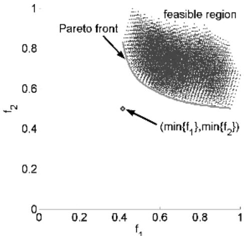  
Figure 5.1 Solutions to the MOO problem in (5.1). The Pareto front is the line formed by the optimal solutions. The point formed by the minimum of both functions separately is labeled.

# 5.2.1 Sum of Weighted Cost Functions

The most straightforward approach to MOO is to weight each function and add them together.

$$
c o s t = \sum _ { n = 1 } ^ { N } w _ { n } f _ { n }
$$

where

$f _ { n }$ cost function $n$ and $0 \leq f _ { n } \leq 1$ $w _ { n }$ weighting factor and $\sum _ { n = 1 } ^ { N } w _ { n } = 1$

The problem with this method is determining appropriate values of $w _ { n }$ . Different weights produce different costs for the same $f _ { n }$ . In the example these weights are multiplied by the cost value and added together to obtain a single scalar value that the GA minimizes. This approach requires assumptions on the relative worth of the cost functions prior to running the GA.

Implementing this MOO approach in a GA only requires modifying the cost function to fit the form of (5.2) and does not require any modification to the GA. Thus (5.1) becomes

$$
c o s t = w f _ { 1 } + ( 1 - w ) f _ { 2 }
$$

This approach is not computationally intensive and results in a single best solution based on the assigned weights.

# 5.2.2 Pareto Optimization

In MOO there is usually no single solution that is optimum with respect to all objectives. Consequently there are a set of optimal solutions, known as Paretooptimal solutions, noninferior solutions, or effective solutions. Without additional information, all these solutions are equally satisfactory. The goal of MOO is to find as many of these solutions as possible. If reallocation of resources cannot improve one cost without raising another cost, then the solution is Pareto optimal.

A Pareto GA returns a population with many members on the Pareto front. The population is ordered based on dominance. Solution A dominates solution B if A has a lower cost than B for at least one of the objective functions and is not worse with respect to the remaining objective functions. In other words, $x _ { 1 }$ dominates $x _ { 2 }$ if

$$
f _ { 1 } ( x _ { 1 } ) < f _ { 1 } ( x _ { 2 } ) \quad { \mathrm { a n d } } \quad f _ { 2 } ( x _ { 1 } ) \leq f _ { 2 } ( x _ { 2 } )
$$

or

$$
f _ { 1 } ( x _ { 1 } ) \leq f _ { 1 } ( x _ { 2 } ) \quad { \mathrm { a n d } } \quad f _ { 2 } ( x _ { 1 } ) < f _ { 2 } ( x _ { 2 } )
$$

A solution is Pareto optimal if no other solution dominates that solution with respect to the cost functions. A solution is nondominated if no solution can be found that dominates it. Once this set of solutions is found, then the user can select a single solution based on various postoptimization trade-offs rather than weighting the costs. One way of finding the Pareto front is to run a GA for many different combinations of the cost function weights in (5.2). Each optimal solution is on the Pareto front. This approach requires too many runs to estimate the Pareto set.

David Schaffer first implemented a multi-objective evolutionary algorithm called the vector-evaluated GA or VEGA in 1984 (Schaffer, 1984). His algorithm started off fine but tended to converge to a single solution. To prevent convergence to a single solution, Goldberg and Richardson (1987) suggested using a nondominated sorting procedure coupled with a niching strategy called sharing. Sharing takes into account that individuals in the same niche must share the available resources. This concept is integrated into the Pareto GA by increasing the cost of chromosomes as a function of their distance from each other. Closely grouped chromosomes will find their costs increased more than chromosomes that are spaced far apart.

The multi-objective GA (MOGA) (Fonesca and Flemming, 1993) starts by finding all nondominated chromosomes of a population and gives them a rank of one. These chromosomes are removed from the population. Next all the nondominated chromosomes of this smaller population are found and assigned a rank of two. This process continues until all the chromosomes are assigned a rank. The largest rank will be less than or equal to the size of the population. Usually there are many solutions that have the same rank. The selection procedure uses the chromosome ranking to determine the mating pool. MOGA also uses niching on the cost to distribute the population over the Pareto-optimal region.

A nondominated sorting GA (NSGA) ranks chromosomes in the same manner as MOGA. The NSGA algorithm then calculates a uniqueness value. This uniqueness value is related to the distance between each solution and its two closest neighbors. Distance may be calculated from the variable values or the associated costs. The resulting values are scaled between 0 and 1 and subtracted from the cost. A newer version (NSGA-II) improves the NSGA algorithm in a few ways:

• Reduces the computational complexity of the nondominated sorting.   
• Introduces elitism.   
• Replaces sharing with crowded-comparison to reduce computations and the need for a user-defined sharing parameter.

Details on NSGA-II can be found in Deb et al. (2002).

The Pareto GA introduced here works with two cost functions. It can be easily modified to work with more.A Pareto GA needs a large population size to work well, since it is trying to define the Pareto front. Consequently we only include tournament selection in the GA. Figure 5.2 shows a flowchart of this Pareto GA. The GA used to find the Pareto front for (5.1) had $N _ { p o p } = 5 0 0$ , discards $5 0 \%$ of the population, $\mu = 0 . 1$ , and tournament selection. Figure 5.3 displays the final population.Those chromosomes on the Pareto front are connected by a line. Although not perfect, the GA did find a very reasonable approximation to the Pareto front. This approach allows an easier way to tradeoff the infinite number of optimal solutions to the MOO problem.

A study was done to compare the performance of various MOO algorithms (Zitzler and Thiele, 1999). It compared the VEGA, NSGA, niched Pareto GA, the weighted-sum approach, and their newly proposed strength Pareto approach (SPEA). They found SPEA to be best on various runs with the knapsack problem. They found VEGA and NSGA to be the next best performers with VEGA having a slight advantage.

# 5.3 HYBRID GA

A hybrid GA combines the power of the GA with the speed of a local optimizer. The GA excels at gravitating toward the global minimum. It is not especially fast at finding the minimum when in a locally quadratic region. Thus the GA finds the region of the optimum, and then the local optimizer takes over to find the minimum. Hybrid GA can take one of the following forms:

1. Running a GA until it slows down, then letting a local optimizer take over. Hopefully the GA is very close to the global minimum.   
2. Seeding the GA population with some local minima found from random starting points in the population.   
3. Every so many iterations, running a local optimizer on the best solution or the best few solutions and adding the resulting chromosomes to the population.

The continuous GA will easily couple to a local optimizer, since local optimizers use continuous variables. Some authors have even used a micro GA (GA with small population) as the local optimizer (Kazarlis et al., 2001).

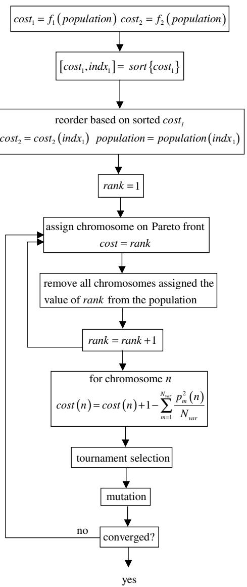  
Figure 5.2 Flowchart of the Pareto GA.

As an example we demonstrate finding the minimum of (1.1) using both a continuous GA and a hybrid GA/Nelder-Mead downhill simplex algorithm. The GA used for the analysis has a population size of 16 and a mutation rate of 0.2. Convergence results appear in Figure 5.4, averaged over 200 independent random runs.The dashed line for the GA and the solid line for the hybrid GA are not identical prior to the start of the local optimizer due to the random nature of both algorithms. For the hybrid GA, the Nelder-Mead algorithm kicks in after 458 function evaluations. Generally, the local optimizer begins its job when the GA shows little improvement after many generations. The local optimizer uses the best chromosome in the population as its starting point. As can be seen from the graph, the local optimizer finishes the job in a fraction of the time that it takes the GA. We heartily endorse the use of the hybrid GA.

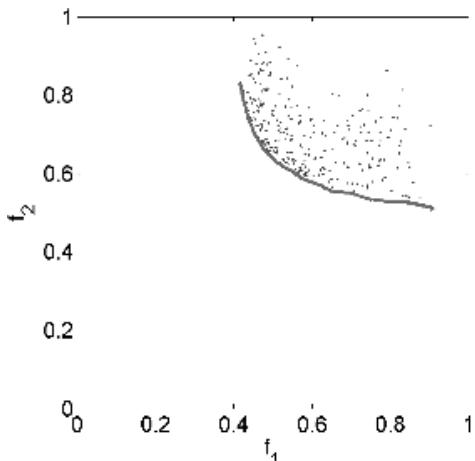  
Figure 5.3 Final population and Pareto front found by the GA.

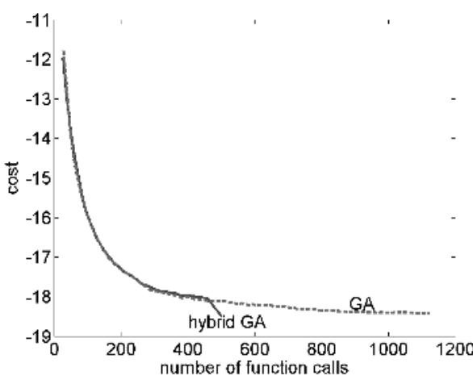  
Figure 5.4 On the average the hybrid GA finds the minimum in many fewer function calls than the GA by itself.

# 5.4 GRAY CODES

Ordinary binary number representation of the variable values may slow convergence of a GA. Consider the following example in which the crossover point for two parents falls in the middle of a gene that lies in the middle of the parent chromosomes:

$$
\begin{array} { l }  p a r e n t _ { 1 } = \left[ \underbrace  \begin{array} { c c c } { 1 } & { \stackrel { c r o s s o v e r } { } } & { 0 0 0 0 0 } \\ { \cdots \underbrace { 1 0 0 } } & { \stackrel { g e n e } { g e n e } } & { \ddots } \end{array} \right] = \left[ \begin{array} { l } { \underbrace { \begin{array} { l } { . . . 1 2 8 \underbrace { \begin{array} { l } { . . . } \end{array} } } \\ { . . . 1 2 8 \underbrace { \begin{array} { l } { . . . } \end{array} } } \end{array} } \right] } \\  p a r e n t _ { 2 } = \left[ \underbrace { \begin{array} { l l l } { \begin{array} { r r r r } { 1 } & { \stackrel { c r o s s o v e r } { } } & { } & { } \\ { . . . \underbrace { 0 1 1 } } & { \stackrel { c r o s s o v e r } { g e n e } } & { 1 1 1 1 1 } \end{array} } \end{array} } \end{array} \right] = \left[ \begin{array} { l } { \underbrace { \begin{array} { l } { . . . . 1 2 7 \underbrace { \begin{array} { l } { . . . } \end{array} } } } \\ { . . . \underbrace { 1 2 8 \underbrace { \begin{array} { l } { . . . } \end{array} } } } \end{array} \right] } \end{array} \end{array}
$$

The decoded gene appears at the far right-hand side of the equality. Crossover splits the genes as indicated.The offspring and associated values resulting from a crossover point between bits three and four are given by

By definition, the parents are some of the better chromosomes. This mating resulted in offspring that have diverging integer values from the parents. The variables of the genes that are split by the crossover operation in the above examples have decimal representations of 128 and 127. Note that the variable representations and, most likely, the costs are very close, but the binary representations are exactly opposite. Consequently the offspring that result from the parents are quite different. In this case the variable values change to 159 and 96. The variable values should be converging, but they are not. This example is extreme, but not unlikely. Increasing the number of bits in the variable representation magnifies the problem (Haupt, 1996).

One way to avoid this problem is to encode the variable values using a Gray code. The Gray code redefines the binary numbers so that consecutive numbers have a Hamming distance of one (Taub and Shilling, 1986). Hamming distance is defined as the number of bits by which two chromosomes differ. Reconsider the previous example using a Gray code in place of binary numbers. If we define the binary coding [01000000] to mean the number 127 and [11000000] to denote 128, then the problem of crossover becomes

$$
p a r e n t _ { 1 } = \left[ \underbrace { \phantom { - } \dots \underbrace { 1 1 0 } _ { g e n e } \downarrow } _ { g e n e } \quad 0 0 0 0 0 \ldots \right] = \left[ \dots 1 2 8 \dots \right]
$$

$$
p a r e n t _ { 2 } = \left[ \ldots \underbrace { 0 1 0 } _ { g e n e } \underbrace { \begin{array} { c } { c r o s s o v e r } \\ { \downarrow } \\ { . . . } \end{array} } _ { g e n e } \underbrace { 1 1 1 1 1 } _ { } \ldots \right] = \left[ . . . 1 2 7 \ldots \right]
$$

One gene in the chromosome is split by the crossover operation. The offspring resulting from a crossover point between bits three and four are given by

$$
\begin{array} { r l } & { o f f s p r i n g _ { 1 } = \left[ \dots . . 1 1 0 0 0 0 0 0 \dots \right] = \left[ \dots 1 2 8 \dots \right] } \\ & { \mathrm { } o f f s p r i n g _ { 2 } = \left[ \dots . . 0 1 0 0 0 0 0 0 \dots \right] = \left[ \dots 1 2 7 \dots \right] } \end{array}
$$

Any crossover point using the binary parents results in different offspring. Only one possible crossover point results in different offspring with the Gray code. By definition, the parents are good solutions. Thus we would expect the offspring to be good solutions too—which occurs when a Gray code is used.

A Gray code is easy to implement. Converting a binary code to a Gray code is done by the process diagrammed in Figure 5.5. In that figure the most significant bit (MSB) is at the top and the least significant bit (LSB) is at the bottom. The binary bits on the left are put through the exclusive OR (XOR) operation; that is, if both bits are the same, it produces a 0, and if they are different, a 1 is output. The converse of converting a Gray code back to a binary code is accomplished using the inverse process shown in Figure 5.6. Table 5.1 lists the binary and Gray codes for the integers 0 through 7. Note that the Hamming distance is one for every adjacent integer in the Gray code. On the other hand, binary numbers have a Hamming distance of three between integers 3 and 4.

The argument above points out that Gray codes speed convergence time by keeping the algorithm’s attention on converging toward a solution. Searching for solutions outside the immediate region is primarily relegated to the mutation function. Our experience indicates that a Gray code slows the GA due to the conversion process and doesn’t usually help much. Others have found Gray codes very beneficial (Carulana and Schaffer, 1988; Hinterding et al., 1989).

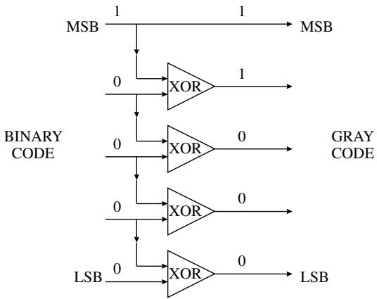  
Figure 5.5 Diagram of converting a binary code to a Gray code.

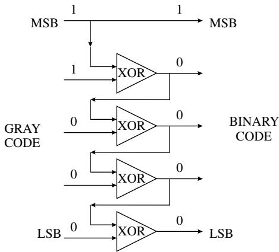  
Figure 5.6 Diagram of converting a Gray code to a binary code.

TABLE 5.1 Binary and Gray Code Representations of Integers 1 to 7   

<table><tr><td>Integer</td><td>Binary Code</td><td>Gray Code</td></tr><tr><td>0</td><td>000</td><td>000</td></tr><tr><td>1</td><td>001</td><td>001</td></tr><tr><td>2</td><td>010</td><td>011</td></tr><tr><td>3</td><td>011</td><td>010</td></tr><tr><td>4</td><td>100</td><td>110</td></tr><tr><td>5</td><td>101</td><td>111</td></tr><tr><td>6</td><td>110</td><td>101</td></tr><tr><td>7</td><td>111</td><td>100</td></tr></table>

# 5.5 GENE SIZE

In the binary GA the size of the gene or the number of bits used to represent a variable is important to the accuracy of the solution and the length of time needed for the GA to converge. Computer users tend to over represent the true accuracy of variables, because the computer calculates too many digits of accuracy. For every decimal point of accuracy (in base 10) needed in the solution, the variable needs 3.3 bits in the gene. Thus a solution accurate to eight positions requires $8 \times 3 . 3 = 2 6 . 4$ or 27 bits in the gene. If there are 10 variables, then a chromosome has 270 bits. A long gene slows convergence of the GA. Lesson: Only represent the variables to the minimum accuracy necessary.

In order to precisely estimate the gene size, one must first determine the acceptable variable accuracy in the form of quantization error. Tolerances of parts, design specifications, manufacturing limitations, and sufficient numerical accuracy contribute to determining the minimum quantization level. An advantage of the binary GA is that it forces the user to determine the accuracy of all variables in the optimization process. It is foolish to optimize a design only to find that the tolerance of a part is too tight. This is like the government overspecifying tolerances on simple items and driving up the cost. So be careful to avoid the GA equivalent of the $\$ 500$ hammer (or was it a $\$ 500$ toilet seat?).

# 5.6 CONVERGENCE

Several researchers have looked at using Markov chains to analyze GA convergence (Nix and Vose, 1992). In general, these studies have relied on a large population size and low mutation rate for the statistics to work. For instance, it has been shown that convergence can be achieved above a critical population size. Upper bounds have been derived for this critical population size (Cerf, 1998). Other studies have found a bound for the number of iterations necessary to find the global optimum with a prespecified level of confidence (Aytug and Koehler, 1996; Greenhalgh, 2000).

Several proofs exist for the convergence of simulating annealing (SA) algorithms using Markov chains (Hajek, 1988). These algorithms resemble a GA with one chromosome, no crossover, and a decreasing mutation rate. Consequently many people have tried to use SA proofs for GAs as well (Francois, 1998).

The traditional handwaving proof of convergence for the binary GA is called the schema theorem (Holland, 1975). A schema is a string of characters consisting of the binary digits 1 and 0, and an additional “don’t care” character, \*. Thus the schema $1 1 ^ { * * } 0 0$ means the center two digits can be either a 1 or a 0 and represents the four strings given by 110000, 110100, 111000, and 111100. Figure 5.7 shows a schema hypercube in which three binary digits represent a corner point, two represent a line, and one represents a face. If $\ast \ast 1$ results in low costs, then the top face of the cube is a region of interest for the GA.

The schema theorem says (Goldberg, 1989a):

Short schema with better than average costs occur exponentially more frequently in the next generation. Schema with costs worse than average occur less frequently in the next generation.

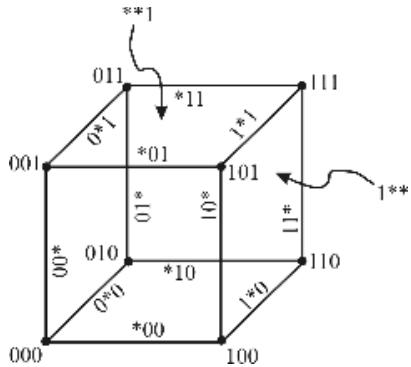  
Figure 5.7 Hypercube for a schema with one to three binary digits.

The idea is that the most fit schema survive to future generations. Following the best schema throughout the life of the GA provides an estimate of the convergence rate (not necessarily to the global minimum) to the best chromosome.

Say that a given schema has $s _ { t }$ representations in the population at generation t. The number of representations of this schema in generation $t + 1$ is given by

$$
s _ { t + 1 } = s _ { t } P _ { t } ( 1 + Q _ { t } ) R _ { t }
$$

where

$P _ { t } =$ probability of the schema being selected to survive to the next generation   
$Q _ { t } =$ probability of the schema being selected to mate   
$R _ { t } \ =$ probability of the schema not being destroyed by crossover or mutation

Notice that if $P _ { t } ( 1 + Q _ { t } ) < 1$ , then the schema will eventually become extinct. Surviving schema propagate according to

$$
s _ { t + 1 } \geq ( P _ { t } P _ { t - 1 } \cdots P _ { 1 } ) [ ( 1 + Q _ { t } ) ( 1 + Q _ { t - 1 } ) \cdots ( 1 + Q _ { 1 } ) ] ( R _ { t } R _ { t - 1 } \cdots R _ { 1 } ) s _ { 1 }
$$

This formula takes into account that the probability of selection of a schema can vary from generation to generation. Beginning generations may have a schema with $P _ { t } ( 1 + Q _ { t } ) > 1$ , and for later generations that same schema has $P _ { t } ( 1 + Q _ { t } ) < 1$ . Such a schema does not survive in the long run. An example of this behavior might be when a GA first latches onto a local minimum, and later finds the global minimum. Ultimate survival requires the schema to have $P _ { t } ( 1 + Q _ { t } ) > 1$ for all $t$ .

The schema theorem for proportionate selection and single-point crossover is (Goldberg, 1989a).

$$
s _ { t + 1 } \geq s _ { t } \frac { \hat { f } } { \bar { f } } \left\{ 1 - \left[ P _ { c } \frac { \delta } { N _ { b i t s } - 1 } \right] - \zeta P _ { m } \right\}
$$

where

$\hat { f } =$ average fitness of chromosomes containing schema   
$\bar { f } =$ average fitness of population   
$P _ { c } =$ probability of crossover   
$P _ { m } =$ probability of mutation of a single bit   
$\delta =$ distance between the first and last digit in schema   
$N _ { b i t s } =$ number of possible crossover sites   
$\zeta =$ number of defined digits in schema

Many variations to this fundamental theorem appear in the literature.

In practice, when do you stop the algorithm? Well . . . We don’t have a good answer. This is one of the fuzzy aspects of using the GA. Consider some good possibilities:

1. Correct answer. This may sound silly and simple. Make sure you check your best chromosome to see if it is the answer or an acceptable answer to the problem. If it is, then stop.   
2. No improvement. If the GA continues with the same best chromosome for $X$ number of iterations, then stop. Either the algorithm found a good answer or it is stuck in a local minimum. Be careful here. Sometimes the best solution will stay in the same spot for quite a while before a fortuitous crossover or mutation generates a better one.   
3. Statistics. If the mean or standard deviation of the population’s cost reaches a certain level, then stop the algorithm. This means the values are no longer changing.   
4. Number of iterations. If the algorithm doesn’t stop for one of the reasons above, then limit the maximum number of iterations. It can go on forever unless stopped.   
5. Local optimizer. Use a local optimizer. Stop if there is no improvement.

If your algorithm isn’t converging to a good solution, try changing the GA parameters like population size and mutation rate. Maybe a different crossover method or switching from a continuous GA to a binary GA is the answer. When the local optimizer finishes, then declare convergence. We do not advocate the GA as an answer to every problem. Sometimes it performs poorly in comparison with other methods. Don’t be afraid to jump ship to a minimum-seeking algorithm when your GA is sinking. Note that for many problems, we don’t really need the minimum. Instead, we are happy to see improvement over previous best results.

# 5.7 ALTERNATIVE CROSSOVERS FOR BINARY GAs

In Chapter 2 we only introduced the simple single point crossover for binary GAs. Single point crossover is similar to the coordinate search method described in Chapter 1, because the resulting offspring can only occur along a line parallel to the coordinate axes. As shown in Figure 5.8, potential offspring from two parents in a binary GA are limited to a few choices parallel to the $x -$ and $y$ -axes of a two-dimensional problem. In this example each gene has three bits. Similarly the continuous GA using the single point crossover advocated in Chapter 3 has offspring confined to the lines that form a rectangle with the two parents on opposite vertices (Figure 5.9). Expanding the range of $\beta$ in (3.14) to $- 0 . 1 \leq \beta \leq 1 . 1$ allows the crossover to go outside the bounds of the parents as shown in Figure 5.10. Single-point crossover for either the binary or continuous GA limits offspring along lines that are parallel to the variable axes.

Other alternatives exist (Eshelman, et al., 1989). A two-point crossover for the binary GA takes the form

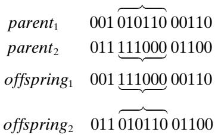

Two random crossover points are selected for the parents. The parents then swap the bits between the two crossover points. Alternatively, a random selection of one of the three parts of the chromosome determines which group of bits is swapped. Two-point crossover greatly expands the possible offspring created as shown in Figure 5.11. This figure results from swapping the center bits between two crossover points. A nearly identical figure results when one of the three parts is randomly selected for swapping. We suggest only swapping the center bits, because this makes it easier to code.

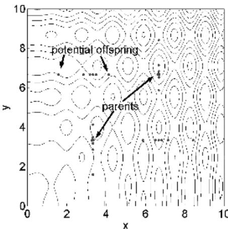  
Figure 5.8 The parents (two large dots) and their possible children (smaller dots) for single-point crossover for a binary GA with 3 bits in the chromosomes.

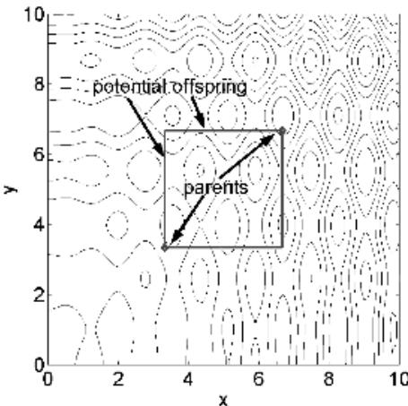  
Figure 5.9 The parents (two large dots) and their possible children (lines) for singlepoint crossover for a continuous GA.

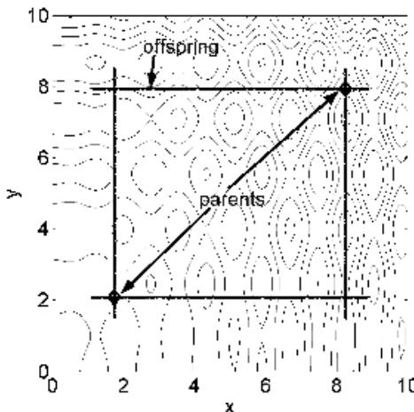  
Figure 5.10 The parents (two large dots) and their possible children (lines) for singlepoint crossover for a continuous GA with $\beta = 1 . 1$ .

Another scheme involves three parents and two crossover points (Eiben, 1994):

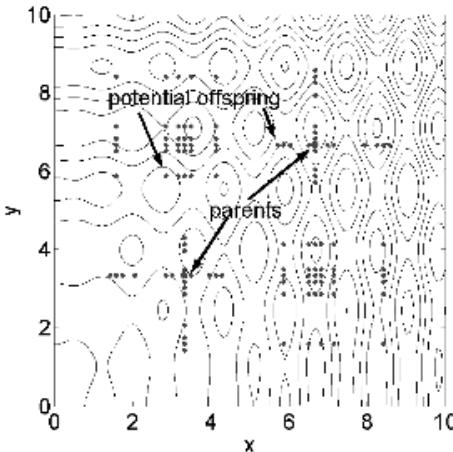  
Figure 5.11 Two parents and potential offspring from two-point crossover in a binary GA.

parent1 101010101 01010   
parent2 000001111 11100   
parent3 100111100 11001   
offspring1 000000101 01010   
offspring2 100110101 01010   
offspring3 101011111 11100   
offspring4 100111111 11100   
offspring5 101011100 11001   
offspring6 000001100 11001   
M M   
offspring 1001118 1111 01010

A total of 18 offspring can be generated from the three parents. Not all the offspring need to be generated. For instance, it may be desirable to generate only two or three. This method of crossover scatters the potential offspring over a wider area of the cost surface as shown in Figure 5.12.

Uniform crossover looks at each bit in the parents and randomly assigns the bit from one parent to one offspring and the bit from the other parent to the other offspring. First a random mask is generated. This mask is a vector of random ones and zeros and is the same length as the parents. When the bit in the mask is 0, then the corresponding bit in parent1 is passed to offsprin $g _ { 1 }$ and the corresponding bit in parent2 is passed to offspring2. When the bit in the mask is 1, then the corresponding bit in parent1 is passed to offsprin $g _ { 2 }$ and the corresponding bit in parent2 is passed to offspring1:

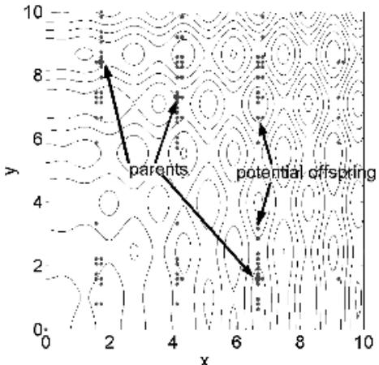  
Figure 5.12 Three parents and potential offspring from three-point crossover in a binary GA.

parent 1 00101011000110   
parent 2 01111100001100   
mask 00110110001110   
offspring 1 00111101001100   
offspring 2 01101010000110

Uniform crossover becomes single-point crossover for a mask that looks like

$$
m a s k = [ 0 0 0 0 0 0 1 1 1 1 1 1 1 1 ]
$$

In the same manner a two-point crossover mask example is

$$
m a s k = [ 0 0 0 0 0 0 1 1 1 1 1 0 0 0 ]
$$

Thus uniform crossover can be considered a generalization of the other crossover methods. Syswerda (1989) has done extensive experimentation with uniform crossover. “It was shown that in almost all cases, uniform crossover is more effective at combining schemata than either one- or two-point crossover.” In addition he found that two-point crossover is consistently better than one-point crossover.

Assume that two parents for a two-dimensional problem are given by

All the bits in these parents are different. As a result the offspring can appear in many different locations spread throughout the cost surface (Figure 5.13).

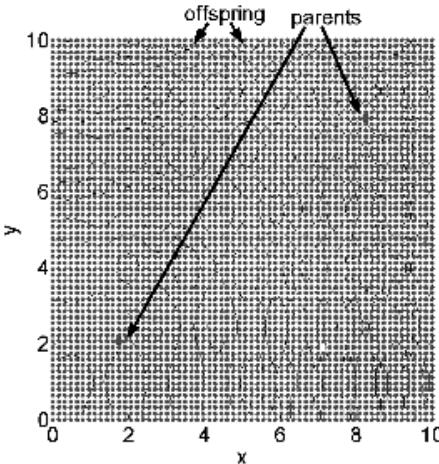  
Figure 5.13 Two parents and the potential offspring due to uniform crossover with a binary GA.

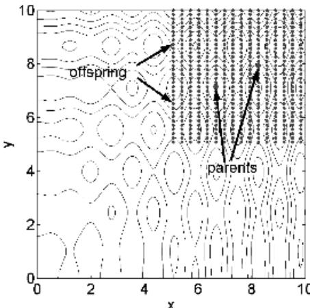  
Figure 5.14 Two parents and the potential offspring due to uniform crossover with a binary GA.

If the first, sixth, and seventh bits are the same, then the number of locations of the offspring are reduced. Consider the following parents:

Figure 5.14 shows all possible offspring of these parents. Since the first and seventh bits are one, both parents are in the upper right quadrant of the cost surface. Consequently all the offspring lie in the upper right quadrant as well. No random mask will create an offspring outside of the upper right quadrant. Now consider two chromosomes that have all the same bits except in three locations, such as the pair

The number of possible offspring from these parents due to uniform crossover is very limited, as shown in Figure 5.15.

In early generations, the chromosomes will be very different and uniform crossover will create offspring that vary all over the cost surface. In later generations, the chromosomes will be similar and the potential offspring from uniform crossover will be very limited as with single-point crossover.

It’s possible to produce offspring from a continuous GA that are not along lines parallel to the variable axes. Offspring can be limited to a line that connects the two parents as shown in Figure 5.16, by multiplying each variable in the parents by $\beta$ or $- \beta$ , where $0 \leq \beta \leq 1$ ,

$$
\begin{array} { r } { o f f s p r i n g _ { 1 } = p a r e n t _ { 1 } - \beta ( p a r e n t _ { 1 } - p a r e n t _ { 2 } ) } \\ { o f f s p r i n g _ { 2 } = p a r e n t _ { 2 } + \beta ( p a r e n t _ { 1 } - p a r e n t _ { 2 } ) } \end{array}
$$

Extending the range of $\beta$ extends the limits of the offspring. In Chapter 3 only the variable that was selected had the difference multiplied by a random number. The spread can be over a large square region having the parents at two diagonal corners by generating uniform random numbers and performing the following operations:

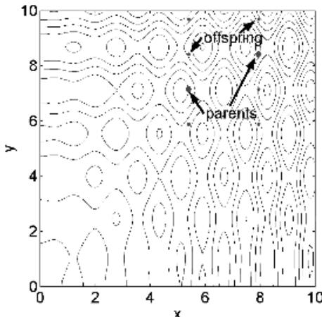  
Figure 5.15 Two parents and the potential offspring due to uniform crossover with a binary GA.

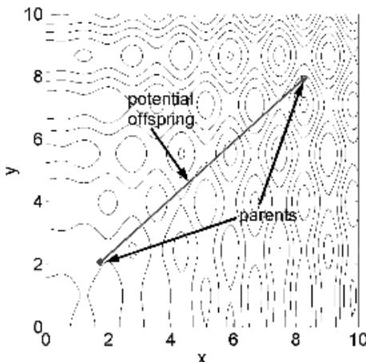  
Figure 5.16 Two parents and possible offspring using one random number for $\beta$ in the continuous GA.

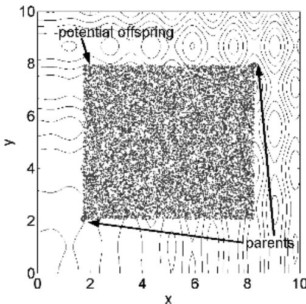  
Figure 5.17 Two parents and possible offspring using two independent random numbers for $\beta$ in the continuous GA.

$$
\begin{array} { r l } & { o f f s p r i n g _ { 1 } = p a r e n t _ { 1 } - [ \beta _ { 1 } ( p _ { m 1 } - p _ { d 1 } ) , \beta _ { 2 } ( p _ { m 2 } - p _ { d 2 } ) , \dots , \beta _ { N { \nu } a r } ( p _ { m N _ { v a r } } - p _ { d N _ { v a r } } ) ] } \\ & { o f f s p r i n g _ { 2 } = p a r e n t _ { 2 } + [ \beta _ { 1 } ( p _ { m 1 } - p _ { d 1 } ) , \beta _ { 2 } ( p _ { m 2 } - p _ { d 2 } ) , \dots , \beta _ { N { \nu } a r } ( p _ { m N _ { v a r } } - p _ { d N _ { v a r } } ) ] } \end{array}
$$

where $\beta _ { n }$ are independent uniform random numbers. Unlike in (5.10), the difference between each variable is multiplied by a different uniform random number. Figure 5.17 shows the region containing all possible offspring from this operation. Increasing the range of the $\beta _ { n }$ increases the square area of possible offspring.

One can also vary how many of the $N _ { k e e p }$ chromosomes become parents. The crossover rate $( X _ { r a t e } )$ determines the number of chromosomes that enter the mating pool:

$$
N _ { k e e p } = X _ { r a t e } N _ { p o p }
$$

High crossover rates introduce many new chromosomes into the population. If $X _ { r a t e }$ is too high, good building blocks don’t have the opportunity to accumulate within a single chromosome. A low $X _ { r a t e }$ , on the other hand, doesn’t produce a sufficient number of new offspring.

The preceding schemes provide alternative implementations of crossover. Of course, there are many other possibilities. Feel free to use your imagination to invent other methods. Just remember, the goal of the crossover operator is to pass on desirable traits to the next generation. A crossover operator that is too fancy may destroy desirable schema and slow convergence.

# 5.8 POPULATION

Deciding on the population composition is very difficult. We’ll discuss population size in Section 5.11. Here we look at other aspects of the population, such as sampling, chromosome age, and size variations.

How should the initial population sample the cost surface? In order to better picture the sampling process, let’s first look at a population size of 16 for a two-variable cost function. One option is to start with a population that uniformly samples the cost surface (Figure 5.18a). Sometimes a random population results in oversampling of some regions and sparse sampling in others (Figure 5.18b). Uniform random number generators produce uniform samples when the population size is large. Another alternative is to randomly generate half the chromosomes, and then the second half is the complement of the first half (Figure 5.18c). This approach ensures diversity by requiring every bit to assume both a one and a zero within the population. An example of applying complementary sampling is

Initial Population of Chromosomes

Helping the algorithm adequately sample the cost surface in the early stages may reduce convergence time and prevent premature convergence in a local minimum. Using the random sampling methods can produce some large gaps in the sampling of the cost function.

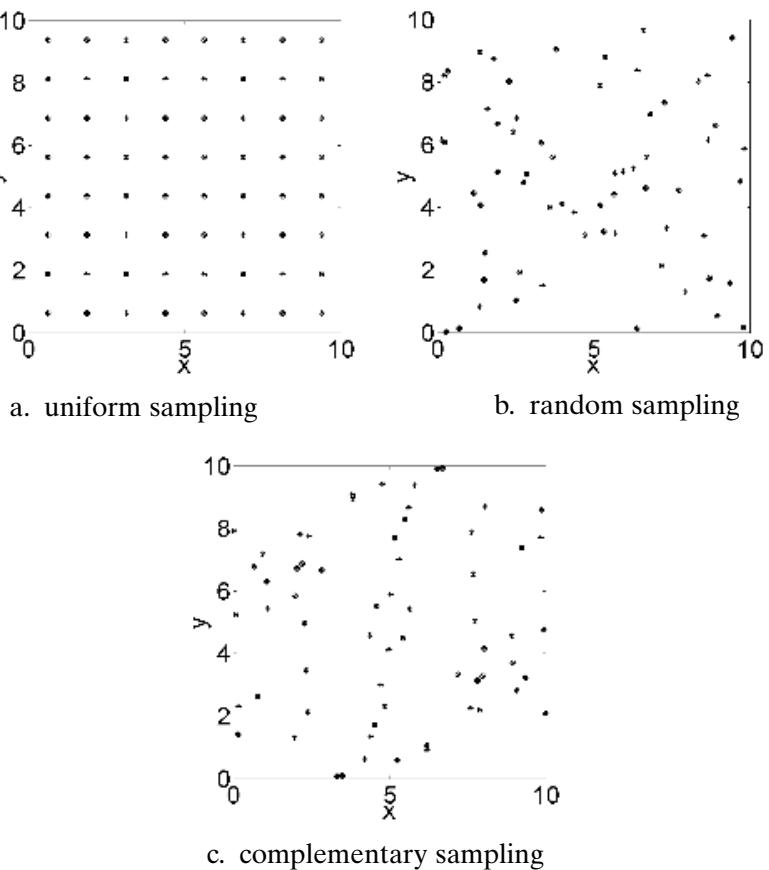  
Figure 5.18 Plots of possible sampling methods with 16 samples.

Changing the population size from generation to generation is another variation that we haven’t explored and yet is very common in nature. Another intriguing biological model is allowing a chromosome to age (Michalewicz, 1992). A chromosome’s age equals the number of generations that it survives. More fit chromosomes stay alive longer than less fit chromosomes. Such a strategy allows the population size to vary from generation to generation, depending on the number of chromosome deaths. Michalewicz lists three possibilities of adding a lifetime to the chromosomes: proportional, linear, and bilinear.Their definitions are presented inTable 5.2.The variables are defined as

• life $\dot { } _ { m i n } =$ minimum lifetime • life $_ { m a x } =$ maximum lifetime • $\eta = \frac { 1 } { 2 } ( l i f e _ { \operatorname* { m a x } { } } - l i f e _ { \operatorname* { m i n } { } } )$

<table><tr><td>Allocation</td><td>Lifetime</td><td>Advantage</td><td>Disadvantages</td><td></td></tr><tr><td>Proportional</td><td>min{lifemax, lif max E{cos}</td><td rowspan="2"></td><td>lifetime ∞ 1 cost</td><td>lifetime; relative to average not best cost cos ≥ 0 for all i</td></tr><tr><td>Linear</td><td> ost min lifemax  2 costmax - cost min</td><td>Compares to best cost</td><td>chromosomes with long lives</td></tr><tr><td>Bilinear</td><td>osmax  os lmin + costmax − E{cost} E{cost}− osi (lfmin + lmax) + E{cost}  cost min</td><td>if cos ≥ E{cost} if o &lt; E{cost}</td><td>Good compromise</td><td></td></tr></table>

TABLE 5.3 Functions Used by Michalewicz to Test the Performance of a GA that has Chromosomes with a Life Span   

<table><tr><td>Number</td><td>Function</td><td>Limits</td></tr><tr><td>1</td><td>−x sin(10πx) + 1</td><td>−2.0 ≤ x ≤ 1.0</td></tr><tr><td>2</td><td>integer(8x)/8</td><td>0.0 ≤ x ≤ 1.0</td></tr><tr><td>3</td><td>xsgn(x)</td><td>−1.0 ≤ x ≤ 2.0</td></tr><tr><td>4</td><td>sin2 √x2 + y2 - 0.5 0.5+ (1 + 0.001(x2 + y2))2</td><td>−100 ≤ x ≤ 100</td></tr></table>

• $c o s t _ { m i n } =$ minimum cost of a chromosome in the population • $c o s t _ { m a x } =$ maximum cost of a chromosome in the population • $E \{ c o s t \} =$ expected value of the cost vector

He found that the varying population size outperformed the constant population size GA for the cost functions shown in Table 5.3. Results consisted of averaging the minimum cost and number of function evaluations over 20 independent runs. The linear strategy has the best average minimum cost but the highest number of function evaluations. At the other extreme the bilinear strategy has the worst average minimum cost but the smallest number of function evaluations. The proportional strategy came in the middle with a medium average minimum cost and medium number of function evaluations.

Will seeding the population with some possible good guesses speed convergence? Sometimes. This question is natural, since some traditional methods require a good first guess to get a good solution. If the guess is very good, the algorithm quickly finds the solution. If the guess is not so good, then the algorithm chases after a local minimum and takes time to find its way out. Most iterative schemes have a similar problem with initial first guesses (Haupt, 1987). If you don’t know much about the expected best solution (which is usually the case), forget about seeding the population. Another problem with seeding is that the time spent looking for a good seed can oftentimes be spent running the GA. If you have a reasonable guess at the solution, why not use a local optimizer to begin with? We’re not against seeding a GA—we sometimes do it ourselves—we’re just cautious. Others have not found stunning results with seeding, either (Booker, 1987; Liepens et al., 1990; Cantu-Paz and Goldberg, 2003).

As an example, consider seeding a continuous GA with a population size of 16 and mutation rate of 0.20 for finding the minimum of (1.1). A carefully selected seed replaces one member of the initial population. The first seed is in the bowl of the global minimum at $( x , y ) = ( 8 . 2 , 8 . 0 )$ . A local optimizer easily finds the global minimum from this point, so we might suspect that the GA will converge faster from here. Table 5.4 shows the average number of function evaluations required to reach an average minimum value when the GA is evaluated using 3000 independent random runs. Compare these results with seeding the algorithm with a point in the bowl of an adjacent local minimum, $( x , \ y ) \ = \ ( 8 . 5 , \ 5 . 0 )$ and no seeding at all. The differences between these approaches are insignificant as shown in Table 5.4. Our advice: Don’t waste your time looking for good first guesses.

TABLE 5.4 Results from Seeding a GA   

<table><tr><td>Seed</td><td>Average Final Result</td><td>Average Number of Function Calls</td></tr><tr><td>(x, y) = (8.2, 8.0)</td><td>18.489</td><td>700</td></tr><tr><td>(x, y) = (8.5, 5.0)</td><td>-18.486</td><td>709</td></tr><tr><td>No seed</td><td>18.484</td><td>697</td></tr></table>

# 5.9 MUTATION

When reevaluating the implementation of the mutation operator, two issues come to mind: type of mutation and rate of mutation. How severe should the mutation be? Changing a single bit in a gene can change a variable value by almost $5 0 \%$ . The expected value of a mutated gene that represents a variable between 0 and 1 to $N$ bit accuracy is $1 / \mathrm { N } \sum _ { n = 1 } ^ { N } 2 ^ { - n }$ . Thus a gene with 4 bits can expect a mutation $( \mu \ : = \ : 0 . 2 5 )$ to change it by $^ { 1 } _ { 4 } ( 0 . 5 + 0 . 2 5 + 0 . 1 2 5 + 0 . 0 6 7 5 )$ ) $= 0 . 2 3 5 6 3$ , while a gene with 8 bits can expect two mutations $( \mu = 0 . 2 5 )$ ), and it changes by $\frac { 2 } { 8 } \left( \frac { 1 } { 2 } + \frac { 1 } { 2 ^ { 2 } } + \frac { 1 } { 2 ^ { 3 } } + \frac { 1 } { 2 ^ { 4 } } + \frac { 1 } { 2 ^ { 5 } } + \frac { 1 } { 2 ^ { 6 } } + \frac { 1 } { 2 ^ { 7 } } + \frac { 1 } { 2 ^ { 8 } } \right) = 0 . 2 4 9 0 2$ . In other words, mutation has slightly different effects on genes, depending on the bit representation of the genes.

If one bit of a 12 bit chromosome is mutated, then there are 12 possible resulting mutants. Figure 5.19 plots a chromosome and its 12 potential mutants if one bit is mutated. Figure 5.20 is a plot of the same chromosome and all possible mutants resulting from mutating two bits. Increasing the number of mutated bits to three enlarges the number of possible mutants, as shown in Figure 5.21. These figures demonstrate the potential outreach associated with a high mutation rate. Figure 5.22 shows all the potential mutants due to mutating one variable in a two variable continuous chromosome. Mutating two continuous variables can result in a mutant at any point on the graph.

Experiments have been done on varying the mutation rate as the generations progress. Fogarty studied five variable mutation rate schemes (Fogarty, 1989):

1. Constant low $\mu$ over all generations.   
2. First generation has $\mu = 0 . 5$ , and subsequent generations have a low $\mu$ .   
3. Exponentially decreasing $\mu$ over all generations.

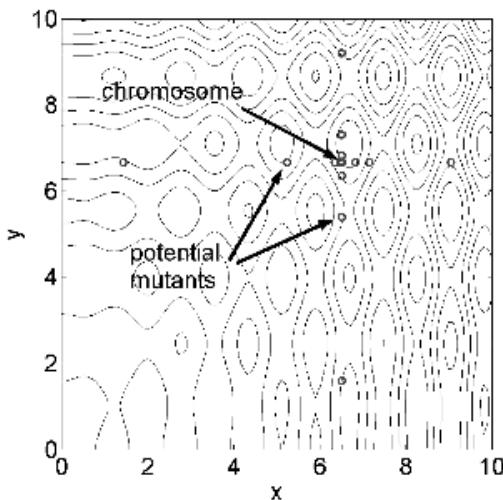  
Figure 5.19 Possible mutants due to a single mutation to a chromosome represented by 12 bits.

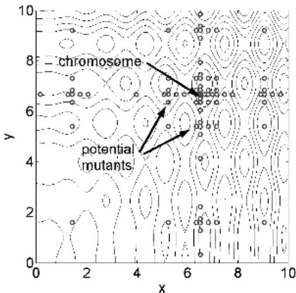  
Figure 5.20 Possible mutants due to two mutations to a chromosome represented by 12 bits.

4. Constant $\mu$ for all bits.   
5. Exponentially decreasing $\mu$ for bits representing small inverse powers of 2.

Fogarty tested these schemes on a model of an industrial burner in which the air inlet valves were set in order to minimize combustion stack loss in the common flue. The conclusions indicated that the variable mutation rate worked better than the constant mutation rate when the initial population was a matrix of all zeros. When the initial population was a matrix of random bits, no significant difference between the various mutation rates was noticed. Since these results were performed on one specific problem, no general conclusions about a variable mutation rate are possible.

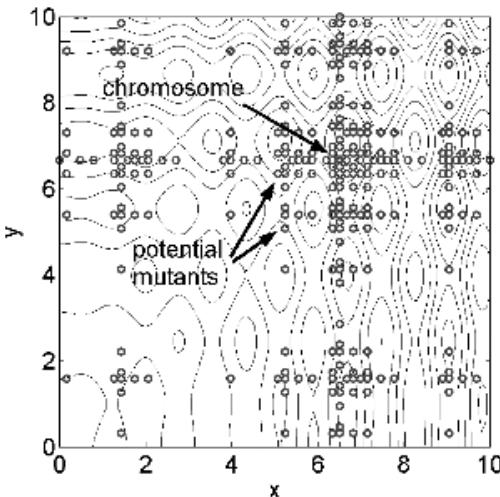  
Figure 5.21 Possible mutants due to three mutations to a chromosome represented by 12 bits.

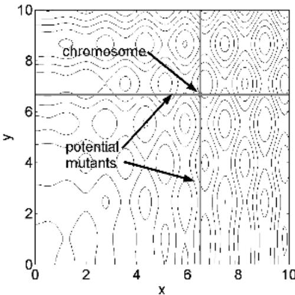  
Figure 5.22 Possible results from one mutation to a chromosome in a continuous GA.

As an example we tested a variable mutation rate for minimizing (1.1). The continuous GA had a population size of 16. We tried three variations:

TABLE 5.5 Results from Constant and Varying Mutation Rates   

<table><tr><td>Mutation Rate</td><td>Average Final Result</td><td>Average Number of Function Calls</td></tr><tr><td>Decreasing from 0.2</td><td>-18.405</td><td>734</td></tr><tr><td>Increasing from 0</td><td>18.416</td><td>825</td></tr><tr><td>Constant = 0.2</td><td>-18.484</td><td>697</td></tr><tr><td>Constant = 0.1</td><td>-18.446</td><td>737</td></tr><tr><td>Constant = 0.05</td><td>-18.276</td><td>791</td></tr></table>

(1) the mutation rate started at 0.2 and decreased by 0.002 each generation, (2) the mutation rate started at 0 and increased by 0.002 each generation, and (3) a constant mutation rate of 0.2. All the results were averaged over 3000 independent runs. As shown in Table 5.5, the constant mutation rate performed slightly better with a constant mutation rate of 0.1 or 0.2 was chosen. However, a constant mutation rate of 0.05 resulted in not finding as good of a solution than with either variable rate. More information about variable mutation rates can be found in Bäck (1993) and Fogarty (1989).

# 5.10 PERMUTATION PROBLEMS

Sometimes an optimization involves sorting a list or putting things in the right order.The most famous problem is the traveling salesperson problem in which a salesperson wants to visit $C$ cities while traveling the least possible distance. Each city is visited exactly once, so the solution consists of a list of the cities in the order visited. This particular application is treated in more detail in the next chapter, but let’s take a look at the problems involved and some possible solutions. In particular, the standard crossover and mutation operators are not appropriate, since we must ensure that each city is represented once and only once.

Let’s start with a simple example of six numbers that must be reordered. For simplicity, we will use an integer alphabet here although any reasonable encoding will do. Consider two parent chromosomes of length 6:

# parents

$$
\begin{array} { r l r } { p a r e n t _ { 1 } } & { { } } & { [ 3 \ 4 \ 6 \ 2 \ 1 \ 5 ] } \\ { p a r e n t _ { 2 } } & { { } } & { [ 4 \ 1 \ 5 \ 3 \ 2 \ 6 ] } \end{array}
$$

A simple crossover between the second and third elements of the parent chromosome vectors produces the offspring

# simple crossover (incorrect)

Obviously this won’t work, since offspring1 contains two 3s and no 1 while offspring2 has two 1s, and no 3. Goldberg (1989a) discusses several possible solutions to this problem, which are briefly summarized here. The first is known as partially matched crossover (PMX) (Goldberg and Lingle, 1985). In this method two crossover points are chosen, and we begin by exchanging the values of the parents between these points. If crossover points are between elements 1 and 2, and 3 and 4, then string $K$ from parent2 is switched with string $J$ from parent1:

$$
\begin{array} { r l } { o f f s p r i n g _ { 1 A } } & { { } [ 3 \mid \underbrace { \mathbf { 1 5 } } _ { \boldsymbol { J } } \mid 2 \ 1 \ 5 ] } \\ { o f f s p r i n g _ { 2 A } } & { { } [ 4 \mid \underbrace { 4 6 } _ { \boldsymbol { k } } \ \mid 3 \ 2 \ 6 ] } \end{array}
$$

All values exchanged between parents are shown in bold type. So far we still have the problem of having doubles of some integers and none of others. The switched strings, $J$ and $K$ , remain untouched throughout the rest of the procedure. The original doubles in offspring2A are exchanged for the original doubles in offsprin $\gamma _ { 1 A }$ (the original 4 in offsprin $g _ { 2 A }$ exchanged with the original 1 in offspring1A, and the original 6 in offsprin $g _ { 2 A }$ with the original 5 in offsprin $| g _ { 1 A } |$ ) to obtain the final solution:

# partially matched crossover (step b)

Each offspring contains part of the initial parent in the same position (unemphasized numbers) and includes each integer once and only once.

Order crossover (OX) is somewhat different than PMX. It attempts to maintain the order of integers as if the chromosome vector were wrapped in a circle, so the last element is followed by the first element. Thus [1 2 3 4] is the same as [2 3 4 1]. It begins, like PMX, by choosing two crossover points and exchanging the integers between them. This time, however, holes are left (denoted below by $X \mathbf { \hat { s } }$ ) in the spaces where integers are repeated. If the crossover points are after the second and fourth integers, the first stage leaves offspring that look like

ordered crossover (first stage)

$$
\begin{array} { r l } { \underset { o f f s p r i n g _ { 1 L } } { \underbrace { o f f s p r i n g _ { 1 L } } } } & { { } [ X \textbf { 4 } | \underset { \underset { J } { \rtimes } } { \underbrace { 5 3 } } | \textbf { 1 } X ] } \\ { \underset { o f f s p r i n g _ { 2 L } } { \underbrace { o f f s p r i n g _ { 2 L } } } } & { { } [ 4 \textbf { 1 } | \underset { k } { \underbrace { 6 2 } } | \textbf { 1 } X \ X ] } \end{array}
$$

At this point the holes are pushed to the beginning of the offspring. All integers that were in those positions are pushed off the left of the chromosome and wrap around to the end of the offspring. At the same time strings $J$ and $K$ that were exchanged maintain their positions:

ordered crossover (second stage)

$$
\begin{array} { r l r } { o f f s p r i n g _ { 1 M } } & { { } } & { [ X \ X \ 5 \ 3 \ 1 \ 4 ] } \\ { o f f s p r i n g _ { 2 M } } & { { } } & { [ X \ X \ 6 \ 2 \ 4 \ 1 ] } \end{array}
$$

For the final stage the X’s are replaced with strings $J$ and $K$ :

$$
\begin{array} { r l } { o f f s p r i n g _ { 1 N } \quad } & { { } \underbrace { | 6 2 } _ { k } \underbrace { 5 3 } _ { J } 1 4 } \\ { o f f s p r i n g _ { 2 N } \quad } & { { } \underbrace { | 5 3 } _ { J } \underbrace { 6 2 } _ { k } 4 1 | } \end{array}
$$

OX has the advantage that the relative ordering is preserved, although the absolute position within the string is not.

The final method discussed by Goldberg (1989a) is the cycle crossover (CX). In this method the information exchange begins at the left of the string and the first two digits are exchanged. For our example, this gives

cycle crossover (first step)

Now that the first offspring has two 4s, we progress to the second 4 and exchange with the other offspring to get

cycle crossover (second step)

Since there are two 1s in the first offspring, we exchange position 5 with the second offspring:

cycle crossover (third step)

The next position to exchange is position 4 where there is a repeated 2:

cycle crossover (fourth step)

At this point we have exchanged the 2 for the 3 and there are no repeated integers in either string, so the crossover is complete. We see that each offspring has exactly one of each digit, and it is in the position of one of the parents. Comparing the three different methods, we see that each has produced a different set of offspring, offsprings B, N, and Z. These methods are compared by Oliver et al. (1987).

What about the mutation operator? If we randomly change one number in a string, we are left with one integer duplicated and another missing. The simplest solution is to randomly choose a chromosome to mutate, and then randomly choose two positions within that chromosome to exchange. As an example, if the second and fifth positions are randomly chosen for a mutated chromosome, it transforms as follows:

$$
\begin{array} { l } { { c h r o m o s o m e = [ 6 \textbf { 1 5 3 2 4 } ] } } \\ { { \Downarrow } } \\ { { c h r o m o s o m e = [ 6 \textbf { 2 5 3 1 4 } ] } } \end{array}
$$

So we see that even permutation problems are not an insurmountable problem for a GA. In the following chapter we demonstrate an application.

# 5.11 SELECTING GA PARAMETERS

Selecting GA parameters like mutation rate, $\mu$ , and population size, $N _ { p o p }$ , is very difficult due to the many possible variations in the algorithm and cost function. A GA relies on random number generators for creating the population, mating, and mutation. A different random number seed produces different results. In addition there are various types of crossovers and mutations, as well as other possibilities, like chromosome aging and Gray codes. Comparing all the different options and averaging the results to reduce random variations for a wide range of cost functions is a daunting task. Plus the results may be highly dependent on the cost function analyzed.

The first intensive study of GA parameters was done by De Jong (1975) in his dissertation. His work translated Holland’s theories into practical function optimization. Goldberg (1989a) nicely summarizes the results. De Jong used two performance measures for judging the GAs. First, he defined on-line performance as an average of all costs up to the present generation. It penalizes the algorithm for too many poor costs and rewards the algorithm for quickly finding where the lowest costs lie. Second, he defined off-line performance as a running average of the best cost found each generation. This metric doesn’t penalize the algorithm for exploring high cost areas of the cost surface. The binary GAs were of six types with an increasing degree of complexity:

1. A simple GA was used, composed of roulette wheel selection, simple crossover with random mating, and single bit mutation.   
2. Elitism was added.   
3. Reproduction was a function of the expected number of offspring of a chromosome.   
4. Numbers 2 and 3 were combined.   
5. A crowding factor was added. A small random group from the population was selected. The chromosome in that group that most resembles the offspring was eliminated and replaced by the offspring.   
6. Crossovers were made more complex.

Each of these algorithms was tested on five cost functions (shown in Table 5.6) while varying $\mu$ , $N _ { p o p }$ , $X _ { r a t e }$ , and $G$ , where $G$ is the generation gap and has the bounds $0 < G \leq 1 .$ . The generation gap, $G$ , is the fraction of the population that changes every generation. A generation gap algorithm picks $G N _ { p o p }$ members for mating. The $G N _ { p o p }$ offspring produced replace $G N _ { p o p }$ chromosomes randomly selected from the population.

De Jong concluded:

TABLE 5.6 De Jong Test Functions   

<table><tr><td>Number</td><td>Function</td><td>Limits</td></tr><tr><td>1</td><td>∑ 2</td><td>−5.12 ≤ xn ≤ 5.12</td></tr><tr><td>2</td><td>n=1 100(x2 − x2)2 + (1 − x1)2 5</td><td>2.048 ≤ xn ≤ 2.048</td></tr><tr><td>3</td><td>∑ integer(x n) n=1</td><td>5.12 ≤ xn ≤ 5.12</td></tr><tr><td>4</td><td>30 X nx +Gauss(0,1)</td><td>−1.28 ≤ xn ≤ 1.28</td></tr><tr><td>5</td><td>X 0.002+ 1 +(x1 − 1m)6 +(2 − a2m)6 m=1</td><td>65.536 ≤ xn ≤ 65.536</td></tr></table>

1. Small population size improved initial performance while large population size improved long-term performance, $5 0 \leq N _ { p o p } \leq 1 0 0$ . 2. High mutation rate was good for off-line performance, while low mutation rate was good for on-line performance, $\mu = 0 . 0 0 1$ . 3. Crossover rates should be about $X _ { r a t e } = 0 . 6 0$ . 4. Type of crossover (single point vs. multipoint) made little difference.

A decade later brought significant improvements to computers that led to the next important study done by Grefenstette (1986). He used a metagenetic algorithm to optimize the on-line and off-line performance of GAs based on varying six parameters: $N _ { p o p }$ , $X _ { r a t e } , \mu , G$ , scaling window, and whether or not elitism is used. A scaling window determines just how a cost is scaled relative to other costs in the population. The metagenetic algorithm used $N _ { p o p } = 5 0$ , $X _ { r a t e } = 0 . 6$ , $\mu = 0 . 0 0 1$ , $G = 1$ , no scaling, and elitism. These values were chosen based on past experience.A cost function evaluation for the metagenetic algorithm consisted of a GA run until $5 0 0 0 ~ \mathrm { c o s t }$ function evaluations were performed on one of the De Jong test functions and the result normalized relative to that of a random search algorithm. Each GA in the population evaluated each of the De Jong test functions.

The second step in this experiment took the 20 best GAs found by the metaGA and let them tackle each of the five test functions for five independent runs. The best GA for on-line performance had $N _ { p o p } = 3 0$ , $X _ { r a t e } = 0 . 9 5 , \mu$ $= 0 . 0 1$ , $G = 1$ , scaling of the cost function, and elitism. Grefenstette found that the off-line performance was worse than that of a random search, indicating that the GAs tended to prematurely converge on a local minimum. The best off-line GA had $N _ { p o p } = 8 0$ , $X _ { r a t e } = 0 . 4 5$ , $\mu = 0 . 0 1$ , $G = 0 . 9$ , scaling of the cost function, and no elitism. He concludes, “The experimental data also suggests that, while it is possible to optimize GA control parameters, very good performance can be obtained with a range of GA control parameter settings.”

A couple of years after the Grefenstette study, a group reported results on optimum parameter settings for a binary GA using a Gray code (Schaffer et al., 1989). Their approach added five more cost functions to the De Jong test function suite. They had discrete sets of parameter values $N _ { p o p } = 1 0 , 2 0 , 3 0 , 5 0$ , 100, 20 $\ k _ { 0 } ; \mu = 0 . 0 0 1 , 0 . 0 0 2 , 0 . 0 0 5 , 0 . 0 1 , 0 . 0 2 , 0 . 0 5 , 0 . 1 0 ; X _ { r a t e } = 0 . 0 5$ to 0.95 in increments of 0.10; and 1 or 2 crossover points) that had a total of 8400 possible combinations. Each of the 8400 combinations was run with each of the test functions. Each combination was averaged over 10 independent runs. The GA terminated after 10,000 function evaluations. These authors found the best online performance resulted for the following parameter settings: $N _ { p o p } = 2 0$ to 30, $X _ { r a t e } = 0 . 7 5$ to 0.95, $\mu = 0 . 0 0 5$ to 0.01, and two-point crossover.

Thomas Bäck has done more recent analyses of mutation rate. He showed that for the simple counting problem, the optimal mutation rate is $1 / N _ { b i t s }$ (Bäck and Schutz, 1993). He later showed that an even quicker convergence can be obtained by beginning with even larger mutation rates (on the order of $^ 1 / _ { 2 }$ ) and letting it gradually adapt to the $1 / N _ { b i t s }$ value (Bäck, 1996a). In a subsequent work (Bäck, 1996b), he compared this evolutionary GA approach with evolutionary strategies and showed that this adaptation is similar to the selfadaptation of parameters that characterize evolutionary strategies approaches.

Gao (1998) computed a theoretical upper bound on convergence rates in terms of population size, encoding length, and mutation probability in the context of Markhov chain models for a canonical GA. His resulting theorem showed that the larger the probability of mutation and the smaller the population, the faster the GA should converge. However, he discounted these results as not viable for long-term performance.

Most of these previous studies were done with binary GAs. More people are discovering the benefits of using continuous GAs, namely that a continuous spectrum of variables can be represented. Our previous work with continuous GAs (Haupt and Haupt, 1998) devised a simple check to determine the best population size and mutation rate. The results of the numerical experiments suggest that the best mutation rate for GAs used on the problems presented (Haupt and Haupt, 2000) lies between 5 and $2 0 \%$ while the population size should be less than 16.

Parameter settings are sensitive to the cost functions, options in the GAs, bounds on the parameters, and performance indicators. Consequently different studies result in different conclusions about the optimum parameter values. Davis (1989) recognized this problem and outlined a method of adapting the parameter settings during a run of a GA (Davis, 1991a). He does this by including operator performance in the cost. Operator performance is the cost reduction caused by the operator divided by the number of children created by the operator.

Traditionally large populations have been used to thoroughly explore complicated cost surfaces. Crossover is then the operator of choice to exploit promising regions of phase space by combining information from promising solutions. The role of mutation is somewhat nebulous. As stated by Bäck and Schutz (1996a), mutation is typically considered as a secondary operator of little importance. Like us, he found that larger values than typically used are best for the early stages of a GA run. In one sense, greater exploration is achieved if the mutation rate is great enough to take the gene into a different region of solution space. Yet a mutation in the less critical genes may result in further exploiting the current region. Perhaps the larger mutation rates combined with the lower population sizes act to cover both properties without the large number of function evaluations required for large population sizes. Iterative approaches where mutation rate varies over the course of a run such as done by Bäck (1996a, b) and Davis (1991b) are likely optimal, but they require a more complex approach and algorithm. Note that when continuous variables, small population sizes, large mutation rates, and an adaptive mutation rate are used, the algorithm begins to lurk more in the realms of what has been traditionally referred to as evolutionary strategies. We feel that names are a moot point and choose to do what we find works best for a problem. In particular, we prefer the engineering approach of switching to a different optimization algorithm once the global well is found, since at that point the more traditional optimization algorithms become more efficient.

We’ve done extensive comparisons of GA performance as a function of population size and mutation rate, as well as some other parameters. The criterion was finding a correct answer with as few evaluations of the cost function as possible. Our conclusions are that the crossover rate, method of selection (roulette wheel or tournament), and type of crossover are not of much importance. Population size and mutation rate, however, have a significant impact on the ability of the GA to find an acceptable minimum. Consequently the examples presented here average GA optimization of several functions with various population sizes and mutation rates.

Table 5.7 lists five functions used to test the binary and continuous GAs. The GAs were run 200 independent times for 21 different population sizes and 21 different mutation rates to find the average number of function calls needed to arrive at an acceptable solution.The binary GA used a 12 bit encoding for each variable. Population size varied from 8 to 88 in increments of 4. Mutation rate varied from 0.01 to 0.41 in increments of 0.02. Thus 441 different combinations were tried on 200 independent runs each and the results averaged. The absolute best $N _ { p o p }$ and $\mu$ for the different functions are shown in columns 4 and 5 of Table 5.7. These numbers don’t tell the whole story, though. For instance, consider the first function optimized with the continuous GA. Figure 5.23 is a three-dimensional plot of the average number of function calls needed to reach a level below $- 1 8 . 5$ for the different values of population size and mutation rate. A corresponding shaded two-dimensional plot appears in Figure 5.24 with the five best values of $N _ { p o p }$ and $\mu$ marked by white circles. This GA works best (optimizes quickest) with small population sizes and relatively high mutation rates. As the population size increases, the optimal mutation rate decreases.

TABLE 5.7 The Optimum Population Size and Mutation Rate Found after 200 Independent Runs of the GA   

<table><tr><td></td><td>Test Function</td><td>Type of GA</td><td>Npop</td><td>μ</td><td>Crossover</td></tr><tr><td>1</td><td>x sin(4x) + 1.1y sin(2y)</td><td>Continuous</td><td>20</td><td>0.27</td><td>(3.11)</td></tr><tr><td></td><td></td><td>Binary</td><td>8</td><td>0.11</td><td>Uniform</td></tr><tr><td></td><td></td><td>Binary</td><td>8</td><td>0.11</td><td>Single point</td></tr><tr><td>2</td><td>y sin(4x) + 1.1x sin(2y)</td><td>Continuous</td><td>12</td><td>0.23</td><td>(3.11)</td></tr><tr><td></td><td></td><td>Binary</td><td>16</td><td>0.09</td><td>Uniform</td></tr><tr><td>3</td><td>100(x2 − 10x − y + 30)2 + (6 − x)2</td><td>Continuous</td><td>16</td><td>0.37</td><td>(3.11)</td></tr><tr><td></td><td></td><td>Binary</td><td>8</td><td>0.25</td><td>Uniform</td></tr><tr><td>4</td><td>∑ (vn − 5)2 10</td><td>Continuous</td><td>8</td><td>0.05</td><td>(3.11)</td></tr><tr><td></td><td>n=1</td><td>Binary</td><td>8</td><td>0.03</td><td>Uniform</td></tr><tr><td>5</td><td>(y − 5)(x − 5)2 + (5 − x)(y − 5)2</td><td>Continuous</td><td>8</td><td>0.33</td><td>(3.11)</td></tr><tr><td></td><td></td><td>Binary</td><td>8</td><td>0.07</td><td>Uniform</td></tr></table>

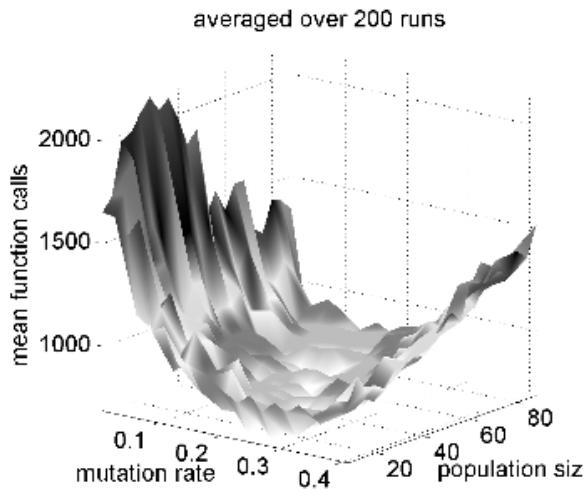  
Figure 5.23 Average number of function calls needed to reach a level below $- 1 8 . 5$ for the different values of population size and mutation rate when optimizing (1.1).

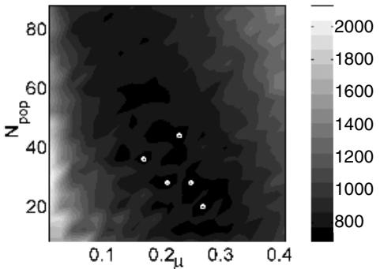  
Figure 5.24 Average number of function calls needed to reach a level below $- 1 8 . 5$ for the different values of population size and mutation rate when optimizing (1.1). The five best combinations are shown by small circles.

Figure 5.25 shows two-dimensional intensity plots of the average number of function calls needed to get close to the minimum. Dark means a low number of function calls (desirable), whereas light means a large number of function calls (undesirable). The five small white circles on each plot are the five best population size/mutation rate combinations. These examples clearly indicate that a small population size is desirable for both the continuous and binary GAs. In general, the continuous GA uses a higher mutation rate. Also the quadratic surface problem (test function 4) uses the lowest mutation rate.

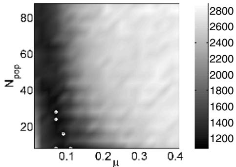  
a. Binary GA and function 1.

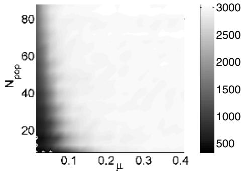  
d. Binary GA and function 4.

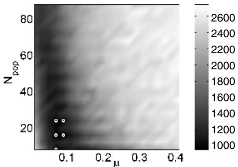  
b. Binary GA and function 2.

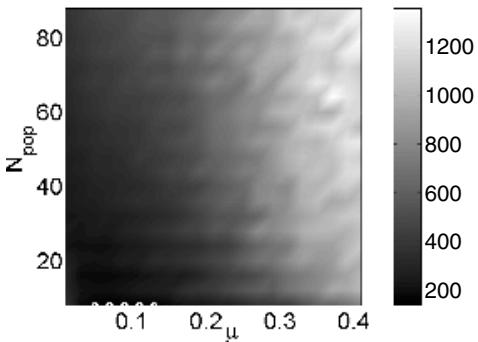  
e. Binary GA and function 5.

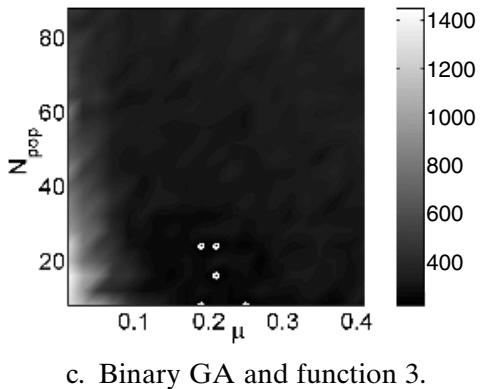  
Figure 5.25 Mean number of function calls needed to find optimum. The five best are denoted by white circles.

  
f. Continuous GA and function 1.

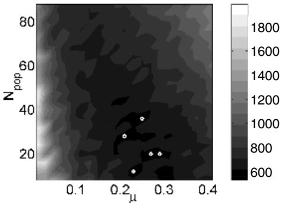  
g. Continuous GA and function 2.

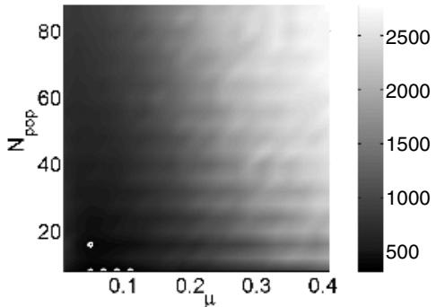  
i. Continuous GA and function 4.

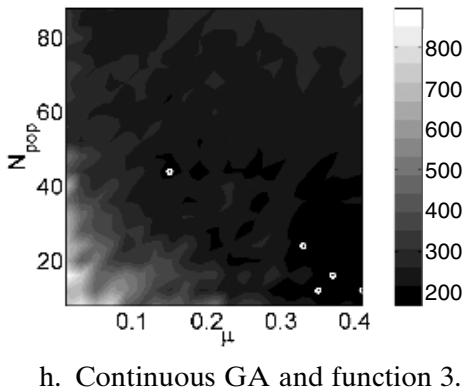  
Figure 5.25 Continued

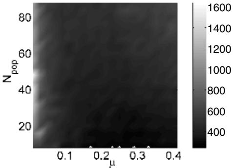  
j. Continuous GA and function 5.

When the population sizes are as small as found here, tournament selection offers no advantage to roulette wheel selection, so an evaluation of the tradeoff between these selection operators was not done. Selecting a small population size takes a very small amount of computer time. When doing the calculations for Table 5.7, the GA runs with large population size took at least $1 0 \%$ longer to run than the GAs with small population sizes for a fixed number of function calls.This difference can be attributed to the weighting and ranking in the selection operator.

These results are not entirely alone. They are confirmed by our own prior results (Haupt and Haupt, 2000) as well as those of Bäck (1993, 1996a,b) and predicted by the theory of Gao (1998).Also De Jong (1975) found that a small population size and high mutation rate worked best during the initial generations when off-line performance was evaluated. This is consistent with the results here because the algorithm is stopped when a prescribed minimum in the valley of the true minimum is found. If the GA were then used to pass results to a local optimizer, the GA needs only to work on the problem a short time.

Although these conclusions strictly apply to only the problems presented, in practice we have found many other problems where similar principles applied. No attempt has been made to thoroughly investigate all possible combinations of parameters.We chose to concentrate on population size and mutation rate after our own experience with optimizing GA performance.We make no claims that this is a definitive analysis: our purpose is merely to suggest that future GA practitioners consider a wider range of possible combinations of population size and mutation rate.

In this section we primarily discussed GA parameter tuning or finding the best parameters that remain constant throughout the run. Another approach is parameter control in which the GA parameters change with time. GA parameter control classifications include (Eiben et al., 1999):

• Deterministic parameter control. The GA parameters change according   
to some deterministic rule.   
• Adaptive parameter control. The GA parameters change according to some feedback provided by the algorithm.   
Self-adaptive parameter control. The GA parameters are encoded   
into the chromosomes and are optimized simultaneously with the cost function.

# 5.12 CONTINUOUS VERSUS BINARY GA

Perhaps a burning question on your mind is whether the binary or continuous GA is better. Our experience puts our vote with the continuous GA. Converting variable values to binary numbers and worrying about the number of bits needed to represent a variable are unnecessary. Continuous GAs also are more compatible with other optimization algorithms, thus making them easier to combine or hybridize.

We are not the only ones to reach this conclusion. After extensive comparisons between binary and continuous GAs, Michalewicz (1992) says, “The conducted experiments indicate that the floating point representation is faster, more consistent from run to run, and provides a higher precision (especially with large domains where binary coding would require prohibitively long representations).” The inventors of evolutionary computations in Europe have long recognized the value of using continuous variables in the algorithm.

Figure 5.26 displays the number of function evaluations needed to find the optimum for (1.1). These results were averaged 3000 times for the binary and continuous GAs. Both GAs had a population size of 8, mutation rate of 0.15, and used tournament selection. The variables in the binary GA were represented by 20 bits each. In this case the continuous GA outperformed the binary GA.

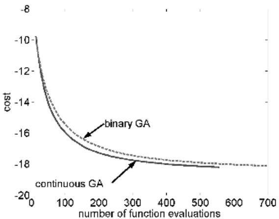  
Figure 5.26 Convergence plot of binary GA versus continuous GA for (1.1).

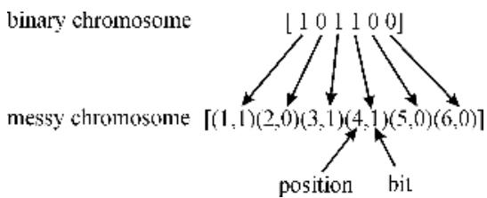  
Figure 5.27 Position information is assigned to each bit in the mGA.

In any event, both versions of the GA are powerful. It is not difficult to find advocates for each.

# 5.13 MESSY GENETIC ALGORITHMS

The messy GA (mGA) was invented to speed convergence of a GA (Goldberg, et al., 1989c). This type of GA has variable length chromosomes and genes that are position independent. Figure 5.27 shows a chromosome with six binary numbers. A messy GA assigns a position number to each binary digit. The ordered pair represents.

(gene position in chromosome, bit value)

Thus the genes are not position dependent in a chromosome. A chromosome also does not have a fixed length. Figure 5.28 shows two messy chromosomes, both having less than six bits. The first chromosome is over specified, because it has two values for gene position 3. The second chromosome is underspecified because it has values for genes 1, 4, and 6 but not for genes 2, 3, and 5.

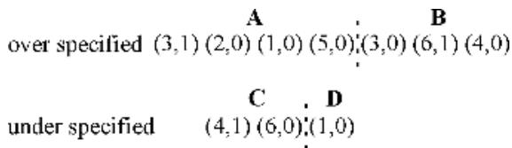  
Figure 5.28 Crossover with the mGA.

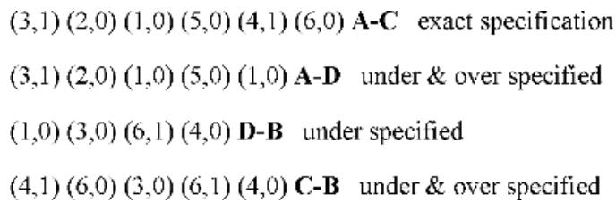  
Figure 5.29 Resulting offspring with some positions having an exact, over, or under specification.

The first phase of a mGA is called the primordial phase. This part begins with an initial population that has all possible building blocks in the population of a specified length. Next the GA runs for a few generations using only crossover. Half the chromosomes are discarded every few generations. The juxtapositional phase then invokes other genetic operations until an acceptable solution is found.

Two special mGA operators used in the juxtaposition phase are cutting and splicing. A random cut is made in the chromosomes (the cut sections are labeled A, B, C, and D). Two sections are randomly selected (they cannot be the same) and spliced together to form new chromosomes. Figure 5.29 shows four out of the 12 possible resulting chromosomes. They vary in length. Goldberg reported that results on a number of difficult deceptive test functions have been encouraging. The mGA has found use in many different applications and are explained in detail in Knjazew (2002).

# 5.14 PARALLEL GENETIC ALGORITHMS

GAs are tackling increasingly complicated cost functions. Cost functions that involve complex simulations are becoming more common for engineering design problems. Such cost functions are very CPU intensive and GAs make many cost function evaluations along the optimization road. One way of cutting computer time is to use the recommendations of the previous sections to minimize the total number of calls to the cost function. Computation time may still be overwhelming. Fortunately GAs are very amenable to parallel implementation. The cost function evaluations are independent and can be done concurrently with very minor changes in code. Such simple adaptations work quite well for cost functions that take a lot of computer time. However, for cost functions with moderate to low CPU requirements, communications between processors use up the speedup, as we will see below. This is because, for a standard GA, sorting and selection often occur within the full mating population. Thus parallelizing GAs requires careful consideration of which operations really must be done with the entire chromosome array versus what can be done using subpopulations.

# 5.14.1 Advantages of Parallel GAs

Speedup is the most often cited reason to use a parallel GA. If function evaluations can be farmed out to different processors, they can be completed concurrently. However, that is not the only motivation for parallelization. As we will discuss below, there are parallel strategies where groups of chromosomes are sent to separate processors to evolve apart from the rest of the population. Communication between these “islands” of chromosomes occurs occasionally. This separation into subpopulations can prevent premature convergence by allowing each island to search in different combinations, preventing a single highly fit individual from dominating the entire population. Sometimes multiple solutions can be found for the problem in this manner. In addition we note that nature uses parallel evolution of subpopulations, yet allows occasional migration between these groups. To the extent that GAs are patterned after nature, it makes sense to explore this aspect of evolution.

# 5.14.2 Strategies for Parallel GAs

So how do you parallelize your code to take best advantage of multiple processors without becoming so bogged down in communication time between the processors? There are actually some very good tried and true strategies to help solve this problem. Much work has been done on analyzing different ways to parallelize GAs (e.g., Alba and Tomassini, 2002; Nowastawski and Poli, 1999; Watson, 1999; Gordon and Whitley, 1993). Which method works best depends on the nature of the problem and the architecture of the parallel machine.Terminology of the various methods is not yet standardized, but we attempt to give a sampling of the most successful methods being used.

The simplest method of building a parallel GA is the master–slave algorithm, which is basically a parallel implementation of a standard GA. One processor is the master and controls communication, sorting, and pairing. It sends the cost function out to the slave processors for parallel evaluations. This method is arguably the simplest to program. The disadvantages are that the master is often left waiting for the results from the slaves, and the algorithm is only as fast as communication from the slowest node. Since selection occurs globally, these algorithms are known as “panmictic” or “micro-grained.” There are several subclassifications within the master–slave parallel GA, which are primarily related to the replacement strategy. The generational model is one extreme: the entire population is replaced with new offspring each generation. The opposite extreme is the steady state model, where only one or two new individuals replace less fit parents each generation. In between these extremes are the generation gap models where some percentage of the population is replaced with offspring. This type of algorithm is analogous to using a certain crossover percentage of the most-fit parents that remain in the population and mate. Most master–slave algorithms are synchronous: the slave processors each do the same operation on a subset of data at the same time while the master waits for feedback. Such algorithms can experience the bottleneck effect when one processor holds up progression. An asynchronous master–slave algorithm is possible. In this case the master begins the selection step of the algorithm as slave nodes send back their fitness evaluations. One of the easiest ways to do this is to employ tournament selection on the population that has returned from the slaves. A disadvantage of the master-slave algorithms is that, since they are global in nature, they don’t include the advantages associated with separate evolution of subpopulations. Sometimes a single, very fit individual dominates the population from an early stage.

A second major class of parallel GA divides the population into subpopulations or islands, also referred to as demes. This GA is known as a coarsegrained, distributed, or island GA. Each processor houses a separate population of chromosomes that reproduces and is evaluated for fitness apart from any of the remaining population. The process resembles species evolution. This model is ideally suited for distributed memory MIMD (multiple instructions, multiple data) machines, such as the Beowulf clusters that are becoming prevalent. If there is never any communication between nodes, then this island model is equivalent to performing many runs of the GA on several small populations at once. However, there is usually periodic communication between nodes following the punctuated equilibria theory of evolution. In this theory some forcing in the species acts to allow change at a quicker rate than would normally occur without an external input. The forcing in this case is periodic migration between the subpopulation islands, increasing local diversity. The topology determines connections between islands. Which individuals migrate can vary. Some algorithms randomly switch members of the subpopulations. Others choose to exchange the most-fit individuals (as recommended by Cantu Paz, 1999). A migration rate must be chosen to determine how often individuals migrate to other subpopulations. Synchronous island GAs exchange members between subpopulations at the same time, typically every $n$ iterations. On a distributed memory computer, it is more convenient to use asynchronous migration where each population independently decides when to send current members and receive new ones. Some algorithms merely exchange members between populations, while others clone members to allow them to evolve in two different subpopulations at once. Another migration policy (Goodman, et al., 1994) is the injection island GA. It is a strategy specific to binary GAs where reduced length strings (with a lower resolution of the encoding) are passed to a different subpopulation to explore a wider range of the solution space with a lower resolution. The class of island GAs have the advantages that they are usually faster than the master–slave implementations and they allow evolution of diverse species at the same time. Exchange of information between species often allows improvement that would not be seen otherwise. Even when speed and architecture are not primary factors, these island algorithms often outperform GAs with a single population (Gordon and Whitley, 1993).

A third major category of parallel GA is the cellular or fine-grained GA. In this case the subpopulation becomes very small, often composed of a single individual. However, this individual can interact with its neighbors. One can think of this implementation as each individual being a node on a Cartesian grid that can interact with neighboring nodes (see Figure $5 . 3 0 c )$ ). Defining the neighborhood usually amounts to determining how many grid points constitute a neighborhood. A circle is drawn with a designated radius centered on the individual of interest. In reality, the grid need not be Cartesian but can be any convenient topology. The most convenient topology is usually one that best uses the architecture of the computer. Nearness is defined by the communication distance. This method differs from the master–slave parallel GA by having the genetic operators decentralized. The characteristics of the best individual diffuse slowly through the grid, not allowing a single individual to dominate the population at an early stage. On a SIMD (single instruction, multiple data) computer with a sufficiently difficult cost function, the fine-grained GA is a natural implementation method.

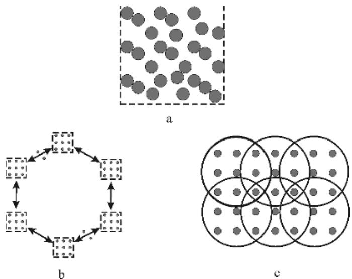  
Figure 5.30 Schematic of three different types of parallel GA algorithms: (a) master–slave where the population is grouped together, $( b )$ island model with several subpopulations and migration between them, and $( c )$ cellular model where selection occurs within neighborhoods.

Figure 5.30 depicts the relationship between population members in the various types of parallel GA implementations. Figure $5 . 3 0 a$ is a master–slave algorithm where there is a single global population. All genetic operators are performed within the entire population. Only the cost function evaluations are spread among the parallel nodes. Figure $5 . 3 0 b$ is the island GA in which various subpopulations communicate via migration. The GA operators take place on separate processors involving only the island members. Finally, Figure $5 . 3 0 c$ shows the cellular GA. In this case each individual is pretty independent, often on its own processor, and only communicates with its nearest topological neighbors.The GA operators take place only in the neighborhood of the individuals selected for mating.These three basic classes of GAs can be combined in novel ways. Variations abound in terms of mating population, migration, distribution of the genetic operators, and innovative selection methods (Alba and Tomassini, 2002). As long as computers are evolving new architectures, engineers of GAs will be finding better ways to take advantage of their strengths while optimizing the use of the GA itself.

# 5.14.3 Expected Speedup

According to Cantu-Paz and Goldberg (1999) the total execution time per generation of a parallel GA can be computed as

$$
T _ { p } = \frac { N _ { p o p } T _ { f } } { P } + \rho ( P - 1 ) T _ { c }
$$

where

$T _ { f } =$ the time to evaluate the fitness of one chromosome $T _ { c } =$ the average time to communicate with one processor $P =$ number of processors $\rho =$ parameter dependent on selection and parallelization method

We see that the total execution time is composed of two terms: the first refers to the time required to evaluate the fitness of the chromosomes and the second involves the total communication time. The speedup for a given number of processors can be computed as $T _ { 1 } / T _ { p }$ , where $T _ { 1 }$ is the time for a single processor:

$$
T _ { 1 } = \frac { N _ { p o p } T _ { f } } { P }
$$

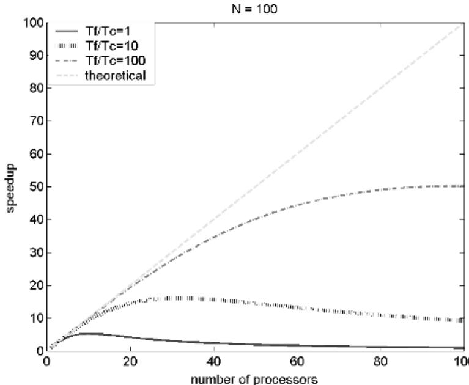  
Figure 5.31 Theoretical speedup of GA with $N _ { p o p } = 1 0 0$

That speedup depends on the ratio of the time to compute the fitness relative to the communication time $( T _ { f } / T _ { c } )$ , the number of processors, the population size, and the variable $\rho$ , which depends on the details of the code and the parallelization technique. Here we use $\rho = 1$ , which is appropriate for a master–slave GA application. Figure 5.31 plots the speedup as a function of the number of processors used for three different $T _ { f } / T _ { c }$ ratios ( $T _ { f } / T _ { c } = 1$ , 10, and 100) for a population size of $N _ { p o p } = 1 0 0$ . Perfect speedup would be the straight line $T _ { 1 } / T _ { P } = P $ . The larger $T _ { f } / T _ { c } ,$ , the closer we get to perfect speedup. When communication costs are equal to the cost of evaluating the fitness function $\mathop { T _ { f } } / T _ { c } = 1 )$ , a maximum speedup is reached, and then the time per processor begins to decrease. Figure 5.32 is the same type of plot with $N = 1 0 0 0$ . We see that for a larger population size, the speedup is greater. One can compute the optimum number of processors to maximize the speedup curve $( P _ { o p t } )$ by taking the derivative of (5.13) with respect to $P$ , and setting it to 0 to obtain

$$
P _ { o p t } = \sqrt { \frac { N _ { p o p } T _ { f } } { \rho T _ { c } } }
$$

Figure 5.33 plots $P _ { o p t }$ as a function of $T _ { f } / T _ { c }$ for values of $N = 1 6 , 1 0 0$ , and 1000. As expected, the optimal number of processors increases monotonically with both $N _ { p o p }$ and $T _ { f } / T _ { c }$ .

There has been further work on the theoretical basis for different parallel implementations of the GA (e.g., see Cantu-Paz 1999, 2000; Cantu-Paz and

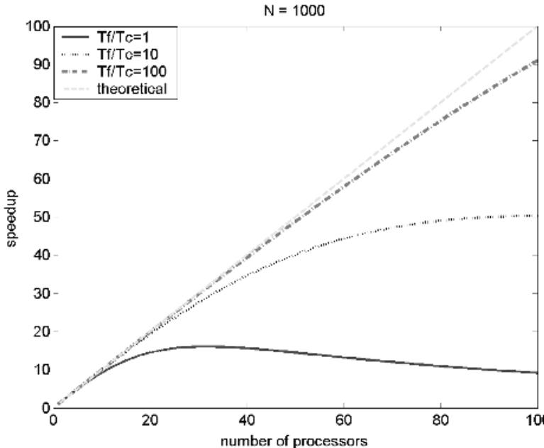  
Figure 5.32 Theoretical speedup of GA with $N _ { p o p } = 1 0 0 0$ .

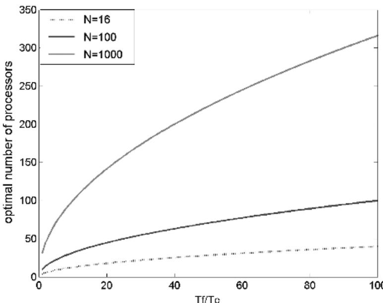  
Figure 5.33 Optimal number of processors for master-slave GA as a function of $T _ { f } / T _ { c }$ and $N _ { p o p }$ .

Goldberg 1999, 2003; Grefenstette, 1991). One empirical study by Gordon and Whitley (1993) compared the performance for different implementations of parallel GAs using a suite of test functions. It is no surprise that the parallel algorithms performed best on the most difficult problems. Their island routine performed consistently well as did their cellular implementation.

# 5.14.4 An Example Parallel GA

We have seen that for a parallel GA to show some speedup when including more processors, it needs to be run with a reasonably CPU intensive cost function. For our example problem we took the approach of engineers or scientists who don’t want to change too much about our codes. We simply implemented our current code on a MIMD 64 node Beowulf Cluster using High Performance Fortran. Note that this amounts to a master–slave parallel implementation. For the most simple cost functions, any speedup from using multiple processors was overshadowed by communication costs.Then we tried a more time intensive cost function that requires averaging least mean square differences over 1000 points for each chromosome evaluated (the nonlinear empirical model of Section 6.8).We used a continuous GA with roulette wheel selection, population size of $N _ { p o p } = 2 4$ and mutation rate $\mu = 0 . 2$ . When this more complex cost function was studied, we got the time requirement curves shown in Figure 5.34. Although we saw a definite speedup, it did not increase beyond eight processors. This is consistent with the optimal number of processors computed in (5.14) and demonstrated in Figure 5.33 for this small population size.We would expect to see better speedup curves with an island implementation and with larger population sizes.

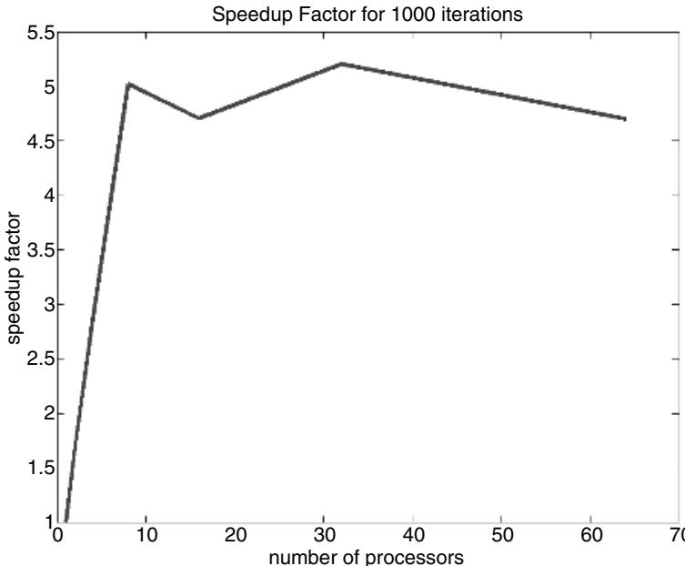  
Figure 5.34 Speedup curve for example parallel GA problem.

# 5.14.5 How Parallel GAs Are Being Used

Parallel GAs are becoming important as the number of parallel machines increases. Particularly for very expensive cost functions, such as full simulations, parallel implementations are making GAs a competitive strategy. Just a few of the many examples include solution to the satisfiability problem (Folino et al., 2001), optimizing supersonic wings via running an Euler equation model (Obayashi et al., 2000), optimal design of elastic flywheels (Eby et al., 1999), and many others. The number of parallel GA applications is expanding exponentially and may be the wave of the future.

# BIBLIOGRAPHY

Alga, E., and M. Tomassini. 2002. Parallelism and evolutionary algorithms. IEEE Trans. Evol. Comput. 6:443–462.   
Aytug, H., and G. J. Koehler. 1996. Stopping criteria for finite length genetic algorithms. ORSA J. Comp. 8:183–191.   
Bäck, T. 1993. Optimal mutation rates in genetic search. In S. Forrest (ed.), Proc. 5th Int. Conf. on Genetic Algorithms, San Mates, CA: Morgan Kaufmann, pp. 2–9.   
Bäck, T., and M. Schutz. 1996a. Intelligent mutation rate control in canonical genetic algorithms. In Z. W. Ras and M. Michalewicz (eds.), Foundations of Intelligent Systems 9th Int. Symp. Berlin: Springer-Verlag, pp. 158–167.   
Bäck, T. 1996b. Evolution strategies: An alternative evolutionary algorithm. In J. M. Alliot et al. (eds.), Artificial Evolution. Berlin: Springer-Verlag, pp. 3–20.   
Booker, L. 1987. Improving search in genetic algorithms. In L. Davis (ed.), Genetic Algorithms and Simulated Annealing. London: Pitman, pp. 61–73.   
Cantu-Paz, E., and D. E. Goldberg. 1999. On the scalability of parallel genetic algorithms. Evol. Comput. 7:429–449.   
Cantu-Paz, E., and D. E. Goldberg. 2003. Are multiple runs of genetic algorithms better than one? In GECCO 2003, Berlin: Springer-Verlag, pp. 801–812.   
Cantu-Paz, E. 1999. Migration policies, selection pressure, and parallel evolutionary algorithms. J. Heurist. 7:311–334.   
Cantu-Paz, E. 2000. Efficient and Accurate Parallel Genetic Algorithms. Dordrecht: Kluwer Academic.   
Cantu-Paz. 2000. Markov chain models of parallel genetic algorithms. IEEE Trans. Evol. Comput. 4:216–226.   
Caruana, R.A., and J. D. Schaffer. 1988. Representation and hidden bias: Gray vs. binary coding for genetic algorithms. Proc. 5th Int. Conf. on Machine Learning, Los Altos, CA: Morgan Kaufmann, pp. 153–161.   
Cerf, R. 1998. Asymptotic convergence of genetic algorithms. Adv. Appl. Prov. 30: 521–550.   
Davis, L. 1989. Adapting operator probabilities in genetic algorithms. In J. D. Schaffer (ed.), Proc. 3rd Int. Conf. on Genetic Algorithms. Los Altos, CA: Morgan Kaufmann, pp. 61–67.   
Davis, L. 1991a. Parameterizing a genetic algorithm. In L. Davis (ed.), Handbook of Genetic Algorithms. New York: Van Nostrand Reinhold.   
Davis, L. 1991b. Performance enhancements. In L. Davis (ed.), Handbook of Genetic Algorithms. New York: Van Nostrand Reinhold.   
Deb, K., et al. 2002. A fast and elitist multiobjective genetic algorithm: NSGA-II. IEEE Trans. Evol. Comput. 6:182–197.   
Deb, K., S. Agrawal, A. Pratab, and T. Meyarivan. 2000. A fast elitist non-dominated sorting genetic algorithm for multi-objective optimization: NSGA-II. In M. Schoenauer (ed.), Proc. PPSN-6. Berlin: Springer-Verlag, pp. 849–858.   
Deb, K., and D. E. Goldberg. 1991. mGA in C: A Messy Genetic Algorithm in C. IlliGAL Report 91008.   
De Jong, K. A. 1975. Analysis of the behavior of a class of genetic adaptive systems. Ph.D. Dissertation. University of Michigan, Ann Arbor.   
Eby, D., R. Averill, W. Punch, and E. E. Goodman. 1999. Optimal design of flywheels using an injection island genetic algorithm. Art. Intell. Eng. Des. Manuf. 13:289–402.   
Eiben, A. E., R. Hinterding, and Z. Michalewicz. 1999. Parameter control in evolutionary algorithms. IEEE Trans. Evol. Comput. 3:124–141.   
Eiben, A. E., P. E. Raue, and S. Ruttkay. 1994. Genetic algorithms with multi-parent recombination. In Parallel Problem Solving from Nature—PPSN III, Int. Conf. on Evolutionary Computation. Berlin: Springer-Verlag, pp. 78–87.   
Eshelman, L. J., R. A. Caruna, and J. D. Schaffer. 1989. Biases in the crossover landscape. In Proc. 3rd Int. Conf. on Genetic Algorithms. San Mateo, CA: Morgan Kaufmann, pp. 10–19.   
Fogarty, T. C. 1989. Varying the probability of mutation in the genetic algorithm. In J. D. Schaffer (ed.), Proc. 3rd Int. Conf. on Genetic Algorithms. Los Altos, CA: Morgan Kaufmann, pp. 104–109.   
Folino, G., C. Pizzuti, and G. Spezzano. 2001. Parallel hybrid method for SAT that couples genetic algorithms and local search. IEEE Trans. Evol. Comput. 5:323–334.   
Foneseca, C. M., and P. J. Flemming. 1993. Genetic algorithms for multi-objective optimization: Formulation, discussion, and generalization. Proc. 5th Int. Conf. on Genetic Algorithms. San Francisco, CA: Morgan Kaufmann, pp. 416–423.   
Francois, O. 1998. An evolutionary strategy for global minimization and its Markov chain analysis. IEEE Trans. Evol. Comput. 2:77–90.   
Gao,Y. 1998.An upper bound on the convergence rates of canonical genetic algorithms. Complexity Int. 5.   
Goldberg, D. E. 1989a. Genetic Algorithms in Search, Optimization, and Machine Learning. Reading, MA: Addison-Wesley.   
Goldberg, D. E. 1989b. Sizing populations for serial and parallel genetic algorithms. In J. D. Schaffer (ed.), Proc. 3rd Int. Conf. on Genetic Algorithms. Los Altos, CA: Morgan Kaufmann, pp. 70–79.   
Goldberg, D. E., K. Deb, and B. Korb. 1989c. Messy genetic algorithms: Motivation, analysis and rst results. Complex Syst. 3:493–530.   
Goldberg, D. E., and J. Richardson. 1987. Genetic algorithms with sharing for multimodal function optimization. In J. J. Grefenstette (ed.), Genetic Algorithms and Their Applications: Proc. 2nd Int. Conf. on Genetic Algorithms. Hillsdale, NJ: Lawrence Erlbaum, pp. 41–49.   
Goldberg, D. E., and R. Lingle. 1985. Alleles, loci, and the traveling salesman problem. Proc. Int. Conf. on Genetic Algorithms and Their Applications, Mahwah, NJ: Lawrence Eribaum Associate, pp. 154–159.   
Goodman, E. D.,W. F. Punch, and S. Lin. 1994. Coarse-grain parallel genetic algorithms: Categorization and new approach. Sixth IEEE Parallel and Distributed Processing, pp. 28–37.   
Gordon, V. S., and D. Whitley. 1993. Serial and parallel genetic algorithms as function optimizers. In S. Forrest (ed.), ICGA-90: 5th Int. Conf. on Genetic Algorithms. Los Altos, CA: Morgan Kaufmann, pp. 177–183.   
Greenhalgh, D. 2000. Convergence criteria for genetic algorithms. SIAM J. Comput. 30:269–282.   
Grefenstette, J. J. 1986. Optimization of control parameters for genetic algorithms. IEEE Trans. Syst. Man Cybernet. 16:128.   
Grefenstette, J. J. 1991. Conditions for implicit parallelism. In G. J. E. Rawlins (ed.), Foundations of Genetic Algorithms. San Mateo, CA: Morgan Kaufmann, pp. 252–261.   
Hajek, B. 1988. Cooling schedules for optimal annealing. Math. Oper. Res. 13:311–329.   
Haupt, R. L. 1987. Synthesis of resistive tapers to control scattering patterns of strips. Ph.D. dissertation. University of Michigan, Ann Arbor.   
Haupt, R. L. 1995. Optimization of aperiodic conducting grids. 11th An. Rev. Progress in Applied Computational Electromagnetics Conf. Monterey, CA.   
Haupt, R. L. 1996. Speeding convergence of genetic algorithms for optimizing antenna arrays. 12th An. Rev. Progress in Applied Computational Electromagnetics Conference. Monterey, CA.   
Haupt,R.L.,and S.E.Haupt.2000.Practical Genetic Algorithms,1st ed.New York:Wiley.   
Haupt, R. L., and S. E. Haupt. 2000. Optimum population size and mutation rate for a simple real genetic algorithm that optimizes array factors. Appl. Comput. Electromagn. Soc. J. 15:94–102.   
Hinterding, R., H. Gielewski, and T. C. Peachey. 1989.The nature of mutation in genetic algorithms. In L. J. Eshelman (ed.), Proc. 6th Int. Conf. on Genetic Algorithms. Los Altos, CA: Morgan Kaufmann, pp. 70–79.   
Holland, J. H. 1975. Adaptation in Natural and Artificial Systems. Ann Arbor: University of Michigan Press.   
Kazarlis, S. A., et al. 2001. Microgenetic algorithms as generalized hill-climbing operators for GA optimization. IEEE Trans. Evol. Comp. 5:204–217.   
Knjazew, D. 2002. OmeGA: A Competent Genetic Algorithm for Solving Permutation and Scheduling Problems: Genetic Algorithms and Evolutionary Computation, Vol. 6. Norwell, MA: Kluwer Academic.   
Liepins, G. E., et al. 1990. Genetic algorithm applications to set covering and traveling salesman problems. In Operations Research and Artificial Intelligence, D. E. Brown and C. C. White (eds.), OR/AI: The Integration of Problem Solving Strategies. Norwell, MA: Kluwer Academic, pp. 29–57.   
Michalewicz, Z. 1992. Genetic Algorithms $^ +$ Data Structures $=$ Evolution Programs. New York: Springer-Verlag.   
Nix, A., and M. D. Vose. 1992. Modeling genetic algorithms with Markov chains. An. Math. Art. Intell. 5:79–88.   
Nowostawski, M., and R. Poli. 1999. Parallel genetic algorithm taxonomy. KES¢99, Adelaide, South Australia.   
Obayashi, S., D. Sasaki, Y. Takeguchi, and N. Hirose. 2000. Multiobjective evolutionary computation for supersonic wing-shape optimization. IEEE Trans. Evol. Comput. 4:182–187.   
Oliver, I. M., D. J. Smith, and J. R. C. Holland. 1987. A study of permutation crossover operators on the traveling salesman problem. Genetic Algorithms and Their Applications: Proc. 2nd Int. Conf. on Genetic Algorithms, Cambridge, MA: Lawrence Erlbaum Associates, pp. 224–230.   
Schaffer, J. D. 1984. Some experiments in machine learning using vector evaluated genetic algorithms. Ph.D. dissertation. Vanderbilt University, Nashville, TN.   
Schaffer, J. D., et al., 1989. A study of control parameters affecting online performance of genetic algorithms for function optimization. In J. D. Schaffer (ed.), Proc. 3rd Int. Conf. on Genetic Algorithms. Los Altos, CA: Morgan Kaufmann, pp. 51–60.   
Syswerda, G. 1989. Uniform crossover in genetic algorithms. In J. D. Schaffer (ed.), Proc. 3rd Int. Conf. on Genetic Algorithms. Los Altos, CA: Morgan Kaufmann, pp. 2–9.   
Syswerda, G. 1991. Schedule optimization using genetic algorithms. In L. Davis (ed.), Handbook of Genetic Algorithms. New York: Van Nostrand Reinhold, p. 347.   
Taub, H., and D. L. Schilling. 1986. Principles of Communication Systems. New York: McGraw-Hill.   
Watson, J.-P. 1999. A performance assessment of modern niching methods for parameter optimization problems. Genetic and Evolutionary Computation Conf. GECCO-1999, Orlando, FL: Morgan Kaufmann.   
Zitzler, E., and L. Thiele. 1999. Multiobjective evolutionary algorithms: a comparative case study and the strength Pareto approach. IEEE Trans. Evol. Comput. 3:257–271.

# EXERCISES

1. Modify a binary GA to avoid repeated chromosomes by:

a. Making all the initial population members unique. b. Checking to make sure that a chromosome is only ever evaluated o

2. Solve (5.1) with the following weights: 0.1, 0.2, 0.3, 0.4, 0.5, 0.6, 0.7, 0.8, 0.9.

3. Use the Pareto GA to solve (5.1).

4. How do the following affect the Pareto GA:

a. Population size   
b. Mutation rate   
c. Type of crossover   
d. Binary versus continuous GAs

5. Write a continuous or binary hybrid GA that uses one of the following local optimizers:

a. Nelder-Mead downhill simplex   
b. BFGS   
c. DFP   
d. Steepest descent   
e. Random search

6. Compare the performances of the GA with the various local optimizers using the function from Appendix I.

7. Compare the performance of the hybrid GA with local optimizer against a binary and/or continuous GA using the function from Appendix I.

8. Compare the convergence of a binary GA with and without a Gray code. Use function in Appendix I.

9. How does the number of bits in a gene effect the performance of a GA?

10. Modify your binary GA for two-point crossover. Does this improve the performance of the GA over single-point crossover? Demonstrate by averaging the performance over several different test functions.

11. Modify your binary GA for two-point crossover. Does it matter which segments are swapped in the crossover? Should the segments be randomly swapped or is it sufficient to just swap the middle segment?

12. Modify your binary GA for two-point crossover with three parents. Does this improve the performance of the GA over single-point crossover? Demonstrate by averaging the performance over several different test functions.

13. Modify the binary GA to do uniform crossover. Does this improve the performance of the GA over single- or double-point crossover? Demonstrate by averaging the performance over several different test functions.

14. Implement (5.10) as a crossover scheme for your continuous GA. Does this improve performance?

15. Implement (5.11) as a crossover scheme for your continuous GA. Does this improve performance?

16. Compare several different methods of sampling the initial population. Use averaging and three different test functions. Does one method work better than the others?

17. Add a life span to your chromosomes. Does this improve GA performance?

18. Try placing an initial first guess close to the global minimum of test function from Appendix I. How does it affect the convergence of

a. Nelder-Mead downhill simplex   
b. BFGS   
c. DFP   
d. Steepest descent   
e. Random search   
f. Binary GA   
g. Continuous GA

What happens if your seed is not in the bowl of the global minimum?

19. For a (i) binary GA and (ii) continuous GA, implement one of the following variable mutation rates:

a. First generation has $\mu = 0 . 5$ , and subsequent generations have a low $\mu$ .   
b. Exponentially decreasing $\mu$ over all generations.   
c. Linearly decreasing $\mu$ over all generations.   
d. Exponentially increasing $\mu$ over all generations.   
e. Linearly increasing $\mu$ over all generations.

Compare and make recommendations using some of the cost functions in Appendix I.

20. Write your own permutation GA. Test it on the traveling salesperson problem for 8, 12, 16, and 20 cities. Do you get the same solution for each independent run?

21. For a (i) binary GA and (ii) continuous GA, perform a study of the following GA parameters, using the test functions:

a. Population size b. Mutation rate c. Crossover rate d. Selection rate

22. Does the selection of test function matter when comparing the performance of GAs?

23. Write a mGA.Does it improve the performance compared to a binary GA?

24. Write a master–slave parallel GA. Test it on varying numbers of processors. Plot a speedup curve.

25. Write a cellular parallel GA. Test it on varying numbers of processors. Plot a speedup curve.

26. Write an island parallel GA. Test it on varying numbers of processors. Plot a speedup curve.

# Advanced Applications

Now that we have seen some basic applications of both binary and continuous GAs and discussed some of the fine points of their implementation, it will be fun to look at what can be accomplished with a GA and a bit of imagination. The examples in this chapter make use of some of the advanced topics discussed in Chapter 5 and add variety to the examples presented in Chapter 4. They cover a wide range of areas and include technical as well as nontechnical examples. The first example is the infamous traveling salesperson problem where the GA must order the cities visited by the salesperson. The second example revisits the locating-an-emergency-response unit from Chapter 4 but this time uses a Gray code. Next comes a search for an alphabet that decodes a secret message. The next examples come from engineering design and include robot trajectory planning and introductory stealth design.We end with several examples from science and mathematics that demonstrate some of the ways in which GAs are being used in research: two use data to build inverse models, one couples a simulation with a GA to identify allocations of sources to an air pollution monitor, one combines the GA with another artificial intelligence technique—the neural network—and the final one finds solutions to a nonlinear fifth-order differential equation.

# 6.1 TRAVELING SALESPERSON PROBLEM

Chapter 5 presented several methods to modify the crossover and mutation operators in order for a GA to tackle reordering or permutation problems. It’s time to try this brand of GA on the famous traveling salesperson problem, which represents a classic optimization problem that cannot be solved using traditional techniques (although it has been successfully attacked with simulated annealing; Kirkpatrick et al., 1983). The goal is to find the shortest route for a salesperson to take in visiting $N$ cities. This type of problem appears in many forms, with some engineering applications that include the optimal layout of a gas pipeline, design of an antenna feed system, configuration of transistors on a very large-scale integration (VLSI) circuit, or sorting objects to match a particular configuration. Euler introduced a form of the traveling salesperson problem in 1759, and it was formally named and introduced by the Rand Corporation in 1948 (Michalewicz, 1992).

The cost function for the simplest form of the problem is just the distance traveled by the salesperson for the given ordering $( x _ { n } , y _ { n } ) , n = 1 , \dots , N$ given by

$$
\cos t = \sum _ { n = 0 } ^ { N } { \sqrt { \left( x _ { n } - x _ { n + 1 } \right) ^ { 2 } + \left( y _ { n } - y _ { n + 1 } \right) ^ { 2 } } }
$$

where $( x _ { n } , y _ { n } )$ are the coordinates of the nth city visited. For our example, let’s put the starting and ending point at the origin, so $( x _ { 0 } , y _ { 0 } ) = ( x _ { N + 1 } , y _ { N + 1 } ) = ( 0 , 0 )$ $=$ starting and ending point. This requirement ties the hands starting of the algorithm somewhat. Letting the starting city float provides more possibilities of optimal solutions.

The crossover operator is a variation of the cycle crossover (CX) described in Chapter 5. Here, however, we randomly select a location in the chromosome where the integers are exchanged between the two parents. Unless the exchanged integers are the same, each offspring has a duplicate integer. Next the repeated integer in offspring1 is switched with the integer at that site in offspri $\iota g _ { 2 }$ . Now a different integer is duplicated, so the process iterates until we return to the first exchanged site. At this point each offspring contains exactly one copy of each integer from 1 to $N .$ .The mutation operator randomly chooses a string, selecting two random sites within that string, and exchanges the integers at those sites.

We’ll initially look at this problem with $N = 1 3$ cities. Given the fixed starting and ending points, there are a total of $1 3 ! / 2 = 3 . 1 1 3 5 \times 1 0 ^ { 9 }$ possible combinations to check. To test the algorithm, we will start with a configuration where all the cities lie in a rectangle as shown in Figure 6.1. We know that the minimum distance is 14. The GA parameters for this case are $N _ { p o p } = 4 0 0$ , $N _ { k e e p } = 2 0 0$ , and $\mu = 0 . 0 4$ . The algorithm found the solution in 35 generations as shown in Figure 6.2.

Now let’s try a more difficult configuration. Randomly placing the 25 cities in a $1 \times 1$ square doesn’t have an obvious minimum path. How do we know that the GA has arrived at the solution? The optimal solution will have no crossing paths. So we’ll plot the solution and check. The algorithm had $N _ { p o p } =$ 100, $N _ { k e e p } = 5 0$ , and $\mu = 0 . 0 4$ . This algorithm found the minimum in 130 generations. Figure 6.3 shows the convergence of the algorithm, and Figure 6.4 is the optimal solution. We found that low population sizes and high mutation rates do not work as well for the permutation problems. For more details, see Whitley et al. (1991).

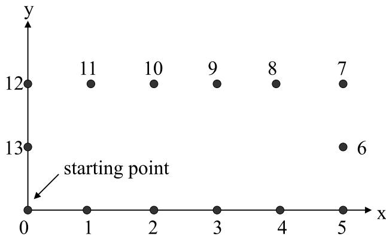  
Figure 6.1 Graph of 13 cities arranged in a rectangle. The salesperson starts at the origin and visits all 13 cities once and returns to the starting point. The obvious solution is to trace the rectangle, which has a distance of 14.

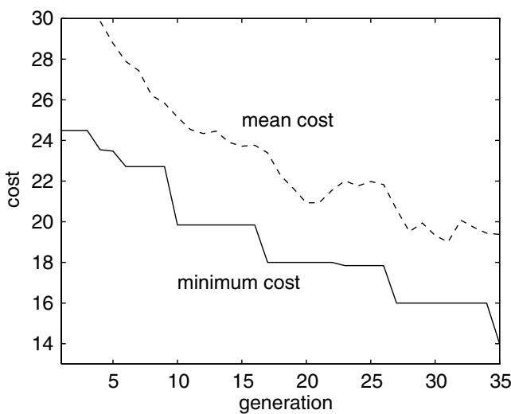  
Figure 6.2 Convergence of the genetic algorithm when there are 13 cities on a rectangle as shown in Figure 6.1.

# 6.2 LOCATING AN EMERGENCY RESPONSE UNIT REVISITED

Finding the location of an emergency response unit described in Chapter 4 had a cost surface with two minima. Running the continuous and binary GAs revealed that the continuous GA was superior. One of the problems with the binary GA is the use of binary numbers to represent variable values. In this chapter we solve the same problem with a binary GA but use a Gray code to represent the variables.

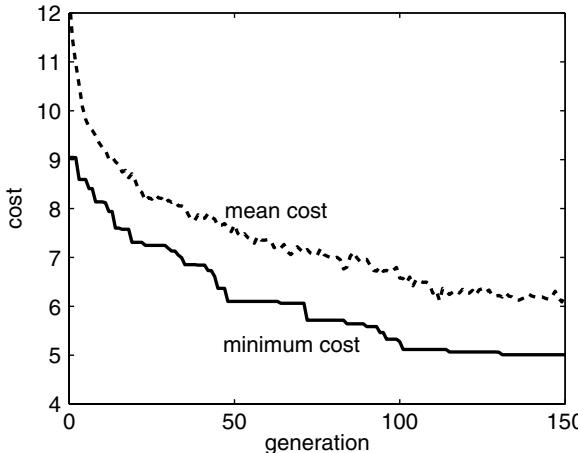  
Figure 6.3 Convergence of the GA for the 25 city traveling salesperson problem.

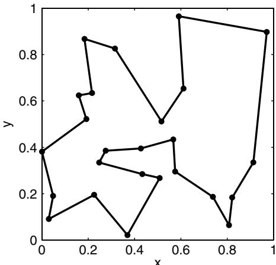  
Figure 6.4 GA solution to 25 city traveling salesperson problem.

Gray codes don’t always improve the convergence of a GA. The convergence graph in Figure 6.5 shows that the Gray code did improve performance in this instance. However, implementing the Gray code in the GA slows down the algorithm because the translation of the binary code into binary numbers is time-consuming. We’re somewhat skeptical of adding the Gray code translation to our GAs, so we usually don’t. However, the result here shows that a small improvement is possible with the Gray code.

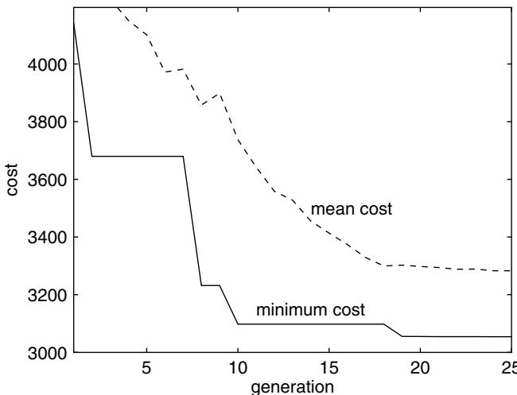  
Figure 6.5 Convergence graph for the emergency response unit problem from Chapter 4 when a Gray code is used.

# 6.3 DECODING A SECRET MESSAGE

This example uses a continuous GA to break a secret code. A message consisting of letters and spaces is encoded by randomly changing one letter to another letter. For instance, all $d ^ { \prime }$ ’s may be changed to c’s and spaces changed to $q$ ’s. If the message uses every letter in the alphabet plus a space, then there are a total of 27! possible codes, with only one being correct. If the message uses $s$ symbols, then there are $2 7 ! - S !$ possible encodings that work.

A chromosome consists of 27 genes with unique values from 1 to 27. A 1 corresponds to a space and 2 through 27 correspond to the letters of the alphabet. Letters and spaces in the message receive the appropriate numeric values. The cost is calculated by subtracting the guess of the message from the known message, taking the absolute value, and summing:

$$
\cos t = \sum _ { n = 1 } ^ { N } \bigl | m e s s a g e ( n ) - g u e s s ( n ) \bigr |
$$

We know the message when the cost is zero.

As an example, let’s see how long it takes the GA to find the encoding for the message “bonny and amy are our children.” This message has 30 total symbols, of which 15 are distinct. Thus 15 of the letters must be in the proper order, while the remaining 12 letters can be in any order. The GA used the following constants: $N _ { p o p } = 4 0 0 , N _ { k e e p } = 4 0$ , and $\mu = 0 . 0 2$ . It found the message in 68 generations as shown in Figure 6.6. Progress on the decoding is shown in Table 6.1.

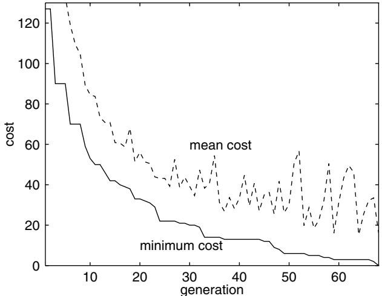  
Figure 6.6 Genetic algorithm that decodes the message “bonny and amy are our children” in 68 generations.

TABLE 6.1 Progress of the GA as It Decodes the Secret Message   

<table><tr><td>Generation</td><td>Message</td></tr><tr><td>1</td><td>amiizbditbdxzbdqfbmvqbeoystqfi</td></tr><tr><td>10</td><td>krooy aoe any aqf rwq gbpseqfo</td></tr><tr><td>20</td><td>crooy aoe any aqf rwq gdiheqfo</td></tr><tr><td>30</td><td>dpooy aoe any arf pwr ghikerfo</td></tr><tr><td>40</td><td>bqmmz amd anz are qur cfildrem</td></tr><tr><td>50</td><td>bonnz and amz are osr cghldren</td></tr><tr><td>60</td><td>bonny and ajy are our children</td></tr><tr><td>68</td><td>bonny and amy are our children</td></tr></table>

A more difficult message is “jake can go out with my beautiful pets and quickly drive to see you.” This message lacks only $x$ and z. It has 25 distinct symbols and a total of 65 total symbols. Figure 6.7 shows the convergence in this case with $N _ { p o p } = 5 0 0$ , $N _ { g o o d } = 4 0$ , and $\mu = 0 . 0 2$ . The algorithm found the solution in 86 generations. Progress on the decoding is shown in Table 6.2.

# 6.4 ROBOT TRAJECTORY PLANNING

Robots imitate biological movement, and GAs imitate biological survival. The two topics seem to be a perfect match, and many researchers have made that connection. Several studies have investigated the use of GAs for robot trajectory planning (Davidor, 1991; Davis, 1991; Pack et al., 1996). For example, the goal is to move a robot arm in an efficient manner while avoiding obstacles and impossible motions. The even more complicated scenario of moving the robot arm when obstacles are in motion has been implemented with a parallel version of a GA (Chambers, 1995).Another application simulated two robots fighting. A GA was used to evolve a robot’s strategy to defeat its opponent (Yao, 1995).

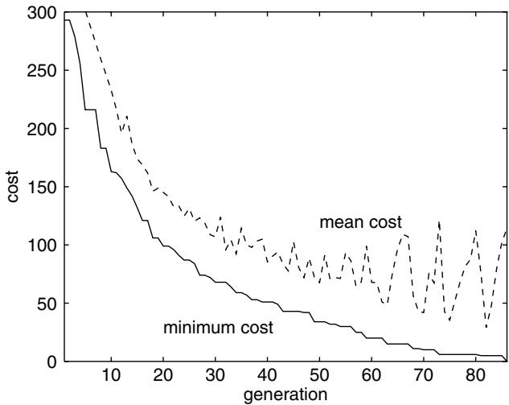  
Figure 6.7 Genetic algorithm that decodes the message “jake can go out with my beautiful pets and quickly drive to see you” in 86 generations.

TABLE 6.2 Progress of the GA as It Decodes the Secret Message   

<table><tr><td>Generation</td><td>Message</td></tr><tr><td>1</td><td>vhte fhb po olq zjqk ds mehlqjxlu neqr hbg wljftus gcjae qo ree sol</td></tr><tr><td>10</td><td>cahd bas np pxt iqtf kz edaxtqwxj vdtl asg oxqbhjz grqud tp ldd zpx</td></tr><tr><td>20</td><td>jakh dar go out wftb mx nhautfcui phty are sufdkix ezfqh to yhh xou</td></tr><tr><td>30</td><td>faje can gp pvs yish mx reavsikvl ueso and qvicjlx dwize sp oee xpv</td></tr><tr><td>40</td><td>kaje can dp pvt yitg mx reavtifvl oets anb qvicjlx bwize tp see xpv</td></tr><tr><td>50</td><td>jake can dp pvt xitg my heavtifvl oets anb qvickly bwize tp see ypv</td></tr><tr><td>60</td><td>jake can gp put xith my deautiful oets anb quickly bvize tp see ypu</td></tr><tr><td>70 80</td><td>jake can go out xith my beautiful pets and quickly dwize to see you</td></tr><tr><td>86</td><td>jake can go out xith my beautiful pets and quickly dwive to see you</td></tr><tr><td></td><td>jake can go out with my beautiful pets and quickly drive to see you</td></tr></table>

A robot trajectory describes the position, orientation, velocity, and acceleration of each robot component as a function of time. In this example, the robot is a two-link arm having two degrees of freedom in a plane called the robot workspace (Figure 6.8) (Pack et al., 1996). For calculation purposes this arm is approximated by two line segments in Cartesian coordinates as shown in Figure 6.9. Each joint has its own local coordinate system that can be related to the base $x _ { 0 } , y _ { 0 }$ coordinate system (located at the shoulder joint). The endeffector or tip of the robot arm is of most interest and has a local coordinate system defined by $x _ { 2 } , y _ { 2 }$ . An intermediate coordinate system at the elbow joint is defined by $x _ { 1 } , y _ { 1 }$ . Using the Donauit-Hartenberg parameters, one can transform an end-effector position in terms of the $x _ { 0 } , y _ { 0 }$ coordinates by

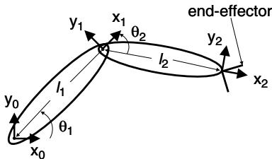  
Figure 6.8 Diagram of a two-dimensional robot arm with two links. Link 1 pivots about coordinate system 0 and link 2 pivots about coordinate system 1. Coordinate system 3 has an origin at the end-effector.

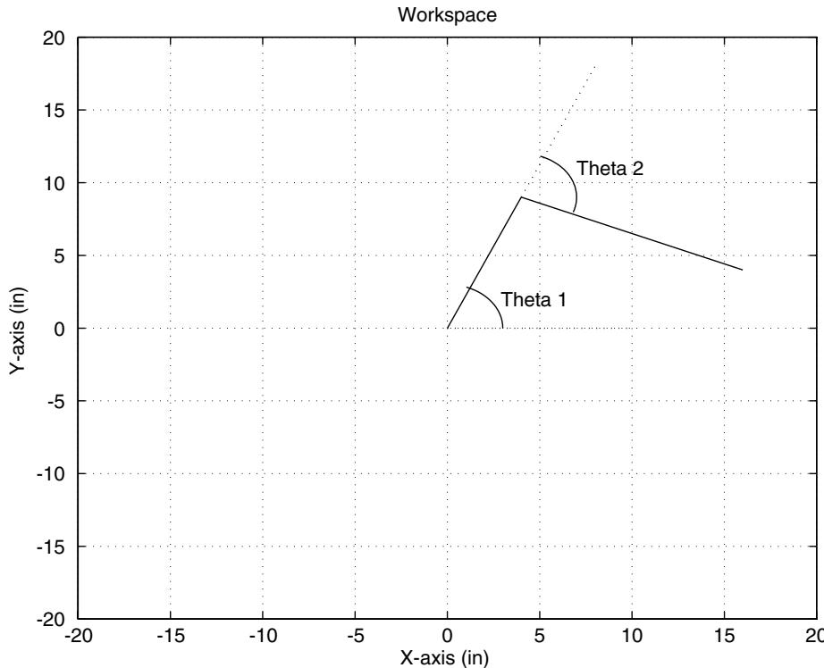  
Figure 6.9 Robot arm in Figure 6.6 when more simply described by two line segments.

$$
\begin{array}{c} \begin{array} { r l r } { [ \cos \theta _ { 1 2 }  } & { -  \sin \theta _ { 1 2 }  } & { 0 } & { \ell _ { 1 } \cos \theta _ { 1 } + \ell _ { 2 } \cos \theta _ { 1 2 } } \\ { \sin \theta _ { 1 2 } } & {  \cos \theta _ { 1 2 }  } & { 0 } & { \ell _ { 1 } \sin \theta _ { 1 } + \ell _ { 2 } \sin \theta _ { 1 2 } } \\ { 0 } & { 0 } & { 1 } & { 0 } \\ { 0 } & { 0 } & { 0 } & { 1 } \end{array} ] [ \begin{array} { l } { x _ { 2 } } \\ { y _ { 2 } } \\ { z _ { 2 } } \\ { 1 } \end{array} ] = [ \begin{array} { l } { x _ { 0 } } \\ { y _ { 0 } } \\ { z _ { 0 } } \\ { 1 } \end{array} ]  \end{array}
$$

where

$x _ { 2 }$ , $y _ { 2 }$ , $z _ { 2 } =$ position of end-effector with respect to coordinate system 2 (end-effector based coordinate system)   
$x _ { 0 }$ , $y _ { 0 }$ , $z _ { 0 } =$ position of end-effector with respect to the base coordinate system   
cos $\upsilon _ { 1 2 } = \cos \upsilon _ { 1 } \cos \upsilon _ { 2 } - \sin \upsilon _ { 1 } \sin \upsilon _ { 2 }$   
sin $\upsilon _ { 1 2 } = \sin \upsilon _ { 1 } \cos \upsilon _ { 2 } + \cos \upsilon _ { 1 } \sin \upsilon _ { 2 }$   
$\ell _ { 1 } =$ length of link 1   
$\ell _ { 2 } =$ length of link 1   
$\upsilon _ { 1 } =$ angle between $x _ { 0 }$ -axis and link 1   
$\upsilon _ { 2 } =$ angle between $x _ { 1 }$ -axis and link 1

Thus knowing the length of the links and the angles allows us to transform any points on the robot arm from the $x _ { 2 } , y _ { 2 }$ coordinate system to the $x _ { 0 } , y _ { 0 }$ coordinate system. Our goal is to find the optimal path for the robot to move through its environment without colliding with any obstacles in the robot workspace.

Although following the end-effector path through Cartesian space ( $\cdot  { \boldsymbol { { x } } } _ { 0 } -$ and $y _ { 0 }$ -axes) is easiest to visualize, it is not of the most practical value for optimization. First, the calculation of joint angles at each point along the path is difficult. Second, the calculations can encounter singularities that are difficult to avoid. An alternative approach is to formulate the trajectory problem in the configuration space ( $\lvert \upsilon _ { 1 } \rvert$ - and $\upsilon _ { 2 }$ -axes) that governs the position of the endeffector. Although numerically easier, it can result in complicated endeffector paths. We will go with the numerically easier version and let the GA optimize in configuration space for this example.

Obstacles in the form of impossible robot joint angle combinations must be taken into account when designing the cost function. It can be shown that point obstacles are contained within an elliptical region in configuration space (Pack et al., 1996). As an example, a point obstacle in the world space transforms into a curved line in configuration space (Figure 6.10) (Pack et al., 1996). This line is nicely contained within an ellipse, and an ellipse is much easier to model as an obstacle.

The cost function is merely the length of the line needed to get from the starting point to the ending point in the configuration space. Rather than attempt to find a continuous path between the start and destination points, piecewise line segments are used. This example establishes a set number of line segments before the GA begins. Consequently the length of all the chromosomes are the same. Others have used variable length chromosomes to find the optimum path. (The reader interested in this approach is referred to Davidor, 1991.)

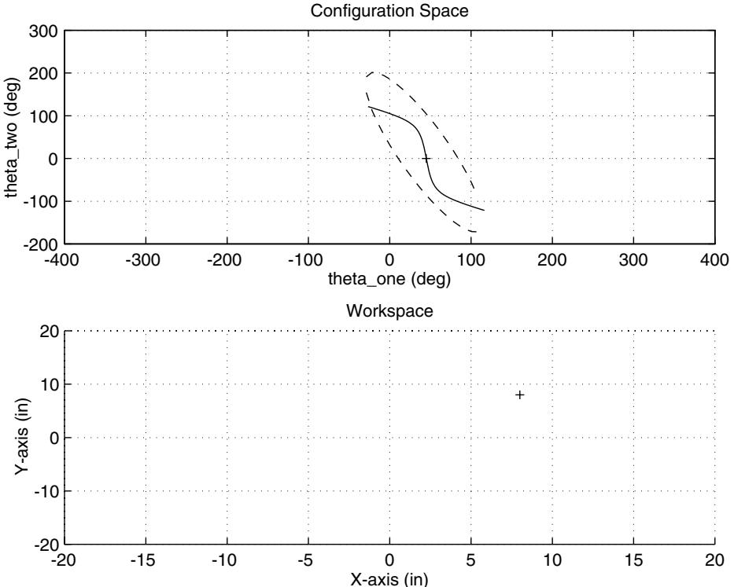  
Figure 6.10 Point obstacle in the lower graph transformed into curved line in configuration space in upper graph. This curved line is contained within an elliptical region denoted by the dashed line. In configuration space this ellipse forms a boundary that the robot arm cannot pass through.

The first example has four obstacles in the configuration space with start and stop points in obscure parts of the space. Only three intermediate points or four line segments are permitted to complete the shortest path from the start to the finish. The binary GA had $N _ { p o p } = 8 0$ members in the population and ran for 10 generations. The first generation had an optimal path length of 11.06 units, as shown in Figure 6.11. After 10 generations the minimum cost reduced to 9.656 units, and its path in configuration space is shown in Figure 6.12. Adding more intermediate points would give the algorithm more freedom to find a better solution.

A second example begins with a real world problem with five-point obstacles in world space that transformed into an ellipse in the configuration space. Again, the binary GA had $N _ { p o p } = 8 0$ members in the population and ran for 10 generations. The path after the first generation is shown in Figure 6.13 and has a cost of 7.321 units. After 10 generations the minimum cost reduced to 6.43 units, and its path in configuration space is shown in Figure 6.14. This optimal solution translates back to world space, as shown in Figure 6.15, where the symbols \* and $\bullet$ denote the starting and ending robot end-effector positions, respectively. The elliptical obstacle shapes in Figure 6.13 and 6.14 translate into points (denoted by $^ +$ signs) in Figure 6.15.

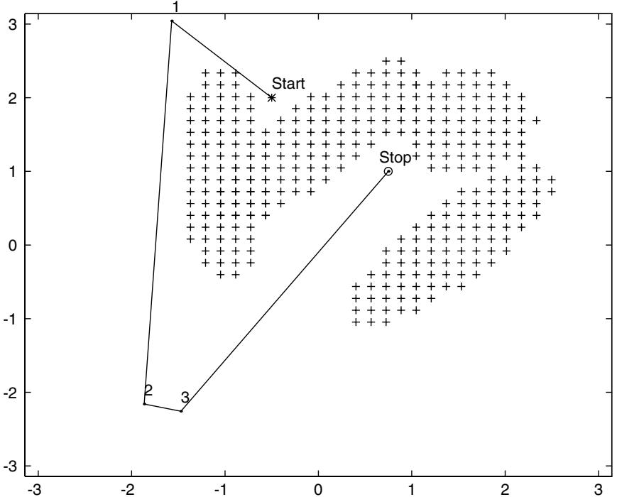  
Figure 6.11 The best path between the obstacles after generation 1 is 11.06 units long.

# 6.5 STEALTH DESIGN

A stealth airplane is difficult to detect with conventional radar. Engineers use a combination of materials, size, orientation, and shaping to reduce the radar cross section of an airplane. The radar cross section of a simple two-dimensional reflector can be modified by the placement of absorbing materials next to it. This type of reflector design is also of interest to satellite antenna manufacturers to lower sidelobe levels and reduce the possibility of interference with the desired signal.

This example demonstrates how to use GAs to find resistive loads that produce the lowest maximum backscatter relative sidelobe level from a perfectly conducting strip. The radar cross section of a $6 \lambda$ strip appears in Figure 6.16, and its highest relative sidelobe level is about 13.33 dB below the peak of the main beam. The radar cross section is given in terms of dBlambda or decibels above one wavelength. The wavelength is associated with the center frequency of the electromagnetic wave incident on the strip. A model of the loaded strip is shown in Figure 6.17. Assuming the incident electric field is parallel to the edge of the strip, the physical optics backscattering radar cross section is given by Haupt (1995):

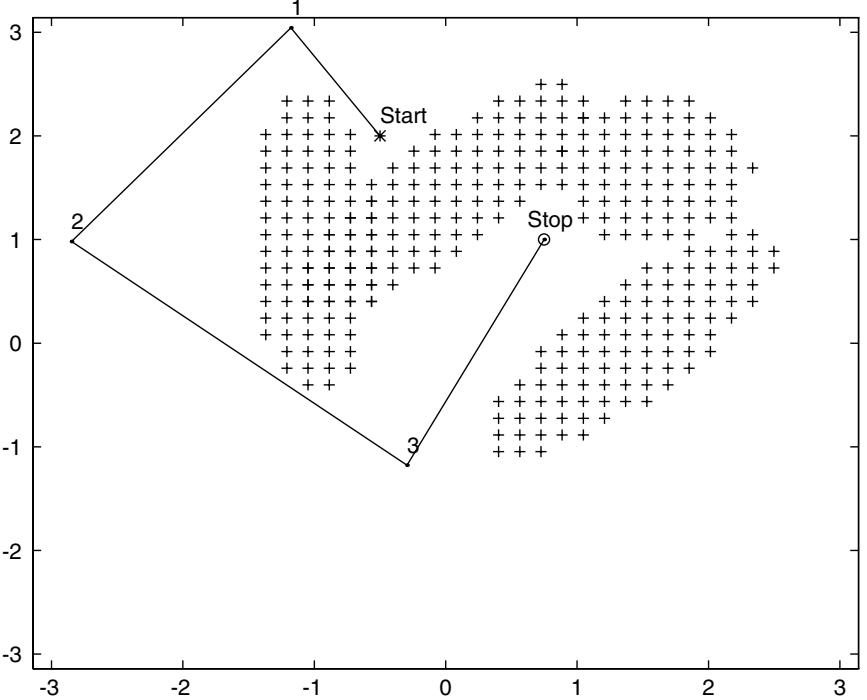  
Figure 6.12 The best path between the obstacles after generation 10 is 9.656 units long.

$$
\sigma ( \phi ) = \frac { k } { 4 } \bigg | 4 a s S a ( 2 k a u ) + \sum _ { n + 1 } ^ { N } \Biggl ( \frac { 2 b _ { n } s } { 0 . 5 + \eta _ { n } s } \Biggr ) S a ( k b _ { n } u ) \cos \Biggl [ 2 k \Biggl ( a + \sum _ { m + 1 } ^ { n - 1 } b _ { m } + \frac { b _ { n } } { 2 } \Biggr ) u \Biggr ] ^ { 2 }
$$

where

$\begin{array} { l } { s = \sin { \phi } } \\ { u = \cos { \phi } } \end{array}$ $2 a =$ width of perfectly conducting strip

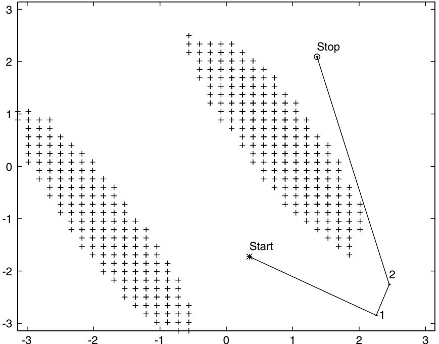  
Figure 6.13 The best path between the obstacles after generation 1 has a length of 7.32 units.

$b _ { n } =$ width of load $n = \sum \sp { B _ { w } } b _ { w } [ m ] 2 \sp { 1 - m } W$   
$\eta _ { n } =$ resistivity of load $n = \sum _ { m = 1 } ^ { B _ { r } } b _ { r } [ m ] 2 ^ { 1 - m } R$   
$S a = ( \sin x ) / x$   
$B _ { w } , B _ { r } =$ number of bits representing the strip width and resistivity $b _ { w } , b _ { r } =$ array of binary digits that encode the values for the strip widths and resistivities.   
W, $R =$ width and resistivity of the largest quantization bit

Eight resistive loads are placed on each side of a perfectly conducting strip that is $6 \lambda$ wide. The widths and resistivities of these loads are optimized to reduce the maximum relative sidelobe level of the radar cross section. Both the width and resistivity of each load are represented by 5 quantization bits, and $W = 1$ and $R = 5 .$ . The optimized values arrived at by the GA are

$$
\begin{array} { c } { { \eta _ { n } = 0 . 1 6 , 0 . 3 1 , 0 . 7 8 , 1 . 4 1 , 1 . 8 8 , 3 . 1 3 , 4 . 5 3 , 4 . 2 2 } } \\ { { { } } } \\ { { w _ { n } = 1 . 3 1 , 1 . 5 6 , 1 . 9 4 , 0 . 8 8 , 0 . 8 1 , 0 . 6 9 , 1 . 0 0 , 0 . 6 3 \lambda } } \end{array}
$$

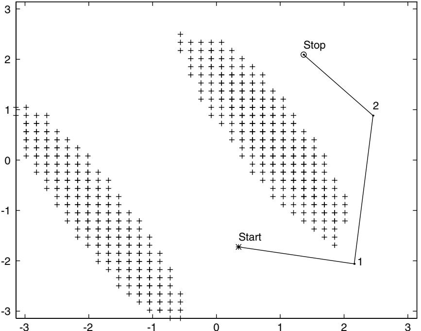  
Figure 6.14 The best path between the obstacles after generation 10 has a length of 6.43 units.

These values result in a maximum relative radar cross section sidelobe level of $- 3 3 . 9 8 \mathrm { d B } .$ . Figure 6.18 shows the optimized radar cross section. The peak of the mainbeam is about 6 dB higher than the peak of the mainbeam of the 6l perfectly conducting strip radar cross section in Figure 6.16. In exchange for the increase in the mainbeam, the peak sidelobe level is $1 5 \mathrm { d B }$ less than the peak sidelobe level in Figure 6.16. In other words, compared to the $6 \lambda$ perfectly conducting strip, this object is easier to detect by a radar looking at it from the broadside, but it is more difficult to detect looking off broadside.

The resistive loads attached to the perfectly conducting strip were also optimized using a quasi-Newtonian method that updates the Hessian matrix using the Broyden–Fletcher–Goldgarb–Shanno (BFGS) formula. A true gradient search was not used because the derivative of (6.4) is difficult to calculate. The quasi-Newtonian algorithm performed better than the GA for 10 or less loads. Using the quasiNewtonian method in the previous example resulted in a maximum relative sidelobe level of -36.86 dB. When 15 loads were optimized, GAs were clearly superior.

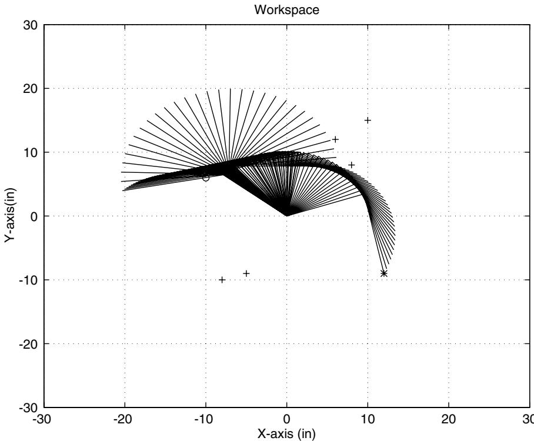  
Figure 6.15 Actual movement of the robot arm through the obstacles in world space (denoted by $^ +$ signs). The plus signs transform into the elliptical regions shown in configuration space (Figures 6.13 and 6.14).

# 6.6 BUILDING DYNAMIC INVERSE MODELS—THE LINEAR CASE

Inverse models are becoming increasingly common in science and engineering. Sometimes we have collected large amounts of data but have not developed adequate theories to explain the data. Other times the theoretical models are so complex that it is extremely computer intensive to use them. Whichever the circumstance, it is often useful to begin with available data and fit a stochastic model that minimizes some mathematical normed quantity, that is, a cost. Our motivation here lies in trying to predict environmental variables. In recent years many scientists have been using the theory of Markov processes combined with a least squares minimization technique to build stochastic models of environmental variables in atmospheric and oceanic science (Hasselmann, 1976; Penland, 1989; Penland and Ghil, 1993). One example is predicting the time evolution of sea surface temperatures in the western Pacific Ocean as a model of the rises and falls of the El Nin˜ o/Southern Oscillation (ENSO) cycle. This problem proved challenging. However, stochastic models have performed as well as the dynamical ones in predicting future ENSO cycles (Penland and Magorian 1993; Penland, 1996). Another application involves predicting climate. We now build very complex climate models that require huge amounts of computer time to run. There are occasions when it would be useful to predict the stochastic behavior of just a few of the key variables in a large atmospheric model without concern for the details of dayto-day weather. One such application is when an atmospheric climate model is coupled to an ocean model. Since the time scale of change of the atmosphere is so much faster than that of the ocean, its scale dictates the CourantFriedichs-Levy criteria, which limits the size of the allowable time step. For some problems it would be convenient to have a simple stochastic model of the atmosphere to use in forcing an ocean model. Recent attempts have shown that such models are possible and perhaps useful for computing responses to forcing (Branstator and Haupt, 1998). However, the least squares techniques typically used to build these models assume a Markov process. This assumption is not valid for most environmental time series. Would a different method of minimizing the function produce a better match to the environmental time series? This is an interesting question without a clear answer. Before answering it using large climate models, it is convenient to begin with simple lowdimensional models of analytical curves.

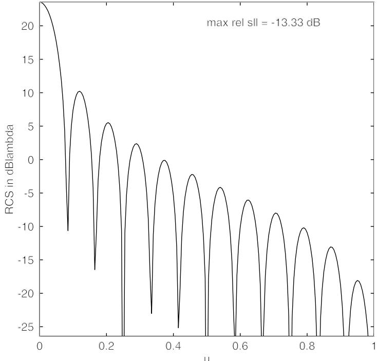  
Figure 6.16 Radar cross section of a $6 \lambda$ wide perfectly conducting strip.

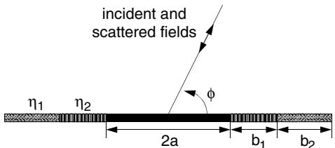  
Figure 6.17 Diagram of a perfectly conducting strip with symmetric resistive loads placed at its edges.

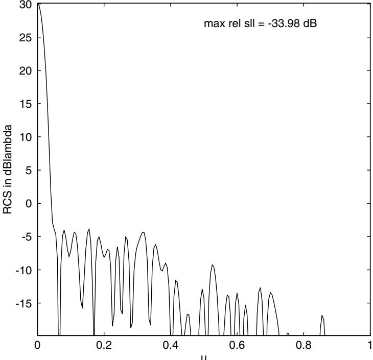  
Figure 6.18 Radar cross section of the 6l wide strip with 8 resistive loads placed at its edges. The level between the maximum sidelobe and the peak of the mainbeam is -33.98 dB, which is a $2 0 . 7 8 \mathrm { d B }$ reduction.

We use a GA to compute parameters of a model of a simple curve that is parametric in time. In particular, we wish to fit a model

$$
\frac { d x } { d t } = \mathbf { A } \mathbf { x }
$$

to a time series of data. Here $\mathbf { X }$ is an $N .$ -dimensional vector, $d x / d t = \bf { x } _ { t }$ is its time tendency, and $\mathbf { A }$ is an $N \times N$ matrix relating the two. Note that most first-order

time-dependent differential equations can be discretized to this form. Our goal is to find the matrix A that minimizes the cost

$$
\cos t = \left. \left( \mathbf { x _ { t } } - \mathbf { A x } \right) ^ { p } \right.
$$

where $P$ is any appropriate power norm that we choose. The least squares methods use $P = 2$ , or an $L ^ { 2 }$ norm. The angular brackets denote a sum over all of the data in the time series.

An example time series is a spiral curve generated by $( X , Y , Z ) = ( \sin ( t )$ , $\cos ( t ) , t )$ , with $t = [ 0 , 1 0 \pi ]$ in increments of $\pi / 5 0 .$ . The time evolution of this curve appears in Figure 6.19. Note that for this problem, computation of the cost function requires a summation over 500 time increments. However, even with the reasonably large population size and number of generations (70) that we computed, the computer time required was not excessive. (Note that for a bigger problem with a longer averaging period, this would no longer be true.) A continuous GA is applied to this curve with a population size of $N _ { p o p } = 1 0 0$ , and a mutation rate of $\mu = 0 . 2$ . Since the GA is oblivious to which value of $P$ we choose, we experimented a bit and found the best results for moderate $P$ . The solution displayed here uses $P = 4 .$ Evolution of the minimum cost appears in Figure 6.20. We notice that the cost decreases several orders of magnitude over the 70 generations. The result appears in Figure 6.21. We see that the general shape of the spiral curve is captured rather well. The bounds in $X$ and $Y$ are approximately correct, but the evolution in $Z = t$ is too slow. We found that this aspect of our model was rather difficult to capture. In terms of dynamical systems, we were able to find the attractor but not able to exactly model the evolution along it. For comparison a standard least squares technique is used to solve the same problem. The result appears as Figure 6.22. We can see that the least squares method could not even come close to capturing the shape of the attractor. Of course, we can fine-tune the least squares method by adding a noise term in the cost function.We can do that for the GA as well.The advantage of the GA is that it is easy to add complexity to the cost function. Feeding this simple model more variables adds nothing to the solution of the problem, since it can be completely specified with the nine degrees of freedom in the matrix.

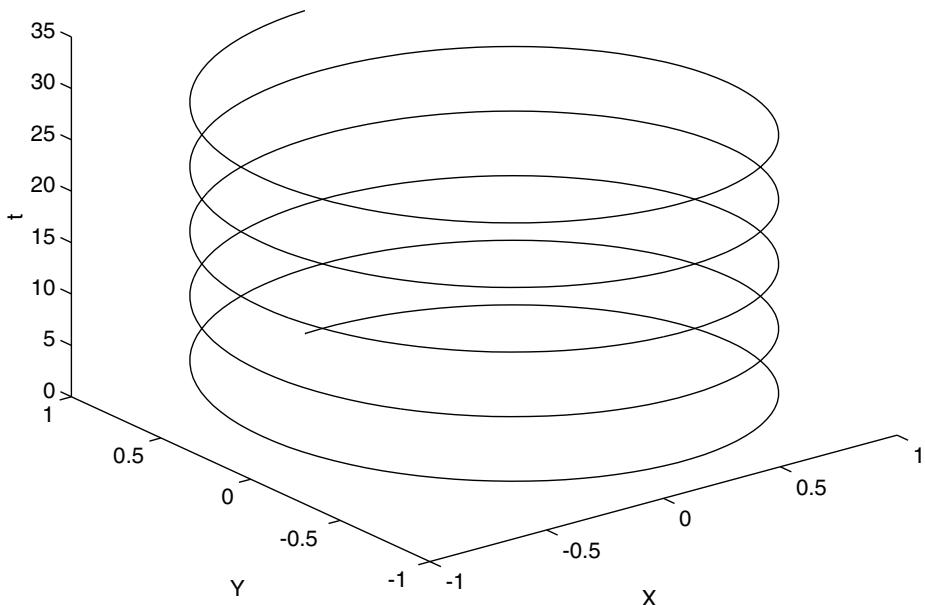  
Figure 6.19 Spiral curve specified by $( X , Y , Z ) = [ \cos ( t ) , \sin ( t ) , t ]$ for $t = [ 1 , 1 0 \pi ]$ .

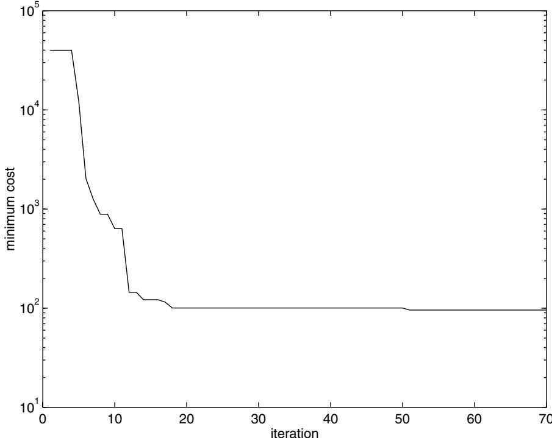  
Figure 6.20 Evolution of the mimimum cost of the genetic algorithm, which produces a dynamical inverse model of the spiral curve in Figure 6.19.

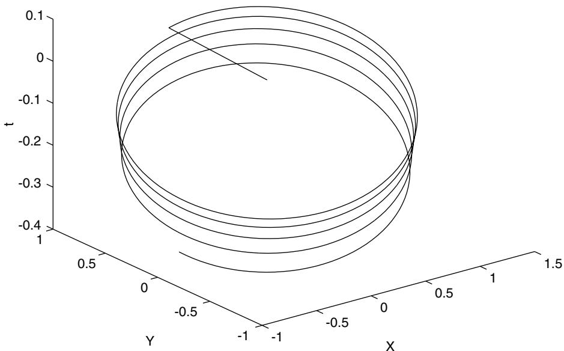  
Figure 6.21 Genetic algorithm’s dynamical fit of a model based on the time series of the spiral curve in Figure 6.19.

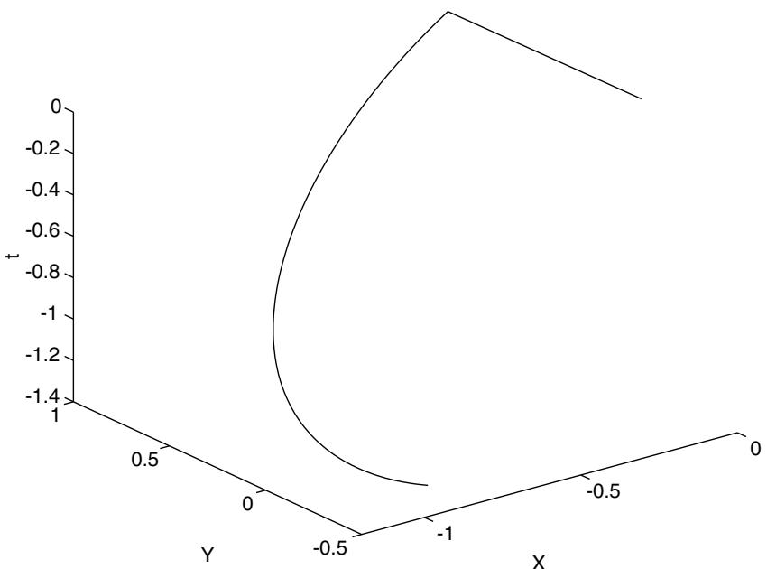  
Figure 6.22 A linear least square dynamical fit of a model based on the time series of the spiral curve in Figure 6.19.

# 6.7 BUILDING DYNAMIC INVERSE MODELS—THE NONLINEAR CASE

An enhancement to the application of the previous section on empirical modeling is including higher order terms in the calculation. Many dynamical problems are not linear in nature, so we cannot expect them to reproduce the shape of the data using linear stochastic models. We saw this in the traditional least square fit to the spiral model in the preceding section (see Figure 6.22). The spiral model was sinusoidal and that behavior could not be captured with the linear fit. In this section we expand the inverse model to include quadratically nonlinear terms, often the form that appears in fluid dynamics problems.

The example problem that we consider is predator-prey model (also known as the Lotka-Volterra equations), namely

$$
\begin{array} { c } { { \displaystyle { \frac { d x } { d t } } = a x - b x y \ } } \\ { { \displaystyle { \frac { d y } { d t } } = - c y + d x y } } \end{array}
$$

where $x$ is the number of prey and $y$ the number of predators.The prey growth rate is $a$ while the predator death rate is $c$ . Variables $^ b$ and $d$ characterize the interactions. Equations (6.7) were integrated using a fourth order Runge Kutta with a time step of 0.01 and variables $a = 1 . 2$ , $b = 0 . 6$ , $c = 0 . 8$ , and $d = 0 . 3$ . The time series showing the interaction between the two appears in Figure 6.23. This time series serves as the data for computing the inverse models.The phase space plot is shown in Figure 6.24 where we see the limit cycle between the predators and the prey.

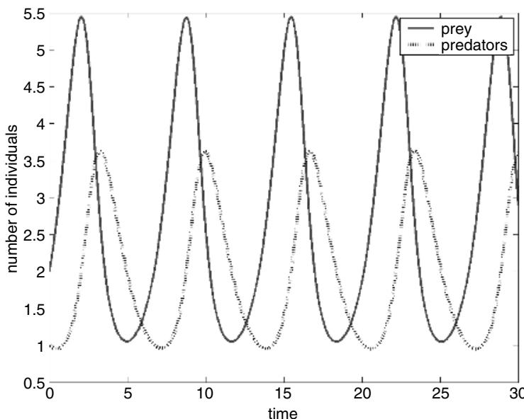  
Figure 6.23 Time series showing predator and prey variations over time according to (6.7).

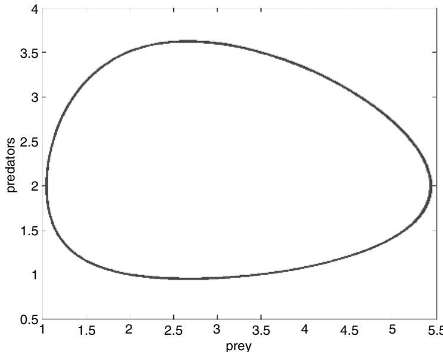  
Figure 6.24 State space showing predator-prey interactions.

To fit a linear model, we would use (6.5). The least squares fit to the linear model produces the time series of Figure 6.25. We note that the agreement is quite poor, as one would expect given that the system (6.7) is highly nonlinear. With no nonlinear interaction available, the number of prey grows while the number of predators remains stationary.

To obtain a more appropriate nonlinear fit, we now choose to model the data with a nonlinear model:

$$
x _ { t } = N x ^ { T } x + A x + C
$$

We allow nonlinear interaction through the nonlinear third-order tensor operator, $N$ , and include a constant, $C$ . Although one can still find a closed form solution for this nonlinear problem, it involves inverting a fourth-order tensor. For problems larger than this simple two-dimensional one, such an inversion is not trivial. Therefore we choose to use a GA to find variables that minimize the least square error between the model and the data. The cost function is

$$
{ \mathrm { c o s t } } = \left. \left( x _ { t } - N x ^ { T } x + A x + C \right) ^ { p } \right.
$$

The GA used a population size of 100, and a mutation rate of 0.2.A time series of the solution as computed by the GA appears in Figure 6.26. Note that although the time series does not exactly reproduce the data, the oscillations are reproduced including the phase shift of roughly a quarter period. The wavelength is not exact and the amplitudes grow in time, indicating an instability. This instability is likely inherent in the way that the model is matched. However, the reproduction of such a difficult nonlinear system is amazing given the comparison to traditional linear models.

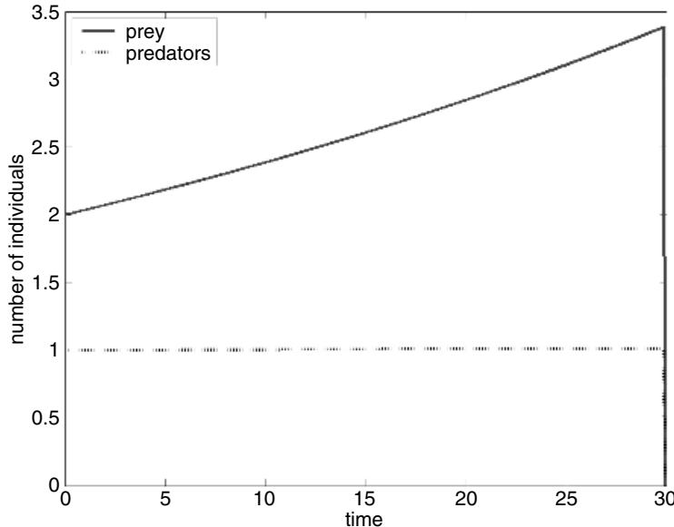  
Figure 6.25 Least squares time series fit to predator-prey model.

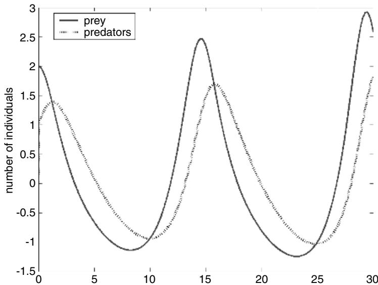  
Figure 6.26 Time series of predator-prey interactions as computed by the genetic algorithm.

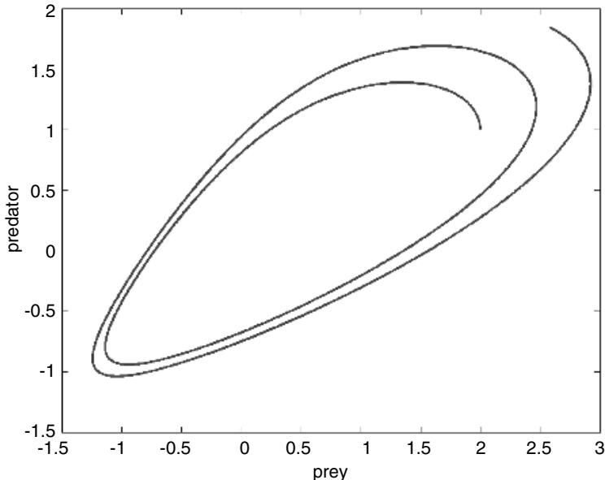  
Figure 6.27 The predator-prey relation in state space as computed by the nonlinear model with parameters fit by the GA.

The state space plot appears in Figure 6.27. The limit cycle is not exactly reproduced. The nonlinear model instead appears unstable and slowly grows. For comparison, however, the linear least squares model resulted in a single slowly growing curve (Figure 6.25) that was a much worse match.The GA nonlinear model was able to capture the cyclical nature of the oscillations, a huge improvement.

Finally Figure 6.28 shows the convergence of the GA for a typical run of fitting the nonlinear model (6.8) to the data. Due to their random nature, the results of a GA are never exactly the same. In particular, the convergence plots will differ each time. However, the results are quite reliable. For this simple two-dimensional nonlinear system describing predator-prey relations, the GA fit the variables of a nonlinear model so that the attractor was much better produced than by a traditional linear least squares fit. Although the match is not perfect, the nonlinear GA model captures the essence of the dynamics.

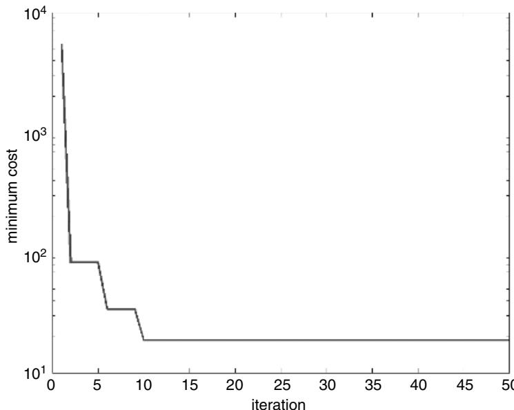  
Figure 6.28 Evolution of the minimum cost for the GA fit to the nonlinear model parameters.

# 6.8 COMBINING GAs WITH SIMULATIONS—AIR POLLUTION RECEPTOR MODELING

Now we move into problems that require running some sort of simulation as part of the cost function. In both design and in fitting some inverse models, we often know something about the physics of the problem that can be formulated into a numerical simulation. That simulation is often necessary to evaluate the quality of the chosen design or fitting model. For instance, several engineers have designed airplanes wings and airfoils by optimizing the shape through testing with a full fluid dynamics model (e.g., Karr, 2003; Obayashi et al., 2000).

The problem demonstrated here begins with air pollution data monitored at a receptor. Given general information about the regional source characteristics and meteorology during the period of interest, we wish to apportion the weighted average percentage of collected pollutant to the appropriate sources. This problem is known as air pollution receptor modeling. More specifically, our example problem is to apportion the contribution of local sources of air pollution in Cache Valley, Utah, to the measured pollutants received at a monitoring station owned by the Utah Department of Air Quality. This demonstration problem uses sixteen sources surrounding the receptor as seen in Figure 6.29. Of course, the spread and direction of pollutant plumes are highly dependent on wind speed and direction in addition to other meteorological variables. Cartwright and Harris (1993) used a GA to apportion sources to pollutant data at receptors. They began with a chemical mass balance model of the form

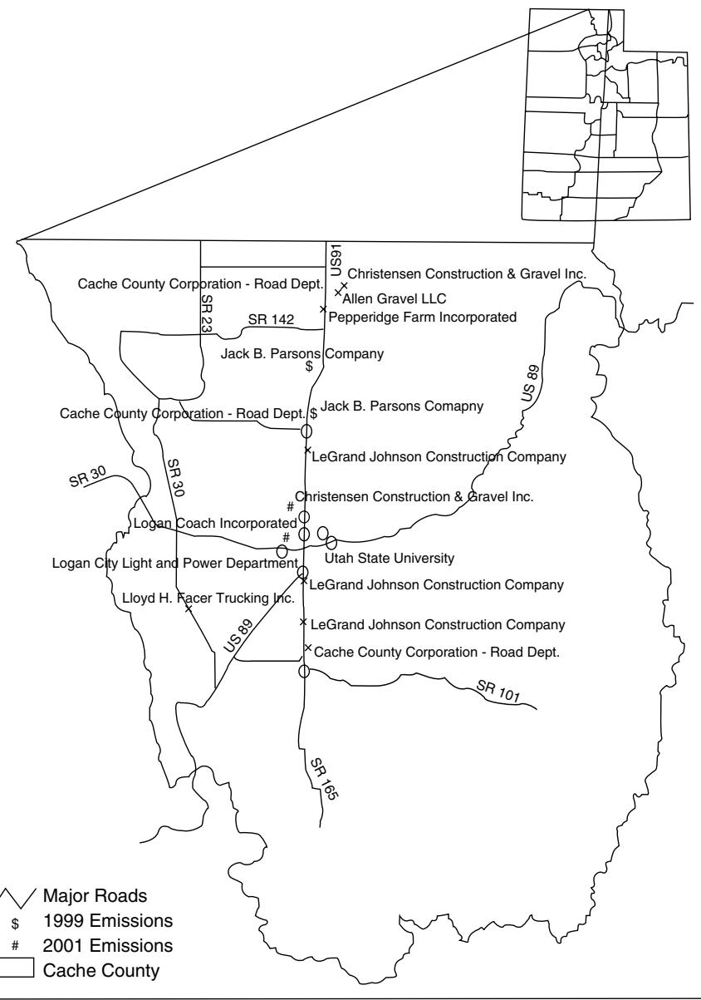  
Figure 6.29 Air pollution sources in Cache Valley, Utah. The receptor is marked with an #.

$$
M \bullet S = R
$$

where $M$ is the source profile matrix, which denotes the effective strength of pollutant from a given source at the receptor; $S$ is the fraction of the source that contributes to the concentration at the receptor, the unknown apportionments; and $R$ is the concentration of each pollutant measured at a given receptor. In theory, these matrices are whatever size can incorporate as many sources, receptors, and pollutants as necessary. Here we demonstrate the technique with a single pollutant at a single receptor. Cartwright and Harris (1993) chose to use uniform dispersion in all directions, with a decrease of concentration with distance according to a $r ^ { - 2 . 5 }$ power law, where $r$ is the distance from the source to the receptor. Here we, instead, choose to use the more refined dispersion law as found in Beychok (1994), together with actual wind data for the time period modeled:

$$
C = \frac { Q } { u \sigma _ { z } \sigma _ { y } 2 \pi } \mathrm { e x p } \left( \frac { - y ^ { 2 } } { 2 \sigma _ { y } ^ { 2 } } \right) \left[ \mathrm { e x p } \left( \frac { - { \left( z _ { r } - H _ { e } \right) } ^ { 2 } } { 2 \sigma _ { x } ^ { 2 } } \right) + \mathrm { e x p } \left( \frac { - { \left( z _ { r } + H _ { e } \right) } ^ { 2 } } { 2 \sigma _ { z } ^ { 2 } } \right) \right]
$$

where

$C =$ concentration of emissions at a receptor   
$( x , y , z _ { r } ) = \quad$ Cartesian coordinates of the receptor in the downwind direction from the source   
$Q =$ source emission rate   
$u =$ wind speed   
$H _ { e } =$ effective height of the plume centerline above ground   
$\sigma _ { y }$ , $\sigma _ { z } =$ standard deviations of the emission distribution in the $y$ and z directions

Note that there are a myriad of assumptions hidden behind the problem. First, we assume that the wind speed and direction are constant over the entire time period. Although we know a priori that this assumption is poor, it is balanced by the assumption of Gaussian dispersion in a single direction.Although a plume of pollutants may meander throughout the time period, we only care about the weighted average statistical distribution of the concentrations. Next we are forced to assume a constant emission rate, in this case an average annual rate. The hourly rate is much different. Another major difficulty is in estimating reasonable average values for the dispersion coefficients, $\sigma _ { y }$ and $\sigma _ { z }$ . Again, we must assume a weighted average over time and use dispersion coefficients computed by

$$
\sigma = \exp \bigl [ I + J \bigl ( \ln ( x ) + K ( \ln ( x ) ) ^ { 2 } \bigr ]
$$

where $x$ is the downwind distance $( \mathrm { i n \ k m } )$ and $I , J$ , and $K$ are empirical coefficients dependent on the Pasquill stability class (documented in a lookup table; Beychok, 1994). The Pasquill stability class depends on wind speed, direction, and insolation. For this demonstration problem, we assumed neutral stability (class D).

Equations (6.10) and (6.11) together with two lookup tables and (6.12) convert the source emission rates into the elements of the source matrix, $M$ , which indicates an expected average concentration due to each source for a constant emission rate and actual hourly average wind data. This process is repeated for each source at each time. The measured concentrations are also time averaged (in this case over a three-day period) and go into the matrix, $R$ . The goal is to solve for the fractions, $S$ , that apportion the pollution to each source. That is where the GA comes in. If $R$ and $s$ were constant one-dimensional vectors, one could easily solve for S. However, the need to sum the matrix times the factors hourly for differing meteorological conditions precludes a simple matrix inversion. The chromosomes of the GA in this case represent the unknown elements of matrix S. The cost function is the difference between the pollutant values at the receptor and the summation of the hourly concentrations predicted for each source as computed from the dispersion model (6.11) times the apportionment factors supplied by the GA:

$$
\mathrm { c o s t } = R - M \bullet S
$$

where $M = \sum _ { h = 1 } ^ { H } C _ { h }$ with the $C _ { h }$ computed from (6.11).

The receptor model was run using actual meteorological data for threeday periods in 2002 and comparing predicted weighted average concentrations of PM10 (particulate matter less than 10 micrometers in diameter) measured at the receptor. The dispersion coefficients were computed assuming a Pasquill stability class D. Three to four runs of the GA were done for each time period using a population size of 12 and mutation rate of 0.2. The fractions in the unknown vector, S, were normalized to sum to 1. Runs were made for 1000 generations. Four different runs were made for each of five different days and results appear in Table 6.3 for the run with the best convergence for each day. Those days were chosen to represent different concentrations and meteorology conditions, although we were careful to choose days where the assumption of stability D appeared to be good. For many of the runs the factors converged on the heaviest weighting of source 13, the Utah State University heating plant. Note that this does not necessarily imply that it contributed the most pollutant but rather that its average emission rate, when dispersed according to (6.11) using actual wind data, must have a heavier weighting to account for the monitored PM10. The second highest weighted source was number 9, a local construction company.

The point of this exercise is to demonstrate that the GA is a useful tool for problems that require including another model, in this case a dispersion model, to evaluate the cost of a function. Despite the large number of times that (6.13) was evaluated, it still not prohibitive in terms of CPU time required. Coupling GAs with simulations is becoming a more popular way to do searches. The work of Loughlin et al. (2000) coupled a full air quality model with a GA to design better control strategies to meet attainment of the ozone standard while minimizing total cost of controls at over 1000 sources. Such problems are requiring significant amounts of time on computers.

TABLE 6.3 Factors Computed to Apportion Sources to Received PM10 Measurements   

<table><tr><td>Received</td><td>22-Apr</td><td>21-Jun</td><td>27-Jul</td><td>11-Aug</td><td>21-Nov</td></tr><tr><td>(μg/m³)</td><td>8</td><td>27</td><td>39</td><td>36</td><td>33</td></tr><tr><td>Source</td><td></td><td></td><td></td><td></td><td></td></tr><tr><td>1</td><td>0.000</td><td>0.002</td><td>0.001</td><td>0.003</td><td>0.002</td></tr><tr><td>2</td><td>0.000</td><td>0.017</td><td>0.043</td><td>0.000</td><td>0.000</td></tr><tr><td>3</td><td>0.184</td><td>0.124</td><td>0.063</td><td>0.001</td><td>0.001</td></tr><tr><td>4</td><td>0.128</td><td>0.023</td><td>0.002</td><td>0.024</td><td>0.001</td></tr><tr><td>5</td><td>0.101</td><td>0.004</td><td>0.143</td><td>0.041</td><td>0.001</td></tr><tr><td>6</td><td>0.022</td><td>0.022</td><td>0.013</td><td>0.000</td><td>0.231</td></tr><tr><td>7</td><td>0.012</td><td>0.011</td><td>0.037</td><td>0.000</td><td>0.001</td></tr><tr><td>8</td><td>0.005</td><td>0.014</td><td>0.005</td><td>0.045</td><td>0.000</td></tr><tr><td>9</td><td>0.001</td><td>0.295</td><td>0.033</td><td>0.257</td><td>0.159</td></tr><tr><td>10</td><td>0.001</td><td>0.114</td><td>0.005</td><td>0.039</td><td>0.005</td></tr><tr><td>11</td><td>0.281</td><td>0.027</td><td>0.026</td><td>0.037</td><td>0.119</td></tr><tr><td>12</td><td>0.055</td><td>0.022</td><td>0.000</td><td>0.004</td><td>0.013</td></tr><tr><td>13</td><td>0.180</td><td>0.206</td><td>0.571</td><td>0.193</td><td>0.248</td></tr><tr><td>14</td><td>0.014</td><td>0.026</td><td>0.002</td><td>0.063</td><td>0.005</td></tr><tr><td>15</td><td>0.000</td><td>0.001</td><td>0.004</td><td>0.273</td><td>0.120</td></tr><tr><td>16</td><td>0.016</td><td>0.093</td><td>0.053</td><td>0.063</td><td>0.094</td></tr></table>

# 6.9 OPTIMIZING ARTIFICIAL NEURAL NETS WITH GAs

An increasingly popular use of GAs combines their ability to optimize with the strengths of other artificial intelligence methods. One of these methods is the neural network. Artificial neural networks (ANN) have found wide use in fields areas as signal processing, pattern recognition, medical diagnosis, speech production, speech recognition, identification of geophysical features, and mortgage evaluation.

ANNs model biological neurons in order to do numerical interpolation. Figure 6.30 provides a sketch of a biological neuron and a human-made neuron. The biological neuron acts as a processing element that receives many signals. These signals may be modified by a weight at the receiving synapse.

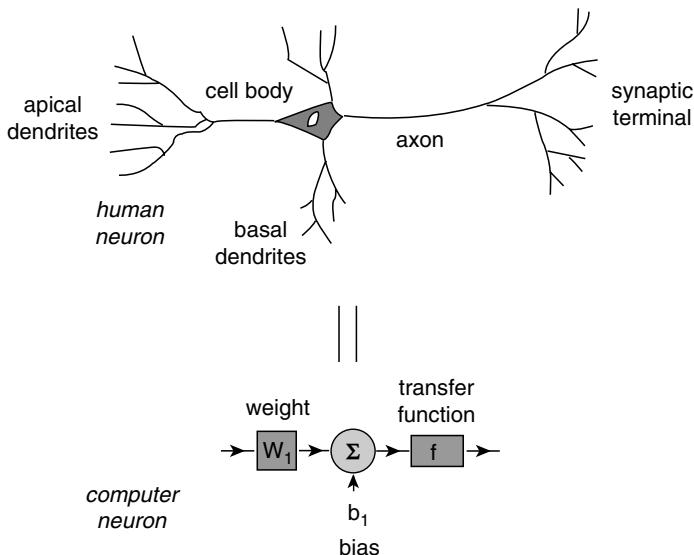  
Figure 6.30 Diagram of a biological neuron (top) and schematic of the artificial neural network.

Then the processing element sums the weighted inputs. When the input becomes sufficiently large, the neuron transmits a single output that goes off to other neurons.The human-made neuron works by analogy. It takes an input, multiplies it by a weight, adds a bias, and then passes the result through a transfer function. Several neurons in parallel are known as a layer. Adding these layers together produces the neural network. The weights and bias values are optimized to produce the desired output. Although there are many ways to train the ANN, we are interested in coupling it with a GA to compute the optimum weights and biases. There are many good books on neural networks (e.g., Hagan et al., 1995; Fausett, 1994), so we will make no attempt to fully describe ANN. Instead, we just briefly explain how we use a GA to train one.

We wish to approximate the function

$$
\operatorname { f } ( x ) = { \frac { 1 2 } { x ^ { 2 } \cos ( x ) + 1 / x } } \quad { \mathrm { f o r } } \quad 1 \leq \mathbf { x } \leq 5
$$

To do this, we used the two-layer neural network shown in Figure 6.31 with log-sigmoid transfer functions. The transfer function determines the threshold and amount of signal being sent from a neuron. Although various transfer functions were tried, the log-sigmoid worked best for this problem. It has the form $1 / ( 1 + e ^ { - n } )$ and maps the input to the interval [0, 1].

The goal is to compute the optimum weights and biases of the ANN using a GA. The GA chromosome is made up of potential weights and biases. The GA cost function computes the mean square difference between the current guess of the function and the exact function evaluated at specific points in $x$ . The function was sampled at intervals of 0.1 for training. We used a hybrid GA having $N _ { p o p } = 8$ and $\mu = 0 . 1$ . The local optimizer was a Nelder-Mead algorithm. The resulting approximation to (6.14) is shown in Figure 6.32. Note that the function computed from the neural network with GA hybrid training matches the known curve quite well.

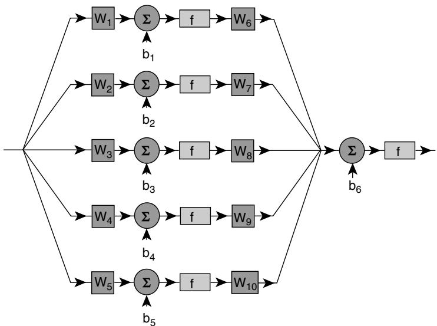  
Figure 6.31 Two-layer neural network used to compute fit to (6.14).

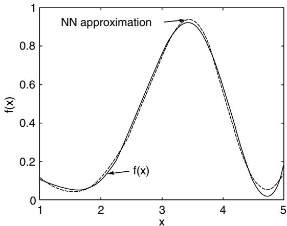  
Figure 6.32 Comparison of the exact function of (6.14) with the ANN/hybrid GA approximation.

# 6.10 SOLVING HIGH-ORDER NONLINEAR PARTIAL DIFFERENTIAL EQUATIONS

Two mathematical tools of scientists and engineers are ordinary and partial differential equations (ODEs and PDEs). Normally we don’t think of these equations as minimization problems. However, if we want to find values where a differential equation is zero (a form in which we can always cast the system), we can look for the minimum of its absolute value. Koza (1992) demonstrated that a GA could solve a simple differential equation by minimizing the value of the solution at 200 points. To do this, he numerically differentiated at each point and fit the appropriate solution using a GA. Karr et al. (2001) used GAs to solve inverse initial boundary value problems and found a large improvement in matching measured values.That technique was demonstrated on elliptic, parabolic, and hyperbolic PDEs.

We demonstrate here that a GA can be a useful technique for solving a highly nonlinear differential equation that is formally nonintegrable. For comparison, we do know its solitary wave approximate solution. Solitary waves, or solitons, are permanent-form waves for which the nonlinearity balances the dispersion to produce a coherent structure. We examine the super Korteweg-de Vries equation (SKDV), a fifth-order nonlinear partial differential equation:

$$
u _ { t } + \alpha u u _ { x } + \mu u _ { x x x } - \nu u _ { x x x } = 0
$$

The functional form is denoted by $u$ ; time derivative by the $t$ subscript; spatial derivative by the $x$ subscript; and $\alpha , \mu$ , and $\nu$ are variables of the problem. We wish to solve for waves that are steadily translating, so we write the $t$ variation using a Galilean tranformation, $X = x - c t$ , where $c$ is the phase speed of the wave. Thus our SKDV becomes a fifth-order, nonlinear ordinary differential equation:

$$
( \alpha u - c ) u _ { X } + \mu u _ { X X X } - \nu u _ { X X X X } = 0
$$

Boyd (1986) extensively studied methods of solving this equation. He expanded the solution in terms of Fourier series to find periodic cnoidal wave solutions (solitons that are repeated periodically). Among the methods used are the analytical Stokes’s expansion, which intrinsically assumes small amplitude waves, and the numerical Newton-Kantorovich iterative method, which can go beyond the small amplitude regime if care is taken to provide a very good first guess. Haupt and Boyd (1988a) were able to extend these methods to deal with resonance conditions. These methods were generalized to two dimensions to find double-cnoidal waves (two waves of differing wave number on each period) for the integrable Korteweg-de Vries equation (1988b) and the nonintegrable regularized long wave equation (Haupt, 1988). However, these methods require careful analytics and programming that is very problem specific. Here we are able to add a simple modification to the cost function of our GA to obtain a similar result.

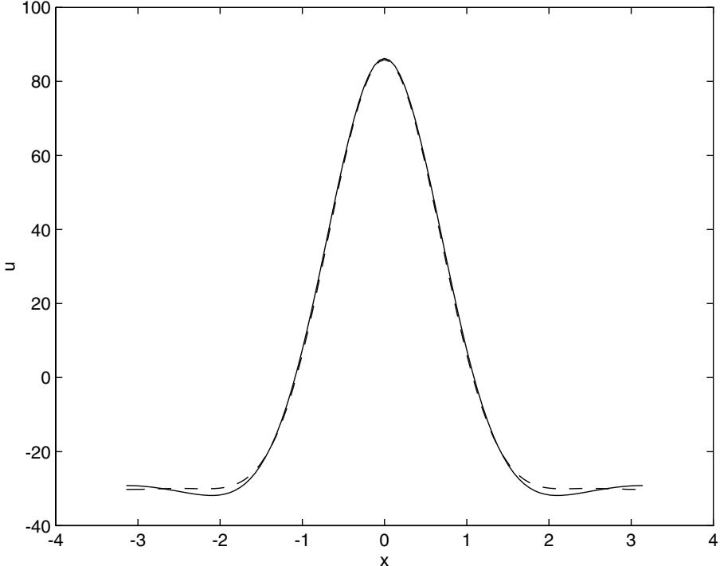  
Figure 6.33 Cnoidal wave of the super Korteweg de Vries equation. Solid line: exact solution; dashed line: genetic algorithm solution.

To find the solution of equation (6.16), we expand the function $u$ in terms of a Fourier cosine series to $K$ terms to obtain the approximation, $u _ { K }$ :

$$
u ( X ) \simeq u _ { k } ( X ) = \sum _ { k = 1 } ^ { K } a _ { k } \cos ( k X )
$$

The cosine series assumes that the function is symmetric about the $X \cdot$ -axis (without loss of generality). In addition we use the “cnoidal convention” by assuming that the constant term $a _ { 0 }$ is 0. Now we can easily take derivatives as powers of the wave numbers to write the cost that we wish to minimize as

$$
\mathrm { c o s t } ( u _ { k } ) = \sum _ { k = 1 } ^ { K } [ - k ( \alpha u - c ) + k ^ { 3 } \mu + k ^ { 5 } \nu ] a _ { k } \sin ( k x )
$$

This is reasonably easy to put into the cost function of a GA where we want to find the coefficients of the series, $a _ { k }$ . The only minor complication is computing $u$ to insert into the cost function, (6.18). However, this is merely one extra line of code.

The parameters that we used here are $\nu = 1 , \mu = 0$ , $\alpha = 1$ , and a phase speed of $c = 1 4 . 6 8 3$ to match with a well-known nonlinear solution. The phase speed and amplitude of solitary-type waves are interdependent. We could instead have specified the amplitude and solved for the phase speed. It is equivalent. We computed the coefficients, $a _ { k }$ , to find the best cnoidal wave solution for $K$ $= 6$ . We used $N _ { p o p } = 1 0 0$ , $\mu = 0 . 2$ , and 70 iterations. We evaluated the cost function at grid points and summed their absolute value. The results appear in Figure 6.33. The solid line is the “exact” solution reported by Boyd (1986) and the dashed line is the GA’s approximation to it. They are barely distinguishable. In addition we show a GA solution that converged to a double cnoidal wave as Figure 6.34. Such double cnoidal waves are very difficult to compute using other methods (Haupt and Boyd, 1988b).

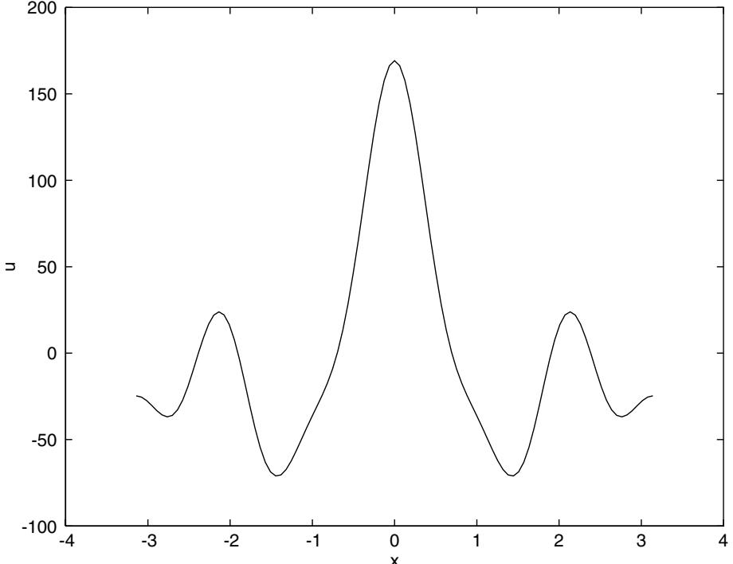  
Figure 6.34 Double cnoidal wave of the super Korteweg de Vries equation as computed by the genetic algorithm.

So we see that GAs show promise for finding solutions of differential and partial differential equations, even when these equations are highly nonlinear and have high-order derivatives.

# BIBLIOGRAPHY

Beychok, M. R. 1994. Fundamentals of Stack Gas Dispersion, 3rd ed. Irvine, CA: Milton Beychok.

Boyd, J. P. 1986. Solitons from sine waves: Analytical and numerical methods for nonintegrable solitary and cnoidal waves. Physica 21D:227–246.   
Branstator, G., and S. E. Haupt. 1998. An empirical model of barotropic atmospheric dynamics and its response to forcing. J. Climate 11:2645–2667.   
Cartwright, H. M., and S. P. Harris. 1993. Analysis of the distribution of airborne pollution using GAs. Atmos. Environ 27A:1783–1791.   
Chambers, L. (ed.). 1995. GAs, Applications, Vol. 1. New York: CRC Press.   
Davidor, Y. 1991. GAs and Robotics. River Edge, NJ: World Scientific.   
Davis, L. 1991. Handbook of GAs. New York: Van Nostrand Reinhold.   
Fausett, L. 1994. Fundamentals of Neural Networks: Architectures, Algorithms, and Applications. Upper Saddle River, NJ: Prentice Hall.   
Hagan, M. T., H. B. Demuth, and M. Beale. 1995. Neural Network Design. Boston: PWS.   
Hasselmann, K. 1976. Stochastic climate models. Part I: Theory. Tellus 28:473–485.   
Haupt, R. L. 1995. An introduction to GAs for electromagnetics. IEEE Ant. Propagat. Mag. 37:7–15.   
Haupt, S. E. 1988. Solving nonlinear wave problems with spectral boundary value techniques. Ph.D. dissertation. University of Michigan, Ann Arbor.   
Haupt, S. E., and J. P. Boyd. 1988a. Modeling nonlinear resonance: A modification to the Stokes’ perturbation expansion. Wave Motion 10:83–98.   
Haupt, S. E., and J. P. Boyd. 1988b. Double cnoidal waves of the Korteweg De Vries equation: Solution by the spectral boundary value approach. Physica 50D:117–134.   
Holland, J. H. 1992. Genetic Algorithms. Sci. Am. 267:66–72.   
Karr, C. L. 2003. Minimization of sonic boom using an evolutionary algorithm. Paper AIAA 2003-0463. 40st AIAA Aerospace Sciences Meeting and Exhibit, Reno, NV.   
Karr, C. L., I. Yakushin, and K. Nicolosi. 2001. Solving inverse initial-value, boundaryvalue problems via GA. Eng. Appl. Art. Intell. 13:625–633.   
Kirkpatrick, S., C. D. Gelatt, and M. P. Vecchi. 1983. Optimization by simulated annealing. Science 220:671–680.   
Koza, J. R. 1992. The Genetic Programming Paradigm: Genetically Breeding Populations of Computer Programs to Solve Problems. In B. Soucek (ed.), Dynamic, Genetic, and Chaotic Programming: The Sixth Generation. New York: J. Wiley, pp. 203–321.   
Loughlin, D. H., S. R. Ranjithan, J. W. Baugh, Jr., and E. D. Brill Jr. 2000. Application of GAs for the design of ozone control strategies. J. Air Waste Manage. Assoc. 50:1050–1063.   
Michalewicz, Z. 1992. Genetic Algorithms + Data Structures $=$ Evolution Programs. New York: Springer-Verlag.   
Obayashi, S., D. Sasaki, Y. Takeguchi, and N. Hirose. 2000. Multiobjective evolutionary computation for supersonic wing-shape optimization. IEEE Trans. Evol. Comput. 4:182–187.   
Pack, D., G. Toussaint, and R. Haupt. 1996. Robot trajectory planning using a GA. Int. Symp. on Optical Science, Engineering, and Instrumentation. SPIE’s Annual Meeting, Denver, CO.   
Penland, C. 1989. Random forcing and forecasting using principal oscillation pattern analysis. Mon. Weather Rev. 117:2165–2185.   
Penland, C. 1996. A stochasic model of IndoPacific sea surface temperature anomalies. Physica 98D:534–558.   
Penland, C., and M. Ghil. 1993. Forecasting northern hemisphere $7 0 0 \mathrm { m b }$ geopotential height anomalies using empirical normal modes. Mon. Weather Rev. 121:2355.   
Penland, C., and T. Magorian. 1993. Prediction of NINO3 sea-surface temperatures using linear inverse modeling. J. Climate 6:1067.   
Whitley, D., T. Starkweather, and D. Shaner. 1991. The traveling salesman and sequence scheduling: Quality solutions using genetic edge recombination. In L. Davis (ed.), Handbook of GAs. New York: Van Nostrand Reinhold.   
Widrow, B., and S. D. Sterns, 1985. Adaptive Signal Processing. Upper Saddle River, NJ: Prentice-Hall.   
Yao, X. (ed.). 1995. Progress in Evolutionary Computation. New York: Springer-Verlag.

# More Natural Optimization Algorithms

The GA is not the only optimization algorithm that models natural processes. In this chapter we briefly present some of the current algorithms being used for global optimization. Some introductory programs are included for your amusement. Which algorithm is best? We tend to like the GA and some of the local optimization algorithms. The “No Free Lunch Theorem” says that the averaged performance of all search algorithms over all problems is equal (Wolpert, 1997). In other words, the GA performs no better than a totally random search when applied to all problems. Thus the idea is to use the right algorithm for the right problem.

# 7.1 SIMULATED ANNEALING

In the early 1980s the method of simulated annealing (SA) was introduced by Kirkpatrick and coworkers (1983), based on ideas formulated in the early 1950s (Metropolis, 1953). This method simulates the annealing process in which a substance is heated above its melting temperature and then gradually cooled to produce the crystalline lattice, which minimizes its energy probability distribution. This crystalline lattice, composed of millions of atoms perfectly aligned, is a beautiful example of nature finding an optimal structure. However, quickly cooling or quenching the liquid retards the crystal formation, and the substance becomes an amorphous mass with a higher than optimum energy state. The key to crystal formation is carefully controlling the rate of change of temperature.

The algorithmic analog to this process begins with a random guess of the cost function variable values. Heating means randomly modifying the variable values. Higher heat implies greater random fluctuations. The cost function returns the output, $f ,$ associated with a set of variables. If the output decreases, then the new variable set replaces the old variable set. If the output increases, then the output is accepted provided that

$$
r \leq e ^ { [ f ( p _ { o l d } ) - f ( p _ { n e w } ) ] / T }
$$

where $r$ is a uniform random number and $T$ is a variable analogous to temperature. Otherwise, the new variable set is rejected. Thus, even if a variable set leads to a worse cost, it can be accepted with a certain probability. The new variable set is found by taking a random step from the old variable set

$$
p _ { n e w } = d p _ { o l d }
$$

The variable $d$ is either uniformly or normally distributed about $p _ { o l d }$ . This control variable sets the step size so that, at the beginning of the process, the algorithm is forced to make large changes in variable values. At times the changes move the algorithm away from the optimum, which forces the algorithm to explore new regions of variable space. After a certain number of iterations, the new variable sets no longer lead to lower costs. At this point the values of $T$ and $d$ decrease by a certain percent and the algorithm repeats. The algorithm stops when $T \simeq 0 .$ The decrease in $T$ is known as the cooling schedule. Many different cooling schedules are possible. If the initial temperature is $T _ { 0 }$ and the ending temperature is $T _ { N }$ , then the temperature at step $n$ is given by

$$
T _ { n } = f ( T _ { 0 } , T _ { N } , N , n )
$$

where $f$ decreases with time. Some potential cooling schedules are as follows:

1. Linearly decreasing: $T _ { n } = T _ { 0 } - n ( T _ { 0 } - T _ { n } ) / N .$ .   
2. Geometrically decreasing: $T _ { n } = 0 . 9 9 T _ { n - 1 }$ .   
3. Hayjek optimal: $T _ { n } = c / \log ( 1 + n )$ , where $c$ is the smallest variation required to get out of any local minimum.

Many other variations are possible. The temperature is usually lowered slowly so that the algorithm has a chance to find the correct valley before trying to get to the lowest point in the valley. This algorithm has essentially “solved” the traveling salesperson problem (Kirkpatrick, 1983) and has been applied successfully to a wide variety of problems.

We put an SA algorithm to work on (1.1). Figure 7.1 is a plot of all the guesses made by the SA in the process of finding the minimum. As with the GA, the random nature of this algorithm scatters the samples over the entire extent of the cost function. Figure 7.2 is a plot of the guesses and the best guess so far vs. the number of function evaluations. After 58 function evaluations, the SA finds the minimum. SA compares favorably with the GA and performs considerably better with multimodal cost functions than local optimizers.

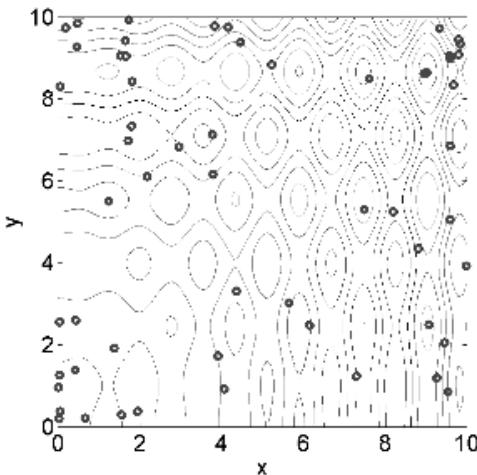  
Figure 7.1 Plot of all the guesses made by the SA in finding the minimum.

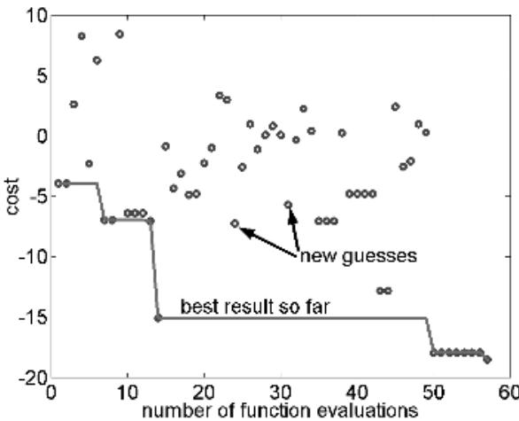  
Figure 7.2 Convergence of the SA.

# 7.2 PARTICLE SWARM OPTIMIZATION (PSO)

PSO was formulated by Edward and Kennedy in 1995. The thought process behind the algorithm was inspired by the social behavior of animals, such as bird flocking or fish schooling. PSO is similar to the continuous GA in that it begins with a random population matrix. Unlike the GA, PSO has no evolution operators such as crossover and mutation. The rows in the matrix are called particles (same as the GA chromosome). They contain the variable values and are not binary encoded. Each particle moves about the cost surface with a velocity. The particles update their velocities and positions based on the local and global best solutions:

$$
\begin{array} { r } { \nu _ { m , n } ^ { n e w } = \nu _ { m , n } ^ { o l d } + \Gamma _ { 1 } \times r _ { 1 } \times \left( p _ { m , n } ^ { l o c a l b e s t } - p _ { m , n } ^ { o l d } \right) + \Gamma _ { 2 } \times r _ { 2 } \times \left( p _ { m , n } ^ { g l o b a l b e s t } - p _ { m , n } ^ { o l d } \right) } \end{array}
$$

$$
p _ { m , n } ^ { n e w } = p _ { m , n } ^ { o l d } + \nu _ { m , n } ^ { n e w }
$$

where

$\nu _ { m , n } =$ particle velocity   
$p _ { m , n } =$ particle variables   
$r _ { 1 } , r _ { 2 } =$ independent uniform random numbers   
$\Gamma _ { 1 } = \Gamma _ { 2 } =$ learning factors $= 2$   
$p _ { \mathrm { m , n } } ^ { \mathrm { l o c a l ~ b e s t } } =$ best local solution   
$p _ { \mathrm { m , n } } ^ { \mathrm { g l o b a l ~ b e s t } } =$ best global solution

The PSO algorithm updates the velocity vector for each particle then adds that velocity to the particle position or values. Velocity updates are influenced by both the best global solution associated with the lowest cost ever found by a particle and the best local solution associated with the lowest cost in the present population. If the best local solution has a cost less than the cost of the current global solution, then the best local solution replaces the best global solution. The particle velocity is reminiscent of local minimizers that use derivative information, because velocity is the derivative of position. The constant $\Gamma _ { 1 }$ is called the cognitive parameter. The constant $\Gamma _ { 2 }$ is called the social parameter. The advantages of PSO are that it is easy to implement and there are few parameters to adjust.

The PSO is able to tackle tough cost functions with many local minima. Figure 7.3 shows the initial random swarm set loose on the cost surface. The particle swarming becomes evident as the generations pass (see Figures 7.4 to 7.7). The largest group of particles ends up in the vicinity of the global minimum and the next largest group is near the next lowest minimum. A few other particles are roaming the cost surface at some distance away from the two groups. Figure 7.8 shows plots of $p _ { \mathrm { m , n } } ^ { \mathrm { l o c a l } }$ best and $p _ { \mathrm { m , n } } ^ { \mathrm { g l o t } }$ al best as well as the population average as a function of generation. The particle $p _ { \mathrm { m , n } } ^ { \mathrm { g l o b a l \ b e s t } }$ serves the same function as elite chromosome in the GA. The chaotic swarming process is best illustrated by following the path of one of the particles until it reaches the global minimum (Figure 7.9). In this implementation the particles frequently bounce off the boundaries.

# 7.3 ANT COLONY OPTIMIZATION (ACO)

Ants can find the shortest path to food by laying a pheromone (chemical) trail as they walk. Other ants follow the pheromone trail to food. Ants that happen to pick the shorter path will create a strong trail of pheromone faster than the ones choosing a longer path. Since stronger pheromone attracts ants better, more and more ants choose the shorter path until eventually all ants have found the shortest path. Consider the case of three possible paths to the food source with one longer than the others.Ants choose each path with equal probability. Ants that went and returned on the shortest path will cause it to have the most pheromone soonest. Consequently new ants will select that path first and further reinforce the pheromone level on that path. Eventually all the ants will follow the shortest path to the food.

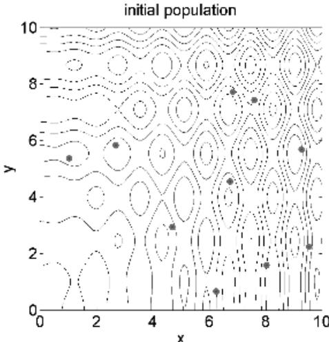  
Figure 7.3 Initial random swarm of 10 particles.

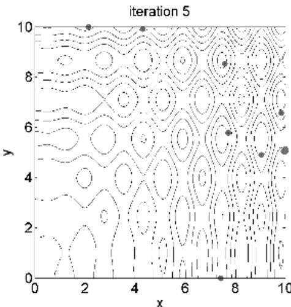  
Figure 7.4 Swarm after 5 iterations.

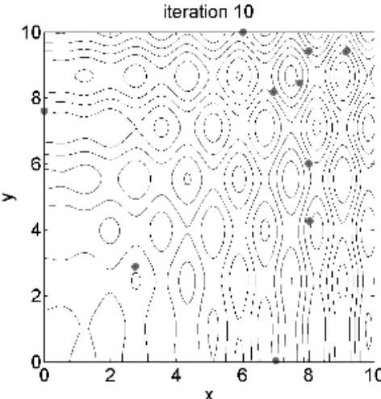  
Figure 7.5 Swarm after 10 iterations.

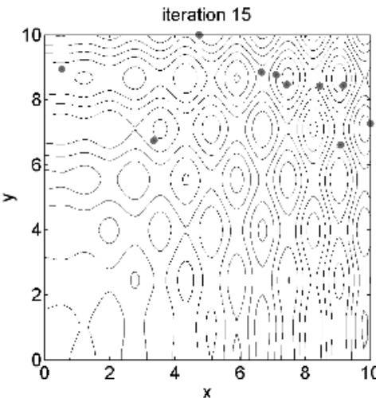  
Figure 7.6 Swarm after 15 iterations.

The first ant colony optimization (ACO) algorithms were designed to solve the traveling salesperson problem, because this problem closely resembles finding the shortest path to a food source (Dorigo and Maria, 1997). Initial attempts at an ACO algorithm were not very satisfying until the ACO algorithm was coupled with a local optimizer. One problem is premature convergence to a less than optimal solution because too much virtual pheromone was laid quickly. To avoid this stagnation, pheromone evaporation is implemented. In other words, the pheromone associated with a solution disappears after a period of time.

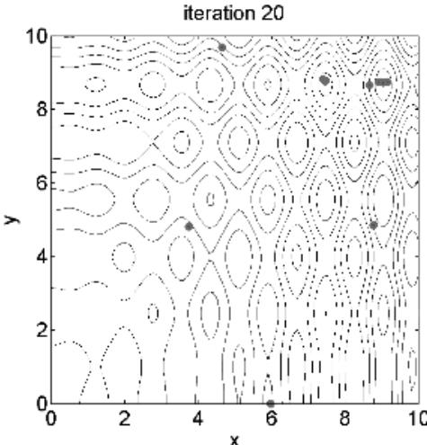  
Figure 7.7 Swarm after 20 iterations.

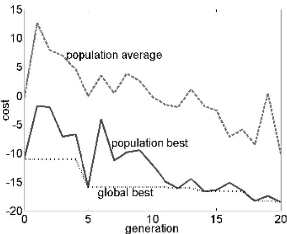  
Figure 7.8 Convergence of the PSO algorithm.

The ACO is a natural for the traveling salesperson problem. It begins with a number of ants that follow a path around the different cities. Each ant deposits a pheromone along the path. The algorithm begins by assigning each ant to a randomly selected city. The next city is selected by a weighted probability that is a function of the strength of the pheromone laid on the path and the distance of the city. The probability that ant $k$ will travel from city $m$ to city $n$ is given by

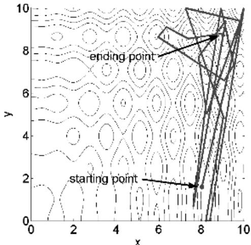  
Figure 7.9 Path taken by a single PSO particle.

$$
p _ { m n } ^ { k } = \frac { \tau _ { m n } ^ { a } / d _ { m n } ^ { b } } { \sum _ { q } \tau _ { m q } ^ { a } / d _ { m q } ^ { b } }
$$

where

$\tau =$ pheromone strength   
$q =$ cities on tour $k$ that come after city $m$   
$a =$ pheromone weighting; when $a = 0$ , closest city is selected   
${ \bf b } = { \bf \begin{array} { r l } \end{array} }$ distance weighting; when $b = 0$ , distance between cities is ignored

Short paths with high pheromone have the highest probability of selection. On the initial paths, pheromone is laid on inefficient paths. Consequently some of this pheromone must evaporate in time or the algorithm will converge on an inefficient path. Early trials of ACO found that an elitist strategy is as important as it is with GAs. As a result the pheromone along the best path so far is given some weight in calculating the new pheromone levels. The pheromone update formula is given by (Bonabeau et al., 1999)

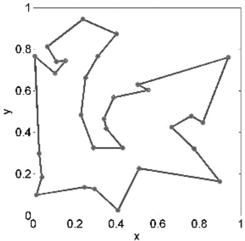  
Figure 7.10 ACO solution to 30 city traveling salesperson problem.

$$
\tau _ { m n } = ( 1 - \xi ) \tau _ { m n } + \sum _ { k = 1 } ^ { N _ { a n t s } } \tau _ { m n } ^ { k } + \varepsilon \tau _ { m n } ^ { e l i t e }
$$

where

$\tau _ { m n } ^ { k } =$ pheromone laid by ant $k$ between city $m$ and city $n$   
$\begin{array} { r l } { \xi } & { { } = } \end{array}$ pheromone evaporation constant   
$\begin{array} { r l } { \varepsilon } & { { } = } \end{array}$ elite path weighting constant   
$\tau _ { m n } ^ { e l i t e } =$ pheromone laid on the best path found by the algorithm to this point

The ACO does well on a traveling salesperson problem with 30 cities. Figure 7.10 is the optimal path found by this algorithm. Its convergence is shown in Figure 7.11. Other types of problems can be solved using ACO too.

# 7.4 GENETIC PROGRAMMING (GP)

Wouldn’t it be nice to get a computer to do what you want, without telling it how to do it in great detail? Genetic programming (GP) accomplishes this goal through applying a GA to writing computer programs (Koza, 1992). The variables are various programming constructs, and the output is a measure of how well the program achieves its objectives. The GA operations of mutation, reproduction (crossover) and cost calculation require only minor modifications. GP is a more complicated procedure because it must work with the variable length structure of the program or function. A GP is a computer program that writes other computer programs.

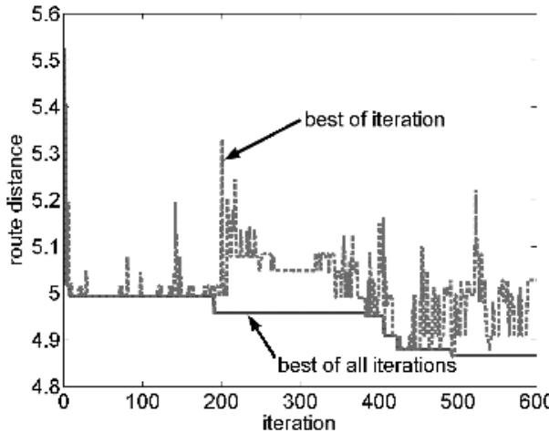  
Figure 7.11 ACO convergence of the traveling salesperson problem.

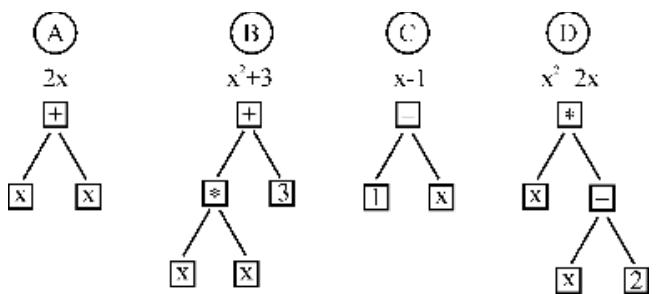  
Figure 7.12 Population of four polynomial functions.

The computer programs written by GP are not in common languages such as MATLAB or Fortran but in the more obscure artificial intelligence language (AI) LISP (LISt Processor). Unlike most other languages, LISP uses expressions but not program statements (Graham, 1995). The value resulting from evaluating an expression can be embedded in other expressions. Scheme is a more recent AI language and is a derivative of LISP that stresses conceptual elegance and simplicity (Harvey and Wright, 1994). It is much more compact than LISP. The list in LISP is an ordered sequence of elements. Elements are functions, names, numbers, or other lists. Lists are flexible because the number or type of elements does not have to be specified in advance.

Each chromosome in the initial population of a GP is a program comprised of random functions and terminals. Some examples of functions are addition, subtraction, division, multiplication, and trigonometric functions. The terminal set consists of the variables and constants of the programs. Figure 7.12 shows a small population of four polynomial functions.The parse tree representation is below each polynomial.

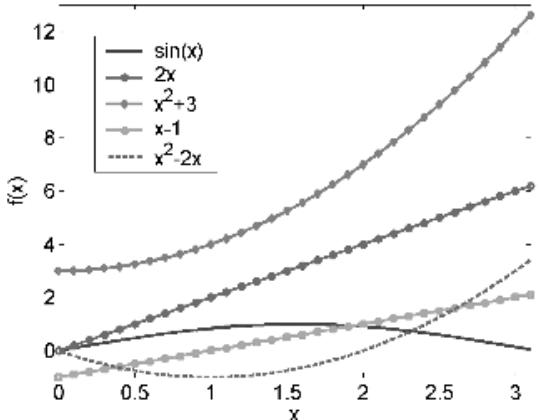  
Figure 7.13 Plots of chromosomes approximating $\sin ( x )$ .

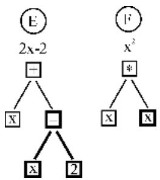  
Figure 7.14 Two offspring formed through mating parents B and D.

Each program in the population is run and its cost evaluated. The cost is an indicator of how well it solves the problem. Let’s assume the goal is to find a polynomial that interpolates $\sin ( x )$ for $0 \leq x \leq \pi .$ . In this case the cost is the sum of the squared difference between the interpolating function and $\sin ( x )$ . As is often the case with many problems, the initial population of the GP does not contain very good solutions (see Figure 7.13).

A new population of computer programs is created through selection, crossover, and mutation. Programs are randomly selected from the population using the same stochastic selection methods as in a GA. A node is randomly selected in two parent chromosomes and the tree structure below these nodes are exchanged to create new offspring. Figure 7.14 shows the offspring resulting from program A and program D in Figure 7.12 mating. The bold lines indicate the part of the parse trees that were exchanged. The two parents participating in crossover are usually of different sizes and shapes. Even if identical parents are selected, two different offspring can result if the crossover points are not at the same nodes. Mutations occur next. A subtree mutation replaces a randomly selected subtree with a randomly generated subtree. Another type of mutation replaces the function or variable in a node. Figure 7.15 shows subtree mutation applied to the left side of program B in Figure 7.12 and variable mutation on the right side.

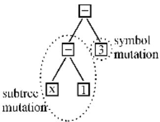  
Figure 7.15 Two possible types of mutation on chromosome A.

Usually computer programs have many subroutine calls. GP operates on subroutines as well as on mathematical operations. Some examples include:

• Subroutine duplication. Copies an existing subroutine in a program and renames the copy. The subroutine calls in the program are randomly divided between the old subroutine and the new subroutine.   
• Argument duplication. Copies one argument of a subroutine, randomly divides internal references to it, and preserves overall program semantics by adjusting all calls to the subroutine.   
• Subroutine creation. Generates a new subroutine.   
• Architecture altering. Deletes a subroutine. It may also add and delete automatically defined iterations, automatically defined loops, automatically defined recursions, and automatically defined stores (memory).

A GP works best for problems that do not have a single best solution and for problems with dynamically changing variables. There has been some concern over the robustness of GP solutions (Kushchu, 2002), where robustness is the ability of the program to arrive at a good solution when applied to an environment that is similar to the one it was evolved for. Many researchers have successfully used GP on a wide variety of problems, including automated synthesis of controllers, circuits, antennas, genetic networks, and metabolic pathways. Koza (1994) and Koza et al. (1999, 2003) provide a wide range of examples, computer code, and video of GP applications.

Koza reports that GPs are recreating previously patented electronic inventions (Koza, 2003). A few of these inventions have even been improved upon. It is possible for the GP to work with evolvable hardware. An excellent example of evolvable hardware is a rapidly reconfigurable field-programmable gate array. These chips can be reconfigured to perform desired logical operations via commands from a computer. Although circuit designs developed by the GP may outperform previous “best” designs, understanding how or why they work is often difficult. In addition the GP designs may contain redundant or extraneous components.

# 7.5 CULTURAL ALGORITHMS

The advancement or optimization of the human race cannot be totally attributed to genetics and evolution. Human interactions, societal behaviors, and other factors play major roles in the optimization process as well. Since social interactions allow for faster adaptation and improvement than genetics and evolution, an optimization algorithm should include those societal factors that would help speed convergence. These algorithms are known as cultural algorithms (Reynolds, 1994).

As with a GA, these algorithms begin with a random population called a civilization. The civilization has societies that consist of clusters of points or individuals. Each society has a leader. Individuals within a society only interact with others in the same society. This behavior is analogous to a local search. Society leaders, however, interact not only with other individuals in the same society but with leaders from other societies as well. A leader may leave its current society to join a society that performing at a higher level. This leader migration allows high-performing societies to flourish while diminishing low-performing societies. This behavior is analogous to global search.

The hope is that these algorithms will produce excellent results faster than a GA. They are reminiscent of the parallel island GAs. The interested reader can find pseudocode for this type of algorithm in the literature (Ray and Liew, 2003).

# 7.6 EVOLUTIONARY STRATEGIES

GAs are not the only type of evolutionary computing methods. Modeling biological evolution on a computer began in the 1960s. Rechenberg (1965) introduced evolutionary strategies in Europe. His first versions of the algorithms used real-valued parameters and began with a parent and a mutated version of a parent. Whichever had the highest cost was discarded. The winner produced a mutated version and the process repeated. Populations and crossover were not incorporated until later years. A general version of the algorithm, known as the $( \mu + \lambda )$ evolution strategy, was developed (Ba¨ck, 1997). In this strategy, $\mu$ parents produce $\lambda$ offspring. In succeeding generations only the best $\mu$ of the $\lambda$ offspring and $\mu$ parents are allowed to survive until the next generation.Another variant known as the $( \mu , \lambda )$ replaces the parents with the best $\mu$ offspring. None of the parents from the previous generation are allowed to produce offspring again. This approach does not use elitism. It accepts a lower cost at a given generation in the hope that a better cost will be found in a future generation. Fogel introduced the concept of evolutionary programming in the United States at about the same time as Rechenberg’s work (Fogel et al., 1966). For more detailed information on evolutionary algorithms, see (Schwefel, 1995).

# 7.7 THE FUTURE OF GENETIC ALGORITHMS

Some optimization problems are so big that they have not been totally solved to date. Ahuja and Orlin (2003) report how new optimization algorithms are successfully improving solutions to very large problems. In this case very largescale neighborhood (VLSN) techniques were used on the airline fleet scheduling problem. In this problem an airline has to schedule planes into and out of airports in an efficient manner that maximizes revenue minus operating costs while satisfying constraints such as size of plane, number of expected passengers, and number of planes leaving an airport matching the number arriving. At the same time flight crews must be scheduled for all planes. The assignments are broken into four separate problems: (1) fleet assignment, (2) through assignment (a plane that stops in one city then proceeds to another city), (3) aircraft routing, and (4) crew scheduling. Although these are each separate models, they must be coupled to obtain the best overall solution. Real life problems such as this will continue to challenge optimization routines for years to come.

We return to the hiking analogy of Chapter 1 and imagine ourselves searching for the lowest point in Rocky Mountain National Park. We can think of the GA as a new tool to use, analogous to carrying a global positioning system (GPS) device. We can take this new tool to any position in the park and take a reading of the three-dimensional coordinates. We know the result of the cost function (the elevation) as well as the latitude and longitude of the location. The GA has methods such as crossover and mutation to steer us into the correct portions of the solution space, akin to the topographic maps that can be stored in many GPS systems to point us in the direction of the lowest point. The tool itself is rapidly evolving to work in new ways to solve bigger problems in much larger topological landscapes. Koza et al. (2003) have submitted patent applications on genetically programmed inventions. Yet they have only scratched the surface of genetic programming and evolvable hardware. How many of the inventions of the future will be done with computer intelligence? We saw in Chapter 4 how GAs are being used to produce new forms of music and art. Many of those applications (but not all) had some interface with a human critic to help train the algorithm on what is “good.” Does the computer become the artist?

We humans are constantly evolving new ways of looking at the world and doing things. We are always inventing new problems and new ways of solving them. That is what we call progress. The relatively new invention of the GPS has revolutionized our ability to know exactly where we are when hiking. The GA has demonstrated that it can easily solve many traditionally challenging optimization problems. We immediately found new uses for our new tools. We combine our new tools with other evolving tools. We put GPS devices in cell phones in the same way we use GAs to train artificial neural networks. Automotive navigation is being revolutionized by the GPS, just as major scheduling problems are being solved by the GA. The GPS is being used in guiding satellite clusters and the GA is being used to improve the design of airplanes. It is a never ending process and that is what makes life, and its changes, interesting.

# BIBLIOGRAPHY

Ahuja, R. K., and J. B. Orlin. 2003. Very large-scale neighborhood search in airline fleet scheduling. SIAM News 35:11–13.   
Bäck, T. 1997. Evolutionary computation: comments on the history and current state. IEEE Trans. Evol. Comput. 1:3–17.   
Bonabeau, E., M. Dorigo, and G. Theraulaz. 1999. Swarm Intelligence from Natural to Artificial Systems. New York: Oxford University Press.   
Dorigo, M., and G. Maria. 1997. Ant colony system: a cooperative learning approach to the traveling salesman problem. IEEE Trans. Evol. Comput. 1:53–66.   
Fogel, L. J., A. J. Owens, and M. J. Walsh. 1966. Artificial Intelligence through Simulated Evolution. New York: Wiley.   
Graham, P. 1995. ANSI Common LISP. Upper Saddle River, NJ: Prentice Hall.   
Harvey, B., and M. Wright. 1994. Simply Scheme: Introducing Computer Science. Cambridge: MIT Press.   
Holland, J. H. 1975. Adaptation in Natural and Artificial Systems. Ann Arbor: University of Michigan Press.   
Kennedy, J., and R. C. Eberhart. 2001. Swarm Intelligence. San Francisco: Morgan Kaufmann.   
Kennedy, J., and R. C. Eberhart. 1995. Particle swarm optimization. Proc. IEEE Int. Conf. on Neural Networks, IV. Piscataway, NJ: IEEE Service Center, pp. 1942–1948.   
Kirkpatrick, S., C. D. Gelatt Jr., and M. P. Vecchi. 1983. Optimization by simulated annealing. Science 220:671–680.   
Koza, J. R. 1992. Genetic Programming: On the Programming of Computers by Means of Natural Selection. Cambridge: MIT Press.   
Koza, J. R. 1994. Genetic Programming II: Automatic Discovery of Reusable Programs, Cambridge: MIT Press.   
Koza, J. R., et al. 1999. Genetic Programming III: Darwinian Invention and Problem Solving. San Francisco: Morgan Kaufmann.   
Koza, J. R., et al. 2003. Genetic Programming IV: Routine Human-Competitive Machine Intelligence. Hingham, MA: Kluwer Academic.   
Koza, J. R., M. A. Keane, and J. M. Streeter. 2003. Evolving inventions. Sci. Am. 288: 52–59.   
Kushchu, I. 2002. Genetic programming and evolutionary generalization. IEEE Trans. Evol. Comput. 6:431–442.   
Metropolis, N., et al. 1953. Equation of state calculations by fast computing machines. J. Chem. Phys. 21:1087–1092.   
Parsopoulos, K. E., and M. N. Vrahatis. 2002. Recent approaches to global optimization problems through particle swarm optimization. In Natural Computing. Netherlands: Kluwer Academic, 1:235–306.   
Ray, T., and K. M. Liew. 2003. Society and civilization: An optimization algorithm based on the simulation of social behavior. IEEE Trans. Evol. Comput. 7:386–396.   
Rechenberg, I. 1965. Cybernetic solution path of an experimental problem. In Royal Aircraft Establishment, Library Translation 1122. Farnborough, Hants, England.   
Reynolds, R. G. 1994. An Introduction to Cultural Algorithms. In A. V. Sebald and L. J. Fogel (eds), Proc. 3rd An. Conf. on Evolutionary Programming. River Edge, NJ: World Scientific, pp. 131–139.   
Schwefel, H. 1995. Evolution and Optimum Seeking. New York: Wiley.   
Wolpert, D. H., and W. G. Macready. 1997. No free lunch theorems for optimization. IEEE Trans. Evol. Comput. 1:67–82.

# EXERCISES

1. Use SA to find the minimum of function in Appendix I using the following cooling schedules:

a. Linearly decreasing: $T _ { n } = T _ { 0 } - n ( T _ { 0 } - T _ { n } ) / N$   
b. Geometrically decreasing: $T _ { n } = 0 . 9 9 T _ { n - 1 }$   
c. Hayjek optimal: $T _ { n } = c / \log ( 1 + n )$ , where $c$ is the smallest variation required to get out of any local minimum.

Which schedule works best?

2. What values do you recommend for the PSO learning factors? Average runs for several different cost functions to justify your conclusions.

3. Find the minimum of _ (from Appendix I) using PSO.

4. Develop a hybrid PSO algorithm and test it.

5. Compare ACO with a GA for solving the traveling salesperson problem as a function of the number of cities.

6. Demonstrate the importance using ACO of the evaporation constant in solving the traveling salesperson problem.

7. Modify the ACO code to optimize the function in Appendix I.

8. Implement a cultural algorithm to optimize the function in Appendix I.

9. Write a $( \mu + \lambda )$ evolution strategy algorithm to optimize the function in Appendix I.

10. Write a $( \mu , \lambda )$ evolution strategy algorithm to optimize the function in Appendix I.

11. Compare the $( \mu , \lambda )$ and $( \mu + \lambda )$ evolution strategy optimization algorithms. Which do you recommend and why?

12. For optimizing the function in Appendix I, compare one or more of the following algorithms:

a. Nelder-Mead downhill simplex   
b. BFGS   
c. DFP   
d. Steepest descent   
e. Random search   
f. Binary GA   
g. Continuous GA   
h. mGA   
i. SA   
j. PSO   
k. ACO   
l. $( \mu , \lambda )$ evolution strategy algorithm   
m. $( \mu + \lambda )$ evolution strategy algorithm

# Test Functions

In order to determine how well an optimization algorithm works, a variety of test functions have been used as a check. We’ve listed 16 in this appendix. In each case we give a general form of the function, plot its value in one or two dimensions, give the global optimum in one or two dimensions, and list the domain. Some of the functions are generalizable to $N$ dimensions. MATLAB code for these functions appear in Appendix II. Some of the research into developing test functions is reported in the references.

# BIBLIOGRAPHY

De Jong, K. A. 1975. Analysis of the behavior of a class of genetic adaptive systems. Ph.D. Dissertation. University of Michigan, Ann Arbor.   
Michalewicz, Z. 1992. Genetic Algorithms $^ +$ Data Structures $=$ Evolution Programs. New York: Springer-Verlag.   
Schwefel, H. 1995. Evolution and Optimum Seeking. New York: Wiley.   
Whitley, D., K. Mathias, S. Rana, and J. Dzubera. 1996. Evaluating Evolutionary Algorithms. Artificial Intelligence Journal 85:1–32.   
Whitley, D., R. Beveridge, C. Graves, and K. Mathias. 1995. Test Driving Three 1995 Genetic Algorithms: New Test Functions and Geometric Matching. Journal of Heuristics 1:77–104.

F1

$| x | + \cos ( x )$   
minimum: $f ( 0 ) = 1$   
x- • £ £ •for

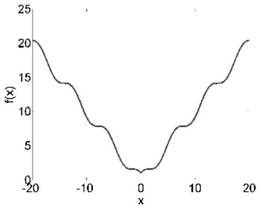

F3

$$
\sum _ { n = 1 } ^ { N } x _ { n } ^ { 2 }
$$

minimum: $f ( 0 , 0 ) = 1$

x- • £ £ •for

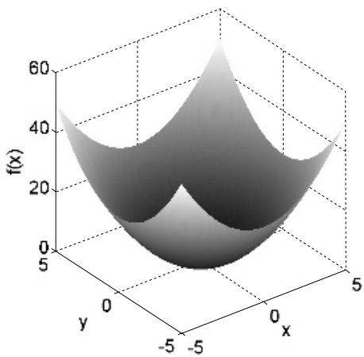

F2

$| x | + \sin ( x )$   
minimum: $f ( 0 ) = 0$   
x- • £ £ •for

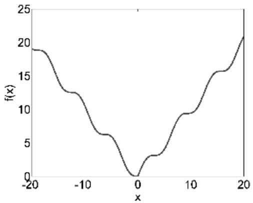

# F4

$$
\sum _ { n = 1 } ^ { N - 1 } \left\{ 1 0 0 { \left[ x _ { n + 1 } - x _ { n } ^ { 2 } \right] } ^ { 2 } + { \left[ 1 - x _ { n } \right] } ^ { 2 } \right\}
$$

minimum: $f ( 1 , 1 ) = 0$

$$
{ \mathrm { f o r } } - \infty \leq x _ { n } \leq \infty
$$

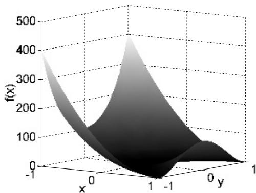

# F5

$$
\sum _ { n = 1 } ^ { N } \left| x _ { n } \right| - 1 0 \cos ( \sqrt { \left| 1 0 x _ { n } \right| } )
$$

minimum: $f ( x ) = 1$ at $x = 0$ ${ \mathrm { f o r } } - \infty \leq x _ { n } \leq \infty$

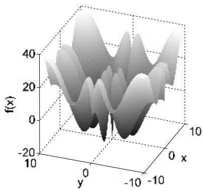

# F7

$x \sin ( 4 x ) + 1 . 1 y \sin ( 2 y )$ minimum: $f ( 0 . 9 0 3 9 , 0 . 8 6 6 8 ) = - 1 8 . 5 5 4 7$ $\mathrm { f o r } 0 \le x , y \le 1 0$

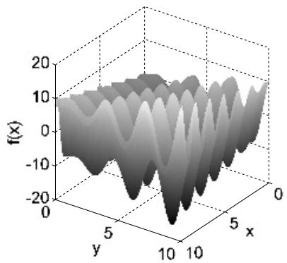

# F6

$( x ^ { 2 } + x ) \cos ( x )$ minimum: $f ( 9 . 6 2 0 4 ) = - 1 0 0 . 2 2$ x10 10- £ £for

# F8

$y \sin ( 4 x ) + 1 . 1 x \sin ( 2 y )$ minimum: $f ( 0 . 9 0 3 9 , 0 . 8 6 6 8 ) = - 1 8 . 5 5 4 7$ x y,0 10£ £fo r

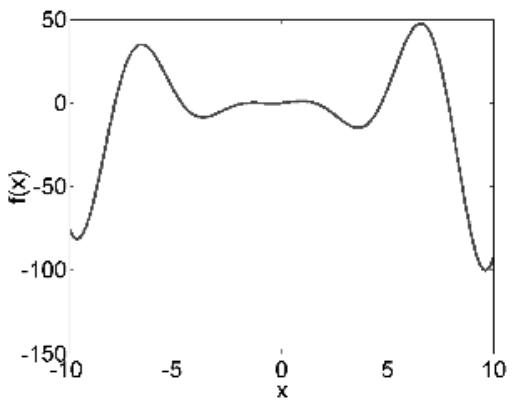

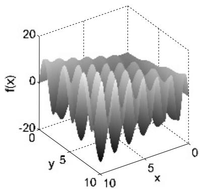

F9

$\left[ \sum _ { n = 1 } ^ { N } n x _ { n } ^ { 4 } \right] + N _ { n } ( 0 ,$ 1  ) $1 + \sum _ { n = 1 } ^ { N } { \frac { x _ { n } ^ { 2 } } { 4 0 0 0 } } - \prod _ { n = 1 } ^ { N } \cos ( x _ { n } )$

minimum: varies

x- • £ £ •for

minimum: $f ( 0 , 0 ) = 0$

$$
{ \mathrm { f o r } } - \infty \leq x _ { n } \leq \infty
$$

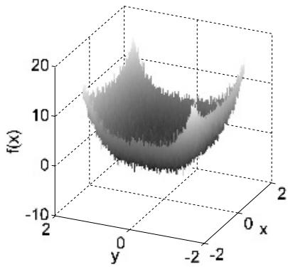

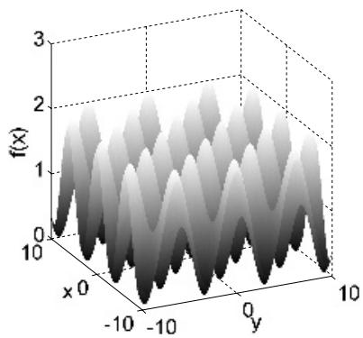

F10

$$
1 0 N + \sum _ { n = 1 } ^ { N } \bigl [ x _ { n } ^ { 2 } - 1 0 \cos ( 2 \pi x _ { n } ) \bigr ]
$$

minimum: $f ( 0 , 0 ) = 0$

$$
{ \mathrm { f o r } } - \infty \leq x _ { n } \leq \infty
$$

# F12

$$
0 . 5 + { \frac { \sin ^ { 2 } { \sqrt { x ^ { 2 } + y ^ { 2 } } } - 0 . 5 } { 1 + 0 . 1 ( x ^ { 2 } + y ^ { 2 } ) } }
$$

minimum: $f ( 1 . 8 9 7 , 1 . 0 0 6 ) = - 0 . 5 2 3 1$

$$
{ \mathrm { f o r - } } \infty \leq x , y \leq \infty
$$

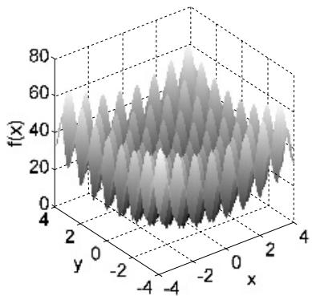

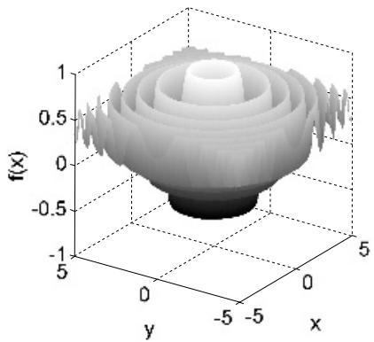

F13

${ \left( x ^ { 2 } + y ^ { 2 } \right) } ^ { 0 . 2 5 } \sin \Bigl \{ 3 0 \bigl [ \left( x + 0 . 5 \right) ^ { 2 } + y ^ { 2 } \bigr ] ^ { 0 . 1 } \Bigr \} + | x | + | y |$ minimum: $f ( 0 , 0 ) = 0$ ${ \mathrm { f o r - } } \infty \leq x , y \leq \infty$

$$
- e ^ { - 0 . 2 { \sqrt { x ^ { 2 } + y ^ { 2 } } } + 3 \left( \cos 2 x + \sin 2 y \right) }
$$

minimum: $f ( - 2 . 7 7 3 0 , - 5 ) = - 1 6 . 9 4 7$

$$
\operatorname { f o r } - 5 \leq x , y \leq 5
$$

# F15

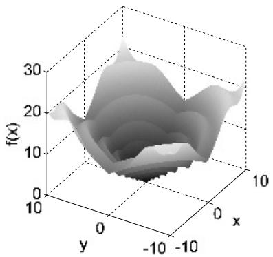

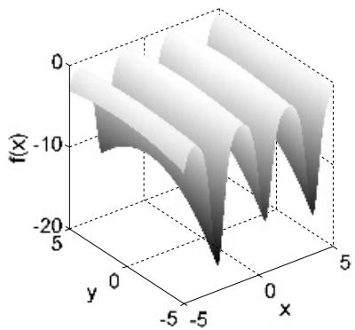

F14

$J _ { 0 } \big ( x ^ { 2 } + y ^ { 2 } \big ) + 0 . 1 | 1 - x | + 0 . 1 | 1 - y |$ minimum: $f ( 1 , 1 . 6 6 0 6 ) = - 0 . 3 3 5 6$ ${ \mathrm { f o r - } } \infty \leq x , y \leq \infty$

# F16

$- x \mathrm { s i n } \big ( \sqrt { | x - ( y + 9 ) | } \big ) - ( y + 9 ) \mathrm { s i n } \big ( \sqrt { | y + 0 . 5 x + 9 | } \big )$ $\mathrm { m i n i m u m } \colon \ f ( - 1 4 . 5 8 , - 2 0 ) = - 2 3 . 8 0 6$ $\mathrm { f o r } - 2 0 \leq x , y \leq 2 0$

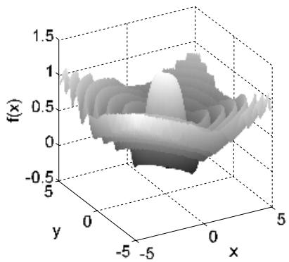

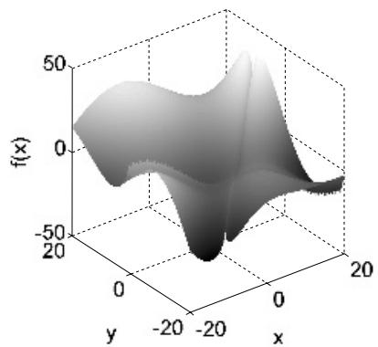

# MATLAB Code

MATLAB is a commonly used program for computer modeling. Its code is relatively straightforward. So even though you may not use MATLAB, it has a pseudocode flavor that should be easy to translate into your favorite programming language. If you wish to learn about MATLAB or reference all the manuals on line, go to www.mathworks.com for help. There are many demos, free software, and other useful items as well as all the MATLAB documentation you would ever need. An excellent version is also available for students. Many of the programs we have used in this book are listed in this appendix and come on the included CD. All the plots and graphs in this book were created with MATLAB version 6.5. We have listed the MATLAB code in the appendix in case the CD gets separated from the book.

# PROGRAM 1: BINARY GENETIC ALGORITHM

% Binary Genetic Algorithm   
%   
% minimizes the objective function designated in ff   
% Before beginning, set all the parameters in parts I, II, and III   
% Haupt & Haupt   
% 2003   
clear   
%   
% I. Setup the GA   
$\boldsymbol { \mathrm { E } } \boldsymbol { \mathrm { E } } = \mathbf { \ell }$ testfunction’; % objective function   
npar $^ { \cdot = 2 }$ ; % number of optimization variables   
%   
% II. Stopping criteria   
maxit $= 1 0 0$ ; % max number of iterations   
mincost $=$ -9999999; % minimum cost   
%   
% III. GA parameters   
popsize $_ { = 1 6 }$ ; % set population size   
mutrate $=$ .15; % set mutation rate   
selection $\scriptstyle { \frac { } { } } = 0$ .5; % fraction of population % kept   
nbits $^ { = 8 }$ ; % number of bits in each % parameter   
Nt $=$ nbits\*npar; % total number of bits % in a chormosome   
keep $=$ floor(selection\*popsize); % #population members % that survive % Create the initia iga ${ } = 0$ ;   
pop $=$ round(rand(popsize,Nt));   
par $=$ gadecode(pop,0,10,nbits);   
cost $=$ feval(ff,par);   
[cost,ind] $=$ sort(cost);   
par $=$ par(ind,:);pop $=$ pop(ind,:);   
minc(1) $=$ min(cost);   
meanc(1) $\equiv$ mean(cost);   
population   
% generation counter   
% initialized   
% random population of   
% 1s and 0s   
% convert binary to   
% continuous values   
% calculates population   
% cost using ff   
% min cost in element 1   
% sorts population with   
% lowest cost first   
% minc contains min of   
% population   
% meanc contains mean   
% of population

% Iterate through generations while iga<maxit iga $\underline { { \underline { { \mathbf { \Pi } } } } }$ iga+1; % increments generation counter

$\%$ Pair and mate   
$\mathbb { M } =$ ceil((popsize-keep)/2); % number of matings   
prob $=$ flipud([1:keep]’/sum([1:keep]));% weights % chromosomes based % upon position in % list   
odds $=$ [0 cumsum(prob(1:keep))’]; % probability   
distribution function

pick1 $=$ rand(1,M); % mate #1   
pick2 $=$ rand(1,M); % mate #2

% ma and pa contain the indicies of the chromosomes   
$\%$ that will mate   
ic $^ { = 1 }$ ;   
while ic $< = \tt { M }$ for $\mathtt { i d } = 2 : \mathtt { k e e p } + 1$ if pick1(ic) $< =$ odds(id) & pick1(ic) $>$ odds(id-1) m $\mathsf { l a } \left( \mathsf { i c } \right) \mathsf { \Lambda } = \mathsf { i d } - 1 \mathsf { \Lambda }$ ; end % if if pick2(ic) $< =$ odds(id) & pick2(ic) $>$ odds(id-1) p $\mathfrak { a } ( \mathrm { i c } ) = \mathrm { i d } - 1$ ; end % if end % id $\mathrm { i } { \mathsf { c } } { = } \mathrm { i } { \mathsf { c } } { + } 1$ ;   
end $\%$ while

# %

% Performs mating using single point crossover   
ix=1:2:keep; % index of mate #1   
xp=ceil(rand(1,M)\*(Nt-1)); % crossover point   
pop(keep+ix,:) $=$ [pop(ma,1:xp) pop(pa,xp $^ { + 1 }$ :Nt)]; % first offspring   
pop(keep+ix+1,:) $=$ [pop(pa,1:xp) pop(ma,xp+1:Nt)]; % second offspring

%

% Mutate the population   
nmut $=$ ceil((popsize-1)\*Nt\*mutrate); $\%$ total number $\%$ of mutations   
mrow $: =$ ceil(rand(1,nmut)\*(popsize-1)) $^ { + 1 }$ ; % row to mutate   
mcol $=$ ceil(rand(1,nmut) $^ { \star } \mathrm { N t }$ ); % column to mutate   
for ii $^ { = 1 }$ :nmut pop(mrow(ii),mcol(ii)) $=$ abs(pop(mrow(ii),mcol(ii))-1); % toggles bits   
end % ii

# %

% The population is re-evaluated for cost par(2:popsize,:) $=$ gadecode(pop(2:popsize,:),0,10,nbits); % decode cost(2:popsize) $=$ feval(ff,par(2:popsize,:));

% Sort the costs and associated parameters [cost,ind] $=$ sort(cost);   
par $=$ par(ind,:); pop $=$ pop(ind,:); $\%$ Do statistics for a single nonaveraging run minc(iga $^ { + 1 }$ ) $\equiv$ min(cost);   
meanc(iga $^ { + 1 }$ ) $\equiv$ mean(cost);   
%   
% Stopping criteria   
if iga>maxit | cost(1)<mincost break   
end

[iga cost(1)] end %iga

%   
% Displays the output   
day=clock;   
disp(datestr(datenum(day(1),day(2),day(3),day(4),day(5) day(6)),0))   
disp([‘optimized function is ‘ ff])   
format short g   
disp([‘popsize $=$ ‘ num2str(popsize) ‘ mutrate = ‘ num2str(mutrate) ‘ # par $=$ ‘ num2str(npar)])   
disp([‘#generations $= \cdot$ num2str(iga) ‘ best cost=’   
num2str(cost(1))])   
disp([‘best solution’])   
disp([num2str(par(1,:))])   
disp(‘binary genetic algorithm’)   
disp([‘each parameter represented by ‘ num2str(nbits) ‘ bits’])   
figure(24)   
iters $= 0 : 1$ ength(minc)-1;   
plot(iters,minc,iters,meanc,’–’);   
xlabel(‘generation’);ylabel(‘cost’);   
text(0,minc(1),’best’);text(1,minc(2),’population   
average’)

# PROGRAM 2: CONVERTS BINARY CHROMOSOME TO CONTINUOUS VARIABLES

% gadecode.m   
% Decodes binary encripted parameters   
%   
% $\pounds =$ gadecode(chrom,lo,hi,bits,gray)   
% chrom $=$ population   
% lo $=$ minimum parameter value   
% hi $=$ maximum parameter value   
% bits $=$ number of bits/parameter

% Haupt & Haupt % 2003

function $\mathtt { f } =$ gadecode(chrom,lo,hi,bits)

[M,N] $=$ size(chrom);   
npar $\mathtt { = N }$ /bits; $\%$ number of variables   
quant $=$ (0.5.^[1:bits]’); % quantization levels   
quant $=$ quant/sum(quant); % quantization levels   
normalized   
ct $=$ reshape(chrom’,bits,npar $\star _ { \mathbb { M } }$ )’;% each column contains $\%$ one variable   
par $=$ ((ct\*quant)\*(hi-lo)+lo); $\%$ DA conversion and $\%$ unnormalize varaibles   
$\mathtt { f } =$ reshape(par,npar,M)’; % reassemble population

# PROGRAM 3: CONTINUOUS GENETIC ALGORITHM

% Continuous Genetic Algorithm   
%   
% minimizes the objective function designated in ff   
% Before beginning, set all the parameters in parts   
% I, II, and III   
% Haupt & Haupt   
% 2003

# %

% I Setup the GA   
$\boldsymbol { \mathrm { E } } \boldsymbol { \mathrm { E } } = \mathbf { \ell }$ testfunction’; $\%$ objective function   
npar $^ { \cdot = 2 }$ ; $\%$ number of optimization variables   
varhi ${ } = \mathtt { 1 0 }$ ; varlo $= 0$ ; % variable limits

% II Stopping criteria maxit $= \mathtt { 1 0 0 }$ ; % max number of iterations mincost $=$ -9999999; % minimum cost

% III GA parameters   
popsize $: = 1 2$ ; $\%$ set population size   
mutrate $=$ .2; $\%$ set mutation rate   
selection $\displaystyle . =$ 0.5; % fraction of population kept   
Nt $=$ npar; % continuous parameter GA Nt $=$ #variables   
keep $=$ floor(selection\*popsize); % #population % members that survive   
nmut $=$ ceil((popsize-1)\*Nt\*mutrate); % total number of % mutations   
$\mathbb { M } =$ ceil((popsize-keep)/2); % number of matings   
% Create the initial population   
iga ${ } = 0$ ; % generation counter   
initialized   
par $=$ (varhi-varlo)\*rand(popsize,npar) $^ +$ varlo; % random   
cost $=$ feval(ff,par); % calculates population cost % using ff   
[cost,ind] $=$ sort(cost); % min cost in element 1   
par $=$ par(ind,:); % sort continuous   
minc(1) $\equiv$ min(cost); % minc contains min of   
meanc(1) $=$ mean(cost); % meanc contains mean of   
population   
$\%$   
% Iterate through generations   
while iga<maxit iga $\underline { { \underline { { \mathbf { \Pi } } } } }$ iga+1; % increments generation counter   
%   
% Pair and mate   
M=ceil((popsize-keep)/2); % number of matings   
prob $=$ flipud([1:keep]’/sum([1:keep])); % weights % chromosomes   
odds $=$ [0 cumsum(prob(1:keep))’]; % probability % distribution % function   
pick1 $=$ rand(1,M); % mate #1   
pick2 $=$ rand(1,M); % mate #2   
% ma and pa contain the indicies of the chromosome   
% that will mate   
ic $^ { = 1 }$ ;   
while ic $< = \tt { M }$ for id $^ { = 2 }$ :keep $^ { + 1 }$ if pick1(ic) $< =$ odds(id) & pick1(ic) $>$ odds(id-1) ma( $\mathtt { i c } ) = \mathtt { i d } - 1$ ; end if pick2(ic) $< =$ odds(id) & pick2(ic) $>$ odds(id-1) p $\mathtt { \Gamma } \mathtt { \ Q } \left( \mathtt { i c } \right) = \mathtt { i d } - 1$ ; end end $\mathrm { i } { \mathsf { c } } { = } \mathrm { i } { \mathsf { c } } { + } 1$ ;   
end

# %

% Performs mating using single point crossover   
ix=1:2:keep; % index of mate #1   
xp=ceil(rand(1,M)\*Nt); % crossover point   
$\mathbf { \boldsymbol { \mathbf { \mathit { \varepsilon } } } } _ { \mathbf { \mathbf { \lambda } } } - \mathbf { \boldsymbol { \mathbf { \varepsilon } } } _ { \mathbf { \mathbf { \lambda } } }$ rand(1,M); % mixing parameter   
for ic $^ { = 1 }$ :M   
xy $: =$ par(ma(ic),xp(ic))-par(pa(ic),xp(ic)); % ma and pa % mate par(keep+ix(ic),:) $=$ par(ma(ic),:); % 1st offspring   
par(keep+ix(ic) $^ { + 1 }$ ,:) $=$ par(pa(ic),:); % 2nd offspring   
par(keep+ix(ic),xp(ic)) $=$ par(ma(ic),xp(ic))-r(ic). $^ { \star } \mathrm { x y }$ ;   
% 1st   
par(keep+ix(ic) $^ { + 1 }$ ,xp(ic)) $=$ par(pa(ic),xp(ic))+r(ic).\*xy;   
% 2nd if xp(ic)<npar $\%$ crossover when last variable not   
selected par $( \mathbf { k e e p } + \mathbf { i x } \left( \mathbf { i c } \right) , : ) = [ \mathbf { p a r } \left( \mathbf { k e e p } + \mathbf { i x } \left( \mathbf { i c } \right) , \mathbf { \ell , } \mathbf { 1 } : \mathbf { x p } \left( \mathbf { i c } \right) \right) ] .$ par(keep+ix(ic) $^ { + 1 }$ ,xp(ic) $^ { + 1 }$ :npar)]; $\mathtt { p a r } ( \mathtt { k e e p } ^ { + } \mathtt { i x } ( \mathtt { i x } ) + \mathtt { i } , \mathtt { \tau } _ { : } ) = [ \mathtt { p a r } ( \mathtt { k e e p } ^ { + } \mathtt { i x } ( \mathtt { i c } ) + \mathtt { i } , \mathtt { i } : \mathtt { x p } ( \mathtt { i c } ) ) ]$ par(keep+ix(ic),xp(ic) $^ { + 1 }$ :npar)]; end % if   
end %   
% Mutate the population   
mrow $: =$ sort(ceil(rand(1,nmut)\*(popsize-1)) $^ { + 1 }$ ); mcol $=$ ceil(rand(1,nmut) $^ { \star } \mathrm { N t }$ );   
for ii $^ { = 1 }$ :nmut par(mrow(ii),mcol(ii)) $=$ (varhi-varlo)\*rand+varlo;   
% mutation   
end % ii % The new offspring and mutated chromosomes are % evaluated   
cost $=$ feval(ff,par);

# %

% Sort the costs and associated parameters [cost,ind] $=$ sort(cost);   
par $=$ par(ind,:);

# %

% Do statistics for a single nonaveraging run minc(iga $^ { + 1 }$ ) $=$ min(cost); meanc(iga $^ { + 1 }$ ) $\equiv$ mean(cost);

$\%$ Stopping criteria

if iga>maxit | cost(1)<mincost break   
end

[iga cost(1)] end %iga

%   
% Displays the output   
day=clock;   
disp(datestr(datenum(day(1),day(2),day(3),day(4),day(5), day(6)),0))   
disp([‘optimized function is ‘ ff])   
format short g   
disp([‘popsize $=$ ‘ num2str(popsize) ‘ mutrate $=$   
num2str(mutrate) ‘ # par $=$ ‘ num2str(npar)])   
disp([‘#generations $\mathit { \Theta } = \mathit { \Theta } ^ { \prime }$ num2str(iga) ‘ best cost=’   
num2str(cost(1))])   
disp([‘best solution’])   
disp([num2str(par(1,:))])   
disp(‘continuous genetic algorithm’) figure(24)   
iters $=$ 0:length(minc)-1;   
plot(iters,minc,iters,meanc,’–’);   
xlabel(‘generation’);ylabel(‘cost’);   
text(0,minc(1),’best’);text(1,minc(2),’population average’)

# PROGRAM 4: PARETO GENETIC ALGORITHM

% Pareto Genetic Algorithm   
%   
% minimizes the objective function designated in ff % All optimization variables are normalized between 0 % and 1.   
% ff must map variables to actual range   
% Haupt & Haupt   
% 2003   
%   
% Setup the GA   
$\boldsymbol { \mathrm { E } } \boldsymbol { \mathrm { E } } = \mathbf { \ell }$ testfunction’; % objective function   
npar $= 4$ ; % number of optimization variables

% Stopping criteria maxit $= 5 0$ ; % max number of iterations mincost $=$ .001; % minimum cost

%   
% GA parameters   
selection $= 0 \ . 5$ ; % fraction of population kept popsize $\mathord { : = } 1 0 0$ ;   
keep $=$ selection\*popsize;   
$\mathbb { M } =$ ceil((popsize-keep)/2); % number of matings   
odds $^ { = 1 }$ ;   
for ii $^ { = 2 }$ :keep   
odds $=$ [odds ii\*ones(1,ii)];   
end   
odds $=$ keep+1-odds;   
Nodds $=$ length(odds);   
mutrate $= 0 \ . \ 1$ ; % mutation rate   
% Create the initial population   
iga ${ } = 0$ ; % generation counter initialized   
pop $=$ rand(popsize,npar); % random population of % continuous values   
fout $=$ feval(ff,pop); % calculates population cost % using ff

# %

% Iterate through generations   
while iga<maxit iga $\underline { { \underline { { \mathbf { \Pi } } } } }$ iga $^ { + 1 }$ ; % increments   
generation counter   
cost(1:4,:) [g,ind] $=$ sort(fout(:,1)); pop $=$ pop(ind,:); % sorts chromosomes $\mathrm { \text h } =$ fout(ind,2); ct $= 0$ ; rank $^ { = 1 }$ ; $\mathtt { q } = 0$ ; while ct<popsize for ig $^ { = 1 }$ :popsize if h(ig) $< =$ min(h(1:ig)) c $_ { \sf t = c t + 1 }$ ; $\mathtt { q } \left( \mathtt { c t } \right) = \mathtt { i g }$ ; cost(ct,1) $=$ rank; end if rank $\ c = = 1$ px=g(q); $\mathrm { p y } { = } \mathrm { h }$ (q); elite $=$ length(q); end if ct $= =$ popsize; break; end end rank $\equiv$ rank $^ { + 1 }$ ; end pop $=$ pop(q,:); figure(1); clf;plot(g,h,’.’,px,py); axis([0 1 0 1]) axis square pause [cost,ind] $=$ sort(cost); pop $=$ pop(ind,:); % tournament selection   
Ntourn $^ { = 2 }$ ;   
picks $=$ ceil(keep\*rand(Ntourn,M)); [c,pt] $\equiv$ min(cost(picks));   
for ib $^ { 1 = 1 }$ :M

ma(ib) $=$ picks(pt(ib),ib); end picks $=$ ceil(keep\*rand(Ntourn,M)); [c,pt] $\equiv$ min(cost(picks)); for ib $^ { = 1 }$ :M pa(ib) $=$ picks(pt(ib),ib); end

% Performs mating ix=1:2:keep; % index of mate #1 xp $=$ floor(rand(1,M)\*npar); % crossover point $\tt { \tt T } =$ rand(1,M); % mixing parameter xy=pop(ma+popsize\*xp)-pop(pa+popsize\*xp); % mix from ma and pa pop(keep+ix+popsize\*xp) $=$ pop(ma+popsize\*xp)-r.\*xy; % 1st offspring pop(keep+ix+1+popsize\*xp) $=$ pop(pa+popsize\*xp) $+ x$ . $^ { \star } \mathrm { x y }$ ; % 2nd offspring for ic $^ { = 1 }$ :M/2 if xp(ic)<npar $\%$ perform crossover when last $\%$ variable not selected pop(keep+ix(ic),:) $=$ [pop(ma(ic),1:xp(ic)) pop(pa(ic),xp(ic) $^ { + 1 }$ :npar)]; pop(keep+ix(ic) $^ { + 1 }$ ,:) $=$ [pop(pa(ic),1:xp(ic)) pop(ma(ic),xp(ic) $^ { + 1 }$ :npar)]; end % if end % end ic pop(1:4,:)

% Mutate the population   
nmut $=$ ceil((popsize-elite)\*npar\*mutrate);% total number % of mutations mrow $: =$ ceil(rand(1,nmut)\*(popsize-elite))+elite;   
mcol $=$ ceil(rand(1,nmut)\*npar);   
mutindx $\underline { { \underline { { \mathbf { \Pi } } } } }$ mrow $^ +$ (mcol-1)\*popsize;   
pop(mutindx) $=$ rand(1,nmut); % The new offspring and mutated chromosomes are evaluated for cost   
row $=$ sort(rem(mutindx,popsize));   
iq $: = 1$ ; rowmut(iq) $=$ row(1);   
for ic $^ { = 2 }$ :nmut if row(ic) $>$ keep;break;end if row(ic) $>$ rowmut(iq) $\mathrm { i } \mathrm { q } { = } \mathrm { i } \mathrm { q } { + } 1$ ; rowmut(iq) $=$ row(ic); end   
end   
if rowmut $( \mathrm { ~ 1 ~ } ) = = 0$ ;rowmut $=$ rowmut(2:length(rowmut));end   
fout(rowmut,:) $=$ feval(ff,pop(rowmut,:));   
fout(keep $^ { + 1 }$ :popsize,:) $=$ feval(ff,pop(keep $^ { + 1 }$ :popsize,:));   
fout(keep $^ { + 1 }$ :popsize,:) $=$ feval(ff,pop(keep $^ { + 1 }$ :popsize,:));   
%   
% Stopping criteria   
if iga>maxit break   
end   
[iga cost(1) fout(1,:)]   
end %iga   
%   
% Displays the output day=clock; disp(datestr(datenum(day(1),day(2),day(3),day(4),day( 5),day(6)),0)) disp([‘optimized function is ‘ ff]) format short g disp([‘popsize $=$ ‘ num2str(popsize) ‘ mutrate $=$ num2str(mutrate) ‘ # par $=$ ‘ num2str(npar)]) disp([‘Pareto front’]) disp([num2str(pop)]) disp(‘continuous parameter genetic algorithm’)

# PROGRAM 5: PERMUTATION GENETIC ALGORITHM

% Genetic Algorithm for permuation problems $\%$ % minimizes the objective function designated in ff

clear global iga x y % Haupt & Haupt % 2003

% Setup the GA   
ff=’tspfun’; % objective function   
npar $= 2 0$ ; % # optimization variables   
Nt $=$ npar; % # columns in population matrix   
rand(‘state’,3)   
$\mathrm { \Delta x = }$ rand(1,npar); $\tt y =$ rand(1,npar); % cities are at % (xcity,ycity)   
%   
% Stopping criteria   
maxit=10000; % max number of iterations   
% GA parameters   
popsize $_ { : = 2 0 }$ ; % set population size   
mutrate $=$ .1; % set mutation rate   
selection=0.5; % fraction of population kept   
keep $=$ floor(selection\*popsize); % #population members % that survive $\mathbb { M } =$ ceil((popsize-keep)/2); % number of matings odds $^ { = 1 }$ ; for ii $^ { = 2 }$ :keep odds $=$ [odds ii\*ones(1,ii)]; end Nodds $=$ length(odds);   
% Create the initial population   
iga $\scriptstyle { \frac { } { } } = 0$ ; % generation counter initialized   
for i $\ ? = \uparrow$ :popsize pop(iz,:) $=$ randperm(npar); % random population   
end   
cost $=$ feval(ff,pop); % calculates population cost % using ff   
[cost,ind] $=$ sort(cost); % min cost in element 1   
pop $=$ pop(ind,:); % sort population with lowest % cost first   
minc(1) $\equiv$ min(cost); % minc contains min of % population   
meanc(1) $\equiv$ mean(cost); % meanc contains mean of population

% Iterate through generations while iga<maxit iga $\underline { { \underline { { \mathbf { \Pi } } } } }$ iga+1; % increments generation counter

% Pair and mate pick1 $=$ ceil(Nodds\*rand(1,M)); % mate #1 pick2 $=$ ceil(Nodds\*rand(1,M)); % mate #2   
% ma and pa contain the indicies of the parents ma $\displaystyle { \overline { { \cdot } } }$ odds(pick1); pa $\displaystyle { \overline { { \cdot } } }$ odds(pick2);   
% Performs mating   
for ic $^ { = 1 }$ :M   
mate1 $=$ pop(ma(ic),:);   
mate2 $=$ pop(pa(ic),:); indx $= 2 ^ { \star }$ (ic-1) $^ { + 1 }$ ; $\%$ starts at one and skips every $\%$ other one $_ { \mathrm { x p = c e i l } }$ (rand\*npar); % random value between 1 and N temp $=$ mate1; $\mathtt { x 0 = x p }$ ;   
while mate1(xp) $\sim =$ temp(x0) mate1(xp) $\equiv$ mate2(xp); mate2(xp) $=$ temp(xp); xs $=$ find(temp $\mathbf { \equiv } - \mathbf { \equiv }$ mate1(xp)); $\mathbf { \boldsymbol { x p } } \mathbf { \boldsymbol { = x } } \mathbf { \boldsymbol { s } }$ ;   
end pop(keep+indx,:) $\equiv$ mate1; pop(keep+indx $^ { + 1 }$ ,:) $\equiv$ mate2;   
end

% Mutate the population nmut $=$ ceil(popsize\*npar\*mutrate);

for ic $=$ 1:nmut row1 $=$ ceil(rand\*(popsize-1)) $^ { + 1 }$ ; col1 $=$ ceil(rand\*npar); col2 $=$ ceil(rand\*npar);

temp $=$ pop(row1,col1); pop(row1,col1) $=$ pop(row1,col2); pop(row1,col2) $=$ temp; im(ic) $=$ row1; end cost $=$ feval(ff,pop);

% Sort the costs and associated parameters part $=$ pop; costt $=$ cost;   
[cost,ind] $=$ sort(cost);   
pop=pop(ind,:);

% Do statistics minc(iga) $=$ min(cost); meanc(iga) $\equiv$ mean(cost);

end %iga

Displays the output day=clock; disp(datestr(datenum(day(1),day(2),day(3),day(4),day( 5),day(6)),0)) disp([‘optimized function is ‘ ff]) format short g disp([‘popsize $=$ ‘ num2str(popsize) ‘ mutrate = num2str(mutrate) ‘ # par $=$ ‘ num2str(npar)]) disp([‘ best cost $\mathit { \Theta } = \mathit { \Theta } ^ { \prime }$ num2str(cost(1))])

disp([‘best solution’])   
disp([num2str(pop(1,:))]) figure(2) iters $^ { = 1 }$ :maxit; plot(iters,minc,iters,meanc,’––’); xlabel(‘generation’);ylabel(‘cost’);

figure(1);plot([x(pop(1,:)) x(pop(1,1))],[y(pop(1,:)) y(pop(1,1))],x,y,’o’);axis square

# PROGRAM 6: TRAVELING SALESPERSON PROBLEM COST FUNCTION

% cost function for traveling salesperson problem

% Haupt & Haupt % 2003

function dist $=$ tspfun(pop)

global iga x y

[Npop,Ncity] $=$ size(pop);   
tour $=$ [pop pop(:,1)];   
%distance between cities   
for ic $^ { = 1 }$ :Ncity for id $^ { = 1 }$ :Ncity dcity(ic,id) $=$ sqrt((x(ic)-x(id))^2+(y(ic)- $\Sigma \left( \mathrm { i d } \right) ) \uparrow 2 )$ ; end % id   
end %ic   
% cost of each chromosome   
for ic $^ { = 1 }$ :Npop dist $( \mathtt { i c } , 1 ) = 0$ ; for id $^ { = 1 }$ :Ncity

dist(ic,1) $=$ dist(ic) $^ +$ dcity(tour(ic,id),tour(ic,i $\mathtt { d } \mathtt { + } \mathtt { 1 }$ )); end $\%$ id end $\%$ ic

# PROGRAM 7: PARTICLE SWARM OPTIMIZATION

% Particle Swarm Optimization - PSO

% Haupt & Haupt % 2003

clear ff $=$ ‘testfunction’; % Objective Function % Initializing variables popsize $\qquad = \quad \mathtt { 1 0 }$ ; % Size of the swarm npar $\qquad = \quad 2$ ; % Dimension of the problem maxit $= \quad \bot 0 0$ ; % Maximum number of iterations $\mathbf { c } \mathbf { 1 } \ \mathbf { \Sigma } = \mathbf { \Sigma } \mathbf { 1 }$ ; % cognitive parameter $\begin{array} { l l l } { { { \sf c } 2 } } & { { = } } & { { { \sf 4 } - { \sf c } 1 } } \end{array}$ ; % social parameter ${ \mathrm { C } } { = } 1$ ; % constriction factor

% Initializing swarm and velocities par $=$ rand(popsize,npar); % random population of % continuous values vel $=$ rand(popsize,npar); % random velocities

% Evaluate initial population   
cost $=$ feval(ff,par); % calculates population cost using % ff   
minc(1) $\equiv$ min(cost); % min cost   
meanc(1) $\equiv$ mean(cost); % mean cost   
globalmin $\mathbf { \Phi } _ { \cdot } = \mathbf { \Phi } _ { \cdot }$ minc(1); % initialize global minimum

% Initialize local minimum for each particle localpar $=$ par; $\%$ location of local minima localcost $=$ cost; % cost of local minima

% Finding best particle in initial population [globalcost,indx] $=$ min(cost);   
globalpar $=$ par(indx,:);

%%%%%%%%%%%%%%%%%%%%%%%%%%%%%%%%%%%%%%%%%%%%%%%%%%%%%%%% % Start iterations

while iter $<$ maxit iter $=$ iter $^ + \_ 1$ ;

% update velocity $=$ vel $\boldsymbol { \mathsf { W } } =$ (maxit-iter)/maxit; %inertia weiindxht $\begin{array} { r l } { \mathtt { r l } ~ \mathtt { \_ l } ~ \mathtt { = } ~ } \end{array}$ rand(popsize,npar); % random numbers $\begin{array} { r l } { \tt { T 2 } } & { { } = } \end{array}$ rand(popsize,npar); % random numbers vel $=$ C\*(w\*vel $^ +$ c1 \*r1.\*(localpar-par) $^ +$   
${ \tt C } 2 ^ { \star } \tt T 2$ .\*(ones(popsize,1)\*globalpar-par));

% update particle positions par $=$ par $^ +$ vel; % updates particle position overlimit $=$ par $< = 1$ ;

underlimit $=$ par> $\scriptstyle \cdot = 0$ ;   
par $: =$ par.\*overlimit+not(overlimit);   
par $=$ par.\*underlimit;

% Evaluate the new swarm cost $=$ feval(ff,par); % evaluates cost of swarm % Updating the best local position for each particle bettercost $=$ cost $<$ localcost;

localcost $=$ localcost.\*not(bettercost) $^ +$ cost.\*bettercost;

localpar(find(bettercost),:) = par(find(bettercost),:);

% Updating index g [temp, t] $=$ min(localcost);

if temp<globalcost

globalpar $=$ par(t,:); indx $: =$ t; globalcost $=$ temp; end

[iter globalpar globalcost] minc(iter $^ { + 1 }$ ) $\equiv$ min(cost);

$\%$ print output each   
% iteration   
% min for this   
% iteration   
% best min so far   
% avg. cost for   
% this iteration globalmin(iter $^ { + 1 }$ ) $=$ globalcost;   
meanc(iter $^ { + 1 }$ ) $\equiv$ mean(cost);

end% while

figure(24)   
iters $= 0$ :length(minc)-1;   
plot(iters,minc,iters,meanc,’–’,iters,globalmin,’:’); xlabel(‘generation’);ylabel(‘cost’);   
text(0,minc(1),’best’);text(1,minc(2),’population average’)

# PROGRAM 8: ANT COLONY OPTIMIZATION

% ACO: ant colony optimization for solving the   
traveling salesperson   
% problem

% Haupt & Haupt % 2003

clear   
rand(‘state’,11)   
Ncity $\scriptstyle = 3 0$ ; $\%$ number of cities on tour   
Nants $=$ Ncity; % number of ants $=$ number of cities   
% city locations   
xcity $: =$ rand(1,Ncity);ycity $: =$ rand(1,Ncity); % cities are   
located at (xcity,ycity)   
%distance between cities   
for ic $^ { = 1 }$ :Ncity for id $^ { = 1 }$ :Ncity   
dcity(ic,id) $=$ sqrt((xcity(ic)-xcity(id)) $\frown _ { 2 + }$ (ycity(ic)-   
ycity(id)) $\wedge _ { 2 }$ ); end % id   
end %ic   
vis $^ { = 1 }$ ./dcity; % visibility equals inverse % of distance   
phmone $=$ .1\*ones(Ncity,Ncity);% initialized pheromones % between cities   
maxit $= 6 0 0$ ; % max number of iterations % $\mathtt { a 1 } = 0$ - closest city is selected   
$\%$ $\scriptstyle \log = 0$ - algorithm only works w/ pheromones and not $\%$ distance of city   
$\%$ Q - close to the lenght of the optimal tour   
$\%$ rr - trail decay   
$\mathtt { a } = 2$ ; $\mathtt { b } = 6$ ;rr $= 0$ .5; $Q =$ sum(1./(1:8));dbest $=$ 9999999; $\mathtt { e } = 5$ ; $\%$ initialize tours   
for ic $^ { = 1 }$ :Nants   
tour(ic,:) $=$ randperm(Ncity);   
end $\%$ ic   
tour(:,Ncity $^ { + 1 }$ ) $=$ tour(:,1); % tour ends on city it starts with   
for it $^ { = 1 }$ :maxit   
$\%$ find the city tour for each ant   
% st is the current city   
% nxt contains the remaining cities to be visited for ia $^ { = 1 }$ :Nants for iq $_ { = 2 }$ :Ncity-1 [iq tour(ia,:)]; st $=$ tour(ia,iq-1); nxt $=$ tour(ia,iq:Ncity);

rcity $: =$ rand; for i $z = 1$ :length(prob) if rcity $<$ <sum(prob(1:iz)) newcity $: =$ iq-1+iz; % next city to be visited break end % if end % iz temp $=$ tour(ia,newcity); % puts the new city % selected next in line tour(ia,newcity) $=$ tour(ia,iq); tour(ia,iq) $=$ temp; end % iq end % ia % calculate the length of each tour and pheromone distribution phtemp $=$ zeros(Ncity,Ncity); for ic $^ { = 1 }$ :Nants dist $\mathtt { \langle i c , 1 \rangle = 0 }$ ; for id $^ { = 1 }$ :Ncity dist(ic,1) $=$ dist(ic) $^ +$ dcity(tour(ic,id),tour(ic, $\dot { \exists } \vec { \mathrm { \scriptsize ~ d } } + 1$ )); phtemp(tour(ic,id),tour(ic, $\dot { \exists } \mathsf { d } + \mathsf { 1 }$ )) $=$ Q/dist(ic,1); end $\%$ id end $\%$ ic [dmin,ind] $\equiv$ min(dist); if dmin<dbest dbest $=$ dmin; end % if % pheromone for elite path ph1 $=$ zeros(Ncity,Ncity); for id $^ { = 1 }$ :Ncity ph1(tour(ind,id),tour(ind, $\dot { \exists } \vec { \mathrm { \scriptsize ~ d } } + 1$ )) $=$ Q/dbest; end % id % update pheromone trails phmone $=$ (1-rr)\*phmone+phtemp+e\*ph1; dd(it,:) $=$ [dbest dmin]; [it dmin dbest] end %it

[tour,dist]   
figure(1)   
plot(xcity(tour(ind,:)),ycity(tour(ind,:)),xcity,ycity,’   
o’)   
axis square   
figure(2);plot([1:maxit],dd(:,1),[1:maxit],dd(:,2),’–’)

# PROGRAM 9: TEST FUNCTIONS

% Test functions for optimization   
% These are the test functions that appear in Appendix I. % Set funnum to the function you want to use.   
% funnum $^ { 1 = 1 7 }$ is for a MOO function

% Haupt & Haupt % 2003

function $\mathtt { f } =$ testfunction(x)

funnum ${ } = \mathtt { 1 6 }$ ;

if funnum $\ c = = 1$ %F1 $\pounds =$ abs(x)+cos(x);   
elseif funnum $\ c = = 2$ %F2 $\pounds =$ abs(x)+sin(x);   
elseif funnum $\scriptstyle 1 = = 3$ %F3 $\operatorname { f } = \mathbf { x } ( : , 1 ) \ . \ \wedge 2 + \mathbf { x } ( : , 2 ) \ . \ \wedge 2 ;$   
elseif funnum $\scriptstyle 1 = = 4$ %F4 f=100\*(x(:,2).^2-x(:,1)).^2+(1-x(:,1)).^2;   
elseif funnum $_ { 1 } = = 5$ %F5 $\pounds ( \ : \ , \ 1 ) = \mathtt { s u m } ( \mathtt { a } \mathrm { b s } ( \mathbf { x } ^ { \prime } ) - 1 0 ^ { \star } \mathtt { c o s } ( \mathbf { \lambda } $ (sqrt(abs(10\*x’))))’;   
elseif funnum $! = = 6$ %F6 $\pounds = ( \bf x \ldots \hat { \ p } _ { 2 + x } ) \ . \star _ { C O S } ( x ) $ ;   
elseif funnum $u = 7$ %F7 $\mathrm { f = \bf x ( \langle \varepsilon , \mathtt { l } \rangle _ { \varepsilon } , \star _ { \mathtt { S i n } } ( \mathtt { d } ^ { \star } \mathbf { x } ( \langle \varepsilon , \mathtt { l } ) \rangle ) + \mathtt { l } . \mathtt { l } ^ { \star } \mathbf { x } ( \langle \varepsilon , \mathtt { 2 } \rangle _ { \varepsilon } \star \sin \left( 2 ^ { \star } \mathbf { x } ( \colon , 2 ) \right) \mathtt { j } ^ { \star } \mathbf { x } ( \langle \mathtt { d } ^ { \star } \mathbf { x } ( \langle \varepsilon , \mathtt { 2 } \rangle ) ) \mathtt { j } ^ { \star } \mathbf { x } ( \langle \varepsilon , \mathtt { 2 } \rangle ) . }$   
elseif funnum $\scriptstyle 1 = = 8$ %F8 $\operatorname { f } = \mathbf { x } \left( : , 2 \right) . \star \sin \left( 4 ^ { \star } \mathbf { x } \left( : , 1 \right) \right) + 1 . 1 ^ { \star } \mathbf { x } \left( : , 1 \right) . \star \sin \left( 2 ^ { \star } \mathbf { x } \left( : , 2 \right) \right)$ ;   
elseif funnum $scriptstyle 1 = = 9$ %F9   
f(:,1)=x(:,1).^4+2\*x(:,2).^4+randn(length(x(:,1)),1);   
elseif funnum $\mathrel { = } \ b { = } 1 0$ %F10 $\Sigma \ ( \ \colon \ , \ 1 ) = 2 0 { + } \mathrm { s u m } \ ( \mathbf { x } ^ { \prime } \ { \cdot } \ { \overset { \frown } { \sim } } 2 { - } 1 0 ^ { { \star } } \cos \ ( 2 ^ { { \star } } \mathrm { p i } ^ { { \star } } \mathbf { x } ^ { \prime } \ ) \ ) \ ^ { \prime } \ ;$   
elseif funnum $= = 1 1$ %F11

$\pounds \left( : , 1 \right) = 1 + \mathtt { s u m }$ (abs $\mathbf { \Omega } ^ { \prime } \mathbf { x } ^ { \prime }$ ).^2/4000)’-prod(cos(x’))’;

elseif funnum $= = 1 2$ %F12   
$\pounds ( : , 1 ) = . 5 +$ (sin(sqrt(x(:,1).^2+x(:,2).^2).^2)-   
.5)./(1+.1\*(x(:,1).^2+x(:,2).^2));   
elseif funnum $_ { . = 1 3 }$ %F13 $\mathtt { a a = x ( : , 1 ) } \ . \ 2 + \mathtt { x ( : , 2 ) } \ . \ \hat { \mathtt { \Omega } } ^ { } 2 \ ;$ $b 5 = ( ( \mathbf { x } ( : , 1 ) + . 5 ) \cdot { } ^ { \wedge } 2 + \mathbf { x } ( : , 2 ) \cdot { } ^ { \wedge } 2 ) \cdot { } ^ { \wedge } 0 \cdot 1 ;$   
$\pounds \left( : , 1 \right) = \mathtt { a a }$ .^0.25.\*sin(30\*bb). $\frown _ { 2 + }$ abs(x(:,1))+abs(x(:,2));   
elseif funnum $= = 1 4$ %F14 f(:,1)=besselj(0,x(:,1).^2+x(:,2).^2)+abs(1-   
$\mathbf { x } \left( : , 1 \right) ) / 1 0 + \mathbf { a } \mathbf { b } \mathbf { s } \left( 1 - \mathbf { x } \left( : , 2 \right) \right) / 1 0 ;$   
elseif funnum $_ { . = 1 5 }$ %F15   
$\textnormal { \texttt { E } } ( \colon , \perp ) = - \exp \left( \mathbf { \varepsilon } . 2 ^ { \star } \mathbf { s } \mathbf { q } x \mathbf { t } \tau ( \textnormal { \texttt { ( x ( : , 1 ) - 1 ) } } . \hat { } ^ { } 2 + ( \mathbf { x } \wr : , 2 ) - 1 ) \mathbf { t } \right)$   
1). $\cdot ^ {  { \wedge } } 2 ) + \big ( \cos \big ( 2 ^ { \star }  { \mathbf { x } } \big ( : , 1 \big ) \big ) + \mathtt { s i n } \big ( 2 ^ { \star }  { \mathbf { x } } \big ( : , 1 \big ) \big ) \big ) \ ;$   
elseif funnum $_ { = = 1 6 }$ %F16   
$\pounds \left( : , 1 \right) = \mathbf { x } \left( : , 1 \right)$ .\*sin(sqrt(abs $( \mathbf { x } ( : , 1 ) - ( \mathbf { x } ( : , 2 ) + 9 ) \ ) \ ) -$   
$( \mathbf { x } \left( : , 2 \right) + 9 )$ .\*sin(sqrt(abs $( \mathbf { x } \left( : , 2 \right) + 0 . 5 ^ { \star } \mathbf { x } \left( : , 1 \right) + 9 ) \ )$ );   
elseif funnum $= = 1 7$ %MOO function $\scriptstyle \mathbf { x } = \mathbf { x } + 1$ ; $\pounds \left( : , 1 \right) = \left( \mathbf { x } \left( : , 1 \right) + \mathbf { x } \left( : , 2 \right) \right.$ $\begin{array} { r l } & { \textnormal { \texttt { f } } ( : , \downarrow , \iota ) = ( \mathbf { x } \mid : , \iota ) + \mathbf { x } ( : , \iota , \iota ^ { \prime } ) \cdot ^ { \prime \prime } \boldsymbol { \mathcal { Z } } + \mathbf { S q r c } ( \mathbf { x } ( : , \iota , \textsf { \tiny { S } } ) \mid ) + \mathbf { \bot } \cdot \mathbf { \mathcal { A } } ( : , \iota \mid ) \mathbf { \mathcal { A } } \cdot \mathbf { \mathcal { S } } ; } \\ & { \textnormal { f } ( : , 2 ) = ( 1 \cdot \mathbf { \mathcal { A } } \mathbf { \textsf { X } } ( : , \iota ) + \mathbf { \bot } \cdot \mathbf { \mathcal { A } } \mathbf { \textsf { X } } ( : , \iota ^ { \prime } ) + \mathbf { x } \left( : , \iota , \right) + \mathbf { \& } \left( : , \iota \right) ) \mathbf { \mathcal { A } } / 6 ; } \end{array}$ .^2+sqrt(x(:,3))+1./x(:,4))/8.5;   
end

# High-Performance Fortran Code

The MATLAB code of Appendix II was translated into High-Performance Fortran (HPF), a version of Fortran 95 designed specifically for parallel machines. If you don’t have a parallel machine, the HPF directives all begin with ${ \tt I H P F S }$ , which looks like a comment statement to other versions of Fortran. This is a master–slave parallel implementation (see Chapter 5). Note that it has been specifically tuned for a MIMD Beowulf cluster. It contains commands (e.g., FORALL) that may not be backward compatible with older versions of Fortran. The subroutine, ff, is the cost function that solves (1.1).

! Continuous Genetic Algorithm in High Performance   
! Fortran   
! Haupt and Haupt, 2003   
! credit to Jaymon Knight for translating and   
! adapting program   
!   
MODULE funct   
!Provides an explicit interface for user-defined   
!functions and subroutines   
!J. Knight June 2003

IMPLICIT NONE CONTAINS

SUBROUTINE ff(A,X)

! Cost Function - Insert your own cost function here -   
! This cost function is equation (1.1)   
! of Haupt and Haupt, 2003   
!

!Input values are an array, output value is a vector !containing the values of A evaluated using a cost !function.

!Calculates the standard deviation of a 1-d array. !J. Knight   
IMPLICIT NONE

REAL,INTENT(IN),DIMENSION(:,:)::A !Input array!(2-d)REAL,INTENT(OUT),DIMENSION(:)::X!Output vector (1-!d)

END subroutine ff

END MODULE funct   
!========   
!=====   
PROGRAM my_cga   
! Main genetic algorithm program for Haupt and Haupt   
! 2003 -   
! uses High Performance Fortran   
! Purpose: Optimizes variables based on a cost   
! function using a   
! genetic algorithm. Based on pseudocode in   
! Haupt and Haupt, 1998   
!   
! Date Programmer Description of Changes   
! ======== ============= ======= =============   
! 3July2003 Jaymon Knight Code based on seudocode   
! 19Nov2003 Sue Haupt Revised for 2nd ed of   
! Haupt and Haupt   
!   
!   
USE funct   
USE hpf_library   
IMPLICIT NONE   
!Define parameters   
!Define GA parameters   
! Use these to tune the code to your problem   
INTEGER,PARAMETER::maxit=1000 !Maximum number of   
!iterations   
INTEGER,PARAMETER::max_same $= 5 0$ !Maximum# of   
!consecutively equal vals   
INTEGER,PARAMETER::popsize $= 1 0 0$ !Size of population   
INTEGER,PARAMETER::npar $^ { \cdot = 2 }$ !Number of parameters   
REAL,PARAMETER::tol $=$ .01 !Percent error for stop   
!criteria   
REAL,PARAMETER::mutrate $= 0$ .2 !Mutation rate   
REAL,PARAMETER::selection $\mathtt { . = 0 }$ .5 !Fraction of population   
!to keep   
REAL,PARAMETER:: $\scriptstyle 1 0 = 0$ . !Minimum parameter   
!value   
REAL,PARAMETER::hi ${ \tt = } 1 0$ . !Maximum parameter   
!value   
!Define variables   
INTEGER::status !Error flag   
INTEGER::how_big !Used in the   
RANDOM_SEED subroutine   
INTEGER::keep !Number kept from each   
!generation   
INTEGER::M !Number of matings   
INTEGER::nmut !Total number of   
!mutations   
INTEGER::iga !Generation counter   
INTEGER::i,j !Indices   
INTEGER::same !Counter for   
!consecutively equal values   
INTEGER::bad_sort !Counts number of bad   
!sorts from hpf grade_up   
REAL::minc !Minimum cost   
REAL::temp !Temporary variable   
REAL::xy !Mix from ma and pa   
!Define matrix variables   
INTEGER,ALLOCATABLE,DIMENSION(:)::vals !Contains   
!values from the time/date call   
INTEGER,ALLOCATABLE,DIMENSION(:)::seeds !Vector w/ vals   
!for RANDOM_SEED brtn   
INTEGER,ALLOCATABLE,DIMENSION(:)::ind !Sorted indices   
!from cost function   
INTEGER,ALLOCATABLE,DIMENSION(:)::ind2 !For sorting   
!mutated population   
INTEGER,ALLOCATABLE,DIMENSION(:)::ma,pa !Parents   
!(indices)   
INTEGER,ALLOCATABLE,DIMENSION(:)::xp !Crossover   
!point   
INTEGER,ALLOCATABLE,DIMENSION(:)::ix !Index of mate   
!#1   
INTEGER,ALLOCATABLE,DIMENSION(:)::mrow,mcol !Used for   
!sorting mutations   
REAL,ALLOCATABLE,DIMENSION(:,:)::par,par2 !Matrix of   
!population values   
REAL,ALLOCATABLE,DIMENSION(:)::cost !Cost function   
!evaluated   
REAL,ALLOCATABLE,DIMENSION(:)::odds !Involved in   
!pairing   
REAL,ALLOCATABLE,DIMENSION(:)::pick1,pick2 !Mates one   
!and two   
REAL,ALLOCATABLE,DIMENSION(:)::temp_arr_1 !Temporary   
!1-d array   
REAL,ALLOCATABLE,DIMENSION(:)::r !Mixing   
!parameter   
! These HPF directives allow parallel distribution of   
! arrays   
! They appear as comments to Fortran 90/95   
!HPF\$ DISTRIBUTE(BLOCK)::cost,odds,ix   
!HPF\$ ALIGN(:,\*) WITH cost(:) ::par

!Calculate variables

keep $=$ FLOOR(selection\*popsize) !Number to keep   
!from each generation   
$\tt M =$ CEILING(REAL(popsize-keep)/2.) !Number of matings   
nmut $=$ CEILING((popsize-1)\*npar\*mutrate) !Number of   
!mutations

!Allocate arrays (block 1)

ALLOCATE(cost(popsize),par(popsize,npar),par2(popsize, &   
npar),ind(popsize),&   
odds(keep $^ { + 1 }$ ),vals(8),ma(M),pa(M),pick1(M),pick2(M),r(M), &   
xp(M), ix(CEILING(REAL(keep)/2.)),STAT $=$ status)   
IF(status/ ${ \bf \bar { \Psi } } = 0$ ) THEN WRITE(\*,\*)”Error allocating arrays in main & & program.” STOP   
END IF   
!Initialize random number generator   
!Some machines may require more care in calling the   
!random number generator   
! This program sets a seed randomly from computer   
!clock   
CALL RANDOM_SEED(SIZE $=$ how_big) !Finds the size   
!of array expected by subroutine   
ALLOCATE(seeds(how_big),STAT $=$ status)   
IF(status/ $= 0$ ) THEN WRITE(\*,\*)”An error occurred allocating the array &   
‘seeds’ in the main program.”   
END IF   
CALL DATE_AND_TIME(VALUES $=$ vals) !These values depend   
!on the current time   
IF(vals(8) $\scriptstyle = = 0$ ) THEN !We only want a non  
!zero value vals(8) $=$ vals(5) $^ +$ vals(6) $^ +$ vals(7) !Substitute in the   
!case of zero ( $\mathrm { H H + M M } { + } S S$ )   
END IF   
CALL RANDOM_SEED !Initializes the seed   
CALL RANDOM_SEED(GET $=$ seeds) !Gets the seed   
seeds $=$ seeds\*vals(8) !Adjusts seed so it is   
!different each time   
CALL RANDOM_SEED(PUT $=$ seeds) !Seeds the random   
!number generator   
DEALLOCATE(vals,seeds)   
!   
!Create the initial population, evaluate costs, sort   
CALL RANDOM_NUMBER(par) !Fills par matrix w/   
!random numbers   
par $=$ (hi-lo)\*par+lo !Normalizes values   
!between hi & lo   
!   
!Start generations iga $\scriptstyle { \frac { } { } } = 0$   
minc $= 0$ .   
same $= 0$   
bad_sort $= 0$   
OPEN(UNIT ${ \tt \tt = } 1 0$ ,FILE ${ \bf \zeta } = { \bf \zeta } ^ { \prime }$ data.dat’,STATUS $=$ ’REPLACE’,ACTION $\geq \prime$ WR &   
ITE’,IOSTAT $^ { 1 } =$ status)   
IF(status/ $= 0$ ) THEN WRITE(\*,\*)”Error opening file ‘out.dat’.”   
END IF

DO WHILE(iga<maxit)

iga $\underline { { \underline { { \mathbf { \Pi } } } } }$ iga+1 !Increment counter

CALL ff(par,cost) !Calculates cost using !function ff

ind $=$ grade_up(cost, $\mathrm { D I M } = 1$ ) !Min cost in element 1, !order stored in ind   
cost $=$ cost(ind) !Cost in order stored in !ind   
!WRITE(\*,\*)minc,cost(1),iga   
IF(ABS((cost(1)-minc)/cost(1))<tol/100.) THEN & same $=$ same $^ { + 1 }$   
ELSE same $= 0$   
END IF

minc $=$ cost(1)

par $=$ par(ind,:) !Puts par in the order !stored in ind

!Pair chromosomes and produce offspring

odds $(  \perp ) = 0$ . !first spot is zero   
!HPF\$ INDEPENDENT !Fills remainder of   
!odds matrix w/ values keep-1   
DO $\dot { \beth } = \beth$ ,keep odds $( \mathrm { ~ i + 1 ~ } ) = \mathrm { k e e p + 1 - i }$   
END DO   
odds(2:keep $^ { + 1 }$ ) $=$ SUM_PREFIX(odds(2:keep $^ { + 1 }$ )) !weights   
!chromosomes based upon position in the list   
temp $=$ odds( $\mathtt { k e e p + 1 }$ )   
odds(2:keep $^ { + 1 }$ ) $=$ odds(2:keep $^ { + 1 }$ )/temp   
!Probablility distribution function

CALL RANDOM_NUMBER(pick1) !mate #1   
CALL RANDOM_NUMBER(pick2) !mate #2

! ma and pa contain the indices of the chromosomes   
! that will mate   
! Note: this part of code not done in parallel   
DO $\dot { \beth } = \beth$ ,M DO $\dot { \ b ] } = 2$ , $\mathtt { k e e p + 1 }$ IF(pick1(i) $< =$ odds(j) .AND. pick1(i)>odds(j-1)) THEN & b $\vartriangle { 1 } \left( \dot { \Omega } \right) = \dot { \ v { J } } - \ v { 1 }$ END IF IF(pick2(i) $< =$ odds(j) .AND. pick2(i)>odds(j-1)) THEN & $\mathtt { p a } ( \mathrm { i } ) = \mathtt { j } - 1$ END IF END DO   
END DO

! Performs mating using single point crossover

$\dot { \beth } = 0$   
!HPF\$ INDEPENDENT   
DO $\dot { \beth } = \beth$ ,CEILING(REAL(keep)/2.)   
$\mathrm { i } \mathbf { x } \left( \mathrm { i } \right) { = } 2 ^ { \star } \mathrm { i } - 1$   
END DO   
!Allocate temporary array (block 2) (Subroutine   
!requires a real argument)   
ALLOCATE(temp_arr_1(M),STAT $=$ status)   
IF(status/ $= 0$ ) THEN   
WRITE(\*,\*)”Error allocating the arrays of allocation &   
block 2 of the main program.”   
STOP   
END IF

CALL RANDOM_NUMBER(temp_arr_1) xp $=$ CEILING(temp_arr_1\*REAL(npar)) DEALLOCATE(temp_arr_1) CALL RANDOM_NUMBER(r) par2 $=$ par

DO $\dot { \beth } = \beth$ ,M xy=par2(ma(i),xp(i))-par2(pa(i),xp(i)) !mix from   
!ma & pa par2 $( \mathbf { k e e p } + \mathbf { i } \mathbf { x } \left( \mathrm { \dot { \textbf { i } } } \right) , : ) = \mathbf { p a r } 2 \left( \mathbf { m a } \left( \mathrm { \dot { \textbf { i } } } \right) , : \right)$ !first   
!offspring variable pa $\mathsf { \tau } : 2 \left( \mathsf { k e e p } + \mathsf { i x } \left( \dot { \mathrm { 1 } } \right) + \mathrm { 1 } \mathrm { ~ , : ~ } \right) = \mathsf { p a r } 2 \left( \mathsf { p a } \left( \dot { \mathrm { 1 } } \right) \mathrm { ~ , : ~ } \right)$ !second   
!offspring variable par2(keep+ix(i),xp(i)) $=$ par2(ma(i),xp(i))-r(i)\*xy   
!first offspring variable par2(keep+ix(i) $^ { + 1 }$ ,xp(i)) $=$ par2(pa(i),xp(i))+r(i)\*xy   
!second offspring variable IF(xp(i)<npar) THEN !Perform crossover when   
!last variable not selected DO $\dot { \exists } = \ b { 1 }$ ,xp(i) par2(keep+ix(i),j) $=$ par2(keep+ix(i),j) par2(keep $^ +$ ix(i) $^ { + 1 }$ ,j) $=$ par2(keep+ix(i) $^ { + 1 }$ ,j) END DO DO j=xp(i) $^ { + 1 }$ ,npar par2(keep+ix(i),j) $=$ par2(keep+ix(i) $^ { + 1 }$ ,j) par2(keep+ix(i) $^ { + 1 }$ ,j) $=$ par2(keep+ix(i),j) END DO END IF

END DO

# par=par2 !

! Mutate the population

!Allocate arrays (block 3)   
ALLOCATE(temp_arr_1(nmut),mrow(nmut),mcol(nmut),ind2 &   
(nmut),STAT $^ { 1 } =$ status)   
IF(status/ $= 0$ ) THEN   
WRITE(\*,\*)”Error allocating the arrays of allocation &   
block 3 of the main program.”   
STOP   
END IF

CALL RANDOM_NUMBER(temp_arr_1) mrow $: =$ CEILING(temp_arr_1\*(popsize-1))+1 ind2 $=$ grade_up(mrow,DIM $^ { \cdot = 1 }$ ) mrow $: =$ mrow(ind2)

CALL RANDOM_NUMBER(temp_arr_1) mcol $=$ CEILING(temp_arr_1\*npar)

CALL RANDOM_NUMBER(temp_arr_1)   
temp_arr_ $\ 1 =$ (hi-lo)\*temp_arr_1+lo !Normalizes values   
!between hi & lo   
!HPF\$ INDEPENDENT   
DO $\dot { \beth } = \beth$ ,nmut   
par(mrow(i),mcol(i) ${ \mathrm { ~ ( ~ ) ~ } } = \mathfrak { t }$ temp_arr_1(i)   
END DO   
DEALLOCATE(mrow,mcol,temp_arr_1,ind2)   
IF(MINVAL(cost)/ $=$ cost(1)) THEN bad_sort $=$ bad_sort $^ { + 1 }$ IF(bad_sort $< = 1$ ) THEN WRITE(10,\*)cost END IF   
END IF

END DO

!

DEALLOCATE(par,par2,cost,ind,odds,pick1,pick2,ma,pa,r,xp &   
,ix)   
CLOSE(10)   
WRITE(\*,\*)”There were”,bad_sort,”bad sorts using the &   
hpf intrinsic ‘grade_up’.”   
WRITE(\*,104)iga,same,minc   
104 FORMAT(I4,” iterations were required to obtain &   
“,I4,” consecutive values of “,F12.5)

END PROGRAM my_cga

This book has a mixture of biology, mathematics, and computer terms. This glossary is provided to help the reader keep the terminology straight.

Allele The value of a gene. In biology, one of the functional forms of a gene.

Age of a chromosome The number of generations that a chromosome has existed.

Ant colony optimization A global optimization method that mimics the optimal path laid by ants to a food source.

Building block Short schemata that give a chromosome a high fitness and increase in number as the GA progresses.

Chromosome An array of parameters or genes that is passed to the cost function.

Coarse-grained genetic algorithm A parallel GA implementation in which subpopulations are housed on individual processors and evolve separately with limited communication between the subpopulations.Also known as an island GA.

Cellular genetic algorithm A parallel GA implementation where each individual is housed on its own processor and communication lines are limited to the nearest neighbors. Also called fine grained.

Comma strategy The process in which the parents are discarded and the offspring compete.

Converge Arrive at the solution.A gene is said to have converged when $9 5 \%$ of the chromosomes contain the same allele for that gene. GAs are considered converged when they stop finding better solutions.

Convergence rate The speed at which the algorithm approaches a solution.

Cooperation The behavior of two or more individuals acting to increase the gains of all participating individuals.

Cost Output of the cost function.

Cost function Function to be optimized.

Cost surface Hypersurface that displays the cost for all possible parameter values.

Crowding factor model An algorithm in which an offspring replaces a chromosome that closely resembles the offspring.

Crossover An operator that forms a new chromosome from two parent chromosomes by combining part of the information from each.

Crossover rate A number between zero and one that indicates how frequently crossover is applied to a given population.

Cycle crossover A method of crossover for permutation problems in which a point is initially chosen for exchange of genes between the parents; then the remainder of the operator involves “cycling” through the parents to eliminate doubles in the offspring.

Darwinism Theory founded by Charles Darwin that evolution occurs through random variation of heritable characteristics, coupled with natural selection (survival of the fittest).

Deceptive functions Functions that are difficult for the genetic algorithm to optimize.

Diploid A pair of chromosomes carrying the full genetic code of an organism.

Dynamic parameter encoding The GA increases the binary precision with time, or the GA keeps the same number of bits in a gene but narrows the search space.

Elitism The chromosome with the best cost is kept from generation to generation.

Environment That which surrounds an organism.

Epistasis The interaction or coupling between different parameters of a cost function. The extent to which the contribution to fitness of one gene depends on the values of other genes. Highly epistatic problems are difficult to solve, even for GAs. High epistasis means that building blocks cannot form, and there will be deception.

ES See evolution strategy.

Evolution A series of genetic changes in which living organisms acquire the characteristics that distinguish it from other organisms.

Evolution strategy (ES) A type of evolutionary algorithm developed in the early 1960s in Germany. It typically uses deterministic selection, crossover, continuous parameters, and mutation.

Evolutionary algorithm Any computer program that uses the concept of biological evolution to solve problems. Examples include genetic algorithms, genetic programming, evolutionary strategies, and evolutionary programming.

Evolutionary computation Design or calculations done using an evolutionary algorithm.

Evolutionary programming (EP) An evolutionary algorithm developed by Lawrence J. Fogel in 1960. It typically uses tournament selection, continuous variables, and no crossover.

Extremum A maximum or a minimum.

Fine-grained GA A parallel GA implementation where each individual is housed on its own processor and communication lines are limited to the nearest neighbors. Often called cellular GA.

Fitness Opposite of cost. A value associated with a chromosome that assigns a relative merit to that chromosome.

Fitness function Has the negative output of the cost function. Mathematical subroutine that assigns a value or fitness to a set of variables.

Fitness landscape The inverted cost surface. The hypersurface obtained by applying the fitness function to every point in the search space.

Fitness proportionate selection Chromosomes are assigned a probability of selection based upon their rank in the population.

Function optimization Process of finding the best extremum of a function.

Function set A group of functions that are available for a GP to use.

Gamete Cells with haploid chromosomes that carry genetic information from their parents for the purposes of sexual reproduction. In animals, male gametes are called sperm and female gametes are called ova.

Gene The binary encoding of a single parameter. A unit of heredity that is transmitted in a chromosome and controls the development of a trait.

Gene flow Introduction of new genetic information by introducing new individuals into the breeding population.

Gene frequency The incidence of a particular allele in a population.

Generation One iteration of the genetic algorithm.

Generation gap A generation gap algorithm picks a subset of the current population for mating.

Genetic algorithm (GA) A type of evolutionary computation devised by John Holland. It models the biological genetic process by including crossover and mutation operators.

Genetic drift Changes in gene/allele frequencies in a population over many generations, resulting from chance rather than selection. Occurs most rapidly in small populations. Can lead to some genes becoming “extinct,” thus reducing the genetic variability in the population.

Genetic programming (GP) Genetic algorithms applied to computer programs.

Genotype The genetic composition of an organism. The information contained in the genome.

Genome The entire collection of genes (and hence chromosomes) possessed by an organism.

Global minimum True minimum of the entire search space.

Global optimization Finding the true optimum in the entire search space.

Gray code Binary representation of a parameter in which only one bit changes between adjacent quantization levels.

Hamming distance The number of bits by which two codes (chromosomes) differ.

Haploid chromosome A chromosome consisting of a single sequence of genes. The number of chromosomes contained in the gamete. Half the diploid number.

Hard selection When only the best available individuals are retained for generating future progeny.

Heterozygous The members of a gene pair are different.

Hillclimbing Investigates adjacent points in the search space, and moves in the direction giving the greatest increase in fitness. Exploitation techniques that are good at finding local extrema.

Homozygous Both members of a gene pair are the same.

Hybrid genetic algorithm A genetic algorithm combined with other optimization techniques.

Individual A single member of a population that consists of a chromosome and its cost function.

Inversion A reordering operator that works by selecting two cut points in a chromosome, and reversing the order of all the genes between those two points.

Island genetic algorithm A parallel GA implementation in which subpopulations are housed on individual processors and evolve separately with limited communication between the subpopulations. Also referred to as course-grained GA.

Kinetochore The random point on a chromosome at which crossover occurs.

Lamarckism Theory of evolution that preceded Darwin’s. Lamarck believed that evolution resulted from the inheritance of acquired characteristics. The skills or physical features acquired by an individual during its lifetime can be passed on to its offspring.

Lifetime How many generations a chromosome stays in the population until it is eliminated.

Local minimum A minimum in a subspace of the search space.

Master–slave genetic algorithm A parallel GA implementation in which the primary control is maintained by a master processor and cost function evaluations are sent out to slave processors. Also known as global, panmictic, or micrograined GA.

Mating pool A subset of the population selected for potential parents.

Meiosis The type of cell division that occurs in sexual reproduction.

Messy genetic algorithm Invented to conquer deceptive functions. The first step (primordial phase) initializes the population so it contains all possible building blocks of a given length. In this phase only reproduction is used to enrich the set of good building blocks. The second step (juxtaposition phase) uses various genetic operators to converge.

Micro genetic algorithm A GA that uses small populations sizes.

Migration The transfer of the genes of an individual from one subpopulation to another.

MIMD Multiple instructions, multiple data. A parallel computer with each processor working independently on its own data

Mitosis Reproduction of a single cell by splitting. Asexual reproduction.

Multimodal Cost surface with multiple minima.

Multiple objective optimization (MOO) Optimization in which the objective function returns more than a single value.

Mutation A reproduction operator that randomly alters the values of genes in a parent chromosome.

Mutation rate Percentage of bits in a population mutated each iteration of the GA.

Natural selection The most-fit individuals reproduce, passing their genetic information on to their offspring.

Nelder-mead downhill simplex algorithm A nonderivative, robust local optimization method developed in 1965.

Neural network An algorithm modeling biological nervous systems consisting of a large number of highly interconnected processing elements called neurons that have weighted connections called synapses.

Niche The survival strategy of an organism (grazing, hunting, on the ground, in trees, etc.). Species in different niches (e.g., one eating plants, the other eating insects) may coexist side by side without competition. If two species occupy the same niche, the weaker species will be made extinct. Diversity of species depends different niches or geographical separation. Each peak in the cost function is analogous to a niche.

Objective function The function to be optimized.

Object variables Parameters that are directly involved in assessing the relative worth of an individual.

Off-line performance An average of all costs up to the present generation. It penalizes the algorithm for too many poor costs, and rewards the algorithm for quickly finding where the lowest costs lie.

Offspring An individual generated by any process of reproduction.

On-line performance The best cost found up to the present generation.

Optimization The process of iteratively improving the solution to a problem with respect to a specified objective function.

Order-based problem A problem where the solution must be specified in terms of an arrangement (e.g., a linear ordering) of specific items, for example, traveling salesperson problem, computer process scheduling.

Order-based problems are a class of combinatorial optimization problems in which the entities to be combined are already determined.

Order crossover (OX) A crossover method for dealing with a permutation operator that strives to preserve portions of the absolute ordering of each parent.

Ontogeny The developmental history (birth to death) of a single organism.

Panmictic genetic algorithm A parallel GA implementation in which the primary control is maintained by a master processor and cost function evaluations are sent out to slave processors. Also known as a master–slave GA.

Parallel genetic algorithm A genetic algorithm written to run on a parallelprocessing computer.

Parent An individual that reproduces to generate one or more other individuals, known as offspring, or children.

Pareto front All Pareto optimal solutions for a given problem.

Pareto genetic algorithm A GA whose population approximates the Pareto front.

Pareto optimal A point is Pareto optimal if decreasing the cost of one cost function causes an increase in cost for at least one of the other cost functions.

Parse tree A method of following the flow of a computer program.

Partially matched crossover (PMX) A reordering operator where two crossover points are chosen, the values between these points exchanged, then a careful procedure followed to eliminate any repeated numbers from the solution.

Particle swarm optimization A global optimization method that mimics the optimal swarm behavior of animals such as birds and bees.

Performance Usually some statistical evaluation of the cost or fitness over all generations.

Permutation problem A problem that involves reordering a list.

Phenotype The environmentally and genetically determined traits of an organism. These traits are actually observed.

Phylogeny The developmental history of a group of organisms.

Plus strategy The process in which the parents and offspring compete.

Point mutation Alters a single feature to some random value.

Population A group of individuals that interact (breed) together.

Quadratic surface Bowl-shaped surface.

Random seed A number passed to a random number generator that the random number generator uses to initialize its production of random numbers.

Rank selection Chromosomes are assigned a probability of selection based on their rank in the population.

Recombination Combining the information from two parent chromosomes via crossover.

Reordering Changing the order of genes in a chromosome to try to bring related genes closer together and aid in the formation of building blocks.

Reproduction The creation of offspring from two parents (sexual reproduction) or from a single parent (asexual reproduction).

Reproduction operator The algorithmic technique used to implement reproduction.

Roulette wheel selection Picks a particular population member to be a parent with a probability equal to its fitness divided by the total fitness of the population.

Scaling Used to bring the range of costs into a desirable range. Often used to make all the costs positive or negative.

Schema (pl. schemata) Bit pattern in a chromosome. For instance, the patterns 1100110 and 1000011 both match the schema $1 ^ { * * } 0 0 1 1$ , where \* indicates a 1 or a 0.

Schema theorem A GA gives exponentially increasing reproductive trials to schemata with above average fitness. Because each chromosome contains a great many schemata, the rate of schema processing in the population is very high, leading to a phenomenon known as implicit parallelism. This gives a GA with a population of size $N$ a speedup by a factor of $N$ cubed, compared to a random search.

Search space All possible values of all parameters under consideration.

Search operators Processes used to generate new chromosomes.

Seeding Placing good guesses to the optimum parameter values in the initial population.

Selection The process of choosing parents for reproduction (usually based on fitness).

Selection pressure Ratio of the probability that the most fit chromosome is selected as a parent to the probability that the average chromosome is selected.

Self-adaptation The inclusion of a mechanism to evolve not only the object variables of a solution but simultaneously information on how each solution will generate new offspring.

Simple genetic algorithm A GA with a population, selection, crossover, and mutation.

Simulated annealing A stochastic global optimization technique derived from statistical mechanics.

Single-point crossover A random point in two chromosomes (parents) is selected. Offspring are formed by joining the genetic material to the right of the crossover point of one parent with the genetic material to the left of the crossover point of the other parent.

Simulation The act of modeling a process.

SISD Single instruction, multiple data. A parallel computer performing the same operation, on different items of data at the same time in lockstep.

Soft selection Some inferior individuals in a population are allowed to survive into future generations.

Speciation The process of developing a new species. The most common form of speciation occurs when a species is geographically separated from the main population long enough for their genes to diverge due to differences in selection pressures or genetic drift. Eventually the genetic differences are great enough for the subpopulation to become a new species.

Species A group of organisms that interbreed and are reproductively isolated from all other groups. A subset of the population.

Stagnation The algorithm no longer finds an improved solution, even though it has not found the best solution.

Steady state genetic algorithm Every new offspring produced replaces a high-cost chromosome in the population.

Subpopulation A subset of the main population in which individuals may only mate with others in the same subset.

Survival of the fittest Only the individuals with the highest fitness value survive.

Tabu search A search algorithm that keeps track of high-cost regions, then avoids those regions.

Terminal set Variables and constants that are available for manipulation by the GP.

Test function A cost or fitness function used to gauge the performance of a GA.

Tournament selection Picks a subset of the population at random, then selects the member with the best fitness.

Truncation selection Chromosomes whose cost is below a certain value (the truncation point) are selected as parents for the next generation.

Two-point crossover A crossover scheme that selects two points in the chromosome and exchanges bits between those two points.

Uniform crossover Randomly assigns the bit from one parent to one offspring and the bit from the other parent to the other offspring.

#

Air pollution model 175   
Allele 20   
Analytical optimization 7   
Ant colony optimization (ACO) 18,   
190   
Antenna 81   
Art 71   
Artificial neural networks 179   
Attractor 170   
Convergence 47, 64, 107   
Cooling schedule 188   
Coordinate search 13   
Cost function 30   
Cost function reformulation 83   
Cost function weighting 99   
Cost weighting 40   
Creative process 74   
Crossover mask 112   
Crossover point 42, 57, 105, 197   
Crossover rate 117   
Cultural algorithms 199   
Cycle crossover (CX) 126, 152

# B

Beowulf cluster 144   
Binary crossover 42, 110   
Binary GA 27, 135   
Binary GA flowchart 29   
Binomial 83   
Blending 57   
BLX- $\mathbf { \nabla } \cdot \mathbf { \alpha } \propto$ 58   
Bracketing 3   
Broyden-Fletcher-Goldfarb-Shanno   
(BFGS) algorithm 17, 164

# D

Davidon-Fletcher–Powell (DFP)   
algorithm 17   
De Jong test functions 128   
Decoding a secret message 155   
Demes 139   
Discrete optimization 4   
Dispersion law 177   
Dogs 28   
Dominant gene 90   
Dominating solution 100   
Dynamic optimization 4   
Dynamical problems 170

# C

Cellular GA 140   
Chromosome 19, 30, 35   
Chromosome age 118   
Chromosome life 118   
Cognitive parameter 190   
Complementary sampling 117   
Constraints 4, 31   
Continuous crossover 56, 111   
Continuous GA 51, 135   
Continuous GA flowchart 52   
Continuous optimization 4   
Contraction 11

# E

Elitism 43, 61   
Emergency response unit 77, 153   
End-effector 159   
Epistasis 32   
Evolution 19   
Evolutionary strategies 18, 199   
Exhaustive search 5   
Expansion 10   
Expensive cost function 95   
Extrapolating 58

# Local minimum 3 Log-sigmoid transfer function 180

#

# M

Feasible region 98   
Fine-grained GA 140   
Fitness 30

# G

Mary Had a Little Lamb 67   
Master-slave algorithm 138   
Mating 41, 56, 197   
MATLAB 211   
Messy GA 136   
Metagenetic algorithm 129   
Migration rate 139   
Minimum-seeking algorithms 5   
$( \mu + \lambda )$ evolution strategy 199   
$( \mu \mathrm { , } \lambda )$ evolution strategy 199   
Multi-objective GA 100   
Multiple objective optimization 97   
Music 67   
Mutation 43, 60, 121, 198   
GA advantages 23   
GA advantages 23   
GA parameters 109, 127   
Gene 19   
Gene size 106   
Genetic programming (GP) 195   
Genotype 20   
Global minimum 3   
Gradient 8, 15   
Gray codes 104, 154

#

# H

Hamming distance 104   
Hessian 16   
Horses 86   
Hybrid GA 101   
Natural optimization 18, 54   
Natural selection 19, 36   
Nelder-Mead downhill simplex   
algorithm 10, 102, 181   
Newton’s method 15   
No free lunch theorem 187   
Nondominated sorting GA 100   
Normalized cost 40   
Normalized variables 54

# I

# O

Identical chromosomes 95   
Initial population 27, 54, 96, 117   
Injection island GA 140   
Integer programming 10   
Inverse model 165   
Islands 139   
Iterative function system 72   
Objective function 30   
Off-line performance 128   
Offspring 42, 115   
On-line performance 128   
Optimization 2   
Optimum mutation rate131   
Optimum population size 131   
Order crossover (OX) 125

#

Juxtaposition 137

K Korteweg-de Vries equation 182

# P

#

Lagrange multiplier 8, 18   
Laplacian 8   
Learning factor 190   
Line minimization 13   
Linear programming 9   
LISP 196   
Pairing 38, 56   
Panmictic GA 139   
Parallel GA 137   
Parallel GA advantages 137   
Parameter control 135   
Pareto front 98   
Pareto GA 99   
Pareto GA flowchart 102   
Pareto optimal solution 99   
Pareto optimization 99   
Partially matched crossover (PMX) 125   
Particle swarm optimization (PSO) 189   
Particle velocity 190   
Permutation problems 124, 151   
Phenotype 20   
Pheromone 193   
Pollution 175   
Population 21, 36, 117   
Predator-prey model 171   
Primordial phase 137   
Simplex 10   
Simulated annealing 187   
Single point crossover 110   
Social parameter 190   
Solitary wave 182   
Speedup curve 142   
Standard normal distribution 61   
Static optimization 4   
Stealth airplane 161   
Steepest descent algorithm 15   
Subjective cost function 69   
Subpopulations 139   
Synchronous island GA 139

# Q

Quadratic programming 18   
Quantization 33–35   
Quantization error 35, 107   
Quantization levels 34   
Quasi-Newton techniques 17

# T

# R

Taylor series 16   
Test functions 205   
Thresholding 38   
Tournament selection 40, 134   
Traveling salesperson problem 151, 193   
Two point crossover 110

# U

Uniform crossover 112   
Unnormalized variable 54   
Radar cross section 161   
Random pairing 39   
Rank weighting 39   
Reflection 10   
Robot trajectory planning 156   
Rocky Mountain National Park 28   
Root finding 3   
Rosenbrock method 14   
Roulette wheel selection 39, 134

#

Variable decoding 32, 34   
Variable encoding 32, 34   
Variable mutation rate 121, 135   
Variable population size 120, 135   
Vector-evaluated GA 100

# S

#

Schema 108   
Schema theorem 107   
Seeding 120   
Selecting GA parameters 127   
Selection 38   
Selection rate 36   
Sharing 100   
Shrinkage 11   
Weighted random pairing 39   
Weighting factors 88   
Word guess 75

#

z-transform 83