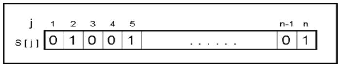
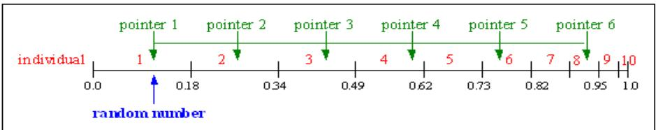
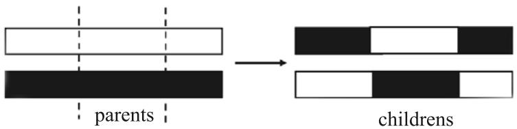
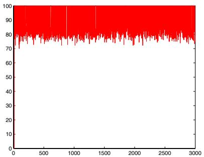
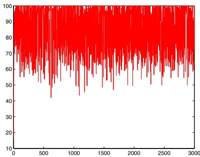

# A Hybrid Genetic Algorithm for the Multidimensional Knapsack Problem

Farhad Djannaty and Saber Doostdar

Department of Mathematics University of Kurdistan, Sanandaj, Iran fdjanaty@yahoo.com sdoostdar@yahoo.com

Abstract. During the last two decades solving combinatorial optimization problems, using genetic algorithms (GA), has attracted the attention of many researchers. In this paper a strong initial population is created by Dantzig algorithm for solving single knapsack problems. This algorithm is hybridized with the genetic algorithm. A number of novel penalty functions are designed which drive the population toward feasibility rapidly. The algorithm is then applied to some standard knapsack test problems, Computational results shows that our hybridized algorithm outperforms a state of the are algorithm.

Keywords: Genetic Algorithm, Dantzig Algorithm, Hybrid, Penalty Function, Integer Programming, Knapsack Problem

# 1. Introduction

The most general form of knapsack problems is Multidimensional Knapsack Problem (MKP) which is an IP problem with nonnegative integer coefficient. The MKP is a well-known NP-hard problem which has many practical applications, such as processor allocation in distributed system, cargo loading, cutting stuck, project selection, or capital budgeting. The goal of the MKP is to find a subset of objects that maximizes the total profit while satisfying some resource constraints. More formally, a MKP is stated as follows:

$$
m a x i m i s e \sum _ { j = 1 } ^ { n } p _ { j } x _ { j }
$$

$$
s . t . \sum _ { j = 1 } ^ { n } w _ { i j } x _ { j } \leq c _ { i } , \quad i = 1 , \ldots , m
$$

$$
x _ { j } \in \{ 0 , 1 \} , \quad j = 1 , \ldots , n
$$

Where $n$ is the number of objects and $m$ is the number of knapsacks, $w _ { i j }$ is the consumption of resource $i$ for object $j$ , $c _ { i }$ is the available quantity of resource $i$ (capacity of $i$ th knapsack), $p _ { j }$ is the profit associated with object $j$ , and $x _ { j }$ is the decision variable with object $j$ and is set to 1(resp. 0) if $j$ is selected.

Each of the m constraint described in Eq.(2) is called a knapsack constraint, so the MKP is also called the m-dimensional knapsack problem. Some authors also include the term zero-one in their name for the problem, e.g., the multidimensional zero-one knapsack problem.

Most of research on knapsack problem deals with the much simpler single constraint version (m=1). For the single constraint case the problem is not strongly NP-hard and effective approximation algorithms have been developed for obtaining near-optimal solutions. A good review of the single knapsack problem and its associated exact and heuristic algorithms is given by Kellerer, Pferschy, and Pisinger [15].

Below we review the literature for the MKP, first we consider exact algorithms and then heuristic algorithms.

Shih [20] presented a branch and bound algorithm for the MKP . In this method, an upper bound was obtained by computing the objective function value associated with the optimal fractional solution algorithm (Dantzig algorithm [7]) for each of the m single constraint knapsack problems separately and selecting the minimum objective function value among those as the upper bound. Computational results showed that his algorithm performed better than the general zero-one additive algorithm of Balas [1].

Crama and mazzola [6] showed that although the bounds derived from the well-known relaxation, such as lagrangian, surrogate, or composite relaxation, are stronger than the bounds obtained from the linear programming (LP) relaxation, the improvement in the bound that can be realized using these relaxations is limited.

Freville and Plateau [8] presented a heuristic for the special case corresponding to m=2, the bidimensional knapsack problem. Their heuristic incorporates a number of components including problem reduction, a bound based upon surrogate relaxation and partial enumeration.

Glover and Kochenberger [10] presented a heuristic based on tabu search. Their approach employed a flexible memory structure that integrates recency and frequency information keyed to ”critical events” in the search process. Their approach successfully obtained optimal solution for each of 55 standard test problems from the literature.

Hanafi and Freville [11] presented a heuristic strongly related to the work of Glover and Kochenberger [10]. They solved a subset of the some test problems and report better quality results for this subset than Glover and Kochenberger.

A number of papers involving the use of genetic algorithms to solve the MKP have appeared in recent years.

In the GA of Khuri, B¨ack, and Heitk¨otter [14] infeasible solutions were allowed to participate in the search and a simple fitness function which uses a graded penalty term was used. Their heuristic was tested on a small number of standard test problems; only moderate results were reported. In Thiel and Voss [21] simple heuristic operators based on local search algorithm were used, and a hybrid algorithm based on combining a GA with a tabu search heuristic was suggested. Their heuristic was tested on a set of standard problems, but the results were not computationally competitive with those obtained using other heuristic methods.

In Rudolph and Sprave [19] a GA was presented where parent selection is not unrestricted (as in a standard GA) but is restricted to between ”neighboring” solutions. Infeasible solutions were penalized as in Khuri, B¨ack, and Heitk¨otter [14]. An adaptive threshold acceptance schedule for child acceptance was used.

In the GA of Hoff, Løkentangen, and Mittet [12] only feasible solutions were allowed. Their GA successfully obtained optimal solutions for 54 out of 55 standard test problems taken from the literature (when replicated ten times for each problem).

Chu, Beasley [3] algorithm was the most successful genetic algorithm for MKP. which obtained the optimal solutio for 55 standard test problem. They developed a heuristic operator which repairs infeasible solutions. They made GA to look for the optimal solution among feasible solutions. Cotta and Troya [5] proposed another algorithm which uses an improvement procedure that convert infeasible solutions into feasible solutions. Their computational results were not as good as Chu and Beasley’s results, but they were better than other GAs.

# 2. Genetic algorithm

A genetic algorithm can be understood as an ”intelligent” probabilistic search algorithm which can be applied to a variety of combinatorial optimization problems (Reeves [18])

Genetic algorithm work on the Darwin’s principle of natural selection. The theoretical foundations of GAs were originally developed by Holland [13]. GAs are based on the evolutionary process of biological organisms in nature. During the course of evolution, natural populations evolve according to the principle of natural selection and ”survival of the fittest”. Individuals which are more successful in adapting to their environment will have a better chance of surviving and reproducing, whilst individual which are less fit will be eliminated.

A GA simulate these processes by taking an initial population of individuals and applying genetic algorithm in each reproduction. In optimization terms each individual in the population is encoded into a string or chromosome which represents a possible solution to a given problem. The fitness of an individual is evaluated with respect to a given objective function. Highly fit individuals or solutions have opportunities to reproduce by exchanging pieces of their genetic information, in a crossover procedure, with other highly fit individuals. This produces new ”offspring” solutions (i.e., children), which share some characteristics taken from both parents [9]. The basic steps of a simple GA are shown below.

Generate an initial population;   
Evaluate fitness of individuals in the population; repeat:

Select parents from the population; Recombine (mate) parents to produce children; Evaluate fitness of the children; Replace some or all of the population by the children; until a satisfactory solution has been found.

# 3. Constraint handling

An important issue in any GA implementation for constrained optimization is how to handle constraints, because the offspring produced by the GA operators are likely to be infeasible. A number of procedures are described which considers the constraint in an optimization problem. Michalevichz [16] has presented a suitable classification of these procedures which are described below.

• Rejecting strategy   
• Repairing strategy   
$\bullet$ Modification of genetic operators   
• Penalizing strategy

3.1. Penalty functions. The most common approach in the GA community to handle constraint (particulary, inequality constraints) is to use penalties. Penalty functions were originally proposed by Courant [4] in the 1940s and later expanded by carrol and Fiacco & Mc-Cormick. The idea of this method is to transform a constrained optimization problem into an unconstrained one by adding (or subtracting) or multiplying a certain value to/from the objective function based on the amount of constraint violation present in a certain solution [17].

The basic approach in penalty functions is to define the fitness value of an individual $i$ by extending the domain of the objective function $f ( S )$ using

$$
f i t n ( S ) = f ( S ) \pm P e n _ { 1 } ( S ) o r f i t n ( S ) = f ( S ) \times P e n _ { 2 } ( S )
$$

where $P e n _ { 1 } ( S )$ and $P e n _ { 2 } ( S )$ represent a penalty for an infeasible individual. It is assumed that if $S$ is feasible then $P e n _ { 1 } = 0$ and $P e n _ { 2 } = 1$ (i.e. we do not penalize feasible individual).

# 4. A hybrid genetic algorithm (HGA) for the MKP

We modified the basic GA described in the previous section in such a way that more problem specific knowledge is considered in the constraint handling part. The modified GA for the MKP is as follows.

4.1. Representation and fitness function. The first step in designing a genetic algorithm for a particular problem is to devise a suitable representation scheme, i.e., a way to represent individual in the GA population. The standard GA 0-1 binary representation is an obvious choice for the MKP since it represents the underlying 0-1 integer variables.

Hence, in our representation, we used a $n$ -bit binary string, where $n$ is the number of variables in the MKP, a value of 0 or 1 at the $j$ th position implies that $x _ { j } = 0$ or 1 in the MKP solution, respectively. This binary representation of an individual’s chromosome (solution) for the MKP is illustrated in figure 1.

  
Figure 1. Binary representation of a MKP solution.

Note that a bit string $S \in \{ 0 , 1 \} ^ { n }$ might represent an infeasible solution.

As was previously described, in order to overcome the problem of the selection of infeasible solutions and thus their duplication in the population penalty function method is used. therefore a fitness function is defined as follows:

$$
f i t n ( S ) = \sum _ { j = 1 } ^ { n } p _ { j } s [ j ] \times P e n [ j ]
$$

Where $P e n$ is a penalty for an infeasible individual. note here that we are trying to maximise fitness - in other words, the higher the fitness the better a MKP solution is.

4.2. Parent selection. parent selection is the task of assigning reproductive opportunities to each individual in the population. Typically in a GA we need to generate two parents who will have (one or two) children.

The simplest selection scheme is stochastic universal sampling (SUS). This is a stochastic algorithm with the following description:

The individuals are mapped to contiguous segment of a line, such that each individual’s segment is equal in size to its fitness. Here equally spaced pointers are placed over the line as many as there are individuals to be selected. Consider NP ointer the number of individuals to be selected, then the distance between the pointers are $1 / N P o i n t e r$ , and the position of the first pointer is given by a randomly generated number in the range $[ 0 , 1 / N P o i n t e r ]$ , see figure 2. As better individuals have longer segments associated with them, they have more chance to be selected, and since the first pointer is placed randomly, all individuals have a chance of selection which is proportional to their fitness.

Table 1 shows the selection probability for 11 individuals. Individual 1 is the most fit individual and occupies the largest interval, whereas individual 10 as the second least fit individual has the smallest interval on the line (see figure 2 ). Individual 11, the least fit interval, has a fitness value of 0 and get no chance for reproduction

Table 1. Selection probability and fitness value   

<table><tr><td rowspan=1 colspan=1>Number of individual</td><td rowspan=1 colspan=1>1</td><td rowspan=1 colspan=1>2</td><td rowspan=1 colspan=1>3</td><td rowspan=1 colspan=1>4</td><td rowspan=1 colspan=1>5</td><td rowspan=1 colspan=1>6</td><td rowspan=1 colspan=1>7</td><td rowspan=1 colspan=1>8</td><td rowspan=1 colspan=1>9</td><td rowspan=1 colspan=1>10</td><td rowspan=1 colspan=1>11</td></tr><tr><td rowspan=1 colspan=1>fitness value</td><td rowspan=1 colspan=1>2.0</td><td rowspan=1 colspan=1>1.8</td><td rowspan=1 colspan=1>1.6</td><td rowspan=1 colspan=1>1.4</td><td rowspan=1 colspan=1>1.2</td><td rowspan=1 colspan=1>1.0</td><td rowspan=1 colspan=1>0.8</td><td rowspan=1 colspan=1>0.6</td><td rowspan=1 colspan=1>0.4</td><td rowspan=1 colspan=1>0.2</td><td rowspan=1 colspan=1>0.0</td></tr><tr><td rowspan=1 colspan=1>selection probability</td><td rowspan=1 colspan=1>0.18</td><td rowspan=1 colspan=1>0.16</td><td rowspan=1 colspan=1>0.15</td><td rowspan=1 colspan=1>0.13</td><td rowspan=1 colspan=1>0.11</td><td rowspan=1 colspan=1>0.09</td><td rowspan=1 colspan=1>0.07</td><td rowspan=1 colspan=1>0.06</td><td rowspan=1 colspan=1>0.03</td><td rowspan=1 colspan=1>0.02</td><td rowspan=1 colspan=1>0.0</td></tr></table>

For 6 individuals to be selected, the distance between the pointers is $1 / 6 =$ 0.167, then a random number in the range [0, 0.167] is selected: for example 0.1. Figure2 shows the selection corresponding to Table 1.

  
Figure 2. Stochastic universal sampling

After selection the mating population consists of the individuals: 1, 2, 3, 4, 6, 8.

4.3. Creating initial population. In order to achieve sufficient variety, a heuristic is used to create the initial population. Dantzig algorithm [7] which deals with single knapsack problem is applied to produce the initial population. First, we describe Dantzig algorithm.

Dantzig Algorithm: Dantzig showed an elegant way of finding a solution for the continuous single knapsack problem, by sorting the items according to non-increasing prof it − to − weight ratios,

$$
\frac { p _ { 1 } } { w _ { 1 } } \geq \frac { p _ { 2 } } { w _ { 2 } } \geq \cdot \cdot \cdot \geq \frac { p _ { n } } { w _ { n } }
$$

and using a greedy algorithm for filling the knapsack: In each step we choose the item with largest $p r o f i t - t o - w e i g h t$ ratios, until we reach the first item which does not fit into the knapsack. This item is denoted by the break item $b$ and an optimal solution is found by choosing all items $j < b$ plus a fraction of item $b$ corresponding to the residual capacity.

To generate the initial population, Dantzig algorithm is coupled with each constraint and a solution is obtained. This solution without break item is entered in the population as a new chromosome. If sufficient chromosomes are not produced, pairs of constraint are combined into one using surrogate constraint. Again, Dantzig algorithm is used to create the rest of the population. The number of chromosomes is assumed to be $5 \times n$ where $n$ is the number of variable in the knapsack problem.

4.4. Crossover and mutation. The binary, problem-independent, representation we have adopted for the MKP allows a wide rang of the standard GA crossovers and mutation operators to be adopted. Indicating that the overall performance of GAs for combinatorial optimization problem is often relatively insensitive to the particular choice of crossover operators as well as some limited computational experience in the context of the MKP to re-confirm this observation, we adopted the M-point crossover as the default crossover operator.

The M-point crossover uses two parents and creates two children. After selecting M crossover points, the resulted children are built in the following manner: the first child gets the even segments from the first parent, and the odd segments from the second parent. For the second child the complement holds: it gets the odd segments from the first parent, and the even segments from the second parent. The child with better fitness is inserted into the population. An example for M=2 is given in figure 3.

  
Figure 3. 2-Point Crossover

A novel mutation operator is used which is a kind of variable mutation rate . The mutation rate is initially small and as iterations are continued, the above rate is also increased. For each gene in the chromosome, a random number $r$ in $[ 0 , 1 ]$ is produced. If the current mutation rate is greater than $r$ , this gene is mutated, otherwise no change is made. Although mutating a gene is largely dependent on the value of r but it is partly dependent on the result of the comparison with the current mutation rate. After, some tunings, the following mutation rate was adopted:

$$
M u t a t i o n \ r a t e \ = \ ( 0 . 6 \times I t e r ^ { 1 0 } ) \times ( \frac { 0 . 1 } { p o p \ s i z e ^ { 1 0 } } ) + 0 . 0 1
$$

Where Iter denotes the current iteration number and pop size is the number of individuals in the initial population. The above mutation rate is an increasing function of Iter and a decreasing function of the pop size.

4.5. Our penalty functions. Let $S$ be an arbitrary binary chromosome, that is, $S = \{ s _ { 1 } , \ldots , s _ { n } \}$ where $s _ { i } \in \{ 0 , 1 \}$ for $i = 0 , \ldots , n$ . Define

$$
I = \{ i | \sum _ { j = 1 } ^ { n } w _ { i j } s _ { j } > c _ { i } , i = 1 , \dots , m \}
$$

$I$ is the set of indices for which the corresponding constraint $i$ is violated, that is if $i \in I$ the ith constraint in the MKP problem is not satisfied by the current individual. Now, define $s u m _ { j }$ as follows:

$$
s u m _ { j } = \sum _ { i \in I } w _ { i j } \quad , \quad j = 1 , \ldots , n
$$

$s u m _ { j }$ is the sum of those entries in column j of the coefficient matrix whose index is in $I$ . When the coefficient of the variable $x _ { j }$ in a row i is zero, it means that this entry does not play any role in violating or satisfying the constraint corresponding this row. Furthermore, the larger the size of $w _ { i j }$ the more is the role of this entry in the violation of the constraint. Therefore, in column $j$ , entries which are located on violating rows are added to make up $s u m _ { j }$ . $S u m _ { j }$ can be interpreted as the total share of all entries of column j in the infeasibility of the current solution. This is one way that violated constraints can take a part in the penalty function. Also, define the set $J$ as

$$
J = \{ j | s _ { j } = 1 w h e r e s _ { j } i s t h e j t h g e n e i n c h r o m o s o m e S \}
$$

If $j \in J$ then $x _ { j }$ in the original MKP takes on the value of one and thus $s u m _ { j }$ appears in the penalty function below, which implies that the entries in column j play a role in the fitness function which is proportional to their magnitude. Let construct the following two sums and then define two penalty functions:

$$
S U M 1 = \sum _ { j \in J } s u m _ { j } \qquad , \qquad S U M 2 = \sum _ { j \in J } { \frac { 1 } { s u m _ { j } } }
$$

$$
P e n _ { 1 } ( S ) = \frac { 1 } { S U M 1 } \qquad , \qquad P e n _ { 2 } ( S ) = \frac { 1 } { S U M 2 }
$$

The above penalty functions have taken into account all entries in the A matrix of the MKP problem and this is the advantage of our approach over other penalty functions used by a number of authors. Two more penalty functions are proposed which are stronger than the previous ones. They can be formulated as follows:

$$
P e n _ { 3 } ( S ) = \frac { 1 } { \sum _ { j \in J } p _ { j } \times s u m _ { j } } \qquad , \qquad P e n _ { 4 } ( S ) = \frac { 1 } { \sum _ { j \in J } \frac { p _ { j } } { s u m _ { j } } }
$$

The rationale behind including $p _ { j }$ in these penalty functions is that whenever an infeasible solution is used for each $x _ { j } ~ = ~ 1$ a profit $p _ { j }$ is added to the objective function which is unreasonable. Therefore, the penalty should have some kind of proportionality to this profit which is gained by an infeasible solution. These penalty functions genuinely drive solutions toward feasibility so that the the number of feasible solutions will reach as high as 80 percent after a small number of iterations. These, penalty functions were applied to a number of standard test problems and $P e n _ { 3 }$ proved to be stronger than the other penalty functions.

4.6. Algorithm outline. The outline of the HGA algorithm that was developed to deal with MKP is described below. First, let explain the default settings adopted in the implementation of HGA.

the stochastic universal sampling method ,   
the M-point crossover operator,   
a heuristic mutation operator,   
• use penalty function to discard any infeasible solutions,

# Our HGA for the MKP

Input: $W [ m \times n ] , P [ 1 \times n ] , C [ m \times 1 ]$ ; /\*Standard test problem data   
set $\mathrm { g e n } = 0$ ; /\*Iteration counter   
set $\mathrm { M A X G E N } = 3 0 0 0$ ; /\* Maximum number of generations   
set $\mathrm { C . r = 0 . 9 5 }$ ; /\*Crossover rate   
set $\mathrm { ~ N ~ } = 5 \mathrm { ~ } \times \mathrm { ~ n ~ }$ ; /\*Population size   
initialize $P ( t ) = \{ S _ { 1 } , \ldots , S _ { N } \} , S _ { i } \in \{ 0 , 1 \} ^ { n }$ ;   
while (gen < MAXGEN $| |$ Gap>0) evaluate $F i t n V = \{ f i n t ( S _ { 1 } ) , \ldots , f i t n ( S _ { N } ) \}$ ; /\*Use penalty function Bestsol $=$ select best feasible solution; Select individuals from population; /\* with SUS method Recombine selected individuals (crossover); /\* with M-point crossover Mutate offspring; /\* heuristic mutation Insert offspring in population; /\* Insert all offspring Gap = ((Optsoltion - HGAsoltion)/Optsolution) $\times ~ 1 0 0$ ;

$\mathrm { g e n } = \mathrm { g e n } { + } 1 ;$ end

# 5. Computational results

The HGA was initially tested on 55 standard test problems (divided into six different sets) which are available from OR-Library [2]. These problems are real-world problems consisting of $\mathrm { m } = 2$ to 30 and ${ \mathrm { n } } = 6$ to 105. Many of these problems have been used by other authors (Aboudi and J¨ornsten , Dammeyer and Voss , Drexl , Glover and Kochenberger [10] , Hoff, Løkketangen, and Mittet [12] , Khuri, B¨ack, and Heitk¨otter [14] , Løkketangen and Glover , Løkketangen, J¨ornsten, and Storøy , Thiel and Voss [21]).

We solved these problems on our computer ( Pentium 2400), using both the general-purpose LINGO mixed-integer programming (MIP) solver (version 8.0), and the HGA which was coded in MATLAB7. The HGA was run ten-time for each of the problems and each run was terminated after 3000 GA iterations. The results are shown in Table 2.

The first two columns in Table 2 indicate the problem set name and the number of problem in that problem set. The next two columns report the average solution time (in CPU seconds) and the average number of nodes opened by LINGO (all problems were solved to optimality).

The final three columns in Table 2 report the average best-solution time, which is the time that the HGA takes to first reach the final best solution, the average execution time, which is the total time that the HGA takes before termination, and the number of problems for which the HGA obtained the optimal solution.

It is clear from Table 2 that our HGA finds the optimal solution in all 55 test problems. However, it should be mentioned that solving these standard problems is a challenge for other GA heuristics, (e.g., Khuri, B¨ack, and Heitk¨otter [14], Thiel and Voss [21]), as well as for several other heuristic methods.

Problem WEISH23 was solved to optimality by HGA and the computational results are shown in Table 3. In this experience, HGA was applied to problem WEISH23, ten times.

As can be seen in 8 out of 10 runs the optimal solutions were obtained and in two runs the gap is negligible.

The computational results for problems PB6 , HP2 and SENTO1 can be seen in Tables 4 , Table 5 and Table6.

It is demonstrated that, the optimal solutions are obtained in all runs. As GA is a kind of stochastic search, the execution time differs from one problem to another. It was observed that the variable mutation rate can reduce the time required to obtain the optimal solution, especially in run 7 of Table 4.

It is realized that these problems are not difficult for both HGA and LINGO. However they are difficult for GA algorithms presented in papers by Khuri et al. (KHBA) [14] , Cotta and Troya (COTRO) [5] , Theil and Voss (TEVO) [21]. A comparison between HGA and other GA heuristics reveals the fact that our GA is stronger.

Table 2. Computational results for LINGO and the HGA   

<table><tr><td rowspan=2 colspan=1>ProblemsetName</td><td rowspan=2 colspan=1>NO. ofProblems</td><td rowspan=1 colspan=2>LINGO MIP solver</td><td rowspan=1 colspan=3>HGA</td></tr><tr><td rowspan=1 colspan=1>Ave Sol Time</td><td rowspan=1 colspan=1>Ave Num nodes</td><td rowspan=1 colspan=1>A.B.S.T</td><td rowspan=1 colspan=1>A.E.T</td><td rowspan=1 colspan=1>NOPT</td></tr><tr><td rowspan=1 colspan=1>HP</td><td rowspan=1 colspan=1>2</td><td rowspan=1 colspan=1>56</td><td rowspan=1 colspan=1>73</td><td rowspan=1 colspan=1>61</td><td rowspan=1 colspan=1>84</td><td rowspan=1 colspan=1>2</td></tr><tr><td rowspan=1 colspan=1>PB</td><td rowspan=1 colspan=1>6</td><td rowspan=1 colspan=1>360</td><td rowspan=1 colspan=1>350</td><td rowspan=1 colspan=1>108</td><td rowspan=1 colspan=1>425</td><td rowspan=1 colspan=1>6</td></tr><tr><td rowspan=1 colspan=1>PETERSEN</td><td rowspan=1 colspan=1>7</td><td rowspan=1 colspan=1>230</td><td rowspan=1 colspan=1>185</td><td rowspan=1 colspan=1>150</td><td rowspan=1 colspan=1>352</td><td rowspan=1 colspan=1>7</td></tr><tr><td rowspan=1 colspan=1>SENTO</td><td rowspan=1 colspan=1>2</td><td rowspan=1 colspan=1>352</td><td rowspan=1 colspan=1>1149</td><td rowspan=1 colspan=1>29</td><td rowspan=1 colspan=1>162</td><td rowspan=1 colspan=1>2</td></tr><tr><td rowspan=1 colspan=1>WEING</td><td rowspan=1 colspan=1>8</td><td rowspan=1 colspan=1>238</td><td rowspan=1 colspan=1>256</td><td rowspan=1 colspan=1>126</td><td rowspan=1 colspan=1>452</td><td rowspan=1 colspan=1>8</td></tr><tr><td rowspan=1 colspan=1>WEISH</td><td rowspan=1 colspan=1>30</td><td rowspan=1 colspan=1>256</td><td rowspan=1 colspan=1>355</td><td rowspan=1 colspan=1>101</td><td rowspan=1 colspan=1>321</td><td rowspan=1 colspan=1>30</td></tr></table>

A.B.S.T $=$ average best-solution time (CPU seconds). A.E.T $=$ average execution time (CPU seconds). NOPT $=$ number of problems that the HGA finds the optimal solution.

Table 3. Computational results for WEISH23   

<table><tr><td rowspan=1 colspan=1>Run NO.</td><td rowspan=1 colspan=1>1</td><td rowspan=1 colspan=1>2</td><td rowspan=1 colspan=1>3</td><td rowspan=1 colspan=1>4</td><td rowspan=1 colspan=1>5</td><td rowspan=1 colspan=1>6</td><td rowspan=1 colspan=1>7</td><td rowspan=1 colspan=1>8</td><td rowspan=1 colspan=1>9</td><td rowspan=1 colspan=1>10</td></tr><tr><td rowspan=1 colspan=1>GAP</td><td rowspan=1 colspan=1>0.0</td><td rowspan=1 colspan=1>0.0</td><td rowspan=1 colspan=1>0.003</td><td rowspan=1 colspan=1>0.0</td><td rowspan=1 colspan=1>0.0</td><td rowspan=1 colspan=1>0.0</td><td rowspan=1 colspan=1>0.0</td><td rowspan=1 colspan=1>0.0</td><td rowspan=1 colspan=1>0.0035</td><td rowspan=1 colspan=1>0.0</td></tr><tr><td rowspan=1 colspan=1>time (s)</td><td rowspan=1 colspan=1>63</td><td rowspan=1 colspan=1>185</td><td rowspan=1 colspan=1>347</td><td rowspan=1 colspan=1>63</td><td rowspan=1 colspan=1>22</td><td rowspan=1 colspan=1>6</td><td rowspan=1 colspan=1>31</td><td rowspan=1 colspan=1>34</td><td rowspan=1 colspan=1>141</td><td rowspan=1 colspan=1>23</td></tr></table>

GAP= percentage of the gap between the optimal solution and HGA solution

Table 4. Computational results for PB6   

<table><tr><td rowspan=1 colspan=1>Run NO.</td><td rowspan=1 colspan=1>−1</td><td rowspan=1 colspan=1>2</td><td rowspan=1 colspan=1>3</td><td rowspan=1 colspan=1></td><td rowspan=1 colspan=1>5</td><td rowspan=1 colspan=1>6</td><td rowspan=1 colspan=1>7</td><td rowspan=1 colspan=1>8</td><td rowspan=1 colspan=1>9</td><td rowspan=1 colspan=1>10</td></tr><tr><td rowspan=1 colspan=1>GAP</td><td rowspan=1 colspan=1>0.0</td><td rowspan=1 colspan=1>0.0</td><td rowspan=1 colspan=1>0.0</td><td rowspan=1 colspan=1>0.0</td><td rowspan=1 colspan=1>0.0</td><td rowspan=1 colspan=1>0.0</td><td rowspan=1 colspan=1>0.0</td><td rowspan=1 colspan=1>0.0</td><td rowspan=1 colspan=1>0.0</td><td rowspan=1 colspan=1>0.0</td></tr><tr><td rowspan=1 colspan=1>time (s)</td><td rowspan=1 colspan=1>120</td><td rowspan=1 colspan=1>240</td><td rowspan=1 colspan=1>189</td><td rowspan=1 colspan=1>38</td><td rowspan=1 colspan=1>175</td><td rowspan=1 colspan=1>15</td><td rowspan=1 colspan=1>3</td><td rowspan=1 colspan=1>170</td><td rowspan=1 colspan=1>18</td><td rowspan=1 colspan=1>215</td></tr></table>

GAP= percentage of the gap between the optimal solution and HGA solution

Table 5. Computational results for HP2   

<table><tr><td rowspan=1 colspan=1>Run NO.</td><td rowspan=1 colspan=1>1</td><td rowspan=1 colspan=1>2</td><td rowspan=1 colspan=1>3</td><td rowspan=1 colspan=1>4</td><td rowspan=1 colspan=1>5</td><td rowspan=1 colspan=1>6</td><td rowspan=1 colspan=1>7</td><td rowspan=1 colspan=1>8</td><td rowspan=1 colspan=1>9</td><td rowspan=1 colspan=1>10</td></tr><tr><td rowspan=1 colspan=1>GAP</td><td rowspan=1 colspan=1>0.0</td><td rowspan=1 colspan=1>0.0</td><td rowspan=1 colspan=1>0.0</td><td rowspan=1 colspan=1>0.0</td><td rowspan=1 colspan=1>0.0</td><td rowspan=1 colspan=1>0.0</td><td rowspan=1 colspan=1>0.0</td><td rowspan=1 colspan=1>0.0</td><td rowspan=1 colspan=1>0.0</td><td rowspan=1 colspan=1>0.0</td></tr><tr><td rowspan=1 colspan=1>time (s)</td><td rowspan=1 colspan=1>136</td><td rowspan=1 colspan=1>34</td><td rowspan=1 colspan=1>110</td><td rowspan=1 colspan=1>43</td><td rowspan=1 colspan=1>76</td><td rowspan=1 colspan=1>21</td><td rowspan=1 colspan=1>95</td><td rowspan=1 colspan=1>21</td><td rowspan=1 colspan=1>31</td><td rowspan=1 colspan=1>6</td></tr></table>

GAP= percentage of the gap between the optimal solution and HGA solution

Table 7 compares HGA with COTRO, KHBA, TEVO, and Chu and Beasley algorithm (CHBE). According to Table 6, HGA performs better than COTRO, KHBA and TEVO and it ties with CHBE results.

As was previously mentioned, penalty functions used in HGA can drive solution toward feasibility faster than any other penalty functions. A comparison was made between HGA and Khuri et al. [14] algorithm. In each iteration the number of the feasible individuals are divided by the total number of the individuals and then multiplied by 100 to calculate the feasibility percentage. It is turned out (from Figure 4) that the feasibility of population in HGA is above 80 percent while the Khuri penalty function feasibility is above 60 percent (In Figure 4, compare feasibility of population in each iteration ).

Table 6. Computational results for SENTO1   

<table><tr><td rowspan=1 colspan=1>Run NO.</td><td rowspan=1 colspan=1>1</td><td rowspan=1 colspan=1>2</td><td rowspan=1 colspan=1>3</td><td rowspan=1 colspan=1>4</td><td rowspan=1 colspan=1></td><td rowspan=1 colspan=1>6</td><td rowspan=1 colspan=1>7</td><td rowspan=1 colspan=1>8</td><td rowspan=1 colspan=1>9</td><td rowspan=1 colspan=1>10</td></tr><tr><td rowspan=1 colspan=1>GAP</td><td rowspan=1 colspan=1>0.0</td><td rowspan=1 colspan=1>0.0</td><td rowspan=1 colspan=1>0.0</td><td rowspan=1 colspan=1>0.0</td><td rowspan=1 colspan=1>0.0</td><td rowspan=1 colspan=1>0.0</td><td rowspan=1 colspan=1>0.0</td><td rowspan=1 colspan=1>0.0</td><td rowspan=1 colspan=1>0.0</td><td rowspan=1 colspan=1>0.0</td></tr><tr><td rowspan=1 colspan=1>time (s)</td><td rowspan=1 colspan=1>30</td><td rowspan=1 colspan=1>350</td><td rowspan=1 colspan=1>36</td><td rowspan=1 colspan=1>38</td><td rowspan=1 colspan=1>20</td><td rowspan=1 colspan=1>615</td><td rowspan=1 colspan=1>29</td><td rowspan=1 colspan=1>39</td><td rowspan=1 colspan=1>170</td><td rowspan=1 colspan=1>23</td></tr></table>

GAP= percentage of the gap between the optimal solution and HGA solution

Table 7. Compare HGA with other GAs   

<table><tr><td rowspan=1 colspan=1>PROBLEM</td><td rowspan=1 colspan=1>OPTIMUM</td><td rowspan=1 colspan=1>KHBA(Sol Ave.)</td><td rowspan=1 colspan=1>COTRO(Sol Ave.)</td><td rowspan=1 colspan=1>TEVO(Sol Ave.)</td><td rowspan=1 colspan=1>CHBE(Sol Ave.)</td><td rowspan=1 colspan=1>HGA(Sol Ave.)</td></tr><tr><td rowspan=1 colspan=1>SENTO1</td><td rowspan=1 colspan=1>7772</td><td rowspan=1 colspan=1>7626.0</td><td rowspan=1 colspan=1>7767.9</td><td rowspan=1 colspan=1>7754.2</td><td rowspan=1 colspan=1>7772.0</td><td rowspan=1 colspan=1>7772.0</td></tr><tr><td rowspan=1 colspan=1>SENTO2</td><td rowspan=1 colspan=1>8722</td><td rowspan=1 colspan=1>8685.0</td><td rowspan=1 colspan=1>8716.3</td><td rowspan=1 colspan=1>8719.5</td><td rowspan=1 colspan=1>8722.0</td><td rowspan=1 colspan=1>8722.0</td></tr><tr><td rowspan=1 colspan=1>WEING7</td><td rowspan=1 colspan=1>1095445</td><td rowspan=1 colspan=1>1093897.0</td><td rowspan=1 colspan=1>1095296.1</td><td rowspan=1 colspan=1>1095398.1</td><td rowspan=1 colspan=1>1095445.0</td><td rowspan=1 colspan=1>1095445.0</td></tr><tr><td rowspan=1 colspan=1>WEING8</td><td rowspan=1 colspan=1>624319</td><td rowspan=1 colspan=1>613383.0</td><td rowspan=1 colspan=1>622048.1</td><td rowspan=1 colspan=1>622021.3</td><td rowspan=1 colspan=1>624319.0</td><td rowspan=1 colspan=1>624319.0</td></tr><tr><td rowspan=1 colspan=1>WEISH19</td><td rowspan=1 colspan=1>8344</td><td rowspan=1 colspan=1>8165.1</td><td rowspan=1 colspan=1>8245.8</td><td rowspan=1 colspan=1>8286.7</td><td rowspan=1 colspan=1>8344.0</td><td rowspan=1 colspan=1>8344.0</td></tr><tr><td rowspan=1 colspan=1>PETERSEN7</td><td rowspan=1 colspan=1>109461</td><td rowspan=1 colspan=1>109001.2</td><td rowspan=1 colspan=1>109180.2</td><td rowspan=1 colspan=1>109350.9</td><td rowspan=1 colspan=1>109461.0</td><td rowspan=1 colspan=1>109461.0</td></tr><tr><td rowspan=1 colspan=1>HP1</td><td rowspan=1 colspan=1>3418</td><td rowspan=1 colspan=1>3385.1</td><td rowspan=1 colspan=1>3394.3</td><td rowspan=1 colspan=1>3401.6</td><td rowspan=1 colspan=1>3418.0</td><td rowspan=1 colspan=1>3418.0</td></tr><tr><td rowspan=1 colspan=1>PB2</td><td rowspan=1 colspan=1>3186</td><td rowspan=1 colspan=1>3091.0</td><td rowspan=1 colspan=1>3131.2</td><td rowspan=1 colspan=1>3112.5</td><td rowspan=1 colspan=1>3186.0</td><td rowspan=1 colspan=1>3186.0</td></tr></table>

  
Figure 4. Compare our penalt penalty function

# 6. Conclusion

Genetic algorithm is hybridized with a good initial population generated by Dantzig algorithm solution of single knapsack problem. A number of novel penalty functions was developed which can drive infeasible solutions toward feasibility with an incredible speed. Competitive solutions in the sense of quality and execution time are reported. We propose that these penalty functions be applied to any optimization problem having linear constraints and nonlinear objective functions, such as quadratic assignment problem. We also propose that these penalty functions be modified to be used in any nonlinear optimization problems.

# Список литературы

[1] Balas, E. (1965). ”An Additive Algorithm for Solving Linear Programs with Zero-One Variables,” Operations Research 13, 517-546.   
[2] Beasley J. E. (1990). ”OR-Library: Distributing Test Problems by Electronic Mail”, Journal of Operational Research Society,41(11), 1069-1072. [3] Chu, P.C. and J.E. Beasley. (1998). ” A Genetic Algorithm for the Multidimensional Knapsack Problem,” Journal of Heuristic 4, 63-86.   
[4] Courant, R. (1943). ” Variational methods for the solution of problems of equilibrium and vibrations. Bulletin of the American Mathematical Society49, 1-23. [5] Cotta, C. and J. Troya (1994) ”A Hybrid Genetic Algorithm for the 0-1 Multiple Knapsack problem,” Artificial Neural Nets and Genetic Algorithm 3, 250-254.   
[6] Crama, Y. and J.B. Mazzola. (1994). ”On the Strength of Relaxations of Multidimensional Knapsack Problems,” INFOR 32, 219-225.   
[7] Dantzig, G.B.(1975). ” Discrete Variable Extremum Problems,” Operations Research 5, 266-277.   
[8] Freville, A. and G. Plateau. (1997). ”The 0-1 Bidimensional Knapsack Problem: Toward an Efficient High-Level Primitive Tool,” Journal of Heuristics 2, 147-167.   
[9] Glover, F. and G. Kochenberger. (2003) Handbook of Metaheuristics. kluwer Academinc Publisher.   
[10] Glover, F. and G.A. Kochenberger. (1996). ”Critical Event Tabu Search for MultidimensionalKnapsack Problems.” In I.H. Osman and J.P. Kelly (eds.), Meta-Heuristics: Theory and Applications. Kluwer Academic Publishers, 407-427.   
[11] Hanafi, S. and A. Freville. (1997). ”An Efficient Tabu Search Approach for the 0-1 Multidimensional Knapsack Problem,” To appear in European Journal of Operational Research.   
[12] Hoff, A., et al, (1996). ”Genetic Algorithms for 0/1 Multidimensional Knapsack Problems.” Working Paper, Molde College, Britveien 2, 6400 Molde, Norway.   
[13] Holland, J.H. (1975). Adaptation in Natural and Artificial Systems: An Introductory Analysis with Applications to Biology, Control, and Artificial Intelligence. University of Michigan Press.   
[14] Khuri, S., T. B¨ack, and J. Heitk¨otter. (1994). ”The Zero/One Multiple Knapsack Problem and Genetic Algo- rithms,” Proceedings of the 1994 ACM Symposium on Applied Computing (SA $C$ ’94), ACM Press, 188- 193.   
[15] Kellerer, H., U. Pferschy, and D. Pisinger. (2005). Knapsack Problems , Springer Verlag.   
[16] Michalewicz, Z. (1996). Genetic Algorithm $^ +$ Data Structurs = Evolution Programming Springer Verlag, 3rd edition.   
[17] Ozgur, Y. (2005). ”Penalty Function Methods for Contrained Optimzation with Genetic Algorithm,” Mathematical and Computational Applications10, 45-56.   
[18] Reeves, C.R. (1993). Modern Heuristic Techniques for Combinatorial Problems. Blackwell Scientific.   
[19] Rudolph, G. and J. Sprave. (1996). ”Significance of Locality and Selection Pressure in the Grand Deluge Evo- lutionary Algorithm,” In H.M. Voigt, W. Ebeling, I. Rechenberg, and H.P. Schwefel (eds.), Parallel Problem Solving from Nature IV. Proceedings of the International Conference on Evolutionary Computation. Lecture Notes in Computer Science, Springer, 686-694.   
[20] Shih, W. (1979). ”A Baranch and Bound Method for the Multiconstraint Zero-One Knapsack problem,” Journal of the Operation Research Socity 30, 369-378.

Received: September 30, 2007