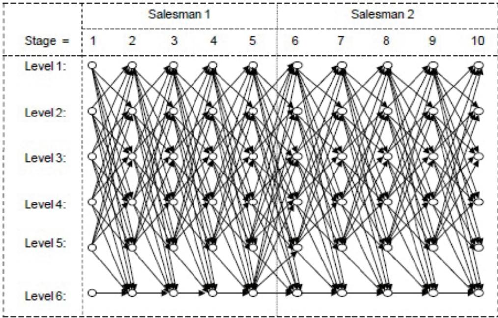

# Linear Programming Formulation of the Multi-Depot Multiple Traveling Salesman Problem with Differentiated Travel Costs

Moustapha Diaby University of Connecticut USA

# 1. Introduction

The multiple traveling salesman problem (mTSP) is a generalization of the well-known traveling salesman problem (TSP; see Applegate et al., 2006; Greco, 2008; Gutin and Punnen, 2007; or Lawler et al., 1985) ) in which each of c cities must be visited by exactly one of s $\displaystyle { ( 1 < \mathfrak { s } < \mathfrak { c } _ { \mathrm { ~ ~ } } }$ ) traveling salesmen. When there is a single depot (or “base”) for all the salesmen, the problem is called the single depot mTSP. On the other hand, when the salesmen are initially based at different depots, then the problem is referred to as the multi-depot mTSP (MmTSP). If the salesmen are required to return to their respective original bases at the end of the travels, the problem is referred to as the fixed destination MmTSP. When the salesmen are not required to return to their original bases, the problem is referred to as the nonfixed destination MmTSP. It is often also stipulated in the nonfixed destination MmTSP that the number of salesmen at a given depot at the end of the travels be the same as the number of salesmen that were initially there. Also, if there is no requirement that every salesman be activated, then fixed costs are (typically) associated with the salesmen and included in the cost-minimization objective of the problem, along with (or in lieu of) the usual total inter-site travel costs. More detailed discussions of these and other variations of the problem can be found in Bektas (2006), and Kara and Bektas (2006), among others.

Bektas (2006) discusses many contexts in which the mTSP has been applied including combat mission planning, transportation planning, print scheduling, satellite suveying systems design, and workforce planning contexts, respectively. More recent applications that are described in the literature include those of routing unmanned combat aerial vehicles (Shetty et al., 2008), scheduling quality inspections (Tang et al., 2007), scheduling trucks for the transportation of containers (Zhang et al., 2010), and scheduling workforce (Tang et al., 2007). Also, beyond these specific contexts, one can easily argue that most of the practical contexts in which the TSP has been applied could be more realistically modeled as mTSP’s. Hence, the problem has a very wide range of applicability.

Mathematical Programming models that have been developed to solve the mTSP are reviewed in Bektas (2006). Additional formulations are proposed in Kara and Bektas (2006). Because of the complexity of the models, solution methods have been mostly heuristic approaches. The exact procedures are the cutting planes approach of Laporte and Norbert (1980), and the branch-and-bound approaches of Ali and Kennington (1986), Gavish and Srikanth (1986), and Gromicho et al. (1992), respectively (see Bektas, 2006). The heuristic approaches that have been developed are reviewed in Bektas (2006) and Ghufurian and Javadian (2010). They can be classified into two broad groups that we label as the “transformation-based” and the “direct” heuristics, respectively. The “transformation-based” heuristics consist of transforming the problem into a standard TSP on expanded graphs, and then using TSP heuristics to solve it (see Betkas, 2006). The “direct” heuristics tackle the problem in its natural form. They include evolutionary, genetic, k-opt, neural network, simulated annealing, and tabu search procedures, respectively (see Bektas, 2006, and Ghufurian and Javadian, 2010 for detailed discussions).

A general limitation of the existing literature is the fragmentation of models over the different types of mTSP’s discussed above. In general, models developed for one type of mTSP cannot be applied in a straightforward manner to other types. Also, to the best of our knowledge, except for the VRP model of Christofides et al. (1981), and the fixed destination MmTSP Integer Programming (IP) model of Kara and Bektas (2006), none of the existing models can be extended in a straightforward manner to handle differentiated travel costs for the salesmen. Differentiated travel costs are more realistic in many practical situations however, such as in contexts of routing/scheduling vehicles for example, where there may be differing pay rates for drivers, vehicle types, and/or transportation modes.

In this chapter, we consider a generalization of the mTSP where there are differentiated intersite travel costs associated with the salesmen. There are several depots from which travels start (i.e., the problem considered is the MmTSP), the salesmen are required to return to their respective staring bases at the end of their travels (i.e., destinations are fixed), and the number of salesmen to be activated is a decision variable. We present a linear programming (LP) formulation of this problem. The complexity orders of the number of variables and the number of constraints of the proposed LP are $\dot { O ( \mathfrak { c } ^ { 9 } { \cdot } \mathfrak { s } ^ { 3 } ) }$ and $O \left( { \mathfrak { c } } ^ { 8 } { \cdot } { \mathfrak { s } } ^ { 3 } \right)$ , respectively, where c and s are the number of customer sites and the number of salesmen in the MmTSP instance, respectively. Hence, the model goes beyond the scope of the mTSP per se, to a re-affirmation of the equality of the computational complexity classes $" P ^ { \prime \prime }$ and $^ { \prime \prime } N P _ { \cdot } ^ { \prime \prime }$ Also, the proposed model can be adjusted in a straightforward manner to accommodate nonfixed destinations and/or situations where it is required that all the salesmen be activated. It is therefore a more comprehensive model than existing ones that we know of (see Bektas (2006), and Kara and Bektas (2006)). In formulating our proposed LP, we first develop a bipartite network flow-based model of the problem. Then, we use a path-based modeling framework similar to that used in Diaby (2006b, 2007b, 2010a, and 2010b). The approach is illustrated with a numerical example.

Three reports (by a same author) with negative claims having some relation to the modeling approach used in this paper have been publicized through the internet (Hofman, 2006, 2007, and 2008b). These are the only such reports (and negative claims) that we know of. There is a counter-example claim in Hofman (2006) that has to do with the relaxation of the model in Diaby (2006b) suggested in Diaby (2006a) (see Diaby, 2006a, p. 20: “Proposition $6 ^ { \prime \prime }$ ). There is another counter-example claim (Hofman (2008b)) that pertains to a simplification of the model in Diaby (2007b) discussed in Diaby (2008). Indeed further checking revealed flawed developments in both of the papers against which these counter-example claims were made, specifically, “Proposition $6 ^ { \prime \prime }$ for Diaby (2006a), and Theorem 25 and Corollary 26 for Diaby (2008). However, these are not aaplicable to the respective published, peer-reviewed papers dealing with the respective “full” models (Diaby(2006b), and Diaby (2007b)).Hence, the counter-example claims may have had some merit, but only for the relaxations to which they pertain. The claim in Hofman (2007) rests on the premise that an integral polytope with an exponential number of vertices cannot be completely described using a polynomially-bounded number of linear constraints (see Hofman, 2007, p. 3). It is a well-established fact however, that the Assignment Polytope for example, is integral, has n! extreme points (where $n$ is the number of assignments), and is completely described by $2 n$ linear constraints (see Burkard et al., 2007, pp. 24-26, and Schrijver, 1986, pp. 108-110, among others). Other contradictions of the premise of Hofman (2007) include the Transportation Polytope (see Bazaraa et al, 2010, pp. 513-535), and the general Min-Cost Network Flow Polytope (see Ahuja et al., 1993, 294-449, or Bazaraa et al., 2010, pp. 453-493, for example). Characterizations of integral polytopes in general and additional examples (including some non-network flow-based ones) contradicting the premise of Hofman (2007) are discussed in Nemhauser and Wolsey, 1988, pp. 535-607, and Schrijver, 1986, pp. 266-338, among others. Hence, the foundations and implications of the claim in Hofman (2007) are in strong contradiction of well-established Operations Research knowledge.

It should be noted also that our overall approach consists essentially of developing an alternate linear programming reformulation of the Assignment Polytope (see Burkard et al., 2007, pp. 24-34) in terms of “complex flow modeling”variables we introduce (see section 4 of this chapter). Hence, the developments in Yannakakis (1991) in particular, are not applicable in the context of this work, since we do not deal with the TSP polytope per se (see Lawler et al., 1988, pp.256-261).

The plan of the chapter is as follows. Our BNF-based model of the MmTSP is developed in section 2. A path representation of the BNF-based solutions is developed in section 3. An Integer Programming (IP) model of the path representations in developed in section 4. A path-based LP reformulation of the BNF-based Polytope is developed in section 5. Our proposed overall LP model is developed model in section 6. Conclusions are discussed in section 7.

Definition 1 (“MmTSP schedule”) We will refer to any feasible solution to the fixed destination MmTSP as a “MmTSP schedule.”

The following notation will be used throughout the rest of the chapter.

# Notation 2 (General notation) :

1. d : Number of depot sites/nodes;   
2. $\mathbb { D } : = \{ 1 , 2 , \ldots , 0 \}$ (index set for the depot sites);   
3. c : Number of customer sites/nodes;   
4. $\mathbb { C } : = \{ 1 , 2 , \ldots , \mathfrak { c } \}$ (index set for the customer sites);   
5. s : Number of salesmen;   
6. $\mathbb { S } : = \{ 1 , 2 , \ldots , 5 \}$ (index set for the salesmen);   
7. $\forall p \in \mathbb { S }$ , ${ \mathfrak { b } } _ { p } :$ : Index of the starting base (or initial depot) for salesman $p$ $[ \mathfrak { b } _ { p } \in \mathbb { D } ]$ );   
8. $\forall p \in \mathbb { S } , \mathtt { f } _ { p }$ : Fixed cost associated with the activation of salesman $p$ ;   
9. $\forall p \in \mathbb { S } , \forall ( i , j ) \in ( \mathbb { D } \cup \mathbb { C } ) ^ { 2 } , \mathfrak { e } _ { p i j }$ : Cost of travel from site $i$ to site $j$ by salesman $p$ ;   
10. A MmTSP schedule wherein salesman $p$ visits $m _ { p }$ customers with $i _ { p , k }$ being t   
customer visited will be denoted as the ordered set $( \left( p , i _ { p , k } \right) : p \in \overline { { \mathbb { S } } } , k = 1 , \hdots , m _ { p } )$ ,   
${ \overline { { \mathbb { S } } } } \subseteq \mathbb { S }$ denotes the subset of activated salesmen;

11. R : Set of real numbers;

12. For two column vectors $\mathbf { x }$ and y $ , \left( \begin{array} { l } { { \mathbf x } } \\ { { \mathbf y } } \end{array} \right) = ( { \mathbf x } ^ { T } , { \mathbf y } ^ { T } ) ^ { T }$ will be written as $\mathbf { \mu } ^ { \prime \prime } ( \mathbf { x } , \mathbf { y } ) ^ { \prime \prime }$ (where (·) Tdenotes the transpose of (·)), except for where that causes ambiguity;

13. For two column vectors a and $\mathbf { b }$ , and a function or expression $A$ having $( \mathbf { a } , \ \mathbf { b } )$ as an argument, $" A ( ( { \bf a } , { \bf b } ) ) ^ { \prime \prime }$ will be written as $" ( A ( { \bf a } , { \bf b } ) ^ { \prime \prime }$ , except for where that causes ambiguity;

14. $\mathbf { x } _ { i } : i ^ { t h }$ component of vector $\mathbf { x } _ { \mathrm { , } }$ ;

15. $\mathbf { \prime \prime 0 ^ { \prime \prime } }$ : Column vector (of comfortable size) that has every entry equal to 0;

16. ${ \bf \mathit { \omega } } ^ { \prime \prime } { \bf 1 } ^ { \prime \prime }$ : Column vector (of comfortable size) that has every entry equal to 1;

17. Conv(·) : Convex hull of (·);

18. $E x t ( \cdot )$ : Set of extreme points of (·);

19. The notation ${ } ^ { \prime \prime } \exists \ \left. i _ { 1 } \in A _ { 1 } ; \ . . . ; i _ { p } \in A _ { p } \right. : \left. B _ { 1 } ; \ . . . ; B _ { q } \right. { } ^ { \prime \prime }$ stands for “There exists at least $p$ objects with at least one from each $A _ { r }$ $( r = 1 , . . . , p $ ), such that each expression $B _ { s }$ $( s = 1 , \ldots , q )$ ) holds true.” Where that does not cause ambiguity, the brackets (one or both sets) will be omitted.

Assumption 3 We assume, without loss of generality (w.l.o.g.), that:

1. ${ \mathfrak { c } } \geq 5$ ;   
2. $\mathfrak { d } \geq 1$ ;   
3. $\forall j \in \mathbb { D } , \left\{ p \in \mathbb { S } : { \mathfrak { b } } _ { p } = j \right\} \neq \emptyset ;$   
4. $\forall p \in \mathbb { S } , \forall i \in \mathbb { C } , \mathfrak { e } _ { p i i } = \infty$ ;   
5. $\forall p \in \mathbb { S } , \forall ( i , j ) \in \mathbb { D } ^ { 2 } , \ell _ { p i j } = \infty$   
6. The set of cutomers/customer sites has been augmented with a fictitious customer/site, indexed as ${ \bar { \mathfrak { c } } } : = { \mathfrak { c } } + 1 ,$ with $\mathfrak { e } _ { p , \overline { { \mathfrak { c } } } , \overline { { \mathfrak { c } } } } = 0$ for all $p \in \mathbb { S }$ , $\mathfrak { e } _ { p , i , \overline { { \mathfrak { c } } } } = \mathfrak { e } _ { p , i , \mathfrak { b } _ { p } }$ for all $( p , i ) \in ( \mathbb { S } , \mathbb { C } )$ , and $\mathfrak { e } _ { p , \overline { { \mathfrak { c } } } , i } = \infty$ for all $( p , i ) \in ( \mathbb { S } , \mathbb { C } )$ ;   
7. Fictitious customer site c can be visited multiple times by one or more of the traveling salesmen in any MmTSP schedule.

# 2. Bipartite network flow-based model of MmTSP schedules

The purpose of the bipartite network flow (BNF)-based model developed in this section is to simplify the exposition of the development of our overall LP model discussed in sections 5 and 6 of this chapter. However, as far as we know, it is a first such model for the MmTSP, and we believe it can also serve as the basis of good (near-optimal) heuristic procedures for solving large-scale (practical-sized) MmTSP’s. We will first present the model. Then, we will illustrate it with a numerical example.

# Notation 4 :

1. $\overline { { \mathbb { C } } } : = \mathbb { C } \cup \{ \overline { { \mathfrak { c } } } \} = \mathbb { C } \cup \{ \mathfrak { c } + 1 \}$   
2. $\forall p \in \mathbb { S } , \mathbb { T } _ { p } : = \{ 1 , \dots , \mathfrak { c } \}$ (index set for the order (or “times”) of visits for salesman $p$ );

3. $\forall p \in \mathbb { S } , \forall i \in \overline { { \mathbb { C } } } , \forall t \in \mathbb { T } _ { p } , x _ { p , i , t }$ denotes a non-negative variable that is greater than zero iff $i$ is the $t ^ { t h }$ customer to be visited by salesman $p$ .

Definition 5 (“BNF-based Polytope”) Let $P _ { 1 } : = \{ x \in \mathbb { R } ^ { s \mathfrak { c } \overline { { \mathfrak { c } } } } : x$ satisfies $\left. ( 1 ) – ( 6 ) \right\}$ , where (1)-(6) are specified as follows:

$$
\begin{array} { r l } & { \displaystyle \sum _ { p \in S } \displaystyle \sum _ { t \in \mathbb { T } _ { p } } x _ { p , i , t } = \mathrm {  ~ \nabla ~ } 1 ; \quad i \in \mathbb { C } } \\ & { \displaystyle \sum _ { p \in S } \displaystyle \sum _ { t \in \mathbb { T } _ { p } } x _ { p , \bar { \mathfrak { c } } , t } = \mathrm {  ~ \nabla ~ } ( \mathfrak { s } - 1 ) \mathfrak { c } ; } \\ & { \displaystyle \sum _ { i \in \overline { { \mathbb { C } } } } x _ { p , i , t } = \mathrm {  ~ \nabla ~ } 1 ; \quad p \in \mathbb { S } , t \in \mathbb { T } _ { p } } \end{array}
$$

$$
\begin{array} { r l } & { x _ { p , \overline { { \mathfrak { c } } } , t - 1 } - x _ { p , \overline { { \mathfrak { c } } } , t } \leq \quad 0 ; \quad p \in \mathbb { S } , t \in \mathbb { T } _ { p } : t > 1 } \\ & { x _ { p i t } \in \{ 0 , 1 \} ; \ p \in \mathbb { S } , i \in \mathbb { C } , t \in \mathbb { T } } \\ & { x _ { p , \overline { { \mathfrak { c } } } , t } \geq 0 ; \quad p \in \mathbb { S } , t \in \mathbb { T } _ { p } } \end{array}
$$

We refer to $C o n v ( P _ { 1 } )$ as the “Bipartite Network Flow (BNF)-based Polytope.”

Theorem 6 There exists a one-to-one mapping of the points of $P _ { 1 }$ (i.e., the extreme points of the BNF-based Polytope) onto the MmTSP schedules.

Proof. It is trivial to verify that a unique point of $P _ { 1 }$ can be constructed from any given MmTSP schedule and vice versa.

The BNF-based formulation is illustrated in Example 7.

# Example 7 Fixed destination MmTSP with:

– $\mathfrak { d } = 2 , \ \mathbb { D } = \{ 1 , 2 \} ;$ – ${ \mathfrak { s } } = 2$ $2 , \ 5 = \{ 1 , 2 \} , \ \mathfrak { b } _ { 1 } = 1 , \mathfrak { b } _ { 2 } = 2 ;$ – ${ \mathfrak { c } } = 5$ , $\mathbb { C } = \{ 1 , 2 , 3 , 4 , 5 \} _ { } { \mathrm { . } }$ ;

BNF tableau form of the BNF-based formulation (where entries in the body are “technical coefficients,” and entries in the margins are “right-hand-side values”):

<table><tr><td rowspan=2 colspan=1>time of visit, t =</td><td rowspan=1 colspan=5>salesman&quot;1&quot;</td><td rowspan=1 colspan=5>salesman&quot;2&quot;</td><td rowspan=2 colspan=1>&quot;Demand&quot;</td></tr><tr><td rowspan=1 colspan=1>1</td><td rowspan=1 colspan=1>2</td><td rowspan=1 colspan=1>3</td><td rowspan=1 colspan=1>4</td><td rowspan=1 colspan=1>5</td><td rowspan=1 colspan=1>1</td><td rowspan=1 colspan=1>2</td><td rowspan=1 colspan=1>3</td><td rowspan=1 colspan=1>4</td><td rowspan=1 colspan=1>5</td></tr><tr><td rowspan=1 colspan=1>customerr &quot;</td><td rowspan=1 colspan=1>1</td><td rowspan=1 colspan=1>1</td><td rowspan=1 colspan=1>1</td><td rowspan=1 colspan=1>1</td><td rowspan=1 colspan=1>1</td><td rowspan=1 colspan=1>1</td><td rowspan=1 colspan=1>1</td><td rowspan=1 colspan=1>1</td><td rowspan=1 colspan=1>1</td><td rowspan=1 colspan=1>1</td><td rowspan=1 colspan=1>1</td></tr><tr><td rowspan=1 colspan=1>customer&quot;2&quot;</td><td rowspan=1 colspan=1>1</td><td rowspan=1 colspan=1>1</td><td rowspan=1 colspan=1>1</td><td rowspan=1 colspan=1>1</td><td rowspan=1 colspan=1>1</td><td rowspan=1 colspan=1>1</td><td rowspan=1 colspan=1>1</td><td rowspan=1 colspan=1>1</td><td rowspan=1 colspan=1>1</td><td rowspan=1 colspan=1>1</td><td rowspan=1 colspan=1>1</td></tr><tr><td rowspan=1 colspan=1>customer&quot;3&quot;</td><td rowspan=1 colspan=1>1</td><td rowspan=1 colspan=1>1</td><td rowspan=1 colspan=1>1</td><td rowspan=1 colspan=1>1</td><td rowspan=1 colspan=1>1</td><td rowspan=1 colspan=1>1</td><td rowspan=1 colspan=1>1</td><td rowspan=1 colspan=1>1</td><td rowspan=1 colspan=1>1</td><td rowspan=1 colspan=1>1</td><td rowspan=1 colspan=1>1</td></tr><tr><td rowspan=1 colspan=1>customer&quot;4&quot;</td><td rowspan=1 colspan=1>1</td><td rowspan=1 colspan=1>1</td><td rowspan=1 colspan=1>1</td><td rowspan=1 colspan=1>1</td><td rowspan=1 colspan=1>1</td><td rowspan=1 colspan=1>1</td><td rowspan=1 colspan=1>1</td><td rowspan=1 colspan=1>1</td><td rowspan=1 colspan=1>1</td><td rowspan=1 colspan=1>1</td><td rowspan=1 colspan=1>1</td></tr><tr><td rowspan=1 colspan=1>customer&quot;5&quot;</td><td rowspan=1 colspan=1>1</td><td rowspan=1 colspan=1>1</td><td rowspan=1 colspan=1>1</td><td rowspan=1 colspan=1>1</td><td rowspan=1 colspan=1>1</td><td rowspan=1 colspan=1>1</td><td rowspan=1 colspan=1>1</td><td rowspan=1 colspan=1>1</td><td rowspan=1 colspan=1>1</td><td rowspan=1 colspan=1>1</td><td rowspan=1 colspan=1>1</td></tr><tr><td rowspan=1 colspan=1>customer &quot;6&quot;</td><td rowspan=1 colspan=1>1</td><td rowspan=1 colspan=1>1</td><td rowspan=1 colspan=1>1</td><td rowspan=1 colspan=1>1</td><td rowspan=1 colspan=1>1</td><td rowspan=1 colspan=1>1</td><td rowspan=1 colspan=1>1</td><td rowspan=1 colspan=1>1</td><td rowspan=1 colspan=1>1</td><td rowspan=1 colspan=1>1</td><td rowspan=1 colspan=1>5</td></tr><tr><td rowspan=1 colspan=1>&quot;Supply&quot;</td><td rowspan=1 colspan=1>1</td><td rowspan=1 colspan=1>1</td><td rowspan=1 colspan=1>1</td><td rowspan=1 colspan=1>1</td><td rowspan=1 colspan=1>1</td><td rowspan=1 colspan=1>1</td><td rowspan=1 colspan=1>1</td><td rowspan=1 colspan=1>1</td><td rowspan=1 colspan=1>1</td><td rowspan=1 colspan=1>1</td><td rowspan=1 colspan=1>−</td></tr></table>

- Illustrations of Theorem 6: - Illustration 1: Let the MmTSP schedule be: ((1, 1), (1, 3), (1, 2), (2, 5), (2, 4)) .

The unique point of $P _ { 1 }$ corresponding to this schedule is obtained by setting the entries of $x$ as follows:

$$
\forall ( i , t ) \in ( \overline { { \mathbb { C } } } , \mathbb { T } _ { 1 } ) , x _ { 1 , i , t } = \left\{ \begin{array} { l l } { 1 } & { i f \left( i , t \right) \in \{ ( 1 , 1 ) , ( 3 , 2 ) , ( 2 , 3 ) , \{ 6 , 4 \} , ( 6 , 5 ) \} } \\ { 0 } & { o t h e r w i s e } \end{array} \right.
$$

$$
\forall ( i , t ) \in ( \overline { { \mathbb { C } } } , \mathbb { T } _ { 2 } ) , x _ { 2 , i , t } = \left\{ \begin{array} { l l } { 1 } & { i f \left( i , t \right) \in \{ ( 5 , 1 ) , ( 4 , 2 ) , ( 6 , 3 ) , \{ 6 , 4 \} , ( 6 , 5 ) \} } \\ { 0 } & { o t h e r w i s e } \end{array} \right.
$$

This solution can be shown in tableau form as follows (where only non-zero entries of $x$ are shown):   

<table><tr><td rowspan=2 colspan=1>time of visit, t =</td><td rowspan=1 colspan=5>salesman &quot;1&quot;</td><td rowspan=1 colspan=5>salesman&quot;2&quot;</td></tr><tr><td rowspan=1 colspan=1>1</td><td rowspan=1 colspan=1>2</td><td rowspan=1 colspan=1>3</td><td rowspan=1 colspan=1>4</td><td rowspan=1 colspan=1>5</td><td rowspan=1 colspan=1>1</td><td rowspan=1 colspan=1>2</td><td rowspan=1 colspan=1>3</td><td rowspan=1 colspan=1>4</td><td rowspan=1 colspan=1>5</td></tr><tr><td rowspan=1 colspan=1>customer &quot;1&quot;</td><td rowspan=1 colspan=1>1</td><td rowspan=1 colspan=1></td><td rowspan=1 colspan=1></td><td rowspan=1 colspan=1></td><td rowspan=1 colspan=1></td><td rowspan=1 colspan=1></td><td rowspan=1 colspan=1></td><td rowspan=1 colspan=1></td><td rowspan=1 colspan=1></td><td rowspan=1 colspan=1></td></tr><tr><td rowspan=1 colspan=1>customer &quot;2&quot;</td><td rowspan=1 colspan=1></td><td rowspan=1 colspan=1></td><td rowspan=1 colspan=1>1</td><td rowspan=1 colspan=1></td><td rowspan=1 colspan=1></td><td rowspan=1 colspan=1></td><td rowspan=1 colspan=1></td><td rowspan=1 colspan=1></td><td rowspan=1 colspan=1></td><td rowspan=1 colspan=1></td></tr><tr><td rowspan=1 colspan=1>customer &quot;3&quot;</td><td rowspan=1 colspan=1></td><td rowspan=1 colspan=1>1</td><td rowspan=1 colspan=1></td><td rowspan=1 colspan=1></td><td rowspan=1 colspan=1></td><td rowspan=1 colspan=1></td><td rowspan=1 colspan=1></td><td rowspan=1 colspan=1></td><td rowspan=1 colspan=1></td><td rowspan=1 colspan=1></td></tr><tr><td rowspan=1 colspan=1>customer &quot;4&quot;</td><td rowspan=1 colspan=1></td><td rowspan=1 colspan=1></td><td rowspan=1 colspan=1></td><td rowspan=1 colspan=1></td><td rowspan=1 colspan=1></td><td rowspan=1 colspan=1></td><td rowspan=1 colspan=1>1</td><td rowspan=1 colspan=1></td><td rowspan=1 colspan=1></td><td rowspan=1 colspan=1></td></tr><tr><td rowspan=1 colspan=1>customer &quot;5&quot;</td><td rowspan=1 colspan=1></td><td rowspan=1 colspan=1></td><td rowspan=1 colspan=1></td><td rowspan=1 colspan=1></td><td rowspan=1 colspan=1></td><td rowspan=1 colspan=1>1</td><td rowspan=1 colspan=1></td><td rowspan=1 colspan=1></td><td rowspan=1 colspan=1></td><td rowspan=1 colspan=1></td></tr><tr><td rowspan=1 colspan=1>customer &quot;6&quot;</td><td rowspan=1 colspan=1></td><td rowspan=1 colspan=1></td><td rowspan=1 colspan=1></td><td rowspan=1 colspan=1>1</td><td rowspan=1 colspan=1>1</td><td rowspan=1 colspan=1></td><td rowspan=1 colspan=1></td><td rowspan=1 colspan=1>1</td><td rowspan=1 colspan=1>1</td><td rowspan=1 colspan=1>1</td></tr></table>

- Illustration 2: Let $x \in P _ { 1 }$ be as follows:

$$
\begin{array} { r l } & { \forall ( i , t ) \in ( \overline { { \mathbb { C } } } , \mathbb { T } _ { 1 } ) , x _ { 1 , i , t } = \left\{ \begin{array} { l l } { 1 } & { f o r ~ ( i , t ) \in \{ ( 6 , 1 ) , ( 6 , 2 ) , ( 6 , 3 ) , \{ 6 , 4 \} , ( 6 , 5 ) \} } \\ { 0 } & { o t h e r w i s e } \end{array} \right. } \\ & { \forall ( i , t ) \in ( \overline { { \mathbb { C } } } , \mathbb { T } _ { 2 } ) , x _ { 2 , i , t } = \left\{ \begin{array} { l l } { 1 } & { f o r ~ ( i , t ) \in \{ ( 3 , 1 ) , ( 5 , 2 ) , ( 1 , 3 ) , \{ 4 , 4 \} , ( 2 , 5 ) \} } \\ { 0 } & { o t h e r w i s e } \end{array} \right. } \end{array}
$$

The unique MmTSP schedule corresponding to this point is ((2, 3), (2, 5), (2, 1), (2, 4), (2, 2)) .

# 3. Path representation of BNF-based solutions

In this section, we develop a path representation of the extreme points of the BNF-based Polytope (i.e., the points of $P _ { 1 }$ ). The framework for this representation is the multipartite digraph, $G = \left( V , A \right)$ , illustrated in Example 10. The nodes of this graph correspond to the variables of the BNF-based formulation (i.e., the “cells” of the BNF-based tableau). The arcs of the graph represent (roughly) the inter-site movements at consecutive times of travel, respectively.

# Definition 8

1. The set of nodes of Graph $G$ that correspond to a given pair $( p , k ) \in \mathsf { \Gamma } ( \mathsf { S } , \mathbb { T } _ { p } )$ is referred to as a stage of the graph;   
2. The set of nodes of Graph $G$ that correspond to a given customer site $i \in \overline { { \mathbb { C } } }$ is referred to as a level of the graph.

For the sake of simplicity of exposition, we perform a sequential re-indexing of the stages of the graph and formalize the specifications of the nodes and arcs accordingly, as follows.

# Notation 9 (Graph formalization)

1. $n : = { \mathfrak { s } } \cdot { \mathfrak { c } }$ (Number of stages of Graph $G$ );

2. ${ \overline { { R } } } : = \left\{ 1 , \ldots , n \right\}$ (Set of stages of Graph G);

3. $R : = \overline { { R } } \backslash \{ n \}$ (Set of stages of Graph $G$ with positive-outdegree nodes);

4. $\forall p \in \mathbb { S } , \underline { { \mathfrak { r } } } _ { p } : = \big ( \big ( p - 1 \big ) \mathfrak { c } + 1 \big )$ (Sequential re-indexing of stage $\left( p , 1 \right) .$ );

5. $\forall p \in \mathbb { S } , \bar { \mathfrak { r } } _ { p } : = p \cdot \mathfrak { c }$ (Sequential re-indexing of stage $\left( { p , { \mathfrak { c } } } \right)$ );

6. $\forall r \in S , { \mathfrak { p } } _ { r } : = \operatorname* { m a x } \{ p \in \mathbb { S } : { \mathfrak { r } } _ { p } \leq r \}$ (Index of the salesman associated with stage $r$ );

7. $V : = \{ ( i , r ) : i \in \overline { { \mathbb { C } } } , r \in \overline { { R } } \}$ (Set of nodes/vertices of Graph $G$ );

8. $\forall r \in { \overline { { R } } } ; i \in { \overline { { \mathbb { C } } } } ,$ $F _ { r } ( i ) : = \left\{ \begin{array} { l l } { \overline { { \mathbb { C } } } ^ { \prime } \{ i \} \mathrm { ~ f o r ~ } r < n ; i \in \mathbb { C } ; } \\ { \{ \overline { { \mathfrak { c } } } \} \mathrm { ~ f o r ~ } r < \overline { { \mathfrak { r } } } _ { \mathfrak { p } _ { r } } ; \ i = \overline { { \mathfrak { c } } } } \\ { \overline { { \mathbb { C } } } \mathrm { ~ f o r ~ } \overline { { \mathfrak { r } } } _ { \mathfrak { p } _ { r } } = r < n ; i = \overline { { \mathfrak { c } } } } \\ { \emptyset \mathrm { ~ f o r ~ } r = n } \end{array} \right.$ ⎩(Forward star of node $( i , r )$ of GraphG);

9. $\begin{array} { r l } & { \forall r \in \overline { { R } } ; i \in \overline { { \mathbb { C } } } , } \\ & { B _ { r } ( i ) : = \left\{ \begin{array} { l l } { \varnothing \quad \mathrm { f o r } r = 1 } \\ { \{ j \in \overline { { \mathbb { C } } } : i \in F _ { r - 1 } ( j ) \} \quad \mathrm { f o r } r > 1 } \end{array} \right. } \end{array}$   
(Backward star of node $( i , r )$ of Graph G);

$$
A : = \{ ( i , r , j ) \in ( \overline { { \mathbb { C } } } , R , \overline { { \mathbb { C } } } ) : \ j \in F _ { r } ( i ) \} \ ( \mathrm { S e t ~ o f ~ a r c s ~ o f ~ } G r a p h \ G ) .
$$

The notation for the multipartite graph representation is illustrated in Example 10 for the MmTSP instance of Example 7.

Example 10 The multipartite graph representation of the MmTSP of Example 7 is summarized as follows:

$\begin{array} { r } { \ - n = 2 \times 5 = 1 0 ; \ \overline { { R } } = \{ 1 , 2 , \dots , 1 0 \} . } \end{array}$ ; $R = \{ 1 , . . . , 9 \}$ ; - Stage indices for the salesmen:

<table><tr><td rowspan=1 colspan=1>Salesman, p</td><td rowspan=1 colspan=1>First stage, rp</td><td rowspan=1 colspan=1>Last stage, rp</td></tr><tr><td rowspan=1 colspan=1>1</td><td rowspan=1 colspan=1>1</td><td rowspan=1 colspan=1>5</td></tr><tr><td rowspan=1 colspan=1>2</td><td rowspan=1 colspan=1>6</td><td rowspan=1 colspan=1>10</td></tr></table>

- Salesman index for the stages:

<table><tr><td rowspan=1 colspan=1>Stage, r</td><td rowspan=1 colspan=1>Salesman index, pr</td></tr><tr><td rowspan=1 colspan=1>r  {1,2,3,4,5}</td><td rowspan=1 colspan=1>1</td></tr><tr><td rowspan=1 colspan=1>r  {6,7,8,9,10}</td><td rowspan=1 colspan=1>2</td></tr></table>

- Forward stars of the nodes of Graph G:

<table><tr><td rowspan=2 colspan=1>Level, i</td><td rowspan=1 colspan=10>Stage, r</td></tr><tr><td rowspan=1 colspan=1>1</td><td rowspan=1 colspan=1>2</td><td rowspan=1 colspan=1>3</td><td rowspan=1 colspan=1>4</td><td rowspan=1 colspan=1>5</td><td rowspan=1 colspan=1>6</td><td rowspan=1 colspan=1>7</td><td rowspan=1 colspan=1>8</td><td rowspan=1 colspan=1>9</td><td rowspan=1 colspan=1>10</td></tr><tr><td rowspan=1 colspan=1>i=1</td><td rowspan=1 colspan=1>C\{1}</td><td rowspan=1 colspan=1>C\{1}</td><td rowspan=1 colspan=1>C\{1}</td><td rowspan=1 colspan=1>C\{1}</td><td rowspan=1 colspan=1>C\{1}</td><td rowspan=1 colspan=1>C\{1}</td><td rowspan=1 colspan=1>C\{1}</td><td rowspan=1 colspan=1>C\{1}</td><td rowspan=1 colspan=1>C\{1}</td><td rowspan=1 colspan=1>Ø</td></tr><tr><td rowspan=1 colspan=1>i=2</td><td rowspan=1 colspan=1>C\{2}</td><td rowspan=1 colspan=1>C\{2}</td><td rowspan=1 colspan=1>C\{2}</td><td rowspan=1 colspan=1>C\{2}</td><td rowspan=1 colspan=1>C\{2}}$</td><td rowspan=1 colspan=1>C\{2}</td><td rowspan=1 colspan=1>C\{2}</td><td rowspan=1 colspan=1>C\{2}</td><td rowspan=1 colspan=1>C\{2}</td><td rowspan=1 colspan=1>Ø</td></tr><tr><td rowspan=1 colspan=1>i=3</td><td rowspan=1 colspan=1>C\{3}</td><td rowspan=1 colspan=1>C\{3}</td><td rowspan=1 colspan=1>C\{3}</td><td rowspan=1 colspan=1>C\{3}</td><td rowspan=1 colspan=1>C\{3}</td><td rowspan=1 colspan=1>C\{3}</td><td rowspan=1 colspan=1>C\{3}</td><td rowspan=1 colspan=1>C^{3}</td><td rowspan=1 colspan=1>C\{3}</td><td rowspan=1 colspan=1>¤</td></tr><tr><td rowspan=1 colspan=1>i=4</td><td rowspan=1 colspan=1>C\{4}</td><td rowspan=1 colspan=1>C\{4}</td><td rowspan=1 colspan=1>C\{4}</td><td rowspan=1 colspan=1>C\{4}</td><td rowspan=1 colspan=1>C\{4}</td><td rowspan=1 colspan=1>C\{4}</td><td rowspan=1 colspan=1>C\{4}</td><td rowspan=1 colspan=1>C\{4}</td><td rowspan=1 colspan=1>C\{4}</td><td rowspan=1 colspan=1>Ø</td></tr><tr><td rowspan=1 colspan=1>i=5</td><td rowspan=1 colspan=1>C\{5}</td><td rowspan=1 colspan=1>C\{5}</td><td rowspan=1 colspan=1>C\{5}</td><td rowspan=1 colspan=1>C\{5}</td><td rowspan=1 colspan=1>C\{5}</td><td rowspan=1 colspan=1>C\{5}</td><td rowspan=1 colspan=1>C\{5}</td><td rowspan=1 colspan=1>C\{5}</td><td rowspan=1 colspan=1>C\{5}</td><td rowspan=1 colspan=1>¤</td></tr><tr><td rowspan=1 colspan=1>i=6</td><td rowspan=1 colspan=1>{6}</td><td rowspan=1 colspan=1>{6}</td><td rowspan=1 colspan=1>{6}</td><td rowspan=1 colspan=1>{6}</td><td rowspan=1 colspan=1>C</td><td rowspan=1 colspan=1>{6}</td><td rowspan=1 colspan=1>{6}</td><td rowspan=1 colspan=1>{6}</td><td rowspan=1 colspan=1>{6}</td><td rowspan=1 colspan=1></td></tr></table>

- Backward stars of the nodes of Graph G:

- Graph illustration: Graph G   

<table><tr><td rowspan=2 colspan=1>Level,i</td><td rowspan=1 colspan=10>Stage, r</td></tr><tr><td rowspan=1 colspan=1>1</td><td rowspan=1 colspan=1>2</td><td rowspan=1 colspan=1>3</td><td rowspan=1 colspan=1>4</td><td rowspan=1 colspan=1>5</td><td rowspan=1 colspan=1>6</td><td rowspan=1 colspan=1>7</td><td rowspan=1 colspan=1>8</td><td rowspan=1 colspan=1>9</td><td rowspan=1 colspan=1>10</td></tr><tr><td rowspan=1 colspan=1>i=1</td><td rowspan=1 colspan=1></td><td rowspan=1 colspan=1>C\{1}</td><td rowspan=1 colspan=1>C\{1}</td><td rowspan=1 colspan=1>C\{1}</td><td rowspan=1 colspan=1>C\{1}</td><td rowspan=1 colspan=1>C\{1}</td><td rowspan=1 colspan=1>C\{1}</td><td rowspan=1 colspan=1>C\{1}</td><td rowspan=1 colspan=1>C\{1}</td><td rowspan=1 colspan=1>C\{1}</td></tr><tr><td rowspan=1 colspan=1>i=2</td><td rowspan=1 colspan=1></td><td rowspan=1 colspan=1>C\{2}</td><td rowspan=1 colspan=1>C\{2}}$</td><td rowspan=1 colspan=1>C\{2}}$</td><td rowspan=1 colspan=1>C\{2}}$</td><td rowspan=1 colspan=1>C\{2}}$</td><td rowspan=1 colspan=1>C\{2}</td><td rowspan=1 colspan=1>C\{2}}$</td><td rowspan=1 colspan=1>C\{2}}$</td><td rowspan=1 colspan=1>C\{2}</td></tr><tr><td rowspan=1 colspan=1>i=3</td><td rowspan=1 colspan=1></td><td rowspan=1 colspan=1>C\{3}</td><td rowspan=1 colspan=1>C\{3}</td><td rowspan=1 colspan=1>C\{3}</td><td rowspan=1 colspan=1>C\{3}</td><td rowspan=1 colspan=1>C\{3}</td><td rowspan=1 colspan=1>C\{3}</td><td rowspan=1 colspan=1>C\{3}</td><td rowspan=1 colspan=1>C\{3}</td><td rowspan=1 colspan=1>C\{3}</td></tr><tr><td rowspan=1 colspan=1>i=4</td><td rowspan=1 colspan=1></td><td rowspan=1 colspan=1>C\{4}</td><td rowspan=1 colspan=1>C\{4}</td><td rowspan=1 colspan=1>C\{4}</td><td rowspan=1 colspan=1>C\{4}</td><td rowspan=1 colspan=1>C\{4}</td><td rowspan=1 colspan=1>C\{4}</td><td rowspan=1 colspan=1>C\{4}</td><td rowspan=1 colspan=1>C\{4}</td><td rowspan=1 colspan=1>C^{4}</td></tr><tr><td rowspan=1 colspan=1>i=5</td><td rowspan=1 colspan=1></td><td rowspan=1 colspan=1>C\{5}</td><td rowspan=1 colspan=1>C\{5}</td><td rowspan=1 colspan=1>C\{5}</td><td rowspan=1 colspan=1>C\{5}</td><td rowspan=1 colspan=1>C\{5}</td><td rowspan=1 colspan=1>C\{5}</td><td rowspan=1 colspan=1>C\{5}</td><td rowspan=1 colspan=1>C\{5}</td><td rowspan=1 colspan=1>C\{5}</td></tr><tr><td rowspan=1 colspan=1>i=6</td><td rowspan=1 colspan=1></td><td rowspan=1 colspan=1>C</td><td rowspan=1 colspan=1>C</td><td rowspan=1 colspan=1>C</td><td rowspan=1 colspan=1>C</td><td rowspan=1 colspan=1>C</td><td rowspan=1 colspan=1>C</td><td rowspan=1 colspan=1>C</td><td rowspan=1 colspan=1>C</td><td rowspan=1 colspan=1>C</td></tr></table>

# Definition 11 (“MmTSP-path-in- $G ^ { \prime \prime }$ )

1. We refer to a path of Graph $G$ that spans the set of stages of the graph (i.e., a walk of length $( n - 1 )$ of the graph) as a through-path of the graph;

2. We refer to a through-path of Graph $G$ that is incident upon each level of the graph pertaining to a customer site in $\mathbb { C }$ at exactly one node of the graph as a “MmTSP-path-in- $G ^ { \prime \prime }$ (plural: “MmTSP-paths-in- $G ^ { \prime \prime }$ ); that is, a set of arcs, $( ( i _ { 1 } , 1 , i _ { 2 } ) , ( i _ { 2 } , 2 , i _ { 3 } ) , . . . , ( i _ { n - 1 } , n - 1 , i _ { n } ) ) \in A ^ { n - 1 } _ { n }$ is a MmTSP-path-in-G iff $( \forall t \in \mathbb { C } , \exists p \in \overline { { R } } : i _ { p } = t ,$ and $\forall ( p , q ) \in ( \overline { { R } } , \overline { { R } } \backslash \{ p \} ) : ( i _ { p } , i _ { q } ) \in \mathbb { C } ^ { 2 } .$ , $i _ { p } \neq i _ { q , }$ ).

An illustration of a MmTSP-path-in-G is given in Figure 1 for the MmTSP instance of Example 7. The MmTSP-path-in-G that is shown on the figure corresponds to the MmTSP schedule: ((1, 1), (1, 3), (1, 2), (2, 5), (2, 4)).

  
Fig. 1. Illustration of a MmTSP-path-in-G

Theorem 12 The following statements are true:

(i) There exists a one-to-one mapping between the MmTSP-paths-in-G and the extreme points of the BNF-based Polytope (i.e., the points of $P _ { 1 }$ );   
(ii) There exists a one-to-one mapping between the MmTSP-paths-in-G and the MmTSP schedules.

Proof. The theorem follows trivially from definitions.

Theorem 13 A given MmTSP-path-in-G cannot be represented as a convex combination of other MmTSP-paths-in-G.

Proof. The theorem follows directly from the fact that every MmTSP-path-in-G represents an extreme flow of the standard shortest path network flow polytope associated with Graph G,

$$
\begin{array} { r l } & { W : = \left\{ w \in [ 0 , 1 ] ^ { | A | } : \displaystyle \sum _ { i \in \overline { { \mathbb { C } } } } \displaystyle \sum _ { j \in F _ { 1 } ( i ) } w _ { i , 1 , j } = 1 ; \right. } \\ & { \qquad \left. \displaystyle \sum _ { j \in F _ { r } ( i ) } w _ { i r j } - \displaystyle \sum _ { j \in B _ { r } ( i ) } w _ { j , r - 1 , i } = 0 , r \in R \setminus \{ 1 \} , i \in \overline { { \mathbb { C } } } \right\} } \end{array}
$$

(where $w$ is the vector of flow variables associated with the arcs of Graph $G$ ) (see Bazaraa et al., 2010, pp. 619-639).

Notation 14 We denote the set of all MmTSP-paths-in-G as $\Omega$ ; i.e.,

$$
\begin{array} { r l } & { \Omega : = \left. ( ( i _ { 1 } , 1 , i _ { 2 } ) , ( i _ { 2 } , 2 , i _ { 3 } ) , . . . , ( i _ { n - 1 } , n - 1 , i _ { n } ) ) \in A ^ { n - 1 } : \ \left( \forall t \in \mathbb { C } , \ \exists p \in \overline { { R } } : i _ { p } = t \right) ; \right. } \\ & { \qquad \left. \left( \forall \ ( p , q ) \in ( \overline { { R } } , \overline { { R } } \backslash \{ p \} ) : ( i _ { p } , i _ { q } ) \in \mathbb { C } ^ { 2 } , \ i _ { p } \neq i _ { q } \right) \right. . } \end{array}
$$

# 4. Integer programming model of the path representations

# Notation 15 (“Complex flow modeling” variables) :

1. $\forall ( p , r , s ) \in R ^ { 3 } : r < s < p , \forall ( i , j , k , t , u , v ) \in ( \overline { { \mathbb { C } } } , F _ { r } ( i ) , \overline { { \mathbb { C } } } , F _ { s } ( k ) , \overline { { \mathbb { C } } } , F _ { p } ( u ) ) , z _ { 0 } = \forall ( r , s ) , \forall ( r , s ) \in \mathbb { C } .$ $z _ { ( i r j ) ( k s t ) ( u p v ) }$ denotes a non-negative variable that represents the amount of flow in Graph $G$ that propagates from arc $( i , r , j )$ on to arc $( k , s , t ) .$ , via arc $\scriptstyle ( u , p , v )$ ; $z _ { ( i r j ) ( k s t ) ( u p v ) }$ will be witten as $\boldsymbol { z } _ { ( i , r , j ) ( k , s , t ) ( u , p , v ) }$ whenever needed for clarity.

2. $\forall ( r , s ) \in R ^ { 2 } : r < s , \forall ( i , j , k , t ) \in ( \overline { { \mathbb { C } } } , F _ { r } ( i ) , \overline { { \mathbb { C } } } , F _ { s } ( k ) ) , y _ { ( i r j ) ( k s t ) }$ denotes a non-negative variable that represents the total amount of flow in Graph $G$ that propagates from arc $( i , r , j )$ on to arc $( k , s , t ) ; y _ { ( i r j ) ( k s t ) }$ will be witten as $y _ { ( i , r , j ) ( k , s , t ) }$ whenever needed for clarity.

The constraints of our Integer Programming (IP) reformulation of $P _ { 1 }$ are as follows:

$$
\sum _ { i \in \overline { { \mathbb { C } } } } \sum _ { j \in F _ { 1 } ( i ) } \sum _ { t \in F _ { 2 } ( j ) } \sum _ { v \in F _ { 3 } ( t ) } z _ { ( i , 1 , j ) ( j , 2 , t ) ( t , 3 , v ) } = 1
$$

$$
\begin{array} { r l } & { \displaystyle \sum _ { v \in B _ { p } ( u ) } z _ { ( i r j ) ( k s t ) ( v , p - 1 , u ) } - \sum _ { v \in F _ { p } ( u ) } z _ { ( i r j ) ( k s t ) ( u p v ) } = 0 ; } \\ & { p , r , s \in R : r < s < p - 1 ; i \in \overline { { \mathbb { C } } } ; j \in F _ { r } ( i ) ; k \in \overline { { \mathbb { C } } } ; t \in F _ { s } ( k ) ; u \in \overline { { \mathbb { C } } } } \end{array}
$$

$$
\begin{array} { r l } & { \displaystyle \sum _ { v \in B _ { p } ( u ) } z _ { ( i r j ) ( v , p - 1 , u ) ( k s t ) } - \sum _ { v \in F _ { p } ( u ) } z _ { ( i r j ) ( u p v ) ( k s t ) } = 0 ; } \\ & { p , r , s \in R : r + 1 < p < s ; i \in \overline { { \mathbb { C } } } ; j \in F _ { r } ( i ) ; k \in \overline { { \mathbb { C } } } ; t \in F _ { s } ( k ) ; u \in \overline { { \mathbb { C } } } } \end{array}
$$

$$
\sum _ { v \in B _ { p } ( u ) } z _ { ( v , p - 1 , u ) } ( i r j ) ( k s t ) - \sum _ { v \in F _ { p } ( u ) } z _ { ( u p v ) ( i r j ) ( k s t ) } = 0 ;
$$

$$
\begin{array} { r l } &  \underset { v \in B _ { p } ( u ) } { \overset { \ell \ell } { \ell } } \overset { \ell } { \underset { p \ell } { \ell } } ( u ) \overset { \ell , \ell , \ d } { \underset { t \ell } { \ell } } ( t ^ { \prime } ) \underset { ( u \in B _ { p } ( u ) ) } { \overset { \ell , \ell , \ell } { \ell } } ( u ) \overset { \ell } { \underset { t \ell } { \ell } } ( t ^ { \prime } ) \underset { ( u \in B _ { p } ( u ) ) } { \overset { \ell , \ell , \ell } { \ell } } ( t ^ { \prime } ) \underset { ( u \in B _ { p } ( u ) ) } { \overset { \ell , \ell } { \ell } } ( t ^ { \prime } ) \underset { ( u \in B _ { p } ( u ) ) } { \overset { \ell , \ell } { \ell } } ( t ^ { \prime } ) \underset { ( u \in B _ { p } ( u ) ) } { \overset { \ell , \ell } { \ell } } ( t ^ { \prime } ) \underset { ( u \in B _ { p } ( u ) ) } { \overset { \ell , \ell } { \ell } } ( t ^ { \prime } ) \underset { ( u \in B _ { p } ( u ) ) } { \overset { \ell , \ell } { \ell } } ( t ^ { \prime } ) \underset { ( u \in B _ { p } ( u ) ) } { \overset { \ell , \ell } { \ell } } ( t ^ { \prime } ) \underset { ( u \in B _ { p } ( u ) ) } { \overset { \ell , \ell } { \ell } } ( t ^ { \prime } ) \underset { ( u \in B _ { p } ( u ) ) } { \overset { \ell , \ell } { \ell } } ( t ^ { \prime } ) \underset { ( u \in B _ { p } ( u ) ) } { \overset { \ell , \ell } { \ell } } ( t ^ { \prime } ) \underset { ( u \in B _ { p } ( u ) ) } { \overset { \ell , \ell } { \ell } } ( t ^ { \prime } ) \underset { ( u \in B _ { p } ( u ) ) } { \overset { \ell , \ell } { \ell } } ( t ^ { \prime } ) \underset { ( u \in B _ { p } ( u ) ) } { \overset { \ell , \ell } { \ell } } ( t ^ { \prime } ) \underset { ( u \in B _ { p } ( u ) ) }  \overset { \ell , \ell } { \ell } ( t ) \underset { ( u \in B _ { p } ( u ) ) } { \overset { \ell , \ell } } ( t ^ { \prime } ) \underset { ( u ) }  \overset { \ell , \ell } ( t ) \underset { ( u ) }  \overset { \ell , \ell } ( t ) \ \end{array}
$$

$$
\begin{array} { l l } { { y _ { ( i r j ) ( k s t ) } - \displaystyle \sum _ { u \in \overline { { \mathbb { C } } } } \sum _ { v \in F _ { p } ( u ) } z _ { ( i r j ) ( k s t ) ( u p v ) } = 0 ; } } \\ { { \qquad p , r , s \in R : r < s < p ; i \in \overline { { \mathbb { C } } } ; j \in F _ { r } ( i ) ; k \in \overline { { \mathbb { C } } } ; t \in F _ { s } ( u ) } } \end{array}
$$

$$
\begin{array} { r l } & { y _ { ( i r j ) ( u p v ) } - \displaystyle \sum _ { k \in \overline { { \mathbb { C } } } } \displaystyle \sum _ { t \in F _ { s } ( k ) } z _ { ( i r j ) ( k s t ) ( u p v ) } = 0 ; } \\ & { p , r , s \in R : r < s < p ; i \in \overline { { \mathbb { C } } } ; j \in F _ { r } ( i ) ; u \in \overline { { \mathbb { C } } } ; v \in F _ { p } ( u ) } \end{array}
$$

$$
\begin{array} { r l } & { y _ { ( k s t ) ( u p v ) } - \displaystyle \sum _ { i \in \overline { { \mathbb { C } } } } \displaystyle \sum _ { j \in F _ { r } ( i ) } z _ { ( i r j ) ( k s t ) ( u p v ) } = 0 ; } \\ & { p , r , s \in R : r < s < p ; k \in \overline { { \mathbb { C } } } ; t \in F _ { s } ( k ) ; u \in \overline { { \mathbb { C } } } ; v \in F _ { p } ( u ) } \end{array}
$$

$$
\begin{array} { r l } { \displaystyle y _ { ( i r j ) ( k s t ) } - \sum _ { p \in R : \atop p \in R : \atop p \in R } \sum _ { v \in F _ { p } ( u ) } z _ { ( u p v ) ( i r j ) ( k s t ) } - \sum _ { p \in R : \atop p < p < s } \sum _ { v \in F _ { p } ( u ) } z _ { ( i r j ) ( u p v ) ( k s t ) } } & { } \\ { \displaystyle - \sum _ { p \in R : \atop p \in R \atop s < p } \sum _ { v \in B _ { p + 1 } ( u ) } z _ { ( i r j ) ( k s t ) ( v p u ) } = 0 ; } & { } \\ { \displaystyle r _ { , s \in R } \sum _ { \prime \leq s ; \atop p \in S } \sum _ { i \in \mathcal { C } ; \ i \in F _ { r } ( i ) ; \ i \in F _ { r } ( i ) ; \ i \in F _ { s } ( k ) ; \ u \in \mathbb { C } \backslash \backslash \{ i , j , k , t \} } } & { } \end{array}
$$

$$
\sum _ { k \in \overline { { \mathbb { C } } } \backslash \{ j \} } \sum _ { t \in F _ { r + 1 } ( k ) } y _ { ( i r j ) ( k , r + 1 , t ) } = 0 ; r \in R \backslash \{ n - 1 \} ; i \in \overline { { \mathbb { C } } } ; j \in F _ { r } ( i )
$$

$$
\begin{array} { r l } { \displaystyle \sum _ { \begin{array} { c } { ( r , s ) \in R ^ { 2 } ; } \\ { s > r } \end{array} } } & { \displaystyle \sum _ { j \in F _ { r } ( i ) } \sum _ { \begin{array} { c } { k \in B _ { s + 1 } ( i ) } \\ { k \in B _ { s + 1 } ( i ) } \end{array} } y _ { ( i r j ) ( k s i ) } + \sum _ { \begin{array} { c } { s > r } \\ { s > r } \end{array} } \sum _ { j \in F _ { r } ( i ) } \sum _ { \begin{array} { c } { k \in F _ { s } ( i ) } \\ { k \in F _ { s } ( i ) } \end{array} } y _ { ( i r j ) ( i s k ) } + } \\ { \displaystyle \sum _ { \begin{array} { c } { ( r , s ) \in R ^ { 2 } ; } \\ { s > r } \end{array} } \sum _ { j \in B _ { r + 1 } ( i ) } \sum _ { \begin{array} { c } { k \in B _ { s + 1 } ( i ) } \\ { k \in F _ { s } ( i ) } \end{array} } y _ { ( j r i ) ( k s i ) } + \sum _ { \begin{array} { c } { ( r , s ) \in R ^ { 2 } ; } \\ { s > r + 1 } \end{array} } \sum _ { \begin{array} { c } { j \in B _ { r + 1 } ( i ) } \\ { k \in F _ { s } ( i ) } \end{array} } y _ { ( j r i ) ( i s k ) } = 0 ; } \end{array}
$$

$$
\begin{array} { r } { y _ { ( i r j ) ( k s t ) } \in \{ 0 , 1 \} ; \ r , s \in R : r < s ; \ ( i , \ j , k , t ) \in ( \overline { { \mathbb { C } } } , \ F _ { r } ( i ) , \ \overline { { \mathbb { C } } } , \ F _ { s } ( k ) ) } \end{array}
$$

$$
\begin{array} { r l } & { z _ { ( i r j ) ( k s t ) ( u p v ) } \in \{ 0 , 1 \} ; \ p , r , s \in R : r < s < p ; } \\ & { \qquad ( i , \ j , \ k , \ t , \ u , v ) \in ( \overline { { \mathbb { C } } } , \ F _ { 1 } ( i ) , \overline { { \mathbb { C } } } , \ F _ { s } ( k ) , \overline { { \mathbb { C } } } , \ F _ { p } ( u ) ) . } \end{array}
$$

One unit of flow is initiated at stage 1 of Graph $G$ by constraint (7). Constraints (8), (9), and (10) are extended Kirchhoff Equations (see Bazaraa et al., 2010, pp. 454) that ensure that all flows initiated at stage 1 propagate onward, to stage $n$ of the graph, in a connected and balanced manner. Specifically, the total flow that traverses both of two given arcs $( i , r , j )$ and $\left( k , s , t \right)$ (where $s > r$ ) and also enters a given node $\left( u , p \right)$ is equal to the total flow that traverses both arcs and also leaves the node. Constraints (8), (9) and (10) enforce this condition for “downstream” nodes relative to the two arcs (i.e., when $p > s$ ), “intermediary” nodes (i.e., when $r < p < s$ ), and “upstream” nodes (i.e., when $p < r$ ), respectively. Constraints (11), (12), and (13) ensure the consistent accounting of the flow propagation amount between any given pair of arcs of Graph G across all the stages of the graph. We refer to constraints (14) as the “visit requirements”constraints. They stipulate that the total flow on any given arc of Graph $G$ must propagate on to every level of the graph pertaining to a non-fictitious customer site, or be part of a flow propagation that spans the levels of the graph pertaining to non-fictitious customer sites. Constraints (15) ensure that the initial flow propagation from any given arc of Graph $G$ occurs in an “unbroken” fashion. Finally, constraints (16) stipulate (in light of the other constraints) that no part of the flow from arc $( i , r , j )$ of Graph $G$ can propagate back onto level $i$ of the graph if $i$ pertains to a non-fictitious customer site or onto level $j$ if $j$ pertains to a non-fictitious customer site.

The correspondence between the constraints of our path-based $\mathrm { I P }$ model above and those of Problem BNF are as follows. Constraints (1) and (2) of Problem BNF are “enforced” (i.e., the equivalent of the condition they impose is enforced) in the path-based IP model by the combination of constraints (7), (14), and (16). Constraints (3) of Problem BNF are enforced through the combination of constraints (7)-(10) of the path-based IP model. Finally, constraints (4) of the BNF-based model are enforced in the path-based IP model through the structure of Graph $G$ itself (since travel from the fictitious customer site to a non-fictitious customer site is not allowed for a given salesman). Hence, the “complicating” constraints of the BNF-based model are handled only implicitly in our path-based IP reformulation above.

Remark 16 Following standard conventions, any y- or $z$ -variable that is not used the system (7)-(18) (i.e., that is not defined in Notation 15) is assumed to be constrained to equal zero throughout the remainder of the chapter.

# Definition 17

1. Let $Q _ { I } : = \{ ( y , z ) \in \mathbb { R } ^ { m } : ( y , z )$ satisfies (7)- $( 1 8 ) \}$ , where $m$ is the number of variables in the system (7)-(18). We refer to $C o n v ( Q _ { I } )$ as the “IP Polytope;”   
2. We refer to the linear programming relaxation of $Q _ { I }$ as the “LP Polytope,” and denote it by $Q _ { L } ;$ i.e., $Q _ { L } : = \{ ( y , \bar { z } ) \in \mathbb { R } ^ { m } : ( y , \bar { z } )$ satisfies (7)-(16), and $\mathbf { 0 } \leq ( y , z ) \leq \mathbf { 1 } \} _ { \cdot }$ , where $m$ is the number of variables in the system (7)-(16).

Theorem 18 The following statements are true for $Q _ { I }$ and $Q _ { L }$ :

(i) The number of variables in the system (7)-(16) is $O \left( { \mathfrak { c } } ^ { 9 } \cdot { \mathfrak { s } } ^ { 3 } \right)$ ; $( i i )$ The number of constraints in the system (7)-(16) is $O \left( { \mathfrak { c } } ^ { 8 } \cdot { \mathfrak { s } } ^ { 3 } \right)$

Proof. Trivial.

Theorem 19 $( y , z ) \in Q _ { I } \iff$ There exists exactly one $n$ -tuple $( i _ { r } \in \overline { { \mathbb { C } } } , r = 1 , \ldots , n )$ ) such that: (i)

$$
z _ { ( a r b ) ( c s d ) ( e p f ) } = \left\{ \begin{array} { l l } { { 1 f o r p , r , s \in R : r < s < p ; ~ ( a , b , c , d , e , f ) = ( i _ { r } , i _ { r + 1 } , i _ { s } , i _ { s + 1 } , i _ { p } , i _ { p + 1 } ) } } \\ { { 0 } } & { { o t h e r w i s e } } \end{array} \right.
$$

(ii)

$$
\begin{array} { r l } & { \qquad y _ { ( a r b ) ( c s d ) } = \left\{ \begin{array} { l l } { 1 } & { f o r r , s \in R : r < s ; \ ( a , b , c , d ) = \ ( i _ { r } , i _ { r + 1 } , i _ { s } , i _ { s + 1 } ) } \\ { 0 } & { o t h e r w i s e } \end{array} \right. } \\ & { ( i i i ) \ \forall \ t \in \mathbb { C } , \ \exists p \in \overline { { R } } : i _ { p } = t ; } \\ & { ( i v ) \ \forall \ ( p , q ) \in ( \overline { { R } } , \overline { { R } } \backslash \{ p \} ) , \ ( i _ { p } , i _ { q } ) \in \mathbb { C } ^ { 2 } \Longrightarrow i _ { p } \neq i _ { q } . } \end{array}
$$

Proof. Let $( y , z ) \in Q _ { I }$ . Then, given (17)-(18):

$( a ) \Longrightarrow$

(a.1) Constraint $( 7 ) \implies$ There exists exactly one 4-tuple $( i _ { r } \in \overline { { \mathbb { C } } } , r = 1 , \ldots , 4 )$ ) such that:

$$
z _ { ( i _ { 1 } , 1 , i _ { 2 } ) ( i _ { 2 } , 2 , i _ { 3 } ) ( i _ { 3 } , 3 , i _ { 4 } ) } = 1
$$

Condition $( i )$ follows directly from the combination of (19) with constraints (8)-(10).

(a.2) Condition $( i i )$ follows from the combination of condition $( i )$ with constraints (11)-(13), and constraints (15).   
(a.3) Condition (iii) follows from the combination of conditions $( i )$ and $( i i )$ with constraints (14).   
(a.4) Condition (iv) follows from the combination of Conditions $( i )$ and $( i i )$ with constraints (16).

$( b ) \Longleftarrow$ : Trivial.

Theorem 20 The following statements hold true:

(i) There exists a one-to-one mapping between the points of $Q _ { I }$ and the MmTSP-paths-in-G; $( i i )$ There exists a one-to-one mapping between the points of $Q _ { I } ,$ and the extreme points of the BNF-based polytope (i.e., the points of $P _ { 1 . }$ ); $( i i i )$ There exists a one-to-one mapping between the points of $Q _ { I }$ and the MmTSP schedules.

Proof. Conditions $( i )$ follows directly from the combination of Theorem 19 and Definition 11.2. Conditions $( i i )$ and (iii) follow from the combination of condition $( i )$ with Theorem 12.

Definition 21 Let $( y , z ) \in Q _ { I }$ . Let $( i _ { r } \in \overline { { \mathbb { C } } } , r = 1 , \ldots , n )$ be the n-tuple satisfying Theorem 19 for $\left( y , z \right)$ . We refer to the solution to Problem BNF corresponding to $\left( y , z \right)$ as the “MmTSP schedule corresponding to $( y , z ) , ^ { \prime \prime }$ and denote it by the ordered set $\mathcal { M } ( y , z ) : = \big ( ( \mathfrak { p } _ { r } , i _ { r } ) , r \in \overline { { R } } : i _ { r } \ne \bar { \mathfrak { c } } \big )$ .

# 5. Linear programming reformulation of the BNF-based Polytope

Our linear programming reformulation of the BNF-based Polytope consists of $Q _ { L }$ . We show that every point of $Q _ { L }$ is a convex combination of points of $Q _ { I } ,$ thereby establishing (in light of Theorems 13 and 20) the one-to-one correspondence between the extreme points of $Q _ { L }$ and the points of $Q _ { I }$ .

Theorem 22 (Valid constraints) The following constraints are valid for $Q _ { L }$ : $( i ) \ \forall ( r , s , t ) \in R ^ { 3 } : r < s < t ,$

$$
\sum _ { i _ { r } \in \overline { { \mathbb { C } } } } \sum _ { j _ { r } \in F _ { r } ( i _ { r } ) } \sum _ { i _ { s } \in \overline { { \mathbb { C } } } } \sum _ { j _ { s } \in F _ { s } ( i _ { s } ) } \sum _ { i _ { t } \in \overline { { \mathbb { C } } } } \sum _ { j _ { t } \in F _ { t } ( i _ { t } ) } z _ { ( i _ { r } , r , j _ { r } ) ( i _ { s } , s , j _ { s } ) ( i _ { t } , t , j _ { t } ) } = 1
$$

(ii) $\forall ( r , s ) \in R ^ { 2 } : r < s ,$

$$
\sum _ { i _ { r } \in \overline { { \mathbb { C } } } } \sum _ { j _ { r } \in F _ { r } ( i _ { r } ) } \sum _ { i _ { s } \in \overline { { \mathbb { C } } } } \sum _ { j _ { s } \in F _ { s } ( i _ { s } ) } y _ { ( i _ { r } , r , j _ { r } ) ( i _ { s } , s , j _ { s } ) } = 1
$$

Proof. $( i )$ Condition $( i )$ . First, note that by constraint (7), condition $( i )$ of the theorem holds for $( r , s , t ) = ( 1 , 2 , 3 )$ .

Now, assume $1 < r < s < t$ . Then, we have:

$$
\begin{array} { r l } { \underset { \leq t \leq \tau \leq i \leq i \leq 1 } { \sum } } & { \underset { \leq t \leq \tau \leq i \leq 1 } { \sum } } \\ { ( \sum _ { i , j \in \mathcal { S } _ { i } } \sum _ { \ell \in \mathcal { S } _ { i } } \sum _ { \ell \in \mathcal { S } _ { i } } \sum _ { \ell \in \mathcal { S } _ { i } } \sum _ { \ell \in \mathcal { S } _ { i } } \sum _ { \ell \in \mathcal { S } _ { i } } \sum _ { \ell \in \mathcal { S } _ { i } } \sum _ { \ell \in \mathcal { S } _ { i } } \sum _ { \ell \in \mathcal { S } _ { i } } \sum _ { \ell \in \mathcal { S } _ { i } } \mathbb { E } ( 1 \leq i ) ) } \\ { ( \sum _ { i , j \in \mathcal { S } _ { i } } \sum _ { \ell \in \mathcal { S } _ { i } } \sum _ { \ell \in \mathcal { S } _ { i } } \sum _ { \ell \in \mathcal { S } _ { i } } \sum _ { \ell \in \mathcal { S } _ { i } } \sum _ { \ell \in \mathcal { S } _ { i } } \sum _ { \ell \in \mathcal { S } _ { i } } \mathbb { E } ( 1 \leq i ) ) } \\ { ( \sum _ { i , j \in \mathcal { S } _ { i } } \sum _ { \ell \in \mathcal { S } _ { i } } \sum _ { \ell \in \mathcal { S } _ { i } } \sum _ { \ell \in \mathcal { S } _ { i } } \sum _ { \ell \in \mathcal { S } _ { i } } \sum _ { \ell \in \mathcal { S } _ { i } } \sum _ { \ell \in \mathcal { S } _ { i } } \mathbb { E } ( 1 \leq i ) ) } \\ { ( \sum _ { i , j \in \mathcal { S } _ { i } } \sum _ { \ell \in \mathcal { S } _ { i } } \sum _ { \ell \in \mathcal { S } _ { i } } \sum _ { \ell \in \mathcal { S } _ { i } } \sum _ { \ell \in \mathcal { S } _ { i } } \sum _ { \ell \in \mathcal { S } _ { i } } \sum _ { \ell \in \mathcal { S } _ { i } } \mathbb { E } ( 1 \leq i ) ) } \\  ( \sum _ { i , j \in \mathcal { S } _ { i } } \sum _ { \ell \in \mathcal { S } _ { i } } \sum _ { \ell \in \mathcal { S } _ { i } } \sum _ { \ell \in \mathcal { S } _ { i } } \sum _ { \ell \in \mathcal { S } _ { i } } \sum _ { \ell \in \mathcal { S } _ { i } } ( \sum _  \ell \in \mathcal  \end{array}
$$

$( i i )$ Condition $( i i )$ of the theorem follows directly from the combination of condition $( i )$ and constraints (11)-(13).

Lemma 23 Let $( y , z ) \in Q _ { L }$ . The following holds true:

$$
\forall r \in R : r \leq n - 3 , \forall ( i _ { r } , i _ { r + 1 } , i _ { r + 2 } , i _ { r + 3 } ) \in ( \overline { { \mathbb { C } } } , F _ { r } ( i _ { r } ) , \overline { { \mathbb { C } } } , F _ { r + 2 } ( i _ { r + 2 } ) ) ,
$$

$$
y _ { ( i _ { r } , r , i _ { r + 1 } ) ( i _ { r + 2 } , r + 2 , i _ { r + 3 } ) } > 0 \Longleftrightarrow \left\{ \begin{array} { l l } { ( i ) i _ { r + 2 } \in F _ { r + 1 } ( i _ { r + 1 } ) ; } \\ { a n d } \\ { ( i i ) z _ { ( i _ { r } , r , i _ { r + 1 } ) ( i _ { r + 1 } , r + 1 , i _ { r + 2 } ) ( i _ { r + 2 } , r + 2 , i _ { r + 3 } ) } > 0 . } \end{array} \right.
$$

Proof. For $r \in R ,$ constraints (12) for $s = r + 1$ and $p = r + 2$ can be written as:

$$
\begin{array} { r l } & { y _ { ( i _ { r } , r , i _ { r + 1 } ) ( i _ { r + 2 } , r + 2 , i _ { r + 3 } ) } - \displaystyle \sum _ { k \in \overline { { \mathbb { C } } } } \displaystyle \sum _ { t \in F _ { r + 1 } ( k ) } z _ { ( i _ { r } , r , i _ { r + 1 } ) ( k , r + 1 , t ) ( i _ { r + 2 } , r + 2 , i _ { r + 3 } ) } = 0 } \\ & { \forall ( i _ { r } , i _ { r + 1 } , i _ { r + 2 } , i _ { r + 3 } ) \in ( \overline { { \mathbb { C } } } , F _ { r } ( i _ { r } ) , \overline { { \mathbb { C } } } , F _ { r + 2 } ( i _ { r + 2 } ) ) . } \end{array}
$$

Constraints (11)-(13), and $( 1 5 ) \Longrightarrow$

$$
\begin{array} { r l } & { \forall ( i _ { r } , i _ { r + 1 } , i _ { r + 2 } , i _ { r + 3 } , k , t ) \in ( \overline { { \mathbb { C } } } , F _ { r } ( i _ { r } ) , \overline { { \mathbb { C } } } , F _ { r + 2 } ( i _ { r + 2 } ) , \overline { { \mathbb { C } } } , \overline { { \mathbb { C } } } ) , } \\ & { z _ { ( i _ { r } , r , i _ { r + 1 } ) ( k , r + 1 , t ) ( i _ { r + 2 } , r + 2 , i _ { r + 3 } ) } > 0 \Longrightarrow ( k = i _ { r + 1 } , \mathrm { ~ a n d ~ } t = i _ { r + 2 } ) . } \end{array}
$$

Using (22), (21) can be written as:

$$
\begin{array} { r l } & { y _ { ( i _ { r } , r , i _ { r + 1 } ) ( i _ { r + 2 } , r + 2 , i _ { r + 3 } ) } - z _ { ( i _ { r } , r , i _ { r + 1 } ) ( i _ { r + 1 } , r + 1 , i _ { r + 2 } ) ( i _ { r + 2 } , r + 2 , i _ { r + 3 } ) } = 0 } \\ & { \forall ( i _ { r } , i _ { r + 1 } , i _ { r + 2 } , i _ { r + 3 } ) \in ( \overline { { \mathbb { C } } } , F _ { r } ( i _ { r } ) , \overline { { \mathbb { C } } } , F _ { r + 2 } ( i _ { r + 2 } ) ) . } \end{array}
$$

Condition $( i i )$ of the equivalence in the lemma follows directly from (23).

Condition $( i )$ follows from Remark 16 and the fact that $\begin{array} { r } { z _ { ( i _ { r } , r , i _ { r + 1 } ) ( i _ { r + 1 } , r + 1 , i _ { r + 2 } ) ( i _ { r + 2 } , r + 2 , i _ { r + 3 } ) } } \end{array}$ is not defined if $i _ { r + 2 } \notin F _ { r + 1 } ( i _ { r + 1 } )$ .

# Notation 24 (“Support graph” of $\left( y , z \right)$ ) For $( y , z ) \in Q _ { L }$ :

1. The sub-graph of Graph $G$ induced by the positive components of $\left( y , z \right)$ is denoted as:

$$
\overline { { G } } ( y , z ) : = ( \overline { { V } } ( y , z ) , \overline { { A } } ( y , z ) ) ,
$$

where:

$$
\begin{array} { l } { \overline { { V } } ( y , z ) : = \left\{ ( i , 1 ) \in V : \displaystyle \sum _ { j \in F _ { 1 } ( i ) } \displaystyle \sum _ { t \in F _ { 2 } ( j ) } y _ { ( i , 1 , j ) ( j , 2 , t ) } > 0 \right\} \cup } \\ { \left\{ ( i , r ) \in V : 1 < r < n ; \displaystyle \sum _ { a \in \overline { { C } } } \displaystyle \sum _ { b \in F _ { 1 } ( a ) } \displaystyle \sum _ { j \in F _ { r } ( i ) } y _ { ( a , 1 , b ) ( i \cdot j ) } > 0 \right\} \cup } \\ { \left\{ ( i , n ) \in V : \displaystyle \sum _ { a \in \overline { { C } } } \displaystyle \sum _ { b \in F _ { 1 } ( a ) } \displaystyle \sum _ { j \in B _ { n } ( i ) } y _ { ( a , 1 , b ) ( j , r - 1 , i ) } > 0 \right\} ; } \end{array}
$$

$$
\begin{array} { r l } & { \overline { { A } } ( y , z ) : = \left\{ ( i , 1 , j ) \in A : \displaystyle \sum _ { t \in F _ { 2 } ( j ) } y _ { ( i , 1 , j ) ( j , 2 , t ) } > 0 \right\} \cup } \\ & { \qquad \left\{ ( i , r , j ) \in A : r > 1 ; \displaystyle \sum _ { a \in \overline { { \mathbb { C } } } b \in F _ { 1 } ( a ) } y _ { ( a , 1 , b ) ( i r j ) } > 0 \right\} . } \end{array}
$$

2. The set of arcs of $\overline { { G } } ( y , z )$ originating at stage $r$ of $\overline { { G } } ( y , z )$ is denoted $\mathcal { A } _ { \boldsymbol { r } } ( y , z )$ ;

3. The index set associated with $\boldsymbol { \mathcal { A } } _ { \boldsymbol { r } } ( y , z )$ is denoted $\Lambda _ { r } ( y , z ) : = \{ 1 , 2 , \ldots , | A _ { r } ( y , z ) | \}$ . For simplicity $\Lambda _ { r } ( y , z )$ will be henceforth written as $\Lambda _ { r }$ ;

4. The $\nu ^ { t h }$ arc in $A _ { r } ( y , z )$ is denoted as $a _ { r , \nu } ( y , z )$ . For simplicity $a _ { r , \nu } ( y , z )$ will be henceforth written as $a _ { r , \nu }$ ;

5. For $( r , \nu ) \in ( R , \Lambda _ { r } ) ,$ , the tail of $a _ { r , \nu }$ is labeled $\bar { t } _ { r , \nu } ( y , z )$ ; the head of $a _ { r , \nu }$ is labeled $\overline { { h } } _ { r , \nu } ( y , z )$ For simplicity, $\bar { t } _ { r , \nu } ( y , z )$ will be henceforth written as $\bar { t } _ { r , \nu } ,$ and $\bar { h } _ { r , \nu } ( y , z )$ , as $\overline { { h } } _ { r , \nu }$ ;

6. Where that causes no confusion (and where that is convenient), for $( r , s ) \in R ^ { 2 } : s > r ,$ , and $( \rho , \sigma ) \in ( \Lambda _ { r } , \Lambda _ { s } ) , ~ ^ { \prime \prime } y _ { ( i _ { r , \rho } , r , j _ { r , \sigma } ) ( i _ { s , \sigma } , s , j _ { s , \sigma } ) } , ^ { \prime \prime }$ will be henceforth written as $\ " y _ { ( r , \rho ) ( s , \sigma ) }$ .” Similarly, for $( r , s , t ) \in R ^ { 3 }$ with $r < s < t$ and $( \rho , \sigma , \tau ) \in \left( \Lambda _ { r } , \Lambda _ { s } , \Lambda _ { t } \right)$ , $^ { \prime \prime } { \mathcal { Z } } _ { ( i _ { r , \rho } , r , j _ { r , \rho } ) ( i _ { s , \sigma } , s , j _ { s , \sigma } ) ( i _ { t , \tau } , t , j _ { t , \tau } ) } , ^ { \prime \prime }$ will be henceforth written as “z(r,ρ)(s,σ)(t,τ); ”

7. $\forall ( r , s ) \in R ^ { 2 } : s \geq r + 2 , \forall ( \rho , \sigma ) \in ( \Lambda _ { r } , \Lambda _ { s } ) ,$ the set of arcs at stage $( r + 1 )$ of $\overline { { G } } ( y , z )$ through which flow propagates from $a _ { r , \rho }$ onto $a _ { s , \sigma }$ is denoted:

$$
I _ { ( r , \rho ) ( s , \sigma ) } ( y , z ) : = \{ \lambda \in \Lambda _ { r + 1 } : z _ { ( r , \rho ) ( r + 1 , \lambda ) ( s , \sigma ) } > 0 \} ;
$$

8. $\forall ( r , s ) \in R ^ { 2 } : s \geq r + 2 , \forall ( \rho , \sigma ) \in ( \Lambda _ { r } , \Lambda _ { s } ) _ { . }$ , the set of arcs at stage $( s - 1 )$ of $\overline { { G } } ( y , z )$ through which flow propagates from $a _ { r , \rho }$ onto $a _ { s , \sigma }$ is denoted:

$$
J _ { ( r , \rho ) ( s , \sigma ) } ( y , z ) : = \{ \mu \in \Lambda _ { s - 1 } : z _ { ( r , \rho ) ( s - 1 , \mu ) ( s , \sigma ) } > 0 \} .
$$

Remark 25 Let $( y , z ) \in Q _ { L }$ . An arc of $G$ is included in $\overline { { G } } ( y , z )$ iff at least one of the flow variables (or entries of $\left( y , z \right)$ ) associated with the arc (as defined in Notation 15) is positive.

Theorem 26 Let $( y , z ) \in Q _ { L }$ . Then,

$$
\begin{array} { r l r } {  { \forall ( r , s ) \in R ^ { 2 } : s \geq r + 2 , \forall ( \rho , \sigma ) \in ( \Lambda _ { r } , \Lambda _ { s } ) , } } \\ & { } & { \quad \quad ( ( i ) \ y _ { ( r , \rho ) ( s , \sigma ) } > 0 \Longleftrightarrow I _ { ( r , \rho ) ( s , \sigma ) } ( y , z ) \neq \emptyset ; } \\ & { } & { \quad \quad ( i i ) \ y _ { ( r , \rho ) ( s , \sigma ) } > 0 \Longleftrightarrow J _ { ( r , \rho ) ( s , \sigma ) } ( y , z ) \neq \emptyset ; } \\ & { } & { \quad \quad ( i i i ) \ y _ { ( r , \rho ) ( s , \sigma ) } = \displaystyle \sum _ { \lambda \in I _ { ( r , \rho ) ( s , \sigma ) } ( y , z ) } z _ { ( r , \rho ) ( r + 1 , \lambda ) ( s , \sigma ) } = \sum _ { \mu \in J _ { ( r , \rho ) ( s , \sigma ) } ( y , z ) } z _ { ( r , \rho ) ( s - 1 , \mu ) ( s , \sigma ) } \ ) . } \end{array}
$$

Proof. The theorem follows directly from the combination of constraints (12) and constraints (15).

Definition 27 (“Level-walk-in- $( y , z ) ^ { \prime \prime } )$ Let $( y , z ) \in Q _ { L }$ . For $( r , s ) \in R ^ { 2 } : s \geq r + 2 ,$ we refer to the set of arcs, $\{ a _ { r , \nu _ { r } } , a _ { r + 1 , \nu _ { r + 1 } } , . . . , a _ { s , \nu _ { s } } \} ,$ of a walk of $\overline { { G } } ( y , z )$ as a “level-walk-in- $\left( y , z \right)$ from $\left( r , \nu _ { r } \right)$ to $\left( s , \nu _ { s } \right) ^ { \prime \prime }$ (plural: “level-walks-in- $\left( y , z \right)$ from $\left( r , \nu _ { r } \right)$ to $\left( s , \nu _ { s } \right) \prime \prime )$ if $\forall ( g , p , q ) \in R ^ { 3 } : r \leq g < p < q \leq s ,$ $z _ { ( g , \nu _ { g } ) ( p , \nu _ { p } ) ( q , \nu _ { q } ) } > 0$ .

Notation 28 Let $( y , z ) \in Q _ { L } . \forall ( r , s ) \in R ^ { 2 } : s \geq r + 2 , \forall ( \rho , \sigma ) \in ( \Lambda _ { r } , \Lambda _ { s } ) ,$

1. The set of all level-walks-in- $\left( y , z \right)$ from $( r , \rho )$ to $( s , \sigma )$ is denoted $\mathcal { W } _ { ( r , \rho ) ( s , \sigma ) } ( y , z )$ ;

2. The index set associated with $\mathcal { W } _ { ( r , \rho ) ( s , \sigma ) } ( y , z )$ is denoted $\Pi _ { \left( r , \rho \right) \left( s , \sigma \right) } ( y , z ) : = \left\{ 1 , 2 , \ldots , \right.$ $\left| \mathcal { W } _ { ( r , \rho ) ( s , \sigma ) } ( y , z ) \right| \} ;$

3. The $k ^ { t h }$ element of $\mathcal { W } _ { ( r , \rho ) ( s , \sigma ) } ( y , z ) \ : ( k \in \Pi _ { ( r , \rho ) ( s , \sigma ) } ( y , z ) )$ is denoted $\mathcal { P } _ { ( r , \rho ) , ( s , \sigma ) , k } ( y , z ) .$

4. $\forall k \in \Pi _ { ( r , \rho ) ( s , \sigma ) } ( y , z ) .$ , the $( s \mathrm { ~ - ~ } r + 2 )$ -tuple of customer site indices included in $\mathcal { P } _ { ( r , \rho ) , ( s , \sigma ) , k } ( y , z )$ is denoted $\mathcal { C } _ { ( r , \rho ) , ( s , \sigma ) , k } ( y , z ) ;$ ; i.e., $\mathcal { C } _ { ( r , \rho ) , ( s , \sigma ) , k } ( y , z ) : = ( \bar { t } _ { r , i _ { r , k } } , \ldots , \bar { t } _ { s + 1 , i _ { s + 1 , k } } ) _ { . }$ , where the $( p , i _ { p , k } )$ ’s index the arcs in $\mathcal { P } _ { ( r , \rho ) , ( s , \sigma ) , k } ( y , z ) ,$ , and $\overline { { t } } _ { s + 1 , i _ { s + 1 , k } } : = \overline { { h } } _ { s , i _ { s , k } }$ .

Theorem 29 Let $( y , z ) \in Q _ { L }$ . The following holds true:   
$\forall ( r , s ) \in R ^ { 2 } : s \geq r + 2 , \forall ( \rho , \sigma ) \in ( \Lambda _ { r } , \Lambda _ { s } ) ,$ , $( \ i ) \ \mathcal { W } _ { ( r , \rho ) ( s , \sigma ) } ( y , z ) \neq \emptyset$ ; and $( r , \rho ) ( s , \sigma ) > 0 \Longleftrightarrow \left\{ \begin{array} { l l } { ( u ) \forall p \in R : r < p < s , \forall \nu _ { p } \in \Lambda _ { p } , } \\ { z _ { ( r , \rho ) ( p , \nu _ { p } ) ( s , \sigma ) } > 0 \Longleftrightarrow \exists k \in \Pi _ { ( r , \rho ) ( s , \sigma ) } ( y , z ) : a _ { p , \nu _ { p } } \in \mathcal { P } _ { ( r , \rho ) , ( s , \sigma ) , k } ( y , z ) } \end{array} \right.$ .

Proof. First, note that it follows directly from Lemma 23 that the theorem holds true for all $( r , s ) \in R ^ { 2 }$ with $s = r + 2 ,$ , and all $\left( \nu _ { r } , \nu _ { s } \right) \in \left( \Lambda _ { r } , \Lambda _ { s } \right)$ .

$( a ) \Longrightarrow$

Assume there exists an integer $\omega \ge 2$ such that the theorem holds true for all $( r , s ) \in R ^ { 2 }$ with s ${ } = r + \omega ,$ and all $\left( \nu _ { r } , \nu _ { s } \right) \in \left( \Lambda _ { r } , \Lambda _ { s } \right)$ . We will show that the theorem must then also hold for all $( r , s ) \in R ^ { 2 }$ with $s = r + \omega + 1 ,$ , and all $\left( \nu _ { r } , \nu _ { s } \right) \in \left( \Lambda _ { r } , \Lambda _ { s } \right)$ .

Let $( p , q ) \in R ^ { 2 }$ with $q = p + \omega + 1 ,$ , and $( \alpha , \beta ) \in ( \Lambda _ { p } , \Lambda _ { q } )$ be such that:

$$
y _ { \left( p , \alpha \right) \left( q , \beta \right) } > 0 .
$$

(a.1) Relation (26) and Theorem $2 6 { \Longrightarrow }$

$$
I _ { ( p , \alpha ) ( q , \beta ) } ( y , z ) \neq \emptyset .
$$

It follows from (27), Definition 24.7, and constraints (13) that:

$$
\forall \lambda \in I _ { ( p , \alpha ) ( q , \beta ) } ( y , z ) , y _ { ( p + 1 , \lambda ) ( q , \beta ) } > 0 .
$$

(a.1.1) $\forall \lambda \in I _ { ( p , \alpha ) ( q , \beta ) } ( y , z ) , \mathcal { W } _ { ( p + 1 , \lambda ) ( q , \beta ) } ( y , z ) \neq \emptyset ;$ and

$$
\begin{array} { r l } & { \lfloor . 2 ) \forall \lambda \in I _ { ( p , \alpha ) ( q , \beta ) } ( y , z ) , \forall t \in R : p + 1 < t < q , \forall \tau \in \Lambda _ { t } , } \\ & { z _ { ( p + 1 , \lambda ) ( t , \tau ) ( q , \beta ) } > 0 \Longleftrightarrow \exists i \in \Pi _ { ( p + 1 , \lambda ) ( q , \beta ) } ( y , z ) : a _ { t , \tau } \in \mathcal { P } _ { ( p + 1 , \lambda ) ( q , \beta ) , i } ( y , z ) . } \end{array}
$$

(a.2) Relation (26) and Theorem $2 6 \Longrightarrow$

$$
\begin{array} { r } { J _ { \left( p , \alpha \right) \left( q , \beta \right) } ( y , z ) \neq \emptyset . } \end{array}
$$

It follows from (30), Definition 24.8, and constraints (11) that:

$$
\forall \mu \in J _ { ( p , \alpha ) ( q , \beta ) } ( y , z ) , y _ { ( p , \alpha ) ( q - 1 , \mu ) } > 0 .
$$

(a.2.1) $\forall \mu \in J _ { ( p , \alpha ) ( q , \beta ) } ( y , z ) , \mathcal { W } _ { ( p , \alpha ) ( q - 1 , \mu ) } ( y , z ) \neq \emptyset ;$ and

$$
\begin{array} { r l } & { \imath . 2 . 2 ) \ \forall \mu \in J _ { ( p , \alpha ) ( q , \beta ) } ( y , z ) , \forall t \in R : p < t < q - 1 , \forall \tau \in \Lambda _ { t } , } \\ & { z _ { ( p , \alpha ) ( t , \tau ) ( q - 1 , \mu ) } > 0 \Longleftrightarrow \exists k \in \Pi _ { ( p , \alpha ) ( q - 1 , \mu ) } ( y , z ) : a _ { t , \tau } \in \mathcal { P } _ { ( p , \alpha ) ( q - 1 , \mu ) , k } ( y , z ) . } \end{array}
$$

(a.3) Constraints (11)-(14) and Theorem $2 6 . i i i \Longrightarrow$

$$
\begin{array} { r l } & { \left. 3 . 1 \right. \forall \mu \in \Lambda _ { q - 1 } , \exists \left. \lambda \in I _ { ( p , \alpha ) ( q , \beta ) } ( y , z ) ; i \in \Pi _ { ( p + 1 , \lambda ) ( q , \beta ) } ( y , z ) \right. : } \\ & { \qquad \left. a _ { q - 1 , \mu } \in \mathcal { P } _ { ( p + 1 , \lambda ) ( q , \beta ) , i } ( y , z ) \right. ; \mathrm { ~ a n d } } \\ & { \qquad \left. 3 . 2 \right. \forall \lambda \in \Lambda _ { p + 1 } , \exists \left. \mu \in J _ { ( p , \alpha ) ( q , \beta ) } ( y , z ) ; k \in \Pi _ { ( p , \alpha ) ( q - 1 , \mu ) } ( y , z ) \right. : } \\ & { \qquad \left. a _ { p + 1 , \lambda } \in \mathcal { P } _ { ( p , \alpha ) ( q - 1 , \mu ) , k } ( y , z ) \right. . } \end{array}
$$

(a.4) From the combination of (33a), (33b), constraints (9), and constraints (14), we must have that:

$$
\begin{array} { r l r } & { 1 \langle \lambda \in I _ { ( p , \alpha ) ( q , \beta ) } ( y , z ) ; i \in \Pi _ { ( p + 1 , \lambda ) ( q , \beta ) } ( y , z ) ; \mu \in J _ { ( p , \alpha ) ( q , \beta ) } ( y , z ) ; k \in \Pi _ { ( p , \alpha ) ( q - 1 , \mu ) } ( y , z ) \rangle : } \\ & { \Big \langle \forall t \in R : p < t < q , \forall \tau \in \Lambda _ { t } : a _ { t , \tau } \in \mathcal { P } _ { ( p + 1 , \lambda ) ( q , \beta ) , i } ( y , z ) , z _ { ( p , \alpha ) ( t , \tau ) ( q , \beta ) } > 0 ; } \\ & { \Big ( \mathcal { P } _ { ( p + 1 , \lambda ) ( q , \beta ) , i } ( y , z ) \backslash \{ a _ { q , \beta } \} \Big ) = \Big ( \mathcal { P } _ { ( p , \alpha ) ( q - 1 , \mu ) , k } ( y , z ) \backslash \{ a _ { p , \alpha } \} \Big ) \neq \emptyset \Big \rangle . } & { ( } \end{array}
$$

(In words, (34) says that there must exist level-walks-in- $\cdot ( y , z )$ from $( p + 1 , \lambda )$ to $\left( q , \beta \right)$ , and level-walk-in- $\cdot ( y , z )$ from $\left( p , \alpha \right)$ to $( q - 1 , \beta )$ that “overlap” at intermediary stages between $( p + 1 )$ and $( q - 1 )$ (inclusive)).

(a.5) Let $\lambda \in I _ { ( p , \alpha ) ( q , \beta ) } ( y , z ) , i \in \Pi _ { ( p + 1 , \lambda ) ( q , \beta ) } ( y , z ) , \mu \in J _ { ( p , \alpha ) ( q , \beta ) } ( y , z ) ,$ and $k \in \Pi _ { ( p , \alpha ) ( q - 1 , \mu ) } ( y , z )$ be such that they satisfy (34). Then, it follows directly from definitions that

$$
\begin{array} { r } { \overline { { P } } : = \{ a _ { p , \alpha } \} \cup \mathcal { P } _ { ( p + 1 , \lambda ) ( q , \beta ) , i } ( y , z ) = \{ a _ { q , \beta } \} \cup \mathcal { P } _ { ( p , \alpha ) ( q - 1 , \mu ) , k } ( y , z ) } \end{array}
$$

is a level-walk-in- $( y , z )$ from $\left( p , \alpha \right)$ to $\left( q , \beta \right)$ .

Hence, we have that $\mathcal { W } _ { ( p , \alpha ) ( q , \beta ) } ( y , z ) \neq \emptyset$ .

$( \mathsf { b } ) \Leftarrow$ : Follows directly from definitions and constraints (12).

Theorem 30 Let $( y , z ) \in Q _ { L }$ . Then, $\forall ( \alpha , \beta ) \in ( \Lambda _ { 1 } , \Lambda _ { n - 1 } ) : y _ { ( 1 , \alpha ) ( n - 1 , \beta ) } > 0 ,$ , the following are true: (i) $\mathcal { W } _ { ( 1 , \alpha ) ( n - 1 , \beta ) } ( y , z ) \neq \emptyset ,$ , and $\Pi _ { ( 1 , \alpha ) ( n - 1 , \beta ) } ( y , z ) \neq \emptyset$ ;   
(ii) $\forall k \in \Pi _ { ( 1 , \alpha ) ( n - 1 , \beta ) } ( y , z ) , \mathcal { C } _ { ( 1 , \alpha ) ( n - 1 , \beta ) , k } ( y , z ) \supseteq \mathbb { C } ;$   
(iii) $\forall k \in \Pi _ { ( 1 , \alpha ) ( n - 1 , \beta ) } ( y , z ) , \forall ( p , q ) \in ( R , R \backslash \{ p \} ) _ { } $ ,   
$\left( ( i _ { p } , i _ { q } ) \in \mathcal { C } _ { ( 1 , \alpha ) ( n - 1 , \beta ) , k } ( y , z ) ) ^ { 2 } . \right.$ , and $( i _ { p } , i _ { q } ) \neq ( \bar { \mathfrak { c } } , \bar { \mathfrak { c } } ) \Longrightarrow i _ { p } \neq i _ { q }$ .

# Proof.

Condition $( i )$ follows from Theorem 29.   
Condition $( i i )$ follows from constraints (14).   
Condition $( i i i )$ follows from the combination of condition $( i )$ and constraints (16).

Definition 31 (“MmTSP-path-in- $( y , z ) ^ { \prime \prime } )$ Let $\left( y , z \right) \in Q _ { L }$ . $\forall ( \nu _ { 1 } , \nu _ { n - 1 } ) \ \in \ ( \Lambda _ { 1 } , \Lambda _ { n - 1 } )$ , a level-walk-in- $\left( y , z \right)$ from $( 1 , \nu _ { 1 } )$ to $\left( n - 1 , \nu _ { n - 1 } \right)$ is referred to as a “MmTSP-path-in- $\left( y , z \right)$ (from $( 1 , \nu _ { 1 } )$ to $( n - 1 , \nu _ { n - 1 } ) ) ^ { \prime \prime }$ (plural: “MmTSP -paths-in- $\left( y , z \right)$ (from $( 1 , \nu _ { 1 } )$ to $( n - 1 , \nu _ { n - 1 } ) )$ ).”

Theorem 32 (Equivalences for MmTSP-paths-in- $\scriptstyle \cdot ( y , z )$ ) For $( y , z ) \in Q _ { L }$ :

(i) Every MmTSP-path-in- $\left( y , z \right)$ corresponds to exactly one MmTSP-path-in-G; $( i i )$ Every MmTSP-path-in- $\left( y , z \right)$ corresponds to exactly one extreme point of the BNF-based Polytope; (iii) Every MmTSP-path-in- $\left( y , z \right)$ corresponds to exactly one point of $Q _ { I } ;$ (iv) Every MmTSP-path-in- $\left( y , z \right)$ corresponds to exactly one MmTSP schedule.

Proof. Condition $( i )$ follows from Definition 11.2 and Theorem 30. Conditions $( i i ) - ( i v )$ follow from the combination of condition (i) with Theorem 20.

Theorem 33 Let $( y , z ) \in Q _ { L }$ . The following hold true: $( i ) \forall r \in R , \forall \rho \in \Lambda _ { r } ,$ ,

$$
\exists \left. \alpha \in \Lambda _ { 1 } ; \beta \in \Lambda _ { n - 1 } ; \iota \in \Pi _ { ( 1 , \alpha ) ( n - 1 , \beta ) } ( y , z ) \right. : \ a _ { r , \rho } \ \in \ \mathcal { P } _ { ( 1 , \alpha ) , ( n - 1 , \beta ) , \iota } ( y , z ) .
$$

(ii) ∀(r, s) ∈ R2 : r < s, ∀ρ ∈ Λr ; σ ∈ Λs,

$$
y _ { ( r , \rho ) ( s , \sigma ) } > 0 \Longleftrightarrow \exists \left. \alpha \in \Lambda _ { 1 } ; \beta \in \Lambda _ { n - 1 } ; \iota \in \Pi _ { ( 1 , \alpha ) ( n - 1 , \beta ) } ( y , z ) \right. \colon
$$

$$
( a _ { r , \rho } , a _ { s , \sigma } ) \in \mathcal { P } _ { ( 1 , \alpha ) , ( n - 1 , \beta ) , \ i } ^ { 2 } ( y , z ) ;
$$

(iii) ∀(r, s, t) ∈ R3 : r < s < t, ∀ρ ∈ Λr , ∀σ ∈ Λs, ∀τ ∈ Λt,

$$
\begin{array} { r } { z _ { ( r , \rho ) ( s , \sigma ) ( t , \tau ) } > 0 \Longleftrightarrow \exists \left. \alpha \in \Lambda _ { 1 } ; \beta \in \Lambda _ { n - 1 } ; \iota \in \Pi _ { ( 1 , \alpha ) ( n - 1 , \beta ) } ( y , z ) \right. \colon } \end{array}
$$

$$
( a _ { r , \rho } , a _ { s , \sigma } , a _ { t , \tau } ) \in \mathcal { P } _ { ( 1 , \alpha ) , ( n - 1 , \beta ) , \ i } ^ { 3 } ( y , z ) .
$$

Proof. The theorem follows directly from Theorem 29.

Theorem 34 (“Convex independence” of MmTSP-paths-in- $( y , z )$ ) Let $\left( y , z \right) \in \ Q _ { L }$ . $A$ given MmTSP-path-in- $\left( y , z \right)$ cannot be represented as a convex combination of other MmTSP-paths-in- $\cdot ( y , z )$ .

Proof. The theorem follows directly from the combination of Theorems 13 and 32.

Definition 35 (“Weights” of MmTSP-paths- in- $( y , z )$ ) Let $( y , z ) \in Q _ { L }$ . For $\left( \alpha , \beta \right) \in \left( \Lambda _ { 1 } , \Lambda _ { n - 1 } \right)$ such that $y _ { \left( 1 , \alpha \right) \left( n - 1 , \beta \right) } > 0 ,$ and $k \in \Pi _ { ( 1 , \alpha ) ( n - 1 , \beta ) } ( y , z )$ , we refer to the quantity

$$
\omega _ { \alpha \beta k } ( y , z ) : = \operatorname* { m i n } _ { \substack { ( r , s , t ) \in R ^ { 3 } : r < s < t ; \atop ( \rho , \sigma , \tau ) \in ( \Lambda _ { r } , \Lambda _ { s } , \Lambda _ { t } ) : ( a _ { r , \rho } , a _ { s , \sigma } , a _ { t , \tau } ) \in \mathcal { P } _ { ( 1 , \alpha ) , ( n - 1 , \beta ) , k } ^ { 3 } ( y , z ) } } \bigg \{ z _ { ( r , \rho ) ( s , \sigma ) ( t , \tau ) } \bigg \}
$$

as the ”weight” of (MmTSP-path-in- $( y , z )$ ) $\mathcal { P } _ { ( 1 , \alpha ) , ( n - 1 , \beta ) , k } ( y , z )$ .

Lemma 36 Let $( y , z ) \in Q _ { L }$ . The following holds true: $( i ) \ \forall ( r , s , t ) \in R ^ { 3 } : r < s < t , \forall ( \nu _ { r } , \nu _ { s } , \nu _ { t } ) \in ( \Lambda _ { r } , \Lambda _ { s } , \Lambda _ { t } ) ,$

$$
\begin{array} { r l } & { z _ { ( r , \nu _ { r } ) ( s , \nu _ { s } ) ( t , \nu _ { t } ) } \geq \displaystyle \sum _ { \alpha \in \Lambda _ { 1 } } \sum _ { \beta \in \Lambda _ { n - 1 } } \sum _ { \iota \in \Pi _ { ( 1 , \alpha ) ( n - 1 , \beta ) } ( y , z ) : } \omega _ { \alpha \beta \iota } ( y , z ) ; } \\ & { \quad \quad \quad ( a _ { r , \nu _ { r } } , a _ { s , \nu _ { s } } , a _ { t , \nu _ { t } } ) \in \mathcal { P } _ { ( 1 , \alpha ) , ( n - 1 , \beta ) , \iota } ^ { 3 } ( y , z ) } \end{array}
$$

$$
\forall ( r , s ) \in R ^ { 2 } : r < s , \forall ( \nu _ { r } , \nu _ { s } ) \in ( \Lambda _ { r } , \Lambda _ { s } ) ,  \\  y _ { ( r , \nu _ { r } ) ( s , \nu _ { s } ) } \geq \sum _ { \alpha \in \Lambda _ { 1 } } \sum _ { \beta \in \Lambda _ { n - 1 } } \sum _ { \iota \in \Pi _ { ( 1 , \alpha ) ( n - 1 , \beta ) } ( y , z ) : } \omega _ { \alpha \beta \iota } ( y , z ) .
$$

Proof. The theorem follows directly from the combination of Theorem 33, Theorem 34 and the flow conservations implicit in constraints (11)-(13) (see Bazaraa et al., 2006, pp. 453-474).

Theorem 37 Let $( y , z ) \in Q _ { L }$ . The following holds true: $( i ) \ \forall ( r , s , t ) \in R ^ { 3 } : r < s < t , \forall ( \nu _ { r } , \nu _ { s } , \nu _ { t } ) \in ( \Lambda _ { r } , \Lambda _ { s } , \Lambda _ { t } ) ,$

$$
\boldsymbol { z } _ { ( r , \nu _ { r } ) ( s , \nu _ { s } ) ( t , \nu _ { t } ) } = \sum _ { \alpha \in \Lambda _ { 1 } } \sum _ { \beta \in \Lambda _ { n - 1 } } \sum _ { \iota \in \Pi _ { ( 1 , \alpha ) ( n - 1 , \beta ) } ( y , z ) : } \omega _ { \alpha \beta \iota } ( y , z ) .
$$

(ii) $\forall ( r , s ) \in R ^ { 2 } : r < s , \forall ( \nu _ { r } , \nu _ { s } ) \in ( \Lambda _ { r } , \Lambda _ { s } ) ,$

$$
y _ { ( r , \nu _ { r } ) ( s , \nu _ { s } ) } = \sum _ { \alpha \in \Lambda _ { 1 } } \sum _ { \beta \in \Lambda _ { n - 1 } \atop ( a _ { r , \nu _ { r } } , a _ { s , \nu _ { s } } ) \in \mathcal { P } _ { ( 1 , \alpha ) , ( n - 1 , \beta ) , t } ^ { 2 } ( y , z ) } \omega _ { \alpha \beta \iota } ( y , z ) .
$$

# Proof.

$( i )$ Let $( r , s , t ) \in R ^ { 3 } : r < s < t$

From the combination of constraints (7)-(10) and Theorems 22 and 34, we have:

$$
\sum _ { \rho \in \Lambda _ { r } } \sum _ { \sigma \in \Lambda _ { s } } \sum _ { \tau \in \Lambda _ { t } } z _ { ( r , \rho ) ( s , \sigma ) ( t , \tau ) } = \sum _ { \alpha \in \Lambda _ { 1 } } \sum _ { \beta \in \Lambda _ { n - 1 } } \sum _ { \substack { \iota \in \Pi _ { ( 1 , \alpha ) ( n - 1 , \beta ) } ( y , z ) } } \omega _ { \alpha \beta \iota } ( y , z ) = 1
$$

Using Theorem 33, we have:

$$
\begin{array} { l } { { \displaystyle \sum _ { \alpha \in \Lambda _ { 1 } } \displaystyle \sum _ { \beta \in \Lambda _ { n - 1 } \iota \in \Pi _ { ( 1 , \alpha ) ( n - 1 , \beta ) } ( y , z ) } \omega _ { \alpha \beta \iota } ( y , z ) = } } \\ { { \displaystyle \sum _ { \rho \in \Lambda _ { r } } \displaystyle \sum _ { \sigma \in \Lambda _ { s } } \displaystyle \sum _ { \tau \in \Lambda _ { t } } \displaystyle \sum _ { \alpha \in \Lambda _ { 1 } } \displaystyle \sum _ { \beta \in \Lambda _ { n - 1 } } \displaystyle \sum _ { \iota \in \Pi _ { ( 1 , \alpha ) ( n - 1 , \beta ) } ( y , z ) \colon } \omega _ { \alpha \beta \iota } ( y , z ) } } \\ { { ( a _ { r , \rho } , a _ { s , \sigma } , a _ { t , \tau } ) \in \mathcal { P } _ { ( 1 , \alpha ) , ( n - 1 , \beta ) , \iota } ^ { 3 } ( y , z ) } } \end{array}
$$

Combining (37) and (38), we have:

$$
\sum _ { \rho \in \Lambda _ { r } } \sum _ { \sigma \in \Lambda _ { s } } \sum _ { \tau \in \Lambda _ { t } } \left( z _ { ( r , \rho ) ( s , \sigma ) ( t , \tau ) } - \sum _ { \alpha \in \Lambda _ { 1 } } \sum _ { \beta \in \Lambda _ { n - 1 } } \sum _ { \substack { \iota \in \Pi _ { ( 1 , \alpha ) ( n - 1 , \beta ) } ( y , z ) : } \ } \omega _ { \alpha \beta \iota } ( y , z ) \right) = 0 .
$$

Condition (i) of the theorem follows directly from the combination of (39) and Lemma 36.i.   
$( i i )$ Let $( r , s ) \in R ^ { 2 } : s > r$ .

From the combination of constraints (7)-(13) and Theorems 22 and 34, we have:

$$
\sum _ { \rho \in \Lambda _ { r } \sigma \in \Lambda _ { s } } \sum _ { y ( r , \rho ) ( s , \sigma ) } = \sum _ { \alpha \in \Lambda _ { 1 } } \sum _ { \beta \in \Lambda _ { n - 1 } \iota \in \Pi _ { ( 1 , \alpha ) ( n - 1 , \beta ) } ( y , z ) } \omega _ { \alpha \beta \iota } ( y , z ) = 1
$$

Using Theorem 33, we have:

$$
\begin{array} { l } { { \displaystyle \sum _ { \alpha \in \Lambda _ { 1 } } \displaystyle \sum _ { \beta \in \Lambda _ { n - 1 } \iota \in \Pi _ { ( 1 , \alpha ) ( n - 1 , \beta ) } ( y , z ) } \omega _ { \alpha \beta \iota } ( y , z ) = } } \\ { { \displaystyle \sum _ { \rho \in \Lambda _ { r } } \displaystyle \sum _ { \sigma \in \Lambda _ { s } } \displaystyle \sum _ { \alpha \in \Lambda _ { 1 } } \sum _ { \beta \in \Lambda _ { n - 1 } \atop ( a _ { r , \rho } , a _ { s , \sigma } ) \in \mathcal { P } _ { ( 1 , \alpha ) , ( n - 1 , \beta ) , \iota } ^ { 2 } ( y , z ) } \omega _ { \alpha \beta \iota } ( y , z ) } } \end{array}
$$

Combining (40) and (41), we have:

$$
\sum _ { \rho \in \Lambda _ { r } } \sum _ { \sigma \in \Lambda _ { s } } \left( y _ { ( r , \rho ) ( s , \sigma ) } - \sum _ { \substack { \alpha \in \Lambda _ { 1 } \beta \in \Lambda _ { n - 1 } } } \sum _ { \substack { \iota \in \Pi _ { ( 1 , \alpha ) ( n - 1 , \beta ) } ( y , z ) : } } \omega _ { \alpha \beta \iota } ( y , z ) \right) = 0 .
$$

The theorem follows directly from the combination of (42) and Lemma 36.ii.

# Theorem 38

(i) $( y , z ) \in Q _ { L } \iff ( y , z )$ corresponds to a convex combination of MmTSP-paths-in-G with coefficients equal to the weights of the corresponding MmTSP-paths-in- $\cdot ( y , z )$ ;   
(ii) $( y , \ z ) \in \ Q _ { L } \iff ( y , z )$ corresponds to a convex combination of extreme points of the BNF Polytope with coefficients equal to the weights of the corresponding MmTSP-paths-in- $( y , z )$ ;

(iii) $( y , z ) \in Q _ { L } \iff ( y , z )$ corresponds to a convex combination of MmTSP schedules with coefficients equal to the weights of the corresponding MmTSP-paths-in- $\cdot ( y , z )$ .

Proof. The theorem follows directly from Definition 35 and the combination of Theorems 34, and 37.

Theorem 39 The following hold true:

$$
\begin{array} { l } { { ( i ) { \cal E } x t ( Q _ { L } ) = Q _ { I } ; } } \\ { { ( i i ) Q _ { L } = C o n v ( Q _ { I } ) ; } } \end{array}
$$

Proof. The theorem follows directly from the combination of Theorems 32, 34, and 38.

# 6. Linear Programming formulation of the MmTSP

# 6.1 Reformulation of the travel costs

We will now discuss the costs associated with the arcs of Graph $G$ (or, equivalently, with the variables of the BNF-based model), and the objective function costs to apply over $Q _ { L } ,$ respectively.

# Notation 40 (Reformulated travel costs)

1. $\begin{array} { r l } & { \forall r \in R , \forall ( i , j ) \in \overline { { \mathbb { C } } } ^ { 2 } : ( i , r , j ) \in A , } \\ & { \overline { { \delta } } _ { i r j } \qquad : = \qquad \left\{ \begin{array} { l l } { f _ { \mathfrak { p } _ { \tau } } + \mathfrak { c } _ { \mathfrak { p } _ { \tau } , \mathfrak { b } _ { \mathfrak { p } _ { \tau } } , i } + \mathfrak { c } _ { \mathfrak { p } _ { \tau } , i , j } \quad \mathrm { i f ~ } ( r = \mathfrak { r } _ { \mathfrak { p } } ; i \ne \bar { \mathfrak { c } } ) ; } \\ { 0 \quad \mathrm { i f ~ } ( ( r = \mathfrak { r } _ { \mathfrak { p } } ; i = \bar { \mathfrak { c } } ) \mathrm { o r ~ } ( \bar { \mathfrak { r } } _ { \mathfrak { p } } = r = n - 1 ; i = j = \bar { \mathfrak { c } } ) ) ; } \\ { \mathfrak { c } _ { \mathfrak { p } _ { \tau } , i , j } \quad \mathrm { i f ~ } ( ( \mathfrak { r } _ { \mathfrak { p } } < r < \bar { \mathfrak { c } } _ { \mathfrak { p } } ) \mathrm { o r ~ } ( \bar { \mathfrak { r } } _ { \mathfrak { p } } = r < n - 1 ; i = \bar { \mathfrak { c } } ) ) ; } \\ { \mathfrak { c } _ { \mathfrak { p } _ { \tau } , i , \mathfrak { b } _ { \mathfrak { p } _ { \tau } } } \quad \mathrm { i f ~ } ( ( \bar { \mathfrak { r } } _ { \mathfrak { p } } = r < n - 1 ; i \in \mathbb { C } ) \mathrm { o r ~ } ( \bar { \mathfrak { r } } _ { \mathfrak { p } } = r = n - \mathfrak { r } = n - 1 ; \mathfrak { a } ) - } \\ { \mathfrak { c } _ { \mathfrak { p } _ { \tau } , i , j } \quad \mathrm { ~ i f ~ } ( \bar { \mathfrak { r } } _ { \mathfrak { p } } = r \ll n - 1 ; i \ne \mathfrak { C } ) \mathrm { o r ~ } ( \bar { \mathfrak { r } } _ { \mathfrak { p } } = r = n - 1 ; \mathfrak { a } ) - } \\ { \mathfrak { c } _ { \mathfrak { p } _ { \tau } , i , j } \quad \mathrm { ~ i f ~ } _ { \mathfrak { p } _ { \tau } , j , \mathfrak { b } _ { \mathfrak { p } _ { \tau } } } \quad \mathrm { ~ i f ~ } _ { \mathfrak { c } } = r = n - 1 ; i \ne \bar { \mathfrak { c } } ; j \neq \bar { \mathfrak { c } } ) . } \end{array} \right. } \end{array}$ $\bar { \mathfrak { r } } _ { p } = r = n - 1 ; i \neq \bar { \mathfrak { c } } ; j = \bar { \mathfrak { c } } ) ,$ ;

⎩ (Reformulated travel costs for the arcs of Graph $G$ );

$$
\forall ( p , r , s ) \in R ^ { 3 } : r < s < p , \forall ( u , v , i , j , k , t ) \in ( \overline { { \mathbb { C } } } , F _ { r } ( i ) , \overline { { \mathbb { C } } } , F _ { s } ( k ) , \overline { { \mathbb { C } } } , F _ { p } ( u ) ) ,
$$

$$
\delta _ { ( i r j ) ( k s t ) ( u p v ) } : = \left\{ \begin{array} { l l } { \overline { { \delta } } _ { i r j } + \overline { { \delta } } _ { k s t } + \overline { { \delta } } _ { u p v } \mathrm { i f } ( r = 1 ; s = 2 ; p = 3 ) ; } \\ { \overline { { \delta } } _ { u p v } \mathrm { i f } ( r = 1 ; s = 2 ; p > 3 ) ; } \\ { 0 \mathrm { o t h e r w i s e . } } \end{array} \right.
$$

(Reformulated travel costs for the “complex flow modeling” variables).

Example 41 Consider the MmTSP of Example 7:

Let the original costs be:

- Salesman $^ { \prime \prime } { } _ { 1 } \prime \prime$ : - f1= 80 - Inter-site travel costs:

<table><tr><td rowspan=1 colspan=1></td><td rowspan=1 colspan=1>b1</td><td rowspan=1 colspan=1>1</td><td rowspan=1 colspan=1>2</td><td rowspan=1 colspan=1>3</td><td rowspan=1 colspan=1>4</td><td rowspan=1 colspan=1>5</td></tr><tr><td rowspan=1 colspan=1>b1</td><td rowspan=1 colspan=1>−</td><td rowspan=1 colspan=1>18</td><td rowspan=1 colspan=1>16</td><td rowspan=1 colspan=1>9</td><td rowspan=1 colspan=1>21</td><td rowspan=1 colspan=1>15</td></tr><tr><td rowspan=1 colspan=1>1</td><td rowspan=1 colspan=1>18</td><td rowspan=1 colspan=1>−</td><td rowspan=1 colspan=1>24</td><td rowspan=1 colspan=1>14</td><td rowspan=1 colspan=1>14</td><td rowspan=1 colspan=1>7</td></tr><tr><td rowspan=1 colspan=1>2</td><td rowspan=1 colspan=1>4</td><td rowspan=1 colspan=1>6</td><td rowspan=1 colspan=1>−</td><td rowspan=1 colspan=1>21</td><td rowspan=1 colspan=1>17</td><td rowspan=1 colspan=1>13</td></tr><tr><td rowspan=1 colspan=1>3</td><td rowspan=1 colspan=1>20</td><td rowspan=1 colspan=1>18</td><td rowspan=1 colspan=1>3</td><td rowspan=1 colspan=1>−</td><td rowspan=1 colspan=1>14</td><td rowspan=1 colspan=1>28</td></tr><tr><td rowspan=1 colspan=1>4</td><td rowspan=1 colspan=1>14</td><td rowspan=1 colspan=1>27</td><td rowspan=1 colspan=1>13</td><td rowspan=1 colspan=1>5</td><td rowspan=1 colspan=1>−</td><td rowspan=1 colspan=1>8</td></tr><tr><td rowspan=1 colspan=1>5</td><td rowspan=1 colspan=1>29</td><td rowspan=1 colspan=1>6</td><td rowspan=1 colspan=1>8</td><td rowspan=1 colspan=1>16</td><td rowspan=1 colspan=1>22</td><td rowspan=1 colspan=1></td></tr></table>

- Salesman $^ { \prime \prime } 2 ^ { \prime \prime }$ : - f2= 90 - Inter-site travel costs:

<table><tr><td rowspan=1 colspan=1></td><td rowspan=1 colspan=1>b2</td><td rowspan=1 colspan=1>1</td><td rowspan=1 colspan=1>2</td><td rowspan=1 colspan=1>3</td><td rowspan=1 colspan=1>4</td><td rowspan=1 colspan=1>5</td></tr><tr><td rowspan=1 colspan=1>b2</td><td rowspan=1 colspan=1>−</td><td rowspan=1 colspan=1>27</td><td rowspan=1 colspan=1>8</td><td rowspan=1 colspan=1>5</td><td rowspan=1 colspan=1>28</td><td rowspan=1 colspan=1>13</td></tr><tr><td rowspan=1 colspan=1>1</td><td rowspan=1 colspan=1>22</td><td rowspan=1 colspan=1>−</td><td rowspan=1 colspan=1>21</td><td rowspan=1 colspan=1>24</td><td rowspan=1 colspan=1>16</td><td rowspan=1 colspan=1>11</td></tr><tr><td rowspan=1 colspan=1>2</td><td rowspan=1 colspan=1>3</td><td rowspan=1 colspan=1>11</td><td rowspan=1 colspan=1>−</td><td rowspan=1 colspan=1>15</td><td rowspan=1 colspan=1>14</td><td rowspan=1 colspan=1>10</td></tr><tr><td rowspan=1 colspan=1>3</td><td rowspan=1 colspan=1>18</td><td rowspan=1 colspan=1>3</td><td rowspan=1 colspan=1>12</td><td rowspan=1 colspan=1>−</td><td rowspan=1 colspan=1>7</td><td rowspan=1 colspan=1>28</td></tr><tr><td rowspan=1 colspan=1>4</td><td rowspan=1 colspan=1>19</td><td rowspan=1 colspan=1>1</td><td rowspan=1 colspan=1>17</td><td rowspan=1 colspan=1>20</td><td rowspan=1 colspan=1>−</td><td rowspan=1 colspan=1>6</td></tr><tr><td rowspan=1 colspan=1>5</td><td rowspan=1 colspan=1>16</td><td rowspan=1 colspan=1>24</td><td rowspan=1 colspan=1>17</td><td rowspan=1 colspan=1>9</td><td rowspan=1 colspan=1>20</td><td rowspan=1 colspan=1>−</td></tr></table>

The costs to apply to the arcs of Graph $G$ are illustrated for $i = 4 ,$ , $j \in \{ 3 , 6 \}$ , and $r \in \{ 1 , 2 , 5 , 9 \}$ , as follows:

<table><tr><td rowspan=1 colspan=1></td><td rowspan=1 colspan=1> = 1</td><td rowspan=1 colspan=1>r=2</td><td rowspan=1 colspan=1>r = 5</td><td rowspan=1 colspan=1>r = 9</td></tr><tr><td rowspan=1 colspan=1>j= 3</td><td rowspan=1 colspan=1>80 + 21 + 5 = 106</td><td rowspan=1 colspan=1>5</td><td rowspan=1 colspan=1>14</td><td rowspan=1 colspan=1>20 + 18 = 38</td></tr><tr><td rowspan=1 colspan=1>j = 6</td><td rowspan=1 colspan=1>80 + 21 + 14 = 115</td><td rowspan=1 colspan=1>14</td><td rowspan=1 colspan=1>14</td><td rowspan=1 colspan=1>19</td></tr></table>

# 6.2 Overall linear program

Theorem 42 Let:

$$
\vartheta ( y , z ) : = \delta ^ { T } \cdot z \ + \ 0 ^ { T } \cdot y \ ~  \\  = \mathop { \sum } _ { ( p , r , s ) \in R ^ { 3 } : p < r < s i \in \overline { { C } } } \ \sum _ { j \in F _ { r } ( i ) } \sum _ { k \in \overline { { C } } } \sum _ { t \in F _ { s } ( k ) } \sum _ { u \in \overline { { C } } } \sum _ { v \in F _ { p } ( u ) } \delta _ { ( i r j ) ( k s t ) ( u p v ) } z _ { ( i r j ) ( k s t ) ( u p v ) }
$$

Then, for $( y , z ) ~ \in ~ E x t { ( Q _ { L } ) } , ~ \vartheta ( y , z )$ accurately accounts the cost of the MmTSP sschedule corresponding to $( y , z )$ .

Proof. From Theorem 39,

$$
( y , z ) \in E x t ( Q _ { L } ) \Longleftrightarrow ( y , z ) \in Q _ { I }
$$

Now, using Theorem 19, it can be verified directly that for $( y , z ) \in Q _ { I } , \vartheta ( y , z )$ accurately accounts the total of cost of the MmTSP schedule corresponding to $\left( y , z \right)$ , $\mathcal { M } ( y , z )$ (see Definition 21).

Theorem 43 The following statements are true of basic feasible solutions (BFS) of

$$
P r o b l e m \ L P : \operatorname* { m i n } \left\{ \vartheta ( y , z ) : \ ( y , z ) \in Q _ { L } \right\}
$$

and MmTSP schedules:

(i) Every BFS of Problem LP corresponds to a MmTSP schedule;   
(ii) Every MmTSP schedule corresponds to a BFS of Problem LP;   
(iii) The mapping of BFS’s of Problem $L P$ onto MmTSP schedule is surjective.

Proof. Statements (i) and $( i i )$ of the theorem follow directly from the combination of Theorem 39 and the correspondence between BFS’s of LP models and extreme points of their associated polyhedra (see Bazaraa et al., 2010, pp. 94-104). Statement (iii) follows from the primal degeneracy of Problem LP (see Nemhauser and Wolsey, 1988, p. 32).

Corollary 44 Problem LP solves the MmTSP.

# 7. Conclusions

We have developed a first linear programming (LP) formulation of the multi-depot multiple traveling salesman problem. The computational complexity order of the number of variables and the number of constraints of our proposed LP are $O ( \bar { \mathfrak { c } } ^ { 9 } \cdot \mathfrak { s } ^ { 3 } )$ and $O ( \mathfrak { c } ^ { 8 } \cdot \mathfrak { s } ^ { 3 } )$ , respectively, where c and s are the number of customer sites and the number of salesmen in the MmTSP instance, respectively. Hence, our development represents a new re-affirmation of the important $^ { \prime \prime } P \ = \ N P ^ { \prime \prime }$ result. With respect to solving practical-sized problems, the major limitation of our LP model is its very-large-scale nature. However, we believe that to the extend that the solution method for the proposed model can be streamlined along the lines of procedures for special-structured LP (see Ahuja et al., 1993, pp 294-449; Bazaraa et al., 2010, pp. 339-392, 453-605; Desaulniers et al., 2005; and Ho and Loute, 1981; for examples), it may eventually become possible to solve large-sized problems to optimality or near-optimality. The summary of one idea we are currently pursuing for such a streamlining is as follows: $( i )$ Use a column generation/Dantzig-Wolfe decomposition framework where constraints (15)-(16) of our proposed model are handled implicitly, constraints (11)-(14) are “convexified” into the Master Problem (MP), and columns of the overall problem are generated using the “complex flow modeling” constraints (7) and (8)-(10); (ii) Manage size further by using revised simplex (see Bazaraa et al., 2010, pp. 201-233) in solving the MP; (iii) Adapt the threaded-indexing method for solving the Assignment Problem (see Barr et al., 1977; Cunningham, 1976; Golver and Klingman, 1970, 1973; and Glover et al., 1972, 1973) using the correspondence between Basic Feasible Solutions (BFS’s) of the Assignment Problem and BFS’s of our model to streamline pivoting operations and to avoid degenerate pivots.

# 8. References

[1] Ahuja, R.K., T.L. Magnanti, and J.B. Orlin (1993). Network Flows: Theory, Algorithms, and Applications. Prentice Hall, Upper Saddle River, NJ.   
[2] Ali, A.I., and J.L. Kennington (1986). The asymmetric m-traveling salesmen problem: a duality based branch-and-bound algorithm. Discrete Applied Mathematics 13, pp. 259-276.   
[3] Applegate, D.L., R.E. Bixby, V. Chvatal, and W.J. Cook (2006). ´ The Traveling Salesman Problem: A Computational Study. Princeton University Press, Princeton, NJ.   
[4] Barr, R.S., F. Glover, and D. Klingman (1977). The alternating basis algorithm for assignment problems. Mathematical Programming 13, pp. 1-13.   
[5] Bazaraa, M.S., J.J. Jarvis, and H.D. Sherali (2010). Linear Programming and Network Flows. Wiley, New York, NY.   
[6] Bazaraa, M.S., H.D. Sherali, and C.M. Shetty (2006). Nonlinear Programming: Theory and Algorithms. Wiley, New York, NY.   
[7] Bektas, T. (2006). The multiple traveling salesman problem: an overview of formulations and solution procedures. Omega 34, pp. 209-219.   
[8] Burkard, R.E., M. Dell’Amico, and S. Martello (2009). Assignment Problems. SIAM, Phildelphia, PA.   
[9] Carter, A.E., and C.T. Ragsdale (2009).   
[10] Cunningham, W.H. (1976). A network simplex method. Mathematical Programming 11, pp. 105-116.   
[11] Desaulniers, G., J. Desrosiers, and M.M. Salomon, eds. (2005). Column Generation. Springer Science and Business Media, New York, NY.   
[12] Desrosiers, J., and M.E. Lubbecke (2005). A primer in column generation. In G. ¨ Desaulniers, J. Desrosiers, and M.M. Salomon, eds., Column Generation, Springer Science and Business Media, New York, NY, pp. 1-32.   
[13] Diaby, M. (2008). A $O ( n { \hat { \mathbf { \psi } } } 8 ) \times \quad O ( n { \hat { \mathbf { \psi } } } 8 )$ Linear Programming Model of the Traveling Salesman Problem. Unpublished ( Available: http://arxiv.org/PS cache/arxiv/pdf/0803/0803.4354v1.pdf).   
[14] Diaby, M. (2006a). Equality of the Complexity Classes P and NP: A Linear Programming Formulation of the Quadratic Assignment Problem. Unpublished (Available: http://arxiv.org/abs/cs/0609004v4.pdf).   
[15] Diaby, M. (2010a). Linear programming formulation of the set partitioning problem. International Journal of Operational Research 8:4, pp. 399-427.   
[16] Diaby, M. (2010b). Linear programming formulation of the vertex coloring problem. International Journal of Mathematics in Operational Research 2:3, pp. 259-289.   
[17] Diaby, M. (2006b). On the Equality of Complexity Classes P and NP: Linear Programming Formulation of the Quadratic Assignment Problem. Proceedings of the IMECS 2006, Hong Kong, China, pp. 774-779.   
[18] Diaby, M. (2007b). The Traveling Salesman Problem: A Linear Programming Formulation. WSEAS Transactions on Mathematics 6:6, pp. 745-754.   
[19] Garey, M.R. and D.S. Johnson, Computers and Intractability: A Guide to the Theory of NP-Completeness (Freeman, San Francisco, 1979).   
[20] Gavish, B., and K. Srikanth (1986). An optimal solution method for large-scale multiple traveling salesman problems. Operations Research 34, pp. 698-717.   
[21] Ghafurian, S., and N. Javadian (2010). An ant colony algorithm for solving fixed destination multi-depot multiple traveling salesman problem. Applied Soft Computing (forthcoming).   
[22] Glover, F., D. Karney, and D. Klingman (1972). The augmented predecessor index method for locating stepping-stone paths and assigning dual prices in distribution problems. Transportation Science 6:2, pp. 171-179.   
[23] Glover, F., and D. Klingman (1973). A note on the computational simplifications in solving generalized transportation problems. Transportation Science 7:4, pp. 351-361.   
[24] Glover, F., and D. Klingman (1970). Locating stepping-stone paths in distribution problems via the predecessor index method. Transportation Science 4:2, pp. 351-361.   
[25] Glover, F., D. Klingman, and J. Stutz (1973). Extentions of the augmented predecessor index method to generalized network flow problems. Transportation Science 7:4, pp. 377-384.   
[26] Greco, F., ed (2008). Traveling Salesman Problem. Intech, Vienna, Austria.   
[27] Gromicho, J., J. Paixa, I. Branco (1992). Exact solution of multiple traveling salesman ˜ problems. In Mustafa Akgul et al., eds. ¨ Combinatorial Optimization. NATO ASI Series: F82. Springer, Berlin.   
[28] Gutin, G., and A.P. Punen, eds (2007). The Traveling Salesman Problem and Its Variations. Springer, New York, NY.   
[29] Ho, J.E., Loute, E. (1981). An advanced implementation of the Dantzig-Wolfe algorithm for linear programs. Mathematical Programming 20, pp. 303-326.   
[30] Hofman, R. (2006). Report on article: $\mathrm { P = N P }$ : Linear programming formulation of the Traveling Salesman Problem. Unpublished (Available: http://arxiv.org/abs/cs/0610125).   
[31] Hofman, R. (2008b). Report on article: The Traveling Salesman Problem: A Linear Programming Formulation. Unpublished (Available: http://arxiv.org/abs/0805.4718).   
[32] Hofman, R. (2007). Why Linear Programming cannot solve large instances of NP-complete problems in polynomial time. Unpublished (Available: http://arxiv.org/abs/cs/0611008).   
[33] Huisman, D., R. Jans, M. Peters, and A.P.M. Wagelmann (2005). Combining column generation and Lagrangean relaxation. In G. Desaulniers, J. Desrosiers, and M.M. Salomon, eds. Column Generation. Springer Science and Business Media, New York, NY, pp. 247-270.   
[34] Kara, I., and T. Bektas (2006). Integer linear programming formulations of multiple traveling salesman problems and its variations. European Journal of Operational Research 174, pp. 1449-1458.   
[35] Karp, R.M., (1972). Reducibility among combinatorial problems. In R.E. Miller and J.W. Thatcher, eds. Complexity of Computer Computations. Plenum Press, New York, NY, pp. 85-103.   
[36] Laporte, G., and Y. Nobert (1980). A cutting planes algorithm for the $m$ -salesmen problem. Journal of the Operational Research Society 31, pp. 1017-1023.   
[37] Lawler, E.L., J.K. Lenstra, A.H.G. Rinnooy Kan, and D.B. Shmoys, eds (1985). The Traveling Salesman Problem: A Guided Tour of Combinatorial Optimization. Wiley, New York, NY.   
[38] Nemhauser, G.L. and L.A. Wolsey (1988). Integer and Combinatorial Optimization. Wiley, New York, NY.   
[39] Papadimitriou, C.H. and K. Steiglitz, Combinatorial Optimization: Algorithms and Complexity (Prentice-Hall, Englewood Cliffs, 1982).   
[40] Schrijver, A. (1986). Theory of Linear and Integer Programming. Wiley, New York, NY.   
[41] Yannakakis, M. (1991). Expressing combinatorial optimization problems by linear programming. Journal of Computer and System Sciences 43:3, pp. 441-466.