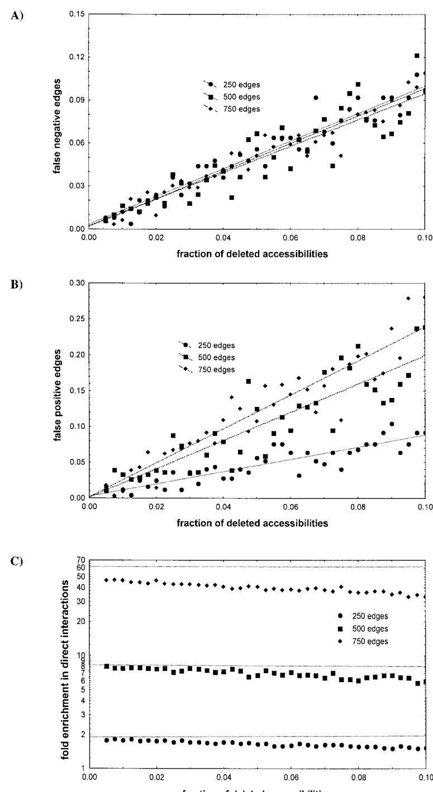
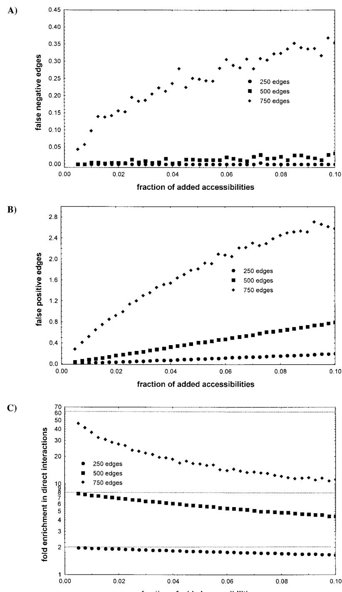

# Reconstructing Pathways in Large Genetic Networks from Genetic Perturbations

ANDREAS WAGNER

# ABSTRACT

I present an algorithm that determines the longest path between every gene pair in an arbitrarily large genetic network from large scale gene perturbation data. The algorithm’s computational complexity is $O ( n k ^ { 2 } )$ , where $\pmb { n }$ is the number of genes in the network and $\pmb { k }$ is the average number of genes affected by a genetic perturbation. The algorithm is able to distinguish a large fraction of direct regulatory interactions from indirect interactions, even if the accuracy of its input data is substantially compromised.

Key words: functional genomics, reverse engineering, network biology.

# INTRODUCTION

erhaps the most fundamental questions about the structure of a large genetic networks are these: what are the pathways connecting genes in the network? And which genes in a network in uence the activity of which other genes directly? I here present an algorithm that can answer these question for gene networks containing an arbitrary number of genes. The algorithm requires perturbation of many genes in a network and subsequent gene activity measurements. Such perturbations are beginning to become available for a variety of model organisms (Fraser et al., 2000; Hughes et al., 2000; Pennisi, 1998; Somerville and Somerville, 1999; Spradling et al., 1999).

For the purpose of this paper, I deŽ ne a genetic network as a group of genes whose members can change each other’s activity. Although the algorithm applies in principle to any notion of gene activity, the most mature technology for large-scale gene activity measurements, which are necessary for this algorithm, is microarray technology that measures changes in mRNA gene expression (Lockhart and Winzeler, 2000). The relevant kinds of gene perturbations are experimental manipulations of gene activity through either the gene itself or its product. They include point mutations, gene deletions, overexpression, inhibition of translation, for example by using antisense RNA, and changes in posttranslational modiŽ cations.

The algorithm represents genetic networks as directed graphs whose nodes are genes and whose edges correspond to direct regulatory interactions between genes. This restriction to such a qualitative representation of gene interactions is motivated by the large amounts of noise associated with genome-scale gene activity measurements. In this graph-theoretical framework, all direct interactions among network genes can be represented in an adjacency matrix or adjacency list Adj of the graph (Harary, 1969), which completely characterizes the graph.

Genetic perturbations do not identify direct interactions between genes. They identify only genes whose activity changes as a result of a perturbation. This change can be caused by a direct in uence of the perturbed gene (e.g., if it is a transcriptional regulator of a gene whose activity changes) or indirectly via one or more intermediate steps. In a graph representation of a genetic network, the list of all genes in uenced—directly or indirectly—by a genetic perturbation corresponds to the graph’s accessibility list Acc. In this context, to reconstruct a genetic network from the effects of genetic perturbations is to infer its adjacency list from its accessibility list. This problem is known as the transitive reduction of a graph and was Ž rst solved by Aho and collaborators (Aho et al., 1972; van Leeuwen, 1990). In a previous report (Wagner, 2001)—which explains the relevant concepts in much greater detail—I have presented a related, recursive algorithm to reconstruct direct interactions in a genetic network. From such a reconstruction, standard algorithms such as breadth-Žrst search (Mehlhorn and Naher, 1999) can infer all shortest paths between networks genes. The subject of this paper is a complementary “Aho-like” algorithm (Aho et al., 1972) that reconstructs all longest paths between network genes directly from the accessibility list and an analysis of how measurement errors of gene activity in uence this algorithm’s performance.

An acyclic directed graph uniquely deŽ nes its accessibility list, but the converse is not true. Among all acyclic graphs with the same accessibility list, however, there is exactly one with the fewest edges, the minimum equivalent graph or most parsimonious graph (Aho et al., 1972; van Leeuwen, 1990; Wagner, 2001) consistent with $A c c$ . This graph also has the property that it is shortcut-free, where a shortcut is deŽ ned as follows (Wagner, 2001). Consider two nodes $i$ and $j$ of a digraph that are connected by an edge $e$ . The range $r$ of the edge $e$ is the length of the shortest path between $i$ and $j$ in the absence of $e$ . If there is no other path connecting $i$ and $j$ , then $r : = \infty$ . An edge $e$ with range $r \geq 2$ but $r \neq \infty$ is called a shortcut.

Aho’s work (Aho et al., 1972) Ž rst showed that in contrast to acyclic graphs, cyclic graphs have no unique parsimonious graph whose adjacency list is a smallest subset of the accessibility list. How does one treat cycles in network reconstruction? The idea is to Ž rst identify the condensation of the network, i.e., the graph whose nodes consist of the strong components of the network. This is easily done from the accessibility list (Harary, 1969; Wagner, 2001). The condensation is acyclic and it is the condensation that one reconstructs from a graph’s accessibility list. This points to a principal limitation of single gene perturbations in resolving genetic networks that contain cycles: They can not resolve the order of genes in the cycle and will collapse any cycle into a single node.

# RESULTS

# Mathematical foundation

The algorithm I discuss below rests on the following two propositions.

Proposition 1. For two nodes u and w of an acyclic, shortcut-free digraph, let $p ( u , w )$ be the length (number of edges) of $a$ longest path connecting u and $w ( p ( u , u ) = 0$ , $p ( u , w ) = \infty$ if $w \not \in A c c ( u ) )$ /.

$$
\forall w \in A c c ( u ) : p ( u , w ) = \operatorname* { m a x } _ { \{ v | v \in A c c ( u ) \land w \in A c c ( v ) \} } p ( u , v ) + p ( v , w )
$$

That is, the longest path $p ( u , w )$ between $u$ and $w$ , where $w$ is accessible but not adjacent to $u$ , is equivalent to the sum over the longest paths $p ( u , v ) + p ( v , w )$ , maximized over all $v$ from which $w$ is accessible. The proposition is a consequence of path length additivity in a graph. If $w$ is adjacent to $u$ , then $v = u$ , and $p ( u , w ) = p ( u , u ) + p ( u , w ) = 0 + 1 = 1$ . No path with $p ( u , w ) > 1$ exists in this case, because the graph is shortcut-free.

The following could be viewed as a special case of Proposition 1.

Proposition 2. For two nodes u and w of an acyclic, shortcut-free digraph, let $p ( u , w )$ be the length (number of edges) of a longest path connecting u and $w ( p ( u , u ) = 0$ , $p ( u , w ) = \infty$ if $w \not \in A c c ( u ) )$ .

$$
\forall w \in A c c ( u ) \backslash A d j ( u ) : p ( u , w ) = \operatorname* { m a x } _ { \{ v \mid v \in A c c ( u ) \land w \in A c c ( v ) \} } 1 + p ( v , w )
$$

Proof. For the purpose of this proof, consider only nodes $v$ from the set $\{ v | v \in A c c ( u ) \land w \in A c c ( v ) \}$ . Among such nodes $v$ , I will distinguish between those adjacent to $u$ and those accessible but not adjacent to $u$ . For any $v \in A d j ( u )$ , $p ( u , v ) = 1$ because the graph is shortcut-free. A longest path (not necessarily unique) from $u$ to $w$ must pass through one $v _ { i } \in A d j ( u )$ . The length of this longest path is one plus the length of the longest path from $v _ { i }$ to $w$ . Thus, to arrive at a longest path between $u$ and $w$ , one can take the above maximum over $v \in A d j ( u )$ . What remains to be shown is that there exists no $v _ { j }$ accessible but not adjacent to $u ( v _ { j } \in A c c ( u ) \backslash A d j ( u ) )$ so that

$$
1 + p ( v _ { j } , w ) > \operatorname* { m a x } _ { \{ v | v \in A d j ( u ) \land w \in A c c ( v ) \} } 1 + p ( v , w ) .
$$

Assume there was such a $v _ { j } ~ \in ~ A c c ( u ) \backslash A d j ( u )$ . Because $v _ { j }$ is accessible from $u$ , there exists a $v _ { h }$ adjacent to $u$ , such that the longest path from $u$ to $v _ { j }$ is given by $p ( u , v _ { j } ) = 1 + p ( v _ { h } , v _ { j } )$ . Because of Proposition 1, $p ( u , w ) \geq p ( u , v _ { j } ) + p ( v _ { j } , w )$ , and in sum we have $p ( u , w ) \geq p ( u , v _ { j } ) + p ( v _ { j } , w ) =$ $1 + p ( v _ { h } , v _ { j } ) + p ( v _ { j } , w ) > 1 + p ( v _ { j } , w )$ , which is in contradiction to the assumption.

Proposition 2 does not apply to nodes $w \in A d j ( u )$ , but for those nodes $p ( u , w ) = 1$ . This does not hold for minimum path lengths $p _ { m i n } ( u , w )$ . The reason lies in the second half of the proof. For $u , w$ such that $p _ { m i n } ( u , w ) > 2$ , there exists a $v _ { j } \in A c c ( u ) \backslash A d j ( u )$ , such that $1 + p _ { m i n } ( v _ { j } , w ) < p _ { m i n } ( u , w )$ . It is a $v _ { j }$ adjacent to $w$ , for which $p _ { m i n } ( v _ { j } , w ) = 1$ .

# The algorithm

The algorithm is shown as pseudocode in Fig. 1. It takes advantage of Proposition 2 to build a list of maximum path lengths $p ( u , v )$ in a graph. The algorithm needs an accessibility list for each node $u$ , $A c c ( u )$ . Initially, all pathlengths $p ( u , v )$ should be undeŽ ned or assigned some impossibly small value, such as $p ( u , v ) = - 1$ . In lines one through four (Fig. 1), a master loop cycles over all nodes $u$ and calls the routine MAXPATH for each node $u$ . In the last statement of this routine (line 17), the calling node is

1 for all nodes $u$ of G   
2 if node $u$ has not been visited   
3 call MAXPATH(u)   
4 end if   
5 MAXPATH(u)   
6 for all nodes $\nu \in A c c ( u )$   
7 if $A c c ( \nu ) { = } \mathcal { O }$   
8 declare $\nu$ as visited.   
9 else   
10 call MAXPATH $( \nu )$   
11 end if   
12 $p ( u , \nu ) { = } I$   
13 for all nodes $\nu \in A c c ( u )$   
14 for all nodes $w \in A c c ( \nu )$   
15 $p ( u , w ) { = } m a x ( p ( u , w ) , ~ I + p ( \nu , w ) )$   
16 $p ( u , u ) { = } 0$   
17 declare node $u$ as visited   
18 end MAXPATH(u)

FIG. 1. A recursive algorithm to reconstruct the maximum path length between two genes. See text for details.

declared as visited. Once a node u has been visited, the maximum path lengths $p ( u , v )$ to all $v \in A c c ( u )$ have been calculated. The conditional statement in the master loop (line 2) skips nodes that have already been visited.

Aside from storing Acc and path lengths, the algorithm needs to keep track of all visited nodes. In an actual implementation, $A c c$ , path lengths, and any data structure that keeps track of visited nodes must be either global variables or passed into the routine MAXPATH. In contrast, the calling node $u$ needs to be a local variable because MAXPATH is recursive.

I will now explain the function MAXPATH itself, which is at the algorithm’s core. It consists of two loops. The Ž rst loop (lines 6–12) cycles over all nodes $v$ accessible from the calling node $u$ . If there exists a node accessible from $v$ , then MAXPATH is called from $v$ . If no node is accessible from $v$ , that is, if $A c c ( v ) = \emptyset$ , then $v$ is declared as visited. Because its accessibility list is empty in this case, there exists no node z for which $p ( v , z )$ has a positive integer value. Thus, $p ( v , z )$ needs no further modiŽ cation. In sum, MAXPATH calls itself recursively in the Ž rst loop until a node is reached whose accessibility list is empty. There always exists such a node; otherwise, the graph would not be acyclic. This also means that inŽ nite recursion is not possible for an acyclic graph. Thus, the algorithm always terminates. More precisely, the longest possible chain of nested calls of MAXPATH is $( n - 1 )$ if $\mathbf { G }$ has $n$ nodes. For any node $u$ calling MAXPATH, the number of nested calls is at most equal to the length of the longest path starting at $u$ .

In line 12, the last statement of the Ž rst loop, the longest path from $u$ to $v$ is temporarily assigned a length of one, which is the smallest possible maximum path length for any $v \in A c c ( u )$ . This assignment is the departure point for the iterative path length calculations in the second loop of MAXPATH (lines 13–15), where Proposition 2 is applied to determine $p ( u , v )$ for each $v$ accessible from $u$ . This loop starts only once the algorithm has explored all nodes accessible from the calling node $u$ , that is, as the function calls made during the Ž rst loop return. The iteration scheme in lines 13 and 14 deserves some explanation. Following Proposition 2, one would Ž rst iterate over all nodes $w \in A c c ( u )$ and then maximize $1 + p ( v , w )$ over all $v$ with $w \in A c c ( v )$ . This would require, for each $v$ , a time-consuming search to determine whether $w \in A c c ( v )$ . Instead, the algorithm uses a modiŽ ed iteration scheme, which swaps the order of iterations. It iterates Ž rst over all nodes $v \in A c c ( u )$ and then over all $w \in A c c ( v )$ to maximize $1 + p ( v , w )$ (line 15). By the time line 15 of the second loop is reached, all nodes $v$ accessible from $u$ have been visited in previous calls to MAXPATH. Thus, all $p ( v , w )$ are known, which is what the calculation of $p ( u , w )$ relies on. In sum, lines 13–15 determine all $p ( u , w )$ , except for nodes adjacent to $u$ , for which the maximum path lengths is one (established on line 12), and $u$ itself, for which $p ( u , u ) = 0$ (line 16).

# Computational and storage complexity

Both measures of algorithmic complexity are determined by the average number of entries in a node’s accessibility list. Let $k < n - 1$ be that number. For all practical purposes, there will be many fewer entries than that, not only because accessibility lists with nearly $n$ entries are not accessibility lists of acyclic digraphs, but also because most real-world graphs are sparse (Jeong et al., 2001, 2000; Wagner, 2002; Wagner and Fell, 2001).

During execution, each node $v$ accessible from a node $u$ induces one recursive call of MAXPATH, after which the node accessed from $u$ is declared as visited. Thus, each entry of the accessibility list of a node is explored no more than once. However, line 14 of the algorithm (Fig. 1) loops over all nodes $w$ accessible from the called node $v$ . This leads to overall computational complexity $O ( n k ^ { 2 } )$ .

In terms of memory requirements, the algorithm needs a copy of the accessibility list $( O ( n k ) )$ , a list of path lengths $( O ( n k ) )$ , as well as a list of the nodes that have been visited $( O ( n ) )$ . The recursion stack requires additional storage. However, the recursion depth can be no greater than $n - 1$ because otherwise the graph would not be acyclic. Thus, overall storage requirements are $O ( n k )$ .

# Undetected and spurious activity changes

Any experiment is subject to measurement error. Either genes affected by a perturbation may not be detected as such, or genes unaffected will show spurious changes in activity. Even for simple graphs, removal or addition of entries can lead to arbitrarily pathological situations, such as structures that look like cycles in the accessibility list but that do not correspond to any possible cycle in a graph (Wagner, 2001). Such pathologies pose challenges for any reconstruction algorithm.

I analyzed robustness of the algorithm in Fig. 1 to missing and to added entries in a graph’s accessibility list. I did so by Ž rst generating a random graph of a prespeciŽ ed number of nodes and edges along with its accessibility list Acc. This was an Erdösz-Rényi random graph (Bollobás, 1985); that is, any two nodes in it were equally likely to be connected by an edge. I then eliminated or added a fraction of nodes to the accessibility list at random. After that, I applied the algorithm from Fig. 1 to the list thus generated and determined the number of edges, corresponding to node pairs $u , v$ , with $p ( u , v ) = 1$ , that the algorithm identiŽ es correctly. More speciŽ cally, I determined the fraction $f _ { - }$ of edges in the transitive reduction of Acc that the algorithm does not identify as such (false-negative edges) and the fraction of edges $f _ { + }$ the algorithm Ž nds but that are not part of the transitive reduction (false-positive edges).

A complementary way to analyze algorithmic robustness is to analyze how much the algorithm “enriches” direct interactions in a reconstructed adjacency list. Let $C$ be the number of entries in the accessibility list of a graph, and $A$ the number of entries in the adjacency list. Then, a fraction $A / C$ of entries in the accessibility list corresponds to direct regulatory interactions in $A c c$ . One can think of $A / C$ metaphorically as the “concentration” of direct interactions among all detected interactions. For instance, one of the graphs analyzed in Figures 2 and 3 has 610 edges and 37,889 entries of the accessibility list. Thus, only 610/37889, or about one $6 2 ^ { \mathrm { n d } }$ of all entries are direct interactions. Perfect network reconstruction would enrich direct interactions by a factor 62. With  awed data, the algorithm may not identify all direct interactions, but the adjacency list it produces may still be enriched for direct interactions. The quantity $A ( 1 - f _ { - } ) / A ( 1 + f _ { + } ) = ( 1 - f _ { - } ) / ( 1 + f _ { + } )$ is the ratio of correctly identiŽ ed direct interactions, $A ( 1 - f _ { - } )$ , to the sum of the total number of entries of $A d j$ and the number of false positive interactions, $A f _ { + }$ . It is at most one, in the case of perfect network reconstruction. As a measure for how much an algorithm enriches for direct interactions, I deŽ ne $E = ( C ( 1 - f _ { - } ) ) / ( A ( 1 + f _ { + } ) )$ . $E$ attains its maximally possible value, $C / A$ , for perfect network reconstruction. An $E$ of 10 means that the “concentration” of direct interactions in a reconstructed adjacency list is 10 times greater than in the accessibility list of the same network.

Figures 2 and 3 show robustness of the algorithm to deleted and added accessibilities, respectively. The algorithm generates fewer false-negative than false-positive edges for a given fraction of deleted (Figs. 2A versus 2B) or added (Figs. 3A versus 3B) accessibilities. Second, the algorithm is in general more sensitive to added accessibilities, in that both $f _ { - }$ (2A versus 3A) and $f _ { + }$ (2B versus 3B) are greater if the same fraction of edges is added as opposed to deleted. Third, $f _ { + }$ depends more strongly on the interaction density in the network than does $f _ { - }$ .

The relation of $E$ to the fraction of deleted and added entries of an accessibility list is shown in Figs. 2C and 3C. Take the above example with 37,889 entries of the accessibility list. For perfect network reconstruction (dotted line in Figs. 2C and 3C), $E \approx 6 2$ . If the size of the accessibility list is decreased or increased by $10 \%$ , the fractions of direct interactions in the reconstructed adjacency list are still 30-fold and 10-fold greater, respectively, than in the original accessibility list (Fig. 3C). Thus, even for substantially  awed data, leading to a sizable fraction of false-negative and false-positive edges, the algorithm may still signiŽ cantly enrich direct interactions.

# DISCUSSION

The above algorithm to reconstruct genetic networks is fast and its performance does not degrade catastrophically when faced with measurement errors in gene activity. However, it cannot resolve cycles of regulatory interactions. This shortcoming is a limitation of experimental data rather than of any particular network reconstruction method. It raises two questions. First, how abundant are such cycles? Statistical inference from the perturbation response of transcriptional regulatory networks suggests that such networks are sparse, containing on average of the order of one direct regulatory interaction per gene (Wagner, 2002). Moreover, biological networks whose coarse scale structure has been analyzed resemble sparse random networks with a broad-tailed degree distribution (Jeong et al., 2001, 2000; Wagner and Fell, 2001). Although cycles certainly occur and are important biologically (Freeman, 2000), such statistical information suggests that gene networks are not rife with cycles. The second question is how to design experiments to resolve cycles. This can be done through double mutations: one mutation disrupts a cycle, and the remaining (linear) path can be analyzed by single mutations. This approach will work best if biological networks are sparsely connected, as suggested by the available statistical evidence.

A second caveat is that there are many networks consistent with any given list of perturbation effects and the algorithm reconstructs only one of them, the network with the fewest regulatory interactions. There can be no guarantee that this most parsimonious network re ects the actual structure of a genetic network, which might have more interactions than necessary to accomplish its tasks. However, many redundant interactions are likely to disappear rapidly through degenerative mutations.

  
FIG. 2. Quality of network reconstruction with unidentiŽed perturbation effects. Results are shown for three random graphs of 500 nodes and 250 edges (circles), 500 edges (squares), or 750 edges (diamonds), from which edges are removed until each graph is rendered acyclic (Mehlhorn and Naher, 1999). After removal of these edges, the resulting three acyclic graphs have 250, 494, and 624 edges left, respectively. For each of these networks, a prespeciŽed fraction of entries was then eliminated at random from the accessibility list. The fraction of remaining entries is shown on the abscissa of each panel. The algorithm from Fig. 1 was then applied to the changed accessibility list, and the resulting adjacency list was then compared to that of the maximally parsimonious graph of the original accessibility list. For the reconstructed network, (A) shows the fraction of false-negative edges, (B) shows the fraction of false-positive edges, and (C) shows by how many fold direct interactions are enriched (see text) in the reconstructed adjacency list, relative to the original accessibility list. A logarithmic scale is chosen in (C) merely to Ž t all data points conveniently on one graph. The dotted horizontal lines indicate the maximally possible enrichment, that is, for perfect network reconstruction.

  
FIG. 3. Quality of network reconstruction with spurious perturbation effects. Results are shown for three random graphs of 500 nodes and 250 edges (circles), 500 edges (squares), or 750 edges (diamonds), from which edges are removed until each network is rendered acyclic (Mehlhorn and Naher, 1999). After removal of these edges, the resulting three acyclic graphs have 250, 494, and 610 edges left, respectively. For each of these networks, a prespeciŽed fraction of entries was then added at random to the accessibility list. For each added entry $u$ , it was veriŽ ed whether adding $u$ as an edge would create a cycle in the graph. If so, a new $u$ was chosen at random, until one was found that did not create a cycle. The fraction of entries thus added is shown on the abscissa of each panel. The algorithm from Fig. 1 was then applied to the changed accessibility list, and the resulting adjacency list was then compared to that of the maximally parsimonious graph of the original accessibility list. For the reconstructed network, (A) shows the fraction of false negative edges, (B) shows the fraction of false positive edges, and (C) shows by how many fold direct interactions are enriched (see text) in the reconstructed adjacency list, relative to the original accessibility list. A logarithmic scale is chosen in (C) merely to Ž t all data points conveniently on one graph. The dotted horizontal lines indicate the maximally possible enrichment, that is, for perfect network reconstruction.

Third, as one would expect, the algorithm’s robustness to experimental errors is limited. My analysis of its robustness has two implications. First, the algorithm is generally more sensitive to false-positive than to false-negative gene activity changes. Thus, it is better to be statistically conservative when deciding which genes have changed their activity state after perturbation. In terms of microarray analyses, this means that it is better to apply conservative thresholds for expression ratios when deciding what genes were affected by a genetic perturbation. Second, when viewed as a tool to enrich direct interactions in an accessibility list, the algorithm is useful even if the quality of gene activity measurements is substantially compromised.

# ACKNOWLEDGMENTS

I would like to acknowledge NIH support through grant GM063882-01 as well as the Santa Fe Institute’s continued support of my research program.

# Список литературы

Aho, A.V., Garey, M.R., and Ullman, J.D. 1972. The transitive reduction of a directed graph. Siam J. Computing 1, 131–137.   
Bollobás, B. 1985. Random graphs, Academic Press, London.   
Fraser, A.G., Kamath, R.S., Zipperlen, P., MartinezCampos, M., Sohrmann, M., and Ahringer, J. 2000. Functional genomic analysis of C-elegans chromosome I by systematic RNA interference. Nature 408, 325–330.   
Freeman, M. 2000. Feedback control of intercellular signalling in development. Nature 408, 313–319.   
Harary, F. 1969. Graph Theory, Addison-Wesley, Reading, MA.   
Hughes, J.D., Estep, P.W., Tavazoie, S., and Church, G.M. 2000. Computational identiŽ cation of cis-regulatoryelements associated with groups of functionally related genes in Saccharomyces cerevisiae. J. Mol. Biol. 296, 1205–1214.   
Jeong, H., Mason, S.P., Barabasi, A.-L., and Oltvai, Z.N. 2001. Lethality and centrality in protein networks. Nature 411, 41–42.   
Jeong, H., Tombor, B. Albert, R. Oltvai, Z.N., Barabasi, A.L. 2000. The large-scale organization of metabolic networks. Nature 407, 651–654.   
Lockhart, D., and Winzeler, E.A. 2000. Genomics, gene expression and DNA arrays. Nature 405, 827–836.   
Mehlhorn, K., and Naher, S. 1999. LEDA: A platform for combinatorial and geometric computing, Cambridge University Press, Cambridge, UK.   
Pennisi, E. 1998. Worming secrets from C-elegans genome. Science 282, 1972–1974.   
Somerville, C., and Somerville, S. 1999. Plant functional genomics. Science 285, 380–383.   
Spradling, A.C., Stern, D., Beaton, A., Rhem, E.J., Laverty, T., Mozden, N., Misra, S., and Rubin, G.M. 1999. The Berkeley Drosophila Genome Project gene disruption project: Single P-element insertions mutating $2 5 \%$ of vital drosophila genes. Genetics 153, 135–177.   
van Leeuwen, J.E. 1990. Handbook of theoretical computer science. MIT Press, Cambridge, MA.   
Wagner, A. 2001. How to reconstruct a genetic network from $n$ single-gene perturbations in fewer than $n ^ { 2 }$ easy steps. Bioinformatics 17, 1183–1197.   
Wagner, A. 2002. Estimating gene network connectivity from large-scale gene perturbation data. Genome Res. 12, 309–315.   
Wagner, A., and Fell, D. 2001. The small world inside large metabolic networks. Proc. Roy. Soc. London Ser. B 280, 1803–1810.

Address correspondence to: Andreas Wagner University of New Mexico Department of Biology 167A Castetter Hall Albuquerque, NM 817131-1091

E-mail: wagnera@unm.edu