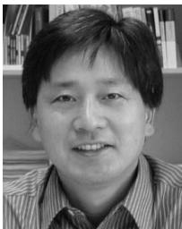
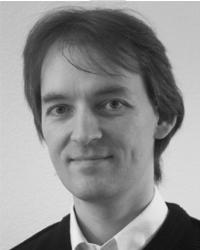

# Evolutionary Optimization in Uncertain Environments—A Survey

Yaochu Jin, Senior Member, IEEE and Jürgen Branke, Member, IEEE

Abstract—Evolutionary algorithms often have to solve optimization problems in the presence of a wide range of uncertainties. Generally, uncertainties in evolutionary computation can be divided into the following four categories. First, the fitness function is noisy. Second, the design variables and/or the environmental parameters may change after optimization, and the quality of the obtained optimal solution should be robust against environmental changes or deviations from the optimal point. Third, the fitness function is approximated, which means that the fitness function suffers from approximation errors. Fourth, the optimum of the problem to be solved changes over time and, thus, the optimizer should be able to track the optimum continuously. In all these cases, additional measures must be taken so that evolutionary algorithms are sill able to work satisfactorily.

This paper attempts to provide a comprehensive overview of the related work within a unified framework, which has been scattered in a variety of research areas. Existing approaches to addressing different uncertainties are presented and discussed, and the relationship between the different categories of uncertainties are investigated. Finally, topics for future research are suggested.

Index Terms—Approximation models, dynamic environments, noise, robustness, uncertainty.

# I. INTRODUCTION

N MANY real-world optimization problems, a wide range of uncertainties have to be taken into account. Generally, uncertainties in evolutionary optimization can be categorized into four classes.

1) Noise: The fitness evaluation is subject to noise. Noise in fitness evaluations may come from many different sources such as sensory measurement errors or randomized simulations. Mathematically, a noisy fitness function can be described as follows:

$$
F ( X ) = \int _ { - \infty } ^ { \infty } [ f ( X ) + z ] p ( z ) d z = f ( X ) , z \sim N ( 0 , \sigma ^ { 2 } )
$$

where $X$ is a vector of parameters that can be changed by the algorithm (often known as design variables), $f ( X )$ is a time-invariant fitness function, $z$ is additive noise, which is often assumed to be normally distributed with zero mean and variance $\sigma ^ { 2 }$ . It should be noticed that nonGaussian noise, such as Cauchy distributed noise has also been considered [13]. No qualitative difference in the performance of an evolution strategy has been observed in the presence of Gaussian or Cauchy noise. Ideally, evolutionary algorithms should work on the expected fitness function $F ( X )$ and not be misled due to the presence of noise. However, during optimization, the only measurable fitness value is the stochastic $f ( X ) { + } z$ . Therefore, in practice, the expected fitness function in (1) is often approximated by an averaged sum of a number of random samples

$$
\hat { F } ( X ) = \frac { 1 } { N } \sum _ { i = 1 } ^ { N } [ f ( X ) + z _ { i } ]
$$

where $N$ is the sample size, and ${ \hat { F } } ( X )$ is an estimate of $F ( X ) = f ( X )$ .

2) Robustness: The design variables are subject to perturbations or changes after the optimal solution has been determined. 1 Therefore, a common requirement is that a solution should still work satisfactorily when the design variables change slightly, e.g., due to manufacturing tolerances. Such solutions are termed robust solutions. To search for robust solutions, evolutionary algorithms should work on an expected fitness function based on the probability distribution of $p ( \delta )$ of the possible disturbances $\delta$ , which are often assumed to be independent of each other and normally distributed

$$
F ( X ) = \int _ { - \infty } ^ { + \infty } f ( X + \delta ) p ( \delta ) d \delta
$$

$F ( X )$ is generally denoted effective fitness function [199]. Since an analytical closed form of the effective fitness function in (3) is usually not available, it is often approximated using Monte Carlo integration

$$
\hat { F } ( X ) = \frac { 1 } { N } \sum _ { i = 1 } ^ { N } f ( X + \delta _ { i } ) .
$$

Note that this looks a lot like the approximation in the presence of noise as described in (2), and indeed the two cases are closely related. However, there are also some significant differences. While in the case of noise, it is generally assumed that the noise is applied to the fitness values, when searching for robust solutions, the uncertainty is in the design variables. As a result, even if $\delta$ is zero-mean and normally distributed, the effective fitness value $F ( X )$ depends on the shape of $f ( X )$ at point $X$ , and will equal $f ( X )$ only if $f ( X )$ is linear. As a consequence,

1In some cases, perturbations can happen to parameters other than the design variables (often known as environmental parameters). In this discussion, we concentrate on design variables.

a robust optimal solution is not necessarily an optimum of $f ( X )$ , but there is usually a tradeoff between the quality and robustness of the solution. Even additional local optima can be introduced due to uncertainty in the decision variables [187]. Even more importantly, if noise is assumed to be unavoidable, an individual cannot be evaluated accurately. On the other hand, when searching for robust solutions, the fitness function is generally assumed to be known and deterministic, and uncertainty is introduced only after the optimization has finished, the difficulty is to estimate the integral over all possible disturbances. In this case, it is possible to deliberately pick the disturbances $\delta$ used in the approximation in (4), which has consequences for the solution strategies discussed in Section III.

3) Fitness approximation: When the fitness function is very expensive to evaluate, or an analytical fitness function is not available, fitness functions are often approximated based on data generated from experiments or simulations. The approximated fitness function is often known as meta-model. As suggested in [112], a meta-model should usually be used together with the original fitness function. In this case, the fitness function to be optimized by the evolutionary algorithms will become

where $E ( X )$ is the approximation error of the meta-model. The most important difference between a noisy fitness function and an approximate fitness function is that the error in the approximated fitness function is deterministic once the meta-model has been constructed and systematic (i.e., with nonzero mean). Therefore, the error cannot be reduced by resampling the approximate fitness function. Instead, the error has to be addressed by using the true fitness function instead of the approximation. The challenge is then to find the right balance between cheap but erroneous approximate fitness evaluations and expensive but accurate true fitness evaluations.

4) Time-varying fitness functions: The fitness function is deterministic at any point in time, but is dependent on time $t$ , i.e.,

$$
F ( X ) = f _ { t } ( X ) .
$$

As a consequence, also the optimum changes over time. Thus, the evolutionary algorithm should be able to continuously track the changing optimum rather than requiring a repeated restart of the optimization process. The challenge here is to reuse information from previous environments to speedup optimization after a change.

The paper is organized as follows. Section II reviews the methods for addressing noisy fitness functions in detail, followed by a survey on evolutionary algorithms (EAs) for searching robust solutions in Section III. Then, Section IV contains a comprehensive description of various methods for approximating fitness values, including constructing meta-models. Existing frameworks for managing meta-models in evolutionary optimization are also discussed. The issue of tracking changing optima is addressed in Section V. A few further research topics are suggested in Section VI and a summary of the paper is provided in Section VII.

# II. NOISY FITNESS FUNCTION

Noisy fitness evaluations are often encountered in evolutionary optimization and learning. One good example is evolutionary structure optimization of neural networks using indirect coding schemes [222], [223]. In these cases, fitness evaluations of the genotype (the network structure) is quite noisy. Different fitness values could be obtained from the same genotype due to random initialization of the weights and the multimodality of the error function. Handling noise in fitness evaluations is often an important issue in evolutionary robotics [174], evolutionary process optimization [41], and evolution of en-route cashing strategies [31].

The application of EAs in noisy environments has been the focus of many research papers. A detailed theoretic analysis of the in fluence of noise on the performance of evolution strategies can be found in [8], [19], and a brief summary of the work is presented in [7]. In this paper, we assume that noise in fitness evaluations is additive and zero-mean, unless otherwise explicitly stated.

Methodologically, the following approaches have been adopted to address noisy fitness functions.

# A. Explicit Averaging

As has already been noted in the introduction, a common approach to reduce the influence of noise is to estimate the fitness by averaging over a number of samples taken over time, averaging over time for short. Increasing the sample size is equivalent to reducing the variance of the estimated fitness, sampling an individual ’ s fitness $N$ times reduces the corresponding standard deviation by a factor of $\sqrt { N }$ . In the simple approaches, the number of samples (sample size) for each individual is predefined and fixed. Since each sampling (fitness evaluation) could be very expensive, it is desired to reduce the sample size as much as possible without degrading the performance. Aizawa and Wah [2], [3] were probably the first to suggest that the sample size could be adapted during the run, and suggested two adaptation schemes: increasing the sample size with the generation number, and using a higher sample size for individuals with higher estimated variance.

For $( \mu , \lambda )$ or $( \mu + \lambda )$ selection, it has been suggested to adjust the sample size based on an individual’s probability to be among the $\mu$ best ones that will be selected [192]. An elaborate sequential sampling approach, attempting to reduce the number of samples to the minimum required to discriminate between individuals for tournament selection, has recently been proposed in [35], [36], and [44]. In [61], adaptive sampling strategies have been examined for situations where the noise strength varies over space.

Whereas reducing the sample size is successful to reduce computational cost of averaging over time, an alternative approach is to calculate the fitness by averaging over the neighborhood of the point to be evaluated (averaging over space) [38], [180] –[182]. Local models have been built up for this purpose. One implicit assumption by replacing averaging over time with averaging over space is that the noise in the neighborhood has the same characteristics as the noise at the point to be evaluated, and that the fitness landscape is locally smooth.

# B. Implicit Averaging

Because promising areas of the search space are sampled repeatedly by the EA, and there are usually many similar solutions in the population, when the population is large, the in fluence of noise in evaluating an individual is very likely to be compensated by that of a similar individual. This effect can be regarded as some kind of implicit averaging. As a consequence, a simple approach to reducing the in fluence of noise on optimization is to use a large population size [74]. In [134], it is shown that when the population size is in finite, proportional selection is not affected by noise. Genetic algorithms (GAs) with a finite population size have been studied in [168] and it has been shown that increasing the population size reduces the effects of Gaussian noise on Boltzmann selection.

A natural question is whether explicit averaging in the form of resampling or implicit averaging in the form of a larger population size would be more effective, given that the total number of fitness evaluations per generation is fixed. Con flicting conclusions have been reported in different investigations. For example, in [74], it is concluded that for the GA studied, it is better to increase the population size than to increase the sample size. On the other hand, Beyer [18] shows that for a $( 1 , \lambda )$ evolution strategy on a simple sphere, one should increase the sample size rather than offspring population size $\lambda$ . These results have been con firmed empirically in [92] for the simple sphere and Rastringin’s function. Also, the effect of increasing the parent population size $\mu$ has been examined, but again performed worse than an increased sample size. However, when intermediate multirecombination is used as crossover, it has been shown analytically on the simple sphere that increasing the parent population size $\mu$ is preferable to resampling, at least when a proper ratio between parent and offspring population size is chosen [9], [10]. The same holds when the noise is applied to the design variables instead of the fitness values [20]. Finally, theoretical models for GAs have been developed that allow to simultaneously optimize the population size and the sample size [133], [134] based on the work in [80].

# C. Modifying Selection

A number of authors have suggested to modify the selection process in order to cope with noise. One example is to impose a threshold during deterministic selection in evolution strategies [130], i.e., an offspring individual will be accepted if and only if its fitness is better than that of its parent by at least a prede fined threshold. An optimal normalized threshold is derived for a $( 1 + 1 )$ -ES on the noisy sphere. The relationship between threshold selection and hypothesis test are studied in [17]. In [176], it is assumed that noise is bounded, which allows to partially order the individuals and, thus, selection schemes for coping with partially ordered fitness sets [175] can be employed. Branke and Schmidt [35] propose to derandomize the selection process in order to account for the additional uncertainty due to the noise in the problem. As has been shown, this idea allows to signi ficantly reduce the effect of noise without increasing the computational effort.

Uncertainty caused by noise has also been studied in multiobjective optimization, where Pareto-dominance is used for selection. For that case, Teich [195] and Hughes [100] both propose to replace an individual ’s Pareto-rank by its probability of being dominated. As is noted in [100], the same idea can also be applied to single objective ranking schemes.

# D. Related Issues

Important issues concerning search efficiency, convergence and self-adaptation of EAs and other heuristic search algorithms in the presence of noise have been studied. GAs have been shown to perform better than several local search methods on a class of simple noisy problems in [16]. Arnold and Beyer [12] compare evolution strategies with other local search heuristics and show that evolution strategies have a clear advantage in noisy environments.

The effects of noise on coevolutionary learning has been studied in [55]. It is concluded that for small population sizes, resampling is able to improve the learning performance. However, it is also stated that resampling does not help if the population size is sufficiently large.

Whereas most research concentrates on how to reduce the influence of noise in fitness evaluations, a few papers also reported that noise within a certain level can help to improve the performance of EAs [14], [122], [161] and other heuristic search methods, because it allows the algorithms to get out of local optima.

Noisy fitness functions have also been investigated for other search heuristics. In [89], it has been proved that simulated annealing converges under a certain class of noisy environments, provided that the standard deviation of the noise is reduced continuously at a sufficient speed. A modified simulated annealing for noisy environments, based on a deterministic acceptance criterion, has been suggested in [15]. An ant colony optimization (ACO) algorithm has shown to converge with probability one in noisy environments under certain conditions, including a linear increase in sample size [88]. In [54], a new tabu search algorithm has been proposed, where the quality is evaluated by sampling and statistical tests.

# III. SEARCH FOR ROBUST SOLUTIONS

Search for robust optimal solutions is of great signi ficance in a wide range of real-world applications, such as job shop scheduling [121] and design optimization [83], [152], [196], [213]. Robustness of an optimal solution can usually be discussed from the following two perspectives.

• The optimal solution is insensitive to small variations of the design variables.

• The optimal solution is insensitive to small variations of environmental parameters. 2

There are many possible notions of robustness, a few possible measures have been suggested in [29] and [113]. Most research work today attempts to optimize the expected fitness given a probability distribution of the disturbance. Only few papers consider the problem as a multiobjective problem, with performance and robustness as separate goals. We will discuss these two classes in turn, starting with the expected fitness optimization.

# A. Optimizing Expected Fitness

The mathematical formulation of the expected fitness has already been given in (3). However, since in most cases this function is not available in a closed form, an individual’s expected fitness has to be estimated based on $f ( X )$ . As has already been noted in the introduction, this is actually quite similar to estimating the expected fitness in noisy environments, and similar approaches can be applied.

1) Explicit Averaging: The simplest way to estimate the expected fitness is by Monte Carlo integration, i.e., by averaging the fitness values over a number of randomly sampled disturbances $f ( X + \delta )$ , see, e.g., [83], [185], [196], and [213]. However, because in the robustness case disturbances can be chosen deliberately, variance reduction techniques can be applied, allowing a more accurate estimation with fewer samples. In [128] and [130], Latin hypercube sampling (LHS) is proposed, together with the idea to use the same disturbances for all individuals in a generation. Still, explicit averaging incurs additional, potentially expensive fitness evaluations. Exploiting the fact that in EAs, promising regions of the search space are sampled several times, Branke [27] proposed to use the evaluations from similar individuals evaluated in the past to estimate the expected fitness. This closely corresponds to the “averaging in space ” idea already discussed for noisy problems.

2) Implicit Averaging: It has been shown in [198] and [199] that for GAs of an in finite population size using proportional selection, adding random perturbations to the design variables in each generation is equivalent to optimizing on the expected fitness function. Similar to implicit averaging in the case of noisy fitness functions, increasing the population size can reduce the in fluence of the noise and, thus, ensure a correct convergence of the algorithm.

In [27], the idea of perturbation is employed in an evolution strategy, which is compared with the explicit averaging strategy using known solutions in the neighborhood. It has been shown that the latter outperforms the former. However, on the noisy sphere and the $( \mu / \mu , \lambda )$ -ES, Beyer has shown theoretically that given a fixed number of evaluations per generation, increasing the population size is better than multiple random sampling [20].

# B. Multiobjective Approaches

It has been argued in [57] and [113] that optimization on the expected fitness function is not sufficient in some cases.

With expected fitness as the only objective, positive and negative deviations from the true fitness can cancel each other in the neighborhood of a target point. Thus, a solution with high fitness variance may be considered to be robust. Therefore, it may be advantageous to consider expected fitness and fitness variance as separate optimization criteria, which allows to search for solutions with different tradeoffs between performance and robustness.

In [169], search for robust solutions is treated as a three-objective optimization problem, where the fitness of a solution, the mean and the standard deviation of the fitness are used as the objectives. The mean and the standard deviation have been obtained by sampling a number of points in the neighborhood. In [113], fitness and a robustness measure are optimized simultaneously. The robustness measure is defined as the ratio between the standard deviation of the fitness and that of the design variables. The deviation of both the performance and the design variables are calculated using the neighboring solutions in the current population.

Most recently, the robustness of Pareto-optimal solutions has also been considered in [59].

# IV. APPROXIMATED FITNESS FUNCTIONS

Evolutionary computation assisted with approximate fitness functions, also known as meta-model or surrogates, has received increasing interest in the recent years. For a comprehensive review of this topic, please refer to [105]. A continuously updated collection of references is also available on the Internet [95].

# A. Motivations

The use of an approximated fitness function is mainly motivated from the following reasons.

• Each single fitness evaluation is extremely time-consuming. One good example is structural design optimization [84], [110], [120], [145], [149], [156], [188]. In aerodynamic design optimization, it is often necessary to carry out computational fluid dynamics (CFDs) simulations to evaluate the performance of a given structure. A CFD simulation is usually computationally expensive, especially if the simulation is three-dimensional, which may take over ten hours on a high-performance computer for one calculation. A full analytical fitness function is not easily available. Examples are art design and music composition, and some special cases of industrial design as well. In these cases, the quality of a solution has to be evaluated by a human user, and the framework of interactive EAs can be adopted [51], [194]. However, a human user can easily get tired and an approximate model that embodies the opinions of the human evaluator is also very helpful [24], [116]. In the context of interactive multiobjective EAs, approximation models have also been used to model user preferences [154], [197]. In real-time evolutionary optimization of control systems, simulations instead of experiments have often to be used for fitness evaluations. In case a mathematical model of the plant to be controlled is not available, an approximate model should be constructed. Besides, in designing complex systems, expensive experiments have to be conducted due to the fact that even a numerical simulation of the whole system is not feasible. If EAs are to be applied to help design these complex systems, the employment of meta-models is inevitable. Fitness approximation has also been reported in protein structure prediction using EAs [146], [155], where an analytical fitness function is not available.

In evolutionary computation, fitness estimation is an inherent issue when an individual encodes only part of the solution and, thus, the quality of the individuals cannot be evaluated properly. This problem arises in cooperative coevolution [157], evolutionary game theory [56], as well as in learning classi fier systems [214]. Although estimation of the fitness value using meta-models has not received much attention so far in these research fields, interesting work has been reported [90], [119], [129], [148].

Additional fitness evaluations are necessary, e.g., in dealing with noisy fitness functions or in search for robust solutions. To reduce the computational cost of additional fitness evaluations, approximate models are very helpful. Refer to Sections $\mathrm { I I }$ and III for further discussions.

The fitness landscape is rugged. The basic assumption is that a global meta-model can be constructed that is able to smoothen out local optima of the original rugged fitness landscape without changing the location of the global optimum. A Gaussian kernel has been used to realize coarse-to-fine smoothing of the original multimodal function [219]. Approximation for smoothing multimodal functions has also been reported in [125] and [126], where global polynomial models are used instead of Gaussian kernel functions.

# B. Approximation Methods

Various approximation levels or strategies could be adopted for fitness approximation in evolutionary computation.

Problem approximation: Problem approximation tries to replace the original statement of the problem by one which is approximately the same as the original problem but which is easier to solve. For example, the most direct way to evaluate the performance of a design is to conduct experiments. To save the cost of experiments and to facilitate the design procedure, numerical simulations instead of physical experiments can often be used to evaluate the performance of a design. Furthermore, simulations can also be implemented for a full system or a simplified system. Among different level of approximations, a tradeoff between evaluation accuracy and computational cost has to be considered.

Many ad hoc methods have also been developed for the speci fic optimization problems. For example, random sampling instead of complete sampling of an image is used for solving image registration problems using GAs [82]. Another example is the work reported in [4], where fitness approximation is studied in terms of discretization.

Data-driven functional approximation:. In functional approximation, an alternate and explicit expression is constructed for the objective function based on data describing the mapping between the design variable and the quality of the design. In this case, models obtained from data are often known as meta-models or surrogates. Refer to Section IV-E for details on various functional approximation techniques.

Fitness inheritance, fitness imitation and fitness assignment: This type of approximation is specific for EAs and aims at saving function evaluations by estimating an individual’s fitness from other similar individuals. A popular subclass in this category is known as fitness inheritance [50], [191], [224], where fitness is simply inherited from the parents. Theoretic analyzes of convergence time and population sizing when fitness inheritance is involved have been reported in [184]. An approach similar to fitness inheritance has also been suggested where the fitness of a child individual is the weighted sum of its parents [179]. Nevertheless, these simple fitness estimation methods can fail, e.g., it is found that fitness inheritance does not work well for multiobjective optimization problems with a concave or discrete Pareto front [64].

In [118], individuals are clustered into several groups. Then, only the individual that represents its cluster will be evaluated using the fitness function. The fitness value of other individuals in the same cluster will be estimated from the representative individual based on a distance measure. It is termed fitness imitation in contrast to fitness inheritance in [105]. The idea of fitness imitation has been extended and more sophisticated estimation methods have been developed [21], [115].

In two-level coevolutionary algorithms, individuals in one of the two populations encode on art of the problem and their fitness value always depend on others. To solve this problem, methods known as fitness assignment for estimating fitness values have been developed in cooperative coevolutionary systems [138], [157], [212].

# C. Mechanisms for Meta-Model Incorporation

Approximate models can be taken advantage of in almost every element of EAs, including initialization, recombination, mutation and fitness evaluations.

Use of approximate fitness models for initializing the population [163].   
Use of approximate fitness models for reducing randomness in crossover and mutation [1], [5], [142], [163], [165].   
Use of approximate fitness models through fitness evaluations. In most research work, the approximate model has been directly used in fitness ations in order to reduce the number of fitness calculation [42], [66], [68] –[70], [77], [94], [108], [110], [111], [120], [139], [145], [150], [151], [156], [166], [167]. Most recently, approximate fitness evaluations have also been employed in evolutionary multiobjective optimization [49], [52], [70], [71], [144], [147].

Use of different approximate models in different populations of an island-model EA [65], [186], [207]. In [65], solutions are allowed only to migrate from islands using coarse-grained approximations to islands with a more fine-grained approximation, whereas in [186], individuals are allowed to migrate bidirectionally between islands.

# D. Evolution Control/Management of Meta-Models

The basic motivation for using meta-models in fitness evaluations is to reduce the number of expensive fitness evaluations without degrading the quality of the obtained optimal solution. To achieve this goal, meta-models should be combined with the original fitness function properly, which is often known as evolution control or model management. In this paper, we will use the two terminologies interchangeably.

Very often, the approximate model is assumed to be of high fidelity and, therefore, the original fitness function is not at all used in evolutionary computation, such as in [24], [116], and [170]. However, as we have stressed, evolution using meta-models without controlling the evolution using the real fitness function can run the risk of an incorrect convergence [108]. In the sequel, we will concentrate on different model management strategies that can control the evolution properly.

Existing frameworks for evolution control can be generally divided into two categories. The first category, which is termed individual-based evolution control [108], consists of evolution control frameworks in which some individuals use meta-models to evaluate their fitness value and others in the same generation use the real fitness function. The main issue in individual-based evolution control is to determine which individuals should use the meta-model and which ones should use the real fitness function for fitness evaluations. In the second category of frameworks for evolution control, either the meta-model or the real fitness function is used for evaluating all individuals in one generation. These frameworks are termed generation-based evolution control. The main issue in generation-based evolution control is then to determine in which generations the meta-model should be used and in which generations the real fitness function should be used.

1) Individual-Based Evolution Control: A variety of individual-based evolution control methodologies has been developed. A common step in the individual-based evolution control is that all individuals are preevaluated using the meta-model and then a number of individuals will be chosen to be reevaluated (controlled) using the real fitness function.

Choose individuals randomly for reevaluation. In this straightforward method, a number of individuals will randomly be selected from the population [108]. In this case, a preevaluation using the meta-model is not necessary.

Choose the best individuals according to the preevaluation using the meta-model. If we assume the prediction of the meta-model is better than random guess, which is a very weak assumption on the quality of the meta-model, it is natural to choose the best individuals, that is, the more promising ones, to be reevaluated using the real fitness function [42], [84], [108], [111]. Usually, the number of individuals to be reevaluated is prede fined and fixed during the evolution. To improve the efficiency, an adaptation of the number of individuals to be reevaluated can be adjusted according to the estimated error of the metamodel [94].

Choose the most uncertain individuals. There are two reasons for choosing the most uncertain individuals. First, by reevaluating the most uncertain individuals, the uncertainty introduced by using the meta-models could be reduced as much as possible. Second, individuals with a large degree of uncertainties are often located in the unexplored area. Thus, by reevaluating the most uncertain individuals, the exploration is encouraged. A measure of uncertainty can often be obtained by calculating the distance from the concerned individual to the nearest data point for creating the meta-model [37], [179]. Since a confidence criterion for an estimate can be obtained from some model techniques such as Gaussian processes, the confidence level can directly be used to determine the uncertainty of a prediction [67], [69]. A variant of these algorithms is suggested in [201], where individuals with a higher probability of improvement (POI) instead of a higher fitness value are chosen for reevaluation. A combination of the quality and uncertainty criteria has also been used in choosing individuals to be reevaluated [37].

Preselection methods. If the offspring population size is $\lambda$ , the number of individuals to be reevaluated $( \lambda _ { \mathrm { R e } } )$ is usually smaller than or equal to $\lambda$ . One exception is the so-called “preselection ” method, where $\bar { \lambda _ { \mathrm { P r e } } } > \lambda$ offspring individuals are generated for a $( \mu , \lambda )$ evolution strategy. The $\lambda _ { \mathrm { P r e } }$ individuals are all evaluated using the meta-model and $\lambda$ individuals are chosen for reevaluation using the real fitness value according to a combination of quality and uncertainty criteria [69], [201], [202]. In [202], a selection-based quality measure for meta-models similar to those in [101] and [106] is used to adjust the parameter $\lambda _ { \mathrm { P r e } }$ .

It is interesting to point out that the preselection method is essentially the same to the methods where the metamodel is used to reduce the randomness of crossover and mutation [1], [5], [142], [163], [165].

Another interesting method is to choose the most “representative” individuals for reevaluation using the real fitness function according to the location of the individuals. The basic approach is to group the population into a number of clusters and then the individual(s) closest to the center of the clusters regarded as representative one [21], [115]. One advantage of these methods is that a good balance between exploration and exploitation can be obtained.

2) Generation-Based Evolution Control: Generation-based evolution control may be preferred if the EA is implemented in parallel, although some of the individual-based evolution control schemes are also suited for parallelization. However, generation-based evolution control is less flexible compared with the individual-based evolution control.

• Fixed control frequency. Generation-based evolution control has often been carried out in such a way that the real fitness function is applied in every $k$ generations [66], [108], [167], [216], where $k$ is prede fined and fixed during the evolution. A fixed evolution control frequency is not very practical because the fidelity of the approximate model may vary significantly during optimization. In fact, a prede fined evolution control frequency may cause strong oscillation during optimization due to large model errors, as observed in [166].

Another straightforward approach to generation-based evolution control is to run the optimization on the meta-model until the evolution converges [166]. The converged solution is then reevaluated using the real fitness function. One drawback of this method is that the evolution may easily converge to a local minimum. To avoid local convergence, and to exploit the meta-model properly, two measures are taken [40]. First, an estimation of model uncertainty is incorporated in the fitness prediction as done in [69] to encourage exploration. Second, the search is constrained in the de fined neighborhood of the current best solution to encourage reliable and exploitative search.

Adaptive control frequency. It is straightforward to imagine that the frequency of evolution control should depend on the fidelity of the approximate model. A method to adjust the frequency of evolution control based on the trust region framework [60] has been suggested in [145], in which the generation-based approach is used. A framework for approximate model management has also been suggested in [110], which has successfully been applied to two-dimensional aerodynamic design optimization [112].

3) Comparative Remarks: A study comparing two individual-based and one generation-based evolution control strategies has been conducted in [108]. It is found that choosing the best individuals according to the approximate fitness for reevaluation using the real fitness function is more effective than choosing individuals randomly. On the other hand, the individual-based strategy choosing the best individuals exhibits similar performance to the generation-based strategy.

It has been shown that the hybrid strategy combining the quality and uncertainty criteria performs better than a single quality or uncertainty-based criterion [37]. An individual-based strategy in which individuals are chosen based on a clustering algorithm for reevaluation has been shown to be advantageous to the best strategy [115]. In a preliminary comparison of an individual-based method considering both quality and uncertainty and a generation-based method with a fixed control frequency, no clear conclusions can be drawn on a few test functions [203].

# E. Construction of Meta-Models

A variety of meta-modeling techniques have been employed for fitness evaluations, including polynomials (also known as response surface methodologies) [147], [164], multilayer perceptrons (MLPs) [94], [101], [108], [112], [156], radial-basis-function neural networks [149], [200], [216], Kriging models [69], [166], Gaussian processes [201], support vector machines [1], [21], fuzzy logic [217], and classi fiers [225].

The details of the various modeling techniques are beyond the scope of this paper. Readers are referred to the included references for further information [76], [104], [143], [158], [171], [178], [205]. A natural question is which type of models should be used for fitness approximation. Several papers comparing the performance of different approximation models have been published [46], [47], [78], [103], [188], [189]. It seems that no clear-cut conclusions on the advantages and disadvantages of the different approximation models can be reached. In a way, meta-models that are able provide an estimate of the prediction accuracy such as Kriging models and Gaussian processes, which are equivalent in essence, could be advantageous because they deliver an additional measure naturally for evolution control.

Attention should be paid to certain issues that are general for constructing meta-models. First, structure optimization of neural networks can often improve the approximation quality signi ficantly [101], [107]. Second, the tradeoff between approximation accuracy and model complexity should be taken into account. It is important to control the model complexity appropriately to avoid overfitting, which is often known as model selection [43]. $\mathbf { A }$ practical approach to solve the bias and variance dilemma is to use multiple models, e.g., neural network ensembles instead of a single model [115]. An additional merit of using multiple models is that an estimate of the prediction can be obtained, which can be taken advantage of in evolution control. Third, a local meta-model might be better than a global meta-model. Thus, constructing a number of local models might be better than a single global model [149], [162], [173]. Finally, selecting proper training data may play an important role in improving the quality of meta-models [112].

It has been suggested that other measures than approximation accuracy could be used for evaluating meta-model quality in fitness approximation [101], [106]. Similar ideas have been successfully applied to evolution control [202].

# F. Convergence Considerations

Although evolutionary optimization using approximate fitness functions has been shown successful in various research work, a stringent analysis of convergence still lacks. In [108], empirical studies on convergence of EAs have been conducted, which show that a consistently correct convergence can be observed if more than $50 \%$ of the fitness evaluations are carried out using the true fitness function. It has also been shown that evolution strategies converge properly in most cases when only $30 \%$ of the individuals chosen according to a clustering algorithm are controlled [115]. In [183], an optimal switching time between two approximate models has been derived to achieve the maximal speedup for the weighted OneMax optimization problem.

# V. DYNAMIC ENVIRONMENTS

# A. General Considerations

In many real-word optimization problems, the objective function, the problem instance, or constraints may change over time and, thus, the optimum of that problem might change as well. If any of these uncertain events are to be taken into account in the optimization process, we call the problem dynamic or changing. 3

Of course, the simplest way to react to a change of the environment is to regard each change as the arrival of a new optimization problem that has to be solved from scratch (see, e.g., [159]). Given sufficient time, this is certainly a viable alternative. However, often the time for reoptimization is rather short, and an explicit restart approach also assumes that a change event can be identi fied, which is not always the case.

A natural attempt to speedup optimization after a change would be to somehow use knowledge about the previous search space to advance the search after a change. If, for example, it can be assumed that the new optimum is “close ” to the old one, it would certainly bene ficial to restrict the search to the vicinity of the previous optimum. Whether reusing information from the past is promising largely depends on the nature of the change. If the change is radical, and the new problem bears little resemblance with the previous problem, restart may be the only viable option, and any reuse of information collected on the old problem would be misguiding rather than helping the search. For most real-world problems, however, it is hoped that changes are rather smooth and, thus, a lot can be gained by transferring knowledge from the past. The difficult question is what information should be kept, and how it is used to accelerate search after the environment has changed.

But even when useful information can be transferred, it has to be ensured that the optimization algorithm is flexible enough to respond to changes. Most meta-heuristics converge during the run, at least when the environment has been static for some time, thereby losing their adaptability. Thus, besides transferring knowledge, a successful meta-heuristic for dynamic optimization problems has to maintain adaptability.

The following subsections survey approaches to handling dynamic optimization problems by means of EAs and other metaheuristic search methods.

# B. Handling Dynamic Optimization Problems With EAs

Since EAs have much in common with natural evolution, and since in nature evolution is a continuous adaptation process, they seem to be a suitable candidate. And indeed, the earliest application of EAs to dynamic environments known to the authors dates back to 1966 [75]. However, it was not until the late 1980s that the topic got into the focus of many researchers and the number of publications surged. Although other nature-inspired meta-heuristics are also applied to dynamic optimization problems, the EA area is still the largest one.

Usually, information from the previous search space is transferred simply by keeping the individuals in the population. In some cases, when the dimension of the problem changes, the individuals have to be adapted after a change. For example in the case of job shop scheduling, when a new job arrives, corresponding genes have to be inserted into the genotype, while genes corresponding to already processed operations can be deleted. Despite these necessary changes to the genotype, signi ficant improvements in convergence speed and solution quality have been found when the altered (old) individuals are reused, see, e.g., [22], [23], [127], [172].

For generational EAs, outdated fitness information due to problem changes i an issue, because no individual survives for more than a singe generation. If parents compete with the offspring for survival, one possibility would be to reevaluate all old individuals after a change, see, also, [190].

The main approaches to address the issue of convergence can be roughly grouped into the following four categories.

1) Generate diversity after a change: The EA is run in standard fashion, but as soon as a change in the environment is detected, explicit actions are taken to increase diversity and, thus, to facilitate the shift to the new optimum. A typical representative of this approach is hypermutation [53], where the mutation rate is increased drastically for a number of generations after the environment has changed. In variable local search [206], mutation rate is increased gradually. The problem of approaches in this category is that increasing diversity is basically equivalent to replacing information about previously successful individuals by random information. It is difficult to determine a useful amount of diversity: Too much will resemble restart, while too little doesn’t solve the problem of convergence.

2) Maintain diversity throughout the run: Convergence is avoided all the time and it is hoped that a spread-out population can adapt to changes more easily. For example, in the random immigrants approach [81], random individuals are inserted into the population in every generation. Shar $\bigoplus \bigoplus$ crowding mechanisms (e.g., [48]) are a more elaborate way to ensure diversity. The basic idea behind the thermodynamical genetic algorithm (TDGA) [136] is to control the diversity in the population explicitly by controlling a measure of so called “free energy” $F$ . For a minimization problem, this term is calculated as $F = \left. E \right. - \mathrm { T H }$ , where $\langle E \rangle$ stands for the average population fitness and TH is a measure for the diversity in the population. The new population is selected from old parents and offspring one by one, and always the individual that minimizes $F$ is added. The temperature $T$ is a parameter of the algorithm and reflects the emphasis on diversity (the problem of adjusting the parameter $T$ , especially in dynamic environments, has been addressed in [137]). Although some of these approaches are quite interesting, the continuous focus on diversity slows down the optimization process.

3) Memory-based approaches: The EA is supplied with a memory to be able to recall useful information from past generations, which seems especially useful when the optimum repeatedly returns to previous locations. Memory-based approaches can be further divided into explicit memory and implicit memory. In the case of explicit memory, speci fic strategies for storing and retrieving information are defined. A particularly interesting example has been given by Ramsey and Grefenstette [160], where case-based reasoning is used to distinguish between environments, and after a change, those individuals from the memory are reinserted which have previously been successful in similar environments. Other examples for explicit memory include [28] and [135]. In the implicit memory approaches, the EA is simply equipped with a redundant representation, and it is left to the EA to make proper use of it. The most popular example of implicit memory is diploidy (e.g., [79], [91], [123], and [177]), but also other forms of implicit memory can be found [58], [220].

As has been first noted in [28] and later con firmed by several others, memory is very dependent on diversity and should, thus, be used in combination with diversity-preserving techniques.

4) Multipopulation approaches: Dividing up the population into several subpopulations allows to track multiple peaks in the fitness landscape. The different subpopulations then maintain information about several promising regions of the search space, and can be regarded as a kind of diverse, self-adaptive memory. Examples for this approach are the self-organizing scouts [32], [34], the multinational GA [204], or the shifting balance GA [215].

In [210], it was first noted that the usual Gaussian mutation applied in evolution strategies may not be ideal in dynamic environments. Self-adaptation of $\operatorname* { m i n } _ { \mathbf { r } \in \mathbf { \Theta } } ( { \overline { { \overline { { \overline { { \tau } } } } } } } ) _ { \mathbf { r } }$ step-size in dynamic environments is examined, e.g., [6] and [211].

Comprehensive surveys on EAs applied to dynamic environments can be found in the books by Branke [29], Morrison [140], and Weicker [209]. A frequently updated online repository is also available [96].

# C. Theory

While most of the early work was of empirical nature, in the recent past, more and more authors try to look at the problem from a theoretical point of view.

A first approach can be found in [193], where equations for the transition probabilities of a $( 1 + 1 )$ EA on the dynamic bit matching problem are derived.

Droste [62] looks at the first passage time (the expected time to hit the optimum for the first time) for a $( 1 + 1 )$ evolution strategy on the dynamic bit matching problem, where exactly 1 bit is changed with a given probability $p$ . It is shown that for the first passage time to be polynomial, $p \in O ( \log n / n )$ has to be satisfied.

Branke and Wang [39] also consider the dynamic bit matching problem, and analytically compare different strategies to deal with an environmental change within a generation (as opposed to between two generations) based on similar methods, as in [193].

Finally, Arnold and Beyer [11] examine the tracking behavior of an $( \mu / \mu , \lambda )$ evolution strategy with self-adaptive mutation step-size on a single, continuously moving peak. They derive a formula that allows to predict the tracking distance of the population from the target.

# D. Other Meta-Heuristic Approaches

Recently, also some other meta-heuristics have been applied to dynamic optimization problems. In [85] –[87], ACO is used to tackle dynamic TSP problems, where cities are added or deleted. In [85] and [87], knowledge transfer is achieved by keeping the old pheromone matrix, and reinitializing speci fically those parts of the matrix that are most heavily affected by the change. On the other hand, in [86], a so-called population-based ACO is used. This allows to explicitly repair solutions heuristically, which is particularly useful in quickly changing environments.

When applying particle swarm optimization (PSO) [117], [131], [132] to dynamic environments, at least two aspects have to be modi fied. First, the memory has to be updated, because the information stored in the memory may be misguiding the search after the environment has changed. This can be achieved by either simply setting each particle ’s memory position to its current position, or by reevaluating all memory positions and setting it to either old memory or current particle position, whichever is better [45]. The problem of convergence has been addressed in a number of different ways: [99] simply reinitializes all or some of the particles, in [26] mutually repelling (charged) particles are introduced, forcing the swarm to maintain some diversity. As an alternative to charged particles, [25] proposes quantum particles (basically, mutations around the swarm ’s global best). In [124], a grid-like neighborhood structure is proposed, which reduces, at least temporarily, the pressure toward the current best and thereby maintains more diversity. A similar idea is adopted in [102], where the neighborhood structure is hierarchic and adjusted dynamically. Finally, in [25] and [153], multiswarms have been proposed, combining some of the above ideas with the ideas of the self-organizing scouts approach [34]. Similar to self-organizing scouts, the basic idea is to have a multitude of swarms, each watching over a different peak in the fitness landscape.

An application of arti ficial immune systems to dynamic scheduling can be found in [93].

# E. Benchmark Problems

The most prominent benchmark problem is probably the moving peaks problem, suggested simultaneously in [28] and [141]. It consists of a number of peaks changing in height, width, and location. The problem can be modi fied by a large number of parameters: The number of peaks, the number of dimensions, the change frequency, the change severity (distance a peak moves), etc. Both versions of the benchmark generator can be downloaded, the one by Branke in C or Java [97], and the one by Morrison in Matlab and C [98]. To handle this problem successfully, two skills are required: the meta-heuristic has to be able to follow a moving peak, and it has to be able to jump from one peak to another whenever the peak heights change such that another peak becomes the optimum peak.

Other popular benchmark problems are the dynamic knapsack problem (see, e.g., [136]), the dynamic bit-matching problem [63], [193] or scheduling (see, e.g., [23] and [33]). A problem generator based on deceptive functions has been proposed in [221]. A type of multiobjective dynamic optimization problems has been considered in [72] and [73]. A benchmark generator for both single- and multiobjective problems has been proposed in [114], which attempts to build a connection between dynamic problems and multiobjective optimization problems.

# F. Performance Indices

# VII. SUMMARY

To compare different approaches, in a dynamic environment it is not sufficient to simply compare the best solution found, because the optimum is changing over time. A reasonable alternative is to report on the modified offline performance, which averages over the best solution found at each step in time. More precisely, the offline performance $f _ { \mathrm { o f f i n e } }$ of a run with $T$ evaluations in total is defined as

$$
f _ { \mathrm { o f f i n e } } = \frac { 1 } { T } \sum _ { t = 1 } ^ { T } f _ { t } ^ { * }
$$

where $f _ { t } ^ { * }$ is the best solution found since the last change of the environment.

In an alternative setting, where only the final solution after a fixed number of generations is actually implemented, the average solution quality before the next change of the environment may be an appropriate measure.

More discussions on performance measures for dynamic optimization problems can be found in [208].

# VI. FUTURE RESEARCH TOPICS

In this section, we would like to suggest a few promising research topics for further work.

First, to address various uncertainties in multiobjective optimization problems. Most existing research has been conducted for single objective optimization problems with a few exceptions [59], [73], [100].

Second, to address more than one aspect in one problem. In many real-world applications, different types of uncertainties can be encountered simultaneously. For example, in design optimization, search for robust solutions and use of approximate models are often unavoidable, and the fitness evaluations can be noisy as well. Thus, noise might have to be considered in search for robust solutions, and the in fluence of approximation error should be addressed when fitness estimations are employed to avoid additional fitness evaluations in dealing with noisy fitness or in search for robust solutions.

Third, to look more closely into the inherent relationships between the different topics and, thus, to benefit from each other. For example, the approaches to noisy fitness functions and search for robust solutions are clearly quite similar. Besides, when the environment changes too quickly to allow adaptation, or an adaptation would be too costly, it may be better to search for a robust solution that can tolerate small changes rather than, or in addition to, attempting to adapt. Furthermore, to speed up readaptation after a change, the use of approximation functions may be helpful.

Finally, to explore the relationships between uncertainties and multiobjectivity. For example, search for robust solutions has been addressed from the multiobjective point of view [113]. It has also been shown that multiobjective optimization can be converted into a dynamic single objective optimization problem by changing the weights dynamically [109], [114]. On the other hand, the concept of Pareto-optimality can also be employed to address fast-changing dynamic optimization problems [218].

This paper attempts to review and discuss the research on evolutionary optimization in the presence of uncertainties under a uni fied framework. Four classes of uncertainties have been considered in the paper, namely, noise in fitness functions, search for robust solutions, approximation error in the fitness function, and fitness functions changing over time. From our discussions, it can be seen that the four categories of uncertainties in evolutionary optimization are closely related. Uncertainties appear in different spaces in the four different cases. If the fitness function is noisy or approximated, the uncertainty exists in the fitness space. In contrast, uncertainty has to be considered in the parameter space when robust solutions are pursued. Finally, uncertainties in the time–space have to be addressed if the fitness function changes over time.

A few research topics have also been suggested for further research inspired from our discussions on the different aspects of uncertainties under a uni fied framework. The suggested topics attempt to address more than one aspect of uncertainties in one problem, look into the relationships between the different aspects of uncertainties, and the relationships between uncertainty and multiobjectivity, which are believed to become more and more important for the successful application of EAs to more complex real-world problems.

# ACKNOWLEDGMENT

The authors are grateful to X. Yao and three anonymous referees for their constructive comments. Y. Jin would like to thank B. Sendhoff and E. K örner for their support.

# Список литературы

[1] K. Abboud and M. Schoenauer, “Surrogate deterministic mutation, ” in Artificial Evolution. Berlin, Germany: Springer-Verlag, 2002, pp. 103–115.   
[2] A. N. Aizawa and B. W. Wah, “Dynamic control of genetic algorithms in a noisy environment, ” in Proc. Conf. Genetic Algorithms, 1993, pp. 48–55.   
[3] , “Scheduling of genetic algorithms in a noisy environment, ” Evol. Comput., pp. 97 –122, 1994.   
[4] L. Albert and D. Goldberg, “Efficient disretization scheduling in multiple dimensions, ” in Proc. Genetic Evol. Comput. Conf., 2002, pp. 271–278.   
[5] K. Anderson and Y. Hsu, “Genetic crossover strategy using an approximation concept,” in Proc. Congr. Evol. Comput., 1999, pp. 527–533.   
[6] P. J. Angeline, D. B. Fogel, and L. J. Fogel et al. , “A comparison of self-adaptation methods for finite state machines in dynamic environments,” in Annu. Conf. Evol. Program., L. J. Fogel et al., Eds., 1996, pp. 441 –449.   
[7] D. Arnold, “Evolution strategies in noisy environments —A survey of existing work, ” in Theoretical Aspects of Evolutionary Computing, L. Kallel, B. Naudts, and A. Rogers, Eds. Heidelberg, Germany: Springer Verlag, 2001, pp. 239 –249.   
[8] D. V. Arnold, Noisy Optimization with Evolution Strategies. Norwell, MA: Kluwer, 2002.   
[9] D. V. Arnold and H.-G. Beyer et al. , “Efficiency and mutation strength adaptation of the $( \mu / \mu _ { i } , \lambda )$ -ES in a noisy environment, ” in Parallel Problem Solving from Nature. ser. LNCS, M. Schoenauer et al. , Eds. Berlin, Germany: Springer-Verlag, 2000, vol. 1917, pp. 39 –48.   
[10] , “Local performance of the $( \mu / \mu _ { i } , \lambda )$ -ES in a noisy environment,” in Foundations of Genetic Algorithms, W. Martin and W. Spears, Eds. San Mateo, CA: Morgan Kaufmann, 2000, pp. 127 –142.   
[11] , “Random dynamics optimum tracking with evolution strategies, ” in Parallel Problem Solvingfrom Nature, J. Merelo et al., Eds. Berlin, Germany: Springer-Verlag, 2002, pp. 3 –12.   
[12] , “A comparison of evolution strategies with other direct search methods in the presence of noise, ” Comput. Optim. Applicat., vol. 24, pp. 135 –159, 2003.   
[13] , “On effects of outliers on evolutioanry optimization, ” in Intelligent Data Engineering and Automated Learning, ser. LNCS 2690. Berlin, Germany: Springer-Verlag, 2003, pp. 151 –160.   
[14] T. B äck and U. Hammel, “Evolution strategies applied to perturbed objective functions,” in Proc. Int. Conf. Evol. Comput., 1994, pp. 40–45.   
[15] R. C. Ball, T. M. A. Fink, and N. E. Bowler, “Stochastic annealing, ” Phy. Rev. Lett., vol. 91, 2003. 030 201.   
[16] E. Baum, D. Boneh, and C. Garret, “On genetic algorithms, ” in Proc. 8th Annu. Conf. Comput. Learn. Theory, 1995, pp. 230 –239.   
[17] T. Beielstein and S. Markon, “Threshold selection, hypothesis test, and DOE methods, ” in Proc. Congr. Evol. Comput., 2002, pp. 777 –782.   
[18] H.-G. Beyer, “Toward a theory of evolution strategies: Some asymptotical results from the $( 1 \dagger \lambda )$ -theory,” Evol. Comput., vol. 1, no. 2, pp. 165 –188, 1993.   
[19] , “Evolutionary algorithms in noisy environments: Theoretical issues and guidelines for practice,” Comput. Methods Appl. Mech. Eng., vol. 186, pp. 239 –267, 2000.   
[20] , “Actuator noise in recominant evolution str s on general quadratic fitness models, ” in Lecture Notes in Comp Science, vol. 3102, Proc. Genetic Evol. Comput. Conf., K. D. LAST NAME et al. , Eds.. Berlin, Germany, 2004, pp. 654 –665.   
[21] M. Bhattacharya and G. Lu, “A dynamic approximate fitness-based hybrid EA for optimization problems,” in Proc. Congr. Evol. Comput., 2003, pp. 1879 –1886.   
[22] C. Bierwirth and H. Kopfer, “Dynamic task scheduling with genetic algorithms in manufacturing systems, ” Dept. Econ., Univ. Bremen, Bremen, Germany, Tech. Rep., 1994.   
[23] C. Bierwirth and D. C. Mattfeld, “Production scheduling and rescheduling with genetic algorithms, ” Evol. Comput., vol. 7, no. 1, pp. 1 –18, 1999.   
[24] J. A. Biles, “Genjam: A genetic algorithm for generating jazz solos, ” in Proc. Int. Comput. Music Conf., Aarhus, Jutland, Denmark, 1994, pp. 131–137.   
[25] T. Blackwell a I. Branke et al. , “Multiswarm optimization in dynamic environment Applications of Evolutionary Computing. ser. LNCS, G. R. R. LAST NAME et al., Eds. Berlin, Germany: Springer-Verlag, 2004, vol. 3005, pp. 489 –500.   
[26] T. M. Blackwell and P. J. Bentley et al. , “Dynamic search with charged swarms, ” in Proc. Genetic Evol. Comput. Conf., W. B. Langdon et al. , Eds., 2002, pp. 19 –26.   
[27] J. Branke, “Creating robust solutions by means of evolutionary algorithms,” in Parallel Problem Solving from Nature, ser. LNCS. Berlin, Germany: Springer-Verlag, 1998, pp. 119 –128.   
[28] , “Memory enhanced evolutionary algorithms for changing optimization problems,” in Proc. Congr. Evol. Comput., vol. 3, 1999, pp. 1875–1882.   
[29] , Evolutionary Optimization in Dynamic Environments. Norwell, MA: Kluwer, 2001.   
[30] , “Reducing the sampling variance when searching for robust solutions,” in Proc. Genetic Evol. Comput. Conf., L. S. LAST NAME et al., Eds., 2001, pp. 235 –242.   
[31] J. Branke, P. Funes, and F. Thiele et al. , “Evolving en-route caching strategies for the Internet, ” in Lecture Notes in Computer Science, vol. 3103, Proc. Genetic Evol. Comput. Conf., K. Deb et al., Eds., 2004, pp. 434 –446.   
[32] I. Branke, T. Kau ßler, C. Schmidt, and H. Schmeck, “A multipopulation approach to dynamic optimization problems,” in Adaptive Computing in Design and Manufacturing 2000, ser. LNCS. Berlin, Germany: Springer-Verlag, 2000.   
[33] J. Branke and D. Mattfeld et al. , “Anticipation in dynamic optimization: The scheduling case,” in Parallel Problem Solving from Nature. ser. LNCS, M. Schoenauer et al., Eds. Berlin, Germany: Springer-Verlag, 2000, vol. 1917, pp. 253 –262.   
[34] J. Branke and H. Schmeck, “Designing evolutionary algorithms for dynamic optimization problems, ” in Theory and Application of Evolutionary Computation: Recent Trends, S. Tsutsui and A. Ghosh, Eds. Berlin, Germany: Springer-Verlag, 2002, pp. 239 –262.   
[35] J. Branke and C. Schmidt, “Selection in the presence of noise, ” in Lecture Notes in Computer Science, vol. 2723, Proc. Genetic Evol. Comput. Conf., E. Cantu-Paz, Ed., 2003, pp. 766 –777.   
[36] , “Sequential sampling in noisy environments, ” in Parallel Problem Solving from Nature, ser. LNCS. Berlin, Germany: Springer-Verlag, 2004.   
[37] , “Fast convergence by means of fitness estimation, ” Soft Comput. , vol. 9, no. 1, pp. 13 –20, 2005.   
[38] J. Branke, C. Schmidt, and H. Schmeck et al. , “Efficient fitness estimation in noisy environment,” in Genetic and Evolutionary Computation, L. Spector et al., Eds. San Mateo, CA: Morgan Kaufmann, 2001, pp. 243 –250.   
[39] J. Branke and W. Wang et al. , “Theoretical analysis of simple evolution strategies in quickly changing environments,” in Lecture Notes in Compute ence, vol. 2723, Proc. Genetic and Evol. Comput. Conf., E. C.-P. LAST NAME et al., Eds., 2003, pp. 537 –548.   
[40] D. B üche, “Accelerating evolutionary algorithms using fitness function models, ” in Proc. GECCO Workshop Learn., Adapt. Approx. Evol. Comput., 2003, pp. 166 –169.   
[41] D. B üche, P. Stoll, R. Dornberger, and P. Koumoutsakos, “Multiobjective evolutionary algorithm for the optimization of noisy combustion problems, ” IEEE Trans. Syst., Man, Cybern., Part C, vol. 32, no. 4, pp. 460–473, 2002.   
[42] L. Bull, “On model-based evolutionary computation, ” Soft Comput., vol. 3, pp. 76 –82, 1999.   
[43] K. Burnham and D. Anderson, Model Selection and Multimodel Inference, 2nd ed. Berlin, Germany: Springer-Verlag, 2002.   
[44] E. Cantu-Paz, “Adaptive sampling for noisy problems, ” in Proc. Genetic Evol. Comput. Conf., 2004, pp. 947 –958.   
[45] A. Carlisle and G. Dozier, “Tracking changing extrema with adaptive particle swarm optimizer, ” in Proc. World Automation Cong., Orlando, FL, 2002, pp. 265 –270.   
[46] W. Carpenter and J.-F. Barthelemy, “A Comparison of polynomial approximation and artificial neural nets as response surface,” AIAA, Tech. Rep. 92-2247, 1992.   
[47] , “Common misconceptions about neural networks as approximators,” ASCE J. Comput. Civil Eng., vol. 8, no. 3, pp. 345–358, 1994.   
[48] W. Cedeno and V. R. Vemuri, “On the use of niching for dynamic landscapes,” in Proc. Int. Conf. Evol. Comput., 1997, pp. 361–366.   
[49] D. Chafekar, L. Shi, K. Rasheed, and J. Xuan, “Multiobjective GA optimization using reduced model,” IEEE Trans. Systems, Man, and Cybernetics, Part C: Applicat. Rev., 2004, to be published.   
[50] J.-H. Chen, D. Goldberg, S.-Y. Ho, and K. Sastry, “Fitness inheritance in multiobjective optimization, ” in Proc. Genetic Evol. Comput. Conf. , 2002, pp. 319 –326.   
[51] S.-B. Cho, “Emotional image and musical information retrieval with interactive genetic algorithm,” Proc. IEEE, vol. 92, no. 4, pp. 702–711, Apr. 2004.   
[52] H.-S. Chung and J. I. Alonso, “Multiobjective optimization using approximation model-based genetic algorithms,” AIAA, Tech. Rep. 2004- 4325, 2004.   
[53] H. G. Cobb, “An investigation into the use of hypermutation as an adaptive operator in genetic algorithms having continuous, time-dependent nonstationary environments,” Naval Res. Lab., Washington, DC, Tech. Rep. AIC-90-001, 1990.   
[54] D. Costa and E. A. Silver, “Tabu search when noise is present: An illustration in die context of cause and effect analysis,” J. Heuristics, vol. 4, pp. 5 –23, 1998.   
[55] P. Darwen and J. Pollack, “Coevolutionary learning on noisy tasks, ” in Proc. Int. Conf. Evol. Comput., 1999, pp. 1724 –1731.   
[56] P. Darwen and X. Yao, “On evolving robust strategies for iterated prisoner’s dilemma,” in Progress in Evolutionary Computation. ser. LNAI, X. Yao, Ed. Berlin, Germany: Springer-Verlag, 1995, vol. 956, pp. 276 –292.   
[57] I. Das, “Robustness optimization for constrained nonlinear programming problem,” Eng. Opt., vol. 32, no. 5, pp. 585–618, 2000.   
[58] D. Dasgupta and D. R. McGregor, “Nonstationary function optimization using the structured genetic algorithm, ” in Parallel Problem Solving from Nature, R. M änner and B. Manderick, Eds. Amsterdam, The Netherlands: Elsevier, 1992, pp. 145–154.   
[59] K. Deb and H. Gupta, “Introducing robustness in multiobjective optimization,” Kanpur Genetic Algorithms Lab. (KanGAL), Indian Inst. Technol., Kanpur, India, Tech. Rep. 2 004 016, 2004.   
[60] J. Dennis and V. Torezon, “Managing approximate models in optimization,” in Multidisciplinary Design Optimization: State-of-the-Art, N. Alexandrov and M. Hussani, Eds. Philadelphia, PA: SIAM, 1997, pp. 330 –347.   
[61] A. Di Pietro, L. While, and L. Barone, “Applying evolutionary algorithms to problems with noisy, time-consuming fitness functions,” in Proc. Congr. Evol. Comput., 2004, pp. 1254 –1261.   
[62] S. Droste, “Analysis of the $( 1 + 1 )$ EA for a dynamically changing OneMax-variant, ” in Proc. Congr. Evol. Comput., 2002, pp. 55 –60.   
[63] , “Analysis of the $( 1 + 1 )$ EA for a dynamically bitwise changing OneMax, ” in Lecture Notes in Computer Science, vol. 2723, Proc. Genetic and Evol. Comput. Conf., E. Cantu-Paz, Ed., 2003, pp. 909–921.   
[64] E. Ducheyne, B. De Baets, and R. de Wulf, “Is fitness inheritance useful for real-world applications?, ” in Evolutionary Multi-Criterion Optimization, ser. LNCS 2631. Berlin, Germany: Springer-Verlag, 2003, pp. 31 –42.   
[65] D. Eby, R. Averill, W. Punch, and E. Goodman, “Evaluation of injection island model GA performance on flywheel design optimization,” in Adaptive Computing in Design and Manufacturing, ser. LNCS. Berlin, Germany: Springer-Verlag, 1998, pp. 121 –136.   
[66] M. El-Beltagy and A. Keane, “Optimization for multilevel problems: A comparison of various algorithms, ” in Adaptive Computing in Design and Manufacture, I. Parmee, Ed. Berlin, Germany: Springer-Verlag, 1998, pp. 111 –120.   
[67] , “Evolutionary optimization for computationally expensive problems using Gaussian processes,” in Proc. Int. Conf. Artif. Intell., 2001, pp. 708–714.   
[68] M. El-Beltagy, P. Nair, and A. Keane, “Metamodeling techniques for evolutionary optimization of computationally expensive problems: Promises and limitations, ” in Proc. Genetic Evol. Comput. Conf. . Orlando, FL, 1999, pp. 196 –203.   
[69] M. Emmerich, A. Giotis, M. Özdenir, T. B äck, and K. Giannakoglou, “Metamodel-assisted evolution strategies, ” in Parallel Problem Solving from Nature, ser. LNCS. Berlin, Germany: Springer-Verlag, 2002, pp. 371 –380.   
[70] M. Farina, “A minimal cost hybrid strategy for Pareto optimal front approximation,” Evol. Optim., vol. 3, no. 1, pp. 41–52, 2001.   
[71] , “A neural network-based generalized response surface multiobjective evolutionary algorithms,” in Proc. Congr. Evol. Comput., 2002, pp. 956 –961.   
[72] M. Farina, K. Deb, and P. Amato, “Dynamic multiobjective optimization problem: Test cases, approximation, and applications, ” in Lecture Notes in Computer Science 2632, Proc. Genetic Evol. Comput. Conf., 2003, pp. 311 –326.   
[73] , “Dynamic multiobjective optimization problems: Test cases, approximations, and applications,” IEEE Trans. Evol. Comput., vol. 8, no. 5, pp. 425 –442, 2004.   
[74] J. M. Fitzpatrick and J. I. Grefenstette, “Genetic algorithms in noisy environments, ” Mach. Learn., vol. 3, pp. 101 –120, 1988.   
[75] L. J. Fogel, A. J. Owens, and M. J. Walsh, Artificial Intelligence Through Simulated Evolution. New York: Wiley, 1966.   
[76] M. Gibbs and D. MacKey, “Efficient implementation of Gaussian processes,” Cavendish Lab., Cambridge, U.K., Tech. Rep., 1997.   
[77] A. Giotis, M. Emmerich, B. Naujoks, and K. Giannakoglou, “Low kost stochastic optimization for engineering applications, ” in Proc. Int. Conf. Evol. Methods Design, Opt. Control with Applicat. Ind. Prob., 2001, pp. 361 –366.   
[78] A. Giunta and L. Watson, “A comparison of approximation modeling techniques: Polynomial versus interpolating models, ” AIAA, Tech. Rep. 98-4758, 1998.   
[79] D. E. Goldberg and R. E. Smith, “Nonstationary function optimization using genetic algorithms with dominance and diploidy, ” in Genetic Algorithms, J. J. Grefenstette, Ed: Lawrence Erlbaum, 1987, pp. 59–68.   
[80] D. Goldberg, K. Deb, and J. Clark, “Genetic algorithms, noise, and the sizing of populations, ” Complex Syst., vol. 6, pp. 333 –362, 1992.   
[81] J. J. Grefenstette, “Genetic algorithms for changing environments, ” in Parallel Problem Solving from Nature, R. Maenner and B. Manderick, Eds. Amsterdam, The Netherlands: North-Holland, 1992, pp. 137 –144.   
[82] J. Grefenstette and J. Fitzpatrick, “Genetic search with approximate fitness evaluations,” in Proc. Int. Conf. Genetic Algorithms Their Applicat., 1985, pp. 112 –120.   
[83] H. Greiner, “Robust optical coating design with evolution strategies, ” Appl. Opt., vol. 35, no. 28, pp. 5477 –5483, 1996.   
[84] D. Grierson and W. Pak, “Optimal sizing, geometrical and topological design using a genetic algorithm, ” Structural Optim., vol. 6, no. 3, pp. 151 –159, 1993.   
[85] M. Guntsch, J. Branke, M. Middendorf, and H. Schmeck, “AGO strategies for dynamic TSP’s,” in Proc. ANTS Workshop, 2000, pp. 59–62.   
[86] M. Guntsch and M. Middendorf, “Applying population-based AGO to dynamic optimization problems, ” in Lecture Notes in Computer Science , vol. 2463, Proc. ANTS Workshop, 2002, pp. 111 –122.   
[87] M. Guntsch, M. Middendorf, and H. Schmeck, “An ant colony optimization approach to dynamic TSP,” in Proc. Genetic Evol. Comput. Conf., 2001, pp. 860 –867. [88] W. Gutjahr, “A converging ACO algorithm for stochastic combinatorial optimization,” in Stochastic Algorithms: Foundations and Applications. ser. LNCS, A. Albrecht and K. Steinhoefl, Eds. Berlin, Germany: Springer-Verlag, 2003, vol. 2827, pp. 10–25. [89] W. J. Gutjahr and G. C. P flug, “Simulated annealing for noisy cost functions,” J. Global Optim., vol. 8, no. 1, pp. 1–13, 1996. [90] K. Hacker, “Comparison of design methodologies in the preliminary design of a passenger aircraft,” AIAA, Tech. Rep. AIAA-99-0011, 1998. [91] B. S. Hadad and C. F. Eick et al. , “Supporting polyploidy in genetic algorithms using dominance vectors,” in Evolutionary Programming. ser. LNCS, P. J. Angeline et al., Eds. Berlin, Germany: Springer-Verlag, 1997, vol. 1213, pp. 223 –234. [92] U. Hammel and T. B äck, “Evolution strategies on noisy functions, how to improve convergence properties, ” in Parallel Problem Solving from Nature. ser. LNCS, Y. Davidor, H. P. Schwefel, and R. M änner, Eds. Berlin, Germany: Springer-Verlag, 1994, vol. 866, pp. 159 –168.   
[93] E. Hart and P. Ross, “An immune system approach to scheduling in changing environments, ” in Proc. Genetic Evol. Comput. Conf., 1999, pp. 1559 –1566. [94] Y.-S. Hong, H. Lee, and M.-J. Tahk, “Acceleration of the convergence speed of evolutionary algorithms using multilayer neural networks, ” Engineering Optimization, vol. 35, no. 1, pp. 91–102, 2003. [95] Fitness Approximation in Evolutionary Computation Bibliography [Online]. Available: http://www.soft-camputing.de/amec.html [96] Internet Repository on Evolutionary Algorithms for Dynamic Optimization Problems [Online]. Available: http://www.aifb.uni-karlsruhe.de/\~jbr/EvoDOP   
[97] The Moving Peaks Benchmark [Online]. Available: http://www.aifb.unikarlsruhe.de/\~jbr/MovPeaks [98] DF1 [Online]. Available: http://www.cs.uwyo.edu/\~wspears/morrison/DF1-Overview.html [99] X. Hu and R. C. Eberhart, “Adaptive particle swarm optimization: Detection and response to dynamic systems,” in Proc. Congr. Evol. Comput., 2001, pp. 1666 –1670.   
[100] E. J. Hughes et al. , “Evolutionary multiobjective ranking with uncertainty and noise,” in Evolutionary Multi-Criterion Optimization. ser. LNCS, E. Zitzler et al., Eds. Berlin, Germany: Springer-Verlag, 2001, vol. 1993, pp. 329 –343.   
[101] M. H üsken, Y. Jin, and B. Sendhoff, “Structure optimization of neural networks for aerodynamic optimization, ” Soft Comput., vol. 9, no. 1, pp. 21 –28, 2005.   
[102] S. Janson and M. Middendorf, “A hierarchical particle swarm optimizer for dynamic optimization problems, ” in Applicat. Evol. Comput., G. R. Raidl, Ed: Springer, 2004, vol. 3005, pp. 513 –524.   
[103] R. Jin, W. Chen, and T. Simpson, “Comparative studies of metamodeling techniques under multiple modeling criteria, ” AIAA, Tech. Rep. 2000- 4801, 2000.   
[104] Y. Jin, Advanced Fuzzy Systems Design and Applications. Berlin, Germany: Springer-Verlag, 2003.   
[105] , “A comprehensive survey of fitness approximation in evolutionary computation, ” Soft Comput., vol. 9, no. 1, pp. 3 –12, 2005.   
[106] Y. Jin, M. Huesken, and B. Sendhoff, “Quality measures for approximate models in evolutionary computation,” in Proc. GECCO Workshops: Workshop Adapt., Learn. Approx. Evol. Comput., Chicago, IL, 2003, pp. 170 –174.   
[107] Y. Jin, M. H üsken, M. Olhofer, and B. Sendhoff, “Neural networks for fitness approximation in evolutionary optimization,” in Knowledge Incorporation in Evolutionary Optimization, Y. Jin, Ed. Berlin, Germany: Springer-Verlag, 2004, pp. 281 –306.   
[108] Y. Jin, M. Olhofer, and B. Sendhoff, “On evolutionary optimization with approximate fitness functions, ” in Proc. Genetic Evol. Comput. Conf. , 2000, pp. 786 –792.   
[109] , “Evolutionary dynamic weighted aggregation (EDWA): Why does it work and how?, ” in Proc. Genetic Evol. Comput. Conf. .   
[110] , “Managing approximate models in evolutionary aerodynamic design optimization,” in Proc. Congr. Evol. Comput., vol. 1, Seoul, Korea, May 2001, pp. 592 –599.   
[111] , “A framework for evolutionary optimization with approximate fitness functions,” IEEE Trans. Evol. Comput., vol. 6, no. 5, pp. 481–494, 2002.   
[112] Y. Jin and B. Sendhoff, “Fitness approximation in evolutionary computation: A survey,” in Proc. Genetic Evol. Comput. Conf., 2002, pp. 1105–1112.   
[113] , “Tradeoff between performance and robustness: An evolutionary multiobjective approach, ” in Evolutionary Multi-Criterion Optimization, ser. LNCS 2632. Berlin, Germany: Springer-Verlag, 2003, pp.   
[114] , “Constructing dynamic optimization test problems using the multiobjective optimization concept,” in Applications of Evolutionary Computing, ser. LNCS 3005. Berlin, Germany: Springer-Verlag, 2004, pp. 525 –536.   
[115] , “Reducing fitness evaluations using clustering techniques and neural network ensembles, ” in Genetic and Evolutionary Computation, ser. LNCS 3102. Berlin, Germany: Springer-Verlag, 2004, pp. 688 –699.   
[116] B. Johanson and R. Poli et al. , “GP-music: An interactive genetic programming system for music generation with automated fitness raters,” in Proc. Annu. Conf. Genetic Program., J. R. Koza et al., Eds., 1998, pp. 181 –186.   
[117] J. Kennedy and R. Eberhart, Swarm Intelligence. San Mateo, CA: Morgan Kaufmann, 2001.   
[118] H.-S. Kim and S.-B. Cho, “An efficient genetic algorithms with less fitness evaluation by clustering, ” in Proc. Congr. Evol. Comput., 2001, pp. 887 –894.   
[119] T. Kovacs, “Strength or accuracy? A comparison of two approaches to fitness calculation in learning classi fier systems, ” in Learning Classifier Systems: From Foundation to Applications, P.-L. lanzi, W. Stoltzmann, and S. Wilson, Eds. Berlin, Germany: Springer-Verlag, 2000, pp. 194 –208.   
[120] J. Lee and P. Hajela, “Parallel genetic algorithms implementation for multidisciplinary rotor blade design, ” J. Aircraft, vol. 33, no. 5, pp. 962–969, 1996.   
[121] V. Leon, S. Wu, and R. Storer, “Robustness measures and robust scheduling for job shops,” IIE Trans., vol. 26, pp. 32–43, 1994.   
[122] B. Levitan and S. Kauffman, “Adaptive walks with noisy fitness measurements,” Molecular Diversity, vol. 1, no. 1, pp. 53–68, 1994.   
[123] J. Lewis, E. Hart, and G. Ritchie, “A comparison of dominance mechanisms and simple mutation on nonstationary problems, ” in Parallel Problem Solving from Nature. ser. LNCS, A. E. Eiben, T. Bäck, M. Schoenauer, and H.-P. Schwefel, Eds. Berlin, Germany: Springer-Verlag, 1998, vol. 1498, pp. 139 –148.   
[124] X. Li and K. H. Dam, “Comparing particle swarms for tracking extrema in dynamic environments, ” in Proc. Congr. Evol. Comput., 2003, pp. 1772 –1779.   
[125] K.-H. Liang, X. Yao, and C. Newton, “Combining landscape approximation and local search in global optimization,” in Proc. Congr. Evol. Comput., 1999, pp. 1514 –1520.   
[126] , “Evolutionary search of approximated n-dimensional landscape, ” Int. J. Knowl.-Based Intelli. Eng. Syst., vol. 4, no. 3, pp. 172 –183, 2000.   
[127] S.-C. Lin, E. D. Goodman, and W. F. Punch, “A genetic algorithm approach to dynamic job shop scheduling problems,” in Proc. Int. Conf. Genetic Algorithms, T. B äck, Ed., 1997, pp. 481 –488.   
[128] D. H. Loughlin and S. R. Ranjithan, “Chance-constrained genetic algorithms,” in Proc. Genetic Evol. Comput. Conf., 1999, pp. 369–376.   
[129] A. Mark, B. Sendhoff, and H. Wersing, “A decision making framework for game playing using evolutionary optimization and learning, ” in Proc. Congr. Evol. Comput., 2004, pp. 373 –380.   
[130] S. Markon, D. Arnold, T. B äck, T. Beielstein, and H.-G. Beyer, “Thresholding —A selection operator for noisy ES, ” in Proc. Congr. Evol. Comput., 2001, pp. 465 –472.   
[131] R. Mendes, J. Kennedy, and J. Neves, “The fully informed particle swarm: Simpler, maybe better, ” IEEE Trans. Evol. Comput., vol. 8, no. 3, pp. 204 –210, 2004.   
[132] L. Messerschmidt and A. P. Engelbrecht, “Learning to play games using a PSO-based competitive learning approach, ” IEEE Trans. Evol. Comput., vol. 8, no. 3, pp. 280 –288, 2004.   
[133] B. L. Miller, “Noise, sampling, and efficient genetic algorithms, ” Ph.D. fissertation, Dept. Comput. Sci., Univ. Illinois at Urbana –Champaign, Urbana, IL, 1997. available as TR 97001.   
[134] B. L. Miller and D. E. Goldberg, “Genetic algorithms, selection schemes, and the varying effects of noise, ” Evol. Comput., vol. 4, no. 2, pp. 113 –131, 1996.   
[135] N. Mori, S. Imanishi, H. Kita, and Y. Nishikawa, “Adaptation to changing environments by means of the memory-based thermodynamical genetic algorithm,” in Proc. Int. Conf. Genetic Algorithms, T. Bäck, Ed., 1997, pp. 299 –306.   
[136] N. Mori, H. Kita, and Y. Nishikawa, “Adaptation to a changing environment by means of the thermodynamical genetic algorithm,” in Parallel Problem Solving from Nature. ser. LNCS, H.-M. Voigt, Ed. Berlin, Germany: Springer-Verlag, 1996, vol. 1141, pp. 513–522.   
[137] , “Adaptation to a changing environment by means of the feedback thermodynamical genetic algorithm, ” in Parallel Problem Solving from Nature. ser. LNCS, A. E. Eiben, T. B äck, M. Schoenauer, and H.-P. Schwefel, Eds. Berlin, Germany: Springer-Verlag, 1998, vol. 1498, pp. 149 –158.   
[138] D. Moriarty and R. Miikkulainen, “Forming neural networks through efficient and adaptive coevolution, ” Evol. Comput., vol. 5, no. 4, pp. 373–399, 1997.   
[139] T. Morimoto, J. De Baerdemaeker, and Y. Hashimoto, “An intelligent approach far optimal control of fruit-storage process using neural networks and genetic algorithms,” Compute. Electron. Agriculture, vol. 18, pp. 205 –224, 1997.   
[140] R. W. Morrison, Designing Evolutionary Algorithms for Dynamic Environments. Berlin, Germany: Springer-Verlag, 2004.   
[141] R. Morrison and K. De Jong, “A test problem generator for nonstationary environments,” in Proc. Congr. Evol. Comput., 1999, pp. 2047–2053.   
[142] A. Mutoh, S. Kato, T. Nakamura, and H. Itoh, “Reducing execution time on genetic algorithms in real-world applications using fitness prediction,” in Proc. Congr. Evol. Comput., vol. 1, 2003, pp. 552–559.   
[143] R. Myers and D. Montgomery, Response Surface Methodology. New York: Wiley, 1995.   
[144] P. Nain and K. Deb, “A Computationally effective multiobjective search and optimization techniques using coarse-to-fine grain modeling, ” Indian Inst. Technol., Kanpur, India, Kangal Rep. 2 002 005, 2002.   
[145] P. Nair and A. Keane, “Combining approximation concepts with algorithm-based structural optimization procedures, ” in AIAA/ASMEASCE/AHS/ASC Structures, Structural Dynamics. Mat. Conf., 1998, pp. 1741–1751.   
[146] A. Neumaier, “Molecular modeling of proteins and mathematical prediction of protein structures,” SIAM Rev., vol. 39, no. 3, pp. 407–460, 1997.   
[147] V. Oduguwa and R. Roy, “Multiobjective optimization of rolling rod product design using metamodeling approach, ” in Proc. Genetic Evol. Comput. Conf., 2002, pp. 1164 –1171.   
[148] Y.-S. Ong, A. Keane, and P. Nair, “Surrogate-assisted coevolutionary search, ” in Proc. Int. Conf. Neural Inf. Process., vol. 3, 2002, pp. 1140–1145.   
[149] Y. Ong, P. Nair, and A. Keane, “Evolutionary optimization of computationally expensive problems via surrogate modeling,” AJAA J., vol. 41, no. 4, pp. 687 –696, 2003.   
[150] M. Papadrakakis, N. Lagaros, and Y. Tsompanakis, “Structural optimization using evolution strategies and neural networks,” Comput. Methods Appl. Mech. Engrg., vol. 156, pp. 309 –333, 1998.   
[151] , “Optimization of large-scale 3-D trusses using evolution strategies and neural networks,” Int. J. Space Structures, vol. 14, no. 3, pp. 211–223, 1999.   
[152] I. Parmee, M. Jonson, and S. Burt, “Techniques to aid global search in engineering design, ” in Proc. Int. Conf. Ind. Eng. Applicat. AI Expert Syst., 1994, pp. 377–385.   
[153] D. Parrott and X. Li, “A particle swarm model for tracking multiple peaks in dynamic environment using speciation, ” in Proc. Congr. Evol. Comput., vol. I, 2004, pp. 98 –103.   
[154] S. Phelps and M. K öksalan, “An interactive evolutionary metaheuristic for multiobjective combinatorial optimization, ” Manage. Sci., vol. 49, no. 12, pp. 1726–1738, 2003.   
[155] A. Piccolboni and G. Mauri et al. , “Application of evolutionary algorithms to protein folding prediction,” in Artificial Evolution. ser. LNCS, J.-K. H. LAST NAME et al., Eds. Berlin, Germany: Springer-Verlag, 1997, vol. 1363, pp. 123 –136.   
[156] S. Pierret, “Turbomachinery blade design using a Navier-Stokes solver and arti ficial neural network, ” ASME J. Turbomachinery, vol. 121, no. 3, pp. 326 –332, 1999.   
[157] M. Potter and K. De Jong, “A cooperative coevolutionary approach to function optimization, ” in Parallel Problem Solving from Nature, Y. Davidor and H.-P. Schwefel, Eds. Berlin, Germany: Springer-Verlag, 1994, pp. 249 –257.   
[158] M. Powell, “Radial basis functions for multivariable interpolation: A review, ” in Algorithms for Approximation, C. Mason and M. Cox, Eds. Oxford, U.K.: Oxford Univ. Press, 1987, pp. 143 –167.   
[159] N. Raman and F. B. Talbot, “The job shop tardiness problem: A decomposition approach,” Eur. J. Oper. Res., vol. 69, pp. 187–199, 1993.   
[160] C. L. Ramsey and J. J. Grefenstette, “Case-based initialization of genetic algorithms,” in Proc. Int. Conf. Genetic Algorithms, S. Forrest, Ed., 1993, . 84–91.   
[161] S. Rana, L. D. Whitlev, and R. Cogswell, “Searching in the presence of noise, ” in Parallel Problem Solving from Nature. ser. LNCS, H.-M. Voigt, Ed. Berlin, Germany: Springer-Verlag, 1996, vol. 1141, pp. 198 –207.   
[162] K. Rasheed, “An incremental-approximate-clustering approach for developing dynamic reduced models for design optimization,” in Proc. Congr. Evol. Comput., 2000, pp. 986 –993.   
[163] “Informed operators: Speeding up genetic-algorithm-based design optimization using reduced models, ” in Proc. Genetic Evol. Comput. Conf., Las Vegas, NV, 2000, pp. 628 –635.   
[164] K. Rasheed, X. Ni, and S. Vattam, “Comparison of methods for developing dynamic reduced models for design optimization,” Soft Comput., vol. 9, no. 1, pp. 29 –37, 2005.   
[165] K. Rasheed, S. Vattam, and X. Ni, “Comparison of methods for using reduced models to speed up design optimization, ” in Proc. Genetic Evol. Comput. Conf., 2002, pp. 1180 –1187.   
[166] A. Ratle et al. , “Accelerating the convergence of evolutionary algorithms by fitness landscape approximation, ” in Parallel Problem Solving from Nature, A. Eiben et al., Eds., 1998, vol. V, pp. 87 –96.   
[167] , “Optimal sampling strategies for learning a fitness model, ” in Proc. Congr. Evol. Comput., vol. 3, 1999, pp. 2078 –2085.   
[168] L. M. Rattray and J. Shapiro, “Noisy fitness evaluation in genetic algorithms and the dynamics of learning,” in Foundations of Genetic Algorithms, R. K. Belew and M. D. Vose, Eds. San Mateo, CA: Morgan Kaufmann, 1997, pp. 117 –139.   
[169] T. Ray, “Constrained robust optimal design using a multiobjective evolutionary algorithm,” in Proc. Congr. Evol. Comput., 2002, pp. 419–424.   
[170] J. Redmond and G. Parker, “Actuator placement based on reachable set optimization for expected disturbance, ” J. Optim. Theory Applicat., vol. 90, no. 2, pp. 279 –300, Aug. 1996.   
[171] R. Reed and R. M. II, Neural Smithing. Cambridge, MA: MIT, 1999.   
[172] C. Reeves and H. Karatza, “Dynamic sequencing of a multiprocessor system: A genetic algorithm approach, ” in Artificial Neural Nets and Genetic Algorithms, R. F. Albrecht, C. R. Reeves, and N. C. Steele, Eds. Berlin, Germany: Springer-Verlag, 1993, pp. 491 –495.   
[173] R. G. Regis and A. A. Shoemaker, “Local function approximation in evolutionary algorithms for the optimization of costly functions, ” IEEE Trans. Evol. Comput., vol. 8, no. 5, pp. 490 –505, 2004.   
[174] C. W. Reynolds, “Evolution of corridor following behavior in a noisy world, ” Firm Animals to Animals, vol. 3, pp. 402 –410, 1994.   
[175] G. Rudolph, “Evolutionary search for minimal elements in partially ordered fitness, sets, ” in Proc. Annu. Conf. Evol. Program., 1998, pp. 345 –353.   
[176] , “A partial order approach to noisy fitness functions, ” in Proc. Congr. Evol. Comput., 2001, pp. 318 –325.   
[177] C. Ryan, “Diploidy without dominance, ” in Proc. 3rd Nordic Workshop Genetic Algorithms, J. T. Alander, Ed., 1997, pp. 63 –70.   
[178] J. Sacks, W. Welch, T. Michell, and H. Wynn, “Design and analysis of computer experiments, ” Statist. Sci., vol. 4, no. 4, pp. 409 –435, 1989.   
[179] M. Salami and T. Hendtlass, “A fast evaluation strategy for evolutionary algorithms, ” Appl. Soft Comput., vol. 2, pp. 156 –173, 2003.   
[180] Y. Sano and H. Kita et al. , “Optimization of noisy fitness functions by means of genetic algorithms using history of search, ” in Parallel Problem Solving from Nature. ser. LNCS, M. Schoenauer et al., Eds. Berlin, Germany: Springer-Verlag, 2000, vol. 1917, pp. 571 –580.   
[181] “Optimization of noisy fitness functions by means of genetic algorithms using history of search with test of estimation,” in Proc. Congr. Evol. Comput., 2002, pp. 360 –365.   
[182] Y. Sano, H. Kita, I. Kamihira, and M. Yamaguchi, “Online optimization of an engine controller by means of a genetic algorithm using history of search, ” in Proc. Asia-Pacific Conf. Simulated Evol. Learn., 2000, pp. 2929–2934.   
[183] K. Sastry and D. Goldberg, “Genetic algorithms, efficiency enhancement, and deciding well with differing fitness bias variances,” in Proc. Genetic Evol. Comput. Conf., 2002, pp. 536 –543.   
[184] K. Sastry, D. Goldberg, and M. Pelikan, “Don ’t evaluate, inherit, ” in Proc. Genetic Evol. Comput. Conf., 2001, pp. 551 –558.   
[185] A. Sebald and D. Fogel, “Design of fault tolerant neural networks for pattern classi fication, ” in Proc. Annu. Conf. Evol. Program., D. Fogel and W. Atmar, Eds., 1992, pp. 90 –99.   
[186] M. Sefrioui and J. Periaux, “A hierarchical genetic algorithm using multiple models for optimization,” in Parallel Problem Solving from Nature, ser. LNCS. Berlin, Germany: Springer-Verlag, 2000, vol. 1917, pp. 879 –888.   
[187] B. Sendhoff, H.-G. Beyer, and M. Olhofer, “On noise induced multimodality in evolutionary algorithms,” in Proc. Asia-Pacific Conf. Simulated Evol. Learn., vol. 1, 2002, pp. 219–224.   
[188] W. Shyy, P. K. Tucker, and R. Vaidyanathan, “Response surface and neural network techniques for rocket engine injector optimization, ” AIAA, Tech. Rep. 99-2455, 1999.   
[189] T. Simpson, T. Mauery, J. Korte, and E. Mistree, “Comparison of response surface and Kriging models for multidiscilinary design optimization,” AIAA, Tech. Rep. 98-4755, 1998.   
[190] J. E. Smith and F. Vavak, “Replacement strategies in steady state genetic algorithms: Dynamic environments, ” J. Comput. Inf. Technol., vol. 7, no. 1, pp. 49 –59, 1999.   
[191] R. Smith, B. Dike, and S. Stegmann, “Fitness inheritance in genetic algorithms,” in Proc. ACM Symp. Appl. Comput., 1995, pp. 345–350.   
[192] P. Stagge et al. , “Averaging efficiently in the presence of noise, ” in Parallel Problem Solving from Nature V. ser. LNCS, A. E. Eiben et al., Eds. Berlin, Germany: Springer-Verlag, 1998, vol. 1498, pp. 188 –197.   
[193] S. A. Stanhope and J. M. Daida, “Genetic algorithm fitness dynamics in a changing environment, ” in Proc. Congr. Evol. Comput., vol. 3, 1999, pp. 1851–1858.   
[194] H. Takagi, “Interactive evolutionary computation, ” in Proc. Int. Conf. Soft Comput. Inf./Intell. Syst., 1998, pp. 41 –50.   
[195] J. Teich et al. , “Pareto-front exploration with uncertain objectives, ” in Evolutionary Multi-Criterion Optimization. ser. LNCS, E. Zitzler et al. , Eds. Berlin, Germany: Springer-Verlag, 2001, vol. 1993, pp. 314 –328.   
[196] A. Thompson, “On the automatic design of robust electronics through arti ficial evolution, ” in Proc. Int. Conf. Evolvable Syst., 1998, pp. 13 –24.   
[197] D. S. Todd and P. Sen et al. , “Directed multiple objective search of de-sign spaces using genetic algorithms and neural networks,” in Proc. Genetic Evol. Comput. Conf., W. B. LAST NAME et al., Eds., San Francisco, CA, 1999, pp. 1738–1743.   
[198] S. Tsutsui and A. Ghosh, “Genetic algorithms with a robust solution searching scheme, ” IEEE Trans. Evol. Comput., vol. 1, no. 3, pp. 201 –208, 1997.   
[199] S. Tsutsui, A. Ghosh, and Y. Fujimoto, “A robust solution searching scheme in genetic search, ” in Parallel Problem Solving from Nature. Berlin, Germany: Springer-Verlag, 1996, pp. 543–552.   
[200] H. Ulmer, F. Stretcher, and A. Zell, “Model-assisted steady-state evolution strategies, ” in Proc. Genetic Evol. Comput. Conf., 2003, pp. 610 –621.   
[201] H. Ulmer, F. Streichert, and A. Zell, “Evolution strategies assisted by Gaussian processes with improved preselection criterion, ” in Proc. Congr. Evol. Comput., 2003, pp. 692 –699.   
[202] , “Evolution strategies with controlled model assistance, ” in Proc. Congr. Evol. Comput., 2004, pp. 1569 –1576.   
[203] , “Model assisted evolution strategies,” in Knowledge Incorporation in Evolutionary Computation, Y. Jin, Ed. Berlin, Germany: Springer-Verlag, 2004.   
[204] R. K. Ursem et al. , “Mutinational GA optimization techniques in dynamic environments,” in Proc. Genetic Evol. Comput. Conf., D. Whitley et al., Eds., 2000, pp. 19 –26.   
[205] V. Vapnik, Statistical Learning Theory. New York: Wiley, 1998.   
[206] F. Vavak, K. Jukes, and T. C. Fogarty, “Adaptive combustion balancing in multiple burner boiler using a genetic algorithm with variable range of local search,” in Proc. Int. Conf. Genetic Algorithms, T. Back, Ed., 1997, pp. 719 –726.   
[207] H. Vekeria and I. Parmee, “The use of a cooperative multilevel CHC GA for structural shape optimization, ” in Proc. Eur. Congr. Intell. Techniq. Soft Comput., vol. I, 1996, pp. 471 –475.   
[208] K. Weicker, “Performance measures for dynamic environments, ” in Parallel Problems Solving from Nature, ser. LNCS 2439. Berlin, Germany: Springer-Verlag, 2002, pp. 64 –73.   
[209] Evolutionary Algorithms and Dynamic Optimization Problems. Berlin, Germany: Der Andere Verlag, 2003.   
[210] K. Weicker and N. Weicker, “On evolution strategy optimization in dynamic environments,” in Proc. Congr. Evol. Comput., vol. 3, 1999, pp. 2039 –2046.   
[211] , “Dynamic rotation and partial visibility, ” in Proc. Congr. Evol. Comput., 2000, pp. 1125 –1131.   
[212] B. Whitehead, “Genetic evolution of radial basis function coverage using orthogonal niches, ” IEEE Trans. Neural Netw., vol. 7, no. 6, pp. 1525–1528, 1996.   
[213] D. Wiesmann, U. Hammel, and T. B äck, “Robust design of multilayer optical coatings by means of evolutionary algorithms, ” IEEE Trans. Evol. Comput., vol. 2, no. 4, pp. 162 –167, 1998.   
[214] S. Wilson and D. Goldberg, “A critical review of classi fier systems, ” in Proc. Int. Conf. Genetic Algorithms, J. Schaffer, Ed., 1989, pp. 244 –255.   
[215] M. Wineberg and F. Oppacher et al. , “Enhancing the GA’s ability to cope with $\mathrm { { } d } \equiv \mathrm { { } \varepsilon }$ environments, ” in Proc. Genetic Evol. Comput. Conf., W. LAST NAME et al., Eds., 2000, pp. 3 –10.   
[216] K. Won, T. Ray, and K. Tai, “A framework for optimization using approximate functions, ” in Proc. Congr. Evol. Comput., 2003, pp. 1077 –1084.   
[217] H. Xie and R. L. M. Y. C. Lee, “Process optimization using a fuzzy logic response surface method, ” IEEE Trans. Compon., Packag. Manufact. Technol. A, vol. 17, no. 2, pp. 202–211, 1994.   
[218] K. Yamasaki, “Dynamic Pareto optimum GA against the changing environment,” in Proc. GECCO Workshop Evol. Algorithms Dynamic Prob., 2001, pp. 47 –50.   
[219] D. Yang and S. Flockton, “Evolutionary algorithms with a coarse-to-fine function smoothing, ” in Proc. Int. Conf. Evol. Comput., 1995, pp. 657 –662.   
[220] S. Yang, “Non-stationary problems optimization using the primal-dual genetic algorithm, ” in Proc. Congr. Evol. Comput., vol. 3, 2003, pp. 2246 –2253.   
[221] , “Constructing dynamic test environments for genetic algorithms based on problem difficulty, ” in Proc. Congr. Evol. Comput., 2004, pp. 1262–1269.   
[222] X. Yao, “Evolving arti ficial neural networks, ” Proc. IEEE, vol. 87, no. 9, pp. 1423 –1447, 1999.   
[223] X. Yao and Y. Liu, “A new evolutionary systems for evolving arti ficial neural networks, ” IEEE Trans. Neural Netw., vol. 8, no. 3, pp. 694 –713, 1997.   
[224] X. Zhang, B. Julstrom, and W. Cheng, “Design of vector quantization codebooks using a genetic algorithm, ” in Proc. Int. Conf. Evol. Comput. , 1997, pp. 525 –529.   
[225] J. Ziegler and W. Banzhaf et al. , “Decreasing the number of evaluations in evolutionary algorithms by using a metamodel of the fitness function, ” in Lecture Notes in Computer Science, vol. 2610, Proc. Eur. Conf. Genetic Program., C. Ryan et al., Eds., 2003, pp. 264–275.

Yaochu Jin (M ’98 –SM ’02) received the B.Sc., M.Sc., and Ph.D. degrees from Zhejiang University, Hangzhou, China, in 1988, 1991, and 1996, respectively, and the Ph.D. degree from Ruhr-Universität Bochum, Bochum, Germany, in 2001.

In 1991, he joined the Electrical Engineering Department, Zhejiang University, where he became an Associate Professor in 1996. From 1996 to 1998, he was with the Institut für Neuroinformatik, Ruhr-Universit ät Bochum, first as a Visiting Researcher, and then as a Research Associate. He was a Postdoctoral Associate with the Industrial Engineering Department, Rutgers, State University of New Jersey, Piscataway, from 1998 to 1999. In 1999, he joined Future Technology Research, Honda R&D Europe, Offenbach/Main, Germany. Currently, he is a Principal Scientist at Honda Research Institute Europe. He is the editor of Knowledge Incorporation in Evolutionary Computation (Berlin, Germany: Springer, 2005) and the author of Advanced Fuzzy Systems Design and Applications (Heidelberg, Germany: Springer, 2003). He is the author of over 60 journal and conference papers. His research interests are mainly in evolution and learning, such as interpretability of fuzzy systems, knowledge transfer, efficient evolution using fitness approximation, evolution and learning in changing environments, and multiobjective evolution and learning.

Dr. Jin is a member of Council of Authors of the International Society for Genetic and Evolutionary Computation and a member of ACM SIGEVO. He received the Science and Technology Progress Award from the Ministry of Education of China in 1995. He is currently an Associate Editor of the IEEE TRANSACTIONS ON CONTROL SYSTEMS TECHNOLOGY and the IEEE TRANSACTIONS ON SYSTEMS, MAN, AND CYBERNETICS—PART C: APPLICATIONS AND REVIEWS. He has been a Guest Editor of several journal special issues. He serves as the Chair of the Working Group on “Evolutionary Computation in Dynamic and Uncertain Environments” within the Evolutionary Computation Technical Committee of the IEEE Computational Intelligence Society. He has been a co-chair, a program chair, or a member of program committee of over 20 international workshops and conferences.

Jürge ranke (M’99) received the Diploma <NAME OF DEGREE> and Ph.D. degrees from the University of Karlsruhe, Karlsruhe, Germany, in 1994 and 2000, respectively.

He has been active in the area of evolutionary computation since 1994. In 2000, he worked as a Scientist at Icosystem, Inc., before he returned to the University of Karlsruhe, where he currently holds a position as a Research Associate. He has written the first book on evolutionary optimization in dynamic environments and has published numerous articles in the area of nature inspired optimization applied in the presence of uncertainty. His further research interests include complex system optimization, multiobjective optimization, parallelization, and agent-based modeling.