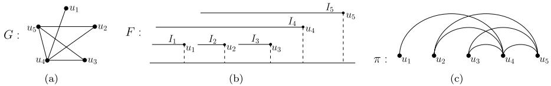
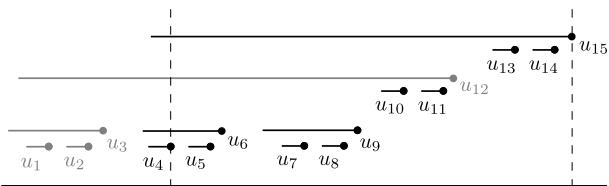
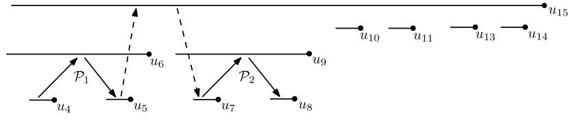

# The Longest Path Problem has a Polynomial Solution on Interval Graphs

Kyriaki Ioannidou $\cdot$ George B. Mertzios $\cdot$ Stavros D. Nikolopoulos

Received: 17 July 2009 / Accepted: 19 April 2010 / Published online: 12 May 2010   
$^ ©$ Springer Science+Business Media, LLC 2010

Abstract The longest path problem is the problem of finding a path of maximum length in a graph. Polynomial solutions for this problem are known only for small classes of graphs, while it is NP-hard on general graphs, as it is a generalization of the Hamiltonian path problem. Motivated by the work of Uehara and Uno (Proc. of the 15th Annual International Symp. on Algorithms and Computation (ISAAC), LNCS, vol. 3341, pp. 871–883, 2004), where they left the longest path problem open for the class of interval graphs, in this paper we show that the problem can be solved in polynomial time on interval graphs. The proposed algorithm uses a dynamic programming approach and runs in $O ( n ^ { 4 } )$ time, where $n$ is the number of vertices of the input graph.

Keywords Longest path problem $\cdot$ Interval graphs $\cdot$ Polynomial algorithm Complexity $\cdot$ Dynamic programming

# 1 Introduction

A well-known and studied problem in graph theory with numerous applications is the Hamiltonian path problem, i.e., the problem of determining whether a graph contains a simple path in which every vertex of the graph appears exactly once; such a graph is called Hamiltonian. In the case where a graph does not contain a Hamiltonian path, it makes sense in several applications to search for a path of maximum length in the graph; finding such a path is knows as the longest path problem. Although the two problems are similar, finding a longest path in a graph seems to be more difficult than deciding whether or not the graph admits a Hamiltonian path. Indeed, it has been proved that even if a graph has a Hamiltonian path, the problem of finding a path of length $n - n ^ { \varepsilon }$ for any $\varepsilon < 1$ is NP-hard, where $n$ is the number of vertices of the graph [17]. Moreover, there is no polynomial-time constant-factor approximation algorithm for the longest path problem unless $\mathbf { P } = \mathbf { N P }$ [17]. For related results see also [9–11, 25, 26].

It is clear that the longest path problem is NP-hard on every class of graphs on which the Hamiltonian path problem is NP-complete; note that, the Hamiltonian path problem is known to be NP-complete on general graphs [12, 13], and remains NP-complete even when restricted to some small classes of graphs such as split graphs [15], chordal bipartite graphs, split strongly chordal graphs [19], directed path graphs [20], circle graphs [7], planar graphs [13], and grid graphs [16]. On the other hand, there are several classes of graphs on which the Hamiltonian path problem admits polynomial time solutions; these classes include proper interval graphs [3], interval graphs [1, 5, 8], circular-arc graphs [8], biconvex graphs [2], and cocomparability graphs [6]. Thus, if someone is interested in investigating the tractability of the longest path problem, it makes sense to focus on the classes of graphs for which the Hamiltonian path problem is polynomial.

In contrast to the Hamiltonian path problem, there are few known polynomial time solutions for the longest path problem, and these restrict to trees and some small graph classes. Specifically, a linear time algorithm for finding a longest path in a tree was proposed by Dijkstra early in 1960, a formal proof of which can be found in [4]. Later, through a generalization of Dijkstra’s algorithm for trees, Uehara and Uno [23] solved the longest path problem for weighted trees and block graphs in linear time and space, and for cacti in $O ( n ^ { 2 } )$ time and space, where $n$ and $m$ denote the number of vertices and edges of the input graph, respectively. More recently, polynomial algorithms have been proposed that solve the longest path problem on bipartite permutation graphs in $O ( n )$ time and space [24], and on Ptolemaic graphs in $O ( n ^ { 5 } )$ time and $O ( n ^ { 2 } )$ space [22].

In 2004, Uehara and Uno [23] introduced a subclass of interval graphs, namely interval biconvex graphs, which is a superclass of proper interval and threshold graphs, and solved the longest path problem on this class in $O ( n ^ { 3 } ( m + n \log n ) )$ time. As a corollary, they showed that a longest path of a threshold graph can be found in $O ( n + m )$ time and space. They left open the complexity of the longest path problem on the well-known class of interval graphs.

In this paper, we resolve the open problem posed in [23] by showing that the longest path problem admits a polynomial time solution on the class of interval graphs. In particular, we propose an algorithm for solving the longest path problem on interval graphs which runs in $O ( n ^ { 4 } )$ time using a dynamic programming approach. Thus, not only we answer the question left open by Uehara and Uno in [23], but also improve the known time complexity of the problem on interval biconvex graphs, a subclass of interval graphs [23].

The rest of this paper is organized as follows. In Sect. 2, we review some properties of interval graphs and give the notion of a type of paths, which we call normal paths and is central for our algorithm. In Sect. 3, we present the three phases of our algorithm for solving the longest path problem on interval graphs, while in Sect. 4 we prove the correctness and analyze the time complexity of our algorithm. Finally, some concluding remarks are given in Sect. 5.

# 2 Theoretical Framework

We consider finite undirected graphs with no loops or multiple edges. For a graph $G$ , we denote its vertex and edge set by $V ( G )$ and $E ( G )$ , respectively. An undirected edge is a pair of distinct vertices $u$ , $v \in V ( G )$ , and is denoted by $u v$ . We say that the vertex $u$ is adjacent to the vertex $v$ or, equivalently, the vertex $u$ sees the vertex $v$ , if there is an edge $u v$ in $G$ . Let $s$ be a set of vertices of a graph $G$ . Then, the cardinality of the set $s$ is denoted by $\vert S \vert$ and the subgraph of $G$ induced by $s$ is denoted by $G [ S ]$ . Furthermore, the induced subgraph $G [ S ]$ is a clique if every two vertices in $s$ are adjacent. The set $N ( v ) = \{ u \in V ( G ) : u v \in E ( G ) \}$ is called the neighborhood of the vertex $v \in V ( G )$ in $G$ , sometimes denoted by $N _ { G } ( v )$ for clarity reasons. The set $N [ v ] = N ( v ) \cup \{ v \}$ is called the closed neighborhood of the vertex $v \in V ( G )$ . A vertex $v \in V ( G )$ is called simplicial if its neighborhood $N ( v )$ induces a clique in $G$ ; in this case its closed neighborhood $N [ v ]$ induces also a clique in $G$ .

A simple path of a graph $G$ is a sequence of distinct vertices $v _ { 1 } , v _ { 2 } , \ldots , v _ { k }$ such that $v _ { i } v _ { i + 1 } \in E ( G )$ , for each $i$ , $1 \leq i \leq k - 1$ , and is denoted by $( v _ { 1 } , v _ { 2 } , \ldots , v _ { k } )$ ; throughout the paper all paths considered are simple. We denote by $V ( P )$ the set of vertices in the path $P$ , and define the length of the path $P$ to be the number of vertices in $P$ , i.e., $| P | = | V ( P ) |$ . We call right endpoint of a path $P = ( v _ { 1 } , v _ { 2 } , \ldots , v _ { k } )$ the last vertex $v _ { k }$ of $P$ . Additionally, if $P = ( v _ { 1 } , v _ { 2 } , \ldots , v _ { i - 1 } , v _ { i } , v _ { i + 1 } , \ldots , v _ { j } , v _ { j + 1 } , v _ { j + 2 } ,$ $\dots , v _ { k } )$ is a path of a graph and $P _ { 0 } = ( v _ { i } , v _ { i + 1 } , \dots , v _ { j } )$ is a subpath of $P$ , we sometimes equivalently use the notation $P = ( v _ { 1 } , v _ { 2 } , \ldots , v _ { i - 1 } , P _ { 0 } , v _ { j + 1 } , v _ { j + 2 } , \ldots , v _ { k } )$ .

# 2.1 Structural Properties of Interval Graphs

Interval graphs form a well-known and extensively studied class of perfect graphs [15]. They have important properties, and admit polynomial time solutions for several problems that are NP-complete on general graphs (see e.g. [1, 5, 15, 18]). Moreover, interval graphs have received a lot of attention due to their applicability to DNA physical mapping problems [14], and find many applications in several fields and disciplines such as genetics, molecular biology, scheduling, VLSI circuit design, archeology and psychology [15].

A graph $G$ is called interval graph if its vertices can be put in a one-to-one correspondence with a family $F$ of intervals on the real line such that two vertices are adjacent in $G$ if and only if the corresponding intervals intersect; $F$ is called an intersection model for $G$ [1]. The class of interval graphs is hereditary, that is, every induced subgraph of an interval graph $G$ is also an interval graph. Ramalingam and Rangan [21] proposed a numbering of the vertices of an interval graph; they stated the following lemma.

  
Fig. 1 (a) An interval graph $G$ , $\mathbf { ( b ) }$ an intersection model $F$ of $G$ , and (c) the corresponding right-end ordering $\pi = ( u _ { 1 } , u _ { 2 } , u _ { 3 } , u _ { 4 } , u _ { 5 } )$ of $G$

Lemma 2.1 (Ramalingam and Rangan [21]) The vertices of any interval graph $G$ can be numbered with integers $1 , 2 , \ldots , | V ( G ) |$ such that if $\dot { } < j < k$ and $i k \in E ( G )$ , then $j k \in E ( G )$ .

This numbering, which also results after sorting the intervals of the intersection model of an interval graph $G$ on their right ends [1], can be obtained in $O ( | V ( G ) | +$ $\left| E ( G ) \right| )$ time [21]. An ordering of the vertices according to this numbering is found to be quite useful in solving some graph-theoretic problems on interval graphs [1, 21]. Throughout the paper, such an ordering is called a right-end ordering of $G$ . Let $u$ and $v$ be two vertices of $G$ , and let $\pi$ be a right-end ordering of $G$ ; by $u < _ { \pi } v$ we denote that $u$ appears before $v$ in $\pi$ . In particular, if $\pi = ( u _ { 1 } , u _ { 2 } , \ldots , u _ { | V ( G ) | } )$ is a right-end ordering of $G$ , then $u _ { i } < _ { \pi } u _ { j }$ if and only if $i < j$ . In Fig. 1 we illustrate the right-end ordering $\pi$ of an interval graph $G$ . In Fig. 1(b) the right endpoints of the intervals in the intersection model $F$ are drawn bold for better visibility.

# 2.2 Normal Paths

Our algorithm for constructing a longest path of an interval graph $G$ uses a specific type of paths, namely normal paths. We next define the notion of a normal path of an interval graph $G$ .

Definition 2.1 Let $G$ be an interval graph, and let $\pi$ be a right-end ordering of $G$ . The path $P = ( v _ { 1 } , v _ { 2 } , \ldots , v _ { k } )$ of $G$ is called normal, if $v _ { 1 }$ is the leftmost vertex of $V ( P )$ in $\pi$ , and for every $i , 2 \leq i \leq k$ , the vertex $v _ { i }$ is the leftmost vertex of $N ( v _ { i - 1 } ) \cap$ $\{ v _ { i } , v _ { i + 1 } , \ldots , v _ { k } \}$ in $\pi$ .

For example, in the interval graph $G$ of Fig. 1, the path $P = ( u _ { 1 } , u _ { 4 } , u _ { 2 } , u _ { 5 } , u _ { 3 } )$ is normal. Note that the notion of normal paths in interval graphs is exactly what is called straight paths in [8]. Damaschke [8] presents an algorithm for finding a straight Hamiltonian path in an interval graph (Algorithm 3), proving thus that if an interval graph has a Hamiltonian path, then it also has a straight Hamiltonian path. Also, in [8] a path is called straight if it is a straight Hamiltonian path in the subgraph induced by its vertex set.

Now, since straight (resp. normal) paths are defined with respect to a given intersection model (resp. right-end ordering) of the graph, the following observation suffices to obtain the correctness of Lemma 2.2: let $G$ be an interval graph, let $F$ be an intersection model of $G$ , let $P$ be a path of $G$ , and let $G ^ { \prime }$ be the subgraph of

$G$ induced by $V ( P )$ . Then we can obtain an intersection model $F ^ { \prime }$ of $G ^ { \prime }$ by simply deleting from $F$ the intervals which correspond to the vertices of $V ( G ) \setminus V ( G ^ { \prime } )$ . Since $P$ is a Hamiltonian path of $G ^ { \prime }$ , then from [8] there exists a straight Hamiltonian path $P ^ { \prime }$ of $G ^ { \prime }$ (with respect to $F ^ { \prime }$ ). By the construction of $F ^ { \prime }$ , it follows that $P ^ { \prime }$ is a straight path in $G$ (with respect to $F$ ) as well. Therefore, the following result holds. Note that, hereafter we use the term normal path instead of straight path.

Lemma 2.2 Let $P$ be a path ofan interval graph $G$ . Then, there exists a normal path $P ^ { \prime }$ of $G$ , such that $V ( P ^ { \prime } ) = V ( P )$ .

# 3 Interval Graphs and the Longest Path Problem

In this section we present our algorithm, which we call Algorithm $\mathrm { L P _ { - } }$ Interval, for solving the longest path problem on interval graphs; it consists of three phases and works as follows:

Phase 1: it takes an interval graph $G$ and constructs the auxiliary interval graph $H$ .   
Phase 2: it computes a longest binormal path $\widehat { P }$ on $H$ using Algorithm LP_on_H.   
Phase 3: it computes a longest path $P$ on $G$ from the path $\widehat { \boldsymbol { P } }$ .

The proposed algorithm computes a longest binormal path $\widehat { P }$ of the graph $H$ using dynamic programming techniques and then computes a longest path $P$ of $G$ from the path $\widehat { \boldsymbol { P } }$ ; note that binormal paths are a special type of paths which we define in Sect. 3.2. We next describe in detail the three phases of our algorithm and prove properties of the constructed graph $H$ which will be used for proving the correctness of the algorithm.

# 3.1 The Interval Graph $H$

In this section we present Phase 1 of the algorithm: given an interval graph $G$ and a right-end ordering $\pi$ of $G$ , we construct the interval graph $H$ and a right-end ordering $\sigma$ of $H$ . To this end, we use the following notations.

Notation 3.1 Let $F$ be the intersection model of an interval graph $G$ , and let $\pi = ( v _ { 1 } , v _ { 2 } , \ldots , v _ { | V ( G ) | } )$ be the right-end ordering of $G$ which we obtain from $F$ . By $I _ { i }$ we denote the interval which corresponds to the vertex $v _ { i }$ in $F$ , and by $l ( I _ { i } )$ and $r ( I _ { i } )$ we denote the left and the right endpoint of the interval $I _ { i }$ , respectively.

Construction of $H$ and $\sigma$ Let $G$ be an interval graph and let $F$ be the intersection model of $G$ , from which we obtain the right-end ordering $\pi = ( v _ { 1 } , v _ { 2 } , \ldots , v _ { | V ( G ) | } )$ of $G$ . To construct the graph $H$ , for every interval $I _ { i }$ of $F$ we add two disjoint “short” intervals immediately before the right endpoint of $I _ { i }$ .

Formal description Without loss of generality, we may assume that all values $l ( I _ { i } )$ and $r ( I _ { i } )$ are distinct. Let $\varepsilon$ be the smallest distance between two interval endpoints in $F$ . For every interval $I _ { i }$ of $F$ which corresponds to a vertex $v _ { i } \in V ( G )$ , we add two non-intersecting intervals $\begin{array} { r } { I _ { i , 1 } = [ r ( I _ { i } ) - \frac { 4 \varepsilon } { 5 } , r ( I _ { i } ) - \frac { 3 \varepsilon } { 5 } ] } \end{array}$ and $\begin{array} { r } { I _ { i , 2 } = [ r ( I _ { i } ) - \frac { 2 \varepsilon } { 5 } , r ( I _ { i } ) - \frac { \varepsilon } { 5 } ] } \end{array}$ . Let $a _ { i , 1 }$ and $a _ { i , 2 }$ be the vertices which correspond to the two new intervals $I _ { i , 1 }$ and $I _ { i , 2 }$ , respectively. After processing all intervals $I _ { i }$ , $1 \leq i \leq | V ( G ) |$ , of the intersection model $F$ of $G$ , we obtain an intersection model $F ^ { \prime }$ of graph $H$ . Now, set $C = V ( G )$ and $A = V ( H ) \setminus V ( G )$ .

Thus, $H$ is an interval graph, and the ordering which results from numbering the intervals of $F ^ { \prime }$ after sorting them on their right ends is a right-end ordering $\sigma$ of $H$ . We call the constructed interval graph $H$ the stable-connection graph of interval graph $G$ .

In Fig. 2, we illustrate the intersection model of the stable-connection graph $H$ of the interval graph $G$ of Fig. 1.

Observation 3.1 For every interval $I _ { i }$ of $F$ , the two new intervals $I _ { i , 1 }$ and $I _ { i , 2 }$ do not intersect with any interval $I _ { k }$ such that $r ( I _ { k } ) < r ( I _ { i } )$ . Additionally, the two new intervals intersect with the interval $I _ { i }$ , and with every interval $I _ { \ell }$ such that $r ( I _ { \ell } ) > r ( I _ { i } )$ and $I _ { \ell }$ intersects with $I _ { i }$ .

Hereafter, we will denote by $n$ the number $\vert V ( H ) \vert$ of vertices of the stableconnection graph $H$ and by $\sigma = ( u _ { 1 } , u _ { 2 } , \ldots , u _ { n } )$ the constructed right-end ordering of $H$ . By construction, the vertex set of $H$ consists of the vertices of $C = V ( G )$ and the vertices of $A$ . We will refer to $C$ as the set of connector vertices of graph $H$ and to $A$ as the set of stable vertices of $H$ ; we denote these sets by $C ( H )$ and $A ( H )$ , respectively. Note that $| A ( H ) | = 2 | V ( G ) |$ .

By the construction of the stable-connection graph $H$ , all neighbors of a stable vertex $a \in A ( H )$ are connector vertices $c \in C ( H )$ , such that $a < _ { \sigma } c$ . Moreover, it is easy to see that all neighbors of a stable vertex form a clique in $G$ and, thus, also in $H$ . Observe that, by the construction of the stable-connection graph $H$ , each stable vertex $a \in A ( H )$ is the unique simplicial vertex in the maximal clique induced by the closed neighborhood $N [ a ]$ in $H$ .

Definition 3.1 For every connector vertex $u _ { i } \in C ( H )$ in $\sigma = \{ u _ { 1 } , u _ { 2 } , \ldots , u _ { n } \}$ , we define by $f ( u _ { i } )$ (resp. $h ( u _ { i } ) )$ the smallest (resp. largest) index, such that $f ( u _ { i } ) < i$ and $u _ { f ( u _ { i } ) } u _ { i } \in E ( G )$ (resp. $h ( u _ { i } ) < i$ and $u _ { h ( u _ { i } ) } u _ { i } \in E ( G ) )$ .

Note that $u _ { f ( u _ { i } ) }$ and $u _ { h ( u _ { i } ) }$ are distinct stable vertices, for every connector vertex $u _ { i }$ .

Definition 3.2 Let $H$ be the stable-connection graph of an interval graph $G$ , and let $\sigma = ( u _ { 1 } , u _ { 2 } , \ldots , u _ { n } )$ be the right-end ordering of $H$ . For every pair of indices $i , j$ ,

  
Fig. 3 The subgraph $H ( 4 , 1 5 )$ of the stable-connection graph $H$ of Fig. 2

$1 \leq i \leq j \leq n$ , we define the graph $H ( i , j )$ to be the subgraph $H [ S ]$ induced by the set $S = \{ u _ { i } , u _ { i + 1 } , \ldots , u _ { j } \} \setminus \{ u _ { k } \in C ( H ) : u _ { f ( u _ { k } ) } < _ { \sigma } u _ { i } \}$ .

The stable-connection graph $H$ of Fig. 2 is illustrated in Fig. 3, where its vertices (both stable and connector vertices) are numbered according to the right-end ordering $\sigma = ( u _ { 1 } , u _ { 2 } , \ldots , u _ { 1 5 } )$ of $H$ . The subgraph $H ( 4 , 1 5 )$ is illustrated in Fig. 3, where the vertices $V ( H ( 4 , 1 5 ) ) = \{ u _ { 4 } , u _ { 5 } , u _ { 6 } , u _ { 7 } , u _ { 8 } , u _ { 9 } , u _ { 1 0 } , u _ { 1 1 } , u _ { 1 3 } , u _ { 1 4 } , u _ { 1 5 } \}$ are drawn darker than the others for better visibility.

The following properties hold for every induced subgraph $H ( i , j ) , 1 \leq i \leq j \leq n$ and they are used for proving the correctness of Algorithm LP_on_H.

Observation 3.2 Let $u _ { k }$ be a connector vertex of $H ( i , j )$ , i.e., $u _ { k } \in C ( H ( i , j ) )$ . Then, for every vertex $u _ { \ell } \in V ( H ( i , j ) )$ such that $u _ { k } < _ { \sigma } u _ { \ell }$ and $u _ { k } u _ { \ell } \in E ( H ( i , j ) )$ , $u _ { \ell }$ is also a connector vertex of $H ( i , j )$ .

Observation 3.3 No two stable vertices of $H ( i , j )$ are adjacent.

Lemma 3.1 Let $P = ( v _ { 1 } , v _ { 2 } , \ldots , v _ { k } )$ be a normal path of $H ( i , j )$ . Then:

(a) For any two stable vertices $v _ { r }$ and $v _ { \ell }$ in $P$ , $v _ { r }$ appears before $v _ { \ell }$ in $P$ if and only if $v _ { r } < _ { \sigma } v _ { \ell }$ .   
(b) For any two connector vertices $v _ { r }$ and $v _ { \ell }$ in $P$ , if v appears before $v _ { r }$ in $P$ and $v _ { r } < _ { \sigma } v _ { \ell }$ , then $v _ { r }$ does not see the predecessor $v _ { \ell - 1 }$ of $v _ { \ell }$ in $P$ .

Proof (a) Damaschke in [8] proved that for a normal path $P = ( v _ { 1 } , v _ { 2 } , \ldots , v _ { k } )$ of an interval graph the following three statements cannot be true simultaneously: vertex $v _ { x }$ appears before $v _ { y }$ in $P$ $\ , l ( I _ { x } ) \ge l ( I _ { y } )$ , and $r ( I _ { x } ) > r ( I _ { y } )$ . Since for any two stable vertices $v _ { r }$ and $v _ { \ell }$ in $H ( i , j )$ we have $v _ { r } < _ { \sigma } v _ { \ell }$ if and only if $l ( I _ { r } ) < r ( I _ { r } ) < l ( I _ { \ell } ) <$ $r ( I _ { \ell } )$ , it follows that $v _ { r } < _ { \sigma } v _ { \ell }$ if and only if $v _ { r }$ appears before $v _ { \ell }$ in $P$ .

(b) Since $v _ { r } < _ { \sigma } v _ { \ell }$ , it follows that $\boldsymbol { v } _ { \ell } \neq \boldsymbol { v } _ { 1 }$ and, thus, there exists a vertex $v _ { \ell - 1 }$ which appears before $v _ { \ell }$ in $P$ . Assume that $v _ { r } v _ { \ell - 1 } \in E ( H ( i , j ) )$ . Since $v _ { r } < _ { \sigma } v _ { \ell }$ , and since $P$ is a normal path, $v _ { r }$ should be the next vertex of $v _ { \ell - 1 }$ in $P$ instead of $v _ { \ell }$ , which is a contradiction. Therefore, $v _ { r } v _ { \ell - 1 } \notin E ( H ( i , j ) )$ . -

# 3.2 Finding a Longest Binormal Path on $H$

In this section we present Phase 2 of Algorithm LP_Interval. Let $G$ be an interval graph and let $H$ be the stable-connection graph of $G$ constructed in Phase 1. We next present Algorithm LP_on_H, which computes a longest binormal path of the graph $H$ ; let us first define binormal paths and give some notations necessary for the description of the algorithm.

Definition 3.3 Let $H$ be a stable-connection graph, and let $P$ be a path of $H ( i , j )$ , $1 \leq i \leq j \leq n$ . The path $P$ is called binormal if $P$ is a normal path of $H ( i , j )$ , both endpoints of $P$ are stable vertices, and no two connector vertices are consecutive in $P$ .

Notation 3.2 Let $H$ be a stable-connection graph, and let $\sigma = ( u _ { 1 } , u _ { 2 } , \ldots , u _ { n } )$ be the right-end ordering of $H$ . For every stable vertex $u _ { k } \in A ( H ( i , j ) )$ , we denote by $P ( u _ { k } ; i , j )$ a longest binormal path of $H ( i , j )$ with $u _ { k }$ as its right endpoint, and by $\ell ( u _ { k } ; i , j )$ the length of $P ( u _ { k } ; i , j )$ .

Since any binormal path is a normal path, Lemma 3.1 also holds for binormal paths. Moreover, since $P ( u _ { k } ; i , j )$ is a binormal path, from Lemma 3.1(a) we obtain that its right endpoint $u _ { k }$ is also the rightmost stable vertex of $P$ in $\sigma$ .

Algorithm LP_on_H, which is presented in Fig. 4, computes for every induced subgraph $H ( i , j )$ and for every stable vertex $u _ { k } \in A ( H ( i , j ) )$ , the length $\ell ( u _ { k } ; i , j )$ and the corresponding path $P ( u _ { k } ; i , j )$ . Since $H ( 1 , n ) = H$ , it follows that the maximum among the values $\ell ( u _ { k } ; 1 , n )$ , where $u _ { k } \in A ( H )$ , is the length of a longest binormal path $P ( u _ { k } ; 1 , n )$ of $H$ .

# 3.3 Finding a Longest Path on $G$

During Phase 3 of our Algorithm LP_Interval, we compute a path $P$ from the longest binormal path $\widehat { P }$ of $H$ , computed by Algorithm LP_on_H, by simply deleting all stable vertices of $\widehat { P }$ . In Sect. 4.2 we prove that the resulting path $P$ is a longest path of the interval graph $G$ .

In Fig. 5, we present our Algorithm LP_Interval for solving the longest path problem on an interval graph $G$ ; note that Steps 1, 2, and 3 of the algorithm correspond to the presented Phases 1, 2, and 3, respectively.

# 4 Correctness and Time Complexity

In this section we prove the correctness of our algorithm and analyze its time complexity. More specifically, in Sect. 4.1 we show that Algorithm LP_on_H computes a longest binormal path $\widetilde { \cal P }$ of the graph $H$ , while in Sect. 4.2 we show that the length of a longest binormal path $\widehat { P }$ of $H$ is equal to $2 k + 1$ , where $k$ is the length of a longest path of $G$ . Finally, we show that the path $P$ constructed at Step 3 of Algorithm LP_Interval is a longest path of $G$ .

# 4.1 Correctness of Algorithm LP_on_H

We next prove that Algorithm LP_on_H correctly computes a longest binormal path of the graph $H$ . The following lemmas appear useful in the proof of the algorithm’s correctness.

# ALGORITHM LP_ON_H

Input: a stable-connection graph $H$ , a right-end ordering $\sigma = ( u _ { 1 } , u _ { 2 } , \ldots , u _ { n } )$ of $H$ Output: a longest binormal path of $H$ .

1. for $j = 1$ to $n$   
2. for $i = j$ downto 1   
3. if $i = j$ and $u _ { i } \in A ( H )$ then   
4. $\ell ( u _ { i } ; i , i ) \gets 1 ; P ( u _ { i } ; i , i ) \gets ( u _ { i } ) ;$ ;   
5. if $i \neq j$ then   
6. for every stable vertex $u _ { r } \in A ( H ) , i \le r \le j - 1$   
7. $\begin{array} { r l } & { \ell ( u _ { r } ; i , j ) \gets \ell ( u _ { r } ; i , j - 1 ) ; \quad P ( u _ { r } ; i , j ) \gets P ( u _ { r } ; i , j - 1 ) ; } \\ & { \{ i n i t i a l i z a t i o n \} } \end{array}$   
8. if $u _ { j }$ is a stable vertex of $H ( i , j )$ , i.e., $u _ { j } \in A ( H )$ , then   
9. $\ell ( u _ { j } ; i , j ) \gets 1$ ; $P ( u _ { j } ; i , j )  ( u _ { j } )$ ;   
10. if $u _ { j }$ is a connector vertex of $H ( i , j )$ , i.e., $u _ { j } \in C ( H )$ and $i \leq f ( u _ { j } )$ ,   
then   
11. execute process $( H ( i , j ) )$ ;

where the procedure process() is as follows:

process( $H ( i , j )$ )

13. for $y = f ( u _ { j } ) + 1$ to $j - 1$   
14. for $x = f ( u _ { j } )$ to $y - 1$ { $u _ { x }$ and $u _ { y }$ are adjacent to $u _ { j }$ }   
15. if $u _ { x } , u _ { y } \in A ( H )$ then   
16. $w _ { 1 }  \ell ( u _ { x } ; i , j - 1 ) ; P _ { 1 }  P ( u _ { x } ; i , j - 1 ) ;$   
17. $\begin{array} { r } { w _ { 2 }  \ell ( u _ { y } ; x + 1 , j - 1 ) ; P _ { 2 }  P ( u _ { y } ; x + 1 , j - 1 ) } \end{array}$ ;   
18. if $w _ { 1 } + w _ { 2 } + 1 > \ell ( u _ { y } ; i , j )$ then   
19. $\ell ( u _ { y } ; i , j ) \gets w _ { 1 } + w _ { 2 } + 1$ ; $P ( u _ { y } ; i , j )  ( P _ { 1 } , u _ { j } , P _ { 2 } )$ ;   
20. return the value $\ell ( u _ { k } ; i , j )$ and the path $^ { \mathsf { \Delta } } ( u _ { k } ; i , j ) , \forall \ u _ { k } \in A ( H ( f ( u _ { j } ) + 1$ ,   
$j - 1 ) ,$ );

Lemma 4.1 Let $H$ be a stable-connection graph, and let $\sigma = ( u _ { 1 } , u _ { 2 } , \ldots , u _ { n } )$ be the right-end ordering of $H$ . Let $P$ be a longest binormal path of $H ( i , j )$ with $u _ { y }$ as its right endpoint, let $u _ { k }$ be the rightmost connector vertex of $H ( i , j )$ in $\sigma$ , and let $u _ { f ( u _ { k } ) + 1 } \leq _ { \sigma } u _ { y } \leq _ { \sigma } u _ { h ( u _ { k } ) } .$ . Then, there exists a longest binormal path $P ^ { \prime }$ of $H ( i , j )$ with $u _ { y }$ as its right endpoint, which contains the connector vertex $u _ { k }$ .

Proof Let $P$ be a longest binormal path of $H ( i , j )$ with $u _ { y }$ as its right endpoint, which does not contain the connector vertex $u _ { k }$ . Assume that $P = ( u _ { y } )$ . Since $u _ { k }$ is a connector vertex of $H ( i , j )$ and $\boldsymbol { u } _ { f ( u _ { k } ) }$ is a stable vertex of $H ( i , j )$ , we have that $u _ { i } \le _ { \sigma } u _ { f ( u _ { k } ) } < _ { \sigma } u _ { y } < _ { \sigma } u _ { k }$ . Thus, there exists a binormal path $P _ { 1 } = ( u _ { f ( u _ { k } ) } , u _ { k } , u _ { y } )$

# ALGORITHM LP_INTERVAL

Input: an interval graph $G$ and a right-end ordering $\pi$ of $G$ .   
Output: a longest path $P$ of $G$ .

1. Construct the stable-connection graph $H$ of $G$ and the right-end ordering $\sigma$ of $H$ ; let $V ( H ) = C \cup A$ , where $C = V ( G )$ and $A$ are the sets of connector and stable vertices of $H$ , respectively;

2. Compute a longest binormal path $\widehat { P }$ of $H$ , using Algorithm LP_on_H; let $\bar { \widehat { P } } = ( v _ { 1 } , v _ { 2 } , \ldots , v _ { 2 k } , v _ { 2 k + 1 } )$ , where $v _ { 2 i } \in C$ , $1 \leq i \leq k$ , and $v _ { 2 i + 1 } \in A$ , $0 \leq$ $i \leq k$ ;

3. Compute a longest path $P = ( v _ { 2 } , v _ { 4 } , \dots , v _ { 2 k } )$ of $G$ , by deleting all stable vertices $\{ v _ { 1 } , v _ { 3 } , \dotsc , v _ { 2 k + 1 } \}$ from the longest binormal path $\widehat { P }$ of $H$ ;

such that $| P _ { 1 } | > | P |$ . However, this is a contradiction to the assumption that $P$ is a longest binormal path of $H ( i , j )$ .

Therefore, assume now that $P = ( u _ { p } , \ldots , u _ { q } , u _ { \ell } , u _ { y } )$ . By assumption, $P$ is a longest binormal path of $H ( i , j )$ with $u _ { y }$ as its right endpoint that does not contain the connector vertex $u _ { k }$ . Since the connector vertex $u _ { \ell }$ sees the stable vertex $u _ { y }$ and, also, since $u _ { k }$ is the rightmost connector vertex of $H ( i , j )$ in $\sigma$ , it follows by Observation 3.2 that $u _ { f ( u _ { k } ) } < _ { \sigma } u _ { y } < _ { \sigma } u _ { \ell } < _ { \sigma } u _ { k } .$ Thus, $u _ { k }$ sees the connector vertex $u _ { \ell }$ . Consider first the case where $u _ { k }$ does not see the stable vertex $u _ { q }$ , i.e., $u _ { q } < _ { \sigma } u _ { f ( u _ { k } ) } < _ { \sigma } u _ { y } < _ { \sigma } u _ { \ell } < _ { \sigma } u _ { k } .$ . Then, it is easy to see that the connector vertex $u _ { \ell }$ sees $\boldsymbol { u } _ { f ( u _ { k } ) }$ , where $\boldsymbol { u } _ { f ( u _ { k } ) }$ is always a stable vertex, and also, from Lemma 3.1(a) it follows that the vertex $\boldsymbol { u } _ { f ( u _ { k } ) }$ does not belong to the path $P$ . Therefore, there exists a binormal path $P _ { 2 } = ( u _ { p } , \ldots , u _ { q } , u _ { \ell } , u _ { f ( u _ { k } ) } , u _ { k } , u _ { y } )$ in $H ( i , j )$ , such that $| P _ { 2 } | > | P |$ . This is a contradiction to our assumption that $P$ is a longest binormal path.

Consider now the case where $u _ { k }$ sees the stable vertex $u _ { q }$ . Then, there exists a path $P ^ { \prime } { = } ( u _ { p } , \ldots , u _ { q } , u _ { k } , u _ { y } )$ of $H ( i , j )$ with $u _ { y }$ as its right endpoint that contains the connector vertex $u _ { k }$ , such that $| P | = | P ^ { \prime } |$ ; since $P$ is a binormal path, it is easy to see that $P ^ { \prime }$ is also a binormal path. Thus, the path $P ^ { \prime }$ is a longest binormal path of $H ( i , j )$ with $u _ { y }$ as its right endpoint, which contains the connector vertex $u _ { k }$ . -

Lemma 4.2 Let $H$ be a stable-connection graph, and let $\sigma$ be the right-end ordering of $H$ . Let $P = ( P _ { 1 } , v _ { \ell } , P _ { 2 } )$ be a binormal path of $H ( i , j )$ , and let v be a connector vertex of $H ( i , j )$ . Then, $P _ { 1 }$ and $P _ { 2 }$ are binormal paths of $H ( i , j )$ .

Proof Let $P = ( v _ { 1 } , v _ { 2 } , \ldots , v _ { \ell - 1 } , v _ { \ell } , v _ { \ell + 1 } , \ldots , v _ { k } )$ be a binormal path of $H ( i , j )$ . Then, from Definition 2.1, $v _ { 1 }$ is the leftmost vertex of $V ( P )$ in $\sigma$ , and for every index $r$ , $2 \leq r \leq k$ , the vertex $v _ { r }$ is the leftmost vertex of $N ( v _ { r - 1 } ) \cap \{ v _ { r } , v _ { r + 1 } , \ldots , v _ { k } \}$ in $\sigma$ . It is easy to see that $P _ { 1 } = ( v _ { 1 } , v _ { 2 } , \dots , v _ { \ell - 1 } )$ is a normal path of $H ( i , j )$ . Indeed, since $V ( P _ { 1 } ) \subset V ( P )$ , then $v _ { 1 }$ is also the leftmost vertex of $V ( P _ { 1 } )$ in $\sigma$ , and additionally, $v _ { r }$ is the leftmost vertex of $N ( v _ { r - 1 } ) \cap \{ v _ { r } , v _ { r + 1 } , \ldots , v _ { \ell - 1 } \}$ in $\sigma$ , for every index $r$ , $2 \leq r \leq \ell - 1$ . Furthermore, since $P$ is binormal and $v _ { \ell }$ is a connector vertex, it follows that $v _ { \ell - 1 }$ is a stable vertex and, thus, $P _ { 1 }$ is a binormal path of $H ( i , j )$ as well.

Consider now the path $P _ { 2 } = ( v _ { \ell + 1 } , v _ { \ell + 2 } , \ldots , v _ { k } )$ of $H ( i , j )$ . Since $P$ is a binormal path and $v _ { \ell }$ is a connector vertex, it follows that $v _ { \ell + 1 }$ is a stable vertex and, thus, $v _ { \ell + 1 } < _ { \sigma } v _ { \ell }$ due to Observation 3.2. We first prove that $v _ { \ell + 1 }$ is the leftmost vertex of $V ( P _ { 2 } )$ in $\sigma$ . Since $P$ is a binormal path, we obtain from Lemma 3.1(a) that $v _ { \ell + 1 }$ is the leftmost stable vertex of $V ( P _ { 2 } )$ in $\sigma$ . Moreover, consider a connector vertex $v _ { t }$ of $P _ { 2 }$ . Then, its predecessor $v _ { t - 1 }$ in $P _ { 2 }$ is a stable vertex and, thus, $v _ { t - 1 } < _ { \sigma } v _ { t }$ due to Observation 3.2. Since $v _ { \ell + 1 }$ is the leftmost stable vertex of $V ( P _ { 2 } )$ in $\sigma$ , we have that $v _ { \ell + 1 } \leq _ { \sigma } v _ { t - 1 }$ and, thus, $v _ { \ell + 1 } < _ { \sigma } v _ { t }$ . Therefore, $v _ { \ell + 1 }$ is the leftmost vertex of $V ( P _ { 2 } )$ in $\sigma$ . Additionally, since $P$ is a binormal path, it is straightforward that for every index $r , \ell + 2 \leq r \leq k$ , the vertex $v _ { r }$ is the leftmost vertex of $N ( v _ { r - 1 } ) \cap \{ v _ { r } , v _ { r + 1 } , \ldots , v _ { k } \}$ in $\sigma$ . Thus, $P _ { 2 }$ is a normal path. Finally, since $P$ is binormal and $v _ { \ell + 1 }$ is a stable vertex, $P _ { 2 }$ is a binormal path as well. -

Lemma 4.3 Let $H$ be a stable-connection graph, and let $\sigma = ( u _ { 1 } , u _ { 2 } , \ldots , u _ { n } )$ be the right-end ordering of $H$ . Let $P _ { 1 }$ be a binormal path of $H ( i , j - 1 )$ with $u _ { x }$ as its right endpoint, and let $P _ { 2 }$ be a binormal path of $H ( x + 1 , j - 1 )$ with $u _ { y }$ as its right endpoint, such that $V ( P _ { 1 } ) \cap V ( P _ { 2 } ) = \emptyset$ . Suppose that $u _ { j }$ is a connector vertex of $H$ and that $u _ { i } \le _ { \sigma } u _ { f ( u _ { j } ) } \le _ { \sigma } u _ { x }$ . Then, $P = ( P _ { 1 } , u _ { j } , P _ { 2 } )$ is a binormal path of $H ( i , j )$ with $u _ { y }$ as its right endpoint.

Proof Let $u _ { z }$ be the first vertex of $P _ { 2 }$ . Note that $u _ { j }$ is the rightmost vertex of $H ( i , j )$ in $\sigma$ . Since $u _ { j }$ is a connector vertex of $H$ such that $u _ { i } \le _ { \sigma } u _ { f ( u _ { j } ) } \le _ { \sigma }$ $u _ { x } < \sigma \ u _ { j }$ , and since $u _ { f ( u _ { j } ) } u _ { j } \in E ( G )$ , from Lemma 2.1 it follows that $u _ { j }$ sees the right endpoint $u _ { x }$ of $P _ { 1 }$ . Additionally, since $u _ { z } \in V ( H ( x + 1 , j - 1 ) )$ , we have $u _ { f ( u _ { j } ) } \le _ { \sigma } u _ { x } < _ { \sigma } u _ { x + 1 } \le _ { \sigma } u _ { z } < _ { \sigma } u _ { j }$ and, thus, $u _ { j }$ sees $u _ { z }$ . Therefore, since $V ( P _ { 1 } ) \cap$ $V ( P _ { 2 } ) = \emptyset$ , it follows that $P = ( P _ { 1 } , u _ { j } , P _ { 2 } )$ is a path of $H$ . Additionally, since $H ( i , j - 1 )$ and $H ( x + 1 , j - 1 )$ are induced subgraphs of $H ( i , j )$ , it follows that $P$ is a path of $H ( i , j )$ . Hereafter, in the rest of this proof $P _ { 1 } = ( v _ { 1 } , v _ { 2 } , \dotsc , v _ { p - 1 } )$ , $P _ { 2 } = ( v _ { p + 1 } , v _ { p + 2 } , \ldots , v _ { \ell } )$ , $u _ { x } = v _ { p - 1 }$ , $u _ { y } = v _ { \ell }$ , and $\boldsymbol { u } _ { j } = \boldsymbol { v } _ { p }$ .

We first show that $P = ( v _ { 1 } , v _ { 2 } , \ldots , v _ { p } , \ldots , v _ { \ell } )$ is a normal path. Since $v _ { 1 }$ is the leftmost vertex of $V ( P _ { 1 } )$ in $\sigma$ , it follows that $v _ { 1 } \leq _ { \sigma } u _ { x }$ . Furthermore, since $u _ { j } = v _ { p }$ is the rightmost vertex of $H ( i , j )$ in $\sigma$ , and since for every vertex $v _ { k } \in V ( P _ { 2 } )$ it holds $u _ { x } \ < _ { \sigma } \ u _ { x + 1 } \ \le _ { \sigma } \ v _ { k } \ < _ { \sigma } \ v _ { p }$ , it follows that $v _ { 1 }$ is the leftmost vertex of $V ( P )$ in $\sigma$ . We next show that for every $k$ , $2 \leq k \leq \ell$ , the vertex $v _ { k }$ is the leftmost vertex of $N ( v _ { k - 1 } ) \cap \{ v _ { k } , v _ { k + 1 } , \dotsc , v _ { \ell } \}$ in $\sigma$ .

Consider first the case where $2 \leq k \leq p - 1$ , i.e., $v _ { k } \in V ( P _ { 1 } )$ . Since $P _ { 1 }$ is a normal path, $v _ { k }$ is the leftmost vertex of $N ( v _ { k - 1 } ) \cap \{ v _ { k } , v _ { k + 1 } , . . . , v _ { p - 1 } \}$ in $\sigma$ . Assume that $v _ { k - 1 }$ is a stable vertex. Then, Lemma 3.1(a) implies that $v _ { k - 1 } < _ { \sigma } u _ { x }$ and, due to Observation 3.3, it follows that $N ( v _ { k - 1 } ) \cap \{ v _ { k } , v _ { k + 1 } , \dotsc , v _ { \ell } \}$ is a set of connector vertices. Since every connector vertex $v _ { r } \in V ( P _ { 2 } )$ is a vertex of $H ( x + 1 , j - 1 )$ , it follows that $v _ { k - 1 } < _ { \sigma } u _ { x + 1 } \leq _ { \sigma } u _ { f ( v _ { r } ) }$ and, thus, $v _ { r } \notin N ( v _ { k - 1 } )$ . Additionally, since $v _ { p }$ is the rightmost vertex of $H ( i , j )$ in $\sigma$ , it follows that $v _ { k } < _ { \sigma } v _ { p }$ . Therefore, since $v _ { k }$ is the leftmost vertex of $N ( v _ { k - 1 } ) \cap \{ v _ { k } , v _ { k + 1 } , . . . , v _ { p - 1 } \}$ in $\sigma$ , it follows that $v _ { k }$ is the leftmost vertex of $N ( v _ { k - 1 } ) \cap \{ v _ { k } , v _ { k + 1 } , \dotsc , v _ { \ell } \}$ in $\sigma$ . Assume now that $v _ { k - 1 }$ is a connector vertex. Since $P _ { 1 }$ is a binormal path, $v _ { k }$ is a stable vertex such that $v _ { k } \le _ { \sigma }$ $u _ { x }$ and $v _ { k }$ is the leftmost vertex of $N ( v _ { k - 1 } ) \cap \{ v _ { k } , v _ { k + 1 } , . . . , v _ { p - 1 } \}$ in $\sigma$ . Since for every $r$ , $p + 1 \leq r \leq \ell$ , the vertex $v _ { r }$ is in $V ( H ( x + 1 , j - 1 ) )$ , it follows that $v _ { k } \le _ { \sigma }$ $u _ { x } < _ { \sigma } v _ { r }$ . Additionally, $v _ { k } < _ { \sigma } u _ { x + 1 } < _ { \sigma } v _ { p }$ . Therefore, $v _ { k }$ is the leftmost vertex of $N ( v _ { k - 1 } ) \cap \{ v _ { k } , v _ { k + 1 } , \dotsc , v _ { \ell } \}$ in $\sigma$ .

Consider now the case where $k = p$ . Since $P _ { 1 }$ is a normal path and $v _ { p - 1 }$ is a stable vertex, $N ( v _ { p - 1 } ) \cap \{ v _ { p } , v _ { p + 1 } , \dots , v _ { \ell } \}$ is a set of connector vertices, due to Observation 3.3. Additionally, since every connector vertex $v _ { r } \in V ( P _ { 2 } )$ is a vertex of $H ( x + 1 , j - 1 )$ , it follows that $v _ { p - 1 } < _ { \sigma } u _ { x + 1 } \leq _ { \sigma } u _ { f ( v _ { r } ) }$ and, thus, $v _ { r } \notin N ( v _ { p - 1 } )$ . Therefore, $N ( v _ { p - 1 } ) \cap \{ v _ { p } , v _ { p + 1 } , \ldots , v _ { \ell } \} = \{ v _ { p } \}$ and, thus, $v _ { p }$ is the leftmost vertex of $N ( v _ { p - 1 } ) \cap \{ v _ { p } , v _ { p + 1 } , \dots , v _ { \ell } \}$ in $\sigma$ . Now, in the case where $p + 1 \leq k \leq \ell$ , since $P _ { 2 }$ is a normal path we have that $v _ { p + 1 }$ is the leftmost vertex of $V ( P _ { 2 } ) = \{ v _ { p + 1 } , v _ { p + 2 } , \ldots , v _ { \ell } \}$ in $\sigma$ and, thus, $v _ { p + 1 }$ is the leftmost vertex of $N ( v _ { p } ) \cap \{ v _ { p + 1 } , v _ { p + 2 } , . . . , v _ { \ell } \}$ in $\sigma$ ; also, it directly follows that for every $k$ , $p + 2 \leq k \leq \ell$ , $v _ { k }$ is the leftmost vertex of $N ( v _ { k - 1 } ) \cap \{ v _ { k } , v _ { k + 1 } , \dotsc , v _ { \ell } \}$ in $\sigma$ .

Concluding, we have shown that $P$ is a normal path of $H ( i , j )$ . Additionally, since $P _ { 1 }$ and $P _ { 2 }$ are binormal paths of $H ( i , j )$ , the path $P$ has stable vertices as endpoints and no two connector vertices are consecutive in $P$ . Therefore, $P$ is a binormal path of $H ( i , j )$ with $u _ { y }$ as its right endpoint. -

Next, we prove the correctness of Algorithm LP_on_H. For the purposes of the proof we distinguish the notation we use for the values computed by Algorithm LP_on_H, from the notation we use for the optimum values. In particular, by $\ell ( u _ { y } ; i , j )$ we denote the value computed by Algorithm LP_on_H for the length of a longest binormal path of $H ( i , j )$ which has $u _ { y }$ as its right endpoint and by $P ( u _ { y } ; i , j )$ the corresponding computed path. On the other hand, by $\mathcal { L } ( u _ { y } ; i , j )$ we denote the optimum value of the length of a longest binormal path of $H ( i , j )$ which has $u _ { y }$ as its right endpoint and by $\mathcal { P } ( u _ { y } ; i , j )$ the corresponding path.

Lemma 4.4 Let $H$ be a stable-connection graph, and let $\sigma$ be the right-end ordering of $H$ . For every induced subgraph $H ( i , j )$ of $H$ , $1 \leq i \leq j \leq n$ , and for every stable vertex $u _ { y } \in A ( H ( i , j ) )$ , the value $\ell ( u _ { y } ; i , j )$ computed by Algorithm $L P \_ o n \_ H$ i s equal to the length $\mathcal { L } ( u _ { y } ; i , j )$ of a longest binormal path of $H ( i , j )$ which has $u _ { y }$ as its right endpoint and, also, the corresponding computed path $P ( u _ { y } ; i , j )$ is a longest binormal path of $H ( i , j )$ which has $u _ { y }$ as its right endpoint.

Proof Let $P$ be a longest binormal path of the stable-connection graph $H ( i , j )$ , which has vertex $u _ { y } \in A ( H ( i , j ) )$ as its right endpoint. We distinguish two cases (I and II) concerning the set of connector vertices of $H ( i , j )$ .

Case I. Consider first the case where $C ( H ( i , j ) ) = \emptyset$ ; the graph $H ( i , j )$ consists of a set of stable vertices $A ( H ( i , j ) )$ , which is an independent set, due to Observation 3.3. Therefore, in this case Algorithm LP_on_H sets $\ell ( u _ { y } ; i , j ) = 1$ for every vertex $u _ { y } \in A ( H ( i , j ) )$ , which is equal indeed to the length of the longest binormal path $\mathcal { P } ( u _ { y } ; i , j ) = ( u _ { y } )$ of $H ( i , j )$ which has $u _ { y }$ as its right endpoint. Therefore, the lemma holds for every induced subgraph $H ( i , j )$ , for which $C ( H ( i , j ) ) = \emptyset$ .

Case $I I .$ Consider now the case where $C ( H ( i , j ) ) \neq \emptyset$ . Let $C ( H ) = \{ c _ { 1 } , c _ { 2 } , . . . ,$ $c _ { k } , \ldots , c _ { t } \}$ be the set of connector vertices of $H$ , where $c _ { 1 } < _ { \sigma } c _ { 2 } < _ { \sigma } \dots < _ { \sigma } c _ { k } < _ { \sigma }$ $\cdots < _ { \sigma } ~ c _ { t }$ . Let $\sigma = ( u _ { 1 } , u _ { 2 } , \ldots , u _ { n } )$ be the vertex ordering of $H$ constructed in Phase 1. Recall that, by the construction of $H$ , $n = 3 t$ , and $A ( H ) = V ( H ) \setminus C ( H )$ is the set of stable vertices of $H$ .

Let $H ( i , j )$ be an induced subgraph of $H$ , and let $c _ { k }$ be the rightmost connector vertex of $H ( i , j )$ in $\sigma$ . The proof of the lemma is done by induction on the index $k$ of the rightmost connector vertex $c _ { k }$ of $H ( i , j )$ . To this end, in both the induction basis and the induction step, we distinguish three cases concerning the position of the stable vertex $u _ { y }$ in the ordering $\sigma \colon u _ { i } \le _ { \sigma } u _ { y } \le _ { \sigma } u _ { f ( c _ { k } ) }$ , $u _ { h ( c _ { k } ) } < _ { \sigma } u _ { y } \le _ { \sigma } u _ { j }$ , and $u _ { f ( c _ { k } ) + 1 } \le _ { \sigma } u _ { y } \le _ { \sigma } u _ { h ( c _ { k } ) } .$ . In each of these three cases, we examine first the length $\mathcal { L } ( u _ { y } ; i , j )$ of a longest binormal path of $H ( i , j )$ with $u _ { y }$ as its right endpoint and then we compare this value to the length $\ell ( u _ { y } ; i , j )$ of the path computed by Algorithm LP_on_H. Moreover, we prove that the path $P ( u _ { y } ; i , j )$ with length $\ell ( u _ { y } ; i , j )$ computed by Algorithm LP_on_H is indeed a binormal path with $u _ { y }$ as its right endpoint.

Induction basis. We first show that the lemma holds for $k = 1$ ; i.e., $c _ { 1 }$ is the only connector vertex of $H ( i , j )$ . We distinguish two cases (A1 and A2) concerning the position of the stable vertex $u _ { y }$ in $\sigma$ .

Case $A l$ : $u _ { i } \le _ { \sigma } u _ { y } \le _ { \sigma } u _ { f ( c _ { 1 } ) }$ or $u _ { h ( c _ { 1 } ) } < _ { \sigma } u _ { y } \le _ { \sigma } u _ { j }$ . In this case, it is easy to see that the length $\mathcal { L } ( u _ { y } ; i , j )$ of a longest binormal path $P$ of $H ( i , j )$ with $u _ { y }$ as its right endpoint is equal to 1. Indeed, if $u _ { y } \neq u _ { f ( c _ { 1 } ) }$ , then $u _ { y }$ does not see the unique connector vertex $c _ { 1 }$ of $H ( i , j )$ and, thus, the longest binormal path with $u _ { y }$ as its right endpoint consists of vertex $u _ { y }$ . Now, in the case where $\boldsymbol { u } _ { y } = \boldsymbol { u } _ { f ( c _ { 1 } ) }$ , the unique connector vertex $c _ { 1 }$ sees $u _ { y }$ , however, $u _ { y }$ is the leftmost neighbor of $c _ { 1 }$ in $\sigma$ ; thus, from Lemma 3.1(a) and the definition of binormal paths, it follows that $c _ { 1 }$ does not belong to any binormal path with $u _ { y }$ as its right endpoint. Therefore, in Case A1, we have proved that $\mathcal { L } ( u _ { y } ; i , j ) = 1$ and $\mathcal { P } ( u _ { y } ; i , j ) = ( u _ { y } ) .$ . It is easy to see that, in this case, Algorithm LP_on_H (see lines 6–7 for $i \le y \le j - 1$ , and 8–9 for $y = j$ ) correctly computes $\ell ( u _ { y } ; i , j ) = 1$ and $P ( u _ { y } ; i , j ) = ( u _ { y } )$ .

Case A2: $u _ { f ( c _ { 1 } ) + 1 } \leq _ { \sigma } u _ { y } \leq _ { \sigma } u _ { h ( c _ { 1 } ) } .$ In this case, we have $\mathcal { L } ( u _ { y } ; i , j ) = 3$ ; recall that, in the induction basis, $c _ { 1 }$ is the only connector vertex of $H ( i , j )$ . Algorithm LP_on_H computes (in the subroutine process(), with $u _ { j } = c _ { 1 }$ ) for every stable vertex $u _ { x }$ of $H ( i , j )$ such that $u _ { f ( c _ { 1 } ) } \leq _ { \sigma } u _ { x } \leq _ { \sigma } u _ { y - 1 }$ , the value $\ell ( u _ { x } ; i , j - 1 ) +$ $\ell ( u _ { y } ; x + 1 , j - 1 ) + 1 = 1 + 1 + 1 = 3$ and sets $\ell ( u _ { y } ; i , j ) = 3$ . Additionally, it is easy to see that the path $P ( u _ { y } ; i , j ) = ( u _ { x } , c _ { 1 } , u _ { y } )$ , computed by Algorithm LP_on_H in this case, is indeed a longest binormal path of $H ( i , j )$ with $u _ { y }$ as its right endpoint.

Induction hypothesis. Let now $c _ { k }$ be a connector vertex of $H$ , such that $k \leq t$ . Assume that the lemma holds for every induced subgraph $H ( i , j )$ of $H$ , which has $c _ { \ell }$ as its rightmost connector vertex in $\sigma$ , where $1 \leq \ell \leq k - 1 .$ . That is, we assume that for every such graph $H ( i , j )$ , the value $\ell ( u _ { y } ; i , j )$ computed by Algorithm LP_on_H is equal to the length $\mathcal { L } ( u _ { y } ; i , j )$ of a longest binormal path of $H ( i , j )$ with $u _ { y }$ as its right endpoint and, also, that the corresponding computed path $P ( u _ { y } ; i , j )$ is a longest binormal path of $H ( i , j )$ which has $u _ { y }$ as its right endpoint.

Induction step. We will show that for every induced subgraph $H ( i , j )$ of $H$ , which has $c _ { k }$ as its rightmost connector vertex in $\sigma$ , the value $\ell ( u _ { y } ; i , j )$ computed by Algorithm LP_on_H is equal to the length $\mathcal { L } ( u _ { y } ; i , j )$ of a longest binormal path $\mathcal { P } ( u _ { y } ; i , j )$ of $H ( i , j )$ with $u _ { y }$ as its right endpoint. We distinguish three cases (B1, B2, and B3) concerning the position of the stable vertex $u _ { y }$ in $\sigma$ .

Case $B l$ : $u _ { i } \le _ { \sigma } u _ { y } \le _ { \sigma } u _ { f ( c _ { k } ) }$ . We first show that $\mathcal { L } ( u _ { y } ; i , j ) = \mathcal { L } ( u _ { y } ; i , h ( c _ { k } ) )$ (note that $u _ { h ( c _ { k } ) }$ is the predecessor of $c _ { k }$ in $\sigma$ ). In particular, we show that no vertex to the right of $u _ { h ( c _ { k } ) }$ in $\sigma$ belongs to a longest binormal path of $H ( i , j )$ with $u _ { y }$ as its right endpoint and, thus, such a longest binormal path $\mathcal { P } ( u _ { y } ; i , j )$ of $H ( i , j )$ is actually a path of $H ( i , h ( c _ { k } ) )$ . On the one hand, we prove that the connector vertex $c _ { k }$ does not belong to any binormal path of $H ( i , j )$ with $u _ { y }$ as its right endpoint. In fact, vertex $c _ { k }$ does not see any stable vertex to the left of $u _ { y }$ in $\sigma$ ; therefore, from Lemma 3.1(a) and the definition of binormal paths, it follows that $c _ { k }$ does not belong to any binormal path of $H ( i , j )$ with $u _ { y }$ as its right endpoint. On the other hand, we prove that every vertex $u _ { \ell }$ of $H ( i , j )$ , where $c _ { k } < _ { \sigma } u _ { \ell } \le _ { \sigma } u _ { j }$ , does not belong to any binormal path of $H ( i , j )$ with $u _ { y }$ as its right endpoint. Indeed, since $c _ { k }$ is the rightmost connector vertex of $H ( i , j )$ , it follows that every vertex $u _ { \ell }$ of $H ( i , j )$ , where $c _ { k } < _ { \sigma } u _ { \ell } \le _ { \sigma } u _ { j }$ , is a stable vertex and, thus, again from Lemma 3.1(a) and the definition of binormal paths, it follows that $u _ { \ell }$ does not belong to any binormal path of $H ( i , j )$ with $u _ { y }$ as its right endpoint. Therefore, we have proved that a longest binormal path $\mathcal { P } ( u _ { y } ; i , j )$ of $H ( i , j )$ with $u _ { y }$ as its right endpoint is actually a path of $H ( i , h ( c _ { k } ) )$ . Furthermore, since $H ( i , h ( c _ { k } ) )$ is an induced subgraph of $H ( i , j )$ , it follows that the path $\mathcal { P } ( u _ { y } ; i , j )$ is also a longest binormal path of $H ( i , h ( c _ { k } ) )$ with $u _ { y }$ as its right endpoint. Thus, it follows that $\mathcal { L } ( u _ { y } ; i , j ) = \mathcal { L } ( u _ { y } ; i , h ( c _ { k } ) )$ .

We next show that, in this case, Algorithm LP_on_H computes $\ell ( u _ { y } ; i , j ) =$ $\mathcal { L } ( u _ { y } ; i , h ( c _ { k } ) )$ . In fact, we show that $\ell ( u _ { y } ; i , h ( c _ { k } ) ) = \mathcal { L } ( u _ { y } ; i , h ( c _ { k } ) )$ holds and, also, that Algorithm LP_on_H computes $\ell ( u _ { y } ; i , j ) = \ell ( u _ { y } ; i , h ( c _ { k } ) )$ . Note first that, since $h ( c _ { k } ) < j$ , Algorithm LP_on_H has already computed the value $\ell ( u _ { y } ; i , h ( c _ { k } ) )$ at a previous iteration, where $j$ was equal to $h ( c _ { k } )$ .

We first show that $\ell ( u _ { y } ; i , h ( c _ { k } ) ) = \mathcal { L } ( u _ { y } ; i , h ( c _ { k } ) )$ , i.e., the computed value $\ell ( u _ { y } ; i , h ( c _ { k } ) )$ is equal to the length $\mathcal { L } ( u _ { y } ; i , h ( c _ { k } ) )$ of a longest binormal path of $H ( i , h ( c _ { k } ) )$ with $u _ { y }$ as its right endpoint. Indeed, consider first the case where $H ( i , h ( c _ { k } ) )$ is a graph for which $C ( H ( i , h ( c _ { k } ) ) ) = \emptyset$ , i.e., $H ( i , h ( c _ { k } ) )$ has only stable vertices. Then, as we have shown in the beginning of this proof (cf. Case I), the computed value $\ell ( u _ { y } ; i , h ( c _ { k } ) ) = 1$ is equal to the length $\mathcal { L } ( u _ { y } ; i , h ( c _ { k } ) )$ of a longest binormal path of $H ( i , h ( c _ { k } ) )$ with $u _ { y }$ as its right endpoint. Consider now the case where $H ( i , h ( c _ { k } ) )$ is a graph for which $C ( H ( i , h ( c _ { k } ) ) ) \neq \emptyset$ , i.e., $H ( i , h ( c _ { k } ) )$ has at least one connector vertex (cf. Case II); let $c _ { \ell }$ be its rightmost connector vertex in $\sigma$ . Then, $c _ { \ell } < _ { \sigma } c _ { k }$ , since $u _ { h ( c _ { k } ) } < _ { \sigma } c _ { k }$ . Therefore, by the induction hypothesis, the value $\ell ( u _ { y } ; i , h ( c _ { k } ) )$ computed by Algorithm LP_on_H is equal indeed to the length $\mathcal { L } ( u _ { y } ; i , h ( c _ { k } ) )$ of a longest binormal path of $H ( i , h ( c _ { k } ) )$ with $u _ { y }$ as its right endpoint.

We now show that, in Case B1, Algorithm LP_on_H computes $\ell ( u _ { y } ; i , j ) =$ $\ell ( u _ { y } ; i , h ( c _ { k } ) )$ . Consider first the case where $u _ { j }$ is a connector vertex of $H ( i , j )$ , i.e., $u _ { j } = c _ { k }$ . Then, Algorithm LP_on_H computes (in lines 6–7) $\ell ( u _ { y } ; i , j ) =$ $\ell ( u _ { y } ; i , j - 1 )$ , which is equal to $\ell ( u _ { y } ; i , h ( c _ { k } ) )$ , since in this case $j - 1 = h ( c _ { k } )$ ; also, note that in Case B1, $y \le f ( c _ { k } )$ (i.e., $y \leq f ( u _ { j } ) )$ and, thus, the value $\ell ( u _ { y } ; i , j )$ does not change during the execution of the subroutine process().

Consider finally the case where $u _ { j }$ is a stable vertex; then $j - 1 > h ( c _ { k } )$ . If $j - 1 = h ( c _ { k } ) + 1$ , then Algorithm $\mathrm { L P } \_ \mathrm { o n } \_ \mathrm { H }$ computes (in lines 6–7) $\ell ( u _ { y } ; i , j ) =$ $\ell ( u _ { y } ; i , j - 1 )$ , which is equal to $\ell ( u _ { y } ; i , h ( c _ { k } ) + 1 )$ . Moreover, the connector vertex $u _ { h ( c _ { k } ) + 1 } = c _ { k }$ does not see in Case B1 any stable vertex to the left of $u _ { y }$ in $\sigma$ ;

therefore, from Lemma 3.1(a) and the definition of binormal paths, it follows that $u _ { h ( c _ { k } ) + 1 }$ does not belong to any binormal path of $H ( i , j )$ with $u _ { y }$ as its right endpoint. Therefore, the computed value $\ell ( u _ { y } ; i , j ) = \ell ( u _ { y } ; i , h ( c _ { k } ) + 1 )$ is equal to the value $\ell ( u _ { y } ; i , h ( c _ { k } ) )$ , which has been computed at a previous iteration, where $j =$ $h ( c _ { k } )$ . That is, Algorithm LP_on_H computes $\ell ( u _ { y } ; i , j ) = \ell ( u _ { y } ; i , h ( c _ { k } ) )$ . Similarly (to the case where $j - 1 = h ( c _ { k } ) + 1 )$ , if $j - 1 > h ( c _ { k } ) + 1$ , then Algorithm LP_on_H computes (in lines 6–7) $\ell ( u _ { y } ; i , j ) = \ell ( u _ { y } ; i , j - 1 )$ , which is again equal to $\ell ( u _ { y } ; i , h ( c _ { k } ) )$ . Therefore, in Case B1, Algorithm LP_on_H computes $\ell ( u _ { y } ; i , j ) =$ $\ell ( u _ { y } ; i , h ( c _ { k } ) )$ and, also, computes $P ( u _ { y } ; i , j ) = P ( u _ { y } ; i , h ( c _ { k } ) )$ . Then, by the induction hypothesis, this path is also a longest binormal path of $H ( i , h ( c _ { k } ) )$ with $u _ { y }$ as its right endpoint. Thus, in Case B1 the lemma holds.

Case $B 2$ : $u _ { h ( c _ { k } ) } < _ { \sigma } u _ { y } \le _ { \sigma } u _ { j }$ . Since $c _ { k }$ is the rightmost connector vertex of $H ( i , j )$ , and since $u _ { y }$ is a stable vertex, it follows that $u _ { y }$ does not see any vertex of $H ( i , j )$ ; furthermore, $u _ { j }$ is a stable vertex. Thus, the longest binormal path of $H ( i , j )$ with $u _ { y }$ as its right endpoint consists of vertex $u _ { y }$ , i.e., $\mathcal { L } ( u _ { y } ; i , j ) = 1$ . In the case where $u _ { y } = u _ { j }$ , one can easily see that Algorithm LP_on_ $_ \mathrm { H }$ computes (in lines 8–9) the length $\ell ( u _ { y } ; i , j ) = 1$ , and the path $P ( u _ { y } ; i , j ) = ( u _ { y } )$ , which is clearly a binormal path. Additionally, in the case where $u _ { h ( c _ { k } ) } < _ { \sigma } u _ { y } < _ { \sigma } u _ { j }$ , on the one hand Algorithm LP_on_H computes (in lines 6–7) $\ell ( u _ { y } ; i , j ) = \ell ( u _ { y } ; i , j - 1 )$ and, on the other hand, the subroutine process() is not executed, since $u _ { j }$ is a stable vertex. Thus, in Case B2 the lemma holds.

Case $B 3$ : $u _ { f ( c _ { k } ) + 1 } \le _ { \sigma } u _ { y } \le _ { \sigma } u _ { h ( c _ { k } ) } .$ . In this case, the connector vertex $c _ { k }$ sees $u _ { y }$ . Let $\mathcal { P } = ( u _ { x ^ { \prime } } , \ldots , u _ { x } , c _ { k } , u _ { y ^ { \prime } } , \ldots , u _ { y } )$ be a longest binormal path of $H ( i , j )$ with $u _ { y }$ as its right endpoint, which contains the connector vertex $c _ { k }$ ; due to Lemma 4.1, such a path always exists. Let $u _ { x }$ be the predecessor of $c _ { k }$ in the path $\mathcal { P }$ ; then, $u _ { f ( c _ { k } ) } \le _ { \sigma } u _ { x } < _ { \sigma } u _ { y }$ . Since $\mathcal { P }$ is a binormal path, the vertices $u _ { x ^ { \prime } } , u _ { x } , u _ { y ^ { \prime } }$ , and $u _ { y }$ are all stable vertices. Also, since $c _ { k }$ sees $u _ { y }$ , which is the rightmost stable vertex of $\mathcal { P }$ in $\sigma$ , all stable vertices of $\mathcal { P }$ belong to the graph $H ( i , h ( c _ { k } ) )$ . Additionally, since $c _ { k }$ is the rightmost connector vertex of $H ( i , j )$ in $\sigma$ , all connector vertices of $\mathcal { P }$ belong to the graph $H ( i , h ( c _ { k } ) + 1 )$ . Therefore, all vertices of $\mathcal { P }$ belong to the graph $H ( i , h ( c _ { k } ) + 1 )$ . Thus, the path $\mathcal { P }$ is a longest binormal path of $H ( i , h ( c _ { k } ) + 1 )$ with $u _ { y }$ as its right endpoint, which contains the connector vertex $c _ { k }$ . Therefore, for every graph $H ( i , j )$ , for which $c _ { k }$ is its rightmost connector vertex in $\sigma$ and $h ( c _ { k } ) + 1 \leq j$ , we have that $\mathcal { L } ( u _ { y } ; i , j ) = \mathcal { L } ( u _ { y } ; i , h ( c _ { k } ) + 1 )$ . Thus, we will examine only the case where $h ( c _ { k } ) + 1 = j$ , that is, $c _ { k }$ is the rightmost vertex $u _ { j }$ of $H ( i , j )$ in $\sigma$ . An example of this case is illustrated in Fig. 6, where $H ( i , j ) = H ( 4 , 1 5 )$ is the stable-connection graph of Fig. 3; in this example $u _ { y } = u _ { 8 }$ , $c _ { k } = u _ { h ( c _ { k } ) + 1 } = u _ { 1 5 }$ , and $u _ { f ( c _ { k } ) } = u _ { 4 }$ .

Next, we examine the length $\mathcal { L } ( u _ { y } ; i , j )$ of a longest binormal path of $H ( i , j )$ with $u _ { y }$ as its right endpoint, in the case where $h ( c _ { k } ) + 1 = j$ . Consider removing the connector vertex $c _ { k }$ from the path $\mathcal { P }$ . Then, we obtain the paths $\mathcal { P } _ { 1 } = ( u _ { x ^ { \prime } } , \ldots , u _ { x } )$ and $\mathcal { P } _ { 2 } = ( u _ { y ^ { \prime } } , \ldots , u _ { y } )$ .

Claim 4.1 Let $\mathcal { P }$ , $\mathcal { P } _ { 1 }$ , and $\mathcal { P } _ { 2 }$ be the paths of Case B3. Then, $\mathcal { P } _ { 1 }$ is a binormal path of $H ( i , j - 1 )$ which has $u _ { x }$ as its right endpoint, and $\mathcal { P } _ { 2 }$ is a binormal path of $H ( x + 1 , j - 1 )$ which has $u _ { y }$ as its right endpoint.

  
Fig. 6 The path $\mathcal { P } = ( \mathcal { P } _ { 1 } , u _ { 1 5 } , \mathcal { P } _ { 2 } )$ , where $\mathcal { P } _ { 1 } = ( u _ { 4 } , u _ { 6 } , u _ { 5 } )$ and $\mathcal { P } _ { 2 } = ( u _ { 7 } , u _ { 9 } , u _ { 8 } )$ , is a longest binormal path of the graph $H ( i , j ) = H ( 4 , 1 5 )$ of Fig. 3 with $u _ { 8 }$ as its right endpoint

Proof of Claim 4.1 Since $\mathcal { P }$ is a binormal path of $H ( i , j )$ , from Lemma 4.2 we obtain that $\mathcal { P } _ { 1 }$ and $\mathcal { P } _ { 2 }$ are binormal paths of $H ( i , j )$ . Since, as we have shown, all vertices of $\mathcal { P }$ belong to $H ( i , h ( c _ { k } ) + 1 )$ , and since $c _ { k } = u _ { j }$ is the rightmost vertex of $H ( i , j )$ in $\sigma$ , it follows that all vertices of $\mathcal { P } _ { 1 }$ and $\mathcal { P } _ { 2 }$ belong to the graph $H ( i , h ( c _ { k } ) ) = H ( i , j - 1 )$ . Therefore, it is straightforward that $\mathcal { P } _ { 1 }$ is a binormal path of $H ( i , j - 1 )$ which has $u _ { x }$ as its right endpoint.

Next, we show that $\mathcal { P } _ { 2 }$ is a binormal path of $H ( x + 1 , j - 1 )$ which has $u _ { y }$ as its right endpoint. Since $\mathcal { P }$ is a binormal path, from Lemma 3.1(a) it follows that for every stable vertex $u _ { \ell _ { 2 } } \in V ( \mathcal { P } _ { 2 } )$ , we have $u _ { x } < _ { \sigma } u _ { \ell _ { 2 } } \le _ { \sigma } u _ { y } \le _ { \sigma } u _ { j - 1 }$ , where $u _ { j - 1 } = u _ { h ( c _ { k } ) }$ is the rightmost vertex of $H ( i , j - 1 )$ in $\sigma$ , since $u _ { j } = c _ { k }$ . Therefore, for every stable vertex $u _ { \ell _ { 2 } } \in V ( \mathcal { P } _ { 2 } )$ it holds $u _ { \ell _ { 2 } } \in A ( H ( x + 1 , j - 1 ) )$ . Additionally, from Lemma 3.1(b) we have that every connector vertex $c _ { \ell _ { 2 } } \in V ( \mathcal P _ { 2 } )$ does not see vertex $u _ { x }$ , i.e., $u _ { x } < _ { \sigma } u _ { f ( c _ { \ell _ { 2 } } ) } < _ { \sigma } c _ { \ell _ { 2 } } \leq _ { \sigma } u _ { j - 1 }$ ; thus, ${ c _ { \ell _ { 2 } } \in C ( H ( x + 1 , j - 1 ) ) }$ . Summarizing, let $H _ { 2 }$ be the induced subgraph of $H ( i , j - 1 )$ , with vertex set $V ( H _ { 2 } ) = A ( H ( x + 1 , j - 1 ) ) \cup C ( H ( x + 1 , j - 1 ) )$ ; note that the graph $H _ { 2 }$ is defined with respect to a stable vertex $u _ { x }$ , where $u _ { f ( c _ { k } ) } \le _ { \sigma } u _ { x } < _ { \sigma } u _ { j - 1 }$ , and also that $H _ { 2 } = H ( x + 1 , j - 1 )$ (for example, in Fig. 6, $u _ { x } = u _ { 5 }$ and $u _ { j } = u _ { 1 5 }$ ; thus $H _ { 2 } = H ( 6 , 1 4 )$ , where $V ( H ( 6 , 1 4 ) ) = \{ u _ { 7 } , u _ { 8 } , u _ { 9 } , u _ { 1 0 } , u _ { 1 1 } , u _ { 1 3 } , u _ { 1 4 } \} )$ . Therefore, $\mathcal { P } _ { 2 }$ is a binormal path of $H ( x + 1 , j - 1 )$ which has $u _ { y }$ as its right endpoint. -

Claim 4.2 If $\mathcal { P } _ { 1 }$ is a binormal path of $H ( i , j - 1 )$ which has $u _ { x }$ as its right endpoint, and $\mathcal { P } _ { 2 }$ is a binormal path of $H ( x + 1 , j - 1 )$ which has $u _ { y }$ as its right endpoint, then $V ( \mathcal { P } _ { 1 } ) \cap V ( \mathcal { P } _ { 2 } ) = \emptyset$ .

Proof of Claim 4.2 From the proof of Claim 4.1, recall that $H _ { 2 }$ is the induced subgraph of $H ( i , j - 1 )$ , with vertex set $V ( H _ { 2 } ) = A ( H ( x + 1 , j - 1 ) ) \cup C ( H ( x + 1$ , $j - 1 ) ,$ ); note that the graph $H _ { 2 }$ is defined with respect to a stable vertex $u _ { x }$ , where $u _ { f ( c _ { k } ) } \le _ { \sigma } u _ { x } < _ { \sigma } u _ { j - 1 }$ , and also that $H _ { 2 } = H ( x + 1 , j - 1 )$ . Therefore, $\mathcal { P } _ { 2 }$ is a binormal path of $H _ { 2 }$ which has $u _ { y }$ as its right endpoint.

Since $\mathcal { P }$ is a binormal path, from Lemma 3.1(a) it follows that for every stable vertex $u _ { \ell _ { 1 } } \in V ( \mathcal { P } _ { 1 } )$ , we have $u _ { i } \le _ { \sigma } u _ { x ^ { \prime } } \le _ { \sigma } u _ { \ell _ { 1 } } \le _ { \sigma } u _ { x } .$ . Therefore, for every stable vertex $u _ { \ell _ { 1 } } \in V ( \mathcal { P } _ { 1 } )$ it holds $u _ { \ell _ { 1 } } \in A ( H ( i , x ) )$ . Similarly, since $\mathcal { P } _ { 1 }$ is a binormal path, $u _ { x }$ is the rightmost stable vertex of $V ( \mathcal { P } _ { 1 } )$ in $\sigma$ , due to Lemma 3.1(a). Moreover, since $\mathcal { P } _ { 1 }$ is binormal, every connector vertex $c _ { \ell _ { 1 } } \in V ( \mathcal { P } _ { 1 } )$ sees at least two stable vertices of $\mathcal { P } _ { 1 }$ and, thus, $u f ( c _ { \ell _ { 1 } } ) < _ { \sigma } u _ { x } .$ . Actually, since $c _ { \ell _ { 1 } }$ is a vertex of $\mathcal { P } _ { 1 }$ , and $\mathcal { P } _ { 1 }$ is a path of $H ( i , j )$ , it follows that $u _ { i } \le _ { \sigma } u _ { f ( c _ { \ell _ { 1 } } ) } < _ { \sigma } u _ { x }$ . Therefore, for every connector vertex $c _ { \ell _ { 1 } } \in V ( \mathcal { P } _ { 1 } )$ , we have that $c _ { \ell _ { 1 } } \in \dot { C } ( H ( i , j - 1 ) ) \setminus \{ c _ { \ell } \in C ( H ( i , j - 1 ) ) : u _ { x } \leq _ { \sigma }$ $u _ { f ( c _ { \ell } ) } \} \subseteq C ( H ( i , j - 1 ) ) \setminus C ( H ( x + 1 , j - 1 ) )$ . Summarizing, let $H _ { 1 }$ be the induced subgraph of $H ( i , j - 1 )$ , with vertex set $V ( H _ { 1 } ) = A ( H ( i , x ) ) \cup C ( H ( i , j - 1 ) ) \ \backslash$ $C ( H ( x + 1 , j - 1 ) )$ ; note that the graph $H _ { 1 }$ is defined with respect to a stable vertex $u _ { x }$ , where $u _ { f ( c _ { k } ) } \le _ { \sigma } u _ { x } < _ { \sigma } u _ { j - 1 }$ (for example, in Fig. 6, $H ( i , x ) = H ( 4 , 5 )$ , $H ( i , j - 1 ) = H ( 4 , 1 4 )$ , and $H ( x + 1 , j - 1 ) = H ( 6 , 1 4 )$ ; then $A ( H ( 4 , 5 ) ) =$ $\{ u _ { 4 } , u _ { 5 } \}$ , $C ( H ( 4 , 1 4 ) ) = \{ u _ { 6 } , u _ { 9 } \}$ , and $C ( H ( 6 , 1 4 ) ) = \{ u 9 \}$ , and thus $V ( H _ { 1 } ) =$ $A ( H ( 4 , 5 ) ) \cup C ( H ( 4 , 1 4 ) ) \setminus C ( H ( 6 , 1 4 ) ) = \{ u _ { 4 } , u _ { 5 } , u _ { 6 } \} )$ .

Now, it is easy to see that for any stable vertex $u _ { x }$ , where $u _ { f ( c _ { k } ) } \le _ { \sigma } u _ { x } < _ { \sigma } u _ { j - 1 }$ , we have $V ( H _ { 1 } ) \cap V ( H _ { 2 } ) = \emptyset$ . Moreover, $\mathcal { P } _ { 1 }$ and $\mathcal { P } _ { 2 }$ belong to the graphs $H _ { 1 }$ and $H _ { 2 }$ , respectively; thus, $V ( \mathcal { P } _ { 1 } ) \cap V ( \mathcal { P } _ { 2 } ) = \emptyset$ . -

Since $\mathcal { P } = ( \mathcal { P } _ { 1 } , c _ { k } , \mathcal { P } _ { 2 } )$ is a longest binormal path of $H ( i , j )$ with $u _ { y }$ as its right endpoint, and since the paths $\mathcal { P } _ { 1 }$ and $\mathcal { P } _ { 2 }$ belong by Claim 4.2 to two disjoint induced subgraphs $\displaystyle H _ { 1 }$ and $H _ { 2 }$ , respectively) of $H ( i , j )$ , it follows that $\mathcal { P } _ { 1 }$ is a longest binormal path of $H _ { 1 }$ with $u _ { x }$ as its right endpoint, and that $\mathcal { P } _ { 2 }$ is a longest binormal path of $H _ { 2 }$ with $u _ { y }$ as its right endpoint (note that $c _ { k } = u _ { j }$ sees every vertex $u _ { z }$ of $H _ { 2 }$ and, thus, also of $\mathcal { P } _ { 2 }$ ; indeed, since $u _ { x } < _ { \sigma } u _ { z } < _ { \sigma } c _ { k }$ and $u _ { x } c _ { k } \in E ( G )$ for every vertex $u _ { z }$ of $\mathcal { P } _ { 2 }$ , from Lemma 2.1 we obtain that $u _ { z } c _ { k } \in E ( G )$ for every vertex $u _ { z }$ of $\mathcal { P } _ { 2 }$ ). Thus, since $H _ { 2 } = H ( x + 1 , j - 1 )$ , we obtain that $| \mathcal { P } _ { 2 } | = \mathcal { L } ( u _ { y } ; x + 1 , j - 1 )$ . We will now show that $| \mathcal { P } _ { 1 } | = \mathcal { L } ( u _ { x } ; i , j - 1 )$ . To this end, consider a longest binormal path $\mathcal { P } _ { 0 }$ of $H ( i , j - 1 )$ with $u _ { x }$ as its right endpoint. Due to Lemma 3.1(a), $u _ { x }$ is the rightmost stable vertex of $\mathcal { P } _ { 0 }$ in $\sigma$ and, thus, all stable vertices of $\mathcal { P } _ { 0 }$ belong to $A ( H _ { 1 } ) = A ( H ( i , x ) )$ . Furthermore, since $\mathcal { P } _ { 0 }$ is binormal, every connector vertex $c _ { \ell }$ of $\mathcal { P } _ { 0 }$ sees at least two stable vertices of $\mathcal { P } _ { 0 }$ and, thus, $u _ { f ( c _ { \ell } ) } < _ { \sigma } u _ { x }$ , i.e., $c _ { \ell } \in C ( H _ { 1 } ) =$ $C ( H ( i , j - 1 ) ) \backslash C ( H ( x + 1 , j - 1 ) )$ . It follows that $V ( { \mathcal { P } } _ { 0 } ) \subseteq V ( H _ { 1 } )$ and, thus, $| \mathcal { P } _ { 0 } | \leq$ $\lvert \mathcal { P } _ { 1 } \rvert$ . On the other hand, $| \mathcal { P } _ { 1 } | \leq | \mathcal { P } _ { 0 } |$ , since $H _ { 1 }$ is an induced subgraph of $H ( i , j - 1 )$ . Thus, $| \mathcal { P } _ { 1 } | = | \mathcal { P } _ { 0 } | = \mathcal { L } ( u _ { x } ; i , j - 1 )$ . Therefore, for the length $| \mathcal { P } | = \mathcal { L } ( u _ { y } ; i , j )$ of a longest binormal path $\mathcal { P }$ of $H ( i , j )$ with $u _ { y }$ as its right endpoint, it follows that $\mathcal { L } ( u _ { y } ; i , j ) = \mathcal { L } ( u _ { x } ; i , j - 1 ) + \mathcal { L } ( u _ { y } ; x + 1 , j - 1 ) + 1$ . Also, for the corresponding path $\mathcal { P } ( u _ { y } ; i , j )$ we have $\mathcal { P } ( u _ { y } ; i , j ) = ( \mathcal { P } ( u _ { x } ; i , j - 1 ) , c _ { k } , \mathcal { P } ( u _ { y } ; x + 1 , j - 1 ) )$ .

Hereafter, we examine the results computed by Algorithm LP_on_H in Case B3. Let $P$ be the path of the graph $H ( i , j )$ with $u _ { y }$ as its right endpoint, which is computed by Algorithm $\mathrm { L P _ { - } }$ on_H in Case B3.

Consider first the case where $u _ { j }$ is a connector vertex of $H ( i , j )$ , i.e., $u _ { j } = c _ { k }$ . It is easy to see that the path $P$ constructed by Algorithm LP_on_H (in the subroutine process(), line 19) contains the connector vertex $c _ { k }$ . Algorithm LP_on_H computes the length of the path $P = ( P _ { 1 } , c _ { k } , P _ { 2 } )$ , for two paths $P _ { 1 }$ and $P _ { 2 }$ as follows. The path $P _ { 1 } = P ( u _ { x } ; i , j - 1 )$ is a path of $H ( i , j - 1 )$ which has $u _ { x }$ as its right endpoint, where $u _ { x }$ is a neighbor of $c _ { k }$ such that $u _ { f ( c _ { k } ) } \le _ { \sigma } u _ { x } < _ { \sigma } u _ { y } .$ . The path $P _ { 2 } = P ( u _ { y } ; x + 1 , j - 1 )$ is a path of $H ( x + 1 , j - 1 )$ which has $u _ { y }$ as its right endpoint, where $u _ { f ( c _ { k } ) + 1 } \le _ { \sigma } u _ { y } \le _ { \sigma } u _ { h ( c _ { k } ) }$ . Actually, in this case, Algorithm LP_on_H computes (in the subroutine process()) the value $w _ { 1 } + w _ { 2 } + 1 = | P _ { 1 } | + | P _ { 2 } | + 1$ , for every stable vertex $u _ { x }$ , where $u _ { f ( c _ { k } ) } \le _ { \sigma } u _ { x } < _ { \sigma } u _ { y }$ , and sets $| P |$ to be equal to the maximum among these values. Additionally, Algorithm LP_on_H computes the corresponding path $P = ( P _ { 1 } , c _ { k } , P _ { 2 } )$ . Summarizing, Algorithm LP_on_H computes $\ell ( u _ { y } ; i , j ) = \ell ( u _ { x } ; i , j - 1 ) + \ell ( u _ { y } ; x + 1 , j - 1 ) + 1$ and $P ( u _ { y } ; i , j ) = ( P ( u _ { x } ;$ i, j − 1), $c _ { k }$ , $P ( u _ { y } ; x + 1 , j - 1 ) )$ .

Note that the path $P _ { 1 } = P ( u _ { x } ; i , j - 1 )$ (resp. $P _ { 2 } = P ( u _ { y } ; x + 1 , j - 1 ) )$ has already been computed by Algorithm LP_on_H at a previous iteration. We now show that the computed path $P _ { 1 } = P ( u _ { x } ; i , j - 1 )$ (resp. $P _ { 2 } = P ( u _ { y } ; x + 1 , j - 1 ) )$ i s a longest binormal path $\mathcal { P } ( u _ { x } ; i , j - 1 )$ (resp. $\mathcal { P } ( u _ { y } ; x + 1 , j - 1 ) )$ of $H ( i , j - 1 )$ (resp. of $H ( x + 1 , j - 1 ) )$ with $u _ { x }$ (resp. with $u _ { y }$ ) as its right endpoint. Indeed, consider first the case where $H ( i , j - 1 )$ (resp. $H ( x + 1 , j - 1 ) )$ is a graph for which $C ( H ( i , j - 1 ) ) = \emptyset$ (resp. $C ( H ( x + 1 , j - 1 ) ) = \emptyset )$ , i.e., $H ( i , j - 1 )$ (resp. $H ( x + 1 , j - 1 ) )$ has only stable vertices. Then, as we have shown in the beginning of this proof (cf. Case I), the computed path $P ( u _ { x } ; i , j - 1 )$ (resp. $P ( u _ { y } ; x + 1$ , $j - 1 )$ ) is a longest binormal path of $H ( i , j - 1 )$ (resp. of $H ( x + 1 , j - 1 ) )$ with $u _ { x }$ (resp. with $u _ { y }$ ) as its right endpoint. Consider now the case where $H ( i , j - 1 )$ (resp. $H ( x + 1 , j - 1 ) )$ is a graph for which $C ( H ( i , j - 1 ) ) \neq \emptyset$ (resp. $C ( H ( x + 1$ , $j - 1 ) ) \neq \emptyset ,$ ), i.e., $H ( i , j - 1 )$ (resp. $H ( x + 1 , j - 1 ) ;$ ) has at least one connector vertex (cf. Case II); let $c _ { \ell }$ be its rightmost connector vertex in $\sigma$ . Then, $c _ { \ell } < _ { \sigma } c _ { k }$ , since $u _ { j - 1 } < _ { \sigma } u _ { j } = c _ { k }$ . Therefore, by the induction hypothesis, the path $P ( u _ { x } ; i , j - 1 )$ (resp. $P ( u _ { y } ; x + 1 , j - 1 ) ,$ ) computed by Algorithm LP_on_H is indeed a longest binormal path of $H ( i , j - 1 )$ (resp. of $H ( x + 1 , j - 1 ) )$ with $u _ { x }$ (resp. with $u _ { y }$ ) as its right endpoint. Summarizing, we have proved that $P _ { 1 } = P ( u _ { x } ; i , j - 1 ) =$ $\mathcal { P } ( u _ { x } ; i , j \ : - \ : 1 )$ and $P _ { 2 } = P ( u _ { y } ; x + 1 , j - 1 ) = \mathcal { P } ( u _ { y } ; x + 1 , j - 1 )$ and, thus, $| P _ { 1 } | = \ell ( u _ { x } ; i , j - 1 ) = \mathcal { L } ( u _ { x } ; i , j - 1 )$ and $| P _ { 2 } | = \ell ( u _ { y } ; x + 1 , j - 1 ) = \mathcal { L } ( u _ { y }$ ; $x + 1 , j - 1 )$ .

We now show that the computed path $P = ( P _ { 1 } , u _ { j } , P _ { 2 } )$ is a longest binormal path $\mathcal { P } ( u _ { y } ; i , j )$ of $H ( i , j )$ with $u _ { y }$ as its right endpoint. Since, as we have proved, $P _ { 1 }$ is a binormal path of $H ( i , j - 1 )$ with $u _ { x }$ as its right endpoint, and $P _ { 2 }$ is a binormal path of $H ( x + 1 , j - 1 )$ with $u _ { y }$ as its right endpoint, it follows from Claim 4.2 that $V ( P _ { 1 } ) \cap V ( P _ { 2 } ) = \emptyset$ . Therefore, from Lemma 4.3 we obtain that the computed path $P = ( P _ { 1 } , u _ { j } , P _ { 2 } )$ is a binormal path as well. Moreover, Algorithm LP_on_H computes (in the subroutine process()) for every stable vertex $u _ { x }$ , where $u _ { f ( c _ { k } ) } \le _ { \sigma } u _ { x } < _ { \sigma } u _ { y }$ , the value $\ell ( u _ { x } ; i , j - 1 ) + \ell ( u _ { y } ; x + 1 , j - 1 ) + 1$ , and sets $| P |$ to be equal to the maximum among these values. Thus, the computed path $P$ is a longest binormal path of $H ( i , j )$ with $u _ { y }$ as its right endpoint. Summarizing, we have proved that $\ell ( u _ { y } ; i , j ) = \mathcal { L } ( u _ { y } ; i , j )$ and that $P ( u _ { y } ; i , j ) = \mathcal P ( u _ { y } ; i , j )$ , where $u _ { j } = c _ { k }$ .

Consider now the case where $u _ { j }$ is a stable vertex of $H ( i , j )$ . Let $c _ { k }$ be the rightmost connector vertex of $H ( i , j )$ in $\sigma$ ; then $h ( c _ { k } ) + 1 \leq j - 1$ . Since $u _ { j }$ is a stable vertex and also the rightmost vertex of $H ( i , j )$ , we obtain that $u _ { j }$ does not see any vertex of $H ( i , h ( c _ { k } ) + 1 )$ . In this case, Algorithm $\mathrm { L P } _ { - } \mathrm { o n } \mathrm { ~ H ~ }$ correctly computes in lines 6–7 the path $P = P ( u _ { y } ; i , j ) = P ( u _ { y } ; i , j - 1 )$ . This path is in fact equal to $P ( u _ { y } ; i , h ( c _ { k } ) + 1 )$ , since every vertex $u _ { z }$ , $h ( c _ { k } ) + 1 < z \leq j$ , to the right of $c _ { k }$ in $\sigma$ is a stable vertex and, thus, the subroutine process() is not executed for any of the graphs $H ( i , z )$ (see lines 10-11). Therefore, we have proved that Algorithm LP_on_H computes the path $P = P ( u _ { y } ; i , j ) = P ( u _ { y } ; i , h ( c _ { k } ) + 1 )$ , with length $| P | = \ell ( u _ { y } ; i , j ) = \ell ( u _ { y } ; i , h ( c _ { k } ) + 1 )$ . Algorithm LP_on_H has already computed the value $\ell ( u _ { y } ; i , h ( c _ { k } ) + 1 )$ at a previous iteration where $j$ was equal to $h ( c _ { k } ) + 1$ (i.e., $u _ { j } = c _ { k } .$ ); moreover, as we have proved in the previous paragraph, in the iteration where $j = h ( c _ { k } ) + 1$ (i.e., in the case where $u _ { j } = c _ { k }$ ), the computed path $P ( u _ { y } ; i , h ( c _ { k } ) + 1 )$ is optimal, i.e., $P ( u _ { y } ; i , h ( c _ { k } ) + 1 ) =$ $\mathcal { P } ( u _ { y } ; i , h ( c _ { k } ) + 1 )$ . Therefore, in this case $P = P ( u _ { y } ; i , j ) = \mathcal { P } ( u _ { y } ; i , h ( c _ { k } ) + 1 )$ and $| P | = \ell ( u _ { y } ; i , j ) = \mathcal { L } ( u _ { y } ; i , h ( c _ { k } ) + 1 )$ .

Concluding, in both cases where $u _ { j }$ is a connector or a stable vertex of $H ( i , j )$ , the path $P = P ( u _ { y } ; i , j )$ of $H ( i , j )$ which has $u _ { y }$ as its right endpoint computed by Algorithm LP_on_H is a longest binormal path $\mathcal { P } ( u _ { y } ; i , j )$ of $H ( i , j )$ which has $u _ { y }$ as its right endpoint, and $| P | = \ell ( u _ { y } ; i , j ) = \mathcal { L } ( u _ { y } ; i , j )$ . Thus, the lemma holds in Case B3 as well. -

Due to Lemma 4.4, and since the output of Algorithm LP_on_H is the maximum among the lengths $\ell ( u _ { y } ; 1 , n )$ , $u _ { y } \in A ( H ( 1 , n ) )$ , along with the corresponding path, it follows that Algorithm LP_on_H computes a longest binormal path of $H ( 1 , n )$ with right endpoint a vertex $u _ { y } \in A ( H ( 1 , n ) )$ . Thus, since $H ( 1 , n ) = H$ , we obtain the following result.

Lemma 4.5 Let $G$ be an interval graph. Algorithm $L P .$ _on_ $H$ computes a longest binormal path of the stable-connection graph $H$ of the graph $G$ .

4.2 Correctness of Algorithm LP_Interval

We next show that Algorithm LP_Interval correctly computes a longest path of an interval graph $G$ . We first prove the following result.

Lemma 4.6 Let $H$ be the stable-connection graph of an interval graph $G$ . Then, for any longest path $P$ of $G$ there exists a longest binormal path $P ^ { \prime }$ of $H$ , such that $| P ^ { \prime } | = 2 | P | + 1$ and vice versa.

Proof Let $\sigma$ be the right-end ordering of $H$ , constructed in Phase 1.

$( \Longrightarrow )$ Let $P = ( v _ { 1 } , v _ { 2 } , \ldots , v _ { k } )$ be a longest path of $G$ , i.e., $| P | = k$ . We will show that there exists a binormal path $P ^ { \prime }$ of $H$ such that $| P ^ { \prime } | = 2 k + 1$ . Since $G$ is an induced subgraph of $H$ , the path $P$ of $G$ is a path of $H$ as well. We construct a path $\widehat { P }$ of $H$ from $P$ , by adding to $P$ the appropriate stable vertices, using the following procedure. Initially, set ${ \widehat { P } } = P$ and for every subpath $( v _ { i } , v _ { i + 1 } )$ of the path $\widehat { P }$ , $1 \leq i \leq k - 1$ , do the following: consider first the case where $v _ { i } < _ { \sigma } v _ { i + 1 }$ ; then, by the construction of $H$ , $v _ { i + 1 }$ is adjacent to both stable vertices $a _ { i , 1 }$ and $a _ { i , 2 }$ associated with the connector vertex $v _ { i }$ . If $a _ { i , 1 }$ has not already been added to $\widehat { P }$ , then replace the subpath $( v _ { i } , v _ { i + 1 } )$ by the path $( v _ { i } , a _ { i , 1 } , v _ { i + 1 } )$ ; otherwise, replace the subpath $( v _ { i } , v _ { i + 1 } )$ by the path $( v _ { i } , a _ { i , 2 } , v _ { i + 1 } )$ . Similarly, in the case where $v _ { i + 1 } < _ { \sigma } \ v _ { i }$ , replace the subpath $( v _ { i } , v _ { i + 1 } )$ by the path $( v _ { i } , a _ { i + 1 , 1 } , v _ { i + 1 } )$ or $( v _ { i } , a _ { i + 1 , 2 } , v _ { i + 1 } )$ , respectively. Finally, consider the endpoint $v _ { 1 }$ (resp. $v _ { k }$ ) of $\widehat { P }$ . If $a _ { 1 , 1 }$ (resp. $a _ { k , 1 } ,$ ) has not already been added to $\widehat { P }$ , then add $^ { a _ { 1 , 1 } }$ (resp. $a _ { k , 1 }$ ) as the first (resp. last) vertex of $\widehat { P }$ ; otherwise, add $^ { a _ { 1 , 2 } }$ (resp. $^ { a _ { k , 2 } }$ ) as the first (resp. last) vertex of $\widehat { P }$ .

By the construction of $\widehat { P }$ it is easy to see that for every connector vertex $v$ of $P$ we add two stable vertices as neighbors of $v$ in $\widehat { P }$ , and since in $H$ there are exactly two stable vertices associated with every connector vertex $v$ , it follows that every stable vertex of $H$ appears at most once in $\widehat { P }$ . Furthermore, since we add in total $k + 1$ stable vertices to $P$ , where $| P | = k$ , it follows that $| \widehat { P } | = 2 k + 1$ . Denote now by $P ^ { \prime }$ a normal path of $H$ such that $\begin{array} { r } { V ( P ^ { \prime } ) = V ( \widehat { P } ) } \end{array}$ . Such a path exists, due to Lemma 2.2. Due to the above construction, the path $\widehat { P }$ consists of $k + 1$ stable vertices and $k$ connector vertices. Thus, since no two stable vertices are adjacent in $H$ due to Observation 3.3, and since $P ^ { \prime }$ is a normal path of $H$ , it follows that $P ^ { \prime }$ is a binormal path of $H$ . Thus, for any longest path $P$ of $G$ there exists a binormal path $P ^ { \prime }$ of $H$ , such that $| P ^ { \prime } | = 2 | P | + 1$ .

$( \Longleftarrow )$ Consider now a longest binormal path $P ^ { \prime } = ( v _ { 1 } , v _ { 2 } , \ldots , v _ { \ell } )$ of $H$ . Since $P ^ { \prime }$ is binormal, it follows that $\ell = 2 k + 1$ , and that $P ^ { \prime }$ has $k$ connector vertices and $k + 1$ stable vertices, for some $k \geq 1$ . We construct a path $P$ by deleting all stable vertices from the path $P ^ { \prime }$ of $H$ . By the construction of $H$ , all neighbors of a stable vertex $a$ are connector vertices and form a clique in $G$ ; thus, for every subpath $( v , a , v ^ { \prime } )$ of $P ^ { \prime }$ , $v$ is adjacent to $v ^ { \prime }$ in $G$ . It follows that $P$ is a path of $G$ . Since we removed all the $k + 1$ stable vertices of $P ^ { \prime }$ , it follows that $| P | = k$ , i.e., $| P ^ { \prime } | = 2 | P | + 1$ . -

Let $\widehat { P }$ be the longest binormal path of $H$ computed in Step 2 of Algorithm LP_Interval, using Algorithm LP_on_H. Then, in Step 3 Algorithm LP_Interval computes the path $P$ by deleting all stable vertices from $\widehat { \boldsymbol { P } }$ . By the construction of $H$ , all neighbors of a stable vertex $a$ are connector vertices and form a clique in $G$ ; thus, for every subpath $( v , a , v ^ { \prime } )$ of $\widehat { P }$ , $v$ is adjacent to $v ^ { \prime }$ in $G$ . It follows that $P$ is a path of $G$ . Moreover, since $\widehat { P }$ is binormal, it has $k$ connector vertices and $k + 1$ stable vertices, i.e., $| \widehat { P } | = 2 k + 1$ , where $k \geq 1$ . Thus, since we have removed all $k + 1$ stable vertices of $\widehat { P }$ , it follows that $| P | = k$ and, thus, $P$ is a longest path of $G$ due to Lemma 4.6. Therefore, we have proved the following result.

Theorem 4.1 Algorithm $L P ,$ _Interval computes a longest path of an interval graph $G$ .

# 4.3 Time Complexity

Let $G$ be an interval graph on $| V ( G ) | = n$ vertices and $| E ( G ) | = m$ edges. It has been shown that we can obtain the right-end ordering $\pi$ of $G$ , which results from numbering the intervals after sorting them on their right ends, in $O ( n + m )$ time [1, 21].

First, we show that Step 1 of Algorithm LP_Interval, which constructs the stableconnection graph $H$ of the graph $G$ , takes $O ( n ^ { 2 } )$ time. Indeed, for every connector vertex $u _ { i }$ , $1 \leq i \leq n$ , we can add two stable vertices in $V ( H )$ in $O ( 1 )$ time and we can compute the specific neighborhood of $u _ { i }$ in $O ( n )$ time.

Step 2 of Algorithm LP_Interval includes the execution of Algorithm LP_on_H. The subroutine process() takes $O ( n ^ { 2 } )$ time, due to the $O ( n ^ { 2 } )$ pairs of the neighbors $u _ { x }$ and $u _ { y }$ of the connector vertex $u _ { j }$ in the graph $H ( i , j )$ . Additionally, the subroutine process() is executed at most once for each subgraph $H ( i , j )$ of $H$ , $1 \leq i \leq j \leq n$ , i.e., it is executed $O ( n ^ { 2 } )$ times. Thus, Algorithm LP_on_H takes $O ( n ^ { 4 } )$ time.

Step 3 of Algorithm LP_Interval can be executed in $O ( n )$ time since we simply traverse the vertices of the path $\widehat { P }$ , constructed by Algorithm LP_on_ $\mathrm { H }$ , and delete every stable vertex.

Therefore, we obtain the following result concerning the time complexity of the algorithm.

Theorem 4.2 A longest path of an interval graph can be computed in $O ( n ^ { 4 } )$ time.

In order to compute the length of a longest path, we need to store one value $\ell ( u _ { y } ; i , j )$ for every induced subgraph $H ( i , j )$ and for every stable vertex $u _ { y }$ of $H ( i , j )$ . Thus, since there are in total $O ( n ^ { 2 } )$ such subgraphs $H ( i , j )$ , $1 \leq i \leq j \leq n$ , and since each one has at most $O ( n )$ stable vertices, we can compute the length of a longest path in $O ( n ^ { 3 } )$ space. Furthermore, in order to compute and report a longest path, instead of its length only, for every one of the $O ( n ^ { 3 } )$ computed values $\ell ( u _ { y } ; i , j )$ we have to store a triple of values for the corresponding path $P ( u _ { y } ; i , j )$ , i.e., $( P ( u _ { x } ; i , j - 1 ) , u _ { j }$ , $P ( u _ { y } ; x + 1 , j - 1 ) )$ (see line 19 of Algorithm LP_on_H); thus, we can compute a longest path in $O ( n ^ { 3 } )$ space. Therefore, the space complexity of Algorithm LP_Interval is $O ( n ^ { 3 } )$ .

# 5 Concluding Remarks

In this paper we presented a polynomial-time algorithm for solving the longest path problem on interval graphs, which runs in $O ( n ^ { 4 } )$ time and, thus, provided a solution to the open problem stated by Uehara and Uno in [23] asking for the complexity status of the longest path problem on interval graphs. It would be interesting to see whether the ideas presented in this paper can be applied to find a polynomial solution to the longest path problem on convex and biconvex graphs, the complexities of which still remain open [23].

# Список литературы

1. Arikati, S.R., Pandu Rangan, C.: Linear algorithm for optimal path cover problem on interval graphs. Inf. Process. Lett. 35, 149–153 (1990)   
2. Asdre, K., Nikolopoulos, S.D.: The 1-fixed-endpoint path cover problem is polynomial on interval graphs. Algorithmica (2009). doi:10.1007/s00453-009-9292-5   
3. Bertossi, A.A.: Finding Hamiltonian circuits in proper interval graphs. Inf. Process. Lett. 17, 97–101 (1983)   
4. Bulterman, R., van der Sommen, F., Zwaan, G., Verhoeff, T., van Gasteren, A., Feijen, W.: On computing a longest path in a tree. Inf. Process. Lett. 81, 93–96 (2002)   
5. Chang, M.S., Peng, S.L., Liaw, J.L.: Deferred-query: an efficient approach for some problems on interval graphs. Networks 34, 1–10 (1999)   
6. Damaschke, P., Deogun, J.S., Kratsch, D., Steiner, G.: Finding Hamiltonian paths in cocomparability graphs using the bump number algorithm. Order 8, 383–391 (1992)   
7. Damaschke, P.: The Hamiltonian circuit problem for circle graphs is NP-complete. Inf. Process. Lett. 32, 1–2 (1989)   
8. Damaschke, P.: Paths in interval graphs and circular arc graphs. Discrete Math. 112, 49–64 (1993)   
9. Feder, T., Motwani, R.: Finding large cycles in Hamiltonian graphs. In: Proc. of the 16th Annual ACM-SIAM Symp. on Discrete Algorithms (SODA), pp. 166–175. ACM, New York (2005)   
0. Gabow, H.N.: Finding paths and cycles of superpolylogarithmic length. In: Proc. of the 36th Annual ACM Symp. on Theory of Computing (STOC), pp. 407–416. ACM, New York (2004)   
11. Gabow, H.N., Nie, S.: Finding long paths, cycles and circuits. In: Proc. of the 19th Annual International Symp. on Algorithms and Computation (ISAAC). LNCS, vol. 5369, pp. 752–763. Springer, Berlin (2008)   
12. Garey, M.R., Johnson, D.S.: Computers and Intractability: A Guide to the Theory of NPcompleteness. Freeman, New York (1979)   
13. Garey, M.R., Johnson, D.S., Tarjan, R.E.: The planar Hamiltonian circuit problem is NP-complete. SIAM J. Comput. 5, 704–714 (1976)   
14. Goldberg, P.W., Golumbic, M.C., Kaplan, H., Shamir, R.: Four strikes against physical mapping of DNA. J. Comput. Biol. 2, 139–152 (1995)   
15. Golumbic, M.C.: Algorithmic Graph Theory and Perfect Graphs. Annals of Discrete Mathematics, vol. 57. North-Holland, Amsterdam (2004)   
16. Itai, A., Papadimitriou, C.H., Szwarcfiter, J.L.: Hamiltonian paths in grid graphs. SIAM J. Comput. 11, 676–686 (1982)   
17. Karger, D., Motwani, R., Ramkumar, G.D.S.: On approximating the longest path in a graph. Algorithmica 18, 82–98 (1997)   
18. Keil, J.M.: Finding Hamiltonian circuits in interval graphs. Inf. Process. Lett. 20, 201–206 (1985)   
19. Müller, H.: Hamiltonian circuits in chordal bipartite graphs. Discrete Math. 156, 291–298 (1996)   
20. Narasimhan, G.: A note on the Hamiltonian circuit problem on directed path graphs. Inf. Process. Lett. 32, 167–170 (1989)   
21. Ramalingam, G., Rangan, C. Pandu: A unified approach to domination problems on interval graphs. Inf. Process. Lett. 27, 271–274 (1988)   
22. Takahara, Y., Teramoto, S., Uehara, R.: Longest path problems on Ptolemaic graphs. IEICE Trans. Inf. Syst. 91-D, 170–177 (2008)   
23. Uehara, R., Uno, Y.: Efficient algorithms for the longest path problem. In: Proc. of the 15th Annual International Symp. on Algorithms and Computation (ISAAC). LNCS, vol. 3341, pp. 871–883. Springer, Berlin (2004)   
24. Uehara, R., Valiente, G.: Linear structure of bipartite permutation graphs and the longest path problem. Inf. Process. Lett. 103, 71–77 (2007)   
25. Vishwanathan, S.: An approximation algorithm for finding a long path in Hamiltonian graphs. In: Proc. of the 11th Annual ACM-SIAM Symp. on Discrete Algorithms (SODA), pp. 680–685. ACM, New York (2000)   
26. Zhang, Z., Li, H.: Algorithms for long paths in graphs. Theoret. Comput. Sci. 377, 25–34 (2007)