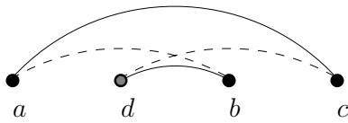
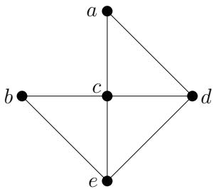
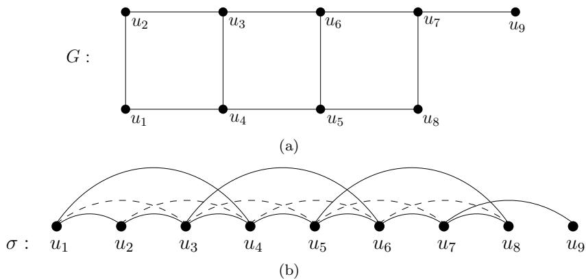
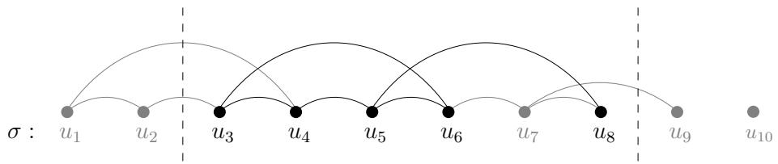

# A SIMPLE POLYNOMIAL ALGORITHM FOR THELONGEST PATH PROBLEM ON COCOMPARABILITY GRAPHS∗

GEORGE B. MERTZIOS† AND DEREK G. CORNEIL‡

Abstract. Given a graph $G$ , the longest path problem asks to compute a simple path of $G$ with the largest number of vertices. This problem is the most natural optimization version of the well-known and well-studied Hamiltonian path problem, and thus it is NP-hard on general graphs. However, in contrast to the Hamiltonian path problem, there are only a few restricted graph families, such as trees, and some small graph classes where polynomial algorithms for the longest path problem have been found. Recently it has been shown that this problem can be solved in polynomial time on interval graphs by applying dynamic programming to a characterizing ordering of the vertices of the given graph [K. Ioannidou, G. B. Mertzios, and S. D. Nikolopoulos, Algorithmica, 61 (2011), pp. 320–341], thus answering an open question. In the present paper, we provide the first polynomial algorithm for the longest path problem on a much greater class, namely on cocomparability graphs. Our algorithm uses a similar, but essentially simpler, dynamic programming approach, which is applied to a lexicographic depth first search (LDFS) characterizing ordering of the vertices of a cocomparability graph. Therefore, our results provide evidence that this general dynamic programming approach can be used in a more general setting, leading to efficient algorithms for the longest path problem on greater classes of graphs. LDFS has recently been introduced in [D. G. Corneil and R. M. Krueger, SIAM J. Discrete Math., 22 (2008), pp. 1259–1276]. Since then, a similar phenomenon of extending an existing interval graph algorithm to cocomparability graphs by using an LDFS preprocessing step has also been observed for the minimum path cover problem [D. G. Corneil, B. Dalton, and M. Habib, submitted]. Therefore, more interestingly, our results also provide evidence that cocomparability graphs present an interval graph structure when they are considered using an LDFS ordering of their vertices, which may lead to other new and more efficient combinatorial algorithms.

Key words. cocomparability graphs, longest path problem, lexicographic depth first search, dynamic programming, polynomial algorithm

AMS subject classifications. Primary, 05C85; Secondary, 05C38, 05C62, 68R10

DOI. 10.1137/100793529

1. Introduction. The Hamiltonian path problem, i.e., the problem of deciding whether a graph $G$ contains a simple path that visits each vertex of $G$ exactly once, is one of the most well-known NP-complete problems, with numerous applications. The most natural optimization version of this problem is the longest path problem, that is, to compute a simple path of maximum length or, equivalently, to find a maximum induced subgraph which is Hamiltonian. Even if a graph itself is not Hamiltonian, it makes sense in several applications to search for a longest path. However, computing a longest path seems to be more difficult than deciding whether or not a graph admits a Hamiltonian path. Indeed, it has been proved that even if a graph is Hamiltonian, the problem of computing a path of length $n - n ^ { \varepsilon }$ for any $\varepsilon < 1$ is NP-hard, where $n$ is the number of vertices of the input graph [19]. Moreover, there is no polynomial time constant-factor approximation algorithm for the longest path problem

unless P=NP [19].

The Hamiltonian path problem (as well as many of its variants, e.g., the Hamiltonian cycle problem) is known to be NP-complete on general graphs [14]; furthermore, it remains NP-complete even when the input is restricted to some small classes of graphs, such as split graphs [15], chordal bipartite graphs, split strongly chordal graphs [24], directed path graphs [25], circle graphs [10], planar graphs [14], and grid graphs [18]. On other restricted families of graphs, however, considerable success has been achieved in finding polynomial time algorithms for the Hamiltonian path problem. In particular, this problem can be solved polynomially on proper interval graphs [2], interval graphs [1, 20], and cocomparability graphs [12] (see [3, 15] for definitions of these and other graph classes mentioned in this paper).

In contrast to the Hamiltonian path problem, there are only a few known polynomial algorithms for the longest path problem, and, until recently, these were restricted to trees [4], weighted trees and block graphs [31], bipartite permutation graphs [32], and ptolemaic graphs [30]. In [31] the question was raised whether the problem could be solved in polynomial time for a much larger class, namely interval graphs. Very recently such an algorithm has been discovered [16]. This algorithm applies dynamic programming to the vertex ordering of the given interval graph that is obtained after sorting the intervals according to their right endpoints. Another natural generalization of the Hamiltonian path problem is the minimum path cover problem, where the goal is to cover each vertex of the graph exactly once using the smallest number of simple paths. Clearly a solution to either the longest path or the minimum path cover problems immediately yields a solution to the Hamiltonian path problem. Unlike the situation for the longest path problem, polynomial time algorithms for the Hamiltonian cycle [20], Hamiltonian path, and minimum path cover [1] problems on interval graphs have been available since the 1980s and early 1990s.

Cocomparability graphs (i.e., graphs whose complements can be transitively oriented) strictly contain interval and permutation graphs [3] and have also been studied with respect to various Hamiltonian problems. In particular, it is well known that the Hamiltonian path and Hamiltonian cycle problems [13], as well as the minimum path cover problem (referred to as the Hamiltonian path completion problem [12]), are polynomially solvable on cocomparability graphs. On the other hand, the complexity status of the longest path problem on cocomparability graphs—and even on the smaller class of permutation graphs—has long been open.

Until recently, the only polynomial algorithms for the Hamiltonian path, Hamiltonian cycle [13], and minimum path cover [12] problems on cocomparability graphs exploited the relationship between these problems and the bump number of a poset representing the transitive orientation of the complement graph. Furthermore, it had long been an open question whether there are algorithms for these problems that, as with the interval graph algorithms, are based on the structure of cocomparability graphs. This question has recently been answered by the algorithm in [6], which solves the minimum path cover problem on cocomparability graphs by building off the corresponding algorithm for interval graphs [1] and using a preprocessing step based on the recently discovered lexicographic depth first search (LDFS) [8].

In the present paper we provide the first polynomial algorithm for the longest path problem on cocomparability graphs (and thus also on permutation graphs). Our algorithm develops a similar, but much simpler, dynamic programming approach to that of [16], which is applied to an LDFS characterizing ordering of the vertices of a cocomparability graph (see [6, 8]). As a byproduct, this algorithm also solves the longest path problem on interval graphs in a much simpler way than that of [16] (the algorithm of [16] consists of three phases, during which it introduces several dummy vertices to construct a second auxiliary graph). Furthermore, these results provide evidence that this general dynamic programming approach can be used in a more general setting, providing efficient algorithms for the longest path problem on greater classes of graphs. As already mentioned above, a similar phenomenon of extending an existing interval graph algorithm to cocomparability graphs by using an LDFS preprocessing step has also been observed for the minimum path cover problem [6]. Therefore, our results also provide evidence that cocomparability graphs present an interval graph structure when they are considered using an LDFS ordering of their vertices, which may lead to other new and more efficient combinatorial algorithms.

Interestingly, very recently it came to our attention that, independently of our present work, another polynomial algorithm for the longest path problem on cocomparability graphs appeared in [17]. The algorithm of [17] is much more complicated than ours; it generalizes the dynamic programming approach of [16] from an interval representation to the Hasse diagram of the poset defined by the complement of a cocomparability graph. Furthermore, the algorithm of [17] has running time $O ( n ^ { 7 } )$ on a cocomparability graph with $n$ vertices, in contrast to our algorithm, which has running time $O ( n ^ { 4 } )$ . This fact illustrates the power of the LDFS vertex ordering of cocomparability graphs as a tool for designing simpler and more efficient algorithms.

Organization of the paper. In section 2 we provide the necessary preliminaries and notation, including vertex ordering characterizations of interval graphs, cocomparability graphs, and LDFS orderings. In section 3 we study the effect of an LDFS preprocessing step on the vertex ordering characterization of cocomparability graphs. This section provides much of the structural foundation for our longest path algorithm that is presented in section 4. Finally, we discuss the presented results and further research in section 5.

2. Preliminaries and notation. In this article we follow standard notation and terminology; see, for instance, [15]. We consider finite, undirected, and simple graphs with no loops. Given a graph $G = ( V , E )$ , we denote by $n$ the cardinality of $V$ . An edge between vertices $u$ and $\boldsymbol { v }$ is denoted by $_ { u v }$ , and in this case vertices $u$ and $v$ are said to be adjacent. $\overline { G }$ denotes the complement of $G$ , i.e., $\overline { { G } } = ( V , \overline { { E } } )$ , where $u v \in \overline { { E } }$ if and only if $u v \notin E$ . Let $S \subseteq V$ be a set of vertices of $G$ . Then, the subgraph of $G$ induced by $S$ is denoted by $G \vert S \vert$ , i.e., $G [ S ] = ( S , F )$ , where for any two vertices $u , v \in S$ , $u v \in F$ if and only if $u v \in E$ . The set $N ( v ) = \{ u \in V \mid u v \in E \}$ is called the neighborhood of the vertex $v \in V$ in $G$ .

A simple path $P$ of a graph $G$ is a sequence of distinct vertices $v _ { 1 } , v _ { 2 } , \ldots , v _ { k }$ such that $v _ { i } v _ { i + 1 } \in E$ , for each $i \in \{ 1 , 2 , \ldots , k - 1 \}$ , and is denoted by $P = ( v _ { 1 } , v _ { 2 } , \ldots , v _ { k } )$ ; throughout the paper all paths considered are simple. Furthermore, $v _ { 1 }$ (resp., $v _ { k }$ ) is called the first (resp., last) vertex of $P$ . We denote by $V ( P )$ the set of vertices of the path $P$ and define the length $| P |$ of $P$ to be the number of vertices in $P$ , i.e., $| P | = | V ( P ) |$ . Additionally, if $P = ( v _ { 1 } , v _ { 2 } , \ldots , v _ { i - 1 } , v _ { i } , \ldots , v _ { j } , v _ { j + 1 } , \ldots , v _ { k } )$ is a path of a graph and $P _ { 0 } = ( v _ { i } , \ldots , v _ { j } )$ is a subpath of $P$ , we sometimes equivalently use the notation $P = ( v _ { 1 } , v _ { 2 } , \ldots , v _ { i - 1 } , P _ { 0 } , v _ { j + 1 } , \ldots , v _ { k } )$ .

Recall that interval graphs are the intersection graphs of closed intervals on the real line. Furthermore, a comparability graph is a graph whose edges can be transitively oriented (i.e., if $x  y$ and $y  z$ , then $x  z$ ); a cocomparability graph $G$ is a graph whose complement $\overline { G }$ is a comparability graph. Permutation graphs are exactly the intersection of comparability and cocomparability graphs. Moreover, cocomparability graphs strictly contain interval graphs and permutation graphs, as well as other families of graphs such as trapezoid graphs and cographs [3].

2.1. Vertex ordering characterizations. We now state vertex ordering characterizations of interval graphs, of cocomparability graphs, and of any ordering of the vertex set $V$ that can result from an LDFS search of an arbitrary graph $G = ( V , E )$ . The following ordering characterizes interval graphs and has appeared in a number of papers, including [26].

Lemma 1 (see [26]). $G = ( V , E )$ is an interval graph if and only if there is an ordering (called an I-ordering) of $V$ such that for all $x < y < z$ , if $x z \in E$ , then also $x y \in E$ .

Note that the characterization of Lemma 1 can also result after sorting the intervals of an interval representation of $G$ according to their left endpoints. Furthermore, note that some papers on interval graphs (see, for instance, [1, 11, 16]) used the equivalent “reverse” vertex ordering, which results after sorting the intervals of an interval representation according to their right endpoints.

A similar characterization of unit interval graphs (also known as proper interval graphs) requires that if $x z \in E$ , then both $x y , y z \in E$ . It was observed in [21] that the following generalization of the interval order characterization captures cocomparability graphs.

Definition 1 (see [21]). Let $G = ( V , E )$ be a graph. An ordering of the vertices $V$ is an umbrella-free ordering (or $a$ CO-ordering) if for all $x \ < \ y \ < \ z$ , $x z \in E$ implies that $x y \in E$ or $y z \in E$ (or both).

Lemma 2 (see [21]). $G = ( V , E )$ is a cocomparability graph if and only if there exists an umbrella-free ordering of $V$ .

Observation 1. An I-ordering of an interval graph $G$ is also an umbrella-free ordering.

Note that, although there exists a linear time algorithm to find an umbrella-free ordering of a given cocomparability graph [23], the fastest known algorithm to verify this property requires the same time as for Boolean matrix multiplication (see [29] for a discussion of this issue). Furthermore, if $P$ is a poset with cocomparability graph $G$ , then any linear extension of $P$ is an umbrella-free ordering of the vertices of $G$ . In the following, we present the notion of the recently introduced LDFS ordering (see [8]).

Definition 2. Let $G = ( V , E )$ be a graph and $\sigma$ be any ordering of $V$ . Let $( a , b , c )$ be a triple of vertices of $G$ such that $a < _ { \sigma } b < _ { \sigma } c$ , $a c \in E$ , and $a b \notin E$ . If there exists a vertex $d \in V$ such that $a < _ { \sigma } d < _ { \sigma } b$ , $d b \in E$ , and $d c \notin E$ , then $( a , b , c )$ is $a$ good triple; otherwise it is $a$ bad triple. Furthermore, if the triple $( a , b , c )$ is good, then vertex $d$ is called a $d$ -vertex of this triple.

Definition 3. Let $G = ( V , E )$ be a graph. An ordering $\sigma$ of $V$ is an LDFS ordering if and only if $o$ has no bad triple.

An example of a good triple $( a , b , c )$ and a $d$ -vertex of it is depicted in Figure 1. In this example, the edges $a c$ and $d b$ are indicated with solid lines, while the nonedges $a b$ and $d c$ are indicated with dashed lines. Furthermore, the $d$ -vertex is drawn gray for better visibility.

2.2. Algorithms. In the following we present the generic LDFS algorithm (Algorithm 1) that starts at a distinguished vertex $u$ . This algorithm has recently been introduced in [8]. It looks superficially similar to the well-known and well-studied lexicographic breadth first search (LBFS) [27] (for a survey, see [5]); nevertheless, it appears that vertex orderings computed by the LDFS and by the LBFS have inherent structural differences. Briefly, the generic LDFS algorithm proceeds as follows. Initially, the label $\varepsilon$ is assigned to all vertices. Then, iteratively, an unvisited vertex $\boldsymbol { v }$ with lexicographically maximum label is chosen and removed from the graph. If $v$ is chosen as the $i$ th vertex, then all of its neighbors that are still unnumbered have their label updated by having the digit $i$ prepended to their label. The digits in the label of any vertex are always in decreasing order, which ensures that all neighbors of the last chosen vertex have a lexicographically greater label than their nonneighbors. By extension, this argument ensures that all vertices are visited in a depth-first search order. When applied to a graph with $n$ vertices and $m$ edges, Algorithm 1 can be implemented to run in $O ( \operatorname* { m i n } \{ n ^ { 2 } , n + m \log n \} )$ time [22]; however, the current fastest implementation runs in $O ( \operatorname* { m i n } \{ n ^ { 2 } , n + m \log \log n \} )$ ) [28].

  
Fig. 1. A good triple $( a , b , c )$ and a d-vertex of this triple in the vertex ordering $\sigma = ( a , d , b , c )$

Algorithm 1. $\mathrm { L D F S } ( G , u )$ [8].   

<table><tr><td>Input: A connected graph G = (V, E) with n vertices and a distinguished vertex u</td></tr><tr><td>of G</td></tr><tr><td>Output: An LDFS ordering σu of the vertices of G</td></tr><tr><td>1: Assign the label ε to all vertices</td></tr><tr><td>2: label(u) ← {0}</td></tr><tr><td>3: for i = 1 to n do</td></tr><tr><td>4: Pick an unnumbered vertex v with the lexicographically largest label</td></tr><tr><td>5: σu(i) ← v {assign to v the number i}</td></tr><tr><td>6: for each unnumbered vertex w  N(v) do</td></tr><tr><td>7: prepend i to label(w)</td></tr></table>

The execution of the LDFS algorithm is captured in the example shown in Figure 2. In this example, suppose that the LDFS algorithm starts at vertex $e$ . Suppose that LDFS chooses vertex $d$ next. Now, ordinary DFS could choose either $a$ or $c$ next, but LDFS has to choose $c$ , since it has a greater label ( $c$ is a neighbor of the previously visited vertex $e$ ). The vertex following $c$ in the LDFS ordering $\sigma _ { e }$ must be $a$ rather than $b$ , since $a$ has a greater label than $b$ ( $a$ is a neighbor of vertex $d$ , which has been visited more recently than $b$ ’s neighbor $e$ ). The LDFS then backtracks to $b$ , completing the LDFS ordering as $\sigma _ { e } = ( e , d , c , a , b )$ .

It is important here to connect the vertex ordering $\sigma _ { u }$ that is returned by the LDFS algorithm (i.e., Algorithm 1) with the notion of an LDFS ordering, as defined in Definition 3. The following theorem shows that a vertex ordering $\sigma$ of an arbitrary graph $G$ can be returned by an application of the LDFS algorithm to $G$ (starting at some vertex $u$ of $G$ ) if and only if $\sigma$ is an LDFS ordering.

Theorem 1 (see [8]). For an arbitrary graph $G = ( V , E )$ , an ordering $\sigma$ of $V$ can be returned by an application of Algorithm 1 to $G$ if and only if $\sigma$ is an LDFS ordering.

In the generic LDFS, there could be some choices to be made at line 4 of Algorithm 1; in particular, at some iteration there may be a set $S$ of vertices that have the same label and the algorithm must choose one vertex from $S$ . Generic LDFS (i.e., Algorithm 1) allows an arbitrary choice here. We present in the following a special kind of LDFS algorithm, called LDFS $^ +$ (cf. Algorithm 2), which makes a specific choice of vertex in such a case of equal labels, as follows. Along with the graph $G = ( V , E )$ , an ordering $\pi$ of $V$ is also given as input. The algorithm LDFS $^ +$ (see Algorithm 2 for a formal description) operates exactly as a generic LDFS that starts at the rightmost vertex of $V$ in the ordering $\pi$ , with the only difference that, in the case where at some iteration at least two unvisited vertices have the same label, it chooses the rightmost vertex among them in the ordering $\pi$ .

  
Fig. 2. Illustrating LDFS.

# Algorithm 2. LDFS $^ +$ $( G , \pi )$ .

Input: A connected graph $G = ( V , E )$ with $n$ vertices and an ordering $\pi$ of $V$ Output: An LDFS ordering $\sigma$ of the vertices of $G$

1: Assign the label $\varepsilon$ to all vertices   
2: for $i = 1$ to $n$ do   
3: Pick the rightmost vertex $v$ in $\pi$ among the unnumbered vertices with the   
lexicographically largest label   
4: $\sigma ( i )  v$ $\{$ {assign to $v$ the number $i \}$   
5: for each unnumbered vertex $w \in N ( v )$ do   
6: prepend $_ i$ to $l a b e l ( w )$   
7: return the ordering $\sigma = ( \sigma ( 1 ) , \sigma ( 2 ) , \ldots , \sigma ( n ) )$

In the following, we present the rightmost-neighbor (RMN) algorithm. This algorithm, although without the name RMN, was introduced in [1] in order to find a minimum path cover in a given interval graph.1 The RMN algorithm is a very simple “greedy” algorithm that starts at the rightmost vertex of a given ordering $\sigma$ of $V$ and traces each path by repeatedly proceeding to the rightmost unvisited neighbor of the current vertex. If the current vertex has no unvisited neighbors, then the rightmost unvisited vertex is chosen as the first vertex in the next path.

Note that in Algorithm 2 we denote the input vertex ordering by $\pi$ and the output ordering by $\sigma$ , while in Algorithm 3, $\sigma$ denotes the input vertex ordering. The reason for this notation is that we will often consider an arbitrary umbrella-free vertex ordering $\pi$ of a cocomparability graph $G$ , apply Algorithm 2 (i.e., LDFS $^ +$ ) to $\pi$ to compute the ordering $\sigma$ , and then apply Algorithm 3 (i.e., RMN) to $\sigma$ to compute the ordering $\widehat { \sigma }$ . Then, as proved in [6], the LDFS vertex ordering $\sigma$ remains umbrella-free. Moreover, the final ordering $\widehat { \sigma }$ defines a minimum path cover of $G$ [6].

<table><tr><td>ALGORITHM 3. RMN(σ).</td></tr><tr><td>Input: A graph G = (V, E) with n vertices and an ordering σ of V Output: An ordering  of the vertices of G</td></tr><tr><td>1: Label all vertices as &quot;unvisited&quot;; i ← 1</td></tr><tr><td>2: while there are unvisited vertices do</td></tr><tr><td>3: Pick the rightmost unvisited vertex x in σ</td></tr><tr><td>4: σ(i) ← x {add vertex x to the ordering }</td></tr><tr><td>5: Mark x as &quot;visited&quot;; i ← i + 1</td></tr><tr><td>6: while x has at least one unvisited neighbor do</td></tr><tr><td>7: Pick the x&#x27;s rightmost unvisited neighbor y in σ</td></tr><tr><td>8: σ(i) ← y {add vertex y to the ordering }</td></tr><tr><td>9: Mark y as &quot;visited&quot;; i ← i + 1</td></tr><tr><td>10: x ← y</td></tr><tr><td>11: return  = (σ(1), (2), ..., σ(n))</td></tr></table>

3. Normal paths in cocomparability graphs. In this section we investigate the structure of the vertex ordering $\sigma$ that is obtained after applying an LDFS $^ +$ preprocessing step to an arbitrary umbrella-free ordering $\pi$ of a cocomparability graph $G$ . On such an LDFS umbrella-free ordering $\sigma$ , we define a special type of path called normal path (cf. Definition 6), which is a crucial notion for our algorithm for the longest path problem on cocomparability graphs (cf. Algorithm 4). In the following definition we introduce the notion of a maximal path in a graph, which extends that of a longest path.

Definition 4. A path $P$ of a graph $G$ is maximal if there exists no path $P ^ { \prime }$ of $G$ such that $V ( P ) \subset V ( P ^ { \prime } )$ .

The main result of this section is that for any maximal path $P$ of a cocomparability graph $G$ (and thus also for any longest path), there exists a normal path $P ^ { \prime }$ on the same vertices (cf. Theorem 2). Due to this result, it is sufficient for our algorithm that computes a longest path of a cocomparability graph (cf. Algorithm 4) to search only among the normal paths of the given cocomparability graph, in order to compute a longest path. The next lemma will be used in what follows.

Lemma 3. Let $G = ( V , E )$ be a cocomparability graph and $\sigma$ be an LDFS umbrellafree ordering of $V$ . Let $P = ( v _ { 1 } , v _ { 2 } , \ldots , v _ { k } )$ be a path of $G$ and $v _ { \ell } \notin V ( P )$ be a vertex of $G$ such that $v _ { k } \ < _ { \sigma } \ v _ { \ell } \ < _ { \sigma } \ v _ { 1 }$ and $\boldsymbol { v } _ { \ell } \boldsymbol { v } _ { k } \notin \ E$ . Then, there exist two consecutive vertices $v _ { i - 1 }$ and $v _ { i }$ in $P$ , $2 \leq i \leq k$ , such that $v _ { i - 1 } v _ { \ell } \in E$ and $v _ { i } < _ { \sigma } v _ { \ell }$ .

Proof. Since $v _ { k } < _ { \sigma } v _ { \ell } < _ { \sigma } v _ { 1 }$ and $v _ { \ell } \notin V ( P )$ , there exists at least one edge $e = x y$ of $P$ , which straddles ${ v \ell }$ in $\sigma$ . Thus, at least one of $x$ and $y$ is adjacent to ${ v } _ { \ell }$ , since $\sigma$ is umbrella-free. Recall that $v _ { \ell } v _ { k } \notin E$ ; let $v _ { i - 1 }$ , $2 \leq i \leq k$ , be the last vertex of $P$ such that $v _ { i - 1 } v _ { \ell } \in E$ . If $v _ { \ell } < _ { \sigma } v _ { i }$ , then similarly there exists at least one vertex $v _ { j }$ , $i \le j \le k$ , such that $v _ { j } v _ { \ell } \in E$ , which is a contradiction by the assumption on $v _ { i - 1 }$ . Thus, $v _ { i } < _ { \sigma } v _ { \ell }$ . This completes the proof of the lemma.

Definition 5. Let $G \ = \ ( V , E )$ be a cocomparability graph, $\sigma$ be an LDFS umbrella-free ordering of $V$ , and $\sigma ^ { \prime }$ be an induced subordering of $\sigma$ . An LDFS closure $\sigma ^ { \prime \prime }$ of $\sigma ^ { \prime }$ (within $\sigma$ ) is an induced subordering of $o$ with the smallest number of vertices such that $\sigma ^ { \prime \prime }$ is an LDFS ordering that includes $\sigma ^ { \prime }$ .

Observe that any induced subordering $\sigma ^ { \prime }$ of an umbrella-free ordering $o$ also remains an umbrella-free ordering (cf. Definition 1). An example of a cocomparability graph $G = ( V , E )$ , as well as an LDFS umbrella-free ordering $\sigma = ( u _ { 1 } , u _ { 2 } , \ldots , u _ { 9 } )$ o f $V$ , is illustrated in Figure 3. In this example, $\sigma ^ { \prime } = ( u _ { 1 } , u _ { 3 } , u _ { 4 } , u _ { 5 } , u _ { 7 } , u _ { 8 } )$ is an induced subordering of $\sigma$ (and thus also umbrella-free). Furthermore, the ordering $\sigma ^ { \prime \prime } =$ $( u _ { 1 } , u _ { 2 } , u _ { 3 } , u _ { 4 } , u _ { 5 } , u _ { 6 } , u _ { 7 } , u _ { 8 } )$ is an LDFS closure of $\sigma ^ { \prime }$ (within $\sigma$ ), where the vertices $u _ { 2 }$ and $u _ { 6 }$ are the $d$ -vertices of the triples $( u _ { 1 } , u _ { 3 } , u _ { 4 } )$ and $( u _ { 5 } , u _ { 7 } , u _ { 8 } )$ , respectively.

  
Fig. 3. (a) $A$ cocomparability graph $G ~ = ~ ( V , E )$ and (b) an LDFS umbrella-free ordering $\sigma = ( u _ { 1 } , u _ { 2 } , \ldots , u _ { 9 } )$ of $V$ .

Observation 2. Let $\sigma$ be an LDFS umbrella-free ordering, $\sigma ^ { \prime }$ be an arbitrary induced subordering of $\sigma$ , and $\sigma ^ { \prime \prime }$ be any LDFS closure of $\sigma ^ { \prime }$ (within $\sigma$ ). Then, every vertex v of $\sigma ^ { \prime \prime } \setminus \sigma ^ { \prime }$ is a $d$ -vertex of some good triple $( a , b , c )$ in $\sigma ^ { \prime \prime }$ .

The next lemma follows easily by Observation 2.

Lemma 4. Let $\sigma$ be an LDFS umbrella-free ordering, $\sigma ^ { \prime }$ be an arbitrary induced subordering of $\sigma$ , and $\sigma ^ { \prime \prime }$ be any LDFS closure of $\sigma ^ { \prime }$ (within $\sigma$ ). Let $v$ be a vertex of $\sigma ^ { \prime \prime } \setminus \sigma ^ { \prime }$ . Then, there exists at least one vertex $v ^ { \prime }$ in $\sigma ^ { \prime }$ such that $\boldsymbol { v } \ < _ { \sigma } \ \boldsymbol { v } ^ { \prime }$ and $v v ^ { \prime } \notin E$ .

Proof. First, note by Observation 2 that $\boldsymbol { v }$ is a $d$ -vertex of some good triple in $\sigma ^ { \prime \prime }$ ; let this triple be $( a , b , c )$ . Then, $v < _ { \sigma } ~ c$ and $v c \notin E$ by the definition of a good triple. Now let $v ^ { \prime }$ be the rightmost vertex in $\sigma ^ { \prime \prime }$ such that $\boldsymbol { v } \ < _ { \sigma } \boldsymbol { v } ^ { \prime }$ and $v v ^ { \prime } \notin E$ . Suppose that $v ^ { \prime } \in \sigma ^ { \prime \prime } \setminus \sigma ^ { \prime }$ . Then, $v ^ { \prime }$ is a $d$ -vertex of some good triple $( v _ { 1 } , v _ { 2 } , v _ { 3 } )$ i n $\sigma ^ { \prime \prime }$ by Observation 2. Thus $v ^ { \prime } < _ { \sigma } v _ { 3 }$ and $v ^ { \prime } v _ { 3 } \notin E$ . Furthermore, $v v _ { 3 } \in E$ by the assumption on $v$ and $v ^ { \prime }$ . Then, the vertices $v , v ^ { \prime } , v _ { 3 }$ build an umbrella in $\sigma ^ { \prime \prime }$ , which is a contradiction. Therefore $v ^ { \prime } \notin \sigma ^ { \prime \prime } \setminus \sigma ^ { \prime }$ , i.e., $v ^ { \prime } \in \sigma ^ { \prime }$ . This completes the proof of the lemma.

Corollary 1. Let $\sigma$ be an LDFS umbrella-free ordering, $\sigma ^ { \prime }$ be an arbitrary induced subordering of $\sigma$ , and $\sigma ^ { \prime \prime }$ be any LDFS closure of $\sigma ^ { \prime }$ (within $\sigma$ ). Then, the rightmost vertex of $\sigma ^ { \prime }$ is also the rightmost vertex of $\sigma ^ { \prime \prime }$ .

Proof. Let $v ^ { \prime }$ and $v ^ { \prime \prime }$ be the rightmost vertices of $\sigma ^ { \prime }$ and of $\sigma ^ { \prime \prime }$ , respectively. If $\boldsymbol { v ^ { \prime } } \ne \boldsymbol { v ^ { \prime \prime } }$ , then $v ^ { \prime \prime }$ is a vertex of $\sigma ^ { \prime \prime } \setminus \sigma ^ { \prime }$ and $v ^ { \prime } < _ { \sigma } \ u ^ { \prime \prime }$ , since $\sigma ^ { \prime }$ is a subset of $\sigma ^ { \prime \prime }$ . Then, there exists by Lemma 4 at least one vertex $v ^ { \prime \prime \prime }$ in $\sigma ^ { \prime }$ such that $v ^ { \prime \prime } < _ { \sigma } v ^ { \prime \prime \prime }$ , i.e., $v ^ { \prime } < _ { \sigma } v ^ { \prime \prime } < _ { \sigma } v ^ { \prime \prime \prime }$ , which is a contradiction to our assumption on $v ^ { \prime }$ .

In the following we introduce the notions of a typical and a normal path in a cocomparability graph $G = ( V , E )$ (with respect to an LDFS umbrella-free ordering $\sigma$ of $V$ ), which will be used in the remainder of the paper. Note that the next definition of a typical (resp., normal) path $P$ in $G$ depends only on the induced subgraph $G [ V ( P ) ]$ of $G$ on the vertices of $P$ and not on the rest of $G$ .

Definition 6. Let $G = ( V , E )$ be a cocomparability graph and $\sigma$ be an LDFS umbrella-free ordering of $V$ . Then, we have the following:

(a) a path $P = ( v _ { 1 } , v _ { 2 } , \ldots , v _ { k } )$ of $G$ is called typical if $_ { v _ { 1 } }$ is the rightmost vertex of $V ( P )$ in $\sigma$ and $v _ { 2 }$ is the rightmost vertex of $N ( v _ { 1 } ) \cap V ( P )$ in $\sigma$ ;   
(b) a typical path $P = ( v _ { 1 } , v _ { 2 } , \ldots , v _ { k } )$ of $G$ is called normal if $v _ { i }$ is the rightmost vertex of $N ( v _ { i - 1 } ) \cap \{ v _ { i } , v _ { i + 1 } , \dots , v _ { k } \}$ in $\sigma$ for every $i = 2 , \ldots , k$ .

For example, in the cocomparability graph $G$ of Figure 3, the path $P =$ $( u _ { 8 } , u _ { 5 } , u _ { 6 } , u _ { 3 } , u _ { 4 } )$ is a normal path. The next observation follows from Definition 6.

Observation 3. Let $G = ( V , E )$ be a cocomparability graph and $\sigma$ be an LDFS umbrella-free ordering of $V$ . Let $P$ be a normal path of $G$ (with respect to the ordering $o$ ) and $\sigma | _ { V ( P ) }$ be the restriction of $\sigma$ on the vertices of $P$ . Then, the ordering of the vertices of $V ( P )$ in $P$ coincides with the ordering $R M N \big ( \sigma \vert _ { V ( P ) } \big )$ .

A similar notion of a normal (i.e., RMN) path for the special case of interval graphs has appeared in [11] (referred to as a straight path), as well as in [16]. We now state the following two auxiliary lemmas.

Lemma 5 (see [6]). Let $G = ( V , E )$ be a cocomparability graph and $\pi$ be an umbrella-free ordering of $V$ . Let $\pi ^ { \prime } = R M N ( \pi )$ and $\pi ^ { \prime \prime } = L D F S ^ { + } ( \pi )$ . Furthermore, let $x , y \in V$ such that xy $\notin E$ . If $y < _ { \pi } x$ , then $x < \pi ^ { \prime }$ $y$ and $x < _ { \pi ^ { \prime \prime } } y$ .

Lemma 6. Let $G = ( V , E )$ be a cocomparability graph, let $\pi$ be an umbrellafree ordering of $V$ , and let $\pi ^ { \prime } = R M N ( \pi )$ . Let $x , y \in V$ such that $y \ < _ { \pi } \ x$ and $y < _ { \pi ^ { \prime } } x$ . Then, $y$ is not the first vertex of $\pi ^ { \prime }$ and for the previous vertex $z$ of $y$ in $\pi ^ { \prime }$ , $y < _ { \pi } x < _ { \pi } z$ , $z y \in E$ , and $z x \not \in E$ .

Proof. First, note that the first vertex of the ordering $\pi ^ { \prime } = \mathrm { R M N } ( \pi )$ is the rightmost vertex of $\pi$ . Thus $y$ is not the first vertex of $\pi ^ { \prime }$ , since $y < \pi x$ . Let $z$ be the previous vertex of $y$ in $\pi ^ { \prime }$ . Then, $x$ is unvisited, when $z$ is being visited by $\pi ^ { \prime }$ , since $z < _ { \pi ^ { \prime } } y < _ { \pi ^ { \prime } } x$ . Since $y$ is preferred to $x$ (as the next vertex of $z$ in the RMN ordering $\pi ^ { \prime }$ ), even though $y < \pi \ x$ , we must have $z y \in E$ and $z x \not \in E$ . Thus, by Lemma 5, it follows that $x < _ { \pi } z$ , i.e., $y < _ { \pi } x < _ { \pi } z$ . $\amalg$

Notation 1. In the remainder of this section, we consider a cocomparability graph $G = ( V , E )$ and an LDFS umbrella-free ordering $\sigma$ of $G$ . Furthermore, we consider $a$ maximal path $P$ of $G$ , the restriction $\sigma ^ { \prime } = \sigma | _ { V ( P ) }$ of $\sigma$ on the vertices of $P$ , and an arbitrary LDFS closure $\sigma ^ { \prime \prime }$ of $\sigma ^ { \prime }$ (within $\sigma$ ). Finally, we consider the orderings $\widehat { \sigma } = L D F S ^ { + } ( \sigma ^ { \prime } )$ and $\widehat { \widehat { \sigma } } = R M N ( \widehat { \sigma } )$ .

The next structural lemma will be used in what follows, in order to prove in Theorem 2 that for every maximal path $P$ there exists a normal path $P ^ { \prime }$ of $G$ such that $V ( P ^ { \prime } ) = V ( P )$ .

Lemma 7. Let $x , y , z$ be three vertices of $\sigma ^ { \prime }$ such that $x < _ { \widehat { \sigma } } y < _ { \widehat { \sigma } } z$ and $z < _ { \sigma ^ { \prime } } y < _ { \sigma ^ { \prime } } x$ , where $x y , x z \in E$ and $y z \not \in E$ . Then, $x$ is not the next vertex of $z$ in $\widehat { \widehat { \sigma } }$ .

Proof. The proof will be done by contradiction. We will exploit the fact that $P$ is a maximal path (cf. Notation 1) and that, given a Hamiltonian cocomparability graph $H$ and an LDFS umbrella-free ordering $\pi$ of $H$ , the ordering $\mathrm { R M N } ( \pi )$ gives a Hamiltonian path of $H$ [6]. Suppose that there exists a triple $( x , y , z )$ of vertices in $\sigma ^ { \prime }$ that satisfy the conditions of the lemma such that $x$ is the next vertex of $z$ in $\widehat { \widehat { \sigma } }$ . Among all choices of triples, let $( x , y , z )$ be the one where $z$ is the rightmost possible in $\widehat { \sigma }$ and $y$ is the rightmost possible in $\widehat { \sigma }$ among those with equal $z$ . Note that always $z < _ { \widehat { \sigma } } y$ by Lemma 5, since $\widehat { \widehat { \sigma } } = \mathrm { R M N } ( \widehat { \sigma } )$ , and since $y z \notin E$ and $y < _ { \widehat { \sigma } } z$ by assumption. Since $z < _ { \sigma ^ { \prime } } \ y < _ { \sigma ^ { \prime } } \ x$ , $x z \in E$ , and $y z \notin E$ , and since $\sigma ^ { \prime \prime }$ is an LDFS-closure of $\sigma ^ { \prime }$ (within $o$ ), there exists by Observation 2 a vertex $d$ in $\sigma ^ { \prime \prime }$ such that $z < _ { \sigma ^ { \prime \prime } } d < _ { \sigma ^ { \prime \prime } }$ $y < _ { \sigma ^ { \prime \prime } } x$ , $d y \in E$ , and $d x \notin E$ . Thus, since $d x \notin E$ and $\sigma$ is an umbrella-free ordering, it follows that $z d \in E$ . In the following we will distinguish the cases where $d \in \sigma ^ { \prime }$ and $d \in \sigma ^ { \prime \prime } \setminus \sigma ^ { \prime }$ .

Case 1. Suppose first that $d \in \sigma ^ { \prime }$ , i.e., $d \in V ( P )$ , and thus $d \in { \widehat { \sigma } }$ . Then, since $\widehat { \sigma } = \mathrm { L D F S ^ { + } } ( \sigma ^ { \prime } )$ , and since $d x \notin E$ and $d < _ { \sigma ^ { \prime } } x$ , it follows by Lemma 5 that $x < _ { \widehat { \sigma } } d$ .

Case 1a. Suppose that $d < _ { \widehat { \sigma } } z$ , i.e., $x < _ { \widehat { \sigma } } d < _ { \widehat { \sigma } } z$ . If $d$ were unvisited when $z$ is being visited in $\widehat { \widehat { \sigma } }$ , then $d$ would be the next vertex of $z$ in $\widehat { \widehat { \sigma } }$ instead of $x$ , since $z d \in E$ , which is a contradiction. Thus, $d$ has been visited before $z$ in $\widehat { \widehat { \sigma } }$ , i.e., $d < _ { \widehat { \widehat { \sigma } } } z$ . Therefore, Lemma 6 implies that $d$ is not the first vertex in $\widehat { \widehat { \sigma } }$ , while $d < _ { \widehat { \sigma } } \ z \ < _ { \widehat { \sigma } } \ a$ , $a d \in E$ , and $a z \not \in E$ for the previous vertex $a$ of $d$ in $\widehat { \widehat { \sigma } }$ . Then, in particular, $a < _ { \sigma ^ { \prime } } z$ by Lemma 5, since $z < _ { \widehat { \sigma } } \ a$ , $a z \not \in E$ , and $\widehat { \sigma } = \mathrm { L D F S ^ { + } } ( \sigma ^ { \prime } )$ . Summarizing, $d < _ { \widehat { \sigma } } \ z < _ { \widehat { \sigma } } a$ and $a < _ { \sigma ^ { \prime } } \ z < _ { \sigma ^ { \prime } } \ d$ , where $d z , d a \in E$ and $z a \not \in E$ , while $d$ is the next vertex of $a$ in $\widehat { \widehat { \sigma } }$ . This comes in contradiction to the choice of the triple $( x , y , z )$ for which $z$ is the rightmost possible in $\widehat { \sigma }$ .

Case 1b. Suppose that $z \ < _ { \widehat { \sigma } } \ d$ , i.e., $y \ < _ { \widehat { \sigma } } \ z \ < _ { \widehat { \sigma } } \ d$ . Recall that $y d \in E$ and $y z \notin E$ . Thus, since $\widehat { \sigma }$ is an LDFS ordering, there exists a vertex $d ^ { \prime }$ in $\widehat { \sigma }$ such that $y < _ { \widehat { \sigma } } d ^ { \prime } < _ { \widehat { \sigma } } z < _ { \widehat { \sigma } } d$ , $d ^ { \prime } z \in E$ , and $d ^ { \prime } d \notin E$ . Note that $x < _ { \widehat { \sigma } } y < _ { \widehat { \sigma } } d ^ { \prime }$ . Similarly to the previous paragraph, if $d ^ { \prime }$ were unvisited when $z$ is being visited in $\widehat { \widehat { \sigma } }$ , then $d ^ { \prime }$ would be the next vertex of $z$ in $\widehat { \widehat { \sigma } }$ instead of $x$ , since $d ^ { \prime } z \in E$ , which is a contradiction. Thus, $d ^ { \prime }$ has been visited before $z$ in $\widehat { \widehat { \sigma } }$ , i.e., $d ^ { \prime } < _ { \widehat { \sigma } } ~ z$ . Therefore, Lemma 6 implies that $d ^ { \prime }$ is not the first vertex in $\widehat { \widehat { \sigma } }$ , while $d ^ { \prime } < _ { \widehat { \sigma } } \ z \ < _ { \widehat { \sigma } } \ a ^ { \prime }$ , $a ^ { \prime } d ^ { \prime } \in E$ , and $a ^ { \prime } z \notin E$ for the previous vertex $a ^ { \prime }$ of $d ^ { \prime }$ in $\widehat { \widehat { \sigma } }$ . Then, in particular, $a ^ { \prime } < _ { \sigma ^ { \prime } } \ z$ by Lemma 5, since $z < _ { \widehat { \sigma } } a ^ { \prime }$ , $a ^ { \prime } z \notin E$ , and $\widehat { \sigma } = \mathrm { L D F S ^ { + } } ( \sigma ^ { \prime } )$ . Similarly, $d < _ { \sigma ^ { \prime } } d ^ { \prime }$ , since $d ^ { \prime } < _ { \widehat { \sigma } } d$ and $d ^ { \prime } d \notin E$ . Therefore, since $z < _ { \sigma ^ { \prime } } \ d$ , it follows that $z < _ { \sigma ^ { \prime } } d < _ { \sigma ^ { \prime } } d ^ { \prime }$ . Summarizing, $d ^ { \prime } < _ { \widehat { \sigma } } \ z < _ { \widehat { \sigma } } \ a ^ { \prime }$ and $a ^ { \prime } < _ { \sigma ^ { \prime } } \ z < _ { \sigma ^ { \prime } } \ d ^ { \prime }$ , where $d ^ { \prime } z , d ^ { \prime } a ^ { \prime } \in E$ and $z a ^ { \prime } \notin E$ , while $d ^ { \prime }$ is the next vertex of $a ^ { \prime }$ in $\widehat { \widehat { \sigma } }$ . This comes in contradiction to the choice of the triple $( x , y , z )$ such that $z$ is the rightmost possible in $\widehat { \sigma }$ .

Case 2. Suppose now that $d \in \sigma ^ { \prime \prime } \backslash \sigma ^ { \prime }$ , i.e., $d \not \in V ( P )$ , and thus $d \not \in \widehat { \sigma }$ . Consider the set of vertices $w$ of $\widehat { \sigma }$ such that $y < _ { \widehat { \sigma } } w < _ { \widehat { \sigma } } z$ . We partition this set into the (possibly empty) sets $A = \{ w \mid y < _ { \widehat { \sigma } } w < _ { \widehat { \sigma } } z , w z \not \in E \}$ and $\boldsymbol { B } = \{ w \mid \boldsymbol { y } < _ { \widehat { \sigma } } w < _ { \widehat { \sigma } } z , w z \in E \}$ . First observe that $x w \in E$ for every $w \in A$ , since $x z \in E$ and $z w \not \in E$ , and since $\widehat { \sigma }$ is an umbrella-free ordering. We will now prove that $y w \in E$ for every vertex $w \in A$ . Suppose otherwise that $y w , z w \notin E$ for a vertex $w$ , for which $y < _ { \widehat { \sigma } } w < _ { \widehat { \sigma } } z$ . Then, $z < _ { \sigma ^ { \prime } } w < _ { \sigma ^ { \prime } } y$ by Lemma 5, since $y < _ { \widehat { \sigma } } w < _ { \widehat { \sigma } } z$ , $y w , z w \notin E$ , and $\widehat { \sigma } = \mathrm { L D F S ^ { + } } ( \sigma ^ { \prime } )$ . Recall that $y < _ { \sigma ^ { \prime } }$ $x$ by assumption in the statement of the lemma. Thus, $x < _ { \widehat { \sigma } } w < _ { \widehat { \sigma } } z$ and $z \ < _ { \sigma ^ { \prime } }$ $w < _ { \sigma ^ { \prime } } x$ , where $x w , x z \in E$ and $w z \not \in E$ , while $x$ is the next vertex of $z$ in $\widehat { \widehat { \sigma } }$ . Therefore, since $y < _ { \widehat { \sigma } } w$ , this comes in contradiction to the choice of the triple $( x , y , z )$ such that is the rightmost possible (with respect to ) in $\widehat { \sigma }$ . Therefore, $y$ $z$ $y w \in E$ for every vertex $w \in A$ .

If a vertex $w \in B$ were unvisited when $z$ is being visited in $\widehat { \widehat { \sigma } }$ , then $w$ would be the next vertex of $z$ in $\widehat { \widehat { \sigma } }$ instead of $x$ , which is a contradiction to the assumption. Thus, $w$ has been visited before $z$ in $\widehat { \widehat { \sigma } }$ , i.e., $w < _ { \widehat { \widehat { \sigma } } } z$ for every $w \in B$ . On the other hand, Lemma 5 implies that $z < _ { \widehat { \sigma } } w$ for every $w \in A$ , i.e., $w$ is being visited after $z$ in $\widehat { \widehat { \sigma } }$ , since $\widehat { \widehat { \sigma } } = \mathrm { R M N } ( \widehat { \sigma } )$ , $w < _ { \widehat { \sigma } } z$ , and $w z \not \in E$ for every $w \in A$ . Let $v$ be a vertex that is visited after $z$ in $\widehat { \widehat { \sigma } }$ , i.e., $z < _ { \widehat { \sigma } } v$ . Then, $v < _ { \widehat { \sigma } } z$ . Indeed, suppose otherwise that $z < \widehat { \sigma } ^ { \mathrm { ~ v ~ } }$ for such a vertex $v$ . If $z v \in E$ , then $\boldsymbol { v }$ is the next vertex of $z$ in $\widehat { \widehat { \sigma } }$ instead of $x$ , since in this case $x < _ { \widehat { \sigma } } z < _ { \widehat { \sigma } } v$ , which is a contradiction. If $z v \not \in E$ , then $v < _ { \widehat { \sigma } } z$ by Lemma 5, since $\widehat { \widehat { \sigma } } = \mathrm { R M N } ( \widehat { \sigma } )$ , which again is a contradiction. Thus, $v < _ { \widehat { \sigma } } z$ for every vertex $v$ that is visited after $z$ in $\widehat { \widehat { \sigma } }$ . In the following we distinguish the cases $A \neq \emptyset$ and $A = \emptyset$ . The case where $A = \emptyset$ can be handled similarly to the case where $A \neq \emptyset$ , as we will see in what follows.

Case 2a. $A \neq \emptyset$ . Recall that $z ~ < _ { \widehat { \sigma } } ~ w$ for every $w \in A$ , i.e., every $w \in A$ is visited after $z$ in $\widehat { \widehat { \sigma } }$ , as we proved above. Thus, since $x$ is the next vertex of $z$ in $\widehat { \widehat { \sigma } }$ by assumption, all vertices $w \in A$ are unvisited when $x$ is being visited by $\widehat { \widehat { \sigma } }$ . Now recall by the previous paragraph that $v < _ { \widehat { \sigma } } z$ for every vertex $v$ that is visited after $z$ in $\widehat { \widehat { \sigma } }$ and that all vertices of $B$ have been visited before $z$ in $\widehat { \widehat { \sigma } }$ . Therefore, the next vertex of $x$ in $\widehat { \widehat { \sigma } }$ is some $w _ { 1 } \in A$ , since $x w \in E$ and $y < _ { \widehat { \sigma } } \ w$ for every $w \in A$ . Furthermore recall that $y w \in E$ for every $y \in A$ . Therefore, $\widehat { \widehat { \sigma } }$ visits after $w _ { 1 }$ only vertices $w \in A$ , until it reaches vertex . Denote by $P ^ { \prime }$ the path on the vertices of $V ( P )$ produced by $y$ $\widehat { \widehat { \sigma } }$ . Suppose that not all vertices of $A$ have been visited before $y$ in $P ^ { \prime }$ , i.e., in $\widehat { \widehat { \sigma } }$ . Then the next vertex of $y$ in $\widehat { \widehat { \sigma } }$ again is some $w _ { 2 } \in A$ . That is, $P ^ { \prime } = ( P _ { 0 } , z , x , P _ { 1 } , y , w _ { 2 } , P _ { 2 } )$ for some subpaths $P _ { 0 }$ , $P _ { 1 }$ , and $P _ { 2 }$ of $P ^ { \prime }$ , where $V ( P _ { 1 } ) \subseteq A$ and $w _ { 2 } \in A$ . Thus, since $x w \in E$ for every $w \in A$ , there exists the path $P ^ { \prime \prime } = ( P _ { 0 } , z , d , y , P _ { 1 } , x , w _ { 2 } , P _ { 2 } )$ , where $V ( P ^ { \prime \prime } ) = V ( P ) \cup \{ d \}$ , which is a contradiction, since $P$ is a maximal path.

Thus we may assume in what follows that all vertices of $A$ have been visited before $y$ in $P ^ { \prime }$ , i.e., in $\widehat { \widehat { \sigma } }$ . Then, $V ( P _ { 1 } ) = A$ . If $y$ is the last vertex in $\widehat { \widehat { \sigma } }$ , then $P ^ { \prime } = ( P _ { 0 } , z , x , P _ { 1 } , y )$ for some subpaths $P _ { 0 }$ and $P _ { 1 }$ of $P ^ { \prime }$ , where $V ( P _ { 1 } ) = A$ . In this case, there exists the path $P ^ { \prime \prime } = ( P _ { 0 } , z , d , y , P _ { 1 } , x )$ , where $V ( P ^ { \prime \prime } ) = V ( P ) \cup \{ d \}$ , which is a contradiction, since $P$ is a maximal path. Suppose that $y$ is not the last vertex in $\widehat { \widehat { \sigma } }$ , and denote by $q \not \in A$ the next vertex of $y$ in $\widehat { \widehat { \sigma } }$ . Then, $P ^ { \prime } = ( P _ { 0 } , z , x , P _ { 1 } , y , q , P _ { 2 } )$ for some subpaths $P _ { 0 }$ , $P _ { 1 }$ , and $P _ { 2 }$ of $P ^ { \prime }$ , where $V ( P _ { 1 } ) = A$ , and we let $P _ { 1 } =$ $( w _ { 1 } , w _ { 2 } , \ldots , w _ { \ell } )$ . If $w _ { \ell } q \ \in \ E$ , there exists the path $P ^ { \prime \prime } = ( P _ { 0 } , z , d , y , x , P _ { 1 } , q , P _ { 2 } )$ , which contradicts the maximality of $P$ . If $x q \in E$ , then there exists the path $P ^ { \prime \prime } = ( P _ { 0 } , z , d , y , P _ { 1 } , x , q , P _ { 2 } )$ , which again contradicts the maximality of $P$ .

To complete the proof of Case 2a, we now assume that $w _ { \ell } q , x q \notin E$ . First we prove that $q < _ { \widehat { \sigma } } \mathrm { ~ \textbar { { x } } ~ }$ . Otherwise, suppose that $y < _ { \widehat { \sigma } } ~ q$ . Then $q < _ { \widehat { \sigma } } z$ , since $v < _ { \widehat { \sigma } } ~ z$ for every vertex $\boldsymbol { v }$ that is visited after $z$ in $\widehat { \widehat { \sigma } }$ , as we proved above, and thus $y < _ { \widehat { \sigma } } q < _ { \widehat { \sigma } } z$ . Furthermore, $q \notin B$ , since all vertices of $B$ have been visited before $z$ in $\widehat { \widehat { \sigma } }$ , as we proved above. Therefore $y \in A$ , which is a contradiction, since we assumed that all vertices of $A$ have been visited before $y$ in $\widehat { \widehat { \sigma } }$ . Now suppose $x \ < _ { \widehat { \sigma } } \ q \ < _ { \widehat { \sigma } } \ y$ , i.e., $x < _ { \widehat { \sigma } } q < _ { \widehat { \sigma } } y < _ { \widehat { \sigma } } w _ { \ell }$ . Then the vertices $x , q , w _ { \ell }$ build an umbrella in $\widehat { \sigma }$ , which again is a contradiction, since $\widehat { \sigma }$ is umbrella-free. Thus, $q < _ { \widehat { \sigma } } x$ .

Let $s$ be a vertex such that $x < _ { \widehat { \sigma } } s < _ { \widehat { \sigma } } y$ and $s$ is visited after $y$ in $\widehat { \widehat { \sigma } }$ . Then, $s \neq q$ , since $q < _ { \widehat { \sigma } } x < _ { \widehat { \sigma } } s$ . If $y s \in E$ , then $s$ is the next vertex of $y$ in $\widehat { \widehat { \sigma } }$ instead of $q$ , since $\widehat { \widehat { \sigma } } = \mathrm { R M N } ( \widehat { \sigma } )$ , which is a contradiction. Thus $y s \notin E$ for every vertex $s$ such that $x < _ { \widehat { \sigma } } s < _ { \widehat { \sigma } } y$ and $s$ is visited after $y$ in $\widehat { \widehat { \sigma } }$ .

We now construct a new ordering $\rho$ of $V ( P ) \cup \{ v \}$ , where $\boldsymbol { v }$ is a new vertex. This   
new ordering $\rho$ is based on the LDFS umbrella-free ordering $\widehat { \sigma }$ , and the structure of   
$\rho$ will allow us to show that $G$ has a path on the vertices of $V ( P ) \cup \{ d \}$ , thereby   
contradicting the maximality of path $P$ . The ordering $\rho$ is constructed by adding   
the new vertex immediately to the right of vertex in $\widehat { \sigma }$ . The adjacencies between $v$ $y$   
the vertices of $V ( P )$ in $\widehat { \sigma }$ remain the same in $\rho$ , while the adjacencies between the

new vertex $v$ and the vertices of $V ( P )$ in $\rho$ are defined as follows. First, $v$ is made adjacent in $\rho$ to $y$ and to all neighbors of $y$ . Second, $v$ is made adjacent also to $z$ and to every vertex $w \in B$ . Note that $v$ is adjacent in $\rho$ to all vertices $w$ of $\widehat { \sigma }$ , for which $v < _ { \rho } w \le _ { \rho } z$ . Therefore, if $w y \notin E$ and $w v \in E$ in $\rho$ for some vertex $w \in V ( P ) \setminus \{ y \}$ , then $y < _ { \widehat { \sigma } } w \le _ { \widehat { \sigma } } z$ (in particular, $w \in B$ ). Let $H$ be the graph induced by the ordering $\rho$ .

We will prove that $\rho$ remains an LDFS umbrella-free ordering of the vertices of $V ( P ) \cup \{ v \}$ . Since $G [ V ( P ) ]$ (i.e., the subgraph of $G$ induced by $\widehat { \sigma }$ ) is an induced subgraph of $H$ , if there is an umbrella or a bad triple in $\rho$ , then the new vertex $\boldsymbol { v }$ must belong to this umbrella or bad triple, since $\widehat { \sigma } = \rho | _ { V ( P ) }$ is an LDFS umbrella-free ordering of $V ( P )$ . Suppose that $v$ belongs to an umbrella in $\rho$ with vertices $a , b , v$ , where $v < _ { \rho } a < _ { \rho } b$ , or $a < _ { \rho } v < _ { \rho } b$ , or $a < _ { \rho } b < _ { \rho } v$ .

Suppose first that $v < _ { \rho } a < _ { \rho } b$ . Then, since $v a \notin E$ , it follows by the construction of $\rho$ that $z < _ { \rho } a$ , i.e., $z < _ { \rho } a < _ { \rho } b$ , and thus also $y a \notin E$ and $y b \in E$ . That is, the vertices $y , a , b$ build an umbrella in $\widehat { \sigma }$ , which is a contradiction. Suppose now that $a < _ { \rho } v < _ { \rho } b$ . Then, $a \neq y$ , since $v$ is adjacent to $y$ in $\rho$ . Thus, since $v a \notin E$ , it follows by the construction of $\rho$ that also $a y \notin E$ . Furthermore, since $v b \notin E$ , it follows by the construction of $\rho$ that $z < _ { \rho } b$ , and thus also $y b \notin E$ . That is, the vertices $a , y , b$ build an umbrella in $\widehat { \sigma }$ , which is a contradiction. Suppose finally that $a < _ { \rho } b < _ { \rho } v$ . Then, $b \neq y$ , since $v$ is adjacent to $y$ in $\rho$ . Furthermore, $a \neq y$ , since $y$ lies immediately to the left of $\boldsymbol { v }$ in $\rho$ . Thus, since $a v \in E$ and $b v \notin E$ , it follows by the construction of $\rho$ that also $a y \in E$ and $b y \notin E$ , i.e., the vertices $a , b , y$ build an umbrella in $\widehat { \sigma }$ , which is a contradiction. Thus, $\rho$ is umbrella-free.

Suppose now that $v$ belongs to a bad triple in $\rho$ with vertices $a , b , v$ , where $v < _ { \rho }$ $a < _ { \rho } b$ , or $a < _ { \rho } v < _ { \rho } b$ , or $a < _ { \rho } b < _ { \rho } v$ . First let $v < _ { \rho } a < _ { \rho } b$ , where $v b \in E$ and $v a \notin E$ . Since $v a \notin E$ , it follows by the construction of $\rho$ that $z < _ { \widehat { \sigma } } a < _ { \widehat { \sigma } } b$ , and thus also $y < _ { \widehat { \sigma } } a < _ { \widehat { \sigma } } b$ , $y b \in E$ , and $y a \notin E$ . Since $\widehat { \sigma }$ is an LDFS ordering, there exists a vertex $v ^ { \prime }$ between $y$ and $a$ in $\widehat { \sigma }$ such that $w ^ { \prime } a \in E$ and $v ^ { \prime } b \notin E$ . Note that $\boldsymbol { v ^ { \prime } } \ne \boldsymbol { v }$ , since $v b \in E$ and $v ^ { \prime } b \notin E$ . Thus, the vertices $v , a , b$ do not build a bad triple in $\rho$ , which is a contradiction. Now let $a < _ { \rho } v < _ { \rho } b$ , where $a b \in E$ and $a v \notin E$ . Note that $a \neq y$ , since $a v \notin E$ , and thus also $a < _ { \widehat { \sigma } } \ y < _ { \widehat { \sigma } } \ b$ and $a y \notin E$ . Since $\widehat { \sigma }$ is an LDFS ordering, there exists a vertex $v ^ { \prime }$ between $a$ and $y$ in $\widehat { \sigma }$ such that $v ^ { \prime } b \notin E$ and $v ^ { \prime } y \in E$ , and thus also $v ^ { \prime } v \in E$ . Thus, the vertices $a , v , b$ do not build a bad triple in $\rho$ , which is a contradiction. Finally let $a < _ { \rho } b < _ { \rho } v$ , where $a v \in E$ and $a b \notin E$ . By the construction of $\rho$ , note that $b \neq y$ , since $a v \in E$ and $a b \notin E$ . Thus $a < _ { \widehat { \sigma } } b < _ { \widehat { \sigma } } y$ . Furthermore, $a y \in E$ by the construction of $\rho$ , since $a v \in E$ . Since $\widehat { \sigma }$ is an LDFS ordering, there exists a vertex $v ^ { \prime }$ between $a$ and $b$ in $\widehat { \sigma }$ such that $v ^ { \prime } b \in E$ and $v ^ { \prime } y \notin E$ , and thus also $v ^ { \prime } v \notin E$ . Thus, the vertices $a , b , v$ do not build a bad triple in $\rho$ , which is a contradiction. Summarizing, $\rho$ is an LDFS umbrella-free ordering.

Since $\widehat { \sigma }$ is an LDFS umbrella-free ordering of the vertices of a path $P$ , the ordering $\widehat { \widehat { \sigma } } = \mathrm { R M N } ( \widehat { \sigma } )$ gives a Hamiltonian path $P ^ { \prime }$ of the subgraph of $G$ induced by $V ( P )$ [6]. Recall that $P ^ { \prime } = ( P _ { 0 } , z , x , P _ { 1 } , y , q , P _ { 2 } )$ for some subpaths $P _ { 0 }$ , $P _ { 1 }$ , and $P _ { 2 }$ of $P ^ { \prime }$ , where $V ( P _ { 1 } ) = A$ . Thus, the graph $H$ induced by the ordering $\rho$ of the vertices of $V ( P ) \cup \{ v \}$ is again Hamiltonian, since we can just insert into $P ^ { \prime }$ the new vertex $v$ of $\rho$ between $z$ and $x$ . Therefore, since $\rho$ is an LDFS umbrella-free ordering, the ordering $\widehat { \rho } = \mathrm { R M N } ( \rho )$ gives a Hamiltonian path of $H$ [6], i.e., of the graph induced by $\rho$ . We will compare now the orderings $\widehat { \widehat { \sigma } }$ and $\widehat { \rho }$ .

First, we will prove that both orderings $\widehat { \widehat { \sigma } }$ and $\widehat { \rho }$ coincide until vertex $z$ is visited. Indeed, since $\widehat { \widehat { \sigma } }$ and $\widehat { \rho }$ differ only at the vertex $v$ , the only difference of these orderings before $z$ is visited could be that $v$ is visited before $z$ in $\widehat { \rho }$ . Suppose that $\boldsymbol { v }$ is visited before $z$ in $\widehat { \rho }$ . Note that the first vertex of the ordering $\widehat { \rho } = \mathrm { R M N } ( \rho )$ is the rightmost vertex of $\rho$ . Therefore, $v$ is not the first vertex of $\widehat { \rho }$ , since $v < _ { \rho } z$ . Let $a$ be the previous vertex of $v$ in $\widehat { \rho }$ . Then, $a$ is adjacent to $\boldsymbol { v }$ in $\rho$ , since $\widehat { \rho }$ is a path. If $a$ is adjacent to $z$ in $\rho$ , then $z$ is the next vertex of $a$ in $\widehat { \rho }$ instead of $\boldsymbol { v }$ , since $v < _ { \rho } ~ z$ , which is a contradiction. Thus, $a$ is not adjacent to $z$ in both $\rho$ and $\widehat { \sigma }$ . Note that both orderings $\widehat { \widehat { \sigma } }$ and $\widehat { \rho }$ coincide at least until the visit of $a$ , which is visited before $z$ in both $\widehat { \widehat { \sigma } }$ and $\widehat { \rho }$ , and thus $a \neq y$ . If $a < _ { \rho } ~ y$ or $z < _ { \rho } \ a$ , it follows by the construction of $\rho$ that $a$ is adjacent also to $y$ in $\widehat { \sigma }$ . Thus, since $\boldsymbol { v }$ is the next vertex of $a$ in $\widehat { \rho } = \mathrm { R M N } ( \rho )$ , it follows that $y$ is the next vertex of $a$ in $\widehat { \widehat { \sigma } } = \mathrm { R M N } ( \widehat { \sigma } )$ , i.e., that $y$ is visited before $z$ in $\widehat { \widehat { \sigma } }$ , which is a contradiction. Suppose that $v < _ { \rho } a < _ { \rho } z$ . Then, since $a z \not \in E$ , it follows that $a \in A$ , and thus $a y \in E$ in the ordering $\widehat { \sigma }$ , as we proved above. Therefore, since $v$ is the next vertex of $a$ in $\widehat { \rho }$ , it follows that $y$ is the next vertex of $a$ in $\widehat { \widehat { \sigma } }$ , i.e., that $y$ is visited before $z$ in $\widehat { \widehat { \sigma } }$ , which is a contradiction. Therefore, $v$ is not visited before $z$ in $\widehat { \rho }$ , and thus both orderings $\widehat { \widehat { \sigma } }$ and $\widehat { \rho }$ coincide until vertex $z$ is visited.

Now, $\boldsymbol { v }$ is the rightmost unvisited neighbor of $z$ in $\rho$ at the time that vertex $z$ is being visited by $\widehat { \rho }$ , since by our initial assumption $x$ is the next vertex of $z$ in $\widehat { \widehat { \sigma } }$ . Furthermore, similarly to $\widehat { \widehat { \sigma } }$ , the ordering $\widehat { \rho }$ visits the vertices of $P _ { 1 }$ after $v$ , where $V ( P _ { 1 } ) = A$ . In what follows, after visiting all vertices of $P _ { 1 }$ , $\widehat { \rho }$ visits $y$ as the rightmost unvisited neighbor of the last vertex of $P _ { 1 }$ . Recall that $y s \notin E$ for every unvisited vertex $s$ , such that $x \ < _ { \widehat { \sigma } } \ s \ < _ { \widehat { \sigma } } \ y$ , and that the next vertex of $y$ in $\widehat { \widehat { \sigma } }$ is $q < \widehat { \sigma } \mathrm { ~ \ d ~ } x$ . Therefore, $x$ is the rightmost unvisited neighbor of $y$ in $\rho$ at the time that $y$ is being visited by $\widehat { \rho }$ , and thus $\widehat { \rho }$ visits $x$ after $y$ . Summarizing, the Hamiltonian path $P _ { \rho }$ of the graph $H$ (i.e., the graph induced by $\rho$ ) that is computed by $\widehat { \rho }$ is $P _ { \rho } =$ $( P _ { 0 } , z , v , P _ { 1 } , y , x , Q )$ for some subpath $Q$ of $P _ { \rho }$ , where $P ^ { \prime } = ( P _ { 0 } , z , x , P _ { 1 } , y , q , P _ { 2 } )$ . Note that $V ( Q ) = V ( P _ { 2 } ) \cup \{ q \}$ , since $V ( P _ { \rho } ) = V ( P ^ { \prime } ) \cup \{ v \} = V ( P ) \cup \{ v \}$ . Furthermore, note that $Q$ is also a path of $G [ V ( P ) ]$ , since $v \not \in V ( Q )$ . Then, there exists the path $P ^ { \prime \prime } = ( P _ { 0 } , z , d , y , P _ { 1 } , x , Q )$ of $G$ , where $V ( P ^ { \prime \prime } ) = V ( P ) \cup \{ d \}$ , which is a contradiction, since $P$ is a maximal path.

Case 2b. $A = \emptyset$ . Then $y$ is the next vertex of $x$ in $\widehat { \widehat { \sigma } }$ , since $x y \in E$ and all vertices to the right of $y$ in $\widehat { \sigma }$ have already been visited before $x$ in $\widehat { \widehat { \sigma } }$ . That is, the path $P ^ { \prime }$ of the vertices of $V ( P )$ constructed by $\widehat { \widehat { \sigma } }$ is $P ^ { \prime } = ( P _ { 0 } , z , x , y , P _ { 3 } )$ for some subpaths $P _ { 0 }$ and $P _ { 3 }$ of $P ^ { \prime }$ . Consider the ordering , which is obtained by adding a new vertex $\rho$ $v$ to $\widehat { \sigma }$ , as described in Case 2a. Then, similarly to Case 2a, the graph $H$ induced by $\rho$ is Hamiltonian and the ordering $\widehat { \rho } = \mathrm { R M N } ( \rho )$ gives a Hamiltonian path $P _ { \rho }$ of $H$ , where $P _ { \rho } = ( P _ { 0 } , z , v , y , Q )$ . Note that $V ( Q ) = V ( P _ { 3 } ) \cup \{ x \}$ and that $Q$ is also a path of $G [ V ( P ) ]$ , since $v \not \in V ( Q )$ . Thus, there exists the path $P ^ { \prime \prime } = ( P _ { 0 } , z , d , y , Q )$ of $G$ , where $V ( P ^ { \prime \prime } ) = V ( P ) \cup \{ d \}$ , which is a contradiction, since $P$ is a maximal path. This completes the proof of the lemma. $\amalg$

The next lemma now follows by Lemma 7.

Lemma 8. Let $x$ be the rightmost vertex in $\sigma ^ { \prime }$ and $y$ be the rightmost neighbor of $x$ in $\sigma ^ { \prime }$ . Then, $x$ is the last vertex of $\widehat { \widehat { \sigma } }$ and $y$ is the previous vertex of $x$ in $\widehat { \widehat { \sigma } }$ .

Proof. First note that if $\sigma ^ { \prime }$ has at least two vertices, $x$ is not the first vertex of $\widehat { \widehat { \sigma } }$ , since $\widehat { \widehat { \sigma } } = \mathrm { R M N } ( \widehat { \sigma } )$ and $x$ is the leftmost vertex of $\widehat { \sigma }$ . Suppose that $x$ is not the last vertex of $\widehat { \widehat { \sigma } }$ ; i.e., $x$ is an intermediate vertex. Let $a$ and $b$ be the previous and the next vertices of $x$ in $\widehat { \widehat { \sigma } }$ , respectively. Then, $a < _ { \widehat { \widehat { \sigma } } } b$ . If $a b \in E$ , then $b$ is the next vertex of $a$ in $\widehat { \widehat { \sigma } }$ instead of $x$ , since $x < _ { \widehat { \sigma } } a$ , which is a contradiction. Therefore $a b \notin E$ , and thus $b < _ { \widehat { \sigma } } \ a$ by Lemma 5, since $a < _ { \widehat { \widehat { \sigma } } } b$ . Furthermore, $a < _ { \sigma ^ { \prime } }$ $b$ by Lemma 5, since $b < _ { \widehat { \sigma } } a$ and $a b \notin E$ , and thus $a < _ { \sigma ^ { \prime } } b < _ { \sigma ^ { \prime } } x$ , since $x$ is the rightmost vertex in $\sigma ^ { \prime }$ . That is, $x < _ { \widehat { \sigma } } \ b < _ { \widehat { \sigma } } \ a$ and $a < _ { \sigma ^ { \prime } } b < _ { \sigma ^ { \prime } } x$ , where $x b , x a \in E$ and $b a \notin E$ , while $x$ is the next vertex of $a$ in $\widehat { \widehat { \sigma } }$ , which is a contradiction by Lemma 7. Therefore, $x$ is the last vertex of $\widehat { \widehat { \sigma } }$ .

Note now that is the second leftmost vertex in $\widehat { \sigma }$ , since is the rightmost vertex $y$ $x$ of $\sigma ^ { \prime }$ and $\widehat { \sigma } = \mathrm { L D F S ^ { + } } ( \sigma ^ { \prime } )$ . Suppose that $y$ is not the previous vertex of $x$ in $\widehat { \widehat { \sigma } }$ , and let $a \neq y$ be the previous vertex of $x$ in $\widehat { \widehat { \sigma } }$ . Then, $x \ < _ { \widehat { \sigma } } \ y \ < _ { \widehat { \sigma } } \ a$ and $x y , x a \in E$ . Furthermore, has been visited before in $\widehat { \widehat { \sigma } }$ , i.e., , since is the last vertex $y$ $a$ $y < _ { \widehat { \widehat { \sigma } } } a$ $x$ of $\widehat { \widehat { \sigma } }$ . Suppose that $y a \notin E$ . Then, since $y < _ { \widehat { \sigma } } a$ , it follows by Lemma 5 that $a < _ { \widehat { \sigma } } y$ , which is a contradiction, since $y \ < _ { \widehat { \sigma } } \ a$ . Therefore $y a \in E$ . Thus, since $y \ < _ { \widehat { \sigma } } \ a$ and , Lemma 6 implies that is not the first vertex of $\widehat { \widehat { \sigma } }$ and that , $y < _ { \widehat { \widehat { \sigma } } } a$ $y$ $y < _ { \widehat { \sigma } } a < _ { \widehat { \sigma } } z$ $y z \in E$ , and $a z \not \in E$ for the previous vertex $z$ of $y$ in $\widehat { \widehat { \sigma } }$ . Furthermore, $z \ < \sigma ^ { \prime } \ a$ by Lemma 5, since $a < _ { \widehat { \sigma } } z$ and $a z \not \in E$ . On the other hand, $a < _ { \sigma ^ { \prime } } \ y$ , since $x a \in E$ and $y$ is the rightmost neighbor of $x$ in $\sigma ^ { \prime }$ . That is, $y < _ { \widehat { \sigma } } \ a \ < _ { \widehat { \sigma } } \ z$ and $z < _ { \sigma ^ { \prime } } a < _ { \sigma ^ { \prime } } y$ , where $y a , y z \in E$ and $a z \notin E$ , while $y$ is the next vertex of $z$ in $\widehat { \widehat { \sigma } }$ , which is a contradiction by Lemma 7. Therefore, $y$ is the previous vertex of $x$ in $\widehat { \widehat { \sigma } }$ .

The next corollary follows easily by Definition $\mathrm { 6 ( a ) }$ and Lemma 8.

Corollary 2. Let $G \ = \ ( V , E )$ be a cocomparability graph, $\sigma$ be an LDFS umbrella-free ordering of $G$ , and $P$ be a maximal path of $G$ . Then there exists $a$ typical path $P ^ { \prime }$ of $G$ such that $V ( P ^ { \prime } ) = V ( P )$ .

Proof. Consider the restriction $\sigma ^ { \prime } = \sigma | _ { V ( P ) }$ of $\sigma$ on the vertices of $P$ ; note that $\sigma ^ { \prime }$ is an induced subordering of $\sigma$ . Furthermore, consider the orderings $\widehat { \sigma } = \mathrm { L D F S ^ { + } } ( \sigma ^ { \prime } )$ and $\widehat { \widehat { \sigma } } = \mathrm { R M N } ( \widehat { \sigma } )$ (cf. Notation 1). Note that, since $\sigma ^ { \prime }$ is an ordering of the vertices of $V ( P )$ , the ordering $\widehat { \widehat { \sigma } }$ defines a minimum path cover of $G [ V ( P ) ]$ [6]. Therefore, since $G [ V ( P ) ]$ has $P$ as a Hamiltonian path, it follows that the ordering $\widehat { \widehat { \sigma } }$ defines a single path $Q$ on the vertices of $V ( P )$ (note that this path $Q$ may be $P$ itself or a different path on the same vertices). Now let $x$ be the rightmost vertex in $\sigma ^ { \prime }$ and $y$ be the rightmost neighbor of $x$ in $\sigma ^ { \prime }$ . Then, since $\widehat { \widehat { \sigma } }$ defines the path $Q$ , Lemma 8 implies that $x$ is the last vertex of $Q$ and $y$ is the previous vertex of $x$ in $Q$ . Therefore, the reverse path $P ^ { \prime }$ of $Q$ is a typical path of $G$ with $V ( P ^ { \prime } ) = V ( P )$ .

We are now ready to present the main theorem of this section.

Theorem 2. Let $G = ( V , E )$ be a cocomparability graph, $\sigma$ be an LDFS umbrellafree ordering of $G$ , and $P$ be a maximal path of $G$ . Then there exists a normal path $P ^ { \prime }$ of $G$ such that $V ( P ^ { \prime } ) = V ( P )$ .

Proof. Let the maximal path $P$ be denoted by $( v _ { 1 } , v _ { 2 } , \ldots , v _ { k } )$ . If $k \leq 2$ , the lemma clearly holds. Suppose in what follows that $k \geq 3$ and that there exists no normal path $P ^ { \prime }$ of $G$ such that $V ( P ^ { \prime } ) = V ( P )$ . We may assume without loss of generality that $G$ has the smallest number of vertices among all cocomparability graphs that have such a maximal path $P$ . Furthermore, we may assume by Corollary 2 that $P$ is typical, i.e., that $v _ { 1 }$ is the rightmost vertex of $V ( P )$ in $\sigma$ and that $v _ { 2 }$ is the rightmost vertex of $N ( v _ { 1 } ) \cap \{ v _ { 2 } , v _ { 3 } , . . . , v _ { k } \}$ in $\sigma$ .

Let $i \in \{ 2 , 3 , \ldots , k - 1 \}$ be the greatest index such that $v _ { j }$ is the rightmost vertex of $N ( v _ { j - 1 } ) \cap \{ v _ { j } , v _ { j + 1 } , \dots , v _ { k } \}$ in $\sigma$ for every $j = 2 , \dots , i$ . Such an index $i$ exists by the assumption that there exists no normal path $P ^ { \prime }$ of $G$ , for which $V ( P ^ { \prime } ) = V ( P )$ . Let $P _ { 1 } = ( v _ { 1 } , v _ { 2 } , \ldots , v _ { i } )$ and $P _ { 2 } = ( v _ { i + 1 } , v _ { i + 2 } , \dots , v _ { k } )$ be the subpaths of $P$ until the vertex $v _ { i }$ and after the vertex $v _ { i }$ , respectively. Then, in particular, $P _ { 1 }$ is normal by the assumption on $i$ ; i.e., $P _ { 1 }$ has the first $i$ vertices of an RMN when applied on the restriction $\sigma | _ { V ( P ) }$ of the ordering $\sigma$ on the vertices of $P$ . We will construct a path

$P ^ { * } = ( v _ { 1 } ^ { * } , v _ { 2 } ^ { * } , \ldots , v _ { k } ^ { * } )$ such that $V ( P ^ { * } ) = V ( P )$ , $v _ { 1 } ^ { * }$ is the rightmost vertex of $V ( P ^ { * } )$ in $\sigma$ , and $v _ { \ell } ^ { \ast }$ is the rightmost vertex of $N ( v _ { \ell - 1 } ^ { * } ) \cap \{ v _ { \ell } ^ { * } , v _ { \ell + 1 } ^ { * } , . . . , v _ { k } ^ { * } \}$ in $\sigma$ for every $\ell = 2 , \ldots , i + 1$ , thus arriving at a contradiction by the assumption on the index $i$ .

Consider a vertex $v _ { \ell } \in \{ v _ { i + 1 } , v _ { i + 2 } , \ldots , v _ { k } \}$ such that $v _ { i } < _ { \sigma } v _ { \ell }$ . Then, $v _ { i } < _ { \sigma } v _ { \ell } < _ { \sigma }$ $v _ { 1 }$ , since $P$ is typical. We will prove that $v _ { i } v _ { \ell } \in E$ . Suppose otherwise that $v _ { i } v _ { \ell } \notin E$ . Then, since $v _ { \ell } \notin V ( P _ { 1 } )$ , it follows by Lemma 3 that there exist two consecutive vertices $v _ { j - 1 }$ and $v _ { j }$ in $P _ { 1 }$ , where $2 \le j \le i$ , such that $v _ { j - 1 } v _ { \ell } \in E$ and $v _ { j } < _ { \pi } v _ { \ell }$ . Thus, $v _ { j }$ is not the rightmost vertex of $N ( v _ { j - 1 } ) \cap \{ v _ { j } , v _ { j + 1 } , \dots , v _ { k } \}$ in $\sigma$ , which is a contradiction. Therefore, $v _ { i } v _ { \ell } \in E$ for every $v _ { \ell } \in \{ v _ { i + 1 } , v _ { i + 2 } , \ldots , v _ { k } \}$ such that $v _ { i } < _ { \sigma } v _ { \ell }$ .

In what follows let $v _ { j }$ be the rightmost vertex of $N ( v _ { i } ) \cap \{ v _ { i + 1 } , v _ { i + 2 } , \dots , v _ { k } \}$ in $\sigma$ , where $j > i + 1$ by the assumption on the index $i$ . Now we distinguish the cases where $v _ { i } < _ { \sigma } v _ { j }$ and $v _ { j } < _ { \sigma } v _ { i }$ .

Case 1. $v _ { i } < _ { \sigma } v _ { j }$ . Suppose that there exists a vertex $v _ { \ell } \in \{ v _ { i + 1 } , v _ { i + 2 } , \ldots , v _ { k } \}$ such   
that $v _ { j } < _ { \sigma } v _ { \ell }$ . Then, as we proved above, $v _ { i } v _ { \ell } \in E$ , which is a contradiction, since $v _ { j }$   
is the rightmost vertex of $N ( v _ { i } ) \cap \{ v _ { i + 1 } , v _ { i + 2 } , \dots , v _ { k } \}$ in $\sigma$ and $v _ { j } < _ { \sigma } v _ { \ell }$ . Thus, $v _ { j }$ is   
the rightmost vertex of $\{ v _ { i + 1 } , v _ { i + 2 } , \ldots , v _ { k } \}$ in $o$ . Let $\sigma ^ { \prime }$ be the induced subordering   
of $\sigma$ on the vertices of $V ( P _ { 2 } ) = \{ v _ { i + 1 } , v _ { i + 2 } , \ldots , v _ { k } \}$ and $\sigma ^ { \prime \prime }$ be an LDFS closure of $\sigma ^ { \prime }$   
(within $\sigma$ ). Then, by definition, $V ( P _ { 1 } ) \cap V ( \sigma ^ { \prime } ) = \emptyset$ . Furthermore, $v _ { j }$ is the rightmost   
vertex in $\sigma ^ { \prime }$ , and thus remains the rightmost vertex in $\sigma ^ { \prime \prime }$ by Corollary 1. $v _ { j }$

First we will prove that $V ( P _ { 1 } ) \cap V ( \sigma ^ { \prime \prime } ) = \emptyset$ . Suppose otherwise that $V ( P _ { 1 } ) \cap V ( \sigma ^ { \prime \prime } ) \neq \emptyset$ , and let $\boldsymbol { v }$ be the rightmost vertex of $V ( P _ { 1 } ) \cap V ( \sigma ^ { \prime \prime } )$ in $\sigma$ . Then $v \in V ( \sigma ^ { \prime \prime } \setminus \sigma ^ { \prime } )$ , since $V ( P _ { 1 } ) \cap V ( \sigma ^ { \prime } ) = \emptyset$ . Thus, there exists by Lemma 4 at least one vertex $v ^ { \prime }$ in $\sigma ^ { \prime }$ such that $\boldsymbol { v } \ < _ { \sigma } \ \boldsymbol { v } ^ { \prime }$ and $v v ^ { \prime } \notin E$ . Then, $v ^ { \prime } \in V ( P _ { 2 } ) \subset V ( P )$ by definition of the ordering $\sigma ^ { \prime }$ ; i.e., $v ^ { \prime }$ is a vertex of $\sigma | _ { V ( P ) }$ . Furthermore, since $v < _ { \sigma } v ^ { \prime }$ and $v v ^ { \prime } \notin E$ , Lemma 5 implies that $v ^ { \prime }$ is visited before $v$ in $P _ { 1 }$ (that is, by applying RMN on $\sigma \big | _ { V ( P ) } )$ , i.e., $v ^ { \prime } \in V ( P _ { 1 } )$ , which is a contradiction, since $v ^ { \prime } \in V ( P _ { 2 } )$ . Thus, $V ( P _ { 1 } ) \cap V ( \sigma ^ { \prime \prime } ) = \emptyset$ .

Now we will prove that the subpath $P _ { 2 } = ( v _ { i + 1 } , v _ { i + 2 } , \dots , v _ { k } )$ of $P$ is maximal in $G | _ { \sigma ^ { \prime \prime } }$ . Indeed, suppose otherwise that $P _ { 2 }$ is not maximal in $G | _ { \sigma ^ { \prime \prime } }$ ; i.e., there exists a path $P _ { 2 } ^ { \prime }$ of $G | _ { \sigma ^ { \prime \prime } }$ such that $V ( P _ { 2 } ) \subset V ( P _ { 2 } ^ { \prime } )$ . Thus, since $G | _ { \sigma ^ { \prime \prime } }$ has strictly fewer vertices than $G$ , there exists (by the assumption on $G$ ) a normal path $P _ { 2 } ^ { \prime \prime }$ of $G | _ { \sigma ^ { \prime \prime } }$ such that $V ( P _ { 2 } ^ { \prime \prime } ) = V ( P _ { 2 } ^ { \prime } )$ . Therefore, in particular, $P _ { 2 } ^ { \prime \prime }$ has strictly more vertices than $P _ { 2 }$ and is the first vertex of $P _ { 2 } ^ { \prime \prime }$ . Thus, since $v _ { i } v _ { j } \in E$ , the path $( v _ { 1 } , v _ { 2 } , \ldots , v _ { i } , P _ { 2 } ^ { \prime \prime } )$ of $G$ $v _ { j }$ has strictly more vertices than $P$ , which is a contradiction to the assumption that $P$ is maximal. Therefore, the subpath $P _ { 2 }$ of $P$ is maximal in $G | _ { \sigma ^ { \prime \prime } }$ , and thus there exists a normal path $Q$ of $G | _ { \sigma ^ { \prime \prime } }$ such that $V ( Q ) = V ( P _ { 2 } )$ . Then, in particular, $v _ { j }$ is the first vertex of $Q$ , and thus

$$
P ^ { * } = ( v _ { 1 } ^ { * } , v _ { 2 } ^ { * } , \ldots , v _ { k } ^ { * } ) = ( v _ { 1 } , v _ { 2 } , \ldots , v _ { i } , Q )
$$

as requested.

Case 2. $v _ { j } ~ < _ { \sigma } ~ v _ { i }$ . Consider an arbitrary vertex $v _ { \ell } \in \{ v _ { i + 1 } , v _ { i + 2 } , \ldots , v _ { k } \}$ , and suppose that $v _ { i } ~ < _ { \sigma } ~ v _ { \ell }$ . Then, $v _ { \ell } \ne v _ { j }$ , since $v _ { j } ~ < _ { \sigma } ~ v _ { i }$ . Furthermore, as we proved above, $v _ { i } v _ { \ell } \in E$ , which is a contradiction, since $v _ { j }$ is the rightmost vertex of $N ( v _ { i } ) \cap$ $\{ v _ { i + 1 } , v _ { i + 2 } , \ldots , v _ { k } \}$ in $\sigma$ and $v _ { j } ~ < _ { \sigma } ~ v _ { i } ~ < _ { \sigma } ~ v _ { \ell }$ . Therefore, $v _ { \ell } ~ < _ { \sigma } ~ v _ { i }$ for every $v _ { \ell } \in$ $\{ v _ { i + 1 } , v _ { i + 2 } , \ldots , v _ { k } \}$ ; i.e., $v _ { i }$ is the rightmost vertex of $V ( P _ { 2 } ) \cup \{ v _ { i } \} = \{ v _ { i } , v _ { i + 1 } , . . . , v _ { k } \}$ in $\sigma$ . Consider the induced subordering $\sigma ^ { \prime }$ of $\sigma$ on the vertices $V ( P _ { 2 } ) \cup \{ v _ { i } \}$ and an LDFS closure $\sigma ^ { \prime \prime }$ of $\sigma ^ { \prime }$ (within $\sigma$ ). Then, similarly to Case 1, the subpath $( v _ { i } , P _ { 2 } ) =$ $( v _ { i } , v _ { i + 1 } , \ldots , v _ { k } )$ of $P$ is a maximal path of $G | _ { \sigma ^ { \prime \prime } }$ , and thus there exists a normal path $Q$ of $G | _ { \sigma ^ { \prime \prime } }$ such that $V ( Q ) = \{ v _ { i } , v _ { i + 1 } , \ldots , v _ { k } \}$ . Then, in particular, $v _ { i }$ is the first

vertex of $Q$ , and thus

$$
P ^ { * } = ( v _ { 1 } ^ { * } , v _ { 2 } ^ { * } , \ldots , v _ { k } ^ { * } ) = ( v _ { 1 } , v _ { 2 } , \ldots , v _ { i - 1 } , Q )
$$

as requested. This completes the proof of the lemma.

4. The longest path problem on cocomparability graphs. In this section we present the first polynomial algorithm that computes a longest path of a cocomparability graph $G$ . This dynamic programming algorithm is based on Theorem 2; in particular, this algorithm computes a longest normal path of $G$ . For the rest of this section we consider an LDFS umbrella-free ordering $o$ of a given cocomparability graph $G = ( V , E )$ , which can be obtained by executing an LDFS $^ +$ on an arbitrary umbrella-free ordering $\pi$ of $G$ [6]. We consider that the vertices of $V$ , where $| V | = n$ , are numbered in $\sigma$ increasingly from left to right, i.e., $\sigma = ( u _ { 1 } , u _ { 2 } , \ldots , u _ { n } )$ . Furthermore, for simplicity of presentation, we add to $\sigma$ a dummy isolated vertex $u _ { n + 1 }$ to the right of all other vertices of $V$ ; i.e., we consider without loss of generality that $\sigma = ( u _ { 1 } , u _ { 2 } , \ldots , u _ { n } , u _ { n + 1 } )$ . It is easy to see that $\sigma$ remains an LDFS umbrella-free ordering after the addition of the dummy vertex $u _ { n + 1 }$ .

Definition 7. Let $G = ( V , E )$ be a cocomparability graph with $| V | = n$ , and let $\sigma = ( u _ { 1 } , u _ { 2 } , \ldots , u _ { n } , u _ { n + 1 } )$ be an LDFS umbrella-free ordering of $V \cup \{ u _ { n + 1 } \}$ , where $u _ { n + 1 }$ is a dummy isolated vertex. For every pair of indices $i , j \in \{ 1 , 2 , . . . , n \}$ , the following hold:

if $i > j$ , then $G ( i , j ) = \emptyset$ ;   
• if $i \leq j$ , then $G ( i , j )$ is the subgraph $G \vert S \vert$ of $G$ induced by the vertex set $S = \{ u _ { i } , u _ { i + 1 } , . . . , u _ { j } \} \setminus N ( u _ { j + 1 } )$ .

It is easy to see by Definition 7 that for every pair of indices $i , j \in \{ 1 , 2 , . . . , n \}$ , the vertices $u _ { i }$ and $u _ { j }$ may or may not belong to $G ( i , j )$ , since they may or may not be adjacent to in $G$ . Furthermore, note that $G ( 1 , n ) = G$ and that $G ( i , n ) =$ $u _ { j + 1 }$ $G [ \{ u _ { i } , u _ { i + 1 } , \dots , u _ { n } \} ]$ for every $i \in \{ 1 , 2 , \ldots , n \}$ , since $u _ { n + 1 }$ is an isolated vertex.

As an example of Definition 7, the subgraph $G ( 3 , 8 )$ of the cocomparability graph $G$ of Figure 3 is illustrated in Figure 4. In this figure the dummy isolated vertex $u _ { 1 0 }$ is also depicted, while the vertices $V ( G ( 3 , 8 ) ) = \left\{ u _ { 3 } , u _ { 4 } , u _ { 5 } , u _ { 6 } , u _ { 8 } \right\}$ of $G ( 3 , 8 )$ , as well as the edges of $G ( 3 , 8 )$ , are drawn darker than the others for better visibility. Furthermore, note that the path $P = ( u _ { 8 } , u _ { 5 } , u _ { 6 } , u _ { 3 } , u _ { 4 } )$ is a normal path of $G ( 3 , 8 )$ .

  
Fig. 4. The subgraph $G ( 3 , 8 )$ of the cocomparability graph $G$ of Figure 3.

Observation 4. For every pair of indices $i , j \in \{ 1 , 2 , . . . , n \} , G ( i + 1 , j ) =$ $G ( i , j ) \setminus \{ u _ { i } \}$ .

Observation 5. Let $P = ( P _ { 1 } , u _ { i } )$ be a normal path of $G ( i , j )$ for some pair of indices $i , j \in \{ 1 , 2 , . . . , n \}$ . Then $P _ { 1 }$ is a normal path of both $G ( i + 1 , j )$ and $G ( i , j )$ .

Observation 6. Let $P _ { 1 } = ( P _ { 0 } , u _ { x } )$ be a normal path of $G ( i { + } 1 , j )$ for some pair of indices $i , j \in \{ 1 , 2 , . . . , n \}$ , and let $u _ { i } \in V ( G ( i , j ) )$ and $u _ { x } u _ { i } \in E$ . Then $P = ( P _ { 1 } , u _ { i } )$ is a normal path of $G ( i , j )$ .

Lemma 9. Let $G = ( V , E )$ be a cocomparability graph and $\sigma ~ = ~ ( u _ { 1 } , u _ { 2 } , \ldots ;$ , $u _ { n } , u _ { n + 1 } )$ be an LDFS umbrella-free ordering of $V \cup \{ u _ { n + 1 } \}$ , where $u _ { n + 1 }$ is a dummy isolated vertex. Suppose that $u _ { i } < _ { \sigma } u _ { x }$ and $u _ { x } u _ { i } \in E$ . Then $u _ { k } u _ { i } \in E$ for every $u _ { k } \in V ( G ( i + 1 , x - 1 ) )$ .

Proof. Let $u _ { k } \in V ( G ( i + 1 , x - 1 ) )$ . Then $u _ { i } ~ < _ { \sigma } ~ u _ { k } ~ < _ { \sigma } ~ u _ { x }$ and $u _ { k } \notin N ( u _ { x } )$ by Definition 7. Therefore, since $\sigma$ is an umbrella-free ordering and $u _ { x } u _ { i } \in E$ by assumption, it follows that $u _ { k } u _ { i } \in E$ .

Lemma 10. Let $G = ( V , E )$ be a cocomparability graph and $\sigma = ( u _ { 1 } , u _ { 2 } , \dotsc $ , $u _ { n } , u _ { n + 1 } )$ be an LDFS umbrella-free ordering of $V \cup \{ u _ { n + 1 } \}$ , where $u _ { n + 1 }$ is a dummy isolated vertex. Then $V ( G ( i + 1 , x - 1 ) ) \subseteq V ( G ( i , j ) )$ for every $u _ { x } \in V ( G ( i + 1 , j ) )$ .

Proof. Consider a vertex $u _ { y } \in V ( G ( i + 1 , x - 1 ) )$ . Then, since also $u _ { x } \in V ( G ( i +$ $1 , j )$ ), it follows by Definition 7 that $u _ { y } u _ { x } \notin E$ and $u _ { x } u _ { j + 1 } \notin E$ . Suppose that $u _ { y } u _ { j + 1 } \ \in \ E$ . Then, since $u _ { y } ~ < _ { \sigma } ~ u _ { x } ~ < _ { \sigma } ~ u _ { j + 1 }$ , the vertices $u _ { y } , u _ { x } , u _ { j + 1 }$ build an umbrella in $\sigma$ , which is a contradiction. Therefore $u _ { y } u _ { j + 1 } \notin \textit { E }$ , and thus $u _ { y } \in$ $V ( G ( i , j ) )$ by Definition 7. $\amalg$

In the following we state two lemmas that are crucial for the proof of the main theorem (Theorem 3) of this section.

Lemma 11. Let $G = ( V , E )$ be a cocomparability graph and $\sigma = ( u _ { 1 } , u _ { 2 } , \dotsc $ , $u _ { n } , u _ { n + 1 } )$ be an LDFS umbrella-free ordering of $V \cup \{ u _ { n + 1 } \}$ , where $u _ { n + 1 }$ is a dummy isolated vertex. Let $u _ { i } \in V ( G ( i , j ) )$ , $u _ { x } \in V ( G ( i + 1 , j ) )$ , $u _ { y } \in V ( G ( i + 1 , x - 1 ) )$ , and $u _ { x } \in N ( u _ { i } )$ . Furthermore, let $P _ { 1 }$ be a normal path of $G ( i + 1 , j )$ with $u _ { x }$ as its last vertex and $P _ { 2 }$ be a normal path of $G ( i + 1 , x - 1 )$ with $u _ { y }$ as its last vertex. Then $P = ( P _ { 1 } , u _ { i } , P _ { 2 } )$ is a normal path of $G ( i , j )$ with $u _ { y }$ as its last vertex.

Proof. We will first prove that $V ( P _ { 1 } ) \subseteq V ( G ( i + 1 , j ) ) \backslash V ( G ( i + 1 , x - 1 ) )$ . Suppose otherwise that $V ( P _ { 1 } ) \cap V ( G ( i + 1 , x - 1 ) ) \neq \emptyset$ , and let $u _ { k }$ be the first vertex of $P _ { 1 }$ such that $u _ { k } \in V ( G ( i + 1 , x - 1 ) )$ . Then $u _ { k }$ is not the rightmost vertex of $P _ { 1 }$ in $\sigma$ , since $u _ { k } \ < _ { \sigma } \ u _ { x }$ . Therefore, since $P _ { 1 }$ is a normal path by assumption, $u _ { k }$ is not the first vertex of $P _ { 1 }$ , and thus there exists a previous vertex $u _ { \ell }$ of $u _ { k }$ in $P _ { 1 }$ , i.e., $u _ { \ell } u _ { k } \in E$ . Suppose first that $u _ { \ell } u _ { x } \in E$ . Then, since $u _ { k } \ < _ { \sigma } \ u _ { x }$ and $u _ { x }$ is unvisited by $P _ { 1 }$ when $u _ { \ell }$ is visited, it follows that $u _ { k }$ is not the rightmost unvisited vertex of $N ( u _ { \ell } ) \cap V ( P _ { 1 } )$ in $\sigma$ when $P _ { 1 }$ visits $u _ { \ell }$ . This is a contradiction by Definition 6, since $u _ { k }$ is the next vertex of $u _ { \ell }$ in $P _ { 1 }$ and $P _ { 1 }$ is a normal path by assumption. Suppose now that $u \ell u _ { x } \notin E$ . Let $u _ { \ell } ~ < _ { \sigma } ~ u _ { x }$ . Then $u _ { \ell } \in V ( G ( i + 1 , x - 1 ) )$ by Definition 7. This is a contradiction to the assumption that $u _ { k }$ is the first vertex of $P _ { 1 }$ such that $u _ { k } \in V ( G ( i + 1 , x - 1 ) )$ . Let $u _ { x } < _ { \sigma } u _ { \ell }$ , i.e., $u _ { k } < _ { \sigma } u _ { x } < _ { \sigma } u _ { \ell }$ . Note that $u _ { k } \notin N ( u _ { x } )$ by Definition 7, since $u _ { k } \in V ( G ( i + 1 , x - 1 ) )$ . Thus the vertices $u _ { k } , u _ { x } , u _ { \ell }$ build an umbrella in $\sigma$ , since $u _ { \ell } u _ { k } \in E$ , $u _ { k } u _ { x } \notin E$ , and $u \ell u _ { x } \notin E$ , which is a contradiction. Therefore $V ( P _ { 1 } ) \cap V ( G ( i + 1 , x - 1 ) ) = \emptyset$ , i.e., $V ( P _ { 1 } ) \subseteq V ( G ( i + 1 , j ) ) \backslash V ( G ( i + 1 , x - 1 ) )$ .

Since $V ( P _ { 1 } ) \subseteq V ( G ( i + 1 , j ) ) \setminus V ( G ( i + 1 , x - 1 ) )$ by the previous paragraph and $V ( P _ { 2 } ) \subseteq V ( G ( i + 1 , x - 1 ) )$ by assumption, it follows that $V ( P _ { 1 } ) \cap V ( P _ { 2 } ) = \emptyset$ . Recall now that $u _ { k } \in N ( u _ { i } )$ for every $u _ { k } \in V ( P _ { 2 } ) \subseteq V ( G ( i + 1 , x - 1 ) )$ by Lemma 9. Furthermore, recall that $V ( P _ { 1 } ) \subseteq V ( G ( i + 1 , j ) ) \subseteq V ( G ( i , j ) )$ by Observation 4 and that $V ( P _ { 2 } ) \subseteq V ( G ( i + 1 , x - 1 ) ) \subseteq V ( G ( i , j ) )$ by Lemma 10. Therefore, since $u _ { i } \in$ $V ( G ( i , j ) )$ and $u _ { x } \in N ( u _ { i } )$ by assumption, it follows that $P = ( P _ { 1 } , u _ { i } , P _ { 2 } )$ is a path of $G ( i , j )$ . Moreover, is the last vertex of $P$ , since is the last vertex of $P _ { 2 }$ by $u _ { y }$ $u _ { y }$ assumption.

In the following we prove that $P$ is normal. To this end, first let $\sigma _ { 1 } = \sigma | _ { P _ { 1 } }$ be the restriction of the ordering $\sigma$ on the vertices of the path $P _ { 1 }$ and let $\sigma _ { 1 } ^ { \prime } =$ $\mathrm { R M N } ( \sigma _ { 1 } )$ . Then the ordering of the vertices of $V ( P _ { 1 } )$ in $P _ { 1 }$ coincides with the ordering $\sigma _ { 1 } ^ { \prime }$ by Observation 3. Note that $\sigma _ { 1 }$ is an umbrella-free ordering as a restriction of the umbrella-free ordering $\sigma$ .

Note now that the first vertex $u _ { \ell }$ of $P$ is also the first vertex of $P _ { 1 }$ , since $P = ( P _ { 1 } , u _ { i } , P _ { 2 } )$ . Moreover, $u _ { \ell }$ is the rightmost vertex of $P _ { 1 }$ in $\sigma$ , since $P _ { 1 }$ is normal by assumption. Furthermore, note that $u _ { k } < _ { \sigma } u _ { x } \le _ { \sigma } u _ { \ell }$ for every $u _ { k } \in V ( P _ { 2 } ) \cup \{ u _ { i } \}$ . Therefore, $u _ { \ell }$ is also the rightmost vertex of $P$ in $\sigma$ . Let $u _ { r }$ and $u _ { r ^ { \prime } }$ be two consecutive vertices of $P _ { 1 }$ ; i.e., $u _ { r ^ { \prime } }$ is the rightmost unvisited vertex of $N ( u _ { r } ) \cap V ( P _ { 1 } )$ in $\sigma$ when $P _ { 1 }$ visits $u _ { r }$ . We will prove that $u _ { r ^ { \prime } }$ is also the rightmost unvisited vertex of $N ( u _ { r } ) \cap V ( P )$ in $\sigma$ when $P$ visits $u _ { r }$ . Suppose otherwise that $u _ { k } \neq u _ { r ^ { \prime } }$ is the rightmost unvisited vertex of $N ( u _ { r } ) \cap V ( P )$ in $\sigma$ when $P$ visits $u _ { r }$ . Then, in particular, $u _ { r ^ { \prime } } < _ { \sigma } u _ { k }$ and $u _ { k } u _ { r } \in E$ . If $u _ { k } \in V ( P _ { 1 } )$ , then $u _ { k }$ would be also the rightmost unvisited vertex of $N ( u _ { r } ) \cap V ( P _ { 1 } )$ in $\sigma$ when $P _ { 1 }$ visits $u _ { r }$ , which is a contradiction.

Therefore $u _ { k } \in V ( P _ { 2 } ) \cup \{ u _ { i } \} \subseteq \{ u _ { i } , u _ { i + 1 } , \dots , u _ { x - 1 } \}$ , and thus in particular $u _ { k } < _ { \sigma }$ $u _ { x }$ . Suppose that $u _ { r } u _ { x } \in E$ . Then, since $u _ { k } ~ < _ { \sigma } ~ u _ { x }$ and $u _ { x }$ is unvisited when $P$ visits $u _ { r }$ , it follows that $u _ { k }$ is not the rightmost unvisited vertex of $N ( u _ { r } ) \cap V ( P )$ in $\sigma$ when $P$ visits $u _ { r }$ , which is a contradiction to the assumption on $u _ { k }$ . Thus $u _ { r } u _ { x } \notin E$ . Recall that $u _ { x }$ is the last vertex of $P _ { 1 }$ by assumption. Therefore, $u _ { r }$ appears before $u _ { x }$ in $P _ { 1 }$ , and thus $u _ { r } < _ { \sigma _ { 1 } ^ { \prime } } u _ { x }$ as we proved above, where $\sigma _ { 1 } = \sigma | _ { P _ { 1 } }$ and $\sigma _ { 1 } ^ { \prime } = \mathrm { R M N } ( \sigma _ { 1 } )$ . Therefore, since $u _ { r } u _ { x } \notin E$ and $\sigma _ { 1 }$ is an umbrella-free ordering, it follows by Lemma 5 that $u _ { x } \ < _ { \sigma _ { 1 } } \ u _ { r }$ , i.e., $u _ { x } \ < _ { \sigma } \ u _ { r }$ . That is, $u _ { k } < _ { \sigma } u _ { x } < _ { \sigma } u _ { r }$ . Recall that $u _ { k } \in V ( P _ { 2 } ) \cup \{ u _ { i } \}$ . First let $u _ { k } \in V ( P _ { 2 } ) \subseteq V ( G ( i + 1 , x - 1 ) )$ . Then $u _ { k } \notin N ( u _ { x } )$ by Definition 7. Therefore, since also $u _ { r } u _ { x } \notin E$ and $u _ { k } u _ { r } \in \mathcal { E }$ , the vertices $u _ { k } , u _ { x } , u _ { r }$ build an umbrella in $\sigma$ , which is a contradiction. Now let $u _ { k } = u _ { i }$ . Then $u _ { k } = u _ { i } < _ { \sigma } u _ { r ^ { \prime } }$ , since $u _ { r ^ { \prime } } \in V ( P _ { 1 } ) \subseteq V ( G ( i { + } 1 , j ) )$ . Thus $u _ { k }$ is not the rightmost unvisited vertex of $N ( u _ { r } ) \cap V ( P )$ in $\sigma$ when $P$ visits $u _ { r }$ , which is a contradiction to the assumption on $u _ { k }$ . Therefore, for any two consecutive vertices $u _ { r } , u _ { r ^ { \prime } }$ of $P _ { 1 }$ , $u _ { r ^ { \prime } }$ is the rightmost unvisited vertex of $N ( u _ { r } ) \cap V ( P )$ in $\sigma$ when $P$ visits $u _ { r }$ .

Recall that $V ( P _ { 2 } ) \subseteq V ( G ( i { + } 1 , x { - } 1 ) )$ by assumption, and thus $u _ { k } u _ { x } \notin E$ for every vertex $u _ { k } \in V ( P _ { 2 } )$ . Therefore, $u _ { i }$ is the rightmost unvisited vertex of $N ( u _ { x } ) \cap V ( P )$ in $\sigma$ when $P$ visits $u _ { x }$ (i.e., the last vertex of $P _ { 1 }$ ). Note that exactly the vertices of $V ( P _ { 2 } )$ are the unvisited vertices of $V ( P )$ when $P$ visits $u _ { i }$ . Moreover, recall that $P _ { 2 }$ is a normal path and that $u _ { k } u _ { i } \in E$ for every $u _ { k } \in V ( P _ { 2 } ) \subseteq V ( G ( i + 1 , x - 1 ) )$ by Lemma 9. Therefore, the first vertex of $P _ { 2 }$ is also the rightmost unvisited vertex of $N ( u _ { i } ) \cap V ( P )$ in $\sigma$ when $P$ visits $u _ { i }$ . Consider now any pair of consecutive vertices $u _ { r } , u _ { r ^ { \prime } }$ of $P _ { 2 }$ . Then, $u _ { r ^ { \prime } }$ is the rightmost unvisited vertex of $N ( u _ { r } ) \cap V ( P _ { 2 } )$ in $\sigma$ (resp., of $N ( u _ { r } ) \cap V ( P )$ in $\sigma$ ) when $P _ { 2 }$ (resp., $P$ ) visits $u _ { r }$ . Therefore, $P$ is a normal path. This completes the proof of the lemma.

Notation 2. Let $G = ( V , E )$ be a cocomparability graph and $\sigma = ( u _ { 1 } , u _ { 2 } , \dotsc ,$ , $u _ { n } , u _ { n + 1 } )$ be an LDFS umbrella-free ordering of $V \cup \{ u _ { n + 1 } \}$ , where $u _ { n + 1 }$ is a dummy isolated vertex. Let $i , j \in \{ 1 , 2 , . . . , n \}$ be a pair of indices, let $u _ { k } \in V ( G ( i , j ) )$ , and let $P$ be a normal path of $G ( i , j )$ . For simplicity of presentation, we will say in the following that “ $P$ is a longest normal path of $G ( i , j )$ with $u _ { k }$ as its last vertex” if, among the normal paths ending at $u _ { k }$ in $G ( i , j )$ , $P$ has maximum length.

Lemma 12. Let $G = ( V , E )$ be a cocomparability graph and $\sigma = ( u _ { 1 } , u _ { 2 } , \dotsc ,$ $u _ { n } , u _ { n + 1 } )$ be an LDFS umbrella-free ordering of $V \cup \{ u _ { n + 1 } \}$ , where $u _ { n + 1 }$ is a dummy isolated vertex. Let $P$ be a longest normal path of $G ( i , j )$ with $u _ { y } \ne u _ { i }$ as its last vertex, and let $P = ( P _ { 1 } , u _ { i } , P _ { 2 } )$ . Let $u _ { x }$ be the last vertex of $P _ { 1 }$ . Then, $P _ { 1 }$ is a longest normal path of $G ( i + 1 , j )$ with $u _ { x }$ as its last vertex and $P _ { 2 }$ is a longest normal path of $G ( i + 1 , x - 1 )$ with $u _ { y }$ as its last vertex.

Proof. Note that $P$ has at least two vertices, since $u _ { y } , u _ { i } \in V ( P )$ . Therefore, since $u _ { i } < _ { \sigma } u _ { k }$ for every $u _ { k } \in V ( P ) \setminus \{ u _ { i } \}$ , it follows that $u _ { i }$ is not the first vertex of $P$ , and thus $P _ { 1 } \neq \emptyset$ . Note that $V ( P _ { 1 } ) \subseteq V ( G ( i + 1 , j ) )$ , i.e., $V ( P _ { 1 } ) \subseteq V ( G ( i , j ) ) \backslash \{ u _ { i } \}$ by Observation 4, since $u _ { i } ~ \notin ~ V ( P _ { 1 } )$ . Furthermore, since $P$ is a normal path by assumption and $P _ { 1 }$ is a subpath of $P$ , it follows that $P _ { 1 }$ is a normal path of $G ( i + 1 , j )$ with $u _ { x }$ as its last vertex.

Let $\sigma ^ { \prime } = \sigma | _ { P }$ be the restriction of the ordering $\sigma$ on the vertices of the path $P$ , and let $\sigma ^ { \prime \prime } = \mathrm { R M N } ( \sigma ^ { \prime } )$ . Then, since $P$ is a normal path by assumption, the ordering of the vertices of $V ( P )$ in $P$ coincides with the ordering $\sigma ^ { \prime \prime }$ by Observation 3.

We will now prove that $V ( P _ { 2 } ) \subseteq V ( G ( i + 1 , x - 1 ) )$ . Consider an arbitrary vertex $u _ { k } \in V ( P _ { 2 } )$ , and note that $u _ { i } < _ { \sigma } u _ { k }$ . Note that both $u _ { i }$ and $u _ { k }$ are unvisited by $P$ when $u _ { x }$ is visited. Suppose that $u _ { k } u _ { x } \in E$ . Then, since $u _ { i } < _ { \sigma } u _ { k }$ , it follows that $u _ { i }$ is not the rightmost unvisited vertex of $N ( u _ { x } ) \cap V ( P )$ in $\sigma$ when $P$ visits $u _ { x }$ . Thus, since $P$ is normal by assumption, it follows that $u _ { i }$ is not the next vertex of $u _ { x }$ in $P$ , which is a contradiction. Therefore $u _ { k } u _ { x } \notin E$ for every $u _ { k } \in V ( P _ { 2 } )$ . Recall by the previous paragraph that the ordering of the vertices of $V ( P )$ in $P$ coincides with the ordering $\sigma ^ { \prime \prime } = \mathrm { R M N } ( \sigma ^ { \prime } )$ , where $\sigma ^ { \prime } = \sigma | _ { P }$ . Therefore, since $u _ { k } \in V ( P _ { 2 } )$ appears after $u _ { x }$ in $P$ , it follows that $u _ { x } < _ { \sigma ^ { \prime \prime } } u _ { k }$ . Thus, since $u _ { k } u _ { x } \notin E$ , Lemma 5 implies that $u _ { k } \ < _ { \sigma ^ { \prime } } \ u _ { x }$ , i.e., $u _ { k } \ < _ { \sigma } \ u _ { x }$ . Summarizing, $u _ { k } u _ { x } \notin E$ and $u _ { i } < _ { \sigma } u _ { k } < _ { \sigma } u _ { x }$ for every $u _ { k } \in V ( P _ { 2 } )$ , and thus $V ( P _ { 2 } ) \subseteq V ( G ( i + 1 , x - 1 ) )$ by Definition 7.

Since $u _ { i } < _ { \sigma } u _ { x }$ and $u _ { x } u _ { i } \in E$ , Lemma 9 implies that $u _ { k } u _ { i } \in E$ for every $u _ { k } \in V ( P _ { 2 } ) \subseteq V ( G ( i + 1 , x - 1 ) )$ . Therefore, since $P = ( P _ { 1 } , u _ { i } , P _ { 2 } )$ is a normal path by assumption, the first vertex of $P _ { 2 }$ is the rightmost vertex of $V ( P _ { 2 } )$ in $\sigma$ . Consider now any two consecutive vertices $u _ { r } , u _ { r ^ { \prime } }$ of $P _ { 2 }$ . Then, since $P = ( P _ { 1 } , u _ { i } , P _ { 2 } )$ is a normal path, it follows that $u _ { r ^ { \prime } }$ is the rightmost unvisited vertex of $N ( u _ { r } ) \cap V ( P )$ (resp., of $N ( u _ { r } ) \cap V ( P _ { 2 } ) )$ in $\sigma$ when $P$ (resp., $P _ { 2 }$ ) visits $u _ { r }$ . Therefore, since also $u _ { y }$ is the last vertex of $P$ by assumption, $P _ { 2 }$ is a normal path of $V ( G ( i + 1 , x - 1 ) )$ with $u _ { y }$ as its last vertex.

Suppose now that there exists a normal path $P _ { 1 } ^ { \prime }$ (resp., $P _ { 2 } ^ { \prime }$ ) of $G ( i + 1 , j )$ (resp., of $G ( i + 1 , x - 1 ) )$ with $u _ { x }$ (resp., with $u _ { y }$ ) as its last vertex such that $| P _ { 1 } ^ { \prime } | > | P _ { 1 } |$ (resp., $| P _ { 2 } ^ { \prime } | > | P _ { 2 } | )$ . Then, Lemma 11 implies that $P ^ { \prime } = ( P _ { 1 } ^ { \prime } , u _ { i } , P _ { 2 } )$ (resp., $P ^ { \prime } = ( P _ { 1 } , u _ { i } , P _ { 2 } ^ { \prime } ) )$ is a normal path of $G ( i , j )$ with $u _ { y }$ as its last vertex such that $\left| P ^ { \prime } \right| > \left| P \right|$ . This is a contradiction to the assumption that $P$ is a longest normal path of $G ( i , j )$ with $u _ { y }$ as its last vertex. Therefore, there exists no such path $P _ { 1 } ^ { \prime }$ (resp., $P _ { 2 } ^ { \prime }$ ), and thus $P _ { 1 }$ (resp., $P _ { 2 }$ ) is a longest normal path of $G ( i + 1 , j )$ (resp., of $G ( i + 1 , x - 1 ) )$ with $u _ { x }$ (resp., with $u _ { y }$ ) as its last vertex. This completes the proof of the lemma. $\amalg$

4.1. The algorithm. In the following we present Algorithm 4, which computes a longest path of a given cocomparability graph $G$ . For simplicity of presentation of this algorithm, we make the following convention.

Notation 3. Let $G = ( V , E )$ be a cocomparability graph and $\sigma = ( u _ { 1 } , u _ { 2 } , \dots { } $ , $u _ { n } , u _ { n + 1 } )$ be an LDFS umbrella-free ordering of $V \cup \{ u _ { n + 1 } \}$ , where $u _ { n + 1 }$ is a dummy isolated vertex. For every pair of indices $i , j \in \{ 1 , 2 , . . . , n \}$ and for every vertex $u _ { k } \in V ( G ( i , j ) )$ , we denote by $P ( u _ { k } ; i , j )$ a longest normal path of $G ( i , j )$ with $u _ { k }$ as its last vertex and by $\ell ( u _ { k } ; i , j )$ the length $| P ( u _ { k } ; i , j ) |$ of $P ( u _ { k } ; i , j )$ , i.e., the number of vertices of $P ( u _ { k } ; i , j )$ .

We first give a brief overview of Algorithm 4. It takes as input a cocomparability graph $G = ( V , E )$ and an umbrella-free ordering $\pi$ of $V$ . As a preprocessing step, the algorithm applies LDFS $^ +$ (i.e., Algorithm 2) to the ordering $\pi$ in order to compute an LDFS umbrella-free ordering $\sigma$ of $V$ . In what follows, the dynamic programming part of Algorithm 4 builds a 3-dimensional table where for every pair of indices $i , j \in$ $\{ 1 , 2 , \ldots , n \}$ and for every vertex $u _ { k } \in V ( G ( i , j ) )$ , the entry $P ( u _ { k } ; i , j )$ stores the ordered vertices of a longest normal path of $G ( i , j )$ with $u _ { k }$ as its last vertex; the length of this path (i.e., $| P ( u _ { k } ; i , j ) | )$ is stored in $\ell ( u _ { k } ; i , j )$ . Thus a longest normal path of $G = G ( 1 , n )$ will be stored in $P ( u _ { k } ; 1 , n )$ for a $u _ { k }$ that maximizes $\ell ( u _ { y } ; 1 , n )$ among all $u _ { y } \in V$ (cf. line 18). Note that from the for -loops in lines 3 and 4 of the algorithm and the obvious inductive hypothesis, it may be assumed during the $\{ i , j \}$ th iteration of the body of the dynamic programming (cf. lines 5–17) that the values $P ( u _ { k ^ { \prime } } ; i ^ { \prime } , j ^ { \prime } )$ and $\ell ( u _ { k ^ { \prime } } ; i ^ { \prime } , j ^ { \prime } )$ have been correctly computed at previous iterations of the algorithm for every $i ^ { \prime } > i$ .

On entry to the initialization phase for a particular $\{ i , j \}$ (cf. lines 5–8), we want initial paths that do not use vertex $u _ { i }$ as an intermediate vertex. For a path with $u _ { y } \in V ( G ( i + 1 , j ) )$ as its last vertex, such a path is stored in $P ( u _ { y } ; i + 1 , j )$ . For a path with $u _ { i }$ itself as its last vertex, we are interested only in the case where $u _ { i } \in V ( G ( i , j ) )$ , and, if so, we initialize $P ( u _ { i } ; i , j ) = ( u _ { i } )$ .

Then, we enter the induction step phase of the algorithm (cf. lines 9–17) and determine how the entries of the table can be extended with the inclusion of vertex $u _ { i }$ (in the case where $u _ { i } \in V ( G ( i , j ) ) )$ . First, we note that if a normal path $P$ of $G ( i , j )$ that includes $u _ { i }$ has at least two vertices, then $P$ must involve a vertex $u _ { x } \in$ $V ( G ( i + 1 , j ) )$ with $u _ { x } u _ { i } \in E$ . For such a vertex $u _ { x }$ , there are two different roles that it can play in getting a possibly longer normal path to be stored in the table. First, adding the edge $u _ { x } u _ { i }$ to a longest normal path of $G ( i + 1 , j )$ with $u _ { x }$ as its last vertex might create a normal path with $u _ { i }$ as its last vertex, which is longer than the one currently stored in $P ( u _ { i } ; i , j )$ . This situation is covered in lines 11–13. The other role that vertex $u _ { x }$ might play is to serve as the “glue” between a normal path $P _ { 1 }$ of $G ( i + 1 , j )$ with $u _ { x }$ as its last vertex and a normal path $P _ { 2 }$ of $G ( i + 1 , x - 1 )$ with some vertices $u _ { y ^ { \prime } }$ and $u _ { y }$ as its first and last vertices, respectively ( $u _ { y ^ { \prime } }$ and $u _ { y }$ are not necessarily distinct). Note that these two paths would be “glued” together via the two edges $u _ { x } u _ { i }$ and $u _ { i } u _ { y ^ { \prime } }$ . This situation is covered in lines 14–17.

The main theorem of this section proves that Algorithm 4 computes in $O ( n ^ { 4 } )$ time a longest path of a cocomparability graph with $n$ vertices.

Theorem 3. For a given cocomparability graph $G = ( V , E )$ with $n$ vertices, Algorithm 4 computes a longest path $P$ of $G$ in $O ( n ^ { 4 } )$ time.

Proof. In the first line, Algorithm 4 applies an LDFS $^ +$ preprocessing step to the given umbrella-free ordering $\pi$ of $V$ . The resulting LDFS ordering $\sigma$ is again umbrellafree [6]. In the second line, the algorithm adds a dummy isolated vertex $u _ { n + 1 }$ to $\sigma$ to the right of all other vertices of $V$ ; i.e., we consider without loss of generality that $\sigma = ( u _ { 1 } , u _ { 2 } , \ldots , u _ { n } , u _ { n + 1 } )$ . Note that $\sigma$ remains an LDFS umbrella-free ordering, also after the addition of $u _ { n + 1 }$ to it. Furthermore, note that any longest path of $G$ is also maximal (cf. Definition 4). Therefore, in order to compute a longest path of $G$ , it suffices by Theorem 2 to compute a longest normal path of $G$ (with respect to the ordering $\sigma$ ), i.e., a longest path among the normal ones.

In lines 3–17, Algorithm 4 iterates for every pair of indices $i , j \in \{ 1 , 2 , . . . , n \}$ and computes a path $P ( u _ { k } ; i , j )$ and a value $\ell ( u _ { k } ; i , j )$ for every vertex $u _ { k } \in V ( G ( i , j ) )$ . We will prove by induction on $i$ that $P ( u _ { k } ; i , j )$ is indeed a longest normal path of $G ( i , j )$ with $u _ { k }$ as its last vertex and that $\ell ( u _ { k } ; i , j ) = | P ( u _ { k } ; i , j ) |$ .

For the induction basis, let $i = n$ ; in this case also $j = n$ (cf. line 4). Furthermore, $u _ { i } \notin N ( u _ { i + 1 } )$ for $i ~ = ~ n$ , since $u _ { n + 1 }$ is an isolated vertex, and thus the algorithm executes line 8. In this line, the algorithm computes the path $P ( u _ { n } ; n , n ) = ( u _ { n } )$ , which is clearly the only (and thus also the longest) normal path of $G ( n , n )$ with $u _ { n }$

Input: A cocomparability graph $G = ( V , E )$ with $| V | = n$ and an umbrella-free as its last vertex. Then, since $G ( n + 1 , n ) = \emptyset$ (cf. Definition 7), lines 6 and 10–17 are not executed at all. This proves the induction basis.

Algorithm 4. Computing a longest path of a cocomparability graph.   

<table><tr><td>ordering π of V</td><td></td></tr><tr><td>Output: A longest path of G</td><td></td></tr><tr><td>σ</td><td>1: Run an LDFS+ preprocessing step to π to obtain the LDFS umbrella-free ordering</td></tr><tr><td></td><td>2: Add an isolated dummy vertex un+1 to σ; denote σ = {u1, u2, . . . , un, un+1}</td></tr><tr><td>3: for i = n downto 1 do</td><td></td></tr><tr><td>4:</td><td>for j = i to n do</td></tr><tr><td>5:</td><td>for every uy  V (G(i + 1, j)) do</td></tr><tr><td>6:</td><td>P(uy; i, j) ← P(uy; i + 1, j); ∂(uy; i, j) ← l(uy; i + 1, j) {initialization}</td></tr><tr><td>7:</td><td>if ui  V (G(i, j)) then</td></tr><tr><td>8:</td><td>P(ui; i, j) ← (ui); l(ui; i, j) ← 1 {initialization}</td></tr><tr><td>9:</td><td>for every ux  V (G(i + 1, j)) do</td></tr><tr><td>10:</td><td>if ui  V (G(i, j))and ux  N(ui) then</td></tr><tr><td>11:</td><td>if l(ui; i, j) &lt; l(ux; i + 1, j) + 1 then</td></tr><tr><td>12:</td><td>P(ui; i, j) ← (P(ux; i + 1, j), ui) l(ui; i, j) ← l(ux; i + 1, j) + 1</td></tr><tr><td>13:</td><td></td></tr><tr><td>14: 15:</td><td>for every uy  V (G(i + 1, x − 1)) do</td></tr><tr><td></td><td>if l(uy; i, j) &lt; l(ux; i + 1, j) + l(uy; i + 1, x − 1) + 1 then</td></tr><tr><td>16:</td><td>P(uy; i, j) ← (P (ux; i + 1, j), ui, P (uy; i + 1, x − 1))</td></tr><tr><td>17:</td><td>l(uy; i, j) ← l(ux; i + 1, j) + l(uy; i + 1, x − 1) + 1</td></tr></table>

18: return a path $P ( u _ { k } ; 1 , n )$ with $\ell ( u _ { k } ; 1 , n ) = \operatorname* { m a x } \{ \ell ( u _ { y } ; 1 , n ) \mid u _ { y } \in V \}$

For the induction step, let $i \le n - 1$ . Consider the iteration of the algorithm for any $j \in \{ i , i + 1 , \ldots , n \}$ . First, the algorithm initializes in lines 5–8 the values $P ( u _ { k } ; i , j )$ and $\ell ( u _ { k } ; i , j )$ for every $u _ { k } \in V ( G ( i , j ) )$ . Then, it updates these values if necessary in lines 9–17. For every vertex $u _ { y } \in V ( G ( i + 1 , j ) )$ , the induction hypothesis implies that $P ( u _ { y } ; i + 1 , j )$ is a longest normal path of $G ( i + 1 , j )$ with $u _ { y }$ as its last vertex and that $\ell ( u _ { y } ; i + 1 , j ) = | P ( u _ { y } ; i + 1 , j ) |$ . Recall by Observation 4 that $G ( i + 1 , j ) = G ( i , j ) \setminus \{ u _ { i } \}$ . Therefore, for every $u _ { y } \in V ( G ( i + 1 , j ) )$ , the value $\ell ( u _ { y } ; i + 1 , j )$ is the greatest length of a normal path $P$ of $G ( i , j )$ with $u _ { y }$ as its last vertex such that $P$ does not include $u _ { i }$ . The algorithm initializes in line 6 for every $u _ { y } \in V ( G ( i + 1 , j ) )$ the values $P ( u _ { y } ; i , j )$ and $\ell ( u _ { y } ; i , j )$ as $P ( u _ { y } ; i + 1 , j )$ and $\ell ( u _ { y } ; i + 1 , j )$ , respectively. Furthermore, in the case where $u _ { i } \in V ( G ( i , j ) )$ , the algorithm initializes in line 8 the values $P ( u _ { i } ; i , j ) = ( u _ { i } )$ and $\ell ( u _ { i } ; i , j ) = 1$ . Otherwise, in the case where $u _ { i } \notin V ( G ( i , j ) )$ , the algorithm does not execute line 8, since the values $P ( u _ { i } ; i , j )$ and $\ell ( u _ { i } ; i , j )$ cannot be defined (cf. Notation 3).

Suppose that $u _ { i } \in V ( G ( i , j ) )$ ; then the path $P ( u _ { i } ; i , j )$ is well defined (cf. Notation 3). Recall by Observation 6 that for any normal path $P _ { 1 }$ of $G ( i { + } 1 , j )$ with a vertex $u _ { x }$ as its last vertex, such that $u _ { x } \in N ( u _ { i } )$ , the path $( P _ { 1 } , u _ { i } )$ is a normal path of $G ( i , j )$ . Conversely, recall by Observation 5 that the path $P ( u _ { i } ; i , j ) \setminus \{ u _ { i } \}$ (if not empty) is a normal path of $G ( i + 1 , j )$ . Therefore, in order to update the value of $P ( u _ { i } ; i , j )$ , the algorithm correctly computes in lines 11–13 the paths $( P ( u _ { x } ; i + 1 , j ) , u _ { i } )$ for every $u _ { x } \in V ( G ( i + 1 , j ) )$ , such that $u _ { x } \in N ( u _ { i } )$ , and keeps the longest of them.

Recall now that for every $u _ { y } \in V ( G ( i + 1 , j ) )$ , the value $\ell ( u _ { y } ; i + 1 , j )$ is the greatest length of a normal path $P$ of $G ( i , j )$ with as its last vertex such that $u _ { y }$ $P$ does not include $u _ { i }$ . Furthermore, recall that for every $u _ { y } \in V ( G ( i + 1 , j ) )$ the values $P ( u _ { y } ; i , j )$ and $\ell ( u _ { y } ; i , j )$ have been initialized in line 6 as $P ( u _ { y } ; i + 1 , j )$ and $\ell ( u _ { y } ; i { + } 1 , j )$ , respectively. In the case where $u _ { i } \in V ( G ( i , j ) )$ (cf. line 10), the algorithm executes lines 15–17 for every $u _ { x } \in V ( G ( i + 1 , j ) )$ with $u _ { x } \in N ( u _ { i } )$ and for every $u _ { y } \in V ( G ( i + 1 , x - 1 ) )$ . For such a pair of vertices $u _ { x } , u _ { y }$ , recall by Lemma 11 that $( P ( u _ { x } ; i + 1 , j ) , u _ { i } , P ( u _ { y } ; i + 1 ; x - 1 ) )$ is a normal path of $G ( i , j )$ with $u _ { y }$ as its last vertex. Conversely, let $P$ be a normal path of $G ( i , j )$ with $u _ { y } \ne u _ { i }$ as its last vertex, let $P = ( P _ { 1 } , u _ { i } , P _ { 2 } )$ , and let $u _ { x }$ be the last vertex of $P _ { 1 }$ . Then Lemma 12 implies that $P _ { 1 } = P ( u _ { x } ; i + 1 , j )$ and $P _ { 2 } = P ( u _ { y } ; i + 1 , x - 1 )$ . Therefore, the algorithm correctly computes during the multiple executions of lines 15–17 the greatest length $\ell$ of a normal path $P$ of $G ( i , j )$ with $u _ { y }$ as its last vertex such that $P$ includes $u _ { i }$ . If at least one of these paths has greater length than the initial value $\ell ( u _ { y } ; i , j )$ that has been computed in line 6, the algorithm keeps in $P ( u _ { y } ; i , j )$ the longest among these paths. This completes the induction step.

Therefore, for every pair of indices $i , j \in \{ 1 , 2 , . . . , n \}$ (such that $G ( i , j ) \neq \emptyset$ ) and every $u _ { k } \in V ( G ( i , j ) )$ , the algorithm correctly computes after the execution of lines $1 -$ 17 a longest normal path $P ( u _ { k } ; i , j )$ of $G ( i , j )$ with $u _ { k }$ as its last vertex and its length $\ell ( u _ { k } ; i , j ) = | P ( u _ { k } ; i , j ) |$ . Finally, the algorithm computes and returns in line 18 the longest among the paths $P ( u _ { y } ; 1 , n )$ , where $u _ { y } \in V ( G ( 1 , n ) )$ . Since $G ( 1 , n ) = G$ , the returned path is a longest normal path of $G$ and thus also a longest path of $G$ by Theorem 2.

Before establishing the running time of the algorithm, we discuss some implementation details. First, to avoid the search of the table indicated in line 18, the length and location of the current longest path would be maintained throughout the algorithm. Second, we have to state exactly what is stored in each entry of the table. Following standard dynamic programming techniques, we do not store the path itself but rather an indication of how the path is built. In particular, each of lines 6, 8, 12, and 16 gives “instructions” on how to build the current longest path using information that has already been computed. At the end of the algorithm a simple recursive unwinding of these “instructions” yields a longest path in the given graph.

Regarding the running time of Algorithm 4, we first examine the dynamic programming part of the algorithm. Lines 15–17 lie in four loops of $O ( n )$ iterations each. Following the implementation details described above, each step in lines 15–17 can be executed in constant time, yielding an $O ( n ^ { 4 } )$ bound on the dynamic programming portion of the algorithm. Since the other parts of the algorithm, even if we have to confirm that we have an umbrella-free ordering of $V$ , can easily be implemented to run in $O ( n ^ { 3 } )$ time, the total running time of Algorithm 4 is $O ( n ^ { 4 } )$ . This completes the proof of the theorem. $\amalg$

Remark 1. Recall by Observation 1 that an I-ordering $o$ of any interval graph $G$ is also an umbrella-free ordering. Furthermore, it is easy to see that $\sigma$ is also an LDFS ordering. Thus, since lines 2–17 of Algorithm 4 are applied to such an ordering $\sigma$ , and since interval graphs are strictly included in cocomparability graphs [3], Theorem 3 implies that Algorithm 4 (which is essentially simpler than the algorithm presented in [16]) also computes with the same time complexity a longest path of an interval graph.

5. Conclusion and further research. In this paper we provided the first polynomial algorithm for the longest path problem on cocomparability graphs. This algorithm is based on a dynamic programming approach that is applied to a lexicographic depth first search (LDFS) characterizing ordering of the vertices of cocomparability graphs. Our results provide hope that this general dynamic programming approach can be used in a more general setting, leading to efficient algorithms for the longest path problem on even greater classes of graphs. Furthermore, more interestingly, in addition to the recent results presented in [6], our results also provide evidence that cocomparability graphs present an interval graph structure when they are considered using an LDFS characterization ordering of their vertices, which may lead to other new and more efficient combinatorial algorithms. Many interesting open questions are raised by the results in this paper:

There are now two path problems where the interval graph algorithm can be modified by the addition of an LDFS $^ +$ preprocessing sweep to solve the same problem on cocomparability graphs. Are there other such problems?   
More importantly, is there an underlying “interval structure” in cocomparability graphs exposed by an LDFS $^ +$ sweep of an umbrella-free ordering?   
• There are many applications of multisweeping of LBFS (see [9] for a recent result; for a survey see [5]). Is anything gained by multisweeping LDFS?   
Are there other applications of LDFS?   
Can the new Hamiltonian path, minimum path cover, and longest path algorithms for cocomparability graphs be extended to asteroidal triple–free (ATfree) graphs or, failing that, to graph classes that lie between cocomparability graphs and AT-free graphs [7]? The complexity of all Hamiltonicity problems is still open for AT-free graphs.   
Can LDFS be implemented to run in linear time?

# Список литературы

[1] S. R. Arikati and C. P. Rangan, Linear algorithm for optimal path cover problem on interval graphs, Inform. Process. Lett., 35 (1990), pp. 149–153.   
[2] A. A. Bertossi, Finding Hamiltonian circuits in proper interval graphs, Inform. Process. Lett., 17 (1983), pp. 97–101.   
[3] A. Brandstadt, V. B. Le, and J. P. Spinrad ¨ , Graph Classes: A Survey, SIAM, Philadelphia, 1999.   
[4] R. W. Bulterman, F. W. van der Sommen, G. Zwaan, T. Verhoeff, A. J. M. van Gasteren, and W. H. J. Feijen, On computing a longest path in a tree, Inform. Process. Lett., 81 (2002), pp. 93–96.   
[5] D. G. Corneil, Lexicographic breadth first search: A survey, in Proceedings of the 30th International Workshop on Graph-Theoretic Concepts in Computer Science (WG), 2004, pp. 1–19.   
[6] D. G. Corneil, B. Dalton, and M. Habib, Certifying algorithm for the minimum path cover problem on cocomparability graphs using LDFS, submitted.   
[7] D. G. Corneil, E. Kohler, S. Olariu, and L. Stewart ¨ , Linear orderings of subfamilies of AT-free graphs, SIAM J. Discrete Math., 20 (2006), pp. 105–118.   
[8] D. G. Corneil and R. M. Krueger, A unified view of graph searching, SIAM J. Discrete Math., 22 (2008), pp. 1259–1276.   
[9] D. G. Corneil, S. Olariu, and L. Stewart, The LBFS structure and recognition of interval graphs, SIAM J. Discrete Math., 23 (2009), pp. 1905–1953.   
[10] P. Damaschke, The Hamiltonian circuit problem for circle graphs is NP-complete, Inform. Process. Lett., 32 (1989), pp. 1–2.   
[11] P. Damaschke, Paths in interval graphs and circular arc graphs, Discrete Math., 112 (1993), pp. 49–64.   
[12] P. Damaschke, J. S. Deogun, D. Kratsch, and G. Steiner, Finding Hamiltonian paths in cocomparability graphs using the bump number algorithm, Order, 8 (1992), pp. 383–391.   
[13] J. S. Deogun and G. Steiner, Polynomial algorithms for Hamiltonian cycle in cocomparability graphs, SIAM J. Comput., 23 (1994), pp. 520–552.   
[14] M. R. Garey, D. S. Johnson, and R. E. Tarjan, The planar Hamiltonian circuit problem is NP-complete, SIAM J. Comput., 5 (1976), pp. 704–714.   
[15] M. C. Golumbic, Algorithmic Graph Theory and Perfect Graphs, 2nd ed., Ann. Discrete Math. 57, North–Holland, Amsterdam, 2004.   
[16] K. Ioannidou, G. B. Mertzios, and S. D. Nikolopoulos, The longest path problem has a polynomial solution on interval graphs, Algorithmica, 61 (2011), pp. 320–341.   
[17] K. Ioannidou and S. D. Nikolopoulos, The longest path problem is polynomial on cocomparability graphs, Algorithmica, to appear.   
[18] A. Itai, C. H. Papadimitriou, and J. L. Szwarcfiter, Hamiltonian paths in grid graphs, SIAM J. Comput., 11 (1982), pp. 676–686.   
[19] D. R. Karger, R. Motwani, and G. D. S. Ramkumar, On approximating the longest path in a graph, Algorithmica, 18 (1997), pp. 82–98.   
[20] J. M. Keil, Finding Hamiltonian circuits in interval graphs, Inform. Process. Lett., 20 (1985), pp. 201–206.   
[21] D. Kratsch and L. Stewart, Domination on cocomparability graphs, SIAM J. Discrete Math., 6 (1993), pp. 400–417.   
[22] R. Krueger, Graph Searching, Ph.D. thesis, Department of Computer Science, University of Toronto, Toronto, ON, Canada, 2005.   
[23] R. M. McConnell and J. Spinrad, Linear-time modular decomposition and efficient transitive orientation of comparability graphs, in Proceedings of the Fifth Annual ACM-SIAM Symposium on Discrete Algorithms (SODA), 1994, pp. 536–545.   
[24] H. Muller ¨ , Hamiltonian circuits in chordal bipartite graphs, Discrete Math., 156 (1996), pp. 291–298.   
[25] G. Narasimhan, A note on the Hamiltonian circuit problem on directed path graphs, Inform. Process. Lett., 32 (1989), pp. 167–170.   
[26] S. Olariu, An optimal greedy heuristic to color interval graphs, Inform. Process. Lett., 37 (1991), pp. 21–25.   
[27] D. J. Rose, R. E. Tarjan, and G. S. Lueker, Algorithmic aspects of vertex elimination on graphs, SIAM J. Comput., 5 (1976), pp. 266–283.   
[28] J. Spinrad, Efficient implementation of lexicographic depth first search, private communication, 2012.   
[29] J. P. Spinrad, Efficient Graph Representations, Fields Inst. Monogr. 19, American Mathematical Society, Providence, RI, 2003.   
[30] Y. Takahara, S. Teramoto, and R. Uehara, Longest path problems on ptolemaic graphs, IEICE Trans. Inform. Syst., E91-D (2008), pp. 170–177.   
[31] R. Uehara and Y. Uno, Efficient algorithms for the longest path problem, in Proceedings of the 15th Annual International Symposium on Algorithms and Computation (ISAAC), 2004, pp. 871–883.   
[32] R. Uehara and G. Valiente, Linear structure of bipartite permutation graphs and the longest path problem, Inform. Process. Lett., 103 (2007), pp. 71–77.