# Kalman-extended Genetic Algorithm for Search in Nonstationary Environments with Noisy Fitness Evaluations

Phillip D. Stroud (stroud@lanl.gov)

IEEE Transactions on Evolutionary Computation, vol. 5, no. 1, pp. 66-77, Feb 2001. Los Alamos National Laboratory unrestricted release LAUR-00-150

Abstract -- In basic genetic algorithm (GA) applications, the fitness of a solution takes a value that is certain and unchanging. There are two classes of problem for which this formulation is insufficient. The first consists of ongoing searches for better solutions in a nonstationary environment, where the expected fitness of a solution changes with time in unpredictable ways. The second class consists of applications in which fitness evaluations are corrupted by noise. For problems belonging to either or both of these classes, the estimated fitness of a solution will have an associated uncertainty.

Both the uncertainty due to environmental changes (process noise) and the uncertainty due to noisy evaluations (observation noise) can be reduced, at least temporarily, by re-evaluating existing solutions. The Kalman formulation provides a well-developed formal mechanism for treating uncertainty within the GA framework. It provides the mechanics for determining the estimated fitness and uncertainty when a new solution is generated and evaluated for the first time. It also provides the mechanics for updating the estimated fitness and uncertainty after an existing solution is re-evaluated, and for increasing the uncertainty with the passage of time. A Kalman-extended genetic algorithm (KGA) is developed to determine when to generate a new individual, when to re-evaluate an existing individual, and which one to re-evaluate.

This KGA is applied to the problem of maintaining a network configuration with minimized message loss, in which the nodes are mobile, and the transmission over a link is stochastic. As the nodes move, the optimal network changes, but information contained within the population of solutions allows efficient discovery of better-adapted solutions. The ability of the KGA to continually find near-optimal solutions is demonstrated at several levels of process and observation noise. The sensitivity of the KGA performance to several control parameters is explored.

Index terms – Genetic algorithm, Kalman filter, adaptive control, network optimization.

# 1. Introduction

The Kalman genetic algorithm (KGA) is an extension of the basic genetic algorithm (GA) [1-3] in which Kalman filtering [4-6] is applied to the fitness values associated with the individuals that make up the population. In the GA, each individual has a chromosome that represents a solution to a problem, and each solution has a well-defined, stationary measure of fitness within the context of the problem space or environment. The GA provides a compelling and efficient method to perform directed search in high-dimensional problem spaces, based on this fitness measure.

In a range of interesting applications, however, the environment is nonstationary. The fitness of a given chromosome-represented solution will change, gradually or abruptly, as conditions change within the environment. If each fitness evaluation requires a finite expenditure of time (to perform computations, or to accumulate sensor data), the fitnesses of other solutions can change while one solution is being evaluated. This unpredictable change contributes to uncertainty in the current estimated fitnesses of the solutions. In addition, applications are often encountered in which the evaluation of the fitness produces a value that is not exact, but rather has an associated uncertainty. This uncertainty may arise from stochastic elements in either the environment or the fitness evaluation process. The Kalman formulation provides a natural mechanism for treating these two types of uncertainty, thus extending the application domain of the GA from stationary problem spaces with exact solutions to nonstationary, stochastic environments.

In order to apply the Kalman formulation to the individuals in a population, an additional parameter must be associated with each individual. Where the GA works only on a fitness value associated with each individual, the KGA also treats the uncertainty associated with that fitness estimate. For the KGA, the fitness measure is interpreted as the “current best estimate of fitness,” rather than as an absolute fitness characterization. The dynamics of fitness and uncertainty are specified by the Kalman formulation, as described in section 2.

The KGA augments the GA with two simple provisions. The first provision allows that some of the evaluation cycles are used to create and evaluate new individuals, while the remaining evaluation cycles are used to re-evaluate individuals that already exist in the population. Both uses of evaluations are means of acquiring knowledge [7]. The KGA decides whether a given evaluation cycle will be expended to create a new individual or to re-evaluate an existing individual. In the basic KGA, a preset constant fraction of the evaluations is expended on new individuals. The second provision of the KGA is that it decides which individual to re-evaluate, when an existing individual is to be re-evaluated. The basic KGA selects the individual with the highest uncertainty, among those having estimated fitness greater than the population mean minus the population standard deviation. The augmentations of the basic GA that extend it into the KGA are described in section 3.

Because of the associated uncertainty, purely fitness-based selection, as in the basic GA, may select the wrong individuals. The wrong parents may be selected for reproduction, better individuals may be displaced by poorer individuals, or the wrong individual may be selected to represent the best current solution. This work focuses on the mechanics of re-evaluating existing individuals. Modifying the selection operators to utilize uncertainty is an interesting subject for further research.

The KGA is applied to the problem of optimizing a network configuration in a nonstationary environment where the fitness evaluations return uncertain values. This application and its implementation are described in section 4. Performance results of the KGA in this application are presented in section 5. Several levels of process and observation noise are examined, and the sensitivity of the KGA performance to several control parameters is explored.

The literature contains applications in which GAs are used to tune the parameters of a Kalman filter [8-11]. There is also some research reported as a hybridization of Kalman filtering and GAs. In [12], a GA is used to search for good subsets of a large rule set, while a Kalman filter is used to tune the resultant behavior for each subset by optimizing control parameters. Kalman filtering is not applied to the individual, but by the individual. In [13], Kalman filtering and a GA are simply used to optimize two separate parts of a problem. Several authors have examined the use of GAs for nonstationary environments [14-17]. These works identify the problem that once a GA population converges to an optimal solution for a particular environmental condition, it is not a good starting population to search for a new optimum in a changed environment. They address this problem by maintaining diversity in the GA population through various mechanisms: keeping all previous best individuals in the population [14], using diploid dominant/recessive genes [15], regularly introducing random chromosomes [16], and triggering an increased mutation rate [17] when environmental changes are perceived. In its current form, the basic KGA does not impose diversity explicitly, but a mechanism to reduce the selection of nondiverse individuals is under development.

In a GA variant known as learning classifier systems (LCSs), the individuals in the population work together to produce an overall behavior [18-21]. There is a mechanism to determine the contribution to the overall fitness provided by each individual. A GA is used to improve or optimize the overall behavior by evolving the population. As in applications of interest here, an ensemble of fitness evaluations would produce an ensemble of fitness values for each individual. The variation within the ensemble of fitness values is attributed to differing trajectories in the environmental state space used for each evaluation, which is a form of stochastic environmental noise. Traditional LCSs use the expected fitness (i.e., the average over an ensemble of fitness evaluations) to evolve the population [18]. There is a measure, known as the prediction error, that characterizes the variation of fitness values in this ensemble [19, 20]. This prediction error is related closely to the observation noise variance that will be introduced in section 2. A well-developed and widely used LCS, called XCM, uses an alternative fitness measure, known as the accuracy, which is inverse to the prediction error [21]. Accuracy-based selection works in LCSs because inaccurate individuals (those that exhibit a large variation in evaluated fitness) degrade

the collective behavior of the whole population, even if their average fitness is good. Since accuracy does not provide a measure of the expected fitness of the individual, neither the basic GA nor the KGA can use accuracy as a basis for selection.

In previous work [22-25], the author used GAs to re-optimize controllers periodically in the context of a nonstationary environment. The heuristic of including the previous best solution in an otherwise random next initial population was explored, but a theoretical formulation underlying the use of GAs in noisy, nonstationary environments was lacking. In a SciSearch $^ \mathrm { \textregistered }$ search of 17.5 million technical articles, no reference was found in which a Kalman filter is used as an integral part of the GA evolutionary mechanism.

# 2. Kalman formulation applied to individuals

The Kalman formulation is a method to estimate the values of a set of underlying quantities, using a time sequence of a set of observations. It arises from the philosophical view that the true world is unknowable, but that an approximation of the world can be built up through observation. It was developed originally to estimate the orbit parameters of satellites, given a sequence of observations from ground sites. It would be hard to overstate the importance of the Kalman formulation over the last 40 years, as evidenced by the tens of thousands of papers on the subject in the literature.

It is supposed that there is a set of quantities of interest that quantify some phenomena in the environment. The dynamics of these quantities of interest are specified by a linear model that has a deterministic part (in which the vector of values of the quantities of interest is multiplied by a matrix to get their new values, i.e., each new value is a linear combination of the old values) and a stochastic part (which adds a random increment to each quantity during a time step). The vector of the variances of these random increments is called the process noise vector. There is an observation process that gives a set of measurements. The observation process is also modeled as being linear: the vector of measurement values is produced by multiplying the vector of quantities of interest by an observation matrix and then adding a random increment to each measurement value. The vector of the variances of the random increments that add to the measurement vector is called the observation noise vector. There is another vector that holds the current best estimate of the values of the quantities of interest. Finally, there is a matrix known as the covariance matrix. The elements of the covariance matrix hold the expected values of the pairwise products of the error between the estimated and true values of the quantities of interest. The diagonal elements of the covariance matrix give the variance of the error for each quantity of interest, while the off-diagonal elements contain information about the correlation of errors on different quantities. The Kalman formulation specifies how the vector of estimates and the covariance matrix are updated with the passage of time, and after observations.

For an individual in a genetic algorithm, the quantity of interest is taken to be the fitness. In a nonstationary, noisy environment, the true value of this fitness is indeed unknowable, unless a great many fitness evaluations can be collected and averaged in a time so short that the environment does not change. The Kalman formulation provides the means to maintain an estimate of this underlying fitness, and a measure of the uncertainty of the estimate. Since there is only one quantity of interest, the covariance matrix has only one element, which is the variance of the error between the estimated and true fitness. This can be interpreted as the uncertainty of the fitness estimate. The dynamic model matrix is taken as unity, which is equivalent to assuming that the expected fitness change due to process noise is zero. (While this is true for most solutions, the fitness of very good solutions will most likely be degraded by process noise. Taking the dynamic model matrix as a constant slightly less than unity would account for this degradation, but this has not been adequately examined.) Since the estimated fitness corresponds one-to-one to the underlying fitness, the observation matrix can also be set to unity. The matrix equations of the Kalman formulation then simplify to scalar equations.

The KGA maintains a population of individuals, each having 1) a chromosome that represents a trial solution to a problem, 2) a best-estimated fitness value, $f _ { i } ,$ and 3) an uncertainty, $P _ { i } ,$ associated with the fitness estimate. As an aid to interpretation of the uncertainty, the current underlying (true, hidden) fitness is approximated as the best estimate of fitness, plus or minus the square root of the uncertainty. An individual can be characterized by a point in the two-dimensional $( f , P )$ space. The Kalman formulation prescribes the motion of this point as time passes, and as fitness re-evaluations occur.

In environments with stochastic processes, the result of a fitness evaluation will be a real value that represents the underlying fitness value at the time of the evaluation, but has an associated uncertainty. If an ensemble (over the stochastic elements in the environment) of fitness evaluations were to be made on a solution, the variance, $R _ { ; }$ , of the ensemble of the resulting fitness values, would quantify the uncertainty in the fitness evaluation. This variance is analogous to the observation noise variance of the Kalman formulation. $R$ can be interpreted as the uncertainty with which the result of a single fitness evaluation or re-evaluation represents the true, underlying fitness of the solution.

In a nonstationary environment, the underlying fitness of a given solution will change with time. In the Kalman formulation, this change in the environment is defined as process noise. Like the observation noise, the process noise is characterized by a variance, in this case designated by $\mathcal { Q }$ . $\mathcal { Q }$ gives the expected square of the change in the underlying fitness of solutions during a specified time interval, due to change in the environment. In this formulation, $\mathcal { Q }$ is the process noise variance associated with a fitness evaluation cycle (i.e., a time step). There is some vagueness because different solutions might see different amounts of process noise. In this work, it is postulated that the process noise of interest is that experienced by a set of “good” solutions, which is defined somewhat circularly as those solutions in the population. As with any Kalman application, $\mathcal { Q }$ can be specified by prior knowledge about the environment, or it can be evaluated adaptively.

When a new individual is created and evaluated, its uncertainty will be characterized initially by the variance of the observation (evaluation) noise, $P _ { i } = R$ . As an evaluated solution ages, its uncertainty grows. If the uncertainty had a value $P _ { p r i o r }$ at the start of an evaluation cycle, the associated uncertainty at the end of the cycle would increase according to

$$
P = P _ { p r i o r } + Q
$$

This is a scalar version of the Kalman time-update equation for the covariance matrix.

When an existing individual is re-evaluated (returning a fitness value of $g$ , with observation noise variance $R$ ), the previous estimate of fitness, $f _ { p r i o r ; }$ , is updated using a scalar version of the Kalman observation equation:

$$
f = f _ { p r i o r } + \frac { P _ { p r i o r } } { P _ { p r i o r } + R } ( g - f _ { p r i o r } )
$$

The new fitness estimate is a linear combination of the estimate prior to the re-evaluation, and the noisy value obtained by the re-evaluation. These two terms are weighted in proportion to the inverse of their respective uncertainties (the uncertainty associated with the value returned by a re-evaluation is $R$ , while that of the prior best estimate is $P .$ .) The quantity $P / ( P { + } R )$ is analogous to the gain of the Kalman formulation.

In addition, a re-evaluation reduces the uncertainty $P$ as follows:

$$
P = P _ { p r i o r } R / ( P _ { p r i o r } + R ) .
$$

Equations (1), (2), and (3) encapsulate the Kalman formulation as applied to a single quantity of interest, and specify the dynamics of individuals in the $( f , P )$ plane.

# 3. Kalman-extended genetic algorithm

The basic GA can be extended in a straight-forward way to make use of the uncertainty associated with each individual. Before each fitness evaluation cycle, it must be decided whether to generate a new individual, or to re-evaluate an existing individual. In the simplest KGA formulation, a specified fraction, $F _ { n e w ; }$ , of evaluation cycles is allocated for generating and evaluating new individuals. The allocation decision is made by generating a random number, rand, distributed uniformly in the interval zero to one. If rand is less than $F _ { n e w } ,$ a new individual will be created and evaluated; otherwise an existing individual will be re-evaluated. In the case that $F _ { n e w }$ is a ratio of small integers, the appropriate allocation can be accomplished by following a prescribed pattern: To implement $F _ { n e w } = 0 . 5$ , the algorithm alternates between creating a new individual and re-evaluating an existing individual.

When an evaluation cycle is given over to re-evaluating an existing individual, the KGA specifies which individual to re-evaluate. Intuitively, more knowledge per evaluation can be generated by re-evaluating more uncertain individuals, and re-evaluating fitter individuals is more likely to generate useful knowledge. Reevaluations should not be wasted on those individuals whose fitness is poor, or whose fitness estimate already has very low uncertainty. The basic KGA employs a simple selection criteria: Select the individual with the highest uncertainty among those having estimated fitness greater than the population mean minus the population standard deviation. The selected individual is then re-evaluated and has its estimated fitness and uncertainty updated with the Kalman mechanics described in section 2.

When an evaluation cycle is given to a new individual, the process is identical to that of traditional GA. There is an initialization phase during which all new individuals are created with random chromosomes. After a specified number of random chromosomes have been created, all subsequent new chromosomes are created with the genetic mechanics. Parents are selected form the existing population based on their estimated fitness, and a new child chromosome is generated using crossover, mutation, and repair operators. A target population size is specified. Once this population size is attained, whenever a new individual is created, it is added to the population, and then the population is reduced back to the target size by discarding the individual with the lowest estimated fitness.

During the time it takes to perform a fitness evaluation, the uncertainties of all other individuals in the population grow, and must be updated to the current time, according to Eq. (1). The KGA is shown schematically in Fig. 1.

# 4. Application: Network Configuration Optimization

# 4.1 Application Overview

A test-bed has been constructed for developing and experimenting with the KGA in a simulated nonstationary, noisy environment. It has been implemented in Java, with a GUI that allows a user to construct scenarios and observe simulations of the KGA in operation. This application derives from several atmospheric aerosol detection systems [26] that exist in various stages of development and deployment. These systems employ a network of atmospheric aerosol sensors, which deliver their data via low-power radio links to a collection point, providing real-time capability to detect and classify aerosolized biological agents. A plausible variant is considered, in which the sensors are mounted on vehicles, and move in unpredictable ways within a known region. The test-bed is designed to simulate generic mobile-node network systems.

The test problem is to configure a network of radio links connecting a set of nodes to a collection point. The task is to maintain a good network configuration of links as the nodes move. The computations are assumed to be performed centrally, using measurements of the link transmission fractions. No provision is made for distribution of computation to the nodes. A sensor node may transmit directly to the collection point or to another node. A node can receive and repeat data from other nodes. The data stream from each node takes one path, possibly containing several links, back to the collection point. The network of links is thus an acyclic, directed graph (i.e., a tree) with the base being the collection point, and the sensors forming the other nodes. Each radio link forms an edge of the graph.

In its pure, unconstrained form, this problem admits an algorithmic solution (via Dijkstra’s shortest-path tree algorithm) [27-29]. The existence of this solution does not render the application trivial, because slight variations in the problem definition, as would be encountered in practice, make this problem NP-complete [27]. Examples of such variations include: a constraint on the number of up-link channels a node can receive; a bandwidth limitation on the links or a degradation in transmission fraction with increased message traffic; a maximum number of links in a path to the collection point; or the possibility of redundant paths, where a node may transmit to more than one receiver. Optimization of a complex network with routing and bandwidth constraints is not generally amenable to algorithmic approaches, but can be attacked with a GA [30]. The

existence of an algorithmic solution for the pure form of the problem does allow the performance of the KGA to be assessed relative to the time-varying optimal solution.

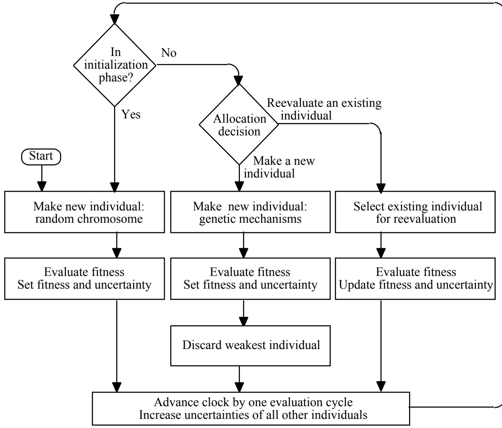  
Figure 1. Schematic of the Kalman-extended genetic algorithm

The nodes are treated as executing a random walk within a prescribed area. (The vehicles are not dedicated to the sensors, but are engaged in other activities.) As the nodes move, the link transmission probabilities change, and the optimal network configuration also changes. This movement of the nodes makes the problem environment nonstationary: The expected fitness (averaged over the stochastic variations in link transmissions for given node locations) of the time-varying optimal network changes over time as the nodes move.

In the GUI representation, a prescribed area on the ground of arbitrary shape and size is represented on a 2D Cartesian cell grid. Each cell represents a 160 by 160 meter square. A grid of 125 by 125 cells is used to cover a 20 by $2 0 \mathrm { k m }$ area. The GUI allows a user to select (with a mouse) the region in which the nodes will be allowed to move. The user may also specify the location of several “assets” and have the GUI calculate an elliptical region that contains them. Nodes may be restricted to either the interior of the prescribed region, or to the perimeter.

Only one sensor can occupy a cell. Provisions have been made for line-of-sight blockages, but no blockages are used in any of the following.

A baseline scenario has been constructed in which 25 vehicle/sensor/nodes are restricted to a roughly 10 by $2 0 \mathrm { k m }$ elliptical brigade-sized region. In addition, there is a stationary collection point. The vehicle-mounted sensors are initialized by assigning each sensor to a random cell within the prescribed area. A separate pseudorandom number generator is used to place and move the nodes, so that the same placements and motions can be repeated. Fig. 2 shows the locations of 25 randomly placed sensors. The discrete cell structure causes the blocky appearance of the region’s boundary.

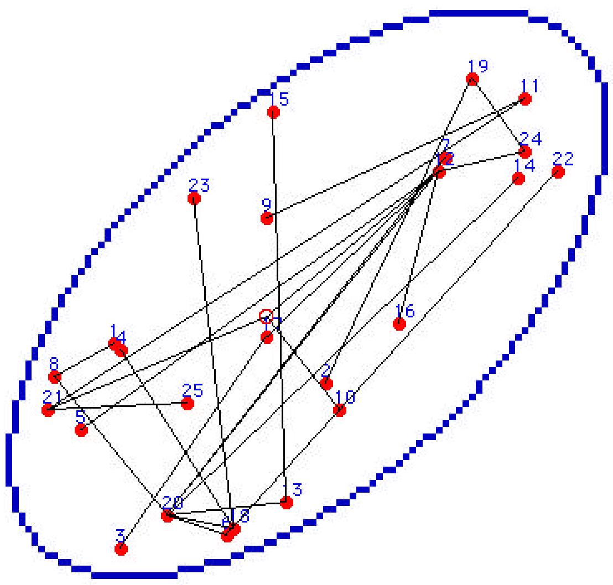  
Figure 2. Example scenario, showing a user-prescribed region, 25 randomly placed nodes, and a randomly generated link network. The collection point is shown as the open circle near the center.

# 4.2 Chromosome Representation of the Network Configuration

GA chromosomes can take a variety of forms [31]. The requirements on the form of the chromosome are 1) that it can be transformed into a possible solution of the problem, 2) that a sufficient region of the problem space can be represented, and 3) that a set of genetic operators can be constructed that allow for efficient exploration of the problem space. For this implementation, the chromosomes are simply fixed-length sequences of bounded integers. The chromosomal form (the genotype) can be transformed directly into the problem solution form (the phenotype).

Let $S$ designate the total number of nodes, exclusive of the collection point. The baseline scenario contains 25 sensor nodes. Each node has a unique integer ID in the range of 1 to $S .$ . Each node establishes a radio link to another node or to the collection point, to transmit its own data, and any data it receives from other nodes. The receiver of a node is specified by an integer in the range of 0 to $S .$ . A value of 0 indicates that the link is transmitting directly to the collection point, while any other value specifies the ID of the receiving node. The network configuration is specified completely by giving the receiver for each node [27]. This requires a total of $S$ integers, each in the range 0 to $S _ { \cdot }$ . The number of distinct network configurations that can be thus represented is $( S { + } \bar { 1 } ) ^ { S }$ . For 25 sensors, there are $2 . 3 ( 1 0 ) ^ { 3 5 }$ possible chromosomes representing as many alternative network configurations. The number of possible receivers could be reduced by one if nodes are forbidden from transmitting to themselves. This restriction could be built into the chromosomal encoding, thus reducing the number of representable networks to only $8 . 9 ( 1 0 ) ^ { 3 4 }$ . This representation was not selected, however, in order to keep the direct interpretation of the genes as receiver node ID’s.

There is an alternative representation that provides a one-to-one mapping to valid spanning trees. This is known as the Prüfer representation [32-34]. The Prüfer representation uses $S { - } 1$ integers, each in the range $[ 0 , S ]$ . An algorithm is required to translate between the Prüfer representation and the network configuration. The Prüfer representation has been found to work poorly for GA search, apparently because small changes in the chromosome often translate to great differences in the corresponding network. This conclusion was confirmed in personal communications with the authors of both [33] and [34].

# 4.3 Genetic Operators

Random valid network configurations are generated by a simple algorithm, as follows. Start with all nodes unconnected. Select an unconnected node at random. Select a receiver at random from the set containing the collection point and all connected nodes. The selected unconnected node takes the randomly selected receiver to be its receiver, and then becomes a connected node. Repeat this process until all nodes are connected. A randomly generated network linking 25 sensors to a collection point is shown in Fig. 2. The 25-integer representation of this network is {8 19 17 18 12 20 20 20 11 0 21 0 20 20 13 12 12 20 24 12 0 6 18 12 21}. Node 1 transmits to node 8, node 2 transmits to node 19, etc. Nodes 10, 12 and 21 transmit to the collection point, designated by the receiver index $^ { \circ }$ .

The mutation operator changes the receiver of a node to a different receiver, subject to the requirement that the new receiver is not upstream of the given node. The resulting network will thus be a valid tree.

The number of valid spanning-tree configurations is $( S { + } 1 ) ^ { ( S { - } \overline { { 1 } } ) }$ , which is less than the number of possible representable configurations by a factor of $S { + } 1$ . In order to use the “receiver representation,” a repair operator is needed to ensure that only valid spanning tree configurations are considered, i.e., all nodes and the collection point are included in the graph, and there are no cyclic paths in the graph. The repair operator first accepts all nodes that have a path to the collection point. This is a recursive process that first identifies nodes that are linked directly to the collection point, then nodes with two links in the path to the collection point, etc. Any remaining unconnected nodes are then connected to a randomly selected already-connected node, until all nodes have been added to the tree.

Although heuristic recombination operators have been developed for deriving a child network from two parent networks [35], this implementation uses a traditional two-point crossover operator, in an attempt to keep the algorithm separate from the application. Each integer-valued gene comes intact from one parent or the other. A child chromosome generated by crossover must undergo the repair operation to ensure a valid spanning tree.

# 4.4 Fitness Evaluation

The transmission fraction over a link depends on the length of the link, and also on such stochastic phenomena as obstructions, atmospheric conditions, jamming, antenna orientation, etc. At short distances, the expected transmission is nearly perfect, because the signal is much higher than the noise. There is a scale distance, $d ,$ where the expected transmission fraction across a link is reduced to one half; for significantly longer transmission distances, the transmission fraction will be very small (extinction and the $1 / r ^ { 2 }$ antenna gain relation degrade the signal, which becomes obscured in noise). There is another scale distance, $w _ { ; }$ , which characterizes the distance over which the transmission fraction drops from near one to near zero. A parameterized formulation is used for the expected transmission fraction from node $i$ to node $j$ :

$$
\begin{array} { r } { T _ { i j } = \frac { 1 } { 2 } - \frac { 1 } { \pi } \arctan \Bigl ( \frac { d _ { i j } - d } { w } \Bigr ) , } \end{array}
$$

where $d _ { i j }$ designates the distance from node $i$ to node $j$ . The transmission as a function of distance is shown in Fig. 3 for $d = 5 0 0 0 \mathrm { m }$ and $w = 1 0 0 \mathrm { m }$ . The actual transmission loss observed in a given measurement will differ from the expected value due to the stochastic phenomena mentioned above. If the path from a node to the collection point contains a sequence of links, the total transmission fraction from the node to the collection point is simply the product of the transmission fractions of each link in the path. Data loss within a node, between reception and re-transmission, is assumed to be negligible.

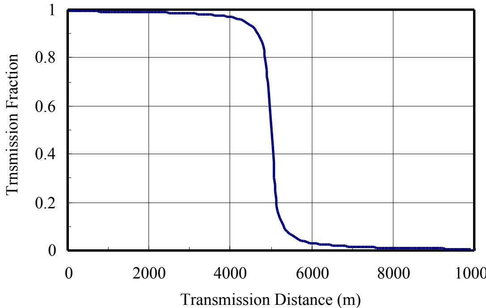  
Figure 3. The transmission fraction across a link, as a function of the length of the link, using the parameterized formulation

The fitness of a network configuration can be characterized in a variety of ways, depending on what is important in any given application. For this application, the network configuration fitness is taken to be the average, over all nodes, of the expected transmission loss from each node to the collection point. The goal of maximizing transmission fraction is then equivalent to a goal of minimizing message transmission loss. For the random network shown in Fig. 2, the average message loss fraction is 0.946.

# 4.5 Optimal Network Configuration

Dijkstra’s shortest-path algorithm [28] can be used to generate the network that minimizes the transmission losses from each node to the collection point, for a given set of node locations. The shortest-path tree algorithm minimizes the sum of the weights associated with all edges in the paths from any node to the root node. The weight associated with an edge is taken as the natural log of the inverse of the transmission fraction, so that minimizing the sum of the weights along a path is equivalent to maximizing the total transmission fraction along the path. The shortest-path network is shown in Fig. 4, where the sensors have the same locations as in Fig. 2. For this network configuration, the average message loss fraction is 0.03185.

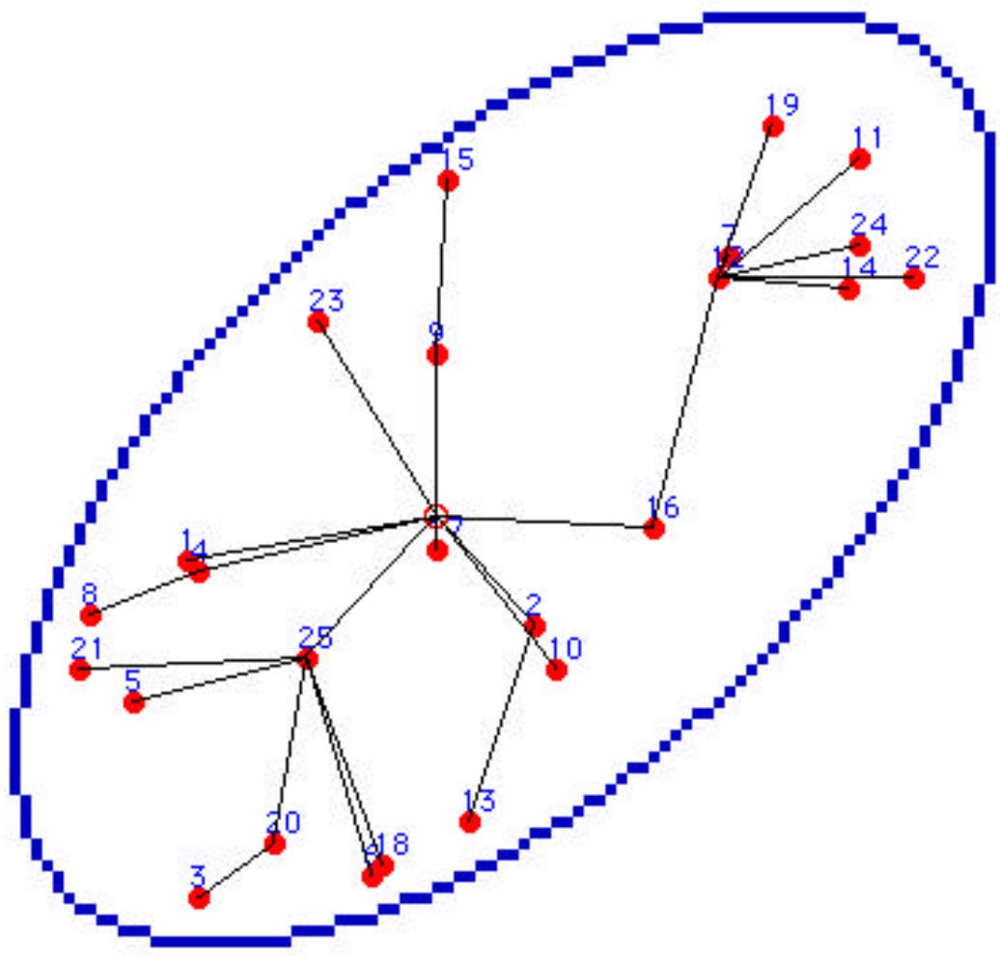  
Figure 4. The shortest-path tree for 25 randomly located nodes.

# 4.6 Performance of the Basic Genetic Algorithm for Static, Noiseless Case

Before setting up the KGA, the basic GA is run against a static, noiseless case. This ensures that the solution will converge to the optimal, and provides an estimate of how many individuals must be created and evaluated. Fig. 5 shows how the fitness (characterized by the network transmission loss) of the best GA solution improves during the course of a typical GA search for a case in which the nodes do not move and there is no uncertainty in the fitness evaluations.

For the example shown in Fig. 5, the population holds up to 100 individuals. Parents are selected on a power-law rank-based measure, with the most-fit individual being 2.5 times more likely to be selected than would occur if all individuals were equally likely to be selected. The probability of selecting the $i ^ { \mathrm { { t h } } }$ -ranked individual is given by $[ i ^ { \beta } - ( i - 1 ) ^ { \beta } ] / N ^ { \beta }$ , where $\beta { = } \mathrm { l n } ( N / 2 . 5 ) / \mathrm { l n } ( N )$ , and $N$ is the population size. $8 5 \%$ of new individuals are created by two-point crossover from two parents, and the remaining $1 5 \%$ are created by duplicating an existing individual. In both cases, the resulting child is repaired and mutated. The mutation rate undergoes periodic annealing to produce a punctuated equilibrium effect. The mutation rate drops from $4 / S$ down to $1 / S$ over successive epochs of 250 evaluation cycles each. At the beginning of each annealing cycle, the algorithm explores the solution space, while at the end of the annealing cycle, the algorithm tries to find local optima. The

performance of the GA is insensitive to the values of many of these parameters (the population size of 100, the 2.5 first-rank preference factor, the $8 5 \%$ crossover generation, the initial and final epoch mutation rates, the 250 cycle epoch duration).

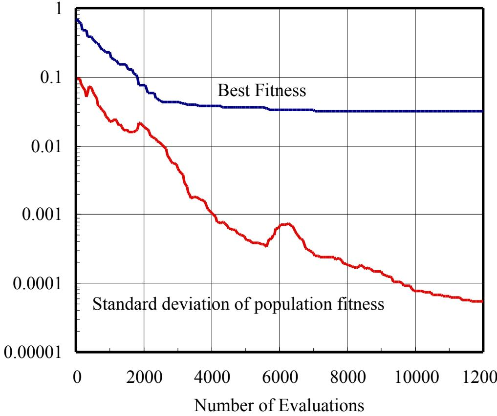

Figure 5. The fitness of the best individual obtained with a GA for a static, noiseless case. Also shown is the standard deviation of fitness of the population of 100 individuals.

The nodes start and remain at the locations shown in Fig. 2. The initial random individual solution, shown in Fig. 2, has a transmission loss of 0.9459, which is $28 7 0 \%$ worse than the fitness of the optimal configuration (which has transmission $\mathrm { l o s s } = 0 . 0 3 1 8 5$ ). After an initial population of 100 random individuals is created and evaluated, the best individual has a transmission loss of 0.6316, which is $18 8 3 \%$ worse than optimal. After 2500 evaluation cycles (i.e., 25 generation-equivalents), the exponential improvement begins to flatten out. At that point, the best transmission loss attained was 0.04550, which is $43 \%$ worse than optimal. It requires 8150 evaluation cycles to reach a solution within $1 \%$ of optimal (transmission $\mathrm { l o s s } = 0 . 0 3 2 1 7 $ ). The GA finds the exact optimal solution after 10200 evaluation cycles (i.e., 102 generations of complete replacement). The continual reduction in the standard deviation of population fitness indicates the convergence of the population. However, when a new solution is found that is significantly better than the best current solution, the standard deviation of the population fitness will increase until the whole population begins to benefit from the discovery. In dozens of similar runs, the optimal solution was always obtained, with the number of required evaluations ranging from 5000 to 17000.

# 4.7 Implementation of environmental dynamics

A simulation is run in which the time is advanced in steps of duration . During each time step, the fitness of one network configuration is evaluated, as prescribed by the KGA. In addition, during each time step, a sensor may move $1 6 0 \mathrm { m }$ to an adjacent, unoccupied cell, causing a change in the environment. In order to explore sensitivity of the KGA to process noise, the expected change in fitness during a time step can be varied by controlling how often sensors are moved. If, for example, sensors are moved (to one of the eight nearest-neighbor cell locations) at a rate of one movement per 50 evaluation cycles, the process noise variance is found to average approximately 5.24E-10 per cycle.

During the 20 time steps which would be required to re-evaluate and reproduce all members of a 10- member population, the process noise would be ${ \sim } 1 0 \mathrm { E } { - } 8 $ , corresponding to a typical fitness change of ${ \sim } 0 . 0 0 0 1$ between re-evaluations of a given individual. This process noise level is about one part in 300 of the fitness of typical near-optimal network configurations in the baseline scenario. Fig. 6 shows how the fitness of the optimal solution degrades over time due to process noise (environmental change) if the network (the receiver for each node) remains unchanged. The result is for the $Q = 5 . 2 4 \mathrm { E } \mathrm { - } 1 0$ per evaluation cycle process noise level. Starting with the sensor configuration shown in Fig. 2 and incurring a total of 5000 node movements (250,000 evaluation cycles, 50 cycles per node movement), the fitness of the optimal configuration ranges from 0.0263 to 0.0359, with a mean value of 0.0299, as shown in the lower line of Fig. 6.

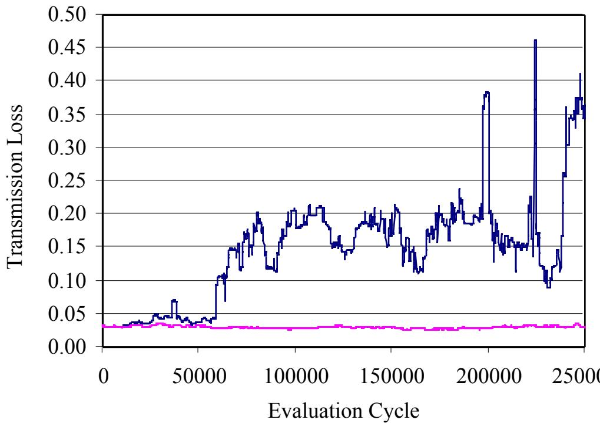  
Figure 6. Degradation of fixed solution due to environmental change. The upper line shows the transmission loss of an unchanging network configuration which was initially the optimal configuration. The lower line shows the transmission of the optimal configuration which is adjusting continually to changing environmental conditions.

The process noise rate can be calculated adaptively using a fixed-gain recursive filter and the evaluated fitness changes caused by the sensor movements. Resulting instability has been observed, but not investigated further.

# 4.8 Implementation of observation noise

The observation noise, $R$ , is implemented as follows. The transmission fraction over a link depends not only on the length of the link, but also on stochastic factors such as the atmospheric conditions and line-of-sight obstructions. These stochastic factors contribute to the observation noise that gives variation in the actual fitness of a network configuration. In the test-bed, observation noise is added to average transmission fraction of a network configuration whenever it is evaluated. An evaluation of the fitness of a given network configuration for a given set of node positions is artificially given an observation error, by adding $( 2 r { - } 1 ) \mathrm { s q r t } ( 3 R )$ , where $r$ is a random number between 0 and 1. This produces a distribution of observation noise with a variance of $R$ .

# 5. KGA Performance Results

# 5.1 KGA parameters

The chromosome consists of a sequence of 25 integers, each in the range of [0, 25]. The population size is 10 individuals. The first 100 individuals are created as random network configurations. All subsequent new individuals are generated by genetic operations on the individuals extant in the population. Evaluation cycles are used alternately for new individuals and re-evaluation of existing individuals, so that half of the cycles are spent on each. Parental selection uses the power-law rank-based formulation described in section 4.6, using the population size of 10. The mutation rate anneals periodically, so that 4 genes are mutated at the beginning of epochs, gradually reducing until only 1 gene is mutated by the end of the epoch (250 cycles per epoch). The implementation does not allow duplicate chromosomes – if any are generated, they are discarded and replaced before evaluation.

The performance of GA search (e.g. how quickly and reliably it converges) can be validated by repeating the search multiple times with different random number seeds. A GA search that typically requires 10,000 fitness evaluations to find the optimal solution might be run 25 times to validate the search performance. For the KGA, this level of validation can be obtained by running a single simulation for 250,000 evaluation cycles.

# 5.2 Baseline results

A simulation was run in which the observation noise variance of the fitness (the message loss fraction) was set to $R = { { 1 0 } ^ { - 8 } }$ . Since the message loss fraction of good configurations is around 0.03, the standard deviation of the observation noise of 1E-4 is about one part in 300. For this baseline case, the process noise variance is approximately 5.24E-10 per cycle, which is achieved by moving the sensors at the rate of one movement per 50 cycles. As described above, for a population size of 10, this process noise standard deviation is about one part in 300 between re-evaluations of a typical individual.

Fig. 7 shows the fractional error of the actual fitness, $f _ { K G A } .$ , (average message loss rate, averaged over the stochastic observation noise) of the best member of the population, relative to the fitness, $f _ { D i j k s t r a } ,$ of the optimal “Dijkstra” network configuration, i.e. $( f _ { K G A } - f _ { D i j k s t r a } ) / f _ { D i j k s t r a }$ . Initially, when the KGA has evaluated only one random configuration (that shown in Fig. 2) the fractional error is $28 \%$ . As the KGA generates and evolves its population of individual solutions, the fractional error drops. Initial convergence is seen to be attained after about 10,000 evaluation cycles. After initial convergence, the KGA solution is only $1 . 0 9 \%$ worse than optimal, on average.

Several events can be seen in Fig. 7 as spikes in the fractional error. These occur when the motion of the sensors causes the optimal network configuration to undergo a significant restructuring. The fractional error between the best KGA solution and the optimal solution rises on these occasions, but then drops back down as the KGA discovers the new configuration. Note that these recoveries require many fewer cycles than the 10,000 time steps required to reach near-optimal solutions beginning from scratch.

# 5.3 Excursion: Observation Noise

An excursion from the baseline case was examined, in which the observation noise variance is varied from $R = 1 0 ^ { - 8 }$ up to $R = 1 0 ^ { - 4 }$ . The process noise was set to $Q = 5 . 2 4 ( 1 0 ) ^ { - 1 1 }$ per cycle. The population size is 10 individuals, and $50 \%$ of evaluation cycles are used to re-evaluate existing individuals. Fig. 8 shows how the KGA is able to track the optimal configuration at these noise levels. The values shown are obtained by averaging the

fractional error of the best KGA solution relative to the optimal Dijkstra solution, over 230,000 evaluation cycles, starting after an initial convergence period of 20,000 evaluation cycles. At $R = 1 0 ^ { - 5 }$ , the uncertainty of a fitness observation is approximately $10 \%$ of the fitness value, and the KGA can track the optimal solution to within about $2 \%$ relative error.

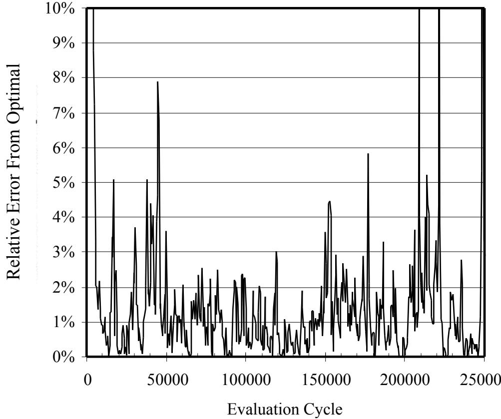  
Figure 7. The relative error, $( f _ { K G A } - f _ { D i j k s t r a } ) / f _ { D i j k s t r a }$ of the KGA solution, for a process noise level of $5 . 2 4 ( 1 0 ) ^ { - 1 0 }$ , and an observation noise level of $R = { { 1 0 } ^ { - 8 } }$ . The population size is 10. Half of the evaluation cycles are apportioned to new individuals. The transmission loss of the optimal configuration ranges from 0.0263 to 0.0359.

There is a class of problems in which the environment is stationary $( Q = 0$ ), but the fitness evaluations are noisy. This class includes problems that are complicated enough to require time-consuming Monte Carlo methods or simulation approaches to evaluate the fitness of solutions. In this case, if the uncertainty after the initial evaluation of a solution is $R$ , then the uncertainty after a total of $n$ evaluations will be $R / n$ . This follows from repeated application of Eq. (3), or it could be obtained from statistical combination of $n$ independent observations, each with variance $R$ . As in the case of the nonstationary environment with noisy evaluations, a method is required to determine when to generate a new individual, and when to re-evaluate an existing individual. The KGA can be applied as is for stationary environments. In operation, the KGA discards very poor solutions immediately after their first evaluation. Poor solutions that appear to be better than they are due to fortuitous combination of stochastic effects can be discarded after a few re-evaluations when their poor fitness becomes apparent. Relatively fit solutions survive long enough to receive further re-evaluations. This clearly provides an improvement in computational efficiency over the common approach of re-evaluating each new solution until its uncertainty falls below some arbitrarily selected level, and then applying the basic GA using the resulting fitness estimate.

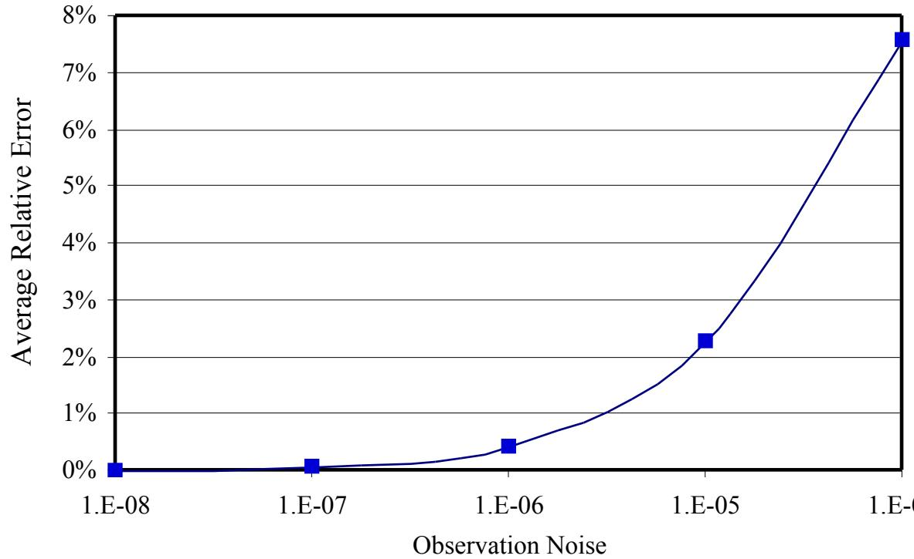  
Figure 8. The time-averaged relative error, $( f _ { K G A } - f _ { D i j k s t r a } ) / f _ { D i j k s t r a }$ of the KGA solution, for several observation noise levels. The process noise level is $Q = 5 . 2 4 ( 1 0 ) ^ { - 1 1 }$ , and the population size is 10. Half of the evaluation cycles are apportioned to new individuals.

# 5.4 Excursion: Process Noise

Another excursion from the baseline case was examined in which the process noise was varied over a factor of 100. This was accomplished by moving the sensors at a rate of one sensor movement every 5, 50, or 500 evaluation cycles. The observation noise variance was fixed at $R = { { 1 0 } ^ { - 8 } }$ . The population size was 10 individuals, and $50 \%$ of evaluation cycles are used for re-evaluation of existing individuals. Fig. 9 shows the relative error, again averaged over 230,000 time steps, excluding the first 20,000 cycles. A factor of ten reduction in process noise from baseline allows the KGA to track the optimal solution almost perfectly (time-averaged relative error of $0 . 0 0 1 0 \%$ . On the other hand, a factor of ten increase in process noise variance degrades the KGA’s ability significantly, raising the average relative error from $1 . 0 9 \%$ to $1 7 . 5 \%$ worse than optimal. The ability of the KGA to track the optimal solution degrades much more sharply with process noise than with observation noise. This is because the process noise continuously raises the uncertainty of all individuals in the population, while the observation noise only affects one individual at a time.

# 5.5 Excursion: Allocation between new individuals and re-evaluations

The sensitivity of the KGA to the fraction of cycles allocated to re-evaluating existing individuals was examined next. Five ratios were examined: 1 new individual per 4 re-evaluations; 2 new individuals per 3 reevaluations; 1 new individual per re-evaluation; 3 new individuals per 2 re-evaluations; and 4 new individuals per re-evaluation. The process noise was $Q = 5 . 2 4 ( 1 0 ) ^ { - 1 1 }$ per cycle, which is an order of magnitude below the baseline. The observation noise variance was $R = { 1 0 } ^ { - 8 }$ . The population size was 10 individuals. Fig. 10 shows the relative error, again averaged over 230,000 evaluation cycles, beginning after the first 20,000 cycles. The performance of the KGA is degraded in both the extreme cases. Too much expenditure on new individuals allows the existing individuals to become out of date. Too much expenditure on re-evaluating existing individuals prevents effective search of new alternatives.

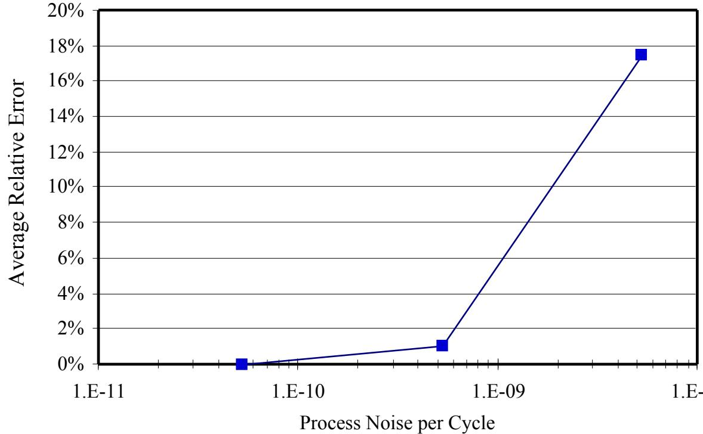  
Figure 9. The time-averaged relative error, $( f _ { K G A } - f _ { D i j k s t r a } ) / f _ { D i j k s t r a }$ of the KGA solution, for several process noise levels, at an observation noise level of $R = { 1 0 } ^ { - 8 }$ . The population size is 10. Half of the evaluation cycles are apportioned to new individuals.

Several attempts were made to develop a more sophisticated way to decide whether to generate a new individual or re-evaluate an existing individual. Intuitively, when the uncertainty of all individuals is low, evaluation cycles should not be wasted on re-evaluations but should instead be dedicated to new individuals. There are several criteria that might be applied to determine what qualifies as high or low uncertainty level. One intuitive criteria is to compare the uncertainty to the variance of the population fitnesses. It could also be compared to the observation noise variance, or the process noise variance per cycle multiplied by some relevant number of cycles. If the variance of the population fitnesses is much larger than the uncertainty of a particular individual, then the fitness of that individual relative to the rest of the population can be ascertained reliably. Likewise, if the uncertainty of an individual is much greater than the variance of the population fitness, the merit of that individual relative to the existing population cannot be determined reliably unless its fitness is extremely poor. A fairly simple allocation strategy was developed based on these notions: When the uncertainty of the most uncertain existing individual exceeds the variance of the population fitness, the most uncertain existing individual is re-evaluated. On the other hand, a new individual is generated whenever the uncertainty of all existing individuals is below the variance of the population fitness. This strategy usually worked as well as a well-chosen fixed allocation fraction (and much better than a poor fixed allocation fraction). However, situations arose occasionally where this strategy gets stuck always allocating either one way or the other. Further research may allow the KGA to allocate evaluation cycles in a robust and effective way, without the need to specify a fixed allocation fraction.

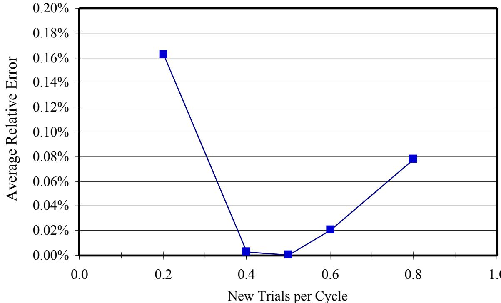  
Figure 10. The time-averaged relative error, $( f _ { K G A } - f _ { D i j k s t r a } ) / f _ { D i j k s t r a }$ of the KGA solution, for process noise level $Q =$ $5 . { \overset { \smile } { 2 } } 4 ( 1 0 ) ^ { - 1 1 }$ and an observation noise level of $R = { { 1 0 } ^ { - 8 } }$ . The population size is 10.

# 5.6 Excursion: Population Size

The KGA was then run with various population sizes. The process noise was $Q = 5 . 2 4 \mathrm { E } \mathrm { - } 1 1$ per cycle, which is an order of magnitude below the baseline. The observation noise variance was $R = 1 0 ^ { - 8 }$ . Half of the evaluation cycles were allocated to re-evaluation of existing individuals. Fig. 11 shows the time-averaged relative error of the best KGA solution.

At a population size of 10, the KGA tracks the optimal solution to within $0 . 0 0 1 \%$ . When the population is too small, the lack of diversity degrades the power of the search method. The KGA with a population size of 1 is equivalent to search by trial and error, also known as pivot and offset search. New individuals are produced by mutations of the single maintained individual. The KGA with a population of 10 tracks the optimal solution 700 times better than a trial-and-error search. When a large population size is used, evaluation cycles are wasted reevaluating unfit members of the population.

Preliminary investigations have been made to develop a strategy to allow the KGA to adjust the population size during operation. In the previous section, it was argued that each individual’s uncertainty ought to be held below the variance, $V ,$ of the population fitnesses. When the uncertainty of an individual rises just above $V ,$ it will be re-evaluated, after which its uncertainty will be reduced to $V R / ( V { + } R )$ , as per Eq. (3). After $n$ cycles, its uncertainty will increase by $n Q .$ , according to Eq. (1). After $N _ { m a x } { = } V ^ { 2 } / ( Q ( V { + } R ) )$ cycles, its uncertainty will have risen back up to $V ,$ and it will need re-evaluation. If the population size is equal to $N _ { m a x } ,$ all evaluation cycles would have to be expended on re-evaluating existing individuals just to keep their uncertainty low enough to know whether or not they belong in the population. For larger population size, even spending all evaluation cycles on re-evaluating existing individuals is insufficient to prevent all individuals from becoming hopelessly out of date. If the population size is smaller than $N _ { m a x } ,$ , it will be possible to hold the uncertainties of existing individuals below $V .$ while having evaluation cycles available for new individuals. For a population size of $N _ { 1 } =$ $V ^ { 3 } / ( \mathcal { Q } ( V { + } R ) ^ { 2 } )$ , it should be possible to expend half of the evaluation cycles on new individuals, while maintaining the uncertainties of existing individuals at less than $V .$ A dynamic population size was implemented by using $N _ { 1 }$ as the target population size. The population is allowed to grow by one after a new individual is created whenever the current population size is less than the target population size. The population is reduced by one after a reevaluation whenever the population size exceeds the target population size. With this implementation, the population size was observed to fluctuate rapidly over a large range (from a few individuals up to thousands). Further research may lead to a robust approach to dynamic adjustment of the population size.

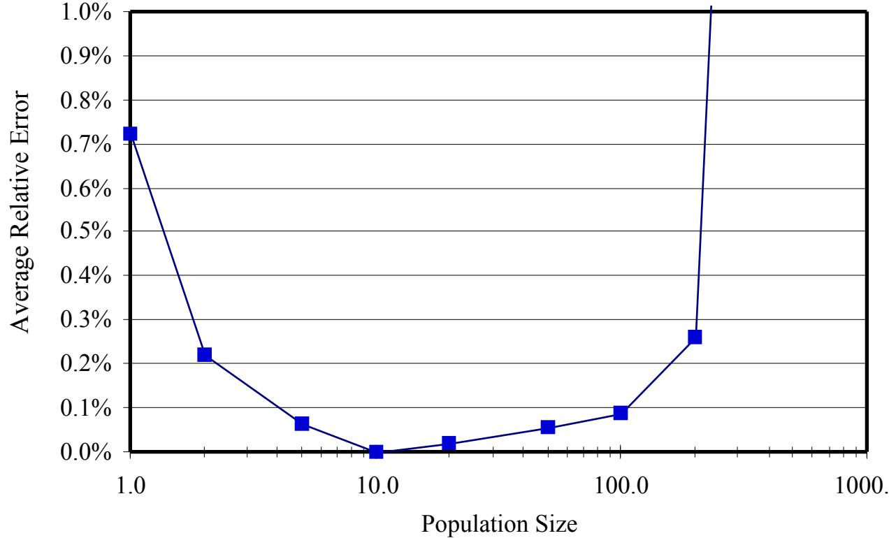  
Figure 11. The time-averaged relative error, $( f _ { K G A } - f _ { D i j k s t r a } ) / f _ { D i j k s t r a }$ of the KGA solution, for process noise level $Q =$ $5 . { \bar { 2 } } 4 ( 1 0 ) ^ { - 1 1 }$ and an observation noise level of $R = 1 0 ^ { - 8 }$ . Half of the evaluation cycles are apportioned to new individuals.

# 6. Conclusion

In a large class of problems, the fitnesses of solutions have inherent uncertainty. Proper treatment of this uncertainty can enable GAs, and other evolutionary algorithms, to be used for ongoing search in these problems. It is trivial to extend the GA structure to include the uncertainty: simply associate a second real-valued parameter (the uncertainty) with each individual, in addition to the real-valued parameter (the fitness) that it already uses. It has been shown that the Kalman formulation provides the mechanics for updating the fitness and uncertainty of an individual, after a re-evaluation or after the passage of time. These mechanics are contained in three simple equations (1-3) which are easy to interpret and implement.

The primary augmentation to the basic GA is that some fitness evaluation cycles are expended in reevaluating existing individuals. The simplest possible allocation heuristic, in which a fixed fraction of the evaluation cycles is allocated to re-evaluating existing individuals, has been found to be effective. Best performance was obtained when one existing individual is re-evaluated for every new individual generated, if the population is of proper size. A simple heuristic was also found to be effective for selecting which existing individual should be re-evaluated when an evaluation cycle is to be expended on re-evaluation. Of the existing individuals with fitness in excess of the population mean minus the population standard deviation, the one with the greatest uncertainty is selected for re-evaluation.

Preliminary investigation into more sophisticated approaches to deciding when to create a new individual shows promise. In contrast to the basic GA, in the KGA there is an optimal population size. Preliminary investigation of dynamic population size heuristics also shows promise.

Both the determination of which individual is taken to represent the best current solution and the genetic operation used to select parents for reproduction make use of the estimated fitness only. Alternative formulations using uncertainty as well as estimated fitness may be more effective. For example, individuals could be selected for reproduction on an uncertainty-compensated fitness (e.g., $f \mathrm { - } \sqrt { P } )$ rather than on the fitness alone. Preliminary investigation did not conclusively demonstrate superiority of using uncertainty-compensated fitness rather than fitness alone, but clearly given a choice between two identically fit solutions, the more certain one ought to be preferred.

The overall conclusion of this work is that the Kalman formulation integrates into the genetic algorithm formulation in a compelling way, creating a Kalman-extended genetic algorithm that can perform ongoing directed searches in nonstationary, noisy environments.

# Список литературы

1. J. H. Holland, Adaptation in Natural and Artificial Systems, MIT Press, Cambridge, MA (1992).   
2. D. E. Goldberg, Genetic Algorithms in Search, Optimization and Machine Learning, Addison-Wesley, Reading, MA (1989).   
3. D. B. Fogel, Evolutionary Computation: Toward a New Philosophy of Machine Intelligence, IEEE Press, Piscataway, NJ (1995).   
4. R. E. Kalman, “A new approach to linear filtering and prediction problems,” J. Basic Eng. part D, vol. 82, pp 35-45 (1960).   
5. R. E. Kalman and R. S Bucy, “New results in linear filtering and prediction theory,” J. Basic Eng. part D, vol. 83, pp 95-   
108 (1961).   
6. S. Haykin, Adaptive FilterTheory, Prentice-Hall, Englewood Cliffs, NJ (1986).   
7. H. Plotkin, Darwin Machines and the Nature of Knowledge, Harvard University Press, Cambridge, MA (1994).   
8. P. E. Howland, “Target tracking using television-based bistatic radar,” IEE Proc. Radar Sonar and Navigation, vol. 146, no. 3, pp. 166-174 (June 1999).   
9. M. J. Arcos, C. Alanso, and M. C. Ortiz, “Genetic-algorithm-based potential selection in multivariant voltammetric determination of indomethacin and acemethacin by partial least-squares,” Electrochimica Acta, vol. 43, no. 5-6, pp. 479-   
485 (1998).   
10. W. S. Chaer, R. H. Bishop, and J. Ghosh, “A mixture-of-experts framework for adaptive Kalman filtering,” IEEE Trans. Systems, Man, and Cybernetics, Part B-Cybernetics , vol. 27, no. 3, pp. 452-464 (June 1997).   
11. K. G. Berketis, S. K. Katsikas, and S. D. Likothanassis, “Multimodal partitioning filters and genetic algorithms,” Nonlinear Analysis-Theory Methods & Applications, vol. 30, no. 4, pp. 2421-2427 (Dec 1997).   
12. L. A. Wang, J. Yen, “Extracting fuzzy rules for system modeling using a hybrid of genetic algorithms and Kalman filter,” Fuzzy Sets and Systems, vol. 101, no. 3, pp. 353-362 (Feb 1, 1999).   
13. S. E. Aumeier, J. H. Forsmann, “Evaluation of Kalman filters and genetic algorithms for delayed-neutron nondestructive assay data analyses,” Nuclear Technology, vol. 122, no. 1, pp. 104-124 (April 1998).   
14. K. S. Tang, K. F. Man, S. Kwong, “GA approach to time-variant delay estimation,” Proc. Int. Conf. on Control and Information, Hong Kong, pp. 173-175 (1995).   
15. D. E. Goldberg and R. E. Smith, “Nonstationary function optimization using genetic dominance and diplody,” in J. J. Grefenstette, Ed., Proceedings of the Second International Conference on Genetic Algorithms and their Applications, Lawrence Erlbaum Associates, Hillsdale, NJ, pp. 59-68 (1987).   
16. J. J. Grefenstette, “Genetic algorithms for changing environments,” in R. Männer and B. Manderick, Eds., Parallel Problem Solving from Nature 2, Elsevier, Amsterdam, pp. 137-144 (1992).   
17. H. G. Cobb, “An investigation into the use of hypermutation as an adaptive operator in genetic algorithms having continuous, time-dependent nonstationary environments,” Naval Research Laboratory Memorandum Report 6760 (1990).   
18. J. H. Holland, “Escaping brittleness: the possibilities of general-purpose learning algorithms applied to parallel rule-based systems,” in R. S. Michalski, J. G. Carbonell, and T. M. Mitchell, Eds., Machine learning, an artificial intelligence approach, vol. II, Morgan Kaufmann, Los Altos, CA, pp. 593-623 (1986).   
19. S. W. Wilson, “Classifier fitness based on accuracy,” Evolutionary Computation, vol. 3, No. 2, pp. 149-175 (1995).   
20. P. L. Lanzi and M. Colombetti, “An extension to the XCM classifier system for stochastic environments,” in W. Banzhaf, et al., Eds., Proceedings of the Genetic and Evolutionary Computation Conference (GECCO-99), Morgan Kaufmann, San Francisco, CA, pp. 353-360 (1999).   
21. S. W. Wilson, “State of XCS classifier system research,” in P. L. Lanzi, W. Stolzmann, and S. W. Wilson, Eds., Learning Classifier Systems From Foundations to Applications, Lecture Notes in Artificial Intelligence 1813, Springer-Verlag, Berlin, pp. 63-81 (2000).   
22. P. D. Stroud, “Evolution of cooperative behavior in simulation agents,” in S. K. Rogers, et al., Eds., Applications and Science of Computational Intelligence, Proceedings of SPIE vol. 3390, pp. 243-252 (April 1998).   
23. P. D. Stroud, “Adaptive simulated pilot,” Journal of Guidance, Control, and Dynamics, vol. 21, no. 2, pp. 352-354 (March-April 1998).   
24. P. D. Stroud, “Learning and adaptation in an airborne laser fire controller,” IEEE Transactions on Neural Networks, vol. 8, no. 5, pp. 1078-1089 (Sept 1997).   
25. P. D. Stroud, and R. C. Gordon, “Automated military unit identification in battlefield simulation,” in F. A. Sadjadi, Ed., Automatic Target Recognition VII, Proceedings of SPIE vol. 3069, pp. 375-386 (April 1997).   
26. P. D. Stroud, C. T. Cunningham, G. Guethlein, “Rapid detection and classification of aerosol events based on changes in particle size distributions,” in P. J. Gardner, Ed., Chemical and Biological Sensing, Proceedings of SPIE vol. 4036, (April 2000).   
27. L. J. Dowell, “Optimal configuration of a command and control network: balancing performance and reconfiguration constraints,” in J. Carroll, et al., Eds., Proceedings of the 2000 ACM Symposium on Applied Computing, ACM Press, pp. 94-98 (March 2000).   
28. E. W. Dijkstra, “A Note on Two Problems in Connexion with Graphs,” Numerische Mathematik 1, pp. 269-271 (1959).   
29. E. Minieka, Optimization algorithms for networks and graphs, M. Dekker, New York (1978).   
30. K. T. Ko, K. S. Tang, C. Y. Chan, K. P. Man, S. Kwong, “Using genetic algorithms to design mesh network,” Computer, vol. 30, No. 8 (August 1997).   
31. Z. Michalewicz, Genetic Algorithms $^ +$ Data Structures $=$ Evolution Programs, 2nd ed., Springer, Berlin (1992).   
32. H. Prüfer, “Neuer beweis eines satzes über permutationen,” Archives of Mathematical Physics, vol. 27, pp. 742-744 (1918).   
33. M. Gen and Y.-Z. Li, “Spanning tree-based genetic algorithm for bicriteria transportation problem,” ComputersInd. Engng., vol. 35, nos. 3-4, pp. 531-534 (1998).   
34. T. H. Reijmers, R. Wehrens, L. M. C. Buydens, “Quality criteria of genetic algorithms for construction of phylogenetic trees,” Journal of Computational Chemistry, vol. 20, No. 8, pp. 867-876 (1999).   
35. D. K. Smith and G. A. Walters, “An evolutionary approach for finding optimal trees in undirected networks,” European Journal of Operational Research, vol. 120, pp.593-602 (2000).