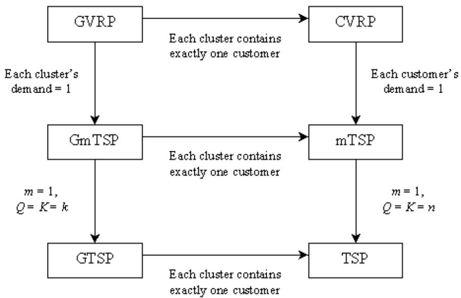
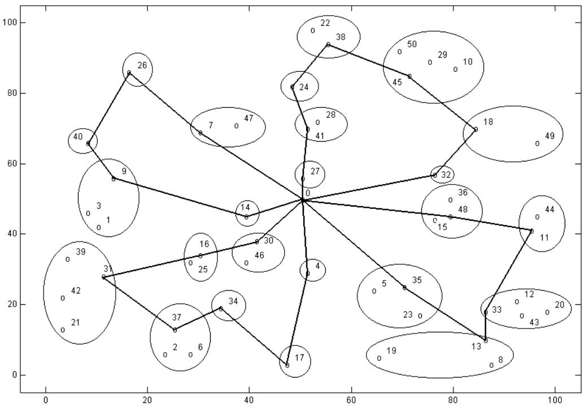
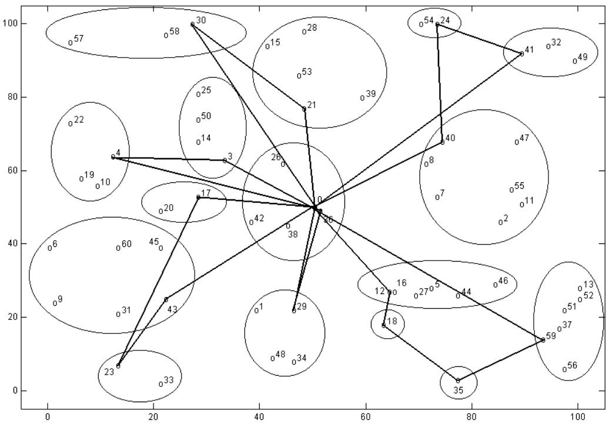

# Integer Linear Programming Formulation of the Generalized Vehicle Routing Problem

Imdat Kara, Tolga Bektas

Baskent University, Dept. of Industrial Engineering, Baglica Kampusu, Eskisehir Yolu 20. km., Ankara, Turkey

# Abstract

The Generalized Vehicle Routing Problem (GVRP) is an extension of the Vehicle Routing Problem (VRP) defined on a graph in which the nodes (customers, vertices) are grouped into a given number of mutually exclusive and exhaustive clusters (nodesets). In this paper, an integer linear programming formulation of the GVRP with ${ \mathsf { O } } ( { \mathsf { n } } ^ { \circ } )$ binary variables and O(n ) constraints is presented. It is shown that, under specific circumstances, the proposed model reduces to the well-known routing problems. The computational performance of the models solved using a commercial code on test problems are also presented.

Key words: Vehicle Routing Problem, Integer Programming, Traveling Salesman Problem

Presented in $5 ^ { \mathrm { t h } }$ EURO/INFORMS Joint International Meeting, July 6-10 2003 İstanbul, Turkey

# 1 Introduction

Problems associated with determining optimal routes for vehicles from one or several depots to a set of locations/customers are known as Vehicle Routing Problems (VRPs) and have many practical applications in the field of distribution and logistics. A wide body of literature exists on the problem (for an extensive bibliography, see Laporte and Osman [16] and the book edited by Ball et al. [2]). The Generalized Vehicle Routing Problem (GVRP) is a generalization of the VRP.

Let $G = ( V , A )$ be a directed graph with $V = \{ 0 , 1 , 2 , \ldots , n \}$ as the set of vertices and $A = \{ ( i , j ) : i , j \in V , \ i \neq j \}$ as the set of arcs. We assume that $| V | = n + 1$ , node 0 represents the depot and remaining $n$ nodes represent geographically dispersed customers. The node set $V$ is clustered into $k$ mutually exclusive and exhaustive subsets where $V _ { 0 } = \{ 0 \}$ . Each customer has a certain amount of demand and the total demand of each cluster can be satisfied via any of its nodes. There exist $m$ identical vehicles, each with a capacity $Q$ . There also exists a nonnegative cost $c _ { i j }$ associated with each arc $( i , j ) \in A$ . The GVRP consists of finding minimum total cost tours of $m$ vehicles starting and ending at the depot, such that each cluster should be visited by exactly one vehicle at any of its nodes, the entering and leaving nodes of each cluster is the same and the load of each vehicle does not exceed its capacity $Q$ . For each vehicle, we also have the restriction that, the returning load to the depot in case of collection or the starting load from the depot in case of delivery cannot be less than a predetermined lower bound.

A special case of the VRP is the Generalized Traveling Salesman Problem (GTSP), which is an extension of the well known Traveling Salesman Problem. An extensive research exists on the GTSP (see for example, Laporte and Nobert [14], Noon and Bean [18], Fischetti et al. [6], Dimitrijevi´c and Saric [5], Fischetti et a. [7] ad Ben-Arieh et al. [3]). Integer linear programming formulations are presented by Laporte and Nobert [14] and Fischetti et al. [6], [7], which are based on an exponential number of subtour elimination constraints. Other research mentioned above focus on the transformation of the GTSP into the TSP. We could not observe any formulation for the multiple traveller case of the GTSP, namely the Generalized Multiple Traveling Salesman Problem (GmTSP). In fact, the GVRP can be considered as an extension of the GmTSP where vehicles have limited capacities and clusters have a demand to be satisfied. On the other hand, the GVRP is closely related with well-known location routing problems, where location and routing decisions are made simultaneously (see Laporte [12] and Min et al. [17]). The GVRP may also be considered as a special case of the capacitated location routing problem presented by Laporte et al. [15], where all tours start and end at the same node.

The GVRP and its special cases may arise in real-life applications such as loop material flow design, post-box collection, arc routing, computer operations, manufacturing, logistics, distribution of goods by sea to a potential number of harbours (see Laporte et al. [13], Ghiani and Improta [8]).

The GVRP has been introduced by Ghiani and Improta [8]. To the best knowledge of the authors, this is the only solution approach for the GVRP, where a transformation of the GVRP into a Capacitated Arc Routing Problem (CARP) is presented.

In this paper, we handle the GVRP with minimal and maximal load restrictions and present an integer linear programming formulation (ILPF) in the next section. Section 3 shows that the proposed formulation reduces to the ILPFs of the GmTSP, GTSP and CVRPs. Using these formulations, we solved test problems from the literature presented in Section 4. The paper concludes with some remarks and further suggestions given in Section 5.

# 2 Integer Linear Programming Formulation

Associated with the GVRP, we define the related sets, decision variables and parameters as follows:

# Sets:

$V = \{ 0 , 1 , 2 , \ldots , n \}$ : set of nodes corresponding to customers, where 0 represents the origin (depot).

Let $V$ be partitioned into mutually exclusive and exhaustive non-empty subsets $V _ { 0 } , V _ { 1 } , \dots , V _ { k }$ , each of which represents a cluster of customers, where $V _ { 0 }$ is the origin (depot).

# Decision Variables:

Define,

$$
\begin{array} { r } { x _ { i j } = \left\{ \begin{array} { l l } { 1 , \mathrm { ~ i f ~ a r c ~ } ( i , j ) \mathrm { ~ i s ~ o n ~ t h e ~ t o u r } , i \in V _ { p } , \ j \in V _ { l } , \ p \neq l , \ p , l = 1 , 2 \dots , k } \\ { \qquad } \\ { 0 , \mathrm { ~ o t h e r w i s e } } \end{array} \right. } \end{array}
$$

$y _ { p l }$ : flows from cluster $p$ into cluster $l$ , $\forall p \neq l , \ p , l = 1 , \ldots , k$

$u _ { p }$ : Load of a vehicle just after leaving cluster $p$ (collection case); or un

loaded amount from the vehicle just after leaving cluster $p$ (delivery case), $p = 1 , 2 , \ldots , k$ .

# Parameters:

Let,

• $c _ { i j }$ : cost of traveling from node $i$ to node $j , \_ i \ne j$ , $i \in V _ { p }$ , $j \in V _ { l }$ , $p \neq$ $\it l$ $\ l , p , l = 1 , \ldots , k$   
• $d _ { i }$ : demand of customer $i , \ i = 1 , 2 , \dots , n$   
• $q _ { l }$ : demand of cluster $l$ , $\begin{array} { r } { q _ { l } = \sum _ { i \in V _ { l } } d _ { i } , \ l = 1 , 2 , \dots , k } \end{array}$   
• $m$ : number of vehicles (tours)   
$\bullet$ $Q$ : capacity of each vehicle   
• $K$ : minimum load of each vehicle when it returns to the origin (in case of collection) or minimum starting load of a vehicle just before starting its trip (in case of delivery)

Constraints of the problem, under the heading to which they correspond to, are given below:

# Degree constraints:

For each cluster excluding $V _ { 0 }$ , there can only be a single outgoing arc to any other node belonging to other clusters. This is implied by the following constraints:

$$
\sum _ { i \in V _ { l } } \sum _ { j \in V \backslash V _ { l } } x _ { i j } = 1 , \qquad l = 1 , 2 , \ldots , k
$$

There can only be a single incoming (entering) arc to a cluster from any other node belonging to other clusters, excluding $V _ { 0 }$ . This is implied by the following

constraints:

$$
\sum _ { i \in V \backslash V _ { l } } \sum _ { j \in V _ { l } } x _ { i j } = 1 , \qquad l = 1 , 2 , \ldots , k
$$

There should be $m$ leaving arcs from and $m$ entering arcs to the home city (origin), which are implied by;

$$
\begin{array} { l } { \displaystyle \sum _ { i = 1 } ^ { n } x _ { 0 i } = m } \\ { \displaystyle \sum _ { i = 1 } ^ { n } x _ { i 0 } = m } \end{array}
$$

# Flow Constraints:

The entering and leaving nodes should be the same for each cluster, which is satisfied by;

$$
\sum _ { i \in V \backslash V _ { l } } x _ { i j } = \sum _ { i \in V \backslash V _ { l } } x _ { j i } , \qquad j \in V _ { l } , l = 1 , 2 , \ldots , k
$$

Flows from cluster $p$ to cluster $l$ is defined by $y _ { p l }$ . Thus, $y _ { p l }$ should be equal to the sum of $x _ { i j }$ ’s from $V _ { p }$ to $V _ { l }$ . Hence, we write

$$
y _ { p l } = \sum _ { i \in V _ { p } } \sum _ { j \in V _ { l } } x _ { i j } , \qquad p \neq l , p , l = 0 , 1 , 2 , \ldots , k
$$

Note that $y _ { p l }$ will automatically be $0$ or $1$ by the degree constraints given by

(1), (2), (3) and (4).

# Side and Subtour Elimination Constraints:

The maximum load of a vehicle and/or minimum returning load to the origin in the case of collection will be satisfied by the following constraints:

$$
\begin{array} { r l } { u _ { p } + ( Q - \overline { { q } } _ { p } - q _ { p } ) y _ { 0 p } - \overline { { q } } _ { p } y _ { p 0 } \leq Q - \overline { { q } } _ { p } , \quad } & { p = 1 , 2 , \ldots , k } \\ { u _ { p } + \overline { { q } } _ { p } y _ { 0 p } + ( q _ { p } + \overline { { q } } _ { p } - K ) y _ { p 0 } \geq q _ { p } + \overline { { q } } _ { p } , \quad } & { p = 1 , 2 , \ldots , k } \\ { y _ { 0 p } + y _ { p 0 } \leq 1 , \quad } & { p = 1 , 2 , \ldots , k } \end{array}
$$

where $\overline { { q } } _ { p } = m i n _ { l , l \neq p } \{ q _ { l } \}$ and $Q \ge K \ge q _ { p } + \overline { { q } } _ { p } , \forall p$ . (7), (8) and (9) are valid inequalities for both collection and delivery cases. If there is no restriction on the starting or the ending load of a vehicle, (8) will reduce to the following:

$$
u _ { p } + \overline { { q } } _ { p } y _ { 0 p } \geq q _ { p } + \overline { { q } } _ { p } , \qquad p = 1 , 2 , \ldots , k
$$

In addition to this, if a single customer visit is allowed, then (9) will be omitted.

Connectivity between clusters on a route will be satisfied by the following constraint:

$$
u _ { p } - u _ { l } + Q y _ { p l } + ( Q - q _ { p } - q _ { l } ) y _ { l p } \leq Q - q _ { l } , \qquad p \neq l , p , l = 1 , 2 , \ldots , k
$$

where $Q \geq q _ { p } + q _ { l } , \forall l \neq p$ .

# Nonnegativity Constraints:

$$
\begin{array} { r l } { x _ { i j } = 0 ~ \mathrm { o r ~ } 1 , } & { \quad \forall ( i , j ) } \\ { u _ { p } \geq 0 , } & { \quad \forall p } \\ { y _ { p l } \geq 0 , } & { \quad \forall ( p , l ) } \end{array}
$$

The integer linear programming formulation of the GVRP is given by:

$$
\begin{array} { r } { M ( 1 ) : M i n i m i z e \sum _ { i } \sum _ { j } c _ { i j } x _ { i j } : \mathrm { ~ s u b j e c t ~ t o ~ ( 1 ) - ( 1 4 ) . } } \end{array}
$$

In the above formulation, side and subtour elimination constraints ((7), (8), (9), (10) and (11)) are obtained from Desrochers and Laporte [4], Kara and Bektas [10] and Kara et al. [11]. The number of constraints implied by (1), (2), (3), (4), (5), (6), (7), (8), (9) and (11) are, $k , k , 1 , 1 , n , k ( k + 1 ) , k , k , k$ and $k ( k - 1 )$ , respectively, where $n$ is the number of customers, $k$ is the number of clusters and $k \leq n$ . Hence the total number of constraints is $2 k ^ { 2 } + 5 k + n + 2 \leq$ $2 n ^ { 2 } + 6 n + 2$ , i.e. $O ( n ^ { 2 } )$ . The total number of binary variables is $n ( n + 1 )$ , i.e. $O ( n ^ { 2 } )$ . $y _ { p l }$ ’s take binary values automatically.

# 3 Models for Special Cases

In this section, we show that one can obtain integer linear programming models of special cases of GVRP from $M ( 1 )$ .

# 3.1 Generalized mTSP

If we let the total demand of each cluster equal to 1, then the GVRP reduces to the Generalized Multiple Traveling Salesman Problem (GmTSP). In this case, the meaning of $u _ { i }$ ’s and parameters of the model will be as follows:

• $u _ { l }$ : The rank order of cluster $l$ on the tour of a vehicle, • $q _ { p } = 1$ and $\overline { { q } } _ { p } = 1$ , $\forall p$ . • $Q$ : The maximum number of clusters that a vehicle can visit • $K$ : The minimum number of clusters that a vehicle must visit

Constraints (1)-(6), (9), (12)-(14) will remain the same. Substituting 1 instead of $q _ { p }$ and $q _ { p }$ in (7), (8) and (11), we obtain the following constraints;

$$
\begin{array} { r l } { u _ { p } + ( Q - 2 ) y _ { 0 p } - y _ { p 0 } \leq Q - 1 , } & { \quad p = 1 , 2 , \ldots , k } \\ { u _ { p } + y _ { 0 p } + ( 2 - K ) y _ { p 0 } \geq 2 , } & { \quad p = 1 , 2 , \ldots , k } \\ { y _ { 0 p } + y _ { p 0 } \leq 1 , } & { \quad p = 1 , 2 , \ldots , k } \\ { u _ { p } - u _ { l } + Q y _ { p l } + ( Q - 2 ) y _ { l p } \leq Q - 1 , \forall p \neq l , p , l = 1 , 2 , \ldots , k } \end{array}
$$

where $Q \geq K \geq 2$ . Then, the integer linear programming model of the GmTSP will be as follows:

$M ( 2 ) : M i n i m i z e \sum _ { i } \sum _ { j } c _ { i j } x _ { i j } : \mathrm { s u b j e c t \ t o }$ (1)-(6), (9), (12)-(14), (15), (16), (17), (18).

# 3.2 Generalized TSP

The GmTSP reduces to the Generalized TSP (GTSP) when $m = 1$ . In this case, $Q = K = k$ . If we substitute these values in $M ( 2 )$ , we obtain the integer linear programming model for the GTSP as follows (denoted by $M ( 3 )$ ):

s.t.

(1), (2), (5), (6), (12), (13), (14) and

$$
\begin{array} { c } { { \displaystyle \sum _ { i = 1 } ^ { n } x _ { 0 i } = 1 } } \\ { { \displaystyle \sum _ { i = 1 } ^ { n } x _ { i 0 } = 1 } } \\ { { u _ { p } + ( k - 2 ) y _ { 0 p } - y _ { p 0 } \leq k - 1 , \quad p = 1 , 2 , . . . , k } } \\ { { u _ { p } + y _ { 0 p } + ( 2 - k ) y _ { p 0 } \geq 2 , \quad p = 1 , 2 , . . . , k } } \\ { { u _ { p } - u _ { l } + k y _ { p l } + ( k - 2 ) y _ { l p } \leq k - 1 , p \neq l , p , l = 1 , 2 , . . . , k } } \end{array}
$$

Constraints (9) are not included in this formulation, since (21) and (22) already imply (9).

GTSP has been introduced without a fixed depot in most of the previous studies (see, for instance [3]). The above formulation can easily be adapted to the nonfixed depot case as follows: Select any cluster as the starting and ending cluster (depot) and denote it as $V _ { 0 }$ ( $| V _ { 0 } | > 1$ ). Rewrite the constraints (1) and (2) by including $V _ { 0 }$ , and omit constraints (19) and (20).

# 3.3 Classical CVRP Models

When each cluster contains only a single customer, the integer linear programming formulation given by $M ( 1 )$ , $M ( 2 )$ and $M ( 3 )$ should reduce to the classical CVRP, mTSP and TSP, respectively. It is already known that the CVRP reduces to the mTSP when each customer has a unit demand (see [10]) and the mTSP reduces to TSP when $m = 1$ . Therefore, it is sufficient to show that $M ( 1 )$ reduces to the CVRP. In this case, $| V _ { i } | = 1$ , $\forall i \in V$ , $k = n$ , and $y _ { i j } = x _ { i j } , \forall ( i , j )$ pairs. In $M ( 1 )$ , the degree constraints (1) and (2) are rewritten as follows:

$$
\begin{array} { l l } { { \displaystyle \sum _ { j = 0 } ^ { n } x _ { i j } = 1 , } } & { { i = 1 , 2 , . . . , n } } \\ { { \displaystyle \sum _ { i = 0 } ^ { n } x _ { i j } = 1 , } } & { { j = 1 , 2 , . . . , n } } \end{array}
$$

The constraints (5) will already be satisfied by (24) and (25). Constraints (6) and (14) will be omitted. Constraints (7)-(11) will be rewritten as follows:

$$
\begin{array} { r l } & { u _ { i } + ( Q - \overline { { q } } _ { i } - q _ { i } ) x _ { 0 i } - \overline { { q } } _ { i } x _ { i 0 } \leq Q - \overline { { q } } _ { i } , \qquad i = 1 , 2 , \ldots , n } \\ & { u _ { i } + \overline { { q } } _ { i } x _ { 0 i } + ( q _ { i } + \overline { { q } } _ { i } - K ) x _ { i 0 } \geq q _ { i } + \overline { { q } } _ { i } , \qquad i = 1 , 2 , \ldots , n } \\ & { \qquad x _ { 0 i } + x _ { i 0 } \leq 1 , \qquad i = 1 , 2 , \ldots , n } \\ & { u _ { i } - u _ { j } + Q x _ { i j } + ( Q - q _ { i } - q _ { j } ) x _ { j i } \leq Q - q _ { j } , i \neq j , i , j = 1 , 2 , \ldots , n } \end{array}
$$

where $\overline { { q } } _ { i } = m i n _ { j , j \neq i } \{ q _ { j } \}$ , $Q \ge K \ge q _ { i } + q _ { j }$ , $\forall i \ne j$ . With the above trans

formation, integer linear programming model of the CVRP can be written as follows:

$M ( 4 ) : M i n i m i z e \sum _ { i } \sum _ { j } c _ { i j } x _ { i j } : { \mathrm { ~ s u b j e c t ~ t o ~ } } ( 3 ) , ( 4 ) , ( 1 2 ) , ( 1 3 ) , ( 2 4 )$ − (29).

We demonstrate the reduction of the proposed formulation of GVRP to other routing problems in Figure 1, which shows that the proposed formulation is a unified representation of six type of routing problems.

# -Insert Figure 1-

# 4 Computational Analysis

In this section, we report the results obtained by solving GVRP and GTSP test problems, using the proposed formulations.

# 4.1 GVRP Results

To test the computational efficiency of $M ( 1 )$ , we have used CPLEX 6.0, on a Pentium 1100Mhz PC with 1 GB RAM, to directly solve the model using test problems. Unfortunately, there is only a single test problem for the GVRP, given by Ghiani and Improta [8]. This problem, which we call Problem 1, is originally a VRP taken from Araque et al. [1], consisting of 50 nodes and 25 clusters, where the clustering is given by Ghiani and Improta [8]. Each customer has a unit demand and the demand of a cluster is equal to the cardinality of that cluster. Ghiani and Improta [8] transformed this problem into an arc routing problem and solved the transformed problem using a heuristic procedure of Hertz et al. [9], which yields a solution with an objective value 532.73 for 4 vehicles. We have observed that this solution yields a lower bound of 8 and an upper bound of 15 on the number of demands each vehicle can carry. Using these parameters as an input to $M ( 1 )$ , we were able to solve Problem 1 to optimality for the first time in 17600.85 CPU seconds with an optimal objective function value of 527.82. The optimal solution is depicted in Figure 2.

# -Insert Figure 2-

We have also tested the performance of the model to various values of upper and lower bounds on Problem 1, i.e. for a fixed lower bound $K = 8$ we have tested varying upper bounds as $Q = 1 5 , 1 6 , 1 7 , 1 8 , 1 9 , 2 0$ ; and for a fixed upper bound $Q = 1 7$ , we have tested various lower bound as $K = 3 , 5 , 7$ and 10. We have also tested the model for the case where there is no restriction on the lower bound $K$ , with the following upper bound values: $Q = 1 5 , 1 6 , 1 7 , 1 8 , 1 9$ and 20. These results are given in Table 1. In the table, $C P U$ denotes the time (in seconds) to solve the problem to optimality and Opt denotes the optimal objective function value. This table demonstrates the flexibility of the proposed formulation to allow the problem to be solved for varying values of the parameters.

# -Insert Table 1-

We have also generated another test problem by clustering Problem 13 given in Araque et al. [1]. We name this problem as Problem 2 and present the node clustering as follows: $V _ { 0 }$ = $\{ 0 \}$ , $V _ { 1 }$ ={30, 57, 58}, $V _ { 2 }$ ={15, 21, 28, 39, 53}, $V _ { 3 }$ ={24, 54}, V4={32, 41, 49}, V5={4, 10, 19, 22}, V6={3, 14, 25, 50}, V7={17, 20}, V8={26, 36, 38, 42}, V9={2, 7, 8, 11, 40, 47, 55}, $V _ { 1 0 }$ ={6, 9, 31, 43, 45,

60}, $V _ { 1 1 }$ ={5, 12, 16, 27, 44, 46}, V12={23, 33}, $V _ { 1 3 }$ ={1, 29, 34, 48}, $V _ { 1 4 }$ ={18}, V15={35}, $V _ { 1 6 } { = } \{ 1 3 , 3 7 , 5 1 , 5 2 , 5 6 , 5 9 \}$ .

For 6 vehicles and $K = 8 , Q = 1 5$ , the optimal solution of this problem is obtained in 10407.73 CPU seconds with an objective function value of 650.79. The optimal solution is depicted in Figure 3.

# -Insert Figure 3-

# 4.2 GTSP Results

The GTSP model presented previously is tested on problems given by BenArieh et al. [3], which are actually clustered instances of the TSPLIB and can be found at http://www.cs.rhul.ac.uk/ $\sim$ zvero/GTSPLIB/. It should be noted that these problems do not include a depot. However, $M ( 3 )$ can be modified to take care of this situation as follows: We choose cluster number 1 as the depot and write degree constraints for this cluster as well. Side constraints (21) and (22) are written for cluster 1 only and the SECs are written for all clusters excluding cluster 1. In this case, constraints (19) and (20) are omitted.

# -Insert Table 2-

We present the results in Table 2. The first column indicates the name of the problem, where the first number denotes the number of clusters. The optimal solution of each problem is given in the second column and the required solution time (in seconds) by CPLEX 6.0 is given in the last column. These results indicate that small and medium sized GTSP instances can be solved to optimality in reasonable time using the proposed model.

In this paper, an integer linear programming formulation of the GVRP with additional load restrictions is presented. It is shown that the formulation reduces to the GmTSP, GTSP and classical CVRP. Thus, it is a unified formulation for six types of problems. Using the proposed model, a previously introduced problem by Ghiani and Improta [8] and another test problem from Araque et al. [1] are solved to optimality for the first time, using a commercial code. In order to to test the performance of the model, optimal solutions are also obtained with respect to alternate load restrictions. It is obvious that such a formulation gives the opportunity to obtain alternative optimal solutions using different parameters of the problem. The GTSP model proposed in this paper is also used to solve test problems from the literature and optimal solutions are obtained in reasonable time.

Special situations such as bounds on numbers of clusters that a vehicle can visit, the total distance (or time) that a vehicle can travel, etc. may be easily incorporated into the model. Adaptation of the proposed formulation to the capacitated location-routing problem and comparison of the GTSP model with existing approaches are under consideration.

# Список литературы

[1] J.R. Araque, G. Kudva, T.L. Morin, J.F. Pekny, A branch and cut algorithm for vehicle routing problems, Annals of Operations Research 50 (1994) 37-59.   
[2] M.O. Ball, T.L. Magnanti, C.L. Monma, G.L. Nemhauser (Eds.), Network Routing, Handbooks in Operations Research and Management Science 8,

Elsevier, Amsterdam, 1995.

[3] D. Ben-Arieh, G. Gutin, M. Penn, A. Yeo, A. Zverovitch, Transformations of generalized ATSP into ATSP, Operations Research Letters 31 (2003) 357-365.

[4] M. Desrochers, G. Laporte, Improvements and extensions to the Miller-TuckerZemlin subtour elimination constraints, Operations Research Letters 10, (1991) 27-36.

[5] V. Dimitrijevi´c, Z. Saric, An efficient transformation of the generalized traveling salesman problem into traveling salesman problem on digraphs, Information Sciences 102 (1997) 105-110.

[6] M. Fischetti, J.J.S. Gonzalez, P. Toth, The symmetric generalized traveling salesman polytope, Networks 26 (1995) 113-123.

[7] M. Fischetti, J.J.S. Gonzalez, P. Toth, The generalized traveling salesman and orienteering problems, in: G. Gutin and A.P. Punnen (Eds.), The Traveling Salesman Problem and Its Variations, Kluwer Academic Publishers, Dordrecht, 2002, pp. 609-662.

[8] G. Ghiani, G. Improta, An efficient transformation of the generalized vehicle routing problem, European Journal of Operational Research 122 (2000) 11-17.

[9] A. Hertz, G. Laporte, M. Mittaz, A tabu search heuristic for the capacitated arc routing problem, Working Paper 96-08, D´epartment de Math´ematiques, Ecole Polytechnique F´ed´eral de Lausanne (1996).

[10] I. Kara, T. Bektas, Integer linear programming formulations of the capacitated vehicle routing problem, Technical Report 2003/01, Baskent University, Department of Industrial Engineering, Ankara, Turkey (2003).

[11] I. Kara, G. Laporte, T. Bektas, A note on the lifted Miller-Tucker-Zemlin subtour elimination constraints for the capacitated vehicle routing problem, European Journal of Operational Research (forthcoming).

[12] G. Laporte, Location-routing problems, in: B.L. Golden, A.A. Assad (Eds.), Vehicle Routing: Methods and Studies, Elsevier Science Publishers B.V., NorthHolland, 1998, pp. 163-198.   
[13] G. Laporte, A. Asef-Vaziri, C. Sriskandarajah, Some applications of the generalized traveling salesman problem, Journal of the Operational Research Society 47 (1996) 1461-1467.   
[14] G. Laporte, Y. Nobert, Generalized traveling salesman through n sets of nodes: an integer programming approach, INFOR 21 (1983) 61-75.   
[15] G. Laporte, Y. Nobert, D. Arpin, An exact algorithm for solving a capacitated location-routing problem, Annals of Operations Research 6 (1986) 293-310.   
[16] G. Laporte, I.H. Osman, Routing Problems: A bibliography, Annals of Operations Research 61 (1995) 227-262.   
[17] H. Min, V. Jayaraman, R. Srivastava, Combined location-routing problems: a synthesis and future research directions, European Journal of Operational Research 108 (1998) 1-15.   
[18] C.E. Noon, J.C. Bean, An efficient transformation of the generalized traveling salesman problem, INFOR 31 (1993) 39-44.

  
Figure 1. Reduction of the proposed model to various routing problems

  
Figure 2. Optimal solution of Problem 1 with $Q = 1 5 , K = 8$

  
Figure 3. Optimal solution of Problem 2 with $Q = 1 5 , K = 8$

Table 1. Results of Problem 1 with respect to various values of bounds   

<table><tr><td rowspan=1 colspan=1>K</td><td rowspan=1 colspan=1>Q</td><td rowspan=1 colspan=1>Opt</td><td rowspan=1 colspan=1>CPU</td></tr><tr><td rowspan=1 colspan=1>8</td><td rowspan=1 colspan=1>15</td><td rowspan=1 colspan=1>527,82</td><td rowspan=1 colspan=1>17600,85</td></tr><tr><td rowspan=1 colspan=1>8</td><td rowspan=1 colspan=1>16</td><td rowspan=1 colspan=1>527,82</td><td rowspan=1 colspan=1>18858,16</td></tr><tr><td rowspan=1 colspan=1>8</td><td rowspan=1 colspan=1>17</td><td rowspan=1 colspan=1>524,64</td><td rowspan=1 colspan=1>11045,13</td></tr><tr><td rowspan=1 colspan=1>8</td><td rowspan=1 colspan=1>18</td><td rowspan=1 colspan=1>524,64</td><td rowspan=1 colspan=1>13428,48</td></tr><tr><td rowspan=1 colspan=1>8</td><td rowspan=1 colspan=1>19</td><td rowspan=1 colspan=1>524,64</td><td rowspan=1 colspan=1>15532,41</td></tr><tr><td rowspan=1 colspan=1>8</td><td rowspan=1 colspan=1>20</td><td rowspan=1 colspan=1>524,64</td><td rowspan=1 colspan=1>16336,85</td></tr><tr><td rowspan=1 colspan=1>3</td><td rowspan=1 colspan=1>17</td><td rowspan=1 colspan=1>506,32</td><td rowspan=1 colspan=1>725,48</td></tr><tr><td rowspan=1 colspan=1>5</td><td rowspan=1 colspan=1>17</td><td rowspan=1 colspan=1>518,71</td><td rowspan=1 colspan=1>3110,30</td></tr><tr><td rowspan=1 colspan=1>7</td><td rowspan=1 colspan=1>17</td><td rowspan=1 colspan=1>522,61</td><td rowspan=1 colspan=1>7827,23</td></tr><tr><td rowspan=1 colspan=1>10</td><td rowspan=1 colspan=1>17</td><td rowspan=1 colspan=1>532,54</td><td rowspan=1 colspan=1>60301,35</td></tr><tr><td rowspan=1 colspan=1>-</td><td rowspan=1 colspan=1>15</td><td rowspan=1 colspan=1>527,82</td><td rowspan=1 colspan=1>22468,38</td></tr><tr><td rowspan=1 colspan=1>-</td><td rowspan=1 colspan=1>16</td><td rowspan=1 colspan=1>524,33</td><td rowspan=1 colspan=1>13613,18</td></tr><tr><td rowspan=1 colspan=1></td><td rowspan=1 colspan=1>17</td><td rowspan=1 colspan=1>506,32</td><td rowspan=1 colspan=1>329,84</td></tr><tr><td rowspan=1 colspan=1></td><td rowspan=1 colspan=1>18</td><td rowspan=1 colspan=1>506,32</td><td rowspan=1 colspan=1>389,30</td></tr><tr><td rowspan=1 colspan=1>-</td><td rowspan=1 colspan=1>19</td><td rowspan=1 colspan=1>506,32</td><td rowspan=1 colspan=1>549,34</td></tr><tr><td rowspan=1 colspan=1>-</td><td rowspan=1 colspan=1>20</td><td rowspan=1 colspan=1>506,32</td><td rowspan=1 colspan=1>506,65</td></tr></table>

Table 2. Results on GTSP test problems   

<table><tr><td rowspan=1 colspan=1>Instance</td><td rowspan=1 colspan=1>Optimal Solution</td><td rowspan=1 colspan=1>Time (CPU Sec.)</td></tr><tr><td rowspan=1 colspan=1>4br17</td><td rowspan=1 colspan=1>31</td><td rowspan=1 colspan=1>0.01</td></tr><tr><td rowspan=1 colspan=1>7ftv33</td><td rowspan=1 colspan=1>476</td><td rowspan=1 colspan=1>0.30</td></tr><tr><td rowspan=1 colspan=1>8ftv35</td><td rowspan=1 colspan=1>525</td><td rowspan=1 colspan=1>0.23</td></tr><tr><td rowspan=1 colspan=1>8ftv38</td><td rowspan=1 colspan=1>511</td><td rowspan=1 colspan=1>1.41</td></tr><tr><td rowspan=1 colspan=1>9p43</td><td rowspan=1 colspan=1>5563</td><td rowspan=1 colspan=1>1055.31</td></tr><tr><td rowspan=1 colspan=1>9ftv44</td><td rowspan=1 colspan=1>510</td><td rowspan=1 colspan=1>13.63</td></tr><tr><td rowspan=1 colspan=1>10ftv47</td><td rowspan=1 colspan=1>569</td><td rowspan=1 colspan=1>12.47</td></tr><tr><td rowspan=1 colspan=1>10ry48p</td><td rowspan=1 colspan=1>6284</td><td rowspan=1 colspan=1>1964.92</td></tr><tr><td rowspan=1 colspan=1>11ft53</td><td rowspan=1 colspan=1>2648</td><td rowspan=1 colspan=1>9.00</td></tr><tr><td rowspan=1 colspan=1>12ftv55</td><td rowspan=1 colspan=1>689</td><td rowspan=1 colspan=1>43.89</td></tr><tr><td rowspan=1 colspan=1>13ftv64</td><td rowspan=1 colspan=1>708</td><td rowspan=1 colspan=1>6.87</td></tr><tr><td rowspan=1 colspan=1>14ft70</td><td rowspan=1 colspan=1>7707</td><td rowspan=1 colspan=1>1.26</td></tr><tr><td rowspan=1 colspan=1>15ftv70</td><td rowspan=1 colspan=1>594</td><td rowspan=1 colspan=1>2.29</td></tr><tr><td rowspan=1 colspan=1>65rbg323</td><td rowspan=1 colspan=1>471</td><td rowspan=1 colspan=1>628.08</td></tr><tr><td rowspan=1 colspan=1>72rbg358</td><td rowspan=1 colspan=1>693</td><td rowspan=1 colspan=1>1807.81</td></tr><tr><td rowspan=1 colspan=1>81rbg403</td><td rowspan=1 colspan=1>1170</td><td rowspan=1 colspan=1>10878.70</td></tr><tr><td rowspan=1 colspan=1>89rbg443</td><td rowspan=1 colspan=1>632</td><td rowspan=1 colspan=1>4889.72</td></tr></table>