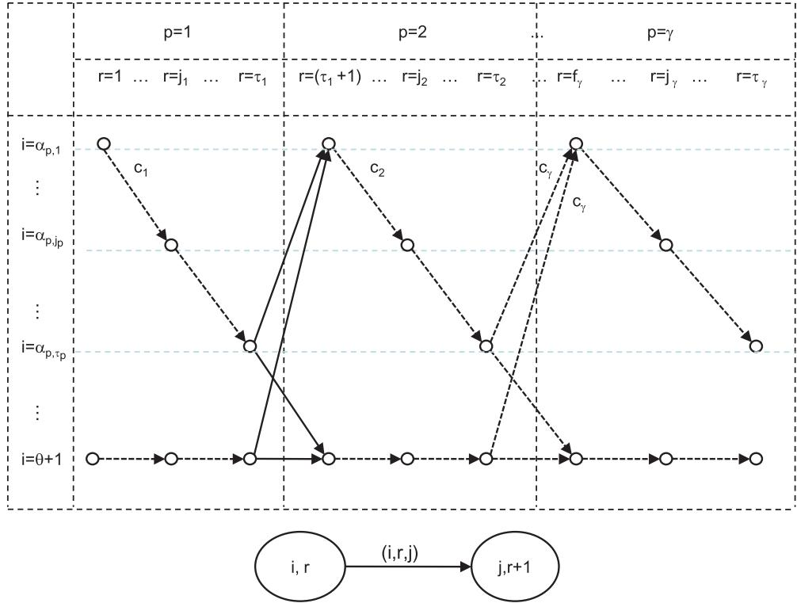
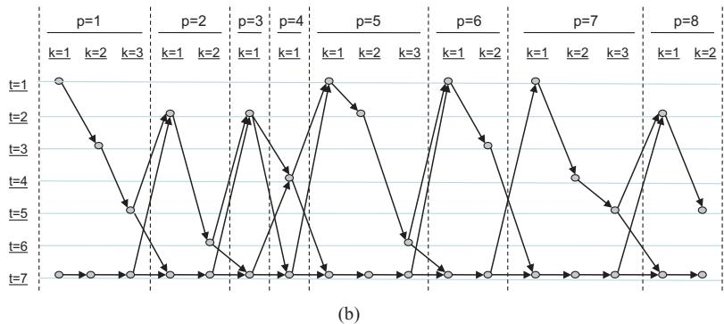
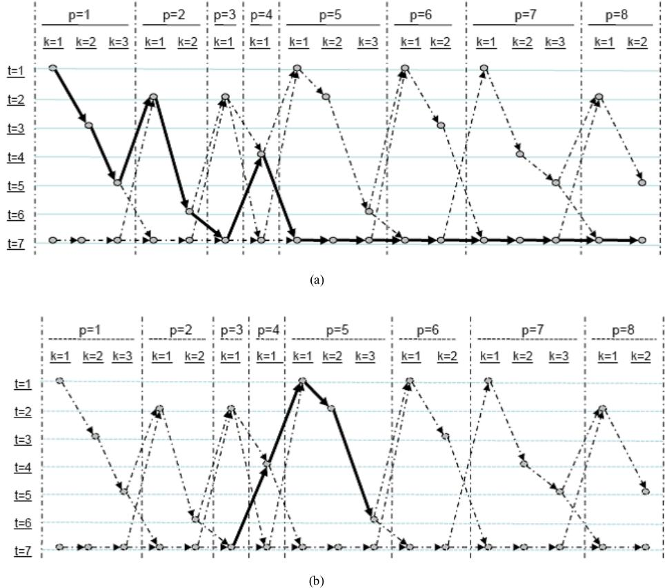
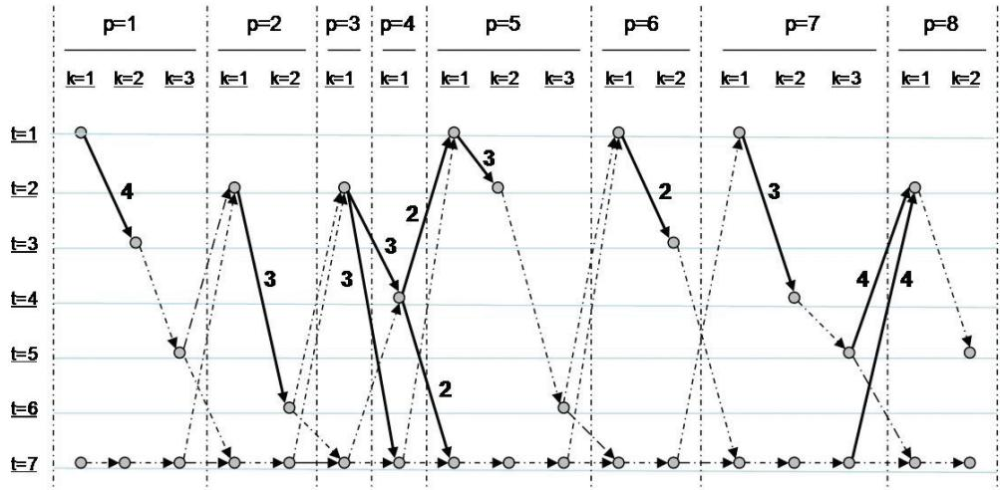

требует независимого тщательного анализа мирового математического сообщества, так как противоречит общепринятому научному консенсусу

---

Вот подробное резюме переведенной статьи Мустафы Диаби «Линейная постановка задачи о разбиении множества».

### 📌 Главная цель и радикальное заявление статьи
Автор заявляет о разработке **первой в истории модели линейного программирования (ЛП)** для классической задачи о разбиении множества (ЗРМ), размер которой (количество переменных и ограничений) ограничен полиномом третьей степени $O(n^3)$ от количества ненулевых элементов входной матрицы. 
Поскольку ЗРМ является NP-полной задачей, существование для нее полиномиальной ЛП-модели, по мнению автора, означает **утвердительное решение фундаментальной проблемы «P против NP»** (доказательство того, что классы P и NP совпадают).

### 🏭 Контекст и практическая значимость ЗРМ
Задача о разбиении множества широко применяется на практике:
*   В транспортной отрасли (диспетчеризация, маршрутизация, составление расписаний для экипажей).
*   В производстве (проектирование ячечных систем, графики обслуживания станков).
*   В других сферах (распределение ресурсов в металлургии, проектирование сетей связи, сжатие изображений, составление расписаний хирургических операций).

### ⚙️ Методология: как была построена модель
Автор не пытается решить задачу напрямую, а использует сложную многошаговую трансформацию:
1. **Перепостановка на основе транспортной задачи (ТЗ):** В исходную задачу вводится «фиктивная» задача, что позволяет свести ЗРМ к сбалансированной транспортной задаче.
2. **Построение многодольного графа $G$:** Создается специальный ориентированный граф, узлы которого соответствуют тройкам (задача, процессор, слот), а допустимые решения ЗРМ превращаются в сквозные «SPP-пути» в этом графе.
3. **Формулировка целочисленной модели (IP):** Вводятся потоковые переменные, описывающие распространение потока по дугам графа. Количество переменных и ограничений на этом этапе составляет $O(n^3)$.
4. **Доказательство целочисленности ЛП-релаксации:** Это ключевой математический результат. Автор доказывает, что если снять с переменных требование целочисленности (оставить только $0 \leq y, z \leq 1$), то ЛП-политоп будет таким, что **все его экстремальные точки автоматически окажутся целочисленными** ($Ext(Q_L) = Q_I$).

### 📈 Ключевые математические результаты
* Количество переменных и ограничений в итоговой модели равно $O(n^3)$.
* Любое базисное допустимое решение (БДР) предложенной ЛП-задачи является допустимым решением исходной ЗРМ, и наоборот.
* Любой SPP-путь в графе не может быть представлен как выпуклая комбинация других путей (выпуклая независимость).
* Решение построенной ЛП-задачи дает точный оптимум для ЗРМ без необходимости применения методов ветвления и отсечений.

### ⚠️ Практические ограничения и дальнейшие шаги
Несмотря на колоссальную теоретическую значимость (если доказательство верно), автор честно отмечает серьезные вычислительные проблемы:
* **Масштабность:** Даже при полиномиальном росте, коэффициент при $n^3$ очень велик (модель получается огромной даже для задач среднего размера).
* **Вырожденность:** Модель обладает высоким уровнем вырождения, что сильно затрудняет работу симплекс-метода.

Для решения реальных задач автор предполагает, что разработанная ТЗ-перепостановка может послужить базой для создания хороших **эвристических алгоритмов**, а для точного решения потребуется применение специализированных методов крупномасштабной оптимизации.

---
**Итог:** Это амбициозная теоретическая работа, которая предлагает нестандартный графо-потоковый подход к обойденной задаче. Статья представляет собой строгий математический proofs (доказательства всех теорем приведены в приложении), однако её главный тезис о равенстве P и NP требует независимого тщательного анализа мирового математического сообщества, так как противоречит общепринятому научному консенсусу.

---

---

---

# Линейная постановка задачи о разбиении множества

Статья  в  International Journal of Operational Research $\cdot$ Июль 2010

DOI: 10.1504/IJOR.2010.034067

# 1 автор:

# Линейная постановка задачи о разбиении множества

# Мустафа Диаби (Moustapha Diaby)

Управление операциями и информацией,   
Университет Коннектикута,   
Сторрс, штат Коннектикут 06268, США   
E-mail: moustapha.diaby@business.uconn.edu

Аннотация: В данной статье мы представляем модель линейного программирования (ЛП) для задачи о разбиении множества (ЗРМ). Количество переменных и количество ограничений в предложенной модели ограничены полиномиальными функциями (третьей степени) от количества ненулевых элементов входной матрицы ЗРМ соответственно. Таким образом, модель предоставляет новое утвердительное решение важнейшего вопроса «P vs. NP». Для формулирования предложенной ЛП-модели мы используем перепостановку на основе транспортной задачи (ТЗ), которую мы разработали, и подход к моделированию на основе путей, аналогичный использованному в работе Диаби (2007). Подход проиллюстрирован числовым примером.

Ключевые слова: ЗРМ; задача о разбиении множества; ЛП; линейное программирование; вычислительная сложность; комбинаторная оптимизация.

Ссылка на эту статью должна быть оформлена следующим образом: Diaby, M. (2010) ‘Linear programming formulation of the set partitioning problem’, Int. J. Operational Research, Vol. 8, No. 4, pp.399–427.

Биографическая справка: Мустафа Диаби — профессор управления производством и операциями в Университете Коннектикута. Он получил степень доктора философии (PhD) в области наук об управлении/исследования операций, степень магистра наук (MS) в области промышленной инженерии и степень бакалавра наук (BS) в области химической инженерии в Университете штата Нью-Йорк в Буффало. Сфера его преподавания и научных интересов включает математическое программирование, моделирование и анализ производственных систем, а также управление цепочками поставок и логистикой. Его публикации публиковались в ведущих журналах, таких как European Journal of Operational Research, Int. J. Production Research, Journal of the Operational Research Society, Management Science, Operations Research и др. Он также является/являлся рецензентом и/или членом редакционной коллегии многих из этих журналов.

# 1 Введение

Одной из трех наиболее широко применяемых задач комбинаторной оптимизации (наряду с задачей коммивояжера (см. Samanlioglu et al., 2007) и задачей о покрытии множества (см. Kinney et al., 2007)) является задача о разбиении множества (ЗРМ) (Balas and Padberg, 1976). Огромный объем промышленного применения задачи, описанный в литературе, исключает возможность ее полного перечисления в одной журнальной статье. Богатейшим источником применений в современной, а также «ранней» литературе (см. Balas and

Padberg, 1976) выступает транспортная отрасль, решающая задачи диспетчеризации транспортных средств (Desaulniers et al., 2003; Westphal and Krumke, 2008), определения состава автопарка (Lee et al., 2008), маршрутизации и составления расписаний для транспортных средств (Alvarenga et al., 2007; Baldacci et al., 2008; Freling et al., 2003; Hong et al., 2009; Ileri et al., 2006; Jepsen et al., 2008; Kliewer et al., 2006) и составления расписаний для экипажей транспортных систем (Medard and Sawhney, 2007; Mesquita and Paias, 2008) среди многих других. Недавние применения за пределами транспортной отрасли включают задачи проектирования ячечных производственных систем (Mahdavi et al., 2006), проектирования сетей систем связи (Oliveira et al., 2005 (в форме «клик»); Tombus and Bilgic, 2004), проектирования компьютерного оборудования и программного обеспечения (Osei-Bryson and Joseph, 2006; Thomadsen and Larsen, 2007), формирования сбалансированных студенческих групп (Desrosiers et al., 2005), составления графиков технического обслуживания производственных машин (Grigoriev et al., 2006), размещения объектов (Berger et al., 2007), сжатия изображений (Jyotheswar and Mahapatra, 2007), распределения жидкого чугуна в сталелитейной промышленности (Tang et al., 2007), проектирования цепочек поставок (Chiang and Russell, 2004; Sadler and Gervet, 2008; Sindhuchao et al., 2005; Teo and Shu, 2004), планирования работы «операционных блоков», включающего распределение операционных и хирургических бригад в больницах (Fei et al., 2008), и составления графиков работы персонала (Belien and Demeulemeester, 2007; Everborn and Ronnqvist, 2004; Eveborn et al., 2006).

Из-за крайне широкого спектра применимости (как отмечено выше) ЗРМ может интерпретироваться с самых разных точек зрения. Точка зрения, которую мы принимаем в этой статье, — это контекст производства/операций, который можно описать следующим образом. существует множество процессоров $\Gamma = \{ 1 , \dots , \gamma \}$ и множество задач $\Theta = \{ 1 , \dots , \theta \}$, которые должны быть выполнены с использованием этих процессоров. Фиксированные затраты $c _ { p } ( p \in \Gamma )$ возникают в том случае, если используется процессор $p$. Задача состоит в том, чтобы выбрать подмножество используемых процессоров таким образом, чтобы каждая задача могла быть выполнена ровно на одном из выбранных процессоров, а общая стоимость выбранных процессоров была бы минимальной.

Пусть $o$ обозначает входную матрицу ЗРМ размером $\gamma \times \theta$, где элемент $( p , t )$ (обозначенный ${ \cal { O } } _ { p t }$) является бинарным индикатором $0 / 1$, равным «1» тогда и только тогда, когда задача $t \in \Theta$ может быть выполнена на процессоре $p \in \Gamma$. Пусть $\boldsymbol { u } _ { p}$ — бинарная переменная $0 / 1$, равная $1$ тогда и только тогда, когда $p \in \Gamma$ используется. Тогда классическая постановка задачи целочисленного программирования (ЦП) для ЗРМ выглядит следующим образом:

Задача 1 (Задача ЗРМ): минимизировать:

$$
\zeta ( u ) : = \sum _ { p \in \Gamma } c _ { p } u _ { p }
$$

при ограничениях:

$$
\begin{array} { l } { { \displaystyle { \sum _ { p \in \Gamma } } \ o _ { p t } u _ { p } = 1 ; \quad t \in \Theta } } \\ { { \displaystyle u _ { p } \in \{ 0 , 1 \} ; \quad p \in \Gamma } } \end{array}
$$

где

$$
{ \begin{array} { r l } & { o _ { p t } = \left\{ { 1 } \atop { \mathrm { 0 } } } \quad \right. \mathrm{если~задача~} t \mathrm{~может~быть~выполнена~на~процессоре~} p } \\ & { } \\ & { \qquad u _ { p } = \left\{ { 1 } \atop { \mathrm { 0 } } } \quad \right. \mathrm{если~процессор~} p \mathrm{~используется} } \\ & { \qquad \left. \qquad \right. } \\ & { \qquad \left. { c _ { p } = \mathrm{стоимость~использования~процессора~} } p \right. } \end{array} }
$$

Задача ЗРМ была одной из первых задач, классифицированных как NP-полная (Karp 1972). Следовательно, исследования, направленные на разработку методов решения, сосредоточены на эвристиках и эффективных процедурах перебора. Обзоры можно найти в работах Balas and Padberg (1976), Boschetti et al. (2008) и Joseph (2002). ЛП-релаксация, как правило, дает хорошие («жесткие») нижние оценки. Однако ее решение может представлять собой сложную задачу из-за высокой степени вырождения (Barahona and Anbil, 2002). В связи с этим были разработаны эвристические процедуры, направленные на решение ЛП-релаксации (Barahona and Anbil, 2000, 2002; Boschetti et al., 2008; Cavalcante et al., 2008; Chan and Yano, 1992; Conforti et al., 2007; Fisher and Kedia, 1990; Klabjan, 2004; Lucena, 2005). Для общей задачи также были разработаны метаэвристические подходы (Alvarenga et al., 2007; Lee et al., 2008) и эвристики, основанные на перепостановках (Ali and Han, 1998; Ali and Thiagarajan, 1989; El-Darzi and Mitra, 1992, 1995; Lewis et al., 2008; Sherali and Lee, 1996). Предложенные точные методы в основном представляли собой процедуры перебора (Balas and Padberg, 1976; Boschetti et al., 2008; Chan and Yano, 1992; Fisher and Kedia, 1990; Harche and Thompson, 1994; Hoffman and Padberg, 1993; Joseph, 2002; Linderoth et al., 2001; Marsten, 1974; Marsten and Shepardson, 1981). Также были разработаны методы отсечений, которые рассмотрены в Balas and Padberg (1976).

С помощью некоторых из описанных выше процедур были достигнуты огромные успехи в решении задач очень крупного промышленного масштаба. Однако они не затрагивают фундаментальный вопрос о вычислительной разрешимости данной задачи (см. Garey and Johnson, 1979). В этом смысле данная статья представляет собой значимое дополнение к существующей литературе. В ней представлена первая ЛП-модель ЗРМ. Количество переменных и количество ограничений в предложенной модели ограничены полиномиальными функциями (третьей степени) от количества ненулевых элементов входной матрицы ЗРМ соответственно. Следовательно, в частности, выходя за рамки самой ЗРМ, модель предоставляет новое утвердительное решение важнейшего вопроса «P против NP». Для формулирования предложенной ЛП-модели мы используем перепостановку на основе транспортной задачи (ТЗ), которую мы разработали, и подход к моделированию на основе путей, аналогичный использованному в работе Diaby (2007). Подход проиллюстрирован числовым примером.

Структура статьи такова. В разделе 2 мы обсуждаем перепостановку на основе ТЗ. В разделе 3 обсуждается перепостановка системы ограничений модели на основе ТЗ с использованием путей. Общая ЛП-модель обсуждается в разделе 4. Выводы обсуждаются в разделе 5.

Обозначение 1: В оставшейся части этой статьи будут использоваться следующие обозначения:

1 Множество вещественных чисел обозначается через $\mathbb { R }$.   
2 Для двух векторов-столбцов $\mathbf{a}$ и $\mathbf{b}$, запись ${ \bf \left( { \bf { \bar { a } } } \right) } = ( { \bf { a } } ^ { \mathrm { { T } } } , { \bf { b } } ^ { \mathrm { { T } } } ) ^ { \mathrm { { T } } } $ будет записываться как «(a, b)» (где $(\cdot)^{\mathrm{T}}$ обозначает транспонирование $( \cdot )$), за исключением случаев, когда это вызывает двусмысленность.   
3 $i$-я компонента вектора-столбца $\mathbf{a}$ обозначается как $\mathbf { a } _ { i }$.   
4 Обозначение $\mathbf { \widetilde { 0 } } ^ { \prime }$ обозначает вектор-столбец подходящей размерности, все элементы которого равны 0.   
5 Обозначение «$\mathbf{1}$» обозначает вектор-столбец подходящей размерности, все элементы которого равны 1.   
6 Выпуклая оболочка $(\cdot)$ обозначается как $Conv ( \cdot )$.   
7 Множество экстремальных точек $(\cdot)$ обозначается как $Ext ( \cdot )$.

8 Обозначение «$\forall \langle i _ { 1 } \in A _ { 1 } : B _ { 1 } ; \ldots ; i _ { p } \in A _ { p } : B _ { p } \rangle$ , $\langle C _ { 1 } ; \ldots ; C _ { q } \rangle$» означает «$\forall i _ { 1 } \in A _ { 1 } : B _ { 1 } , . . . , \forall i _ { p } \in A _ { p } : B _ { p }$ выполняется каждое утверждение $C _ { j } ( j = 1 , \ldots , q )$». Там, где это не вызывает двусмысленности, скобки (одна или обе пары) будут опускаться.

9 Символ «-» означает «такой, что».

10 Обозначение «$\exists \langle i _ { 1 } \in A _ { 1 } ; . . . ; i _ { p } \in A _ { p } \rangle \ \geqslant \ \langle B _ { 1 } ; . . . ; B _ { q } \rangle$» означает «Существует по крайней мере один объект из каждого $A _ { r } ( r = 1 , \ldots , p )$, такой что выполняется каждое выражение $B _ { s } ( s = 1 , \ldots , q )$». Там, где это не вызывает двусмысленности, скобки (одна или обе пары) будут опускаться.

# 2 Перепостановка на основе транспортной задачи

В отличие от ранее предложенных моделей на основе сетевых потоков (см., например, Ali and Han, 1998; Ali and Thiagarajan, 1989; El-Darzi and Mitra, 1992, 1995), наша перепостановка ЗРМ на основе ТЗ не зависит от наличия каких-либо специальных структур во входной матрице ЗРМ. Следовательно, наша перепостановка на основе ТЗ применима к любому экземпляру ЗРМ и не требует поиска структур во входной матрице ЗРМ. В этом разделе мы представляем модель и иллюстрируем ее числовым примером.

Предположения 1: Без ограничения общности (н.о.о.) мы предполагаем, что к множеству задач добавлена «фиктивная» задача с индексом $\theta + 1$, и что входная матрица ЗРМ была соответствующим образом расширена так, что $o _ { p , \theta + 1 } = 1$ для всех $p \in \Gamma$.

Обозначения 2 (Параметры ЗРМ):

1 $\gamma$: количество процессоров   
2 $\theta$: количество задач   
3 $\Gamma : = \{ 1 , \dots , \gamma \}$ (множество процессоров)   
4 $\Theta : = \{ 1 , \dots , \theta \}$ (множество задач)   
5 $\forall p \in \Gamma$, $T _ { p } : = \{ t \in \Theta : o _ { p t } = 1 \}$ (множество задач, которые могут быть выполнены с использованием процессора $p$)   
6 $\forall p \in \Gamma$, $\tau _ { p } : = | T _ { p } |$   
7 $\forall p \in \Gamma$, $K _ { p } : = \{ 1 , \dots , \tau _ { p } \}$   
8 $n : = \sum _ { p \in \Gamma } \tau _ { p }$ (количество ненулевых элементов входной матрицы ЗРМ)   
9 $\forall t \in \Theta$, $P _ { t } : = \{ p \in \Gamma : o _ { p t } = 1 \}$ (множество процессоров, которые могут выполнить задачу $t$) 
10 $\forall t \in \Theta$, $\pi _ { t } : = | P _ { t } |$   
11 $\forall p \in \Gamma ; t \in ( \Theta \cup \{ \theta + 1 \} )$, $v _ { p t}$ обозначает неотрицательную переменную, которая положительна тогда и только тогда, когда задача $t$ выполняется с использованием процессора $p$.

Предположения 2: Без ограничения общности мы предполагаем, что:

1 Элементы $T _ { p } ( p \in \Gamma )$ расположены в порядке возрастания индексов задач, где $\alpha _ { p k } ( k \in K _ { p } )$ является индексом $k$-го элемента; то есть упорядочение $T _ { p }$ таково, что $\alpha _ { p k } < \alpha _ { p \ell } \ \forall ( k , \ell ) \in K _ { p } ^ { 2 } : k < \ell$.

2 Нет ограничений на количество раз, которое «фиктивная» задача $\theta + 1$ может быть включена в любое решение ЗРМ.

3 Допустимое множество Задачи ЗРМ не пусто.

Определение 1: Для $p \in \Gamma$ мы называем элементы $K _ { p }$ «(обрабатывающими) слотами» на $p$.

Наша предложенная перепостановка на основе ТЗ выглядит следующим образом:

Задача 2 (Задача ТЗ): минимизировать:

$$
\zeta ( v ) : = \sum _ { p \in \Gamma } c _ { p } v _ { p , \alpha _ { p , 1 } }
$$

при ограничениях:

$$
\begin{array} { l } { { \displaystyle \sum _ { p \in { \cal P } _ { t } } v _ { p t } = 1 ; \quad t \in \Theta } } \\ { { \displaystyle \sum _ { p \in { \cal P } _ { t } } v _ { p , \theta + 1 } = n - \theta } } \\ { { \displaystyle \sum _ { t \in { \cal T } _ { p } \cup \{ \theta + 1 \} } v _ { p t } = \tau _ { p } ; \quad p \in { \cal \Gamma } } } \\ { { \displaystyle v _ { p , \alpha _ { p , k } } - v _ { p , \alpha _ { p , 1 } } = 0 \quad p \in { \cal \Gamma } ; ~ k \in K _ { p } \backslash \{ 1 \} } } \\ { { \displaystyle v _ { p t } \in \{ 0 , 1 \} , ~ p \in { \cal \Gamma } , ~ t \in T _ { p } ; ~ v _ { p , \theta + 1 } \geq 0 , ~ p \in { \cal \Gamma } } } \end{array}
$$

Ограничения (5) гарантируют (в свете ограничений (9)), что каждая задача может быть выполнена ровно на одном из выбранных процессоров. Ограничения (7) требуют, чтобы каждый слот на заданном процессоре был заполнен. Ограничения (8) обеспечивают то, что все слоты назначены либо реальным задачам (т.е. процессор используется), либо фиктивной задаче (т.е. процессор не используется). Ограничения (6) учитывают общее количество неиспользованных обрабатывающих слотов. Следовательно, целевая функция (4) корректно учитывает общую стоимость используемых процессоров.

Определение 2: Пусть $W : = \{ v \in \mathbb { R } ^ { n + \gamma }$ : $v$ удовлетворяет $\left( 5 \right) - \left( 9 \right) \}$. Мы называем $Conv(W)$ «ТЗ-политопом».

Теорема 1: Следующие утверждения верны:

(i) Существует взаимно однозначное соответствие между допустимыми решениями Задачи ТЗ и допустимыми решениями ЗРМ.   
(ii) Существует взаимно однозначное соответствие между допустимыми решениями Задачи ТЗ и допустимыми решениями Задачи ЗРМ.   
(iii) Задача ТЗ и Задача ЗРМ эквивалентны как задачи оптимизации.

Числовая иллюстрация перепостановки на основе транспортной задачи показана на Рисунке 1.

# 3 Перепостановка системы ограничений модели на основе ТЗ

# 3.1 Представление в виде многодольного графа

Мы переписываем ограничения (5)–(9) Задачи $T P$ в терминах потоков по многодольному ориентированному графу $G$, показанному на Рисунке 2. В этом графе каждый узел соответствует допустимой тройке (задача, процессор, слот). То есть тройка $( t , p , k ) \in ( \Theta , \Gamma , K _ { p } )$ имеет соответствующий узел в графе тогда и только тогда, когда $t = \alpha _ { p k }$. С другой стороны, в графе есть узел, соответствующий каждой тройке $( \theta + 1 , p , k ) ( p \in \Gamma , k \in K _ { p } )$. Дуги графа задаются через явное описание прямых и обратных звезд каждого из узлов графа.

Рисунок 1 Иллюстрация перепостановки на основе транспортной задачи; (a) входные данные задачи и обозначения и (b) иллюстрация формы транспортной таблицы   

<table><tr><td rowspan=1 colspan=1>p</td><td rowspan=1 colspan=1>Tp</td><td rowspan=1 colspan=1>cp</td><td rowspan=1 colspan=1>τp</td></tr><tr><td rowspan=1 colspan=1>1</td><td rowspan=1 colspan=1>{1, 3, 5}</td><td rowspan=1 colspan=1>3</td><td rowspan=1 colspan=1>4</td></tr><tr><td rowspan=1 colspan=1>2</td><td rowspan=1 colspan=1>{2, 6}</td><td rowspan=1 colspan=1>2</td><td rowspan=1 colspan=1>3</td></tr><tr><td rowspan=1 colspan=1>3</td><td rowspan=1 colspan=1>{2}</td><td rowspan=1 colspan=1>1</td><td rowspan=1 colspan=1>3</td></tr><tr><td rowspan=1 colspan=1>4</td><td rowspan=1 colspan=1>{4}</td><td rowspan=1 colspan=1>1</td><td rowspan=1 colspan=1>2</td></tr><tr><td rowspan=1 colspan=1>5</td><td rowspan=1 colspan=1>{1, 2, 6}</td><td rowspan=1 colspan=1>3</td><td rowspan=1 colspan=1>3</td></tr><tr><td rowspan=1 colspan=1>6</td><td rowspan=1 colspan=1>{1, 3}</td><td rowspan=1 colspan=1>2</td><td rowspan=1 colspan=1>2</td></tr><tr><td rowspan=1 colspan=1>7</td><td rowspan=1 colspan=1>{1, 4, 5}</td><td rowspan=1 colspan=1>3</td><td rowspan=1 colspan=1>3</td></tr><tr><td rowspan=1 colspan=1>8</td><td rowspan=1 colspan=1>{2, 5}</td><td rowspan=1 colspan=1>2</td><td rowspan=1 colspan=1>4</td></tr></table>

<table><tr><td rowspan=1 colspan=1>t</td><td rowspan=1 colspan=1>Pt</td><td rowspan=1 colspan=1>πt</td></tr><tr><td rowspan=1 colspan=1>1</td><td rowspan=1 colspan=1>{1, 5, 6, 7}</td><td rowspan=1 colspan=1>4</td></tr><tr><td rowspan=1 colspan=1>2</td><td rowspan=1 colspan=1>{2, 3, 5, 8}</td><td rowspan=1 colspan=1>4</td></tr><tr><td rowspan=1 colspan=1>3</td><td rowspan=1 colspan=1>{1, 6}</td><td rowspan=1 colspan=1>2</td></tr><tr><td rowspan=1 colspan=1>4</td><td rowspan=1 colspan=1>{4, 7}</td><td rowspan=1 colspan=1>2</td></tr><tr><td rowspan=1 colspan=1>5</td><td rowspan=1 colspan=1>{1, 7, 8}</td><td rowspan=1 colspan=1>3</td></tr><tr><td rowspan=1 colspan=1>6</td><td rowspan=1 colspan=1>{2, 5}</td><td rowspan=1 colspan=1>2</td></tr></table>

<table><tr><td rowspan=2 colspan=2>Задачи</td><td rowspan=1 colspan=8>Процессоры (p)</td><td rowspan=2 colspan=1>"Спрос"</td></tr><tr><td rowspan=1 colspan=1>p= 1</td><td rowspan=1 colspan=1>p= 2</td><td rowspan=1 colspan=1>p= 3</td><td rowspan=1 colspan=1>p = 4</td><td rowspan=1 colspan=1>p = 5</td><td rowspan=1 colspan=1>p = 6</td><td rowspan=1 colspan=1>p= 7</td><td rowspan=1 colspan=1>p = 8</td></tr><tr><td rowspan=6 colspan=1>Θ</td><td rowspan=1 colspan=1>t = 1</td><td rowspan=1 colspan=1>1</td><td rowspan=1 colspan=1></td><td rowspan=1 colspan=1></td><td rowspan=1 colspan=1></td><td rowspan=1 colspan=1>1</td><td rowspan=1 colspan=1>1</td><td rowspan=1 colspan=1>1</td><td rowspan=1 colspan=1></td><td rowspan=1 colspan=1>1</td></tr><tr><td rowspan=1 colspan=1>t=2</td><td rowspan=1 colspan=1></td><td rowspan=1 colspan=1>1</td><td rowspan=1 colspan=1>1</td><td rowspan=1 colspan=1></td><td rowspan=1 colspan=1>1</td><td rowspan=1 colspan=1></td><td rowspan=1 colspan=1></td><td rowspan=1 colspan=1>1</td><td rowspan=1 colspan=1>1</td></tr><tr><td rowspan=1 colspan=1>t=3</td><td rowspan=1 colspan=1>1</td><td rowspan=1 colspan=1></td><td rowspan=1 colspan=1></td><td rowspan=1 colspan=1></td><td rowspan=1 colspan=1></td><td rowspan=1 colspan=1>1</td><td rowspan=1 colspan=1></td><td rowspan=1 colspan=1></td><td rowspan=1 colspan=1>1</td></tr><tr><td rowspan=1 colspan=1>t= 4</td><td rowspan=1 colspan=1></td><td rowspan=1 colspan=1></td><td rowspan=1 colspan=1></td><td rowspan=1 colspan=1>1</td><td rowspan=1 colspan=1></td><td rowspan=1 colspan=1></td><td rowspan=1 colspan=1>1</td><td rowspan=1 colspan=1></td><td rowspan=1 colspan=1>1</td></tr><tr><td rowspan=1 colspan=1>t=5</td><td rowspan=1 colspan=1>1</td><td rowspan=1 colspan=1></td><td rowspan=1 colspan=1></td><td rowspan=1 colspan=1></td><td rowspan=1 colspan=1></td><td rowspan=1 colspan=1></td><td rowspan=1 colspan=1>1</td><td rowspan=1 colspan=1>1</td><td rowspan=1 colspan=1>1</td></tr><tr><td rowspan=1 colspan=1>t = 6</td><td rowspan=1 colspan=1></td><td rowspan=1 colspan=1>1</td><td rowspan=1 colspan=1></td><td rowspan=1 colspan=1></td><td rowspan=1 colspan=1>1</td><td rowspan=1 colspan=1></td><td rowspan=1 colspan=1></td><td rowspan=1 colspan=1></td><td rowspan=1 colspan=1>1</td></tr><tr><td rowspan=1 colspan=1>$\theta + 1$</td><td rowspan=1 colspan=1>t=7</td><td rowspan=1 colspan=1>1</td><td rowspan=1 colspan=1>1</td><td rowspan=1 colspan=1>1</td><td rowspan=1 colspan=1>1</td><td rowspan=1 colspan=1>1</td><td rowspan=1 colspan=1>1</td><td rowspan=1 colspan=1>1</td><td rowspan=1 colspan=1>1</td><td rowspan=1 colspan=1>11</td></tr><tr><td rowspan=1 colspan=2>"Предложение"</td><td rowspan=1 colspan=1>3</td><td rowspan=1 colspan=1>2</td><td rowspan=1 colspan=1>1</td><td rowspan=1 colspan=1>1</td><td rowspan=1 colspan=1>3</td><td rowspan=1 colspan=1>2</td><td rowspan=1 colspan=1>3</td><td rowspan=1 colspan=1>2</td><td rowspan=1 colspan=1>17</td></tr><tr><td rowspan=1 colspan=11>(b)</td></tr></table>

# Определение 3:

1 Мы называем множество узлов Графа $G$, соответствующих заданной паре (процессор, слот), ярусом графа.   
2 Мы называем множество узлов Графа $G$, соответствующих заданной задаче, уровнем графа.

  
Рисунок 2 Общая структура Графа $G$ (см. онлайн-версию для цветной иллюстрации)

Чтобы упростить изложение, мы выполняем последовательную индексацию ярусов, как описано ниже.

Обозначения 3 (Формализмы представления графа):

1 $\Omega : = \Theta \cup \{ \theta + 1 \} .$   
2 $S : = \{ 1 , \ldots , n \}$ (множество ярусов Графа $G$).   
3 $R : = S \backslash \{ n \}.$.   
4 $\forall p \in \Gamma$,

$$
f _ { p } : = \left\{ { \begin{array} { l l } { 1 ; } & { \mathrm{для} \ p = 1 } \\ { p - 1 } & \\ { \displaystyle \sum _ { j = 1 } \tau _ { j } + 1 ; } & { \mathrm{для} \ p > 1 } \end{array} } \right.
$$

(индекс яруса, соответствующего паре (процессор, слот), $( p , 1 )$).

5 $\forall p \in \Gamma$, $\begin{array} { r } { \ell _ { p } : = \sum _ { j = 1 } ^ { p } \tau _ { j } } \end{array}$ (индекс яруса, соответствующего паре (процессор, слот), $( p , \tau _ { p } )$).

6 $\forall r \in S$, $\xi _ { r } : = \arg \operatorname* { m a x } \{ f _ { p } : f _ { p } \leq r \}$ (индекс процессора для яруса $r$).

7 $\forall r \in S$, $M _ { r } : = \{\alpha _ { \xi _ { r } , r - f _ { \xi _ { r } } + 1 } \}$ (множество задач в $\Theta$, которые определяют узлы на ярусе $r$).

8 $\forall r \in S$, $N _ { r } : = M _ { r } \cup \{ \theta + 1 \} = \{ \alpha _ { \xi _ { r } , r - f _ { \xi _ { r } } + 1 } , \theta + 1 \} $.

9 $V : = \{ ( i , r ) : r \in S , i \in N _ { r } \}$ (множество узлов Графа $G$).

10 $\forall \big \langle r \in S ; t \in ( T _ { \xi _ { r } } \cup \{ \theta + 1 \} ) \big \rangle$,

$$
F _ { r } ( t ) : = \left\{ \begin{array} { l l } { N _ { r + 1 } \backslash \{ t \} } & { \mathrm{для} \ r < n ; ~ r = \ell _ { \xi _ { r } } ; ~ t \neq \theta + 1 } \\ & { \mathrm{для} \ r < n ; ~ r = \ell _ { \xi _ { r } } ; ~ t = \theta + 1 } \\ { M _ { r + 1 } = \{ \alpha _ { \xi _ { r } } , ~ r - f _ { \xi _ { r } } + 2 \} } & { \mathrm{для} \ r < n ; ~ f _ { \xi _ { r } } \leq r < \ell _ { \xi _ { r } } ; ~ t \neq \theta + 1 } \\ { \{ \theta + 1 \} } & { \mathrm{для} \ r < n ; ~ f _ { \xi _ { r } } \leq r < \ell _ { \xi _ { r } } ; ~ t = \theta + 1 } \\ { \emptyset } & { \mathrm{для} \ r = n } \end{array} \right.
$$

(прямая звезда узла $( t , r )$ Графа $G$).

11 $\forall \langle r \in S ; \ t \in N _ { r } \rangle$,

$$
B _ { r } ( t ) : = \left\{ \begin{array} { l l } { \{ j \in N _ { r - 1 } : t \in F _ { r - 1 } ( j ) \} } & { \mathrm{для} \ r > 1 } \\ { } \\ { \emptyset } & { \mathrm{для} \ r = 1 } \end{array} \right.
$$

(обратная звезда узла $( t , r )$ Графа $G$).

12 $A : = \{ ( i , r , j ) \in ( \Omega , R , \Omega ) ; i \in N _ { r } ; j \in F _ { r } ( i ) \}$ (множество дуг Графа $G$).

Обозначения и структура представления графа проиллюстрированы на Рисунке 3 для числового примера, показанного на Рисунке 1.

Замечание 1:

1 Каждый ярус Графа $G$ состоит ровно из двух узлов графа.   
2 Максимальное количество дуг, исходящих из любого яруса Графа $G$, равно четырем.

Определение 4:

1 Мы называем путь Графа $G$, охватывающий множество ярусов графа, сквозным путем графа.   
2 Мы называем сквозной путь Графа $G$, который включает каждую задачу из $\Theta$ ровно один раз, SPP-путем (путем ЗРМ) графа; то есть множество дуг,

$$
( ( i _ { 1 } , 1 , i _ { 2 } ) , ( i _ { 2 } , 2 , i _ { 3 } ) , \ldots , ( i _ { n - 1 } , n - 1 , i _ { n } ) ) \in A ^ { n - 1 } ,
$$

является SPP-путем тогда и только тогда, когда $( \forall t \in \Theta , \exists p \in S \ \geqslant i _ { p } = t$, и $( \forall ( p , q ) \in ( S , S \backslash \{ p \} )$ : $( i _ { p } , i _ { q } ) \in \Theta ^ { 2 } , i _ { p } \neq i _ { q } )$.

Замечание 2: Непосредственно из определений следует:

1 Существует взаимно однозначное соответствие между SPP-путями Графа $G$ и допустимыми решениями ЗРМ.   
2 Существует взаимно однозначное соответствие между SPP-путями Графа $G$ и допустимыми решениями Задачи ЗРМ.   
3 Существует взаимно однозначное соответствие между SPP-путями Графа $G$ и допустимыми решениями Задачи ТЗ.

SPP-пути проиллюстрированы на Рисунке 4 для числового примера, показанного на Рисунке 1. Сквозной путь, показанный на Рисунке 4(a), является SPP-путем и соответствует решению ЗРМ, в котором используются процессоры 1, 2 и 4. Неполный путь (т.е. не охватывающий все ярусы множества), показанный на Рисунке 4(b), соответствует решениям ЗРМ, в которых используются оба процессора 4 и 5. Легко verify (убедиться), что в графе не существует SPP-пути, который бы включал этот неполный путь, что согласуется с тем фактом, что не существует допустимого решения ЗРМ, в котором используются оба процессора 4 и 5.

Теорема 2: Данный SPP-путь Графа $G$ не может быть представлен как выпуклая комбинация других SPP-путей Графа $G$.

Обозначения 4: Мы обозначаем множество всех SPP-путей Графа $G$ как $\Delta$; то есть,

$$
\begin{array} { r l } & { \Delta : = \left\{ ( ( i _ { 1 } , 1 , i _ { 2 } ) , ( i _ { 2 } , 2 , i _ { 3 } ) , \dots , ( i _ { n - 1 } , n - 1 , i _ { n } ) ) \in A ^ { n - 1 } : \right. } \\ & { \qquad \left. \left( \forall t \in \Theta , \exists p \in S \ \textmd { > } i _ { p } = t \right); \right. } \\ & { \qquad \left. \left( \forall ( p , q ) \in ( S , S \backslash \{ p \} ) : ( i _ { p } , i _ { q } ) \in \Theta ^ { 2 } , \ i _ { p } \neq i _ { q } \right) \right\} . } \end{array}
$$

$$
\begin{array} { l } { n = \displaystyle \sum _ { p \in \Gamma } \tau _ { p } = 1 7 } \\ { \displaystyle } \\ { S = \{ 1 , . . . , 1 7 \} ; } \\ { R = \{ 1 , . . . , 1 6 \} ; } \end{array}
$$

Рисунок 3 Числовая иллюстрация Графа $G$; (a) обозначения графа и (b) граф сетевого потока (см. онлайн-версию для цветной иллюстрации)   
Процессоры   

<table><tr><td rowspan=1 colspan=1>p</td><td rowspan=1 colspan=1>fp</td><td rowspan=1 colspan=1>ℓp</td></tr><tr><td rowspan=1 colspan=1>1</td><td rowspan=1 colspan=1>1</td><td rowspan=1 colspan=1>3</td></tr><tr><td rowspan=1 colspan=1>2</td><td rowspan=1 colspan=1>4</td><td rowspan=1 colspan=1>5</td></tr><tr><td rowspan=1 colspan=1>3</td><td rowspan=1 colspan=1>6</td><td rowspan=1 colspan=1>6</td></tr><tr><td rowspan=1 colspan=1>4</td><td rowspan=1 colspan=1>7</td><td rowspan=1 colspan=1>7</td></tr><tr><td rowspan=1 colspan=1>5</td><td rowspan=1 colspan=1>8</td><td rowspan=1 colspan=1>10</td></tr><tr><td rowspan=1 colspan=1>6</td><td rowspan=1 colspan=1>11</td><td rowspan=1 colspan=1>12</td></tr><tr><td rowspan=1 colspan=1>7</td><td rowspan=1 colspan=1>13</td><td rowspan=1 colspan=1>15</td></tr><tr><td rowspan=1 colspan=1>8</td><td rowspan=1 colspan=1>16</td><td rowspan=1 colspan=1>17</td></tr></table>

<table><tr><td rowspan=1 colspan=1>r</td><td rowspan=1 colspan=1>ξr</td><td rowspan=1 colspan=1>Mr</td><td rowspan=1 colspan=1>Nr</td></tr><tr><td rowspan=1 colspan=1>1</td><td rowspan=1 colspan=1>1</td><td rowspan=1 colspan=1>{1}</td><td rowspan=1 colspan=1>{1, 7}</td></tr><tr><td rowspan=1 colspan=1>2</td><td rowspan=1 colspan=1>1</td><td rowspan=1 colspan=1>{3}</td><td rowspan=1 colspan=1>{3,7}</td></tr><tr><td rowspan=1 colspan=1>3</td><td rowspan=1 colspan=1>1</td><td rowspan=1 colspan=1>{5}</td><td rowspan=1 colspan=1>{5,7}</td></tr><tr><td rowspan=1 colspan=1>4</td><td rowspan=1 colspan=1>2</td><td rowspan=1 colspan=1>{2}</td><td rowspan=1 colspan=1>{2,7}</td></tr><tr><td rowspan=1 colspan=1>5</td><td rowspan=1 colspan=1>2</td><td rowspan=1 colspan=1>{6}</td><td rowspan=1 colspan=1>{6, 7}</td></tr><tr><td rowspan=1 colspan=1>6</td><td rowspan=1 colspan=1>3</td><td rowspan=1 colspan=1>{2}</td><td rowspan=1 colspan=1>{2, 7}</td></tr><tr><td rowspan=1 colspan=1>7</td><td rowspan=1 colspan=1>4</td><td rowspan=1 colspan=1>{4}</td><td rowspan=1 colspan=1>{4, 7}</td></tr><tr><td rowspan=1 colspan=1>8</td><td rowspan=1 colspan=1>5</td><td rowspan=1 colspan=1>{1}</td><td rowspan=1 colspan=1>{1, 7}</td></tr><tr><td rowspan=1 colspan=1>9</td><td rowspan=1 colspan=1>5</td><td rowspan=1 colspan=1>{2}</td><td rowspan=1 colspan=1>{2,7}</td></tr><tr><td rowspan=1 colspan=1>10</td><td rowspan=1 colspan=1>5</td><td rowspan=1 colspan=1>{6}</td><td rowspan=1 colspan=1>{6, 7}</td></tr><tr><td rowspan=1 colspan=1>11</td><td rowspan=1 colspan=1>6</td><td rowspan=1 colspan=1>{1}</td><td rowspan=1 colspan=1>{1, 7}</td></tr><tr><td rowspan=1 colspan=1>12</td><td rowspan=1 colspan=1>6</td><td rowspan=1 colspan=1>{3}</td><td rowspan=1 colspan=1>{3,7}</td></tr><tr><td rowspan=1 colspan=1>13</td><td rowspan=1 colspan=1>7</td><td rowspan=1 colspan=1>{1}</td><td rowspan=1 colspan=1>{1, 7}</td></tr><tr><td rowspan=1 colspan=1>14</td><td rowspan=1 colspan=1>7</td><td rowspan=1 colspan=1>{4}</td><td rowspan=1 colspan=1>{4, 7}</td></tr><tr><td rowspan=1 colspan=1>15</td><td rowspan=1 colspan=1>7</td><td rowspan=1 colspan=1>{5}</td><td rowspan=1 colspan=1>{5,7}</td></tr><tr><td rowspan=1 colspan=1>16</td><td rowspan=1 colspan=1>8</td><td rowspan=1 colspan=1>{2}</td><td rowspan=1 colspan=1>{2,7}</td></tr><tr><td rowspan=1 colspan=1>17</td><td rowspan=1 colspan=1>8</td><td rowspan=1 colspan=1>{5}</td><td rowspan=1 colspan=1>{5,7}</td></tr></table>

(a)

  
Рисунок 4 Иллюстрация SPP-пути; (a) иллюстрация SPP-пути и (b) иллюстрация несовместимости для SPP-пути (см. онлайн-версию для цветной иллюстрации)

# 3.2 Перепостановка в виде задачи целочисленного программирования

Предположения 3: Без ограничения общности мы предполагаем, что количество ярусов Графа $G$ больше 5 (т.е. $n \geq 6$).

Обозначения 5 (Переменные потока):

1 $\forall \langle ( p , r , s ) \in R ^ { 3 } : r < s < p ; ( i , j , k , t , u , v ) \in ( N _ { r } , F _ { r } ( i ) , N _ { s } , F _ { s } ( k ) , N _ { p } , F _ { p } ( u ) ) \rangle$, $\mathcal { Z } ( i r j ) ( k s t ) ( u p v )$ обозначает неотрицательную переменную, представляющую величину потока в Графе $G$, который передается с дуги $( i , r , j )$ на дугу $( u , p , v )$ через дугу $( k , s , t )$.

2 $\forall \langle ( r , s ) \in R ^ { 2 } : r < s$ ; $( i , j , k , t ) \in ( N _ { r } , F _ { r } ( i ) , N _ { s } , F _ { s } ( k ) ) \rangle$, $y _ { ( i r j ) ( k s t ) }$ обозначает неотрицательную переменную, представляющую общую величину потока в Графе $G$, который передается с дуги $( i , r , j )$ на дугу $( k , s , t )$.

Наша перепостановка $W$ выглядит следующим образом:

$$
\sum _ { i \in \Omega } \sum _ { j \in F _ { 1 } ( i ) } \sum _ { t \in F _ { 2 } ( j ) } \sum _ { v \in F _ { 3 } ( t ) } \ z _ { ( i , 1 , j ) ( j , 2 , t ) ( t , 3 , v ) } = 1
$$

$$
\sum _ { v \in B _ { p } ( u ) } z _ { ( i r j ) ( k s t ) ( v , p - 1 , u ) } - \sum _ { v \in F _ { p } ( u ) } z _ { ( i r j ) ( k s t ) ( u p v ) } = 0
$$
$$
p , r , s \in R : r < s < p - 1 ; \ i \in \Omega ; \ j \in F _ { r } ( i ) ; \ k \in \Omega ; \ t \in F _ { s } ( k ) ; \ u \in \Omega
$$

$$
\sum _ { v \in B _ { p } ( u ) } z _ { ( i r j ) ( v , p - 1 , u ) ( k s t ) } - \sum _ { v \in F _ { p } ( u ) } z _ { ( i r j ) ( u p v ) ( k s t ) } = 0
$$
$$
p , r , s \in R : r + 1 < p < s ; i \in \Omega ; j \in F _ { r } ( i ) ; k \in \Omega ; t \in F _ { s } ( k ) ; u \in \Omega
$$

$$
\sum _ { v \in B _ { p } ( u ) } z _ { ( v , p - 1 , u ) ( i r j ) ( k s t ) } - \sum _ { v \in F _ { p } ( u ) } z _ { ( u p v ) ( i r j ) ( k s t ) } = 0
$$
$$
p , r , s \in R : 1 < p < r < s ; i \in \Omega ; j \in F _ { r } ( i ) ; k \in \Omega ; t \in F _ { s } ( k ) ; u \in \Omega
$$

$$
y _ { ( i r j ) ( k s t ) } - \sum _ { u \in \Omega } \sum _ { v \in F _ { p } ( u ) } z _ { ( i r j ) ( k s t ) ( u p v ) } = 0
$$
$$
p , r , s \in R : r < s < p ; i \in \Omega ; j \in F _ { r } ( i ) ; k \in \Omega ; t \in F _ { s } ( k )
$$

$$
y _ { ( i r j ) ( u p v ) } - \sum _ { k \in \Omega } \sum _ { t \in F _ { s } ( k ) } z _ { ( i r j ) ( k s t ) ( u p v ) } = 0
$$
$$
p , r , s \in R : r < s < p ; i \in \Omega ; j \in F _ { r } ( i ) ; u \in \Omega ; v \in F _ { p } ( u )
$$

$$
y _ { ( k s t ) ( u p v ) } - \sum _ { i \in \Omega } \sum _ { j \in F _ { r } ( i ) } z _ { ( i r j ) ( k s t ) ( u p v ) } = 0
$$
$$
p , r , s \in R : r < s < p ; k \in \Omega ; t \in F _ { s } ( k ) ; u \in \Omega ; v \in F _ { p } ( u )
$$

$$
y _ { ( i r j ) ( k s t ) } - \sum _ { \substack { p \in R : \\ p < r } } \sum _ { v \in F _ { p } ( u ) } z _ { ( u p v ) ( i r j ) ( k s t ) } - \sum _ { \substack { p \in R : \\ r < p < s } } \sum _ { v \in F _ { p } ( u ) } z _ { ( i r j ) ( u p v ) ( k s t ) }
$$
$$
- \sum _ { \substack { p \in R : \\ s < p } } \sum _ { v \in F _ { p } ( u ) } z _ { ( i r j ) ( k s t ) ( v p u ) } = 0
$$
$$
r , s \in R : r < s ; i \in \Omega ; j \in F _ { r } ( i ) ; k \in \Omega ; t \in F _ { s } ( k ) ; u \in \Omega \backslash \{ i , j , k , t \}
$$

$$
\sum _ { k \in \Omega \backslash \{ j \} } \sum _ { t \in F _ { r + 1 } ( k ) } y _ { ( i r j ) ( k , r + 1 , t ) } = 0 ; \quad r \in R \backslash \{ n - 1 \} ; \quad i \in \Omega ; \quad j \in F _ { r } ( i )
$$

$$
\begin{array} { r l } { \displaystyle \sum _ { ( r , s ) \in R ^ { 2 } \atop s > r } \displaystyle \sum _ { j \in F _ { r } ( i ) } \sum _ { k \in B _ { s + 1 } ( i ) } y _ { ( i r j ) ( k s i ) } + \displaystyle \sum _ { ( r , s ) \in R ^ { 2 } } \displaystyle \sum _ { j \in F _ { r } ( i ) } \sum _ { k \in F _ { s } ( i ) } y _ { ( i r j ) ( i s k ) } } & { } \\ { \displaystyle } & { + \displaystyle \sum _ { ( r , s ) \in R ^ { 2 } \atop s > r } \displaystyle \sum _ { j \in B _ { r + 1 } ( i ) } \sum _ { k \in B _ { s + 1 } ( i ) } y _ { ( j r i ) ( k s i ) } } \\ { \displaystyle } & { + \displaystyle \sum _ { ( r , s ) \in R ^ { 2 } } \sum _ { j \in B _ { r + 1 } ( i ) } \sum _ { k \in F _ { s } ( i ) } y _ { ( j r i ) ( i s k ) } = 0 } \\ { \displaystyle } & { \ : \ : \ : \ : \ : \ : } \end{array}
$$
$$
i \in \Theta
$$

$$
\begin{array} { r l } & { y _ { ( i r j ) ( k s t ) } \in \{ 0 , 1 \} ; \quad r , s \in R : r < s ; \quad ( i , j , k , t ) \in ( \Omega , F _ { r } ( i ) , \Omega , F _ { s } ( k ) ) } \\ & { z _ { ( i r j ) ( k s t ) ( u p v ) } \in \{ 0 , 1 \} ; \quad p , r , s \in R : r < s < p ; } \\ & { \quad ( i , j , k , t , u , v ) \in ( \Omega , F _ { r } ( i ) , \Omega , F _ { s } ( k ) , \Omega , F _ { p } ( u ) ) } \end{array}
$$

Распространение одной единицы потока с яруса 1 Графа $G$ инициируется ограничением (10). Ограничения (11)–(13) обеспечивают, в свете структуры Графа $G$, выполнение ограничений (7) Задачи $T P$. Они предусматривают, что все потоки, инициированные на ярусе 1, распространяются дальше, к ярусу $n$ графа, связным и сбалансированным образом. В частности, ограничения (11) предписывают, что общая величина потока с дуги $( i , r , j )$, которая проходит через дугу $( k , s , t )$ и затем поступает в узел $( u , p )$, равна величине потока с дуги $( i , r , j )$, который проходит через дугу $( k , s , t )$ и выходит из узла. Ограничения (12) предписывают, что общая величина потока с дуги $( i , r , j )$, которая входит в узел $( u , p )$ для распространения на дугу $( k , s , t )$, равна общей величине потока с дуги $( i , r , j )$, которая выходит из узла $( u , p )$ для распространения на дугу $( k , s , t )$. Ограничения (13) предписывают, что общая величина потока с дуги $( i , r , j )$, которая проходит через дугу $( k , s , t )$ после входа в узел $( u , p )$, равна величине потока с дуги $( i , r , j )$, который проходит через дугу $( k , s , t )$ и выходит из узла. Ограничения (14)–(16) гарантируют, что распространение потока между любой парой дуг Графа $G$ последовательно учитывается на всех ярусах графа. Ограничения (17) требуют, чтобы общий поток на любой заданной дуге Графа $G$ распространялся на каждый уровень графа или был частью распространения потока, охватывающего уровни графа. Они обеспечивают выполнение условий ограничений (5)–(6) Задачи ТЗ. Ограничения (18) гарантируют, что начальное распространение потока с любой заданной дуги происходит «неразрывным» образом. Наконец, ограничения (19) предписывают (в свете других ограничений), что ни одна часть потока с дуги $( i , r , j )$ Графа $G$ не может вернуться на уровень $i$ графа для $i \in \Theta$, или на уровень $j$ для $j \in \Theta$. Обратите внимание, что условия «побочных» ограничений (8) Задачи $T P$ неявно учитываются в системе (10)–(21) благодаря структуре Графа $G$.

Теорема 3:

$( i )$ Количество переменных в системе (10)–(19) равно $O ( n ^ { 3 } )$. 
$( i i )$ Количество ограничений в системе (10)–(19) равно $O ( n ^ { 3 } )$.

Определение 5:

1 Пусть $Q _ { I } : = \{ ( y , z ) \in \mathbb { R } ^ { m } : ( y , z )$ удовлетворяет $( 10 )$–$( 21 ) \}$, где $m$ — количество переменных в системе $(10)$–(21). Мы называем $Conv ( Q _ { I } )$ «IP-политопом».   
2 Мы называем ЛП-релаксацию $Q _ { I }$ «ЛП-политопом» и обозначаем его через $Q _ { L }$; т.е. $Q _ { L } : = \{ ( y , z ) \in \mathbb { R } ^ { m } : ( y , z )$ удовлетворяет $( 10 )$–$( 19 )$, и ${ \bf 0 } \le ( y , z ) \le { \bf 1 } \}$, где $m$ — количество переменных в системе (10)–(19).

Теорема 4: $( y , z ) \in Q _ { I } \Longleftrightarrow$ Существует ровно один $n$-кортеж, $( i _ { r } \in N _ { r } , r = 1 , \dots , n )$, такой, что:

$$
z _ { ( a r b ) ( c s d ) ( e p f ) } = \left\{ \begin{array} { c } { 1 \quad \mathrm{для} \ p , r , s \in R : r < s < p ; ( a , b , c , d , e , f ) } \\ { { { } } } \\ { { { } = ( i _ { r } , i _ { r + 1 } , i _ { s } , i _ { s + 1 } , i _ { p } , i _ { p + 1 } ) } \\ { { { } } } \\ { { 0 } } \quad \mathrm{в~противном~случае} \end{array} \right.
$$

(ii)

$$
y _ { ( a r b ) ( c s d ) } = \left\{ { 1 \quad \mathrm{для} \ r , s \in R } : r < s ; \ ( a , b , c , d ) = ( i _ { r } , i _ { r + 1 } , i _ { s } , i _ { s + 1 } ) \right.
$$

$$
\forall ( p , q ) \in ( S , S \backslash \{ p \} ) : ( i _ { p } , i _ { q } ) \in \Theta ^ { 2 } , ~ i _ { p } \neq i _ { q } .
$$

Теорема 5: Следующие утверждения верны:

$( i )$ существует взаимно однозначное соответствие между точками $Q _ { I }$ и SPP-путями Графа $G$   
(ii) существует взаимно однозначное соответствие между точками $Q _ { I }$ и точками $W$   
(iii) существует взаимно однозначное соответствие между точками $Q _ { I }$ и допустимыми решениями Задачи ЗРМ   
(iv) существует взаимно однозначное соответствие между точками $Q _ { I }$ и допустимыми решениями ЗРМ.

Определение 6: Пусть $( y , z ) \in Q _ { I }$. Пусть $( i _ { r } ~ \in ~ N _ { r }$, $r = 1 , \ldots , n )$ — $n$-кортеж, удовлетворяющий Теореме 4 для $( y , z )$:

1 мы называем решение Задачи $T P$, соответствующее $( y , z )$, «назначением, соответствующим $( y , z )$» и обозначаем его как $\mathcal { M } ( y , z ) : = \{ ( \xi _ { r } , i _ { r } ) , r = 1 , \dots , n \}$   
2 мы называем $\mathcal { W } ( y , z ) : = \left\{ p \in \Gamma : ( \forall k \in K _ { p }$ , $( p , \alpha _ { p k } ) \in \mathcal { M } ( y , z ) ) \big \}$ «решением ЗРМ, соответствующим $( y , z )$».

# 3.3 ЛП-перепостановка

Наша ЛП-перепостановка ТЗ-политопа состоит из $Q _ { \mathrm { L } }$. Мы показываем, что каждая точка $Q _ { \mathrm { L } }$ является выпуклой комбинацией точек $Q _ { \mathrm { I } }$, тем самым устанавливая (в свете Замечания 2 и Теорем 2 и 5) взаимно однозначное соответствие между экстремальными точками $Q _ { \mathrm { L } }$ и точками $Q _ { \mathrm { I } }$. В следующем обсуждении первый набор результатов (Лемма 1 – Теорема 10) относится к паттернам распространения потока, связанным с точками $Q _ { \mathrm { L } }$. Второй набор результатов (Лемма 3 – Следствие 1) устанавливает свойства выпуклости на основе сохранения массы/потока.

Лемма 1: Пусть $( y , z ) \in Q _ { \mathrm { L } }$. Следующее утверждение верно:

$$
\forall \langle r \in R : r \leq n - 3 ; ( i _ { r } , i _ { r + 1 } , i _ { r + 2 } , i _ { r + 3 } ) \in ( \Omega , F _ { r } ( i _ { r } ) , \Omega , F _ { r + 2 } ( i _ { r + 2 } ) ) \rangle ,
$$

$$
y _ { ( i _ { r } , r , i _ { r + 1 } ) ( i _ { r + 2 } , r + 2 , i _ { r + 3 } ) } > 0 \Longleftrightarrow \left\{ { \begin{array} { l l } { ( i ) } & { i _ { r + 2 } \in F _ { r + 1 } ( i _ { r + 1 } ) ; \ \mathrm{и} } \\ { ( i i ) } & { z _ { ( i _ { r } , r , i _ { r + 1 } ) ( i _ { r + 1 } , r + 1 , i _ { r + 2 } ) ( i _ { r + 2 } , r + 2 , i _ { r + 3 } ) } > 0 . } \end{array} } \right.
$$

Лемма 1 обобщается в Теореме 6. Чтобы упростить представление, в оставшейся части этой статьи мы сосредоточимся на «опорных графах» точек $Q _ { \mathrm { L } }$.

Обозначения 6 («Опорный граф» $( y , z )$): Для $( y , z ) \in Q _ { \mathrm { L } }$:

1 Подграф Графа $G$, индуцированный положительными компонентами $( y , z )$, обозначается как:

$$
H ( y , z ) : = ( \overline { { V } } ( y , z ), \overline { { A } } ( y , z ) )
$$

где:
$\overline { { V } } ( y , z ) := \{ (i, r) \in V : \text{ существует хотя бы одна положительная переменная потока, связанная с узлом } (i, r) \}$
$\overline { { A } } ( y , z ) := \{ (i, r, j) \in A : y_{(irc)(jst)} > 0 \text{ или } z_{(ira)(jsb)(kpc)} > 0 \text{ для каких-либо индексов} \}$

2 Множество дуг $H ( y , z )$, исходящих из яруса $r$ графа $H ( y , z )$, обозначается $A _ { r } ( y , z )$.

3 Количество дуг, исходящих из яруса $r$ Графа $H ( y , z )$, обозначается $\eta _ { r } ( y , z ) = | \mathcal { A } _ { r } ( y , z ) |$. Для простоты $\eta _ { r } ( y , z )$ будет далее записываться как $\eta _ { r }$ (если это не вызывает двусмысленности).

4 Множество индексов, связанное с $\mathcal { A } _ { r } ( y , z )$, обозначается $\Lambda _ { r } ( y , z ) : = \{ 1 , 2 , \ldots , \eta _ { r } \}$. Для простоты $\Lambda _ { r } ( y , z )$ будет далее записываться как $\Lambda _ { r }$.

5 $\nu$-я дуга в $A _ { r } ( y , z )$ обозначается как $a _ { r , \nu } ( y , z )$. Для простоты $a _ { r , \nu } ( y , z )$ будет далее записываться как $a _ { r , \nu }$.

6 Для $( r , \nu ) \in ( R , \Lambda _ { r } )$, хвост дуги $a _ { r , \nu }$ обозначается как $b _ { r , \nu } ( y , z )$; голова дуги $a _ { r , \nu }$ обозначается как $e _ { r , \nu } ( y , z )$. Для простоты $b _ { r , \nu } ( y , z )$ будет далее записываться как $b _ { r , \nu }$, а $e _ { r , \nu } ( y , z )$ — как $e _ { r , \nu }$.

7 Там, где это не вызывает путаницы (и где это удобно), для $( r , s ) \in R ^ { 2 } : r < s$ и $( \rho , \sigma ) \in ( \Lambda _ { r } , \Lambda _ { s } )$, выражение $y _ { ( i _ { r , \rho } , r , j _ { r , \rho } ) ( i _ { s , \sigma } , s , j _ { s , \sigma } ) }$ будет далее записываться как $y _ { ( r , \rho ) ( s , \sigma ) }$. Аналогично, для $( r , s , t ) \in R ^ { 3 } : r < s < t$ и $( \rho , \sigma , \tau ) \in ( \Lambda _ { r } , \Lambda _ { s } , \Lambda _ { t } )$, выражение $\mathcal { Z } _ { ( i _ { r , \rho } , r , j _ { r , \rho } ) ( i _ { s , \sigma } , s , j _ { s , \sigma } ) ( i _ { t , \tau } , t , j _ { t , \tau } ) }$ будет далее записываться как $\mathcal { Z } _ { ( r , \rho ) ( s , \sigma ) ( t , \tau ) }$.

8 $\forall \big \langle ( r , s ) \in R ^ { 2 } : s \geq r + 2 ; ( \rho , \sigma ) \in ( \Lambda _ { r } , \Lambda _ { s } ) \big \rangle$, множество дуг на ярусе $( r + 1 )$ графа $H ( y , z )$, через которые поток передается с $a _ { r , \rho }$ на $a _ { s , \sigma }$, обозначается:

$$
I _ { ( r , \rho ) ( s , \sigma ) } ( y , z ) : = \{ \lambda \in \Lambda _ { r + 1 } : z _ { ( r , \rho ) ( r + 1 , \lambda ) ( s , \sigma ) } > 0 \}
$$

9 $\forall \left. ( r , s ) \in R ^ { 2 } : s \geq r + 2 ; \ ( \rho , \sigma ) \in ( \Lambda _ { r } , \Lambda _ { s } ) \right.$, множество дуг на ярусе $( s - 1 )$ графа $H ( y , z )$, через которые поток передается с $a _ { r , \rho }$ на $a _ { s , \sigma }$, обозначается:

$$
J _ { ( r , \rho ) ( s , \sigma ) } ( y , z ) : = \{ \mu \in \Lambda _ { s - 1 } : z _ { ( r , \rho ) ( s - 1 , \mu ) ( s , \sigma ) } > 0 \} .
$$

Замечание 3: Пусть $( y , z ) \in Q _ { L }$. Дуга Графа $G$ включается в Граф $H ( y , z )$ тогда и только тогда, когда по крайней мере одна переменная потока, связанная с этой дугой (как определено в Обозначениях 5), положительна.

Лемма 2: Пусть $( y , z ) \in Q _ { L }$. Следующее утверждение верно:

$$
\begin{array} { r l r } & { \forall \langle ( r , s ) \in R ^ { 2 } : s \geq r + 2 ; ( \rho , \sigma ) \in ( \Lambda _ { r } , \Lambda _ { s } ) \rangle , } & \\ & { \left. ( i ) \ y _ { ( r , \rho ) ( s , \sigma ) } > 0 \Longleftrightarrow I _ { ( r , \rho ) ( s , \sigma ) } ( y , z ) \not = \emptyset ; \right. } & \\ & { \left. ( i i ) \ y _ { ( r , \rho ) ( s , \sigma ) } > 0 \Longleftrightarrow J _ { ( r , \rho ) ( s , \sigma ) } ( y , z ) \not = \emptyset ; \right. } & \\ & { \left. ( i i i ) \ y _ { ( r , \rho ) ( s , \sigma ) } = \displaystyle \sum _ { \lambda \in I _ { ( r , \rho ) ( s , \sigma ) } ( y , z ) } z _ { ( r , \rho ) ( r + 1 , \lambda ) ( s , \sigma ) } = \sum _ { \mu \in J _ { ( r , \rho ) ( s , \sigma ) } ( y , z ) } z _ { ( r , \rho ) ( s - 1 , \mu ) ( s , \sigma ) } \right. . } & \end{array}
$$

Определение 7 («Пути в $( y , z )$»): Пусть $( y , z ) \in Q _ { L }$. Для $( r , s ) \in R ^ { 2 } : s \geq r + 2$ мы называем множество дуг $\{ a _ { r , \nu _ { r } } , a _ { r + 1 , \nu _ { r + 1 } } , . . . , a _ { s , \nu _ { s } } \}$ маршрутом графа $H ( y , z )$ «путем в $( y , z )$ из $( r , \nu _ { r } )$ в $( s , \nu _ { s } )$», если $( \forall ( g , p , q ) \in R ^ { 3 } : r \leq g < p < q \leq s$, $\begin{array} { r } { \mathcal { Z } _ { ( g , \nu _ { g } ) ( p , \nu _ { p } ) ( q , \nu _ { q } ) } > 0 } \end{array} )$.

Замечание 4: Пусть $( y , z ) \in \mathcal { Q } _ { L }$, $( r , s ) \in R ^ { 2 } : s > r$, $( \nu _ { r } , \nu _ { s } ) \in ( \Lambda _ { r } , \Lambda _ { s } )$. Непосредственно из определений следует, что различные дуги на заданном ярусе $p \in R : r \leq p \leq s$ не могут принадлежать одному и тому же заданному пути в $( y , z )$ из $( r , \nu _ { r } )$ в $( s , \nu _ { s } )$.

Обозначения 7: Пусть $( y , z ) \in Q _ { L }$. $\forall \big \langle ( r , s ) \in R ^ { 2 } : s \geq r + 2 ; ~ ( \rho , \sigma ) \in ( \Lambda _ { r } , \Lambda _ { s } ) \big \rangle$:

1 множество всех путей в $( y , z )$ из $( r , \rho )$ в $( s , \sigma )$ обозначается как $U _ { ( r , \rho ) ( s , \sigma ) } ( y , z )$;
2 индексное множество, связанное с $U _ { ( r , \rho ) ( s , \sigma ) } ( y , z )$, обозначается как $\Phi _ { ( r , \rho ) ( s , \sigma ) } ( y , z ) := \{ 1 , 2 , \dots , \varphi _ { ( r , \rho ) ( s , \sigma ) } ( y , z ) \}$, где $\varphi _ { ( r , \rho ) ( s , \sigma ) } ( y , z ) : = \left| U _ { ( r , \rho ) ( s , \sigma ) } ( y , z ) \right|$;
3 $k$-й элемент $U _ { ( r , \rho ) ( s , \sigma ) } ( y , z )$ ($k \in \Phi _ { ( r , \rho ) ( s , \sigma ) } ( y , z )$) обозначается как $\mathcal { L } _ { ( r , \rho ) , ( s , \sigma ) , k } ( y , z )$;
4 $\forall k \in \Phi _ { ( r , \rho ) ( s , \sigma ) } ( y , z )$, кортеж индексов задач (т.е. уровней графа $H ( y , z )$) размерности $( s - r + 2 )$ для узлов, на которые опираются дуги из $\mathcal { L } _ { ( r , \rho ) , ( s , \sigma ) , k } ( y , z )$, обозначается как $\mathcal { T } _ { ( r , \rho ) ( s , \sigma ) , k } ( y , z ) : = ( b _ { r , \nu _ { r , k } } , \ldots , b _ { s + 1 , \nu _ { s + 1 , k } } )$, где пары $( p , \nu _ { p , k } )$ ($p = r , \ldots , s$) индексируют дуги в $\mathcal { L } _ { ( r , \rho ) , ( s , \sigma ) , k } ( y , z )$, и $b _ { s + 1 , \nu _ { s + 1 , k } } := e _ { s , \nu _ { s , k } }$.

Теорема 6: Пусть $( y , z ) \in Q _ { L }$. Следующее утверждение верно:

$$
\forall \left. ( r , s ) \in R ^ { 2 } : s \geq r + 2 ; \ ( \rho , \sigma ) \in ( \Lambda _ { r } , \Lambda _ { s } ) \right. ,
$$

$$
\begin{array} { r } { y _ { ( r , \rho ) ( s , \sigma ) } > 0 \Longleftrightarrow \left\{ \begin{array} { l l } { ( i ) } & { U _ { ( r , \rho ) ( s , \sigma ) } ( y , z ) \neq \emptyset \ \mathrm{и} } \\ { ( i i ) } & { \forall \big \langle p \in R : r < p < s ; ~ \nu _ { p } \in \Lambda _ { p } \big \rangle , ~ \langle z _ { ( r , \rho ) ( p , \nu _ { p } ) ( s , \sigma ) } > 0 } \\ & { \Longleftrightarrow \exists k \in \Phi _ { ( r , \rho ) ( s , \sigma ) } ( y , z ) ~ a _ { p , \nu _ { p } } \in \mathcal { L } _ { ( r , \rho ) , ( s , \sigma ) , k } ( y , z ) \rangle . } \end{array} \right. } \end{array}
$$

Теорема 7: Пусть $( y , z ) \in Q _ { L }$. Для $( \alpha , \beta ) \in ( \Lambda _ { 1 } , \Lambda _ { n - 1 } ) : y _ { ( 1 , \alpha ) ( n - 1 , \beta ) } > 0$, следующие утверждения верны:

(i) $U _ { ( 1 , \alpha ) ( n - 1 , \beta ) } ( y , z ) \neq \emptyset$ и $\Phi _ { ( 1 , \alpha ) ( n - 1 , \beta ) } ( y , z ) \neq \emptyset$;
(ii) $\forall k \in \Phi _ { ( 1 , \alpha ) ( n - 1 , \beta ) } ( y , z )$, $\Theta \subseteq \mathcal { T } _ { ( 1 , \alpha ) ( n - 1 , \beta ) , k } ( y , z )$;
(iii) $\begin{array} { r l } & { \forall \bigl \langle k \in \Phi _ { ( 1 , \alpha ) ( n - 1 , \beta ) } ( y , z ) ; ( p , q ) \in ( S , S \backslash \{ p \} ) \bigr \rangle , } \\ & { \Bigl \langle \Bigl ( ( i _ { p } , i _ { q } ) \in { \mathcal { T } } _ { ( 1 , \alpha ) ( n - 1 , \beta ) , k } ^ { 2 } ( y , z ) \mathrm { ~ и ~ } ( i _ { p } , i _ { q } ) \neq ( \theta + 1 , \theta + 1 ) \Bigr ) \Longrightarrow i _ { p } \neq i _ { q } \Bigr \rangle . } \end{array}$

Определение 8 («SPP-путь в $( y , z )$»): Пусть $( y , z ) \in Q _ { L }$. $\forall ( \nu _ { 1 } , \nu _ { n - 1 } ) \in ( \Lambda _ { 1 } , \Lambda _ { n - 1 } )$, путь в $( y , z )$ из $( 1 , \nu _ { 1 } )$ в $( n - 1 , \nu _ { n - 1 } )$ называется «SPP-путем в $( y , z )$ (из $( 1 , \nu _ { 1 } )$ в $( n - 1 , \nu _ { n - 1 } )$)».

Обозначения 8: Пусть $( y , z ) \in Q _ { L }$. Для всех $( \alpha , \beta ) \in ( \Lambda _ { 1 } , \Lambda _ { n - 1 } )$:

1 множество всех путей в $( y , z )$ из $( 1 , \alpha )$ в $( n - 1 , \beta )$ обозначается как $\Pi _ { \alpha \beta } ( y , z )$;
2 индексное множество, связанное с $\Pi _ { \alpha \beta } ( y , z )$, обозначается как $\Psi _ { \alpha \beta } ( y , z ) := \{ 1 , 2 , \ldots , \pi _ { \alpha \beta } ( y , z ) \}$, где $\pi _ { \alpha \beta } ( y , z ) : = \left| \Pi _ { \alpha \beta } ( y , z ) \right|$;
3 $k$-й элемент $\Pi _ { \alpha \beta } ( y , z )$ обозначается как $\mathcal { P } _ { \alpha \beta k } ( y , z )$.

Замечание 5: Пусть $( y , z ) \in Q _ { L }$. $\forall ( \alpha , \beta ) \in ( \Lambda _ { 1 } , \Lambda _ { n - 1 } )$:

1 $\Pi _ { \alpha \beta } ( y , z ) = U _ { ( 1 , \alpha ) ( n - 1 , \beta ) } ( y , z )$
2 $\Psi _ { \alpha \beta } ( y , z ) = \Phi _ { ( 1 , \alpha ) , ( n - 1 , \beta ) } ( y , z )$
3 $\pi _ { \alpha \beta } ( y , z ) = \varphi _ { ( 1 , \alpha ) ( n - 1 , \beta ) } ( y , z )$
4 мы предполагаем (н.о.о.), что: $\forall k \in \Psi _ { \alpha \beta } ( y , z )$, $\mathcal { P } _ { \alpha \beta k } ( y , z ) = \mathcal { L } _ { ( 1 , \alpha ) , ( n - 1 , \beta ) , k } ( y , z )$.

Теорема 8: Для $( y , z ) \in Q _ { L }$:

(i) каждый SPP-путь в $( y , z )$ соответствует ровно одному SPP-пути Графа $G$;
(ii) каждый SPP-путь в $( y , z )$ соответствует ровно одной экстремальной точке ТЗ-политопа;
(iii) каждый SPP-путь в $( y , z )$ соответствует ровно одной точке $W$;
(iv) каждый SPP-путь в $( y , z )$ соответствует ровно одному допустимому решению ЗРМ;
(v) каждый SPP-путь в $( y , z )$ соответствует ровно одной точке $Q _ { I }$.

Теорема 9: Пусть $( y , z ) \in Q _ { L }$. Следующие утверждения верны:

$$
\begin{array} { r l }
& { \forall r \in R ; \rho \in \Lambda _ { r } , \ \exists \big ( \alpha \in \Lambda _ { 1 } ; \beta \in \Lambda _ { n - 1 } ; \iota \in \Psi _ { \alpha \beta } ( y , z ) \big ) : a _ { r , \rho } \in \mathcal { P } _ { \alpha \beta \iota } ( y , z ) } \\
& { \forall ( r , s ) \in R ^ { 2 } : r < s ; \rho \in \Lambda _ { r } ; \sigma \in \Lambda _ { s } , \ y_{(r,\rho)(s,\sigma)} > 0 \implies \exists \big ( \alpha \in \Lambda _ { 1 } ; \beta \in \Lambda _ { n - 1 } ; \iota \in \Psi _ { \alpha \beta } ( y , z ) \big ) : ( a _ { r , \rho } , a _ { s , \sigma } ) \in \mathcal { P } _ { \alpha \beta \iota } ^ { 2 } ( y , z ) } \\
& { \forall ( r , s , t ) \in R ^ { 3 } : r < s < t ; \rho \in \Lambda _ { r } ; \sigma \in \Lambda _ { s } ; \tau \in \Lambda _ { t } , \ z_{(r,\rho)(s,\sigma)(t,\tau)} > 0 \implies \exists \big ( \alpha \in \Lambda _ { 1 } ; \beta \in \Lambda _ { n - 1 } ; \iota \in \Psi _ { \alpha \beta } ( y , z ) \big ) : ( a _ { r , \rho } , a _ { s , \sigma } , a _ { t , \tau } ) \in \mathcal { P } _ { \alpha \beta \iota } ^ { 3 } ( y , z ) }
\end{array}
$$

Теорема 10 («Выпуклая независимость» SPP-путей в $( y , z )$): Пусть $( y , z ) \in Q _ { L }$. Данный SPP-путь в $( y , z )$ не может быть представлен в виде выпуклой комбинации других SPP-путей в $( y , z )$.

Лемма 3: Следующие ограничения справедливы для $Q _ { L }$:

$$
\forall ( r , s , t ) \in R ^ { 3 } : r < s < t ,
$$

$$
\sum _ { \rho \in { \Lambda } _ { r } } \sum _ { \sigma \in { \Lambda } _ { s } } \sum _ { \tau \in { \Lambda } _ { t } } \ z _ { ( r , \rho ) ( s , \sigma ) ( t , \tau ) } = 1
$$

(ii) $\forall ( r , s ) \in R ^ { 2 } : r < s$,

$$
\sum _ { \rho \in \Lambda _ { r } } \sum _ { \sigma \in \Lambda _ { s } } y _ { ( r , \rho ) ( s , \sigma ) } = 1
$$

Определение 9 («Веса» SPP-путей в $( y , z )$): Пусть $( y , z ) \in Q _ { L }$. Для $( \alpha , \beta ) \in ( \Lambda _ { 1 } , \Lambda _ { n - 1 } ) : y _ { ( 1 , \alpha ) ( n - 1 , \beta ) } > 0$ и $k \in \Psi _ { \alpha , \beta } ( y , z )$, мы называем величину

$$
\omega _ { \alpha \beta k } ( y , z ) : = \operatorname* { min } _ { \scriptstyle ( r , s , t ) \in R ^ { 3 } : r < s < t ; \atop { ( \rho , \sigma , \tau ) \in ( \Lambda _ { r } , \Lambda _ { s } , \Lambda _ { t } ) : ( a _ { r , \rho } , a _ { s , \sigma } , a _ { t , \tau } ) \in \mathcal { P } _ { \alpha \beta k } ^ { 3 } ( y , z ) } } \left\{ z _ { ( r , \rho ) ( s , \sigma ) ( t , \tau ) } \right\}
$$

«весом» (SPP-пути в $( y , z )$) $\mathcal { P } _ { \alpha \beta k } ( y , z )$.

Теорема 11: Пусть $( y , z ) \in Q _ { L }$. Следующие утверждения верны:

$$
\forall \langle ( r , s ) \in R ^ { 2 } : r < s ; ( \rho , \sigma ) \in ( \Lambda _ { r } , \Lambda _ { s } ) \rangle ,
$$

$$
y _ { ( r , \rho ) ( s , \sigma ) } = \sum _ { \alpha \in \Lambda _ { 1 } } \sum _ { \beta \in \Lambda _ { n - 1 } } \sum _ { \iota \in \Psi _ { \alpha \beta } ( y , z ) : \atop ( a _ { r , \rho } , a _ { s , \sigma } ) \in \mathcal { P } _ { \alpha \beta \iota } ^ { 2 } ( y , z ) } \omega _ { \alpha \beta \iota } ( y , z )
$$

$$
\forall \langle ( r , s , t ) \in R ^ { 3 } : r < s < t ; ( \rho , \sigma , \tau ) \in ( \Lambda _ { r } , \Lambda _ { s } , \Lambda _ { t } ) \rangle ,
$$

$$
\begin{array} { r }
{ \boldsymbol { z } _ { ( r , \rho ) ( s , \sigma ) ( t , \tau ) } = \displaystyle \sum _ { \alpha \in \Lambda _ { 1 } } \sum _ { \beta \in \Lambda _ { n - 1 } } \sum _ { \iota \in \Psi _ { \alpha \beta } ( y , z ) : \atop ( a _ { r , \rho } , \ a _ { s , \sigma } , a _ { t , \tau } ) \in \mathcal { P } _ { \alpha \beta \iota } ^ { 3 } ( y , z ) } \omega _ { \alpha \beta \iota } ( y , z ) . }
\end{array}
$$

Следствие 1: $( y , z ) \in \mathcal { Q } _ { L } \iff ( y , z )$ соответствует выпуклой комбинации решений ЗРМ с коэффициентами, равными весам соответствующих SPP-путей в $( y , z )$.

Теорема 12: Следующее утверждение верно:

(i) $Q _ { L } = Conv ( Q _ { I } )$
(ii) $Ext ( Q _ { L } ) = Q _ { I }$.

Следствие 2: Следующие отображения являются биективными:

(i) $B _ { 1 } : Ext ( Q _ { L } ) \longrightarrow W$
(ii) $B _ { 2 } : Ext ( Q _ { L } ) \longrightarrow \Delta$.

# 4 Общая ЛП-модель

# 4.1 Перепостановка затрат ЗРМ

Обозначения 9 («Затраты» дуг Графа $G$): «Затраты», связанные с $( i , r , j ) \in A$, определяются следующим образом:

$$
d _ { i r j } : = \left\{ \begin{array} { l l } { c _ { \xi _ { r } } } & { \mathrm{если} \ \xi _ { r } < \gamma - 1 ; \ r = f _ { \xi _ { r } } ; \ i \neq \theta + 1 } \\ { c _ { \xi _ { r } } } & { \mathrm{если} \ \xi _ { r } = \gamma - 1 ; \ r = f _ { \xi _ { r } } < \ell _ { \xi _ { r } } ; \ i \neq \theta + 1 } \\ { c _ { \xi _ { r } } + c _ { \xi _ { r + 1 } } } & { \mathrm{если} \ \xi _ { r } = \gamma - 1 ; \ r = f _ { \xi _ { r } } = \ell _ { \xi _ { r } } ; \ i , j \neq \theta + 1 } \\ { c _ { \xi _ { r } } } & { \mathrm{если} \ \xi _ { r } = \gamma - 1 ; \ r = f _ { \xi _ { r } } = \ell _ { \xi _ { r } } ; \ i \neq \theta + 1 ; \ j = \theta + 1 } \\ { c _ { \xi _ { r + 1 } } } & { \mathrm{если} \ \xi _ { r } = \gamma - 1 ; \ r = \ell _ { \xi _ { r } } > f _ { \xi _ { r } } ; \ j \neq \theta + 1 } \\ { 0 } & { \mathrm{в~противном~случае} } \end{array} \right.
$$

Затраты на дуги проиллюстрированы на Рисунке 5 для числового примера с Рисунка 1.

Обозначения 10 («Затраты» целевой функции ЛП): «Затраты», связанные с переменными нашей ЛП-модели, следующие:

$$
\forall \big ( ( p , r , s ) \in R ^ { 3 } : p < r < s ; \ ( u , v , i , j , k , t ) \in ( \Omega , F _ { p } ( u ) , \Omega , F _ { r } ( i ) , \Omega , F _ { s } ( k ) ) \big ) ,
$$

$$
\overline { { d } } _ { ( u p v ) ( i r j ) ( k s t ) } : = \left\{ \begin{array} { l l } { d _ { u p v } + d _ { i r j } + d _ { k s t } } & { \mathrm{если} \ p = 1 ; \ r = 2 ; \ s = 3 } \\ { d _ { k s t } } & { \mathrm{если} \ p = 1 ; \ r = 2 ; \ s > 3 } \\ { 0 } & { \mathrm{в~противном~случае} } \end{array} \right.
$$

Теорема 13: Пусть:

$$
\vartheta ( y , z ) : = \overline { d } ^ { T } \times z + \mathbf { 0 } ^ { T } \times y  \\  = \mathop { \sum _ { ( p , r , s ) \in R ^ { 3 } \atop p < r < s } \sum _ { \substack { u \in N _ { p } \\ v \in F _ { p } ( u ) } } \sum _ { i \in N _ { r } } \sum _ { j \in F _ { r } ( i ) } \sum _ { k \in N _ { s } } \sum _ { t \in F _ { s } ( k ) } \overline { d } _ { ( u p v ) ( i r j ) ( k s t ) } z _ { ( u p v ) ( i r j ) ( k s t ) } }
$$

Тогда для $( y , z ) \in Ext ( Q _ { L } )$ величина $\vartheta ( y , z )$ точно учитывает затраты решения ЗРМ, соответствующего $( y , z )$.

# 4.2 Общая задача линейного программирования

Наша общая ЛП-модель выглядит следующим образом:

Задача 3 (Задача ЛП):

$$
\displaystyle \operatorname* { m i n } \{ \vartheta ( y , z ) : ( y , z ) \in Q _ { L } \}
$$

Теорема 14: Следующие утверждения верны относительно базисных допустимых решений (БДР) Задачи ЛП и решений ЗРМ:

(i) каждое БДР Задачи ЛП соответствует решению ЗРМ;
(ii) каждое решение ЗРМ соответствует БДР Задачи ЛП;
(iii) отображение БДР Задачи ЛП в решения ЗРМ является сюръективным.

Следствие 3: Задача ЛП решает ЗРМ.

  
Рисунок 5 Иллюстрация затрат, связанных с дугами Графа $G$ (см. онлайн-версию для цветной иллюстрации)

# 5 Заключительные замечания

Мы разработали перепостановку на основе ТЗ и первую ЛП-модель ЗРМ. В нашей предложенной ЛП-модели содержится $O \left( n ^ { 3 } \right)$ ограничений и $O \left( n ^ { 3 } \right)$ переменных, где $n$ — количество ненулевых элементов входной матрицы ЗРМ. Таким образом, выходя за рамки самой ЗРМ, модель дает новый утвердительный ответ на давний и центральный вопрос о равенстве классов вычислительной сложности $\mathbf { P }$ и «NP».

Что касается решения ЗРМ практических размеров, кажется, что разработанная нами перепостановка на основе ТЗ может послужить основой для хороших эвристических процедур решения. Сложность использования нашей ЛП-модели для решения практических задач связана с крупномасштабным характером модели (даже несмотря на то, что порядок сложности ее размера имеет относительно низкую степень) и высоким уровнем вырождения. Однако мы считаем, что эта сложность может быть успешно преодолена, если специальная структура модели (разработанная в данной статье) будет достаточно умело использована, например, с применением методов крупномасштабной оптимизации. В частности, мы полагаем, что разработка процедур для нашей предложенной ЛП-модели по аналогии с процедурами, разработанными для решения ЛП-релаксации стандартной ЦП-постановки ЗРМ, может стать предметом плодотворных будущих исследований.

# 6 Благодарности

Автор хотел бы поблагодарить анонимных рецензентов за комментарии, которые значительно улучшили статью.

# Список литературы

Ali, A.I. and Han, H-S. (1998) ‘Reformulation of the set partitioning problem as a pure network with special order set constraints’, Annals of Operations Research, Vol. 81, No. 0, pp.233–249.   
Ali, A.I. and Thiagarajan, H. (1989) ‘A network relaxation based enumeration algorithm for set partitioning’, European Journal of Operational Research, Vol. 38, No. 1, pp.76–85.   
Alvarenga, G.B., Mateus, G.R. and de Tomi, G. (2007) ‘A genetic and set partitioning twophase approach for the vehicle routing problem with time windows’, Computers and Operations Research, Vol. 34, No. 6, pp.1561–1584.   
Balas, E. and Padberg, M. (1976) ‘Set partitioning – a survey’, SIAM Review, Vol. 18, No. 4, pp.710–760.   
Baldacci, R., Christofides, N. and Mingozzi A. (2008) ‘An exact algorithm for the vehicle routing problem based on the set partitioning formulation with additional cuts’, Mathematical Programming, Vol. 115, No. 2, pp.351–385.   
Barahona, F. and Anbil, R. (2000) ‘The volume algorithm: producing primal solutions with a subgradient method’, Mathematical Programing Series A, Vol. 87, No. 3, pp.385–399.   
Barahona, F. and Anbil, R. (2002) ‘On some difficult linear programs coming from set partitioning’, Discrete Applied Mathematics, Vol. 118, Nos. 1/2, pp.3–11.   
Bazaraa, M.S., Jarvis, J.J. and Sherali, H.D. (2005) Linear Programming and Network Flows, New York: Wiley.   
Beliën, J. and Demeulemeester, E. (2007) ‘On the trade-off between staff-decomposed and activitydecomposed column generation for a staff scheduling problem’, Annals of Operations Research, Vol. 155, No. 1, pp.143–166.   
Berger, R.T., Coullard, C.R. and Daskin, M.S. (2007) ‘Location-routing problems with distance constraints’, Transportation Science, Vol. 41, No. 1, pp.29–43.   
Boschetti, M.A., Mingozzi, A. and Ricciardelli, S. (2008) ‘A dual ascent procedure for the set partitioning problem’, Discrete Optimization, Vol. 5, No. 4, pp.735–747.   
Cavalcante, V.F., de Souza, C.C. and Lucena, A. (2008) ‘Relax-and-cut algorithm for the set partitioning problem’, Computers and Operations Research, Vol. 35, No. 6, pp.1963–1981.   
Chan, T.J. and Yano, C.A. (1992) ‘A multiplier adjustment approach for the set partitioning problem’, Operations Research, Vol. 40, Suppl., No. 1, pp.S40–S47.   
Chiang, W-C. and Russell, A.R. (2004) ‘Integrating purchasing and routing in a propane gas supply chain’, European Journal of Operational Research, Vol. 154, No. 3, pp.710–729.   
Conforti, M., Summa, M.D. and Zambelli, G. (2007) ‘Minimally infeasible set-partitioning problems with balanced constraints’, Mathematics of Operations Research, Vol. 32, No. 3, pp.497–507.   
Desaulniers, G., Langevin, A., Riopel, D. and Villeneuve B. (2003) ‘Dispatching and conflict-free routing of automated guided vehicles: an exact approach’, Int. J. Flexible Manufacturing Systems, Vol. 15, No. 4, pp.309–331.   
Desrosiers, J., Mladenovic, N. and Villeneuve, D. (2005) ‘Design of balanced MBA student teams’, Journal of the Operational Research Society, Vol. 56, No. 1, pp.60–66.   
Diaby, M. (2007) ‘The traveling salesman problem: a linear programming formulation’, WSEAS Transactions on Mathematics, Vol. 6, No. 6, pp.745–754.   
El-Darzi, E. and Mitra, G. (1992) ‘Solution of set-covering and set-partitioning problems using assignment relaxations’, Journal of the Operational Research Society, Vol. 43, No. 5, pp.483–493.   
El-Darzi, E. and Mitra, G. (1995) ‘Graph theoretical relaxations of set covering and set partitioning problems’, European Journal of Operational Research, Vol. 87, No. 1, pp.109–121.   
Eveborn, P., Flisberg, P. and Ronnqvist, M. (2006) ‘L aps C are – an operational system for staff planning of home care’, European Journal of Operational Research, Vol. 171, No. 3, pp.962–976.   
Eveborn, P. and Ronnqvist, M. (2004) ‘Scheduler – a system for staff planning’, Annals of Operations Research, Vol. 128, Nos. 1–4, pp.21–45.   
Fei, H., Chu, C., Meskens, N. and Artiba, A. (2008) ‘Solving surgical cases assignment problem by a branch-and-price approach’, Int. J. Production Economics, Vol. 112, No. 1, pp.96–108.   
Fisher, M.L. and Kedia, P. (1990) ‘Optimal solution of set covering/partitioning problems using dual heuristics’, Management Science, Vol. 36, No. 6, pp.674–688.   
Freling, R., Huisman, D. and Wagelmans, A.P.M. (2003) ‘Models and algorithms for integration of vehicle and crew scheduling’, Journal of Scheduling, Vol. 6, No. 1, pp.63–85.   
Garey, M. and Johnson, D. (1979) Computers and Intractability: A Guide to the Theory of NP-Completeness, San Francisco: Freeman.   
Grigoriev, A., Klundert, J.V.D. and Spieksma, F.C.R. (2006) ‘Modeling and solving the periodic maintenance problem’, European Journal of Operational Research, Vol. 172, No. 3, pp.783–797.   
Harche, F. and Thompson, G.L. (1994) ‘The column subtraction algorithm: An exact method for solving weighted set covering, packing and partitioning problems’, Computers and Operations Research, Vol. 21, No. 6, pp.689–705.   
Hoffman, K.L. and Padberg, M. (1993) ‘Solving airline crew scheduling problems by branch-and-cut’, Management Science, Vol. 39, No. 6, pp.657–682.   
Hong, S-P., Kim, K.M., Lee, K. and Park, B.H. (2009) ‘A pragmatic algorithm for the train-set routing: the case of Korea high-speed railway’, Omega, Vol. 37, No. 3, pp.637–645.   
Ileri, Y., Bazaraa, M., Gifford, T., Nemhauser, G.L., Sokol, J. and Wilkum, E. (2006) ‘An optimization approach for planning daily drayage operations’, Central European Journal of Operations Research, Vol. 14, No. 2, pp.141–156.   
Jepsen, M., Petersen, B., Spoorendonk, S. and Pisinger, D. (2008) ‘Subset-row inequalities applied to the vehicle-routing problem with time windows’, Operations Research, Vol. 56, No. 2, pp.497–513.   
Joseph, A. (2002) ‘A concurrent processing framework for the set partitioning problem’, Computers and Operations Research, Vol. 29, No. 10, pp.1375–1391.   
Jyotheswar, J. and Mahapatra, S. (2007) ‘Efficient FPGA implementation of DWT and modified SPIHT for lossless image compression\*’, Journal of Systems Architecture, Vol. 53, No. 7, pp.369–378.   
Karp, R.M. (1972) ‘Reducibility among combinatorial problems,’ in R.E. Miller and J.W. Thatcher (Eds.), Complexity of Computer Computations, New York: Plenum Press, pp.85–103.   
Kinney, G.W., Barnes, J.W. and Colletti, B.W. (2007) ‘A reactive tabu search algorithm with variable clustering for the unicost set covering problem’, Int. J. Operational Research, Vol. 2, No. 2, pp.156–172.   
Klabjan, D. (2004) ‘A practical algorithm for computing a subadditive dual function for set partitioning’, Computational Optimization and Applications, Vol. 29, No. 3, pp.347–368.   
Kliewer, N., Mcllouli, T. and Suhl, L. (2006) ‘A time-space network based exact optimization model for multi-depot bus scheduling’, European Journal of Operational Research, Vol. 175, No. 3, pp.1616–1627.   
Lee, Y.H., Kim, J.I., Kang, K.H. and Kim, K.H. (2008) ‘A heuristic for vehicle fleet mix problem using tabu search and set partitioning’, Journal of the Operational Research Society, Vol. 59, No. 6, pp.833–841.   
Lewis, M., Kochenberger, G. and Alidaee, B. (2008) ‘A new modeling and solution approach for the set-partitioning problem’, Computers and Operations Research, Vol. 35, No. 3, pp.807–813.   
Linderoth, J.T., Lee, E.K. and Savelsbergh, M.W.P. (2001) ‘A parallel, linear programming-based heuristic for large-scale set partitioning problems’, INFORMS Journal on Computing, Vol. 13, No. 3, pp.191–209.   
Lucena, A. (2005) ‘Non delayed relax-and-cut algorithms’, Annals of Operations Research, Vol. 140, No. 1, pp.375–410.   
Mahdavi, I., Rezaeian, J., Shanker, K. and Amiri, Z.R. (2006) ‘A set partitioning based heuristic procedure for incremental cell formation with routing flexibility’, Int. J. Production Research, Vol. 44, No. 24, pp.5343–5361.   
Marsten, R.E. (1974) ‘An algorithm for large set partitioning problems’, Management Science, Vol. 20, No. 5, pp.774–787.   
Marsten, R.E. and Shepardson, F. (1981) ‘Exact solution of crew scheduling problems using the set partitioning model: Recent successful applications’, Networks, Vol. 11, No. 2, pp.165–177.   
Medard, C.P. and Sawhney, N. (2007) ‘Airline crew scheduling from planning to operations’, European Journal of Operational Research, Vol. 183, No. 3, pp.1013–1027.   
Mesquita, M. and Paias, A. (2008) ‘Set partitioning/covering-based approaches for the integrated vehicle and crew scheduling problem’, Computers and Operations Research, Vol. 35, No. 5, pp.1562–1575.   
Nemhauser, G.L. and Wolsey, L.A. (1988) Integer and Combinatorial Optimization, New York: Wiley.   
Oliveira, C.A.S., Pardalos, P.A. and Querido, T.M. (2005) ‘A combinatorial algorithm for message scheduling on controller area networks’, Int. J. Operational Research, Vol. 1, Nos. 1/2, pp.160–171.   
Osei-Bryson, K-M. and Joseph, A. (2006) ‘Applications of sequential set partitioning: a set of technical information systems problems’, Omega, Vol. 34, No. 5, pp.492–500.   
Sadler, A. and Gervet, C. (2008) ‘An exact algorithm for a cross-docking supply chain network design problem’, Journal of Heuristics, Vol. 14, No. 1, pp.23–67.   
Samanlioglu, F., Kurz, M.B., Ferrell, W.G. and Tangudu, S. (2007) ‘A hybrid random-key genetic algorithm for a symmetric travelling salesman problem’, Int. J. Operational Research, Vol. 2, No. 1, pp.47–63.   
Sherali, H.D. and Lee, Y. (1996) ‘Tighter representations for set partitioning problems’, Discrete Applied Mathematics, Vol. 68, Nos. 1/2, pp.153–167.   
Sindhuchao, S., Romeijn, H.E., Akçali, E. and Boondiskulchok, R. (2005) ‘An integrated inventoryrouting system for multi-item joint replenishment with limited vehicle capacity’, Journal of Global Optimization, Vol. 32, No. 1, pp.93–118.   
Tang, L., Wang, G. and Liu, J. (2007) ‘A branch-and-price algorithm to solve the molten iron allocation problem in iron and steel industry’, Computers and Operations Research, Vol. 34, No. 10, pp.3001–3015.   
Teo, C-P. and Shu, J. (2004) ‘Warehouse-retailer network design problem’, Operations Research, Vol. 52, No. 3, pp.396–408.   
Thomadsen, T. and Larsen, J. (2007) ‘A hub location problem with fully interconnected backbone and access networks’, Computers and Operations Research, Vol. 34, No. 8, pp.2520–2531.   
Tombus, O. and Bilgic, T. (2004) ‘A column generation approach to the coalition formation problem in multi-agent systems’, Computers and Operations Research, Vol. 31, No. 10, pp.1635–1653.   
Westphal, S. and Krumke, S.O. (2008) ‘Pruning in column generation for service vehicle dispatching’, Annals of Operations Research, Vol. 159, No. 1, pp.355–371.

# Приложение

Доказательства

Доказательство теоремы 1: Очевидно.

Доказательство теоремы 2: Теорема непосредственно следует из того факта, что каждый SPP-путь представляет собой экстремальную точку стандартного политопа сетевого потока кратчайшего пути, связанного с Графом $G$,

$$
\begin{array} { l } { { \displaystyle { \cal X } : = \left\{ x \in [ 0 , 1 ] ^ { | A | } : \sum _ { i \in N _ { 1 } } \sum _ { j \in F _ { 1 } ( i ) } x _ { i , 1 , j } = 1 ; \right. } } \\ { { \displaystyle \left. \sum _ { j \in F _ { r } ( i ) } x _ { i r j } - \sum _ { j \in B _ { r } ( i ) } x _ { j , r - 1 , i } = 0 \quad \forall r \in R \backslash \{ 1 \} , \ : \forall \ : i \in N _ { r } \right\} } } \end{array}
$$

(где $x$ — вектор переменных потока, связанных с дугами Графа $G$) (см. Bazaraa et al., 2005).

Доказательство теоремы 3: Что касается порядка сложности, верхняя граница ($\mathrm{UB}_v$) для количества $z$-переменных может быть получена следующим образом. Количество различных $\mathcal { Z } ( i r j ) ( k s t ) ( u p v )$ при $(( p , r , s ) \in R ^ { 3 } : r < s < p$; $( i , j , k , t , u , v ) \in ( N _ { r } , F _ { r } ( i ) , N _ { s } , F _ { s } ( k ) , N _ { p } , F _ { p } ( u ) )$ ограничено следующим образом:

индекс $i$: 2 варианта
индекс $r$: $n$ вариантов
индекс $j$: 2 варианта
индекс $k$: 2 варианта
индекс $s$: $n$ вариантов
индекс $t$: 2 варианта
индекс $u$: 2 варианта
индекс $p$: $n$ вариантов
индекс $v$: 2 варианта

$\left\{ \begin{array} { c } { { } } \\ { { } } \\ { { \Longrightarrow { \mathrm { U B } _ { z } } = ( 2 \times n \times 2 ) ^ { 3 } = 2 ^ { 6 } \times n ^ { 3 } = 6 4 n ^ { 3 } } } \\ { { } } \\ { { } } \end{array} \right.$

Аналогично, количество различных $y _ { ( i r j ) ( k s t ) }$ при $(( r , s ) \in R ^ { 2 } : r < s$; $( i , j , k , t ) \in ( N _ { r } , F _ { r } ( i ) , N _ { s } , F _ { s } ( k ) ) )$ ограничено величиной $\mathrm{UB}_y = ( 2 \times n \times 2 ) ^ { 2 } = 2 ^ { 4 } \times n ^ { 2 } = 1 6 n ^ { 2 }$.

Следовательно, количество переменных ограничено величиной $\mathrm { U B } _ { v } = \mathrm { U B } _ { z } + \mathrm { U B } _ { y } = 6 4 n ^ { 3 } + 1 6 n ^ { 2 }$, что составляет $O ( n ^ { 3 } )$.

Порядок сложности для ограничений (за исключением ограничений неотрицательности и верхних границ) может быть основан на любом из наборов ограничений (11), (12) или (13) (поскольку количество ограничений в любом из других наборов было бы полиномиальной функцией от $n$ более низкой степени). Используя подход, аналогичный примененному для переменных, верхняя граница $\mathrm { U B } _ { c }$ для количества этих ограничений (соответственно) равна:

$$
U B _ { c } = n \times n \times n \times 2 \times 2 \times 2 \times 2 \times 2 = 3 2 n ^ { 3 }
$$

Следовательно, порядок сложности количества ограничений равен $O ( n ^ { 3 } )$.

Доказательство теоремы 4: Пусть $( y , z ) \in Q _ { I }$. Тогда, учитывая ограничения (20)–(21):

$( a ) \Longrightarrow$

(a.i) Ограничение $( 1 0 ) \Longrightarrow$ существует единственный 4-кортеж $( i _ { r } \in \Omega , r = 1 , \ldots , 4 )$, такой, что:

$$
z _ { i _ { 1 } , 1 , i _ { 2 } , i _ { 2 } , 2 , i _ { 3 } , i _ { 3 } , 3 , i _ { 4 } } = 1
$$

Условие (i) непосредственно следует из комбинации (A1) и ограничений (11)–(13).

(a.ii) Условие (ii) следует из комбинации Условия (i) с ограничениями (14)–(16) и (18).

$( a . i i i )$ Условие (iii) следует из комбинации Условий (i) и (ii) с ограничениями (17).

$( a . i v )$ Условие (iv) следует из комбинации Условия (iii) с ограничениями (19).

$( b ) \Leftarrow$ Очевидно.

Доказательство теоремы 5: Условие (i) непосредственно следует из комбинации Теоремы 4 и Определения 4.2. Условия (ii)–(iv) теоремы непосредственно следуют из комбинации Условия (i) с Замечанием 2.

Доказательство леммы 1: Для $r \in R$ ограничения (15) для $s = r + 1$ и $p = r + 2$ могут быть записаны как:

$$
y _ { ( i _ { r } , r , i _ { r + 1 } ) ( i _ { r + 2 } , r + 2 , i _ { r + 3 } ) } - \sum _ { k \in \Omega } \sum _ { t \in F _ { r + 1 } ( k ) } z _ { ( i _ { r } , r , i _ { r + 1 } ) ( k , r + 1 , t ) ( i _ { r + 2 } , r + 2 , i _ { r + 3 } ) } = 0
$$

$$
\forall ( i _ { r } , i _ { r + 1 } , i _ { r + 2 } , i _ { r + 3 } ) \in ( \Omega , F _ { r } ( i _ { r } ) , \Omega , F _ { r + 2 } ( i _ { r + 2 } ) )
$$

Ограничения (18) и (14)–(16) $\Longrightarrow$

$$
\begin{array} { r l } & { \forall \langle ( i _ { r } , i _ { r + 1 } , i _ { r + 2 } , i _ { r + 3 } , k , t ) \in ( \Omega , F _ { r } ( i _ { r } ) , \Omega , F _ { r + 2 } ( i _ { r + 2 } ) , \Omega , \Omega ) \rangle , } \\ & { } \\ & { \quad \left. z _ { ( i _ { r } , r , i _ { r + 1 } ) ( k , r + 1 , t ) ( i _ { r + 2 } , r + 2 , i _ { r + 3 } ) } > 0 \Longrightarrow k = i _ { r + 1 } \ \mathrm{и} \ t = i _ { r + 2 } \right. . } \end{array}
$$

Используя (A2), (A3) можно переписать как:

$$
\begin{array} { r l } & { y _ { ( i _ { r } , r , i _ { r + 1 } ) ( i _ { r + 2 } , r + 2 , i _ { r + 3 } ) } - z _ { ( i _ { r } , r , i _ { r + 1 } ) ( i _ { r + 1 } , r + 1 , i _ { r + 2 } ) ( i _ { r + 2 } , r + 2 , i _ { r + 3 } ) } = 0 } \\ & { \quad ~ \forall ( i _ { r } , i _ { r + 1 } , i _ { r + 2 } , i _ { r + 3 } ) \in ( \Omega , F _ { r } ( i _ { r } ) , \Omega , F _ { r + 2 } ( i _ { r + 2 } ) ) } \end{array}
$$

Условие (ii) эквивалентности в лемме непосредственно следует из перехода от (A3) к (A4).

Условие (i) следует из комбинации (A4) и того факта, что в соответствии с ограничениями (21) $z _ { ( i _ { r } , r , i _ { r + 1 } ) ( i _ { r + 1 } , r + 1 , i _ { r + 2 } ) ( i _ { r + 2 } , r + 2 , i _ { r + 3 } )$ может быть положительной только если $i _ { r + 2 } \in F _ { r + 2 } ( i _ { r + 2 } )$.

Доказательство леммы 2: Лемма непосредственно следует из комбинации ограничений (15) и ограничений (18).

Доказательство теоремы 6: Во-первых, отметим, что непосредственно из Леммы 1 следует, что теорема верна для всех $( r , s ) \in R ^ { 2 }$ при $s = r + 2$, и всех $( \nu _ { r } , \nu _ { s } ) \in ( \Lambda _ { r } , \Lambda _ { s } )$.

$( a ) \Longrightarrow$ :

Предположим, что существует целое число $\omega \ge 2$ такое, что теорема верна для всех $( r , s ) \in R ^ { 2 }$ при $s = r + \omega$, и всех $( \nu _ { r } , \nu _ { s } ) \in ( \Lambda _ { r } , \Lambda _ { s } )$. Мы покажем, что теорема должна выполняться для всех $( r , s ) \in R ^ { 2 }$ при $s = r + \omega + 1$, и всех $( \nu _ { r } , \nu _ { s } ) \in ( \Lambda _ { r } , \Lambda _ { s } )$.

Пусть $( p , q ) \in R ^ { 2 }$ при $q = p + \omega + 1$, и $( \alpha , \beta ) \in ( \Lambda _ { p } , \Lambda _ { q } )$ таковы, что:

$$
y _ { ( p , \alpha ) ( q , \beta ) } > 0
$$

(a.1) Соотношение (A5) и Лемма 2 $\Longrightarrow$

$$
I _ { ( p , \alpha ) ( q , \beta ) } ( y , z ) \neq \emptyset
$$

Из (A6), Обозначений 6.8 и ограничений (16) следует, что:

$$
\forall \lambda \in I _ { ( p , \alpha ) ( q , \beta ) } ( y , z ) , \ y _ { ( p + 1 , \lambda ) ( q , \beta ) } > 0
$$

По предположению (поскольку $q = ( p + 1 ) + \omega$), $( \mathbf { A } 7 ) \Longrightarrow$

$$
\begin{array} { r l } & { \forall \lambda \in I _ { ( p , \alpha ) ( q , \beta ) } ( y , z ) , \quad U _ { ( p + 1 , \lambda ) ( q , \beta ) } ( y , z ) \neq \emptyset } \\ & { \forall  \lambda \in I _ { ( p , \alpha ) ( q , \beta ) } ( y , z ) ; \ : t \in R : p + 1 < t < q ; \ : \tau \in \Lambda _ { t }  , } \\ & {  z _ { ( p + 1 , \lambda ) ( t , \tau ) ( q , \beta ) } > 0 \Longleftrightarrow \exists i \in \Phi _ { ( p + 1 , \lambda ) ( q , \beta ) } ( y , z ) : a _ { t , \tau }  } \\ & { \qquad \in \mathcal { L } _ { ( p + 1 , \lambda ) ( q , \beta ) , i } ( y , z )  } \end{array}
$$

(a.2) Соотношение (A5) и Лемма 2 $\Longrightarrow$

$$
J _ { ( p , \alpha ) ( q , \beta ) } ( y , z ) \neq \emptyset
$$

Из (A9), Обозначений 6.9 и ограничений (14) следует, что:

$$
\forall \mu \in J _ { ( p , \alpha ) ( q , \beta ) } ( y , z ) , \ y _ { ( p , \alpha ) ( q - 1 , \mu ) } > 0
$$

По предположению (поскольку $( q - 1 ) = p + \omega$), $( \mathbf { A } 1 0 ) \Longrightarrow$

(a.2.1) $\forall \mu \in J _ { ( p , \alpha ) ( q , \beta ) } ( y , z ) , \ U _ { ( p , \alpha ) ( q - 1 , \mu ) } ( y , z ) \neq \emptyset$

$$
\forall \left. \mu \in J _ { ( p , \alpha ) ( q , \beta ) } ( y , z ) ; \ t \in R : p < t < q - 1 ; \ \tau \in \Lambda _ { t } \right. ,
$$

$$
\begin{array} { r l } & { \langle z _ { ( p , \alpha ) ( t , \tau ) ( q - 1 , \mu ) } > 0 \Longleftrightarrow \exists k \in \Phi _ { ( p , \alpha ) ( q - 1 , \mu ) } ( y , z ) } \\ & { \qquad : a _ { t , \tau } \in \mathcal { L } _ { ( p , \alpha ) ( q - 1 , \mu ) , k } ( y , z ) \rangle } \end{array}
$$

(a.3) Ограничения (14)–(17) и Лемма 2.iii $\implies$

$$
\begin{array} { r l } & { \forall \mu \in \Lambda _ { q - 1 } , \exists \langle \lambda \in I _ { ( p , \alpha ) ( q , \beta ) } ( y , z ) ; \ i \in \Phi _ { ( p + 1 , \lambda ) ( q , \beta ) } ( y , z ) \rangle } \\ & { \quad \quad : \left. a _ { q - 1 , \mu } \in \mathcal { L } _ { ( p + 1 , \lambda ) ( q , \beta ) , i } ( y , z ) \right. } \\ & { \quad \forall \lambda \in \Lambda _ { p + 1 } , \exists \langle \mu \in J _ { ( p , \alpha ) ( q , \beta ) } ( y , z ) ; \ k \in \Phi _ { ( p , \alpha ) ( q - 1 , \mu ) } ( y , z ) \rangle } \\ & { \quad \quad : \left. a _ { p + 1 , \lambda } \in \mathcal { L } _ { ( p , \alpha ) ( q - 1 , \mu ) , k } ( y , z ) \right. } \end{array}
$$

(a.4) Комбинация (A8a), (A8b), (A11a)–(A12b), ограничений (17) и ограничений $( 1 2 ) \Longrightarrow$

$$
\begin{array} { r l } & { \exists \langle \lambda \in I _ { ( p , \alpha ) ( q , \beta ) } ( y , z ) ; i \in \Phi _ { ( p + 1 , \lambda ) ( q , \beta ) } ( y , z ) ; } \\ & { \mu \in J _ { ( p , \alpha ) ( q , \beta ) } ( y , z ) ; k \in \Phi _ { ( p , \alpha ) ( q - 1 , \mu ) } ( y , z ) \rangle } \\ & { : \left. \forall \left. t \in R : p < t < q ; \tau \in \Lambda _ { t } : a _ { t , \tau } \in \mathcal { L } _ { ( p + 1 , \lambda ) ( q , \beta ) , i } ( y , z ) \right. , \right. } \\ & { \left. \begin{array} { r l } { z _ { ( p , \alpha ) ( t , \tau ) ( q , \beta ) } > 0 ; } \\ { \left( \mathcal { L } _ { ( p + 1 , \lambda ) ( q , \beta ) , i } ( y , z ) \backslash \{ a _ { q , \beta } \} \right) = \left( \mathcal { L } _ { ( p , \alpha ) ( q - 1 , \mu ) , k } ( y , z ) \backslash \{ a _ { p , \alpha } \} \right) \neq \emptyset \ \rangle } \end{array} \right. } \end{array}
$$

(Иными словами, (A13) означает, что должны существовать пути в $( y , z )$ из $( p + 1 , \lambda )$ в $( q , \beta )$ и пути в $( y , z )$ из $( p , \alpha )$ в $( q - 1 , \beta )$, которые «пересекаются» на промежуточных ярусах между $( p + 1 )$ и $( q - 1 )$ (включительно)).

(a.5) Пусть $\lambda \in I _ { ( p , \alpha ) ( q , \beta ) } ( y , z )$, $i \in \Phi _ { ( p + 1 , \lambda ) ( q , \beta ) } ( y , z )$, $\mu \in J _ { ( p , \alpha ) ( q , \beta ) } ( y , z )$ и $k \in \Phi _ { ( p , \alpha ) ( q - 1 , \mu ) } ( y , z )$ таковы, что они удовлетворяют (A13). Тогда непосредственно из определений следует, что

$$
\overline { { L } } : = \{ a _ { p , \alpha } \} \cup \mathcal { L } _ { ( p + 1 , \lambda ) ( q , \beta ) , i } ( y , z ) = \{ a _ { q , \beta } \} \cup \mathcal { L } _ { ( p , \alpha ) ( q - 1 , \mu ) , k } ( y , z )
$$

является путем в $( y , z )$ из $( p , \alpha )$ в $( q , \beta )$.

Следовательно, мы имеем, что $U _ { ( p , \alpha ) ( q , \beta ) } ( y , z ) \neq \emptyset$.

$( b ) \Leftarrow$ : Непосредственно следует из определений и ограничений (14)–(16).

Доказательство теоремы 7: Условие (i) следует из Теоремы 6. Условие (ii) следует из ограничений (17). Условие (iii) следует из ограничений (19).

Доказательство теоремы 8: Условие (i) следует из комбинации Теоремы 7 и Определения 4.2. Условия (ii)–(v) следуют из комбинации Условия (i) с Теоремой 5 и Замечанием 2.

Доказательство теоремы 9: Теорема непосредственно следует из Теоремы 6.

Доказательство теоремы 10: Теорема непосредственно следует из комбинации Теорем 2 и 8.

Доказательство леммы 3:

(i) Во-первых, отметим, что согласно ограничению (10), Условие (i) леммы выполняется для $( r , s , t ) = ( 1 , 2 , 3 )$. Теперь предположим, что $1 < r < s < t$. Тогда мы имеем:

$$
\begin{array} { r l } 
{ \displaystyle \sum _ { \nu _ { r } \in \Lambda _ { r } } \displaystyle \sum _ { \nu _ { s } \in \Lambda _ { s } } \displaystyle \sum _ { \nu _ { t } \in \Lambda _ { t } } z _ { ( r , \nu _ { r } ) ( s , \nu _ { s } ) ( t , \nu _ { t } ) } = \displaystyle \sum _ { \nu _ { r } \in \Lambda _ { r } } \displaystyle \sum _ { \nu _ { s } \in \Lambda _ { s } } y _ { ( r , \nu _ { r } ) ( s , \nu _ { s } ) } \left( \mathrm { Используя~( 1 4 ) } \right) } & { } \\ 
{ = \displaystyle \sum _ { \nu _ { r } \in \Lambda _ { r } } \displaystyle \sum _ { \nu _ { s } \in \Lambda _ { s } } \displaystyle \sum _ { \nu _ { 1 } \in \Lambda _ { 1 } } z _ { ( 1 , \nu _ { 1 } ) ( r , \nu _ { r } ) ( s , \nu _ { s } ) } \left( \mathrm { Используя~( 1 6 ) } \right) } & { } \\ 
{ = \displaystyle \sum _ { \nu _ { 1 } \in \Lambda _ { 1 } } \displaystyle \sum _ { \nu _ { r } \in \Lambda _ { r } } \displaystyle \sum _ { \nu _ { s } \in \Lambda _ { s } } z _ { ( 1 , \nu _ { 1 } ) ( r , \nu _ { r } ) ( s , \nu _ { s } ) } \left( \mathrm { Перегруппировка } \right) } & { } 
\end{array}
$$

$$
\begin{array} { l } 
{ { \displaystyle = \sum _ { \nu \_ { \downarrow } \in \Lambda _ { 1 } } \sum _ { \nu \in \Lambda _ { 2 } } \sum _ { \nu \_ { \downarrow } \in \Lambda _ { 2 } } \left( \mathrm { U } _ { \mathrm { s } , \nu \_ { \downarrow } } \right) \left( \mathrm { Используя~( 1 5 ) } \right) } } \\ 
{ { \displaystyle = \sum _ { \nu _ { \uparrow } \in \Lambda _ { 1 } } \sum _ { \nu \in \Lambda _ { 1 } } \sum _ { \nu \in \Lambda _ { 2 } \setminus \Lambda _ { 2 } } z _ { \nu \_ { \downarrow } \cup \Lambda _ { 3 } \setminus \nu _ { \downarrow } } \left( \mathrm { Используя~( 1 6 ) } \right) } } \\ 
{ { \displaystyle = \sum _ { \nu _ { \downarrow } \in \Lambda _ { 1 } } \sum _ { \nu \in \Lambda _ { 2 } } \sum _ { \nu \_ { \uparrow } \in \Lambda _ { 3 } } z _ { \nu \_ { \downarrow } \cup \Lambda _ { 3 } \setminus \nu _ { \downarrow } } \left( \mathrm { Перегруппировка~( 1 6 ) } \right) } } \\ 
{ { \displaystyle = \sum _ { \nu _ { \downarrow } \in \Lambda _ { 1 } \geq \Lambda _ { 2 } \setminus \Lambda _ { 3 } \cap \nu _ { \uparrow } \in \Lambda _ { 3 } } z _ { \nu \_ { \downarrow } \cup \Lambda _ { 3 } \setminus \nu _ { \downarrow } } \left( \mathrm { Перегруппировка~ } \right) } } \\ 
{ { \displaystyle = \sum _ { \nu _ { \downarrow } \in \Lambda _ { 1 } \geq \Lambda _ { 2 } \setminus \Lambda _ { 3 } \cap \nu _ { \downarrow } \in \Lambda _ { 1 } \cap \mathcal { Z } _ { \nu \_ { \uparrow } \cup \Lambda _ { 3 } \setminus \nu _ { \downarrow } } } \left( \mathrm { Используя~( 1 4 ) } \right) } } \\ 
{ { \displaystyle = \sum _ { \nu _ { \uparrow } \in \Lambda _ { 1 } \geq \Lambda _ { 2 } \setminus \nu _ { \downarrow } \in \Lambda _ { 3 } } z _ { \nu \_ { \uparrow } \cup \Lambda _ { 3 } \setminus \nu _ { \downarrow } } \left( \mathrm { Используя~( 1 4 ) } \right) } } \\ 
{ { \displaystyle = \sum _ { \nu _ { \uparrow } \in \Lambda _ { 1 } \cap \nu _ { \uparrow } \in \Lambda _ { 2 } \setminus \nu _ { \uparrow } \in \Lambda _ { 3 } \setminus \nu _ { \downarrow } } \left( \mathrm { Используя~( 1 4 ) } \right) } } \\  
\displaystyle = 1 \left( \mathrm { Используя~( 1 0 ) } \right) \mathrm{и~} \end{array}
$$

(ii) Условие (ii) теоремы непосредственно следует из комбинации Условия (i) и ограничений (14)–(16).

# Доказательство теоремы 11:

(i) Пусть $( r , s ) \in R ^ { 2 } : r < s$. Из комбинации ограничений (10)–(16), Теоремы 10 и Леммы 3 мы имеем:

$$
\sum _ { \rho \in \Lambda _ { r } } \sum _ { \sigma \in \Lambda _ { s } } y _ { ( r , \rho ) ( s , \sigma ) } = \sum _ { \alpha \in \Lambda _ { 1 } } \sum _ { \beta \in \Lambda _ { n - 1 } } \sum _ { \iota \in \Psi _ { \alpha \beta } ( y , z ) } \omega _ { \alpha \beta \iota } ( y , z ) = 1
$$

Используя Теорему 9, мы получаем:

$$
\sum _ { \alpha \in \Lambda _ { 1 } } \sum _ { \beta \in \Lambda _ { n - 1 } } \sum _ { \iota \in \Psi _ { \alpha \beta } ( y , z ) } \omega _ { \alpha \beta \iota } ( y , z ) = \sum _ { \sigma \in \Lambda _ { s } } \sum _ { \alpha \in \Lambda _ { 1 } } \sum _ { \beta \in \Lambda _ { n - 1 } } \sum _ { \iota \in \Psi _ { \alpha \beta } ( y , z ) \colon \atop a _ { s , \sigma } \in \mathcal { P } _ { \alpha \beta \iota } ( y , z ) } \omega _ { \alpha \beta \iota } ( y , z )
$$

Объединяя (A15) и (A16), мы получаем:

$$
\sum _ { \sigma \in \Lambda _ { s } } \left( \sum _ { \rho \in \Lambda _ { r } } y _ { ( r , \rho ) ( s , \sigma ) } - \sum _ { \alpha \in \Lambda _ { 1 } } \sum _ { \beta \in \Lambda _ { n - 1 } } \sum _ { \iota \in \Psi _ { \alpha \beta } ( y , z ) \colon } \omega _ { \alpha \beta \iota } ( y , z ) \right) = 0
$$

Используя Замечание 4 и Теорему 10, (A17) $\Longrightarrow$

$$
\forall \sigma \in \Lambda _ { s } , \ : \ : \sum _ { \rho \in \Lambda _ { r } } y _ { ( r , \rho ) ( s , \sigma ) } - \sum _ { \alpha \in \Lambda _ { 1 } } \sum _ { \beta \in \Lambda _ { n - 1 } } \ : \sum _ { \iota \in \Psi _ { \alpha \beta } ( y , z ) \colon \atop a _ { s , \sigma } \in \mathcal { P } _ { \alpha \beta \iota } ( y , z ) } \omega _ { \alpha \beta \iota } ( y , z ) = 0
$$

(Интуитивно понятно, что общий поток на заданной дуге не может быть «сбалансирован» с помощью потоков из путей, которым эта дуга не принадлежит.)

Теорема 9 $\Longrightarrow$

$$
\begin{array} { r l } 
& { \forall \sigma \in \Lambda _ { s } , \displaystyle \sum _ { \alpha \in \Lambda _ { 1 } } \displaystyle \sum _ { \beta \in \Lambda _ { n - 1 } } \displaystyle \sum _ { \iota \in \Psi _ { \alpha \beta } ( y , z ) : } \omega _ { \alpha \beta \iota } ( y , z ) } \\ 
& { \quad \quad \quad = \displaystyle \sum _ { \rho \in \Lambda _ { r } } \displaystyle \sum _ { \alpha \in \Lambda _ { 1 } } \displaystyle \sum _ { \beta \in \Lambda _ { n - 1 } } \displaystyle \sum _ { \iota \in \Psi _ { \alpha \beta } ( y , z ) : } \omega _ { \alpha \beta \iota } ( y , z ) } \\ 
& { \quad \quad \quad \quad ( a _ { r , \rho , a _ { s } , \sigma } ) \in \mathcal { P } _ { \alpha \beta } ^ { 2 } ( y , z ) } 
\end{array}
$$

Объединение (A18) и (A19) дает:

$$
\forall \sigma \in \Lambda _ { s } , \sum _ { \rho \in \Lambda _ { r } } \left( y _ { ( r , \rho ) ( s , \sigma ) } - \sum _ { \alpha \in \Lambda _ { 1 } } \sum _ { \beta \in \Lambda _ { n - 1 } } \sum _ { \iota \in \Psi _ { \alpha \beta } ( y , z ) \colon } \omega _ { \alpha \beta \iota } ( y , z ) \right) = 0
$$

Используя Замечание 4 и Теорему 10, (A20) $\Longrightarrow$

$$
\forall \langle \rho \in \Lambda _ { r } ; \sigma \in \Lambda _ { s } \rangle , \ : y _ { ( r , \rho ) ( s , \sigma ) } - \sum _ { \alpha \in \Lambda _ { 1 } } \sum _ { \beta \in \Lambda _ { n - 1 } } \sum _ { \substack { \iota \in \Psi _ { \alpha \beta } ( y , z ) \colon } } \omega _ { \alpha \beta \iota } ( y , z ) = 0
$$

что и требовалось доказать для условия (i) теоремы.

(ii) Пусть $( r , s , t ) \in R ^ { 3 } : r < s < t$, $( \rho , \sigma ) \in ( \Lambda _ { r } , \Lambda _ { s } )$. Ограничения (14) и условие (i) теоремы $\Longrightarrow$

$$
y _ { ( r , \rho ) ( s , \sigma ) } = \sum _ { \tau \in \Lambda _ { t } } z _ { ( r , \rho ) ( s , \sigma ) ( t , \tau ) } = \sum _ { \alpha \in \Lambda _ { 1 } } \sum _ { \beta \in \Lambda _ { n - 1 } } \sum _ { \iota \in \Psi _ { \alpha \beta } ( \boldsymbol { \mathrm { y } } , \boldsymbol { z } ) \colon \atop ( a _ { r , \rho } , a _ { s , \sigma } ) \in \mathcal { P } _ { \alpha \beta \iota } ^ { 2 } ( \boldsymbol { \mathrm { y } } , \boldsymbol { z } ) } \omega _ { \alpha \beta \iota } ( \boldsymbol { \mathrm { y } } , \boldsymbol { z } )
$$

Используя Теорему 9, мы получаем:

$$
\forall \tau \in \Lambda _ { t } ,
$$

$$
\begin{array} { l } 
{ { \displaystyle \sum _ { \alpha \in \Lambda _ { 1 } } \displaystyle \sum _ { \beta \in \Lambda _ { n - 1 } } \displaystyle \sum _ { \iota \in \Psi _ { \alpha \beta } ( \mathbf { y } , z ) : } \quad \omega _ { \alpha \beta \iota } ( y , z ) } } \\ 
{ { \displaystyle \qquad = \sum _ { \tau \in \Lambda _ { t } } \displaystyle \sum _ { \alpha \in \Lambda _ { 1 } } \displaystyle \sum _ { \beta \in \Lambda _ { n - 1 } } \displaystyle \sum _ { \iota \in \Psi _ { \alpha \beta } ( \mathbf { y } , z ) : } \quad \omega _ { \alpha \beta \iota } ( y , z ) } } \\ 
{ { \displaystyle \qquad \quad ( a _ { r , \rho } , a _ { s , \sigma } ) \in \mathcal { P } _ { \alpha \beta \iota } ^ { 2 } ( \mathfrak { y } , z ) } } \\ 
{ { \displaystyle \qquad = \sum _ { \tau \in \Lambda _ { t } } \displaystyle \sum _ { \alpha \in \Lambda _ { 1 } } \displaystyle \sum _ { \beta \in \Lambda _ { n - 1 } } \displaystyle \sum _ { \iota \in \Psi _ { \alpha \beta } ( \mathbf { y } , z ) : } \quad \omega _ { \alpha \beta \iota } ( y , z ) } } 
\end{array}
$$

Объединение (A22) и (A23) дает:

$$
\sum _ { \tau \in \Lambda _ { t } } \left( z _ { \left( r , \rho \right) \left( s , \sigma \right) \left( t , \tau \right) } - \sum _ { \alpha \in \Lambda _ { 1 } } \sum _ { \beta \in \Lambda _ { n - 1 } } \sum _ { \iota \in \Psi _ { \alpha \beta } \left( \boldsymbol { y } , \boldsymbol { z } \right) : } \omega _ { \alpha \beta \iota } ( \boldsymbol { y } , \boldsymbol { z } ) \right) = 0
$$

Используя Замечание 4 и Теорему 10, (A24) $\Longrightarrow$

$$
\forall \tau \in \Lambda _ { t } , \ z _ { ( r , \rho ) ( s , \sigma ) ( t , \tau ) } - \sum _ { \alpha \in \Lambda _ { 1 } } \sum _ { \beta \in \Lambda _ { n - 1 } } \sum _ { \iota \in \Psi _ { \alpha \beta } ( y , z ) \colon } \omega _ { \alpha \beta \iota } ( y , z ) = 0
$$

Условие (ii) теоремы непосредственно следует из (A25).

Доказательство теоремы 12: Теорема непосредственно следует из комбинации Следствия 1, Теоремы 10 и Теоремы 8.

Доказательство теоремы 13: Из Теоремы 12,

$$
( y , z ) \in \mathrm { E x t } ( Q _ { \mathrm { L } } ) \Longleftrightarrow ( y , z ) \in Q _ { \mathrm { I } }
$$

Теперь, используя Теорему 4 и Определение 6, можно напрямую verify (убедиться), что для $( y , z ) \in Q _ { I }$, $\vartheta ( y , z ) = \sum _ { p \in \mathcal { W } ( y , ~ z ) } c _ { p }$.

Доказательство теоремы 14: Утверждения (i) и (ii) теоремы непосредственно следуют из комбинации Теоремы 12, Следствия 2 и соответствия между БДР ЛП-моделей и экстремальными точками их связанных многогранников (см. Bazaraa et al., 2005, стр. 92–101). Утверждение (iii) следует из первичного вырождения Задачи $L P$ (см. Nemhauser and Wolsey, 1988, стр. 32).