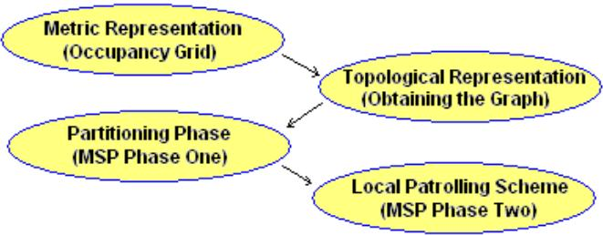
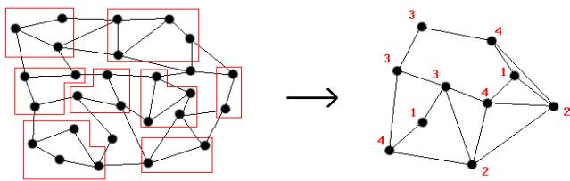
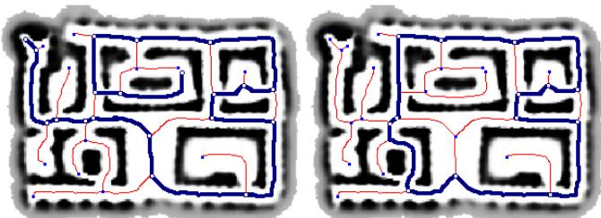
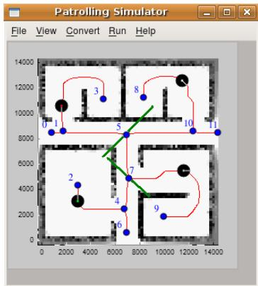
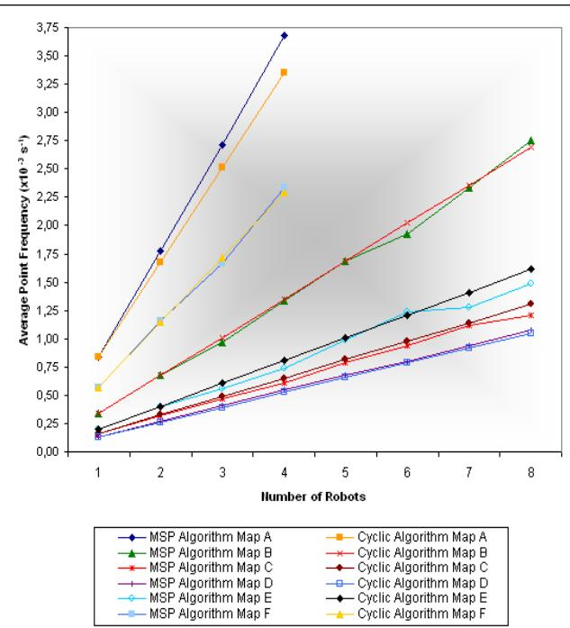

# MSP algorithm: Multi-robot patrolling based on territory allocation using balanced graph partitioning

Conference Paper $\cdot$ January 2010

DOI: 10.1145/1774088.1774360 $\cdot$ Source: DBLP

44

2 authors, including:

Rui P. Rocha

University of Coimbra

91 PUBLICATIONS 916 CITATIONS

Some of the authors of this publication are also working on these related projects:

CHOPIN View project

Project

# MSP Algorithm: Multi-Robot Patrolling based on Territory Allocation using Balanced Graph Partitioning

David Portugal Instituto de Sistemas e Robótica Dept. of Electrical and Computer Engineering University of Coimbra 3030-290 Coimbra, Portugal davidbsp@alunos.deec.uc.pt

Rui Rocha Instituto de Sistemas e Robótica Dept. of Electrical and Computer Engineering University of Coimbra 3030-290 Coimbra, Portugal rprocha@isr.uc.pt

# ABSTRACT

This article addresses the problem of efficient multi-robot patrolling in a known environment. The proposed approach assigns regions to each mobile agent. Every region is represented by a subgraph extracted from the topological representation of the global environment. A new algorithm is proposed in order to deal with the local patrolling task assigned for each robot, named Multilevel Subgraph Patrolling (MSP) Algorithm. It handles some major graph theory classic problems like graph partitioning, Hamilton cycles, nonHamilton cycles and longest path searches. The flexible, scalable, robust and high performance nature of this approach is testified by simulation results.

# Categories and Subject Descriptors

G.2.2 [Discrete Mathematics]: Graph Theory — Graph algorithms; Path and circuit problems; I.2.8 [Artificial Intelligence]: Problem Solving, Control Methods, and Search — Graph and tree search strategies; Heuristic methods; Plan execution, formation, and generation.

# 1. INTRODUCTION

The advances in the robotic field have been massive in the last decades. Issues like patrolling, map learning, autonomous navigation, self-location, graph-exploration, cooperative dynamics, obstacle avoidance, pursuit-evasion, surveillance and inspection have become very popular in recent years and represent interesting challenges.

In the particular case of infrastructure patrol, which has high utility and impact on society, every position in the environment (or at least the ones that require surveillance) must be regularly visited, assuring a minimum frequency for verifying the existence of intruders or other anomalies. According to [1], besides being monotonous and repetitive, this task may also be dangerous, hence an alternative approach for prevention of human beings is to allow technology to assist through the use of multiple mobile robots to pursuit the mission, collaborating to guard the grounds from intrusion.

A fully-equipped autonomous mobile robot with various sensors may accomplish the assignment adequately, but it may also prove to be costly and have diminutive fault-tolerance. On the other hand, Multi-Robot Systems are characterized by distributed control, autonomy and greater fault tolerance. A team of cooperative agents may fulfil the task with better performance than a single robot, because of the possibility of having many robots in different places and carry out diverse tasks at the same time, i.e. space distribution.

Also, when solving complex problems, it is sometimes useful to divide it in simpler subtasks and assign them to different robots of the team. The decomposition of complex problems linked with effective cooperation is a major advantage of these systems.

In this work, it is assumed that the environment is known and robots have the ability to self-locate and navigate within the boundaries of the structures. The main aim is to address the multi-robot systems’ problem of efficiently patrolling a given environment.

The next section represents a brief survey of the work previously done in the area. Section 3 states the problem that is addressed in this paper and the subsequent section presents the proposed algorithm. Later on, it will be shown that the results prove its efficiency and it is discussed its scalability as well as its possibility to use different team sizes. Finally, the article ends with conclusions and future work.

# 2. STATE OF THE ART

Kaminka et al.[2] described an algorithm that places robots uniformly along a predefined path obtained by computing a minimal Hamiltonian cycle, ensuring the same optimal frequency for every point of the graph.

Kolling and Carpin [3] uses robots equipped with range sensors that assume edges and vertices contamination (possibility of hosting intruders) and presents a strategy for clearing an entire graph. The problem was called GRAPH-CLEAR and was enhanced in [4] when the same authors proposed an improved algorithm which requires solving a partitioning problem and also in [5] by algorithmically extracting surveillance graphs from occupancy grid maps.

Assignment of different areas for each robot is discussed in [6] for exploration purposes. Each robot has a destination target and locally examines its share to minimize overall exploration time. On the other hand, free space environment covering problems in the shortest possible time, using strategies with indicators in the environment itself as a way of communicating, have also become very popular like in [7] and [8], the last one being inspired on ant-colonies, which use pheromone trails in exploration. Strategies that are based on communication are also popular when using teams of mobile robots, [9] describes a method in which robots share information about the environment and do their best to mutually assist each other in achieving their goals.

  
Figure 1: Required phases to obtain a patrolling scheme from an initial metric representation of the environment.

A centralized strategy is presented in [10]. Robots firstly map the environment; afterwards a motion planning algorithm that takes the environment into account and assigns patrolling regions to each agent is executed. Robots may update their representation of the maps to follow environment changes during the patrolling task and may also switch their operation mode in case of a threat scenario. Finally, Almeida et al. [11] study and compare the performance of already developed patrolling approaches using multiple robots. Their conclusions assist the choice between different strategies according to the environment, using a given number of robots and its objective is to serve as a guideline for new approaches and improving the current ones.

# 3. PROBLEM FORMULATION

The main objective of this work is to develop a new patrolling strategy to maximize the visiting frequency for every point of the overall graph. The strategy is based on balanced graph partitioning and assigning a region for each robot. The local patrolling route of each robot hugely depends on the subgraph topology. Firstly, Euler and Hamilton circuits and paths search procedures take place. If these optimal paths do not exist, our algorithm uses new methods to search for non-Hamiltonian cycles and longest paths and chooses which one is best suited. After the main path is chosen, the patrolling route is modified to include the edges that are not in the main path and, finally, if the main path is not a cycle (Hamiltonian or not) returning to the route’s first vertex is done by inverting the whole one-way path. Note that if the main path is a cycle, this last step is not needed since the first and last vertices of the route are the same. All these steps will be carefully studied in the next section.

It is assumed that a topological representation of the environment is available, which is modelled as an undirected graph whose vertices represent places and whose edges represent connectivity between places. In our case, when building the simulator to develop and test our approach, this was possible by incorporating the EVG-THIN tool developed by Patrick Beeson [12] to obtain the Voronoi Diagram from the occupancy grid of the environment1. Having the diagram, the graph is obtained by image processing, with correct identification of vertices and edges. Figure 1 shows all the required phases to obtain a patrolling route from an initial metric representation of an environment. All of them were included in the simulator, where our approach was also compared to a classic cyclic approach [2]. The main results are presented in section 5. In the next section, the MSP Algorithm is described with more detail, assuming that the environment’s undirected graph is already available.

  
Figure 2: Example of a coarsened graph.

# 4. MULTILEVEL SUBGRAPH PATROLLING (MSP) ALGORITHM

# 4.1 Multilevel Graph Partitioning

In [13], a multilevel method for partitioning graphs was presented. There are three main phases in this method: coarsening, partitioning and uncoarsening. Basically, in the coarsening phase, a sequence of smaller graphs, each with fewer vertices is obtained by collapsing vertices and edges into single vertices of the next level, which are called multinodes. An example of a coarsened graph is presented in figure 2. Then, in the partitioning phase, the coarse graph obtained is bisectioned and lastly, in the uncoarsening phase, the partitioning is refined while the original graph is restored. The method used in our work was based on this scheme with some minor changes in the partitioning phase, which started by separating the largest multinode from the rest, evaluate an equilibrium condition (cost of all edges in both regions) and swap multinodes from one side to the other only if the equilibrium condition improves.

# 4.1.1 Generalized Partitioning

As it was previously seen, the Multilevel Graph Partitioning method creates a bisection of the graph, resulting in two smaller subgraphs. To be able to create more than two balanced regions, subgraph partitioning was also developed based on the same method and unbalanced partition conditions were also produced; For instance, a three region balanced partitioning is done by firstly dividing the main graph into two regions with an unbalanced partition condition of $3 3 . 3 \%$ and $6 6 . 6 \%$ of its dimensions. Then, the subgraph with largest length is divided into two regions with a $5 0 \% - \ 5 0 \%$ balanced condition. Three regions with $3 3 . 3 \%$ of the graphs dimension is the aimed final result. The patrolling simulator developed provides partitions from two up to eight balanced graph regions. Logically, if the input is only one robot, then no partition is needed and a patrolling scheme for the whole graph is implemented.

# 4.2 Local Patrolling Scheme

After having the graph partitioned in regions according to the number of robots defined for simulation, the patrolling strategy for each robot should be defined. A staged search for a main patrolling path takes place and, afterwards, when the main path is defined, the patrolling route is completed by visiting the edges that are not included in the main path and returning to the route’s first vertex.

The main path is a sequence of vertices and edges that cover most of the subgraph, ideally all. There are no edge repetitions in the main path and its choice is the most important factor for local patrolling performance.

# 4.2.1 Euler and Hamilton Circuits and Paths

The first stage of finding a main path is to search for Euler circuits and paths, which are paths that visit all edges of the graph exactly once. Euler circuits start and end on the same vertex whereas Euler paths do not.

There are necessary conditions for the existence of Eulerian circuits [14] $^ 2$ and for Eulerian paths (either all vertices have even degree or all but two, the endpoints). These circuits and paths can be easily constructed using Fleury’s Algorithm [15]. Even though testing and finding Eulerian circuits and paths in a graph is relatively simple, most of the graphs, especially the ones that represent topological maps do not have these paths, because there are normally a high number of vertices that only have one neighbour (a dead end) or have an odd number of neighbours.

After checking the non-existence of Euler circuits and paths a search procedure for Hamilton circuits and paths take place. Hamilton circuits and paths visit all vertices of the graph exactly once, the difference being that Hamilton circuits start and end on the same vertex. Note that visiting all vertices does not imply visiting all edges of the graph. Determining if these paths and circuits exist is a NP-complete problem and solutions are normally based on heuristics. In this work, it is used the UHC, a fast algorithm proposed in [16] for finding Hamiltonian paths and circuits in undirected graphs. Again, most of the graphs do not have these paths, because there are normally a high number of vertices that only have one neighbour (a dead end), which means that, when the edge connecting those vertices is visited, there is no edge connecting to a different vertex to be visited next. In these cases, further solutions for a main path are computed as alternatives of Euler and Hamilton circuits and paths (explained below).

# 4.2.2 Longest Path

After ruling out Euler and Hamilton circuits and paths, a longest path search procedure is done. The longest path problem is also NP-complete, so an approximate and simplified search was conducted to find the longest path from any vertex to another in the considered graph. Firstly, from analysing all of the graphs formed after the Voronoi Diagram computation and consequent processing, it was possible to observe that it is common to have a substantial number of dead ends in the graphs, i.e. vertices with only one neighbour (degree one), also called leaf vertices. For this reason, the longest path search procedure was simplified to start and end in one degree vertices, leaving the vertices with higher degree for the Non-Hamiltonian cycle procedure, which will be analysed in the next section. An algorithm for searching and approximating the longest path was created and its pseudo-code is presented on the next page (see Algorithm 1). Note that its simplifications and its own nature enables us to find a good solution relatively fast. For our case, it is enough and, although it does not guarantee finding the longest existing path, it will always return an option for main path.

  
Figure 3: Longest Path and Non-Hamiltonian Cycle obtained for a patrolling scheme of one robot in a graph.

The first step is to build a list of all the vertices with degree one, then go through them and choose a source vertex and a destination vertex, run the algorithm in the pseudocode and save the final path. The algorithm is run with different sources and destinations and every time a longer path is found, it should be kept. There is a tag in each edge to check whether it was visited or not, and the find_dest variable allow us to delay the arrival to the final destination from the source vertex. In the end, the best path found by the algorithm is selected, for example, the one on the left in Figure 3.

# 4.2.3 Non-Hamiltonian Cycles

Sometimes graphs include cycles that are not Hamiltonian. These cycles may or may not be a good main path, depending on the number of elements and overall algorithm performance when compared to the longest path found for the same graph. Small cycles with few elements are common but not desirable. On the other hand, large cycles are very appealing, since they have the advantage of returning to the starting point without needing to compute a return path, which means that a cycle with a lower number of edges may be a better choice for a main path than the longest path found. When there is no cycle in the graph, the longest path is assumed as the main path, and when there is one or more cycles, they are only accepted if they include at least half of the vertices of the graph. This was due to simulation comparisons between cycles and longest paths in some graphs. The simplified method used to find cycles is also new and is very similar to the one used for longest paths, the differences being that a list of vertex with degree higher than one is computed and the while loop stops when we reach the source vertex again (a cycle was found or no cycle exists). The algorithm should be run with distinct vertices and if a longer cycle is found, it should be saved. Finding the same cycle more than once, with different starting points, is expected. As an example, on the right side of Figure 3, the best cycle found for a given graph is shown.

/\* Inputs \*/ source: Source Vertex dest : Destination Vertex list : Degree One Vertices List   
1 All edges connected to degree one vertices visited; // This will avoid visiting them. 2 source and dest connected edges unvisited; // Except for these.   
3 find_dest false;   
4 last_element source;   
5 path add_to_path(source);   
6 while true do 7 last_element current last path element; 8 num number of unvisited edges of last_element; 9 if num $= 0$ then // No Available Neighbours.   
10 find_dest true;   
11 forall neighbours of last_element do   
12 if degree $> 1$ and not included in path and edge(last_element,neighbour) $=$ visited then   
13 edge(last_element,neighbour) unvisited;   
14 end   
15 end   
16 path elements - -; $^ { \prime * }$ Withdraw last element of the path. It will not comeback to the same, because its edge is marked as visited. $^ { * / }$   
17 else   
18 if dest is a neighbour then   
19 if find_dest or num $= 1$ then $^ { \prime * }$ There is only one vertex left. We have reached the destination. $^ { * / }$   
20 path add_to_path(dest);   
21 break; // The End.   
22 else   
23 Withdraw dest from the list of neighbours to consider;   
24 end   
25 end   
26 if none of the neighbours has degree $> = 4$ then   
27 Choose next neighbour randomly;   
28 else   
29 Choose first neighbour with degree $> = 4$ ;   
30 end   
31 if find_dest then   
32 find_dest false;   
33 end   
34 edge(last_element,neighbour) visited;   
35 path add_to_path(neighbour);   
36 end   
37 end   
38 return path; A1 Path Λ1

  
Figure 4: An example of a graph patrolled by four robots, each in one region. The green lines represent the vertices where the graph partitioning was done.

# 4.2.4 Detours

Now that the main path is defined, it is necessary to complete the patrolling route by visiting the edges that are not included in the path, except for the case of Euler circuits and paths, in which every edge is already covered.

All of the main path vertices will be visited in order and detours will be computed and included in the final patrolling route. This is done by inspecting whether the vertex has other neighbour vertices left unvisited. If so, a detour is started with a maximum allowed number of edges to visit. Edges are added to the detour route, the ones linking vertices with inferior degree first, because they have less probability of being visited later by other detour routes. Also, it returns, when it arrives at a vertex that is already in the main path. The detour route should include all of the edges accessible from the original vertex of the main path as long as it does not reach the maximum allowed number of edges to be visited. When it does, it checks if there is a direct edge linked to the original vertex and if not, it returns to the original vertex by a returning path that is computed and updated for every vertex that is visited in the detour. When the detour route(s) for this vertex is done, we move on to the next vertex of the main path until we reach the final vertex. Finally, if not all of the edges in the subgraph were visited, the maximum number of edges to be visited in the detour is increased and the process is repeated.

The idea is to have, in the end, a patrolling route that covers all edges and vertices with the least possible maximum number of edges allowed to visit by the detour route. The algorithm described is adaptive and the number of times required to repeat this process can be minimized by establishing lower quotas and upper quotas; For instance, check if all edges are not covered when a maximum of one edge detour is allowed (actually, this is enough when an Hamilton circuit or path is detected). This will be your starting lower quota. Afterwards, check an upper quota of half the number of edges in the graph, which is a pessimistic number. If all vertices were covered, than the next test number of edges should be between the lower and upper quota interval, if not, the previously considered upper quota should become a lower quota and a new upper quota should be established. Using this approach the correct value is found much faster than a pure incremental approach.

  
Figure 5: Frequency comparison for six different topological maps.

# 4.2.5 Returning to the route’s initial vertex

The route’s initial vertex is the starting point for each robot, defined by the source vertex of the main path in each region. If the main path is not an Euler, Hamiltonian or non-Hamiltonian circuit/cycle, it is necessary to return to the route’s initial vertex. Two ways were considered to do so: Inverse Path and Shortest Path. While the former is done by inversing the patrolling route back to the first vertex, the latter one simply computes the shortest path (with Dijkstra’s Algorithm [17]) from the last vertex to the initial vertex. Both were compared and the former showed better results in terms of overall patrolling frequencies for every point in 96% of all studied cases, becoming the chosen one for this purpose.

# 5. RESULTS AND DISCUSSION

The MSP Algorithm was compared with the so-called Cyclic Algorithm that searches for Hamiltonian cycles in a graph and places the robots along the path [2]. When there are no Hamilton cycles, it uses the same methods as ours for computing the best possible path. Thus, both approaches are usually equivalent when only one robot is used. Note that with the Cyclic approach, all the robots follow the exact same route uniformly lagged in time. A large set of maps were used to compare average point frequency for both approaches. Results for six different maps are shown in figure 5. Map A corresponds to the one on figure 4 and due to minimum size dimension constraints, for each subgraph there is a maximum number of partitions according to the graph complexity, in this case four. Map B, C and $\mathrm { E }$ are medium graphs with relatively defined paths. B has 70 vertices, C has 41 and $\mathrm { E }$ has 74. Despite this, each map has distinct frequency intervals due to their different Euclidean dimensions. Map D represents a more complex graph with

Table 1: Comparison results for map D   

<table><tr><td rowspan=1 colspan=1>nr</td><td rowspan=1 colspan=1>∑ dT[C]</td><td rowspan=1 colspan=1>∑ dT [MSP]</td><td rowspan=1 colspan=1>F[C]</td><td rowspan=1 colspan=1>F[MSP]</td><td rowspan=1 colspan=1>σ[C]</td><td rowspan=1 colspan=1>σ[MSP]</td></tr><tr><td rowspan=1 colspan=1>1</td><td rowspan=1 colspan=1>21949</td><td rowspan=1 colspan=1>21949</td><td rowspan=1 colspan=1>0.13</td><td rowspan=1 colspan=1>0.13</td><td rowspan=1 colspan=1>0.06</td><td rowspan=1 colspan=1>0.06</td></tr><tr><td rowspan=1 colspan=1>2</td><td rowspan=1 colspan=1>21949</td><td rowspan=1 colspan=1>20923</td><td rowspan=1 colspan=1>0.26</td><td rowspan=1 colspan=1>0.27</td><td rowspan=1 colspan=1>0.13</td><td rowspan=1 colspan=1>0.13</td></tr><tr><td rowspan=1 colspan=1>3</td><td rowspan=1 colspan=1>21949</td><td rowspan=1 colspan=1>20039</td><td rowspan=1 colspan=1>0.39</td><td rowspan=1 colspan=1>0.41</td><td rowspan=1 colspan=1>0.19</td><td rowspan=1 colspan=1>0.21</td></tr><tr><td rowspan=1 colspan=1>4</td><td rowspan=1 colspan=1>21949</td><td rowspan=1 colspan=1>20037</td><td rowspan=1 colspan=1>0.52</td><td rowspan=1 colspan=1>0.55</td><td rowspan=1 colspan=1>0.25</td><td rowspan=1 colspan=1>0.29</td></tr><tr><td rowspan=1 colspan=1>5</td><td rowspan=1 colspan=1>21949</td><td rowspan=1 colspan=1>19375</td><td rowspan=1 colspan=1>0.66</td><td rowspan=1 colspan=1>0.68</td><td rowspan=1 colspan=1>0.32</td><td rowspan=1 colspan=1>0.38</td></tr><tr><td rowspan=1 colspan=1>6</td><td rowspan=1 colspan=1>21949</td><td rowspan=1 colspan=1>18951</td><td rowspan=1 colspan=1>0.79</td><td rowspan=1 colspan=1>0.80</td><td rowspan=1 colspan=1>0.38</td><td rowspan=1 colspan=1>0.44</td></tr><tr><td rowspan=1 colspan=1>7</td><td rowspan=1 colspan=1>21949</td><td rowspan=1 colspan=1>18403</td><td rowspan=1 colspan=1>0.92</td><td rowspan=1 colspan=1>0.94</td><td rowspan=1 colspan=1>0.44</td><td rowspan=1 colspan=1>0.51</td></tr><tr><td rowspan=1 colspan=1>8</td><td rowspan=1 colspan=1>21949</td><td rowspan=1 colspan=1>18269</td><td rowspan=1 colspan=1>1.05</td><td rowspan=1 colspan=1>1.08</td><td rowspan=1 colspan=1>0.51</td><td rowspan=1 colspan=1>0.64</td></tr></table>

$n _ { r }$ - Number of patrolling robots. $\sum d _ { T }$ - Total patrolling distance travelled (m). ∑F - Average point frequency of passage $( \times 1 0 ^ { - 3 } s ^ { - 1 } )$ . $o$ - Standard Deviation $( \times 1 0 ^ { - 3 } s ^ { - 1 }$ ). [C] - Cyclic Algorithm. [MSP] - MSP Algorithm.

268 vertices and Map F is a completely different case, due to the existence of a main Hamilton cycle in the graph and Hamilton paths in the generated subgraphs. This is a much simpler graph with 12 vertices and very good connectivity between vertices. Again, there is a partition number limitation like the one mentioned for map A.

The MSP Algorithm got better results with arbitrary number of robots for maps A and D. The Cyclic Algorithm got higher frequencies in map C’s case. For map B, the MSP Algorithm was only better for the cases of two, five and eight robots, being overly very close to the Cyclic Algorithm in the other tests. Similarly to map B, in map E’s case, the MSP Algorithm got close results to the Cyclic Algorithm up to six robots (being actually better for the six robots’ case). For seven and eight robots the results were not so good, mostly due to low quality partitions as a consequence of graph limitations. As for the special case of map F, the MSP was globally better, having only lower frequency for the case of 3 robots.

General results show that point frequencies with the MSP Algorithm are better in graphs where there are high-quality partitions and/or the global cyclic path has too many edge repetitions, while the addition of the local patrolling paths in each region is globally less repetitive. Note that the presented results are normalized and constant speed for each robot of 1m/s is considered, also each pixel in the Voronoi Graph is considered equivalent to a meter. Assuming this, results show that in 97,2% of cases, the MSP approach point frequencies are within the interval $\left[ \frac { n _ { r } } { \sum d _ { T } } , \frac { 4 n _ { r } } { \sum d _ { T } } \right] \times 1 0 ^ { - 3 }$ , with $\sum d _ { T }$ being the sum of all the distances travelled by robots in the MSP approach in meters, which is equivalent to the time (in seconds) that the robots would take to cover all the map, in separated time schedules, with a 1m/s constant speed and $n _ { r }$ being the number of robots patrolling the graph. Note that $\sum d _ { T }$ hugely depends on graph complexity and vertices number. Frequencies not within the interval occurred only in some cases where the global complexity of the graph resulted in unbalanced partitions (generally with high number of regions) or not so satisfactory main paths.

The standard deviation is generally lower for the Cyclic Approach, as shown in table 1, because the MSP approach has global frequency values less close to the average values, mostly due to the inversed path followed when no representative cycles exist in the subgraph. Inverting the path will result in better frequencies for points in the middle and worse for points near the path extremities. However, the total distance travelled by robots is much smaller than in the cyclic approach, because in our case there is no redundancy.

# 6. CONCLUSION AND FUTURE WORK

In this article, a new multi-robot patrolling algorithm based on balanced graph partition was proposed. This approach decreases redundant work and robot detritions when compared to a cyclic approach. It is also relatively simple, effective, scalable, distributed and robust. Fault-tolerance can be easily implemented, when a robot fails, by just rerunning the algorithm with fewer robots and send them to their new starting positions. There is no need for a communication system or expensive sensors. The interference between robots is minimal; they may only be near each other in vertices of the boundaries of their regions. A collision avoidance mechanism to forbid two or more robots being in the same border vertex at the same time was also developed. On the other hand, for a cyclic approach when there are no main cycles, it is much harder to employ such a mechanism, since robots may be coming and going through the same path. Also, for an intelligent intruder it is easier to attack an environment, which is patrolled using a cyclic approach because robots follow the same route over and over again, while in our approach, although being deterministic, each robot follows its own patrolling cycle and completes it in different periods of time, so it is much more difficult to track every robot’s path and predict which areas of the environment are better for intrusion, because the global robot disposition is continuously changing. Possible disadvantages of this approach are the longer time that robots take to cover points on the extremities of the patrolling route when there are no cycles, the need to redefine the paths when an agent fails and, even though it is a difficult task for an observer, its deterministic nature makes it possible to calculate and predict robots disposition in a given point in time.

As for future work, some issues are still left open. An even more precise method to define when to use a nonHamiltonian cycle main path instead of a longest path and vice-versa could be implemented, as well as the fault-tolerance approach mentioned before and an intruder detection system. Finally, it would be worth taking this approach further than simulation and test with mobile robots in real world scenarios, consequently dealing with some related issues not addressed like decentralized planning integration, robots self-localization, energy refills, global fault detection, real world obstacle avoidance and intruder detection.

# 7. ACKNOWLEDGEMENTS

This work was financially supported by the Institute of Systems and Robotics - Coimbra under its regular funding by the Portuguese Government’s department FCT - Funda¸c˜ao para a Ciˆencia e a Tecnologia.

# 8. REFERENCES

[1] R. Rocha. Building Volumetric Maps with Cooperative Mobile Robots and Useful Information Sharing: a Distributed Control Approach based on Entropy. Ph.D. Thesis, Faculty of Engineering of University of Porto, Portugal, October, 2005.   
[2] Y. Elmaliach, N. Agmon and G. Kaminka. Multi-Robot Area Patrol under Frequency Constraints. IEEE International Conference on Robotics and Automation (ICRA 07), 385-390, Rome, Italy, Apr. 10-14, 2007. ISBN 1-4244-0601-3.   
[3] A. Kolling and S. Carpin. The GRAPH-CLEAR Problem: Definition, Theoretical Properties and its Connections to Multirobot Aided Surveillance. IEEE/RSJ International Conf. on Intelligent Robots and Systems, 1003-1008, San Diego, California, U.S.A., Oct. 29-Nov. 2, 2007. ISBN 978-1-4244-0912-9.   
[4] A. Kolling and S. Carpin. Multi-robot Surveillance: an Improved Algorithm for the GRAPH-CLEAR Problem. IEEE International Conf. on Robotics and Automation, 2360-2365, Pasadena, California, U.S.A., May 19-23, 2008. ISBN 978-1-244-1646-2.   
[5] A. Kolling and S. Carpin. Extracting Surveillance Graphs from Robot Maps. International Conf. on Intelligent Robots and Systems, 2323-2328, Nice, France, Sept. 22-26, 2008. ISBN 978-1-4244-2057-5.   
[6] K. Wurm, C. Stachniss and W. Burgard. Coordinated Multi-Robot Exploration using a Segmentation of the Environment. International Conference on Intelligent Robots and Systems, 1160-1165, Nice, France, Sept. 22-26, 2008. ISBN 978-1-4244-2057-5.   
[7] M. Batalin and G. Sukhatme. Multi-Robot Dynamic Coverage of a Planar Bounded Environment. Technical Report, Robotic Embedded Systems Laboratory, University of Southern California, 2002.   
[8] M. Miazaki. Sistema de controle multi-robˆo baseado em colˆonia de formigas artificiais. Master Thesis, Instituto de Ciˆencias Matem´aticas e de Computa¸c˜ao - University of S˜ao Paulo, Brazil, February, 2007.   
[9] A. Sgorbissa and R. Arkin. Local Navigation Strategies for a Team of Robots. Robotica, 461-473, 21(5), Cambridge Univ. Press, 2003. ISSN 0263-5747.   
[10] Y. Guo, L. Parker and R. Madhavan. 9 Collaborative Robots for Infrastructure Security Applications. Studies in Computational Intelligence, 185-200, Vol. 50, Springer-Verlag Berlin Heidelberg, April 22, 2007.   
[11] A. Almeida, G. Ramalho, H. Sanana, Y. Chaveleyre et al. Recent Advances on Multi-Agent Patrolling. Brazilian Symp. on Artificial Intelligence, 474-483, 3171, S˜ao Lu´ıs, Brazil, 2004. ISBN 3-540-23237-0.   
[12] P. Beeson, N. Jong and B. Kuipers. Towards Autonomous Topological Place Detection Using the Extended Voronoi Graph. Int. Conf. on Robotics and Automation, 4373-4379, Barcelona, Spain, 2005.   
[13] G. Karypis and V. Kumar. A Fast and High Quality Multilevel Scheme for Partitioning Irregular Graphs. Society for Industrial and Applied Mathematics Journal of Scientific Computing, 359-392, 20(1), 1998.   
[14] C. Hierholzer. Uber die M ¨ ¨oglichkeit, einen Linienzug ohne Wiederholung und ohne Unterbrechnung zu umfahren. Mathematische Annalen 6, 30-32, 1873.   
[15] Fleury. Deux problemes de geometrie de situation. Journal de mathematiques elementaires, 257-261, 1883.   
[16] D. Angluin, L. Valiant. Fast Probabilistic Algorithms for Hamiltonian Circuits and Matchings. Journal of Computer and System Sciences, 155-193, 18(2), April 1979.   
[17] E. W. Dijkstra. A Note on Two Problems in Connection with Graphs. Numerische Math, 269-271, Vol. 1, 1959.