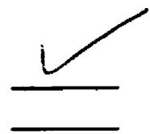
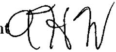

# Markov chain models of genetic algorithms

Yong Zhao The University of Montana

Permission is granted by the author to reproduce this material in its entirety, provided that this material is used for scholarly purposes and is properly cited in published works and reports.

\*\* Please check "Yes" or "No" and provide signature \*\*

Yes, I grant permission No, I do not grant permission

Auhor' siaureon Date May 20, 1999

Any copying for commercial purposes or financial gain may be undertaken only with the author's explicit consent.

# Markov Chain Models of Genetic Algorithms

by

Yong Zhao

Presented in partial fulfillment of the requirements

for the degree of

Master of Science in Computer Science

The University of Montana-Missoula

July 1999

Approved by: Cbairperson D86 Dean, Graduate School 5-20-99 Date

# UMI Number: EP39151

All rights reserved

INFORMATION TO ALL USERS The quality of this reproduction is dependent upon the quality of the copy submitted.

In the unlikely event that the author did not send a complete manuscript and there are missing pages, these will be noted. Also, if material had to be removed, a note will indicate the deletion.

UMI EP39151

Published by ProQuest LLC (2013).Copyright in the Dissertation held by the Author.

Microform Edition $\circledcirc$ ProQuest LLC. All rights reserved. This work is protected against unauthorized copying under Title 17, United States Code

ProQuest

ProQuest LLC.   
789 East Eisenhower Parkway P.O. Box 1346   
Ann Arbor, Mi 48106 - 1346

# Computer Science

# Markov Chain Models of Genetic Algorithms

Director: Alden H. Wrigh

Markov chain models of genetic algorithms have been an active research area since early 1990's. In 1990, Vose [Vose, 1990] provided an infinite population model for a genetic algorithm called the Simple Genetic Algorithm (with proportional selection, mutation determined by a mutation rate, and one-point crossover). In 1992, Nix and Vose [Nix and Vose, 1992] derived a finite population model for the same algorithm. Thereafter, Vose and others refined their work and came up with a more generalized model, Random Heuristic Search. In this work, we start with an overview of the Random Heuristic Search model and its applications to the Simple Genetic Algorithm. We prove three new results regarding the mixing scheme of Random Heuristic Search. We will conduct an extended work on some selection strategies that Random Heuristic Search does not include. Then we will integrate our work with Random Heuristic Search to construct the Markov chain models of several practical genetic algorithms. Finally, we will present some experimental results based on our models.

Reproduced with permission of the copyright owner. Further reproduction prohibited without permission.

# TABLE OF CONTENTS

ABSTRACT. ii

ACKNOWLEDGMENTS.. v

1 Introduction. 1

2 Notation and Terminology.. 2

2.1 Algebra 2   
2.2 Populations 4   
2.3 The multiple hypergeometric distribution 6

# 3 Random Heuristic Search and The Simple Genetic Algorithm ..... 8

3.1 Random Heuristic Search . . . 9

3.2 The Simple Genetic Algorithm . . . . 12

3.2.1 Selection . 12   
3.2.2 Mutation 14   
3.2.3 Crossover 15   
3.2.4 Mixing . . 18   
3.2.5 The Heuristic function of the Simple Genetic Algorithm . . . . 22

4 An extended work on selection. 24

4.1 Step 3 done by sampling with replacement 25   
4.2 Step 3 done without replacement 26   
4.2.1 Step 3 done by truncation selection from X . 28   
4.2.2 Step 3 done by truncation selection from $\mathrm { X } { + } \mathrm { Y }$ 30

# iii

Reproduced with permission of the copyright owner. Further reproduction prohibited without permission.

4.2.3 Step 3 done by Random selection from X . . . . 31

# 5 Models of Some Practical genetic algorithms .. 33

5.1 Whitley's Genitor Algorithm . . 34   
5.2 Syswerda's Steady-State Genetic Algorithm 34   
5.3 Eshelman's CHC Algorithm 35

6 Applications of Markov chain models .. 37

6.1 Absorbing Markov Chains 37   
6.2 Expected absorption time based on Markov chain models . . 38

7 Conclusion 41

REFERENCES 43

Reproduced with permission of the copyright owner. Further reproduction prohibited without permission.

# ACKNOWLEDGMENTS

This work is dedicated to my mother, Menghui Liu. Her support and encouragement helped me achieve one goal after another in my life. I would like to thank my advisor Dr. Wright. I took my first computer science course from him two years ago. It was in his class where I first learned the theoretical aspect of computer science besides its programming part. I am glad to work on my thesis under his direction. His comprehensive knowledge and never-rest ideas helped me understand the subject and push my work from one level to another. I would like to thank Dr. Kayll, my math advisor and friend. I own him for all the grammar, spelling fiaws as well as mathematical mistakes I made in the draft of this work. Also I would like to thank Dr. Opitz. I first learned about genetic algorithm from his lectures. Part of this work was actually originated from my course project in his class. I am grateful to Diane Oman for her assistance in the experimental phase of this work. I am in debt to Dr. Murray, Dr. Fleming and Dr. Hewitt for my whole life. Without their help, I would probably be working on my bureaucratic job in China today. I thank Mei Zhou, my colleague and my wife. I find it is much more helpful to check her for some questions rather than look it up in a scientific reference. Finally, I thank our parents for the support.

# CHAPTER I INTRODUCTION

First developed by Holland [Holland, 1975] and others in the 1970's, genetic algorithms have been widely used to search over large, irregular and poorly understood spaces. With so many varieties used in practice, it is an active research area to compare different genetic algorithms both empirically and theoretically. One common approach of the research is to obtain some empirical results first and then apply an analysis based on Holland's Schema Theorem to gain some insight. However, this insight is limited in the sense that it can loosely predict the generational changes of the building blocks (i.e. schemata) under certain conditions. In order to gain a more complete insight of the genetic algorithms, many researchers have been working on the Markov chain models of the genetic algorithms since the late 1980's. Most genetic algorithms can be modeled as Markov chains over populations. The most commonly used Markov chain model is an exact model whereas the Schema Theorem model is an approximate model. Also, once the Markov chain model is constructed, it is just a matter of computation to get the stationary distributions for ergodic chains and absorption probabilities for absorbing chains, which can provide a solid ground for algorithm comparisons and theoretical research. In this work, we first review a wellresearched Markov chain model, namely the Random Heuristic Search model, and obtain three generalized results based on the model. Then we will construct Markov chain models for several practical genetic algorithms. Finally, we will derive average absorption time for these algorithms based on their Markov chain models.

# CHAPTER II NOTATION AND TERMINOLOGY

We follow [Vose, 1999] and [Wright and Zhao, 1999] for genetic algorithm notation and terminology; refer to [Herstein, 1996] for basic algebra and [Feller, 1967] for probability basics.

# 2.1 Algebra

Let $\mathcal { Z }$ be the set of integers, $\mathcal { N }$ be the set of non-negative integers (i.e. $\mathcal { N } =$ $\{ 0 , 1 , 2 , \ldots \} )$ , and $\mathcal { R }$ be the set of real numbers. Let $\Omega$ be the set of length- $\textit { \textbf { l } }$ binary strings and $\pmb { n }$ be the cardinality of $\Omega$ Clearly, $n = 2 ^ { l }$ .Let $\mathcal { Z } _ { 2 }$ be the set of integers modulo 2 (i.e. $\mathcal { Z } _ { 2 } = \{ 0 , 1 \} .$ . Algebraically, $\mathcal { Z } _ { 2 }$ is a finite field with addition $\oplus$ and multiplication $\otimes$ defined by

$$
\begin{array} { c c } { { \frac { \bigoplus \mathbf { ~ \alpha ~ 1 } } { 0 ~ 0 ~ 1 } } } & { { ~ \frac { \bigotimes \mathbf { ~ \alpha ~ 1 } } { 0 ~ } } } \\ { { \mathrm { ~ \iota ~ ~ 1 ~ } } } & { { ~ 0 ~ } } \\ { { \mathrm { ~ \iota ~ ~ 1 ~ } \left| \begin{array} { l l l l } { { 1 } } & { { 0 } } & { { } } & { { 1 } } \end{array} \right| ~ 0 } } & { { 1 } } \end{array}
$$

The set $\Omega$ can be represented by $\mathcal { Z } _ { 2 } { \times } \mathcal { Z } _ { 2 } { \times } \ldots { \times } \mathcal { Z } _ { 2 }$ , or $( \mathcal { Z } _ { 2 } ) ^ { l }$ for simplicity. Under bitwise addition $\oplus$ and multiplication $\otimes , \Omega$ retains most algebraic properties of $\mathcal { Z } _ { 2 }$ except the existence of multiplicative inverses. Each binary string of $\Omega$ can be represented by an integer from $\left[ 0 , n - 1 \right]$ . For the rest of this work, we interchangeably use $\Omega$ to represent both $\left( \mathcal { Z } _ { 2 } \right) ^ { l }$ and integers from $[ 0 , n - 1 ]$ . We assume that the elements of $\Omega$ are ordered according to the usual ordering of $[ 0 , n - 1 ]$ . For example, if $l = 2$ , then $n = 2 ^ { 2 }$ and

$$
\Omega = \left\{ 0 0 , 0 1 , 1 0 , 1 1 \right\} \equiv \left\{ 0 , 1 , 2 , 3 \right\} .
$$

For a binary string ${ \mathfrak { i } } \in \Omega$ , let $| i |$ denote the number of 1's in $\textit { i }$ In the above example,

$$
| 0 0 | = 0 , | 0 1 | = 1 , | 1 0 | = 1 , \mathrm { ~ a n d ~ } | 1 1 | = 2 .
$$

If expr is an expression that has a value of true of false, then

$$
[ e x p r ] = { \left\{ \begin{array} { l l } { 1 } & { { \mathrm { i f ~ } } e x p r { \mathrm { ~ i s ~ t r u e } } } \\ { 0 } & { { \mathrm { o t h e r w i s e . } } } \end{array} \right. }
$$

We call [expr] the logical bracket of expr. We use 1 to denote the vector of all 1's and 0 to denote the vector of all ${ \boldsymbol { 0 } } ^ { \prime } { \mathbf { s } }$ For $k \in \Omega$ , $\sigma _ { k }$ is the matrix such that

$$
[ \sigma _ { k } ] _ { i , j } = [ i \oplus j = k ] , { \mathrm { ~ f o r ~ a l l ~ } } i , j \in \Omega .
$$

For example, if $\Omega = \{ 0 0 , 0 1 , 1 0 , 1 1 \}$ and $k = 0 1$ , then

$$
 \begin{array} { r l } { { \boldsymbol { \pi } } _ { k } } &  = { \mathrm { ~ \boldsymbol { \pi } ~ } }  [ \begin{array} { l l } { ( { \mathrm { i 0 ~ } } \Phi \mathbf { 0 } { \boldsymbol { 0 } } \boldsymbol { { 0 } } \boldsymbol { { 0 } } \boldsymbol { { 1 } } - \mathbf { 0 } { \mathrm { 1 } } ) } & { [ \Theta \mathbf { 0 } { \boldsymbol { 0 } } \boldsymbol { { 0 } } \boldsymbol { { 1 } } - \mathbf { 0 } { \mathrm { 1 } } ] { \mathrm { ~ } } [ \Theta \mathbf { 0 } \mathbf { 0 } { \mathrm { ~ } } \boldsymbol { { 1 } } - \mathbf { 0 } { \mathrm { 1 } } ] } \\ { ( \mathbf { 0 } { \boldsymbol { 1 } } \otimes \mathbf { 0 } { \boldsymbol { 0 } } - \mathbf { 0 } { \mathrm { 1 } } ] } & { [ \Theta \mathbf { 1 } { \boldsymbol { 0 } } \boldsymbol { { 0 } } \boldsymbol { { 0 } } \boldsymbol { { 1 } } - \mathbf { 0 } { \mathrm { 1 } } ] } & { [ \Theta \mathbf { 1 } { \boldsymbol { 0 } } \boldsymbol { { 0 } } \boldsymbol { { 1 } } - \mathbf { 0 } { \mathrm { 1 } } ] } \\ { [ \mathrm { i 0 ~ } \Phi \mathbf { 0 } { 0 } \boldsymbol { { 0 } } - \mathbf { 0 } { \mathrm { 1 } } ] } & { [ \mathrm { i 0 } \Phi \boldsymbol { 0 } \boldsymbol { { 0 } } \boldsymbol { { 1 } } - \mathbf { 0 } { \mathrm { 1 } } ] } & { [ \Theta \mathbf { 0 } \boldsymbol { 1 } { \mathrm { ~ } } \boldsymbol { { 1 } } \Theta \boldsymbol { { 0 } } \boldsymbol { { 1 } } - \mathbf { 0 } { \mathrm { 1 } } ] } \\ { [ \mathrm { i } \Phi \mathbf { 0 } \boldsymbol { 0 } \boldsymbol { { 0 } } \boldsymbol { { 0 } } - \mathbf { 0 } { \mathrm { 1 } } ] } & { [ \mathrm { i } \mathbf { 1 } \Phi \boldsymbol { 0 } \boldsymbol { { 0 } } \boldsymbol { { 1 } } - \mathbf { 0 } { \mathrm { 1 } } ] } & { [ \mathrm { i } \Theta \mathbf { 0 } \boldsymbol { { 1 } } - \mathbf { 0 } { \mathrm { 1 } } ] } \\ { [ \mathrm { i } \Phi \mathbf { 0 } \boldsymbol { 0 } - \mathbf { 0 } { \mathrm { 1 } } ] } & { [ \mathrm { i } \mathbf { 1 } \Phi \boldsymbol { 0 } \boldsymbol { 1 } - \mathbf { 0 } { \mathrm { 1 } } ] } \ \end{array} \end{array}
$$

Because the operator $\oplus$ is commutive, $\sigma _ { k }$ is symmetric. One can verify that

$$
\sigma _ { k } \left[ x _ { 0 } , . . . , x _ { n - 1 } \right] ^ { T } = \left[ x _ { 0 \oplus k } , . . . , x _ { ( n - 1 ) \oplus k } \right] ^ { T } .
$$

Reproduced with permission of the copyright owner.Further reproduction prohibited without permission.

Therefore, $\sigma _ { k }$ is sometimes called a permutation matrix. One can also check that

$$
\sigma _ { i } \sigma _ { j } = \sigma _ { i \oplus j } .
$$

# 2.2 Populations

A multiset is a set with repeated elements (e.g. $\{ 1 , 1 , 2 \}$ is a multiset with three elements). In this work, we do not try to distinguish between set and multiset. Our definitions apply to both of them. For a set $\boldsymbol { S }$ , we use $| S |$ to denote its cardinality. A population $P$ is a multiset with elements drawn from $\Omega$ In this work, we are concerned mainly with finite populations. In case of an infinite population, we will point it out explicitly. We use $P _ { r }$ to denote a population of size $\pmb { r }$ When there is no ambiguity, we often omit the subscript $\pmb { r }$ . With a dot-bar representation, which can be found in many discrete mathematics books such as [Gersting, 1993], it can be shown that the total number of size- $\mathbfit { \cdot }$ populations drawn from $\Omega$ is given by

$$
N = { \binom { n + r - 1 } { r } } .
$$

We denote a population by an incidence vector from $\mathcal { N } ^ { n } = \mathcal { N } \times \mathcal { N } \times \ldots \times \mathcal { N }$ . If $X$ is a size $\pmb { r }$ population represented by an incidence vector, then its ith entry $X _ { i }$ represents the number of appearances of $i \in \Omega$ Clearly, $\textstyle \sum _ { i \in \Omega } X _ { i } = r$ For two populations $X$ and $Y$ , we say that $X \leq Y$ if $X _ { i } \ \leq \ Y _ { i }$ for all $i \in \Omega$ For example, if $X = [ 0 , 1 , 0 , 2$ and $Y = [ 1 , 1 , 0 , 3 ]$ , then $X \ \leq Y .$ For two populations $X$ and $Y , \ Y \ - \ X$ denotes the population $z$ with $Z _ { i } = [ Y _ { i } - X _ { i } \geq 0 ] \left( Y _ { i } - X _ { i } \right)$ , where the first factor is a logical bracket. For example, if $X = [ 2 , 1 , 0 , 2 ]$ and $Y = [ 1 , 1 , 0 , 3 ]$ , then $Y - X = [ 0 , 0 , 0 , 1 ]$ .

For a population $X$ of size $r$ , the vector $X / r$ gives a probability distribution over $\Omega$ . The ith entry of the probability distribution $( X / r ) _ { i }$ represents the frequency of $i \in \Omega$ in population $X$ .Vose and Liepins [Vose and Liepins, 1991] used these probability distributions to denote populations. In this case, a population is an element from

For $p \in \Lambda$ , its ith entry ${ \pmb p } _ { \pmb { i } }$ can also interpreted as the probability that $\boldsymbol { i } \in \Omega$ will be selected when an element is chosen from $\Omega$ Clearly, this representation is populationsize-independent, because each $p \in \Lambda$ represents an infinite number of finite populations. For example, populations $[ 0 , 1 , 0 , 1 ]$ and [0, 2, 0, 2] have the same probability distribution representation $[ 0 , 1 / 2 , 0 , 1 / 2 ]$ . In this work, we use both the incidence vector and the probability distribution representation of populations. In the former case, we call it a population, while in the latter one, we call it a population probability distribution. We use capital letters to denote populations and lower-case letters to denote their probability distributions. For a population $X$ of size $\pmb { r }$ , its population probability distribution is given by $X / r$ . For example, for two populations $X = [ 0 , 2 , 0 , 2 ]$ and $Y = [ 1 , 1 , 0 , 3 ]$ over $\Omega = \{ 0 , 1 , 2 , 3 \}$ , the corresponding population probability distributions are given by $x = \{ 0 , 0 . 5 , 0 , 0 . 5 \}$ and $y = [ 0 . 2 , 0 . 2 , 0 , 0 . 6 ] .$ .

For a set $S .$ we use ${ \mathcal { P } } _ { r } \left( S \right)$ to denote the set of size- $\mathbfit { \nabla } \cdot \mathbfit { r }$ subsets of $S$ For a population $X , \mathcal { P } _ { r } \left( X \right)$ represents the set of size- $r$ subpopulations of $X$ Similarly, $\mathscr { P } _ { r } \left( \Omega \right)$ is the set of all size- $\boldsymbol { r }$ populations over $\Omega$ . In this case, we abbreviate ${ \mathscr P } _ { \tau } \left( \Omega \right)$ by $\mathcal { P } _ { r }$ for simplicty. Recall that $\left| \mathcal { P } _ { r } \right| = N = \binom { n + r - 1 } { r }$ .

# 2.3 The multiple hypergeometric distribution

An interesting problem that appears in most probability books arises when, given 5 red balls, 4 blue balls and 3 green balls, one is asked to find the probability of choosing one ball of each color when 3 balls are selected uniformly at random without replacement. This probability is given by

$$
{ \frac { { \binom { 5 } { 1 } } { \binom { 4 } { 1 } } { \binom { 3 } { 1 } } } { \binom { 1 2 } { 3 } } } .
$$

When we enumerate all the samples having 3 balls, such as 3 red, 0 blue and 0 green, or 2 red, I blue, and 0 green, etc., we get a probability distribution. This is a simple example of the multiple hypergeometric distribution. For a population $X$ of size $\mathscr { r }$ , the multiple hypergeometric distribution describes the probabilities of choosing subpopulations from $X$ . Let $W$ of size $k \ ( k \leq r )$ be a subpopulation of $X$ . The probability of selecting $W$ from $X$ is given by

$$
\rho _ { X } \left( W \right) = \frac { \prod _ { j \in \Omega } { \binom { X _ { j } } { W _ { j } } } } { \binom { r } { k } } .
$$

Wright and Zhao [Wright and Zhao, 1999] first applied the multiple hypergeometric distribution to model selection without replacement in genetic algorithms. Revisit our example at the beginning of this section. The probability of obtaining 2 red balls under the same context is given by

$$
{ \frac { { \binom { 5 } { 2 } } { \binom { 4 } { 1 } } { \binom { 3 } { 0 } } } { { \binom { 1 2 } { 3 } } } } + { \frac { { \binom { 5 } { 2 } } { \binom { 4 } { 0 } } { \binom { 3 } { 1 } } } { { \binom { 1 2 } { 3 } } } } ,
$$

and the conditional probability of obtaining 2 red balls and 1 blue ball, given that 2 red balls are selected, is given by

If $\boldsymbol { B }$ is a set of subpopulations of population $X$ , i.e. members of $\boldsymbol { B }$ are populations whose elements are selected without replacement from $X$ ,

$$
\rho _ { X } \left( \mathcal { B } \right) = \sum _ { W \in \mathcal { B } } \rho _ { X } \left( W \right) .
$$

For $W \in B$ , the conditional probability of choosing $W$ from $X$ given that one element (i.e. a subpopulation) of $B$ is selected is given by

$$
\frac { \rho _ { X } \left( W \right) } { \rho _ { X } \left( \mathcal { B } \right) } \qquad .
$$

# CHAPTER III RANDOM HEURISTIC SEARCH AND THE SIMPLE GENETIC ALGORITHM

In a 1990 paper [Vose, 1990], Vose introduced an infinite population model for a genetic algorithm with proportional selection, mutation determined by a mutation rate, and one-point crossover. In the next year, Vose and Liepins [Vose and Liepins, 1991] refined and formalized the model mathematically and applied the model to the Simple Genetic Algorithm based on infinite populations. In 1992, Nix and Vose [Nix and Vose, 1992] described a Markov chain model of the Simple Genetic Algorithm for finite populations. The Simple Genetic Algorithm is described by the following steps.

1. Given an initial population $X$ of size $\boldsymbol { r }$   
2. Let $Y$ be empty;   
3. Select two parents based on fitness;   
4. Apply crossover to the parents to   
obtain a child;   
5. Apply mutation to the child;   
6. Add child to population $Y$ ;   
7. Repeat step 3 through 6 for $\pmb { r }$ times;   
8. Replace $X$ with $Y$ ;   
9. Goto Step 2.

Thereafter, Vose and Wright ([Vose and Wright, 1994], [Vose, 1999]) abstracted this work into a much more general model called Random Heuristic Search. Random

# Heuristic Search can be described by

1. Given an initial popualtion $X$ of size $\pmb { r }$   
2. Let $p = \mathcal { G } \left( X / r \right)$ (see below for $\mathfrak { g }$ );   
3. Select $\pmb { r }$ independent samples with the probability distribution $\pmb { p }$ forming population $Y$ ;   
4. Replace $X$ with $Y$ ;   
5. Goto step 2.

Here $\mathcal { G } : \Lambda  \Lambda$ is a heuristic function defined such that, for $p \in \Lambda , \mathcal { G } \left( p \right) _ { i }$ is the probability that $\textit { \textbf { i } } \in \Omega$ will be selected into the next generation. In other words, for a given population, the function $\mathcal { G }$ gives a probability distribution over $\Omega$ . We rely on the Random Heuristic Search model for part of our work. This chapter is a brief excursion through Vose's work on Random Heuristic Search and the Simple Genetic Algorithm. Most material presented is summarized from [Nix and Vose, 1992], [Vose and Wright, 1994] and [Vose, 1999] with the exception of the definitions of the mutation scheme and the crossover scheme, two-point crossover heuristic function and theorems 5, 6 and 7.

# 3.1 Random Heuristic Search

The Random Heuristic Search model provides a rigorous method for modeling genetic algorithms as Markov chain processes. A Markov chain is a discrete-time stochastic process defined over a set of states by a transition matrix $Q$ ,where $Q _ { i , j }$ corresponds to the transition probability that the process will enter state $j$ given that the current state is $i$ One important feature of a Markov chain is the Markov (memoryless) property, i.e. the future behavior depends only on its current state, and not on how it arrived at that state. We will use Markov chain notation extensively in this work. However, we assume a general familiarity with this subject. See [Isaacson and Madsen, 1976] for more details.

The Random Heuristic Search model is a Markov chain process, where the states are the populations. From algorithm 3.2, we can see that each transition step consists of two substeps: calculating the probability distribution $\mathcal { G } \left\{ X / r \right\}$ based on current population $X$ at step 2, then forming a new population by independent samplings with the probability distribution $\mathcal { G } \left( X / r \right)$ at step 3. We leave the discussion about $\mathcal { G }$ function to section 3.2 and focus on the modeling of step 3 of algorithm 3.2 in this section. Let $p = \mathcal { G } \left( X / r \right) \in \Lambda$ be a probability distribution over $\Omega$ and $Y$ be a size- $r$ population drawn from $\Omega$ We want to compute the probability that $Y$ is obtained given the probability distribution $\pmb { p }$ Recall that $Y _ { i }$ is the number of appearances of ${ \boldsymbol { i } } \in \Omega$ in $Y$ and $\mathcal { P } _ { i }$ is the probability that the $\boldsymbol { i } \in \Omega$ is selected into the next generation. First, let's calculate the probability of selecting the first element (i.e. 0) of $\Omega Y _ { 0 }$ times. We can imagine this process as selecting $Y _ { 0 }$ positions out of a total of $\boldsymbol { r }$ positions then put $\boldsymbol { 0 } ^ { \circ } \boldsymbol { \mathsf { s } }$ in them. There are

$$
\binom { r } { Y _ { 0 } }
$$

ways of selecting these $Y _ { 0 }$ positions. For each of these, the probability of putting O's in the selected positions is $\pmb { p _ { o } ^ { Y _ { 0 } } }$ After $Y _ { 0 }$ O's have being selected, we proceed to choose $Y _ { 1 }$ positions out of the remaining $\pmb { r } - Y _ { 0 }$ positions and put 1's in them. Inductively, we find that the probability that $Y$ is obtained after $\pmb { r }$ independent samples with probability distribution $\pmb { p }$ is given by

$$
\binom { r } { Y _ { 0 } } \binom { r - Y _ { 0 } } { Y _ { 1 } } \ldots \binom { r - Y _ { 0 } - \ldots - Y _ { n - 2 } } { Y _ { n - 1 } } ( p _ { o } ) ^ { Y _ { 0 } } ( p _ { 1 } ) ^ { Y _ { 1 } } \ldots ( p _ { n - 1 } ) ^ { Y _ { n - 1 } } ,
$$

which can be simplified to

$$
r ! \prod _ { i \in \Omega } { \frac { p _ { i } ^ { Y _ { i } } } { ( Y _ { i } ) ! } } .
$$

Substituting $\mathcal { G } \left( X / r \right)$ for $\pmb { p }$ in the formula above, we obtain

$$
r ! \prod _ { i \in \Omega } \frac { \mathcal { G } \left( X / r \right) _ { i } ^ { Y _ { i } } } { \left( Y _ { i } \right) ! } ,
$$

which is the transition probability from population(state) $X$ to population(state) $Y$ in algorithm 3.2.

The Random Heuristic Search model can be used to describe a wide range of search methods with various levels of detail. Modeling genetic algorithms is just one of its applications. A full investigation is beyond the scope of this work. See [Vose, 1998] for a detailed discussion. When the Random Heuristic Search model is used to describe the Simple Genetic Algorithm, the heuristic function $\mathcal { G }$ is used to encapsulate the selection, mutation and crossover genetic operations during the recombination stage.

# 3.2 The Simple Genetic Algorithm

Compare algorithm 3.1 and algorithm 3.2. If steps 3 through 5 of algorithm 3.1 can be encapsulated into step 2 of algorithm 3.2, then algorithm 3.1 will become a special case of the Random Heuristic Search model. Our goal is to describe steps 3 through 5 of algorithm 3.1 as a heuristic function $\mathcal { G }$ Vose and Liepins gave this model in their joint paper [Vose and Liepins, 1991]. The same model was used and refined in [Nix and Vose, 1992] and [Vose, 1999]. The discussion we presented in this section mostly summarizes from [Vose, 1999]. The basis of Simple Genetic Algorithm model is the successful modeling of three genetic operations, namely selection, mutation and crossover.

# 3.2.1 Selection

In genetic algorithms, the selection operation consists of selecting a member from a population based on some criteria. Depending on the algorithms, the selection can be random, i.e. each member has equal chance of being selected, or biased, i.e. some members have higher chance of being selected. A selection scheme $\mathcal { F } { : } \Lambda  \Lambda$ is a heuristic function such that, for $p \in \Lambda , { \mathcal { F } } ( p ) _ { i }$ is the probability that $i \in \Omega$ will be selected for the next generation. For a population $X$ of size $r , \mathcal { F } ( X / r )$ gives a probability distribution for the selection operation.

With well-defined selection schemes, one can model a variety of selections used in genetic algorithms. We show some example schemes. For random selection, $\mathcal { F }$ is the identity function where an element will be selected with a probability in proportion to its frequency in the current population. In most genetic searches, the selection operation is biased toward individuals with higher fitness. In this case, the function $\mathcal { F }$ is related to the under-lying fitness function over $\Omega$ .Two commonly used selection schemes are proportional selection and ranking selection. Let $f$ be a vector of dimension $\pmb { n }$ (i.e. the size of $\Omega$ such that $f _ { i }$ is the fitness of the $i \in \Omega$ .Let $X$ be a population of size $\pmb { r }$ Let $x _ { i }$ be the ith entry o the population probability distribution $X / r$ The proportional selection scheme is given by

$$
{ \mathcal { F } } \left( x \right) _ { i } = { \frac { f _ { i } x _ { i } } { \sum _ { j \in \Omega } f _ { j } x _ { j } } } .
$$

Note that when $\boldsymbol { f } = \mathbf { 1 }$ , $\mathcal { F }$ becomes the identity function. Proportional selection is used in genetic algorithms to select candidates for the next generation based on each element's proportion in the current population and its fitness value. However, one problem with this scheme is that, when the proportion of higher fitness individuals increases, there may not be enough selection pressure to favor the highest fitness individual(s). For example, given a population probability distribution $x = [ 0 . 4 , 0 . 3 , 0 . 2 , 0 . 1 ]$ with fitness vector $f = [ 9 , 1 0 , 3 , 2 ]$ , we hope the second element can have a better chance of being selected because of its higher fitness value. However, with proportional selection, we find that $\mathcal { F } \left( x \right) = [ 0 . 4 9 , 0 . 4 1 , 0 . 0 8 , 0 . 0 2 ] ,$ which indicates that the selection is biased toward the first element instead of the second one. To overcome this deficiency, many genetic algorithms use another selection strategy, ranking selection,

whose selection scheme is described by

$$
\mathcal { F } \left( \boldsymbol { x } \right) _ { i } = \int _ { \sum _ { j } \left[ f _ { j } < f _ { i } \right] x _ { j } } ^ { \sum _ { j } \left[ f _ { j } \leq f _ { i } \right] x _ { j } } \varrho \left( \boldsymbol { y } \right) d \boldsymbol { y }
$$

where $\varrho$ is any increasing function over [0, 1]. Taking the same example, with $\varrho = y / 2$ , we have

<table><tr><td>i</td><td>∑j[f &lt;fi]xj</td><td>F(x)i</td></tr><tr><td>0</td><td>0.3</td><td>0.40</td></tr><tr><td>1</td><td>0.7</td><td>0.51</td></tr><tr><td>2</td><td>0.1</td><td>0.08</td></tr><tr><td>3</td><td>0</td><td>0.01</td></tr></table>

wherein the selection is biased toward the highest fitness member as we desired. From another perspective, ranking selection is used to normalize the fitness values of each element in order to create selection pressure to favor the highest fitness individual(s).

# 3.2.2 Mutation

For a binary string, the mutation operation randomly flips some bits of the string. This operator is usually used to introduce new genes into the current population. Theoretically, for two binary strings $i , j \in \Omega$ , the operation of mutating $j$ to $j \oplus i$ can be regarded as applying a mutation mask $\textit { i }$ to $j$ by $\oplus$ operator. Note that the kth bit of $j$ is mutated if and only if the kth bit of the mutation mask $\dot { \pmb { \imath } }$ is 1. A mutation rate $\mu$ , i.e. the probability that each bit of a binary string being mutated, is usually associated with mutation operation. From another perspective, the mutation rate $\mu$ can also be interpreted as a probability distribution over $\Omega$ such that $\mu _ { i }$ (the ith entry of the distribution) describes the probability of $i \in \Omega$ being selected as the mutation mask. In this case, the probability distribution is given by

$$
\mu _ { i } = ( \mu ) ^ { | i | } \left( 1 - \mu \right) ^ { l - | i | } ,
$$

where $\mu$ is the mutation rate and $| i |$ denotes the number of 1's in mask i. With the binomial theorem, it is easy to check that $\textstyle \sum _ { i \in \Omega } \mu _ { i } = 1$ .We interchangeably use $\mu$ to denote the mutation rate and the probability distribution it defines. We say a mutation $\mu$ (denoting a probability distribution) is independent if for all $j , k \in \Omega$

$$
\mu _ { j } = \sum _ { k \otimes i = 0 } \mu _ { i \oplus j } \sum _ { \overline { { k } } \otimes i = 0 } \mu _ { i \oplus j } .
$$

Vose proved following theorem in [Vose, 1999].

Theorem 1 (Vose) If mutation probability distribution $\mu$ is determined by a mutation rate, then $\mu$ is independent.

A mutation scheme is a heuristic function $\mathcal { U } : \Lambda \to \Lambda$ such that, for a population probability distribution $x \in \Lambda$ ,

$$
\mathcal { U } \left( x \right) _ { i } = \sum _ { u \in \Omega } x _ { u } \mu _ { u \oplus i } ,
$$

where $\boldsymbol { \mathcal { U } } \left( \boldsymbol { x } \right) _ { i }$ is the probability that $i \in \Omega$ will be produced by the mutation operation.

# 3.2.3 Crossover

In genetic algorithms, the crossover operation is used to recombine the structures in the current population. For two binary strings, the crossover operation randomly selects some bit positions and swaps the bit values at these positions between the two strings, and then keeps one of the two results. Given two strings $x , y \in \Omega$ ,the crossover operation can be considered as applying a crossover mask $\textit { i }$ to two binary strings $x , y$ to obtain one child randomly selected from two candidates $\left( { \boldsymbol { x } } \otimes { \boldsymbol { i } } \right) \oplus \left( { \overline { { { \boldsymbol { i } } } } } \otimes { \boldsymbol { y } } \right)$ and $( y \otimes i ) \oplus ( \bar { i } \otimes x )$ .The positions where bit values are to be exchanged are determined by the 1's in the crossover mask. For mask $0 \in \Omega$ , the corresponding crossover is called zero crossover; no bits are exchanged. There are three commonly used crossover operations, namely one-point, two-point and uniform crossover. We use the following table to illustrate the ideas behind each.

<table><tr><td></td><td>Mask i String x Stringy (x  i)(iy)</td><td></td><td></td><td>(y i)(i x)</td></tr><tr><td></td><td>One-point 001111 110101</td><td>011011</td><td>010101</td><td>111011</td></tr><tr><td></td><td>Two-point 011100 110101</td><td>011011</td><td>010111</td><td>111001</td></tr><tr><td>Uniform</td><td>010110 110101</td><td>011011</td><td>011101</td><td>110011</td></tr></table>

The crossover rate is the probability that crossover is used for two given strings. Similar to the mutation rate, the crossover rate $x$ allows one to define a probability distribution $\chi$ such that its ith entry $\chi _ { i }$ denotes the probability that $\textit { i }$ will be selected as the crossover mask. (From the context it should be clear whether $\chi$ denotes a crossover rate or a probability distribution.) For a crossover rate $\chi _ { \mathrm { { i } } }$ the probability distribution defined by $\chi$ is given by

$$
\chi _ { i } = { \left\{ \begin{array} { l l } { \chi c _ { i } } & { { \mathrm { i f ~ } } i > 0 } \\ { 1 - \chi + \chi c _ { 0 } } & { { \mathrm { i f ~ } } i = 0 , } \end{array} \right. }
$$

Reproduced with permission of the copyright owner. Further reproduction prohibited without permission.

where $\pmb { c _ { i } }$ depends on the crossover type, i.e. one-point, two-point or uniform crossover. For one-point crossover (assume ${ \mathit { l } } > 1 { \mathit { i } }$ ), only those masks whose 1's and O's are partitioned into two contiguous blocks can be chosen. Since there are $l - 1$ such binary strings, the probability distribution is given by

$$
\chi _ { i } = \left\{ \begin{array} { l l } { \frac { \chi } { l - 1 } } & { \mathrm { i f ~ } i = 2 ^ { k } - 1 , \mathrm { ~ f o r ~ s o m e ~ } k \in ( 0 , l ) } \\ { 1 - \chi } & { \mathrm { i f ~ } i = 0 . } \end{array} \right.
$$

For two-point crossover (assume $l > 1$ ), if we consider one-point crossovers be special cases of two-point crossovers, then there are $\binom { l } { 2 }$ non-zero masks. An easy way to see this is to imagine $l$ dots lined up with ${ l - 1 }$ interpolated spaces and an additional space at either end. We want to put two vertical bars in these $\textit { l }$ spaces. Clearly, there are $\binom { l } { 2 }$ given by

$$
\chi _ { i } = { \left\{ \begin{array} { l l } { { \frac { \chi } { \binom { i } { 2 } } } } & { { \mathrm { i f ~ } } i = \left( 2 ^ { k } - 1 \right) - \left( 2 ^ { h } - 1 \right) } \\ { 1 - \chi } & { { \mathrm { i f ~ } } i = 0 . } \end{array} \right. }
$$

For uniform crossover, all binary strings of $\Omega$ have the same chance of being selected, which implies $c _ { i } = 1 / 2 ^ { l }$ ,or $\chi 2 ^ { - l }$ for all $\chi _ { i }$ .So the probability distribution for uniform crossover is given by

$$
\chi _ { i } = { \left\{ \begin{array} { l l } { \chi 2 ^ { - l } } & { { \mathrm { i f ~ } } i \neq 0 } \\ { 1 - \chi + \chi 2 ^ { - l } } & { { \mathrm { i f ~ } } i = 0 . } \end{array} \right. }
$$

A crossover scheme is a heuristic function $\mathcal { X } : \Lambda  \Lambda$ such that

$$
   x  _ { i } = \sum _ { u , v , k \in \Omega } x _ { u } x _ { v } { \frac { \chi _ { k } } { 2 } } ( [ ( u \otimes k ) \oplus ( v \otimes { \overline { { k } } } ) = i ] + [ ( u \otimes { \overline { { k } } } ) \oplus ( v \otimes k ) = i ] )
$$

which can be simplified to

$$
\mathcal { X } \left( x \right) _ { i } = \sum _ { u , v , k \in \Omega } x _ { u } x _ { v } \frac { \chi _ { k } + \chi _ { \overline { { k } } } } { 2 } \left[ \left( u \otimes k \right) \oplus \left( v \otimes \overline { { k } } \right) = i \right] .
$$

# 3.2.4 Mixing

The combined usage of mutation and crossover is called mixing. Let $m _ { u , v } \left( z \right)$ denote the probability of obtaining $z$ from parents $u , v$ by mixing. A mixing matrix $M ( z )$ is a matrix such that

$$
M _ { u , v } \left( z \right) = m _ { u , v } \left( z \right) .
$$

Following two theorems regarding $m _ { x , y } \left( z \right)$ are fundamental for the model of the Simple Genetic Algorithm. Vose gave their proofs in [Vose, 1999].

Theorem 2 (Vose) If mutation is performed before crossover, then

$$
m _ { u , v } \left( z \right) = \sum _ { i , j , k \in \Omega } \mu _ { i } \mu _ { j } \frac { \chi _ { k } + \chi _ { \overline { { k } } } } { 2 } \left[ \left( \left( u \oplus i \right) \otimes k \right) \oplus \left( \left( v \oplus j \right) \otimes \overline { { k } } \right) = z \right]
$$

and if mutation is performed after crossover, then

$$
m _ { u , v } \left( z \right) = \sum _ { j , k \in \Omega } \mu _ { j } \frac { \chi _ { k } + \chi _ { \overline { { k } } } } { 2 } \left[ \left( u \otimes k \right) \oplus \left( v \otimes \overline { { k } } \right) = z \oplus j \right] .
$$

Theorem 3 (Vose) Whether or not mutation is performed before or after crossover,

$$
m _ { u , v } \left( z \right) = m _ { v , u } \left( z \right) = m _ { u \oplus z , v \oplus z } \left( 0 \right) .
$$

Theorem 3 told us two facts: (1) mixing matrices are symmetric; (2) any mixing matrix $M ( i )$ can be expressed in terms of $M ( 0 )$ and permutation matrix $\sigma _ { i }$ ,i.e. $M ( i ) { = } \sigma _ { i } M ( 0 ) \sigma _ { i }$ .Therefore, we can define $M ( 0 )$ as the mixing matrix $M$ We need to point out that the two formulas of theorem 2 are not in general equal to each other. In other words, the mixing result can be different, depending on the order of application of crossover and mutation. However, under some special circumstances, formula 3.7 and formula 3.6 equal to each other. For example, for a crossover-only mixing and a mutation-only mixing, either formula is applicable and will lead to the same result. For a crossover-only mixing, its mutation rate $\mu$ is 0, which implies that the mutation probability distribution is given by

$$
\mu _ { j } = { \left\{ \begin{array} { l l } { 0 } & { { \mathrm { i f ~ } } j \neq 0 } \\ { 1 } & { { \mathrm { i f ~ } } j = 0 . } \end{array} \right. }
$$

In this case,

$$
m _ { u , v } \left( z \right) = \sum _ { k \in \Omega } \frac { \chi _ { k } + \chi _ { \overline { { k } } } } { 2 } \left[ \left( u \otimes k \right) \oplus \left( v \otimes \overline { { k } } \right) = z \right] .
$$

For a mutation-only mixing, its crossover rate is 0, which implies the crossover probability distribution is given by

$$
\chi _ { j } = { \left\{ \begin{array} { l l } { 0 } & { { \mathrm { i f ~ } } j \neq 0 } \\ { 1 } & { { \mathrm { i f ~ } } j = 0 . } \end{array} \right. }
$$

In this case, from either formula in theorem 2,we can derive

$$
m _ { u , v } \left( z \right) = \frac { 1 } { 2 } \left( \mu _ { u \oplus z } + \mu _ { v \oplus z } \right) ,
$$

which coincides with our intuition, i.e. $z$ is obtained by randomly selecting a parent from $\pmb { u }$ and $v$ then applying the mutation mask. In theorem 4, Vose points out another special situation where the two formulas of theorem 2 are equal to each other. Vose gave the proof of in [Vose, 1999].

Theorem 4 (Vose) If mutation is independent, then the two probabilities defined in theorem 2 are equivalent.

A mixing scheme $\mathcal { M } : \Lambda \to \Lambda$ is a heuristic function such that, for a population probability distribution $\boldsymbol { x } \in \Lambda , \mathcal { M } \left( \boldsymbol { x } \right) _ { i }$ is the probability that $i \in \Omega$ will be produced as the result of mixing. The mixing scheme $\mathcal { M }$ is given by

$$
\mathcal { M } \left( x \right) _ { i } = \sum _ { u , v \in \Omega } x _ { u } x _ { v } m _ { u , v } \left( i \right) .
$$

For $x \in \Lambda$ , the mixing scheme $\mathcal { M }$ can also be written as

$$
\mathcal { M } \left( x \right) = \sigma _ { x } M \sigma _ { x } .
$$

For a crossover-only mixing, its mixing scheme $\mathcal { M }$ is defined by

$$
\mathcal { M } \left( x \right) _ { i } = \sum _ { u , v , k \in \Omega } x _ { u } x _ { v } \frac { \chi _ { k } + \chi _ { \overline { { k } } } } { 2 } \left[ \left( u \otimes k \right) \oplus \left( v \otimes \overline { { k } } \right) = i \right] ,
$$

which coincides with crossover scheme 3.5 as we expected. For a mutation-only scheme, its mixing scheme $\mathcal { M }$ is given by

$$
\begin{array} { l l l } { \mathcal { M } \left( x \right) _ { i } } & { = } & { \displaystyle \sum _ { u , v \in \Omega } x _ { u } x _ { v } \frac { 1 } { 2 } \left( \mu _ { u \oplus i } + \mu _ { v \oplus i } \right) } \\ & { = } & { \displaystyle \frac { 1 } { 2 } \sum _ { u \in \Omega } x _ { u } \mu _ { u \oplus i } + \frac { 1 } { 2 } \sum _ { v \in \Omega } x _ { v } \mu _ { v \oplus i } } \\ & { = } & { \displaystyle \sum _ { u \in \Omega } x _ { u } \mu _ { u \oplus i } , } \end{array}
$$

which also coincides with mutation scheme 3.4 as we expected. The mixing scheme 3.10 can be written in matrix format as

$$
\begin{array} { r } { \mathcal { M } \left( x \right) _ { i } = x ^ { T } M \left( i \right) x . } \end{array}
$$

In terms of the mixing matrix, above formula can be expressed by

$$
\boldsymbol { \mathcal { M } } \left( \boldsymbol { x } \right) _ { i } = \boldsymbol { x } ^ { T } \boldsymbol { \sigma } _ { i } M \boldsymbol { \sigma } _ { i } \boldsymbol { x } ,
$$

where $M = M \left( 0 \right)$ .

Theorem 4 also leads to following theorem.

Theorem 5 Let $u$ be a mutation scheme determined by an independent mutation and $\mathcal { X }$ be a crossover scheme, then $\mathcal { U } \circ \mathcal { X } = \mathcal { X } \circ \mathcal { U }$ .

Proof. Let $x \in \Lambda$ ,

$$
\begin{array} { r l } { = } & { \sum _ { j } \mu _ { \alpha \in \mathcal { X } } [ \mathcal { Q } ] _ { j } } \\ { = } & { \sum _ { \ell } \mu _ { \alpha } \sum _ { \ell } x _ { \ell } \frac { \mathcal { G } _ { \ell } + \mathcal { X } } { 2 } [ ( \alpha + \mathcal { X } ) \cdot \mathcal { G } ( \alpha + \mathcal { X } ) \cdot \mathcal { G } ( \alpha + \mathcal { G } _ { \ell } ^ { \ell } ) - \mathcal { G } ] } \\ { = } & { \sum _ { \ell } \mu _ { \alpha } \sum _ { \ell } x _ { \ell } \frac { \mathcal { G } _ { \ell } + \mathcal { X } } { 2 } \mu _ { \ell } \frac { \mathcal { G } _ { \ell } + \mathcal { X } } { 2 } [ ( \alpha + \mathcal { B } ) \cdot \mathcal { G } ( \alpha + \mathcal { B } ^ { \ell } ) - \mathcal { G } ] } \\ { = } & { \sum _ { \ell } x _ { \ell } \frac { \mathcal { G } _ { \ell } } { 2 } \mu _ { \ell } \frac { \mathcal { G } _ { \ell } + \mathcal { X } } { 2 } \mu _ { \ell } \frac { \mathcal { G } _ { \ell } + \mathcal { X } } { 2 } [ \alpha _ { \ell } \otimes \mathcal { B } ] \oplus ( \alpha \otimes \mathcal { B } ^ { \ell } ) - \frac { \mathcal { G } _ { \ell } ^ { \ell } } { 2 } } \\ { = } & { \sum _ { \ell } x _ { \ell } \frac { \mathcal { G } _ { \ell } } { 2 } \mu _ { \alpha } \sum _ { \ell } \mu _ { \alpha \in \mathcal { X } } \int _ { 0 } x _ { \ell } \frac { \mathcal { G } _ { \ell } + \mathcal { X } \mathcal { G } _ { \ell } } { 2 } [ ( \pi \otimes \mathcal { C } ) \cdot \Phi ( \alpha + \mathcal { B } ^ { \ell } ) - \mathcal { G } ] } \\ { = } & { \sum _ { \ell } \frac { \mathcal { G } _ { \ell } } { 2 } ( \sum _ { \ell = \mathcal { X } } \mu _ { \ell } \frac { \mathcal { G } _ { \ell } } { 2 } ) ( \sum _ { \ell } x _ { \ell } \rho _ { \ell } \frac { \mathcal { G } _ { \ell } + \mathcal { X } } { 2 } [ ( \pi \otimes \mathcal { B } ) \otimes ( \alpha \otimes \mathcal { F } ) -  } \\ { = } &  \sum _ { \ell }  \end{array}
$$

In the proof of 5, we actually obtained another result.

Theorem 6 For a mixing scheme $\mathcal { M }$ , if its mutation is independent, then

$$
\mathcal { M } = \mathcal { U } \circ \mathcal { X } = \mathcal { X } \circ \mathcal { U } ,
$$

where X and U are obtained by setting mutation and crossover to zero respectively.

Theorem 5 and theorem 6 imply that any mixing scheme $\mathcal { M }$ with an independent mutation is actually a composition of a mutation scheme and a crossover scheme. Following theorem is a direct result based on theorem 5 and theorem 6.

Theorem 7 Let $\mathcal { M } _ { 1 }$ and $\mathbf { { \mathcal { M } } _ { 2 } }$ be two mixing schemes. If both are determined by an independent mutation, then $\mathcal { M } _ { 1 } \circ \mathcal { M } _ { 2 } = \mathcal { M } _ { 2 } \circ \mathcal { M } _ { 1 }$ .

# 3.2.5 The Heuristic function of the Simple Genetic Algorithm

Combining the results on mixing and selection operations, we can see the heuristic function $\mathcal { G }$ of the Simple Genetic Algorithm is simply the composition of a mixing scheme $\mathcal { M }$ and a selection scheme $\mathscr { F }$ ,i.e.

$$
\mathcal { G } = \mathcal { M } \circ \mathcal { F } ,
$$

explicitly, for a population of size $\pmb { r }$ , the heuristic function $\mathcal { G }$ is given by

$$
\mathcal { G } \left( X / r \right) = \mathcal { M } \left( \mathcal { F } \left( X / r \right) \right) = \mathcal { M } \circ \mathcal { F } \left( X / r \right) .
$$

Recalling formula 3.3, we can see that the Markov chain transition probability from $X$ to $Y$ of the Simple Genetic Algorithm 3.1 is given by

$$
P \left( X , Y \right) = r ! \prod _ { i \in \Omega } { \frac { \left( { \mathcal { G } } \left( X / r \right) \right) _ { i } ^ { Y _ { i } } } { ( Y _ { i } ) ! } }
$$

Reproduced with permission of the copyright owner. Further reproduction prohibited without permission.

For simplicity, we use $R \left( { \mathcal { G } } , X , Y \right)$ to denote above transition probability, i.e.

$$
R \left( \mathcal { G } , X , Y \right) = r ! \prod _ { i \in \Omega } \frac { \left( \mathcal { G } \left( X / r \right) \right) _ { i } ^ { Y _ { i } } } { \left( Y _ { i } \right) ! } \qquad .
$$

Thus the Markov chain transition matrix $Q$ of the Simple Genetic Algorithm is given by

$$
Q _ { X , Y } = R \left( { \mathcal { G } } , X , Y \right) .
$$

# CHAPTER IV AN EXTENDED WORK ON SELECTION

The Random Heuristic Search model describes a variety of genetic algorithms. One important assumption of the model is that the survival selection is conducted with replacement. For example, in algorithm 3.2, it is possible for the next generation $Y$ to consist identically of elements from X. Many practical genetic algorithms do not enjoy this property. Actually, many genetic algorithms contain one or more selection steps that include selection without replacement. For example, some algorithms require a small portion of the parent generation, perhaps the best $k$ elements, to survive to the next generation. Clearly, the Random Heuristic Search model does not describe the selection without replacement. One goal of this chapter is to show how to model selection without replacement via genetic search. The other goal is to show how to integrate it with the Random Heuristic Search model in order to modcl some practical genetic algorithms.

We first consider the following paradigm:

1.Given an initial population $X$ of size $r$ ;   
2. Form a population $Y$ of size $k$ by doing independent selections   
from $X$ with the probability distribution $\mathcal { G } \left( X / r \right)$ ;   
3. Form a population $Z$ by selecting $\pmb { r }$ individuals from $X$ and $Y$ ;   
4. Replace $X$ with $Z$   
5. Goto step 2.

Reproduced with permission of the copyright owner. Further reproduction prohibited without permission.

Step 3 of paradigm 4.1 can be conducted in a number of ways. One approach is to implement the Random Heuristic Search model. Then step 3 can be phrased as "Form population $Z$ by $\mathbfit { r }$ independent selections with probability distribution $\mathcal { F } \left( ( X + Y ) / ( r + k ) \right) ^ { , }$ , where $\mathcal { F }$ is some selection scheme. In this case, step 3 is conducted with replacement. Another approach is to implement the selection without replacement at step 3. There are several variants on how this selection is to be done. For example, one way is to select the best $r - k$ elements of $X$ and combine them with $Y$ to form the next generation $z$ .In the next two sections, we will show how to model both approaches.

# 4.1 Step 3 done by sampling with replacement

Assume three populations $X , Y$ and $z$ of size $r , k$ and $\pmb { r }$ respectively as described in paradigm 4.1. The Random Heuristic Search model describes the transition from $X$ to $Y$ in step 2. The transition probability is given by $R \left( { \mathcal { G } } , X , Y \right)$ . At step 3, assume that a selection scheme $\pmb { \mathcal { F } } : \pmb { \Lambda }  \pmb { \Lambda }$ is used to obtain a probability distribution and $Z$ is formed by $\pmb { r }$ independent selections from this distribution. In this case, the transition probability from $X + Y$ to $z$ with selection scheme $\mathcal { F }$ is given by $R \left( { \mathcal { F } } , X + Y , Z \right)$ , which

$$
\begin{array} { l l l } { { R \left( \mathcal { F } , X + Y , Z \right) } } & { { = } } & { { P \left( X + Y , Z \right) } } \\ { { } } & { { = } } & { { { \displaystyle r ! \prod _ { i \in \Omega } \frac { \left( \mathcal { F } \left( \left( X + Y \right) / ( r + k ) \right) _ { i } ^ { Z _ { i } } \right. } { \left( Z _ { i } \right) ! } } . } } \end{array}
$$

To find out the transition probability from $X$ to $Z$ , we need to range $Y$ through all possible size $k$ populations from $\Omega$ Thus, the Markov chain transition probability

from $X$ to $z$ is

$$
P \left( X , Z \right) = \sum _ { Y \in \mathcal { P } _ { k } } R \left( \mathcal { G } , X , Y \right) R \left( \mathcal { F } , X + Y , Z \right) .
$$

# 4.2 Step 3 done without replacement

It is hard to model selection based on fitness without replacement with the Random Heuristic Search model. An solution is to recalculate the sampling probability distribution after each selection step at step 3 such that the selected elements have less chance of being chosen in the next selection step. Let's consider selecting a subpopulation $Y$ of size $k$ from a population $X$ of size $\boldsymbol { r }$ without replacement. If we imagine $Y$ is formed by selecting one element after another from $X$ , then the transition probability from $X$ to $Y$ is the sum of the probabilities of all the ways of forming Y. For each way, it consists of a sequence of selection steps. To find out its probability, we recalculate the probability distribution for the next selection step after deleting the selected elements from $X$ . We repeat this process $\pmb { k }$ times. For example, suppose $\Omega = \{ 0 , 1 \}$ and let $X = [ 2 , 1 ]$ , $Y = \left[ 1 , 1 \right]$ and $\mathcal { F }$ be some selection scheme. There are two ways of obtaining $Y$ , i.e. selecting 0 then 1 or selecting 1 then 0. Thus, the probability of obtaining $Y$ from $X$ is given by

$$
\begin{array} { r } { P \left( X , Y \right) = R \left( \mathcal { F } , X , [ 1 , 0 ] \right) R \left( \mathcal { F } , X - [ 1 , 0 ] , [ 0 , 1 ] \right) } \\ { \qquad + R \left( \mathcal { F } , X , [ 0 , 1 ] \right) R \left( \mathcal { F } , X - [ 0 , 1 ] , [ 1 , 0 ] \right) . } \end{array}
$$

Actually, the second term of the formula above is just $R \left( \mathcal { F } , X , [ 0 , 1 ] \right)$ , because

$$
R \left( \mathcal { F } , X - [ 0 , 1 ] , [ 1 , 0 ] \right) = R \left( \mathcal { F } , [ 2 , 0 ] , [ 1 , 0 ] \right) = 1 .
$$

Thus we have

$$
P \left( X , Y \right) = R \left( \mathcal { F } , X , [ 1 , 0 ] \right) R \left( \mathcal { F } , X - [ 1 , 0 ] , [ 0 , 1 ] \right) + R \left( \mathcal { F } , X , [ 0 , 1 ] \right) .
$$

To verify this approach, we check if the corresponding row sum of the Markov chain transition matrix equals 1. There are two 2-element subpopulations of $X = \{ 2 , 1 \}$ . $Y = \{ 1 , 1 \}$ and $Y ^ { \prime } = \{ 2 , 0 \}$ . Reasoning as we did to obtain 4.2, we find

$$
P \left( X , Y ^ { \prime } \right) = R \left( \mathcal { F } , X , [ 1 , 0 ] \right) R \left( \mathcal { F } , X - [ 1 , 0 ] , [ 1 , 0 ] \right) .
$$

Thus,

$$
\begin{array} { r l } & { P ( X , Y ) + P  X , Y ^ { \prime }  } \\ { = } & { R ( \mathcal { F } , X ) [ 1 , 0 ]  R ( \mathcal { F } , X - [ 1 , 0 ] , [ 0 , 1 ] ) + R ( \mathcal { F } , X , [ 0 , 1 ] ) } \\ & { + R ( \mathcal { F } , X , [ 1 , 0 ] ) R ( \mathcal { F } , X - [ 1 , 0 ] , [ 0 , 0 ] ) } \\ { = } & { R ( \mathcal { F } , X , [ 1 , 0 ] ) [ R ( \mathcal { F } , X - [ 1 , 0 ] , [ 0 , 1 ] ) + R ( \mathcal { F } , X - [ 3 , 0 ] , [ 1 , 0 ] ) ] } \\ & { + R ( \mathcal { F } , X , [ 0 , 1 ] ) } \\ { = } & { R ( \mathcal { F } , X , [ 1 , 0 ] ) } \\ & { = } & { R ( \mathcal { F } , X , [ 1 , 0 ] ) + R ( \mathcal { F } , X , [ 0 , 1 ] ) } \\ { = } & { 1 . } \end{array}
$$

Although we may be able to come up with a general formula for this approach, the formula can be quite complicated as we can tell from the example above. For this reason, we do not favor this method of modeling selections without replacement. Two commonly used selection-without-replacement strategies are truncation selection, where the best $k$ elements of a population are selected, and random selection, where $k$ elements of a population are selected randomly without replacement. Instead of using the Random Heuristic Search model, we use the multiple hypergeometric distribution to model these selection strategies and coordinate their models with Random Heuristic Search to calculate the Markov chain transition probabilities for several variants of paradigm 4.1.

# 4.2.1 Step 3 done by truncation selection from X

In this case, step 3 of paradigm 4.1 is done by selecting the best $r - k$ (based on fitness values) elements from $X$ and then combining them with $Y$ obtained at step 2 to form $Z$ From another perspective, it is equivalent to say replacing the worst $k$ elements of $X$ by $Y$ to form $z$ If we use $W$ to denote a subpopulation consisting of the best $r - k$ elements of $X$ , then $Y = Z - W$ The selection of $W$ is not unique, because we do not require an injective fitness function over $\Omega$ For example, suppose $\Omega = \{ 0 , 1 , 2 , 3 \}$ with fitness vector $f = [ 3 , 3 , 2 , 1 ]$ and population $X = [ 1 , 2 , 0 , 1 ]$ , there are two subpopulations consisting of the best one element of $X$ , which are $\{ 1 , 0 , 0 , 0 \}$ and [0, 1, 0, 0] . Let $F \left( W \right)$ denote the sum of the fitness of all the elements of $W$ . For a population $X$ , let $B _ { r - k } \left( X \right) = \left\{ W \in { \mathcal { P } } _ { r - k } : W \leq X \right.$ and $F \left( W \right)$ is maximal}. With greedy search, one can verify that elements of $B _ { r - k } \left( X \right)$ are the subpopulations consisting of the best $r - k$ elements of $X$ For $W \in B _ { r - k } \left( X \right)$ , the probability of obtaining $W$ when the best $r - k$ elements of $X$ are selected is given by

$$
\frac { \rho _ { X } \left( W \right) } { \rho _ { X } \left( B _ { k } \left( X \right) \right) }
$$

, where $\rho _ { X } \left( W \right)$ is the probability of selecting $W$ from $X$ and

$$
\rho _ { X } \left( \boldsymbol { \mathcal { B } _ { k } } \left( \boldsymbol { X } \right) \right) = \sum _ { \boldsymbol { W } \in \boldsymbol { \mathcal { B } _ { k } } \left( \boldsymbol { X } \right) } \rho _ { \boldsymbol { X } } \left( \boldsymbol { W } \right) .
$$

If $W \in B _ { r - k } \left( X \right)$ and $W \leq Z _ { \mathrm { i } }$ ,then the transition probability from $X$ to $Z$ is given by

$$
\frac { \rho _ { X } \left( W \right) } { \rho _ { X } \left( { B _ { k } \left( X \right) } \right) } R \left( { \mathcal { G } } , X , Z - W \right) ,
$$

where $R \left( { \mathcal { G } } , X , Z - W \right)$ is the transition probability of step 2 of paradigm 4.1. Because of the multiple choices of $W$ , we need to consider all the possibilities. The Markov chain transition probability of the algorithm is given by

$$
P \left( X , Z \right) = \sum _ { w \in \mathcal { B } _ { r - k } \left( X \right) } \left[ W \leq Z \right] R \left( \mathcal { G } , X , Z - W \right) \frac { \rho _ { X } \left( W \right) } { \rho _ { X } \left( \mathcal { B } _ { r - k } \left( X \right) \right) } .
$$

To verify the formula above, we need to check the following.

Proposition 8 For all $X \in { \mathcal { P } } _ { r }$ , $\begin{array} { r } { \sum _ { Z \in \mathcal { P } _ { r } } P \left( X , Z \right) = 1 } \end{array}$ , where $P \left( X , Z \right)$ is defined by

4.3.

Proof.

$$
\begin{array} { r l } { \displaystyle \sum _ { \xi \neq P _ { r } } P \left( X , Z \right) } & { = \displaystyle \sum _ { Z \in P _ { r } } \displaystyle \sum _ { W \in \mathbb { B } _ { r - k } \left( X \right) } \left[ W \le Z \right] R \left( \mathcal { G } , X , Z - W \right) \frac { \rho _ { X } \left( W \right) } { \rho _ { X } \left( \mathcal { B } _ { r - k } \left( X \right) \right) } } \\ & { = \displaystyle \frac { 1 } { \rho _ { X } \left( \mathcal { B } _ { r - k } \left( X \right) \right) } \sum _ { W \in \mathbb { B } _ { r - k } \left( X \right) } \rho _ { X } \left( W \right) \sum _ { Z \in P _ { r } } \left[ W \le Z \right] R \left. \mathcal { G } , X , Z - W \right. } \\ & { = \displaystyle \frac { 1 } { \rho _ { X } \left( \mathcal { B } _ { r - k } \left( X \right) \right) } \sum _ { W \in \mathbb { B } _ { r - k } \left( X \right) } \rho _ { X } \left( W \right) \sum _ { Y \in P _ { k } } R \left( \mathcal { G } , X , Y \right) } \\ & { = \displaystyle \frac { 1 } { \rho _ { X } \left( \mathcal { B } _ { r - k } \left( X \right) \right) } \sum _ { W \in \mathbb { B } _ { r - k } \left( X \right) } \rho _ { X } \left( W \right) } \\ & { = \displaystyle \textbf { \alpha } _ { 1 , \textbf { \alpha } } , } \end{array}
$$

Reproduced with permission of the copyright owner. Further reproduction prohibited without permission.

# 4.2.2 Step 3 done by truncation selection from $\mathbf { X } + \mathbf { Y }$

In this case, step 3 of paradigm 4.1 is done by selecting the best $\pmb { r }$ elements from $X + Y$ to form the next generation $Z$ Equivalently, $Z$ is formed by deleting the worst $k$ elements from $X + Y .$ The transition probability from $X$ to $Y$ at step 2 is given by $R \left( { \mathcal { G } } , X , Y \right)$ . Let $B _ { \tau } \left( X + Y \right)$ be the set of subpopulations consisting of the best $\boldsymbol { r }$ elements of $X + Y$ .If $Y \in \mathcal { P } _ { k }$ and $Z \in B _ { r } \left( X + Y \right)$ , then the transition probability from $X$ to $z$ is given by

$$
R \left( { \mathcal { G } } , X , Y \right) { \frac { \rho _ { X + Y } \left( Z \right) } { \rho _ { X + Y } \left( B _ { r } \left( X + Y \right) \right) } }
$$

Considering all the possible choices of $\boldsymbol { Y } ,$ we find that the Markov chain transition probability is given by

$$
P \left( X , Z \right) = \sum _ { Y \in \mathcal { P } _ { k } } \left[ Z \in \mathcal { B } _ { r } \left( X + Y \right) \right] R \left( \mathcal { G } , X , Y \right) \frac { \rho _ { X + Y } \left( Z \right) } { \rho _ { X + Y } \left( \mathcal { B } _ { r } \left( X + Y \right) \right) } .
$$

We verify the formula above by checking if the row sum of Markov chain transition matrix is 1.

Proposition 9 For all $X \in { \mathcal { P } } _ { r }$ , $\begin{array} { r } { \sum _ { Z \in \mathcal { P } _ { r } } P \left( X , Z \right) = 1 } \end{array}$ , where $P \left( X , Z \right)$ is defined by

4.4.

Proof.

$$
\begin{array} { r l } { } & { \displaystyle \sum _ { z \in \mathcal { P } _ { r } } P \left( X , Z \right) } \\ { = } & { \displaystyle \sum _ { Z \in \mathcal { P } _ { r } } \displaystyle \sum _ { Y \in \mathcal { P } _ { k } } \left[ Z \in \mathcal { B } _ { r } \left( X + Y \right) \right] R \left( \mathcal { G } , X , Y \right) \frac { \rho _ { X + Y } \left( Z \right) } { \rho _ { X + Y } \left( \mathcal { B } _ { r } \left( X + Y \right) \right) } } \end{array}
$$

Reproduced with permission of the copyright owner.Further reproduction prohibited without permission.

$$
\begin{array} { r l } { = } & { { } \displaystyle \sum _ { Y \in \mathcal { P } _ { k } } R \left( \mathcal { G } , X , Y \right) \frac { 1 } { \rho _ { X + Y } \left( \mathcal { B } _ { r } \left( X + Y \right) \right) } \sum _ { z \in \mathcal { P } _ { r } } \left[ Z \in \mathcal { B } _ { r } \left( X + Y \right) \right] \rho _ { X + Y } \left( Z \right) } \\ { = } & { { } \displaystyle \sum _ { Y \in \mathcal { P } _ { k } } R \left( \mathcal { G } , X , Y \right) } \\ { = } & { { } 1 . \equiv } \end{array}
$$

# 4.2.3 Step 3 done by Random selection from X

In this case, step 3 of paradigm 4.1 is done by randomly selecting $r - k$ elements from $X$ and then combine them with $Y$ obtained at step 2 to form population $z$ . Some genetic algorithms use random selection to maintain the gene diversity to avoid premature convergence. Let $W$ be a subpopulation of size $r - k$ of population $X$ . From our discussion on multiple hypergeometric distribution, we know the probability of selecting $W$ from $X$ is given by $\rho _ { X } \left( W \right)$ . If $W \in { \mathcal { P } } _ { r - k } \left( X \right)$ and $W \leq Z ,$ then the transition probability from $X$ to $Z$ is given by $\rho _ { X } \left( W \right) R \left( \mathcal { G } , X , Z - W \right)$ . Considering all possible choices of $W$ , we find the Markov chain transition probability is given by

$$
P \left( X , Z \right) = \sum _ { W \in \mathcal { P } _ { r - k } \left( X \right) } \left[ W \leq Z \right] R \left( \mathcal { G } , X , Z - W \right) \rho _ { X } \left( W \right) .
$$

Check that the row sum of the Markov chain transition matrix is 1.

Proposition 10 For all $X \in { \mathcal { P } } _ { r }$ , $\begin{array} { r } { \sum _ { Z \in \mathcal { P } _ { r } } P \left( X , Z \right) = 1 } \end{array}$ , where $P \left( X , Z \right)$ is defined by

4.5.

Proof.

$$
\sum _ { { Z } \in \mathcal { P } _ { r } } P \left( X , Z \right)
$$

Reproduced with permission of the copyright owner. Further reproduction prohibited without permission.

$$
\begin{array} { r l } { { } } & { { = \displaystyle \sum _ { Z \in { \mathcal P } _ { r } } \displaystyle \sum _ { W \in { \mathcal P } _ { r - k } ( X ) } \left[ W \leq Z \right] R \left( \mathcal { G } , X , Z - W \right) \rho _ { X } \left( W \right) } } \\ { { } } & { { = \displaystyle \sum _ { W \in { \mathcal P } _ { r - k } ( X ) } \rho _ { X } \left( W \right) \sum _ { Z \in { \mathcal P } _ { r } } \left[ W \leq Z \right] R \left( \mathcal { G } , X , Z - W \right) } } \\ { { } } & { { = \displaystyle \sum _ { W \in { \mathcal P } _ { r - k } ( X ) } \rho _ { X } \left( W \right) \sum _ { Y \in { \mathcal P } _ { k } } R \left( \mathcal { G } , X , Y \right) } } \\ { { } } & { { = \displaystyle \sum _ { W \in { \mathcal P } _ { r - k } ( X ) } \rho _ { X } \left( W \right) } } \\ { { } } & { { = \ : \ : \ : \forall } } \\ { { } } & { { = \ : \ : 1 . } } \end{array}
$$

# CHAPTER V MODELS OF SOME PRACTICAL GENETIC ALGORITHMS

Our extended work on selection without replacement enables us to calculate the Markov chain transition probabilities for several practical genetic algorithms, namely Whitley's Genitor Algorithm [Whitely, 1989], Syswerda's Steady-State Genetic Algorithm [Syswerda, 1989] and Eshelman's CHC Algorithm [Eshelman, 1991]. Actually, paradigm 4.1 and our work of the proceeding chapter are partially inspired by these algorithms. Whitley's Genitor Algorithm and Syswerda's Steady-State Genetic Algorithm both are known as steady-state genetic algorithms. The main difference between steady-state genetic algorithms and traditional genetic algorithm is that, at each evolution step, only a few members in the current generation are replaced. The change between the parent generation and child generation is very small. On the other hand, Eshelman's CHC Algorithm is a generational genetic algorithm, in the sense that the change between the parent and child generations is significant. We will give the Markov chain models of Whitley's Genitor Algorithm and Syswerda's SteadyState Genetic Algorithm. However, we can only model Eshelman's CHC Algorithm partially.

# 5.1 Whitley's Genitor Algorithm

Whitley's Genitor algorithms [Whitely, 1989] is described by

1. Given an initial population $X$ of size $\boldsymbol { r }$   
2. Select two parents from $X$ by ranking selection, then apply mixing to them to produce one child;   
3. Replace the worst element of $X$ with the child produced at step 2 to form population $z$ ;   
4. Replace $X$ by $z$ ;   
5. Goto step 2.

From our previous work, we can see that algorithm 5.1 resembles paradigm 4.1 if, in paradigm 4.1, $k$ is set to be 1 and truncation selection from $X$ is used at step 3. The Markov chain transition probability for algorithm 5.1 is described by formula (4.3). We do not make an effort to model the ranking selection at step 2 of algorithm 5.1, because its model is encapsulated in the Random Heuristic Search model which is embedded in formula (4.3).

# 5.2 Syswerda's Steady-State Genetic Algorithm

Syswerda's Steady-State Genetic Algorithm [Syswerda, 1989] is similar to Whitley's Genitor Algorithm except that two parents are selected by proportional selection at step 2 and the step 3 can be conducted by truncation deletion or random deletion from $X$ . Depending on how step 3 is done, the Markov chain transition probability are described either by formula (4.3) for truncation deletion or by formula (4.5) for random deletion. Still, we do not need to be concerned about the selection difference at the step 2 of the algorithm, because its detail is described in the Random Heuristic Search model which is embedded in both formulas (4.3) and (4.5).

# 5.3 Eshelman's CHC Algorithm

Eshelman's CHC Algorithm [Eshelman, 1991] is a generational genetic algorithm. The general structure of the algorithm follows.

1.Given an initial population $X$ of size $\pmb { r }$ ;   
2. Apply crossover within $X$ to obtain a population $Y$ of size $k$ ;   
3. Form $z$ by selecting the best $\pmb { r }$ elements from $X + Y$ ;   
4. Replace $X$ by $Z$ ;   
5. Goto step 2.

Note that the mixing at step 2 is crossover-only. The Markov chain model of algorithm 5.2 is described by formula 4.4. We need to point out that algorithm 5.2 does not describe all the features of the CHC Algorithm. Some extra characteristics of the CHC Algorithm include: (1) instead of using common crossover operations at step 2, CHC uses a special kind of uniform crossover called HUX where exactly half of the different bits are swapped; (2) CHC restricts the crossover to the strings that are at a certain distance apart; (3) Once a termination condition is detected, all population members except the best member go through a mutation with a fixed mutation rate. For the three characteristics that formula (4.4) has not addressed, they can be reflected by further work on the Random Heuristic Model. For example, for (3), it is actually required to use a mutation-only heuristic function for some states (i.e. populations) of the Markov chain instead of the crossover-only function used at step 2, while a truncation selection is enforced before the mutation operation takes place.

# CHAPTER VI APPLICATIONS OF MARKOV CHAIN MODELS

One reason that we are interested in the Markov chain models of genetic algorithms is that the models can give us a deeper understanding about the transitions of genetic algorithms. These models also provide a powerful tool to investigate theoretical results, such as the rate of convergence. In this chapter, we derive average absorption time based on our Markov chain models. We focus on a special class of Markov chains, namely absorbing chain over a finite set of states.

# 6.1 Absorbing Markov Chains

Let $P = \left\{ P _ { i , j } \right\}$ be a Markov chain transition matrix. A state $i$ of $P$ is absorbing if $p _ { i i } = 1$ A state $_ i$ is transient if there exists a state $j$ which can be reached from $_ i$ , but it is impossible to reach $\textit { \textbf { i } }$ from $j$ A Markov chain is an absorbing chain if (1) it contains at least one absorbing state, and (2) from every state it is possible to go to an absorbing state. Let $P$ be a $s \times s$ transition matrix for an absorbing chain. Suppose that there are $\mathbf { \nabla } m$ absorbing states, and thus $s - m$ transient states. Then, $P$ can be written as

$$
P = { \left[ \begin{array} { l l } { I } & { 0 } \\ { R } & { Q } \end{array} \right] }
$$

, where $Q$ is a $( s - m ) \times ( s - m )$ matrix that gives transition probabilities between transient states; $R$ is a $( s - m ) \times m$ matrix that describes the transition probabilities between transient states and absorbing states; and $I$ is an $m \times m$ identity matrix representing the absorbing states. In a finite absorbing Markov chain, the probability that the process will be absorbed into an absorbing state is 1 [Kemeny etal.,197]. The matrix $( I - Q ) ^ { - 1 }$ is called the Markov chain's Fundamental Matrix. We summarize some quantities related to absorbing chains (see [Kemeny etal.,1976] and [Isaacson and Madsen, 1976]): (1) If a process starts in transient state $t _ { i }$ , the expected number of periods that the process will spend in transient state $t _ { j }$ is given by the ijth entry of the matrix $( I - Q ) ^ { - 1 }$ .(2) If a process starts from transient state $t _ { i }$ , the probability that the process wil be absorbed in absorbing state $a _ { j }$ is given by the ijth entry of the matrix $( I - Q ) ^ { - 1 } R$ Ife process starts from a transint state, the number of time periods that the process will spend in transient states before absorption is given by the corresponding entry in $( I - Q ) ^ { - 1 } { \bf 1 }$ This time can also be interpreted as the expected absorption time.

# 6.2 Expected absorption time based on Markov chain models

Most genetic algorithms with a specific termination condition can be regarded as absorbing Markov chains. In this section, we investigate several examples based our Markov chain models.

We evaluate our models against three fitness functions, namely, a random function, the counting-zero function, and a deceptive function. For random function, we assign a random number from [1, 100] to be the fitness value for each i  Ω. For counting-zero function, the fitness function is defined by

$$
f _ { i } = \left| \overline { { { i } } } \right| ,
$$

where $\left. \bar { i } \right.$ denotes the number of O's contained in $i \in \Omega$ Our deceptive function is defined by

$$
f _ { i } = \left\{ \begin{array} { l l } { 1 0 \times i } & { \mathrm { i f ~ } i \neq 0 } \\ { \phantom { \frac { 1 } { 2 } } 1 0 \times 2 ^ { l } } & { \mathrm { i f ~ } i = 0 } \end{array} \right. .
$$

Let the absorbing states be the populations containing at least one occurrence of the maximum fitness individual. Assume that the Markov chain transition matrix is

$$
\boldsymbol { P } = \left[ \begin{array} { l l } { \boldsymbol { I } } & { \boldsymbol { 0 } } \\ { \boldsymbol { R } } & { \boldsymbol { Q } } \end{array} \right] .
$$

We first find out $( I - Q ) ^ { - 1 }$ .Then, we evaluate $( I - Q ) ^ { - 1 } { \bf 1 }$ .Let $X$ be a sizer population drawn from $\Omega$ of size $\textbf { \em n }$ . The probability of obtaining $X$ with $\pmb { r }$ independent selections from $\Omega$ is given by

$$
{ \begin{array} { r c l } { p _ { X } } & { = } & { \left( { \begin{array} { l } { r } \\ { X _ { 0 } } \end{array} } \right) \left( { \begin{array} { l } { r - X _ { 0 } } \\ { X _ { 1 } } \end{array} } \right) \ldots \left( { \begin{array} { l l } { r - X _ { 0 } \ldots - X _ { n - 2 } } \\ { X _ { n - 1 } } \end{array} } \right) \left( { \frac { 1 } { n } } \right) ^ { r } } \\ & { = } & { { \frac { r ! } { X _ { 0 } ! X _ { 1 } ! \ldots X _ { n - 1 } ! } } \left( { \frac { 1 } { n } } \right) ^ { r } . } \end{array} }
$$

Enumerating all the size- $r$ populations, we get a multinomial distribution $p$ over ${ \mathcal { P } } _ { r } \left( \Omega \right)$ .If $p ^ { \prime }$ is the entries of $\pmb { p }$ corresponding to transient states(populations), the average absorption time for any starting transient state is given by pT (I - Q)-1 1.

For our experiment, we set $l = 3$ $r = 2$ ,and $k = 1$ . We assume a one-point crossover with crossover rate $\chi = 0 . 7 5$ and a mutation with mutation rate $\mu = 0 . 0 6 2 5$ . The average absorption time for models 4.3, 4.4 and 4.5 based on three fitness

functions is given in the following table

<table><tr><td></td><td>Truncation selection from X + Y</td><td>Truncation selection</td><td>Random selection</td></tr><tr><td>Random</td><td>19.08</td><td>from X 19.20</td><td>from X 27.12</td></tr><tr><td>fitness</td><td></td><td></td><td></td></tr><tr><td>Count-zero</td><td>11.46</td><td>11.95</td><td>17.20</td></tr><tr><td>fitness</td><td></td><td></td><td></td></tr><tr><td>Deceptive fitness</td><td>2417.27</td><td>1164.04</td><td>65.27.</td></tr></table>

It is not our goal to justify the efficiency of various genetic algorithms. However, based on these experimental results, it seems that implementing random selection at the survival stage is more efficient than truncation selection for genetic algorithm with an absorbing Markov chain model.

# CHAPTER VII CONCLUSION

In this work, we reviewed the Random Heuristic Search model and its application in the Simple Genetic Algorithm model. Two new schemes, a mutation scheme and a crossover scheme, were defined. Three theorems regarding the mixing scheme with independent mutation are presented. We extended the Random Heuristic Search model to several practical genetic algorithms and described the Markov chain models of them. In the end, we investigated the average absorption time based on their Markov chain models and three fitness functions.

The Markov chain model is a powerful tool in theoretical analysis of genetic algorithms. However, its practical usage is limited by the computational power of the current hardware. For example, our experiment results of section 6.2 were obtained via Maple V running on a Pentium II 450 personal computer. It took one to two hours to obtain each results. The size of the Markov chain matrix grows exponentially with the length of the binary strings, which suggests that it is hard to obtain similar results for large practical problems. One solution to this obstacle is to conduct the computation work with a compiled language, such as $\mathrm { C } + +$ , rather than a symbolic language, such as Maple. Another solution is to define equivalence classes over all states and run the experiment over the equivalence classes instead of states.

The work on Markov chain models of genetic algorithms is far from complete. Many interesting problems are still untouched, for example the relationship between the Markov chain model and Schema Theorem. We believe that it is possible to find an exact formula describing the schema change over generations. One may also be able to derive Schema Theorem from the formula.

# Список литературы

[Eshelman, 1991] Eshelman, L. (1991). The CHC adaptive search algorithm: how to have safe search while engaging in nontraditional genetic recombination. In Rawlings, G. J. E., editor, Foundations of Genetic Algorithms, page 265-283, San Mateo. Morgan Kaufmann.

[Feller, 1967] Feller, William. (1967). An Introduction to Probability Theory and its Applications 3rd ed., Wiley, New York, 1967.

[Gersting, 1993] Gersting, J. (1993). Mathematical Structures For Computer Science, W.H. Freeman and Company, New York, 1993.

[Herstein, 1996] Herstein, I. N. (1996). Abstract Algebra 3rd ed., Prentice-hall, Upper Saddle River, New Jersey.

[Holland, 1975] Holland, J. H. (1975). Adaptation in Natural and Artificial Systems, The University of Michigan Press, Ann Arbor, 1975.

[Isaacson and Madsen, 1976] Isaacson, D. and Madsen, R. (1976). Markov Chains Theory and Applications, John Wiley & Sons, New York.

[Kemeny etal.,1976] Kemeny, J.G. and Snell, J. L. and Thompson, G. L., (1976). Introduction to Finite Mathematics, Prentice-hall, New York.

[Nix and Vose, 1992] Nix, A. E. and Vose, M. D. (1992), Modeling genetic algorithms with Markov chains, Annals of Mathematics and Artificial Intelligence, 5:79-88.

[Syswerda, 1989] Syswerda, G. (1989). Uniform Crossover in Genetic Algorithm, In Proceedings of the Third International Conference on genetic algorithms, pages 2-9. Morgan Kaufman.

[Vose and Liepins, 1991] Vose, M. D. and Liepins, G. E. (1991). Punctuated Equilibria In Genetic Search, Complex Systems, 5 31-44.

[Vose, 1990] Vose, M. D. (1990). Formalizing genetic algorithms, Proc. IEEE workshop on Genetic Algorithm, Neural Nets and Simulated Annealing applied to problems in Signal and Image Processing, May 1990, Glasgow, U.K.

[Vose, 1996] Vose, M. D. (1996). Modeling simple genetic algorithm. Evolutionary Com putation, 3(4):453-472.

[Vose and Wright, 1994] Vose, M. D. and Wright, A. H. (1994). Simple genetic algorithms with Linear Fitness, Evolutionary Computation, 2(4):347-368.

[Vose and Wright, 1998] Vose, M. D. and Wright, A. H. (1998). The simple genetic algorithm and the Walsh transform: Part I, Theory. Evolutionary Computation, 6(3):253- 273.

[Vose, 1998] Vose, M. D. (1998). Random Heuristic Search, submitted.

[Vose, 1999] Vose, M. D. (1999) The Simple Genetic Algorithm: Foundations and Theory MIT Press, Cambridge, MA.

[Whitely, 1989] Whitley, D. (1989). The GENITOR algorithm and selection pressure: Why rank-based allocation of reproductive trials is best. In Procedings of the Third International Conference on genetic algorithms, pages 116-123. Morgan Kaufman.

[Wright and Zhao, 1999] Wright, A. H. and Zhao, Y. (1999) Markov Chain Models of Steady State Genetic Algorithm, submitted.