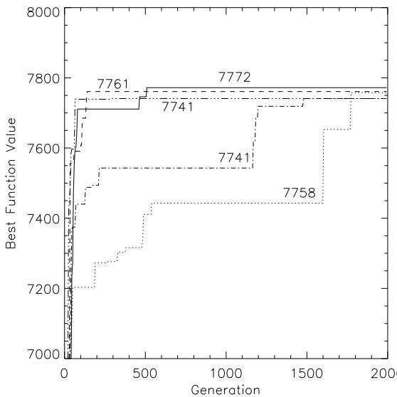

# program- ceeds onresents a of a given optimization problem. In c

Sami Khuri San José State University, U.S.A.

( 1 n) f gn sure which is used b the selection roce

hi hl constrained roblem ma include substantiall lar e infeasible re ions. Our im lementation allows for ming, multiple knapsack problem

# gENEsYs use

e a l our enetic al orithm to roblem instances from the literature of $0 / 1$ known test problems and report our experimental results. These encouraging results, especially for relatively large test problems, indicate that genetic algorithms can be successfully used as heuristics for nding good solutions for highly constrained NP-complete problems. that are augmented with domain-specific knowledge, GENEsYs uses a simple fitness function that uses a Genetic Al orithms We apply our genetic algorithm to problem instances from the literature of well known test problems and reof or anic evolution received remarkabl increasin attention durin the ast ten ears. Besides evolution strate ies 26 28 and evolutionar ro rammin 9 8 enetic al orithms 16 13 are the most well-known re - strained NP-complete problems.

# solutions even for hard optimizdemonstrated b various a lica

Direct random search algorithms based on the model of organic evolution received remarkably increasing attention during the past ten years. Besides evolution strategies [26, 28] and evolutionary programming [9, 8], To appear in the ACM Symposium of Applied Computation (SAC'94) proceedings. Copyright 
c 1993 ACM rithms. The potential of such algorithms to yield good solutions even for hard optimization tasks has been demonstrated by various applications (reported for instance in the conference proceedings [5, 10, 29, 19]).

bination o erator allows for the exchan e of information between dierent individuals and mutation introduces innovation into the o ulation. of a given optimization problem. In case of a canonical genetic algorithm, each individual is a binary vector $\vec { x } = \{ 0 , \dotsc , x _ { n } \} \in \{ 0 , 1 \} ^ { n }$ of fixed length $n$ . The fitness function $f : \{ 0 , 1 \} ^ { n } \to \mathbb { R }$ provides a quality measure which is used by the selection procedure to direct the search towards regions of the search space where the average fitness of the population increases. The recomUsually, mutation works by inverting bits with a very small probability pm (e.g. pm  0:001 [17]). Mutation is often interpreted as a \backgrou

After a uniform random initialization of the population the evolution proceeds by iterating the steps selection, recombination, and mutation until a termination criterion is fulfilled. In most cases, the algorithm is termiA variety of dierent recombination operators have been proposed in the literature (e.g. [7]) in addition to the Usually, mutation works by inverting bits with a very small probability $p _ { m }$ (e.g. $p _ { m } \approx 0 . 0 0 1$ [17]). Mutation is often interpreted as a "background operator" which has only a small impact on the search [16]. Recent theoretical work on the mutation rate setting, however, gives strong evidence for an appropriate choice of $p _ { m } = 1 / n$ on many problems [22, 2].

form crossover an o erator that decides for each bit osition of the arent individuals randoml whether the bit is to be exchan ed or not 34 . This o erator introduces a stron mixin eect which is sometimes hel ful to overcome local o tima. An additional arameter e. .  : 1 $\chi \in \{ 1 , \ldots , n - 1 \}$ te indicates the robabilit er individual to $\chi ^ { t h }$ er o crossover. dividuals. This operator can be extended to a generalized multi-point crossover [17]. The number of crossover points can be driven to extreme by using uniform crossover, an operator that decides for each bit position of the parent individuals randomly whether the bit is to be exchanged or not [34]. This operator introduces a strong mixing effect which is sometimes helpful to overcome local optima. An additional parameter $p _ { c }$ (e.g., $p _ { c } \approx 0 . 6$ [17]), the crossover rate, indicates the probability per individual to undergo crossover.

Normally, selection in genetic algorithms is a probabilistic operator which uses the relative fitness $p _ { s } \left( \vec { x } _ { i } \right) =$ $\textstyle f ( { \vec { x } } _ { i } ) / \sum _ { j = 1 } ^ { \mu } f ( { \vec { x } } _ { j } )$ ts reported in Section 3 the genete acka e GENEsYs is used 1 . It $\mu$ denotes the population size). This selection operator is called proportional selection. If the problem under consideration is a minimization one, or if the fitness function can take negative values, then $f ( \vec { x } _ { i } )$ has to be linearly transformed before calculating selection probabilities. This technique known as linear dynamic scaling is commonly used in genetic algorithms (see [13], pp. 123124, or [14]).

For the experiments reported in Section 3 the genetic algorithm software package GENEsYs is used [1]. It is based on the widely used GENESIS software by Grefenstette (see [15], and [6], pp. 374377), but allows for more flexibility concerning genetic operators and data monitoring facilities. The parameter settings for our Due to the dierent terminology used by researchers concerning knapsack problems in general, and our problem in particular, we would like to give a few references in which our knaps

# sion, we are given a knapsack of capacity C, and n objects.We are

would like to nd a vector \~x = x x : : : x where x 2 0; 1 , such that Pn w x  C and for which: P \~x = Pn x is maximum. Each ob ect is either laced in all m kna sacks or in none at all. This roblem is also known as the sin le-line inte er ro rammin roble $0 / 1$ 3 and has been studied in the context of enetic al orithms see e. . 18 . It is an $C$ P-co $n$ lete problem. The partition problem $w _ { i }$ n be polynomi $p _ { i }$ y transformed into it 12 . jects that yield the maximum profit. In other words, we $x _ { i } \in \{ 0 , 1 \}$ acities c1; cprot pi. U $\sum _ { i = 1 } ^ { n } w _ { i } x _ { i } \ \leq \ C$ ${ \vec { x } } = \left( x _ { 1 } , x _ { 2 } , \ldots , x _ { n } \right)$ each ofwhich $\textstyle P ( { \vec { x } } ) = \sum _ { i = 1 } ^ { n } p _ { i } x _ { i }$ pobjects are xed, the weight of the ith placed in all $m$ knapsacks, or in none at all. This problem is also known as the single-line integer programming problem [23], and has been studied in the context of genetic algorithms (see e.g. [18]). It is an NP-complete problem. The partition problem can be polynomially ( 1 2 n)

The $0 / 1$ multiple knapsack problem consists of $m$ knapsacks of capacities $c _ { 1 } , c _ { 2 } , \ldots , c _ { m }$ and $n$ objects, each of which has a profi t $p _ { i }$ . Unlike the simple version in which the weights of the objects are fixed, the weight of the $i ^ { t h }$ object in the multiple knapsack problem takes $j$ values, $1 \leq j \leq m$ . The $i ^ { t h }$ object weighs $w _ { i j }$ when it is considered for possible inclusion in the $j ^ { t h }$ knapsack of capacity $c _ { j }$ . Once more, we are interested in finding a vector ${ \vec { x } } = \left( x _ { 1 } , x _ { 2 } , \ldots , x _ { n } \right)$ that guarantees that no knapsack tion of resourested in max imizing the protcertain budget. Onc, wh $\begin{array} { r } { P ( \vec { x } ) = \sum _ { i = 1 } ^ { n } x _ { i } p _ { i } } \end{array}$ $j = 1 , 2 , . . . , n$ t inter-hin a problem is also known as the zero-one integer programThe popularity of knapsack problems stems from the fact that it h

We also note that it can be thought as a resource allocation problem, where we have $m$ resources (the knapsacksand $n$ objects. Each resource has its own budget (knapsack capacity), and $w _ { i j }$ represents the consumption of resource $j$ by object $i$ . Once more, we are interested in maximizing the profit, while working within a certain budget.

The popularity of knapsack problems stems from the fact that it has attracted researchers from both camps; the theoreticians as well as the practicians [20]. Theoreticians enjoy the fact that these simple structured problems can be used as subproblems to solve more complicated ones. Practicians on the other hand, enjoy the fact that these problems can model many industrial opportunities such as cutting stock, cargo loading, and the capital budget.

Plateau and Elkihel's hybrid algorithm 25 uses both, branch-and-bound and d namic ro rammin . branch-and-bound approaches. While the latter can be used with any kind of knapsack, dynamic programming is impractical for solving multiple knapsack problems. Nevertheless, many approaches embed either one of the two techniques into specialized algorithms to solve Problem instance: knapsacks: 1 2 : : : m capacities: c1 c2 : : : cm Plateau and Elkihel's hybrid algorithm [25] uses both, The capacities and prots of the objects a

The following is a formal definition of the $0 / 1$ multiple knapsack problem in which we make use of Stinson's terobjects: 1 2 : : : n

# g 1j

f objects w.r.t. jth k , 1 capacities: c1 c2 cm

The capacities and profits of the objects are positive numbers, while the weights of the objects are nonnegative.

objects: $\begin{array} { l l l l l } { { 1 } } & { { 2 } } & { { \mathrm { ~ \ldots ~ } } } & { { \mathrm { ~ n ~ } } } \\ { { p _ { 1 } } } & { { p _ { 2 } } } & { { \mathrm { ~ \ldots ~ } } } & { { p _ { n } } } \\ { { w _ { 1 j } } } & { { w _ { 2 j } } } & { { \mathrm { ~ \ldots ~ } } } & { { w _ { n j } } } \end{array}$   
profits:   
weights:

of objects w.r.t. $j ^ { t h }$ knapsack, $1 \leq j \leq m$

Feasible solution: A vector $\begin{array} { r c l } { \vec { x } } & { = } & { \left( x _ { 1 } , x _ { 2 } , \ldots , x _ { n } \right) } \end{array}$ where $x _ { i } \in \{ 0 , 1 \}$ , such that: $\textstyle \sum _ { i = 1 } ^ { n } w _ { i j } x _ { i } \leq c _ { j }$ for $j = 1 , 2 , . . . , m$

in the population represents a possith osition has the value of 1 i.e. $\begin{array} { r } { P ( \vec { x } ) \ = \ \sum _ { i = 1 } ^ { n } p _ { i } x _ { i } } \end{array}$ where ${ \vec { x } } = \left( x _ { 1 } , x _ { 2 } , \ldots , x _ { n } \right)$ , i ,

words, every string \~x 2 f0; 1g is a potential solution. maximum profit; i.e., a vector that maximizes the tion. A vector \~x =

The problem needs to be encoded in such a way that the genetic algorithm can be applied to it. The vectors Rather than discarding infeasible strings a $x _ { 1 } x _ { 2 } \ldots x _ { n }$ infeasible regions of the search space, we subscribe to $i ^ { t h }$ chardson et al.'s philosophy [27 $x _ { i } = 1$ allow infe $i ^ { t h }$ bly bred strings to join the population. The infeasible string's strengt ${ \vec { x } } \in \{ 0 , 1 \}$ to the other strings in t

We remark that a string might represent an infeasible solution. A vector ${ \vec { x } } = \left( x _ { 1 } , x _ { 2 } , \ldots , x _ { n } \right)$ that overfills at strings. The farther away from feasibilitthe hi her its enalt term should be. $\textstyle \sum _ { i = 1 } ^ { n } w _ { i j } x _ { i } >$ $c _ { j }$ for some $1 \leq j \leq m$ , is an infeasible string.

Rather than discarding infeasible strings and ignoring infeasible regions of the search space, we subscribe to Richardson et al.'s philosophy [27], and allow infeasif(\~x) = pixi  s  maxfpig (1) ble string's strength relative to the other strings in the where s = jfj j Pi=1 wijxi > cj gj. In other words, s (0  s  n) denotes the number of overlled knapsacks. The tness function uses a graded penalty term, max p . The number of times this ter

the weakening of the infeasible string's tness is equal to the number of overlled knapsacks it produces.

$$
\begin{array} { r c l } { f ( \vec { x } ) } & { = } & { \displaystyle \sum _ { i = 1 } ^ { n } p _ { i } x _ { i } - s \cdot \mathrm { m a x } \{ p _ { i } \} } \end{array}
$$

proble $s = | \{ j \ | \ \textstyle \sum _ { i = 1 } ^ { n } w _ { i j } x _ { i } > c _ { j } \ \} |$ blem. Thus, signi $s$ $0 \leq s \leq n )$ ons of the search space of some of the prob

The fitness function uses a graded penalty term, $\operatorname* { m a x } \{ p _ { i } \}$ . The number of times this term contributes to the weakening of the infeasible string's fitness is equal to the number of overfilled knapsacks it produces.

roblem since the feasible re ions in the search s ace are extremel s arse. tal results in the next section. The multiple knapsack problem is a highly constrained problem. Thus, significant portions of the search space of some of the problem instances reported in the section on "Experimental Results" are infeasible regions. This situation is particularly true with test problem "weing8-105" [11] which is used therein. The problem instance consists of 105 objects and two knapsacks. This is quite a challenging problem since the feasible regions in the search space are extremely sparse.

Due to the high weight values with respect to the knapsack capacities, most of the $2 ^ { 1 0 5 }$ strings represent infeasible solutions. We are thus faced with a situation where every randomly generated string in the initial population might produce an overfilled knapsack. To handle such extreme cases, we encourage checking the initial population to see if it consists of only infeasible strings.

strin s in which the number of zeros is reater than the number of ones. If the out ut of several runs lution. Thus, if after several runs on the same probtion is still hi hl skewed towards infeasible strin s sible string, or if the initial population is overcrowded osite direction: let it roduce more ones than zelem mentioned in the preceding paragraph, we suggest to undertake one of the following actions:

to generate a solution. Include in the initial generation strings that are minor variations of the solution obtained by the greedy technique. This technique, coined iterative improvement algorithm by Moret [21], has been quite successful with other combinatorial optimization problems. posite direction: let it produce more ones than zewou

tuations that produce infeasible strings. The tness tion for exam le should also be considered as a ation strings that are minor variations of the soluIt mi ht have a ver mild enalt inca able of surin the search towards feasible re ions. Moret [21], has been quite successful with other combinatorial optimization problems.

We would like to point out that by giving the above suggestions we are not stating that these are the only situations that produce infeasible strings. The fitness function, for example, should also be considered as a possible reason for having infeasible strings in the outg g g p p  , p m = ,

tor. In order to become a licable to the multi le kna - experimental runs.

# Experimental Results

heuristics. using a genetic algorithm with a population size of $\mu =$ 50, a mutation rate $p _ { m } = 1 / n$ , crossover rate $p _ { c } = 0 . 6$ proportional selection, and a one-point crossover operator. In order to become applicable to the multiple knapsack problem, no component of this general genetic algorithm — except, of course, the fitness function — has to be modified. This fact reflects the wide applicability and robustness of such algorithms and establishes one of the main advantages when compared to problem-specific heuristics.

<table><tr><td rowspan=1 colspan=2>knap15</td><td rowspan=1 colspan=2>knap20</td><td rowspan=1 colspan=2>knap28</td><td rowspan=1 colspan=2>knap39</td><td rowspan=1 colspan=2>knap50</td></tr><tr><td rowspan=1 colspan=2>n = 15, m = 10</td><td rowspan=1 colspan=2>n = 20, m = 10</td><td rowspan=1 colspan=2>n = 28, m = 10</td><td rowspan=1 colspan=2>n = 39, m = 5</td><td rowspan=1 colspan=2>n = 50, m = 5</td></tr><tr><td rowspan=1 colspan=1>f5.103(x)</td><td rowspan=1 colspan=1>N</td><td rowspan=1 colspan=1>f104(x)</td><td rowspan=1 colspan=1>N</td><td rowspan=1 colspan=1>f5.104(x)</td><td rowspan=1 colspan=1>N</td><td rowspan=1 colspan=1>f105(x)</td><td rowspan=1 colspan=1>N</td><td rowspan=1 colspan=1>f105(x)</td><td rowspan=1 colspan=1>N</td></tr><tr><td rowspan=1 colspan=1>4015</td><td rowspan=1 colspan=1>83</td><td rowspan=1 colspan=1>6120</td><td rowspan=1 colspan=1>33</td><td rowspan=1 colspan=1>12400</td><td rowspan=1 colspan=1>33</td><td rowspan=1 colspan=1>10618</td><td rowspan=1 colspan=1>4</td><td rowspan=1 colspan=1>16537</td><td rowspan=1 colspan=1>1</td></tr><tr><td rowspan=10 colspan=1>40053955</td><td rowspan=1 colspan=1>16</td><td rowspan=1 colspan=1>6110</td><td rowspan=1 colspan=1>20</td><td rowspan=1 colspan=1>12390</td><td rowspan=1 colspan=1>30</td><td rowspan=1 colspan=1>10605</td><td rowspan=1 colspan=1>1</td><td rowspan=1 colspan=1>16524</td><td rowspan=3 colspan=1>125</td></tr><tr><td rowspan=9 colspan=1>1</td><td rowspan=1 colspan=1>6100</td><td rowspan=1 colspan=1>29</td><td rowspan=1 colspan=1>12380</td><td rowspan=1 colspan=1>10</td><td rowspan=1 colspan=1>10604</td><td rowspan=1 colspan=1>8</td><td rowspan=1 colspan=1>16519</td></tr><tr><td rowspan=8 colspan=1>6090606060506040</td><td rowspan=8 colspan=1>11313</td><td rowspan=1 colspan=1>12370</td><td rowspan=1 colspan=1>1</td><td rowspan=1 colspan=1>10601</td><td rowspan=1 colspan=1>1</td><td rowspan=1 colspan=1>16518</td></tr><tr><td rowspan=4 colspan=1>12360123301196011950</td><td rowspan=1 colspan=1>19</td><td rowspan=1 colspan=1>10588</td><td rowspan=1 colspan=1>5</td><td rowspan=1 colspan=1>16499</td><td rowspan=3 colspan=1>111</td></tr><tr><td rowspan=1 colspan=1>5</td><td rowspan=1 colspan=1>10585</td><td rowspan=1 colspan=1>5</td><td rowspan=1 colspan=1>16499</td></tr><tr><td rowspan=2 colspan=1>11</td><td rowspan=1 colspan=1>10582</td><td rowspan=1 colspan=1>1</td><td rowspan=1 colspan=1>16494</td></tr><tr><td rowspan=1 colspan=1>10581</td><td rowspan=1 colspan=1>2</td><td rowspan=1 colspan=1>16473</td><td rowspan=1 colspan=1>1</td></tr><tr><td rowspan=3 colspan=1></td><td rowspan=1 colspan=1></td><td rowspan=1 colspan=1>10570</td><td rowspan=1 colspan=1>6</td><td rowspan=1 colspan=1>16472</td><td rowspan=1 colspan=1>1</td></tr><tr><td rowspan=2 colspan=1></td><td rowspan=1 colspan=1>10568</td><td rowspan=1 colspan=1>2</td><td rowspan=1 colspan=1>16467</td><td rowspan=1 colspan=1>1</td></tr><tr><td rowspan=1 colspan=1>10561</td><td rowspan=1 colspan=1>1</td><td rowspan=1 colspan=1>16463</td><td rowspan=1 colspan=1>1</td></tr><tr><td rowspan=1 colspan=2>f = 4012.7</td><td rowspan=1 colspan=2>f = 6102.3</td><td rowspan=1 colspan=2>f = 12374.7</td><td rowspan=1 colspan=2>f = 10536.9</td><td rowspan=1 colspan=2>f = 16378.0</td></tr></table>

nap20", ... ,\knap50" are originally due to Petersen actly for all but one of the test problems. The excepti ], \sento1-60" and \se

Beasl e 4 . which are taken from the literature. The problem sizes range from 15 objects to 105 and from 2 to 30 knapsacks. All problems and their sizes (in terms of $n$ and $m$ ) are indicated in tables 1 and 2. Problems "knap $1 5 '$ "knap20", ... , "knap50" are originally due to Petersen [24], "sento1-60" and "sento2-60" were introduced by Senyu and Toyoda [30], and "weing7-105" and "weing8- $1 0 5 ^ { \prime \prime }$ stem from Weingartner and Ness [35]. A collection of all these problems is available from the OR-library by Beasley [4].

number of runs do not add u to $N ~ = ~ 1 0 0$ ome runs roduce solutions under 10561 and 16463 res ectivel . The index in \~x re resents the total number of strin s rocessed i.e. the value of t is the roduct of the number of individuals per generation and the number $\bar { f }$ generations er run. Onl an extremel small ercenta e of the 2n oints in the search s ace is rocessed b the enetic al orithm. For instance with \kna 28" n = 28 6110, and so on. Only the eleven best results are tabulated. So for "knap39" and "knap50" of Table 1, the number of runs do not add up to 100 since some runs produce solutions under 10561, and 16463, respectively. The index in $f _ { t } \left( \vec { x } \right)$ represents the total number of strings processed; i.e., the value of $t$ is the product of the number of individuals per generation and the number of generations per run. Only an extremely small percentage of the $2 ^ { n }$ points in the search space is processed by the genetic algorithm. For instance, with "knap28", $n = 2 8$ $t ~ = ~ 5 . 1 0 ^ { 4 }$ g p $0 . 0 1 8 \%$ of the search space is explored, and only $4 . 9 \cdot 1 0 ^ { - 2 5 } \%$ g y "knap $1 0 5 ^ { \prime \prime }$ are processed.

As both tables clearly demonstrate, the genetic algorithm is able to localize the global optimum point exactly for all but one of the test problems. The exception is given by the problem "weing7-105" , for which all runs get stuck before finding the optimal solution. The average fitness value over all runs turns out to be reasonably A closer look at the course of some of the experimental runs is provided by Figure 1 for the \sento1-60" problem. The graph shows the best tness values that occurred in

In case of the "weing8-105" problem a biased random initialization of the population as indicated in Section 1 is used such that the probability to generate a zero bit is 0.95. This simple but elegant solution makes the probAs a general observation, we remark that by far most

A closer look at the course of some of the experimental runs is provided by Figure 1 for the "sentol $- 6 0 ^ { , 9 }$ problem. The graph shows the best fitness values that occurred in the population over the number of generations for five different runs. The ordinate axis is restricted to a small range of values in order to give a clearer picture of the difference between these runs, each of which is labeled by its final solution quality.

As a general observation, we remark that by far most progress is achieved during the first 200 generations, followed by stagnation periods with further improvements occurring only occasionally. The first phase reflects the Conclusions bination while the second one characterizes a mainly mutation-based search. This observation is in agreement with the use of hybrid genetic algorithms and local optimization methods, where the former is used to produce solutions that are used as starting points for local optimization (see e.g. [13], pp. 202203).

<table><tr><td rowspan=1 colspan=2>sento1-60</td><td rowspan=1 colspan=2>sento2-60</td><td rowspan=1 colspan=2>weing7-105</td><td rowspan=1 colspan=2>weing8-105</td></tr><tr><td rowspan=1 colspan=2>n = 60, m = 30</td><td rowspan=1 colspan=2>n = 60, m = 30</td><td rowspan=1 colspan=2>n = 105, m = 2</td><td rowspan=1 colspan=2>n = 105, m = 2</td></tr><tr><td rowspan=1 colspan=1>f105(x)</td><td rowspan=1 colspan=1>N</td><td rowspan=1 colspan=1>f105(x)</td><td rowspan=1 colspan=1>N</td><td rowspan=1 colspan=1>f2.105(x)</td><td rowspan=1 colspan=1>N</td><td rowspan=1 colspan=1>f2.105(x)</td><td rowspan=1 colspan=1>N</td></tr><tr><td rowspan=1 colspan=1>7772</td><td rowspan=1 colspan=1>5</td><td rowspan=1 colspan=1>8722</td><td rowspan=1 colspan=1>2</td><td rowspan=1 colspan=1>1095445</td><td rowspan=1 colspan=1>−</td><td rowspan=1 colspan=1>624319</td><td rowspan=1 colspan=1>6</td></tr><tr><td rowspan=1 colspan=1>7761</td><td rowspan=1 colspan=1>4</td><td rowspan=1 colspan=1>8721</td><td rowspan=1 colspan=1>1</td><td rowspan=1 colspan=1>1095382</td><td rowspan=1 colspan=1>10</td><td rowspan=4 colspan=1>623932623612622376621086</td><td rowspan=5 colspan=1>11125</td></tr><tr><td rowspan=1 colspan=1>7758</td><td rowspan=1 colspan=1>11</td><td rowspan=1 colspan=1>8720</td><td rowspan=1 colspan=1>2</td><td rowspan=1 colspan=1>1095357</td><td rowspan=1 colspan=1>3</td></tr><tr><td rowspan=1 colspan=1>7741</td><td rowspan=1 colspan=1>7</td><td rowspan=1 colspan=1>8715</td><td rowspan=1 colspan=1>1</td><td rowspan=1 colspan=1>1095266</td><td rowspan=1 colspan=1>1</td></tr><tr><td rowspan=1 colspan=1>7739</td><td rowspan=1 colspan=1>1</td><td rowspan=1 colspan=1>8713</td><td rowspan=1 colspan=1>1</td><td rowspan=1 colspan=1>1095264</td><td rowspan=1 colspan=1>9</td></tr><tr><td rowspan=1 colspan=1>7738</td><td rowspan=1 colspan=1>3</td><td rowspan=1 colspan=1>8711</td><td rowspan=1 colspan=1>19</td><td rowspan=1 colspan=1>1095206</td><td rowspan=1 colspan=1>3</td><td rowspan=1 colspan=1>620872</td></tr><tr><td rowspan=1 colspan=1>7725</td><td rowspan=1 colspan=1>1</td><td rowspan=1 colspan=1>8709</td><td rowspan=1 colspan=1>1</td><td rowspan=1 colspan=1>1095157</td><td rowspan=1 colspan=1>2</td><td rowspan=1 colspan=1>620060</td><td rowspan=1 colspan=1>4</td></tr><tr><td rowspan=1 colspan=1>7719</td><td rowspan=1 colspan=1>1</td><td rowspan=1 colspan=1>8708</td><td rowspan=1 colspan=1>7</td><td rowspan=1 colspan=1>1095081</td><td rowspan=1 colspan=1>1</td><td rowspan=1 colspan=1>619766</td><td rowspan=1 colspan=1>6</td></tr><tr><td rowspan=1 colspan=1>7715</td><td rowspan=1 colspan=1>1</td><td rowspan=1 colspan=1>8704</td><td rowspan=1 colspan=1>3</td><td rowspan=1 colspan=1>1095065</td><td rowspan=1 colspan=1>2</td><td rowspan=1 colspan=1>619568</td><td rowspan=1 colspan=1>1</td></tr><tr><td rowspan=1 colspan=1>7711</td><td rowspan=1 colspan=1>2</td><td rowspan=1 colspan=1>8703</td><td rowspan=1 colspan=1>2</td><td rowspan=1 colspan=1>1095035</td><td rowspan=1 colspan=1>8</td><td rowspan=1 colspan=1>619413</td><td rowspan=1 colspan=1>1</td></tr><tr><td rowspan=1 colspan=1>7706</td><td rowspan=1 colspan=1>1</td><td rowspan=1 colspan=1>8701</td><td rowspan=1 colspan=1>3</td><td rowspan=1 colspan=1>1094965</td><td rowspan=1 colspan=1>1</td><td rowspan=1 colspan=1>618540</td><td rowspan=1 colspan=1>1</td></tr><tr><td rowspan=1 colspan=2>$f = 7626</td><td rowspan=1 colspan=2>f = 8685</td><td rowspan=1 colspan=2>f = 1093897</td><td rowspan=1 colspan=2>f = 613383</td></tr></table>

l optimization methods, where the former is used to $6 0 ^ { 9 }$ , "sento2-60", "weing7-105", and "weing8-105" obtained oduce solutions that ar

# implementation allo

with domain-s ecic knowled e we introduce a sim le tness function that uses a raded enalt term. Our ositive results su o $0 / 1$ e idea that this is a desirable a roach for tacklin hi hl constrained NP-com lete problems such as the 0/1 multiple knapsack problem. We also believe in the otential h bridization of enetic al orithms with local search techni ues. implementation allows infeasibly bred strings to participate in the search since they do contribute information. Rather than augmenting the genetic algorithm with domain-specific knowledge, we introduce a simple fitness function that uses a graded penalty term. Our positive results support the idea that this is a desirable approach for tackling highly constrained NP-complete problems such as the $0 / 1$ multiple knapsack problem. We also believe in the potential hybridization of genetic algorithms with local search techniques.

# Acknowledgments

& Com uter Science San Jose State Universit One Washin ton S uare San Jose CA 95192-0103 U.S.A. khuri@s sumcs.s su.edu fully acknowledges support by the DFG (Deutsche Forschungsgemeinschaft), grant Schw 361/5-2.

# Author's Affiliations

Sami Khuri is with the Department of Mathematics & Computer Science, San José State University, One Washington Square, San José, CA 95192-0103, U.S.A. khuri@sjsumcs.sjsu.edu   
[1] Th. Back. GENEsYs 1.0. Software distribution and Analysis   
Research Group, LSXI, Computer Science Department, mous ft to lum i.informatik.uni-dortmund.de as le GENEsYs-1.0.tar.Z in pub GA src .

# References

[1] Th. Bäck. GENEsYs 1.0. Software distribution and installation notes, Systems Analysis Research Group, LSXI, Department of Computer Science, U niversity of Dortmund, Germany, July 1992. (Available via anonymous ftp to lumpi.informatik.uni-dortmund.de as file GENEsYs-1.0.tar.Z in /pub/GA/src).

  
one knapsack problems. Operations Research, 28:1130 1154, 1980. $. 6 0 ^ { 5 }$ 4 J. E. B

[5] R. K. Belew and L. B. Booker, editors. Proceedings of the 4th International Conference on Genetic Algorithms. Morgan Kaufmann Publishers, Sa   
[3] E. Balas and E. Zemel. An algorithm for large zeroL. Davis, editor. Handbook of Genetic Algorithms. Van Nostrand R   
[7] L. J. Eshelman, R. A. Caruna, and J. D. Schaer. Biases in the crossover landscape. In J. D. Schaer, editor, Proceedings of the 3rd Inter   
Publishers, San Mateo, CA, 1989. of the 4th International Conference on Genetic AlgoD. B. Fogel. Evolving Articial Intelligence. PhD thesis, Unive   
[9] L. J. Fogel, A. J. Owens, and M. J. Walsh. Articial Intelligence through Simulated Evolu   
[7] L. J. Eshelman, R. A. Caruna, and J. D. Schaffer. BiS. Forrest, editor. Proceedings of the 5th International Conference on Genetic Algorithms. Morgan Kaufmann Publishers, San Mateo, CA, 1993. Publishers, San Mateo, CA, 1989.   
[8] D. B. Fogel. Evolving Artificial Intelligence. PhD thesis, U niversity of California, San Diego, CA, 1992.   
[9] L. J. Fogel, A. J. Owens, and M. J. Walsh. Artifi cial Intelligence through Simulated Evolution. Wiley, New York, 1966.   
[10] S. Forrest, editor. Proceedings of the 5th International Conference on Genetic Algorithms. Morgan Kaufmann Publishers, San Mateo, CA, 1993.   
[11] A. Frévile and G. Plateau. Hard 0-1 multiknapsack testproblems for size reduction methods. Investigatión Operativa, 1:251270, 1990.   
[12] M. R. Garey and D. S. Johnson. Computers and Intractability: A Guide to the Theory of NP. Completeness. W. H. Freeman and Company, San Fransisco, 1979.   
[13] D. E. Goldberg. Genetic algorithms in search, optimizaMI 1975. MA, 1989.   
[14] J. J. Grefenstette. Optimization of control parameters Michi an 1975. Diss. Abstr. Int. 36 10 5140B UniMan and Cybernetics, SMC-16(1):122128, 1986.   
18 Sami Khuri and Ada Batarekh. Heuristics for the InCenter for Applied Research in Artificial Intelligence, Washington, D. C., 1987.   
Chile, pages 161{172, 1990. tems. The University of Michigan Press, Ann Arbor, Solvin ro   
[17] K. A. De Jong. An analys is of the behaviour of a class of genetic adaptive systems. PhD thesis, U niversity of Michigan, 1975. Diss. Abstr. Int. 36(10), 5140B, University Microfilms No. 76-9381.   
[18] Sami Khuri and Aida Batarekh. Heuristics for the Integer Knapsack Problem. In Proceedings of the Xth International Computer Science Conference, Santiago, H. Muhlenbein. How gene   
[19] R. Männer and B. Manderick, editors. Parallel Problem Solving from Nature 2. Elsevier, Amsterdam, 1992.   
[20] S. Martello and P. Toth. Knapsack Problems: Algorithms and Computer Implementations. John Wiley & Sons, Chichester, West Sussex, England, 1990.   
[21] B. M. E. Moret and H. D. Shapiro. Algorithms from P to NP, Volume 1: Design and Efficiency. Benjamin Cummings, Menlo Park, CA, 1991.   
[22] H. Mühlenbein. How genetic algorithms really work: I. mutation and hillclimbing. In Männer and Manderick [19], pages 1525.   
[23] C. H. Papadimitriou and K. Steiglitz. Combinatorial Optimization: Algorithms and Complexity. PrenticeHall, Inc., Englewood Cliffs, New Jersey, 1982.   
[ ] , , p , of the balas algorithm applied to the selection of r & d projects. Management Science, 13:736750, 1967.   
[25] G. Plateau and M. Elkihel. A hybrid algorithm for the 0-1 knapsack problem. Methods of Operations Research, 49:277293, 1985.   
[26] I. Rechenberg. Evolutionsstrategie: Optimierung technischer Systeme nach Prinzipien der biologischen Evolution. Frommann-Holzboog, Stuttgart, 1973.   
[27] J. T. Richardson, M. R. Palmer, G. Liepins, and M. Hilliard. Some guidelines for genetic algorithms with penalty functions. In J. D. Schaffer, editor, Proceedings of the 3rd International Conference on Genetic Algorithms, pages 191-197. Morgan Kaufmann Publishers, San Mateo, CA, 1989.   
a enalt function. In Forrest 10 a es 499{505. Models. Wiley, Chichester, 1981.   
[29] H.-P. Schwefel and R. Männer, editors. Parallel Problem Solving from Nature — Proceedings 1st Workshop P PSN I, volume 496 of Lecture Notes in Computer Science. Springer, Berlin, 1991.   
[30] S. Senyu and Y. Toyoda. An approach to linear prosis o Al orithms. The Charles Babba e Research Cen15:B196B207, 1967.   
[31] A. E. Smith and D. M. Tate. Genetic optimization using a penalty function. In Forrest [10], pages 499-505.   
national Conference on Genetic Algorithms, pages 2{9. Morgan Kaufmann Publishers, San Mateo, CA, 1989. H. M. Wein artner and D. N. Ness. Methods for the soECML- 93, volume 667 of Lecture Notes in Artificial Intelligence, pages 442459. Springer, Berlin, 1993.   
[33] D. R. Stinson. An Introduction to the Design and Anal ysis of Algorithms. The Charles Babbage Research Center, Winnipeg, Manitoba, Canada, 2nd edition, 1987.   
[34] G. Syswerda. U niform crossover in genetic algorithms. In J. D. Schaffer, editor, Proceedings of th e 3rd International Conference on Genetic Algorithms, pages 2-9. Morgan Kaufmann Publishers, San Mateo, CA, 1989.   
[35] H. M. Weingartner and D. N. Ness. Methods for the solution of the multi-dimensional $0 / 1$ knapsack problem. Operations Research, 15:83103, 1967.