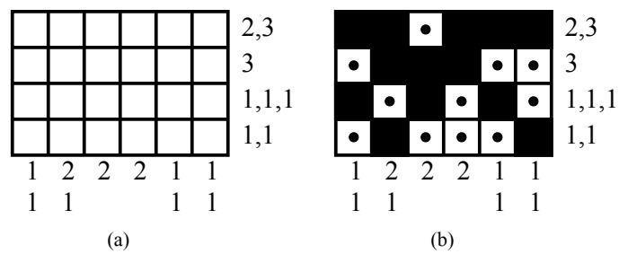
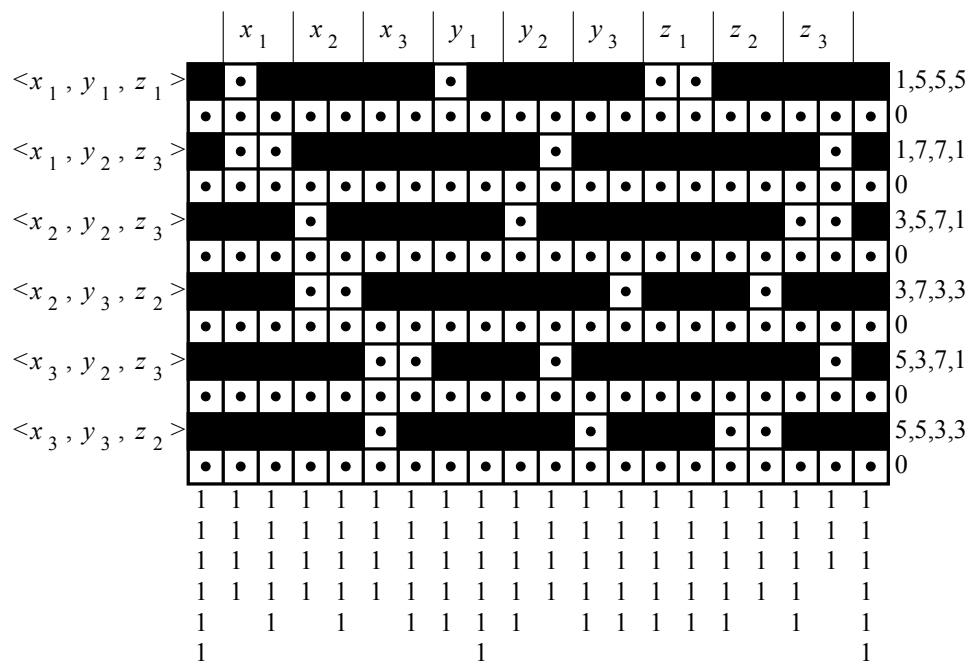
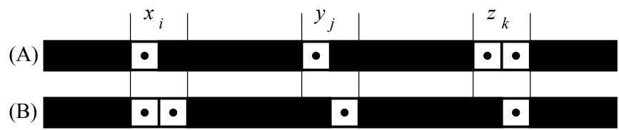
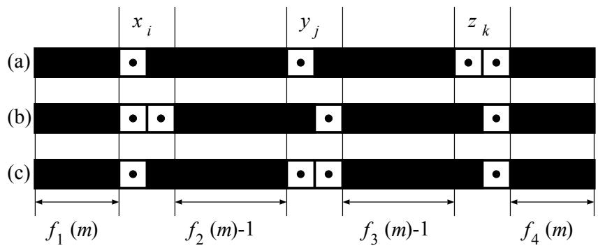
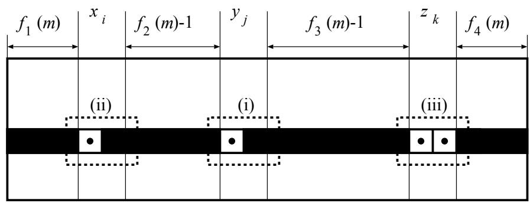

# Результаты NP-полноты для NONOGRAM с помощью экономных сведений

Нобухиса Уэда (ueda@cs.titech.ac.jp) при проф. Т. САТО, Кафедра электротехники и электроники,

Тадааки Нагао (nagao@cs.titech.ac.jp) при проф. О. ВАТАНАБЕ, Кафедра информатики,

Токийский технологический институт, Мегуро-ку, Токио 152, Япония

# Аннотация

Мы вводим новый класс NP-задач, называемых ЗАДАЧАМИ О ДРУГОМ РЕШЕНИИ (ANOTHER SOLUTION PROBLEMS). Для заданной NP-задачи $X$, ЗАДАЧА О ДРУГОМ РЕШЕНИИ для $X$ (ASP для $X$) заключается в следующем: для заданного экземпляра $I$ задачи $X$ и его решения, определить, существует ли другое решение для $I$. Трудность ASP для $X$ может не следовать напрямую из трудности $X$. Например, для некоторых NP-полных задач, таких как 3SAT или 3DM, легко показать, что их ASP являются NP-полными; с другой стороны, ASP для, например, РАСКРАСКИ ВЕРШИН (VERTEX COLORING) тривиально лежит в P. В этой статье мы предлагаем один подход для доказательства NP-полноты ASP для заданной NP-задачи $X$. А именно: для некоторой NP-задачи $Y$, для которой доказуемо, что ее ASP является NP-полной, мы показываем экономное сведение (parsimonious reduction) от $Y$ к $X$, которое обладает следующим дополнительным свойством: по заданному решению экземпляра задачи $Y$ соответствующее решение экземпляра задачи $X$ может быть вычислено за полиномиальное время. Тогда NP-полнота ASP для $Y$ очевидным образом влечет за собой NP-полноту ASP для $X$. В качестве примера этого подхода мы демонстрируем NP-полноту ASP для одной интересной головоломки «NONOGRAM».

# 1 Введение

Бывают случаи, когда мы хотели бы знать, существует ли какое-либо другое решение для данной задачи и ее решения. Например, рассмотрим ЗАДАЧУ КОММИВОЯЖЕРА (TSP). Предположим, что для некоторого заданного экземпляра TSP мы уже получили одно решение с желаемой стоимостью. Но время от времени мы можем задаваться вопросом, существует ли какое-либо другое решение (с той же стоимостью) для этого экземпляра. В этой статье мы называем этот тип задач «ЗАДАЧА О ДРУГОМ РЕШЕНИИ (ASP)». Мы предлагаем один подход для изучения сложности ASP для NP-задач и, следуя этому подходу, демонстрируем NP-полноту ASP для некоторой задачи.

ЗАДАЧИ О ДРУГОМ РЕШЕНИИ (ASP) часто встречаются в головоломках. При проектировании головоломки мы часто сначала определяем одно решение и создаем головоломку, согласующуюся с этим решением. Затем важно проверить, не имеет ли полученная головоломка других решений, кроме желаемого. В этой статье мы рассматриваем головоломку, называемую «NONOGRAM», и исследуем ASP для NONOGRAM.

NONOGRAM — это головоломка, в которой требуется найти узор, соответствующий некоторым заданным последовательностям целых чисел [2]. Пример экземпляра NONOGRAM показан на Рисунке 1 (а), а его решение — на Рисунке 1 (b). Точнее, экземпляр NONOGRAM представляет собой матрицу и последовательность неотрицательных целых чисел в каждой строке и каждом столбце. Решение — это назначение каждой ячейке матрицы значения either $\blacksquare$ (блок) или $\boxdot$ (точка) таким образом, чтобы количество смежных блоков соответствовало заданным последовательностям целых чисел в каждой строке и каждом столбце.

  
Рисунок 1: Экземпляр NONOGRAM и его решение

Не так сложно показать, что сама по себе задача NONOGRAM является NP-полной. Заметим, что даже если задача $X$ является NP-полной, это не всегда влечет за собой, что ЗАДАЧА О ДРУГОМ РЕШЕНИИ (ASP) для $X$ является NP-полной. Фактически, для некоторых NP-полных задач, таких как Раскраска вершин, ASP тривиальна. Таким образом, нам необходимо найти способ определить, является ли ASP для заданной $X$ NP-полной. Здесь мы предлагаем один подход: Сначала для некоторой задачи $Y$ показать, что ASP для $Y$ является NP-полной. Затем показать экономное сведение от $Y$ к $X$, которое обладает следующим дополнительным свойством: $( * )$ по заданному решению экземпляра задачи $Y$ соответствующее решение экземпляра задачи $X$ может быть вычислено за полиномиальное время. (Напомним, что экономные сведения — это сведения, сохраняющие количество решений [3]. Следовательно, если ASP для $Y$ является NP-полной, и $Y$ сводится к $X$ с помощью такого экономного сведения, то ASP для $X$ является NP-полной.) В этой статье мы показываем, что ASP для NONOGRAM является NP-полной, показывая, что (i) ASP для ТРЕХМЕРНОГО ПАРОСОЧЕТАНИЯ (3DM) является NP-полной, и (ii) существует экономное сведение от 3DM к NONOGRAM с указанным выше свойством $( * )$.

# 2 Предварительные сведения

Объясним наши обозначения. Пусть $h$ и $w$ обозначают высоту и ширину экземпляра NONOGRAM. Мы используем $(h, w)$-матрицу $P$ для обозначения заполнения экземпляра NONOGRAM, и пусть $p(s, t)$ будет элементом матрицы $P$, стоящим в $s$-й строке и $t$-м столбце. Пусть 1, 0 и $*$ обозначают значения $\blacksquare$, $\boxdot$ и пустоту соответственно. Например, $P_0$ и $P_1$ представляют Рисунок 1 (а) и 1 (b) соответственно:

$$
P _ { 0 } = \left( { \begin{array} { c c c c c } { * } & { * } & { * } & { * } & { * } \\ { * } & { * } & { * } & { * } & { * } \\ { * } & { * } & { * } & { * } & { * } \\ { * } & { * } & { * } & { * } & { * } \end{array} } \right) , \qquad P _ { 1 } = \left( { \begin{array} { c c c c c } { 1 } & { 1 } & { 0 } & { 1 } & { 1 } & { 1 } \\ { 0 } & { 1 } & { 1 } & { 1 } & { 0 } & { 0 } \\ { 1 } & { 0 } & { 1 } & { 0 } & { 1 } & { 0 } \\ { 0 } & { 1 } & { 0 } & { 0 } & { 0 } & { 1 } \end{array} } \right) .
$$

Пусть $r _ { s } = \langle r _ { s , 1 } , \ldots , r _ { s , i _ { s } } \rangle$ обозначает последовательность целых чисел в $s$-й строке, а $c _ { t } = \langle c _ { t , 1 } , \ldots , c _ { t , j _ { t } } \rangle$ — в $t$-м столбце. NONOGRAM формально определяется следующим образом:

# NONOGRAM
**Вход:** $h, w \in \mathbf{N}$ и последовательности неотрицательных целых чисел $R = \langle r _ { 1 } , \dots , r _ { h } \rangle$ и $C = \langle c _ { 1 } , \ldots , c _ { w } \rangle$.   
**Вопрос:** Существует ли такое назначение $P$ элементам $h \times w$ матрицы значений из $\{ 0 , 1 \}$, при котором выполняется свойство NONOGRAM?

Поскольку экземпляр NONOGRAM представляется $(h, w)$-матрицей и последовательностями целых чисел, мы можем считать размер экземпляра NONOGRAM равным $h \times w$. Заметим, что для заданного экземпляра $I$ и назначения $P$ можно за полиномиальное время проверить, является ли $P$ решением $I$. Таким образом, NONOGRAM лежит в классе NP.

Для заданного экземпляра NONOGRAM и одного из его решений, ЗАДАЧА О ДРУГОМ РЕШЕНИИ (ASP) для NONOGRAM спрашивает, существует ли другое решение. То есть, следующая задача:

# ASP для NONOGRAM
**Вход:** Экземпляр NONOGRAM и решение $P$.   
**Вопрос:** Существует ли другое решение $P' \neq P$?

Чтобы достичь нашей цели, введем известную NP-полную задачу 3DM:

# 3DM
**Вход:** Множество $M \subseteq X \times Y \times Z$, где $X, Y$ и $Z$ — непересекающиеся множества, имеющие одинаковое количество $q$ элементов.   
**Вопрос:** Содержит ли $M$ паросочетание, то есть такое подмножество $M' \subseteq M$, что $|M'| = q$ и никакие два элемента $M'$ не совпадают ни в одной координате?

Мы также определяем ASP для 3DM следующим образом:

# ASP для ТРЕХМЕРНОГО ПАРОСОЧЕТАНИЯ (ASP-3DM)
**Вход:** Множество $M \subseteq X \times Y \times Z$ и $M' \subseteq M$, где $X, Y$ и $Z$ — непересекающиеся множества, имеющие одинаковое количество $q$ элементов, и $M'$ является паросочетанием для $M$.   
**Вопрос:** Содержит ли $M$ другое паросочетание?

# 3 NP-полнота NONOGRAM

Мы покажем наш основной результат, а именно экономное сведение от 3DM к NONOGRAM.

**Теорема 3.1.** Существует экономное сведение от 3DM к NONOGRAM.

**Доказательство.** Рассмотрим произвольный экземпляр 3DM; то есть для любых $X = \{ x _ { 1 } , \ldots , x _ { q } \}$, $Y = \{ y _ { 1 } , \dots , y _ { q } \}$ и $Z = \{ z _ { 1 } , \ldots , z _ { q } \}$, пусть $M$ будет произвольным подмножеством $\{ m _ { 1 } , \ldots , m _ { n } \}$ из $X \times Y \times Z$. (Здесь мы используем $n = |M|$ для обозначения размера экземпляра.) Мы можем без потери общности предположить, что $n \geq q$. Здесь мы покажем способ определения экземпляра NONOGRAM $I$, соответствующего $M$.

Но сначала мы объясним идею нашего сведения на примере. Рассмотрим следующий экземпляр 3DM:

$$
M _ { e } = \left\{ \langle x _ { 1 } , y _ { 1 } , z _ { 1 } \rangle , \langle x _ { 1 } , y _ { 2 } , z _ { 3 } \rangle , \langle x _ { 2 } , y _ { 2 } , z _ { 3 } \rangle , \langle x _ { 2 } , y _ { 3 } , z _ { 2 } \rangle , \langle x _ { 3 } , y _ { 2 } , z _ { 3 } \rangle , \langle x _ { 3 } , y _ { 3 } , z _ { 2 } \rangle \right\} ,
$$

где мы используем $q _ { e } = 3$. Тогда $M _ { e }$ имеет паросочетание $M _ { e } ^ { \prime } = \left\{ \langle x _ { 1 } , y _ { 1 } , z _ { 1 } \rangle , \langle x _ { 2 } , y _ { 2 } , z _ { 3 } \rangle , \langle x _ { 3 } , y _ { 3 } , z _ { 2 } \rangle \right\}$.

Мы сводим этот экземпляр $M _ { e }$ к экземпляру $I _ { e }$, проиллюстрированному на Рисунке 2. Обратите внимание, что Рисунок 2 также иллюстрирует решение, соответствующее паросочетанию $M _ { e } ^ { \prime }$. То есть экземпляр NONOGRAM $I _ { e }$, соответствующий $M _ { e }$, представляет собой пустую матрицу с числами, как на Рисунке 2, а заполнение каждой ячейки матрицы соответствует $M _ { e } ^ { \prime }$.

Как объяснено на Рисунке 2, каждая $(2l - 1)$-я строка ($1 \leq l \leq 6$) соответствует $l$-му элементу $m _ { l } \in M _ { e }$. С другой стороны, каждая пара из двух столбцов, за исключением 1-го столбца и $w$-го столбца, соответствует конкретному элементу $v \in X \cup Y \cup Z$ в порядке $X, Y$ и $Z$.

В этом решении назначение для $(2l - 1)$-й строки $I _ { e }$ определяется в зависимости от того, выбран ли $m _ { l } \in M _ { e }$ в качестве паросочетания $M _ { e } ^ { \prime }$. Разница заключается в том, появляются ли две смежные точки $\boxdot$ в части $x$ (в этом случае $m _ { l }$ не входит в $M _ { e } ^ { \prime }$) или в части $z$ (в этом случае $m _ { l }$ входит в $M _ { e } ^ { \prime }$). Точнее, мы конструируем экземпляры NONOGRAM так, чтобы никакое другое назначение не являлось допустимым относительно экземпляра.

  
Рисунок 2: Экземпляр NONOGRAM и его решение, соответствующие $M _ { e }$ и $M _ { e } ^ { \prime }$.

Теперь мы объясним общие требования для «желаемых» решений. Напомним, что $M$ — это произвольный экземпляр 3DM, а $I$ — это экземпляр NONOGRAM, который получается из $M$ нашим сведением. Здесь $I$ сконструирован так, чтобы иметь (если вообще имеет) только решения, удовлетворяющие следующим требованиям:

(R1) Каждая четная строка $I$ заполняется значением $\boxdot$, то есть $p(2l, -)$ назначается 0. (Напомним, что $p(s, t)$ — это элемент матрицы назначения в $s$-й строке и $t$-м столбце, и мы используем $p(s, -)$ и $p(-, t)$ для обозначения $s$-й строки и $t$-го столбца соответственно.)   
(R2) Каждая $(2l - 1)$-я строка $I$ заполняется одним из двух шаблонов. Точнее, если $m _ { l } = \langle x _ { i } , y _ { j } , z _ { k } \rangle$, то $(2l - 1)$-я строка $I$ (то есть $p(2l - 1, -)$) устанавливается в шаблон (A) или (B) на Рисунке 3. (Выбор (A) или (B) будет определяться в зависимости от того, выбран ли $m _ { l }$ для соответствующего паросочетания $M'$.)

  
Рисунок 3: (A) $m _ { l } \in M'$ и (B) $m _ { l } \in M - M'$.

Теперь мы точно объясним, как $I$ конструируется из $M$. Сначала мы подготовим несколько функций. Определим $f_1, f_2, f_3$ и $f_4$ как функции, отображающие каждый $m _ { l } \in M$ в некоторое целое число следующим образом:

$$
\begin{array} { r c l } { f _ { 1 } \big ( \langle x _ { i } , y _ { j } , z _ { k } \rangle \big ) } & { = } & { 2 i - 1 , } \\ { f _ { 2 } \big ( \langle x _ { i } , y _ { j } , z _ { k } \rangle \big ) } & { = } & { 2 ( q + j - i ) - 1 , } \\ { f _ { 3 } \big ( \langle x _ { i } , y _ { j } , z _ { k } \rangle \big ) } & { = } & { 2 ( q + k - j ) - 1 , } \\ { f _ { 4 } \big ( \langle x _ { i } , y _ { j } , z _ { k } \rangle \big ) } & { = } & { 2 ( q - k ) + 1 . } \end{array}
$$

Также определим $g_1$ и $g_2$ следующим образом:

$$
\begin{array} { r l r } { g _ { 1 } ( v ) } & { = } & { \left\{ \begin{array} { l l } { n - N ( v ) , } & { v \in X , } \\ { n - 1 , } & { v \in Y, v \in Z , } \end{array} \right. \qquad g _ { 2 } ( v ) } & { = } & { \left\{ \begin{array} { l l } { n - N ( v ) + 1 , } & { v \in X, v \in Y , } \\ { n - N ( v ) , } & { v \in Z . } \end{array} \right. } \end{array}
$$

где $N(v)$ обозначает количество вхождений $v \in X \cup Y \cup Z$ в $M$.

Для удобства обозначений введем следующую функцию $g$:

$$
g ( t ) \ = \ \left\{ \begin{array} { l l } { n , } & { t = 1 , 6 q + 2 } \\ { g _ { 1 } ( x _ { i } ) , } & { t = 2 i \ \mathrm { для\ какого\text{-}то }\ i, 1 \le i \le q , } \\ { g _ { 2 } ( x _ { i } ) , } & { t = 2 i + 1 \ \mathrm { для\ какого\text{-}то }\ i, 1 \le i \le q , } \\ { g _ { 1 } ( y _ { i } ) , } & { t = 2 q + 2 i \ \mathrm { для\ какого\text{-}то }\ i, 1 \le i \le q , } \\ { g _ { 2 } ( y _ { i } ) , } & { t = 2 q + ( 2 i + 1 ) \ \mathrm { для\ какого\text{-}то }\ i, 1 \le i \le q , } \\ { g _ { 1 } ( z _ { i } ) , } & { t = 4 q + 2 i \ \mathrm { для\ какого\text{-}то }\ i, 1 \le i \le q , } \\ { g _ { 2 } ( z _ { i } ) , } & { t = 4 q + ( 2 i + 1 ) \ \mathrm { для\ какого\text{-}то }\ i, 1 \le i \le q . } \end{array} \right.
$$

Тогда экземпляр $I$ задачи NONOGRAM, полученный нашим сведением из $M$, определяется следующим образом:

*   $h = 2n$, $w = 6q + 2$. (Напомним, что $h$ и $w$ — это высота и ширина $I$.)
*   Для каждого $l$, $1 \leq l \leq n$ (пусть $m _ { l }$ будет $l$-м элементом $M$), определим $r _ { 2 l - 1 } = \langle f _ { 1 } ( m _ { l } ) , f _ { 2 } ( m _ { l } ) , f _ { 3 } ( m _ { l } ) , f _ { 4 } ( m _ { l } ) \rangle$, и $r _ { 2 l } = 0$.
*   Для каждого $t$, $1 \leq t \leq w$, определим $c _ { t } = \langle \widehat { 1 , \ldots , 1 } \rangle$ длины $g(t)$.

Поскольку $h \times w = 2n \times ( 6q + 2 )$ ограничено некоторым полиномом от $n$, мы можем сконструировать $I$ за полиномиальное время.

Теперь мы покажем, что каждое решение $I$ удовлетворяет требованиям (R1) и (R2). Сначала заметим, что для каждой четной $s$, $r _ { s } = 0$; следовательно, $p(s, -)$ должно быть равно 0. То есть каждое решение должно удовлетворять (R1).

Далее заметим, что $c _ { 1 } = c _ { w } = \langle \widetilde { 1 , . . . , 1 } \rangle$; следовательно, и $p(s, 1)$, и $p(s, w)$ должны быть равны 1 для каждой нечетной $s$. Тогда для каждого $l$, $1 \leq l \leq n$, $p(2l - 1, 1) = 1$, $p(2l - 1, w) = 1$, и, более того, разница между $w$ и $r _ { 2 l - 1 , 1 } + \cdot \cdot \cdot + r _ { 2 l - 1 , 4 }$ составляет всего 4; таким образом, возможными решениями для $(2l - 1)$-й строки являются (a), (b) и (c) на Рисунке 4. Однако ниже мы покажем, что (c) не появляется ни в одном решении $I$.

Пусть $u$ — количество вхождений шаблона (c), появившегося в решении. Для каждой нечетной $s$, $\textstyle \sum _ { t = 2 q + 2 } ^ { 4 q + 1 } p ( s , t )$ равно $2q - 1$, если $s$-я строка в решении равна (a) или (b), и равно $2q - 2$ в противном случае. Таким образом, мы имеем

$$
\sum _ { t = 2 q + 2 } ^ { 4 q + 1 } \sum _ { s = 1 } ^ { h } p ( s , t ) = 2 n q - n - u .
$$

С другой стороны,

$$
\sum _ { t = 2 q + 2 } ^ { 4 q + 1 } g ( t ) = \sum _ { j = 1 } ^ { q } ( 2 n - N ( y _ { j } ) ) = 2 n q - n .
$$

  
Рисунок 4: Возможные решения для каждой нечетной строки.

Эти два равенства imply влекут за собой, что $u = 0$, поскольку каждое решение должно удовлетворять условию $\begin{array} { r } { \sum _ { t = 2 q + 2 } ^ { 4 q + 1 } \sum _ { s = 1 } ^ { h } p ( s , t ) = } \end{array}$ $\scriptstyle \sum _ { t = 2 q + 2 } ^ { 4 q + 1 } g ( t )$. Следовательно, каждая нечетная строка каждого решения является либо (a), либо (b). То есть каждое решение должно удовлетворять (R2).

Имея это в виду, мы покажем, что $M$ имеет паросочетание тогда и только тогда, когда $I$ имеет решение. Сначала мы покажем способ построения паросочетания из заданного решения $I$. Предположим, что нам задано некоторое решение $I$, и рассмотрим любое $j$, $1 \leq j \leq q$. Напомним, что мы задали $c _ { 2 j + 2 q }$ так, чтобы решение содержало $n - 1$ единиц в $(2j + 2q)$-м столбце; таким образом, в решении должна существовать уникальная строка $l_j$ такая, что $p(2l_j - 1, 2j + 2q) = 0$. Тогда мы имеем $p(2l_j - 1, 2j + 2q + 1) = 1$. Следовательно, решение имеет часть (i) на Рисунке 5.

Пусть $m _ { l _ { j } } = \langle x _ { i } , y _ { j } , z _ { k } \rangle$. Тогда для этих $i$ и $k$ мы имеем

$$
\begin{array} { r l } & { p ( 2 l _ { j } - 1 , 2 i ) = 0 , \qquad p ( 2 l _ { j } - 1 , 2 i + 1 ) = 1 , } \\ & { p ( 2 l _ { j } - 1 , 2 k + 4 q ) = 0 , \quad p ( 2 l _ { j } - 1 , 2 k + 4 q + 1 ) = 0 . } \end{array}
$$

Следовательно, $(2l_j - 1)$-я строка содержит части (ii) и (iii) на Рисунке 5. То есть $(2l_j - 1)$-я строка имеет шаблон (a) на Рисунке 4. Теперь определим $M'$ как множество $\{ m _ { l _ { 1 } } , . . . , m _ { l _ { q } } \}$.

  
Рисунок 5: Часть решения $I$

Мы покажем, что $M'$ является паросочетанием. Очевидно, что каждый $y_j$ встречается ровно один раз в $m_{l_j}$ из $M'$. Сначала отметим, что мы задали $c_{2i+1}$ так, чтобы решение содержало $g_2(x_i) \ (= n - N(x_i) + 1)$ единиц в $(2i + 1)$-м столбце; следовательно, количество таких $l$, что $p(2l - 1, 2i + 1) = 1$, равно $n - N(x_i) + 1$. С другой стороны, отметим, что для любого $l'$ такого, что $m_{l'} = \langle x, y, z \rangle$ и $x \neq x_i$, выполняется $p(2l' - 1, 2i + 1) = 1$, и количество таких $m_{l'}$ равно $n - N(x_i)$. Таким образом, для каждого $i$ должна существовать уникальная строка $l$ такая, что $p(2l - 1, 2i + 1) = 1$, которая является $l_j$ для некоторого $j$; то есть каждый $x_i$ встречается ровно один раз в некотором $m_{l_j}$ из $M'$. Аналогично, для каждого $k$ должна существовать уникальная строка $l$ такая, что $p(2l - 1, 2k + 4q) = 0$, которая является $l_j$ для некоторого $j$; то есть каждый $z_k$ встречается ровно один раз в некотором $m_{l_j}$ из $M'$. Следовательно, $M'$ является паросочетанием $M$.

Обратно, для любого паросочетания $M'$ из $M$ мы можем сконструировать решение $I$ следующим образом. Сначала мы назначаем 0 (или $\boxdot$) каждой четной строке. Затем для каждой $(2l - 1)$-й строки, $1 \leq l \leq n$, мы назначаем шаблон (a) на Рисунке 4, если $m_l \in M'$, и шаблон (b), если $m_l \in M - M'$. Легко видеть, что это назначение удовлетворяет ограничениям $I$.

Наконец, нам нужно показать взаимно однозначное соответствие между паросочетаниями $M$ и решениями $I$. Для этого достаточно показать, что описанная выше процедура порождает уникальное паросочетание из каждого решения $I$. Пусть $P_1$ и $P_2$ — два различных решения $I$. Возможное различие между $P_1$ и $P_2$ заключается в том, что $P_1$ и $P_2$ имеют разные шаблоны в некоторой нечетной строке. То есть, без потери общности, мы можем предположить, что $P_1$ имеет шаблон (a), а $P_2$ имеет шаблон (b) в некоторой $(2l - 1)$-й строке. Заметим, что описанная выше процедура выбирает $m_l$ для паросочетания тогда и только тогда, когда шаблон (a) появляется в $(2l - 1)$-й строке заданного решения. Таким образом, паросочетание $M'_1$, полученное из $P_1$, содержит $m_l$, в то время как паросочетание $M'_2$, полученное из $P_2$, его не содержит. Таким образом, $M'_1$ отличается от $M'_2$.

Рассмотрим процедуру получения решения $I$ из паросочетания $M$, описанную в приведенном выше доказательстве. Очевидно, что она вычислима за полиномиальное время. Таким образом, мы имеем следующее следствие.

**Следствие 3.2.** Существует экономное сведение $f$ от 3DM к NONOGRAM, которое обладает следующим свойством: $( * )$ Для любого экземпляра $M$ задачи 3DM и любого решения $M'$ для $M$, некоторое решение для $f(M)$ может быть вычислено из $M'$ за полиномиальное время.

# 4 NP-полнота ASP для NONOGRAM

Из Следствия 3.2 ASP для NONOGRAM является NP-полной, если мы можем показать, что ASP-3DM является NP-полной.

**Теорема 4.1.** ASP-3DM является NP-полной.

**Доказательство.** ASP-3DM лежит в классе NP, поскольку мы можем за полиномиальное время проверить, что никакие два элемента $M''$ не совпадают ни в одной координате, когда $M'' \ (\neq M')$ задано.

Таким образом, наша основная задача — показать, что ASP-3DM является NP-трудной. Для этого мы сводим 3DM к ASP-3DM. Для любых $\tilde { X } = \{ x _ { 1 } , x _ { 2 } , \ldots , x _ { q } \}$, $\tilde { Y } = \{ y _ { 1 } , y _ { 2 } , . ~ . ~ . , y _ { q } \}$ и $\tilde { Z } = \{ z _ { 1 } , z _ { 2 } , . . . , z _ { q } \}$, пусть $\tilde { M } \subseteq \tilde { X } \times \tilde { Y } \times \tilde { Z }$ будет произвольным экземпляром 3DM. Мы можем без потери общности предположить, что $|\tilde { M }| \geq q$. Здесь мы конструируем непересекающиеся множества $X, Y$ и $Z$, с $|X| = |Y| = |Z|$, и множество $M \subseteq X \times Y \times Z$ такое, что $M$ содержит два паросочетания тогда и только тогда, когда $\tilde { M }$ содержит паросочетание.

Сначала мы задаем

$$
X = \tilde { X } \cup \{ x _ { 1 } ^ { + } , \ldots , x _ { q } ^ { + } \} , \quad Y = \tilde { Y } \cup \{ y _ { 1 } ^ { + } , \ldots , y _ { q } ^ { + } \} , \quad Z = \tilde { Z } \cup \{ z _ { 1 } ^ { + } , \ldots , z _ { q } ^ { + } \}
$$

Заметим, что $M$ должно содержать некоторое паросочетание $M'$ для любых $\tilde { X }$, $\tilde { Y }$, $\tilde { Z }$ и $\tilde { M }$. Для этого мы определим $M$ как надмножество следующего $M'$:

$$
M ^ { \prime } = \{ \langle x _ { i } , y _ { i } , z _ { i } ^ { + } \rangle : 1 \leq i \leq q \} \cup \{ \langle x _ { i } ^ { + } , y _ { i } ^ { + } , z _ { i } \rangle : 1 \leq i \leq q \}
$$

Тогда для любых $\tilde { X }$, $\tilde { Y }$, $\tilde { Z }$ и $\tilde { M }$, $M$ содержит паросочетание, а именно $M'$.

Далее предположим, что $\tilde { M }$ содержит паросочетание $\tilde { M }'$. В этом случае $M$ должно включать другое паросочетание $M''$. Для этого мы определим $M$ как надмножество $\tilde { M }'$ и следующего $M_1$:

$$
M _ { 1 } = \{ \langle x _ { i } ^ { + } , y _ { i + 1 } ^ { + } , z _ { i } ^ { + } \rangle : 1 \leq i < q \} \cup \{ \langle x _ { q } ^ { + } , y _ { q } ^ { + } , z _ { 1 } ^ { + } \rangle \}
$$

Тогда $M$ содержит паросочетание $M'' = \tilde { M }' \cup M_1$.

Подводя итог, определим $M = \tilde { M } \cup M' \cup M_1$. Очевидно, что $M$ может быть сконструировано из $\tilde { M }$ за полиномиальное время, поскольку $M$ содержит не более $4|\tilde { M }|$ троек. Также, как объяснено выше, $M$ всегда имеет паросочетание $M'$, и оно имеет паросочетание $\tilde { M }' \cup M_1$, если $\tilde { M }$ имеет паросочетание $\tilde { M }'$.

Теперь рассмотрим случай, когда $\tilde { M }$ не содержит никакого паросочетания. Из структуры $M'$ и $M_1$, любое паросочетание $M^*$ для $M$ не может одновременно содержать элементы из $M'$ и $M_1$. Таким образом, $M^*$ должно содержать либо все элементы $M'$, либо все элементы $M_1$. $M^*$ должно быть равно $M'$, если $M' \subseteq M^*$. Однако, если $M_1 \subseteq M^*$, то $M^*$ не может быть паросочетанием, поскольку $\tilde { M }$ не содержит никаких паросочетаний. Таким образом, $M^*$ должно быть равно $M'$. То есть, если $\tilde { M }$ не имеет паросочетания, то $M$ имеет только одно паросочетание $M'$.

Следовательно, мы можем показать, что $M$ имеет паросочетание, отличное от $M'$, тогда и только тогда, когда $\tilde { M }$ имеет паросочетание. Это доказывает, что 3DM сводится к ASP-3DM.

Наконец, из Следствия 3.2 и Теоремы 4.1 мы делаем следующий вывод.

**Теорема 4.2.** ASP для NONOGRAM является NP-полной.

# 5 Заключение

В этой статье мы показали, что ASP-3DM является NP-полной и существует экономное сведение от 3DM к NONOGRAM с некоторым дополнительным свойством. Это позволяет нам заключить, что ASP для NONOGRAM также является NP-полной.

Это один из подходов к доказательству NP-полноты ASP. Один интересный открытый вопрос заключается в том, чтобы найти какой-либо другой способ доказательства NP-полности ASP или показать, что это единственный способ доказательства NP-полности ASP. В более общем плане интересно, сможем ли мы дать какую-либо классификацию NP-полных задач на основе трудности их ЗАДАЧИ О ДРУГОМ РЕШЕНИИ.

# Благодарности

Эта работа была выполнена как часть бакалаврской дипломной работы первого автора. Авторы хотели бы поблагодарить профессора Осаму Ватанабэ за руководство этой работой, сотрудников Лаборатории Ватанабэ и профессора Акихису Тамуру за полезные обсуждения. Авторы также благодарят мистера Хунг-Чуин Лау за помощь в подготовке этой статьи.

# Список литературы

[1] M.R.Garey and D.S.Johnson COMPUTER AND INTRACTABILITY : A Guide to the Theory of NP-completeness, W.H.Freeman and Company (1983).  
[2] N.Ishida, Game «NONOGRAM» (на японском), Mathematical Seminar, 10 (1994), pp.21-22.  
[3] C.H.Papadimitriou, Computational Complexity, Addison-Wesley, (1994).
