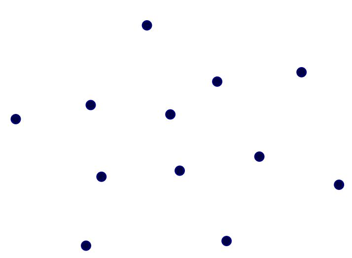
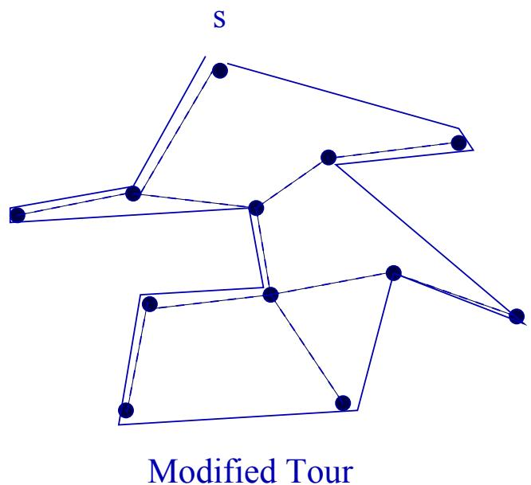
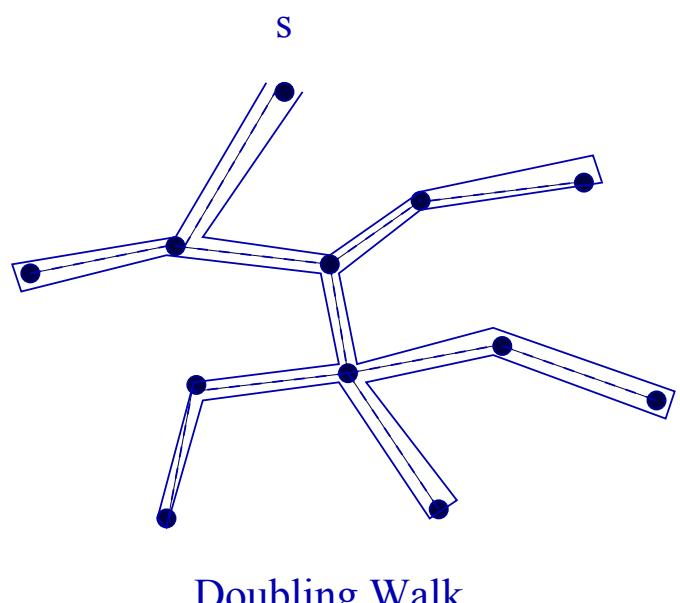
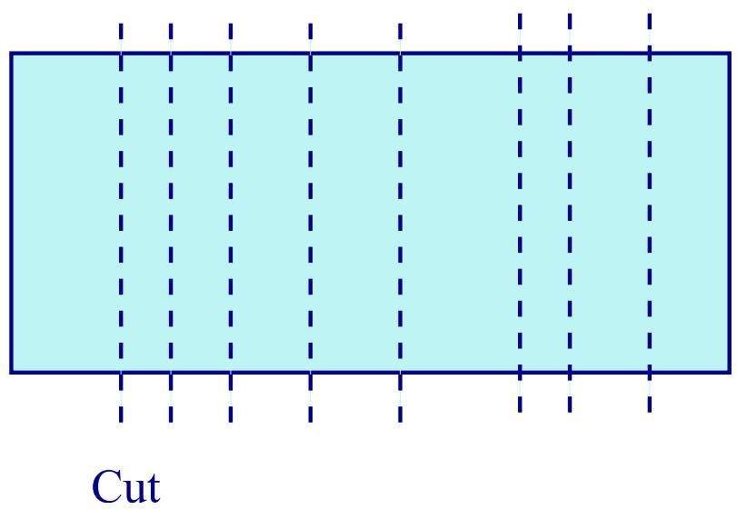
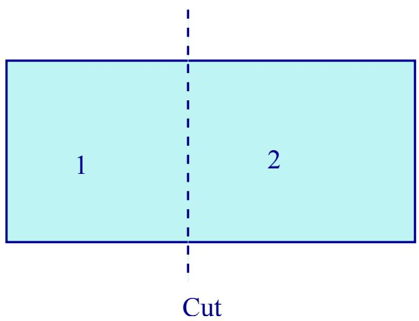
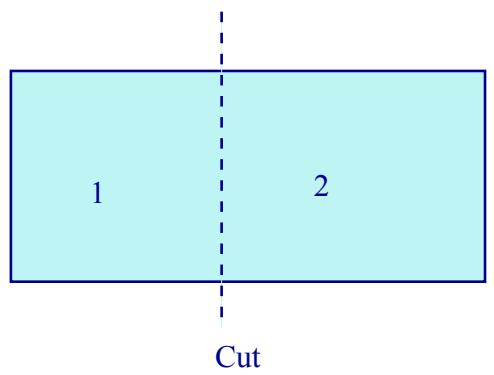

# Near Optimal Solutions

• Many important optimization problems are lacking efficient solutions.

• NP-Complete problems unlikely to have polynomial time solutions.

• Good heuristics important for such problems.

NP-Completeness only says that no polynomial time algorithm can solve every instance of the problem to optimality.

Examples: TSP, Graph coloring, Clique, 3-SAT, Set covering, Knapsack.

# Approximation Algorithms

• When faced with NP-Complete problems, our choices are:

1. Algorithms that compute optimal solution, but some times may take exponential time.

2. Algorithms that always run in polynomial time but may not always produce the optimal.

We focus on second kind, and study algorithms that always produce solutions of a guaranteed quality.

• We call them approximation algorithms.

# 0/1 Knapsack Problem

• We begin with the 0/1 knapsack problem.

Input is a set of items $\{ 1 , 2 , \ldots , n \}$ .

Item i has size si and value $v _ { i }$

The knapsack can hold items of total size upto K.

• Knapsack problem is to choose the subset of items with maximum value of total size ≤ K.

Assume that all sizes are integers.

Items cannot be taken partially.

# 0/1 Knapsack Problem

Example: $K = 5 0$ . Three items:

Item Size Value 1 10 60 2 20 100 3 30 120

• Greedy strategy of always picking the next items with maximum value/size ratio does not give optimal solution.

# Dynamic Program

• List the items in any order, 1, 2, . . . , n.

We consider subproblems of the following form:

A[i, s]: maximum value of items in the set {1, 2, . . . , i} that fit in a knapsack of size s.

• We want to compute $A [ n , K ]$

• We develop a recursive formula for $A [ i , s ]$

# Dynamic Program

First, can we compute $A [ 1 , s ]$ , for all s?

Yes!

$$
\begin{array} { l } { { A [ 1 , s ] = 0 ~ \mathbf { i f } ~ s < s _ { 1 } , \mathbf { a n c } } } \\ { { A [ 1 , s ] = v _ { 1 } ~ \mathbf { i f } ~ s \geq s _ { 1 } . } } \end{array}
$$

• Supposing we know $A [ i - 1 , s ]$ , for all s, how can we compute $A [ i , s ] ^ { * }$ ?

# Knapsack Recurrence

$$
A [ i , s ] = \operatorname* { m a x } \left\{ \begin{array} { l l } { A [ i - 1 , s ] } \\ { A [ i - 1 , s - s _ { i } ] + v _ { i } } \end{array} \right.
$$

• By Principle of Optimality, we have two choices:

1. We reject item i. In this case, $A [ i , s ]$ equals the optimal solution for $A [ i - 1 , s ]$ .

2. We accept item $i$ $\left( \mathbf { o n l y } { \mathrm { ~ i f ~ } } s \geq s _ { i } \right)$ . In this case, we must optimize the knapsack of size $s - s _ { i }$ over items $\{ 1 , 2 , \ldots , i - 1 \} .$ .

# Algorithm

Knapsack $( S , K )$

$$
A [ i , s ] = A [ i - 1 , s ] ;
$$

$$
A [ i , s ] = \operatorname* { m a x } \{ A [ i - 1 , s ] , \ A [ i - 1 , s \ -
$$

# Analysis

• The algorithms runs in time $O ( n K )$ if $S$ has n items.

• It produces optimal solution.

But knapsack problem is NP-Complete! So, what is the catch?

# Algorithm

• The algorithm is not strictly polynomial.

• Its running time depends on magnitudes of item sizes and profits.

• A poly algorithm’s time should depend only on the number of items, not their magnitudes.

Knapsack algorithm is called pseudo-polynomial.

# Poly-time Approximation

• Sort the items in descending order of value/size.

Assume $\begin{array} { r } { \frac { v _ { 1 } } { s _ { 1 } } \geq \frac { v _ { 2 } } { s _ { 2 } } \geq \cdots \geq \frac { v _ { n } } { s _ { n } } . } \end{array}$

Scan the items in this order, taking each item if there is still room in the knapsack.

• Quit when we can’t take an item.

• Call this algorithm G (greedy), and $A _ { G }$ denote the solution produced by this algorithm.

# Poly-time Approximation

Define the approximation ratio to be:

AO(S)max S AG(S)

• That is, over all possible inputs, how large is the ratio between optimal and greedy’s output?

# Approx Ratio

Unfortunately, this ratio is unbounded.

• Consider two items: (1, \$1.01), and $( K , \ S K )$ .

The greedy will take only item 1, while the optimal will take the second item.

The ratio is $K / 1 . 0 1$ , which can be made arbitrarily large.

# Poly-time Approximation

• Suppose we try to fix the algorithm as follows:

Scan the items in sorted order, taking each item if there is still room in the knapsack. When the next item doesn’t fit, output either the current knapsack solution or the single item of maximum value in $S$ , whichever is better.

This solves the pathological case above. But how good is this in general?

Call it Modified Greedy.

# 2 Approximation

Theorem: $\frac { A _ { O } ( S ) } { A _ { M G } ( S ) } \ \leq \ 2$ always.

Proof. First consider a relaxed version of knapsack, in which items can be taken fractionally, if needed.

• Then, $A _ { O } ( S ) \leq A _ { F } ( S )$ . Because the fractional algorithm can never do worse than the optimal of 0/1 knapsack.

Fractional optimal solution will take items in sorted order; only the last item may be fractional.

# Proof

If j was the first item in the list that Modified Greedy couldn’t accept, then

$$
A _ { F } ( S ) \leq A _ { G } ( S ) + v _ { j } .
$$

• Modified Greedy outputs either $A _ { G } ( S )$ or $v ^ { * } \geq v _ { j }$ .

Thus, ${ \cal A } _ { \cal O } \le { \cal A } _ { \cal F } \le { \cal A } _ { { \cal G } } + v _ { j } \le 2 \operatorname* { m a x } \{ { \cal A } _ { { \cal G } } ,$ vj}.

• Modified Greedy never returns a solution worse than half of the optimal.

Algorithms run in $O ( n \log n )$ time.

# TSP Approximation

• Input: A set of n cities, 1, 2, . . . , n, and distance $d ( i , j )$ between each pair $( i , j )$ .

• Find a minimum length tour that visits each city exactly once.

# TSP Approximation

• The problem is a famous NP-Complete problem.

• Similarity to the MST problem only superficial: no polynomial time algorithm for TSP exists, or is likely to exist.

• If distances satisfy the triangle inequality: d(i, j) ≤ d(i, k) + $d ( k , j )$ , then a good approximation is possible.

# TSP Approximation

Compute a MST of the set.

• Do a walk around the MST—visiting each edge twice.

This walk visits each city at least once, and its cost is exactly $2 * \mathrm { l e n } M S T$ .

Because lenMST  lenT SP, the cost is also at most 2 lenTSP.

• We can turn this into a tour by short circuiting any city that has already been visited.

# TSP Approximation

Because of -inequality, the length of the new tour does not increase.

This is a 2-approximation for the TSP.

# A Game: Fair Division

• A cake needs to be divided among n players.

• Protocol for cutting the cake so each player gets 1/n of the cake by his own measure.

Questions: Can it be done? How many cuts needed?

# A Game: Fair Division

• Cake cutting modeled as 1-dimensional problem.

• Players are selfish, non-cooperative, and care only about their own piece.

# 2 Players

• Folk Theorem: You cut, I choose!

• Player A cuts the cake in two parts.

Player B then chooses the piece he wants.

# A Game: Fair Division

What’s the best strategy for Player A? To cut the cake fairly into 2 parts.

A gets at least 1/2 of the cake, because he makes the fair cut.

B gets the at least 1/2, because he can choose the bigger half.

# Modeling n Player Game

• Protocol is a prog. interactive procedure.

• Instructions like: cut a piece of the cake of these specifications, or give piece X to player A etc.

The strategy of a player is an adaptive sequence of moves compatible with the protocol.

• A winning strategy for a player is one that ensures him ≥ 1/n of the cake (irrespective of the other players’ strategies).

• A protocol is fair if every participant has a winning strategy.

# The n Player Game

We saw that there is a fair protocol for 2 players, which requires only 1 cut.

• Is there a fair division protocol for n players?

How many cuts are needed?

# Fair Protocol for n Players

# Fair $( n )$

If $n = 1$ , give the cake to 1. Else, let players be 1, . . . , n

$\bullet$ Ask 1 to cut piece $\alpha$ he is willing to take. Set $i  1$ .

$\bullet$ for $j = 2$ to $n - 1$ do

1. Ask player $j$ if $i$ should get $\alpha$

2. If $j$ disagrees, tell $j$ to cut a piece out of $\alpha$ that he is willing to take

3. Call the new piece α. Set $i \ \Leftarrow \ j$ .

$\bullet$ Ask $n$ if he agrees that $i$ should get $\alpha$ .

$\bullet$ If $n$ agrees, give $\alpha$ to $i$ ; else give $\alpha$ to n.

Set $n \ \Leftarrow \ n - 1$

• Call Fair $( n - 1 )$ on the remaining cake.

# Analysis

• In the protocol Fair (n), every player has a winning strategy.

If asked to make a cut, make an honest cut. Disagree only if another player is to be allotted a bigger than 1/n piece.

• Every player who follows this strategy ends up with at least 1/n of the cake.

# Analysis

How about the number of cuts made?

With i players remaining, at most $( i - 1 )$ cuts are made before one new player gets a piece.

So, the worst-case upper bound on cuts is Pni=1(i − 1) = Θ(n2).

• Fair but unattractive protocol—too many cuts.

How about a fair protocol with $N - 1$ cuts?

# Negative Result

• No protocol exists that is fair and makes exactly $N - 1$ cuts.

Proof uses contradiction. Suppose such a protocol exists.

The proof uses two facts:

Fact 1: All cuts divide cake into multiples of 1/n.

This is true because $N - 1$ cuts divide the cake into N pieces, and all measures are the same.

# Negative Result

Fact 1: If player B makes a cut, then the winning strategy of any player A should allow A to avoid either of the those pieces, if he so desires.

• Without this, A could be forced to take a piece < 1/n.

# The Proof

• Consider the first time when all pieces become of size ≤ 2/n.

• Suppose $A$ made the last cut. He either cut a 4/n size piece in the middle, or a 3/n size piece into a 1/n and a 2/n piece.

We now argue that even if all players follow their winning strategy, someone will get a piece < 1/n.

• So, the protocol is not fair!

# The Proof

[Case 1: A cut a 3/n piece.]

A decides to makes an unfair cut: $( 1 + \epsilon ) / n$ and $( 2 - \epsilon ) / n$ pieces, where $0 < \epsilon < 1$ .

• Other players’ winning strategies will force A to get his share out of this $3 / n$ piece he cut.

We will argue that at least one of the players 6= A will get < 1/n.

# The Proof

$\bullet$ If $A$ cuts again, he can cut either $( 1 + \epsilon ) / n$ or the $( 2 - \epsilon ) / n$ piece into two. But both pieces are < 1/n, so some other player get a smaller piece.

• If $B \neq A$ makes the additional cut, then A can avoid getting the smaller pieces created by B, so again some other player gets < 1/n.

# The Proof

[Case 2: A cut a 4/n piece.]

A makes $( 2 + \epsilon ) / n$ and $( 2 - \epsilon ) / n$ pieces.

• Other players force $A$ to get his share out of this 4/n piece he cut.

Suppose A cuts again.

[Cuts (2 − ²)/n piece.] Even if he cuts fairly, some player gets < 1/n cake.

[Cut $\textbf { s } ( 2 + \epsilon ) / n \ \mathbf { p i e c e } . ]$ A gets a 1/n piece himself, but he creates the Case 1: 3 players to share the $( 1 + \epsilon ) / n$ and $( 2 - \epsilon ) / n$ pieces.

# The Proof

Some $B \neq A$ makes the cut.

– A can ensure he doesn’t get the < 1/n piece created by $B$ .

– If B cuts the $( 2 - \epsilon ) / n$ piece, at least one player 6= A ge $\mathrm { t s ~ t h e } < 1 / n \ \mathrm { p i e c e } .$

If B cuts the $( 2 + \epsilon ) / n$ piece, then A rejects the smaller piece, and again someone 6= A gets a smaller piece.

# O(n log n) Cut Fair Protocol

• Think of cake as the [0, 1] interval.

• Asks each player to cut the cake into a left and a right half with ratio bn2c : $\lceil { \frac { n } { 2 } } \rceil$ .

• Let ci be the size of the left part, created by player i.

• Sort players so $c _ { 1 } \leq c _ { 2 } \ldots \leq c _ { n } < 1 .$

# O(n log n) Cut Fair Protocol

• Game is divided into two separate games.

• Players 1, 2, . . . , bn2 c play on the cake $[ 0 , c _ { \lfloor \frac { n } { 2 } \rfloor } ]$

• Players $\lceil \frac { n } { 2 } \rceil + 1 , \lceil \frac { n } { 2 } \rceil + 2 , \ldots , n$ play on the cake $[ c _ { \lfloor \frac { n } { 2 } \rfloor } , 1 ]$ .

Game is played recursively until one player remains; he gets the remaining piece.

# Correctness of the Protocol

Consider a player A.

• If A participates in game division only once before he gets his share, either $n = 3$ and $A = i _ { 1 }$ , or $n = 2$ .

In the first case, if he cuts in the ratio 1 : 2, then he will get 1/3 of the cake.

• In the latter case, if he is i1, he gets $[ 0 , c _ { 1 } ]$ , which is exactly 1/2. Otherwise, he is i2 and he gets [c1, 1], which is at least 1/2 by his measure.

# Correctness of the Protocol

• If A participates in more than one game division, consider the first division.

• If in the new sorted order, he is among 1, 2, . . . , $\lfloor { \frac { n } { 2 } } \rfloor$ c, then he plays with bnc on a cake of size at least $\lfloor { \frac { n } { 2 } } \rfloor / n$ . By induction, he should get 1/n.

The same reasoning holds if he is among the second group of players.

• So, the protocol is fair.

# Number of Cuts

• Let $f ( n )$ denote the number of cuts made by the protocol to divide the cake among n players.

This satisfies the recurrence:

$$
f ( n ) = n \ + \ f ( \lfloor { \frac { n } { 2 } } \rfloor ) \ + \ f ( \lceil { \frac { n } { 2 } } \rfloor )
$$

This solves to $f ( n ) \ \leq \ 2 n \log n .$