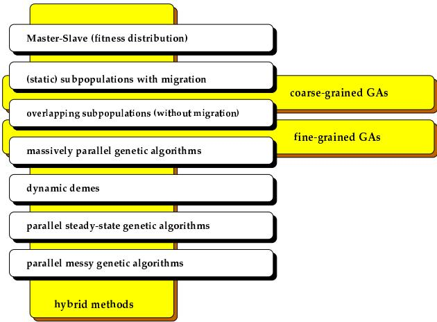

# Parallel Genetic Algorithm Taxonomy

Mariusz Nowostawski   
Information Science Department   
University of Otago   
PO BOX 56, Dunedin, New Zealand   
MNowostawski@infoscience.otago.ac.nz

Riccardo Poli School of Computer Science The University of Birmingham dgbaston, Birmingham B15 2TT, UK

R.Poli@cs.bham.ac.uk

Abstract—Genetic Algorithms (GAs) are powerful search techniques that are used to solve difficult problems in many disciplines. Unfortunately, they can be very demanding in terms of computation load and memory. Parallel Genetic Algorithms (PGAs) are parallel implementations of GAs which can provide considerable gains in terms of performance and scalability. PGAs can easily be implemented on networks of heterogeneous computers or on parallel mainframes.

In this paper we review the state of the art on PGAs and propose a new taxonomy also including a new form of PGA (the dynamic deme model) we have recently developed.

# I. INTRODUCTION

Genetic Algorithms (GAs) are search algorithms inspired by genetics and natural selection [1]. The most important phases in GAs are reproduction, mutation, fitness evaluation and selection (competition). Reproduction is the process by which the genetic material in two or more parent individuals is combined to obtain one or more offspring. Mutation is normally applied to one individual in order to produce a new version of it where some of the original genetic material has been randomly changed. Fitness evaluation is the step in which the quality of an individual is assessed. This is very often the most CPU intensive part of a GA. Selection is an operation used to decide which individuals to use for reproduction and mutation in order to produce new search points.

Sequential GAs have been shown to be very successful in many applications and in very different domains. However there exist some problems in their utilisation which can all be addressed with some form of Parallel GA (PGA):

For some kind of problems, the population needs to be very large and the memory required to store each individual may be considerable (like for example in genetic programming [2]). In some cases this makes it impossible to run an application efficiently using a single machine, so some parallel form of GA is necessary.   
Fitness evaluation is usually very time-consuming. In the literature computation times of more than 1 CPU year have been reported for a single run in complex domains (e.g. see [3]). It stands to reason that the only practical way of provide this CPU power is to the use of parallel processing.   
Sequential GAs may get trapped in a sub-optimal region of the search space thus becoming unable to find better quality solutions. PGAs can search in parallel different subspaces of the search space, thus making it less likely to become trapped by low-quality subspaces.

For the first two reasons PGAs are studied and used for applications on massively parallel machines [4], transputers [5], and also on distributed systems [6]. However, the most important advantage of PGAs is that in many cases they provide better performance than single population-based algorithms, even when the parallelism is simulated on conventional machines. The reason is that multiple populations permit speciation, a process by which different populations evolve in different directions (i.e. toward different optima) [7]. For this reason Parallel GAs are not only an extension of the traditional GA sequential model, but they represent a new class of algorithms in that they search the space of solutions differently.

Interestingly, PGAs often allow theoretical analyses which are not harder than those for sequential GAs [8], [9]. Owing to the large number of model proposed in the literature, the only problem that one has to face to use PGAs is how to determine which parallel model to use.

There have been some attempts to develop a unified taxonomy of parallel GAs which would greatly help addressing this issue. Some are general distributed-memory architecture taxonomies [10], others are taxonomies of coarse grained GAs [11], or of fine-grained GAs [12]. (For other related efforts are see [13], [14], [15].) The most recent general PGA taxonomy was compiled by Eric Cantu-P ´ az [16]. However, none of these taxonomies is fully comprehensive and satisfactory. In addition different taxonomies are incompatible.

In order to overcome these problems we decided to propose a new, uniform taxonomy ofParallel Genetic Algorithms. This will be described in the rest of the paper together with a review of the research done on each class of PGAs.1

# II. OVERVIEW OF OUR PGA TAXONOMY

The way in which GAs can be parallelised depends on the following elements:

How fitness is evaluated and mutation is applied If single or multiple subpopulations (demes) are used If multiple populations are used, how individuals are exchanged How selection is applied (globally or locally)

Depending on how each of these elements is implemented, more than ten different methods of parallelising GAs can be obtained. These can be classified into eight (more or less general) classes:

1. Master-Slave parallelisation (distributed fitness evaluation)

(a) Synchronous (b) Asynchronous   
2. Static subpopulations with migration   
3. Static overlapping subpopulations (without migration)   
4. Massively parallel genetic algorithms   
5. Dynamic demes (dynamic overlapping subpopulations)   
6. Parallel steady-state genetic algorithms   
7. Parallel messy genetic algorithms   
8. Hybrid methods (e.g. static subpopulations with migration, with distributed fitness evaluation within each subpopulation)

The relations between these classes are shown in Figure 1. To overcome misinterpretations our taxonomy includes more classes than other taxonomies. In the following sections we will briefly describe each of the classes in terms of the parallel model they use and we will discuss how they relate to other taxonomies.

  
Fig. 1. Parallel Genetic Algorithms Taxonomy

# III. MASTER-SLAVE PARALLELISATION

This method, also known as distributed fitness evaluationwas, is one of the first successful applications of parallel GAs. It is known as global parallelisation, master-slave model, or distributed fitness evaluation.

The algorithm uses a single population and the evaluation of the individuals and/or the application of genetic operators are performed in parallel. The selection and mating is done globally, hence each individual may compete and mate with any other.

The operation that is most commonly parallelised is the evaluation of the fitness function, because normally it requires only the knowledge of the individual being evaluated (not the whole population), and so there is no need to communicate during this phase. This is usually implemented using masterslave programs, where the master stores the population and the slaves evaluate the fitness, apply mutation, and sometimes exchange bits of the genome (as part of crossover).

Parallelisation of fitness evaluation is done by assigning a fraction of the population to each of the processors available (in the ideal case one individual per processing element). Communication occurs only as each slave receives the individual (or subset of individuals) to evaluate and when the slaves return the fitness values, sometimes after mutation has been applied with the given probability.

The algorithm is said to be synchronous, if the master stops and waits to receive the fitness values for all the population before proceeding with the next generation. A synchronous master-slave GA has exactly the same properties as a simple GA, except for its speed, i.e. this form of parallel GA carries out exactly the same search as a simple GA.

An asynchronous version of the master-slave GA is also possible. In this case the algorithm does not stop to wait for any slow processors. For this reason the asynchronous masterslave PGA does not work exactly like a simple GA, but is more similar to parallel steady-state GAs (see below). The difference lies only in the selection operator. In a asynchronous master-slave algorithm selection waits until a fraction of the population has been processed, while in a steady-state GAs selection does not wait, but operates on the existing population.

A synchronous master-slave PGA is relatively easy to implement and a significant speedup can be expected if the communications cost does not dominate the computation cost. However, there is a classical bottle-neck effect. The whole process has to wait for the slowest processor to finish its fitness evaluations. After that, the selection operator can be applied. The asynchronous master-slave PGA overcomes this, but as stated before, the algorithm changes significantly the GA dynamics, and as a result it is difficult to analyse. Perhaps the easiest way of implementing an asynchronous masterslave PGA is applying tournament selection only considering the fraction of individuals in the population whose fitness has been already evaluated.

# IV. STATIC SUBPOPULATIONS WITH MIGRATION

The important characteristics of the class of static subpopulations with migration parallel GAs are the use of multiple demes and the presence of a migration operator.

Multiple-deme GAs are the most popular parallelisation method, and many papers have been written describing details of their implementation [16]. These algorithms are usually referred to as subpopulations with migration, static subpopulations, multiple-deme GAs, coarse-grained GAs and even just parallel GAs.

This parallelisation method requires the division of a population into some number of demes (subpopulations). Demes are separated from one another (geographic isolation), and individuals compete only within a deme. An additional operator called migration is introduced: from time to time, some individuals are moved (copied) from one deme to another. If individuals can migrate to any other deme, the model is called an island model. If individuals can migrate only to neighbouring demes, we have a stepping stone model. There are other possible migration models.

The migration of individuals from one deme to another is controlled by several parameters like:

The topology that defines the connections between the subpopulations. Commonly used topologies include: hypercube, two-dimensional/three-dimensional mesh, torus, etc.   
A migration rate that controls how many individuals migrate   
A migration scheme, that controls which individuals from the source deme (best, worst, random) migrate to another deme, and which individuals are replaced (worst, random, etc.)   
A migration interval that determines the frequency of migrations

Coarse grained algorithms is a general term for a subpopulation model with a relatively small number of demes with many individuals. These models are characterised by the relatively long time they require for processing a generation within each (“sequential”) deme, and by their occasional communication for exchanging individuals. Sometimes coarse grained parallel GAs are known as distributed GAs because they are usually implemented on distributed memory MIMD computers. This approach is also well suited for heterogeneous networks.

Fine grained algorithms are the opposite. They require a large number of processors because the population is divided into a large number of small demes. Inter-deme communication is realised either by using a migration operator, or by using overlapping demes. Recently, the term fine-grained GAs was redefined and is now used also to indicate massively parallel GAs [16] (see below).

The multiple-deme model presents one problem: scalability. If one has only a few machines, it is efficient to use a coarse grained model. However, if one has hundreds of machines available, it is difficult to scale up efficiently the size and number of subpopulations, to use the hardware platform efficiently.2

Despite this problem, the multiple-deme model is very popular. From the implementation point of view, multiple-deme GAs are simple extensions of the serial GA. It’s enough to take a few conventional (serial) GAs, run each of them on a node of a parallel computer, and to apply migration at some predetermined times.

# V. STATIC OVERLAPPING SUBPOPULATIONS WITHOUT MIGRATION

This model is similar to the previous one. The entire population consists of a number of demes. The main difference is the lack of migration operator as such. Instead, propagation and exchange of traits is done by individuals which lie in the so called overlapping areas. The demes are organised in a kind of spatial structure that provides the interaction between them. Some individuals belongs to more than one deme, and participate in more than single crossover and selection operations. This method can be easily applied to shared memory systems, by placing the whole population in the shared area, and by running the GAs in each deme concurrently. A small amount of synchronisation is needed in overlapping areas for the crossover, mutation and selection operators. A number of different models of spatial distribution for the demes exist, e.g. 2D-mesh, 3D-mesh, etc.

# VI. MASSIVELY PARALLEL GENETIC ALGORITHMS

If we increase the number of demes in the overlapping static subpopulations model and decrease the number of individuals in each deme we will obtain a (fine-grained) massively parallel GA. Because the features of this kind of algorithms are quite different than those of the overlapping (coarse-grained) subpopulation model, and because this algorithm is usually used in massively parallel systems, we decided to add this category to the general categories of parallel genetic algorithms [18], [19]. Algorithms in this category are often called simply finegrained GAs.

In these algorithm there is only one population, but it is has, like in overlapping demes, a spatial structure that limits the interactions between individuals. An individual can only compete and mate with its neighbours, but since the neighbourhoods overlap, good solutions may disseminate across the entire population.

It is common to place the individuals in a two-dimensional grid, because many massively parallel systems use interconnected networks of PEs with this topology. However, it is also possible to use a hypercube architecture or other routing schemes like: a ring, a torus, a $1 6 \times 8 \times 8$ cube, a $4 \times 4 \times 4 \times 4 \times 4$ hypercube, and a $1 0 { - } \mathrm { D }$ binary hypercube. It is also possible to use an island structure where only one individual of each deme overlaps with other demes.

The ideal case is to have just one individual for every processing element (PE) available. This model is suited for massively parallel computers but it can be implemented on any multiprocessor.

This model can be simulated on a cluster of workstations, but in this case it has the disadvantage of involving an extremely high communication cost.

# VII. DYNAMIC DEMES

Dynamic Demes is a new parallelisation method for GAs [17] which allows the combination of global parallelism (the algorithm can work as a simple master-slave distributed GA) with a coarse-grained GA (overlapping subpopulations model). In this model there is no migration operator as such, because the whole population is treated during evolution as a single collection of individuals, and information between individuals is exchanged via a dynamic reorganisation of the demes during the processing cycles.

From the parallel processing point of view the dynamic demes approach fits perfectly the MIMD category (Flyn classification) as an asynchronous multiple master-slave algorithm.

The main idea behind this approach is to cut down the waiting time for the last (slowest) individuals to arrive in the master-slave model, by dynamically splitting the population into demes, which can then be processed without delay. This is efficient in terms of processing speed. In addition the algorithm is fully scalable. Starting from a global parallelism with fitness-processing distribution, one can scale up the algorithm up to a fine grained version, with a few individuals within each deme and big numbers of demes.

The algorithm, can be run on shared- and distributedmemory parallel machines. Thanks to its scalability it can be used in systems with a few Processing Elements as well as in massively parallel systems with large number of PEs, and everything in between.

Dynamic Demes is scalable and easy to implement method of GA parallelisation. The method has been shown to be very efficient and useful in number of application [17].

# VIII. PARALLEL STEADY-STATE ALGORITHMS

In steady-state GAs, it is really straightforward to parallelise the genetic algorithms operators, since this kind of GAs use continuous population-update schemes. If children are gradually introduced into a single, continuously-evolving population, the only thing to do is apply selection and replacement schemes in the critical section.3 The other GA operators, including fitness evaluation, can be run in parallel.

# IX. PARALLEL MESSY GENETIC ALGORITHMS

Messy GAs have three phases. In the initialisation and primordial phases the initial population is created using a partial enumeration, and it is reduced using a kind of tournament selection. Then, in the juxtapositional phase, partial solutions found in the primordial phase are mixed together. The initialisation phase can be done completely concurrently since no communication is needed. Since the primordial phase usually dominates the execution time, concurrent models of selection and evaluation are normally used only in this phase. For example a variant of distributed fitness evaluation has been used, but with some additional feature in the master process to decrease the size of population [20].

# X. HYBRID METHODS

In order to parallelise GAs it is also possible to use some combination of methods previously described. We call this class of algorithms hybrid parallel GAs. Combining parallelisation techniques may result in algorithms that have the benefits of their components and show better performance than any of the components alone.

# XI. DIFFERENCES WITH OTHER TAXONOMIES

There are some relations between existing taxonomies and the proposed one. Some of them were explored in appropriate sections above. There are two major differences left, which will be described briefly in following paragraphs.

It is important to emphasise that while the synchronous master-slave method does not affect the behaviour of the algorithm, coarse grained methods introduce fundamental changes in the way the GA works. For example, in the synchronous master-slave method the selection operator takes into account the entire population, while in the other parallel GAs selection is local to each deme. Also in the methods that divide the population into demes it is only possible to mate with a subset of individuals whereas in the global synchronous master-slave model it is possible to mate with any other individual. Some taxonomies exclude from parallel models those, which do not differ from sequential counterparts, and because of that, the synchronous master-slave model is excluded from the class of Parallel Genetic Algorithms in some taxonomies.

In some taxonomies, the category parallel steady-state GA represents the model of subpopulations with migration, where each subpopulation works as a steady-state GA. In our taxonomy this model represents the hybrid method: static subpopulations with migration where each subpopulation is a (sequential or parallel) steady-state genetic algorithm.

# XII. CONCLUSIONS

In this paper we have reviewed the main results in the research on parallel genetic algorithms and proposed a new taxonomy which overcomes the problems present in earlier attempts to classify the huge literature on this subject.

We hope this effort will help others (particularly designers and engineers who want to use genetic algorithms for large scale complex optimisation problems) choose the right parallelisation model for their applications.

# ACKNOWLEDGEMENTS

The authors wish to thank the members of the Evolutionary and Emergent Behaviour Intelligence and Computation (EEBIC) group at Birmingham.

# Список литературы

[1] David Goldberg, Genetic Algorithms in Search, Optimization, and Machine Learning, Addison-Wesley, Reading, MA, 1989.   
[2] John R. Koza, Genetic Programming: On the Programming of Computers by Means of Natural Selection, MIT Press, Cambridge, MA, USA, 1992.   
[3] Sean Luke, “Genetic programming produced competitive soccer softbot teams for robocup97,” in Genetic Programming 1998: Proceedings of the Third Annual Conference, John R. Koza, Wolfgang Banzhaf, Kumar Chellapilla, Kalyanmoy Deb, Marco Dorigo, David B. Fogel, Max H. Garzon, David E. Goldberg, Hitoshi Iba, and Rick Riolo, Eds., University of Wisconsin, Madison, Wisconsin, USA, 22-25 July 1998, pp. 214–222, Morgan Kaufmann.   
[4] Reiko Tanese, “Parallel genetic algorithms for a hypercube,” in Proceedings of the Second International Conference on Genetic Algorithms, John J. Grefenstette, Ed. 1987, Lawrence Erlbaum Associates, Publishers.   
[5] T. C. Fogarty and R. Huang, “Implementing the genetic algorithm on transputer based parallel processing systems,” in Parallel Problem Solving from Nature, Berlin, Germany, 1991, pp. 145–149, Springer Verlag.   
[6] Reiko Tanese, Distributed Genetic Algorithms for Function Optimization, Ph.D. thesis, University of Michigan, 1989, Computer Science and Engineering.   
[7] David E. Goldberg, “Sizing populations for serial and parallel genetic algorithms,” in Proceedings of the Third International Conference on Genetic Algorithms, J. D. Schaffer, Ed., San Mateo, CA, 1989, Morgan Kaufman.   
[8] Erick Cantu-P ´ az, “Designing efficient master-slave parallel genetic algorithms,” IllGAL Report 97004, The University of Illinois, 1997, Available on-line at: ftp://ftp-illigal.ge.uiuc.edu/pub/ papers/IlliGALs/97004.ps.Z.   
[9] Erick Cantu-P ´ az, “Designing scalable multi-population parallel genetic algorithms,” IllGAL Report 98009, The University of Illinois, 1998, Available on-line at: ftp://ftp-illigal.ge.uiuc.edu/pub/ papers/IlliGALs/98009.ps.Z.   
[10] Ricardo Bianchini and Christopher Brown, “Parallel genetic algorithms on distributed-memory architectures,” Technical Report 436, The University of Rochester, The University of Rochester, Computer Science Department, Rochester, New York 14627, May 1993.   
[11] Shyh-Chang Lin, William F. Punch, and Erik D. Goodman, “Coarse-grain parallel genetic algorithms: Categorization and new approach,” in Proceeedings of the Sixth IEEE Symposium on Parallel and Distributed Processing, 1994, pp. 28–37.   
[12] Tsutomu Maruyama, Tetsuya Hirose, and Akihito Konagaya, “A fine-grained parallel genetic algorithm for distributed parallel systems,” in Proceedings of the Fifth International Conference on Genetic Algorithms, Stephanie Forrest, Ed., San Mateo, CA, 1993, pp. 184–190, Morgan Kaufman.   
[13] John J. Grefenstette, Michael R. Leuze, and Chrisila B. Pettey, “A parallel genetic algorithm,” in Proceedings of the Second International Conference on Genetic Algorithms, John J. Grefenstette, Ed. 1987, pp. 155–161, Lawrence Erlbaum Associates, Publishers (Hillsdale, NJ).   
[14] T. C. Belding, “The distributed genetic algorithm revisited,” in Proceedings of the Sixth International Conference on Genetic Algorithms, L. Eschelman, Ed. 1995, pp. 114– 121, Morgan Kaufmann (San Francisco, CA).   
[15] David E. Goldberg, Kerry Zakrzewski, Brad Sutton, Ross Gadient, Cecilia Chang, Pillar Gallego, Brad Miller, and Eric Cantu-P ´ az, “Genetic algorithms: A bibliography,” IlliGAL Report 97011, Illinois Genetic Algorithms Lab. University of Illinois at Urbana-Champaign, December 1997.   
[16] Erick Cantu-P ´ az, “A survey of parallel genetic algorithms,” IllGAL Report 97003, The University of Illinois, 1997, Available on-line at: ftp: //ftp-illigal.ge.uiuc.edu/pub/papers/ IlliGALs/97003.ps.Z.   
[17] Mariusz Nowostawski, “Parallel genetic algorithms in geometry atomic cluster optimisation and other applications,” M.S. thesis, School of Computer Science, The University of Birmingham, UK, September 1998, http://studentweb.cs.bham..ac.uk/ ˜mxn/gzipped/mpga-v0.1.ps.gz.   
[18] Shumeet Baluja, “A massively distributed parallel genetic algorithm (mdpga),” Technical Report CMU-CS-92- 196R, Carnagie Mellon University, Carnagie Mellon University, Pittsburg, PA, 1992.   
[19] Shumeet Baluja, “The evolution of genetic algorithms: Towards massive parallelism,” in Proceedings of the Tenth International Conference on Machine Learning, San Mateo, CA, 1993, pp. 1–8, Morgan Kaufmann.   
[20] David Goldberg, Kalyanmoy Deb, and Bradley Korb, “Messy genetic algorithms: Motiation, analysis, and first results,” Complex Systems, vol. 3, pp. 493–530, 1989.