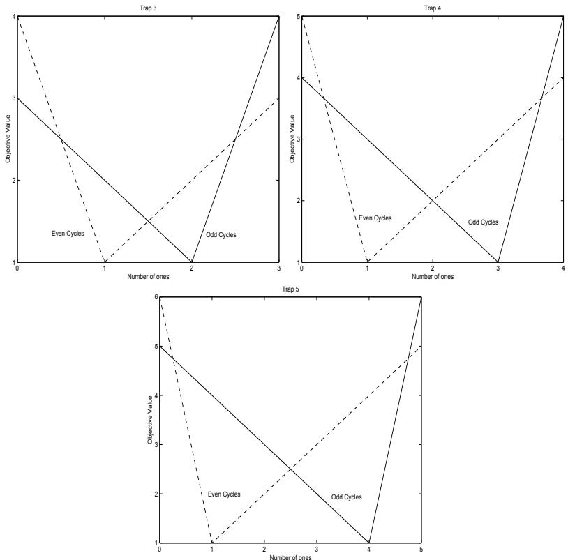
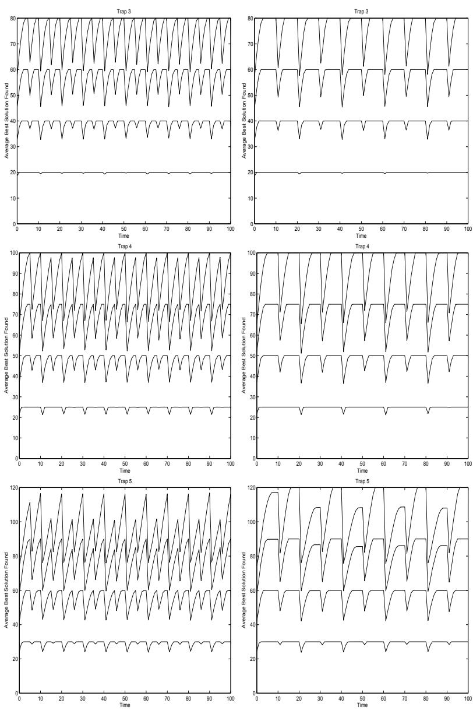
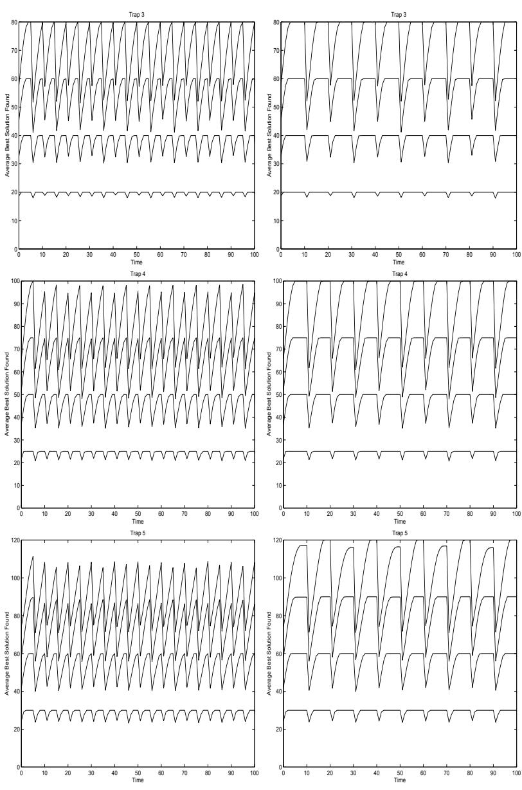
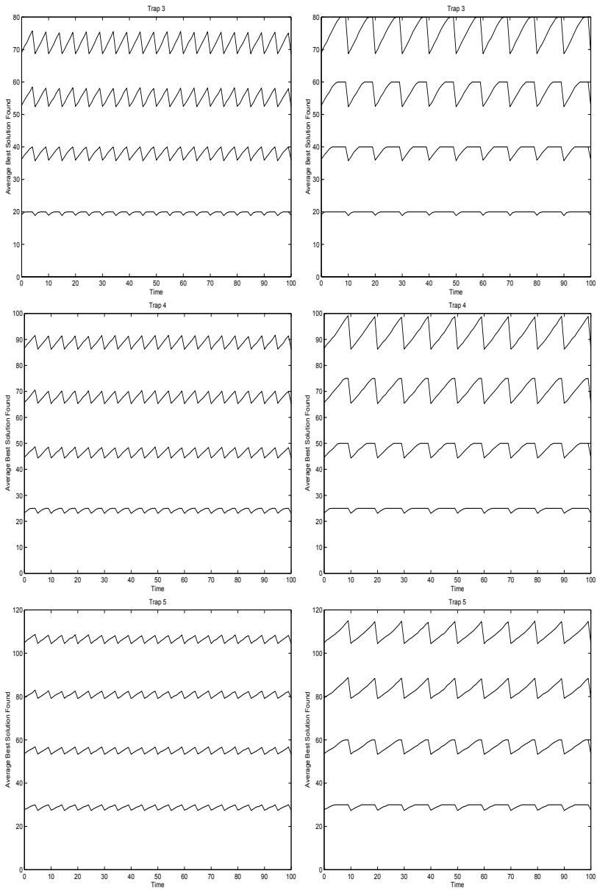
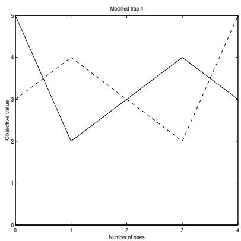
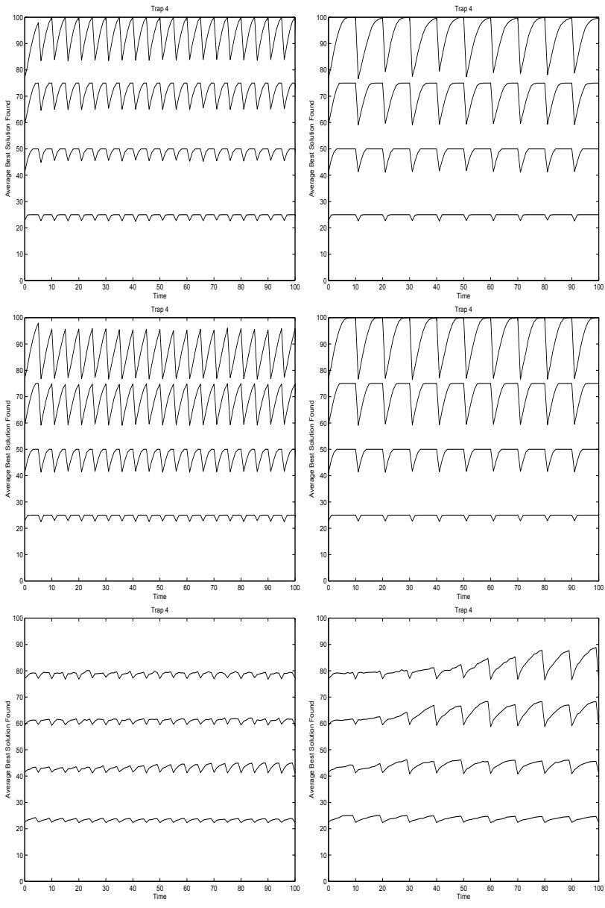
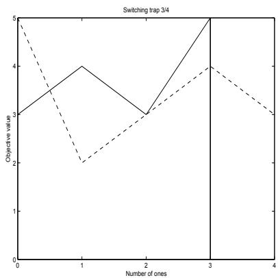
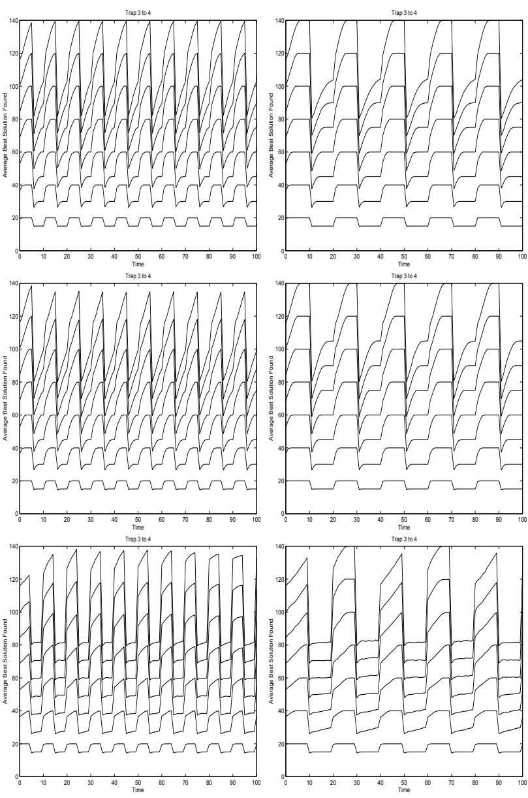
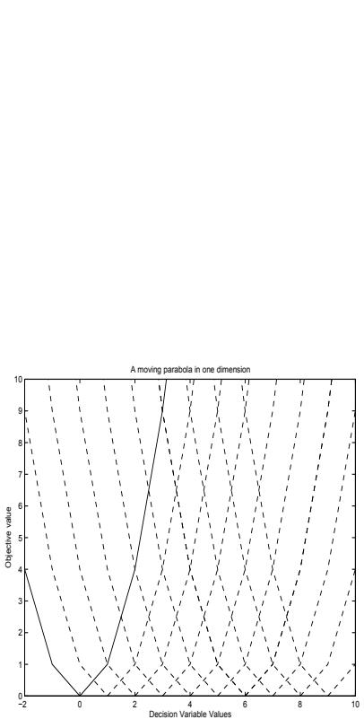
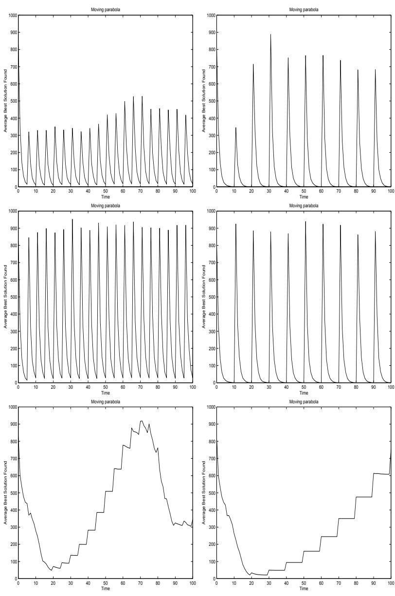

# Oiling the Wheels of Change The Role of Adaptive Automatic Problem Decomposition in Non–Stationary Environments

Hussein A. Abbass Kumara Sastry David E. Goldberg

# Oiling the Wheels of Change: The Role of Adaptive Automatic Problem Decomposition in Non–Stationary Environments

Hussein A. Abbass∗, Kumara Sastry†, and David Goldberg‡

# Abstract

Genetic algorithms (GAs) that solve hard problems quickly, reliably and accurately are called competent GAs. When the fitness landscape of a problem changes overtime, the problem is called non–stationary, dynamic or time–variant problem. This paper investigates the use of competent GAs for optimizing non–stationary optimization problems. More specifically, we use an information theoretic approach based on the minimum description length principle to adaptively identify regularities and substructures that can be exploited to respond quickly to changes in the environment. We also develop a special type of problems with bounded difficulties to test non–stationary optimization problems. The results provide new insights into non-stationary optimization problems and show that a search algorithm which automatically identifies and exploits possible decompositions is more robust and responds quickly to changes than a simple genetic algorithm.

# 1 Introduction

Real–world problems are rarely static. Problems change overtime, a factor compounded by the fact that environments under which they function are also in a constant state of flux. Although significant advances have been made in the development and design of genetic and evolutionary algorithms [1, 2, 3, 4], only a few have accounted for the changing nature of the problems themselves [5]. Resolving problems from scratch every time a change occurs is neither practical nor feasible, and is tantamount to re-inventing the wheel every time a problem with the wheel occurs. This aspect of problem-solving is especially pertinent where change is so frequent that re-solving the original problem can never be appropriate.

We hypothesize that to solve non-stationary problems efficiently, previously encountered solutions can be used to extract structural knowledge about the problem in hand. Identifying important regularities and sub–structures in a problem can help in responding quickly and tracking optima when the environment changes. A class of evolutionary algorithms that automatically discover the problem decomposition is known as competent genetic algorithms [6, 7, 8, 9, 10, 11, 12, 13, 14]. In essence, competent genetic algorithms automatically and adaptively identify important sub–structures of an underlying search problem and use them to efficiently explore the search space. The aim of this paper is to explore the advantages of using a candidate of these methods to examine our hypothesis.

More specifically, we use the extended compact genetic algorithm (ecGA) [10] as a candidate of probabilistic model–building GAs. In these types of GAs, the variation operators are replaced by building and sampling a probabilistic model of promising solutions. In ecGA, the probabilistic model is based on the information theoretic measure known as the minimum description length principle [15, 16, 17]. The structure and the probabilities of the decomposition model is manipulated when the environment changes to speed-up the response of the solver to the changes. Similar to other studies on using genetic and evolutionary algorithms on non-stationary problems, we assume that the new solutions are related to the old ones and that the changes are bounded. Specifically, we incorporate bounded changes to both the problem structure and the fitness landscape. It should be noted that if the environment changes either unboundedly or randomly, on average no method will outperform restarting the solver from scratch every time a change occurs.

The structure of the paper is as follows: in the next section, we will present a brief review to the background materials relevant to this paper. We will then review ecGA followed by the different methods we use for dynamic optimization in this paper. We then present the experimental setup, results, and discussions.

# 2 Background Materials

In this section, we present a brief overview to previous work on evolutionary computation methods for dynamic environments and Adaptive automatic decomposition approaches.

# 2.1 Dynamic Environments

To date, there have been three main evolutionary approaches to solve optimization problems in changing environments. These approaches are: diversity control, memory-based, and multi-population methods. We will present a brief overview to this literature here and refer the reader to [5] for a more detailed review to this large growing field.

Diversity has been a focal point of many recent work in enhancing the adaptiveness of evolutionary methods for dynamic optimization problems. Diversity is controlled in two ways; either by increasing the diversity whenever a change is detected or maintaining high diversity all over the evolutionary run. Examples of the former include the hyper–mutation method [18], the variable local search technique [19] and other methods in [20] and [21]. The main methods in the latter group include Redundancy [22, 23, 24, 25, 26, 27], random immigrants [28], Aging [29], and the Thermodynamical Genetic Algorithms [30, 31].

Memory-based approaches attract much attention in the literature. Two main types exist, implicit and explicit memories. In implicit memory [23, 32, 33], a redundant representation is used as a means for memory. In explicit memories [31], specific information, which may include solutions, get stored and retrieved when needed by the evolutionary mechanism.

The third class of approaches depends on speciation and multi-populations. Sub–populations are maintained and each becomes specialized on a part of the search space. This facilitates the process of tracking the optima as they move. An example in this group is the Self-organizing-scouts method [5].

In all previous work - diversity control, memory-based, and multi-population methods - the performance of different techniques may vary by the manner in which the environment changes [5]. Branke [5] attempted to classify different types of dynamics to gain an insight of the level of difficulties in dynamic optimization problems. A major research question here is what does make a dynamic optimization problem hard to solve by evolutionary methods? Another equally important question is whether by learning some decomposition of the problem, can it help in responding quickly to a change in the environment assuming that this decomposition is not affected by this change?

# 2.2 Adaptive Automatic Decomposition

One of the key challenges in the area of genetic and evolutionary algorithms is the systematic design of genetic operators with demonstrated scalability. Based on Holland’s [34] notion of building blocks, Goldberg [2, 35, 36] proposed a design– decomposition theory for designing effective GAs. The theory establishes the identification of suitable substructures or decompositions (also referred to as linkage) and ensuring efficient exchange of these substructures as a challenging task in designing competent GAs. The design–decomposition theory not only provides an insight into what makes a problem hard for GAs, but also has resulted in many competent GA designs. In essence, competent GAs successfully solve problems with bounded difficulties in a polynomial (sometimes sub–quadratic) number of function evaluations [2]. A key element of competent GAs is a mechanism to automatically identify important substructures of the underlying search problem. Depending on the mechanism used to discover the problem decomposition, competent genetic algorithms can be classified into three broad categories:

Perturbation techniques include the messy genetic algorithm [37], fast messy genetic algorithm [38, 11], gene expression messy genetic algorithm [39], linkage identification by nonlinearity check genetic algorithm, and linkage identification by monotonicity detection genetic algorithm [13], and dependency structure matrix driven genetic algorithm [40], and linkage identification by limited probing [41].

Linkage adaptation techniques such as linkage learning GA [42, 43, 44].

Probabilistic model building techniques [14, 45, 7] such as population-based incremental learning [8], the bivariate marginal distribution algorithm [46], the extended compact GA (ecGA) [10], iterated distribution estimation algorithm [47], Bayesian optimization algorithm (BOA) [48].

A more detailed survey of various problem-decomposition mechanisms (or genetic linkage learning) are discussed elsewhere and the references therein [44].

Despite the success of competent GAs in solving stationary search problems, they have not been used to solve non-stationary problems apart from a preliminary study by [49]. The aim of this paper is twofold: first, to examine the performance of ecGA in terms of its response rate, as an example of a competent GA that automatically decomposes and identifies substructures in non–stationary problems; and second, to test the method on problems with bounded difficulties. Our conjecture is that by having a mechanism which focuses on identifying the important substructures (or building blocks) is beneficial for dynamic optimization problems as well. Furthermore, the problem-decomposition information serves as a way to store past information which could be used and manipulated to respond faster to changes in the environment.

# 3 The Extended Compact Genetic Algorithm

The extended compact genetic algorithm [10] is a probabilistic model building genetic algorithm which replaces traditional variation operators of genetic and evolutionary algorithms by building a probabilistic model of promising solutions and sampling the model to generate new candidate solutions. Harik [10] studied the problem of linkage learning and proposed a conjecture that linkage learning is equivalent to a good model that learns the structure underlying a set of genotypes. Being focused on probabilistic models, Harik focused on probabilistic models to learn linkage. In the ecGA method, he proposed the use of the minimum description length (MDL) principle [15, 16, 17] to compress good genotypes into partitions that include the shortest possible representations. The MDL measure is a tradeoff between two complexity measures. The first is a measure of information content in a population which Harik calls “compressed population complexity” while the second is a measure of the size of the model which Harik calls “model complexity”.

The compressed population complexity measure is a statistical complexity measure based on the well–known information-theoretic approach of Shannon’s entropy [50]. Shannon’s entropy $E ( \chi _ { I } )$ of the population assumes that each partition of variables $\chi _ { I }$ is a random variable with probability $p _ { i }$ . The measure is given by

$$
E ( \chi _ { I } ) = - C \sum _ { i } ^ { \sigma } p _ { i } \log p _ { i }
$$

where $C$ is a constant related to the base chosen to express the logarithm and $\sigma$ is the number of all possible bit sequences for the variables belonging to partition $\chi _ { I }$ ; that is, if the cardinality of $\chi _ { I }$ is $\nu _ { I }$ ${ } ^ { \prime } I , \sigma = 2 { } ^ { \nu _ { I } }$ . This measures the amount of disorder associated within a population under a decomposition scheme. Equivalently, it can be seen as the amount of information content presents in the population under a specific partition scheme. The compressed population complexity is a scaled version of the entropy as follows

$$
C o m p r e s s e d ~ P o p u l a t i o n ~ C o m p l e x i t y ~ = N \sum _ { I } E ( \chi _ { I } )
$$

The second complexity measure is associated with the model itself, which measures the complexity of the model in terms of its size as follows:

$$
M o d e l \ C o m p l e x i t y \ = \log ( N + 1 ) \left( 2 ^ { \nu _ { I } } - 1 \right)
$$

The MDL measure is the sum of the compressed population complexity and the model complexity as follows

$$
M D L \ = N \sum _ { I } \left( - C \sum _ { i } ^ { \sigma } p _ { i } \log p _ { i } \right) + \log ( N ) 2 ^ { \nu _ { I } }
$$

The ecGA method can be summarized in the following steps:

1. Initialize the population at random with $n$ individuals;   
2. Evaluate all individuals in the population;   
3. Use tournament selection without replacement to select $n$ individuals;   
4. Use the MDL measure to recursively partition the variables until the measure increases;   
5. Use the partition to shuffle the building blocks (building block–wise crossover) to generate a new population of $n$ individuals;   
6. If the termination condition is not satisfied, go to 2; otherwise stop.

# 4 Methods

In this section, we present two variations of the ecGA algorithm for dynamic environments. We assume in this paper that we have a mechanism to detect the change in the environment. Detecting a change in the environment can be done in several ways including: (1) re–evaluating a number of previous solutions; and (2) monitoring statistical measures such as the average fitness of the population [5]. The focus of this paper is not, however, on how to detect a change in the environment; therefore, we assume that we can simply detect it. The modified ecGA algorithm for dynamic environments works as follows:

1. Initialize the population at random with $n$ individuals;

2. If a change in the environment is being detected, do:

(a) Re–initialize the population at random with $n$ individuals;   
(b) Evaluate all individuals in the population;   
(c) Use tournament selection without replacement to select $n$ individuals;   
(d) Use the last found partition to shuffle the building blocks (building block–wise crossover) to generate a new population of $n$ individuals;

3. Evaluate all individuals in the population;

4. Use tournament selection without replacement to select $n$ individuals;   
5. Use the MDL measure to recursively partition the variables until the measure increases;   
6. Use the partition to shuffle the building blocks (building block–wise crossover) to generate a new population of $n$ individuals;   
7. If the termination condition is not satisfied, go to 2; otherwise stop.

We will call the previous version dcGA(1). In this version, once a change is detected, a new population is generated at random, followed by selection and crossover using the last generated model. The method then continues with the new population. In the second version, dcGA(2), the last learnt model is not used to bias the re–start mechanism where the steps of selection and crossover that are carried out on the new randomly generated population are ignored. Both versions can be seen as a re–start approach, where the first instance uses the last learnt model after the re–start, while the second does not. In ecGA, the model is re-built from scratch in every generation. This has the advantage of recovering from possible problems that may exist from the use of a hill–climber in learning the model.

Kargupta [11] has shown that problems with bounded complexity can be solved in a polynomial time “provided that there exists an appropriate measure that can correctly detect the good relations”. Mu¨hlenbein [51] showed that order– $\mathbf { - k }$ functions with length $l$ are solvable in $O ( l ^ { k } \log ( l ) )$ using a $( 1 + 1 ) E S$ . Goldberg et. al. [38] achieved $O ( l ^ { 2 } )$ complexity using the fast messy genetic algorithms. Pelikan [14] provided a complexity of $O ( n ^ { 1 . 6 5 } )$ using BOA. Sastry and Goldberg has shown that the convergence time for ecGA follows the relation derived by Mu¨hlenbein and Voosen [52] for breeder GAs, where the convergence time is equal to $\frac { \pi \sqrt ( l ) } { I }$ where $I$ is the selection intensity and $l$ is the number of bits in the chromosome.

In a changing environment, let us assume a chromosome with $B B$ building blocks each of order $k$ bits, $l = k \times B B$ . The ecGa will behave according to the previous complexity equation to build a correct decomposition model. If the environment does not affect the decomposition but only affects the peaks within building blocks, a complete enumeration of all possible solutions within each building block would have a time complexity of $\Theta ( m . 2 ^ { k } )$ to get to the new optima. The notation $\Theta$ represents lower and upper bound (tight) complexity. This is not very expensive. Assume a 5 bit building block replicated 100 times (a 500 bits problem); the cost of tracking the optima when the decomposition does not change would be $2 ^ { 5 } \times 1 0 0 = 3 2 0 0$ objective evaluations. This cost is less than what the experiments will show because the algorithm is designed to handle the general case that the decomposition may also change rather than the very specific case of fixed decomposition.

We compare the results against a similar genetic algorithm except that the linkage learning based crossover operator in ecGA is replaced with a uniform crossover operator. We call this algorithm uGA to emphasize its use of uniform crossover with genetic algorithms. In the following section, we will present the experiments and the test functions used to test the proposed method.

# 5 Experiments

# 5.1 Test Functions

A special class of problems that represent a challenge to GAs methods is known as “problems of bounded difficulty”. These problems are characterized by two main features: they are additively decomposable and separable functions, and uniformly scaled. A function $f ( X ) = f ( x _ { 0 } , \ldots , x _ { i } , \ldots , x _ { n } ) $ is said to be additively decomposable and separable iff there exists a partition of $< \chi _ { j } > _ { j = 1 } ^ { m }$ such that $\chi _ { j } \neq \phi , j = 1 , \ldots , m , \chi _ { j } \bigcap \chi _ { k } = \phi , j \neq k _ { ! }$ , and $\cup _ { j = 1 } ^ { m } \chi _ { j } = X$ . Under this Tpartition scheme, the function $f ( X )$ Scan be rewritten as

$$
f ( X ) = \sum _ { j = 1 } ^ { m } f _ { j } ( \chi _ { j } )
$$

The function is said to be uniformly scaled if all $f ( \chi _ { j } )$ are derived from the same class of functions. There are no assumptions on each $f$ ; each can be a multimodal function and can take any function form. Problems of bounded difficulty have been studied widely because they can provide an easy to analyze test functions which challenge the dynamics of simple genetic algorithms. We will define the order of difficulty for such a problem as $k = \operatorname* { m a x } _ { j } | \chi _ { j } | < < n$ , with |.| represents the cardinality of the set. Solving a problem with bounded difficulty becomes easy once the variables can be correctly separated into the right partitions; at which point, a complete enumeration of all possible solutions for each partition is sufficient to find the global optimal solution. Here we assume that the cardinality of each partition is small and is much smaller than the length of the solution vector. However, in the absence of the value of $k$ and any knowledge of which variable belongs to which partition, the problem can be tough. Examples of problems with bounded difficulties include the Ising problem [53, 54], trap functions [55, 56, 57], and functions which incorporate the notion of multimodality, hierarchy, crosstalk and deception [2]. These test problems, despite being easy to understand, incorporates many of the essential difficulties for linkage identification.

# 5.2 Experimental Design

We repeated each experiment 30 times with different seeds. All results are presented for the average performance over the 30 runs. The population size is fixed to 5000 in all experiments. The population size is chosen large enough to provide enough samples for the probabilistic model to learn the structure and to provide enough diversity for uGA. Termination occurs when the algorithm reaches the maximum number of generations of 100. We assume that the environment changes between generations and the changes in the environment are assumed to be cyclic, where we tested two cycles of length 5 and 10 generations respectively. The crossover probability is 1, and the tournament size is set to 16 in all experiments based on Harik’s default values.

# 5.3 Experiment 1

The method is tested using dynamic versions of three trap functions. Trap functions were introduced by Ackley [55] and subsequently analyzed in details by others [56, 2, 57]. A trap function is defined as follows

$$
t r a p _ { k } = { \left\{ \begin{array} { l l } { h i g h } & { { \mathrm { i f ~ } } u = k } \\ { l o w - u * { \frac { l o w } { k - 1 } } } & { o t h e r w i s e } \end{array} \right. }
$$

where, low and high are scalars, $u$ is the number of 1s in the string, and $k$ is the order of the trap function. In this paper, we choose $l o w = k$ , $h i g h = k + 1$ .

  
Figure 1: The Trap functions in a changing environment. (Left) trap–3; (middle) trap–4; (right) trap–5.

In the initial set of experiments, we tested the method using traps of order 3, 4, and 5. Figure 1 depicts a graphical representation of the traps and how they change. In odd cycles, the global optimum is when all variables are 1’s, while in even cycles and at time 0, the global optimum is when all variables are $0 \mathrm { { s } }$ .

We tested the methods with 5, 10, 15, and 20 building blocks. If we denote the number of building blocks by $B B$ , then the optimal solution for each problem would be at $B B * ( k + 1 )$ . For example, with 20 building blocks in trap–5, the optimal solution has an objective value of 120 regardless of the change in the environment. The environment in this first experiment does not actually change the value of the optimal solution but severely changes the value of the decision variables. The change is severe as the optimal solutions isolates between two points separated with the maximum possible hamming distance in the hamming subspace defined by each trap.

Figures 2, 3, and 4 present the performance of dcGA(1), dcGA(2) and uGA respectively. Starting with the performance of dcGA(1) as being depicted in Figure 2, we can see that the algorithm consistently responds quickly to changes in the environment with trap–3 regardless of the number of building blocks, and cycle length. However, we can see that the response rate with trap–4 is less as indicated with the drop in performance with cycle length 5 and the good performance with the longer cycle length of 10. From the figure, it can be seen that the higher the order of the trap, the slower the method is able to respond to a change in the environment. It can also be seen that the larger the number of copies of building blocks in the chromosome, the slower the response to environmental changes. The slowest response rate was encountered with trap–5 and 20 building blocks. These finding are logical as the level of hardness in the problem increases as the linkage and problem size increases. That is, the harder it is to separate the variables, the more difficult it is to learn the decomposition. This way, we can use the order of a trap and the problem size to quantify how hard a dynamic optimization problem is.

Similar patterns exist with the use of dcGA(2) as being depicted in Figure 3. One can notice that the drop in performance is less with dcGA(1) than it is the case with dcGA(2). Also, by looking at trap–5 with cycle length 5, one can notice that the performance of dcGA(2) is worse than the corresponding case using dcGA(1). This is expected as the response rate would be higher when using dcGA(1) as compared to dcGA(2); thanks to the bias in the initial population with the last linkage model found. However, by comparing trap–5 with cycle length of 10 using dcGA(2) against the corresponding performance using dcGA(1), one can see that the performance of dcGA(2) is consistently better than the corresponding performance of dcGA(1). An explanation of this result will be presented in the following subsection.

  
Figure 2: Traps using dcGA(1) with last model (left) Cycle 5 (Right) Cycle 10. (Top) trap–3 (Middle) Trap–4 (Bottom) Trap–5. In each graph, the four curves correspond to 5, 10, 15, and 20 building blocks ordered from bottom up.

  
Figure 3: Traps using dcGA(2) without last model (left) Cycle 5 (Right) Cycle 10. (Top) trap–3 (Middle) Trap–4 (Bottom) Trap–5. In each graph, the four curves correspond to 5, 10, 15, and 20 building blocks ordered from bottom up.

Comparing the previous results to the uGA results which are depicted in Figure 3, unexpectedly one can see that uGA is very competitive to the linkage learning model. After careful examination of the performance of uGA, we identified that the key reason behind the success of uGA is due to simple luck. As the two attractors in the problem exist when all solutions are $0 \mathrm { { s } }$ and $1 ^ { \circ } 0$ , if uGA converges to the wrong attractor in one cycle, the wrong attractor becomes the right attractor in the following cycle and as it converges back to the wrong attractor, the environment changes again and switches the wrong attractor to become the preferred attractor. In other words, the environment changes in a manner that is beneficial for the bad performance of uGA. To verify our analysis, we conducted a second experiment as being explained in the following subsection.

  
Figure 4: Traps using uGA (left) Cycle 5 (Right) Cycle 10. (Top) trap–3 (Middle) Trap–4 (Bottom) Trap–5. In each graph, the four curves correspond to 5, 10, 15, and 20 building blocks ordered from bottom up.

# 5.4 Experiment 2

In the second type of experiments, we modified the trap function of order 4 to break the symmetry in the attractors. The new function is visualized in Figure 5. At time 0 and in even cycles, the optimal solution is when all variables are set to 0’s and the second attractor is when the sum of 1’s is equal to 3. When the environment changes during the odd cycles, the new solution is optimal when all variables set to 1’s with a new deceptive attractor when the sum of 1’s is 1 or alternatively the number of 0’s is 3. This setup guarantees that the trap is not symmetric with regards to its attractors. Some researchers suggested that a simple use of an Xor operator with trap functions would solve the problem easily because once the GA method converges to the wrong attractor, a simple Xor operator would take it to the right attractor. In our design in Figure 5, breaking the symmetry in the trap would also counterpart the possible trick of using an Xor operator.

Figure 6 depicts the behavior of the three methods using the modified trap–4 function. As expected, the uGA method clearly shows the worst behavior among the three methods. It is clear that it is unable to respond to the changes neither it is able to even get to the deceptive attractor in some cases. This behavior confirms our analysis in the previous section. When looking at dcGA(1) and dcGA(2), however, we can see that dcGA(1) is better than dcGA(2). The dcGA(1) method is able to respond to the changes in the environment quickly, accurately, and reliably all the time. This result is somehow different as compared to the results obtained from the previous section. The linkage has not changed between the two setups, but the only change took place for the attractors. This suggests that the cause of the somehow inferior performance of dcGA(1) as compared to dcGA(2) is attributed to the crossover operator or mixing strategy that it was slow in reaching the two attractors with maximum hamming distance in the previous experiments.

  
Figure 5: The modified trap function 4 in a changing environment.

# 5.5 Experiment 3

In this experiment, we subjected the environment under a severe change from linkage point of view. Here, the linkage boundary changes as well as the attractors. As being depicted in Figure 7, the environment is switching between trap–3 with all optima at 1’s and trap–4 with all optima at $0 \mathrm { { ^ { s } s } }$ . Moreover, in trap–3, a deceptive attractor exists when the number of 1’s is 1 while in trap–4, a deceptive attractor exists when the number of 1’s is 3. This setup is tricky in the sense that, if a hill climber gets trapped at the deceptive attractor for trap–4, the behavior will be good for trap–3. However, this hill–climber won’t escape this attractor when the environment switches back to trap-4 since the solution will be surrounded with solutions of lower qualities. This setup tests also whether any of the methods is behaving similar to a hill–climber.

Figure 8 shows the performance of dcGA(1), dcGA(2), and uGA. We varied the string length between 12 and 84 in a step of 12 so that the string length is dividable by 3 and 4 (the order of the trap). The following table lists the value of the optimal solution for each string length with trap-3 and trap-4.

  
Figure 6: Modified Trap 4 (left) Cycle 5 (Right) Cycle 10, (top) dcGA(1), (middle) dcGA(2), (Bottom) uGA. In each graph, the four curves correspond to 5, 10, 15, and 20 building blocks ordered from bottom up.

<table><tr><td>String Length</td><td>Trap-4</td><td>Trap-3</td></tr><tr><td>12</td><td>15</td><td>16</td></tr><tr><td>24</td><td>30</td><td>32</td></tr><tr><td>36</td><td>17 45</td><td>48</td></tr><tr><td>48</td><td>60</td><td>64</td></tr><tr><td>60</td><td>75</td><td>80</td></tr><tr><td>72</td><td>90</td><td>96</td></tr><tr><td>84</td><td>105</td><td>112</td></tr></table>

  
Figure 7: The switching trap function with $\mathrm { k } { = } 3 , 4$ in a changing environment.

By scrutinizing Figure 8, one can see that dcGA(1) is faster in its response to the changes in the environment than dcGA(2). This can be recognized more with cycle length 5, where dcGA(2) fails to recover with string length 84. The performance of uGA was clearly inferior as it got stuck at the wrong attractor in the first cycle and it seems that it remained at this attractor struggling to jump out of it even with longer cycle length.

# 5.6 Experiment 4

In this section, we will test the method using the moving parabola as one of the standard functions for testing optimization in dynamic environments. In contrast to previous experiments, this function is a minimization problem. The function as presented in [5] is

$$
f ( { \boldsymbol { x } } , t ) = \sum _ { i = 1 } ^ { n } \left( x _ { i } + \delta _ { i } ( t ) \right) ^ { 2 }
$$

Where, $t$ is the time parameter, $x _ { i }$ is decision variable $i$ , and $\delta _ { i } ( t )$ takes the following form:

$$
\begin{array} { c } { \delta _ { i } ( 0 ) = 0 , \forall i \in \{ 1 , \dots , n \} } \\ { \delta _ { i } ( t ) = \delta _ { i } ( t - 1 ) + s , \forall i \in \{ 1 , \dots , n \} } \end{array}
$$

where $s$ represents the severity of the changes and is taken to be 1 in this paper, which is a high sever change. We used 10 variables, and encoded each variable with ten bits scaled between $\pm 4 0$ . The function is depicted in Figure 9 for a single

  
Figure 8: Switching Trap 3–4 (left) Cycle 5 (Right) Cycle 10, (top) dcGA(1), (middle) dcGA(2), (Bottom) uGA. In each graph, the seven curves correspond to strings of length 12, 24, 36, 48, 60, 72, and 84 bits ordered from bottom up.

variable.

  
Figure 9: The moving parabola function in one dimension.

Figure 10 depicts the performance of the three methods on the moving parabola function with cycle length of 5 and 10. It is very clear from the figure that the uGA is performing the worst and is actually diverging for sometime. This behavior is not surprising as because of the direction of the dynamics, the function seems to have come very close to an optimum then after the dynamics changed it was hard to track new optima for some iterations. If we look carefully at Figure 9, we can see that the trajectories of the movement is somehow creating a multimodal landscape which seems to cause problems for uGA. One may think that the behavior of uGA is possibly attributed to loss of diversity. We found that this is not the case as evidenced by the behavior of uGA with cycle length 5. If diversity was lost, uGA would continue being unable to respond for the changes forever. However, we can see from Figure 10 that uGA managed to recover at some point and continued to optimize the function for another few generations.

Both dcGA(1) and dcGA(2) are consistently better. When having a closer look, one can notice that with cycle length 5, dcGA(1) is better than dcGA(2) as it gets closer to the minimum. With cycle 10, both methods track the movements well and get to the exact solution.

  
Figure 10: Moving Parabola (left) Cycle 5 (Right) Cycle 10, (top) dcGA(1), (middle) dcGA(2), (Bottom) uGA.

# 6 Conclusion

The results of this paper shed lights on the utility of learning possible structural decompositions in a changing environment. It is shown that the use of learning is more robust than simple GAs when the environment changes. The shifts between the two optima was radical to test the method under sever changes. In other words, if the changes in the environment are not worse than the changes we adopted in this paper, we can conclude that the proposed approach will respond quickly and accurately.

However, the previous results left us puzzled with two main questions. First, where can we see problems with bounded complexity in real life problems? Linkage learning shows that we can build reliable models for solving these problems but can we map these lessons to real life applications to enhance problem solving. More recently, work [58, 59, 60, 61] have been done to show that the lessons learnt from competent GAs and problems with bounded complexity are very useful for solving real life problems. We believe that more work will appear in the near future which will substantiate this phenomena as more researchers follow these lessons.

The second question is whether other type of methods used for handling problems in a changing environment will be superior to linkage learning when the changes in the environment are changes with bounded complexity as per the examples used in this paper. As we said in the introduction, the three main directions for handling problems in a changing environment are memory, diversity, and speciation and niching. The uGA method adopted in this paper uses a large population with low selection pressure to maintain diversity in the population.

With respect to methods based on memory and speciation, we will shed lights on their problems and the advantages of learning the problem structure. The learning models do not depend on genes locations on the chromosome. To the contrary, these models learn the relationship between the genes. Let us assume a chromosome with $m$ building blocks, with $k$ bits in each building block. Let us assume that each building block switches between two different attractors. Moreover, let us also assume that not all building blocks get affected each time; that is, when the environment changes, only a subset of the building blocks switch their peaks. Therefore, not all building blocks are at the same optima. This is not a problem for the proposed method, but obviously it is a major problem if we use memory or niching. First, let us look at the use of memory. The number of possible optima that the algorithm can alternate between would be $2 ^ { m }$ . This is in effect the size of the memory needed to be able to respond correctly to the changes in the environment no matter what or where the changes occur under the previous setup. This indicates that an exponential memory is needed if we wish to respond effectively to the changes. The use of multi–population, speciation, or niching would suffer from the same drawbacks of the memory approach. The number of peaks can grow exponentially that it is hard to respond quickly to a change.

One may wonder still if we need to store all $2 ^ { m }$ optima in the memory to respond to changes. We will leave this for future work as it is still an open research question in the area of memory–based approaches to dynamic optimization problems, where the problem is how to determine the optimal memory size needed to effectively respond to changes in the environment. In addition, it is possible to combine linkage learning and memory based methods. Overall, it can be seen from the previous discussion that linkage learning offers many opportunities to give new insights into dynamic optimization problems.

# Список литературы

[1] D.B. Fogel, Evolutionary Computation: towards a new philosophy of machine intelligence, IEEE Press, New York, NY, 1995.   
[2] D.E. Goldberg, The design of innovation: lessons from and for competent genetic algorithms, Kluwer Academic Publishers, Massachusetts, USA, 2002.   
[3] I. Rechenberg, Evolutionsstrategie: Optimierung technischer Systeme nach Prinzipien der biologischen Evolution, Frommann-Holzboog, Stuttgart, 1973.   
[4] I. Rechenberg, Evolutionsstrategie ’94, vol. 1 of Werkstatt Bionik und Evolutionstechnik, Frommann-Holzboog, Stuttgart, 1994.   
[5] J. Branke, Evolutionary Optimization in Dynamic Environments, Kluwer Academic Publishers, Boston, 2001.   
[6] D.E. Goldberg, “The race, the hurdle, and the sweet spot: Lessons from genetic algorithms for the automation of design innovation and creativity,” in Evolutionary Design by Computers, P. Bentley, Ed., chapter 4, pp. 105–118. Morgan Kaufmann, San Mateo, CA, 1999.   
[7] P. Larra˜naga and J. A. Lozano, Eds., Estimation of Distribution Algorithms, Kluwer Academic Publishers, Boston, MA, 2002.   
[8] S. Baluja, “Population–based incremental learning: A method for integrating genetic search based function optimization and competitive learning,” Tech. Rep. CMU-CS-94-163, Carnegie Mellon University, 1994.   
[9] G. Harik, F. Lobo, and D.E. Goldberg, “The compact genetic algorithm,” in IEEE International Conference on Evolutionary Computation. 1998, pp. 523–528, IEEE Publishing.   
[10] G. Harik, Linkage Learning via Probabilistic Modeling in the ECGA, Ph.D. thesis, University of Illinois at Urbana–Champaign, 1999.   
[11] H. Kargupta, SEARCH, polynomial complexity, and the fast messy genetic algorithm, Ph.D. thesis, University of Illinois at Urbana–Champaign, 1995.   
[12] H. Mu¨hlenbein and G. Paaß, “From recombination of genes to the estimation of distributions. I. binary parameters,” in Parallel Problem Solving from Nature - PPSN IV, Berlin, 1996, vol. 1411 of Lecture notes in computer science, pp. 178–187, Springer-Verlag.   
[13] M. Munetomo and D. Goldberg, “Linkage identification by non-monotonicity detection for overlapping functions,” Evolutionary Computation, vol. 7, no. 4, pp. 377–398, 1999.   
[14] M. Pelikan, Bayesian Optimization Algorithm: From single level to hierarchy, Ph.D. thesis, University of Illinois at Urbana-Champaign, Urbana, IL, 2002, (Also IlliGAL Report No. 2002023).   
[15] J. J. Rissanen, “Modelling by shortest data description,” Automatica, vol. 14, pp. 465–471, 1978.   
[16] J. J. Rissanen, Stochastic complexity in statistical inquiry, World Scientific Publishing Co., Singapore, 1989.   
[17] J. J. Rissanen, “Fisher information and stochastic complexity,” IEEE Transactions on Information Theory, vol. 42, no. 1, pp. 40–47, 1996.   
[18] H.G. Cobb, “An investigation into the use of hypermutation as an adaptive operator in genetic algorithms having continuous, time-dependent nonstationary environments,” Tech. Rep. AIC-90-001, Naval Research Laboratory, 1990.   
[19] F. Vavak, K. Jukes, and T.C. Fogarty, “Learning the local search range for genetic optimisation in nonstationary environments,” in IEEE International Conference on Evolutionary Computation. 1997, pp. 355–360, IEEE Publishing.

[20] C. Bierwirth and D.C. Mattfeld, “Production scheduling and rescheduling with genetic algorithms,” Evolutionary Computation, vol. 7, no. 1, pp. 1–18, 1999.

[21] S.C. Lin, E.D. Goodman, and W.F. Punch, “A genetic algorithm approach to dynamic job shop scheduling problems,” in Seventh International Conference on Genetic Algorithms. 1997, pp. 139–148, Morgan Kaufmann.

[22] D.E. Goldberg, Genetic algorithms: in search, optimisation and machine learning, Addison Wesely, 1989.

[23] D.E. Goldberg and R.E. Smith, “Nonstationary function optimisation using genetic algorithms with dominance and diploidy,” in Second International Conference on Genetic Algorithms, J.J. Grefenstette, Ed. 1987, pp. 59–68, Lawrence Erlbaum Associates.

[24] P. Collard, C. Escazut, and E. Gaspar, “An evolutionnary approach for time dependant optimization,” International Journal on Artificial Intelligence Tools, vol. 6, no. 4, pp. 665–695, 1997.

[25] D. Dasgupta, “Incorporating redundancy and gene activation mechanisms in genetic search,” in Practical Handbook of Genetic Algorithms, L. Chambers, Ed. 1995, pp. 303–316, CRC Press.

[26] M. Wineberg and F. Oppacher, “Enhancing the GAs ability to cope with dynamic environments,” in Proceedings of the Genetic and Evolutionary Computation Conference (GECCO-2000). 2000, pp. 3–10, San Francisco, CA: Morgan Kaufmann.

[27] R.K. Ursem, “multinational GAs: multimodal optimization techniques in dynamic environments,” in Proceedings of the Genetic and Evolutionary Computation Conference (GECCO-2000). 2000, pp. 19–26, San Francisco, CA: Morgan Kaufmann.

[28] J.J. Grefenstette, “Genetic algorithms for changing environments,” in Parallel Problem Solving from Nature, R.Ma¨nner and B.Manderick, Eds. 1992, pp. 137–144, Elsevier Science Publisher.

[29] A. Ghosh, S. Tstutsui, and H. Tanaka, “Function optimisation in nonstationary environment using steady state genetic algorithms with aging of individuals,” in IEEE International Conference on Evolutionary Computation. 1998, pp. 666–671, IEEE Publishing.

[30] N. Mori, H. Kita, and Y. Nishikawa, “Adaptation to changing environments by means of the thermodynamical genetic algorithms,” in Parallel Problem Solving from Nature, H.-M. Voigt, Ed., Berlin, 1996, vol. 1411 of Lecture Notes in Computer Science, pp. 513–522, Elsevier Science Publisher.

[31] N. Mori, S. Imanishia, H. Kita, and Y. Nishikawa, “Adaptation to changing environments by means of the memory based thermodynamical genetic algorithms,” in Seventh International Conference on Genetic Algorithms, T.Ba¨ck, Ed. 1997, pp. 299–306, Morgan Kaufmann.

[32] B.S. Hadad and C.F. Eick, “Supporting polyploidy in genetic algorithms using dominance vectors,” in International Conference on Evolutionary Programming, 1997, vol. 1213 of Lecture Notes in Computer Science, pp. 223– 234.

[33] D.Dasgupta and D.R. McGregor, “Nonstationary function optimization using the structured genetic algorithm,” in Parallel Problem Solving from Nature, R.Ma¨nner and B.Manderick, Eds. 1992, pp. 145–154, Elsevier Science Publisher.

[34] J. H. Holland, Adaptation in Natural and Artificial Systems, University of Michigan Press, Ann Arbor, MI, 1975.

[35] D. E. Goldberg, “Theory tutorial,” 1991, (Tutorial presented with G. Liepens at the 1991 International Conference on Genetic Algorithms, La Jolla, CA).

[36] D. E. Goldberg, K. Deb, and J. H. Clark, “Genetic algorithms, noise, and the sizing of populations,” Complex Systems, vol. 6, pp. 333–362, 1992, (Also IlliGAL Report No. 91010).

[37] D.E. Goldberg, B. Korb, and K. Deb, “Messy genetic algorithms: motivation, analysis, and first results,” Complex Systems, vol. 3, no. 5, pp. 493–530, 1989.

[38] D.E. Goldberg, K. Deb, H. Kargupta, and G. Harik, “Rapid, accurate optimization of difficult problems using fast messy genetic algorithms,” in Proceedings of the Fifth International Conference on Genetic Algorithms, San Mateo, California. 1993, pp. 56–530, Morgan Kauffman Publishers.

[39] H. Kargupta, “The gene expression messy genetic algorithm,” in Proceedings of the IEEE International Conference on Evolutionary Computation, Piscataway, NJ, 1996, pp. 814–819, IEEE Service Centre.

[40] T.-L. Yu, D. E. Goldberg, A. Yassine, and Y.-P. Chen, “A genetic algorithm design inspired by organizational theory: Pilot study of a dependency structure matrix driven genetic algorithm,” Artificial Neural Networks in Engineering, pp. 327–332, 2003, (Also IlliGAL Report No. 2003007).   
[41] R. B. Heckendorn and A. H. Wright, “Efficient linkage discovery by limited probing,” Proceedings of the Genetic and Evolutionary Computation Conference, pp. 1003–1014, 2003.   
[42] G. Harik and D. E. Goldberg, “Learning linkage,” Foundations of Genetic Algorithms, vol. 4, pp. 247–262, 1997, (Also IlliGAL Report No. 96006).   
[43] Y.-P. Chen and D. E. Goldberg, “Introducing start expression genes to the linkage learning genetic algorithm,” Parallel Problem Solving from Nature, vol. 7, pp. 351–360, 2002, (Also IlliGAL Report No. 2002007).   
[44] Y.-p. Chen, Extending the Scalability of Linkage Learning Genetic Algorithms: Theory and Practice, Ph.D. thesis, University of Illinois at UrbanaChampaign, Urbana, IL, 2004, (Also IlliGAL Report No. 2004018).   
[45] M. Pelikan, F. Lobo, and D. E. Goldberg, “A survey of optimization by building and using probabilistic models,” Computational Optimization and Applications, vol. 21, pp. 5–20, 2002, (Also IlliGAL Report No. 99018).   
[46] M. Pelikan and H. M¨uhlenbein, “The bivariate marginal distribution algorithm,” in Advances in Soft Computing - Engineering Design and Manufacturing, R. Roy, T. Furuhashi, and P. K. Chawdhry, Eds., London, 1999, pp. 521–535, Springer-Verlag.   
[47] P. Bosman and D. Thierens, “Linkage information processing in distribution estimation algorithms,” Proceedings of the Genetic and Evolutionary Computation Conference, pp. 60–67, 1999.   
[48] M. Pelikan, D. E. Goldberg, and E. Cant´u-Paz, “Linkage learning, estimation distribution, and Bayesian networks,” Evolutionary Computation, vol. 8, no. 3, pp. 314–341, 2000, (Also IlliGAL Report No. 98013).   
[49] A. Singh, D.E. Goldberg, and Y.P. Chen, “Modified linkage learning genetic algorithm for difficult non–stationary problems,” in Proceedings of the Genetic and Evolutionary Computation Conference GECCO02, 2002, p. 699.   
[50] Claude E. Shannon, “A mathematical theory of communication,” The Bell System Technical Journal, vol. 27, no. 3, pp. 379–423, 1948.   
[51] H. Mu¨hlenbein, “How genetic algorithms really work I: mutation and hillclimbing,” in Parallel Problem Solving from Nature - PPSN II, 1992, pp. 15–26.   
[52] H. Mu¨hlenbein and D.S. Voosen, “Predictive models for the breeder genetic algorithm: I continuous parameter optimization,” Evolutionary Computation, vol. 1, no. 1, pp. 25–49, 1993.   
[53] C. Van Hoyweghen, D.E. Goldberg, and B. Naudts, “Building block superiority, multimodality and synchronization problems,” in Proceedings of the Genetic and Evolutionary Computation Conference (GECCO-2001). 2001, pp. 694–701, Morgan Kaufmann.   
[54] C. Van Hoyweghen, D.E. Goldberg, and B. Naudts, “From twomax to the ising model: easy and hard symmetrical problems,” in Proceedings of the Genetic and Evolutionary Computation Conference (GECCO-2002). 2002, pp. 626–633, San Francisco, CA: Morgan Kaufmann.   
[55] D.H. Ackley, A connectionist machine for genetic hill climbing, Kluwer Academic publishers, 1987.   
[56] K. Deb and D.E. Goldberg, “Analyzing deception in trap functions,” in Foundations of Genetic Algorithms, D. Whitley, Ed. 1993, pp. 93–108, Morgan Kaufmann.   
[57] D. Thierens and D.E. Goldberg, “Mixing in genetic algorithms,” in Proceedings of the Fifth International Conference on Genetic Algorithms (ICGA-93), S. Forrest, Ed., San Mateo, CA, 1993, pp. 38–45, Morgan Kaufmann.   
[58] P. Reed, B. Minsker, and A.J. Valocchi, “Cost–effective long–term groundwater monitoring design using a genetic algorithm and global mass interpolation,” Water Resources Research, vol. 36, no. 12, pp. 3731–3741, 2000.   
[59] P. Reed and B. Minsker, “Designing a competent simple genetic algorithm for search and optimization,” Water Resources Research, vol. 36, no. 12, pp. 3757–3761, 2000.   
[60] K. Sastry, “Efficient atomic cluster optimization using a hybrid extended compact genetic algorithm with seeded population,” Tech. Rep. Illigal TR2001018, University of Illinois, Urbana–Champaign, 2001.   
[61] S. van Dijk, D. Thierens, and M. de Berg, “On the design and analysis of competent selecto–recombinative GAs,” Evolutionary computation, vol. 12, no. 2, pp. ??–??, 2004.