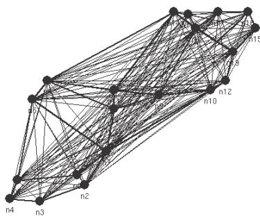
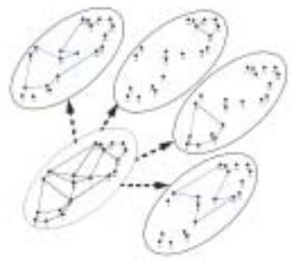
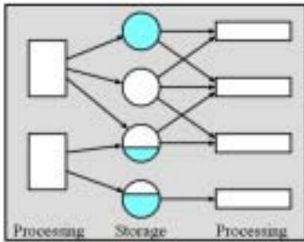
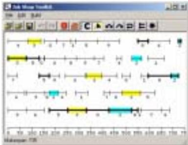
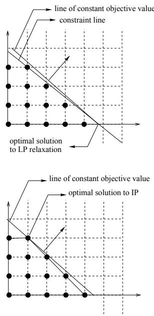
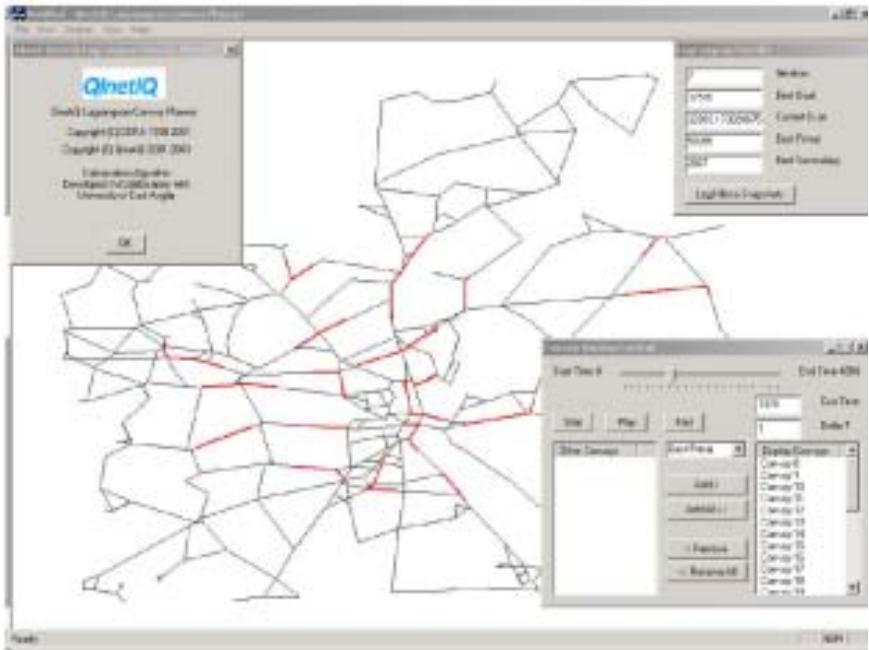
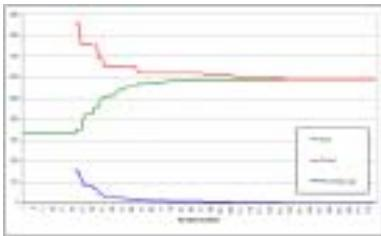
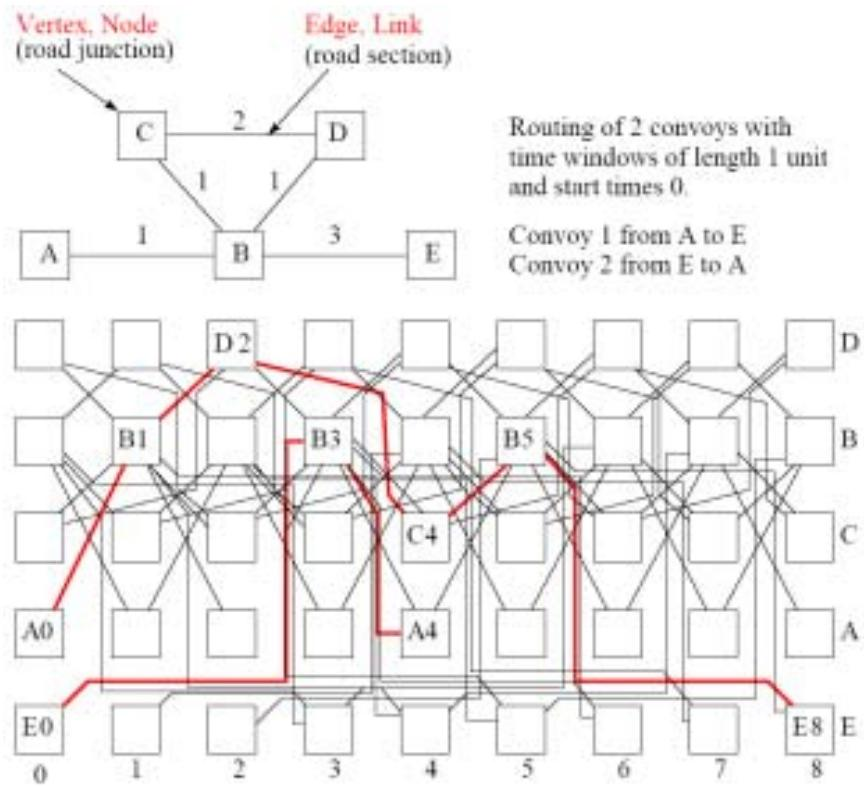
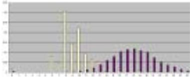

# Mathematical Modelling and Algorithms Laboratory

Optimisation Such discrete optimisation problems abound in everyday life. An important and widespread area of application concerns the management and efficient use of scarce resources to increase productivity. These applications include operational problems such as the distribution of goods, production scheduling and machine sequencing. They also include planning problems such as capital budgeting and facility location, and design problems such as telecommunication and transportation network design.

The techniques of discrete optimisation range from the mathematical programming techniques of linear and non-linear optimisation to meta-heuristic techniques such as Genetic Algorithms, Tabu Search and Simulated Annealing. Contact Dr. Pierre Chardaire.

Time-domain models and algorithms Numerical modelling is a key aspect of the simulation of many real-life processes and certain organisations are set up with enormous computation power to solve just these sorts of problem, e.g. the meteorological office. These methods are also used by, for example, car manufacturers for predicting aerodynamic, electromagnetic and acoustic behavior prior to pilot implementation. In this School we are particularly interested in novel ways of solving these problems using a form of automata: transmission line matrix (TLM).

A cellular automaton approach involves the repeated application of simple transition rules. In general any rules are possible but in the case of TLM are determined by the laws of electromagnetics. In practice this involves the extensive use of analogues, thus a diffusion problem can be represented by capacitors and resistors where concentration is equivalent to the local voltage in the network analogue. Unlike the numerical integration methods used in finite element analysis, the particular transition rules used in TLM allow problems to be solved without reliance on heavy mathematics.

The objective which drives this work is the best transition rules for any problem. Contact Dr Donard de-Cogan

# Optimisation

Optimisation is concerned with the application of modern computing techniques to the solution of Mathematical models arising from Operational Research problems. One of its distinctive feature is that most interesting models (but not all) involve variables of which some are required to belong to a discrete set, typically a subset of integers. These discrete restrictions allow the mathematical representation of phenomena or alternatives where indivisibility is required and where there is no continuum of alternatives. Figure 5.1 gives an example of a verbal description of a simple optimisation problem.

After a preliminary study a Research Council has selected 12 Research projects that would be worth funding on the basis of the quality of the Research proposed. However, the Council does not have the funding budget to fund all the projects. It is assumed that a project can only be funded in its entirety or not at all. Each project requires a known level of funding and has been given a value that reflects the quality of the proposal submitted. The problem is to determine which projects to fund in order to maximize the value of the funded projects whilst satisfying the budget constraint.

The funding budget is 53 units. The following table gives the project data available:

<table><tr><td>index</td><td>1</td><td>2</td><td>3</td><td>4</td><td>5</td><td>6</td><td>7</td><td>8</td><td>9</td><td>10</td><td>11</td><td>12</td></tr><tr><td>funding</td><td>7</td><td>7</td><td>10</td><td>7</td><td>6</td><td>10</td><td>8</td><td>9</td><td>5</td><td>10</td><td>12</td><td>12</td></tr><tr><td>value</td><td>14</td><td>13</td><td>15</td><td>10</td><td>8</td><td>13</td><td>10</td><td>10</td><td>5</td><td>10</td><td>11</td><td>6</td></tr></table>

Such discrete optimisation problems abound in everyday life. An important and widespread area of application concerns the management and efficient use of scarce resources to increase productivity. These applications include operational problems such as the distribution of goods, production scheduling and machine sequencing. They also include planning problems such as capital budgeting and facility location, and design problems such as telecommunication and transportation network design.

The techniques of discrete optimisation range from the mathematical programming techniques of linear and non-linear optimisation to meta-heuristic techniques such as Genetic Algorithms, Tabu Search and Simulated Annealing. Figure 5.2 gives a so-called Knapsack formulation for the problem presented in figure 5.1

Optimisation is at the intersection of Operations Research and Computing Science. Indeed, it is important to design efficient solution methods for standard types of models (such as the Knapsack model illustrated by the instance in figure 5.2) but it is even more important to be able to determine the “right” model for a given problem. The “right” model is the one that gives rise to the best solution method in terms of the quality of solutions obtained.

Below are some of the topics currently under investigation by the Optimisation Group, illustrated mainly by references to papers produced since the last Research Assessment Exercise, i.e since January 2000, but including older references where appropriate.

<table><tr><td>max subject to</td><td>z = 14x1 + 13x2 + 15x3 + 10x4 + 8x5 + 13x6 + 10x7+ 10x8 + 5x9 + 7x10 + 7x11 + 6x12</td></tr></table>

  
Figure 5.2: Knapsack model for the Research Council problem   
Figure 5.3: A view of the Witness Optimiser at work.

# Meta-heuristic techniques

In the past two decades meta-heuristic techniques have attracted many researchers because they can be used to find satisfactory solutions to practical problems that were not so easy to tackle by using exact techniques. It is for this reason that the main emphasis of the School research has been in refining these methods and in the study of their applications to problems from industry (telecommunications network design and scheduling, for example) or from related areas of research (in particular Knowledge Discovery in Databases, or KDD).

The term Meta-heuristic implies a higher-level strategy controlling a lowerlevel search algorithm. Well known examples of such techniques include simulated annealing, genetic algorithms and tabu search. The School has a very active Meta-heuristics group that is not only developing new and effective variations of meta-heuristics, but is also helping industry to tackle some real problems. The following are just some examples of this activity.

Algorithms based on Simulated annealing and GRASP (Greedy Randomized Adaptative Search Procedure) have been developed for the solution of a problem of feature selection in the development of complex software systems [356]. Solution methods based on GRASP and on a new meta-heuristic, PROBE (Population Reinforced Optimisation Based Exploration), have been proposed for the solution of the multiconstraint knapsack problem [92, 31, 32]. These techniques are also currently being applied to the solution of the graph bisection problem for which a neighborhood structure has been studied [224].

A hybrid simulated annealing and tabu search algorithm was developed by Rayward-Smith, Smith and Debuse, to implement an “optimise” button for the sophisticated discrete event simulation software, Witness, developed and marketed by Lanner Group [144]. This hybrid had to be clever enough to decide not only on fruitful areas of search, but also which parts of the solution space to avoid, thereby decreasing the overall search time, which can often be lengthy for simulation. See figure 5.3 for a view of Witness Optimiser at work.

Meta-heuristic techniques have been successfully deployed in the solution of data mining problems related to biological applications [141]. Further research is now underway using multi-objective evolutionary algorithms to enhance the quality of data mining solutions and the flexibility of the search [138].

Biology provides a rich source of data and, arising from it, there is a need to model past and future behaviour. With large gene bank depositories being set up, there are enormous opportunities to discover very significant results in the field. Initial work on deducing phylogenetic trees from DNA sequences of existing species has proved interesting and challenging; it is essentially an application of the classic Steiner Tree Problem [358, 355, 354].

One aspect of population based evolutionary search techniques that is currently receiving attention is the diversity, or lack of diversity, as the population converges on the optimal solution(s). This is significant in multiple-optima Combinatorial Optimisation problems, when populations are often under pressure to converge to two optima that demand different values in the solutions. This has led to research in diversification and speciation, the creation of stable subpopulations within population-based search. Smith and Walton have developed a sophistication of the standard Genetic Algorithm that allows them to investigate what (search) mechanisms are conducive to the creation of stable species. This follows on from an earlier paper [433], in which an adaptive clustering algorithm was used at each generation to maintain highly fit, yet diverse, sub-populations. The ideas can be extended to the biological question “How do species form”.

One domain that has benefitted from the application of heuristics is telecommunications. The nature of telecommunications network design makes it a highly non-linear and complex design problem. For instance, given a scenario in which a set of nodes (cities) is presented, along with a pattern of telecommunications traffic between each pair of nodes, the problem is to design the network allowing for communities of interest (certain subsets of nodes have a relatively higher traffic flow), connections, bandwidth allocation and survivability (should any link fail the network needs to survive). Applying a genetic algorithm to this multi-criteria problem[445], allows the GA to simultaneously tackle all these objectives, rather than the traditional sequence of heuristics. Starting with random networks, e.g.

  
Figure 5.4: A random initial network

  
Figure 5.5: The final network showing strong COI

see Figure 5.4, they achieved workable networks with strong COI subnets, see Figure 5.5.

Another challenging problem in designing mobile telecommunications networks is the effective use of the available spectrum. In fixed channel assignment problems, the problem is to assign channels to meet the expected traffic demand and also to limit/avoid resulting interference. As part of a Nortel Networks sponsored project, Clark and Smith developed an effective heuristic based on simulated annealing to perform the channel assignment. This reduced the assignment phase down from 2 days to 5 minutes and resulted in a better SN ratio and a reduced area of interference. The heuristic is still in use today as a key part of the Nortel Matra Network Design Software Suite. Figure 5.6 shows an area with vastly reduced interference areas.

  
Figure 5.6: Mobile network design, showing areas of non-interference.   
Figure 5.7: A three stage manufacturing plant.

Tabu search has been around since the mid eighties, after the formative work of Fred Glover. Since then, many different mechanisms have been developed to improve the performance of tabu search. These include the development of candidate strategies, tenure control, long-term memories, diversification and intensification strategies, as well as aspiration strategies. The question that can be asked is: How much do each of these mechanisms contribute to the overall success of this meta-heuristic [446]. In addition, a new and effective parameter-free search technique has emerged from this research and is currently being applied to other combinatorial optimisation problems to ascertain its performance.

Another key concept that has emerged from this work on meta-heuristics is the possibility of applying data mining techniques to search history. During search, many solutions are visited and assessed, and this historical information is not always used to the full. Tabu search uses it to reduce revisiting, and to guide the search using diversification and intensification strategies. However, it is possible to induce patterns from this history of visited solutions, and to use these patterns to guide the solution in a more meaningful way.

Application to scheduling Scheduling may be described as the allocation of time periods on resources to a number of tasks, in such a way as to satisfy problem specific requirements. From this rather general definition one may produce a virtually unlimited number of problem types [1]. Our work focuses on two types of problem:

1. The scheduling of real world manufacturing plants, with case studies provided by Unilever.   
2. A problem of more theoretical interest, known as the job shop scheduling problem.

We concentrate on the application of a local search based metaheuristic, specifically simulated annealing, to each of these problems. In both cases, the simulated annealing algorithm is hybridized with problem specific techniques in order to produce improved results.

The Unilever scheduling problem is complex, with a large number of different features and types of constraint. Simulated annealing is used to create partial schedules that are completed using problem specific heuristics [58, 373, 374]. A comparison of our research with that of others indicates that it is more important to understand the problem and to produce high quality schedule completion algorithms than to use a sophisticated metaheuristic.

Simulated annealing alone can be used to produce good solutions to the job shop scheduling problem. However, we have improved its performance by combining it with a branch and bound algorithm for solving single machine problems. Since such hybridization involves some quite complex components, we have also produced a job shop scheduling toolkit to allow us to test our ideas.

Research team: Dr. Bagnall, Dr. Chardaire, Dr. de la Iglesia, Dr. McKeown, Prof. Rayward-Smith, Dr. G. Smith, Alan Reynolds.

  
Figure 5.8: The job shop scheduling toolkit.

# Exact techniques

However meta-heuristic techniques are not a panacea. They are not always easy to apply to constrained problems, they do not provide guarantees of performance such as bounds on problem values and are therefore often difficult to analyze in terms of expected quality of solutions for given types of problem instances. Therefore, investment in exact techniques and approximate methods that provide guarantees of performance has continued (see figure 5.10 for a simple illustrative example). Recent contributions concern application of Lagrangian relaxation to the Convoy Movement problem [91, 89]. Integer Programming models have also been devised and evaluated using a commercial IP solver [356].

Research on Branch and Cut algorithm for the solution of Mixed Integer Programs using the Lift and Project Cutting Plane algorithm with in particular application to the solution of Fixed Charge Network Problems using Benders decomposition is in progress. Likewise, work on application of Lagrangian decomposition to the solution of the quadratic assignment problem.

One of the application areas of optimisation is in scheduling. Scheduling large factories is a complex process involving such issues as stock control, manpower available and process control. Even with simplifying assumptions, scheduling is an NP-Hard problem so achieving efficient scheduling requires sophisticated approaches. Prof. V. J. Rayward-Smith has worked on many discrete

  
Figure 5.9: Problem max $( 7 x + 8 y$ $4 x + 5 y \leq 1 9 , x \in \mathbb { Z } _ { + } , y \in \mathbb { Z } _ { + } \rangle$ ).

An upper bound for the Knapsack model in figure 5.2 (integer program or IP for short) can be obtained by replacing the constraints $x _ { i } \in \{ 0 , 1 \}$ with $0 \leq x _ { i } \leq 1$ The optimal solution (exact solution) to the resulting linear program (LP), called the LP relaxation of IP, is $x _ { 1 } = \cdot \cdot \cdot = x _ { 6 } = 1 , x _ { 7 } = 0 . 7 5$ and other variables equal to zero. The value of LP is 80.5 which gives an upper bound, $U B = 8 0$ .

A good feasible solution (approximate solution) to the discrete problem can be obtained by a greedy heuristic that examine variables one at a time in the order of there “value for money” and fix them to 1 if the remaining budget is large enough. In doing so we obtain $x _ { 1 } = \cdot \cdot \cdot = x _ { 6 } = 1 , x _ { 9 } = 1$ and all other variables equal to zero. The resulting lower bound is $L B = 7 8$ .

Any feasible solution to IP must satisfy

$$
\begin{array} { r l } & { x _ { 1 } + x _ { 2 } + x _ { 3 } + x _ { 4 } + x _ { 5 } + } \\ & { x _ { 6 } + x _ { 7 } + x _ { 8 } + x _ { 1 0 } + x _ { 1 1 } + x _ { 1 2 } \leq 6 . } \end{array}
$$

and

$$
\begin{array} { r l } & { x _ { 1 } + x _ { 2 } + x _ { 3 } + x _ { 4 } + x _ { 6 } + } \\ & { x _ { 7 } + x _ { 9 } + x _ { 1 0 } + x _ { 1 1 } + x _ { 1 2 } \leq 6 . } \end{array}
$$

If we append these two constraints to the IP formulation the optimal value of the LP relaxation becomes 78.6 which gives an upper bound of 78 and a proof that the known IP solution of value 78 is optimal.

Figure 5.10: Solution to the Research Council problem and proof of optimality models and is particularly well known for developing modules involving interprocess delays and introducing the concept of pre-allocation in scheduling. He and Dr. G. P. McKeown developed practical schedules for real world industrial problems (e.g. for Unilever).

# The convoy movement problem

Moving men and materials in large numbers and quantities is a long standing military problem. In present day military engagements, high mobility of land forces in particular is extremely important. A key aspect of such mobility is planning the movement of convoys - we need to route convoys so that they can reach their target destinations in the shortest time. There is more to the problem, however, than simply finding shortest path solutions. Here we present a simplified version of the problem and our solution approach. More details can be found in [91, 90]. DERA has developed a planning tool based on our optimization algorithms (a snapshot of a demonstration version is shown in figure 1).

  
Figure 5.11: QinetiQ Planning prototype (courtesy: DERA QinetiQ).

The planning tool has been integrated into the suite of scenario-generation tools used by the Battlefield Sensor Simulator facility. From it, scenarios required for studies have been developed. The tool reduces the effort required for convoy planning, from the order of man weeks to minutes of computing time on a laptop. The results obtained with this tool led to the decision to fully develop it as an operational tool and to incorporate it into the Army Digitization programme.

The problem To specify the convoy movement problem (CMP) we start with a collection of convoys (military units).

Each convoy consists of vehicles that must travel nose to tail in a prespecified order, between 50 and 100 metres apart. Each convoy must move from its origin to its destination across a limited route network. Convoys are not allowed to stop en-route.

The objective is to find a movement (set of paths and start times) such that the total movement cost for all of the convoys is minimized.   
• Paths followed by different convoys may use common parts of the route network but two convoys cannot occupy the same part of the route network at the same time - attempting to do so is referred to as a conflict.   
Associated with each convoy is a time window, the time it takes for a convoy to pass through any point in the route network. This can also be interpreted as the time during which the convoy blocks a node in the route network so that no other convoys may enter the node. The time window represents the convoys length.   
• A convoy does not have to start its movement at its earliest ready time delaying its start may allow it to follow a quicker route whilst avoiding later conflicts.   
• Hence, a movement consists of a path and an initial delay for each convoy.   
We also associate with each convoy a finish time (deadline). A movement is valid (or feasible) if there are no conflicts and each convoys completion time is less than its required finish time.   
Thus the aim is to find a valid movement such that the overall completion time of the movement is minimal with respect to all the valid movements.

Lagrangian relaxation The CMP is modelled as an integer linear programming problem, where variables are associated to convoy paths and constraints are associated with each node and point in time. This huge model is solved by using a technique known as Lagrangian relaxation. Instead of solving the primal (original model), we solve a sequence of simplified problems in which some of the constraints are included in the objective function with associated Lagrange multipliers (cost penalties). The dual function is defined by the mapping of the Lagrange multipliers to the optimal value of the corresponding simplified problem. The algorithm for solving the CMP exploits the following properties:

Any value of the dual function is a lower bound on any value of a feasible solution to the CMP. The dual function is a concave function and therefore can be maximized using an iterative procedure known as sub-gradient optimization.

• The cost penalties provided by the Lagrange multipliers can be used to find heuristic solutions to the CMP.

The dual function can be evaluated exactly (i.e. the simplified problems are solvable to optimality).

The main objective of our (dual) algorithm is to determine the maximum of the dual function. The solution to the primal problem may be considered as a byproduct. A run of the CMP solution algorithm is illustrated in Figure 5.12.

Time-space network The computation of the dual function amounts to the solution of a shortest path problem in a time-space network with modified edge weights depending on original travel times and Lagrange multipliers. The timespace network for a simple graph is illustrated in figure 3. The graph at the top of this figure represents a simple route network. We assume two identical convoys are to be routed. The weight on an edge of the graph represents the time a convoy would take to traverse the corresponding link in the route network. All edges are assumed to be bi-directional. Each row of the time-space network in Figure ?? corresponds to a vertex in the graph at the top of the Figure. This correspondence is indicated by the letters at the rightmost end of each row. Each column corresponds to a unit in time as indicated by the number at the foot of each column. Node B5, for example, therefore denotes vertex B in the original graph at time unit 5. The direction of each edge in the timespace network is from left to right (i.e., in the direction of increasing time). The two highlighted paths in this network represent the routes taken by the two convoys. Thus, the route for convoy 1 is A-B-D-C-B-E whilst that for convoy 2 is E-B-A.

Real-world instances of the CMP lead to time-space networks with millions of nodes. Artificial Intelligence techniques are used to accelerate the solution of the shortest path problem.

Research team: Dr. Bagnall, Dr. Chardaire, Dr. McKeown, Prof. RaywardSmith.

# Large-scale continuous optimisation

Research has been conducted on the applications of mathematical programming to the solution of large-scale continuous problems. Multicommodity flow problems have been tackled usingtechniques such as partitioning of bases in simplex algorithms, Dantzig Wolfe decomposition, the Dual Affine Scaling algorithm and the Analytical Center Cutting Plane algorithm [87, 88, 86]. Research on the analysis of cooperative game theoretical concepts [84] and on the computation of the pre-nucleolus of cooperative games using constraint generation is in progress.

  
Figure 5.12: Convergence of the CMP algorithm.

  
Figure 5.13: Time-space network.

Research team: Dr. Chardaire.

# Optimisation software

It is well-known that Oject-Oriented frameworks effectively assist software development. However, the application of such frameworks to the area of optimisation is a more recent development. At UEA, we have developed the Templar framework, which assists the distribution, hybridization and cooperation of methods for solving optimisation problems [262]. In addition to the development of Templar, work has been done to produce an OO implementation of the Branchand-Bound kernel developed in MAG during the nineties. For the first time, the polymorphic nature of the underlying kernel has been properly realised in an implementation.

Research team: Dr. Chardaire, Dr. McKeown.

# Are typical functions easy to learn?

Fourier representations underlie number of signal encodings applied to classification, compression and other uses. Many 2-D image processing (and more recently volumentric rendering) techniques are founded in Fourier-like representations. Less well known is that mathematics of Fourier representations can be applied to discrete functions (for example the Boolean functions which a Combinational Circuit computes). Such representations of Boolean functions are being explored in a number of contexts: they can be used to prove results about learnability (see for example Linial et al, JACM V40, No.3. pp607-620, 1993) or as a basis for practical learning algorithms. Intuitively, functions with fewer spectral lines should be easier to learn.

Our interest in Fourier representations arose originally from potential application to learning. We wanted to relate our learning results to some well-defined notion of function complexity, and also to identify a principled basis for generalisation. One measure of complexity is the number of non-zero values in the spectrum. To see that this is a plausible notion of complexity, consider the function $f ( x _ { 1 } , x _ { 2 } , . . . , x _ { n } ) = x _ { 1 }$ . This function is clearly dependent only on $x _ { 1 }$ , and a reasonable measure of complexity might give $f$ the same value whatever $n ( > = 1 )$ is. The number of non-zero Spectral lines does just this: $f$ has exactly 1 non-zero Fourier coefficient for all $n > = 1$ .

Now that we have a precise notion of function complexity, we can ask: if we choose an arbitrary Boolean function of n variables, how complex is it likely to be? Otherwise put, how does frequency of occurrence in the space of all functions vary with complexity, as measured by the number of non-zero spectral lines?

An early result which surprised us is that a function which returns $T R U E$ at an odd number of domain points has no zero spectral lines at all. Consequently we focussed on even functions in looking at spectral zero distributions. An empirical study for small $n ( 3 , 5 )$ revealed the patterns shown in Figure 5.14.

We have shown that the distribution of values for all Fourier coefficient identical, and is binomial. This, together with the orthogonality of the basis functions, suggests modelling the random choice of a function in Fourier space as a sequential process in which coefficient in Fourier space are selected one at a time. This yields the formula given at the head of this sheet for the relative frequency of functions of n bits which have k spectral zeros. The model is poor for small n, but holds up very well empirically for larger n: by developing a new fast method of sampling functions, we have been able to confirm the result experimentally for values of n up to 21.

  
Figure 5.14: The graph shows fractional number of even functions with a given complexity, as measured by the number of zero spectral lines.

We are now working on proving the correctness of our formula: one avenue we have begun to explore is a possible relation to work $1 9 6 0 ^ { \circ } \mathrm { s }$ on applications of probabilistic methods to finite mathematical structures, e.g. Gaposkin V.F., Sequences of functions and the central limit theorem, Mat. Sb. 70(122), 145- 171.

Research team: Professor Ronan Sleep and Dr. Graham Tattersall.

# Some of the researchers

Rayward-Smith is editor-in-chief of the (Kluwer) Journal of Mathematical Modelling and Algorithms (JMMA), and on the editorial boards of the International Journal of Parallel Algorithms and their Implementation, the Journal of Scheduling, and the Journal of Applied Intelligence. He is also on the Conference Committees of ICANNGA, the International Metaheuristics Conference and of GECCO.

McKeown is on the editorial board of JMMA. He has acted as a referee for Discrete Mathematics, BIT, Annals of OR, Information Processing Letters, the Journal of the Operational Research Society, the International Journal of Parallel Programming, Software Practice and Experience, and JMMA.

Chardaire has acted as a reviewer for the European Journal of Operations Research, Studies in Locational Analysis, the International Journal of Mathematical Algorithms, Information and Software Technology, and Transportation Science (an INFORMS journal). Recently, following the submission of his paper on multicommodity flow problems to Operations Research [86] he was invited by professor Panos M. Pardalos from the University of Florida to contribute to the Encyclopedia of Optimisation published by Kluwer Academic Publishers [87] and by Professor Mauricio Resende from AT&T Labs-Research, Shannon Laboratory to contribute to the Handbook of Applied Optimisation published by Oxford University Press [88].

Smith has acted as reviewer for Discrete Applied Mathematics, Software Practice and Experience, Computers and Industrial Engineering, RAIRO Operations Research, IEEE Evolutionary Computation, IEEE Systems, Man and Cybernetics. Smith is also a member of the Management Board of Evonet, the

European Network of Excellence in Evolutionary Computation, as well as Chair of EvoTel, the subgroup of Evonet specialising in problems in the telecommunications domain.