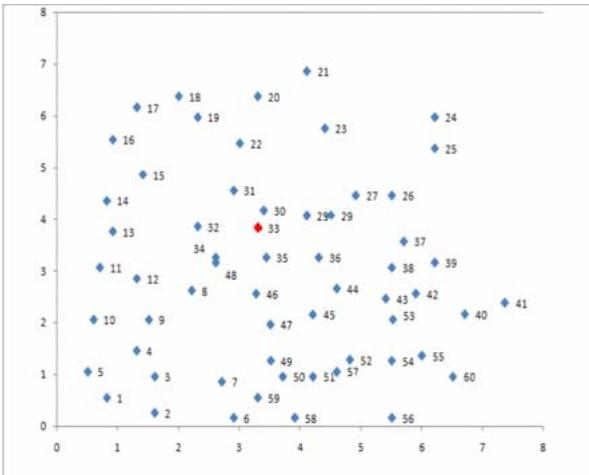
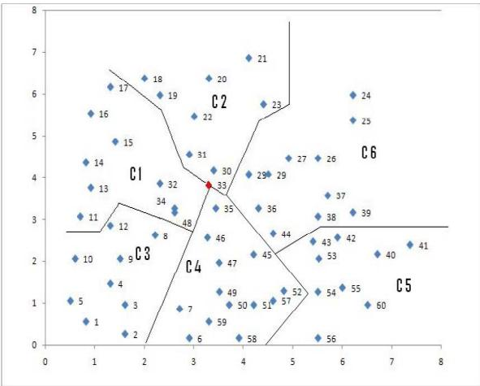
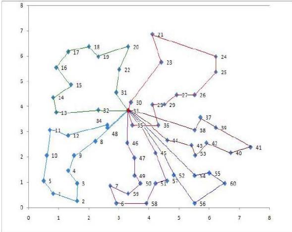
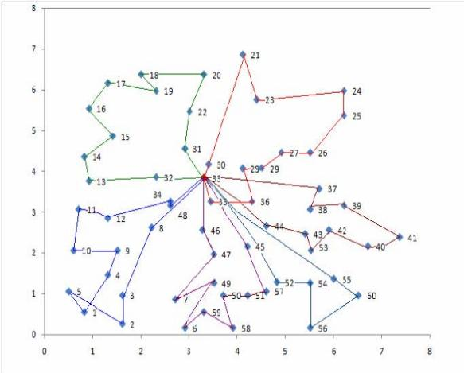

# Optimization of Non-Linear Multiple Traveling Salesman Problem Using K-Means Clustering, Shrink Wrap Algorithm and Meta-Heuristics

R.Nallusamy1 ∗, K.Duraiswamy2, R.Dhanalaksmi3, P. Parthiban4   
1Department of CSE, K.S.R.College of Technology Tiruchengode-637215, Tamilnadu, India 2K.S.R.College of Technology Tiruchengode-637215, Tamilnadu, India 3D-Link India Ltd, Bangalore, India   
4Department of production engineering, National Institute of Technology, Tiruchirappalli, India (Received 29 August 2009, accepted 27 September 2009)

Abstract: This paper deals with generating of an optimized route for multiple Traveling Salesman Problems. We used a methodology of clustering the given cities depending upon the number of salesmen and each cluster is allotted to a salesman. “ $k$ -Means clustering” algorithm has been used for easy clustering of the cities. In this way the ??TSP has been converted into TSP which is simple in computation compared to mTSP. After clustering, an optimized route is generated for each salesman in his allotted cluster. To achieve this, we first generated a parent route using “Shrink Wrap” algorithm and this parent string is further optimized by using two other optimizing algorithms. For this purpose, “Tabu Search” and “Simulated Annealing” were extensively used. From the results, we observed that Simulated Annealing generate optimized route covering less distance than Tabu search.

Keywords: combinatorial optimization; $k$ -means clustering; multiple traveling salesman problem; simulated annealing and Tabu search

# 1 Introduction

Problems of combinatorial optimization are characterized by their well-structured problem definition as well as by their huge number of action alternatives in practical application areas of reasonable size. Especially in areas like routing, task allocation, or scheduling such kinds of problems often occur. Their advantage lies in the easy understanding of their action alternatives and their objective function. Utilizing classical methods of Operations Research (OR) often fails due to the exponentially growing computational effort. Therefore, in practice heuristics and meta-heuristics are commonly used even if they are unable to guarantee an optimal solution.

# 1.1 Scope and objectives of research

A careful analysis of literature on the variants and methodologies of combinatorial optimization problems reveals the following: Some of the variants of combinatorial optimization problems are yet to be explored to solve using metaheuristics techniques in the literature [9]. These include

Multiple Traveling Salesman Problem (??TSP) ∙ ??TSP with Balanced Allocation of Nodes with Single Objective, etc⋅ ⋅ ⋅

In TSP a number of cities have to be visited by a salesman who must return to the same city where he started. In solving the problem one tries to construct the route so that the total distance traveled is minimized. In the m-TSP problem, the m-salesman has to cover the given cities and each city must be visited by exactly one salesman [11]. Every salesman starts from the same city, called depot, and must return at the end of his journey to this city again [1][2][4].

If $n$ is the number of cities to be visited for the TSP then $( n - 1 ) !$ is the total number of possible routes. Following this basic formulation, an exponential relationship exists between the number of cities and possible routes, for instance if there are 5 cities there are 24 possible routes, for 6 cities 120, for 10 cities 362,880, and so on. As the amount of input data increases the problem increases in complexity, thus the computational time needed renders this method impractical for all but a smaller number of cities

The rest of the paper is organized as follows. The review of the existing work is given in section 2. Section 3 deals with the problem formulation. The clustering and optimization algorithm concepts are given in section 4. Section 5 deals with the implementation concepts and results of Simulated annealing and Tabu search. Conclusion and future scope is given in section 6.

# 2 Review of the existing work

Multiple travelling salesman problem handles more than one salesman. In ??TSP, number of salesmen is more than one and salesman should be allotted few cities among the whole. This is done by dividing the cities into clusters and allotting each cluster to each salesman. Aristidis Likas; Nikos Vlassis, JakobJ.Verbeek (2002) suggested clustering of data points by using k means clustering. However, the resulting TSP is highly degenerate, when an ??TSP is transformed to a single TSP since the resulting problem is more arduous to solve than an ordinary TSP with the same number of cities. Many methods have been suggested for obtaining optimized route [5][6][7][11].

A E Rizzoli, et.al. have focused on the Application of Ant Colony Optimization on the Vehicle Routing Problem and its real world application. They have worked on the aim to demonstrate the applications of ACO on different variants of the routing problem in the day to day activities [1]. Allan Larsen has worked on the dynamic factors of vehicle routing problem. In his thesis he has investigated the dynamics of the vehicle routing problem in order to improve the performances of existing algorithms and as well as developed new algorithms [2]. Various cluster analysis concepts have been discussed in [3].

Arthur.E.Carter, Cliff.T.Ragsdale have developed a new approach to solve multiple travelling salesman problem. The method proposes new set of chromosomes and related operators for the Multiple Travelling Salesman Problem (MTSP) and compares theoretical properties and computational performance of the proposed technique. The computational technique shows that the newer technique results in the smaller search space and produces better solutions [4]. Hannes Schabauer, et.al. have worked on to solve Traveling Salesman Problem(TSP) heuristically by the parallelization of selforganizing maps on cluster architectures [12].

Ding Chao, Cheng ye, He Miao have developed a two level genetic algorithm which favors neither intra-cluster path or inter- cluster path. The set of vertex data s which are given in the graph were portioned into clusters and now this problem becomes a cluster Travelling Salesman Problem (CTSP). The results from the paper indicate that the algorithm proposed is more effective than the existing algorithms. The variants that exist in the problem are properly dealt without affecting the constraints [10]. Klaus Meer has worked on the simulated annealing methodologies and has proved that this algorithm outperforms any metropolis or standard algorithm. And finally they have worked on the TSP to prove the above mentioned. The standard methodologies were adopted and the results were checked with Simulated Annealing [15]. Various shortest path routing concepts for networks were analysed in [8][13][14].

# 2.1 Research gap and proposed work

From the review, we understood that most of the problems involved solving the Conventional Traveling Salesman Problem using exact methods like Cut and Solve technique as well as meta-heuristic methods like simulated annealing and Genetic Algorithm for solving the same. They however scarcely dealt with the Multiple Traveling Salesman Problem which represents the realistic case of more than one salesman.

As far as the heuristic algorithms for the $m \mathrm { T S P }$ are concerned, the previous literature has an emphasis on artificial neural networks. To the best of our knowledge, from the literature review, no efficient meta-heuristic algorithms exist for the solution of large-scale $m$ TSPs. Hence, an analysis is made and an heuristic is formed to transform $m \mathrm { T S P }$ to TSP, and to optimize the tour of an individual. There was no specialized algorithm for the purpose of clustering (conversion of $m { \bf T } \mathrm { { S P } }$ to TSP) or optimal allocation of cities to each salesman. Hence, we decided to deal with the less frequently approached and more realistic Multiple Traveling Salesman problem along with a specialized clustering heuristic, namely $\mathbf { k }$ -means clustering algorithm. This also breaks down a large sized problem into a simpler one. Optimization of route will be done by generating a parent route and optimizing the same using any relevant method. In our work, we have done the optimization by two methods. Then the effective solution generated by each method is studied and is compared with the results obtained from other methods.

# 3 Problem formulation

Due to the combinatorial complexity of the TSP, approximate or heuristic solution procedures are almost always employed in practice. The mathematical structure of the TSP is a graph where the cities are the nodes of the graph. Connections between pairs of cities are called edges and each edge has a cost associated with it which can be distance, time or other attribute. If n is the input number of vertices representing cities, for a weighted graph G, the TSP problem is to find the cycle of minimum costs that visit each of the vertices of G exactly once [6][7].

# 3.1 Multiple Traveling Salesman Problem

The $m$ TSP can in general be defined as follows: Given a set of nodes, let there be m salesmen located at a single depot node. The remaining nodes (cities) that are to be visited are called intermediate nodes. Then, the ??TSP consists of finding tours for all m salesmen, who all start and end at the depot, such that each intermediate node is visited exactly once and the total cost of visiting all nodes is minimized.

# 3.2 Mathematical Formulation of the TSP and Problem definition

There are many mathematical formulations for the TSP, employing a variety of constraints that enforce the requirements of the problem. Since this is not the appropriate forum for reviewing all of the potential formulations, one has been chosen in order to demonstrate how such a formulation is specified. The following notation is used:

$n -$ the number of cities to be visited; the number of nodes in the network   
$i , j , k -$ indices of cities that can take integer values from 1 to $n$   
$t -$ the time period , or step in the route between the cities   
$x _ { i j t } - 1$ if the edge of the network from $i$ to $j$ is used in step $t$ of the route and 0 otherwise   
$d _ { i j } -$ the distance or cost from city $i$ to city $j$

The problem requires starting from a given city, visiting subsequent cities, and returning to the starting city. The optimal solution chooses the route that minimizes the total distance traveled. There are $( n - 1 )$ ! possible tours. The following is an example of one linear programming formulations of the TSP problem:

The objective function $( Z )$ is to minimize the sum of all costs (distances) of all of the selected elements of the tour:

$$
Z = \sum _ { i = 1 } ^ { n } \sum _ { j = i } ^ { n } \sum _ { t = 1 } ^ { n } d _ { i j } x _ { i j t }
$$

The tour is subject to the following constraints:

For all values of $t$ , exactly one arc must be traversed, hence

$$
\sum _ { i } \sum _ { j } x _ { i j t } = 1 { \mathrm { f o r } } { \mathrm { a l l } } t .
$$

For all cities, there is just one other city which is being reached from it, at some time, hence

$$
\sum _ { j } \sum _ { t } x _ { i j t } \ = \ 1 { \mathrm { f o r } } \operatorname { a l l } i .
$$

For all cities, there is some other city from which it is being reached, at some time, hence

$$
\sum _ { i } \sum _ { t } x _ { i j t } = 1 { \mathrm { f o r } } { \mathrm { a l l j } } .
$$

When a city is reached at time $\mathrm { \Delta t }$ , it must be left at time $t + 1$ , in order to exclude disconnected sub-tours that would otherwise meet all of the above constraints. These sub-tour elimination constraints are formulated as:

$$
\sum _ { i } x _ { i j t } = \sum _ { k } x _ { j k t + 1 } { \mathrm { f o r ~ a l l ~ j ~ a n d ~ t } } .
$$

In addition to the above constraints the decision variables are constrained to be integer values in the range of 0 to 1:

$$
0 \leq x _ { i j t } \leq 1 .
$$

If the problem size increases, it is very difficult to solve in a reasonable polynomial time. We had developed all the below meta-heuristics techniques and compared for $m$ TSP.

# 3.3 Assumptions

All the salespersons have to start from a common depot and after traveling through a set of cities, they should return back to the starting depot. There are no capacity constraints and no cost constraints. But, all the cities must be visited by any one of the salesperson and each salesperson has to visit a particular city exactly once.

# 4 Metaheuristics for route optimization

Efforts have concentrated on the development of heuristics that are not guaranteed to find the shortest tour, but are likely to quickly find either the optimal solution or a near-optimal alternative. They are approximate approaches based on algorithms that construct feasible solutions within reasonable computing time. Improvement heuristics are algorithms that start with an initial feasible solution and successively improve it through a sequence of exchanges.

# 4.1 Proposed heuristics

The solution to the problem is attained using three-stage heuristics. The first-stage involves the conversion of a $m$ TSP to TSP using $k$ -means Clustering algorithm. The second-stage of the heuristic comprises of forming the initial tour for $m$ salesperson and is generated using Shrink-wrap algorithm. The third-stage is meta-heuristic approach comprising simulated annealing and Tabu search to optimize the tour for $m$ salesperson. In this work we have taken 60 cities 6 salesmen problem for the route optimization purpose. Fig. 1 shows the coordinates of 60 cities.

# 4.2 Transformation of $m$ TSP to TSP and calculation of shortest path

Clustering of the cities makes the calculations much simpler. The search space for the solution increases as the number of cities decreases and vice-versa. If there are N cities then the search space will be N! and the computational time also high accordingly. Hence to reduce the burden of mathematical complexity $_ \mathrm { N }$ value should be reduced and this is achieved by clustering. The following heuristics were used for solving the given 60 cities 6 travelling salesmen problem. City number 33 is considered to be the headquarters of all the salesmen.

  
Figure 1: Plot of cities salesman has to travel

  
Figure 2: Clustered cities after $\mathbf { k }$ -means clustering

# 4.2.1 $k$ -means Clustering

Simply speaking $k$ -means clustering is an algorithm to classify or to group the objects based on attributes/ features into $k$ number of group. $k$ is a positive integer number. The grouping is done by minimizing the sum of squares of distances between data and the corresponding cluster centroid [3].

The algorithm is composed of the following steps:

∙Place K points into the space represented by the objects that are being clustered. These points represent initial group centroids.

Assign each object to the group that has the closest centroid.

∙When all objects have been assigned, recalculate the positions of the K centroids.

∙Repeat Steps 2 and 3 until the centroids no longer move. This produces a separation of the objects into groups from which the metric to be minimized can be calculated.

Table 1 and Fig. 2 show the results, after applying $k$ -means clustering.

Table 1: Final results of $k$ –means clustering   

<table><tr><td rowspan=1 colspan=1>Sales person</td><td rowspan=1 colspan=1>Cities Allotted</td><td rowspan=1 colspan=1>No. of cities</td></tr><tr><td rowspan=1 colspan=1>1</td><td rowspan=1 colspan=1>21-23-24-25-26-27-28-29-30-33-35-36</td><td rowspan=1 colspan=1>12</td></tr><tr><td rowspan=1 colspan=1>2</td><td rowspan=1 colspan=1>1-2-3-4-5-8-9-10-11-12-33-34-48</td><td rowspan=1 colspan=1>13</td></tr><tr><td rowspan=1 colspan=1>3</td><td rowspan=1 colspan=1>13-14-15-16-17-18-19-20-22-31-32-33</td><td rowspan=1 colspan=1>12</td></tr><tr><td rowspan=1 colspan=1>4</td><td rowspan=1 colspan=1>6-7-33-45-46-47-49-50-51-57-58-59</td><td rowspan=1 colspan=1>12</td></tr><tr><td rowspan=1 colspan=1>5</td><td rowspan=1 colspan=1>33-52-54-55-56-60</td><td rowspan=1 colspan=1>6</td></tr><tr><td rowspan=1 colspan=1>6</td><td rowspan=1 colspan=1>33-37-38-39-40-41-42-43-44-53</td><td rowspan=1 colspan=1>10</td></tr></table>

Table 2: Final results of shrink-wrap algorithm   

<table><tr><td rowspan=1 colspan=1>Sales Person</td><td rowspan=1 colspan=1>Route generated</td><td rowspan=1 colspan=1>Distance to travel (units)</td></tr><tr><td rowspan=1 colspan=1>1</td><td rowspan=1 colspan=1>33-35-28-36-29-27-26-25-24-23-21-30-33</td><td rowspan=1 colspan=1>12.3227</td></tr><tr><td rowspan=1 colspan=1>2</td><td rowspan=1 colspan=1>33-48-34-12-11-10-9-5-1-4-2-3-33</td><td rowspan=1 colspan=1>13.3864</td></tr><tr><td rowspan=1 colspan=1>3</td><td rowspan=1 colspan=1>33-31-22-20-19-18-17-16-15-14-13-32-33</td><td rowspan=1 colspan=1>10.3390</td></tr><tr><td rowspan=1 colspan=1>4</td><td rowspan=1 colspan=1>33-47-46-7-49-6-59-58-50-51-57-45-33</td><td rowspan=1 colspan=1>12.5588</td></tr><tr><td rowspan=1 colspan=1>5</td><td rowspan=1 colspan=1>33-52-56-54-60-55-33</td><td rowspan=1 colspan=1>10.7616</td></tr><tr><td rowspan=1 colspan=1>6</td><td rowspan=1 colspan=1>33-44-43-53-42-40-41-39-37-38-33</td><td rowspan=1 colspan=1>10.1510</td></tr></table>

# 4.3 Shrink-Wrap algorithm

Shrink-Wrap algorithm is an algorithm to orient the nodes along a path. The nodes are mapped on polar coordinates, sorted by angle, then by distance $\boldsymbol { \theta }$ first, then $\rho \mathrm { \Sigma }$ ) and arranged in ascending order. This gives the path to be traversed within each cluster. The results are given in Table 2.

# 4.4 Simulated annealing for solving TSP

Simulated annealing (SA) is a generic probabilistic meta-algorithm for the global optimization problem, namely locating a good approximation to the global optimum of a given function in a large search space. The name and inspiration come from annealing in metallurgy, a technique involving heating and controlled cooling of a material to increase the size of its crystals and reduce their defects.

Simulated annealing can be aptly used for TSP. The output obtained using the cluster analysis heuristic is improved using route improvement heuristic which applied the meta-heuristic – Simulated annealing (SA). The algorithm for SA is given below in Table 3 and the results obtained in this stage of the heuristic is given in Figure 3.

# 4.5 Tabu search for ??TSP

Tabu search (TS) is a mathematical optimization method, belonging to the class of local search(LS) techniques. Tabu search enhances the performance of a local search method by using memory structures: once a potential solution has been determined, it is marked as ”taboo” (thus the name, tabu search, since tabu and taboo mean the same thing) so that the algorithm does not visit that possibility repeatedly.

The basic principle of TS is to pursue LS whenever it encounters a local optimum by allowing non-improving moves; cycling back to previously visited solutions is prevented by the use of memories, called tabu lists, that record the recent history of the search, a key idea that can be linked to Artificial Intelligence concepts. The algorithm for tabu search is given in Table 4. The results of Tabu search is given in the Figure 4.

# 5 Implementation and Results

The problem was implemented using MATLAB 7.1 with Pentium IV processor system. After performing $k$ -means clustering algorithm, Shrink wrap algorithm, simulated annealing and Tabu search were used. Table 5 shows the comparison of results for SA and TS.

Algorithm1:Pseudocode for Simulated Annealing   
$\mathbf { X } =$ Generate an Initial Feasible Solution;   
$\mathbf { { C } ( X ) = }$ Compute initial cost of $\mathrm { X }$ ;   
best cos $\mathbf { \mu } _ { : = } \mathbf { C } ( \mathbf { X } )$ ;   
$\mathrm { T } =$ Compute Initial Temperature;   
While (stopping criterion not met) Repeat (pre-chosen number of times) Transition $=$ Select a Transition from Neighbourhood (X); $\mathbf { X } { \boldsymbol { \prime } } = $ Apply Transition(X, Transition); $\Delta { \bf C } =$ Compute Change in Cost $( \mathrm { X } , \mathrm { X } \prime ,$ Transition); ${ \mathsf p } =$ generate random number (0,1); If ( $( \Delta C < 0 )$ ) OR $( \mathbf { e } ^ { - \Delta C / T } > \mathbf { p } ) \backslash$ ) $\mathrm { X } = \mathrm { X } { ' }$ $\mathbf { C } ( \mathbf { X } ) = \mathbf { C } ( \mathbf { X } ) + \Delta \mathbf { C }$ End If; If (C(X) $<$ best cost) best cost $\mathbf { \mu } = \mathbf { C } ( \mathbf { X } )$ ; End Repeat; $\mathrm { T } =$ Apply Cooing Function (T);   
End While;   
Output best cost;   
End.   
Algorithm 2: Pseudocode for Tabu Search   
$\mathbf { X } =$ Generate an Initial Feasible Solution;   
$\mathbf { { C } ( X ) = }$ Compute initial cost of $\mathrm { X }$ ;   
best cost $\mathbf { \mu } = \mathbf { C } ( \mathbf { X } )$ ;   
Initialise tabu list $\mathrm { T } = \emptyset$ ;   
While (stopping criterion not met) For $( \mathbf { s } \in \mathbf { N } ( \mathbf { X } ) )$ $\mathbf { X } { \boldsymbol { \prime } } = $ Apply Transition(X, s, Transition); $\Delta { \bf C } =$ Compute Change in Cost (X, X , s); End For;   
While (suitable neighbour not found) $\mathbf s \in \Nu ( \mathrm { X } )$ If $( \mathbf { s } \not \in \mathrm { T } )$ $\mathbf { X } =$ Apply Transition(X, s, Transition); $\mathrm { T } = \mathrm { T } \cup \mathbf { s } ;$ ; $\mathbf { { C } ( X ) = }$ Compute cost of $\mathrm { X }$ ; found suitable neighbour $=$ TRUE; Else If (aspiration(s) $=$ TRUE) $\mathbf { X } =$ Apply Transition(X, s, Transition); $\mathbf { { C } ( X ) = }$ Compute cost of X; found suitable neighbour $=$ TRUE; End If; End If;   
End While;   
If (C(X) ¡ best cost) best cost $\mathbf { \mu } = \mathbf { C } ( \mathbf { X } )$ ;   
End While;   
Output best cost;   
End.

Table 3: Algorithm for Simulated Annealing   
Table 4: Algorithm for Tabu search   
Table 5: Optimized Route Results After Applying SA and TS-Comparison of Distances   

<table><tr><td rowspan=1 colspan=1>Salesman</td><td rowspan=1 colspan=1>Unoptimized Distance(units)</td><td rowspan=1 colspan=2>Optimized Distance(units)</td></tr><tr><td rowspan=1 colspan=1></td><td rowspan=1 colspan=1>Shrink wrap</td><td rowspan=1 colspan=1>Simulated Annealing</td><td rowspan=1 colspan=1>Tabu search</td></tr><tr><td rowspan=1 colspan=1>1</td><td rowspan=1 colspan=1>12.3227</td><td rowspan=1 colspan=1>11.2552</td><td rowspan=1 colspan=1>11.6938</td></tr><tr><td rowspan=1 colspan=1>2</td><td rowspan=1 colspan=1>13.3864</td><td rowspan=1 colspan=1>10.9832</td><td rowspan=1 colspan=1>12.7203</td></tr><tr><td rowspan=1 colspan=1>3</td><td rowspan=1 colspan=1>10.3390</td><td rowspan=1 colspan=1>10.3390</td><td rowspan=1 colspan=1>10.8722</td></tr><tr><td rowspan=1 colspan=1>4</td><td rowspan=1 colspan=1>12.5588</td><td rowspan=1 colspan=1>10.2939</td><td rowspan=1 colspan=1>11.5224</td></tr><tr><td rowspan=1 colspan=1>5</td><td rowspan=1 colspan=1>10.7616</td><td rowspan=1 colspan=1>10.1164</td><td rowspan=1 colspan=1>10.3594</td></tr><tr><td rowspan=1 colspan=1>6</td><td rowspan=1 colspan=1>10.1510</td><td rowspan=1 colspan=1>10.1510</td><td rowspan=1 colspan=1>10.2927</td></tr><tr><td rowspan=1 colspan=1>TOTAL</td><td rowspan=1 colspan=1>69.5195</td><td rowspan=1 colspan=1>63.1387</td><td rowspan=1 colspan=1>67.4608</td></tr></table>

  
Figure 3: Sequence obtained from simulated annealing

  
Figure 4: Sequence obtained from Tabu search

# 6 Conclusion

From the results obtained, we find that k-means clustering proved to be effective as it was able to group the cities into clusters in an optimal manner and convergence took place in a short execution time and the optimal clusters were obtained. Between the sequences generated by both methods (SA and TS), the sequence generated by Simulated Annealing was more optimized. From the results it is evident that simulated annealing is better algorithm for a TSP than Tabu search.

By incorporating additional side constraints such as capacity, distance and time windows restrictions, it could easily be extended to a variety of vehicle routing problems (VRPs). Our future direction in this research would be, solving the same problem with multiple constraints like total time, cost and workload balance. The present problem was ??TSP with single depot and this can be extended to ??TSP with multiple depots. The work can be further extended by balancing the workloads of the salesmen by manipulating between clusters and reducing the standard deviation of the distance values. This will help in improving workers morale.

# Acknowledgments

The authors would like to thank Associate editor and anonymous reviewers for their constructive suggestions and insightful comments that have helped to enrich the content and to improve the presentation quality of this paper.

# Список литературы

[1] A.E.Rizzoli,et al: Ant Colony Optimization for real world vehicle routing problems. Swarm Intelligence, Springer New York. 1(2): (2007),135-151.   
[2] Allan Larsen: A study material, The Dynamic Vehicle Routing Problem. IMM. (2000).   
[3] Anderberg and M.R.: Cluster analysis for applications. Academic press, New York. (1973).   
[4] Arthur .E. Carter and Cliff. T. Ragsdale: A New Approach in solving Multiple Travelling Salesman Problem using Genetic Algorithm. European journal of operational research. 175(1):(2005), 246-257.   
[5] Bektas, T.: The multiple traveling salesman problem: an overview of formulations and solution procedures. Omega. 34(3):(2006), 209-219,   
[6] Weijun Xu, Xiaohong Cui: System Optimization on Distribution Center of Retail. International Journal of Nonlinear Science. 6(1): (2008),79-85.   
[7] G. Bezalel and S. Kizhanathan: An optimal solution method for large-scale multiple traveling salesmen problems. Operations Research. 34(5):(1986), 698-718.   
[8] C. B. Akki and S. M. Chadchan: The Survey of Handoff Issues inWireless ATM Networks. International Journal of Nonlinear Science. 7(2):(2009), 189-200 .   
[9] David S Johnson: Travelling Salesman Problem. DIMACS Implementation Challenge, AT&T. (2001)   
[10] Ding Chao, Cheng Ye and He Miao: Two level genetic algorithm for clustered Travelling Salesman Problem with Application in large scale TSPs. Tsinghua Science and technology. 12(4):(2007), 459-465.   
[11] K.C. Gilbert and R.B. Hofstra: A new multiperiod multiple traveling salesman problem with heuristic and application to a scheduling problem. Decision Sciences. 23:(1992), 250-259.   
[12] Hannes Schabauer, Erich Schikuta and Thomas Weishaupl: Solving Very Large Travelling Salesman Problems by SOM parallelization on cluster architecture. In Proceedings of the Sixth international Conference on Parallel and Distributed Computing Applications and Technologies (PDCAT). (2005),954-958.   
[13] Zhongxin Liu, et al: Exponential Stability Criteria for Feedback Controlled Complex Dynamical Networks with Time Delay. International Journal of Nonlinear Science. 7(1):(2009), 95-103.   
[14] Jian Huang, Jiazeng Wang and Zengrong Liu: Numerical Studies on the Epidemic Spreading on Correlated Networks. International Journal of Nonlinear Science. 5(1):(2008), 20-24.   
[15] Klaus Meer: Simulated Annealing Versus Metropolis for a TSP instance. Information Processing Letters. 104(6):(2007),216-219.