# Optimization of Non-Stationary Problems with Evolutionary Algorithms and Dynamic Memory

Supervisor, Thiemo Krink

19960384, Claus N. Bendtsen

# Colophon

First printed: December 2001.   
Chapter 4 submitted to CEC 2002, pending review. Chapter 5 submitted to CEC 2002, pending review. Typeset with LATEX   
Figures created by Xfig   
Graphs created by GNUPLOT   
Models implemented in JAVA.

# Abstract

Traditionally optimization problems are solved by analytical methods or an iterative refinement of a single candidate solution. However, traditional methods can fail if the quality function of the optimization problem is not well-defined or the number of possible solutions is too enormous. In context of real world optimization problems the objective function is often very complex and implicit. Additionally, real world optimization problems are often non-static. Therefore other optimization techniques are often needed, than traditional methods, to solve this class of problems.

Evolutionary algorithms (EAs) are incremental search techniques inspired by Darwinian evolution in nature. EAs use the concept of a population of individuals representing candidate solutions to the optimization problem. The population is refined and driven towards better and better candidate solutions by an iterative process of evolution by operators, known as selection, recombination, and mutation. EAs are known to yield valuable solutions to stationary optimization problems, but in context of non-stationary optimization problems they have a tendency to lose track of the optima, due to the low level of diversity in the EA population.

In the literature implicit memory approaches, i.e. redundant genome representation, as well as explicit memory approaches, i.e. an extra storage area, have been introduced to yield better optimization techniques for nonstationary search landscapes. The problem with these approaches is that the memory is not able to self-adapt to the changes in the search landscape and thus, the GA still loses track of optima if they do not reappear at the same location.

In this thesis I introduce a dynamic explicit memory approach to evolutionary algorithms that uses the presence of cyclic and repetitive patterns in a non-stationary search landscape to obtain better approximations to the optimization problem. The memory self-adapts by gradually moving stored candidate solutions towards the genotype of the best individual in the EA population. The experiments yielded better results regarding the quality of the best solution than a classic GA, a static memory scheme and four ant colony optimization approaches on non-static and real world like benchmark problems. The outcome of my research shows that dynamic memory can be valuable to evolutionary algorithms in the context of non-stationary real world like environments.

# Acknowledgements

I would like to thank the following people:

All the members of the EvaLife group for valuable discussions, and comments.

My supervisor, Thiemo Krink for discussions, suggestions, and guidance concerning the research areas of this thesis.

Finn Larsen, Mikkel T. Jensen, and Jacob S. Vesterstrøm for making this thesis more readable.

My girlfriend, Anita for being there.

# Contents

# 1 Introduction 1

1.1 General introduction . . . 1   
1.2 The Objective of this thesis 2   
1.3 Outline 3

# 2 Scientific Background 5

# 2.1 Introduction . . . . 5

2.2 Evolutionary algorithms . 5   
2.2.1 Introduction 5   
2.2.2 History and background 7   
2.2.3 The classic GA 8   
2.2.4 Implementation issues 9   
2.2.5 Genetic Operators 11   
2.2.6 Advantages and disadvantages 13   
2.3 Memory as an Extension to Evolutionary algorithms 14   
2.3.1 Introduction 14   
2.3.2 Memory . . 14   
2.4 Ant Colony Optimization 15   
2.4.1 Introduction 15   
2.4.2 The Basic ACO algorithm . . . 15   
2.4.3 ACO algorithms in Communication networks 18   
2.5 Dynamic problems/ real world problems . . . . . . . . . . . 21   
2.5.1 Introduction 21   
2.5.2 De Jong Test Case Generator 22   
2.5.3 The greenhouse simulator . . 23   
2.5.4 The Phone-Routing Simulator 25   
2.5.5 Advantages and disadvantages 26

# 3 Introduction to the Scientific Papers 27

# 4 Dynamic Memory Model for Non-Stationary Optimization 29

4.1 Introduction . . . . . . 29   
4.2 Memory-based approaches . . . . 30   
4.2.1 Implicit Memory . . . . 30   
4.2.2 Explicit Memory 31   
4.3 The Dynamic Memory Model (DMM) 32   
4.4 Test Problems . . 34   
4.5 Experiments . . 36   
4.5.1 Experimental design 36   
4.5.2 Results 36   
4.6 Discussion and Conclusions 38

# 5 Phone-Routing using the Dynamic Memory Model 43

5.1 Introduction . . . 43   
5.2 Phone Routing 45   
5.3 The Phone routing Simulator 46   
5.4 The Dynamic Memory Model (DMM) 47   
5.5 Experiments . . 47   
5.6 Results . . . . . 52   
5.7 Discussion and Conclusions 54

# 6 The capabilities of the Dynamic Memory Model 59

7 Summary and Conclusions 63

A Numerical optimization problems 67   
B Limits 69

# Notation

ABC : ant-based control   
ACO : ant colony optimization   
AS : ant system   
CEC : Congress on Evolutionary Computation   
DMGA : dynamic memory GA   
DMM : dynamic memory model   
EA : evolutionary algorithm   
EP : evolutionary programming   
ES : evolutionary strategies   
GA : genetic algorithm   
SMGA : static memory GA   
T CG : test case generator   
TSP : travelling salesman problem

# Chapter 1

# Introduction

# 1.1 General introduction

In numerical optimization problems the quality function is well-defined (see definition in appendix A), i.e. the function itself, but in many real world applications the quality function is unknown or implicit. Additionally, real world problems may change over time, making the optimization task more difficult.

Traditionally solutions to optimization problems are found by analytical methods, such as the derivative extremum test. Analytical methods produce an exact solution and are often computationally fast. However, analytical methods can only be used if the problem is well-defined. In the case of the derivative extremum test the function has to be described in mathematical terms and the derivatives have to exist. The analytical methods can not cope with complex problems that are dynamic, NP-hard1, or not well-defined.

As an alternative to analytical methods incremental search techniques have been introduced. Incremental search techniques approximate candidate solutions through an iterative refinement process, and therefore there is no guarantee of the quality of the solutions. However, compared to analytical methods the incremental search techniques are almost always applicable, unless it is a needle in the hay-stack problem or the fitness function is extremely noisy.

Evolutionary algorithms (EAs) are an incremental search technique using the concept of a population of candidate solutions. EAs were created based on inspiration from Darwinian evolution where the main concepts are the notion of adaptation, speciation, and the process of natural selection. In the iterative process the population of candidate solutions is refined by applying genetic operators. The competition among the individuals in the population struggle for “survival of the fittest”, which drives the population to better solutions to the optimization problem.

One of the main problems with EAs is loss of diversity, which in stationary environments may lead to premature convergence, i.e., the population converge to a similar suboptimal solution, and in non-stationary environments decrease the chance of following or finding optima after a change in the environment.

In this thesis, I introduce a new extension of classic EAs to produce robust and valuable solutions, in the context of non-stationary real world problems.

# 1.2 The Objective of this thesis

Real world problems are often non-stationary and can cause cyclic and repetitive patterns in the search landscape. Storing old solutions to the optimization problem might give the search algorithm the ability to retrieve reoccuring optima after a change. However, memory might also lead to further premature convergence if the stored solutions are static and not able to self-adapt to the continuously changing environment yielding a few solutions that are optimal at certain time periods.

The primary goal of this thesis is to introduce a dynamic memory model to Evolutionary Algorithms that uses the presence of cyclic and repetitive patterns that do not reoccur at the exactly same location of the search landscape to obtain robust and better approximations to the optimization problem. In order to accomplish this, I addressed the following questions:

• How can memory contribute to real world problem solving ?   
• How can dynamic memory cover reappearing patterns to be able to follow optima in a non-stationary environment ?   
• Can dynamic memory yield robust solutions to real world optimization problems ?

In order to answer these questions I created a new explicit dynamic memory approach, called the Dynamic Memory Model (DMM). This model tries to close in on the trajectory of moving optima in a non-stationary environment by producing checkpoints at different locations.

To verify the model the best thing would be to use real world scenarios, such as a real phone routing network and real data, but because of the limited time to finish this thesis, this has to be covered in future work. For this thesis I have used simulators instead that try to model real world scenarios. I have used a non-stationary test case generator, a simulation of a crop producing greenhouse, and a simulator of a phone routing network.

Though these are not real world problems they still illustrate interesting characteristics of real world problems.

The DMM will be compared to a static memory approach and other optimization techniques that are known to produce good approximations to the benchmark problems.

# 1.3 Outline

The thesis is organised as follows:

Chapter 2 contains the scientific background for this thesis, in which I present a theoretical and historical overview of the areas that I have been involved with during my research.

Chapter 3 contains an introduction to the scientific papers constituting this thesis.

Chapter 4 contains the paper “Dynamic Memory Model for Changing Optimization Problems”, which introduces a new memory scheme as an enhancement to evolutionary algorithms in context of dynamic and real world problem solving. The paper has been submitted to the Congress of Evolutionary Computation (CEC) 2002.

Chapter 5 contains the paper “Phone-Routing using the Dynamic Memory Model”. The paper investigates the approach of using the Dynamic Memory Model in context of the real world routing problem. The paper has been submitted to the Congress of Evolutionary Computation (CEC) 2002 as well.

Chapter 6 describes the capabilities of the novel approach and possible future research scenarios regarding the model and work presented in this MSc study.

The last chapter (7) contains a summary and conclusions of the thesis, including my contribution to the field of evolutionary algorithm.

# Chapter 2

# Scientific Background

# 2.1 Introduction

In this chapter the scientific background for this thesis is covered. In the first section, I give an introduction to EAs and their history. In the second section the concept of memory is introduced as an extension to evolutionary algorithms. Further, I discuss the question “why introduce memory? and present some state of the art approaches. The third section covers the EA related Ant Colony Optimization approach, which derives from the stigmergetic $^ { - 1 }$ behaviour of ants and the related ABC and AntNet algorithms. In the fourth section the focus is on problem domains and the different test problems used throughout the thesis.

# 2.2 Evolutionary algorithms

# 2.2.1 Introduction

In nature the problem that each species faces is survival, which requires the ability of adapting to a complicated and changing environment over generations. The key concepts in Darwinian evolution are adaptation, speciation, and natural selection. The idea behind evolutionary algorithms (EAs) is to mimic nature i.e. simulate evolution, but this in a very simplified way. EAs are not meant to be a model of evolution, but only use evolution as an inspiration for a powerful optimization technique. The way EAs work is by approximating a solution in a step-wise process (see figure 2.1) instead of performing a formal calculation and deriving an exact solution (as an analytical model).

The EA consist of a population of individuals representing candidate solutions to the optimization problem. The candidate solutions are stored in the artificial genes of each individual, also denoted as the genome or chromosome. The first step of the EA is to initialize the population and to evaluate each individual by calculation of its fitness, i.e. how good the solution is, according to some fitness criteria. Afterwards the following evolutionary process is iterated over a number of time steps (normally mentioned as generations): First, individuals are selected from the population at generation $t$ for the next population at $t + 1$ according to their fitness. This process imitates ”natural selection” by weeding out less fit individuals and giving fit individuals a larger chance to survive. Second, the selected individuals of the new population are recombined. The recombination process is most often done by taking a part of two different genomes to create a new individual called the offspring, this creates a new variation but inspired from the old. The last step of the process is to mutate some of the individuals by changing some of the genes in the genome with random noise.

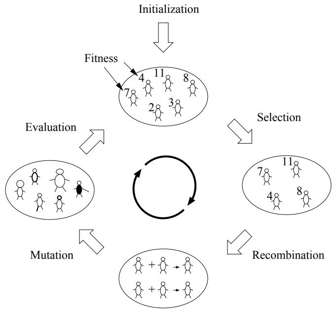  
Figure 2.1: The iterative process of an evolutionary algorithm.

Even though one has to be careful about comparing real evolution to EAs the technical terms are often borrowed from real evolution. I will therefore try to describe the biological meaning of these terms and the distinction to the use in EAs.

All living organisms consist of cells and each cell contains the same set of one or more chromosomes, i.e. strings of DNA. Each chromosome can be further divided into genes, functional blocks of DNA, which encode a particular protein. The different genes are located at a particular position (called locus) on the chromosome. Every gene controls the inheritance (encoding) of one or several features or traits (for example eye colour). Any feature has a set of feature values (for example green or blue) and the different possible ”settings” that a gene can express are called alleles. Many organisms have multiple chromosomes in each cell (man, for example, has 46 of them). If the chromosomes are arranged in pairs with corresponding genes to create the phenotype then the organism is called diploid, if unpaired it is called haploid. The entire set of chromosomes in a cell is called the organisms genome or genotype. The genotype gives rise to the organisms phenotype which is the physical and mental characteristics.

In EAs the individuals are most often haploid. In EAs the terms individual, genome and chromosome (some misleadingly) all refer to the parameter encoding of a candidate solution to a given problem. The genome consist of artificial genes, each encoding a particular parameter of the candidate solution. The span of all parameters and their possible ”settings” constitute the ”search space”. Another important concept is the ”fitness landscape”. The fitness landscape is a representation of the space of all possible genotypes (the search space) along with their fitness. In EAs the fitness is usually determined by a mathematical function. All individuals receive a fitness value to determine how good their candidate solution is to the problem at hand.

The search process in EAs is often described by the topology of the fitness landscape. A fitness landscape can be pictured as a (l+1)-dimensional plot where each genotype is a point in $\textit { l }$ dimensions and the fitness is plotted on the (l+1)st axis. A simple landscape for $l = 2$ (a 3D fitness landscape) would form ”hills”, ”peaks” and ”valleys”. By the crossover and mutation operators the EA is capable of moving the genotypes of the individuals around in the search space. The EA balances between ”exploring” the entire search space together with ”exploiting” the best known position. Hereby finding new good solutions and still trying to fine-tune known good solutions.

# 2.2.2 History and background

Historically, Evolutionary Algorithms originated independently as Evolutionary Programming [Fogel et al., 1966], Evolutionary Strategies [Rechenberg, 1965, Rechenberg, 1973] and Genetic Algorithms [Holland, 1975]. The term Evolutionary Algorithms was introduced several years later to cover the whole area of different approaches [Michalewicz, 1999].

Evolutionary Programming (EP) was introduced by Lawrence Fogel in 1960. It is often used as an optimizer, although it arose from the desire to generate machine intelligence. The representation in EP directly follows from the problem domain, for example, in real-valued optimization problems, the individuals within the population are real-valued vectors. Further EP does not attempt to model genetic operators. Evolutionary Strategies (ES) were introduced by Rechenberg in 1963 with selection, mutation, and a population size of one as a method to optimize real-valued parameters for devices such as air-foils. Later on recombination and populations of more than one individual were introduced by Schwefel. Even though EP and ES are very similar they were developed completely independently of each other. Also in the 1960 John Holland introduced Genetic algorithms (GAs). In contrast to EP and ES the original goal for GAs was not to solve specific problems, but rather to formally study the phenomenon of adaptation as it occurs in nature and develop ways to import it into computer systems. For a more elaborate overview of Evolutionary Algorithms see [Spears et al., 1993] Although all mentioned approaches use different representations, selection mechanisms, form of genetic operators, and measurement of performance, the overall structure of the algorithms is very similar. In the next section the classic genetic algorithm will be presented.

# 2.2.3 The classic GA

The structure of the classic genetic algorithm (see figure 2.2) follows the evolution process described in section 2.2.1. When implementing a GA one has to decide on which genetic operators to use as well as the structure of the individual, the evaluation function etc. For this thesis I have implemented a classic GA that uses a real valued numerical encoding, arithmetic crossover, Gaussian mutation and tournament selection. The implementation issues and different operators will be further described in the following sections.

procedure Genetic Algorithm   
begin $\mathrm { { t } = 0 }$ initialize P(t) evaluate $\mathrm { P ( t ) }$ while (not termination-condition) do begin $\mathrm { t } = \mathrm { t } + 1$ select Parents from P(t-1) recombine $\mathrm { P ( t ) }$ from Parents mutate P(t) evaluate P(t) end   
end

# 2.2.4 Implementation issues

When implementing a GA there are many issues that have to be considered.   
Some of these issues will be described in the following sections.

# Encoding

The first thing one has to consider is how to encode the candidate solution to an optimization problem as the individuals genome in the GA. In principle, any problem parameters can be encoded by a binary representation, but it is often convenient to use a high-level representation, such as a vector of doubles or a parse tree, that is more related to the problem domain. Traditionally, all genetic algorithms used binary encoding, with bit arrays as the data structure, for all types of problems. Using binary representation when the problem is non-binary requires for a function that maps the binary representation of the genome to a floating point number. Today, the trend has changed towards using high-level representations instead. One reason for this is that it gives the opportunity to design specialised operators that can take advantage of the representation. Further, studies have indicated that using real valued numerical representations compared to binary representations produce faster and more accurate results on real valued numerical problems [Janikow and Michalewicz, 1991].

In my MSc study I have used a real-numerical representation.

# Initialization

The initialisation of the population indicates the starting positions of the search. The straightforward and most common approach of initialisation is to create random candidate solutions within the range of the search space by a uniform distribution. This provides an unbiased initial population. Another approach, is to create candidate solutions according to a regular grid pattern covering the search space. These methods are useful in benchmarking evolutionary algorithms, but when solving real problems it is often the case that one specifically can set the initial population if one knows more about the problem domain. In this case the population can be initialized with genes that are known to be close to the optimum or at least avoid areas in the search space that are known to be inferior. This approach can speed up the process and additionally make the algorithm perform better.

In my MSc study I have used a uniform random distribution. The reason for this was that even though I have worked with real world like problems I did not have any expert knowledge of the problem domains and therefore it was more interesting to see how the algorithms performed from scratch instead of excluding solutions.

# Selection

The motivation for selection is to remove individuals with a low fitness and drive the population towards better solutions. This is done by amplifying fitter individuals in the hope that their offspring will have an even higher fitness. The selection has to be balanced with variation from crossover and mutation. A too strong selection might support a few suboptimal highly fit individuals that will take over the population and reduce the diversity needed for further progress. A too weak selection might result in too slow evolution. In the literature different selection schemes have been proposed. There are no common guidelines regarding which scheme to use for which problem. The differences in the schemes are how to choose the individuals and how many offspring the chosen individuals produce. The most common schemes are tournament selection, proportional selection and steady state selection(also called $( \mu + \lambda )$ selection) [Michalewicz and Fogel, 2000].

In my MSc study I have used tournament selection. The reason for this is that tournament selection produces good results in short time, which speeds up the overall computation time of the GA. The way tournament selection works is by holding a tournament among the current population for each slot in the next generation population. The size of the tournament is most often two but can be generalised to any number greater than two. In each of the tournaments random individuals are chosen from the population and their fitness is compared. The individual with the better fitness is then copied to a slot in the next generation population. The selection pressure can be altered by changing the tournament size or introducing stochastic tournaments where the fittest individual wins with a probability of $p$ .

# Termination criteria

There are a number of different criteria for stopping the EA process. Which criterion to use depends on the context in which the EA is used and often on a combination of such criteria. Some of the criteria are: the generational criterion that stops the EA after a predefined number of generations (iterations), which is the most commonly one. The real-time criterion that indicates that the EA should stop after a certain amount of time. The solution criterion that indicates that if a certain solution quality has been obtained then the EA should stop. And finally the stagnation criterion that determines that if there are no further progress over a certain number of iterations then the EA should stop.

In my MSc study I have only used the generational criterion. For me the purpose was to compare different EAs and most often this is done by iterating over a certain number of generations.

# Fitness evaluation

The fitness of an individual is a variable that expresses the quality of a solution to the problem at hand. In most numerical problems the fitness function is explicitly given by a mathematical equation, but many real world problems can not be expressed explicitly by a mathematical equation. However, in any case the fitness function has to fulfil certain requirements for the GA to perform well, because the selection method is solely based on this quantity. Additional expert knowledge is often essential in the design of a good fitness function. One of the most important issues when designing a fitness function is that adjacent solutions in the search space should correspond to similar fitness values. If the function contains frequent discrete jumps the search becomes almost impossible for most algorithms (not only GAs). Further the fitness function has to rank the individuals so that the highest ranked is the most desirable solution. Therefore if the model is inaccurate then the evolved solution may result in suboptimal performance in the real system. Another way of measuring fitness of individuals is the competitive fitness method. Here all individuals have to compete with some or all other individuals and they are ranked according to their success. Instead of finding the best solution to the current situation this method find solutions that are measured on their capabilities during different competitions. In natural evolution the fitness of an organism is defined by its reproductive success, which is a combination of its ability to survive, reproduce, and keep its offspring alive. If the environment changes the organism has to adapt and thus an organism with a high reproductive success has to be robust regarding its environment. The competitive fitness method try to take this into account, but it may result in a lack of performance for the EA.

The fitness evaluations that I have used in my MSc study will be described in connection with the different optimization problem descriptions.

# 2.2.5 Genetic Operators

The basic operators used in the classic genetic algorithm are selection, crossover, and mutation. These operators are inspired from real biological operators. While exploring the search space on the one hand, they are refining the best known solutions on the other hand.

# Crossover

In nature recombination occurs when at least two organisms produce an offspring together. During recombination the genes of two or more organisms are combined to create a new variation of their genomes. The intention is that combining organisms holding different good elements can form an even fitter offspring. In binary and real-valued encoding a widely used crossover operator is the $n$ -point crossover operator. This operator is closely connected to natural recombination. The way it works is by splitting two individuals genomes at n different locations and recombine them to produce two offspring. The one offspring gets its first gene part from individual A and the second offspring gets its first gene part from individual B etc (see figure 2.3).

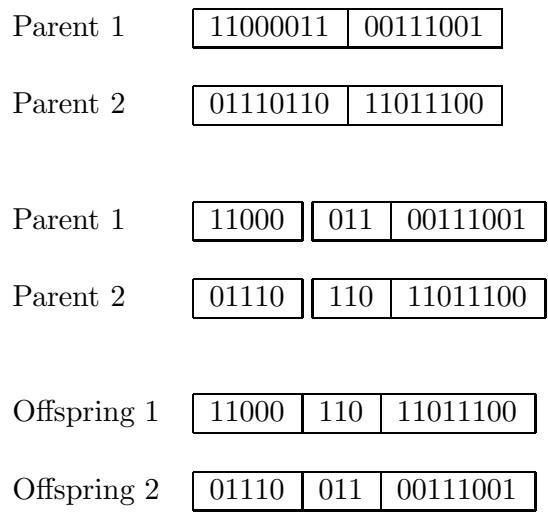  
Figure 2.3: One-point crossover operator.

Another crossover operator often used with real-valued encodings is arithmetic crossover. Here the offspring genome is generated by the weighted mean of each gene in two parent genomes i.e. offspring $\mathbf { \xi } _ { \prime } = \mathbf { \xi } \omega \times p a r e n t { 1 } + ( 1$ $\mathbf { \Pi } - \mathbf { \Pi } \omega ) \mathbf { \Pi } \times p a r e n t 2$ .

In my MSc I have used arithmetic crossover for my real-value encoded EA.

# Mutation

In nature mutation often occurs as a copy error when recombining two sets of gene sequences. In GAs the motivation for using mutation is to add some random noise to the genes of the individuals which might recreate genes that have been deleted by selection or explore new areas in the search space that might be of interest. The mutation operator in GAs is often related to the representation or the type of problem to solve. The most common mutation operator for binary encoding is bit flip mutation. The way it works is by iterating over all genes (bits) in the individual and if a uniform random number is smaller than a certain probability threshold then the gene is flipped (if $g _ { i } = 1$ then $g _ { i }$ is set to 0 else it is set to 1). For real-valued encoding the most common used mutation operator is Gaussian mutation, which adds a random generated vector $\mathrm { ~ M ~ } = \ ( m _ { 1 } , m _ { 2 } , . . . , m _ { n } )$ to the solution vector x. The random numbers $( m _ { i } )$ are generated from a Gaussian distribution $( \mathrm { N } ( 0 , \alpha ) )$ with a mean of zero and a variance of $\alpha$ .

The performance of the mutation operator depends on the parameter $\alpha$ . If $\alpha$ is set too high it will produce large mutation steps making it difficult for the algorithm to fine-tune solutions and if $\alpha$ is set too low the algorithm might end up at a local optimum. Several techniques have been suggested to control $\alpha$ 2 .

In my MSc study I have used Gaussian mutation with a mean of zero and a variance of 0.5 for my real-valued encoded EAs.

# 2.2.6 Advantages and disadvantages

In this section I will summarise some of the advantages and disadvantages of evolutionary algorithms.

# Advantages

The most important advantage of EAs is that they are widely applicable. EAs can be applied to almost any kind of problem as long as the representation reflects the problem and an appropriate fitness function exists. The reason for this is, that EAs are general search (problem solving) methods, which do not require any knowledge, and thereby no presumptions, of the optimization problem. This also makes the EA easier to implement than traditional analytical methods. The EA also provides many alternative solutions and the solutions are interpretable. The algorithm can even be run interactively such that the user can propose preferred solutions. Another advantage of EAs is that they can approximate solutions to complex problems that are NP-hard, fuzzy, or dynamic. The latter is beneficial when working with non-stationary (dynamic and real-world) environments, where the changing conditions influence the problem to be solved. Finally, EAs can easily be combined with problem specific knowledge, local search methods, or other techniques to form a hybrid system that usually performs better than the EA alone.

# Disadvantages

Because EAs find solutions by a iterative approximation there are no guarantee for finding the optimal solution within finite time. If the problem is easy one should rather use an analytical method instead, because it will produce a more precise solution in shorter time. The choice of parameters, such as population size, crossover and mutation probabilities, and operators in general, are very difficult, because they are usually dependent on the problem to optimize. Also finding a suitable fitness function is not always a trivial task, especially when the problem is complex and implicit.

# 2.3 Memory as an Extension to Evolutionary algorithms

# 2.3.1 Introduction

Even though several studies showed that evolutionary algorithms can be very powerful optimization methods, they often yield suboptimal solutions on very hard problems such as more real-world like problems or dynamic problems. To enhance the algorithm and make it capable of solving these problems different kinds of extensions have been introduced. In the following I will describe the approach of enhancing evolutionary algorithms with the concept of memory.

# 2.3.2 Memory

When a child gets born it is not able to survive on its own. It is first after a couple of years of learning and growing that it has adapted to the environment. This is actually a fact for most higher level organisms. Though evolution has evolved organisms that are more equipped to survive, learning is a very important aspect as well.

In the standard evolutionary algorithm the evolution process evolves fit individuals, but every time the optimization problem changes the individuals have to evolve to overcome the changes even though it has happened before. This is the same as saying that every time I want to use a plate, I have to invent it.

Many real world problems are non-static. Therefore to be able to solve the problem the algorithm has to be very fast at adapting to the changes or ideally would anticipate the change before it occurs. In the literature many different approaches have been used (see 4.2) such as keeping diversity in the population or storing states that can help the algorithm instead of starting over.

My contribution to the use of memory regarding evolutionary algorithms is to store candidate solutions which are likely to reoccur in the neighbourhood of the search space and to make some adjustments to keep track of changes and fuzziness in the reoccuring patterns of the optimization problem. This gives the opportunity to remember the invention of the plate, but doing this in a dynamic way, such that most of the memorized solutions are useful further on and not just filling up memory (see chapter 4).

# 2.4 Ant Colony Optimization

# 2.4.1 Introduction

Ant Colony Optimization (ACO) algorithms are inspired by the complicated group behaviour that arises from simple individual behaviour and the way simple individuals communicate in the task of cooperative problem solving. The models have proven especially valuable in the context of communication networks where the distributed dynamics can be updated by individual mobile agents.

When foraging, many ant species use a trail-laying and trail-following behaviour. This works in the simple way that each individual ant can deposits a chemical substance called pheromone when moving around. The pheromone is used to build trails, for example if an ant reaches a food source it leaves a pheromone trail on its way back to the nest to attract other ants to the food source. If there is more than one trail the ant that uses the shortest trail will return to the nest quickest and attract other ants. Here again the ants that follow the shortest trail will return to the nest quickest and the shortest trail will be more frequently marked with pheromone. This positive reenforcement of the shortest trail, makes it more likely that ants follow the shortest trail when they forage for food. Goss and his colleagues have experimented with argentine (Linepithema humile) ants constructing two bridges between the nest and a foraging area, such that one branch was longer than the other [Goss et al., 1989]. Figure 2.4 shows the experimental setup and describes how the trail-laying trail-following process works.

The experiments showed that within a few minutes the entire colony selects the shortest branch. If on the other hand the shortest branch was first introduced after some time, the ants would not take this into consideration, because the long branch had already been marked with pheromone. In computer science this problem can be overcome in an artificial system by introducing pheromone decay. In the next section I will describe the basics of the ACO algorithm and two related algorithms that I have used in my thesis.

# 2.4.2 The Basic ACO algorithm

The basic idea in the ACO algorithm is to simulate the stigmergetic behaviour of ants. The initial ant colony optimization algorithm (Ant System) was initiated by Dorigo, in collaboration with Colorni and Maniezzo [Dorigo et al, 1991]. They used the metaphor of artificial ants depositing pheromone to solve the Travelling Salesman Problem (TSP) [Bonabeau et al, 1999]. The goal of the Travelling Salesman problem is to find a closed tour of minimal length connecting $n$ cities, where each city must be visited once and only once. The problem is very hard to solve and belongs to the class of NP-hard problems. A common encoding of the TSP is to construct a graph (N,E)

Two ants start out from the nest (N) foraging for food. From the start there is no phero− mone on either branch, therefore one ant takes the short path and the other the long path.

After a while, the ant who chose the shorter path reaches the food source (S). The two branches are equilly marked in front of the nest, but the short path is marked stronger at the food source, therefore the ant that took the short path returns first.

Now the second ant, that chose the short path reaches the food source and returns by the short path again, because it is marked strongest.

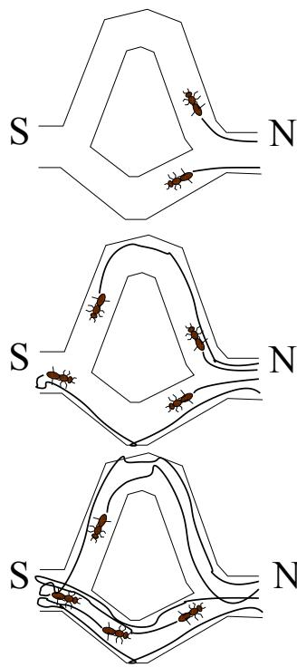  
Figure 2.4: How ants produce pheromone trails.

where the nodes N correspond to the cities and the edges $\mathrm { E }$ correspond to the connections between the cities. The basic ACO algorithm works by repeatedly letting ants choose a path through the graph. At each node the ant chooses among the nodes that are connected to the current node. The probability $( p _ { i j } ^ { k } ( t ) )$ for choosing a connection is taken from the amount of virtual-pheromone $\left( \tau _ { i j } ( t ) \right)$ that is deposited on edge(i,j) and an inverse measure of the length (called visibility) of edge(i,j), i.e.,

in case of euclidian TSP the length of $p a t h _ { i j }$ is the Euclidian distance $d _ { i j }$ between i and j:

$$
d _ { i j } = [ ( x _ { 1 } ^ { i } - x _ { 1 } ^ { j } ) ^ { 2 } + ( x _ { 2 } ^ { i } - x _ { 2 } ^ { j } ) ^ { 2 } ] ^ { 1 / 2 }
$$

Let $\pi _ { i j } ( \mathrm { t } + 1 )$ be the intensity of trail on $p a t h _ { i j }$ at time t+1, given by:

$$
\pi _ { i j } ( t + 1 ) = \rho \cdot \pi _ { i j } ( t ) + \Delta \pi _ { i j } ( t , t + 1 )
$$

where $\rho$ is an evaporation coefficient;

$$
\Delta \pi _ { i j } ( t , t + 1 ) = \sum _ { k = 1 } ^ { m } \Delta \pi _ { i j } ^ { k } ( t , t + 1 )
$$

where $\Delta \pi _ { i j } ^ { k } ( t , t + 1 )$ is the quantity per unit of length of trail substance (pheromone in real ants) laid on $p a t h _ { i j }$ by the $k$ -th ant between time $t$ and $t + 1$ .

Further, each ant maintains a memory (called tabu list) of whether or not a city has already been visited. If the city has already been visited the probability for going to this city is zero. The transition rule, that is the probability for ant $k$ to go from city $i$ to city $j$ is given in figure 2.5.

$$
p _ { i j } ^ { k } ( t ) = \left\{ \begin{array} { l l } { \displaystyle \frac { [ \tau _ { i j } ( t ) ] ^ { \alpha } \times [ 1 / d _ { i j } ] ^ { \beta } } { \sum _ { l \notin V i s i t e d _ { k } ( t ) } [ \tau _ { i l } ( t ) ] ^ { \alpha } \times [ 1 / d _ { i l } ] ^ { \beta } } } & { i f E d g e ( i , j ) \notin V i s i t e d _ { k } ( t ) } \\ { \displaystyle _ { 0 } } & { o t h e r w i s e } \end{array} \right.
$$

The transition rule ensures that ants choose short paths and edges with high intensity of the virtual-pheromone. After all $k$ ants have completed their tour, some of the virtual-pheromone decays on all edges in the graph. Afterwards, each ant lays a quantity of virtual-pheromone on each edge(i,j) it has used according to how well the ant has performed. Figure 2.6 shows a sketch of the basic ACO algorithm.

Dorigo and colleagues were able to solve relatively small travelling salesman problems using the Ant System (AS) [Dorigo et al, 1996] but for growing dimensions of the problem disappointingly the AS never reached the best known solution.

Dorigo and colleagues compared the Ant System (AS)with other general purpose heuristics on relatively small travelling salesman problems [Dorigo et al, 1996] and has been able to find better or similar solutions. In the case of growing dimensions of the problem disappointingly it never reached the best known solution. Though the initial ACO algorithm does not scale well, improved versions have been invented and in combination with local search they yielded outstanding performance [Gambardella et al, 1997].

In the next section I will describe two ACO algorithms that I have used in my thesis for a comparison with my memory-based EA approach (chapter 5), constructed to solve call and packet routing in communication networks.

1 Initialize; Set t:=0 Set an initial value $\pi _ { i j } ( t )$ for trail intensity on every pathij Place $b _ { i } ( t )$ ants on every node $i$ Set $\Delta \pi _ { i j } ( t , t + 1 ) : = 0$ foreveryiandj

2 Repeat until tabu list is full (this step will be repeated $n$ times)

2.1 For i:=1 to $n$ do (for every town) For k:=1 to $b i ( t )$ do (for every ant on town i at time t) Choose the town to move to $\left( { p _ { i j } } \right)$ move the k-th ant to the chosen location Insert the chosen town in the tabu list of ant $\mathrm { k }$ Set $\Delta \pi _ { i j } ( t , t + 1 ) { : = } \ \Delta \pi _ { i j } ( t , t + 1 ) + \Delta \pi _ { i j } ^ { k } ( t , t + 1 )$

2.2 Compute $\pi _ { i j } ( t + 1 )$ and $p _ { i j } ( t + 1 )$

3 Memorize the shortest path found up to now and empty all tabu lists   
4 If not(End Test) then set t:=t+1 set $\Delta \pi _ { i j } ( t , t + 1 )$ :=0 for every i and j goto step 2 else print shortest path and Stop

Figure 2.6: Sketch of the basic ACO algorithm (taken from [Dorigo et al, 1991]

# 2.4.3 ACO algorithms in Communication networks

One desirable feature of the ACO approach is that it may allow enhanced efficiency when the representation of the problem is spatially distributed and changing over time. The reason for this is that each ant only need local knowledge and it the problem changes there always is a small probability that the ant would chose a new trail. Hereby a group of ants can solve a distributed problem using the local knowledge of each ant and they are able to keep alternative trails based on the small probability for exploration.

Routing is a mechanism that allows information transmitted over a network to be routed from a source to a destination through a sequence of intermediate stations or nodes. The problem a routing algorithm has to solve is directing the traffic from the source to the destination while maximizing network performance (see also chapter 5). In real networks, traffic conditions are constantly changing and the structure of the network may even change (stations may break down). Therefore the routing algorithm has to be able to adapt to local congestion, such that data still reaches their destination.

In communication networks the problem of routing calls and packages is very dynamic and distributed and the use of static routing schemes is often insufficient.

In comparison to the basic ACO algorithm the common denominator for ACO algorithms working on communication networks is that instead of updating pheromone intensity on links they update probabilities in routing tables found in every node or station. The routing table holds information about the probability for establishing connections between neighboured nodes regarding further routing to a particular destination node (see figure 2.7).

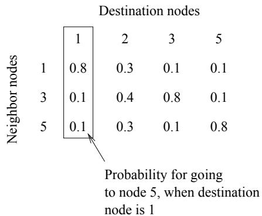  
Figure 2.7: Routing table for node 4.

The way the ACO routing algorithms work is by repeatedly putting simulated ants in the network, which update the probabilities for selecting neighbouring nodes for all the nodes that they use on their path to the destination. The updating procedure differs from one algorithm to another. In the next two sections, I will describe the ABC algorithm designed with a telephone network application in mind and the AntNet algorithm primarily designed for packet-switching in connection-less networks although the extension to connection-oriented data networks is straightforward.

# The ABC algorithm

The ant-based control (ABC) algorithm was proposed by Schoonderwoerd and his colleagues [Schoonderwoerd et al. 1996] as an adaptive routing algorithm based on the use of many agents (called ants) that modify the routing policy at every node in a telephone network by depositing virtual-pheromone on routing table entries. The goal of the algorithm is to build routing tables and adapt these to load changes at run time such that the network performance is maximized.

The way the algorithm works is by launching ants from nodes in the network. The next node the ant moves to is determined probabilistically according to the routing table in the current node. When an ant reaches its destination all the routing tables in the nodes it has visited are updated. That is the ant deposits virtual-pheromone on the routing table entry it has used. More formally this is done by the function:

$$
r _ { i - 1 , s } ^ { i } ( t + 1 ) = \frac { r _ { i - 1 , s } ^ { i } ( t ) + \delta r } { 1 + \delta r } ,
$$

$$
r _ { n , s } ^ { i } ( t + 1 ) = \frac { r _ { n , s } ^ { i } ( t ) } { 1 + \delta r } , n \neq i - 1
$$

The entry $r _ { i - 1 , s } ^ { i }$ is reinforced while the other entries $r _ { n , s } ^ { i } , n \neq i - 1$ in the same column decay by probability normalization. The $\delta r$ denotes a reinforcement parameter that depends on characteristics of the ant, such as its time spent in the network. Note that this updating procedure normalizes the values if they are initially normalized, i.e $\begin{array} { r } { \sum _ { n } r _ { n , s } ^ { 2 } ( t ) = 1 } \end{array}$ . By this updating procedure, an entry that is small will be more reinforced than when it is large. This allows to discover new routes quickly when the preferred route gets congested.

# The AntNet algorithm

The AntNet algorithm was proposed by Di Caro and Dorigo [Caro and Dorigo, 1998].

It is an adaptive routing algorithm based on ant colonies that explore the network with the goal to build and keep routing tables that adapt to network traffic conditions. Even though the principles are very similar to the ABC algorithm the most important difference is that the AntNet algorithm is constructed such that it can be applied to both connection-oriented and connection-less types of communication networks.

The way the algorithm works is by launching ants (called forward ants) from nodes in the network and selecting the next node from the routing table entries (in a packed switching network the status of local queues can also be used). Instead of updating the entry right away, the algorithm waits and when the ant arrives at its destination another ant is created (called backward ant) that follows the same way back that the forward ant chose (see figure 2.8). When the backward ant arrives at a node it updates the routing table entries according to the function:

$$
r _ { i - 1 , d } ^ { i } ( t + 1 ) = r _ { i - 1 , d } ^ { i } ( t ) \times ( 1 - r ) + r .
$$

$$
\begin{array} { r } { r _ { n , d } ^ { i } ( t + 1 ) = r _ { n , d } ^ { i } ( t ) \times ( 1 - r ) , n \ne i - 1 . } \end{array}
$$

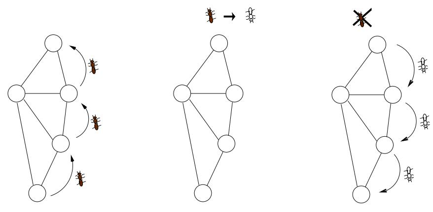  
Figure 2.8: The AntNet update. The black ants are the forward ants and the white ants are the backward ants.

The connection $( r _ { i - 1 , d } ^ { i } )$ that the ant has used on its path is positively reinforced, while all the other entries in the same column are decayed by probability normalisation. Because another ant is sent back to update the route, the algorithm is able to use information of the established connection in the reinforcement parameter, such as the recorded time to move from one particular node in the connection to the destination node. An example of this is that the best known time to a destination can be stored in each node and according to this, it can update the entry compared to the best known and the current path. The way the update procedure works is by increasing a value proportionally to the received reinforcement and to the previous value of the node probability, i.e., given the same reinforcement small probabilities are increased proportionally more than big probabilities.

# 2.5 Dynamic problems/ real world problems

# 2.5.1 Introduction

Most research in evolutionary algorithms has been concerned with static optimization problems. Evolutionary algorithms have successfully been applied to a large number of problems from the real world, but most of these were static or treated as static. However, in recent years there has been a growing interest in dynamic and time varying problems, because many real world problems have these properties. A lot of effort has been made to propose a benchmark test suite for dynamic problems, but disappointingly it remains doubtful that these test case generators can resemble real-world problem dynamics.

In the following I will describe three different dynamic optimization problem simulators. The first one, created by De Jong, which is supposed to be able to generate general dynamic and time varying problems together with static ones. The other two problem simulators, the greenhouse simulator and the phone routing simulator, are supposed to simulate a real world problem. The greenhouse simulator, was implemented using a test case generator language capable of constructing general control problems. The three problem simulators have been used in my thesis.

# 2.5.2 De Jong Test Case Generator

In 1999 Kenneth A. De Jong and Ronald W. Morrison developed a test problem generator [De Jong and Morrison, 1999]. Their goal was to create dynamic fitness landscapes for easy and systematic testing and evaluation of EAs over a wide range of dynamics.

The way the generator works is by defining a landscape of peaks with different morphological characteristics. The peaks can be changed in different ways, such as peak re-ordering, relocation and re-shaping. The dynamics of the environment can be defined arbitrarily, including drifting motion of small step-size or large step-size, recurrent motion or even chaotic motion.

In my thesis I have used the specific DF1 implementation of the problem generator (also described in [De Jong and Morrison, 1999]). Here the basic morphology of the landscape is a field of cones of different heights and different slopes scattered across the landscape. The fitness function used in DF1 is a height measure of the highest cone at its current position. In case of 2-dimensions (which can easily be generalized):

$$
f ( X , Y ) = m a x _ { i = 1 , N } \biggl [ H _ { i } - R _ { i } * \sqrt { ( X - X _ { i } ) ^ { 2 } + ( Y - Y _ { i } ) ^ { 2 } } \biggr ]
$$

where N specifies the number of cones in the environment and each cone is specified by its location $( X _ { i } , Y _ { i } )$ , its height $H _ { i }$ , and its slope $R _ { i }$ .

This function has some advantages as the static basis for the dynamic environment, such as:

• the ability to represent a wide range of complex landscapes • that the surface contains non-differentiable regions • that landscape characteristics are parametrically identified • that fitness values can be easily restricted

• that function can easily be extended to higher dimensional space • that the function offers three different features that can be made dynamic

To generate different problems of varying complexity, one can define the number of peaks, the location, the height and the slope. Further one can define functions that change the height, the slope or even the location of the cones over time to reflect different dynamics.

The problems can be made arbitrarily difficult or easy, hereby it is possible to test different abilities of a search technique to cover its strengths and weaknesses. However, there is no connection to a real world problem.

# 2.5.3 The greenhouse simulator

In 2001 Rasmus K. Ursem and colleagues [Ursem et al., 2001 A] introduced a simple simulator for a crop producing greenhouse. The simulator worked as a benchmark test of an underlying controller design [Ursem et al., 2001 B].

In the model there is feedback interaction between the controller and the controlled system (which is characteristic for control problems) such that the state of the system is changed by the controller. Further, it represents the environment that surrounds the system and let this affect the system as well. Figure 2.9 shows the control design.

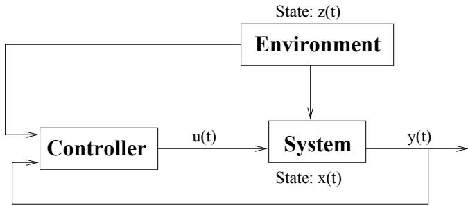  
Figure 2.9: Model for controller, system and environment. $\mathrm { { x } ( t ) }$ represents the internal state of the system, $\mathrm { z ( t ) }$ represents the state of the environment, $\mathrm { { u ( t ) } }$ is the control signal, $\mathrm { y ( t ) }$ is the output from the system, and $\mathrm { t }$ is the current time.

In my thesis I have used the greenhouse simulator described in [Ursem et al., 2001 A] (see chapter 4.4). The objective of the simulator is to maximize the profit of a crop producing greenhouse, i.e, to maximize the production while minimizing the expenses of heating, $C O _ { 2 }$ , and electricity. The production is controlled by heating, injection of $C O _ { 2 }$ , ventilation, and optional use of artificial light. The produced crops are sold at a time-varying market price.

The variables in the greenhouse simulator are categorized into three groups for control, system, and environment variables.

The time-varying system and environment states are modelled by a number of difference equations:

$$
x _ { i } ( t + 1 ) = x _ { i } ( t ) + \Delta x _ { i } ( t )
$$

where $\Delta x _ { i } ( t )$ depends on other variables of the controller, the system, and the environment.

Control variables are heating $( u _ { h e a t } )$ , ventilation $( u _ { v e n t } )$ , $C O _ { 2 }$ injection $\left( u _ { C O _ { 2 } } \right)$ , and artificial light $( u _ { l i g h t } )$ . System variables are indoor temperature $( x _ { i t e m p } )$ , $C O _ { 2 }$ level in the greenhouse $\left( x _ { C O _ { 2 } } \right)$ , and the amount of harvested crop $\left( x _ { c r o p } \right)$ . Environment variables are outdoor temperature $\left( z _ { o t e m p } \right)$ , sunlight intensity $\left( z _ { s u n } \right)$ , price for crops $\left( z _ { p c r o p } \right)$ , heating $( z _ { p h e a t } )$ , $C O _ { 2 }$ gas $\left( z _ { p C O _ { 2 } } \right)$ , and electricity $( z _ { p e l e c } )$ . The outdoor temperature and sunlight intensity are based on real weather data representing a standard March month in Denmark.

$$
\begin{array} { l l l } { { k _ { 1 } = 0 . 5 } } & { { k _ { 2 } = 0 . 3 } } & { { k _ { 3 } = 0 . 0 0 5 \quad k _ { 4 } = 0 . 1 } } \\ { { k _ { 5 } = 0 . 1 5 } } & { { k _ { 6 } = 0 . 5 } } & { { k _ { 7 } = 0 . 0 5 \quad k _ { 8 } = 1 } } \\ { { k _ { 9 } = 3 . 0 } } & { { k _ { 1 0 } = 3 . 0 } } & { { } } \end{array}
$$

During the simulation, each system variable is updated using equation 2.1 and the following equations (constants are listed in table 2.1). A step in the simulator corresponds to 15 minutes.

The indoor temperature is changed by:

$$
\Delta x _ { i t e m p } = k _ { 1 } \cdot u _ { h e a t } + k _ { 2 } \cdot z _ { s u n } + ( k _ { 3 } + k _ { 4 } \cdot u _ { v e n t } ) ( z _ { o t e m p } - x _ { i t e m p } )
$$

where $k _ { 1 }$ is the temperature increase due to heating, $k _ { 2 }$ is the increase from sunlight radiation, $k _ { 3 }$ is the minimal heat exchange with the environment, and $k _ { 4 }$ is the exchange rate when ventilation is used.

The indoor $C O _ { 2 }$ level is changed by:

$$
\Delta x _ { C O _ { 2 } } = - k _ { 5 } \cdot \Delta x _ { c r o p } + k _ { 6 } \cdot u _ { C O _ { 2 } } + ( k _ { 7 } + k _ { 8 } \cdot u _ { v e n t } ) ( k _ { 9 } - x _ { C O _ { 2 } } )
$$

where $k _ { 5 }$ is the $C O _ { 2 }$ consumption by the plants, $k _ { 6 }$ is the increase due to injected $C O _ { 2 }$ , $k _ { 7 }$ is the minimal $C O _ { 2 }$ exchange with the environment, and $k _ { 9 }$ is the atmospheric $C O _ { 2 }$ level.

The crop production per time-step is modelled as a percentage of the optimal growth, i.e., the growth under optimal conditions of temperature, light, and $C O _ { 2 }$ level. The change in crop growth is:

$$
\Delta x _ { c r o p } = k _ { 1 0 } \cdot m i n ( G _ { t e m p } , G _ { l i g h t } , G _ { C O _ { 2 } } )
$$

where $k _ { 1 0 }$ is the maximal amount of produced crops. The min-function models that plant growth is limited by the most limited growth resource.

$G _ { t e m p }$ , $G _ { l i g h t }$ , and $G _ { C O _ { 2 } }$ are growth transfer functions (see the graphs in appendix B). The transfer function for the temperature models an optimal growth temperature of 30 degrees Celsius with a near optimal range of 25 to 35 degrees. The interval from -20 to 0 degrees and 45 to 60 do not allow any growth, i.e. if the indoor temperature is not between 0 to 45 degrees the plants die and have to be replanted. The transfer function for $C O _ { 2 }$ -level models a saturation effect. The light transfer function maps both sunlight and artificial light to a production percentage, which is also modelled as a saturation relationship.

Finally the profit per time-step is modelled as:

$$
p _ { p r o f i t } = z _ { p c r o p } \cdot \Delta x _ { c r o p } - ( z _ { p h e a t } \cdot u _ { h e a t } + z _ { p C O _ { 2 } } \cdot u _ { C O _ { 2 } } + z _ { p e l e c } \cdot u _ { l i g h t } )
$$

To calculate the fitness, eight time steps (2 hours) are simulated and the sum of the profit is used as the objective function:

$$
F i t _ { s u m } ( I ) = \sum _ { i = 1 } ^ { 8 } p _ { p r o f i t } [ i ]
$$

where $p _ { p r o f i t } [ i ]$ denotes the profit in the $\textit { i }$ ’th measurement in the simulation.

Though the implemented model only represents a simplified subset of the real components found in a real greenhouse, it still illustrates interesting characteristics of greenhouse control.

# 2.5.4 The Phone-Routing Simulator

Routing in a communication network is a process that routes information from a source to a destination through a sequence of intermediate stations or nodes. The problem to be solved by any routing algorithm is to direct traffic from sources to destinations maximizing network performance while minimizing costs (as also mentioned in section 2.4.3). As another real world like test case for my dynamic memory EA approach I have implemented a phone network simulating the phone routing problem. Routing in a communication network has been shown to belong to the class of NP-hard problems in case that the nodes have a limited capacity [Ahuja et al. 1993]. On top of this a lot of different dynamic routing problems exists because the traffic conditions are constantly changing, and the structure of the network itself may fluctuate (nodes or links can fail).

The objective of the phone routing simulator is to model a simple phone routing network. The network is represented by a graph of N nodes and E directional links. Each node holds information of its capacity, i.e. how many calls can be routed through the node, its spare capacity, i.e. the percentage of capacity still available, and a routing table. Each link has a weight (or cost) specifying how expensive it is to use this link. I designed the network simulator such that any size and network structure can be modelled. It is also very easy to simulate dynamic problems such as node break downs etc. I used this simulator to model various benchmark problems that reflect different real-world scenarios.

During run time, phone calls are introduced to the system that have to be routed through the network. In the case of using the evolutionary algorithm approach to solve the routing problem, the system was controlled by the best individual in the EA population (as in the case of the greenhouse simulator in section 2.5.3). That is the evolutionary algorithm evolved controllers for a certain time period and the best individual was selected to control the real simulator. In the next time step the state of the system affected by the controller, was used as the starting point. For further details of the phone routing simulator see chapter 5.3.

# 2.5.5 Advantages and disadvantages

The main difference between the three dynamic optimization problem simulators are that the De Jong TCG constructs rather artificial, but systematically designable dynamic fitness landscapes.

The ability to construct the landscape gives the advantage that an analysis is possible and it is even possible to construct special simple problems that tests specific abilities of a search technique. On the other hand, those artificial problems are no real world problems. Search techniques that are able to track a peak or multiple peaks might not be of any use in another real world scenario, because they turn out to be too complex.

The two simulators, model a real world system and produce the fitness landscape as a “by-product”.

Modelling a real world problem uses the complexity of the specific real world scenario, but it is difficult to figure out the strengths and weaknesses of a search technique. This is because it is not possible to simplify the problem without changing the complexity and thereby the scenario. Of course one could analyse the underlying fitness landscape, but this might be very hard, especially in control problems where the controller determines the future fitness landscape.

# Chapter 3

# Introduction to the Scientific Papers

The motivation for the two papers was to introduce and investigate the abilities of a new dynamic memory approach, called the Dynamic Memory Model (DMM).

The first paper introduces the DMM and shows how it can compete with a static memory approach and a classic GA on problems generated by a non-stationary test case generator and a greenhouse simulator.

The second paper investigated the DMM further in the context of the complex problem of phone routing. A phone routing network was designed and used to illustrate different problem class in the phone routing problem. The DMM was compared to four ant colony optimization approaches which are specially designed to solve the problem of routing.

The two papers have both been submitted to the Congress on Evolutionary Computation (CEC) 2002.

# Chapter 4

# Dynamic Memory Model for Non-Stationary Optimization

Claus N. Bendtsen & Thiemo Krink EVALife, Department of Computer Science Ny Munkegade, Bldg. 540, University of Aarhus DK-8000 Aarhus C, Denmark 8000 Aarhus C

# abstract

Real-world problems are often non-stationary and can cause cyclic, repetitive patterns in the search landscape. For this class of problems, we introduce a new GA with dynamic explicit memory, which showed superior performance compared to a classic GA and a previously introduced memory-based GA for two dynamic benchmark problems.

Keywords: evolutionary algorithms, dynamic environments, memory

# 4.1 Introduction

In recent years non-stationary optimization has become a growing field of research because of its importance in real-world applications. Industrial applications such as elevator systems or phone-call routing controllers are required to adapt to customers whose behaviour cannot be estimated well in advance. In job shop scheduling new jobs may arrive, machines may break down or wear out. For this type of optimization, an effective evolutionary algorithm (EA) must be able to keep up with the pace of changes or ideally anticipate changes before they occur. This turns out to be a problem for classic GAs, since they can only follow but not anticipate changes in the objective function and, depending on the speed of changes, may lose track of optima in the changing fitness landscape. Many experts in this field suggested extensions of classic GAs, which tackle the latter problem by maintaining or reintroducing diversity. Cobb [3] introduced triggered hypermutation to control the mutation rate whenever a change occurs. Other approaches such as random immigrants [9], ageing individuals [7], tag bits [12] and dynamic distributed sub-populations [20] aim to maintain diversity by spreading out the population and keeping track of moving peaks.

In real world problems, dynamic changes are often affected by natural rhythmic patterns, such as day-night, weekly, or seasonal cycles in staffscheduling problems. In these cases, solutions with a high fitness may happen to reappear at a near optimum at a later stage. Additionally, redundant genome representations can slow down convergence and favour diversity. In previous work, memory has either been modelled implicitly by a redundant genome representation, such as diploid chromosomes [8] or explicitly by storing and retrieving candidate solutions from a separate memory [2]. In this paper, we introduce a new EA model for explicit memory, the socalled dynamic memory EA. In our approach, the memory is adjusted to the dynamic changes by moving externally stored candidate solutions gradually in the search space towards the currently nearest best genomes in the EA population.

The paper is structured as follows: Section 4.2 reviews the memory related literature and motivates our approach. Afterwards, we introduce our dynamic memory model in section 4.3 and describe the benchmark testproblems and the experimental setup for a performance comparison with other EAs in sections 4.4 and 4.5. Finally, we present the results of these experiments in section 4.5.2 and discuss our new approach in section 4.6.

# 4.2 Memory-based approaches

The following subsection gives a brief review of memory related research with evolutionary computation. For a more comprehensive survey see [1].

# 4.2.1 Implicit Memory

Perhaps the most prominent approach to redundant representation by memory is to use diploid instead of haploid chromosomes. This was first suggested as an extension of the simple GA by Goldberg and colleagues [8] and further investigated by others, such as Ng and Wong [15]. In these two approaches, the authors used a tri and four allele scheme respectively, in which the genes have recessive and dominant attributes and dominant alleles determine the gene exclusively. Another approach is to use additive diploidy [17, 11], in which all alleles are added and the gene becomes 1 if a certain threshold is exceeded and 0 otherwise. The results produced by multiploid representations so far indicate that they are useful in periodic environments where it is sufficient to remember a few states and important to be able to return to previous states quickly. Further, as Corne pointed out [4], diploidy can also be useful in stationary landscape in cases where a haploid EA would be likely to irretrievably lose genetic material necessary to find an optimum.

Apart from diploidy, Dasgupta and colleagues introduced an approach with haploid chromosomes and multilayered gene regulation, where high level genes control the activation of a set of low level genes. Here, a single change of the genome can have drastic effects on the phenotype [5].

# 4.2.2 Explicit Memory

The main idea with explicit memory is that remembering old solutions can turn out to be an advantage later on in a dynamic fitness landscape. It may even allow the population to jump to a different area in the landscape in one step, which would not be possible without a strong hyper-mutation in a classic GA. Compared to hyper-mutation the difference is that with memory the jump is clearly directed whereas hyper-mutation requires numerous trials and errors.

Different approaches have been reported in the literature using explicit memory. Louis and Xu [13] studied scheduling and re-scheduling by means of restarting the EA with individuals evolved by a related problem. Whenever a change occurred, the EA was restarted and the population was initialized with a seed from the old run and the rest randomly. The authors concluded from the experiments that a seed of 5- $- 1 0 \ \%$ from the old run produced better and faster results than running the EA with a totally randomly initialized population after a change occurred. In this approach, memory was only used to seed a new run of an EA, but not as permanent memory.

Ramsey and Greffenstette [16] introduced an EA model that stored good candidate solutions for a robot controller in a permanent memory together with information about the robot environment. The idea is that if the robot environment becomes similar to a stored environment instance the corresponding stored controller solution is reactivated. For this they used a simulator to train good strategies for robot movement and obstacle avoidance. In the article the authors reported that their technique prevented premature convergence by a higher level of diversity and yielded significant improvements. The only drawback of this approach is that it assumes that the similarity of the robot environment is measurable.

Another approach was introduced by Trojanowski and Michalewicz [18], in which each individual remembers some of its ancestor’s solutions. After a change in the environment, the current solution and the memory solutions are re-evaluated and the best solution becomes the active solution, keeping the other solutions in memory. The size of the memory is fixed and individuals from the first generation start with an empty memory buffer. For each of the following generations the parent solution is stored in memory and if the memory is already full the oldest memory solution is removed.

Further more, Eggermont and colleagues [6] suggested an EA model, which focuses on a shared memory instead of a local memory, only available to the individual. They implemented the model for a bit representation based on a real numerical representation by Branke [2]. In this approach the best individuals from some of the generations are stored in a shared memory. The size of the memory is fixed and different approaches of replacement strategies, when storing individuals, were tested, such as replacing individuals by their age or their contribution to diversity and fitness. Branke [2] and Eggermont et al. [6] found significant improvement compared to approaches without memory on dynamic test problems.

In the following section we will introduce our approach to explicit memory, which is closely related to the just mentioned approach, but instead of storing old solution we let the memory itself keep track of the dynamic changes.

# 4.3 The Dynamic Memory Model (DMM)

When dealing with real-world problems it is rarely the case that the exact same solution will receive the identical fitness at a later stage. However the dynamic change may cause the optima to be in the neighbourhood of an old solution more often. Therefore keeping a static memory of old solutions may, in some cases, turn out to be superfluous and yield no performance improvement.

In this paper, we introduce a dynamic explicit memory approach. Like in previous work on explicit memory, we keep a fixed number of candidate solutions in an explicit memory. However, instead of replacing memory items with individuals from the current EA population, we keep the same memory items and let them adjust to the changes in the search environment. For the adjustment, the algorithm selects the currently best individual in the EA population and finds the closest (most similar) stored candidate solution. The closest stored candidate solution is then gradually moved towards the currently best individual in the EA population. The result of this iterative process is that the stored candidate solutions close in on the trajectory of moving optima in the changing environment by producing checkpoints at different locations (see figure 4.1). If the optima return to the same proximity in the search space the memory points can self-adjust to the translocated optima.

The model works as follows (see figure 4.2 and figure 4.3): The DMGA

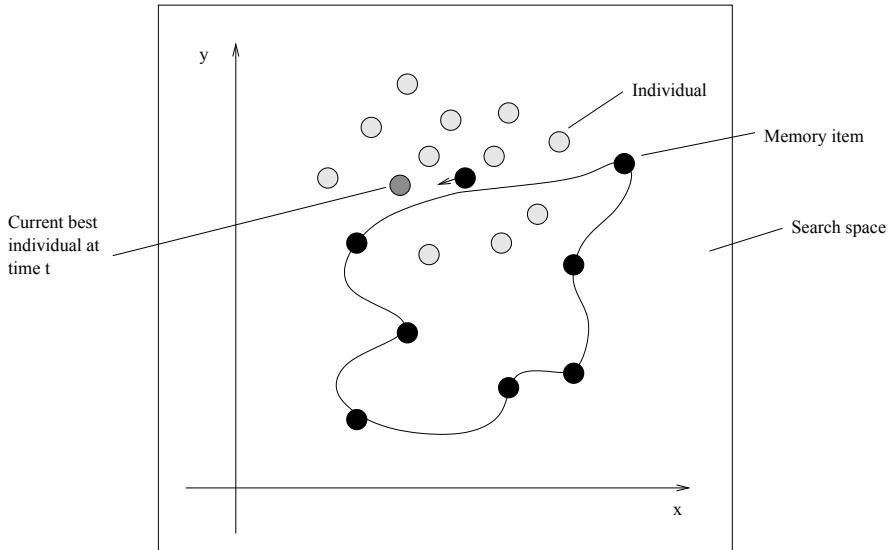  
Figure 4.1: Movement of memory points. The curve is an example of a dynamic changing optimum. The black circles are the memory points, the light gray scaled circles are the population solutions and the gray circle is the best individual in the population.   
Figure 4.2: The structure of a GA enhanced with the DMM.

procedure DMGA   
begin initialize population initialize memory evaluate while (not termination-condition) do begin select recombine mutate evaluate update memory replace worst individual by best memory point end   
end

is based on a classical GA, but differs in the memory handling. In the initialization process an explicit memory of a fixed number of stored candidate solutions is initialized with random candidate solutions. In each iteration the best individual in the population is found and the closest stored candidate solution to the best individual is moved towards the best individual

procedure update memory()   
begin for each memory point $i$ do begin if memory point $i$ closest to best individual closest = memory point $i$ end move closest in the direction of best individual for each memory point $i$ do begin if memory point $i$ never affected by best individual mutate(memory point $\textit { \textbf { \ i } }$ ) end   
end

(see figure 4.1). The movement distance is the actual distance between the the two locations multiplied with the absolute value of a Gaussian random number with a mean of zero and a variance of 0.5. Afterwards the best stored candidate solution is introduced in the search population by replacing the worst individual. Until a stored candidate solution has been affected (moved) by a best individual, it makes small random jumps by a minor mutation to explore the environment. The random jump is implemented by adding a random Gaussian number with a mean of zero and a variance of 0.5 to all the EA parameters.

# 4.4 Test Problems

In order to investigate how the model could cope with dynamic problems, we have tested it on a simple circular moving peak problem using a nonstationary test-case-generator (described on chapter 2.5.2) [14]. We have compared our approach with a classic GA and another explicit memory approach by Branke (see section 4.2.2) [2].

Further, we have tested the performance of our algorithm regarding a more real world like control problem of a greenhouse [10]. The greenhouse model is an implementation of a crop producing greenhouse where the production is controlled by heating, injection of $C O _ { 2 }$ , ventilation, and optional use of artificial light. The objective is to maximize the profit, i.e. to maximize the production while minimizing the expenses of heating, $C O _ { 2 }$ , and electricity.

The greenhouse simulator is based on a controller design shown in figure 4.4 [19]. The model uses direct control, which means that the on-line evolved controller, that is the best individual at time $t$ , directly controls the system for a time-period and changes the state of the system. This leads to a situation where the search for optimal control affects the changes of the fitness landscape. This is a characteristic property of direct control and can not be modelled with a simplistic dynamic test case generators such as the one by Morrison and colleagues [14]. In addition to control feedback, the system is affected by changes in the surrounding environment.

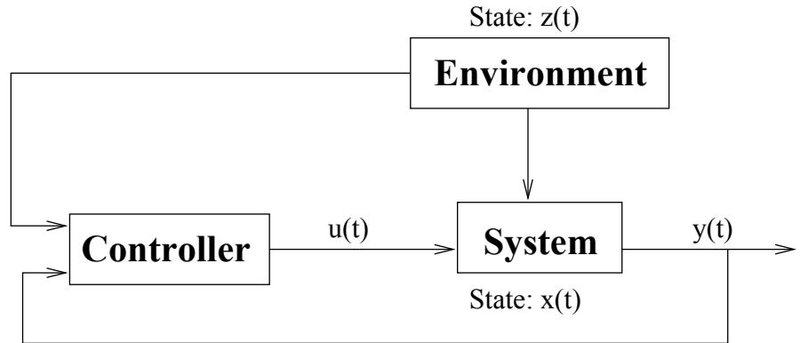  
Figure 4.4: Model for controller, system, and environment. $\bf { x ( t ) }$ represent the internal state of the system at time $ { \mathrm { ~  ~ t ~ } }$ , $\mathbf { u ( t ) }$ is the control signal, $\mathbf { z ( t ) }$ is the state of the surrounding environment at time $ { \mathrm { ~  ~ t ~ } }$ , and $\bf y ( t )$ is the output from the system.

The variables in the greenhouse simulator are categorized into three groups for control, system, and environment variables. Control variables are heating, ventilation, $C O _ { 2 }$ injection and artificial light. System variables are indoor temperature, $C O _ { 2 }$ level in the greenhouse and the amount of harvested crops. The environment variables were based on real weather data including outdoor temperature and sunlight intensity representing a standard March month in Denmark. Additionally prices for crops, heating, $C O _ { 2 }$ gas, and electricity were used as environment variables.

Finally the profit per time-step was modelled as:

$$
\begin{array} { l l l } { { p _ { p r o f i t } } } & { { = } } & { { z _ { p c r o p } \cdot \Delta x _ { c r o p } - ( z _ { p h e a t } \cdot u _ { h e a t } + } } \\ { { } } & { { } } & { { } } \\ { { } } & { { } } & { { z _ { p C O _ { 2 } } \cdot u _ { C O _ { 2 } } + z _ { p e l e c } \cdot u _ { l i g h t } ) } } \end{array}
$$

Where $z _ { p c r o p }$ , $z _ { p h e a t }$ , $z _ { p C O _ { 2 } }$ , $z _ { p e l e c }$ denote the prices, $x _ { c r o p }$ is the current amount of crop and $u _ { h e a t }$ , $u _ { C O _ { 2 } }$ , and $u _ { l i g h t }$ denote the control variables.

To calculate the fitness, eight time steps (2 hours) were simulated and the sum of the profit was used as the objective function:

$$
F i t _ { s u m } ( I ) = \sum _ { i = 1 } ^ { 8 } p _ { p r o f i t } [ i ]
$$

Where $p _ { p r o f i t } [ i ]$ denotes the profit in the $_ i$ ’th measurement in the simulation.

# 4.5 Experiments

# 4.5.1 Experimental design

For our experiments, we implemented a classic GA with real-valued encoding, tournament selection, arithmetic crossover, and Gaussian mutation.

We enhanced the classic GA with our Dynamic Memory approach (DMGA) and implemented a static memory scheme by Branke (SMGA)(as mentioned in section 4.2.2) for comparison.

The static memory model adds an explicit memory with a fixed size to the classic GA and in every 10’th iteration the best individual is stored in memory. The memory is initialized empty and filled up throughout the run. If the memory has reached its capacity a new memory point replaces the most similar point of the stored memory

All three algorithms were compared regarding the two benchmark test problems introduced in section 4.4.

In all experiments, we used a population size of 110 (including memory, when used) and a memory size of 10.

For the fast moving peak problem, we used the following settings: probability of crossover $p _ { c } = 0 . 7$ , probability of mutation $p _ { m } = 0 . 2$ , variance $\sigma$ $= 0 . 5$ , number of generations $= 8 0 0$ , and repetitions $= 2 5$ . The 2D search space was defined as $- 1 0 \le \mathrm { x } \le 1 0$ and $- 1 0 \le \mathrm { y } \le 1 0$ . The peak was moving in a circular motion around (0,0) with a distance of 4. The static period was set to 2 and the speed of the peak was set to 100, i.e. it takes 200 time-steps before the peak return to its origin. The peak was cone shaped, its size was set to a height of 3 and its slope to 3.

For the greenhouse problem, we used the following setting: probability of crossover $p _ { c } = 0 . 9$ , probability of mutation $p _ { m } = 0 . 5$ , and variance $\sigma =$ 0.5. The controller was updated between each time-step and the problem was simulated for 28 days, i.e. 2880 generations, for 50 repetitive runs.

Further more, we investigated the effect of using random jumps in our Dynamic Memory Model by runs with and without random jumps.

# 4.5.2 Results

The graphs in all figures show the fitness of the best individual averaged over 25 runs in the fast moving peak problem and 50 runs in the greenhouse problem.

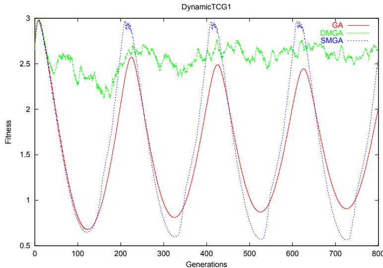  
Figure 4.5: Fast moving peak problem (average of 25 runs). The GA is the classic GA, the DMGA is the classic GA enhanced with our Dynamic Memory Model and SMGA is the classic GA enhanced with the static memory model [2], which has also briefly been described in this section.

Figure 4.5 shows that only our dynamic memory GA was able to follow the dynamic change of the environment. In contrast the classic GA started out with a near optimum solution, but after a few problem cycles it could not find the optimum anymore and the fitness slowly dropped as a result of premature convergence. Further, the static memory approach quickly found a near optimum and saved this location to memory, but as the environment changed it was not able to follow it. Because of the fixed saved location it always found the near optimum when the environment returned to this location, but the population also tended to converge prematurely.

Figure 4.6 and 4.7 show the results accordingly for the greenhouse problem optimization (see table 4.1 for standard errors). The results clearly show that adding our memory approach to the classic GA produces better results than without. On this problem Branke’s static memory model [2] did not improve the performance at all (see figure 4.6), but rather yielded worse results then the classic GA.

In order to investigate the effect of the random jumps, we performed two different experiments on the greenhouse problem. One with and one without random jumps. Figure 4.7 shows that even without random jumps there was a clear improvement compared to not using memory at all. However, a comparison of figure 4.6 with figure 4.7 shows that the results are better using random jumps.

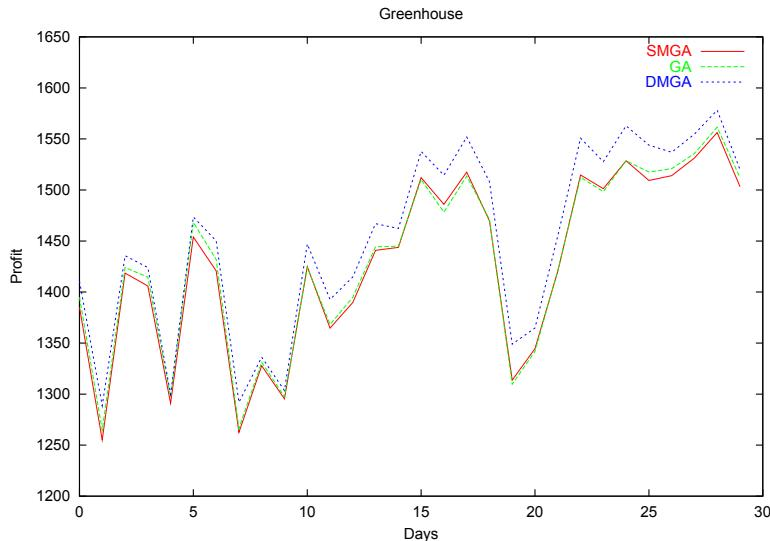  
Figure 4.6: memory with random jump (average of 50 runs). The GA is the classic GA, DMGA is the classic GA enhanced with our Dynamic Memory Model and SMGA is the classic GA enhanced with the static memory approach introduced in [2].

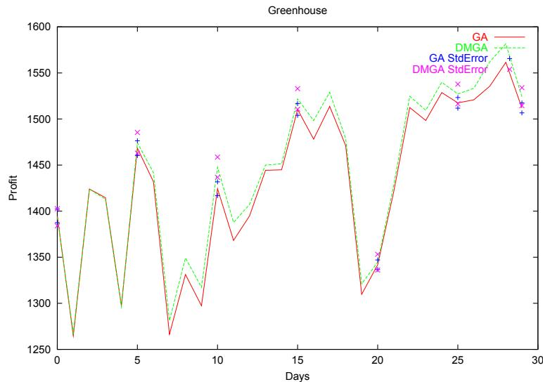  
Figure 4.7: memory without random jump (average of 50 runs). The GA is the classic GA, DMGA is the classic GA enhanced with our Dynamic Memory Model and StdError is the standard error for the respective model.

# 4.6 Discussion and Conclusions

In this paper, we have introduced a new approach to enhance evolutionary algorithms with memory. Instead of using a static memory we have used a dynamic memory, where the memory self-adapts to the changes in the environment. We tested the performance of the model regarding two different non-stationary problems, a rather simple fast moving peak problem and a more real-world like control problem simulating a crop producing greenhouse. We compared the results of our new model with a classic GA and another static explicit memory model introduced by Branke [2].

Table 4.1: Mean and standard error of profit (average of 50 runs), taken from figure 4.6.   

<table><tr><td rowspan=1 colspan=1>Model</td><td rowspan=1 colspan=1>Days</td><td rowspan=1 colspan=1>Current profit</td><td rowspan=1 colspan=1>Std.error</td></tr><tr><td rowspan=7 colspan=1>GA</td><td rowspan=1 colspan=1>0</td><td rowspan=1 colspan=1>1394.86</td><td rowspan=1 colspan=1>± 7.37</td></tr><tr><td rowspan=1 colspan=1>5</td><td rowspan=1 colspan=1>1468.34</td><td rowspan=1 colspan=1>± 8.04</td></tr><tr><td rowspan=1 colspan=1>10</td><td rowspan=1 colspan=1>1424.34</td><td rowspan=1 colspan=1>± 7.48</td></tr><tr><td rowspan=1 colspan=1>15</td><td rowspan=1 colspan=1>1510.33</td><td rowspan=1 colspan=1>± 6.35</td></tr><tr><td rowspan=1 colspan=1>20</td><td rowspan=1 colspan=1>1341.86</td><td rowspan=1 colspan=1>± 5.23</td></tr><tr><td rowspan=1 colspan=1>25</td><td rowspan=1 colspan=1>1517.53</td><td rowspan=1 colspan=1>± 5.78</td></tr><tr><td rowspan=1 colspan=1>29</td><td rowspan=1 colspan=1>1512.02</td><td rowspan=1 colspan=1>± 5.37</td></tr><tr><td rowspan=2 colspan=1>DMGAwith</td><td rowspan=1 colspan=1>0</td><td rowspan=1 colspan=1>1408.46</td><td rowspan=1 colspan=1>± 10.02</td></tr><tr><td rowspan=1 colspan=1>5</td><td rowspan=1 colspan=1>1473.06</td><td rowspan=1 colspan=1>± 9.19</td></tr><tr><td rowspan=5 colspan=1>randomjump</td><td rowspan=1 colspan=1>10</td><td rowspan=1 colspan=1>1446.69</td><td rowspan=1 colspan=1>± 11.55</td></tr><tr><td rowspan=1 colspan=1>15</td><td rowspan=1 colspan=1>1537.62</td><td rowspan=1 colspan=1>± 11.67</td></tr><tr><td rowspan=1 colspan=1>20</td><td rowspan=1 colspan=1>1365.01</td><td rowspan=1 colspan=1>± 10.34</td></tr><tr><td rowspan=1 colspan=1>25</td><td rowspan=1 colspan=1>1544.69</td><td rowspan=1 colspan=1>± 11.62</td></tr><tr><td rowspan=1 colspan=1>29</td><td rowspan=1 colspan=1>1532.12</td><td rowspan=1 colspan=1>± 8.29</td></tr><tr><td rowspan=7 colspan=1>SMGA</td><td rowspan=1 colspan=1>0</td><td rowspan=1 colspan=1>1383.55</td><td rowspan=1 colspan=1>± 7.03</td></tr><tr><td rowspan=1 colspan=1>5</td><td rowspan=1 colspan=1>1453.82</td><td rowspan=1 colspan=1>± 8.00</td></tr><tr><td rowspan=1 colspan=1>10</td><td rowspan=1 colspan=1>1424.93</td><td rowspan=1 colspan=1>± 6.15</td></tr><tr><td rowspan=1 colspan=1>15</td><td rowspan=1 colspan=1>1512.12</td><td rowspan=1 colspan=1>± 6.18</td></tr><tr><td rowspan=1 colspan=1>20</td><td rowspan=1 colspan=1>1344.71</td><td rowspan=1 colspan=1>± 4.43</td></tr><tr><td rowspan=1 colspan=1>25</td><td rowspan=1 colspan=1>1498.25</td><td rowspan=1 colspan=1>± 5.64</td></tr><tr><td rowspan=1 colspan=1>29</td><td rowspan=1 colspan=1>1508.23</td><td rowspan=1 colspan=1>± 5.08</td></tr></table>

Based on these experiments, we can conclude that on both problem classes our dynamic memory model produced superior results.

In case of the fast moving peak problem, the classic GA and the static memory model were not able to follow the significant changes in the environment. In contrast our dynamic memory model did not prematurely converge and was able to follow the changes in the environment very well.

Also regarding the greenhouse problem we achieved clearly superior results with our model compared to the classic GA and the static memory model. Further we investigated how much additional random jumps contribute to the performance of the DMGA. Our experiments showed that superior results could even be achieved without random jumps. The static memory model, in contrast had a tendency to produce even worse results then the classic GA regarding this benchmark. This might be because old solutions are not useful for future solutions, but require continuous adjustments to the changing fitness landscape.

As mentioned in section 4.3 our main idea with the dynamic memory was that the memory points should spread out as checkpoints in the dynamic environment. From our experiments this is actually what happens, but if the problem domain becomes too large then our current random initialization of the memory may turn out to be inadequate, because too few memory points would be affected. In future work we will look into the initialization process of the memory to overcome this problem. Further we plan to run additional experiments with different problems and compare our approach with other memory approaches.

# Bibliography

[1] Branke, J. (1999) Evolutionary approaches to Dynamic Optimization Problems: A Survey In Evolutionary Algorithms for Dynamic Optimization Problems, pages 134-137.

[2] Branke, J. (1999) Memory Enhanced Evolutionary Algorithms for Changing Optimization Problems In Angeline, P.J., Michalewicz, Z., Schoenauer, M., Yao, X., and Zalzala, A., editors, Proceedings of the Congress of Evolutionary Computation, volume 3, pages 1875-1882, Mayflower Hotel, Washington D.C., USA.IEEE Press.

[3] Cobb, H. G.(1990) An investigation into the use of hyper-mutation as an adaptive operator in genetic algorithms having continuous, time dependent non-stationary environments Technical Report AIC-90-001, Naval Research Laboratory, Washington, USA.

[4] Corne, D., Collingwood, E. and Ross, P.(1996) Investigating Multiploidy’s Niche In Proceedings of AISB Workshop on Evolutionary Computing.

[5] Dasgupta, D. and McGregor, D. R. (1992) Nonstaztionary Function Optimization using the Structured Genetic Algorithm In Proceedings of Parallel Problem Solving From Nature (PPSN-2) Conference, pages 145-154, 1992.

[6] Eggermont, J., Lenaerts, T., Poyhonen, S. and Termier, A.(2001) Raisong the Dead; Extending Evolutionary Algorithms with a Case-based Memory In Genetic Programming, Proceedings of EuroGP’2001, pages 280-290.

[7] Ghosh, A., Tsutsui, S. and Tanaka, H. (1998), Function Optimization in Nonstationary Environment using Steady State Genetic Algorithms with Aging of Individuals Proceedings of the 1998 IEEE International Conference on Evolutionay Computation.

[8] Goldberg, D. E. and Smith, R. E. (1987) Nonstationary function optimization using genetic algorithms with dominance and diploidy Proceedings of the Second International Conference on Genetic Algorithms, pages 59-68. Lawrence Erlbaum Associates, 1987.

[9] Grefenstette, J. J.(1992) Genetic algorithms for changing environments Proc. Parallel Problem Solving from Nature-2, R. Maenner and B. Manderick (Eds.), North-Holland, 137-144.

[10] Krink, T. and Ursem, R. K.(2001) Evolutionary Algorithms in Control Optimization: The Greenhouse Problem. In Proceedings of the Genetic and Evolutionary Computation Conference 2001.

[11] Lewis, J., Hart, E. and Ritchie, G.(1998) A Comparison of Dominance Mechanisms and Simple Mutation on Non-Stationary Problems In Parallel Problem Solving from Nature (PPSN V), pages 139-148.

[12] Liles, W. and Jong, K., A., D.(1999) The Usefulness of Tag Bits in Changing Environments. Proceedings of the Congress of Evolutionary Computation 1999, p. 2054-2060.

[13] Louis, S., J. and Xu, Z.(1996) Genetic Algorithms for Open Shop Scheduling and Re-Scheduling In ISCA 11th Int. Conf. on Computers and their Applications

[14] Morrison, R. W. and Jong,K. A. D. (1999) A Test Problem Generator for Non-Stationary Environments IEEE

[15] Ng, K. P. and Wong, K. C.(1995) A new diploid scheme and dominance change mechanism for non-stationary function optimisation In Proceedings of the Sixth International Conference on Genetic Algorithms, 1995 [16] Ramsey, C. L. and Grefenstette, J. J. (1993) Case-Based Initialization of Genetic Algorithms In Proceedings of the Fifth International Conference on Genetic Algorithms

[17] Ryan, C.(1996) The Degree of Oneness In Proceedings of the ECAI workshop on Genetic Algorithms. Springer-Verlag, 1996.

[18] Trojanowski, K. and Michalewicz, Z. (1999) Searching for Optima in Non-stationary Environments In Proceedings of the Congress of Evolutionary Computation 1999, pages 1843-1850.

[19] Ursem, R. K., Krink, T., Jensen, M. T., and Michalewicz, Z.(2001) Analysis and Modeling of Control Tasks in Dynamic Systems to appear in: IEEE Transactions on Evolutionary Computation.

[20] Yi, W., Liu, Q., He, Y.(2000) Dynamic Distributed Genetic Algorithms Congress on Evolutionary Computations 2000

# Chapter 5

# Phone-Routing using the Dynamic Memory Model

Claus N. Bendtsen & Thiemo Krink EVALife, Department of Computer Science Ny Munkegade, Bldg. 540, University of Aarhus DK-8000 Aarhus C, Denmark 8000 Aarhus C

# abstract

In earlier studies a GA extended with the Dynamic Memory Model has shown remarkable performance on real-world-like problems. In this paper we experiment with routing in communication networks and show that the DMGA performs remarkably well compared to Ant Colony Optimization algorithms that are specially designed to this problem.

Keywords: routing, EAs, dynamic memory, ACO algorithms.

# 5.1 Introduction

Routing is the core of network control systems. In recent years the number of services that a modern communication network has to supply has grown exponentially. Incorporating wired and wireless devices into the existing wire-link infrastructure is a tremendous challenge. Packet-switched networks, virtual circuit networks and even the Internet are becoming a increasingly complex collection of a diversity of subnets. Static routing algorithms are not adequate to tackle these networks anymore. To be able to accommodate conflicting objectives and constraints, imposed by technologies and user requirements evolving under commercial and scientific pressures, efficient adaptive routing algorithms have to be used.

In modern communication networks the routing problem is no longer to find the single shortest route through the network. The load of data and connections in the network are time dependent and hard to predict. Maximizing throughput for a time varying load in a limited-capacity transmission line has been shown to belong the the class of NP-complete problems [1]. On top of this, network instabilities may arise from node failures.

The most common adaptive approach to tackle the routing problem in communication networks is to use swarm intelligence. Swarm intelligence exhibits emergent behaviour wherein simple interactions of autonomous agents, with simple primitives, give rise to a complex behaviour that has not been specified explicitly on the local level. This phenomenon is often found in nature, for example many ant species use lay and follow pheromone trails in the process of foraging. The indirect interaction happens by stigmergy, i.e. communication through the environment, where agents modify the environment and other agents act on the changes [3]. Swarm intelligence or Ant Colony Optimization algorithms are known to be very powerful in the context of routing optimization. Not only do they find optimal single shortest routes, but they are also capable of adapting to changes that occur in the network by limited-capacity and failures.

In this paper, we tackled the phone routing problem from another angle than by swarm intelligence by an evolutionary algorithms approach. Evolutionary algorithms are known to have problems with premature convergence and in the case of dynamic or real-world like problems they are often not able to follow the changes in the environment, and thereby stagnate at suboptimal solutions. In an earlier study we introduced a dynamic memory model for GAs which has shown remarkable performance in particularly real-world like problems [2]. In this paper, we studied the capability of the Dynamic Memory GA in context of the phone routing problem. We compared our results with four different Ant Colony Optimization approaches and a classic simple GA.

The outline of the paper is as follows: Section 5.2 describes the phone routing problem. In section 5.3 we introduce the phone routing simulator that we designed and used in this study. In section 5.4 the new approach of adding Dynamic Memory to Evolutionary Algorithms is introduced. Section 5.5 specifies the test-problems and the experimental setups. Finally, we present our results in section 5.6 and discuss this study in section 5.7.

# 5.2 Phone Routing

Phone Routing in distributed systems can be characterized as follows. Let $G = ( V , E )$ be a directed weighted graph, where each node in the set $V$ represents a processing or forwarding unit and each edge in the set $E$ is a transmission system. The main task of a phone routing algorithm is to connect calls from source to destination nodes while maximizing network performance. In real phone systems the call flow follows a stochastic profile that is very hard to model.

A common feature of all routing algorithms is the presence of a data structure, called the routing table, in every network node. This structure holds all the information used by the algorithm to make the local forwarding decisions. The routing table is both a local database and a local model of the global network status. The type of informations that it contains and the way this information is used and updated strongly depends on the algorithms.

The main characteristics of the phone routing problem can be described in the following way:

• Intrinsically distributed with strong real-time constraints. The routing database and the decision systems are completely distributed over all the network nodes. It is therefore not possible to get complete upto-date knowledge of the entire system. Each node can only rely on up-to-date local information and delayed non-local information from the other nodes.   
• Stochastic and time-varying: the generation of calls is stochastic and moreover if many calls use the same node and thus its capacity is exceeded, alternative routes have to be used.   
• Multi-objective: several conflicting performance measures are usually used. The most common is throughput and average call delay. Throughput measures the quantity of calls connected successfully over a certain amount of time. Average call delay measures the quality, that is how long time it takes to establish a connection from the source node to the destination node, produced over the same time.   
• Multi-constraints: constraints are imposed by different parties. In general, users ask for low-cost, high-quality and reliable services. The network builders and service providers try to accommodate these requests while maximizing some profit criteria.

A phone routing algorithm has to take all these characteristics into account. In the following sections we will describe different approaches for solving the phone routing problem and a simulator used to test the algorithms.

# 5.3 The Phone routing Simulator

The objective of the phone routing simulator is to model a simple phone routing network.

The simulator is constructed in the following way: First, a network is defined by its nodes and the links connecting the nodes. The links can either be directional or bidirectional. Each node holds information of max capacity $\left( C _ { i } \right)$ , i.e. how many calls can be routed through the node, spare capacity $( S _ { i } )$ , i.e. the percentage of capacity that is still available, and a routing table. The routing table contains probabilities for routing a call via a neighbour node to a certain destination node (see figure 5.1).

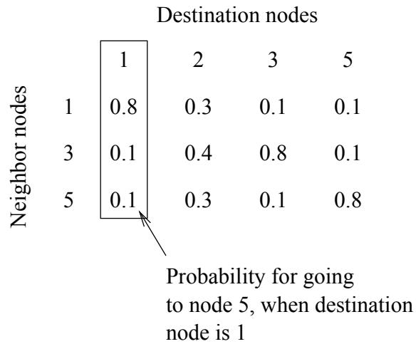  
Figure 5.1: Routing table for node 4.

The simulator is run for a certain number of simulated hours where each simulated hour is further divided into smaller time steps (granularity can be set such that each time step simulated is 1 second, 10 milliseconds or any other time measure). The generation of calls is made by selecting a certain number of calls for one day and then stochastically distribute the calls such that realistic request patterns occur. We used the following patterns: on a weekday the critical periods are 8:00-16:00 and 19:30-21:00. The former is because of working hours and the latter is because in Denmark it is cheaper to make a phone-call after 19:30 in the evening. On a weekend-day the critical periods are between 8 and 20 in the evening. To distribute the calls we used the settings mentioned in table 5.1. These settings are arbitrarily.

Each call has a duration, a setup time, a source node and a destination node. When trying to connect a call the probability of routing a call to a certain neighbour node is looked up in the routing table of the node and the next node is picked probabilistically. If a call arrives at a node where it has already been at, the call is terminated, otherwise it could lead to a circle that would not terminate. If the call reaches its destination node the call is connected and the network resources remain occupied for the time steps specified by its duration. When setting up a call the number of failures before the call is connected is calculated together with the connection cost, i.e. the weight of the links on its route. If the capacity of a node is reached then the node will not receive any more calls before some of the calls using the node are disconnected. The simulator has been constructed, such that any network can be modelled, dynamic costs of the links can be used, nodes can momentarily be taken out to simulate a node breakdown, etc.

Table 5.1: Distribution of calls on weekdays and weekend-days.   

<table><tr><td></td><td>Percent (%)</td></tr><tr><td>Weekdays</td><td></td></tr><tr><td>8:00 - 16:00 16 - 19:30, 21 - 22</td><td>80 13</td></tr><tr><td>19:30 - 21:00</td><td>5</td></tr><tr><td>22:00 - 8:00</td><td>2</td></tr><tr><td>Weekend-days</td><td></td></tr><tr><td>8:00 - 20:00</td><td>95</td></tr><tr><td>20:00 - 8:00</td><td>5</td></tr></table>

# 5.4 The Dynamic Memory Model (DMM)

The Dynamic Memory Model is a way to enhance an EA with memory. Unlike in traditional memory approaches the memory is not static, instead it tries to follow the dynamic changes that occur in the fitness landscape. This is implemented by keeping a fixed number of stored candidate solutions, of which in every iteration (generation) of the EA the closest stored candidate solution to the current best solution is selected and moved towards the current best solution. Finally the current best stored candidate solution is introduced to the EA population by replacing the worst candidate solution. The structure of the Dynamic Memory EA can be seen in figure 5.2 and 5.3. For a more detailed description of the Dynamic Memory Model see [2].

# 5.5 Experiments

Since the introduction of Ant Colony Optimization (ACO) algorithms there has been a large focus on ACO algorithms in context of optimization in communications networks. However EAs have the advantage of keeping several candidate solutions to the problem at hand. The Dynamic Memory GA has earlier proved that it is powerful and achieves robust solutions especially on dynamic real-world problems. The phone routing problem is indeed a

# procedure DMEA

begin initialize population initialize memory evaluate while (not termination-condition) do begin select recombine mutate evaluate update memory replace worst individual by best memory point end   
end   
procedure update memory()   
begin for each memory point $i$ do begin if memory point $i$ closest to best individual closest = memory point $i$ end move closest in the direction of best individual for each memory point $i$ do begin if memory point $i$ never affected by best individual mutate(memory point $i$ ) end   
end

very hard (real-world like problem) and the stochastic call flow makes the problem behave in a dynamic and hardly predictable manner. To test the Dynamic Memory GA, we defined a ten node network in the phone routing simulator (see figure 5.4).

Each individual in the GA population encodes the probabilities used in the routing tables of the network. That is, a gene reflects a routing table entry. The overall dimension of the genome is $( N - 1 ) \textstyle \sum _ { i = 1 } ^ { N } b _ { i }$ , where $N$ is the number of nodes in the network and $b _ { i }$ Pis the number of neighbours for node $i$ . To evaluate the fitness of a candidate solution the simulator is run for one simulated hour. After the evaluation of the whole population the best candidate solution is selected as the controller for the simulator and the simulated state is transfered to the next hour.

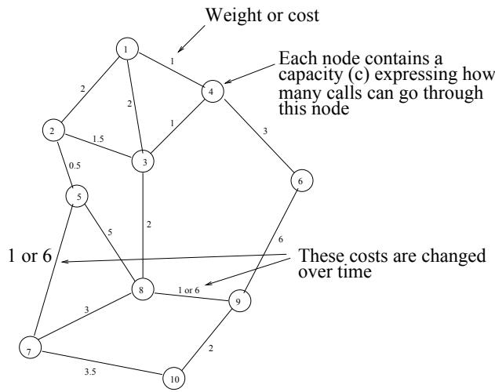  
Figure 5.4: The network used

In our expermentation, we studied a lot of different test setups. In the following we will describe the three most interesting ones.

The first one (referred to as the dynamic cost problem) includes dynamic cost on two links (see network at figure 5.4). In each simulated day between 6:00 and 12:00 the link between nodes five and seven is set to the value six. Between 12:00 and 18:00 the former cost is reset to one and the link between the nodes eight and nine is set to the value six. In the remaining time period these links are set to the value one. The source of all calls are node number one and the destination node is node number ten. This introduces a discrete dynamic problem, on top of the call flow dynamics, such that in the three different time periods three different paths have minimal costs

In the second experiment (referred to as the multi destination problem) we modelled three different destination nodes. The source node is still node number one, but the destination is randomly distributed between nodes five, seven and eight. One could say that this is a very easy problem, because the preferred path to each destination node is very easy to choose, but because all destination nodes prefer one or more similar nodes on their path these nodes soon exceed their capacity and alternative paths have to be chosen to connect all calls.

The third experiment (referred to as the plain problem) is the most simple one where the source node is number one and the destination node is node number ten. The only dynamic property is the call flow.

The fitness criteria that we wanted to investigate with this setup was robustness and quality of connections, i.e. quantity of connected calls in respect to how many failures occur before a call was connected and the cost of connected calls. For the average connection failure we set that one failure is free, less than six failures contribute with a constant of two, and more than six failures are expensive, that is they contribute with three times the number of failures. The maximum number of tries a call has to connect is ten. To reflect the quality of the connected calls, we calculated the average cost (weights on the links) of the connected calls. Explicitly the fitness function was:

$$
e ( t ) = f _ { e } + \frac { \sum _ { i \in C o n n e c t e d c a l l s } c o s t _ { i } } { \# c o n n e c t e d c a l l s }
$$

$$
f _ { e } = \left\{ \begin{array} { l l } { 0 } & { i f \frac { \# f a i l u r e s } { \# c a l l s i n t i m e p e r i o d } \leq 1 } \\ { 2 } & { i f 1 < \frac { \# f a i l u r e s } { \# c a l l s i n t i m e p e r i o d } \leq 6 } \\ { \frac { \# f a i l u r e s } { \# c a l l s i n t i m e p e r i o d } \cdot 3 } & { o t h e r w i s e } \end{array} \right.
$$

where $e ( t )$ is the fitness at time $t$ , $c o s t _ { i }$ is the cost of the $i$ ’th connected call and $f _ { e }$ is the expense of the failures.

The GAs were both running with a total population size of 110 individuals, in case of the Dynamic Memory GA with a memory size of 10. As genetic operators we used tournament selection, arithmetic crossover and Gaussian mutation. The following GA parameters were used: in the classic GA implementation $p _ { c } = 0 . 6$ , $p _ { m } = 0 . 2 5$ , and variance $\sigma = 0 . 5$ . For the Dynamic Memory GA $p _ { c } = 0 . 7$ , $p _ { m } = 0 . 0 5$ , and variance $\sigma = 0 . 5$ . These probabilities were selected based on parameter tuning for both GAs.

In the case of the ACO algorithms, we have implemented an AntNet (inspired by [3] and [4]) and an ABC algorithm (inspired by [6] ). The phone routing simulator was used as the actual network and $5 \%$ of the calls further acted as ants (or routing table updating agents). If an ant connected a call then all the routing tables in the nodes on its route were updated.

In case of the AntNet the routing table $R _ { i }$ was updated in the following way: The probability explicitly associated with the route of the ant was incremented by:

$$
r _ { i - 1 , d } ^ { i } ( t + 1 ) = r _ { i - 1 , d } ^ { i } ( t ) \times ( 1 - r ) + r .
$$

All the other probabilities associated with the destination node $d$ were decreased by normalization (i.e all the other probabilities associated with the neighbours different from neighbour node $i$ -1, for the same destination):

$$
\begin{array} { r } { r _ { n , d } ^ { i } ( t + 1 ) = r _ { n , d } ^ { i } ( t ) \times ( 1 - r ) , n \ne i - 1 . } \end{array}
$$

where $r _ { i - 1 , d } ^ { i } ( t )$ is the probability associated with the neighbour node $i$ -1 and the destination node $d$ . For the value $r$ , we tried two different measures. As a simple approach we used $r = \mathrm { c o n s t a n t } = 0 . 1$ . If an ant travels on a fast path it increments its route just as much as an ant travelling on a slower path, i.e. simple stigmergetic behaviour.

The other approach that we tried requires more information in the nodes about the best known cost of a path to every destination node: here r $= W _ { i  d } ~ / ( T _ { i  d } \times 1 0 )$ , where $W _ { i \to d }$ is the best of the ten last costs to destination node $d$ and $T _ { i \to d }$ is the current ants travel cost to destination node $d$ .

Because the AntNet algorithm is constructed in such a way that backward ants are created to update the routing tables, it is able to use extra information about the connected call, such as the total elapsed time until connection. As earlier mentioned the second evaluation of $r$ requires that the nodes are able to store extra information about all destination nodes in memory. Note that the GAs do not need this extra information. A second thing to mention about the AntNet is the implicit decrease of probabilities that are not affected by the ants route. That is, there is no decrease of probabilities associated with time in the AntNet. When a probability is reinforced the other probabilities are decreased by normalization.

In the case of the ABC algorithm the structure is more or less the same as the AntNet. Only the update procedure is a little bit different, because it reinforces small probabilities comparatively more than larger probabilities. In the AntNet the reinforcement measure is proportionally larger for small probabilities than for large probabilities. The reinforcement procedure in the ABC algorithm is done in the following way: The probability explicit associated with the route of the ant is incremented by:

$$
r _ { i - 1 , d } ^ { i } ( t + 1 ) = \frac { r _ { i - 1 , d } ^ { i } ( t ) + \delta r } { 1 + \delta r }
$$

All the other probabilities associated with the destination node $d$ is decreased by normalization (i.e all the other probabilities associated with the neighbours different from neighbour node $i$ - $\mathit { 1 }$ , for the same destination):

$$
r _ { n , d } ^ { i } ( t + 1 ) = \frac { r _ { n , d } ^ { i } ( t ) } { 1 + \delta r } , n \neq i - 1 .
$$

where $r _ { i - 1 , d } ^ { i } ( t )$ is the probability associated with the neighbour node $\textit { i }$ -1 and the destination node $d$ . $\delta r$ is a reinforcement parameter that depends on the ant’s characteristics. In case of the ABC algorithm, we tried out two different measures for $\delta r$ . A simple approach corresponding to the simple strategy in the AntNet $\delta r = \mathrm { c o n s t a n t } = 0 . 1$ . For the second approach we used the cost of the call: $\begin{array} { r } { \delta \mathrm { r } = \frac { 1 } { T _ { k } } } \end{array}$ , where $T _ { k }$ is the absolute age of ant $k$ (cost). Here short paths will get more reinforced than long ones.

For all experiments the simulator was run for 1000 simulated hours and one time step corresponded to 15 simulated seconds. For all weekdays in the simulator the number of calls were set to 300 and for Saturday and Sunday set to 100 calls. The duration of the calls was randomly distributed between 5 and 50 time steps ( i.e. between $1 \textstyle { \frac { 1 } { 4 } }$ minute and $1 2 { \frac { 1 } { 2 } }$ minutes).

# 5.6 Results

Since it is not useful to report the overall best solution achieved for dynamic fitness functions, the reported values in the figures are the average of ten runs of the off-line performance [5], which is the average of the best solutions at each time step i.e. $\begin{array} { r } { x ^ { * } ( \mathrm { T } ) = \frac { 1 } { T } \sum _ { t = 1 } ^ { T } e _ { t } ^ { * } } \end{array}$ with $e _ { t } ^ { * }$ being the best solution at time $t$ . Note that the number of values that are used for the average grows over time, thus the curve tends to get smoother over time.

# Phone Routing

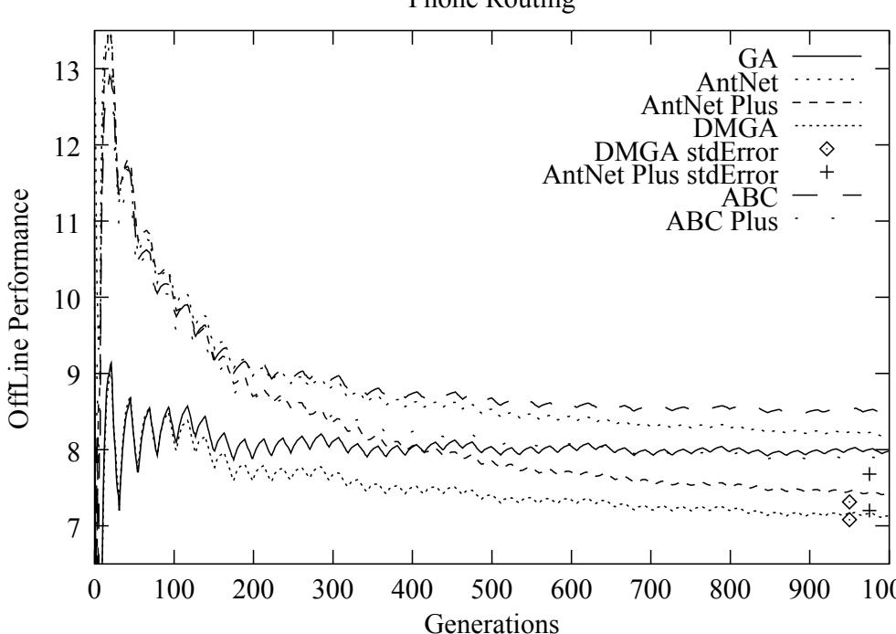  
Figure 5.5: Dynamic cost problem. GA is the classic GA, DMGA is the classic GA extended with the DMM, AntNet is the simple stigmergetic approach to the AntNet alg., AntNet Plus is the AntNet alg. using extra information, ABC is the simple stigmergetic approach to the ABC alg., ABC Plus is the ABC alg. using cost of calls, and stdError is the standard error measure.

The dynamic cost problem; where the cost of some of the links in the network is varied over time corresponds to a scenario in which a phone company has to buy additional network capacity from other companies at certain peak hours. Figure 5.5 shows that already after 200 simulated hours the Dynamic Memory GA is able to follow the dynamic changes over time in the environment. Compared to the classic GA the two models start out with the same performance, but after 200 simulated hours the classic GA tends to converge to suboptimal paths. Those paths are the best in some time periods, but after a cost change the classic GA is unable to shift to a new and better path. This can also be seen from the continuing oscillations in the graph, where a good solution is found and after some change this solution looses some of its fitness. The Dynamic Memory GA, on the other hand, is a lot better at keeping alternative paths and following the dynamic changes. The comparison to the ACO algorithms show that the simple stigmergetic approach for the reinforcement measure in the AntNet and the ABC algorithm (listed as AntNet and ABC) also converge to suboptimal paths. The ABC algorithm using connection cost in the reinforcement measure (listed as ABC Plus) produce somewhat better results then the simple stigmergetic approaches, but are still unable to adapt to new and better paths. The local memory enhanced AntNet algorithm (listed as AntNet Plus) is better in keeping alternative paths based on memorizing earlier good paths. Even though the AntNet Plus approach yields better results it is not able to produce as valuable results as the Dynamic Memory GA.

The results were similar regarding the multi destination problem; where there is one source node, but three different destination nodes. The difficulty in this problem is that when a node reaches its capacity and a lot of calls normally would like to use it there has to be an alternative path that is much longer than the others, but if the algorithm does not use it many calls do not reach their destination. Figure 5.6 shows that the simple AntNet, and the simple ABC algorithm, can not adequately solve the problem. The other four approaches outperform them by approximately $2 0 \ \%$ performance. The Dynamic Memory GA is again competing with the AntNet Plus and the ABC Plus algorithm approaches, where the Dynamic Memory GA produces a slightly better result. Compared to the classic GA the Dynamic Memory GA produces results that are about $1 5 \ \%$ better.

For the plain problem; where the only dynamics are the ones created by the call flow. The reason why we have used this problem was to test how powerful the Dynamic Memory GA is in a simple case of the phone routing problem. Our results show that also in this case the classic GA is not able to follow the dynamic changes that occur in the environment (figure 5.7). The Dynamic Memory GA, the AntNet Plus and the ABC Plus approaches on the other hand solve the problem very well. The difference between the classic GA and the Dynamic Memory GA is again more than $1 0 \ \%$ .

In general, we can conclude that the Dynamic Memory GA clearly outperforms the classic GA on all problem classes. Only the advanced versions of the ACO algorithms turned out to be competitive (as the local memory approach in the AntNet Plus) in comparison to the Dynamic Memory GA.

# Phone Routing

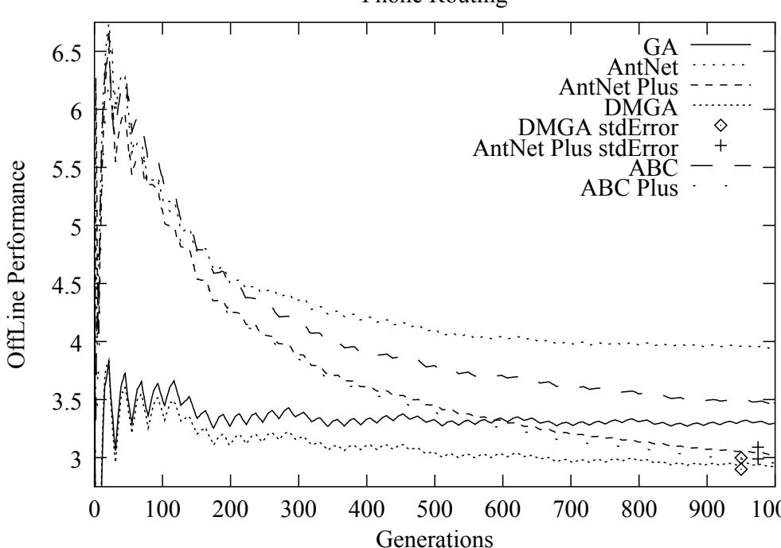  
Figure 5.6: Multi destination problem. GA is the classic GA, DMGA is the classic GA extended with the DMM, AntNet is the simple stigmergetic approach to the AntNet alg., AntNet Plus is the AntNet alg. using extra information, ABC is the simple stigmergetic approach to the ABC alg., ABC Plus is the ABC alg. using cost of calls, and stdError is the standard error measure.

# 5.7 Discussion and Conclusions

In this paper, we have investigated the performance of the Dynamic Memory GA (DMGA) regarding a selection of phone routing problems. Phone routing problems are very dynamic, unpredictable and real-world typical. For this performance evaluation we compared the DMGA with a classic GA and four different approaches of Ant Colony Optimization (ACO) algorithms.

From the experiments we can conclude that it has great significance to use the Dynamic Memory GA instead of the classic GA. The classic GA is simply not able to adapt to the discrete and dynamic changes that occur in the phone routing system. The Dynamic Memory GA on the other hand is able to keep and maintain alternative paths, which it can reuse at a later stage. In the experiments the Dynamic Memory GA even outperformed some classical ACO approaches to this problem. Our experiments strongly suggest that a local memory approach outperforms simple approaches in all cases. The amazing part is that the Dynamic Memory GA performs just as well as an advanced ACO algorithm and in some of the cases even produce

#

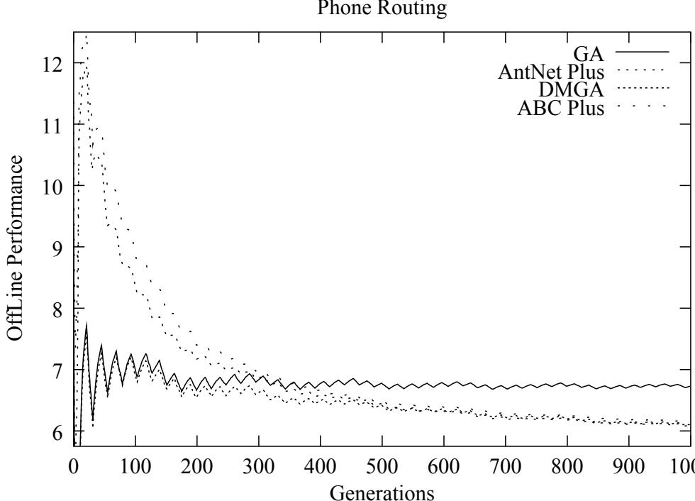  
Figure 5.7: Plain problem. GA is the classic GA, DMGA is the classic GA extended with the DMM, AntNet Plus is the AntNet alg. using extra information, and ABC Plus is the ABC alg. using cost of calls

better results.

The question that still need to be answered, now that the Dynamic Memory GA has shown that it can produce valuable results is, whether it is possible to use GAs in real communication networks. GAs can not work directly on the real network, but have to evolve routing strategies in a simulator off-line. Phone routing problems are intrinsically distributed and it is very difficult to design simulators such that it has high predictive value. ACO algorithms are able to work on the real network, but they also create traffic, slowing down the network. Secondly, communication networks are often unable to sample and store the extra information needed for the advanced ACO algorithms. Another aspect is the collection of knowledge in the ACO algorithms, which are only approximations, because sending the ant back to the nodes it visited might not take the same time as connecting a call.

Although the applicability of our approach the Dynamic Memory GA once again has shown that on real-world-like problems it outperforms the classic GA clearly and is even able to produce results simular to specialized algorithms for the investigated routing problem.

# Bibliography

[1] Ahuja, R. K., Magnanti, T. L., and Orlin, J. B.(1993) Network Flows: Theory, Algorithms and Applications Prentice Hall, Inc., Upper Saddle River, New Jersey, 1993.

[2] Bendtsen, C. and Krink, T. (2001) Dynamic Memory Model for NonStationary Optimization. In submission.

[3] Bonabeau, E., Dorigo, M. and Theraulaz, G.(1999) Swarm Intelligence: From Natural to Artificial Systems Oxford University Press, 1999. ISBN: 0-19-513159-2.

[4] Caro, G. D. and Dorigo, M.(1998) AntNet: Distributed Stigmergetic Control for Communications Networks Journal of Artificial Intelligence Research 9 (1998) pages 317-365.

[5] Jong, K. D. (1975) An analysis of the behaviour of a class of genetic adaptive systems PhD thesis, University of Michigan, Ann Arbor MI, 1975.

[6] Schoonderwoerd, R., Holland, O., Bruten, J. and Rothkrantz, L.(1996) Agent-Based Load Balancing in Telecommunications Networks Adapt. Behav. 5 (1996) pages 169-207.

# Chapter 6

# The capabilities of the Dynamic Memory Model

In this MSc thesis I have introduced a novel approach of dynamic memory to evolutionary algorithms. In this chapter I will try to describe what this approach is capable of in connection with some examples on future research directions that could refine the model and some test scenarios that could further explain how the memory works and why it works. Additionally, I will give an example of another search algorithm where the memory approach could be used in order to illustrate future potential applications of my approach.

The dynamic peak tracking experiment showed that the memory items in the Dynamic Memory Model are able to close in on the trajectory of a moving optimum. However, this is only a small part of what the DMM is capable of. In the phone routing problem, the changes are much more discrete and still the DMM performs remarkable well. Figure 6.1 try to illustrate how this work in theory on a non-continuous curve. In the figure first (A) the optimum is located in a neighbourhood of the EA population and the closest memory point is attracted towards the population. Second (B) the optimum changes its location, but is still located on the same curve as before and the same memory point as before is moving in this direction. The third thing that happens (C) is that a discrete change happens, which means that the optimum pops up another place. A new memory item is then attracted to this new location and the old memory item is left on the old curve, waiting for a reappearance of optima in a neighbourhood location. The last thing (D) that happens is that memory items are spread out over the search space in neighbourhood locations to earlier optima positions. Therefore after a reappearing discrete change the stored candidate solutions can improve further search.

The example of the non-continuous curve can easily be generalised, such that it covers reappearing fuzzy features in general. The DMM extended to a classic GA has proven that it boosts performance, compared to a classic GA, in both the greenhouse simulator and the phone routing simulator. Below I will mention future research directions and test scenarios that could further investigate how the DMM works and why it works.

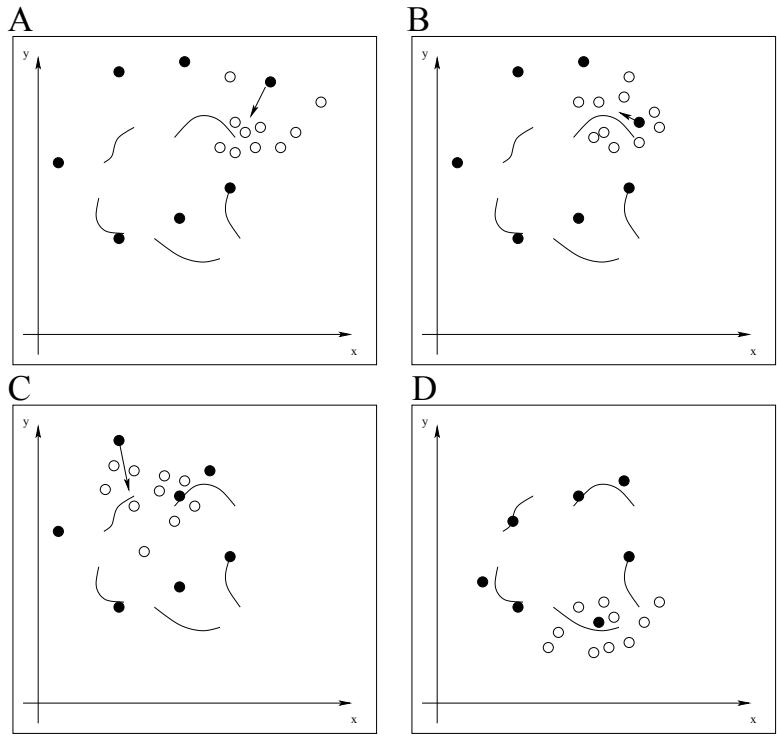  
Figure 6.1: Movement of memory items on discrete changing optima. The black dots are the memory items and the white dots are the EA individuals.

In this MSc thesis I have only used a fixed memory size of ten in all benchmark experiments. All though this choice yielded a remarkable performance it would be interesting to investigate whether a smaller or larger memory size could make the model perform even better. Additionally, the movement distance of the stored candidate solutions towards the best individual in the GA population was set in the same way in all the experiments as a Gaussian random number with a mean of zero and a variance of 0.5. Although this parameter choice yielded very good results in all tested benchmark problems the robustness of this parameter should be further investigated regarding other optimization problems.

To study how and why the memory works and in particular to investigate how well it deals with reappearing fuzzy features in the search landscape a lot of different approaches could be used. Measuring the diversity among the memory items could give an indication on how many memory items are needed and how well they cover the search landscape. Additionally, in context of the phone routing problems one could measure how many different memory items are introduced to the EA population over time and how often one particular memory item is used. This could give valuable insights regarding how well the different patterns and time-varying problems are predicted and tackled. Further, in the phone routing system the memory items could be visualized such that one could see how different the memory items are and how well they predict the changes in the problem landscape. The visualization could be implemented by showing the network topology and making the thickness of the links accordingly to the probabilities in the routing tables of the nodes.

In the thesis it has been mentioned that the Dynamic Memory Model can be easily extended to any EA. Another search technique with which the model could work well is a particle swarm [Kennedy, 1997]. The particle swarm algorithm is based on the metaphor of individuals refining their knowledge by interacting with one another. A particle is a moving point in a hyperspace. The particle swarm approach already uses the notion of distance by remembering and being attracted to locations to the globally best solution and individual best solution. Introducing the Dynamic Memory Model to a particle swarm could be easily done and might improve the performance on dynamic and real-world problems as the case for EAs. The reason for this is, that under the same assumptions of dynamic real world problems, that features or patterns in the environment reappear, the DMM would be able to store candidate solutions and adapt to changes. If a feature reoccur in a neighbourhood of the last occurrence, then the DMM would be able to retrieve this solution from the earlier stored candidate solution and improve further search for the swarm.

Finally and maybe most importantly would be to see how the DMM performs on dynamic real world optimization problems. Instead of using assumptions of the problem landscape topology this would give an indication of the usefulness of the DMM to yield robust solutions to real world problems.

# Chapter 7

# Summary and Conclusions

In numerical optimization the objective function is explicitly given by the numerical function itself. In contrast, in many real-world problems the quality function is unknown or implicit.

Traditionally, analytical methods, such as the derivative extremum test, or traditional computing approaches, such as dynamic programming, are used in optimization. The problem with analytical methods is, that the optimization problem has to be well-defined, and the problem can not be NP-hard. Incremental search techniques are an alternative to analytical methods. They perform an approximation to the problem by an iterative refinement process, thereby always finding a solution, but with no guarantee of the quality.

Evolutionary algorithms (EAs) are incremental search techniques inspired from Darwinian evolution. The main concepts in Darwinian evolution is the notion of adaptation, speciation and the process of natural selection. EAs are not meant to be a model of evolution, but only use evolution as an inspiration to a powerful optimization technique. EAs introduce the notion of a population of candidate solutions and apply operators inspired by genetics and real evolution (mutation, crossover, and selection) to refine the population. The competition among the individuals in the population lead to better and better candidate solutions to the optimization problem. However, in context of non-stationary problems the EA is often not able to adapt to the changes and it can results in a bad performance. In the literature different approaches have been used to tackle non-stationary problems and dynamic real world problems, such as maintaining diversity or adding a explicit or implicit memory structure [Branke, 1999].

In this thesis I have introduced a new explicit memory structure, called the Dynamic Memory Model (DMM). The objective was to produce robust solutions to real-world problems. This was accomplished by storing alternative candidate solutions and let the stored solutions adapt to the changes in the environment.

The main idea of the DMM was to keep a specific number of candidate solutions in an explicit storage area. The stored solutions should then follow the changes in the problem domain, instead of storing new solutions. Under the assumption that repetitive patterns and reoccuring features are typical for real world problems, such as day-night, weekly, or seasonal cycles in staffscheduling problems, the stored solutions should lead to various candidate solutions acting as checkpoints, i.e., the candidate solutions should spread out covering reappearing patterns in the environment. Hereby it a optima reappear in the environment a stored candidate solutions should be located in the neighbourhood and improve further search.

The DMM has been tested on different dynamic optimization problems and simulated real world problems.

In a peak tracking experiment in a dynamic environment it turned out that the DMM added to a classic GA was able to follow the peak, whereas the classic GA loses track of the peak and ends up with worthless solutions. Perhaps more importantly the DMM also produces superior results compared to a static memory scheme. The static memory scheme is only able to keep static candidate solutions in memory, which means that the stored solutions are only optimal in short time periods. The GA is not able to follow the peak on its own therefore these statically stored solutions are the only good solutions, but only in short time periods, and they take over the whole GA population causing premature convergence or at least decreases the GA ability for further search.

In another experiment with a simulator for a crop producing greenhouse the dynamic objective was to maximize the profit by optimal system control. The dynamics in the system of this control problem were generated by the changes that occur in the surrounding environment and by the system controller. Evolving the system controller using the DMM applied to a classic GA yielded superior results compared to the classic GA and a static memory scheme.

Finally, I studied the potential of my approach regarding a simulated phone routing problem which resembled features of real phone routing networks. Routing in communication networks has been shown to belong to the class of NP-hard problems if the nodes have a limited capacity of calls that can be routed through the nodes. The call flow in the routing problem is very unpredictable and other significant changes in the network may occur, such as links may become more expensive or attractive in certain time periods or nodes may break down. In these experiments, I compared the DMM added to a classic GA (DMGA) to four different ant colony optimization (ACO) approaches and the classic GA. Regarding the classic GA, the DMGA produced superior results in the range of $2 0 \ \%$ improvement. In the case of the ACO algorithms, which are especially designed to tackle the routing problem, the DMGA was able to produce similar and in some cases slightly better performance.

My study shows that incorporating the concept of dynamic memory can be a very valuable improvement of the classic genetic algorithm. Under the assumption that the dynamics in non-stationary real world problems include repetitive reoccuring fuzzy features the dynamic memory approach is able to follow optima of the optimization problem by storing reappearing solutions and adapting to changes. Which means, that reoccuring optima in a neighbourhood location can be discovered and yield high performance for the optimization technique. I hope that my contribution can be useful leading to new models providing robust solution in the context of real-world problem solving.

# Appendix A

# Numerical optimization problems

Definition of a numerical optimization problem:

Let the mathematical function $f : X \subseteq { \mathfrak { R } } ^ { n } \to { \mathfrak { R } }$ < be a problem and let $X$ be the domain of solutions to $f$ . The task of finding $x _ { 0 } \in X$ such that $\forall x \in X : f ( x _ { 0 } ) \geq f ( x )$ is a numerical maximization problem and the task of finding $x _ { 0 } \in X$ such that $\forall x \in X : f ( x _ { 0 } ) \leq f ( x )$ is a numerical minimization problem. Numerical optimization problems is the common term for numerical minimization and maximization problems.

# Appendix B

# Limits

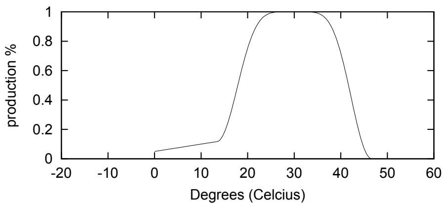  
Figure B.1: The graph for $G _ { t e m p }$ in the greenhouse simulator.

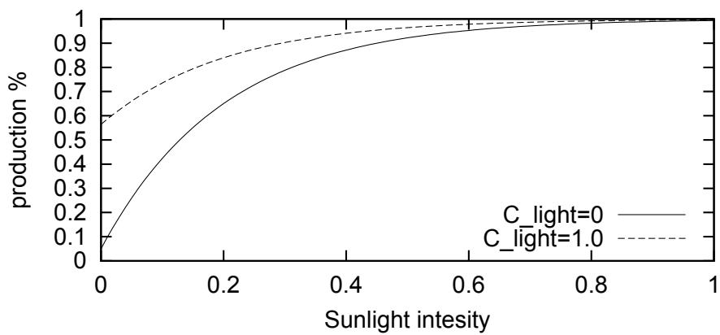  
Figure B.2: The graph for $G _ { l i g h t }$ in the greenhouse simulator.

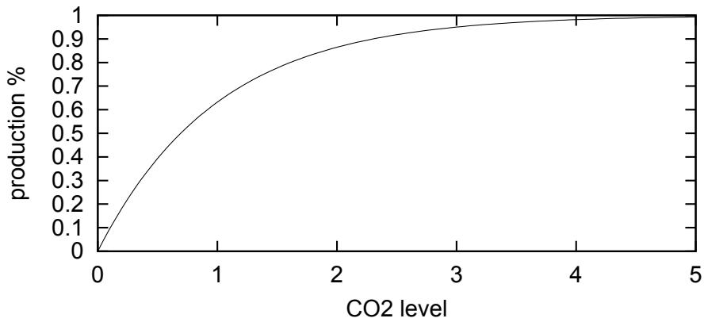  
Figure B.3: The graph for $G _ { C O _ { 2 } }$ in the greenhouse simulator.

# Bibliography

[Ahuja et al. 1993] Ahuja, R. K., Magnanti, T. L., and Orlin, J. B.(1993) Network Flows: Theory, Algorithms and Applications Prentice Hall, Inc., Upper Saddle River, New Jersey, 1993.

[Bonabeau et al, 1999] Bonabeau, E., Dorigo, M. and Theraulaz, G.(1999) Swarm Intelligence: From Natural to Artificial Systems Oxford University Press, 1999. ISBN: 0-19-513159-2.

[Branke, 1999] Branke, J. (1999) Evolutionary approaches to Dynamic Optimization Problems: A Survey In Evolutionary Algorithms for Dynamic Optimization Problems, pages 134-137.

[Caro and Dorigo, 1998] Caro, G. D. and Dorigo, M.(1998) AntNet: Distributed Stigmergetic Control for Communications Networks Journal of Artificial Intelligence Research 9 (1998) pages 317-365.

[De Jong and Morrison, 1999] Jong, K. A. D. and Morrison, R. W.(1999) A Test Problem Generator for Non-Stationary Environments Proceedings of the 1999 Congress of Evolutionary Computation, pages: 2047-2053. Mayflower Hotel, Washington D.C., 6-9 July 1999. IEEE Press.

[Dorigo et al, 1996] Dorigo, M., Colorni, A. and Maniezzo V.(1996) The Ant System: Optimization by a Colony of Cooperating Agents IEEE Trans. Syst. Man Cybern. B 26 (1996) pages 29-41.

[Dorigo et al, 1991] Dorigo, M., Colorni, A. and Maniezzo V.(1991) Distributed Optimization by Ant Colonies In Proceedings First Europ. Conference on Artificial Life, edited by F. Varela and P. Bourgine, pages 134-142. Cambridge, MA: MIT Press, 1991.

[Fogel et al., 1966] Fogel, L. J., Owens, A. J., and Walsh, M. J. (1966) Artificial Intelligence through Simulated Evolution. Wiley.

[Gambardella et al, 1997] Gambardella, L. M. and Dorigo, M.(1997) Ant Colonies for the Travelling Salesman Problem BioSystems 43 (1997) pages 73-81.

[Goss et al., 1989] Goss, S., Aron, S., Deneubourg, J.,-L., and Pasteels, J., M. (1989) Self-Organized Shortcuts in the Argentine Ant. Naturwissenchaften 76 (1989) pages 579-581.

[Holland, 1975] Holland, J. H. (1975) Adaptation in Natural and Artificial Systems University of Michigan Press.

[Janikow and Michalewicz, 1991] Janikow, C. Z. and Michalewicz, Z.(1991) An Experimental Comparison of Binary and Floating Point Representations in Genetic Algorithms In Proceedings of the Fourth International Conference on Genetic Algorithms.

[Kennedy, 1997] Kennedy, J. (1997) The particle swarm: Social adaptation of knowledge Proceedings of the 1997 International Conference on Evolutionary Computation, p. 303-308.

[Michalewicz, 1999] Michalewicz, Z. (1999) Genetic Algorithms $^ +$ Data Structures = Evolution Programs Springer-Verlag Berlin Heidelberg 1999.

[Michalewicz and Fogel, 2000] Michalewicz, Z. and Fogel, D. B.(2000) How to Solve It: Modern Heuristics Springer-Verlag Berlin Heidelberg 2000.

[Rechenberg, 1965] Rechenberg, I.(1965) Cybernetic Solution Path of an Experimental Problem Ministry of Aviation, Royal Aircraft Establishment (U.K)

[Rechenberg, 1973] Rechenberg, I.(1973) Evolutionsstrategie: Optimierung Technischer Systeme nach Prinzipien der Boilogischen Evolution Frommann-Holzboog (Stuffgart)

[Schoonderwoerd et al. 1996] Schoonderwoerd, R., Holland, O., Bruten, J. and Rothkrantz, L.(1996) Agent-Based Load Balancing in Telecommunications Networks Adapt. Behav. 5 (1996) pages 169-207.

[Spears et al., 1993] Spears, W. M., Jong,K. A. D., B¨ack, T., Fogel, D. B. and Garis, H. D. (1993) An Overview of Evolutionary Computation. In Proceedings of European Conference on Machine Learning, pages 442-459.

[Ursem et al., 2001 A] Ursem, R. K., Krink, T. and Filipic, B.(2001) Evolutionary Algorithms in Control Optimization: The Greenhouse Problem. In Proceedings of the Genetic and Evolutionary Computation Conference 2001. , p. 440-447.

[Ursem et al., 2001 B] Ursem, R. K., Krink, T. Jensen, M. T., and Michalewicz, Z.(2001) Analysis and Modeling of Control Tasks in Dynamic Systems. To appear in: IEEE Transactions on Evolutionary Computation