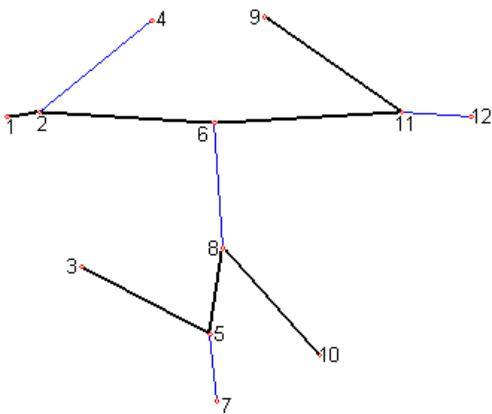
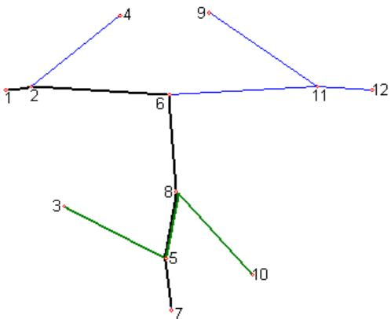
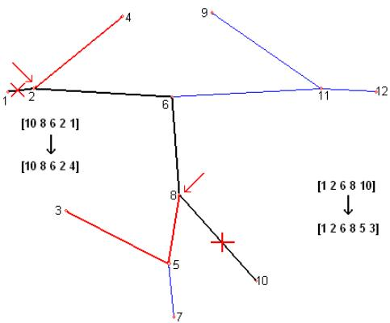
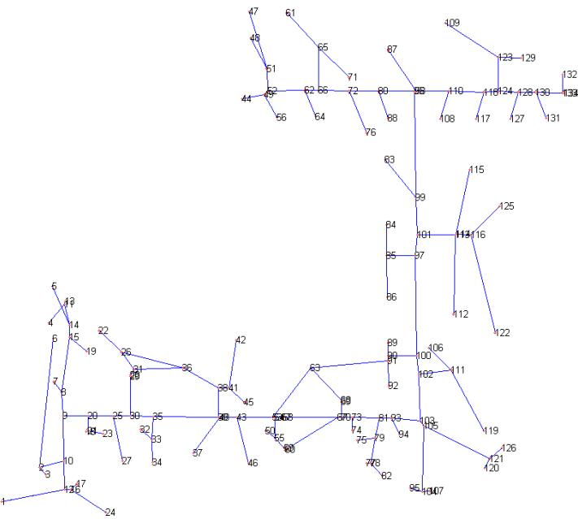

# A Study of Genetic Algorithms for Approximating the Longest Path in Generic Graphs

David Portugal   
Instituto de Sistemas e Robotica´   
Dept. of Electrical and Comp. Eng.   
University of Coimbra   
3030-290 Coimbra, Portugal   
davidbsp@isr.uc.pt   
Carlos Henggeler Antunes   
INESC Coimbra   
Dept. of Electrical and Comp. Eng.   
University of Coimbra   
3030-290 Coimbra, Portugal   
ch@deec.uc.pt   
Rui Rocha   
Instituto de Sistemas e Robotica´   
Dept. of Electrical and Comp. Eng.   
University of Coimbra   
3030-290 Coimbra, Portugal   
rprocha@isr.uc.pt

Abstract—Finding the longest simple path in a generic undirected graph is a challenging issue that belongs to the NPComplete class of problems. Four approaches based on genetic algorithms to solve this problem are presented in this article. The first three algorithms proposed use crossover mechanisms between pairs of solutions based on their intersecting regions and the fourth one uses a mutation mechanism on individual solutions, in which the perturbation applied depends on the state of the system. Simulation experiments have been carried out to validate the distinct approaches, which reveal their good performance and provide hints for their application in robotics, packet networks and other fields.

Index Terms—Genetic Algorithms, Graph Theory, Longest Path Problem

# I. INTRODUCTION

# A. The Longest Path Problem (LPP)

In this paper, we address the problem of finding the longest path in a generic undirected graph G=(V, E). V is the set of $n$ vertices and E is the set of $m$ edges. The goal is to find for all u, $\mathbf { v } \in \mathrm { V } ,$ , the longest path from u to v, using weighted edges. We consider simple paths, which do not have any repeated edges or vertices. This problem belongs to the NP-Complete class of problems, as it is a generalization of the Hamiltonian path problem and cannot be solved in polynomial time unless $\mathrm { P = N P } .$ For this reason, the solutions proposed are normally based on heuristics. The main objective of this work is to analyze and validate distinct approaches to solve this problem using genetic algorithms.

A vast work in graph theory is already presented in the literature. In this paragraph, work concerning the longest path problem (LPP) and related issues is reviewed. Karger et al. [1] presented several polynomial-time approximation algorithms for the LPP in unweighted undirected graphs, with limited performance. Hardness results are provided to justify the difficulty of obtaining better performance guarantees for the longest path approximations and, in general, for NP-complete problems. Additionally, a polynomial time approximation algorithm for the LPP is presented in [2]. The method finds paths that have a length greater than polylogarithmic. The main idea of the algorithm is to add edges vx and vy to a 2 degree vertex v. By letting x and y vary, one can approximate the longest path and similarly the longest cycle in an undirected graph.

More recently, an approximate and simplified search algorithm for the longest path in a graph was described in [3]. This was used for planning robot’s patrolling trajectories based on a topological graph-like representation. The algorithm is fast and always returns, at least, a sub-optimal solution. Monien [4] worked on finding arbitrary long paths with fixed length $k$ , which is a problem closely related to the LPP, and proved that they can be found in $O ( k ! n m )$ time, if they exist. Also, [5] described a construction algorithm for cycles or paths with length $\leq k$ , which uses $O ( n )$ time, based on a depth first search approach, improving Monien’s bounds. Furthermore, a randomized method for finding paths of a specified length $k$ in generic graphs, which improved the worst-case bound of Bodlaender [5] in undirected graphs, was described in [6]. This method was called color-coding. It detects, in polynomial time, whether a path of length $l o g ( n )$ exists. Despite the NP nature of the general problem, conclusions have already been drawn from studying particular cases; moreover, polynomial solutions are known for specific classes of graphs. For example, for directed acyclic graphs (DAGs) the problem is solvable in linear time by negating the edge weights and running a shortestpath algorithm like Bellman-Ford. Other different algorithms for DAGs have also been presented in [7] and [8], the latter one being applied for studies with gene pairs in large genetic networks. Uehara and Uno [9] showed that the LPP can be solved in polynomial time for (vertex/edge) weighted tree-like graphs and discussed the complexity of the problem for other types of graphs. Following this work, an algorithm in [10] that solves the LPP in polynomial time for interval graphs was presented. Finally, [11] studies longest paths in combinational circuits containing cycles.

# B. Genetic Algorithms (GAs)

In recent years, genetic algorithms (GAs) have become very popular for solving complex optimization and search problems. GAs are evolutionary computing approaches, inspired in Darwin’s theory about evolution and survival of the fittest. GAs are adaptive global search heuristic methods designed to find exact or approximate solutions by using inheritance, mutation, crossover and selection mechanisms with individuals, in order to form new and enhanced generations and converge to optimal

solution(s).

Genetic approaches have been studied in many scientific fields and are commonly recognized for their performance. As a consequence, applications on graph theory problems have emerged in recent years. Wong et al. [12] described the GAroute, a query routing function in a Peer-to-Peer Network, which returns a list of routing paths that cover as many relevant peers as possible. This is equivalent to the LPP in a directed graph and the authors use GAs to obtain approximate solutions in polynomial time. Also working with network datasets, [13] uses an evolutionary approach together with graph-based computation to discover routes with specific functional characteristics in a network. Furthermore, [14] deals with path selection from a known sender to the receiver aiming to maximize bandwidth along the forward channels while minimizing the route length. The authors compare a GA with a simulated annealing approach and conclude that the first one shows better convergence. Also, [15] uses GAs for path discovery in cognitive packet networks, by combining paths that were previously discovered to create new valid paths, which are selected based on their fitness. In [16], the problem of vehicle route selection to a given destination, on an actual map under a static and constrained environment, is addressed and a customized solution based on a GA is proposed. In the area of robotics, Solano and Jones [17] studied the generation of minimum distance paths for a mobile robot in an environment with a set of obstacles. The optimization of these paths is done by means of a genetic approach, which considers obstacle avoidance. In a similar work, [18] applies a GA path planner that optimizes and reduces the time for task completion of a set of three mobile robots that visit user-defined waypoints while not colliding to obstacles. Finally, another application on a classic graph theory problem is proposed in [19], which studies a genetic approach for partitioning graphs.

The next section states the problem that is addressed in this paper and the subsequent section describes the proposed algorithms. The results are then presented and discussed. The article ends with conclusions and future work.

# II. DEFINING THE PROBLEM

It is not the objective of this article to describe a method to improve the bounds of the current existing algorithms for the LPP and demonstrate theoretical concepts to guarantee the detection of the optimal solution. Instead, the interest is focused on validating, by simulation, practical and reasonable fast approaches that offer high quality solutions and can be used in applications, which may admit sporadically suboptimal solutions and where computational time is important. The initial motivation for developing this work was the same as in [3]: finding long paths in topological graph-like maps, which usually do not contain Euler or Hamilton paths, to be used as a reference for patrolling an environment with multiple robots. The longest path does not typically visit all vertices of the graph. However, a post-processing phase can be done to compute detours for visiting unattended places to solve the patrolling problem. As seen on the previous section, other applications beyond multi-robot path planning may benefit from tackling the LPP and related problems, like routing in packet networks, route planning for vehicles using GPS, measuring circuit’s performance and others.

As it was stated before, we will be using weighted edges which typically represent the distance/length between two vertices in the context of topological navigation maps. Nevertheless, the proposed approaches may also be used with unweighted edges, by imposing the same cost for all edges. In this particular case of the problem, the longest path(s) will be the one(s) with the greatest number of hops in the graph.

Genetic approaches have the ability to collect and apprehend important knowledge about the search space during its process and adapt future iterations according to previously obtained information through random optimization techniques. By taking the inherent knowledge within the search space into account, it is more likely to obtain the global optimal solution using a GA instead of a traditional search algorithm. The first three approaches proposed are based on crossover mechanisms, in which two parents create a set of offspring that share their genetic material. The last approach is based on a mutation operator, in which each individual creates two offspring by perturbation of their genetic material in places specified according to the overall state of the system.

There are a number of common features in all algorithms. Each generated path is a legitimate solution and is represented as an ordered array of vertices with variable length. The choice of individuals for the next generation is done by means of a roulette wheel selection between parents and offspring based on a path cost fitness function. Also, explicit elitism is performed by choosing a small fraction of the best solutions to automatically carry on for the next generation. The stop condition for the algorithms relies on the stagnancy of the fittest solutions found during the search process. In the next section, the generation of the initial population is explained and the algorithms are presented.

# III. THE ALGORITHMS

All the proposed algorithms accept, as input, the population size (p) and the elitism fraction, and the output is (are) the best obtained solution(s).

# A. Generating initial solutions

One can achieve better results and faster convergence by choosing an efficient method for generating initial solutions, in the context of the LPP using GAs. Since most of the algorithms herein analyzed strongly rely on the genetic material of the initial solution population, it is important to guarantee initial solutions with good quality; in this case, this corresponds to long and diverse initial paths. Initially, a random method was considered. It started by selecting a random vertex of the graph and computing paths by choosing neighbors of the current vertex at random, as long as they were not already included in the path. It finished computing the path when there were no available neighbors left. This proved to be an inefficient method, since most of the paths computed would be very short, mostly because degree one vertices, i.e. vertices with only one neighbor would be selected rather rapidly. To overcome this fact, a new method was developed. The first vertex is still selected at random. However, the following vertices are selected with a probability according to their degree. For example, if two neighbors of a given vertex have degrees 3 and 1, the first one would be selected with a probability of 0.75 and the second one with 0.25. In addition, if we have reached a vertex with unavailable neighbors, instead of stopping the method, we analyze whether the degree of the first vertex is greater than one and keep computing the path to the opposite direction until reaching a finishing point. This technique presented much better results in terms of initial generated paths than the first one and was used for producing the initial solution population throughout the rest of the work. Since we are dealing with undirected graphs, we consider the path A-B-C equivalent to C-B-A and we ensure that no identical solutions coexist in the solution population.

  
Fig. 1. An illustrative example of two disconnected paths.

  
Fig. 2. An illustrative example of two paths which intersect.

# B. Algorithm 1: GA using non-intersecting paths (GANP)

The first algorithm generates new offspring based on parents with no common vertices. Assuming that we have the initial solution population, a search takes place to find pairs of nonintersecting paths (that do not have common vertices). When a pair of disconnected paths is found, we search for an edge that connects both paths, by running through the vertices of a path and checking if any of them connects to the other path’s vertices using a single edge not included in any of the paths. Constraining to a single edge connection between both paths, not only drastically decreases the computational time, but it also proves to be efficient, as it will be seen in the results section. Figure 1 illustrates an example of two disconnected paths: [1-2-6-11-9] and [3-5-8-10]. The edge (6, 8) will connect both paths and four offspring are generated: [1-2-6-8-10], [1-2-6-8- 5-3], [3-5-8-6-11-9] and [10-8-6-11-9]. Note that all offspring contain genetic material from both parents. After generating all offspring, it is necessary to select which solutions will carry on to the next generation. The elitist fraction of the previous generation is automatically saved and the rest of the solutions are picked using a roulette wheel selection between parents and offspring. This is done firstly by gathering all parents and descendants, then removing identical solutions in order to eliminate replicate individuals in the population, computing their path cost (fitness function), and finally selecting them with a probability according to their cost. The higher the cost, the more likely it is that a given solution is chosen. After this step, the new generation is created and the process can start again. As the process goes on, it is expected to run slower in the beginning and faster along time, due to the detection of longer paths over time, which reduces the probability of having disconnected pairs of solutions and less crossovers are made. After a few runs, the algorithm converges to a final solution. A stagnancy indicator is responsible to monitor the changes of the best values obtained and after a predetermined number of runs without improving, the algorithm stops.

# C. Algorithm 2: GA using intersecting paths (GAIP)

The second algorithm generates new offspring based on parents which intersect. Assuming that we have the initial solution population, a search takes place to find pairs of paths that intersect once (which have a common vertex, a common edge or a common set of edges). When a pair of intersecting paths is found, their intersection must be analyzed, since two different cases may occur:

A crossroad, if they only have a common vertex, which means that this vertex has at least degree 4, and four offspring can be generated.

∙ A junction, if they have a common edge or set of edges, which is the most usual case. They can generate only two descendants.

Figure 2 illustrates an example of the second case, two intersecting paths: [1-2-6-8-5-7] and [3-5-8-10] with (5, 8) as their common edge. Two offspring, which also incorporate the junction, can be generated: [1-2-6-8-5-3] and [10-8-5-7]. Note that all offspring contain genetic material from both parents. It is worth mentioning that if the junction occurs in the beginning (or end) of one or both paths, no offspring is generated, because it is not possible to create a descendant that contains the junction and the parents’ genetic material. Not doing anything in this case will benefit the computational time of this approach. Also, paths that contain two or more intersections are not considered. This case would imply the presence of cycles in the graph. Our algorithms can deal with cycles but, in general, the existence of several cycles in a graph is not usual, hence there was no need to create an algorithm specific for these cases. After generating all offspring, both the selection of paths to carry on to the next generation and the stopping condition are the same as in the previous algorithm. In this case, as the process goes on, it is expected to run faster in the beginning and slower along time, due to the detection of longer paths over time, which increases the probability of having intersecting paths and consequently more crossovers are required.

  
Fig. 3. An illustrative example of a mutated path.

# D. Algorithm 3: GA using both pairs of paths (GABPP)

The third algorithm basically combines the two previous approaches. Assuming that we have the initial solution population, a search takes place to find pairs of paths that intersect once and pairs of disconnected paths. Offspring are generated using the methods presented before, for each particular case. After generating all offspring, the selection of paths to carry on to the next generation and the stopping condition are the same as in the previous algorithms.

# E. Algorithm 4: GA using a mutation mechanism (GAMM)

Unlike the previous approaches, this algorithm does not rely on crossover mechanisms. Instead, it uses a mutation technique to generate descendants. A variable is initialized to measure the perturbation pressure, which is related to the rate of solution improvement obtained. Assuming that we have the initial solution population, the mutation operator works as follows: it starts by going through all the paths, the perturbation pressure is evaluated and according to its scalar value a perturbation is applied close to the end of the path (low perturbation measures) or near the middle of the path (high perturbation measures). For each successful run, two offspring are generated per path consisting in two mutated solutions that result from the perturbation applied in the original path and in a flipped version of the original path, as seen on figure 3. The perturbation starts in a vertex that must have at least degree 3, since it cannot go backwards or to the next vertex of the original path. Therefore, a third vertex must be selected as an alternative to apply the mutation. From this point on, all following vertices are chosen applying the same principle as in the generation of the initial solutions. Vertices with higher degree have higher probabilities of being picked, keeping in mind that no vertex already included in the path can be chosen

TABLE I RESULTS OBTAINED FOR THE FIRST ALGORITHM (GANP).   

<table><tr><td rowspan=1 colspan=1>p</td><td rowspan=1 colspan=1>Elite (%)</td><td rowspan=1 colspan=1>Success</td><td rowspan=1 colspan=1>σw(%)</td><td rowspan=1 colspan=1>Avg.Time (s)</td><td rowspan=1 colspan=1>Avg.It.</td><td rowspan=1 colspan=1>Score (%)</td></tr><tr><td rowspan=1 colspan=1>200</td><td rowspan=1 colspan=1>10%</td><td rowspan=1 colspan=1>5/10</td><td rowspan=1 colspan=1>5.33%</td><td rowspan=1 colspan=1>249.46</td><td rowspan=1 colspan=1>4.4</td><td rowspan=1 colspan=1>98.74%</td></tr><tr><td rowspan=1 colspan=1>200</td><td rowspan=1 colspan=1>5%</td><td rowspan=1 colspan=1>7/10</td><td rowspan=1 colspan=1>1.67%</td><td rowspan=1 colspan=1>242.40</td><td rowspan=1 colspan=1>3.7</td><td rowspan=1 colspan=1>99.50%</td></tr><tr><td rowspan=1 colspan=1>200</td><td rowspan=1 colspan=1>1%</td><td rowspan=1 colspan=1>7/10</td><td rowspan=1 colspan=1>7.58%</td><td rowspan=1 colspan=1>241.70</td><td rowspan=1 colspan=1>3.3</td><td rowspan=1 colspan=1>98.62%</td></tr><tr><td rowspan=1 colspan=1>100</td><td rowspan=1 colspan=1>10%</td><td rowspan=1 colspan=1>1/10</td><td rowspan=1 colspan=1>9.13%</td><td rowspan=1 colspan=1>40.92</td><td rowspan=1 colspan=1>4.0</td><td rowspan=1 colspan=1>96.21%</td></tr><tr><td rowspan=1 colspan=1>100</td><td rowspan=1 colspan=1>5%</td><td rowspan=1 colspan=1>2/10</td><td rowspan=1 colspan=1>8.61%</td><td rowspan=1 colspan=1>39.89</td><td rowspan=1 colspan=1>3.7</td><td rowspan=1 colspan=1>96.54%</td></tr><tr><td rowspan=1 colspan=1>100</td><td rowspan=1 colspan=1>1%</td><td rowspan=1 colspan=1>4/10</td><td rowspan=1 colspan=1>3.92%</td><td rowspan=1 colspan=1>40.03</td><td rowspan=1 colspan=1>3.7</td><td rowspan=1 colspan=1>98.43%</td></tr><tr><td rowspan=1 colspan=1>50</td><td rowspan=1 colspan=1>10%</td><td rowspan=1 colspan=1>2/10</td><td rowspan=1 colspan=1>28.53%</td><td rowspan=1 colspan=1>8.40</td><td rowspan=1 colspan=1>4.1</td><td rowspan=1 colspan=1>87.43%</td></tr><tr><td rowspan=1 colspan=1>50</td><td rowspan=1 colspan=1>5%</td><td rowspan=1 colspan=1>1/10</td><td rowspan=1 colspan=1>18.19%</td><td rowspan=1 colspan=1>8.44</td><td rowspan=1 colspan=1>3.6</td><td rowspan=1 colspan=1>91.36%</td></tr><tr><td rowspan=1 colspan=1>50</td><td rowspan=1 colspan=1>2%</td><td rowspan=1 colspan=1>0/10</td><td rowspan=1 colspan=1>24.23%</td><td rowspan=1 colspan=1>7.80</td><td rowspan=1 colspan=1>3.5</td><td rowspan=1 colspan=1>86.48%</td></tr></table>

TABLE II RESULTS OBTAINED FOR THE SECOND ALGORITHM (GAIP).   

<table><tr><td rowspan=1 colspan=1>p</td><td rowspan=1 colspan=1>Elite (%)</td><td rowspan=1 colspan=1>Success</td><td rowspan=1 colspan=1>σw(%)</td><td rowspan=1 colspan=1>Avg.Time (s)</td><td rowspan=1 colspan=1>Avg.It.</td><td rowspan=1 colspan=1>Score (%)</td></tr><tr><td rowspan=1 colspan=1>100</td><td rowspan=1 colspan=1>10%</td><td rowspan=1 colspan=1>5/10</td><td rowspan=1 colspan=1>7.58%</td><td rowspan=1 colspan=1>492.95</td><td rowspan=1 colspan=1>5.4</td><td rowspan=1 colspan=1>98.00%</td></tr><tr><td rowspan=1 colspan=1>100</td><td rowspan=1 colspan=1>5%</td><td rowspan=1 colspan=1>1/10</td><td rowspan=1 colspan=1>17.87%</td><td rowspan=1 colspan=1>298.17</td><td rowspan=1 colspan=1>4.1</td><td rowspan=1 colspan=1>92.58%</td></tr><tr><td rowspan=1 colspan=1>100</td><td rowspan=1 colspan=1>1%</td><td rowspan=1 colspan=1>2/10</td><td rowspan=1 colspan=1>7.90%</td><td rowspan=1 colspan=1>372.54</td><td rowspan=1 colspan=1>4.6</td><td rowspan=1 colspan=1>96.80%</td></tr><tr><td rowspan=1 colspan=1>75</td><td rowspan=1 colspan=1>10%</td><td rowspan=1 colspan=1>0/10</td><td rowspan=1 colspan=1>26.29%</td><td rowspan=1 colspan=1>92.76</td><td rowspan=1 colspan=1>4.2</td><td rowspan=1 colspan=1>87.62%</td></tr><tr><td rowspan=1 colspan=1>75</td><td rowspan=1 colspan=1>5%</td><td rowspan=1 colspan=1>1/10</td><td rowspan=1 colspan=1>25.90%</td><td rowspan=1 colspan=1>176.24</td><td rowspan=1 colspan=1>5.6</td><td rowspan=1 colspan=1>87.87%</td></tr><tr><td rowspan=1 colspan=1>75</td><td rowspan=1 colspan=1>1%</td><td rowspan=1 colspan=1>0/10</td><td rowspan=1 colspan=1>12.02%</td><td rowspan=1 colspan=1>88.98</td><td rowspan=1 colspan=1>4.1</td><td rowspan=1 colspan=1>94.05%</td></tr><tr><td rowspan=1 colspan=1>50</td><td rowspan=1 colspan=1>10%</td><td rowspan=1 colspan=1>1/10</td><td rowspan=1 colspan=1>47.69%</td><td rowspan=1 colspan=1>12.13</td><td rowspan=1 colspan=1>3.6</td><td rowspan=1 colspan=1>76.79%</td></tr><tr><td rowspan=1 colspan=1>50</td><td rowspan=1 colspan=1>5%</td><td rowspan=1 colspan=1>0/10</td><td rowspan=1 colspan=1>38.75%</td><td rowspan=1 colspan=1>8.93</td><td rowspan=1 colspan=1>3.3</td><td rowspan=1 colspan=1>73.26%</td></tr><tr><td rowspan=1 colspan=1>50</td><td rowspan=1 colspan=1>2%</td><td rowspan=1 colspan=1>1/10</td><td rowspan=1 colspan=1>31.49%</td><td rowspan=1 colspan=1>10.78</td><td rowspan=1 colspan=1>3.2</td><td rowspan=1 colspan=1>83.49%</td></tr></table>

TABLE III RESULTS OBTAINED FOR THE THIRD ALGORITHM (GABPP).   

<table><tr><td rowspan=1 colspan=1>p</td><td rowspan=1 colspan=1>Elite (%)</td><td rowspan=1 colspan=1>Success</td><td rowspan=1 colspan=1>σw(%)</td><td rowspan=1 colspan=1>Avg.Time (s)</td><td rowspan=1 colspan=1>Avg.It.</td><td rowspan=1 colspan=1>Score (%)</td></tr><tr><td rowspan=1 colspan=1>100</td><td rowspan=1 colspan=1>10%</td><td rowspan=1 colspan=1>7/10</td><td rowspan=1 colspan=1>5.33%</td><td rowspan=1 colspan=1>581.54</td><td rowspan=1 colspan=1>4.8</td><td rowspan=1 colspan=1>99.07%</td></tr><tr><td rowspan=1 colspan=1>100</td><td rowspan=1 colspan=1>5%</td><td rowspan=1 colspan=1>3/10</td><td rowspan=1 colspan=1>10.80%</td><td rowspan=1 colspan=1>542.59</td><td rowspan=1 colspan=1>4.7</td><td rowspan=1 colspan=1>97.12%</td></tr><tr><td rowspan=1 colspan=1>100</td><td rowspan=1 colspan=1>1%</td><td rowspan=1 colspan=1>5/10</td><td rowspan=1 colspan=1>3.92%</td><td rowspan=1 colspan=1>775.86</td><td rowspan=1 colspan=1>5.0</td><td rowspan=1 colspan=1>98.54%</td></tr><tr><td rowspan=1 colspan=1>75</td><td rowspan=1 colspan=1>10%</td><td rowspan=1 colspan=1>5/10</td><td rowspan=1 colspan=1>7.58%</td><td rowspan=1 colspan=1>347.61</td><td rowspan=1 colspan=1>4.3</td><td rowspan=1 colspan=1>97.80%</td></tr><tr><td rowspan=1 colspan=1>75</td><td rowspan=1 colspan=1>5%</td><td rowspan=1 colspan=1>3/10</td><td rowspan=1 colspan=1>12.02%</td><td rowspan=1 colspan=1>510.01</td><td rowspan=1 colspan=1>6.5</td><td rowspan=1 colspan=1>97.06%</td></tr><tr><td rowspan=1 colspan=1>75</td><td rowspan=1 colspan=1>1%</td><td rowspan=1 colspan=1>5/10</td><td rowspan=1 colspan=1>5.46%</td><td rowspan=1 colspan=1>380.20</td><td rowspan=1 colspan=1>4.5</td><td rowspan=1 colspan=1>98.36%</td></tr><tr><td rowspan=1 colspan=1>50</td><td rowspan=1 colspan=1>10%</td><td rowspan=1 colspan=1>0/10</td><td rowspan=1 colspan=1>27.12%</td><td rowspan=1 colspan=1>141.18</td><td rowspan=1 colspan=1>4.3</td><td rowspan=1 colspan=1>87.08%</td></tr><tr><td rowspan=1 colspan=1>50</td><td rowspan=1 colspan=1>5%</td><td rowspan=1 colspan=1>1/10</td><td rowspan=1 colspan=1>24.10%</td><td rowspan=1 colspan=1>136.97</td><td rowspan=1 colspan=1>4.0</td><td rowspan=1 colspan=1>89.02%</td></tr><tr><td rowspan=1 colspan=1>50</td><td rowspan=1 colspan=1>2%</td><td rowspan=1 colspan=1>0/10</td><td rowspan=1 colspan=1>24.61%</td><td rowspan=1 colspan=1>162.70</td><td rowspan=1 colspan=1>4.9</td><td rowspan=1 colspan=1>87.19%</td></tr></table>

TABLE IV RESULTS OBTAINED FOR THE FOURTH ALGORITHM (GAMM).   

<table><tr><td rowspan=1 colspan=1>p</td><td rowspan=1 colspan=1>Elite (%)</td><td rowspan=1 colspan=1>Success</td><td rowspan=1 colspan=1>σw(%)</td><td rowspan=1 colspan=1>Avg.Time (s)</td><td rowspan=1 colspan=1>Avg.It.</td><td rowspan=1 colspan=1>Score (%)</td></tr><tr><td rowspan=1 colspan=1>400</td><td rowspan=1 colspan=1>10%</td><td rowspan=1 colspan=1>8/10</td><td rowspan=1 colspan=1>7.71%</td><td rowspan=1 colspan=1>41.11</td><td rowspan=1 colspan=1>6.2</td><td rowspan=1 colspan=1>98.84%</td></tr><tr><td rowspan=1 colspan=1>400</td><td rowspan=1 colspan=1>5%</td><td rowspan=1 colspan=1>5/10</td><td rowspan=1 colspan=1>6.36%</td><td rowspan=1 colspan=1>44.69</td><td rowspan=1 colspan=1>7.1</td><td rowspan=1 colspan=1>98.03%</td></tr><tr><td rowspan=1 colspan=1>400</td><td rowspan=1 colspan=1>1%</td><td rowspan=1 colspan=1>5/10</td><td rowspan=1 colspan=1>2.25%</td><td rowspan=1 colspan=1>41.38</td><td rowspan=1 colspan=1>6.5</td><td rowspan=1 colspan=1>98.99%</td></tr><tr><td rowspan=1 colspan=1>300</td><td rowspan=1 colspan=1>10%</td><td rowspan=1 colspan=1>7/10</td><td rowspan=1 colspan=1>5.33%</td><td rowspan=1 colspan=1>29.91</td><td rowspan=1 colspan=1>8.0</td><td rowspan=1 colspan=1>99.13%</td></tr><tr><td rowspan=1 colspan=1>300</td><td rowspan=1 colspan=1>5%</td><td rowspan=1 colspan=1>5/10</td><td rowspan=1 colspan=1>17.99%</td><td rowspan=1 colspan=1>22.24</td><td rowspan=1 colspan=1>6.2</td><td rowspan=1 colspan=1>96.29%</td></tr><tr><td rowspan=1 colspan=1>300</td><td rowspan=1 colspan=1>1%</td><td rowspan=1 colspan=1>6/10</td><td rowspan=1 colspan=1>7.71%</td><td rowspan=1 colspan=1>27.14</td><td rowspan=1 colspan=1>7.4</td><td rowspan=1 colspan=1>98.67%</td></tr><tr><td rowspan=1 colspan=1>200</td><td rowspan=1 colspan=1>10%</td><td rowspan=1 colspan=1>4/10</td><td rowspan=1 colspan=1>18.57%</td><td rowspan=1 colspan=1>11.32</td><td rowspan=1 colspan=1>5.8</td><td rowspan=1 colspan=1>95.46%</td></tr><tr><td rowspan=1 colspan=1>200</td><td rowspan=1 colspan=1>5%</td><td rowspan=1 colspan=1>4/10</td><td rowspan=1 colspan=1>24.10%</td><td rowspan=1 colspan=1>11.75</td><td rowspan=1 colspan=1>6.0</td><td rowspan=1 colspan=1>96.48%</td></tr><tr><td rowspan=1 colspan=1>200</td><td rowspan=1 colspan=1>1%</td><td rowspan=1 colspan=1>3/10</td><td rowspan=1 colspan=1>23.01%</td><td rowspan=1 colspan=1>11.00</td><td rowspan=1 colspan=1>5.7</td><td rowspan=1 colspan=1>93.37%</td></tr><tr><td rowspan=1 colspan=1>100</td><td rowspan=1 colspan=1>10%</td><td rowspan=1 colspan=1>4/10</td><td rowspan=1 colspan=1>24.04%</td><td rowspan=1 colspan=1>5.03</td><td rowspan=1 colspan=1>8.0</td><td rowspan=1 colspan=1>95.55%</td></tr><tr><td rowspan=1 colspan=1>100</td><td rowspan=1 colspan=1>5%</td><td rowspan=1 colspan=1>1/10</td><td rowspan=1 colspan=1>28.57%</td><td rowspan=1 colspan=1>3.92</td><td rowspan=1 colspan=1>6.3</td><td rowspan=1 colspan=1>94.01%</td></tr><tr><td rowspan=1 colspan=1>100</td><td rowspan=1 colspan=1>1%</td><td rowspan=1 colspan=1>2/10</td><td rowspan=1 colspan=1>20.24%</td><td rowspan=1 colspan=1>3.99</td><td rowspan=1 colspan=1>6.4</td><td rowspan=1 colspan=1>92.29%</td></tr></table>

p - Population Size. Elite $( \% )$ - Elite Fraction. Success - Number of successful times the Longest Path was achieved. $\sigma _ { w }$ - Worst Deviation Obtained. Avg.Time - Average Time to Converge. Avg.It. - Average Iteration to Converge. Score - Overall Score (Measures the quality of the solutions obtained with respect to the optimal solution).

  
Fig. 4. Realistic graph used for simulations.

again.

As it was mentioned before, the starting point to compute the mutation depends on the perturbation pressure value. This value varies during the process, in order to adapt to the needs of the problem. If in a generation there is no improvement of the obtained solution then the perturbation measure is incremented, and in the next generation the perturbation pressure on the solutions is higher. This is aimed at bringing new genetic material into the population and therefore diversify the search into new regions of the search space, in order to attempt escaping from local optima. To avoid the overgrowing of this value, the number of successful mutations is controlled. If in a given generation no mutation is successful, it means that the perturbation value is too high (higher than half of the hops on all paths) and no mutation can be applied. In this case, the perturbation pressure indicator is re-initialized. After generating all offspring, the selection of paths to carry on to the next generation and the stopping condition are the same as in the previous algorithms. The results show the high efficiency of this algorithm.

# IV. RESULTS AND DISCUSSION

The four algorithms described in the previous section were implemented in Matlab R2007b, using Matgraph, a graph theory toolbox [20], and simulation results were collected using an Intel Pentium Core 2 Quad 2.66GHz Desktop with 4 GB RAM.

In Tables I to IV, we present the results for the four approaches using a graph with 134 vertices, displayed in figure 4. Each row represents a sample of 10 runs of the corresponding algorithm with the parameters presented therein. More results were collected; however, due to space limitations only these representative results are presented.

In the first approach (GANP), the longest path was found 7 times out of 10 for a population of 200 individuals with elite size of $5 \%$ and $1 \%$ . The poorer performance with an elite size of $1 0 \%$ suggests that a higher selective pressure (20 elite individuals) would lead often to a premature convergence to a local optimal solution. In the first case, with an elite size of $5 \%$ , the 3 results that did not achieve the global optimum converged to the second longest path, hence the overall score of $9 9 . 5 \%$ . Also, GANP presents good results with population sizes of 100 inviduals in reasonable computational time and becomes much slower with large populations. Apparently, the improvement of the overall scores does not justify the extra computational time; however, the probability of finding the longest path increases significantly.

The second algorithm (GAIP) scored the worst results. The algorithm is slower, because much more operations are made during one run, when compared to the first algorithm (GANP). Results suggest that the algorithm’s design could be improved in a way to filter out most of the operations which may be considered unnecessary, i.e., that provide worse paths than their ancestors, in order to reduce the computational time.

The third algorithm (GABPP) got much better results than the previous (GAIP) and similar results to the first one (GANP). Despite this, the approach is even slower and is not appropriate for fast applications. With lower population sizes, for the same parameters, when compared to GANP it had a slightly worse score probably because the GAIP component generates more solutions than the first (when they run together) and the paths that resulted from the GANP, which may be overly better, have less probability to be chosen.

Although not scoring the best results, the GAMM algorithm is the most appropriate for applications in which time is critical. This approach has the best compromise between quality and computational time. Since there is no crossover, the algorithm does not need an inner loop like the others. Hence, it is around 10 times faster than GANP for a population of 100 individuals and around 100 times faster than the GAIP for the same case. Every offspring is generated from a single parent and the results obtained are very good. Even tests with large population sizes run very quickly. Note that in the case of a population size of 400, with a $1 0 \%$ elite group, the longest path was reached 8 times out of 10, finding the solution in 41.11 seconds on average. In this case the selective pressure (made by the elite size) contributes for faster convergence and higher rate of success. Another interesting aspect of this approach is that it normally needs a higher number of iterations to converge, around 6 or 7, while in the other approaches the final result is usually known after 4 looping runs. As seen before, the longest path of the graph was known ahead. This was only possible by running a brute-force search and confirming it through visual inspection.

It is not clear what is the appropriate elite fraction to use for each approach. Results denote an apparent pattern where $1 - 5 \%$ groups perform better for smaller population sizes and $5 \mathrm { - } 1 0 \%$ fractions are favourable otherwise. The choice of this value is important to avoid imposing too much selective pressure and

# Список литературы

# V. CONCLUSION AND FUTURE WORK

Genetic algorithms resemble aspects of biological evolution, through an adaptive search procedure that applies the process of natural selection and the principle of survival of the fittest. In each generation, solutions compete for selection and the procedure favours fitter solutions over poorer ones. When the successful candidates are chosen, the recombination and mutation operators take place and the procedure is repeated for a convenient number of generations, producing higher-quality solutions, which are focused in regions of the search space where good solutions have already been found.

In this article, four different approaches based on Genetic Algorithms were proposed to solve the Longest Path Problem. Three of them rely on crossover mechanisms involving pairs of solutions and the final one relies on a mutation mechanism involving one single parent. Generally, all the approaches guarantee high-quality results when using appropriate parameters. Results obtained also showed, in terms of the overall score, that the GANP algorithm has the best performance in reasonable computational time bounds. Both the GAIP and GABPP, although obtaining good results, require long time to compute a final solution. Finally, the GAMM algorithm is the fastest, the one with better score/complexity ratio and the more appropriate for applications where time is critical.

Using different meta-heuristics like PSO [21] or even conventional GAs would not be suitable in this context due to the specificity of the problem, in which solutions have variable dimension and enforcing feasibility is not straighforward. Applying such approaches would result in wasting most of the computational effort in testing and discarding infeasible solutions, since repairing procedures would be too expensive. Instead, the four algorithms presented are well-adapted to the properties of the LPP and do not need to incorporate any feasibility verification phase. By relying on different genetic operators, crossover-based algorithms and the mutation-based algorithm reveal different pros and cons, as previously seen.

The inferior results that were obtained, namely in the computational effort associated with the GAIP and GABPP approaches, could be strengthened in future work by filtering out a great deal of unnecessary operations that occur during these processes. Also, it would be interesting to test these approaches using a more optimized programming language, e.g. $\mathrm { C } / \mathrm { C } { + + }$ , to verify the speed of computation and incorporate them in path planning applications, e.g. mobile robotics, military and rescue operations, strategy games and packet networks.

# ACKNOWLEDGMENTS

This work was financially supported by a PhD grant (SFRH/BD/64426/2009) from the Portuguese Foundation for Science and Technology (FCT), the Institute of Systems and Robotics (ISR) and the Institute for Systems Engineering and Computers (INESC) at Coimbra, also under regular funding by FCT.

[1] D. Karger, R. Montwani, and G. Ramkumar, On approximating the longest path in a graph, Algorithmica, Vol. 18, No. 1, 92-98, May, 1997.   
[2] H. Gabow, Finding paths and cycles of superpolylogarithmic length, In Proceedings of the 36th annual ACM symposium on Theory of computing (STOC’04), 407-416, Chicago, Illinois, U.S.A., 2004.   
[3] D. Portugal and R. Rocha, MSP Algorithm: Multi-Robot Patrolling based on Territory Allocation using Balanced Graph Partitioning, In Proceedings of 25th ACM Symposium on Applied Computing, Special Track on Intelligent Robotic Systems, 1271-1276, Sierre, Switzerland, March 22- 26, 2010.   
[4] B. Monien, How to find long paths efficiently, Annals of Discrete Mathematics, Vol. 25, 239-254, 1985.   
[5] H. Bodlaender, On linear time minor tests and depth first search, In Proceedings of Workshop on Algorithms and Data Structures (WADS’89), 577-590, Springer-Verlag, Lecture Notes in Computer Science, Vol. 382, Ottawa, Canada, August 17-19, 1989.   
[6] N. Alon, R. Yuster and U. Zwick, Color-coding, Journal of the ACM (JACM), Vol. 42, Issue 4, 844-856, July, 1995.   
[7] E. Ando, T. Nakata, and M. Yamashita, Approximating the Longest Path Length of a Stochastic DAG by a Normal Distribution in Linear Time, Journal of Discrete Algorithms, Vol. 7, No. 4, 420-438, December, 2009.   
[8] Wagner A, Reconstructing pathways in large genetic networks from genetic perturbations, Journal of Computational Biology, Vol. 11, No. 1, 53-60, 2004.   
[9] R. Uehara and Y. Uno, Efficient algorithms for the longest path problem, Lecture Notes in Computer Science, Vol. 3341, Springer-Verlag, 871-883, 2004.   
[10] K. Ioannidou, G. Mertzios and S. Nikolopoulos, The Longest Path Problem Is Polynomial on Interval Graphs, In Proceedings of the 34th Int. Symposium on Mathematical Foundations of Computer Science, SpringerVerlag, 403-414, Novy Smokovec, High Tatras, Slovakia, 2009.   
[11] Y. Hsu, S. Sun and D. Du, Finding The Longest Simple Path in Cyclic Combinational Circuits, IEEE Int. Conference on Computer Design, IEEE Computer Society, 530-535, Austin, Texas, U.S.A., 1998.   
[12] W. Wong, T. Lau and I. King, Information retrieval in P2P networks using genetic algorithm, In Proceedings of the 14th Int. World Wide Web Conference, Special interest tracks and posters, 922-923, Chiba, Japan, May 10-14, 2005.   
[13] S. Prager, and W. Spears, A hybrid evolutionary-graph approach for finding functional network paths, In Proceedings of the 17th ACM GIS Int. Conference on Advances in Geographic Information Systems, ACM, 306-315, Seattle, Washington, U.S.A., November 4-6, 2009.   
[14] T. Nair and K. Sooda, Comparison of Genetic Algorithm and Simulated Annealing Technique for Optimal Path Selection In Network Routing, In Proceedings of the National Conference on VLSI and Networks (NCVN09), 47-53, Chennai, Tamil Nadu, India, 2009.   
[15] E. Gelenbe, P. Liu and J. Laine,´ Genetic algorithms for route discovery, IEEE Transaction on Systems, Man and Cybernetics (SMC 2006), Vol. 36, No. 6, 1247-1254, Taipei, Taiwan, October 8-11, 2006.   
[16] A. Kumar, J. Arunadevi and V. Mohan, Intelligent Transport Route Planning Using Genetic Algorithms in Path Computation Algorithms, European Journal of Scientific Research, Vol. 25, No. 3, 463-468, 2009.   
[17] J. Solano and D. Jones, Generation of collision-free paths, a genetic approach, In Proceedings of the IEEE Colloquium on Genetic Algorithms for Control and Systems Engineering, 5/1-5/6, London, 1993.   
[18] T. Davies and A. Jnifene, Path Planning and Trajectory Control of Collaborative Mobile Robots Using Hybrid Control Architecture, Journal of Systemics, Cybernetics and Informatics, Vol. 6, No. 4, 42-48, 2008.   
[19] E. Talbi and P. Bessiere, \` A parallel Genetic Algorithm for the Graph Partitioning Problem, In Proceedings of the 5th ACM Int. Conference on Supercomputing (ICS91), 312-320, Cologne, Germany, 1991.   
[20] E. Scheinerman, Matgraph: A MATLAB Toolbox for Graph Theory. Available: http://www.ams.jhu.edu/∼ers/matgraph/matgraph.pdf [June 2010]   
[21] J. Kennedy and R. C. Eberhart, Particle Swarm Optimization, In Proceedings of the IEEE International Conference on Neural Networks, Perth, Australia, IEEE Service Center, 12-13, 1995.