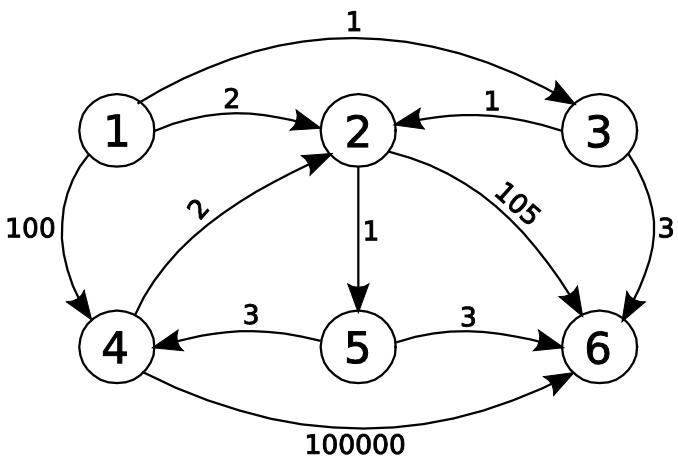
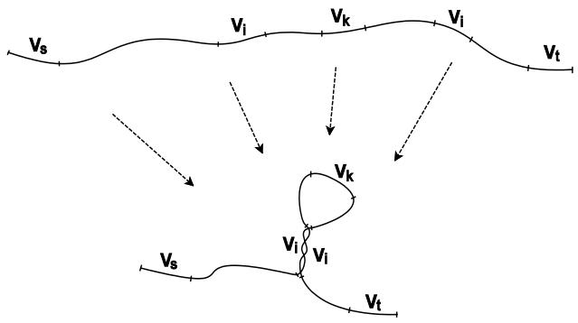
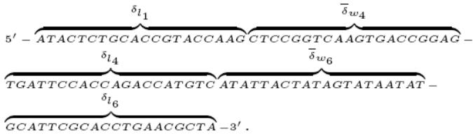

# A Molecular Algorithm for Longest Path Problem

H.Ahrabian1 , M.Ganjtabesh2 and A. Nowzari-Dalini3

1 Center of Excellence in Biomathematics, School of Mathematics, Statistics, and Computer Science, University of Tehran, Tehran, Iran ahrabian@ut.ac.ir

2 Center of Excellence in Biomathematics, School of Mathematics, Statistics, and Computer Science, University of Tehran, Tehran, Iran mgtabesh@ut.ac.ir

3 Center of Excellence in Biomathematics, School of Mathematics, Statistics, and Computer Science, University of Tehran, Tehran, Iran nowzari@ut.ac.ir

Abstract: The field of DNA computing has recently attracted considerable attention. Because of its great capacity to conduct parallel relations, many NP-complete problems are solved by this approach. In this paper we present a molecular algorithm to solve the Longest Path Problem. Till now, no molecular algorithm is presented for this problem in the literatures on the weighted graph $G { = } ( V , E )$ . The proposed molecular algorithm can be performed in $\mathbf { O } ( | V | ^ { 2 } )$ molecular operations. Special effort is spent on designing an scaling method for weight values in order to obtain an appropriate encoding for the problem. The effectiveness of this algorithm is verified by the computational simulation.

Keywords: DNA Computing, Genetic Algorithm, Graph Theory, NP-Completeness.

# I. Introduction

Since the publication of Adleman’s original paper [1], several authors have described how various models of computation may be simulated using bio-molecular methods [14], [15]. The vast parallelism, exceptional energy efficiency, and extra ordinary information density inherent in molecular computation have raised the possibility that molecular computation might some day prove capable of attacking problem that have resisted conventional methods [2]-[4], [7], [12], [15]. With regard to these advantages, a major goal of subsequent research is how to use DNA manipulations to solve NP-Complete problems.

The Traveling Salesman Problem (TSP) is an NP-Complete problem which is finding a simple path of length $\vert { \cal { V } } \vert - 1$ with minimum cost between two specified vertices in the given weighted graph $G \ = \ ( V , \ E )$ . Different DNA computing solutions are given for this problem in the literatures [1], [14], [16]. Manipulating the paths in this problem is rather simple since all the paths should have the same length (each vertex is seen only once in each path). The given molecular algorithm for TSP can be also employed to solve the shortest path problem, even though this problem has polynomial time algorithm with electronic computers [16].

Another interesting problem in graph theory is the Longest Path Problem (LPP). This problem is finding a simple path from a source vertex $\nu _ { s }$ to a target vertex $\nu _ { t }$ with maximum weight in a given weighted graph $G = ( V , E )$ . We need to include the requirement of simplicity for paths; otherwise by repeatedly traversing the cycles, paths with arbitrary large weight can be created. We know that finding the longest simple path between two vertices is NP-Complete (even for un-weighted graphs). The only molecular algorithm for this problem is presented in [12] which is designed for unweighted graphs with the time complexity $\mathrm { O } ( | \boldsymbol { W } | ^ { 3 } )$ . Till now, no other molecular algorithm is given for longest path problem in general form. In this paper, we design a molecular algorithm to solve the longest path problem for a weighted graph in polynomial-time complexity. We present an encoding scheme for representing a graph (vertices and edges) similar to the encoding given by Lee et al. [13]. Based on this encoding, we present a new molecular algorithm for solving the LPP for a given weighted graph $G = ( V , E )$ with $\mathrm { O } ( | V | ^ { 2 } )$ molecular operations, including the DNA sequences construction.

This paper is organized as follows: In Section II, we present the encoding scheme for solving the LPP. Section III describes our molecular algorithm. The generation of optimal DNA sequences is presented in Section IV. Sections $\mathrm { V }$ and VI provide the experimental results and conclusion, respectively.

# II. Encoding scheme

As mentioned, the LPP is an NP-Complete problem and is to find a simple path from the vertex $\nu _ { s }$ (source vertex) to the vertex $\nu _ { t }$ (target vertex) considering the maximum weight in a given weighted graph $G = ( V , E )$ . This is an optimization problem and formally we can write it as:

$$
\operatorname* { m a x } \sum _ { e _ { i j } \in P } w ( e _ { i j } )
$$

where $P$ is a path from $\nu _ { s }$ to $\nu _ { t }$ and $w ( e _ { i j } )$ shows the weight of the edge $e _ { i j }$ which is appeared in the path $P$ . Figure 1 shows an instance of a graph that has six vertices. Let the source vertex be $I$ and the target vertex be $\boldsymbol { \delta }$ . The path with maximum weight is $I  \ 4  \ 6$ and the weight of this path is 100100. Note that there is no need to have $| { \cal V } |$ vertices in the maximum weighted path.

We now explain an encoding scheme for solving LPP by molecular algorithm. We present an encoding scheme which is very similar to the encoding given by Lee et al. in [13]. To implement the fixed length, we use a melting temperature control encoding method. This method uses fixed-length DNA strands and represents weights in the graph by melting temperatures of the given DNA strands. The basic idea is to design the sequences corresponding to the weights in the graph, such that the DNA strands for higher-weighted values have lower melting temperatures than those for lower weighted values [5], [11]. Several empirical methods are proposed to calculate the melting temperature. A classical method is the GC-content method which uses the content of guanine (G) and cystine (C) in the given DNA strand as a main factor for determining the melting temperature of the strand [13]. The nucleotide Adenine (A) is always paired to the nucleotide Thymine (T) with 2 hydrogen bonds, as well as the nucleotides C and G with 3 hydrogen bonds. Because of the number of hydrogen bonds, the base pairing between C and G is stronger than the one between A and T. So in this method the DNA sequences with lower amount of GC content have lower melting temperature.

Based on the above discussion, the encoding scheme for the vertices and edges of a given weighted graph $G = ( V , E )$ are designed as follows. As mentioned, this encoding scheme is very similar to the encoding scheme given by Lee et al. [13] except the encoding of the vertices in the graph is rather different.

  
Figure. 1: A simple graph example.

1. Each weight $w _ { i }$ is encoded with a strand of length $2 d$ ( $^ { \circ } d$ is a constant value proportional to the number of vertices $| W | )$ and is called weight sequence, denoted by $\delta _ { w _ { i } }$ (if $w _ { i } ^ { \phantom { } } = { } w _ { j } ^ { \phantom { } }$ clearly $\delta _ { w _ { i } }$ is the same as $\delta _ { w _ { j } }$ ). Since the length of each weight sequence is constant, therefore the number of $\mathbf { A } / \mathbf { T }$ nucleotides in each sequence (AT-content) shows the value of the weight. The sequences corresponding to the higher-weighted values have more AT-content (and so less GCcontent), therefore the melting temperatures of these strands are lower than the others. As it is clear, this encoding scheme can express the real-valued weights.

2. The index of vertex $\nu _ { i }$ (which is denoted $\mathrm { b y } l _ { i }$ ) is encoded by a strand of length $2 d$ and is called label sequence, denoted by $\delta _ { l _ { i } }$ . It should be considered that the label strands in each vertex are encoded with the equal number of $\mathrm { A } / \mathrm { T }$ and $\mathrm { G } / \mathrm { C }$ nucleotides (i.e. $50 \%$ for AT-content and $50 \%$ for GC-content), such that the half right end (5'-end) of $\delta _ { l _ { i } }$ is the reverse complement of the half left end $3 "$ -end) of $\delta _ { l _ { i } } ( \delta ^ { R } { } _ { l _ { i } }$ $= \mathrm { R e v e r s e } ( \bar { \delta ^ { L } } _ { l _ { i } } ) )$ , where $\delta ^ { R } { } _ { l _ { i } }$ and $\delta ^ { L } { } _ { l _ { i } }$ are half right end and half left end of $\delta _ { l _ { i } }$ respectively). For example, if $\delta ^ { L } { } _ { l _ { i } }$ is equal to GACAGTT then $\delta ^ { R } { } _ { l _ { i } }$ is equal to AACTGTC. The reason for using this structure is to eliminate the cycles in the constructed paths as discussed later in the simulation of our algorithm. The restriction of using equal amount of $\mathrm { A } / \mathrm { T }$ and $\mathrm { G } / \mathrm { C }$ nucleotides is implied for not violating the number of $\mathrm { A } / \mathrm { T }$ nucleotides in weight sequences.

3. Employing the weight sequences and label sequences constructed in steps 1 and 2, for each vertex $\nu _ { i }$ whose in-edge has weight $w _ { k }$ and out-edge has weight $w _ { j }$ , a strand of length $4 d$ is assigned. This sequence is called vertex sequence and is illustrated in below:

<table><tr><td>δvk</td><td>δL</td><td>δR</td><td>δwj</td></tr><tr><td></td><td></td><td></td><td></td></tr></table>

where the strands $\delta _ { l _ { i } } { = } \delta ^ { L } { _ { l _ { i } } } + \delta ^ { R } { _ { l _ { i } } }$ from index $d + \mathbf { \nabla } I$ to $3 d$ are the label sequence of vertex $\nu _ { i }$ and $\delta ^ { R } { } _ { w _ { k } }$ is the half right end of the complementary weight sequence corresponding to $w _ { k } \ ( \delta _ { w _ { k } } )$ and $\delta ^ { L } { } _ { w _ { j } }$ is the half left end of the complementary weight sequence corresponding to $w _ { j } \ : ( \delta _ { w _ { j } } )$ . For the source (target) vertex, $\bar { \delta ^ { R } } _ { w _ { k } } \ ( \bar { \delta ^ { L } } _ { w _ { j } } )$ (δw, ) is omitte. It hould be mentioned that the maximum number of constructed sequences for any vertex $\nu _ { i }$ in the graph is equal to in $- d e g r e e ( \nu _ { i } ) { \times } o u t { - } d e g r e e ( \nu _ { i } ) = \mathrm { O } ( | V | ^ { 2 } )$ which imposes the construction of $\mathrm { O } ( | \boldsymbol { W } | ^ { 3 } )$ sequences for all vertices. By breaking down the vertex sequences into two subsequences, it is possible to construct $\mathrm { O } ( | V | ^ { 2 } )$ sequences $( \mathrm { O } ( | V | )$ for each vertex) and produce all the required $\mathrm { O } ( | \mathrm { V } | ^ { 3 } )$ vertex sequences. Instead of constructing the whole vertex sequence, it is sufficient to construct the subsequences $\bar { \delta ^ { R } } _ { w _ { k } } \ \delta ^ { L } { } _ { l _ { i } }$ and $\delta ^ { R } { } _ { l _ { i } } \ \bar { \delta ^ { L } } { } _ { w _ { j } }$ separately, and then use the complement sequence corresponding to $l _ { i } ( \bar { \delta } _ { l _ { i } } )$ to connect the constructed subsequences and produce the vertex sequence. Since the length of all vertex sequences are $4 d$ instead of $2 d$ for label sequences, we can add the ligase enzyme in to the test tube, melt the sequences and use the GelElectrophoresis to separate the vertex sequences from the complementary label sequences.

4. Any edge $e _ { i j }$ from vertex $\nu _ { i }$ to vertex $\nu _ { j }$ with weight $w _ { k }$ is encoded with a strand of length $4 d$ and is called edge sequence such as illustrated in below:

<table><tr><td>¯lR</td><td>o</td><td>δR</td><td>¯lj</td></tr><tr><td></td><td></td><td></td><td></td></tr></table>

where $\bar { \delta ^ { R } } _ { l _ { i } }$ and $\bar { \delta ^ { L } } _ { l _ { j } }$ are the half right end of $\delta _ { l _ { i } }$ and half left end of $\bar { \delta } _ { l _ { j } }$ which are the complementary label sequences of vertices $\nu _ { i }$ and $\nu _ { j }$ , respectively.

5. Auxiliary sequences $\gamma _ { i }$ with length $\displaystyle { ( i \times 4 d ) + d ~ ( i = 1 , ~ 2 , }$ $\ldots , n { - 2 ) }$ are constructed for employing in the algorithm. The first $d$ nucleotides of each sequence is the half right end of the complementary label sequence of the target vertex (i.e. $\delta ^ { R } { } _ { \nu _ { t } } \mathrm { ~ . ~ }$ ) and the remaining nucleotides are arbitrary constructed with $25 \%$ of AT-content and $75 \%$ of GC-content for previously mentioned reason (not violating the GC-content in the weight sequences). This encoding helps us to distinguish between the strands of the same length but with different melting temperatures. More details are given during the discussion of the algorithm in the next section.

As it is mentioned, this encoding scheme for weight sequences can also express the real value weights. The method of DNA sequence generation for this encoding scheme is given in Section IV.

# III. MOLECULAR ALGORITHM

Prior to performing our molecular algorithm, it is assumed that the required DNA sequences corresponding to the vertices and edges and their complements are generated with the method discussed in the next section. The molecular algorithm for finding the longest path between source vertex $\nu _ { s }$ and target vertex $\nu _ { t }$ in a given graph $G = ( V , E )$ with $n$ vertices is summarized in bellow:

# Algorithm DNA-LPP:

1. Pour all the strands of length $4 d$ corresponding to the vertices and edges (vertex and edge sequences) to the test tube $\mathrm { T } _ { 1 }$ with ligase enzyme. In suitable condition, hybridization and ligation occurs in the tube and double strands corresponding to all the possible paths in the graph are constructed.   
2. Keep only the strands of length less than or equal to $4 d { \times } n { - } 2 d$ that represent the paths of length less than or equal to $n$ .   
3. Keep only those paths which enter all of the vertices of the graph at most once and begin with the sequence $\delta _ { \nu _ { s } }$ and end with $\delta _ { \nu _ { t } } ( \delta _ { \nu _ { s } }$ and $\delta _ { \nu _ { t } }$ are the sequences corresponding to the source and target vertices, respectively).   
4. Remaining strands are separated and poured in different test tube with respect to their length (in other word, with respect to the number of vertices in each path). Therefore $n { - } I$ test tubes $\mathrm { T } _ { 2 }$ , $\mathrm { T } _ { 3 } ,$ …, $\mathrm { T } _ { \mathfrak { n } }$ are required for keeping the strands corresponding to the paths of length $2 , 3 , . . . , n$ .   
5. In each test tube, strands with lowest melting temperature are kept. This means that in each test tube $\mathrm { T _ { i } }$ ${ \mathrm { ~ i ~ } } ( 2 \leqslant i \leqslant n )$ , longest path with exactly $i$ vertices are kept.   
6. Each test tube $\mathrm { T _ { i } }$ $( 2 \leqslant i \leqslant n )$ ) contains strands with different length. By adding ligase enzyme and the auxiliary strands $i$ to each test tube $\mathrm { T _ { n - i , } }$ the strands of length $4 d { \times } n { - } 2 d$ are constructed in each test tube.   
7. Pour all the test tubes $\mathrm { T } _ { 2 }$ , ${ \mathrm { T } } _ { 3 } ,$ …, $\mathrm { { T } _ { n } }$ into the test tube $\mathrm { { T _ { 0 } } }$ .   
8. Select the strands with lowest melting temperature that represent the solution strands. In Step 1, with respect to the construction of the vertex and edge sequences, the corresponding complement sequences are hybridized and ligated and then the double strands corresponding to all the possible paths of the given graph are created.   
To implement Step 2 of the algorithm, the product of Step 1 is run on a Gel- electrophoresis and the strands of length less than or equal to $4 d { \times } n { - } 2 d$ are kept. The selected double stranded DNA sequences encode paths entering at most $n$ vertices.   
To implement Step 3 of the algorithm, the product of Step 2 is amplified by Polymerase Chain Reaction (PCR) using primers $\delta _ { \nu _ { s } }$ and $\bar { \delta } _ { \nu _ { t } }$ . If the concentration of DNA sequences in the test tube is kept low enough to allow hairpin conformation, the PCR is expected to amplify only non-hairpin sequences [16]. The non-hairpin sequences represent the paths which enter all of the vertices of the graph at most once. It should be noted that, because of the structure of label sequences $( { \delta } _ { l _ { i } } = { \delta } ^ { L } _ { l _ { i } } + \mathrm { R e v e r s e } ~ ( { \delta } ^ { L } _ { l _ { i } } ) )$ corresponding to each vertex $\nu _ { i }$ , the existence of two or more similar label sequences in a strand, forms a hairpin

(as it is illustrated in Figure 2). Thus only those sequences encoding paths which have no repeated vertex and begin with vertex $\nu _ { s }$ and end with vertex $\nu _ { t }$ are amplified.

In Step 4, the content of test tube in the Step 3 is run on a Gel-electrophoresis again. The $( 8 d ) _ { b p }$ , $( I 2 d ) _ { \mathrm { b p } } .$ , …, $( 4 d \times$ $n ) _ { \mathrm { b p } }$ bands are all separated and kept in the different test tubes $\mathrm { T } _ { 2 } .$ ${ \dot { \mathbf { \rho } } } _ { 2 } , \ { \mathrm { T } } _ { 3 } , \ . . . , \ { \mathrm { T } } _ { \mathrm { n } }$ . As it is mentioned, each test tube $\mathrm { T _ { i } }$ corresponds to the path of length $i ( 2 \leqslant i \leqslant n )$ .

To implement the Step 5, we use the Denaturation Temperature Gradient PCR (DTG-PCR). The DTG-PCR is a modified PCR method that the denaturation temperature is started at low temperature in the beginning cycles of PCR and gradually is increased in each cycle of amplification [13]. Thus the sequences with lower melting temperature (corresponding to the higher-weighted values) will be amplified more frequently. Later, the sequences with most amount of $\mathrm { A } / \mathrm { T }$ nucleotides are chosen by Temperature Gradient Gel-Electrophoresis (TGGE) in each test tube $\mathrm { T _ { i } }$ $( 2 \leqslant i \leqslant n )$ , which represent the longest path in $\mathrm { T _ { i } }$ . In this case, each test tube $\mathrm { T _ { i } }$ contains the strand corresponding to the longest path with exactly $i$ vertices (2 ${ \leqslant } i \leqslant n $ . It should be noted that all the strands in one test tube have the same length but their length are different from the strands in the other test tubes. The AT-content of the constructed sequences corresponding to a path is proportional to the value of its weight. But the melting temperature of a sequence is also proportional to the length of that sequence. So, to obtain the exact solution for LPP, the strands should have the same size. For this reason in Step 6, the auxiliary strands $i$ and the ligase enzyme are added to each test tube $\mathrm { T _ { n - i } }$ . By providing suitable condition, primer extension is occurred and the strands of length $4 d { \times } n { - } 2 d$ are constructed in all the test tubes.

In Step 7, all the test tubes are merged into the test tube $\mathrm { { T _ { 0 } } }$ and eventually in Step 8, strands with lowest melting temperature can be selected to represent the solution. Note that in Step 8, the $\mathrm { { T _ { 0 } } }$ contains all the strands with the same size corresponding to the longest path of different length. Clearly, the actual longest path is a path with maximum weight which is the strand with most amounts of A/T nucleotides and low melting temperature, and this is recognized in Step 8 by using DTG-PCR and TGGE as discussed in Step 5. With respect to the above operations, the number of molecular operations in our algorithm is given in the following theorem.

  
Figure. 2: Hairpin conformation.

Theorem 1. For a given weighted graph $\mathrm { G } = ( \mathrm { V } , \mathrm { E } )$ , the molecular algorithm DNA-LPP is performed in $\dot { O } \dot { ( | V | ^ { 2 } ) }$ molecular operations.

Proof. As mentioned, all the required DNA sequences for our algorithm can be constructed in $\mathrm { \dot { O } } ( | V | ^ { 2 } )$ molecular operations. Considering the molecular operations employed in the DNA-LPP algorithm, we can see that all the steps 1, 2, 5, and 8 are performed in ${ \mathrm { O } } ( I )$ and the steps 3, 4, 6, and 7 are performed in $\mathrm { O } ( | V | )$ molecular operations. Therefore the algorithm DNA-LPP is performed in $\mathrm { O } ( | V | )$ molecular operations. By summing of the complexity of constructing the DNA sequences to the complexity of the algorithm DNA-LPP, we obtain $\mathrm { O } ( | V | ^ { 2 } )$ in total. □

# IV. GENERATION OF DNA SEQUENCES

Sequence design is strongly needed for successful DNA computing. Recently, many design requirements for DNA sequences are proposed [7], [8], [9], [18]. Design requirements are divided into several aspects. Roughly speaking, the purpose of these requirements is to prevent misshybridization and undesired secondary structure, as well as keeping the uniform chemical characteristics. DNA sequence design can be considered as an optimization problem. Alternatively, DNA sequence corresponding to any encoding scheme can be generated by a genetic algorithm that minimizes the potential of error in DNA sequences for reliable molecular operations and produce reliable sequences. Deaton et al. [7], [8], [9] has explored the use of genetic algorithm for the optimization of the encoding. In this section, we describe an optimization method for generating DNA sequences corresponding to weights and labels of a given graph $G = ( V ,$ $E$ ) using a genetic algorithm. This genetic algorithm uses the conventional genetic operations as single point crossover and single point mutation. The fitness function is defined based on measurements which are given in [18]. We first present the genetic algorithm for producing DNA sequences and then describe the measurements in this section. The genetic algorithm is summarized in bellow:

1. Generate the sequences randomly with length $2 d$ .   
2. Set counter $= I$ .   
3. While (counter $< =$ max_count) do a. Evaluate the fitness of each sequence. b. Apply genetic operators (crossover and mutation) to produce a new population. c. counte $\Longleftarrow$ counter $+ \ I$ .

4. Let the best codes be the fittest encodings.

This genetic algorithm employs a fitness function which is the summation of different functions based on five different measures which are introduced by Shin et al. [18] as follows:

$$
F i t n e s s = f _ { A T - c o n t e n t } + f _ { H - m e a s u r e } + f _ { 3 ^ { \prime } - e n d } + f _ { S i m i l a r i t y } + f _ { C o n t i n u i t y } ,
$$

# where

$f _ { A T - c o n t e n t }$ is a fitness function for counting the amount of $\mathrm { A } / \mathrm { T }$ nucleotides in the sequence. $f _ { H }$ −measure is an important fitness function for preventing the mismatched hybridization.

$f _ { 3 ^ { \prime } - e n d }$ is a fitness function for preventing hybridization at $_ 3 \gamma$ -end of DNA sequences. $f _ { S i m i l a r i t y }$ is a fitness function for preventing undesired hybridization by keeping the sequence as unique as possible. fContinuity is a fitness function for preventing occurrence of same bases continuity in a sequence.

Note that the best fitness value is zero; therefore the genetic algorithm tries to minimize the fitness function. The most important fitness function in this genetic algorithm is $f _ { A T }$ −content. This function is implemented for controlling the melting temperature in label and weight sequences. Therefore we discuss this fitness function more precisely and for the details of the other fitness functions see [18]. AT-content affects the chemical properties of DNA sequences. The AT-content measure is as follows:

$f _ { A T - c o n t e n t } = \sum _ { i } ( A T _ { t \arg e t } ( x _ { i } ) - A T _ { g e n e r a t e d } ( x _ { i } ) ) ^ { 2 }$ where $A T _ { t a r g e t } ( x _ { i } )$ is the desired AT-content for the sequence $x _ { i }$ and $A T _ { g e n e r a t e d } ( x _ { i } )$ is the generated AT-content for the sequence $x _ { i }$ in the current population of genetic algorithm. As it is mentioned, the label sequences are encoded with equal number of $\mathrm { A } / \mathrm { T }$ and $\mathrm { G } / \mathrm { C }$ nucleotides. Therefore, the $A T _ { t a r g e t }$ for those sequences are considered as $50 \%$ (i.e. d nucleotides of type $\mathrm { A } / \mathrm { T }$ where $2 d$ is the length of the generated sequence). The amount of AT-content in weight sequences is also optimized by this measurement. This is done so that the weight sequences with higher value have more AT-content and thus have higher probability of being content in the final solution. For this purpose, $A T _ { t a r g e t }$ function is defined to promote the paths formed with higher costs and low melting temperature, so that the path with maximum cost could be found. A simple method for allocating the AT-content is to count the number of hydrogen bonds in the sequences. For example, the weight value of 20 can be encoded with $2 0$ hydrogen bonds. However this scheme can not encode real values, as well as it requires very long DNA strands to encode the large values. Alternatively, the $A T _ { t a r g e t }$ corresponding to the weight values can be estimated by the relative number of hydrogen bonds in a sequence over the entire sequences. This method is suitable for the uniformly distributed weights. In the other hand, for the weights with non uniform values, this method can not present a suitable encoding. For example, the $A T _ { t a r g e t }$ for the weights $I , ~ 5 ,$ , and $I 0 0 0 0 0$ are $\textstyle O , \ O ,$ and 20, respectively. So from the melting temperature point of view, there is no difference between the weights 1 and 5 and the incorrect solution could be produced. In order to simultaneously handle the very small and very large weight values in the graph, we propose a new AT-content allocation method. Suppose that $\boldsymbol { W } = \left[ \boldsymbol { w } _ { I } , \boldsymbol { w } _ { 2 } , \ldots , \boldsymbol { w } _ { t } \right]$ is a sorted list of distinct weights and $n _ { i } \left( I \leqslant i \leqslant t \right)$ is the number of edges with weight $w _ { i }$ in the given graph. Before computing the AT-contents, some extra weight values are added to the list W to ensure that all the existing weight values can be decomposed with respect to the smaller values. For any weight wk, if $w _ { k } < \sum _ { i = 1 } ^ { k - 1 } n _ { i } w _ { i }$ iki∑ ni w −= 11 then the value w x k − is added to the list $W$ as an extra weight value (where $x$ is the largest combination of weight values such that $0 < x < w _ { k }$ ) and its occurrences is considered as $I$ . The AT-content corresponding to the $k$ -th weight sequence $( A T _ { t a r g e t } ( w _ { k } ) )$ can be computed as follows:

$$
A T _ { \mathrm { \iota \mathrm { a r g e } \ell } } ( \delta _ { \boldsymbol { w _ { k } } } ) = \left\{ \begin{array} { l l } { \boldsymbol { w _ { 1 } } } & { k = 1 , } \\ { \displaystyle \sum _ { i = 1 } ^ { k - 1 } n _ { i } A T _ { \mathrm { \iota \mathrm { a r g e } \ell } } ( \delta _ { \boldsymbol { w _ { i } } } ) + 1 } & { \boldsymbol { w _ { k } } > \sum _ { i = 1 } ^ { k - 1 } n _ { i } \boldsymbol { w _ { i } } , } \\ { \displaystyle \sum _ { i = 1 } ^ { k - 1 } c _ { i } A T _ { \mathrm { \iota \mathrm { a r g e } \ell } } ( \delta _ { \boldsymbol { w _ { i } } } ) } & { o t h e r w i s e , } \end{array} \right.
$$

where $c _ { i }$ comes from the decomposition of $w _ { k }$ with respect to the previous weight values ( $w _ { k } = \sum _ { i = 1 } ^ { k - 1 } c _ { i } w _ { i }$ ∑   i wic , such that $0 \leq c _ { i } \leq n _ { i } ,$ ). The $A T _ { t a r g e t }$ for each sequence is computed with respect to its corresponding weight value and this encoding is started from the smallest value to the largest value. As proved in the following theorem, this new scaling method helps us to correctly recognize the longest path. It should be noted that if there is no big gap between the weight values (i.e. each weight value can be decomposed with respect to the smaller weight values), then the behavior of our new scaling method is similar to the linear scaling method. As an example, our scaling method is not suitable for the weight values such as $I , 2 , 4 , 8 ,$ …, $2 ^ { t }$ , because it does not change the weight values and the scaling weights will increase exponentially. We should consider that, by using the percentage of AT-content, this problem is not avoidable for approximately consecutive weight values. For our sample graph given in Figure 1, the computed $A T _ { t a r g e t }$ corresponding to weight values are shown in Table 1.

Theorem 2. Suppose that $\boldsymbol { W } = \left[ \boldsymbol { w } _ { 1 } , \boldsymbol { w } _ { 2 } , . . . , \boldsymbol { w } _ { t } \right] \boldsymbol { i }$ s a sorted list of weights and $N = [ n _ { 1 } , n _ { 2 } , . . . , n _ { t } ]$ is their corresponding number of occurrences in the given weighted graph $G = \mathcal { N } , E )$ . For any two collections $P$ and $\mathcal { Q }$ of W, $i f$

$$
\sum _ { w _ { i } \in P } w _ { i } > \sum _ { w _ { i } \in Q } w _ { i }
$$

then

$$
{ \sum } _ { w _ { i } \in P } A T _ { t \mathrm { a r g } e r } ( w _ { i } ) > { \sum } _ { w _ { i } \in Q } A T _ { t \mathrm { a r g } e t } ( w _ { i } ) .
$$

Table 1. Computed $\mathbf { A T _ { t a r g e t } }$ for weight sequences.   

<table><tr><td rowspan=1 colspan=1></td><td rowspan=1 colspan=1>n</td><td rowspan=1 colspan=1>AT arget</td></tr><tr><td rowspan=1 colspan=1>1</td><td rowspan=1 colspan=1>3</td><td rowspan=1 colspan=1>1</td></tr><tr><td rowspan=1 colspan=1>2</td><td rowspan=1 colspan=1>2</td><td rowspan=1 colspan=1>2</td></tr><tr><td rowspan=1 colspan=1>3</td><td rowspan=1 colspan=1>3</td><td rowspan=1 colspan=1>3</td></tr><tr><td rowspan=1 colspan=1>100</td><td rowspan=1 colspan=1>1</td><td rowspan=1 colspan=1>17</td></tr><tr><td rowspan=1 colspan=1>105</td><td rowspan=1 colspan=1>1</td><td rowspan=1 colspan=1>22</td></tr><tr><td rowspan=1 colspan=1>100000</td><td rowspan=1 colspan=1>1</td><td rowspan=1 colspan=1>56</td></tr></table>

Proof. Suppose that $W ( P ) = \sum _ { w _ { i } \in P } w _ { i }$ and $W ( Q ) = \sum _ { w _ { i } \in Q } w _ { i }$ . Since the elements of $P$ and $\boldsymbol { Q }$ are selected from the list $W _ { ; }$ , so $\begin{array} { r } { { \boldsymbol { W } } ( { \boldsymbol { P } } ) = \sum _ { i = 1 } ^ { t } p _ { i } \boldsymbol { w } _ { i } \qquad \mathrm { a n d } \qquad W ( { \boldsymbol { Q } } ) = \sum _ { i = 1 } ^ { t } q _ { i } \boldsymbol { w } _ { i } } \end{array}$ where $0 \leq p _ { i } , q _ { i } \leq n _ { i }$ . Now suppose that $j$ be the greatest index in the decomposition of $W ( P )$ and $W ( { Q } )$ such that $p _ { j } \neq q _ { j }$ . There are two possibilities:

1. If $w _ { j } > \sum _ { i = 1 } ^ { j - 1 } c _ { i } w _ { i }$ ∑ − 1j i wic , then it should be the case $p _ { j } > q _ { j }$ (if not, the inequality does not hold), and from $\begin{array} { r l r } & { \mathrm { t h e } } & { \mathrm { F o r m u l a } \qquad 1 , } \\ & { \mathrm { h a v e } } & { A T _ { t \mathrm { a r g } e t } ( w _ { j } ) > \displaystyle \sum _ { i = 1 } ^ { j - 1 } n _ { i } w _ { i } } \\ & { \mathrm { s o } \sum _ { w _ { i } \in P } A T _ { t \mathrm { a r g } e t } ( w _ { i } ) > \sum _ { w _ { i } \in \mathcal { Q } } A T _ { t \mathrm { a r g } e t } ( w _ { i } ) . } \end{array}$ we and

2. If $w _ { j } = \sum _ { i = 1 } ^ { j - 1 } c _ { i } w _ { i }$ , then it is possible to rewrite the decompositions by applying the following rules:

– If $p _ { j } > q _ { j }$ then reduce $p _ { j }$ to obtain the equality $p _ { j } = q _ { j }$ and add the values $( p _ { j } - q _ { j } ) c _ { i }$ to the coefficients $p _ { i }$ $I \leqslant i \leqslant$ $j { - } I )$ . If $p _ { j } < q _ { j }$ then reduce $q _ { j }$ to obtain the equality $p _ { j } = q _ { j }$ and add the values $( p _ { j } - q _ { j } ) c _ { i }$ to the coefficients $q _ { i }$ $I \leqslant i \leqslant$ $j { - } I )$ .

By performing the above steps for the remaining indices, we either prove the the theorem or we obtain ${ \boldsymbol { p } } _ { i } = { \boldsymbol { q } } _ { i }$ $( 2 \leqslant i \leqslant t )$ and $p _ { 1 } = q _ { 1 } + \alpha$ (where $\alpha > 0$ ). In the second case, since all the coefficients become equal (except the last one), we can write:

$$
\begin{array} { r l } { \sum _ { w _ { i } \in P } A T _ { t \mathrm { a r g } e t } ( w _ { i } ) } & { = \displaystyle \sum _ { i = 1 } ^ { t } p _ { i } A T _ { t \mathrm { a r g } e t } ( w _ { i } ) } \\ & { = \displaystyle \sum _ { i = 1 } ^ { t } q _ { i } A T _ { t \mathrm { a r g } e t } ( w _ { i } ) } \\ & { > \displaystyle \sum _ { i = 1 } ^ { t } q _ { i } A T _ { t \mathrm { a r g } e t } ( w _ { i } ) } \\ & { \sum _ { w _ { i } \in Q } A T _ { t \mathrm { a r g } e t } ( w _ { i } ) } \end{array}
$$

Thus, by employing the mentioned fitness, crossover, and mutation functions in the genetic algorithm, it is possible to design ideal sequences for the encoding scheme for LPP.

# V. EXPERIMENTAL RESULT

We developed a tool for simulating our molecular algorithms. This tool is executed for several instances of weighted graphs with different sizes which are generated randomly. For each generated graph of size n, our algorithm found the longest path (if there is any) between two specified vertices. The steps of our algorithm for finding the longest path between the source vertex $I$ and target vertex $\boldsymbol { \delta }$ for the graph shown in Figure 1 are presented in this section. First we have generated the weight and label sequences required for encoding the sample graph given in Figure 1 by the genetic algorithm discussed in previous section. The generated sequences of length $2 0$ are shown in Table 2 and Table 3, respectively. Employing the weight sequences and label sequences shown in these tables, the vertex and edge sequences are constructed and symbolically demonstrated in Table 4 and Table 5, respectively.

By pouring vertex and weight sequences into a test tube and in a suitable condition, the hybridization and ligation are occurred in the test tube. The constructed double-stranded DNA sequences show all the possible paths with any weight in the graph. Among these sequences, the sequences beginning with vertex $I$ and ending with vertex $\boldsymbol { \delta }$ which have the length less than ${ \boldsymbol { 6 } } \times 4 { \boldsymbol { 0 } }$ and have no repeated vertex are separated in a different test tube. By adding the auxiliary sequences to their corresponding test tubes, the length of all sequences become same. Among these sequences corresponding to the paths, the longest path is the sequence with most amounts of $\mathbf { A } / \mathbf { T }$ nucleotides which is as follows:

This sequence encodes the path $I \ \to \ 4 \ \to \ 6$ which is obviously the longest path in our sample graph.

Table 2. Weight sequences.   

<table><tr><td rowspan=1 colspan=1>i</td><td rowspan=1 colspan=1>Wi</td><td rowspan=1 colspan=1>AT-content %</td><td rowspan=1 colspan=1>symbol</td><td rowspan=1 colspan=1>Generated weht sequenc δ</td></tr><tr><td rowspan=1 colspan=1>1</td><td rowspan=1 colspan=1>1</td><td rowspan=1 colspan=1>1.79 %</td><td rowspan=1 colspan=1>δwi</td><td rowspan=1 colspan=1>GCTGCGCGCGCGCGTCGCCG</td></tr><tr><td rowspan=1 colspan=1>2</td><td rowspan=1 colspan=1>2</td><td rowspan=1 colspan=1>3.57 %</td><td rowspan=1 colspan=1>δw2</td><td rowspan=1 colspan=1>CGCCGCGCAGGGCTGGAGGG</td></tr><tr><td rowspan=1 colspan=1>3</td><td rowspan=1 colspan=1>3</td><td rowspan=1 colspan=1>5.36 %</td><td rowspan=1 colspan=1>δw3</td><td rowspan=1 colspan=1>CTGCGGAGTCGCACCGGCCG</td></tr><tr><td rowspan=1 colspan=1>4</td><td rowspan=1 colspan=1>100</td><td rowspan=1 colspan=1>30.37 %</td><td rowspan=1 colspan=1>δw</td><td rowspan=1 colspan=1>GAGGCCAGTTCACTGGCCTC</td></tr><tr><td rowspan=1 colspan=1>5</td><td rowspan=1 colspan=1>105</td><td rowspan=1 colspan=1>39.29 %</td><td rowspan=1 colspan=1>δws</td><td rowspan=1 colspan=1>TGCTACCTCAATGACCGTCG</td></tr><tr><td rowspan=1 colspan=1>6</td><td rowspan=1 colspan=1>100000</td><td rowspan=1 colspan=1>100%</td><td rowspan=1 colspan=1>δw$</td><td rowspan=1 colspan=1>TATAATGATATCATATTATA</td></tr></table>

Table 3. Label sequences.   

<table><tr><td rowspan=1 colspan=1>Vertex label i</td><td rowspan=1 colspan=1>AT-content %</td><td rowspan=1 colspan=1>symbol</td><td rowspan=1 colspan=1>Generated label sequence (5′ δ 3′)</td></tr><tr><td rowspan=1 colspan=1>1</td><td rowspan=1 colspan=1>50 %</td><td rowspan=1 colspan=1>δ</td><td rowspan=1 colspan=1>ATACTCTGCACCGTACCAAG</td></tr><tr><td rowspan=1 colspan=1>2</td><td rowspan=1 colspan=1>50 %</td><td rowspan=1 colspan=1>δt2</td><td rowspan=1 colspan=1>ACTAGTGACGAACTTACGGC</td></tr><tr><td rowspan=1 colspan=1>3</td><td rowspan=1 colspan=1>50 %</td><td rowspan=1 colspan=1>δβ3</td><td rowspan=1 colspan=1>AGGTAGATTCAGCATACGCG</td></tr><tr><td rowspan=1 colspan=1>4</td><td rowspan=1 colspan=1>50 %</td><td rowspan=1 colspan=1>$δl$</td><td rowspan=1 colspan=1>TGATTCCACCAGACCATGTC</td></tr><tr><td rowspan=1 colspan=1>5</td><td rowspan=1 colspan=1>50 %</td><td rowspan=1 colspan=1>$δ}$</td><td rowspan=1 colspan=1>ACGAACCAGCACATCTCAGT</td></tr><tr><td rowspan=1 colspan=1>6</td><td rowspan=1 colspan=1>50 %</td><td rowspan=1 colspan=1>δl6</td><td rowspan=1 colspan=1>GCATTCGCACCTGAACGCTA</td></tr></table>

Table 4. Vertex sequences.   

<table><tr><td rowspan=1 colspan=1>Index</td><td rowspan=1 colspan=1>k → vi → wj</td><td rowspan=1 colspan=1>Symbolic representation</td><td rowspan=1 colspan=1>Index</td><td rowspan=1 colspan=1>k → vi → W j</td><td rowspan=1 colspan=1>Symbolic representation</td></tr><tr><td rowspan=1 colspan=1>1</td><td rowspan=1 colspan=1>1→2</td><td rowspan=1 colspan=1>$δ,¯r}$</td><td rowspan=1 colspan=1>12</td><td rowspan=1 colspan=1>4 → 2→  </td><td rowspan=1 colspan=1>$σm,δ,$</td></tr><tr><td rowspan=1 colspan=1>2</td><td rowspan=1 colspan=1>1→ 3</td><td rowspan=1 colspan=1>$δ,¯δr}$</td><td rowspan=1 colspan=1>13</td><td rowspan=1 colspan=1>4→ 2→ 6</td><td rowspan=1 colspan=1>$¯m,$$</td></tr><tr><td rowspan=1 colspan=1>3</td><td rowspan=1 colspan=1>1→4</td><td rowspan=1 colspan=1>$δ,¯$</td><td rowspan=1 colspan=1>14</td><td rowspan=1 colspan=1>1→ 3→ 2</td><td rowspan=1 colspan=1>$δm,δr}$</td></tr><tr><td rowspan=1 colspan=1>4</td><td rowspan=1 colspan=1>2→ 6</td><td rowspan=1 colspan=1>$v$</td><td rowspan=1 colspan=1>15</td><td rowspan=1 colspan=1>1-→ 3→ 6</td><td rowspan=1 colspan=1>$δm,δ$</td></tr><tr><td rowspan=1 colspan=1>5</td><td rowspan=1 colspan=1>3→ 6</td><td rowspan=1 colspan=1>$δm\$</td><td rowspan=1 colspan=1>16</td><td rowspan=1 colspan=1>1 → 4-→ 2</td><td rowspan=1 colspan=1>δw,δ, δ</td></tr><tr><td rowspan=1 colspan=1>6</td><td rowspan=1 colspan=1>4→ 6</td><td rowspan=1 colspan=1>$δδ$</td><td rowspan=1 colspan=1>17</td><td rowspan=1 colspan=1>1→ 4→ 6</td><td rowspan=1 colspan=1>δwiδ</td></tr><tr><td rowspan=1 colspan=1>7</td><td rowspan=1 colspan=1>5→ 6</td><td rowspan=1 colspan=1>$\$</td><td rowspan=1 colspan=1>18</td><td rowspan=1 colspan=1>5→ 4→e</td><td rowspan=1 colspan=1>δm,δ</td></tr><tr><td rowspan=1 colspan=1>8</td><td rowspan=1 colspan=1>1 → 2 → 5</td><td rowspan=1 colspan=1>$¯m,δ}$</td><td rowspan=1 colspan=1>19</td><td rowspan=1 colspan=1>5→4→6</td><td rowspan=1 colspan=1>δw,δ</td></tr><tr><td rowspan=1 colspan=1>9</td><td rowspan=1 colspan=1>1 → 2 → 6</td><td rowspan=1 colspan=1>$δ, $$</td><td rowspan=1 colspan=1>20</td><td rowspan=1 colspan=1>2 → 5→4</td><td rowspan=1 colspan=1>$δm,δ$</td></tr><tr><td rowspan=1 colspan=1>10</td><td rowspan=1 colspan=1>3→ 2→r</td><td rowspan=1 colspan=1>$¯,δ}</td><td rowspan=1 colspan=1>21</td><td rowspan=1 colspan=1>2→ 5→ 6</td><td rowspan=1 colspan=1>$m,δr}$</td></tr><tr><td rowspan=1 colspan=1>11</td><td rowspan=1 colspan=1>3-→ 2-→ 6</td><td rowspan=1 colspan=1>δm,δs</td><td rowspan=1 colspan=1></td><td rowspan=1 colspan=1></td><td rowspan=1 colspan=1></td></tr></table>

Table 5. Edge sequences.   

<table><tr><td rowspan=1 colspan=1>Index</td><td rowspan=1 colspan=1>vi →v j</td><td rowspan=1 colspan=1>Symbolic representation</td><td rowspan=1 colspan=1>Index</td><td rowspan=1 colspan=1>i → vj</td><td rowspan=1 colspan=1>Symbolic representation</td></tr><tr><td rowspan=1 colspan=1>1</td><td rowspan=1 colspan=1>1→ 2</td><td rowspan=1 colspan=1>$δ,$r}$</td><td rowspan=1 colspan=1>7</td><td rowspan=1 colspan=1>3→6</td><td rowspan=1 colspan=1>$δ,$δ,$</td></tr><tr><td rowspan=1 colspan=1>2</td><td rowspan=1 colspan=1>1→ 3</td><td rowspan=1 colspan=1>¯δ,δk¯,</td><td rowspan=1 colspan=1>8</td><td rowspan=1 colspan=1>4→2</td><td rowspan=1 colspan=1>¯δ,δw,¯δ};</td></tr><tr><td rowspan=1 colspan=1>3</td><td rowspan=1 colspan=1>1→4</td><td rowspan=1 colspan=1>δ,δ,$</td><td rowspan=1 colspan=1>9</td><td rowspan=1 colspan=1>4→ 6</td><td rowspan=1 colspan=1>δ,δ$</td></tr><tr><td rowspan=1 colspan=1>4</td><td rowspan=1 colspan=1>2→5r</td><td rowspan=1 colspan=1>¯Ω,δhs</td><td rowspan=1 colspan=1>10</td><td rowspan=1 colspan=1>5→ 4</td><td rowspan=1 colspan=1>δ,δw$</td></tr><tr><td rowspan=1 colspan=1>5</td><td rowspan=1 colspan=1>2 → 6</td><td rowspan=1 colspan=1>δt2δw¯δ6</td><td rowspan=1 colspan=1>11</td><td rowspan=1 colspan=1>5→ 6</td><td rowspan=1 colspan=1>δt,δw$</td></tr><tr><td rowspan=1 colspan=1>6</td><td rowspan=1 colspan=1>3→ 2</td><td rowspan=1 colspan=1>¯δt,δh}2</td><td rowspan=1 colspan=1></td><td rowspan=1 colspan=1></td><td rowspan=1 colspan=1></td></tr></table>

# VI. CONCLUSION

A molecular algorithm for solving the longest path problem for a weighted graph $G = ( V , E )$ is presented. Our algorithm can be performed in $\mathrm { O } ( | V | ^ { 2 } )$ molecular operations. In the utilized encoding scheme, the relative values of AT-content against GC-content are taken into account to handle the non uniform weights in the graph. For this reason, a new method for scaling the weights in the graph is presented. This new scaling method can be used to solve any similar problem in the weighted graphs. The algorithm is based on constructing all the possible paths in a given graph. Later the cycles are eliminated with respect to the encoding of the vertices. It should be noted that, although we are searching for a longest path, the algorithm can eliminate the cycles and so the correct longest path can be obtained.

# Список литературы

[1] L.M. Adelman, Molecular computation of solutions to combinatorial problems, Science, 266, pp. 1021– 1024, 1994.   
[2] H. Ahrabian, M. Ganjtabesh, and A. Nowzari-Dalini, DNA algorithm for an Unbounded Fan-in Boolean circuit, BioSytems, 82, pp. 52–60, 2005.   
[3] H. Ahrabian, M. Ganjtabesh, and A. Nowzari-Dalini, Molecular solution for double and partial digest problems in polynomial time, Computing and Informatics, 28, pp. 1001–1020, 2009.   
[4] H. Ahrabian, A. Nowzari-Dalini, F. Zare-Mirakabad, A constant time algorithm for DNA add, International Journal of Foundations of Computer Science, 20, pp. 549–558, 2009.   
[5] E.T. Bolton and B.J. McCarthy, A general method for the isolation of RNA complementary to DNA, Proceedings of Natural Academic Science, 48, pp. 1390– 1397, 1962.   
[6] T.H. Cormen, C.E. Leiserson, and R.L. Rivest, Introduction to Algorithms, McGraw-Hill, Clifford, 2001.   
[7] R. Deaton, M. Garzon, J.A. Rose, D.R. Franceschetti, R.C. Murphy, and S.E. Stevens Jr., Reliability and efficiency of a DNA based computation, Physical Review Letters, 80, pp. 417–420, 1998.   
[8] R. Deaton, R.C. Murphy, M. Garzon, D.R. Franceschetti, and S.E. Stevens Jr., Good encodings for DNA-based solutions to combinatorial problems, DIMACS Series in Discrete Mathematics and Theoretical Computer Science, 44, 247–258, 1999.   
[9] R. Deaton and J.A. Rose, “Simulations of statistical mechanical estimates of hybridization error”, In Proceedings of the Sixth International Meeting on DNA Based Computers, pp. 251–259, 2001.   
[10] H. Genand and R. Cheng, Genetic Algorithms and Engineering Design, John Wiley & Sons, New York, 1997.   
[11] M.A. Innis, D.H. Gelfand, J.J. Sninsky, and T.J. White, PCR Protocols-A Guide to Methods and Applications, Academic Press, San Diego, 1989.   
[12] I. Katsanyi, “Solutions of some classical problems in various theoretical DNA computing models”, In Proceeding of the Second Annual Meeting of Molecular Computing Network, pp. 27–49, 2003.   
[13] J.Y. Lee, S.Y. Shin, T.H. Park, and B.T. Zhang, Solving traveling salesman problems with DNA molecules encoding numerical values, BioSystems, 78, pp. 39–47, 2004.   
[14] R.J. Lipton, DNA solution of hard computational problems, Science, 268, pp. 542–545, 1995.   
[15] C.C. Maley, DNA computation: theory, practice and prospects, Evolutionary Computation, 6, pp. 201– 229, 1998.   
[16] A. Narayanan and S.Zorbalas, “DNA algorithms for computing shortest paths”, In Proceedings of the Third Annual Conference of Genetic Programming, pp. 718–723, 1998.   
[17] J. Sakamoto, H. Gouzu, K. Komiya, D. Kiga, S. Yokoyama, T. Yokomori, and M. Hagiya, Molecular computation by DNA hairpin formation, Science ,288 pp. 1223–1226, 2000.   
[18] S.Y. Shin, D.M. Kim, I.H. Lee, and B.T. Zhang, “Evolutionary sequence generation for reliable DNA computing”, In Proceedings of the IEEE Congress on Evolutionary Computation, pp. 79–84, 2002.

# Author Biographies

Hayadeh Ahrabian is a professor of School of Mathematics and Computer Science, University of Tehran. She is the head of Bioinformatics research group in this school. Her research interest includes bioinformatics, combinatorial algorithm, parallel algorithms, DNA computing, and genetic algorithms.

Mohammad Ganjtabesh is an assistant professor of School of Mathematics and Computer Science, University of Tehran. His research interest includes bioinformatics, parallel algorithms, DNA computing, image processing, and neural networks.

Abbas Nowzari-Dalini is an associate professor of School of Mathematics and Computer Science, University of Tehran and is currently the director of Graduate studies in this school. His research interest includes bioinformatics, combinatorial algorithm, parallel algorithms, DNA computing, neural networks, and computer networks.