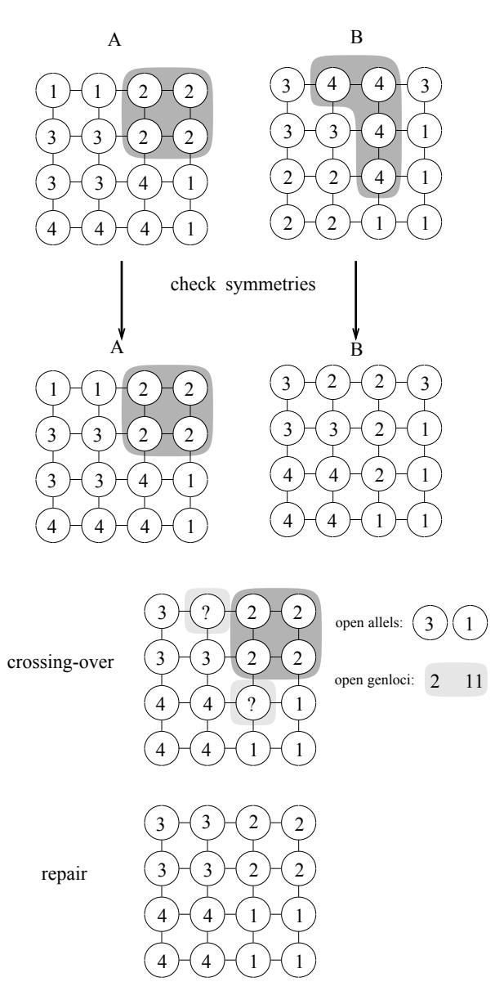
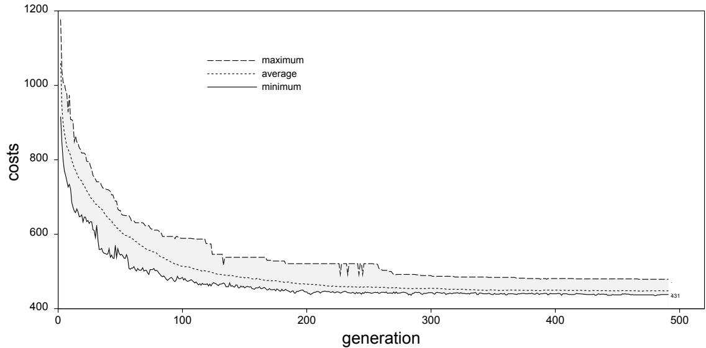

# PARALLEL GENETIC ALGORITHM IN COMBINATORIAL OPTIMIZATION

Heinz Mühlenbein

GMD Schloss Birlinghoven D-5205 Sankt Augustin 1

# ABSTRACT

Parallel genetic algorithms (PGA) use two major modifications compared to the genetic algorithm. Firstly, selection for mating is distributed. Individuals live in a 2-D world. Selection of a mate is done by each individual independently in its neighborhood. Secondly, each individual may improve its fitness during its lifetime by e.g. local hill-climbing. The PGA is totally asynchronous, running with maximal efficiency on MIMD parallel computers. The search strategy of the PGA is based on a small number of intelligent and active individuals, whereas a GA uses a large population of passive individuals. We will show the power of the PGA with two combinatorial problems - the traveling salesman problem and the m graph partitioning problem. In these examples, the PGA has found solutions of very large problems, which are comparable or even better than any other solution found by other heuristics. A comparison between the PGA search strategy and iterated local hill-climbing is made.

# KEYWORDS

Parallel optimization, genetic algorithm, iterated Lin-Kernighan search, traveling salesman, graph partitioning

# INTRODUCTION

Random search methods based on evolutionary principles have been proposed in the 60's. They did not have a major influence on mainstream optimization. We believe that this will change. The unique power of evolutionary algorithms shows up with parallel computers. Firstly, our parallel genetic algorithm PGA introduced in 1987 [23] runs especially efficient on parallel computers. Secondly, our research indicates that parallel searches with information exchange between the searches are often better than independent searches. Thus the PGA is a truly parallel algorithm which combines the hardware speed of parallel processors and the software speed of intelligent parallel searching.

We have successfully applied the PGA to a number of problems, including function optimization [25] and combinatorial optimization [24],[22]. In this paper we summarize the results for two important benchmark problems, the traveling salesman problem (TSP) and the graph partitioning problem GPP. The quadratic assignment problem has been published elsewhere [21].

The most difficult part of a random search method is to explain why and when it will work. This has been done for the TSP and binary functions in [22]. In this paper we will concentrate on the constructive part of the PGA.

Throughout the paper we will use biological terms. We believe, that this is a source of inspiration and helps to understand the PGA intuitively. We will use the following simple metaphor: The parallel search is done by $N$ active individuals, $x _ { i }$ describes the position of individual $i$ and $F ( x _ { i } )$ its current value, representing the height in an unknown landscape. The task is to find the global maximum or at least a good approximation of the maximum. We will investigate search algorithms which mimic evolutionary adaptation found in nature. Each individual is identified with an animal, which searches for food and produces offspring. In evolutionary algorithms, $F ( x _ { i } )$ is called the fitness of individual i, $\boldsymbol { x } _ { i } ^ { t + 1 }$ is an offspring of $\boldsymbol { x } _ { i } ^ { t }$   
offspring.

# EVOLUTIONARY AND GENETIC ALGORITHMS

A survey of search strategies based on evolution has been done in [24]. We recall only the most important ones. A generic evolutionary algorithm can be described as follows

# Evolutionary algorithm

STEP1: Create an initial population of size $M = N * O$

STEP2: Compute the Fitness $F ( x _ { i } ) i = 1 , \dots , M$

STEP3: Select $N$ individuals according to some selection schedule

STEP4: Create $O$ offspring of each of the $N$ individuals by small variation

STEP5: If not finished, return to STEP2

Variants of this algorithm have been invented by many researchers, see for example [29], [31]. An evolutionary algorithm is a random search which uses selection and variation. The linkage of the parallel searches is only implicit by the selection schedule. Searches with bad results so far are abandoned and new searches are started in the neighborhood of more promising searches.

In biological terms, evolutionary algorithms model natural evolution by asexual reproduction with mutation and selection. Search algorithms which model sexual reproduction are called genetic algorithms. They were invented by Holland [11]. Recent surveys can be found in [8] and [30],[1].

# Genetic Algorithm

STEP0: Define a genetic representation of the problem

STEP1: $P ( 0 ) = x _ { 1 } ^ { 0 } , . . x _ { N } ^ { 0 }$

STEP2: Compute the average fitness $\overline { { F } } ~ = ~ \textstyle \sum _ { i } ^ { N } F \big ( { x _ { i } } \big ) / N$ . Assign each individual the normalized fitness value $F ( x _ { i } ^ { t } ) / \overline { { F } }$

STEP3: Assign each $x _ { i }$ a probability $p ( x _ { j } , t )$ proportional to its normalized fitness. Using this distribution, select $N$ vectors from $P ( t )$ . This gives the set $S ( t )$

STEP4: Pair all of the vectors in $S ( t )$ at random forming $N / 2$ pairs. Apply crossover with probability $p _ { { c r o s s } }$ to each pair and other genetic operators such as mutation, forming a new population $P _ { t + 1 }$

STEP5: Set $t = t + 1$ , return to STEP2

In the simplest case the genetic representation is just a bitstring of length n, the chromosome. The positions of the strings are called locus of the chromosome. The variable at a locus is called gene, its value allele. The set of chromosomes is called the genotype which defines a phenotype (the individual) with a certain fitness. The crossover operator links two searches. Part of the chromosome of one individual (search point) is inserted into the second chromosome giving a new individual (search point). We will later show with examples why and when crossover guides the search.

A genetic algorithm is a parallel random search with centralized control. The centralized part is the selection schedule. For the selection the average fitness of the population is needed. The result is a highly synchronized algorithm, which is difficult to implement efficiently on parallel computers.

In our parallel genetic algorithm, we use a distributed selection scheme. This is achieved as follows. Each individual does the selection by itself. It looks for a partner in its neighborhood only. The set of neigborhoods defines a spatial population structure.

Our second major change can now easily be understood. Each individual is active and not acted on. It may improve its fitness during its lifetime by performing a local search.

A generic parallel genetic algorithm can be described as follows

# Parallel genetic algorithm

STEP0: Define a genetic representation of the problem

STEP1: Create an initial population and its population structure

STEP2: Each individual does local hill-climbing

STEP3: Each individual selects a partner for mating in its neighborhood

STEP4: An offspring is created with genetic crossover of the parents

STEP5: The offspring does local hill-climbing. It replaces the parent, if it is better than some criterion (acceptance)

STEP6: If not finished, return to STEP3.

It has to be noted, that each individual may use a different local hill-climbing method. This feature will be important for problems, where the efficiency of a particular hillclimbing method depends on the problem instance.

The PGA can be described as a parallel search with a linkage of two searches. The linkage is done probabilistically, constrained by the neighborhood. The information exchange within the whole population is a diffusion process because the neighborhoods of the individuals overlap.

In a parallel genetic algorithm, all decisions are made by the individuals themselves.   
Therfore the PGA is a totally distributed algorithm without any central control.

There have been several other attempts to implement a parallel genetic algorithm. Most of the algorithms run $k$ identical standard genetic algorithms in parallel, one run per processor. They differ in the linkage of the runs. Tanese [32] introduces two migration parameters: the migration interval, the number of generations between each migration, and the migrationrate, the percentage of individuals selected for migration. The subpopulations are configured as a binary n-cube. A similar approach is done by Pettey et al. [28]. In the implementation of Cohoon et al. [2] it is assumed that each subpopulation is connected to each other. The algorithm from Manderick et al. [19] has been derived from our PGA. In this algorithm the individuals of the population are placed on a planar grid and selection and crossing-over are restricted to small neighborhoods on that grid.

All but Manderick's algorithm use subpopulations that are densely connected. We have shown in [22] why restricted connections like a ring are better for the parallel genetic algorithm. All the above parallel algorithms do not use hill-climbing, which is one of the most important parts of our PGA.

An extension of the PGA, where subpopulations are used instead of single individuals, has been described in [25]. This algorithm outperforms the standard GA by far in the case of function optimization. It outperforms also many mathematical search methods on benchmark problems.

# THE SEARCH STRATEGY OF THE PGA

The search strategy of the PGA is driven by three components - the spatial population structure, the crossover operator and the hill-climbing strategies. The importance of the spatial population structure and of a good hill-climbing strategy has been discussed in [22]. In this paper we concentrate on the problem dependent aspect, the crossover operator.

There have been attempts to "prove" that genetic algorithms make a nearly optimal allocation of trials. This result is called the "Fundamental Theorem of Genetic Algorithms"

[8]. We have shown in [22] that the above claim is only valid for simple optimization problems.

The search strategy of a genetic algorithm can be explained in simple terms. The crossover operator defines a scatter search [6] where new points are drawn out of the area which is defined by the old or "parent" points. The more similar the old points are, the smaller will be the sampling area. Thus crossing-over implements an adaptive step-size control.

But crossing-over is also exploring the search space. Let us assume that the combinatorial problem has the building block feature. We speak of a building block feature if the substrings of the optimal solutions are contained in other good solutions. In this case it seems a good strategy to generate new solutions by patching together substrings of the old solutions. This is exactly what the crossover operator does.

We will compare the genetic search by crossing-over with simpler strategies like multistart hill-climbing and iterated hill-climbing in the next sections. Iterated hill-climbing can be considered as an evolutionary algorithm with a population size of one.

The major difficulty for applying the PGA to combinatorial problems is to define a crossover operator which creates valid solutions i.e. solutions which fulfil the constraints of the problem. We will explain this problem first with the TSP.

# THE TRAVELING SALESMAN PROBLEM

The famous travelling salesman problem (TSP) can be easily stated.

OPT 1 (TSP) Given are n cities. The task of the salesman is to visit all cities once so that the overall tourlength is minimal.

This problem has been investigated in [24] ,[9] and [10] with the PGA. The genetic representation is straightforward. The gene at locus i of the chromosome codes the edge (or link) which leaves city i. With this coding, the genes are not independent from each other. Each edge may appear on the chromosome only once, otherwise the chromosome would code an invalid tour. A simple crossing-over will also give an invalid tour. This is the reason why this simple genetic representation has not been used in genetic algorithms. The researchers tried to find a more tricky representation in order to apply a simple crossover operator.

We take the opposite approach. We use a simple representation, but an intelligent crossover operator. Our crossover operator for the TSP is straightforward. It inserts part of chromosome A into the corresponding location at chromosome B, so that the resulting chromosome is the most similar to A and B. A genetic repair operator then creates a valid tour.

We call our crossover operator MPX, the maximal preservative crossover operator. It preserves subtours contained in the two parents. The pseudocode is given below.

PROC crossover (receiver, donor, offspring)

Choose position $0 ~ < = ~ i ~ < ~ n o d e s$ and length $b _ { l o w } < = k < = b _ { u p }$ randomly.

Extract the string of edges from position $i$ to position $j = ( i +$ $k$ ) MOD nodes from the mate (donor). This is the crossover string.

Copy the crossover string to the offspring.

Add successively further edges until the offspring represents a valid tour.

This is done in the following way:

IF an edge from the receiver parent starting at the last city in the offspring is possible (does not violate a valid tour)   
THEN add this edge from the receiver   
ELSE IF an edge from the donor starting at the last city in the offspring is possible THEN add this edge from the donor ELSE add that city from the receiver which comes next in the string, this adds a new edge, which we will mark as an implicit mutation.

We want to recall, that in the PGA the crossover operator is not applied in the space of all TSP configurations, but in the space of all local minima. Our local search is a fast version of the 2-opt heuristic developed by Lin [17]. It is a 2-opt without checkout. It gives worse solutions than 2-opt, but the solution time scales only linearly with the number of cities.

We have later found that the efficiency of the PGA increases with the quality of the local search. But the major goal of the PGA work on the TSP was to investigate the problem independent aspects i.e. the population structure and the selection schedule. Therefore many generations were needed, which could only be obtained by a fast local search method.

# PERFORMACE EVALUATION FOR THE TSP

A competition with newly developed neural network algorithms is shown in table 1. For the competition, three random TSP problems of order 50,100 and 200 have been generated. HA is a hybrid approach, combining greedy search, simulated annealing and exhaustive search [16]. EN is the elastic net algorithm from Durbin [3], MFA is the mean field approximation from Peterson [28], SA is a simple simulated annealing program [15].

Table 1 shows, that the other algorithms cannot compete with the PGA for large problems. For the tsp-200, the PGA got 10.52 after 100 seconds and 10.493 after 400 seconds on a 16 processor system with a population size of just 16. This shows how difficult it is to compute very good solutions of the TSP. The absolute differences are often misleading.

The above problems are far too small for a comparison. Therefore we turn to a popular benchmark problem, the ATT-532 problem solved to optimality in [26].

Table 1: Best solutions found in a TSP competition [27]   

<table><tr><td>Alg</td><td>tsp-50</td><td>tsp-100</td><td>tsp-200</td></tr><tr><td>PGA</td><td>5.578</td><td>7.430</td><td>10.493</td></tr><tr><td>HA</td><td></td><td>7.480</td><td>10.530</td></tr><tr><td>EN</td><td>5.619</td><td>7.687</td><td>11.136</td></tr><tr><td>NN</td><td>6.610</td><td>8.584</td><td>12.660</td></tr><tr><td>SA</td><td>6.793</td><td>8.682</td><td>12.789</td></tr></table>

Ulder et al. [33] investigated the question of the influence of the local search method on the quality of the solution. In their experimental setup, the genetic algorithm had to converge within a certain time limit. Convergence is achieved when either all tours in the current population have the same length or the length of the best tour did not improve within five successive generations. This condition forced the population sizes of the genetic algorithm to be very small.

Ulder et al. compared the standard 2-opt with the more complicated Lin-Kernighan (L-K) neighborhood [18]. In the latter case they used a pair of improvement operators, the dynamical k-swap and the additional 4-swap as described in [18]. In time $t = 8 6 0 0 s$ multiple runs of 2-opt (116) were $8 . 3 4 \%$ above optimal, multiple runs of L-K (77) were $0 . 3 7 \%$ above optimal, the genetic variants were $2 . 9 9 \%$ (954 local searches) and $0 . 1 7 \%$ (120 local searches) above optimal.

The results indicate that genetic search is more efficient than multiple runs. Furthermore, the efficiency of the genetic search increases with the quality of the local search. More precisely: Given a fixed amount of time on a sequential processor, a small number of individuals with a good local search method outperforms a larger number of individuals with a simpler local search method. This result has been independently confirmed for the PGA in [22].

The PGA with a population size of 64 and truncated 2-opt as local search method got a tour length of $0 . 1 0 \%$ above optimal in ten runs of $t = 1 0 8 0 s$ (1000 generations,15000 local searches) on a 64 processor system, the average final tour length was $0 . 1 9 \%$ above optimal [9]. This is a substantial improvement over the results of Ulder et al. for genetic 2-opt search. It demonstrates the robustness of the parallel genetic algorithm.

A PGA with the Lin-Kernighan local search would be more efficient. We have not yet implemented the PGA with the L-K local search. In order to make the PGA still more efficient we will implement a number of changes to the simple PGA. These will be outlined in the conclusion.

Inspired by genetic algorithms Johnson [12] has developed a very fast and efficient heuristic, an iterated Lin-Kernighan search. In his implementation a new start configuration is obtained by an unbiased 4-opt move of the tour at hand. Then a new L-K search is started. If the search leads to a tour with a smaller tour length, the new tour is accepted.

Johnson reports the following results. In time $t = 2 7 0 0 s$ (500 L-K searches) the optimal tour (length 27686) was output 6 of 20 IterL-K runs, the average final tourlength was

$0 . 0 5 \%$ above optimal. Multiple L-K runs gave much worse results. A single L-K run averages $0 . 9 8 \%$ above optimal in time $t = 1 2 0 s$ . 100 L-K runs gave a tour length of $0 . 2 5 \%$ above optimal. It needed 20000 L-K runs ( $\dot { t } = 5 3 0 h o u r s _ { , }$ to obtain a tour of length 27705.

Why is IterL-K more efficient than independent L-K runs? The success of IterL-K depends on the fact that good local L-K minima are clustered together and not randomly scattered. The probability to find a good tour is higher nearby a good tour than nearby a bad tour.

We have shown in [22] that 2-opt local minima are clustered. Furthermore we could show the following relation: The better the solutions are, the more similar they are. This relation is the reason for the success of Johnson's IterL-K. But the above relation also holds, if the problem has the building block feature, which is necessary for the success of the crossover operator.

We have made a detailed comparison between iterated hill-climbing and the PGA on a simpler problem than the TSP, the optimization of a binary function of 60 binary variables [22]. We have shown that an optimized iterated hill-climbing search needs less evaluations (configurations) to reach the optimum than the simple PGA. But it has to be mentioned that iterated hill-climbing is a sequential search method. The major problem of parallel searches like the PGA is that the same configurations are evaluated, only in parallel. Therefore it is no surprise that an optimized sequential search needs less evaluations.

Furthermore iterated hill-climbing needs a fine tuned mutation rate to get with high probability to the attractor region of a new local minimum. In the TSP case Johnson found that a simple 4-opt move is sufficient. In other combinatorial problems it is more difficult to find a good mutation rate and a good local heuristic like the Lin-Kernighan search for the TSP. We share the opinion of Johnson that the TSP is in practice much less formidable than its reputation would suggest [12].

We will now turn to another combinatorial problem, the graph partitioning problem GPP. Here the Lin-Kernighan heuristic is not as good as in the TSP case. We will show that the genetic search is very efficient for this problem. The major obstacle is to find a suitable cross-over operator.

# THE GRAPH PARTITIONING PROBLEM

The m graph partitioning problem (m-GPP) is a fundamental problem which arises in many applications. The GPP is to divide a given graph into a number of partitions $( \mathrm { m } )$ in order to optimize some criterion e.g. to minimize the number of edges between partitions. More formally:

Let a graph $G = ( V , E , w )$ be given. $V = \{ v _ { 1 } , v _ { 2 } , . . . , v _ { n } \}$ is the set of nodes, $E \subseteq V \times V$ is the set of edges and $w : E \mapsto N$ defines the weights of the edges.

The m-GPP is to divide the graph into $m$ disjunct parts, such that some optimization criteria will be fulfilled. In this paper we will consider the following optimization criteria:

OPT 2 (m-GPP) Let $\mathcal { P } = \{ P _ { 1 } , . . . , P _ { m } \}$ be a partition. Let ${ \mathcal { G } } = \left( g _ { 1 } g _ { 2 } . . . g _ { n } \right)$ denote the partition to which the nodes belong ( $1 \leq g _ { i } \leq m$ ). Then we look for

$$
\operatorname* { m i n } _ { \mathcal { P } } \sum _ { { 1 \leq i < j \leq n } \atop { g _ { i } \neq g _ { j } } } w _ { i j }
$$

such that $\sigma ( P )$ is minimal.

$\sigma ( P )$ is defined as

$$
\sigma ^ { 2 } ( P ) = \frac { 1 } { m } \sum _ { i = 1 } ^ { m } | P _ { i } | ^ { 2 } - ( \frac { 1 } { m } \sum _ { i = 1 } ^ { m } | P _ { i } ) ^ { 2 }
$$

In order to solve the GPP, we have to define the genetic representation and the genetic operators. In the simplest representation, the value (allel) $g _ { i }$ on locus $i$ on the chromosome gives the number of the partition to which node $v _ { i }$ belongs. But this representation is highly degenerate. The number of a partition does not have any meaning for the partitioning problem. An exchange of two partion numbers willstill give the same partition. Alltogether m! chromosomes give the same fitness value.

$$
F ( \mathcal { G } ) = \sum _ { \stackrel { 1 \leq i < j \leq n } { g _ { i } \neq g _ { j } } } w _ { i j }
$$

All m! chromosomes code the same partitioning instance, the same "phenotype". The genetic representation does not capture the structure of the problem. We did not find a better genetic representation, so we decided that the crossover operator has to be "intelligent". Our crossover operator inserts complete partitions from one chromosome into the other, not individual nodes. It computes which partitions are the most similar and exchanges these partitions. Mathematically spoken, the crossover operator works on equivalence classes of chromosomes.

Figure 1 shows an example. The problem is to partition the $4 \times 4$ grid into four partitions.

The crossover operator works as follows. Partition 2 has to be inserted into $\boldsymbol { B }$ . The crossover operator finds, that partition 4 of $\boldsymbol { B }$ is the most similar to partition 2 in $\mathcal { A }$ . It identifies partition 2 of $\mathcal { A }$ with partition 4 of $\boldsymbol { B }$ . Then it exchanges the alleles 2 and 4 in chromosome $\boldsymbol { \it B }$ to avoid the problems arising from symmetrical solutions. In the crossover step it implants partition 2 of chromosome $\mathcal { A }$ into $\boldsymbol { B }$ .

After identifying all genloci and allels which lead to a nonvalid partition a repair operator is used to construct a new valid chromosome. Mutation is done after the crossover and depends on the outcome of the crossover. In the last step a local hill-climbing algorithm is applied to the valid chromosome.

For local hill-climbing we can use any popular sequential heuristic. It should be fast, so that the PGA can produce many generations. In order to solve very large problems, it should be of order $O ( n )$ where $n$ is the problem size. Our hill-climbing algorithm is of order $O ( n ^ { 2 } )$ , but with a small constant. In order to achieve this small constant, a graph reduction is made. The general outline of our hill-climbing algorithm is as follows:

  
Figure 1: The crossover operator

# Local search for the GPP

1. Reduce the size of the graph by combining up to $r$ nodes into one hypernode

2. Apply the 2-opt of Kernighan and Lin [14] to the reduced Graph. For the GPP it is defined as follows:

(a) Select two hypernodes   
(b) Test if an exchange of this hypernodes gives a lower fitness (c) If this is the case, exchange the nodes   
(d) Terminate, if no exchange can be made over the set of nodes

3. Expand the resulting graph

4. Create a valid partition

5. Apply a further local hill-climbing algorithm to the valid partition

Step2 and step5 are of order $O ( n ^ { 2 } )$ . The constant is smaller than doing 2-opt search or the original string.

The above local search is only done for the initial population. After the first generation we use a still faster search. We apply 2-opt only to the nodes which have connections to outside partitions.

# PERFORMACE EVALUATION FOR THE GPP

A detailed study of the graph bipartitioning problem can be found in [13]. In that paper random graphs and random geometric graphs up to 1000 nodes are used to compare different heuristics. We decided to make a performance analysis with real life graphs. Furthermore are we more interested in the general partitioning problem, not in the bipartitioning case. Detailed results can be found in [34].

We will give here the computational results for solving two of the largest GPP benchmarking problems. The problem are called $E V E R 9 1 \delta$ and EVER1005 [4]. EVER918 is a 3-D graph which consists of 918 nodes and 3233 edges. It has to be partitioned into 18 partitions. EVER1005 has 1005 nodes and 3808 edges. It has to be partioned into 20 partitions.

The following figure shows the progress of the solution.

  
Figure 2: Problem EVER918, 64 individuals

Figure 2 is typical for the progress of PGA's. The best progress is made at the beginning, then it decays exponentially if the combinatorial problem is NP. In the above example the best progress is made during the first generations, then it decays exponentially.

Table 2 gives a comparison to other solutions, which have been computed recently. It has to be mentioned, that the heuristic of Gilbert et al. [5] and Moore [20] do not use the constraint of equal partition size. This partitioning problem is simpler, furthermore the solutions should have a less cost. Nevertheless, the PGA found in one case the best solution (EVER918). In the second problem, the PGA found the best solution with minimal $\sigma ( | P | )$ .

Table 2: Comparison of GPP solutions for problems EVER918 and EVER1005   

<table><tr><td>problem</td><td>algorithm</td><td>minimal costs</td><td>σ ( P |)</td><td>run time</td></tr><tr><td rowspan="4">EVER918</td><td>MultOpt</td><td>1020</td><td>0.00</td><td>1010 s</td></tr><tr><td>MultLK</td><td>625</td><td>0.00</td><td>26120 s</td></tr><tr><td>GZ87</td><td>587</td><td>0.99</td><td>78 rounds</td></tr><tr><td>Moore</td><td>453</td><td>0.99</td><td>78 rounds</td></tr><tr><td>EVER1005</td><td>PGA</td><td>431</td><td>0.00</td><td>1750 s, 500 generations</td></tr><tr><td rowspan="4"></td><td>MultOpt</td><td>1023</td><td>0.40</td><td>222 s</td></tr><tr><td>MultLk</td><td>725</td><td>0.40</td><td>26280 s</td></tr><tr><td>GZ87</td><td>696</td><td>1.29</td><td>91 rounds</td></tr><tr><td>Moore</td><td>608</td><td>1.29</td><td>91 rounds</td></tr><tr><td></td><td>PGA</td><td>631</td><td>0.40</td><td>1990 s 463 generations</td></tr></table>

Table 2 also shows that multiple 2-opt runs or multiple Lin-Kernighan runs give approximations which are far away from the optimum. The quality of the approximations seems to depend on the number of partitions. For the bipartitioning problem the quality of L-K solutions is better [13].

This indicates that it will be difficult to construct an efficient iterative Lin-Kernighan search for the m-GPP. First, the quality of an average L-K solution is bad. Second, it is difficult to determine a good mutation rate which jumps out of the attractor region of the local minimum. This has been demonstrated by Laszewski [35]. He showed the following relation : the better the local minimum, the larger its attractor region.

In summary: The m-GPP problem seems to be harder to solve than the TSP. The simple PGA got results which are better than other known heuristics.

# CONCLUSION

The parallel genetic algorithm has been very successful in benchmark combinatorial optimization problems. The algorithm uses a distributed selection schedule, it self-organizes itself. The crossover operators described in this paper are not the only ones possible. Glover has suggested adaptive structured combinations for the TSP and the bipartitioning problem [7]. We have used a voting crossover operator for the quadratic assignment problem, which combines five solutions instead of two [21]. A good problem dependent crossover operator will improve the performance of the PGA.

We have shown that the PGA is much more efficient than multistart local hill-climbing and almost as efficient as iterated hill-climbing. The major problem of the simple PGA described in this paper is that in the last stage of the algorithm the same evaluations are done over and over again. A good PGA implementation should use different local searches. Most of the population can use simple, but fast local searches. But one or more individuals should perform a very good local search like the Lin-Kernighan search for the TSP. Each time a new best-so-far solution has been found, one of the individuals with the sophisticated local search method should be initialized with that solution.

The simple PGA does not have any memory. For a computational optimal PGA it seems to be very promising to implement some kind of memory, maybe controlled by tabu search [7].

Other extensions of the simple PGA are also worthwhile to explore. The size of the population may change. If the individuals in a neighborhood get too similar, then it should shrink. We will implement these extensions in the course of applying the PGA to more and more challenging applications.

The success of the PGA suggest exploring other problem solving metaphors also. Why not use the market of economy as a parallel search method? A comparison of problem solving by a market framework and by biological evolution on the same set of artificial problems would also give further insight into economy and biology.

# Список литературы

[1] R. K. Belew and L. Booker, editors. Procedings of the Fourth International Conference on Genetic Algorithms, San Mateo, 1991. Morgan Kaufmann.   
[2] J.P. Cohoon, S.U. Hedge, W.N. Martin, and D. Richards. Punctuated equilibria: A parallel genetic algorithm. In J.J. Grefenstette, editor, Proceedings of the Second International Conference on Genetic Algorithms, pages 148-154. Lawrence Erlbaum, 1987.   
[3] R. Durbin, R. Szelinski, and A.L. Yuille. An analysis of the elastic net approach to the travelling salesman problem. Neural Comp., 1:348358, 1989.   
[4] G.C. Everstine. A comparison of three resquencing algorithms for the reduction of matrix profile and wavefront. Int. J. Numer. Meth. in Engin., 14:837-853, 1979.   
[5] J.R. Gilbert and E. Zmijewski. A parallel graph partitioning algorithm for messagepassing multiprocessors. In First Int. Conf. on Supercomputing, 1987.   
[6] F. Glover. Heuristics for integer programming using surrogate constraints. Decision Sciences, 8:156166, 1977.   
[7] F. Glover. Tabu search for nonlinear and parametric optimization. Technical report, University of Boulder, 1991.   
[8] D.E. Goldberg. Genetic Algorithms in Search, Optimization and Machine Learning. Addison-Wesley, Reading, 1989.   
[9] M. Gorges-Schleuter. Asparagos: An asynchronous parallel genetic optimization strategy. In H. Schaffer, editor, 3rd Int. Conf. on Genetic Algorithms, pages 422 427. Morgan-Kaufmann, 1989.

[10] M. Gorges-Schleuter. Genetic Algorithms and Population Structures - A Massively Parallel Algorithm. PhD thesis, University of Dortmund, 1991.

[11] J.H. Holland. Adaptation in Natural and Artificial Systems. Univ. of Michigan Press, Ann Arbor, 1975.   
[12] D.S. Johnson. Local optimization and the traveling salesman problem. In M.S. Paterson, editor, Automata, Languages and Programming, Lecture Notes in Computer Science 496, pages 446461. Springer Verlag, 1990.   
[13] D.S. Johnson, C.R. Aragon, L.A. McGeoch, and C. Schevon. Optimization by simulated annealing: An experimental evaluation; part i, graph partitioning. Operations Research, 37:865892, 1989.   
[14] B.W. Kernighan and S.Lin. An efficient heuristic procedure for partitioning graphs. Bell Syst. Techn Journ., 2:291307, 1970.   
[15] S. Kirkpatrick, C.D. Gelatt, and M.P. Vecchi. Optimization by simulated annealing. Science, 220:671680, 1983.   
[16] S. Kirkpatrick and G. Toulouse. Configuration space analysis of travelling salesman problems. J.Physique, 46:1277-1292, 1985.   
[17] S. Lin. Computer solutions of the traveling salesman problem. Bell. Syst. Techn. Journ., 44:22452269, 1965.   
[18] S. Lin and B. W. Kernighan. An efficient heuristic for the traveling salesman problem. Operations Research, 21:298516, 1973.   
[19] B. Manderick and P. Spiessens. Fine-grained parallel genetic algorithm. In H. Schaffer, editor, 3rd Int. Conf. on Genetic Algorithms, pages 428433. Morgan-Kaufmann, 1989.   
[20] D. Moore. A round-robin parallel partitioning algorithm. Technical Report 88-916, Cornell University, 1988.   
[21] H. Mühlenbein. Parallel genetic algorithm, population dynamics and combinatorial optimization. In H. Schaffer, editor, 3rd Int. Conf. on Genetic Algorithms, pages 416421, San Mateo, 1989. Morgan Kaufmann.   
[22] H. Mühlenbein. Evolution in time and space - the parallel genetic algorithm. In G. Rawlins, editor, Foundations of Genetic Algorithms, pages 316-337, San Mateo, 1991. Morgan-Kaufman.   
[23] H. Mühlenbein, M. Gorges-Schleuter, and O. Krämer. New solutions to the mapping problem of parallel systems - the evolution approach. Parallel Computing, 6:269279, 1987.   
[24] H. Mühlenbein, M. Gorges-Schleuter, and O. Krämer. Evolution algorithms in combinatorial optimization. Parallel Computing, 7:65-88, 1988.   
[25] H. Mühlenbein, M. Schomisch, and J. Born. The parallel genetic algorithm as func tion optimizer. Parallel Computing, 17:619-632, 1991.   
[26] W. Padberg and G. Rinaldi. Optimization of a 532-city symmetric traveling saleman problem by branch and cut. Op. Res. Let., 6:1-7, 1987.   
[27] C. Peterson. Parallel Distributed Approaches to Combinatorial Optimization: Benchmark Studies on Traveling Salesman Problem. Neural Computation, 2:261-269, 1990.   
[28] C. Peterson and B. Söderberg. A new method for mapping optimization problems onto neural networks. Int. J. Neural Syst., 1:995-1019, 1989.   
[29] I. Rechenberg. Evolutionsstrategie - Optimierung technischer Systeme nach Prinzipien der biologischen Information. Fromman Verlag, Freiburg, 1973.   
[30] H. Schaffer, editor. Procedings of the Third International Conference on Genetic Algorithms, San Mateo, 1989. Morgan Kaufmann.   
[31] H.-P. Schwefel. Numerical Optimization of Computer Models. Wiley, Chichester, 1981.   
[32] R. Tanese. Distributed genetic algorithm. In H. Schaffer, editor, 3rd Int. Conf. on Genetic Algorithms, pages 434-440. Morgan-Kaufmann, 1989.   
[33] N.L.J. Ulder, E. Pesch, P.J.M. van Laarhoven, H.-J. Bandelt, and E.H.L. Aarts. Improving tsp exchange heuristics by population genetics. In R. Maenner and H.-P. Schwefel, editors, Parallel Problem Solving from Nature, pages 109-116. SpringerVerlag, 1991.   
[34] G. von Laszewski. Ein paralleler genetischer Algorithmus für das Graph Partitionierungsproblem. Master's thesis, Universität Bonn, 1990.   
[35] G. von Laszewski. Intelligent structural operators for the k-way graph partitioning problem. In R. K. Belew and L. Booker, editors, Procedings of the Fourth International Conference on Genetic Algorithms, pages 45-52, San Mateo, 1991. Morgan Kaufmann.