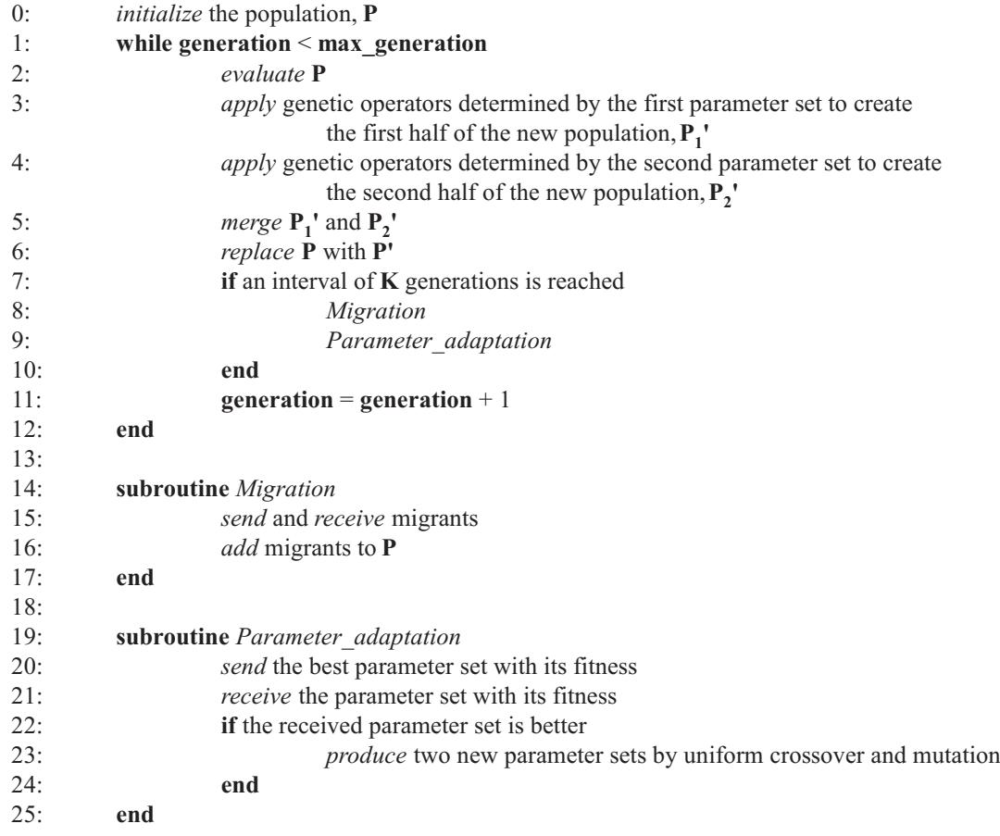
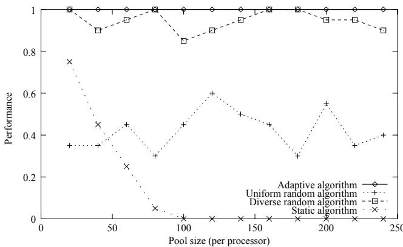
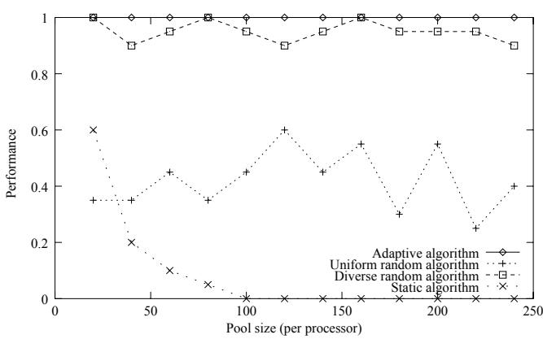
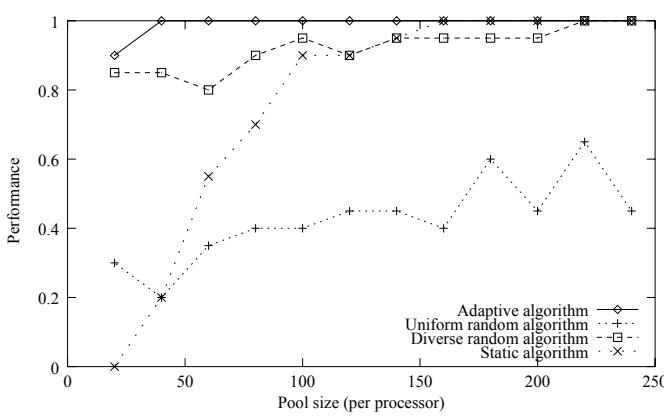
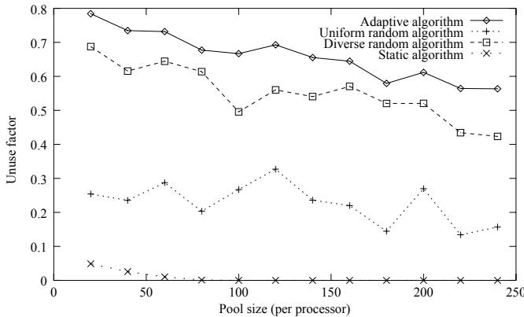
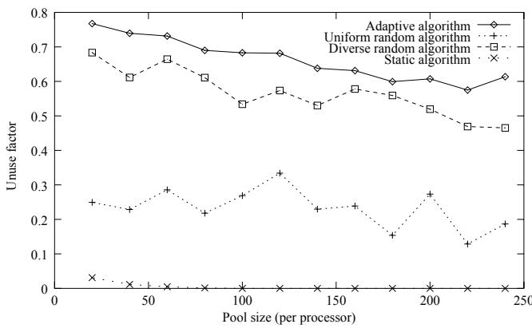
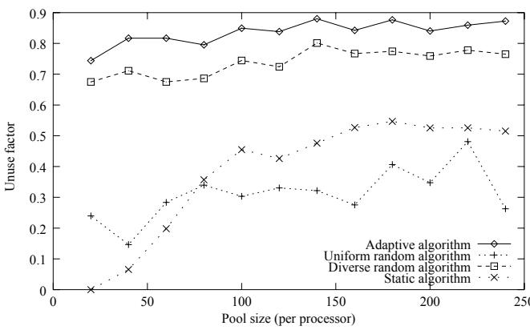

# Parallel Genetic Algorithm with Parameter Adaptation

Shisanu Tongchim and Prabhas Chongstitvatana

Department of Computer Engineering, Chulalongkorn University

Bangkok 10330, Thailand

g41stc@cp.eng.chula.ac.th, prabhas@chula.ac.th

# Abstract

This paper presents an adaptive algorithm that can adjust parameters of genetic algorithm according to the observed performance. The parameter adaptation occurs in parallel to the running of genetic algorithm. The proposed method is compared with the algorithms that use random parameter sets and a standard parameter set. It is shown to be the most promising method from two performance measurements: the reliability in finding the optimal solution and the time required for finding the optimal solution.

# 1 Introduction

Genetic Algorithm (GA) [1][2] is a general search algorithm that can be applied to a wide range of problem domains. The process of GA is controlled by several parameters, e.g. population size, mutation rate. These parameters largely determine the success and efficiency of GA in solving a specific problem. Unfortunately, these parameters interact with each other in a complicated way. Although the theoretical studies of the control parameters have been investigated almost continuously, only the simplified algorithms and problems were considered [3]. Therefore, the theoretical knowledge is still far from being a guideline for selecting a feasible parameter set. Many practitioners find a promising parameter set for a particular problem by trying various combinations of the control parameters. This approach of parameter selection obviously requires a lot of computation which sometimes is larger than the time used for solving a particular problem by GA itself. A prominent example of exhaustively testing several combinations of parameters was shown in the study done by Schaffer et al. [4]. That study carefully examined the performance of

GA using various combinations of the control parameters. The experiments that involved several test functions and parameter combinations took approximately 1.5 CPU years.

In this paper, an adaptive mechanism for dynamically adjusting the parameters of GA is proposed. This mechanism performs parameter adjustments during the run of GA. Two performance measurements are used to compare the proposed method with the algorithms using a standard parameter set and random parameter sets. The first measurement illustrates the reliability of the algorithm using the number of runs yielding the optimal solution, whereas the second measurement shows the resource used by the algorithm to find the solution to the given problem. The results show that the proposed method outperforms the other algorithms for both performance measurements under a set of test problems.

# 2 Background

Over the past decade, many variations of GA have been investigated. Many representations and operators have been proposed in order to tackle with some problems which cannot be solved properly with the standard bit string representation and operators. However, the advent of these various implementations also increases the difficulty of parameter selection. Harik and Lobo [5] pointed out that the user decision for the parameter setting can be divided into two categories. The first category was the operator selection and the coding. The second category was the values of these parameters.

Early systematic research of the GA performance using various combinations of parameters was undertaken by De Jong [6]. The performance of GA was measured on five test functions which were later used as a standard test suite by many researchers. The findings from his empirical study showed that the following parameters yielded a good performance: population size 50-100, onepoint crossover probability of 0.6 and bit mutation probability of 0.001. These parameter values have been widely used by many researchers and accepted as a standard parameter setting.

Grefenstette [7] investigated the use of meta-level GA to select feasible parameter values.

The method was designed as two levels of GA. The higher level GA maintained a population of parameter sets. The lower level GA used the parameter sets from the higher level GA to solve the problems. The observed performance of the lower level GA was assigned as the fitness of the parameter set. The results showed that the obtained parameter set did only slightly better than the parameter set found by De Jong.

Pham [8] proposed a technique for parameter selection by establishing a competition among several subpopulations that use various parameter sets. Several populations independently evolved by using their own parameter sets. These populations were maintained by a single processor. The populations with good parameter sets received additional processing time to evolve further.

Lis [9] introduced a technique to adapt the mutation rate in a model of parallel GA. Several subpopulations evolved separately on different processors by using various mutation rates. After a predetermined interval, these populations were compared. If the best result was acquired from the processor with the highest mutation rate, the mutation rates of other processors were shifted by one level. The mutation rates were also reduced by one level if the best result was obtained from the processor with the lowest mutation rate.

# 3 Proposed Method

The intention of the proposed method is to provide a technique for adjusting the parameter set while the search is ongoing. The proposed method adjusts both the operator selection and the parameter values. The population is divided into a few large subpopulations. These subpopulations evolve concurrently on different processors. After a predefined period of time, some selected individuals are exchanged via a migration process. Each subpopulation uses its own parameter set. Each parameter set is encoded as a vector of integer numbers. The observed performance of each population is used as the fitness of its parameter set.

GA is applied to the evolution of the parameter sets. Pseudo-code of the algorithm is shown in Fig. 1. The subroutine Parameter adaptation is an extension to a general coarse-grained model.

Each parameter set is allowed to mate with another parameter set that has a high fitness value. The fitness of each parameter set is the average fitness of the subpopulation using this parameter set. Each processor decides whether the local parameter set mates with the neighboring parameter set. In particular, each node sends its best parameter set and the fitness value of this parameter set to the other nodes. The topology used in this study is a loosely connected topology, the one-way ring topology, which the communication is limited to occur between the adjacent nodes. If the fitness of the parameter set from the adjacent node is better than the best local parameter set, two new parameter sets are produced by applying a sequence of genetic operators, uniform crossover and mutation, to both parameter sets. Each parameter set is used to produce a half of the new population. For mutation, each field in both parameter sets may be replaced by a random value according to the predetermined probability. Since the length of a parameter chromosome is short, the relatively high mutation rate (0.25) is used.

The proposed method is motivated in part by the method proposed by Pham [8]. Pham maintains several populations using different parameter sets in order to avoid the unsuccessful run from a poor initial parameter set. That method is penalized by the increase in the computational cost since several populations evolve concurrently in a single processor. Our proposed method overcomes this disadvantage by using a parallel model of GA. In particular, a coarse-grained model is used in order to evaluate several parameter sets simultaneously. Another difference is that Pham uses static parameter sets, whereas our method dynamically adjusts parameter sets according to the observed performance. The proposed method can be viewed as meta-level GA. However, this method mainly differs from the work done by Grefenstette [7] that the parameters are adjusted during the run of the algorithm, whereas the method of Grefenstette finds the parameters before the run of the algorithm.

  
Figure 1: Pseudo-code of the algorithm in each node

# 4 Experiment and Discussion

# 4.1 Experimental Design

The experiments are carried out on a dedicated cluster of PC workstations. The number of processing nodes used in the experiments is 8. The program is based on a modified version of LibGA software package [10]. MPICH, a portable implementation of MPI standard, is used for providing communication functions in parallel computing environment.

The following algorithms using the proposed method and other methods are examined and compared.

1. Adaptive algorithm: This is the proposed method.

2. Uniform random algorithm: A parameter set is randomly generated at the beginning of the algorithm. All subpopulations use this parameter set.

3. Diverse random algorithm: At the beginning, each subpopulation randomly creates its own parameter set. This algorithm is comparable to the adaptive algorithm without the parameter adaptation.

4. Static algorithm: This algorithm uses a static parameter set from the study by De Jong [6] The following four parameters are involved in the experiments.

1. Crossover operator : The five crossover types used in this study are listed as follows: (i) one point crossover (ii) uniform crossover with a probability of 0.5 (iii) two point crossover (iv) uniform crossover with a probability of 0.1 (v) uniform crossover with a probability of $0 . 2 ^ { 1 }$

2. Crossover rate: In the experiments, five values for crossover rate are used ranging from 0.2 to 1 in increments of 0.2.

3. Mutation operator : The five mutation types used in the experiments are as follows: (i) invert a bit (ii) random bit value (iii) swap two values (iv) random bit value with a bias toward zero (probability of 0.9) (v) random bit value with a bias toward one (probability of 0.9)

4. Mutation rate: Six mutation rates are allowed varying from 0 to 0.1 in increments of 0.02.

The population size plays an important role in determining the success and the computational cost in finding a solution to a particular problem. Thus, all experiments are conducted over a range of population sizes. In all algorithms, the selection scheme is the roulette wheel selection. All reported results are averaged over 20 runs with different random seeds. The exchanges of migrants and parameter sets are synchronized. The exchange interval is 5 generations. In the migration of individuals, six selected solutions from each subpopulation are exchanged. The received migrants are appended to the new pool. The test problems used in this study are as follows: 300-bit onemax problem, 300-bit contiguous bits problem [13] and 50 copies of minimal deceptive problem (MDP). The maximum number of generations for all experiments is 500.

# 4.2 Experimental Results

We adopt two measurements from the study by Deb and Agrawal [14]: Performance and Unuse Factor. The performance is the ratio of the number of runs yielding the optimal solution to the total number of runs. The unuse factor (u) is calculated as follows:

$$
u = 1 - \frac { g } { g _ { m a x } }
$$

where $g$ is the number of generations required to solve the problem, $g _ { m a x }$ is the maximum number of generations 2

Figure 2 and 4 show the performance on the onemax problem and the contiguous bits respectively. The results on the onemax problem and the contiguous bits problem are nearly identical. The adaptive algorithm can find the optimal solution in all runs over the range of population 2The unuse factor is originally calculated by using the number of function evaluations.

sizes. The diverse random algorithm occasionally finds the optimal solution in all runs. The uniform random algorithm achieves the moderate performance. The static algorithm attains the lowest performance. Figure 3 and 5 illustrate the unuse factor on the onemax problem and the contiguous bits problem respectively. The unuse factor graphs indicate that the proposed method has the highest remaining generation number. This means that the proposed method uses the shortest period in finding the optimal solution. The static algorithm has the lowest convergence rate. When increasing the population size, the unuse factor reduces to zero. This means that the static algorithm is unable to find the optimal solution in the given time.

The performance on the minimal deceptive problem is depicted in figure 6. The adaptive algorithm finds the optimal solution in all runs when the population size increases to 40. The uniform random algorithm cannot find the optimal solution in all runs. The diverse random algorithm requires the population size at least 220 to find the optimal solution in all runs. The performance of the static algorithm increases considerably as the population size increases. Moreover, the static algorithm finds the optimal solution in all runs by using the population size at least 160. The unuse factor on the minimal deceptive problem is illustrated in figure 7. The proposed method uses the shortest duration in finding the optimal solution.

In all problems, the population size notably effects the results for both performance measurements. Although this study does not adapt the population size, this does not mean that finding the appropriate population size is unimportant. Choosing the suitable population size is a common problem encountered by the GA practitioners. Harik and Lobo [5] introduced a method for choosing the population size. Multiple populations with different population sizes were maintained on a single processor. The smaller populations received more function evaluations than the larger ones. When a larger population had an average fitness greater than that of a smaller population, the smaller population was eliminated. The method of Harik and Lobo is based on competitive populations similar to our method. It is interesting to investigate how it can be applied to adapt population size in our case. The use of different population sizes will cause uneven work load

among distributed processing nodes.

# 5 Conclusions

This paper presents a method for automatically adjusting control parameters of GA. The results show its effectiveness in the following points: (i) Our adaptive method is shown to be more reliable in finding the optimal solution than the others. (ii) Our approach uses the lowest number of generations in finding the optimal solution. (iii) In the third problem, our method finds the optimal solution in all runs by using the smallest population size. The smaller population size helps in reducing the computational time.

# Список литературы

[1] J. H. Holland. Adaptation in Natural and Artificial Systems. The University of Michigan Press, Ann Arbor, Michigan, 1975.   
[2] D. E. Goldberg. Genetic Algorithm in search, optimization and machine learning. AddisonWesley, 1989.   
[3] A. E. Eiben, R. Hinterding, and Z. Michalewicz. Parameter control in evolutionary algorithms. ´ IEEE Transactions on Evolutionary Computation, 3(2):124–141, July 1999.   
[4] J. D. Schaffer, R. A. Caruana, L. J. Eshelman, and R. Das. A study of control parameters affecting online performance of genetic algorithms for function optimization. In Proceedings of the Third International Conference on Genetic Algorithms, 1989.   
[5] G. R. Harik and F. G. Lobo. A parameter-less genetic algorithm. In Proceedings of the Genetic and Evolutionary Computation Conference, 1999.   
[6] K. A. De Jong. An analysis of the behavior of a class of genetic adaptive systems. University microfilms no. 76-9381, Doctoral dissertation, University of Michigan, Ann Arbor, 1975.

[7] J. J. Grefenstette. Optimization of control parameters for genetic algorithms. IEEE Transactions on Systems, Man, and Cybernetics, 16(1):122–128, Jan/Feb 1986.

[8] Q. T. Pham. Competitive evolution: a natural approach to operator selection. In Progress in Evolutionary Computation, Lecture Notes in Artificial Intelligence, X. Yao (ed.), SpringerVerlag, Heidelberg, volume 956, 1995.

[9] J. Lis. Parallel genetic algorithm with the dynamic control parameter. In Proceedings of IEEE International Conference on Evolutionary Computation, 1996.

[10] A. L. Corcoran and R. L. Wainwright. Using LibGA to Develop Genetic Algorithms for Solving Combinatorial Optimization Problems, volume 1 of Lance Chambers, Editor, Practical Handbook of Genetic Algorithms, Applications, pages 143–172. CRC Press, 1995.

[11] W. M. Spears and K. A. De Jong. On the virtues of parameterized uniform crossover. In Proceedings of the Fourth International Conference on Genetic Algorithms, 1991.

[12] W.-C. Huang, C.-Y. Kao, and J.-T. Horng. A genetic algorithm approach for set covering problems. In Proceedings of the First IEEE Conference on Evolutionary Computation, 1994.

[13] G. Syswerda. Uniform crossover in genetic algorithms. In Proceedings of the Third International Conference Genetic Algorithms and Their Applications, 1989.

[14] K. Deb and S. Agrawal. Understanding interactions among genetic algorithm parameters. In Foundations of Genetic Algorithms - 5, 1999.

  
Figure 2: Performance on the onemax problem

  
Figure 4: Performance on the contiguous bits problem

  
Figure 6: Performance on the minimal decep

tive problem problem tive problem

  
Figure 3: Unuse factor on the onemax problem

  
Figure 5: Unuse factor on the contiguous bits   
Figure 7: Unuse factor on the minimal decep