# Multinational evolutionary algorithms

Rasmus K. Ursem   
Department of Computer Science   
Bgd. 540, University of Aarhus   
DK-8000 Aarhus C   
Denmark   
ursem@daimi.au.dk

Abstract - Since practical problems often are very complex with a large number of objectives it can be difficult or impossible to create an objective function expressing all the criterias of good solutions. Sometimes a simpler function can be used where local optimas could be both valid and interesting.

Because evolutionary algorithms are population-based they have the best potential for finding more of the best solutions among the possible solutions. However, standard EAs often converge to one solution and leave therefore only this single option for a final human selection. So far at least two methods, sharing and tagging, have been proposed to solve the problem.

This paper presents a new method for finding more quality solutions, not only global optimas but local as well. The method tries to adapt its search strategy to the problem by taking the topology of the fitness landscape into account. The idea is to use the topology to group the individuals into sub-populations each covering a part of the fitness landscape.

# 1 Introduction

This paper describes a method for finding multiple solutions for a given fitness landscape. The paper compares the multi-population approach with sharing, tagging, and the standard EA. The presented method can be applied to almost any problem based on continuous variables. The paper introduces the concept of world, nations, governments and politicians, which are all related to the grouping of the individuals. Furthermore we introduce a fitness-topology function called hill-valley, which is used to find valleys in the fitness landscape. The hill-valley function is also used in the decisions regarding migration and merging of nations. Related work can be found in (Pétrowski 1997).

The method is motivated by the idea that division of a population into smaller sub-populations, each searching a particular part of the search space, should improve the results for a given problem by returning more that just a single solution.

Consider the following example. Assume we want to maximize the following mathematical function:

$$
\begin{array} { r c l } { f ( x , y ) } & { = } & { \sin ( 2 x - 0 . 5 \pi ) + 1 + 2 \cos ( y ) + 0 . 5 x } \\ & & { \hphantom { { \frac { 1 } { 2 } } } - 2 . 8 \leq x \leq 2 . 8 , - 2 \leq y \leq 2 } \end{array}
$$

This simple function has two maximum solutions at approximately (-1.444, 0) and (1.697, 0).

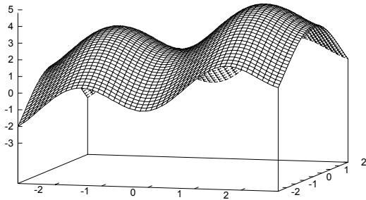  
Figure 1: $f ( x , y ) = \sin ( 2 x - 0 . 5 \pi ) + 1 + 2 \cos ( y ) + 0 . 5 x .$

If we run a standard EA on this kind of problem, then 1) the algorithm could miss one of these maximas, most likely the one with the lowest fitness or 2) we have individuals that are trying to approach different maxima.

When the goal is to find more solutions the first situation is undesirable because a standard EA could end up with individuals that are very alike, and thus only yields one good solution. The second has the problem that a crossover between fit individuals from different peaks could give an offspring that is a lot less fit than the parents. If the population, in the example above, contains two individuals that are near the two different maximas a crossover of them will give a weaker individual.

Sharing, as described in (Michalewicz et al. 1997, part C6.1), tries to deal with the first problem by punishing individuals that crowd together and rewarding the ones far from other individuals. One of the problems is that sharing tries to distribute the individuals over a larger area, and thus "twists" or "distorts" the fitness landscape, i.e., the fitness landscape is not static because it depends on the individuals. Instead of having many individuals very close to the peaks, and thus having a clear indication of the peak, sharing tends to spread the individuals around the peaks.

Tagging, as described in (Michalewicz et al. 1997, part C6.2), tries to deal with both problems. However the peak a species is approaching is not compared to any of the peaks some of the other species are approaching. We could have species that are approaching the same peak.

Both sharing and tagging partly depend on setting some variables. Sharing must have $\sigma _ { s h a r e }$ defined and when using the tagging method the number of species has to be chosen.

The method described here deals with both problems and addresses the disadvantages of sharing and tagging. It solves both problems above because: 1) when the algorithm "realizes" that there are more than one good solution it splits the population; 2) offspring is only produced whitin a sub-population, so individuals that seek different good solutions won't have bad influence on each other.

The main goal is thus to return more quality solutions. The secondary goals are:

To limit non-beneficial crossovers.   
Crossover between individuals approaching different optimas could produce a weaker offspring.   
Clear indication of where the peaks are.   
When the algorithm terminates the individuals in the population should clearly indicate the peaks in the search space, i.e., the individuals should all be on or very close to the peaks.   
Problem independent definitions and rules.   
The introduced definitions and rules should, if possible, be problem independent, because this makes the algorithm more robust.

# 2 New concepts

This section outlines the new concepts and the motivation behind. It contains informal definitions of the concepts.

The term "world" refers to the set of nations. Each of these nations has a population of individuals. Since we don't allow an individual to belong to more than one nation, the union of all the nations populations form a "world-population". The world-population is divided into a number of disjoint subsets where each of these subsets is the population of a particular nation. In figure 2 $s$ denotes the search space, $t$ is the current time (the word "time" is interpretated as time of evolutionary process. This can be either the current number of elapsed generations or number of times we have evaluated the objective function.), $\mathcal { P } ( t )$ denotes the world-population at time $t$ , $\mathcal { N } _ { k } ( t )$ is a nation, and $\mathcal { P } _ { k } ( t )$ denotes the population of $\mathcal { N } _ { k } ( t )$ . Beside the population a nation contain a number of various other subparts. The subparts can be known EA concepts, such as cultural rules, common knowledge (library), mating rules etc. or some of the concepts introduced here. The nations used in the algorithm consist of a population, a government, a policy, and a set of rules the evolution has to obey. These rules are explained in details in section 3.

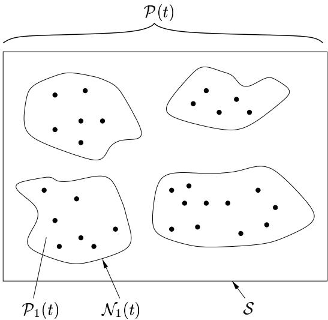  
Figure 2: Example of the world with 4 nations. The government is a subset of the individuals in the population of the nation. These individuals are, in some sense, the leading individuals. We will refer to them as politicians.

From the government we define the policy. The policy should refect some agreement, average or "mean" of the politicians. Looking at the population of the nation this policy value can be interpretated as some sort of mean individual or representative of the population. We need the government and the policy for several reasons. First of all we will use the government to define the policy. The policy is used when individuals migrate from one nation to another. We also need the policy to be able to distinguish nations from each other, otherwise the algorithm can't merge nations when the optima they are approaching is the same. This is done by evaluating the hill-valley function and thereby determining whether there is a valley between two points in the search space or not. This is explained in details in section 3.1.

# 3 Basic notation and terminology

This section contains the notation used with the concepts. Figure 3 illustrates the concepts.

• $\mathcal { R }$ denotes the set of rules the evolution has to obey. Notice that $\mathcal { R }$ is not time-dependent, i.e., $\mathcal { R }$ contains all rules at all times. $\mathcal { R } ( t )$ denotes the set of active rules at time $t$ $\mathcal { R } ( t ) \subseteq$ $\mathcal { R }$ . $\mathcal { W } ( t )$ denotes the world at time $t$ ,i.e., the set of all nations at time $t$ . $w ( t )$ is the "size" (the number of nations) of the world at time $t$ . $\mathcal { N } _ { k } ( t )$ is nation $k$ in $\mathcal { W } ( t )$ and $\mathcal { N } _ { k } ( t ) = ( \mathcal { P } _ { k } ( t ) , \mathcal { G } _ { k } ( t ) , p l _ { k } ( t ) , \mathcal { R } _ { k } ( t ) )$ , where

′ $\mathcal { P } _ { k } ( t )$ is the population of $\mathcal { N } _ { k } ( t )$ and $\mathcal { P } _ { k } ( t ) \subseteq$ $\mathcal { P } ( t )$ . $i _ { j } \ \in \ \mathcal { P } _ { k } ( t )$ indicates that individual $i _ { j }$   
belongs to nation $\mathcal { N } _ { k } ( t )$ . Since each individ  
ual belongs to precisely one nation we have   
$\forall t \forall i \exists ! k$ b $i \in \mathcal { P } _ { k } ( t )$ and $\begin{array} { r } { \mathcal { P } ( t ) = \bigcup _ { k = 1 } ^ { w ( t ) } \mathcal { P } _ { k } ( t ) } \end{array}$   
Furthermore $\boldsymbol { p } ( \boldsymbol { k } , t )$ is the number of individu  
als in $\mathcal { P } _ { k } ( t )$ . $\mathcal { G } _ { k } ( t )$ is the government of $\mathcal { N } _ { k } ( t )$ and $\mathcal { G } _ { k } \left( t \right) \subseteq$ $\mathcal { P } _ { k } ( t )$ . $g ( k , t )$ is the number of politicians in $\mathcal { G } _ { k } ( t )$ . $p l _ { k } ( t )$ is the policy of the government with $p l _ { k } ( t ) \in \mathcal { S }$ . $\mathcal { R } _ { k } ( t )$ is the set of active rules for $\mathcal { N } _ { k } ( t )$ and $\mathcal { R } _ { k } ( t ) \subseteq \mathcal { R } ( t )$ .

• $\mathcal { N A T } ( i )$ is the nation of individual $i$ .

• $\mathcal { P O L } ( i )$ is the policy of $\mathcal { N A T } ( i )$ .

• $p ( t )$ is the size of the world population at time $t$ .

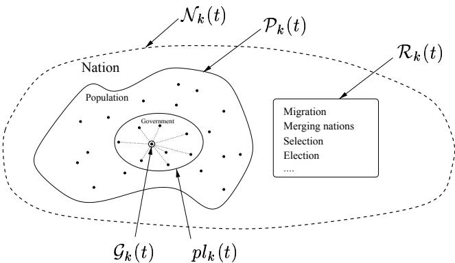  
Figure 3: Notation of the nation.

In the algorithm used in the experiments the set $\mathcal { R }$ consist of the following rules:

# 1. Migration

This rule is responsible for moving individuals between the nations and creating new nations in "uninhibited" areas of $s$ .

2. Merge

This rule merges nations when the algorithm discovers that two nations are approaching the same optima.

The details of migration and merge are explained in section 3.1.

3. Selection Early experiments showed that the selection method had some influence on the number of peaks found. For that reason the following two variants of tournament selection where tested:

Weighted selection   
The fitness of the two selected individuals is divided by the number of individuals in their respective nations. This lowers the probability for a nation to die out because of small population size.   
National selection

Selection is done within each nation, i.e., after selection the size of a nation is the same as before the selection. This implies that the only way the size of a nation change is by migration. Balancing the nation sizes can be done when the nations are created.

These two selection methods somewhat resemble the ideas of sharing and tagging.

4. Election

This rule describes how the government of a nation is elected and how to calculate its policy. In the algorithm the $g$ most fit individuals are elected and the policy is calculated from the standard mean function as follows:

Let $\mathcal { G } _ { k } ( t ) = \{ i _ { 1 } , i _ { 2 } , . . . , i _ { g ( k , t ) } \}$ be the government of $\mathcal { N } _ { k } ( t )$ , where $i _ { j }$ is a politician. Then

$$
\begin{array} { c c c } { { p l _ { k } ( t ) } } & { { = } } & { { { \displaystyle \frac { 1 } { g ( k , t ) } } \sum _ { j = 1 } ^ { g ( k , t ) } i _ { j } } } \end{array}
$$

Notice that $g ( k , t )$ is used instead of the constant $g$ . If the population size of a nation is less than $g$ individuals then the government size is equal to the size of the population. In all the experiments $g = 8$ .

5. Mating This rule say that only individuals belonging to the same nation may produce offspring.

6. Initialization of the start nations This rule says that at time $t ~ = ~ 0$ all individuals belong to the same initial nation.

# 3.1 Migration and merge

A fitness-topology function called hill-valley function is used to determine the relationship of two points in search-space and is used in the decision process of migration and merge (rule 1 and 2 from above). It is defined by the following algorithm.

hill-valley $( i _ { p } , i _ { q }$ , samples)

1. $m i n _ { f i t } = m i n ( f i t n e s s ( i _ { p } ) , f i t n e s s ( i _ { q } ) )$   
2. for $\mathbf { j } { = } 1$ to samples.length   
3. Calculate point $i _ { i n t e r i o r }$ on the line between   
the points $i _ { p }$ and $i _ { q }$ . (See below.)   
4. if $( m i n _ { f i t } > f i t n e s s ( i _ { i n t e r i o r } ) )$   
5. return $( m i n _ { f i t } - f i t n e s s ( i _ { i n t e r i o r } ) )$   
6. end for   
7. return 0

The function returns O if the fitness of all the interior points are greater than the minimal fitness of $i _ { p }$ and $i _ { q }$ , otherwise it returns the difference between the first found interior point and the minimal fitness of $i _ { p }$ and $i _ { q }$ . With this function the algorithm is able to determine whether there is a "valley" in the fitness landscape between $i _ { p }$ and $i _ { q }$ . See figure 4 for an example of the 1-dimensional hill-valley function.

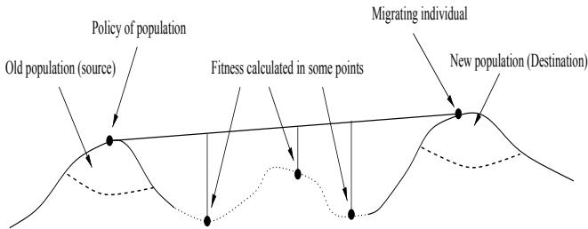  
Figure 4: Migration with the hill-valley function.

The samples array is used to calculate the interior points where the hill-valley function should take its samples of the fitness. The point $i _ { i n t e r i o r }$ in the function is calculated by

$$
\begin{array} { r l r } & { } & { i _ { i n t e r i o r } = ( i _ { p x } + ( i _ { q x } - i _ { p x } ) \cdot s a m p l e s [ j ] , } \\ & { } & { i _ { p y } + ( i _ { q y } - i _ { p y } ) \cdot s a m p l e s [ j ] ) } \end{array}
$$

where $j$ is the $j$ 'th entry in the array. (Since the experiments were done with 2 dimensional problems, the interior point is of course only 2 dimensional. The calculation can easily be generalized to any dimension.) If $i _ { p } { = } ( 0 , 1 )$ , $i _ { q } = ( 1 , 2 )$ and samples $=$ [0.25, 0.5, 0.75], then hill-valley $\prime ( i _ { p } , i _ { q }$ , samples) will evaluate the fitness in the points: (0.25, 1.25), (0.5, 1.5) and (0.75, 1.75).

The algorithm checks if individual $i$ should migrate by calling the hill-valley function with $i$ 's position in the search-space as $i _ { p }$ , $\mathcal { P O L } ( i )$ 's position as $i _ { q }$ and samples $= [ 0 . 2 5 , 0 . 5 , 0 . 7 5$ ] If hill-valley returns a value greater than 0, the algorithm looks through its current nations for a nation to migrate to. This is done by calculating hill-valley $( i , p l _ { l } ( t )$ , samples) for each of the nations. If none are found $i$ starts a new nation.

When all the migration is done the algorithm uses hill-valley to search for nations that are approaching the same peak. Here $i _ { p }$ and $i _ { q }$ are the positions of the policies of the two nations. samples $= [ 0 . 0 2$ , 0.25, 0.5, 0,75, 0.98]. The two extra sample points are calculated because merging two nations is a more drastic operation than migration of an individual from one nation to another.

# 4 Experiments

All experiments are done with functions of two variables (to visualize the results better).

The total population size $p ( t )$ is fixed for each experiment, i.e., the total population size is fixed but dynamic for the nations. For function 1 and $2 p ( t ) = 7 5 0$ , for function 3 $p ( t ) = 9 0 0$ , and for function 4 $p ( t ) = 1 5 0 0$ . The number of nations $w ( t )$ is dynamic. The chromosomes are 40-bit strings with 20 bits for $x$ and 20 for $y$ , the probability for crossover $p _ { c }$ is 0.9 and the probability for mutation $p _ { m }$ is 0.025. $\mathcal { R } ( t )$ consist of the rules explained earlier with $\mathcal { R } ( 0 )$ being only rule 6 and $\mathcal { R } ( t ) , t > 0$ are rules 1-5. All nations obey the same rules.

Additional details and ideas for improvement can be found in (Ursem 1999). The experiments compares two version, weighted and national selection, of the multinational EA with standard, sharing and tagging EAs. The peaks of the functions are known, so we are able to compare achieved results with optimal results. All problems are maximization problems. Each function is, for each method, tested on 100 runs.

# Measuring results

Since the primary goal is to find more peaks the following function is used as an indication of how good the population is. Peak is the set of points in $s$ where the fitness has a global or local optima.

$$
\begin{array} { r c l } { S c o r e ( \mathcal { P } ( t ) ) } & { = } & { \displaystyle \sum _ { j = 1 } ^ { p ( t ) } \sum _ { l = 1 } ^ { \| P e a k \| } f ( d ( i _ { j } , P e a k _ { l } ) ) , \quad \mathrm { w h e r e } } \\ { f ( d ) } & { = } & { \left\{ \begin{array} { l l } { \displaystyle 1 / ( 1 + | \frac { 0 . 1 0 \cdot p ( t ) } { \| P e a k \| } - P C _ { l } | ) \quad } & { \mathrm { i f ~ } d < 0 . 2 } \\ { 0 \quad } & { \mathrm { o t h e r w i s e } } \end{array} \right. } \end{array}
$$

and $d$ is the Euclidean distance function. $P C _ { l }$ acts as an "crowd counter" for peak $l$ . It counts how many of the individuals are closer than 0.2 to peak $l$ It starts at 0 and increases by 1 for peak $l$ every time an individual is less than 0.2 from peak $l$ . This function has its maxima when the individuals are uniformly crowded near all the peaks. The $0 . 1 0 \cdot p ( t ) / \| P e a k \|$ expresses that we want at least $1 0 \%$ of the whole population near the peaks. The total score is thus a lot bigger when we cross the $1 0 \%$ barrier for the peak, and flattens when many are near it. Since the values are added for a peak the population with equally many individuals at each of the peaks will have the largest score. For the single peak problem the graph with 100 individuals is shown in figure 5.

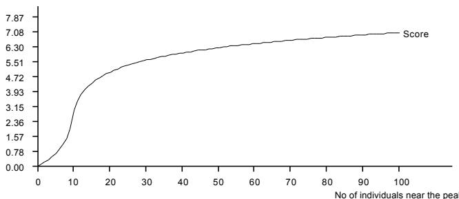  
Figure 5: The score function for the single peak problem.

The reason for having this ${ } ^ { 6 6 } { \mathrm { S } } ^ { 9 }$ -shaped curve as a measure instead of a more linear function is because one of the goals is to give a clear indication of the position of the peak. See figure 6 for an example. The tables for the results contain the following columns.

All peaks found %: This column contains the percentage of runs where all the peaks are found. Avg. peaks found: The average number of peaks found. This is calculated at the end of a run. Avg. score: The average score when the number of generations are completed. This is also pictured in the graph.

Avg. score % of opt.: The average score times 100, divided by the optimal score.

The row "Multi(W)" contain results from the version with weighted selection and "Multi(N)" contain results from the national selection version.

# Notes:

A peak is only "found" when at least $1 0 \% / \| P e a k s \|$ of the population is near the peak. A value of $0 \%$ for "All peaks found $\% ^ { \prime \prime }$ does not mean that the method failed completely. It only indicates that the method did not find all the peaks in any run. 5 found peaks of 6 doesn't count as a successful run.

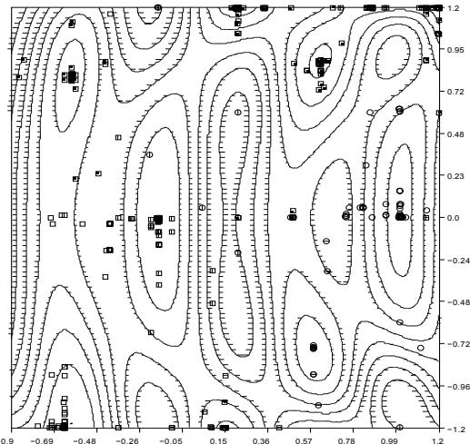  
Figure 6: Clear indication of the peaks. $( p ( t ) = 1 5 0 0 )$

Each function is presented with a short description, a table, a 3D plot, a level-curve plot, and a score graph. Since a low $\sigma _ { s h a r e }$ seemed to give the highest scores with the score function used here, $\sigma _ { s h a r e }$ was set to 0.1 in all experiments.

When looking at a curve in the level-curve plot notice the small horizontal lines on one side of the curve. The side where these small lines are is where the function has lower values, so it is easy to distinguish hills from valleys. The peaks are indicated with small circles on the levelcurve plot. The score graph is a (No of function calls, average score) plot. The upper line with the "Optimal" label is the optimal score.

# 4.1 Function 1: 5 hills - 4 valleys

$$
\begin{array} { r c l } { { f ( x , y ) } } & { { = } } & { { s i n ( 2 . 2 \pi x + 0 . 5 \pi ) \cdot { \frac { 2 - a b s ( y ) } { 2 } } \cdot { \frac { 3 - a b s ( x ) } { 2 } } + } } \\ { { } } & { { } } & { { { } } } \\ { { } } & { { } } & { { s i n ( 0 . 5 \pi y ^ { 2 } + 0 . 5 \pi ) \cdot { \frac { 2 - a b s ( y ) } { 2 } } \cdot { \frac { 2 - a b s ( x ) } { 2 } } } } \end{array}
$$

$$
{ \texttt { e } } - 2 \leq x \leq 2 { \mathrm { ~ a n d ~ } } - 2 \leq y \leq 2
$$

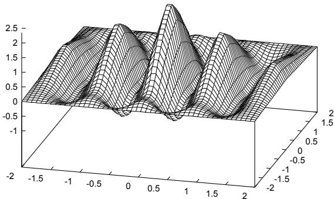  
Figure 7: 3D plot of test function 1.

The hard part in this function is that the peaks are close and on a line with valleys between. The function give a lot of migration because almost any mutation on the $x$ -coordinate will cause the individual to migrate.

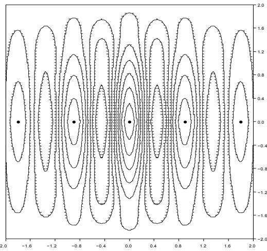  
Figure 8: Levelcurve plot of function 1.

<table><tr><td>Results:</td><td>All peaks found % Avg. peaks found Avg. score</td><td>Avg. score % of opt</td></tr><tr><td>Standard 0.0%</td><td>1.8 13.75</td><td>35.20%</td></tr><tr><td>Multi(W) 84.0%</td><td>4.83 34.73</td><td>88.93%</td></tr><tr><td>Multi(N) 94.0%</td><td>4.94 36.94 3.32 18.68</td><td>94.58%</td></tr><tr><td>Sharing 2.0% 0.0%</td><td>1.77 14.14</td><td>47.84% 36.21%</td></tr><tr><td>Tagging</td><td></td><td></td></tr></table>

From the table we see that the two versions of multination EA both are above $8 0 \%$ . Furthermore we see that sharing finds approximately 3 peaks, which most likely are the three center peaks.

The function is pictured in figure 7 and 8.

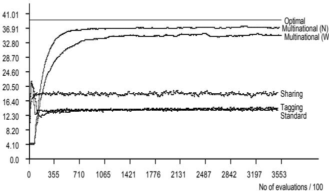  
Figure 9: Scoregraph for function 1.

Notice that the standard, sharing and tagging EA's converge to a stable population faster than multinational EA's. This is because there is a lot of migration in the beginning of a multinational run, which requires some extra evaluations of the objective function. If the x-axis measured the generations instead of function evaluations the convergence rate would be more equal.

# 4.2 Function 2: 1 center peak and 4 neighbours

$$
\begin{array} { l l l } { f ( x , y ) } & { = } & { { 3 s i n } ( ( 0 . 5 x \pi + 0 . 5 \pi ) \cdot \displaystyle \frac { 2 - \sqrt { x ^ { 2 } + y ^ { 2 } } } { 4 } } \end{array}
$$

where − 2 ≤ x ≤ 2 and − 2 ≤ y ≤ 2

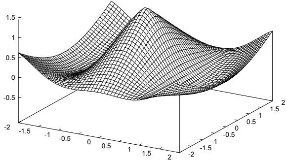  
Figure 10: 3D plot of test function 2.

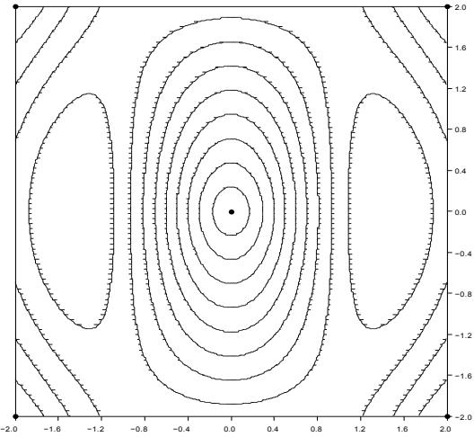  
Figure 11: Levelcurve plot of function 2.

This function stresses the algorithm by having a number of peaks with lower height where "unfortunate" mutation can cause the individuals to migrate from the 4 corner peaks to the center peak.

# Results:

<table><tr><td></td><td>All peaks found %</td><td>Avg. peaks found Avg. score</td><td>Avg. score % of op</td></tr><tr><td>Standard</td><td>0.0% 1.0</td><td>9.27</td><td>23.74%</td></tr><tr><td>Multi(W)</td><td>100.0% 5.0</td><td>36.16</td><td>92.59%</td></tr><tr><td>Multi(N)</td><td>99.0% 4.99</td><td>36.49 6.93</td><td>93.42%</td></tr><tr><td>Sharing</td><td>0.0% 1.0 0.0% 1.0</td><td>9.15</td><td>17.74%</td></tr><tr><td>Tagging</td><td></td><td></td><td>23.44%</td></tr></table>

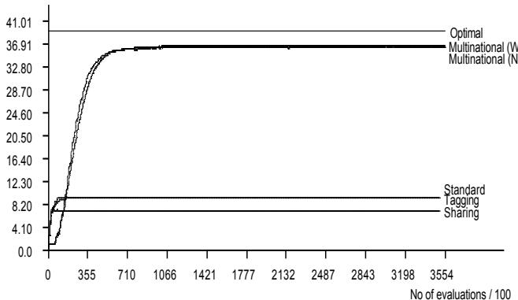  
Figure 12: Scoregraph for function 2.

# 4.3 Function 3: The six hump camel back

$$
\begin{array} { r c l } { { f ( x , y ) } } & { { = } } & { { \displaystyle - ( ( 4 - 2 . 1 x ^ { 2 } + \frac { x ^ { 4 } } { 3 } ) x ^ { 2 } + x y + ( - 4 + 4 y ^ { 2 } ) y ^ { 2 } ) } } \end{array}
$$

where - 1.9 ≤ x ≤ 1.9 and - 1.1 ≤ y ≤ 1.1

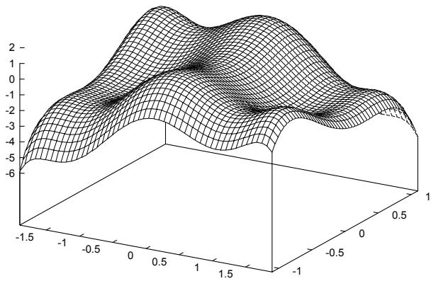  
Figure 13: 3D plot of test function 3.

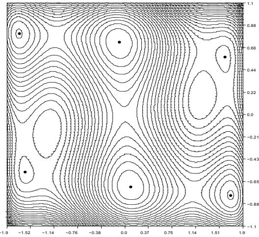  
Figure 14: Levelcurve plot of function 3.

This function has six peaks. Two of these peaks are not very high compared to their surroundings. This makes it hard for the hill-valley function to spot a valley between one of these peaks and other points. Furthermore it is again easy to have a mutation that causes the individual to migrate from these low peaks.

<table><tr><td>Results:</td><td>All peaks found %</td><td>Avg. peaks found Avg. score</td><td>Avg. score % of opt.</td></tr><tr><td>Standard</td><td>0.0% 1.0</td><td>9.59</td><td>20.47%</td></tr><tr><td>Multi(W)</td><td>64.0% 5.60 0.0%</td><td>38.75 30.19</td><td>82.69%</td></tr><tr><td>Multi(N)</td><td>3.91 1.0% 3.65</td><td>20.19</td><td>64.41%</td></tr><tr><td>Sharing</td><td>0.0% 1.09</td><td>10.53</td><td>43.09% 22.48%</td></tr><tr><td>Tagging</td><td></td><td></td><td></td></tr></table>

From the table we see that the two multinational EA with weighted selection manage to find all 6 peaks while the national selection on the average finds 4 peaks, which is probably the 4 high ones. Notice that sharing also performs well on this problem even though the average score is only $2 / 3$ of the multinational with national selection.

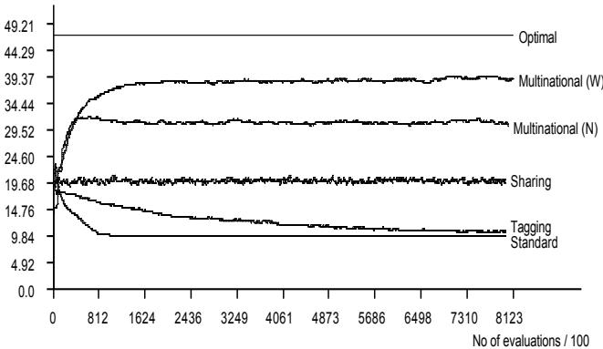  
Figure 15: Scoregraph for function 3.

$$
\begin{array} { l l l } { { f ( x , y ) } } & { { = } } & { { ( 0 . 3 x ) ^ { 3 } - ( y ^ { 2 } - 4 . 5 y ^ { 2 } ) x y - } } \\ { { } } & { { } } & { { 4 . 7 c o s ( 3 x - y ^ { 2 } ( 2 + x ) ) s i n ( 2 . 5 \pi x ) } } \end{array}
$$

This function is asymmetric and has many peaks with some on the border and some inside $s$ Furthermore are some of the peaks on flat hills. The "peak radius" for the score graph was lowered from 0.2 to 0.15 because of the many peaks.

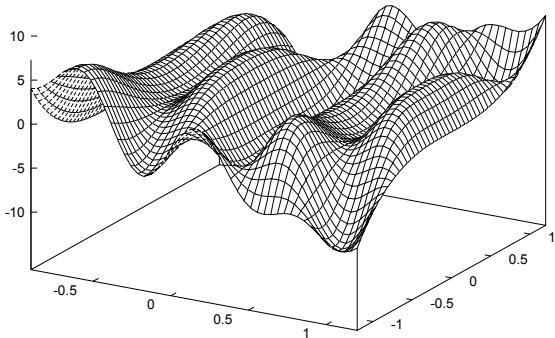

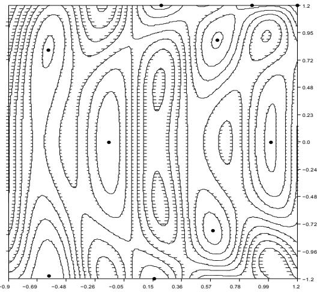  
Figure 16: 3D plot of test function 4.   
Figure 17: Levelcurve plot of function 4.

<table><tr><td>Results:</td><td>All peaks found %</td><td>Avg. peaks found Avg. score</td><td>Avg. score % of opt.</td></tr><tr><td>Standard</td><td>0.0% 1.0</td><td>10.25</td><td>13.13%</td></tr><tr><td>Multi(W)</td><td>23.0% 8.98 80.0%</td><td>62.67 72.22</td><td>80.23%</td></tr><tr><td>Multi(N)</td><td>9.8 4.0% 7.85</td><td>44.13</td><td>92.45%</td></tr><tr><td>Sharing</td><td>0.0% 1.01</td><td>10.37</td><td>56.49% 13.28%</td></tr><tr><td>Tagging</td><td></td><td></td><td></td></tr></table>

Notice that the difference between Multi(W) and Multi(N) is close to 1 peak. This difference is probably caused by one of the two peaks in the upper right corner on the levelcurve plot. Again there is very little room for mutation in the case with the upper and rightmost peak.

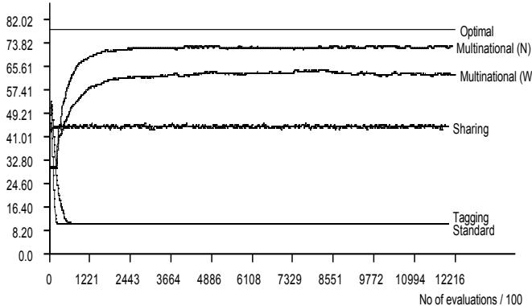  
Figure 18: Scoregraph for function 3.

# 5 Conclusion

From the experiments made with the four functions we can conclude that dividing the population into smaller groups, i.e., nations with a policy and then use a fitnesstopology function when regulating the system gives significant better results than both standard, sharing and tagging.

The division of the population and the way this is done maintains diversity in the population and the algorithms finds both local and global optimas. The idea of selecting a number of individuals and creating a common point of them makes it possible to compare two nations based on the location of their respective populations. Unfortunately the experiments neither showed national selection nor weighted selection to be far better over the other. Further investigations on a hybrid version of these two methods could turn out to be superior

in the general case.

The basis for the multinational evolutionary algorithm, the fitness-topology function hill-valley, proved to be very good for making decisions regarding migration and merging. The low score with the national selection version in function 3, the six hump camel back, can perhaps be solved by having more sample points or by a method mentioned in (Ursem 1999). In a wider perspective I strongly believe that fitness-topology functions like the one used here can improve performance of EAs in general. This is also an area of great research potential.

# Bibliography

A. Pétrowski (1997):   
"A New Selection Operator Dedicated to Speciation" Proc. of 7th Int. Conf. on Genetic Algorithms, ed T. Bäck, 1997, pp. 144-151

R. K. Ursem (1999): Multinational evolutionary algorithms - full edition" See www.daimi.au.dk/\~ursem/ea_research/

Z. Michalewicz, T. Bäck, D. B. Fogel (editors): The Handbook on Evolutionary Computation, Oxford University Press, 1997.

D. E. Goldberg and J. Richardson (1987): "Genetic algorithms with sharing for multimodal function optimization" Proc. 2nd Int. Conf. on Genetic Algorithms (Cambridge, MA) ed J. Greffenstette pp. 41-49

W. M. Spears (1994):   
"Simple subpopulation schemes"   
Proc. Conf. on Evolutionary Programming (Singapore:   
World Scientific), 1994, pp. 296-307