# Multinational GAs: Multimodal Optimization Techniques in Dynamic Environments

Rasmus K. Ursem

EvaLife project group, Department of Computer Science Bgd. 540, University of Aarhus DK-8000 Aarhus C, Denmark ursem@daimi.au.dk, www.evalife.dk

# Abstract

Fitness landscapes of real world problems are in general considered to be complex and often with both local and global peaks. In the static case the local peaks are interesting because they represent other potential solutions to the problem.

In dynamic problems the fitness landscape changes over time, so a local optimum might rise and become the new global optimum. In this context it would be beneficial to search for both local and global optima, because the algorithm would then have performed most of the search when the global optimum change.

This paper describes the multinational GA and its application to six dynamic problems. The multinational GA is a self-organized genetic algorithm for multimodal optimization, which structures the population into subpopulations based on a method for detecting valleys in the fitness landscape.

The experiments showed that multimodal optimization techniques are useful when optimizing dynamic problems with multiple peaks. A non-adaptive version was tested against a self-adaptive algorithm with genetic encoded parameters. The self-adaptive version outperformed the non-adaptive on a simple dynamic problem. However, this was not the case on a slightly more complex problem.

# 1 Introduction

Adaptive search techniques, such as genetic algorithms, have been successfully applied to a large number of problems from the real world. Until now most of these problems were static or have been treated as static. Recently dynamic problems have received growing attention and new methods for handling these non-stationary fitness landscapes have been developed.

Since many real world problems are very complex it cannot be expected that their fitness landscapes resemble smooth unimodal surfaces, but more likely rugged landscapes with several peaks. In the static case, local peaks are interesting because they represent other potentially good solutions to the problem. In the dynamic case the search and tracking of suboptimal peaks are even more important, simply because the landscape could change so a local optimum becomes the global optimum. This motivates for applying multimodal optimization techniques to dynamic problems.

So far multimodal optimization techniques have been applied to dynamic problems in few studies. A combination of sharing and tagging has been applied to the shifting balance problem in (Liles and Jong, 1999). In (Oppacher and Wineberg, 1999) the "Shifting balance $\mathrm { G A } ^ { \mathfrak { N } }$ is introduced and applied to a moving peak problem.

The tuning of parameters is an important part of any application of evolutionary algorithms. Good parameters are often found by the trial-and-error method, which unfortunately is not always optimal when tuning an algorithm for a dynamic function. The problem is that the changing landscape could affect the good parameters so they change along with the landscape. This is the case in the following hypothetical dynamic problem. Assume there are two static landscapes $A$ and $B$ with significantly different good parameters $P _ { A }$ and $P _ { B }$ . The dynamic problem is given by gradually morphing from landscape $A$ to $B$ . Now, in this problem $P _ { A }$ causes excellent performance in the beginning of the run but performance gradually decreases as the topology of landscape $B$ becomes more dominating. The best (fixed) manually tuned parameters for this problem will most likely try to fit both $P _ { A }$ and $P _ { B }$ , to meet an average performance. A very appealing idea is to apply adaptive techniques for online parameter tuning; either in the form of genetic encoded parameters or external control based on measurements on the population.

Over the years, static problems that use adaptive tuning have received considerable attention. Mutation rate encoded in the genome has been investigated (Bäck, 1992). A fuzzy logic controller that sets the parameters based on three measurements on the population has been tested (Lee and Takagi, 1993). For a survey on parameter control see (Eiben et al., 1999). Since parameter-tuning methods constantly adapts to the problem they would probably turn out to be very useful in connection with dynamic problems.

In this paper, the multinational GA (MGA) was applied to six dynamic problems created with a test case generator. The outline of this paper is as follows. The MGA is explained briefly in section 2. In section 3 a quality measure for whole populations is introduced. Section 4 contains description of the problems along with the results from the experiments. Finally, section 5 concludes the paper.

# 2 Multinational GAs

This section contains a brief description of the basic ideas in the multinational GA. The reader is referred to (Ursem, 1999) for further details on the multinational GA and its application to static problems.

MGAs bring several techniques together in one model. They include self-organization, adaptation to the problem, search space division and subpopulation mechanisms like those found in island based models. The main idea in MGA is to divide the population into nations1, each corresponding to a potential peak in the fitness landscape. A situation with six nations is illustrated in figure 1.

A nation consists of a population, a government and a policy. The government is a subset of the individuals in the population and is elected so that its members are the best representatives, e.g. the fittest individuals, of the potential peak the nation is approaching. From these "politicians" the policy is calculated, which is a single point representing the peak the nation is approaching. These concepts are pictured in figure 2.

The grouping of individuals is done with the hill-valley detection procedure, which, given two points in the search space, calculates the fitness of a number of random sample points on the line between the points. A valley is detected if the fitness in a sample point is lower than the fitness of both end points. Hill-valley detection for a one dimensional problem is illustrated in figure 3.

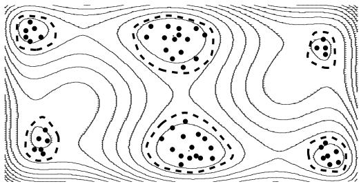  
Figure 1: The multinational GA with six nations.

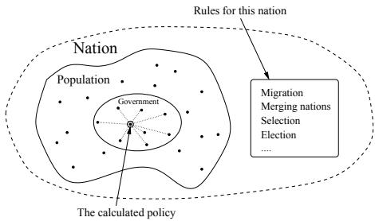  
Figure 2: Concepts of the nation.

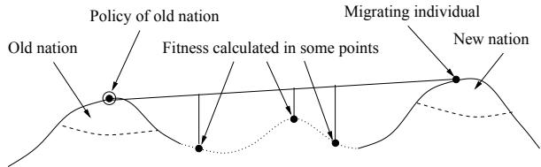  
Figure 3: Detection of valleys with hill-valley detection in connection with migration.

The hill-valley detection is used in three parts of the MGA; 1) migration of individuals between existing nations, 2) creation of new nations in unexplored areas and 3) merging of nations when the algorithm detects that they approach the same peak.

Migration and creation of new nations are performed as follows. In every generation the algorithm compares each individual with the policy of its nation. If a valley is detected then the individual wants to migrate because it is no longer approaching the same peak as all the other individuals in that nation. The destination is found by comparing the individual to the policy of each of the other nations. If no suitable nation is found then this particular individual might have discovered a whole new potential peak. The individual then founds a new nation. If very few individuals have migrated to this new nation when the migration is over, the new nation is supported with a number of individuals taken among the lowest fit individuals from the other nations. This is to ensure that the new nation has sufficiently many individuals. These individuals are converted to the new nation by overwriting their genome with the position of the policy with some noise added to diversify them a bit.

To counterbalance this splitting of nations a merging scheme for nations is enforced. Two nations are merged if a valley is not detected between their policies, because this indicates that the nations are approaching the same peak.

the algorithm, namely probability for mutation, probability for crossover, selection ratio between weighted and national selection, mutation variance for individuals close to- and distant from the policy.

In short, the use of the hill-valley detection for migration, nation creation, and merging gives a highly self-organized island-like population structure that is constantly adapting to the topology of the fitness landscape. Since the overlay of nations is minimal, but not strictly enforced, the MGA is a search space division scheme with fuzzy borders.

Population diversity is essential in optimization of dynamic problems. Diversity through high mutation rate has been suggested and tested in e.g. (Cobb, 1991) and (Cobb and Grefenstette, 1993). The mutation operator used for this paper is called "distance to policy" based mutation. The idea is to have low mutation variance2 on individuals close to the policy and high variance on those far from it (see figure 4).

# 3 Measuring results

Two evaluation methods are used. Method one is the distance between the global optimum and the nearest individual. This is a valid measuring method, because the peaks are symmetric. Method two is more complex but evaluates the whole population on all peaks. The idea is to calculate a score that has maximal value if all individual are distributed equally among the peaks. The score is calculated from the following formula.

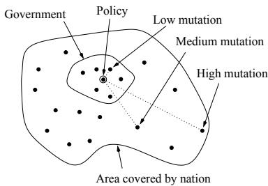  
Figure 4: "Distance to policy" based mutation.

Selection in a MGA can be done on national or global level. In national selection the individuals are only competing with other individuals from the same nation. This has the consequence that the size of the nation is not changed by selection. When selection is done on the global level the fitness of each individual is divided by the number of individuals in its nation. This weighted selection lowers the probability for a nation to go extinct because of selection. The algorithm in this paper used a hybrid selection scheme, which combines the two selection methods. In hybrid selection the balance between national and weighted selection is controlled by a selection ratio that sets how many percent of the final population are selected with national, respectively weighted selection.

To test the effect of self-adaptation the genomes were extended with the five most important parameters for

$$
\begin{array} { r l r } { S c o r e ( P o p ( t ) ) } & { = \frac { 1 0 0 \cdot P S c o r e ( P o p ( t ) ) } { O p t i m a l S c o r e } , } & { \mathrm { w h e r e } } & \\ { P S c o r e ( P o p ( t ) ) } & { = \displaystyle \sum _ { j = 1 } ^ { p o p s i z e } \sum _ { l = 1 } ^ { | P e a k | } f ( d ( i _ { j } , P e a k _ { l } ) ) , ~ \mathrm { a n d } } & \\ { f ( d ) } & { = \left\{ \begin{array} { l l } { \frac { 1 } { 1 + | \frac { 0 . 0 5 \cdot p o p s i z e } { | P e a k | } - P C _ { 1 } | } } & { \mathrm { i f ~ } d < 0 . 2 } \\ { 0 } & { \mathrm { o t h e r w i s e } } \end{array} \right. } & \end{array}
$$

In the formula $P C _ { l }$ acts as an individual counter and it is increased by one every time an individual is determined to be near peak $l$ . OptimalScore is the score of a population where the individuals are distributed equally among the peaks. $| | P e a k | |$ is the number of peaks, $P o p ( t )$ is the population at time $t$ and $d ( x , y )$ is the standard distance measure. In figure 5 the function is plotted for a population of 100 individuals on a two peak problem. The x-axis is the number of individuals classified to be near a peak $( d < 0 . 2 )$ . The solid graph is the score when the individuals are distributed equally on the two peaks, whereas the dashed graph illustrates the score when one peak is detected with all individuals.

# 4 Experiments

The following dynamic problems are all implemented with a test case generator similar to those introduced in (Branke, 1999) and (Morrison and Jong, 1999). A problem is defined by a number of two dimensional parabola-shaped peaks. Each peak is defined by a position, height, and width, which all change over time. The height and the width determines the area covered by the peak. The non-covered area has fitness equal to zero.

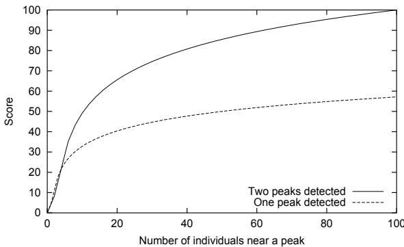  
Figure 5: The score function for a two peak problem.

The MGA was compared to a sharing GA; however, since the MGA uses approximately five times as many fitness evaluations compared to a sharing GA the sharing GA was given five generations for each generation in the MGA. The sharing GA is described in (Deb and Goldberg, 1989).

The population size was 200 for both the MGA and the sharing GA, $\sigma _ { s h a r e }$ was 0.05.

# 4.1 Six dynamic problems

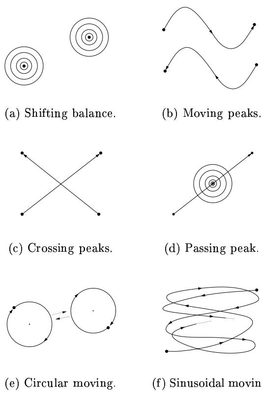  
Figure 6: The six dynamic problems. Multiple rings denote stationary peaks with changing height.

The tested problems are grouped into two main groups. The first four problems were used to test the performance of the MGA under gradually harder versions of the problem. The second group consists of two problems used to test the effect of self-adaptive parameter tuning. There are two major differences between group one and two. First, the number of generations was 200 in the first four problems and 10000 in the last two. Second, the peaks trajectories in the last two problems cross many times. The search space was in all problems $- 5 \leq x \leq 5$ and $- 5 \leq y \leq 5$ The problems are illustrated in figure 6 and will be explained in details later.

To find the weaknesses of the algorithm a large number of preliminary runs were conducted on variants of the first four problems.

The runs indicated that the area covered by a peak had little effect on the results even if the peaks were moving. The problems varied so the peaks covered $1 0 \% { - } 5 \%$ , $5 \% - 2 \%$ and $2 \% - 0 . 5 \%$ of the search space. Between case one and two there was no detectable drop in performance and the last case was just slightly worse than the first two. The first setting was used in the experiments, thereby avoiding the search for a "needle in a haystack".

In another setup, the distance a peak was moved remained the same but the update frequency was varied in the four following ways. 1) Every generation and distance 0.05, 2) Every second generation and distance 0.10, 3) every third generation and distance 0.15 and 4) every fourth generation and distance 0.20. The last two produced sawtooth-like graphs where the fitness of the best solution dropped when the peak moved, but managed to recover just before the peak was changed again. The first (distance 0.05 per generation) was chosen for the final runs; it appeared to be the most challenging.

The parameter that seemed to have the strongest influence on landscapes with moving peaks was, not surprising, the distance between location of a peak at generation $t$ and $t + 1$ . For this reason the peaks were moved with four different speeds through the search space. The distance between two successive generations were respectively 0.04, 0.05, 0.06 and 0.07, which means that through the 200 generations a peak travelled $5 7 \%$ , $7 1 \%$ $8 5 \%$ and $9 9 \%$ of the length of the diagonal in the search space.

A number of preliminary test runs were performed on the first four problems in order to compare the manually tuned parameters with the self-adaptive. The self-adaptive MGA used the manually tuned parameter values for initialization. These test runs showed that the adaptive parameters did not outperform the hand-tuned but had a matching performance. In the context of the discussion in the introduction this seems a bit surprising at a first glance, however, the peaks in the four problems all had the same shape and the velocity of a peak was also more or less constant. The algorithm did not need to adjust the mutation variance or any of the other variables significantly. Furthermore, the number of generations was so low (200) that the algorithm did not have the time to adjust the parameters.

# 4.2 Shifting balance

The shifting balance problem consists of two peaks with random height. Applying multimodal optimization techniques to this problem should find both peaks and keep them, and thus the global optimum, located.

The MGA was applied to three versions of the shifting balance problem. The first version was with nonoverlapping peaks. In the second version one peak could cover between $3 0 \%$ and $5 0 \%$ of the other. In the third version one peak covered between $7 5 \%$ and $9 9 \%$ of the other.

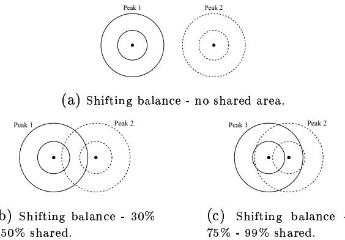  
Figure 7: Three variants of the shifting balance problem. Rings denote maximal and minimal area covered by the peak.

The purpose of this test-problem was to see if the algorithm could keep the global optimum located even though it switched between the two peaks. The purpose of the second and third version was to test if any overlapping could decrease the performance.

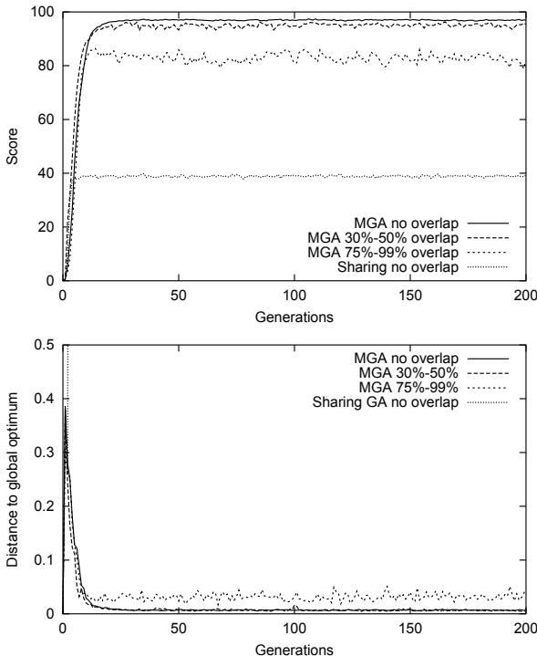  
Figure 8: Score and distance plots for the shifting balance problem. (Average of 50 runs)

The plots in figure 8 shows that the MGA was capable of maintaining a nation on both peaks in all three versions, though the performance was lower on the version with $7 5 \% - 9 9 \%$ overlap. Notice that the distance to the best individual was not much worse between "no overlap" and $^ { 6 4 } 3 0 \% 3 0 \%$ overlap". The lower score was due to fewer individuals near the peak. The score of the sharing GA was substantially lower than the MGA's, because the sharing GA only managed to locate one of the peaks.

# 4.3 Moving peak

This problem consists of two peaks moving in the otherwise flat fitness landscape. This movement can be done in numerous ways. A sinusoidal function was used in this paper. The peak heights were changed in the same way as the shifting balance problem, which had the consequence that the global optimum switched between the two moving peaks. As illustrated on figure 6(b) the two peaks moved in opposite direction without crossing each others trajectory.

The objective in this problem was to test how well the algorithm could track both peaks and thus the moving global optimum.

As shown in figure 9 the MGA was capable of tracking both peaks, but as mentioned earlier the task got harder when the velocity of the peak increased. Sharing managed to locate one peak. Notice that the score was almost constant, which means that sharing was actually quite good at keeping this single peak located.

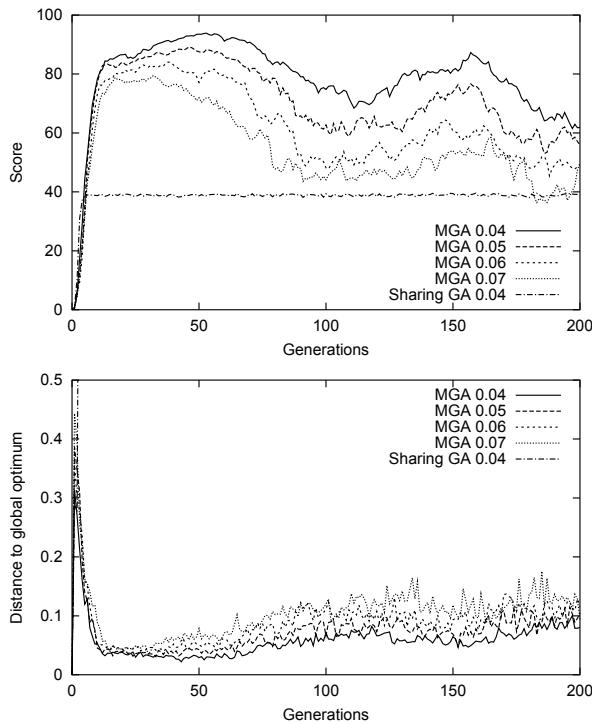  
Figure 9: Score and distance plots for the moving peak problem. (Average of 50 runs. The numbers 0.04, 0.05, 0.06, and 0.07 refer to moving speed of the peaks, see section 4.1.)

# 4.4 Crossing peak trajectories

The crossing peak trajectories problem consists of two peaks moving so their trajectories cross. The peaks moved along a line in the search space and shared a single point in one generation of the run. The changing height had the effect that one of the peaks could completely cover the other when they were close.

The purpose of this problem was to test if the algorithm could keep both peaks located after their trajectories crossed.

Figure 10 shows that the MGA tracked both peaks well until they crossed (generation 100). Just before and after they cross the performance dropped, which was because the algorithm had difficulties distinguishing one peak from the other. When the peaks moved apart the algorithm relocated them. The MGA had some trouble keeping many individuals near the peaks when they move fast, however both peaks were continuously tracked and thus the global optimum.

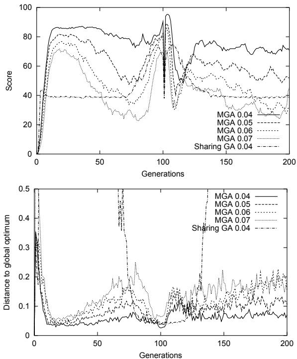  
Figure 10: Score and distance plots for the crossing peak trajectories problem. (Average of 50 runs)

# 4.5 Passing peak

The passing peak problem consists of one stationary and one moving peak. The trajectory of the moving peak went through the center of the stationary peak. The changing height had the effect that one peak could cover the other when they were close. The difference between this problem and the crossing peak trajectories is that the two peaks share a part of the search space through more generations.

The purpose of this problem was to test if the stationary peak could attract all the individuals so the location of the moving peak would be lost.

Figure 11 shows that the MGA performed in a similar way as on the crossing peak trajectories problem. Up to the point where the peaks started to overlap the algorithm tracked both peaks well, but during the overlap the performance dropped a bit but recovered afterwards. The distance plot shows that it was difficult to keep both peaks located after they pass. The stationary peak managed to attract some of the individuals from the moving peak. Notice that the MGA performed worse on the slow moving peak, which is due to a single run where the moving peak was lost after the pass.

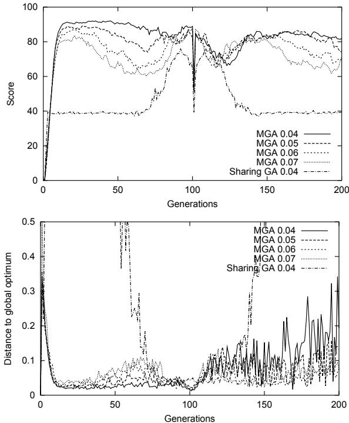  
Figure 11: Score and distance plots for the passing peak problem. (Average of 50 runs)

# 4.6 Circular moving

The circular moving problem consists of two peaks. Each peak moved in a circle around a center that slowly moved along a line in the search space. The trajectories of the centers crossed once while the trajectories of the peaks cross several times. The circular velocity of a peak was constant and approximately 0.05. The height was changed like in the problems above.

The purpose of this problem was to test the nonadaptive against the adaptive version of the algorithm.

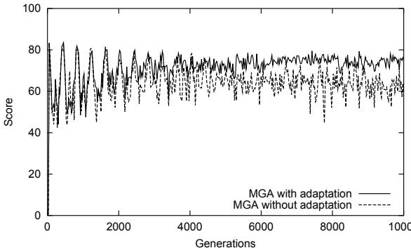  
Figure 12: Score plots for the circular moving problem. (Average of 20 runs)

Figure 12 offers two interesting observations. First, the self-adaptive algorithm seemed to be a little better than the manually tuned algorithm. Second, the self-adaptive algorithm found the parameters that ensured a more stable performance. That the algorithm actually adapts to the problem is reflected in the score plot. In the beginning of the run the two versions had almost the same oscillating score, but slowly the adaptive algorithm managed to tune the parameters and thus got better than the manually tuned algorithm.

# 4.7 Sinusoidal moving

The sinusoidal moving problem consists of two peaks each moving along a curve generated by two sinus functions with different period length, chosen so the location and velocity were non-periodic through the run. The peak height changed as in the above problems.

The purpose of this test problem was to test if the adaptive version could outperform the manually tuned algorithm when velocity and location were nonperiodic.

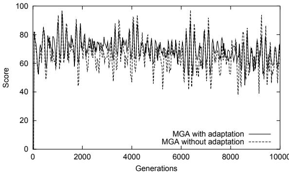  
Figure 13: Score plots for the sinusoidal moving problem. (Average of 20 runs)

Figure 13 shows that the self-adaptive version did not outperform the manually tuned, even though both managed to keep both peaks located. In the circular moving problem the adaptation took approximately 5000 generations before it was possible to detect a difference in performance. The reason why the adaptive did not outperform the hand-tuned version is most likely because it takes substantially more generations to adapt to a landscape than the duration of the period where the parameters are good. The algorithm simply adapts too slowly.

# 5 Conclusions and future work

In this paper I suggested that multimodal optimization techniques are very important when dealing with dynamic problems. This hypothesis was introduced under the assumption that dynamic real world problems consist of multimodal landscapes and that suboptimal peaks can rise to become the global optimum. To tackle the problem, the multinational GA was introduced as a multimodal optimization technique. The tests showed that the MGA was capable of tracking multiple peaks simultaneously and that the MGA clearly outperformed the traditional sharing GA. However, the diversity of the sharing GA lead to much more stable population scores, indicating that the maintenance of population diversity could lead to better and more constant performance.

This result motivates extending the MGA with diversity maintaining techniques at the national level, either plain sharing or other more sophisticated techniques based on e.g. an individual's distance to the policy.

The need for adaptive parameter tuning was introduced by a hypothetical example and tested on two problems. The results from these tests indicated that the parameters encoded as a part of the genome did not give a sufficiently fast adaptive scheme. This is emphasized by the difference between the circular moving problem (constant peak velocity) and the sinusoidal moving problem (changing peak velocity). In the first case the adaptive algorithm outperformed the manually tuned version after approximately 5000 generations, which was not the case when the peak velocity varied. Since the adaptation needed several generations for finding better parameters the algorithm was "always late" in the sense that it carried the parameters reflecting the state of the problem as it was several generations ago.

The important conclusion to draw from this is that any attempt to optimize the parameters must set the parameters so they reflect the current- or very recent state of the problem.

This motivates to investigate real-time controllers and parameter prediction algorithms that determine the parameters based on measurements on the current population and changes in the landscape.

# Список литературы

Bäck, T. (1992). Self-adaptation in genetic algorithms. In F. J. Varela, P. B., editor, Proceedings of 1st European Conference on Artificial Life, pages 263271.

Branke, J. (1999). Memory enhanced evolutionary algorithms for changing optimization problems. In Angeline, P. J., Michalewicz, Z., Schoenauer, M., Yao, X., and Zalzala, A., editors, Proceedings of the Congress of Evolutionary Computation, pages 18751882.

Cobb, H. G. (1991). An investigation into the use of hypermutation as an adaptive operator in genetic algorithms having continuous, timedependent nonstationary environments. Technical Report AIC-90-001, Navy Center for Applied Research in Artificial Intelligence.   
Cobb, H. G. and Grefenstette, J. F. (1993). Genetic algorithms for tracking changing environments. In Forrest, S., editor, Proceedings of the 5th International Conference on Genetic Algorithms, pages 523530.   
Deb, K. and Goldberg, D. E. (1989). An investigation of niche and species formation in genetic function optimization. In Schaffer, J. D., editor, Proceedings of the 3rd International Conference on Genetic Algorithms, pages 4250.   
Eiben, A. E., Hintering, R., and Michalewicz, Z. (1999). Parameter control in evolutionary algorithms. IEEE Transactions on Evolutionary Computation, 3(2):124141.   
Goldberg, D. E. and Wang, L. (1997). Adaptive niching via coevolutionary sharing. Technical Report 97007, Illinois Genetic Algorithms Laboratory, University of Illinois at Urbana-Champaign.   
Lee, M. and Takagi, H. (1993). Dynamic control of genetic algorithms using fuzzy logic techniques. In Forrest, S., editor, Proceedings of the Fifth International Conference on Genetic Algorithms.   
Liles, W. and Jong, K. D. (1999). The usefulness of tag bits in changing environments. In Angeline, P. J., Michalewicz, Z., Schoenauer, M., Yao, X., and Zalzala, A., editors, Proceedings of the Congress of Evolutionary Computation, pages 2054-2060.   
Morrison, R. W. and Jong, K. A. D. (1999). A test problem generator for non-stationary environments. In Angeline, P. J., Michalewicz, Z., Schoenauer, M., Yao, X., and Zalzala, A., editors, Proceedings of the Congress of Evolutionary Computation, pages 2047-2053.   
Oppacher, F. and Wineberg, M. (1999). The shifting balance genetic algorithm: Improving the GA in a dynamic environment. In Banzhaf, W., Daida, J., Eiben, A. E., Garzon, M. H., Honavar, V., Jakiela, M., and Smith, R. E., editors, Proceedings of the Genetic and Evolutionary Computation Conference, pages 504510.   
Ursem, R. K. (1999). Multinational evolutionary algorithms. In Angeline, P. J., Michalewicz, Z., Schoenauer, M., Yao, X., and Zalzala, A., editors, Proceedings of the Congress of Evolutionary Computation, pages 1633-1640.