# Efficient Algorithms for the Longest Path Problem

Ryuhei UEHARA (JAIST) Yushi UNO (Osaka Prefecture University)

# The Longest Path Problem

• F i n d i n g a l o n g est (ve rtex d i sj o i nt) path i n a given graph

• M otivation (com pa ri ng to H a m i lton ia n path ) : Approx. Algorith m , Parameterized Com plexity M o re p ra ct i ca l /n at u ra l M o re d i ffi cu l t( ? )

# The Longest Path Problem

Known (ha rd n ess) resu lts ;

• We ca n not fi nd a path of l e ngth n-n ε i n a g ive n Hamiltonian graph in poly-time unless P=NP [Karger, Motwani, Ramkumar; 1997]

• We ca n fi nd O (log n) l e ngth path [Alon , Yuste r, Zwi ck; 1 995] (⇒O((log n/loglog n)2) [Björklund, Husfeldt; 2003])

• Approx. Alg . ach ieves O(n/log n) [AYZ95] (⇒O(n(loglog n/log n)²)[BH03])

O Expon e ntia l a lgorith m [M on ie n 1 985]

# The Longest Path Problem

Known polynom ia l ti me a lgorith m ;  
D ij kstra ’ s Al g . ( 1 9 6 ? ) ： L i n e a r a l g . fo r fi n d i n g a l o n g est p ath i n a tre e ;

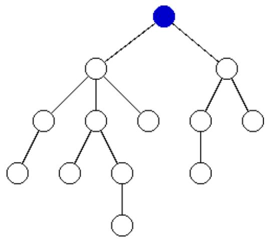

# The Longest Path Problem

Known polynom ia l ti me a lgorith m ;  
D ij kstra ’ s Al g . ( 1 9 6 ? ) ： L i n e a r a l g . fo r fi n d i n g a l o n g est p ath i n a tre e ;

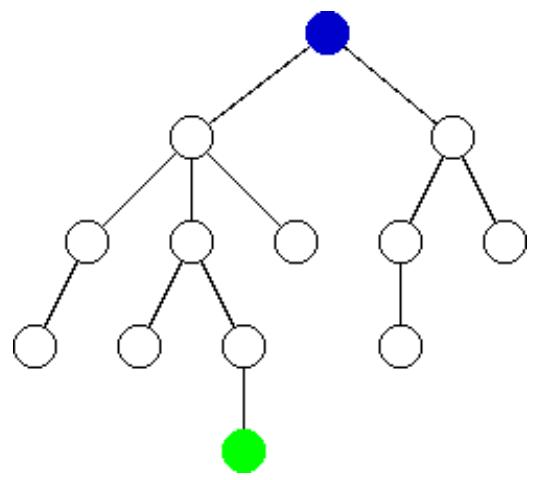

# The Longest Path Problem

) Known polynom ia l ti me a lgorith m ;  
D ij kstra ’ s Al g . ( 1 9 6 ? ) ： L i n e a r a l g . fo r fi n d i n g a l o n g est p ath i n a tre e ;

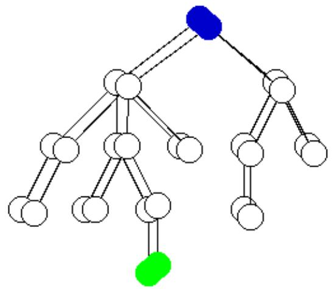

# The Longest Path Problem

0 Known polynom ia l ti me a lgorith m ;

D ij kstra ’ s Al g . ( 1 9 6 ? ) ： L i n e a r a l g . fo r fi n d i n g a l o n g est p ath i n a tre e ;

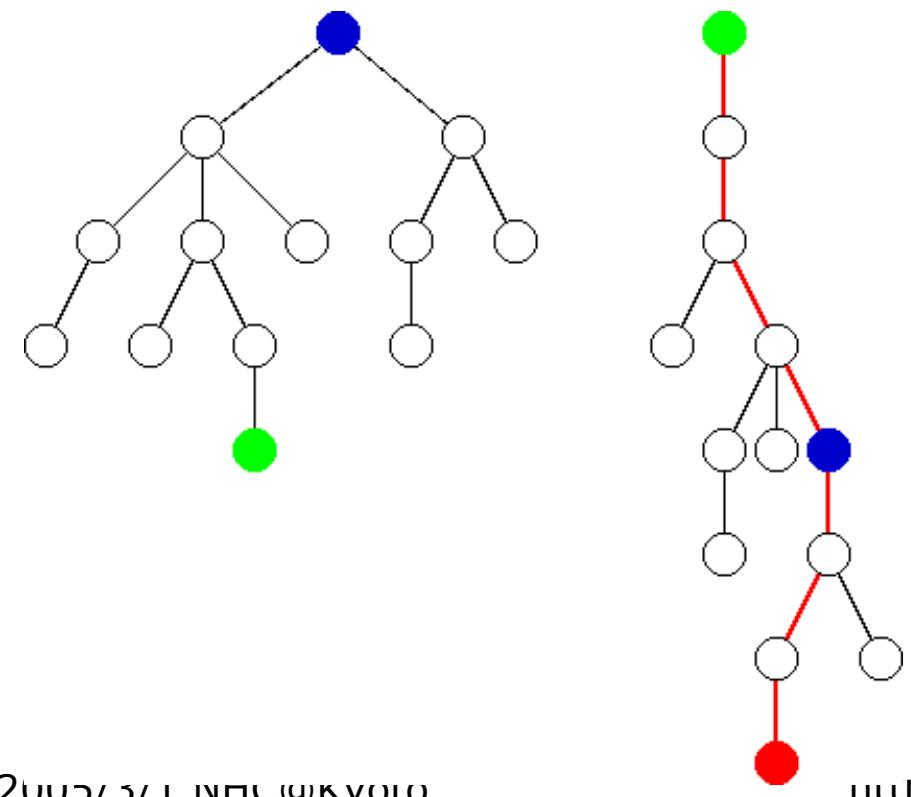

# Approaches to the Efficient Algs to Longest Path Problem

1. Exte ns ion of th e D ij kstra’s a lgorith m We i g hted trees ( l i n ea r) , b l ock g ra p h s ( l i n ea r) , cacti $( \mathsf { O } ( n ^ { 2 } ) )$ .

(ISAAC 2004)

2. G ra p h cl asses s . t. H a m i lton i a n Path ca n be fou nd in poly time

Some g ra ph classes havi ng i nterval representations (bipartite permutation, interval biconvex graphs)

3. Dyna m i c prog ra m m i ng to the g ra p h cl asses that tree re p rese ntations (on goi ng )

C a ct i ( l i n e a r) ,

# Approaches to the Efficient Algs to Longest Path Problem

1. Exte ns ion of th e D ij kstra’s a lgorith m We i g hted trees ( l i n ea r) , b l ock g ra p h s ( l i n ea r) , cacti $( \mathsf { O } ( n ^ { 2 } ) )$ .

(ISAAC 2004)

2. G ra p h cl asses s . t. H a m i lton i a n Path ca n be fou nd in poly time

Some g ra ph classes havi ng i nterval representations (bipartite permutation, interval biconvex graphs)

(ISAAC 2004)

3. Dyna m i c prog ra m m i ng to the g ra p h cl asses that have tree representations (on going)

C a ct i ( l i n e a r) ,

# 1. Ex of Dijkstra's Alg

et . a l . ( IPL , 2 0 02 ) s h owed th at the correctness of Dijkstra's alg stands for;

For each $u , v ,$ length of the shortest path between u and v = length of the longest path between u and v

For each $u , v , w ,$ , $\mathsf { d } ( u , v ) \equiv \mathsf { d } ( u , w ) + \mathsf { d } ( w , v )$

3. For each $u , v , w ,$ ${ \mathsf { d } } ( u , v ) = { \mathsf { d } } ( u , w ) + { \mathsf { d } } ( w , v )$ if and only if is on the u n iq u e path betwee n u a nd v

# 1. Ex of Dijkstra's Alg

Construct $G ^ { \prime } { = } ( V ^ { \prime } , E ^ { \prime } )$ from G=(V,E) s.t. :

V⊆ V’   
For each $u , v \in V ,$ length of the shortest path between u,v on G' = length of the longest path between u,v on G

For each $u , v \in V ,$

the shortest path between u,v on G' is unique

# 1. Ex of Dijkstra's Alg

Theorem: ExDijkstra finds a longest path if G and G' satisfy the conditions.

ExDijkstra: $G = ( V , E )$ and $G ^ { \prime } { = } ( V ^ { \prime } , E ^ { \prime } )$

p i ck a ny ve rtex w i n V;   
2. fi n d x ∈ V w i t h m ax{ d( w, x)} o n G ’; fi n d y ∈ V w i t h m ax{ d(x, y)} o n G ’;   
4 x a n d y a re th e e nd poi nts of th e long est path i n G, and $d ( x , y )$ on G' is its length.

# 1. Ex of Dijkstra's Alg (Summary)

Theorem: Vertex/edge weighted tree (linear)

Theorem: Block graph (O(|VI+|El))

( O ( | V| 2 ) )

# 1. Ex of Dijkstra's Alg (Cacti)

Cactus:

Each block is a cycle

Two cycle share at most one vertex which is a separator

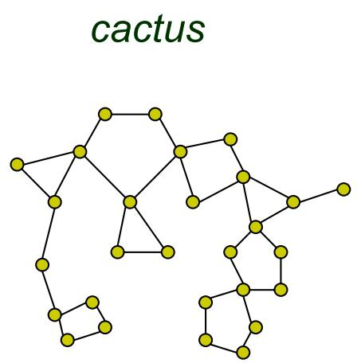

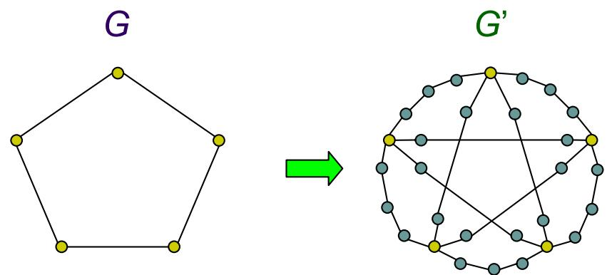

The longest path The shortest path between = between u and v on G u and v on G'

# 1. Ex of Dijkstra's Alg (Cacti)

Sample

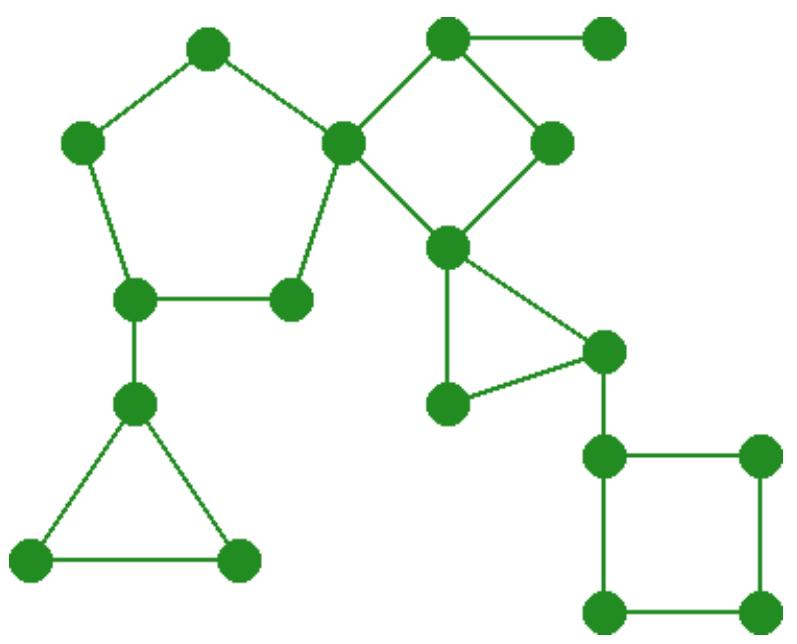

# 1. Ex of Dijkstra's Alg (Cacti)

Sample

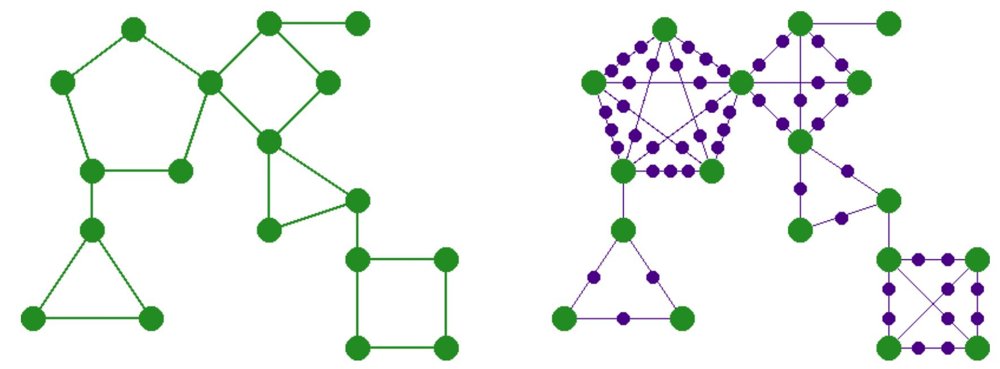

# 1. Ex of Dijkstra's Alg (Cacti)

Sample

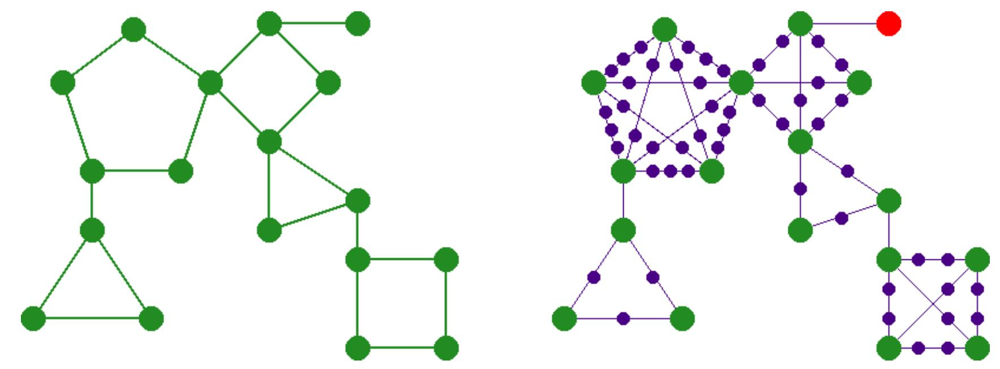

# 1. Ex of Dijkstra's Alg (Cacti)

Sample

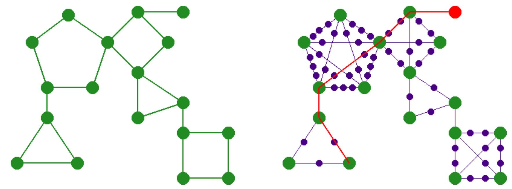

# 1. Ex of Dijkstra's Alg (Cacti)

Sample

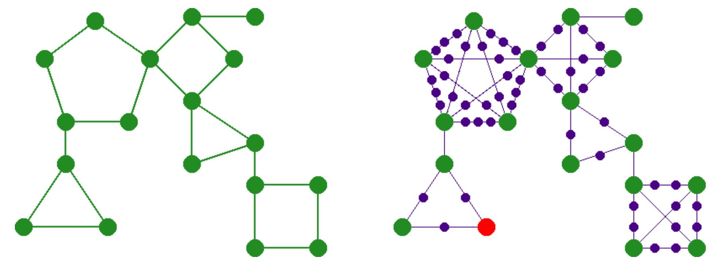

# 1. Ex of Dijkstra's Alg (Cacti)

Sample

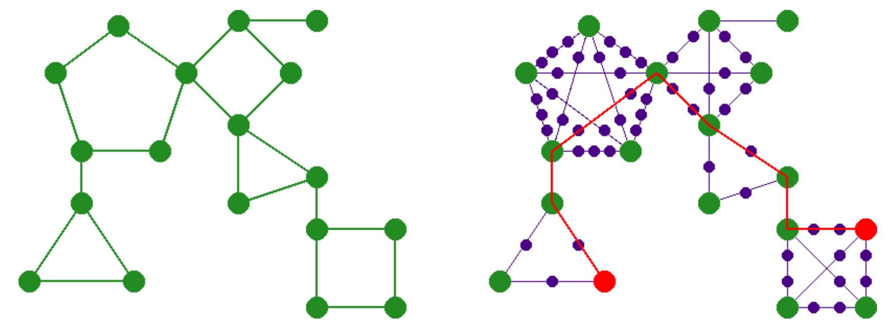

# 1. Ex of Dijkstra's Alg (Cacti)

Sample

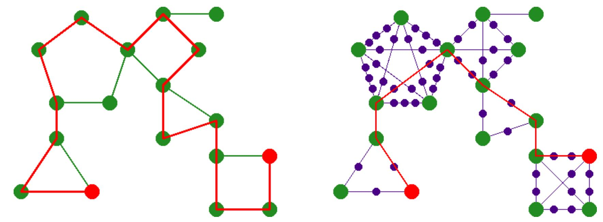

# Graph classes s.t. Hamiltonian Path can be found in poly time

Fact 1:

Hamiltonian Path is NP-hard on a chordal graph.

(In fact, strongly chordal split graph[Müller,1997].)

Fact 2:

Hamiltonian Path is solvable on an interval graph in linear time. [Damaschke, 1993].

Our goal:

Poly-time algorithm for Longest Path on an interval graph.

# Interval Graphs

0 An i nterval g ra ph $G = ( V , E )$ h a s a n i n te rva l representation s.t. {u,v}E iff $I _ { u } \cap I _ { v } \neq \varphi$ 5

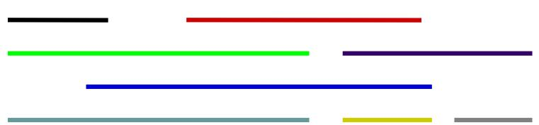

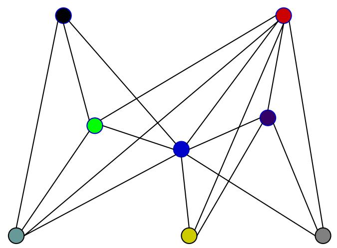

# Interval Graphs

0 An i nterval g ra ph $G = ( V , E )$ h a s a n i n te rva l representation s.t. {u,v}E iff $I _ { u } \cap I _ { v } \neq \emptyset$

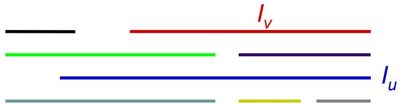

Hamiltonian Path: linear time solvable.

Longest Path: ????

Restri cted i nterval g ra phs …

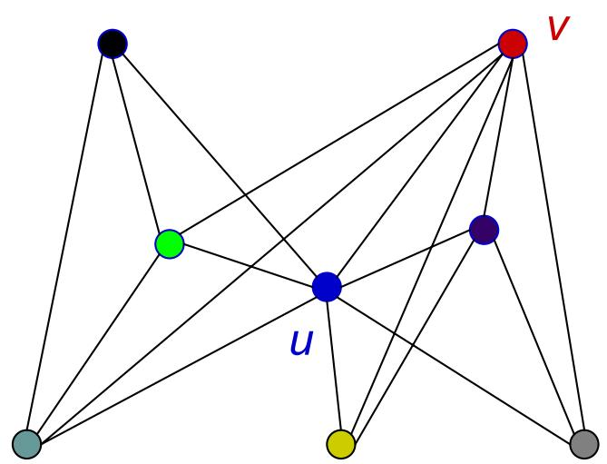

# Restricted Interval Graphs

• An i nterval biconvex g ra ph G=( S ∪ Y, E) has an interval representation s.t...

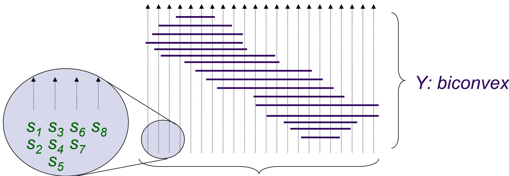  
S: integer points

http://www.jaist.ac.jp/\~uehara/ps/longest.pdf

# Restricted Interval Graphs

• I nterval biconvex g ra ph G=( S ∪ Y, E) is introduced [Uehara, Uno; 2004] from graph theoretical viewpoints;

Natural analogy of biconvex graphs (bipartite graph class)   
Generalization of proper interval graphs   
Generalization of threshold graphs

Best possible class longest path can be found in poly time …

# Poly-time alg for longest path on an interval biconvex graph (idea)

F i n d t h e t ri v i a l l o n g e st p at h P o n G [ Y] ;   
E m bed th e ve rti ces i n S i nto P as poss i b l e ;   
Adj ust e nd poi nts if n ecessa ry .

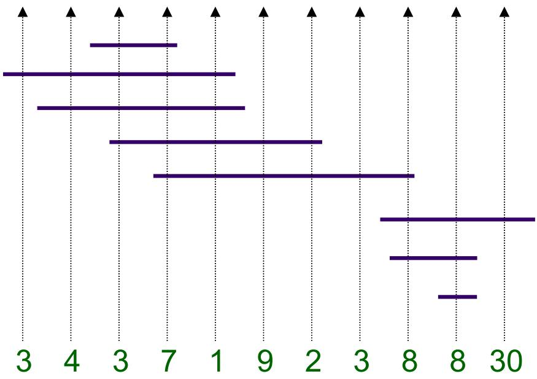

# Poly-time alg for longest path on an interval biconvex graph (idea)

F i n d t h e t ri v i a l l o n g e st p at h P o n G [ Y] ;   
E m bed th e ve rti ces i n S i nto P as poss i b l e ;   
Adj ust e nd poi nts if n ecessa ry .

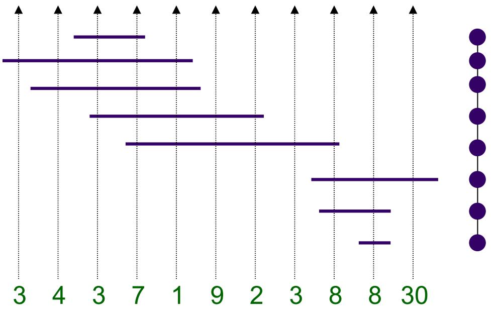

# Poly-time alg for longest path on an interval biconvex graph (idea)

F i n d t h e t ri v i a l l o n g e st p at h P o n G [ Y] ;   
E m bed th e ve rti ces i n S i nto P as poss i b l e ;   
Adj ust e nd poi nts if n ecessa ry.

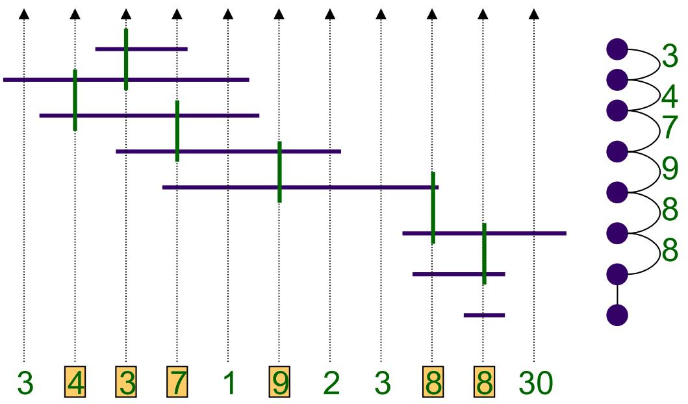

# Poly-time alg for longest path on an interval biconvex graph (idea)

F i n d t h e t ri v i a l l o n g e st p at h P o n G [ Y] ;   
E m bed th e ve rti ces i n S i nto P as poss i b l e ;   
Adj ust e nd poi nts if n ecessa ry.

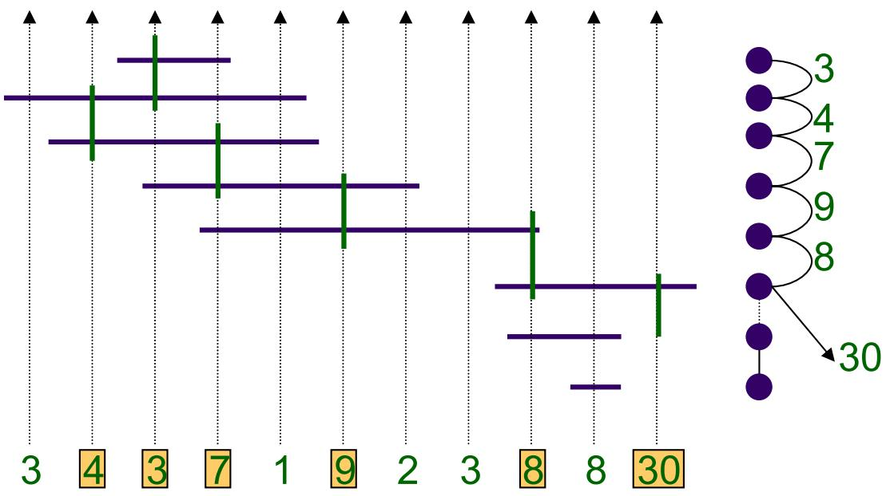

# Poly-time alg for longest path on an interval biconvex graph (idea)

F i n d t h e t ri v i a l l o n g e st p at h P o n G [ Y] ;   
E m bed th e ve rti ces i n S i nto P as poss i b l e ;

Adj ust e nd poi nts if n ecessa ry.

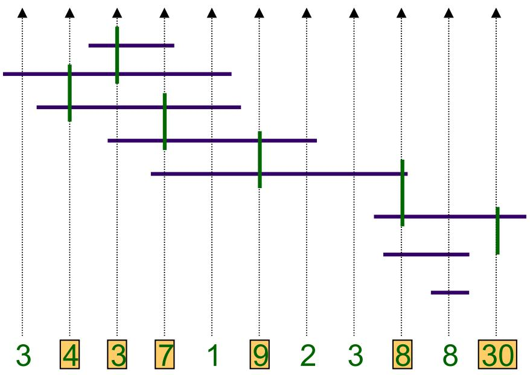

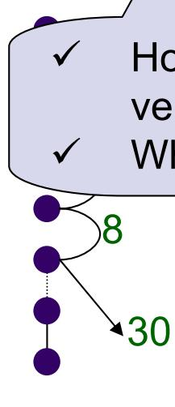

H ow ca n we d ete rm i n e the vertices in S? Where do we em bed them?

# Poly-time alg for longest path on an interval biconvex graph (idea)

E m bed th e ve rti ces i n S i nto P as poss i b l e ;

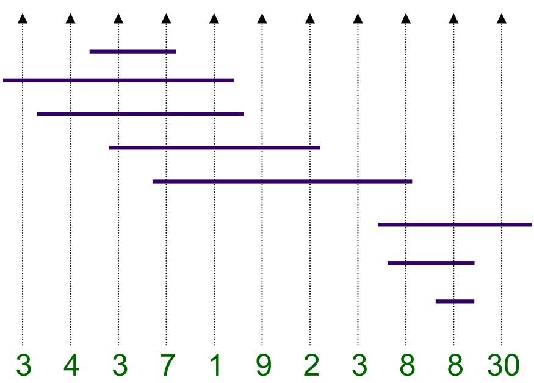

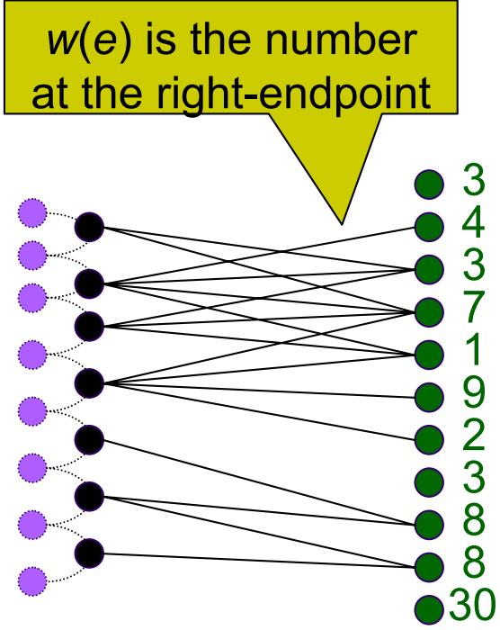

# Poly-time alg for longest path on an interval biconvex graph (idea)

E m bed th e ve rti ces i n S i nto P as poss i b l e ;

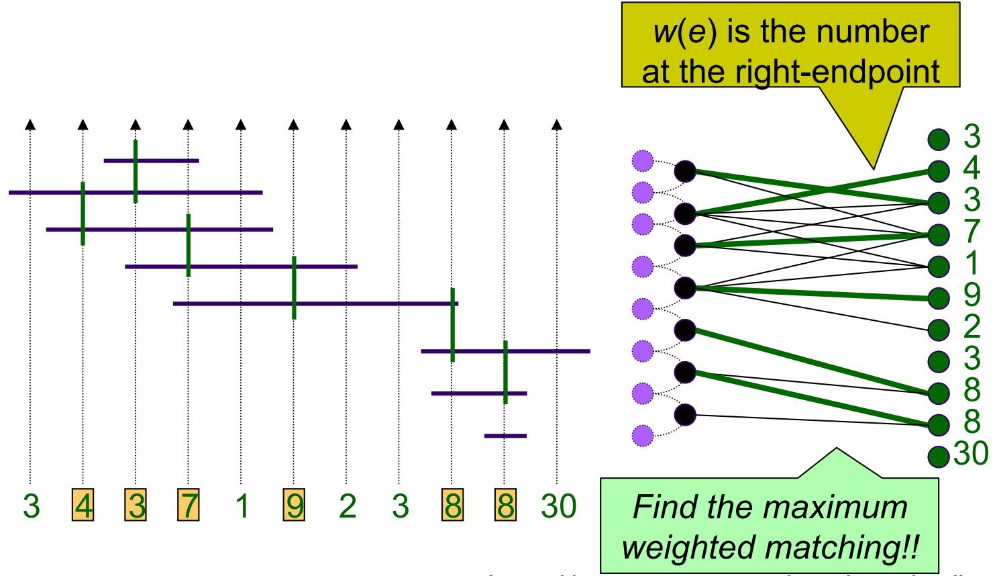  
http://www.jaist.ac.jp/\~uehara/ps/longest.pdf

# Open Problems

Longest Path on a n i nterval g ra ph ??

Com bi nation of DP/Dijkstra and weighted maximum matching on MPQ-tree representation?

Related to the fol lowi ng open problem ?

with a start poin t o n a n i n te rva l g ra p h ? [Damaschke, 1993].

Exte nsion to

Longest cycl e on some g ra ph classes

H a m i lton ia n cycl e/path on some g ra ph classes

http://www.jaist.ac.jp/\~uehara/ps/longest.pdf