Transmission function models of infinite population genetic algorithms

C.H.M. van Kemenade, J.N. Kok, H La Poutré, D. Thierens

Software Engineering (SEN)

SEN-R9838 December 31, 1998

CWI P.O. Box 94079 1090 GB Amsterdam The Netherlands

CWI is the National Research Institute for Mathematics and Computer Science. CWI is part of the Stichting Mathematisch Centrum (SMC), the Dutch foundation for promotion of mathematics and computer science and their applications.

SMC is sponsored by the Netherlands Organization for Scientific Research (NWO). CWI is a member of ERCIM, the European Research Consortium for Informatics and Mathematics.

# Transmission Function Models of Infinite Population Genetic Algorithms

Cees H.M. van Kemenade CWI P.O. Box 94079, 1090 GB Amsterdam, The Netherlands

Joost N. Kok LIACS, Leiden University P.O. Box 9512, 2300 RA Leiden, The Netherlands

Han La Poutr´e CWI P.O. Box 94079, 1090 GB Amsterdam, The Netherlands

Dirk Thierens Utrecht University P.O. Box 80.089 3508 TB Utrecht, The Netherlands

# ABSTRACT

The so-called transmission function framework is described, and implementations of transmission function models are given for a broad range of genetic algorithms. These models describe GA’s with a population of infinite size. An actual implementation of these models for a non-trivial problem involving deception is given, these models are traced, and the results are visualized by means of population flow diagrams. These diagrams show that cross-competition between different parts of the optimal solution takes place.

1991 Mathematics Subject Classification: 68T05, 68T20   
1991 Computing Reviews Classification System: F.2.m, G.1.6, I.2.8   
Keywords and Phrases: genetic algorithms, selection schemes, transmission functions, tracing models Note: Work carried out under theme SEN4 “Evolutionary Computation”.

# 1. Introduction

Altenberg used transmission functions to model generational genetic algorithms [Alt94]. We have extended these transmission function models to a broad range of genetic algorithms. Tracing these probabilistic models corresponds to running a genetic algorithm with an infinite population. The results obtained by tracing these models can be regarded as an upper bound on the probability that the optimum is found for the corresponding “real” finite population genetic algorithms when using large populations. Tracing of probability models for a simple GA was done by Whitley [Whi93]. Kok and Flor´een traced probabilities using a model based on bit-products and Walsh-products [KF95]. Altenberg used a transmission function model to model generational genetic algorithms [Alt94]. All these models correspond to genetic algorithms involving an infinite population. Here, a broad range of genetic algorithms is modelled with transmission functions. Extensions of these models such that genetic algorithms with finite population can be modelled were investigated [KKPT98]. We also treat elitism: in an elitist GA the parents can be propagated directly to subsequent generations, this in contrast to the generational GA where the parents are always discarded after producing enough offspring to populate the next generation. Theoretical analysis has shown that a canonical GA will not converge to the global optimum in general, but a GA that maintains the best solution will converge [Rud94, BKdGK97] and a GA involving elitism will converge to the optimum too [Rud96, BKdGK97]. Maintaining the best individuals means keeping these individuals in the population without allowing them to reproduce, while in case of elitism an individual is allowed to reproduce throughout its lifetime.

The outline of the rest of this report is as follows. In section 3 the transmission function models for different types of genetic algorithms are introduced. Section 4 describes how such transmission function models are used to model the behaviour of genetic algorithms with infinite population size. When restricting ourselves to functions of unitation, a formulation in terms of equivalence classes can be used to get a more efficient computation, as described in section 5. Section 6 introduces the cross-competition problem, which is used as an example of the application of the transmission function models. Population flow diagrams are introduced in section 7. These diagrams are used to visualize the simulation results for the different GA’s. Conclusions are presented in section 8.

# 2. Selection schemes

The selection scheme enforces a selective pressure by adjusting the fertility and the viability of individuals based on their fitness. The selection scheme determines who is allowed to reproduce, how often individuals are allowed to reproduce, and which individuals are allowed to survive and thus are propagated to the next generation. Here, we discriminate between three types of selection schemes: the generational schemes, the steady-state schemes, and the local competition schemes. A separate subsection is devoted to each of these schemes.

# 2.1 Generational selection schemes

In generational evolutionary algorithms a sequence of generations is created. The individuals in generation $G _ { t }$ are the parents of the individuals in the next generation $G _ { t + 1 }$ . There is no overlap between subsequent generations in the sense that none of the individuals of generation $G _ { t }$ are transferred to the next generation, and thus all individuals in generation $G _ { t + 1 }$ are obtained by application of the evolutionary operators to the parents selected from generation $G _ { t }$ . We use three different types of generational schemes: the selection scheme of the canonical genetic algorithm, the generational genetic algorithm with tournament selection, and the $( \mu , \lambda )$ selection scheme.

In a generational genetic algorithm, a selection method is used to select a number of parents. Next, a recombination operator is applied to these parents to get two offspring individuals. The mutation operator is applied to these offspring. These mutated offspring are put in the population $P _ { t + 1 }$ . This process is continued until the next population is completely filled.

Usually recombination is only applied with a certain probability given by the crossover probability, often denoted by $p _ { c }$ . If no crossover is applied, then the parents are duplicated, and mutation is applied to the resulting copies, to get the offspring.

During the selection step, the generational genetic algorithm needs a selection method. Two fitness-based selection methods are discussed here. The first is the fitness proportional selection. When using this type of selection, the probability that an individual $x$ is selected is proportional to its fitness. So given the average fitness $\bar { f }$ over the population $P _ { t }$ , the number of copies of individual $x$ is $f ( x ) / f$ . The process of the selection of an individual can be visualized by means of a roulette-wheel with a pointer. The roulette-wheel is divided in a number of parts, one for each individual; The part corresponding to individual $x$ covers a fraction $f ( x ) / f$ of the roulette-wheel. Now a single individual is selected by turning the roulette-wheel. When the rotation stops, the pointer points at a certain part, and the corresponding individual is selected. If we have to select $n$ individuals, then one has to spin the wheel $n$ times. On average, individual $x$ is selected $n f ( x ) / f$ times, but in practice it can be selected more often, or less often. This spread in the number of copies is a sampling error during selection. The sampling error of fitness proportional selection can be reduced by using “Stochastic Universal Sampling” [Bak87]. This selection method is obtained by means of a small modification to the previous method. Instead of one pointer, this method use $n$ pointers, where the angle between two subsequent pointers is $2 \pi / n$ ; Now, a single spin of the wheel results in the selection of all $n$ individuals. The sampling error is much lower now. The actual number of copies of an individual $c _ { x }$ in this case is bounded by

$$
\lfloor n f ( x ) / { \bar { f } } \rfloor \leq c _ { x } \leq \lceil n f ( x ) / { \bar { f } } \rceil .
$$

Fitness proportional selection is a non-deterministic selection method. This selection method only modifies the probability of selection of the different individuals. The fitness proportional selection requires that the fitness of individuals is given by positive values, because the probabilities of selecting an individual are proportional to fitness, and these probabilities cannot be negative. Furthermore, the fitness proportional selection is not invariant under scaling of fitness values. For example, if the fitness of all individuals is changed by adding a large positive constant $a$ , then the average fitness is increased by $a$ , and the selective pressure of fitness proportional selection is decreased. Due to the same effect the selective pressure of fitness proportional selection decreases when most individuals in the population have a near-optimal fitness.

An example of a generational genetic algorithm with fitness proportional selection is the canonical genetic algorithm that was introduced by Holland [Hol75]. It is also described by Goldberg [Gol89] under the name simple genetic algorithm.

Another fitness-based selection scheme is tournament selection. A form of tournament selection was already studied in Brindle’s dissertation [Bri81]. A tournament selection with tournament size $k$ , where $k \geq 2$ , is obtained by selecting $k$ individuals uniform at random from the population. The best out of these $k$ individuals is selected. After tournament selection the best individual is expected to have $k$ copies, the median individual is expected to have $( 1 / 2 ) ^ { k - 1 }$ copies, and the worst individual is expected to have no copies. Larger values of the tournament size $k$ result in a stronger selective pressure and therefore in more duplicates of the best few individuals. Tournament selection is a non-deterministic selection method. In this selection scheme it is possible to reduce the sampling error during selection by means of an intermediate population. Given that a single recombination operation uses two parents to produce two offspring, an intermediate population of size $k n$ is generated by duplicating all individuals in the parent population $k$ times. Now a parent is selected by drawing $k$ individuals without replacement from this intermediate population and setting up the $k$ -tournament. The sampling error is reduced as each individual participates in exactly $k$ tournaments.

The $( \mu , \lambda )$ selection scheme from evolution strategies is a generational scheme too. A parent population of size $\mu$ is used to generate $\lambda$ offspring. Next, the $\mu$ best individuals out of the $\lambda$ offspring are used as parents for the next generation. This selection scheme is deterministic. In this selection scheme it is also possible to reduce the sampling error during selection by means of an intermediate population. This intermediate population is filled with the number of parents needed. Next, the actual parent pairs are selected without replacement from this intermediate population. Now given that a single recombination operation uses two parents to produce two offspring, the number of times a parent is selected for reproduction is bounded by $\lfloor \lambda / \mu \rfloor \leq c _ { x } \leq$ $\lceil \lambda / \mu \rceil$ . A similar selection scheme is the $T \%$ -truncation selection, which is a deterministic selection scheme that retains the $T \%$ best individuals. Truncation selection is used in Breeder Genetic Algorithm [MSV94].

# 2.2 Steady-state selection schemes

Steady-state selection schemes typically replace only a limited number of individuals. So there is an overlap between subsequent generations, and an individual can live for more than one generation. A steady-state selection scheme requires a selection method and a replacement method. The selection method determines which individuals are allowed to reproduce. The resulting offspring has to be added to the population. In order to keep the population size constant, the offspring will replace individuals from the population. The replacement method determines which individual is replaced. So the selection method determines the fertility of individuals, while the reduction scheme determines the viability of the individuals. Both the selection method and the reduction method can be used to obtain a selective pressure. An example of the usage of the selection method is a selection scheme where tournament selection is used to select individuals for reproduction, and the individual to be replaced is obtained by a uniform selection. In this selection scheme the replacement is not by a fitness-based selection, and therefore the selective pressure is solely due to the selection method. Another example is a selection scheme where a uniform selection over the population is used to obtain the individuals that are allowed to reproduce, and the replacement method always replaces the worst individual of the population. In such a selection scheme, the selective pressure is solely enforced by the replacement method. Steady-state genetic algorithms are used in Genitor [Whi89, WS90] and several other genetic algorithm [Sys89, vKKE95].

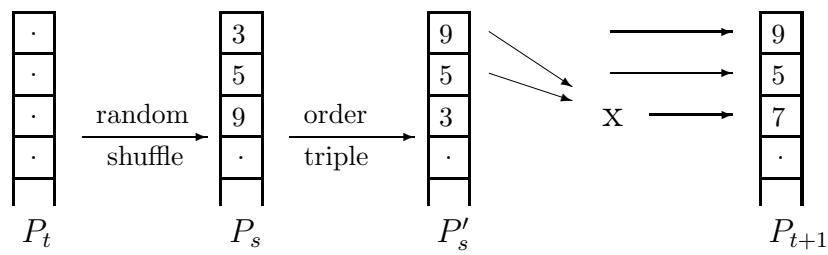  
Figure 1: Schematic representation of triple-competition selection

A different steady-state scheme is the triple-competition selection scheme [vK97b]. Figure 1 shows how the next population $P _ { t + 1 }$ is produced from the current population $P _ { t }$ . On the left we see the current population $P _ { t }$ , where each box represents a single individual. The values in the boxes denote the fitness of the corresponding individuals. An intermediate population $P _ { s }$ is generated by doing a random shuffle on $P _ { t }$ . Population $P _ { s }$ is partitioned in a set of triples. Within each set of three individuals the two best performing individuals are allowed to create one offspring. This offspring replaces the third individual. This modified triple is propagated to the next generation. So two-third of the individuals are propagated unmodified to the next generation. The best two individuals are never lost when using this selection scheme. It has been observed that triple-competition selection tends to result in relatively fast convergence of the population.

The $( \mu + \lambda )$ selection of evolution strategies is considered to be a steady-state selection scheme too. A parent population of size $\mu$ is used to generate $\lambda$ offspring. Next, the best $\mu$ individuals out of the $\mu$ parents and the $\lambda$ offspring are used as parents for the next generation.

# 2.3 Local competition selection schemes

Local competition evolutionary algorithms use a local competition between the parents and their direct offspring. The winners of this competition are transferred to the next population. An example of a local competition selection scheme is the Elitist recombination [TG94]. It selects parents by creating random pairs of individuals. Because all parents have exactly the same probability of being selected this corresponds to a uniform selection. The sampling error during this selection is reduced because each individual participates exactly once in a competition during a single generation. Figure 2 shows how the next population $P _ { t + 1 }$ is produced from the current population $P _ { t }$ . On the left we see the current population $P _ { t }$ , where each box represents a single individual. The values in the boxes denote the fitness of the corresponding individuals. An intermediate population $P _ { s }$ is generated by doing a random shuffle on $P _ { t }$ . Population $P _ { s }$ is partitioned in a set of adjacent pairs and for each pair the recombination operator is applied to obtain two offspring. Next, a competition is held between the two offspring and their two parents, and the two winners are transferred to the next population $P _ { t + 1 }$ . In the example one parent and one offspring are transferred to $P _ { t + 1 }$ . Elitism is used because parents can survive their own offspring. Elitist recombination has been shown to be more efficient than some other GA’s on a problem involving a high-order building block [vK97a].

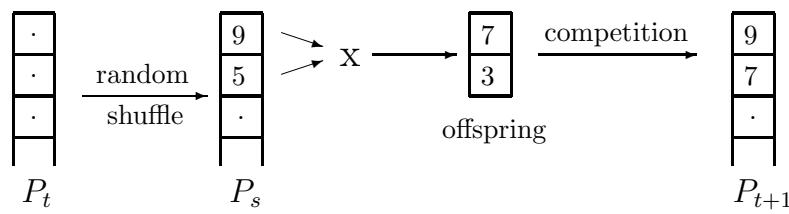  
Figure 2: Schematic representation of Elitist recombination

Deterministic crowding uses a local competition between parents and offspring [Mah92]. This selection scheme is quite similar to elitist recombination. The only difference is the way in which the local competition is set up. In order to get a competition two pairs are formed, each consisting of one parent and one offspring. These pairs are formed such that the similarity between the individuals in the pairs is maximized. For each pair a competition is held, and the winner is propagated to the next generation. Due to the similarity based matching of parent-offspring pairs, a too rapid duplication of well-performing individuals is prevented. Deterministic crowding is likely to converge slower than elitist recombination, but it is less sensitive to premature convergence.

Other selection schemes that use a local competition are parallel simulated annealing [MG92, MG95], and the Gene Invariant GA (GIGA) [Cul93].

# 3. Transmission models of selection schemes

We model the canonical genetic algorithm [Hol75], the generational genetic algorithm using tournament selection [Gol89], $( \mu , \lambda )$ and $( \mu + \lambda )$ selection [BHmS91, Rec94, Sch95], triplecompetition [vK97b], and elitist recombination [TG94]. Furthermore, the Breeder genetic algorithm [MSV94] and the CHC algorithm [Esh91] are discussed.

A selection scheme selects the parent pairs for generation $G _ { i + 1 }$ from the individuals in generation $G _ { i }$ . A detailed description of selection schemes can be found in section 2.

To describe the different models we use transmission functions. Altenberg gives the following short description [Alt94]:

“It is the relationship between the transmission function and the fitness function that determines GA performance. The transmission function “screens off” [Sal71, Bra90] the effect of the choice of representation and operators, in that either affect the dynamics of the GA only through their effect on the transmission function.”

The general form of transmission-selection recursion was used at least as early as 1970 by Slatkin [Sla70].

A transmission function describes the probability distribution of offspring from every possible pair of parents. For a binary genetic operator, the transmission function is of the form $T ( i \gets j , k )$ where $j$ and $k$ are the labels of the two parents and $i$ is the label of the offspring. To be more specific, let $\boldsymbol { S }$ be the search space; then $T : \mathcal { S } ^ { 3 }  [ 0 , 1 ]$ . We have $\begin{array} { r } { \sum _ { i } T ( i \gets j , k ) = 1 } \end{array}$ for all $j , k \in S$ , because $T ( i \gets j , k )$ represents a distribution for fixed $j$ and $k$ . For a symmetric operator we have additionally $T ( i \gets j , k ) = T ( i \gets k , j )$ .

Here, the transmission function model is used to model the selection schemes. The following notation is used. The distribution of the current population is denoted by $\vec { x }$ , and the newly generated population is denoted by $\vec { x ^ { \prime } }$ . In order based selection schemes, like tournament selection, it is the fitness-based rank in the population that determines the probability of being selected as a parent. The function $f r a c _ { < } ( j , \vec { x } )$ gives the fraction of individuals in distribution $\vec { x }$ that have a fitness strictly smaller than the fitness $f _ { j }$ of the individual labelled $j$ , let $f r a c _ { = } ( j , { \vec { x } } )$ be the function that yields the fraction of individuals that have a fitness equal to $f _ { j }$ , and let $f r a c _ { > } ( j , \vec { x } )$ be the function that yields the fraction of individuals that have a fitness strictly larger than $f _ { j }$ .

# 3.1 Canonical Genetic algorithm

The canonical genetic algorithm is a generational GA using fitness proportional selection. The dynamical system that describes a transition from a current population to a new population is given by [Alt94]:

$$
x _ { i } ^ { \prime } = \sum _ { j , k } T _ { o } ( i  j , k ) \frac { f _ { j } f _ { k } } { \bar { f } ^ { 2 } } x _ { j } x _ { k } ,
$$

where $x _ { i }$ is the frequency of the individual labelled $i$ , and $x _ { i } ^ { \prime }$ is its frequency during the next generation, $f _ { i }$ is the fitness of the individual labelled $i$ , $f$ is the average fitness, and $T _ { o }$ is the

transmission function describing the actual interaction between genetic operators and representation. The probability that a parent of type $j$ is selected is given by $x _ { j } f _ { j } / \bar { f }$ , so the probability that parents have labels $j$ and $k$ under a fitness proportional selection scheme is

$$
\frac { f _ { j } f _ { k } } { \bar { f } ^ { 2 } } x _ { j } x _ { k } .
$$

# 3.2 Deterministic $n$ -tournament selection

The only difference between the canonical genetic algorithm and the generational genetic algorithm with tournament selection is the method used to select the parent individuals. This results in

$$
x _ { i } ^ { \prime } = \sum _ { j , k } T _ { o } ( i  j , k ) P _ { t o u r } ^ { ( n ) } ( j , \vec { x } ) P _ { t o u r } ^ { ( n ) } ( k , \vec { x } ) ,
$$

where popula $P _ { t o u r } ^ { ( n ) } ( j , \vec { x } )$ describes tdistribution e probabilduring a y that an indivi-tournament. A al with label -tournament s $j$ is selected from aection is performed $\vec { x }$ $n$ $n$ by choosing $n$ individuals uniform at random from the population and selecting the one with the highest fitness. In case of a tie, the individual which was chosen first, wins. Given the distribution of the current population, the probability $P _ { t o u r } ^ { ( n ) } ( j , \vec { x } )$ is computed by following the choices that

$$
P _ { t o u r } ^ { ( n ) } ( j , \vec { x } ) = \sum _ { t = 1 } ^ { n } f r a c _ { < } ( j , \vec { x } ) ^ { t - 1 } x _ { j } ~ \left( f r a c _ { < } ( j , \vec { x } ) + f r a c _ { = } ( j , \vec { x } ) \right) ^ { n - t } .
$$

The $t ^ { t h }$ term of this sum is the probability that the first $( t - 1 )$ selected individuals have a fitness smaller than the individual with label $j$ , that the $t ^ { t h }$ individual has label $j$ , and that all subsequent $( n - t )$ individuals have a fitness smaller than or equal to the fitness of the individual with label $j$ . The sum over all possible values gives the probability that an individual with label $j$ wins the $n$ -tournament.

# 3.3 Evolution strategy $( \mu , \lambda )$ and BGA selection

When using $( \mu , \lambda )$ -selection, a parent population containing $\mu$ parents is used to generate $\lambda$ offspring. To generate an offspring, two parents are selected uniform at random from the parent population and recombination is applied. The best $\mu$ offspring are used as the parents for the next generation, so $\lambda \geq \mu$ .

First we introduce the truncation operator ${ \mathrm { I r } } : \mathbb { R } ^ { n } \times \mathbb { R } \to \mathbb { R } ^ { n }$ . This operator takes a distribution $\vec { p }$ and a parameter $\alpha \in [ 0 , 1 ]$ as inputs and returns a new distribution containing the $\alpha$ fraction of best individuals out of the original distribution. The operator selects a pivot individual $i$ such that $f r a c _ { < } ( i , \vec { p } ) < ( 1 - \alpha )$ and $( f r a c _ { < } ( i , \vec { p } ) + f r a c _ { = } ( i , \vec { p } ) ) \leq 1 - \alpha$ . If more than one value of $_ i$ satisfies these constraints, then an arbitrary choice among these $i$ is taken. The operator ${ \mathrm { T } } r ( { \vec { p } } , \alpha )$ is defined by:

$$
\begin{array} { r } { \mathrm { T r } ( \vec { p } , \alpha ) _ { j } = \left\{ \begin{array} { l l } { \frac { 1 } { \alpha } p _ { j } } & { f _ { j } > f _ { i } } \\ { \frac { 1 } { \alpha } \frac { \alpha - f r a c _ { > } ( i , \vec { p } ) } { f r a c _ { = } ( i , \vec { p } ) } } & { f _ { j } = f _ { i } } \\ { 0 } & { f _ { j } < f _ { i } } \end{array} \right. . } \end{array}
$$

Given this truncation operator the formula for the $( \mu , \lambda )$ -selection is:

$$
\vec { x ^ { \prime } } = \mathrm { T r } ( \vec { y } , \frac { \mu } { \lambda } ) ,
$$

where the elements of $\vec { y }$ are given by

$$
y _ { i } = \sum _ { j , k } T _ { o } ( i  j , k ) x _ { j } x _ { k } .
$$

The combination of the last two formulae gives the desired model.

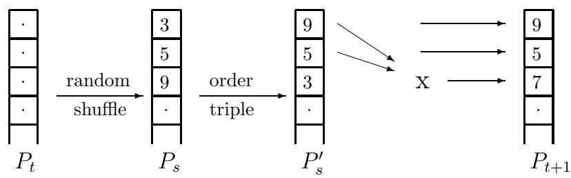  
Figure 3: Schematic representation of triple-competition

The Breeder Genetic Algorithm uses $T \%$ truncation selection, which means that the $T \%$ best individuals of the current population are allowed to reproduce. Out of these $T \%$ best individuals, the parents are selected uniform at random, and a new population is generated. Typically T is between 10 and 50. This selection scheme corresponds to the $( \mu , \lambda )$ -selection where $\mu = \lambda T / 1 0 0$ . When applying BGA the best individual found so far will always be retained.

3.4 Evolution strategy $( \mu + \lambda )$ and CHC selection

The $( \mu + \lambda )$ -selection scheme is quite similar to the $( \mu , \lambda )$ -selection scheme. The only difference is that in the $( \mu + \lambda )$ -selection scheme, the $\mu$ new parents are obtained by selecting the best $\mu$ individuals from both the $\mu$ parents and the $\lambda$ offspring:

$$
\vec { x ^ { \prime } } = \mathrm { T r } \left( \mathrm { B l } \left( \vec { x } , \vec { y } , \frac { \mu } { \mu + \lambda } \right) , \frac { \mu } { \mu + \lambda } \right) ,
$$

where $\mathrm { B l } ( \vec { x } _ { 1 } , \vec { x } _ { 2 } , \beta )$ computes a weighted average of vectors $\vec { x }$ and $\vec { y }$ :

$$
\mathrm { B l } ( \vec { x } _ { 1 } , \vec { x } _ { 2 } , \beta ) = \beta \vec { x } _ { 1 } + ( 1 - \beta ) \vec { x } _ { 2 } .
$$

The vector $\vec { y }$ is given by

$$
y _ { i } = \sum _ { j , k } T _ { o } ( i  j , k ) x _ { j } x _ { k } .
$$

The CHC algorithm uses unbiased selection of parents. Given a parent population of size $N$ , a set of $N$ offspring is produced. The next parent generation is obtained by selecting the $N$ best among the $N$ parents and their $N$ offspring. This selection scheme corresponds to $( \mu + \lambda )$ -selection, where $\mu = \lambda = N$ .

An additional feature of the CHC selection scheme is the so-called incest-prevention. CHC does incest prevention using the Hamming distance between the two parents. If the Hamming distance is below a certain threshold, then the pair of parents is not allowed to reproduce. Typically CHC starts with a threshold $L / 4$ , where $L$ is the length of the bit-string. We did not use this incest prevention scheme in our model because it requires knowledge about the Hamming-distances between the different types. However, for problems where this type of information is available the modelling of the incest prevention is relatively straightforward.

# 3.5 Triple-competition selection

The triple-competition selection is an elitist genetic algorithm that uses a tournament-like selection of the parents, and parents can be propagated to the next generation. Figure 3 shows how generation $P _ { t + 1 }$ is generated from generation $P _ { t }$ : a single box corresponds to an individual, a number in a box is its fitness, and a stack of such boxes corresponds to a population. The first step involves a random shuffle of the individuals in population $P _ { t }$ resulting in a randomly ordered population $P _ { s }$ . The population $P _ { s }$ is partitioned in sets of three individuals, and each triple is ordered such that the best individuals are on top in each triple, resulting in an intermediate population $P _ { s } ^ { \prime }$ . The two top-ranked individuals of each triple are allowed to recombine to generate a single offspring. Next, the two parents and their offspring are added to the population $P _ { t + 1 }$ , so only the lowest ranked individual of each triple is replaced. During a single step of this algorithm $N / 3$ offspring are generated, where $N$ is the size of the population. This algorithm is modelled as follows

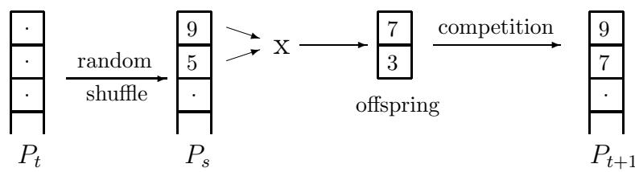  
Figure 4: Schematic representation of Elitist recombination

$$
x _ { i } ^ { \prime } = \frac { 1 } { 3 } \sum _ { j , k } T _ { o } ( i  j , k ) P ( j , k , \vec { x } ) + \frac { 2 } { 3 } \sum _ { k } P ( i , k , \vec { x } ) ,
$$

where the first sum corresponds to the distribution of the newly generated offspring, and the second sum corresponds to the distribution of the surviving parents. The distribution $\vec { x ^ { \prime } }$ of the new population consists for one third of newly generated offspring and for two third of surviving parents. The function $P ( j , k , { \vec { x } } )$ gives the probability that the individuals $j$ and $k$ are selected as parents, where the individual labelled $j$ is selected first. To compute this probability one differentiates between the cases ( $f _ { j } = f _ { k }$ ) and $f _ { j } \neq f _ { k }$ ), and for each of these two cases one distinguishes between the case that fitness of the third individual is smaller and the case that its fitness is equal to the fitness of the worst individual out of $j$ and $k$ .

$$
P ( j , k , \vec { x } ) = \left\{ \begin{array} { l l } { 3 \ ( f r a c _ { < } ( j , \vec { x } ) + f r a c _ { = } ( j , \vec { x } ) / 3 ) x _ { j } x _ { k } } & { \mathrm { i f ~ } ( f _ { j } = f _ { k } ) } \\ { 3 \ ( f r a c _ { < } ( \operatorname { S m } ( j , k ) , \vec { x } ) + f r a c _ { = } ( \operatorname { S m } ( j , k ) , \vec { x } ) / 2 ) x _ { j } x _ { k } } & { \mathrm { o t h e r w i s e } . } \end{array} \right.
$$

Here, the function $\operatorname { S m } ( j , k )$ selects the label corresponding to the individual having the smallest fitness of $j$ and $k$ . The factor 3 in both formulas corresponds to the number of possible orders of the three involved individuals given that $j$ is selected before $k$ .

Triple-competition selection as defined above uses elitism because the best individual is always transferred to the next generation. However, it is still possible that newly produced offspring has a lower fitness than the individual that is replaced by this new offspring.

# 3.6 Elitist recombination

Elitist recombination [TG94] selects parents by a random pairing of parent individuals. Figure 4 shows how the next population $P _ { t + 1 }$ is produced from the current population $P _ { t }$ . Just like in triplecompetition selection, a random shuffle is applied. The resulting population $P _ { s }$ is partitioned in a set of adjacent pairs, and for each pair the recombination operator is used to obtain two offspring. Next, a competition is held among the two offspring and their two parents, and the best two out of these four are propagated to the next population $P _ { t + 1 }$ . In Figure 4 one parent, having fitness 9, and one offspring, having fitness 7, are propagated to population $P _ { t + 1 }$ . When using elitist recombination it is possible, but not guaranteed that parents will survive, so parents are only preserved in the case that their fitness is larger than the fitness of the offspring. The dynamical system representing elitist recombination is:

$$
x _ { i } ^ { \prime } = \sum _ { j , k } T _ { e r } ( i  j , k ) x _ { j } x _ { k } .
$$

The selection of individuals that enter the next population is not visible in this model. This selection mechanism consists of a local competition between parents and their direct offspring, and therefore is located inside the transmission function $T _ { e r }$ . Outside the transmission function, it is not visible which parents were used.

Here, a generalization of elitist recombination that creates a fixed number of offspring $n \geq 2$ is modelled. The original definition of elitist recombination uses $n = 2$ . Creation of a number of offspring and accepting only the best few has been suggested by Altenberg [Alt94] under the name soft-brood selection. For the elitist recombination and its generalization a modified transmission function $T _ { e r } ( i \gets j , k )$ is used, because the selection of survivors is done by means of a local competition between parents and offspring. This in contrast to the usual selection mechanisms that operate on the complete population. Such a local selection scheme can be modelled by modifying the original transmission function $T _ { o } ( i \gets j , k )$ that describes the interaction between the operators and the representation used. Each column of the new transmission function $T _ { e r } ( i \gets j , k )$ can be computed independently. Assuming that we have $C$ different elements with labels in the range $0$ to $C - 1$ , then the transmission function $T _ { o } ( i \gets j , k )$ can be represented by a matrix having $C$ rows and $C ^ { 2 }$ columns. Let $\overrightarrow { t _ { o } ^ { j k } }$ denote the column with index $( j C + k )$ of the matrix $T _ { o } ( i \gets j , k )$ . This column represents the probability distribution of the offspring when applying recombination to parent of respectively type $j$ and type $k$ .

In the rest of this report the binomial distribution is denoted by $\mathrm { B i n } ( n , k , p )$ where $n$ is the total number of experiments, $k$ is the number of successful outcomes, and $p$ is the probability of a successful outcome.

The auxiliary function $P _ { a c c e p t } ( P _ { < } , P _ { = } , n , a )$ gives the probability that an offspring individual is accepted. Accepting an offspring means that the offspring is among the best two during the tournament between the two parents and their offspring. The parameters of $P _ { a c c e p t } ( P _ { < } , P _ { = } , n , a )$ are as follows: $P _ { < }$ is the proportion of offspring having smaller fitness than the individual under consideration, $P =$ is the proportion of offspring having equal fitness, $n$ is the number of additional offspring generated, and $a$ is the number of offspring that can be accepted apart from the current offspring. This function is computed by first considering the number of superior offspring followed by considering the number of offspring having equal fitness:

$$
\begin{array} { r l } & { P _ { a c c e p t } ( P _ { < } , P _ { = } , n , a ) = } \\ & { \qquad \sum _ { l = 0 } ^ { a } \mathrm { B i n } ( n , l , 1 - P _ { < } - P _ { = } ) \sum _ { m = 0 } ^ { n - l } \mathrm { B i n } \left( n - l , m , \frac { P _ { = } } { P _ { < } + P _ { = } } \right) \operatorname* { m i n } \{ 1 , \frac { a - l + 1 } { m + 1 } \} . } \end{array}
$$

Here, $l$ denotes the number of offspring having a fitness larger than the fitness of the individual under consideration, and $m$ denotes the number of offspring that have exactly the same fitness. The first binomial distribution gives the probability that $\it l$ out of the $n$ other offspring have a larger fitness than the current individual. The proportion of these individuals is $( 1 - P _ { < } - P _ { = } )$ . The second binomial distribution computes the probability that $m$ out of $n - \iota$ offspring have a fitness equal to the individual under consideration. At this point it is know that all $n - \iota$ offspring have a fitness lower than or equal to the fitness of the current individual; Therefore the proportion of offspring that have equal fitness is $P _ { = } / ( P _ { < } + P _ { = } )$ . Given the values of $\it l$ and $m$ , the probability that the current individual is accepted is equal to $\operatorname* { m i n } \{ 1 , ( a - l + 1 ) / ( m + 1 ) \}$ .

A column of the matrix describing $T _ { o } ( i \gets j , k )$ represents the probability density function over the space of all possible offspring $i$ for a given pair of parents $j$ and $k$ . The offspring can be divided among three sets. Assume that $f _ { k } \leq f _ { j }$ (otherwise exchange the roles of $j$ and $k$ ). We take

$$
\begin{array} { r c l } { { S _ { I } } } & { { = } } & { { \{ i \in { \cal S } : f _ { i } \geq f _ { j } \} , } } \\ { { S _ { I I } } } & { { = } } & { { \{ i \in { \cal S } : f _ { k } \leq f _ { i } < f _ { j } \} , } } \\ { { S _ { I I I } } } & { { = } } & { { \{ i \in { \cal S } : f _ { i } < f _ { k } \} . } } \end{array}
$$

Given a column $\overrightarrow { t _ { o } ^ { j k } }$ of $T _ { o } ( i \gets j , k )$ the corresponding column from $T _ { e r } ( i \gets j , k )$ is computed as follows. Let the unnormalized distribution of the offspring (i.e. we do not require that the sum of the probabilities equals one) be denoted by $\bar { o }$ , let the distribution of the surviving parents denoted by $\bar { s }$ , and let the probability that an offspring of type $i$ is obtained by recombination be denoted by $t _ { i } ^ { j k }$ . Now, the probability that the offspring is also accepted when applying elitist recombination with $n$ offspring for each pair of parents depends on whether offspring $i$ belongs to set $S _ { I }$ , $S _ { I I }$ , or $S _ { I I I }$ . If $i \in S _ { I }$ , then the offspring is accepted when at most one of the other offspring has a larger fitness,

$$
o _ { i } = t _ { i } ^ { j k } n P _ { a c c e p t } ( f r a c _ { < } ( i , \overrightarrow { t _ { o } ^ { j k } } ) , f r a c _ { = } ( i , \overrightarrow { t _ { o } ^ { j k } } ) , n - 1 , 1 ) ,
$$

where $f r a c _ { < } ( i , \overrightarrow { t _ { o } ^ { j k } } )$ is the fraction of individuals in the distribution $\overrightarrow { t _ { o } ^ { j k } }$ that have a lower fitness than an individual of type $i$ . If $i \in S _ { I I }$ , then the probability that the offspring is accepted depends on the number of offspring in $S _ { I }$ :

$$
\begin{array} { r l } & { o _ { i } = t _ { i } ^ { j k } n \sum _ { l = 0 } ^ { 1 } \mathrm { B i n } ( n - 1 , l , 1 - f _ { < } ( j , \overline { { t _ { o } ^ { j k } } } ) ) } \\ & { \qquad P _ { a c c e p t } \left( \frac { f r a c _ { < } ( i , \overline { { t _ { o } ^ { j k } } } ) } { f r a c _ { < } ( j , \overline { { t _ { o } ^ { j k } } } ) } , \frac { f r a c _ { = } ( i , \overline { { t _ { o } ^ { j k } } } ) } { f r a c _ { < } ( j , \overline { { t _ { o } ^ { j k } } } ) } , n - l - 1 , 0 \right) . } \end{array}
$$

Here $\it l$ denotes the number of other offspring located in $S _ { I }$ , the binomial distribution gives the probability of having $\it l$ offspring in this region, and $P _ { a c c e p t }$ computes the probability that the offspring of type $i$ is accepted given that $n - l - 1$ other offspring also have a fitness below $f _ { j }$ . At most one offspring from $S _ { I I }$ is selected. If $i \in S _ { I I I }$ , then $o _ { i } = 0$ because the individual $i$ is always rejected.

Now, the distribution of the offspring is known. Next, the distribution of the surviving parents, denoted by $\bar { s }$ , has to be computed. Parent $k$ is only retained when all offspring belong to $S _ { I I I }$ , so

$$
s _ { k } = \mathrm { B i n } ( n , n , f r a c _ { < } ( k , \overrightarrow { t _ { o } ^ { j k } } ) ) .
$$

Parent $j$ is retained when all offspring is in $S _ { I I } \cup S _ { I I I }$ or when one offspring is in $S _ { I }$ and the other offspring are in $S _ { I I I }$ . This probability is

$$
\begin{array} { r } { s _ { j } = \mathrm { B i n } ( n , n , f r a c _ { < } ( j , \overrightarrow { t _ { o } ^ { j k } } ) ) + \smallskip } \\ { \mathrm { B i n } ( n , n - 1 , f r a c _ { < } ( j , \overrightarrow { t _ { o } ^ { j k } } ) ) \ \mathrm { B i n } \left( n - 1 , n - 1 , \frac { f r a c _ { < } ( k , \overrightarrow { t _ { o } ^ { j k } } ) } { f r a c _ { < } ( j , \overrightarrow { t _ { o } ^ { j k } } ) } \right) . } \end{array}
$$

Here, the first term corresponds to the case that all offspring have a fitness lower than $f _ { j }$ , and the second term corresponds to the case that exactly one offspring has a fitness larger than or equal to $f _ { j }$ while all other offspring are located in region $S _ { I I I }$ . In that case the superior offspring replaces parent $k$ instead of parent $j$ .

The vector $\overrightarrow { o } + \overrightarrow { s }$ describes the unnormalized probability distribution of the two individuals that will be propagated to the next generation. Using these two vectors the column with index $j C + k$ of $T _ { e r } ( i \gets j , k )$ is given by the formula

$$
\overrightarrow { t _ { e r } ^ { j k } } = \frac { 1 } { 2 } ( \overrightarrow { o } + \overrightarrow { s } ) .
$$

By applying this procedure to every column of $T _ { o } ( i \gets j , k )$ the matrix representing $T _ { e r } ( i \gets j , k )$ is obtained.

# 4. Infinite population models

Given that a single application of the crossover operator produces one offspring, the transmission function model computes the expected distribution of this offspring given the distribution of the parents.

Based on the transmission function, the evolution of a genetic algorithm with an infinite population size can be modelled by iterated application of the transmission function. Let us denote a single application of the transmission function by means of the operator $\mathcal { F } : \boldsymbol { P }  \boldsymbol { P }$ . The initial population $G _ { 0 }$ is usually obtained by drawing a uniform random sample. Using a transmission function, the distribution after one step of the evolution is $G _ { 1 } = { \mathcal { F } } ( G _ { 0 } )$ , the distribution after two generations is $G _ { 2 } = \mathcal { F } ( G _ { 1 } ) = \mathcal { F } ( \mathcal { F } ( G _ { 0 } ) )$ , or more generally after $t$ generations is $G _ { t } = { \mathcal { F } } ^ { t } ( G _ { 0 } )$ , where the superscript $t$ denotes iterated application of the function.

Due to the law of large numbers the transmission function models the behaviour of a genetic algorithm with an infinite population size. To see this, let us assume that a population of size $N$ is used, and let $X _ { i } ^ { ( j ) }$ be equal to one if sample $_ i$ is of type $j$ , and zero otherwise. The strong law of large numbers states that if $X _ { 1 } , X _ { 2 } , \ldots$ are independent identically distributed random variables and $\mathbf { E } X _ { i } = \mu$ , where $\mu$ is the probability of an individual of type $i$ in the offspring distribution, then

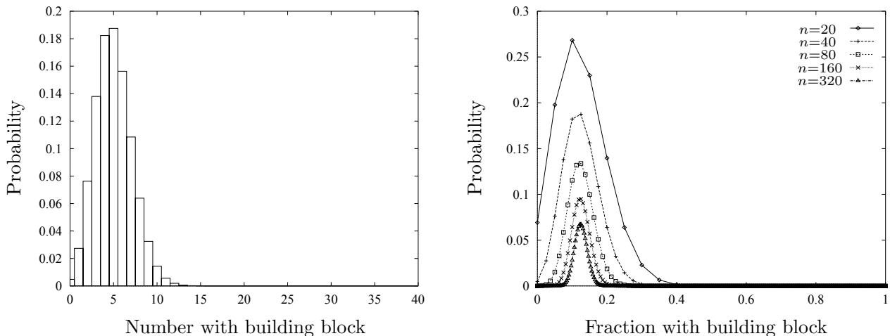  
Figure 5: The probability distribution describing the number of individuals in the population containing the optimal building block for $d = 3$ and $n = 4 0$ (left) and the fraction of individuals containing the optimal building block for $d = 3$ , and $n = 2 0 , 4 0 , 8 0 , 1 6 0 , 3 2 0$ (right)

$$
{ \frac { 1 } { n } } \sum _ { i = 1 } ^ { n } X _ { i } \to \mu { \mathrm { ~ a l m o s t ~ s u r e l y , ~ w h e n ~ } } n \to \infty .
$$

Hence, the proportion of individuals of type $j$ converges to the proportion predicted by the distribution when $n  \infty$ , and the actual distribution of an infinitely large offspring population corresponds to the distribution predicted by the transmission function model.

# 5. Equivalence classes

Next, the transmission function models are used to trace the evolution of genetic algorithms. Tracing the evolution of requires a lot of computation. A single application of the transmission function involves $| S | ^ { 3 }$ computational steps, where $| S |$ denotes the cardinality of the set $\boldsymbol { S }$ . When tracing the evolution for a specific problem more efficient methods can sometimes be obtained by mapping the original search space $\boldsymbol { S }$ to a more compact space $\nu$ where each element of $\nu$ represents an equivalence class containing elements from $\boldsymbol { S }$ . Next, the transmission function is lifted to the space of equivalence classes $\nu$ , and the transmission function model is applied to $\nu$ instead of $\boldsymbol { S }$ . Equivalence classes should satisfy the following two conditions:

(1) all elements of an equivalence class have the same fitness, and (2) the distribution over the elements of an equivalence class is known and constant.

The first condition is necessary because then all individuals in a single equivalence class behave identical under selection. The second condition is necessary because then the distribution in the original space $\boldsymbol { S }$ can be reconstructed solely based on knowledge of the distribution in $\nu$ .

Srinivas et al. [SP93] used such an equivalence-class approach to model GA’s with infinite populations. Their approach assumes that the optimization problem for the GA is a single function of unitation. If the size of a string from the search space $\boldsymbol { S }$ is $\it l$ bits, then $\boldsymbol { S }$ can be modelled by means of $( l + 1 )$ equivalence classes. The operation of an infinite population GA can be modelled exact by means of what they call a Binomially Distributed Population. The time complexity of algorithm derived from this model is $O ( l ^ { 3 } )$ , a significant improvement over previous models with exponential time complexities [SP93].

If the search space is divided over the equivalence classes based on the number of one-bits, then all details with respect to the distribution of one-bits are ignored; In fact, within an equivalence class all loci are assumed to have the same probability of containing a one-bit. This is not a limitation when tracing a genetic algorithm with an infinite population, and even for genetic algorithms with a small population this holds when the results are averaged over a large number of runs, because all bits within a part behave identical. However, within a single run the probability of finding a one-bit at a specific locus can easily deviate from the expected probability due to genetic drift. Because this type of deviation is ignored when using the equivalence-classes, the model actually considers a genetic algorithm without genetic drift.

In the rest of this report a problem that consist of a concatenation of functions of unitation is studied. Assuming that the problem consist of a concatenation of $n$ functions of unitation, where subfunction $i$ has a length of $l _ { i }$ bits, the total length is $\begin{array} { r } { l = \sum _ { i = 1 } ^ { n } l _ { i } } \end{array}$ .

The space $\nu$ has cardinality $\begin{array} { r } { | \mathcal { V } | = \prod _ { j = 1 } ^ { n } ( l _ { i } + 1 ) } \end{array}$ . A mapping from $\boldsymbol { S }$ into $\nu$ is

$$
F : { \mathcal { S } } \to { \mathcal { V } } = \sum _ { i = 1 } ^ { n } u _ { i } \prod _ { j = 1 } ^ { i - 1 } ( l _ { j } + 1 ) ,
$$

where $u _ { i }$ is the number of one-bits in part $i$ and $l _ { i }$ is the maximal number of one-bits in part $i$ . Given an element $v \in \nu$ the number of one-bits in part $k$ is

$$
\alpha ( v , k ) = \frac { v } { \prod _ { i = 1 } ^ { k - 1 } ( l _ { i } + 1 ) } \mathrm { m o d } ( l _ { k } + 1 ) .
$$

When using a random initial population the distribution over $\nu$ is

$$
P ( v ) = \frac { 1 } { | S | } \prod _ { j = 1 } ^ { n } \left( \begin{array} { c } { { l _ { j } } } \\ { { \alpha ( v , j ) } } \end{array} \right) .
$$

If we apply uniform crossover to two parents that contain respectively $j$ and $k$ one-bits, then the probability that the offspring contains $i$ one-bits is given by the recursive formula

$$
\begin{array} { r l } { p ( j , k , i , l ) = } & { ( 1 - \frac { j } { l } ) ( 1 - \frac { k } { l } ) \quad p ( j , k , i , l - 1 ) + } \\ & { \qquad ( 1 - \frac { j } { l } ) \frac { k } { l } \frac { 1 } { 2 } \quad ( p ( j , k - 1 , i , l - 1 ) + p ( j , k - 1 , i - 1 , l - 1 ) ) + } \\ & { \qquad \frac { j } { l } ( 1 - \frac { k } { l } ) \frac { 1 } { 2 } \quad ( p ( j - 1 , k , i , l - 1 ) + p ( j - 1 , k , i - 1 , l - 1 ) ) + } \\ & { \qquad \frac { j } { l } \frac { k } { l } \quad p ( j - 1 , k - 1 , i - 1 , l - 1 ) , } \end{array}
$$

where $p ( j , k , i , n )$ represents the probability that an offspring string with $_ i$ one-bits is obtained from two parent string having respectively $j$ and $k$ one-bits, and $\it l$ is the number of bits in this subfunction. The boundary conditions are $p ( 1 , 1 , 1 , 1 ) \ = p ( 0 , 0 , 0 , 1 ) \ = \ 1$ , $p ( 1 , 0 , 1 , 1 ) \ = p ( 0 , 1 , 1 , 1 ) \ =$ $p ( 1 , 0 , 0 , 1 ) \ = p ( 0 , 1 , 0 , 1 ) \ = \ { \frac { 1 } { 2 } }$ , $p ( 0 , 0 , 1 , 1 ) = p ( 1 , 1 , 0 , 1 ) = 0$ , if $j < 0$ , $k < 0$ , or $i < 0$ , then $p ( j , k , i , n ) \ = 0$ , and due to the symmetry of the uniform crossover $p ( j , k , i , n ) \ = p ( k , j , i , n )$ .

The transmission function $T ( i \gets j , k )$ can be represented by a $( n \times n ^ { 2 } )$ -matrix of transmission probabilities where $n$ denotes the cardinality of $| \nu |$ . Because the different partitions evolve independently under uniform crossover the probability of an outcome is given by the product of the probabilities for each of the parts, which results in

$$
{ \cal T } _ { o } [ i , j \cdot k ] = \prod _ { m = 1 } ^ { n } p ( \alpha ( i , m ) , \alpha ( j , m ) , \alpha ( k , m ) , l _ { m } ) .
$$

# 6. Cross-competition problem

Given a problem that contains building blocks, the compatible building blocks can be involved in a cross-competition in order to get more copies in the population. Cross-competition between building blocks can strongly influence the reliability of a GA.

In order to study this kind of effects we use a mixture of an oneMax function of length $\it l$ and a deceptive trap function of length $d$ [Gol89], so a single individual is represented by a string of length $( l + d )$ bits. The bits are partitioned in two sets $O$ and $D$ . The first partition is the oneMax part. The fitness contribution of this partition is $f _ { O } ( b ) = u _ { O } ( b )$ , where $u _ { O } ( b )$ is a function of unitation. This function counts the number of one-bits in the partition $O$ of string $b$ . The fitness of the deceptive part is given by the formula,

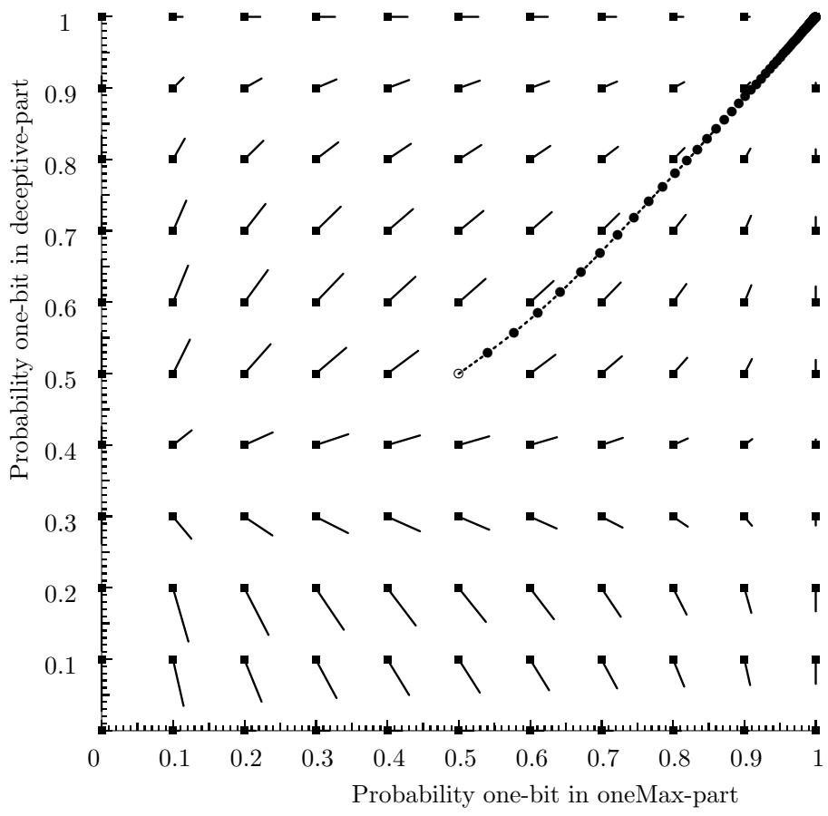  
Figure 6: Tracing one evolutionary step for the canonical genetic algorithm

$$
f _ { D } ( b ) = \left\{ \begin{array} { l l } { \alpha d } & { \mathrm { i f } ~ u _ { D } ( b ) = 0 } \\ { u _ { D } ( b ) } & { \mathrm { o t h e r w i s e } } \end{array} \right.
$$

where $\alpha > 1$ . The global optimum of the deceptive part contains only 0-bits, which results in a fitness contribution of $\alpha d$ .

The fitness of a string is determined by the sum of the fitness values of the two partitions $\mathit { \Pi } ^ { \prime } f = f _ { O } + f _ { D } ,$ ). The global optimal solution contains one-bits in the partition $O$ and 0-bits in partition $D$ and has a fitness of $l + \alpha d$ . The second best solution is given by the string containing one-bits only that has fitness $l + d$ .

The actual linkage of the bits of the different partitions is unknown, so the loci occupied by the two partitions can be spread over the bit-string. Problem instances of the defined problem class contain one building block of order $d$ , which is represented by the optimal schema for partition $D$ .

This problem has been designed to compare the mixing capabilities of different genetic algorithms when confronted with a problem containing one large building block, and a set of bits that can be optimized independently of each other. The cross-competition between the building block and the bits in partition $O$ is investigated.

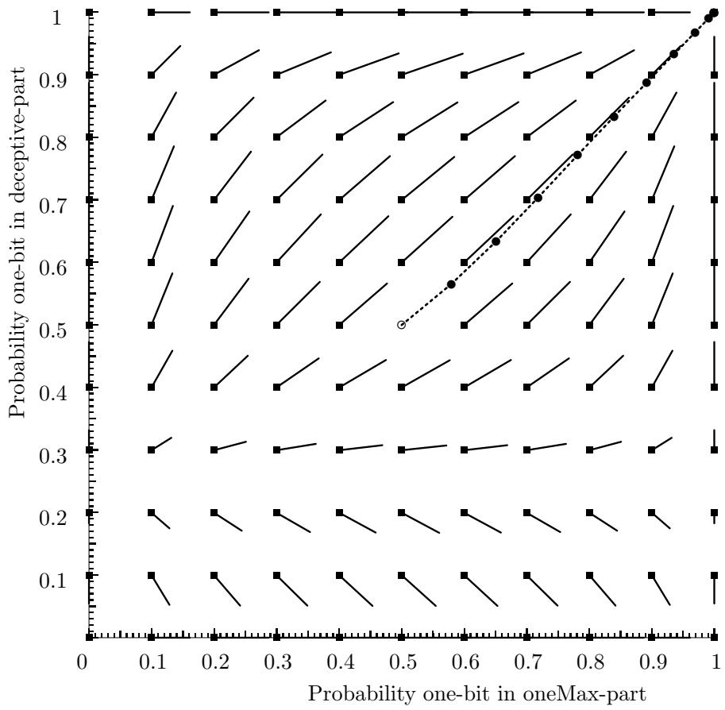  
Figure 7: Tracing one evolutionary step for the generational genetic algorithm with tournament selection

# 7. Population flow diagrams

Here, the models described in section 3 are used to study the behaviour of a genetic algorithm when optimizing the cross-competition problem described in section 6. We use a problem instance with $l = 6$ , $d = 6$ , and $\alpha = 1 . 5$ .

To study the behaviour of the transmission function models population flow diagrams are introduced. Let us assume that the population represented by distribution $\vec { g } _ { t }$ is transmitted to distribution $\vec { g } _ { t + 1 }$ after a single step of evolution. A population flow diagram contains a lowdimensional mapping of the space with all possible populations as its elements. Within a flow diagram a population is represented by a point. Many populations map to the same point. However, given a point one can construct the most typical population corresponding to this point. This population is determined by computing the distribution with the highest probability that adheres to the restrictions imposed by $p _ { o }$ and $p _ { d }$ . In case of the equivalence class model, a distribution is represented by a vector with $( n _ { o } \cdot n _ { d } )$ elements, where $n _ { o }$ and $n _ { d }$ correspond to the total number of loci in the given partition. The probability-density assigned to the class labelled $( k _ { o } , k _ { d } )$ is given by

$$
f ( k _ { o } , k _ { d } ) = \mathrm { B i n } ( n _ { o } , k _ { o } , p _ { o } ) \mathrm { B i n } ( n _ { d } , k _ { d } , p _ { d } ) ,
$$

where $k _ { o }$ and $k _ { d }$ correspond to the number of one-bits for the corresponding part.

At each point a flow can be computed. To do so, one constructs the typical population by computing the corresponding distribution with the largest probability. This corresponds to a uniform distribution under the restrictions imposed by $p _ { o }$ and $p _ { d }$ . Let us denote this population by $\vec { g } _ { 0 }$ . Next, the corresponding point $\vec { g } _ { 1 }$ is computed by means of the finite population model. A flow is now represented by a square at $\vec { g } _ { 0 }$ and a line connecting $\vec { g } _ { 0 }$ and $\vec { g } _ { 1 }$ . Note, that this flow corresponds to the transition made by a typical population where the proportion of individuals in a class is determined by the $( k _ { o } , k _ { d } )$ .

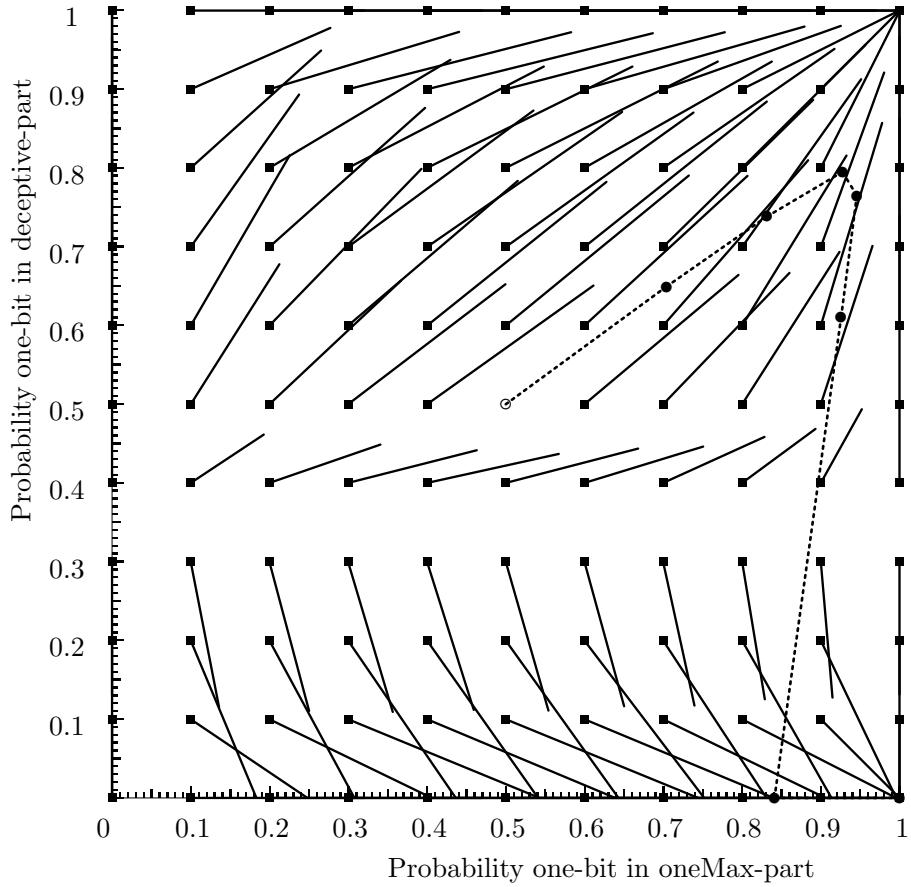  
Figure 8: Tracing one evolutionary step for $( \mu , \lambda )$ -selection (BGA)

Figure 6 shows a flow diagram for the application of the canonical GA to the cross-competition problem. Along the horizontal axis the probability of having a one-bit in the oneMax-part is given, and along the vertical axis the probability of a one-bit in the deceptive part is given. The population containing optimal individuals only corresponds to the point (1, 0), which is the right-bottom corner of the diagram.

The most typical distribution $\vec { g } _ { 0 }$ is computed for 121 different points. The corresponding $\vec { g } _ { 1 }$ is obtained by applying a transmission function model.

A uniform initial distribution corresponds to the coordinate (0.5, 0.5). The diagram contains a trace of evolution as computed by the infinite population model, denoted by the dotted line. The $n ^ { t h }$ bullet on the line is the point corresponding to the population after $n$ steps of evolution.

The results for the canonical GA are shown in Figure 6. Given a uniform initial distribution the trace converges relatively slowly to the suboptimal solution. The convergence slows down as the distribution gets closer to the fixed-point. This could be expected because the relative fitness differences in the population get smaller. Convergence to the optimal solution can be obtained with a $p _ { d }$ below 0.4. When using a small population the initial population can deviate from the uniform distribution, and there is a chance that convergence to the optimum is obtained. The canonical GA closely follows the directions predicted by the flows in the plot.

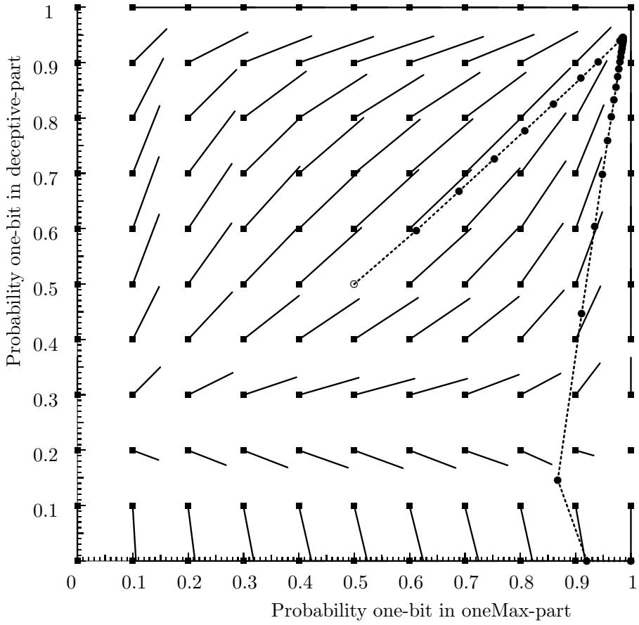  
Figure 9: Tracing one evolutionary step for $( \mu + \lambda )$ -selection (CHC)

Figure 7 shows the results for the generational genetic algorithm with tournament selection. This GA converges faster than the canonical GA. This GA also closely follows the flow as given in the diagram. To get convergence to the optimal solution, $p _ { d }$ has to drop below 0.3. The probability that an initial population is in the region where convergence to the optimum is obtained, is even smaller than in case of the generational genetic algorithm with fitness proportional selection.

Figure 8 shows the results for $( \mu , \lambda )$ -selection. This selection scheme has a high selective pressure, resulting in large steps being taken. The $( \mu , \lambda )$ -selection initially converges to the suboptimal solution, but after three steps of evolution the trace changes direction. Next, $p _ { d }$ drops fast to the optimal value of zero while $p _ { o }$ decreases slightly. Here the cross-competition is clearly present. Recall that the flows predict the direction for a relatively uniform distribution. The strong selective pressure of this selection results in correlations between loci, and therefore in populations that are far from uniform. To get optimal building blocks in the deceptive part, the average fitness of the oneMax part is decreased. Once the deceptive part has converged to the line where $p _ { d } = 0$ , the oneMax part starts to converge again. After seven steps of evolution almost the complete population consists of optimal strings. However, recall that the $( \mu , \lambda )$ -selection uses seven times as much offspring during a single generation as the generational GA’s. After three steps of evolution the population is moved to (9.2, 7.9) under $( \mu , \lambda )$ -selection. A uniform distribution with these parameters would converge to the suboptimal solution. However, the distribution of this population does not have to be uniform when applying selection. The population flow diagrams are two-dimensional mappings, while the actual model corresponds to a computation over a high-dimensional space. When using a high selective pressure non-uniform distributions can be

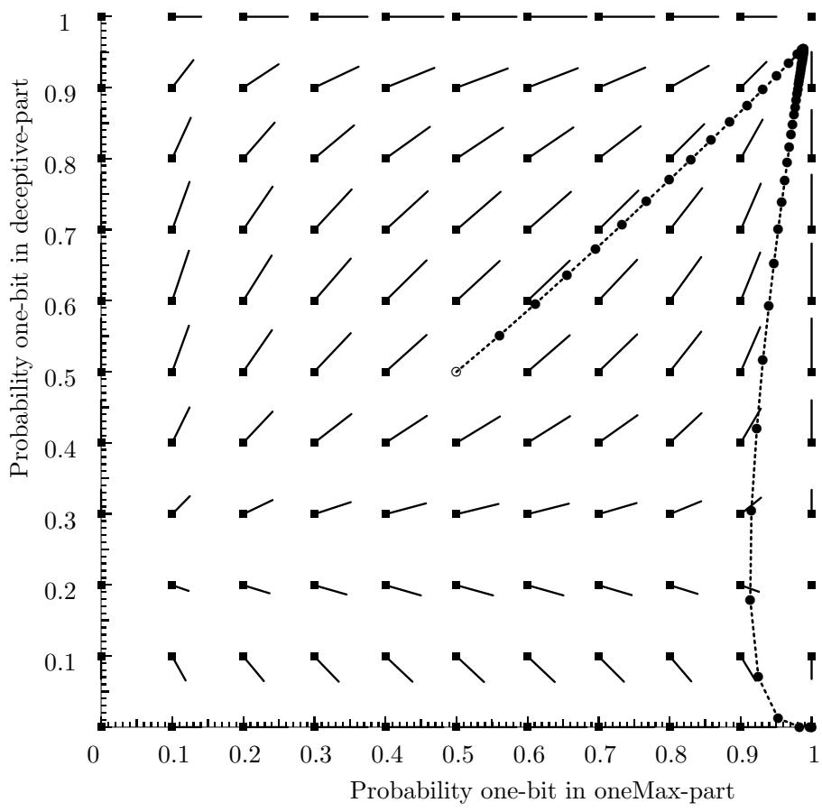  
Figure 10: Tracing one evolutionary step for triple-competition

obtained after a few generations.

Figure 9 show the results for $( \mu + \lambda )$ -selection. This selection scheme initially convergence to the suboptimum too, but after some steps the trace bends and moves towards the optimal solution. The $( \mu + \lambda )$ -selection converges more slowly than the $( \mu , \lambda )$ -selection.

The results for triple-competition, shown in Figure 10, are roughly the same as for $( \mu + \lambda )$ selection.

Figure 11 shows the results for Elitist recombination. Again an initial convergence to the suboptimal solution is observed, but later the trace moves slowly towards the optimal point. Elitist recombination converges slowly, because it is difficult for an optimal individual to generate copies of itself.

Figure 12 shows the probability of obtaining an optimal solution, when generating a single offspring according to the distribution given by a point in the flow diagram. The probability that an individual drawn uniformly at random from the initial population is the optimal solution is approximately $2 . 4 \cdot 1 0 ^ { - 4 }$ .

Figure 13 shows a comparison of the different selection schemes by observing the evolution of the proportion of optimal solutions as a function of number of generations (top), and as a function of the equivalent number of function evaluations (bottom). The equivalent number of function evaluations is computed by scaling the number of generations proportional to the number of function evaluations used per generation. In most selection schemes the number of function evaluations is proportional to the population size. The only two exceptions are the $( \mu , \lambda )$ -selection, that uses $7 N$ evaluations per generation, and triple-competition, that uses $N / 3$ evaluation per generation, where $N$ is the population size. The canonical genetic algorithm and the generational genetic algorithm with tournament selection are hardly visible in this plot, because these two methods do not converge to the optimal solution. In the upper plot the $( \mu , \lambda )$ -selection converges very fast. It is followed in sequence by $( \mu + \lambda )$ -selection, triple-competition, and elitist recombination. The bottom plot shows the number of equivalent function evaluations. Here, the triple-competition converges fastest, followed in sequence by $( \mu + \lambda )$ -selection, $( \mu , \lambda )$ -selection, and elitist recombination. The shapes of the curves of $( \mu + \lambda )$ -selection, $( \mu , \lambda )$ -selection, and triple-competition are basically the same. Initially, after a small proportion of optimal individuals is detected, a rapid convergence to a population consisting of only optimal individuals is observed. So, once an individual is detected that significantly outperforms all other individuals in the population, copies of this individual rapidly fill the complete population. The shape of the curve for elitist recombination is quite different. It moves only slowly upward. This is a result of the direct competition between parents and their offspring. As a result of this competition, it is difficult for an individual to create many duplicates, because a well-performing offspring is likely to replace the parent, and therefore does not result in an increase of the number of copies of this parent.

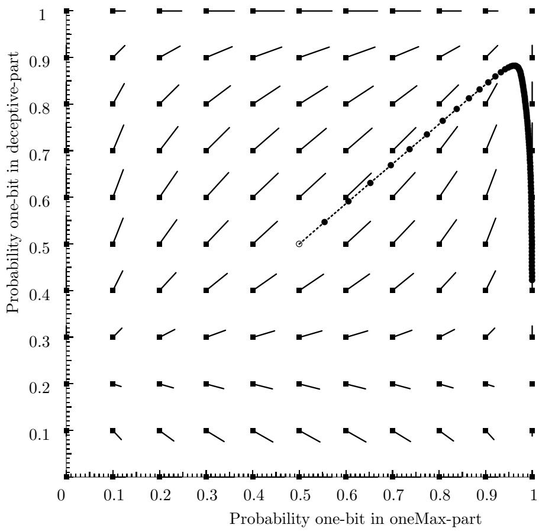  
Figure 11: Tracing one evolutionary step for elitist recombination

# 8. Conclusions

Transmission function models have been given for the canonical genetic algorithm, the generational genetic algorithm with tournament selection, the $( \mu , \lambda )$ -selection, the $( \mu + \lambda )$ -selection, triple-competition, and elitist recombination. We showed how these models can be used to trace the evolution of a genetic algorithm with an infinite population size. We discussed under what conditions such models can be traced more efficiently by means of a problem definition in terms of equivalence classes, and we presented a formulation in terms of equivalence classes for problems consisting of a concatenation of functions of unitation. Implementations of the models for a problem consisting of two functions of unitation were given. The results of tracing the models were visualized by means of population flow diagrams. Using these diagrams, it is possible to see which selection schemes are able to locate the optimum reliably. These population flow diagrams were also used to visualize the run of the infinite population genetic algorithms with the different selection schemes. For three models, i.e. the $( \mu , \lambda )$ -selection, the $( \mu + \lambda )$ -selection, and triple-competition, a cross-competition between the two parts of the problem was observed.

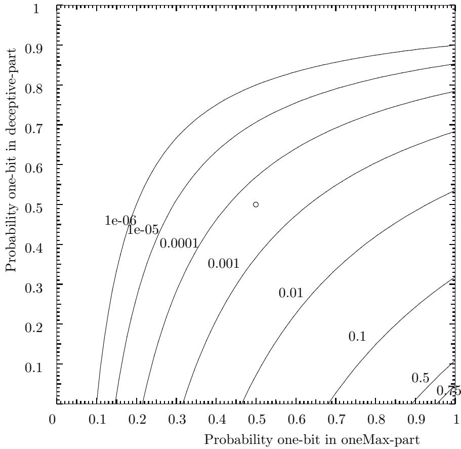  
Figure 12: Equi-probability lines showing the chance that an optimal individual is obtained when drawing a random individual according to the distribution corresponding to the given points.

# Список литературы

[Alt94] L. Altenberg. The evolution of evolvability in genetic programming. In Kenneth E. Kinnear, Jr., editor, Advances in Genetic programming, chapter 3, pages 47–74. M.I.T. Press, 1994.   
[Bak87] J.E. Baker. Reducing bias and inefficiency in the selection algorithm. In J.J. Grefenstette, editor, Proceedings of the 2nd International Conference on Genetic Algorithms and Their Applications, pages 14–21. Lawrence Erlbaum Associates, 1987.   
[BHmS91] T. B¨ack, F. Hoffmeister, and H.-P. Schwefel. A survey of evolution strategies. In R.K. Belew and L.B. Booker, editors, Proceedings of the 4th International Conference on Genetic Algorithms, pages 2–9. Morgan Kaufmann, 1991.   
[BKdGK97] Th. B¨ack, J.N. Kok, J.M. de Graaf, and W.A. Kosters. Theory of genetic algorithms. Bulletin of the EATCS, 63:161–192, 1997.   
[Bra90] R.N. Brandon. Adaption and Environment. Princeton University Press, 1990.   
[Bri81] A. Brindle. Genetic algorithms for function optimization. Doctoral dissertation, University of Alberta, Department of computer science, 1981. Technical Report TR81-2.   
[Cul93] J. Culberson. Crossover versus mutation: fueling the debate: TGA versus GIGA. In Forrest [For93], page 632.   
[Esh91] L.J. Eshelman. The CHC adaptive search algorithm: How to have safe search when engaging in nontraditional genetic recombination. In G. Rawlins, editor, Foundations of Genetic Algorithms, pages 265–283. Morgan Kaufmann, 1991.   
[For93] S. Forrest, editor. Proceedings of the 5th International Conference on Genetic Algorithms. Morgan Kaufmann, 1993.   
[Gol89] D.E. Goldberg. Genetic Algorithms in Search, Optimization, and Machine Learning. Addison-Wesley, 1989.   
[Hol75] J.H. Holland. Adaptation in natural and artificial systems: an introductory analysis with applications to biology, control, and artificial intelligence. The University of Michigan Press/Longman Canada, 1975.   
[KF95] J.N. Kok and P. Flor´een. Tracing the behavior of genetic algorithms using expected values of bit and walsh products. In S. Forrest, editor, Proceedings of the 6th International Conference on Genetic Algorithms, pages 201–208. Morgan Kaufmann, 1995.   
[KKPT98] C.H.M. Van Kemenade, J.N. Kok, J.A. La Poutr´e, and D. Thierens. Function models of finite population genetic algorithms. Technical Report SEN-R98xx, CWI, Amsterdam, 1998.   
[Mah92] S.W. Mahfoud. Crowding and preselection revisited. In M¨anner and Manderick [MM92], pages 27–36.   
[MG92] S.W. Mahfoud and D.E. Goldberg. A genetic algorithm for parallel simulated annealing. In M¨anner and Manderick [MM92], pages 301–310.   
[MG95] S.W. Mahfoud and D.E. Goldberg. Parallel recombinative simulated annealing: a genetic algorithm. Parallel computing, 21:1–28, 1995.   
[MM92] R. M¨anner and B. Manderick, editors. Proceedings of the 2nd Conference on Parallel Problem Solving from Nature, 2. North-Holland, 1992.   
[MSV94] H. M¨uhlenbein and D. Schlierkamp-Voosen. Predictive models for the breeder genetic algorithm. Journal of Evolutionary Computation, 1(1):25–49, 1994.   
[Rec94] I. Rechenberg. Evolutionsstrategie ’94. Frommann-Holzboog, 1994.   
[Rud94] G. Rudolph. Convergence analysis of canonical genetic algorithms. IEEE Transactions on Neural Networks, 5(1):96–101, 1994.   
[Rud96] G. Rudolph. Convergence of evolutionary algorithms in general search spaces. In Proceedings of the 3rd IEEE Conference on Evolutionary Computation, pages 50–54. IEEE Press, 1996.   
[Sal71] W.C. Salmon. Statistical Explanation and Statistical Relevance. University of Pittsburgh Press, 1971.   
[Sch89] J.D. Schaffer, editor. Proceedings of the 3rd International Conference on Genetic Algorithms. Morgan Kaufmann, 1989.   
[Sch95] H.-P. Schwefel. Evolution and Optimum Seeking. Sixth-Generation Computer Technology Series. Wiley, New York, 1995.   
[Sla70] M. Slatkin. Selection and polygenic characters. In Proceedings of the National Academy of Science U.S.A. 66, pages 87–93, 1970.   
[SP93] M. Srinivas and L.M. Patnaik. Binomially distributed populations for modelling gas. In Forrest [For93], pages 138–145.   
[Sys89] G. Syswerda. Uniform crossover in genetic algorithms. In Schaffer [Sch89], pages 2–9.   
[TG94] D. Thierens and D.E. Goldberg. Elitist recombination: an integrated selection recombination GA. In Proceedings of the First IEEE Conference on Evolutionary Computation, pages 508–512. IEEE Press, 1994.   
[vK97a] C.H.M. van Kemenade. Cross-competition between building blocks, propagating information to subsequent generations. In Th. B¨ack, editor, Proceedings of the 7th International Conference on Genetic Algorithms, pages 1–8. Morgan Kaufmann, 1997.   
[vK97b] C.H.M. van Kemenade. Modeling elitist genetic algorithms with a finite population. In Proceedings of the Third Nordic Workshop on Genetic Algorithms, pages 1–10, 1997.   
[vKKE95] C.H.M. van Kemenade, J.N. Kok, and A.E. Eiben. Controlling the convergence of genetic algorithms by tuning the disruptiveness of recombination operators. In Proceedings of the 2nd IEEE Conference on Evolutionary Computation, pages 345–351. IEEE Press, 1995.   
[Whi89] D. Whitley. The GENITOR algorithm and selective pressure. In Schaffer [Sch89], pages 116–121.   
[Whi93] D. Whitley. An executable model of a simple genetic algorithm. In G. Rawlins, editor, Foundations of Genetic Algorithms-2, pages 45–62. Morgan Kaufmann, 1993.   
[WS90] D. Whitley and T. Starkweather. GENITOR II: A distributed genetic algorithm. Journal of Experimental and Theoretical Artificial Intelligence, 2:189–214, 1990.

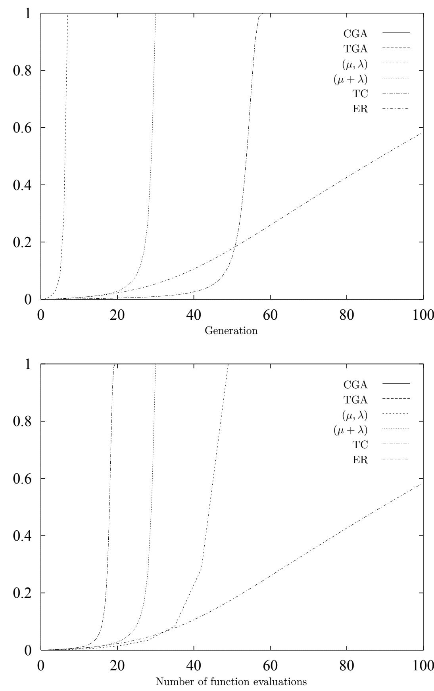  
Figure 13: Comparison of the proportion of optimal solutions as a function of the number of generations (top), and as a function of the number of function evaluations (bottom) for the different selection schemes